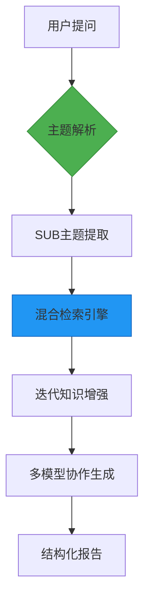

# Deep Researcher Dify工作流复现方案

![U<?xml version="1.0" encoding="UTF-8" standalone="no"?>
<!-- Created with Inkscape (http://www.inkscape.org/) -->

<svg
   version="1.1"
   id="svg2"
   width="1344"
   height="816"
   viewBox="0 0 1344 816"
   xmlns:xlink="http://www.w3.org/1999/xlink"
   xmlns="http://www.w3.org/2000/svg"
   xmlns:svg="http://www.w3.org/2000/svg">
  <defs
     id="defs6">
    <clipPath
       clipPathUnits="userSpaceOnUse"
       id="clipPath16">
      <path
         d="M 0,0 H 4200 V 2550 H 0 Z"
         clip-rule="evenodd"
         id="path14" />
    </clipPath>
    <clipPath
       clipPathUnits="userSpaceOnUse"
       id="clipPath28">
      <path
         d="M 0,0 H 4200 V 2550 H 0 Z"
         id="path26" />
    </clipPath>
    <clipPath
       clipPathUnits="userSpaceOnUse"
       id="clipPath34">
      <path
         d="M 0,0 H 4200 V 2550 H 0 Z"
         id="path32" />
    </clipPath>
    <clipPath
       clipPathUnits="userSpaceOnUse"
       id="clipPath40">
      <path
         d="M 0,0 H 4200 V 2550 H 0 Z"
         id="path38" />
    </clipPath>
    <clipPath
       clipPathUnits="userSpaceOnUse"
       id="clipPath46">
      <path
         d="M 4200,0 H 0 v 180 c 0,-5.30434 1.0149393,-10.4068 3.0448182,-15.30737 2.0298788,-4.90056 4.920182,-9.2262 8.6709098,-12.97692 3.750727,-3.75073 8.076371,-6.64103 12.976931,-8.67091 C 29.593222,141.01494 34.695667,140 40,140 h 4120 c 5.3042,0 10.4063,1.01494 15.3071,3.0448 4.9004,2.02988 9.2261,4.92018 12.9771,8.67091 3.7505,3.75072 6.6406,8.07636 8.6709,12.97692 2.0298,4.90057 3.0444,10.00303 3.0449,15.30737 z"
         clip-rule="evenodd"
         id="path44" />
    </clipPath>
    <clipPath
       clipPathUnits="userSpaceOnUse"
       id="clipPath52">
      <path
         d="M -4,136 H 4204 V 2554 H -4 Z"
         id="path50" />
    </clipPath>
    <mask
       maskUnits="userSpaceOnUse"
       x="0"
       y="0"
       width="1"
       height="1"
       id="mask54">
      <g
         id="g62">
        <g
           clip-path="url(#clipPath52)"
           opacity="0.0314"
           id="g60">
          <g
             transform="matrix(4208,0,0,-2418,-4,2554)"
             id="g58">
            <image
               width="1"
               height="1"
               style="image-rendering:optimizeSpeed"
               preserveAspectRatio="none"
               transform="matrix(1,0,0,-1,0,1)"
               xlink:href="data:image/png;base64,iVBORw0KGgoAAAANSUhEUgAAEHAAAAlyCAYAAACwRtRYAAAABHNCSVQICAgIfAhkiAAAIABJREFUeJzs3Nl25MaBrtEfc87JqViTenjUftq+6WVLVSqKzAk4Fz4JJ2lKZTdUlqXee61YQAKIACIf4CuSDPmGuq5L3/fjuFQUxavXziNJTqdTkqQsy/H6MAzjAAAAAAAAAAAAAAAAAAAAAP4YLpsD567AuUtQVVWS/GxzoCzLV6+dx263+6bfXn/T1ZPs9/skeXWT50jDS+frl3/sawGH19YFAAAAAAAAAAAAAAAAAAAAfn9etgZetgXO187Hn5t/Dj4kyel0evb7W/rmAYfXNl2WZaqq+mqo4Tz/XLN4ef3n1gcAAAAAAAAAAAAAAAAAAAB+Xy4bBEnGgEPf9+n7/tXr5/NhGFJV1dgguIw2/LO6BEWSb/qmqqqS/HVD5xjDOchweTyHHS7vv5xTluXfrAcAAAAAAAAAAAAAAAAAAAD8vp2jC+fWwDnccB5JngUdTqfTeH4ZdHg557ze6XT6pt9ff9PVL1yWLi7DDfP5PEVRpKqq1HWdpmlS13Wqqhqvv4w7XGrb9p+1BQAAAAAAAAAAAAAAAAAAAOAb2e/3z36/jDScTqcMw5DT6ZTj8ZjD4ZDj8Thef3x8zDAMGYZhbBv8M33zgEPf92Ow4TLS0DRNyrLMZrNJWZZpmiZt26brurRtO96v63qcew44XP5JAg4AAAAAAAAAAAAAAAAAAADw+3cZcBiGYYw2nCMOx+Mxfd/ncDhkv99nt9tlv9/ncDik7/tUVTXev4w79H2fYRi++fd/84BDXdepqipN06TruiwWi8zn88xmszRNk+12m7qu07ZtZrPZeK/runHey4BDWZbj+lVVfestAAAAAAAAAAAAAAAAAAAAAN/Y6XQaz/u+/5uAw+FwyOl0ym63y9PTUx4fH/P09JT9fp/j8ZhPnz7lcDiM93766afsdrtx3uFw+Kbf/80DDl3XpWmazGazLJfLrNfrrNfrLJfLtG2bq6ur1HU9xh0uAw91Xaeu65RlOYYgqqpKURQpiiJJ/imVCwAAAAAAAAAAAAAAAAAAAODbuuwIDMMwxhuOx2P6vs/xeMzxeHwWaDhHGo7HY1arVfb7fR4eHvLjjz+mbds8PDzk6ekph8PhmwcciiR/dwHhHE44bzZJyrJMWZbj9aIo0jRN5vN5uq5LXddjvGG1WmWz2eTq6ipXV1dZrVZZrVZp23a8P5/P07btGGpYLpfje8/vOr/vMuQAAAAAAAAAAAAAAAAAAAAA/H6dWwbDMKTv+3Gcrz08PIxhh/1+n8fHx3z58iUPDw9juOHh4SHff/99vv/++3z+/Dk//vhjvnz5kqenp/R9n91ul8fHxxwOh7GRcPm+5PW2wt+j/t9s9peulWWZpmnSdV3m83lubm6yWCyy2Wyy3W7HgMN2u81yuczV1VXats18Ps9ischsNkvTNGOkYT6fPws4XB6Lohj/AAAAAAAAAAAAAAAAAAAAAOD3qyzLZwGHy+MwDHl8fByvHQ6HPD095aeffsrj42P2+30+f/6ch4eHsW/www8/5NOnT/n06VN++umn/PDDD0mS4/GY0+mU0+n0LBpx9o+GG87+oYDDa6qqSlEUqaoqVVWlbdus1+tst9usVqt8+PAhy+Uyt7e3ubm5GeMN6/U6s9ksd3d3Y/Ch67q0bZuqqlKWZZKkbdsk+Ztww3kcDoepWwAAAAAAAAAAAAAAAAAAAAB+Y03TPAsqXAYckmS/3ydJ+r7P6XTKfr/PbrfLbrfL4XDIn//85zw+PubHH3/MDz/8kO+//z5//vOf86c//SlfvnxJ27b58uVL6rpOWZbZ7/djyKEoihyPx0nfPzngUNf1GG7oui7L5TI3Nze5u7vLZrPJ/f19NptN3rx5k7u7u1xdXWW9XmexWKTrutze3qYsyzRNk7qux40mf402nM/P4/J3VVVTtwAAAAAAAAAAAAAAAAAAAAD8xi4DDkmehRySZDabjed93+d4POZ4POZwOKTv+8zn8+x2uzw8POT6+vpZ3+Dz589p2zafP3/ObDZL0zR5eHjIbrcbQw7fPOBQFMW4gctrZVmOo2mazOfzrNfrXF9f5/7+Pm/fvs12u8379++zXq9zd3eX29vbbDabLBaLcUPr9fpv1jtHGl77lsvjMAyp68kNCgAAAAAAAAAAAAAAAAAAAOA3dm4bnDsHLxsDZVk+e7au6/R9n77vMwxDqqrKfr/Per0ex2KxGAMOs9ksnz59StM0qaoqdV3nxx9/HCMRTdM8W+/Sa+2Fl/7h+kFRFKnrevygsiwzn8+z3W5ze3ub+/v7vH//Pu/evct2u81//ud/Zrlc5vr6OpvNJvP5PF3XpW3b1HWdruuerX15TP5SvXh5/+X3AAAAAAAAAAAAAAAAAAAAAL9vl4GEc0vg8trLgMPL+03T5HA4ZL/fZ7VajWOz2eTh4SFd1+XTp09j76Cu65RlOQYcqqrK6XTK4XDI8Xj8arDhpX844FBVVZqmSdd1qes68/k8m81mDDd8+PAhHz9+zNu3b7PdbvPhw4fM5/Msl8vM5/M0TTNu5ByA+CUv7/+jGwQAAAAAAAAAAAAAAAAAAAB+f4qiGEMOr927PCYZOwh1Xadt23Rdl9lslsVikcfHx7Rtm0+fPmW9XmexWGQ+n6dt27Gj8Pj4mOPxmOQvbYPz+d/rHwo4FEWRsizHD26aJtfX17m6usrbt2/z8ePHfPfdd/nw4UPevn2bzWaTzWYzbqpt25RlOf5Jl3/EayWMl9dfO6+q6h/aMAAAAAAAAAAAAAAAAAAAAPCvp+/7JH9tDgzD8Kw/8Pc0Cs6/q6pK27bj73OoYb1ep2masX3Q931Op1OqqhqDDafTKcfjMUVRPHvP13w14HBerCiKdF2XqqpSlmXW63Xu7u5ydXWVDx8+5N///d/z5s2b3N/f5+3bt7m9vU3XdXnz5s24ubIsx+NLX6te/NIzAAAAAAAAAAAAAAAAAAAAwO9bVVV/97M/1x+oqipVVY1hhqZpMpvNxnZC0zRJ/hJpKIois9ksXdflv//7v1PXdf70pz9lv9+naZpUVZXdbjeGJb7mqwGHcxGiLMvUdZ2madJ1XZbLZdbrdd69e5d3797l/fv3ubu7y5s3b8aww/mDiqIYBwAAAAAAAAAAAAAAAAAAAMC3du4cVFWVYRiy3W5zOBxSFEVOp9PYUdjv9+n7PofDIU9PT3l8fMxut8vxeBznlmWZ0+n0i+/7asChruv0fT/GG2azWdbrdW5vb3N/f5/vvvsuHz9+zHfffZe7u7tcX1/n5uYmq9UqZVmmLMsx3HA+DsMg5gAAAAAAAAAAAAAAAAAAAAD86oZhSPKXxkFZluO11WqVvu9TVVWKokjXdZnNZun7PmVZZrfb5XQ6Zb/f58uXL3l6esrxePz1Ag7nj6nrOl3XZbVa5ebmJvf393n//n3evn2bt2/f5s2bN7m+vs56vc58Pk9d1+O8lxs9j8v1AQAAAAAAAAAAAAAAAAAAAP63+r5/9vtlz+B4PKYsy8zn82w2mxRFkaIostvtcjwe8/T0lGEYstvtkvylj7Df79P3fYqi+Or7vxpwKIoiVVWl67osl8tcX1/nzZs3ef/+fT5+/Jj7+/vc3d3l5uYm6/U6s9ksTdOM9YjXPuIcbwAAAAAAAAAAAAAAAAAAAAD4tZ3jDJeGYUhVVWmaJvP5fHzm6ekph8Mhx+Mxp9Mpj4+PGYYhfd9nt9vldDr9XZ2ErwYcqqpKXdfP4g3v3r3Lhw8f8uHDh7x//z739/e5vr7ObDZLXddjwOG1eMN5AyIOAAAAAAAAAAAAAAAAAAAAwK/l3Dh4rXWQJHVdjy2EYRhS13Xqus7xeEySlGU5Bhz6vh8DDsfjcXzml3w14NC2bdq2zWazyc3NTe7v7/Pu3bu8ffs27969y+3tba6vr7NarVJV1fhRl8df2jgAAAAAAAAAAAAAAAAAAADAVF/rGFy2EKqqSlVVY8DhdDqlKIrsdrt8+fIlh8Mhh8MhDw8P2e122e12eXx8/MX1vxpwaJomXddlPp9nvV5ns9lku91mu91ms9lkNpulbdsx3jAMQ4ZhGDc2DMPftVEAAAAAAAAAAAAAAAAAAACAX9vL7sFlF6GqqrRtm9lslu12m6urq2y323z+/DmfP3/OYrFI27bp+/6r76mS/Nf5RV3XpSiK9H2f2WyWm5ubVFWV6+vrfPjwIR8/fsx3332X//iP/8i//du/5fb2Nvf39+m6LlVVpWmaVFWVoigyDEP6vk9ZluINAAAAAAAAAAAAAAAAAAAAwG+iKIoURZHT6TSeV1WVqqoyDEPKssxisRjv932f4/E4jv1+n/1+n7ZtxzXruh6fHa+dT86FiHM54vwRy+Uy6/U62+0219fXub6+zmazyXK5zHw+HwMNIg0AAAAAAAAAAAAAAAAAAADA78m5l1CWZebzeZbLZTabTa6vr/P58+f88MMPWa/XeXp6yuFwSPJ6nyG5CDgkSd/3Y92hLMtUVTUu/ObNm7x79y5v377N3d1dttttlsvlGHD4uQ8FAAAAAAAAAAAAAAAAAAAA+K39UhuhLMssl8scj8c8Pj5mt9tlt9vly5cv+fTp03helmWGYRjbDJeeBRzOdYeiKNI0Tbquy2q1yna7ze3tbe7u7nJ7e5vNZpP5fJ6maVKW5asRB/EGAAAAAAAAAAAAAAAAAAAA4F9FURSvthGqqhrvzefzbDabPD095aeffsr333+f//mf/8mXL18ym83y+PiY5K99hkvly8XLskzTNJnNZlksFlmtVlmv19lsNtlut1mtVpnNZqmqKklSVdWrAYfzhwIAAAAAAAAAAAAAAAAAAAD81n6ui1CW5bOGwmw2y2q1yna7zWazyXq9zmq1etZbeC0GUb5cuKqqdF2X5XI5hhvOY7VaZT6fp23bMdrwSwEHAAAAAAAAAAAAAAAAAAAAgH9VlwGH83nbtpnP51mtVs+aC5vNJovFYmwuvGwtlJc/iqJIXdfpui7z+TzL5TI3Nze5urrKZrPJcrnMfD5P13VpmiZ1Xf8W+wcAAAAAAAAAAAAAAAAAAAD4VdV1naZpnjUXNptNrq6ucnNzk/V6ncVikaZpUlXVGHEY518udq5B1HWdtm3TdV1Wq1VWq1UWi8WzeMN5wZeGYXhWiAAAAAAAAAAAAAAAAAAAAAD4V/JaG6GqqjRNk9PpNEYcFovF2F049xbO8YaXa5TDMCT5awniXIPYbDa5vb3NbDbL9fV1bm9vs1gsxrhDXT9rP4zEGwAAAAAAAAAAAAAAAAAAAIB/Za+1Efq+T1mWqes6ZVmOvYXtdpu2bbPdbrPdbseYQ1mWz9arX76gLMtUVTUGHRaLRebzeWazWdq2HWsQAAAAAAAAAAAAAAAAAAAAAH8U5yBDVVVpmiZt22Y2m2U+n2exWKRpmtR1naqqUpbl30QgyuQv4YbLeEPbtum6LrPZLJvNJuv1OovFIl3XjaUIAAAAAAAAAAAAAAAAAAAAgD+asixT13W6rstisch6vc5ms8lsNkvXdWnb9lnE4RxyKM8n54BD0zTjIsvlUrwBAAAAAAAAAAAAAAAAAAAA+D/ltYjDcrkc+wtN04wBh+T/NxvGk7JMVVVpmiaz2SyLxSKr1WosQJzjDcMwpO/7JMkwDL/dbgEAAAAAAAAAAAAAAAAAAAB+JafTKX3fp+/7DMPwLOIwm82yWq2yWCwym83SNE2qqnoWcSif1RwuJs/n8yyXy7RtO04simIMOAzDIOAAAAAAAAAAAAAAAAAAAAAA/CGcOwrnpkJRFKmqKk3TpG3bLJfLzOfzdF2Xuq6fxRuKokh9PrkMODRNk9lslvl8PgYczpPP4zwHAAAAAAAAAAAAAAAAAAAA4Pfu3FI4dxWSjA2Gtm0zn88zm82eNRgu2wv15WLnG1VVpa7r1HWdqqrGcRlwAAAAAAAAAAAAAAAAAAAAAPijOLcULrsKl82Fyw7DZbhhnH86nXI6ndL3fcqyTNd1mc1mqaoqSdI0TcqyTN/3GYbh2SKn0+mfuFUAAAAAAAAAAAAAAAAAAACAb+PcUDgHG85thbqu03Xdsy5D13WpqirDMIw9hvJysXOc4eU43wMAAAAAAAAAAAAAAAAAAAD4v+KyufC1BkP52sNFUaQsy2fj5WIAAAAAAAAAAAAAAAAAAAAAf0S/1F942WAYn/u5iVVVvToJAAAAAAAAAAAAAAAAAAAA4I/ubwINPxNxOCvPPy4nnOMN5+PPTR6G4Z++QQAAAAAAAAAAAAAAAAAAAIBf22VD4bVoQ1VV43jZYSiKIuXXJv5cvAEAAAAAAAAAAAAAAAAAAADgj+pli+Hnwg3nFkN9GWV4Vna4iDm8NhEAAAAAAAAAAAAAAAAAAADgj+hlZ+Flg+GyxXB+vryc/Noil9cAAAAAAAAAAAAAAAAAAAAA/q94rb1w+ftS/fLCMAzjcRiGcULf9+n7PklSluWzIwAAAAAAAAAAAAAAAAAAAMDv2WVD4dxYOHcWLuMN5w7DuctwPldgAAAAAAAAAAAAAAAAAAAAAJhIwAEAAAAAAAAAAAAAAAAAAABgIgEHAAAAAAAAAAAAAAAAAAAAgIkEHAAAAAAAAAAAAAAAAAAAAAAmEnAAAAAAAAAAAAAAAAAAAAAAmEjAAQAAAAAAAAAAAAAAAAAAAGAiAQcAAAAAAAAAAAAAAAAAAACAiQQcAAAAAAAAAAAAAAAAAAAAACYScAAAAAAAAAAAAAAAAAAAAACYSMABAAAAAAAAAAAAAAAAAAAAYCIBBwAAAAAAAAAAAAAAAAAAAICJBBwAAAAAAAAAAAAAAAAAAAAAJhJwAAAAAAAAAAAAAAAAAAAAAJhIwAEAAAAAAAAAAAAAAAAAAABgIgEHAAAAAAAAAAAAAAAAAAAAgIkEHAAAAAAAAAAAAAAAAAAAAAAmEnAAAAAAAAAAAAAAAAAAAAAAmEjAAQAAAAAAAAAAAAAAAAAAAGAiAQcAAAAAAAAAAAAAAAAAAACAiQQcAAAAAAAAAAAAAAAAAAAAACYScAAAAAAAAAAAAAAAAAAAAACYSMABAAAAAAAAAAAAAAAAAAAAYCIBBwAAAAAAAAAAAAAAAAAAAICJBBwAAAAAAAAAAAAAAAAAAAAAJhJwAAAAAAAAAAAAAAAAAAAAAJhIwAEAAAAAAAAAAAAAAAAAAABgIgEHAAAAAAAAAAAAAAAAAAAAgIkEHAAAAAAAAAAAAAAAAAAAAAAmEnAAAAAAAAAAAAAAAAAAAAAAmEjAAQAAAAAAAAAAAAAAAAAAAGAiAQcAAAAAAAAAAAAAAAAAAACAiQQcAAAAAAAAAAAAAAAAAAAAACYScAAAAAAAAAAAAAAAAAAAAACYSMABAAAAAAAAAAAAAAAAAAAAYCIBBwAAAAAAAAAAAAAAAAAAAICJBBwAAAAAAAAAAAAAAAAAAAAAJhJwAAAAAAAAAAAAAAAAAAAAAJhIwAEAAAAAAAAAAAAAAAAAAABgIgEHAAAAAAAAAAAAAAAAAAAAgIkEHAAAAAAAAAAAAAAAAAAAAAAmEnAAAAAAAAAAAAAAAAAAAAAAmEjAAQAAAAAAAAAAAAAAAAAAAGAiAQcAAAAAAAAAAAAAAAAAAACAiQQcAAAAAAAAAAAAAAAAAAAAACYScAAAAAAAAAAAAAAAAAAAAACYSMABAAAAAAAAAAAAAAAAAAAAYCIBBwAAAAAAAAAAAAAAAAAAAICJBBwAAAAAAAAAAAAAAAAAAAAAJhJwAAAAAAAAAAAAAAAAAAAAAJhIwAEAAAAAAAAAAAAAAAAAAABgIgEHAAAAAAAAAAAAAAAAAAAAgIkEHAAAAAAAAAAAAAAAAAAAAAAmEnAAAAAAAAAAAAAAAAAAAAAAmEjAAQAAAAAAAAAAAAAAAAAAAGAiAQcAAAAAAAAAAAAAAAAAAACAiQQcAAAAAAAAAAAAAAAAAAAAACYScAAAAAAAAAAAAAAAAAAAAACYSMABAAAAAAAAAAAAAAAAAAAAYCIBBwAAAAAAAAAAAAAAAAAAAICJBBwAAAAAAAAAAAAAAAAAAAAAJhJwAAAAAAAAAAAAAAAAAAAAAJhIwAEAAAAAAAAAAAAAAAAAAABgIgEHAAAAAAAAAAAAAAAAAAAAgIkEHAAAAAAAAAAAAAAAAAAAAAAmEnAAAAAAAAAAAAAAAAAAAAAAmEjAAQAAAAAAAAAAAAAAAAAAAGAiAQcAAAAAAAAAAAAAAAAAAACAiQQcAAAAAAAAAAAAAAAAAAAAACYScAAAAAAAAAAAAAAAAAAAAACYSMABAAAAAAAAAAAAAAAAAAAAYCIBBwAAAAAAAAAAAAAAAAAAAICJBBwAAAAAAAAAAAAAAAAAAAAAJhJwAAAAAAAAAAAAAAAAAAAAAJhIwAEAAAAAAAAAAAAAAAAAAABgIgEHAAAAAAAAAAAAAAAAAAAAgIkEHAAAAAAAAAAAAAAAAAAAAAAmEnAAAAAAAAAAAAAAAAAAAAAAmEjAAQAAAAAAAAAAAAAAAAAAAGAiAQcAAAAAAAAAAAAAAAAAAACAiQQcAAAAAAAAAAAAAAAAAAAAACYScAAAAAAAAAAAAAAAAAAAAACYSMABAAAAAAAAAAAAAAAAAAAAYCIBBwAAAAAAAAAAAAAAAAAAAICJBBwAAAAAAAAAAAAAAAAAAAAAJhJwAAAAAAAAAAAAAAAAAAAAAJhIwAEAAAAAAAAAAAAAAAAAAABgIgEHAAAAAAAAAAAAAAAAAAAAgIkEHAAAAAAAAAAAAAAAAAAAAAAmEnAAAAAAAAAAAAAAAAAAAAAAmEjAAQAAAAAAAAAAAAAAAAAAAGAiAQcAAAAAAAAAAAAAAAAAAACAiQQcAAAAAAAAAAAAAAAAAAAAACYScAAAAAAAAAAAAAAAAAAAAACYSMABAAAAAAAAAAAAAAAAAAAAYCIBBwAAAAAAAAAAAAAAAAAAAICJBBwAAAAAAAAAAAAAAAAAAAAAJhJwAAAAAAAAAAAAAAAAAAAAAJhIwAEAAAAAAAAAAAAAAAAAAABgIgEHAAAAAAAAAAAAAAAAAAAAgIkEHAAAAAAAAAAAAAAAAAAAAAAmEnAAAAAAAAAAAAAAAAAAAAAAmEjAAQAAAAAAAAAAAAAAAAAAAGAiAQcAAAAAAAAAAAAAAAAAAACAiQQcAAAAAAAAAAAAAAAAAAAAACYScAAAAAAAAAAAAAAAAAAAAACYSMABAAAAAAAAAAAAAAAAAAAAYCIBBwAAAAAAAAAAAAAAAAAAAICJBBwAAAAAAAAAAAAAAAAAAAAAJhJwAAAAAAAAAAAAAAAAAAAAAJhIwAEAAAAAAAAAAAAAAAAAAABgIgEHAAAAAAAAAAAAAAAAAAAAgIkEHAAAAAAAAAAAAAAAAAAAAAAmEnAAAAAAAAAAAAAAAAAAAAAAmEjAAQAAAAAAAAAAAAAAAAAAAGAiAQcAAAAAAAAAAAAAAAAAAACAiQQcAAAAAAAAAAAAAAAAAAAAACYScAAAAAAAAAAAAAAAAAAAAACYSMABAAAAAAAAAAAAAAAAAAAAYCIBBwAAAAAAAAAAAAAAAAAAAICJBBwAAAAAAAAAAAAAAAAAAAAAJhJwAAAAAAAAAAAAAAAAAAAAAJhIwAEAAAAAAAAAAAAAAAAAAABgIgEHAAAAAAAAAAAAAAAAAAAAgIkEHAAAAAAAAAAAAAAAAAAAAAAmEnAAAAAAAAAAAAAAAAAAAAAAmEjAAQAAAAAAAAAAAAAAAAAAAGAiAQcAAAAAAAAAAAAAAAAAAACAiQQcAAAAAAAAAAAAAAAAAAAAACYScAAAAAAAAAAAAAAAAAAAAACYSMABAAAAAAAAAAAAAAAAAAAAYCIBBwAAAAAAAAAAAAAAAAAAAICJBBwAAAAAAAAAAAAAAAAAAAAAJhJwAAAAAAAAAAAAAAAAAAAAAJhIwAEAAAAAAAAAAAAAAAAAAABgIgEHAAAAAAAAAAAAAAAAAAAAgIkEHAAAAAAAAAAAAAAAAAAAAAAmEnAAAAAAAAAAAAAAAAAAAAAAmEjAAQAAAAAAAAAAAAAAAAAAAGAiAQcAAAAAAAAAAAAAAAAAAACAiQQcAAD4f+zcsQAAAADAIH/rQewtkAAAAAAAAAAAAAAAAACASeAAAAAAAAAAAAAAAAAAAAAAMAkcAAAAAAAAAAAAAAAAAAAAACaBAwAAAAAAAAAAAAAAAAAAAMAkcAAAAAAAAAAAAAAAAAAAAACYBA4AAAAAAAAAAAAAAAAAAAAAk8ABAAAAAAAAAAAAAAAAAAAAYBI4AAAAAAAAAAAAAAAAAAAAAEwCBwAAAAAAAAAAAAAAAAAAAIBJ4AAAAAAAAAAAAAAAAAAAAAAwCRwAAAAAAAAAAAAAAAAAAAAAJoEDAAAAAAAAAAAAAAAAAAAAwCRwAAAAAAAAAAAAAAAAAAAAAJgEDgAAAAAAAAAAAAAAAAAAAACTwAEAAAAAAAAAAAAAAAAAAABgEjgAAAAAAAAAAAAAAAAAAAAATAIHAAAAAAAAAAAAAAAAAAAAgEngAAAAAAAAAAAAAAAAAAAAADAJHAAAAAAAAAAAAAAAAAAAAAAmgQMAAAAAAAAAAAAAAAAAAADAJHAAAAAAAAAAAAAAAAAAAAAAmAQOAAAAAAAAAAAAAAAAAAAAAJPAAQAAAAAAAAAAAAAAAAAAAGASOAAAAAAAAAAAAAAAAAAAAABMAgcAAAAAAAAAAAAAAAAAAACASeAAAAAAAAAAAAAAAAAAAAAAMAkcAAAAAAAAAAAAAAAAAAAAACaBAwAAAAAAAAAAAAAAAAAAAMAkcAAAAAAAAAAAAAAAAAAAAACYBA4AAAAAAAAAAAAAAAAAAAAAk8ABAAAAAAAAAAAAAAAAAAAAYBI4AAAAAAAAAAAAAAAAAAAAAEwCBwAAAAAAAAAAAAAAAAAAAIBJ4AAAAAAAAAAAAABH5XGCAAAgAElEQVQAAAAAAAAwCRwAAAAAAAAAAAAAAAAAAAAAJoEDAAAAAAAAAAAAAAAAAAAAwCRwAAAAAAAAAAAAAAAAAAAAAJgEDgAAAAAAAAAAAAAAAAAAAACTwAEAAAAAAAAAAAAAAAAAAABgEjgAAAAAAAAAAAAAAAAAAAAATAIHAAAAAAAAAAAAAAAAAAAAgEngAAAAAAAAAAAAAAAAAAAAADAJHAAAAAAAAAAAAAAAAAAAAAAmgQMAAAAAAAAAAAAAAAAAAADAJHAAAAAAAAAAAAAAAAAAAAAAmAQOAAAAAAAAAAAAAAAAAAAAAJPAAQAAAAAAAAAAAAAAAAAAAGASOAAAAAAAAAAAAAAAAAAAAABMAgcAAAAAAAAAAAAAAAAAAACASeAAAAAAAAAAAAAAAAAAAAAAMAkcAAAAAAAAAAAAAAAAAAAAACaBAwAAAAAAAAAAAAAAAAAAAMAkcAAAAAAAAAAAAAAAAAAAAACYBA4AAAAAAAAAAAAAAAAAAAAAk8ABAAAAAAAAAAAAAAAAAAAAYBI4AAAAAAAAAAAAAAAAAAAAAEwCBwAAAAAAAAAAAAAAAAAAAIBJ4AAAAAAAAAAAAAAAAAAAAAAwCRwAAAAAAAAAAAAAAAAAAAAAJoEDAAAAAAAAAAAAAAAAAAAAwCRwAAAAAAAAAAAAAAAAAAAAAJgEDgAAAAAAAAAAAAAAAAAAAACTwAEAAAAAAAAAAAAAAAAAAABgEjgAAAAAAAAAAAAAAAAAAAAATAIHAAAAAAAAAAAAAAAAAAAAgEngAAAAAAAAAAAAAAAAAAAAADAJHAAAAAAAAAAAAAAAAAAAAAAmgQMAAAAAAAAAAAAAAAAAAADAJHAAAAAAAAAAAAAAAAAAAAAAmAQOAAAAAAAAAAAAAAAAAAAAAJPAAQAAAAAAAAAAAAAAAAAAAGASOAAAAAAAAAAAAAAAAAAAAABMAgcAAAAAAAAAAAAAAAAAAACASeAAAAAAAAAAAAAAAAAAAAAAMAkcAAAAAAAAAAAAAAAAAAAAACaBAwAAAAAAAAAAAAAAAAAAAMAkcAAAAAAAAAAAAAAAAAAAAACYBA4AAAAAAAAAAAAAAAAAAAAAk8ABAAAAAAAAAAAAAAAAAAAAYBI4AAAAAAAAAAAAAAAAAAAAAEwCBwAAAAAAAAAAAAAAAAAAAIBJ4AAAAAAAAAAAAAAAAAAAAAAwCRwAAAAAAAAAAAAAAAAAAAAAJoEDAAAAAAAAAAAAAAAAAAAAwCRwAAAAAAAAAAAAAAAAAAAAAJgEDgAAAAAAAAAAAAAAAAAAAACTwAEAAAAAAAAAAAAAAAAAAABgEjgAAAAAAAAAAAAAAAAAAAAATAIHAAAAAAAAAAAAAAAAAAAAgEngAAAAAAAAAAAAAAAAAAAAADAJHAAAAAAAAAAAAAAAAAAAAAAmgQMAAAAAAAAAAAAAAAAAAADAJHAAAAAAAAAAAAAAAAAAAAAAmAQOAAAAAAAAAAAAAAAAAAAAAJPAAQAAAAAAAAAAAAAAAAAAAGASOAAAAAAAAAAAAAAAAAAAAABMAgcAAAAAAAAAAAAAAAAAAACASeAAAAAAAAAAAAAAAAAAAAAAMAkcAAAAAAAAAAAAAAAAAAAAACaBAwAAAAAAAAAAAAAAAAAAAMAkcAAAAAAAAAAAAAAAAAAAAACYBA4AAAAAAAAAAAAAAAAAAAAAk8ABAAAAAAAAAAAAAAAAAAAAYBI4AAAAAAAAAAAAAAAAAAAAAEwCBwAAAAAAAAAAAAAAAAAAAIBJ4AAAAAAAAAAAAAAAAAAAAAAwCRwAAAAAAAAAAAAAAAAAAAAAJoEDAAAAAAAAAAAAAAAAAAAAwCRwAAAAAAAAAAAAAAAAAAAAAJgEDgAAAAAAAAAAAAAAAAAAAACTwAEAAAAAAAAAAAAAAAAAAABgEjgAAAAAAAAAAAAAAAAAAAAATAIHAAAAAAAAAAAAAAAAAAAAgEngAAAAAAAAAAAAAAAAAAAAADAJHAAAAAAAAAAAAAAAAAAAAAAmgQMAAAAAAAAAAAAAAAAAAADAJHAAAAAAAAAAAAAAAAAAAAAAmAQOAAAAAAAAAAAAAAAAAAAAAJPAAQAAAAAAAAAAAAAAAAAAAGASOAAAAAAAAAAAAAAAAAAAAABMAgcAAAAAAAAAAAAAAAAAAACASeAAAAAAAAAAAAAAAAAAAAAAMAkcAAAAAAAAAAAAAAAAAAAAACaBAwAAAAAAAAAAAAAAAAAAAMAkcAAAAAAAAAAAAAAAAAAAAACYBA4AAAAAAAAAAAAAAAAAAAAAk8ABAAAAAAAAAAAAAAAAAAAAYBI4AAAAAAAAAAAAAAAAAAAAAEwCBwAAAAAAAAAAAAAAAAAAAIBJ4AAAAAAAAAAAAAAAAAAAAAAwCRwAAAAAAAAAAAAAAAAAAAAAJoEDAAAAAAAAAAAAAAAAAAAAwCRwAAAAAAAAAAAAAAAAAAAAAJgEDgAAAAAAAAAAAAAAAAAAAACTwAEAAAAAAAAAAAAAAAAAAABgEjgAAAAAAAAAAAAAAAAAAAAATAIHAAAAAAAAAAAAAAAAAAAAgEngAAAAAAAAAAAAAAAAAAAAADAJHAAAAAAAAAAAAAAAAAAAAAAmgQMAAAAAAAAAAAAAAAAAAADAJHAAAAAAAAAAAAAAAAAAAAAAmAQOAAAAAAAAAAAAAAAAAAAAAJPAAQAAAAAAAAAAAAAAAAAAAGASOAAAAAAAAAAAAAAAAAAAAABMAgcAAAAAAAAAAAAAAAAAAACASeAAAAAAAAAAAAAAAAAAAAAAMAkcAAAAAAAAAAAAAAAAAAAAACaBAwAAAAAAAAAAAAAAAAAAAMAkcAAAAAAAAAAAAAAAAAAAAACYBA4AAAAAAAAAAAAAAAAAAAAAk8ABAAAAAAAAAAAAAAAAAAAAYBI4AAAAAAAAAAAAAAAAAAAAAEwCBwAAAAAAAAAAAAAAAAAAAIBJ4AAAAAAAAAAAAAAAAAAAAAAwCRwAAAAAAAAAAAAAAAAAAAAAJoEDAAAAAAAAAAAAAAAAAAAAwCRwAAAAAAAAAAAAAAAAAAAAAJgEDgAAAAAAAAAAAAAAAAAAAACTwAEAAAAAAAAAAAAAAAAAAABgEjgAAAAAAAAAAAAAAAAAAAAATAIHAAAAAAAAAAAAAAAAAAAAgEngAAAAAAAAAAAAAAAAAAAAADAJHAAAAAAAAAAAAAAAAAAAAAAmgQMAAAAAAAAAAAAAAAAAAADAJHAAAAAAAAAAAAAAAAAAAAAAmAQOAAAAAAAAAAAAAAAAAAAAAJPAAQAAAAAAAAAAAAAAAAAAAGASOAAAAAAAAAAAAAAAAAAAAABMAgcAAAAAAAAAAAAAAAAAAACASeAAAAAAAAAAAAAAAAAAAAAAMAkcAAAAAAAAAAAAAAAAAAAAACaBAwAAAAAAAAAAAAAAAAAAAMAkcAAAAAAAAAAAAAAAAAAAAACYBA4AAAAAAAAAAAAAAAAAAAAAk8ABAAAAAAAAAAAAAAAAAAAAYBI4AAAAAAAAAAAAAAAAAAAAAEwCBwAAAAAAAAAAAAAAAAAAAIBJ4AAAAAAAAAAAAAAAAAAAAAAwCRwAAAAAAAAAAAAAAAAAAAAAJoEDAAAAAAAAAAAAAAAAAAAAwCRwAAAAAAAAAAAAAAAAAAAAAJgEDgAAAAAAAAAAAAAAAAAAAACTwAEAAAAAAAAAAAAAAAAAAABgEjgAAAAAAAAAAAAAAAAAAAAATAIHAAAAAAAAAAAAAAAAAAAAgEngAAAAAAAAAAAAAAAAAAAAADAJHAAAAAAAAAAAAAAAAAAAAAAmgQMAAAAAAAAAAAAAAAAAAADAJHAAAAAAAAAAAAAAAAAAAAAAmAQOAAAAAAAAAAAAAAAAAAAAAJPAAQAAAAAAAAAAAAAAAAAAAGASOAAAAAAAAAAAAAAAAAAAAABMAgcAAAAAAAAAAAAAAAAAAACASeAAAAAAAAAAAAAAAAAAAAAAMAkcAAAAAAAAAAAAAAAAAAAAACaBAwAAAAAAAAAAAAAAAAAAAMAkcAAAAAAAAAAAAAAAAAAAAACYBA4AAAAAAAAAAAAAAAAAAAAAk8ABAAAAAAAAAAAAAAAAAAAAYBI4AAAAAAAAAAAAAAAAAAAAAEwCBwAAAAAAAAAAAAAAAAAAAIBJ4AAAAAAAAAAAAAAAAAAAAAAwCRwAAAAAAAAAAAAAAAAAAAAAJoEDAAAAAAAAAAAAAAAAAAAAwCRwAAAAAAAAAAAAAAAAAAAAAJgEDgAAAAAAAAAAAAAAAAAAAACTwAEAAAAAAAAAAAAAAAAAAABgEjgAAAAAAAAAAAAAAAAAAAAATAIHAAAAAAAAAAAAAAAAAAAAgEngAAAAAAAAAAAAAAAAAAAAADAJHAAAAAAAAAAAAAAAAAAAAAAmgQMAAAAAAAAAAAAAAAAAAADAJHAAAAAAAAAAAAAAAAAAAAAAmAQOAAAAAAAAAAAAAAAAAAAAAJPAAQAAAAAAAAAAAAAAAAAAAGASOAAAAAAAAAAAAAAAAAAAAABMAgcAAAAAAAAAAAAAAAAAAACASeAAAAAAAAAAAAAAAAAAAAAAMAkcAAAAAAAAAAAAAAAAAAAAACaBAwAAAAAAAAAAAAAAAAAAAMAkcAAAAAAAAAAAAAAAAAAAAACYBA4AAAAAAAAAAAAAAAAAAAAAk8ABAAAAAAAAAAAAAAAAAAAAYBI4AAAAAAAAAAAAAAAAAAAAAEwCBwAAAAAAAAAAAAAAAAAAAIBJ4AAAAAAAAAAAAAAAAAAAAAAwCRwAAAAAAAAAAAAAAAAAAAAAJoEDAAAAAAAAAAAAAAAAAAAAwCRwAAAAAAAAAAAAAAAAAAAAAJgEDgAAAAAAAAAAAAAAAAAAAACTwAEAAAAAAAAAAAAAAAAAAABgEjgAAAAAAAAAAAAAAAAAAAAATAIHAAAAAAAAAAAAAAAAAAAAgEngAAAAAAAAAAAAAAAAAAAAADAJHAAAAAAAAAAAAAAAAAAAAAAmgQMAAAAAAAAAAAAAAAAAAADAJHAAAAAAAAAAAAAAAAAAAAAAmAQOAAAAAAAAAAAAAAAAAAAAAJPAAQAAAAAAAAAAAAAAAAAAAGASOAAAAAAAAAAAAAAAAAAAAABMAgcAAAAAAAAAAAAAAAAAAACASeAAAAAAAAAAAAAAAAAAAAAAMAkcAAAAAAAAAAAAAAAAAAAAACaBAwAAAAAAAAAAAAAAAAAAAMAkcAAAAAAAAAAAAAAAAAAAAACYBA4AAAAAAAAAAAAAAAAAAAAAk8ABAAAAAAAAAAAAAAAAAAAAYBI4AAAAAAAAAAAAAAAAAAAAAEwCBwAAAAAAgNi5YwEAAACAQf7Wg9hbIAEAAAAAAAAAAABMAgcAAAAAAAAAAAAAAAAAAACASeAAAAAAAAAAAAAAAAAAAAAAMAkcAAAAAAAAAAAAAAAAAAAAACaBAwAAAAAAAAAAAAAAAAAAAMAkcAAAAAAAAAAAAAAAAAAAAACYBA4AAAAAAAAAAAAAAAAAAAAAk8ABAAAAAAAAAAAAAAAAAAAAYBI4AAAAAAAAAAAAAAAAAAAAAEwCBwAAAAAAAAAAAAAAAAAAAIBJ4AAAAAAAAAAAAAAAAAAAAAAwCRwAAAAAAAAAAAAAAAAAAAAAJoEDAAAAAAAAAAAAAAAAAAAAwCRwAAAAAAAAAAAAAAAAAAAAAJgEDgAAAAAAAAAAAAAAAAAAAACTwAEAAAAAAAAAAAAAAAAAAABgEjgAAAAAAAAAAAAAAAAAAAAATAIHAAAAAAAAAAAAAAAAAAAAgEngAAAAAAAAAAAAAAAAAAAAADAJHAAAAAAAAAAAAAAAAAAAAAAmgQMAAAAAAAAAAAAAAAAAAADAJHAAAAAAAAAAAAAAAAAAAAAAmAQOAAAAAAAAAAAAAAAAAAAAAJPAAQAAAAAAAAAAAAAAAAAAAGASOAAAAAAAAAAAAAAAAAAAAABMAgcAAAAAAAAAAAAAAAAAAACASeAAAAAAAAAAAAAAAAAAAAAAMAkcAAAAAAAAAAAAAAAAAAAAACaBAwAAAAAAAAAAAAAAAAAAAMAkcAAAAAAAAAAAAAAAAAAAAACYBA4AAAAAAAAAAAAAAAAAAAAAk8ABAAAAAAAAAAAAAAAAAAAAYBI4AAAAAAAAAAAAAAAAAAAAAEwCBwAAAAAAAAAAAAAAAAAAAIBJ4AAAAAAAAAAAAAAAAAAAAAAwCRwAAAAAAAAAAAAAAAAAAAAAJoEDAAAAAAAAAAAAAAAAAAAAwCRwAAAAAAAAAAAAAAAAAAAAAJgEDgAAAAAAAAAAAAAAAAAAAACTwAEAAAAAAAAAAAAAAAAAAABgEjgAAAAAAAAAAAAAAAAAAAAATAIHAAAAAAAAAAAAAAAAAAAAgEngAAAAAAAAAAAAAAAAAAAAADAJHAAAAAAAAAAAAAAAAAAAAAAmgQMAAAAAAAAAAAAAAAAAAADAJHAAAAAAAAAAAAAAAAAAAAAAmAQOAAAAAAAAAAAAAAAAAAAAAJPAAQAAAAAAAAAAAAAAAAAAAGASOAAAAAAAAAAAAAAAAAAAAABMAgcAAAAAAAAAAAAAAAAAAACASeAAAAAAAAAAAAAAAAAAAAAAMAkcAAAAAAAAAAAAAAAAAAAAACaBAwAAAAAAAAAAAAAAAAAAAMAkcAAAAAAAAAAAAAAAAAAAAACYBA4AAAAAAAAAAAAAAAAAAAAAk8ABAAAAAAAAAAAAAAAAAAAAYBI4AAAAAAAAAAAAAAAAAAAAAEwCBwAAAAAAAAAAAAAAAAAAAIBJ4AAAAAAAAAAAAAAAAAAAAAAwCRwAAAAAAAAAAAAAAAAAAAAAJoEDAAAAAAAAAAAAAAAAAAAAwCRwAAAAAAAAAAAAAAAAAAAAAJgEDgAAAAAAAAAAAAAAAAAAAACTwAEAAAAAAAAAAAAAAAAAAABgEjgAAAAAAAAAAAAAAAAAAAAATAIHAAAAAAAAAAAAAAAAAAAAgEngAAAAAAAAAAAAAAAAAAAAADAJHAAAAAAAAAAAAAAAAAAAAAAmgQMAAAAAAAAAAAAAAAAAAADAJHAAAAAAAAAAAAAAAAAAAAAAmAQOAAAAAAAAAAAAAAAAAAAAAJPAAQAAAAAAAAAAAAAAAAAAAGASOAAAAAAAAAAAAAAAAAAAAABMAgcAAAAAAAAAAAAAAAAAAACASeAAAAAAAAAAAAAAAAAAAAAAMAkcAAAAAAAAAAAAAAAAAAAAACaBAwAAAAAAAAAAAAAAAAAAAMAkcAAAAAAAAAAAAAAAAAAAAACYBA4AAAAAAAAAAAAAAAAAAAAAk8ABAAAAAAAAAAAAAAAAAAAAYBI4AAAAAAAAAAAAAAAAAAAAAEwCBwAAAAAAAAAAAAAAAAAAAIBJ4AAAAAAAAAAAAAAAAAAAAAAwCRwAAAAAAAAAAAAAAAAAAAAAJoEDAAAAAAAAAAAAAAAAAAAAwCRwAAAAAAAAAAAAAAAAAAAAAJgEDgAAAAAAAAAAAAAAAAAAAACTwAEAAAAAAAAAAAAAAAAAAABgEjgAAAAAAAAAAAAAAAAAAAAATAIHAAAAAAAAAAAAAAAAAAAAgEngAAAAAAAAAAAAAAAAAAAAADAJHAAAAAAAAAAAAAAAAAAAAAAmgQMAAAAAAAAAAAAAAAAAAADAJHAAAAAAAAAAAAAAAAAAAAAAmAQOAAAAAAAAAAAAAAAAAAAAAJPAAQAAAAAAAAAAAAAAAAAAAGASOAAAAAAAAAAAAAAAAAAAAABMAgcAAAAAAAAAAAAAAAAAAACASeAAAAAAAAAAAAAAAAAAAAAAMAkcAAAAAAAAAAAAAAAAAAAAACaBAwAAAAAAAAAAAAAAAAAAAMAkcAAAAAAAAAAAAAAAAAAAAACYBA4AAAAAAAAAAAAAAAAAAAAAk8ABAAAAAAAAAAAAAAAAAAAAYBI4AAAAAAAAAAAAAAAAAAAAAEwCBwAAAAAAAAAAAAAAAAAAAIBJ4AAAAAAAAAAAAAAAAAAAAAAwCRwAAAAAAAAAAAAAAAAAAAAAJoEDAAAAAAAAAAAAAAAAAAAAwCRwAAAAAAAAAAAAAAAAAAAAAJgEDgAAAAAAAAAAAAAAAAAAAACTwAEAAAAAAAAAAAAAAAAAAABgEjgAAAAAAAAAAAAAAAAAAAAATAIHAAAAAAAAAAAAAAAAAAAAgEngAAAAAAAAAAAAAAAAAAAAADAJHAAAAAAAAAAAAAAAAAAAAAAmgQMAAAAAAAAAAAAAAAAAAADAJHAAAAAAAAAAAAAAAAAAAAAAmAQOAAAAAAAAAAAAAAAAAAAAAJPAAQAAAAAAAAAAAAAAAAAAAGASOAAAAAAAAAAAAAAAAAAAAABMAgcAAAAAAAAAAAAAAAAAAACASeAAAAAAAAAAAAAAAAAAAAAAMAkcAAAAAAAAAAAAAAAAAAAAACaBAwAAAAAAAAAAAAAAAAAAAMAkcAAAAAAAAAAAAAAAAAAAAACYBA4AAAAAAAAAAAAAAAAAAAAAk8ABAAAAAAAAAAAAAAAAAAAAYBI4AAAAAAAAAAAAAAAAAAAAAEwCBwAAAAAAAAAAAAAAAAAAAIBJ4AAAAAAAAAAAAAAAAAAAAAAwCRwAAAAAAAAAAAAAAAAAAAAAJoEDAAAAAAAAAAAAAAAAAAAAwCRwAAAAAAAAAAAAAAAAAAAAAJgEDgAAAAAAAAAAAAAAAAAAAACTwAEAAAAAAAAAAAAAAAAAAABgEjgAAAAAAAAAAAAAAAAAAAAATAIHAAAAAAAAAAAAAAAAAAAAgEngAAAAAAAAAAAAAAAAAAAAADAJHAAAAAAAAAAAAAAAAAAAAAAmgQMAAAAAAAAAAAAAAAAAAADAJHAAAAAAAAAAAAAAAAAAAAAAmAQOAAAAAAAAAAAAAAAAAAAAAJPAAQAAAAAAAAAAAAAAAAAAAGASOAAAAAAAAAAAAAAAAAAAAABMAgcAAAAAAAAAAAAAAAAAAACASeAAAAAAAAAAAAAAAAAAAAAAMAkcAAAAAAAAAAAAAAAAAAAAACaBAwAAAAAAAAAAAAAAAAAAAMAkcAAAAAAAAAAAAAAAAAAAAACYBA4AAAAAAAAAAAAAAAAAAAAAk8ABAAAAAAAAAAAAAAAAAAAAYBI4AAAAAAAAAAAAAAAAAAAAAEwCBwAAAAAAAAAAAAAAAAAAAIBJ4AAAAAAAAAAAAAAAAAAAAAAwCRwAAAAAAAAAAAAAAAAAAAAAJoEDAAAAAAAAAAAAAAAAAAAAwCRwAAAAAAAAAAAAAAAAAAAAAJgEDgAAAAAAAAAAAAAAAAAAAACTwAEAAAAAAAAAAAAAAAAAAABgEjgAAAAAAAAAAAAAAAAAAAAATAIHAAAAAAAAAAAAAAAAAAAAgEngAAAAAAAAAAAAAAAAAAAAADAJHAAAAAAAAAAAAAAAAAAAAAAmgQMAAAAAAAAAAAAAAAAAAADAJHAAAAAAAAAAAAAAAAAAAAAAmAQOAAAAAAAAAAAAAAAAAAAAAJPAAQAAAAAAAAAAAAAAAAAAAGASOAAAAAAAAAAAAAAAAAAAAABMAgcAAAAAAAAAAAAAAAAAAACASeAAAAAAAAAAAAAAAAAAAAAAMAkcAAAAAAAAAAAAAAAAAAAAACaBAwAAAAAAAAAAAAAAAAAAAMAkcAAAAAAAAAAAAAAAAAAAAACYBA4AAAAAAAAAAAAAAAAAAAAAk8ABAAAAAAAAAAAAAAAAAAAAYBI4AAAAAAAAAAAAAAAAAAAAAEwCBwAAAAAAAAAAAAAAAAAAAIBJ4AAAAAAAAAAAAAAAAAAAAAAwCRwAAAAAAAAAAAAAAAAAAAAAJoEDAAAAAAAAAAAAAAAAAAAAwCRwAAAAAAAAAAAAAAAAAAAAAJgEDgAAAAAAAAAAAAAAAAAAAACTwAEAAAAAAAAAAAAAAAAAAABgEjgAAAAAAAAAAAAAAAAAAAAATAIHAAAAAAAAAAAAAAAAAAAAgEngAAAAAAAAAAAAAAAAAAAAADAJHAAAAAAAAAAAAAAAAAAAAAAmgQMAAAAAAAAAAAAAAAAAAADAJHAAAAAAAAAAAAAAAAAAAAAAmAQOAAAAAAAAAAAAAAAAAAAAAJPAAQAAAAAAAAAAAAAAAAAAAGASOAAAAAAAAAAAAAAAAAAAAABMAgcAAAAAAAAAAAAAAAAAAACASeAAAAAAAAAAAAAAAAAAAAAAMAkcAAAAAAAAAAAAAAAAAAAAACaBAwAAAAAAAAAAAAAAAAAAAMAkcAAAAAAAAAAAAAAAAAAAAACYBA4AAAAAAAAAAAAAAAAAAAAAk8ABAAAAAAAAAAAAAAAAAAAAYBI4AAAAAAAAAAAAAAAAAAAAAEwCBwAAAAAAAAAAAAAAAAAAAIBJ4AAAAAAAAAAAAAAAAAAAAAAwCRwAAAAAAAAAAAAAAAAAAAAAJoEDAAAAAAAAAAAAAAAAAAAAwCRwAAAAAAAAAAAAAAAAAAAAAJgEDgAAAAAAAAAAAAAAAAAAAACTwAEAAAAAAAAAAAAAAAAAAABgEjgAAAAAAAAAAAAAAAAAAAAATAIHAAAAAAAAAAAAAAAAAAAAgEngAAAAAAAAAAAAAAAAAAAAADAJHAAAAAAAAAAAAAAAAAAAAAAmgQMAAAAAAAAAAAAAAAAAAADAJHAAAAAAAAAAAAAAAAAAAAAAmAQOAAAAAAAAAAAAAAAAAAAAAJPAAQAAAAAAAAAAAAAAAAAAAGASOAAAAAAAAAAAAAAAAAAAAABMAgcAAAAAAAAAAAAAAAAAAACASeAAAAAAAAAAAAAAAAAAAAAAMAkcAAAAAAAAAAAAAAAAAAAAACaBAwAAAAAAAAAAAAAAAAAAAMAkcAAAAAAAAAAAAAAAAAAAAACYBA4AAAAAAAAAAAAAAAAAAAAAk8ABAAAAAAAAAAAAAAAAAAAAYBI4AAAAAAAAAAAAAMXMdDIAACAASURBVAAAAAAAAEwCBwAAAAAAAAAAAAAAAAAAAIBJ4AAAAAAAAAAAAAAAAAAAAAAwCRwAAAAAAAAAAAAAAAAAAAAAJoEDAAAAAAAAAAAAAAAAAAAAwCRwAAAAAAAAAAAAAAAAAAAAAJgEDgAAAAAAAAAAAAAAAAAAAACTwAEAAAAAAAAAAAAAAAAAAABgEjgAAAAAAAAAAAAAAAAAAAAATAIHAAAAAAAAAAAAAAAAAAAAgEngAAAAAAAAAAAAAAAAAAAAADAJHAAAAAAAAAAAAAAAAAAAAAAmgQMAAAAAAAAAAAAAAAAAAADAJHAAAAAAAAAAAAAAAAAAAAAAmAQOAAAAAAAAAAAAAAAAAAAAAJPAAQAAAAAAAAAAAAAAAAAAAGASOAAAAAAAAAAAAAAAAAAAAABMAgcAAAAAAAAAAAAAAAAAAACASeAAAAAAAAAAAAAAAAAAAAAAMAkcAAAAAAAAAAAAAAAAAAAAACaBAwAAAAAAAAAAAAAAAAAAAMAkcAAAAAAAAAAAAAAAAAAAAACYBA4AAAAAAAAAAAAAAAAAAAAAk8ABAAAAAAAAAAAAAAAAAAAAYBI4AAAAAAAAAAAAALFzxwIAAAAAg/ytB7G3QAIAAAAAAGASOAAAAAAAAAAAAAAAAAAAAABMAgcAAAAAAAAAAAAAAAAAAACASeAAAAAAAAAAAAAAAAAAAAAAMAkcAAAAAAAAAAAAAAAAAAAAACaBAwAAAAAAAAAAAAAAAAAAAMAkcAAAAAAAAAAAAAAAAAAAAACYBA4AAAAAAAAAAAAAAAAAAAAAk8ABAAAAAAAAAAAAAAAAAAAAYBI4AAAAAAAAAAAAAAAAAAAAAEwCBwAAAAAAAAAAAAAAAAAAAIBJ4AAAAAAAAAAAAAAAAAAAAAAwCRwAAAAAAAAAAAAAAAAAAAAAJoEDAAAAAAAAAAAAAAAAAAAAwCRwAAAAAAAAAAAAAAAAAAAAAJgEDgAAAAAAAAAAAAAAAAAAAACTwAEAAAAAAAAAAAAAAAAAAABgEjgAAAAAAAAAAAAAAAAAAAAATAIHAAAAAAAAAAAAAAAAAAAAgEngAAAAAAAAAAAAAAAAAAAAADAJHAAAAAAAAAAAAAAAAAAAAAAmgQMAAAAAAAAAAAAAAAAAAADAJHAAAAAAAAAAAAAAAAAAAAAAmAQOAAAAAAAAAAAAAAAAAAAAAJPAAQAAAAAAAAAAAAAAAAAAAGASOAAAAAAAAAAAAAAAAAAAAABMAgcAAAAAAAAAAAAAAAAAAACASeAAAAAAAAAAAAAAAAAAAAAAMAkcAAAAAAAAAAAAAAAAAAAAACaBAwAAAAAAAAAAAAAAAAAAAMAkcAAAAAAAAAAAAAAAAAAAAACYBA4AAAAAAAAAAAAAAAAAAAAAk8ABAAAAAAAAAAAAAAAAAAAAYBI4AAAAAAAAAAAAAAAAAAAAAEwCBwAAAAAAAAAAAAAAAAAAAIBJ4AAAAAAAAAAAAAAAAAAAAAAwCRwAAAAAAAAAAAAAAAAAAAAAJoEDAAAAAAAAAAAAAAAAAAAAwCRwAAAAAAAAAAAAAAAAAAAAAJgEDgAAAAAAAAAAAAAAAAAAAACTwAEAAAAAAAAAAAAAAAAAAABgEjgAAAAAAAAAAAAAAAAAAAAATAIHAAAAAAAAAAAAAAAAAAAAgEngAAAAAAAAAAAAAAAAAAAAADAJHAAAAAAAAAAAAAAAAAAAAAAmgQMAAAAAAAAAAAAAAAAAAADAJHAAAAAAAAAAAAAAAAAAAAAAmAQOAAAAAAAAAAAAAAAAAAAAAJPAAQAAAAAAAAAAAAAAAAAAAGASOAAAAAAAAAAAAAAAAAAAAABMAgcAAAAAAAAAAAAAAAAAAACASeAAAAAAAAAAAAAAAAAAAAAAMAkcAAAAAAAAAAAAAAAAAAAAACaBAwAAAAAAAAAAAAAAAAAAAMAkcAAAAAAAAAAAAAAAAAAAAACYBA4AAAAAAAAAAAAAAAAAAAAAk8ABAAAAAAAAAAAAAAAAAAAAYBI4AAAAAAAAAAAAAAAAAAAAAEwCBwAAAAAAAAAAAAAAAAAAAIBJ4AAAAAAAAAAAAAAAAAAAAAAwCRwAAAAAAAAAAAAAAAAAAAAAJoEDAAAAAAAAAAAAAAAAAAAAwCRwAAAAAAAAAAAAAAAAAAAAAJgEDgAAAAAAAAAAAAAAAAAAAACTwAEAAAAAAAAAAAAAAAAAAABgEjgAAAAAAAAAAAAAAAAAAAAATAIHAAAAAAAAAAAAAAAAAAAAgEngAAAAAAAAAAAAAAAAAAAAADAJHAAAAAAAAAAAAAAAAAAAAAAmgQMAAAAAAAAAAAAAAAAAAADAJHAAAAAAAAAAAAAAAAAAAAAAmAQOAAAAAAAAAAAAAAAAAAAAAJPAAQAAAAAAAAAAAAAAAAAAAGASOAAAAAAAAAAAAAAAAAAAAABMAgcAAAAAAAAAAAAAAAAAAACASeAAAAAAAAAAAAAAAAAAAAAAMAkcAAAAAAAAAAAAAAAAAAAAACaBAwAAAAAAAAAAAAAAAAAAAMAkcAAAAAAAAAAAAAAAAAAAAACYBA4AAAAAAAAAAAAAAAAAAAAAk8ABAAAAAAAAAAAAAAAAAAAAYBI4AAAAAAAAAAAAAAAAAAAAAEwCBwAAAAAAAAAAAAAAAAAAAIBJ4AAAAAAAAAAAAAAAAAAAAAAwCRwAAAAAAAAAAAAAAAAAAAAAJoEDAAAAAAAAAAAAAAAAAAAAwCRwAAAAAAAAAAAAAAAAAAAAAJgEDgAAAAAAAAAAAAAAAAAAAACTwAEAAAAAAAAAAAAAAAAAAABgEjgAAAAAAAAAAAAAAAAAAAAATAIHAAAAAAAAAAAAAAAAAAAAgEngAAAAAAAAAAAAAAAAAAAAADAJHAAAAAAAAAAAAAAAAAAAAAAmgQMAAAAAAAAAAAAAAAAAAADAJHAAAAAAAAAAAAAAAAAAAAAAmAQOAAAAAAAAAAAAAAAAAAAAAJPAAQAAAAAAAAAAAAAAAAAAAGASOAAAAAAAAAAAAAAAAAAAAABMAgcAAAAAAAAAAAAAAAAAAACASeAAAAAAAAAAAAAAAAAAAAAAMAkcAAAAAAAAAAAAAAAAAAAAACaBAwAAAAAAAAAAAAAAAAAAAMAkcAAAAAAAAAAAAAAAAAAAAACYBA4AAAAAAAAAAAAAAAAAAAAAk8ABAAAAAAAAAAAAAAAAAAAAYBI4AAAAAAAAAAAAAAAAAAAAAEwCBwAAAAAAAAAAAAAAAAAAAIBJ4AAAAAAAAAAAAAAAAAAAAAAwCRwAAAAAAAAAAAAAAAAAAAAAJoEDAAAAAAAAAAAAAAAAAAAAwCRwAAAAAAAAAAAAAAAAAAAAAJgEDgAAAAAAAAAAAAAAAAAAAACTwAEAAAAAAAAAAAAAAAAAAABgEjgAAAAAAAAAAAAAAAAAAAAATAIHAAAAAAAAAAAAAAAAAAAAgEngAAAAAAAAAAAAAAAAAAAAADAJHAAAAAAAAAAAAAAAAAAAAAAmgQMAAAAAAAAAAAAAAAAAAADAJHAAAAAAAAAAAAAAAAAAAAAAmAQOAAAAAAAAAAAAAAAAAAAAAJPAAQAAAAAAAAAAAAAAAAAAAGASOAAAAAAAAAAAAAAAAAAAAABMAgcAAAAAAAAAAAAAAAAAAACASeAAAAAAAAAAAAAAAAAAAAAAMAkcAAAAAAAAAAAAAAAAAAAAACaBAwAAAAAAAAAAAAAAAAAAAMAkcAAAAAAAAAAAAAAAAAAAAACYBA4AAAAAAAAAAAAAAAAAAAAAk8ABAAAAAAAAAAAAAAAAAAAAYBI4AAAAAAAAAAAAAAAAAAAAAEwCBwAAAAAAAAAAAAAAAAAAAIBJ4AAAAAAAAAAAAAAAAAAAAAAwCRwAAAAAAAAAAAAAAAAAAAAAJoEDAAAAAAAAAAAAAAAAAAAAwCRwAAAAAAAAAAAAAAAAAAAAAJgEDgAAAAAAAAAAAAAAAAAAAACTwAEAAAAAAAAAAAAAAAAAAABgEjgAAAAAAAAAAAAAAAAAAAAATAIHAAAAAAAAAAAAAAAAAAAAgEngAAAAAAAAAAAAAAAAAAAAADAJHAAAAAAAAAAAAAAAAAAAAAAmgQMAAAAAAAAAAAAAAAAAAADAJHAAAAAAAAAAAAAAAAAAAAAAmAQOAAAAAAAAAAAAAAAAAAAAAJPAAQAAAAAAAAAAAAAAAAAAAGASOAAAAAAAAAAAAAAAAAAAAABMAgcAAAAAAAAAAAAAAAAAAACASeAAAAAAAAAAAAAAAAAAAAAAMAkcAAAAAAAAAAAAAAAAAAAAACaBAwAAAAAAAAAAAAAAAAAAAMAkcAAAAAAAAAAAAAAAAAAAAACYBA4AAAAAAAAAAAAAAAAAAAAAk8ABAAAAAAAAAAAAAAAAAAAAYBI4AAAAAAAAAAAAAAAAAAAAAEwCBwAAAAAAAAAAAAAAAAAAAIBJ4AAAAAAAAAAAAAAAAAAAAAAwCRwAAAAAAAAAAAAAAAAAAAAAJoEDAAAAAAAAAAAAAAAAAAAAwCRwAAAAAAAAAAAAAAAAAAAAAJgEDgAAAAAAAAAAAAAAAAAAAACTwAEAAAAAAAAAAAAAAAAAAABgEjgAAAAAAAAAAAAAAAAAAAAATAIHAAAAAAAAAAAAAAAAAAAAgEngAAAAAAAAAAAAAAAAAAAAADAJHAAAAAAAAAAAAAAAAAAAAAAmgQMAAAAAAAAAAAAAAAAAAADAJHAAAAAAAAAAAAAAAAAAAAAAmAQOAAAAAAAAAAAAAAAAAAAAAJPAAQAAAAAAAAAAAAAAAAAAAGASOAAAAAAAAAAAAAAAAAAAAABMAgcAAAAAAAAAAAAAAAAAAACASeAAAAAAAAAAAAAAAAAAAAAAMAkcAAAAAAAAAAAAAAAAAAAAACaBAwAAAAAAAAAAAAAAAAAAAMAkcAAAAAAAAAAAAAAAAAAAAACYBA4AAAAAAAAAAAAAAAAAAAAAk8ABAAAAAAAAAAAAAAAAAAAAYBI4AAAAAAAAAAAAAAAAAAAAAEwCBwAAAAAAAAAAAAAAAAAAAIBJ4AAAAAAAAAAAAAAAAAAAAAAwCRwAAAAAAAAAAAAAAAAAAAAAJoEDAAAAAAAAAAAAAAAAAAAAwCRwAAAAAAAAAAAAAAAAAAAAAJgEDgAAAAAAAAAAAAAAAAAAAACTwAEAAAAAAAAAAAAAAAAAAABgEjgAAAAAAAAAAAAAAAAAAAAATAIHAAAAAAAAAAAAAAAAAAAAgEngAAAAAAAAAAAAAAAAAAAAADAJHAAAAAAAAAAAAAAAAAAAAAAmgQMAAAAAAAAAAAAAAAAAAADAJHAAAAAAAAAAAAAAAAAAAAAAmAQOAAAAAAAAAAAAAAAAAAAAAJPAAQAAAAAAAAAAAAAAAAAAAGASOAAAAAAAAAAAAAAAAAAAAABMAgcAAAAAAAAAAAAAAAAAAACASeAAAAAAAAAAAAAAAAAAAAAAMAkcAAAAAAAAAAAAAAAAAAAAACaBAwAAAAAAAAAAAAAAAAAAAMAkcAAAAAAAAAAAAAAAAAAAAACYBA4AAAAAAAAAAAAAAAAAAAAAk8ABAAAAAAAAAAAAAAAAAAAAYBI4AAAAAAAAAAAAAAAAAAAAAEwCBwAAAAAAAAAAAAAAAAAAAIBJ4AAAAAAAAAAAAAAAAAAAAAAwCRwAAAAAAAAAAAAAAAAAAAAAJoEDAAAAAAAAAAAAAAAAAAAAwCRwAAAAAAAAAAAAAAAAAAAAAJgEDgAAAAAAAAAAAAAAAAAAAACTwAEAAAAAAAAAAAAAAAAAAABgEjgAAAAAAAAAAAAAAAAAAAAATAIHAAAAAAAAAAAAAAAAAAAAgEngAAAAAAAAAAAAAAAAAAAAADAJHAAAAAAAAAAAAAAAAAAAAAAmgQMAAAAAAAAAAAAAAAAAAADAJHAAAAAAAAAAAAAAAAAAAAAAmAQOAAAAAAAAAAAAAAAAAAAAAJPAAQAAAAAAAAAAAAAAAAAAAGASOAAAAAAAAAAAAAAAAAAAAABMAgcAAAAAAAAAAAAAAAAAAACASeAAAAAAAAAAAAAAAAAAAAAAMAkcAAAAAAAAAAAAAAAAAAAAACaBAwAAAAAAAAAAAAAAAAAAAMAkcAAAAAAAAAAAAAAAAAAAAACYBA4AAAAAAAAAAAAAAAAAAAAAk8ABAAAAAAAAAAAAAAAAAAAAYBI4AAAAAAAAAAAAAAAAAAAAAEwCBwAAAAAAAAAAAAAAAAAAAIBJ4AAAAAAAAAAAAAAAAAAAAAAwCRwAAAAAAAAAAAAAAAAAAAAAJoEDAAAAAAAAAAAAAAAAAAAAwCRwAAAAAAAAAAAAAAAAAAAAAJgEDgAAAAAAAAAAAAAAAAAAAACTwAEAAAAAAAAAAAAAAAAAAABgEjgAAAAAAAAAAAAAAAAAAAAATAIHAAAAAAAAAAAAAAAAAAAAgEngAAAAAAAAAAAAAAAAAAAAADAJHAAAAAAAAAAAAAAAAAAAAAAmgQMAAAAAAAAAAAAAAAAAAADAJHAAAAAAAAAAAAAAAAAAAAAAmAQOAAAAAAAAAAAAAAAAAAAAAJPAAQAAAAAAAAAAAAAAAAAAAGASOAAAAAAAAAAAAAAAAAAAAABMAgcAAAAAAAAAAAAAAAAAAACASeAAAAAAAAAAAAAAAAAAAAAAMAkcAAAAAAAAAAAAAAAAAAAAACaBAwAAAAAAAAAAAAAAAAAAAMAkcAAAAAAAAAAAAAAAAAAAAACYBA4AAAAAAAAAAAAAAAAAAAAAk8ABAAAAAAAAAAAAAAAAAGLnjgUAAAAABvlbD2JvgQQAAJPAAQAAAAAAAAAAAAAAAAAAAGASOAAAAAAAAAAAAAAAAAAAAABMAgcAAAAAAAAAAAAAAAAAAACASeAAAAAAAAAAAAAAAAAAAAAAMAkcAAAAAAAAAAAAAAAAAAAAACaBAwAAAAAAAAAAAAAAAAAAAMAkcAAAAAAAAAAAAAAAAAAAAACYBA4AAAAAAAAAAAAAAAAAAAAAk8ABAAAAAAAAAAAAAAAAAAAAYBI4AAAAAAAAAAAAAAAAAAAAAEwCBwAAAAAAAAAAAAAAAAAAAIBJ4AAAAAAAAAAAAAAAAAAAAAAwCRwAAAAAAAAAAAAAAAAAAAAAJoEDAAAAAAAAAAAAAAAAAAAAwCRwAAAAAAAAAAAAAAAAAAAAAJgEDgAAAAAAAAAAAAAAAAAAAACTwAEAAAAAAAAAAAAAAAAAAABgEjgAAAAAAAAAAAAAAAAAAAAATAIHAAAAAAAAAAAAAAAAAAAAgEngAAAAAAAAAAAAAAAAAAAAADAJHAAAAAAAAAAAAAAAAAAAAAAmgQMAAAAAAAAAAAAAAAAAAADAJHAAAAAAAAAAAAAAAAAAAAAAmAQOAAAAAAAAAAAAAAAAAAAAAJPAAQAAAAAAAAAAAAAAAAAAAGASOAAAAAAAAAAAAAAAAAAAAABMAgcAAAAAAAAAAAAAAAAAAACASeAAAAAAAAAAAAAAAAAAAAAAMAkcAAAAAAAAAAAAAAAAAAAAACaBAwAAAAAAAAAAAAAAAAAAAMAkcAAAAAAAAAAAAAAAAAAAAACYBA4AAAAAAAAAAAAAAAAAAAAAk8ABAAAAAAAAAAAAAAAAAAAAYBI4AAAAAAAAAAAAAAAAAAAAAEwCBwAAAAAAAAAAAAAAAAAAAIBJ4AAAAAAAAAAAAAAAAAAAAAAwCRwAAAAAAAAAAAAAAAAAAAAAJoEDAAAAAAAAAAAAAAAAAAAAwCRwAAAAAAAAAAAAAAAAAAAAAJgEDgAAAAAAAAAAAAAAAAAAAACTwAEAAAAAAAAAAAAAAAAAAABgEjgAAAAAAAAAAAAAAAAAAAAATAIHAAAAAAAAAAAAAAAAAAAAgEngAAAAAAAAAAAAAAAAAAAAADAJHAAAAAAAAAAAAAAAAAAAAAAmgQMAAAAAAAAAAAAAAAAAAADAJHAAAAAAAAAAAAAAAAAAAAAAmAQOAAAAAAAAAAAAAAAAAAAAAJPAAQAAAAAAAAAAAAAAAAAAAGASOAAAAAAAAAAAAAAAAAAAAABMAgcAAAAAAAAAAAAAAAAAAACASeAAAAAAAAAAAAAAAAAAAAAAMAkcAAAAAAAAAAAAAAAAAAAAACaBAwAAAAAAAAAAAAAAAAAAAMAkcAAAAAAAAAAAAAAAAAAAAACYBA4AAAAAAAAAAAAAAAAAAAAAk8ABAAAAAAAAAAAAAAAAAAAAYBI4AAAAAAAAAAAAAAAAAAAAAEwCBwAAAAAAAAAAAAAAAAAAAIBJ4AAAAAAAAAAAAAAAAAAAAAAwCRwAAAAAAAAAAAAAAAAAAAAAJoEDAAAAAAAAAAAAAAAAAAAAwCRwAAAAAAAAAAAAAAAAAAAAAJgEDgAAAAAAAAAAAAAAAAAAAACTwAEAAAAAAAAAAAAAAAAAAABgEjgAAAAAAAAAAAAAAAAAAAAATAIHAAAAAAAAAAAAAAAAAAAAgEngAAAAAAAAAAAAAAAAAAAAADAJHAAAAAAAAAAAAAAAAAAAAAAmgQMAAAAAAAAAAAAAAAAAAADAJHAAAAAAAAAAAAAAAAAAAAAAmAQOAAAAAAAAAAAAAAAAAAAAAJPAAQAAAAAAAAAAAAAAAAAAAGASOAAAAAAAAAAAAAAAAAAAAABMAgcAAAAAAAAAAAAAAAAAAACASeAAAAAAAAAAAAAAAAAAAAAAMAkcAAAAAAAAAAAAAAAAAAAAACaBAwAAAAAAAAAAAAAAAAAAAMAkcAAAAAAAAAAAAAAAAAAAAACYBA4AAAAAAAAAAAAAAAAAAAAAk8ABAAAAAAAAAAAAAAAAAAAAYBI4AAAAAAAAAAAAAAAAAAAAAEwCBwAAAAAAAAAAAAAAAAAAAIBJ4AAAAAAAAAAAAAAAAAAAAAAwCRwAAAAAAAAAAAAAAAAAAAAAJoEDAAAAAAAAAAAAAAAAAAAAwCRwAAAAAAAAAAAAAAAAAAAAAJgEDgAAAAAAAAAAAAAAAAAAAACTwAEAAAAAAAAAAAAAAAAAAABgEjgAAAAAAAAAAAAAAAAAAAAATAIHAAAAAAAAAAAAAAAAAAAAgEngAAAAAAAAAAAAAAAAAAAAADAJHAAAAAAAAAAAAAAAAAAAAAAmgQMAAAAAAAAAAAAAAAAAAADAJHAAAAAAAAAAAAAAAAAAAAAAmAQOAAAAAAAAAAAAAAAAAAAAAJPAAQAAAAAAAAAAAAAAAAAAAGASOAAAAAAAAAAAAAAAAAAAAABMAgcAAAAAAAAAAAAAAAAAAACASeAAAAAAAAAAAAAAAAAAAAAAMAkcAAAAAAAAAAAAAAAAAAAAACaBAwAAAAAAAAAAAAAAAAAAAMAkcAAAAAAAAAAAAAAAAAAAAACYBA4AAAAAAAAAAAAAAAAAAAAAk8ABAAAAAAAAAAAAAAAAAAAAYBI4AAAAAAAAAAAAAAAAAAAAAEwCBwAAAAAAAAAAAAAAAAAAAIBJ4AAAAAAAAAAAAAAAAAAAAAAwCRwAAAAAAAAAAAAAAAAAAAAAJoEDAAAAAAAAAAAAAAAAAAAAwCRwAAAAAAAAAAAAAAAAAAAAAJgEDgAAAAAAAAAAAAAAAAAAAACTwAEAAAAAAAAAAAAAAAAAAABgEjgAAAAAAAAAAAAAAAAAAAAATAIHAAAAAAAAAAAAAAAAAAAAgEngAAAAAAAAAAAAAAAAAAAAADAJHAAAAAAAAAAAAAAAAAAAAAAmgQMAAAAAAAAAAAAAAAAAAADAJHAAAAAAAAAAAAAAAAAAAAAAmAQOAAAAAAAAAAAAAAAAAAAAAJPAAQAAAAAAAAAAAAAAAAAAAGASOAAAAAAAAAAAAAAAAAAAAABMAgcAAAAAAAAAAAAAAAAAAACASeAAAAAAAAAAAAAAAAAAAAAAMAkcAAAAAAAAAAAAAAAAAAAAACaBAwAAAAAAAAAAAAAAAAAAAMAkcAAAAAAAAAAAAAAAAAAAAACYBA4AAAAAAAAAAAAAAAAAAAAAk8ABAAAAAAAAAAAAAAAAAAAAYBI4AAAAAAAAAAAAAAAAAAAAAEwCBwAAAAAAAAAAAAAAAAAAAIBJ4AAAAAAAAAAAAAAAAAAAAAAwCRwAAAAAAAAAAAAAAAAAAAAAJoEDAAAAAAAAAAAAAAAAAAAAwCRwAAAAAAAAAAAAAAAAAAAAAJgEDgAAAAAAAAAAAAAAAAAAAACTwAEAAAAAAAAAAAAAAAAAAABgEjgAAAAAAAAAAAAAAAAAAAAATAIHAAAAAAAAAAAAAAAAAAAAgEngAAAAAAAAAAAAAAAAAAAAADAJHAAAAAAAAAAAAAAAAAAAAAAmgQMAAAAAAAAAAAAAAAAAAADAJHAAAAAAAAAAAAAAAAAAAAAAmAQOAAAAAAAAAAAAAAAAAAAAAJPAAQAAAAAAAAAAAAAAAAAAAGASOAAAAAAAAAAAAAAAAAAAAABMAgcAAAAAAAAAAAAAAAAAAACASeAAAAAAAAAAAAAAAAAAAAAAMAkcAAAAAAAAAAAAAAAAAAAAACaBAwAAAAAAAAAAAAAAAAAAAMAkcAAAAAAAAAAAAAAAAAAAAACYBA4AAAAAAAAAAAAAAAAAAAAAk8ABAAAAAAAAAAAAAAAAAAAAYBI4AAAAAAAAAAAAAAAAAAAAAEwCBwAAAAAAAAAAAAAAAAAAAIBJ4AAAAAAAAAAAAAAAAAAAAAAwCRwAAAAAAAAAAAAAAAAAAAAAJoEDAAAAAAAAAAAAAAAAAAAAwCRwAAAAAAAAAAAAAAAAAAAAAJgEDgAAAAAAAAAAAAAAAAAAAACTwAEAAAAAAAAAAAAAAAAAAABgEjgAAAAAAAAAAAAAAAAAAAAATAIHAAAAAAAAAAAAAAAAAAAAgEngAAAAAAAAAAAAAAAAAAAAADAJHAAAAAAAAAAAAAAAAAAAAAAmgQMAAAAAAAAAAAAAAAAABkElVAAAIABJREFUAADAJHAAAAAAAAAAAAAAAAAAAAAAmAQOAAAAAAAAAAAAAAAAAAAAAJPAAQAAAAAAAAAAAAAAAAAAAGASOAAAAAAAAAAAAAAAAAAAAABMAgcAAAAAAAAAAAAAAAAAAACASeAAAAAAAAAAAAAAAAAAAAAAMAkcAAAAAAAAAAAAAAAAAAAAACaBAwAAAAAAAAAAAAAAAAAAAMAkcAAAAAAAAAAAAAAAAAAAAACYBA4AAAAAAAAAAAAAAAAAAAAAk8ABAAAAAAAAAAAAAAAAAAAAYBI4AAAAAAAAAAAAAAAAAAAAAEwCBwAAAAAAAAAAAAAAAAAAAIBJ4AAAAAAAAAAAAAAAAAAAAAAwCRwAAAAAAAAAAAAAAAAAAAAAJoEDAAAAAAAAAAAAAAAAAAAAwCRwAAAAAAAAAAAAAAAAAAAAAJgEDgAAAAAAAAAAAAAAAAAAAACTwAEAAAAAAAAAAAAAAAAAAABgEjgAAAAAAAAAAAAAAAAAAAAATAIHAAAAAAAAAAAAAAAAAAAAgEngAAAAAAAAAAAAAAAAAAAAADAJHAAAAAAAAAAAAAAAAAAAAAAmgQMAAAAAAAAAAAAAAAAAAADAJHAAAAAAAAAAAAAAAAAAAAAAmAQOAAAAAAAAAAAAAAAAAAAAAJPAAQAAAAAAAAAAAAAAAAAAAGASOAAAAAAAAAAAAAAAAAAAAABMAgcAAAAAAAAAAAAAAAAAAACASeAAAAAAAAAAAAAAAAAAAAAAMAkcAAAAAAAAAAAAAAAAAAAAACaBAwAAAAAAAAAAAAAAAAAAAMAkcAAAAAAAAAAAAAAAAAAAAACYBA4AAAAAAAAAAAAAAAAAAAAAk8ABAAAAAAAAAAAAAAAAAAAAYBI4AAAAAAAAAAAAAAAAAAAAAEwCBwAAAAAAAAAAAAAAAAAAAIBJ4AAAAAAAAAAAAAAAAAAAAAAwCRwAAAAAAAAAAAAAAAAAAAAAJoEDAAAAAAAAAAAAAAAAAAAAwCRwAAAAAAAAAAAAAAAAAAAAAJgEDgAAAAAAAAAAAAAAAAAAAACTwAEAAAAAAAAAAAAAAAAAAABgEjgAAAAAAAAAAAAAAAAAAAAATAIHAAAAAAAAAAAAAAAAAAAAgEngAAAAAAAAAAAAAAAAAAAAADAJHAAAAAAAAAAAAAAAAAAAAAAmgQMAAAAAAAAAAAAAAAAAAADAJHAAAAAAAAAAAAAAAAAAAAAAmAQOAAAAAAAAAAAAAAAAAAAAAJPAAQAAAAAAAAAAAAAAAAAAAGASOAAAAAAAAAAAAAAAAAAAAABMAgcAAAAAAAAAAAAAAAAAAACASeAAAAAAAAAAAAAAAAAAAAAAMAkcAAAAAAAAAAAAAAAAAAAAACaBAwAAAAAAAAAAAAAAAAAAAMAkcAAAAAAAAAAAAAAAAAAAAACYBA4AAAAAAAAAAAAAAAAAAAAAk8ABAAAAAAAAAAAAAAAAAAAAYBI4AAAAAAAAAAAAAAAAAAAAAEwCBwAAAAAAAAAAAAAAAAAAAIBJ4AAAAAAAAAAAAAAAAAAAAAAwCRwAAAAAAAAAAAAAAAAAAAAAJoEDAAAAAAAAAAAAAAAAAAAAwCRwAAAAAAAAAAAAAAAAAAAAAJgEDgAAAAAAAAAAAAAAAAAAAACTwAEAAAAAAAAAAAAAAAAAAABgEjgAAAAAAAAAAAAAAAAAAAAATAIHAAAAAAAAAAAAAAAAAAAAgEngAAAAAAAAAAAAAAAAAAAAADAJHAAAAAAAAAAAAAAAAAAAAAAmgQMAAAAAAAAAAAAAAAAAAADAJHAAAAAAAAAAAAAAAAAAAAAAmAQOAAAAAAAAAAAAAAAAAAAAAJPAAQAAAAAAAAAAAAAAAAAAAGASOAAAAAAAAAAAAAAAAAAAAABMAgcAAAAAAAAAAAAAAAAAAACASeAAAAAAAAAAAAAAAAAAAAAAMAkcAAAAAAAAAAAAAAAAAAAAACaBAwAAAAAAAAAAAAAAAAAAAMAkcAAAAAAAAAAAAAAAAAAAAACYBA4AAAAAAAAAAAAAAAAAAAAAk8ABiJ07FgAAAAAY5G89iL0FEgAAAAAAAAAAAAAAAAAAAJPAAQAAAAAAAAAAAAAAAAAAAGASOAAAAAAAAAAAAAAAAAAAAABMAgcAAAAAAAAAAAAAAAAAAACASeAAAAAAAAAAAAAAAAAAAAAAMAkcAAAAAAAAAAAAAAAAAAAAACaBAwAAAAAAAAAAAAAAAAAAAMAkcAAAAAAAAAAAAAAAAAAAAACYBA4AAAAAAAAAAAAAAAAAAAAAk8ABAAAAAAAAAAAAAAAAAAAAYBI4AAAAAAAAAAAAAAAAAAAAAEwCBwAAAAAAAAAAAAAAAAAAAIBJ4AAAAAAAAAAAAAAAAAAAAAAwCRwAAAAAAAAAAAAAAAAAAAAAJoEDAAAAAAAAAAAAAAAAAAAAwCRwAAAAAAAAAAAAAAAAAAAAAJgEDgAAAAAAAAAAAAAAAAAAAACTwAEAAAAAAAAAAAAAAAAAAABgEjgAAAAAAAAAAAAAAAAAAAAATAIHAAAAAAAAAAAAAAAAAAAAgEngAAAAAAAAAAAAAAAAAAAAADAJHAAAAAAAAAAAAAAAAAAAAAAmgQMAAAAAAAAAAAAAAAAAAADAJHAAAAAAAAAAAAAAAAAAAAAAmAQOAAAAAAAAAAAAAAAAAAAAAJPAAQAAAAAAAAAAAAAAAAAAAGASOAAAAAAAAAAAAAAAAAAAAABMAgcAAAAAAAAAAAAAAAAAAACASeAAAAAAAAAAAAAAAAAAAAAAMAkcAAAAAAAAAAAAAAAAAAAAACaBAwAAAAAAAAAAAAAAAAAAAMAkcAAAAAAAAAAAAAAAAAAAAACYBA4AAAAAAAAAAAAAAAAAAAAAk8ABAAAAAAAAAAAAAAAAAAAAYBI4AAAAAAAAAAAAAAAAAAAAAEwCBwAAAAAAAAAAAAAAAAAAAIBJ4AAAAAAAAAAAAAAAAAAAAAAwCRwAAAAAAAAAAAAAAAAAAAAAJoEDAAAAAAAAAAAAAAAAAAAAwCRwAAAAAAAAAAAAAAAAAAAAAJgEDgAAAAAAAAAAAAAAAAAAAACTwAEAAAAAAAAAAAAAAAAAAABgEjgAAAAAAAAAAAAAAAAAAAAATAIHAAAAAAAAAAAAAAAAAAAAgEngAAAAAAAAAAAAAAAAAAAAADAJHAAAAAAAAAAAAAAAAAAAAAAmgQMAAAAAAAAAAAAAAAAAAADAJHAAAAAAAAAAAAAAAAAAAAAAmAQOAAAAAAAAAAAAAAAAAAAAAJPAAQAAAAAAAAAAAAAAAAAAAGASOAAAAAAAAAAAAAAAAAAAAABMAgcAAAAAAAAAAAAAAAAAAACASeAAAAAAAAAAAAAAAAAAAAAAMAkcAAAAAAAAAAAAAAAAAAAAACaBAwAAAAAAAAAAAAAAAAAAAMAkcAAAAAAAAAAAAAAAAAAAAACYBA4AAAAAAAAAAAAAAAAAAAAAk8ABAAAAAAAAAAAAAAAAAAAAYBI4AAAAAAAAAAAAAAAAAAAAAEwCBwAAAAAAAAAAAAAAAAAAAIBJ4AAAAAAAAAAAAAAAAAAAAAAwCRwAAAAAAAAAAAAAAAAAAAAAJoEDAAAAAAAAAAAAAAAAAAAAwCRwAAAAAAAAAAAAAAAAAAAAAJgEDgAAAAAAAAAAAAAAAAAAAACTwAEAAAAAAAAAAAAAAAAAAABgEjgAAAAAAAAAAAAAAAAAAAAATAIHAAAAAAAAAAAAAAAAAAAAgEngAAAAAAAAAAAAAAAAAAAAADAJHAAAAAAAAAAAAAAAAAAAAAAmgQMAAAAAAAAAAAAAAAAAAADAJHAAAAAAAAAAAAAAAAAAAAAAmAQOAAAAAAAAAAAAAAAAAAAAAJPAAQAAAAAAAAAAAAAAAAAAAGASOAAAAAAAAAAAAAAAAAAAAABMAgcAAAAAAAAAAAAAAAAAAACASeAAAAAAAAAAAAAAAAAAAAAAMAkcAAAAAAAAAAAAAAAAAAAAACaBAwAAAAAAAAAAAAAAAAAAAMAkcAAAAAAAAAAAAAAAAAAAAACYBA4AAAAAAAAAAAAAAAAAAAAAk8ABAAAAAAAAAAAAAAAAAAAAYBI4AAAAAAAAAAAAAAAAAAAAAEwCBwAAAAAAAAAAAAAAAAAAAIBJ4AAAAAAAAAAAAAAAAAAAAAAwCRwAAAAAAAAAAAAAAAAAAAAAJoEDAAAAAAAAAAAAAAAAAAAAwCRwAAAAAAAAAAAAAAAAAAAAAJgEDgAAAAAAAAAAAAAAAAAAAACTwAEAAAAAAAAAAAAAAAAAAABgEjgAAAAAAAAAAAAAAAAAAAAATAIHAAAAAAAAAAAAAAAAAAAAgEngAAAAAAAAAAAAAAAAAAAAADAJHAAAAAAAAAAAAAAAAAAAAAAmgQMAAAAAAAAAAAAAAAAAAADAJHAAAAAAAAAAAAAAAAAAAAAAmAQOAAAAAAAAAAAAAAAAAAAAAJPAAQAAAAAAAAAAAAAAAAAAAGASOAAAAAAAAAAAAAAAAAAAAABMAgcAAAAAAAAAAAAAAAAAAACASeAAAAAAAAAAAAAAAAAAAAAAMAkcAAAAAAAAAAAAAAAAAAAAACaBAwAAAAAAAAAAAAAAAAAAAMAkcAAAAAAAAAAAAAAAAAAAAACYBA4AAAAAAAAAAAAAAAAAAAAAk8ABAAAAAAAAAAAAAAAAAAAAYBI4AAAAAAAAAAAAAAAAAAAAAEwCBwAAAAAAAAAAAAAAAAAAAIBJ4AAAAAAAAAAAAAAAAAAAAAAwCRwAAAAAAAAAAAAAAAAAAAAAJoEDAAAAAAAAAAAAAAAAAAAAwCRwAAAAAAAAAAAAAAAAAAAAAJgEDgAAAAAAAAAAAAAAAAAAAACTwAEAAAAAAAAAAAAAAAAAAABgEjgAAAAAAAAAAAAAAAAAAAAATAIHAAAAAAAAAAAAAAAAAAAAgEngAAAAAAAAAAAAAAAAAAAAADAJHAAAAAAAAAAAAAAAAAAAAAAmgQMAAAAAAAAAAAAAAAAAAADAJHAAAAAAAAAAAAAAAAAAAAAAmAQOAAAAAAAAAAAAAAAAAAAAAJPAAQAAAAAAAAAAAAAAAAAAAGASOAAAAAAAAAAAAAAAAAAAAABMAgcAAAAAAAAAAAAAAAAAAACASeAAAAAAAAAAAAAAAAAAAAAAMAkcAAAAAAAAAAAAAAAAAAAAACaBAwAAAAAAAAAAAAAAAAAAAMAkcAAAAAAAAAAAAAAAAAAAAACYBA4AAAAAAAAAAAAAAAAAAAAAk8ABAAAAAAAAAAAAAAAAAAAAYBI4AAAAAAAAAAAAAAAAAAAAAEwCBwAAAAAAAAAAAAAAAAAAAIBJ4AAAAAAAAAAAAAAAAAAAAAAwCRwAAAAAAAAAAAAAAAAAAAAAJoEDAAAAAAAAAAAAAAAAAAAAwCRwAAAAAAAAAAAAAAAAAAAAAJgEDgAAAAAAAAAAAAAAAAAAAACTwAEAAAAAAAAAAAAAAAAAAABgEjgAAAAAAAAAAAAAAAAAAAAATAIHAAAAAAAAAAAAAAAAAAAAgEngAAAAAAAAAAAAAAAAAAAAADAJHAAAAAAAAAAAAAAAAAAAAAAmgQMAAAAAAAAAAAAAAAAAAADAJHAAAAAAAAAAAAAAAAAAAAAAmAQOAAAAAAAAAAAAAAAAAAAAAJPAAQAAAAAAAAAAAAAAAAAAAGASOAAAAAAAAAAAAAAAAAAAAABMAgcAAAAAAAAAAAAAAAAAAACASeAAAAAAAAAAAAAAAAAAAAAAMAkcAAAAAAAAAAAAAAAAAAAAACaBAwAAAAAAAAAAAAAAAAAAAMAkcAAAAAAAAAAAAAAAAAAAAACYBA4AAAAAAAAAAAAAAAAAAAAAk8ABAAAAAAAAAAAAAAAAAAAAYBI4AAAAAAAAAAAAAAAAAAAAAEwCBwAAAAAAAAAAAAAAAAAAAIBJ4AAAAAAAAAAAAAAAAAAAAAAwCRwAAAAAAAAAAAAAAAAAAAAAJoEDAAAAAAAAAAAAAAAAAAAAwCRwAAAAAAAAAAAAAAAAAAAAAJgEDgAAAAAAAAAAAAAAAAAAAACTwAEAAAAAAAAAAAAAAAAAAABgEjgAAAAAAAAAAAAAAAAAAAAATAIHAAAAAAAAAAAAAAAAAAAAgEngAAAAAAAAAAAAAAAAAAAAADAJHAAAAAAAAAAAAAAAAAAAAAAmgQMAAAAAAAAAAAAAAAAAAADAJHAAAAAAAAAAAAAAAAAAAAAAmAQOAAAAAAAAAAAAAAAAAAAAAJPAAQAAAAAAAAAAAAAAAAAAAGASOAAAAAAAAAAAAAAAAAAAAABMAgcAAAAAAAAAAAAAAAAAAACASeAAAAAAAAAAAAAAAAAAAAAAMAkcAAAAAAAAAAAAAAAAAAAAACaBAwAAAAAAAAAAAAAAAAAAAMAkcAAAAAAAAAAAAAAAAAAAAACYBA4AAAAAAAAAAAAAAAAAAAAAk8ABAAAAAAAAAAAAAAAAAAAAYBI4AAAAAAAAAAAAAAAAAAAAAEwCBwAAAAAAAAAAAAAAAAAAAIBJ4AAAAAAAAAAAAAAAAAAAAAAwCRwAAAAAAAAAAAAAAAAAAAAAJoEDAAAAAAAAAAAAAAAAAAAAwCRwAAAAAAAAAAAAAAAAAAAAAJgEDgAAAAAAAAAAAAAAAAAAAACTwAEAAAAAAAAAAAAAAAAAAABgEjgAAAAAAAAAAAAAAAAAAAAATAIHAAAAAAAAAAAAAAAAAAAAgEngAAAAAAAAAAAAAAAAAAAAADAJHAAAAAAAAAAAAAAAAAAAAAAmgQMAAAAAAAAAAAAAAAAAAADAJHAAAAAAAAAAAAAAAAAAAAAAmAQOAAAAAAAAAAAAAAAAAAAAAJPAAQAAAAAAAAAAAAAAAAAAAGASOAAAAAAAAAAAAAAAAAAAAABMAgcAAAAAAAAAAAAAAAAAAACASeAAAAAAAAAAAAAAAAAAAAAAMAkcAAAAAAAAAAAAAAAAAAAAACaBAwAAAAAAAAAAAAAAAAAAAMAkcAAAAAAAAAAAAAAAAAAAAACYBA4AAAAAAAAAAAAAAAAAAAAAk8ABAAAAAAAAAAAAAAAAAAAAYBI4AAAAAAAAAAAAAAAAAAAAAEwCBwAAAAAAAAAAAAAAAAAAAIBJ4AAAAAAAAAAAAAAAAAAAAAAwCRwAAAAAAAAAAAAAAAAAAAAAJoEDAAAAAAAAAAAAAAAAAAAAwCRwAAAAAAAAAAAAAAAAAAAAAJgEDgAAAAAAAAAAAAAAAAAAAACTwAEAAAAAAAAAAAAAAAAAAABgEjgAAAAAAAAAAAAAAAAAAAAATAIHAAAAAAAAAAAAAAAAAAAAgEngAAAAAAAAAAAAAAAAAAAAADAJHAAAAAAAAAAAAAAAAAAAAAAmgQMAAAAAAAAAAAAAAAAAAADAJHAAAAAAAAAAAAAAAAAAAAAAmAQOAAAAAAAAAAAAAAAAAAAAAJPAAQAAAAAAAAAAAAAAAAAAAGASOAAAAAAAAAAAAAAAAAAAAABMAgcAAAAAAAAAAAAAAAAAAACASeAAAAAAAAAAAAAAAAAAAAAAMAkcAAAAAAAAAAAAAAAAAAAAACaBAwAAAAAAAAAAAAAAAAAAAMAkcAAAAAAAAAAAAAAAAAAAAACYBA4AAAAAAAAAAAAAAAAAAAAAk8ABAAAAAAAAAAAAAAAAAAAAYBI4AAAAAAAAAAAAAAAAAAAAAEwCBwAAAAAAAAAAAAAAAAAAAIBJ4AAAAAAAAAAAAAAAAAAAAAAwCRwAAAAAAAAAAAAAAAAAAAAAJoEDAAAAAAAAAAAAAAAAAAAAwCRwAAAAAAAAAAAAAAAAAAAAAJgEDgAAAAAAAAAAAAAAAAAAAACTwAEAAAAAAAAAAAAAAAAAAABgEjgAAAAAAAAAAAAAAAAAAAAATAIHAAAAAAAAAAAAAAAAAAAAgEngAAAAAAAAAAAAAAAAAAAAADAJHAAAAAAAAAAAAAAAAAAAAAAmgQMAAAAAAAAAAAAAAAAAAADAJHAAAAAAAAAAAAAAAAAAAAAAmAQOAAAAAAAAAAAAAAAAAAAAAJPAAQAAAAAAAAAAAAAAAAAAAGASOAAAAAAAAAAAAAAAAAAAAABMAgcAAAAAAAAAAAAAAAAAAACASeAAAAAAAAAAAAAAAAAAAAAAMAkcAAAAAAAAAAAAAAAAAAAAACaBAwAAAAAAAAAAAAAAAAAAAMAkcAAAAAAAAAAAAAAAAAAAAACYBA4AAAAAEDt3LAAAAAAwyN96EHsLJAAAAAAAAAAAAAAAmAQOAAAAAAAAAAAAAAAAAAAAAJPAAQAAAAAAAAAAAAAAAAAAAGASOAAAAAAAAAAAAAAAAAAAAABMAgcAAAAAAAAAAAAAAAAAAACASeAAAAAAAAAAAAAAAAAAAAAAMAkcAAAAAAAAAAAAAAAAAAAAACaBAwAAAAAAAAAAAAAAAAAAAMAkcAAAAAAAAAAAAAAAAAAAAACYBA4AAAAAAAAAAAAAAAAAAAAAk8ABAAAAAAAAAAAAAAAAAAAAYBI4AAAAAAAAAAAAAAAAAAAAAEwCBwAAAAAAAAAAAAAAAAAAAIBJ4AAAAAAAAAAAAAAAAAAAAAAwCRwAAAAAAAAAAAAAAAAAAAAAJoEDAAAAAAAAAAAAAAAAAAAAwCRwAAAAAAAAAAAAAAAAAAAAAJgEDgAAAAAAAAAAAAAAAAAAAACTwAEAAAAAAAAAAAAAAAAAAABgEjgAAAAAAAAAAAAAAAAAAAAATAIHAAAAAAAAAAAAAAAAAAAAgEngAAAAAAAAAAAAAAAAAAAAADAJHAAAAAAAAAAAAAAAAAAAAAAmgQMAAAAAAAAAAAAAAAAAAADAJHAAAAAAAAAAAAAAAAAAAAAAmAQOAAAAAAAAAAAAAAAAAAAAAJPAAQAAAAAAAAAAAAAAAAAAAGASOAAAAAAAAAAAAAAAAAAAAABMAgcAAAAAAAAAAAAAAAAAAACASeAAAAAAAAAAAAAAAAAAAAAAMAkcAAAAAAAAAAAAAAAAAAAAACaBAwAAAAAAAAAAAAAAAAAAAMAkcAAAAAAAAAAAAAAAAAAAAACYBA4AAAAAAAAAAAAAAAAAAAAAk8ABAAAAAAAAAAAAAAAAAAAAYBI4AAAAAAAAAAAAAAAAAAAAAEwCBwAAAAAAAAAAAAAAAAAAAIBJ4AAAAAAAAAAAAAAAAAAAAAAwCRwAAAAAAAAAAAAAAAAAAAAAJoEDAAAAAAAAAAAAAAAAAAAAwCRwAAAAAAAAAAAAAAAAAAAAAJgEDgAAAAAAAAAAAAAAAAAAAACTwAEAAAAAAAAAAAAAAAAAAABgEjgAAAAAAAAAAAAAAAAAAAAATAIHAAAAAAAAAAAAAAAAAAAAgEngAAAAAAAAAAAAAAAAAAAAADAJHAAAAAAAAAAAAAAAAAAAAAAmgQMAAAAAAAAAAAAAAAAAAADAJHAAAAAAAAAAAAAAAAAAAAAAmAQOAAAAAAAAAAAAAAAAAAAAAJPAAQAAAAAAAAAAAAAAAAAAAGASOAAAAAAAAAAAAAAAAAAAAABMAgcAAAAAAAAAAAAAAAAAAACASeAAAAAAAAAAAAAAAAAAAAAAMAkcAAAAAAAAAAAAAAAAAAAAACaBAwAAAAAAAAAAAAAAAAAAAMAkcAAAAAAAAAAAAAAAAAAAAACYBA4AAAAAAAAAAAAAAAAAAAAAk8ABAAAAAAAAAAAAAAAAAAAAYBI4AAAAAAAAAAAAAAAAAAAAAEwCBwAAAAAAAAAAAAAAAAAAAIBJ4AAAAAAAAAAAAAAAAAAAAAAwCRwAAAAAAAAAAAAAAAAAAAAAJoEDAAAAAAAAAAAAAAAAAAAAwCRwAAAAAAAAAAAAAAAAAAAAAJgEDgAAAAAAAAAAAAAAAAAAAACTwAEAAAAAAAAAAAAAAAAAAABgEjgAAAAAAAAAAAAAAAAAAAAATAIHAAAAAAAAAAAAAAAAAAAAgEngAAAAAAAAAAAAAAAAAAAAADAJHAAAAAAAAAAAAAAAAAAAAAAmgQMAAAAAAAAAAAAAAAAAAADAJHAAAAAAAAAAAAAAAAAAAAAAmAQOAAAAAAAAAAAAAAAAAAAAAJPAAQAAAAAAAAAAAAAAAAAAAGASOAAAAAAAAAAAAAAAAAAAAABMAgcAAAAAAAAAAAAAAAAAAACASeAAAAAAAAAAAAAAAAAAAAAAMAkcAAAAAAAAAAAAAAAAAAAAACaBAwAAAAAAAAAAAAAAAAAAAMAkcAAAAAAAAAAAAAAAAAAAAACYBA4AAAAAAAAAAAAAAAAAAAAAk8ABAAAAAAAAAAAAAAAAAAAAYBI4AAAAAAAAAAAAAAAAAAAAAEwCBwAAAAAAAAAAAAAAAAAAAIBJ4AAAAAAAAAAAAAAAAAAAAAAwCRwAAAAAAAAAAAAAAAAAAAAAJoEDAAAAAAAAAAAAAAAAAAAAwCRwAAAAAAAAAAAAAAAAAAAAAJgEDgAAAAAAAAAAAAAAAAAAAACTwAEAAAAAAAAAAAAAAAAAAABgEjgAAAAAAAAAAAAAAAAAAAAATAIHAAAAAAAAAAAAAAAAAAAAgEngAAAAAAAAAAAAAAAAAAAAADAJHAAAAAAAAAAAAAAAAAAAAAAmgQMAAAAAAAAAAAAAAAAAAADAJHAAAAAAAAAAAAAAAAAAAAAAmAQOAAAAAAAAAAAAAAAAAAAAAJPAAQAAAAAAAAAAAAAAAAAAAGASOAAAAAAAAAAAAAAAAAAAAABMAgcAAAAAAAAAAAAAAAAAAACASeAAAAAAAAAAAAAAAAAAAAAAMAkcAAAAAAAAAAAAAAAAAAAAACaBAwAAAAAAAAAAAAAAAAAAAMAkcAAAAAAAAAAAAAAAAAAAAACYBA4AAAAAAAAAAAAAAAAAAAAAk8ABAAAAAAAAAAAAAAAAAAAAYBI4AAAAAAAAAAAAAAAAAAAAAExMn5PpAAAgAElEQVQCBwAAAAAAAAAAAAAAAAAAAIBJ4AAAAAAAAAAAAAAAAAAAAAAwCRwAAAAAAAAAAAAAAAAAAAAAJoEDAAAAAAAAAAAAAAAAAAAAwCRwAAAAAAAAAAAAAAAAAAAAAJgEDgAAAAAAAAAAAAAAAAAAAACTwAEAAAAAAAAAAAAAAAAAAABgEjgAAAAAAAAAAAAAAAAAAAAATAIHAAAAAAAAAAAAAAAAAAAAgEngAAAAAAAAAAAAAAAAAAAAADAJHAAAAAAAAAAAAAAAAAAAAAAmgQMAAAAAAAAAAAAAAAAAAADAJHAAAAAAAAAAAAAAAAAAAAAAmAQOAAAAAAAAAAAAAAAAAAAAAJPAAQAAAAAAAAAAAAAAAAAAAGASOAAAAAAAAAAAAAAAAAAAAABMAgcAAAAAAAAAAAAAAAAAAACASeAAAAAAAAAAAAAAAAAAAAAAMAkcAAAAAAAAAAAAAAAAAAAAACaBAwAAAAAAAAAAAAAAAAAAAMAkcAAAAAAAAAAAAAAAAAAAAACYBA4AAAAAAAAAAAAAAAAAAAAAk8ABAAAAAAAAAAAAAAAAAAAAYBI4AAAAAAAAAAAAAAAAAAAAAEwCBwAAAAAAAAAAAAAAAAAAAIBJ4AAAAAAAAAAAAAAAAAAAAAAwCRwAAAAAAAAAAAAAAAAAAAAAJoEDAAAAAAAAAAAAAAAAAAAAwCRwAAAAAAAAAAAAAAAAAAAAAJgEDgAAAAAAAAAAAAAAAAAAAACTwAEAAAAAAAAAAAAAAAAAAABgEjgAAAAAAAAAAAAAAAAAAAAATAIHAAAAAAAAAAAAAAAAAAAAgEngAAAAAAAAAAAAAAAAAAAAADAJHAAAAAAAAAAAAAAAAAAAAAAmgQMAAAAAAAAAAAAAAAAAAADAJHAAAAAAAAAAAAAAAAAAAAAAmAQOAAAAAAAAAAAAAAAAAAAAAJPAAQAAAAAAAAAAAAAAAAAAAGASOAAAAAAAAAAAAAAAAAAAAABMAgcAAAAAAAAAAAAAAAAAAACASeAAAAAAAAAAAAAAAAAAAAAAMAkcAAAAAAAAAAAAAAAAAAAAACaBAwAAAAAAAAAAAAAAAAAAAMAkcAAAAAAAAAAAAAAAAAAAAACYBA4AAAAAAAAAAAAAAAAAAAAAk8ABAAAAAAAAAAAAAAAAAAAAYBI4AAAAAAAAAAAAAAAAAAAAAEwCBwAAAAAAAAAAAAAAAAAAAIBJ4AAAAAAAAAAAAAAAAAAAAAAwCRwAAAAAAAAAAAAAAAAAAAAAJoEDAAAAAAAAAAAAAAAAAAAAwCRwAAAAAAAAAAAAAAAAAAAAAJgEDgAAAAAAAAAAAAAAAAAAAACTwAEAAAAAAAAAAAAAAAAAAABgEjgAAAAAAAAAAAAAAAAAAAAATAIHAAAAAAAAAAAAAAAAAAAAgEngAAAAAAAAAAAAAAAAAAAAADAJHAAAAAAAAAAAAAAAAAAAAAAmgQMAAAAAAAAAAAAAAAAAAADAJHAAAAAAAAAAAAAAAAAAAAAAmAQOAAAAAAAAAAAAAAAAAAAAAJPAAQAAAAAAAAAAAAAAAAAAAGASOAAAAAAAAAAAAAAAAAAAAABMAgcAAAAAAAAAAAAAAAAAAACASeAAAAAAAAAAAAAAAAAAAAAAMAkcAAAAAAAAAAAAAAAAAAAAACaBAwAAAAAAAAAAAAAAAAAAAMAkcAAAAAAAAAAAAAAAAAAAAACYBA4AAAAAAAAAAAAAAAAAAAAAk8ABAAAAAAAAAAAAAAAAAAAAYBI4AAAAAAAAAAAAAAAAAAAAAEwCBwAAAAAAAAAAAAAAAAAAAIBJ4AAAAAAAAAAAAAAAAAAAAAAwCRwAAAAAAAAAAAAAAAAAAAAAJoEDAAAAAAAAAAAAAAAAAAAAwCRwAAAAAAAAAAAAAAAAAAAAAJgEDgAAAAAAAAAAAAAAAAAAAACTwAEAAAAAAAAAAAAAAAAAAABgEjgAAAAAAAAAAAAAAAAAAAAATAIHAAAAAAAAAAAAAAAAAAAAgEngAAAAAAAAAAAAAAAAAAAAADAJHAAAAAAAAAAAAAAAAAAAAAAmgQMAAAAAAAAAAAAAAAAAAADAJHAAAAAAAAAAAAAAAAAAAAAAmAQOAAAAAAAAAAAAAAAAAAAAAJPAAQAAAAAAAAAAAAAAAAAAAGASOAAAAAAAAAAAAAAAAAAAAABMAgcAAAAAAAAAAAAAAAAAAACASeAAAAAAAAAAAAAAAAAAAAAAMAkcAAAAAAAAAAAAAAAAAAAAACaBAwAAAAAAAAAAAAAAAAAAAMAkcAAAAAAAAAAAAAAAAAAAAACYBA4AAAAAAAAAAAAAAAAAAAAAk8ABAAAAAAAAAAAAAAAAAAAAYBI4AAAAAAAAAAAAAAAAAAAAAEwCBwAAAAAAAAAAAAAAAAAAAIBJ4AAAAAAAAAAAAAAAAAAAAAAwCRwAAAAAAAAAAAAAAAAAAAAAJoEDAAAAAAAAAAAAAAAAAAAAwCRwAAAAAAAAAAAAAAAAAAAAAJgEDgAAAAAAAAAAAAAAAAAAAACTwAEAAAAAAAAAAAAAAAAAAABgEjgAAAAAAAAAAAAAAAAAAAAATAIHAAAAAAAAAAAAAAAAAAAAgEngAAAAAAAAAAAAAAAAAAAAADAJHAAAAAAAAAAAAAAAAAAAAAAmgQMAAAAAAAAAAAAAAAAAAADAJHAAAAAAAAAAAAAAAAAAAAAAmAQOAAAAAAAAAAAAAAAAAAAAAJPAAQAAAAAAAAAAAAAAAAAAAGASOAAAAAAAAAAAAAAAAAAAAABMAgcAAAAAAAAAAAAAAAAAAACASeAAAAAAAAAAAAAAAAAAAAAAMAkcAAAAAAAAAAAAAAAAAAAAACaBAwAAAAAAAAAAAAAAAAAAAMAkcAAAAAAAAAAAAAAAAAAAAACYBA4AAAAAAAAAAAAAAAAAAAAAk8ABAAAAAAAAAAAAAAAAAAAAYBI4AAAAAAAAAAAAAAAAAAAAAEwCBwAAAAAAAAAAAAAAAAAAAIBJ4AAAAAAAAAAAAAAAAAAAAAAwCRwAAAAAAAAAAAAAAAAAAAAAJoEDAAAAAAAAAAAAAAAAAAAAwCRwAAAAAAAAAAAAAAAAAAAAAJgEDgAAAAAAAAAAAAAAAAAAAACTwAEAAAAAAAAAAAAAAAAAAABgEjgAAAAAAAAAAAAAAAAAAAAATAIHAAAAAAAAAAAAAAAAAAAAgEngAAAAAAAAAAAAAAAAAAAAADAJHAAAAAAAAAAAAAAAAAAAAAAmgQMAAAAAAAAAAAAAAAAAAADAJHAAAAAAAAAAAAAAAAAAAAAAmAQOAAAAAAAAAAAAAAAAAAAAAJPAAQAAAAAAAAAAAAAAAAAAAGASOAAAAAAAAAAAAAAAAAAAAABMAgcAAAAAAAAAAAAAAAAAAACASeAAAAAAAAAAAAAAAAAAAAAAMAkcAAAAAAAAAAAAAAAAAAAAACaBAwAAAAAAAAAAAAAAAAAAAMAkcAAAAAAAAAAAIHbuWAAAAABgkL/1IPYWSAAAAAAAAADAJHAAAAAAAAAAAAAAAAAAAAAAmAQOAAAAAAAAAAAAAAAAAAAAAJPAAQAAAAAAAAAAAAAAAAAAAGASOAAAAAAAAAAAAAAAAAAAAABMAgcAAAAAAAAAAAAAAAAAAACASeAAAAAAAAAAAAAAAAAAAAAAMAkcAAAAAAAAAAAAAAAAAAAAACaBAwAAAAAAAAAAAAAAAAAAAMAkcAAAAAAAAAAAAAAAAAAAAACYBA4AAAAAAAAAAAAAAAAAAAAAk8ABAAAAAAAAAAAAAAAAAAAAYBI4AAAAAAAAAAAAAAAAAAAAAEwCBwAAAAAAAAAAAAAAAAAAAIBJ4AAAAAAAAAAAAAAAAAAAAAAwCRwAAAAAAAAAAAAAAAAAAAAAJoEDAAAAAAAAAAAAAAAAAAAAwCRwAAAAAAAAAAAAAAAAAAAAAJgEDgAAAAAAAAAAAAAAAAAAAACTwAEAAAAAAAAAAAAAAAAAAABgEjgAAAAAAAAAAAAAAAAAAAAATAIHAAAAAAAAAAAAAAAAAAAAgEngAAAAAAAAAAAAAAAAAAAAADAJHAAAAAAAAAAAAAAAAAAAAAAmgQMAAAAAAAAAAAAAAAAAAADAJHAAAAAAAAAAAAAAAAAAAAAAmAQOAAAAAAAAAAAAAAAAAAAAAJPAAQAAAAAAAAAAAAAAAAAAAGASOAAAAAAAAAAAAAAAAAAAAABMAgcAAAAAAAAAAAAAAAAAAACASeAAAAAAAAAAAAAAAAAAAAAAMAkcAAAAAAAAAAAAAAAAAAAAACaBAwAAAAAAAAAAAAAAAAAAAMAkcAAAAAAAAAAAAAAAAAAAAACYBA4AAAAAAAAAAAAAAAAAAAAAk8ABAAAAAAAAAAAAAAAAAAAAYBI4AAAAAAAAAAAAAAAAAAAAAEwCBwAAAAAAAAAAAAAAAAAAAIBJ4AAAAAAAAAAAAAAAAAAAAAAwCRwAAAAAAAAAAAAAAAAAAAAAJoEDAAAAAAAAAAAAAAAAAAAAwCRwAAAAAAAAAAAAAAAAAAAAAJgEDgAAAAAAAAAAAAAAAAAAAACTwAEAAAAAAAAAAAAAAAAAAABgEjgAAAAAAAAAAAAAAAAAAAAATAIHAAAAAAAAAAAAAAAAAAAAgEngAAAAAAAAAAAAAAAAAAAAADAJHAAAAAAAAAAAAAAAAAAAAAAmgQMAAAAAAAAAAAAAAAAAAADAJHAAAAAAAAAAAAAAAAAAAAAAmAQOAAAAAAAAAAAAAAAAAAAAAJPAAQAAAAAAAAAAAAAAAAAAAGASOAAAAAAAAAAAAAAAAAAAAABMAgcAAAAAAAAAAAAAAAAAAACASeAAAAAAAAAAAAAAAAAAAAAAMAkcAAAAAAAAAAAAAAAAAAAAACaBAwAAAAAAAAAAAAAAAAAAAMAkcAAAAAAAAAAAAAAAAAAAAACYBA4AAAAAAAAAAAAAAAAAAAAAk8ABAAAAAAAAAAAAAAAAAAAAYBI4AAAAAAAAAAAAAAAAAAAAAEwCBwAAAAAAAAAAAAAAAAAAAIBJ4AAAAAAAAAAAAAAAAAAAAAAwCRwAAAAAAAAAAAAAAAAAAAAAJoEDAAAAAAAAAAAAAAAAAAAAwCRwAAAAAAAAAAAAAAAAAAAAAJgEDgAAAAAAAAAAAAAAAAAAAACTwAEAAAAAAAAAAAAAAAAAAABgEjgAAAAAAAAAAAAAAAAAAAAATAIHAAAAAAAAAAAAAAAAAAAAgEngAAAAAAAAAAAAAAAAAAAAADAJHAAAAAAAAAAAAAAAAAAAAAAmgQMAAAAAAAAAAAAAAAAAAADAJHAAAAAAAAAAAAAAAAAAAAAAmAQOAAAAAAAAAAAAAAAAAAAAAJPAAQAAAAAAAAAAAAAAAAAAAGASOAAAAAAAAAAAAAAAAAAAAABMAgcAAAAAAAAAAAAAAAAAAACASeAAAAAAAAAAAAAAAAAAAAAAMAkcAAAAAAAAAAAAAAAAAAAAACaBAwAAAAAAAAAAAAAAAAAAAMAkcAAAAAAAAAAAAAAAAAAAAACYBA4AAAAAAAAAAAAAAAAAAAAAk8ABAAAAAAAAAAAAAAAAAAAAYBI4AAAAAAAAAAAAAAAAAAAAAEwCBwAAAAAAAAAAAAAAAAAAAIBJ4AAAAAAAAAAAAAAAAAAAAAAwCRwAAAAAAAAAAAAAAAAAAAAAJoEDAAAAAAAAAAAAAAAAAAAAwCRwAAAAAAAAAAAAAAAAAAAAAJgEDgAAAAAAAAAAAAAAAAAAAACTwAEAAAAAAAAAAAAAAAAAAABgEjgAAAAAAAAAAAAAAAAAAAAATAIHAAAAAAAAAAAAAAAAAAAAgEngAAAAAAAAAAAAAAAAAAAAADAJHAAAAAAAAAAAAAAAAAAAAAAmgQMAAAAAAAAAAAAAAAAAAADAJHAAAAAAAAAAAAAAAAAAAAAAmAQOAAAAAAAAAAAAAAAAAAAAAJPAAQAAAAAAAAAAAAAAAAAAAGASOAAAAAAAAAAAAAAAAAAAAABMAgcAAAAAAAAAAAAAAAAAAACASeAAAAAAAAAAAAAAAAAAAAAAMAkcAAAAAAAAAAAAAAAAAAAAACaBAwAAAAAAAAAAAAAAAAAAAMAkcAAAAAAAAAAAAAAAAAAAAACYBA4AAAAAAAAAAAAAAAAAAAAAk8ABAAAAAAAAAAAAAAAAAAAAYBI4AAAAAAAAAAAAAAAAAAAAAEwCBwAAAAAAAAAAAAAAAAAAAIBJ4AAAAAAAAAAAAAAAAAAAAAAwCRwAAAAAAAAAAAAAAAAAAAAAJoEDAAAAAAAAAAAAAAAAAAAAwCRwAAAAAAAAAAAAAAAAAAAAAJgEDgAAAAAAAAAAAAAAAAAAAACTwAEAAAAAAAAAAAAAAAAAAABgEjgAAAAAAAAAAAAAAAAAAAAATAIHAAAAAAAAAAAAAAAAAAAAgEngAAAAAAAAAAAAAAAAAAAAADAJHAAAAAAAAAAAAAAAAAAAAAAmgQMAAAAAAAAAAAAAAAAAAADAJHAAAAAAAAAAAAAAAAAAAAAAmAQOAAAAAAAAAAAAAAAAAAAAAJPAAQAAAAAAAAAAAAAAAAAAAGASOAAAAAAAAAAAAAAAAAAAAABMAgcAAAAAAAAAAAAAAAAAAACASeAAAAAAAAAAAAAAAAAAAAAAMAkcAAAAAAAAAAAAAAAAAAAAACaBAwAAAAAAAAAAAAAAAAAAAMAkcAAAAAAAAAAAAAAAAAAAAACYBA4AAAAAAAAAAAAAAAAAAAAAk8ABAAAAAAAAAAAAAAAAAAAAYBI4AAAAAAAAAAAAAAAAAAAAAEwCBwAAAAAAAAAAAAAAAAAAAIBJ4AAAAAAAAAAAAAAAAAAAAAAwCRwAAAAAAAAAAAAAAAAAAAAAJoEDAAAAAAAAAAAAAAAAAAAAwCRwAAAAAAAAAAAAAAAAAAAAAJgEDgAAAAAAAAAAAAAAAAAAAACTwAEAAAAAAAAAAAAAAAAAAABgEjgAAAAAAAAAAAAAAAAAAAAATAIHAAAAAAAAAAAAAAAAAAAAgEngAAAAAAAAAAAAAAAAAAAAADAJHAAAAAAAAAAAAAAAAAAAAAAmgQMAAAAAAAAAAAAAAAAAAADAJHAAAAAAAAAAAAAAAAAAAAAAmAQOAAAAAAAAAAAAAAAAAAAAAJPAAQAAAAAAAAAAAAAAAAAAAGASOAAAAAAAAAAAAAAAAAAAAABMAgcAAAAAAAAAAAAAAAAAAACASeAAAAAAAAAAAAAAAAAAAAAAMAkcAAAAAAAAAAAAAAAAAAAAACaBAwAAAAAAAAAAAAAAAAAAAMAkcAAAAAAAAAAAAAAAAAAAAACYBA4AAAAAAAAAAAAAAAAAAAAAk8ABAAAAAAAAAAAAAAAAAAAAYBI4AAAAAAAAAAAAAAAAAAAAAEwCBwAAAAAAAAAAAAAAAAAAAIBJ4AAAAAAAAAAAAAAAAAAAAAAwCRwAAAAAAAAAAAAAAAAAAAAAJoEDAAAAAAAAAAAAAAAAAAAAwCRwAAAAAAAAAAAAAAAAAAAAAJgEDgAAAAAAAAAAAAAAAAAAAACTwAEAAAAAAAAAAAAAAAAAAABgEjgAAAAAAAAAAAAAAAAAAAAATAIHAAAAAAAAAAAAAAAAAAAAgEngAAAAAAAAAAAAAAAAAAAAADAJHAAAAAAAAAAAAAAAAAAAAAAmgQMAAAAAAAAAAAAAAAAAAADAJHAAAAAAAAAAAAAAAAAAAAAAmAQOAAAAAAAAAAAAAAAAAAAAAJPAAQAAAAAAAAAAAAAAAAAAAGASOAAAAAAAAAAAAAAAAAAAAABMAgcAAAAAAAAAAAAAAAAAAACASeAAAAAAAAAAAAAAAAAAAAAAMAkcAAAAAAAAAAAAAAAAAAAAACaBAwAAAAAAAAAAAAAAAAAAAMAkcAAAAAAAAAAAAAAAAAAAAACYBA4AAAAAAAAAAAAAAAAAAAAAk8ABAAAAAAAAAAAAAAAAAAAAYBI4AAAAAAAAAAAAAAAAAAAAAEwCBwAAAAAAAAAAAAAAAAAAAIBJ4AAAAAAAAAAAAAAAAAAAAAAwCRwAAAAAAAAAAAAAAAAAAAAAJoEDAAAAAAAAAAAAAAAAAAAAwCRwAAAAAAAAAAAAAAAAAAAAAJgEDgAAAAAAAAAAAAAAAAAAAACTwAEAAAAAAAAAAAAAAAAAAABgEjgAAAAAAAAAAAAAAAAAAAAATAIHAAAAAAAAAAAAAAAAAAAAgEngAAAAAAAAAAAAAAAAAAAAADAJHAAAAAAAAAAAAAAAAAAAAAAmgQMAAAAAAAAAAAAAAAAAAADAJHAAAAAAAAAAAAAAAAAAAAAAmAQOAAAAAAAAAAAAAAAAAAAAAJPAAQAAAAAAAAAAAAAAAAAAAGASOAAAAAAAAAAAAAAAAAAAAABMAgcAAAAAAAAAAAAAAAAAAACASeAAAAAAAAAAAAAAAAAAAAAAMAkcAAAAAAAAAAAAAAAAAAAAACaBAwAAAAAAAAAAAAAAAAAAAMAkcAAAAAAAAAAAAAAAAAAAAACYBA4AAAAAAAAAAAAAAAAAAAAAk8ABAAAAAAAAAAAAAAAAAAAAYBI4AAAAAAAAAAAAAAAAAAAAAEwCBwAAAAAAAAAAAAAAAAAAAIBJ4AAAAAAAAAAAAAAAAAAAAAAwCRwAAAAAAAAAAAAAAAAAAAAAJoEDAAAAAAAAAAAAAAAAAAAAwCRwAAAAAAAAAAAAAAAAAAAAAJgEDgAAAAAAAAAAAAAAAAAAAACTwAEAAAAAAAAAAAAAAAAAAABgEjgAAAAAAAAAAAAAAAAAAAAATAIHAAAAAAAAAAAAAAAAAAAAgEngAAAAAAAAAAAAAAAAAAAAADAJHAAAAAAAAAAAAAAAAAAAAAAmgQMAAAAAAAAAAAAAAAAAAADAJHAAAAAAAAAAAAAAAAAAAAAAmAQOAAAAAAAAAAAAAAAAAAAAAJPAAQAAAAAAAAAAAAAAAAAAAGASOAAAAAAAAAAAAAAAAAAAAABMAgcAAAAAAAAAAAAAAAAAAACASeAAAAAAAAAAAAAAAAAAAAAAMAkcAAAAAAAAAAAAAAAAAAAAACaBAwAAAAAAAAAAAAAAAAAAAMAkcAAAAAAAAAAAAAAAAAAAAACYBA4AAAAAAAAAAAAAAAAAAAAAk8ABAAAAAAAAAAAAAAAAAAAAYBI4AAAAAAAAAAAAAAAAAAAAAEwCBwAAAAAAAAAAAAAAAAAAAIBJ4AAAAAAAAAAAAAAAAAAAAAAwCRwAAAAAAAAAAAAAAAAAAAAAJoEDAAAAAAAAAAAAAAAAAAAAwCRwAAAAAAAAAAAAAAAAAAAAAJgEDgAAAAAAAAAAAAAAAAAAAACTwAEAAAAAAAAAAAAAAAAAAABgEjgAAAAAAAAAAAAAAAAAAAAATAIHAAAAAAAAAAAAAAAAAAAAgEngAAAAAAAAAAAAAAAAAAAAADAJHAAAAAAAAAAAAAAAAAAAAAAmgQMAAAAAAAAAAAAAAAAAAADAJHAAAAAAAAAAAAAAAAAAAAAAmAQOAAAAAAAAAAAAAAAAAAAAAJPAAQAAAAAAAAAAAAAAAAAAAGASOAAAAAAAAAAAAAAAAAAAAABMAgcAAAAAAAAAAAAAAAAAAACASeAAAAAAAAAAAAAAAAAAAAAAMAkcAAAAAAAAAAAAAAAAAAAAACaBAwAAAAAAAAAAAAAAQOzcsQAAAADAIH/rQewtkAAAAAAmgQMAAAAAAAAAAAAAAAAAAADAJHAAAAAAAAAAAAAAAAAAAAAAmAQOAAAAAAAAAAAAAAAAAAAAAJPAAQAAAAAAAAAAAAAAAAAAAGASOAAAAAAAAAAAAAAAAAAAAABMAgcAAAAAAAAAAAAAAAAAAACASeAAAAAAAAAAAAAAAAAAAAAAMAkcAAAAAAAAAAAAAAAAAAAAACaBAwAAAAAAAAAAAAAAAAAAAMAkcAAAAAAAAAAAAAAAAAAAAACYBA4AAAAAAAAAAAAAAAAAAAAAk8ABAAAAAAAAAAAAAAAAAAAAYBI4AAAAAAAAAAAAAAAAAAAAAEwCBwAAAAAAAAAAAAAAAAAAAIBJ4AAAAAAAAAAAAAAAAAAAAAAwCRwAAAAAAAAAAAAAAAAAAAAAJoEDAAAAAAAAAAAAAAAAAAAAwCRwAAAAAAAAAAAAAAAAAAAAAJgEDgAAAAAAAAAAAAAAAAAAAACTwAEAAAAAAAAAAAAAAAAAAABgEjgAAAAAAAAAAAAAAAAAAAAATAIHAAAAAAAAAAAAAAAAAAAAgEngAAAAAAAAAAAAAAAAAAAAADAJHAAAAAAAAAAAAAAAAAAAAAAmgQMAAAAAAAAAAAAAAAAAAADAJHAAAAAAAAAAAAAAAAAAAAAAmAQOAAAAAAAAAAAAAAAAAAAAAJPAAQAAAAAAAAAAAAAAAAAAAGASOAAAAAAAAAAAAAAAAAAAAABMAgcAAAAAAAAAAAAAAAAAAACASeAAAAAAAAAAAAAAAAAAAAAAMAkcAAAAAAAAAAAAAAAAAAAAACaBAwAAAAAAAAAAAAAAAAAAAMAkcAAAAAAAAAAAAAAAAAAAAACYBA4AAAAAAAAAAAAAAAAAAAAAk8ABAAAAAAAAAAAAAAAAAAAAYBI4AAAAAAAAAAAAAAAAAAAAAEwCBwAAAAAAAAAAAAAAAAAAAIBJ4AAAAAAAAAAAAAAAAAAAAAAwCRwAAAAAAAAAAAAAAAAAAAAAJoEDAAAAAAAAAAAAAAAAAAAAwCRwAAAAAAAAAAAAAAAAAAAAAJgEDgAAAAAAAAAAAAAAAAAAAACTwAEAAAAAAAAAAAAAAAAAAABgEjgAAAAAAAAAAAAAAAAAAAAATAIHAAAAAAAAAAAAAAAAAAAAgEngAAAAAAAAAAAAAAAAAAAAADAJHAAAAAAAAAAAAAAAAAAAAAAmgQMAAAAAAAAAAAAAAAAAAADAJHAAAAsEeFcAACAASURBVAAAAAAAAAAAAAAAAAAAmAQOAAAAAAAAAAAAAAAAAAAAAJPAAQAAAAAAAAAAAAAAAAAAAGASOAAAAAAAAAAAAAAAAAAAAABMAgcAAAAAAAAAAAAAAAAAAACASeAAAAAAAAAAAAAAAAAAAAAAMAkcAAAAAAAAAAAAAAAAAAAAACaBAwAAAAAAAAAAAAAAAAAAAMAkcAAAAAAAAAAAAAAAAAAAAACYBA4AAAAAAAAAAAAAAAAAAAAAk8ABAAAAAAAAAAAAAAAAAAAAYBI4AAAAAAAAAAAAAAAAAAAAAEwCBwAAAAAAAAAAAAAAAAAAAIBJ4AAAAAAAAAAAAAAAAAAAAAAwCRwAAAAAAAAAAAAAAAAAAAAAJoEDAAAAAAAAAAAAAAAAAAAAwCRwAAAAAAAAAAAAAAAAAAAAAJgEDgAAAAAAAAAAAAAAAAAAAACTwAEAAAAAAAAAAAAAAAAAAABgEjgAAAAAAAAAAAAAAAAAAAAATAIHAAAAAAAAAAAAAAAAAAAAgEngAAAAAAAAAAAAAAAAAAAAADAJHAAAAAAAAAAAAAAAAAAAAAAmgQMAAAAAAAAAAAAAAAAAAADAJHAAAAAAAAAAAAAAAAAAAAAAmAQOAAAAAAAAAAAAAAAAAAAAAJPAAQAAAAAAAAAAAAAAAAAAAGASOAAAAAAAAAAAAAAAAAAAAABMAgcAAAAAAAAAAAAAAAAAAACASeAAAAAAAAAAAAAAAAAAAAAAMAkcAAAAAAAAAAAAAAAAAAAAACaBAwAAAAAAAAAAAAAAAAAAAMAkcAAAAAAAAAAAAAAAAAAAAACYBA4AAAAAAAAAAAAAAAAAAAAAk8ABAAAAAAAAAAAAAAAAAAAAYBI4AAAAAAAAAAAAAAAAAAAAAEwCBwAAAAAAAAAAAAAAAAAAAIBJ4AAAAAAAAAAAAAAAAAAAAAAwCRwAAAAAAAAAAAAAAAAAAAAAJoEDAAAAAAAAAAAAAAAAAAAAwCRwAAAAAAAAAAAAAAAAAAAAAJgEDgAAAAAAAAAAAAAAAAAAAACTwAEAAAAAAAAAAAAAAAAAAABgEjgAAAAAAAAAAAAAAAAAAAAATAIHAAAAAAAAAAAAAAAAAAAAgEngAAAAAAAAAAAAAAAAAAAAADAJHAAAAAAAAAAAAAAAAAAAAAAmgQMAAAAAAAAAAAAAAAAAAADAJHAAAAAAAAAAAAAAAAAAAAAAmAQOAAAAAAAAAAAAAAAAAAAAAJPAAQAAAAAAAAAAAAAAAAAAAGASOAAAAAAAAAAAAAAAAAAAAABMAgcAAAAAAAAAAAAAAAAAAACASeAAAAAAAAAAAAAAAAAAAAAAMAkcAAAAAAAAAAAAAAAAAAAAACaBAwAAAAAAAAAAAAAAAAAAAMAkcAAAAAAAAAAAAAAAAAAAAACYBA4AAAAAAAAAAAAAAAAAAAAAk8ABAAAAAAAAAAAAAAAAAAAAYBI4AAAAAAAAAAAAAAAAAAAAAEwCBwAAAAAAAAAAAAAAAAAAAIBJ4AAAAAAAAAAAAAAAAAAAAAAwCRwAAAAAAAAAAAAAAAAAAAAAJoEDAAAAAAAAAAAAAAAAAAAAwCRwAAAAAAAAAAAAAAAAAAAAAJgEDgAAAAAAAAAAAAAAAAAAAACTwAEAAAAAAAAAAAAAAAAAAABgEjgAAAAAAAAAAAAAAAAAAAAATAIHAAAAAAAAAAAAAAAAAAAAgEngAAAAAAAAAAAAAAAAAAAAADAJHAAAAAAAAAAAAAAAAAAAAAAmgQMAAAAAAAAAAAAAAAAAAADAJHAAAAAAAAAAAAAAAAAAAAAAmAQOAAAAAAAAAAAAAAAAAAAAAJPAAQAAAAAAAAAAAAAAAAAAAGASOAAAAAAAAAAAAAAAAAAAAABMAgcAAAAAAAAAAAAAAAAAAACASeAAAAAAAAAAAAAAAAAAAAAAMAkcAAAAAAAAAAAAAAAAAAAAACaBAwAAAAAAAAAAAAAAAAAAAMAkcAAAAAAAAAAAAAAAAAAAAACYBA4AAAAAAAAAAAAAAAAAAAAAk8ABAAAAAAAAAAAAAAAAAAAAYBI4AAAAAAAAAAAAAAAAAAAAAEwCBwAAAAAAAAAAAAAAAAAAAIBJ4AAAAAAAAAAAAAAAAAAAAAAwCRwAAAAAAAAAAAAAAAAAAAAAJoEDAAAAAAAAAAAAAAAAAAAAwCRwAAAAAAAAAAAAAAAAAAAAAJgEDgAAAAAAAAAAAAAAAAAAAACTwAEAAAAAAAAAAAAAAAAAAABgEjgAAAAAAAAAAAAAAAAAAAAATAIHAAAAAAAAAAAAAAAAAAAAgEngAAAAAAAAAAAAAAAAAAAAADAJHAAAAAAAAAAAAAAAAAAAAAAmgQMAAAAAAAAAAAAAAAAAAADAJHAAAAAAAAAAAAAAAAAAAAAAmAQOAAAAAAAAAAAAAAAAAAAAAJPAAQAAAAAAAAAAAAAAAAAAAGASOAAAAAAAAAAAAAAAAAAAAABMAgcAAAAAAAAAAAAAAAAAAACASeAAAAAAAAAAAAAAAAAAAAAAMAkcAAAAAAAAAAAAAAAAAAAAACaBAwAAAAAAAAAAAAAAAAAAAMAkcAAAAAAAAAAAAAAAAAAAAACYBA4AAAAAAAAAAAAAAAAAAAAAk8ABAAAAAAAAAAAAAAAAAAAAYBI4AAAAAAAAAAAAAAAAAAAAAEwCBwAAAAAAAAAAAAAAAAAAAIBJ4AAAAAAAAAAAAAAAAAAAAAAwCRwAAAAAAAAAAAAAAAAAAAAAJoEDAAAAAAAAAAAAAAAAAAAAwCRwAAAAAAAAAAAAAAAAAAAAAJgEDgAAAAAAAAAAAAAAAAAAAACTwAEAAAAAAAAAAAAAAAAAAABgEjgAAAAAAAAAAAAAAAAAAAAATAIHAAAAAAAAAAAAAAAAAAAAgEngAAAAAAAAAAAAAAAAAAAAADAJHAAAAAAAAAAAAAAAAAAAAAAmgQMAAAAAAAAAAAAAAAAAAADAJHAAAAAAAAAAAAAAAAAAAAAAmAQOAAAAAAAAAAAAAAAAAAAAAJPAAQAAAAAAAAAAAAAAAAAAAGASOAAAAAAAAAAAAAAAAAAAAABMAgcAAAAAAAAAAAAAAAAAAACASeAAAAAAAAAAAAAAAAAAAAAAMAkcAAAAAAAAAAAAAAAAAAAAACaBAwAAAAAAAAAAAAAAAAAAAMAkcAAAAAAAAAAAAAAAAAAAAACYBA4AAAAAAAAAAAAAAAAAAAAAk8ABAAAAAAAAAAAAAAAAAAAAYBI4AAAAAAAAAAAAAAAAAAAAAEwCBwAAAAAAAAAAAAAAAAAAAIBJ4AAAAAAAAAAAAAAAAAAAAAAwCRwAAAAAAAAAAAAAAAAAAAAAJoEDAAAAAAAAAAAAAAAAAAAAwCRwAAAAAAAAAAAAAAAAAAAAAJgEDgAAAAAAAAAAAAAAAAAAAACTwAEAAAAAAAAAAAAAAAAAAABgEjgAAAAAAAAAAAAAAAAAAAAATAIHAAAAAAAAAAAAAAAAAAAAgEngAAAAAAAAAAAAAAAAAAAAADAJHAAAAAAAAAAAAAAAAAAAAAAmgQMAAAAAAAAAAAAAAAAAAADAJHAAAAAAAAAAAAAAAAAAAAAAmAQOAAAAAAAAAAAAAAAAAAAAAJPAAQAAAAAAAAAAAAAAAAAAAGASOAAAAAAAAAAAAAAAAAAAAABMAgcAAAAAAAAAAAAAAAAAAACASeAAAAAAAAAAAAAAAAAAAAAAMAkcAAAAAAAAAAAAAAAAAAAAACaBAwAAAAAAAAAAAAAAAAAAAMAkcAAAAAAAAAAAAAAAAAAAAACYBA4AAAAAAAAAAAAAAAAAAAAAk8ABAAAAAAAAAAAAAAAAAAAAYBI4AAAAAAAAAAAAAAAAAAAAAEwCBwAAAAAAAAAAAAAAAAAAAIBJ4AAAAAAAAAAAAAAAAAAAAAAwCRwAAAAAAAAAAAAAAAAAAAAAJoEDAAAAAAAAAAAAAAAAAAAAwCRwAAAAAAAAAAAAAAAAAAAAAJgEDgAAAAAAAAAAAAAAAAAAAACTwAEAAAAAAAAAAAAAAAAAAABgEjgAAAAAAAAAAAAAAAAAAAAATAIHAAAAAAAAAAAAAAAAAAAAgEngAAAAAAAAAAAAAAAAAAAAADAJHAAAAAAAAAAAAAAAAAAAAAAmgQMAAAAAAAAAAAAAAAAAAADAJHAAAAAAAAAAAAAAAAAAAAAAmAQOAAAAAAAAAAAAAAAAAAAAAJPAAQAAAAAAAAAAAAAAAAAAAGASOAAAAAAAAAAAAAAAAAAAAABMAgcAAAAAAAAAAAAAAAAAAACASeAAAAAAAAAAAAAAAAAAAAAAMAkcAAAAAAAAAAAAAAAAAAAAACaBAwAAAAAAAAAAAAAAAAAAAMAkcAAAAAAAAAAAAAAAAAAAAACYBA4AAAAAAAAAAAAAAAAAAAAAk8ABAAAAAAAAAAAAAAAAAAAAYBI4AAAAAAAAAAAAAAAAAAAAAEwCBwAAAAAAAAAAAAAAAAAAAIBJ4AAAAAAAAAAAAAAAAAAAAAAwCRwAAAAAAAAAAAAAAAAAAAAAJoEDAAAAAAAAAAAAAAAAAAAAwCRwAAAAAAAAAAAAAAAAAAAAAJgEDgAAAAAAAAAAAAAAAAAAAACTwAEAAAAAAAAAAAAAAAAAAABgEjgAAAAAAAAAAAAAAAAAAAAATAIHAAAAAAAAAAAAAAAAAAAAgEngAAAAAAAAAAAAAAAAAAAAADAJHAAAAAAAAAAAAAAAAAAAAAAmgQMAAAAAAAAAAAAAAAAAAADAJHAAAAAAAAAAAAAAAAAAAAAAmAQOAAAAAAAAAAAAAAAAAAAAAJPAAQAAAAAAAAAAAAAAAAAAAGASOAAAAAAAAAAAAAAAAAAAAABMAgcAAAAAAAAAAAAAAAAAAACASeAAAAAAAAAAAAAAAAAAAAAAMAkcAAAAAAAAAAAAAAAAAAAAgNi5m+W2bTAMox8o5sfOIvd/ixk7kmwnUiIK6KJDVVbdbt6V23NmMASFj9AdPIQEHAAAAAAAAAAAAAAAAAAAAABCAg4AAAAAAAAAAAAAAAAAAAAAIQEHAAAAAAAAAAAAAAAAAAAAgJCAAwAAAAAAAAAAAAAAAAAAAEBIwAEAAAAAAAAAAAAAAAAAAAAgJOAAAAAAAAAAAAAAAAAAAAAAEBJwAAAAAAAAAAAAAAAAAAAAAAgJOAAAAAAAAAAAAAAAAAAAAACEBBwAAAAAAAAAAAAAAAAAAAAAQgIOAAAAAAAAAAAAAAAAAAAAACEBBwAAAAAAAAAAAAAAAAAAAICQgAMAAAAAAAAAAAAAAAAAAABASMABAAAAAAAAAAAAAAAAAAAAICTgAAAAAAAAAAAAAAAAAAAAABAScAAAAAAAAAAAAAAAAAAAAAAICTgAAAAAAAAAAAAAAAAAAAAAhAQcAAAAAAAAAAAAAAAAAAAAAEICDgAAAAAAAAAAAAAAAAAAAAAhAQcAAAAAAAAAAAAAAAAAAACAkIADAAAAAAAAAAAAAAAAAAAAQEjAAQAAAAAAAAAAAAAAAAAAACAk4AAAAAAAAAAAAAAAAAAAAAAQEnAAAAAAAAAAAAAAAAAAAAAACAk4AAAAAAAAAAAAAAAAAAAAAIQEHAAAAAAAAAAAAAAAAAAAAABCAg4AAAAAAAAAAAAAAAAAAAAAIQEHAAAAAAAAAAAAAAAAAAAAgJCAAwAAAAAAAAAAAAAAAAAAAEBIwAEAAAAAAAAAAAAAAAAAAAAgJOAAAAAAAAAAAAAAAAAAAAAAEBJwAAAAAAAAAAAAAAAAAAAAAAgJOAAAAAAAAAAAAAAAAAAAAACEBBwAAAAAAAAAAAAAAAAAAAAAQgIOAAAAAAAAAAAAAAAAAAAAACEBBwAAAAAAAAAAAAAAAAAAAICQgAMAAAAAAAAAAAAAAAAAAABASMABAAAAAAAAAAAAAAAAAAAAICTgAAAAAAAAAAAAAAAAAAAAABAScAAAAAAAAAAAAAAAAAAAAAAICTgAAAAAAAAAAAAAAAAAAAAAhAQcAAAAAAAAAAAAAAAAAAAAAEICDgAAAAAAAAAAAAAAAAAAAAAhAQcAAAAAAAAAAAAAAAAAAACAkIADAAAAAAAAAAAAAAAAAAAAQEjAAQAAAAAAAAAAAAAAAAAAACAk4AAAAAAAAAAAAAAAAAAAAAAQEnAAAAAAAAAAAAAAAAAAAAAACAk4AAAAAAAAAAAAAAAAAAAAAIQEHAAAAAAAAAAAAAAAAAAAAABCAg4AAAAAAAAAAAAAAAAAAAAAIQEHAAAAAAAAAAAAAAAAAAAAgJCAAwAAAAAAAAAAAAAAAAAAAEBIwAEAAAAAAAAAAAAAAAAAAAAgJOAAAAAAAAAAAAAAAAAAAAAAEBJwAAAAAAAAAAAAAAAAAAAAAAgJOAAAAAAAAAAAAAAAAAAAAACEBBwAAAAAAAAAAAAAAAAAAAAAQgIOAAAAAAAAAAAAAAAAAAAAACEBBwAAAAAAAAAAAAAAAAAAAICQgAMAAAAAAAAAAAAAAAAAAABASMABAAAAAAAAAAAAAAAAAAAAICTgAAAAAAAAAAAAAAAAAAAAABAScAAAAAAAAAAAAAAAAAAAAAAICTgAAAAAAAAAAAAAAAAAAAAAhAQcAAAAAAAAAAAAAAAAAAAAAEICDgAAAAAAAAAAAAAAAAAAAAAhAQcAAAAAAAAAAAAAAAAAAACAkIADAAAAAAAAAAAAAAAAAAAAQEjAAQAAAAAAAAAAAAAAAAAAACAk4AAAAAAAAAAAAAAAAAAAAAAQEnAAAAAAAAAAAAAAAAAAAAAACAk4AAAAAAAAAAAAAAAAAAAAAIQEHAAAAAAAAAAAAAAAAAAAAABCAg4AAAAAAAAAAAAAAAAAAAAAIQEHAAAAAAAAAAAAAAAAAAAAgJCAAwAAAAAAAAAAAAAAAAAAAEBIwAEAAAAAAAAAAAAAAAAAAAAgJOAAAAAAAAAAAAAAAAAAAAAAEBJwAAAAAAAAAAAAAAAAAAAAAAgJOAAAAAAAAAAAAAAAAAAAAACEBBwAAAAAAAAAAAAAAAAAAAAAQgIOAAAAAAAAAAAAAAAAAAAAACEBBwAAAAAAAAAAAAAAAAAAAICQgAMAAAAAAAAAAAAAAAAAAABASMABAAAAAAAAAAAAAAAAAAAAICTgAAAAAAAAAAAAAAAAAAAAABAScAAAAAAAAAAAAAAAAAAAAAAICTgAAAAAAAAAAAAAAAAAAAAAhAQcAAAAAAAAAAAAAAAAAAAAAEICDgAAAAAAAAAAAAAAAAAAAAAhAQcAAAAAAAAAAAAAAAAAAACAkIADAAAAAAAAAAAAAAAAAAAAQEjAAQAAAAAAAAAAAAAAAAAAACAk4AAAAAAAAAAAAAAAAAAAAAAQEnAAAAAAAAAAAAAAAAAAAAAACAk4AAAAAAAAAAAAAAAAAAAAAIQEHAAAAAAAAAAAAAAAAAAAAABCAg4AAAAAAAAAAAAAAAAAAAAAIQEHAAAAAAAAAAAAAAAAAAAAgJCAAwAAAAAAAAAAAAAAAAAAAEBIwAEAAAAAAAAAAAAAAAAAAAAgJOAAAAAAAAAAAAAAAAAAAAAAEBJwAAAAAAAAAAAAAAAAAAAAAAgJOAAAAAAAAAAAAAAAAAAAAACEBBwAAAAAAAAAAAAAAAAAAAAAQgIOAAAAAAAAAAAAAAAAAAAAACEBBwAAAAAAAAAAAAAAAAAAAICQgAMAAAAAAAAAAAAAAAAAAABASMABAAAAAAAAAAAAAAAAAAAAICTgAAAAAAAAAAAAAAAAAAAAABAScAAAAAAAAAAAAAAAAAAAAAAICTgAAAAAAAAAAAAAAAAAAAAAhAQcAAAAAAAAAAAAAAAAAAAAAEICDgAAAAAAAAAAAAAAAAAAAAAhAQcAAAAAAAAAAAAAAAAAAACAkIADAAAAAAAAAAAAAAAAAAAAQEjAAQAAAAAAAAAAAAAAAAAAACAk4AAAAAAAAAAAAAAAAAAAAAAQEnAAAAAAAAAAAAAAAAAAAAAACAk4AAAAAAAAAAAAAAAAAAAAAIQEHAAAAAAAAAAAAAAAAAAAAABCAg4AAAAAAAAAAAAAAAAAAAAAIQEHAAAAAAAAAAAAAAAAAAAAgJCAAwAAAAAAAAAAAAAAAAAAAEBIwAEAAAAAAAAAAAAAAAAAAAAgJOAAAAAAAAAAAAAAAAAAAAAAEBJwAAAAAAAAAAAAAAAAAAAAAAgJOAAAAAAAAAAAAAAAAAAAAACEBBwAAAAAAAAAAAAAAAAAAAAAQgIOAAAAAAAAAAAAAAAAAAAAACEBBwAAAAAAAAAAAAAAAAAAAICQgAMAAAAAAAAAAAAAAAAAAABASMABAAAAAAAAAAAAAAAAAAAAICTgAAAAAAAAAAAAAAAAAAAAABAScAAAAAAAAAAAAAAAAAAAAAAICTgAAAAAAAAAAAAAAAAAAAAAhAQcAAAAAAAAAAAAAAAAAAAAAEICDgAAAAAAAAAAAAAAAAAAAAAhAQcAAAAAAAAAAAAAAAAAAACAkIADAAAAAAAAAAAAAAAAAAAAQEjAAQAAAAAAAAAAAAAAAAAAACAk4AAAAAAAAAAAAAAAAAAAAAAQEnAAAAAAAAAAAAAAAAAAAAAACAk4AAAAAAAAAAAAAAAAAAAAAIQEHAAAAAAAAAAAAAAAAAAAAABCAg4AAAAAAAAAAAAAAAAAAAAAIQEHAAAAAAAAAAAAAAAAAAAAgJCAAwAAAAAAAAAAAAAAAAAAAEBIwAEAAAAAAAAAAAAAAAAAAAAgJOAAAAAAAAAAAAAAAAAAAAAAEBJwAAAAAAAAAAAAAAAAAAAAAAgJOAAAAAAAAAAAAAAAAAAAAACEBBwAAAAAAAAAAAAAAAAAAAAAQgIOAAAAAAAAAAAAAAAAAAAAACEBBwAAAAAAAAAAAAAAAAAAAICQgAMAAAAAAAAAAAAAAAAAAABASMABAAAAAAAAAAAAAAAAAAAAICTgAAAAAAAAAAAAAAAAAAAAABAScAAAAAAAAAAAAAAAAAAAAAAICTgAAAAAAAAAAAAAAAAAAAAAhAQcAAAAAAAAAAAAAAAAAAAAAEICDgAAAAAAAAAAAAAAAAAAAAAhAQcAAAAAAAAAAAAAAAAAAACAkIADAAAAAAAAAAAAAAAAAAAAQEjAAQAAAAAAAAAAAAAAAAAAACAk4AAAAAAAAAAAAAAAAAAAAAAQEnAAAAAAAAAAAAAAAAAAAAAACAk4AAAAAAAAAAAAAAAAAAAAAIQEHAAAAAAAAAAAAAAAAAAAAABCAg4AAAAAAAAAAAAAAAAAAAAAIQEHAAAAAAAAAAAAAAAAAAAAgJCAAwAAAAAAAAAAAAAAAAAAAEBIwAEAAAAAAAAAAAAAAAAAAAAgJOAAAAAAAAAAAAAAAAAAAAAAEBJwAAAAAAAAAAAAAAAAAAAAAAgJOAAAAAAAAAAAAAAAAAAAAACEBBwAAAAAAAAAAAAAAAAAAAAAQgIOAAAAAAAAAAAAAAAAAAAAACEBBwAAAAAAAAAAAAAAAAAAAICQgAMAAAAAAAAAAAAAAAAAAABASMABAAAAAAAAAAAAAAAAAAAAICTgAAAAAAAAAAAAAAAAAAAAABAScAAAAAAAAAAAAAAAAAAAAAAICTgAAAAAAAAAAAAAAAAAAAAAhAQcAAAAAAAAAAAAAAAAAAAAAEICDgAAAAAAAAAAAAAAAAAAAAAhAQcAAAAAAAAAAAAAAAAAAACAkIADAAAAAAAAAAAAAAAAAAAAQEjAAQAAAAAAAAAAAAAAAAAAACAk4AAAAAAAAAAAAAAAAAAAAAAQEnAAAAAAAAAAAAAAAAAAAAAACAk4AAAAAAAAAAAAAAAAAAAAAIQEHAAAAAAAAAAAAAAAAAAAAABCAg4AAAAAAAAAAAAAAAAAAAAAIQEHAAAAAAAAAAAAAAAAAAAAgJCAAwAAAAAAAAAAAAAAAAAAAEBIwAEAAAAAAAAAAAAAAAAAAAAgJOAAAAAAAAAAAAAAAAAAAAAAEBJwAAAAAAAAAAAAAAAAAAAAAAgJOAAAAAAAAAAAAAAAAAAAAACEBBwAAAAAAAAAAAAAAAAAAAAAQgIOAAAAAAAAAAAAAAAAAAAAACEBBwAAAAAAAAAAAAAAAAAAAICQgAMAAAAAAAAAAAAAAAAAAABASMABAAAAAAAAAAAAAAAAAAAAICTgAAAAAAAAAAAAAAAAAAAAABAScAAAAAAAAAAAAAAAAAAAAAAICTgAAAAAAAAAAAAAAAAAAAAAhAQcAAAAAAAAAAAAAAAAAAAAAEICDgAAAAAAAAAAAAAAAAAAAAAhAQcAAAAAAAAAAAAAAAAAAACAkIADAAAAAAAAAAAAAAAAAAAAQEjAAQAAAAAAAAAAAAAAAAAAACAk4AAAAAAAAAAAAAAAAAAAAAAQEnAAAAAAAAAAAAAAAAAAAAAACAk4AAAAAAAAAAAAAAAAAAAAAIQEHAAAAAAAAAAAAAAAAAAAAABCAg4AAAAAAAAAAAAAAAAAAAAAIQEHAAAAAAAAAAAAAAAAAAAAgJCAAwAAAAAAAAAAAAAAAAAAAEBIwAEAAAAAAAAAAAAAAAAAAAAgJOAAAAAAAAAAAAAAAAAAAAAAEBJwAAAAAAAAAAAAAAAAAAAAAAgJOAAAAAAAAAAAAAAAAAAAAACEBBwAAAAAAAAAAAAAAAAAAAAAQgIOAAAAAAAAAAAAAAAAAAAAAKF5mqYaY1RrrVprVVU1xqjee/Xea5qmv63V9R4AAAAAAAAAAAAAAAAAAADgvXqrp3DdWlg7DGOMqqpLp2Fd83pwbf3tOuSwrjXyUFV/ewcAAAAAAAAAAAAAAAAAAAB4j8YYl3DDW72F6xbDW9/O6+Z6XX+wXrqe9d5rs9n846UAAAAAAAAAAAAAAAAAAAAA7811Q+G2s/BWi+F6tdZqvr7gdmAdul2r23cAAAAAAAAAAAAAhNVvHAAAA9dJREFUAAAAAACA9+6t1sJbTYbVGOOvgMP14fVTwAEAAAAAAAAAAAAAAAAAAAD4P/mngEPV6ybDdath/reBMUb13i/P3ntVVW02m6qq6r0LOAAAAAAAAAAAAAAAAAAAAADv3hjjVU9hXdfthdtow6uAw/rD7cH6PJ1Ol9Vaq2maqurPWsSyLAIOAAAAAAAAAAAAAAAAAAAAwLt3HWc4nU7Ve3/VXFhnrmfXfWut5ttgw+1+vWhZlpqmqaZpukQbzuezgAMAAAAAAAAAAAAAAAAAAADw7l1HGZZlqd57LcvyKuCwzt3uxxg1t9Zqs9nUNE11Op0uUYZlWWq329XXr1+rtVZjjLq/v68xRp3P55qmqeZ5fnUxAAAAAAAAAAAAAAAAAAAAwHu0thZ677XZbKq1Vj9//qyHh4fa7Xa12+1qWZZqrdX5fK7T6XRpL5zP55qr/qpA9N7rdDrV8Xisl5eXur+/r+12W733qqq6u7u7zLXWBBwAAAAAAAAAAAAAAAAAAACA/4Q14DDGqGmaqrVWh8OhHh8fa7/f1/Pzc728vNTxeKzT6VS990uvoapqXje991qWpQ6HQz09PdXj4+NlcL/f19PTU33+/PkScJimqaZpEnAAAAAAAAAAAAAAAAAAAAAA3r3WWvXeL02F1lodj8fa7Xb1/Pxc3759q+/fv9fT01MdDodalqV671VVNcaoed2MMS4Bh+12W/M81+FwqF+/ftXd3V19+fKlPn78ePmwtSbgAAAAAAAAAAAAAAAAAAAAAPwnrAGHtalQVfX79+/68eNHHQ6Henh4qP1+X9vt9hJwWHsNVVXzurkOOOz3+xpj1MvLSx2Px/rw4UN9+vSp5nm+/ElrrVprAg4AAAAAAAAAAAAAAAAAwB/t3Dmu4zAQRdFnqve/Uwff8KSB5Y4oyA5+0p0YOAcQKLAoQiu4AABfbzQUPjsM8zxnXdecz+fc7/dcLpe3gMM4+2e8vF6vVFWWZcn1es22bbndblmWJa21tNYyTdMebhghBwEHAAAAAAAAAAAAAAAAAAAA4NsdOwrj6b2nqlJV+fn5yTzPeT6fWZYlVfUWfNgDDmPdti1Vld77XoEY89PplNbaHnA4XgQAAAAAAAAAAAAAAAAAAADwrT5bCiPQMGaPxyPbtmVd11TV/t1bwOG4ebxklCDGmiTTNO3ViONFAAAAAAAAAAAAAAAAAAAAAN/qs6XQe0+StNYyTVPWdU3vfd8/nk+SU5JfCwyttf/8ywAAAAAAAAAAAAAAAAAAAADfpap+naszAAAAAAAAAAAAAAAAAAAAAPyjv5xQnz7HCBMKAAAAAElFTkSuQmCC"
               id="image56" />
          </g>
        </g>
      </g>
    </mask>
    <clipPath
       clipPathUnits="userSpaceOnUse"
       id="clipPath72">
      <path
         d="M -18,122 H 4218 V 2568 H -18 Z"
         id="path70" />
    </clipPath>
    <mask
       maskUnits="userSpaceOnUse"
       x="0"
       y="0"
       width="1"
       height="1"
       id="mask74">
      <g
         id="g82">
        <g
           clip-path="url(#clipPath72)"
           opacity="0.051"
           id="g80">
          <g
             transform="matrix(4236,0,0,-2446,-18,2568)"
             id="g78">
            <image
               width="1"
               height="1"
               style="image-rendering:optimizeSpeed"
               preserveAspectRatio="none"
               transform="matrix(1,0,0,-1,0,1)"
               xlink:href="data:image/png;base64,iVBORw0KGgoAAAANSUhEUgAAEIwAAAmOCAYAAADYZmEtAAAABHNCSVQICAgIfAhkiAAAIABJREFUeJzs3Nly2zgagNFfJEhKtrvn/R90yhHXuZgCGqJly+lszfQ5VShS3ADSuc13iogtfmNN0/zqJQAAAAAAAAAAAAAAAAAAAAA/2Lquv3oJP1X61Qv40bbtt+5hAAAAAAAAAAAAAAAAAAAAAP9C//hgxOl0+vC8IAQAAAAAAAAAAAAAAAAAAADwyO/WLxCMAAAAAAAAAAAAAAAAAAAAAH57v1u/4B8fjHjk0R+kaZqftBIAAAAAAAAAAAAAAAAAAADgV1nX9Vcv4af6xwcjHgUhBCMAAAAAAAAAAAAAAAAAAACAf5vDByMeBSEEIwAAAAAAAAAAAAAAAAAAAOD396hPsK7rT1rJz/GPD0Y8IhgBAAAAAAAAAAAAAAAAAAAAPCIY8ZVygWPbtq+6J498X33s3tjPl7VtW47V1+bt7/YHBQAAAAAAAAAAAAAAAAAAgH+jZVkiIt50BbJ5niPi//2D/fiM+rp7+1/TVfgefngwIqvjD++dvze2bXtzrGma8oep9/Nz6m3btjfP3+8LRgAAAAAAAAAAAAAAAAAAAMDxNU0TEW9DEVluGNRjXdfSQqjvuxeEyEGKfSDiZ4cisp8WjIi4/1HriEOOP+RtHZnIx+tzp9PpYRCiPn/vul/14QEAAAAAAAAAAAAAAAAAAIDvJwcd3jNNU0TETSgib+9FIOoREeXaulXwK5sFPzwYsS9p7Lf5Y+Sxj0Lk8/n4/nxKqTxvH5uIEIwAAAAAAAAAAAAAAAAAAACAf4N1XSMi7sYfIiKapikBiHVdb0a2P5/39/fXflW34IcHI2p1GCJHG3KhYx+MqMMP++Nt20bTNBER0XXd3dhEPp9/13Pk/XoLAAAAAAAAAAAAAAAAAAAAHFcOPET8FX6oAw/TNJXfy7LEuq6xLMuba3MsYlmWWJYlTqdTbNsWbdvezHMvNvEz/dRgRMT9aEQOPLRtW0YOPaSUPjzf9/3dqMQ+OFHPnfcjooQlAAAAAAAAAAAAAAAAAAAAgOPKIYd9/GEfjKhjEDn6sB/LssQ8z9E0TYlKRMTdqEQdofiZfmowYh+LqIMPdQyiDkKcz+ebYERK6eb8MAxvYhFt295EJPLc9RryvmAEAAAAAAAAAAAAAAAAAAAAHN+6rmVbRx3qYEQdethHI3JQIsci8qivyc9flqX0C/Icv3UwIquDEV3XvQlGpJTeBCP2QYkchdgHI+pzghEAAAAAAAAAAAAAAAAAAADw77BtWxk58JBjDtu2RUqphB32Y9u2aJomtm2LeZ5LwyB3CdZ1jXmeS3zi3tw/2ykifsisOcrQtu3NsTrqkGMNXddF3/clFJFSir7vo+u62LYt+r6PYRjK+XxNSinO53N5ZkqpPDfP/ygYAQAAAAAAAAAAAAAAAAAAABxfHYfI0Yj69ziO5fiyLDFNU0zTFPM8l3DENE0xjmMsy1IiEeM4xjRNsW3bzfkcicj335s34q/OwbquERE3575F+uYn7OxjDHWw4XQ6lVhEDjs0TXM3GDEMQ3RdF23blmBE13U397RtW4IRORaxD0a0bSsWAQAAAAAAAAAAAAAAAAAAAL+5R8GI6/V6E4zIMYgcfJjnOaZpiq7rbo61bRsppZjnOU6nU2zbFk3TvIlCzPNc9usgxPeIQ9zzXYMROchQRxnati37TdOUD5HjEDkI0fd9iUDkgEQORfR9H+fzuQQj6mfkYEQ+tg9GdF1X5q/XWB8DAAAAAAAAAAAAAAAAAAAAju1RMOL19fUmGDFNU0zTVOIQ4ziWMU1TuaY+No5jNE0T8zyX5+SOQT1fjkb8qFhExHcMRuQgxL1oRES8CT3k+EMdhui6LlJKb0IRdTCibdsSlUgpxTAM5VgdjMhz931f9u9FIwAAAAAAAAAAAAAAAAAAAIDjexSM6LquXFcHI6ZpinVd48uXLzGOY1yv1xKSGMfxpnPQtm2cTqcSlJjn+Wb+dV3L7xyLqCMS39N3CUbUkYgcjcjRhvp8jkZ0XVeCEXUQYhiGEoHIx/PIv3MYog5GNE1TYhE5GJE/1DAMZQ31WupjAAAAAAAAAAAAAAAAAAAAwLEtyxIRcROLyNuIiKZpSrxhnueY57kEI5ZliZRSjONYttM0lUBE0zSxrmtpGuSoRN1WyGuoj9XRiu/tm4MRdSyiDkPU4YjT6VRCD33fxzAMpZzx/Pwcfd/H5XIpx4dhiMvlEn3fR9d15XwdjKjP5RBFjkbUwYhc+NiHIsQiAAAAAAAAAAAAAAAAAAAA4PdRxxnqWEQeKaVyfFmWEouY5zmWZYnz+RzjOMbr62sJQlyv1xKQ2LatdA/ato1xHGMcx4iIm6jENE3l2LIssa5rRPwVtPhevjkYke1jETnaUAcdcuBhGIbo+z5SSvH8/FwCEcMwlLEPSJzP5xiGIVJKJRiRUophGD4MRrRte7O+/T4AAAAAAAAAAAAAAAAAAABwfI+CEefz+W4wYpqmEnq4Xq8lGJHHMAxxvV5jWZY3DYWUUvk9juPdKMTpdIpt2/65wYiIeBNkOJ1O0XVdebkci6iDETkEcT6fb/brgETf93G5XMo9OTyRtx8FI5qmubu2+hgAAAAAAAAAAAAAAAAAAABwbDnIUMci8jYiouu6D4MR8zzf7Ro0TRNd18U4jnE6nWJZlti2rTQL8v66riUOkefIzYO8hu/pYTCiXuA99fG6aJE/wLqukVJ6E394fn6OYRhKGOLl5SUul0uJRuRAxNPTU/R9H+fzuXzYHJ/Ic5xOp2iapoQj8n4+Xr/HPhiRz79nXddHnwgAAAAAAAAAAAAAAAAAAAD4wR71AcZxLA2Ebdtu9vP5iCgxh3meY5qmmOe5BCTGcYzz+RzX6zXGcYzX19cYhiGu12tcr9fSPhiGIV5fX+P19bW0C9q2jev1WuZsmuZmjr7vY13XMv+3RiQeBiOyXLG4d7xt20gplUhD27bRdV10XRcppfKyeZzP5zJyJOJyucTT09PN+XvBiDxXfnYORuR5cyxiH4zIa62DEfnYR35EpQMAAAAAAAAAAAAAAAAAAAD4Oo/6AE3TfBiMaNu2HM/BiJRSzPMc67rG9XqNtm1vAhC5tVB3DHL0Ydu2En/I8rO3bSvrzdfW63mv4fA1Ph2MiLj/8VJKJRCRXzClFMMwRNd10fd9CT7k8fT0FM/Pz3E+n2+2T09PcT6fYxiGuFwu0fd9PD8/l/u7rou2bW+CFPkD1x88f+Q6DvHe/qMP+OgfDAAAAAAAAAAAAAAAAAAAAPDjPeoD5DBDvnYfjJjnuRxf1zXmeS5jWZbo+z7GcYyu62Icx7Lftm1cr9f48uXLTVuh7hvk/TpaUQcm8pz7teVjf8fDYESepI4t7Lf1y7RtGymlEos4n8/R932JQVwul3h6eoqXl5e4XC7xxx9/xDAM5fc+GPH09HQTjMjzdF0XKaWbOERd5Gia5t311vt1qeOetm2/+qMCAAAAAAAAAAAAAAAAAAAA39ejPkD2XjQihxvy/rIsJRixrmuklKLv+xKMmKaptA2u12t0XfcmGJH7BW3bxrZtJRCRQxDrukbbtrEsy8317633azwMRtRybKGOLtTn8kullMoYhiGGYbiJRTw/P8fLy0ucz+eyfX5+vhuMyMGJYRhuPlz+qPs1PVrj/vi9j1kTjAAAAAAAAAAAAAAAAAAAAIBf71EfIJ/fhyLu7edgREqpBCOapolpmqJt2+i6ruznjkLbtjedg6ZpynObpollWeJ0OsWyLCVOsa5rTNNUnpFDEvt1RXw+iJF9VTAif6B9eKGuX6SUShWj7/u4XC4lAFHHIl5eXuJyucTz83MJRjw9PZW4RA5F5OcMw1A+XJ6nrmfs1/ReLGK/n/8AH70vAAAAAAAAAAAAAAAAAAAA8Gt99v//vxeJqK3rGm3bxrIs0bZtCUaklMq267qbYERuKez7Btu2lWe0bVvmzGOe57I9nU435/Ja/o6vCkbsYxF1vCG/WB14yKGIYRhKLOKjYMTlconz+Vzu6/s+TqdTeV7+kKfTKVJKkVK6u776d/5A92IR++vvufeHBwAAAAAAAAAAAAAAAAAAAH6uR32AOrywjzLUz8jH62jEuq6RUoppmqJpmui6LqZpirZtS1thGIbSOdhHI3Ioog5G5HPrut70D5qmKaO+7mt9VTCi/gB55HBDHvtwRB2PqMf5fC4xifeu6fs+tm2LruvK8/fz3nv5+nd9fh+LyB/yI3+3xAEAAAAAAAAAAAAAAAAAAAB8P4/6ALkjkMMMdTBi27ab+3MwYlmWOJ1OpS1Qtwjy9flc3i7LUsY8zzFNU2zbFsuyRETEPM8xz3M5P89zbNsW1+u1PLfuNtQxia/xMBhxL8bQNE20bVsWkX/n8MPT01M8Pz/H+XyOvu/jfD7H8/Nz/Pnnn/Hy8lLGMAzxn//8p9xzuVxuIhN935dIRH7pPG/+sF3Xfbj+R3/wR771fgAAAAAAAAAAAAAAAAAAAODHe9QHyMGHHGfI/YL8+/X1Ndq2jWEYom3bEnI4nU7R932M41juSSlF3/flurZtyzPr+MO2bSUe8eeff8b1eo3X19ebQEUOS+S13ItH3ItKPAxG1DfX+3mklCKlFF3XRdd1JfiQx/l8fncMwxDDMJT9/b1d15U/yD4WkWMVAAAAAAAAAAAAAAAAAAAAAF+jDjDk/a7rYtu2WJblTWNhXdfSWVjXNZZliWVZ4nw+xziOsa5rzPMc27bFOI4xjuNNP2FZlpvgRNM05Zl5jrx/Lxhx79inghF1ICKHGvIC6gXWAYjL5RLn8zleXl7i6ekpXl5ebsbz83Ocz+d4fn6OYRjicrnEMAwlPJH3c22jnjMXNgQjAAAAAAAAAAAAAAAAAAAAgM/IYYh7sYjT6VQaB23bxrIspXGQUiq/27a9ed66rrGu600AYp7nmOc5lmWJeZ5jmqaIiBKayM/bti22bSv31s+4F4jYexiMqKMMORaRixVt20ZKKVJKN6GHOhzx9PT07jifz3E+n2/uqZ+VUnozd/6gH5UxAAAAAAAAAAAAAAAAAAAAAGp1P+G98zkeUV+bOwv5eN05WJYllmWJ0+lUwhA5GJFjEeM4xrZtMU1T2dbBiByLyPGIiP/HJR71FB4GI/Li88jBhrZtb8IRbduW0EPf9zfRiI9G3/flnpRSeWYdhrg3AAAAAAAAAAAAAAAAAAAAAL5GHYWIiLKf4w31dbmnEPFXwCEHHvLIUYht2+JyuZQgxDiOMY5jXK/XGIYh1nWNYRhi27YYx/EmGLEsSwlG5LEPU9zzMBixDzXUwYimaSKlFCmlN7GIOgqRf+eIRH2+7/sSjcjBiDoaUQci7sUiHsUjHn0AAAAAAAAAAAAAAAAAAAAA4Pf3qE+wruvNdU3T3NxbBx72wYiIiHEcIyJinucYx/EmHLGua0zTFMuyRN/3Mc9zeU7uK+QYRd5/5GEwol58DjjU2xyJuBeKuFwuN7GI+lw+tg9G5BhFHvklHn14AAAAAAAAAAAAAAAAAAAAgEdy/KHeP51ONyOfy32FfE1E3MQccjQiIko4YpqmmKaphCPGcYxt2+LLly/Rdd1NU2FZlpuGQ/38ep33fDoYUb94PbquezNyBKKOQeTt/rq8n1IqwYgcjagXnz+egAQAAAAAAAAAAAAAAAAAAADwrfZBhhxuqIMR+9bBtm2xrmts2xbbtsU8z9F1XSzLEn3fx7IsMQzDm+7CsizRtm1pKtRz1XPWa3skNU1TFpJvyuWJpmlinudo2zZSSiXi0DRNDMMQ5/O5hB5yACIfv1wucblc4o8//oinp6d4eXmJl5eXuFwu0fd9KVsMw3DzInne/JHee4nPhiOEJQAAAAAAAAAAAAAAAAAAAIBaHYXI6ihEvb+/vmmaSClFRMS6rrEsSzRNE9M0xbqupbtwvV6j7/tIKUXTNHG5XCIiYp7nWJalPHtd14iImKapzH2vqVDHLSIims+85L2RIw91MKIe+9pFPerr9rWL9+oXAAAAAAAAAAAAAAAAAAAAAD9D3TzI+03TRNM00bbtzX4e+7bCMAw3I99Tj33LIc/3me5C+sxL7EMR9cI/WmyuXuSxP9f3/c1L1C8DAAAAAAAAAAAAAAAAAAAA8LOcTqfYtq1s98fato2IuDm3rmt0XRfrusYwDLFtW0zTFNM0xTiOcblc4nq9xrqu8d///jfmeY6UUqSUSmhi313Iz8/2v7NPByPu1S3ato2UUnRdF13Xlf199SKP+rq8+Hv1izwvAAAAAAAAAAAAAAAAAAAAwM/yUeugDkbkFkMdjOj7PpZlKd2FYRjKWJYl+r6PeZ5Lf2GaptJuWJYlmqaJdV3Ls+twxT0PgxF1zCEHHnIooo4+7OMRdRyiDkzsyxb1/fWiHy0cAAAAAAAAAAAAAAAAAAAA4EfI4Ygch8jbfR+hDkZcr9ebHkMeub9wPp9LOKLv+5im6SYa0TRNRESJRjzyMBhRBxzywuuRF7ePReQF7kMRdSzidDqVD1Gfr+cWjQAAAAAAAAAAAAAAAAAAAAB+tnvRhn2DoR7v9RjqDsM8z9H3fek07JsMEVF6DI+iEc2HZ6vF1qGHeuQwRB7DMJRxPp/flC/yS+2fk58NAAAAAAAAAAAAAAAAAAAA8E+Qow3vxRvqJkPdVqhDEffGvVhEHaN4FIuI+EQwYv8C+2jEvcXmmkVeZB2LyIvN+1+zWAAAAAAAAAAAAAAAAAAAAIB/ktxLyB2FPOreQm4u1L2Ge5GIR4GKWlrX9e5i8oOzHHnIcYi+72MYhv8/JKUYhiGGYYi2bcsz2rZ9E47YFy6a5q9mxbZtbxYuJAEAAAAAAAAAAAAAAAAAAAD8aLl58JHcUoiIWJYlIv4fijifz+UZy7KUMY5jfPnyJeZ5vmk1DMMQ4zjGOI5xvV5jnue4XC5xvV5jmqbYtq30GOZ5vruW5u7RDxb+3tiXK94rWQhAAAAAAAAAAAAAAAAAAAAAAEeX+wl1S2F/7KNRP2f/+948ew+DEe/FIfJo2zbatn1zrN7mIRwBAAAAAAAAAAAAAAAAAAAAHNG2bTe/3wtB1J2FusuwbzB81GLYb+95GIzYL/Tegh4N0QgAAAAAAAAAAAAAAAAAAADgd/FeHOJRmyGldNNheC86keeot3vps4u8t9h7C8uLexSNAAAAAAAAAAAAAAAAAAAAADiqusOQf7/XZLjXY7jXYfgoILHXfO0i64Xdi0a8F4po2/bTiwIAAAAAAAAAAAAAAAAAAAD4p9q3E3L04aNoxEexiLrB8NloxKeCEfsFvxeOuLfoeoH1QgEAAAAAAAAAAAAAAAAAAACOYtu22Lbt5ti+pfCZaMR7sYh9NKLe3vMwGHHvYR+VLt57mf0iRCMAAAAAAAAAAAAAAAAAAACAI7oXePjWUT97v73XaEhN05SCxb5Usb+5rlTkikXeppSi7/vo+z5SSuXcvYlzNWPbtmjb9s2i6qKGsAQAAAAAAAAAAAAAAAAAAADwo31N36DuJuRR9xj27YbT6RRt25aRUro7lmUpvYZt2z5cU/OZF7r3gP2xRy++L2N85h4AAAAAAAAAAAAAAAAAAACAI6gbCh/1FO71Gv5Of+FhMOLeBPX2vZhEPT5aOAAAAAAAAAAAAAAAAAAAAMDv4KM2w/7c3w1FZA+DER9N+t6xz5z71oUDAAAAAAAAAAAAAAAAAAAA/FN8pq+wby18S3/h08GIe4t7b8GffRnBCAAAAAAAAAAAAAAAAAAAAOB3sG8xPDr2rf2FTwcjHgUhPrr2vXsBAAAAAAAAAAAAAAAAAAAAfgfvtRfuHbt37ms9DEbUC3u0uP219xb13j0AAAAAAAAAAAAAAAAAAAAAR3avqfAoIPF3PQxG7Ce4N9mjasV7UQkAAAAAAAAAAAAAAAAAAACA38G9psJHDYb6999pMKR1XW8ONE1Txul0im3bYtu2r35w/bz94rZti3Vd43Q6RdM8bFYAAAAAAAAAAAAAAAAAAAAA/FL7IETuMeSxrutNs+He2LYtlmUpzYW2bSMiYlmWr16PWgMAAAAAAAAAAAAAAAAAAADAwQhGAAAAAAAAAAAAAAAAAAAAAByMYAQAAAAAAAAAAAAAAAAAAADAwQhGAAAAAAAAAAAAAAAAAAAAAByMYAQAAAAAAAAAAAAAAAAAAADAwQhGAAAAAAAAAAAAAAAAAAAAAByMYAQAAAAAAAAAAAAAAAAAAADAwQhGAAAAAAAAAAAAAAAAAAAAAHyjbdtuRkTE6XSKpmmiab5/3kEwAgAAAAAAAAAAAAAAAAAAAOBgBCMAAAAAAAAAAAAAAAAAAAAADkYwAgAAAAAAAAAAAAAAAAAAAOBgBCMAAAAAAAAAAAAAAAAAAAAADkYwAgAAAAAAAAAAAAAAAAAAAOBgBCMAAAAAAAAAAAAAAAAAAAAADkYwAgAAAAAAAAAAAAAAAAAAAOBgBCMAAAAAAAAAAAAAAAAAAAAADkYwAgAAAAAAAAAAAAAAAAAAAOBgBCMAAAAAAAAAAAAAAAAAAAAADkYwAgAAAAAAAAAAAAAAAAAAAOBgBCMAAAAAAAAAAAAAAAAAAAAADkYwAgAAAAAAAAAAAAAAAAAAAOBgBCMAAAAAAAAAAAAAAAAAAAAADkYwAgAAAAAAAAAAAAAAAAAAAOBgBCMAAAAAAAAAAAAAAAAAAAAADkYwAgAAAAAAAAAAAAAAAAAAAOBgBCMAAAAAAAAAAAAAAAAAAAAADkYwAgAAAAAAAAAAAAAAAAAAAOBgBCMAAAAAAAAAAAAAAAAAAAAADkYwAgAAAAAAAAAAAAAAAAAAAOBgBCMAAAAAAAAAAAAAAAAAAAAADkYwAgAAAAAAAAAAAAAAAAAAAOBgBCMAAAAAAAAAAAAAAAAAAAAADkYwAgAAAAAAAAAAAAAAAAAAAOBgBCMAAAAAAAAAAAAAAAAAAAAADkYwAgAAAAAAAAAAAAAAAAAAAOBgBCMAAAAAAAAAAAAAAAAAAAAADkYwAgAAAAAAAAAAAAAAAAAAAOBgBCMAAAAAAAAAAAAAAAAAAAAADkYwAgAAAAAAAAAAAAAAAAAAAOBgBCMAAAAAAAAAAAAAAAAAAAAADkYwAgAAAAAAAAAAAAAAAAAAAOBgBCMAAAAAAAAAAAAAAAAAAAAADkYwAgAAAAAAAAAAAAAAAAAAAOBgBCMAAAAAAAAAAAAAAAAAAAAADkYwAgAAAAAAAAAAAAAAAAAAAOBgBCMAAAAAAAAAAAAAAAAAAAAADkYwAgAAAAAAAAAAAAAAAAAAAOBgBCMAAAAAAAAAAAAAAAAAAAAADkYwAgAAAAAAAAAAAAAAAAAAAOBgBCMAAAAAAAAAAAAAAAAAAAAADkYwAgAAAAAAAAAAAAAAAAAAAOBgBCMAAAAAAAAAAAAAAAAAAAAADkYwAgAAAAAAAAAAAAAAAAAAAOBgBCMAAAAAAAAAAAAAAAAAAAAADkYwAgAAAAAAAAAAAAAAAAAAAOBgBCMAAAAAAAAAAAAAAAAAAAAADkYwAgAAAAAAAAAAAAAAAAAAAOBgBCMAAAAAAAAAAAAAAAAAAAAADkYwAgAAAAAAAAAAAAAAAAAAAOBgBCMAAAAAAAAAAAAAAAAAAAAADkYwAgAAAAAAAAAAAAAAAAAAAOBgBCMAAAAAAAAAAAAAAAAAAAAADkYwAgAAAAAAAAAAAAAAAAAAAOBgBCMAAAAAAAAAAAAAAAAAAAAADkYwAgAAAAAAAAAAAAAAAAAAAOBgBCMAAAAAAAAAAAAAAAAAAAAADkYwAgAAAAAAAAAAAAAAAAAAAOBgBCMAAAAAAAAAAAAAAAAAAAAADkYwAgAAAAAAAAAAAAAAAAAAAOBgBCMAAAAAAAAAAAAAAAAAAAAADkYwAgAAAAAAAAAAAAAAAAAAAOBgBCMAAAAAAAAAAAAAAAAAAAAADkYwAgAAAAAAAAAAAAAAAAAAAOBgBCMAAAAAAAAAAAAAAAAAAAAADkYwAgAAAAAAAAAAAAAAAAAAAOBgBCMAAAAAAAAAAAAAAAAAAAAADkYwAgAAAAAAAAAAAAAAAAAAAOBgBCMAAAAAAAAAAAAAAAAAAAAADkYwAgAAAAAAAAAAAAAAAAAAAOBgBCMAAAAAAAAAAAAAAAAAAAAADkYwAgAAAAAAAAAAAAAAAAAAAOBgBCMAAAAAAAAAAAAAAAAAAAAADkYwAgAAAAAAAAAAAAAAAAAAAOBgBCMAAAAAAAAAAAAAAAAAAAAADkYwAgAAAAAAAAAAAAAAAAAAAOBgBCMAAAAAAAAAAAAAAAAAAAAADkYwAgAAAAAAAAAAAAAAAAAAAOBgBCMAAAAAAAAAAAAAAAAAAAAADkYwAgAAAAAAAAAAAAAAAAAAAOBgBCMAAAAAAAAAAAAAAAAAAAAADkYwAgAAAAAAAAAAAAAAAAAAAOBgBCMAAAAAAAAAAAAAAAAAAAAADkYwAgAAAAAAAAAAAAAAAAAAAOBgBCMAAAAAAAAAAAAAAAAAAAAADkYwAgAAAAAAAAAAAAAAAAAAAOBgBCMAAAAAAAAAAAAAAAAAAAAADkYwAgAAAAAAAAAAAAAAAAAAAOBgBCMAAAAAAAAAAAAAAAAAAAAADkYwAgAAAAAAAAAAAAAAAAAAAOBgBCMAAAAAAAAAAAAAAAAAAAAADkYwAgAAAAAAAAAAAAAAAAAAAOBgBCMAAAAAAAAAAAAAAAAAAAAADkYwAgAAAAAAAAAAAAAAAAAAAOBgBCMAAAAAAAAAAAAAAAAAAAAADkYwAgAAAAAAAAAAAAAAAAAAAOBgBCMAAAAAAAAAAAAAAAAAAAAADkYwAgAAAAAAAAAAAAAAAAAAAOBgBCMAAAAAAAAAAAAAAAAAAAAADkYwAgAAAAAAAAAAAAAAAAAAAOBgBCMAAAAAAAAAAAAAAAAAAAAADkYwAgAAAAAAAAAAAAAAAACIN+IdAAAgAElEQVQAAOBgBCMAAAAAAAAAAAAAAAAAAAAADkYwAgAAAAAAAAAAAAAAAAAAAOBgBCMAAAAAAAAAAAAAAAAAAAAADkYwAgAAAAAAAAAAAAAAAAAAAOBgBCMAAAAAAAAAAAAAAAAAAAAADkYwAgAAAAAAAAAAAAAAAAAAAOBgBCMAAAAAAAAAAAAAAAAAAAAADkYwAgAAAAAAAAAAAAAAAAAAAOBgBCMAAAAAAAAAAAAAAAAAAAAADkYwAgAAAAAAAAAAAAAAAAAAAOBgBCMAAAAAAAAAAAAAAAAAAAAADkYwAgAAAAAAAAAAAAAAAAAAAOBgBCMAAAAAAAAAAAAAAAAAAAAADkYwAgAAAAAAAAAAAAAAAAAAAOBgBCMAAAAAAAAAAAAAAAAAAAAADkYwAgAAAAAAAAAAAAAAAAAAAOBgBCMAAOB/7NwBCQAAAICg/6/bEegQAQAAAAAAAAAAAAAAAGBGGAEAAAAAAAAAAAAAAAAAAAAwI4wAAAAAAAAAAAAAAAAAAAAAmBFGAAAAAAAAAAAAAAAAAAAAAMwIIwAAAAAAAAAAAAAAAAAAAABmhBEAAAAAAAAAAAAAAAAAAAAAM8IIAAAAAAAAAAAAAAAAAAAAgBlhBAAAAAAAAAAAAAAAAAAAAMCMMAIAAAAAAAAAAAAAAAAAAABgRhgBAAAAAAAAAAAAAAAAAAAAMCOMAAAAAAAAAAAAAAAAAAAAAJgRRgAAAAAAAAAAAAAAAAAAAADMCCMAAAAAAAAAAAAAAAAAAAAAZoQRAAAAAAAAAAAAAAAAAAAAADPCCAAAAAAAAAAAAAAAAAAAAIAZYQQAAAAAAAAAAAAAAAAAAADAjDACAAAAAAAAAAAAAAAAAAAAYEYYAQAAAAAAAAAAAAAAAAAAADAjjAAAAAAAAAAAAAAAAAAAAACYEUYAAAAAAAAAAAAAAAAAAAAAzAgjAAAAAAAAAAAAAAAAAAAAAGaEEQAAAAAAAAAAAAAAAAAAAAAzwggAAAAAAAAAAAAAAAAAAACAGWEEAAAAAAAAAAAAAAAAAAAAwIwwAgAAAAAAAAAAAAAAAAAAAGBGGAEAAAAAAAAAAAAAAAAAAAAwI4wAAAAAAAAAAAAAAAAAAAAAmBFGAAAAAAAAAAAAAAAAAAAAAMwIIwAAAAAAAAAAAAAAAAAAAABmhBEAAAAAAAAAAAAAAAAAAAAAM8IIAAAAAAAAAAAAAAAAAAAAgBlhBAAAAAAAAAAAAAAAAAAAAMCMMAIAAAAAAAAAAAAAAAAAAABgRhgBAAAAAAAAAAAAAAAAAAAAMCOMAAAAAAAAAAAAAAAAAAAAAJgRRgAAAAAAAAAAAAAAAAAAAADMCCMAAAAAAAAAAAAAAAAAAAAAZoQRAAAAAAAAAAAAAAAAAAAAADPCCAAAAAAAAAAAAAAAAAAAAIAZYQQAAAAAAAAAAAAAAAAAAADAjDACAAAAAAAAAAAAAAAAAAAAYEYYAQAAAAAAAAAAAAAAAAAAADAjjAAAAAAAAAAAAAAAAAAAAACYEUYAAAAAAAAAAAAAAAAAAAAAzAgjAAAAAAAAAAAAAAAAAAAAAGaEEQAAAAAAAAAAAAAAAAAAAAAzwggAAAAAAAAAAAAAAAAAAACAGWEEAAAAAAAAAAAAAAAAAAAAwIwwAgAAAAAAAAAAAAAAAAAAAGBGGAEAAAAAAAAAAAAAAAAAAAAwI4wAAAAAAAAAAAAAAAAAAAAAmBFGAAAAAAAAAAAAAAAAAAAAAMwIIwAAAAAAAAAAAAAAAAAAAABmhBEAAAAAAAAAAAAAAAAAAAAAM8IIAAAAAAAAAAAAAAAAAAAAgBlhBAAAAAAAAAAAAAAAAAAAAMCMMAIAAAAAAAAAAAAAAAAAAABgRhgBAAAAAAAAAAAAAAAAAAAAMCOMAAAAAAAAAAAAAAAAAAAAAJgRRgAAAAAAAAAAAAAAAAAAAADMCCMAAAAAAAAAAAAAAAAAAAAAZoQRAAAAAAAAAAAAAAAAAAAAADPCCAAAAAAAAAAAAAAAAAAAAIAZYQQAAAAAAAAAAAAAAAAAAADAjDACAAAAAAAAAAAAAAAAAAAAYEYYAQAAAAAAAAAAAAAAAAAAADAjjAAAAAAAAAAAAAAAAAAAAACYEUYAAAAAAAAAAAAAAAAAAAAAzAgjAAAAAAAAAAAAAAAAAAAAAGaEEQAAAAAAAAAAAAAAAAAAAAAzwggAAAAAAAAAAAAAAAAAAACAGWEEAAAAAAAAAAAAAAAAAAAAwIwwAgAAAAAAAAAAAAAAAAAAAGBGGAEAAAAAAAAAAAAAAAAAAAAwI4wAAAAAAAAAAAAAAAAAAAAAmBFGAAAAAAAAAAAAAAAAAAAAAMwIIwAAAAAAAAAAAAAAAAAAAABmhBEAAAAAAAAAAAAAAAAAAAAAM8IIAAAAAAAAAAAAAAAAAAAAgBlhBAAAAAAAAAAAAAAAAAAAAMCMMAIAAAAAAAAAAAAAAAAAAABgRhgBAAAAAAAAAAAAAAAAAAAAMCOMAAAAAAAAAAAAAAAAAAAAAJgRRgAAAAAAAAAAAAAAAAAAAADMCCMAAAAAAAAAAAAAAAAAAAAAZoQRAAAAAAAAAAAAAAAAAAAAADPCCAAAAAAAAAAAAAAAAAAAAIAZYQQAAAAAAAAAAAAAAAAAAADAjDACAAAAAAAAAAAAAAAAAAAAYEYYAQAAAAAAAAAAAAAAAAAAADAjjAAAAAAAAAAAAAAAAAAAAACYEUYAAAAAAAAAAAAAAAAAAAAAzAgjAAAAAAAAAAAAAAAAAAAAAGaEEQAAAAAAAAAAAAAAAAAAAAAzwggAAAAAAAAAAAAAAAAAAACAGWEEAAAAAAAAAAAAAAAAAAAAwIwwAgAAAAAAAAAAAAAAAAAAAGBGGAEAAAAAAAAAAAAAAAAAAAAwI4wAAAAAAAAAAAAAAAAAAAAAmBFGAAAAAAAAAAAAAAAAAAAAAMwIIwAAAAAAAAAAAAAAAAAAAABmhBEAAAAAAAAAAAAAAAAAAAAAM8IIAAAAAAAAAAAAAAAAAAAAgBlhBAAAAAAAAAAAAAAAAAAAAMCMMAIAAAAAAAAAAAAAAAAAAABgRhgBAAAAAAAAAAAAAAAAAAAAMCOMAAAAAAAAAAAAAAAAAAAAAJgRRgAAAAAAAAAAAAAAAAAAAADMCCMAAAAAAAAAAAAAAAAAAAAAZoQRAAAAAAAAAAAAAAAAAAAAADPCCAAAAAAAAAAAAAAAAAAAAIAZYQQAAAAAAAAAAAAAAAAAAADAjDACAAAAAAAAAAAAAAAAAAAAYEYYAQAAAAAAAAAAAAAAAAAAADAjjAAAAAAAAAAAAAAAAAAAAACYEUYAAAAAAAAAAAAAAAAAAAAAzAgjAAAAAAAAAAAAAAAAAAAAAGaEEQAAAAAAAAAAAAAAAAAAAAAzwggAAAAAAAAAAAAAAAAAAACAGWEEAAAAAAAAAAAAAAAAAAAAwIwwAgAAAAAAAAAAAAAAAAAAAGBGGAEAAAAAAAAAAAAAAAAAAAAwI4wAAAAAAAAAAAAAAAAAAAAAmBFGAAAAAAAAAAAAAAAAAAAAAMwIIwAAAAAAAAAAAAAAAAAAAABmhBEAAAAAAAAAAAAAAAAAAAAAM8IIAAAAAAAAAAAAAAAAAAAAgBlhBAAAAAAAAAAAAAAAAAAAAMCMMAIAAAAAAAAAAAAAAAAAAABgRhgBAAAAAAAAAAAAAAAAAAAAMCOMAAAAAAAAAAAAAAAAAAAAAJgRRgAAAAAAAAAAAAAAAAAAAADMCCMAAAAAAAAAAAAAAAAAAAAAZoQRAAAAAAAAAAAAAAAAAAAAADPCCAAAAAAAAAAAAAAAAAAAAIAZYQQAAAAAAAAAAAAAAAAAAADAjDACAAAAAAAAAAAAAAAAAAAAYEYYAQAAAAAAAAAAAAAAAAAAADAjjAAAAAAAAAAAAAAAAAAAAACYEUYAAAAAAAAAAAAAAAAAAAAAzAgjAAAAAAAAAAAAAAAAAAAAAGaEEQAAAAAAAAAAAAAAAAAAAAAzwggAAAAAAAAAAAAAAAAAAACAGWEEAAAAAAAAAAAAAAAAAAAAwIwwAgAAAAAAAAAAAAAAAAAAAGBGGAEAAAAAAAAAAAAAAAAAAAAwI4wAAAAAAAAAAAAAAAAAAAAAmBFGAAAAAAAAAAAAAAAAAAAAAMwIIwAAAAAAAAAAAAAAAAAAAABmhBEAAAAAAAAAAAAAAAAAAAAAM8IIAAAAAAAAAAAAAAAAAAAAgBlhBAAAAAAAAAAAAAAAAAAAAMCMMAIAAAAAAAAAAAAAAAAAAABgRhgBAAAAAAAAAAAAAAAAAAAAMCOMAAAAAAAAAAAAAAAAAAAAAJgRRgAAAAAAAAAAAAAAAAAAAADMCCMAAAAAAAAAAAAAAAAAAAAAZoQRAAAAAAAAAAAAAAAAAAAAADPCCAAAAAAAAAAAAAAAAAAAAIAZYQQAAAAAAAAAAAAAAAAAAADAjDACAAAAAAAAAAAAAAAAAAAAYEYYAQAAAAAAAAAAAAAAAAAAADAjjAAAAAAAAAAAAAAAAAAAAACYEUYAAAAAAAAAAAAAAAAAAAAAzAgjAAAAAAAAAAAAAAAAAAAAAGaEEQAAAAAAAAAAAAAAAAAAAAAzwggAAAAAAAAAAAAAAAAAAACAGWEEAAAAAAAAAAAAAAAAAAAAwIwwAgAAAAAAAAAAAAAAAAAAAGBGGAEAAAAAAAAAAAAAAAAAAAAwI4wAAAAAAAAAAAAAAAAAAAAAmBFGAAAAAAAAAAAAAAAAAAAAAMwIIwAAAAAAAAAAAAAAAAAAAABmhBEAAAAAAAAAAAAAAAAAAAAAM8IIAAAAAAAAAAAAAAAAAAAAgBlhBAAAAAAAAAAAAAAAAAAAAMCMMAIAAAAAAAAAAAAAAAAAAABgRhgBAAAAAAAAAAAAAAAAAAAAMCOMAAAAAAAAAAAAAAAAAAAAAJgRRgAAAAAAAAAAAAAAAAAAAADMCCMAAAAAAAAAAAAAAAAAAAAAZoQRAAAAAAAAAAAAAAAAAAAAADPCCAAAAAAAAAAAAAAAAAAAAIAZYQQAAAAAAAAAAAAAAAAAAADAjDACAAAAAAAAAAAAAAAAAAAAYEYYAQAAAAAAAAAAAAAAAAAAADAjjAAAAAAAAAAAAAAAAAAAAACYEUYAAAAAAAAAAAAAAAAAAAAAzAgjAAAAAAAAAAAAAAAAAAAAAGaEEQAAAAAAAAAAAAAAAAAAAAAzwggAAAAAAAAAAAAAAAAAAACAGWEEAAAAAAAAAAAAAAAAAAAAwIwwAgAAAAAAAAAAAAAAAAAAAGBGGAEAAAAAAAAAAAAAAAAAAAAwI4wAAAAAAAAAAAAAAAAAAAAAmBFGAAAAAAAAAAAAAAAAAAAAAMwIIwAAAAAAAAAAAAAAAAAAAABmhBEAAAAAAAAAAAAAAAAAAAAAM8IIAAAAAAAAAAAAAAAAAAAAgBlhBAAAAAAAAAAAAAAAAAAAAMCMMAIAAAAAAAAAAAAAAAAAAABgRhgBAAAAAAAAAAAAAAAAAAAAMCOMAAAAAAAAAAAAAAAAAAAAAJgRRgAAAAAAAAAAAAAAAAAAAADMCCMAAAAAAAAAAAAAAAAAAAAAZoQRAAAAAAAAAAAAAAAAAAAAADPCCAAAAAAAAAAAAAAAAAAAAIAZYQQAAAAAAAAAAAAAAAAAAADAjDACAAAAAAAAAAAAAAAAAAAAYEYYAQAAAAAAAAAAAAAAAAAAADAjjAAAAAAAAAAAAAAAAAAAAACYEUYAAAAAAAAAAAAAAAAAAAAAzAgjAAAAAAAAAAAAAAAAAAAAAGaEEQAAAAAAAAAAAAAAAAAAAAAzwggAAAAAAAAAAAAAAAAAAACAGWEEAAAAAAAAAAAAAAAAAAAAwIwwAgAAAAAAAAAAAAAAAAAAAGBGGAEAAAAAAAAAAAAAAAAAAAAwI4wAAAAAAAAAAAAAAAAAAAAAmBFGAAAAAAAAAAAAAAAAAAAAAMwIIwAAAAAAAAAAAAAAAAAAAABmhBEAAAAAAAAAAAAAAAAAAAAAM8IIAAAAAAAAAAAAAAAAAAAAgBlhBAAAAAAAAAAAAAAAAAAAAMCMMAIAAAAAAAAAAAAAAAAAAABgRhgBAAAAAAAAAAAAAAAAAAAAMCOMAAAAAAAAAAAAAAAAAAAAAJgRRgAAAAAAAAAAAAAAAAAAAADMCCMAAAAAAAAAAAAAAAAAAAAAZoQRAAAAAAAAAAAAAAAAAAAAADPCCAAAAAAAAAAAAAAAAAAAAIAZYQQAAAAAAAAAAAAAAAAAAADAjDACAAAAAAAAAAAAAAAAAAAAYEYYAQAAAAAAAAAAAAAAAAAAADAjjAAAAAAAAAAAAAAAAAAAAACYEUYAAAAAAAAAAAAAAAAAAAAAzAgjAAAAAAAAAAAAAAAAAAAAAGaEEQAAAAAAAAAAAAAAAAAAAAAzwggAAAAAAAAAAAAAAAAAAACAGWEEAAAAAAAAAAAAAAAAAAAAwIwwAgAAAAAAAAAAAAAAAAAAAGBGGAEAAAAAAAAAAAAAAAAAAAAwI4wAAAAAAAAAAAAAAAAAAAAAmBFGAAAAAAAAAAAAAAAAAAAAAMwIIwAAAAAAAAAAAAAAAAAAAABmhBEAAAAAAAAAAAAAAAAAAAAAM8IIAAAAAAAAAAAAAAAAAAAAgBlhBAAAAAAAAAAAAAAAAAAAAMCMMAIAAAAAAIDYuQMSAAAAAEH/X7cj0CECAAAAAAAAAAAAM8IIAAAAAAAAAAAAAAAAAAAAgBlhBAAAAAAAAAAAAAAAAAAAAMCMMAIAAAAAAAAAAAAAAAAAAABgRhgBAAAAAAAAAAAAAAAAAAAAMCOMAAAAAAAAAAAAAAAAAAAAAJgRRgAAAAAAAAAAAAAAAAAAAADMCCMAAAAAAAAAAAAAAAAAAAAAZoQRAAAAAAAAAAAAAAAAAAAAADPCCAAAAAAAAAAAAAAAAAAAAIAZYQQAAAAAAAAAAAAAAAAAAADAjDACAAAAAAAAAAAAAAAAAAAAYEYYAQAAAAAAAAAAAAAAAAAAADAjjAAAAAAAAAAAAAAAAAAAAACYEUYAAAAAAAAAAAAAAAAAAAAAzAgjAAAAAAAAAAAAAAAAAAAAAGaEEQAAAAAAAAAAAAAAAAAAAAAzwggAAAAAAAAAAAAAAAAAAACAGWEEAAAAAAAAAAAAAAAAAAAAwIwwAgAAAAAAAAAAAAAAAAAAAGBGGAEAAAAAAAAAAAAAAAAAAAAwI4wAAAAAAAAAAAAAAAAAAAAAmBFGAAAAAAAAAAAAAAAAAAAAAMwIIwAAAAAAAAAAAAAAAAAAAABmhBEAAAAAAAAAAAAAAAAAAAAAM8IIAAAAAAAAAAAAAAAAAAAAgBlhBAAAAAAAAAAAAAAAAAAAAMCMMAIAAAAAAAAAAAAAAAAAAABgRhgBAAAAAAAAAAAAAAAAAAAAMCOMAAAAAAAAAAAAAAAAAAAAAJgRRgAAAAAAAAAAAAAAAAAAAADMCCMAAAAAAAAAAAAAAAAAAAAAZoQRAAAAAAAAAAAAAAAAAAAAADPCCAAAAAAAAAAAAAAAAAAAAIAZYQQAAAAAAAAAAAAAAAAAAADAjDACAAAAAAAAAAAAAAAAAAAAYEYYAQAAAAAAAAAAAAAAAAAAADAjjAAAAAAAAAAAAAAAAAAAAACYEUYAAAAAAAAAAAAAAAAAAAAAzAgjAAAAAAAAAAAAAAAAAAAAAGaEEQAAAAAAAAAAAAAAAAAAAAAzwggAAAAAAAAAAAAAAAAAAACAGWEEAAAAAAAAAAAAAAAAAAAAwIwwAgAAAAAAAAAAAAAAAAAAAGBGGAEAAAAAAAAAAAAAAAAAAAAwI4wAAAAAAAAAAAAAAAAAAAAAmBFGAAAAAAAAAAAAAAAAAAAAAMwIIwAAAAAAAAAAAAAAAAAAAABmhBEAAAAAAAAAAAAAAAAAAAAAM8IIAAAAAAAAAAAAAAAAAAAAgBlhBAAAAAAAAAAAAAAAAAAAAMCMMAIAAAAAAAAAAAAAAAAAAABgRhgBAAAAAAAAAAAAAAAAAAAAMCOMAAAAAAAAAAAAAAAAAAAAAJgRRgAAAAAAAAAAAAAAAAAAAADMCCMAAAAAAAAAAAAAAAAAAAAAZoQRAAAAAAAAAAAAAAAAAAAAADPCCAAAAAAAAAAAAAAAAAAAAIAZYQQAAAAAAAAAAAAAAAAAAADAjDACAAAAAAAAAAAAAAAAAAAAYEYYAQAAAAAAAAAAAAAAAAAAADAjjAAAAAAAAAAAAAAAAAAAAACYEUYAAAAAAAAAAAAAAAAAAAAAzAgjAAAAAAAAAAAAAAAAAAAAAGaEEQAAAAAAAAAAAAAAAAAAAAAzwggAAAAAAAAAAAAAAAAAAACAGWEEAAAAAAAAAAAAAAAAAAAAwIwwAgAAAAAAAAAAAAAAAAAAAGBGGAEAAAAAAAAAAAAAAAAAAAAwI4wAAAAAAAAAAAAAAAAAAAAAmBFGAAAAAAAAAAAAAAAAAAAAAMwIIwAAAAAAAAAAAAAAAAAAAABmhBEAAAAAAAAAAAAAAAAAAAAAM8IIAAAAAAAAAAAAAAAAAAAAgBlhBAAAAAAAAAAAAAAAAAAAAMCMMAIAAAAAAAAAAAAAAAAAAABgRhgBAAAAAAAAAAAAAAAAAAAAMCOMAAAAAAAAAAAAAAAAAAAAAJgRRgAAAAAAAAAAAAAAAAAAAADMCCMAAAAAAAAAAAAAAAAAAAAAZoQRAAAAAAAAAAAAAAAAAAAAADPCCAAAAAAAAAAAAAAAAAAAAIAZYQQAAAAAAAAAAAAAAAAAAADAjDACAAAAAAAAAAAAAAAAAAAAYEYYAQAAAAAAAAAAAAAAAAAAADAjjAAAAAAAAAAAAAAAAAAAAACYEUYAAAAAAAAAAAAAAAAAAAAAzAgjAAAAAAAAAAAAAAAAAAAAAGaEEQAAAAAAAAAAAAAAAAAAAAAzwggAAAAAAAAAAAAAAAAAAACAGWEEAAAAAAAAAAAAAAAAAAAAwIwwAgAAAAAAAAAAAAAAAAAAAGBGGAEAAAAAAAAAAAAAAAAAAAAwI4wAAAAAAAAAAAAAAAAAAAAAmBFGAAAAAAAAAAAAAAAAAAAAAMwIIwAAAAAAAAAAAAAAAAAAAABmhBEAAAAAAAAAAAAAAAAAAAAAM8IIAAAAAAAAAAAAAAAAAAAAgBlhBAAAAAAAAAAAAAAAAAAAAMCMMAIAAAAAAAAAAAAAAAAAAABgRhgBAAAAAAAAAAAAAAAAAAAAMCOMAAAAAAAAAAAAAAAAAAAAAJgRRgAAAAAAAAAAAAAAAAAAAADMCCMAAAAAAAAAAAAAAAAAAAAAZoQRAAAAAAAAAAAAAAAAAAAAADPCCAAAAAAAAAAAAAAAAAAAAIAZYQQAAAAAAAAAAAAAAAAAAADAjDACAAAAAAAAAAAAAAAAAAAAYEYYAQAAAAAAAAAAAAAAAAAAADAjjAAAAAAAAAAAAAAAAAAAAACYEUYAAAAAAAAAAAAAAAAAAAAAzAgjAAAAAAAAAAAAAAAAAAAAAGaEEQAAAAAAAAAAAAAAAAAAAAAzwggAAAAAAAAAAAAAAAAAAACAGWEEAAAAAAAAAAAAAAAAAAAAwIwwAgAAAAAAAAAAAAAAAAAAAGBGGAEAAAAAAAAAAAAAAAAAAAAwI4wAAAAAAAAAAAAAAAAAAAAAmBFGAAAAAAAAAAAAAAAAAAAAAMwIIwAAAAAAAAAAAAAAAAAAAABmhBEAAAAAAAAAAAAAAAAAAAAAM8IIAAAAAAAAAAAAAAAAAAAAgBlhBAAAAAAAAAAAAAAAAAAAAMCMMAIAAAAAAAAAAAAAAAAAAABgRhgBAAAAAAAAAAAAAAAAAAAAMCOMAAAAAAAAAAAAAAAAAAAAAJgRRgAAAAAAAAAAAAAAAAAAAADMCCMAAAAAAAAAAAAAAAAAAAAAZoQRAAAAAAAAAAAAAAAAAAAAADPCCAAAAAAAAAAAAAAAAAAAAIAZYQQAAAAAAAAAAAAAAAAAAADAjDACAAAAAAAAAAAAAAAAAAAAYEYYAQAAAAAAAAAAAAAAAAAAADAjjAAAAAAAAAAAAAAAAAAAAACYEUYAAAAAAAAAAAAAAAAAAAAAzAgjAAAAAAAAAAAAAAAAAAAAAGaEEQAAAAAAAAAAAAAAAAAAAAAzwggAAAAAAAAAAAAAAAAAAACAGWEEAAAAAAAAAAAAAAAAAAAAwIwwAgAAAAAAAAAAAAAAAAAAAGBGGAEAAAAAAAAAAAAAAAAAAAAwI4wAAAAAAAAAAAAAAAAAAAAAmBFGAAAAAAAAAAAAAAAAAAAAAMwIIwAAAAAAAAAAAAAAAAAAAABmhBEAAAAAAAAAAAAAAAAAAAAAM8IIAAAAAAAAAAAAAAAAAAAAgBlhBAAAAAAAAAAAAAAAAAAAAMCMMAIAAAAAAAAAAAAAAAAAAABgRhgBAAAAAAAAAAAAAAAAAAAAMCOMAAAAAAAAAAAAAAAAAAAAAJgRRgAAAAAAAAAAAAAAAAAAAADMCCMAAAAAAAAAAAAAAAAAAAAAZoQRAAAAAAAAAAAAAAAAAAAAADPCCAAAAAAAAAAAAAAAAAAAAIAZYQQAAAAAAAAAAAAAAAAAAADAjDACAAAAAAAAAAAAAAAAAAAAYEYYAQAAAAAAAAAAAAAAAAAAADAjjAAAAAAAAAAAAAAAAAAAAACYEUYAAAAAAAAAAAAAAAAAAAAAzAgjAAAAAAAAAAAAAAAAAAAAAGaEEQAAAAAAAAAAAAAAAAAAAAAzwggAAAAAAAAAAAAAAAAAAACAGWEEAAAAAAAAAAAAAAAAAAAAwIwwAgAAAAAAAAAAAAAAAAAAAGBGGAEAAAAAAAAAAAAAAAAAAAAwI4wAAAAAAAAAAAAAAAAAAAAAmBFGAAAAAAAAAAAAAAAAAAAAAMwIIwAAAAAAAAAAAMZkYSEAACAASURBVAAAAAAAAABmhBEAAAAAAAAAAAAAAAAAAAAAM8IIAAAAAAAAAAAAAAAAAAAAgBlhBAAAAAAAAAAAAAAAAAAAAMCMMAIAAAAAAAAAAAAAAAAAAABgRhgBAAAAAAAAAAAAAAAAAAAAMCOMAAAAAAAAAAAAAAAAAAAAAJgRRgAAAAAAAAAAAAAAAAAAAADMCCMAAAAAAAAAAAAAAAAAAAAAZoQRAAAAAAAAAAAAAAAAAAAAADPCCAAAAAAAAAAAAAAAAAAAAIAZYQQAAAAAAAAAAAAAAAAAAADAjDACAAAAAAAAAAAAAAAAAAAAYEYYAQAAAAAAAAAAAAAAAAAAADAjjAAAAAAAAAAAAAAAAAAAAACYEUYAAAAAAAAAAAAAAAAAAAAAzAgjAAAAAAAAAAAAAAAAAAAAAGaEEQAAAAAAAAAAAAAAAAAAAAAzwggAAAAAAAAAAAAAAAAAAACAGWEEAAAAAAAAAAAAAAAAAAAAwIwwAgAAAAAAAAAAAAAAAAAAAGBGGAEAAAAAAAAAAAAAAAAAAAAwI4wAAAAAAAAAAAAAAAAAAAAAmBFGAAAAAAAAAAAAAAAAAAAAAMwIIwAAAAAAAAAAAAAAAAAAAABmhBEAAAAAAAAAAAAAAAAAAAAAM8IIAAAAAAAAAAAAAAAAAAAAgBlhBAAAAAAAAAAAAAAAAAAAAMCMMAIAAAAAAAAAAAAAAAAAAABgRhgBAAAAAAAAAAAAAAAAAAAAMCOMAAAAAAAAAAAAAAAAAAAAAJgRRgAAAAAAAAAAAAAAAAAAAADMCCMAAAAAAAAAAAAAAAAAAAAAZoQRAAAAAAAAAAAAAAAAAAAAADPCCAAAAAAAAAAAAAAAAAAAAIAZYQQAAAAAAAAAAAAAAAAAAADAjDACAAAAAAAAAAAAAAAAAAAAYEYYAQAAAAAAAAAAAAAAAAAAADAjjAAAAAAAAAAAAAAAAAAAAACYEUYAAAAAAAAAAAAAAAAAAAAAzAgjAAAAAAAAAAAAAAAAAAAAAGaEEQAAAAAAAAAAAAAAAAAAAAAzwggAAAAAAAAAAAAAAAAAAACAGWEEAAAAAAAAAAAAAAAAAAAAwIwwAgAAAAAAAAAAAAAAAAAAAGBGGAEAAAAAAAAAAAAAAAAAAAAwI4wAAAAAAAAAAAAAAAAAAAAAmBFGAAAAAAAAAAAAAAAAAAAAAMwIIwAAAAAAAAAAAAAAAAAAAABmhBEAAAAAAAAAAAAAAAAAAAAAM8IIAAAAAAAAAAAAAAAAAAAAgBlhBAAAAAAAAAAAAAAAAAAAAMCMMAIAAAAAAAAAAAAAAAAAAABgRhgBAAAAAAAAAAAAAAAAAAAAMCOMAAAAAAAAAAAAAAAAAAAAAJgRRgAAAAAAAAAAAAAAAAAAAADMCCMAAAAAAAAAAAAAAAAAAAAAZoQRAAAAAAAAAAAAAAAAAAAAADPCCAAAAAAAAAAAAAAAAAAAAIAZYQQAAAAAAAAAAAAAAAAAAADAjDACAAAAAAAAAAAAAAAAAAAAYEYYAQAAAAAAAAAAAAAAAAAAADAjjAAAAAAAAAAAAAAAAAAAAACYEUYAAAAAAAAAAAAAAAAAAAAAzAgjAAAAAAAAAAAAAAAAAAAAAGaEEQAAAAAAAAAAAAAAAAAAAAAzwggAAAAAAAAAAAAAAAAAAACAGWEEAAAAAAAAAAAAAAAAAAAAwIwwAgAAAAAAAAAAAAAAAAAAAGBGGAEAAAAAAAAAAAAAAAAAAAAwI4wAAAAAAAAAAAAAAAAAAAAAmBFGAAAAAAAAAAAAAAAAAAAAAMwIIwAAAAAAAAAAAAAAAAAAAABmhBEAAAAAAAAAAAAAAAAAAAAAM8IIAAAAAAAAAAAAAAAAAAAAgBlhBAAAAAAAAAAAAAAAAAAAAMCMMAIAAAAAAAAAAAAAAAAAAABgRhgBAAAAAAAAAAAAAAAAAAAAMCOMAAAAAAAAAAAAAAAAAAAAAJgRRgAAAAAAAAAAAAAAAAAAAADMCCMAAAAAAAAAAAAAAAAAAAAAZoQRAAAAAAAAAAAAALFzByQAAAAAgv6/bkegQwQAAAAAAJgRRgAAAAAAAAAAAAAAAAAAAADMCCMAAAAAAAAAAAAAAAAAAAAAZoQRAAAAAAAAAAAAAAAAAAAAADPCCAAAAAAAAAAAAAAAAAAAAIAZYQQAAAAAAAAAAAAAAAAAAADAjDACAAAAAAAAAAAAAAAAAAAAYEYYAQAAAAAAAAAAAAAAAAAAADAjjAAAAAAAAAAAAAAAAAAAAACYEUYAAAAAAAAAAAAAAAAAAAAAzAgjAAAAAAAAAAAAAAAAAAAAAGaEEQAAAAAAAAAAAAAAAAAAAAAzwggAAAAAAAAAAAAAAAAAAACAGWEEAAAAAAAAAAAAAAAAAAAAwIwwAgAAAAAAAAAAAAAAAAAAAGBGGAEAAAAAAAAAAAAAAAAAAAAwI4wAAAAAAAAAAAAAAAAAAAAAmBFGAAAAAAAAAAAAAAAAAAAAAMwIIwAAAAAAAAAAAAAAAAAAAABmhBEAAAAAAAAAAAAAAAAAAAAAM8IIAAAAAAAAAAAAAAAAAAAAgBlhBAAAAAAAAAAAAAAAAAAAAMCMMAIAAAAAAAAAAAAAAAAAAABgRhgBAAAAAAAAAAAAAAAAAAAAMCOMAAAAAAAAAAAAAAAAAAAAAJgRRgAAAAAAAAAAAAAAAAAAAADMCCMAAAAAAAAAAAAAAAAAAAAAZoQRAAAAAAAAAAAAAAAAAAAAADPCCAAAAAAAAAAAAAAAAAAAAIAZYQQAAAAAAAAAAAAAAAAAAADAjDACAAAAAAAAAAAAAAAAAAAAYEYYAQAAAAAAAAAAAAAAAAAAADAjjAAAAAAAAAAAAAAAAAAAAACYEUYAAAAAAAAAAAAAAAAAAAAAzAgjAAAAAAAAAAAAAAAAAAAAAGaEEQAAAAAAAAAAAAAAAAAAAAAzwggAAAAAAAAAAAAAAAAAAACAGWEEAAAAAAAAAAAAAAAAAAAAwIwwAgAAAAAAAAAAAAAAAAAAAGBGGAEAAAAAAAAAAAAAAAAAAAAwI4wAAAAAAAAAAAAAAAAAAAAAmBFGAAAAAAAAAAAAAAAAAAAAAMwIIwAAAAAAAAAAAAAAAAAAAABmhBEAAAAAAAAAAAAAAAAAAAAAM8IIAAAAAAAAAAAAAAAAAAAAgBlhBAAAAAAAAAAAAAAAAAAAAMCMMAIAAAAAAAAAAAAAAAAAAABgRhgBAAAAAAAAAAAAAAAAAAAAMCOMAAAAAAAAAAAAAAAAAAAAAJgRRgAAAAAAAAAAAAAAAAAAAADMCCMAAAAAAAAAAAAAAAAAAAAAZoQRAAAAAAAAAAAAAAAAAAAAADPCCAAAAAAAAAAAAAAAAAAAAIAZYQQAAAAAAAAAAAAAAAAAAADAjDACAAAAAAAAAAAAAAAAAAAAYEYYAQAAAAAAAAAAAAAAAAAAADAjjAAAAAAAAAAAAAAAAAAAAACYEUYAAAAAAAAAAAAAAAAAAAAAzAgjAAAAAAAAAAAAAAAAAAAAAGaEEQAAAAAAAAAAAAAAAAAAAAAzwggAAAAAAAAAAAAAAAAAAACAGWEEAAAAAAAAAAAAAAAAAAAAwIwwAgAAAAAAAAAAAAAAAAAAAGBGGAEAAAAAAAAAAAAAAAAAAAAwI4wAAAAAAAAAAAAAAAAAAAAAmBFGAAAAAAAAAAAAAAAAAAAAAMwIIwAAAAAAAAAAAAAAAAAAAABmhBEAAAAAAAAAAAAAAAAAAAAAM8IIAAAAAAAAAAAAAAAAAAAAgBlhBAAAAAAAAAAAAAAAAAAAAMCMMAIAAAAAAAAAAAAAAAAAAABgRhgBAAAAAAAAAAAAAAAAAAAAMCOMAAAAAAAAAAAAAAAAAAAAAJgRRgAAAAAAAAAAAAAAAAAAAADMCCMAAAAAAAAAAAAAAAAAAAAAZoQRAAAAAAAAAAAAAAAAAAAAADPCCAAAAAAAAAAAAAAAAAAAAIAZYQQAAAAAAAAAAAAAAAAAAADAjDACAAAAAAAAAAAAAAAAAAAAYEYYAQAAAAAAAAAAAAAAAAAAADAjjAAAAAAAAAAAAAAAAAAAAACYEUYAAAAAAAAAAAAAAAAAAAAAzAgjAAAAAAAAAAAAAAAAAAAAAGaEEQAAAAAAAAAAAAAAAAAAAAAzwggAAAAAAAAAAAAAAAAAAACAGWEEAAAAAAAAAAAAAAAAAAAAwIwwAgAAAAAAAAAAAAAAAAAAAGBGGAEAAAAAAAAAAAAAAAAAAAAwI4wAAAAAAAAAAAAAAAAAAAAAmBFGAAAAAAAAAAAAAAAAAAAAAMwIIwAAAAAAAAAAAAAAAAAAAABmhBEAAAAAAAAAAAAAAAAAAAAAM8IIAAAAAAAAAAAAAAAAAAAAgBlhBAAAAAAAAAAAAAAAAAAAAMCMMAIAAAAAAAAAAAAAAAAAAABgRhgBAAAAAAAAAAAAAAAAAAAAMCOMAAAAAAAAAAAAAAAAAAAAAJgRRgAAAAAAAAAAAAAAAAAAAADMCCMAAAAAAAAAAAAAAAAAAAAAZoQRAAAAAAAAAAAAAAAAAAAAADPCCAAAAAAAAAAAAAAAAAAAAIAZYQQAAAAAAAAAAAAAAAAAAADAjDACAAAAAAAAAAAAAAAAAAAAYEYYAQAAAAAAAAAAAAAAAAAAADAjjAAAAAAAAAAAAAAAAAAAAACYEUYAAAAAAAAAAAAAAAAAAAAAzAgjAAAAAAAAAAAAAAAAAAAAAGaEEQAAAAAAAAAAAAAAAAAAAAAzwggAAAAAAAAAAAAAAAAAAACAGWEEAAAAAAAAAAAAAAAAAAAAwIwwAgAAAAAAAAAAAAAAAAAAAGBGGAEAAAAAAAAAAAAAAAAAAAAwI4wAAAAAAAAAAAAAAAAAAAAAmBFGAAAAAAAAAAAAAAAAAAAAAMwIIwAAAAAAAAAAAAAAAAAAAABmhBEAAAAAAAAAAAAAAAAAAAAAM8IIAAAAAAAAAAAAAAAAAAAAgBlhBAAAAAAAAAAAAAAAAAAAAMCMMAIAAAAAAAAAAAAAAAAAAABgRhgBAAAAAAAAAAAAAAAAAAAAMCOMAAAAAAAAAAAAAAAAAAAAAJgRRgAAAAAAAAAAAAAAAAAAAADMCCMAAAAAAAAAAAAAAAAAAAAAZoQRAAAAAAAAAAAAAAAAAAAAADPCCAAAAAAAAAAAAAAAAAAAAIAZYQQAAAAAAAAAAAAAAAAAAADAjDACAAAAAAAAAAAAAAAAAAAAYEYYAQAAAAAAAAAAAAAAAAAAADAjjAAAAAAAAAAAAAAAAAAAAACYEUYAAAAAAAAAAAAAAAAAAAAAzAgjAAAAAAAAAAAAAAAAAAAAAGaEEQAAAAAAAAAAAAAAAAAAAAAzwggAAAAAAAAAAAAAAAAAAACAGWEEAAAAAAAAAAAAAAAAAAAAwIwwAgAAAAAAAAAAAAAAAAAAAGBGGAEAAAAAAAAAAAAAAAAAAAAwI4wAAAAAAAAAAAAAAAAAAAAAmBFGAAAAAAAAAAAAAAAAAAAAAMwIIwAAAAAAAAAAAAAAAAAAAABmhBEAAAAAAAAAAAAAAAAAAAAAM8IIAAAAAAAAAAAAAAAAAAAAgBlhBAAAAAAAAAAAAAAAAAAAAMCMMAIAAAAAAAAAAAAAAAAAAABgRhgBAAAAAAAAAAAAAAAAAAAAMCOMAAAAAAAAAAAAAAAAAAAAAJgRRgAAAAAAAAAAAAAAAAAAAADMCCMAAAAAAAAAAAAAAAAAAAAAZoQRAAAAAAAAAAAAAAAAAAAAADPCCAAAAAAAAAAAAAAAAAAAAIAZYQQAAAAAAAAAAAAAAAAAAADAjDACAAAAAAAAAAAAAAAAAAAAYEYYAQAAAAAAAAAAAAAAAAAAADAjjAAAAAAAAAAAAAAAAAAAAACYEUYAAAAAAAAAAAAAAAAAAAAAzAgjAAAAAAAAAAAAAAAAAAAAAGaEEQAAAAAAAAAAAAAAAAAAAAAzwggAAAAAAAAAAAAAAAAAAACAGWEEAAAAAAAAAAAAAAAAAAAAwIwwAgAAAAAAAAAAAAAAAAAAAGBGGAEAAAAAAAAAAAAAAAAAAAAwI4wAAAAAAAAAAAAAAAAAAAAAmBFGAAAAAAAAAAAAAAAAAAAAAMwIIwAAAAAAAAAAAAAAAAAAAABmhBEAAAAAAAAAAAAAAAAAAAAAM8IIAAAAAAAAAAAAAAAAAAAAgBlhBAAAAAAAAAAAAAAAAAAAAMCMMAIAAAAAAAAAAAAAAAAAAABgRhgBAAAAAAAAAAAAAAAAAAAAMCOMAAAAAAAAAAAAAAAAAAAAAJgRRgAAAAAAAAAAAAAAAAAAAADMCCMAAAAAAAAAAAAAAAAAAAAAZoQRAAAAAAAAAAAAAAAAAAAAADPCCAAAAAAAAAAAAAAAAAAAAIAZYQQAAAAAAAAAAAAAAAAAAADAjDACAAAAAAAAAAAAAAAAAAAAYEYYAQAAAAAAAAAAAAAAAAAAADAjjAAAAAAAAAAAAAAAAAAAAACYEUYAAAAAAAAAAAAAAAAAAAAAzAgjAAAAAAAAAAAAAAAAAAAAAGaEEQAAAAAAAAAAAAAAAAAAAAAzwggAAAAAAAAAAAAAAAAAAACAGWEEAAAAAAAAAAAAAAAAAAAAwIwwAgAAAAAAAAAAAAAAAAAAAGBGGAEAAAAAAAAAAAAAAAAAAAAwI4wAAAAAAAAAAAAAAAAAAAAAmBFGAAAAAAAAAAAAAAAAAAAAAMwIIwAAAAAAAAAAAAAAAAAAAABmhBEAAAAAAAAAAAAAAAAAAAAAM8IIAAAAAAAAAAAAAAAAAAAAgBlhBAAAAAAAAAAAAAAAAAAAAMCMMAIAAAAAAAAAAAAAAAAAAABgRhgBAAAAAAAAAAAAAAAAAAAAMCOMAAAAAAAAAAAAAAAAAAAAAJgRRgAAAAAAAAAAAAAAAAAAAADMCCMAAAAAAAAAAAAAAAAAAAAAZoQRAAAAAAAAAAAAAAAAAAAAADPCCAAAAAAAAAAAAAAAAAAAAIAZYQQAAAAAAAAAAAAAAAAAAADAjDACAAAAAAAAAAAAAAAAAAAAYEYYAQAAAAAAAAAAAAAAAAAAADAjjAAAAAAAAAAAAAAAAAAAAACYEUYAAAAAAAAAAAAAAAAAAAAAzAgjAAAAAAAAAAAAAAAAAAAAAGaEEQAAAAAAAAAAAAAAAAAAAAAzwggAAAAAAAAAAAAAAAAAAACAGWEEAAAAAAAAAAAAAAAAAAAAwIwwAgAAAAAAAAAAAAAAAAAAAGBGGAEAAAAAAAAAAAAAAAAAAAAwI4wAAAAAAAAAAAAAAAAAAAAAmBFGAAAAAAAAAAAAAAAAAAAAAMwIIwAAAAAAAAAAAAAAAAAAAABmhBEAAAAAAAAAAAAAAAAAAAAAM8IIAAAAAAAAAAAAAAAAAAAAgBlhBAAAAAAAAAAAAAAAAAAAAMCMMAIAAAAAAAAAAAAAAAAAAABgRhgBAAAAAAAAAAAAAAAAAAAAMCOMAAAAAAAAAAAAAAAAAAAAAJgRRgAAAAAAAAAAAAAAAAAAAADMCCMAAAAAAAAAAAAAAAAAAAAAZoQRAAAAAAAAAAAAAAAAAAAAADPCCAAAAAAAAAAAAAAAAAAAAIAZYQQAAAAAAAAAAAAAAAAAAADAjDACAAAAAAAAAAAAAAAAAAAAYEYYAQAAAAAAAAAAAAAAAAAAADAjjAAAAAAAAAAAAAAAAAAAAACYEUYAAAAAAAAAAAAAAAAAAAAAzAgjAAAAAAAAAAAAAAAAAAAAAGaEEQAAAAAAAAAAAAAAAAAAAAAzwggAAAAAAAAAAAAAAAAAAACAGWEEAAAAAAAAAAAAAAAAAAAAwIwwAgAAAAAAAAAAAAAAAAAAAGBGGAEAAAAAAAAAAAAAAAAAAAAwI4wAAAAAAAAAAAAAAAAAAAAAmBFGAAAAAAAAAAAAAAAAAAAAAMwIIwAAAAAAAAAAAAAAAAAAAABmhBEAAAAAAAAAAAAAAAAAAAAAM8IIAAAAAAAAAAAAAAAAAAAAgBlhBAAAAAAAAAAAAAAAAAAAAMCMMAIAAAAAAAAAAAAAAAAAAABgRhgBAAAAAAAAAAAAAAAAAAAAMCOMAAAAAAAAAAAAAAAAAAAAAJgRRgAAAAAAAAAAAAAAAAAAAADMCCMAAAAAAAAAAAAAAAAAAAAAZoQRAAAAAAAAAAAAAAAAAAAAADPCCAAAAAAAAAAAAAAAAAAAAIAZYQQAAAAAAAAAAAAAAAAAAADAjDACAAAAAAAAAAAAAAAAAAAAYEYYAQAAAAAAAAAAAAAAAAAAADAjjAAAAAAAAAAAAAAAAAAAYucOSAAAAAAE/X/djkCHCADAjDACAAAAAAAAAAAAAAAAAAAAYEYYAQAAAAAAAAAAAAAAAAAAADAjjAAAAAAAAAAAAAAAAAAAAACYEUYAAAAAAAAAAAAAAAAAAAAAzAgjAAAAAAAAAAAAAAAAAAAAAGaEEQAAAAAAAAAAAAAAAAAAAAAzwggAAAAAAAAAAAAAAAAAAACAGWEEAAAAAAAAAAAAAAAAAAAAwIwwAgAAAAAAAAAAAAAAAAAAAGBGGAEAAAAAAAAAAAAAAAAAAAAwI4wAAAAAAAAAAAAAAAAAAAAAmBFGAAAAAAAAAAAAAAAAAAAAAMwIIwAAAAAAAAAAAAAAAAAAAABmhBEAAAAAAAAAAAAAAAAAAAAAM8IIAAAAAAAAAAAAAAAAAAAAgBlhBAAAAAAAAAAAAAAAAAAAAMCMMAIAAAAAAAAAAAAAAAAAAABgRhgBAAAAAAAAAAAAAAAAAAAAMCOMAAAAAAAAAAAAAAAAAAAAAJgRRgAAAAAAAAAAAAAAAAAAAADMCCMAAAAAAAAAAAAAAAAAAAAAZoQRAAAAAAAAAAAAAAAAAAAAADPCCAAAAAAAAAAAAAAAAAAAAIAZYQQAAAAAAAAAAAAAAAAAAADAjDACAAAAAAAAAAAAAAAAAAAAYEYYAQAAAAAAAAAAAAAAAAAAADAjjAAAAAAAAAAAAAAAAAAAAACYEUYAAAAAAAAAAAAAAAAAAAAAzAgjAAAAAAAAAAAAAAAAAAAAAGaEEQAAAAAAAAAAAAAAAAAAAAAzwggAAAAAAAAAAAAAAAAAAACAGWEEAAAAAAAAAAAAAAAAAAAAwIwwAgAAAAAAAAAAAAAAAAAAAGBGGAEAAAAAAAAAAAAAAAAAAAAwI4wAAAAAAAAAAAAAAAAAAAAAmBFGAAAAAAAAAAAAAAAAAAAAAMwIIwAAAAAAAAAAAAAAAAAAAABmhBEAAAAAAAAAAAAAAAAAAAAAM8IIAAAAAAAAAAAAAAAAAAAAgBlhBAAAAAAAAAAAAAAAAAAAAMCMMAIAAAAAAAAAAAAAAAAAAABgRhgBAAAAAAAAAAAAAAAAAAAAMCOMAAAAAAAAAAAAAAAAAAAAAJgRRgAAAAAAAAAAAAAAAAAAAADMCCMAAAAAAAAAAAAAAAAAAAAAZoQRAAAAAAAAAAAAAAAAAAAAADPCCAAAAAAAAAAAAAAAAAAAAIAZYQQAAAAAAAAAAAAAAAAAAADAjDACAAAAAAAAAAAAAAAAAAAAYEYYAQAAAAAAAAAAAAAAAAAAADAjjAAAAAAAAAAAAAAAAAAAAACYEUYAAAAAAAAAAAAAAAAAAAAAzAgjAAAAAAAAAAAAAAAAAAAAAGaEEQAAAAAAAAAAAAAAAAAAAAAzwggAAAAAAAAAAAAAAAAAAACAGWEEAAAAAAAAAAAAAAAAAAAAwIwwAgAAAAAAAAAAAAAAAAAAAGBGGAEAAAAAAAAAAAAAAAAAAAAwI4wAAAAAAAAAAAAAAAAAAAAAmBFGAAAAAAAAAAAAAAAAAAAAAMwIIwAAAAAAAAAAAAAAAAAAAABmhBEAAAAAAAAAAAAAAAAAAAAAM8IIAAAAAAAAAAAAAAAAAAAAgBlhBAAAAAAAAAAAAAAAAAAAAMCMMAIAAAAAAAAAAAAAAAAAAABgRhgBAAAAAAAAAAAAAAAAAAAAMCOMAAAAAAAAAAAAAAAAAAAAAJgRRgAAAAAAAAAAAAAAAAAAAADMCCMAAAAAAAAAAAAAAAAAAAAAZoQRAAAAAAAAAAAAAAAAAAAAADPCCAAAAAAAAAAAAAAAAAAAAIAZYQQAAAAAAAAAAAAAAAAAAADAjDACAAAAAAAAAAAAAAAAAAAAYEYYAQAAAAAAAAAAAAAAAAAAADAjjAAAAAAAAAAAAAAAAAAAAACYEUYAAAAAAAAAAAAAAAAAAAAAzAgjAAAAAAAAAAAAAAAAAAAAAGaEEQAAAAAAAAAAAAAAAAAAAAAzwggAAAAAAAAAAAAAAAAAAACAGWEEAAAAAAAAAAAAAAAAAAAAwIwwAgAAAAAAAAAAAAAAAAAAAGBGGAEAAAAAAAAAAAAAAAAAAAAwI4wAAAAAAAAAAAAAAAAAAAAAmBFGAAAAAAAAAAAAAAAAAAAAAMwIIwAAAAAAAAAAAAAAAAAAAABmhBEAAAAAAAAAAAAAAAAAAAAAM8IIAAAAAAAAAAAAAAAAAAAAgBlhBAAAAAAAAAAAAAAAAAAAAMCMMAIAAAAAAAAAAAAAAAAAAABgRhgBAAAAAAAAAAAAAAAAAAAAMCOMAAAAAAAAAAAAAAAAAAAAAJgRRgAAAAAAAAAAAAAAAAAAAADMCCMAAAAAAAAAAAAAAAAAAAAAZoQRAAAAAAAAAAAAAAAAAAAAADPCCAAAAAAAAAAAAAAAAAAAAIAZYQQAAAAAAAAAAAAAAAAAAADAjDACAAAAAAAAAAAAAAAAAAAAYEYYAQAAAAAAAAAAAAAAAAAAADAjjAAAAAAAAAAAAAAAAAAAAACYEUYAAAAAAAAAAAAAAAAAAAAAzAgjAAAAAAAAAAAAAAAAAAAAAGaEEQAAAAAAAAAAAAAAAAAAAAAzwggAAAAAAAAAAAAAAAAAAACAWKXHBQAAIABJREFUGWEEAAAAAAAAAAAAAAAAAAAAwIwwAgAAAAAAAAAAAAAAAAAAAGBGGAEAAAAAAAAAAAAAAAAAAAAwI4wAAAAAAAAAAAAAAAAAAAAAmBFGAAAAAAAAAAAAAAAAAAAAAMwIIwAAAAAAAAAAAAAAAAAAAABmhBEAAAAAAAAAAAAAAAAAAAAAM8IIAAAAAAAAAAAAAAAAAAAAgBlhBAAAAAAAAAAAAAAAAAAAAMCMMAIAAAAAAAAAAAAAAAAAAABgRhgBAAAAAAAAAAAAAAAAAAAAMCOMAAAAAAAAAAAAAAAAAAAAAJgRRgAAAAAAAAAAAAAAAAAAAADMCCMAAAAAAAAAAAAAAAAAAAAAZoQRAAAAAAAAAAAAAAAAAAAAADPCCAAAAAAAAAAAAAAAAAAAAIAZYQQAAAAAAAAAAAAAAAAAAADAjDACAAAAAAAAAAAAAAAAAAAAYEYYAQAAAAAAAAAAAAAAAAAAADAjjAAAAAAAAAAAAAAAAAAAAACYEUYAAAAAAAAAAAAAAAAAAAAAzAgjAAAAAAAAAAAAAAAAAAAAAGaEEQAAAAAAAAAAAAAAAAAAAAAzwggAAAAAAAAAAAAAAAAAAACAGWEEAAAAAAAAAAAAAAAAAAAAwIwwAgAAAAAAAAAAAAAAAAAAAGBGGAEAAAAAAAAAAAAAAAAAAAAwI4wAAAAAAAAAAAAAAAAAAAAAmBFGAAAAAAAAAAAAAAAAAAAAAMwIIwAAAAAAAAAAAAAAAAAAAABmhBEAAAAAAAAAAAAAAAAAAAAAM8IIAAAAAAAAAAAAAAAAAAAAgBlhBAAAAAAAAAAAAAAAAAAAAMCMMAIAAAAAAAAAAAAAAAAAAABgRhgBAAAAAAAAAAAAAAAAAAAAMCOMAAAAAAAAAAAAAAAAAAAAAJgRRgAAAAAAAAAAAAAAAAAAAADMCCMAAAAAAAAAAAAAAAAAAAAAZoQRAAAAAAAAAAAAAAAAAAAAADPCCAAAAAAAAAAAAAAAAAAAAIAZYQQAAAAAAAAAAAAAAAAAAADAjDACAAAAAAAAAAAAAAAAAAAAYEYYAQAAAAAAAAAAAAAAAAAAADAjjAAAAAAAAAAAAAAAAAAAAACYEUYAAAAAAAAAAAAAAAAAAAAAzAgjAAAAAAAAAAAAAAAAAAAAAGaEEQAAAAAAAAAAAAAAAAAAAAAzwggAAAAAAAAAAAAAAAAAAACAGWEEAAAAAAAAAAAAAAAAAAAAwIwwAgAAAAAAAAAAAAAAAAAAAGBGGAEAAAAAAAAAAAAAAAAAAAAwI4wAAAAAAAAAAAAAAAAAAAAAmBFGAAAAAAAAAAAAAAAAAAAAAMwIIwAAAAAAAAAAAAAAAAAAAABmhBEAAAAAAAAAAAAAAAAAAAAAM8IIAAAAAAAAAAAAAAAAAAAAgBlhBAAAAAAAAAAAAAAAAAAAAMCMMAIAAAAAAAAAAAAAAAAAAABgRhgBAAAAAAAAAAAAAAAAAAAAMCOMAAAAAAAAAAAAAAAAAAAAAJgRRgAAAAAAAAAAAAAAAAAAAADMCCMAAAAAAAAAAAAAAAAAAAAAZoQRAAAAAAAAAAAAAAAAAAAAADPCCAAAAAAAAAAAAAAAAAAAAIAZYQQAAAAAAAAAAAAAAAAAAADAjDACAAAAAAAAAAAAAAAAAAAAYEYYAQAAAAAAAAAAAAAAAAAAADAjjAAAAAAAAAAAAAAAAAAAAACYEUYAAAAAAAAAAAAAAAAAAAAAzAgjAAAAAAAAAAAAAAAAAAAAAGaEEQAAAAAAAAAAAAAAAAAAAAAzwggAAAAAAAAAAAAAAAAAAACAGWEEAAAAAAAAAAAAAAAAAAAAwIwwAgAAAAAAAAAAAAAAAAAAAGBGGAEAAAAAAAAAAAAAAAAAAAAwI4wAAAAAAAAAAAAAAAAAAAAAmBFGAAAAAAAAAAAAAAAAAAAAAMwIIwAAAAAAAAAAAAAAAAAAAABmhBEAAAAAAAAAAAAAAAAAAAAAM8IIAAAAAAAAAAAAAAAAAAAAgBlhBAAAAAAAAAAAAAAAAAAAAMCMMAIAAAAAAAAAAAAAAAAAAABgRhgBAAAAAAAAAAAAAAAAAAAAMCOMAAAAAAAAAAAAAAAAAAAAAJgRRgAAAAAAAAAAAAAAAAAAAADMCCMAAAAAAAAAAAAAAAAAAAAAZoQRAAAAAAAAAAAAAAAAAAAAADPCCAAAAAAAAAAAAAAAAAAAAIAZYQQAAAAAAAAAAAAAAAAAAADAjDACAAAAAAAAAAAAAAAAAAAAYEYYAQAAAAAAAAAAAAAAAAAAADAjjAAAAAAAAAAAAAAAAAAAAACYEUYAAAAAAAAAAAAAAAAAAAAAzAgjAAAAAAAAAAAAAAAAAAAAAGaEEQAAAAAAAAAAAAAAAAAAAAAzwggAAAAAAAAAAAAAAAAAAACAGWEEAAAAAAAAAAAAAAAAAAAAwIwwAgAAAAAAAAAAAAAAAAAAAGBGGAEAAAAAAAAAAAAAAAAAAAAwI4wAAAAAAAAAAAAAAAAAAAAAmBFGAAAAAAAAAAAAAAAAAAAAAMwIIwAAAAAAAAAAAAAAAAAAAABmhBEAAAAAAAAAAAAAAAAAAAAAM8IIAAAAAAAAAAAAAAAAAAAAgBlhBAAAAAAAAAAAAAAAAAAAAMCMMAIAAAAAAAAAAAAAAAAAAABgRhgBAAAAAAAAAAAAAAAAAAAAMCOMAAAAAAAAAAAAAAAAAAAAAJgRRgAAAAAAAAAAAAAAAAAAAADMCCMAAAAAAAAAAAAAAAAAAAAAZoQRAAAAAAAAAAAAAAAAAAAAADPCCAAAAAAAAAAAAAAAAAAAAIAZYQQAAAAAAAAAAAAAAAAAAADAjDACAAAAAAAAAAAAAAAAAAAAYEYYAQAAAAAAAAAAAAAAAAAAADAjjAAAAAAAAAAAAAAAAAAAAACYEUYAAAAAAAAAAAAAAAAAAAAAzAgjAAAAAAAAAAAAAAAAAAAAAGaEEQAAAAAAAAAAAAAAAAAAAAAzwggAAAAAAAAAAAAAAAAAAACAGWEEAAAAAAAAAAAAAAAAAAAAwIwwAgAAAAAAAAAAAAAAAAAAAGBGGAEAAAAAAAAAAAAAAAAAAAAwI4wAAAAAAAAAAAAAAAAAAAAAmBFGAAAAAAAAAAAAAAAAAAAAAMwIIwAAAAAAAAAAAAAAAAAAAABmhBEAAAAAAAAAAAAAAAAAAAAAM8IIAAAAAAAAAAAAAAAAAAAAgBlhBAAAAAAAAAAAAAAAAAAAAMCMMAIAAAAAAAAAAAAAAAAAAABgRhgBAAAAAAAAAAAAAAAAAAAAMCOMAAAAAAAAAAAAAAAAAAAAAJgRRgAAAAAAAAAAAAAAAAAAAADMCCMAAAAAAAAAAAAAAAAAAAAAZoQRAAAAAAAAAAAAAAAAAAAAADPCCAAAAAAAAAAAAAAAAAAAAIAZYQQAAAAAAAAAAAAAAAAAAADAjDACAAAAAAAAAAAAAAAAAAAAYEYYAQAAAAAAAAAAAAAAAAAAADAjjAAAAAAAAAAAAAAAAAAAAACYEUYAAAAAAAAAAAAAAAAAAAAAzAgjAAAAAAAAAAAAAAAAAAAAAGaEEQAAAAAAAAAAAAAAAAAAAAAzwggAAAAAAAAAAAAAAAAAAACAGWEEAAAAAAAAAAAAAAAAAAAAwIwwAiB27oAEAAAAQND/1+0IdIgAAAAAAAAAAAAAAAAAAAAzwggAAAAAAAAAAAAAAAAAAACAGWEEAAAAAAAAAAAAAAAAAAAAwIwwAgAAAAAAAAAAAAAAAAAAAGBGGAEAAAAAAAAAAAAAAAAAAAAwI4wAAAAAAAAAAAAAAAAAAAAAmBFGAAAAAAAAAAAAAAAAAAAAAMwIIwAAAAAAAAAAAAAAAAAAAABmhBEAAAAAAAAAAAAAAAAAAAAAM8IIAAAAAAAAAAAAAAAAAAAAgBlhBAAAAAAAAAAAAAAAAAAAAMCMMAIAAAAAAAAAAAAAAAAAAABgRhgBAAAAAAAAAAAAAAAAAAAAMCOMAAAAAAAAAAAAAAAAAAAAAJgRRgAAAAAAAAAAAAAAAAAAAADMCCMAAAAAAAAAAAAAAAAAAAAAZoQRAAAAAAAAAAAAAAAAAAAAADPCCAAAAAAAAAAAAAAAAAAAAIAZYQQAAAAAAAAAAAAAAAAAAADAjDACAAAAAAAAAAAAAAAAAAAAYEYYAQAAAAAAAAAAAAAAAAAAADAjjAAAAAAAAAAAAAAAAAAAAACYEUYAAAAAAAAAAAAAAAAAAAAAzAgjAAAAAAAAAAAAAAAAAAAAAGaEEQAAAAAAAAAAAAAAAAAAAAAzwggAAAAAAAAAAAAAAAAAAACAGWEEAAAAAAAAAAAAAAAAAAAAwIwwAgAAAAAAAAAAAAAAAAAAAGBGGAEAAAAAAAAAAAAAAAAAAAAwI4wAAAAAAAAAAAAAAAAAAAAAmBFGAAAAAAAAAAAAAAAAAAAAAMwIIwAAAAAAAAAAAAAAAAAAAABmhBEAAAAAAAAAAAAAAAAAAAAAM8IIAAAAAAAAAAAAAAAAAAAAgBlhBAAAAAAAAAAAAAAAAAAAAMCMMAIAAAAAAAAAAAAAAAAAAABgRhgBAAAAAAAAAAAAAAAAAAAAMCOMAAAAAAAAAAAAAAAAAAAAAJgRRgAAAAAAAAAAAAAAAAAAAADMCCMAAAAAAAAAAAAAAAAAAAAAZoQRAAAAAAAAAAAAAAAAAAAAADPCCAAAAAAAAAAAAAAAAAAAAIAZYQQAAAAAAAAAAAAAAAAAAADAjDACAAAAAAAAAAAAAAAAAAAAYEYYAQAAAAAAAAAAAAAAAAAAADAjjAAAAAAAAAAAAAAAAAAAAACYEUYAAAAAAAAAAAAAAAAAAAAAzAgjAAAAAAAAAAAAAAAAAAAAAGaEEQAAAAAAAAAAAAAAAAAAAAAzwggAAAAAAAAAAAAAAAAAAACAGWEEAAAAAAAAAAAAAAAAAAAAwIwwAgAAAAAAAAAAAAAAAAAAAGBGGAEAAAAAAAAAAAAAAAAAAAAwI4wAAAAAAAAAAAAAAAAAAAAAmBFGAAAAAAAAAAAAAAAAAAAAAMwIIwAAAAAAAAAAAAAAAAAAAABmhBEAAAAAAAAAAAAAAAAAAAAAM8IIAAAAAAAAAAAAAAAAAAAAgBlhBAAAAAAAAAAAAAAAAAAAAMCMMAIAAAAAAAAAAAAAAAAAAABgRhgBAAAAAAAAAAAAAAAAAAAAMCOMAAAAAAAAAAAAAAAAAAAAAJgRRgAAAAAAAAAAAAAAAAAAAADMCCMAAAAAAAAAAAAAAAAAAAAAZoQRAAAAAAAAAAAAAAAAAAAAADPCCAAAAAAAAAAAAAAAAAAAAIAZYQQAAAAAAAAAAAAAAAAAAADAjDACAAAAAAAAAAAAAAAAAAAAYEYYAQAAAAAAAAAAAAAAAAAAADAjjAAAAAAAAAAAAAAAAAAAAACYEUYAAAAAAAAAAAAAAAAAAAAAzAgjAAAAAAAAAAAAAAAAAAAAAGaEEQAAAAAAAAAAAAAAAAAAAAAzwggAAAAAAAAAAAAAAAAAAACAGWEEAAAAAAAAAAAAAAAAAAAAwIwwAgAAAAAAAAAAAAAAAAAAAGBGGAEAAAAAAAAAAAAAAAAAAAAwI4wAAAAAAAAAAAAAAAAAAAAAmBFGAAAAAAAAAAAAAAAAAAAAAMwIIwAAAAAAAAAAAAAAAAAAAABmhBEAAAAAAAAAAAAAAAAAAAAAM8IIAAAAAAAAAAAAAAAAAAAAgBlhBAAAAAAAAAAAAAAAAAAAAMCMMAIAAAAAAAAAAAAAAAAAAABgRhgBAAAAAAAAAAAAAAAAAAAAMCOMAAAAAAAAAAAAAAAAAAAAAJgRRgAAAAAAAAAAAAAAAAAAAADMCCMAAAAAAAAAAAAAAAAAAAAAZoQRAAAAAAAAAAAAAAAAAAAAADPCCAAAAAAAAAAAAAAAAAAAAIAZYQQAAAAAAAAAAAAAAAAAAADAjDACAAAAAAAAAAAAAAAAAAAAYEYYAQAAAAAAAAAAAAAAAAAAADAjjAAAAAAAAAAAAAAAAAAAAACYEUYAAAAAAAAAAAAAAAAAAAAAzAgjAAAAAAAAAAAAAAAAAAAAAGaEEQAAAAAAAAAAAAAAAAAAAAAzwggAAAAAAAAAAAAAAAAAAACAGWEEAAAAAAAAAAAAAAAAAAAAwIwwAgAAAAAAAAAAAAAAAAAAAGBGGAEAAAAAAAAAAAAAAAAAAAAwI4wAAAAAAAAAAAAAAAAAAAAAmBFGAAAAAAAAAAAAAAAAAAAAAMwIIwAAAAAAAAAAAAAAAAAAAABmhBEAAAAAAAAAAAAAAAAAAAAAM8IIAAAAAAAAAAAAAAAAAAAAgBlhBAAAAAAAAAAAAAAAAAAAAMCMMAIAAAAAAAAAAAAAAAAAAABgRhgBAAAAAAAAAAAAAAAAAAAAMCOMAAAAAAAAAAAAAAAAAAAAAJgRRgAAAAAAAAAAAAAAAAAAAADMCCMAAAAAAAAAAAAAAAAAAAAAZoQRAAAAAAAAAAAAAAAAAAAAADPCCAAAAAAAAAAAAAAAAAAAAIAZYQQAAAAAAAAAAAAAAAAAAADAjDACAAAAAAAAAAAAAAAAAAAAYEYYAQAAAAAAAAAAAAAAAAAAADAjjAAAAAAAAAAAAAAAAAAAAACYEUYAAAAAAAAAAAAAAAAAAAAAzAgjAAAAAAAAAAAAAAAAAAAAAGaEEQAAAAAAAAAAAAAAAAAAAAAzwggAAAAAAAAAAAAAAAAAAACAGWEEAAAAAAAAAAAAAAAAAAAAwIwwAgAAAAAAAAAAAAAAAAAAAGBGGAEAAAAAAAAAAAAAAAAAAAAwI4wAAAAAAAAAAAAAAAAAAAAAmBFGAAAAAAAAAAAAAAAAAAAAAMwIIwAAAAAAAAAAAAAAAAAAAABmhBEAAAAAAAAAAAAAAAAAAAAAM8IIAAAAAAAAAAAAAAAAAAAAgBlhBAAAAAAAAAAAAAAAAAAAAMCMMAIAAAAAAAAAAAAAAAAAAABgRhgBAAAAAAAAAAAAAAAAAAAAMCOMAAAAAAAAAAAAAAAAAAAAAJgRRgAAAAAAAAAAAAAAAAAAAADMCCMAAAAAAAAAAAAAAAAAAAAAZoQRAAAAAAAAAAAAAAAAAAAAADPCCAAAAAAAAAAAAAAAAAAAAIAZYQQAAAAAAAAAAAAAAAAAAADAjDACAAAAAAAAAAAAAAAAAAAAYEYYAQAAAAAAAAAAAAAAAAAAADAjjAAAAAAAAAAAAAAAAAAAAACYEUYAAAAAAAAAAAAAAAAAAAAAzAgjAAAAAAAAAAAAAAAAAAAAAGaEEQAAAAAAAAAAAAAAAAAAAAAzwggAAAAAAAAAAAAAAAAAAACAGWEEAAAAAAAAAAAAAAAAAAAAwIwwAgAAAAAAAAAAAAAAAAAAAGBGGAEAAAAAAAAAAAAAAAAAAAAwI4wAAAAAAAAAAAAAAAAAAAAAmBFGAAAAAAAAAAAAAAAAAAAAAMwIIwAAAAAAAAAAAAAAAAAAAABmhBEAAAAAAAAAAAAAAAAAAAAAM8IIAAAAAAAAAAAAAAAAAAAAgBlhBAAAAAAAAAAAAAAAAAAAAMCMMAIAAAAAAAAAAAAAAAAAAABgRhgBAAAAAAAAAAAAAAAAAAAAMCOMAAAAAAAAAAAAAAAAAAAAAJgRRgAAAAAAAAAAAAAAAAAAAADMCCMAAAAAAAAAAAAAAAAAAAAAZoQRAAAAAAAAAAAAAAAAAAAAADPCCAAAAAAAAAAAAAAAAAAAAIAZYQQAAAAAAAAAAAAAAAAAAADAjDACAAAAAAAAAAAAAAAAAAAAYEYYAQAAAAAAAAAAAAAAAAAAADAjjAAAAAAAAAAAAAAAAAAAAACYEUYAAAAAAAAAAAAAAAAAAAAAzAgjAAAAAAAAAAAAAAAAAAAAAGaEEQAAAAAAAAAAAAAAAAAAAAAzwggAAAAAAAAAAAAAAAAAAACAGWEEAAAAAAAAAAAAAAAAAAAAwIwwAgAAAAAAAAAAAAAAAAAAAGBGGAEAAAAAAAAAAAAAAAAAAAAwI4wAAAAAAAAAAAAAAAAAAAAAmBFGAAAAAAAAAAAAAAAAAAAAAMwIIwAAAAAAAAAAAAAAAAAAAABmhBEAAAAAAAAAAAAAAAAAAAAAM8IIAAAAAAAAAAAAAAAAAAAAgBlhBAAAAAAAAAAAAAAAAAAAAMCMMAIAAAAAAAAAAAAAAAAAAABgRhgBAAAAAAAAAAAAAAAAAAAAMCOMAAAAAAAAAAAAAAAAAAAAAJgRRgAAAAAAAAAAAAAAAAAAAADMCCMAAAAAAAAAAAAAAAAAAAAAZoQRAAAAAAAAAAAAAAAAAAAAADPCCAAAAAAAAAAAAAAAAAAAAIAZYQQAAAAAAAAAAAAAAAAAAADAjDACAAAAAAAAAAAAAAAAAAAAYEYYAQAAAAAAAAAAAAAAAAAAADAjjAAAAAAAAAAAAAAAAAAAAACYEUYAAAAAAAAAAAAAAAAAAAAAzAgjAAAAAAAAAAAAAAAAAAAAAGaEEQAAAAAAAAAAAAAAAAAAAAAzwggAAAAAAAAAAAAAAAAAAACAGWEEAAAAAAAAAAAAAAAAAAAAwIwwAgAAAAAAAAAAAAAAAAAAAGBGGAEAAAAAAAAAAAAAAAAAAAAwI4wAAAAAAAAAAAAAAAAAAAAAmBFGAAAAAAAAAAAAAAAAAAAAAMwIIwAAAAAAAAAAAAAAAAAAAABmhBEAAAAAAAAAAAAAAAAAAAAAM8IIAAAAAAAAAAAAAAAAAAAAgBlhBAAAAAAAAAAAAAAAAAAAAMCMMAIAAAAAAAAAAAAAAAAAAABgRhgBAAAAAAAAAAAAAAAAAAAAMCOMAAAAAAAAAAAAAAAAAAAAAJgRRgAAAAAAAAAAAAAAAAAAAADMCCMAAAAAAAAAAAAAAAAAAAAAZoQRAAAAAAAAAAAAAAAAAAAAADPCCAAAAAAAAAAAAAAAAAAAAIAZYQQAAAAAAAAAAAAAAAAAAADAjDACAAAAAAAAAAAAAAAAAAAAYEYYAQAAAAAAAAAAAAAAAAAAADAjjAAAAAAAAAAAAAAAAAAAAACYEUYAAAAAAAAAAAAAAAAAAAAAzAgjAAAAAAAAAAAAAAAAAAAAAGaEEQAAAAAAAAAAAAAAAAAAAAAzwggAAAAAAAAAAAAAAAAAAACAGWEEAAAAAAAAAAAAAAAAAAAAwIwwAgAAAAAAAAAAAAAAAAAAAGBGGAEAAAAAAAAAAAAAAAAAAAAwI4wAAAAAAAAAAAAAAAAAAAAAmBFGAAAAAAAAAAAAAAAAAAAAAMwIIwAAAAAAAAAAAAAAAAAAAABmhBEAAAAAAAAAAAAAAAAAAAAAM8IIAAAAAAAAAAAAAAAAAAAAgBlhBAAAAAAAAAAAAAAAAAAAAMCMMAIAAAAAAAAAAAAAAAAAAABgRhgBAAAAAAAAAAAAAAAAAAAAMCOMAAAAAAAAAAAAAAAAAAAAAJgRRgAAAAAAAAAAAAAAAAAAAADMCCMAAAAAAAAAAAAAAAAAAAAAZoQRAAAAAAAAAAAAAAAAAAAAADPCCAAAAAAAAAAAAAAAAAAAAIAZYQQAAAAAAAAAAAAAAAAAAADAjDACAAAAAAAAAAAAAAAAAAAAYEYYAQAAAAAAAAAAAAAAAAAAADAjjAAAAAAAAAAAAAAAAAAAAACYEUYAAAAAAAAAAAAAAAAAAAAAzAgjAAAAAAAAAAAAAAAAAAAAAGaEEQAAAAAAAAAAAAAAAAAAAAAzwggAAAAAAAAAAAAAAAAAAACAGWEEAAAAAAAAAAAAAAAAAAAAwIwwAgAAAAAAAAAAAAAAAAAAAGBGGAEAAAAAAAAAAAAAAAAAAAAwI4wAAAAAAAAAAAAAAAAAAAAAmBFGAAAAAAAAAAAAAAAAAAAAAMwIIwAAAAAAAAAAAAAAAAAAAABmhBEAAAAAQOzcAQkAAACAoP+v2xHoEAEAAAAAAAAAAAAAmBFGAAAAAAAAAAAAAAAAAAAAAMwIIwAAAAAAAAAAAAAAAAAAAABmhBEAAAAAAAAAAAAAAAAAAAAAM8IIAAAAAAAAAAAAAAAAAAAAgBlhBAAAAAAAAAAAAAAAAAAAAMCMMAIAAAAAAAAAAAAAAAAAAABgRhgBAAAAAAAAAAAAAAAAAAAAMCOMAAAAAAAAAAAAAAAAAAAAAJgRRgAAAAAAAAAAAAAAAAAAAADMCCMAAAAAAAAAAAAAAAAAAAAAZoQRAAAAAAAAAAAAAAAAAAAAADPCCAAAAAAAAAAAAAAAAAAAAIAZYQQAAAAAAAAAAAAAAAAAAADAjDACAAAAAAAAAAAAAAAAAAAAYEYYAQAAAAAAAAAAAAAAAAAAADAjjAAAAAAAAAAAAAAAAAAAAACYEUYAAAAAAAAAAAAAAAAAAAAAzAgjAAAAAAAAAAAAAAAAAAAAAGaEEQAAAAAAAAAAAAAAAAAAAAAzwggAAAAAAAAAAAAAAAAAAACAGWEEAAAAAAAAAAAAAAAAAAAAwIwwAgAAAAAAAAAAAAAAAAAAAGBGGAEAAAAAAAAAAAAAAAAAAAAwI4wAAAAAAAAAAAAAAAAAAAAAmBFGAAAAAAAAAAAAAAAAAAAAAMwIIwAAAAAAAAAAAAAAAAAAAABmhBEAAAAAAAAAAAAAAAAAAAAAM8IIAAAAAAAAAAAAAAAAAAAAgBlhBAAAAAAAAAAAAAAAAAAAAMCMMAIAAAAAAAAAAAAAAAAAAABgRhgBAAAAAAAAAAAAAAAAAAAAMCOMAAAAAAAAAAAAAAAAAAAAAJgRRgAAAAAAAAAAAAAAAAAAAADMCCMAAAAAAAAAAAAAAAAAAAAAZoQRAAAAAAAAAAAAAAAAAAAAADPCCAAAAAAAAAAAAAAAAAAAAIAZYQQAAAAAAAAAAAAAAAAAAADAjDACAAAAAAAAAAAAAAAAAAAAYEYYAQAAAABaulI8AAAgAElEQVQAAAAAAAAAAAAAADAjjAAAAAAAAAAAAAAAAAAAAACYEUYAAAAAAAAAAAAAAAAAAAAAzAgjAAAAAAAAAAAAAAAAAAAAAGaEEQAAAAAAAAAAAAAAAAAAAAAzwggAAAAAAAAAAAAAAAAAAACAGWEEAAAAAAAAAAAAAAAAAAAAwIwwAgAAAAAAAAAAAAAAAAAAAGBGGAEAAAAAAAAAAAAAAAAAAAAwI4wAAAAAAAAAAAAAAAAAAAAAmBFGAAAAAAAAAAAAAAAAAAAAAMwIIwAAAAAAAAAAAAAAAAAAAABmhBEAAAAAAAAAAAAAAAAAAAAAM8IIAAAAAAAAAAAAAAAAAAAAgBlhBAAAAAAAAAAAAAAAAAAAAMCMMAIAAAAAAAAAAAAAAAAAAABgRhgBAAAAAAAAAAAAAAAAAAAAMCOMAAAAAAAAAAAAAAAAAAAAAJgRRgAAAAAAAAAAAAAAAAAAAADMCCMAAAAAAAAAAAAAAAAAAAAAZoQRAAAAAAAAAAAAAAAAAAAAADPCCAAAAAAAAAAAAAAAAAAAAIAZYQQAAAAAAAAAAAAAAAAAAADAjDACAAAAAAAAAAAAAAAAAAAAYEYYAQAAAAAAAAAAAAAAAAAAADAjjAAAAAAAAAAAAAAAAAAAAACYEUYAAAAAAAAAAAAAAAAAAAAAzAgjAAAAAAAAAAAAAAAAAAAAAGaEEQAAAAAAAAAAAAAAAAAAAAAzwggAAAAAAAAAAAAAAAAAAACAGWEEAAAAAAAAAAAAAAAAAAAAwIwwAgAAAAAAAAAAAAAAAAAAAGBGGAEAAAAAAAAAAAAAAAAAAAAwI4wAAAAAAAAAAAAAAAAAAAAAmBFGAAAAAAAAAAAAAAAAAAAAAMwIIwAAAAAAAAAAAAAAAAAAAABmhBEAAAAAAAAAAAAAAAAAAAAAM8IIAAAAAAAAAAAAAAAAAAAAgBlhBAAAAAAAAAAAAAAAAAAAAMCMMAIAAAAAAAAAAAAAAAAAAABgRhgBAAAAAAAAAAAAAAAAAAAAMCOMAAAAAAAAAAAAAAAAAAAAAJgRRgAAAAAAAAAAAAAAAAAAAADMCCMAAAAAAAAAAAAAAAAAAAAAZoQRAAAAAAAAAAAAAAAAAAAAADPCCAAAAAAAAAAAAAAAAAAAAIAZYQQAAAAAAAAAAAAAAAAAAADAjDACAAAAAAAAAAAAAAAAAAAAYEYYAQAAAAAAAAAAAAAAAAAAADAjjAAAAAAAAAAAAAAAAAAAAACYEUYAAAAAAAAAAAAAAAAAAAAAzAgjAAAAAAAAAAAAAAAAAAAAAGaEEQAAAAAAAAAAAAAAAAAAAAAzwggAAAAAAAAAAAAAAAAAAACAGWEEAAAAAAAAAAAAAAAAAAAAwIwwAgAAAAAAAAAAAAAAAAAAAGBGGAEAAAAAAAAAAAAAAAAAAAAwI4wAAAAAAAAAAAAAAAAAAAAAmBFGAAAAAAAAAAAAAAAAAAAAAMwIIwAAAAAAAAAAAAAAAAAAAABmhBEAAAAAAAAAAAAAAAAAAAAAM8IIAAAAAAAAAAAAAAAAAAAAgBlhBAAAAAAAAAAAAAAAAAAAAMCMMAIAAAAAAAAAAAAAAAAAAABgRhgBAAAAAAAAAAAAAAAAAAAAMCOMAAAAAAAAAAAAAAAAAAAAAJgRRgAAAAAAAAAAAAAAAAAAAADMCCMAAAAAAAAAAAAAAAAAAAAAZoQRAAAAAAAAAAAAAAAAAAAAADPCCAAAAAAAAAAAAAAAAAAAAIAZYQQAAAAAAAAAAAAAAAAAAADAjDACAAAAAAAAAAAAAAAAAAAAYEYYAQAAAAAAAAAAAAAAAAAAADAjjAAAAAAAAAAAAAAAAAAAAACYEUYAAAAAAAAAAAAAAAAAAAAAzAgjAAAAAAAAAAAAAAAAAAAAAGaEEQAAAAAAAAAAAAAAAAAAAAAzwggAAAAAAAAAAAAAAAAAAACAGWEEAAAAAAAAAAAAAAAAAAAAwIwwAgAAAAAAAAAAAAAAAAAAAGBGGAEAAAAAAAAAAAAAAAAAAAAwI4wAAAAAAAAAAAAAAAAAAAAAmBFGAAAAAAAAAAAAAAAAAAAAAMwIIwAAAAAAAAAAAAAAAAAAAABmhBEAAAAAAAAAAAAAAAAAAAAAM8IIAAAAAAAAAAAAAAAAAAAAgBlhBAAAAAAAAAAAAAAAAAAAAMCMMAIAAAAAAAAAAAAAAAAAAABgRhgBAAAAAAAAAAAAAAAAAAAAMCOMAAAAAAAAAAAAAAAAAAAAAJgRRgAAAAAAAAAAAAAAAAAAAADMCCMAAAAAAAAAAAAAAAAAAAAAZoQRAAAAAAAAAAAAAAAAAAAAADPCCAAAAAAAAAAAAAAAAAAAAIAZYQQAAAAAAAAAAAAAAAAAAADAjDACAAAAAAAAAAAAAAAAAAAAYEYYAQAAAAAAAAAAAAAAAAAAADAjjAAAAAAAAAAAAAAAAAAAAACYEUYAAAAAAAAAAAAAAAAAAAAAzAgjAAAAAAAAAAAAAAAAAAAAAGaEEQAAAAAAAAAAAAAAAAAAAAAzwggAAAAAAAAAAAAAAAAAAACAGWEEAAAAAAAAAAAAAAAAAAAAwIwwAgAAAAAAAAAAAAAAAAAAAGBGGAEAAAAAAAAAAAAAAAAAAAAwI4wAAAAAAAAAAAAAAAAAAAAAmBFGAAAAAAAAAAAAAAAAAAAAAMwIIwAAAAAAAAAAAAAAAAAAAABmhBEAAAAAAAAAAAAAAAAAAAAAM8IIAAAAAAAAAAAAAAAAAAAAgBlhBAAAAAAAAAAAAAAAAAAAAMCMMAIAAAAAAAAAAAAAAAAAAABgRhgBAAAAAAAAAAAAAAAAAAAAMCOMAAAAAAAAAAAAAAAAAAAAAJgRRgAAAAAAAAAAAAAAAAAAAADMCCMAAAAAAAAAAAAAAAAAAAAAZoQRAAAAAAAAAAAAAAAAAAAAADPCCAAAAAAAAAAAAAAAAAAAAIAZYQQAAAAAAAAAAAAAAAAAAADAjDACAAAAAAAAAAAAAAAAAAAAYEYYAQAAAAAAAAAAAAAAAAAAADAjjAAAAAAAAAAAAAAAAAAAAACYEUYAAAAAAAAAAAAAAAAAAAAAzAgjAAAAAAAAAAAAAAAAAAAAAGaEEQAAAAAAAAAAAAAAAAAAAAAzwggAAAAAAAAAAAAAAAAAAACAGWEEAAAAAAAAAAAAAAAAAAAAwIwwAgAAAAAAAAAAAAAAAAAAAGBGGAEAAAAAAAAAAAAAAAAAAAAwI4wAAAAAAAAAAAAAAAAAAAAAmBFGAAAAAAAAAAAAAAAAAAAAAMwIIwAAAAAAAAAAAAAAAAAAAABmhBEAAAAAAAAAAAAAAAAAAAAAM8IIAAAAAAAAAAAAAAAAAAAAgBlhBAAAAAAAAAAAAAAAAAAAAMCMMAIAAAAAAAAAAAAAAAAAAABgRhgBAAAAAAAAAAAAAAAAAAAAMCOMAAAAAAAAAAAAAAAAAAAAAJgRRgAAAAAAAAAAAAAAAAAAAADMCCMAAAAAAAAAAAAAAAAAAAAAZoQRAAAAAAAAAAAAAAAAAAAAADPCCAAAAAAAAAAAAAAAAAAAAIAZYQQAAAAAAAAAAAAAAAAAAADAjDACAAAAAAAAAAAAAAAAAAAAYEYYAQAAAAAAAAAAAAAAAAAAADAjjAAAAAAAAAAAAAAAAAAAAACYEUYAAAAAAAAAAAAAAAAAAAAAzAgjAAAAAAAAAAAAAAAAAAAAAGaEEQAAAAAAAAAAAAAAAAAAAAAzwggAAAAAAAAAAAAAAAAAAACAGWEEAAAAAAAAAAAAAAAAAAAAwIwwAgAAAAAAAAAAAAAAAAAAAGBGGAEAAAAAAAAAAAAAAAAAAAAwI4wAAAAAAAAAAAAAAAAAAAAAmBFGAAAAAAAAAAAAAAAAAAAAAMwIIwAAAAAAAAAAAAAAAAAAAABmhBEAAAAAAAAAAAAAAAAAAAAAM8IIAAAAAAAAAAAAAAAAAAAAgBlhBAAAAAAAAAAAAAAAAAAAAMCMMAIAAAAAAAAAAAAAAAAAAABgRhgBAAAAAAAAAAAAAAAAAAAAMCOMAAAAAAAAAAAAAAAAAAAAAJgRRgAAAAAAAAAAAAAAAAAAAADMCCMAAAAAAAAAAAAAAAAAAAAAZoQRAAAAAAAAAAAAAAAAAAAAADPCCAAAAAAAAAAAAAAAAAAAAIAZYQQAAAAAAAAAAAAAAAAAAADAjDACAAAAAAAAAAAAAAAAAAAAYEYYAQAAAAAAAAAAAAAAAAAAADAjjAAAAAAAAAAAAAAAAAAAAACYEUYAAAAAAAAAAAAAAAAAAAAAzAgjAAAAAAAAAAAAAAAAAAAAAGaEEQAAAAAAAAAAAAAAAAAAAAAzwggAAAAAAAAAAAAAAAAAAACAGWEEAAAAAAAAAAAAAAAAAAAAwIwwAgAAAAAAAAAAAAAAAAAAAGBGGAEAAAAAAAAAAAAAAAAAAAAwI4wAAAAAAAAAAAAAAAAAAAAAmBFGAAAAAAAAAAAAAAAAAAAAAMwIIwAAAAAAAAAAAAAAAAAAAABmhBEAAAAAAAAAAAAAAAAAAAAAM8IIAAAAAAAAAAAAAAAAAAAAgBlhBAAAAAAAAAAAAAAAAAAAAMCMMAIAAAAAAAAAAAAAAAAAAABgRhgBAAAAAAAAAAAAAAAAAAAAMCOMAAAAAAAAAAAAAAAAAAAAAJgRRgAAAAAAAAAAAAAAAAAAAADMCCMAAAAAAAAAAAAAAAAAAAAAZoQRAAAAAAAAAAAAAAAAAAAAADPCCAAAAAAAAAAAAAAAAAAAAIAZYQQAAAAAAAAAAAAAAAAAAADAjDACAAAAAAAAAAAAAAAAAAAAYEYYAQAAAAAAAAAAAAAAAAAAADAjjAAAAAAAAAAAAAAAAAAAAACYEUYAAAAAAAAAAAAAAAAAAAAAzAgjAAAAAAAAAAAAAAAAAAAAAGaEEQAAAAAAAAAAAAAAAAAAAAAzwggAAAAAAAAAAAAAAAAAAACAGWEEAAAAAAAAAAAAAAAAAAAAwIwwAgAAAAAAAAAAAAAAAAAAAGBGGAEAAAAAAAAAAAAAAAAAAAAwI4wAAAAAAAAAAAAAAAAAAAAAmBFGAAAAAAAAAAAAAAAAAAAAAMwIIwAAAAAAAAAAAAAAAAAAAABmhBEAAAAAAAAAAAAAAAAAAAAAM8IIAAAAAAAAAAAAAAAAAAAAgBlhBAAAAAAAAAAAAAAAAAAAAMCMMAIAAAAAAAAAAAAAAAAAAABgRhgBAAAAAAAAAAAAAAAAAAAAMCOMAAAAAAAAAACA2LkDEgAAAABB/1+3I9AhAgAAAAAAAMCMMAIAAAAAAAAAAAAAAAAAAABgRhgBAAAAAAAAAAAAAAAAAAAAMCOMAAAAAAAAAAAAAAAAAAAAAJgRRgAAAAAAAAAAAAAAAAAAAADMCCMAAAAAAAAAAAAAAAAAAAAAZoQRAAAAAAAAAAAAAAAAAAAAADPCCAAAAAAAAAAAAAAAAAAAAIAZYQQAAAAAAAAAAAAAAAAAAADAjDACAAAAAAAAAAAAAAAAAAAAYEYYAQAAAAAAAAAAAAAAAAAAADAjjAAAAAAAAAAAAAAAAAAAAACYEUYAAAAAAAAAAAAAAAAAAAAAzAgjAAAAAAAAAAAAAAAAAAAAAGaEEQAAAAAAAAAAAAAAAAAAAAAzwggAAAAAAAAAAAAAAAAAAACAGWEEAAAAAAAAAAAAAAAAAAAAwIwwAgAAAAAAAAAAAAAAAAAAAGBGGAEAAAAAAAAAAAAAAAAAAAAwI4wAAAAAAAAAAAAAAAAAAAAAmBFGAAAAAAAAAAAAAAAAAAAAAMwIIwAAAAAAAAAAAAAAAAAAAABmhBEAAAAAAAAAAAAAAAAAAAAAM8IIAAAAAAAAAAAAAAAAAAAAgBlhBAAAAAAAAAAAAAAAAAAAAMCMMAIAAAAAAAAAAAAAAAAAAABgRhgBAAAAAAAAAAAAAAAAAAAAMCOMAAAAAAAAAAAAAAAAAAAAAJgRRgAAAAAAAAAAAAAAAAAAAADMCCMAAAAAAAAAAAAAAAAAAAAAZoQRAAAAAAAAAAAAAAAAAAAAADPCCAAAAAAAAAAAAAAAAAAAAIAZYQQAAAAAAAAAAAAAAAAAAADAjDACAAAAAAAAAAAAAAAAAAAAYEYYAQAAAAAAAAAAAAAAAAAAADAjjAAAAAAAAAAAAAAAAAAAAACYEUYAAAAAAAAAAAAAAAAAAAAAzAgjAAAAAAAAAAAAAAAAAAAAAGaEEQAAAAAAAAAAAAAAAAAAAAAzwggAAAAAAAAAAAAAAAAAAACAGWEEAAAAAAAAAAAAAAAAAAAAwIwwAgAAAAAAAAAAAAAAAAAAAGBGGAEAAAAAAAAAAAAAAAAAAAAwI4wAAAAAAAAAAAAAAAAAAAAAmBFGAAAAAAAAAAAAAAAAAAAAAMwIIwAAAAAAAAAAAAAAAAAAAABmhBEAAAAAAAAAAAAAAAAAAAAAM8IIAAAAAAAAAAAAAAAAAAAAgBlhBAAAAAAAAAAAAAAAAAAAAMCMMAIAAAAAAAAAAAAAAAAAAABgRhgBAAAAAAAAAAAAAAAAAAAAMCOMAAAAAAAAAAAAAAAAAAAAAJgRRgAAAAAAAAAAAAAAAAAAAADMCCMAAAAAAAAAAAAAAAAAAAAAZoQRAAAAAAAAAAAAAAAAAAAAADPCCAAAAAAAAAAAAAAAAAAAAIAZYQQAAAAAAAAAAAAAAAAAAADAjDACAAAAAAAAAAAAAAAAAAAAYEYYAQAAAAAAAAAAAAAAAAAAADAjjAAAAAAAAAAAAAAAAAAAAACYEUYAAAAAAAAAAAAAAAAAAAAAzAgjAAAAAAAAAAAAAAAAAAAAAGaEEQAAAAAAAAAAAAAAAAAAAAAzwggAAAAAAAAAAAAAAAAAAACAGWEEAAAAAAAAAAAAAAAAAAAAwIwwAgAAAAAAAAAAAAAAAAAAAGBGGAEAAAAAAAAAAAAAAAAAAAAwI4wAAAAAAAAAAAAAAAAAAAAAmBFGAAAAAAAAAAAAAAAAAAAAAMwIIwAAAAAAAAAAAAAAAAAAAABmhBEAAAAAAAAAAAAAAAAAAAAAM8IIAAAAAAAAAAAAAAAAAAAAgBlhBAAAAAAAAAAAAAAAAAAAAMCMMAIAAAAAAAAAAAAAAAAAAABgRhgBAAAAAAAAAAAAAAAAAAAAMCOMAAAAAAAAAAAAAAAAAAAAAJgRRgAAAAAAAAAAAAAAAAAAAADMCCMAAAAAAAAAAAAAAAAAAAAAZoQRAAAAAAAAAAAAAAAAAAAAADPCCAAAAAAAAAAAAAAAAAAAAIAZYQQAAAAAAAAAAAAAAAAAAADAjDACAAAAAAAAAAAAAAAAAAAAYEYYAQAAAAAAAAAAAAAAAAAAADAjjAAAAAAAAAAAAAAAAAAAAACYEUYAAAAAAAAAAAAAAAAAAAAAzAgjAAAAAAAAAAAAAAAAAAAAAGaEEQAAAAAAAAAAAAAAAAAAAAAzwggAAAAAAAAAAAAAAAAAAACAGWEEAAAAAAAAAAAAAAAAAAAAwIwwAgAAAAAAAAAAAAAAAAAAAGBGGAEAAAAAAAAAAAAAAAAAAAAwI4wAAAAAAAAAAAAAAAAAAAAAmBFGAAAAAAAAAAAAAAAAAAAAAMwIIwAAAAAAAAAAAAAAAAAAAABmhBEAAAAAAAAAAAAAAAAAAAAAM8IIAAAAAAAAAAAAAAAAAAAAgBlhBAAAAAAAAAAAAAAAAAAAAMCMMAIAAAAAAAAAAAAAAAAAAABgRhgBAAAAAAAAAAAAAAAAAAAAMCOMAAAAAAAAAAAAAAAAAAAAAJgRRgAAAAAAAAAAAAAAAAAAAADMCCMAAAAAAAAAAAAAAAAAAAAAZoQRAAAAAAAAAAAAAAAAAAAAADPCCAAAAAAAAAAAAAAAAAAAAIAZYQQAAAAAAAAAAAAAAAAAAADAjDACAAAAAAAAAAAAAAAAAAAAYEYYAQAAAAAAAAAAAAAAAAAAADAjjAAAAAAAAAAAAAAAAAAAAACYEUYAAAAAAAAAAAAAAAAAAAAAzAgjAAAAAAAAAAAAAAAAAAAAAGaEEQAAAAAAAAAAAAAAAAAAAAAzwggAAAAAAAAAAAAAAAAAAACAGWEEAAAAAAAAAAAAAAAAAAAAwIwwAgAAAAAAAAAAAAAAAAAAAGBGGAEAAAAAAAAAAAAAAAAAAAAwI4wAAAAAAAAAAAAAAAAAAAAAmBFGAAAAAAAAAAAAAAAAAAAAAMwIIwAAAAAAAAAAAAAAAAAAAABmhBEAAAAAAAAAAAAAAAAAAAAAM8IIAAAAAAAAAAAAAAAAAAAAgBlhBAAAAAAAAAAAAAAAAAAAAMCMMAIAAAAAAAAAAAAAAAAAAABgRhgBAAAAAAAAAAAAAAAAAAAAMCOMAAAAAAAAAAAAAAAAAAAAAJgRRgAAAAAAAAAAAAAAAAAAAADMCCMAAAAAAAAAAAAAAAAAAAAAZoQRAAAAAAAAAAAAAAAAAAAAADPCCAAAAAAAAAAAAAAAAAAAAIAZYQQAAAAAAAAAAAAAAAAAAADAjDACAAAAAAAAAAAAAAAAAAAAYEYYAQAAAAAAAAAAAAAAAAAAADAjjAAAAAAAAAAAAAAAAAAAAACYEUYAAAAAAAAAAAAAAAAAAAAAzAgjAAAAAAAAAAAAAAAAAAAAAGaEEQAAAAAAAAAAAAAAAAAAAAAzwggAAAAAAAAAAAAAAAAAAACAGWEEAAAAAAAAAAAAAAAAAAAAwIwwAgAAAAAAAAAAAAAAAAAAAGBGGAEAAAAAAAAAAAAAAAAAAAAwI4wAAAAAAAAAAAAAAAAAAAAAmBFGAAAAAAAAAAAAAAAAAAAAAMwIIwAAAAAAAAAAAAAAAAAAAABmhBEAAAAAAAAAAAAAAAAAAAAAM8IIAAAAAAAAAAAAAAAAAAAAgBlhBAAAAAAAAAAAAAAAAAAAAMCMMAIAAAAAAAAAAAAAAAAAAABgRhgBAAAAAAAAAAAAAAAAAAAAMCOMAAAAAAAAAAAAAAAAAAAAAJgRRgAAAAAAAAAAAAAAAAAAAADMCCMAAAAAAAAAAAAAAAAAAAAAZoQRAAAAAAAAAAAAAAAAAAAAADPCCAAAAAAAAAAAAAAAAAAAAIAZYQQAAAAAAAAAAAAAAAAAAADAjDACAAAAAAAAAAAAAAAAAAAAYEYYAQAAAAAAAAAAAAAAAAAAADAjjAAAAAAAAAAAAAAAAAAAAACYEUYAAAAAAAAAAAAAAAAAAAAAzAgjAAAAAAAAAAAAAAAAAAAAAGaEEQAAAAAAAAAAAAAAAAAAAAAzwggAAAAAAAAAAAAAAAAAAACAGWEEAAAAAAAAAAAAAAAAAAAAwIwwAgAAAAAAAAAAAAAAAAAAAGBGGAEAAAAAAAAAAAAAAAAAAAAwI4wAAAAAAAAAAAAAAAAAAAAAmBFGAAAAAAAAAAAAAAAAAAAAAMwIIwAAAAAAAAAAAAAAAAAAAABmhBEAAAAAAAAAAAAAAAAAAAAAM8IIAAAAAAAAAAAAAAAAAAAAgBlhBAAAAAAAAAAAAAAAAAAAAMCMMAIAAAAAAAAAAAAAAAAAAABgRhgBAAAAAAAAAAAAAAAAAAAAMCOMAAAAAAAAAAAAAAAAAAAAAJgRRgAAAAAAAAAAAAAAAAAAAADMCCMAAAAAAAAAAAAAAAAAAAAAZoQRAAAAAAAAAAAAAAAAAAAAADPCCAAAAAAAAAAAAAAAAAAAAIAZYQQAAAAAAAAAAAAAAAAAAADAjDACAAAAAAAAAAAAAAAAAAAAYEYYAQAAAAAAAAAAAAAAAAAAADAjjAAAAAAAAAAAAAAAAAAAAACYEUYAAAAAAAAAAAAAAAAAAAAAzAgjAAAAAAAAAAAAAAAAAAAAAGaEEQAAAAAAAAAAAAAAAAAAAAAzwggAAAAAAAAAAAAAAAAAAACAGWEEAAAAAAAAAAAAAAAAAAAAwIwwAgAAAAAAAAAAAAAAAAAAAGBGGAEAAAAAAAAAAAAAAAAAAAAwI4wAAAAAAAAAAAAAAAAAAAAAmBFGAAAAAAAAAAAAAAAAAAAAAMwIIwAAAAAAAAAAAAAAAAAAAABmhBEAAAAAAAAAAAAAAAAAAAAAM8IIAAAAAAAAAAAAAAAAAAAAgBlhBAAAAAAAAAAAAAAAAAAAAMCMMAIAAAAAAAAAAAAAAAAAAABgRhgBAAAAAAAAAAAAAAAAAAAAMCOMAAAAAAAAAAAAAAAAAAAAAJgRRgAAAAAAAAAAAAAAAAAAAADMCCMAAAAAAAAAAAAAAAAAAAAAZoQRAAAAAAAAAAAAAAAAAAAAADPCCAAAAAAAAAAAAAAAAAAAAIAZYQQAAAAAAAAAAAAAAAAAAADAjDACAAAAAAAAAAAAAAAAAAAAYEYYAQAAAAAAAAAAAAAAAAAAADAjjAAAAAAAAAAAAAAAAAAAAACYEUYAAAAAAAAAAAAAAAAAAAAAzAgjAAAAAAAAAAAAAAAAAAAAAGaEEQAAAAAAAAAAAAAAAAAAAAAzwggAAAAAAAAAAAAAAAAAAACAGWEEAAAAAAAAAAAAAAAAAAAAwIwwAgAAAAAAAAAAAAAAAAAAAGBGGAEAAAAAAAAAAAAAAAAAAAAwI4wAAAAAAAAAAAAAAAAAAAAAmBFGAAAAAAAAAAAAAAAAAAAAAMwIIwAAAAAAAAAAAAAAAAAAAABmhBEAAAAAAAAAAAAAAAAAAAAAM8IIAAAAAAAAAAAAAAAAAAAAgBlhBAAAAAAAAAAAAAAAAAAAAMCMMAIAAAAAAAAAAAAAAAAAAABgRhgBAAAAAAAAAAAAAAAAAAAAMCOMAAAAAAAAAAAAAAAAAAAAAJgRRgAAAAAAAAAAAAAAAAAAAADMCCMAAAAAAAAAAAAAAAAAAAAAZoQRAAAAAAAAAAAAAAAAAAAAADPCCAAAAAAAAAAAAAAAAAAAAIAZYQQAAAAAAAAAAEB4s7sAACAASURBVAAAAAAAAADAjDACAAAAAAAAAAAAAAAAAAAAYEYYAQAAAAAAAAAAAAAAAAAAADAjjAAAAAAAAAAAAAAAAAAAAACYEUYAAAAAAAAAAAAAAAAAAAAAzAgjAAAAAAAAAAAAAAAAAAAAAGaEEQAAAAAAAAAAAAAAAAAAAAAzwggAAAAAAAAAAAAAAAAAAACAGWEEAAAAAAAAAAAAAAAAAAAAwIwwAgAAAAAAAAAAAAAAAAAAAGBGGAEAAAAAAAAAAAAAAAAAAAAwI4wAAAAAAAAAAAAAAAAAAAAAmBFGAAAAAAAAAAAAAAAAAAAAAMwIIwAAAAAAAAAAAAAAAAAAAABmhBEAAAAAAAAAAAAAAAAAAAAAM8IIAAAAAAAAAAAAAAAAAAAAgBlhBAAAAAAAAAAAAAAAAAAAAMCMMAIAAAAAAAAAAAAAAAAAAABgRhgBAAAAAAAAAAAAAAAAAAAAMCOMAAAAAAAAAAAAAAAAAAAAAJgRRgAAAAAAAAAAAAAAAAAAAADMCCMAAAAAAAAAAAAAAAAAAAAAZoQRAAAAAAAAAAAAAAAAAAAAADPCCAAAAAAAAAAAAAAAAAAAAIAZYQQAAAAAAAAAAAAAAACxcwckAAAAAIL+v25HoEMEAAAAZoQRAAAAAAAAAAAAAAAAAAAAADPCCAAAAAAAAAAAAAAAAAAAAIAZYQQAAAAAAAAAAAAAAAAAAADAjDACAAAAAAAAAAAAAAAAAAAAYEYYAQAAAAAAAAAAAAAAAAAAADAjjAAAAAAAAAAAAAAAAAAAAACYEUYAAAAAAAAAAAAAAAAAAAAAzAgjAAAAAAAAAAAAAAAAAAAAAGaEEQAAAAAAAAAAAAAAAAAAAAAzwggAAAAAAAAAAAAAAAAAAACAGWEEAAAAAAAAAAAAAAAAAAAAwIwwAgAAAAAAAAAAAAAAAAAAAGBGGAEAAAAAAAAAAAAAAAAAAAAwI4wAAAAAAAAAAAAAAAAAAAAAmBFGAAAAAAAAAAAAAAAAAAAAAMwIIwAAAAAAAAAAAAAAAAAAAABmhBEAAAAAAAAAAAAAAAAAAAAAM8IIAAAAAAAAAAAAAAAAAAAAgBlhBAAAAAAAAAAAAAAAAAAAAMCMMAIAAAAAAAAAAAAAAAAAAABgRhgBAAAAAAAAAAAAAAAAAAAAMCOMAAAAAAAAAAAAAAAAAAAAAJgRRgAAAAAAAAAAAAAAAAAAAADMCCMAAAAAAAAAAAAAAAAAAAAAZoQRAAAAAAAAAAAAAAAAAAAAADPCCAAAAAAAAAAAAAAAAAAAAIAZYQQAAAAAAAAAAAAAAAAAAADAjDACAAAAAAAAAAAAAAAAAAAAYEYYAQAAAAAAAAAAAAAAAAAAADAjjAAAAAAAAAAAAAAAAAAAAACYEUYAAAAAAAAAAAAAAAAAAAAAzAgjAAAAAAAAAAAAAAAAAAAAAGaEEQAAAAAAAAAAAAAAAAAAAAAzwggAAAAAAAAAAAAAAAAAAACAGWEEAAAAAAAAAAAAAAAAAAAAwIwwAgAAAAAAAAAAAAAAAAAAAGBGGAEAAAAAAAAAAAAAAAAAAAAwI4wAAAAAAAAAAAAAAAAAAAAAmBFGAAAAAAAAAAAAAAAAAAAAAMwIIwAAAAAAAAAAAAAAAAAAAABmhBEAAAAAAAAAAAAAAAAAAAAAM8IIAAAAAAAAAAAAAAAAAAAAgBlhBAAAAAAAAAAAAAAAAAAAAMCMMAIAAAAAAAAAAAAAAAAAAABgRhgBAAAAAAAAAAAAAAAAAAAAMCOMAAAAAAAAAAAAAAAAAAAAAJgRRgAAAAAAAAAAAAAAAAAAAADMCCMAAAAAAAAAAAAAAAAAAAAAZoQRAAAAAAAAAAAAAAAAAAAAADPCCAAAAAAAAAAAAAAAAAAAAIAZYQQAAAAAAAAAAAAAAAAAAADAjDACAAAAAAAAAAAAAAAAAAAAYEYYAQAAAAAAAAAAAAAAAAAAADAjjAAAAAAAAAAAAAAAAAAAAACYEUYAAAAAAAAAAAAAAAAAAAAAzAgjAAAAAAAAAAAAAAAAAAAAAGaEEQAAAAAAAAAAAAAAAAAAAAAzwggAAAAAAAAAAAAAAAAAAACAGWEEAAAAAAAAAAAAAAAAAAAAwIwwAgAAAAAAAAAAAAAAAAAAAGBGGAEAAAAAAAAAAAAAAAAAAAAwI4wAAAAAAAAAAAAAAAAAAAAAmBFGAAAAAAAAAAAAAAAAAAAAAMwIIwAAAAAAAAAAAAAAAAAAAABmhBEAAAAAAAAAAAAAAAAAAAAAM8IIAAAAAAAAAAAAAAAAAAAAgBlhBAAAAAAAAAAAAAAAAAAAAMCMMAIAAAAAAAAAAAAAAAAAAABgRhgBAAAAAAAAAAAAAAAAAAAAMCOMAAAAAAAAAAAAAAAAAAAAAJgRRgAAAAAAAAAAAAAAAAAAAADMCCMAAAAAAAAAAAAAAAAAAAAAZoQRAAAAAAAAAAAAAAAAAAAAADPCCAAAAAAAAAAAAAAAAAAAAIAZYQQAAAAAAAAAAAAAAAAAAADAjDACAAAAAAAAAAAAAAAAAAAAYEYYAQAAAAAAAAAAAAAAAAAAADAjjAAAAAAAAAAAAAAAAAAAAACYEUYAAAAAAAAAAAAAAAAAAAAAzAgjAAAAAAAAAAAAAAAAAAAAAGaEEQAAAAAAAAAAAAAAAAAAAAAzwggAAAAAAAAAAAAAAAAAAACAGWEEAAAAAAAAAAAAAAAAAAAAwIwwAgAAAAAAAAAAAAAAAAAAAGBGGAEAAAAAAAAAAAAAAAAAAAAwI4wAAAAAAAAAAAAAAAAAAAAAmBFGAAAAAAAAAAAAAAAAAAAAAMwIIwAAAAAAAAAAAAAAAAAAAABmhBEAAAAAAAAAAAAAAAAAAAAAM8IIAAAAAAAAAAAAAAAAAAAAgBlhBAAAAAAAAAAAAAAAAAAAAMCMMAIAAAAAAAAAAAAAAAAAAABgRhgBAAAAAAAAAAAAAAAAAAAAMCOMAAAAAAAAAAAAAAAAAAAAAJgRRgAAAAAAAAAAAAAAAAAAAADMCCMAAAAAAAAAAAAAAAAAAAAAZoQRAAAAAAAAAAAAAAAAAAAAADPCCAAAAAAAAAAAAAAAAAAAAIAZYQQAAAAAAAAAAAAAAAAAAADAjDACAAAAAAAAAAAAAAAAAAAAYEYYAQAAAAAAAAAAAAAAAAAAADAjjAAAAAAAAAAAAAAAAAAAAACYEUYAAAAAAAAAAAAAAAAAAAAAzAgjAAAAAAAAAAAAAAAAAAAAAGaEEQAAAAAAAAAAAAAAAAAAAAAzwggAAAAAAAAAAAAAAAAAAACAGWEEAAAAAAAAAAAAAAAAAAAAwIwwAgAAAAAAAAAAAAAAAAAAAGBGGAEAAAAAAAAAAAAAAAAAAAAwI4wAAAAAAAAAAAAAAAAAAAAAmBFGAAAAAAAAAAAAAAAAAAAAAMwIIwAAAAAAAAAAAAAAAAAAAABmhBEAAAAAAAAAAAAAAAAAAAAAM8IIAAAAAAAAAAAAAAAAAAAAgBlhBAAAAAAAAAAAAAAAAAAAAMCMMAIAAAAAAAAAAAAAAAAAAABgRhgBAAAAAAAAAAAAAAAAAAAAMCOMAAAAAAAAAAAAAAAAAAAAAJgRRgAAAAAAAAAAAAAAAAAAAADMCCMAAAAAAAAAAAAAAAAAAAAAZoQRAAAAAAAAAAAAAAAAAAAAADPCCAAAAAAAAAAAAAAAAAAAAIAZYQQAAAAAAAAAAAAAAAAAAADAjDACAAAAAAAAAAAAAAAAAAAAYEYYAQAAAAAAAAAAAAAAAAAAADAjjAAAAAAAAAAAAAAAAAAAAACYEUYAAAAAAAAAAAAAAAAAAAAAzAgjAAAAAAAAAAAAAAAAAAAAAGaEEQAAAAAAAAAAAAAAAAAAAAAzwggAAAAAAAAAAAAAAAAAAACAGWEEAAAAAAAAAAAAAAAAAAAAwIwwAgAAAAAAAAAAAAAAAAAAAGBGGAEAAAAAAAAAAAAAAAAAAAAwI4wAAAAAAAAAAAAAAAAAAAAAmBFGAAAAAAAAAAAAAAAAAAAAAMwIIwAAAAAAAAAAAAAAAAAAAABmhBEAAAAAAAAAAAAAAAAAAAAAM8IIAAAAAAAAAAAAAAAAAAAAgBlhBAAAAAAAAAAAAAAAAAAAAMCMMAIAAAAAAAAAAAAAAAAAAABgRhgBAAAAAAAAAAAAAAAAAAAAMCOMAAAAAAAAAAAAAAAAAAAAAJgRRgAAAAAAAAAAAAAAAAAAAADMCCMAAAAAAAAAAAAAAAAAAAAAZoQRAAAAAAAAAAAAAAAAAAAAADPCCAAAAAAAAAAAAAAAAAAAAIAZYQQAAAAAAAAAAAAAAAAAAADAjDACAAAAAAAAAAAAAAAAAAAAYEYYAQAAAAAAAAAAAAAAAAAAADAjjAAAAAAAAAAAAAAAAAAAAACYEUYAAAAAAAAAAAAAAAAAAAAAzAgjAAAAAAAAAAAAAAAAAAAAAGaEEQAAAAAAAAAAAAAAAAAAAAAzwggAAAAAAAAAAAAAAAAAAACAGWEEAAAAAAAAAAAAAAAAAAAAwIwwAgAAAAAAAAAAAAAAAAAAAGBGGAEAAAAAAAAAAAAAAAAAAAAwI4wAAAAAAAAAAAAAAAAAAAAAmBFGAAAAAAAAAAAAAAAAAAAAAMwIIwAAAAAAAAAAAAAAAAAAAABmhBEAAAAAAAAAAAAAAAAAAAAAM8IIAAAAAAAAAAAAAAAAAAAAgBlhBAAAAAAAAAAAAAAAAAAAAMCMMAIAAAAAAAAAAAAAAAAAAABgRhgBAAAAAAAAAAAAAAAAAAAAMCOMAAAAAAAAAAAAAAAAAAAAAJgRRgAAAAAAAAAAAAAAAAAAAADMCCMAAAAAAAAAAAAAAAAAAAAAZoQRAAAAAAAAAAAAAAAAAAAAADPCCAAAAAAAAAAAAAAAAAAAAIAZYQQAAAAAAAAAAAAAAAAAAADAjDACAAAAAAAAAAAAAAAAAAAAYEYYAQAAAAAAAAAAAAAAAAAAADAjjAAAAAAAAAAAAAAAAAAAAACYEUYAAAAAAAAAAAAAAAAAAAAAzAgjAAAAAAAAAAAAAAAAAAAAAGaEEQAAAAAAAAAAAAAAAAAAAAAzwggAAAAAAAAAAAAAAAAAAACAGWEEAAAAAAAAAAAAAAAAAAAAwIwwAgAAAAAAAAAAAAAAAAAAAGBGGAEAAAAAAAAAAAAAAAAAAAAwI4wAAAAAAAAAAAAAAAAAAAAAmBFGAAAAAAAAAAAAAAAAAAAAAMwIIwAAAAAAAAAAAAAAAAAAAABmhBEAAAAAAAAAAAAAAAAAAAAAM8IIAAAAAAAAAAAAAAAAAAAAgBlhBAAAAAAAAAAAAAAAAAAAAMCMMAIAAAAAAAAAAAAAAAAAAABgRhgBAAAAAAAAAAAAAAAAAAAAMCOMAAAAAAAAAAAAAAAAAAAAAJgRRgAAAAAAAAAAAAAAAAAAAADMCCMAAAAAAAAAAAAAAAAAAAAAZoQRAAAAAAAAAAAAAAAAAAAAADPCCAAAAAAAAAAAAAAAAAAAAIAZYQQAAAAAAAAAAAAAAAAAAADAjDACAAAAAAAAAAAAAAAAAAAAYEYYAQAAAAAAAAAAAAAAAAAAADAjjAAAAAAAAAAAAAAAAAAAAACYEUYAAAAAAAAAAAAAAAAAAAAAzAgjAAAAAAAAAAAAAAAAAAAAAGaEEQAAAAAAAAAAAAAAAAAAAAAzwggAAAAAAAAAAAAAAAAAAACAGWEEAAAAAAAAAAAAAAAAAAAAwIwwAgAAAAAAAAAAAAAAAAAAAGBGGAEAAAAAAAAAAAAAAAAAAAAwI4wAAAAAAAAAAAAAAAAAAAAAmBFGAAAAAAAAAAAAAAAAAAAAAMwIIwAAAAAAAAAAAAAAAAAAAABmhBEAAAAAAAAAAAAAAAAAAAAAM8IIAAAAAAAAAAAAAAAAAAAAgBlhBAAAAAAAAAAAAAAAAAAAAMCMMAIAAAAAAAAAAAAAAAAAAABgRhgBAAAAAAAAAAAAAAAAAAAAMCOMAAAAAAAAAAAAAAAAAAAAAJgRRgAAAAAAAAAAAAAAAAAAAADMCCMAAAAAAAAAAAAAAAAAAAAAZoQRAAAAAAAAAAAAAAAAAAAAADPCCAAAAAAAAAAAAAAAAAAAAIAZYQQAAAAAAAAAAAAAAAAAAADAjDACAAAAAAAAAAAAAAAAAAAAYEYYAQAAAAAAAAAAAAAAAAAAADAjjAAAAAAAAAAAAAAAAAAAAACYEUYAAAAAAAAAAAAAAAAAAAAAzAgjAAAAAAAAAAAAAAAAAAAAAGaEEQAAAAAAAAAAAAAAAAAAAAAzwggAAAAAAAAAAAAAAAAAAACAGWEEAAAAAAAAAAAAAAAAAAAAwIwwAgAAAAAAAAAAAAAAAAAAAGBGGAEAAAAAAAAAAAAAAAAAAAAwI4wAAAAAAAAAAAAAAAAAAAAAmBFGAAAAAAAAAAAAAAAAAAAAAMwIIwAAAAAAAAAAAAAAAAAAAABmhBEAAAAAAAAAAAAAAAAAAAAAM8IIAAAAAAAAAAAAAAAAAAAAgBlhBAAAAAAAAAAAAAAAAAAAAMCMMAIAAAAAAAAAAAAAAAAAAABgRhgBAAAAAAAAAAAAAAAAAAAAMCOMAAAAAAAAAAAAAAAAAAAAAJgRRgAAAAAAAAAAAAAAAAAAAADMCCMAAAAAAAAAAAAAAAAAAAAAZoQRAAAAAAAAAAAAAAAAAAAAADPCCAAAAAAAAAAAAAAAAAAAAIAZYQQAAAAAAAAAAAAAAAAAAADAjDACAAAAAAAAAAAAAAAAAAAAYEYYAQAAAAAAAAAAAAAAAAAAADAjjAAAAAAAAAAAAAAAAAAAAACYEUYAAAAAAAAAAAAAAAAAAAAAzAgjAAAAAAAAAAAAAAAAAAAAAGLn3nITV6IAivqB1PMfbH8QbHO/jIBAmquQVm9pLanEyy7XYQA7RjACAAAAAAAAAAAAAAAAAAAAIEYwAgAAAAAAAAAAAAAAAAAAACBGMAIAAAAAAAAAAAAAAAAAAAAgRjACAAAAAAAAAAAAAAAAAAAAIEYwAgAAAAAAAAAAAAAAAAAAACBGMAIAAAAAAAAAAAAAAAAAAAAgRjACAAAAAAAAAAAAAAAAAAAAIEYwAgAAAAAAAAAAAAAAAAAAACBGMAIAAAAAAAAAAAAAAAAAAAAgRjACAAAAAAAAAAAAAAAAAAAAIEYwAgAAAAAAAAAAAAAAAAAAACBGMAIAAAAAAAAAAAAAAAAAAAAgRjACAAAAAAAAAAAAAAAAAAAAIEYwAgAAAAAAAAAAAAAAAAAAACBGMAIAAAAAAAAAAAAAAAAAAAAgRjACAAAAAAAAAAAAAAAAAAAAIEYwAgAAAAAAAAAAAAAAAAAAACBGMAIAAAAAAAAAAAAAAAAAAAAgRjACAAAAAAAAAAAAAAAAAAAAIEYwAgAAAAAAAAAAAAAAAAAAACBGMAIAAAAAAAAAAAAAAAAAAAAgRjACAAAAAAAAAAAAAAAAAAAAIEYwAgAAAAAAAAAAAAAAAAAAACBGMAIAAAAAAAAAAAAAAAAAAAAgRjACAAAAAAAAAAAAAAAAAAAAIEYwAgAAAAAAAAAAAAAAAAAAACBGMAIAAAAAAAAAAAAAAAAAAAAgRjACAAAAAAAAAAAAAAAAAAAAIEYwAgAAAAAAAAAAAAAAAAAAACBGMAIAAAAAAAAAAAAAAAAAAAAgRjACAAAAAAAAAAAAAAAAAAAAIEYwAgAAAAAAAAAAAAAAAAAAACBGMAIAAAAAAAAAAAAAAAAAAAAgRjACAAAAAAAAAAAAAAAAAAAAIEYwAgAAAAAAAAAAAAAAAAAAACBGMAIAAAAAAAAAAAAAAAAAAAAgRjACAAAAAAAAAAAAAAAAAAAAIEYwAgAAAAAAAAAAAAAAAAAAACBGMAIAAAAAAAAAAAAAAAAAAAAgRjACAAAAAAAAAAAAAAAAAAAAIEYwAgAAAAAAAAAAAAAAAAAAACBGMAIAAAAAAAAAAAAAAAAAAAAgRjACAAAAAAAAAAAAAAAAAAAAIEYwAgAAAAAAAAAAAAAAAAAAACBGMAIAAAAAAAAAAAAAAAAAAAAgRjACAAAAAAAAAAAAAAAAAAAAIEYwAgAAAAAAAAAAAAAAAAAAACBGMAIAAAAAAAAAAAAAAAAAAAAgRjACAAAAAAAAAAAAAAAAAAAAIEYwAgAAAAAAAAAAAAAAAAAAACBGMAIAAAAAAAAAAAAAAAAAAAAgRjACAAAAAAAAAAAAAAAAAAAAIEYwAgAAAAAAAAAAAAAAAAAAACBGMAIAAAAAAAAAAAAAAAAAAAAgRjACAAAAAAAAAAAAAAAAAAAAIEYwAgAAAAAAAAAAAAAAAAAAACBGMAIAAAAAAAAAAAAAAAAAAAAgRjACAAAAAAAAAAAAAAAAAAAAIEYwAgAAAAAAAAAAAAAAAAAAACBGMAIAAAAAAAAAAAAAAAAAAAAgRjACAAAAAAAAAAAAAAAAAAAAIEYwAgAAAAAAAAAAAAAAAAAAACBGMAIAAAAAAAAAAAAAAAAAAAAgRjACAAAAAAAAAAAAAAAAAAAAIEYwAgAAAAAAAAAAAAAAAAAAACBGMAIAAAAAAAAAAAAAAAAAAAAgRjACAAAAAAAAAAAAAAAAAAAAIEYwAgAAAAAAAAAAAAAAAAAAACBGMAIAAAAAAAAAAAAAAAAAAAAgRjACAAAAAAAAAAAAAAAAAAAAIEYwAgAAAAAAAAAAAAAAAAAAACBGMAIAAAAAAAAAAAAAAAAAAAAgRjACAAAAAAAAAAAAAAAAAAAAIEYwAgAAAAAAAAAAAAAAAAAAACBGMAIAAAAAAAAAAAAAAAAAAAAgRjACAAAAAAAAAAAAAAAAAAAAIEYwAgAAAAAAAAAAAAAAAAAAACBGMAIAAAAAAAAAAAAAAAAAAAAgRjACAAAAAAAAAAAAAAAAAAAAIEYwAgAAAAAAAAAAAAAAAAAAACBGMAIAAAAAAAAAAAAAAAAAAAAgRjACAAAAAAAAAAAAAAAAAAAAIEYwAgAAAAAAAAAAAAAAAAAAACBGMAIAAAAAAAAAAAAAAAAAAAAgRjACAAAAAAAAAAAAAAAAAAAAIEYwAgAAAAAAAAAAAAAAAAAAACBGMAIAAAAAAAAAAAAAAAAAAAAgRjACAAAAAAAAAAAAAAAAAAAAIEYwAgAAAAAAAAAAAAAAAAAAACBGMAIAAAAAAAAAAAAAAAAAAAAgRjACAAAAAAAAAAAAAAAAAAAAIEYwAgAAAAAAAAAAAAAAAAAAACBGMAIAAAAAAAAAAAAAAAAAAAAgRjACAAAAAAAAAAAAAAAAAAAAIEYwAgAAAAAAAAAAAAAAAAAAACBGMAIAAAAAAAAAAAAAAAAAAAAgRjACAAAAAAAAAAAAAAAAAAAAIEYwAgAAAAAAAAAAAAAAAAAAACBGMAIAAAAAAAAAAAAAAAAAAAAgRjACAAAAAAAAAAAAAAAAAAAAIEYwAgAAAAAAAAAAAAAAAAAAACBGMAIAAAAAAAAAAAAAAAAAAAAgRjACAAAAAAAAAAAAAAAAAAAAIEYwAgAAAAAAAAAAAAAAAAAAACBGMAIAAAAAAAAAAAAAAAAAAAAgRjACAAAAAAAAAAAAAAAAAAAAIEYwAgAAAAAAAAAAAAAAAAAAACBGMAIAAAAAAAAAAAAAAAAAAAAgRjACAAAAAAAAAAAAAAAAAAAAIEYwAgAAAAAAAAAAAAAAAAAAACBGMAIAAAAAAAAAAAAAAAAAAAAgRjACAAAAAAAAAAAAAAAAAAAAIEYwAgAAAAAAAAAAAAAAAAAAACBGMAIAAAAAAAAAAAAAAAAAAAAgRjACAAAAAAAAAAAAAAAAAAAAIEYwAgAAAAAAAAAAAAAAAAAAACBGMAIAAAAAAAAAAAAAAAAAAAAgRjACAAAAAAAAAAAAAAAAAAAAIEYwAgAAAAAAAAAAAAAAAAAAACBGMAIAAAAAAAAAAAAAAAAAAAAgRjACAAAAAAAAAAAAAAAAAAAAIEYwAgAAAAAAAAAAAAAAAAAAACBGMAIAAAAAAAAAAAAAAAAAAAAgRjACAAAAAAAAAAAAAAAAAAAAIEYwAgAAAAAAAAAAAAAAAAAAACBGMAIAAAAAAAAAAAAAAAAAAAAgRjACAAAAAAAAAAAAAAAAAAAAIEYwAgAAAAAAAAAAAAAAAAAAACBGMAIAAAAAAAAAAAAAAAAAAAAgRjACAAAAAAAAAAAAAAAAAAAAIEYwAgAAAAAAAAAAAAAAAAAAACBGMAIAAAAAAAAAAAAAAAAAAAAgRjACAAAAAAAAAAAAAAAAAAAAIEYwAgAAAAAAAAAAAAAAAAAAACBGMAIAAAAAAAAAAAAAAAAAAAAgRjACAAAAAAAAAAAAAAAAAAAAIEYwAgAAAAAAAAAAAAAAAAAAACBGMAIAAAAAAAAAAAAAAAAAAAAgRjACAAAAAAAAAAAAAAAAAAAAIEYwAgAAAAAAAAAAAAAAAAAAACBGMAIAAAAAAAAAAAAAAAAAAAAgRjACAAAAAAAAAAAAAAAAAAAAIEYwAgAAAAAAAAAAAAAAAAAAACBGMAIAAAAAAAAAAAAAAAAAAAAgRjACAAAAAAAAAAAAAAAAAAAAIEYwAgAAAAAAAAAAAAAAAAAAACBGMAIAAAAAAAAAAAAAAAAAAAAgRjACAAAAAAAAAAAAAAAAAAAAIEYwAgAAAAAAAAAAAAAAAAAAACBGMAIAAAAAAAAAAAAAAAAAAAAgRjACAAAAAAAAAAAAAAAAAAAAIEYwAgAAAAAAAAAAAAAAAAAAACBGMAIAAAAAAAAAAAAAAAAAAAAgRjACAAAAAAAAAAAAAAAAAAAAIEYwAgAAAAAAAAAAAAAAAAAAACBGMAIAAAAAAAAAAAAAAAAAAAAgRjACAAAAAAAAAAAAAAAAAAAAIEYwAgAAAAAAAAAAAAAAoPxcCwAAD4JJREFUAAAAACBGMAIAAAAAAAAAAAAAAAAAAAAgRjACAAAAAAAAAAAAAAAAAAAAIEYwAgAAAAAAAAAAAAAAAAAAACBGMAIAAAAAAAAAAAAAAAAAAAAgRjACAAAAAAAAAAAAAAAAAAAAIEYwAgAAAAAAAAAAAAAAAAAAACBGMAIAAAAAAAAAAAAAAAAAAAAgRjACAAAAAAAAAAAAAAAAAAAAIEYwAgAAAAAAAAAAAAAAAAAAACBGMAIAAAAAAAAAAAAAAAAAAAAgRjACAAAAAAAAAAAAAAAAAAAAIEYwAgAAAAAAAAAAAAAAAAAAACBGMAIAAAAAAAAAAAAAAAAAAAAgRjACAAAAAAAAAAAAAAAAAAAAIEYwAgAAAAAAAAAAAAAAAAAAACBGMAIAAAAAAAAAAAAAAAAAAAAgRjACAAAAAAAAAAAAAAAAAAAAIEYwAgAAAAAAAAAAAAAAAAAAACBGMAIAAAAAAAAAAAAAAAAAAAAgRjACAAAAAAAAAAAAAAAAAAAAIEYwAgAAAAAAAAAAAAAAAAAAACBGMAIAAAAAAAAAAAAAAAAAAAAgRjACAAAAAAAAAAAAAAAAAAAAIEYwAgAAAAAAAAAAAAAAAAAAACBGMAIAAAAAAAAAAAAAAAAAAAAgRjACAAAAAAAAAAAAAAAAAAAAIEYwAgAAAAAAAAAAAAAAAAAAACBGMAIAAAAAAAAAAAAAAAAAAAAgRjACAAAAAAAAAAAAAAAAAAAAIEYwAgAAAAAAAAAAAAAAAAAAACBGMAIAAAAAAAAAAAAAAAAAAAAgRjACAAAAAAAAAAAAAAAAAAAAIEYwAgAAAAAAAAAAAAAAAAAAACBGMAIAAAAAAAAAAAAAAAAAAAAgRjACAAAAAAAAAAAAAAAAAAAAIEYwAgAAAAAAAAAAAAAAAAAAACBGMAIAAAAAAAAAAAAAAAAAAAAgRjACAAAAAAAAAAAAAAAAAAAAIEYwAgAAAAAAAAAAAAAAAAAAACBGMAIAAAAAAAAAAAAAAAAAAAAgRjACAAAAAAAAAAAAAAAAAAAAIEYwAgAAAAAAAAAAAAAAAAAAACBGMAIAAAAAAAAAAAAAAAAAAAAgRjACAAAAAAAAAAAAAAAAAAAAIEYwAgAAAAAAAAAAAAAAAAAAACBGMAIAAAAAAAAAAAAAAAAAAAAgRjACAAAAAAAAAAAAAAAAAAAAIEYwAgAAAAAAAAAAAAAAAAAAACBGMAIAAAAAAAAAAAAAAAAAAAAgRjACAAAAAAAAAAAAAAAAAAAAIEYwAgAAAAAAAAAAAAAAAAAAACBGMAIAAAAAAAAAAAAAAAAAAAAgRjACAAAAAAAAAAAAAAAAAAAAIEYwAgAAAAAAAAAAAAAAAAAAACBGMAIAAAAAAAAAAAAAAAAAAAAgRjACAAAAAAAAAAAAAAAAAAAAIEYwAgAAAAAAAAAAAAAAAAAAACBGMAIAAAAAAAAAAAAAAAAAAAAgRjACAAAAAAAAAAAAAAAAAAAAIEYwAgAAAAAAAAAAAAAAAAAAACBGMAIAAAAAAAAAAAAAAAAAAAAgRjACAAAAAAAAAAAAAAAAAAAAIEYwAgAAAAAAAAAAAAAAAAAAACBGMAIAAAAAAAAAAAAAAAAAAAAgRjACAAAAAAAAAAAAAAAAAAAAIEYwAgAAAAAAAAAAAAAAAAAAACBGMAIAAAAAAAAAAAAAAAAAAAAgRjACAAAAAAAAAAAAAAAAAAAAIEYwAgAAAAAAAAAAAAAAAAAAACBGMAIAAAAAAAAAAAAAAAAAAAAgRjACAAAAAAAAAAAAAAAAAAAAIEYwAgAAAAAAAAAAAAAAAAAAACDm8N0Npml6ac3z/PD7cRzfMQcAAAAAAAAAAAAAAAAAAADAXzOO42Wdz+e//vzpHZvsBz+fz0+HuL4GAAAAAAAAAAAAAAAAAAAAoGxvLNyvR9f9hG8HIx6FIJ4N9EpYAgAAAAAAAAAAAAAAAAAAAOBf9lUz4Vln4d0O393g/qDPyheP4hGiEQAAAAAAAAAAAAAAAAAAAEDFOI4P2wqPWgvP+gvvMn13g1cjEc+GAwAAAAAAAAAAAAAAAAAAACh4FoP427GIYRiGwzs2eXWIZ9cDAAAAAAAAAAAAAAAAAAAAlHwVjXjUWXi3bwcjHh3qqwEeBSUAAAAAAAAAAAAAAAAAAAAAKr5qJdw3Fe7bC+8yvWujV4d59R4AAAAAAAAAAAAAAAAAAACAf9V9DOK+rfDTTYXDNE2Xh4zjOJzP52HbtmEcx2Ecx5tDbdt2s9Z1HcZxHNZ1HZZlGZZludlnWZbh4+NjGMdxmOf58jrP82XPaXpbswIAAAAAAAAAAAAAAAAAAADgR9wHIPb2wt5j2LsL+1rX9Wb9/v17OB6Pw+l0Gk6n03A8Hofj8Tgsy3LTdLhuQIzjOOxdiG3bbp5/ePXA90WLfa3reolHXIcjng2w22MU8zx/4+8EAAAAAAAAAAAAAAAAAAAA+Hl7sGEcx0/NhUfBiPv2wjDcRif27sL9+2edh3t/DEZc2zfZD3sdithjEXvJ4uPjY5jnefj169cwz/OwLMswTdPNvYfD4VPBAgAAAAAAAAAAAAAAAAAAAOBfc99HuO4nbNs2HI/HS29hby+cTqdLi2Hbtpv4w/66xyIe/fYoFLF7KRjxLBSxD3P923U44nA4DMuyfApGrOt6iUXM8/x//j8AAAAAAAAAAAAAAAAAAACAv27btkvcYf+8NxTO5/OnWMSyLJe1NxrWdb2831sOjyIRj9a9PwYj7je4j0Zcf78fbD/wPsg0TZcwxDRNwziOl5DE4fBSswIAAAAAAAAAAAAAAAAAAAD4r527TZLTVgMw+iJBkv3vNWkQAu6PlGQ16fFM4sR37DqnStXiS4hewMP/zRiMaK2FMf7QGgtvRSPacesytEZDG+O6/0oworkHI+5xiLa5Ukps29ZDEI/Ho39crTWmaYqUUo9ICEYAAAAAAAAAAAAAAAAAAAAAn90YjGjHrb8wBiO2beujlNJHi0iMIYkxGHGPQ4y//ygY8ao60TZ9nmeUUiLnHNu2xbIskXPuQYjzPCOl1De7LEtM0xTTNPX7BCMAAAAAAAAAAAAAAAAAAACAz+4ebRjbCy0c0YIRpZRY1zUej0es6xrruj4FI16FI96KRbzlb9UaXsUj9n2PeZ570WJZlpjnuYcgcs5xnmdERNRaezAipRQ5Z8EIAAAAAAAAAAAAAAAAAAAA4NN7Kxgxxh7GYEQb7fg4jj7GZ9v8rfe8FY2Yxxuu64ppmvo8pRQREdM0Rc45cs5Ra+0li+u6YlmWmKYplmWJnPPT86WUSCn1++d5jmVZIqUUKaW+LgAAAAAAAAAAAAAAAAAAAMBndp5nTNMU0zRFxJdOwxh/aMGIFolY1zXWdY1t2+L333/vx6WUqLX2GMQ0TbFtW5znGSmlyDn3iETrMxzH8bSfOd4xlibGjbYxRiHmee4vSinFeZ49NNFiEe2eFqOY53e3AAAAAAAAAAAAAAAAAAAAAPB/1YIREX8GHsYGw3VdT8GIUkqUUmLbtvjjjz/6ufHavu+x73vUWmPf9x6giIi//L7yoVrDPRRxHEfUWiPnHOu6/rnQPD990HEc8euvv0atNVJKPRjRAhKtmtHCEQAAAAAAAAAAAAAAAAAAAACfVYs3tGhERDwFI87z7MGIFoNY1zUej0ds2xbbtj0d36MRY9ehxSPGiMTdu8GIMRZxHEdM0xQ559j3PVJKPfzQghEtJlFr7ZtrwYh5niPn3J+LiMg5/xv/KwAAAAAAAAAAAAAAAAAAAMB/5jzP3liIeO4xtLDDvu9RSundhW3b4vF4RCklSimxrmuPR7Qmw3EccRxH7zrc12zvuvtQMKJt8jiOiIhIKUXOuX9ESim2bftLMGJZljiOowcjcs49GNGMcwAAAAAAAAAAAAAAAAAAAIDP6FUwovUYWtBh3/fY9z1qrXEcR49EtGBEi0W0e8Y4xBiLaKO955V/FIyotca+7/0j2ge12sU8z7Hv+1MwIucc8zxHSqk/FyEYAQAAAAAAAAAAAAAAAAAAAHx+r4IRY/BhmqbeY2jxh33fY9u2KKX0eRu11h6WaKO1Hdqabbzy4WBE22jEn4GInHOklJ5edBxH5Jwj5xy//PJLzPMcpZQejGjPjMEIAAAAAAAAAAAAAAAAAAAAgM+uhRvGZsI9GHEcR+z73s/XWnsw4rquKKXEuq5RSumRiH3f+zNj4+FrsYiIDwQj2qbvo22uFTBSSnFdVw9DnOcZ8zxHrTVSSj0aMQYj2gcDAAAAAAAAAAAAAAAAAAAAfGatrzA2E8b+QkopjuOIWutTMKKUEqWUSCn1+b7vT8GIWuvLtsPXugxTRLydk4iInHMPQrTgwxh++O233/q5ZVlinuc+pmmKZVkiIno0oq2VUvp3/1kAAAAAAAAAAAAAAAAAAACA/8h5nl+9XkrpAYnjOJ5+r+uKx+MR13X1UMQ4ruuKdV0j4kuI4j6/v3/+O5t/teC+75FS6htslYvjOGKapqi19kLGGI0YqxkAAAAAAAAAAAAAAAAAAAAAn9l7wYha61+6C23eQhH362NQIuJL1+E+f+XDwYgWiRg/YJqmKKXENE2Rc45aa8zzHDnnl3GIMRwhFgEAAAAAAAAAAAAAAAAAAAD8KN4LOLTwQwtCjLGIezBijEWM993f8+pc824w4r7QPRpxXVdM0/S0iTEW0bwKRwAAAAAAAAAAAAAAAAAAAAD8DMa4wxiBaI2Ge1BiDEa0nsN9nW8KRrza1DRN/VxK6S81ixaLuEch7udEIwAAAAAAAAAAAAAAAAAAAICfQWsxvDVak2GMRoyxiLHl8F4sIuIDwYhx0RaLaKGHcT6GJFrdQiACAAAAAAAAAAAAAAAAAAAA+BmklL56/R57uAcfjuPox2Mo4tW947m3vBuMaAvdSxTjcUS8GYbIOb+7LgAAAAAAAAAAAAAAAAAAAMBn9l4w4jzPiIiX8YeILy2G+/l27dX5r/lQMKIteI9EjBt+y/2Z+/OCEQAAAAAAAAAAAAAAAAAAAMBn917Iodb61fvneX65xquWw0eiEVNEfCwt8Yb3ChjvXQcAAAAAAAAAAAAAAAAAAAD40Z3n+U3X/y41BwAAAAAAAAAAAAAAAAAAAIAfzPytC1zX9U3XAQAAAAAAAAAAAAAAAAAAAH5037uvIBgBAAAAAAAAAAAAAAAAAAAA8I2+d18hfde3AQAAAAAAAAAAAAAAAAAAAPDN5v/6Bd+7gAEAAAAAAAAAAAAAAAAAAADws/sfRM3CcFUVWHIAAAAASUVORK5CYII="
               id="image76" />
          </g>
        </g>
      </g>
    </mask>
    <clipPath
       clipPathUnits="userSpaceOnUse"
       id="clipPath94">
      <path
         d="M 0,0 H 4200 V 2550 H 0 Z"
         id="path92" />
    </clipPath>
    <clipPath
       clipPathUnits="userSpaceOnUse"
       id="clipPath100">
      <path
         d="M 0,0 H 4200 V 2550 H 0 Z"
         id="path98" />
    </clipPath>
    <clipPath
       clipPathUnits="userSpaceOnUse"
       id="clipPath106">
      <path
         d="M 0,0 H 4200 V 2550 H 0 Z"
         id="path104" />
    </clipPath>
    <clipPath
       clipPathUnits="userSpaceOnUse"
       id="clipPath112">
      <path
         d="M 0,2550 V 180 c 0,-5.30434 1.0149393,-10.4068 3.0448182,-15.30737 2.0298788,-4.90056 4.920182,-9.2262 8.6709098,-12.97692 3.750727,-3.75073 8.076371,-6.64103 12.976931,-8.67091 C 29.593222,141.01494 34.695667,140 40,140 h 4120 c 5.3042,0 10.4063,1.01494 15.3071,3.0448 4.9004,2.02988 9.2261,4.92018 12.9771,8.67091 3.7505,3.75072 6.6406,8.07636 8.6709,12.97692 2.0298,4.90057 3.0444,10.00303 3.0449,15.30737 v 2370 z"
         id="path110" />
    </clipPath>
    <clipPath
       clipPathUnits="userSpaceOnUse"
       id="clipPath130">
      <path
         d="M 0,0 H 4200 V 2550 H 0 Z"
         id="path128" />
    </clipPath>
    <clipPath
       clipPathUnits="userSpaceOnUse"
       id="clipPath136">
      <path
         d="M 0,0 H 4200 V 2550 H 0 Z"
         id="path134" />
    </clipPath>
    <clipPath
       clipPathUnits="userSpaceOnUse"
       id="clipPath142">
      <path
         d="M 0,0 H 4200 V 2550 H 0 Z"
         id="path140" />
    </clipPath>
    <clipPath
       clipPathUnits="userSpaceOnUse"
       id="clipPath148">
      <path
         d="M 0,2550 V 180 c 0,-5.30434 1.0149393,-10.4068 3.0448182,-15.30737 2.0298788,-4.90056 4.920182,-9.2262 8.6709098,-12.97692 3.750727,-3.75073 8.076371,-6.64103 12.976931,-8.67091 C 29.593222,141.01494 34.695667,140 40,140 h 4120 c 5.3042,0 10.4063,1.01494 15.3071,3.0448 4.9004,2.02988 9.2261,4.92018 12.9771,8.67091 3.7505,3.75072 6.6406,8.07636 8.6709,12.97692 2.0298,4.90057 3.0444,10.00303 3.0449,15.30737 v 2370 z"
         id="path146" />
    </clipPath>
    <clipPath
       clipPathUnits="userSpaceOnUse"
       id="clipPath154">
      <path
         d="m 50,357.5 h 40 v 40 H 50 Z"
         id="path152" />
    </clipPath>
    <clipPath
       clipPathUnits="userSpaceOnUse"
       id="clipPath166">
      <path
         d="M 0,0 H 4200 V 2550 H 0 Z"
         id="path164" />
    </clipPath>
    <clipPath
       clipPathUnits="userSpaceOnUse"
       id="clipPath172">
      <path
         d="M 0,0 H 4200 V 2550 H 0 Z"
         id="path170" />
    </clipPath>
    <clipPath
       clipPathUnits="userSpaceOnUse"
       id="clipPath178">
      <path
         d="M 0,0 H 4200 V 2550 H 0 Z"
         id="path176" />
    </clipPath>
    <clipPath
       clipPathUnits="userSpaceOnUse"
       id="clipPath184">
      <path
         d="M 0,2550 V 180 c 0,-5.30434 1.0149393,-10.4068 3.0448182,-15.30737 2.0298788,-4.90056 4.920182,-9.2262 8.6709098,-12.97692 3.750727,-3.75073 8.076371,-6.64103 12.976931,-8.67091 C 29.593222,141.01494 34.695667,140 40,140 h 4120 c 5.3042,0 10.4063,1.01494 15.3071,3.0448 4.9004,2.02988 9.2261,4.92018 12.9771,8.67091 3.7505,3.75072 6.6406,8.07636 8.6709,12.97692 2.0298,4.90057 3.0444,10.00303 3.0449,15.30737 v 2370 z"
         id="path182" />
    </clipPath>
    <clipPath
       clipPathUnits="userSpaceOnUse"
       id="clipPath190">
      <path
         d="m 50,457.5 h 40 v 40 H 50 Z"
         id="path188" />
    </clipPath>
    <clipPath
       clipPathUnits="userSpaceOnUse"
       id="clipPath202">
      <path
         d="M 0,0 H 4200 V 2550 H 0 Z"
         id="path200" />
    </clipPath>
    <clipPath
       clipPathUnits="userSpaceOnUse"
       id="clipPath208">
      <path
         d="M 0,0 H 4200 V 2550 H 0 Z"
         id="path206" />
    </clipPath>
    <clipPath
       clipPathUnits="userSpaceOnUse"
       id="clipPath214">
      <path
         d="M 0,0 H 4200 V 2550 H 0 Z"
         id="path212" />
    </clipPath>
    <clipPath
       clipPathUnits="userSpaceOnUse"
       id="clipPath220">
      <path
         d="M 0,2550 V 180 c 0,-5.30434 1.0149393,-10.4068 3.0448182,-15.30737 2.0298788,-4.90056 4.920182,-9.2262 8.6709098,-12.97692 3.750727,-3.75073 8.076371,-6.64103 12.976931,-8.67091 C 29.593222,141.01494 34.695667,140 40,140 h 4120 c 5.3042,0 10.4063,1.01494 15.3071,3.0448 4.9004,2.02988 9.2261,4.92018 12.9771,8.67091 3.7505,3.75072 6.6406,8.07636 8.6709,12.97692 2.0298,4.90057 3.0444,10.00303 3.0449,15.30737 v 2370 z"
         id="path218" />
    </clipPath>
    <clipPath
       clipPathUnits="userSpaceOnUse"
       id="clipPath226">
      <path
         d="m 50,557.5 h 40 v 40 H 50 Z"
         id="path224" />
    </clipPath>
    <clipPath
       clipPathUnits="userSpaceOnUse"
       id="clipPath238">
      <path
         d="M 0,0 H 4200 V 2550 H 0 Z"
         id="path236" />
    </clipPath>
    <clipPath
       clipPathUnits="userSpaceOnUse"
       id="clipPath244">
      <path
         d="M 0,0 H 4200 V 2550 H 0 Z"
         id="path242" />
    </clipPath>
    <clipPath
       clipPathUnits="userSpaceOnUse"
       id="clipPath250">
      <path
         d="M 0,0 H 4200 V 2550 H 0 Z"
         id="path248" />
    </clipPath>
    <clipPath
       clipPathUnits="userSpaceOnUse"
       id="clipPath256">
      <path
         d="M 0,2550 V 180 c 0,-5.30434 1.0149393,-10.4068 3.0448182,-15.30737 2.0298788,-4.90056 4.920182,-9.2262 8.6709098,-12.97692 3.750727,-3.75073 8.076371,-6.64103 12.976931,-8.67091 C 29.593222,141.01494 34.695667,140 40,140 h 4120 c 5.3042,0 10.4063,1.01494 15.3071,3.0448 4.9004,2.02988 9.2261,4.92018 12.9771,8.67091 3.7505,3.75072 6.6406,8.07636 8.6709,12.97692 2.0298,4.90057 3.0444,10.00303 3.0449,15.30737 v 2370 z"
         id="path254" />
    </clipPath>
    <clipPath
       clipPathUnits="userSpaceOnUse"
       id="clipPath262">
      <path
         d="m 50,657.5 h 40 v 40 H 50 Z"
         id="path260" />
    </clipPath>
    <clipPath
       clipPathUnits="userSpaceOnUse"
       id="clipPath274">
      <path
         d="M 0,0 H 4200 V 2550 H 0 Z"
         id="path272" />
    </clipPath>
    <clipPath
       clipPathUnits="userSpaceOnUse"
       id="clipPath280">
      <path
         d="M 0,0 H 4200 V 2550 H 0 Z"
         id="path278" />
    </clipPath>
    <clipPath
       clipPathUnits="userSpaceOnUse"
       id="clipPath286">
      <path
         d="M 0,0 H 4200 V 2550 H 0 Z"
         id="path284" />
    </clipPath>
    <clipPath
       clipPathUnits="userSpaceOnUse"
       id="clipPath292">
      <path
         d="M 0,2550 V 180 c 0,-5.30434 1.0149393,-10.4068 3.0448182,-15.30737 2.0298788,-4.90056 4.920182,-9.2262 8.6709098,-12.97692 3.750727,-3.75073 8.076371,-6.64103 12.976931,-8.67091 C 29.593222,141.01494 34.695667,140 40,140 h 4120 c 5.3042,0 10.4063,1.01494 15.3071,3.0448 4.9004,2.02988 9.2261,4.92018 12.9771,8.67091 3.7505,3.75072 6.6406,8.07636 8.6709,12.97692 2.0298,4.90057 3.0444,10.00303 3.0449,15.30737 v 2370 z"
         id="path290" />
    </clipPath>
    <clipPath
       clipPathUnits="userSpaceOnUse"
       id="clipPath298">
      <path
         d="m 45,2465 h 50 v 50 H 45 Z"
         id="path296" />
    </clipPath>
    <clipPath
       clipPathUnits="userSpaceOnUse"
       id="clipPath310">
      <path
         d="M 0,0 H 4200 V 2550 H 0 Z"
         id="path308" />
    </clipPath>
    <clipPath
       clipPathUnits="userSpaceOnUse"
       id="clipPath316">
      <path
         d="M 0,0 H 4200 V 2550 H 0 Z"
         id="path314" />
    </clipPath>
    <clipPath
       clipPathUnits="userSpaceOnUse"
       id="clipPath322">
      <path
         d="M 0,0 H 4200 V 2550 H 0 Z"
         id="path320" />
    </clipPath>
    <clipPath
       clipPathUnits="userSpaceOnUse"
       id="clipPath328">
      <path
         d="M 0,2550 V 180 c 0,-5.30434 1.0149393,-10.4068 3.0448182,-15.30737 2.0298788,-4.90056 4.920182,-9.2262 8.6709098,-12.97692 3.750727,-3.75073 8.076371,-6.64103 12.976931,-8.67091 C 29.593222,141.01494 34.695667,140 40,140 h 4120 c 5.3042,0 10.4063,1.01494 15.3071,3.0448 4.9004,2.02988 9.2261,4.92018 12.9771,8.67091 3.7505,3.75072 6.6406,8.07636 8.6709,12.97692 2.0298,4.90057 3.0444,10.00303 3.0449,15.30737 v 2370 z"
         id="path326" />
    </clipPath>
    <clipPath
       clipPathUnits="userSpaceOnUse"
       id="clipPath342">
      <path
         d="M 0,0 H 4200 V 2550 H 0 Z"
         id="path340" />
    </clipPath>
    <clipPath
       clipPathUnits="userSpaceOnUse"
       id="clipPath348">
      <path
         d="M 0,0 H 4200 V 2550 H 0 Z"
         id="path346" />
    </clipPath>
    <clipPath
       clipPathUnits="userSpaceOnUse"
       id="clipPath354">
      <path
         d="M 0,0 H 4200 V 2550 H 0 Z"
         id="path352" />
    </clipPath>
    <clipPath
       clipPathUnits="userSpaceOnUse"
       id="clipPath360">
      <path
         d="M 0,2550 V 180 c 0,-5.30434 1.0149393,-10.4068 3.0448182,-15.30737 2.0298788,-4.90056 4.920182,-9.2262 8.6709098,-12.97692 3.750727,-3.75073 8.076371,-6.64103 12.976931,-8.67091 C 29.593222,141.01494 34.695667,140 40,140 h 4120 c 5.3042,0 10.4063,1.01494 15.3071,3.0448 4.9004,2.02988 9.2261,4.92018 12.9771,8.67091 3.7505,3.75072 6.6406,8.07636 8.6709,12.97692 2.0298,4.90057 3.0444,10.00303 3.0449,15.30737 v 2370 z"
         id="path358" />
    </clipPath>
    <clipPath
       clipPathUnits="userSpaceOnUse"
       id="clipPath366">
      <path
         d="m 30,230 v -40 c -2e-6,-2.65218 0.507465,-5.2034 1.522406,-7.65369 1.01494,-2.45027 2.460092,-4.61308 4.335455,-6.48845 1.875362,-1.87538 4.038181,-3.32052 6.488464,-4.33546 C 44.796608,170.50746 47.347832,170 50,170 h 40 c 2.652161,0 5.203377,0.50746 7.653656,1.5224 2.450274,1.01494 4.613094,2.46008 6.488474,4.33546 1.87536,1.87537 3.32051,4.03818 4.33545,6.48845 1.01494,2.45029 1.52241,5.00151 1.52242,7.65369 v 40 c -1e-5,2.65215 -0.50748,5.20335 -1.52243,7.65363 -1.01493,2.45027 -2.46008,4.61309 -4.33544,6.48848 -1.87538,1.87535 -4.0382,3.32051 -6.488474,4.33544 C 95.203377,249.49249 92.652161,249.99997 90,250 H 50 c -2.652168,-3e-5 -5.203392,-0.50752 -7.653675,-1.52246 -2.450283,-1.01494 -4.613102,-2.46008 -6.488464,-4.33543 -1.875363,-1.87539 -3.320515,-4.03821 -4.335455,-6.48848 C 30.507465,235.20335 29.999998,232.65215 30,230 Z"
         id="path364" />
    </clipPath>
    <clipPath
       clipPathUnits="userSpaceOnUse"
       id="clipPath380">
      <path
         d="M 0,0 H 4200 V 2550 H 0 Z"
         id="path378" />
    </clipPath>
    <clipPath
       clipPathUnits="userSpaceOnUse"
       id="clipPath386">
      <path
         d="M 0,0 H 4200 V 2550 H 0 Z"
         id="path384" />
    </clipPath>
    <clipPath
       clipPathUnits="userSpaceOnUse"
       id="clipPath392">
      <path
         d="M 0,0 H 4200 V 2550 H 0 Z"
         id="path390" />
    </clipPath>
    <clipPath
       clipPathUnits="userSpaceOnUse"
       id="clipPath398">
      <path
         d="M 0,2550 V 180 c 0,-5.30434 1.0149393,-10.4068 3.0448182,-15.30737 2.0298788,-4.90056 4.920182,-9.2262 8.6709098,-12.97692 3.750727,-3.75073 8.076371,-6.64103 12.976931,-8.67091 C 29.593222,141.01494 34.695667,140 40,140 h 4120 c 5.3042,0 10.4063,1.01494 15.3071,3.0448 4.9004,2.02988 9.2261,4.92018 12.9771,8.67091 3.7505,3.75072 6.6406,8.07636 8.6709,12.97692 2.0298,4.90057 3.0444,10.00303 3.0449,15.30737 v 2370 z"
         id="path396" />
    </clipPath>
    <clipPath
       clipPathUnits="userSpaceOnUse"
       id="clipPath404">
      <path
         d="M 4200,140 H 0 V 2550 H 4200 Z M 82.5,230 v 15 c -8e-6,2.07106 0.732224,3.83882 2.196693,5.30328 1.464463,1.46447 3.232232,2.1967 5.303307,2.19672 h 15 c 2.07107,-2e-5 3.83883,-0.73225 5.3033,-2.19672 1.46446,-1.46446 2.19669,-3.23222 2.1967,-5.30328 v -15 c -1e-5,-2.07109 -0.73224,-3.83887 -2.1967,-5.30333 C 108.83883,223.23222 107.07107,222.5 105,222.5 H 90 c -2.071075,0 -3.838844,0.73222 -5.303307,2.19667 C 83.232224,226.16113 82.499992,227.92891 82.5,230 Z"
         clip-rule="evenodd"
         id="path402" />
    </clipPath>
    <clipPath
       clipPathUnits="userSpaceOnUse"
       id="clipPath410">
      <path
         d="m 70,213 h 55 v 54 H 70 Z"
         id="path408" />
    </clipPath>
    <mask
       maskUnits="userSpaceOnUse"
       x="0"
       y="0"
       width="1"
       height="1"
       id="mask412">
      <g
         id="g420">
        <g
           clip-path="url(#clipPath410)"
           opacity="0.102"
           id="g418">
          <g
             transform="matrix(55,0,0,-54,70,267)"
             id="g416">
            <image
               width="1"
               height="1"
               style="image-rendering:optimizeSpeed"
               preserveAspectRatio="none"
               transform="matrix(1,0,0,-1,0,1)"
               xlink:href="data:image/png;base64,iVBORw0KGgoAAAANSUhEUgAAADcAAAA2CAYAAABjhwHjAAAABHNCSVQICAgIfAhkiAAACBJJREFUaIHtWtmSmzoQPSwyiz3eZv7/CxPHmwADgvtw6ygtWQZmkpepSlepsMGWdHpXNxGAEX9AURQ513EcMY7Lp1RKOf+Tg/N+Zj5J6dwP4ji2n0OLfHVh0jAMzjw+cyTTJEVRhCiK7P9DNAvOn5AkORtFEeI4fpLeOI7Of0KUJIkznwThA+J3rvXH4PhnuUlODABpmiKOYzt8Ts9JNo7jp99K6bVt+/SfJUwDPiE5TkgAVNckSRDHsb1KgJ+hcRwxDINzHcfRguc9+du/Bi6KIqRpiiRJHGkBsODkfd/RLAFmjLFjGAYMw2BVTz5b6rQWgYvjGGmaYrVaQSmF1Wplgcgrh7QJ2tQUDcOAvu/R9z26rkPf9xZgXdf2uXzme9UvgeNmCWq1WiHLMiilEMcx3t7erNQ4kiSx4NJ0nn/cfNu26LoObdui73urisYYx2tTmuM4ou/7aXDksNTtJEmsHVFqBLZer7HdblGWJbIsQ5ZlKIoCq9XKUUdpm1PApBoaY9A0DbTWaJoGRVGgrmvc73dUVYUkSdC2LR6PB4wxlpEkiSGVNyVnuDGlFJRSyLIMeZ6jKAq8vb1ZcOv1GlmWoSxLrFYrxw6jKMJqtZoE17atY2d936NpGmRZhqZpcL/fLePlvHRwtEsfg5WcT9JBUFplWWKz2WCz2WC32+FwOKAsS+x2O+R5bqVITkqpTxFtzRhj7YqSqusap9MJVVU9qT332batY3sS4NPKlFiaptbO8jzHZrPBfr/Hfr/H8XjE4XCwQIuisBJM09SCS5Jk1mVHUWSB0e6qqrLglFK43+8WFDXDGGOvVGkfoLW5V+BoTwTy/v6Oj48PvL+/Y7PZYLvdIs9zrNdr5HnuxL0kSewmXlEcxzDGWE/YdR2qqkJZlqiqCnEcoyxLJ96RCcMwoG1bq6a+9wxKjiqplLJ2td1ucTgcLLiPjw8H3Cu1XOJQfLUsyxJ5nqOua6RpijzPrWfsug6Px8NxKFJADrhQkJVqtV6vrQPZ7/c4HA44Ho84Ho9WVelo6FCkQ1rqLTnoUAguSRIopez9pmlQ1zWapkHf99BaO05FYghKTm4sz3O7+bIsrSR5fXt7s8+VUk4ooMpNURzHTjgwxtgYqpSy6so18zxHlmU2NE2leynBcCilrI2VZYkkSZDnObbbLXa7HbbbrVVRfqdHlRk+wc2lScw26FXHcYRSCkmS2HDQtq11WtvtFlpr3G43RFGEoigQRZH1mmQs4NmcBMnvDNKMc+QcuSdti2Ck9Oe8pVLqydPRvoZhmFw7lDRIKaah44OvllIlOYqiQFEUTzmlPMctOSGEshiGh3EcURQFHo/H09oEOrXOS8lJNZWpV57nNoGm+sjAGmLUHPm/kZrgr02pKaWeknQOe1wC3MOflJqf3RMEVVF61a8SY5dUTR8o15CBnPsNHZStzfnAQm7cvydjylcPpySCmiphhBguD7O+9JwMRZI/oZSc5OIUKN9rTVGofCGBcHBdf21fJSUFs1rfY8rSgs+p0IHxMxUxf5PAs6r5QEO+ISg5qWKydiGlxecywWXQ9WMbN+ffmwMYqnpJwNI2JQMkg+XzKIownRt9c/oH7rvSP3Dflf6B+66UMqYwC2f84n3GNHlfxqRhGGxRyKelaVmoPcW5ZW1F7oX76bruac9O4uwvJAMig7YccjKenqc2OwfMZ5jfF5AFW38vU2X1lAtILsuJWN7m8Gv5LHWHKr9+5jEHktmFX1eRe+H6IXCz1S8pDakSEqSvHjxxy6OPf/xYSqGOj9wDh6xXhszFAefncFLPZTmNFajH44G2bW1+59tdqNQWIvk7ubYs0nJtrik1J9TTewInOSe5xUnruobWGlpr3O93WzwCfndfWf2SSfdc9SuKImeTxhiHiff73Q6tNaqqskUj1llmJfcKIOuELHHL+gU3x0VYkpPnr6kWE/C74iwd2OPxQFVVqOsal8sFl8sF1+sV1+vVdnvI9Ff29lJy0kNRLSRIrTXW6zWUUrYaTAl+FhxL7n6Xh4PSIlhpEl3XzXtLbkxuEPi/vVSWJbTWOJ1OT96vrmsYY5xGiO9U5hyKtBkyU2uNy+UCrTV+/PiB6/WK0+mE8/mM8/mM2+2GpmlgjMH1erV7Z6vrZZlBSm8cRzRNgyRJUFUViqLA/X63FTB6SJbf2AgBMFmG8NeSccwHd71ecbvdrN1Rgr5ayvmeJBda0BgDrbVTiOFz1ulZ1w91eZZUnAE4Ll+Cq6rK2tnPnz/x69cv+51rS2ciM5QoCvQKgN9BlJKTkpBGzzYTuzwEJ8twS7yl359jubyqKtxuN2itcT6fcblcHIfCd1ReecyXkuv73qmJNE3zBK4oCrRt6xRMJbg0TRd5SxnX/M7q7XZDXde4Xq/QWqOuaycMENyiIM4f+4tTv2VKlmUZuq6zTUoZClgR/iw4xjlKh+rHKxMLXx1DPQmnsxoq1TENo9RkKpZlGR6Ph1NaZynuK5KjenVdZwM1Ewk6EdnukplJiIKSk2SMcQI180gG+q7rnEYI51oqOc4tN0zpMY4xzkqJyTLey7kx874l+2ahAikA2x97VbSd66zKtxFCibB0934uCWAS4KK39qiSst9Gd0uPJcFLUEskF9q8vOenWK8cyNPcWPimrN878EvuoR4DAHRdNzmvjJ0hILLnN+U8/gicBOmXuUMAZalgjvzygJSKfHtoibScveIvv+Psn+mWclkC8Of/DCDnv/hL4F59X/IGkU9fBePTf4KFUzjubfh8AAAAAElFTkSuQmCC"
               id="image414" />
          </g>
        </g>
      </g>
    </mask>
    <clipPath
       clipPathUnits="userSpaceOnUse"
       id="clipPath430">
      <path
         d="m 73,216 h 49 v 48 H 73 Z"
         id="path428" />
    </clipPath>
    <mask
       maskUnits="userSpaceOnUse"
       x="0"
       y="0"
       width="1"
       height="1"
       id="mask432">
      <g
         id="g440">
        <g
           clip-path="url(#clipPath430)"
           opacity="0.0588"
           id="g438">
          <g
             transform="matrix(49,0,0,-48,73,264)"
             id="g436">
            <image
               width="1"
               height="1"
               style="image-rendering:optimizeSpeed"
               preserveAspectRatio="none"
               transform="matrix(1,0,0,-1,0,1)"
               xlink:href="data:image/png;base64,iVBORw0KGgoAAAANSUhEUgAAADEAAAAwCAYAAAC4wJK5AAAABHNCSVQICAgIfAhkiAAAB69JREFUaIHFWmlz2joUPbIl75gYCGkz7fT//64MnaYBHPC+vw99VyMLsyRt0zvjgRG2dY/uqiMYgAEADMMAYwyMMQDAMAwAgL7vQUJjqpimKZ9jjGEYBgzDgL7vMQwDhBDyOfpNfRfnXN5Pz5AOjDE5v/5+Vbiu4LnPW0S9lxS5JqQ4fZ6be0p5ZS42XFJWtY7+HQCEECNLqBMOwyBXWldEH1OB6Nc14WSiszdwDsYYDMOAaZrgnMM0Tel+lmVJAIZhnKzc1Jg6X9M0cqzrOnRdh7Zt0XUd+r5HXdfvB6GurmmaEELAsiw4jgPLsmBZFgzDgOM4EgABU1daff+UJaqqQt/36LoOTdOgqiqUZYmqqtC2LYQQo3jRdRyG4VdM6EAMwwDnXColhIDrugiCQF6O40AIAc/zRpZSA1C1wDkQRVFIAEVRIE1TJEmCLMtQVRU45/L3tm0nF5zrAwRACAHOOVzXhW3bCIIAd3d3iKIId3d3mM1msCwLQRBIa6kgVACXQOR5jrZtUZYlkiTB6+sr9vs9DocDyrLE8XhE27byGfp+EQQpxDkH5xxRFMFxHIRhiOVyidVqheVyiTAM4TgOgiCQVngPiCzL0LYt8jzH8XiE67oQQkAIgTzPURQFAMhYmXJ/DvxKc2QBmsBxHCyXS9i2jc+fP+PLly9YLBZYLpd4eHhAFEUQQoxiQo8Nxhi6rjtZOVXSNEXf90jTFHEcY7Va4fX1FZvNBt+/f4dt23h+fsbPnz+lp9A7RzGhWoExBs45LMuCbdt4eHjAp0+f8Pj4iNVqhcVigfV6jTAMpbup2Un9VIvVOQmCAMMwIM9zBEGAMAzlGAD8+PEDWZYhTVMMwyCDnxa+7/sxCHILx3Hg+z5msxkeHx/x9etXfPv2Dff399Iavu/L7EQLoCp/K4jZbAbGGOq6RpIkOB6PmM/nUpeu61DXNYqiAGMMeZ7LVExuK0GQEpZlwfM8zOdzRFGE1WqF+/t7rNdrrNdrRFGE+XwOx3FkMdOLoR4Xl4SUbdtWeoBhGMiyDEVRIMsyGfRN06BpGhiGMcpUJ5ZQQSyXSywWC3lRVvJ9H0KIkb/rlVwfvwaCXINcZj6fI01TmXKDIECapsiyDABGdeMEBOX+MAylJRaLBebzOWazGTzPk8FsmuaoQTun5CXp+x6maQIALMuSY1EUoaoqJEki57Usa2R5khN34pyPYoICjVIfpVF6hhR4r6hVnjxhGAbM53NUVYWXlxf4vi/rFaV+mrfrOoyWSa0RlJ2o6BmGMepvaMUuyVs6YNU9TNOULY5t27AsS+pBAOgCAE6KqL0O9Upqv+R5HlzXlWCmehldbglu1QpUp8gilmXBdV15Ud9G3kC6nzjsVGaZUubW7PMn5GpyUG+8pPzUXuIjgEzVnpN7zuX4qfGp+z4ChN7mA+M+zJha/WvXR8qUJXQdjFuUvmSVvy1TGy5djCnl1Bdc+/635U0xQXIpeP+FO90yp9E0Dfq+H20raYNPtYJqg8oJAZjcZf1pIcJg6qKie1InpqgU/bePlEvZk/qyEYgpzuccsfWRMqU8XScgSEndbLe2GR8h+i4SULITcMrG6UB09/qIIJ/SQZ//JDupq34OyEcKdc0U4DrdCSjupNMp7+VF/7QQpamDoWsEgmSKif6XQT3lznqMciEE2raVebfve8nIZVkmCayiKOTWkPbE10DpdWVK9LpDe+yyLFGWJZqmQV3X8qJ7KDN1XQc+hbBtW8nvqBwoAaAd1bWt6VsDnzY6RNOUZYmiKCTBXNe11EcttFyPA1KeCKvD4YAwDFEUBTzPk9YiduKawm8hCmh+ojTjOMbxeJQEc1mW0iLq3CNLqOw0kbvb7Ra+7yOKIskJ0T5cJbDeu2Gid9BZBM0dxzG22y3iOMbhcECaptK99L39pCXyPMfhcIDnedjv95jNZlgsFrBtW1ZK27bR9708ZFH9/y39FbmvGodJkuBwOIwYcqL6p7jdExB1XYMxhiRJ4LoudrsdfN9HGIZgjKFpGnRdJ88lPM+Tik+1zddAENNdVRWOxyOOxyN2ux222y12ux12ux32+z2SJEFZliPmT3KxaoZR01ae50jTFJvNRipIvpplGcIwhGma8H3/pBV4CyteliX6vkdRFNJ19vs9np6esNlssNvtZGzkeT5yJ7L4iAGk2GjbFnVdo6oqPD8/y0MXyhht26IoCgghkKbpCQAVxLU0nKYpuq5DmqbSdeI4ltR+nueSl1VTLOn7Pxg26P2IEEKybev1Go7jSG72/v4eq9UKYRjCdV14nvdbhywUrEVR4HA4YLfb4eXlBXEcI8syPD09jc7y6KCSdB2G4dfBo/pS+k5ZI45j2LYtY4GsMJvNYNu2jI3fAXHuuKsoilFdONdJc5WepJdTwRmGAXVdQwghV4JOdIibVU+K3nPwWJblxYNH6p1oEadEWkItXpT2dCtR9sqyTJLLlGJ/5wiY4nDqCJgscGk/wzjnw1SnqoKjiwhdIphpTN8uqgrfehhPitLKk/JN00wqPgJhGMbJ3yKmEE+lUOD0Dyq6stf+FqG78Xtaf4b//2VDil4CcgnYVDDfAkIff4+cZcUv9T7nfj+XlS4qMLEI5+Y8xwL+B/P6mIGkB9eTAAAAAElFTkSuQmCC"
               id="image434" />
          </g>
        </g>
      </g>
    </mask>
    <clipPath
       clipPathUnits="userSpaceOnUse"
       id="clipPath452">
      <path
         d="M 0,0 H 4200 V 2550 H 0 Z"
         id="path450" />
    </clipPath>
    <clipPath
       clipPathUnits="userSpaceOnUse"
       id="clipPath458">
      <path
         d="M 0,0 H 4200 V 2550 H 0 Z"
         id="path456" />
    </clipPath>
    <clipPath
       clipPathUnits="userSpaceOnUse"
       id="clipPath464">
      <path
         d="M 0,0 H 4200 V 2550 H 0 Z"
         id="path462" />
    </clipPath>
    <clipPath
       clipPathUnits="userSpaceOnUse"
       id="clipPath470">
      <path
         d="M 0,2550 V 180 c 0,-5.30434 1.0149393,-10.4068 3.0448182,-15.30737 2.0298788,-4.90056 4.920182,-9.2262 8.6709098,-12.97692 3.750727,-3.75073 8.076371,-6.64103 12.976931,-8.67091 C 29.593222,141.01494 34.695667,140 40,140 h 4120 c 5.3042,0 10.4063,1.01494 15.3071,3.0448 4.9004,2.02988 9.2261,4.92018 12.9771,8.67091 3.7505,3.75072 6.6406,8.07636 8.6709,12.97692 2.0298,4.90057 3.0444,10.00303 3.0449,15.30737 v 2370 z"
         id="path468" />
    </clipPath>
    <clipPath
       clipPathUnits="userSpaceOnUse"
       id="clipPath476">
      <path
         d="m 80,245 v -15 c -8e-6,-2.76143 0.976303,-5.11847 2.928925,-7.07109 C 84.881546,220.9763 87.238571,220 90,220 h 15 c 2.76142,0 5.11844,0.9763 7.07106,2.92891 1.95262,1.95262 2.92893,4.30966 2.92894,7.07109 v 15 c -1e-5,2.76141 -0.97632,5.11842 -2.92894,7.07104 C 110.11844,254.02367 107.76142,254.99998 105,255 H 90 c -2.761429,-2e-5 -5.118454,-0.97633 -7.071075,-2.92896 C 80.976303,250.11842 79.999992,247.76141 80,245 Z"
         id="path474" />
    </clipPath>
    <clipPath
       clipPathUnits="userSpaceOnUse"
       id="clipPath484">
      <path
         d="M 0,0 H 35 V 35 H 0 Z"
         id="path482" />
    </clipPath>
    <clipPath
       clipPathUnits="userSpaceOnUse"
       id="clipPath502">
      <path
         d="M 0,0 H 4200 V 2550 H 0 Z"
         id="path500" />
    </clipPath>
    <clipPath
       clipPathUnits="userSpaceOnUse"
       id="clipPath508">
      <path
         d="M 0,0 H 4200 V 2550 H 0 Z"
         id="path506" />
    </clipPath>
    <clipPath
       clipPathUnits="userSpaceOnUse"
       id="clipPath514">
      <path
         d="M 0,0 H 4200 V 2550 H 0 Z"
         id="path512" />
    </clipPath>
    <clipPath
       clipPathUnits="userSpaceOnUse"
       id="clipPath520">
      <path
         d="M 0,2550 V 180 c 0,-5.30434 1.0149393,-10.4068 3.0448182,-15.30737 2.0298788,-4.90056 4.920182,-9.2262 8.6709098,-12.97692 3.750727,-3.75073 8.076371,-6.64103 12.976931,-8.67091 C 29.593222,141.01494 34.695667,140 40,140 h 4120 c 5.3042,0 10.4063,1.01494 15.3071,3.0448 4.9004,2.02988 9.2261,4.92018 12.9771,8.67091 3.7505,3.75072 6.6406,8.07636 8.6709,12.97692 2.0298,4.90057 3.0444,10.00303 3.0449,15.30737 v 2370 z"
         id="path518" />
    </clipPath>
    <clipPath
       clipPathUnits="userSpaceOnUse"
       id="clipPath526">
      <path
         d="m 87.5,227.5 h 25 v 25 h -25 z"
         id="path524" />
    </clipPath>
    <clipPath
       clipPathUnits="userSpaceOnUse"
       id="clipPath544">
      <path
         d="M 0,0 H 4200 V 2550 H 0 Z"
         id="path542" />
    </clipPath>
    <clipPath
       clipPathUnits="userSpaceOnUse"
       id="clipPath550">
      <path
         d="M 0,0 H 4200 V 2550 H 0 Z"
         id="path548" />
    </clipPath>
    <clipPath
       clipPathUnits="userSpaceOnUse"
       id="clipPath556">
      <path
         d="M 0,0 H 4200 V 2550 H 0 Z"
         id="path554" />
    </clipPath>
    <clipPath
       clipPathUnits="userSpaceOnUse"
       id="clipPath562">
      <path
         d="M 0,2550 V 180 c 0,-5.30434 1.0149393,-10.4068 3.0448182,-15.30737 2.0298788,-4.90056 4.920182,-9.2262 8.6709098,-12.97692 3.750727,-3.75073 8.076371,-6.64103 12.976931,-8.67091 C 29.593222,141.01494 34.695667,140 40,140 h 4120 c 5.3042,0 10.4063,1.01494 15.3071,3.0448 4.9004,2.02988 9.2261,4.92018 12.9771,8.67091 3.7505,3.75072 6.6406,8.07636 8.6709,12.97692 2.0298,4.90057 3.0444,10.00303 3.0449,15.30737 v 2370 z"
         id="path560" />
    </clipPath>
    <clipPath
       clipPathUnits="userSpaceOnUse"
       id="clipPath568">
      <path
         d="M 140,140 H 4200 V 2550 H 140 Z"
         id="path566" />
    </clipPath>
    <clipPath
       clipPathUnits="userSpaceOnUse"
       id="clipPath580">
      <path
         d="M 0,0 H 4200 V 2550 H 0 Z"
         id="path578" />
    </clipPath>
    <clipPath
       clipPathUnits="userSpaceOnUse"
       id="clipPath586">
      <path
         d="M 0,0 H 4200 V 2550 H 0 Z"
         id="path584" />
    </clipPath>
    <clipPath
       clipPathUnits="userSpaceOnUse"
       id="clipPath592">
      <path
         d="M 0,0 H 4200 V 2550 H 0 Z"
         id="path590" />
    </clipPath>
    <clipPath
       clipPathUnits="userSpaceOnUse"
       id="clipPath598">
      <path
         d="M 0,2550 V 180 c 0,-5.30434 1.0149393,-10.4068 3.0448182,-15.30737 2.0298788,-4.90056 4.920182,-9.2262 8.6709098,-12.97692 3.750727,-3.75073 8.076371,-6.64103 12.976931,-8.67091 C 29.593222,141.01494 34.695667,140 40,140 h 4120 c 5.3042,0 10.4063,1.01494 15.3071,3.0448 4.9004,2.02988 9.2261,4.92018 12.9771,8.67091 3.7505,3.75072 6.6406,8.07636 8.6709,12.97692 2.0298,4.90057 3.0444,10.00303 3.0449,15.30737 v 2370 z"
         id="path596" />
    </clipPath>
    <clipPath
       clipPathUnits="userSpaceOnUse"
       id="clipPath604">
      <path
         d="M 140,140 H 4200 V 2550 H 140 Z"
         id="path602" />
    </clipPath>
    <clipPath
       clipPathUnits="userSpaceOnUse"
       id="clipPath610">
      <path
         d="M 140,140 H 4200 V 2550 H 140 Z"
         id="path608" />
    </clipPath>
    <pattern
       patternTransform="matrix(0.4,0,0,-0.4,-42.8,175.6)"
       patternUnits="userSpaceOnUse"
       x="0"
       y="0"
       width="975"
       height="579"
       id="pattern623">
      <defs
         id="defs617">
        <mask
           maskUnits="userSpaceOnUse"
           x="0"
           y="0"
           width="1"
           height="1"
           id="_mask0">
          <image
             width="1"
             height="1"
             style="image-rendering:optimizeSpeed"
             preserveAspectRatio="none"
             xlink:href="data:image/png;base64,iVBORw0KGgoAAAANSUhEUgAAA88AAAJDCAAAAAAQ5XkIAAAAAXNCSVQI5gpbmQAAIABJREFUeJztneuW4ygMhCWS2fd/4+yPzsU2AiQQGOOqs6f7dE3S4Ssxs2lfqokgCFpIgZjpQcwU3l/8Ph/N0GCyyYyXojdjEhFvOmbfIPTMsXlVZgyfiIilv+ac9ovSPMbhW/RYt/65DpAVMi2lZVZnMrsPX/miZ254jSbahxAEDRA/6cH0j8KDnkxPCoGekvkvYT5+JqXMR6UZUib/zGfCfBZMTpk2ZvcgNMypIDyYU0HMylwKooW5esOfNnwIgpYSbz8cPx9M4RETmhqS1ZgRBJiJvsfWHt/PIfx98ZDM7yNJNoPCDFmTFeZDNr+v+kgsumhejxlBgHnLDEHQSor+EeL9vzePi5uHf9iYDyZ9zJkWfQLz6sP/Mh/N6RbdaBLRi/jFx7/oB5Nf1zLfP1AkzdfbpKM5HYlfEHdkJgWzaM5BUmlCELSC/k5i/fc+yfbvfUbrSU+9yX/mv5z5384khfnvz2TR/Cxab34WnTOdmf/5MtuD0DDbh+/M/J8vsz2IS2z4fzpmCIKWEhO/L+b+O73FFJY1+WceHiGacyzal7kUxByLHjv8OdbnYf79yQ7zA/42w8VN3pqB6LOnd3uc9kGcvuiOzJxgXn34dAxiSWYIglbS38Ulz/cVMp/L0x9/XyRNks2HwgxZkxXmUzY5awaFWcWsCaIb80xB3HH4szHT+3/Snw/HzwdTeMSEpoak0QTzBOYA5qsFAUHQSrr6/c+4F/jezNX3Pzvc/I77nyEI6qrfRfu7pjGT6d+EpqlHezSbLcyDgrgj88FsZz6Y7cyP3sz1w/+7fj3SK+0XpXmMw7fosW79cx0gK2Ra3ykhOuiV/TJvah7czqz5hja5zwqCoMvLcCRgyuNhqUMimuMktcyaIGqZk0E4MbsG0Xv4tcxXHX7zhocgaCl9zlCzdNpaNCc6k65fdKM5Bd7gIKYgwfAtZiDeHPfcNo2JZtgeTvM0g6UeTTTTi240J2buFsS+kOcezFcbvlgSCEHQSupfUDahOdFSTjAnWspgc6Kl9O4DjP6iazrT9KZ/oZ/efOXMaNGiOYjZL4izmEXzOsNfgxmCoDWUqkczdKZpKuGyPXH/fPsAHxkzWwlnZ64Popp5RBCdmKt7H1cZfvOGLwUBQdBS4vfl3586pV/x0sfky5ohb2aYrxsEmMvMi294ev/h+0dqJubfM4jC97kfM0xp8sHcYn0etjMzzMfvNWsQJebIzDJfY/jibNTMiiDiV71GEBAEraViE9rYbryD6VeD97DgNTM/Z2QOduaGIEzMnTsQxw7/xA1Pv7chtH9P4m+Swey8lCmZEcRsi74eMwRBK8nQE1ddCae4RzR556do7uvRqmvwqphbgujJPDyIOw5/dmYIgpbS4a4udqtH05tCv5loFprQEmYG7wLMY4KoY7YGMRfzBYZfw/xpFIsrzqRL1g31aJWNcuKT9U1oKRK9Wf0qqWU3Mfsu0Zd5u87Dl1pm0Zx8+KkVzrLhIQhaRM71aK41eAezvRLuXyuezpyP+WdegPlnuvYB9hn+XBsegqClpL7G1cukjDl4KWBGEEsxB+LPQTL+OxoXjvVoRCFvBqOZKz1jDzNFYjGvy6wY6Rjm7kF4MC82fAiCVtL2Ov2zq8y6mZ8L7T//GovMiwVxYDYEMRuJkblq+GGZICh5XquxM+39lt7FbGx/o69JR/P4qm1BeDKLpguzJoi5h19kvvrwmzY8BEFryFaPlmtCk+vRcjV4qm68XBOaXI+Wq4STe+JyzO1BlJn/LcdsHv6qfYBjNzwEQUuJ3xeKf0qSfs1ETiY3mMHLjNanN8F8oSAamNcZfnSmmvn3gkmTNebfWbJqU/tCVDJ3JEnmYhCDmH2CKDMng7js8CllXmf4ZuaNCUHQSvpWmZk60yyVcMqeuOcJfYAdeuIyzLG5CLMpiAxzhyAyzGM3/Jjhf/9Wbz8fv1jPBPN86zuBeb0gIAhaSXI9mrIGb28q69FCxizVoylr8PamshKuhbkliJ7Mw4NwYr7U8KtKAvswQxC0lNo60453iqXM+J6yKjPEpnLRjSaXzNOYTwzijsxzBSEsuq0zTfvcl1R79tr90eHJoum0mg49cTZmSxBOq+kQRIo5NvefN19cjln70idueAiCFtG+36y5M+1xNFua0Jor4f7lzVmZewbRn/kCw595w0cm+gAh6LZqu9j3aHJ3s219w0ww3yOIuZgD8efIGf8dTgttfYAsmnWH+4JoJprQEiaXTQHvvCDALJpFZm0QHsxcZj5r+BAEraTvRd2/2yQesfn7B2OizjRN+5toGphnK8wrMKeDYFUQBebZgigwtw5/SuZSEBSd+yKzKUgsKKs0X7L5ypvRokWTak1BnsyiWWQuBfH3tXcQnZlFc+nh1zFH3xOCoGvL1hNnrsF7WvoAn4KZr0cz1+CFLF5zN96/pGlntgQxog/wlsO/GDMEQUuJ35eUM3HUNBaZ5GIGi8lWU0fSaIL5dOYhQVxyw0dnqjllcsnkFpM0j6SSSSmT7KYqCBUetTAXgxjOrAoixVxv9hr+KhsegqCVdEY92rHV45xKuGPbg08QVua2IO7I7BLEHBveffjfv9Xbz+xrxo9oNJ3XB2YfU0miN+fCu0QQEAStpM37sEHdeMo+wGfGbO3GyzHbgsgxP3XMYQxzrgbvzOHnmG1B5JhnHb7zhocgaCm1dKbV3BTmZNYvutGcg3lsEI95g8DwD4tu6UxLtL8ZeuLSTWgFs1/7W2/m199/bcxjg3jJpo0Zw39j9B4+BEGLSNETl+hMi5rQCvVoic40aw2epScuU4NXx6wLoq4bz6kPMFOD15O5EIQTcyIIK/OpG74QRNOGhyBoKWmuceVLmtIj9OZMJKOCmGnRGH6FGYh3pWKBwrFIjf6+fthMjyN7YWey2Ywr4QQ8R2Z2PJpZy6waadJsZZ5l+BbmhTY8j34vAEFQV/GmVKy6G697kZqqCa2qEk40fYMA80nMxSBqmGcPgqJzX9TRfP/EkjRfsvmqMKOl6E0NCZhzpiBNEJdmnmb4EAStIZd6tHQNnliPtjtH19SN51MJJ5pZ5keW2dITZ2T+JzPng7AzzzZ8O3PHPsD88E/d8BAELSX+O3bOTKzuTDP1m3U0TYt2Ne/IfOPhX4tZd86dfybtTM6bn29kN3frkUzamVww83gl5r1ZYP6c7q8JYlrm4vC7MduCqGAuBTFowzcPH4KglZTpiRPNnk1ozfVoqaI3PV6GWR1EO3MqiLHMluH3Y45MTgfRyGwZfr8N3zL8799q8a+6o8lms9tShpl3ZBbNOwZxLjMEQSuo9PajqR4tfv8gmrt3GmMr4fyZlUGYmVuDMDP7D7/A7D/8mvfbl97wEAQtJXX7m2hy1my7fexjhqyZqEcTzZA0/Zh9gsgzjw9iBPMCwx/BnAviSSSVnunNF0tmqh4tKj0TTTp0pr1+/+nr0Qqdaf2Y64JIMc8ShMyM4Z/AXAwCgqBFdHo92oUq4cRL8u3M4nX6NUEUmJ2C0DEXg7gU84nDb9rwEAQtpcOVq/vLWJczWW/Os2gw9wxinvW1m4H4c4yNKby/3puUMR+xyRlTe7iPM2aIzZAxIzyVaWT2CMLIbAlCxzzZ8BuZDcOfh7l9w0MQtJJYVY/WpzMtXXpW1YR2bjfeusx9GiJrmI1BFJlXHD7tz2h95Wm+ZPO1+8PIZLWp/546M03SaN6TWTRrmK8exKDhQxC0hqzdeNnTccomNL2ZrYRL9MTZa/CcmDdnG1uCsDO7BWGvwXMavr0PcLbh2/sA3Tb8xoQgaCnx+zD+sYus0ezbhNZoXoTZNQjOm1MHccfhN+C9T0bT74Nkctn8/QPx9ZMm70wqmfQzuWxGOHtzDuaxQRwvPhgVxJnMVx5+FTMEQSvJqTOtXxNaoh7NqY3iQsySOZj5H/EdmecYvmZ9EARBEATNqNI7jfp6NM+3H8f19a2EMwRhbn+rZiYw54bf8f32hTY8BEFLKS4V86uEM3emVTSh5erRjiR6M4wLwpm5PoiBzJcY/gWZj32Auw+p0rN6s1iP9m08azNTJHrz9+1cmHNBvJJmFXN9EJQxnZnTQUw0fBtzOogis/PwIQhaRMnL0+23ITA9Y7Pmfgx7JVyhJ05/Sb69Ek68H2MCZrEGrx9zh+E33ZhiH/4UzI3DhyBoKR2u6/1cXaowpcuCzzENi+5hgvkeQczPHIg/B96Ywve+ka1JSVPsTHsfcNOaLB0DTJu5xjvRLOIZmS1mmtkURA7PMQgj3h2HPz8zBEEricf0xD0TZqIz7ZEw/WvwrsA8JIg7Mq8YBL3PgBEJ58qOam5/azSFV+1hks0Ec/QC12C+QhAsmXkSCILWkOvpuFnPxdacfx7M/PRm1p9/nvVc7AXOP8+24SEIWkq/UrFNQZlossU8tR6tRNKJ2TsIE7NfEHdkXicI+p6UpsOHj0l/XzNbTLaZXydlksVMkdhNE7MxCF/meOU3YO4z/CrmKYYPQdBK8qpr6FuPdnZFhbaroyMzicyL9ZPE5nDmKTe8NggIgiAIgmaUy/swz3caGnP4Wy75fdhQZvF92Hjmvj9jqIY/mlkwRzOT8gdMCIKWkrozzase7W16NaFxdtGNJvsGEXyD6MM89/AfZw3/Ehv+uWsz2zajxWZFE1rOTDehVdWjvXZmhLM3K5lLQRiZm4MwMUskFxz+q2z2Gf6JzIogti8NQdAi6v/r6lvuTbBfkr/5dfU192O0MG8OGLUE0XQbwuMs5kmG33APykU3PO7HgKB1pWwaazKpyuyylGHmHZkRxMnMYdda9r1FRKgyE0xSm5+7QA7m422GyAzv206Upvj0tNnArA+iwJwI4trMiSAKzN2GX2Q+a8PHphMzBEEriVvq0VKlZxbzYalHe/4thdT1aEU8M7NHEH2ZBwXRl3nO4c+/4Yne56/ocAprYOmZxXzFJsmm8HStufuT84PQM48M4o7DvwYzBEFrSPUryURzpl/PFUqm/dewOTFrg3j4B6FjLgahY64Zfgfm6w9fYNYHAUHQUvodXe/fmdahCa1q0T1MMHcNYhrm2YdP35PSH7HBZM6ZdDBZZdLB5JxJokkG085sCuKOzHXD78y8+7Dy8CEIWkTWKpJUPZpbT9y/yJSb0Dr2xDkzl4PQMCeDiElmDeKOwx/LDEHQehLffDeanuqxvmFmpSYkAXPO9FTlUsLvAjSp9EwwH++r0g6mU+lZynwczN/v3VUtutEUX+hzfV23IPTMI4MYzhyZPHz4QTDn3PAQBC0lz268RJGaogYv0ZmmaH8bWAk3gvn8IGqZMfwTmd/mrg/wUyr2ks2P833QrsosbW6+kdE8rqdQCacmcWAuBFHPXAxiz9whiFrm+wx/FubYhCBoJSWb0BL1aMrOtM1F58rOtH/merT/ZDNkzZpKOCuzuieuxOwUhJ1Z3Y1XYp5/+NNueHUQG2YIgpbSiHo0lr4QzaFLOdecaClgXiSIkKgyU5mUNDlpBqKs+X6aaAabyUmTS6Y3cz6IHLMxiGmYS8Nn2fRlLgYxZMPXD9++4SEIWkmsrEcT+s30ZroJLWcGZT1arjOtiDcZs7YSLmfWMTsGcQLzEsP3YCZ6n+yi7Sm1jXl4xEDz1WJSwjziTcYsmq1BSMyzB3HH4XsxQxC0hmrr0Woq4QSzphJOMMdUwrkxuwQRfIIo1uBh+NdhhiBoKTU2oenN4+H7ltKzS5tgvsfwpQ3ff/j0PSm909Fk2RSemzJZML9+/MIFc/Maopkm0Zsl5vogGpkTQXgwVwVRzVwOosQ88fClDe8w/CIzBEGL6HN0hqXSM9E01KMVOtOaavB8euJOY+4cRMxsDiLJrAziiszDN7wyCO2GhyBoPfH2Mx/M+BFXMY+PaDTHLLrRBPONgwiHUrFd/9ojuozwa5LKFPrN7OYjYfLR5Nh85PBSzG1BBI8gPJj1QVyMWTDtzNYgLrLhIQhaSr6VcELpmWjG9WhCv5locrXZqxJOyxyb12WuD0LLXB/EfMzDhp/oA/w4OvO1MV8HkxImReYrYR6fTiWTXl268dqZY/O6zPVBpJjNQQxhvtjwIQhaSe31aM+Ema5H+5cw001o/yXMsyrh8syWIIyVcFXMfYOwMy89fB/myuFDELSURpSeNZq91gdmBLEWcyAO7+N2uzs2jiYlzc+3kUxyMlk2/5aSNDlpujAnghjBXBMENwaRY+4cRDXzzYbPfPZ7AwiCXMVxqVhTE5pHJZxHPZrYjZcuzHs6BPFwCCI4BHFHZkUQ6T7AOTd8ZRD0PRdGL/qd3qLtGS3RpN7mS2++GkwB77wgwNyXWRFEkvkyQUAQtIZUTWh6016DJ5r2Gjznbjwn5hP6AAtB2GvwejKPGb61D3CuDW8JAoKgpdSjkyxhHs8khO/NGT1fdTaTxSDmWR+Gf2lm+p6U3iljFh7GSZMic/tHh+8omvbV9DS3X+uD2H/evcalmO8z/MLDZmOGIGgRbTrT/Cvhfma2Eu5n9uwDfBZM90q4+OhHiTkXRGsHoh9zLggl86zDP3PDewwfgqD1tPup7vgjXmzylGYNSaMJ5llMMBMRhV+/WboSLjZD1FommiFhPhJmSJjR+kSTjT1xRmZlECnmVBApZl0QKWZrEG3M1uG3MZ8x/EZmaxDVzBAELaXu7W+N5qieuP7tb/MxY/jrMRMREb/495lfSfO1ManF/P3Jx/y9aqPJKbOMN5q5fxAOzE1BnMF84+FDELSSTPVoqSa0tJlqQkubqfY3tWnvxstXwjUHUWY21eCBeRzzw7zhTX2A7kFAELSUmJgovD/vmsb0pl8TmqUzrXHRF2RGEGDOmoH4eJPG+06NlMnyI2m4+V7K0RQf+ffhSxQxF4KYhtkchHwjVzqIFYYfjMOniwxfs+EhCFpJPKISrtiZFirNmm68Yw2eaA5g7hZEJ+aph1/LfNbwu214Itd6tMoitaaiN6P50pidgqCteRPms4avYh4YxAhmCIJWUn0Tmmjam9AKZlMlXKYnzpE5MluZyZ35ZzrV4PVnvsjwnfoAnYYPQdBS6tFJlmpC05uOSxlmxiS2IOIXmD+IOzIP2vCVQdDfyejjyavY0Zu8+Rg/OPFF9smNqzGZ1a8iLvtomphFswdz9asol02x6c6cWuJZw6fYHDN8CIIWUbYzrUslnHgkQFmPFh8JeOwW3VIJV8XMJuYwjDmYmHkYc8vwezIvsuEhCFpKvP1w/Fxp0jjTb9FgBvPVgwjfK9w+pSV/V8+VTMqb5Xo0t0q43fr0ZjfmTBAxXiaIDsz+QZzCjOGn8SAIWkoTNaF17kzrUAk3klkVRLonrjqIOw7/wsxERBVNaL8/mcN06cYr1OBdjNkpiLmYa4K4DzMEQSvJVgln7ok7lp7tzEO/mWjmm9DMPXEPc09cBbMmiCzznEHckfkSQaAPEIIWlbkejd1M4QV6mDa8QcydgwDzLYP4+8b8/ZPwe7WkSW4mv83Q1+SjyccbU05g7hxExEy3Zf6Z02z4bkFAELSSTJ1ptU1o3erRHopFN5quzMGVuX8Qd2S+3vDD1qSazjSiY+nZy2zS/gUazfr2t5HMUn1bYxBgxvAPJgRBa6hLN55TH+DhdtD2Srj03a7TMCeDcO3GcwrijsxTBwFB0FJqKz3Tm2wy46XoTQ0Jvy9gr3x6F+aWIOZhvsbw12Wmv5NYR4km6UyH82Ca75gyNTAtz9Wv0F891n3H4S/ODEHQCtLWo+1/aj+rEk6sRysd/bD1xIWOQdiPAd6bWXFsaGwfoN+G7zN8CIKWEm8/HD9Xm8IjGk3f9V2Def4g7sg8cRCfA27O9Wi7opawN0PW5KTpWwk3E7MmCL9uPBNzMYg0c/vwuzHPNPz0hi8GITBDELSUJio9O6Mw7zrVf2B2YV49CJqk32ywuf2CJ1xfT/PGzH9afvgQBK0gWxNarh5NbkLL1aP9lzM19WhyJVyuM02uhMv1xE3DbA/CmdkexAnM9iBW2vAQBC0lJv60HRH92o2OZriYyQWTUuaFgwCzgXnJIP7+ZLd42pvhbfLFzPA2+WB+RsnfqaWZrxZESJgSMy3OzCXmJYcPQdBKKjahJerRqjvTQnM92rNQCVfdE9eNOR9EQw1ePoj2GjwM/1rM9P6f9OfD7zMvZpLCnG7RCALMJhOCoJVkuAVW04RWe+dn9e2giva36nuBFcxT3f+sqcGrvf/5lOE7MGv6AN2Hf9qGhyBoKQXi9wXsm1Kx31XtKrOpCc23M+2RMFlhtjD3CqKF2T2IOzJfLQijNB38V+3pT617dp4e674q83VfCIIgaC/n3wwwzeEBj2NDLUHckRnHw84ePgRBS2mWU+FjTU6bU6wPzN2DmGIpzmYg3hwki5vGUiZRqDVDcz2aaJYWzXuT02aauVMQDcz5IMCcC2LUhh8ZBARBK6m2duyqJh/+YZttfSMK885eyqnDn2QpvfsAo7/oYsOYxuxZevb+McFmvnKmGU80h7e/NQURkYjmWsz3Gj4EQStohnq0f2f3AYaMmWUe2Y33vGwfoGb4zh2II4Y/4YaHIGgpfWqU3iexPk1E65rha/LRnGJ9YO4exBRL6Tln/pr0cbYmH8wwpckHkw7m+4gBf03amtdkVgahZL5wEKbhL8sMQdBKKjahWerRNJ1pwVKPlmhCE818JZymJ+4k5rFBmJgbgpiJ+TGI+fQNT7+3IbR/T9LDFB4hmgOWcq450VLOZF4+iOHMEAStJENPXHUNnuIe0eSdn6K5vy+2uvrPgXmqPkCPDkQM/8rMEAQtpc09ZdumsRaT02a5Ce2RNsnPDGnzBOZMEDMzZ4JoYh4TxKIbnugllZ7pTYrMl2RqJT459arV636lTc03TK2wqTxOySyapzCLpkMEY4Zf/Q1TKxyx4UUTlYUQtKZaK+EOZm0TmsY01eCVTEfm2kNf1d147UE4MT8vx3yp4duZIQhaStJ1vV5m5en1HksZZvowI4iJSK7DHIg/B8n47xBdiMvjjv1mn8N8ZTNbj7atSgk5k41mmqTJ9GBuq4Sblvn84TsyX3nDQxC0krbX6Z9dZdbN/Fxo//nX+A7MmSB+j7hDEDcbPiVPvXl2pn3M9/v8jNmj/Y2+Jh3NaNGi2cRcDqJf450YxHEpGP726RqSuZkhCFpDvbvxDpVw/4qmpQZP7kwbWAlX341XXQlnZ5aDyDHLQeSYm4fv3IE4zfDHbngIgpYSvy8U/zQn/ZqJ7CYPMUOFGS1ab4L5HkGswxydqWb+fe+kyQfz74TYAFN8dcHcYW1JkszFIIRXnZu5Mgjjq547fCqZduarbngIglZS/0o4ZU/cM212q4Qz9cRZKuFWYV55+Csy0+9tCG3fk9CCJteYZy8azGOYFwkCgqCVJNejxU1oCnNAPVrchKYwfSvh/HrifCvhWpjHDd/GPG74AzZ8VRBGZgiCltLhri62NaGJ5vGeMt5dNa403TrTMnh6s4bZHsQdmbVBjGF2C+K0Dd/cEyc+l6Ir4EWTUqZjlV3muQNehcCcZ9YGUb2aMUEcl33ihocgaBF16QNs7ol7fk3XSrh/v0WH76L/TcLcMwh35sicjzkTxHwbPhME+gAh6LZSX+Nab3Kl2WEp55pgvkcQpzEH4s9BMv47nBZylXCiGYomi+b2cF8QTUsTWsLk2HyUmYtBlJnlIIrHPTsx1wbhMfwys0MQkzGfNXwIglbS96LuRXrifu1vohnESrhCT9zsQTzzQQR9ENcZvh/zCsPfbHhKntcSTmuJZ7o0pWf+5ks2X+IjX9HiLefXpwnCiVkTxDTMotmH2RLEzBsegqA1ZOuJs1TCfc6n6evRnoKZr0cz1+Cd0Y1XroQzMV+iD9DMPGT4ZubOG959+BAELSV+X1LOxLtSMdEkFzMkTHYxdSSjmVNBzMncd/g+zBh+etGHM9WcMrdnwXki83h6XTTJbh5ftT6IkHhkmJLZZ/h9mT2DUDHPGsSGGYKgldSzGy8kzGfC7FMJl8Hr0BPnxawLwosZw1+D+fu3evuZe5ucME9YyjAzxbxyEHdkFs1hzBAEraTPvZd+9WilzrSQMePSM9GsqoQr9cRVBXFH5lmDUDK79wFONHwIgpZSS2dazU1hTmb9ov3M0cx8Z+Yphn8is3b4LZ1pL+lhFvPvvxrTpeit0SziycykwMubY/AcmVcZ/onMpF40BEGLqL4nLmpCc6xHy1TCWXri/uXNDHNTEFQVxNMYxFzMdcN3Yi4EIdyP4VaM6D78pg0PQdBSqr7Yl2c31SRgBvMaQQTiz5EzpsBkqUfjnOlxZC/sTDabcSVcSJoPXRAGZo9uvL7MyuFnmWcYfqIbr4X5qhsegqCV9L2ou1yPdmJnWqH9TTSDqhJONG/LfLMgVmSm6DQX+ZiCXvR+n28zE+1vBTNan96kWlPQ8syJIKqYRbNfEBqSCw4fgqA15FKP9i9tSqVnqc60dCVcqjPtrEo4pyBOZHYKwo35QsOfeMNDELSU+O/YOTNxW2daGGi2L/qyzAgCzMX1Hc6ks8ncfa00KTJZaR5Pq+tNspsqZm0QMZ42iO0SbEF4Ml9l+BXMtiAmZObPq0AQtI42FRWGzrTmJrQOnWmZRYt4VmZ1EGOZU0HomVNBdOtANAVhYe43/Its+O/f6t1f8WVNsplzLBrMZpMczDlIKk0IglbQ5u2Hfzde/KZCrEd75k2nSjj9+zCnSrhsEGbm1iD8mHsNv2cfoJK58/C7b3gIgpaSVHqmNzlrtt0+9jFD1iSDGWzmicx+QfgwX2v4RubZhl+/4Z9EUumZ3nxxzqStSfSK+s1Ekw5NaK+sSQYzfpWs6cKsC4JevYLwYTYEcT1mSxAjht+44SEIWkT1PXHWSrhEPZq1Ei5Rj2atwTuR+Vli1gZRYJ4+iDsOvy8zBEFL6XCR6v6K1XuYEy0FzD2Zlw8iEO9KxcLfwbLlmDv5AAATeElEQVStSX9fP1pM4+E+zphBaYYvTtlMMTcF4XHccySzx/DZb/haZksQvPyGhyBoJbGqHs2tM61cpObb/iaaXDJrmFvK42qYjUE0MPcpzEszuw2/yOw2/Ik2PO1Pc33V3XxtPvPxETYzeoFG00iiNx2ZvYMwktSYiaVg+GYzegGcfYagBWWtR4ub0ESzVI9mr4TLnnbt2Y2X6APMMCeCyJ5/VlbCJZjzQXRkLg1fzew9fDVzKYhLbXgIgpYSvw/jM7HUNBYqzSGdaVw2C3hLMo8M4o7MUwdxPCl9OENN3w9cNn//QDBvTK40STZ/i6SUKZHoTRPzxtyS1AZRz3xOEB7MiSCmZf6Z7sy1QWzXA0HQIqroTJN64lya0Jp74uy1HPXmGcyROZyZu9Xgqc3xzHMMX7Ph76w7vkG5IzMEQdA1VXr74VwJV36n8S8ye9bgzcHcFETH954Y/sWYIQhaSk5NaD6dafkmNL2Z60yzNN55BWG+j64zszmISYdvKYOccvjOG97SB5hvf1OZxT7Abw2a2iTRzHWmJfAMQfgyewVhYTYHMenwc8yqIHLMchCnMxeDgCBoEanq0bSXp9tr8IrdeNbL0/WVcOIl+fYgOvQBTs881/DH9AHOxZwIAoKgpXS4nPVzdanClK6Gncg0kIAZzEsEEYg/B96Ywve+ka1JSVMsUnsfcNOaLB0DTJvvojeVqcM7gdmjEi7H7B2EvjDvlOF3YZ5lwxuHD0HQSuIx3Xif0jOl+Xj/AzddH6AliKctiCWY+w7fm7nv8M/Z8PQ7oxWfKzvKUnr2ih9hMYUXeBERqx/ZYJKDeU9m0awJYgjzosOHIGgNJc9L1pyCFMya03Et9WjiKcgxlXBOzE2nIJ268dqGX8MsnIutGX5TH+D1NzwEQUvpVypW24QmmrNUwol4nZi9g2hnPimIOw5/Fmb6npSm3wcWTN6ZVDC5ZPLOpJJJBZN3ZoSz/7oTszGIZua9KeGdFMQdhz8FMwRBK8mrw2FsJZxY19C3J+5sZjqBOTaFWo7u3XjHpfTtZLn08CEIgiAImlGXfPuB99t4v43h4/02BK0udXmcVyXc2/RqQuPsohtNZ2b2ZQ5dmKkn842HP4L52Af4K0GLzYomtJz52plUMqnQmfbamRHO/utOzMYgmpn3poTXHoQz87rDn4IZgqCVhPsxcD8G7sfA/RgQBE0o3l8E+rnktNakzmbr+oaZYL4H81RBhF1r2fe+EaHKTDBJ/cj3F3rzt5SjSepHps0GZksQD1sQSzC7DX8Ic9/hn7DhIQhaSexej/a0mOHv0hatOWslnIn5YWN+WpkHBWFkxvBrmO3Dp/f5KzqcwhrY/qY3N2ssmuLTdSYlzROYN3ZP5nQQpzCL6xvHLJpXGT4EQWtojV9Jht9HN5R5ruGHiiAKzE7DH77hIQhaSr9SsVJnmmiyxezQhFa16PmYEQSYfZjpe1L6I5ZNFk22mLxxRPN7flxtkmhSxkzgGYLwZfYKwsJsDmLS4eeYVUHkmOUgTmcuBgFB0CKqaGZImRSZDm0Um2MGpX4St96K4cxNQfgwzxHEHYfvyQxBEARdU/gha20F83uS3YVoY5rQBPNw6aTz20xlEOOZI7Nieo1PD/QY3Qd49pwnGb5mehAELaXKejRLZ1qoNFk2H2WzTyXciCDqmc8Own34d2Ru3PDPbcXZp1TstTXp++HrpE36mekmNL1JsvlbJJUr4Qp47cwb01gJ58x8ThAezIkgpmX+me7MtUFs1wNB0CJK1uC1deNtLjpX9sT986lH29xx0NaNt8FTBvEsBGGvhFMG8V8hiI7MpeGrmb2HX9MHeP0ND0HQUmqpH2syz3nVc82JloIgFmQOytIz0aSkyRqTv2Yg+pmPpBmSJttMLpk1zKogHJmNQTQwuw0/Xl/f4ReZ3YY/y4aHIGglsbIeTeg305vbS1sUprEeLdeZVsTLMTcFYWTOBTGE2WP47Dd8I7P/8C+64Yne569oe55tYx4ecbb5UppkMFPMorkq82TD78IsmvMwi2ZFEBAEraHaejShCU00C914D+kcXaEeTTDHVMI5MRcr4bRBFJinD+KOw+/LDEHQUtI3jTWa/D2MX65H67yUkcy6IHidIO7IPFEQ9D0p/REbTM6atDU/Z8GL5vcU+cGRTTKY8atkTRdmXRDULQgfZkMQ12O2BDFi+I0bHoKgRbQpOYhLz0SzqR5tZx76IFJmUyVcTU9cE3NNT5yGuTUIP+Zew/dnLgThv+ELQXTf8BAErSfxzffxXf71TbKZcywazGaTHMw5SIxmyJWePbbm42f+KuF+ZkiYz2bzkTD5aO4XfWjPE/CszOogxjKngtAzPx2Y+wVhYX7UMa+z4SEIWkqeNXiP3xcFM65HE0rPRFNVjyaaA/sAlczaIK7LfMbwh5ZBTsL8NhN9gB9HZ0YPUpgUmS+luVvCy2KS3VQxa4OI8bRBbJdgC8KT+SrDr2C2BTEh8+52DgiC1pC1DzA2SzV4SrNUjxabpRo8dU+cndkpiBOZnYJwY77Q8Cfe8BAELaXR9WhsN4euD8xgvmwQgTi8j9vt7tg4mpQ0OWkG2SS7+X4B0QxJk5Mml8zbMjsGUcU8OIjlNjwEQSuJ41Kxpia0+JeLVnfjhZZ6tN+lN6pKuKdDEA+HIEYyK4K44/CvzUz0Pe1FL/qd86LtGS3RpN7mq9F8RSYlzVfZXI5ZEcQQ5tYgYpKm4dNpQXgNH4KgNaSoR3vKprUe7WEw7fVoomntiStWwumCKFbCFZh1QczFXDd8J+ZCENY+wATzmOE3bXgIgpZSjyY0tXnOq57MHKZZCoa/HjN9T0rvpDJZepjF/J4NN5v1i/Yzi3gyMynw8uYYPEfmVYZ/IjOpFw1B0CL6/IDOPSrhfubmSEDchPYzWyvhzD1xPSvhVmWeNQglcy6IyzEfTAiC1hNvP3NvkxPmCUsZZqaYEcRk6+thDmMOUqnY74vjhXJfM2otE83gZEbrE01OmBk8E7MuCCteaArCixnDX4MZgqCl1L0JLTYfCXO+nji/IFLM9UGA2S8IFfM1giAiIn7x7zO/kuZrY1K1yS/Z/D28xeSUWcYrMvsHMSdz3+H7MA8J4mLDhyBoJbnUo2U60xJNaMZ6tP/cKuEkM88smSnmdBApZsnMM0vm9ZmHDN+tD9Bpw7sPH4KgpcTEROH9eWTp2cDONBFPb04TxB2ZLUE0MluCmIZ5Zwbi400a9DUfB5OlR75NGm6ybP4tWnpk+C4+Yk4HwVMFkWMWHxlizGwQ1xm+H3Pd8Ofc8BAErSRurkd7OHTjhUrTWAn3jElE5mIQHsy1QdQw1wZxQgdiXRCTMZ83fKLaejTPIrWmojej+TqYwqJPDKIPc20QY5gHBjELsxyEEzMEQWuovglNNPv3AVoq4aw9cacy9wzCnTky52POBDHzho9MCx4EQUupT1FZfNJANDllOi7lXBPMRuaLBjHNhqfvSemdYkdv8ubj1xJNSpniauqWmHnugFchMOeZtUFUr2ZMEMdln7jhIQhaRP71aPEP/aK5PzwQN6HlOtOquvFKlXDx0Q99EErmUMMcH/1wZx43fBvzuOEP2PBVQaAPEILuLN5++H2xnsk15tmLBvMY5kWCCN/L3j6lJcfSM9mU6tFiM6RNsQYvZUZNaKLJBTNszUfabGPOBHFB5isOPyiDCP7DP33DQxC0lNya0EylZ2d0pk1ZgzesJ646iDOZVUF0YL7whici8mpC+/1JT7O2M43qzEszVwZR03g3dxA25qsOH4KglWSrhDP3xJkq4f5Zm9Ds3XgPczdeBbM5iCOJOYjp+gDNw69gvsTwx254CIKWkrkzjVvMchOa8Kp600YCZgSxFnMgPt6k8VkXf7/HwaQWMxRNbjFZNv8+fDFvwZwJ4reUOwRxp+FDELSSTJ1p+yqzCfoAC51pR5Im04M53Jy52/Adma+84Y99gM6daa+cSftXTZt+7W9NpgeztGjnIM5gtgcx9fCvywxB0ErqUo/WXAknmk6VcOKtzu09cX2YH57MP9OJuU8fYE/mSw0ffYAQdHOd3oSmrEfz7Ey7NPNZQSiZMfxzmenvzNZRepMikyVTK/HJqVetXjenTc03TK2w6Qyg5ju2BOHOLJoOEYwZfvU3TK1wog0PQdAKaurGq2pCa+kDVHbjVdXgVTHbglAeBlIwl4742IIIGP4azBAELSXefjh+9jWFR4jmgKWca060FDCPZe4bRPhe4fYpLfk0jeVNMpjha36+V8aM6tv0JtvNAcyPMnPYr69zECbmhiBmYn4MYj59w0MQtJRmb0Lz64lrq8E7Ha9DEEfmCwdxx+GLzLQvE2M6qfSsv0mGSrhpFu3dKJdlXjiIezFDELSCbE1ouXo0uQYv1xN36DcTzWxPnFwJl+tMO70P8D9FEM7deDJzLgiv4ZMiiCyzffgD+wAn3PAQBC0l9ya00NEs1aOJZhLvGsyzBnFH5tmD+Hs4f/8k/L7H+0F2kzuaocbkrfkZ5cecn9kpiBxz1fAvwCwN/1ob3hgEBEErKVWP9siaHjV4vt14m0430azuiduQdAqigTkfBJhrmL03/Mgg6Pvmm2j/eXGT0+YU6wNz9yCmWIqzCUHQSnJuQlPc+el7L3BLJVzpFtgzKuGuzOwehOKe7+obwUv3fCuY5xs+BEFLKRC/L+b+HODf3MhV14QmmtxuksJ8JMy4SE1pXoA5FcQdmauDuOqGP5pGaX7svuqP5ql1z87TY91XZb7uC1Vq9vVBEFQtx8MDUx0P8+jGazkkUhtESx+gx/GwqYaP42FGZgiClhJvP8x2ftzPJIU53aIRBJhN5ufYWtyEljdJNoPCDOV6tIIZN63oFt1oNjDng9AwVwXB0wVxx+GPZIYgaCVF/wjNVno2oCduukU7mxIzT7S+EcO/ePWf3qREmdhU/WZ28/0DRdJ8fXvi0syiOQdeM/POvCPzEXmpICAIWkEz9AFWd+N59QHau/FOYK7uxju9D3Akc3UZ5BIbHoKgpcTE36Il+jURrW5OtJQTzImWMpZ58eGHGPPjvM1wcZMPJgnMdHja1YNIMf/Ab8u8+PAhCFpJtfVo1Z1pobkerVQJV10SWMWsCSLPrAkiwVwRhIn51OF3Y55p+L4bnt7/k/58OH6uNoVH9DB9Fw1mMF87CAiCVpLhXuDq234V94gm7/wUTcV9sR73P7sH0fn+5+WYS0G0MCuC6Lnh+wwfgqCltLm5bts01mL+XSDuWY/2uxXNybwAs9j+dscgwGwxiV5/l3PvJZqkM8XH2KT5jilTA9PyXP0K/dVj3Xcc/uLMEAStoNZfkTDwd0WYfi2EphtvRmZNN940QdyReeogIAhaSp/T1iydy9ab55xeb1w0mMG8VBCB+HOQjP+O24V305ho7o7s7U11PdrX3FalhGYzvehG05XZtw9wf4izRxB3ZL7e8H+LhiBoJc1UZTbK3F6SP+P6+pl3ZI7/Tz7BUvqZlKlHE012M7Wdbo3mSzbFc5DDmDsHAWbBpKMZLVo0LxcEBEFrKFWPZu/GkzvTKGMeSs9E87MUew2evRLOi1kTRJZ5ziDuyHyJIH7MEAQtJX5fE/5pTvq1MWVNnswMeTMiuQEzgrgp8+GkNBPz79v8PuzMEJlhoCku6WjusLZ4KmbBPJc5NgvMTkHccfhXZYYgaCW5VsIdzJA243q0Z9rs0AfYjTkThLInrhvz2CC6MWP4w/sAaZzpt2gwg/nqQUAQtJKa6tH25ll9gHEl3CMi8auE8+uJ68nc0o3Xk7ll+D2ZF9nwEAQtpcNdXexWj1Y2P5eSC/1mbvVoWbwLMNcFYWWuC0LLjOEPHP7nMv3qzrRU2V650izzCN/VmMzqVxGXfTRNzKLZg7n6VZTLpth0Z04t8azhU2yOGT4EQYvIuR7NtQntER3o8OiJa29/K5mOlXBOzD8zdArCnfkiw39MNXwIgpaS+hpXZ/OcV53JnGgpGP4azIH4c5CM/w6nhVwlnGiGOnNzEC9d9FYyuWRybD40Zh/mYz1MnyA6MU89/FrmgcMfseEhCFpJ34u644axS5bHPZPm4/ev8ZF5xZLAA7MuiBWG/zAOn689/OOGJ9upN7Ez7f3ufaiZbbxLmnQ0jy8wNbNoFoMglXl8gamDuOPw9cwQBK0hv0o4VR/gv6JpaUIr1aNpe+JyzO1BlJn/gXlO5od5wz/NG94zCAiClhK/rx7/lCR96opEk7xMjszgZepIpmCeNog7Mq8TRHSmmlPm9tQ4a8yQMIP0dNFUvdBusSmTsqYfcyqIGC8VhJk5GUSeORkEl0x/5kWGr9/wPYYPQdBK+laZmTrT2voAnwmzTzdeBq9DT1yKORXE8A7EsX2AJuaJh99cgDlm+N+/1dvPXDR5SrOGpNEE8ywmmAmCoMXUVAkn1qOVOtNCxoxLz0SzSx/goyYIJXNLH2ALcymIKuaWbrzJh3/mhvcYPgRBS6mtMy17U5i/GWJTuege5r2Z7zP8SzG3daYJD3slTUpUwgnXyidM+2p6mtuv9UHsP+9e41LM9xl+4WGzMUMQtIj2/WbNnWlO9WhOlXD/8mZ/ZksQzyFBZJgtQTgxjxl+hDdm+E7MliAgCFpKbRf7Hk0+x2xbNJjBvEYQ/wPC5Odv6347LgAAAABJRU5ErkJggg=="
             id="image614" />
        </mask>
      </defs>
      <g
         transform="matrix(975,0,0,-579,0,579)"
         id="g621">
        <image
           width="1"
           height="1"
           style="image-rendering:optimizeSpeed"
           preserveAspectRatio="none"
           transform="matrix(1,0,0,-1,0,1)"
           xlink:href="data:image/png;base64,iVBORw0KGgoAAAANSUhEUgAAA88AAAJDCAYAAAA1jibUAAAABHNCSVQICAgIfAhkiAAAIABJREFUeJzs3WtsG/ed8PsvE92pC5VmJtHNnvgincM5iZ2oSuzIhenasbtRczG21D7oFrvu8ZMHi7QvNjGSxW4XEAU8T1E0+yTbAnGAJ81BHJzTAmaLxEikrVMHS7ZJ7YCRHfeEcyI5tsmIkRJNFV1J6+JU58XwKt5vEilxAKGuJH4iUfP9/UfkiKMDViwWCwD79+/HZrMBYLUqyLIZp9OK2WwEwGQyYbfbCd/279+PyWQCwGazxfx4wLTbwWSyYLPB/v34zdi3SWQG3u//7JRNm80U9nUEPtJf8KbNZgHs/tuYisYMbX3++6LQzdBtku/T0Wbo68i0E+3jVqsTWVZy2t5G7Dlkal+LtpV6LiYztOVvRuzfH/pZptNzrmZEsfQcMo2YzbLfLPWczCzW9oq154215tuAfPe8cdb80jF88ZuhrfB6TtUEuCX8gy6XC4vFQn9/f/hN6O/vJ/ALduJNCt4mlun1qgB4vRP090NKZAwTQj/YdEyLBfr7Qz+o1VvkzqJtqZqBzem04nQ6c2qCtgMEfnDFYgI4nU6cTmtOzfBt//7UTa93AgCvV41jBnYMKT6WwAx04nK5sjLDt9hm6ttG7jnZls2MSGaGb4XYXrGYq7fc9pz6ls8ZEb5lPyNW90waPUdvsdf85D+D0Cb5/7ewe87nmg/F2V5pzYf1X/MD7YV20Gx6jjRDX89GWfNLx/DFb67eCqnndMxbVn1W1CKqbStJv5DQ1hf1nnAzfKhmY4Zv6Zgr6XwrGW5Waybf48bc1uK+SOdnmnxfSbyvJTNj95O+Gb7FNrPZNk7PqW75MEtbfrbc9pz+lo8ZEb7lY0Zks2U/Xwq757VY80tbaCut+emaa7GDbpw1v3QMv/G2Quo5VVMHKytms3ZDSXIFP1BRUcHNm414PA00NzcHP26zBf4jArLcxdatu5EkAwAu1zRutwGns4bA099dXSFzZiaWOY3N9kbwc1abIyNjjIxUMjzcSHX1UJTp8VQwNdXIzEwDHR3pm3fccQWA++67itfrBWBqqoWlpQ7GxhZpbS0Pmqr6WcSdt3XrblyukNncXMkf/zhMY6P2eT09+rRNQWgJmh7PMs3NlVRUhEy9vrjN9vbQz8jt/jBt8+LF7QB88cVOOjqmaG8Pmdr+9yFOpyNomkyPB83h4TEaGmZobJyitXUp+DkOhwTAjRudaZtjY2O0ts5QVjZFQ0O0CfuRZR9bt06v6iRgqn7TjMslRZlLSyEz8HGtPRdbtxpWmdNRZmAojY+PcfNmI2Vlu2hqagJAp7PH6DncNET1nO2MWI+e0zFX95yPGVHqOX8953tG5KfncHM6zEyl5ymamrTvTacjSc8BUwqahb7mZ9vzWqz5pZ5D5sBAyHzwwdhmvPY245q/sqI9qzU+Ps7Nm5cz7DnxjCiknjfDMXxpRhTXmp9JzyBxK1gsiiLT2/trpqcNjI218L/+1xM0NJSzsDDKbbd9Dji5cqUcr1flrrv0nDx5ElE0IkkmZmbuxO2WcLt/xszMAgCKomdwsJve3l9jMBhoaWnhiSfimbdw1127OXnyhzHN8fEJ5uYmGRlp5Ny5Q1HmzZvlXL8+SlPT59TWpm8ODHyDf/7nS+j1egwGA0888QQ+3xIffTTE7bdfjTD1ehEwBN9mZu5Ep5PQ6X5GZaVmejx38/vff4f/8T/GMjJdrgXGxlRaWv4YNA8evJvvf/87jI0Vv1lZ6UCnezy4r6Rr7tixyL/8y6PU1V3ja18bYn7+KuPjDtzux8P2PweDg7+gt/enEWZt7Tx/+cutfOtbe4Lm8vIyer2bkyefzMjcunWeO++8lW9+cw/f+U60KYoqkuRiZuZj3G57DPOX9Pb24nLB2NhylPn3f/8dXn55jPLyZe66K2CCJMHMzOe43Zdxu93MzFQBUpSpKHqee84cbO+b37yTxx7byb/922CcnsPN6J6znRHr0XM65uqe8zEjSj3nr+d8z4j89BxuptvzHh577BD/9m9KCj0HTClnPed7zc+257VY80s9h8zduw38+MdPcMcdS3zta7HNeO1txjVfUVSee+5+Gho+y6LnxDOikHreDMfwpRlRXGt+Jj273f5nno1GCwBtbR6OH38KgGvXqnn33SkaG8eoqxsF4OrVi4yOnvffYQKiKCEIXciy9uIiTqcVVfUyMdFF4JGwvXs9PPWUZr71VixzNMwkyvzgg/+L8fEppqb2UVV1AwBJcnDw4EEAJiYe59y5KZqaxtiyJVVzjvHxZqamGhHFN/zf+wX27NmT0FxcHCd8y4dZWdnE9u1tAHz6aRvj480cOhQyL1wobvPrX68DtL+LUlVH2uboaMhsbIxtTky4gmZb296E5jvvvIPL1QXAwkI1jY3v0tTUyNe//n+mZM7NtTE11cy+fY18+9va/vnCCy9w/nyr/7MFRNGBIOiRZXMMUw0z74syt23TzFdeeYHR0Vim6Dcn/O1Fmqt7jjZX9xzL7Aozs5sR+ek5ZIpiuf/rTL5Pr9eMKPWcv54jzeW0e042I0o9r+2aX+q51PNGXvNz03Nis5B63gzH8KUZUVxrfiY9g4lbQEd9/VkUpZ/WViOCICMIMjdu1PLWW51s2/YAZvOTmM1P0tpqRFEU6uvrARWb7RTaqR2Bt8D7TjI7q5lOZz2KAopCHFNAUezU1y/GNKur6xgaeouqqv8Imi6XnhMnTuDxQFVVLUNDnXR2RpuyLCKKujhmJ1VVtXg8cOHCCZxOkpo22ykEwYcg+LDZTlFffykl84UX4M03w00jZrOR1lY1ymxtVRFF7S1gvvlmLS+8oFmxzOrquuBt1tIMfB+dnQ+kbAbur/r6SzFMIXh/B8zA/RkwL1yI/BmFm2DHZjuFKOqQZRFFsSc1XS49itLP7OxZqqr+g6Ght2KaoFJfvxhlbtv2AG+91cmNG7XB/Vzb5zUTrP7bE8esR1EUWluNMc1Aj1p7/dTXnwVOBm8f2tSY5uqeo83VPccyTwZnhPa52pbJjMhfz2+l3XPAlGUxrZ6jzfg9xzI3T8/RZr57jjZj95zpjMi258Cmfd7695z9mo//fda8rPkejzXtnrNf83PbczGt+fnsOWAGZm5mPRfmmj87G6/nxDMiNz0nNjM9hg/MCO1729zH8KU1v3CP4UOmdQ2P4fu1Fwy7cOECp0+f1j5kD71cu8ViA7T/H3il79OnT3PhwgX/xy2s3gLv83guYDZrptWqBC99kZn5n1Gm2Xya559/OqG5+muKNG1+8+mMzPB/JzM9ntVm6HIBuTLDt7Uy7XZ78JXpcmdG73/PP5+6Gf6zTs8M7H//GddM1onZLGO1Kjk1M2kv32Zh9hww899ztFnqOR1zbXoOmPHbS9/M7YwolJ6zN6N7LswZYfOba9/zRp4R6fS8kdf8jdNztFncPZfW/Hhm6Rg+0kznGF4HrDz88JMAmEzH8HoFAPT6JfT6K3R17cTrrQDA4VAZHv4DAB6Pwvbt96HXezEatdv4fHqcThWHY4DAy3p3dT3sP9ceBKEhyrTZnCjKOwDMzs5GmXp9C6q6xMDAL1FVQ8om+ABQVdXvxDLHwsyalM3QpiJJNQlNhyNk9vQEzDG/qQBCiua039TjcHRFmIJQgder/UG+y+XL0PT6TQM9Pc0pmSaT0W8243BcYWBgJ6o64zcncDh8fnM6RbMGk0n2m0s4HFfwekOm15vYVBQVr1fv/7iQhjkYZn43pnn16sXgs65G48GUTZimq+u7yHIFNTXRZmurdh92dHyDri4hygzsf3q9is32qnbPqy66unqQZSG4TyuKitOpRpmre15tru45lulwDCAIkv/n+jA+3+btOba5GXp25MRcm57Xb0Yk6zlg1tSEzPXsOfs1vwWncwmH45dof/e2Edb8THrO95qffnvR5vr2vJHX/Hg919R4o8x01vxUek42IzI9hi+t+Zt9zd+8PSc7hne73dozz4ODJ7n//hfxegV0ulP090sMD1/3PxV/BpNJwm4/hdcr0Nb2NN/73tMcP/4UqioAJtxuN8eOHWNlBVRVYN++gzgcJ+npeRGzWUavH+S557pimlqUezGbj8c0Xa4PEQQfTU3VaZmKArJsxGTan8B8H4ejl54ec1qmLBtRFPD5upKaPT2DOBxdNDWFm9qjVj5fVxrms/T0+DCbjVGmy/Uhx44dw+12Z2H6cDiepanp/ZTNwKNWNtsZv3kdh6OLnp5B//duxuHoTcMUsdtPYTJJQXN4+DrPPdeFXp/cBBOqKmAy7U/TfBGH4yRNTdVxzePHn8JsPg7sTcvct68TVfWxsjId0/ze956mre1pvF4hptnfL6HTae3df/+LDA6eZN++g6iqwMqK9gioyWQKtrfaXN3zanN1zysr+6PMffsOBmeEybS5e45tboaec2OuTc/rNyOS9RwwTSZ5jXqONsN7znbNd7k+RFV93HZbej0X9ozIpOd8r/nptxdtrm/PG3nNj9dztmt+Kj0nmxGZHsOX1vzNvuZv3p7Dzdtuq0ZVI02bbb/2y3Nf32n6/Jexslj6MBqd/t/YtaevdTodFov2CX1hl7s6fdocvI1Op4t4X7jZ19dHX198M3CbeGbgNpvb7KOvry/PZl8OTGeYqd0Xm90M3CaeGd7eatNodEa0F8tc3d5qc3XPq83V35tOR6nnvJvF2HNpRqRiJuo5lRmR+56jzVyu+bJcbO0Vi1nquVjNXK75q7+OTGZE6Ri+EMxiXPOLr718mIE1LtzUwcpKX98EAHr9NMPD1wFoa1OASlwuJxMTEgAm02N4vdrpDNXV8xw6NMXrr5fx9tsjABw9uszhwx2cO9cYfHEUk2kMVb3i/wI9cczfAbCwME939yHOnSvj/HnNvPfez2lvv5329ja2bWsHQFXzYwpCedBUlKsR5t69h5mf/23wB5Bf823/D8yFJMkYjdsxGu/1mz4EocZvXopp7tp1k/Dt8uWQKYqpm9r1QDXz0KHMzWvXRhgZGWVk5M9cunSn32zn0KGbvPfeuaBZW/utOGar31xGEJpTMquqtP1Pr38Im+1MhAmLQVMQdubFtNk0M9DJ228P8/rr2r5w+HA7R4/ejOhEr5+OaY6OBk7HuitGe+/y+uvvAXD0aDdHj+6LMlf3nNws4/XX3/WbN6PMdHrWzEMRMyLQyeXLoU7yNSMKred77/2C9vbOVWb6PWc6I3Lf8xCXLt0RYear53yYmfR87doIu3ZFmun0vGeP1t5tt93FwMBa9Jy+mc6af++9n9DeXsHly+1s2/aA/zZrv+avbc+JzOLrOZG5UXtOZIZ6PhfWSfGu+Wt5DJ9ozS8dw2d+DL/eM2I9ek5kruUx/LVr77Nr1wgjI0tcurQDAK/XqF3n2W7Xc+CAA4Phc+65Z56lpUtAPSBgMOhpaZnhoYd2srw8h883Q3+/TFXVNerqhpicnGRlpZzubjPV1UtMTg5x7lwjL7+8kwMHHLjdH6Oqn/j/biGe2UJ//9+wsFDF/Hwdc3OT1NZqZlNTG3V1lXR0bGHXrjt56aX8mYpyHrPZjKou4nb7IszZWQ/j4+X8/Of/uAamQHf3GAaDBAgYjdu5//67/OY0iqJiNstxzfffH2VkZDz4dvvtkxw4IFBRkZ7Z3j7D8vJObt70cP165ub8fBmTk5XU1d2PJO1heVkJmu+9dw6r9SSybE5gyrz00ku43QsoynJK5q9+9e8cOPAMBsPndHfrI0xYRFXdqKqaN1OnW47o5Kuv7kaSDrG8rNDQ4GFhYTSik3hmQ8MIe/fWx2mvjvLyXYiiTENDWUxzdc/JzUnKyw2Ioj6mmU57VVVV1NXVRcyIQCeXL2/h5ZfvzOuMKLSem5rupq6ufZWZfs+Zzojc91yJJH0eYear5/WeEYGet2wp4+67I810evZ4Rqivr+fKlbXqOX0znTW/qamGurpJLl/uWNc1f217TmQWX8+JzI3acyIz1PM5Xn65+Nf8tTyGT7Tml47hMz+GX+8ZsR49JzLX8hh+y5Z57r57krq6bwR7FkU1t888F8qj0KVHrUrPPBfKM8+xHrUq9EehS888l555Lj3zvF7PPJcBcPTovphmrp957umZ5ssvNfPCheJd80vPPJeeeS6UZ56Lcc3PVc+lZ55Lzzxvlmeeb9FecNuOxSLi9VbwyitHOH++1R+witEoMTj4LIODz+D1VmCxiJhMItu23aCzs5OlpSUcDu0PwBsaypifn2di4kzQBANmsxmn0xjTVNUZLJYfIMsmOju/zSOPdFJZGTJ37Fhgfn6EM2dexWq1+y8Qnx9TlmWsVjh7lihzdnaJn/zkn+js/PYamM/gcDyL0SgBKmfPWv2PwoiAC1kWsVpPcvasNab5yCOdLCxUsbBQxSOPdDI7u8Tg4DMMDqZnOhzP4nA8Q2VlqiZYrarfxG/aOXPmVebnR9ixYwGHoxeHwxw0A9/7T37yTwlM/BedN6RsyrIJi+UHqOpMlDk6asTpNGI2m/Nmavu+nYmJM8zPz9PQUBY0l5aW6OzsZNu2G5hMYrC9WOb586288sqRYHtg54sv3qCzs5OmpmYUxYqiWGlqao5pru55YiJxz01NTSjKD1CUHwbNL754I6Oet237dtSMCHRSUfFq3mdEofW8Y8cdYebq9tS45ur2Mp0R2fUcMkOd3BFl5qvn9Z4RoZ41s6FhIeOejxxJ1PMPUZQf0NTUlFLPsWZEZM/RMyK8Z6+3giNHin/NX9ueY5nF23Mic6P2nMgM9bx2a772i1NmPSebEWvZc6I1v3QMX2wzYn2P4ROZ630ML4qq9oJh/f299PcDgMXSj6LIABiN2iNgKysrWCzaJwQ+D6C31xq8zcrKCgBOp5HVZn9/P/398c2AE88M3GZzm/309/dH/bvwTDnM1O6LzW4Gmohnhre32lQUOaK9gBm4/crKSvA28czVPUPinldWiDKLp5NiMVe3V6gzQs6zubl6jmdG9kxCc3XPq2fE6u8t1oxIZ58urfmpmKWetX8XX8/rPSMg8Zq/+uvIZM0v9VwIZjHOiOJrb6161pHT6zyHrvkoCKHruW3ma8QV7jUfS9eIC5mDYWbpOs+b7TrP63Nd2GK75mPpOs/all3Ppes8F+eMCG3p91w4a37pOs8hM7drfqbXec5Fz7m9znPpGL605peO4dO6zvOxYyaGh/+ATidhsUh4vQZUVc/AgMF/nTSJ4eE/cORIG6+8coLR0fOIoorL5cDtdvuvffUGoqjH6/0saCrKO7hcLn76066YpsczjNm8F6v1hZim1foGqqrH5foMh+MkkmTCZjuV1JRlgqe3xDe1UzYkibRNWQaP52KYWe43H4swJcmFw9GFyxVuateI83gupmE+gyRJ2Gw2JEnC4XgGl+sxVFWP1VoevM1amoFrxA0MGPymAYejC0ly+b93cDjMaZjD2O0SJpMUNL1eAz/9aRcu12pzyW++ETRdLgeiqGZgmnA4TuJyfRbXHB09j9X6Ambz3qTmxYvvBE2v9zNEUY/NFtt85ZUTHDnSxvDwH2KaFouETqe1d+yYicHBk3i9LkRRxWazYrfbsdvt2GzWmObqnlebq3uOZXq9rrz2fPFicjPfPUebsXuObWbbc+SMKMyec2PG7znazLzn3M6IXPYcMBXlnYLoOZdrfjo9b7w1P37PhbPmr2/PhbLmh/ecqzU/Xs/JZkQuek5mFuIxfCGs+akew2/eNb84el6PY3hA++V5z5499PZqT0/v3w82m/b7tsViArT/v3+/9r7e3l727Nnj/7iF1ZvFcoDVptlsxGp1Zm22tu7BatVMq7WXp59+PqEZun0i8/mMzPB/h0xTTLO1dbVpY78fzZUZvq2VuX//fmz+nSV3ZvT+9/TT8cwDMb43S4ZmYP+LbybrxGp1YjYbc2qm18namPnoORVz9dcU28ys59imKUWz1HM6Zvyeo83Me85+RuSj53CzUHrO1Zqfbs+lNX9jzIh0el7PNb/Uc6rm2hzDr/ean04npTW/8Hpe72P4W2HFUl/vQRBM6HRX6ejYjs+nMj+/QlXVNRYWPuaTT95BURy43X+isnKRxcVFQECWTej1DyKKXYCEqiqIohGv9yEWF5sQBBM7dqg8+uheBAGuX49ljlNZeSuLi2WAPsr89NP3qavbwvz8QfT6rQiCCUly8Q//8A/U18PMzDYWFq4xN/cxn30WaaqqF6+XBOadNDXdSmvrEXbs8HD8+PGEZlvbdny+cny+ciRpN2VlnWHmHHV188zP30pT08cR5t690Noabl5FUVTc7ptRps93B5WVTXi9eiYnq6irm+ev/upWDh36mCNHjrC0FG1WVU1SVnYTr1e/pub4+BKKovLxx3Mpm83N7YCEx3MroiisMm9hfHwERXEEzS1btPszYNbXB35GC2zbVkVV1S00Nx/17381iKLAxMQ0qupFECR0uttSNGVmZrbFNb3eZRYXy6LML76YY8uWebZvv5Xu7psIAly9amdx8VEqK3cAXciygF5fgSg+HMOcQhAEdLoqxsc9UWZl5Rg+n4rd/iaVlY+yuLgDMPlN7ZJSAKqKv71Ic3XP0ebqnmOZjwd7rqpSue++vQBZz4jKSs28777QjLh4cWXNek5sxu852ozfc6wZsXl6jjbj97yNbdsizex6zn5GHDqU+54bG7VXPL1wwV4QPedyzU+351TW/Kamu3PUc/7W/GSdFNOan8+eA6b27FBh9Lyw8L/nZM2/dEkz16fnbM21P4ZfrzU/02P40pq/cY/hM1nz4Zh2qSrtN+t+JiYEVFXg9GkzQ0NDDA0NMTc3x/z8PE6nEUFQEUUVi8WCyfT3mEzH/JAE9ANbAQmbTXuzWPoRBAFBEDCb45k1iKIei+VATHNurpa5uTqGhjoZGuqMMt98c4i33hqirk67AzIxT58O/TF5MjNyy705MeFFVX3IshI0v/3tTh55pBOrdWOY0Ae4/G/pm729Zjo7h+jsjG3abK9is53CYvnPvJu1tbXU1dXR2dlJZ6dmqqqKqqpYLH2YTC5MpsD36o5jWoLtxTJ7e61h7cUyIdRetBnec2wzvOdYZqjnfM+Ite55PWZEqefC7TmWWeq51HNoizZLPRdvz2uz5kN+e87WDO3TpWP40owozYhU1ny0X57NZu0LkKTQHVFRUcHNm414PA00NzcHP26zBb5YAVnuYuvW3UiS9sf1Ltc0brcBp7MGsAPQ1RUyZ2ZimdPYbG8EP2e1OTIyxshIJcPDjVRXD0WZHk8FU1ONzMw00NGRvnnHHdq15u677yper/YH91NTLSwtdTA2tkhra3nQVNXPInaUrVt343KFzObmSv74x2EaG7XP6+nRp20KQkvQ9HiWaW6upKIiZOr1xW22t4d+Rm73h2mbFy9uB+CLL3bS0TFFe3vI1Pa/D3E6HUHTZHo8aA4Pj9HQMENj4xStrUs5McfGxmhtnaGsbIqGhqXg5zgckv9f+5FlH1u3Tq/qJGCqftOMyyVFmUtLITPwca09F1u3GlaZ01Fm4JV7x8fHuHmzkbKyXTQ1NQGg09lj9BxuGqJ6zveMyEfPhTYjSj0Xbs+xTMh3z+HmdJgZq2ftVMHx8XFu3rxMWdkUTU3a96bTUeo5Q7PUc256HhgImQ8+GNsspJ5v3OjM85qffs+RMyLwNcTqOdqUpK7gbQM9J1/zN94xfDxzLY7hSzNi46/5IHEr9Ft6e2VEUWXnzmZ8vj/z4x//iMnJOsrLd/GnP41z5szjvPdeC16vis/nQxRF/6MYM+zefScmk7ZTT08v4HZLiKIDUfwAUVRpbm7mz3/+Mz/60Y9YWNjGyspOrl7dh9Xa7jdH8fn+jCjqY5pzc18xPm6kufly0FxeXmZ5eZkf/ehH/OUv26it3YnHk7r55pttVFY209zcSEPD/0NDgwefzxc0y8rupqPju3z0URu//GVL0HS7LwMzwbfdu+/k2LHdHDhg4Pbb2+joaGZx8WPOnPlv/O3fdmdkdnVt44knujl8uCVovvvub3j55X+lu7s4zaam/0Jr6yE++qiNU6cM2GwGpqc/zshsaPDQ0OChufkolZXNzM21ceyYwb//aWbg5y6K+gizvv42ams/46OPhjh16scxzEYqKx+ks/MrTCYpJbOq6jZWVj5jaChkNjc3U1HxCaKo+ve/3ezevRDHFBFFka4uY9D86qt3KC838Pvf/5YzZ37G4cPd7NwZbrr9+9//hslkQpIkpqc/j2n29vbwwAP/R7Dn3//+/+PUqQMMDOjj9BxuRvccPiNi95z+jMi257m5NsbH4/dcaDOi2HsONwu7Z83s7GzDZMrcXF5e9neXWc/hM8Jq/XGMnsPN3Ul6lnngAT2Tk78JzohTp/oZGDiddc+hNb+DM2d252TNz6zn0Jrf0PBeqeci6rmlZZmXX/4Re/fGX/Oz7TnbGRHec/7X/PR7jlzzKxL0HG3G6jn5mr/xjuHjmWtxDL8RZ8RGPoaPZSY7hpck/wuGhW99fX2r34V2RatUt/6o94SbsmxOw4pvhm/pmLp0vpUMN+0i26UN1ua+SOdnmnxfSbyvJTNj95OOGf3NxDaz2TZOz6luhTYjSlv8Lbc9p78V44xIfUvccz7M9Z4RpZ7XdstmzU/151pa8+NvpWP49M3VW+kYPrSVjuFjmxGnbZtMRJ3m6fFcCjs9Y3eSUynOMzIyxvBwO9XVCwCE3++ffLJMRUUHIyOLNDSETidI1ww/5ePmzZaUzdWnUuTjFK577gmZV6+mbxbS6RnZmtu3h06l+NOfpvJyykc6p4XNzCzT3l7J0tIwZWWh7yd0ClcVHR0jtLc3096uvShWslM+ws0dO8qDnxP4U4z0TO3+0E4Lu5eysil27WqOMrM5bTuyZynhKVyF3nOqp4XF26fXYkZspJ7zYWbTcywTsjslcz1mRGTPu2OYif4MI53TtgMzQgqa4T1fvjyWwSkiUsqtAAAgAElEQVSZhT0j1mLNL9b21mvNz7bnjb7mR/YcvPcTrPkSoRmx+Y7hc73ml47hS8fwkLhn/2nbFouiyPT2/hqXCxRFz3PPmWloKGdhYZTbbqsCvFy5shOv9xbuums3J0/+EFE0IkkmZmbuxO2WcLt/xvj4InNzdYyMdHDu3CF6e38dvMPMZjM1NUtMTg5RV3cVcHLlSnlGpsFgoKWlhSeeeCItU6eT0Ol+RmXlBHNzk4yMNDIw8A3++Z8vodfrMRgMPPHEE/h8S3z00RC3336V2tqQqV0s3RB8i2Xu2tXIww9/g0uXMjNdrgXGxlRaWv4YNA8evJvvf/87jI2NFZW5uLjIo48+yqefXgualZUOdLrHmZlZ8O+E6Zk7dizyL//yKHV11/ja12KbiuJgcPAX9Pb+NMJsapqgrm6Sb3zjbr7zHc1cXl5Gr3dz8uST1NXN87WvTTI/P8n4uAO3Oz3z0KFDKIqCqqoZmnpaWsbYuvV27rzzVr75zT0xTVEESYKZGe20LbfbzcxMFSD5zV/S29ubQs8qd92l5+TJk0XZc8gM9RzLjLdPr8WM2Eg958PMpudYZmTPmjk/fzWjntdqRkT2bI9hxu/5m9/cw2OPHeLf/k2J03OsGSExONgd1XNoRnyeVc+FNCPWYs0v1vbWa83PtueNvuZH9pzKmh/qeTMew+d6zS8dw5eO4ZP17Hb7n3k2Gi3+QBzs23cQgDvueJx3352isXGMiYkzAHz55Q283sBv+2ZEsQdBqEGWFQA++GCO8fFmpqYaqap6DQBJcnDwoGYuL+fXrKsbBeDq1VFGR88T2ERRQhC6kGU5yhRF7ZGotrYLwevUTUw8zrlzUzQ1jbFlS8hcXBwnfItlHjoUMi9cSN+srGxi+/Y2AD79tG3DmV//eh0ATqcTVXWkbY6OhszGxtjmxIQraLa17Q2ac3NtTE01s29fI+XlmvnOO+/gcmkvsrGw8HcxTCOq6mNiYgDQHorS61u47bZqAETxsTU34UlE0YcguJBlu9/cj6pKfvOk35SS9DyO1+sKM4uh5/TNePv0WsyIQmqvEM1seo5lZtLees+IyJ6JYcbved++Rr74QjPfffedGD3HmhE1QbMYey6t+cVlbraeszUje05lzQ/1vDGP4dd2zd9I7ZWO4fMzI8DELaBjdvYsitIPSLzwwgnq69u4caOWt97qZNu2B9iz5whnz76CIBhQFDv19YuAis0mob0in/ZWXb3A0FAnVVWvBU1VlThx4gSzs7kzXS49J06cwOMhwjSbn8RsfpLWVgFFsSPLIrIsYrOdor7+UphZ5zdr8XjgwoUTOJ0EzaqqWoaGOunsfACz2YjZbKS1VcVmO4Ug+BAEX1zzzTdreeEFzQqYL7wAb76ZmtnaGnhhGnVdzerquuBt4pmB/2Zn5wMpm4H7q77+Ukpm4GcUMC9ciPwZxTIDP3dFsdPaKgT3i23bHuCttzq5cSNkulx6FKWf2dmzVFW95jcXIvZBbZ9Uqa9fRFHsCIKBs2dfYc+eIxHm7GwbJ06cQFWlvJpwMnj70KaGmfUoioIgJOtZQlEU6uvri6hnEzabFLfn2dn6KDNez5nOiFLPmZu57DmWGdnzf8QxJWTZVDAzIrLnWGb8nm/cqKW+vo0XXjgRp+dYM+JkwfQsinJpzS/injNZ8yN7TjwjQu3VJ5gRhdVztmZkz/3U1ydb809SX691knzNL8Zj+LVd80vH8BvzGF4U5Rya/doLhnk8FzCbTwNgsaxgsZj9/7b5/9eMxaL9IcXp06e5cOGC//3Rf0QdeF++TbP5NM8//3SEaTKBXXtQjtOnTwdvH/7vkGnzm08nMU3Y/WimpsdTnGb4Fsu02+2YTKa8m88/n62p7RuJzeT734ULF4Jmsn26WMzi7Dl0bb+QafObpZ7jmeHb5uk5lmkN+/fGmhHF2HNpzc/MDN/Ws+f1nxGlnjf6jCit+ZmZ4Vvx9Jy/Y/hcmjpgpavrSQBMpmPU1AgA6PVL6PVX6OraiddbAYDN5kRR3gFgdnaW7dvvQ6/3YjQGbqNHVVUGBgZQVSlvZlfXw/7z90EQGmKa4Fv1rapIUo3fbEFVlxgYGENVDX6zJo455jcVQEjbdDhCZk9PIZk7UdUZvzmBw+Hzm9P09DQjCBXBU3FcLl9M02Qy+s1mHI4reTG93pDp9WZi1mAyyX5zKY456Ddd9PT0IAhC8MUXFEXF69Vz9epF/zM6YDQejGkG9j+fT8Vme3XdzNZW7T7s6PgGXm+p583R8xiqOu03jaWeg+Z3N82MgOLrWVVVv1OaEemYhdJz8c+Iwu1Zrw+Zquqiq6sHWRaCnaiqGuwEJEDrubTmF1/PpWP4/PesfVzIiel2u7Vnnh2Ok/T0vEhNjYBOd4r+fonh4esIgo8vv7yOySRht5/C5xOBvZjNxzl+/ClUVQhCx44dC35xBw8eTGjabGeyMgVBRq8f5LnnuuKaigKybESWjSgK+HxdYeY0guDj4ME5HI5eenrMmM3xTO3RIJ+vKyOzp2cQh6OLpqb0TZfrQwTBR1PT+3kwr+NwdNHTM+g3zTgcvTQ1vY8g+HC5PuTYsWO43e64ZuARJpvtTELz4ME5BMEHTKdtDg9f57nnutDrMzVF7PZTmExSTFMQZHp6XsThOMnBgweDcQVMAFUVOH78Kczm48DeuGZ/v4ROd4qaGiEr88svr2dlfu97T9PW9jRe79r0nK1Z6jlX5rP09Pjy3nM25tr23FkQMyLbnlM1i7Fnk2m/3zSVZkQaM6JQei6t+fnr2esVuP/+FxkcPMm+fQdRVYGVFe0ZysAze4FOBgdPcv/9L67Zml86hi+ENb/Uc2o9m1BVAZNpf85Mm82m/fLc13eawKWtLJY+jEYnAIqi+N/nxGLRPuH0ae3UjfB/WywWdP4LdQWuCZbM1Ol062D2JTT7+vro6yssM3Cb/JjO4DXN+vq0/0a+zMB9Uyim0Rjap+ObljU3LRZnTsy17nl9ZkSp50izb816LrQZkVonaz8jctVzquZG7rk0I0pr/nr3vJ4zInAbnU5XJD2X1vzw25R63lhrvg5WVvr6JgDQ66cZHr4OQFubAlQCi4yOBk4DvQuvVzv1oLp6nkOHpnj99Xd5++0RAI4e7ebw4Q7OnWvkxo3auKbL5WRiQgLAZHoMr/d3ACwszNPdfYhz597l/PlIs7ExZFqtYyiKdh02WfakaJaFmVUcPtxJY2M1N24sA6CqYwhCuf+O9KAoVyPMvXsPMz//2+APIGS+HWb+ddrmrl03Cd/CzXvv/YL29k7a29vYtq3db/oQhBq/eSloatf608xDh+KbsuxCkmSMxu0YjfdGmdeujTAyMsrIyBCXLt0R17x8OWSKYrjZ6jeXEQTt2m3V1eVMTd3g7bd/w+uvL0SY7713LmjW1n4rA3MozGwPmlVVgf3vIWy2MxEmLOJ0aqbRuBOzOWDOMzU1xdtvD/P66++FmftSMhN1EttsDDMzay9gHj3azdGj+5K2l4+eo83kPYebsPY9r8eMiN1zfmdEPnpOZK5Hz0bj9mDPsBzWc+5mBIRmRPyeI8102ws3Dx9uz1nPuZoRWidT69Kz1ToGlAfNQuh5M6z569XzRlvzC7HnzXYMXzhrfukYPtIsvjXf61W16zzb7XoOHHBgMHzOPffMs7R0CahHO/d8kYaGEfburWd5eQ6fb4b+fpmqqmvU1Q0xOVnHyspOurufobpau17buXONvPzyzrimwaCnpWWGhx7a6Tdb6O//GxYWqpifr2Nuro7a2kizsbGRXbt28tJLDnS6jxHFTxBFNQ1zktracrq7zVRX1zE5OU5jYxW7dt3JSy85cLs/RlHOYzabUdVF3G5fhDk762F8vJyf//wfV5kC3d1jVFe3MTlZmbb5/vujjIyMB9/Czaamu6mra6ejY0uYOY2iqJjNcoTZ3j7D8vJObt70cP16fNNgkAABo3E7999/V5Q5P1/G5GQldXWVSNLncc3bb5/kwAGBiorVpsxLL72E272AoixjNstcuzbF0NA4X311I8p8771zWK0nkWVzhmY7krSH5WUlwvzVr/6dAweewWD4nO5ufYQJi4iiG1FU0enCzWsMDQ3x1Vd3I0n/leVlHzdvlqVsJuokttnIr34Vv5NU2isv34UoyjQ0lLGwMJq0vXz0HG0m7zncXI+e12NGxO45vzMiHz0nMtejZ6NxO8eOydjtL63qOXczQqdbTqHnSDPd9sLNXPacqxmxsHCN+fmhdelZp/sYne48Fkvh9LwZ1vz16nmjrfmF2PNmO4YvnDW/dAxf7Gu+KMqRzzz39EwHfxtXFO23cZfLidEoAdojNwMD2qNW1669z65dI1y6tIORkSUA7r33E9rbK7h8uZ1t2x4Iml9+qT1qdeFCqo9ahR4NCpjt7SFTVcdQ1Sv+rzP9R63uvfdz2ttvT/sZoEJ7VqlYHrXKxyPbIfPPXLp0p99M/RGmgCkIO8PM9xkZGWFkZIlLl3akbe7Zoz26e9ttd0V1Em42NVWwc+cnDA+309kZ6mR1e8nMS5d2BM177/2Ee+/9JKq9zHreGzTb289n3PPQ0Pt0dOziypUdjI/HnxEm09r3vFlmxGboeS1mhM0WmhHxe74c7DmzGbE3aLa3n89Zz8lmRKyeY5lazyOlnjfRmr9Re0605ueu56WwnivWrOfSMXyhz4jSMXykWZgzItGa7/Uates8m0wiFouI11vBM888w7PPPuvfOVQmJiSeffZZnnnmGbzeCiwWEZNJpK5ulPn5eZqbm3E4tD8Ab2goY35+3n/xdHvQPHLkCOfPt/pPHVExGiUGB59lcDBg/gCT6Qd0dn6bRx7ppLJyKcp88cUzWK3aNdrAgNlsxuk0xjRVdQaL5QfIsimOucD8/AgvvvhqhCnLMlYrnD1LlDk7u8RPfvJPdHZ+e5X5DA7Hs+zYcQfz8yOcOfOq/1EYEZhOaj7ySCcLC1UsLFSlaLqQZRGr9SRnz1qDpsPxLA7HM1RWJja1Iapy9qw1pnnmzKvMz4+wY8cdCc3Z2SUGB59hcDDcBKsV/0Xnp1MyA/fnT37yT2mZL76omQ0NCzgcvTgc5ghTlk1YLD9AVWeizNFRI06n0f93DAa/aefFF88wPz9PQ0NZTNNk+gEWyw/weitimufPt3LkyJFgJ2BnYiLa7Ohopq5uni1bRhO2F8tc3Z6iyCiKTHNzM/Pz89TVJTZT61nE4RBpaCjPquctW/ZQVzcfs+dwM1nPyWdE+j0nmxE7dixk1HPmM8Ia0XOuZkSx9Bwy0+850gzvOfGMSNZz+IxIrec9Wc6I8mB7uex59YxI1nM8c8uWUerq5unoSLzml3reOGv+Ru052Zqfm55DZj57zs2aX1jH8Bt7RpSO4YthRiTq2WyWtRcMA+jvD/xvP6Bdu81oNPo/uuJ/f+jzAJxO7eMrK7CyshLxvv7+3gizv1+OMFdWVghcOyvc7O21Atp1tbIxA85amoHbaE5/ns3+AjXlNTND+1+2prYfpGIG9pVMTf9Ngu8LN2O1t9oMbJHtpWem1nPk+zLtOXD7bNtbjxlR6nlte86dWRg9Z2YWRs8bcc1f255LM6IYew6Yues5/TU/k55zYxZWzxt/RmzWnot7RgTa0wErx4//TwBaWzv8Lzsfuk7a6uvODQ//AQCPR2H79vsIv+6coizjdC7hcPwSQQhc0+zhKDP8em4OR7QZfo04n68lbTPZdSRD5hiQ7BpxqV6bMtb1VvXo9V0pmaEt2TVc9TgcXr9pSPnaa2thRl4nzZHQzOzaayETDHR1NSPLFdTUZGOGrjsH03HN1ddP7uoS4po1NaFrxKnqNF1d30WWKzAay4Om06kmvSbzatPjGQbA41HZvn1fUnOj9OxwqOj12r7mdNr9X3th95yOWag9R17zMb89584snJ7XakbkuufCmRHF2fNqs3B6ztYs3J4BZHm//za+jNorvjVfa+/q1XdpbdWc0ppfOoYvlmP4Yl7zAe2Z51deOcGRI20oyju4XC5++tMuvF4DqqrH6zVgsUjodBLDw3/gyJE2XnnlBKOj5xFFFZvNit1ux263Y7O9gSjq8Xo/Y3DwJMeOmVaZv0NV9QwM/M5/PbfYpsvlwO12+6+nlb7p8Qwjy6AoVhTFmsDUTtmQJLh4MTvTan0DVdXjcmmnV0iSxMWLn6RlyjJ4PBcTmqoqIEkSDsczuFxLqKoeq/WN4G08novrZnq9v+OnP+3C5XJx8eInCU2Xy4EoqqvMYex2CZNJYmDgdwlNr3cJUdRjs2VrvoMkgcNhTmiOjp4PdjI8/IeEpqK8w7FjJgYHT+L1fhY0Q51YY5o6nYTFIkW0F25GdpLc3Cg9Dw//AUFQsNn6i6rnVMxC7tnl+h0ORxeS5EpqZttz7szC6Tlkxu45VzMidz0X2owovp5jmYXTc7Zm4fasKFZstn4EQcm45+Jb87VOSmt+4cyI4up5fY/hi3nNt9vt2i/Pe/bsobdXe3rabDZitWrXH7NYTADYbLBfe1CP3t5e9uzZ4/+4hdWbxXKAxOaBNTNDt49vtrY+j9VaGGb4v1ebRqMzeOqA02kkcH28wMfDt/U0rVYnZrPR/+9eWlufj2uG34cBc/9+7f4pRDN8/0tmRu7TmZimnJilngvTLJae0zFLPee/51hmbtvLh5n5jCiWnpOZ4Vux9BzLLOSe0zGzb69QZkRx9bzR1/xi6zmWWYw9r8eafytgqa+vRxAEqqpE7rtPe6Xd+fkVqqqusX37rVRWjuHzqdjtb1JZucji4iIgIMsm9HoDoqg9za6qXkTRiNf7EIuLTQiCiaoqNWiOjn7EwkIVc3OTfPbZOIriwO3+UwzzQUSxC5BQVSVoVlZ20Np6BFme5ciR+xAEuHgxljlOZeWtqKoXr5co89NP36eubgvz83fS1HQrra1H2Ls3udnWth2frxwwIEm7c2r6fOVI0m7KyjqjzL/6qzv57/+9HbMZRFHlyScFzGZYWNDMqqpbKCvrwOvV43bfjDJ9vjuorGzC69UzOXktZbO5+Sgg4fHciigKSc0tW+7k0KF2BAFU9RJgpr4eZmYW2LYt0lTVGkRRAAxh5i2Mj4+gKA4+/vj9jM2JiWlU1YsgSOh0t6VsLi6WIcsCen0FovhwhOn1LrO4OIUgCOh0VYyPe6LM5mbt1RQvXLBTWfkoi4s7gK4wM9AJ/n060uzo2I7PpzI6usLCwjW2bLmV5uabYWagE71/n05sbpaeQ2YLgvBVyu2t14wolp7TMTdyz4pyifp6MyCzuHhPBuac/wWIVvec+YzIT8+hudPQUAgzojh6TmYm67l41vzc9LzeM+LqVc3MvOfcr/nhPTc2prrmB9qb3nRrfukYvnQMv57H8OD/m2fQfjOfmBBQVYHTp80MDQ0xNDREZ2cnnZ2d9PZaEQQVUVSxWCyYTH+PyXQMcAFuP7cVkLDZtDeLpT/CfPPNId56a4i6Ou1gwuk0xjEl/1t/lHn6dOgPv83meGYNoqjHYjkQ05ybq2Vuro6hoU6GhjrTMiO3tTG//e1OHnmkE6s1M3Niwouq+pBlJW0T+vw/Y1dGZm+vmc7OITo718602V7FZjuFxfKfaZkmkwuTKfB1ueOYoU5imZGd9MUwIbRPR5vhncQ2k7UX29zIPRfbjCjmntdjRqx3z0YjyHJhzYh89pzZ3CnsGVFa8wun53yY6z0j1rfnzbfml3ou9by+Pft/edZemhskqSv4gYqKCm7ebKSsbBdLS0v+99pwuRz+f+9HlnvYunUaSdL+aN3lMuB2G3A6awC73wzduYuLFUxNNTIz00BHR3Pw4zZb4A4QkOUutm7djSQZ/OZ00KyvvwTAffddxevV/ujc44llTmOzvRH87642R0bGGBmpZHi4kTvuuJKyqaqfRewoscw//nGYxkbt83p69BmZLlfIbG6upKIiZOr16ZuC0BI0PZ7lhObUVAtLSx2MjS3S3h4y3e4P45rDw2M0NMzQ2DhFa+tS0BwYCJkPPthBe3vI1H6u6ZsXL24H4IsvdtLRMRXTdDodQdNkejxlc3b2XmTZ59+nDTFM1W+acbmkKLOycin43w18XOvEF6eTAUKddAEmINDJ5RhmKu3FNrWeL2/InvM5I0o9L8U1c9FzKjNivXuuqdHj8SQyDbjd0xHt5XtG5LPnxsZdtLc3AaDT2cN6Lt4ZsVHW/PCeW1vL45qZ9Fxa89dvzc+u58235m+Ungt9zS/1DLF6Bv9p2729vYiiyM6dzfh8f+bHP/4RCwvbWFnZydDQJFbrQxw+/At27mymoqICURT9pyXsZvfuBUym3UiSxPT0Am63hCg6EMUPEEU1wvzLX7ZRW7sTj2cfVms7773Xgter4vP5/KYemGH37jv9poE33lhAp9PMhob3aGjwIAgCf/7zn/nRj+KZo/h8f0YU9THNN9/8ispKI83Nl4Omz+djeXk5oel2XwZmgm+xzMXF33DmzL/yt3/bnbF57NhuDhwwcPvtbXR0NPPuu7/h5Zf/le7uzMyurm088UQ3hw+3JDXLyu6mo+O7fPRRG6dOGbDZDExPf5zQrK+/jdraz/jooyFOnfpx0GxpWebll3/E3r1309r6XebmvuLYMQlJytxsaPDQ0OChubmRysoHY5qBn7so6pOagiCwsuKkocHj31d2Mz29EMcUEUWRri5jTNNq/TGHD3f7O/kEUVSDZuxOfP63QHsf8OMff5e//OUP1NaWxzBTaS+2ubDwB1ZWyvPU81dYrQ+l1HO4maue8zkj8tHz8PDH/Oxn/63oeg6YTU256zmVGbHePUtStKl1EjA/j2ov0vx/4/Sc+YzIZ88ffTTJL35xPwMD+lU9l9b89V7zw3v+5S9bUpoRyXourfnpzohC67mw1/xSz6Vj+MLuOf1jeEmSQtd5Dmx9fX3Bf8uy2f8vXcT7Q1t/Su+LbSbfdLq1NcO3bMzAM/nZmKlu+TAz2eJ9HaH7QrtvQvdV5mZoy85MtE/nw0z2Pu22ujUw89FzGndYkc2IfPS8ljMik20te86VWWg9a9tG67m05scyi7XnfJgbe80vlp4LY80v9Zx8K/QZsbF7Ts8M33SwsmI2a6dchO8vn3yyTEVFByMjb9PQUAaAJO1OcirFeUZGxhgebqe6eiGBuUhDQ+iUo1hm6LSH8zQ359/s6nIFP//mzZaUzMhTKT6huXmMe+5p5447tGvAXb16NavTrdI5PaMQze3bA6dnLPGnP40wNtZMa+uOlMyZmWXa2ytZWhqmrCz0eQ6HBMCNG1V0dGhme/veoJnolI9wc8eO0PXaAn82kU+zvT1kxj815UO/eZP29sNpmdopR+f9+3QdAGbzMqCdZpLfnjfujLjnnpDpcrmCn59NJ/fcEzrVrJhmRKnntes5uVlFe/tfMzLyG3bsWPB/b7uxWks9p2qmsuYn7qS05mcyI1JprzBnRD57TtXcS3v7gwCMjPwxbM1f656Tm4XYc+kYPj2ztObH7hkkbgWLRVFkent/HbzDzGYzNTVLTE4OUVf3FeDlypWdeL23cNdduzl58oeIohFJMjEzcydut4Tb/TPGxxeZm6tjZKSDc+cOJTCvAk6uXCmPa+p0Ejrdz6isXBvTYDDQ0tLCE088kbLpci0wNqbS0vLHoLlrVwcPP/wNLl26hF6vx2Aw8MQTT+DzLfHRR0PcfvtVamtDpnZRd0PwLdKcYG5ukoMH7+b73/8OY2NjRWUuLi7y6KOP8umn83z00SS33z6ZstnUNEFd3STf+MbdfOc7mrm8vIxe7+bkySepq5vna1/TzMpKBzrd48zMaENUURwMDv6C3t6fxjUPHTqEoiioqrom5vz8JOPjDtzuRKaelpYxmpqq0zbHx7WfgbZPP0hvrwtYQK9fXoOeN+6M2LWrg6NHD/HrX0fOiGw62bWrsShnRKnntes5udlGXV0ldXU38Ho/Z+fOnajqLej1pZ5zueYn7qS05mcyI1JprzBnRD57TtVsY3y8GbebVWv+Wvec3CzEnkvH8KU1Pxdrvtvtf+bZaLQAIEkODh48CMDy8uO8++4UjY1jTEycAeDLL2/g9QYeQTAjij0IQg2yrADwwQdzjI83MzXVSFXVaxverKz8ku3bLwDw6afaUDt0qBFR1B7dunDhQvA6YRMTj3Pu3BRNTWMsLwfMB9DrHyJ8y9TcsmUUgKtX97C4eFveTa/3d9x22/sAlJc/lqVp8ZvL3HZbNQCi+BhTU83s29dIeblmvvPOO7hc2ovaLSz8HY2Nmvn1r2vPtDqdRlTVx8TEAKA9bKTXt2wK84MPtjA+PuXfp/8DAEn6IwcPdgIbr721Mg8dCpkOR8gs9ZyeWSidbBzzGFNT22hsvEZFxasAjI/fwOXaOO2tv5m7nkszImQWf3vraTby9a9vA+CDD66Frfkbrb3SMXy+zdKan7kJJm4BHbOzZ1GUflRV4sSJE8zOtnHjRi1vvdXJtm0PsGfPEc6efQVBMKAodurrFwEVm01Ce0U+7a26eoGhoU6qql5L25RlEVk2YbNJ/lfky8Rs9ZvTKZo3mJ2tR1H6cbn0nDhxAo+HlM3WVtX/B+Uq1dXaS9y/+WYtL7wAJ06cwOnU/veFF+DNN2sZGuqkszPStNkkBMGLIHizMs1mI2azkdZWNaYZ+Hhn5wMpmdXVdcGvI5YpCNOcPfsKe/a05sD0YbOdijC3bXuAt97q5MaNWjwezXK59ChKP7Oz9VRV3fCbC8Gfa339JWw2CVk2IcsiimJPwzxLVdVrKZoGv3kkwpydbePEiROoqpTQBLu/HZX6+sWcmNXVQ2Gd/N8oyg9RVUPC9kBrb3Y29z3X1y9SX7+YZc+Zz4hMeo40Q+298ko9/f0hs9Rz+mZgn37ttZC5UXoOmIF9PtczYnZWMyHcbOett5rZtq2d1tYjvPLKK6hqqSw3B50AACAASURBVOdM1vwXXoDXXott5qrn0owImZn1nP2MKJSeszOH0P7+sn/Vmr/+x/C5mRGlY/hi6znZmr8xj+H7tRcM83guYDafBsBiWcFiMfv/bfP/rxmLZQWA06dPc+HCBf/7o/+IOvC+dM3AFn5ttfRNCxaLJU3z6aBpNp/m+eefzsK0xTQ9nkRmyMnGNJlM2O32uKbdbsdkMqVlhm+xzPDvI3sz8HONNp9/Pp4Zvf9lbsbfp2ObiffpZGbgfRcuXMi5mU57+TDDZ0R2PWc3I0o9r2fPmZjF23PALPVcyD3HXvPXoufSjIhlru2aXyg9r/eMyNcxfG5mRPY9l9b8wlvzN+IxvA5YMRo1wGT6ewRB9n9oGp3uQ/bv3412PjvYbE4U5R0A6utnue+++/B6vQiCAGh/w6CqKgMDA6iq5DePUVMT+PgSev0Vurp24vVWBE3wrfqyVCSpJgNzzG8qgJCC6Q2aXV01/vP3QRAaMjBbUNUlBgbGUFVD0HQ4QmZPTy5MIw6H4DenUzZNJqPfbMbhuMLAwM4wU8XhUMLMZgShIniKi8vlS8Oc8ZsTOBy+rE2vN2R6veGmi54ePYIgBF8oIXNzMMzsScGswWSS/eZS0Azs0z6fis32alxT+3sKPRcvXmR2th4Ao/Fg0IRp7PYPWVkJtaeqTmy2UwBIkpeenh68Xi8+n3Z/1NTU+K/LN4DLpQe0ns3mSDO8Z6vVycWLWs+ynLjncDPVGaF9X3vJvOfMZ0RX18ObvOdIs1B6jm8Wb88BU1HOB8Vc9Xzx4kWcTm1G3HffwaQ9ZzIjUu25tRX27t2LqqrU1BRbz7HX/Nz3XEwzYnOt+fnsOVdrfi56TjQjsj2Gz/+aXzqGL/Vc+Gu+2+3WnnlWFCuybEavF9HpTtHfL6EoVwA3qnoFk0nCbj+FzycCezGbj/PUU08Fg3O73Rw7dsz/HxI4ePAgDsdJenpepKZGCJrDw9cRBB9ffnk9wlQUkGUjsmxEUcDn86Zt2mxngo/c+HxdKZq34nD00tNjRhBk9PpBnnuuKw2zK8ycRhB8HDw4F2H29AzicHRx8GA1guDD5bqclWk2y/T0iDgcYlpm4FErl+uy36zG4RDp6RH9phmHo5eDB+cQBB8wzbFjx3C73WmaXfT0DPq/98xNm+0MguBjePg6zz3XhV6/2rw1uP+FTG+G5os4HCc5ePBgiqaI3X4Kk0niyy+vB83+fgmd7hQ1NUJCM7D/PfXUU5jNx4G9Eaaqau0pypWgqdeLyLIZRbFGmOFboJPwnleb4T3r9SJtbXt5+unkPWcyI8zm4xn3nO2MyKxn75r3rJn56DnSXO+ek5vF23PADOzzuez5qaee4umnj9PWtjelnjOZEan2fPz4cQC83mLsOfaaH+i5qWlzrfn57zmWmWnPmc+Iteo5V2t+LnpOZGZ7DJ//NX+tj+HXfs0vHcMX/5pvs9m0X56feup/cvp04OnrPoxGZ0SgFosTi0W79lXg8yB0/S+LxYLOf1GtwPv6+k4TuFxWuKkoSkIz9HWkb+p0unUw+1I2Ax/P1uzrI/jv7ExWmaezNo3G0M81WzPwM0jNtKy5abE4MzbDryMYywxs4ebp02aeeup/Rtw+/HSWwPtW97zazKTnTGdENu0V+ozIVc8WCxi1B1Zz3HP2Zi57Ts+0pGQWSs/JzMCWSc/JzNWdZDIjSmv+5ljzjUZt3oTMUs+56jlXa34ues7Fmh9vn05mltb80jH8ZjiG18HKSl/fBAB6/TTDw9cBaGtTgEpgkdFR7ciuo+MuvF7tNIGFhXm6u6c4d+5dzp8fAeDo0W4OH+7g3LlGbtyoTcP8XZh5KKbZ2BgyrdYxQLselyx7UJSruFxOJiYkAEymx9bILOP8+bf9ZhWHD/81jY3V3LixHGWazfWo6iw22yAO/+XG9u49zK5dNwnfkpmqOoYgaGZ1dTNTUzd4++3f8PrrC0Hz0KFUzTG/uYwgNPvN8pTMy5dDZlcXmEwPIwj1WK2z/s9YxmxObr733jmqqgL7ykPYbNqrGIqiC0mSMRq343S2JjCHeP313/rNdg4d2peFOc/U1BRvvz3M66+/l9BMtZPq6nkOHYpnNoaZqbcXyzx8uJ2jR/dl0N769Fy4MyLQybfS7jnbGfF3f5dtz4EZ4UMQavz7Smo9xzNfe23M/xnZ9Zz6jCjmngtnRuS2542w5n+Lw4c747aX7zV/UDurMMOec7fmZ9JzYKut/VaGa/5vw8z16zlgGo07gZBZDD0HzNdffzdoHj3aXbRrPoz5n8XW2ivWNX/v3sPMz/+WwJbKjCiUY/hw8+GHS8fw6fTs9aradZ7tdj0HDjgwGD7nnnvmWVq6BNSjnSe+SEPDCHv31rO8PIfPN0N/v8zCwjXm54eYm6ujtnYn3d3PUF2tXVvt3LlGXn55ZxpmC/39f8PCQhXz83UxzcbGRnbt2slLLznQ6T5GpzuPxWJGVRdxu30YDHpaWmZ46KGda2hOUlsr0N09RnV1G5OTlTQ2VrFr151RpqJ4sNsVdLrloDk76+H990cZGRkPviUz3e6PUZTzmM1mrl2bYmhonK++uoEkfc7y8k5u3vRw/Xqq5nZeeukl3O4FFGUZs1lO2bz99kkOHBCoqBhDpzPgdvsQhHqOHZOx219Cp0vNfO+9c/zqV//OgQPPYDB8Tne3noqKMQwGCRAwGrcnMduRpP/C8rKPmzfLsjSvMTQ0xFdf3Y0k/deEZqqdVFVdo64untnIr36VTifxzYaGMhYWRjNob316LtwZ0UV3d0VGPWc7I7LvOTAjplEUNa2e45nf/e72nPSc+owo5p4LZ0bktueNsObXMTk5Hre9fK/57e0zWfScuzU/k56t1pPIsjmLNb+K5eWH1r1nUXQjiio63QI63XJR9RwwJyfrKC/fhSjKRb3m63QfI4qfIIpqAcyIzNf82VkP4+Pl/Pzn/5jyjCiUY/hws3QMn17PoihrvzxrzzwLmEx6PvzwfcrLy7ly5QoGgx6Xy0lzs8D09DTd3Q8yMtKGyeRlbu5jmpv/f/bePrip+9Dz/hhsGfv4TWmOjGVDTgDbGekmvDgiEMhFKSTc1m2TzF07k2T2xnfS9NkJ95+WITv79JnBntnN3KHDdveP0Dt7L7tN9m66g9qGDIVtQjpr0UtIqphAa2tABiqBkLmcOJZlS34FPX8cvdmSrKNXy47PjCeOhD5IR7/P9/tDOuf8hvB49Ljduxkc9KPRyFRXX2d0VMMLL2gjzPv3J2hqasLtvgNMJWB+itn8bcbGhtHrtQmZGo2G2VktBoOIKAqYTI8iyzIulxtZdqtk3mNw0I5GY6O6+p4qpsMhcumSl8bGJ5meTsS8zuBgGRrNINXV5Wg095mdXaOKqdfv4i//ci0tLfrIz9CQnv7+PlXMmzeHGBr6Mw5HH+fOafF6vTQ37+Kv/kotcwyDwYAo6jCZNiDLfm7evKaK6fHo+c1v+rh9u4yZGWWsCEIpMKWKWVbWSEPDHaamRnnppR8AMmDi5MnPMmDexOuFsjIhjmk2m+LGdHLmFYaGhnA4Gjh3rhyvV6KsTFbFhCl27NhKeXk5mzZtjHgyOXkFrTYZU8NLL2nTdi8Z84EH7sS5lw+fUzNT+5ybjCgun2OZ69evZd++3QX2OZapT8vnbDOiUD6nxwz77ODcuTtpZURmPi/MTNfnbDIitz4XqvPz4XMscyJjn7PNiPPnxSx9XpzOLyubZffufVRUTFJaunuROz87nw2GjYiiiMFgxOncsKR8jjL1/PGPrciyiCAElnTnC4JyzqssjyzZztfrd7F6dT+7d+9jw4b1i9D5mc/h5zOX1xw+v51/+7agrPNsNuvo7tbh92s4dOgQb775ZuhQB5m7dyXefPNNDh06hN+vobtbh9msY/36W1RXj9PaqsdmU05+r60tY3x8PLQouTXC3L9/PxcuNIW+EpcxGOYzD2A2H2D9+h1JmW+//UHoE1Ad4MVoNGKxwIcfoopZXj6NzaacqF5bW6qaeebMm5w5sxDzEDbbm9TW1jM+7uDtt3+umunzTfPd77YxObmGyck1fPe7bXOYmzYpzA8+SMS08MEHP2d83MGmTfXYbG9isx2ivDwdpgWj0Rhi6rBYjqlm+nzTnDlziDNn3sRgUMbKhx+CxUIc8+23FWZt7VxmdfU469fvwGw+QHf3Afx+TQbMSWy2Tmy2jqTM8JhOzfyA8fFxamvLIuOvtVWvinnrloELF5rYv39/xBOwcvfuQsxbGblXXX0rjqnX6xkfH6e6OjNmOj6nZqb2OduMKEafZXmU7u4DGI1m2tq+E+fewsxc+BxmOtP2OZ2MSOWz0Wimu/sAsjyaF5/VM8PulaadEZn5nJiZic/ZZsRCPhciIzLr/Hz4HGZOpu1zdhlh4cMPLRFmdj4vXue3tX2Htrbv8Pd//++LoPOz83lgwBA6d9Eb8vlYzn3Od+fr9XrsdiN2u3GJdv6x0H7y0tHRwcCAYUl3vs83zd///b+PeFLsPidjRt2zZNT5xTeHj2ZEPubwHR1G5YJhAD094f/2AMo6V4bwVWwIhm6P/jmAgQHl/mBQ+Ym9raencw6zp8c4hxkMZsLsiXlM+szu7h6CIWg6zPAaX/lgdnZG1x8L/x7LDD8mntlTpExjQmb0fY0yw7fF7tt8MHt6MmHGj7/0mIoD6TJz4V4+mPN9LoaMWIo+J2cWq8+JmancW34Zsbx8zgczN51fXD5nzlxaPq90fm48WU4ZkZ/OX5nDz/99qTCXns/BvM7hS4Dga68pV/NramoNXXY+uk5a7HpalZV3cbuvAuB2y2zcuBujUYPBoJz8brfPMDAwjc32HqIYXn/s23HM2DUfbTaZq1d/H2La2bhxG0ajiMEgzmN6EEVviCkQCJgWZApCZehFWwEQBH+EGQg0RpgQZQpC/pnKOmnK/nI6/YTXu5RlOY45d424KNNm84eYdarXXku87pw6pt0u4/cLofvD7EokSQgxZ5Dl6Xlrr9kiTKjDZNJjNGqorIxnGo17Qo8JYDKFX3t07bV8Misro0xZjjKjY1pmYEDm+vWLNDUpArW2PpWCGV13Tpa9mEwvJ/Tk+vV/oalJjDD9/igzU/dimYXyOXZ9PEFQ63N2GZHMvUJnRDo+J2Mmdi9/GaHe5yjT7xdUuxfLTLSW4mL4PJ+ZW58TZ0Sx+qyGWWifl1fnR90ThMXyeXl0vlqfc8HM1ud0O7+QPhdH5+fH52Lu/Gzn8Eul879uc3hA+eb5+PGD7N+/DgjgdDo5csSE338WWRbw+89y5IgJp9MJBNi/fx3Hjx/k1q0L6HQCvb0nsVqtWK1WentPotMJ+P23OXPmGF1d5oTM06fPhtaIk7h69ffzmDK9vZYETOWQoa4uCRBTMkXRTm9vD3a7BZ1Oxum04XK5Qmt0RZk22yEkSUKWC8O0WE7icllxucy43VcxGpV1thMxLZaTyLKA0zmXKUkSNtshnM7pGKbyGLf74hym0Qhu98WsmE6nDZ1Onse8istlxuWyRpixYyWW6fdPR8ZKImZvbw+iaOfq1d9jtUqYzRKnT8ePv3wwQaSrSwod1jOdYEwr78utWxcinqRmBujqMnPmzDH8/ttJPZnPLCmR6O6WsnIvllkon/3+s3R3S5SUpONzdhmRzL1CZ0Q6PidjJnYvfxmh3udpjhw5hNMppeVeLLNYfJ7PzK3PiTOiWH1Wwyy0z8ur8yWOHFHG3+L5vDw6X63Phej8VD6n2/mF9Lk4Oj8/Phdz5+diDr8UOv/rNoe3Wq3KP547OjqwWJSv8Ts6DFgsytpX3d1PA2CxDNDRYQj9bolZG+5p5m/h21Ixe3thj/LBAp2dnezYsSN0f/cCzAEsFoNqZvTxyZkGw0DkK/lCMWEP0Jsxc2DAQHjduUTvQSwz9vdsmLHPLcrsDb2WxGMlE+aePco+LyTTYjHQ0ZGauWPHjjSY6jzJB3Pp+Lw8MiI/Puc3I1Z8zrV7+WCu+LzS+dn4nA9mL4XOCLU+54O5XHwunozIvc/Lp/Oj20rnp8dcDJ9XA906nY5AIIAgSEiSBMCtW/1MTq5h/fq16PUtgLKQtMtlIxAI4PeD0WhGEDTodMrX7LLsR6cz4Pc/g07XBZgRRRmdTpzDHBsb5vbtIex2Gy7XHykvn2JqagoQQ8wn0elMgIQs20PMRnQ65bmpZcqyjN9fuSDTaJTQ6aCjQ0a5Eh5cvJiIOcS6dRsJBMqAOiRpyxzmzZufUV29nvHxtWze3JKUuWbNKkpLy/H7ZdXMb31rLf/xP7bQ0QE6ncwbb4h0dMDkZJSp178ASLjdq9HpRAKBMgKBMiRpC6WlbVkxZbkytL/rIsxAYBXl5dP4/TLDwzeorl4fusJwC6KoMGVZRKdT3qMNG9Qxh4Yc2O02rlz5bEGmLDsxGsXQ+Pv2HObdu15k2YkoipSUrGFoyB3HDI9pWVaYyu/JmX7/DFNTI2kwOwAzsizEMOd74p3DbG3dSCAgZ+mel5KSQJH5XFfwjDCbs/NZbUbky+d8ZsRy9DnMLCmRsdsL7TOhsTKj2ud0MiL3Pqdm1tZqCQRkrNZTS8Tnr2/nJ3avnvLyBvx+IeLzUswItT7npvMX9jlXnb8YPhdH5+dnDp+rzl9sn0tLW/H7BVyu2ZXOL/I5PIT+8ex0Ounq6kI5xj1Ad7eZiYkKxser2bdvNy+8sJmeHiuCEMBo1PHzn/8co9GM2dwVginHiet0BiTJjCxv58yZFrq7rcgyWK3yHKZer+WBB7w4nRJNTbVs3/5w6ApvYeZ2YAvwTsGY4R1mNidjbsRo3I4kbYn8xDKrq9fzjW88ysjIbj7+eHNOmfv27Wb37s1YrcmZ5eWDQBc6nQ5JkvLOLC9vQJY1PPywKynTaJTp6TGzYUMFbW25ZRqNOsxmKTT+Ls9hyrITm+1jDhw4QHn5JmRZjGOGx7QoKqFbGOZ8T+Yyc+Oek97eD4rM58JnRLbu5TMj1LhX6IxY6j4vTkZk7nM6zNz7rJ65dHxe6fx03fu6ZUS2PueKuZg+r3R+8fpcjBmxtH3OX0ZA6IJh4a+mJckEmAGYmtIwMnIZrXYz5eXToT/ei9NpC/2+B6OxnYce8iJJygnmTmcdLlcdAwOV1NR8AUBT03UCAX8MU8voaG2EKUnOBMy6GKZXNbO1VR9h9vZaUjJ7ey9RWTkIQHu7gN+vMN3uREwvsnyb2O2hh7YgScpFFRwODw5HOZ98chWt9nZOmF98cZkvvhhFqx2hqUnZX4KQmLl16+YI0+W6FMd0OqPM2trUzK1bo0xlf81limJjhHn1qich8/TpKHPz5twyA4FmzOYtofFXF2LW4XJ5GRg4DSiims0dOJ1SHDM8/iorBdzujQD4fFsxGgMpmZJkijCnpjRpMOd7MpeZG/fywczW58yY6focy9y27XpW7uUjI9LxORUzXZ9TZURx+qwwBwZsgHLhlGQ+xzIvXkzP58wzInP3KittKxkxh5mtz4Xv/LDPly9Hx1+xdL4a9/LZ+SMjjTz5ZCstLVO0tOizYhaLzyudv7w7f7Hn8Lnu/JU5fP7m8BD65rmzsxOdTkdzs55A4HPeeutl7t//PVVVZfT3D2OxPMOzz/4Tzc16NBoNOp0udAjBFrZsmcRs3oIkSZw8OUlJiYROZ6O29jy1tW4kSSQQ+JK33vox9+9voKqqGbf7HmfPdtDZ+cskzDuYzRKSVJcGczcWSwvnzzfi98sEAoGUTL//f/PBB/8fr7yyC1EU+fLLL/nxj5Mxb+FyXUb55EH52bJlbei113Hq1D3Kyw1MTf0qZ8z33x/jyy/9eDyf8A//cIRdu3YRCASYmZkJMVdRVWXC7V7He+8Z6e2tw+u9kpDZ1bWFp5+uo6ZmjKoqP/39v+Kdd47FMevqGlm9+hFKS9fx+utGJCkx02TawOuv7+LZZxupqXmAqqrb9Pf38c47b7Frl/Laq6q+5B//8cds2ZJ7psn0CDrd83i9k3R1SSHmHVwuCZ0uEPrRYTIZEjItlrd49tldSJJIMDhAba079MnSlpRMZcxe49ixN6ip+VPIEzVMxROvdzIhMxv38svM1ufMMsJieSYtn2OZ2bqXj4xIx2eLxbQgU63PajNirnuJmY2NMwX2WWHqdELovU/ucywzXZ/nMgvjcyJm4XzOHbNQnZ/avcJ3fthnjeYTfvvbIwmY6n2ezyyEz/ns/J07H6Wp6WXGxu7F+ZwuMzuf0+n8hT35OnR+7nzOhJm+z7ns/MWew+eq8zPzOZ65ModP7rMkSdF1nsPb4cOHUb6QBqOxI3RrSej2+VtP5LeSkvjb5jIpADPZlpwZ/tY9fWZ0yyfTaLTHMWO38P3pbMkeE/47wvdHX5caZuLXnE9meH/PZcaPFTXM+Y9PxUzsST6YqT1ZHCZpMzPJiMRbPjIiui0Xn/PBLLzPmTGjWzoZ8XX2eaXzc+XzXKZ69+Yzk20rPq90fj6YS9XnzJnRbbl0fnY+R5krc/jUzBIIBjs6egHo6JghvL7ZtWtr0GjacDh+RW3tJACStIXe3pMATEyM0dq6mZaWnXg8yuEGDscF9HoPV6+2UFExGWJG/7Jr12bQaFpxOD6itrY0jqm8CNOcQxTUM6eorS0LMb0FYcYeouB2X0Ov9/DYY1Fm7JaMOf/wjGTM+nplrbrr16OHpoyMzDI9rcHj0dPUtCktpkYzjVarvAeCILBxo3KIwr/+6zR//KMjLebo6AwtLeVMT19l06Yy5m8TE2uSMpVDMpXNbH4+JTN08UcmJtbQ2qowW1p2RpjRwzzzzbwUYs7S0vJsWky93oPDcYGrVy9TUVGdgLmGlpa/Znq6j02bwmOpDoulLMQco7XVQUvLTlpangTA4fgkxGyJMDs6ZiLMa9cUpsPxqwhTkrZgscT7HD7MzuG4gMOxkCcLZwRk417hM2I5+ZwNc3T0Gi0tHqanpyktLY38GUmSgIV9Ts4s9ozI3OfUTLU+R5nKIYRzM6Kj43kVPqefEWo7H5a+z+ky1fqcOCOuodFocDj01NYuns8rnb/4GZGo8xP5nIvOT+Rzqs5fmcMv/c7Pzudo52/atCnuteey85eDz2azxGro7rbbJTo7ncAkgjBDR0cHlZXVDA8PUV09AdxhcLAZv38VDz+8hWPH/i5ykvX4+DrKyw2UlPxXysunGBurxuFo5eOP99HZ+cvIG6swpxke7qO6+h7gj2OGLwIwOrqWkhIpTeZ1YIDBwbKCMZ3OSTwemcbGTyLMzZtbeeGFffzyl+qYgqAD6iI/yZjf/vZTfPHFFwiCQF1dHa+//jqBQCX9/cM8+OAwVVXpMffufYq//dt/g8fjQRAEpqam+N73vsfNm+NpMxsa7lJdPcxTTz3Kvn37sNvtyLKMy+XijTfeWJBpt9s4c+af6Ow8ooopCC6OHXuD6upxvvENhVlebqOk5HlGR5XAKwxToLHRQ0NDRdrMoaG7jI0N43Bc5uOP/1cC5jqqq8t56qkW9u3bEWKuQhA0HDtmjjDHx9cxNKTH5SKG2crHHz8Z8bmxUcDjiTKrqyfw++/Q3NwcYsb7PDRkwOX6rwwNpfJk4YzIzr3CZ8Ry8jkbZkPDFNXV1Tz11FP8m3+jMGdmZlT5vHQzInOfUzPV+jzM0JANlytxRqjzOf2MUNv5y8HndJlqfU6cEZUMDw9TXT2cNjOXPq90/uJnhFqfc9H5iXxO1fkrc/il3/nZ+Rzt/HR9TjcjloPPLlfom2eD4W0AJOkT9u5tA+D55/+WkZEJPJ4bvP32zwH46qsn8PuVE6onJ8fRavfR0KDl8cdvAvD552MMDekZGdGyZs27IaaNvXv3hpjPMzIygsfj4e23P4hjAuh07YhiZeQQgWJm+v1neeCBzwAoK3uOoSE9+/ZFmTZblDkz8zz/8i8jaLUe7t6NMgXhGWK3ZEydTvnE7NNPP42sp3f37vN8/PEIDQ0eZmYWj6nTPcfIiJ7du7WUlSnM3/3ud5hMJgAmJ/8mKfPu3dMRpiBoIswDB55Dr9ej1Wo5eTLKdDqjTK1WYT7+uPKp68CAAVkOFD3z88/XMzQ0wsjIx6xZU5WA2YVevwGttoKTJ/9HiNmH0/lkiPmtEFPL449vCDFvhJjaCFOSPqChQWE+95zC9Hhu8MEHPwdgaOgJnM5sfF44I5SxsXR8Li//io0bPwXg5s11C/qcjPl19zkZM5kniZjr198C4Pr1HUxNPVD0PqdmqvV54YyQJI0Kn58LMcdTZMT/CTHVd74yNpa2z+ky1bq30vkrnZ9u5yfyeW5GVKfhc7Tz9+4dA+b6nLvOX5nDr/icXecvB5/BzCoowef7Z+z2v0OW6zh48CA+3zomJmZoa9OzYUMLO3bs58MPjwN12O0H8Pmm0OnK6Otro75+EOUKZlYqKibp62tjzZp38fk+xG7vQZalGGYVbW1tbNjwBDt2NPHhh8cRRS92+wGMRjNGo5neXil09bzCMp1OgYMHD/LTn8K776pjiqKXDz88Tk2NL8I8dWqC48dr6OmJZ/7mN/FMheNHFP1zmDt2NNHW9kSIWcVPfwoHDx5kYIAI89SpKvr62mhrW1zmhg1P8JvftPHuu1Gm0ynQ09PD8eM1nDo1QV9fGxUVk9TU+OYww/vTbj8Qx2xri2fa7T34fDWsWRNlht/XmpovVDEnJqrw+dZx8OBBZFkKMT9kzZp3C8Ksrx+kr68Nna4Mn28Ku/0AUBdi7mfDhhba2vRMTMzEMOuw2/8On++fY5h9KOdi9MQwT4Z81iHLdRw/fpympihzw4YWmpr2c/z48RAzG58XzoiamqlF8zkTZlOTjE6n/KjxOREzmSfzM2K5+rwQM5HPiZjh96CpSV4SPoeZNTVTWfq8cEao81mHz/fP6HQnY3xWMqKioi/Gk/Q7fzn4vGbNBD5fjerOV+vz0u78zHzOOp5LCwAAIABJREFUV+cXi89zmbE+56bzE/kcnxG6pJ0f77Muqc+56/xYT/aH3te6opjDZ8LMp88Ks3rZz+HT7fzlMIeHHuWCYW73p3R0nACguztId7dy8kBPT2/otg66u4MAdHRYcLsPAnDiRPhS8tGtu1s5sTo1s5vu7u44zmIyOzpO4Hb/KC1md3c3RqNxHvNHCZnd3eqZ4fvDj1n6TGXfGI1G1czwe5CKGbupZc4d0ydwuz9dFKbbfZCOjjAzlXv5YObK5+WcEYnH39c7I1Z8TsRc8XnF56+Lz/nMiGLxeS5zcX1OxIyOv8XNiGKZw2fCzJfPUWZvzphLLSOWc+eXAEGDQRlsZvOrdHQYQ3d5sVovsWfPFpTj2cFiGeDixd8BsHMn7Ny5E1mWkWUZgMrKytA6XqdxOoUIUxSjzJKSMFO5qEFvrx0QAQiNNWRZprKyElDON5BlmdOnTyPLUojZRWWlqIoZ3WQkKTnTZPo2NpsOAFGspb19EJOpGb/fkybTH8M0YLOJIaZXNdNsNoSYemy2QU6fbkaW60JMeQkx7SGmk/Z2AVEUIxdKcDoDaTBHQ8y72GyBjJlQh9V6iWAwOqYDAZne3p/HMNvnMAOBAKKoMAcG1DFleYDe3ncAkCQ/7e3t+P1+AoHwcxcRRZELFy5w4YJC2bZtb0r31DAtFkvkeRbW54WZiXwuVEYIwjSCsHg+L5+MWPE57F4iZiqfM8mIdH0OM41G5YqmanzOJCMW0+fsOj/WvcqveefnyufcMv3+Zvx+5eJKqXzOJCPU+gyxGVGJ2Zy9z7ns/Fz6nE3n9/YOAMpzWsw5fHF2fiOyPM3p054YT76OGbG8Ot/lcinfPNvtFozGDgRBh9X6DmazhCiWAS5EsQyzWcJqfQdB0LFu3U5+9KPXeO211wAisPAmiiJ79+6dwywpeYeeHgmIZZqxWq0EAibsdjAaDRgMhgjT5XLR1dU1h2mzHaO9/W0qK0XVTKPRgN0OgcDCTFE00t5+BpvNxN69FYhigLVrKzJgrsZm66S9vQO73Uh7uw6bTRdhOp2XUzKtVitmsxmn8zKiGGDv3gpsNh3t7boMmaYsmf4MmR3YbJ3s3bs6Mni7urpwuVwpmWvXVsQwTbS3nwm9R5kzw2MayujpkSgpeYfKSpH29rex2Y6xd+/eOGZ4fBsM6pmCoMNo7MBut8xhhrcw87XXXuNHP3qNdet2qnJPDXPHjh2L5PPCzETuFSojVq/Ojc/K+Evf5+LLiML7PJe5PHyez0zlcyYZkcxnWR4EXMjyYMKMCJ//psbnTDJiMX3OrvPn+zy385emz5l2fq58zm3nr15dodrnTDJCrc9zMyI3Puey83PpcyrmQp0fCOiKYg6fj87P1Oco0xvyZCxL5socvpg6v7e3F4DgD394NBgMBoOHDv0hCMHg4cP9wf7+/mAwGAz29/cHDx/uD4JyfzAYDJ44Eb3/yJEjQSAIBI8cORIMBoPBo0ePxjENBoWTLvPEiRMR5uHDyu+HD/9ZNfPEif7Q81DPPHr0ZjAYDAZv3ryZEdNgOBGEYNBsDoaYwQjzxIkTocekw7wZNBiCWTCV9yAzJsFDh45kwTwRPHr0aFrMw4f7gzdv3oxh9odu/3PovcqMGR5fhw/3q2aGx3R/v3pm+D344Q+PRpiJPEnFTDSmUzETuVesPhcqI7L1OcrMlc+LmRGF9zmeufR9LlRGJPP5xIkTwe7u7uCJEycWNSMWw+d8dv7S8znbzs+Fz0ur8xfT569753995/DZMlfm8MXU+WazObgagt3792+kt9dPXR2sX/85Pp+P2lofsjyFy+Xmiy98bNt2nfXr13L27D1kWeDixSATEze4dOk29+9voLHRRGurkcrKaa5d28rq1Y/PYa5b52PnzmTM/40sO7l4sZ+JiYo5zPr6xghzdraF3l4/guDnr/4qwLZt5Xzve+XY7e6kzFu3FObgYDxz69attLS0IMt+7HYZs3kYo5EI0+G4roK5isbGZurrq6isrGTrVuV5ms1+XK5BXn11GKNR5sUXv8GNGyPYbDZ8vqdpbPwESdpMWdkYgqDh/v0xHI6hecy1VFauY+tWgdnZMVXMhoYWZmdvU1o6S2npbIhZxv37/5PGxmeor5+MYd7AbJZxuTy8+uoqjEY/L75YEcMsobGxOcQso7R0Fq22FqfTy+BgGTMz/10FU+LFF9uSMj/77LeMjHjo7bVRV2eIjL81a2RkeYrHHisHpjCbZSCAKCrMRx/dwI0bN7DZ7uLzraWx0URDg25BZnhMm0w11NSUs3+/j9LSKc6evQdIrFq1gYqKuczaWoX5m98szBQEN1NTcz0pL38swhwcnE7ArGZkRJuWe+XljzE6uoGJCYVZWvookmTmwQcfJhCY5sqVrQjC40vC51wz8+VzlDkYYib3+fz5hZhhn03Mzq7LwudkGRF2z86rr/oTMAvvc1nZf6e5+RmqqibnZVkyn234fOWqMiLWZ7UZkSufC5URyXyenr4O1CDLI7jd5UkzItYTvd6YYUYsvs8uV6adv5DP8Rlhs9kQhGdobv4Eo3FzCmb6PqfX+al8zkXnL+xz5hmRvs+F6vyKitWL5vPXvfO/vnP4bDs/lc/F0/np+5xZ58fO4evq7hW0871elHWerVaBp5+2UVd3h8ceG2d6+ouQIAFk2U1trYOdO2uYmRkjEBilp8fI5OQNxsf7GBurpqqqmV27DlFRoayD9vHHWv7xH5vTYDbS0/Mik5NrGB+vVsVsaPgz3//+Tux2N1arPSOmVqtl8+ZmfvYzGyUlVygpuUB3d0eaTBO7dmmoqKhgeHgYrVbLyy83Y7XakKQo88aNEfr6hrh3bwJJusPMTDNlZWN8+WUAl8tLX18/DsfQPOY6hofL0WrX8PLLa1UxZ2fd/PnPt3A4hiI/Y2PDVFWJ7NrlmcfciNX6MyRpkpKSGbq7jfOYa5iZeYbZ2dII86uvVuNyefF676DRCFkzz5//mF/84r/w9NOHEo4VUayhq8uI1fozSkomsdtn6OgwcuPGDfr6+rh371Ek6fvMzATSYr700ibc7o/mjOk1a25QXZ0ZM5knCzO1/OIX6Xgy173S0kdpbX0ZSTIzMTFNf39f1szF8jkXzHz5nIiZzOeqqoWYufI5GTPsnouSEnsCZuF93rVLQKNJzEzs8z0kSVz0jMjM58JlBNSgnBs2pdrnzDNi8X3OvPPV+RxmlpTM0Ng4yjPPNKtgpu9zep2fyudi7vzi8nml84uv81fm8Ln0uXg6P32fM8uIWJ8//3y0oJ2v0xmVfzwfPnwXEDGbBS5d+oyysjIGBwepqxNwOgfQ60W8Xi+7dj2Jw6F8ejI2dgW9fgiPR4/bvZvBQT8ajUx19XVGRzW88II2DeanmM3fZmxsGL1eq4r5yCMP4/P5cDiuI8vujJgajYbZWS0Gg4goCphMj6IsDO5Og3mdwcEyNJpBqqurkzJv3hxiaOjPOBx9nDunxev10tLyJM888w0kqQ6X6xLl5dMJmOVoNPeZnV2jillW1khDwx3Ky6cjP8mZYxgMBkRRh8m0AVn2c/PmtZRM8OJ0anE6r2TNnJoa5aWXfoByAr8pbqwIQikwlYB5haGhIRyOBs6dK8frlSgrk1Uza2rKaWpqora2JjKmJyevoNVmxkzmycJMDS+9lI4n891roL9/HU4ngJMHH7yeA+bi+JwL5mL5vGqVlro6L8888yS3b6diFsJnEZPJpJpZKJ8XZoZ9dnDuXP2iZ0RmPhdjRkQ9KSuTM8yIxfdZp8u089cxONiMRjNDdfVwHjIiPZ81mkZ0ulsoF0by5sXnXHf+s88+iSTVIUl1jI5+xsxMGR7P0vJ5pfOLr/OX8hw+tvObm4thDl+cna/OZz3nzj2B11tHWdlMRj5v3ryuoJ1/+7bAaujp7u7+CV1dAoODY7zySju7d+9Gr++gsXEUh0Pk2LE3+eijjxgcHKOrqxEQuH37dzzwgJeamm1YLC14PALf/OYdYICrV/9AU9NVurvbGRz8E6+88koK5rPAdm7fHlLN3Lx5Mz/9qXKYR22tA71e5M0302P++td/wOe7SmdnO07nFbZv386xY7Jq5ldfPcDZs6/j8ezmm998EfAnYR7DZjtHRcUs9fVa3nnnTTyej3jmmTG6uiSczjouX76UgPkCcIdf//pcQub775+jvn6WVau0WCwK87HH/kRT021GR2uZnS1LwXTT2dkZYho5duwnKZmC0AxcJhDYwJkzr+Dx7ObFF1/A77/DH/5wDrc7PWZpaSvt7Qfo6to+Z/y9/HIHMzOjXLzYhNtdQ2encR7TRn19BatWPRJ5X7/3vTGqqgZUMa9fL+e55zYxOPgnurqM9Pb+hKtX02cmHtNqmbO0t5szdq+i4hHee68RpxO+9a07OWEm8mR2dpb2dujqMubN5/nM4vZZxmYbpqLiMvX1Wnp63uT8+Y/weFIx0/d558471NcPUl6+k9FRr0qfnaozolA+R5n1KXyuX9SMyM7ndJhR965d+x1lZd68ZESsJ5lnRPY+Z8KMdS/zzjfh8TTyzW9O5iEjFvY5Uedv336LurrLwJa8+JyPzjcan8FsrsPjGeP119t59lk1GVEcPq90/socPh9z+NjON5uLYQ5ffJ2v3ucnIjmdqc+F7vw33tApV9sG6OkJ/7cndE40kSvnQTB0e/TPAQwMKPcHw6edx9zW09MT85j8MHt6jHOYwWDhmd3dPQRD0OTMnjhmeN2wbJnR1xZlhm/LFxMOxzHDry1TZuz4i2caUzDj39dCMBce0/lgRh6ySMz8+jyfWbw+5y8jEnkS9i2XzOL2eXEy4uvnc26ZK52vrvPz7XM+mAu7t9L5+WNGHrLic56Ymfqcz85fmcMXhpmNzyVA8LXXjgLQ1NRKIBBd91AQlDX3wmt0VVbexe2+CoDbLbNx426MRg0GQxkAdvsMAwPT2GzvIYrKem0mUzuBgCmOGV7HTxBkrl79vQqmJ4YpxDGVNc0Ups0mIwiVoRdtBcBoFDEYxJwyBcEfYQYCjRFmeK06k0lAEPwhZh2CoEcUNfj9ymuTZSEjps0WXlqgDpNJj9GoobIyvL9k/H6Z2E0QxBjmTBrM2zFMIbQf9wDg9wcQRX+IP4MsT+P3e5Blb+j+zJgmU3SdvvCaj9HxZ4swZTnKjI4VmYEBOcdMZX9dv/4vNDUpnNbWp/D7564nGM88HcN8OSUzV+4lY9bUaCgru8zMzGZ8vukMmHKIuS2hz+lnRHruRTPCzsaN2wrq80LMXPgczgiow++f67PLRWS7e9eumqnWPZ0uWioPPUSInzuf4zMitXuFyIjr1y/S1KS89q+nz7l9nsul83Ppc6LOz63P6XW+IESZufM5mhGVlcKi+Zxb5vLo/BWfV+bwS6Xzl5rPgPLN8/HjB9m/fx0QwOl0cuSICb//LLIs4Pef5cgRE06nEwiwf/86jh8/yK1bF9DpBHp7T2K1WrFarfT2nkSnE/D7b3PmzJnQOmdiQmZ3t0RJiYQgVKpkTnPmzCG6uqSEzNOnz4bWnVOYomhHFO3Y7RZ0OpneXkvOmU6nDZfLFVr3K8q02Q4hSRKyLOJ0Shw5cgi/fxpZFrBYTuJyWXG5zHOYOp2MTicjCIGUTEmSsNkUZnh/RZlihBVlirhcZlwua5pM5XkIQiDCCj9fQaiMMC2Wk6H3dZojRw7hdGbOtFolzGaJ06cTjT+Rri6JM2fmMqPvq/K+2O2WHDKV/XXr1oWIJ4JQSUmJRHe3lMQTka6uLs6cOYPff1sVM1fuJWOOj/+WGzcmGR//bYbM4+zfvz+pz+lnRHruzWUW1ueFmLnwOZwRlZXxPiubFbDmICPi3Quzgbz4HM9M7V6Y6XTa8uCz8l6v+LzS+fn2OVHn59bn9Dq/sjIfPkeZi+nzSuev+Lwyh1+6nb/UfLZarco/njs6OrBYLCi/G7BYBgDo7n4aAItlgI4OQ+h3Cx0dHXPuj93Ct6Vi9vbCHuWDhTSYA1gsBlXMuY/vLijTYBiIfM2fiAl7gN54aIItEXNgwIDBkC6zN/Rn0mGm2uKZsWMlE+aePco+T8a0WAx0dCRnJnpfsmfGj+nUzNx4kkvmf/tv/0+RPU/17s1ldueEOffxmTOz9blwGZFq6yXXPqdiLo7PCnPF55XOX9o+p9/5y9nn3DKXR+ev+Lwyh194i2cuz4zIvc+lCV87MDk5Tlvbd5icHI/cJssyshw9nMBsfjXucWbzq9y9awLMoVvsccy+vs+Q5ZI53NTMhZ/nfKbdruygu3eDIaYJMIbutcQxjUYIH/be15eYqXxqA/DQgkxj6KaOjnjmxMRY5HCtu3cfQqcTQ48P2y0BTgAmJv47bW3fYd++cf7tvw2/LjgcOmXqf/7PcSoqFGZ0kxLspVjmWBrMjrjH20Nv5927TsA1hzk5OR55vR3hhwIDA7Hva/zrtNutIaYcOfTl5s3P4pixfz8kYj6I2VzJ3btOjh07BoDB0JGQmWxLPv6ckXE6MGBVwQyf19aL2SylZMY6kMi9dJ5nsq2t7Ttz/j9XPmeWEYmfY+qMEFX5rIap1ufwligj0vE5nYyIblKCVxRlppcR8T4nZmbrM6H94WShjIj9s1Aon8Ul53MiJmTjszPhc1jp/Pk+x2ZEdj6HmfAQOt38mXyUmc/On+9zmGmxgNVaOJ+VPxfex4k7P9m2mJ0vhqI9uc/F1fn59HlychxZVv6xMjBgLQqf1TALPYcPM/fsiXboYs/hw9vdu37yMYcPb8XT+fmZw68Guu12O93d3cgyWK0y3d1mJiYqGB+vZt++3bzwwmZ6eqwIQgCjUcfPf/5zjEYzZnMXOp0AKMeJ63QGJMmMLG/nzJkWurutCZl6vZYHHvDidEoFZG4HtgDvJGSCEixmc3KmIAQAkKTnkaQtOWCWIQiaeW9JXYRZXb2eb3zjUfbt283u3ZuxWpMzy8sHgS7CS2Dkm+n3zyDLGh5+2JWUaTTK9PSYMRp1mM1S6H29nIDpCjEFZFnMmKnT6UKHsDjp7f2Arq6upMzwmBZFMJsTMeePv/wzbbZAUvcUpnKBhIU9cXLmzHsF9XlxMmJh99QwC+1zOsxC+6yGqd5nQj5nlxErPqfHVO9e4TNiqXd+dEKbmc/F3Pmgo6SkcD5L0hZSdX5q9wqfEal9Xun8lc5PnBFm83a2b29ZmcOrzIhi73yIXDDsNWDuxYCmpjSMjFxGq90cWhcMoBen0xb6fQ9GYzsPPeRFkpQd6HTW4XLVMTBQSU3NFyHm9Tjm6GhthClJzgyZ/himVgWzLsK02wfjLjbQ3i7g9ytMtzvKbG3VR5iyHP7IRPlkI3umF1m+HWKa45hffHGZL74YRasdoalJeW2CkJi5devmCNPlukTs9tBDW5CkurSYW7dGmU5nPFMUG3E6FebVqx5qa+OZp08nOom/OeZ9DYv3TohpCJ07lR1zYOA04XM6JMkUYU5NaSLM8FiprBRwuzcC4PNtxWgMJBl/qZibY5i2jJjhMZDIPYV5MYaZzJPTMZ4UxufcMHPrs3LxkHjmYvqcDrPQPj/00JaIz198cTlLn3uB3GVEpj673SIbNw7NudCHep+zz4hc+ayWqd69QmREuj57YzwJX+ClIeZChcux8wkxF8fnMFOWoxcqLITPyrZw58e6l/hiQIXv/NQ+r3T+SucnZgpClLkyh1/6nQ+hb56fe+45amtrkSSRQOBz3nrrZe7f/z1VVWX09w9jsTzDs8/+E83NejQaDTqdDp3OBGxhy5ZJzOYtSJLEyZOToU8wbdTWnqe21p2Q6Xbf4+zZDjo7f5kF80veeuvH3L+/iqoqE273dc6efX0B5h3MZglJqsNi+QqPR2bVKiu//e0RXnllF6Io8uWXX/LjH8cy12GxmDh/vhG/X8YVuVRmXY6Yt3C5LqN8mhHPfP/9Mb780o/H8wn/8A9H2LUrOfO994z09tbh9V6JYSo/W7asDe3PKLO//1e8886xOGZdXSOrVz9Caek6Xn/diCQlZppMG3j99V08+2wjNTVjVFXFM6uqvuQf//HHPPqojnv3HgLWxjDv4HJJwCXCn1qZTIacMHW6QOhHFxoL1zh27A1qak5RVSXS3/8rLJZjPPvsLiRJJBgcoLbWHfpkaQte7yRdXcr483onUzD/FOdJpsyF3FOYQWprayNjOpYZ9SRAbe1IQX3ODTPs8waqqppVZMTC7iXOiMX1OR1muj7HZoTJZOLatWtp+bxly1q6urbw9NN1OfD5ck4zIlOfy8tHkGVNiLkrTZ/7sFjeyiojsvE5E6Z69wqREen6HGWGPWlqcqDXO5Zx56fvc5iZC5/Dz7O6urA+q+n8WJ+LpfNT+7zS+Ys5hy/mzr9505rXOXwmnb8c5/CF6nxJkqLrPIe3w4cPo3whDUZj+KD3ktDt87eeyG8lJfG35Z9JiBn+NEk9M/yYjpgD+xMzk21LhRnd5jPns8J/R/j+6P5PvWXGjH9f88GcO/4SM+c/Pj2mujGdL+biuJdPn9NnFqd7hfX58OHDEVbs719nnzNjJn5v5j9+qWTEXO7S8jk5c7l0fnRL5fN85nLxOR/Mlc5fahmxXHxevDn8SufP/Tvz3fklEAx2dPSGXtAMTqfy1f61a2toaflrHI5fsWnTJACStAWL5SSgnAze2rqZlpadeDzKIQwOxwX0eg9Xr7ZQUVEdYYaPi792bQ0aTRsOx6+orY0ye3vVMidDzOgLuHbtGhqNBofDQW3tpjimsmNMcw5RcLuvqWTqY5heVczHHosyY7dkzPmHcOWbOTp6jZYWD9PT02zatCmOOTGxhj/+0YHHo6epKf/MgQFb5M+Zzc+nZIYulMfExBpaW9UyL8UwW1QxW1p2Rpgu16UFmIon09N9EU+gDoulLMQci2Pq9R4cjgtcvXo5xpPnVbg3n7mToaEnAWho+AS9/kKce5n5rDAdjsTM/Pq8MBMU92IPS1SfEcvX55aWFrZs2QKAz+ejpqYGgEuXLuFwOJZZRhTa54WZan1OnRE7aWl5MsT8JCcZkanPhep8yMbn9Ds/XfcWMyOefjrqc/gCWyudn/+MSORzZp2fe5/z1/krc/il1vmxY9pgMEQ6///+30tF7XNmzOKaw5vNEquhu9tul+jsdAKTNDYKeDweGhrWUV1dTnX1BH7/HZqbm5HlVQjCFo4d+7vISdbj4+soLzdQUvJfKS+fYmysGoejlY8/fjLCFIQZOjo6qKysZnh4iOrqCeAOg4PN+P2rePhhtcx9dHb+ElCOnVeYlQwPD1NdXQ3445jhk8Wdzkk8HpnGxk/SYA4DAwwOlqlmbt7cygsv7OOXv1THFAQdyuEeyk++mQ0NU1RXV/PUU0+xb98+7HY7sqwczvLGG29w8+Y4/f3DPPjgMFVV+Wfa7TbOnPknOjuPqGIKgotjx96gunqcb3xDLVOgsdFDQ0ODamZ5uY2SkucZHVVkSs5UPHnqqRb27dsRYq5CEDQcO2ZOyBwausvY2DAOx2U+/vh/0dl5RKV785nraG3VI0lQXh5mznUvM5/1lJQkZ+bX54WZYfdGR9dSUiKlmRHL1+fW1lYeeeQRPvroI2RZxu12s3PnTsbHx5dhRhTa54WZan1OnRFR93KVEZn6XKjOz87n9Ds/XfcWMyNMpqjPwErnF6jzE7mXWefn3uf8df7KHH6pdf78MR3u/GL3eWl0/sJzeJcr9M2zwaBc712SPqCh4TMAnnuuC71+Ax7PDT744OcADA09gdOpnFA9OTmOVruPhgYtjz9+E4DPPx9jaEjPyIiWNWuqIsy9e5XLsD///N8yMjKBx3ODt99WmF999QR+/1ymRnOVpiYHABMTbTHMiRDzDHv3rg4xn2dkZASPx8Pbb38QxwTQ6drx+8/ywAPKa3v55efQavWcP6/l1KncMvV6LadOvQuAzWZj7969CzIF4Rlit3wzDxx4Dr1ej1ar5eRJ5VO43/3ud5hMygUhvvvdv8HjGWFkxMN77+Wfeffu6QhTEDQpmPdwOr8dYlawa1dumZOTFWi1IzQ0eKio6ANAlrcAWxZgKp5otRWcPPk/QsxqnM7nQszxCPPxx5VPcj//fD1DQyOMjHwc44lGhXvzmVoef3xDiHkjxJzrXmY+L8zMr88LM0FxDy4hisonh9/5TluefVaYNltqZjH4/Omnn7Jjx46cMvOTEfcwmaI+5zMjfvObbHxeOCPc7hamp1tT+pw6IxK5l/+MSOTzQhmR3Of0MwLifc5n56fr82J2vtW61HxeHp2fyOfMOn9xfF6Zwxenz4Xq/D17ni9qn/PZ+fmew0eZsApK8Pn+GbtdhyzXcfz4cZqa9rNhQwttbXo2bGihqWk/x48fR5brsNsP4PNNodOV0dfXRn39IMoVzKzU12vo62tDpzs5h3nw4EF8vnVMTMxEmDt2NPHhh8cBL3b7AcAcWpetDa32NhZLD2CnomKSvr421qx5F5/vQ+x2I7IsxTCraGtrY8OGJyJMUVSYRqMZo9FMb6+EKHr58MPj1NT4qKiY5LvfTcw8fnwd776bOfPUqQmOH6+hp6cHp1Pg4MGD/PSnJGUqHD+i6J/D3LGjiba2DSmYEyHmBtXMDRs20NbWxrvvTvDTn8LBgwdxOgV6eno4fryGU6cm+O5322hrS4f5RIhZtSCzomKSmhrfHGZ4f9rtB5Iyjx9fx8GDB5FlCbvdiM/3IWvWvJsxc2KiCp8vMbOvry10eI0di6WHysrBCBPMobEay1Q8mZiYiWHWYbfr8Pn+eR4z7MlgyJMyfL4p7PYDKt1TmDrdyRj3eoCeGObJHPi8MDO/Pi/MDLtXWTk4h5l/n9Uxs/M5fWYinwcGyDIj1PmcaUbE+tzTY8w6IxbyOczMzueFM0KrvZ3AZ2/IvdQZsbDP+c+IRO41NTWFmN64jEjuc/oZkcz5SVJCAAAgAElEQVTnfHX+qVPvcvz4h6p9XszOXyo+F0vnJ/Y5/c4P+6yso55+5y+2z8thDp8oI1bm8Oo6v9h9Vjr/Q06dWopzeHtoXFuVq237fB/R0WHE64Uf/OAE3d1GZNnPz35mw2AQ6ezcTklJN4ODdnbtsvPpp6/T1LSf//yf3Vy/Xk5trRsAn6+J//AfvuDCBR92+8EUzHZKSkoYHCxj1y4Psiyi00F3t5VLl7y88soudDodsizS2flLBgbg+vX/VxXz9u0y/tN/8mC3i0A8UxTFyOETp07NZVosRsxmP1ZrpkwDp049R0eHEVm2YzZ38+mn30+bqazZJ/Ozn/1sAaaM1fozDAYDnZ2di8hU3gMQOXVqX1KmKIqUlJRgNpvTYv7yl9vp7p47/sxmM1arNSNmsjEtimYOHLAiyyJGYzxTlsFstuL1evnBD9Jn6nRyBp7kw72l5XMqZv593kRHhyUrpjr3iiUj1PmcKTPe551ZZUSyMZ0qI7L1eX5GzPVEPXMp+BzLzLfPK52/tHwuls7Ptc+ZMovT55XOXz4+r8zhF2sOH2Y6nU5KgKDBoJxpbza/SkeHEWXzYrVeYs+eLSjHyIPFMsDFi78DYOdO2LlzJ7IsEz4nRxRFRFHEYrEwMECEKYpRZklJmOkNMe3IsrKjwif8y7JMZWUloJwbIMsyp0+fxukUVDF7e+2AwjQaF2bKshRiHsZm04WYlzCbM2X6I0yTyYDNJobu9yzIjG4yZrMhwrTZbJw+bUKWHwox5QhTFF20t9swmUyRNd4Wh6nHZhvk9OlmZLkuhmkPMZ20twuIohhhOp2BBZlQh9V6id5e5ZALhXmX3t6eGGb7HGYgEEAUFWZ4/CViBoPRMS3LA/T2vgOAJPkXZIYvSiCKMh0d6TH9fj+BQCD0eMWTCxcucOGCQtm2bW9K98JMo1E5/02Ne4VjLuxzmFlZWRla60+9z5llxGHs9jAzNz6bzXtUZ0R0S+Re4owQRS/t7YOYTM34/Z40mYX3OR1mcp+tc5jLx+dNccyl6vPFi9eAxJ1fOJ8Xt/Ojm4wkqev84vc5c2asz36/PoaZvPPV+hybEQbDQKTzC+1zpsyF3CuGzl8Kc/hi6fyVOfzKHD5RRgDKUlV2uwWjsQNB0GG1voPZLCGKZYALUSzDbJawWt9BEHSsW7eTH/3oNV577TWAyBOM/X3Hjh0Rps2mo6TkHXp6JCCWqXzqIAjKMfUdHQYMBkOE43K56OrqCr1Qkb1796pmBgIm7HYwGlMzbbZjtLe/jc2mw2yG3l7Ysycb5mpstk7a2zuw2420t+uw2XRJmP4I02g0YLdDIODHarVGPt1QmGux2XS0t+vmMPfuXYsoijidzkVlrl1bgSgG2Lu3Yh6zA5utk717V0cGb1dXFy6XKwnTFGGGx9+ePWX09oLZTIj9NjbbMfbu3RvHDI8/g2FhJpTR0yNRUvIONpsOo7EDu92SkhmWTRAyY8735LXXXuNHP3qNdet2qnIvzAyf25LKvcIyF/Y5dkvX58wyQsy5z6kzQq17iTNi717FI6fz8pLwOR1mcp+TZ8TS9jmeuVR9XqjzC+fzYnR+4jGttvPDPq9dW7HInX85ic+ZM2N9Vtv5an2emxHiovmcDlOte8XQ+enO4QWh8D4XS+evzOHTncOr6fylP4fv7e0FIPjDHx4NBoPB4KFDfwhCMHj4cH+wv78/GAwGg/39/cHDh/uDoNwfDAaDJ05E7z9y5EgQCALBI0eOBIPBYPDo0aPBpqajQQgGTSaFaTAonHSZJ06cyCvTYDgRhGDQbA6GmMECMA8HgeChQ0cizBMn+kPvQSLmzaDBEIxjHj16M/T4E5HHFJp5+PDh4M2bNxdgnggePXpUJTN+/B0+3K+aGR5//f1qmP1zxlJT09G8MhN5koqZaPz98IcLM48ePZq2z/lgLn5G/GsR+5yYufx8jjJXfF7xeel0fm59vnnz5rLr/Pz7HJyT48XocyxTrXvFkhFqfJ7PLFafl0bnF7fPK52fXkaYzebgagh279+/kd5eP3V1sH795/h8PmprfcjyFC6Xmy++8LFt23XWr1/L2bP3kGWBixeDTEzc4NKl29y/v4HGRhN6vZFAYJorV7bicj2OKPppbIS//MvPWbfOx86dyZj/G1l2cvFiPxMTFXOY9fWNVFZOc+3aVq5ciTL/3b8LsG1bOd/7Xjl2u1slcxWNjc3U11dRWVnJ1q1bmZ1twWz243IN8uqrwxiNMn/zN3pu3Bjh5s0hbLbhnDPff/8cmzZto75+E2Vl30AQNNy/P4bDMcTgYCxzLZWV69i6VWB29gZms4zLZefVV/0YjTIvvvgNbtwYwWaz4fOV0NjYjCRtiTAFQYPT6WVw0MPMzL2MmQ0NLczOllFaOotWWxthVlfrcLt9rF//MOPjpfOYHl59dRVGo8SLL27gxo0bIWb5HOZnn/2WkREPvb02ZmYMVFd/jtvto7n5HuPjpezY8YBqZm2twvzNb6LMujpD3Jg2mWqoqSln/34f//qvqykru0d5+WM8+ugGKipuYLPdxedbS2OjidpanSqmILiZmlLG3/37ayPMpqYNTEzcYHBwmqmp9JiJ3Csvf4zR0SiztPRRJMnMgw8+HHFPEB5Py+fcM5P73NpqzKHPczNi69atrF79OGazH6/XG2L6ImO6ED6fP/8psuzk1i2FOdfnWKY2bZ9zlRGZ+Rxmirz44qMqfRYizObmR3Luc319NCMqK0siPr/88j22bXsshpm+z6kyYnBwOm3mcvR5OXZ+Zj7HM8PuDQ46i7zzVyX1OVlG5N/nL0PujSfwOfedn4nPsZ2fzL34zq9mZES7yD6rm8PPZxarz4vd+Qv7HGZqmJ31fA3m8Pnt/GKZw3u9KOs8W60CTz9to67uDo89Ns709BchQQLIspvaWgc7d9YwMzNGIDBKT4+RyckbjI/3MTZWTVVVM7t2HWJiYpr+/j7On9fyxz82c+CAjS1b1DAb6el5kcnJNYyPV89hVlRMMzzcx8cfazl/PspsaPgz3//+Tux2N1arXSXTxK5dGioqKhgeHkar1fLyy81YrTYk6QolJRfo7u7gxo0R+vqGGBr6MxUVl3POrK+fxefbSVnZA3z5ZQCXy0tfXz8Ox9A85jqGh8vRatfw8ssbsVp/hiS5KCmxz2HeuzeBJK1hZuaZOczwj9e7Bo3GmDFzdraUP//5Fg7HEF99tTrCvHfvIbZtm2ZsrCwBc5KSkhm6u43cuHGDvr4+7t27hySJc5jnz3/ML37xX3j66UN4vXe4d2+cbdu+yBkz0ZgWxRpeemkTbvdHNDaO8fDDo1gsRtasuUF1dR/37j2KJH2fmZmAambs+Itlhj0pLX2Uv/iLzJmJ3CstfZTW1peRJPMc937xi+aMfc4Ns1A+z2XGuhfLLKTPVVVqmZvT9jlXGZGZz7FMtT7nPiNix18s86//uinicyAwOo+Zvs/5zojl4vNy7PzMfF7KnZ/cvXx3fmY+F1/nJ3MvvvOLwWd1c/ji7Pzk7i1W5y/sc3adv/Tm8PnNiGKZw+t0RuUfz4cP3wVEzGaBS5c+o6ysjMHBQerqBJzOAfR6Ea/Xy65dT+JwrMNs9jM2dgW9fgiPR4/bvZvBQT9lZTIPPnidqSkNL72kTYP5KWbztxkbG0av185hajQy1dXXGR3V8MILUabX+6/Y7XZsNhslJTNzmI2NjfT2/hqj0cSaNatimOsYHGxGo5mhunoYjUbD7KwWg0FEFAVMpkeRZZmbNxVBHI4+6uu1OWeuWqWlrs5LS0sjgcAtlIsPeCkvnw4xrzM4WIZGM0h1dTkazX1mZ8cwGAyIoojJZFLNBC+SpAWuMDNThsejnnnunPLay8oaaWi4Q3n5NOXl0yqZOkymDciyn5s3rzA0NITDoefcuSfweusoK5uhoeEOU1OjbN68G1m2s327MedMk8mI03ll3vizI8vKBVyMRkNkTE9OXkGrHcLhaODcuXK8XomyMjnCfOmlH6BcvMCUgScNfPZZ7pn9/etwOgGcGbqXD2ZufVbLjHVPpxN45JGH8fl8DA46C+azzZaIGetzdYg5m5HP2WREdj7HMm8Wjc/V1eU4HH3cuXMz4vPmzevmMTPxeXEyYqn5vBw7P7XPy63zwz47OHeuvqCdn8hnjeY+lZUlNDU1UVtbk8Dnpdz5xeDz8pzDL1bnp/Y5u85fmcMXn8+3bwushp7u7u52urqMDA7+iVdeeYXdu3ej13fQ2DiKwyFy7NibfPTRRwwOjtHV1QgI3L79Ox54wEtNzTYslhY8HoFvfesOVVUDlJbO0t5OGsxnge3cvj0Ux/zmN+8AA1y9+geamq7S3d3O4OCfaG9v5y/+4i8QhGfimDbbLTSaL9Hpvk1paXkM04TH08g3vzkJDPDrX/8Bn+8qnZ3tOJ1X2L59O8eOybz//jD19ZdZtUpLT08umMd4//1z1NfPsmqVlp/85E3On/+IgYFbjI5eBrZQXq6nvHyQqalWzpx5BY9nN9/85gvAHX7963P4fG46OztxOp2qmcqV4y4jihs4dOgVnn02PabF8iYez0fs3HmH+vpByst3psG8wvbtRo4d+wnvv2+jvr6CVaueiOyv731vLDRWWnn4YTM63ZdJmPX4fDV0dhozYlZWbuDAgbnjz2Yr4623fsCJEycYHPwTXV1Gent/wtWrYeYjkfEXy2xvP0BX13YGB8d45ZX2BcZ0lHnzpo2NGyuoqMgNE2zcvn2dBx7wUlHxCO+914jTSRbuzfU5N8zc+qyWGeve4OCf2Lx5Mz/9qRubbZiKisvU12t58838+jyf+dVXD3D27Oshn18E/CFm+j5nmxHZ+RzLjHfvscf+RFPTbRU+Z5cRsT6/+OIL+P13uHChZI7P8cz03StURuTW53xlRHL3wkyXa67PhcgIvV7Mkc9zOz+1z88ss84Pj+n6SEaEfR4drUUQmvPW+bE+x3a+LJfz3HObkvhcvJ0/37145izt7Wa6uoSi6fzlMoeP7fzimcNn1/nFPIdX3/m5m8O//HIHMzOLP4d/4w2dcrVtgJ6enpj/BgEiV6SDYMz9RLaBAeV+5RTwubflg9nT06OaCYczYvb0GOc9JhfMHlXM8O/d3T0EQ9BcMXt6MmN2d+eamXisLMw0Zs1cePypZ4Z38WIxw1uh3csHMx2fM2WGfQ4zC+lz+P58+JwpMx8+h5nqfc5dRqz4XAhm5CGL7vN8Zm58Tq/zFfdSMZd+5y+Gz0u988NbcWdE5CFFnRErc/i5zGx9XtzOz97nYuv8EiAYvmR9U9M2AgHlEvE1NRrKyi4zM7MZn28agMrKu7jdVwFwu2U2btyN0ajBYCgDwG6fYWBgmuvX/4WmJjmnTJvNgygqa6uZTEKEKYq1CMIgfn8zfr8GAEGQEYTK0It2AqTFhFr8/kGMRg2VlcpjZFmIYVpDTBGDQUzBDC8DUIffr5/DdLlIsDl56CHlt0CgMcIMrytnMgkIQrpMYpjK8xSEKNPvF7DZokyTKXtmZWWUKctRZvQ9kBkYkEP7cU/oeQQQRf88ZjMwGmLaUjCVxyhMKcL0+8Pr9E1Hxoosp8dUxrTCaWpqJRBQ1geNHX9zmadjmC+nxUzsiQ23+yIAbrdYUPeKweerV3+fNVNZb1Vh2mxyXn2+e9ceeu7+CDPW5+wyIt69+RlRKJ8rK2+H9peM36+st6nTGbJipsoIkynqs81WKJ8zZxbO58XLCJvtvZgx3Z7Q5+j+zE1GJPfZGRoz2XX+cvY5eecX3udcdH6se62tT+W187N3b6Xz8935X4c5/NLp/Ozn8IvT+cnn8BBa5/n48ePs378fUNYGO3LExPj4b7lxY5Lx8d9y5IgJp9MJBNi/fx3Hjx9kamoInU5Alm9jtVqxWq3I8m10OoGpqf+fvbcNbupOD75/AmxjH4RlEgn8Fg7gl4wUwMCa4HW2nF0ItGFTkukjp012drlnm7Sz2U93h8x0+8HmQ/eZgWHa/bBwT7edJntP02es3Jtsk9CU0KmUewnJKpSXtTXBchzJMTLJgbX8ItnYED0fjo5eLMk6erNlo/+MxrKl85POOdfvui7J5/zPaN6ZgvAk584d59gxMY4ZCLyPLAsEAu/T0yOi04kIQhVGowuj0YXJJGTMrKp6H5NJwG5/C6/XgdcrzWPKmEwysuzSwBQ5efI4VVWzCUxlOObdvHi9ys1ufwuTSSAQmMXpPI4oishyNkzweiW8XkeEWVU1y8mTx/F4FKYoijidxwkE8sMEI8eOiZw7dxxBeDLJPohuR3W7CkJVEub7MbGSjnkzsr9jmTqdSE+PGBcrmTKVmP4rDh9uBIJJ4y+eeYxz584hCGUZM5N7YuTw4cP80z/906K7Vww+54P57rvvh693OT9H5N9nlSkIwaQ+55YjEt2bnyMWy2d13QQhGFnnQucIh0NEkkTefXcxfc6euXg+L12OEIQyzp07F75eanKf850jUvucn5qfzuf81fzF9zk1c/F9zkfNj3Wv0DU/d/dKNb/QNf9B6OGXT83PvYdfmpqfuod3OBzKh2er1YrNZkO5b8Zm6wfgH/7hLwCw2fojF5e22WxYrVbSjcIw+7HZzAnMnp5vA+rF0dNiMmLCfsC+ZEx1GbO5P3LoQHZMe/g50WVi90F/vxmzOb9Mm82M1dqfbhULzty/X4mNXJmpYjo5cyk9WS5M7T6vlByhLpM70858T2JzRMnnfPucG7P43Fs8Zm75sbh9zh/TzmL7nJyZbizMXMocERt/hc4Ry8W94mMufs1fyT18qeYvXQ+/ZqEX2rPnu2nfTPLRA6iHELgWZMqyjCzL4d82Z/xKMzNT7NnzXS5f/hhZ1kX+7nLZIkxJOpYVc3p6MnK41ldfEf6GBdTAABHwhO97mD8sFlAPpb98OcpMPpIxbUjSD/jqK4UFYLWmY4pJ2LFMkKQfAFGO1Qrd4dMhbDZwOH6QZHl1OBLo09OT7NnzXWZmpiJMAJcr4akkW0+XS2F+9ZUceVYsM/2IZ9rtr2K3ewEwm62RQ3SGhz/OgJk41DiNxms0VhKZ6vklAsliYyEm5OJe6rEYzEL5XAhmpj4nY8bmCIWp3lvYZ3WkzxFiklePZSo+79+veAyKd9p9TmTm6rOaI2K3Sy4+K68dzRGF8NluL1yOgAfB5x6S1fxk+XHxar5EYX1OZOZe8xfH59iesL8/2hMs5HPsWPqanzjUmOrvdxS05kMq97TV/FSjuHJED0vdw+eDuZJ7+OxzRP59znfNXw49/CqI/4Rts7mwWi10dh5kz56n6ew8iNVqwWZTNkrsJ/eFhs1mwWp1aWJKkoRd/VohS2Zr687wYRjGgjGTD4n5wRjLdLlcWCzxTOX5UlqmxdKOJB3DZDqSd6YkHcFiseByxTMl6QiSdAyLpV0zs7V1Z2S/xjKtVhc2m2XeMgszZdmIySTHMePjTxvTbrcjSVIOzMQRy0zvSSGYWt0rhM/amSvZ51yYJZ+z9zl3ZuJY+hzx4Pi8dDlColA+p2IuN59NpuWYIxLH0vusjbnUPpd6+PlDotTDL7XPy6+H15FiwrC7d8sZG7tGTc3O8HXB4icwmJjYhcVyhM2b/YiicoJ59MTs2pjJBj5bkAl2PB5n+P7+DJiBGGYN4+PVEaYoejQxU00MkIopCMEwU/lWZ/NmQwzTncA8ckQgEFCYIyNR5q5dOyNMr9eRM3PXrijT4zHg9frjdnIypiBEmYIQZcpydAIDs7k5CfO1MHN/+LwIuHLlGtXV49TUjNHQMBthvvtuspP4UzMDgaoI8+7d8ggzGn+pJiSJZ/b3v4uaDEWxPS1zZGRbeHsa2bZtNG5iAIVpSGCqoqf2pBDM1O7FMtevvwLk0+fkk4fk1+d4ZjH6vFg5YnF9TmReuXKNK1eKx+f8MBd2L5G5eD4nmwyoED5nw8yXz9kwM3UvkVkcPmdT84vR5+Kq+Zn6XDw1fyl9LvXwpR6+OH3OrYfPJkfk4jPAaqDn6NGjVFdXI4pGgsFP+OlPn+frr/8369YZ6eu7jM1m5dChf0QUjYRCIaqrqzGZ2oE2/P4Zjh1rQxRFbLbf4/PJNDQMUFc3QHX1SFpmc3Md5eXlmEymCLOtbQZJSse8zU9/+jd8/fUq1q1rZ2TkM95//0W6ut7QzFy1ysF7753khRc6NTHHx8fDm80QZt5CkkRE0ZCU2d7ezuDgIH/zN7HMRl5/3YLdbsDv9+CNTIOXOdNgqGf16kdZs6aRF1+0IIoG/P5beL0icBVl1rzkzOFhB//rf52kszOeqdebuH9/M7ApBVN5v21tIseOtfHtbxtYv36SdesC9PX9H1577UyEee/eIL/4xd+wfbs2prLfBjlz5kesX/92OFb+DzbbGQ4dUvbRunW30zJNpmD4ZtLEDIX6qa4eoaJiDFkuDzM7EUURv38mKTO9J6mZb701g06XDTO1e7HM6uqxPPu8hrq6NZqY2fsczyxGnyWpHZ9vcB6zkffffzKvOWJxfU5kvvnmJLdv59vnaI5Q3ZOkxcwRC/ucyNTuc/Y5QnGvoqJ2wRyRL5+zYSZzb7FqfqY+JzIXdq+Ya34hfPb5PoxjZupecdX8TH0unpq/lD6XevhSD1+cPufWw2eTI3Lx+dVXxeh1ntXR3d2N8g9psFjU49d14b/PHyeUR3XKLX6Z3Jgqd2Hm/MczZ8aeEJ4vZnd3d2SZ5MxUQztTva8+rj5/PqcwzMQRu265MJPHSvx2VPdZPpnz1yM7ZvJYiWVGubkxk7lXCObi+pw7c6l8zjdzcX1eeB/l7nMhmIuRI9L7XAhmKUcU1udSzS/V/GTrUfKZecvkxlS5CzPnP17yeT6n5HNx1XyVq4NQyGq1h198Do/nKgCDg1/S0rKHgYHLNDVtBEAU27DZ3gKUk8FbW3fi83UwOvpNAGprP6Su7hI3brRQWamPMNXrhg0O3qK8/OG0zJaWDny+OgAGBi5RV+fTxKyujjLt9rdiVrwdo7Eej8cAwMjIIHV1PnbsaKGyciZhQw0ODlJeXs7AwADV1U0ZM/fs2QpAMBgMT3sey6yLYfqR5Ztxrx3LHB8fpKXFR0tLC1u3RpmbNm0C4OrVqwwMDGTNbGtrA+DWrVtUVSnXvxsaGsqaOTs7S1OTuowYYV6+PMT16wP4fHU0NMQz+/udEaYkPROJP4XZEseMHdPTa7NgKjE9O3ubpqZNkeeop/9MT6+ltVVhtrR0AFBX52Ng4BI3blyLib9nEjyJZxqw2crCzMkwM5knCzMTPdHCjPdkpfmsMuvrmxgdVZiqewpzJsyMxkquOaLQPuebKcsyRqNyjlchfC6eHKHdZ5VZW+vj5s3BOPfSM5P5vFg5IlOfizdHFIvPy63m58vn4q/5D4LPpZq/EDN/OaJ4fc5nD79YNX+l9fDZ5YioJwCroafH5RLp6vIAM9TXC/h8Pmprt6PXt6DXVxAI3KK5uRlZXoUgtHHmzI/R6x/hoYe28/DDjbS21iGKUFHxFZOTdxgYaOXChW9GmIIwh9VqpaqqkTt3KtIyp6Yaqagwo9P9jIqKu0xO6jUx4RZudzOBwCq2bFGYJpMZUZTweGbw+WTq6z+MMHfubOXZZw/yxhtvAMox/gqzijt37qDX64FAxswnntjJ2bNn8fv9SZh3gH7c7jICgVUIggnlcA/lFsusrb2LXq+ntbWVnTujzLGxMTo6OpiamsqJ+eijj3L+/HncbjeffPIJVqs1J+a3vvUtDh48iMvlimMOD0/R13eHhx++w7p18UyXy8m5c/9IV9fJMFOgvt5HbW1tAlOWZbxeLz/60Y+yZCox/a1v7eXgwX0RpiB4OXPmR+j1Uzz0kMKsqHCi0z3D6Kga09e4cOFf6Oo6mdSTeOYqBKGcM2ekGGYyTxZmJnqihRnvyUrzWWV+8cV9bt8OxLmnMA/S1TXf59xyRKF9zjfT6/XicrkK5nPx5AjtPqvM27en+Prr1XHupWcmc2+xckSmPhdvjigWn5dbzc+Xz8Vf8x8En0s1f3FyRPH6nM8efrFq/krr4bPLEVFPRDH8n2ezWbl2iij+mtrajwE4evQYdXVb8fmG+PWvXwVgdPRxPB7lhOqnn56is/Mgly7dYHBQ+YT+3e/uoaZmjIsXa3j77XUR5oEDyjTszzzzPxgbm07JnJmZoqbmIOXlN2hoGIhh1mli/vznCvP3v3+cQECdzABMpiMEAu+zYYOybs8/f5Samjrq6mp4++1pAJzOcxw4sDrMfIaxsTF8Ph8///mvC8oUhCeJHbHMl18+Sl1dHTU1NfzylyozyIEDm8LMuZyYb72l7Lf//M9btLcr3zB9//uVeWc+/XQlPt8YY2M+Xn89nvnVV+9GmIJQnoL5Vph5n/b2p3JgKjFdU1PJW2/9c4Tp8USZnZ0K8513LgMwMtLC7GwrY2MXWLtWjb/yBE/imXo8nqNh5lSYWRNhNjXN0dHRysWLF2JiOpGZ6Ek889KlG1y6pHjS0dESZsZ7ko3P6ZhafY7PEfnxWc0Rc3O/obb2d0DUPYU5HWbGurd4OWIpfVaZDofM/v3Kt9CF8Dl35uL7rDJHR7dTVvZEnM/pmcl89sX43KLJ53TM/Pi8ODkim5q/HH3OnFnyGUo+L7eaX8w9fHY54sHo4RcrR6y0Hj67HBH1WZaV60OHGhpOhyAUam/vDQGh7u7eUF/fl6FQKBTq6/sy1N3dHQJC7e0nQxAKNTScDp0+fToUCoVCJ0+eDAEhq9Uaeu+990KhUCh0+vTpjJlmc1/Iau0LQSj01FOFZfb29oZCoVCou7s7gWk294a6uzNjdnd3h/r6+sLMvlBDw3ASZl+Y2RdhKsuHQlardqbZ3BfeB8NFyTSbQ+F1/zJH5pdh5pchs7k3vA96I/HX3d0dCoVCod7e3pDVak1gquuk7Ld4prJfE5lqTL/33iiR+koAACAASURBVHsFZZ48eTJJTGfOVN1Lzcze51yZZnNfJC4KnSPy7XM8s7A+q56YzaEV7nMsM78+L3WOUD3p68uNmd694soRS1Hzc/dZe45YiT4XJkfMj78o80H2ebnV/FIPX+rhl0sPn4q5WD28JEmh1UDPxMR5rFYLfj+89FIvPT0WZDnA2bNOzGYjXV1H0Ol0uN1ldHb6+OijFzl8+DAjIyP4/X46OzsxmUw0NDRw5coVJiYmeOONv8qIqVzHC3p6HFy96ueFFwrHNBqNkcO23n77J3FMm82CJAVwOLQze3p6kGWZs2fPAmbefrsJq9U2jynjcJzFbDbT1dWFTqfj5s0y/vZvfbhcyjdGWpiybESSHHz0UUdRMt94w0RPD7jdATo7z+XAVPYrGHnjjb309PTgdrvo7HTx0UcvIkkSDocDo9GITqdDkqQ4piyDJDnw+/289FI8U9mve9Hp4plqTFdUVDA7O1swZllZGT6fb15MZ85U3UvNzN7nXJmybMRqBYfDUfAckW+f45mF9dnvF3npJQGbjRXucyxTyqvPS50jVE+MRmN4P2bHTO9eceWIpaj5ufusPUesRJ8LkyPm+xxlPsg+L7eaX+rhSz38cunhUzEXq4f3eDzKparMZiuy7KKzs52nnirH4/ETDM7h9foxGgU8nquIoojfP86NG9dpaOigunqCxsZG5ubmCAaVa6fdvXsXQRA4f/48YEnClPF6Pw0zP40wg0EBk0nGalWuAVdfn45pparKhN2uXPNMp9PGNBqNGAwGysvLAeWC2WVlbRGm02lCFMHrdSOK2pjt7e14PB50Oh1+vx+73UVZ2VVkOUBnZ3sM04UoejEajXg8HkRRZG5uHFkWMBplJGkhpgmDoQy/X6SzM4jLZaa+PoDP512QaTTKyLLClCSFGQwG8Xq9OBxGjMaqBKbff5u2Nj8mkwm3240oitTUjCMIAhaLDCzMFEURjwc6OwNcveqlvt6F3++krc2QIXMOr/dTHA4BUdyExwNtbeB0nsFotBAMemhra0MQBKqqqjAYDGzZooswZVnZns3Nczz1VDyzv1/AblcOmzEYoszZ2REsFgsjIyOR+GtrM2hiKrEygyj68fv9OJ2vp2QaDApTuRB9BxMTI3zjG5syZsa6pzJTu5fcZ6fzXA7MhX02mZTtlT5HFI/PiczC+ixJ8OGHgiZmvnzOhBnvs5jXHJEvn9PlCFmWmZuby8hnJUfMAH4MBm0+y3JuOSK9ey0xTCHGZ3+eckRyn7Op+VVV5djtflwuWbPP6XJEfnzWniO0++zCYPDh94MkiZp9Xmk1X3GvH6PRSTDoiriWb58LXfPz5XMy5uL6nHnNL/XwpR5+OfTwqZiL1cOLYvhSVS6XDYtFCTyH4zUkScRoVI51NxqrIt8QOJ3tNDZ2MDHxQ374wx8CRC7MHXt/3759KZhlgBejsSzCFARlGavVjNls1sg0otPBiRMA2pler5djx46F18vIgQMH4piSBHY77N+vnelwOCLfRCjM1bhcP8ZiMc1jGiOvqzKDwQAuF1gsyZmbNm0KMzfhdJo4csSEy2XhyBETTqcpLdNiMeNyQTAYZaoz8u3fb0zKPHBAec1NmzZFmOo+MJvTM+12kCTCbCtOZxcHDqyOJAftTGUf7N9fFsM0YrFYcblsHDhwIPK6x44dw+v1xjGtVmV7CkIiE8o4cUKZcj6WuW/fvpTxl46pxIqIw/EaTqdJE/OHP/whExM/pLGxA6ezPS/M1O4l9zk3ZqInTmc7AP39y9PnRGb+fI7miKjPTqdJMzNfPmfCjPc5npmZz8mY+fFZS46YH3/acoSITqfdPbPZTH+/wiyMz7HMWJ/zlSOS+5xNzdfpXuPECZFMfF6YmS+ftecI7T6vxunsCtc77T4XW83Pj88mXK4fR2o+FMbnxar5y9vnxar5yjLLteYXsodPVvNLPXzhav5i9fB2ux0g9pzn34ZAOe49/jjwvrjHk53PSMpzMGKZicfNHz9+MnzceybMhc8rSsdUz5coZmZ3d3doeHg4zByOnIcgSSHNzN5e5fHjxxc+tyGWefq08prDw8MRZuw5QJkzeyPnDPT29ibs10yY0XMwTheUmSz+0jGVfRDviRZm9ByMVJ5kxkztXmqfs2emfp+Z5Yjicq/wzKX1OV/Mleyzwiz5nEvNN5v7svJkOeYI5fy7zHwutpq/XHxezByxvH0udI5IP8/JcvV5pdX8Ug+f3x5eUs55DvU0NGzDaAxQXw9/8AefMDExQXX1LWT5Ll7vAFeuTLB792d8/fUmysr+P8DDzEwf09OVuN2zrFmzHVGUePjhLQSDs3z66S683m8kYU6EmSNcufIRu3fv5pFHmnj//Y+QZQ///d8K8+rVm3z99Vbq69upq7MkYfr5y78Msnv3BM899xBDQ2MMD4/idH6QhrmK+vpmNm5cR1VVFbt27WL16m8gSQH8/uTMN9/8gKam3Wzc2MTFi1qZm5EkGZ/Pyw9+EMBikfn+9+uSMsvKHkIQygkGlcNirl3zodebGBmZ4JFHDExNTbFrVzn37vmQJBmv16WZKQgK0+2OMpubH2Vqag379m3g3r2hBOZzz61iaGgIt9vNm286aWrajV6vMIPBbJhGnntuO0NDQzidTiYmKqivb6a6uoV798p45533GBvzYbc7mZsTkjKrqm5z+PAEX345xfPP32f37h0899xWTUyDQeCRR0xMTEywcWNyZlnZfSoqdtDQsJXp6SHc7lnu3t1EfX071dWmBZnV1Y0xMR3rSSJzvifvvPMeAwM+jEYn9fXmFJ5kxkztXiqfc2Gmep/xOWL5+6ydqbr35ZeTDAyMpmDm0+eNTE1NsW+fPikzmc/5yhHF7vP27VuprFTWPTumLsxcrTlHlHxWmIonFfzxH1fgco1kVPNbWy1UVc0yOLiLTz9dHjni3r2ajH3OruZXMjQ0xPDw8KL4PDZ2j5qaak1Mtd/ZvbtpxdT85e1zoXOE4vPXXzdRVvbRCqv5mffwxVzzSz18+h5eENYzMlKhqeb7/eHrPMuywMsvO2lru8WOHVPMzl4JCxJElkeorh6go2M99fWTbNlSj832HDMza5ma0rNmzXZaW59HFCWmp2fp67vMxYs1XL/enIa5ho6ODubmNhAM1nPiRJQ5Oaln3bpmOjuPp2TW1n7On/95B0NDY1y+PMro6OdUVt5Lw2yns7OcyspK7ty5Q01NDc8/34zDkZq5ceM9JiY6KCvbwLp1Wpk7cTjOIopedDoXPT3WlMzbt4N4vf7Ize9fy/37m9m9e5bJyckCMMu4c6eCmpq1PP/8tiTMIS5fvszo6CgbN1bmlXn//n1E0cjc3JPcu7eGzz//gosXL/Cv//r3fPvbx1My/+RPGhgZOU99/STB4Dg9PRbNTINhLTt2bGZ2NjVzy5ZxbDYLMzNDTE1dZs2a7Tz22J8zNxdMy0ztSSIz0ZMLXL/+97z88nGN7mlhanGv0Mz4HLH8fdbOVD25fLmPgYHRIsgRD67Pa9cOodcvbo4o+Rzvics1gsPhyqjmV1bOcufOZS5cqOHixeWSI1amzwMDo/z+96tXbI54MH3OF1Pxub5+wwqs+Zn7XKr5xe/zQj280bieP/uzJk1Mk8mifHju7v4KMCJJAlevfkxZWRlutxuDQcDj6aeuzojf76e+vh67/VdYLO2sXbuKuroafL5a+voa8XgAPDz88GfcvVvOn/1ZTQ7MOkZGnsDtDlBWJidl+v1f4nK5cDqd3L8/zcDAZTZurEnDbMTtbqa8fA69/g7l5eXcu1eD2WzEZErOXLWqBoPBT0tLPU6nVuY9zGYzRqOR9vZ2ZFlmeFgRZD4zGPwC8EduolgDbGJurhmfL5/MT5mbK8Pnc6PXV1Be/jX37k0mYQ4zOjrKwEAdq1Y9jsFgoKVlLm/MDz54HL/fQFnZHLW1t7h7d5ydO59All3s3WtJYA4MXObWrWFAOQdk585GZDnA8PCnmpjt7RY8nk8j8ZeMOTDQiCQFmJz8lLq6UXy+Wj7+uAK/X6SsTE7LnB/TnZ3fTMpM9KQQzEzdW43F4mHt2jt5ZK40n6PMRx/dwsTEBG63J617FRWztLTUsWZNY4F91i/ALKzPKrO5eY67d9P7XF7+NVVVOhoaGqiuXl9Qn2dmPqWmZrnnCO3uFS5H5OazTjeXEbO8XEav/4zx8XKefba4ckThfNZa81X3Bli1amPBar7qc0XFLBUVs6Wan0efd+4cRZahvV1XqvlFW/Oz8/lBqPkr12cXsuzTxLx5U2A1nOjp6TnCsWMW3O7f8cILL/DEE09QV2elvn6cgQEjZ868wvnz53E6/y/l5fcwmQTWrGllwwY/lZWP8vrr9Xg88Ed/dIt16/pZs+YeR46QwCwrs9LSMs7Fi0Zee01lfkF5+W1MpqdYs6aCDRv8rF+/G5utBZ9PiDC93t/S0HCDnp4juN2/48iRIzz22GNMTHwbUbzFBx/UaGC24/PV853vzAD9/OpXv2Vi4gZdXfOZOkRxLatW1XDq1CtcvHie/v4os65uFxUVbjZtOszrr1uSMEfo6urC4/Gwd+9ezpw5w5tvfsDGjfcSmOPj14A2wABco739O7z4ooVDh/LHNBq3cvz4Cxw69ATf+c6zwC1+9asPUjCdbNxYyapVj3PqVDsXL9YTCKzG63Xkhanugz/907VUVDipq3sWk8mCyXQ7KfPf/s3Bz372U3p7e3G7f8fevRbOnDmVlPnHfzwZjr9WtmyRMJluU1W1lZdfVuJv1apnEcVb/Nu/6fjZz16KMI8ds2C3n2J42Mm2bZVUVj4aib90zGQxrTLByc2bny3gSStbtugwmQSqqlbx8ssvp3RPOzO5e6l9vobJ5GXNmnt5ZMbniKX3Ocq02bLxOcrcuXMnf/d3f5fWvYqKOioq3Ozbd7jAPj8HBBZgJvpciBxx9+5aRkfT+/yrX32ALH/G0aNH0/qcLEdk4vONG0uRI5bO58LliPQ+z2eq7gWDT2Zc87/znVtAPzduFF/NL5zPnRqZakxvLGjNV32uqOhYgpof797S1vz8+7xliwuTyVuq+UXgcz57+Ael5q/UHv7cubIE5nz3VOaPfmRSZtsGOKFMexf+GQKIzB4HocjjsUOdiVA5bTv+b6mY0cdjmd2amCdOnFgE5vxlkjPV+1qY6n2tTJWbT+aJEycIhUIZMkng5IMZ5Wpjqn/XwoxdJpa5UKwUiqmO9MzYdUztXibMxfI5F+bi+KyN+aD4vFJyxFL4rJ1JAnOxfC7GHLHSar7KXYiZnc+FYC4PnxNr/sr2uRDMUs0v9fCLVfNLPTzogJB6CYqGht0Eg8qlZtavL6es7BpzczuZmJgFoKrKycjIfwMwMmJk27YnsFjKMZvLAHC55ujvn+Wzz35DQ4OcwLx7t5yxsWvU1OwMHwoEVVVfMTJyI8yUUzKdTh9Gox+A9nahQEx1KnIDgUAdFks5VVXKMl5vzLZHBGDzZuV6fPlhEmaKiAoel8udF6bCVX4Gg8r7FAQfyuEbUFUlRC43IMsG2tvrwturGQCPB7xeT56YZWGmAa/XECZ58sJU9wGAxaJsxK++8hAMmoBUseLUxFRiWplWv6GhNS0zF08K4V6xMRfH5/ZwVFUTCLiR5XIEQVlGdUwZyi/L2WenM+rJU08l92Sl5AhP+G4gMIfROIsgNAPjYWZhfNbOLH73CsOsjWF+tmg1v6amGgCdLhofX32l7KvlUvMVrvIz1ucHt+aXfF6JzFIPv/g+FyZHLE4PbzIJEWYopGzQsbHxRezhtwFqTI/GMSH84Rmgt7eX/n5wuaC318rbb1/mnXcu893v7uHpp/fQ1WXDbAaLBbq6upCkHyBJx8IbTd0zmwERu/1V7PbX8sxUbr29toIz7XYPDocnZpluwA44wsvvjwmYfDHVsR+QgBMFZe7fLyJJ4rztZUWSPEhSoZnR7aUMR96ZZrOS+LXHysLMwsT0g8ws+VwIptW6FD4vvxyRXUyXckQx+DyfqfyDIDb+CuHz8s8RJZ9LPj8oOaLkc6GZ0e2ljPz6nIzZ3c0S+JyKGf7wbLVaATCbrVgsyr+n166diQBnZtYC0N/vwuWyASDLVQuKZzQG88wUMRrVi127Cso0GoWYgFZ35PydSZ6Z6tgfc99TMOb+/SKyrF7c3oXLpTBlWYgJlEIw00mSH2bsh+f0sZKeWZiYfpCZJZ/zzVT/42a1LqbPhWAWPkdkHtOlHFEsPscy9fo9ADgcdgrr8/LPESWfSz4/KDmi5HMhmYvTw8cy9++XAJicvLyIPi/EhDUUZPQA6mEJrgWfKcsysiyHf9uc9Ss6HHampyvjuNkyJyfv4PMNoNdPMj0djPzdZJr/TIno4Qqe+Q9mONSgExdkWSygnnISWcUsR+TUFZRvYVIPMeb+fAEzHdrWc3LyDpOTs0xO6oG1Gb2C8g2TEuRmsxW7XXnPlZXTgD7TNxwZakzJmjZ8d/inQO6x8WCPXHOEdp+zY+r1YpJnFMLn1MzubjAqRyThckH4+1BkGRwJysa+31x91sbMxefY8dVX0URVWTmdEzMzn0sjXyO/Nf/jyO+F9VkdEqWan6nPqdezUD7nq+aXxuKNUg+f+VjJPbz6QdVsNmKzKSu3uD38wmMVgM1mQ/3vs83mwmq1xD3JarVE3rzVasVms6UF22wWrFaXJqYkSdjt9pyZJpOMLBsLxkw+JOYHYzqm8nwpa6bL5cJiyZ1psVhwudT96sJmy50ZHyuLxUwcdrsdSVJeR5aNmEzxsuTKTO+JNmZh3FsuzKXNEVrHcvQ5X8xi8Tl2lHwuVmbJ50IxV3LNL4TP+WIuH/eWC7PUw8PK9vlB6eF1pJgwLLeJkLRPHgJ2PB5n+P5+LJYjGk/ij2eOj1dHmKLoyZIZiGHWzGOCIKgCigBs3myIYeY6MYA25pEjAoFA9OR4lbnQRB/JJjAQhChTEATefXehyUMMeL3+MM0Tw1V+ZjchSXKmJ3z3978fp7p6nJqasZj40zaBQX//u6jyimI7Ho+y8nfvloeZ2icbSMVUk0c2kw1kN7FeISbrKyxzYmJXSvcWJ0cs5LMHQVC/kf4BkNnkISpz167qyKRF+fQ50xwx3+eFc8Ty8lkZrwEQCFQl8Tn3HJGLz7HM9euvAEvvXsnn7HweH69mw4bqMJOYIYaZpZoPysQ9V65odS81MxCQIzkinz7nq+avZJ8XO0eUevji9bnYan6x9/AQ/s9zY2MjjY2NiGIVgnCOU6fauXTpPDMzlVy6dJ5Tp9oRhHOIYlXkudu2NSLLQTweA5IkIUkSHo8BWQ6ybdtHNDYqt3RMs9mIxWKJ3EBMytyw4WPOnXuFvXuDSJI5gTk6OoDNZsVicSVliqIWZpBTp15JyYx+2+IJM/1IknIyfDqm3f5WeHtd5dgxCa/XEQ7czJhms5lgMMgrr7zC9esfx+wDZRlFMJWp3BdFEpjXr3/MK6+8QjCoMPfuDXLu3Cts2JCM6Sf+EA2JzZvB63Vw7JiEx3MVWQ5it7/FqVOvIAjKumfDFEUHr74qMTo6EBMr6ZjKfhVFAyDG7XslFlzYbNZ5TCX+0jE9nuTM9J4o8b9t20cLeNJYAPeKh7mQz9u2fcT3vldBY+NHSX1OlyPy43Mk3efELITPmTLn+7xwjkjnc5RZDD7HFubUPmtjFspnlVks7i2Fz4Wv+Yvj86uvSohidj7HMqPurbyan5l7qZm5+lzoml8s7i0XZqmHX54+qz18sdT8Yu/h7XZJ+fAcO7q7u1H+IQ0Wi3oQvS789/ihPq7TKbf4ZbJjKrO0JWd2d3dHlsmGqXIXZs5fj1hmlJMLU6fLnanej90HyTiFZHZ3d6PTzd8H5MxM3K/ZMmOXTR0rqZhRbubM2FEIT5YLcyGfo6yl8jk/zEL5vNg5QvE5/8zF8Tk9s5A+Pyg5Ip3P+WYuhc/5qPmJ8Veq+QsxSzV/5TBLPbw2ZrH6vHxq/tL6rINQyGq1A2C1zuHxXAXA5fIgihY8nn7MZhEAUWzDZnsLgOnpSVpbd+LzdTA6+k0Aams/pK7uEjdutFBZqY8w1cMABgdvUV7+MAMDl2lq2piS6XY3MTpaB0BT0yB1dT5u3Ghhz57HAThyxI/Hcy2BWV0dZdrt8cz6+ihzZERh7tjRwp49WwEIBoN4wscbpGMqG7Mdo7E+/K0GjI8P0tLio6Wlha1bkzEHKS8vZ2BggOrqpghTlm/G7aR0TFmWMYZnBhoaGmJgYICBgboYpn8RmVdjmC3Mzs7S1KQuI1JVVZWW2d/vjDAl6ZkY5pe0tOxhdvY2TU2bEpiXLw9x/foAPl8dDQ0Ks7bWx82bg9y4cS0Sf+mZO3n3XUOY+TGtrQpzcDDKbG6OZ1qtUebgYCITDNhsyuEdSvwNpPAkOTO1e1qY8e4VkqmuezqfUzHT+bwQM5nP+cwR6X1OzlzePicy29raALh161ZBfU7GXCk+p/ZkZflcqvkKc9MmJW6uXr0ajumVWPMXy+dSzU/PzDRHlHyGUg+frIdfzJq/nH0GWA09PS6XSFeXB5ihvl7A5/NhMIiAEYNBYG5unObmZmR5FYLQxpkzP0avf4SHHtrOww830tpahyhCRcVXTE7eYWCglQsXvhlhCsIcVquVqqpG7typQK+vIBC4lZK5evV91q0L0Nn5IRUVd5mc1DMw0Mq//msz3/62E7//VlIm3MLtbiYQWMWWLfHML764z+3bAerro8ydO1t54omdnD17Fr/fjyAImpgmkxlRlPB4ZvD5ZOrrP6S29i56vZ7W1lZ27kzGrOLOnTvo9XogEGEKggkwRG7pmF6vF5fLhdVqZWpqKsy8A/TjdpctMlOgvt5HbW0ter2eb33rWxw8eBCXy4Xb7eaTTz5Jy3S5nJw79490dZ2cx9yOXt/Ct761l4MH9yUwh4en6Ou7w8MP32HdOoV5+/YUX3+9moGBa1y48C8amZMEg+OcOGFBr5/ioYcU5mOP9TM3V8a6dYnMWE+SMZWYLufMGSmGmcyT5MzU7mlhxrtXSKa67ul8TsVM5/NCzGQ+5zNHpPc5OXN5+5zIfPTRRzl//nzBfU7GXCk+p/ZkZflcqvkKc2xsjI6OjpiYXok1f7F8LtX8/OeIks+lHj55D7+YNX85+yyK4f88m81fASCKv6a2Vrn0w+HDVozGBmR5hP/4D2UWvdHRx/F4lBOqn356is7Og1y6dINLlwYA6OhooaOjlYsXa3j77XUR5oEDkwA888z/YGxsGp9viF//+tWUzAsXfsOlS+cBOHjwCTo6Ds1j+jlwoDLMXBdh/vznCvP3v3+cQCCReePG7wB4/vmj1NTUUVdXw9tvTwPgdAY5cGCTJqbVCpJ0hHPn3uf6dWV7vfzyUerq6qipqeGXv0zGnGNsbAyfz8fPf/7rCFMQngSUS80AaZkOh8z+/co3TN//fuWCTHUEAu+zYUP2zB07HueppxTmiRMLM996S/m25j//8xbt7VVpmXb7u6iTNApCeQzzGHV1W6mpqeStt6YSmE8/XYnPN8bYmI/XX1eYra3bOXjwCS5evBCJlfTM6cg3ekqsjHHp0nkuXPgNAB0dhxKYolge8eTo0VjmP4eZejyeo/OYyTxJzkztnhZmvHuFZKrrns7n9MzkPi9ljkjvc3JmIX3OF7MYfU7GXHqfF2Jq9zm1JyWfSzV/udb8xfK5VPPTMzPNEaUevuTz0tf84vRZW81XR6ih4XQIQqH29pMhINTd3R3q6/syFAqFQn19X4a6u7tDQPjxUKih4XTo9OnToVAoFDp5UlkGCJ08eTIUCoVCp0+fjmH2hpm9CzLN5r5QX1+fRuaX4WVCoe7uvjCzTxPTarWG3nvvvbwyle2l/K27uy/U0DC8ZMynnlKYVmtfyGrtC0Eo/LdEptkcimM2NAwnZar7oK+vL2Q29yWJlcVmRuPvvffeC1mt1rwyk8VfamZsTPeG92tvFp4Uwr3l5XN3d6gockR3d3doeHi4KHJErM/pmGpMS1JoQWZsTBdHjojG3/DwcN6Z2ftcyhErwediqvmZ+Lx8a/7pUHd3d8FyRGY1/8sw88tSzc+aWegePjNm4X3uLpocURw+P0g9vDamJEmh1UDPxMR5rFYLfr+fl17qpKenB1kOcPasE7PZSFfXEXQ6HW53GZ2dPj766EUOHz7MyMgIfr+fzs5OJEmirKwMn8/HxMQEb7zxV2EmvPRSLz09lgWZsmzEagWHw6GBKfLSSwI2G0iSjMNxFrPZTFdXV1qmyWSioaGBK1eu5I2pbC+Zs2fPAmbefrsJq9W2JMybN8v427/14XIp30L19Di4etXPCy8kMt94w0RPD7jdATo7z/HRRx1Jmeo+MBqN4dd1zIuVxWZG46+iooLZ2dm4WMmVmSz+UjNjY3ovOl0PbreLzk5Xhp4Uwr3l5XNPD0WRI3p6epiYmOD8+fNLniNifZakhZlqTHs8cOwYKZmxMe1wFEOOiMZfQ0MDR48ezSsze58FdLpSjljuPhdTzc/E5+Vb819EkiQcDkcR1Hwl/sDIG28IpZpfZDVf2b4BHA7tzML7DG+//ZOiyBHF4fOD1MNrq/kej4fVQI/ZbEWWXXR2tvDUU+14PB6CQQGv14/RKODxXEUURfz+cZzOcxiNFmZnR7BYLMzNzREMKtdXNBgMCILA+fPnAUuYaeWpp0x4PBAMykmZwaCAySRHLoKdntmO02lCFMHrdSGKXoxGIx6PRxPz7t27eWO2tyvbS6fT4ff7sdtNlJX5kWUjnZ3BnJjBYBCv14vDYaSqKqCJWVMzjiAIWCwyFovCrK9PzhRFEY8HOjsDXL0qUl8fwOfzJjDHxxWmLMvIssJsbp6LiZVEZlubB6fTiNEoc/u2nEfmmbj4GxkZSYiVXJnJ4i81M9YTA6IIfj+amPHxVwj3lo/PUaYbVI9crAAAIABJREFUr/fTMPPTRc8Rqidr1qxBluW8MnP1WY2/VEw1piUJ7HZSMmPdAxlZVnKEJC29z+vXr8flcuWVmbvP+WQq1yr1+/04na8Xgc/pmbn5vLQ132g0YjAYqKysZG5ubsl9npsbR5YFjEYZnW5hptFYhd8vIknw4YdCXmt+oX0OBj20tbVhMplwu91LWPPn8Ho/xeEQEMVNpZpfRDU/6okbUcys5he2h7dTVtZWFDX/QejhV69eTVlZGQaDAZ1OtyxqviiKyqWqXC4bFosVpzOAw+FAkiSMRuW4dKOxKvItotMZwGKx4nLZ2LdvH0DkYt+x9/ft2xfDVP67IUmkZAL095sxm82amWqDqB7nbzQal4Spbq9NmzZhNBo5cGATLpcFi8WVM1OdPW//fqNmprpuZnN6pt2u7Ben08SRIyacTlNaZn+/woyPlWRM5dpsLpclz8z08be4zNiYBodDOzM+/grh3vLxOcosA7wYjWVL6vP69evzzlwsn2N/pmNaLGZcLggGi8Pn9evXL3GOyN5nbUwRh+M1nE5Tkficngm5+Ly0Nd/r9XLs2DF27NiRN2YuPp87F8DlApstPTO2Lue/5hfW5wMHDmA0Gtm0adMS+6zUk/37y4oiRxSDz8VS86MxXRw1P9rDH1h2NX859/DBYJBjx47h9XqXTc232+0AhT7nubjOfyoEszvuHMnhJT3nOfb4/kKcI1ls50tkdm5DcZwvsbzPfyqczwqz2Hxe2nMkC+1zb6/y+PHjxeHzyj/nWX38t0Xi88o/57mYfM6EmY3PWpkPjs/FlSOKxediqfnF2cOv7JpfbD18b2/vsvNZUs55DvU0NGzDaAxQX+/lD/7AxMTEBNXVG5Dlu3i9A1y58hG7d+/m66+bKCv7iIqKNTQ0zDA9XYnbPcuaNdsRRYmHH95CMDjLp5/uwuv9Rpjp5y//MkhFxQTbt1cyNDTG8PAgTucHcUzwMDPTx/R0JVev3uTrr1dRX99MXV0DwWBVUubu3RM899xDYeYob775AU1Nu5mebsJgSM/cvn0XgvANJCmA358d02CoZ2RkgkceMTA1NcWuXeWsXh1AkmT8/tv85V9+vSCzpeUhBKGc9vZyPB4/16750OtNjIxM0Ny8kampKfbt00eYPp+XH/wggMUi8/3vVzI0NMTw8DBvvumkqWk3en0TZWUPEQyWEwwuzLx3z4ckyXi9Ls3MTz4pRxT9zM352L5dZT7K1NQa9u3bQFXVbQ4fnuDLL2/y/PN+du++uyDz3Ln3cbk8GI1OyssFjcwmDh3azuXLQ7jdbu7eraC+vpnq6hbu3SvjnXfeY2DAp5E5RVnZfSoqdtDQsJXp6fTM+noh4snGjY1MTa1Br6/g888XYibzZBCvtyqBmdq9Rg3MWE+0+Jwp088f/MEnTEx8xsaNk0xNrdHo81bq69upq7OkyRFRT5YiRyT6vIvVqzevWJ8FQWG63Qsz1fdZKJ+fe247Q0OKeyqzvLxuWfmcjql4cofduz/j6683acwRhfZZW82P9WQ51fxcfVaZys2U1ud45qoETzLJEdn4rDVHaPU5u5qfX5+ff/4+u3fv4NChrZpqfrx7WnPELHfvbqK+vp3qatMKr/mL1cOnr/nz3cs0RxSmh1/ZNT+5z1FmVdXUovTwao5wOp1MTCyvHh5E5TrPsizw8stO2trWsmPHZmZnZ8PSBZHlEaqr19DR0UF9/Qa2bKnHZnuOmZm1TE3pWbNmO62tzyOKEtPTs/T1XebixRquX28OM29RW/s5f/7nHQwNjXH58iijo59TWXkvJXNyUs+6de10dpYzPV1JX98dTcyNG+8xMdFBc/MG9u5Nz6ytreEv/qIZhyN75urVj7J79yyTk5PcuXOHmpoann9+Jw7HWdra/NTWji3ItFiCiKIfr1e5+f1ruX9/c0qmKHrR6Vz09FgZGhri8uXLjI6OsnFjJRMTHZSVbeD27WCEl2+mKCo3gyGWWcadOxXU1KzlT/6kgZGR89TXuwkGP0nLdDjO4XT+v7z88vGMmJcvD/HOO5dZs+Y+jz1mZG7uSe7dW8Pnn3/BxYsXuH797zUyJ9myZRybzcLMzBBTU+mZsZ5oZybzJDkztXtamLGeFIJ5ix07ppidvRJZd20+N9PZebzoc8SD5nO+mdn6nIy5UnyO9+QaHR3rM2AW2ueVXfNz9Vll6nRGdDoxrSfxzMSYXo45Il81P1ufg8Fxenosmmt+tj4/9tifMzcXfABq/mL5XPiaX+rh8+VzlPknf/LoovTwKvP+/fuI4vLq4UVRUq7zbLXaAbBa5/B4rgLgcnkQRQseTz9mswiAKLZhs70FwPT0JK2tO/H5Ohgd/SYAtbUfUld3iRs3Wqis1EeY4AdgcPAW5eUPMzBwmaamjSmZbncTo6N1ADQ1DVJX5+PGjRb27HkcgCNH/Hg81xKY1dVRpt0ez6yvjzJHRhTmjh1RZjCYG3N8fJCWFh8tLS1s3bo1zAyyaZNyjbirV70MDHyRwJTlm8QOo7Ee9fpiyZiyLEeO+x8aGmJgYICBgTqqq5vCTP8iMq+GmV/S0rKHlpZG2to2A3Dr1i2qqqrSMvv7nRGmJD2TwJydvU1T06bwMmKEefnyENevD+Dz1dHQoDBra33cvDnIjRvXIvGXnrmTd981hJkf09qqMAcHo8zm5nim1RplDg4mMsGAzaZcK0+JlYEUniRnpnZPCzPevUIy1XXX5nMHoPp8SZPPS5kjUvns8XgWZK4MnwdpaWnJipmtz8mYxeJzcqZ2n1N7Ulw+51rzV6LPKhPAYmlP6158zb8ajumBGE9WSo5YPJ+rqqLuqTW/ED5HmZdWeM1frB4+vzV/qXr4B63mt7W1AYXv4ZdzzQdYDSd6urq2YDJ5qapaxcsvv8wTTzxBWZmVlpZxLl408tprr3D+/Hmczv9Lefk9TCaBNWta2bDBT2Xlo7z+ej0eD/zRH91i3bp+1qy5x5YtrgjzhRde4LHHHmNi4tuI4i0++KAmKbOu7lkqKtxs2nSY11+34PPV80d/NMO6df14vb+loeEGPT1HcLt/x5EjRxKYNtsrXLx4nv7+ROa+fYd58UULhw5Fmf/+779lYuIGXV3zmTpEce085heUl9/GZHqKurpdCczvfGcG6OdXv/otExMjdHV14Xa72blzJ3/3d3/Hm29+wMaN91i1qoZTp6LM8fFrQBtgAK7R3v6dBZkej4e9e/dy5swZ3nzTycaNlaxa9TinTrVz8WJ9QZiBwGq8Xkcc02jcyvHjL3Do0BN85zvPArf41a8+QJY/4+jRo7jdbk1Mk+kpTCYLJtPtOOaqVc8iirf4t39z8LOf/ZTe3t445r//u5Nt2yqprIwy795dy+iok7q6ZzGZbmMyCRiNqzh+/OV5TB0/+9lLYebvOHbMgt1+iuHhKNNma8fnq+dP/3QtFRXxzFhPkjGVmL6GyeRlzZp7C3jSypYtugRmave0MOPdKyRTXfdUPqs5Yv363dhsLfh8QhzzyBE4dsyS0uf85Yj8+TyfuTJ9fg4IZMVM5bOaI1L5nIwZ77PWHJF/n1UmOLl587OMfU7tSXH5nGvNXzyfM6/5Wn1OlSNMJosm9+JrvhrTGwuaI1L73Fnwmr8YPu/da+HMmVNxNT8fPsfniEcjNWrl1/zF6uHr42q+Fp8XYi5VD/+g1fzF6uHT54il6+HT1fwf/ABltu3YceLECZRzoonMTAah8N/jh/q4coo185bJjgndKZknTpyILJMNU+UuzJy/HrHMKCcTpno/ur0KwaQgzGQc9f6JEycIheL3QT6YifuVLJmxy6aOlVTMKDdzZuwohCcrhZmLz9pyxPzXzN29xHUr+ZwJU/17LsxsckQuPiff78vbvUIwC+9zqeZn5l4hmCvD51LNL/Xw2TJLNX9h5kro4dPVfB0Q+uEPfwhAQ8NugsF2AO7eLWds7Bo1NTupqJgFoKrKycjIfwMwMmJk27YnsFjKMZuVQ0tcrjn6+2f57LNaGhrkMPMzzcyJiV1YLEfYvFk5Jj+W6XT6MBqVv7W3CwnM8fHqCFMUPXg86qEE+zNgBmKYNYyPV7NhQ3WYGbvZlV82bzbEMN0LMsFAIFCHxVJOVZWyvbzezJlHjgiRKdNlOR2TMFOMvH+VKQhRpiAIvPtulNneXhfer80AeDwGvF5/mOaJ4So/g8G5CFM9vKeqSohM458JM3yEDL///TjV1ePU1IzFxEoqZlkM00B//7uAQ9mqYjsej7Lyd++Wh5nx8aeVuX79FUCrJ9sA1ZPRFJ78JsaTfLm3XJjacwTY8+ZzNEeAIBjDTCU+MmHmy+fMmISZ6X1OliOi7oHX60nCVX7m02eVOTY2zpUr2fkcywwE5EiOiPqce44AKcIs+VysPi9c8wUhGGb+AMjM5+VY87Pxudhq/lL5XJiav5J8zo5Z6uFLPXw+enhlvAZAIFCVtx4+XzUfYDXQc+XKFf76r/8aWRZwu/38wz88yb17N/n88y/4wz/cxI9//A1+8YsPMRoFOjqa+MlPfkJj4zYslr0Eg1/g9V7D6/USDK5CEEx89lktb775Df76r69kxDSZlAtfj49/msD0+fbw/vtH+Nu/9SVl1tbeoqHhJrJspKxsji1bBM6cOZMh08A//MOL3LtXFmFu3OjGYDgWDg4H4EU57MHP+PhavF4Rr/dnaZllZQ9x+3aQYFA5JGN8PDumIAgYDAZefFELU7mNjxvwetvimE8+uYcXXjiCz6cw29oM/PSnL9LS8hAWSzC8Xx14vc8wPn4rzPXHsEXGxyXGx1+LY7744hF+8QsfRqPAoUOZMw0GCYPhNdatm+Lrr1fzh3+4jx//+P9Jw1T26/j4DAAu1znOnXudrq4u/H4DwaCAxeKKYcbHn1bmm2/+cwae3OUnP/ljGhvvJjCjnvwmQ6YW95YLU3uOyKfP0RwhIwiuee5pZ+bL58yY2n1OliOi7l1NYBbKZ5V5+3b2Pscy/X6S+Jx7jvD55ko+F73PC9f86IfnzH1ejjU/G5+LreYvlc+FqfkryefsmKUevtTD56OHV5jKtwj57OHzVfO9Xq/yn2er1QqA2WzFYlH+Pb127QzvvHOZ7353DzMzawHo73fhctkAkOUqJEnd0epXJZsBEbtdxGhUL0ztWhSmXj/J9HQl6lCZsDknpl6/h+hwhH/uD/8UiX7j4lmQaTQKOByeyPOyZVqtrsiF02U5HVMd+2PuK8/dvz/KdLlc2GxRpiTNZ8a+p/nvN54py+pF4124XNkzJycvMzmpTxIryZjz9+urkb+ZzdYIs7JyOiem0RiMMNPHdCGYWjxZLkztOcJud+TN59gcYTLJ4Xtq3Gln5svnzJjqSO9zvnJEMfgcy/zqK2OEmavPsTlCkpT3WvL5wfS5VPPnM2PfU+FqfsnnB4lZ6uFhZfv84NR8WENBRg+gfgtsXeB5+Rv790txxTmXodc/RF1dC7GHIiQfduJ3UC5D23vu74/eNxpTP0/LcLkSmcmHB63vL/1QOR7ik0X80OsfQq8X0esfYmYmkPJ5WsZ8SRZnnAj/rAKOLdJrrsxhNBojM0nKcponpxkmU+z5XPmK6eIb6uk6sgyStKRvBcifz7H7b3IyN5fVmDLmmkhLI6ORT5/zNbTX/HyOUs2Pz8eenHJEyeflPWJ7+P5+V045otTDzx8elnMPn6+RzxyxCsBms6H+99lmc2G1WuKeZLVasNlc4ftWbDYb6UZhmBasVpcmpiRJ2O32nJlKoEhpOfllSswP9EIw4/eBC5ttMZjpRn6YdrsdKfypIX38aWMuH0+WC1O7z/lirmSfLRYLLtdi+7x8c0RmMV3KEemZi++zySQjy5k1QsvF51LNL/m88pilmp9P5kr2OXbIsjHmyKLsmfnMETpSTBi2fn05ZWXXmJvbycTE0k9gkG6ygfgJSTx4POpXMcaMJxvQPjFAPpmEmYkTA+TKVLjKz+wmBsjnBEOpJwPKF1OZGECJP1G0oO6vbCYPWYpJOQrh3nL2uarqK0ZGboSZctbM9JOHLI8JwxSu8jOTyYAKmyPyOSHJwjkicUKSbH1WPnQ1NLQSDJqA5TNhWPHliOwmCc0lR6zkCQAfpJqv+hwIzGE0ZsbM1udSzV8+NX9ioiLrHl6WyxEE5X0UvuYTZj7YPuebmXxSwcXweeEJw1YBfO9736OxsRFJMiMI5zh1qp1Ll86zdWslly6d59SpdgThHKJYRWNjI42NjWzb1ogsB/F4DEiShCRJeDwGZDnItm2NKZkzM9kxN2z4mHPnXmHv3mBaptlsxGLpwWKRsFiUD0/amEFOnXoFu/2t8Pu4yrFjEl6vIxwQUsxOFRFF7czr1z9Ow1TuiyJIkogkiXljbt4MXq+DY8ckPJ6ryHKQ69c/5tSpVxAEhbl3b5Bz515hw4aPY/aB8j6URJAvprK9RNFA/DkTyZl2+1uamcpF5EUsFkt43/dgNhsXjBUtTDWm1TgVxaq0zMZGxYF0nqRizncvE+ZK81kUBRob/yeNjbtzYo6ODvDqqxKimNznTHJEevfUHOEvsM+GiHuvvPIKwWAQszl5TBc2R/g1+ZxJjlB9ns8URQevvioxOjqQo8+7aWz8n4iioMHnj/je9yrYtu2jos0R+fA5e6ayfRobP1q0HDE6OoDNZsVicWE2G3PyWXvNz7/P2dX8QvucT6Y2n7Ot+dn4XKr5y6fm59rDL1TzSz18cfbwsUzl85wLm82ah5qfic+pa77dLkWv89zd3R3zUwcQOQQQdJHHY4fFojyu0ym32L+lYkYfz5zZ3d2dAVM95zR6Xxtz/vtYmKlyF2Kq95eS2d3djU6ny5BJAmcpmOrfF2JGucmZC8VKOmbs+4h/Pwsz1ZENM5l7mTBXss9LnSOKx+dMmWhgFkeOWDyftTPVUcw5InY8yDniwaj5K9ln7TU/W59LNf/B8DkdU+UuxCyeml8cPmfKVP++EHO59fA6CIW6u78C4MgRP3b7rwFwuTyIogWPpx+zWQRAFNuw2d4CYHp6ktbWnfh8HYyOfhOA2toPqau7xI0bLezZ83jWTLe7idHRDgCamgaTMj2eawAMDt6ivPxhBgYu09S0MQ2zDoBduwZpafHR0tLC1q0KMxhMzqyujjLt9nhmfX2UOT4ey9wKgCzLkRPTh4bGGBj4IoEpyzfjdqjRWB/+9kULc4iBgQEGBgaorm5Kw7waw2zRwKyLYfrTML+kpWUPLS2NbN1ao4lZW+vj5s1Bbty4RmWlHgBJeiaBOTt7m6amTeH3sZOqKkOY+XGEeeVKlNncHM+0WqPMwcHkzHffVZiXL39Ma+sAPl8Hg4Mq89KCTDWmQ6EAFou4IDPRk4WZsZ5I0lGNzEzdUw5DUWI6X8zl6XNq5tYwM8imTUrcXL3qXdDnyck7AEWUI4rD55aWRtraNgNw69Z0xj5ryRGJntTF+Lx0OSJbn6PMuQWZK8VnhekryhzxoPicT2auPhdrzS+0z4Wr+aUevnh8zoRZ6uG1+1yYmq96ArAaenocDoFvf9uJ33+L+noBn8+HwSACRgwGgbm5cZqbm5HlVQhCG2fO/Bi9/hEeemg7Dz/cSGtrHaIIFRVfMTl5h4GBVv71X5uzZq5efZ91627S2bk3JVMQ5rBarVRVNXLnTgV6fQWBwK00zACdnR9SW3sXvV5Pa2srO3c2c/Zsaibcwu1uJhBYxZYt8cwvvrjP7dsB6uvnM3dy9uxZvF4vLpcLq9XK1NSapExBMKFcH065eTwz+HyyRuYUd+7cQa/XA4E0TIH6eh+1tbUamXeAftzuMg3M7ej1LbS2PsLOnds0MdXrvg4MXOPChX+hq+tkUua3vrWXgwf34XK5cLsn+eSTcaxWSxxTFPuZmyuLXAMulgkzkfhLxQwGxzlxwoJeP8VDD93h4YcbeeyxZubmzqVlqjEtSd/kyBFpQWaiJwszYz3RzszUvXLOnJHyzFyePqdmKp74/X7Gxsbo6OhI6/OdO1PMzlYUUY4oDp9bWx/h0UcbOH/+fFY+a8kRiZ7c4bHHlj5HZOvzhQvfpKvLk5a5UnyuqLjL5KS+KHPEg+JzPpm5+lysNb/QPheu5pd6+OLxORNmqYdf6pqveiKK4f88m81fhT9t+6mt/RyAw4fBaGxAlkf4j/9QPmmPjm7B43kfgKefnqKz8yCXLt3g0qUBADo6WujoaOXixRrefntdGqYtzHwcj2c2jnnhwm8izIMHO5MyDxxQrgf3zDPrGBubxucb4te/fhWA1tbHCQQU5sxMLPM8AM8++wSHDh2ipqaGX/5SYTqdyZk//7nC3LHjcaqqtDKnAXA4ZPbvV765+f7365Iyn3rqSWLHuXPvc/36xwC8/PJR6urqFmBWMjY2hs/n4+c///USMo9RV7eVmppKfvlLX0rm+fPnefPN34Rj5RAHDz7BxYsXWLtW2QfBYHlS5ltvTQHwn/85TXu7Icyc0sQUhHJu3FCYR48mZ6rfEirxN8alSze4cOFimNkSYUbjr5zaWoV5+LAVo7EBo3F9xJNUzERPYplPanBPC1OLe4VgFs7n1MzF9dnpDHLgwKYFmaon6n+eL1z4DTdu/A7Q4l6x5Iji9VkLMzGmz3PhQiIzmc+FzBEln19NwzwfZj5BR8ehUs1fZJ9XSo5YrJq/vHyOZZZ6+OLxeXnliOXjc2FqvhrT6gg1NJwOQSjU3v7bkHIYd1+or+/LUCgUCvX1fRnq7u6Le7yh4XTo9OnToVAoFDp58mQICAGhkydPhkKhUOj06dMpmH1hZl+ou7s7BITa20+GlA/w0cfTM78ML6Nw5zOPH1eW6e1Nzuzt7S16Znd3d2h4eDjMHA6ZzaEQhEKSFNLM7O1VHj9+PMpUX6e7uy8p8/Rp5TWHh4cjTHUf9PVpZ6rrHhsrvb29Cfu1GJnJ4q+vry9kNqseJDKVfZCZJ/HMQru3fH1eCTliqXxOxszGk2Q5YiX7XCw5YnF9jmXm4t6DVvOHQw0Nw3nJEdn4XKr5y6fmL53Py6vml3r4pa/5JZ9TMyVJCq0GeiYmzmO1WvD7Dbz00j/S02NFlgOcPevEbDbS1bUFne4EbncznZ0f8tFHL3L48GFGRkbw+/10dnYiSRJlZWX4fD4mJiZ4442/SsKUOXv2LGazma6uLnQ6HW53GZ2dPmTZiNUKDodDA1PkpZcEbDaQJBmHI545N1fGL37hw2IxYjTGM//rv/4Ll8uFy+UqamZPTw8TExOcP3+eiYkG/uVfqvn/2Xvf2DauM1H/YWNJlhhFlN2RI4qKx7Ys9XI2sWKbrlXvXrNI4gRWe5MiyxTIFq1782cXcb60Cxdovoj60F0ggdFdYJvgJvf+NuliE8Dsws3dSDd1Uix5bxM5yyj+sxZRU45M2jLleOKVZIu0Lbnl78MMyaE4JIcUSVEyDyCYJjWPyDnv875HoznnuN3KkvMHDmCICTA46MNimWHfPoWZ6AOw86tftWUwH330GpOTx7DZbDz++OOYTKZkHwiCgCwbY46PR9mzZzgtVgCOHDlS9Uy9+BMEQT3nSh89/3w6U+kDqSBP0pnldm/l+rwacsRy+azHLMYTvRyxmn2ulhxRWZ+1zP4luHen1Xwbv/pVJy6XZ8k5ohifazV/5dT85fN5ZdX82hh++Wt+zefsnoRCIe4C3Ha7C1kOsGfPVvbvf4RQaIZYbIFweAZBMBMKnUQURWZmTuH3DyMIEvPzk0iSxMLCArFYDACLxYLZbObYsWOApMOMEQ7fRBDaCIV+rzJnicXMtLXJyU2w8zMdNDW14XQCRDCZ0pknTyrMQCCdKQgCJ0+epL6+HlmW+c1vfkNdXW+S6fe3IYoQDkcQRWNMh8NBKBSira2N8fFxfvObW9TVPY4sR9mzp03DDCCKYQRBIBQKIYoily7NIghmZFnGZMpkzs/Pq8wWLJY6NUiifPyx2RBTmfAPdXULOJ0KU+mDMD6fgCA0MT4epbc3hNcLHR1RvvjiEh0d47S0tDA+Po4oiszOzmI2K8yxsdxMURQJhaC3N4TfP4Yg7Gd6ep6OjgUkSdJlejzKZ6+rW2D//nzMVxEEienps3R0dGA2m/H7/VgsFkwmUx5mPeHwTXy+NkTx3gxmrphOnE+ArVszmUqs3EQUe5mZCeH3v52X+b//9/9Glk9w7dokO3fe1DDNGvdmCmKme1KfhbmyfC6WWYzPxnPEyvA5EglnMIvx2eG4wgcfRNNyRDafC8sR1ekztOF03qses3w5orI+69X8Wc6ePU1Dwwlk+QSdnZ3LliMq7bPxmt9CXd0MsiywZ09sSTmiGJ8LyRG5fF7+mp/b56XkiJXl81Jqfm0Mf6eP4UtV82tj+OzuiaKobFUVCHiQJBd+fwyfT9kXTBCaABCEJpxOJz6fD78/iiS5CAQ87N69G4BoNLHZd+rx7t27szCtgPKvlgkwNmbHbrdnMLds2aLDDGAygdsNLldupsejMIeGooTDYcLqDuSyLONwONKYTid4vbB3r3Gmz+fD6XTS1NSkMvcTCBxEktrw+wUNU1DPp7DofEIgkI/ZpArsw+vFMDMQsCNJ4PenmInV8/buFdKYoujD72/D4VB+ZlNTqt+HhpTP7vHkZyben98vIEltBAIHcTj252SOjSmfPT8zkIw/h8ORFCHRr/mZSr/u3WvVZSZiOhFz2li023MzlVgR8flE/P6YIU9sNhvHj/+czs6+RUyte4Ux0z3Jxly5PhfCLMbn3Dli5fmsxyzG5/LliOr02eWy4nYr21IsZ46orM/6zM7OPo4f/zk2m60IZjX7rGXqu6fH1PM5EJCQpMCSc0QxPheSI8rv81Jqfm6f9XLE6vR5KczVN4bXMmtj+MrV/NoYPrsnXq8XQDvn+Yh6H/iRnPOfCpsvYYypN1/C5XLF33///SUxXS7lHvb9+1PMxNyGgYGBDKbdfiRAvdDXAAAgAElEQVQ+MFAYc/G9+EbnPynHx+Mu1/IyE/MAbLYLS2ZmzkPIz8w/9/CI2gdHkvE3MDCQnC/hcrkMMr9QmV/oMhMx/f777yeZ+edLaGMlOzO/J5VkrlyfC2UW43P2HFHzuTzMledzdeWI8vtcLTmitD5rmbnnctZ8rkTNz+2zXo5YnT4vhbmyfC6WWRvDV1eOuNPG8E5lznPcbbNtQRCidHSc4r/+1zauXfucDRs6mZtbw4UL5/D7/y/bt2/nj3/soq7uOA0Na7DZbnLjRiPj4/OsWXM/oujkq1/dRCw2z+9//yDh8M4k86/+yklDwzXuv38HExPTukwIcfPmmSSzvf1+QKCjYwMXLswZYh49+n/p6trOjRtdWCwK8+LFM2ze3MjMzCV6ezu4dauB//Jf/oQLF+bYuXM3ZvNGnE6ZmRk/f/VXj7F9+zW++93cTFkOIUltzMxEuP/+NiYnr/HVr25Qmc2YzVGV+SV/9Vd/VJlfYWJiggsXLnD0qJ+uru1cvdpFd/d6YrF6YrF6RHEmjbl16wbm5ubYvbuZu+5SmJFImB/8IIokyXz/+40lYX75pcwPfhBl+/ZbS2Y2Nc3x6KPX+OKLSzz99Azbt9/i299uZHR0gomJC/yf/5POVFZ+DCEIfurrzRrm15ibW8Pu3etoavLx6KOP8sUX0zz9tIXt27v49rd3Mjo6wfXrN/j00xBdXduJRKzYbHVMTLzPmjURHWanymzQMOPU1XXS0PAANttmbtyY4MsvZwgGbyNJTpqalJh+7733CQYVZkeHWfXkWtKT5uYGzp/PztT35BzhcFNWpuLJv6iefNUgU+tJOAtz5fqcYJ48eQmLRfF58+atGuZGBEGmo6N4n7PniNL7XA5muX0uPVPf5/w5Qs/naerqLDQ0dGGz3Z/0OcGsr7dy+3Zdms96zHw+F5MjKuNzoczqqPnZfU5nltZnbY64PyOm89X8ms+lrvm5fd6yZSc3bqTniOX0uTprfnX4XO6an/D5/PndJan5lRzDr7Yckd1nLfPfDY3hi8sR+j7nyhFL9RlEZZ9nWTZz8KCf3t61PPDARubn57l+vY6rVxuYmjpPY+Nt+vr66OhYx6ZNHXg83+XmzbXMzTWzZs399PQ8jSg6uXFjnjNnRvnoo1ZOn96aZLa3N/Hss88yMTHN6OiUIabN9jRtbT4uXrzOmTNXDTE3bLjNtWt9bN26jl27FObmzWvZsaOZ9eubueuur7F9+3yS2d7eyl/+5TZ8vtfo7bXQ3t5uiClJAk6niMWylj/8YWMO5gzt7dM8+2wfExMTjI6OMjU1xYYNjUmmJMUQxZnkl5Z5/fp1rl69SmtrK08/rTBFMYzJFMDtdlUl88knv8bk5DE6OsaJxT7F7XYxOjrBe++NMjMzxZYt6UxZHsbv/1sOHjy0iKnEX2vrWp58ch+Tk5N0dCzkZNpsa7jvvotMT3/I6dN/Z5C5jk2bZvF4JG7enGBuTmHabAu0tbk1MZ1i6nmSj6nvSW5mpidGmOmerDafE8zr1zN9VpjbOHhw5fhc7TlCz+dqzxGbNn2Kx+NK8znBvH17DefPX0xzr1I5ojI+r8wckd3nwnOEcZ+1OUI/pnMxaz7f2T7Xan6t5tdqfi6ftcwnDY3hi8sR+j7nyhFL9VkUnco+zy6XFwCXa4FQ6CQA5859QXf3DoLBUbq6NgAgir14PL8G4MaN6/T0bCMS6WNq6hsAtLd/jNU6wtmz3TQ2NieZMKMyL1Nf/9W8zO7uPiIRKwDB4AhWa8QQs6UlxfR605kdHV1MTSnMyclzWK0RHnigmx07NgMQi8UIhUKGmACS5EAQOkjsBZafeY76+nqCQSstLV0qcwZZvoS2aZmzs+fo7o7Q3d3N5s0KU1lAQJlLMDExQTAYrBrm/Pw8XV2JY0SampQ5N6OjE5w+HVT/MpzOHBvzJ5lO5xPJ+JudVeJvfv5LurruNcRsb49w6dI5zp49lYyVfEyw4PHUAYlYUZjd3X0AWK0RgsGRNKbL9USGJ/mZep7kZmZ6YoSZ7smd5LPCvKkyk2FV1T7HYjHuvVeJm5MnT64InwtjntQwu8ueI0BZcRTgxo21SZ/LkSOmpvqSzOrxeWXmiOw+F54jYCk+BzUxnZuZzedqrvm9vb0AXL58uUifK1vzoXI+12p+rebXan7hNT+7z5Wq+fo+58oRS/UZYA2YkCQ3ANHoRg4dOoTJZMLheBmrNciJExt4/fWfEI/HefPNN5GkNvVQF+Cju9vKO+8ozxw6VIfZPMd9911MrmYXjW7kwIEDSWZ/vzHm88+LmExw6JCM2RzMwdxPf/8uTpzYgN+fnfngg9v40Y8STDCbg7z99rtMTNhwu914vV5cLpdB5l7Ah93u5IUXCmV24fc7iMfB6w3h832s8tBlzs0F+cUv3mX37hRTkiTcbjfHj0/S19dJS0sXr7yy/MyhoX/H73+JeDyO1+vF4XCkMW22TKYkKf0D0NR0iZdfTo8/hTlsmHnt2kl27vzvhplKv4YZGxtjYeEempsV5uCgqDJhamoujRmNXsrwZGioCb//qTQmwJUrAs3Nc9hsdUlPBgasmEz5mZmeGGE2a5gr0ecUs1CfFxbepbHxGpIkFZgjSuPzm2++CYRzMvXc6+zsXJE+Z2cm3GORe3NlzxHZfC48R+TzuYt33hFV96gin7XxN2fI52rIEdXls3GmnnuLmdXis8Icxe128/nnnxfp8yOYTOBwoHFvJficyVzs80qr+dXsc6XG8LWav/w1P7fP1Vnzl+4zymrb2jY4OIgyJ5rkymQQV59f3AaUV+PKV/oxS2MmuLmZi18vnDk4OJg8pnJMfU4hzMTjxOuJ719uZoJVOFN77OJYKS8TwKNe3l4aUz9WtMwUt/qYy+/z0pmJfkwxF//M8vi8VGbN55rPpWaW0+dK5Yjl8bn0zGrxuXgmWT+b9vnq9lk/T6/kHLHSfM5kLn59peSIWs3PZGqPXf013wTEn3nmGQBstu3EYg4Abt2qZ3r6FK2t22homAegqcnP5ORnAFy79iCS1M/Gjcr98wCBwAJjY/N8/nk7NpusMj/PyQQvoVDiT/R7C2BGNcxWZmdbkkxRDBli+v0RBEF5zuEw52WazTGV+QMANm60aJjjGcz+fnNyefPJyRTzwQe3qUwIh0MqUyyYKcsWolErklSP3b4VgFDIQjg8k9bxekyzOcU0m83JJeJl2YLDkYsZUpkiovKWOXHiFCdOzNLaOo3NNl8E8y0AotEmQiEx2QctLQozFX/m5HYD6cw6DdPC2NgQiStMougoCxOcSaa+J1vUfhfYsmUqK/Oee04AhbmnMP+0pMzcPv9O415uZvE+pzOr0edszHXrWpLM1FXo4nPEgw+mckQoZCxHLPbZeI4Iqcxq8rnyOaJUPhfGrH6fl7PmF+pzJrM4n0td8yvrM4aZhfoMG5Pu/ed/zla1z/mY5fG5sjV/pfm8Esfw5a75pfR5NdX8ah/DA9wFuE+cOMFPf/pTZNnM+PgMr7/+CLdvX+L8+Ys89ti9vPjiTt5442MEwUxfXxcvvfQSbW3Kxtezs78nHD5FOBwmFvsKZnMbn3/eztGjO/npT0/kZdbVLbBpk5lXX321QKaF119/jtu36zh//iLt7Zex2S4hy4JhZiSygw8+6OdnP4sYYqbEswAzzM6uJRwWCYf/XpdpNpuxWCw891w6s6HBj8n0BLOzJ9XODBfFrKtbz5dfxojFLhIO+wiHn2B29rIqx0zyS4/5yCM7+Iu/6CcSUZi9vRb+5m+eo7t7PZKUi6m839lZC+FwL+Hw3/Pll3P88Y938dhju/nhD/+8CKaSfGZmLMRiZiQpwN13p5gvvvjnvPFGBEEws2+fHlPp19nZm2pyGWZ4+G2eeuqpsjEjkYU8ntzipZf+G52dt3Iyjx79x4Ld6+zcgiTtKikzt3u/M8ws3ud0ZjX6nI25YcM4FsuBtFheSo64desyU1N+1RNjOWKxz8ZzRDX6XPkcUSqfC2NWv8/LWfML9TmTWZzPpa75lfW5HDU/kdN6sVicWCxvVb3P+Zjl8bmyNX+l+bwSx/Dlrvml9Hk11fxqH8OHw2Hll2eXy0UgEEAQJJxOO4GAzCefvM9HH31IXd1tpqdbkSQBWZbx+TxIkkQsVoco9qonblYTPBZCIQsOxyUCAQFBkHMyQ6Ewfv8woigClqKZt27NsmZNT1KOcjBT4okazkn1/zMZTEmSsdvtyLLM9PRtgsEpGhrmaWjoI3H1JyVe4cxYrF698jMD9KpMC4mFGFItkymKFqLRSwiC0q8ejx1JkpPL2Gdnat9vCBCZn59ifr6B7m4rt29PF82MRs2YzTGiUTMTE6MEg6d04k+PubhfTyKKrYRCIQRBKguzv9+RxxNjTIeju8TuLS9zNfucjWm1fodS+LyUHLHYZ+M5ohp9rnyOKJXPhTGr3+eVXfOL87kaan7xPmOYuZSa/x//8X5V+1zNOaLm88qs+WvWVPcYfjXV/Or3GdaQo42OvsfDD/9prm/J0txAIkhdaa8sZgqCkFwlTpYL/0lr197N6Oh7DAz8A07nCwAEAmM4nYL6WCia6XK9QFubdq6GL8u/ABszOGNjqceCsB6rtZuUcIubL8vzmazEqoKC7kcL5WUlWiCg/OvxpPhtbXrfmZvZ3Lye5maR5ub1BALRjPeb3vTOXeJnp861LI8xOvpPfOtbj+X4BPrN6TyA3S6rHDt2uwSA1xtncPDFophAMk6FRSde35PEvIkm4EDBP6t495aXWUqfJWkvAGNjgZIwtT4r71MRIOEBeEkVlkyfszH1W2VzxOAgXLmiPJakdJ+dzsXfHcrJWn6fE6wQiQGJ3Z7ot/L6nOjXyuSIpbXqYrqpvprvpRifq6Hml9JnbUvkumJ81rbGxuYifE4xtT7LcqJWF1/zFZbS75K0t1bzl8x0s9w+y7J3ycyl+qxtzc1LG8MnWnqO0PuOkGFWtjH8Sq/5K2EM/xVQJlq71N/IPJ4ALpfyRp9//n8A4HJJeDwB9bErbYJ+tlYepoTLFchgut3/BigB4zMWc4aZSqc6S8JMtXxMJ4sDMxCQkKTSMrV9IEkBAoHSMl2uAB7PYma+lmIm+mCpTJ8vlUyWwlw5nqwUZm73ysEspc/VnCNqPhfvcy1HVBOzVvNhdftcKqY2/mo1v1qZxn2uxpqfaoW7Vw5mbQy/fD6byLJg2D331FNXd4qFhW1cu5aYRH2FycmzAExOygUvYLAUZuYkfoUpCC2YzeNEo1uJRusBMJtlzGZlL7GxsRBAQUxoIRodR5LqaWpSjgknLmADV64kglXAbhfyMKPqUalJ/HpMbduoXgCLxVLMxO0RDocZs3npTLM5xYxGUxPuITXhfinMfJP4AwGZsTElRrRXqzKZW0ncKtHU5M/DVI4BkCRR/WwxolGlj8zm+WSsyHJhTCWmFY7N1kMspvyJXj+mC1nooxxMo+6Vg1k6n1N9tDSmns+ybC4yRxTqXkgT0x0VyxGV8rmp6ZKGKZaEmc9nh0NQH88zPDxeVI7I5p5+/C13jlgJPr+tien+FVTzjbm33DV/dficqvmJu4qi0RiCEF3EXJrPPT1/VuU1fzl9ru6ar/X57Nn/VzSzGsfwpWaunDH80mv+cvjs9w9pmE+nMUH9y/P3vvc9Ojs7cTrtmM3DvPKKg5GRY2ze3MjIyDFeecWB2TyM0ynR2fljvve9H7NlSyeyHCMUsuB0OnE6nYRCFmQ5xpYtnSVnrlv3CcPDP2HXrlga0+t9F0GI4fW+y+CgiMn0FoIQRZYl9XagcMHM06fPq8ec5MABJ+GwTw0IZ/LEybJAKCQaYMZ45ZWfcPr0J3mZ4FRX4/Rx4ICTUOhkkun3/4T+/hguV+HMjRszmadPf8Irr/wEs1lh9vfH8Pt/wrp1mUxlj/jCmE6nnV27YgwPa5naPhCRZcEA87wmVvIxlT5Q+lxGliUEIYrJ9BaDg2JarBTKVGL6x3R2/hinU8oT03Y6OxUH8ntSDqZR98rBLJ3PCaYomuns/DGdnduLZi6O6eJzRKE+i4TDYQ4cOFAypp4ni3NELp+LyRHZPDlw4ADhcFhdDbPUOULfZ5/vLZxOEZ9P6ddife7s3E5n548RRXPO+Fv+HLESfG5keHiYXbt25WWWwufS1Xzj7i1nza+MzyfL7HOq5mt9LkXN1/pc/TV/OX2u7pqv9XkpOaIax/ClrvkrZwy/9JpfKp/1an42T3bt2sXw8DDr1jVmML1eZ2qf54GBAc2/JgACycmAJs3rqVOVuKXIZFK+tM+VgzkwMGCYmbpfvTDmwMDYomNKwRwwxEw8drsHMKnQUjEHBopjut2lZurHSm7m2JKZuePPODNxio0wE215mEbdKwczeciy+5xgLr/PpWUW63PpmVRFjijW55WTI2o+l6/mG/OkVvNrNX91+Ly6c0RtDF+NPi+dWSqfS8U0QTw+MKCsTNHfP4PX+64KCyGKEqHQGHa7CIDT+ThDQxYARkc/oacnyPh4F1NTfQB0dZ3Dah3h7Nluduz4egHMDzTMbWnMBx88R3f3CKdOdbN5c4oZCp0ClFu0TCZzGlMUe/F4fg3AjRvXNUyrhhmhuzvFjMVmuPfeRgBOngwTDF4kGBylpWVDkun1FsaU5QiCoPyZf2JiWpcpy8ptUtevXwVQmUENs1tlblaZcnKyez5moglCB6HQSQBmZ7+gu3sH3d2dbN7cqsOcIBgMEgwGOXGiC4D29m62bj0HKAsLGGMuIAhWlfmJyrRqmBG2bj3H2bOnaGxsVmPhCV1mb+9GAC5fvkFTk6UgpsuVYibiLx6PJm8JEcVtyZiemPiEbduCBIN9GuZIkpmK6UcK9iQS6ePcudIzp6a+oTI/LtK9cjCrw+cE89y5y9TXf5VgcJSurg1FM434bDxHVMrnTGZ7ezeXLhXqs16OKM7npeQIrc/nzinM+fkv6eq6Vz1f23RyhL7PxeSIms/bllzzs7tnLEesFp/1a37hPq/kmq/n8+qu+dXg8501hi93jqiN4Ze/5hv1OVeOKMTnaFTmLnC7fT4z3/ymn5mZy3R0mIlEIlgsIiBgsZhZWJhl69atjI9fJxabZXBQorl5jvXrr3LXXX/g7rsvsWfPLhoarnD9+lWCwR7eeWdrAcwOBge/S3Pzfaxff38as739Cs3NVzl1qoc33kgxzeYFdeK3hXA4lsaU5a9gNvfy6qsvLmJG2bPnY9rbb9Hc3ExPTw/btm3ltdcU5vT0efr6+pibW8PVqw00NzcAlxkf30o0+hU2bSqMGQ7/nkBgBJfLlZVpNrcBFq5enWN+vkFlCuzZE6G9vV3D3MZrr71GOBwmEAgYYqaWaL9JJGKmoyNCe/v9NDd309NzH9u2bdFhznH16lWam5sRxSgLC1uTe6vNzzfQ3LzFIPMmgcACLpekYV5FFMdYWKhLMoPBU3z44T/z1FMvZ2V+7Ws2jh07xvj4dT79dLYgJtzMiD+n8xv09zsJBAJpMX3ffXPcf/9Vmps7EcWtLCwMpzHfeefv+OY3DxXlyVe/2smf/EnpmT09VkSRJbhXDmZ1+JxgNjV1Jj2JRi8XzTTis/EcUSmfM5mJPR0L81kvRxTn81JyhNbnBPPP/mwXDz+8O+lzZo7Q97mYHFHz+f4l1/zs7hnLEavFZ/2aX7jPK7nm6/m8umt+Nfh8Z43hy50jamP45a/5Rn3OlSMK8bmtTU7/y7PZPMPZs+cBePRREAQbsjzJb34DAD09m4hGld/Gb96cY8+eaT788HeMjChXWR5+eA99fT189FEr//qvd6tXBWZob8/H/EDDfDiN+Z3v7GHfvh4+/LCVX/4yxXzoocYkU5avGWQeU5l/yr59+2htTTH9/hTziSfuZnr6BpHIBL/4xZsAPPDA12lqmi+I6fNF2LtXuWr1/e9bdZn79z8CpK5aZWfeUJkye/cKacxjx/6Fo0ffB5QrPwlmog0Pf5C8gv6d7zzGvn1P0trayC9/GdFhNjI9Pc2xY8c4evR3APT17Usu4564ajU8/AGnT38CwMGDB7BaNy9iLrB3r1VlzmVlfvTRh6xdq5yvWKxel/nrX88B8Nvf3sDhsBTENJsfyYhpQbgnGSu//e0NQqEU8+GHpzl27CxHj36kMrsNMbXxNzW1Kcn89rcVT0ZGzvLhh8Uz9dwbGTmb9KSvrzvpXopZuM/ZmKvF53fffVNlfp1otPQ+G88R2X3OliMSrTCfM3NEcT4byxFGfF5KjtB68vjjZoM5onCfs+WIUvmcLUesNJ+Xo+an+xzNw6xen/VrfuE+Z6v5pfAZylvzzeZ6zp5VmI8/fifU/PL4vBTmcvu80mt+Kcbwpa351TeGL3fNr7TP0aiyUFr8Rz86HI/H4/FDh/49rvwyfSZ+5syZeDwej585cyY+MHAmDsrr8Xg8fuRI6vWXX345DsSB+MsvvxyPx+Pxw4cPx222w3GIxx0OhWm3K5xqYB45ckSH+YXKjC9iDsSB+KFDLxtm2u1H4hCPO51xw8wjR86ofaDHvBC32+MZzMOHL6jHH0keU2nmwMBA8nwMDJzRYR6JHz58OIOZ6NczZ4wzE31ksx0ugJkZ0wrzTFoslZupF9P5mHox/aMf5WYePny4YJ+NMBe7V005YrX5fOHChWXLEcX6XLkckc29yuaIpfpslFnzOZ/PhTOL8bnackQh7l24cKHkzNVW8yvlc7XU/GJ8Xrk5ovp9Xok1v5p9LneOcDqd8bsA9/HjxwgEJCwWC/v2/U/cbheyLPPaa69ht9t56ikJk2mQhYWtvPHGx0iSgCCAz+djZmaGPXv24HQ6qaurIxKJcO3aNX71q7/G5ZKYmbHw/PP/E4/HhdMp4/MtL/Pf/u3fCAQCBAKBRUyR55834/GwiPkUJpOJhYU63ngjYoj5z//8HG63m1AIDhzAEBNgcNCHxTLDvn2LmTb++Z9bcLtJYz766DUmJ5UrXEeOHFkWptvtTsYK2PnVr9oWMf+ERx99lMnJyTRmol8FQUCWjTHHx6Ps2TPM8ePPFcDMjGmFKeF2DzI+vpU9ez4uO1MvpvMx9WL6f/2v3Mxr164xOPjXBflshLnYvWrJEavRZ5vNxuOPP76ifK5cjsjmXmVzxFJ9Nsqs+ZzP58KZxfhcbTmiEPeuXbvGsWPHlj1HVHPNr5TP1VLzi/F55eaI6vd5Jdb8ava53DkiFAop+zzb7cqm0U7nDzQbd8/g851k795eEnt0eTwBPvtMmXTe1wd9fX3qcuLKn7AFQUAQBDweD2PKgnc4nT9AEFJMkymTmVjuXN27Oo3Z1NSE2WxmaGiIUMi8JGZTk7IPpNlsRpblRcwBUhuMn8TpTGd6vQFAYUpSLmYUWRZV5l78/jZDzFSTcTrtSabf72doyIEsbwTA4ZDx+wX1fIfp7/fjcDiIRqPLxgQLPt9JvN5eolGrhhlQmSH6+80IgpBkxmKx5AIHiVjJxoReAOz2MbxeZaU8UYzS39+flZnY21wQZFyudGY83osylwRkeQyv962yMSVJ2Wxdz5ORkRFGRhTK9u1dGUwlVizqzzbGXOyevs/lYNZ8vtN8LpaZ8NnhuILX60tjrpQcEY1GicVi6vGr2+dK1fx8PqeYJzOYxn0e0vg8YNhnoznC4bAn3TObI3dEjlitPudjFuNeeo54qII+p5ifffZboDCfazU/PzPVVrbP1TKGz8Vc7jE8qPs8BwIeJMmF3x/D5xNxOkV1RTTlX6fTic/nw++P0tnZx/HjP2dkxAbA0FA0Cfvssy0AXLy4O41pMom43SIulz5TOVF2PB57BlMURWRZxuFwLJkZDocJq7uFZzIDOJ3g9aLek5/JlCQIBPIx9+P3uxBF8Hp9hpmBgB1JAr8/is/nw+l00tTUpDKb8PvbEEUfXu8goujD72/D4WhKyr+czESs7N1r1TC9iCL4/S4cjv3JoEucr0Qfezz5mV4vOJ3g9weQJBeBgAeHw5GTOTam9JEe0+Wy4naLmEwifn+srMyLF3enuaGN75ERG8eP/5zOzj5dphIrIj5ffmY29/R9zs404nO+HFHz+c7wuVhmwmev17dic4QoiivC5+KZxmr+li0Kc/fupdf8fD6bTOB2k5VpzGcHfv+riKKzIJ+N5whv0r07JUesVp/zMQtxTz9HVNLnFLOYMXyt5tdqfqV9zsWs5Bh+927FvUStAyXPA2jmDBxR71c/Ej9z5gv1PvEvkvfiOxwvJ+8D371bOWb/fuU+cJfLFX/mmffjEI/v3n24YKbdfibucp3JYCbu7x8YGKgI024/Eh8YyGQqx8fjLlc+5pm4zXZhyczFcwaU90ncbnfFE32mNwdjeZhfqMwvNMx/UGPlQpJ55MiRuMvlKpipzD9BPZ9x9X0O5GSm5i5kMpU+qAwz4ckzz7yfwUz3pDim2+2Ou93uAt3Lzqz5XPPZqM/FMjN9Xh05ohp9Lp5prOa///778Xh88dzDyucI4z6XN0coniTcuzNyxGr1ufw1v5I+12p+reavrDF8LmYlfU7MeX7//ZTPTqczblICVFltWxTfpb09feVD7Wp1U1NfJxRKrVbX2vow9fVnsdmUVfVu3NjB1JSV6enU6n+i+C4PPXQdgCee+GHGynL/+Z/pK+AtZn7rWztobbWqq//dUJnDPPTQXYaYAG1t/USjH7BunfLZnn768TzMJ5ieniYSifCLX7xbENNqTTH9/vxMszl9Vb3szF+qTD8PPfRQ0cyDBx/HarXS2trKr3+trN7329/+FofDAcC3v/19IpFppqcjvP32Uph/wOHYrzIbszKvXBlKMs3m+rzMUCjF3LOnfMz33hsFYHKym/n5Hqan01cITTG1K4T+o8psJhR6HEjE9DTt7REaG7MzRbHegHuLma3s3KnsHfjppxNMTU1nuFecz8rqkorPmUw9nwdLa60AACAASURBVI3miJrP5ff5+PHjyaulpcsRxnwuB7OUPsuycgtZdmZunxMrb+bLEXo+588Rej6XP0eUzudK1fzK+VzpHKGN6V/+slbzl17z9dyrVM1v1dT8hVVX82tj+Oqp+Vqfv//971e05hfqc6Vr/lJ91qv5soyyz7Msmzl40E9v71oeeGAj8/PzXL9ex9WrDUxNnaex8TZ9fX10dKxj06YOPJ7vsnnzWnbsaKar635stqdpa/PR3Hyd9euvMj3dyunTW5PM9vYmnn32WSYmphkdnWJq6jwbNtzm2rU+tm5dx65d2ZkXL17nzJmrfPRRK6dPb+Pgwdfo7bXQ3t5uiClJAk6niMWylj/8YSPbt88bYE4wOjrK1NQUGzY0FsRsb2/lL/9yGz6fMaYkxRDFmeRXdubT+Hw+ent7l8S8fv06V69epbW1lSeffJLJyUk6OjqIxWK43W5GRyd4771RZmam2LJlKcwFYrFPcbtdOZmyPIzf/7ccPHjIEHPTpk/xeFzcvDnB3Fz5mDbbAm1tbjZsmGf9+lGmpz/k9Om/02EqnrS2ruXJJ/epzHVs2jSLxyOxefMEO3aMYrXmZhpzbzGzlYYGZX5Kc/OEykx3rzifH6atTcrK1PPZaI6o+Vx+nyVJoqWlpcQ5wpjP1ZojEu6J4lpEMZSDmdtnozlCz738OULP5/LniNL5XKmaXzmfK50jtDH99NO1mr/0mq/nXqVqfmuylq7Gml8bw1dPzdf6XOmaX6jPla75S/VZfxzhVPZ5drm8ALhcC4RCJwE4d24t3d1PEgz+C11dNwEQxV48HuW3/Rs3rtPTs43u7j4iEUXmYHAEqzXC2bPdNDY2J5mJyfXnzq2lvn4HweC/0NKSYib2L8vPvKkyU1dPzp27TH39VwkGR2lp2ZDBBJAkB4LQkdy3a3LyXB7mOerr6wkGrbS0dKnMGUPMBx5IMbUtG1OWL6V9Xzbmjh3K1cZYLEYoFCqaOTt7ju7uCPPz83R1JY4Rk4smjI5OcPp0kEjEis1WPFPbbtxYm5U5NuZPfp/T+UReZmLC/40ba+npMco8qWF2G2J2d/cBYLVGCAZHOHv2VDKm05lf0N29g/n5L+nqulclWvB4EldyrxtiulxPGHBvMbOPqalvANDe/jFW60iGe8X5rDCDQX2mns/F5YhK+xzUeGKMWS6fS8VMeNLd3U1vr7Iox7Vr17jnnnsAOHnyJMFgcMk5Qtty+VwOZil9FsUZwuGTOZjl83l+fjTpiT6zj+7ub6jMjyuWI0rnsx4zt8/F5YjK+VzpHKH1efPmVM2/914lFkvl851T8/V8XmrNr26fK1Xza2P45R3Da2v+5cuXkz5PTExUtOYX6nNxzOoawzudImvAhCS5AYhGN3Lo0CFMJhMOxxGsVisnTtzL668/RTwe580330SSEivPuQAf3d1Wnn9exGSCgQEwmd5i585mwJdkHjhwIMns71eYfr8x5qFDMmZzkPvuu0hbm6zD3E9//y5OnNiA3/8THeZewIfd7uSFFxJMMJuDLCy8S2PjNSRJysLswu93EI8rE8RlOT/z7bff5Z57FObGjfmZPl/YEHNiwobb7cbr9eJyudKYLS1dvPKKHlNpdrvICy84ksy5uSBDQ/+O3/8S8Xgcr9eLw+HA7XZz/PgkfX2d2GxaZgif7+Pke1zMdDjAak1nvvnmm4TDYcbGxrh27Z6sTElyaZh1eZmSpDAXFu6huTk/s6npEi+/nIjpl7Fa53SZAFeuCDQ3z2GzdTE4KKpMmJqaY+fO/56DGWRoqGlRTGv7dY7u7r6czGj0kgH3FjOtvPOO8szAgBWTaS7DveJ8RvVZn6nns9Ecsfw+F8Ysl8/FMbP7/ItfvMvu3aPJHCFJUprP6TmifD6XO0cY9Xlxjki5FyIcDudhJt7ncEl9Hhr6KE+OsDI4iMq0VixHLMXn/DX/Zfr7gzl8XkqOKL/Py1HzUz6nan5nZ2cOn1duzVfce6TMNT+7z8XV/Or2uVI1f6WN4Ze75pd6DK+t+Z9//nmGz5Wq+YWO4ctV84v3ufAxPKirbWvb4OAgoLw6Nqb+Ok9cfX5xG0g+SgC1z5WKmVghLZO5+PXCmZ7EJYuszGytsszBwcEkS4+ZOv/Zm9751DITj/WZmf2qbXpMSJ2L5WSmx58+c/HPLI6ZO/4KYxrzRNl6vrTM9Pe62nxe6Tki1fLliDvZ53LmiHL7XA7m8uaI4t3LZC5+faX7bLzm5/ZZv62Emp/tfFV3zb+TfV5pNT93Hi+Wqd8qO4av1fzlG8ObgPgzzzwDgM22nVhMmXR+61Y909OnaG3dRkNDYpK9l1Ao8ef0vUhSPxs3KvfPA4RCFsJhC2NjTdxzzwmV+fmSmIHAAmNj83z+eTs2m6xhRjXMVmZnW5JMUQzpMC0a5jhjY/P4/REEQXnO4TDrMnt6rEmmLAdU5g8A8jL7+83JvcYmJ/WY2lspnFmZZnOKaTZnMh98sIUHH9ym9oFyW6K2bdzYiygqt1KcOHGKEydmaW2dxmabz2DKsoVo1Iok1WO3b9X060yyvyD9lo+zZyO0tGQyE0vEy7IFhyMX8y2VaScUEjOYiX5tajIntzDIxRwbGyJxhUkUHUnmrVv1uszJyS3q+RTYsmVKZdZpmBYDzG0apj/JvHbtQSQplsWTdGYiBvQ8UZifaZjZ3BvSuFfzORfTbI6pzFL5XLockfA5cZuxthXis36OyPR548bepM8nTpwqq89LYUajTXl91s8RhfqsnyOWw+fVkCPy+1z5HLH8PjszmMX5XFyOMO6eFyhPzS/e58rX/Pzu1Wr+nVfzV+4YvpprfrWP4QHuAtwnTpzgpz/9KbJsZnx8htdff4Tbty9x/vxFHnvsXl58cSdvvPExdXULbNpk5tVXX6WtTUAURWZnf084fIpwOMzs7E01YMwcPbqTn/70xJKZsdhXMJvb+Pzz9kVMC6+//hy3b9dx/vxF2tsvY7NdQpaFLMy1hMMi4fDfJ5mRyA4++KCfn/0skpV5991jjI/XEY3KGvEswExeptlsxmKx8Nxz2ZjKMQleNuYjj+zgL/6in0hEn3nr1mWmpvyEw08k+0BhKl+zs/cmmV9+Occf/3gXjz22mx/+8M8zmHV16/nyyxix2EXCYZ/KvAyE1PeoMEOhm0QiMh0dH3P33frM3l4Lf/M3z9HdvR5JysUMq0EOkchCBvPFF/+cN96IIAhm9u3LzwwEhhkefpunnnqKmRkLsZgZSQpkZfb13eKll/4bnZ23NMzFMZ2PmYppLbOtTUYUQ1k8SWdGIgtZPVGYXbz00kt53Bvm6NF/rPlsgFl6n0uXIxoa/JhMS/dZP0dk+jw7ey8mk4jJ9Pdl93kpTCM+6+eIQn3WzxHL4fNqyBH5fa58jlh+nzNrfnE+F5cjjLtXvppfvM+Vr/n53avV/Duv5q/cMXw11/xqH8OHw2Hll2eXy0UgEEAQJJxOO4GAzCefvM9HH31IXd1tpqdbkSSBUCiM3z+MKIpcuTKDLIeIRmXa2swAjI2NEwj4uXIlitNpJhAQEATZMBMsiGKv2hmzBTFv3ZplzZqepByZTAtwEhAZG/ugKGZKPFET3NmZkiRjt9uRZZn33tNjWjCb60lvmUyIIghmBEFAlvWZVut31EBOSKzP/I//eJ9g8BR1dbdpb2/NYA4Pf4DPN6z26/6szGh0AbM5QjRqZmJiVJfp8diRJJlQ6ANkORczrDLNmM2xDGYiVmRZxufLzwyFTiKKrYRCIQRBKpJpTktgpWSmYjqEJG1KMvv7HVk9UZgeJEkiFLqUw70QTueuqvB5KcyV6XPpmKXyuZTMUvm8PDli5fq8GnJEfp8rX/NrPht1D9W9O6PmF+9erebfeTV/5Y7hq7nmV/sYHmANOdro6Hs8/PCfJv8vCAKCIABw5coVvN63cLleSDvG630Luz1E4s/jygICSlu79m5GR9/jW996DEGQAJAkkGUvoOydpdcUpkP3tQRzYOAfcDqV9xIIjOF0CurjgPpefGnHFcMUhID6OMHKzRwby2S6XC/Q1qadN5HO0GNeueJIriYnSVru3QQC7y3qg5AOM9UaG5sZHf0nbtx4jH/9Vz0mBAKJftX/nABtbXsB5XPI8hijo//Et771GAH1LjePJ52ZipVMpt2ucARBkX8xM1vLxnQ6N2G396scO3a7pH5/nMHBFw0yM1si9iVprwFmYt7EFbxeXxZP9iaZiX8TbbF7Rt5ngpmtldPnwpmFuZfKEWGq1WflsxtjalmJVUK1zFQLZTC0Lb/P2hyR3Wc9Zrl8TjC1vEKYK81nPU+MvM9K54il+RwiV47I7nP2917uml89Pqf+X5jPuZipVlqflcHj8vtc3ppfnM+1ml/Kmr+ax/DlrfnGxvB6zGqp+SthDP8VUCZvu9Te9HgCuFwK9Pnn/wcALpeExxNQH7uSk73d7n/LeHOJ57IxE687neBTz5eWqddSTAmXK2CIma8tJ1MJEGdBzEBAQpIUpiQFCAQKZTpJBKZxZr6WydTGSjmYLlcAj6cwps+n9ONSmdqYzs9cmiflcK+cPhfHNO5eNeeIpfpcHNNJzeeV4/NKyRHl/Ow1n4tnlqrmr2afS8lcLT5XX46ojeGLZzqp1fzqqfkmIP7MM4cBsNl6iMWUpdzvuaeeurpTLCxs49q1xCTqK0xOngVgclJmy5Y/TZuYnVgYwO9/WzOJvz+52IAgtGA2jxONbiUaVW51MJtlzp79fwaYixcGSGc6HCmm3y9jNjcBMDamdKIkCdjtQkmZZnM0yYzFOnIuYCAIFsxmK4JQTzSqfLZwONURV64EcjITt0c4HKkFNCA14b6pKZOpbRs3ojIXCmBeUs+XTDSqXHHWXnFLMM3mBWR5nmg0giwrzGjUOFOS9qrHxBCE6CLmVmRZuZ2vqcmfczGgQEBmbEzOYDocgsqcx+8fL5CZWOzid9hsCqen58+IRlPMREynM4c0zKfzMkvlXvmYiYU+tuv6nPrsRnNEbvey54gAW7ZsX0af05lan2XZbJipdc9sTnmSWOhDz+dUjhA0zNL7nGCazSlmzefifdb3JLUYkLLIyUr3eXXU/OXxeWk1X3FP6c/K+5yq+dkW98rHXJrPlckR1e9zaZlGfC51zb+TxvC1mr+yaz6of3n+3vd+TGfnj3E6JczmYV55xcHIyDE2b25kZOQYr7ziwGwexumU6Oz8Md/73o/ZsqUTWY4RCllwOp04nU5CIQuyHGPdukaGh4fZtWsXTqc9yfR630UQYni97zI4KGIyvYXDIRhkfsLw8E/YtSuWlel0ivh8ClOWpeSf5WVZIBQSDTPPnj1vmBkOhzlw4ACh0MkszBivvPITzp79BEGIEQqd5MABJ+GwTw1cZ7IzcjH9/p/Q3x/D5bLT3x/D7/8J69Z9op6vFFPZez3FBCehEITDPg4ccBbIPEA4HCYUEpFlIY25cWM6UxBinD37Ca+88hPM5sKYdruELEs4HIIO87wm/uzs2hVjeFjL1MaKPtPnewunU0zGSmFMJVa2bOlMeuJwCJhMbzE4KKbFXzpzF8PDw6xb12iIWSr3ysf8Hp2dnVndKzxH5PdZP0dsr5DPxpha9wQhiixLmtuWjPmcyBGnT+f3WWGW3mc95unTNZ9L4XM2Zmen4tXq8LlyNb8Qnwtlat0rpOYb9blcNb+cPsuyjCxLCEI0Z83Xdy9/jliaz8aYmT4XliOq3+fKj+HLUfPvlDF8NdT8xWP4Ws03XvO9Xmdqn+eBgcS/Ayh/kE7MNQAwqc+nvg9I3i5gMilf2ucGBgY0x1SGaTItnTkwMFYQ0+0ewKRCszMHsjJT99UXx0x9NhNudyYz8XipzMRzWubAQIqZ+GzFMrXxl8kcy8PM7NdKMHPHdDmYyUOWiVlZn0vBLM7n4pnl9rlUTD2fS8ms+WyMmWg1n8vj83LXfK0n5cwR5fZ5NdT81e9zaZmV8Lk2hl/emq/1pFbzoZAcYYJ4fGDgCgD9/TN4ve+qsBCiKBEKjWG3iwA4nY8zNGQBYHT0E3p6goyPdzE11QfAgw+eo7t7hFOnutm8+esFMD/QMLcZYoZCpwAYGwthMpmLYnZ3p5iyHEEQEn/mnyQQ+NwgM6hhdmdlTkxMEwxeJBgcpaVlAwCi2Etij7jr168CLGJ+QXf3Drq7O9m8uVVlyslJ71rmiRMKs729m61bz6FtpWQ2N68HEns+ngRgdlaPuYAgWFXmJwSDQYLBICdOdKUxz549xY4diX59JCNW7PYt2O22HEyrhhkxzNy9W7l15fLlG8mYnpj4hG3bggSDfRrmiCFmNk9yM7s1zMLdi0T6mJr6hsr8GKt1ZMnMms9WDTNSsM9e768BuHHjuk6O0HrSnZOZcE8Ue5Gk8uWIhM9jYymf9Zla94JZmdk8OXfOaI5Yus9NTZZFzEr5XBxT6/O5c9WYIwr3uRRMrXux2Az33tsIwPHjgbL63NW1IQ9zNdR8Yz5DNdb8wt2Lx6NIkqj2wbZazadW8yvvs7Gav1rG8JWs+ZX2ORqVuQvcbp/PzDe/6Wdm5jIdHWYikQgWiwgIWCxmFhZm2bp1K+Pj14nFZhkclGhunmP9+qvcddcfuPvuS+zZs4v29is0N1/l1Kke3nhjawHMDgYHv0tz832sX3+/IabZvKBO/LYQDseKYvb09LBt21Zee81POPx7AoERXC4XsnyrAKbAnj0R2tvbaW5uzsqcm1vD1asNNDc3AJcZH9+atkfc1atzzM83LGLeT3NzNz0997Ft2xZee+01wuEwgUAggymKl1lY2Jrcs2x+viH5VUpmc/MWUns+munoyMa8SSCwgMslMTc3x9WrV2lubkYUo2nMYPAU77zzd3zzm4d0Y8Vu38KuXVIO5lVEcYyFhbqCmNu2dXHs2LG0mL7vvjnuv/8qzc2diOJWFhaGDTOzeZKb2cM77xTiSbp7X/1qJz09VkQRGhqucP361SUzaz5H2bPnY9rbbxXl86ZNvbz66otZcoTWk3tzMhPuCUJ5c0TCZ7hJfb05B1PrXnZmNk+M54il+/zpp7OLmJXyuTim1uc/+ZNqzBGF+1wKpta9mZnLTE+fp6+vr+w+R6OX74Cab8zn6qz5hbvndH6D/n4ngUCgVvNrNX+ZfDZW81fLGL6SNb/SPre1yel/eTabZzh79jwAjz4KgmBDlif5zW8AoKdnE9Go8tv4zZtz7NkzzYcf/o6REeWKyHe+s4d9+3r48MNWbty4uwDmBxrmw4aYd93VmGTK8rWimK2trfzylwrT54uwd69yNcjluqcA5jGV+afs27cvK/P737cyPX2DY8f+haNHlU27nc7H2b9fWcwgcdUqnfkY+/Y9SWtrI7/8ZURlyuzdK+gw3wegr29fxnYHpWQmrloND88nr9x85ztrdZgL7N1rVZlzTE9Pc+zYMY4e/V0a86OPPmTt2kS/PpIRK4JwDx7PtZIzE/36hz/cSMZ0Y+McDz88zbFjZzl69COV2W2Imc2T3MxWDbNw90ZGziZjuq+vm76+niUzV7rPCabHEwEq73NTUy6m1r0Fw8xy5ojifK7LyszmyeOPm7FaN5ctR2h93r8/5Z7CrJTPxTG1Pn/4YTXmiMJ9LgVT6/PwcLE5ojCfI5EJ3n03WlJmddZ8Yz7D8tZ8WMDlUphL8blW87MzazW/Uj7nq/mrawxfyZpfaZ8TCzTGf/Sjw/F4PB4/dOjf48ov02fiZ86cicfj8fiZM2fiAwNn4qC8Ho/H40eOpF5/+eWX40AciL/88svxeDweP3z4cAbTblc4hTKPHDlSVqbdfiQO8bjTeT7JPHz4Qjwej8cvXLigyzxy5Iz6PvIx4yoznmQeOXJEPaYQ5oW43R43wCR+6NDLFWIqfZCfeSR++PDhgpgDA2fiFy5c0DDPLOqj4piJWBgYOJNkJvrgRz86rMtMxPSZM0tj6nmSj6kX0/mYep7cST4PDBxR++O8YWblfa7GHFFJn0vD1HNvYOC8+pw+s1Q+F8OslM+rKUdU2uc7r+YX7l65csRK87lW82s1v/p8rtX8xcxy+Ox0OuNfAfj5z/+ap55K7Gc1iNutrEY3OJhYeELC7VYeJ74P0OyB5cbtdqc9t5iZ2CusEGY8Hi87MxB4CvWtpzFTx+gzU+8jHxNSm44rr8fj8SKYGGC6K8wcNMB8qmBmIv5SzFQfLJWZiBUt86mnPPz853+dlandj3QpTD1P8jEXx58R5p3s8+DgU6iHF8SsvM/VmCMq5XPpmHruDQ4qcZCNWSqfi2FWwufVlCOWw+fqyRGVqPmFu1fOHLHSfK7V/FrNry6fC2XWan42Zj73TEDcblc2jXY6f5DcuBtm8PlOsndvL8qcOPB4xvjss98C0NeHOv9IJrE1S1NTE2azmaGhIUIhc5IpCCmmyZRgzqjMQHJpcnXvamRZpqlJ2Y/NbDYjy3JBTK83AChMScrNlGVRZR7A7xfUzzFPf39ij7hIBjPVZERxMTOaZDoc9iRTEGYMM51Oe5Lp9/sZGnIgyxtVprxEphW/f5yhoa3IskWHGaa/34/D4SAajS6RGVCZIfr7zQiCkGSGQjHDzFisPsn0et/UMPsLYoIFn+8k8XgqpmV5DK/3LQBEMZrBjMViyYUYEv4JgozLVRgzGo0Si8XU4wUEQWBkZISREYWyfftDed0zwvR4PIwpi01W2OfczOXwualJMMRMtfL4XN4ckc/nUjJL43OpmHruxWK5c4TW54QnpcoR1eBzgilJqHP/8vtc6Zpf87nmsx4z4Z7Xm4q/fDW/nD5D9dR8PZ+Xv+ZX7xgeZnA6ly9H1Mbwq6/ma30GdZ/nQMCDJLnw+2P4fCJOp6iuiKb8q+yTJuL3x+js7OP48Z8zMqKshvjZZ1uSML9fRJZlQiGHhjmMySTidovq3JUE04nP50tubj02ZsfjsSeZ4XCYcDiMx0NRTEmCQCDFHBqK6jL9/lcRRSde75vqPmIiDocFWTbT1GTRZQYCdiQJ/H495n78fheiCF7vIKLow+9vK4jp8/lwOp0MDTWpzCb8/jZE0bdkZlOTcozDYdFlhkJNagJpKgET/H4XodB+ZFnG4yF5vgpher2i2jdvIopO/P5XCYUcBTMTMe1yWXG7RUwmEb9/GElyEQh4dJmJ+PZ47IyN2dU4L5zp94tJTxLMkREbx4//nM7OPkPuGWFevLi7zD7HsriXm1lqn7MxtT4bZZbb5/LmCOWYUCibz8rrQ0OlyBGl8blUTD338uUIrc+lzhHV4HOCefHibsM+L0fNr/lc8zmbe3v3Wg3X/HL6XFjNN+ZzsTlCz+flr/mVHcMbyRGJMbwyr3b5ckQ5x/D5c0T1jeFXQ83X+pxocZvtcBzicYdDuU98YOBI/MyZL9T7xL+IDwwozyuvx+M22+H47t3KMc88837c7XbH3W533OU6ot7PPhC32Xarx7yQhTmgvv5ycp6Cy3WmJMz9+xWmy5ViKs8Rd7lcOZl2+5H4wMBSmGfU80ncbnfFE+e3UObAwEByrkYpmYnzNTDwhS4zNY/gTMmZLteRuMvlKpipzD9J9ZHNtjtutw8UzUyPaX1mIv6eeeb9JDPxOZSYXTpz9+7DRblXDmZ+n5cvR+j1a+VyRGncK1+O+EJlZnPvC9Xn0ueIYn0uNbNYn0vNrPlc87nmc2VqfiV8LqzmV97n5c8RlR3DG2Wu9jF8/hxRfWP41Vbz3W533KR0grLatii+y0MPXQfgiSd+qFl98k0Apqa+Tig0Dyir1bW2Pkx7eys7d14A4NNPrzM1ZWV6upW1a3+pMv089NBDKvMJpqeniUQi/OIXyipv//mfXycaVZgAbW39CEJTclPqUjHhJIKg7Gl248aOkjCj0Q9Yt+4TAOrqHmdqysrDD6eYfn9+ptn8CNqWjdnWpuwfe/z4cXbvVq5C7t37BJHINNPTEd5+2xjz6acfp7XVitXais+Xybxy5Qk+/HCa9vYICwvGmAcPPo7VaqW1tZVf/1ph/va3v8XhcABw8+b3szKvXBlKMs3m+rzMUCjFbG1VmI2NowDIci/QWxLmzp3NgHI1VZZjJWV++ul9TE1NMz2dWv1PFOtpb1eYjz9+ILlK4a9//Y8qs5lQ6HGVOacyW9m5c7PKnFCZrRrmuxnM4n1OMfVyxC9+8WayXyvhczmYlfS5Ujmi0j6Xg1ntPudnLsXn3Dki0+fCc4RRn1dazdfzpFDmavV5pdf86vP5D4RC+1VmY9E1vxQ+l67m31CZwzz00F1AreaX2udqzhGV9Hml5QhwKvs8y7KZgwf99Paupb29iWeffZaJiWlGR6eYmjpPY+Nt+vr66OhYx6ZNHXg832Xz5rXs2NGM1dpKQ8M3gLdobr7O+vVXmZ5u5fTppzl40Edvby/t7e0qc4LR0VGmpqbYsKGRa9f62Lp1Hbt2KUxJEnA6RdrazEBvSZmi+DXa2p6grc1XMqbFspY//GEj27fPJ5kPP9zKX/7l0/h8xpiSFEMUZ5Jf2ZgHDjzJ5OQkkiTR0tLCs88+y+joBO+9N8rMzBRbthhjXrx4nTNnrtLers+8cWOCublRrFbjzOvXr3P16lVaW1t58kmF2dHRQSwWw+1252TK8jB+/99y8OAhQ8xNm2J4PG42b55gxw6FabMt0NbmRhTXIoqhkjAbGsaBA7S1ySVnNjdPsH79KNPTH3L69N9x8OAhenvX8sADG5mfn+f69TquXm2gtXUtTz65T2WuY9OmWTweScNspaFBWfY/xWzl9OmtSZ8XM4v3eWvOHLFhw+2K+lwOZiV9rlSOqLTP1ZojyulzfuZSfM6dIzJ9LjxHGPV5pdV8PU8KZa5Wn1d6za8+nxfYtOlTPB7Xkmp+KXwuXc3fxsGDr9Hba9HEdK3ml9Lnas4RlfR5peUIQNnn2eXyAuByLZCYXH/u3Frq63cQDP4LcEL8JAAAIABJREFUXV3Knmai2IvHo/xmfuPGdXp6ttHd3UckosgcDI5gtUY4e7abxsabKjP5yz7nzi1QX99DMHiMlpY1SabX++vk90iSg40bewmFLAUyb9HSUqcyZyrCFISOJHNy8hxWa4QHHkgxte3cuXPU19cTDFppaelKMmX5Utr3ZWNu2KAsmvX5558nJ8JPT99mfr6eSMSKzVYYs75+ntZWpQ/MZjNbtijzAr74Yp7Tp4MFMWdnz9HdHWF+fp6urq6Mz37jxtqszLExf/L7nM4nNMwFursbmJ8/S1dXXfJ7Egt43Lixlp4ehdnd3ZdkhsMnK8Q8qTJv0929ryCm1RohGBzh7NlTNDYqV7JcrhTz3Lm1dHc/yfz8aNI9sODx1KnM6/T0BOnu7qO7+xsABIMfq8xuDXMhg1m8zymmXo5oaUkxS+Ne5XNEJX0uNXOxz0vJEUvxOTtT3z0jzGr3OT/TmM+RSMpnq/VjQzki0+fCc4RRn1dazdfzpFDmcvlcypqv9XnNmjul5lfa59LU/FL4XLqar+dJOWv+nTeGv337dslq/kr2eaXlCKdTZA2YkCQ3ANHoRg4cOIDJZMLhOEJ/v5UTJ+7l9defIh6P8+abbyJJbSraBfjo7rby/PMiJhMMDIDJ9Jb6p+3PdJgv0N//NCdOTOD36zH3Aj5E0cmBA4Uyr+D3txGPg9frRZbzM5XbfQNIklQgEyCM3S7ywgsOTCY4dAjM5iBvv/0u99xzDUmS2LhRy9xPf/8uTpzowu93JJk+XzgtSPMxE83tdieZ58518c47xpgOB/T0BBka+nf8/mHcbjexWAxZlhkbG+PatXvo6+vEZuvilVeMM63WBPOlZL+Gw+G8zFTfg91ep2FewWptY2jo/8Pvf1UTKwqzsdFOc7OJ7u4+BgdFlRkiHA4jSUpsFsJMxcpcXmZT0yVefvlQ0hOrdUeBTJiammPnzv+eZEajlzh0SMu0MjT00SJPFjOtOJ2Js2dVmc0a5sYMZvE+p5h6OaL0Plc+R9jtTl54Qayoz0tlZvMZ0nNEpXzOztR3L8EEO5KU6bPP9/EK8NkI05jPg4OoTKuhHJHpc+E5wrjPK6vma30eGBCKqvmV9rlcNT/l851S8yvh889KXvNL4XPpan42975dppp/547hS1HzV4vPK6Hmg7ratrYp+10pr46Nqb96E0/ug5XeBpKPEkDtc+lMKsDM1rIztft/FcZMtQQzsTJjdqYdoy0XU9sKYeY7JvEzEq+nzlVhTO1nXhpT/zymzsWADjMzVowwFx+fj6nvSTmY+T0pBzO/e6s/R1TK52KZRo+p+bxyfF5dOYIKMLO1Ws03cszqrvmV8PlOqvlUgJmt1Xw2cszq9jk3c/Hx5fbZBMRd6v0OougAnADculXP9PQpWlu30dCQmGTvJRRK/Ol7L5LUz8aNyv3zAKGQhXDYwthYE/fccwIAm+1zYrGohtnK7GxLkimKoZIxe3qsSabX61nEtGiYM4TDFrzekzQ1jQPQ35+61XFyUo+ZedvDxo29iKJyO0EgMM7Y2Dx+fwRBmCkJ88SJU5w4MUtr6zQ2m3K+tLdkapkPPrgtyQyHT2YwE7c9nDhxipaW/MwHH0wxlfOVztTe8nH2bESXOTSkMGXZgsNhRZLqsdu3loQZi23F6exVY8WiMi2EwzOMjQ2RuMLkdLoIhcQMZiL+mprMTE4qt7tcu/YgkhTLyxRFR5J561Z9AczFMZ3OLI175WAuds9RBmahOSLTZy1z+/bP87gXQpYDKvMHAGnM5fY5H3M5fZ6crGfbttIyl+qzlpnYmqKafW5q8i9rjki5t31F+FyNNT/h86lTqfir1fyVXPNzu3dn1/zaGP5O9rkaa/5yjuEB7gLcgUCAp556ipkZC5HIAq+//gi3b1/i/PmLPPbYvbz44k7eeONj6uoW2LTJzKuvvkpbm4AoiszO/p5w+BThcJjZWWWeQCBg5ujRnfz0pyeQZTPj4xZef/05bt+u4/z5i7S3X8Zmu4QsCyVl3n33GOPjdUSjsg5zLeGwSDj890lmKPQ1Pvign5/9LILZbMZisfDcc9mYX8FsbkPZRFv5mp29N8mMxZTXI5EdJWN++eUcf/zjXTz22G5++MM/JxLJzmxo8GMyPZH8bIuZJpOIyfT33H33/8/e28e2dd/3/i8u1iMtWXJKxpIo59iSpYEHqR0zdK3ahU8Wx+mtkpsGKTWgaFf3usUFkv5x6yIZun9E/bH9iuSu2YZfHaCZ13jdbQDzDnaQSHfJHIzcksrBieO4GIlJjm2yYqRE5zp6sEjbkjPdP845fH5+kEiZX4CwTPK8RJ7zfX3eX52nb27M27c/ZWZGJhBIzfT7bzE9rdDV9du0zD172viLv/ghfX33IophwuEpAgFPSZj6zcHUvqIzPwX8+HxjjI39hqGhIfx+mJ5eSWL+6Eff4pVXpjGZjAwM3ObP/uy/Rm4skI05P99GOGxEFH15MhP7dDyzNO6Vg5no3nwF1Ihkn2OZ2d1TMBrDMX1wPo653j5nY66nzxZLHdu3l5ZZrM+xzN7eyvd5vWvEmTO/4qc//WnV+FyJma/7/Nln+/nXf/1WLfOrPvMzu3d3Z35tDH83+1yJmb+eY/hAIKAeeZa0iyisVgeSdAiACxfe5Ny5dzl8+CA22+MAuN0efD51b9Ds7Cpms4DJZIyc8+71zqIoIWZn7YiizvQhitY4ZkdHO9u370dvpWZeufIhU1PjGt2kMe2R6w28XlcS0+HwYbWqzF//OhVzitu3Z4ht5WZ+8MHfMTMzx+HDB/nudx/X1lVqpnotDXi9XhRFLjuzoaGDnp5uAH7/+/Mpmfrk9l6vG7NZ1raro+zM2Vk/oADQ3T1AT8/eJKbep71eHz5fbkyz2QConugtP2Zin45nlsa9cjAzu7c+NaJY9z7k9u0rGv1+oLJ8XusakY97Fy68SXv72tWIXHwuhLmePq93jdCfs1odVeFzJWa+7t7cXHR91TK/mjM/s3t6q2V+bQx/t/lciZm/nmN40K55NplMkYfeGhs3c+HCm5H541K9z+0+RWJTn3MBI9oj2nSmzfYVHI5ncDieQRQPxTAVbXklBTN1S8W0WKz4fOpNBMxmg7a8J+aRzPR6wedTH6mZJtzuU5hMYSCQken1qg+XK5nZ1NSC2WzFbLZmZTY1tXDhwpu88cZmhoZgaEhl6j+/8UaUGbucygmUhWkyhXG7T2GxmCLfQ2c2Nm6OfF+XK7oe4td3Zqa+vm22ryQxdVZyv4hnms0GRFHE5/NhsVhTMtO19J9TifRTUTyUA1Pv/64MnpTDvbX3ubFxMyaTiMkk5uFzsTWiWJ+tuN1ujbm+Pq9njSjE59jPuRY1Ihef860R5fZZ7bOqE6ncK4RZyhqRqmX3uZyZn9nnbMx8Mj+Tz/lkfmyfrpTM191rbb0dWV+1zM818/WmrEmNqObMr43hy+Gz2lpbb1d15mfyuZSZn66tVeb/AagXb+vXPbtcPhwOdQ+H0/kvADgcIi6XT/vZEbnYW389tunPZWNKEnjU/prAdGZgijgcvpyYp0+fjll+bZk+n4g+mXsqprpBpYKZoujD50tkxi7jTPlzqZjRzyyhF51UfaUQpsdD5G6SqfufD5drfZixfTo7szSeVAuzMJ+ro0aU2+f1rhHl9LmSa0S5fa7mGpHeverP/GzuVWKNKJV7lVgjapl/N2V+bQwP6TypjBpRbp83SuYbgNVjx/4SAIuln3BYPSxtMm3BaLxMKLQLRVkAoLl5lmBwAoBgUKGn56B2Qwh1biyfb0W74P43mEzqxdp2+zdSMkMhdc4zo1FhYuLfNKaPnp69iKIJq9WUwIxexG+3GyM3OdGZdnuUKcsKRmMzAF6vR/s9oQgzHO4qK1OfN9NuN2I0xjNNpnpCIXV9+f0hIAyAoig5M2U5pDHbGBzs1JifaOtLIRQyxm3kWKbR2IWiLDM6Oo2iJDMheqOP5uZkZnTPZjOCYNSYKyjKMqFQlBkK5c4UxUPaMmHsdv1zLiPLif1PjjBjb0hSDma0Tyt4vQpXrnyIxaKextHf/7UszFlkeUxjzmO3fzulJ1euvIvFonJK5V45mOXx+Tcx7g1mdS+RWYk+K4qxQGbUZ6OxM68akc3nbDWi3D6bTKEEZrT/hULymtWItfa5v/9rhEJRZiX5nAsztc+F14hsPq9l5mfyuTTMyvS5PJm/Pj6vR43I5nMt82tj+FyZqX1e/xpR7jH8Rsl80I48f+c7x+nuPo4kiRiNY7z4oh23+3XtUPzrvPiiHaNxDEkS6e4+zne+c5yenm4UJYzf34YkSUiShN/fhqKE2bq1ibGxE+zb94u0zJERAYPhFHa7KYa5F0Ux4fcLKZjvMzb2PPv2hZEka4Q5MXEtwpQkAY9HZSqKiNUqal9eZQYCAY4ePYrf/1HezFAod6YsP8/gYBiHI5np93/E0aMSgYCHcNiMz0fk2o9cmYODYWT5eTo63o9hHiUQCAASimJCkg4hSYdQFBMgxTFNpjAdHamZW7e+r23XKNPvFzSO+ll9PgiHzQQCHo4elSLMiYn3efHF5zEa82NarSKKIhIKmfB4TiFJQqSvTExci+l/VvbtCzM2ljvTbi+EGdunVWZPz96IJ6mYiZ7s2/cLxsZOsHVrU1pPenq6S+5eOZjl8bmJsbEx9u3bl5PPqZjF+JxPjcjV58JrRJgXX3yeiYn3M9aIQnzOViPK7XMyM+peIczCfP4ob5/jmfn7bLer8wqPjKSvEevlcy7M1D7nXyPy8XmtMj+Tz6XJ/Mr0uTyZX5zP1ZT52XyuZX5tDF/cGH79a0S5x/Brl/n5j+HzyXy3W4rO8zw8rP87jHpAWr24W20G7fno+9Siqr5uMKiP2OeGh0+XgTkcs8www8PeOKbBkJnpdA5j0KD5MJ3O8jFPn3YUyBzOian/HMvUl0nHjG6DKFN/rlxMfd2mZnqLYg4PF8JM7n/ZmIl9enj4dN7MUnhSDuZG8rkya0T5fF6PGlF5Phvy9jmeubF8LgczsUbk614l1Yiaz/lkfnE+V06NKN6TjVQjNlLm321j+FrmFzaGzyfzDbC6Ojw8C8Dg4Dxu9+sazI8giPj9XqxWAQBJepLRUfVUjgsX3qe/f5LLl3uZmRkA4MEHP6avb5xLl/rYufMreTD/OYa5OytTkqYxmfRD8kF8vis5MpdjmPX09UWZipKaOTsbZYZCqZiTGvMz+vps9PV1s3NnX07MgYEj7N59BwCPxw2QF/Pq1TkmJ6eYnLzAxYv3RZiHD98htp07t4nx8bdTMNs15gomU6fGnExidnT0sWvXxwAcOiQlMUVR3a5Waw9WqyUv5sTEJWw2dRsYjY9G+orZnI35PpOTk0xOLnPxYq/GrE9iDg4+mtT/sjMHYpjjOTHTeXL16vvs3p2O2RfDzN29cjDX0+fBwXk+//waAOfP+4CGsvmcnVm4z8XWiLXyuZw1onCfc2MW5nP+NQJus3+/ejRh69YdObpXOTWitD7nzyzM53hmaXxev8wv3uf1z/xy+7xWmV/tPuvMixd7mZxce5/LkfnbtjUBao2oBp/TMe129bTwN9/8R6Ayx/CVWSMqawyfT40IhRTuAafT4zHy8MMy8/Of0tVlZHp6mrY2ATDR1mZkZWWBXbt2cfnyDcLhBUZGRFpalrj33uvcc88XbN78CQcO7KOjY5aWlutcutTPK6/syoPZxcjIH9PSsp17730gKzMQ+A98vnEcDgeKcptAIJwjs44DBxx0dDTT0nKd/v5+du/excsvp2d2dS3w6KO7WFlJxzRx4MA0HR0P0NLSR3//dnbv3pYTc3ExyPvvTzE5OcPycgPLyw15MZeWNnH9egMtLQ0IwqesrOzizp0g166pTP1x48b1NMweXn75ZQKBW/h8KzgcYkqmPg/a8nJDSqa+Xa3WHvbtE/NiTk5e4rXX/oqHH36OtrZPOXDASH19Lswlrl+/TkvL1xCEw6ys+FIyU/W/7MxuBGEXKytjOTPTebJ9+xIPPJCO2c9rr+XjSfmY6+nz/PynbNq0xMWLF4HWPJj5+5ydWbjPxdaItfK5nDWicJ9zYxbmc/41Am4TDE7S2tqah3uVUyNK63P+zMJ8jmeWxuf1y/zi3Vv/zC+3z2uV+dXus8784osvWF1de5/Lkflzc9cYGBioGp/TMX2+MIHAPNevL1XsGL4ya0RljeHzqRFmsxJ/5NlonGdiQt1j3N2t7jGG20xN6RdZ7yAUUv8av3VriQMH5jh37l3Gx9W9LE89dYAjR/o5d66dmzc358H85xjm4axMmAbUPTeiqO4NKoTZ3h5lulxRpsPRiqIs4naPIcvqb4zdaxXPfFtjfp0jR56mvb2JmzdXcmLGHnnWW+zeoKeeaszI/JM/6WRu7iZvv/2PnDlzK8LMtIcplvn3fz+tvWMFh0Pdc9PUVJc38xvfAEn6BiZTKy7XYhbmP8UwD/Lee+cit4iP3Wtlt2djLjE3N8fbb09w5sx7GrMvJTOx/1mtPXi9lpIy03nS1LTE4cPpmO0xzNzdKwdzPX0uFXO9fU7NrD6fi2EW7nNl1YjC3KucGlFan9enRqTzuVoyv1ifK6FG1HyuDJ915pkz7/L229XpcyLznnuaIsxq8DkdUz/yfOPGdaCyfS4Nc/19Xu8xfCik8AdgYHHxH3A6zSjKAidPPobFYtEOiStYrRYsFgsnTz6GoizgdJoRRYXvfvcmTzxhw2JZRpZPIMsn6O2tw2azUVd3FvDgdJoJheo5efIxxsct2pdNxXwWUZSw2R7niSdsNDRkZkIbIyMiLhe89RaAwv791ryZZ8+exeXyoE58Hc+UJBFRFBgbe56xsecyMMeQ5TF6e7dhs3Vy9uyvcmYuLi7zxBM2bt1q5Natxhjmc8jy82mYezSmyNmzS9hsnfT2bkOWn0eWn6OhIVfmEi6XyMiICOxBFM24XB7Onv1V3kxRFJAkkbfeUudxU5ltaZjq+tKZNtvjiKKE0/ksirLA2NhzjI3lwjyLzWajt7cusl3TMfU+rZ6SoZSUqXvi9VoYH1f7XyhUr/VTD3V1yUyLRWV+97s3EUUlrXuxTN29xcV/iDA3bfokiWk2ny2Zz5s2fRJxL5GZi8/f/e7jedcItXhVp8/pmevls3nNa0ThPldWjZiashbgc+41Ilefs9WIVD4vLv4DZvPZEvq8PpmfyefKrRGl9Nm87pl/N/pcSOan8rmQzE/ns87csiU3n0sxhi8k83Mdw4dC9fzkJ92cPLlY4T5nZ0qSgKKEqnoMH8+sfJ/XewxvNivqDcNeeuknDA3p81mN4HSKxDanU8TpHAGIvA+Im9dtdXU17rmRkSFGRvTlR9Dn9crGjH6O3JlWq7XkTP311dXVdWCOZGGqE44Xy/T5VJbKV39H8czoNkjPdK45U+/Tel8pJVNv+TD15/JhDg25eOmln8Qt73Q6k5il8DkbM1efC6kRNZ9L5XM5mLUasdY+Z2MmelJIjSinz9mYGy/zS+NzrMO1zK/8zE/lXiE1ohQ+l2IMX2iN2Hg+V1Pm13xeqzG8AVi1WtU7r0nS9yKTgcM8Hs9HHDq0B2jTAF4+/PAdAAYG0K5XUGhuVudOMxqNKIrC6OgoiiJozKM0N5siTIMhnul2e9HnNIs2BUHIjanPuafO5zatMX2o57BnY4YiTLu9GaPRDCTOEZcrM3butbYIU5ajzMHBUjCtyLJJY87nzJQkq8bsRJYvMzq6K4apIMu+GGb8HHF+fzgP5oLGnEWWw0Uz4+eIi2X6GRw0YjKZCIVCeTP1uf/CYQW3+9UY5mAOzGYkKd6T1dVon87GDIfDmEwmxsfHCQZVitX6SEamonhxu08BIAghBgcHCYVChMPq+mhubsZoNDI6OorfbwTy81kUF9m7d29OTJMpykzls8+nMi2W/GtEcT6Pxvj8jSJ9Tl0jqsfnaqsRxfkcXyPGYpj5+Rw752OuNaKcPn/44Yd4va0A7N37SFafC6kR5fS50jO/UnxOZtZ8hkJ9Lk3m+3zjEWIhPscyFUVZM58LyXx97t9Y9wqpEeq6GqA2hq+N4ctdI9ZzDB8IBNQjzz6fC1F0IMtjeDyCNvdVJ6D+q86TJiDLY3R3D3D+/EuMj6vnm3/4YQ+BQIBAIIDLpRYJv9+OLJ9AECTc7lcxGAScTgFIzRRF9TP4fFZEEYLB3JmhUBuKYmR0VJ2Dy+PxIMshjWnNwvwGsuxAEMDtPoXf7+eFF+wFMutQFCN+/5NxTEHwI8t2ba67UjBHEAQPsmzOmSnLITweD5IkMTrapjHbkGUzguDRmCDLDvz+J1EUIy5XXeRzBIM9eTDtCIJf++7FM0OhNl54wY7fn8j8Boqi4HJRENPpFDAYBNzuVxEECVk+gd9vz8J0acxkT6AzZ+aHH/YAMD5uweV6CYdjICtT9cSBz+eKMGVZiJQCWRYinhTqc67MbD47HAO4XIXViNTujRZQI4r1OXWNqASfg8GeHHxOz8zP57WqEcX5HF8jCve5kBpRTp/Hxy2cP/8S3d3xTPXuouq/8Vmaf40op8+VnvmV4nMyM3efKzPz19Pn0ZJk/tRUcT7HMrP5nC6f1yrzU7lXSI2YmrKUyOdcM782hq/0MXy5asR6juEB9Y9ni2U/Lpd6eNrpNOB06oe1Je1fF06nAQCXawiLZT8AQ0PRecP0ps/VlQ9zaGgosnxxzOjpLLGczMyfR5gu1xDHj/+8CKaUkmmxrD8z9vVcmbFtPZnHj6djxkzalyczXZ/Ozszfk0zM/fv3l4xZiHvlYA4NDbF/fylqRGyfzr9GFO9z6hpRCT4fOnQIt9udF9PtdnPo0KG0zPWvEYX7nFwjNr7Pw8OlZ5bX58rM/ErwuRzMu9vn0mT+Rsznyq4RhWR+bQyfjhnbKpNZvWN4A6yuWq3qhxIEmUceeQSAlZVv8u67c7S3TzM7q9497fPPb0YO2YMDs3kQk6kZfQLpDz64wcxMJ3Nz7TQ2/v06Mr9CKLQc+ZLlYjY0fE5Pz3kAfv/7bmZmOjl8uB2z+SwA58+fjxSU2dlvcu7cHB0d06ysRJlG46NxG6QczFDon9m69X0A6uqezJm5ffsUAFeu7Of27a1lYc7OjkaYRmN9hGk2P8ncXCcHD7ZrN5qAd955B7/fDsCtW39Ce7vKfOihFgC8XiuKEi4j06Uxu9i6tamimB98sJ2ZmTmtT/8fAAThtzzyiA2AlZXv8+67N2lvv8rs7KtaX6kWn9evRhw+HGXKcnbmWvhcKHMtfE7HrPlcPFMQuujoUJlPPnmUzs6dTE9f5fXXXwVgZuYmfv8nGvO/0N5+mI6Odh566PdAJblXPZlfyT5XWua/88472O3RPr32mV9dPsczjzI3t5ODB5uoq/uVxryA3/9VjflfNGY7Dz20E4APPriaJfOr2ee1qRHp3EuV+Xebz7XMT88ESZ3nWVEknn3Ww549e+jo6OAHP/gBTU1XaWm5QHv7DPfd18Ti4gC7du1l374juFwjiKIJSRIwm43AHuAULS03uPfe68zNtfO73317HZlb2bevC5frj8vKbGj4HEWpZ8eOQIR5+HA7R48+TTAYRBRFtmzZwg9+8ANu3rzK0tIFOjtn6OmJMkUxjCDMRx7lYLa1NfLFF/ezd+9yXsytW+fx+wUslttlYyrKGLL8//Hss8/FMbdvv8EDD1zn4MF2nn5aZXZ1dbFjRxiXy8nOnVex2VRmQ8Nl4Chms4Ig+MvIfJ1nn32VtrY/rDhmS8tV7r33gtann+TZZ8Ps2fOHdHQ0a316jpaWGdrbr3HffXeqzOf1qxGHD7fz3//7t/F4cmOuhc+FMtfC53TMms/FM/fs+UO+/OX7WV5e5saNOq5fb2Bm5hpNTXcYGBigq2svO3aonuzc2YjN1kJnZzsNDV+tMPeqJ/Mr2edKy/yuri7C4TBOp3OdMr+6fI5n1vHAAw0cPNjI008f0Zh72bGjC5drKIbZTkODOi1P9syvZp/Xpkakcy9V5t9tPtcyPz0TtCPPDof617gj5oyDjz9eob6+n8nJt9myZRMAgrAHt/ts5D2iaOf++/cgCOpF1pOT40xOTjMx0UdT062imH5/lNnZmQvzNlu21GnM+TVhmkxdEWYw+DGdndN8+ct93HefeiH7lStXIheYz811sbzcz/T0bSyWKFNRPiG2pWLW1y/T3q6uL6PRWCRzhc7OBurrJ2hv/yQF8w7Ly/VMT3disfQWxezpUa8F/OyzZX73u8mUTK9XjjAl6ZsR5sLCCn19DSwvT9DbWxd5j37Dyps3G+nvV5l9fQMRZiDwUUUy+/qiTL8/HfMjjXmHvr4jeTEnJ6eZnBzX+rS6d8zhWAHmAfj440bq621MTv4jW7bc0r5bzedszC9/Ocr0+/2R99+505WSmYvPpa0R2XwuHTMXn9MxYz3ZtCn6Pv0avmrzOTdm4T6nqhEOR5T58ceN9PU9zeTkP9LbG/XZ5TqrMW/Q37+bvr4B+vrUwXYpfc6/RlSGz7FMu90feX/N5/x8TsVUlxMAtU9vvMwvrc/xTNXn5eULEZ+hDZerTmPe0JgD9PWpR6MnJ3+bJfNrY/hCx/CpMr96xvCVUSM2WubH+gwCm8CAKDoBCIXu5+jRoxgMBuz20wwO2rh48SqyPMTq6iqvvvoq6jxlAIcAD4IgIUlC5BfOzJzSDm1/mIL5DIOD345jut1uFMVMtAUQBIGjR/dgMMDwMBgMuTBnkWUzq6usGdNqFXjmGbvGNGEwnOLNNy8APkRRjLzT6XRGmB9/PMtrr0WZHk+A2BbLlCQT/f2ncLuv4Xafwul0Ru60WCjTbp+lv9/M6OjfIcsnkpiS9D0kaQczMwO89ppQFFNRFLxeL2BFFA309Q0wMhLPjPYnsFrr4pidnVFmtP/pn+MQsJTEDAQql6l74nb7NaY7UJ1nAAAgAElEQVQD8ADQ3PwJL7zwXMS9zk4bo6OJ7qVnAszMLGl92pOiT59mcLCTixe3raHPUebRo0LF+5yKmc3nRGYmT8pRI7L7PIwkfZuZGXjtNcrucyZmrCf69Uui6MPr9dLUZKWlJZlZyT5Hmbn6XFyNCIU+4bnnYpmqz7/8ZSqf1eX6+jqL8rl0NaIyfG5qirqnaVJRPksS9PeD2/0GbvdIWTM/0ediMx/A5/NtgMxPdk9lltbn5BrRyejoe1kyvxNJ0r9pZw6Zv9Zj+OrK/I05hq9lfrnH8KDdMCy2jYyMAOocXV6v9qc3q9rziS35IupUz8UuG8vM1lYjb8mVmb2tBTN2Pr/Ylg8z2lKt4+KY2ZfJ/DvzYUbXhcpczb7ZUzIz9b9qYWZ7rnzurafP0eXvZp/LWSMKqyuFMUvlczmY61sjcnWvUmsEa8DM3mo+Z2+lrBGJ7pWDuVF8Vlu1+FzL/MrxeT3G8Pm3WuZnZ8Y2A7Dq0M53EAQ7IAFw+3Y9c3OXaG/fTUODfpG9G79fP/R9CFEc5P771XPdAfz+NgKBNrzeZvQ9YYLgj/wyldnOwsIW+vs7I6+73foHNyWdRqKe7qIyW1svArB3b/TUqGAwFTP1KR/FMhNPUYg/3WWayckGfvvb6GkPg4PGgpjRU1OmM56ekSsz9lSKiYlptmxZoL19DotlOYkZe8qHfrqfftpDvszR0Sjzq1/tp68vytRPY8qXqU8L89lnu+jvn0vJTHd6Rjbm4uKDiGJY69NtKZiKxnTg9wtJTN2T5mYjwWAqZqIno0Q9KZV7qZn19fXcuXOJTZt2s7y8Vj7rzLYYZrJ7FssVwuFQjsy1qRGl9DmRWazPsTXi4sVLa+ZzIrMUPudSI6rVZ515+3Z9ElNdTtB+OpR3jSinz4Vm/t3qcy3z1ybzi/U5d2YbgcB8nHvZaoS6nKD9lL/P5cj89RnD55b5tTH83evzRsh8gHsAp8/nY2hoiPn5NqanV/jlLx/lzp1PuHZtiq9/fRs/+tFDvPLKb6mrW2HHDiMnTpzAbDYhCAILC/9BIHCJQCDAwoJ6nYDPZ2Rs7ABDQ/9bY3bxy1/+kDt36rh2bYqOjk/ZvNnL5ct1hEJKDNOKIEgsLGwjEBAIBP46jnnmzEP89KcXMRqNtLW18cMfpmP+ATt27OHEiR+VlKlOwN4WecQyZ2ZmuXHjOsHgA/zrv36LP//z6YKZBoOAwfDXNDSozEceeYDvf/9bTE8XxvT7bzE9rdDV9Vs2b17iP//zHr7+9f0pmeHwMv/+7xf40peu0NAgYzB8M7K+8mXu2dPGX/zFD7nvvmXuvfcCS0tXmJmRCQQKZ/b23ubP/uy/Rm6WkYrp88mMjf0tQ0Mv5MXUbyyg9mlPCuZvGBoawu+H6emVJOaPfvQtXnllGpPJyMBAKmaiJ2MRZuncS83csuUTbt2a4o/+aBvf+95a+awzGzO6pyhGLl9uq6gaUUqfE5nF+hxbI9bS50RmKXzOpUZUq8/hsBFR9KVkqu4FOHHimYJqRDl9LjTz71afa5m/NplfrM+5Mz8F/HHuZasRxfpcjsxfnzF8bplfG8PfvT5vhMwPBALqkWer1QpAd/cAx479GIALF97k3Ll3OXz4IDbb4wCcPPkSU1Pj2gozYTYLmEzGyLnkXu8sihJidtaO/hd+d3cwidnR0c727eot0K9c+TAF0x653sDrdUWYra23ARgYCHLs2DEAfv3rVMypGCYlY96+PUNsi2V+8MHfadMGRNeXw+FDX7fFMA8fPsh3v/u41gHyZzY0dNDT0w3A739/PmfmQw/9N219eVEUOW+my2WNbPf29rVjzs76I8zu7oGMzJMnTzI+bgFgcbEBs1nW+rQjBVOJYe5NYurb3eU6ydRUKmaiJ/HM0riXmnn16pu8++67HDx4kJ07K8vn7u4gDsexkjKLrRGV7HOhzGLdW68aUa0+Z2Kq7ln0LZp3jSinz4Vm/t3qcyXWiEr2OR9mKX0uZ40o1udyZH5tDF/zudJ83iiZD9o1z62trfh8PlpbWyMvNDZu5sKFN2ls3IzJJGIyiVgs1pj3KbjdpyIfRm/qcy5aW9/C5xtJybTZvoLD8QwOxzNpmJ6Yh85U2/nzPyEYBJ9PfaRmmvD5PIiiGbPZkJEZDKrM8fHsTLf7FCZTGAgkMZuaWiLry+sFr1e9W1sis6mpBbPZitlszZn5xhubGRqCoSGVqf/8xhuxTAWzWcFiUSJMkymM230Ki0WJvJ4PM/azqJ8tEMM0Rb5H7HfXv6/LRWQ9xH73bEx9fdtsXymYaTYbEEUzPp8nK1Pf/vH9lxSfU4l4YrFYUzJjm8p0Aa64/qs2JSVT9yzWPb0lOprMjD6XyuebNzfz5ptvcvNmpfisrpvYdZ+NKYpiSX3OVCNy9bmQGlGsz+ppavkz9WVaWy+uWY1Ya5/Hx6MZEe/J2vuciam+b4TW1rfyYuruxvocz8ylRmT2udDMz9fntcz8cvqcW+aX3uf1yPxS+JwPM1ef1RohZnQvOfMTfS68RhTrczkyv/LG8NEaUc1j+PXI/GJ9Tp35tTF84Zmv/fF8/vx5Tp8+DYDL5cPhUPeaOJ3/Aqh3gPSo/ZXTp09z/vx57XVnElBfpjzM43kxo8unZwaDx3E4Ssv0+UT0ydxTMdUNKhXMFEUfPl8iM9pimbE/F8OM/WxRpoReyPRlHA4Rl6twpsdD5G6Sa8VU+9/xrMzYPp0b83zc6+VnltO99WdGl0/PXA+fi2Wuh89rVSPWw2eH4zTB4EbwuRzMyvF5vTK/3D6nzvxoq/mcHzNXn/Nh1nyuZX4t86E2hs/GTO+eAVg9duwvAbBY+gmH1cPSJtMWjMbLhEK7CIXUOQyNRoWJiX8DIBj00dOzF1E0YbWaAPD5VvB6l5Hl32AyqRdr2+3fSGLa7VGmLCczjcZQhBkOd2nM6Rhmc1am0dgMgNfr0T57aqY+J57dbsRotKdlut1eIAyAoihJTKOxC0VZZnR0GkVJzzSZ6gmF1LnE/P5QQUxZDmnMNgYHOzXmJxozDJgSNrOCIDQXzPT5FEIho/a6zm5GEIwacwVFWSYU2oWiLAAQCskFMSVJ1JjLyPLltExow27vRBTraW5OZoriIW2ZMHa7KS2zuXkWWda3wXxa5pUrH2KxqKeb9Pd/LQfmWAzz24hiPVZrXYTp9SpJzFAoytTdi2UGgxMABIMKPT0HE5iqe1euvIvFonIqxedSMHP3OVoj1OuGyutzKZhr7XPuzGj/s9vX1+fcmVGfobJ9rtWIuynzK8Hn4jM/V58rP/OT3avEGrGxfC5X5q+tzxsn82tj+MzM9D6DduT5O985Tnf3cSRJxGgc48UX7bjdr2uH4l9nZETAYDiF3W6iu/s43/nOcXp69qIoJvx+AUmSkCQJv78NRQmzdWsTY2Mn2LfvF3HMiYlrEaYkCXg8pwiFUjMDgQBHjx7F7/9IY77P2NgQ+/Y5cmIqiojVKiJJh1AUEyClZMry8wwOhnE4rBmZ4bAZnw9E0ZqWaTKF6ejIzPT7P+LoUYlAwFMwc3AwjCw/T0fH+zHMowQCAcJhe4QpilZ8PgiH7UUxQUJRTEjSoRimmUDAw9GjUoQ5MXGNF1+0YzSOFcz0eE4hSUKk/6Vjbt36PoqSnmm1iiiKSChkysiUJJF9+xyMjQ2lZPr9Aopioqdnb8ST3Ji/YGzsBFu3NmnMthhPkpl2uzrH4MiIEOdeLDPqSXcKpupeT0/3uvqcnflRQTUid5+HGBx04HBkZpbK51Iw19rn3JnXkGU7g4Pr73PuTJHBQQeyXG6fP8rb541ZIwrz+e7L/ErwufjMz9Xnys/8ZJ8z1Qi7vZb5+WZ+snvlyvy19XnjZH5tDF9o5rvdUnSe5+Fh/d9h1APS6sXdajNoz0ffp+4ZUF83GNRH7HPDw6fjmMPD3jimwWDA6UzPdDqHMWjQYpmnTzsyMIdjvltmps5Jx9SXWRvmcIUyvWvGjPa/1Ey9D2Rnqn0rHVN/rnhmsiexzFK5Vw5mLu5lZ66Fz7kzaz7nwqwcn3NnrpXPhrzd21g1ojQ+1zK/ViOqIfOHh2uZH8vMlvk1n2s+V7LPxWa+AVZXh4dnARgcnMftfl2D+REEEb/fi9UqACBJTzI6qp52ceHC+/T3T3L5ci8zMwMAPPjgx/T1jXPpUh87d34lwvz882sAnD/vAxrw+73MzkaZodA/xzB3a8zlGGY9fX1RpqJMoyiXtc8ZzMi8dWuJAwcOc+7cJsbHJzXmp/T1fYm+vm527uyLME2mugjT57uSI/NtjfkZfX22vJgDA0fYvfsOsS07M4zJ1KwxL0aYXm+UefhweqYoqtvVau3Ban0wiXn16iSTk1NMTl7g4sX70jIvXYoyzeZYpkVjrmAydWZlvvfeuciF+kbjo5H+lzvz/3Lx4jaN2ZcTE25HmCbTrhjm+0xOTjI5uczFi70AdHTUs2vXx0xMXMJm+0pG5v796ikhW7fuiHhy9er77N49yeTkQAxzXGP2RZj5uKczL17sjTAffPBjHnzw4yT3CmFOTubvczwzu8+xTEmqJJ8LZw4MHGFp6Z/QWzE1Ilefs9WI9fBZb5s3f70AZv4+58PMx+fYGuF2R2uE6nPmGjE4+GiSe/nUiL6+8ZL5XKoaEZ/56X0uV+ZXs8+lyvxcfS5V5hfvc2Vmfs3n4sfw+Wb+Rh3D518jihvD1zI/E7OcY/goMxSycg84nR6PkYcflpmf/5SuLiPT09O0tQmAibY2IysrC+zatYvLl28QDi8wMiLS0rLEvfde5557vmDz5k84cGAfHR2ztLRc59Klfl55ZVeEuWnTEhcvXgRaI8yurgUefXQXKys3CIe7GBn5Y1patnPvvQ9ozDoOHHDQ0dFMS8t1+vv72b17Fy+/LBMI/AeK8rF2jUFm5q1bjSwttXDjxvUYZjctLQ30929n9+5tEabPN47D4UBRbhMIhHNkmjhwYJqOjgdoaenLi7m4GOT996eYnJyJPLIz5/H5FBwOMY7Z17fAysou7twJcu1aeqa+Xa3WHvbt25HEXFraxPXrDbS0NCAIn6ZlfulL13n4YRP19YlMkZdffplA4BY+30pW5nvvneO11/6Khx9+jra2TzlwwJgncx+CsJ+VFV/OTLiNogRQFCWBucT169dpafkagnCYlZXoHK2Tk5eyMoPBSVpbW+M82b59iQceuE5LSzeCsIuVlbEYZj+vvbYrb/d05hdffEFd3Txms8L99y+xbds9Se4Vwlxdzd/neGZ2n2OZleVz4czFxSAzM3X8zd/8j6JrRK4+Z6sR6+Gzy3UCUXQUyMzf53yY+fgcWyMMhpUEnzPXiFTu5VMjSulzqWpEfOan97lcmV/NPpcq83P1uVSZX7zPlZn5NZ+LH8Pnm/kbdQyff40obgxfy/xMzHKO4aNMs1mJP/JsNM4zMaHuYeruVvcwwW2mpvSLrHcQCql/jat7buY4d+7dyN6gp546wJEj/Zw71x6ZQiM3ZuLeoGRme3uU6XJN4/Ope61EMf+9Vk891ciRIzba25u4eXMlwoS6CDPfvVYq8+k4ZrF7oVMzy3vkuampjrm5m7z99j9y5syttMx89lplYuayh8nr1edPXMHhSGReiGHmvhdaZ1qtu2KYS8zNzfH22xOcOfNeDPNgTsxUnjQ1LXH4cDpmewwzd/d05pkz70aYTz11gKeeOliAe8nMt98uv8+xTKgkn9Mzi90LnU+NqOS90Nl81ls+e6GL8Tm3GvFPMczcfI6tERCtEel9jmfm614s88iRvpL5XKoaUUzmZ3cve+ZXs8+VfOS5vD5XZubXfK6N4Uvlc/41ovqOPFdP5q/NGD4UUvgD9doID06nmVConpMnH2N83KJBFPbvt2KxWDh58jEUZQGn04woKthsN3niCRsNDcvI8glk+QS9vXXYbDbq6s7myXwWUZSw2R5Pyzx79iwulzrvG7Thcjnweq0RptUqMDb2PGNjz2VgqjeS6e29hc3Wydmzv4pjjoyIuFzw1lvkwXwOWX6e3t5tKZmimJ65uLjME0/YuHWrkVu3GnNkgiiacbmUOKYsP48sP0dDQ2ameqqNuqzLpSQwPZw9+ytstk56e7dlZC4uLjM29hxjY4lMUCeIb8uJabM9jihKOJ3PoigLaZkjI+mYt5DlIWTZkTNzasqK12vF5XIkMM9is9no7a2L9L98mOPjap8OhepxOs2Ah7q6TMybiKKC02lGURY4efIxLBaLdupIdubu3Z34fC58PhdbtixH3Ftc/Ic45vi4RSs0ClarJaXPO3fexGazsby8Nj7HMivL58zMbD7/7Gd/is32eNE1Ilefe3vvY2lpktdfD+FymTWmEOnTr7/+KktLk/T23rdmPttsj/Ozn/1pgcz8fc6tRuTvc2yNyM3neGa+Pscyl5dVn3fuTF0j1MFIbj7rNWL37s4CfS4+83NzL3PmV7PPuWe+7vOrKTP/9ddDOflcqswv3ufKzPxK8zlX5pYtyykzvzaGX78xfP41orgxfHzmJ/t8d2f+2ozhzWZFvWHYyMgQIyMA4HSOoM/BZbVatedEnE71DUNDLvSm/+x0OlldXQXA5VKfWw/m6upqFubImjNHRka0DVw5TH2ZkRGREQ06MqL+jtjfWSlMny/aV9aW6VxzptMpFszUn3vppZ/EMfU+rbeazxvVZ2KY0b5SqxHV6XM2pt42js9rXyMq2+da5q8905mRWU6fc2U6nc6kzK+N4cvHrOwakdq9Wo0of+YbgFW7/RkAJOkozc3x884lzmnm870DwOLiYtJ8bkajEUVRGB0dRVGEsjHt9m+Q6xyu0ZZunrRs88JOa0wfuc+9FmXKcpQ5OLh+TEmyasxOZPlywhyu0XnSTKb5nOedWwtmujlcc2fmMi/smMb0Mzg4iMlkIhRS56KLnSOutbUVAKv1kZRMvf+Fwwpu96trylQUBaPRyOjoaGSePEn6HqAPtOcxGD7i0KE96HMh13yuXp9Tz8msMxVk2acxN5rPuTDT+7xRagTM4/FUps+5MDP7XKsR2ZiV4nNl1ojq8zlXZigUIhxW10dzc3Mk89fb51rmrwez5nOUWZrMz9XnQCCgHnmW5RMIgoTb/SoGg4DTKRAKtaEoRkZH27Q5zQRkeQyHYwCX6yWmpiyYzUpkPrdAIIDLpQ7i/X57mZmn8Pv9vPCCPS1TFNFOb7EiihAM9sQw61AUI37/k8iyA0EgA1PC4/EQDH5YEFMQ/MiyXZs/LxPTpTE/LAvT4/EgSRKjo20asw1ZtiMIfo0JsuzA738SRTHictVFPkd5mD0a05qRGQq18cILdvz+QpkTeDwCkiRkYErI8gn8fjuKouByEWH6/QJms8LUlAWX6yUcjgFkeSwl0+kUMBgE3O5X15wpy0LEE4/HxbPPOpDlsYh76jVeAm53Z83nDeBzMrMNWTYjCB7c7pF18Dk3ZvE+58JM70kqZjr3KrlGqHcLrlSfszMzu5d/jQgGJ+6qGlEpPldi5lejz7kyZVmIDP9jM3+9fa5l/npl/sb3udgxfD41IlefAfWPZ4tlPy6Xenja6TTgdOqHtSXtXxdOpwGAoaEh9u/frz0fMxGb1vTnys10uYY4fvznGZl6GxpykNj0ZSyWn2dkut1uDh06VBTTYsmVGf251MxDhw7hdrvzYsa28jAdMT+nZx4/XiwTNGQGZvb+t3///ggzW5+uFmbN5/yZleBzIczYtp41onifc2Gm73+pmKn6dDXWiErxORem3lK7l1uNcLvV+p4bU9KYG6NGxLZa5sczN4rPuTIrweda5t+NmV8dY/hca0Q+7hlgddVqdQIgCDKPPPIIACsr3+Tdd+dob59mdla9K9nnn9+MHF4HB2bzICZTM/oE0h98cIOZmU7m5tppbPz7qmXOzn6Tc+fm6OiYZvv2KQCuXJliamo8K/Pw4XbM5rMAnD9/PlJQ0jFv356J2yANDR309HQD8Pvfd2845kMPtQDg9VpRFP20HGdOzHfeeQe/3w7ArVt/Qnt7aubs7CigStHdPRBh3rjRzdxcJwcPtms3xCiMaTR2sXVrEwBm85NrzoRnMJvDmEx+RNGjMQ+hKILGPKExBQ4eVPv0ffdVh3vlZra05Ofz3Fy0/3V3V7d7lcicmooy71afszOjPm/d2pHE/Owzlfnuu+8QCvm1tf9MUp/2etFqRHOEWfM51z7tBKCh4XN6es4D1e/eemV+Op9LlfmV73NmZrzPuWT+xvG5NoavJuZ+bt/eqtGcOTM3QuaDpM7zrCgSzz7rYc+ePXR0dPCDH/yApqartLRcoL19hvvua2JxcYBdu/ayb98RXK4RRNGEJAmYzUZgD3CKlpYb3Hvvdebm2vnd775dtcybN6+ytHSBzs4Ztm6dx+8XsFh6cmIePtzO0aNPEwwGEUWRLVu2ZGSK4j4EYU/k0dDQgaLUs2NHYEMyGxouA0cxmxUEwY8gzOfM7OrqYseOMC6Xk507r2KzpWYqyhiy/DrPPvtqHHP79hs88MB1Dh5s5+mnC2e2tf0hX3xxP3v3Lq8LUxQVJMmP2ewHFrQCAIKAxjzHs88+S1vbHj79tIO//dvqca/czLq6/Hyem2tHlp/m5z+vfvcqkTkwsIWXXvrBXe1zdmbU5y+++HIS8/vff5qTJ4Ps2tXFvn07cLlcKft0tEYYkeVv1nzOq0/PIwjzNDR8vmHcW6/MT+dzqTK/8n3OzIz3OZfM3zg+18bw1cS8jSiG8xrDb5TMB+3Is8Oh/jXuiDmL4eOPV6iv72dy8m22bNkEgCDswe0+G3mPKNq5//49CIJ6Ifzk5DiTk9NMTPTR1HQrA/M2W7bUacz5vJl2uz/y/jt3unJm+v06c5rOzgYmJtpparqQxJyb62J5uZ/p6dtYLPkxv/zldu67T52/7sqVK5ELzNMxFeUTYpvJ1BVhBoMrdHY2UF8/QXu7+j6j0Vg1zJ6eHgA++2wXv/vdHNPTt+nr64wwA4GP8mICkWt+bt600d+fmun1ypH3S9I3I8yFhRX6+hpYXp5g06ZUzEb6+yfp6+ukr28AAL8/d2Zvb13kPdrN+fJkfqQx79DXdyQtE0yIop/772+LeKIy5zWmojEdaDcTZGZmmjt32gkGL9LZqa+vyvC5UGbUvXE6O8tXI3Sf9+69u30uB/PDD6M1olw+T09H3cuHWbzPpWJGffb7/QBMT09jsTzIpk1zdHSo68tgALdbLxKmJPf8/o+0GiFEmHdj5pfa51rm55f56TzJnvnF+Vwtmd/aqjJVnyNrP0PmC9x9PmfO/NoYvnw+V0Pml9tnENgEBkTRCUAodD9Hjx7FYDBgtz/D4OC3uXjxKrI8xOrqKm63G0Uxx6yqAIIgIEl7Is/MzJzSDm1/mIE5iyybWV2lIKZ2s0GcTmdezKNH92AwwPCwgMEADz0E8Ou0zI8/nuW113JjSpJAfz+8+aYLcKHOaRZlStIwkvRtZmbgtdeIMD2eALHNahV45hm7xoT+fnC738DtHsHpdEbutFgNTEVR8Hq9gANRdCQx9QvvUzHt9ln6+82Mjv4dsnwCp3Z7eP0UG1Arel+fekv5WKY+753KrItjdnZmYh4ClujrG0CSBCB/5urqKq+++iqiGCiA+ZzmyWk6O21ZmAEEQUpgXtKYKre5ORRxz2pVt4HX28v/+l8/qiifC2VGfQaDoTw1oqnJxeKi6rOiRJmV7l61MLu71ZXa3f0YUD6fR0aEgpjF+VwqplljmnjmGYfm8//P8nITXu8NfL6hGGY0dxLdc7shEDiFKAqAuo7u5syP9Tld5ufSp2uZnz7z8/U5c+YX7/PGynz/XexzbplfG8OXdwyfiZnK57XM/HL6DNoNw2KbPhcXgNer78VeTXxbhpZ8YXVqZj4tmRnb8mGu5vhVCvucanO5Cl92o7Vi1kWu2yDXbZobM3Nfy8aM7euFMVdLyky9bOX5XCgzuu3LVyNqPq9tK4fPhTKL97kczMQvs5qGmarl6l7l1YjYVsv8ym2J66KSfM7EzKdVTubfzT6XjpnYaj5HW20Mn5ppAFYd2nkZgmCPvFBfX8+dO+1s2rSbjg71JiUGgyfLaWHzBAJteL3NgAeIP5UiGKxnbq6dhYUt9PdHD9NnPuVjmsnJ9KdbrSUz8RSFVKd8/Pa30VMUBgfzP5UiFXO9Tvko5hRrdf7BKPOrX82POTExzZYtC7S3z2GxLEeYiad89PVFmdlOz1grJkRPI4FDiGKY+++fT/Ak1SmZ6jLqKZkLbNo0x/JylKm/Hs+cj2HGn7ZdmM+xp4W1JfksCP4kZjC4JeZUcP+GqhEbyedKrBE1nxOZ6X1WL8NQ78Y6MzPDnTuX2LRpdwzTjd+vf6+az2uV+TWf02d+KvfSMWs+X0rBlGOYgwlM3edRoj5Xdua3tl4EKtvnWuaXpkZs5DE8CNwDOH0+H0NDQ8zPtzE93cUvf/lDtmyp49atKf7oj7bx5JO7+J//c4xQSGHHDiMnTpzAbLYiCBILC9sIBAQCgb9mYUG99sDnMzI2doChof9NW1sbXV1d/PCHP+TOnTquXZuio+NTNm/2cvlyHaHQH7Bjxx5OnPhRSubMzCw3blxncrKd0dGv8dOfXsRoNNLW1rbmTHUC9rbIY2FhGwaDgMHw1zQ0qMxg8AH+9V+/xZ//+XQcMxxe5t///QJf+tKVvJmPPPIA3//+t5ieLozp999ielqhq+u3eTEbGmQMhm9Gtmu+zD172viLv/gh9923zL335sfcvHmJ//zPe/j61/fHMXt7b/Nnf/ZfaWm5yr33XmBp6QozMzKBwDdj+p/M2NjfMjT0wrowV1ZWMBoDnDjxTORmBQsL/0Eg4EnB/A1DQ0P4/TA9vUJX12+5//4ltm27hz/6o/1873vf4pVXpqmrW2HHjlTMSwQCARYWGgEhjlmYzw0eWXAAACAASURBVJ/GMJN9TsXcuvVTQO9/G6tGbCSfK7FG1HzO3We/H3w+hRdf3MeWLZ9EfP7e9x7ilVd+qzFrPq915td8Tp/5qdxb78yvbJ8Tmbp7JgRBSGDqn3OsajL/zJmHKt7nWuaXpkZs5DF8IKAdebZarYB6S/Bjx34MwNWrTbz77hwHD7azc+dNAE6efCnmVu8mzGYBk8keuTbA63WhKCFmZ+3oe9cGBoL8+Mcq89e/bspy+3iSmB988HfMzMwxN3cQs7kuwjx27NiaMxNv9Z6NWcjUNqmYhw9HmeW/Jf0K5869S0dHOw899N+07epFUeS8mdFb0q/Q3l4487vf1fvfScbHLVmZs7P+CDPdVBjlZL700ksRpuqJjMlkRBQdKZhKDHMvEH87/nj3UjHNGnNWcy+emb/PqZj2GGYwiRk/ZcyHG7ZGVKfP1V8jaj7XfK75vHF8zoVZ8zkfn8vBLE+NaG29DdTG8LUaUd2ZD5J6zXNrays+nw+LxYrJJGIyidy8uZk337Rx8+bmyHMWixWfz0drayug4HafQj21Q3+gPeeitfUtfL4RFhdb8fnA54PGxs1cuGDDZvsKDsczOBzPYLGY8Pk8mlTJzKamFi5ceJPGxv9DMOji/PmfMD5OTkxRNGM2GzIwNxMMkjPT7T6FyRQGAjkxvV74yU9+QjCYyLTicFixWJQI02QK43af0k5riWe+8cZmXnpJZenMl16CN95QmU1NLZjNCmazkpJpsSiR11WmLQvzTZqaWiKfo7X1Ykqm/j1stq+kZJ4/H/vdc2GaIutbZzY2bo5sl/HxzEzw4Hafwmw2IIpmfD5PHkwXjY3/Jy0TFFpbb+fEVPv8CK2tbwEubXnSMKPu6cydO78ScU9v6vt05onI8tGmpGTm73MsM9ln9b1q05k7d8Z6knuNWFxUmV5vbjWi1D7ny6xen9erRqT2JBjMrUYU53PpmGr/HGFxsdp91p87URafS5/56+VzcuYX43O2GlE9PidnfiE+Q2BdM7/8Pscy18Ln6sn82hi+sjI/2xi+ujJ/LcfwI+ofz+fPn+f06dPqSx71zmsATqcbUP/vUR3g9OnTnD9/XnvdSWJzOv+FRKbL5cPhEItmBoPncThyZ0aXz8Q8Xlamw3Gan//8eAJTwqNBY5mxP2djBoPxzNiWnenOwvyXnJgejwdJ6yylYyb3P4dDxOXy5cSM3S75MfX+l56ZzZNYZnyfLgfTSWLLlVnzuXBmdfpcDmbhPv/857kzC/e52mqEk8RWHp+TmaXyuTw1Yj18Ts0sxuf8aoQ7J2ZsW8/Mr/lc2swv1uda5tcyP1fmWo3h16ZGrK3PBmD12LG/BKC//2uEQiYAjMZljMbL2O27CIXqAZBlhYmJfwMgGPTR07MXozGE1aouEw534fUuI8u/wWRSL6y2279BOKyeEmIybUliut1efL53AFhcXExiGo1dKMoyo6O/QVGiTPX8/fRMUG/drmjzUaRmTscwm0vInNeYRoxGewrmtMb0AaaETaIgCM0ZmbIc0phtDA52YjLVEwqpF/n7/eE1Y0qSVWN2IsuXGR3dhaIsaEy5AGYzkiRqzGVk+TKhUJQZCs0iy2GNOZ/E9PkUQiGj9ropD+ZYDPPbKZlXrnwY2QNrtT6SkdncHGUqyjx2+7cRxXqam5OZFou6Dvv7v4bdbsqR6cduH0QUTZH+5/MpeL1KEjPR51Ao2qeNxmSf45krefucT41Qr5OpBp+zMYv1OVojBgcvr5vPycxq9bl8NQKq2WeVKcujmEyCtl1L53PpM3+9fE5mRlv+PldO5hfrc3Lm13zOnPlWa12EWS6fa5lfy/zaGH5tx/CBQEA98vyd7xynu/s4drsJg+EUIyMCExPXtEPxryNJAh7PKUIhE93dx/nOd45z7NiPURQTIBEIBDh69Ch+/0coSpitW5sYGzvBvn2/QJJEjMYxXnzRnpKpSjmAw3EsLdNkCtPR0YQsn2Bw8Bc4HNmZPh+IohVJOpSB+T6yPMTgoKPEzOcZHAzjcFjTMNW9VuGwPcIURSs+H4TD9qzMwcEwsvw8HR3vYzKF8fs/4ujRowQCgTVl6nut3O7XNeY1ZNnO4OBYgUwzHs8pJEmIMCcmrvHii3aMxjEcDpHBQQeyPJSSCRKKYkKSDuXJ/AWyfIKOjqa0zGPHfozDcQwYyMqUJJF9+37B2NgJtm5tQlHSM3X3QiFTHswOFMWE3+9HkiQkSWJ19VBKZiqfR0YEDIbUPq+uHoowC/E5nxpRPT5nYxbr8xiybKej49q6+pzMrFafy1cjKsXnWGbuPvtRFBNbt3aUxefSZ/56+ZzMLMbnysn8Yn1Ozvyaz5kzvxif7fZUPhPDJImZbgxfy/xa5tfG8KUbw7vdh6LzPA8P6/8OMzzs1f5iVw9fGwwGnM7huPcBnD6tXjztdA5jMBiA6GTVw8Onc2bqnHRMfZnqYQ4zPDxcZuZwhTK9ZWaq26yamLoT6Zh6/yuUqS2Slmm1xvc/yOyzwUBRPtdqRC7MaqkRNZ8Tmevts3rCWJRptXprPq87s+az+nPN50Rmvj4nMhO/m8o0pGWm6n+1zK8EZq1GqD9vjBphgNXV4eFZAAYH5/n882sAnD/vAxrw+73MzgoASNKThELq6QxNTUscPjzHmTObePvtSQAefPBj+vrquXSpj507v6ItM42iXNY+YDAN858BuHVriQMHDnPu3CbGx3Xmp/T1fYm+vm527uwDQFHKwzSZ6iJMn+9KHHNg4AhLS/8U2QDlZb6tMT+jr8+WwAxjMjVrzIspmbt33yG2xTJF0Y8giFitPVitD2Zker1R5uHD8cxLl6JMszmWadGYK5hM6jxrV69OMjk5xeTk/+XixW0as4/Dh+/w3nvnIszNm79eMmZjo3ozD6PxUdzu1+OYcDvCNJl2lYXpduvM99m9e5LJyWUuXuwF4MiRPp566g7nzrVHbjpiNM6nZO7fr55Ws3XrDkZH2+KYFy8GI8ynnjqYkjkxofrc3Z27z2fOvAuoPj/4oCXO59xqxD/HMA8n1AjVk0uXon26XDWi5nMpfE5mRj25wMWL98Uxy+VzOZjV6HMq5tSUfsrmjjL5XMt8qPm8kXyuthoRde9dzpx5D4CnnjrAU08djGPWfK5lfnlrRM1ngFDIyj3gdHo8Rh5+WGZ+/lM2bVri4sWLQCtgoq3NSFfXAo8+uouVlRuEwwuMjIg0Nl6lpeUC169fZ3W1jgMHHHR0NNPScp1Ll/p55ZVdPPywTCDwHyjKx9o1BumYXYyM/DG3bjWytNTCjRvX2bxZZ3bT0tJAf/92du/exssvl4/p843jcDhQlNsEAuE45uJikJmZOv7mb/7HGjBNHDgwTUfHA7S09CUw5/H5FBwOMS3z/fenmJyciTximW1tAmDCau1h374dGZl9fQusrOzizp0g167FM7/0pes8/LCJ+vpEpsjLL79MIHALn28Fh0NkaWkT16830NKyD0HYz8qKL8J8771zuFwnEEVHSZmvvfZXPPzwc7S1fcqBA8Y4JtxGUQIoilI2psGwwsiIyPbtSzzwwHVaWr6GIBxmZcXHli1Bbt2a4ty59ogn6ZjB4CStra1cvhx1T2d+8UU3dXVtmM3GtMwvf3mJ5eX8fNaZ99//JbZtuyfO59xqhOpeY2MjLS0tCTVC9eTSpe288sq2staIms+l8DmZGfWkAUH4NI5ZLp/Xu0ZUis+pmFu2TDIw0FpGn2uZX/N5Y/lcbTUi6l4LdXW7MZtFtmzZlMSs+VzL/PLWiJrPKys+zGYl/shzoUeq9L1WTz21wpEj/XF7wmp7re62vVa1vdCxe610T95+e4IzZ9S+kM9e6MxHlTLvhU7lczmY+Rx5fuqpRo4csXHuXBM3b65oy9R8VpmV6HPtSFXN51rmQ83njeSzzmxqqmNu7iZvv32BM2du5c30elWm1boLSFUjVPfUGrE+PufCjPp8IMlnmMbnU90Txfzd0zO/vT2a+ZXlc61G1I4855f5oZCVP1Cvt/DgdJoJheo5efIxxsctmmwKVqvA2NjzjI09RyhUj9NpRpLM7Nx5E5vNxvLyMrKsXgDe21uHzWajru5shAltOBwOvF5rSqaiLOB0PosoSthsj/PEEzYaGmKZt1hamuT111/F5fJok7mXhymKIi4XvPUWSczFxWV+9rM/xWZ7fA2YzyHLz9Pbe18M84TG9COKZlwuJS3ziSds3LrVyK1bjUlMq1UA1GVdLiWBeYK33nJFmLL8PLL8HA0NyczFxWXGxp5jbCyRiTZBfJvG9PD666+ytDRJb+8tZHkIWXZEmPp3/9nP/rSkTFGUcDqfRVEWkphTU1a8XisOh6NsTLXve6irO4vNZqO3ty7CXF5exmazsXPnTSTJHHEvFXN83MLJk49F3AMPn32mMjs6OvH5XPh8Ljo6OlMyE31OxUz0OZH52WdRn7PViFj3du58PEWNuIXN1kld3a/KXiMq22edSYl8dqWoEaXwWUn4nLGe3JfELJfP610jcvVZFBWcTnNa5lr7nIqZv89mRFGpZf6G8jnKvBt91plnz/4Km62zKKbLFV8jdJ9bW+uQ5RPI8om0mX/y5GNYLBbtVO3y+Lx/vxWLJXPm65+ztbUuiQltuFzFuWezdXL27K8q1OdqHcOvR+ZXts9rlflms6LeMGxkZIiREQBwOkfw+UQArFZ1b9Xq6ipOp/oG/X0AQ0OuyDKrq6sAuFwuEpkjIyOMjKRn6px0TH2Zu5s5wsjISImZYgJzpMRMdV3c7UzdiXTMWPcSmT6fGOeeztSXX11djSyTjpnocyIz+bs5k5j51Ihs66tWI9aqRtR8Xg+fMzHXw+dUzJrP1cAst8+1GgHl99mpzTGbzmens/w+O521zF9/ZjnG8LXMXwtmqhphAFa/8Y1nAJCko0lzxOUzn5vRaERRFEZHR1EUAchtPrdqm+c52tLNvRZlynKUWbo5H+1xzEqZ8zGemXk+t8qaR3Ishln8HHHxTD+Dg4OYTCZCoVASM9s8krHzM7rdr6prqYzzwsbPz2jMe17Yje5z6eZ8LHeNqH6fN+I8kmvtc7Z5nrNlfnafN2LmbwyfqyPzq9vn1HNHR31ubi4u80vtc/Y5maOZD4K2Xavd5406ht94mV+JPqcaw0fmeR4bO8HRoxITE/+GwSDgdAqEQm0oipHR0TZtnjSBiYl/47HHujl58idMTY1jNiv4/TKBQIBAIIDL5UJRFPx+P7J8AkGQcLtP4ff7eeEFe0pmMDiBwzGAy/VSGmYdimLE7/9qXkxRJHJ6S3rmk8iyA0Egb6YoQjD4YVamIPiRZTt+fyxTnSMuGPwwD+ZzCIKA2+1OYrpcdZFlcme2Ict2BMGvMQVk+Tn8/idzZupzxI2OtqVgnkIQQJYdRTFDoTZeeMGO35+d6ffLmM1KAnMCj0dAkoQMTAlZPoHf/9W0zKmpcVyul3A4BvJk2lEUBZeLlMyTJ3/CY491MzHxbymZTqeAwaC6d/SoxNjYCUIhP2azgtvtwuPx4PF4cLtdKZmJPicyM/msM0Mhf6RG3O0+p2YW4nO5a0T1+5yamYt7lVsjdPfc7lfXxOdUzFifs2V+dp/RMt++gTJ/Y/hcHZlf3T6nYsb6XGzml9rnfDJ/4/i8UcfwGy/zK9HnVGN4QP3jef/+/QwNqYenDx0Ct1v9e9/plAD1/4cOqc8NDQ2xf/9+7XUniU1/zmLZj8ulH/Ie4vjxnxfBlApiJn6m1MyfF8SM/Tkb02JJZLo5pEFLxYxta8U8dOgQbq2zlJN5/HjuzNhtnalPJzP3x72eipnNk/TMYRJbrsxC3Cs38273OZlZep/Xo0ZUos+pmbm4V5k1wul04XQaIr+7EnwunqnWt42T+RvD53Iwy1Mjqtfn9Ewnia16fFaf2zg+18bw6ZiVmPmV6XPyGN4Aq6tWqwru7g5y7NiPAbh6tYn/x969B7dV5nn+fwtiy7Z8pTkHLNvJIRd7SipIwBgSEjZiY5Jp3NxqW96dnqmZdDHMH6T/WEiFqZmeqshVU2wXzML2VJHeKpr6EX7b3b+KuguywZ4JhFqpGzqhhBPojU5hh4CEhU37YHyVfAvt3x/n6Gbdr5YdPVWuuCzpFVk6n+/3sfToPO+9N0lT0yh1dSMAXL16kZGR89pNBURRQhC6tA+Cg9ttR1H8jI93AepSC0lyceDAAQCWlx+LY45EmMSYH344y9iYkcnJJqqqXo8xx8cf49y5SZqbR9m8OXNTFN/UfvcLofAnMhcXx6IevHhmd3fYvHAhc1Ovb2bbtjYAvviibcOZd99dB4Db7UZRXBmbIyNhs6kpvjk+7gmZbW17kprvvvsuHo+6hGZh4a8zNmdn25icNLJvX5N20pxoE55CFAMIggftUFllKhHmXTHm1q3zALz66kuMjLRqpoAouhAEQ+jEDm73uJa9aHN1nmPN1XmOZ27MPJdrRO5mqeU5VzNVnnOtEeqJeOC9997F7w/WiLXLc+49HxRFYny8BjgBbKwacb3lOVez1PK8Nj0/Ms/WOGYmPT+dPEeb5Tn82taIjZTn9dDz12IODxb1j2dQPzw9Pi6gKAKnTlkZHBxkcHCQ2dlZ5ubmcLtNCIKCKCrYbDYslr/BYjmM+rkICegDtgASDof6ZbP1IQgCgiBgtSYyaxBFAzbbA3HN2dlaZmfrGBzsZHCwM8Y8c2aQt94apK5ulrq67MxTp8IfJk9lRo9Y83vf6+ThhzsJfsA8U3N83I+iBDCb5Q1rwnHAo31lbvb2WunsHKSzM77pcLyGw3ESm+3/pDQVRUFRFGy241mZtbW11NXV0dnZSWdnrGmxeLBYgr+rN4FpC2Uvntnba4/IXjwTwtmLNSPzHN+MzHM8c+PmuVwjcjdLKc+5mqnynA+zlPJc7vnlPOfbLKU8b4yenyrPyWtEOc/FrREbLc+l3vPXJs/aO89Wq/pLWSzBP6VhbGyUa9ea8PkaMBrV/a7UdfDBB0DAbO5iy5ZdSJL64XqPZwqvtxG3uwZwAtDVFX5wp6cr45hTOBxvhq6z2hweHmV4WM/QUBPV1YMxps9XyeRkE9PTDXR0ZG7ecou619xdd10NfRh8crKFpaUORkcXaW2tCJmK8mXUgbJlyy48nrBpNOqprByiqUm9nsFgyNgUhJaQ6fMtbzizvT38HHm9H2VsXry4DYA//nEHHR2TtLeHTfX4+wi3O/xqmMXyWFITwOWSAJif78zYHB0dpbV1mk2bJmloWIoxYT9mc4AtW6ZW5SRoKpppxeORYszmZvV+6HThJSZq9jxs2dK4ypyKMVfnOdZcned4phQyN1Ke45mr81yuEcXNczwzkzznWiNS5TnXGrG0FDaDeV/LPK/Hnp9Jnss9v7hmqeV5aGiUhoZpmpomaW3Nf57j9/zIPO+KY2bS89PJc/IakVmePyr3/BxrxEbKc3kOD/Hm8CCxCXSYzTYATKb9WCwWdDodJpMVs9mK272dX/zCzMoKOBx+FCX0vjXgRZIkLBa1QDgcHrxeCbPZAcgABLST29lstgSmA0URE5ogMTYGd98N8P/GmF1dTyFJFsbG9vC//7eYlulwSNTVRZvaCf20V+SOY7H8gLEx+NWvCJlOp5fIIUkShw/vQqcDi0WiowPc7s+w25/FZrMR0O5oJqbJJPHUU12aCR0d4HCcweHo23Bm8IP3mZhtbcHlSYcAGB2Fv/s7tOdVNYPLmlSzIqkJYDbL2rXVJVbt7ep10zFNJjdLSzJu91vIsj2OKQAWJMmDxSLFMUXNFBKaKysr2jHtjHq81GPaEmF+HGPG5nm1GS/Pq83w8yQIW/B6vTnkGcbGJO6+20G8GpFNnuPViHTyHM9cnedC1IhSyF6p5jmemUme45mZ5Lmra5ylJScezwe4XCcS5rm9PVGeY814NWLLli0YDDKRYy3yXOieH8yzx7OHX/wi+zxHmpnkuRg9vxSyVypmKeZZr3dy/nyiPBei54ePlfR7/sssLYlZ5jlVjfDxi188mkGeo2tEKc7hS7nnb6Q8pzKv1zk8aCcMy+/oyz+ZYgQ/V5LO0OkKeEe0oW6yXR7FGsV4TnMbxc9EIcfx47EnT8hsJH88MslzeZRHvkfq4y+3POeen1IbpZ3n0u8P5VHIsdbHX+pRjAO0tENQ+s9ReRRylH6Nju1xeV22PTx8nuHhUYaG2qmuXgAKv+Tj2rUWKis7GB5epKFh7Zdk3nFH2Lx6tbzkY7VZass8obBLPubnq+joGKa93Uh7+544Zqkt206+hCvydaGPP45XI1LlOXmNyCTPhVjmWV7CdX3neXp6mfZ2PUtLQ2zaFM9MledYMzLPO3caQ9cJfwSslJdtl/McOcrLttfXsu3UeV7rZdueCPPOAuX5UkSepYx7finN4cvLttfe3Gg9P5s5PEjcCDabLJvp7f01Hg/IsoEXXrDS0FDBwsIIN930FeDmypUK/H6F224zcOLECUTRhCRZmJ6+Fa9Xwuv9KWNji8zO1jE83MG5c9309v6axsZGWlpaePLJJxOYN3Dbbbs4ceJHCcxxZmcnGB5uimvW1CwxMTFIXd3VlKZOJ6HT/RS9Pmz299/PP/zDJQwGA42NjTz55JMEAktcvjzIzTdfpbY2bKobsDeGvuKZO3c28dBD93PpUnamx7PA6KhCS8vvQ+aBA7fzwx9+n9HR0XVv6vUudLrHmJ5e0A7CzMzt2xf5x398hLq6z/jOd+KbsuxiYODn9PY+n9JcXl7GYPBy4sRTIXNu7ipjYy683tTmli1z3HrrjfzH/7ib738/njnHd74zwdzcRALzl/T29uLxwOjocoz56KPd/Mu/yFr2VFMUQZJgevorvN6P8Xq9TE9XAVKMuTrPsWbiPIdNiYGBvfT2/jpUAK3WRDUiVZ6T14hM8pxujUh0TBejRpRS9sp5Tm02N49TVzfB/fffnmWek9eI7u5uZFlGUZSQWdg8xzPDeU7d88t5TtXzN1KeczXzned4Zn7znP+eH51nZ4qe30JLyyhbttycoOfnI89VgJ8rV3Zk1fNLaQ4fz8wkz+WeX+75+ZjDe72rtqoyGFzs26eePv6WW+Kdkj75ae5TnZK+EKe5z9Usb1tRPs19IU9zn9pUIszYbSvib20Teep8p2bu17aM6Se4ZYzBIMXkOdb0RJg9CEJN6LMea7ENzXrfCqOUs1fO89pvVZV6K4x85zmeWRNhpur55TxHjnLPX19bVa19ntFME4oSiMpzej3fE2HmI8+lt/VcMefw5Z6fu1nu+QAWbgAd9fVnkeU+BEHipZeOUl/fxvx8LW+91cnWrfditT6F1foUra0mZFmmvr4eUHA4TqKeYVP9qq5eYHCwk6qq15mZUU2Px8DRo0fx+UhgCsiyk/r6xQRmnWb+W8am2SxiNos4HCepr78Ux6zF54MLF47idhMyq6pqGRzspLPzXqxWE1aridZW9b4JQgBBCCQ0z5yp5aWXVCtovvQSnDmTntnaqm4lIIpK2mZ1dV3oNsU0g79HZ+e9aZvBx6u+/lJaZvA5CpoXLkQ/R/HM4PMuy05aW4XQcRHP9HgMyHIfMzNnqar6txgTnNoxqVBfvxhjbt16L2+91cn8fCLzdc1cSGDWI8syra2muGZ9fRsvvXQUQZCQ5T7q688CJ3A4JIJ/eKtDCf0saMbLc6wZmWcp6j6Gf3YilD1FkTh69CgzM4lqRKo8Z18jzGYRUdQlqRG1zMzUx5jReS5ujcgme2tVIzZWnuvjmsHsiaIurpl7npPXiJmZNo4ePYqiSCGzsHmOZ57IoOevZZ7j9/y1zPN66vnZ5DlXM/M851Yjcs9zbj0/dZ4jzeg8p9fz853n5HP4eD1/I83hszULnef1VCNKt+cnz3N+e36fesKwCxcucOrUKQBsthVsNqv2vQNQP0fhVF/s4tSpU1y4cEG73MbqYbOpH6z2+S5gtaqm1XqKF198JgfTkZUZHJHfx5rPpDAtODU0W9PnK7wZOYplOp3O0JkfC2m++GKuZvjMe4nNC1GXR47gMRmZk8zM2JMNpGvabFZstpXQ7xPOSTyzL8aMl+dszMjsrVWNCN8+nunQzFR5LteIRObGynNiM/L4Wcs8pzYLl+dS6Pnh28czHTmZ5TwXL89rXSNyz3Nis9B5LlbPL8/hSz/PG7lGlMocPnszNns6YOWhh54CwGI5jN8vAGAwLGEwXKGrawd+fyUADocbWX4XgJmZGbZtuwuDwY/JFLyNAUVR6O/vR1EkALq6HtLW2oMgNGRhtqAoS/T3/xJFaUzbhMCqX1VBkmpWmaMRZk0Cc1QzZdRTlmdmulxhs6enMKYgVOL3qx+e93gCaZo7UJRpzXThcvk1s5GeHmNapsVi0kwjLteVVeY4LldAM6eyNv3+sOn3Z2PWYLGYNXMpgTkQYf4gypRlBb/fwNWrF7VXa8FkOpCB6aGnpwdBEEInX8jEDB7TBoOCw/Ga+igpHrq6ejCbhVBOZFnB7Va4evUira3qY9jRcX/SPLtcCkNDvwPA55PTyrPFcpiamuLXiGCeFW3viPg1Ip08b+QaMaWZhus8z4nNYPbUy4UMzPzmORAI5zmVmSzPq2tEsjwHAgbcbgWXqx9BkIC16/np5fl67/mRee6KMkslz2tdI3LPc249P5s857vnl0Key3P4tTDLc/iwmTrP6uX56fler1d953lg4AT33PMyfr+ATneSvj6JoaHPEYQA33zzORaLhNN5kkBABPZgtT7BE088jaIIIejw4cOhO3fgwAFcrhP09LyMIJgxGAZ44YWukOlwnE5hWiLMKQQhwIEDnSHTak1tyjKYzSbMZhOyDIFAVxxzFperl54eaxJTfTUoEOhKano8HyEIAZqbP4gye3oGcLm6aG4unOnxfMThw4fxer0ZmJ/jcnXR0zOA1WqipyeAy/Uszc0fpG0GX2FyC2EIOgAAIABJREFUOE7HMc309FhxuXpzMoeGPueFF7owGKLNAwdmEYQAMJXCFHE6T2KxSEnMl3G5TnDgQGeMCRYUReCJJ57Gan0C2JPSFIRI80AosGGTpOY333weMvv6JHS6k/j9Avfc8zIDAyfYt+8AiiKwsqK+WmmxWFhZCZt/9VfP0Nb2TMo8+/0CbW3P8Fd/9Uzaea6piTUzy3N2NSL4vFos+5PUiHTynF6NSJS90q4Rz9LTE1iXeU7fTCfPiWtEMM8Wy/60zVzzHGkG81xTI6RtJsvz6hqRLM/BGrFv34E17/np5Tl/PX/95znznl+MPK91z88mz/ns+dnkOd89vxTyXJ7Dr4W5vufw+e35qfOcz57vcDjUP56PHz9FcOtJm+04JpMbAFmWtZ+5sdnUK5w6pS4HifzeZrOh0zbqCu5xnMrU6XQpzONJzePHj3P8eGmZwdusH9Md2nNUNY/n2VTvd6HM4HNYKqbJFM5JYtOW1LTZ3GmZwdvodLrQ/Yg0081z5Jaza5nnUqwR6y/Px1nPeS61GpGPPOfLTJaT1Wbs/bDF1Ijrseev/zznu+dfX3ku1RqRj55/Pea5XCPW/xy+1GpEJnnWwcrK8ePjABgMUwwNfQ5AW5sM6IFFRkaCy8Zuw+9Xlx5UV8/R3T3JG2+8x9tvDwPw+ON7OXiwg3Pnmpifr9Xu6iiyrO6ZZjb7AD0ej5vxcQkAi+VR/P53AFhYmGPv3m7OndvE+fNBs4qDBztpaqpmfn4ZAEUZRVGuaL90/kxBqAiZsnw1ytyz5yBzc/8eegJWm3fe+RXt7TfT3t7G1q3tOZpva+YfaW/vXGUGEIQazbwUMtV9+VSzu/sakSPSNJs9SJIZk2kbJtOdMeZnnw0zPDzC8PAgly7dktD8+OOwKYqRZqtmLiMIxpTm+++fC5m1tX+etlldXcHk5Dxvvz3IG28saGZ7yKyqUo8/g+FBHI7TUSYshkxB2JE30+1WTZNpBxA01Zy8/fYQb7zxPgAHD7bz+OP7onKSbfaC5uOP782bmSzP8czMsrdctBqRLHupzLXOc6S5c2f2eU63RiTOc2Y1Its8h82vuXTpVs1ML3uFqhHp5lk19/H++00R5lRccy3yXOwaUYo9v3h5Tm0my3O+en6p5zkbszA9f47JyWCeKzI2k+Wk3PPLc/jyHL4wPX+t5/B+v6Lu8+x0GnjgAReNjV9xxx1zLC1dAupR154v0tAwzJ499SwvzxIITNPXZ6aq6jPq6gaZmKhjZWUHe/ceo7pa3a/t3LkmXnllBw884EKn+wRR/BRRVEJmY6OBlpZpHnxwh2a20Nf3n1lYqGJuro7Z2QlqayvYu9dKdXUdExNjNDVVsXPnrfzsZy683k9QlE+1z0vlz5Tl81itVhRlEa83EGXOzPgYG6vgX//1v8Y1m5vbqKvT09GxOQ+mwN69ozQ3305dXfsqcwpZVrBazVFme/s0y8s7uHbNx+efjzA8PBb6ijQbGyVAwGTaxj333BZjzs1tYmJCT12dHkn6KqF5880TPPCAQGXlatPMz372M7zeBWR5OaX5/vvnsNtPYDZbMzI/+2ySwcExvv22HUnazfKyHGX+6lf/gwceOEZj41fs3WuIMmERRfGiKEpeTVH0IooKOt0COt1yVE6+/fZ2JOlvWV4O0NCwiYWFkaicZJu9ioqdiKI5r2ayPMczM8te8WpEsuylMtc6z5HmBx9kn+d0a0Ti7GVWI7LNc9i8J+PsFapGpJvna9c2aWYTv/pVOCfxzLXIc7FrRCn2/OLlObWZLM/56vmlnufS6fmfMTgYzHN3xmaynJR7fnkOX57DF6bnr/UcXhTN0e889/RM8c036itMFy4keoVp9atWm0KvWt1556e0t1fy8cftbN16r3abwrxiXDqvQpdftdoor1rl03Q4guYH7Nw5zPDwEpcubQeCr0Jfi3l1N565e7f6ivFNN91Gf39jlHnp0vaQeeedn3LnnZ9GZa+nJ2zKsmp6PG5MJvVYsVgejWsODy+FzNV5Tq9GJMte8WpE+Z3njfNOVTbvPBcrz2Ez9TvPyfPsi8hza97yfOmSTzM/5c47W7PIc7nnQ/md57V+57kwPf8DhocT5Tm1mSzPa9Xz853n3Ht+qee5NHp+eQ6/fubwfr9J3efZYhGx2UT8/koOHTrE+fOt2jIPhfFxiYGBZxkYOIbfX4nNJmKxiGzdOk9nZyfNzc24XOoHwBsaNjE3N8f4+GnAic0mAo1YrVbcblPINJlWm0ewWI7Q2fk9Hn64E71+KcJcYG5umJdffg27Xd2jLZWpKNPYbEcwmy1xze3bVfP06WjTbDZjt8PZs8SYMzNL/OQnf09n5/fSME9o5lSW5jFcrmfZvv2WOKYHs1nEbj/B2bP2kOlyPYvLdQy9fomHH+5kYaGKhYWqGFOdaCmcPWuPa54+/Rpzc8Ns335LUnNmZomBgWMMDESaYLejbTo/lZYZ/N1/8pO/T8Ns1ExnhLmAy9WLy2WNMs1mCzbbERRlOsYcGTHhdpu0zzGEzZdfVs2GhvimxXIEm+0Ifn9lSlM99p2Mj59mbm6OhoZNIbO5uZnOzk62bp2Pyl7QVAuzap4/38qhQ4eisldXN8Lc3BxGoxFZNiPLZoxGI3Nzc9TVjUSZx44d49lnw+b4uMSzzz7LsWPHEprJ8hyvRmSW58xrRCHynJlZjDwrCc1c8pxujUicPSWjGrEWeU5kpspzJjUiWZ7DZvw8R5qr8xxpqnn+EbJ8JK95luUjyPKPQmbmeS73/PTznLpGJMtzvnp+/Oxl3vMzy3O8nh8/e6XT85PlOXXPT5bnter5+Z7D597zSz3P5Tl8eQ6fWc+3Ws3qCcMA+vqC//bR12cGwGQyaZeuENznKng9gN5eu3rpCqysrADgdpu06/UmNVdWkps2W19OZtBJZAZvUxizj76+vgKbfSVqmgtsqs9ZoczgsZbIDB4r2ZraTRKakNwMjrBJyAz+LPK66m2jTVhJwyznubh5LtUasbHzXMo1opTzXK4R6zXP5Rqx2tyIPb88hy/nOXuznOdkZjB7OmDliSf+OwCtrR3aaefD+6Sl2kcyet+5ZdzuJVyuXyII4f3cVpuZ7DUbCLSETMh8j7hC7Aub2gzvz2gwdMUxi7+HazH2hY3eJy35vnPZ770W0G6T/z0fYYqurh9gNldSUxO752PkfqtdXUJCs6YmbCpK2DSZKkJmOnsyrzZ9viEgUfbSN0slz+mapZ/nbPamzG0P1+LUiFz3kVyrPAefgym6uoxx85yJmSjPpVIjip3n4tWIUcI9P595LmyNKN08l3t+2NyYPb88hy/P4fO3z/N6ynPqnp/PPAPqO8+vvnqUQ4fakOV38Xg8PP98F35/I4piwO9vxGaT0OkkhoZ+x6FDbbz66lFGRs4jigoOhx2n04nT6cTheBNRNOD3f8nAwAkOH7bENfv7G7X93OKbHo8Lr9er7acVNl2uE0iShYsXk5s+3xBmM8iyHVm2x5h2+5soigGPR12yIUnk2TyGJElcvPhphPmOZr4T2s/N57sYZZrN4PNdTGo6HA4kScLlOobHs4SiGLDb3wzdpphmcD+3/v53tGPlHZ5/vguPx8PFi58mNT0eF6KorDKHcDolLBaJ/v7w8Rc230WSwOWy5tm04HKdwO//ElE04HDEmiMj50M5GRr6XVJTlt/l8GELAwPRZjgn9rimTidhs0lR2Ys0k2cvfbNU8pyuWfp5jm+mkz01Jx5cri48nnfWNM+x5ju4XF1IUuo8xzcjsxevRhQqz6rp9y8lzHMmZqI8l0qNKHaei1cjCpXnwtaI0s1zuedv9J5fnsOX5/C55DmTnl9aeU7d8/OZZ6fTqf7xvHv3bnp71benrVYTdru6/5jNZgHA4YD9+9W/tnt7e9m9e7d2uY3Vw2Z7gEKZra27sdvTN8O3T2a+WETzAc10sF9DI83I75OZdnsvra0vRl0eOYpl7t+/H4fDEXUbu92N1WpKy4x8DMOm+pirl1uKaAaPv8Rm5DGdyow+pgth2lg90jVLJc+Zmqt/z3jm2uQ5vplu9txuE8E9NNcyz/FMk8kdWrKUXY2IPP7Wb40ofJ6zN9drntPr+cXMc37MUs5zuedv/J5f2nkuz+GhtPOcSc8vrTynNvOZ5xsBW319PYIgUFUlctddewCYm1uhquoztm27Eb1+lEBAwek8g16/yOLiIiBgNlswGBoRRfVtdkXxI4om/P4HWVxsRhAsVFUpIXNkZIWFhc+Ynf2EL798F1l24fX+IY55H6LYBUgoihwyBaGD1tZD7Nkzw6FDdyEIcPFiPHMMvf5GFMWP30+M+cUXH1BXt5m5uVtpbr4xbbOtbRuBQAXQiCTtytC8zMJCFbOzE3z5pR5ZVvB6r4XMQKACSdrFpk2dMeZ3v3sr3d03cujQIZaWfDzxxBPs2QOtrQssLFRRVXUDmzZ14Pcb4pqBwC3o9c34/QYmJj5L2zQaHwckfL4bEUUhxhwbW0KWFT75RL2fmzffSnd3O4IAinIJsFJfD9PTC2zdGm0qSg2iKACNEeYNjI0NI8suPvlklrq6OTZvvpHu7msZmePjUyiKH0GQ0OluStM0s7h4B2azgMFQiSg+FGX6/cssLk4iCAI6XRVjY74Y02hUz2Z44YITvf4RFhe3A10RZjAnaMd0tNnRsY1AQInKXlNTPNOimY1ZmaWSZ71ezbPZvDZ5zs2MzPNYTI1IN88NDTP8t/92F1YrLCxcLmieszH/+Z/bsVrVnFit1gxrRGSes68R2eU5f+alS04WF+PluTRqRL7yHDQXFj7h008zz3PQ3L5d4ZFH9iTJXrpmC4Lwbcn3/FzzXO755Z6fuOcny3OsWZ7Dl+fwueR5dc9fX3mGxcVNBc6zasJh9TPPoP5lPj4uoCgCp05ZGRwcZHBwkM7OTjo7O+nttSMICqKoYLPZsFj+BovlMOABvKhjCyDhcKhfNltflHnmzCBvvTVIXZ16Z91uUwJT0r76YsxTp8If/LZaE5k1iKIBm+2BuObsbC2zs3UMDnYyONiZkRk9imN+73udPPxwJ3Z7dub4uB9FCWA2yxmbcFx7jj1Zmb29Vjo7B+nsLJ7pcLyGw3ESm+3/ZGRaLB4sluD98iYwwzmJZ0bn5HgcE8LHdKyZOnuFMK/fPK9FjVjLPK/HGpFtnvNlKoqCoiTKXinWiOzyHDRnZ2eZm8suzzZbH4IgIAhCkuNvfdWI6BFr5pq9UqsR5Z6/2iz1PJd7fnkOn9gs53m1mWuejwPaCcPUU3ODJHWF7khlZSXXrjWxadNOmpub1Svr1M9ZqEPAbO5iy5ZGJEn9wL7H04jX24jbXQM4NTP84C4uVjI52cT0dAMdHcbQ5bHmrghzKmTW118C4K67ruL3qx9k9/nimVM4HG+G/t/V5vDwKMPDeoaGmrjllitpm4ryZdSBEs/8/e+HaGpSr9fTY8jK9HjCptGop7IybBoMYXNysoWlpQ5GRxdpba1IaApCS8j0+ZbTNtvbw/fT6/0ooTk0NEpDwzRNTZO0ti6FzP7+sHnffR20t4dN9XnN3Lx4cRsAf/zjDjo6JuOabrcrZFosj6VtzszcidkcYMuWqVXHX9BUNNOKxyPFmHr9Uuj/DV4O+yPMqQhzKsZcWVGXAY2NjXHt2sds2jTJ0lK6ZjB7/YSz1wVYgGCeP2bTpp0RpgOPxxVh9iQwN2ae0zE3Up5LsUYUMs/5MgFcLkn7bn+RakTx8xzs+T5fA0Zj5nkOml1dYTN+TtZPjShGnkupRpR7fqn1/HTyvLpGqKM8hy/P4fOd51Lv+YXPc6P2M0ldtt3b24soiuzYYSQQ+JrnnvsxCwtbWVnZweDgBD//+T309xvw+xUCgQCiKGqvjEyza9efYbFYkCSJqakFvF4JUXQhih8iikqU+ac/baW2dgc+3z7s9nbef78lgXkrFot6UEeaDQ3v09DgQxAEvv76a37840TmCIHA14iiIa555sy36PUmjMaPQ2YgEGB5eTmp6fV+DEyHvqLNNvR6I4uLn3D69N/xl3+5N2vz8OFdPPBAIzff3EZHh5H33vsNr7zyT+zdG21u2nQ7HR0/4PLlNn75y5aEZlfXVp58ci8HD7ZkZJ482YjD0cjU1CdJzfr6m6it/ZLLlwc5efK5kNnSsswrr/yYPXv+C62t3czOtnH4cKP2vGZnNjT4aGjwYTQ2odffx+zstxw+LEWZweddFA0pTUEQWFlx09Dg046VXUxNLSQwRURRpKvLFNe025/j4MG97NhhpLLyU0RRCZm7di1ox4rE1NRXcc3eXjP33mtgYeF3rKxUMDiYiRnMSUD7Cub5Q5577gcR5gR2+4McPPhzzazU7kNXEnNj5jkdc3HxN5w+/U8bIs/5Mpub1Tzno0bkO8+FMI3GRNlLt0b8X2prKzKsEcXPc7DnX736LXb7gxnnOWgajcYUeU5uvvnmAjpddI3IV57z0fNX53lo6BN++tO/yzp7pVQjrteen1mei9nz08nz6hpRnsOX5/CFyXOp9/zCz+FVU5II7/McHMePHw99bzZbte90q6+WZPTF/CS+mcnIn6kL/SqxZuTIzlRH8J38XMz1NhL9bqsfi9WPVTZmePTlZEYeQ8Uw0xu6HMxEOVlt6vJgEnM/0x/rJc+qeT3mOdFI9FikMwqd50KY12+e16bnFyPP+TBXj1xysV7HRuv5mYzSrxGsMstz+PRMdVyPPT/dPOfDDI/12/N1sLJitapLLiIfo08/XaaysoPh4bdpaNgEgCTtSrGU4jzDw6MMDbVTXb2QxFykoSG8RKFYZngpxXmMxmgzcqnZtWstaZnxllLccUd4GcnVq1eLtjyjFM1t28LLM/7wh8mMzOnpZdrb9SwtDbFpU/h6weWT8/NVdHQMMzpqpL19T8hMtuQj0ty+PbxfW/BjE4U029vDZuKlKR9p5jXa2w/mYEYuC1NvMzNTznO25i23qPtERi4LK/XslVqeE5nhJVxLOWWv2DWiuHlObtbXq6ZOR9Llk+lnb21qRLHyHM/MJSflnp+8Rqxe5rl+87x2NULNs2fVEuvgUnCJYM8vpTyvvxoxWs5zgXs+5C/Pa1kjtGXbNpssm+nt/XXoAbNardTULDExMUhd3beAnytXduD338Btt+3ixIkfIYomJMnC9PSteL0SXu9PGRtbZHa2juHhDs6d605iXgXcXLlSUVRTp5PQ6X6KXh9rNjY20tLSwpNPPpm26fEsMDqq0NLye/T6cWZnJ9i5s4mHHrqfS5cuYTAYaGxs5MknnyQQWOLy5UFuvvkqtbVhU93UvTH0Fc88cOB2fvjD7zM6OrquzMXFRR555BG++OKzjM3m5nHq6ia4//7b+f73VXN5eRmDwcuJE09RVzfHd74zwc03T6DXu9DpHmN6Wi2isuxiYODn9PY+n9Ds7u5GlmUURSmKOTc3wdiYC683mWmgpWWU5ubqHM1f0tvbi8cDsmzghRfKec7F7O+/n3/4h3Kec8lzInP79kX+8R8fyTl7xa4Rxc1zcvPRR7v5l3+R8fsVbrvNwIkTJ3LM3trUiGLlOZ6ZS07KPT95jdg4eV67GiGKIEkwPa0u//Z6vUxPVwESsiwxMLC35PK8/mpEOc+F7vn5zPNa1givV3vn2WSyASBJLg4cOADA8vJjvPfeJE1No4yPnwbgm2/m8fuDf+1bEcUeBKEGs1kG4MMPZxkbMzI52URV1esb3tTrv2HbtgsAfPFFG2NjRrq7mxBF9dWtCxcuhPYJGx9/jHPnJmluHmXz5hEArl4dYXFxTDPV5yB3czeLizcROfJrBu9nM9u2teXV9PuXuemmagBE8VEmJ43s29dERYVqvvvuu3g86gkxFhb+mqYm1bz77jpA3V9TUQKMj/cD6stGBkPLdWie0EyJffvUY/qWWzZW9oppBo/ptra1yHOha0TQzH+e0zFHRsLmxshe8c0//lE133vvXfx+j/YcPLUhslcsM/KYXl4OmwZD8J0IG1DOczZmqeRkPZtqngMIggez2amZ+1EUifHxGoI9fz1mr9TMtc/z+q0RkXP4iopHY8z1mL14Jli4AXTMzJxFlvtQFImjR48yM9PG/Hwtb73Vydat97J79yHOnn0VQWhElp3U1y8CCg6HhHpGPvWrunqBwcFOqqpez8qsr1/E4ZC0M/IlNj0eA0ePHsXnI6lpNouYzZYk5jwzM/UpzFbNnIoxW1sV7QPlCtXV6inuz5yp5aWX4OjRo7jd6r8vvQRnztQyONhJZ+e9WK0mrFYTra0KDsdJBCGAIPjzaEoIgj/KDF7e2XlvWmZ1dV3ofkSbARyOkwUxBWGKs2dfZffuVrZuvZe33upkfr4Wn0+1PB4DstzHzEw9VVVhM/i81tdfwuGQMJstmM0isuzMwDxLVdXrmrmQwmzUzENR5sxMG0ePHkVRpKQmOLXsKNTXL+bdVI9pGZB46aWj1NevTZ7zbabOczo1InGeo806zVSPlQsX1jLPuZtrked0zAsX1OeonOfszfr6Nl566Sjqu1AyMzP15TwnyXO8nh88/jo7o81SzXPinr+2eY5n5ifP9VRVzeeU50xrRHBOWgo1Ak6Ebh8ewTyeKIk8r8c5fLwaURp5jjVLJc/pzuGDZnAOtbHm8H3qCcN8vgtYracAsNlWsNms2vcO7V8rNpv64clTp05x4cIF7eexH6IO/ixbM3JvtWSm1XqKF198JqkZHMnNZ1KYNmw2W5qmI67p80WbFosFp9NZQDPsBL93Op1YLJaMzMgRbZ4qmBn5eAdv8+KLxTATH9PxzeTHdCoz+LMLFy7k3SylPOfTDI7casR6zHN+zMhRrDyvXY3YOHneqDUiONY6zxujRmz0PAfN7POcTY0o57k8hy+Vnr8x85xPs7g9XwesmEwqYLH8DYJg1i6aQqf7iP37d6GuZweHw40svwvAzMwM27bdhcHgx2QSAPUzDIqi0N/fj6JImnmYmprg5UsYDFfo6tqB318ZYwKYTHsABUmqSWh2dT2krbUHQWiIa0Jg1a8az/RHmDUJzFHNlAEhidmCoizR3z+KojSGTJcrbPb05MM04XIJmjmVtmmxmDTTiMt1hf7+HRGmgsslR5hGBKEytMTF4wlkYE5r5jguVyBn0+8Pm35/ocwBzfTQ09ODIAihky/EN2uwWMyauRQyg8dfIKDgcLyW0JRlBb/fwNWrF6mvrwfAZDoQMmEKp/MjVlbC2VMUNw7HSQAkyU9PTw9+v59AQH08ampqtH35+vF4DICaZ6s12kyU5/r6Ge666y78fj+CkJ8857NGpJfndGpEqeU5X+bqPEfXiFLJc3FqRGnlORtT/cyVgYsXL2rvJMevEZF5ttvdXLyoZs9sTp7nyBqxFj2/VPK8PmpEPnv+esxz0PTQ02PIOs+Z1ghZPh8Sc81zMXt+eQ5f6nnOzizP4Uun53u9XvWdZ1m2YzZbMRhEdLqT9PVJyPIVwIuiXMFikXA6TxIIiMAerNYneOKJp1EUIQQdPnxY+48EDhw4gMt1gp6el6mpEULm0NDnCEKAb775PK5ptT6BLEMg4E9qCoIZg2GAF17oCpkOx+koU5bBbDZhNpuSmDficvXS02NNYqqvBgUCXXHMrghzCkEIcODAbMi0Ws309AzgcnXR3JxPU8TlEjlwoBpBCODxfJzSDL7C5PF8rJnVuFwiPT2iZlpxuXo5cGAWQQgAUxw+fBiv15vSdDhOIwgBmps/x+XqoqdnIG/m0NDnvPBCFwbDAIKQyvRnab6My3WCAwcOhCaayU0Rp/MkFovEN998HjL7+iR0upPU1AhJTQBFEXjiiaexWp8A9kSZiqJmT5avhEyDQcRstiLL9igzcgRzEpnn1WaiPD/99NMhM195zqVGZJfndGpE9tlTj5VC5Dkf5uo8R9eIUslzpJk6z9nWiNLKc7amIAg8/XTyGhGZZ4NBpK1tD888kzrPa93zSyXP11/PX495Dpo3ZpznXGpEcE6arzwXq+eX5/Drp+eX5/Drcw7vcDjUP56ffvq/c+pU8O3r45hM7qiA2mxubDZ176vg9SK/t9ls6LRNtYJ7gh0/forgdlmRpvpZzMKYOp1uDczjSc3jx49z/Hi+TULfBy/PzmSVeSprM/i7HT/uDu2Tli/TZAofK4lNW9FNm81dMDM4Is1Tp6w8/fR/jzIjl7MEf7Y6z6vNRNmLNMt5Xo81YnWeibp8feW5+DWikHnOxozcXzPfeb5+ev56znMhev71k+f1ViOCIx89f+PmeePViPIcfn3mWQcrK8ePjwNgMEwxNPQ5AG1tMqAHFhkZUd8y7+i4Db9fXSawsDDH3r2TnDv3HufPDwPw+ON7OXiwg3Pnmpifr83AfCfC7I5rNjWFTbt9VHtVDcxmH6DH43EzPi4BYLE8msL8cw4e7KSpqZr5+eWQCRUhU5avpmFu4vz5tzWzioMH/1OUqSijCEKF9uTEmnv2HGTnzmtEjkzM6mojk5PzvP32b3jjjYWQ2d2dqRlAEGo0syIt8+OPw6YoepAkMybTNkymVs1cRhCMKc333z9HVVXwWHkQh+N0jOl2t2r/6zJW62pzkDfe+HfNbKe7e18O5hyTk5O8/fYQb7zxflIz3ZxUV8/R3Z3IbIow089e0HzjjfdC5uOP7+Xxx/dlkb21yXOkCbnmOX6NyC7PQbMq4xqxZ89B5ub+neDIpUaoe3cWL8+RptmcW56Do7b2z+PWiNR5DprtOdaIYuc5f+bBg+055TmyRrz9dq55Lo2eX+w8l07Pzy3P0eaoZhYrz6XR82ExZJpMO4BwjShGnss9P989vzhz+EL3/PIcfn3O4f1+Rd3n2ek08MADLhobv+KOO+ZYWroE1KOuE1+koWGYPXvqWV6eJRCYpq/PzMLCZ8zNDTI7W0dt7Q727j1GdbW6t9q5c00DKq+xAAAgAElEQVS88sqODMwW+vr+MwsLVczN1cU1m5qa2LlzBz/7mQud7hNE8VNEUQmZjY0GWlqmefDBHWmYdUxMjNHUVMXOnbeGTJ3uPDabFUVZxOsNpGFOUFsrsHfvKNXVbUxM6KNMr/cTZPk8Vmt8c2bGxwcfjDA8PBb6ysT87LNJBgfH+PbbeSTpK5aXd3Dtmo/PP8/UnEKWFaxWc9rmzTdP8MADApWVozQ2SoCAybSNe+4x87Of/QyvdwFZXk5pvv/+OX71q//BAw8co7HxK/buNcSYhw+bcTp/hk4Xz2xHkv4Ly8sBrl3blKP5GYODg3z77e1I0t8mNdPNSVXVZ9TVJTKb+NWvMslJtDkxUUdFxU5E0UxDwyYWFkayyN7a5DnSzD3P8WtEdnmuYO9ea1Y1YmbGx9hYBf/6r/815xrR3j5d1DxHmrnm2W4/gdlsTVgjUud5N8vLch5qRLHznD8z1zxH1oiVlVzzXBo9v9h5Lp2en1ueo81tRc5zafR8WEQUvYiigk63gE63XNQ8l3t+vnt+cfJc6J5fnsOvzzm8KJrVP57Vd54FLBYDH330ARUVFVy5coXGRgMejxujUWBqaoq9e+9jeLgNi8XP7OwnGI1jjI4a8fn2ceWKn8pKhbq6q0xPV/L4400h809/mqe1tRWf7ytgMY55AYvlIWZnJzAamzTzW65ckamsdFFX9y2VlZVcu9aEySQgCAYMBvXzL4oyGTKHhwU++miKlpb7WFpKZc5TWfknrl2rCpldXbejKAperw9F8SU0N2++le7ufYyNGbl8eZArVyqorLxCXZ0+I9No3Mt/+A+30t5uDH1lYn7xxRhjY58zPDzIb3/bxNTUFDt27OXP/zwb04ii+Pnii0/TMkdHjbz11iBfflnB8rJ6rBgMm4BFTCYTgiDS1bU1pVlRcY3u7sdQt2Do4s03P8jC/IKpKaioMNDc/BWLi9P8xV/8XRbmJ4yNjTE8PMxvf/tVQtNi6YrJCSyye/ed6PV6tm/fFsrJwsInNDWNMTzczG9/q2dqSqKiQtHMSv7iL5oyzl7YNPKHP3SgKAIGQ4CbbvoqJnuFyHNqM3WeV5u55zm2RmSX54msa4TRuJcbb7zMvn3dbN26Oaca8f77QlHzvNrMJc/79nVTXb3Apk37sqwR6zXPyc3UeY42c8lzZI24ejXXPJdGz083zxuz5+eW57A5uwZ5Xvuer3rbEAQBk8mMx7N1VU7KPb/Qec5/zy+NPOfS88tz+PXZ87/80qDu82yxiNhsIn5/JceOHePZZ5/VliUojI9LPPvssxw7dgy/vxKbTcRiEdm8eYS6ujk6Ooy4XOrJLBoaKpibm9M2JXeGzEOHDnH+fKv2lriCybTaPILFcoTNm3dHmOqHyhsaNjE3N8fLL5/Gblf3aINGrFYrbrcpyhwYeJaBgfimXr8UYS4wNzfMyy+/pr2qKgJTmM1m7HY4e5YYU1GmsdmOYDZb6Oz8Hg8/3KmZx3C5nqWh4ZaMzZmZJR5+uJOFhSoWFqpizO3bVfP06XimndOnX2Nubpjt22/B5XoWl+sYen02pgezWcRuP5G2OTOzxMDAMQYGnsVkUo+Vs2fBbgez2azdT9V8+WXVbGiINTs7v4fZbMFmO4KiTGdhLuBy9eJyWdHrl6irm2Pz5t1YLEew2Y7g91emMBs108nLL59mbm6OhoZNKc1gToLmyIiJ8+dbOXToUCgn4GR8PGhWhHLS0WHUzJGssldXN8Lc3BxGoxFZNiPLZoxGI3Nzc9TVZWdmkufUZuo8R5q55zmyRqSXvUgzOs/Z14iZmSV+8pO/p7Pze3FrRKo8nz1rD5nFznOkGc6JHbvdHpO9ZGbwd//JT/4+yxqRa54jzWLnOb6ZLHuJzFzzHFkjVue5GDUi056fOM/hnp9unovV85PnOZ89P7c8R5vFznNp9PyRERNut0n77GJjnOyFa0SqPF+PPT8fc/j89vzSmcPn0vPXyxw+VY243ubwVqtZPWEYQF9f8N8+QN3nymQyaZeuaD8PXw/A7VYvX1lRvyJ/1tfXG2X29ZmjzJWVdMyVjM3gflzxTJutL47ZF3E/kpu9vfaQGfy+0GbwNrFmX4ma5rhm+HktrBn8mXpd0jTVYysTs68vGzM2J6vNfGSvEObq7GVnllaeI81ynkuzRmSX58zNtcrzRq4Rmfb8+Nkr7Z6fOCfXU43YOD0/VU6u555fnsOXYvaKl+fS7vnFn8PrgJUnnlDP5tfa2qGddj68T1rk3lcGg8LQ0O8A8Plktm27C7NZILhHnCwv43Yv4XL9EkEI7j/2UIwZuZ+by5WuORph1qQ0DYYa7Zd2avc9vJddINASMmFKMw0YDF0Jzch95xRFydpU9zRTTxbg8fiTmtF7xIVNl8uvmY1p75MWf9+59MzgHoXq5UG7BkkyaOYyirK0au81V8iERrq6jJjNldTUJDeT78+Yvmk279duE6CrS0ho1tSE951TlKmE5tWrF2ltVQPU0XF/GuZAhPkDzOZKTKaKkOl2KzGm3x82g9mLNH2+IQB8PoVt2/atMtWcXL36Hq2tqpMoz5maqfJcjBqR7zyvRY1Yb3nOh1n8PIdNRUlslkKek5uFy3M6ZrF7fqLslXLPT5S9cs+H0u/5med5Pff80pjDr23PL8/hs89zaff84s/hAfWd51dfPcqhQ23I8rt4PB6ef74Lv/8dFMWA3/8ONpuETicxNPQ7Dh1q49VXjzIych5RVHA47DidTpxOJw7Hm4iiAb//SwYGTnD4sAUIxJj9/e9o+7llYi4xMGBF3eIttSkIMg5HH7JsRxQVPB4XXq9X26MrbLpcx5AkCUURkpo+3xBms7ondi6m3f4mXq8Tr9eS0rTb30RRDHg80aYkSbhcx/B4liJM9TY+38Uo02wGn+9iTqbH40IUlVXmEF6vBa/XGTL9/nd4/vkuPB5PlOn3LyGKBhyO1KbTKWGxSPT3v5OT6XD0IQgyQ0O/S2pCgMOHYWDAmtQcGTkfykl6poWBgRP4/V+GzPAxbY9r6nQSNpsUlb2gKcvvrsrJalM9/iLNRHnO1IzM81rViHzneS1qxHrLcz7M4udZ4PBhSVv6V9p5Tm4WLs/pmMXu+YmyV8o9P1FOyj1/PfT8zPOczEyd57Xt+bnkOZ6Z3Rx+bXt+eQ6ffZ5Lu+cXfw7vdDrVP553795Nb6/69rTVasJuV/e+stkeAMDhgP3qiwD09vaye/du7XIbq0fwNlarFbvdnmfTjd1uStsM3z6xaTK5Q2/JF8uE/YAja9PtNhHcdy5shkekGfl9LmbkfQubDu13Cd/GbndjtWZv7t+vPubFNO12E1ZrajMyJ6lNe8S+jPkxo3MSz3wgxox3/BXCLEaNCN8+sbkWec7VLOU852qW85zYvN7zXO75G6NGrM+evxZ5LoRZuDyXQo0I3z6xWc5zOc9r0fNvBGz19fUIgkBVlchdd+0BYGTkMgsLVWzefCsNDU0EAgpO5xn0+kUWFxcBAbPZgsHQiCiqb7Mrih9RNOH3P4goHgYsCIKCKApR5uzsBF9+OYYsu/B6/xDHvA9R7AIkFEXWzBZEUQLAYlFQzzAHFy8mNhVFwe+vSWqazRKiCFZrKnOMtrZtBAIVQCOStCvK/OKLD6ir28zc3K3s3Nme0KyquoFNm/T4/Ura5ne/eyv//M/tWK0gigpPPSVgtcLCQqTZgd9vwOu9FjIDgQokaReBwC3o9c34/QYmJj5L2zQaH9cerxrtOWyMMG9Ar1/C71dCpnoGw3YEQTUVRUAU1ed969b0zLGxYWTZxSeffJDUVBQPZrOAwVCJKD4UZY6PT6EoHgRBQKerYmzMl9DU6RRkWdCO38Sm37/M4uJkUtNobNccBUWxAhYUxRBhBnOCdvxFmx0d2wgElKjsBc0LF5wROTFox3RlnOxNhcxEec7cfJDFxWYEwUJVlRJjps5zfmpEvvOs19+Iovjx+4kx081zNjUi1zxv2tSZlZlpnvNhppvnZDVCzbMfQZDQ6W5Kaq6vPD/C4uJ2oCuOWcg8pzbXX89PnueN2PODOfH5bkQUhXLPT9HzU+c5+xohy5eor7cCZhYX7yi5np9NnvX6DlpbD9HQMIPZfFce8rz2Pb+U81wKPb+08ly6PR+0P54VReHIkSPo9dtxuQLYbBbm56uZm6uju3sfjz++k74+J62tDdxzz23aGRstWCyHNUxdJy6KJiTJgqLcw8BAOzabE0UBp1OJMo3GJm66aQqPR0pg3gPsAk7GNYO/nMVSTHMbZvM9SNKu0FekWVe3me9853YmJ/dx7tzOvJrd3fvYt28nTmd2pl7fjKJUcttt3oxMvf4KcBhRFJEkKWPTbFbo67OwdWs1nZ35Nc1mEYtF0o6/j6NMRfHgcp0LHdOKIhTFDOZEENTJXqy5OifRZn6yVwjzHlyuxzhyxBnXTJ29UqwR27jnnoPY7X1xzVLOc7ZmrtlbqxqhHtOnOXLktaLWiMLnOYDdbtswNaKU87wRe/56zfNa9fzUec7eNJnaePTRBl566W83TJ7fe++7vPiiD2jLe57XqkaUcp5LsUasbZ5Lt+eDdsKw4FvTktQFWABYXKxkcvJjmpp2otcvaVd34PG4tO/3Yzb3sGXLFJKkfmjd42nE623E7a6hvv4SAK2tVwkE/BFmE9PTDXR0GLX/04PDYV9lNkaYUzHmXXddxe9XTZ8vlSlgNnexZcsuJKkxB3MKRfmSyBFpDg+PMjys5/e/H6KpSb1eT48hJ/PSpY+5dGmapqZJWlvV58BgyNwUhBY8HtUcGhqloSE98847d4ZMr/ejjM3+ftWcnGzhvvs6aG9fpL3dGPEcZG8GAjuwWHZpx19jlOl2uwD15A0WixWPR0pqXry4DYCZmTsxmwOrzEa83inc7n7AmdQM5qSmxoDPF89cnZOwmb/sFcKsiTA9oecrMs9BU5I866RGTOFwvBn6XVbXiELkOWhWVobNbPK8ZcuuUE4uXfq4aHkOmpOTLSwt5TfPyWqEmmd1WCyPpTRLN8+TEdkj9H+qx/T6rxGlnOeg6XB8RE3NFSB/ec5HjVjLPAfNO+8Mm4XMc6Zm8jyn3/NT5zlxjZCkrpC5uFh5XfT8VHlO3vOT5zmzGlGew69VjVjbObw6SrHng/bOc29vL6IosmOHkUDgQ5577gf86U+/o7a2gsuXJ7DbH+TgwZ+zY4eRyspKRFHUlhDsYteuBSyWXUiSxNTUAl6vhCi6aGh4n4YGH5IkEAh8zXPP/Zg//WkrtbU78Pm+xW5/kPffb8HvVwgEAqvMr7BYJCSpkTffXECnizYFQeDrr7/mxz+ONPdht7fHMdVXC3btulW7n9maI3i9H6O+8jAdY5458y16vYnFxd9w+vQ/8Zd/uZdAIMDy8nLW5htvzPL1135GR3/P//yfz7N3b3ZmV9dWnnxyLwcPtlBfP0ttrZ/Ll3/DyZMn4pg3UFvbhc/Xxi9/acbhaGRq6pMU5k3U1n7J5cuDnDz5XMhsaVnmlVd+zJ49t9Pa+gNmZ7/l8GH1ec3GFASB2tqveeWVH9PV9WeI4mNMTS3EmKJo0J57ka4uU0pzZcVNQ4NPO1Z2rTK/0o7pgPa12vy/Wk4Gsduf4+DBvUhSInN1TsJm/rJXCNOFKH6IKCqaGZvnd96x0tv765RmvOzFrxGJ8pyvGjFCIPC1dqzE1oh4ec5XjRga+g0//ek/ZZ3nXbtu5fDhXTzwQGNR8xw0m5vzn+dkNSL4HImiIS0ztzyHzfznOWyqOfkUUVRCZvHynD8z/TwXuucnz3PQ9Pv/v7znOR89fy3z3NjYwo03/hmbNrXx5JPmrPNcqJ6fPM/p9/zUeU5cI4J5PXHiqbR7/nrMcyZz+OQ9P3meM+v55Tn8WtWItZ3DF6vnZz6HlyQpvM9zcBw/fhz1DWkwm63aT3Xaz1ePvrR+FnnbSDP+CN9ep4v9WXIz9SiGGXwnf/XIxjSb5byZ4dvIOV2eyf0I32/1sdEletpTmJHPTSHM8IhnxjvOITYnuZmFy15x8pzKzF/2ilsjIrNXSjUifJtynleb4ZFJnvNrxs9ecjPVz0qpRmSevdLo+eU8h0fwfgfNbLMXzyxengthXn95Tm2SsVmew5fn8MFRmj0/+zm8DlZWrFYHAFbrMsH9zT79tIrKyk6Gh39DQ8MCAJK0K8VSx/MMD48yNNROdfWCZob/s08/XaaysoPh4bdpaNiU1Ay+TT88fB6jMR1zkYaGCs2Mv4Qr32bkEgWf71OMxlHuuCNsqqc8V8e1ay1xzWRLrCPNW25R96q7evVqzPLJ0dFFWlszMysrl2hqUp+D6CWZ11haqmR01Ehr6/a0zOnpZdrb9SwtDbFpU/h6kiQBMD9fxR/+MBzXTLQ8I9Lcvj28t5p2okbm56vo6FDN9vY9ITPZko/8mh9p5jXa2w/m2ayivf0/sbQ0yPbtC9o1GrHbKzRzlo6OYdrb99Defh8Aw8O/Z3j4vHZM1wFqnoPmp5+q5vDwb0KmJO3Cbn8zwtypmUbNLOc5Ms+RI5G5EfLs8y1jNMYuL9+2TV3G9Mc/LiXMcyIzk+xdrzWivT1sqksIzzM09HFEnh8rcJ7T7/mZZ2991ohynuOb5Z6fWZ4TL0fNf88vz+HLc/h8zOGL2fPXQ54jTYtF4kaw2WRZorfXAyxgMCxjtVqpqaljYmKMurp54CuuXNmB338Dt922ixMnfhT6wP709K14vRJe708ZG1tkdraO4eEOzp3rprf316EnQTWXmJgYpK7uW8Cf1NTpJHS6n6LXp2teBdxcuVJRNNPjWWB0VKGl5fchc+fODh5/vJtf//rXNDY20tLSwpNPPpnQNBhEoDH0lch86KH7uXTpEgaDgcbGRp588kkCgSUuXx7k5puvUlubmXngwP388IffZ3R0dJVZw+XLE9x880TaZnPzOHV1E9x//+18//uquby8jNfr5amnnuKLL+YSmrLsYmDg5/T2Pp/Q7O7uRpZlFEXBYPBy4sRT1NXN8Z3vqKZe70Kne4zpabXgFcc00NIySnNzdQHMNurq9Nx/fzvd3bs18wYMhkpOnLCEzLm5NsbGjHi9MDY2zuzshHZM3xfKc0uLgdHRsFlXN4/f/xU7duzQTPWYDp40QTVN5TzHyXM65kbIs16vHksHDtweZS4uLvLII48kzXM6NSJVTq7XGjE3N8HYmAuv97GIPH/MuXO/oLf3+SLkOf2en3n21meNKOe53PPzkedi9vzyHL48h89HnovZ89dDniNNr1d759lkehkASfo9Bw50AvDYYz9kcnKe0dHPePnl1wD45pt5/P7gKw1WRLEHQagJLRH48MNZxsaMTE42UVX1uma6OHDggGY+xuTkJKOjo7z88mnNvBe/P3wSlUzN5eXHeO+9SZqaRhkfL66p13/Dtm0XAPjiC7WodXeHTZcrtWkwPEjk8Pvf4aabPgCgouLRkCmK6itmFy5cCO2nNz7+GOfOTdLcPMry8tqZovgok5NG9u1roqJCNd999126uroAWFj465C5efMIAFev7mZx8SbGx/tDpsFQmdL0eMJmU5Nq3n23+qqr221CUQJFNY8ceRSj0UhTUxNvvpmNadfMFm66qVozD2M0bqWpqZo33/x/NHMQj+c+zfyuZjZx991bAfjww88YG5vUjul/A9Q8Nzer5qOPqubo6GecPv0aAGNj83g8X0aY3Zr5hWYWP89rWSMKkedEZinnORNzdZ4TmZlkby1rRO55zo/54YebtTyfi8hzS4HzXO7513ueyz1//ff88hy+PIfPR56L2fPXW57Bwg2gY2bmfyHLP0JRGjl69CgzM23Mzy/T2Wlk69Z2du8+xNmzrwKNyLKTmZlF6usXcTgk7Ux3TsBJdfUCg4OdVFW9zszMWWS5D0WRIsxaOjs72br13pApCI3I8hHMZgtmsyUr8623gmarZk6lac4zM1OPLPfh8Rg4evQoPh9pm62tinbCFyVknjkzz6uv1tPXFzZfeglefz2+6XBICIIfQfBr309x9uyr1NfPUF1dp5m1vPQSHD16FLebkHnmTC2Dg510dqZn7t7dSmfnvWmZ1dV11NfPpGVu3Xovb73Vyeuvh02Px0BfXx+vvlrPmTPzmrkQerxaWxUcDin0eMrykbRMWe5jZqaeqqqwGXxe6+svpWXOz9cyM9PG0aNHURRJM89SVfV6mmajZh5i69Z76ezMzqyvX2RmZhFZdgKRZjudnUbm55cjzEZk+UfMzPyvCHMQ9bMYfVRXD0bkJJznV199ldbWsLl1azutrYd49dVXNVPNsyhWMDjYyS23XMlLnuvr81EjMs1z2CyVPEeba5fnQtWI1XnOtEbEy3OmNSL3PEebueS5vn4xLzXilluuMDjYiShWhGpEJnkOP56DGWSv0D0/+zwXsudnn+dwjdgoeS6Fnj8/X4vPt7pGZJ/nbGtEPvNczJ5/fc3hS6/nl8ocPhMzXp6jzcR5zkfPX29zeOhTTxjm813Aaj0FgM22gs2mfnigr8+h/cyKzbYCgNV6Cp9PfaXm1KngqeTDw2ZTP1idiRnpZGPabEHThs1my9B8JmRarad48cVn8m76fJmZNpsNs9kcdZt8mMHL0zXNZnMezdgP7K+lmeiYTt9MPyfJzGyzF8/MJnuFyvOFC0fzYGaTvQsll+do05EXM5s8F8KMHOs7z2EzlzxfuHC0XCMSmrnluVA9P7c856/nl0KeS6Xnv/jiajP7POdSI8p5Xg9z+NLr+bYSmcPn1yzP4SOHDlgxmVTAYvkbrFazdtEUTudH7N+/C3U9O9jtbi5efBeAPXtgz549KIpCTU0NoH7eQFEU+vv78XgMIVMQwqZOF206HG4gAIB2rCU0FUXSzMPU1Aja5UsYDFfo6tqB3z+qmTIgrPpVFSRptekPmV1dNdr6fRCEhjyZJlwuQTOn6OnJ1GxBUZbo7x9FURpzMi0Wk2Yacbmu0N+/I8JUcLnkCNOIIFSGlvd4PIEcTQ89PQYEQQid1CAzc1ozx3G5Ajmbfv8O/H715A2BgILD8VqE2RNlBgIBBEE13e6gWYPFEp2TlZXwMa0obhyOkwBIkj+hef78ec6fV5W77jqQMnurTb/fTyCgPh41NTXaHnrR2csmz4qiJDVT5VmWVbO1NXmNiJfnaHNKM9PNXn9E9h4qQJ5rcLnCZmnnuZRrxNrlOZUJjTF5TrdGnD9/Hp9PVUymAxnXiMg8C4JQtBqRLM/57fnZ57lQPT+3POev55fzHJ3noOn3j+NyDUSY5TyXYs/PZQ5f2j1/Pc3hC1kj1u8cPr6Z2xze6/Wq7zzLsh2z2YrBIOJ0nvz/2Xvf4KbuO9//JbBk7OO/SY4MtklOCDYZqfx1RHEgi1JI6NbNv9mfzITMFu/Q9LeT7JOGoQ9+fYD94PYBndzufVCyc7vsbbK96Q7KNnRSmCakc6XspSRVHKC1NWCBIxEhUw6OZdmS/4J+D47+Wv9lyZbB3xlPHP15cXT0eX3eX0vnnC9Go4QsOwAXsuzAaJSwWt9GELSsXdvOG28c4tChQwD4/X5cLhddXV2hjRfZs2dPHFOlepueHglQAy5EUR1hBgJa7HbQ63XodLq0TJvtOB0dP6eyUowwV66sQBQDrF5dgdFoxGq1EggYIky9XofdDoFAMuZKbLZOOjpMiKIeQTjDT39qiDCdzkvzZnZ0aLHZtOzZkw/TiygG2LNnLMK02/NhGrBarRiNRpzOSyFmBTablo4ObYhpwmbrZM+eMUQxAHjp6urC5XLlxVRee5i5MvIHaJTpz4FpoKPjzLyZq1cr+2vlygp6eiRUqreprBTp6Pg5Nttx9uzZk8AMy6LTxTKjnoiiUtOgjjAFQYteb8JuN6dlHjp0iDfeOMTate1ZuZeMGTuSuZePz5mYYffs9kRmIKAF2jGZMveIZD7H94hc3Ysyk/lciB7R0XEGm81QMJ/z6xHZ+FxYZrx7yXrE0vA5EzOZz9n2iEOHDmEyHQLa43pE2D273ZGxR4THQvaIdD4XNvPz97lYmT8/nwuV+Qvvc+bMX3ifw8yVKyv46U8NCEKYuexzqWf+fObwxcz8+2sOX8zMX7pz+OTM+c3hLRaL8sfzD3/4JidPhg+fOEp3d+QrttBt/XR3K2tfhR8H0bW6uru7UYUWwArfNpep0ynM8Bpa+TCPHj1JeAmuWGb0OcmZ0e3InalSqebJhFA/mRdTpztJ6KiFPJlHkzCZwzxZUObRo8q+SGR258iMvq/5MsM1nQ8zdn2+ZMxwTccyT5408cMfvpk3Mzzm1vRcZuzhLKncy8fnTMywJ7kws3UvU4+Yj8/3To/IxufCMu8VnzMxk/k83x4RHpl6RDL3MjEL0SMK4XO+mb/s8+L4nDrzu3Nkzt+9YvaI+9Hn5cxfbJ8Xaw5fWGYp+rxQPSLTHH4lBLv37XsMi8VPXR08/PDn+Hw+pqevATXI8ghudznbtl3j4YdXc/bsHWRZ4IsvgkxMDHLx4g3u3l1HU5OBhoYmKiunuXp1KytXPhHHXLvWR3u7D1mewuVyc+GCL4b5H8iyky++6GNioiIlc3a2FYvFjyD4+fa3A2zbVs6+fWC3uxkYuJaU+dVXCtPhSGRu3bqV1tZWZNmP3S5jNA6j18Pzz5djt7ux2WwIwjO0tPwRvX5zCuYKmppaaGhYTWXlWrZuNdDaujbEdISYMvv3P8jg4Ag2mw2f72mamv6IJG1GrR5DEDTcvTvGwMBQSubs7FqMRj8ul4ODB1Mz16xpZXb2BmVls5SVzYaYau7e/Xeamp6hoWEyxBSYnR3EaJRxuTwcPLgCvV5i//62tMz6+lqcTi8Oh5qZmX9LyQQPoqgwN26MZapoamoJMdV89tnvGRnxYLHYqKvToVb/Gy0tz6BWe4E6Nm0qB6ZCzEAMcx2Dg4PYbLfw+VbT1GRgzdTVE/AAACAASURBVBptUma4pletkpHlKTZtKqemppx9+3yUlU1x9uwdQGLFinVUVMQza2sV5u9+l5xZW6vUtCC4mZryxXlSXr4pA7OakZH6nNyLZToc0wnMy5e3IghPFMTnDRv0aX1evz4VM3efs+0R8/E5ux4Rdq+KysrKRe8R+fls5+BBf0GZC+ezDZ+vPC0zmc+F6hHJfF6zpmZePSLsnlY7Qk1Nbj7n2yNGR9ctuM/5ZH7xfS6tzM/NvbFFyPx4n7PL/LEk7pVG5od9NhhqCpb5i+mzwzFNWdlGJMnIQw89SiAwvWQzPzyHD7tXjB5x/83h/ezfX7HEMj+/OXwxMz/THN7rRVnn2WoVePppG3V1N9m0aZzp6QtADcpx4lPU1g7Q3l7DzMwYgcAoPT16JicHGR/vZWysmqqqFnbuPEJFhbIO2scf1/OLX7QkMJUQDSDL7jnMJnp69jM5uYrx8eqsmGvWfMn3v9+O3e7GarXnxayvr2fz5hbeesuGSnUZleo83d2mCFOlmqGpaZRnnmlJwzSwc6eGioq1DA+XU1+/is2bVycwBwdH6O0d4s6dCSTpJjMzLajVY9y+HcDl8tLb28fAwFBK5oEDq7FabUhSeubsrJsvv/yKgYGhyM/Y2DBVVSI7d3rmMB/Dan0LSZpEpZqhu1ufkfn11ytxubx4vTfRaISUTJVqErt9BpNpLnMVMzPPMDtbxpdffsW5cx/z61//M08/fYS6upvs3Cmg0XhQqepwuQKIYg1dXfokzEF6e3u5c2cjkvR9ZmYCKZlz608Ua3j55fW43R/F1fSqVYNUV+fHTKy/bJj1/PrXiZ5kcq8YzHx8Ts3M3edC9IhMPmfHDLtXwfDw8KL3iPx8dqFS2QvKXDif7yBJYlpmMp8L3SPy8zk5c9nnxfS5tDI/N/cWI/PjfV7O/NLyuaxsIxs2HECSjExMKGsEL9UesTyHX5w5fOllfn4+L2bma7V65Y/no0dvASJGo8DFi5+hVqtxOBzU1Qk4nf00Nop4vV527nySgQHl05Oxscs0Ng7h8TTidu/C4fCj0chUV19jdFTDSy/V58D8FKPxO4yNDdPYWJ8V8/HHH8Xn8zEwcA1ZdmfJvIPDYUejsVFdfQeNRsPsbD06nYgoChgMG5FlGZfLnQPzGg6HGo3GQXV1ORrNXWZnVyUwr18fYmjoSwYGevnkk3q8Xi+trU/yzDMPIkl1uFwXKS+fnjdTrW5izZqblJdPR35SM8fQ6XSIohaDYR2y7Of69atpmc8++2Roe+u4ePGzeTOnpkZ5+eUfoFwUwJBQK4JQBkwlYV5maGiIgYEBPvnkJl4vqNVC1syamnKam5upra2J1PTk5GXq64cYGFjDJ5+U4/VKqNVyVsxUnqRnanj55Vw8KR5zsX2+e3eC5uZm3O6bwFRezML7XJ0Vc2BA5OJFL01NTzI9Xdge0dKyk29/ezWtrY0MDQ1k6bOIwWDIqkc8++yTIXYjfX29BfUZDJw69Rk3bqiZmcnF54YC94iF8rl0esRi+1wIZmF8Lq3Mz83n3DO/0D6XZubn7t5Sz/yoz2vo61uL0wng5KGHri3ZHpHfHL7Ymb/4c/j8Mj83n4uV+Qs5h1/MzL9xQ2Al9HR3d/+Uri4Bh2OMV17pYNeuXTQ2mmhqGmVgQOT48R/x0Ucf4XCM0dXVBAjcuPEHHnjAS03NNszmVjwegW996ybQz5Urf6K5uYzu7u1ZMp8FtnPjxlAG5hW6uztwOP7C5s2b+dnPlMM8amsHaGwU+dGPUjO//voBzp414fF8g299ax/g5ze/+RM+3xU6OztwOi+zfft2jh+Xc2S+isezi2996yXgJr/5zSdJmMex2T6homKWhoZ63n77R3g8H/HMM2N0dUk4nXVcunSxIMxNm/5Cc/MNRkdrmZ1VJzD3738Jv/8mf/rTJ7jdbjo7O0NMPceP/5T33/+EhoZZVqyox2xOZOr1z2A01nHu3Bjvvtsxb2ZZ2QY6Ol6nqyu+Vg4cMDEzM8oXXzTjdtfQ2amfw7TR0FDBihXlmM0/wOM5mRPz2rVyXnhhPQ7HX+jq0mOx/JQrV8LMxyP19/zzY1RV9adkJq/pbJmzdHQYc3bv6tU/oFZ7C8pM5/PsbK7M3H3eu3cvv/rVFG53eVbuJWMW1uf9WfeI48d/hMPxEU8+OUZ3d2F7xN/8zVf80z89wZ//PMLVqzcyMMPuOSPMTD43N6/npZc283/+z1eYzaaC+nz27Bj/+q8dOBy5+NxQhB6Rvc9hZn4+59Ij7m2fX3nllXkzC+NzaWV+bj7nnvmF9jlz5jekcK+YmZ+7z8XPfMU9i+UMV66cLnjmh32uqHicd99twumEv/3bm0XrEaU4hy9+5qdzT8ZmG6ai4lLR5/CZesR8fS5m5i/kHL5QPSKfOfxrr2mVC4YB9PSE/9sDKOtcha+cB8HQ7dHHAfT3K/cHg8pP7G09PZ1FYPbEPKeHnh59HDMYTM/s7u4hGIIuLLMngRleN6wYzPBzUjHDz0nFjL4HyZnhbS4Gs6cnGVO/CMzE+pvLTF/TxWBGnnJPMOfrXin1iGL63Nlpnhczkydh/sL1iNL0eS5z2ef5uVcKPaIUM3++PmfK/GWfFyvzlXlvoZnhsfA+l94cvpR6xGJm/nx9LmaPuF/m8CogeOiQckWx5uYNoaVmouukxa65V1l5C7f7CgBut8xjj+1Cr9eg06kBsNtn6O+fxmZ7F1EMrxX2naTM8BpdgiBz5cp/hZh2HntsG3q9iE4nzmF6EEVviCkQCBjimMqaZgrTZpMRhMrQi7aG/h1/hBkINBWVGV6rzmAQEAR/iFmHIITXUlT2lywLeTFttigzuj5j+D2Q8ftlYocgRPenIMzErDuXyIQ6DIZG9HoNlZU3YpjKmn96/W4A/P4AouiPY/r9Uabfnx/TYAhv53TCmo+VlbYIU5aLy4zWtEx/v8y1a1/Q3KwItGHDU/j9UWaiJzZsttMxzANJPbl27f/S3KxwCuXeYjGT+5ypR4TrryOje4vZI+J9jmcWwud0PSK5z9n3iEzuRZc/qUSShBC/cD4n9ojS9Dkz8/7yOb/MT+3zcuYr+8vp9BNeEze8tm7+mZ/oSXgsXObHrslsW7DMn+tzYZmJnmTO/Oh61LLsXfI9Iv85fDrm/Ny7lzI/9zm8P8bnpnn5XOzMvx/m8IDyzfOJE4fZt28tEMDpdHLsmAG//yyyLOD3n+XYMQNOpxMIsG/fWk6cOMxXX51HqxWwWE5htVqxWq1YLKfQagX8/hucOXOcri5jSmZ3t4RKJSEIlXOYMhaLOQlzmjNnjtDVJQFiAvP06bOhdecUpijaEUU7drsZrVbG6bThcrlCa3QVl2mzHUGSJGRZxOmUOHbsCH7/NLIsYDafwuWy4nIZ82ZKkoTNdgSnM5HpdPaj1crY7eYYZj8ulxGXy4rZfApZFnA6kzP9/unI+xreDqfTFmGGt1cQKhOYfv80x44dwenMn2m1ShiNEqdPJ6s/ka4uiTNnis+M1p+yD7/66nzEE0GoRKWS6O6WUngi0tXVxZkzZ/D7b6T0JJZZKPcWi5na53Q94kxoLcTM7i1mj4j3OZ5ZCJ/T9YjkPmffIzJ5oqzlCW73laL4nMgsTZ8zM+8vn/PL/NQ+L2e+4rPbfQW9nrx9js/85D4vbOZHa2UhM3+uz4VlJnqSOfMDdHUZOXPm+D3RI+Y3h0/FnJ9791Lm5z6HjzLn67NeD3o9aLXS8hw+zzm81WpV/ng2mUyYzcrX+CaTDrNZWfuqu/tpAMzmfkwmXeh3c8w6bk8zd4Rvy8S0WGC38sHCHGZ3GmY/ZrMuK2b88xeWqdP1R77mT8aE3YAlb2Z/vy6yll0yZiwn+rsl9JhcmOm3LRkztlbyYe7erezzVEyzWYfJtDjM2JrOzCyMJ0uFmdrnpd8jiu1zJmZyn9Mzc3Gvs7Mz9JuFQvucibns8/3DLBWfF7tHRH0rjs/LmV8IZmJNL/eIQmT+vedzPsz85vD5MNNv2/3js8IspM9lCbeExuTkOG1t32VycjxymyzLkUONAIzGgwnPMxoPcuuWATCGbrEnMHt7P0OWVXFcZYghZvwhSAoz/XbOZdrtyg66dSsYYhoAfehecwJTr48uMN7bm5yp1Ya385G0TH3oJpMpkTkxMcatW/bQtj2CViumZE5M/Bttbd9l795x/v7vw6+LyOLt//7v41RUKMzoEOPeF+V3MfL/ExNjOTBNoWc9hNFYGXqsGNp2J+CKY05Ojkderyn8VKC/P7ZWwl0slhneH3Lk0Jfr1z9LYIa3Nf61JTJv3XJy/PhxAHQ6U1JmqpFY02LofXVG6rS/35oFM7RDsWA0Skn/nVhmrFfJ3Mu8nbkzC+Xz5OQ4sqw0rv5+6wL1iPQ+x45UzMXyeWRknLa29MzoSOZzvj0i0WdZVphut0x5uT3EnK/P2fWI8LbGv7ZEZmF8TmQuvs+FZWbvszPh9vkz78XMT+9zPj3C7ZYxGg+ivPz5Zn6iz+F9t5z588n8RPf6+62Ej3YtRZ8XOvNT+5yOmXBzWubyHD52fxauRxTH5yiz9Hwuzhx+JdBtt9vp7u5GlsFqlenuNjIxUcH4eDV79+7ipZc209NjRRAC6PVafvnLX6LXGzEau9BqBUA5Tlyr1SFJRmR5O2fOtNLdbU3KbGys54EHvDid0gIytwNbgLeTMkFpAEZjaqYgKOcqSdKLSNKWAjDVCIImxNySwKyufpgHH9zI3r272LVrM1ZramZ5uQPoQqvVIklShFdoZnj4/TPIsoZHH3WlZOr1Mj09RvR6LUajFHpfLyVhukJMAVkW582UZScWy2/p6upKyQzXtCiC0ZiMObf+is+02QIp3VOYygUS0nuSPbNQ7i1Oj0jvXjbMxfJ5ZGQXH3+8OS1zoXwO/5SXrymgz4XtEYVxb+F7RGafC8vM3j0nZ868u5z58/Q5H2Zz82Po9duL7vNy5t9fPi905i9Nn5fn8MXzubDMUp/DQ+SCYYcAaG7eFjnhfmpKw8jIJerrN1NePh16uAWn0xb6fTd6fQePPOJFkpQTzJ1OZS3A/v5KamouhJjXCAT8Mcx6RkdrI0xJci4Qsy7CtNsdCRcb6OgQ8PsVptsdZW7Y0BhhynL4IxPlk435M73I8g1ixyOPbEGSlAs1XLhwiQsXRqmvH6G5WXltgpCcuXXr5gjT5bqYwHQ6o8za2szMrVujTKczkSmKTRHmlSuepMzTpxVm/En8LTHvqzdEezvE1OF0SvNm9vefBqyh/WGIMKemNBFmuFYqKwXc7scA8Pm2otcHUtRf8ZnhT3qTuVdZacPt/iKGmcqT7Jn5+1wKPaIuhunNmlkKPl+6FK3pVMxMPufaI4rvc/F6RGxNG42mpD0is3t1KZmL53Nhmdm7dzrGk6Wd+bE+WyzmOcxC+qzs9+XMv38zv5R9XujMX57DL/sc77OloMzCZH7x5vAQ+ub5hRdeoLa2FkkSCQQ+5yc/OcDdu/9FVZWavr5hzOZnePbZf6WlpRGNRoNWq0WrNQBb2LJlEqNxC5IkcerUJCqVhFZro7b2HLW17hDzNj/5yY+5e3cdVVUtuN13OHvWRGfnewvIvInRKCFJdZjNX+PxyKxYYeX3vz/GK6/sRBRFbt++zY9//GPu3l1BVZUBt3stZrOBc+ea8PtlXC5XaLfVFYj5FS7XJZRPM5SfLVtWh157He+/P8bt2348nj/yL/9yjJ07UzPffVePxVKH13s5KbOrawtPP11HTc0YVVV++vr+k7ffPp7ArKtrYuXKxykrW8urr+qRpORMg2Edr766k2efbUrJrKq6zS9+8WM2btRy584jwOoY5k1cLgm4SPhTaINBVxCmVhsI/WhDtXCV48dfo6bmL6Ga7sVs/gnPPrsTSRIJBvuprXWHPlnagtc7SVeXUn9e7+SCMdO5pzCD1NbWRmp6vsz83SuFHhF1L3vmLszm1kX3WaP5Y0ZmJp/nMmM9CQQCzMzMLLDPxesRsTUd3yMeoKrqRpbuSQveIzL7XFhm9u4FqK0duQcyP97nQCBQ4MyP9Xk58+/3zC81nxcz85fn8Ms+x/t8qQQzv3hzeEmSous8h8fRo0dRvpAGvT580LsqdPvc0RP5TaVKvC2eSUkx9XrlEyhTzIH98cyYA/OTjmIwo6MYzGTPiWWF/43w/dH9Xyxm4vtaDGbymiZtrZQOM31NF4MZz11IJgvATDWWns9zmXPHwvtcDGamHrHs87LPycZy5seOpePzUsv8xfG5GMyl1iOWfU5k3as+xzNLI/NVEAyaTBYATKYZnE7lq/2rV1fR2vp3DAz8J+vXTwLKMf1m8ylAOcF8w4bNtLa24/EohzAMDJynsdHDlSutVFRUR5jh9c2uXl2FRtPGwMB/UlsbZVosp2J2jCHuEIV45mSIGX0BV6/OoNFsYGDgI2pry1IyYw8ncLuvZmBeRaPRMDDQSG3t+hDTmxVz06YoM3akYs495CMVs6FBOa9idnaWQCCQN3N09CqtrR6mp6dZv155TmVlJWVlyr7761+n+fOfB/B4Gmluzp8ZOyYmVqVk9vfbIo8zGl/MyAxdKI+JiVVs2JAt82KIOUtr67NMT19h/Xp1WmZra3uE6XJdTMNUPJme7o14konZ2OhhYOA8V65civHkxQT34pl1mM3qEHMsxGyntfXJEPOPIWa8e/n5rDAHBv5IY2MiM1ufM/eI/H3Or0dMUVurjryvi+lzoZkazTT19cr+EgSBxx5TDjlaaJ+LwUzdI2ZobS0vsM+594hkPmfuEdn6nL5HJPocz8zX5/wyP5l7xcz83H1ezvxS9jn7zC+mz/llfjKfc8/8bHwO94iBgUJmfunP4XNjlp7PhWLen3P4YmZ+7nN4o1FiJXR32+0SnZ1OYJKmJgGPx8OaNWupri6nunoCv/8mLS0tyPIKBGELx4//U+Qk6/HxtZSX61Cp/gfl5VOMjVUzMLCBjz9+MsIUhBlMJhOVldUMDw9RXT0B3MThaMHvX8GjjyrM8Indo6OrUamkJMy9dHa+BygTRIU5zfBwL9XVdwB/SqbTOYnHI9PU9McsmJUMDw9TXT0M9ONwqLNmbt68gZde2st772XHFAQtyiEkyk8q5ne+8xQXLlxgZmYGIG/mmjVTVFdX89RTT7F3717sdjszMzNMTU3x/PPPc/36OH19wzz00DBVVfkzZVk5ROa1115Ly7TbbZw58690dh7LiikILo4ff43q6nEefDBbpkBTk4c1ayqorh7mqac2ZmSWl9tQqV5kdFSRKTVT8eSpp1rZu3dHVsyhoVuMjQ0zMHCJjz/+33R2HkvqXjxzBYKg4fhxYwxzLeXljahUxDDj3cvPZ4VZXp6cma3PmXtE/j7n1yOulYzPhWbu2fMU//AP/w8ejwdBEBbN54XtEbeK4HPuPSKZz5l7RLY+p+8RiT7HM/P1Ob/MT+ZeMTM/d5+XM7+Ufc4+84vpc36Zn8zn3DM/G5+HhhpxuQqd+aU/h8+NWXo+F4p5f87hi5n5uc/hXa7QN886nXK9d0n6LWvWfAbACy900di4Do9nkN/+9pcADA19E6dTOaF6cnKc+vq9rFlTzxNPXAfg88/HGBpqZGSknlWrqiLMPXuUy7C/+OI/MDIygcczyM9/rjC//vqb+P3hixmAVtuBKFZGvs6PZ06EmGfYs2dliPkiIyMjeDwefv7z36Zk+v1neeAB5bWp1S/EMN8JMW3s2bNn3sy9e6NMmy0zUxCeIXbEMg8ceIH6+kYaG+uxWpVPzD799FN27NiRN/P111+gsbGR+vp6Tp1KZO7e/SIezwgjIx7efTd/5h/+8AcMBuUiE5OT3+Pjj0dYs8bDzEw889at0xGmIGgyMp3OKLO+vhDMOzid3wkxKyLMiopeAGR5C7AlDVPxpL6+glOn/lda5hNPKJ/kfv75wwwNjTAy8nGMJ5oE9+KZ1TidL4SY4yFmPU88sS7EHAwx493Lz+f0zGx9ztwj8vcZLiKKyieHExNtS87nDz5YmB5RDJ+fe+57S65HZO9z9j0inc+Ze0S2PqfvEYk+594jkvmcX+Yn8zm7zE/tc+lm/mL4XKjMX/Y5tc/9/TpkOZBj5ifzOffML4TP9+ocfjnzF28On65H3I9zeDCyAlT4fL/Cbtciy3WcOHGC5uZ9rFvXSltbI+vWtdLcvI8TJ04gy3XY7a/j802h1arp7W2jocGBcgUzKxUVk/T2trFq1TtxzMOHD+PzrWViYibC3LGjmQ8/PAF4sdtfB4zo9UYsFil0Rb5kzA+x2/XIshTDrKKtrY11674ZYYqiwtTro0xR9PLhhyeoqfElYfZEmCdOrOWdd/JnfvDBBCdO1NDT04PTKXD48GF+9jNSMhWOH1H0xzF37GimrW0dzz2nMH/2Mzh8+DD9/cyLuW7dN2lra+Odd6qSMj/4YILnnmujrW3dvJhOp0BPTw8nTtTwwQcT9Pa2UVExSU2NL44Z3p92++spmSdOrOXw4cPIsoTd3oPP9yGrVr2TN3NiogqfL5apT2CCHbO5h8pKR4QJxlCtxjIVTyYmZrJgKjXd0OCgt7cNrVaNzzeF3f56UvfimXXY7Vp8vl+h1Z6Kca8H6IlhniqAzwqzoqI3b5+z6xH5+1xZ6cBs7gHsaX2eb48olM9hZtjnheoRxfL5ueeSu5cNM9bnQvSIRJ8Te0T2PufSI1L7nLlHZOtz+h6R6HPuPSKZz/llfjKfs8v89D4XMvMn8PlqCpb5C+1zoTI/mc9LKfOT+Tz/zFdquqbmQh6ZH3VvPplfCJ/v1Tl8tplfqnP4QjEXaw6fKvPvxzk89CgXDHO7D2MyKQd4d3cH6e5WTh7o6bGEbjPR3R0EwGQy43YfBuDkyfDSENHR3a2cWJ2Z2U13d3eEGR6FYsZywr93d3ejD61+HmV+isl0MsK02wvBfCPCNJlO4na/kTMzfH9PTzGYlgzMnoIzw/tGr9fnzLTbY+vvJG73p/NmpqrpTMxo/eXOjB1hZiHdKwYzX58LzczX58Iw5+9emFkcnzMxC+9zmFkYn+ffI+JrOvseUVyfs2culM+l1CPmblNy94rRI96gUJm/OD7nw7RkYC5nfuxYzvzlOfyyz8XM/KU/h1cBQZ1OKTaj8SAmkz50lxer9SK7d29BOUYezOZ+vvjiDwC0t0N7ezuyLCPLMqCctK6s43Uap1OIMEUxylSpwkxviGlHlsXQxiqPkmWZyspKQDk3QJblnJgWix0QQzswPVOWpRDzKDabNsS8iNGYmhkdMpI0l+mPMA0GHTab8hxR9NLR4cBgaMHv96RlGo26CNNms3H6tAFZfiTElOfJbMRmc3D6dAuyXJeE6aKjw4bBYIisG5c/0x5iOunoEBBFMcJ0OgNpmVCH1XoRi0U55EJh3sJi6YlhdsQxA4EAoqgw+/tTM4PBaE3Lcj8Wy9sASJI/LTN8AQFRlDGZcmP6/f7IRV9EUUQURc6fP8/58wpl27Y9Gd0LM/V65fy3WPfCTLPZHHnt2ficjpnK5+TMqM9ffHEViO8RC+9zF5WVYlbM6CiOz4vbI0rdZ2tK5tL2eX0Cc7F9zpd5b2W+P6ZH7F7OfJZCj1jO/GWfl+fwyz5HmYvtM6B882y3m9HrTQiCFqv1bYxGCVFUAy5EUY3RKGG1vo0gaFm7tp033jjEoUOHACIbGB6iKLJnz544pkr1Nj09EhDLNGK1WhEE5fh3k0mHTqeLMF0uF11dXUmZNlt6ZiBgwG4HvT4z02Y7TkfHz7HZtBiNYLHA7t3pmXq9DrsdAoFkzJXYbJ10dJiw2/V0dGix2bTs2VOBKAZYvboihulPyrRarRiNRpxOZ4i5GptNS0eHNinT6byUA/MSohhgz56KFMzViKKI0+ksANOEzdbJnj0rI8Xb1dWFy+VKwTREmOH6271bjcUCRiMh9s+x2Y6zZ8+eBGa4FnW69ExQ09MjoVK9jc2mRa83YbebMzLDsglCeqYgJGeGR5h56NAh3njjEGvXtmflXpgZPrcl1r3w7zt27MjJ53TMVD4nZ0Z9TtYj0vmcqUfk57OYNbNwPheGmZvPmXpEqfucmrm0fU5kLrbP+TLvrcyPurdQmV9Ynxcz86M1vXp1xZLN/FQ+3y+ZXwo+FyfzF2MOn5y5NHxensPn67PFYgEg+MMfvhkMBoPBI0f+FIRg8OjRvmBfX18wGAwG+/r6gkeP9gVBuT8YDAZPnozef+zYsSAQBILHjh0LBoPB4JtvvpnA1OkUTq7MkydPRpjNzW8GIRg0GArH1OlOBiEYNBqDIWYwI/Pkyb7Qa8ue+eab14PBYDB4/fr14NGjR4NA8MiRY1kyrwd1umBK5smTJyPPKT3myeCbb76ZJTOx/o4e7cuaGa6/vr5smH1xtdTc/GbBmOFa+eEPo8xknmRiJqu/TMxk7i0GMxv3itEjou59mTVz/j4Xlrns87LPS8Xn5cxf6j7nwozWyvXr19MwS7tHJPPkfusRi+VzcTN/IefwuTJL0eflzM/XZ6PRGFwJwe59+x7DYvFTVwcPP/w5Pp+P2lofsjyFy+XmwgUf27Zd4+GHV3P27B1kWeCLL4JMTAxy8eIN7t5dR1OTgQ0b9FRWTnP16lZWrnwijrl2rY/29lTM/0CWnXzxRR8TExVxzIaGpgjz8uUnEEU/TU3wj/8YYNu2cp5/vhy73Z0lcwVNTS00NFRRWVnJ1q1bmZ1txWj043I5OHhwGL1e5nvfa2RwcITr14ew2YYTmF99pTAdjuyZ+/c/yODgCA6Hk/ff/4T167fR0LAetfpBBEHD3btjDAwMzWGuprJyLVu3CszODmI0yrhcdg4e9McxbTYbPp+KpqYWJGlLwZlr1rQyO6umrGyW+vpanE4vDoeHmZk7aZgeDh5cgV4vsX//OgYHB0PM8jjmZ5/9npERDxaLfBqyZwAAIABJREFUjbo6XaT+GhruMD5exo4dD2TNrK1VmL/7XXJmuKYNhhpqasrZt8/HX/+6ErX6DuXlm9i4cR0VFYPYbLfw+VbT1GSgtlabFVMQ3ExNxXtSXr6JFSsUpsMxnTMzmXvl5ZsYHV3HxITCLCvbiCQZeeihRwkEprl8eSuC8EROPscyY91rbNTnyczO59ge8e1v5+NzPDPWPVn2Z90j5u/zMOvXX6OhYTXnzqVjhj0xMDu7NiXzXvF5ZkZHdfXnuN0+WloWzucDB+6wbdumGOb963NhmKndW878zD2iNH3Oh6mO+PzwwwHGx8sWKfNz9zm2R1RUrEzwuZA9Ita9qam5zGpGRuoX2efUc/h0mV8In4uZ+Qs7h49mvlo9tjyHv8/m8F4vyjrPVqvA00/bqKu7yaZN40xPXwgJEkCW3dTWDtDeXsPMzBiBwCg9PXomJwcZH+9lbKyaqqoWdu48QkWFsl7bxx/X84tftOTAbKKnZz+Tk6sYH69OyTx3roXXX7exZctN1qz5ku9/vx273Y3Vas+SaWDnTg0VFRUMDw9TX1/PgQMtWK02JOkyKtV5urtNDA6O0Ns7xNDQl1RUXCo4s6FhFp+vHbX6AW7fDuByeent7WNgYGgOcy3Dw+XU16/iwIHHsFrfQpJcqFT2OOadOxNI0ipmZp4pCnN2towvv/yKgYEhvv56JS6XF693FRqNPg1zEpVqhu5uPYODg/T29nLnzh0kSYxjnjv3Mb/+9T/z9NNH4mplbExdcGa4/kSxhpdfXo/b/RFNTWM8+ugoZrOeVasGqa7u5c6djUjS95mZCWTNTOVJMZhh98rKNrJhwwEkycjExDR9fb2cO1fPr3+di3upfc6fmZ3PsT0iP5/jmbHuLWSPaGi4hM9Xg1o9RlVVOmasJ6tTMu8Vn73em9y5M862bQvrcyAwOod5//pcGGbuPi9nfqn7nA+zuD5nz8zdvdgesZA+f+Mbc5ml4PO9mfkLO4ePZv7yHP7+m8NrtXrlj+ejR28BIkajwMWLn6FWq3E4HNTVCTid/TQ2ini9XnbufJKBAeUbk7GxyzQ2DuHxNOJ278Lh8KPRyFRXX2N0VMNLL9XnwPwUo/E7jI0N09hYnxXT6/0rdrsdm82GSjWTJXMtDkcLGs0M1dXDaDQaZmfr0elERFHAYNiILMtcv64IMjDQS0NDPV6vl6amJiyW36DXG1i1asW8mCtW1FNX56W1tYlA4CuUCxp4KS+fDjGv4XCo0WgcVFeXo9HcZXZ2DJ1OhyiKGAyGBOYnnyjbqdE0odUWlqlWN7FmzU3Ky6cpL58GvEhSPXCZmRk1Hk8yphaDYR2y7Of69csMDQ0xMDDAJ580xDGnpkbZvHkXsmzHYNDjdF6O1Ep2zEY++eSbeL11qNUzEebLL/8A5UIDhiT1Z0eWlYsz6PW6SE1PTl6mvn6IgYE1fPJJOV6vhFotZ8lM7kkxmFH31tDXtxanE8DJQw9dY2pKw8sv5+Jeap/VajlP5kL5HM+MdU+rFXj88Ufx+XwMDFxDlt1xzGL5bLMlYyZzb9Wi9YiF8nn7dn0ezNx9FoQyamrKaW5upra2hs2b185h3s8+F4KZu8+l0yOKkfmx7lUveubn5/NC9YjkPs8v8/Nxb+EyP9a9zz6byywFn+/NzF/qc/jS6xHLc/hUzBs3BFZCT3d3dwddXXocjr/wyiuvsGvXLhobTTQ1jTIwIHL8+I/46KOPcDjG6OpqAgRu3PgDDzzgpaZmG2ZzKx6PwLe+dRPo58qVP9HcfIXu7o4smc8C27lxYyhrZkdHB9/4xjcQhGdoahqlsVHkRz/KxDTg8TTxrW9NAv385jd/wue7QmdnB07nZbZv387x4zI22zAVFZdoaKiPMG22r9BobqPVfoeysnIeeMDL118/wNmzz2TBPM77739CQ8MsK1bU89Of/ohz5z6iv/8rRkcvAVsYHfXGMF/F49nFt771EnCT3/zmE3w+N52dnTidzqRMs/lHeDwfsX37V9TVKczy8kbKyx1MTW3gzJlX8mZu2vQXmptvMDpaiyC0AJcQxXUcOfIKzz6binmZ7dv1HD/+U95/30ZDQwUrVjQkMMvKNvDoo0a02ttUVq7j9deVWtm//yX8/pv86U8NuN01dHbqUzC/GXlfn39+jKqqfsrKNtDR8TpdXdtxOMZ45ZUOdu3axYEDJmZmRrHZ1PzkJz/g5MmTOBx/oatLj8XyU65cCTMfj9RfJmbymi4eE2zcuHGNBx7wUlHxOO++24TTCX/7tzdDzFk6Oox0dQlZMNP7HM8khx4xf5/zYca653D8hc2bN/OznymHgtXWDsT1iGQ+Z98jUvucvEck8zn3HlEon9vbb9LQ4KC8vB3l6pLF8TmWWUyfv/iimWvXynnhhfU4HH9Jwrx/fU7NLK7P93bmh33eD/gXPfPz83mhMj/qc+EyP3f3Firz5/qcyMzF51x6RC4+35uZv9Tn8MXM/OU5fGEz/7XXtMrVtiG6hpfy3yBA5Cp3EIy5n8jo71fuV04Bj7+tp6dnwZnB4PyZPT36lEw4msDs7u7JgtkzZzuyYQZzZkbXIosyw7/Plxm+LZbZ01NcZvg96OnRZ2Amvq/KY0nJjK+//Jjpa7o4zPAoHDPylCyYS69H5OpzdsyF8TkZs1A+J2MuZZ8LwVz2ufR9Lp3ML4zPxcz8YvucPZNF6RH3hs+5MAvrXjGYpZj5pTSHL2bmL8/hE5nz6REqIBi+ZH1z8zYCAeWy8zU1GtTqS8zMbMbnmwagsvIWbvcVANxumcce24Ver0GnUwNgt8/Q3z+NzfYuoqisrWYwdESYoliLIDjw+1uQ5dEcmZ4YppDAVNZJ0wBgs8kIQmXoRVsB0OtFdDoxJ6YoavD7le2QZSGBKQj+CDMQaErBDC8DUIff34her6GyUmG6XJH3k1u37GmZ4bXqDAYBQciOGTseeYQQcyYp02aLMg2GMPNGaH/J+P3K+nxarS4lUxCizMrKKFOW0zP1+t0A+P0BRNEf2g8zyPL0nFqxJWVGa0Wmv19OYBoMYog5jc02t/4yMZXXdu3a/6W5WeE0N28gEFDWE0xe0zZsttMxzAM5MZO7Z8Pt/gIAt1tM6UluzOzcU5hyiLltQXz2+6M+C4LMlSv/NW9mYXrEUvY5N2asz35/9j1iqfm8YcNT+P1RZnKf8+8RS8XnYmd+afq8NDJ/MX0uduYvNZ9TZX7hfc6FWVifSyHzo+45QzWTO7NUfV6ewy/tOTyE1nk+ceIE+/btA5S1wY4dMzA+/nsGBycZH/89x44ZcDqdQIB9+9Zy4sRhpqaG0GoFZPkGVqsVq9WKxXIKrVbA77/BmTNnQmunRZl+/1lkWcDvP5sHc5ozZ47Q1SUlZZ4+fTa0lp2EIFQiinZE0Y5WK6PVysiyPWem2XwKl8uKy2VMyhSEAC6XC5fLlYYpcezYESorp9FqBSyWKFMZVsCakWmzHUGSJGQ5e2b0B1wuIy6XNSVTkiRstiP4/bFMZTsEIRDZvnTMysppjh07gtOpvPauLokzZzIzw/tVECojTLP5VJJaSc4Mv6+ybE/KtFoljEaJ06eT1V8m5g20WoGpqSFOnDjMvn1rgUCGmhbp6urizJkz+P03cmYmd09k3759nDhxIqkn+THTuxfPTOwRxfTZ7z9Ld7eESqX4XDo9Yin7nBsz1udcesRS81kQKlGpJLq7pTQ+598jlorPxc780vR5aWT+Yvpc7Mxfaj6nYhbe51yYhfG5lDI/6p6QN7NUfV6ewy/tObzValX+eDaZTJjNZpTfdZjN/QD8z//5/wJgNvdHFpc2m82YTCZSje7up0nHDN+fH7Mfs1mXkqksjp4SkxcTdgOWRWfqdP2RQwfyY1pCj0nO7O/XodPNZWYaicz491WHybT4zN27ldqYLzPfms6HmY97i8FcKJ/vtR6xOD7nzox9X0ulRxTD52L3iKXiczEz/172udg9Ytnn0vI5n9zLxCwVnzMxl+fw+TGX5/Cl1SPmO4cvS7fBbW3fjft/WZaRZTn0f48kfY7ReJBbtwyAMXSLPXLf5OQ4bW3fZXJyPA9m8m0MM3t7P0OWVZHb7XZzhGk0dgES4AzdZs6KOTExFjkU49YtQp/aQLgwMjH1eggfSt/bG2UmH6mZu3dDuC/Z7ZmYUhJ2lDkxMUZb23fZu3ecv//7KPNo6BQLsxms1oNptik1c3JyPLJtYW54GI2pmXa78inYrVty5PGxzFQjFdNi+SWWkGk6nSlyiM7165/lwEwc4TqN1mvymlZG+JwVC0ajlBMTEt0rxMif2Q2EDwlaHJ+LwSyUz+EeoTDDv6Vn6pXTsjCZ5udz+LXP7RHJfc6Omczn2HlRf//8fJ5vjyi0z/391qL2CCg1n7NnFirzF8LnpZH5UpJ/PZGZyud///dxKiryy/x8fQ5/SxXb5xbf50TmQvmcOfMFEudL6ZlQOj4ro5vFzvxEn42Uis+LmfnLc/jSmMOvBLrtdjvd3d3IMlitMt3dRiYmKhgfr2bv3l289NJmenqsCEIAvV7LL3/5SyRpC5K0BeX4eOU4ca1WhyQZkeXtnDnTSne3dcGYjY31PPCAF6dTSsGsA7YAb+fNFIRAzBtMRmb4TTIa45nl5Q6gC6XwXBmZRuN2tm9vxWrNhuklfM5CdESZ1dUP8+CDG9m7dxe7dm1OYIIWlUpCqxWAS/Ni6vUyPT1G9HotRmM6prIP/H4BWRZ59FFXHDNcK6IIRmNmptN5EYvlt3R1dc2DORrzOusSmDZbIGVNF4+pXHQhmSexzDNn3s3K5+yZdSXo8/yZhfK5uD0ivXuZekQp+rw4PSK9e4vTIxbL5+yZS8nnpZH58/O5kJm/tH0u3cyXJC+SFH6tpdUjMrlX2plfOj4vZo9YnsOXwhw+zQXDpqY0jIxcor5+c2hdMAALTqct9Ptu9PoOHnkk3ChiT8xeE3OxgWtFYvpjmPWMjtZGmJLkTMKsi2E60l4YIBUzKonyyUYmZkeHgN+vMN3uKHPr1s0RpstlzcgUhChTEBKZW7dGmU5nHS5XvCSxzAsXLnHhwij19SM0N08nMGU5egEDna4lCdMSYm7B6ayLMGtrE5mnTyc7iT8Z820A/P7K0LkWynsQZobfg1QXMJjL7O8/TfjTckkyZGS63Y+F9qfIY48NxV0YQGHWJTDD37Ikq2nlQh/FYCoXD/H5tiZ4EsusqbkAZPY5e2ZlDLNUfE5kLpbPGzY0RpiybJ83M95nLy7XxRDTmJKZqkcsps+iqIu4d+WKZ5F7RHr3Epn3ss/ZMwuV+fn4fG9m/vx8zpz5lhBzC5IU9TlZ5i9tn0s38xX3AindW8wekcnn0s780vF5MTN/eQ6/+HN4CH3z/MILL1BbW4skiQQCn/OTnxzg7t3/oqpKTV/fMGbzMzz77L/S0tKIRqNBq9Wi1RqALWzZMonRuAVJkjCbv8bjkWluHqCxcYDaWvcc5r9TVSXS19eL2WyaJ/M2P/nJj7l7dwVVVQbc7mucPfsqnZ3vpWDexGiUkKS6CHPFCiu///0xXnllZ1bM0dHYTzIyM0VR5Pbt2/z4x7HMtbz7rh6LpQ6v14krcmm91Mzr1638y78cY+fOnRgMBq5evcqPf/xj6uqaWLnyccrK1vLqq3okqQ6v9yYulwRcRPkUJ575/vtj3L7tx+P5Y1JmdbWWO3ceAVanYF4CRtmyZTVdXVt4+uk6amrGqKry09f3n7z99nF27lRee1XVbX7xix+zcWMmprIPlPftKsePvxbHNJuP8+yzynuUDVOrDYR+tHOYH4TqL54ZDPZTW+umvHwEWdaEmDuRJAmvdzIpM11Nz5+Z6J7CDFJbWxupaa93kq4uxZNTpyZDnzYGqK0dycrn7Jk2amvPlZjPiczF8tlsNnDuXBN+v5yVz7HMWPfCzHifL+NyKc7l0yMK5bPBYGB29mpOPhsMOl59dSfPPttUpB6R3OfkzPTuJTIL6XOqHrFYPqdiFtLneGY+Pi9O5q/l7Nln8u4RyXyOz/z5+Zw586M+K/szmvn3ls+lm/nKN1Sp3VvMzM/kXmlnfunM4Rcz8xdqDp9Pj7hf5vCSJEXXeQ6Po0ePonwhDXp9+MQYVej2uaMn8ptKeQp6vT3hUfHM8P2FYM69P3dm7EUOFo6ZaqRmHj16NMKK/T18f/jxcznFYSaO2NcW+5rD+yJbZqr9NX/m3Poj6fs6P2byWsmPmZ17KlUsdzGYyz6nHtm7N5cZXyv5MQvtc2n1iPQ+F4ZZSJ+zq797y+el2iOSZ8N8fE49iutzsv15//q8cJlfOj7nPodfzvzlzJ8P836Zw6sgGDSZLKEXNIPTqRwucPXqKlpb/46Bgf9k/fpJACRpC2bzKUA5GXzDhs20trbj8TwJwMDAH2lsPM+VK61UVFRHmOHj4q9evYlG8xADA73U1jZEmBZLMmZjiHmexkZPiDkZYkZfQCam8sINiGJT5BAFt/tqBuZVNBoNAwMD1Nauz4m5aVOUGTuizMYYphdZvhH3uFjm6OhVWls9tLa2sm7dOgACgQCrV68G4OLFiwwMDOTN3LJlCwA3b96kslJZ/25wcDBv5vT0NOvXr0947RMTq/jznwfweBppbo5n9vfbIo8zGl8sEvNiiPlXWlvbmJ6+zfr1qyOPCV18j4mJVWzYoDBbW9sBaGz0MDBwnitXLkVqOjOzDrNZHWKOhZjttLY+GWL+MYFpMr2YhXuJzKEhhblmTXL3cvU5G2Yyn9evb0jJTO1z7j0Clq7Pscy2tqjPytIIhesRsiwjiiJQOJ8lSYr0iN7ewZTu5cKMHfn5fJXW1tYEZjKfw8w1azzcuHG1AD6n7xHxPmffI+bv83yYynYupM8Lnfm5+pwts5g+FyrzU/m8+Jmfv88LlfmF87n0Mj/fOXx+PWJ5Dl/IHlHMOXy2mX//zOGjTKNRYiV0d9vtEp2dTmCSpiYBj8fDmjVrqa4up7p6Ar//Ji0tLcjyCgRhC8eP/1PkxO3x8bWUlzeiUkF5+S3GxoYZGNjAxx8/GWEKwgwmk4nKyrUMD5dTXV0O3MThaMHvX8GjjyZj6lCp/gfl5VOMjVWHmHvp7HwPUI7Hz4YZPmHf6ZzE45FpavpjFsxKhoeHqa6uBvw5MTdv3sBLL+3lvfdSMYeBfhwONX7/CgRBS/iEduWk9ihzzZopqqur2bBhA5s3b+att97C6/UyMjJCe3s74+Pj82I+/vjjfPTRRzgcDj7//HNMJtO8mE899RR79+7Fbrcjy8rhLK+99hrXr4/T1zfMQw8NU1UVz7TbbZw58690dh4rIlOgqcnDmjUbqa5u5amntrN3744IUxBcHD/+GtXV4zz4oMIsL7ehUr3I0FC4pi/x8cf/O0vmCgRBw/Hjxhhm1JNkzOzcS2Ru2NCIJKV2L1efs2Em8zlzj0jmc+49Yin7HMvctSvqc6F7hMvlwm63F9Tn2B6Rzr2F6RFh99YkZSbzOcy8fXucu3dXFsDn9D0i3r3se8T8fZ4PU9nOhfR5oTM/V5+zZRbT50JlfiqfFz/z8/d5oTK/cD6XXubnO4fPr0csz+EL2SOKOYfPNvPvnzl8lOlyhb551umUa7NL0m9Zs+YzAF54oYvGxnV4PIP89re/BGBo6Js4ncoJ1ZOT49TX70WjuUJzs/IX+ne/20Z9/QjnztXzwQdVEeaePcpl2F988R8YGZnA4xnk5z9XmF9//U38/mTMgRhmY4g5EWKeYc+elVkxAbTaDvz+szzwgPLaDhx4IQPzRUZGRvB4PPz857/NidnYGGXabJmZgvAMsSOW+frrL9DY2Eh9fT3vvFN45qlTyqdwf/jDHQyG7wDwve9VFJz53HMVeDwjjIx4ePfdeOatW6cjTEHQFJmp1HR9fQWnTv2vCNPpjDJ37lSYv/tdLwBudyvT0xsYGfmYVauqsmRW43S+EGKOh5j1McyZBKYkabJwLzVz/foZ2ts3JLi3UD5nZibzOfceAUvX54XqEVarzO7dyjfPC+1zMZi59ohkPoeZQ0MbUat3FcDn9D0imc/59Yj6GGY2Psczz5+/wtWr6X3Or0cUxueFzvxc3VvO/PyYC+XzQmV+4XyeX+afP3+F8+cVT9rbW5dg5i/P4e93n5fuHD7KlGVYASp8vl9ht2uR5TpOnDhBc/M+1q1rpa2tkXXrWmlububEiRPIshe7/XV8vim0WjW9vW3U19/AbO4EzDQ0OHjuuTa02lNxzMOHD+PzrWViYibC3LGjmQ8/PAEoTDCG1noLM3sAOxUVkzz3XBurVr2Dz/chdrseWZayZur1RiwWCVH08uGHJ6ip8aVlnjixlnfeqaKtrY11674ZYYqiwtTr0zM/+GCCEydq6OmZy5wIMdfFMRWOH1H0xzF37Ghm3bp1tLW18c47UabTWcnhw4f52c+YN/NnP4PDhw/jdFbS06PnxImaAmznWg4fPowsSxHmBx9M8NxzbbS1JTLD+9Nuf30O85shZlUS5od88ME7PPdcGxUVk9TU+BKYYAzVQCxTqemJiRl8vijTbtfj833IqlVRJtgxm3uor79Bb29baL3EbJl12O1afL5fodWe4rnn2mhocABmzObOCFOrVePzTWG3v44se0PuNc9xb1/IvczMZO4tlM9zmal8bmjQzKtHlI7PyZnpPGlrW5fALKTPYeatW2LBfE7WI9L5nJpZDJ+TM5P5HGY2N08XyGdNQo/I5HN+PSIbn1P3iGx8zq9HFMbnhc78Dz54hxMnPsza51Q9IpXP90/mp/M52iNS+ZxL5qfzeaEyv3A+zy/z6+tvYLH0YLH0LJnMv3fm8Lln/tLxeXkOn0vmg1W52rbP9xEmkx6vF37wg5N0d+uRZT9vvWVDpxPp7OxApVLhcKjZudPDp5++SnPzPv77f3dz8aKXV17ZiVarpbm5mQsXLuDz+XjvvcM5MWVZRKuF7m5rHFMUxcjhEx988P8VnWk26zEa/Vit8cwbN9T8t//mwW5XvtFJzdTxwQfrMZnMc5gyVutb6HQ6Ojs7MzKVNftk3nrrrTimLPsxGrv49NPvF4D5AiaTPsR08emn7fNmvveeke7ubhwOOzt32ufBVN5XEHnvve1zmK9iNBqxWq2IoohKpcJoNMYxZRmMRiter5cf/CCeqbyv21Gpis/ct28fbreb8vJypqen45jnz/uw28OezI+pVqvxeDx5ubeQPi90jyiez7kxF8bnMFPEaLQWxOfC9Yji+byQPWKhfE7OTOVJaqbX62Xnzvm7t5z52bl3/2R+OveizFTuLWd+fj0i7PNSyvyl4PPSzfzlOfxi+Ox0OlEBQZ1OOdPeaDyIyaRHGV6s1ovs3r2F8MUCzGY7X3xxFYD2dmhvb0eWZWRZWbtNFEVEUcRsNtPfT9ZMWVZ2fviE/1hmZWVlaL2x0zidQoh5FFEMMy+iUmXHDJ/8LggCsiwnMO32KNNojGdaLHZAYer16Zh+ZFkKMXdjs2lDTAtGo5Xdu3cTHrHM6JAxGnURps1m4/RpA7L8CAAGg4zNJobutxecKYouOjpsGAyGyLpxmZgAVqsVi2U34bXTDIZbWCzWENNJR4cQx7Tb7ZGLGoVrJZ5Zh9V6EYtlC8pC7qDT9WOxKFfNkyQ/HR0diKIYYQYCgQgzfAEBUZQxmeKZwWCUKcuJTL/fTyAQCD1fzIFZF8N8G1BqxWQyJfXk/PnznD+vULZtW5/AVOqvLvRvZ8fM1T2LxVJwZjqfUzGjPntLzmenszLENObF1OmWrs9+vy4r5mL6XLwesVR8Lm6PyCfz8/F5qWR+os8Ll/kL5XNmZqJ7yTI/lXuLk/mJPs8n8+fvnvG+yPxS9zn7OXx6ZnQsz+GVce/O4QFlqSq73Yxeb8Jm02K1vo3RKCGKasCFKKojf80LgoG1a9t5441DHDp0CCDyomN/37FjR05MAJNJFwmlWGb4xe/ZsyeGKaJSQU8PQDKmPynT5XLR1dWVkmk0gsUCu3cnMgMBP3Y76PWZmCux2Trp6FBee5QpRh6TjKnX67DbIRDwY7VaI59uKMzV2GxaOjq02O16Ojq02GzavJirV69Oy9yzR7nf6XRmzQwX5u7dIhYLGI2E2CZstk727FmZwAy/xzpdKqbyHuzerY5hiuj1Jux2M3v27In8u11dXbhcrjhmWAxBSGSCmp4e5bLzqZhzazqeaUjBlFCp3sZm00aYO3bsSOnJoUOHeOONQ6xd256UqdSfhNWaPTMX92w2Q8GZmXxOxVSp3qanRyK5z8mZC+Wz3f5P6PXavJlL2edsmYvp8/yZS93n4vWIfDM/H59jRylnfqLPC5f5YfdWr15dVJ8zM5O5l5j5qdxbnMxP9Hk+mT9f9xYj8wVh4TO/1H3Ofg6fnrk8h79/5vDhD6CCzc1vBiEYNBj+FIRg8OjRvmBfX18wGAwG+/r6gkeP9gUhGDxy5E/BYDAYPHkyev+xY8eCQBAIHjt2LBgMBoNvvvlmkZl/DSoXOlO4UebRIBA8cuRYWubJkyeLytTpTgYhGDQag1kzT55U7j9yJBnzelCnC86befTo0eD169fTMt9883ro+Scj25GJGd4fR4/2JWGeDL755psJzPD72teXPTP8HjU3v1lUZrL6i2cm1rTC7Iur+fkyYz3JlpmLe8VgzqdH6HR9c2o6O2axfS48cyn7nJxZyj5nZi77XEo+L2d+Zp+vX7+edY/Ix+d7M/NLw+cf/vDNgjNz9fmHP1zsHrHs89LJ/FL1efHm8EajMbgSgt3NzY8hin6amuBv/uZzfD4ftbU+ZHkKl8vNhQs+tm27xsMPr+bs2f9Alp188UUfExMVXLx4g7t319HUZKCxUU8gMM3ly1txuZ4oCHPDBj2VldNcvbqVy5fDTC//+I8Btm3zsX//gwwOjnD9+hA22yds27aNhx9ez9mznyZhrqDOksOCAAAgAElEQVSpqYWGhioqKyvZunUrK1c+gdHox+tNznz//U9Yv34bDQ3rOXcuO+bsbD1Go4zLZefgQT96vcz3vteYlKlWP4ggaLh7d4yBgSEcjmRMDbOznpyZgqDB6fTicHiortbidvt4+OFHGR8vY+tWgdnZwQTm/v0rGBwcxGaz4fOV09TUwpo1rczOqikrm6W+vjaB2dLyOOPjZezY8UASpsj+/RsTmLW1CvN3v/s9IyMeLBYbMzNCUmZl5W327fPx17+Oc+DAHbZt28T+/euyYtbVCTz8sBafz0dDQ3KmWn2H8vJNbNy4joqKQRyOaXy+1TQ1Gait1SZh6nj44fiaFgQ3U1NKTd+9uzrCbG5ex8SEwpyayo0Z60kqZlnZRiTJyEMPPZqze8Vg5tsjFPfKef75cux2d5bM3H2eT4/weDwcPDic1r3sesTi+ixJW9Iy0/ucnJmLz2GmxzPKwYMriu6zzXYrZ58NhhpqaspDzJXLPi+Iz/dX5se6NzNzJ6seEd5Oh8OZdY/Ix+f8Mt/DwYMr0OulrH1e2MxXlYTPgvAEFoufujoWvEco7inM0dGF6RFL0+dWjEY/LpcjY+Yvz+Hvvzm814uyzrMsC7z+uo0tW26yadM409MXQoIEkGU3tbUDtLfXMDMzRiDQRE/PfiYnVzE+Xs3YWDVVVS3s3HmEiYlp+vp6OXeunj//uaUgzIqKaYaHe/n443rOnYsy16z5ku9/v53BwRF6e4cYGvqSiopZ2tvbmZl5IAXTwM6dGioqKhgeHqa+vp4DB1qwWlMzGxpm8fnaUasfoKoqW+ZmrNa3kCQXKpWd7m5TSubt2wFcLi+9vX0MDAwVlBn+8XpXcefOI2zbNs3YmJrh4XLq61dx4MBjSZiD9Pb2cufOHSRJZGbmGWZny/jyy68YGBji669XFpR57tzH/PrX/8zTTx9Jyfy7v2vG7f6IpqYxAoFRurv1WTPr6laxadMjTE+nZj766Chms55Vqwapru7lzp2NSNL3mZkJpGCmr+lY5uTkIOPjvZSVbeQb3yg8c8OGA0iSMS/3isHMt0eE3bPb3Vit9iyZufs8nx4hSZdRqc6nda+YPaJQPhezR2Tjc5Q5iUo1U5I+i2INL7+8PoG57HMxfb6/Mj/WPY1GX1I9Ir/Mz93nxc78xfD5179u4emnbYvSIxT3RunpWbgesTR9zj7zl+fwpePzQs3htVq98sfz0aO3ABGjUeDixc9Qq9U4HA7q6gSczn4aG8XQVf6eZGDgU4zG7zA2NkxjYz0eTyNu9y4cDj9qtcxDD11jakrDyy/XZ8VsamrCYvkNer2BVatWJDA1Gpnq6muMjmp46aUo0+v9K3a7HZvNxp07EwwM9NLQUJ+BuRaHowWNZobq6mE0Gg2zs/XodCJabXLmihX11NV5aW1twmbLljmLTqdDFEUMBgOyLHP9uiLIXGYg8BXKxQe8lJdP09raSFnZWmZmWvB45s8EL5JUD1xmZkaNx+OgurocjeYus7NjSZjXGRoaYmCgkRUrvkldXR0tLTNMTd3k/2fvXYPbuM883YeSQIqAYIKyGhJvUUvixYu2TFo2ZDF0Rp1YsWek8TipOZBnbFeic5J4U+N82d2SdidfSH6Y2RmrXJl8iFRnMlVrT9U4VYRPHMeWylE8tYA3sqzAGl1CoixClgGaAmW1GIIXgBIpG+dD40ri0rgSlPCvQgkC2Q8b3e/z/v4E+1JXt0Bd3UJBzPfff4xAwIROt0hT03Vu356mu/txFMXN7t1SSqZeX0NraysNDffR3d2GogQZG/tYE9NqlfB6P47Vn9FYx+joOa5fHwPUc0BGR9uQ5SC3bn1MY+MEo6NNvP9+HYGAiE6nZGWm9kRlzs5+THPzBH5/E2fPLmf+9V+/iHqRBasG95Yzh4fb8HoBvDm7VwpmNp/T9YhE92pqFjUyc/e5kB4hCAas1p0Z3St1j8jfvVHWrNlc9B6Rj89xphmrdXuF+uxGUfzLmNl8LrRHVJrP+WZ+fj6XP/MfeGAbMzMzeDzeCvLZuEozP3efU/WIpT6XMvPvTZ/Lm/mrcw6vPfMrdw4fz/yOjpbqHL6Ic/hr1wyshcGBgYEDHDok4fH8geeff57HH3+c5mYbLS3TjI4KHDt2hFOnTuHx/IFDhw4CIa5dq2PjxgD33bcLu70Tv9/An/3ZdTZsGGHdujscOIAmpsv1GbW1NzGb97Nu3XLmN75xHRjh8uXf09p6mYGBA3g8f+DAgQM8+OCDzMx8HVG8zvvvN/Laa9mYVvz+Fr7xjVvACL/85e+ZmbnMwYOpmWvWNHL06BFOnz7FyEic2dz8MHV1HrZseYrXX5dSMMc5ePAgXq+X3bt3c+zYMd588302b76zjDk9fRHooa6uOcLs4vDhPp58snCmeuW4iwjCdg4ffp4nn3ycb3zj28B1fvnL99MwXWzeXM+aNY9x9KiV06dbuHz5OvPzHurqegtmRvfBX/3VeurqXDQ3fxuzWcJsvpmWqSif8Mwzz+Dx/IHduyWOHTuakvkXfzEbqb8utm2TMZtvotdv56WX1Ppbs+bbiOJ1fv3rGn760xcZGhqK1LSEw3GUy5ejzAdi9ZeNmd4TCXBx7donbNwYoL4+NfPAAYlDhw5qdG858/XXW/B6ycu9UjCz+Rxl+nypfTYYvpkDM3efBwfzZ3q9H2d1r5Q9ojD3NpekR+Tjc5z5ccX67HLp+Pu/X84cG3OxY0d9Wp8L7RGV5nO+mZ+fz+XP/O7ubn7yk59UkM/PAsFVmvm5+5yKudTnUvaIe9Pn8mb+6pzDa8/8yp3DxzO/Oocv7hz+b/7GrF5tG2BQvexd5N8wQOyKdBBe8nV1jIyoX1dP205+LRcm9GtiDg4OpmTGf2bxmeFwamb0uRZm9LlW5uDgYImY4RyZlIQZfW+lYCbWXyIzU60UyiyXJ6uFWah7pewR6TzJhZmre6XrEbl6Upoeca/4XO0RldMjipn5VZ/Ll/npPFnKLKZ71cwvPbOSfK7O4auZnyszH09qgHD0FhStrbsIhdTLzt93Xy063UUWF7uZmVkAQK93MT7+HwCMjwvs2PE4klSLxaIDwO1eZGRkgU8++R2trYpG5g3Gxy9HmEpapsvlRxDUe6tZrYYYExoIBj0YDB3o9bUAGAwKly//n4KZklSLXq8u4/MlbHtEALZuDSCKgSzM6OXNTQSDzRmY8bF1q/pvKFQ6psHgJ3qvOr3egMulMhXFhNVaOmZ0H3i9qbmFMKP7AECSRACCwRDBoBBhLsRqBaYjTJcmplrTKqe1tYtQSL33X/k8WS3MwnwuZY9IV9M3bgQjNaOFmZt7W7eCKFJUZpQLyT0i6onVGvcE7j6f3e5g5PkigrBQFp+rPSIbsymB+cmKZL7BoAdgZMQbqZnV7fPdlvmJPpvNhgzM4vl8+3YtU1MXaWzsjhyuWvW50jI/0ef4fi9t5lfn8Pkzq3N4ddQQ+dV7aGiIkRFwu2FoyMbbb5/jnXfO8ed//ghPP/0IBw/asVjUG0YfPHgQWf4usnwI8KLeIwtgKyDicLyKw/FakZnqY2jInsR0OLw4nV727hWRZZHBQRCEEQTBXTAzvkw/4ACckeX3Rv4tJjM69qLepHywpMzo9kreBzZk2Yssl5qZbhTKVJcBsFjUxq8oFhRFor+fZbWSC7M0NV0+5v/4H//I1FQjjY1T/MM//PcKWM/UNV3KHrEyPieO0vcIm80e+y67/e71uVBmfjVdOT2i6nPqzAdwu6P3+cydWWk+312ZH/c5ufcWzlztPt8bTG0+r/7Mv1d8TjXulTl85Jdnm80WWVkbkqT+eXr9+lsx4K1b6wEYGXHjdtsjb0ifUTxBCBWZKSII0Ztdu2NMQTDENmZ0o7vdIzgcgwUz1WVE4kObePkxo2NvwnNvyZh794ooispU94HKVBRDQvGVgplNvEKYqcWzWKQYM1oruTJLU9PlY5479w7/+I//g//+3/+BRx758wpYz9Q1XcoesTI+J47S9oj4X9DdscOMzOa7z2dFUQpm5l7TldUjqj4vz3ytvzyvFp/vvsxP98tz4czV7vO9wczuc/J+X62Zf6/4nGrcK3N4WJdhKxQwBoDoYQnujN+pKErCZGhrzj9pdnYSv3+Ud945x/x8fRK3UKbROMv8fCj2utm89Dtl1A1Kwr/ZmUajmOI7okUnZmRJEkQPz4+9xbQjMzN2mD/qpzDph5jwfPlkYnZ2ktnZBWZnjcD6PNZJZd64EV+J+vr5HJjJQ/2ESS1yi8XGyIgzgWnMiwnxmlKyb3ji54IYyFYb5RrRSXYpR6E+R4fT6bgLfV7OLJbP/f0gRH5ncLvV/0eZzmXKJq5vpl8OtPSI9D4njkJ7hDvyw2/ciG+kQnoE5Opz5Y1y+FyKUarMj052YGtkspM7M32PyN3nq1fzz/ylPmfuEYnsQn3Wxiw889VRrMyHZJ8djnjmgzFnVipm9lF5mZ//GKA6h0/PrMQ5fORvoHllfnUOn2pk9nkNgN1uJ/rXZ7vdjc0mJX2TzSZht7sjz23Y7XayDbtdwmZza2LKsozD4SiYaTYrKIpQMmbqIbO0GLMx1e+X82a63W4kqXCmJEmxSanN5sZuL5yZXCu5MxVFwGxOLuzszOXD4XAgy3LJmNk90cYsjXvLmX19+3jkkafp69tXNGa69az6nBuzFD5Xe0TV5/KvZzXzoepzJfhc7RFVn1MxUw+ZaubHR9Vnbcwa0lwwLN2FFqInUc/MPIwkHUh5wn26i4ekYoIDr9cVeb43LTPdhQGizOnphhhTFL15MoMJzMZlTIMh+gnWdwHYutWUwPRoYj78cAONjQ1AugsYZGYeOGAgGIyfHB+92IDF0gEQOYnfm5VpMMSZBoOBEydSnXAfZZrw+QIRZpQdvzDA1NQ0589P09g4lVAr6S4MkIr5GgDBoB6vV4xtr4YGrUxdAtPEyMgJog1BFK0lYUabR3pPdgDRiw1MpGXed995IDf38rnQR2E+a2dq9Tlbj1gtPk9PN7BxY0OEScIQNTFL5XNm5nKft24VEy6EVLwe4Y08/eMfp3Nwr/w94m7zufw9ohyZn9nnSugRiT6Pj+ef+ZXq8+rN/Px8vpt7RLl9vlsyv1Ln8Ln2CJWr/rv6fF7ZzIfIX57b2tpoa2tDFPUYDCc5etTKmTOnuHWrnjNnTnH0qBWD4SSiqI99r/oJh4jXa0KWZWRZxus1oSghduz4kLY29ZGNabEISJIUe6Rjbtx4lpMnj7B7dyglc2JiFLvdhiS5UzJFMTNTli0YDCGOHj2Slhkf3ggzgCyrJ65rZzZz6JCMz+eMFK6cE9NisRAKhThy5AiXLp1FUUKR7aUuowZmdualS2c5cuQIoZDK3L07xMmTR9i4MRUzQPIhGjJbt4LP5+TQIZmJieaE/XoEg0F977kxiew3N3a7jYmJ0RyY6n4VRRMgJu37bExR1OfFzO6JWv87dny4jOn1xpn5uLdjR1tKpupeWwl81s7U6nO2HrF6fB7l1VdlRLGyfM7MXO6zKFKSHiGKTl59Vc7R5/L3iLvN5/L3iMIyP5vPKjOzz5XQIxLdKyTzK9XneOZXts+pmbn7fDf3iHLP4e+mzK/EOXyuPaI6h8/fZ4dDVn95Thz9/f2of5BWLzyjjprI60vHoPrVGvWRvEzxmdHDUvJlRrmJy/T398eWSVy2lMyamsTX45xcmNHnicxUnFIy+/v7U+73/JiJyy7dr6VlQry2CmOmrpVEZpxbfGYp3atEZpSbuMxK+JzMXL0+l4K5Ej4Xj7m6fV5tPSLKTVxmeeYv/Zmro0fcXZlf9blSmJXs892c+TU1d0fmV+fw+btXA+GwzeaI/PBFvN4LAFy58jmdnY8wOnqO9vbNAIhiD3b7rwCYn5+lq6sbv7+XiYmvAtDU9AHNzWe4fLmT+npjjBm9x9eVK9eprd2UlenxtDMx0QxAe/sVmpv9mpgNDXGmw5HMbGmJM8fHVeZDD3XyyCPbAQiFQngjxxhmY6ob04ogtEQ+UYTp6St0dvrp7Oxk+/ZUzCvU1tYyOtpMQ0N7hBlAUa4l7aRsTEVRECJXErl69Sqjo6MVw1xYWKC9PbqMiF6vz8ocGXHFmLL8rVj9TU+r9bewcJP29i3LmOfOXeXSpVH8/mZaW1VmU5Ofa9eucPnyxVitZGOCCbtdPRRDrZXsTJvtW8s8yc5M5Ulm5nJPtDCTPYky3W4voijh9Y5gsYhFYebWI5ojzDMl8/ny5bjPBw4U5nP2HhH1eTShpntydi8UCrFli1o3Fy5cqCifOzs76enpAeD69eurwmdR7ObECVOEebbqc8l8Lm7mp/O5mvmVlvkXEpidZcn8EyfiPUKLz/lm/sREb4ypxedK7xEr6XO5Mn9lfC4s8yvL5+ocPh+fAdbCwIDbLXLwoBe4RUuLAb/fT1PTTozGTozGOoLB63R0dKAoazAYejh27EcYjV/h/vt3smlTG11dzYgi1NXdYHZ2ktHRLt5776sxpsGwiM1mQ69vY3KyLitz7dov2LAhSF/fB9TV3WZ21qiJCdfxeDoIBtewbVsy87PPvuDmzSAtLXFmd3cXjz/ezfHjxwkEAhgMBk1Ms9mCKMp4vbfw+xVaWj6gqek2RqORrq4uurtTMfVMTk5iNE4CI3g8OoLBNRgMZsAUe2Rj+nw+3G43NpuNubm5imJ+7WtfY9++fbjdbjweDx999FFWptvt4uTJf+HgwZcjTAMtLfH6+9rXdrNv355lzLGxOYaHJ9m0aZING1TmzZtzfPnlWkZHL/Lee/+mianWXy3HjskYjXPcf392ZipPsjNTeZKZudwTLcxkT6JMk0kEBEwmA4uL00Vh5tYjLIjiT0vq8+hoF7/4RTdf/3rhPmfvEVGfjUAwxszVvUAgwNTUFL29vRXnc1dXFw888ACnTp1aNT57PLOEQtMMDkpVn0vqc3EzP53P1cyvtMyPutdUtswPhT5icNCm2ed8M7+ry4Uofkuzz5XeI1bS53Jl/sr4XFjmV5bP1Tl8Pj6LYuQvzxbLDQBE8S2ams4C8Mwzh2hu3o7ff5W33noVgImJx/B61ROqn356jr6+fZw5c5kzZ0YB6O3tpLe3i9OnG3n77Q0x5hNPzALwrW/930xNzWdlvvfe7zhz5hQA+/Y9Tm/vk5qYP/uZyvzjHx8jGFzOvHz5DwA899wzNDY209zcyNtvzwPgcoV44oktEeaGjEybDWT5ACdP/pZLl9Tt9dJLz9Dc3ExjYyP/+q+pmItMTU3h9/v52c/eijENhm+SOILB37JxY3qm06mwd6/6CdN3vlNfccxf/Ur9tObf//06Vqs+LfOhhx5j//5v4nCcIHrhR4OhNoGp1l9jYz2/+tXcMubTT9fj908xNeXn9ddVZlfXTvbte5zTp9+L1Up65v+KMI14vc8k1Ep2pijWLvMkGzO1J5mZyz3Rwkz2JMp86ikbgtCKoozzm9/Yi8LMrUecijC7SuazypyPMAvzOXuPKI7Pld4jtPocZd64cSLGLK/PUeZ87NP0qs+l9Ln4mZ/a5ygzwBNP1EeYmX2uZn5l9oh8M9/rjfcILT7nk/lnzpzizJnLAPT2PqnJ50rvESvpc7kyv+rz6vP5bsj86Ai3tr4ShnDYan05DIT7+/vDw8Ofh8PhcHh4+PNwf39/GIh8PRxubX0l/Morr4TD4XD45ZfVZYDwyy+/HA6Hw+FXXnklgTkUYQ5lZFosw+Hh4eGcmBbLULi/PzemzWYLv/vuuymYn0eWCYf7+4cjzGFNTHV7qa/19w+HW1vHNDH371eZNttw2GYbDkM48lp5mBZLOInZ2jpWNmZ0vw4PD4ctluEU9ZeJGa+/d999N2yz2TQyP48wPw9bLEOR/TpUFKZaf+mZ2Wu6nMzK9DkfZul97s+LuRI+R5nROi2nz4nMfHzu7+8Ph8Ph8NDQUJ4+F7dH5OPeyvWI0vtcrh6hzefcmUNDQwX5XM381Z35947P1cyv+rw6fF7NmS/LcngtMDAzcwqbTSIQCPDii30MDAygKEGOH3dhsQgcPHiAmpoaPB4dfX1+PvzwBzz11FOMj48TCATo6+tDlmV0Oh1+v5+ZmRneeOO/RZjw4otDDAxIGZmKImCzgdPp1My02yVkOYjTqZ1pNptpbW3l/PnzS5giL75owG4HWVZwOo9jsVg4ePBgVqa6vRSOHz8OWHj77XZsNntW5rVrOv7u7/y43eonRgMDTi5cCPD88+VhvvGGmYEB8HiC9PWd5MMPe8vGjO5XQRAi78W5pP4yMeP1V1dXx8LCQlKtpGeq9QcCb7yxm4GBATweN3197oKZav3tpqYmNTN7TZeTWZk+58Msvc/w9ts/zplpNpff5yhTUQRk2VlWnxOZipK7z7Is43Q6EQSBmpqaPHw2FLVH5OPeyvWI0vtcrh6hzefcM18QBN544428fa5m/urO/HvH52rmV31eHT6v5sz3er2sBQYsFhuK4qavr5P9+614vV5CIQM+XwBBMOD1XkAURQKBaVyukwiCxMLCOJIksbi4SCik3jvNZDJhMBg4deoUIEWYNvbvN+P1Qijkwef7OML8OMYMhQyYzUrsJthamC6XGVEEn8+DKGpjCoKAyWSivr6excXFJUxrAtONKPoQBAGv15uRabWq26umpoZAIIDD4Uanu4CiBOnrM2dkLi5OoygGBEFBllVmS0ucGQqF8Pl8OJ0CgqAnEBCRZfjgA0NRmKIo4vVCX1+QCxdEWlqC+P2+ZczGxmkMBgOSpAAKiqIyZTk9s6fHi8s1giC4CIXc9PSYMJvNeDweRFFkelplKoqCoqjr2dGxmFB/6ZjHkupv7dq16HQ6TCYTNTU1WZiL+Hwf43QaEMUtESbLmOPj48vqLxtTrb8tiCIEAsuZqWpavbl9LzMz4zz66JY07qn3NgwEArhcr+foXil8trJ/fy1ebyDy3pcz8/FZrzfjcKj3MKypya1H3L59O+V6FsdnBzpdT85Mmy2ze3p9EEUR6OsLFb1H9PWFcLstJfBZQBAUQqEQPT2BJJ8Tmfn4HAp56enpwWAwoNfrC/B5eY8ol8/pmavb58uXL9Ha2ktDwwxtbW0lz/zsPuee+bW1tQB5+5y5R5jR6QIl8zlb5ufj82rO/Hx8Hhkx4HBsiSxzN/tczfzqHL48mV+oz6s580VRVG9V5XbbkSQbLpcVp9OJLMsIgnpcuiDoY58QuFxBJMmG221nz549ALEbcyc+37NnTwJTwOkEWQZB0AE+BEGXxAQYGbFgsVg0M2UZHA7Yu1c70+fzcejQodgGSM8UIu9dyMqMbq8tW7YgCAJPPLEWt/tHSJI5KzMUCuJ2gySlZkavnrd3r4DLZebAAVXkYjEdDnW/JLJTMaP7wGKxIEkW3G4IhbIxBSTJjNv9I554Yi2CILBly5aUTJtNXU+DQQszuf5CoRCHDh3C5/MlMUdGVKbLlchUa2XvXl1GZqr6y8ZU6w+cTu3M733ve8zMfI+2tt4lzET3RJzO13C5zHm4VwqfzTidryHLYlom5O5zTQ0MDgKUokfk7rPX6434/IRmpsGgMm227O653RKS5C5Jj3C7pRL57MbtlnjiiS1F9/mJJ56Ifc9q9Tk9s1g+p2NGa9paEp/b2nqZmfke3/ve9zQyKy/z1fdVXJ/jmb+lpD5ny/z8fC5P5nu93pTM1J5oy/x8fAYdg4PqbWbubp+rmV945lfn8NXMz8x0OBwAiec8/z4M6jHqxTtf4vMIMxw7Bl7reQjZmPmc2wDEzn8q5vkSY2NjOTMPH345csx/9nMwosf3y3K47MzEcwaGhtSvHz6c+7lKY2NjRWcODQ3lcK6SNmZu5z8lbq9iMRPdi37993m4VwqftTHL6XOl9Ihc3NN6/lPl+TwWfuWVsarPK+LzyvWIfNxb7Zmfzb145o+tOp/LlfmV4nNxmavf50rpEfdS5q/eOXw185cyZfWc5/BAa+sOBCFISwv8yZ98xMzMDA0N11GU2/h8o5w//yG7du3iyy/b0ek+pK5uHa2tt5ifr8fjWWDdup2IosymTdsIhRb4+OOH8fkejTAD/PCHIerqZti5836uXp1ibGwCl+v9JCZ4uXVrmPn5ei5cuMaXX26npcVKc7OUlrlr1wzPPpsLcw0tLR1s3rwBvV7Pww8/zNq1jyLLQQKB1Mw333yf9vZdzM+3YzItZ5pMLYyPz/CVr5iYm5uLMLciywqBwE1++MMv0zI3b25Hp7sfg6GWUEg9LObiRT9Go5nx8Rk6OjYzNzfHnj1G7tzxI8sKPp+b7343iCQpfOc79Vy9epWxsTHefNNVMqbRqDJDoVoMBpXp8SQyH2Bubh179mzkzp2ryLKC3+/ju98NsmtXO88+u5OrV6/i8XhizNraZu7c0fHOO+8yNeXH4XCxuGhIydTrb/LUUzN8/vkczz33Bbt2PcSzz27n6tWruFwuZmbqaGnpoKGhM8YcHfUjCC5aWgz8yZ+YmZmZYfPm1Eyd7gvq6h6itXU78/Pqet6+nRvTaNzIp59mYi73JB2zoWFjgnsz7Nr1CV9+uUUTM9kTLT63lYBZXp+bm1sJhfSamNl8Tt0jiu/z2rXBJE9Wj8+3efbZNct8jjJPnvwtiuLV6PM1nnsukNQjsvlcW2tg587MPaJcPt++vYWWFisNDeaMzOL57FuhHpHsSekyv1w+a8v8zZvbOX36QxTFy3/8R6bMr03jc3NZMj+7z6XtEaX2eWnmezyeEmS+dp83b25jbm4dY2NXcLkmc3TvCj6ffoUzP9c5fJy5efNswntfuTl8V1dr0ebw5cr81TuHT5355ZrDV1LmRz0BUb3Ps6IYeOklFz0913nooTkWFs5HpAuhKOM0NKyjt7eXlpaNbNvWgt3+LLdurWduzsi6dTvp6noOUZSZn19gePgcp083culSR4zZ1NjL8fgAACAASURBVPQp3/9+L1evTnHu3AQTE59SX38nLXN21siGDR309R0uMtNKX18t9fX1TE5O0tjYyHPPdeB0pmdu3nyHmZleOjo2snv3cubatQ+wa9cCs7OzCcxunM7j9PQEaGqaSsvU6TZy82YIny8QewQC6/nii61pmaLoo6bGzcCAjatXr3Lu3DkmJibYvLl+BZk6JifraGxcz3PP7dDEvHNnHZ9++hmnT7/HL37xT3z964fTMv/yL1sZHz9FS4t6D9eBASnG/OKLLxBFgcXFbyYxL136J1566TA9Pet56KGtLCykZ27bNo3dLnHr1lXm5s6xbt0XPPhgsZmpPEnNTHZvlN7e+3JgJnuS3edSMMvr8/x8PcPDk5qY2XxO3SOqPmtlOp0nee21/6nRZ/UeronMbD6bTNl7RLl8fvDB77O4GMrKLJ7PK9UjypX55fJZW+brdBvZsKGFwUHtmZ/syb3RI0rtc3kyX7vPUaZa0xdzdK8SMj93n6PM5Pd+d8zhq5lf2XP4Ssr8qCeiKKu/PNtsDhQFrNYavN6P0el0eDweTCYDXu8Izc0CgUCAlpYWHI5fIklW1q9fQ3NzI35/E8PDbXi9AF42bfqE27dr+eu/bgQEZNlAIPA5brcbl8vFF1/MMzp6js2bGzMwmxkffxyPJ4hOpxSR2YbH00Ft7SJG4yS1tbXcudOIxSJgNqdmrlnTiMkUoLOzBZcrmdnZ2cy6dW0sLnbg9ycy72CxWDCbzTzwwAPMzMzg8XiZmPh0GTMU+gwIxB6i2AhsScsUBAGr1YqiKIyNjTExMcHoaDNr1jyGyWSis3OxjMyPWVzU4fd7MBrrqK39kjt3ZjUxOzoWuX37OrdvT9Pd/TiK4mb3bmkZc3T0HNevjwHqOSDd3W0oSpCxsY9jzPfff4xAwIROt0hTUzLTapWSajoVc3S0DVkOMjv7Mc3NE/j9zZw9W2xmKk/SM1O7txZJ8rJ+/WQGZi3d3RM5+KyNmejehQtnc+wRpfVZp1tk06ZJTcxCfQ4EAhmZxXFvlDVrNq9Aj8jf5ygzGFSQJKtGnyW6u7uL3iPK5fPZs3UEAiI6nZKVudSTvr6vauwRpfE5N2a5Mr+4Pq9E5id7MrHCmZ/oibFkPUKvr6G1tZWGhoaS+FyezM/N5ygzWtPafa6EzM/d58TMX/req3P46hy+lD5XUuZHPfF6YS0MDhw8uA2z2Ydev4aXXnqJxx9/HJ3ORmfnNKdPC7z22hFOnTqFy/V/qK29g9lsYN26LjZuDFBf/wCvv96C1wt/9mfX2bBhhHXr7nDgABw6JOHx/IEDBw7w4IMPMjPzdUTxOu+/35iRed99u7DbO/H7DTGmz/d7WlsvMzBwQAPzM2prb2I276e5+WHq6jxs2fIUr78u4fe38I1v3AJG+OUvf8/MzGUOHlzKrEEU1/P++43Y7Uc4ffoUIyPLmXv2PMUPfiDx5JNLmeMcPHgQj8dDd3c3P/nJT3jzzffZvPkOa9Y0cvRonDk9fRHoAUzARazWb2Rker1edu/ezbFjx3jzTRebN9ezZs1jHD1q5fTplpRMQdjO4cN9eTODwbX4fM4UzOd58snH+cY3vg1c55e/fF8z8/bt9UxMuGhu/jZms4TZfDOJuWbNtxHF6/z6105++tO/Z2hoCI/nD+zeLXHs2NEkpt1uxe9v4a/+aj11dclMvX47L730PI8/nsis4ac/fTHGPHRIwuE4ytiYix076qmvjzP/4i9mIzXdxbZtNZjNhiRPMjHBxbVrn2TwJDUzvXsXMZt9rFt3J6N727a5l/nc3GyjpWWa0VGBY8dyZyb6/Pzzz+fUIwr3Oc5sbv72Mp//7M9uZWEWz+elzNL4vLmkPaIUPkeZZvP+lD5Hmck+e4rUI7T7nNwjbhbkc7Sms/WIVJ5o7xGl8TkVc+Uz36rR5zgzk8/5ZP5Sn3PtEcmerHTmR917FgiWrEcoyic888wzRfQ538zPzefkHqHd5ygzsaYrMfOL6XM081O99+ocvjqH1575uc/hC838Uszhv/td1KttJ47BwUHUc6KJXZkMwpHXk0f06+op1ixZhtgyxWIODg7mwOxPoPbnwFz6PjIzo9xMzOjz+HsrBZOMzMHBwbyYqdYtmZm8D4rBXL5fycqMc7Uyw5qZieuRvD6ZmdFRLGbiyIcZvXLj6vQ5caysz8vf2+rpEak4pfZ5KTP6eiHMQnxOZiauT3l9LpRZqM9a1zMX5t2Q+avJ5+yZX3qfKyvzE5etZn7V5+zMKDcTs3J8zp2Zat0qMfNX2xy+BghHb0HR2rqLUMgKwO3btUxNXaSxsZu6ugUA9HoX4+P/AcD4uMCOHY8jSbVYLDoA3O5FRkYW+OST39HaqhSV6XL5EYQAAFarISMTvHi9I5HnApJ0gK1b1fvxZWYGE5iNTE83sHFjAwCimLjZ1f/kwgQTwWAzklSLXq++N58vFdOUwPQUyIyPrVvVf0MhdT0NhjjTYDBw4oTKVBQTVmtzZB90qFvTCz6fVxNTPSQE9HpD7NYAqZkmfL5AhBRneyNPg8FFBEErU5fANDEycgJQ608UpRjz9u1aGhqml9VfJmb+Nb0DiNb0RNk8Sce8775adLqLLC52MzOz2nx24PW6Is/33vM+b90qxtY/yqxUn/NjJvucyAwGlYJ8TuwR9913Hqj6XJz1bEpgflKWHjE93RBjiiIYDEKkVkRgdfucyDxwwBC7TYqiFJb5leaz+rr67x//OB3xeSqhVnLJfCcAomgFZCB9/ZUm81fKvdXBrM7h7405fKVlfinm8BD55RlgaGiIkRFwu2FoyMbbb5/jnXfO8ed//ghPP/0IBw/asVhAkuDgwYPI8neR5UORNxjd21sBEYfjVRyO14rMVB9DQ/asTEFQb4I+MDBQENNonMVonEP99MNBtDnD3oSdq43pcHhxOr0Jy6RjipHHYBGYJLDlJObevSKyLGK322PfdfCgDVn2IsuFMZP3azpm9P8s2Qb5MhP3gVp/AwMD3LghoCjq/epmZzcwO2tMU3/amLnVdCmYK+Fe1eeqzyvncyKz6nOlMrX7XCxm1OeREUusR8TrjpyYleZzIjM6bLbi9IhK8jmRWQyfEzO/6nOlMauZX838uyXzI78822w2ACwWG5Kk/nl6/fpbMeCtW+sBGBlx43arO0pR9BnFE4RQkZkighC92bU7I9PhcMaYsDVvpireI8SHNvFSMQXBkCCJmIEpEi9Ib4HM6Nib8Fz93r1740y3243drjIVxZBQKLkzFSV6I3o3bncmZuL7XLoNcmUur7/oaxaLLUasr5+PiZdcf9qYudV0KZgr5V7V56XMqs9LmYnvs7g+JzJv3Ij+dbHqc2UxtftcLKbROMv8fD3RofWX59XgcyLTZnPHDtFXlMJ6RKX5nMicnT1XkM+JmS/LKrfqcyUxq5mfOzM6qpkPlZT5Kc55ro7qqI7qqI7qqI7qqI7qqI7qqI7qqI7ksQbAbrcT/euz3e7GZpOSvslmk7Db3ZHntqTDBNKN0jAlbDa3JqYsyzgcjoKZ6qcfclZOcZkySz8lKgVTkiTc7ug+cGO3F85M3q/lYi4fDocDWVZ/jqIICX+VyJ+ZW02XgrmS7lV9zp8pU/U5F2bmUfW5UpnafS4W02xWUBQh1aJ5MyvF50Sm2+1Gku5On0uR+VWfK5VZzfxiMquZv3KZX0P1gmEJzOrFBlb6YgPeyNPqBcPu7gsMVS8YVr1gWPWCYXePz/leMGxm5uEcfE5mVi8YVr1gWPWCYauHWZ3D3xtz+ErL/FJdMGwNQFtbG21tbYiiHoPhJEePWjlz5hS3btVz5swpjh61YjCcRBT1se/dsaMNRQnh9ZqQZRlZlvF6TShKiB072njhhRdoa2tDli1FYW7ceJaTJ4+we3coK9NiEZCkASRJjnxaK2pkhjh69EiMOTExyquvyoiiM1IQcsJOFRFF7cxLl85G3tsFDh2S8fnSMQPIsnqCvXamKQ1Tfb51K/h8Tg4diq/npUtnOXLkCKFQCIvFwu7dIU6ePMLGjWcT9oG6HmrTycS8EGMePXoEg0Fdz8zMAMnnTKhMUXTy6qtxpsPxKw3M+D4AEUmSIvt+IFILbux2GxMTo8tqRQszWtNaPZFlC21tH/LCC3Xs2PFhUZi5uJeOuX37avZZij0qwWeH41cl9DkdU30uiixjVqrPS5m5+CyKpmXMYvgc7REr6bPKVL1aCZ+L33fU7dPW9mFOPSI3n5OZExOj2O02JMmNxSIscy+XHlFpPicyLRYLoVCII0fyzfzS+ayNmd7nxMxP9jmfzFcfFouQ1b3SZH5hPpci86tz+OocfjVlftTnYmd+sefwDoe8/Jzn/v5+1D9IgyS5I6/WRF5PHtGv19Soj+RliC1TLGZ/f38OzMEE6mAOzKXvIzMzys3EjD6Pv7dSMMnI7O/vz4uZat2Smcn7oBjM5fuVrMw4VyuzRjMzcT2S1yczMzqKxUwc+TCjh/esTp8Tx8r6vPy9rZ4ekYpTap+XMqOvF8IsxOdkZuL6lNfnQpmF+qx1PXNhlt7n0mf+avI5e+aX3ufKyvzEZauZX53DZ2dGuZmYleNz7sxU61aJmb/a5vA1EA7bbA4AbLZFvN4LALjdXtRDXkewWEQARLEHu/1XAMzPz9LV1Y3f38vExFcBaGr6gObmM1y+3MkjjzwGwIEDAbzeiwBcuXKd2tpNjI6eo719c1qmx9POxEQvAO3tV4rIbAbg4Yev0Nnpp7Ozk+3bVWYolJrZ0BBnOhzJzJaWOHN6OpG5PcIMsWXLFgAuXPAxOvrZMqaiXEvaoYLQEvn0JTVTURQEQT087erVq4yOjjI62kxDQ3uEGSgj80KE+TmdnY/Q2dnG9u2NmphNTX6uXbvC5csXqa83AiDL31rGXFi4SXv7lsh6dKPXmyLMszHm+fNxZkdHMtNmizOvXEnNPHFCZZ47d5aurlH8/mauXCk2M5UnqZnp3VMPGVHrLx2zM4GpxWdtzET3HI63sjDL67PK9GtiFuqzN3L8UDpmcdwbTXCvnD0if5+jzJERV4yZ3WcRvV6flplvjyiXz3HmmYzMVJ7I8jMae0RpfM6NWa7ML67PK5H5yZ5MrXDmX0hgdpasR/T0bAXg+vXrJfG5PJmv3ecoM7GmtftcCZmfu8/RzE/13qtz+OocvpQ+V1LmRz0BWAsDA263yMGDXuAWLS0G/H4/JpMICJhMBhYXp+no6EBR1mAw9HDs2I8wGr/C/ffvZNOmNrq6mhFFqKu7wezsJKOjXfziFx18/esuAoHrGAyL2Gw29Po2JifrMBrrCAavp2WuXfsFGzZco69vd5GZQfr6PqCp6TZGo5Guri66uzs4fjw9E67j8XQQDK5h27Zk5meffcHNm0FaWpYyuzl+/DiBQICpqSl6e3uZm1uXkmkwmAFT7OH13sLvV9IyfT4fbrcbm83G3Nwck5OTGI2TwAgej67MTAMtLX6amnZiNHbS1fUVurt3aGLevDnHl1+uZXT0Iu+9928cPPhySubXvrabffv24Ha78Xhm+eijaWw2KYkpiiMsLurYsGE5M7Gm0zFDoWkGByWMxjnuv3+STZsmefDBYjNTeZKamd69Wo4dk7Mwu3jvva/m4LM2ZqJ7ufaIUvtcV3eb2VmjJmahPhsMhozM4rhnBIIr0CPy9znKdLtdnDz5Lxp99vDRRx8VvUeUy+cHH+xgcfFkVmYqT7T3iNL4nBuzXJlfXJ9XIvOTPVnpzI960lTSHvHAA62cOnWqZD6XJ/O1+xxlJtb06sr83H3O9N6rc/jqHL6UPldS5kc9EcXIX54tlhuR37YDNDV9CsBTT4EgtKIo4/zmN+pV9CYmHsPrVU+ofvrpOfr69nHmzGXOnBkFoLe3k97eLk6fbuTttzfEmE88od6L8Vvf2sDU1Dx+/1XeeuvVtMz33vtdjLlvX18RmacA+Pa3H+fJJ5+ksbGRf/1XlelypWb+7Gcq849/fIxgcDnz8uU/APDSS8/Q3NwcYc5HmCGeeGJLWuZDDz3G/v3fJHGcPPlbLl06m5bpdCrs3at+GvSd79QzNTWF3+/nZz97awWZh2hu3k5jYz3/+q9+Tcyurp3s2/c4p0+/x/r16j4IhWpTMn/1qzkA/v3f57FaTRHmHFNTU5w6dYo33/wdAL29T8aY8VqppalJZT7zTGpm9BM9db9OcebMKd57r9jMVJ6kZj71lC3BPXV7T0xs08hM9iS7z8+UgFlen/fte5ze3ic1MbP5nLpHVH3WynQ4TsSY2X2+jtWqT2Jm89lgqGXjxsw9olw+v/fe6QizMyOzeD6/tUI9olyZXy6ftWX+Qw89hl6vMm/d0pb5yZ403xM9otQ+lyfztfscZao1rV6oSLt7lZD5ufscZT7zjCHhvb+alrma5vDVzK/sOXwlZX60pqMj3Nr6ShjCYav192EIh/v7h8PDw5+Hw+FweHj483B/f38YCFutL4chHG5tfSX8yiuvhMPhcPjll18OA2Eg/PLLL4fD4XD4lVdeSWB+HmGGMzItluHw8PBwTkyLRV1XlTmsmTk0NFRUZn9/f3hsbCxn5uHD6nsbGkrNjL7W3z8ctljCYQiHZTlcdmZ0HwwPD4eHhtSvHz6cmRl974m1MjY2VnTm0NDQsloZHh4OWyzDkWVyZ6aqv2xMdXsVi5noSfTrv8/DvVL4rI1ZTp8rpUfk4l5r69iK9YjC3BsLv/LKWNXnFfF55XpEPu6pmX/3+hzP/LFV53O5Mr9SfC4uc/X7XCk94l7K/NU7h69m/lKmLMvhtcDAzMwpbDaJQMDEiy/+CwMDNhQlyPHjLiwWgYMHD1BTU4PHo6Ovz8+HH/6Ap556ivHxcQKBAH19fciyjE6nw+/3MzMzwxtv/LcIU+TFFw0MDJCRqSgCNhs4nU7NTLsdZFnB6TyOxWLh4MGDWZn/+3//b9xuN263u2jMgYEBZmZmOHXqVE7MxUUdP/+5H0kSEITlTEVROH78OGDhjTfMDAyol5w/dIiyMqP7QBAEFAUGB52YTAGefDI90+MJ0td3MqlWWltbeeaZZ4rKBBgaGlrGVN+L+t5ffDE3Zqr6y8ZUt5eZmppiMBM92UZNzSAeTwd9fR/k6F4pfNbGLJfPldQjcnHv7bfbsdnsK9IjCnOvl6eemmF8/FTV57L7vHI9Ih/31MxP3J53l8/xzG/ljTfaVpXP5cr8SvG5uMzV73Ol9Ih7KfNX7xy+mvlLmV6vl7XAgMViQ1Hc9PXVsn+/Fa/XSyhkwOcLIAgGvN4LiKJIIDCNy3USQZBYWBhHkiQWFxcJhUIAmEwmDAYDp06dAqQI08r+/Wa8XgiFlJTMUMiA2azEboKthelymRFF8Pn8iOItBMGM1/txRqYgCFy4cAGTycTi4mIGphtR9CEIAl6vNyPTalW318LCAh6Ph9/85jY63TMoSpC+PnNG5rVr0wiCAUVRqKlZzgyFQvh8PpxOAUHQR3ZokA8+MBSFKYoiXi9YrTf47W+DtLQE8ft9y5jT09MYDCpzZERBEECnW0SW0zN7ery4XCMIwn6mphZoaVmkoaEBj8ezjGm3q+up0y0m1F865rGk+tPr9XzwwQeYTCZqampiTEVRmR0dicxafL5bOJ1mRHFLWmaq+svGVOtvC6IIgYA25q9//WsU5TwzM+M8+uiWNO4FEMWeCPP1HN0rhc8d7N//TbzeAKHQYtF81uvNyDKAn5oabT5r7xG5+2w2myM+/wadrkcT88IFlel2p2Ym1rReH0RRBPr6QkXvET09XhwOSuCzgCAoTE1N0dLiKarPU1OXaWlpwWAw4HK5VqXP6ZnF8rkzi88XS+Lz5cuXqKs7j6Kcp62tLcfM9ydsz2L5nHvm19bWoihKUX2OZ34DOl2gZD5ny/x8fC5X5kuSlLJHpPZEW+bn4zOYkeUtkWXuZp+rmV945lfn8NXMz8wURVG9VZXbbUeSbLhcQZxOJ7IsIwjquSuCoEeWZZxOJy5XEEmy4Xbb2bNnDwDBYPRm3/Hne/bsSWC6cTpBlknLBBgZsWCxWDQzZRkcDti7txkQEYTmrEyfz4fP52PdunUpmEICU4isp5CVGd1eer0eRVGwWvfjdr+EJJk1MSUJ3G4LdrvKPHEicR+oy+zdK0QEduJwUDRmIksUnbhc5pTM6M3X7XYLbrcFSWJJrSxnulwCkmTG7X4Jq3U/iqKg18f3e3S/WiwWRkbU9dTGTK6/devWxfZrdqZaK3v3Nicw3cuYO3bsWFZ/2Zhq/YHTmZqZqqZbW1v58MOf0NbWm8E9EadTxOUK5eFeKXwO4XSq9/krps81NTAwADabdp+jI7q/SuOzNS9mNvfcbglJcpesR5TGZzdut4TVql/mcyIzH5+tVmss2ArzeXmPKJfP6Zmr2+e2tl4+/PAntLa2amQmZn4pfM4984GCfM7cI/Ql9zkTMx+fV3Pm5+OzzdbMwIB6m5m72+dq5lfn8OXJ/EJ9Xs2Z73A4ANBwDkYh50sMRZhDRTxfQmVaLEPh/v7cmDabLfzuu+8W9XyJpcfiaz3/af9+lWmzDYdtNvVYfPW18jBTndtQLmaxzm149913wzabLadzlfr7Pw9bLEOR/TpUFKZaf+mZ+Z//VApmZfqcD7P0PvfnxVwJn6PMaJ2W0+dEZj4+9/f3h8Nh9fyn/Hwubo/Ix72V6xGl97lcPUKbz7kzo+cz5utzNfNXd+bfOz5XM7/q8+rweTVnvqye8xweaG3dgSAEaWnx8Sd/YmZmZobNm9uYm1vH2NgVXK732bVrF19+2Y5O9yF1detobb3F/Hw9Hs8C69btRBRlNm3aRii0wMcfP4zP92iEeZEf/lCmrm6GnTsf4erVqZRM8HLr1jDz8/VcuHCNL79cQ0tLB83NrYRC+pTMXbtmePbZOPPNN9+nvX0X8/PtmEzLmSZTC7dv17F9ewdjY3Ps3PkwBsNWZFkhELjJD3/4ZYR5f4Q5kZKpPsxcvOjHaDQzPj5DR8dm5ubm2LPHyNq1wRTMNVy9epWxsTHefNNFe/suJifb6ey8n1CollCoFlEMEAj42bkzPdPv9/Hd7waRJIXvfKe+IOadO/4k5q5dtwtm6vVzPPXUDJ9/fo3nngukZRqN7eh093Py5G9xu70IgovaWkMC8wHm5taxZ89G9PqbS5jtPPnkTs6du8rNmwE++shLe/suamubuXNHxzvvvMvoqD8Fsy3CrEOvd/LUU0/x+edhdLo26uoeorV1O/Pz2ZktLYZlnhiNdXz6aXpmak+u4PPp0zJVT/6/iCebNDITPYn73NCwEUW5jc83yvnzHya4lyvzYoT5ScYekeieyjQiij1s2rQxrc9Le0SuPqvMrQiCQktLYT5v2rSZsbE5Hn10T5oesdzn+XnVE4NBu8+l6BE3bypl9znK9Hp/C+Tu89NPP8q5c1eZnZ3P0+cocw6d7osV8TkbczX7XI7MT+1zlBnghz8MRTypz7lH/Kf/9GAWn6uZX6mZr9MFqKtrp7V1pyafU/WI7D57WLeuNZJRD2vyuXSZ/34BPlfGHL5cmV+dw68+n++GzAdRvc+zohh46SUXPT3reeihrSwsLDA7q2Nyso6JiU+pr79Db28vLS0b2batBbv9WW7dWs/cnJF163bS1fUcoigzP7/A8PA5Tp9u5NKljhizqUnP97//fa5eneLcuYmszNlZIxs2WOnrq2V+vp7h4UlNzM2b7zAz00tHx0Z2717OXLv2AXbtWuCzz2YZHp6kqamR//yfu3E6j9PTE6CpaYrvf783K7OmRqCmRiQQWM8XX2xl164FZmdnmZycpLGxkeeeS8W8yrlz55iYmGDz5voYU5JCiGIg9jCZMjNF0UdNjZuBAVtFMv/yLx9gfPwULS0eQqGP0jJ1uo3cvBnC6TyJy/U/eemlw0uYav01Nq7nL/+ydRnz3LmrvPPOOQKBCXbsUJl37qzj008/4/Tp97h06Z+yMJ9kfHw8Un/T2O0St25dZW4uOzOVJ9mYqT3JzFzuiRZmsidRpjrRDqEo4zQ0rCsKM7ce8TeI4sWS+qwyu3nppcJ9zt4jiuNepfcIrT5HmYqyUj5HmbNVn8vic/EzP7XPUeZ1mpo+1eRzNfMrs0fkm/nbtn2E3W7T7HM+mb9u3Rd0dRkQxX/S7HOl94iV9LlcmV/1efX5fDdkvijK6n2ebTYHADbbIl7vBQCuXPmczs5HGB09R3v7ZgBEsQe7/VcAzM/P0tXVjd/fy8TEVwFoavqA5uYzXL7cSX29McaEQIR5ndraTVmZHk87ExPNALS3X6G52a+J2dAQZzocycyWljhzfFxlPvRQJ488sh2AUCiE1+vVxASQJCuC0EL0XmDT01fo7PTT2dnJ9u2pmFeora1ldLSZhob2CDOAolwjcWRjKooSO5fg6tWrjI6OVgxzYWGB9vboMiJ6vT4rc2TEFWPK8rdi9Tc9rdbfwsJN2tu3LGOeO3eVS5dG8fubaW1VmU1Nfq5du8LlyxdjtZKNCSbsdh0QrZXsTJvtW8s8yc5M5Ulm5nJPtDCTPYky3W4voijh9Y5gsYhFYebWI5ojzDMl8/ny5bjPBw4U5nP2HhH1eTShpntydi8UCrFli1o3Fy5cqCifOzs76enpAeD69eurwmdR7ObECVOEebbqc8l8Lm7mp/O5mvmVlvkXEpidZcn8EyfiPUKLz/lm/sREb4ypxedK7xEr6XO5Mn9lfC4s8yvL5+ocPh+fAdZBDZI0AEAwuJXDhw9TU1OD1foyzc2jnD+/mX/+5yOEw2FeffVVJMkcWdQGOOnsbOYXv1BfOXxYh8Ewx1e+8lnsanbB4FYOHToUYx44kJ358MPd/PrXYmTDgcEwyuLiW9TXzyBJUlqmy5WZ+V/+i0hNDRw+rDJff/0trl5tZWBgAIfDgc1mizD3c+DA7gzMvYATQca0eAAAIABJREFUi0Xmb/4mzpybG+VnP3uLPXvSMxsa2jl61Eo4DK++6gB8ER6amZIkMTAwwIcfjtPb25bEdDi8OJ0flJyp14u8/LI1iXnixO9xuX5MOBzG4XBgtVqzMiVJ3T8Aev01Xn45uf5U5sm0zNbWZObMzAUeffT/0cxU96uPkZERFhfvw2jMzgwGry3z5MQJPS7XwSQmwI0bAkbjHK2tupgn/f3N1NTMZWUu9yQ9M517iUxRVBgZEXn11eVMdd/OafI5vx4hRpgKBsOoph6Rq8+Li28BxfNZW49oT2Dm53NbW9uK+5yeeY6BgQE++eSTHHyO9ghd2X12OBwMDHQyMDDA4uL4PetzvsyVzPxUPqfO/Gw+VzO/dJmv1srhwy8zNzdXlswfGLDm5HNqZjaf22MZ1d+PJp9XQ49YKZ/Llfkr53NhmV85Plfn8Pn5jHq17cQxODiIek40sSuTQTjy+tLRr341rD6Slyk+0263F8SMchOXGRwcjC2TuGwpmeFw4utxTi7M6PNEZipOKZmDg4Mp93t+zMRll+7X0jIhXluFMVPXSiIzzi0+s5TuVSIzyk1cZiV8TmauXp9LwVwJn4vHXN0+r7YeEeUmLrM885f+zNXRI+6uzK/6XCnMSvb5bs78cPjuyPzqHD5/92qA8Pe+9z0AWlt3EQpZAbh9u5apqYs0NnZTV7cAgF7vYnz8PwCYmXkYSTrA1q3q8fMAbvciIyMLfPJJE62tSoT5SUYmOPB6o3/235uW6XL5EQT1NavVsIw5Pd0QY4qiN09mMIHZuIxpMIQizO8CsHWrKYHp0cR8+OEGGhsbAIjcQSMyRE3MAwcMsUumK4qJYLAZSarFYukA1Jul+3zerEyDIc40GAyxS9krigmrdSnThM8XiDCjbNi6Vf13amqa8+enaWycSqgVQ+zWANmZrwEQDOrxesXY9mpo0MrUJTBNjIycIPoJkyhaS8IEOWG/pvJEvVT++LjAjh0TaZn33XceyM09lfl4EjPu3u8S3CuWz9qZWn3O1iNWi8/T0w1s3NgQYZIwRE3MUvmcmbnc561bxdj6F7NHRI54449/nM7BvfL3iLvN5/L3iHJkfmafK6FHJPo8Pp5/5leqz6s38/Pz+W7uEeX2+W7J/OocvhJ8XtnMB1gLDJw/f56//du/RVEMeDwB/vmfv8mdO9f49NPP+NM/3cKPfvQoP//5BwiCgd7edn784x9jNqs3vp6e/hif7yI+n49QaA0Gg5lPPmnizTcf5W//9nxWpk63yLZtBo4dO5aR6fc/wm9/e4C/+zt/SmZT03VaW6+hKEIBTBP//M8/4M4dXUpmXDwTEGB6ej0+n4jP91PNzNu3rzM/72F6+lCkiJ2oh31oYxoMBkwmEz/4wQ/Q6e7n5s0QodBn+HxOfL5vMT19QRPzm998hOefP4DfrzJ7ekz8/d//gM7O+5GkpczrkXUNJLBFpqdlpqdf4+bNOb78ci1/+qd7+NGP/i9+/nM/gmDgySe1MtUOFAiYCIUMSJKbDRtyYar7dXr6FgBu90lOnnydgwcPlozp9y9m8eQ2P/7xX9DWdjsj8803/1fO7rW17UCSdicx4+79Li9mZp+1M7W6l61HrBafm5qus3mzB5OpsnzOzFzu8/S0CZ+vp+g9wmSSMZley9G98veIu83n8veIcmR+Zp8roUckuldI5leqz6s38/Pz+W7uEeX2+W7J/OocvhJ8XtnM9/l86i/PNpsNt9uNIEjIsgW3W2HdujuMjk7Q2dnMpUtTSJKAoig4nXYkSSIU0iGKPZENN51QkCa8XhNW6zXcbgFBUDIyvV4fLtdJRFEETHkz6+oWmJ5uiMlRCmZcPDGBcyHy/4BmZl1dL/FPf3w5MSVJwWKxoCgKoVBt5JOfANCTE1MUTQSD1xAEdb/a7RYkSYldxj6ZaSJ6cYdkthcQWViYYGGhLkWt5MYMBg0YDCGCQQM63Z0cmEv36wVEsRGv14sgSCVhHjhgzeKJNqbV2llk91aWWfW5MnzOzMzs873YI1abz2fPvsvp0++h091haqqxAnpENfOX+jw1lX+PqPpczfyqzyvv82rK/KrP5fQZ1lGSMQBEi9SW4ftAEITYVeIUJfefZDTeT3NzJ3v3ikQLze0eQVEcBTPBi9EoJnzFueQ7HcQLcatmZuqxlJ16jIzEn0c2W4aRmel2L2emHt6MLKPxfoxGEaPxfm7dCmpcp+U8sznxvBhvDszkIcuHsFjUHa8oFiwWKcZ0Or15MYFYnQrZNzwwGPlXDxzK+Wet1lGoz9Gxd6/MrVvrARgZcRelR6yMz4k/YzmzWD4PDsKNG+pzSYpzzWb1oovJw5uRlTiy94j0PieO/HqEl2hPt1jU3iAI6qQj+vV8e4TKysXnyhvnzr3Dvn2Pr/Rq5DxKlfmyLESe574/s/eIfHzOP/MHB+P9wJIQi6lL1ZuRlThWNvO9xH8ZUEexMh+SfZYklbt+/S3eeedczqxUzOzjbsr8AVZiDq8o6n5f3ZmfeVTn8NnHapjDrwH1RGubTRXEbndjs0lJ32SzSdjt7shzW9JFPNKN0jAlbDZ3WqYsg9MZ5ReHqRaInJVTXKbM0sIsBTN5H7ix28vBzDaKz3Q6l/8CkQ9z9XiyWpiZa7oUzJXxuRRMmaWeuN0SkqQyJcmN2313+lwsZm41XXk94sUX/9+iMwtbz/L7nJj5Wsdq8bma+feWz/cG817JfJmqz8VjVuIcvoY0Fwy7775adLqLLC52MzNTnAsYpGbeYHz8coSppGWmu2AYNBAMejAYOtDrawEwGBQuX/4/BTMlqRa9Xl0m9YUBtF/AAOIXBkjNjI/oSfyhUOmYBoOf6CEX6U64LwUzfhJ/am4hzOg+AJAkEYBgMEQwKESYC7FaiR5+ode7NDHVmlY5ra1dhELqLQ/K58lqYRbmc+qLNxSnR6Sr6Rs3gpGa0cLMzb2tW+MXEit1j4h6YrXGPYG7z2e3Oxh5voggLJTF52qPyMZMfTGgcma+waDeP3RkxBupmdXt892W+Yk+m82GDMzi+ZzuYkBVnysn8xN9ju/30mZ+dQ6fP7M6h1fHGoAXXniBtrY2ZNmCwXCSo0etnDlziu3b6zlz5hRHj1oxGE4iyxba2tp44YUX2LGjDUUJ4fWakGUZWZbxek0oSogdO9o0M0XRQFvbf6WtbVdG5saNZzl58gi7d4eSmA7HWyhKCIfjLQYHRWpqXkMQgkVher0XOHRIxudzRgpCjmw2LyBqZIY4evQIly6dzcJUn2/dCj6fk0OHSsW8gKKEuHTpLEePHsFgUJm7d4c4efIIGzeejW2vUjDj20ssAVPdXuBDURQURUIQgtTUvMbgoJhUK4k1rYW5Y0cbbW27aGv7r4iioeyerBZmoT6fOXOKW7dK0yPSe+LLgZmbe16vWOIecSHGdLmOcOBACJvNwoEDIVyuxJouTY9YCZ9F0cmrr8aZ5fC52iOyMT/khRfqaGv7cMUyX1GkyCH9d4fPd1/mx33OxCy2z0vzpOpzZWV+qnlZ6TPfy90/h797Mr/S5vAOhxy/z3N/f3/CvzUAuKMH1FOz5OvqiB4iWFOjPhJfy4UZP7Y8M7O/vz8lM/4zi8+sqUnNjD7Xwow+18rs7+8vEbMmRyYlYUbfWymYifWXyMxUK4Uyy+XJamGuRp9zYebqXul6RK6elKZH3Cs+V3vE3dkjqj6XL/PTebKUWUz3qplfemYl+Vydw1czP1dmPp7UQDjc369eaebAgQAOx1sRmBdRlPB6R7BYRABk+RlOnPgtAOfOnaWrqxuPp52JiV4A2tuv0Nx8hsuXO3nkkcc0MUWxB7v9VwDMz88uYz788BU6O89w8WIn27fHmV7vRQCuXLlObe0mRkfP0d6+OQuzOYHpp7MzzgyFUjMbGuJMh0MrczsAiqLETky/enWK0dHPljEV5RoAs7OTALS0xJnT04Uxo0MQWvB6L0SYn9PZ+QidnW1s396YgnmV0dFRRkebaWhoB6Cpyc+1a1cA9cIChTDPn48zOzqucPnyRerrjZH6+lZKZk/PVgCuX59HrzdFmGc1MW22OPPKFZW5sHCT9vYtke3VzYkTcWZ39yijo70JzDMZmek9UZmqJ6P4/b1cubKcGffkmxrcW86cmPhqhPlBzu6VgpnN53Q9IureyIiXmhqDRmbuPhfSIxTFjyDoIrWS2r1S9ojoyM+90ZjPxewR+fgcZy4iCM0RZmX5HA4HY4eNJTKz+Vxoj6g0n/PN/Px8Ln/mb9lSD8CFC74K8fkKnZ2dqzTzc/c5VY9Y6nMpM//e9Lm8mb865/DaM79y5/CjCT53VufwRZzDB4MKa2FgwOk08PWvuwgErtPSYsDv92MyiYCAyWRgcXGajo4OPJ5ZQqEWBgefxWj8Cvffv5O1a79gw4Zr9PXtpq7uBrOzk4yOdvGLX3RoYirKGgyGHo4d+1FKZlPTDYzGSS5e7OLnP48zDYZFbDYben0bk5N1GI11BIPXszCD9PV9QFPTbYxGI11dXXR3d3D8eHomXMfj6SAYXMO2bVqZ3Rw/fhyfz4fb7cZmszE3ty4l02AwAyYmJ+dYWKjjs8++4ObNIC0thTPjl2i/hd9voKXFT1PTTozGTrq6vkJ3944UzDkmJycxGieBETweXewecAsLdRiNOwpiiuIIi4u62P3aRkcv8t57/8bBgy+nZT7wQCunTp3C45nlo4+msdkkzUy4Fau/KPNrX9vNvn17cLvdkZqeZnBQ4itfmWPnzkmMxjZEsYPFxf+fvbcNbuJM873/mmCD3RgkmDaxkEODjbyl3gQHEMEhW+4pCMmDZw5MZcVW5aRmPZvMTBXkSzJFqiZfJH/Y3SpSnOxWbZJ6kuecCXlqkyprpwg1sZ8MIbXSOUNMpuMYWEu1FsS0wMjEPY5ssGSwyfbzoV9ltaSW1Hox6K5yxdHLD6n7+l3XZanv+x7MyczsichsaprD+vXT+OEPW/GXf5nO/Oijf8KPfnTMoHvpzI4OOygKBblXCmYunzMxZfcAK6LRpEFm/j4XkyOi0f9EODyU1b1S5ojifG4CkDA9RxTis8q8g3B4sSp9Zpgn0dPDpDFz+Vxsjqg2nwut+YX5XP6aH49fRVdXVxX53LKMa37+Pusxl/pcypr/YPpc3pq/PHt44zW/ent4tebXenhze/jmZl785tnlmpL+gp9BS8tVAMAzzwAk6QDPT+APfwAAoKNjMxIJ8VPoO3fmsGfPPpw9+0cMDUUAAPv27UFXVwfOnbPh979fbQrzpz/dg/37O3D2rA0ffKAy9+4VPzE+dGg14vF5xGLjOH36fYn5BBKJBR3mGYn5FPbv3w+bTWWyrD7zrbdE5mOPPYHGRqPMeQBAMMiju1v85OZnP7PrMg8ceBqA+qmVmUx5DA5+hkuXvgQAHD3aC7t9C2y2BnzwQUyH2YB4PI4zZ87g1Kk/AgC6uvYrW6LIn1qZxTx37ixWrRLPQTJZr8v8+OM5AMDnn8/D7bZKzDlDTIKox9iYyDx4UJ/JcSpz3744zpwZw6lT5ySmU4f5NMbGMsf05ORmhfmTn8xhz544hobGcPas+UzZk64uZ97ulYJZaI6Q3XvmGYDnbxlk5u9zMTkiGIyhu7tOihV990qZI+RRrHsMc6hkOcKIzypzEd3ddolZXT6T5Bol/rTMms+l9PnBqvnyGBz8TPlGrFpyRGE1P3+fK13zK+Gzypwpe44Q3ROZYkyXPkcsT5+N1/xaD189Pperh08kxMX0BIfjhAAIgtv9J0G8jHtUGB0dFQRBEEZHRwWvd1QABOHYsT8JgiAI/f3q/cePHxcACACE48ePC4IgCCdOnCgx81tB/KNf5KpMrwBAOHbseFZmf39/SZkuV78ACALDCIaZ/f3i/ceO6TGvCS6XUDTT6/UK165dy8o8ceKa9Px+5XXkYsrHw+sd1WH2CydOnEhjyud1dNQ4Uz5HDseJkjL14i+VmR7TInM0JeaLZWo9McrMx71SMIvJES7X6JKYNsYstc/mM5ezz/rMavY5N7PmczX5XKv5uX2+du2a4RxRiM/3Z82vDp9feeWE6cx8fX7llUrniJrPy6fmV6vPlevhGYYRHgLgu3XrDDweGjMzVvzyl/8PfD4PeJ7HO++8A5fLhcOHaVgsfVhc3Ir33vsCNE2CJIFgMIiZmRns2bMHDMOgrq4OsVgMt27dwr/9269LyKTwy18S8PsBhuERDMrMw7BYLFhcrMN778V0mf/+7/+OcDiMcDhcMua//usv4PP5wHFAby8MMQGgry8Iq3UG+/cvZTrwr/+6Fj4fimL6fD7cunULZ86cych85plbmJgQPzXr7+83xJTPK+DCv/1b8xLmX+KZZ57BxMREClM+ryRJgueNMS9fTmDPnkGcP/+LkjL14i+VacX+/akxLTJp+Hx9uHx5K/bs+aJoptYTo8x83CsFs5gc4fd7lsR0bmY5fDafuZx91mdWs8+5mTWfq8XnWs3PniNk9xwOBw4ePFgyn+/Pml8dPvf1/RrhMF2RHCG79z//Z6VzRM3n5VPzq9XnyvXwHMeJ+zy7XOKm0Qzzt5pNo2cQDF5Ad3cn5D26/P4wvv5anHTe1QV0dXVJy4mLX2GTJAmSJOH3+xEKwTCT58UTKu1dncJsbGwEQRAYGBgAxxES0wuSlJkXYLEYYzY2ivtAEgQBnufTmOGwymSYVGYgEAYgMmk6GzMBnqckZjdYtlliBsAwQXR3d0MeWqY6eDCMS2GyLIuBATd4fhMAwO3mwbKkdH/YdCZJRtHTw8LtdiORSBhiAmIiCgS6IS9d73ZPIRAISkwOPT1ECjMcDiuLEcixksq0Ihi8gECgE0AnAMDlCiEQEFfKo6gEenp6QJKkwkwmkwpT3tucJHl4PKlMQVCZPJ/OTCQSSCaT0vPJPJhWDfMkADFWPB6PridDQ0MYGhIp27e3pzHF+LNK/7YxZr7uBQIB05nZfM7EVH2eKYvPxpkJcFyjxGQKyhEu1/L1OZFwGWJW0ufS5Yjl4nNpc0QhNb8Qn5dLzU/3uXw1v1w+52amu6dX8zO5V5man5/PuZjFu8c8EDW/2n023sNnZ6qj1sOL4/7t4QFpn+dw2A+a9oBlkwgGKTAMJa2aKP6XYRgEg0GwbAKtrV04f/5NDA05AAADAwkF1tbWBgDYvXt3Xkzx4Lvg97vSmBRFged5uN1uDTMMiwXw+QCPxzgzGo0iKu3qrcdkGCAQgDRvJ51J00A4nIt5ACzrAUUBgUBQw5QDm9RlhsMu0DTAsgkEg0EwDIPGxkaJ2QiWbQZFBREIBEBRQbBsc0mYbnejklCMMuXA7O4mEQhAes9BUBTAsh643QfSmPI59vszMcVz0N1tV5gsGwZNexAO++F2u5VAls+BlhkKiedIj+nx2OHziUvO6zEpilLiLz8mBYuFAssmFebu3btT3NAyh4YcOH/+TbS2dukyxfijEAzmZsrJJ1/3ZOb167vL4nMmpsVCweejyuqzMeYBhMNHQdPNBeeI8vsM03w2miMq6XPpckTlfJaZ168bcS8zU84LxfhcSM0vxGd5VHvNT3evfDW/XD7nZqa7p1fzM7lXmZqfn8+5mMX7nD9T6/NyqfnV7rPxHj47s9bDPzg9vPwBlGbOQL90bXm/MDr6rXSd+LfKtfhu93HlOvDdu8XnHDggXgfu8XiETz/9VGcegjGmyzUqeDyjaUx5zoDX6y0L0+XqF7zedKb4fEHweHIxRwWH45oOM31uQzbm0uv7ZabL9S+CfM6KZ56QXt+/SOf1WtFMca4IpPdeDPNbifmtDvOE4PV6lfkSHo8njanOXUhniue1PEx5vsSnn36axty9W+tJcUz9eUXV53O5c0Qmn40zM/mcX44oj8/XlPdkls/m5YjS+VzOHFEun/WZmTzJzJTnaRXrXq3mG3Pvwan52dxTmZncq5aan829aswRuecS13wuXQ9fjTW/1sNXIkcwDCMsWW37NFpaUlc1066ANzn5BDhOXa3OZtuH+voxOBzianQ//vEO2GzxJSv1ncbevbcBAIcO/TxtZbnvvktdVU9lRjRMu8Scl5iD2Lv3IUNMAGhu7kEi8RnWrRPf2/PPH8zBPIR4PI5YLIa33jqdF9NuV5ksm5tJEKmr6mmZR48ehN1uT1mpz0zmxx+LK3x+/vn3cLsPAFBX1TOT+ZOfNCAWiyMej+HDD1OZU1MDCpMg6kvM1K7U91uFyXEqc88ekfnJJ8MAgIkJJxYWOhCPp67+l53ZBI47KDHnJKZNw1xMY1JUvQH3MjPb2xd1Vsksn8+5mXo+558jgOXrc7lyhN4qmeXyuRTMfHOEns8yc3LyUdTVPWWCz9lzhJ7PheUIm4ZpxOdU5tDQGK5cye5zYTnCHJ/LXfPzda9W8wtjlsvnctV883wurubnXhm72mt+rYd/0H1evj28yuR5iPs88zyBo0dZdHauwmOPbcLCwgJu367D9PRKTE5eRUPDPXR1dWHjxnXYvHkj/P6/wZYtq7BjRxPa2x+Fw7EPzc00rl8fx+joMM6ds+HSpa0Ks6WlES+99BLGx+MYHp7E5ORVbNhwD7dudWHr1nXYtUuP+Tyam4O4fv02RkenJeY2HD36Djo7rWhpaTHEpGkSDEPBal2F77/fhO3bFwwwxzE8PIzJyUls2NCQF7OlxYZf/WobgkFjTJpOgqJmlB8t8/bt25ienobNZsPzz5vPfO655zAxMYGNGxeRTH4Fn89TEubw8Dg++WQYMzOTaGtLZfL8IFj2H3H06LEyMMWYttlW4bnn9ivMzZu/gt/vwZ0745ibE5kOxyKam33YsGEB69cPIx4/i0uX/skgcx02b56F309rmDbFEz2mMfcyM+fnF3TdK5fPuZl6PuefI5azz+XKERQVhcUSrojP1ZAj9HyWmQ7HCjzyyHUTfM6eI/TcKyxH5OtzKnPFitw+F5YjzPG53DU/X/dqNb+6fS5XzTfP5+Jq/ooVj6Kj43lQFLNMa36th3/QfV6+PbzKpChG3OfZ4wkAADyeRXDcBQDAlSur4HQ+h0jkd2hvvwMAoKhO+P3iJwjz87fR0bENTmcXYrEnAQCRyBew24cwNuZEQ0OTwpQn11+5chP19T9EJDKMtWs3KEx5j8NUpl1iDsFuj0nMOxJT/fQkFxMAaNoNktyo7Ns1MXElB/MK6uvrEYlEsHZte17Mxx5TmdqhMu0a5gx4/kbK47TM2dkrcDpjcDqd2LJlCwBxQv3DDz8MALhw4QIikUjBzM5OccL9zZs3lUUTxsfHC2YuLCygvb097b3Pz6/CpUsRxGJ2OBypzFCIVR7HMIdKxLwgMb+F07kDCwt/Rnv7w8pj5EUE5udXoaNDZDqdXQAAuz2GSGQIY2MXlZjOzbTC76+TmLclZheczicl5hdpTI/nkAH30pmTkyKzpUXfvXx9NsLU87m9fUNGZmaf888RwPL1WcvcsUP1meO4gpl6OYLneWUOk1k+UxSl5Ijh4fGM7uXD1I7CfL4Cp9OZxtTzWWa2tMRw48YVE3zOniNSfTaeI4r3uRim+DrL6XO5a36+PhtlltJns2p+Jp8rX/ML97lcNd88nx/0ml/r4c3MEaXs4Y3W/Aenh1eZDENhBWABTfsAAInEJhw7dgwWiwVudz/sdjtGRh7Gu+8ehiAIeP/990HT8spzHgBBOJ12/PKX4sTtY8fqQBBzeOSR62hu5hVmb2+vxDyOnp4IRkY2gGVfy8GkJCYPgohkYR5AT8+uLMxuAEG4XAyOHJGZAEFEsLh4Gg0Nt0DTdAZme97MDz88jTVrROamTZmYbgiCOOk8GIxmZc7NRfDWW6exe7cDPp8PgUAAra2t8Pl8OH9+Al1drVi7th1vvCEzOQSDX0g85GAOw+fz4ZtvvoHb7TbIFFffc7koHDnihsUCuN2A3R7BwMCfwLKvK8crGo0iFArh1q016OpqhcORzqRpj8JsbLyB48efLgHzmBJ/KnNQc17FczA1RaKpaQ4ORzv6+iiJCUxOzmHnzr/LwWwEyx7OwqxDXx8kpj2NmUjcMOCeNlbm4HTa8dFH4i1erx0Wyxx27mzSMAvzORdTz+d33635bMRnmTk+rvrs8XhSmKnuFZYjaJo21edAIJCWI/TcK0+O0Lo3l8akaZG5uLgGTU3pzFu3Lpjgc/Yckepzdqa5PhfDFF+nuT5XV83Px+d8mNl8Lm/NT3dPZubyuXI1vzify1HzzfO5VvPN9Hk51Hw9n82r+aXr4Y3W/Aenh1eZgLTatnb09fVBXI8ACIWkP+chSLcvHV7lNxkor2aWmSnfbwZz6f35M/3yRxZlZWYamZl9fX0KS/u7fL/8+KWc0jDTh/a9ad+zfCyMMjMdr+KZS+MPuue1OKZ+rBTGNOaeuE18JZk1nzMP4+4tZabGSmFMs32urhyR3WdzmGb6bCz+7i+fl2uO0K8NxficeZTWZ73j+eD6XL6aXz0+V3uOWHp/reYXw6yGmv+g9PAWAMKLL74IAHA4tiOZdAMA7t6tRzx+ETbbNqxcKU+yD4Dj5K/Tu0HTPdi0Sbx+HgDC4UWEQgv45psWOBy8xPymRMyEhmnD7OxahUlRnA7TqmFeRii0AJaNgSTF29xuIieTIJIS828BICezp4dQthOYmFCZjz++TWFGo8GcTIJQmQSRznz8cZXJcVZEozMpJ17LHBm5iJGRWdhscTgcC2lMnrcikbCDpuvhcm3VYQYkZqdyecbIyEWsXZvOlJeI53kr3O5szJMAgESiERxHKedAZsrnoLGRULYwyMYMhQYgf8JEUe6czImJNul4kmhrm5SYdRqmNY0p74WnF9ONjWyJmF8DAG7dejzNEy1zzZoRALl9LgWzfD6nMyvlc0eHXWHyfLhoZqrPM4hGL0hMJiMzU46opM8k6VLcGxuLVThHZHcvnVnzWY4PM2ob9rmrAAAgAElEQVR+IT7fnzW/OJ9z1/yAxOwERak+69X85e1z9dZ80b1kRvcqmSNy+awyGzXMWg8vxkp11PxaD1/5Hh4AHgLgGxkZwW9+8xvwPIHLl2fw7rtP4969G7h69TqeffZhvPzyTrz33heoq1vE5s0E3n77bTQ3k6AoCrOz/4lo9CKi0SiSyR+AIJrxzTctOHVqJ37zm5ESMq14991f4N69Oly9eh0tLTfhcNwAz5MZmKsQjVKIRv9ZYcZiO/DZZz34+7+PGWKq4lkBzORkEgQBq9WKX/wilblyJQuL5RBmZzkA0ZzMp5/egf/+33sQi+kz7969iclJFtHoIczO3gTAQZyjMpPG/POf5/Bf//UQnn12N37+879OY9bVrcef/5xEMnkd0WhQh2kFYMXs7MOwWChYLP+M1av1mZ2dVvzDP/wCTud60HQ2pngMZmasSCYJ0HQ4hfnyy3+N996LgSQJ7N+fmxkOD2Jw8EMcPnzYELOr6y5ef/2/obX1roYpxt/srDj3ZSkzFlvMGNOlY7bj9ddf1/VEyzx16reGfC4Fs3w+pzMr5fPq1SFcvlyHRII3hZnq850UXr45opI+cxwQiy1i48YvqiBHZHcvnVnz2cyaX4jP92fNL87n3DVf9TlXzV/ePldvzW9u5kFRXEb3KpkjcrmnMolaD1+lNb/Ww1e+h49Go+Ifzx6PB+FwGCRJg2FcCId5fPnlpzh37izq6u4hHreBpklwXBQsOwiKogBYQVGd0oGb1ZxsKzjOCrf7BsJhEiTJF8UMhS4jHGYxNZUAwxAZmXfvzmLFig4lkNOZVgAXAFAIhT4riKlKQmneb2YmTfNwuVzgeR6ffKIy7fafSkEHqH88Z2YCCZAkAZIkwfO5mLJw2qEy/+M/PkUkchF1dffQ0mJLYw4OfoZgcBCJBI/m5gNFMf1+F2iaB8d9Bp7PxhSPQSJBgCCSSCQIjI8PK0w5VnieRzCYm8lxF0BRNnAcB5KkC2QSS2I6ldnT484Y06Vj+kHTNJLJuizuXYDb7TTkcymY5fO5eKZZPpc2R2R3L1eOqEafK5MjsrtXmRxR8/nBq/nF+WxmzV/ePldvzU8m66VvCfXdq2SOqPXwy7/m13r4aujhgRXIMoaHP8G+fU8p/0+SpLKKK89ne6YPgBxQ6hJ4q1atxvDwJ/jxj5/NixkInITL5da9T2Z6vf8ChjkCAAiHQ2AYUvo9DPGr+mDK84wwPZ4jaG52aV5nWGLKrOzMUEifqT8yM6em3MpqcjStriqoz+TSGNrR0NCE4eH/F/Pzz+L3v1eZ2tcaDp+UmPqvKRPzxz9+FmHpChYtT34fmZgul3yMRfkBgOdDCjPTyMRkmM1wuXokjgsuFy09XkBf38sGmelDjlP5v4B+TItDnjcxhUAgmBcTSHfPjGE2s5w+83zAdKZZPss5IpWRnallFeOzzFyaI/R9NsbU89nvT2UW43OxOcJsn2m6u6Q5AlgePusxjfvMQT1f6TW/HD4vj5rPpTGM1HyVuxrhcGE1v1Cf5aHNc5X3WWZxkP9oKZfPuWt+I4DejP9eJXPE8uzh5eMUgPplU2V9rmTNr/Xw1dHD/wAQJ297pLPp94fh8Ygv9Je//L8BAB4PDb8/LP3uSZlMn2lkYvp8/543U36O30/D4wlnZDIMEMweI3kzxZPJVJwZDtOg6WKYDOTA1GPSdBjh8FJmrpHOTD2vYfj9lWcGg2JsFMssNKYLYZbCveXs8/2WIyrjc/5M7XmtlhxRCp9LnSOWi8+FMFVPsueI+9nnUueIms/V5XMhdS8Xs1p8zsWs9fCFMWs9fHXliGJ7eAsyLBi2Zk096uouYnFxG27dkidRT2FiYgwAMDHBo63tqZRJ1OrCPR9qJvH3KEySXAuCuIxEYit4fjZP5tKFAVKZbvdWJBL1AACW5UEQjQCAUEg8iTRNwuUi82KSZD0SCfF18DyRxiSIhMJMJjdmXcAAUCfxNzaKzKj6IRqmpsJZmfLlEW43AYIwxtSOTZsgMRd1mfIkfkCdxN/YeEM6XjwSCfFyBe0nbkuZBKEyMy0MoMek6W4AQCKRBEkmpOOwCJ5fWBIrbNbFgMJhHqEQn8Z0u0mJuQCWXRp/uZjyYhd/hMMhchyODiST4pYH+jHNgmUHNMzn82Lqu6cuHiIuYKDvSX5MY+6JTHmhj+1l8TmRUH0mCB5jY/+naKY5OWI5+5wfU+tzImE8Ryw3nzs6/gqJhMrU97nwHLFcfC51za9On5dHza+kz6Wu+cvN50w133yf82Ga63M11HzVPU6KmfyZ1epzrYdf3j08IH3z/MILL6C1tRUM4wJBDOKNN9wYGjqDLVsaMDR0Bm+84QZBDIJhaLS2vooXXngVbW2t4PkkOM4KhmHAMAw4zgqeT2LdugYMDg5i165dKcxA4DRIMolA4HQBzC8xOPgadu1KZmQyDIVg8CTcbhI8Tytf9fM8CY6jDDPHxq6CJJPguAvo7WUQjQZBkgnwPK25JEFkRqNR9Pb2ZmEm8cYbr+HSpS+l96YyxcBllJORzrygMFn2NfT0JOHxZGeKe6+rTIABxwHRaBC9vUxGZk9PEiz7Gtat0zJ7EY1GwXEUeJ5MYW7alM68dOlLvPHGayAI8b3v2pXE4GBuJs/z4HkaJJlIYZJkEmNjVzWxosfUxorKdLlo8DwNt5tEMHgSDENliL9cTPG8trW14oUXXkVr66tgGDpHTLuwa9cuDA4OYt26hryZ+u650NraihdeeCGrJ/kxjbknMtNzRKl97uujYLGIPhfDlH3W5ohMPudmltfnpczifM6cI3L5nE+OKLfP+THTPXG7SVgsJ9HXV5ocsVx8LnXNN8vn6qn5FzIwzc8RlfS5uJpvzZkjlpvPmZjm+5wP01yfq6Hmqz5HC675y7GHN7fm13r4UvTwgQCj7vPs9Xo1/7UAkOcOAYBFc796+OXLBSwW8Ud7m9frLTvTYime6fWGMjLVa+DV5/t8XgNM75LXYYRpyZvp86Uz5d+LZcq3aZleb2mZ8jnwekM5mOnnVXwsMjJT468wZvaYLg1THuYxlacYYC6/HJGvz8aY5fFZj2mWz3rM5eyzGcyaz9Xvc/XUfHN8LmXNL7XPxpmoSI64P3zOh2mue6VgVmPNr6YevpQ1v9bDpzOLyREWQBC83ikAQE/PDAKB0xKMA0XR4LgQXC4KAMAwBzEwYAUADA9/iY6OCC5fbsfkZBcA4PHHr8DpHMLFi05s2fJEHszPNMxthpgcdxGAeEmHxUIYZNo1zBicTpXJ8zGQpPiV/Ph4HJHIdUQiw2hv3wAAoKhO+P0fAwDm528XxVy7VmXyvHgJxO3b0wAgMSMS81s4nTvgdLZiyxabxOSVye5a5siIyqRpc5ktLU5s3XoFANDUtB4AQJIbwXEXAACzs3rMRZCkXWJ+iUgkgkgkgpGR9hTm2NhFNDQ0AQA8nkMK88oVo0y7hhlTmDt2yLHydFr8CUICNE1Jx2ubEtPj419i27YIIpEuDXPIEDOTJ6Vgyu7FYl2YnHxSYn4Bu30IY2NODbM4n9vbrxTILJfPqUyte8nkDB5+uAEAcP58GOHwNynMUvkcCOgx9dxzGmaanSPK5TPDHCqAmb/PLlcbdu8WL0W7eXMejY3WJcwH12dzmPn7XD05ohQ1P6JhOite8wvzuVw5Qt/n4mp+/u6Vs+Zr3btyZSmzGny+P2v+cu/hqy9H1Hr4TMxEgsdDgM8XDBL40Y9YzMzcxMaNBGKxGKxWCgAJq5XA4uIstm7disuXbyOZnEVfH42mpjmsXz+Nhx76HqtX38CePbvQ0jKFpqZpXLzYgffe25oHcyP6+v4GTU2PYP36Rw0xCWJRmvhtRTSaNMhMYM+eL9DSchdNTU3o6OjAtm1b8c47LKLR/0Q4PASPx4O5uRWYnl6JpqaVSCRuYuvWreD5H4AgOvH22y8XzQRu4vLlrUgkxD3gACump+ewsLBSYpLYsyeGlpZH0dTkREfHI9i2rQ3vvPMOotEowuFwGpOibmJxcStI0nymvLfawsJKNDW1QVz2/Q5iMQIbN2Zi3kE4vAiPh8bc3Bymp6fR1NQEikqkMCORizh79l9x+PBxAHeUWDHOnAZFhbC4WJfC/Oijf8KPfnRMN/4Y5kn09DAIh8MpMf3II3N49NFpNDW1gqK2YnFx0DAzkyelYMru/fCHrejosIOigJUrp3D79jQikQ589FE+7mX2uXBmuXxOZWrdm5m5iXj8Krq6usDzd9OYpfJ582Y9pp57D1csR5TL58KY+fvscrVh27Z2nDlzBpcv38ZXX80uYT64PpvDzN/n6skRpaj5snstVVHzC/O5XDlC3+fian7+7pWz5mvd+8u/XMqsBp/vz5q/3Hv46ssRtR4+E7O5mU/95pkgZjA2dhUA8MwzAEk6wPMT+MMfAADo6NiMREL8a/zOnTns2RPH2bN/xNCQ+InIT3+6B/v3d+DsWRvm51fnwfxMw9yXkfnBB6ulTxpmsHdvg8Lk+VsGmWck5lPYv38/bDaVGQzG0N0tfsL0s5/ZEY/PIxYbx+nTCdOZb731PgDgsceewIEDTwNQP2FKZT6L/fufg83WgA8+iElMHt3dZArzzJnf4dSpTwGI3/aYzezq2q9sdyB/ajU4+JnyLZs+cxHd3XaJOYd4PI4zZ87g1Kk/pjDPnTuLVavkWHlaiZWDBwnY7VtMZcrxR5JrlFj5/PN5cJxVYe7bF8eZM2M4deqcxHQaYmbypKHBfKbs3tDQmOJJV5cTXV0dOHfOpmEW5/O+fXsKZBrzWZsjHnqoEJ9TmVr3WLZ8OeKtt8Qc8dhjm9HYmI2p9WQxI/N+8TmZfBqXLomxcvRo+Xx2u61LmA+uz+Yw8/e5VvOr3edCmAsl9dl4zc/fPW2O+P77+bL5fPbsUmY1+Hx/1vzy9vBqzT9wQFzkrNbDPzg9fCIhzpsXXnnlhCAIgnDs2J8E8Y/pUWF0dFQQBEEYHR0VvN5RARDvFwRB6O9X7z9+/LgAQAAgHD9+XBAEQThx4kQa0+USOfky+/v7FabDcUIABMHtNo/pcvULgCAwjCAxhZzM/v5R6b0ZZ544cU0QBEG4du2a4PV6BQDCsWPHDTKvCS6XkJHZ39+vPKf6mP3CiRMnDDLT48/rHTXMlONvdNQIczQllhyOE6Yx5Vh55RWVqedJLqZe/OVi6rlXCaYR90qRI1T3rhpmFu+zucyazzWfl4vPtZq/3H3Oh6nGyrVr17IwqztH6HnyoOWISvlc2ppfzh4+X2Y1+lyr+YX6zDCM8AMAePPNX+PwYXk/qz74fOKKlX198kR1Gj6f+Lv8OACaPbB88Pl8KbctZcr7j+XDFAQh5baJiV/D4zGXGQ4fhvTS4fMB8rzxXEz1vRln6h0v40xkZQqCUKXMw3ky0+MvH6Z2r8HsTPW8ejx+TEz82lTm4cN+vPlmKlPPk1zMpfFnhJmvz6VgyiObe6XIEanuGWcW57P5zJrPvpTbcjNrPpeSKY9azb/ffM6XqcbKcs4Rep48SDlCHuX2ufQ1v1w9fCHMavS5VvMzMXO5ZwEguFziptEM87fKptHADILBC+ju7gRglQAhfP315wCAri5I8wl5Zen3xsZGEASBgYEBcByhMElSZVosMnNGYoaVpcmlvavB8zwaG8X92AiCAM/zeTEDgTAAkUnT2Zk8T0lML1i2WWJeAMNkZqqDB0UtZSYUptvtAsuKzyHJGfT0yHtTxrIyGcalMFmWxcCAGzy/SWLyRTLtYNnLGBjYCp636jCj6Olh4Xa7kUgkimSGJSaHnh4CJEkqTI5LZmUCVgSDFxAIdALolJhTCAT6NMyeFGYymVQWTQiFMjMFQY1png8hEDgJAKCoRFam7B9J8vB48mMmEgkkk0np+SRIksTQ0BCGhkTK9u17c7onM2la3MBd657M9Pv9yns34nM2Ziaf9Zmqz19/LS5Moc0R5fe5F42NpCGmOkrjc2VzRLX7HMzIXN4+t6cxK+1zocz7q+YnNDmiu1bzsRxyRK3m13yu9fA1n1VmpX0GpH2ew2E/aNoDlk0iGKTAMJS0Ipr4X3EvRQosm0RraxfOn38TQ0MOAMDXX7cpMJalwPM8OM6dwrRYKPh8FDweLZNBMBhUNrcOhVzw+10KMxqNIhqNwu9HQUyaBsJhlTkwkNBlsuzboCgGgUAfGAYIBCBdk5+ZGQ67QNMAy+oxD4BlPaAoIBDoA0UFwbLNcLut4HkCjY3WnMxgMAiGYdDY2Aie5+F2N4Jlm0FRQROY4nPcbmsGZqOSpIpnAizrgdt9QEnO8vHKxZTjr7vbjkAA0rnpA0UxYNm3wXFu8DwPv19lDgwkJEGyMz0eO3w+ChaLGNM07UE47M/JDIVcUpznz2RZSvFEdmZoyIHz599Ea2uXIfdk5vXru9Pck3+/fn13Xj5nY2byWZ+pxopejii/z+8bZpbaZ5kpJmUebnc5c0S1+ywyOe6AST4PVonP6cxK+1wosxw1P5PP5ueIVPeKqfmV8Xl51Hw9n5dLzZfj+36t+bUevtbD13r44nyWh2ZekXiduNfbL4yOfitdJ/6t4PWKt4v3i9eW794tPufFFz8VfD6f4PP5BI+nX7qe3WuA6ZWYx5W5Dx7PqCnMAwdEpsejMsXbIHg8niXM3dLrOCIAEFyufsHrLYY5Kr1OCC6XR5CPb75Mr9ebci2+ecxvJea3GZjauSLmMvv7+wWPx5M3U5x/op4jh2O34HJ5pefnz8wU07mY6hyLwphyTL/44qcCIAi7d58wzb1SMIvx2UxmMT4XzzTHPY/Ho8wrMtfnXDliOfh8QnGreJ+N54jS+mycWS6fqy1HaGt+Zp/NzhGqJ8XW/Mr4vDxqfjE+V6rmL/WkVvNrPXzN51oPr+ezz+cTLGKwiKttU9RptLR8CQA4eLAXdvsWabW69wEAk5NPgOMWAIir1dls+9DSYsPOndcAAF99dRuTk3bE4+pKfRR1Gnv33gYAHDr087QVp7/77gkkEiITAJqbe0CSjcqm1KnMeYk5iL17H5KYhxCPxxGLxfDWW6czMhOJz7Bunfje6uoOapgfSEwWe/fuLZq5b5/KZNncTIJ4GtqhZT7//EHYbHbY7TYEg+KqeOfPn8fu3bsLZh49ehB2ux02mw0ff5zO7O4+hFgsjng8hg8/LJz5+eefw+12AwB+8pOfZWROTQ0oTIKoz8nkOJF5587PYLPF0dISw+JiMczvwXEHJGaDwmxoGAYA8Lx4yUlmZq+youDHH/82K3PnTnEvvK++egSTk3HE42c1ntSnuZfKbALHHZSYcxLThp07t0jMcYmZ6l5hPmdnGvU5d44o3GfgAkhS3E9wfn7HsvP5978vT44ot8+FMu/c+RnOnjXDZ/0cYdxn4zkim8+5c4RRn7PniHSf888Rej4XVvP1fDZW8zP7XL01vxI+m1Xzaz5n9jkUcoHnk3nWfD2f86/5Zvh8v/bwtZpf6+GrpYcHGHGfZ54ncPQoi87OVXjssU1YWFjA7dt1mJ5eicnJq2houIeuri5s3LgOmzdvhN//N9iyZRV27GiC3W7DypVPAjiJpqbbWL9+GvG4DZcubVWYLS2NeOmllzA+Hsfw8CQmJ69iw4Z7uHWrC1u3rsOuXSKTpkkwDIXmZgLiNfJLmdtw9Og76Oy0oqWlRWKOY3h4GJOTk9iwoSEj02pdhe+/34Tt2xeWMJ/H0aNBdHZ2msLct8+GX/3qeQSDxpg0nQRFzSg/Wub167cxOjqNlhYbenufw8TEBGiaxtq1awtm3r59G9PT07DZbHjuuXTm8PA4PvlkGDMzk2hrK5y5ceNGJJNJ+Hy+rEyeHwTL/iOOHj1miLl5cxJ+vw9btoxjx45h2O3FMhexefNX8Ps9KUyHYxHNzT5Q1CpQFJeFKXpis63Cc8/tz8pcufIygF40NY1j/fphxONncenSP+Ho0WO67qUy12Hz5ln4/bSGacPKleKy/yoz1b3CfM7ONOpz7hxRuM8U9Rdobj6E5ubgsvS5XDmi3D4XypyfH8fcnBk+6+cI4z4bzxHZfM6dI4z6nD1HpPucf47Q87mwmq/ns7Gan9nn6q35lfDZrJpf8zmzz83NfAE1X8+9/Gu+GT7frz18rebXevhq6eEBiPs8ezwBAIDHswiOEz/ZuXJlFZzO5xCJ/A7t7XcAABTVCb9f/Gt/fv42Ojq2wensQiwmyhyJDMFuj2FszImGhiaFKU/Yv3JlFerrdyAS+R3WrlWZ8l5jAEDTbmza1Kns25XKvCMxlYfjypVF1Nd3IBI5g7VrV2RkkuRGhTkxcSUH8wrq6+sRidixdm27xJwxxHzsMZWpHZmYPH8j5XGZmBs2iHvJ3bt3T5m0XghzdvYKnM4YFhYW0N4uPqexsRErVojH7ttvF3DpUgSxmB0OR+FM7ZifX5WRGQqxyuMY5lBOpjzhf35+FTo6jDIvSMx7cDr3Y2FhDO3tdVmZTmeXwoxGL2Rhip4sLAwrnuRi2u0xRCJDGBu7qPHkUJp7qUwr/P46iXlbYnbB6XxSYn4hMVPdK8xnkRmJfAG7PZ1p1OfcOaJwnwvLEXexdm2dcl4r6bPZzPr6Bdhs4vEiCAJtbeI8tnL7XApm5hyxCKdzpck+558j9HzOnSOM+pw9R6T7nMos1OfCar6ee6Ws+fn7XKv51eyz8ZpfSp8Lq/l6Pudf8434LOeISMTMml/9PXx+zOrz2Szmg9nDl7Lm59/DMwyFFYAFNO0DACQSm3Ds2DFYLBa43f2w2+0YGXkY7757GIIg4P333wdNy6vZeQAE4XTa8ctfUrBYAK8XsFhOSl9tBxVmb2+vxDyCnp6fYGTkYbCsHrMbQBAUxaC3V4/5dQbm8xgZGc/KdLkYHDkiMo8dAwgigsXF02houAWappcwD6CnZxdGRtrBsm4IAhAIBMDzuZkffngaa9aIzE2bcjODwWhKkLpcFI4ccZeM6XYDdnsEAwN/Asu+rhyvaDSKUCiEW7fWoKurFQ5HO954o5RMDsHgF6BpjxIrLlddTiZNi8zFxTVoasrNbGy8gePHtTG9AwMD/wss+3YKUz2vc3A6u9DXRynMaDSag2nHwMDf58EEJifnsHPn32k8uZHm3sDAuSUxvZRpR18fJKZdYqa6V5jPkNyzw2JJZ6rx14+eHnsWn3PliMJ9LixHTIFlm+8rn2Wm6MkgfD4fkskkeJ4vs8+VyBFTsNubS+Bzvjki3Wf9HFGIz9lzRLrP6cxCfC6s5mdyr1Q1P3+fazW/mn02XvNL67PRmp/L5/xrvhGfGUY+I2bWfKM9fK6aX7oeXss8doyv+Xwf+Vz5mp9fDw9Iq21rh7jflXhvKCT96Q1B2QcrdXiV32Sg9rZUJqqKKa+6pt3/K5XpQvZRCqY6SsHUe46WJf8b8v3q8S8VM/28loKpH9PIGivVw8we06VgpnLLyUQZmJnG8vN5KXPpKL/PpWDmyhE1n2s+641azdeO5ePzcqv5lfG5FMzlliNqPqez7lefU5nVUfMtAIQXX3wRAOBwbEcyKU7mvnu3HvH4Rdhs27BypTzJPgCOk7/67gZN92DTJvH6eQDgOCuiUStCoUasWTMiMb9BMpnQMG2YnV2rMCmKKxPTqjDD4csIhRbAsjGQpHhbTw+h7As2MaEyOzrsCpPnpR3I8bcAYAIz/VKKTZs6QVHiJQojIxcxMjILmy0Oh0N8bwShz3z88W0KMxq9kMaUL3sYGbmItWtzMx9/XGVyXDpTe8nH2FhMlykvEc/zVrjddtB0PVyurZrzOiPRTkpMFziOKpoZCg1A/oSJotwK8+7deoUpx0pjI4GJCfES11u3HgdNJzPEX+mZAKMwl7rX2MhiYuJrDTOTJ8aZhftcDTnCqmHOGGZWg88XL6oxnYmZy+d8c0TpfS5djtDGNMN4dHNEbvesGZmV89lcpnH3BjSeLO+ar/U5EPAvYZrps3jcazX/wa351exzuWt+rYev+Zzqc8BUpjk1v3Q9PAA8BMA3MjKC3/zmN+B5Apcvz+Ddd5/GvXs3cPXqdTz77MN4+eWdeO+9L1BXt4jNmwm8/fbbaG4mQVEUZmf/E9HoRUSjUczOiteLh8METp3aid/8ZkRiWvHuu7/AvXt1uHr1OlpabsLhuAGeJ8vIXIVolEI0+s9IJn8AgmhGLLYDn33Wg7//+xgIgoDVasUvfpHKXL06hMuX65BI8CAIeYNsK4AZE5jic0Se+DM7+7DC/POf5/Bf//UQnn12N37+879GLJaZuXIlC4vlkHK8ljItFgoWyz9j9WpjzLt3b2JykkU0qs/kuDuIxXhs3PhFRmZnpxX/8A+/gNO5HjSdRDJ5HdFoUGLeBMBBnEsTlYIciMUWi2aGw4MYHPwQhw8fxsyMFckkAZoOpzBffvmv8d57MZAkga6uu3j99f+mLBSiH3+lZ8ZiixndE5nteP3113N4YpxZuHvVkCNU9/JhVoPP3367G//7f/91VmYun/PNEaX3uXQ5QhvTmXJEbvfKnyNy+2wu07h7gzh16rf3Rc3X+mx+zdf6PFOr+Q94za9mn8td82s9fM3nVJ+rseaXroePRqPiH88ejwfhcBgkSYNhXAiHeXz55ac4d+4s6uruIR63gaZJcFwULDsIiqIwNTUDnueQSPDSynpAKHQZ4TCLqakEGIZAOEyCJPk05t27s1ixokMJ5PIwE2huTgKgEAp9lsakaR4ulws8z+OTT/SZ8n8DgQA47oIJTCsIol5ivp/G/I//+BSRyEXU1d1DS4sNJEmC5/WZdvtPAXAIhc4hHB4Ex11QfsxkUlQnACCRWARBxJBIEBgfH9Zl+v0u0DQPjvsMPD8ondcDOkybxCRAEMmimVNTHGh6MziOA0nSukw5pnmeRzCox1waf6Vn9vS4M7onMv2gaRocdyOLJ8aZZvlcmRyR3XMQj8QAACAASURBVD0jzEr5HI/fw759tqzMcvks/9y6FYfDscIkn83NEea4V/4ckdtnc5nG3ePAMLtqNb9In2s1/8Gq+dXsc7lr/vL0udbDl87naqz5pevhAZ05z/JYtWo1hoc/UfZ6AwCSJJUfMVhOpj1PvM0PoE/6SWfu2PEEPJ4j8HiOgKa7NUxeej6vw8z+Opcyjxw5giNHjqC52SI9P6j5SWeGQkA4LP5kYrpcLrhcLgDRrMxQSPzx+9OZDQ1NaG52obnZBZqm4HLxcLl4XWZDQxOGhz/B73+/GocPA4cPi0z599//XmWqQz6GUQ1TPZ75MdXXIjPl10vTlPI+ZOaqVauV9+v3q8ch9XjrMcXjStPdyvHeseOJNKbMSo+LVGZzs0U5/5mYmUZ6rKkxKcepMaYc//4snqQ7Bei7l/t15s80y+dVq1aDJGmQJL3E51LmiOw+G2FWyudVq1bnZKpDz+dCc0S6eySZRCBwEg4HaaLPxnJEeX1e+jqrwWdzmcZ91h+1mr+Umd1nLbMyNT/dvVrNN6Pmp7snxqxY46rR53LX/Mw+F553aj28PEpb80vjs8qsPp9L08P/ABAnb3ukdd79/jA8HhoA4PP9OwDA46Hh94el3z3KZG/5fu2Qb8vFZBggKMbrEqYvC5OGxxM2xEx9fnmZ4TANeYN4PaYYJEzBTJoOIxzOzNRy1N8ZyAnCODP7a9NjamOlEGYwCGU1Sf34C8PvrwxTG9O5meZ4slyYmX1e/jmi1D7nYur7nJ2Zj3v9/f3SbwzM9jkXs+bzg8OsFp+XY47Ix71azTeDmR7TtRxhRs2v+QwU2sMXwsz+2h4cn0WmmT5bAAgvvngCAOBwdCCZbAYAkORaEMRlJBJbwfOzAIDGxilMTIwBACYmeLS1PSVN9hb32wqHF6UJ9x+CJMVJ4273AV1mIiFe6kAQPMbG/o/EDKOtbTtomoTLRS5hqpP43W5CWcBAZrrdKpNleRBEIwAgFApK/05CYSaTG0vKlPfEc7sJEERCYlpBEHaQZD0SCfF48TxREJNlVWZPTyozHOaRSKR+ik8Q6vEkiEXw/AIGBmLg+XQmoE7ib2y8oWGKlyvQdDcAIJFIgiQTKcxEQmUmEoUx3W75dS6AZZfGH6swtYsNlIKpxjSPUIjHN998DYdDXBmwo+OvkEiozHRPWLDsgIb5vK4n33zzRzgcIscs9yrF1Pc5V46Q468np3uVzBGpPqcyzfA5W47Q99l4jsjlnvpNRSMoipD45vmcniOq0+fczAfL58JqfmafazVfPF4clwCQlGKJN8w06p48ylfz1VhJJNiy1fylPpvLTPckd82fAssOSsyZZZ8jCu/hszGLc+9+qvn59/AJjc8bi/K51DX/QejhAemb5xdeeBWtra+CYWgQxCDeeMONQOC0dEnfabzxhhsEMQiGodHa+ipeeOFVtLW1gueT4DgrGIYBwzDgOCt4Pol16xowOPg2du16KyOzr4+CxXISbjepYW4Hz5PgOEqH+SUGB1/Drl1JMIxLYY6NXVWYDEMhGBSZPE/D5aKlNy8yo9Eoent7wXEXSspk2dfQ05OEx+MCQSTxxhuvYWzsS5BkEhx3Ab29DKLRIBKJwpg9PUmw7GtoaUlncpzIkYfIBKLRIHp7GXDcBZBkEi0t+sx1676UzusF9Pb2IhqNguMohely0eB5GokEmcYcG/sSb7zxGgiiMKbbTSIYPAmGoZRYGRu7qok/F3btSmJwsNRMbUyLzLa27YonbjcJi+Uk+vqoDJ64sGvXLgwODmLduoaMnrS1tZruXqWY+j7nyhGD2LVrlyH3KpkjUn1OZZrhc7YcAYjxxzDdBeWIXJ7QtAvhMJBMNpvus36OqE6flzIfdJ8Lq/npPtdqfqrPyWQzwmHRu1L4zDDd0u9UmWq+6l75an66z+Yy0z3JXfNp7Nr1FgYH374vckThPXw2ZvHu3S81P1sPb6TmF+NzKWv+g9LDBwKMOufZ65X/64X4hTQQDoeley3S7erjxJMg3m+xiD/a27ze/hIwvZrneOH1hlKYFkt2ps/nhUWClpfpTWP6fKVjys/JxJSfk4mpngN9pvyaS8H0evWYoQow0+NvKTN7TJeCqTzlvmAW61415YhS+tzf7ymKmcsTmV++HFGdPi9l1nwuzr1qyBHVWPNrPqcyy+Vz6Wu+2PeazZRH+X2uvh6+mnJEJWt+sT6XMkc8KD28BRAEr3cKANDTM4NA4LQE40BRNDguBJeLAgAwzEEMDIiXcgwPf4mOjgguX27H5GQXAODxx6/A6RzCxYtObNnyRB7MzzTMbYaYDz/cAAA4fz6McPgbg8wFDbMeTqfK5PkYSFL+mn8iD2ZEYn4Lp3MHnM5WbNniTGOOj8cRiVxHJDKMkZENCvPAAfGSkk8++R0AFM1saXFi69Yr0I7MTJvEXARJ2iVmJCvzxz9+DgAwOLignNdimGNjF7Fjh3xen06LFZerDS6XQ4f5JSKRCCKRBYyMtEvMesPM3bvFT/5v3pxXYnp8/Ets2xZBJNKlYQ4ZYmbyJDvTqWEad68UzEr7/N13VwGIPgMrC2Ka6/MVOJ1OQ8ypKZWZSJibI7q69mPfvnsAgGAwAMCIz7xyaVauHNHdzQAAzp5dgaGhM1mY+ftMEKonzc1GfY5oYtqsHFEun6snR1TaZzOY5vhcXTU/P5/zr/lm+wxUY83P373lXvNln2OxLkxOPikxv4DdPrRsc0RhPXwpa3519PCF1XzjPpey5pezh69kzU8keDwE+HzBIIEf/YjFzMxNbNxIIBaLwWqlAJCwWgksLs5i69atuHz5NpLJWfT10WhqmsP69dN46KHvsXr1DezZswstLVNoaprGxYsdeO+9rXkwN6Kv72/Q1PQI1q9/1BAzHr+Krq4u8PxdRKNJg8w67NnjQUtLI5qaptHR0YFt27binXdYRKP/iXB4CB6PJ08miT17YmhpeRRNTU50dDyCbdseTmPOza3A9PRKNDWtBEXdxOLiVtTV3caf/5xENDqD6ek5LCysLJop71m2sLBS+cnMbMM777yDaPQOwuFFeDx0TuZ33z2EaHQGMzM3UV9PFM2MRC7io4/+CT/60THdWHG52rBrF63DnMP09DSamv4KFLUPi4vhvJjbtrXjzJkzKTH9yCNzePTRaTQ1tYKitmJxcdAwM5Mn2Zkd+OijfDwpHbPSPq9YMYeRkREAawpmmutzC5qamgwxN26cxdNPb8Xiovk54t69CVy9eh2RyGQePkcRDocN5YhIZBKRyCRu3542JUdoPbFab2LPHgL19fn43ASKSpicI8rlc/XkiEr7bAbTHJ+rq+bn53P+Nd9sn6uz5ufv3nKv+bLPP/xhKzo67KAoYOXKKdy+Pb1sc0RhPXwpa3519PCF1XzjPpey5pezh69kzW9u5lO/eSaIGYyNid8AtbaK3wABd3H9ujzJejMSCfGv8Tt35rBnTxxnz/4RQ0PiJyI//eke7N/fgbNnbZifX53GfOYZgCQd4PkJ/OEP0DA/0zD3GWI+9FCDwuT5WwUxbTaV6ffHAIifBnk8a8DztxAIDIJloXwSoc88IzGfxf79z8Fma8D8/GIa82c/syMen8eZM7/DqVN3FKb8qdXt29MAkJH5wQciMxiMobs7M1P7qZU8tJ8w/fSnqzTMmMRcRHe3XWLWZWU2Na0HkPoptB4TWITHIzIbGrTMTzXMp3Du3FlliXjtN1VuN8AwB0CSa+D339JhziEej+PMmTGcOnVOYjp1mUvjjyTXKLHy/ffzSkw3NMxh377CmOnxZ4Rp0zCNu1cKZiE+Z2bm77MZOSKXz8aYsidPYf/+/RXPEYX5zKO7mzSVWT6fz+DUqT9mZer5bHaOKMxnfWbN50r6XF01Pz/3KlHzU30GajV/KbOSPg8NjSkx3dXlRFdXx7LNEbUevjI9vFFmtftcyZovL+gmvPLKCUEQBOHYsT8J4h/To0J/f7/g8/mE/v5+wesdFQDxfkEQhP7+UWF0dFQQBEE4fvy4AEAAIPT39wuCIAgnTpxIY7pco4LXKz5ndHS0IKbXK/7u9V5VmCdOXBMEQRCuXbumy+zvH5VeR/7M/v5+6TmFMgWJKRTNdLn6BUAQGKYQpngOUpnXBJdLKBnT6xWkY9AvnDhxYgkTwrFjx/NgjkrMqwUzvd5R4dq1a3kzjx8/rsSsHlOOWa93VGHKx+uVV04UxMzmnpap9URm6rlXqM/ZmC7XqODxFJcj9NzLlSOK8fn+yRE1nwv1ORdTz+dic4TsnsfTnzVH6LlXrhxhhs+F1Pyaz5XxWWVWh8+lyhEPqs+1ml/r4Ws1v/AckauHZxhG+AEAvPnmr3H4sLyfVR98PnHlOHn4fDR8vj4AUB4HIGWfRkEQUm5bypT3Cuvr6yuY2dd3GNLTU5jqc/SZ6uvInykIQpFMcXPwYpnh8GHI258VxuzTYaKkzL4+8VikM315MtXzWihTjulCmPJtmZhyTGuZhw/78eabvy6YKY+lMb2U6fP50phm+JyLKXuSD9Ooe7lyRDE+3z85ouZzqZh6PhebI+SRK0fouZeLaUaOMMPnQmt+zefK+Cwyq8PnUuaIB9HnWs2vtM+1Hj6Vufxqfq4e3gJAcLnEldcY5m+VzcCBGQSDF9Dd3QnAKgFC+PrrzwEAXV2Q5ivwaGwU9zkjCAI8z2NgYAAcRyhMklSZFksqMxAIQd73kJYelonJ85TE7EVjY+oeXeJ+bjGJGQagbtckUUFRS5kJhel2N4IgmgEs3SOuGKYLLEtKzBn09OTL1O7nZi2KyTAuiWkHy17GwMBWDZNPY4r7zol7r3FcskBmWGJy6OkhQJIkEolEAcxZiTkFlk0WzdTuUZhM8ggE3tcwe1KYyWRSWXwpFJKZjWCYVE8EQY1png8hEDgJAKCoREbm0NAQhoZEyvbte3O6t5SZSCSQTIrHo7GxEQRBpLlXiM/y/qOZmLl8DodFpsORPUfo+ZzKnJGYRt0b0Lh3oAQ+N4JlVeZy8tkcZljDtBeRIyrncy4mYE3z2WiOGBoawsSESHG59uadI7Q+kyRZthyRzWdza37hPpeq5hfns3k1v+Zzqs/q3tHq/sk1n6u35hfTw1d3zV++Pby5OWL59vD6zOJ6+Gg0Km5VFQ77QdMesOwggkEKDENJq5eJ/xX3SaPAsoNobe3C+fNvYmhIXOns66/bEI1GEY1G4feL0nCcO4VpsVDw+SjpuvSlzCRoGgiHXfD7XVmZLPs2KIpBIPC+wkwkrOB5AgMD4h5cwWAQLJtQmOGwCzQNTEzoMQ+AZT2gKCAQOAmO43D8uNtEZh8oKgiWbZb2pcvNZNmEhlkHnifAcQeLZgaDQTAMg4EBq8S0gmWbQVFBXabfX6e8jsKZAMt6wHEHwPM8/H4ozImJtjyYblAUh0DgpCnMRMIKn4+CxUIhEHgfFMWAZd8Gx7nTmF9/3QYA8Pu1zGSaJx6PXWGy7CBo2oNw2J+VOTTkwPnzb6K1tcuQe0uZLEspqYBlKV33CvE5FzOXzx5PF/z+3DlCz+dUZr7uaZml8PkkKIoDy7oNu5fKrJzP5jBl9w6m5Yjl4nMupp7PRnPE0JADfv+b8Hi6CsoRWp/LmSOy+2xmzS/G59LU/OJ8Nq/mV5vP+THN9/n4cTc4TmYW7nMgIMYf8OD4XImaX0wPD4jMQKAaa/7y7eHNzRHLt4fXZxbXwwMQ/3h2OHbD7xe/8vb5LPD5xK+ovV5Gus0Pn88CAPD7D8Ph2A0AOHxY3YtMHvJeXfkwtZxCmD6fzFQvPTHO/B8K0+8/jFdf/R+mMx2O/Jg+nw8h6WtO+TlmMOX7jTJDoZCJTG/a8aokM1NMG2ca9yQbs1D39JiFuFcqn3fvPmECsxD3dledz6lMxhRmIT6Xgqkdy9tnlVmMz7t3n6jliIzM4nwuVc0vzmfzan41+FwtNf/VV5cyC/e5mBxR83k59PDVV/N9VdLDm8us9fDaYREnmb8FAKCoL7B37w4AwKFDP0c8Po9YbBxvvfU+AOC77+aVy3oAD5qbe0CSjcoG0l99dRuTk3bE4zasWvWBxGSxd+9eiXkI8XgcsVgMb711WmI+gURiQXlB+TIXFw/hj3+Mw2aLYWqqvMyVK79DW9t5AMC1a62YnLRj3z6VybK5mQTxdMoJSSQ+w7p1XwIA6uoOKszm5o8BAOfPn8fu3eIJnZo6hLNn42hpiWFxsXLM5uaDiMfteOopG+rqRObnn38Ot9sNALhz52cK85FHrgMAvvlmN+7eXYepqQGFSRD1OZkcpzJtNpG5c2cTACAUcoHnk2VlHj16EHa7HTabDR9/XAjTLzE3Yt26BonZC7t9C2y2Bnz88W8l5jA47kmJ+X9JTBt27twCAPjqq3FMTsalmP7/AIg+t7SIzIMHRWYsNo7Tp98HAExOzoPjbmiY+yTmNYlZfp8rmSNK4XMmZjX7nA9zqc+ZmPm4V8kcUbzP5jC/+uoRyeezGp83ltjnWs1/0H2u1fzlX/NrPXythy+nz/ky7wefAUbc55nnd+Ho0SQ6O/8CLS2NeOmllzA+Hsfw8CQmJ69iw4Z7uHWrC1u3bseuXfvh9/eBpkkwDIXmZgJAJ4CTaGq6jfXrpxGP23Dp0vM4ejSIzs5OtLS0SMxxDA8PY3JyEhs2NEjMddi1ayP8/r8piNnQMI6mpmHYbOVnrlz5HXi+Hps3RxXmvn02/OpXzyMYNMak6SQoakb5sVpX4fvvN2H79oUUZm/vc5iYmABN01i7di1eeuklzM+PY25uGHb7JNraKsd85JHbePTRaTz1lA3PPScyN27ciGQyCZ/Pl8Jct24GHEfB4bgLmk6C5wfBsv+Io0ePGWJu3pyE3+/Dli3j2LFDZK5ceRlAL5qbeVAUV1bm7du3MT09DZutUOZpHD36PqzWv9Aw6zA9vRI22yo899x+ibkdmzdvhN9/WMO0YeVKcYn+pqZxrF8/LMX0QcXnxx7bhIUFlTk5eRUNDffQ1dUlMUWft2xZhR07miTmkxXzuZI5ohQ+Z2JWs8/5MJf6nG+O0POkkjmieJ/NYao+n8WlS5/h6NH3y+BzreY/6D7Xav7yr/m1Hr7Ww5fTZzNq/nLzGZC+efZ4AgAAj2cR8oT9K1dWob5+ByKR32HtWnGvMIrqRCDwsfLXO027sWlTJyhKnGQdiQwhEolhbMyJhoY7ElN5OK5cWUR9fQcikTNYu3ZFVibHqUy73QjzLtaurZOYM2VhkuRGhTkxcQV2ewyPPaYyOY5THn/v3kZdJs/fgHZkYm7YIE6O/+abb5RJ6/H4RiwsdCAWuwuHIz9mff0CbDbxHBAEoWHew8JCPWIxOxyOdkPM2dlFOJ0rsbAwhhUr1MdRFAUAmJ9fhUuXIrrMUIhVHs8wh3SZ7e11ymPkBSvn51eho0NkOp1dCjMavVAm5gWJeQ9O536TmavgdD6HhYVhtLffkR5hhd9fJzFvo6MjAqezC06n+Ml0JPIFIpEhKabFT8c8nkWFeeWKyIxEfqcwKaoTfv/HGuY2iWmXmDWftT5rRybm/eDzxMQi7PaVqK8fg812Q2G2tYlz4779diGjz5mY+bj3oOYIp1NlRiIxyeeLGp8Pldhn4zU/f/eWZ46o+azPrNX8/HzmuPLV/FoPX+vhy9nDG2HeDz5rmQxDYQVgAU37AACJxCb09vbCYrHA7e5HT48dIyMPg2UPQxAEvP/++6DpZgndDSAIimLAMJTyD05OnpS+2v5ah3kEPT3PY2RkXGEGAgHwfDqzt5eCxQJ4vYDFYoQ5BZZthiBgCRMAoqAoCr29naYyXS4KR464JSYJi+UkPvlkGEAYtLzsIMTr9TMxg8EotEPLPHYMIIgIPvzwNNasuZWReeXKFD76yBjT7QY6OiIYGPgTWHYQPp9PWb1RZB5AT88uXLnSjo8+chtkTsFub8bAwP8Cy76tzE0Ih8PSvA8XaNoCp7MLfX1UClONJ8DlqsvIVOMvilAohIYGF5qa0pnRaGFMNf7mljA5iekBENQwjyme2O07imY2Nt7A8eNaph0DA+eWuLeUaQfDyO/UjsnJOSmmg0pMHzuWyhwZeRjvvqvns/haRCalHL98fc6UI8zzuXQ5IpfPmzblZmbzxGiOqAafOzpSfU4mk+B5PqfP2ZiF+FxojlBjxajP5jLTfTaWI1Ldm8POnX8H1ecbJfbZeM3P373qqPkNDap7RpgPgs+3bq1BV1crHI52vPFGddZ8NVaWuleeml+sz+Ws+eXu4Utf84FaD1+9PbxR5v3UwwPSgmHaIe53Jd4bCkl/ekNQ9sFKHemTqPVu0z5Xy9Qf6vMFIf227MzcoxxM7X5+2lEIMxRymcZUn+Mq6v58Xof6usVjI2Q67TmY2nNTCqY69Jh6cQ6ke1Ics3TulcfnXEzz3CtvjtC6V005Qn1OzeelTHXk47O5TH33sjNz3VZNOSJ/96qj5td8Vof8umVmoe7pMcvncymYD57PuZnIm1nr4Ws9vDyqs+YX3sNbAAge6XoHinIDYAAAd+/WIx6/CJttG1aulCfZB8Bx8lff3aDpHmzaJF7rDgAcZ0U0akUo1Ig1a0YAAA7HN0gmExqmDbOza9HRYZf+TQ6BgH8J06phzqQxt29XL3uYmMjFJNMuTSmMmX6JQurlLjFEIivxxRfqpVE9PURRzJGRixgZmYXNFofDIZ4D7eUZRpnaSynGxmJYu9YY8/HHtynMaPRC3syBAfXSlCef7IDTeVe5hFC+jKlQZjK5FQzTKcWfNYUpXp7BAwAYxgOOo7Iy5a0abt16HDSdXMK0IhqdQSg0APlTq0xM2ZPGRgITE3rMpZ6oTPPcKwWzUcPklPOl9VlmUhS3THKE/mVhpfRZZi69fLIQpuzJyMjFsvm89FIzM33OliMyXcK1/HyOa9yD8m+KMb38c0Q1+ywzA4ELaGy8DMA8n83IEZX0WWY+/rjKLKXP+TKz+2y85uf2OXOOoCi3wrx7t/6BqPm5fM5e87P7nF+OqPXwlcoRle3hxVGNNR8AHgLgC4fDOHz4MGZmrIjFFvHuu0/j3r0buHr1Op599mG8/PJOvPfeF6irW8Tmzf8/e/ca28ad3/v/zY1lSaYlS94ME8lUMr5JBxykTsKl166z8KT22ttV0qzRpQ6w2D3r/XvzJNkHZx0kRftE1IMWi6RnfVr8owBN3can52wAs384QSKdJnVQsk1qB7O24qIcrOTYJleKlGjqyJJFWhen+j+YGd7vN1Eyf4BgRSJf4WU+3+9PM8P5WRkcHMRmExBFkdnZ3xAKXSEUCjE7q39OQFWtnDv3Df74j0fQNCtXr7bxV3/1LHfvNnDjxjgdHZ+zeXOAq1cbCIe1NGYToZBIKPQXaU2r1UpbWxvPPpuP6UAUZWZnHyzR/JqxAHtb9CvenJqa5vbtm0xMPMI///P3+dM/nSzZ/I//mOc///M+vvOdffzkJ99ncrI4MxhcYHJSY9u2f2Xz5vzNxkYFi+V70derUPPRR9v4sz97lgceWOLrX7/E/Pw1pqYUQqHSTVFsQhSDxvbnTzBVVWF4+Ff09fURDMLk5HJWc9euRf7kT/4gemGBRPNzIIiqDuc0f/az7/P665MIgpX9+9OZyTmJmeXLXiVMK8PDB+jr+3vD3JaSZ7v9MzRNWEM14mts3/4og4M/S1sjKpFn0zx06JGS8jw7+yAWi4jF8hdVzbNpRiJL/Pu/lzfP2WqEnue/pq/v5bzM2s1zzNRzEmJw8Ll1UyNqOc+mGQz+F/7xH3vLmudy1IjVzLNpLi5+XpU8F2pmz3P+PT93njPXiFu32ohErEiSes/0/Fx5zt7zs+e5sBpRn8OvVo1Y3Tl87fb8UCikH3l2OPRD/F1d+zlx4ucAXLr0LufPf8jhw0/gdD4FwOnTpxgfv2C8YAI2m4ggWKPnpwcC02hamOlpF5IkA+BwqEiSI8Hs6GjnoYf0y6pfu3Y5jemKfjYgEPCmmG63ivmY/+7vqmWOs7g4RfyIN3/9678xlg2IvV7lMg8ffoIf/egpY6Mq3Gxs7GDnzi4Afvvbi3mb+uft9LUfNU0p2PR6Y+97e3t5zUDAh82mGNufO8Gcng5i7oXu6trPzp2PV8U03/dAQEVV05nJOUk0y5O9SpiuOHMixcydvVqsEeNxJilmLee5WLPU7K1WjdC3aX3o2atOjah8nu3mO7ouakQt53k99vy1mudizcrnuXjT6z0dzfPcXOO6yHNr66JhTuB2n0gwS83zatWIWs5zLdaI1c2zPmqx54PxmefW1lZUVaW1tTX6i6amzVy69C5NTZsRBAlBkLDbHXG30/D5zkQfjDn0n3mBAeOLFNPp/CZu93O43c9lMP1xX6YZG4EAqKr+lc2UJAmbzZLVDAT0L683lyng851BECJAKMVsbm6Jvl7ZzObmFmw2BzabI2/znXc209cHfX26aX7/zjvxpobNpmG3a1FTECL4fGew27Xo7wsx4x+L/thCcaYQfR7xz918vl5v7LWNf+65TPP1djq/mdVM3C4STZvNgiRJqKqK3e7IappW4vabaoIWzUkmM3GY2783ZfuNz068aeYsPnvmSM5oqhn7Wa48F256aW19D1UdSGvmznN5akS586yqfiTJltbMN8/F1IhS86yfpla4WWiey2Hmm+dsNULPsw1V9ec011aeB2htfS+DWck8r8eenz3P8eZ66fnmfVpbR+o9P4+enzjS5bm0GnHx4gtGDmqv5xeXZ6/xnEgxi8vz6vf8Ws5zLfT82spzLfd844/nixcvcvbsWQC8XhW3W9/D4fH8EwCyDH59e+Xs2bNcvHjR+L0nBTTv4/V6MT9LXT5Twu1W8zZj989sqqqEufB6tUz9DZWLNiVJRVWTzdiIN+O/L8WMf2wxU8YsZOZ93G4Jr7d40+8nejXJaplut4rXm9uMz0lu/idrcwAAIABJREFU0x29KEK5zMScpDP/KcVMt/1VwqxGjYjdP7O5Gnku1azlPJdq1vOc2bzX81zv+eujRqzNnr8aea6EWbk810KNiN0/s1nPcz3Pq9HzLcDKiRP/AwC7vYdIRD8sLQhbsFqvEg7vJhzW1yezWjVGR/8FgIkJlZ07H0eSBBwOAQBVXSYQWEJRfoUg6B/Wdrm+m2K6XDFTUfI1J+PMTTlNq3UTAIGA33js4agZiWyLmuaaeC6XFavVldH0+QJABABN04o2BWEj4bC+llgwGM5qWq3b0LQlhoYm0bSYqShhw2yjt7fTMD8zzAggJL3NGqK4qWhTVTXCYavxe9PehChaDXMZTVsiHN6Nps0CEA4rURPacLk6kaSNbNqU3ZRlyTCXUJSrRZuSdNC4TwSXS8hobto0jaKY78GtjOa1a5ex2/XTOHp6vpWHORxn/gBJ2ojD0RA1AwEtxQyHY6aZvXhzYmIUgIkJjZ07n0gy9Zxcu/YhdrvuZMpzoWauPFejRpQ7z6tRI9ZansthVj/PMVPTMpu1kOfsZuXynI9Z7Z6fKXu13PMzZa/e86H2e37heV7LPb825vCr2/Prc/ji81zbPb/6c3gwjjz/8Icn6eo6iSxLWK3DvPKKC5/vbeNQ/NsMDIhYLGdwuQS6uk7ywx+eZOfOx9E0gWBQRJZlZFkmGGxD0yJs3drM8PAge/e+mmCOjt6ImrIs4vfnY35imB8zPNzH3r3unGY4LKBpEg6HZDx53QyFQhw/fjzBVJSX6O2N4HY7spqRiA1VBUlyIMsH0TQBkAs2g8FPOH5cJhTy52UKQoSOjkSztzeCorxER8fHceZxQqEQkYgrakqSA1WFSMRVkgkymiYgywfjTBuhkJ/jx+WoOTp6g1decWG1DieYW7d+jKblZ/r9Z5BlMbr9FWIGg6LxGoLDIaFpEuGwkNWUZYm9e90MD/dlNXfufDyaE5crH/NVhocH2bq12TDb4rbp9KbFcoaBATEhe/FmLCddaUw9ezt3duXMc6FmpjwXVyM+KbhGVCLP8WYpeS60RqylPJfDrH6eHezdG2F4OLtZC3nOblYuz/mYq9Hz02Wv1nt+upzUe/5a6PnJ2fskZ57Xcs+vjTn86vb8+hy++DzXds+v/hze55Nj6zz395v/9qMfkNY/iK0Pi/Hz2O30PQP67y0W/Sv+Z/39ZxPM/v5Agmmx5GNaCjY9nsymx9OfxuyPexzZzbNn3VHT/L7SpnmfVLO/Rs1AWjP2vlbWNH+m35Y8TX3bKsTs7y/GTM1JslmO7FXCTM5ecWZt5TnerOe5NmtEcXku3FytPK/nGlFoz0+fvdru+Zlzci/ViPXT83Pl5F7u+fU5fC1mr3p5ru2eX/05vAVWVvr7pwHo7b2Fz/e2gQURRYlgMIDDIQIgy88wNKSfdnHp0sf09Ixx9eoupqb2A/DYY5/S3X2BK1e62bHjm1Hzyy9vAHDxogo0pjH/Mc7cY5hLceZGurtjpqZNomlXjcc5ETWnp2NmOJzN/Jzu7vvp7u5ix47uqCkIDVFTVa9lNBcW5jlw4DDnz2/gwoX3DfMLurudBZn79x9hz567xI9CzOvXZxgbG2ds7BIjIw9EzcOHCzUjCMImwxzLy7xyJWbabPq24nDsxOGwG+YygtCZ0/zoo/PRD+pbrd+Obn/5m//ByMiDAHR0bGT37k8ZHb2C0/nNIsyPGRsbY2xsiZGRXRnN3t5vp+QEFtm3Tz8lZOvW7dGcXL/+MXv2jDE2tj/OvGCY3XFm/tkzzZGRXVHzscc+5bHHPk3JXiXynNvMned4U5ZLzXP6GlFcnscMs/AasX//Eebn/wFzlFIjAoGYWY08x5uSVFqezbF583eKqBFrOc/ZzVx5jje7uy+UlOf4GjE2Vmqea6Pn55vn9dfzS8tzotlumNXKc230fFiMmoKwG58vViP07NV7vmlWKs/l7fm1k+dSen59Dr82e344rHEfeDx+v5Unn1S4detztm2zMjk5SVubCAi0tVlZXp5l9+7dXL16m0hkloEBiZaWeb7+9Zvcd99XbN78GQcO7KWjY5qWlptcudLD66/vjpobNswzMjICtGYwtzEw8F9paXmIr3/9EcNs4MABNx0dm2hpuUlPTw979uzmtdcUQqHfoGmfon/GIGZu2zbLt7+9m+XlXGYXLS2N9PQ8xJ49D0ZNVb2A2+1G0xYJhSIZzYWFJubnW7h9+yabNwscODBJR8cjtLR0F2TOzU3w8cfjjI1NRb8KMefnN3DzZiMtLY2I4ucsL+/m7t0Jbtwo1LyFqmq43VLe5v333+TJJwU2boxtKw7HTvbulXjttdcIhRZQ1eWc5kcfnefNN/8nTz75Im1tn3PggLVAcy+iuI/l5dj6i2NjV4o057l58yYtLd9CFA9nNNPlBBaZmBijtbU1IScPPTTPI4/cpKWlC1HczfLycJzZw5tv7i44e6b51Vdf0dBwC5tN4+GH53nwwftSsleJPOc2c+c53iw9z+lrRHF5Lr5GzM1NMDXVwF/+5X8vuUZ0d89WNc/xZql59noHkSR3kTViLec5u5krz/FmqXmOrxErK6XmuTZ6fr55Xn89v7Q8J5o7q5zn2uj5sIimhdA0jVBoAYtlOSl79Z5f6TyXt+fXTp5L6fn1Ofza7Pk2m5Z45NlqvcXoqL6HqatL38MEi4yPmx+y3k44rP81ru+5meH8+Q+jR2uOHTvAkSM9nD/fzp07mwswk/cGpZrt7THT651EVfW9VpKUfa9VevM7HDnipL29mTt3lqMmNETNQvdaHTvWxJEjf5hglroXOpfZ3NzJzMwd3n///+PcuYWomW2vVXozttequbkhL7OQvVbZzHz2WgUC5nqoy7jdyeYlzp37B8Ps5vDhJ0ow55mZmeH990c5d+6jrGa+OWlunufw4Uxme5yZf/ZM89y5D6PmsWMHOHbsiSKytzp5jjeh1DynrxHF5dk0mwquEbn2QufKM7SiaXP4fMMMDxM1q5HnQo4858qzOTIdqcqdZ9PsLrFGVDvP5TOPHOkuKc/xNeL990vNc230/GrnuXZ6fml5TjQnDbNaea6Nng+LUdPh2A3EakQ18lzv+eXu+dWZw1e659fn8GtzDh8Oa3wNLMzN/W88HhuaNsvp00e5cMFuPDANh8OO3W7n9OmjaNosHo8NSdJwOu/w9NNOGhuXUJRBFGWQXbsacDqdNDS8BfjxeGyEwxujpv7ANPbtcySZzyNJMk7nUxnNt956C69XX8cR2vB63QQCjqjpcIgMD7/E8PCLeZgLOJ2dvPXW3yaYAwMSXi+89x4FmC+iKC+xa9eDaU1JymzOzS3x9NNOFhaaWFhoytN81DAl3nprHqezk127HkRRXkJRXqSxMV9zHq/XZpgikmTD6/Xz1lt/m5c5N7fE8PCLDA+/ZJy+o/Hee/o6bvpi7m15mU7nU0iSjMfzPJo2m9EcGMhkLkTf19LNt3A6neza1ZDTPH36KHa73TjNQ2N83MGFC/o2HQ5vxOOxAX4aGrKZd5AkLSF7drvdKF4agYA9aprZm5v731Fzy5YlVNWLqnrZsmUpmr3kPMebmfL8ox/pebbbq5PneLP0PKevEcXl2Y2i9BVVI+bmlvjFL/4Ip/OpomuELEtIklimPNuKqhGl5tnpfIpf/OKPstaI7HnuQ1HcazDP5TPNPD/1VPYakSnPTz11J1oj0mVvLfb8aue5dnp+aXlOrBHVznNt9PzxcQeBgAOv1w20VT3P1e75tZjn8vb86uW5kj2/Podfm3N4m03TLxh26tQL9PV5AfB4BjDX4DKHxyPh8QwARG8X/73H42FlZQUgui7WwEAfAwPm/WOmw+GomLmysrIK5kBWc2BgwHiDy2kS/d78fXEmSWZf0ab53AYGJAYMtFymqsa2lcymp+qmxyNVzDRHvNnX5+XUqRcSTI/HEzXNnyXnOdnMlL14s57n1akR5c0zRZurn+fq14hK5rkY0/xZJtMcxeT53un5q5vn2uv5906e11qNMEc5ev76zfP6qxH1OfzazLMFWHE49KukyfKPEQQzdLewWD7h4MFHAf3wtc8XQFU/AGBubi5lfUar1YqmaQwNDaFpomEeZ9OmxLXsktdeM039SewncU2zVNPl+i5Wqw3IvZ5bbKQzw3HmpgzmpGGq5L/2WmxtSkWJmb295TAdKIpgmLfyNmXZYZidKMpVhoZ2x5kaiqLGmfmtO5fenDXM2NprpZiJa8RVyhw2zCC9vb0IgkA4HM5ipl/Lztz+IhENn++NjGb8unOtra0AOByHoibcwu//hJWVWPY0LYDPdwYAUQzT29tLOBwmEtFfj02bNmG1WhkaGiIYtAJ6nt3uRDNTnltb53j88ccJh8PRNftKzXM5a0R+ec6nRtRanstlJuc5sUbUSp6rUyNqK8/FmJqmYbVauXz5MnNzmWtEfJ693gCXL+vZk6TseY6vEavR82slz2ujRpSz56/FPJtmkN5ea9F5LrRGqOqFqFhqnqvZ8+tz+FrPc3FmfQ5fOz0/FArpR55V1YskuVGUYSwWEY9HRP9MiIjP12mskyaiKMO43fvxek8xPm7HZtOia6+FQiG8Xr3pB4MuFGUQUZTx+d6ImuFwG5pmZWioLaMpSTAxsTOHeYZgMMjLL7sympKEcXqLI4v5XRTFjSiSxZTx+/0oylAOswFNsxIMPpNgimIQRXEZ6+clmhMTl4swBxBFP4piy2DuNExHgun3+5FlmaGhNsNsQ1FsiKLfMEFR3ASDz6BpVrzehujjSDS9hnk5g+lCFIPGcy/MVJShFDMcbuPll10Eg5U0ZRRlkGDQhaZpeL3kMIfx+0VkWUwwPR4Ri0XE53sjqxkMithsGuPjdrzeU7jd+xNM/UqgegZNU9+m3aiqN2oqihgtBYoiRnMSn+dkM1OeL1ywR81y5rlcNSK/POdTI2otz+Uyk/OcWCNWI8+rVyNqK8/FmGaeL1zIXiOS89zVtZ+LF3PnebV7fq3keW3UiEJ6/nrMs2l+t6Q8F1ojypnnavb8+hy+1vNcnFmfw9dOzwf0P57t9n14vfrhaY/HgsdjHtaWjX+9eDwWAPr6+ti3b5/x87iF2Ixh/qxYs6/PTfJIZ3q9fZw8+cuspjmym7/MYcZOkcltymlNuz3R9Pl8HDx4sIJmzDG/P3jwID6fryAzfiSafRUz419v8z4nT1bDzLxNpzezb9O5TPNn+/btK7tZS3kup2mO0mrEWsxzecz4Ua08r16NWD95Xq81whyrnef1USPWe55Ns/g8F1Mj6nmuz+FrpeevzzyX06xuz7fAyorDoT8oUVQ4dOgQAMvL3+PDD2dob59kelq/0tmXX96JHl4HNzZbL4KwCXMB6V//+jZTU53MzLTT1PS/1r3Z2PglO3deBOC3v+1iaqqTw4fbsdneAuDixYvRgjI9/T3On5+ho2OShx4aB+DatXEWF6cMU38PSjf3sbi4NeFNLq9pPs4Odu7sKqsZDi+zdWszADbbM8zMdPLEE+3GhSbggw8+IBh0AbCw8N9ob9fNb3yjBYBAwIGmRZieHgL0UFit2+5BcxAAURRrIidr3TS36a6u1chzpWuEaZY/z/mY4+Mxc31kr/rmF1/o5ocffkA4HDTeg+fWRfaqZcZv08vLMdNqNa+E7wHqeS7GrJWcrGVTz3MEQQgiSX7DPIimiUxPbyLW89de9mrNXP08r90aET+Hb2h4JsVci9lLZ4Ksr/OsaTLPP+/n0UcfpaOjg5/+9Kc0N1+npeUS7e1TPPBAM3Nz+9m9+3H27j2C1zuAJAnIsojNZgUeBc7Q0nKbr3/9JjMz7fzbv/1g3ZuNjV+iaRvZvj0UNQ8fbuf48T9kYmICSZLYsmULP/3pT7lz5zrz85fo7Jxi69ZbBIMidvtOJGkvovgoongLUbxVBnMRSYpEvfKbjyKKj9LY2FF2s63tv/DVVw/z+ONLPPTQbR555CZPPNHOH/6hbm7bto3t2yN4vR527LiO06mbjY1XgePYbBqiGETThlGUt3n++TfuUfM8zz//fM3kZK2bivKH/PKXq5XnSteIyuU5H3P//i2cOvXTdZS96ps/+ckfcvr0BLt3b2Pv3u14vd51k71qmfHb9M6dMbOe59LNWsnJWjYlSUOWg9hsQWDWmPSDKIKmWVGU763Z7NWaufp5Xrs1In6bTmeuxeylM8E48ux263+Nu+POOPj002U2buxhbOx9tmzZAIAoPorP91b0NpLk4uGHH0UU9Q+tj41dYGxsktHRbpqbF7KYi2zZ0mCYt6pmBoMxs7Mz0XS5gtHb3727LS9TELZFzYmJZTo7G/md32nngQf09euuXbsW/YD5zMw2lpZ6mJxcxG6PmZr2GfEjnblx4yjt7frtrFbrmjF37twJwBdf7Obf/m2mIHN2dpnu7kaWlkbZsCF2O/MzP3fuNNHTM8bkZCfd3fujZij0CYGAEr29LH8vrblrV0P0NuZFbStpdnfHzGAwk/mJYd6lu/tICaYGgDsuKPU8F28+8IB+EYnHH6/nGYrLcybz8mXTXCope9WuEdXNc3aztVU3LRbw+bzmq19C9lanRlQrz+nMUnJS7/nZa0R3d2fUXNt5Xr0aoec5yMMPt0Wzp5u3CAREYj0/9n6tdp7XXo2YrOe5wj0f1sccHkQ2gAVJ8gAQDj/M8ePHsVgsuFzP0dv7A0ZGrqMofaysrODz+dA0W9xLFUIURWT50ehPpqbOGIe2L2cxp1EUGysrVNU8fvxRLBbo7weLJdE0LmCIx+PJ23Q4RJ57zhVnwrvvegEv+jppqeann07z5psx0+8PET/iTVmGnh7w+d7B5xvA4/FEr7To8XiQ5X5k+QdMTcGbb7Jqpss1TU+PjaGhv0FRBqOmpmkEAgHAjSS56e7WL/+er9nZmWgC0VNs4CAwT3f3fgYGxKgZCoXQ170zzYaM5srKCm+88QaSFKqKKcsikM180dimz9LZ6SzQDBqmG9BP6wqHw3E5OUtvrzMhz7ppizP9iKIcNeHeynM6s7n5EnNzKpIkoWmp5nrMcyYzOc/lqBFdXbrZ3OygpcVSUvaqXSOqnedNmz7j5ZeTzeQ8S3FmsXlenZ5fjTznMovJc6aeX+t5LsUstuev7Tyvdo0IJeRZrxFnkCQR0F+jWsrz2qsRYn0OnyPPpZqwPubwYFwwLH6Y63sBBALmbq+V5JtlGakfrE5vFjLKZ65En0qqGT+KM/URvz5nseZaG5meW/JrkfxaFWPGRn9JZvw2VA0zv7FSgpkpJ8nmShlMUh5n/mOt5Fk378U8ZxqZXot8Ru4aUVr20o96nvMzSTHzH2srz+Uwk0cpuVirY731/EJG7dcIksz6HD4/Ux/3Ys/PN8/lMGNj7c7hLcCKeXqnKLqiv9i4cSN377azYcMeOjo69Btb/GlOC4s/jaSNUKiNQGAT5t5yUQxGzcXFjczMtDM7u4Wens7o77OdaqafmqKbra0jQOLpkxMT6cxcp5FMMjbWyOho7PSMfMzkUxTSmf/6r7FTFHp7rUWZyaeRrNYpH8mnW2UyR0cn2bJllvb2Gez2pag5NBQzf/d3e+jujpnmaUyFmrHTPHfT0zOT1sx0ekYuc27uMSQpwsMP30ra/hJPh5ZlN8GgmGI2Ni5F/7/m7+FgnHkrzryVYq6s6FdanJqa4u7dK2zYMMPSUr6mmb0hYtlzATJg5vkKGzbsiTN9BINKnNmbwVyfec7HXE95Xqs1otg8l6tGQOxUs8TsVbJGVD/PZs+fmNhCZ2fheTbN+NMn0+dk7dSIauS5lmpEvefXWs/PJ8/JNUIf9Tl8fQ5f7jyXw1zbeW4zfiZyH+BRVZW+vj5u3WpjcnIbf/VXz7JlSwMLC+P83u89yDPP7ObP/3yYcFhj+3Yrg4OD2GwORFFmdvZzQqErhEIhZmf1zx6oqpXh4QP09f19gnn3bgM3bozT0fE5mzcHuHq1IYP5IKGQSCj0FwnmuXPf4I//eASr1UpbWxvPPpvJ/Brbtz/K4ODP0ppTU9Pcvn2TsbF2hoa+lbepL8DeFv1KZ05MPMI///P3+dM/nSzatFhELJa/oLFRNw8deoSf/OT7TE4mmpHIEv/+75e4//5rWc1gcIHJSY1t2/61ILOxUcFi+V70Pchkbt48z3/+53185zv7EsxHH23jz/7sWR54YImvf/0S8/PXmJpSCIWKN3ftWuRP/uQPaGm5ntFUVYXh4b+mr+/lgkzzwgKzs78hFPKnMX9FX18fwSBMTi6nmD/72fd5/fVJGhqW2b49xODgc0mmmZMmQEwxVVXjlVf2smXLZ0b29vHjH+drmo9zOGrq2Vvmr/7q23Hmg/z4x9/g9df/1TDN7AmIopjBXJ95zsdcT3leqzWi2DyXq0YsLy9jtabLXiVrRPXzbPb8rVs/BwrPs2m2tbWxbdu2LDlZOzWiGnmupRpR7/m11vPzyXNyjajP4etz+MrkuRzm2s6zboZCxpFnh8MBQFfXfk6c+DkA16838+GHMzzxRDs7dtwB4PTpU4yPXzBeMAGbTUQQrNFzyQOBaTQtzPS0C/Mv/K6uiah56VJzmsudX05juqKfNwgEvFGztXURgP37Jzhx4gQAf/d36czxOJMU89e//humpmaYmXkCm60hbzN2+Xjj0RZkvsv58x/S0dHOQw/tK8g8fDhmJl4+fjkvM/GS9BfzNr/xjf/HeA8CaJqSl/mjHz0FwOnTp7lwwR4129sLNWOXzv/Rj+4UZE5PB6NmV9f+vM25uUZsNsXYpt1pTC3OfDzFdDrjc2I339E4MzkniWbu7FXCvHfzXJpZnjxPTBRuFpvnYsz4PNvt9hSzGjWi2DyXyzx16lTUTMxeLdaI4vNsmu3tk7S0FJ5n09y/f4Kf/1w302dv7dSIauS5mj2/FvKc2az3/OLyXAlzffb8+hw+t1nPc7Y8m1e6k/XPPLe2tqKqKq2trdEHfOfOZt5918mdO5sRBAlBkLDbHXG30/D5zkQfjDn0n3lpbX0PVR1IMJuaNnPpkhOn85u43c/hdj+XwfTHfcXMiQkvFy++wIULoKr6V3pTQFX9SJINm82SYjY3t3Dp0rs0NW1mYoK8TZ/vDIIQAUJFmu8apgO324HdrkVNQYjg850xTmtJNN95ZzOnTsELL7xAIKD/e+oUvPOObjY3t2CzadhsWlrTbteivy/ENB9Ha+tIWtN8Hk7nN6PP3Xy+Fy7or8HEROy5x5vgN17DUJwpRF9v3XQWZdpsFiTJhqr6CzD1i0Toj4k0j1OL5sRud6Q1zaHfboDW1veSTHNoaU0zZ/HZS28Opsle/mat5Bm80fdzNfJcuvluxhqRb54vXIC+Pv2r0nkuxjQf24ULxdSI5OwVVyOKy3P5zLm5THmujRpRrjyb5o4dxeXZNPXXK1v28jWpcp6L6/ml5rmaPb+0PNd7fvV7frY8p5r1OXx9Dl9KnpNrxNrKc/z2W6k8m+aA/sfzxYsXOXv2LABer4rbre818Xh8gH51N7+eAc6ePcvFixeN33tIHh7PP1Epc2LiIm53/mbs/tnMk1U0/8kwZfwGGm/Gf5/NdLvPMjFxMuH38aNapt/vR5blhPu43RJer5qXGf8axkz9Ndd/76uiaW5/mc34bTqXmbhNV8L0kDzyNWslz4Wayc8znbk6eU5v5ps9SVJR1UQzfqxmjVBVKXp1zOJqRPz2t3ZrROXzXLy5VvOcX8+vZp7LY67vPNd7fiazVnp+bee5PoeH2p7DF1IjaivPuc1y5tkCrJw48T8AsNt7iET00zcEYQtW61XC4d2Ew/o6p1arxujovwAwMaGyc+fjSJKAwyEAoKrLBAJLKMqvEAT9g9Uu13dTTJcrZipKqmm1hqNmJLItaurn1eum/pmA9KbPFwD0S7drxvoy8abVug1NW2JoaBJNM81NZTRvGaYVq9WVxpw0TBUQkt4SDVHclNVUlLBhttHb24kgbCQc1i8cEAxGqmbKssMwO1EUfVvRtFkAwmElq6mqGuGw1fi9aW9CliXDXEpjTqMoEeM+t8poDhu3vYXL9QMkaSObNiWa165dxm7Xn29Pz7dwuYSM5qZNMVPTYqbD0RA1AwEtxQyHY6aZvXhzYmIUyJS9/M1ayXO+Zu3nOdWMjXyyFzN7e6+uWp5Tzdj253Jlz3N6c7XybL4Ht3C5OtPmuRAzU55rpUZUO8/VqxGTxHp+OfNc2RpRu3mu9/yYuT57fn0OX5/Dl5LnQnp+beU5d88vZ57BWKrqhz88SVfXSWRZwmod5pVXXIyO3jAOxb/NwICIxXKGcFigq+skP/zhSU6c+DmaJrCychBZlpFlmWDwEzQtwtatzQwPD7J376sZTVkW8fvTmyATCoU4fvx4gqkog/T2vorbnd2MRGyoKkiSA1k+mNYUhAgdHR+jKH309rrLbL5Eb28Et9uRwdT3WkUirqgpSQ5UFSIRV06ztzeCorxER8fHCEKEYPATjh8/TigUqqpp7rXy+d5GECKMjt7glVdcWK3DOU2Q0TQBWT4YZ9rw+88gy2IGU6K3142i9JXZfBVFGWTr1mY0Lb154sTPozkJh4WspixL7N37KsPDiaaZk5WVg2lNi+UMAwOZTTMnO3c+jqYJBINiXPZENE1g587Ho6bLlWrG59nlEnKYlc1zvmbt5znVLCx7wyiKi46OG6ua51TzBoriorc3d57Tm6uVZ93cuvXjjHkuxMyU50rWiFrOc/V6fqXyXNkaUbt5rvf89d7z63P4+hy+lDwX0vNrK8+5e3458+zzybF1nvv7zX/76e8PGH+xq8ZvLXg8/Qm3Azh7Vv/wtMUCFosFiC2A3d9/NqtpsWQ3PZ7+kkzTyWSa96mM2U9/f3+Fzf4aNQMVNvX3rFKmua1lMs1tpVjTuEtGUz8ZJLNpjphJ1IwtPp+Y52QTLHmY9TxXN8+1WiNT1qf+AAAgAElEQVTWd55ruUbUcp7rNWKt5rleI5LN9djz63P4ep6LN+t5zmaa2bPAykp//zQAvb23+PLLGwBcvKgCjQSDAaanRQBk+RnCYf0UiebmeQ4fnuHcuQ28//4YAI899ind3Ru5cqWbHTu+adxnEk27ajzAiQzmPwKwsDDPgQOHOX9+AxcumObndHffT3d3Fzt2dAOgaZUxBaEhaqrqtQRz//4jzM//Q/QNqKz5vmF+QXe3M8mMIAibDHMkagYCMfPw4bvEj3hTkoKIooTDsROH47EU8/r1McbGxhkbu8TIyAMZzStXYqbNFm/aDXMZQejMaX700fmouXnzd4ow/4ORkQcNsztqmh/+t1q/jc/3doIJi1FTEHZXxPT5TPNj9uwZY2xsiZGRXQAcOdLNsWN3OX++PXqBEKv1Vlpz3z79NJOtW7czNNSWYI6M7Iqajz32KY899mlC9np7Y6aq6mYwGMDh0LcVWX4mrTk2thQ1k/OcX43Ilr3q1Yhs2atujSg8z/Hmnj3F5znfGpE5z4XViNXIczVqRLY8x8z2OLOYPE/E5dletjyPjEwY5qc89pi9iDzXez7km+fcZrY8l6vn13qeK2EW1/M/ZmwsU55zm9nyvFo9v9x5Lr3n13qea6Pn1+fwa2cOHw47uA88Hr/fypNPKty69TkbNswzMjICtAICbW1Wtm2b5dvf3s3y8m0ikVkGBiSamq7T0nKJmzdvsrLSwIEDbjo6NtHScpMrV3p4/fXdPPmkQij0GzTtU+MzBpnMbQwM/FcWFpqYn2/h9u2bbN5sml20tDTS0/MQe/Y8yGuvVc5U1Qu43W40bZFQKJJgzs1NMDXVwF/+5X+vgilw4MAkHR2P0NLSnWTeQlU13G4pwezunmV5eTd3705w48Y4Y2NT0a94s61NBAQcjp3s3bs9xZyf38DNm420tDQiip9nNO+//yZPPimwcWOyKfHaa68RCi2gqss5zY8+Oo/XO4gkuYs09yKK+1heVhPMN9/8nzz55Iu0tX3OgQPWBBMW0bQQmqZVzLRYlhkYkHjooXkeeeQmLS3fQhQPs7yssmXLBAsL45w/3x7NSSZzYmKM1tZWrl6NZc80v/rqKxoabmGzaTz88DwPPnhfQvZu3fqcbdusTE7GzLY2K8vLs+zevTujmS3P+dWIbNmrXo3Ilr3q1ojC8xxvfvxx8XnOt0Zkzl5hNWI18lyNGpEtzzGznTffLCXPXTQ0tGGzWcua55h5f1qz3vPLmefcZrY8l6vn13qea6fnz3PzZqY85zaz5Xm1en6581x6z6/1PNdGz6/P4dfOHN5m0xKPPFuttxgd1fcwdXXpe5hgkfFx80PW29Pstfowutfq2LEDHDnSk7B3DSZRVX0PkyQVvofp2LEmjhxx0t7ezJ07y0Dpe60ymfW9Vmtnr1VzcwMzM3d4//1LnDu3YJil7bUq1QwEdNPh2A2Ypp6T998f5dy5jwBzL/QTKXuhi8meaR47dqBsZrY8pzMLy95y1WpE/cjz+jlSVcyR52rlWTefyOvI82rkudo1ohZ7fv3Ic23luRizMj1/npkZM88NBZvZclLv+fU5fH0OX90jz9Xq+eGwxtf0z1v48XhshMMbOX36KBcu2I2waezb58But3P69FE0bRaPx4YkaezYcQen08nS0hKKMoiiDLJrVwNOp5OGhreiJrTh9boJBBxR0+EQGR5+ieHhFw3zeSRJxul8iqefdtLYuISi6B8A37VrAaezk7fe+lu8Xr+xmHsbbnf5TUmS8HrhvfdIMefmlvjFL/4Ip/OpjOb8/Bhvv/1GGcwXUZSX2LXrgTQmSJINr1dLMBXlJRTlRRobl3j6aScLC00sLDSlmPopfvp9vV7NMIOGOcjbb7/B/PwYu3Y9kNWcm1tiePhFhoeTTYwF4tsM05/VNJ/7L37xRwWZb731tzidnezatYCi9KEo7gRTkmQ8nufRtNkUc3zcQSDgwO12l930enVT3/b9NDS8hdPpZNeuhmhOlpaWcDqd7NhxB0nS8HhsaNosp08fxW63G6dt6eaFC3r2wuGNUfOLL3Szo6MTVfWiql46Ojqjpizb8sqzacqyLe88pzMLy171akS27OVjrmae48388uw19v4m5vm997x51YjM2dOSHmdl8hwzC89eJWtEPnmOmYl5Tmemy7Np7tkTy3N8jciW53Rmcp6Ta8QXX2TP83rt+dXJc24zW54TzeQ859/zaz3PtdPz4/NcuJktz9Xq+ZXOc+k9vz6Hr8/hy9vzV3sOb7Np+gXDBgb6GBgAAI9nAHONQofDYfxMwuPRb9DX58Uc5vcej4eVlRUAvF79Z7nMlZWVHOZAVnNgYICBgdoyzfusHVNiwEB1c6DMpv64K2Wa72GtmKoay0lm05PV9HikvEzzPisrK9HHEW/mm2fzdomPo/p5rsUasfbyPMBaznOt1Yhy5LlcZracJJupj8OTUiPuxZ6/9vNc7p5/b+W5VmtEOXr+vZjneo1Y+3P4WqsRheTZAqx897vPASDLx1PWnUteJ01VPwBgbm4uZT03q9WKpmkMDQ2haSKQ33pu2U1zTbNfEVvPLf814mIj0zppudaIK2Y9t5ipKDGzt7cy5uqs4Zprjbjs67kVt45kMWb+az7q5g9It+7ctWuXaW1tBcDhOFSAGaS3txdBEAiHwwWb8esz+nxv6K+SFsTl6qWYdZ4LWZ8xXZ5l+TibNlW/RlRyzcfYWOs1opJrPq6lPGc2S10Xtlx5jkRiec5llrLOc+J6q1YCAQ1FGUIQRGD1en5+eb7Xe35pa0dXI8+rXSNKz3NpPb+YPJe759dCnutz+NUw63P4mJk7z/rvy9PzQ6GQfuR5eHiQ48dlfL43sFhEPB6RcLgNTbMyNNRmrJMmMjExitu9H6/3FOPjF7DZNIJBhVAoRCgUwuvVm2Ew6EJRBhFFGZ/vDMFgkJdfdhVpNqBpVoLB3y3IlCSip7dIEkxMXE5jPoOiuBFFspj6em4TE5eLMkUxiKK4CAYrZ3q9DdH75G+2oSguRDGIz+dDFEUU5UWCwWfyNs014oaG2tKYZxBFUBR3SWY43MbLL7sIBos1R/H7RWRZzGLKKMogweDvppjBoILNpjE+fgGv9xRu9/4CTReapuH1UpTp8YhYLCI+3xscPy4zPDxIOOzCZtPw+cDv9+P3+/H5MEw7p0+/wNGjXTnz7PO9wdGjXZw+/QLj43Yje2KOPK9OjYh/XzPXiHzyvJ5rxIuIoljPcxbTzF7xNaJ8ec5uinnlOdnMlmezRoTDrlXv+fnl+V7v+fF5LrznVyPPq10jSs9zaT2/mDyXu+fXQp7rc/jVMOtz+ELyXM6eD+h/PO/bt4++Pv3wtMdjweMxD2vLAPh8cPCg/vd6X18f+/btM37vIXmY62rZ7fvwes1D3n2cPPnLEky5KNMc8d+nmr/MYfo4aKDFmnZ75c34US3z4MGD+Hy+ipsnT5Zq6ttGdnNfwu/jh7lNxuekMLOf5JGv6fF48Xgs0ecTy0k6sz/FTJfnYsz47K1WjYjdP50pG2auPNdrRCZzfeU5sxm//axmnnOblctzLfT82P3TmXJJZj3P1cvzateI0vOc2ax0nqvV8+tz+NrP83quEbUyhy/eTM2eBVZWHA4dtloVnnjiEAAPPPA9Pvxwhvb2SVpaxgG4du0y4+MXjLsK2GwiguAyPggOv/71baamOpmZaaep6X8BIIoKhw7p5vJyOnM8zqTqps32FgBdXRej4Z+e/h7nz8/Q0THJQw/FzMXFqYQXL515+HDMvHixcLOxsYOdO7sA+O1vu9ad+Y1vtAAQCATQNKVgc3w8Zra3pzenp4NRs6trf1bzgw8+IBjUT4lbWPhvBZu3b3cxM9PJE0+0GxfZKNTU4szHU0z9YiDw4YcfEA67jEfwHDZbBEEIIkl+wzyIpolMTw8BgwBYrWJKnlPNYJzZiyBswlwQPhDAMDdFzVrPczoz0zZdjRpRS9mr57kaeS7crGye05mb4sxcPb+e5/hR7/nVzXOp5urnGcN0oGmRhDzn1/ODcWY58px9Dr8We34hea73/NLNes8HkPU/ngE8ngGmpwU0TeDsWTeXLl3i0qVL3L59m/n5eQIBB4KgYbNpeDweZPnHyPJxQDS+Brh9ezO3b7dw6ZKTS5eceDwDCIKAIAi43ZnMTdhsVjyeJ1fNPHs29mFyt9vNO+9c4t13L9HScpuWlkQzcaSaTz3l5OmnnZgfMC/UnJ4Oo2kRJEldtyb0A0Hjq3Czr8+N03kJpzO96fO9gc93Bo/nn3KamqahaRoeT39R5ubNm2lpacHpdOJ0Fmt6otlLZ/b1eeOy148sB5Fl8/ULGa/Kw4CY1ozPc3ozfZ5jpv61VvKcbGbbpitdI2ote/U8ZzfLk+fCzMrmOZ0Zy3Punl/Pc+JINddbnks1y5nnUs3ayHOpPb+ceV6fPb+QPNd7fulmvecbR57dbv1JybL5pzRMTU1y9247ExNb6OzU17vSz4M3XwABSXLx8MOPIor6B+HHxi4wNjbJ6Gg3zc36GlsuV+zFnZ3dmMa8hc/3VvQ2qeYkY2ONjI6209x8KcW8e3cbGzf2MDa2yJYtDVnNYDBmdnbq5gMP6GvNPf74teiHwWdmtrG01MPk5CJ2e8zUtM8SNpR05u/8Tsy8dq1wUxC2Rc2JiWU6OxvZuHGU9nb9dlardU2b3d2x9z0U+qRg8/LlnQB88cVuenpm0pqBQGxvmCx/L6sJoCgiAHfuOOnpmaG7O2YGg9nNyclJ7PZZNmyYYcuWpTRmEz09Y3R3d9LdvT+NqRmmm2BQTDE7OvTHYbHETjHRsxfk4YfbojnRzVspZnKeU83MeQ4GPzFMMWq63bH368qVdDUiV56z14hC8pxvjci0TVejRtRS9up5zp3n2dllursbWVoaZcOGdGauPKea8Xnes6czepvYXKKSeU5ninFmrp5fz3P8SGeupzyXapY7z+nM8ua5/D0/Mc+PpjHje34wznysQnkeicuzWHDPr6U5fDqzkDzXe37pZr3nA4hsAAuS5AHA4TiILMtYLBYcDjeS5CYQ2MX/+T8SKyvg84XRNCnupQohiiKy/Gj0J1NTZ4xD25cBiBgXzPN4PBlMH5pmy2KKTE3BN74B8Hcppsv1HL29P2BkZBpFsWU1jx9/FIsF+vtFLJZE07jop7FHrh9Z/gFTU/Dmm0RNvz9E/Ig3ZVmkpwfefdcLeKOnghRqOhwizz3nMkzo6QGf7x18vgE8Hg8R48mvB9P84H0hZleXeZrzUQC6u/VLyseb5lp6utmQ1QSipymDO2rKsv6TXKbDEWBpSSUQeBdV9aYxDwLzdHfvR5bFNKbNMIWM5srKirFN+xNeLz0ncpx5JcVMzXOymTnPPl/QMGPvUzj8MMePH89SI3LlOXuNKCTP+daITNtfthph5rnUGlGr2avVPKczq5lnl2uazk4bQ0N/g6IMFpHnVDM+z3/6p3r23njjjYRcQSXznGzG/r+5e/76yHMle34tZK9WzHLnOVPPL1+eK9HzY9tK7p7vNrL3/7K01FzBPP+s6J5fS3P4bGY+ea73/PKa62EOX0zPB+OCYeUdqR+srvQIBLy5b2QMc69cJUf86Qn1UflRjfe0tFH9TFRymGvrFT+yvx6F5Lk+6qPcI/f2V1qeS89PrY3aznPt94f6qORY7e0v96jGBlrbIaj996g+KjlWu0YX0/PLetq2fni8jUBgE6AfJav0KR8TExuZmWlndnYLPT2Fm/VTuNb2KR+FnJ6xGqdtw0EkKcLDD99Kykmtnrad/bSw9ZTn+mmepZu1dgpXqTUi98cwSqsRS0sx08x7bZ+2XXs9v5A813v+vX3a9ujoJFu2zNLePoPdXv48l37atphiFp7n7DWisDxX/7Tt9dbz11Oe63N4SDeHB5H7wONRVYm+vr8nGARVtfLKK262bGlgYWGcrVs/BwJcvdpAOKyxfbuVwcFBbDYHoigzO/sgoZBIKPQXzM7qn3lSVSvDwwfo6/t72tra2LZtG88++2wG82ts3/4og4M/S2tOTU1z+/ZNxsbaOX/+cIp5924DN26M09HxOZs3F24ODX2LP/7jEaxWK21tbTz77LNEIkv8+79f4v77ryWY+gLsbdGv2dkHsVhELJa/oLFRNw8deoSf/OT7TE5OFmUGgwtMTmps2/av69JsbFSwWL4X3VYKNXftWuRP/uQPaGm5zte/fon5+WtMTSmEQt+L2/4Uhof/mr6+l3Oay8vLWK0hBgefK8p8+OF5HnzwPn7v9/bx/e+nmjabhigGmZ39DaGQP435K/r6+ggGYXJyOcV85pnD/Pmfq0b2TBNEEWZnPycUukIoFGJ2tgkQU8zkPKeayXlOZ4rrMs/pzOQ812tEdfOcziwkz6XWiFx5LtX88Y+/z+uvT9LQsFwTeV6LPb+QPNd7fnXNWsvz5s3z/Od/3sd3vrOvij0/Ps+l9vx88py9RhSW53rPL7VGrKc81+fw6efwoVDSUlVdXROcOPFzAK5fby7iMvdeNC3M9LQLc69VfdmKtXtJ+vpl7iu1bEX+S1Xt2HEHgNOnTzE+bjdMAZtNQRCs0c9xBALTRvYSzeQ8p5rJeU5nrs8812tE6Wat5bnWl7ZJv/Tc6uW59J5f/aVt6nmuXbPW8rw6PT8+z+40ZiE9P588J5r1OXx9qap7qeevxhweZL4GFlpb30NVB7DbHQiChCBI3LmzmXffdbJjxzdxu5/D7X4Ou92Bqqq0trYCGj7fGfRTtcwv82eDzM3pZjBo5YUXXmBiggymgKr6aW1dTGs2N+uXjm9q+r9pzaamzVy65MTpTDUlyYbNZslibmZiAi5efIFAgJymz3cGQYggCBF8vjO0to6kmO+8s5lTp3TLNE+dgnfeiTcduN0O7HYtxbTb9aUEbDYtb7O5uSV6n2qa5vNwOr+Zt2m+Xq2tI3mZ5ntkmhcvJr5H8Sb48fnOYLNZkCQbqurHbhei72E6Mxi0oqoDzM29R1PT/81ogkZr62KKuWPHN3n3XSd37qQ3YRCfT0RvROnMVlRVxW53pDXNPOrZG6C11TTPYDY3fWhpzeQ8p5rJeU5nDkZrRDi8fvJsmpJky5jn/MzMeV5LNaLW8mya5nuUT55LrRG58lxqjWht7eLUqRcQBLEm8lyeni+us56/PvK8GjWi1vK8ej3fzF6pPT+fPGevEfU5fOk9/17Nc30On2kOP6BfMOzixYucPXsWAL8/dpUyj8cH6P/t1z/OxNmzZ7l48aLxew/Jw/zZxMRF3G7ddLvP8stfnizB9BVlJj+m9ObJosz473OZExPJpozfQMtlxo9qmX6/P3rlx0qav/xl/mb8e51tm041Lyb8Pp2ZKyeZzdQLBOVrFpO9Spv3ep5TzfLneTVqRC3mOb2ZT/Zqs0Z4PG48npXo/7sW8ly6qde39dPz10eeK2FWpkas3TxnNj0kj7WTZ/1n6yfP9Tl8JrMWe35t5jl1Dm8BVr773ecAkOXjhMMCAFbrElbrVVyu3YTDGwFQFI3R0X8BYGJCZefOx7Fawzgc5n2saJrG0NAQmiYC4HJ91zjXHgRhS4rp8wVQ1Q8AmJubS2NuQ9OWGBr6FZrWlrcJ+mXWNeNa8+nNyThzU95mbGiI4qaspqLEzN5e05w0TBUQ8jRvGaYVRXElmIKwkXBY//B8MBjJ09yNps0apoKihA2zjd7ezrxMWXYYZieKcjXJnEZRIoZ5q2gzHI6Z4XB2U1U1wmGr8XvT3oQsS4a5lMEcjjN/kNa8du2ysbcWHI5DBZhBent7EQQhevGFeNNu159vT8+3cLmEFNPc/qxWDZ/vDf1V0oK4XL1IkhDdplVVIxDQUszkPCeb2fIciVgJBDQUZQhBEI339btEIvduntObxeS50jVi7ec5vZlPnmu3RlQ7z+nM+Dzn6vm587wee/76yPPa6PlrO8/pTIjledOm0np+ufOcaw4f3/NBNN7XtZ7n9TqHX389vxbznG4OHwqF9CPPw8OD7N37KuGwgMVyhoEBkdHRG8ah+LeRZRG//wzhsEBX10l++MOTnDjxczRNAGRCoRDHjx+PPuFDhw6hKIP09r6K2y1htQ7zyiuutKY+Ed+P230irRkMfoIgROjoaC7IVFWQJAeyfDCL+TGK0kdvr7sgU5IcqCpEIq6cZm/vMIrioqMj3tT3WkUirgLMl+jtjeB2O1LMYPATjh8/TigUKsC8gaK46O0dNswIivISHR0f522ae5h8vrfTmBK9vW4Upa8kc3T0Bq+84sJqzW2CjKYJyPLBONOG338GWRazmK+iKIN0dDRnNE+c+Dlu9wlgf0HmoUOHokUgnfnDH56kq+sk4bCQ1hwYELFY9Ozt3fsqw8ODPPHEITRNYGVF3wMqyzIrK6Q1k/OcbKbmmei2YppPPHEoWiOgtDzDLQQhwqFDzjWZ5/RmMXmudI1Y+3lOb+aTvcrViEOHnAhCBLhVVI2odp7TmfF5ztXzc+d5Pfb89ZHntdHz13aeTVMQYmZ8nmNm+jyb5pdfVi7PX355I8ccPn3PN7MnCPd2z6/dOfz66/lrZQ7v8x3U/3ju7z9Lv7GMlcfTj8MRMP5iVwGwWCx4PPoN+uOWuzp71h29j8ViAcDtdpNs9vf309+f2TSdTKZ5n3vb7Ke/v7/MZiDJ7C+zqb8W97ppZiKTGZ+9ZNPhCCRkzzTN+1ssluh9MpnJeU42U5+bJ8UspEbker3qNaJaNaKe59XIczZzNfKczqzneS2Ylc5zvUZA5fNsnjKaKc8eT+Xz7PHUe/7qm5WYw9d7fjXMdDXCAisr/f3TAFittxgdvQFAV5cKNBIMBpieFgGQ5WcIh/XTGZqb5zl8eIZz5zbw/vtjABw7tsyRIz2cP9/OnTubjftMomlXjQc4kcH8RwAWFuY5cOAw589v4MIF3Xzssc/p7r6f7u4uduzoBkDTKmMKQkPUVNVrCeb+/UeYn/+H6BtQWfN9w/yC7m5nkhlBEDYZ5khac8+eu8SPeFOSgoiihMOxE4fjsaymvtafbh4+nGheuRIzbbZ4026YywiCvs7a9etjjI2NMzb2H4yMPGiY3Rw+fJePPjofNTdv/k7ZzKYmffuzWr+Nz/d2ggmLUVMQdlfE9Pl008zJ+++Pcu6cvi0cOdLNsWN3E3Jitd5Ka46Pm6d4bU+TvQ85d+4jAI4dO8CxY0+kmMl5roSZKXu6eTipRjRx5IiT8+ebuXNn2bhPPc+6WYt5TjVjObnEyMgDCWal8lwJs57nes+v5/nezLNpNjc3MDNzh/ffv8S5cwsFm4GAbjocu4F0NULPnl4jVifP+ZixPB9IyTNMoqp69iSp8OyZPb+9PdbzayvP9RqRf42o7TxXq+eHww59nWe/38qTTyq0tX3O7/zOPEtLI0ArINDWZmXbtlm+/e3dLC/fJhKZZWBAoqnpOi0tl7h58yYrKw0cOOCmuXmJmzcvcf58O6+/vpsnn1QIhX6Dpn1qfG4hk7mNgYH/ysJCE/PzLdy+fZPNm3Wzo6OLlpZGenoeYs+eB3nttcqZqnoBt9uNpi0SCkUSzLm5CaamGvjLv/zvVTAFDhyYpKPjEVpaupPMW6iqhtstZTQ//nicsbGp6Fe82dYmAgIOx0727t2e1ezunmV5eTd3705w40aief/9N3nySYGNG5NNiddee41QaAFVXcbtlpif38DNm420tOxFFPexvKxGzY8+Oo/XO4gkuctqvvnm/+TJJ1+kre1zDhywJpiwiKaF0DStYqbFspyQk6++egRRPMzyssqWLRMsLIwn5CSTuWXLGPv3t2bIXgsNDXuw2SS2bNmQ1kzOcyXMTNlramqipaUlqUa0cPPmFOfPN/H66w9WtEbU81yOPKeasZw0IoqfJ5iVyvNq14h7O8/1nl/P8/rKs2levz7DpUtTfPVVd1GmzRbCZtOwWDLViJ+yvBxZ1TznY66s7ObAgRfT5tli+Q0226fYbMVlz+z57e1NNZrneo3Iv0bUdp6r1fNtNi3xyHNv7y2+/FLfa3XxYuF7oR977FO6uzdy5Uo3O3Z807jPet8LXd9rtV72Qldir9X16x+zZ88YY2NLjIzsAgo7UrVvn77HeOvW7QwNtSWYIyMTUfPYsSfSmsUcVTp37kNAz/Njj9kT8pxfjch85NnMyZUrsW26fuS5lvNcP1JVS3ku/Gh2OfJc7/lQz/N6yvNaqxH5Hnmu57ne8+tHniuf53DYoa/zLMs2PB4b4fBGjh49yoULdqMhazgcIsPDLzE8/CLh8EY8HhuybGPHjjs4nU6WlpZQFP0D4Fu2bGB+fp7p6bcBPx6PDWjD7XYTCDjSmpo2i8fzPJIk43Q+xdNPO2lsjJm7di0wPz/G22+/gdfrNxaIr4wpSRJeL7z3Hinm3NwSv/jFH+F0PpWHOWiYt4o0X0RRXmLXrgfSmEEkyYbXO8h773nTmk8/7WRhoYmFhaYU0+EQAY333vPmNBXlJRTlRRobU825uSWGh19keDjeBK8XY9H5W1Hz7bffYH5+jF27FlCUPhTFHTXN5/6LX/xRHmabYfpzmpIk4/E8j6bNppjj4w4CAYfxOYbKmPq272d6+m3m5+fZsmVD1FxaWsLpdLJjx52E7KUzL1ywc/To0Wj24s3Ozk5U9Weo6vN0dHSkNU+fTszz9HT2PHd0dKCqz6OqP6OzszMlz/nViOeR5efZseOpNDVCz8n09BsVrxHly3OpZj551jKaq5tnLcWM5eSBFLNSeV7tGlEreTZNfaIVM0+fPlrBPNd7fj3P6yvPpvnqq7q5ZUt6U5afx+N5PmOe860RheY5vkYk5rkTVfWiql46OjrTmsl5zqfnl5Ln+J6fLntmz3/11VrNc71G5F8jajvP1er5NpumXzAMYGDA/HeAgQEJAIdD3wO2srKCuc6VeYvxr7IAACAASURBVDuAvj4voK+BtbKyAkAg4DBu15e3aTqZTPM+a8ccYGBgoMLmQI2aUoVN/T1bS6aZiUymuf0Vaxp3yWiqauL2B9nzvLJCSXmu14h8zLVSI+p5TjZXO8+QaKqqVM/zqpv1POvf1/OcbBaa52Qz+bnp5kpGM932V+/5tWDWa4T+/fqoERZg5cSJ/wGkX0eysDXithEILKEov0IQYuu53XvrwsbWXrNaXWnMWljzsdJrxBWzjuT6WPNx06aYqWm3cLl+gCRtZNOmVDPXmo/pzWqtC7tccJ4LqRFQG3lenXVha2/Nx/KvC7taea5cjYC1nOfUdWHLmefy9/zVynNpPT85z7XT88u/znM9z9l7vsPREDUrled6z6/3/Pocvrpz+Og6z6dPv8DRo12Mjv4LFouIxyMSDrehaVaGhtqMddJERkf/haNHuzh9+gXGxy9gs2kEgwqhUMhY++otbDYr4fBnDA8Pcvy4jKp+QDAY5OWXXWnNiYlR3O79eL2n0ppe71tompVg8DMUZRBRlLl8ObcpSURPb8ls6qdsiCIFm5IEExOXM5gvIooiPp8vg6mvETcxcbkoUxRFFOVFgsFn0DQrXm9D9D65zQbDfKZk01zPbWiozTDbUBQXohhMMpcM860c5ih+v4gsi1EzHG7j5ZddBINBfL4ziCIoijutGQwq2GxaQeblyx8gijKKMkgw+FlGc3z8Al7vKdzu/TlNVf2A48dlhocHCYc/w2az4vOlN+Ozl78ZxGbT8Pm8+P1+/H4/Pp83rZmc53C4DY9HxGJJn+dEs/A8F1IjainP+Zg+35kK5TmIorgIBttWNc+p5lrNc+VqxNrOs26Gw8GK5Ln8PX+18lxaz0/Oc2E1opbznNrz63nO3vOrked6z6/3/PocvrpzeED/43nfvn309emHpw8eBJ9P/3vf45EB/b8PHtR/1tfXx759+4zfe0geHs+TJJtutwOvN1Cyabfvw+vN34zdP5v5y6LM+O+zmV5vHydP/jLJ9HHQQIs17fZEM37kNuWymAcPHsRnbCy5zSfzNFO3v5Mn8zfj3+tsptcbwO12xJnm9pfZzJWTeDNxm66E6SF55GvW81y8uZ7zXJhZ63leazXCQ/KoTJ5TzXLluTI1YjXyXHrPT85eYTVCzsuMH9XLc2rPr+e5vD2/1DzXe36959fn8OnNcub5PsDT2tqKIAhYLE309OwkEtGYn1+hqek6O3feR2PjJJGIht//Do2NiywuLgICkiRjtf4uNpsLENE0FZvNQTj8bRYXOxAEmV27NP7gD/YjCHD58goLC9e5ffs3fPbZB6iqQig0RWPjfSwubgCsKeZvf/sxLS0PMT9/iI6OR7Dbj7J//xxHjz6e09S0MOEwWcwH6ei4L2+zq2snkUgDkUgDovgoGzY4s5q7dk1w4sQJWlthdnZHnHkNVdUIhe7mZf7+7z/I4cP3cfToUZaWdHP/frDbdbOp6SYbNtwlHLamNSORB2hs7CActnLzZhMtLfP8/u/fx+HDv8lqdnZ2AyITE/dhswkp5tTUEqqq8Zvf3E5rtraaz32BHTuaaGr6Gp2dx7KYX2NqagxVVaLmQw/dR0dHfqambcJmE5ievoWmhREEEYtla1rz8OG7CAJo2gjgprVVYnZ2R0YzHF5mcXFDXubIiJ/FxT9gcXEX4EKSBKzWjdhs301jzkSzNzU1gaoqfPHFbR56aJ6dO++jvV2/QuLFi34aG01TNsw2bDb9FBdNw8heoll4nuPNcEqem5o0Hn98P0DUXFj4DZ9+aubk3/KuEY2Nuvn44/nViHLn+f9v712D2yrzPP+PILZsy7Il4BywbIdDEstTUkEuxkNCYFHWIZnBXGtanp3u2ml3McwLmBd/OhW2dpmqyFVb1BQ902xvFemtorNLena7t6LualIh3qEJtXI3kFDCCfREWuxckIiQaR+Mr5JvCf6/OEcXW5J1JEu27OipUkWRdD6Sjp7P7/v46NF5cmWud58Lx5xhZqbUfS4c88oVxWe9fr37HGM+XRSfC5/5a+VzbpmfzedsNWL9+Jya+fn4DKasNWJ9+5zMXA2f10/mC0JrSYzhwYQk7bjpMz/bGH59Zf7qjeGhW/nNs/KXtYvhYQFZFjhxwkl/fz/9/f20tbXR1tZGV5cbQZARRRmXy4XD8X0cjm4VJAE9wN2AhMejXFyuHgRBQBAEnE4np0718/bb/RiNyov1+WwIQg2iaMDl2peWOTlZy+Skkf7+Nvr72zhxIvHD77VgLm6rw3z88TaeeKINtzs/5vBwBFmOYrf7c2bCESCgXnJndnU5aWvrp61t9Zgez5t4PMdxuf7vmjBlWUaWZVyuIzgcARyO2HsNZmAm3LPb/dTW1mI0GjO4l44JCfdSmbn5nI6Z8Dkdc3JykqmpWP8r14jFLZW5lj6vxxpR9rnss9Y+XfZ55cyNnvkbz+f1VSNK3edyjVj7GlH6ma+eMEw5NTdIUnv8hVRWVnL9uplNm7bT0NCgPFin/M5CaQJ2ezt3370DSVJ+XB8IjBEMmvD5aoA+ANrbEzs3FKpkdNTM+Hg9ra0W9TnH8Hjeij9mKXNwMMzgoJ6BATN33qmsC7dr1xUikciqM2X5y0Ud5e67dxAIJJgWi54PPxzAbFYe19lpiDNHRxuZm2slHJ6lqakiJ2ZlZYJpMOTOFITGODMUmtfMtFoT7z0Y/CRn5unTCeaDD+bGHBgIU18/jtk8SlPTXJx5/vxWAP74xxZaW0exWhNMpf99gs/njTMdjqdXnQng9UrqtUew26PcfffYEk9iTFllOgkElG3C4TBNTeNs2jTK3FyCGbt/MXMsiTm2iJmfz6ak12lK8VmSAinMUKgei8USv38j1YiN5HMp1oiyz0uZmX12OJwsLChTBYeGhrh+/VM2bdqexPQQCMTeV9nn1cr8ss+ZMz+de5mYZZ8/TcP0JjE7lzBjPp8m4XNpZ35d3QWgtH0uZ35hasRGHsODpEzb7urqQhRFWlosRKNf88orLzMzs4WFhRb6+0f42c/+lNOnDUQiMtFoFFEU1aMY4+zYcRcOh9Kpx8ZmCAYlRNGLKH6MKMpYLBa+/vprXn75Zb79dgu1tS2EQg/hdlv54INGIpFrRKNfI4qGtMzJyRsMDdmwWD6lvv4D6utDRKNR5ufn82aeOtWMXm/BYjFTX/+/NDODwU+B8fhlx4676O7ewb59Ju64o5nWVguzs59x8uTf8r3v7V3E3LTpXlpbv8vFi8384heNOTHff//XvPHG37N3b37M9vYtPPfcXg4caMyJefy4CY/HxNjYZ3kxGxvneeONl9mz59/R1LQ/J2Zd3W3U1n7JxYv9HD/+SpxZXx+ivj6ExfIMer2FyclmurtNav9TmLHPXRQNOTLN6PUP0tZ2A4dDyptpsViorLyMKMpq/9vBjh0zGZgioijS3m6LM6uq/pWFhQr6+/txu1/hwIG9tLRkYu5AkiTGxr5KYSb7PDJipKJiO7/73f/j+PF9y/j8JzgcDpWZ6nO6GnHlSrInq18jTp26gV5fnBqxkXwuxRqxGj5PTt6gu3stfb6NhYUvV+xze7uNri47DzxgYGTk11RUmPjd7/4fJ08+zYEDP1OZlQXw+QZu96Nr5vN6y/yBgc/4yU/+tuxzmsxP53P+mV8Yn+fn51XvSsfnmZnfZ8j8mM/taZgx96LqJd8x/OplfuF8zi/zb7YxfKGYDQ3lMXxyjZAkEus8x9qRI0fi1+12p3pNt/Rhy7SelFvSM3NpqczklgtTp/Gt5Pc6lRb7Jr/cVrYvtH4GWj9Tbczl+1o2ZnJfz4+pKygz/bal53O+zMRnX7waUfZ5dVsxfM6XuXKfi8Fc+mZ0GZjpmlb3Sq9GJLdy5pduW7ovSsnn5Zi5tNLJ/JvZ58Ixl7ayz4lWHsOnZ+pgYcHpVKZcJO+jy5fnqaxsZXDwt9TXbwJAknZkmUpxlsHBMAMDVqqrZ5ZhzlJfn5hOkCszeVrY9euNmplLp1IMDJipru5PYWaa9qCFed99iWkkV65cWdfTM1bK3Lo1MZXiD38YXfG0MEhMpZiebqO1NT0z0/SM8fF5rFY9c3MDbNqUjllFa+sgVqsFq1U5QUa2KR/JzG3bKuKPif0UIzfmJyrzOlbrgYxMZWpUYMl0q0zTwpQthobC6nSrC0nTrUrD53yZCffOYrEUr0akmxZW6u6tF+bS6VbF8DkcTriXC3PlPheKmTx1NADEpo7uZNOmURoalP2l05Fl+uQnao2Q4sybMfML7XM583PL/EyeZM/8lfm8XjK/rk5hKj7H9/4ymS9x8/m8fOaXx/DF83k9ZH6xfVanbbtcfr+drq5fxd+c0+mkpmaOkZF+jMYbQIRLl1qIRG7hnnt2cPTo3yGKNiTJwfj4XQSDEsHgTxgammVy0sjgYCtnzuxfhnkF8HHpUkVeTJPJRGNjI88991xOTJ1OQqf7CXr9MJOTIwwOmtMyo9E5Ll7s5447rlBbmxtz+3Yzjz32MBcuXMBgMGAymZZlKguwm+KXQGCGcFimsfHDOLOj415+8IPvEA6H1xVzdnaWJ598ki++uBpn6vVedLqnGR+fUTuhdub8/DwGQ5CjR5/HaLzK7benZ/r9Xnp7f0ZX16uLmA0NwxiNIzz88L185zvpmFPcfvsIU1MjDA15CQZzY+7fvx+/348sy3kyDTQ2hmloqF6WKYogSTA+rkwFCwaDjI9XAZLK/AVdXV0EAuD3G/jRj5zU11cwM3ON226rKjmf82Um3CtujTh9+mH+438s+1wM5rZts/yn//RkUX2+446RvJgr97lQzITP4XAjjY1h7r77Du6661b+7b/dzVNP7ecf/9FPJCJzzz0Gjh49mta9RI2Q6O3de9NmfqF9Lmd+bpmfyZPsmb8yn9dL5i/2WUvm34w+L88sj+GL5/N6yPxi+xwMqt8822wuACTJS0dHBwDz80/z/vujmM1hhodPAvDNN9NEIrG/9p2IYieCUIPd7gfg448nGRqyMDpqpqrq5+uWOTz8NGfOjNLQEGbz5msAXLlyjWvXzmZl7t9vRhSVo1vnzp2LrxOWiTk7O0Ry0+sb2Lq1GYAvvmjecMz77zcC4PPZkOWoSnNpYr733nsEAsoJMWZm/hqzOT1zePg0oBw2am7eE2dOTjYzOmrhoYfMVFTkzzQYGrnttmoARPGpVWfC84hiFEEIYLf3qcxHkGVJZR5VmRIPPaT06TvvXB/uFZtpNObm8+hoov81N69v90qRee1agnmz+pydmfD5ttsaUph//KPCfP/994hEAurefz6lT/t8qDWiJs4s+6y1T7sA0Ou/YevWc8D6d2+tMj+Tz4XK/NL3eXnmYp+1ZP7G8bk8hl9PzN3Mzt6m0lyamRsh88HBLaBjYuId/P4eZFni0KFDTEw0Mz1dy9tvt7FlywPs3n2Qd945hiCY8Pv7qKubBWQ8HgnljHzKpbp6hv7+Nqqqfl5UZiBg4NChQ4RCLMu020Xsdgcej6Se5S/GNKrMWiYm6lKYVVW19Pe30db2AE6nDafTRlOTrIl56lQtr70Ghw4dwudT/n3tNTh1Kj3T4zmOIEQRhCgez3GammInspALyozd39b2gCZmdbUx/joKyYztr7q6C3g8EoIQWZZZVVVLKKSwAgEDfn8PExN18c8oHdNud2C3i/j9fTQ1CTidz+N0Ps+WLQ/w9tttTE+nY75DVdXPVebMoj6o9EmZurpZ/P4+BMHEO+8cY/fug4uYExPNHDp0CFmWisqEo/HtE01OYtbh9/sRBInXXjtEXd3N7XMyM1efY/3v3LnS8jlXZrF8zpWZ7LPPp+zX5Jqb3ecEMx+f0zEzuVc6NSLhczpmXV0zr712CEGQ8Pv91NXVpXUvcdvRksj8zO5prxGx2t7UJOTt83KZn+jTETweqexzATI/k8+FyvzS93l5Zsxn5VtlLZlfGj6XUuZvxDF8adaI3Mbw+WX+ysbwudQI7T73KCcMC4XO4XSeAMDlWsDlcqrXPeq/Tlwu5ceTJ06c4Ny5c+rtqT+ijt1WbKbTeYIf//iHyzJjLXm9tgTTozJ/uCzT4XDQ19e3ImYopJWZuF5oZl9fHw6HIydmcisO0510PTPzxz9eKRNU5DLM7P3v3LlzcWa2Pr1emGWfc2eWgs/5MJPbWtaIlfushZm5/6VjpuvT67FGlIrPWpixlt49bTXC4VDquzamR2VujBqR3MqZv5i5UXzWyiwFn8uZfzNm/voYw2utEbm4pwMW2tufB8Dh6KamRgDAYJjDYLhEe3sLkUglAB6PD7//PQAmJibYunUXBkMEmy22jQFZljl9+jSyLBWN2d7+mDrXHgShPi0TYlOCY01GkmpUZiOyPMfp02Fk2aQyazIwwyrTDwg5M73eBLOzc+2YDodNZVrwei9x+nQLsjyuMofxeqMqc4zOTguCUBmfNhMIRNeMGYkkmJFIPswaHA67ypzLwOxVmQE6OzsRBCF+8gW/XyYSMXDlynn1Gx2w2TrSMmP9LxqV8XjeXFWm8hsNA6dPnyYSMQDgcHwfsKv7YQyd7hMeeWQHyu9Tyj6vZ59TmS1JTBmv168yN5rPWpiZfd4oNQLG6OsrTZ+1MJf3uVwjsjFLxefSrBHrz2etzEgkQjSq7I+ampp45q+1z+XMXwtm2ecEszCZr9XnYDCofPPs9R6ls/N1amoEdLrj9PRIDAx8jiBE+eabz3E4JPr6jhONisAenM5nefbZF5FlIQ7q7u5Wn0igo6OjqExBsGMw9PKjH7XHmR7PyUVMvx/sdht2uw2/H6LR9iTmGIIQpaNjEq+3i85O5zJM5WhQNNqeM9PptNPZ2YvX205Dw9oyY0eDPJ6TCEKUhobP8Xrb6ezsVZlOvN4uOjomEYQoMEZ3dzfBYHBNmQMDn/OjH7VjMPQiCPkwRfr6juNwSMswX8frPUpHRweCoPS/GBNAlgWeffZFnM5ngT0ZmT09EjrdcWpqhBUxv/nm87yYMU/6+tyIopNoVIy75/dfAoLI8qWyzxvA5xgzEPgkyT2Rzk5xkXsNDR8hCFECgU9Kzufi1YjMnkSjkVWvEfn6vBxTlkvX53TM7D5HVr1GOJ2lVyMSPn+0LLNUfL4ZM78YPufCTG5r5XM580uhRqR3b+Nl/sp8ziXztfrs8XiUP56PHDlBbGkrl+sINpsPAL/fr97mw+VSHnDihDMubuy6y+VCpy7UFVsTbC2YOp0uC/PIqjOPHDnCkSOlxYxtc+SIL76m2ZEjynMkP2epMG22RF9ZXaZr1Zkuly9vZuy2F1/8p0XMWJ+OtbLPG9VnkpiJvlKuEevT52zMWNs4Pq9+jShtn8uZv/pM17LMYvqslelyuVIyvzyGLx6ztGtEevfKNaL4ma+DhYUjR4YBMBjGGBj4HIDmZj+gB2a5dk35Gr619R4iEWXqwczMFHv3jnLmzPucPTsIwDPP7OXAgVbOnDEzPV2bA/PdJOb+tEyzOcF0u8PqN2lgt4cAPYGAj+FhCQCH46k0zE1JzCoOHGjDbK5meno+zoSKONPvv6KR+dsk5l8sYspyGEGoUD+cVOaePQfYvv06yS07M4og1KjMC3Gmstafwty/PzPTbg8gSXZstq3YbDtTmNXVFYyOTvPb3/6a3/xmJiPz008TTFFMZjapzHkEwZKV+cEHZ6iqivWVR/F4TqYwfb4m9VnncTqXMvuTmFZNTJiNM222liTmFKOjo/z2twP85jcfJDEf0sRM50l19RT792dimpOY2t2LMX/zm/fjzGee2cszzzyUh3upzN/+tvg+JzOhlHzOzNTi89TUvxBrK6kRWn3eufOPWK1tWK3NbNliVZkJn69eHWRw8BqDg/1cuHBnRmYhfY612to/y4OZu8/aasS/JDG1+ZxcIyBRIzL7vJiZq3vJzAMHrAXzuVA1YiWZn9297Jm/nn3WmvmF8rlQmb9yn0sz88s+l8fwhfI59xqxsjF8OfOXqxGrM4aPRGRlnee+PgP79nkxmb7ivvummJu7ANShzBOfpb5+kD176pifnyQaHaenx87MzFWmpvqZnDRSW9vC3r2Hqa5W1ms7c8bMG2+05MBspKfnL5mZqWJqypiWaTab2b69hZ/+1ItO9xmieBlRlONMk8lAY+M4jz7akoE5Qm1tBXv3OqmuNjIyMoTZXMX27XfFmTrdWVwuJ7I8SzAY1cgU2Ls3THV1MyMj+kXMYPAz/P6zOJ3pmRMTIT766BqDg0PxS3bmGH6/jNNpX8S0WseZn2/h+vUQn3+emWkySYCAzbaVP/3Te1KYV6+O0t8/xI0b00jSVxmZd9wxwr59ApWVS5l2fvrTnxIMzuD3z2dlfvDBGX75y//Cvn2HMZm+Yu9eQwqzu9tOX99P0enSMa1I0m7m5/2amTCLKAYRRXkJ8yr9/f3cuHEvkvQ3zM9HuX59k2ZmOk+qqq5iNGZimvnlL3PxZDFzZMRIRcV2RNFOff0mZmau5eFeKnNhofg+JzNLy+fMTC0+Dw1V8F//6/+34hqh1eeGhnsxGq20tm5OWyOmpjYxMqLHaNSvms9u91HsdmeezNx91lYj/l3OPifXCJ1uXoPPi5m5upfMLKTPhaoRK8n87O5lz/z17LPWzC+Uz4XK/JX7XJqZX/a5PIYvlM+514iVjeHLmb9cjVidMbwo2hd/89zZORb/a9zvV/4aDwR82GwSoBy5OX1a+Wu8v/8jWlsHuXRpG0NDewDYufMyVutZPv3UypYtD8SZ33yjHLU6d275o9AKc7vKnEtiVmK1JpiyHFZ/86UcDcr1qNXOnV9htd6x5MjN8keYsh21Sn80qLhHoYvxzXMxjlotx9RyhGl55tdcuHCXytR+FDrGFISWJOZHDA4OMjg4x4UL2wBoaKikpeUyAwOf0tb2wLLM3buVo1a33XZP3JOrVz9i+/ZBBgf3JDHPqkxrnJmLezHmhQvb4sydOy+zc+flFPfyYQ4O5u7zYmZ2n5OZDkcp+Zw/M9tR6FxqRCkfhc7mc6zlchR6JT7nwszF5+Qa4fEkaoTi8/I1orPz0RT3cqkRVuvZgvlcqBqxOPMz+1yszF/PPpfyN8/F9bk0M7/s88rH8Llm/kYdw+deI9bfN8/rJ/OLOYZPMCMRm7LOs8Mh4nKJRCKVHD58mJdeekntHDLDwxIvvfQShw8fJhKpxOUScThENm++htE4RWurBa9XxOsVqa+vYGpqSl3ovC/OPHjwIGfPNqlficvYbBK9vS/R2xtjvoDD8QKbN+/GaJxCr5/D61V+VF5fv4mpqSlef/0kbreyRhuYcDqd+Hy2rMy2tsd54om2JcwZpqYGef31N9UjJiIwht1ux+2Gd94hhSnL47hcL2C3O5YwD+P1vsS2bXcyNTXIyZPamRMTczzxRBszM1XMzFRpZAaw20Xc7qO88447zvR6X8LrPYxevzxTKXgy77zjTss8efJNpqYG2bbtzmWZExNz9PYeprc3mQluN9jtdvW9Z2e2tT2O3e7A5XoBWR7XzHz9dYVZXz+D19uF1+tcxHQ4XsDleoFIpDKFee2aDZ/Ppv6OwaQy+3j99ZNMTU1RX79pEdNonGLz5t1ZmWfPNnHw4MG4J9DH8HCMWRH3pLXVojKv5eWe0XiNqakpLBYLfr8dv9+OxWJhamoKo3HlzHx8Xsxc7LNSIxb7nMwsrM+JGpGfzwpz27aZvHz+h3/4D7S1PZ5HjXDn5XO2GrEWPre1Pc4//MN/yImZzWftNSLZ5/RMrT4n14hUnxM1IuHzYuZS93KpEYX0uVA1YnHmZ/a5WJm/nHvFyPyV+VyczNfqc6EyP1+fSz3zl/M5U42IeZJP5pe+z4XN/JtpDJ97jVjZGP5myfzlfM6c+cUcwyeYTqddOWEYQE9P7N8eQFnnymazqfcuqLcnHgfg8yn3Lywol+Tbenq6FjF7euyLmAsLC8TWzkrHdLl6WFChK2V2dbmXYfYkvbflmTFOJmZsm9Vh9pQo075qzET/S8+M9YHsTKVvZWLGbls5M9WTZGah3CsGU4t72Zmr4bN2ZtlnLczS8Vk7c7V8XsjZvY1VIwrjcznzyzViPWR+T08585OZ2TK/7HPZ51L2eaWZrwMWnn32nwBoampVTzufWCctee0rg0FmYOD3AIRCfrZu3YXdLhBbz83vn8fnm8Pr/QWCEFvT7LEUZvJ6bl5vKjN5jbhotFFlhpOYNVmZBkON+qb71NeengljKtOAwdCekZm87pwsyynMxeu5ZWYqa5op00ACgUheTK83ojJNmtdeS7/unDZmbI1C5f4YuwZJMqjMeWR5bsnaa968mMuv55Zggon2dgt2eyU1NalMu/0RdZso7e1CRmZNTWLdOVkey8i8cuU8TU2KQK2tD2tg9iYxv4vdXonNVhFn+nxyCjMSSTBj7iUzQ6EBAEIhma1bH1rCVNy7cuV9mpoUTqn4XAimdp+zrflYWJ8LwVxtn7Uzk9d8XFuftTMTPkNp+1yuETdT5peCzyvPfK0+l37mp7pXijViY/lcrMxfXZ83TuaXx/DLMzP7DCjfPB87doiDB5vx+98jEAjw6qvtRCLvIssGIpF3cbkkdDqJgYHfc/BgM8eOHeLatbOIoozH46avr4++vj48nrcQRQORyJf09h6lu9uRlnn69Lvqem7pmYGAl2AwqK6nFWPO0dvrpLsbTUxB8OPx9OD3u5dler2HkSSJ8+cvL8sMhQaw28Hvd6dlut1vIcsGAoEEU5aFFKbb/RbBYB/BoCNvpiRJeL2HCQTmkpjKNqHQ+UVMux1CofMrYgYCXkRRXsIcIBh0EAz2xZmRyLu8+mo7gUAgb2Zfn4TDIXH69LvLMiOROUTRgMeTnunx9CAIfgYGfr8s0+9/j+5u6O11Lsu8du1s3BNtTAe9vUeJRL6MMxOeuNMydToJl0ta5F4yc7EnS5lKn05mhoTrQAAAIABJREFUlorPhWBq99mJJMH588szC+VzIZir7bN25rt4ve1I0tr7rJV5/vx7SBJ4vaXvc7lGrG3mF8vn9JlfCj6vPPO1+lwo5vnzl4uU+anulWKN2Fg+FyvzV3cMv3EyvzyGz9fnvr4+5Y/n3bt309WlfD3tdNpwu5X1x1yufQB4PPCIchCArq4udu/erd7vYmmLbVMc5o9zYia2z8xsavoxbndhmTabL/41fzomPAJ48mb6fDZia9klmImWzEy+vhJm8mtLMD3qe0ls43b7cDrzZz7yiLLPV5Op9L8fZ2Um92ltzN2L7i8+s5jurT0zsX1m5lr4vFLmWvi8WjViLXx2u7toatoIPheDWTo+r1XmF9vn9JmfaGWfc2Nq9TkXZtnncuaXMx/KY/hszMzu3Qq46urqEASBqiqRXbuUs+5du3aRmZkqNm++i/p6M9GoTF/fKfT6WWZnZwEBu92BwWBCFJWv2WU5gijaiEQeZXa2AUFwUFUlpzAnJ0f48ssh/H4vweAf0jAfRBTbAQlZ9qvMRvT6GzQ1HcRun+DgwV0IApw/n445hF5/K7IcIRJhWaYgKMw9e7Izm5u3Eo1WACYkacci5hdffITRuJmpqbvYvt2KKILTKWOzCYuYVVW3sGmTnkhE1sz88z+/i//8n604nSCKMs8/L+B0wsxMMrOVSMRAMHg9zoxGK5CkHUSjd6LXNxCJGBgZuaqZabE8o+6vGkRRAExJzFvQ6+eIROQ4c/Pmu9i/34ogKExZFhBF5XPfskUbc2hoEL/fy2effZQ3c3h4DFmOIAgSOt1tyzKvXLkAOAGYnd2E3S5gMFQiio8tYkYi88zOjiIIAjpdFUNDoRSmxaKc+dDvv0BdnROwMzt7XxIz5glq/1vMbG3dSjQqL3Ivxjx3ri/JE4PapyvTuDcWZyb7PDV1kaqqKrZuvQu9vhR8fhS9vpWmpoPU109gt+/KypRlmUikpmA+L1cjtPqcT41Yqc+bNrXlxYx5EgrdiigKq1IjVttnWVZ8rqtbe5+XYyo+P8ns7DagPecakeyz2ZxrjVje53wzP1efVzPzi+mztswvvM9rkfmF8DkXplaflRoRWNa91Mxf6nP+NWKlPhcj80tvDJ+oEet5DL8Wmb9Sn9NnfnkMn2/mg/qbZ1D+Mh8eFpBlgRMnnJw61c/bb/fz+ONtPPFEG11dbgRBRhRlXC4XDsf3cTi6gQAQVHF3AxIej3JxuXrSMo3GSYzGKXw+WwampF56UpgnTiR+TO50ZmLWIIoGXK59BWcubgnm5GQtk5NG+vvb6O9vKygz9hm43fkxh4cjyHIUu92fMxOOqJ9xIC9mV5eTtrZ+2tpWj+nxvInHcxyX6//mxHQ4AjgcsdcVzMBMeJKO2dXlxmYDuz0TExL9L5W5cvfSM/v7++nv76etrY22ttLy2ecDv5+SqhGl7PNKmCt1by1qxHr2ORMz0aeP5FUjiunzSjL/ZvS5FGtEKfucL7MQPherRqzU52JkfnkMX/a5lH1e35mv/vGsnL4fJKkdcAAwO1vJ6OinmM3b0evn1Id7CAS86vVHsNs7ufvuMSRJ+dF6IGAiGDTh89UAfSozsXMVppnx8XpaWy3x+z2e2A4QsNvbufvuHUiSSWWOxZl1dRcA2LXrCpGI8qPzUCgdcwyP56348xaKKctfLuooyczBwTCDg3o+/HAAs1l5XGenIS9mIJBgWix6KisTTIMhd6YgNMaZAwNh6uvHMZtHaWqaS2GOjjYyN9dKODyL1ZpgBoOf5Mw8fTrBfPDBVqzWBFP5DHJnnj+/FYA//rGF1tbRtEyfzxtnOhxPa2ZOTOzEbo+qfdqUhimrTCeBgJTCjHlSU2MgFErHXOrJaRKeFMq99MzKykquX/+UTZu2Mze3Wj7HmKYkZqp7TU1XiEYjGpmrUyMK6fNS5kp9Tq4RFy58umo+L2UWwmctNWK9+hxjzs5WpjCV7ST12iM514hi+pxv5t+sPpczf3Uyf6U+a2eaCAbHFrmXrUYo20nqtdx9Lkbmr80YXlvml8fwN6/PGyHzQZ223dXVhSiKtLRYiEY/5pVXvsu33/6e2toKLl4cwe1+lAMHfkZLi4XKykpEUVSnJexgx44ZHI4dSJLE2NgMwaCEKHoRxY8RRVllfs0rr7zMt99uoba2hVDoBm73o3zwQSORiEw0GlWZBmCcHTvuUpkm3nprBp1OYdbXf0B9fQhBEPj66695+eVk5kO43VaVeY1o9GtE0VBQZjD4KTAevyQzT526gV5vY3b215w8+fd873t7iUajzM/P58zs7t7Bvn0m7rjjBq2tNt5//594441/ZO/e/Jjt7Vt47rm9HDjQSF3dbdTWfsnFi/0cP/5KCnPTJiOtrc9z8eINjh+X8HhMjI19lhezsXGeN954mT177qWp6btMTt6gu1tCkvJjCoLAwoKP+voQFosZvf7BtMzY5y6KhpyYSl/ZwdjYTAamiCiKtLfb0jLd7lc4cGAvkpTKTO9JVL0U0r30zJmZ37OwUEF//2r6HGN+hcMhZXRPkoQ0zOQ+vfo1opA+L2UODPyan/zk7/P2OblGZPf5Xlpbv8vFi80cP25akc8xZkNDYXzWWiNK0WeFubx7lZWXOXr0eerq/lX1OcGM3S+Kcl41opg+55v5N6vPhc38ZlpbLbz//q954438a0Q+Ppd65q/UZ+3Mr1LcW8wsvM/FyPy1GcNry/zyGL6YY/jCZX6hfV7PmZ/siSRJiXWeY+3IkSMoX0iD3e5Ub9Wpty9tPZpuS942mZmt6eIP0crM3laDGfsmf2nLhZlo6fbxypjZt1n+OXNhJvaFwtRl/9jTMpfrf+uFme224rm3lj4ntr+ZfS5mjcivruTHLJTPxWCubY3Q6l6p1ghWgZm9lX3O3gpZI5a6VwzmRvFZaevF53Lml47PazGGz72VMz87M7npYGHB6VSmXCT3l8uX56msbGVw8LfU128CQJJ2ZJkadZbBwTADA1aqq2dWxExMeziLxaKFOUt9fYXKTD/lo9DM5CkKodBlLJYw991n5c47lTXgrly5knYqRVNTgrnc9IwYs7JyDrNZ2V+ZpmdoZ84vO41kdPQ6c3OVhMMWmpq2rYi5dWtsivUcf/jDYFpmpukZ4+PzWK165uYG2LYtsbZa7CcO09NVtLYqTKt1T5y53JSPtWRarQlm5qkpn6jM61itB3JiKlOOzqp92giA0zlPbA3Ey5erqKxsY3Dw19TXz6jvrexzNuZ99yWYgUAg/vjr1xvTMrX4XNgakc3nwjG1+JyJmezJpk2Jx3m9ErD+fNbGzN/ndDXC6UwwL1+uwmr9CwYHf822bQmf3e63VOYkra3bsVr3xKfEFdLn3GtEaficzGxvD8QfX/Y5N5/TMZXtJEDp0xsv8wvr82Km4vPcXH/cZzDhdleozEmVuQer9UEABgc/zJL55TF8vmP4dJm/fsbwpVEjNlrmJ/sMEreCy+X32+nq+lV8hzmdTmpq5hgZ6cdovAFEuHSphUjkFu65ZwdHj/4domhDkhyMj99FMCgRDP6EoaFZJieNDA62cubM/hUxdToJne4n6PVamVcAH5cuVawaMxCYIRyWaWz8MM7cvr2Vxx57mAsXLmAwGDCZTDz33HNEo3NcvNjPHXdcobY2wTQYRMAUv6RjdnQ8zA9+8B3C4XABmMNMTo7Q0XFvBmYNFy+OcMcdIytmzs7O8uSTT/LFF1MZmX6/l97en9HV9eoiZkPDMEbjCA8/fC/79+/H7/cjyzIGQ5CjR5/HaJzi9tsVpl7vRad7mvFxpeCVInNqaoShIS/B4HJMA42NYRoaqnNmDg0pn4HSpx+kqysAzGAwzKt92sjIyBBG4zTwVdlnjczt21t55pn9/OpXv8JkMtHY2Mhzzz2XkanF58LWiGw+F46pxedMzGRPvvMdhTk/P79ufdbGzN/ndEyYobHRQDgcpqGhGaNRj9E4TSTyFS0tLcjyLRgMSp82Gjdz++33MjXVzNCQreA+514jSsPnZGbZ5/x9Tsecn58nGAzy/PPPb9DML6zPi5mKzw8/bGX//t0q8xYMhkqOHnUkMZsZGrIQDKIh88tj+HzH8Okyf/2M4UujRmy0zE/2ORhUv3m22VwASJKXjo4OAObnn+b990cxm8MMD58E4JtvpolEYkcQnIhiJ4JQg93uB+DjjycZGrIwOmqmqurna8h8gEgkcSKHYjH1+m/YuvUcAF98oRS1/fvNiKJydOvcuXPxdcKGh5/mzJlRGhrCzM8nmAbDoyS3YjAjkXe57baPAKioeEozc/PmawBcubKb2dnbisIcHj4dZxoMlXGmKD7F6KiFhx4yU1GhMN977z0CgXYAZmb+GrNZYd5/v3LU1eezIcvRIjLdKrOR226rLinmxx9vZmhoVO3T/wcASfqQjo42AObnf8D7709jNl9lePhNta+sF5/Xrkbs359ger3Zmavhc77M1fA5E7Ps88qZktRIQ4PCfOqpbiyWLYTDVzl58k0AhoamCQS+VJl/jtm8n4YGM/ff/wVQSu6tn8wvZZ9LLfPfe+892tsTfXr1M399+byY2c3o6BYeeqiaior/oTL7CQQeVJl/rjLN3H//FgA+/vhqlsxfzz6vTo3I5F66zL/ZfC5nfmYmOLgFdExMvIPf34MsSxw6dIiJiWamp2t5++02tmx5gN27D/LOO8cAE35/HxMTs9TVzeLxSOqZ7vqAPqqrZ+jvb6Oq6ueamYKgMO12EbvdsUJmk8ocw+9/AbvdkYU5zcREHX5/D4GAgUOHDhEKoZnZ1CSrJ4iQqa5WTnF/6lQtr70Ghw4dwudT/n3tNTh1qpb+/jba2hYzPR4JQYggCJGiMQVhjHfeOcbu3U20tT2giVldbYy/jqYmuWjM2P70+19YxNyy5QHefruN6elaQiGFFQgY8Pt7mJioo6pqWmXOxD/XuroLmpkTE80cOnQIWZZU5jtUVf08C1PE7+9DEEwq8+CKmHV1ikeFYFZX9yd58j/x+/8OWTYleTLP229b2LLFmtZnUD6PGG+lPsfeW+F8zq1G5ONzOuapU9McO1ZHT0+C+dpr8POfp2euhs9NTTJOpw2n06bZvba2B+LbFNPnTMxYn/75zxPMQvqcWiPWt8/Qp/ooMzGhMGXZxLFjx2hqOsiWLVba2hSfm5oOcuzYMWQ54XNif/aXkM+lmfml4PNGyPxAwEBPTw/HjtVx6lTC58Jkfi4+Fybzi+0zJDOtvP22henp+SSmCb//75iY+J9JzH6U31/2aMj85cfwGyPzizOGT5f5N5vPpZ75azmGhx7lhGGh0DmczhMAuFwLuFxO9bpH/deJy7UAgNN5glBIOaqSvA5arLlcyg+rc2GeOHEivv3KmC5cLlcKZ3nmD+NMp/MEP/7xD1fA9KRlhkJrz0y+Xyszua0l88c/zsRM/RG/VmamPp2dmbsnyzHPnTtXMGY+7hWDeeLECc6dK0SNSO7TudeIlfucvkaUgs99fX04HI6cmA6Hg76+vozMta8R+fucWiM2vs89PYVnFtfn0sz8UvC5GMyb2+fCZP5GzOfSrhH5ZH55DJ+JmdxKk7l+x/A6YMFmUwAOx/dxOu3qXWP09X3CI4/sQJnPDm63j/Pn3wNgzx7Ys2cPsixTU1MDKL83kGWZ06dPI8uSyuympkaIM3W6xUyPxwdEl7wsGUnSxjQY5jAYLtHe3kIkElaZfkDQwIzEme3tNer8fRCE+jyYjcjyHKdPh5FlU5zp9SaYnZ2FYNrwegWVOaaZ6XDYVKYFr/cSp0+3JDFlvF5/EtOCIFTGp80EAtEcmOMqcxivN7piZiSSYEYiycwAnZ0GBEGInyghF2YkopzgJRqV8XjeTGJ2amDW4HAs9mRhIdGnszGj0SiCIHD27FlCIYVis3Usy5RlHx7PcQAkKUJnZyeRSIRoVNkfNTU16hp6pwkEDEBuPtvtE+zatUsTUxASzHQ++/0Ks6kp9xqxMp9PJ/n82Ap9Tl8j1o/P661GrMznxTWiN4mZm88Gw1zONaKYPp8/fx6frw6AXbs6svqcT40ops+lnvml4nMqs+wz5OtzYTLf7z8bJ+bjczJT+Q3l6vicT+YLQsythHv51AhlX+2hPIYvj+GLXSPWcgwfDAaVb579fjd2uxODQaSv7zgOh4QsXwKCyPIlHA6Jvr7jGAwizc17+OEPn+XZZ58FIBKJEAwG6e7uVp9IoKOjA6/3KJ2dr1NTI6DTHaenR8LvT2VGoyJ+P9jtNux2G34/RKPamQMDnyMIUb755vP4NyvRaLtG5q14vV10djoRBDsGQy8/+lE7t95ajSBECQQ+zYE5hiBE6eiYXMTs7OzF622no0Mrs10DU8TrFXNixr6pCgQ+VZnVeL0inZ2iynTi9XbR0TGJIESBMbq7uwkGgzky2+ns7NXAjGhi3nprNT/6UTsGw1LmrfGCr5X5zTdKXxkY+JyeHgmd7jg1NQKdna/j9R6lo6NDIzPVE7//kmZmTMBnn30Wp/NZYE9WpsEgYrc78fvdi5jJLeZJPj6/+OKLmpnZfIY9OJ351YiV+Zxgrtzn9DVi/fi83mpE7j5nrhH5+5xPjSimzy+++CI//OGzNDfv0eRzPjWimD6Xeubn7rOWzM/dvVRm2ef8fS5M5judK/c5xlxNn/PJ/HTu5VMjnM5ny2P48hi+aDWiVMbwHo9H+eP5xRf/iRMnYl9fH8Hl8i0S1OXy4XIpa1/FHgeJtbpcLhc6dVGt2G1HjpwgtlyWy3UEm00bM/E6tDP9fn/BmbH7dTrdGjCPZGGCTTkQsyKmzaawFL7yHCtnJj6DzEzXqjNjfTrWVwrJjLVcmMnrCGplnjjh5MUX/2nR9snTWWK3FcLnbEytPudTI8o+F8rnYjDLNWK1fc7GXOpJPjWimD5nY268zC+Mz8kOlzO/9DM/nXv51IhC+FyIMXy+NWLj+byeMr/s82qN4W+FBdfBg1vxeCKYTLB588dMTEwwN3cFqEOWRwmF9OzadYXNm+/i3XdvIMsGzp9fYHr6Kp988iXffruFxsZ27ryzkZqaOS5f3sn161Y8nggGQ4TNmz+muXmCbdsyMf83shzg2rWLTE9Xc+nS8kzla/wR7HbYs2cCWZ4lFPoqZ+bOnTuxWq3IcgS/P8F88kk9fn8Ir9eLwfAoLS0fYrdvz8C8hcbGFu688y5qaprZubMdq7VZE3PbNivj41+yadN1Nm26zuDgEJcuVfDtt/9MY+Oj3HnnTBrmJZUp85d/eTtXr47i9XqZmNinnnbdyvXrWpgGrl+/isMhA2EE4Rbsdol7723LmWkyjQEm7rtPD8yqzGgGpo7GxhaVWcFHH/0Lo6NhPB4vJpONior/TkvLo1RUZGNu4erVq3i9w0xM3EVjYzsNDWJaZqxPT076gTr27LkNQagrCDPmiSiOUlen9L+GhjreffcGIHHLLVuorl7MrK9XmG+/bWR01JzRvWRmzD29/r4489KluRTmZ5/txGC4vyA+t7ba4+7deutiphafz59XPMmlRjQ3K5/RevQ5PXMtfY5w773Vq1oj8ve5tGpEff1XefisvUZo9TlbjUjns15/H+PjWwro89pkfiafSzvzC+ez1Tq55pl/M/qcT+an8zmfzM/kc4z5ySdfMjOT3edCjOHzyXytY3iDIcKf/VmUXbv07Noll7DP2Znz85MYDJV8++3kuh3DL2ZOlrzPaz2GHxtDWee5r8/Avn1eTKavuO++KebmLgB1KPPEZ6mvH2TPnjrm5yeJRsfp6bEzM3OVqal+JieN1Na2sHfvYaqrlbXVzpwx88YbLTkwG+np+UtmZqqYmjJmZep0n6HTncXlciLLswSD0byYZrOZ7dtb+OlPFzP9/hB9fX50unkaG8d59NGWZZjt7N1bSXV1MyMjeszmKrZvv0sTc2IixEcfXWNwcCh+mZwcobZWYO/ecFbm1auj9PcPcePGNJL0FfPzLVy/HuLzz7Uxv/vdrfT1/RSdbga/fx6n054XU6czEQxGEYQ6urvtWZhVzM8/yvXrm/j882t88MEZfvnL/8K+fYcxmb5i714DlZVamFfp7+/nxo17kaS/YX4+mpG5tP/ZbFsLzszkSVXVVYzGTEwzv/xlLp4Uj7mWPheKudY+p2euP59Xwszf59KqEfm5Vzo1orA+r02NyOTzesn8lbpXCjWi7HNp+BxjjowYWVhYnz4vZTY0fM7f/M2edeNzJqbfHyUYHKO//2LJ+1wY5tr7vNZjeFG0K388HzkyDAg4HAY++eQjKioquHTpEiaTgUDAh8UiMDY2xt69DzI42IzDEWFy8jMsliHCYQuh0ENcuhShslLGaLzC+HglzzxjzoF5DofjMSYnR7BYzJqY7e33IssywWAIWQ5pZN7g0iU/lZVejMYbVFZWcv26GZtNQBDSMwcHBT75ZIzGxgeZm0vHvMKlSxVUVl7CaNRTWfkt169XaWJaLHv5N//mLqxWC0NDg+j1czkxv/hiiKGhzxkc7Od3vzMzNjZGS8te/uzPFGbsMjRk4eLF/jTMSWw2G4Ig0t6+BVmO8MUXl1OYFRWNNDR8hV4/x4EDD6ZlmkwGDIZNwGxOzNnZcf7qr/4WkIF23nrrI778soL5+WzMzxgaGmJwcJDf/e4rxsagosKQwnQ42lP6X3ZmA7/7nZ6xMYmKClkTM5MnMzOfYTZnYlbyV3+ViyfFY661z99+O01TUxOh0FfAbNF8zs7M3+eV1ojV8rmYNSJ/n7Ux8/M59xoBs+zevRO9Xs+2bVs1ulc6NaKwPufOzM/nxczC+Lx2mb9yn9c+84vt82pl/nr3OcG0cOXK6vtcjMz/kz+5h4mJCQYHr6wLnzMxH3zwdiTJRDD4ScmO4UuzRpTWGD6XGvHllwZlnWeHQ8TlEolEKjl8+DAvvfQSw8MSIDM8LPHSSy9x+PBhIpFKXC4Rh0Nk8+ZrGI1TtLZa8HqVH7/X11cwNTWlLkrelwPzBRyOF9i8eXcW5lFcLhEYw26343bDO+8AyNhsyzP1+jm8XuWH6vX1m5iamuL110/idh/Fbs/M7O19id7e5ZiH8Xpfor7+TqamBnn99Tc1Mycm5njiiTZmZqqYnq7Okenm5Mk3mZoaZNu2O/F6X8LrPYxen2DOzFTxxBNti5jbtinMkyffxO12Y7fbVaaI232U119XmPX1i5lG4xTT09VpmTab8rm+8447Z+bmzbtxOF7A5XqBSKSS3t7D9PYmM8HtJg3zJFNTU9TXb8Lr7cLrdWZkxvqfdmZFvP+1tlo0MdN5An0MDy/HvJaXe0bjtYIz19LnSCTMwYMHOXu2iWvXbEX1OTszf59XxiyOz6tdI/L3WTszd58TNUKrz9eu2Th7tomDBw/m4HN6Zqn5bDQWv0bk6nM6ZmF8XqvML4TPa5/5mzfvxm534HK9gCyPF8Xn1cj8xT6HVZ+PFtznYme+xbI2Phcj85ubmzl2bGKd+JyeKcvj6kmnIiUzhl8/mV9aY/hcMt/ptCsnDAPo6Yn92wMo61zZYr9oZ0G9PfE4AJ9PuX9hQbkk39bT01UEZk/SNj309NgXMRcWlme6XD0sqNBcmLE1vorB7Opy58ns0cSMXU9mxrbJxEx8Bglm7LZiMWP7Nj3TviJmT08+zNT+l425tE/39HTlzCyEJ8VgbiSfS7NGFM/ntagRpefzQs4+L2ZuLJ+LwVxaI3J1r5RqRNnnXDJ/ZT6XTo1YuScbqUZspMy/2cbw5czPbwyfS+brgIVnn1XO5tfU1Kqedj6xTlrymns1NcOEQgMAhEIyW7c+hN1eic1WAYDfP4/PN4fX+wsEIbb+2GNpmbE1ugwGmYGB36tMP1u37sJuF7DZhCXMMIIwpjINRKPti5jKOmkK0+uVMRhq1Dfdpz5PJM6MRhuLyoQE02BYzFTWSVP2VyAQIbbepSzLmpleb0RlmlLWXvP7ZSIRA8ktmbl43blUJphob7dgt1dSU5PKTCyXUIMkGVTmPLI8RySSYEYi2pl2+yPqNlHa22OvM7HeaqL/eeNMWS4uM9GnZXw+mStXztPUpAjU2vpwFmZibUpZHqO9/btpPbly5X2amhROodwrBrM4Pv8iyb3OrO4tZZaiz7JsyJOZ8NlgsORUI7L5nK1GrKXPkYh31WrEavvc2vowkUiCWUo+a2Gm9zn/GpHN59XM/OV8LgyzNH0uTuavjc9rUSOy+VzO/PIYXiszvc9rXyPKma/NZ0D55vnYsUMcPNgMRAkEArz6ajuRyLvIsoFI5F1efbWdQCAARDl4sJljxw5x7dpZRNGAx/MWfX199PX14fG8hSgaiES+pLf3KN3djoxMl0tCp5MwGGqWMGU8Hnca5hy9vYfp7pYAIYV5+vS7KOvOSQwM/B5B8OPx9OD3uxFFmUDASzAYVNfoKi7T6z2MJEnIcirT7X6LYLCPYNBBKDSA3a6ss50LU5IkvN7DBAJzSUxlm0DAiyjKGZlu91vIsoFAID0zEpmLf66ZmHY7hEIDBIMOgsG+ODMSmePVVw8TCOTG9Hh6EAQ/AwO/p69PwuGQOH06Xf8T6O6W1Ck4xWUm+p+yD69dOxv3xGCoycKM0t3toLf3KJHIlxk9SWYWyr1iMIvj85f09vaqayEu7146Zin6nD9T4tVXlf6Xa43I5rOWGrFWPq9mjVhtnw2GGnQ6CZdLKjmftTAz+5xfjcjm82pm/nI+F4ZZmj4XJ/PXxue1qBHZfC5nfnkMv7Ix/NrXiHLma/O5r69P+ePZ6XTiditf4zudNtxuZe0rl2sfAG63D6fTpl53J60Nt4+lLXZbNqbHA48oBxaWMF3LMH243TZNzK6urqTtV5dps/niX/OnY8IjgCdvps9nI7buXPrPwJX2eqGYidfsUd9L+r6SD/ORR5R9nonpdttwOteGmdynszML48l6Yebn8/qU8dlQAAAMTUlEQVSoEcX2ea1rxFr6vJY1otg+r+cakdm99Z/52dwrxRpRKJ/XY40oZ35pMkvF5/WY+ek9KY0aUc58bZ5sgsTUgNi/ADMzU7S1Pc7MzFT8NlmWFz3G4fh+CtDh+D7Dw+2AQ73Fn8Ls7/8IWdYt4ipNUJmLpx0rzJSnysgMhfzYbDZ8Pl8Ssx2wq1u5U5h2e2LR8v7+dEwZh+P7KC/17mWZdvUmpzOVOT09yfCwXxNzevq/09b2OPv3T/Hv/726N/3EF1r/53+eorpaYYJTfR134HDULNp3hWTKssIMhWT0er/KnIz3lcTC74l96/Ml95VHlmW63UcB+OKLj1KYsde6+L2lMoeHAwwP+7DZbIRC/rTMTG05Zqyf+nx98Wk/mZnqDsWDwyGlfZ5kZuHcKwZzeZ9nZqaQZaVw+Xx9Gn1eaY1Yqc9+HA6Hyl1bn9eyRuTjc/LrzMZczmetNUKLz/nUiGL67PP1EZsdl869fJiFrBHpWnafi5n5y/uc7nXmm/nL+ZxL5sfcGx2doq0tM3MtfJ6Y0Mf3V8zncuanb6l9Wkjrcznzy2P44vqstIkJfTnz18EYXod6FgCXy8XwsIAsC5w44eTUqX7efrufxx9v44kn2ujqciMIMqIo43K5cDi+j8PRDQSAoIq7G5DweJTLiRNufD7lg01mGo2TGI1T+Hy2VWRK6qUnLTPWnM5MzBpEcXFBKDZzcrKWyUlj/DOIHTHJxFQ+7IB6KS5zeDiCLEex2/3LMru6nDgcARyOGCNYdKbH8yYez/FFfTods6vLjc2mFMrVY0Kir6QyV+5eMZjLu7c2NSLRp/NzT2EqLVZkV8osrM+rWSNyca+trZ+2ttWrEVrdW5saAfm4Vwo14sSJE+vG51LM/Fhf6e9vo7+/rZz5alvfmQ/LuVfO/PIY/mb0uVQzf+3G8Oofz7GvpiUpcbRpdraS0dFPMZu3o9fPqQ/3EAh41euPYLd3cvfdY0iS8gPzQMBEMGjC56uhru4CAE1NV4hGI0lMM+Pj9XGmJAUKxmxttcSZHo97CdOUxBwjGDTh8XxCTc0lADo7DUQiCjMUSsccQ5a/XNRR7r57B5KknFTB77+UcgKDlTIvXPiUCxfGMZtHaWpS9pfBkJ65c+f2ODMY/CSFGQgkmPX12Zk7dyaYyv5azBSExjhzYCCclnn6tMJc/CP+loIwo9EWHI4dal8xqUwTweAYPt9pQDmq5HA4CQSkFGas/9XUGAiFtgIwMbETuz2alSlJ7XHm7GxlDsylfXoxszDuFYO51L32IjBzrRGpPiczd+26ksW9ALIcO6KuHKlMZq61z9mYa+lzKFTJ9u2FZa7U52Tm+fOl73NNjXdNa0TCvV3rwudSzPyYz59+muh/5cxfz5m/vHs3d+aXx/A3s8+lmPlrOYYHuBVwdXV1IYoiLS0WotGPeeWV7/Ltt7+ntraCixdHcLsf5cCBn9HSYqGyshJRFBHFdmAHO3bM4HDsQJIk3nprBp1OQhS91Nd/QH19CEkSiEa/5pVXXubbb7dQW9tCKHSDd9910tX1qwIyH8LttvLBB41EIjLRaHQJ8yscDglJMsWZkcj/5uTJv+d739uLIAh8/fXXvPxyJuY1gsFPgfH4ZceOu9TXacLt/oZwWOaWW/r4l395NQ3zFmpr2wmFmnG72zUxf/ObSb7+OkI4/CH/7b+9yt69e4lGo8zPz6cwf/ELOx6PibGxz9Iyu7t3sG+fibq6SWprI1y8+GuOHz+awjSZGrn11j9h06ZmnnvOjiSlZ7a3b+G55/Zy4EBjWqYgCNTWfs0bb7zMvfeK3LhxN3BXDszbqK39kosX+zl+/JUUZnv7nyCKTzM2NkN3t6QyvyIYlBDFqHoRaW+3pWW63a9w4MBeJElgYcFHfX1IPYK4IytT6bOXOXr0eerq/lX1RAtT6dNjYzNpmStxrxjMzO6VQo1I9TmZmd1nmWAwdhTRlMJcLZ/zZWr1OcYspM87duRTI4rrczJzPfi81jWivn6U+vr6deNzKWZ+zOfKyg/LmV+ymV84n2/uzC+P4W9mn0sx89dyDC9JUmKd51g7cuQIyhfSYLfHJqjr1NuXtp74NZ0u9bbFTFaBmallZsa+dc+dmWgxpt3uz8L0o7Utx0xuuTCzbRN7jtj9iX2VGzP5Pa+MmX4/JvZFTxpmal/Rwly6fTZmek+KwczuSTGY2d3b+DVitXzOl6l1m7LP68fnjVUjWAVmplbOfC3bbOzMXw2fb6bMZxWYmVrZZy3bbGyfl2cu3b7YPutgYcHp9ADgdM4TW4vs8uUqKivbGBz8Ndu2zQAgSTtwu98ClB+Yt7Zux2rdQzisTGEYHDyLxRJmYMBKdfWMykw82eXL81RWtjI4+Fvq6zfFmR7PW/HH2O3ti6YoaGfOUl9foTLHVoWZPEUhFLqMxRLmvvsSzOR2+fJlKisrGRy0UF+/Lc5cOuUjE/POO5W16q5cSUxHHR29ztxcJeGwhaam3JiVlXOYzcpnYDAY2LpVmaLwxz/O8Yc/DObEHB+/jNUaZm5ujm3btqW89+npqoxMn88bf5zD8XQScx6rVc/c3ADbtiXWVov9bGJ6uorWVoVpte6JM4PBT1aJ+YnKvI7VeiAnpsUSZnDwLAMDn1JdbQTA6UwwL1+uwmr9C+bm+uPugQm3u0JlTtLaOojVuger9UEABgc/VJnWJOZ8CjN/nxPMdDWivj7BLIx7q18jVtPnQjOX+rySGrESnzMz07unhVnqPmdnavM5HE74bLF8qKlGpPqce43Q6vN6y/x0nuTKXCufC5n5yT5v2nSzZP5q+1yYzC+Ez4XL/HSeFDPzb74x/PXr1wuW+evZ5/VWIxwOiVvB5fL7Jbq6AsAMBsM8TqeTmhojIyNDGI3TRCJf0dLSgizfgsGwg6NH/w6jcTO3334vU1PN6PU2dLqfoNfPMjlpZHCwlTNn9tPV9av4B6sw5xgZ6cdovAFEuHSphUjkFu65R2GKog1JcjA+fhc6nZQj8wrg49KlilVjBgIzhMMyjY0fxpnbt7fyzDP7+dWvljJrGBkZwWgcWcQ0GESUaaPKJRPzscce5sKFCxgMBkwmE8899xzRaA0XL45wxx0j1NbmxuzoeJgf/OA7hMNhDAYDs7OzPPnkk3zxxVTOzIaGWYxGIw8//DD79+/H7/cjy8q02Oeff35Zpt/vpbf3Z3R1vbqEOYzROMLDD9+7iGkwBDl69HmMxiluv11h6vVedLqnGR9XCt7qMA00NoZpaKjOmTk0NMzk5AiDg59y5sz/oqvrVWCGxkYD4XCYhoZmjEY9Dz9sZf/+3SrzFgyGSo4edcSZU1PNDA1ZCAZJYrZy5syDcZ+XMvP3+cFlawR8VWCfV79GrKbPhWYu9XklNWIlPmdmpnevdGpE/j5nZ2rz+Y47mtHrLeh0aK4RqT7nXiO0+rzeMj+dJ7ky18rnQmZ+ss/f+c7Nkvmr7XNhMr8QPhcu89N5UszMv/nG8IXM/PXs83qrEcGg+s2zzaac712STtLRoZwy/emnf8Do6DTh8FVOnnwTgKGhBwgElB9Uz8xMYTbvp6HBzP33fwHAxx9PMjRkYXTUTFXVz1Wml46ODpX5NKOjo4TDYV5//SQA33zzAJFI7GQGIIqdCEJNfIpAKTMjkXe57baPAKioeIqhIQv79yeYXm92psHwKMktE1MUlSNm586dY/fu3QA88sjThMOjjI6G+cUvtDG/+92nMJstWCxm+vpSmcPDT3PmzCgNDWHm57UxX3jhKSwWC2azmbfeUpjvvfce7e3KiWhmZv46I3N4+HScaTBUZmUGAgmm2awwq6v7AZDlHcCOgjDvv185kuvz2ZDlaEGZH3+8maGhUUZHz1BVVQuAJFXS0KAwn3qqG4tlC2ZzNW+99T9UppFA4CmVOaUyzdx//xaVeVVlmpOYJ1OY+fucYKarEa+//mb8cy37nGhrXSNW2+diMEvd5+zMlfi8fI1I9Tn3GqHV5/WW+ek8yZW5UX1e75lfej7fIBB4TGVW5535hfC5cJk/rTJ76ei4FShnfqF9LuUasZo+r7caETsp3wIsqJcjC8r/WUhusduU+xfSXGL3p7uNDcw8su6Y6bchy3PezMx0/WgtmLn06fXCLPtcbGb6+9eLe2Wf1xez7HPZ57LPZWaxfC4Gc219LgYz/f3rxediMPPp09mYLPz/Zb4KSseoBnEAAAAASUVORK5CYII="
           mask="url(#_mask0)"
           id="image619" />
      </g>
    </pattern>
    <clipPath
       clipPathUnits="userSpaceOnUse"
       id="clipPath633">
      <path
         d="M 0,0 H 4200 V 2550 H 0 Z"
         id="path631" />
    </clipPath>
    <clipPath
       clipPathUnits="userSpaceOnUse"
       id="clipPath639">
      <path
         d="M 0,0 H 4200 V 2550 H 0 Z"
         id="path637" />
    </clipPath>
    <clipPath
       clipPathUnits="userSpaceOnUse"
       id="clipPath645">
      <path
         d="M 0,0 H 4200 V 2550 H 0 Z"
         id="path643" />
    </clipPath>
    <clipPath
       clipPathUnits="userSpaceOnUse"
       id="clipPath651">
      <path
         d="M 0,2550 V 180 c 0,-5.30434 1.0149393,-10.4068 3.0448182,-15.30737 2.0298788,-4.90056 4.920182,-9.2262 8.6709098,-12.97692 3.750727,-3.75073 8.076371,-6.64103 12.976931,-8.67091 C 29.593222,141.01494 34.695667,140 40,140 h 4120 c 5.3042,0 10.4063,1.01494 15.3071,3.0448 4.9004,2.02988 9.2261,4.92018 12.9771,8.67091 3.7505,3.75072 6.6406,8.07636 8.6709,12.97692 2.0298,4.90057 3.0444,10.00303 3.0449,15.30737 v 2370 z"
         id="path649" />
    </clipPath>
    <clipPath
       clipPathUnits="userSpaceOnUse"
       id="clipPath657">
      <path
         d="M 140,140 H 4200 V 2550 H 140 Z"
         id="path655" />
    </clipPath>
    <clipPath
       clipPathUnits="userSpaceOnUse"
       id="clipPath663">
      <path
         d="M 4200,140 H 140 v 2410 h 4060 z m -706.3994,1131.6466 v 67.9351 c 0,2.6029 1.3015,3.9043 3.9043,3.9043 h 178.0366 c 2.6028,0 3.9043,-1.3014 3.9043,-3.9043 v -67.9351 c 0,-2.6029 -1.3015,-3.9043 -3.9043,-3.9043 h -178.0366 c -2.6028,0 -3.9043,1.3014 -3.9043,3.9043 z"
         clip-rule="evenodd"
         id="path661" />
    </clipPath>
    <clipPath
       clipPathUnits="userSpaceOnUse"
       id="clipPath669">
      <path
         d="m 3490,1265 h 193 v 83 h -193 z"
         id="path667" />
    </clipPath>
    <mask
       maskUnits="userSpaceOnUse"
       x="0"
       y="0"
       width="1"
       height="1"
       id="mask671">
      <g
         id="g679">
        <g
           clip-path="url(#clipPath669)"
           opacity="0.051"
           id="g677">
          <g
             transform="matrix(193,0,0,-83,3490,1348)"
             id="g675">
            <image
               width="1"
               height="1"
               style="image-rendering:optimizeSpeed"
               preserveAspectRatio="none"
               transform="matrix(1,0,0,-1,0,1)"
               xlink:href="data:image/png;base64,iVBORw0KGgoAAAANSUhEUgAAAMEAAABTCAYAAAAm7GPUAAAABHNCSVQICAgIfAhkiAAABIlJREFUeJzt2U9v09geh/HHx8eOkyZVAw0qKkjd0QUSbJDYgOAl8IZZoUoVYsMOJNQFIpSKP6HgxHZ8fGZRJTOjkeZKM703t/y+n41lR0mOJT/xOU5SFEWsqgoA5xxpmtK2LQB5niNylYUQGAwGhBAoyxKAfr9P0zSEEADwqwD+yHtPmqakaUqSJP/TQYtcJuccMUa6rlsfa5qGLMvw3lPXNQkQVy8WRcH169fZ399nMplQFAXb29ubGLvIpXDOMZ/POT8/5/Pnz7x//56PHz8SYyRNU0II+CRJiDHivWdvb4+HDx/y6NEj7ty5w3A4ZDAYbPo8RP6xLMuYzWZ8+/aN6XTK8fExz58/5927d79Ph1ZrgJ2dHR48eMCzZ8948uQJN27cACDG+HffIfJ/LUkSmqah6zp+/PjBzZs3CSEQY2Q6nVJVFW41V9rf3+fx48c8ffp0HcAf51EiV1EIAe89RVEwmUy4e/cu9+/fZ29vj+VyCXAxHXLOsbu7y+HhIZPJBIDz83PyPKcoik2eg8i/EmPEObfe39nZ4eDggN3d3fV0yOV5TpqmFEXBaDQCLlbPSZIoAPlldF1HjJHBYMDt27e5desWW1tbALi6rhmPxyyXS65du0bTNOR5vg5C5Crz3hNCwDlH0zR47/Hec3Z2RlEUOOdw//ljRH5tikDMUwRiniIQ8xSBmKcIxDxFIOYpAjFPEYh5ikDMUwRiniIQ8xSBmKcIxDxFIOYpAjFPEYh5ikDMUwRiniIQ8xSBmKcIxDxFIOYpAjFPEYh5ikDMUwRiniIQ8xSBmKcIxDxFIOYpAjFPEYh5ikDMUwRiniIQ8xSBmKcIxDxFIOYpAjFPEYh5ikDMUwRiniIQ8xSBmKcIxDxFIOYpAjFPEYh5ikDMUwRiniIQ8xSBmKcIxDxFIOYpAjFPEYh5ikDMUwRiniIQ8xSBmKcIxDxFIOa5ruuoqorxeMynT5/I83zTYxK5NDFGnLv4rV9tvff0ej16vd5q35NlGd570jQFIITAfD5nOBxuZuQilyTGSAgB59w6gq7rKMuSr1+/AuDbtmWxWNA0Dd57ANI0pSgKkiTZ2OBFLkOSJMQYAdbbVRBpml7cKQDm8znfv39nPp9vbrQi/yUxRtq2paoq2rZlPp8TY6Tf7xNjxPf7faqqYjabMZ1OqeuaXq9HXddUVaUpkVxpqztBlmWkaUpZlpyennJ2dkZZlgD4rusAmM1mvH37lpOTEw4PD3Xxyy8jy7L19vT0lJOTE6bTKYvFAgBf1zUAX7584ejoiPF4TAiBg4MD8jynqqqNDV7k31oul8QYyfOcN2/e8Pr1a168eMGHDx/I8/xiLQwXC+HZbMbx8THL5ZKqqrh37x7D4ZCtra1Nn4fIP5YkCWVZ8vPnT46Ojnj58iWvXr2iaRpGoxFN05AAcfUG5xz9fp/t7W1GoxFFUawfm4pcVW3bUtc1i8WCsixZLBbUdc1qKZB472PXdesDAHme0+v18N7/6bjIVbO6truuI4RA27Z/uaaTNE1j13XrZ6giFqz+A4sx8hsE2qr7h2f3BAAAAABJRU5ErkJggg=="
               id="image673" />
          </g>
        </g>
      </g>
    </mask>
    <clipPath
       clipPathUnits="userSpaceOnUse"
       id="clipPath691">
      <path
         d="M 0,0 H 4200 V 2550 H 0 Z"
         id="path689" />
    </clipPath>
    <clipPath
       clipPathUnits="userSpaceOnUse"
       id="clipPath697">
      <path
         d="M 0,0 H 4200 V 2550 H 0 Z"
         id="path695" />
    </clipPath>
    <clipPath
       clipPathUnits="userSpaceOnUse"
       id="clipPath703">
      <path
         d="M 0,0 H 4200 V 2550 H 0 Z"
         id="path701" />
    </clipPath>
    <clipPath
       clipPathUnits="userSpaceOnUse"
       id="clipPath709">
      <path
         d="M 0,2550 V 180 c 0,-5.30434 1.0149393,-10.4068 3.0448182,-15.30737 2.0298788,-4.90056 4.920182,-9.2262 8.6709098,-12.97692 3.750727,-3.75073 8.076371,-6.64103 12.976931,-8.67091 C 29.593222,141.01494 34.695667,140 40,140 h 4120 c 5.3042,0 10.4063,1.01494 15.3071,3.0448 4.9004,2.02988 9.2261,4.92018 12.9771,8.67091 3.7505,3.75072 6.6406,8.07636 8.6709,12.97692 2.0298,4.90057 3.0444,10.00303 3.0449,15.30737 v 2370 z"
         id="path707" />
    </clipPath>
    <clipPath
       clipPathUnits="userSpaceOnUse"
       id="clipPath715">
      <path
         d="M 140,140 H 4200 V 2550 H 140 Z"
         id="path713" />
    </clipPath>
    <clipPath
       clipPathUnits="userSpaceOnUse"
       id="clipPath721">
      <path
         d="m 3492.8198,1339.5817 v -67.9351 c -2e-4,-1.2938 0.4573,-2.3981 1.3721,-3.313 0.9148,-0.9148 2.0193,-1.3722 3.313,-1.3722 h 178.0368 c 1.2937,0 2.3978,0.4574 3.3125,1.3721 0.9148,0.9149 1.3724,2.0193 1.3726,3.3131 v 67.9351 c -2e-4,1.2937 -0.4575,2.3979 -1.3723,3.3127 -0.9148,0.9149 -2.0191,1.3725 -3.3128,1.3725 h -178.0368 c -1.2937,0 -2.3982,-0.4576 -3.313,-1.3725 -0.9148,-0.9148 -1.3723,-2.019 -1.3721,-3.3127 z"
         id="path719" />
    </clipPath>
    <clipPath
       clipPathUnits="userSpaceOnUse"
       id="clipPath729">
      <path
         d="M 0,0 H 189 V 79 H 0 Z"
         id="path727" />
    </clipPath>
    <clipPath
       clipPathUnits="userSpaceOnUse"
       id="clipPath747">
      <path
         d="M 0,0 H 4200 V 2550 H 0 Z"
         id="path745" />
    </clipPath>
    <clipPath
       clipPathUnits="userSpaceOnUse"
       id="clipPath753">
      <path
         d="M 0,0 H 4200 V 2550 H 0 Z"
         id="path751" />
    </clipPath>
    <clipPath
       clipPathUnits="userSpaceOnUse"
       id="clipPath759">
      <path
         d="M 0,0 H 4200 V 2550 H 0 Z"
         id="path757" />
    </clipPath>
    <clipPath
       clipPathUnits="userSpaceOnUse"
       id="clipPath765">
      <path
         d="M 0,2550 V 180 c 0,-5.30434 1.0149393,-10.4068 3.0448182,-15.30737 2.0298788,-4.90056 4.920182,-9.2262 8.6709098,-12.97692 3.750727,-3.75073 8.076371,-6.64103 12.976931,-8.67091 C 29.593222,141.01494 34.695667,140 40,140 h 4120 c 5.3042,0 10.4063,1.01494 15.3071,3.0448 4.9004,2.02988 9.2261,4.92018 12.9771,8.67091 3.7505,3.75072 6.6406,8.07636 8.6709,12.97692 2.0298,4.90057 3.0444,10.00303 3.0449,15.30737 v 2370 z"
         id="path763" />
    </clipPath>
    <clipPath
       clipPathUnits="userSpaceOnUse"
       id="clipPath771">
      <path
         d="M 140,140 H 4200 V 2550 H 140 Z"
         id="path769" />
    </clipPath>
    <clipPath
       clipPathUnits="userSpaceOnUse"
       id="clipPath785">
      <path
         d="M 0,0 H 187 V 7 H 0 Z"
         id="path783" />
    </clipPath>
    <clipPath
       clipPathUnits="userSpaceOnUse"
       id="clipPath801">
      <path
         d="M 0,0 H 4200 V 2550 H 0 Z"
         id="path799" />
    </clipPath>
    <clipPath
       clipPathUnits="userSpaceOnUse"
       id="clipPath807">
      <path
         d="M 0,0 H 4200 V 2550 H 0 Z"
         id="path805" />
    </clipPath>
    <clipPath
       clipPathUnits="userSpaceOnUse"
       id="clipPath813">
      <path
         d="M 0,0 H 4200 V 2550 H 0 Z"
         id="path811" />
    </clipPath>
    <clipPath
       clipPathUnits="userSpaceOnUse"
       id="clipPath819">
      <path
         d="M 0,2550 V 180 c 0,-5.30434 1.0149393,-10.4068 3.0448182,-15.30737 2.0298788,-4.90056 4.920182,-9.2262 8.6709098,-12.97692 3.750727,-3.75073 8.076371,-6.64103 12.976931,-8.67091 C 29.593222,141.01494 34.695667,140 40,140 h 4120 c 5.3042,0 10.4063,1.01494 15.3071,3.0448 4.9004,2.02988 9.2261,4.92018 12.9771,8.67091 3.7505,3.75072 6.6406,8.07636 8.6709,12.97692 2.0298,4.90057 3.0444,10.00303 3.0449,15.30737 v 2370 z"
         id="path817" />
    </clipPath>
    <clipPath
       clipPathUnits="userSpaceOnUse"
       id="clipPath825">
      <path
         d="M 140,140 H 4200 V 2550 H 140 Z"
         id="path823" />
    </clipPath>
    <clipPath
       clipPathUnits="userSpaceOnUse"
       id="clipPath831">
      <path
         d="m 3493.6006,1273.9891 h 185.8452 v 47.6327 h -185.8452 z"
         id="path829" />
    </clipPath>
    <clipPath
       clipPathUnits="userSpaceOnUse"
       id="clipPath849">
      <path
         d="M 0,0 H 4200 V 2550 H 0 Z"
         id="path847" />
    </clipPath>
    <clipPath
       clipPathUnits="userSpaceOnUse"
       id="clipPath855">
      <path
         d="M 0,0 H 4200 V 2550 H 0 Z"
         id="path853" />
    </clipPath>
    <clipPath
       clipPathUnits="userSpaceOnUse"
       id="clipPath861">
      <path
         d="M 0,0 H 4200 V 2550 H 0 Z"
         id="path859" />
    </clipPath>
    <clipPath
       clipPathUnits="userSpaceOnUse"
       id="clipPath867">
      <path
         d="M 0,2550 V 180 c 0,-5.30434 1.0149393,-10.4068 3.0448182,-15.30737 2.0298788,-4.90056 4.920182,-9.2262 8.6709098,-12.97692 3.750727,-3.75073 8.076371,-6.64103 12.976931,-8.67091 C 29.593222,141.01494 34.695667,140 40,140 h 4120 c 5.3042,0 10.4063,1.01494 15.3071,3.0448 4.9004,2.02988 9.2261,4.92018 12.9771,8.67091 3.7505,3.75072 6.6406,8.07636 8.6709,12.97692 2.0298,4.90057 3.0444,10.00303 3.0449,15.30737 v 2370 z"
         id="path865" />
    </clipPath>
    <clipPath
       clipPathUnits="userSpaceOnUse"
       id="clipPath873">
      <path
         d="M 140,140 H 4200 V 2550 H 140 Z"
         id="path871" />
    </clipPath>
    <clipPath
       clipPathUnits="userSpaceOnUse"
       id="clipPath879">
      <path
         d="M 4200,140 H 140 v 2410 h 4060 z m -715.804,719.51038 v 88.23742 c 0,2.60285 1.3016,3.9043 3.9043,3.9043 h 178.0369 c 2.6028,0 3.9043,-1.30145 3.9043,-3.9043 v -88.23742 c 0,-2.60285 -1.3015,-3.9043 -3.9043,-3.9043 h -178.0369 c -2.6027,0 -3.9043,1.30145 -3.9043,3.9043 z"
         clip-rule="evenodd"
         id="path877" />
    </clipPath>
    <clipPath
       clipPathUnits="userSpaceOnUse"
       id="clipPath885">
      <path
         d="m 3480,853 h 194 v 103 h -194 z"
         id="path883" />
    </clipPath>
    <mask
       maskUnits="userSpaceOnUse"
       x="0"
       y="0"
       width="1"
       height="1"
       id="mask887">
      <g
         id="g895">
        <g
           clip-path="url(#clipPath885)"
           opacity="0.051"
           id="g893">
          <g
             transform="matrix(194,0,0,-103,3480,956)"
             id="g891">
            <image
               width="1"
               height="1"
               style="image-rendering:optimizeSpeed"
               preserveAspectRatio="none"
               transform="matrix(1,0,0,-1,0,1)"
               xlink:href="data:image/png;base64,iVBORw0KGgoAAAANSUhEUgAAAMIAAABnCAYAAABSMJ1sAAAABHNCSVQICAgIfAhkiAAABGRJREFUeJzt2b1v01oDgPHHPk6cEEIrKC3fAio+NhiQWBhgZuCfZWADIRboBANVVfEtFQlBBcWN4/jrDvfWt11fqpu30vNbYsUn0jmSH9nHiaIoatu2BSCKIvYf9/t96rpGOqqqqiJJEnq9HnEc0zQNVVVRluWBcUnbtiRJQgiBqqqo65o0TRmNRgwGA/r9/pyWIP25oihomoa6rplOp+R53p0bj8f8/v0bgAQgjmMA6rpmPB5z48YNrl27xuLiIisrK3OYvnQ4Qgjkec7u7i7fvn1jfX2d9fV1iqKgKIpuXAJQliV7d4abN2/y6NEj7t27x9LSEidOnJjbIqQ/NRgMmE6nzGYztre3WVtb4/Hjx7x48aK7G8A/IbRtSxzHrK6u8uDBAx4+fMitW7cO7Bmko6htW+q6JoTA1atXWV5eJoTAZDLh+fPn3fWd7P3g1KlT3Llzh/v373P9+nWiKCLPc/cIOtLatiWKIqqqIo5jzpw5w927d9nY2GBzc5OtrS0AkhBCtzdYXV3lypUrDAaDbuMcQpjzUqTDMZlMSNOUCxcucOnSJY4fP96di/c2ylEUMRwOuztAkiQHBkpHUZZl3XEURYQQWFhYYGFh4cDTTlyWJb1ej6qq6Pf7pGnavWOtquo/n7h0mEajEQCz2YzhcEhZlmRZxsrKSvcfQxzHxHOep/R/wRAkDEECDEECDEECDEECDEECDEECDEECDEECDEECDEECDEECDEECDEECDEECDEECDEECDEECDEECDEECDEECDEECDEECDEECDEECDEECDEECDEECDEECDEECDEECDEECDEECDEECDEECDEECDEECDEECDEECDEECDEECDEECDEECDEECDEECDEECDEECDEECDEECDEECDEECDEECDEECDEECDEECDEECDEECDEECDEECDEECDEECDEECDEECDEECDEECDEECDEECDEECDEECDEECDEECDEECDEECDEECDEECDEECDEECDEECDEECDEECDEECDEECDEECDEECDEECDEECIO71epRlSVmWvH//nh8/fpCmKQB5ns95etKfiaIIgF6vR1EU3eebN2/I85yqqmiahiSEQFmWZFnGly9fePv2LefOnWNpaYnBYEBRFHNeivS/m06njMdj4jgmTVOyLOPdu3d8/vyZyWTSjUum0ykAOzs7bG5u8urVK06ePMnt27c5ffp0V5R0FCVJQhz/vQPIsozXr1/z5MkTXr58yfb29r/j9v/o06dPPHv2jN3dXT5+/Mjly5c5f/78fztz6RANh0N2dnb4+fMnW1tbrK2t8fTpUzY2NqjruhsXxXHctm1L27bdl4uLi1y8eJHl5WXOnj07j/lLh2I8HvP9+3d+/frFdDrl69evfPjwgaqqOHbsWPd4FAEtQAjhQCH9fp/RaETTNHNZgHQYoigiyzLatmU4HNI0TXfx770ogn0hxHFMCIH9x0mSsLeHkI6i2WwG/H1NJ0lC27bdxb/fX8lTatsZu7KuAAAAAElFTkSuQmCC"
               id="image889" />
          </g>
        </g>
      </g>
    </mask>
    <clipPath
       clipPathUnits="userSpaceOnUse"
       id="clipPath907">
      <path
         d="M 0,0 H 4200 V 2550 H 0 Z"
         id="path905" />
    </clipPath>
    <clipPath
       clipPathUnits="userSpaceOnUse"
       id="clipPath913">
      <path
         d="M 0,0 H 4200 V 2550 H 0 Z"
         id="path911" />
    </clipPath>
    <clipPath
       clipPathUnits="userSpaceOnUse"
       id="clipPath919">
      <path
         d="M 0,0 H 4200 V 2550 H 0 Z"
         id="path917" />
    </clipPath>
    <clipPath
       clipPathUnits="userSpaceOnUse"
       id="clipPath925">
      <path
         d="M 0,2550 V 180 c 0,-5.30434 1.0149393,-10.4068 3.0448182,-15.30737 2.0298788,-4.90056 4.920182,-9.2262 8.6709098,-12.97692 3.750727,-3.75073 8.076371,-6.64103 12.976931,-8.67091 C 29.593222,141.01494 34.695667,140 40,140 h 4120 c 5.3042,0 10.4063,1.01494 15.3071,3.0448 4.9004,2.02988 9.2261,4.92018 12.9771,8.67091 3.7505,3.75072 6.6406,8.07636 8.6709,12.97692 2.0298,4.90057 3.0444,10.00303 3.0449,15.30737 v 2370 z"
         id="path923" />
    </clipPath>
    <clipPath
       clipPathUnits="userSpaceOnUse"
       id="clipPath931">
      <path
         d="M 140,140 H 4200 V 2550 H 140 Z"
         id="path929" />
    </clipPath>
    <clipPath
       clipPathUnits="userSpaceOnUse"
       id="clipPath937">
      <path
         d="m 3483.4153,947.7478 v -88.23742 c -3e-4,-1.29377 0.457,-2.39814 1.3721,-3.31299 0.9147,-0.9148 2.0192,-1.37219 3.3129,-1.37219 h 178.0369 c 1.2937,0 2.398,0.45739 3.3128,1.37213 0.9147,0.91491 1.372,2.01928 1.3723,3.31305 v 88.23742 c -3e-4,1.29376 -0.4578,2.39801 -1.3728,3.31287 -0.9146,0.91485 -2.0186,1.37225 -3.3123,1.37231 h -178.0369 c -1.2937,-6e-5 -2.3982,-0.45752 -3.3129,-1.37237 -0.9151,-0.9148 -1.3724,-2.01905 -1.3721,-3.31281 z"
         id="path935" />
    </clipPath>
    <clipPath
       clipPathUnits="userSpaceOnUse"
       id="clipPath945">
      <path
         d="M 0,0 H 188 V 99 H 0 Z"
         id="path943" />
    </clipPath>
    <clipPath
       clipPathUnits="userSpaceOnUse"
       id="clipPath963">
      <path
         d="M 0,0 H 4200 V 2550 H 0 Z"
         id="path961" />
    </clipPath>
    <clipPath
       clipPathUnits="userSpaceOnUse"
       id="clipPath969">
      <path
         d="M 0,0 H 4200 V 2550 H 0 Z"
         id="path967" />
    </clipPath>
    <clipPath
       clipPathUnits="userSpaceOnUse"
       id="clipPath975">
      <path
         d="M 0,0 H 4200 V 2550 H 0 Z"
         id="path973" />
    </clipPath>
    <clipPath
       clipPathUnits="userSpaceOnUse"
       id="clipPath981">
      <path
         d="M 0,2550 V 180 c 0,-5.30434 1.0149393,-10.4068 3.0448182,-15.30737 2.0298788,-4.90056 4.920182,-9.2262 8.6709098,-12.97692 3.750727,-3.75073 8.076371,-6.64103 12.976931,-8.67091 C 29.593222,141.01494 34.695667,140 40,140 h 4120 c 5.3042,0 10.4063,1.01494 15.3071,3.0448 4.9004,2.02988 9.2261,4.92018 12.9771,8.67091 3.7505,3.75072 6.6406,8.07636 8.6709,12.97692 2.0298,4.90057 3.0444,10.00303 3.0449,15.30737 v 2370 z"
         id="path979" />
    </clipPath>
    <clipPath
       clipPathUnits="userSpaceOnUse"
       id="clipPath987">
      <path
         d="M 140,140 H 4200 V 2550 H 140 Z"
         id="path985" />
    </clipPath>
    <clipPath
       clipPathUnits="userSpaceOnUse"
       id="clipPath1001">
      <path
         d="M 0,0 H 187 V 7 H 0 Z"
         id="path999" />
    </clipPath>
    <clipPath
       clipPathUnits="userSpaceOnUse"
       id="clipPath1017">
      <path
         d="M 0,0 H 4200 V 2550 H 0 Z"
         id="path1015" />
    </clipPath>
    <clipPath
       clipPathUnits="userSpaceOnUse"
       id="clipPath1023">
      <path
         d="M 0,0 H 4200 V 2550 H 0 Z"
         id="path1021" />
    </clipPath>
    <clipPath
       clipPathUnits="userSpaceOnUse"
       id="clipPath1029">
      <path
         d="M 0,0 H 4200 V 2550 H 0 Z"
         id="path1027" />
    </clipPath>
    <clipPath
       clipPathUnits="userSpaceOnUse"
       id="clipPath1035">
      <path
         d="M 0,2550 V 180 c 0,-5.30434 1.0149393,-10.4068 3.0448182,-15.30737 2.0298788,-4.90056 4.920182,-9.2262 8.6709098,-12.97692 3.750727,-3.75073 8.076371,-6.64103 12.976931,-8.67091 C 29.593222,141.01494 34.695667,140 40,140 h 4120 c 5.3042,0 10.4063,1.01494 15.3071,3.0448 4.9004,2.02988 9.2261,4.92018 12.9771,8.67091 3.7505,3.75072 6.6406,8.07636 8.6709,12.97692 2.0298,4.90057 3.0444,10.00303 3.0449,15.30737 v 2370 z"
         id="path1033" />
    </clipPath>
    <clipPath
       clipPathUnits="userSpaceOnUse"
       id="clipPath1041">
      <path
         d="M 140,140 H 4200 V 2550 H 140 Z"
         id="path1039" />
    </clipPath>
    <clipPath
       clipPathUnits="userSpaceOnUse"
       id="clipPath1047">
      <path
         d="m 3484.196,861.85297 h 185.8455 v 67.935 H 3484.196 Z"
         id="path1045" />
    </clipPath>
    <clipPath
       clipPathUnits="userSpaceOnUse"
       id="clipPath1069">
      <path
         d="M 0,0 H 4200 V 2550 H 0 Z"
         id="path1067" />
    </clipPath>
    <clipPath
       clipPathUnits="userSpaceOnUse"
       id="clipPath1075">
      <path
         d="M 0,0 H 4200 V 2550 H 0 Z"
         id="path1073" />
    </clipPath>
    <clipPath
       clipPathUnits="userSpaceOnUse"
       id="clipPath1081">
      <path
         d="M 0,0 H 4200 V 2550 H 0 Z"
         id="path1079" />
    </clipPath>
    <clipPath
       clipPathUnits="userSpaceOnUse"
       id="clipPath1087">
      <path
         d="M 0,2550 V 180 c 0,-5.30434 1.0149393,-10.4068 3.0448182,-15.30737 2.0298788,-4.90056 4.920182,-9.2262 8.6709098,-12.97692 3.750727,-3.75073 8.076371,-6.64103 12.976931,-8.67091 C 29.593222,141.01494 34.695667,140 40,140 h 4120 c 5.3042,0 10.4063,1.01494 15.3071,3.0448 4.9004,2.02988 9.2261,4.92018 12.9771,8.67091 3.7505,3.75072 6.6406,8.07636 8.6709,12.97692 2.0298,4.90057 3.0444,10.00303 3.0449,15.30737 v 2370 z"
         id="path1085" />
    </clipPath>
    <clipPath
       clipPathUnits="userSpaceOnUse"
       id="clipPath1093">
      <path
         d="M 140,140 H 4200 V 2550 H 140 Z"
         id="path1091" />
    </clipPath>
    <clipPath
       clipPathUnits="userSpaceOnUse"
       id="clipPath1099">
      <path
         d="M 4200,140 H 140 v 2410 h 4060 z m -486.1523,827.57544 v 65.59246 c 0,2.6029 1.3015,3.9042 3.9043,3.9042 h 178.0366 c 2.6028,0 3.9043,-1.3013 3.9043,-3.9042 v -65.59246 c 0,-2.60284 -1.3015,-3.9043 -3.9043,-3.9043 H 3717.752 c -2.6028,0 -3.9043,1.30146 -3.9043,3.9043 z"
         clip-rule="evenodd"
         id="path1097" />
    </clipPath>
    <clipPath
       clipPathUnits="userSpaceOnUse"
       id="clipPath1105">
      <path
         d="m 3710,961 h 193 v 81 h -193 z"
         id="path1103" />
    </clipPath>
    <mask
       maskUnits="userSpaceOnUse"
       x="0"
       y="0"
       width="1"
       height="1"
       id="mask1107">
      <g
         id="g1115">
        <g
           clip-path="url(#clipPath1105)"
           opacity="0.051"
           id="g1113">
          <g
             transform="matrix(193,0,0,-81,3710,1042)"
             id="g1111">
            <image
               width="1"
               height="1"
               style="image-rendering:optimizeSpeed"
               preserveAspectRatio="none"
               transform="matrix(1,0,0,-1,0,1)"
               xlink:href="data:image/png;base64,iVBORw0KGgoAAAANSUhEUgAAAMEAAABRCAYAAABrJMLfAAAABHNCSVQICAgIfAhkiAAABCtJREFUeJzt2D1v01wch+H7HNtJHFJSqjYg2oWwIIqAhaESEwsL/boVEjMLI9ChYUFIDBESxUmTxvHLYagchISepdUTRf/fNTl+iY4l37aPHRD4B+ccSZLgnPvXZpGNsFwuCeHPJe69J0kS8jxfrXNA8N7jvacsy6uVztHpdIii6P8es8iNKooCuLqmq6pa/QZot9vkeU4MV3U0tdy+fZvhcMj+/j5pmrK1tbWGoYvcnOVyyXK55NevX5ydnfHt2zeAPzf9OI5DCIGqquj3+7x48YLXr1/z7Nkzer0evV5vneMXuZZWq8V0OmU2mzEej3n//j1v375lNBqt9omdc5RlSZqmPH36lOPjY968ecODBw9wzv31PiWyaZrruyxL8jzn4OCANE05OTnhy5cvLBYLfPOONBgMePnyJa9evVoFcHl5ueZTELk+7z2dTod+v8+TJ084Ojri4cOHhBBwzl3NCQD29vY4PDxkOBzinGM6neKc09ch2WghBLz3q99pmnJwcMBgMACunhQ+jq866Ha73LlzhzRNqaqKVqul+YBsvKqqVstFUeC9Z3d3l/v377O3tweAL8uSTqdDlmVsb28zmUyIooh2u635gGy85jN/80SIoojmQ1Bd1wD4//oDEQsUgZinCMQ8RSDmKQIxTxGIeYpAzFMEYp4iEPMUgZinCMQ8RSDmKQIxTxGIeYpAzFMEYp4iEPMUgZinCMQ8RSDmKQIxTxGIeYpAzFMEYp4iEPMUgZinCMQ8RSDmKQIxTxGIeYpAzFMEYp4iEPMUgZinCMQ8RSDmKQIxTxGIeYpAzFMEYp4iEPMUgZinCMQ8RSDmKQIxTxGIeYpAzFMEYp4iEPMUgZinCMQ8RSDmKQIxTxGIeYpAzFMEYp4iEPMUgZinCMQ8RSDmKQIxTxGIeYpAzPNJkrBYLNja2mI+n9Pv98nznCzLcM6te3wi1zKfzwFwzuG9p65r6romhEBd1wDEVVUBMJvN+PnzJ1VV0W63iaIIgLIs1zN6kRtw69at1bJzjrIsmU6nZFlGnucAxE0dWZYxGo34+vUrw+GQEALz+Zxut7uu8YvciMvLSwDSNKUoCsbjMePxmMViQQiBuLnTZ1nGp0+fePToEb1ej8FgQBzHehLIRmtu8lEUEUJgPB7z8eNHRqPRKo642fni4oLT01N2d3dJkoTnz5+zs7OjCGSjdbtdZrMZ8/mc8/NzPnz4wLt37zg7O1vt4+I4DgBVVZEkCffu3ePw8JDHjx9z9+5d9vf313YCItdV1zXn5+f8+PGD79+/8/nzZ05PT5nNZiRJQlEUuDRNQ1mWFEWxOtB7z/b2Nv1+X3MC2WitVovFYsFkMmEymXBxcUEIgSiK6Ha7TKdTHBCaA5qZdDNrTtN0tSyyiZrX+eZzqPeeVqtFWZarbX9FIGLRb7qdcAZmwYxZAAAAAElFTkSuQmCC"
               id="image1109" />
          </g>
        </g>
      </g>
    </mask>
    <clipPath
       clipPathUnits="userSpaceOnUse"
       id="clipPath1127">
      <path
         d="M 0,0 H 4200 V 2550 H 0 Z"
         id="path1125" />
    </clipPath>
    <clipPath
       clipPathUnits="userSpaceOnUse"
       id="clipPath1133">
      <path
         d="M 0,0 H 4200 V 2550 H 0 Z"
         id="path1131" />
    </clipPath>
    <clipPath
       clipPathUnits="userSpaceOnUse"
       id="clipPath1139">
      <path
         d="M 0,0 H 4200 V 2550 H 0 Z"
         id="path1137" />
    </clipPath>
    <clipPath
       clipPathUnits="userSpaceOnUse"
       id="clipPath1145">
      <path
         d="M 0,2550 V 180 c 0,-5.30434 1.0149393,-10.4068 3.0448182,-15.30737 2.0298788,-4.90056 4.920182,-9.2262 8.6709098,-12.97692 3.750727,-3.75073 8.076371,-6.64103 12.976931,-8.67091 C 29.593222,141.01494 34.695667,140 40,140 h 4120 c 5.3042,0 10.4063,1.01494 15.3071,3.0448 4.9004,2.02988 9.2261,4.92018 12.9771,8.67091 3.7505,3.75072 6.6406,8.07636 8.6709,12.97692 2.0298,4.90057 3.0444,10.00303 3.0449,15.30737 v 2370 z"
         id="path1143" />
    </clipPath>
    <clipPath
       clipPathUnits="userSpaceOnUse"
       id="clipPath1151">
      <path
         d="M 140,140 H 4200 V 2550 H 140 Z"
         id="path1149" />
    </clipPath>
    <clipPath
       clipPathUnits="userSpaceOnUse"
       id="clipPath1157">
      <path
         d="m 3713.0669,1033.1679 v -65.59246 c -2e-4,-1.29382 0.4573,-2.39813 1.3721,-3.31293 0.9148,-0.91485 2.019,-1.37225 3.313,-1.37225 h 178.0368 c 1.2937,0 2.3977,0.4574 3.3125,1.37213 0.9148,0.91486 1.3723,2.01923 1.3726,3.31305 v 65.59246 c -3e-4,1.2937 -0.4575,2.3979 -1.3723,3.3128 -0.9148,0.9149 -2.0191,1.3723 -3.3128,1.3723 H 3717.752 c -1.294,0 -2.3982,-0.4574 -3.313,-1.3723 -0.9148,-0.9149 -1.3723,-2.0191 -1.3721,-3.3128 z"
         id="path1155" />
    </clipPath>
    <clipPath
       clipPathUnits="userSpaceOnUse"
       id="clipPath1165">
      <path
         d="M 0,0 H 188 V 76 H 0 Z"
         id="path1163" />
    </clipPath>
    <clipPath
       clipPathUnits="userSpaceOnUse"
       id="clipPath1183">
      <path
         d="M 0,0 H 4200 V 2550 H 0 Z"
         id="path1181" />
    </clipPath>
    <clipPath
       clipPathUnits="userSpaceOnUse"
       id="clipPath1189">
      <path
         d="M 0,0 H 4200 V 2550 H 0 Z"
         id="path1187" />
    </clipPath>
    <clipPath
       clipPathUnits="userSpaceOnUse"
       id="clipPath1195">
      <path
         d="M 0,0 H 4200 V 2550 H 0 Z"
         id="path1193" />
    </clipPath>
    <clipPath
       clipPathUnits="userSpaceOnUse"
       id="clipPath1201">
      <path
         d="M 0,2550 V 180 c 0,-5.30434 1.0149393,-10.4068 3.0448182,-15.30737 2.0298788,-4.90056 4.920182,-9.2262 8.6709098,-12.97692 3.750727,-3.75073 8.076371,-6.64103 12.976931,-8.67091 C 29.593222,141.01494 34.695667,140 40,140 h 4120 c 5.3042,0 10.4063,1.01494 15.3071,3.0448 4.9004,2.02988 9.2261,4.92018 12.9771,8.67091 3.7505,3.75072 6.6406,8.07636 8.6709,12.97692 2.0298,4.90057 3.0444,10.00303 3.0449,15.30737 v 2370 z"
         id="path1199" />
    </clipPath>
    <clipPath
       clipPathUnits="userSpaceOnUse"
       id="clipPath1207">
      <path
         d="M 140,140 H 4200 V 2550 H 140 Z"
         id="path1205" />
    </clipPath>
    <clipPath
       clipPathUnits="userSpaceOnUse"
       id="clipPath1221">
      <path
         d="M 0,0 H 187 V 7 H 0 Z"
         id="path1219" />
    </clipPath>
    <clipPath
       clipPathUnits="userSpaceOnUse"
       id="clipPath1237">
      <path
         d="M 0,0 H 4200 V 2550 H 0 Z"
         id="path1235" />
    </clipPath>
    <clipPath
       clipPathUnits="userSpaceOnUse"
       id="clipPath1243">
      <path
         d="M 0,0 H 4200 V 2550 H 0 Z"
         id="path1241" />
    </clipPath>
    <clipPath
       clipPathUnits="userSpaceOnUse"
       id="clipPath1249">
      <path
         d="M 0,0 H 4200 V 2550 H 0 Z"
         id="path1247" />
    </clipPath>
    <clipPath
       clipPathUnits="userSpaceOnUse"
       id="clipPath1255">
      <path
         d="M 0,2550 V 180 c 0,-5.30434 1.0149393,-10.4068 3.0448182,-15.30737 2.0298788,-4.90056 4.920182,-9.2262 8.6709098,-12.97692 3.750727,-3.75073 8.076371,-6.64103 12.976931,-8.67091 C 29.593222,141.01494 34.695667,140 40,140 h 4120 c 5.3042,0 10.4063,1.01494 15.3071,3.0448 4.9004,2.02988 9.2261,4.92018 12.9771,8.67091 3.7505,3.75072 6.6406,8.07636 8.6709,12.97692 2.0298,4.90057 3.0444,10.00303 3.0449,15.30737 v 2370 z"
         id="path1253" />
    </clipPath>
    <clipPath
       clipPathUnits="userSpaceOnUse"
       id="clipPath1261">
      <path
         d="M 140,140 H 4200 V 2550 H 140 Z"
         id="path1259" />
    </clipPath>
    <clipPath
       clipPathUnits="userSpaceOnUse"
       id="clipPath1267">
      <path
         d="m 3713.8477,969.91803 h 185.8452 v 45.28997 h -185.8452 z"
         id="path1265" />
    </clipPath>
    <clipPath
       clipPathUnits="userSpaceOnUse"
       id="clipPath1285">
      <path
         d="M 0,0 H 4200 V 2550 H 0 Z"
         id="path1283" />
    </clipPath>
    <clipPath
       clipPathUnits="userSpaceOnUse"
       id="clipPath1291">
      <path
         d="M 0,0 H 4200 V 2550 H 0 Z"
         id="path1289" />
    </clipPath>
    <clipPath
       clipPathUnits="userSpaceOnUse"
       id="clipPath1297">
      <path
         d="M 0,0 H 4200 V 2550 H 0 Z"
         id="path1295" />
    </clipPath>
    <clipPath
       clipPathUnits="userSpaceOnUse"
       id="clipPath1303">
      <path
         d="M 0,2550 V 180 c 0,-5.30434 1.0149393,-10.4068 3.0448182,-15.30737 2.0298788,-4.90056 4.920182,-9.2262 8.6709098,-12.97692 3.750727,-3.75073 8.076371,-6.64103 12.976931,-8.67091 C 29.593222,141.01494 34.695667,140 40,140 h 4120 c 5.3042,0 10.4063,1.01494 15.3071,3.0448 4.9004,2.02988 9.2261,4.92018 12.9771,8.67091 3.7505,3.75072 6.6406,8.07636 8.6709,12.97692 2.0298,4.90057 3.0444,10.00303 3.0449,15.30737 v 2370 z"
         id="path1301" />
    </clipPath>
    <clipPath
       clipPathUnits="userSpaceOnUse"
       id="clipPath1309">
      <path
         d="M 140,140 H 4200 V 2550 H 140 Z"
         id="path1307" />
    </clipPath>
    <clipPath
       clipPathUnits="userSpaceOnUse"
       id="clipPath1315">
      <path
         d="M 4200,140 H 140 V 2550 H 4200 Z M 2755.7842,740.94373 v 74.96276 c 0,2.60285 1.3015,3.9043 3.9043,3.9043 h 197.5583 c 2.6028,0 3.9043,-1.30145 3.9043,-3.9043 v -74.96276 c 0,-2.60285 -1.3015,-3.9043 -3.9043,-3.9043 h -197.5583 c -2.6028,0 -3.9043,1.30145 -3.9043,3.9043 z"
         clip-rule="evenodd"
         id="path1313" />
    </clipPath>
    <clipPath
       clipPathUnits="userSpaceOnUse"
       id="clipPath1321">
      <path
         d="m 2752,734 h 213 v 90 h -213 z"
         id="path1319" />
    </clipPath>
    <mask
       maskUnits="userSpaceOnUse"
       x="0"
       y="0"
       width="1"
       height="1"
       id="mask1323">
      <g
         id="g1331">
        <g
           clip-path="url(#clipPath1321)"
           opacity="0.051"
           id="g1329">
          <g
             transform="matrix(213,0,0,-90,2752,824)"
             id="g1327">
            <image
               width="1"
               height="1"
               style="image-rendering:optimizeSpeed"
               preserveAspectRatio="none"
               transform="matrix(1,0,0,-1,0,1)"
               xlink:href="data:image/png;base64,iVBORw0KGgoAAAANSUhEUgAAANUAAABaCAYAAAAvphOOAAAABHNCSVQICAgIfAhkiAAABQ5JREFUeJzt2stu00oAh/FvxmPnWkipAHGpVHVTqS2CNStWSEi8Iy/BEyAhVbBkkRULJEAUSBWaNI5je+YsIodWnMPiaER6Tv8/KcpFtuVZfBp7HJMkSajrGoAkSUjTlBACVVXR/C5ylWVZRl3XF3rIsgxjDNZa8jxf/W6MwQDBWkuSJNR1jff+wgF7vd6fOneRS6eqKrIsw1pLWZYAOOeoqoo8zwkhrLY1xmCMwcFyhmp2arVa3Llzh5s3b5KmKbPZbD2jEbkEyrIkyzKSJFlNOGVZcnJyQlVVLBaL1bZJkgBgkiQJ1lq897RaLfb393ny5AmPHj1iMBhw7969tQxG5LJo+qjrmhACeZ7z+fNnPn36xIsXL/j48SPj8RhjDGma4tI0pSgKsixjb2+PZ8+e8fz5cw4PD+l2u8zn83WPSWRtnHPAcnYqyxJrLVVVcffuXba3tzk+PubVq1e8efMG7/3y8q+qKkIIbG5u8vjxY54+fcrBwQHdbheAdru9zjGJXArOOdrtNsYYAAaDAbdv315dCg6HQ378+EEIAdesaGxtbfHw4UMODw/p9XoURYG1dnUQkauoWWew1lLXNUmSrJro9Xo8ePCA3d1dtra2OD09xXuPazbudDrcunWLwWAALG+6mqlP5Kpqls2BX3owxnDjxg02Nze5du0arVaLxWKB9d7TbrcJIbCzs8N8Pl9OYQpKBGstIYR/fM1mM/b395f3Us7hvceu+6RF/m8UlUhkikokMkUlEpmiEolMUYlEpqhEItPDKJHf+Df/KNJMJRKZohKJTFGJRKaoRCJTVCKRKSqRyBSVSGSKSiQyRSUSmaISiUxRiUSmqEQiU1QikSkqkcgUlUhkikokMkUlEpmiEolMUYlEpqhEIlNUIpEpKpHIFJVIZIpKJDJFJRKZohKJTFGJRKaoRCJTVCKRKSqRyBSVSGSKSiQyRSUSmaISiUxRiUSmqEQiU1QikSkqkcgUlUhkikokMkUlEpmiEolMUYlEpqhEIlNUIpEpKpHIFJVIZIpKJDJFJRKZohKJTFGJRKaoRCJTVCKRKSqRyBSVSGSKSiQyRSUSmaISiUxRiUSmqEQiU1QikSkqkcgUlUhkzjnHfD5nY2ODPM9pt9sATKdT+v0+dV2v+RRF1scYg7U/554QAnVdE0IAIE1TnHMURcF0OuX69eu4TqeD9x6AyWQCQJ7nLBYLAJIk+cPDELm8jDE451bf8zynqira7TbGGOq6xs3nc7z3eO8pioIQAp1OZxVTWZbrOn+RtTPGXPjcfG/evfdMp1OyLMM5R1mWuGZGyvOc09PTZWnOkWUZVVWRpumfH4nIf0Rd13z9+pWiKKjrehlVr9fj7OyM79+/MxwOef/+PXt7e8ByljpfqshVY4zBe08IAWvthSu4xWLBt2/fGA6HnJycrG6jXHMTdnx8zNu3b9nd3aXX63H//n06nc7qhkzkKjLGrBpogvLeM5vNODs74+joiKOjI8bj8Wofd35x4t27d3S7XSaTCQcHBwwGA7rd7p8ficgl0cxUAM45jDHMZjNGoxHj8ZiXL1/y+vVrnHO0Wi2KosAAIUkSjDFUVUWn02FnZ4ft7W36/T5Zlq13VCJrZK39JarJZMKXL18YjUYsFgs+fPhAlmVsbGwwGo2WUZ0/SLMu36x09Pv9dYxF5NJoLv9CCBc+w8/HUOf9bVTnH3g1lYpcRVmW/Taqqqp+2ecvzWXf5S9nV2oAAAAASUVORK5CYII="
               id="image1325" />
          </g>
        </g>
      </g>
    </mask>
    <clipPath
       clipPathUnits="userSpaceOnUse"
       id="clipPath1343">
      <path
         d="M 0,0 H 4200 V 2550 H 0 Z"
         id="path1341" />
    </clipPath>
    <clipPath
       clipPathUnits="userSpaceOnUse"
       id="clipPath1349">
      <path
         d="M 0,0 H 4200 V 2550 H 0 Z"
         id="path1347" />
    </clipPath>
    <clipPath
       clipPathUnits="userSpaceOnUse"
       id="clipPath1355">
      <path
         d="M 0,0 H 4200 V 2550 H 0 Z"
         id="path1353" />
    </clipPath>
    <clipPath
       clipPathUnits="userSpaceOnUse"
       id="clipPath1361">
      <path
         d="M 0,2550 V 180 c 0,-5.30434 1.0149393,-10.4068 3.0448182,-15.30737 2.0298788,-4.90056 4.920182,-9.2262 8.6709098,-12.97692 3.750727,-3.75073 8.076371,-6.64103 12.976931,-8.67091 C 29.593222,141.01494 34.695667,140 40,140 h 4120 c 5.3042,0 10.4063,1.01494 15.3071,3.0448 4.9004,2.02988 9.2261,4.92018 12.9771,8.67091 3.7505,3.75072 6.6406,8.07636 8.6709,12.97692 2.0298,4.90057 3.0444,10.00303 3.0449,15.30737 v 2370 z"
         id="path1359" />
    </clipPath>
    <clipPath
       clipPathUnits="userSpaceOnUse"
       id="clipPath1367">
      <path
         d="M 140,140 H 4200 V 2550 H 140 Z"
         id="path1365" />
    </clipPath>
    <clipPath
       clipPathUnits="userSpaceOnUse"
       id="clipPath1373">
      <path
         d="m 2755.0034,815.90649 v -74.96276 c -2e-4,-1.29383 0.4573,-2.39814 1.3721,-3.31293 0.9148,-0.91486 2.019,-1.37226 3.313,-1.37226 h 197.5583 c 1.2937,0 2.3977,0.4574 3.3125,1.37226 0.9148,0.91479 1.3723,2.0191 1.3726,3.31293 v 74.96276 c -3e-4,1.29371 -0.4575,2.39801 -1.3723,3.31287 -0.9148,0.91486 -2.0191,1.37231 -3.3128,1.37231 h -197.5583 c -1.294,0 -2.3982,-0.45745 -3.313,-1.37231 -0.9148,-0.91486 -1.3723,-2.01916 -1.3721,-3.31287 z"
         id="path1371" />
    </clipPath>
    <clipPath
       clipPathUnits="userSpaceOnUse"
       id="clipPath1381">
      <path
         d="M 0,0 H 207 V 85 H 0 Z"
         id="path1379" />
    </clipPath>
    <clipPath
       clipPathUnits="userSpaceOnUse"
       id="clipPath1399">
      <path
         d="M 0,0 H 4200 V 2550 H 0 Z"
         id="path1397" />
    </clipPath>
    <clipPath
       clipPathUnits="userSpaceOnUse"
       id="clipPath1405">
      <path
         d="M 0,0 H 4200 V 2550 H 0 Z"
         id="path1403" />
    </clipPath>
    <clipPath
       clipPathUnits="userSpaceOnUse"
       id="clipPath1411">
      <path
         d="M 0,0 H 4200 V 2550 H 0 Z"
         id="path1409" />
    </clipPath>
    <clipPath
       clipPathUnits="userSpaceOnUse"
       id="clipPath1417">
      <path
         d="M 0,2550 V 180 c 0,-5.30434 1.0149393,-10.4068 3.0448182,-15.30737 2.0298788,-4.90056 4.920182,-9.2262 8.6709098,-12.97692 3.750727,-3.75073 8.076371,-6.64103 12.976931,-8.67091 C 29.593222,141.01494 34.695667,140 40,140 h 4120 c 5.3042,0 10.4063,1.01494 15.3071,3.0448 4.9004,2.02988 9.2261,4.92018 12.9771,8.67091 3.7505,3.75072 6.6406,8.07636 8.6709,12.97692 2.0298,4.90057 3.0444,10.00303 3.0449,15.30737 v 2370 z"
         id="path1415" />
    </clipPath>
    <clipPath
       clipPathUnits="userSpaceOnUse"
       id="clipPath1423">
      <path
         d="M 140,140 H 4200 V 2550 H 140 Z"
         id="path1421" />
    </clipPath>
    <clipPath
       clipPathUnits="userSpaceOnUse"
       id="clipPath1437">
      <path
         d="M 0,0 H 207 V 7 H 0 Z"
         id="path1435" />
    </clipPath>
    <clipPath
       clipPathUnits="userSpaceOnUse"
       id="clipPath1453">
      <path
         d="M 0,0 H 4200 V 2550 H 0 Z"
         id="path1451" />
    </clipPath>
    <clipPath
       clipPathUnits="userSpaceOnUse"
       id="clipPath1459">
      <path
         d="M 0,0 H 4200 V 2550 H 0 Z"
         id="path1457" />
    </clipPath>
    <clipPath
       clipPathUnits="userSpaceOnUse"
       id="clipPath1465">
      <path
         d="M 0,0 H 4200 V 2550 H 0 Z"
         id="path1463" />
    </clipPath>
    <clipPath
       clipPathUnits="userSpaceOnUse"
       id="clipPath1471">
      <path
         d="M 0,2550 V 180 c 0,-5.30434 1.0149393,-10.4068 3.0448182,-15.30737 2.0298788,-4.90056 4.920182,-9.2262 8.6709098,-12.97692 3.750727,-3.75073 8.076371,-6.64103 12.976931,-8.67091 C 29.593222,141.01494 34.695667,140 40,140 h 4120 c 5.3042,0 10.4063,1.01494 15.3071,3.0448 4.9004,2.02988 9.2261,4.92018 12.9771,8.67091 3.7505,3.75072 6.6406,8.07636 8.6709,12.97692 2.0298,4.90057 3.0444,10.00303 3.0449,15.30737 v 2370 z"
         id="path1469" />
    </clipPath>
    <clipPath
       clipPathUnits="userSpaceOnUse"
       id="clipPath1477">
      <path
         d="M 140,140 H 4200 V 2550 H 140 Z"
         id="path1475" />
    </clipPath>
    <clipPath
       clipPathUnits="userSpaceOnUse"
       id="clipPath1483">
      <path
         d="m 2755.7842,743.28632 h 205.3669 v 54.66034 h -205.3669 z"
         id="path1481" />
    </clipPath>
    <clipPath
       clipPathUnits="userSpaceOnUse"
       id="clipPath1501">
      <path
         d="M 0,0 H 4200 V 2550 H 0 Z"
         id="path1499" />
    </clipPath>
    <clipPath
       clipPathUnits="userSpaceOnUse"
       id="clipPath1507">
      <path
         d="M 0,0 H 4200 V 2550 H 0 Z"
         id="path1505" />
    </clipPath>
    <clipPath
       clipPathUnits="userSpaceOnUse"
       id="clipPath1513">
      <path
         d="M 0,0 H 4200 V 2550 H 0 Z"
         id="path1511" />
    </clipPath>
    <clipPath
       clipPathUnits="userSpaceOnUse"
       id="clipPath1519">
      <path
         d="M 0,2550 V 180 c 0,-5.30434 1.0149393,-10.4068 3.0448182,-15.30737 2.0298788,-4.90056 4.920182,-9.2262 8.6709098,-12.97692 3.750727,-3.75073 8.076371,-6.64103 12.976931,-8.67091 C 29.593222,141.01494 34.695667,140 40,140 h 4120 c 5.3042,0 10.4063,1.01494 15.3071,3.0448 4.9004,2.02988 9.2261,4.92018 12.9771,8.67091 3.7505,3.75072 6.6406,8.07636 8.6709,12.97692 2.0298,4.90057 3.0444,10.00303 3.0449,15.30737 v 2370 z"
         id="path1517" />
    </clipPath>
    <clipPath
       clipPathUnits="userSpaceOnUse"
       id="clipPath1525">
      <path
         d="M 140,140 H 4200 V 2550 H 140 Z"
         id="path1523" />
    </clipPath>
    <clipPath
       clipPathUnits="userSpaceOnUse"
       id="clipPath1531">
      <path
         d="M 4200,140 H 140 V 2550 H 4200 Z M 2391.6257,1481.5945 v 78.0862 c 0,2.6029 1.3015,3.9043 3.9043,3.9043 h 178.0369 c 2.6028,0 3.9043,-1.3014 3.9043,-3.9043 v -78.0862 c 0,-2.6029 -1.3015,-3.9043 -3.9043,-3.9043 H 2395.53 c -2.6028,0 -3.9043,1.3014 -3.9043,3.9043 z"
         clip-rule="evenodd"
         id="path1529" />
    </clipPath>
    <clipPath
       clipPathUnits="userSpaceOnUse"
       id="clipPath1537">
      <path
         d="m 2388,1475 h 193 v 93 h -193 z"
         id="path1535" />
    </clipPath>
    <mask
       maskUnits="userSpaceOnUse"
       x="0"
       y="0"
       width="1"
       height="1"
       id="mask1539">
      <g
         id="g1547">
        <g
           clip-path="url(#clipPath1537)"
           opacity="0.051"
           id="g1545">
          <g
             transform="matrix(193,0,0,-93,2388,1568)"
             id="g1543">
            <image
               width="1"
               height="1"
               style="image-rendering:optimizeSpeed"
               preserveAspectRatio="none"
               transform="matrix(1,0,0,-1,0,1)"
               xlink:href="data:image/png;base64,iVBORw0KGgoAAAANSUhEUgAAAMEAAABdCAYAAAAc5gKkAAAABHNCSVQICAgIfAhkiAAABKtJREFUeJzt28Fu08wehvFnxmOnaYmqKkDbKBKwoxILNogViN4C98g1sIItYocES1aAUqo2i6ShiSex51v02Cc9y+8gRen//a3ipo1saR57xk5dt9tN8/mcRgiB1WqF956iKEgpIbKtlssle3t7pJSYzWYAdLtdYoxUVQVAWA/AOUdKiRACIQTyPFcEstWaMV3Xdft6uVwSQsB7f/N6/Q/yPKff7zMcDjk8PKTb7XLv3r1N7b/IXzGfz5nNZozHY37+/MloNGpnOwDBe09d12RZxvHxMS9fvuT169ecnJzQ6/XY2dnZ8CGI/HtZljGZTJhMJoxGIz5//szHjx/5/v07dV0DEEIIxBg5ODjgxYsXvH37ljdv3nB4eAig6ZBsNeccMcZ2TTAYDKiqiqqqGI1GlGWJb2oYDAa8evWK09NTBSB3RjP/73Q69Pt9nj17xvPnzzk+PibGCEBwzpFlGQ8ePODk5ISHDx8CcHV1RafToSiKTR6DyP8lpYRzrt3e39/n8ePH9Pv99iTv8zzHe0+n06HX6wFQliXOOQUgd0JKqR3we3t7DIdDhsMhu7u7APjr62t6vR5lWXJwcMBisaDT6eiukNwJRVG0t0fLssR7TwiBi4sLut0u3nv8pndSZNMUgZinCMQ8RSDmKQIxTxGIeYpAzFMEcueFcPNl6eaBWZ7nt/5NQBGIeYpAzFMEYp4iEPMUgZinCMQ8RSDmKQIxTxGIeYpAzFMEYp4iEPMUgZinCMQ8RSDmKQIxTxGIeYpAzFMEYp4iEPMUgZinCMQ8RSDmKQIxTxGIeYpAzFMEYp4iEPMUgZinCMQ8RSDmKQIxTxGIeYpAzFMEYp4iEPMUgZinCMQ8RSDmKQIxTxGIeYpAzFMEYp4iEPMUgZinCMQ8RSDmKQIxTxGIeYpAzFMEYp4iEPMUgZinCMQ8RSDmKQIxTxGIeYpAzFMEYp4iEPMUgZinCMQ8RSDmeYDVakVZlsQYSSm1b1ZVtbEdE/kbFotFO6bruibGSFVVOOdwzgEQsiyjKAryPCfLslsf8L/bIttmZ2enfd2M9RBCGwCATynhvSfPc7z3VFWlK4Dcad57UkrUdX2zXdc1q9WqfRNoQ1ifGolsq+VySUqpPbnXdX3rRO+bH65fEUIIgNYEcjc0Z/xmet+c4JtxHgBSSpRlSVmWwH+vCLoSyF3QrAGKogBgPp8TY2zHuQ8hUJYll5eXnJ+fM5lM2nLWFw8i26oZxykl5vM5l5eXjMdjZrMZ8J/p0GKxaCMYj8dcX19vbo9F/rJmWh9jZDqdcnFxwXg85s+fPwCEZlEcY+Tdu3fMZjNOT0959OgReZ5rXSBbrSxLdnd3ATg7O+PDhw+8f/+e6XSK9566rgl5nrNcLrm6uuLr169kWcbv3795+vQp9+/f5+joaMOHIfLvNWvd8/Nzvn37xqdPn/jy5Qu/fv1qf8cVRZHWnw10u10GgwFPnjzh6OioXR+IbKP9/X2m0ylnZ2f8+PGD0WjUTvedc6SUcEDy3uOcuzX1KYqivYyIbKuUEjHGW1+fcM4RQsB7T1mWNxHAzW3R5knaegz66oRss+YZWKO5Lbo+w/kHCTDcyiBwPXIAAAAASUVORK5CYII="
               id="image1541" />
          </g>
        </g>
      </g>
    </mask>
    <clipPath
       clipPathUnits="userSpaceOnUse"
       id="clipPath1559">
      <path
         d="M 0,0 H 4200 V 2550 H 0 Z"
         id="path1557" />
    </clipPath>
    <clipPath
       clipPathUnits="userSpaceOnUse"
       id="clipPath1565">
      <path
         d="M 0,0 H 4200 V 2550 H 0 Z"
         id="path1563" />
    </clipPath>
    <clipPath
       clipPathUnits="userSpaceOnUse"
       id="clipPath1571">
      <path
         d="M 0,0 H 4200 V 2550 H 0 Z"
         id="path1569" />
    </clipPath>
    <clipPath
       clipPathUnits="userSpaceOnUse"
       id="clipPath1577">
      <path
         d="M 0,2550 V 180 c 0,-5.30434 1.0149393,-10.4068 3.0448182,-15.30737 2.0298788,-4.90056 4.920182,-9.2262 8.6709098,-12.97692 3.750727,-3.75073 8.076371,-6.64103 12.976931,-8.67091 C 29.593222,141.01494 34.695667,140 40,140 h 4120 c 5.3042,0 10.4063,1.01494 15.3071,3.0448 4.9004,2.02988 9.2261,4.92018 12.9771,8.67091 3.7505,3.75072 6.6406,8.07636 8.6709,12.97692 2.0298,4.90057 3.0444,10.00303 3.0449,15.30737 v 2370 z"
         id="path1575" />
    </clipPath>
    <clipPath
       clipPathUnits="userSpaceOnUse"
       id="clipPath1583">
      <path
         d="M 140,140 H 4200 V 2550 H 140 Z"
         id="path1581" />
    </clipPath>
    <clipPath
       clipPathUnits="userSpaceOnUse"
       id="clipPath1589">
      <path
         d="m 2390.845,1559.6807 v -78.0862 c 0,-1.2938 0.4572,-2.3982 1.372,-3.313 0.9148,-0.9148 2.0193,-1.3722 3.313,-1.3722 h 178.0369 c 1.2935,0 2.3977,0.4574 3.3127,1.3722 0.9148,0.9148 1.3724,2.0192 1.3724,3.313 v 78.0862 c 0,1.2938 -0.4576,2.398 -1.3724,3.3128 -0.915,0.9148 -2.0192,1.3722 -3.3127,1.3723 H 2395.53 c -1.2937,-10e-5 -2.3982,-0.4575 -3.313,-1.3723 -0.9148,-0.9148 -1.372,-2.019 -1.372,-3.3128 z"
         id="path1587" />
    </clipPath>
    <clipPath
       clipPathUnits="userSpaceOnUse"
       id="clipPath1597">
      <path
         d="M 0,0 H 189 V 89 H 0 Z"
         id="path1595" />
    </clipPath>
    <clipPath
       clipPathUnits="userSpaceOnUse"
       id="clipPath1615">
      <path
         d="M 0,0 H 4200 V 2550 H 0 Z"
         id="path1613" />
    </clipPath>
    <clipPath
       clipPathUnits="userSpaceOnUse"
       id="clipPath1621">
      <path
         d="M 0,0 H 4200 V 2550 H 0 Z"
         id="path1619" />
    </clipPath>
    <clipPath
       clipPathUnits="userSpaceOnUse"
       id="clipPath1627">
      <path
         d="M 0,0 H 4200 V 2550 H 0 Z"
         id="path1625" />
    </clipPath>
    <clipPath
       clipPathUnits="userSpaceOnUse"
       id="clipPath1633">
      <path
         d="M 0,2550 V 180 c 0,-5.30434 1.0149393,-10.4068 3.0448182,-15.30737 2.0298788,-4.90056 4.920182,-9.2262 8.6709098,-12.97692 3.750727,-3.75073 8.076371,-6.64103 12.976931,-8.67091 C 29.593222,141.01494 34.695667,140 40,140 h 4120 c 5.3042,0 10.4063,1.01494 15.3071,3.0448 4.9004,2.02988 9.2261,4.92018 12.9771,8.67091 3.7505,3.75072 6.6406,8.07636 8.6709,12.97692 2.0298,4.90057 3.0444,10.00303 3.0449,15.30737 v 2370 z"
         id="path1631" />
    </clipPath>
    <clipPath
       clipPathUnits="userSpaceOnUse"
       id="clipPath1639">
      <path
         d="M 140,140 H 4200 V 2550 H 140 Z"
         id="path1637" />
    </clipPath>
    <clipPath
       clipPathUnits="userSpaceOnUse"
       id="clipPath1653">
      <path
         d="M 0,0 H 187 V 7 H 0 Z"
         id="path1651" />
    </clipPath>
    <clipPath
       clipPathUnits="userSpaceOnUse"
       id="clipPath1669">
      <path
         d="M 0,0 H 4200 V 2550 H 0 Z"
         id="path1667" />
    </clipPath>
    <clipPath
       clipPathUnits="userSpaceOnUse"
       id="clipPath1675">
      <path
         d="M 0,0 H 4200 V 2550 H 0 Z"
         id="path1673" />
    </clipPath>
    <clipPath
       clipPathUnits="userSpaceOnUse"
       id="clipPath1681">
      <path
         d="M 0,0 H 4200 V 2550 H 0 Z"
         id="path1679" />
    </clipPath>
    <clipPath
       clipPathUnits="userSpaceOnUse"
       id="clipPath1687">
      <path
         d="M 0,2550 V 180 c 0,-5.30434 1.0149393,-10.4068 3.0448182,-15.30737 2.0298788,-4.90056 4.920182,-9.2262 8.6709098,-12.97692 3.750727,-3.75073 8.076371,-6.64103 12.976931,-8.67091 C 29.593222,141.01494 34.695667,140 40,140 h 4120 c 5.3042,0 10.4063,1.01494 15.3071,3.0448 4.9004,2.02988 9.2261,4.92018 12.9771,8.67091 3.7505,3.75072 6.6406,8.07636 8.6709,12.97692 2.0298,4.90057 3.0444,10.00303 3.0449,15.30737 v 2370 z"
         id="path1685" />
    </clipPath>
    <clipPath
       clipPathUnits="userSpaceOnUse"
       id="clipPath1693">
      <path
         d="M 140,140 H 4200 V 2550 H 140 Z"
         id="path1691" />
    </clipPath>
    <clipPath
       clipPathUnits="userSpaceOnUse"
       id="clipPath1699">
      <path
         d="m 2391.6257,1483.937 h 185.8455 v 57.7838 h -185.8455 z"
         id="path1697" />
    </clipPath>
    <clipPath
       clipPathUnits="userSpaceOnUse"
       id="clipPath1717">
      <path
         d="M 0,0 H 4200 V 2550 H 0 Z"
         id="path1715" />
    </clipPath>
    <clipPath
       clipPathUnits="userSpaceOnUse"
       id="clipPath1723">
      <path
         d="M 0,0 H 4200 V 2550 H 0 Z"
         id="path1721" />
    </clipPath>
    <clipPath
       clipPathUnits="userSpaceOnUse"
       id="clipPath1729">
      <path
         d="M 0,0 H 4200 V 2550 H 0 Z"
         id="path1727" />
    </clipPath>
    <clipPath
       clipPathUnits="userSpaceOnUse"
       id="clipPath1735">
      <path
         d="M 0,2550 V 180 c 0,-5.30434 1.0149393,-10.4068 3.0448182,-15.30737 2.0298788,-4.90056 4.920182,-9.2262 8.6709098,-12.97692 3.750727,-3.75073 8.076371,-6.64103 12.976931,-8.67091 C 29.593222,141.01494 34.695667,140 40,140 h 4120 c 5.3042,0 10.4063,1.01494 15.3071,3.0448 4.9004,2.02988 9.2261,4.92018 12.9771,8.67091 3.7505,3.75072 6.6406,8.07636 8.6709,12.97692 2.0298,4.90057 3.0444,10.00303 3.0449,15.30737 v 2370 z"
         id="path1733" />
    </clipPath>
    <clipPath
       clipPathUnits="userSpaceOnUse"
       id="clipPath1741">
      <path
         d="M 140,140 H 4200 V 2550 H 140 Z"
         id="path1739" />
    </clipPath>
    <clipPath
       clipPathUnits="userSpaceOnUse"
       id="clipPath1747">
      <path
         d="M 4200,140 H 140 v 2410 h 4060 z m -979.5903,410.9342 v 81.20972 c 0,2.60285 1.3015,3.9043 3.9043,3.9043 h 178.0366 c 2.6028,0 3.9043,-1.30145 3.9043,-3.9043 V 550.9342 c 0,-2.60284 -1.3015,-3.90429 -3.9043,-3.90429 H 3224.314 c -2.6028,0 -3.9043,1.30145 -3.9043,3.90429 z"
         clip-rule="evenodd"
         id="path1745" />
    </clipPath>
    <clipPath
       clipPathUnits="userSpaceOnUse"
       id="clipPath1753">
      <path
         d="m 3217,544 h 193 v 97 h -193 z"
         id="path1751" />
    </clipPath>
    <mask
       maskUnits="userSpaceOnUse"
       x="0"
       y="0"
       width="1"
       height="1"
       id="mask1755">
      <g
         id="g1763">
        <g
           clip-path="url(#clipPath1753)"
           opacity="0.051"
           id="g1761">
          <g
             transform="matrix(193,0,0,-97,3217,641)"
             id="g1759">
            <image
               width="1"
               height="1"
               style="image-rendering:optimizeSpeed"
               preserveAspectRatio="none"
               transform="matrix(1,0,0,-1,0,1)"
               xlink:href="data:image/png;base64,iVBORw0KGgoAAAANSUhEUgAAAMEAAABhCAYAAABvXsVyAAAABHNCSVQICAgIfAhkiAAABJVJREFUeJzt202L02ochvHryWvN1DKjBcWRQQdduFAU9AMIiis/ti50ZR0QwYUjVhm1Y+O0SZo0yVmMzdGzPIql/u8fFEITyhPolZcnrfN9v63rmhXnHM45mqZBZNMlSQJAXdcsl0vatu2+323bAuCA1jnXvfFfW1tbf2q8Ir/dfD7vlj3P65Z/PMgHAL7vU9c1bduSJAl7e3sMh0N83ydN0z84ZJHfK0kSmqZhsViQpimTyYRv3779tI3zfb/1PI+2bRkMBty5c4f79+9z48YNkiTh4sWLaxq+yK87Pj4mz3OOjo44ODjg6dOnvHz5kizLCMOQqqoIVtdG58+f5+7duzx+/JiHDx9y5coVgiCgKIp174fI/9br9QDIsozRaESv1yPLMt68edNdEgWrG4W9vT0ePHjAo0eP2N/fB06vm1YfIrKJyrIkiiKSJOHevXsURcHnz59J05TxeAx8vyeI45jLly9z+/btLoDZbEYcx5olko1WVRXz+Zx+v08Yhty6dYtXr14xGo149+4dAEEURcRxzGAwYDgcArBYLPA8jzAM1zl+kV8WBAG+75PnOWEYcu7cOXZ3d9ne3v53m6ZpCMOQnZ0dzpw5A0AURTjn1jVukd+q1+t106MnJyfs7u4yn8+J4/j0gL/m8YmsnSIQ8xSBmKcIxDxFIOYpAjFPEYh5ikD+at1/Br4/9/I8r1terVMEYp4iEPMUgZinCMQ8RSDmKQIxTxGIeYpAzFMEYp4iEPMUgZinCMQ8RSDmKQIxTxGIeYpAzFMEYp4iEPMUgZinCMQ8RSDmKQIxTxGIeYpAzFMEYp4iEPMUgZinCMQ8RSDmKQIxTxGIeYpAzFMEYp4iEPMUgZinCMQ8RSDmKQIxTxGIeYpAzFMEYp4iEPMUgZinCMQ8RSDmKQIxTxGIeYpAzFMEYp4iEPMUgZinCMQ8RSDmKQIxTxGIeYpAzFMEYp4iEPMUgZinCMQ8RSDmKQIxTxGIeYpA/mrOOQDatgWgaZpuebVOEYh5ikDMUwRiniIQ8xSBmKcIxDxFIOZ5TdMAkGUZRVEAUFUVX79+ZbVOZFP9+Ewgz3PCMGQ6nTIcDqnrGoCgaRrKsqQoCsqyBCCKIgA8TycK2WzL5ZIwDLtXlmVMJhOOj49ZLpcABL7vs1wumUwmjMdjbt68SRRFtG1LVVUKQTZanud4nofv+wCkacrh4SFfvnzB933quiZwzpFlGYeHh7x48YKrV6+yv79PHMcEQdCdTkQ20dmzZ3HOUVUVs9mM169fMxqN+PDhA57nnUaw+i3F27dvefLkCYPBgOl0yqVLl+j3+90lksgmSpKEoig4Ojri/fv3PH/+nGfPnpGmabeNS5KkzbIMgO3tba5fv861a9e4cOECSZJ09wcim6gsS5qm4dOnT3z8+JHxeMzBwQFN0xBFEWVZ4uI4btu2/emIH8cxSZLg+z79fn+NuyDya6bTKVtbW8xmM05OTvB9n6qqgNOzRJZlOKB1ztHr9SjLsps2CsMQ55ymSWWjNU3Dzs4OWZaR5zlRFOGcY7FY4JyjbdvTCNY9UJF1+geYoJ0gUYrVxAAAAABJRU5ErkJggg=="
               id="image1757" />
          </g>
        </g>
      </g>
    </mask>
    <clipPath
       clipPathUnits="userSpaceOnUse"
       id="clipPath1775">
      <path
         d="M 0,0 H 4200 V 2550 H 0 Z"
         id="path1773" />
    </clipPath>
    <clipPath
       clipPathUnits="userSpaceOnUse"
       id="clipPath1781">
      <path
         d="M 0,0 H 4200 V 2550 H 0 Z"
         id="path1779" />
    </clipPath>
    <clipPath
       clipPathUnits="userSpaceOnUse"
       id="clipPath1787">
      <path
         d="M 0,0 H 4200 V 2550 H 0 Z"
         id="path1785" />
    </clipPath>
    <clipPath
       clipPathUnits="userSpaceOnUse"
       id="clipPath1793">
      <path
         d="M 0,2550 V 180 c 0,-5.30434 1.0149393,-10.4068 3.0448182,-15.30737 2.0298788,-4.90056 4.920182,-9.2262 8.6709098,-12.97692 3.750727,-3.75073 8.076371,-6.64103 12.976931,-8.67091 C 29.593222,141.01494 34.695667,140 40,140 h 4120 c 5.3042,0 10.4063,1.01494 15.3071,3.0448 4.9004,2.02988 9.2261,4.92018 12.9771,8.67091 3.7505,3.75072 6.6406,8.07636 8.6709,12.97692 2.0298,4.90057 3.0444,10.00303 3.0449,15.30737 v 2370 z"
         id="path1791" />
    </clipPath>
    <clipPath
       clipPathUnits="userSpaceOnUse"
       id="clipPath1799">
      <path
         d="M 140,140 H 4200 V 2550 H 140 Z"
         id="path1797" />
    </clipPath>
    <clipPath
       clipPathUnits="userSpaceOnUse"
       id="clipPath1805">
      <path
         d="M 3219.6289,632.14386 V 550.9342 c -2e-4,-1.29382 0.457,-2.39813 1.3721,-3.31292 0.9148,-0.91486 2.0193,-1.37226 3.313,-1.37226 h 178.0368 c 1.2937,0 2.398,0.4574 3.3128,1.3722 0.9148,0.91485 1.372,2.01916 1.3723,3.31298 v 81.20966 c -3e-4,1.29376 -0.4575,2.39801 -1.3723,3.31287 -0.9148,0.91485 -2.0191,1.37225 -3.3128,1.37231 H 3224.314 c -1.2937,-6e-5 -2.3982,-0.45746 -3.313,-1.37231 -0.9151,-0.91486 -1.3723,-2.01911 -1.3721,-3.31287 z"
         id="path1803" />
    </clipPath>
    <clipPath
       clipPathUnits="userSpaceOnUse"
       id="clipPath1813">
      <path
         d="M 0,0 H 189 V 91 H 0 Z"
         id="path1811" />
    </clipPath>
    <clipPath
       clipPathUnits="userSpaceOnUse"
       id="clipPath1831">
      <path
         d="M 0,0 H 4200 V 2550 H 0 Z"
         id="path1829" />
    </clipPath>
    <clipPath
       clipPathUnits="userSpaceOnUse"
       id="clipPath1837">
      <path
         d="M 0,0 H 4200 V 2550 H 0 Z"
         id="path1835" />
    </clipPath>
    <clipPath
       clipPathUnits="userSpaceOnUse"
       id="clipPath1843">
      <path
         d="M 0,0 H 4200 V 2550 H 0 Z"
         id="path1841" />
    </clipPath>
    <clipPath
       clipPathUnits="userSpaceOnUse"
       id="clipPath1849">
      <path
         d="M 0,2550 V 180 c 0,-5.30434 1.0149393,-10.4068 3.0448182,-15.30737 2.0298788,-4.90056 4.920182,-9.2262 8.6709098,-12.97692 3.750727,-3.75073 8.076371,-6.64103 12.976931,-8.67091 C 29.593222,141.01494 34.695667,140 40,140 h 4120 c 5.3042,0 10.4063,1.01494 15.3071,3.0448 4.9004,2.02988 9.2261,4.92018 12.9771,8.67091 3.7505,3.75072 6.6406,8.07636 8.6709,12.97692 2.0298,4.90057 3.0444,10.00303 3.0449,15.30737 v 2370 z"
         id="path1847" />
    </clipPath>
    <clipPath
       clipPathUnits="userSpaceOnUse"
       id="clipPath1855">
      <path
         d="M 140,140 H 4200 V 2550 H 140 Z"
         id="path1853" />
    </clipPath>
    <clipPath
       clipPathUnits="userSpaceOnUse"
       id="clipPath1869">
      <path
         d="M 0,0 H 187 V 7 H 0 Z"
         id="path1867" />
    </clipPath>
    <clipPath
       clipPathUnits="userSpaceOnUse"
       id="clipPath1885">
      <path
         d="M 0,0 H 4200 V 2550 H 0 Z"
         id="path1883" />
    </clipPath>
    <clipPath
       clipPathUnits="userSpaceOnUse"
       id="clipPath1891">
      <path
         d="M 0,0 H 4200 V 2550 H 0 Z"
         id="path1889" />
    </clipPath>
    <clipPath
       clipPathUnits="userSpaceOnUse"
       id="clipPath1897">
      <path
         d="M 0,0 H 4200 V 2550 H 0 Z"
         id="path1895" />
    </clipPath>
    <clipPath
       clipPathUnits="userSpaceOnUse"
       id="clipPath1903">
      <path
         d="M 0,2550 V 180 c 0,-5.30434 1.0149393,-10.4068 3.0448182,-15.30737 2.0298788,-4.90056 4.920182,-9.2262 8.6709098,-12.97692 3.750727,-3.75073 8.076371,-6.64103 12.976931,-8.67091 C 29.593222,141.01494 34.695667,140 40,140 h 4120 c 5.3042,0 10.4063,1.01494 15.3071,3.0448 4.9004,2.02988 9.2261,4.92018 12.9771,8.67091 3.7505,3.75072 6.6406,8.07636 8.6709,12.97692 2.0298,4.90057 3.0444,10.00303 3.0449,15.30737 v 2370 z"
         id="path1901" />
    </clipPath>
    <clipPath
       clipPathUnits="userSpaceOnUse"
       id="clipPath1909">
      <path
         d="M 140,140 H 4200 V 2550 H 140 Z"
         id="path1907" />
    </clipPath>
    <clipPath
       clipPathUnits="userSpaceOnUse"
       id="clipPath1915">
      <path
         d="m 3220.4097,553.27679 h 185.8452 v 60.90723 h -185.8452 z"
         id="path1913" />
    </clipPath>
    <clipPath
       clipPathUnits="userSpaceOnUse"
       id="clipPath1937">
      <path
         d="M 0,0 H 4200 V 2550 H 0 Z"
         id="path1935" />
    </clipPath>
    <clipPath
       clipPathUnits="userSpaceOnUse"
       id="clipPath1943">
      <path
         d="M 0,0 H 4200 V 2550 H 0 Z"
         id="path1941" />
    </clipPath>
    <clipPath
       clipPathUnits="userSpaceOnUse"
       id="clipPath1949">
      <path
         d="M 0,0 H 4200 V 2550 H 0 Z"
         id="path1947" />
    </clipPath>
    <clipPath
       clipPathUnits="userSpaceOnUse"
       id="clipPath1955">
      <path
         d="M 0,2550 V 180 c 0,-5.30434 1.0149393,-10.4068 3.0448182,-15.30737 2.0298788,-4.90056 4.920182,-9.2262 8.6709098,-12.97692 3.750727,-3.75073 8.076371,-6.64103 12.976931,-8.67091 C 29.593222,141.01494 34.695667,140 40,140 h 4120 c 5.3042,0 10.4063,1.01494 15.3071,3.0448 4.9004,2.02988 9.2261,4.92018 12.9771,8.67091 3.7505,3.75072 6.6406,8.07636 8.6709,12.97692 2.0298,4.90057 3.0444,10.00303 3.0449,15.30737 v 2370 z"
         id="path1953" />
    </clipPath>
    <clipPath
       clipPathUnits="userSpaceOnUse"
       id="clipPath1961">
      <path
         d="M 140,140 H 4200 V 2550 H 140 Z"
         id="path1959" />
    </clipPath>
    <clipPath
       clipPathUnits="userSpaceOnUse"
       id="clipPath1967">
      <path
         d="M 4200,140 H 140 V 2550 H 4200 Z M 2032.8673,687.22418 v 59.34552 c 0,2.60285 1.3014,3.9043 3.9043,3.9043 h 178.0365 c 2.6028,0 3.9043,-1.30145 3.9043,-3.9043 v -59.34552 c 0,-2.60284 -1.3015,-3.90429 -3.9043,-3.90429 h -178.0365 c -2.6029,0 -3.9043,1.30145 -3.9043,3.90429 z"
         clip-rule="evenodd"
         id="path1965" />
    </clipPath>
    <clipPath
       clipPathUnits="userSpaceOnUse"
       id="clipPath1973">
      <path
         d="m 2029,680 h 193 v 75 h -193 z"
         id="path1971" />
    </clipPath>
    <mask
       maskUnits="userSpaceOnUse"
       x="0"
       y="0"
       width="1"
       height="1"
       id="mask1975">
      <g
         id="g1983">
        <g
           clip-path="url(#clipPath1973)"
           opacity="0.051"
           id="g1981">
          <g
             transform="matrix(193,0,0,-75,2029,755)"
             id="g1979">
            <image
               width="1"
               height="1"
               style="image-rendering:optimizeSpeed"
               preserveAspectRatio="none"
               transform="matrix(1,0,0,-1,0,1)"
               xlink:href="data:image/png;base64,iVBORw0KGgoAAAANSUhEUgAAAMEAAABLCAYAAADJaeMiAAAABHNCSVQICAgIfAhkiAAABH5JREFUeJzt2E1v08wChuF7xh+xQxqlAlE1iwISSyQWCBCw4QcgfjGLbisEiBViU5QVhfKRJnGcxJ6ZdxE1Ar3nbCg6Uc4818qyNNaM5Nse2/R6vTCbzQAwxpCmKU3TAFCWJYvFApFdFUIgz3OcczjnyLKMvb09ZrMZq9UKAAOEywFJkuCc++0iWZb9Tyct8jddPtB/ZYzZ3OshhHUExhiMMXjvsdYyGAzY39+nKIp/RSGyS3q9Hk3TsFwumUwmnJ+fb8Lo9XrMZjNMnufh8lUBcOvWLZ48ecK9e/cYDAb0+/1trkHkSrz31HVNVVV8/fqVN2/ecHJywmw227wN0izLNnujw8NDnj9/zsuXL7l//z79fp9ut7vlZYj8Oe89q9WK1WrF+fk5R0dHeO85OTlhPp8DkC6XS2D9anj69CkvXrzg2bNn3Lx5E2PMJhCRXZTn+eb44OAAYwzj8ZjxeMy7d+8ASNu2BWA4HPLo0SMePHjAjRs3cM5hjPntIiK7JoT1fx9jDNZa7ty5w+PHj/nw4QMfP35kPp9j0zQFYDAYMBwOuX79OiEEmqbBWrvN+YtcmTGGEALL5ZK2ben1ehwdHXF4eEhRFADYtm3J85y6rrl9+/b6QyFNKcsS7/2WlyByNc45rLVkWYYxBoBOp8O1a9fodrtYa9GjXqKnCCR6ikCipwgkeopAoqcIJHqKQKKnCCR6ikCipwgkeopAoqcIJHqKQKKnCCR6ikCipwgkeopAoqcIJHqKQKKnCCR6ikCipwgkeopAoqcIJHqKQKKnCCR6ikCipwgkeopAoqcIJHqKQKKnCCR6ikCipwgkeopAoqcIJHqKQKKnCCR6ikCipwgkeopAoqcIJHqKQKKnCCR6ikCipwgkeopAoqcIJHqKQKKnCCR6ikCipwgkeopAoqcIJHqKQKK3iaDT6fD9+3f29/e3OR+Rv8oYA4C1lrZt8d6T5zllWZLnOdZaUmMMRVGQ5zlJktC2LYvFgk6nQ9M0lGW55WWI/LnFYkG32wXWD3qAuq6ZTqdUVQWwjqBtW9q2JUkS0jTFWkuWZWRZtrXJi/wNaZr+65xzDlhHEULAhhCo65rJZEJVVYQQ/uNAkV2U5zkhBJqmIYSA956maXDOkabp+n7vdDosl0suLi44Ozvjx48flGVJlmXUda3tkOy0y52Oc44sy/De8/PnTz5//syXL18ASJ1zWGupqorT01NGoxF3797FGLPZS4nssl+39tPplNFoxGg0oqoqjDGkTdOQ5znT6ZTXr19zcHBAVVU8fPiQpmm2PH2Rq7HWslqtaNuW6XTK+/fvefXqFZ8+fQK43P6ndLtdxuMxb9++xTnHt2/fmEwmGGMYDodbXobIn8uyjKqquLi44PT0lOPjY46Pjzk7O6MoChaLBQYIlwOstZRlSb/fZ29vj6IoSJJki0sQuRprLc45FosFdV0zn8+Zz+csl0vatgXApGkavPd47zcD8zyn0+mQpulv50V2zeUfIe89zrnNR/KvTJIkwXtPCOG/XEbk/9s/vuu9yJl1R1IAAAAASUVORK5CYII="
               id="image1977" />
          </g>
        </g>
      </g>
    </mask>
    <clipPath
       clipPathUnits="userSpaceOnUse"
       id="clipPath1995">
      <path
         d="M 0,0 H 4200 V 2550 H 0 Z"
         id="path1993" />
    </clipPath>
    <clipPath
       clipPathUnits="userSpaceOnUse"
       id="clipPath2001">
      <path
         d="M 0,0 H 4200 V 2550 H 0 Z"
         id="path1999" />
    </clipPath>
    <clipPath
       clipPathUnits="userSpaceOnUse"
       id="clipPath2007">
      <path
         d="M 0,0 H 4200 V 2550 H 0 Z"
         id="path2005" />
    </clipPath>
    <clipPath
       clipPathUnits="userSpaceOnUse"
       id="clipPath2013">
      <path
         d="M 0,2550 V 180 c 0,-5.30434 1.0149393,-10.4068 3.0448182,-15.30737 2.0298788,-4.90056 4.920182,-9.2262 8.6709098,-12.97692 3.750727,-3.75073 8.076371,-6.64103 12.976931,-8.67091 C 29.593222,141.01494 34.695667,140 40,140 h 4120 c 5.3042,0 10.4063,1.01494 15.3071,3.0448 4.9004,2.02988 9.2261,4.92018 12.9771,8.67091 3.7505,3.75072 6.6406,8.07636 8.6709,12.97692 2.0298,4.90057 3.0444,10.00303 3.0449,15.30737 v 2370 z"
         id="path2011" />
    </clipPath>
    <clipPath
       clipPathUnits="userSpaceOnUse"
       id="clipPath2019">
      <path
         d="M 140,140 H 4200 V 2550 H 140 Z"
         id="path2017" />
    </clipPath>
    <clipPath
       clipPathUnits="userSpaceOnUse"
       id="clipPath2025">
      <path
         d="m 2032.0864,746.5697 v -59.34552 c -10e-5,-1.29376 0.4573,-2.39813 1.3721,-3.31299 0.9149,-0.91479 2.0193,-1.37219 3.3131,-1.37219 h 178.0367 c 1.2938,0 2.398,0.4574 3.3128,1.37219 0.9148,0.91486 1.3721,2.01923 1.3723,3.31299 v 59.34552 c -2e-4,1.29376 -0.4575,2.39801 -1.3723,3.31281 -0.9148,0.91485 -2.019,1.37231 -3.3128,1.37237 h -178.0367 c -1.2938,-6e-5 -2.3982,-0.45752 -3.3131,-1.37237 -0.9148,-0.9148 -1.3722,-2.01905 -1.3721,-3.31281 z"
         id="path2023" />
    </clipPath>
    <clipPath
       clipPathUnits="userSpaceOnUse"
       id="clipPath2033">
      <path
         d="M 0,0 H 188 V 70 H 0 Z"
         id="path2031" />
    </clipPath>
    <clipPath
       clipPathUnits="userSpaceOnUse"
       id="clipPath2051">
      <path
         d="M 0,0 H 4200 V 2550 H 0 Z"
         id="path2049" />
    </clipPath>
    <clipPath
       clipPathUnits="userSpaceOnUse"
       id="clipPath2057">
      <path
         d="M 0,0 H 4200 V 2550 H 0 Z"
         id="path2055" />
    </clipPath>
    <clipPath
       clipPathUnits="userSpaceOnUse"
       id="clipPath2063">
      <path
         d="M 0,0 H 4200 V 2550 H 0 Z"
         id="path2061" />
    </clipPath>
    <clipPath
       clipPathUnits="userSpaceOnUse"
       id="clipPath2069">
      <path
         d="M 0,2550 V 180 c 0,-5.30434 1.0149393,-10.4068 3.0448182,-15.30737 2.0298788,-4.90056 4.920182,-9.2262 8.6709098,-12.97692 3.750727,-3.75073 8.076371,-6.64103 12.976931,-8.67091 C 29.593222,141.01494 34.695667,140 40,140 h 4120 c 5.3042,0 10.4063,1.01494 15.3071,3.0448 4.9004,2.02988 9.2261,4.92018 12.9771,8.67091 3.7505,3.75072 6.6406,8.07636 8.6709,12.97692 2.0298,4.90057 3.0444,10.00303 3.0449,15.30737 v 2370 z"
         id="path2067" />
    </clipPath>
    <clipPath
       clipPathUnits="userSpaceOnUse"
       id="clipPath2075">
      <path
         d="M 140,140 H 4200 V 2550 H 140 Z"
         id="path2073" />
    </clipPath>
    <clipPath
       clipPathUnits="userSpaceOnUse"
       id="clipPath2089">
      <path
         d="M 0,0 H 187 V 7 H 0 Z"
         id="path2087" />
    </clipPath>
    <clipPath
       clipPathUnits="userSpaceOnUse"
       id="clipPath2105">
      <path
         d="M 0,0 H 4200 V 2550 H 0 Z"
         id="path2103" />
    </clipPath>
    <clipPath
       clipPathUnits="userSpaceOnUse"
       id="clipPath2111">
      <path
         d="M 0,0 H 4200 V 2550 H 0 Z"
         id="path2109" />
    </clipPath>
    <clipPath
       clipPathUnits="userSpaceOnUse"
       id="clipPath2117">
      <path
         d="M 0,0 H 4200 V 2550 H 0 Z"
         id="path2115" />
    </clipPath>
    <clipPath
       clipPathUnits="userSpaceOnUse"
       id="clipPath2123">
      <path
         d="M 0,2550 V 180 c 0,-5.30434 1.0149393,-10.4068 3.0448182,-15.30737 2.0298788,-4.90056 4.920182,-9.2262 8.6709098,-12.97692 3.750727,-3.75073 8.076371,-6.64103 12.976931,-8.67091 C 29.593222,141.01494 34.695667,140 40,140 h 4120 c 5.3042,0 10.4063,1.01494 15.3071,3.0448 4.9004,2.02988 9.2261,4.92018 12.9771,8.67091 3.7505,3.75072 6.6406,8.07636 8.6709,12.97692 2.0298,4.90057 3.0444,10.00303 3.0449,15.30737 v 2370 z"
         id="path2121" />
    </clipPath>
    <clipPath
       clipPathUnits="userSpaceOnUse"
       id="clipPath2129">
      <path
         d="M 140,140 H 4200 V 2550 H 140 Z"
         id="path2127" />
    </clipPath>
    <clipPath
       clipPathUnits="userSpaceOnUse"
       id="clipPath2135">
      <path
         d="m 2032.8673,689.56677 h 185.8451 v 39.04309 h -185.8451 z"
         id="path2133" />
    </clipPath>
    <clipPath
       clipPathUnits="userSpaceOnUse"
       id="clipPath2149">
      <path
         d="M 0,0 H 4200 V 2550 H 0 Z"
         id="path2147" />
    </clipPath>
    <clipPath
       clipPathUnits="userSpaceOnUse"
       id="clipPath2155">
      <path
         d="M 0,0 H 4200 V 2550 H 0 Z"
         id="path2153" />
    </clipPath>
    <clipPath
       clipPathUnits="userSpaceOnUse"
       id="clipPath2161">
      <path
         d="M 0,0 H 4200 V 2550 H 0 Z"
         id="path2159" />
    </clipPath>
    <clipPath
       clipPathUnits="userSpaceOnUse"
       id="clipPath2167">
      <path
         d="M 0,2550 V 180 c 0,-5.30434 1.0149393,-10.4068 3.0448182,-15.30737 2.0298788,-4.90056 4.920182,-9.2262 8.6709098,-12.97692 3.750727,-3.75073 8.076371,-6.64103 12.976931,-8.67091 C 29.593222,141.01494 34.695667,140 40,140 h 4120 c 5.3042,0 10.4063,1.01494 15.3071,3.0448 4.9004,2.02988 9.2261,4.92018 12.9771,8.67091 3.7505,3.75072 6.6406,8.07636 8.6709,12.97692 2.0298,4.90057 3.0444,10.00303 3.0449,15.30737 v 2370 z"
         id="path2165" />
    </clipPath>
    <clipPath
       clipPathUnits="userSpaceOnUse"
       id="clipPath2173">
      <path
         d="M 140,140 H 4200 V 2550 H 140 Z"
         id="path2171" />
    </clipPath>
    <clipPath
       clipPathUnits="userSpaceOnUse"
       id="clipPath2179">
      <path
         d="M 4200,140 H 140 V 2550 H 4200 Z M 1331.3125,1645.5591 v 146.8021 c 0,2.6029 1.3014,3.9043 3.9043,3.9043 h 179.5984 c 2.6029,0 3.9043,-1.3014 3.9043,-3.9043 v -146.8021 c 0,-2.6029 -1.3014,-3.9043 -3.9043,-3.9043 h -179.5984 c -2.6029,0 -3.9043,1.3014 -3.9043,3.9043 z"
         clip-rule="evenodd"
         id="path2177" />
    </clipPath>
    <clipPath
       clipPathUnits="userSpaceOnUse"
       id="clipPath2185">
      <path
         d="m 1328,1639 h 195 v 162 h -195 z"
         id="path2183" />
    </clipPath>
    <mask
       maskUnits="userSpaceOnUse"
       x="0"
       y="0"
       width="1"
       height="1"
       id="mask2187">
      <g
         id="g2195">
        <g
           clip-path="url(#clipPath2185)"
           opacity="0.051"
           id="g2193">
          <g
             transform="matrix(195,0,0,-162,1328,1801)"
             id="g2191">
            <image
               width="1"
               height="1"
               style="image-rendering:optimizeSpeed"
               preserveAspectRatio="none"
               transform="matrix(1,0,0,-1,0,1)"
               xlink:href="data:image/png;base64,iVBORw0KGgoAAAANSUhEUgAAAMMAAACiCAYAAAD813lVAAAABHNCSVQICAgIfAhkiAAABWJJREFUeJzt2TtvE18eh/HvuQy+JGMcCVwkWEIgKAADBRUVr4HXi2goKCigwBQIBQlQUiSIxE58mfHM2SI/z4pmtYK/5PXq+TSWR6MjH+k8M3M8TlKSJOec1p/OOVVVJUlqtVoCtlWWZbq4uFCMUbu7u7q4uNBqtVIIoVnjzjl57xWzLFNVVarrWpKUUlIIQXmeK8syFUWxybkAf2V9kQ8hqCxLrVYrSVKMUc655ntKSTHG+NsJg8FAt27d0v7+vvr9fjMYsI1CCFoul8qyTJeXl/ry5YtOT091eXmp09NTSVchpJTkQgipqip1Oh09evRIz58/15MnTzQcDpXnubrd7oanA/ydlJI6nY4mk4nG47HG47Hevn2rN2/e/Pa4FKuqknNOw+FQL1680MuXLzUajbSzs9MMBGyr9WP+eu97+/ZtPXjwQJ1OR0dHR/rx44dSSqrrWlGSrl+/rnv37unZs2d6/Phxczeo65rHJGy1VqvV7Inrula/39fDhw91fHysDx8+6OTkRCklFUVxFUO/39fdu3d1586dJoTlcqmUktrt9kYnA/ytEIKkq7tEjFGdTkcHBwcaDofKskxlWUqSvHRVz40bN7S3tydJKsuSEPB/Yb3Qpau/WWOMkqRer6e9vT3FGOW9lyR555xms5mKomgK8t6r3W6zX8DWy7JM0lUU681ySkl5nss5pxBC81rBb/KHAv9LiAEwxAAYYgAMMQCGGABDDIAhBsAQA2CIATDEABhiAAwxAIYYAEMMgCEGwBADYIgBMMQAGGIADDEAhhgAQwyAIQbAEANgiAEwxAAYYgAMMQCGGABDDIAhBsAQA2CIATDEABhiAAwxAIYYAEMMgCEGwBADYIgBMMQAGGIADDEAhhgAQwyAIQbAEANgiAEwxAAYYgAMMQCGGABDDIAhBsAQA2CIATDEABhiAAwxAIYYAEMMgCEGwBADYIgBMMQAGGIADDEAhhgAQwyAIQbAEANgiAEwxAAYYgAMMQCGGABDDIAhBsAQA2CIATDEABhiAAwxAIYYAEMMgCEGwBADYIgBMMQAGGIADDEAhhgAQwyAIQbAEANgiAEwxAAYYgAMMQCGGABDDIAhBsAQA2CIATDEABhiAAwxAIYYAEMMgCEGwBADYIgBMMQAGGIADDEAhhgAQwyAIQbAEANgiAEwxAAYYgAMMQCGGABDDIAhBsAQA2CIATDEABhiAAwxAIYYAEMMgCEGwBADYIgBMMQAGGIADDEAhhgAQwyAiSkl5XmuTqejsiwlSd57zWYzpZTU7XY3/BOBP+ec03Q6VZ7nkqTZbKY8z1WWpeq6VghBzjlJUpSkuq61XC5VVVUzwDqC9TFgG4UQtFqtVNe1nHNKKUmS2u22sixTXdfNsei913w+12Qy+W3h13Ut771CCBuZBPBP6fV68t5rtVopyzJJ0nw+19nZWROKJHnvvc7Pz3V8fKyzs7NmgPl83jw2AdtsfUH33qvVakmSjo6O9P37dxVF0dwEYoxR5+fn+vz5sz5+/Kj79+/r5s2barfbzS0G2Faz2Uy7u7vy3iulpKqqNJ1O9enTJ3379q3ZO0gWw2Kx0OHhoV6/fq08z/X06VMNBgPt7OyoKIoNTwf4c2VZarFYqK5rTSYT/fr1S+PxWK9evdLh4aGKomhicDHGtFqt5L3X/v6+RqORRqORDg4O1O12FWPc8HSAP+e9V5Zlms1mmk6n+vnzp96/f693797p5OREzrl/xyAphRAUQlBRFLp27ZoGg4F6vd5mZwH8A1arlWKMKstS3ntVVaWvX7+qqiq1220tFovmXCcp/afBvOe9HLbX+qr/32ClA+Zfky+jZVn+Vy8AAAAASUVORK5CYII="
               id="image2189" />
          </g>
        </g>
      </g>
    </mask>
    <clipPath
       clipPathUnits="userSpaceOnUse"
       id="clipPath2207">
      <path
         d="M 0,0 H 4200 V 2550 H 0 Z"
         id="path2205" />
    </clipPath>
    <clipPath
       clipPathUnits="userSpaceOnUse"
       id="clipPath2213">
      <path
         d="M 0,0 H 4200 V 2550 H 0 Z"
         id="path2211" />
    </clipPath>
    <clipPath
       clipPathUnits="userSpaceOnUse"
       id="clipPath2219">
      <path
         d="M 0,0 H 4200 V 2550 H 0 Z"
         id="path2217" />
    </clipPath>
    <clipPath
       clipPathUnits="userSpaceOnUse"
       id="clipPath2225">
      <path
         d="M 0,2550 V 180 c 0,-5.30434 1.0149393,-10.4068 3.0448182,-15.30737 2.0298788,-4.90056 4.920182,-9.2262 8.6709098,-12.97692 3.750727,-3.75073 8.076371,-6.64103 12.976931,-8.67091 C 29.593222,141.01494 34.695667,140 40,140 h 4120 c 5.3042,0 10.4063,1.01494 15.3071,3.0448 4.9004,2.02988 9.2261,4.92018 12.9771,8.67091 3.7505,3.75072 6.6406,8.07636 8.6709,12.97692 2.0298,4.90057 3.0444,10.00303 3.0449,15.30737 v 2370 z"
         id="path2223" />
    </clipPath>
    <clipPath
       clipPathUnits="userSpaceOnUse"
       id="clipPath2231">
      <path
         d="M 140,140 H 4200 V 2550 H 140 Z"
         id="path2229" />
    </clipPath>
    <clipPath
       clipPathUnits="userSpaceOnUse"
       id="clipPath2237">
      <path
         d="m 1330.5316,1792.3612 v -146.8021 c 0,-1.2938 0.4574,-2.3982 1.3722,-3.3131 0.9148,-0.9147 2.0192,-1.3721 3.313,-1.3721 h 179.5983 c 1.2937,0 2.3979,0.4574 3.3127,1.3721 0.9149,0.9149 1.3723,2.0193 1.3724,3.3131 v 146.8021 c -10e-5,1.2937 -0.4575,2.398 -1.3724,3.3129 -0.9148,0.9148 -2.019,1.3722 -3.3127,1.3723 h -179.5983 c -1.2938,-10e-5 -2.3982,-0.4575 -3.313,-1.3723 -0.9148,-0.9149 -1.3722,-2.0192 -1.3722,-3.3129 z"
         id="path2235" />
    </clipPath>
    <clipPath
       clipPathUnits="userSpaceOnUse"
       id="clipPath2245">
      <path
         d="M 0,0 H 190 V 158 H 0 Z"
         id="path2243" />
    </clipPath>
    <clipPath
       clipPathUnits="userSpaceOnUse"
       id="clipPath2263">
      <path
         d="M 0,0 H 4200 V 2550 H 0 Z"
         id="path2261" />
    </clipPath>
    <clipPath
       clipPathUnits="userSpaceOnUse"
       id="clipPath2269">
      <path
         d="M 0,0 H 4200 V 2550 H 0 Z"
         id="path2267" />
    </clipPath>
    <clipPath
       clipPathUnits="userSpaceOnUse"
       id="clipPath2275">
      <path
         d="M 0,0 H 4200 V 2550 H 0 Z"
         id="path2273" />
    </clipPath>
    <clipPath
       clipPathUnits="userSpaceOnUse"
       id="clipPath2281">
      <path
         d="M 0,2550 V 180 c 0,-5.30434 1.0149393,-10.4068 3.0448182,-15.30737 2.0298788,-4.90056 4.920182,-9.2262 8.6709098,-12.97692 3.750727,-3.75073 8.076371,-6.64103 12.976931,-8.67091 C 29.593222,141.01494 34.695667,140 40,140 h 4120 c 5.3042,0 10.4063,1.01494 15.3071,3.0448 4.9004,2.02988 9.2261,4.92018 12.9771,8.67091 3.7505,3.75072 6.6406,8.07636 8.6709,12.97692 2.0298,4.90057 3.0444,10.00303 3.0449,15.30737 v 2370 z"
         id="path2279" />
    </clipPath>
    <clipPath
       clipPathUnits="userSpaceOnUse"
       id="clipPath2287">
      <path
         d="M 140,140 H 4200 V 2550 H 140 Z"
         id="path2285" />
    </clipPath>
    <clipPath
       clipPathUnits="userSpaceOnUse"
       id="clipPath2301">
      <path
         d="M 0,0 H 188 V 7 H 0 Z"
         id="path2299" />
    </clipPath>
    <clipPath
       clipPathUnits="userSpaceOnUse"
       id="clipPath2317">
      <path
         d="M 0,0 H 4200 V 2550 H 0 Z"
         id="path2315" />
    </clipPath>
    <clipPath
       clipPathUnits="userSpaceOnUse"
       id="clipPath2323">
      <path
         d="M 0,0 H 4200 V 2550 H 0 Z"
         id="path2321" />
    </clipPath>
    <clipPath
       clipPathUnits="userSpaceOnUse"
       id="clipPath2329">
      <path
         d="M 0,0 H 4200 V 2550 H 0 Z"
         id="path2327" />
    </clipPath>
    <clipPath
       clipPathUnits="userSpaceOnUse"
       id="clipPath2335">
      <path
         d="M 0,2550 V 180 c 0,-5.30434 1.0149393,-10.4068 3.0448182,-15.30737 2.0298788,-4.90056 4.920182,-9.2262 8.6709098,-12.97692 3.750727,-3.75073 8.076371,-6.64103 12.976931,-8.67091 C 29.593222,141.01494 34.695667,140 40,140 h 4120 c 5.3042,0 10.4063,1.01494 15.3071,3.0448 4.9004,2.02988 9.2261,4.92018 12.9771,8.67091 3.7505,3.75072 6.6406,8.07636 8.6709,12.97692 2.0298,4.90057 3.0444,10.00303 3.0449,15.30737 v 2370 z"
         id="path2333" />
    </clipPath>
    <clipPath
       clipPathUnits="userSpaceOnUse"
       id="clipPath2341">
      <path
         d="M 140,140 H 4200 V 2550 H 140 Z"
         id="path2339" />
    </clipPath>
    <clipPath
       clipPathUnits="userSpaceOnUse"
       id="clipPath2347">
      <path
         d="m 1331.3125,1647.9016 h 187.407 v 126.4998 h -187.407 z"
         id="path2345" />
    </clipPath>
    <clipPath
       clipPathUnits="userSpaceOnUse"
       id="clipPath2379">
      <path
         d="M 0,0 H 4200 V 2550 H 0 Z"
         id="path2377" />
    </clipPath>
    <clipPath
       clipPathUnits="userSpaceOnUse"
       id="clipPath2385">
      <path
         d="M 0,0 H 4200 V 2550 H 0 Z"
         id="path2383" />
    </clipPath>
    <clipPath
       clipPathUnits="userSpaceOnUse"
       id="clipPath2391">
      <path
         d="M 0,0 H 4200 V 2550 H 0 Z"
         id="path2389" />
    </clipPath>
    <clipPath
       clipPathUnits="userSpaceOnUse"
       id="clipPath2397">
      <path
         d="M 0,2550 V 180 c 0,-5.30434 1.0149393,-10.4068 3.0448182,-15.30737 2.0298788,-4.90056 4.920182,-9.2262 8.6709098,-12.97692 3.750727,-3.75073 8.076371,-6.64103 12.976931,-8.67091 C 29.593222,141.01494 34.695667,140 40,140 h 4120 c 5.3042,0 10.4063,1.01494 15.3071,3.0448 4.9004,2.02988 9.2261,4.92018 12.9771,8.67091 3.7505,3.75072 6.6406,8.07636 8.6709,12.97692 2.0298,4.90057 3.0444,10.00303 3.0449,15.30737 v 2370 z"
         id="path2395" />
    </clipPath>
    <clipPath
       clipPathUnits="userSpaceOnUse"
       id="clipPath2403">
      <path
         d="M 140,140 H 4200 V 2550 H 140 Z"
         id="path2401" />
    </clipPath>
    <clipPath
       clipPathUnits="userSpaceOnUse"
       id="clipPath2409">
      <path
         d="M 4200,140 H 140 V 2550 H 4200 Z M 1581.8594,789.90973 v 59.34552 c 0,2.60284 1.3014,3.9043 3.9043,3.9043 h 178.0366 c 2.6029,0 3.9043,-1.30146 3.9043,-3.9043 v -59.34552 c 0,-2.60285 -1.3014,-3.9043 -3.9043,-3.9043 h -178.0366 c -2.6029,0 -3.9043,1.30145 -3.9043,3.9043 z"
         clip-rule="evenodd"
         id="path2407" />
    </clipPath>
    <clipPath
       clipPathUnits="userSpaceOnUse"
       id="clipPath2415">
      <path
         d="m 1578,783 h 193 v 75 h -193 z"
         id="path2413" />
    </clipPath>
    <mask
       maskUnits="userSpaceOnUse"
       x="0"
       y="0"
       width="1"
       height="1"
       id="mask2417">
      <g
         id="g2425">
        <g
           clip-path="url(#clipPath2415)"
           opacity="0.051"
           id="g2423">
          <g
             transform="matrix(193,0,0,-75,1578,858)"
             id="g2421">
            <image
               width="1"
               height="1"
               style="image-rendering:optimizeSpeed"
               preserveAspectRatio="none"
               transform="matrix(1,0,0,-1,0,1)"
               xlink:href="data:image/png;base64,iVBORw0KGgoAAAANSUhEUgAAAMEAAABLCAYAAADJaeMiAAAABHNCSVQICAgIfAhkiAAABHxJREFUeJzt2L+LE00Ah/FnZ3eSTZZ4kculEBG0EDQoaGVnJZb+uXY2NhZa3BWCiIUop/HAJEb3V3Zn3iJkX+TtTnlDmO+nyoYlzMA82ZmN+v2+r6oKgCRJSJKEsiy766ZpEDlk1lqSJKEoiu7aOUfbtgBEgN/dbIzBOffbD2RZ9v+NVuQv+/XrF8YYoijqFj1AHMfEcUxd1yQAURQB4Jyj1+txcnLCdDolyzJ+/vy5n9GL/AXHx8c0TUNVVaxWK758+cJyuaRtW/r9PnVdEyVJ4r333Zd3797l8ePHPHz4kOPjY65du7bveYhc2mq14sePH6zXa+bzOa9fv+bly5d8+vSpuyeJ45iqqrDWcvv2bZ4+fcqzZ8+4d+8eWZZ15wORQ5SmafckWCwW3LhxA+ccL1684Nu3bwAkdV0D28fGo0ePePLkSReA9540Tfc5B5E/ZowhyzKyLKNtW+bzOefn5yyXy+2ZwPvtuXgymXD//n1msxlZlrHZbGiaBmvtnqcgcnlt2+KcwxjTnXdnsxm3bt3i9PT034MxwHA4ZDKZMB6Pge3rUQUghy5JtkvcOYdzjjRNOTk56dY5gAHo9XoURcH169fJ8xzgP6+URA7RbqezewNqjGE4HDIajciyDGPMNgKRkCkCCZ4ikOApAgmeIpDgKQIJniKQ4CkCCZ4ikOApAgmeIpDgKQIJniKQ4CkCCZ4ikOApAgmeIpDgKQIJniKQ4CkCCZ4ikOApAgmeIpDgKQIJniKQ4CkCCZ4ikOApAgmeIpDgKQIJniKQ4CkCCZ4ikOApAgmeIpDgKQIJniKQ4CkCCZ4ikOApAgmeIpDgKQIJniKQ4CkCCZ4ikOApAgmeIpDgKQIJniKQ4CkCCZ4ikOApAgmeIpDgKQIJniKQ4CXWWuq6ZjQasVgsuHr1KgDOOeI4xjm35yGKXJ4x2//5KIrI85woimiahjiOMcZgjCFxzhFFEdZaADabDQBlWTIajbofETlEeZ6TpinOOdI0xVrLcDjEGNP9wSdt2wLgvcd7/1sh8G8UIodoOBx2n3dr2ntPXddsNhu89yRRFOG9J89zFosFVVUxGAyI45imabonhMihcs5RliXWWuI4ZrVadVsj7z1mMBgAsFgs+PjxI+fn5wC0bUue5/scu8gfq+uaoiiIoogkSSjLkq9fv3JxcUFVVQAkRVEA8P37dz58+MD79++ZTCYcHR1x5coVHYzloPV6PXq9Xnc9n885Ozvj7du3rFarbRzeewDW6zVnZ2eMx2NWqxWz2YzpdEqapvsav8gfq+uauq6pqoqLiwtevXrF8+fPeffuHbA9H0RxHHvnHN57rLVMp1Pu3LnDgwcPuHnzJkdHR3uehsjlee9Zr9csFgs+f/7MmzdvOD09pSxLxuMxy+WSyFrr27bttj3GGAaDAcPhkH6/T5Zle56GyOV572mahrquKcuSoigoiuK3bX5krfXOOXavSgGstfR6PZIkoa7rfYxd5K8wxuC9xznHbp3vdj47UZIkfneDSCiiKAK2T4p/AAD2x8LDlovjAAAAAElFTkSuQmCC"
               id="image2419" />
          </g>
        </g>
      </g>
    </mask>
    <clipPath
       clipPathUnits="userSpaceOnUse"
       id="clipPath2437">
      <path
         d="M 0,0 H 4200 V 2550 H 0 Z"
         id="path2435" />
    </clipPath>
    <clipPath
       clipPathUnits="userSpaceOnUse"
       id="clipPath2443">
      <path
         d="M 0,0 H 4200 V 2550 H 0 Z"
         id="path2441" />
    </clipPath>
    <clipPath
       clipPathUnits="userSpaceOnUse"
       id="clipPath2449">
      <path
         d="M 0,0 H 4200 V 2550 H 0 Z"
         id="path2447" />
    </clipPath>
    <clipPath
       clipPathUnits="userSpaceOnUse"
       id="clipPath2455">
      <path
         d="M 0,2550 V 180 c 0,-5.30434 1.0149393,-10.4068 3.0448182,-15.30737 2.0298788,-4.90056 4.920182,-9.2262 8.6709098,-12.97692 3.750727,-3.75073 8.076371,-6.64103 12.976931,-8.67091 C 29.593222,141.01494 34.695667,140 40,140 h 4120 c 5.3042,0 10.4063,1.01494 15.3071,3.0448 4.9004,2.02988 9.2261,4.92018 12.9771,8.67091 3.7505,3.75072 6.6406,8.07636 8.6709,12.97692 2.0298,4.90057 3.0444,10.00303 3.0449,15.30737 v 2370 z"
         id="path2453" />
    </clipPath>
    <clipPath
       clipPathUnits="userSpaceOnUse"
       id="clipPath2461">
      <path
         d="M 140,140 H 4200 V 2550 H 140 Z"
         id="path2459" />
    </clipPath>
    <clipPath
       clipPathUnits="userSpaceOnUse"
       id="clipPath2467">
      <path
         d="m 1581.0785,849.25525 v -59.34552 c -10e-5,-1.29382 0.4573,-2.39813 1.3722,-3.31293 0.9148,-0.91485 2.0192,-1.37225 3.313,-1.37225 h 178.0366 c 1.2937,0 2.3979,0.4574 3.3127,1.37219 0.915,0.91486 1.3725,2.01917 1.3725,3.31299 v 59.34552 c 0,1.29376 -0.4575,2.39801 -1.3725,3.31287 -0.9148,0.91485 -2.019,1.37231 -3.3127,1.37231 h -178.0366 c -1.2938,0 -2.3982,-0.4574 -3.313,-1.37225 -0.9149,-0.91486 -1.3723,-2.01917 -1.3722,-3.31293 z"
         id="path2465" />
    </clipPath>
    <clipPath
       clipPathUnits="userSpaceOnUse"
       id="clipPath2475">
      <path
         d="M 0,0 H 188 V 69 H 0 Z"
         id="path2473" />
    </clipPath>
    <clipPath
       clipPathUnits="userSpaceOnUse"
       id="clipPath2493">
      <path
         d="M 0,0 H 4200 V 2550 H 0 Z"
         id="path2491" />
    </clipPath>
    <clipPath
       clipPathUnits="userSpaceOnUse"
       id="clipPath2499">
      <path
         d="M 0,0 H 4200 V 2550 H 0 Z"
         id="path2497" />
    </clipPath>
    <clipPath
       clipPathUnits="userSpaceOnUse"
       id="clipPath2505">
      <path
         d="M 0,0 H 4200 V 2550 H 0 Z"
         id="path2503" />
    </clipPath>
    <clipPath
       clipPathUnits="userSpaceOnUse"
       id="clipPath2511">
      <path
         d="M 0,2550 V 180 c 0,-5.30434 1.0149393,-10.4068 3.0448182,-15.30737 2.0298788,-4.90056 4.920182,-9.2262 8.6709098,-12.97692 3.750727,-3.75073 8.076371,-6.64103 12.976931,-8.67091 C 29.593222,141.01494 34.695667,140 40,140 h 4120 c 5.3042,0 10.4063,1.01494 15.3071,3.0448 4.9004,2.02988 9.2261,4.92018 12.9771,8.67091 3.7505,3.75072 6.6406,8.07636 8.6709,12.97692 2.0298,4.90057 3.0444,10.00303 3.0449,15.30737 v 2370 z"
         id="path2509" />
    </clipPath>
    <clipPath
       clipPathUnits="userSpaceOnUse"
       id="clipPath2517">
      <path
         d="M 140,140 H 4200 V 2550 H 140 Z"
         id="path2515" />
    </clipPath>
    <clipPath
       clipPathUnits="userSpaceOnUse"
       id="clipPath2523">
      <path
         d="m 1754.4298,792.25226 h 13.2747 v 13.27466 h -13.2747 z"
         id="path2521" />
    </clipPath>
    <clipPath
       clipPathUnits="userSpaceOnUse"
       id="clipPath2537">
      <path
         d="M 0,0 H 4200 V 2550 H 0 Z"
         id="path2535" />
    </clipPath>
    <clipPath
       clipPathUnits="userSpaceOnUse"
       id="clipPath2543">
      <path
         d="M 0,0 H 4200 V 2550 H 0 Z"
         id="path2541" />
    </clipPath>
    <clipPath
       clipPathUnits="userSpaceOnUse"
       id="clipPath2549">
      <path
         d="M 0,0 H 4200 V 2550 H 0 Z"
         id="path2547" />
    </clipPath>
    <clipPath
       clipPathUnits="userSpaceOnUse"
       id="clipPath2555">
      <path
         d="M 0,2550 V 180 c 0,-5.30434 1.0149393,-10.4068 3.0448182,-15.30737 2.0298788,-4.90056 4.920182,-9.2262 8.6709098,-12.97692 3.750727,-3.75073 8.076371,-6.64103 12.976931,-8.67091 C 29.593222,141.01494 34.695667,140 40,140 h 4120 c 5.3042,0 10.4063,1.01494 15.3071,3.0448 4.9004,2.02988 9.2261,4.92018 12.9771,8.67091 3.7505,3.75072 6.6406,8.07636 8.6709,12.97692 2.0298,4.90057 3.0444,10.00303 3.0449,15.30737 v 2370 z"
         id="path2553" />
    </clipPath>
    <clipPath
       clipPathUnits="userSpaceOnUse"
       id="clipPath2561">
      <path
         d="M 140,140 H 4200 V 2550 H 140 Z"
         id="path2559" />
    </clipPath>
    <clipPath
       clipPathUnits="userSpaceOnUse"
       id="clipPath2567">
      <path
         d="m 1754.4298,818.02069 h 13.2747 v 13.27466 h -13.2747 z"
         id="path2565" />
    </clipPath>
    <clipPath
       clipPathUnits="userSpaceOnUse"
       id="clipPath2581">
      <path
         d="M 0,0 H 4200 V 2550 H 0 Z"
         id="path2579" />
    </clipPath>
    <clipPath
       clipPathUnits="userSpaceOnUse"
       id="clipPath2587">
      <path
         d="M 0,0 H 4200 V 2550 H 0 Z"
         id="path2585" />
    </clipPath>
    <clipPath
       clipPathUnits="userSpaceOnUse"
       id="clipPath2593">
      <path
         d="M 0,0 H 4200 V 2550 H 0 Z"
         id="path2591" />
    </clipPath>
    <clipPath
       clipPathUnits="userSpaceOnUse"
       id="clipPath2599">
      <path
         d="M 0,2550 V 180 c 0,-5.30434 1.0149393,-10.4068 3.0448182,-15.30737 2.0298788,-4.90056 4.920182,-9.2262 8.6709098,-12.97692 3.750727,-3.75073 8.076371,-6.64103 12.976931,-8.67091 C 29.593222,141.01494 34.695667,140 40,140 h 4120 c 5.3042,0 10.4063,1.01494 15.3071,3.0448 4.9004,2.02988 9.2261,4.92018 12.9771,8.67091 3.7505,3.75072 6.6406,8.07636 8.6709,12.97692 2.0298,4.90057 3.0444,10.00303 3.0449,15.30737 v 2370 z"
         id="path2597" />
    </clipPath>
    <clipPath
       clipPathUnits="userSpaceOnUse"
       id="clipPath2605">
      <path
         d="M 140,140 H 4200 V 2550 H 140 Z"
         id="path2603" />
    </clipPath>
    <clipPath
       clipPathUnits="userSpaceOnUse"
       id="clipPath2611">
      <path
         d="m 1754.4298,805.52692 h 13.2747 v 12.49377 h -13.2747 z"
         id="path2609" />
    </clipPath>
    <clipPath
       clipPathUnits="userSpaceOnUse"
       id="clipPath2623">
      <path
         d="M 0,0 H 4200 V 2550 H 0 Z"
         id="path2621" />
    </clipPath>
    <clipPath
       clipPathUnits="userSpaceOnUse"
       id="clipPath2629">
      <path
         d="M 0,0 H 4200 V 2550 H 0 Z"
         id="path2627" />
    </clipPath>
    <clipPath
       clipPathUnits="userSpaceOnUse"
       id="clipPath2635">
      <path
         d="M 0,0 H 4200 V 2550 H 0 Z"
         id="path2633" />
    </clipPath>
    <clipPath
       clipPathUnits="userSpaceOnUse"
       id="clipPath2641">
      <path
         d="M 0,2550 V 180 c 0,-5.30434 1.0149393,-10.4068 3.0448182,-15.30737 2.0298788,-4.90056 4.920182,-9.2262 8.6709098,-12.97692 3.750727,-3.75073 8.076371,-6.64103 12.976931,-8.67091 C 29.593222,141.01494 34.695667,140 40,140 h 4120 c 5.3042,0 10.4063,1.01494 15.3071,3.0448 4.9004,2.02988 9.2261,4.92018 12.9771,8.67091 3.7505,3.75072 6.6406,8.07636 8.6709,12.97692 2.0298,4.90057 3.0444,10.00303 3.0449,15.30737 v 2370 z"
         id="path2639" />
    </clipPath>
    <clipPath
       clipPathUnits="userSpaceOnUse"
       id="clipPath2647">
      <path
         d="M 140,140 H 4200 V 2550 H 140 Z"
         id="path2645" />
    </clipPath>
    <clipPath
       clipPathUnits="userSpaceOnUse"
       id="clipPath2653">
      <path
         d="m 1754.4298,805.52692 h 13.2747 v 12.49377 h -13.2747 z"
         id="path2651" />
    </clipPath>
    <clipPath
       clipPathUnits="userSpaceOnUse"
       id="clipPath2665">
      <path
         d="M 0,0 H 4200 V 2550 H 0 Z"
         id="path2663" />
    </clipPath>
    <clipPath
       clipPathUnits="userSpaceOnUse"
       id="clipPath2671">
      <path
         d="M 0,0 H 4200 V 2550 H 0 Z"
         id="path2669" />
    </clipPath>
    <clipPath
       clipPathUnits="userSpaceOnUse"
       id="clipPath2677">
      <path
         d="M 0,0 H 4200 V 2550 H 0 Z"
         id="path2675" />
    </clipPath>
    <clipPath
       clipPathUnits="userSpaceOnUse"
       id="clipPath2683">
      <path
         d="M 0,2550 V 180 c 0,-5.30434 1.0149393,-10.4068 3.0448182,-15.30737 2.0298788,-4.90056 4.920182,-9.2262 8.6709098,-12.97692 3.750727,-3.75073 8.076371,-6.64103 12.976931,-8.67091 C 29.593222,141.01494 34.695667,140 40,140 h 4120 c 5.3042,0 10.4063,1.01494 15.3071,3.0448 4.9004,2.02988 9.2261,4.92018 12.9771,8.67091 3.7505,3.75072 6.6406,8.07636 8.6709,12.97692 2.0298,4.90057 3.0444,10.00303 3.0449,15.30737 v 2370 z"
         id="path2681" />
    </clipPath>
    <clipPath
       clipPathUnits="userSpaceOnUse"
       id="clipPath2689">
      <path
         d="M 140,140 H 4200 V 2550 H 140 Z"
         id="path2687" />
    </clipPath>
    <clipPath
       clipPathUnits="userSpaceOnUse"
       id="clipPath2703">
      <path
         d="M 0,0 H 187 V 7 H 0 Z"
         id="path2701" />
    </clipPath>
    <clipPath
       clipPathUnits="userSpaceOnUse"
       id="clipPath2719">
      <path
         d="M 0,0 H 4200 V 2550 H 0 Z"
         id="path2717" />
    </clipPath>
    <clipPath
       clipPathUnits="userSpaceOnUse"
       id="clipPath2725">
      <path
         d="M 0,0 H 4200 V 2550 H 0 Z"
         id="path2723" />
    </clipPath>
    <clipPath
       clipPathUnits="userSpaceOnUse"
       id="clipPath2731">
      <path
         d="M 0,0 H 4200 V 2550 H 0 Z"
         id="path2729" />
    </clipPath>
    <clipPath
       clipPathUnits="userSpaceOnUse"
       id="clipPath2737">
      <path
         d="M 0,2550 V 180 c 0,-5.30434 1.0149393,-10.4068 3.0448182,-15.30737 2.0298788,-4.90056 4.920182,-9.2262 8.6709098,-12.97692 3.750727,-3.75073 8.076371,-6.64103 12.976931,-8.67091 C 29.593222,141.01494 34.695667,140 40,140 h 4120 c 5.3042,0 10.4063,1.01494 15.3071,3.0448 4.9004,2.02988 9.2261,4.92018 12.9771,8.67091 3.7505,3.75072 6.6406,8.07636 8.6709,12.97692 2.0298,4.90057 3.0444,10.00303 3.0449,15.30737 v 2370 z"
         id="path2735" />
    </clipPath>
    <clipPath
       clipPathUnits="userSpaceOnUse"
       id="clipPath2743">
      <path
         d="M 140,140 H 4200 V 2550 H 140 Z"
         id="path2741" />
    </clipPath>
    <clipPath
       clipPathUnits="userSpaceOnUse"
       id="clipPath2749">
      <path
         d="m 1581.8593,792.25226 h 172.5705 v 39.04309 h -172.5705 z"
         id="path2747" />
    </clipPath>
    <clipPath
       clipPathUnits="userSpaceOnUse"
       id="clipPath2767">
      <path
         d="M 0,0 H 4200 V 2550 H 0 Z"
         id="path2765" />
    </clipPath>
    <clipPath
       clipPathUnits="userSpaceOnUse"
       id="clipPath2773">
      <path
         d="M 0,0 H 4200 V 2550 H 0 Z"
         id="path2771" />
    </clipPath>
    <clipPath
       clipPathUnits="userSpaceOnUse"
       id="clipPath2779">
      <path
         d="M 0,0 H 4200 V 2550 H 0 Z"
         id="path2777" />
    </clipPath>
    <clipPath
       clipPathUnits="userSpaceOnUse"
       id="clipPath2785">
      <path
         d="M 0,2550 V 180 c 0,-5.30434 1.0149393,-10.4068 3.0448182,-15.30737 2.0298788,-4.90056 4.920182,-9.2262 8.6709098,-12.97692 3.750727,-3.75073 8.076371,-6.64103 12.976931,-8.67091 C 29.593222,141.01494 34.695667,140 40,140 h 4120 c 5.3042,0 10.4063,1.01494 15.3071,3.0448 4.9004,2.02988 9.2261,4.92018 12.9771,8.67091 3.7505,3.75072 6.6406,8.07636 8.6709,12.97692 2.0298,4.90057 3.0444,10.00303 3.0449,15.30737 v 2370 z"
         id="path2783" />
    </clipPath>
    <clipPath
       clipPathUnits="userSpaceOnUse"
       id="clipPath2791">
      <path
         d="M 140,140 H 4200 V 2550 H 140 Z"
         id="path2789" />
    </clipPath>
    <clipPath
       clipPathUnits="userSpaceOnUse"
       id="clipPath2797">
      <path
         d="M 4200,140 H 140 V 2550 H 4200 Z M 3029.8096,859.51038 v 67.15417 c 0,2.60285 1.3015,3.9043 3.9043,3.9043 h 178.0366 c 2.6028,0 3.9043,-1.30145 3.9043,-3.9043 v -67.15417 c 0,-2.60285 -1.3015,-3.9043 -3.9043,-3.9043 h -178.0366 c -2.6028,0 -3.9043,1.30145 -3.9043,3.9043 z"
         clip-rule="evenodd"
         id="path2795" />
    </clipPath>
    <clipPath
       clipPathUnits="userSpaceOnUse"
       id="clipPath2803">
      <path
         d="m 3026,853 h 193 v 82 h -193 z"
         id="path2801" />
    </clipPath>
    <mask
       maskUnits="userSpaceOnUse"
       x="0"
       y="0"
       width="1"
       height="1"
       id="mask2805">
      <g
         id="g2813">
        <g
           clip-path="url(#clipPath2803)"
           opacity="0.051"
           id="g2811">
          <g
             transform="matrix(193,0,0,-82,3026,935)"
             id="g2809">
            <image
               width="1"
               height="1"
               style="image-rendering:optimizeSpeed"
               preserveAspectRatio="none"
               transform="matrix(1,0,0,-1,0,1)"
               xlink:href="data:image/png;base64,iVBORw0KGgoAAAANSUhEUgAAAMEAAABSCAYAAADtsLBxAAAABHNCSVQICAgIfAhkiAAABHJJREFUeJzt2U9rE1sch/HnnPmTZhq1KVW7CERcSDc2QkXwFYgrX7O4UejSVrqwC10kdFE1TTOT+XfuQjpc4eIF9d4Qft/PakiG4QzMk/lx4oAA4L0njmNCCFRVxY04jhHZVFmWUZYlRVF0n/V6Peq6pmkaAFwURcF7T13XhBAASJKE4XBIlmVrWbjIn1KWJU3TUFUVRVGQ5zkhBLz39Pt9rq+viZMkwTlHXdcADAYDJpMJBwcH7O7usr29vebbEPl1bduyWq1YLpdcXFxwcnLC6ekpbdt2b4K4LEu89yRJwt7eHs+fP+fly5dMJhMGg4EikI2WZRmLxYKrqyum0ymvX78G4P37992IFLdtS9u27O7ucnR0xKtXr3jx4gX37t0D6EYkkU3knOPOnTu0bct4PGZ7e5s8z8nznI8fPwIQO+cIIbCzs8NkMuHp06ddAEVRkCTJOu9B5Lc45wBI05Q0TXn8+DEXFxecnZ1xfn4O/C2C4XDIo0ePGI1GhBC4vr7Ge08UReu8B5Hf5r3vjgeDAQ8ePGA0GtHr9SjLEt+2bffl/fv3uXXrFgBRFGl3SDbezXZ/CIE8zymKgizLftj08c45kiTh8vKS4XDIcrnEOUe/31/n2kX+iJv/uUIIJEnC1tYWURThnOumHP+zC4hYoAjEPEUg5ikCMU8RiHmKQMxTBGKeIhDzFIGYpwjEPEUg5ikCMU8RiHmKQMxTBGKeIhDzFIGYpwjEPEUg5ikCMU8RiHmKQMxTBGKeIhDzFIGYpwjEPEUg5ikCMU8RiHmKQMxTBGKeIhDzFIGYpwjEPEUg5ikCMU8RiHmKQMxTBGKeIhDzFIGYpwjEPEUg5ikCMU8RiHmKQMxTBGKeIhDzFIGYpwjEPEUg5ikCMU8RiHmKQMxTBGKeIhDzFIGYpwjEPEUg5ikCMU8RiHmKQMxTBGJeHEKgqiru3r3LfD4nyzIAlsslWZbRNM2alyjy65qmIU1TvPd476mqijzPaZqGfr+P9554a2uLpmlwzrFcLsnznBACdV0DEEXRmm9D5Nd577vn2XtPkiSkaYpzjqqqAIjLssQ5R9M01HWNc45+v08IAaA7UWQTJUkCfP8x9/779B9CoCgKFosFIQTitm0BWCwWzOfz7g3gnPvhIiKbKIRACKF7nquq4vLykm/fvlHX9fcIer0eq9WK2WzGyckJh4eHHBwcEMcxTdMoAtloeZ53s39d13z69IkPHz4wnU65eQHEaZqyWq2YTqccHx8zHo9JkoSHDx+SZVk3FolsosFg0B3PZjOOj4958+YNp6enFEWBcw6XpmkoyxKA/f19njx5wrNnzzg8PGQ0GnH79u11rV/kt+V5Tl3XfPnyhbOzM96+fcu7d+84Pz/vznFJkgSAtm1pmoYoitjb22M8HrO/v99tmYpsIu89q9WK+XzObDbj8+fPfP36FYA0TSnLEgf8dN4ZDof/x1pF/hMhBNq2pa5r6rqmaRratv1hzP/XCG62lUQ2UZZl3ZTzTwGEEPgLD/mudbaCf9EAAAAASUVORK5CYII="
               id="image2807" />
          </g>
        </g>
      </g>
    </mask>
    <clipPath
       clipPathUnits="userSpaceOnUse"
       id="clipPath2825">
      <path
         d="M 0,0 H 4200 V 2550 H 0 Z"
         id="path2823" />
    </clipPath>
    <clipPath
       clipPathUnits="userSpaceOnUse"
       id="clipPath2831">
      <path
         d="M 0,0 H 4200 V 2550 H 0 Z"
         id="path2829" />
    </clipPath>
    <clipPath
       clipPathUnits="userSpaceOnUse"
       id="clipPath2837">
      <path
         d="M 0,0 H 4200 V 2550 H 0 Z"
         id="path2835" />
    </clipPath>
    <clipPath
       clipPathUnits="userSpaceOnUse"
       id="clipPath2843">
      <path
         d="M 0,2550 V 180 c 0,-5.30434 1.0149393,-10.4068 3.0448182,-15.30737 2.0298788,-4.90056 4.920182,-9.2262 8.6709098,-12.97692 3.750727,-3.75073 8.076371,-6.64103 12.976931,-8.67091 C 29.593222,141.01494 34.695667,140 40,140 h 4120 c 5.3042,0 10.4063,1.01494 15.3071,3.0448 4.9004,2.02988 9.2261,4.92018 12.9771,8.67091 3.7505,3.75072 6.6406,8.07636 8.6709,12.97692 2.0298,4.90057 3.0444,10.00303 3.0449,15.30737 v 2370 z"
         id="path2841" />
    </clipPath>
    <clipPath
       clipPathUnits="userSpaceOnUse"
       id="clipPath2849">
      <path
         d="M 140,140 H 4200 V 2550 H 140 Z"
         id="path2847" />
    </clipPath>
    <clipPath
       clipPathUnits="userSpaceOnUse"
       id="clipPath2855">
      <path
         d="m 3029.0288,926.66455 v -67.15417 c -2e-4,-1.29377 0.457,-2.39814 1.3718,-3.31299 0.9148,-0.9148 2.0193,-1.37219 3.3133,-1.37219 h 178.0368 c 1.2937,0 2.3977,0.45739 3.3125,1.37213 0.9148,0.91491 1.3723,2.01928 1.3726,3.31305 v 67.15417 c -3e-4,1.29376 -0.4575,2.39801 -1.3723,3.31287 -0.9148,0.91485 -2.0191,1.37225 -3.3128,1.37231 h -178.0368 c -1.294,-6e-5 -2.3985,-0.45746 -3.3133,-1.37231 -0.9148,-0.91486 -1.372,-2.01911 -1.3718,-3.31287 z"
         id="path2853" />
    </clipPath>
    <clipPath
       clipPathUnits="userSpaceOnUse"
       id="clipPath2863">
      <path
         d="M 0,0 H 188 V 78 H 0 Z"
         id="path2861" />
    </clipPath>
    <clipPath
       clipPathUnits="userSpaceOnUse"
       id="clipPath2881">
      <path
         d="M 0,0 H 4200 V 2550 H 0 Z"
         id="path2879" />
    </clipPath>
    <clipPath
       clipPathUnits="userSpaceOnUse"
       id="clipPath2887">
      <path
         d="M 0,0 H 4200 V 2550 H 0 Z"
         id="path2885" />
    </clipPath>
    <clipPath
       clipPathUnits="userSpaceOnUse"
       id="clipPath2893">
      <path
         d="M 0,0 H 4200 V 2550 H 0 Z"
         id="path2891" />
    </clipPath>
    <clipPath
       clipPathUnits="userSpaceOnUse"
       id="clipPath2899">
      <path
         d="M 0,2550 V 180 c 0,-5.30434 1.0149393,-10.4068 3.0448182,-15.30737 2.0298788,-4.90056 4.920182,-9.2262 8.6709098,-12.97692 3.750727,-3.75073 8.076371,-6.64103 12.976931,-8.67091 C 29.593222,141.01494 34.695667,140 40,140 h 4120 c 5.3042,0 10.4063,1.01494 15.3071,3.0448 4.9004,2.02988 9.2261,4.92018 12.9771,8.67091 3.7505,3.75072 6.6406,8.07636 8.6709,12.97692 2.0298,4.90057 3.0444,10.00303 3.0449,15.30737 v 2370 z"
         id="path2897" />
    </clipPath>
    <clipPath
       clipPathUnits="userSpaceOnUse"
       id="clipPath2905">
      <path
         d="M 140,140 H 4200 V 2550 H 140 Z"
         id="path2903" />
    </clipPath>
    <clipPath
       clipPathUnits="userSpaceOnUse"
       id="clipPath2919">
      <path
         d="M 0,0 H 187 V 7 H 0 Z"
         id="path2917" />
    </clipPath>
    <clipPath
       clipPathUnits="userSpaceOnUse"
       id="clipPath2935">
      <path
         d="M 0,0 H 4200 V 2550 H 0 Z"
         id="path2933" />
    </clipPath>
    <clipPath
       clipPathUnits="userSpaceOnUse"
       id="clipPath2941">
      <path
         d="M 0,0 H 4200 V 2550 H 0 Z"
         id="path2939" />
    </clipPath>
    <clipPath
       clipPathUnits="userSpaceOnUse"
       id="clipPath2947">
      <path
         d="M 0,0 H 4200 V 2550 H 0 Z"
         id="path2945" />
    </clipPath>
    <clipPath
       clipPathUnits="userSpaceOnUse"
       id="clipPath2953">
      <path
         d="M 0,2550 V 180 c 0,-5.30434 1.0149393,-10.4068 3.0448182,-15.30737 2.0298788,-4.90056 4.920182,-9.2262 8.6709098,-12.97692 3.750727,-3.75073 8.076371,-6.64103 12.976931,-8.67091 C 29.593222,141.01494 34.695667,140 40,140 h 4120 c 5.3042,0 10.4063,1.01494 15.3071,3.0448 4.9004,2.02988 9.2261,4.92018 12.9771,8.67091 3.7505,3.75072 6.6406,8.07636 8.6709,12.97692 2.0298,4.90057 3.0444,10.00303 3.0449,15.30737 v 2370 z"
         id="path2951" />
    </clipPath>
    <clipPath
       clipPathUnits="userSpaceOnUse"
       id="clipPath2959">
      <path
         d="M 140,140 H 4200 V 2550 H 140 Z"
         id="path2957" />
    </clipPath>
    <clipPath
       clipPathUnits="userSpaceOnUse"
       id="clipPath2965">
      <path
         d="m 3029.8096,861.85297 h 185.8452 v 46.85175 h -185.8452 z"
         id="path2963" />
    </clipPath>
    <clipPath
       clipPathUnits="userSpaceOnUse"
       id="clipPath2983">
      <path
         d="M 0,0 H 4200 V 2550 H 0 Z"
         id="path2981" />
    </clipPath>
    <clipPath
       clipPathUnits="userSpaceOnUse"
       id="clipPath2989">
      <path
         d="M 0,0 H 4200 V 2550 H 0 Z"
         id="path2987" />
    </clipPath>
    <clipPath
       clipPathUnits="userSpaceOnUse"
       id="clipPath2995">
      <path
         d="M 0,0 H 4200 V 2550 H 0 Z"
         id="path2993" />
    </clipPath>
    <clipPath
       clipPathUnits="userSpaceOnUse"
       id="clipPath3001">
      <path
         d="M 0,2550 V 180 c 0,-5.30434 1.0149393,-10.4068 3.0448182,-15.30737 2.0298788,-4.90056 4.920182,-9.2262 8.6709098,-12.97692 3.750727,-3.75073 8.076371,-6.64103 12.976931,-8.67091 C 29.593222,141.01494 34.695667,140 40,140 h 4120 c 5.3042,0 10.4063,1.01494 15.3071,3.0448 4.9004,2.02988 9.2261,4.92018 12.9771,8.67091 3.7505,3.75072 6.6406,8.07636 8.6709,12.97692 2.0298,4.90057 3.0444,10.00303 3.0449,15.30737 v 2370 z"
         id="path2999" />
    </clipPath>
    <clipPath
       clipPathUnits="userSpaceOnUse"
       id="clipPath3007">
      <path
         d="M 140,140 H 4200 V 2550 H 140 Z"
         id="path3005" />
    </clipPath>
    <clipPath
       clipPathUnits="userSpaceOnUse"
       id="clipPath3013">
      <path
         d="M 4200,140 H 140 V 2550 H 4200 Z M 645.93188,1179.0147 v 59.3455 c 0,2.6029 1.30146,3.9043 3.9043,3.9043 H 827.8728 c 2.60285,0 3.9043,-1.3014 3.9043,-3.9043 v -59.3455 c 0,-2.603 -1.30145,-3.9043 -3.9043,-3.9043 H 649.83618 c -2.60284,0 -3.9043,1.3013 -3.9043,3.9043 z"
         clip-rule="evenodd"
         id="path3011" />
    </clipPath>
    <clipPath
       clipPathUnits="userSpaceOnUse"
       id="clipPath3019">
      <path
         d="m 642,1172 h 194 v 75 H 642 Z"
         id="path3017" />
    </clipPath>
    <mask
       maskUnits="userSpaceOnUse"
       x="0"
       y="0"
       width="1"
       height="1"
       id="mask3021">
      <g
         id="g3029">
        <g
           clip-path="url(#clipPath3019)"
           opacity="0.051"
           id="g3027">
          <g
             transform="matrix(194,0,0,-75,642,1247)"
             id="g3025">
            <image
               width="1"
               height="1"
               style="image-rendering:optimizeSpeed"
               preserveAspectRatio="none"
               transform="matrix(1,0,0,-1,0,1)"
               xlink:href="data:image/png;base64,iVBORw0KGgoAAAANSUhEUgAAAMIAAABLCAYAAAAiXlghAAAABHNCSVQICAgIfAhkiAAABFVJREFUeJzt2E9rE00Ax/HvTGY3u9lYRdlU6UHQU7FKoRfPIt59s74Aj1YPBQ9CQQShtlhpYjbd/zvPQbLPE5/n1j4NeZ7f55R0p2EG8s3Mronj2Od5DkAYhgRBQJ7ndF3HcDikLEtENlkcxzjnyLIM7z1hGNI0DV3X9WMM4JdvrLUrFwGSJLmxCYtct8ViQRAEDAYDiqLo/26txRhD27bAbyEADAYDJpMJ29vbjMdjsiy70YmLXKc0TWnblqqqmM1mfPv2jfPzc+DXTrE8DRlrrV/uAsYYdnd3efHiBQcHB6Rpys7OztoWIXJVP3/+ZD6fk2UZZ2dnfPjwgbdv3/Lly5eVcc45R1VVADx+/JhXr17x+vVr9vf32draWtlORDZNFEUrO8LDhw9p25aiKDg9Pe3HuaZpALh79y7Pnz/n5cuXPH36lK2trf6DRDaV9x5jDHEcE8cxBwcHnJ6ecnJywnQ67X/o3fJYlKYpz54948mTJ9y6dYu6rvHeY61d5zpErqSqKowxOOcIgoDJZMLe3h7v37/n6OjozxAGgwFt25IkCWmacufOHZxza56+yPVYfpe9//VMKAxD0jTl9u3bK+Ns27aMx2Pm8zn379/vd4C6rm92xiL/krquMcYA0DQNURSxvb1NkiQ457DWonOPCCgEEVAIIoBCEAEUggigEEQAhSACKAQRQCGIAApBBFAIIoBCEAEUggigEEQAhSACKAQRQCGIAApBBFAIIoBCEAEUggigEEQAhSACKAQRQCGIAApBBFAIIoBCEAEUggigEEQAhSACKAQRQCGIAApBBFAIIoBCEAEUggigEEQAhSACKAQRQCGIAApBBFAIIoBCEAEUggigEEQAhSACKAQRQCGIAApBBFAIIoBCEAEUggigEEQAhSACgBuNRmRZRhRFzGYzxuPxyoCu69Y0NZGrs9YSBAEAZVlijMF7T1mWWGtpmgYAt3wRxzHWWuq6xlrL5eUlo9Go/xCRTZRlGXEcAxAEAdZaxuMxURThnOvHuaqqVgYtC1pGUNf1WhYgch2WJxzvPcaY/nVd17Rt24/rkyjLkvl8TlEUBEHQ7wTaEeS/oK5rnHNYa7m4uGA+n+O976/bKIoAmM1mfP36lbOzs/5iWZY3PmGR69Q0DUVRAPT3BOfn50yn09UdYfll//79O8fHx3z+/JkHDx6QJAnD4VA3y7LxhsNhfyy6uLjg06dPHB8f8+PHj36MW24P0+mUo6MjJpMJVVWxu7vLvXv3sFZPWGVzLRaL/sd8NptxeHjImzdv+PjxI3me9+NMkiR+sVj8emMMjx49Yn9/n729PXZ2dkiSZC0LELkOQRCQ5zlZlnFycsLh4SHv3r1jOp0yGo24vLwEwARB4Nu27atZPjFaHo3CMFznOkSuZDAY0LYtZVlSFAV5nlMUxd/ufw3gf/9n5xxhGBIEAcvHqyKbqOs6vPd0XUfbtitPiv7qH0MQ+b/5A0OUk88vsh1OAAAAAElFTkSuQmCC"
               id="image3023" />
          </g>
        </g>
      </g>
    </mask>
    <clipPath
       clipPathUnits="userSpaceOnUse"
       id="clipPath3041">
      <path
         d="M 0,0 H 4200 V 2550 H 0 Z"
         id="path3039" />
    </clipPath>
    <clipPath
       clipPathUnits="userSpaceOnUse"
       id="clipPath3047">
      <path
         d="M 0,0 H 4200 V 2550 H 0 Z"
         id="path3045" />
    </clipPath>
    <clipPath
       clipPathUnits="userSpaceOnUse"
       id="clipPath3053">
      <path
         d="M 0,0 H 4200 V 2550 H 0 Z"
         id="path3051" />
    </clipPath>
    <clipPath
       clipPathUnits="userSpaceOnUse"
       id="clipPath3059">
      <path
         d="M 0,2550 V 180 c 0,-5.30434 1.0149393,-10.4068 3.0448182,-15.30737 2.0298788,-4.90056 4.920182,-9.2262 8.6709098,-12.97692 3.750727,-3.75073 8.076371,-6.64103 12.976931,-8.67091 C 29.593222,141.01494 34.695667,140 40,140 h 4120 c 5.3042,0 10.4063,1.01494 15.3071,3.0448 4.9004,2.02988 9.2261,4.92018 12.9771,8.67091 3.7505,3.75072 6.6406,8.07636 8.6709,12.97692 2.0298,4.90057 3.0444,10.00303 3.0449,15.30737 v 2370 z"
         id="path3057" />
    </clipPath>
    <clipPath
       clipPathUnits="userSpaceOnUse"
       id="clipPath3065">
      <path
         d="M 140,140 H 4200 V 2550 H 140 Z"
         id="path3063" />
    </clipPath>
    <clipPath
       clipPathUnits="userSpaceOnUse"
       id="clipPath3071">
      <path
         d="m 645.151,1238.3602 v -59.3455 c 0,-1.2939 0.4574,-2.3981 1.37219,-3.313 0.91486,-0.9148 2.01923,-1.3722 3.31299,-1.3722 H 827.8728 c 1.29376,0 2.39807,0.4574 3.31293,1.3722 0.91479,0.9149 1.37219,2.0191 1.37225,3.313 v 59.3455 c -6e-5,1.2938 -0.45746,2.3981 -1.37225,3.3129 -0.91486,0.9148 -2.01917,1.3722 -3.31293,1.3723 H 649.83618 c -1.29376,-10e-5 -2.39807,-0.4575 -3.31293,-1.3723 -0.91485,-0.9148 -1.37225,-2.0191 -1.37225,-3.3129 z"
         id="path3069" />
    </clipPath>
    <clipPath
       clipPathUnits="userSpaceOnUse"
       id="clipPath3079">
      <path
         d="M 0,0 H 188 V 70 H 0 Z"
         id="path3077" />
    </clipPath>
    <clipPath
       clipPathUnits="userSpaceOnUse"
       id="clipPath3097">
      <path
         d="M 0,0 H 4200 V 2550 H 0 Z"
         id="path3095" />
    </clipPath>
    <clipPath
       clipPathUnits="userSpaceOnUse"
       id="clipPath3103">
      <path
         d="M 0,0 H 4200 V 2550 H 0 Z"
         id="path3101" />
    </clipPath>
    <clipPath
       clipPathUnits="userSpaceOnUse"
       id="clipPath3109">
      <path
         d="M 0,0 H 4200 V 2550 H 0 Z"
         id="path3107" />
    </clipPath>
    <clipPath
       clipPathUnits="userSpaceOnUse"
       id="clipPath3115">
      <path
         d="M 0,2550 V 180 c 0,-5.30434 1.0149393,-10.4068 3.0448182,-15.30737 2.0298788,-4.90056 4.920182,-9.2262 8.6709098,-12.97692 3.750727,-3.75073 8.076371,-6.64103 12.976931,-8.67091 C 29.593222,141.01494 34.695667,140 40,140 h 4120 c 5.3042,0 10.4063,1.01494 15.3071,3.0448 4.9004,2.02988 9.2261,4.92018 12.9771,8.67091 3.7505,3.75072 6.6406,8.07636 8.6709,12.97692 2.0298,4.90057 3.0444,10.00303 3.0449,15.30737 v 2370 z"
         id="path3113" />
    </clipPath>
    <clipPath
       clipPathUnits="userSpaceOnUse"
       id="clipPath3121">
      <path
         d="M 140,140 H 4200 V 2550 H 140 Z"
         id="path3119" />
    </clipPath>
    <clipPath
       clipPathUnits="userSpaceOnUse"
       id="clipPath3135">
      <path
         d="M 0,0 H 187 V 7 H 0 Z"
         id="path3133" />
    </clipPath>
    <clipPath
       clipPathUnits="userSpaceOnUse"
       id="clipPath3151">
      <path
         d="M 0,0 H 4200 V 2550 H 0 Z"
         id="path3149" />
    </clipPath>
    <clipPath
       clipPathUnits="userSpaceOnUse"
       id="clipPath3157">
      <path
         d="M 0,0 H 4200 V 2550 H 0 Z"
         id="path3155" />
    </clipPath>
    <clipPath
       clipPathUnits="userSpaceOnUse"
       id="clipPath3163">
      <path
         d="M 0,0 H 4200 V 2550 H 0 Z"
         id="path3161" />
    </clipPath>
    <clipPath
       clipPathUnits="userSpaceOnUse"
       id="clipPath3169">
      <path
         d="M 0,2550 V 180 c 0,-5.30434 1.0149393,-10.4068 3.0448182,-15.30737 2.0298788,-4.90056 4.920182,-9.2262 8.6709098,-12.97692 3.750727,-3.75073 8.076371,-6.64103 12.976931,-8.67091 C 29.593222,141.01494 34.695667,140 40,140 h 4120 c 5.3042,0 10.4063,1.01494 15.3071,3.0448 4.9004,2.02988 9.2261,4.92018 12.9771,8.67091 3.7505,3.75072 6.6406,8.07636 8.6709,12.97692 2.0298,4.90057 3.0444,10.00303 3.0449,15.30737 v 2370 z"
         id="path3167" />
    </clipPath>
    <clipPath
       clipPathUnits="userSpaceOnUse"
       id="clipPath3175">
      <path
         d="M 140,140 H 4200 V 2550 H 140 Z"
         id="path3173" />
    </clipPath>
    <clipPath
       clipPathUnits="userSpaceOnUse"
       id="clipPath3181">
      <path
         d="m 645.93188,1181.3572 h 185.84521 v 39.0432 H 645.93188 Z"
         id="path3179" />
    </clipPath>
    <clipPath
       clipPathUnits="userSpaceOnUse"
       id="clipPath3195">
      <path
         d="M 0,0 H 4200 V 2550 H 0 Z"
         id="path3193" />
    </clipPath>
    <clipPath
       clipPathUnits="userSpaceOnUse"
       id="clipPath3201">
      <path
         d="M 0,0 H 4200 V 2550 H 0 Z"
         id="path3199" />
    </clipPath>
    <clipPath
       clipPathUnits="userSpaceOnUse"
       id="clipPath3207">
      <path
         d="M 0,0 H 4200 V 2550 H 0 Z"
         id="path3205" />
    </clipPath>
    <clipPath
       clipPathUnits="userSpaceOnUse"
       id="clipPath3213">
      <path
         d="M 0,2550 V 180 c 0,-5.30434 1.0149393,-10.4068 3.0448182,-15.30737 2.0298788,-4.90056 4.920182,-9.2262 8.6709098,-12.97692 3.750727,-3.75073 8.076371,-6.64103 12.976931,-8.67091 C 29.593222,141.01494 34.695667,140 40,140 h 4120 c 5.3042,0 10.4063,1.01494 15.3071,3.0448 4.9004,2.02988 9.2261,4.92018 12.9771,8.67091 3.7505,3.75072 6.6406,8.07636 8.6709,12.97692 2.0298,4.90057 3.0444,10.00303 3.0449,15.30737 v 2370 z"
         id="path3211" />
    </clipPath>
    <clipPath
       clipPathUnits="userSpaceOnUse"
       id="clipPath3219">
      <path
         d="M 140,140 H 4200 V 2550 H 140 Z"
         id="path3217" />
    </clipPath>
    <clipPath
       clipPathUnits="userSpaceOnUse"
       id="clipPath3225">
      <path
         d="M 4200,140 H 140 v 2410 h 4060 z m -774.1475,410.9342 v 84.33313 c 0,2.60285 1.3016,3.9043 3.9043,3.9043 h 178.0367 c 2.6027,0 3.9043,-1.30145 3.9043,-3.9043 V 550.9342 c 0,-2.60284 -1.3016,-3.90429 -3.9043,-3.90429 h -178.0367 c -2.6027,0 -3.9043,1.30145 -3.9043,3.90429 z"
         clip-rule="evenodd"
         id="path3223" />
    </clipPath>
    <clipPath
       clipPathUnits="userSpaceOnUse"
       id="clipPath3231">
      <path
         d="m 3422,544 h 193 v 100 h -193 z"
         id="path3229" />
    </clipPath>
    <mask
       maskUnits="userSpaceOnUse"
       x="0"
       y="0"
       width="1"
       height="1"
       id="mask3233">
      <g
         id="g3241">
        <g
           clip-path="url(#clipPath3231)"
           opacity="0.051"
           id="g3239">
          <g
             transform="matrix(193,0,0,-100,3422,644)"
             id="g3237">
            <image
               width="1"
               height="1"
               style="image-rendering:optimizeSpeed"
               preserveAspectRatio="none"
               transform="matrix(1,0,0,-1,0,1)"
               xlink:href="data:image/png;base64,iVBORw0KGgoAAAANSUhEUgAAAMEAAABkCAYAAAA/k1TBAAAABHNCSVQICAgIfAhkiAAABOFJREFUeJzt2s1rE10fh/HrzJxMJhmq1tYWqhYEEV+oiCt3rsSlf7ILBd1URBcq6ELxpaKmTtqYzuu5F3kyj91auUPu3/ezKYEhnIG55rw0rt/vh6IoAPDe473n6Oio+1zXNSLLrN/v471nMpl0n0MIlGUJgAPC/OIoimjb9tgXZFn2741W5C+bTCbEcYxz7tgL3XtPFEWUZYkHcM4B0LYtSZJw7tw5NjY2yLKMw8PDxYxe5C84e/YsdV1TFAV5nvPlyxfyPKeuawaDAQDOex9CCDRNQ7/f5/r169y9e5fbt2+ztrbG1tbWgm9D5M+NRiMODg4Yj8d8/fqV3d1dHj16xKdPn7prfBzHFEVBr9fjypUr3L9/nwcPHrCzs0OWZd3+QGQZpWlKWZYURcH+/j7b29s0TcPDhw/5/v07AH6+OVhbW+POnTvcu3evCyCEQJqmi7wHkROL45iVlRVWVlZo25Zv376xt7fH06dPqaoKH8JsX7y+vs7Nmze5ceMGWZZRVRV1XdPr9RZ8CyJ/rmka5sv9JEnY3NxkZ2eH3d1dXr58yc+fP2cbY4DhcMj6+jpnzpwBZrtnBSDLzvvuESeEwGAwYGNjg9XV1e5AKILZuqkoCra3t7s9gHOO+Swhsqzmz3AIoTv+T9OULMsYDAZEUTSLQMQyRSDmKQIxTxGIeYpAzFMEYp4iEPMUgZinCMQ8RSDmKQIxTxGIeYpAzFMEYp4iEPMUgZinCMQ8RSDmKQIxTxGIeYpAzFMEYp4iEPMUgZinCMQ8RSDmKQIxTxGIeYpAzFMEYp4iEPMUgZinCMQ8RSDmKQIxTxGIeYpAzFMEYp4iEPMUgZinCMQ8RSDmKQIxTxGIeYpAzFMEYp4iEPMUgZinCMQ8RSDmKQIxTxGIeYpAzFMEYp4iEPMUgZinCMQ8RSDmKQIxTxGIeYpAzFMEYp4iEPMUgZinCMQ8RSDmKQIxTxGIeYpAzFMEYp4iEPMUgZinCMQ8RSDmKQIxTxGIeYpAzFMEYp4iEPM8gPeeLMsYj8ecPn2aqqro9Xo456jretFjFPlj3nsAnHPEcQxAVVXUdY33niiKZhFMJhMmkwlVVRFC6CL4/UtEllFRFCRJAkDTNLRt2z3ncz6KIpxzOOdIkgTnHFGkVZL8dzjnur/OOfr9PoPBgDiOCSHg0zSlaRqiKOqmixACbdsSRdGxYkSWze8v9PkzniQJbdsynU5nEUynUwB+/frFaDSiLEvatsU5Rwihq0hkGc1f7E3TdDPB4eEhP378YDQaARCFEIiiiMlkwvv37/n8+TPw/6lDZJnNZ4L5Mn/+nO/t7QGzVY93zuG9Z39/n+fPn3P58mVu3brFpUuXKMtykeMXObEkSSiKolvVvHv3jidPnvD27VviOKYsS3wIgbIsKYqCZ8+ecfHiRdI0ZTAYkOc5m5ubi74PkT9WFAV5nnfH/S9evODx48e8evWKoigAcEC38/Xec/78ea5du8bVq1fZ2triwoULixq/yInFcczBwQEfP37kzZs3vH79mg8fPjAej6nrejZDDIfDUJblsX+KnTp1itXVVbIso23bBd6CyMkMh0OapmE6nZLnOXmec3R0BMwC+d+G2QUdg4pFXQT8thyKogjv/bFToaqqFjE+kb9i/vMfmJ0E1XVN0zTHrvkHVKS1bPG2RvIAAAAASUVORK5CYII="
               id="image3235" />
          </g>
        </g>
      </g>
    </mask>
    <clipPath
       clipPathUnits="userSpaceOnUse"
       id="clipPath3253">
      <path
         d="M 0,0 H 4200 V 2550 H 0 Z"
         id="path3251" />
    </clipPath>
    <clipPath
       clipPathUnits="userSpaceOnUse"
       id="clipPath3259">
      <path
         d="M 0,0 H 4200 V 2550 H 0 Z"
         id="path3257" />
    </clipPath>
    <clipPath
       clipPathUnits="userSpaceOnUse"
       id="clipPath3265">
      <path
         d="M 0,0 H 4200 V 2550 H 0 Z"
         id="path3263" />
    </clipPath>
    <clipPath
       clipPathUnits="userSpaceOnUse"
       id="clipPath3271">
      <path
         d="M 0,2550 V 180 c 0,-5.30434 1.0149393,-10.4068 3.0448182,-15.30737 2.0298788,-4.90056 4.920182,-9.2262 8.6709098,-12.97692 3.750727,-3.75073 8.076371,-6.64103 12.976931,-8.67091 C 29.593222,141.01494 34.695667,140 40,140 h 4120 c 5.3042,0 10.4063,1.01494 15.3071,3.0448 4.9004,2.02988 9.2261,4.92018 12.9771,8.67091 3.7505,3.75072 6.6406,8.07636 8.6709,12.97692 2.0298,4.90057 3.0444,10.00303 3.0449,15.30737 v 2370 z"
         id="path3269" />
    </clipPath>
    <clipPath
       clipPathUnits="userSpaceOnUse"
       id="clipPath3277">
      <path
         d="M 140,140 H 4200 V 2550 H 140 Z"
         id="path3275" />
    </clipPath>
    <clipPath
       clipPathUnits="userSpaceOnUse"
       id="clipPath3283">
      <path
         d="M 3425.0718,635.26733 V 550.9342 c -3e-4,-1.29382 0.457,-2.39813 1.3718,-3.31292 0.915,-0.91486 2.0195,-1.37226 3.3132,-1.37226 h 178.0369 c 1.2937,0 2.3977,0.4574 3.3125,1.3722 0.9148,0.91485 1.3723,2.01916 1.3726,3.31298 v 84.33313 c -3e-4,1.29377 -0.4578,2.39808 -1.3726,3.31293 -0.9148,0.9148 -2.0188,1.37219 -3.3125,1.37225 h -178.0369 c -1.2937,-6e-5 -2.3982,-0.45745 -3.3132,-1.37231 -0.9148,-0.91486 -1.3721,-2.0191 -1.3718,-3.31287 z"
         id="path3281" />
    </clipPath>
    <clipPath
       clipPathUnits="userSpaceOnUse"
       id="clipPath3291">
      <path
         d="M 0,0 H 188 V 94 H 0 Z"
         id="path3289" />
    </clipPath>
    <clipPath
       clipPathUnits="userSpaceOnUse"
       id="clipPath3309">
      <path
         d="M 0,0 H 4200 V 2550 H 0 Z"
         id="path3307" />
    </clipPath>
    <clipPath
       clipPathUnits="userSpaceOnUse"
       id="clipPath3315">
      <path
         d="M 0,0 H 4200 V 2550 H 0 Z"
         id="path3313" />
    </clipPath>
    <clipPath
       clipPathUnits="userSpaceOnUse"
       id="clipPath3321">
      <path
         d="M 0,0 H 4200 V 2550 H 0 Z"
         id="path3319" />
    </clipPath>
    <clipPath
       clipPathUnits="userSpaceOnUse"
       id="clipPath3327">
      <path
         d="M 0,2550 V 180 c 0,-5.30434 1.0149393,-10.4068 3.0448182,-15.30737 2.0298788,-4.90056 4.920182,-9.2262 8.6709098,-12.97692 3.750727,-3.75073 8.076371,-6.64103 12.976931,-8.67091 C 29.593222,141.01494 34.695667,140 40,140 h 4120 c 5.3042,0 10.4063,1.01494 15.3071,3.0448 4.9004,2.02988 9.2261,4.92018 12.9771,8.67091 3.7505,3.75072 6.6406,8.07636 8.6709,12.97692 2.0298,4.90057 3.0444,10.00303 3.0449,15.30737 v 2370 z"
         id="path3325" />
    </clipPath>
    <clipPath
       clipPathUnits="userSpaceOnUse"
       id="clipPath3333">
      <path
         d="M 140,140 H 4200 V 2550 H 140 Z"
         id="path3331" />
    </clipPath>
    <clipPath
       clipPathUnits="userSpaceOnUse"
       id="clipPath3339">
      <path
         d="m 3598.4231,553.27686 h 13.2747 v 13.27466 h -13.2747 z"
         id="path3337" />
    </clipPath>
    <clipPath
       clipPathUnits="userSpaceOnUse"
       id="clipPath3353">
      <path
         d="M 0,0 H 4200 V 2550 H 0 Z"
         id="path3351" />
    </clipPath>
    <clipPath
       clipPathUnits="userSpaceOnUse"
       id="clipPath3359">
      <path
         d="M 0,0 H 4200 V 2550 H 0 Z"
         id="path3357" />
    </clipPath>
    <clipPath
       clipPathUnits="userSpaceOnUse"
       id="clipPath3365">
      <path
         d="M 0,0 H 4200 V 2550 H 0 Z"
         id="path3363" />
    </clipPath>
    <clipPath
       clipPathUnits="userSpaceOnUse"
       id="clipPath3371">
      <path
         d="M 0,2550 V 180 c 0,-5.30434 1.0149393,-10.4068 3.0448182,-15.30737 2.0298788,-4.90056 4.920182,-9.2262 8.6709098,-12.97692 3.750727,-3.75073 8.076371,-6.64103 12.976931,-8.67091 C 29.593222,141.01494 34.695667,140 40,140 h 4120 c 5.3042,0 10.4063,1.01494 15.3071,3.0448 4.9004,2.02988 9.2261,4.92018 12.9771,8.67091 3.7505,3.75072 6.6406,8.07636 8.6709,12.97692 2.0298,4.90057 3.0444,10.00303 3.0449,15.30737 v 2370 z"
         id="path3369" />
    </clipPath>
    <clipPath
       clipPathUnits="userSpaceOnUse"
       id="clipPath3377">
      <path
         d="M 140,140 H 4200 V 2550 H 140 Z"
         id="path3375" />
    </clipPath>
    <clipPath
       clipPathUnits="userSpaceOnUse"
       id="clipPath3383">
      <path
         d="m 3598.4231,604.0329 h 13.2747 v 13.27466 h -13.2747 z"
         id="path3381" />
    </clipPath>
    <clipPath
       clipPathUnits="userSpaceOnUse"
       id="clipPath3397">
      <path
         d="M 0,0 H 4200 V 2550 H 0 Z"
         id="path3395" />
    </clipPath>
    <clipPath
       clipPathUnits="userSpaceOnUse"
       id="clipPath3403">
      <path
         d="M 0,0 H 4200 V 2550 H 0 Z"
         id="path3401" />
    </clipPath>
    <clipPath
       clipPathUnits="userSpaceOnUse"
       id="clipPath3409">
      <path
         d="M 0,0 H 4200 V 2550 H 0 Z"
         id="path3407" />
    </clipPath>
    <clipPath
       clipPathUnits="userSpaceOnUse"
       id="clipPath3415">
      <path
         d="M 0,2550 V 180 c 0,-5.30434 1.0149393,-10.4068 3.0448182,-15.30737 2.0298788,-4.90056 4.920182,-9.2262 8.6709098,-12.97692 3.750727,-3.75073 8.076371,-6.64103 12.976931,-8.67091 C 29.593222,141.01494 34.695667,140 40,140 h 4120 c 5.3042,0 10.4063,1.01494 15.3071,3.0448 4.9004,2.02988 9.2261,4.92018 12.9771,8.67091 3.7505,3.75072 6.6406,8.07636 8.6709,12.97692 2.0298,4.90057 3.0444,10.00303 3.0449,15.30737 v 2370 z"
         id="path3413" />
    </clipPath>
    <clipPath
       clipPathUnits="userSpaceOnUse"
       id="clipPath3421">
      <path
         d="M 140,140 H 4200 V 2550 H 140 Z"
         id="path3419" />
    </clipPath>
    <clipPath
       clipPathUnits="userSpaceOnUse"
       id="clipPath3427">
      <path
         d="m 3598.4231,566.55151 h 13.2747 v 37.48138 h -13.2747 z"
         id="path3425" />
    </clipPath>
    <clipPath
       clipPathUnits="userSpaceOnUse"
       id="clipPath3439">
      <path
         d="M 0,0 H 4200 V 2550 H 0 Z"
         id="path3437" />
    </clipPath>
    <clipPath
       clipPathUnits="userSpaceOnUse"
       id="clipPath3445">
      <path
         d="M 0,0 H 4200 V 2550 H 0 Z"
         id="path3443" />
    </clipPath>
    <clipPath
       clipPathUnits="userSpaceOnUse"
       id="clipPath3451">
      <path
         d="M 0,0 H 4200 V 2550 H 0 Z"
         id="path3449" />
    </clipPath>
    <clipPath
       clipPathUnits="userSpaceOnUse"
       id="clipPath3457">
      <path
         d="M 0,2550 V 180 c 0,-5.30434 1.0149393,-10.4068 3.0448182,-15.30737 2.0298788,-4.90056 4.920182,-9.2262 8.6709098,-12.97692 3.750727,-3.75073 8.076371,-6.64103 12.976931,-8.67091 C 29.593222,141.01494 34.695667,140 40,140 h 4120 c 5.3042,0 10.4063,1.01494 15.3071,3.0448 4.9004,2.02988 9.2261,4.92018 12.9771,8.67091 3.7505,3.75072 6.6406,8.07636 8.6709,12.97692 2.0298,4.90057 3.0444,10.00303 3.0449,15.30737 v 2370 z"
         id="path3455" />
    </clipPath>
    <clipPath
       clipPathUnits="userSpaceOnUse"
       id="clipPath3463">
      <path
         d="M 140,140 H 4200 V 2550 H 140 Z"
         id="path3461" />
    </clipPath>
    <clipPath
       clipPathUnits="userSpaceOnUse"
       id="clipPath3469">
      <path
         d="m 3598.4231,566.55151 h 13.2747 v 28.11102 h -13.2747 z"
         id="path3467" />
    </clipPath>
    <clipPath
       clipPathUnits="userSpaceOnUse"
       id="clipPath3481">
      <path
         d="M 0,0 H 4200 V 2550 H 0 Z"
         id="path3479" />
    </clipPath>
    <clipPath
       clipPathUnits="userSpaceOnUse"
       id="clipPath3487">
      <path
         d="M 0,0 H 4200 V 2550 H 0 Z"
         id="path3485" />
    </clipPath>
    <clipPath
       clipPathUnits="userSpaceOnUse"
       id="clipPath3493">
      <path
         d="M 0,0 H 4200 V 2550 H 0 Z"
         id="path3491" />
    </clipPath>
    <clipPath
       clipPathUnits="userSpaceOnUse"
       id="clipPath3499">
      <path
         d="M 0,2550 V 180 c 0,-5.30434 1.0149393,-10.4068 3.0448182,-15.30737 2.0298788,-4.90056 4.920182,-9.2262 8.6709098,-12.97692 3.750727,-3.75073 8.076371,-6.64103 12.976931,-8.67091 C 29.593222,141.01494 34.695667,140 40,140 h 4120 c 5.3042,0 10.4063,1.01494 15.3071,3.0448 4.9004,2.02988 9.2261,4.92018 12.9771,8.67091 3.7505,3.75072 6.6406,8.07636 8.6709,12.97692 2.0298,4.90057 3.0444,10.00303 3.0449,15.30737 v 2370 z"
         id="path3497" />
    </clipPath>
    <clipPath
       clipPathUnits="userSpaceOnUse"
       id="clipPath3505">
      <path
         d="M 140,140 H 4200 V 2550 H 140 Z"
         id="path3503" />
    </clipPath>
    <clipPath
       clipPathUnits="userSpaceOnUse"
       id="clipPath3519">
      <path
         d="M 0,0 H 187 V 7 H 0 Z"
         id="path3517" />
    </clipPath>
    <clipPath
       clipPathUnits="userSpaceOnUse"
       id="clipPath3535">
      <path
         d="M 0,0 H 4200 V 2550 H 0 Z"
         id="path3533" />
    </clipPath>
    <clipPath
       clipPathUnits="userSpaceOnUse"
       id="clipPath3541">
      <path
         d="M 0,0 H 4200 V 2550 H 0 Z"
         id="path3539" />
    </clipPath>
    <clipPath
       clipPathUnits="userSpaceOnUse"
       id="clipPath3547">
      <path
         d="M 0,0 H 4200 V 2550 H 0 Z"
         id="path3545" />
    </clipPath>
    <clipPath
       clipPathUnits="userSpaceOnUse"
       id="clipPath3553">
      <path
         d="M 0,2550 V 180 c 0,-5.30434 1.0149393,-10.4068 3.0448182,-15.30737 2.0298788,-4.90056 4.920182,-9.2262 8.6709098,-12.97692 3.750727,-3.75073 8.076371,-6.64103 12.976931,-8.67091 C 29.593222,141.01494 34.695667,140 40,140 h 4120 c 5.3042,0 10.4063,1.01494 15.3071,3.0448 4.9004,2.02988 9.2261,4.92018 12.9771,8.67091 3.7505,3.75072 6.6406,8.07636 8.6709,12.97692 2.0298,4.90057 3.0444,10.00303 3.0449,15.30737 v 2370 z"
         id="path3551" />
    </clipPath>
    <clipPath
       clipPathUnits="userSpaceOnUse"
       id="clipPath3559">
      <path
         d="M 140,140 H 4200 V 2550 H 140 Z"
         id="path3557" />
    </clipPath>
    <clipPath
       clipPathUnits="userSpaceOnUse"
       id="clipPath3565">
      <path
         d="m 3425.8525,553.27686 h 172.5706 v 64.0307 h -172.5706 z"
         id="path3563" />
    </clipPath>
    <clipPath
       clipPathUnits="userSpaceOnUse"
       id="clipPath3599">
      <path
         d="M 0,0 H 4200 V 2550 H 0 Z"
         id="path3597" />
    </clipPath>
    <clipPath
       clipPathUnits="userSpaceOnUse"
       id="clipPath3605">
      <path
         d="M 0,0 H 4200 V 2550 H 0 Z"
         id="path3603" />
    </clipPath>
    <clipPath
       clipPathUnits="userSpaceOnUse"
       id="clipPath3611">
      <path
         d="M 0,0 H 4200 V 2550 H 0 Z"
         id="path3609" />
    </clipPath>
    <clipPath
       clipPathUnits="userSpaceOnUse"
       id="clipPath3617">
      <path
         d="M 0,2550 V 180 c 0,-5.30434 1.0149393,-10.4068 3.0448182,-15.30737 2.0298788,-4.90056 4.920182,-9.2262 8.6709098,-12.97692 3.750727,-3.75073 8.076371,-6.64103 12.976931,-8.67091 C 29.593222,141.01494 34.695667,140 40,140 h 4120 c 5.3042,0 10.4063,1.01494 15.3071,3.0448 4.9004,2.02988 9.2261,4.92018 12.9771,8.67091 3.7505,3.75072 6.6406,8.07636 8.6709,12.97692 2.0298,4.90057 3.0444,10.00303 3.0449,15.30737 v 2370 z"
         id="path3615" />
    </clipPath>
    <clipPath
       clipPathUnits="userSpaceOnUse"
       id="clipPath3623">
      <path
         d="M 140,140 H 4200 V 2550 H 140 Z"
         id="path3621" />
    </clipPath>
    <clipPath
       clipPathUnits="userSpaceOnUse"
       id="clipPath3629">
      <path
         d="M 4200,140 H 140 V 2550 H 4200 Z M 2755.7842,1584.125 v 85.114 c 0,2.6029 1.3015,3.9043 3.9043,3.9043 h 178.0366 c 2.6028,0 3.9043,-1.3014 3.9043,-3.9043 v -85.114 c 0,-2.6029 -1.3015,-3.9043 -3.9043,-3.9043 h -178.0366 c -2.6028,0 -3.9043,1.3014 -3.9043,3.9043 z"
         clip-rule="evenodd"
         id="path3627" />
    </clipPath>
    <clipPath
       clipPathUnits="userSpaceOnUse"
       id="clipPath3635">
      <path
         d="m 2752,1577 h 193 v 101 h -193 z"
         id="path3633" />
    </clipPath>
    <mask
       maskUnits="userSpaceOnUse"
       x="0"
       y="0"
       width="1"
       height="1"
       id="mask3637">
      <g
         id="g3645">
        <g
           clip-path="url(#clipPath3635)"
           opacity="0.051"
           id="g3643">
          <g
             transform="matrix(193,0,0,-101,2752,1678)"
             id="g3641">
            <image
               width="1"
               height="1"
               style="image-rendering:optimizeSpeed"
               preserveAspectRatio="none"
               transform="matrix(1,0,0,-1,0,1)"
               xlink:href="data:image/png;base64,iVBORw0KGgoAAAANSUhEUgAAAMEAAABlCAYAAAD0z4dkAAAABHNCSVQICAgIfAhkiAAABP5JREFUeJzt2z9v01och/HH59jOH5o2KULtwACiCjCwduANgMQbZmMAsbAyEARqEEWqVEjaEhLHTnzuENm3DHehFbnp7/uRKtWJY51IfuJjx4mSJAlFUVBJkoRqOUkSFosFIpsqhFD/75zDe09ZliyXy/rxCAjVCnEcU5ZlveN773HO/d1Ri1yjyx/wl8VxjPee+Xz+bwSVKIro9Xrs7u7SarX+cyMim6DdbhNCIMsyxuMxP378+G2mUxTF7xFEUcTBwQGHh4c8fvyY7e1tut3uusYvcmWz2YwQApPJhOFwyPv37xkMBpycnNRTpbjdbpPnOWma0u/3ef78Oc+ePaPf79NoNGg2m2t+GyJ/Ls9znHPkec7x8THv3r3j1atXvHnzhuPjYwDi6XQKwN7eHk+fPuXFixccHh6Spmm9EZFN1Ww28d4D0Ov1aDabTKdTvn79yrdv3wghEFcrd7tdHj16RL/fJ03T+gS5ikFkE2VZRpZlJElCmqbcvXuXg4MD9vf3abVaTKdTXLPZJI5jut0ue3t77Ozs1BtQALLpms0mjUaDKIoA6HQ67O/vc+fOHTqdDgBuPp8TxzFZlvHw4UNCCIQQdGlUbow4jonjetJDu91ma2sL59zqb41jE/lfUARiniIQ8xSBmKcIxDxFIOYpAjFPEciNVpYlsLo5tPodgfce7339mwJFIOYpAjFPEYh5ikDMUwRiniIQ8xSBmKcIxDxFIOYpAjFPEYh5ikDMUwRiniIQ8xSBmKcIxDxFIOYpAjFPEYh5ikDMUwRiniIQ8xSBmKcIxDxFIOYpAjFPEYh5ikDMUwRiniIQ8xSBmKcIxDxFIOYpAjFPEYh5ikDMUwRiniIQ8xSBmKcIxDxFIOYpAjFPEYh5ikDMUwRiniIQ8xSBmKcIxDxFIOYpAjFPEYh5ikDMUwRiniIQ8xSBmKcIxDxFIOYpAjFPEYh5ikDMUwRiniIQ8xSBmKcIxDxFIOYpAjFPEYh5ikDMUwRiniIQ8xSBmBeHENja2mK5XDIej3HOEUURZVmyXC6J43jdYxT5Y8458jwnyzK2t7cBCCGQ5znOOZxzxN57QggAJEmCc65eMUmS+jmRTZWmKd77ejmEgPe+fsxVVZRlWa9cliVFUaxrzCLXZrlcAtQ7/GKxqJdDCIQQcGVZ1hHEcUwURSyXS0UgN0K1H4cQmM/n9X7unKMoilUEAFEUEUXRb9MinQvITdBoNIBVDFEUkaZp/WFfcbCaMxVFwWg0YjabAdBqtdYwZJHrVe3sVQAA5+fnXFxcAKsjhKuOAKPRiMFgwHA4rDdQluVfH7TIdSuKor7gc35+zmAw4OjoiNlstoqgOjE+PT3l8+fPfPnyhclkQgihPiqIbKrFYkGWZfUH+vfv3/n48SPD4ZDJZAJAfOvWLX79+oVzjpcvX1KWJWVZ8uTJE27fvs14PF7nexC5kkajQZIk/Pz5k0+fPvH69Wvevn3LyclJvU7kvQ/VZaR2u839+/fp9/vcu3ePXq/HgwcP1jV+kSs7Ozsjz3NGoxFHR0d8+PCB4XDIeDyuL59G3vtQzZeqy0lxHLO7u8vOzg5JkqztDYhcVafTIcsyzs7OOD09ZTqd1s9Vs6AICNUhoygK5vM5sPoyod1u1/MmkU3UaDTqy//V92Gwup0iTVOyLFtFUL3g8rdo1Yoim6ya8qRpinOuvhvi8u1A/wBQpt62Z4SS5wAAAABJRU5ErkJggg=="
               id="image3639" />
          </g>
        </g>
      </g>
    </mask>
    <clipPath
       clipPathUnits="userSpaceOnUse"
       id="clipPath3657">
      <path
         d="M 0,0 H 4200 V 2550 H 0 Z"
         id="path3655" />
    </clipPath>
    <clipPath
       clipPathUnits="userSpaceOnUse"
       id="clipPath3663">
      <path
         d="M 0,0 H 4200 V 2550 H 0 Z"
         id="path3661" />
    </clipPath>
    <clipPath
       clipPathUnits="userSpaceOnUse"
       id="clipPath3669">
      <path
         d="M 0,0 H 4200 V 2550 H 0 Z"
         id="path3667" />
    </clipPath>
    <clipPath
       clipPathUnits="userSpaceOnUse"
       id="clipPath3675">
      <path
         d="M 0,2550 V 180 c 0,-5.30434 1.0149393,-10.4068 3.0448182,-15.30737 2.0298788,-4.90056 4.920182,-9.2262 8.6709098,-12.97692 3.750727,-3.75073 8.076371,-6.64103 12.976931,-8.67091 C 29.593222,141.01494 34.695667,140 40,140 h 4120 c 5.3042,0 10.4063,1.01494 15.3071,3.0448 4.9004,2.02988 9.2261,4.92018 12.9771,8.67091 3.7505,3.75072 6.6406,8.07636 8.6709,12.97692 2.0298,4.90057 3.0444,10.00303 3.0449,15.30737 v 2370 z"
         id="path3673" />
    </clipPath>
    <clipPath
       clipPathUnits="userSpaceOnUse"
       id="clipPath3681">
      <path
         d="M 140,140 H 4200 V 2550 H 140 Z"
         id="path3679" />
    </clipPath>
    <clipPath
       clipPathUnits="userSpaceOnUse"
       id="clipPath3687">
      <path
         d="m 2755.0034,1669.239 v -85.114 c -2e-4,-1.2938 0.4573,-2.3982 1.3721,-3.313 0.9148,-0.9148 2.019,-1.3722 3.313,-1.3722 h 178.0368 c 1.2937,0 2.3977,0.4574 3.3125,1.3722 0.9148,0.9148 1.3724,2.0192 1.3726,3.313 v 85.114 c -2e-4,1.2938 -0.4575,2.3981 -1.3723,3.3129 -0.9148,0.9148 -2.0191,1.3722 -3.3128,1.3723 h -178.0368 c -1.294,-10e-5 -2.3982,-0.4575 -3.313,-1.3724 -0.9148,-0.9147 -1.3723,-2.019 -1.3721,-3.3128 z"
         id="path3685" />
    </clipPath>
    <clipPath
       clipPathUnits="userSpaceOnUse"
       id="clipPath3695">
      <path
         d="M 0,0 H 188 V 95 H 0 Z"
         id="path3693" />
    </clipPath>
    <clipPath
       clipPathUnits="userSpaceOnUse"
       id="clipPath3713">
      <path
         d="M 0,0 H 4200 V 2550 H 0 Z"
         id="path3711" />
    </clipPath>
    <clipPath
       clipPathUnits="userSpaceOnUse"
       id="clipPath3719">
      <path
         d="M 0,0 H 4200 V 2550 H 0 Z"
         id="path3717" />
    </clipPath>
    <clipPath
       clipPathUnits="userSpaceOnUse"
       id="clipPath3725">
      <path
         d="M 0,0 H 4200 V 2550 H 0 Z"
         id="path3723" />
    </clipPath>
    <clipPath
       clipPathUnits="userSpaceOnUse"
       id="clipPath3731">
      <path
         d="M 0,2550 V 180 c 0,-5.30434 1.0149393,-10.4068 3.0448182,-15.30737 2.0298788,-4.90056 4.920182,-9.2262 8.6709098,-12.97692 3.750727,-3.75073 8.076371,-6.64103 12.976931,-8.67091 C 29.593222,141.01494 34.695667,140 40,140 h 4120 c 5.3042,0 10.4063,1.01494 15.3071,3.0448 4.9004,2.02988 9.2261,4.92018 12.9771,8.67091 3.7505,3.75072 6.6406,8.07636 8.6709,12.97692 2.0298,4.90057 3.0444,10.00303 3.0449,15.30737 v 2370 z"
         id="path3729" />
    </clipPath>
    <clipPath
       clipPathUnits="userSpaceOnUse"
       id="clipPath3737">
      <path
         d="M 140,140 H 4200 V 2550 H 140 Z"
         id="path3735" />
    </clipPath>
    <clipPath
       clipPathUnits="userSpaceOnUse"
       id="clipPath3751">
      <path
         d="M 0,0 H 187 V 7 H 0 Z"
         id="path3749" />
    </clipPath>
    <clipPath
       clipPathUnits="userSpaceOnUse"
       id="clipPath3767">
      <path
         d="M 0,0 H 4200 V 2550 H 0 Z"
         id="path3765" />
    </clipPath>
    <clipPath
       clipPathUnits="userSpaceOnUse"
       id="clipPath3773">
      <path
         d="M 0,0 H 4200 V 2550 H 0 Z"
         id="path3771" />
    </clipPath>
    <clipPath
       clipPathUnits="userSpaceOnUse"
       id="clipPath3779">
      <path
         d="M 0,0 H 4200 V 2550 H 0 Z"
         id="path3777" />
    </clipPath>
    <clipPath
       clipPathUnits="userSpaceOnUse"
       id="clipPath3785">
      <path
         d="M 0,2550 V 180 c 0,-5.30434 1.0149393,-10.4068 3.0448182,-15.30737 2.0298788,-4.90056 4.920182,-9.2262 8.6709098,-12.97692 3.750727,-3.75073 8.076371,-6.64103 12.976931,-8.67091 C 29.593222,141.01494 34.695667,140 40,140 h 4120 c 5.3042,0 10.4063,1.01494 15.3071,3.0448 4.9004,2.02988 9.2261,4.92018 12.9771,8.67091 3.7505,3.75072 6.6406,8.07636 8.6709,12.97692 2.0298,4.90057 3.0444,10.00303 3.0449,15.30737 v 2370 z"
         id="path3783" />
    </clipPath>
    <clipPath
       clipPathUnits="userSpaceOnUse"
       id="clipPath3791">
      <path
         d="M 140,140 H 4200 V 2550 H 140 Z"
         id="path3789" />
    </clipPath>
    <clipPath
       clipPathUnits="userSpaceOnUse"
       id="clipPath3797">
      <path
         d="m 2755.7842,1586.4675 h 185.8452 v 64.8117 h -185.8452 z"
         id="path3795" />
    </clipPath>
    <clipPath
       clipPathUnits="userSpaceOnUse"
       id="clipPath3819">
      <path
         d="M 0,0 H 4200 V 2550 H 0 Z"
         id="path3817" />
    </clipPath>
    <clipPath
       clipPathUnits="userSpaceOnUse"
       id="clipPath3825">
      <path
         d="M 0,0 H 4200 V 2550 H 0 Z"
         id="path3823" />
    </clipPath>
    <clipPath
       clipPathUnits="userSpaceOnUse"
       id="clipPath3831">
      <path
         d="M 0,0 H 4200 V 2550 H 0 Z"
         id="path3829" />
    </clipPath>
    <clipPath
       clipPathUnits="userSpaceOnUse"
       id="clipPath3837">
      <path
         d="M 0,2550 V 180 c 0,-5.30434 1.0149393,-10.4068 3.0448182,-15.30737 2.0298788,-4.90056 4.920182,-9.2262 8.6709098,-12.97692 3.750727,-3.75073 8.076371,-6.64103 12.976931,-8.67091 C 29.593222,141.01494 34.695667,140 40,140 h 4120 c 5.3042,0 10.4063,1.01494 15.3071,3.0448 4.9004,2.02988 9.2261,4.92018 12.9771,8.67091 3.7505,3.75072 6.6406,8.07636 8.6709,12.97692 2.0298,4.90057 3.0444,10.00303 3.0449,15.30737 v 2370 z"
         id="path3835" />
    </clipPath>
    <clipPath
       clipPathUnits="userSpaceOnUse"
       id="clipPath3843">
      <path
         d="M 140,140 H 4200 V 2550 H 140 Z"
         id="path3841" />
    </clipPath>
    <clipPath
       clipPathUnits="userSpaceOnUse"
       id="clipPath3849">
      <path
         d="M 4200,140 H 140 V 2550 H 4200 Z M 2757.7944,1688.3839 v 69.4967 c 0,2.6029 1.3015,3.9043 3.9043,3.9043 h 178.0367 c 2.6027,0 3.9042,-1.3014 3.9042,-3.9043 v -69.4967 c 0,-2.6029 -1.3015,-3.9043 -3.9042,-3.9043 h -178.0367 c -2.6028,0 -3.9043,1.3014 -3.9043,3.9043 z"
         clip-rule="evenodd"
         id="path3847" />
    </clipPath>
    <clipPath
       clipPathUnits="userSpaceOnUse"
       id="clipPath3855">
      <path
         d="m 2754,1681 h 193 v 85 h -193 z"
         id="path3853" />
    </clipPath>
    <mask
       maskUnits="userSpaceOnUse"
       x="0"
       y="0"
       width="1"
       height="1"
       id="mask3857">
      <g
         id="g3865">
        <g
           clip-path="url(#clipPath3855)"
           opacity="0.051"
           id="g3863">
          <g
             transform="matrix(193,0,0,-85,2754,1766)"
             id="g3861">
            <image
               width="1"
               height="1"
               style="image-rendering:optimizeSpeed"
               preserveAspectRatio="none"
               transform="matrix(1,0,0,-1,0,1)"
               xlink:href="data:image/png;base64,iVBORw0KGgoAAAANSUhEUgAAAMEAAABVCAYAAADwtYDJAAAABHNCSVQICAgIfAhkiAAABI5JREFUeJzt2UFrE1sYh/HnzJzJZIZKpJRWQSFuVIqIa8G14MYP28/gQhFacOdGpFhKg9q0aZPMnJxzF70ZW+6yYm58/z8otJMsTmCenvdM3MbGRppMJixlWUaMEYCiKLrfRdZRlmWEEEgp3biWUuquOSABeO/p9XrEGGmahpQS3nvatl3J4kV+pzzPu5t/sVjciMI75yjLEuccs9mMlBL9fp+qqsjznI2NjRUuXeR25vM5RVEAcHl5yenp6Y0AAHxVVcQYmU6nANy7d4/nz58zHA6p65q7d+/+8YWL/E4hBMbjMV+/fuXz588cHh5ycXHRve7btu1GnuFwyOvXr3nz5g27u7tUVUUIYVVrF7m1PM9p25bxeMyXL1/Y39/nw4cPfPr0iaOjIwD8cmvY2tri1atXvH37lpcvXzIYDFa5dpHfIqWEcw6Ax48fMxwOqaqK0Wj0K4Isy4CrMejFixfs7u5S1zXT6ZSUEmVZruwDiNxWjJGUEr1ej7quefLkCYeHh7x79657j1+OQlVVsbOzw9bWFkVRdKdpkXW2HIfm8zllWVLXNffv3+fBgwdsb29zcnKCB+j3+8QYefbsGXmek1JSAPJXCCF0T4cWiwUAg8GAzc1Nsiy7+lnlAkX+DxSBmKcIxDxFIOYpAjFPEYh5ikDMUwRiniIQ8xSBmKcIxDxFIOYpAjFPEYh5ikDMUwRiniIQ8xSBmKcIxDxFIOYpAjFPEYh5ikDMUwRiniIQ8xSBmKcIxDxFIOYpAjFPEYh5ikDMUwRiniIQ8xSBmKcIxDxFIOYpAjFPEYh5ikDMUwRiniIQ8xSBmKcIxDxFIOYpAjFPEYh5ikDMUwRiniIQ8xSBmKcIxDxFIOYpAjFPEYh5ikDMUwRiniIQ8xSBmKcIxDxFIOYpAjFPEYh5ikDM8wAxRmKMpJQIIQCQ5zlFUax0cSK35ZwDft3j3nvKssQ5x2w2A8AXRYH3njzPAciyjKIour9F1lmWXQ07zrkuiMViwWKx+PWelBLOOVJK3W6gAORv45wjyzKcc919vgwka9uWEEK3XVx3vRaRdXd9V8jznKqqrq4DLHcD4MYu0Lbtn16nyG+VUiKldONajBHnHGVZAv9GkOc5MUaapukOxsvrIuvs+vizNJvNmM1m3b2ewdXYc35+zmg04vv3792bl9uHyLpaHoiXo37TNIzHY37+/Ml4PAb+jWD5wsnJCaPRiMlkAvCfbURkHS1HfYD5fM5kMuHs7Izz83MAfFmWNE1DjJG9vT16vR47OztUVUWWZTocy1q7vLykqiq898QYOTg4YG9vj/39feDqfODn8zkAP3784ODggLquOTs74+nTp2xublLX9So/g8ithBC6//5HR0d8/PiR9+/fc3x83I1IriiKdP0p0GAw4OHDhzx69Ijt7W2m0+mq1i9ya3fu3OHi4oLT01NGoxHfvn3j+PiYEALee0IIOO99Wh6A27btzgFlWdLv92/MUyLrpmka4GrsCSHcePrZ6/VomgYHJPj1BUKWZd0jpRijnhDJ2vPe45xjsVgQQvjPA59/AJj7zLJ8aMU4AAAAAElFTkSuQmCC"
               id="image3859" />
          </g>
        </g>
      </g>
    </mask>
    <clipPath
       clipPathUnits="userSpaceOnUse"
       id="clipPath3877">
      <path
         d="M 0,0 H 4200 V 2550 H 0 Z"
         id="path3875" />
    </clipPath>
    <clipPath
       clipPathUnits="userSpaceOnUse"
       id="clipPath3883">
      <path
         d="M 0,0 H 4200 V 2550 H 0 Z"
         id="path3881" />
    </clipPath>
    <clipPath
       clipPathUnits="userSpaceOnUse"
       id="clipPath3889">
      <path
         d="M 0,0 H 4200 V 2550 H 0 Z"
         id="path3887" />
    </clipPath>
    <clipPath
       clipPathUnits="userSpaceOnUse"
       id="clipPath3895">
      <path
         d="M 0,2550 V 180 c 0,-5.30434 1.0149393,-10.4068 3.0448182,-15.30737 2.0298788,-4.90056 4.920182,-9.2262 8.6709098,-12.97692 3.750727,-3.75073 8.076371,-6.64103 12.976931,-8.67091 C 29.593222,141.01494 34.695667,140 40,140 h 4120 c 5.3042,0 10.4063,1.01494 15.3071,3.0448 4.9004,2.02988 9.2261,4.92018 12.9771,8.67091 3.7505,3.75072 6.6406,8.07636 8.6709,12.97692 2.0298,4.90057 3.0444,10.00303 3.0449,15.30737 v 2370 z"
         id="path3893" />
    </clipPath>
    <clipPath
       clipPathUnits="userSpaceOnUse"
       id="clipPath3901">
      <path
         d="M 140,140 H 4200 V 2550 H 140 Z"
         id="path3899" />
    </clipPath>
    <clipPath
       clipPathUnits="userSpaceOnUse"
       id="clipPath3907">
      <path
         d="m 2757.0137,1757.8806 v -69.4967 c -3e-4,-1.2938 0.4572,-2.3982 1.372,-3.313 0.9148,-0.9148 2.0191,-1.3722 3.313,-1.3722 h 178.0369 c 1.2937,0 2.3979,0.4574 3.3127,1.3722 0.9148,0.9148 1.3721,2.0192 1.3724,3.313 v 69.4967 c -3e-4,1.2937 -0.4578,2.3981 -1.3726,3.313 -0.9148,0.9148 -2.0188,1.3722 -3.3125,1.3722 h -178.0369 c -1.2939,0 -2.3982,-0.4575 -3.313,-1.3724 -0.9148,-0.9148 -1.3723,-2.0191 -1.372,-3.3128 z"
         id="path3905" />
    </clipPath>
    <clipPath
       clipPathUnits="userSpaceOnUse"
       id="clipPath3915">
      <path
         d="M 0,0 H 188 V 80 H 0 Z"
         id="path3913" />
    </clipPath>
    <clipPath
       clipPathUnits="userSpaceOnUse"
       id="clipPath3933">
      <path
         d="M 0,0 H 4200 V 2550 H 0 Z"
         id="path3931" />
    </clipPath>
    <clipPath
       clipPathUnits="userSpaceOnUse"
       id="clipPath3939">
      <path
         d="M 0,0 H 4200 V 2550 H 0 Z"
         id="path3937" />
    </clipPath>
    <clipPath
       clipPathUnits="userSpaceOnUse"
       id="clipPath3945">
      <path
         d="M 0,0 H 4200 V 2550 H 0 Z"
         id="path3943" />
    </clipPath>
    <clipPath
       clipPathUnits="userSpaceOnUse"
       id="clipPath3951">
      <path
         d="M 0,2550 V 180 c 0,-5.30434 1.0149393,-10.4068 3.0448182,-15.30737 2.0298788,-4.90056 4.920182,-9.2262 8.6709098,-12.97692 3.750727,-3.75073 8.076371,-6.64103 12.976931,-8.67091 C 29.593222,141.01494 34.695667,140 40,140 h 4120 c 5.3042,0 10.4063,1.01494 15.3071,3.0448 4.9004,2.02988 9.2261,4.92018 12.9771,8.67091 3.7505,3.75072 6.6406,8.07636 8.6709,12.97692 2.0298,4.90057 3.0444,10.00303 3.0449,15.30737 v 2370 z"
         id="path3949" />
    </clipPath>
    <clipPath
       clipPathUnits="userSpaceOnUse"
       id="clipPath3957">
      <path
         d="M 140,140 H 4200 V 2550 H 140 Z"
         id="path3955" />
    </clipPath>
    <clipPath
       clipPathUnits="userSpaceOnUse"
       id="clipPath3971">
      <path
         d="M 0,0 H 187 V 7 H 0 Z"
         id="path3969" />
    </clipPath>
    <clipPath
       clipPathUnits="userSpaceOnUse"
       id="clipPath3987">
      <path
         d="M 0,0 H 4200 V 2550 H 0 Z"
         id="path3985" />
    </clipPath>
    <clipPath
       clipPathUnits="userSpaceOnUse"
       id="clipPath3993">
      <path
         d="M 0,0 H 4200 V 2550 H 0 Z"
         id="path3991" />
    </clipPath>
    <clipPath
       clipPathUnits="userSpaceOnUse"
       id="clipPath3999">
      <path
         d="M 0,0 H 4200 V 2550 H 0 Z"
         id="path3997" />
    </clipPath>
    <clipPath
       clipPathUnits="userSpaceOnUse"
       id="clipPath4005">
      <path
         d="M 0,2550 V 180 c 0,-5.30434 1.0149393,-10.4068 3.0448182,-15.30737 2.0298788,-4.90056 4.920182,-9.2262 8.6709098,-12.97692 3.750727,-3.75073 8.076371,-6.64103 12.976931,-8.67091 C 29.593222,141.01494 34.695667,140 40,140 h 4120 c 5.3042,0 10.4063,1.01494 15.3071,3.0448 4.9004,2.02988 9.2261,4.92018 12.9771,8.67091 3.7505,3.75072 6.6406,8.07636 8.6709,12.97692 2.0298,4.90057 3.0444,10.00303 3.0449,15.30737 v 2370 z"
         id="path4003" />
    </clipPath>
    <clipPath
       clipPathUnits="userSpaceOnUse"
       id="clipPath4011">
      <path
         d="M 140,140 H 4200 V 2550 H 140 Z"
         id="path4009" />
    </clipPath>
    <clipPath
       clipPathUnits="userSpaceOnUse"
       id="clipPath4017">
      <path
         d="m 2757.7944,1690.7264 h 185.8452 v 49.1943 h -185.8452 z"
         id="path4015" />
    </clipPath>
    <clipPath
       clipPathUnits="userSpaceOnUse"
       id="clipPath4035">
      <path
         d="M 0,0 H 4200 V 2550 H 0 Z"
         id="path4033" />
    </clipPath>
    <clipPath
       clipPathUnits="userSpaceOnUse"
       id="clipPath4041">
      <path
         d="M 0,0 H 4200 V 2550 H 0 Z"
         id="path4039" />
    </clipPath>
    <clipPath
       clipPathUnits="userSpaceOnUse"
       id="clipPath4047">
      <path
         d="M 0,0 H 4200 V 2550 H 0 Z"
         id="path4045" />
    </clipPath>
    <clipPath
       clipPathUnits="userSpaceOnUse"
       id="clipPath4053">
      <path
         d="M 0,2550 V 180 c 0,-5.30434 1.0149393,-10.4068 3.0448182,-15.30737 2.0298788,-4.90056 4.920182,-9.2262 8.6709098,-12.97692 3.750727,-3.75073 8.076371,-6.64103 12.976931,-8.67091 C 29.593222,141.01494 34.695667,140 40,140 h 4120 c 5.3042,0 10.4063,1.01494 15.3071,3.0448 4.9004,2.02988 9.2261,4.92018 12.9771,8.67091 3.7505,3.75072 6.6406,8.07636 8.6709,12.97692 2.0298,4.90057 3.0444,10.00303 3.0449,15.30737 v 2370 z"
         id="path4051" />
    </clipPath>
    <clipPath
       clipPathUnits="userSpaceOnUse"
       id="clipPath4059">
      <path
         d="M 140,140 H 4200 V 2550 H 140 Z"
         id="path4057" />
    </clipPath>
    <clipPath
       clipPathUnits="userSpaceOnUse"
       id="clipPath4167">
      <path
         d="M 0,0 H 4200 V 2550 H 0 Z"
         id="path4165" />
    </clipPath>
    <clipPath
       clipPathUnits="userSpaceOnUse"
       id="clipPath4173">
      <path
         d="M 0,0 H 4200 V 2550 H 0 Z"
         id="path4171" />
    </clipPath>
    <clipPath
       clipPathUnits="userSpaceOnUse"
       id="clipPath4179">
      <path
         d="M 0,0 H 4200 V 2550 H 0 Z"
         id="path4177" />
    </clipPath>
    <clipPath
       clipPathUnits="userSpaceOnUse"
       id="clipPath4185">
      <path
         d="M 0,2550 V 180 c 0,-5.30434 1.0149393,-10.4068 3.0448182,-15.30737 2.0298788,-4.90056 4.920182,-9.2262 8.6709098,-12.97692 3.750727,-3.75073 8.076371,-6.64103 12.976931,-8.67091 C 29.593222,141.01494 34.695667,140 40,140 h 4120 c 5.3042,0 10.4063,1.01494 15.3071,3.0448 4.9004,2.02988 9.2261,4.92018 12.9771,8.67091 3.7505,3.75072 6.6406,8.07636 8.6709,12.97692 2.0298,4.90057 3.0444,10.00303 3.0449,15.30737 v 2370 z"
         id="path4183" />
    </clipPath>
    <clipPath
       clipPathUnits="userSpaceOnUse"
       id="clipPath4191">
      <path
         d="M 140,140 H 4200 V 2550 H 140 Z"
         id="path4189" />
    </clipPath>
    <clipPath
       clipPathUnits="userSpaceOnUse"
       id="clipPath4197">
      <path
         d="M 4200,140 H 140 V 2550 H 4200 Z M 282.88913,963.88226 v 43.72824 c -3e-5,3.0188 1.06729,5.5955 3.20193,7.7301 2.13462,2.1346 4.71131,3.2019 7.73014,3.202 h 163.98111 c 3.01877,-10e-5 5.59549,-1.0673 7.73013,-3.2019 2.13461,-2.1347 3.2019,-4.7114 3.20194,-7.7302 v -43.72824 c -4e-5,-3.01886 -1.06733,-5.59558 -3.20194,-7.73016 -2.13464,-2.13458 -4.71136,-3.2019 -7.73013,-3.2019 H 293.8212 c -3.01883,0 -5.59552,1.06732 -7.73014,3.2019 -2.13464,2.13458 -3.20196,4.7113 -3.20193,7.73016 z"
         clip-rule="evenodd"
         id="path4195" />
    </clipPath>
    <clipPath
       clipPathUnits="userSpaceOnUse"
       id="clipPath4203">
      <path
         d="m 279,950 h 194 v 73 H 279 Z"
         id="path4201" />
    </clipPath>
    <mask
       maskUnits="userSpaceOnUse"
       x="0"
       y="0"
       width="1"
       height="1"
       id="mask4205">
      <g
         id="g4213">
        <g
           clip-path="url(#clipPath4203)"
           opacity="0.051"
           id="g4211">
          <g
             transform="matrix(194,0,0,-73,279,1023)"
             id="g4209">
            <image
               width="1"
               height="1"
               style="image-rendering:optimizeSpeed"
               preserveAspectRatio="none"
               transform="matrix(1,0,0,-1,0,1)"
               xlink:href="data:image/png;base64,iVBORw0KGgoAAAANSUhEUgAAAMIAAABJCAYAAABvlvkqAAAABHNCSVQICAgIfAhkiAAACE5JREFUeJzt3d9rHFUfx/H3mTM/N/sjTddIQmOxaWklF41iEC9U8EK890Lwn/RC6o14YYkoWNqAlNqWtkq0XZsYySbZ7Mw5c85zkc5x92l54OEpyRP9viCw2Z2Z7MD5zJzv9wxEaa29954oioiiiKqqaGRZRlmWAOR5jvceAK01dV2Hz4Q4KVmW4ZzDWhvGZ6MZpwBRFKG1BsA5F95vKCDs3YTBWhsOlKYpSinKsnxuZ4CZmZmXemJC/DcODg7C6ziO0VqjlMI5h/ceYwxRFKGUwnuPcw4ApRRRFIUx/VwQ0jTFWou1NuzcarUoioKiKJidneXs2bPkeU5d12xvbx/vmQsxIU1TvPd471FKYa1lOBzy9OlT9vb20FqHz+EoAM0PEC76cXP7UEoRxzHGmPB7URQAXL58matXr7K8vMzi4iL9fp9WqwVAv98/gdMX4oi1lvF4zOHhIVVVcXBwwGAw4NGjRzx58oTvvvuOvb09dnd3cc6htSaOY5xzGGPCcWLnHEmSTIUAoCgKlpaWePfdd3nrrbd45513OHfuHFmWkaYpaZqitQ6JEuIk5HkOEKZC3nv29/fZ2tpiZ2eHhYUF7t69y61btxgMBlhrcc4RRdHUcRTgJ+8GcDTXWl1dZXV1lU8//ZRLly5x/vx5gHCgNE2P9YSFeBFjTBiTWmuSJAGgqirKsuTXX3/lhx9+4Msvv2R9fZ3BYBD2jeP4r6kREIoKgE6nw5UrV/j444957733WFlZYW5uLuzc/MGG3BHESUqSJAz+SUVRkOc5s7Oz9Ho9iqKg3W5z/fp1Hj16NFU3wLMgNNI0ZXFxkTfffJP333+fDz/8kPF4HP6Q937qTnB4eBjqCCFOgrWWOP5rGDet0aZ4TpKEpaUlPvjgA5xzDIdDhsMh29vbU13QqSB0Oh3W1tb45JNPWFtbo67rUBQDodJuSAjESZsMAfy1BNAwxhDHMQsLC3z00Ufs7++zubnJ7u4uSqmwbhYlSYJSijRNee2111hZWWF5eZler/fcwBfitGnGN0Cv1+PSpUusrKzwyiuvTC0eR0BYK7h48SKrq6tcuHABkPm/+HtoVp2TJOGNN97g7bffZnFxcWqbqCmSW60WS0tLnDt3LiToRSvJQpw2VVWFq3+/3+f111/n1VdfndomTKZ6vR4LCwvMzMxgrcUY88JqXIjTxFo7VTdorTlz5gzz8/N0Op2wXdRc/bvdLvPz87Tb7dCblbUCcdpprcnzfOqi3ul06Pf7nD17NrwXNWsCcRzT7Xbp9XrPVeJCnFaTDZ+mpVoUBa1Wa2qcR83TeM1UKE1TkiR57pFWIU4zYwxVVeG9J47jqdYpPAtClmWMRiO63S47OzvAUfEsYRB/F3EchwA0j2VP3i2i/7CvEP8YEgQhkCAIAUgQhAAkCEIAEgQhAAmCEIAEQQhAgiAEIEEQApAgCAFIEIQAJAhCABIEIQAJghCABEEIQIIgBCBBEAKQIAgBSBCEACQIQgASBCEACYIQgARBCECCIAQgQRACkCAIAUgQhAAkCEIAEgQhAAmCEIAEQQhAgiAEIEEQApAgCAFIEIQAJAhCABIEIQAJghDAsyBorel2u/zxxx8URcFoNALAWnuiX06I/1XzT8bLsmQ8HgOQpikAe3t7YbsIIIoinHNorUmShCg6ulEkSXLc31uIlypJEpRS5HlOmqY456iqCqUUMzMzYbtIa421lrIs8d4TRRHe+xP86kK8PEqp8DqOY5xzjEYjjDHhzgAQO+coy5LDw0OqqsI5h3MO7/3UQYQ4jSan93Eco7XGGMNoNKIsy/BZ1Fz9jTHs7+9TliVxHKOUwhhz7F9ciJetLMswlpVSWGs5ODgItTBAFEURWZZRVRWPHz9ma2sr1AgyRRKnXXMXiOM4vLezs8Off/4ZimeASCmF1prhcMhPP/3E/fv3wwbOuWP/4kK8bEmShMbP48ePuXPnDpubm1RVFbaJ6rqmrmt2d3d5+PAhP//8c2grydRI/B00M5y6rtnc3OT+/fsMBoPp+mGyVXr37l3W19e5cuUKc3NzJEmCMSYUzi9qp8pdQ5y0ZgqvtQ7v1XVNWZa0Wq1wQR8Ohzx48IAff/yRzc3NqWPEzjmstVhr2d7eZmNjg/X1debn57l8+fLUxsYYrLVTXaXJXqwQx80YE674VVVR1zVwVBvkeR7apKPRiBs3bnDt2jU2NjYwxpBlWegcxXDUYlJK4b3n9u3bfPHFF7TbbZRSLC4ukmVZmGf9+11hsgUlxHHLsiy8blqjSqlQHFdVxXg8ZmNjg88//5yvvvqKnZ2d544TSulmBa4sS27evEmSJDx58oTPPvuMubk5+v0+aZpijGE8HuOcI4oiOp3OMZyuEC9WVRVaa7TWTC4FNBfop0+fcuvWLa5du8Y333zDcDgMC2uTF/FYa01d11RVRbvdDs9l3Lhxg99//x3nHBcuXODq1assLy8zOzs7NfgPDg6O98yFmJDnOd576roOjwiNx2N+++03tra2uHnzJl9//TXffvsto9GIoijCAvIk1el0/OTDR02BrJSiKArSNOXixYusra2xurrK+fPnmZ2dJc9ztNZTLSghjtt4PA5PRDTToa2tLe7du8cvv/zC999/z7179zg8PKQoCrTW7O/vA9But8Nrlee5b54zajRzLK014/GYLMs4c+YM3W43JLApsHu93vGfvRDPdLtdjDHUdR2ek9vb22MwGLC9vY33PoztZmrf/N5qtcLqsgJ8mqYkSUJZlqG3qrUmiiKstVMh0VqTpqk8nCf+LxhjQhcTCE2fpq2fJAlxHIeOJxwFwDk3tbKsABnN4h/vX99f3sIkJSrsAAAAAElFTkSuQmCC"
               id="image4207" />
          </g>
        </g>
      </g>
    </mask>
    <clipPath
       clipPathUnits="userSpaceOnUse"
       id="clipPath4225">
      <path
         d="M 0,0 H 4200 V 2550 H 0 Z"
         id="path4223" />
    </clipPath>
    <clipPath
       clipPathUnits="userSpaceOnUse"
       id="clipPath4231">
      <path
         d="M 0,0 H 4200 V 2550 H 0 Z"
         id="path4229" />
    </clipPath>
    <clipPath
       clipPathUnits="userSpaceOnUse"
       id="clipPath4237">
      <path
         d="M 0,0 H 4200 V 2550 H 0 Z"
         id="path4235" />
    </clipPath>
    <clipPath
       clipPathUnits="userSpaceOnUse"
       id="clipPath4243">
      <path
         d="M 0,2550 V 180 c 0,-5.30434 1.0149393,-10.4068 3.0448182,-15.30737 2.0298788,-4.90056 4.920182,-9.2262 8.6709098,-12.97692 3.750727,-3.75073 8.076371,-6.64103 12.976931,-8.67091 C 29.593222,141.01494 34.695667,140 40,140 h 4120 c 5.3042,0 10.4063,1.01494 15.3071,3.0448 4.9004,2.02988 9.2261,4.92018 12.9771,8.67091 3.7505,3.75072 6.6406,8.07636 8.6709,12.97692 2.0298,4.90057 3.0444,10.00303 3.0449,15.30737 v 2370 z"
         id="path4241" />
    </clipPath>
    <clipPath
       clipPathUnits="userSpaceOnUse"
       id="clipPath4249">
      <path
         d="M 140,140 H 4200 V 2550 H 140 Z"
         id="path4247" />
    </clipPath>
    <clipPath
       clipPathUnits="userSpaceOnUse"
       id="clipPath4255">
      <path
         d="m 282.10828,1007.6105 v -43.72824 c -3e-5,-3.23449 1.14352,-5.9953 3.4306,-8.28247 2.28711,-2.28698 5.04788,-3.43048 8.28232,-3.43048 h 163.98111 c 3.2344,0 5.99514,1.14356 8.28225,3.4306 2.28708,2.28705 3.43064,5.04786 3.43067,8.28235 v 43.72824 c -3e-5,3.2345 -1.14359,5.9952 -3.4307,8.2823 -2.28708,2.2871 -5.04782,3.4306 -8.28222,3.4307 H 293.8212 c -3.23444,-10e-5 -5.99521,-1.1436 -8.28232,-3.4307 -2.28708,-2.2871 -3.43063,-5.0478 -3.4306,-8.2823 z"
         id="path4253" />
    </clipPath>
    <clipPath
       clipPathUnits="userSpaceOnUse"
       id="clipPath4267">
      <path
         d="M 0,0 H 4200 V 2550 H 0 Z"
         id="path4265" />
    </clipPath>
    <clipPath
       clipPathUnits="userSpaceOnUse"
       id="clipPath4273">
      <path
         d="M 0,0 H 4200 V 2550 H 0 Z"
         id="path4271" />
    </clipPath>
    <clipPath
       clipPathUnits="userSpaceOnUse"
       id="clipPath4279">
      <path
         d="M 0,0 H 4200 V 2550 H 0 Z"
         id="path4277" />
    </clipPath>
    <clipPath
       clipPathUnits="userSpaceOnUse"
       id="clipPath4285">
      <path
         d="M 0,2550 V 180 c 0,-5.30434 1.0149393,-10.4068 3.0448182,-15.30737 2.0298788,-4.90056 4.920182,-9.2262 8.6709098,-12.97692 3.750727,-3.75073 8.076371,-6.64103 12.976931,-8.67091 C 29.593222,141.01494 34.695667,140 40,140 h 4120 c 5.3042,0 10.4063,1.01494 15.3071,3.0448 4.9004,2.02988 9.2261,4.92018 12.9771,8.67091 3.7505,3.75072 6.6406,8.07636 8.6709,12.97692 2.0298,4.90057 3.0444,10.00303 3.0449,15.30737 v 2370 z"
         id="path4283" />
    </clipPath>
    <clipPath
       clipPathUnits="userSpaceOnUse"
       id="clipPath4291">
      <path
         d="M 140,140 H 4200 V 2550 H 140 Z"
         id="path4289" />
    </clipPath>
    <clipPath
       clipPathUnits="userSpaceOnUse"
       id="clipPath4303">
      <path
         d="M 0,0 H 4200 V 2550 H 0 Z"
         id="path4301" />
    </clipPath>
    <clipPath
       clipPathUnits="userSpaceOnUse"
       id="clipPath4309">
      <path
         d="M 0,0 H 4200 V 2550 H 0 Z"
         id="path4307" />
    </clipPath>
    <clipPath
       clipPathUnits="userSpaceOnUse"
       id="clipPath4315">
      <path
         d="M 0,0 H 4200 V 2550 H 0 Z"
         id="path4313" />
    </clipPath>
    <clipPath
       clipPathUnits="userSpaceOnUse"
       id="clipPath4321">
      <path
         d="M 0,2550 V 180 c 0,-5.30434 1.0149393,-10.4068 3.0448182,-15.30737 2.0298788,-4.90056 4.920182,-9.2262 8.6709098,-12.97692 3.750727,-3.75073 8.076371,-6.64103 12.976931,-8.67091 C 29.593222,141.01494 34.695667,140 40,140 h 4120 c 5.3042,0 10.4063,1.01494 15.3071,3.0448 4.9004,2.02988 9.2261,4.92018 12.9771,8.67091 3.7505,3.75072 6.6406,8.07636 8.6709,12.97692 2.0298,4.90057 3.0444,10.00303 3.0449,15.30737 v 2370 z"
         id="path4319" />
    </clipPath>
    <clipPath
       clipPathUnits="userSpaceOnUse"
       id="clipPath4327">
      <path
         d="M 140,140 H 4200 V 2550 H 140 Z"
         id="path4325" />
    </clipPath>
    <clipPath
       clipPathUnits="userSpaceOnUse"
       id="clipPath4333">
      <path
         d="M 4200,140 H 140 V 2550 H 4200 Z M 293.04034,968.56744 v 6.24689 c -3e-5,1.5094 0.53363,2.79773 1.60096,3.86499 1.06729,1.06732 2.35565,1.60101 3.86508,1.60108 h 6.24689 c 1.50939,-7e-5 2.79776,-0.53376 3.86508,-1.60108 1.06729,-1.06726 1.60092,-2.35559 1.60095,-3.86499 v -6.24689 c -3e-5,-1.50946 -0.53366,-2.79785 -1.60095,-3.86517 -1.06732,-1.06726 -2.35569,-1.60089 -3.86508,-1.60089 h -6.24689 c -1.50943,0 -2.79779,0.53363 -3.86508,1.60089 -1.06733,1.06732 -1.60099,2.35571 -1.60096,3.86517 z"
         clip-rule="evenodd"
         id="path4331" />
    </clipPath>
    <clipPath
       clipPathUnits="userSpaceOnUse"
       id="clipPath4339">
      <path
         d="m 285,958 h 33 v 34 h -33 z"
         id="path4337" />
    </clipPath>
    <mask
       maskUnits="userSpaceOnUse"
       x="0"
       y="0"
       width="1"
       height="1"
       id="mask4341">
      <g
         id="g4349">
        <g
           clip-path="url(#clipPath4339)"
           opacity="0.102"
           id="g4347">
          <g
             transform="matrix(33,0,0,-34,285,992)"
             id="g4345">
            <image
               width="1"
               height="1"
               style="image-rendering:optimizeSpeed"
               preserveAspectRatio="none"
               transform="matrix(1,0,0,-1,0,1)"
               xlink:href="data:image/png;base64,iVBORw0KGgoAAAANSUhEUgAAACEAAAAiCAYAAADRcLDBAAAABHNCSVQICAgIfAhkiAAABJ5JREFUWIW9V9mO2zgQLIqHaMXHxE6Q//+3vMWeQcYSRZEiuQ9B91KyPLNYYJeAYIkS2cXq6sNCSllyziilYD2EECilQAgBIQTPl1L4+6ZpFs/1WiEEcs6L561v1Zbx9aCFBKReQ0a21mztsTXUM8NN00AIgZQShBD8TJvRJaV8WFuzNs/zB8f7AAQZbJqGn2lu7RaaJ+NrkP8KBBkiwykldoWUElJKBlcDppFzRkoJKSXknKG1Rs4ZW7oj0AtNrAHUz1JKGGOgtYZSavG+1so8z4gxIoSAlBKUUkgpIcaIeZ43daFqADUQMn44HCClRNu2sNaibVsYYxhIfaKcM0II8N5jmiY2TC555p6FO2paCcjpdIJSCtZa7HY7WGthrYVSaiHKUgpSSpimCeM4YhxHhBDw/v4OAEgpYZ5nBrwAUceyMYZP13Udjscjcs6w1uJ8PuN0OqHrOlhrmQ3SyTzPcM7Be48QAn7//o23tzc0TYO+7xFCgBACWmsAf6KG7D4VppQSSikcDgccDgdcLhd8/foV+/2e3aK1ZhAxRvR9D+89vPcwxkBKidvthhgjjDGY55mF/qE7ahEaY3C5XHA6nfD9+3d8+/ZtwQaBaJoGMUbc73c45zAMA9q2hVIKMUaUUhBCYNGudfEAQkoJrTXatsVut8OXL1+w3+9xOp1wPp9xPp+x3++x2+3YfU3TIISArutwv9/Rti1HxDAMKKWwRkjAn4IwxrAQCcjxeMTLywvO5zOOxyO6roPWmtcQ5RTCIQRM04RhGJilYRhYG3UQLEKU3EFMWGux3+9xOByYicvlwiCMMQDAILTWLNhpmjg6nHOLsK4BPGVi7ZKu69gtJFRiAgD7Hvg7VPu+h3OOmSHtrBPc0+ggcdJCuldK8UVzxEQpBUopNlp/t1V36tHUfQEADiM6IRmhTCmlZKBktAZLUdU0DecY2ltrzew1TYO2bbfd8QztFmNb1P7TPqKe2yxgzwoSXTFGxBiZFSHE4hsSJRWxZ50bzT0UMHpJJXmaJq4Hzjmml9I9UT1NE/q+Z0E65zg3xBgZzBY7D8LMOWOeZz4R3Xvv4ZxD27ZsOKXE99579H2PYRjgnGM2CAztRaxsgqhPH0Lgk5PxYRjw/v6+oH4cxwcQzrkFGJrz3jMjHzJBLNCm4zji9fUVwJ8KW0rBMAycN6y1HKbeewzDwKB//fqF2+22YKYGUY8FCEo0APi0t9sNpRRorVFKgXOOU3kdfpSip2mC9x7X6xXX65XdUutis58g4yEEzpQpJby9veHHjx8YxxHX6xUxRhyPx0XxIkFTV+Wcw/1+x/1+h/ceP3/+5ApKAD+soqQLCksAeH19Rdu2C6FRGa9BlFIQY8Q4jqwJiiwK6adMrDWRc2YAxI4xhn1dd1XrREWRVLd31D8QG5+CIMN0snmeFy07nXRdDWuX1OFNeYbmn4EQAB5SWf2Py1q7qK5bBal2ydqg957ntxqaBxDrbhsANy40t1Uv6B3Ff+37mtn6d9Mdz4pRTd9WnakHgVhTvj7cp43uemP661/n/WfG62s9tv7R8ztsaOL/Hs3nn/z34y/kMmipnyiB7wAAAABJRU5ErkJggg=="
               id="image4343" />
          </g>
        </g>
      </g>
    </mask>
    <clipPath
       clipPathUnits="userSpaceOnUse"
       id="clipPath4359">
      <path
         d="m 289,960 h 25 v 26 h -25 z"
         id="path4357" />
    </clipPath>
    <mask
       maskUnits="userSpaceOnUse"
       x="0"
       y="0"
       width="1"
       height="1"
       id="mask4361">
      <g
         id="g4369">
        <g
           clip-path="url(#clipPath4359)"
           opacity="0.0588"
           id="g4367">
          <g
             transform="matrix(25,0,0,-26,289,986)"
             id="g4365">
            <image
               width="1"
               height="1"
               style="image-rendering:optimizeSpeed"
               preserveAspectRatio="none"
               transform="matrix(1,0,0,-1,0,1)"
               xlink:href="data:image/png;base64,iVBORw0KGgoAAAANSUhEUgAAABkAAAAaCAYAAABCfffNAAAABHNCSVQICAgIfAhkiAAAA4pJREFUSIm1lstO80gQhb++mVyc4EgkgkRCLOAXG97/ZYJYIOWCQggmjhO7257FTPc4EGAxmpZKtuSuPlV1qk5bADX/LCklSikAnHNUVYUQwn+mrsPWb5ff759VVaFPbfDvnx3804OdAj31TfhMpJRHBzeBmuYP8Oazds59nx1Qf45QKUUURWitabVaSCmDCSGo65qqqgKQtZb9fs/hcMBaexRgKNdRakLQarVIkoQ4jhkMBiil0FqjlAqO3oqiIM9z0jQlTVOyLKMsy9PlEkKglKLT6TAajbi+vmY0GnF5eYlSCmMMxpgA4hvj4+OD9/d3lssls9mMl5cX0jSlKIoAoj0fxhharRYXFxfc3t7y8PDAzc0Nl5eXaK2JoghjDFJKqqrCWotzjjzPWa1WPD4+0ul0kFJS1zVpmlKW5TGI1pp2u81gMGAymXB3d8efP38YDocYYzg7OzsJAjCfzzHGsN/v2W63ZFlGURSBL+2RrbUIIRgOh9zf33N/f894PGY8Hv/YXdZa2u02xhistby9vTGbzbDWhibQQojQRXEc0+/3SZKEJEk4Pz9Ha/0jiNaauq6J45her0ev16Pb7dJut7HWUpYl2jmH1hpjDJ1OJ2yM45g4jjHGfNv/HjCKItrtNt1uNwD4ESjLEglgraWu6yArUkrgb0n4bXlf353NNvflkp54P2g+OudcOOCnLJqT/1kxfJAaCIPms/CmlAoi+R0nSqnwbPr5AXbO/TvxfsCa0nKKdB9x870pNV5uhBCh7BqgKIpgZVmGNE8BfAbywflOKssyzJA/Rzbr61PPsow0Tcnz/EuJmrrlI66qirIsORwOFEXxBeSoXEVRkGUZ2+2WPM+Do8/Gp9/kREpJWZbsdjuyLGO32wU1/gLinCPLMlarFbPZjMViQb/fxzkXBNJz1BRI5xybzYbFYsFisWC1WrHdbo/KHm5G5xwfHx/MZjOm0ylJkuCc4+rqKmhXFEVIKQMH3me9XvP4+Mh0OmU+nx+JYwARQuCcY7fbsVwuiaIIpRSvr69MJpMjkOag+Sw2mw3Pz888PT2xWCzIsgznXOg6IYSom92jtSZJEkajEYPBgIuLix/L5blYr9esVis2mw37/T4odF3XCKVU3Zxqf/X6+yOO40D655nwXB4OB/I8Z7/fBy6ObkYP4lvYR+t/Drrd7rd/Jx7kNwkK1+//ueTvW/77+gsFaN0tLuLFIAAAAABJRU5ErkJggg=="
               id="image4363" />
          </g>
        </g>
      </g>
    </mask>
    <clipPath
       clipPathUnits="userSpaceOnUse"
       id="clipPath4381">
      <path
         d="M 0,0 H 4200 V 2550 H 0 Z"
         id="path4379" />
    </clipPath>
    <clipPath
       clipPathUnits="userSpaceOnUse"
       id="clipPath4387">
      <path
         d="M 0,0 H 4200 V 2550 H 0 Z"
         id="path4385" />
    </clipPath>
    <clipPath
       clipPathUnits="userSpaceOnUse"
       id="clipPath4393">
      <path
         d="M 0,0 H 4200 V 2550 H 0 Z"
         id="path4391" />
    </clipPath>
    <clipPath
       clipPathUnits="userSpaceOnUse"
       id="clipPath4399">
      <path
         d="M 0,2550 V 180 c 0,-5.30434 1.0149393,-10.4068 3.0448182,-15.30737 2.0298788,-4.90056 4.920182,-9.2262 8.6709098,-12.97692 3.750727,-3.75073 8.076371,-6.64103 12.976931,-8.67091 C 29.593222,141.01494 34.695667,140 40,140 h 4120 c 5.3042,0 10.4063,1.01494 15.3071,3.0448 4.9004,2.02988 9.2261,4.92018 12.9771,8.67091 3.7505,3.75072 6.6406,8.07636 8.6709,12.97692 2.0298,4.90057 3.0444,10.00303 3.0449,15.30737 v 2370 z"
         id="path4397" />
    </clipPath>
    <clipPath
       clipPathUnits="userSpaceOnUse"
       id="clipPath4405">
      <path
         d="M 140,140 H 4200 V 2550 H 140 Z"
         id="path4403" />
    </clipPath>
    <clipPath
       clipPathUnits="userSpaceOnUse"
       id="clipPath4411">
      <path
         d="m 292.25946,974.81433 v -6.24689 c -3e-5,-1.72509 0.60986,-3.19751 1.82965,-4.41729 1.21976,-1.21973 2.69217,-1.82959 4.41724,-1.82959 h 6.24695 c 1.725,0 3.19741,0.60986 4.4172,1.82959 1.21976,1.21978 1.82965,2.6922 1.82968,4.41729 v 6.24689 c -3e-5,1.72498 -0.60992,3.19739 -1.82968,4.41718 -1.21979,1.21978 -2.6922,1.82965 -4.4172,1.82971 h -6.24695 c -1.72507,-6e-5 -3.19748,-0.60993 -4.41724,-1.82971 -1.21979,-1.21979 -1.82968,-2.6922 -1.82965,-4.41718 z"
         id="path4409" />
    </clipPath>
    <clipPath
       clipPathUnits="userSpaceOnUse"
       id="clipPath4419">
      <path
         d="M 0,0 H 20 V 20 H 0 Z"
         id="path4417" />
    </clipPath>
    <clipPath
       clipPathUnits="userSpaceOnUse"
       id="clipPath4437">
      <path
         d="M 0,0 H 4200 V 2550 H 0 Z"
         id="path4435" />
    </clipPath>
    <clipPath
       clipPathUnits="userSpaceOnUse"
       id="clipPath4443">
      <path
         d="M 0,0 H 4200 V 2550 H 0 Z"
         id="path4441" />
    </clipPath>
    <clipPath
       clipPathUnits="userSpaceOnUse"
       id="clipPath4449">
      <path
         d="M 0,0 H 4200 V 2550 H 0 Z"
         id="path4447" />
    </clipPath>
    <clipPath
       clipPathUnits="userSpaceOnUse"
       id="clipPath4455">
      <path
         d="M 0,2550 V 180 c 0,-5.30434 1.0149393,-10.4068 3.0448182,-15.30737 2.0298788,-4.90056 4.920182,-9.2262 8.6709098,-12.97692 3.750727,-3.75073 8.076371,-6.64103 12.976931,-8.67091 C 29.593222,141.01494 34.695667,140 40,140 h 4120 c 5.3042,0 10.4063,1.01494 15.3071,3.0448 4.9004,2.02988 9.2261,4.92018 12.9771,8.67091 3.7505,3.75072 6.6406,8.07636 8.6709,12.97692 2.0298,4.90057 3.0444,10.00303 3.0449,15.30737 v 2370 z"
         id="path4453" />
    </clipPath>
    <clipPath
       clipPathUnits="userSpaceOnUse"
       id="clipPath4461">
      <path
         d="M 140,140 H 4200 V 2550 H 140 Z"
         id="path4459" />
    </clipPath>
    <clipPath
       clipPathUnits="userSpaceOnUse"
       id="clipPath4467">
      <path
         d="m 296.16379,966.22485 h 10.93207 v 10.93207 h -10.93207 z"
         id="path4465" />
    </clipPath>
    <clipPath
       clipPathUnits="userSpaceOnUse"
       id="clipPath4479">
      <path
         d="M 0,0 H 4200 V 2550 H 0 Z"
         id="path4477" />
    </clipPath>
    <clipPath
       clipPathUnits="userSpaceOnUse"
       id="clipPath4485">
      <path
         d="M 0,0 H 4200 V 2550 H 0 Z"
         id="path4483" />
    </clipPath>
    <clipPath
       clipPathUnits="userSpaceOnUse"
       id="clipPath4491">
      <path
         d="M 0,0 H 4200 V 2550 H 0 Z"
         id="path4489" />
    </clipPath>
    <clipPath
       clipPathUnits="userSpaceOnUse"
       id="clipPath4497">
      <path
         d="M 0,2550 V 180 c 0,-5.30434 1.0149393,-10.4068 3.0448182,-15.30737 2.0298788,-4.90056 4.920182,-9.2262 8.6709098,-12.97692 3.750727,-3.75073 8.076371,-6.64103 12.976931,-8.67091 C 29.593222,141.01494 34.695667,140 40,140 h 4120 c 5.3042,0 10.4063,1.01494 15.3071,3.0448 4.9004,2.02988 9.2261,4.92018 12.9771,8.67091 3.7505,3.75072 6.6406,8.07636 8.6709,12.97692 2.0298,4.90057 3.0444,10.00303 3.0449,15.30737 v 2370 z"
         id="path4495" />
    </clipPath>
    <clipPath
       clipPathUnits="userSpaceOnUse"
       id="clipPath4503">
      <path
         d="M 140,140 H 4200 V 2550 H 140 Z"
         id="path4501" />
    </clipPath>
    <clipPath
       clipPathUnits="userSpaceOnUse"
       id="clipPath4509">
      <path
         d="m 317.24707,965.44397 h 138.9935 v 12.49384 h -138.9935 z"
         id="path4507" />
    </clipPath>
    <clipPath
       clipPathUnits="userSpaceOnUse"
       id="clipPath4523">
      <path
         d="M 0,0 H 4200 V 2550 H 0 Z"
         id="path4521" />
    </clipPath>
    <clipPath
       clipPathUnits="userSpaceOnUse"
       id="clipPath4529">
      <path
         d="M 0,0 H 4200 V 2550 H 0 Z"
         id="path4527" />
    </clipPath>
    <clipPath
       clipPathUnits="userSpaceOnUse"
       id="clipPath4535">
      <path
         d="M 0,0 H 4200 V 2550 H 0 Z"
         id="path4533" />
    </clipPath>
    <clipPath
       clipPathUnits="userSpaceOnUse"
       id="clipPath4541">
      <path
         d="M 0,2550 V 180 c 0,-5.30434 1.0149393,-10.4068 3.0448182,-15.30737 2.0298788,-4.90056 4.920182,-9.2262 8.6709098,-12.97692 3.750727,-3.75073 8.076371,-6.64103 12.976931,-8.67091 C 29.593222,141.01494 34.695667,140 40,140 h 4120 c 5.3042,0 10.4063,1.01494 15.3071,3.0448 4.9004,2.02988 9.2261,4.92018 12.9771,8.67091 3.7505,3.75072 6.6406,8.07636 8.6709,12.97692 2.0298,4.90057 3.0444,10.00303 3.0449,15.30737 v 2370 z"
         id="path4539" />
    </clipPath>
    <clipPath
       clipPathUnits="userSpaceOnUse"
       id="clipPath4547">
      <path
         d="M 140,140 H 4200 V 2550 H 140 Z"
         id="path4545" />
    </clipPath>
    <clipPath
       clipPathUnits="userSpaceOnUse"
       id="clipPath4553">
      <path
         d="M 295.38293,994.33588 H 306.315 v 10.93202 h -10.93207 z"
         id="path4551" />
    </clipPath>
    <clipPath
       clipPathUnits="userSpaceOnUse"
       id="clipPath4569">
      <path
         d="M 0,0 H 4200 V 2550 H 0 Z"
         id="path4567" />
    </clipPath>
    <clipPath
       clipPathUnits="userSpaceOnUse"
       id="clipPath4575">
      <path
         d="M 0,0 H 4200 V 2550 H 0 Z"
         id="path4573" />
    </clipPath>
    <clipPath
       clipPathUnits="userSpaceOnUse"
       id="clipPath4581">
      <path
         d="M 0,0 H 4200 V 2550 H 0 Z"
         id="path4579" />
    </clipPath>
    <clipPath
       clipPathUnits="userSpaceOnUse"
       id="clipPath4587">
      <path
         d="M 0,2550 V 180 c 0,-5.30434 1.0149393,-10.4068 3.0448182,-15.30737 2.0298788,-4.90056 4.920182,-9.2262 8.6709098,-12.97692 3.750727,-3.75073 8.076371,-6.64103 12.976931,-8.67091 C 29.593222,141.01494 34.695667,140 40,140 h 4120 c 5.3042,0 10.4063,1.01494 15.3071,3.0448 4.9004,2.02988 9.2261,4.92018 12.9771,8.67091 3.7505,3.75072 6.6406,8.07636 8.6709,12.97692 2.0298,4.90057 3.0444,10.00303 3.0449,15.30737 v 2370 z"
         id="path4585" />
    </clipPath>
    <clipPath
       clipPathUnits="userSpaceOnUse"
       id="clipPath4593">
      <path
         d="M 140,140 H 4200 V 2550 H 140 Z"
         id="path4591" />
    </clipPath>
    <clipPath
       clipPathUnits="userSpaceOnUse"
       id="clipPath4599">
      <path
         d="m 309.43845,993.55505 h 112.44418 v 12.49375 H 309.43845 Z"
         id="path4597" />
    </clipPath>
    <clipPath
       clipPathUnits="userSpaceOnUse"
       id="clipPath4613">
      <path
         d="M 0,0 H 4200 V 2550 H 0 Z"
         id="path4611" />
    </clipPath>
    <clipPath
       clipPathUnits="userSpaceOnUse"
       id="clipPath4619">
      <path
         d="M 0,0 H 4200 V 2550 H 0 Z"
         id="path4617" />
    </clipPath>
    <clipPath
       clipPathUnits="userSpaceOnUse"
       id="clipPath4625">
      <path
         d="M 0,0 H 4200 V 2550 H 0 Z"
         id="path4623" />
    </clipPath>
    <clipPath
       clipPathUnits="userSpaceOnUse"
       id="clipPath4631">
      <path
         d="M 0,2550 V 180 c 0,-5.30434 1.0149393,-10.4068 3.0448182,-15.30737 2.0298788,-4.90056 4.920182,-9.2262 8.6709098,-12.97692 3.750727,-3.75073 8.076371,-6.64103 12.976931,-8.67091 C 29.593222,141.01494 34.695667,140 40,140 h 4120 c 5.3042,0 10.4063,1.01494 15.3071,3.0448 4.9004,2.02988 9.2261,4.92018 12.9771,8.67091 3.7505,3.75072 6.6406,8.07636 8.6709,12.97692 2.0298,4.90057 3.0444,10.00303 3.0449,15.30737 v 2370 z"
         id="path4629" />
    </clipPath>
    <clipPath
       clipPathUnits="userSpaceOnUse"
       id="clipPath4637">
      <path
         d="M 140,140 H 4200 V 2550 H 140 Z"
         id="path4635" />
    </clipPath>
    <clipPath
       clipPathUnits="userSpaceOnUse"
       id="clipPath4651">
      <path
         d="M 0,0 H 4200 V 2550 H 0 Z"
         id="path4649" />
    </clipPath>
    <clipPath
       clipPathUnits="userSpaceOnUse"
       id="clipPath4657">
      <path
         d="M 0,0 H 4200 V 2550 H 0 Z"
         id="path4655" />
    </clipPath>
    <clipPath
       clipPathUnits="userSpaceOnUse"
       id="clipPath4663">
      <path
         d="M 0,0 H 4200 V 2550 H 0 Z"
         id="path4661" />
    </clipPath>
    <clipPath
       clipPathUnits="userSpaceOnUse"
       id="clipPath4669">
      <path
         d="M 0,2550 V 180 c 0,-5.30434 1.0149393,-10.4068 3.0448182,-15.30737 2.0298788,-4.90056 4.920182,-9.2262 8.6709098,-12.97692 3.750727,-3.75073 8.076371,-6.64103 12.976931,-8.67091 C 29.593222,141.01494 34.695667,140 40,140 h 4120 c 5.3042,0 10.4063,1.01494 15.3071,3.0448 4.9004,2.02988 9.2261,4.92018 12.9771,8.67091 3.7505,3.75072 6.6406,8.07636 8.6709,12.97692 2.0298,4.90057 3.0444,10.00303 3.0449,15.30737 v 2370 z"
         id="path4667" />
    </clipPath>
    <clipPath
       clipPathUnits="userSpaceOnUse"
       id="clipPath4675">
      <path
         d="M 140,140 H 4200 V 2550 H 140 Z"
         id="path4673" />
    </clipPath>
    <clipPath
       clipPathUnits="userSpaceOnUse"
       id="clipPath4681">
      <path
         d="m 446.87024,995.1167 h 9.37036 v 9.3704 h -9.37036 z"
         id="path4679" />
    </clipPath>
    <clipPath
       clipPathUnits="userSpaceOnUse"
       id="clipPath4693">
      <path
         d="M 0,0 H 4200 V 2550 H 0 Z"
         id="path4691" />
    </clipPath>
    <clipPath
       clipPathUnits="userSpaceOnUse"
       id="clipPath4699">
      <path
         d="M 0,0 H 4200 V 2550 H 0 Z"
         id="path4697" />
    </clipPath>
    <clipPath
       clipPathUnits="userSpaceOnUse"
       id="clipPath4705">
      <path
         d="M 0,0 H 4200 V 2550 H 0 Z"
         id="path4703" />
    </clipPath>
    <clipPath
       clipPathUnits="userSpaceOnUse"
       id="clipPath4711">
      <path
         d="M 0,2550 V 180 c 0,-5.30434 1.0149393,-10.4068 3.0448182,-15.30737 2.0298788,-4.90056 4.920182,-9.2262 8.6709098,-12.97692 3.750727,-3.75073 8.076371,-6.64103 12.976931,-8.67091 C 29.593222,141.01494 34.695667,140 40,140 h 4120 c 5.3042,0 10.4063,1.01494 15.3071,3.0448 4.9004,2.02988 9.2261,4.92018 12.9771,8.67091 3.7505,3.75072 6.6406,8.07636 8.6709,12.97692 2.0298,4.90057 3.0444,10.00303 3.0449,15.30737 v 2370 z"
         id="path4709" />
    </clipPath>
    <clipPath
       clipPathUnits="userSpaceOnUse"
       id="clipPath4717">
      <path
         d="M 140,140 H 4200 V 2550 H 140 Z"
         id="path4715" />
    </clipPath>
    <clipPath
       clipPathUnits="userSpaceOnUse"
       id="clipPath4729">
      <path
         d="M 0,0 H 4200 V 2550 H 0 Z"
         id="path4727" />
    </clipPath>
    <clipPath
       clipPathUnits="userSpaceOnUse"
       id="clipPath4735">
      <path
         d="M 0,0 H 4200 V 2550 H 0 Z"
         id="path4733" />
    </clipPath>
    <clipPath
       clipPathUnits="userSpaceOnUse"
       id="clipPath4741">
      <path
         d="M 0,0 H 4200 V 2550 H 0 Z"
         id="path4739" />
    </clipPath>
    <clipPath
       clipPathUnits="userSpaceOnUse"
       id="clipPath4747">
      <path
         d="M 0,2550 V 180 c 0,-5.30434 1.0149393,-10.4068 3.0448182,-15.30737 2.0298788,-4.90056 4.920182,-9.2262 8.6709098,-12.97692 3.750727,-3.75073 8.076371,-6.64103 12.976931,-8.67091 C 29.593222,141.01494 34.695667,140 40,140 h 4120 c 5.3042,0 10.4063,1.01494 15.3071,3.0448 4.9004,2.02988 9.2261,4.92018 12.9771,8.67091 3.7505,3.75072 6.6406,8.07636 8.6709,12.97692 2.0298,4.90057 3.0444,10.00303 3.0449,15.30737 v 2370 z"
         id="path4745" />
    </clipPath>
    <clipPath
       clipPathUnits="userSpaceOnUse"
       id="clipPath4753">
      <path
         d="M 140,140 H 4200 V 2550 H 140 Z"
         id="path4751" />
    </clipPath>
    <clipPath
       clipPathUnits="userSpaceOnUse"
       id="clipPath4759">
      <path
         d="M 4200,140 H 140 v 2410 h 4060 z m -978.0286,728.09985 v 49.97522 c -2e-4,3.01874 1.0672,5.59546 3.2017,7.73011 2.1348,2.13458 4.7117,3.2019 7.7305,3.20196 h 163.9809 c 3.0188,-6e-5 5.5952,-1.06744 7.7298,-3.20203 2.1347,-2.13458 3.2021,-4.7113 3.2024,-7.73004 v -49.97522 c -3e-4,-3.01886 -1.0677,-5.59558 -3.2022,-7.73022 -2.1345,-2.13458 -4.7112,-3.20184 -7.73,-3.20184 h -163.9809 c -3.0188,0 -5.5957,1.06726 -7.7305,3.20184 -2.1345,2.13464 -3.2019,4.71136 -3.2017,7.73022 z"
         clip-rule="evenodd"
         id="path4757" />
    </clipPath>
    <clipPath
       clipPathUnits="userSpaceOnUse"
       id="clipPath4765">
      <path
         d="m 3218,854 h 194 v 80 h -194 z"
         id="path4763" />
    </clipPath>
    <mask
       maskUnits="userSpaceOnUse"
       x="0"
       y="0"
       width="1"
       height="1"
       id="mask4767">
      <g
         id="g4775">
        <g
           clip-path="url(#clipPath4765)"
           opacity="0.051"
           id="g4773">
          <g
             transform="matrix(194,0,0,-80,3218,934)"
             id="g4771">
            <image
               width="1"
               height="1"
               style="image-rendering:optimizeSpeed"
               preserveAspectRatio="none"
               transform="matrix(1,0,0,-1,0,1)"
               xlink:href="data:image/png;base64,iVBORw0KGgoAAAANSUhEUgAAAMIAAABQCAYAAABLT6p5AAAABHNCSVQICAgIfAhkiAAAB+VJREFUeJzt2t9rHFUfx/H3OXNmdrPZzUZDGkpTImkslUqkVaFeedErb/wX/Ff8h7zyrihFERShIJakSG1aDYnptmnT7m42O7+OF3FOd2J9Hh4emxj5vCAXk5lNduD7OXPOd45xzvk8z5lkraUsy9rvoiiiKAoAnHMYY8iyDGMMIicliqJQg3me470P54wx4fhonVbHVZ0bwPMS1R+x1mKtZTIsk/8gjuO/6ZZE/ndZltWOjTG1+oyiCDgs+KOD++SA/5dBsNZijKEoCqIoIo5jnHO022263S5xHHP0SSJy3NrtNnmek2UZZVmS5znD4ZAnT55wcHAQRv7JJ8XLGMBXo/7R1Djn8N6ztLTEysoKZ8+eZX5+nvn5eWZmZnDO0Wg0XuV9ivxHrVaL0WjEYDDg4OCA4XBIr9fjl19+4eHDh/z8888Mh0NGoxFwWNNRFJGmaS0cDg5H/yiKaiFoNptMT09z5coVrl69yrVr11haWqLT6TA9PU273SZJkrBuEDkJ3nuyLAvrVe89/X6fnZ0ddnd3+eyzz9jY2GB9fZ0nT56Q5znGGKIoqk/3+WNqNDmv6na7LC8vs7i4yMcff8zq6irvvPNOGP3LsgxzsTRNj//uRf4QRVFtLVvJsoz9/X1+/PFHfvjhB7744gu+//57dnZ2gBeDf7XGcNUHqxBMTU3x1ltvcf36dd59911WV1dZWFiohSDPc4qiIM9zOp3Osd20yFHVqO69D7OTsiwpioI4jvnggw84d+4cc3NzzM3N8c0333D//v3wZKi4OI4piiJMi7rdLm+++SYffvgh169fBwhJG4/HRFFEkiTHea8if8k5VzsuigJjDI1GIxT68vIyrVYLay39fp+nT5/y+PHj2rQ+Ksvy00ajQZ7nOOf46KOP+OSTT3j//fdptVr11DhXe/yI/NNUU6SqbofDIc45Op0OCwsL5HnOb7/9xsOHD2trBAuH6wPnHOfPn+fy5cusrKzQ7XZP5k5E/kbT09Nh8O52u1y8eJG3336bs2fP1q6zcPg4aTabrKyscPXqVZaXl1/6dlnkNEuShEuXLvHee+9x/vz52jkLhyvsqakpFhcXWVxcDCePvrUTOY3yPA/dzdnZWd544w0WFhZq14SpUTWHqrpA1cJY5DQrigLvfegqGWOYmZlhbm6u1vG0cLhfqN1uc+bMGTqdTmg/HV2Ri5xGcRyHTqcxhna7zeuvv87s7Gy4xlZvlKMootPp0O121RmSf42qlqsuUtVBarfbtYHeVq+o0zStJee/bVISOW2qmm42m1hra7sibFmWTE9PMx6PmZ+fZ29vDzh8wyxy2k1uHXLOkaYpaZoyNTUVdlRba9EcSAQUBBFQEEQABUEEUBBEAAVBBFAQRAAFQQRQEEQABUEEUBBEAAVBBFAQRAAFQQRQEEQABUEEUBBEAAVBBFAQRAAFQQRQEEQABUEEUBBEAAVBBFAQRAAFQQRQEEQABUEEUBBEAAVBBFAQRAAFQQRQEEQABUEEUBBEAAVBBFAQRAAFQQRQEEQABUEEUBBEAAVBBFAQRAAFQQRQEEQABUEEUBBEALDOOYbDITMzMwwGAzqdDgB5np/wVxP5/3nvMcaQ5zlpmuKcYzwes7e3BxzWeVmWWGNM+NDBwQHD4TB8WOS0m6xja234McbUz1UHWZbx7NkzBoMBAM654/3GIq9QnudYe7gSyLKM0WjEeDwO5633HoB+v0+v12MwGIS0lGV5Il9a5O+UZRne+xCE3d1der0ez549C9fYqtj39vb49ddf6fV64WSapsf7jUVeAe89SZIAMBgM2NzcZHt7m/39/XCNLYoCOHwi3L17l7W1NR4/fnwiX1jkVUiShCiKANja2mJ9fZ2trS2q2RBMtE+LouDevXt8++233L59m/39/ZAikX+D58+fs7a2xq1bt9jc3Kyds3CYGGMMvV6P9fV17t69S7/fD3MqkdPKe09RFGRZxqNHj7h37x4//fQTT58+rV0XAZ9W06MkSej3++zs7NDpdFhdXQVetKDKslRrVf5RXlaP3vsw7anOPXjwgBs3bvD555+ztrZGlmVYa8N1LooiqiAURUG/3+f+/ft89dVXNBoNrl27xmuvvcbs7Gx4QqRpSlEUWGvVZpUTZa0lz3OKoqAsS4wxRFFEFEUYY8KU/+uvv+bLL79kbW0tLJKTJOHg4ACAUMVVyzTPc7a2trh58ybb29sMh0MuXLjA5cuXOXPmDED4J9basAgROSnOuT8NyKPRiNFoxO3bt7l16xY3btzgu+++Cy1TY0xtseyqp0HVZ7XWUpZlaC8VRcGFCxe4cuUKly5dYn5+nmazSRzHRFGkrRhyorIswxhDHMc0Gg289+zu7vLgwQO2t7e5efMmGxsb3Llzh+fPnwOEwXvyhZoBQiycc+FRAxDHMcYYut0u586dY2lpicXFRWZnZ4njGEAv3eREVdMc5xxJklAUBY8ePWJjY4OtrS02NzcZjUZkWQZAo9HAGMN4PK49EWpBgBeLi+qiJEnI8xzvPVNTU8zMzNBsNinLkizLaDabx3G/Ii/VaDTIsizUqPeeNE3p9/u1F2bVVB5eNH0m/SkIR7VaLbIsC4kS+SdptVoURRF2kVYFX/2Mx+Owya5qpcKLYIRjXhKEqq00mZrJVbj3PixQFBA5SVUhV4Vf1W11XG0Tqo6hviO1qt/fASFNgnMvCdbiAAAAAElFTkSuQmCC"
               id="image4769" />
          </g>
        </g>
      </g>
    </mask>
    <clipPath
       clipPathUnits="userSpaceOnUse"
       id="clipPath4787">
      <path
         d="M 0,0 H 4200 V 2550 H 0 Z"
         id="path4785" />
    </clipPath>
    <clipPath
       clipPathUnits="userSpaceOnUse"
       id="clipPath4793">
      <path
         d="M 0,0 H 4200 V 2550 H 0 Z"
         id="path4791" />
    </clipPath>
    <clipPath
       clipPathUnits="userSpaceOnUse"
       id="clipPath4799">
      <path
         d="M 0,0 H 4200 V 2550 H 0 Z"
         id="path4797" />
    </clipPath>
    <clipPath
       clipPathUnits="userSpaceOnUse"
       id="clipPath4805">
      <path
         d="M 0,2550 V 180 c 0,-5.30434 1.0149393,-10.4068 3.0448182,-15.30737 2.0298788,-4.90056 4.920182,-9.2262 8.6709098,-12.97692 3.750727,-3.75073 8.076371,-6.64103 12.976931,-8.67091 C 29.593222,141.01494 34.695667,140 40,140 h 4120 c 5.3042,0 10.4063,1.01494 15.3071,3.0448 4.9004,2.02988 9.2261,4.92018 12.9771,8.67091 3.7505,3.75072 6.6406,8.07636 8.6709,12.97692 2.0298,4.90057 3.0444,10.00303 3.0449,15.30737 v 2370 z"
         id="path4803" />
    </clipPath>
    <clipPath
       clipPathUnits="userSpaceOnUse"
       id="clipPath4811">
      <path
         d="M 140,140 H 4200 V 2550 H 140 Z"
         id="path4809" />
    </clipPath>
    <clipPath
       clipPathUnits="userSpaceOnUse"
       id="clipPath4817">
      <path
         d="m 3221.1907,918.07501 v -49.97516 c -3e-4,-3.23449 1.1433,-5.9953 3.4304,-8.28235 2.2871,-2.28704 5.0478,-3.4306 8.2825,-3.4306 h 163.9812 c 3.2341,0 5.9948,1.1435 8.2819,3.43054 2.2869,2.28711 3.4307,5.04792 3.431,8.28241 v 49.97516 c -3e-4,3.23444 -1.1441,5.99518 -3.431,8.28223 -2.2871,2.28711 -5.0478,3.43066 -8.2819,3.43072 h -163.9812 c -3.2347,-6e-5 -5.9954,-1.14361 -8.2825,-3.43078 -2.2871,-2.28705 -3.4307,-5.04773 -3.4304,-8.28217 z"
         id="path4815" />
    </clipPath>
    <clipPath
       clipPathUnits="userSpaceOnUse"
       id="clipPath4829">
      <path
         d="M 0,0 H 4200 V 2550 H 0 Z"
         id="path4827" />
    </clipPath>
    <clipPath
       clipPathUnits="userSpaceOnUse"
       id="clipPath4835">
      <path
         d="M 0,0 H 4200 V 2550 H 0 Z"
         id="path4833" />
    </clipPath>
    <clipPath
       clipPathUnits="userSpaceOnUse"
       id="clipPath4841">
      <path
         d="M 0,0 H 4200 V 2550 H 0 Z"
         id="path4839" />
    </clipPath>
    <clipPath
       clipPathUnits="userSpaceOnUse"
       id="clipPath4847">
      <path
         d="M 0,2550 V 180 c 0,-5.30434 1.0149393,-10.4068 3.0448182,-15.30737 2.0298788,-4.90056 4.920182,-9.2262 8.6709098,-12.97692 3.750727,-3.75073 8.076371,-6.64103 12.976931,-8.67091 C 29.593222,141.01494 34.695667,140 40,140 h 4120 c 5.3042,0 10.4063,1.01494 15.3071,3.0448 4.9004,2.02988 9.2261,4.92018 12.9771,8.67091 3.7505,3.75072 6.6406,8.07636 8.6709,12.97692 2.0298,4.90057 3.0444,10.00303 3.0449,15.30737 v 2370 z"
         id="path4845" />
    </clipPath>
    <clipPath
       clipPathUnits="userSpaceOnUse"
       id="clipPath4853">
      <path
         d="M 140,140 H 4200 V 2550 H 140 Z"
         id="path4851" />
    </clipPath>
    <clipPath
       clipPathUnits="userSpaceOnUse"
       id="clipPath4859">
      <path
         d="M 4200,140 H 140 v 2410 h 4060 z m -967.8772,732.78503 v 6.24689 c -2e-4,1.50934 0.5335,2.79773 1.6006,3.86505 1.0676,1.06732 2.3559,1.60095 3.8655,1.60102 h 6.2468 c 1.5093,-7e-5 2.7976,-0.5337 3.8647,-1.60102 1.0677,-1.06732 1.6014,-2.35571 1.6014,-3.86505 v -6.24689 c 0,-1.50946 -0.5337,-2.79785 -1.6014,-3.86517 -1.0671,-1.06726 -2.3554,-1.60089 -3.8647,-1.60089 h -6.2468 c -1.5096,0 -2.7979,0.53363 -3.8655,1.60089 -1.0671,1.06732 -1.6008,2.35571 -1.6006,3.86517 z"
         clip-rule="evenodd"
         id="path4857" />
    </clipPath>
    <clipPath
       clipPathUnits="userSpaceOnUse"
       id="clipPath4865">
      <path
         d="m 3224,862 h 34 v 34 h -34 z"
         id="path4863" />
    </clipPath>
    <mask
       maskUnits="userSpaceOnUse"
       x="0"
       y="0"
       width="1"
       height="1"
       id="mask4867">
      <g
         id="g4875">
        <g
           clip-path="url(#clipPath4865)"
           opacity="0.102"
           id="g4873">
          <g
             transform="matrix(34,0,0,-34,3224,896)"
             id="g4871">
            <image
               width="1"
               height="1"
               style="image-rendering:optimizeSpeed"
               preserveAspectRatio="none"
               transform="matrix(1,0,0,-1,0,1)"
               xlink:href="data:image/png;base64,iVBORw0KGgoAAAANSUhEUgAAACIAAAAiCAYAAAA6RwvCAAAABHNCSVQICAgIfAhkiAAABJ5JREFUWIXFl9uOozgQhn+MbY4JiTpSv//LzdUMmh6OPmD2YlQlQ5y0tBe7liJEt6E+6q+TszzP9xAC9n3HeWVZBiHE4Z5+tLz32Pf96fl4777vCCEk30/PyRRAvLZte3o4vqYMAGADKcjUkq/+IYRAlmVPIKl9KVBa3z3/FoQgyEjs5pQ8ZwDywr7v/x6EjAghDiBCCOR5zlfaR9KQ3mR82zbs+w4pJcfIWaL4/hAjZ4gsyw7GpZRQSkFKyX/33rM39n2H9x7WWr4vigIhBIZ7lRgyhjjLIIRAVVUQQkApBaUUiqKA1pph4pdu2wZrLdZ1hTEGzjk27pxDlmXw3iflOkgT60wwbdsiz3OGKMuSYWL5SBJjDJZlwbIssNZiGAaWKYRwSOknEJKBAJRSqOua3VpVFW63G67XK5qmQVmWKMsSSikAQJ7n8N5jnmf2xNfXF37//g2tNZZlwTAM8N5zfJFEFGPJYI1jom1btG2L+/2O2+2Gtm1R1zXKsoTWGnmeM8g0TSwLydf3PUIIMMbAWnuIkUOwniHioNRa4/F44HK54PF44OPjA9frFW3boqoqNkZBO44j5nnGPM8Mum0b8jyHcw7OOYQQkkXwCYQCsygKVFWFruvQdR0ejwc+Pz9xv99xuVzQNA201gghsKFhGDCOI8Zx5JiZ5xlCCBhjDgF8rkOSXBSnq9YaZVmiqirUdY22bdF1He73Oz4+PtB1XRKkKAoURQGlFJxzMMZgHEeEEDCOI0t5hngrDWUIwTRNg8vlgq7rcLvdGCTLMkgpkyAUtHHM0AcnPXKWRkoJrTXLQ165XC64Xq8HaQjkXNimacI8z9BacxE8Qxy67xkkzpo8z9kz5J34qrWG9x5S/n0NFT0KdqXUoUqfbcVLCCE4pag4GWPgvUdRFHDOcV2hr5JScg+h7CHDVPDovU3TAPg7t1AiAODYYpBUr0lpmPIcee/d3nezSLKOpCAoBb33HHz0oy+k2KA9VLho36tG91Tizx6JAaiJGWOwrivmeUZVVdwIyf0AsK4rB+g8z1iWBeu6wloLa+0BKDW1HYKVaj+1cooV+tJlWTBNE8qyZFm8908gVOattYd77/0B5i0IQZAHyBvTNHHHpQImhEBZltj3HcYYDMOAeZ4ZaFkWjOPIPYhK/Nt55DxFreuKZVnQ9z23ffrCZVnQNM0TyDiO/NzPnz/x69cv7j/n+eRbj5BXnHOw1qLve05PYwy/tK5rCCFQFAWAvyk/TROstQzS9z3HSAwRx+RTQaPzCTW8EAK+vr5Q1zX+/PnDXiKpSKb4WEEeG4YBwzBgXVf8+PEDxhhs28ZyO+f4w78NVtrc9z3KsuQvo8xRSh0aGD0XxwUFbOyRV3XlAEKzAkFs2wbnHE9Z0zTx5CalfCp8qVGRJI6z5lsQehl5x3sPpdQBcF1XHpzPIPu+s2FrLbz3LAtBvQRJVTxyIdWK+LxijDlAnDspFUKa1td1ZdneHbYyAExynuIBHCQ4n3lSPYa8Ryn6roglQVLNjrxyXq9AyFjK8HcH8eQ8cjYa94fUmSSGeNVLvlsHaf7PJb7f8t+sfwAS6oQfJbhFawAAAABJRU5ErkJggg=="
               id="image4869" />
          </g>
        </g>
      </g>
    </mask>
    <clipPath
       clipPathUnits="userSpaceOnUse"
       id="clipPath4885">
      <path
         d="m 3228,865 h 26 v 25 h -26 z"
         id="path4883" />
    </clipPath>
    <mask
       maskUnits="userSpaceOnUse"
       x="0"
       y="0"
       width="1"
       height="1"
       id="mask4887">
      <g
         id="g4895">
        <g
           clip-path="url(#clipPath4885)"
           opacity="0.0588"
           id="g4893">
          <g
             transform="matrix(26,0,0,-25,3228,890)"
             id="g4891">
            <image
               width="1"
               height="1"
               style="image-rendering:optimizeSpeed"
               preserveAspectRatio="none"
               transform="matrix(1,0,0,-1,0,1)"
               xlink:href="data:image/png;base64,iVBORw0KGgoAAAANSUhEUgAAABoAAAAZCAYAAAAv3j5gAAAABHNCSVQICAgIfAhkiAAAA3FJREFUSIm1lklP60oQhb9uj4kyQiABpCzCRYgt//+XQBZBLDIQx8hxbCce+i5Q+9lJLrB5JVmyrKo+dapOVVtYlqXyPKcoCs6ZEOLH9zzPazFSSpRSKKXKb+Z3IACmaZaHCiFqAABpmp6ASCnJsqx+zjGIEALDMDBNEykltm0jhEBKWQPS2SZJQp7n5HmOUgohxNnEzeMPhmHgui7NZhPXdWm320gpS+BqWZRSJEnCfr9nt9sRRRH7/b4ErJWumqWUEtd16fV6XF9f0+v1GI/HGIaBZVkYhoGUEoCiKCiKgjAM2W63rFYrFosFnucRRRFKKaSUZf9MXS5dpm63y3g85uHhgdvbWx4fHzFNE8uysCyrBNK99X2fz89P3t7eeH19RUrJarUijuM6I10C0zRpNpsMBgMmkwnPz8/8+fOHu7s7LMvCtm1s28YwDJRSZFlWMvJ9n6urKxzHIc9zDocDaZoSx/Fpj6SUOI5Dt9tlNBoxmUx4enrCdV0sy8JxnLNAg8GAfr+PlJIgCFgsFsznczzPOy8GIQSO4zAcDrm/v+fm5gbbthmNRicKgi/Z6xJKKYnjmNFoxMXFBa1Wi0ajQZqmHA6HLyKajZSylHW1Jz+Z7m81Riu0arLqrNXlOA6O4+C67o9A8DUStm3jui6u65Ylrg73CZDOTDf/t4yqCf6TUTWo+hw7nzMtYe2vn2OT2lkpVQ5h9fkNkI7Vq0jPWHWOJFBzyrKMLMtI0/RkYf4LSMfpGC39E6BjRlXQ3wDpGJ3kOUambds1pyiK2Gw2eJ5Hq9Wi1WqdHF5VU5Zl7Pd7wjAkCALCMCRJkpJVCaQHKs9z9vs92+0Wz/PwPI9Op0On0zlptM5UKVXGrNdrVqsVnuex2+3I8xzDMEqwcjPkeU4URSyXS2azGZeXl/9lc7RUdV+KoiBJEjabDdPplOl0yvv7O77vk6ZpjXntPorjmOVySaPRwLZtgiBgvV7XZkQD6V5EUYTv+8xmM15eXpjP52y323L1lOUGlC5JURSYpkm/32c8HjMcDun1epimWZv4KlAYhux2OzzPYz6f8/HxQRAEJ/8RQgihqncMgOM4dDod2u02tm1/W7o4jssrIYoi4jgub9kTRseK0utIr5aqGKp1rzKryvrX/wxCCNI0LQ86TuT4Xc/dd3bC6P+yvyiTa9dhRg4hAAAAAElFTkSuQmCC"
               id="image4889" />
          </g>
        </g>
      </g>
    </mask>
    <clipPath
       clipPathUnits="userSpaceOnUse"
       id="clipPath4907">
      <path
         d="M 0,0 H 4200 V 2550 H 0 Z"
         id="path4905" />
    </clipPath>
    <clipPath
       clipPathUnits="userSpaceOnUse"
       id="clipPath4913">
      <path
         d="M 0,0 H 4200 V 2550 H 0 Z"
         id="path4911" />
    </clipPath>
    <clipPath
       clipPathUnits="userSpaceOnUse"
       id="clipPath4919">
      <path
         d="M 0,0 H 4200 V 2550 H 0 Z"
         id="path4917" />
    </clipPath>
    <clipPath
       clipPathUnits="userSpaceOnUse"
       id="clipPath4925">
      <path
         d="M 0,2550 V 180 c 0,-5.30434 1.0149393,-10.4068 3.0448182,-15.30737 2.0298788,-4.90056 4.920182,-9.2262 8.6709098,-12.97692 3.750727,-3.75073 8.076371,-6.64103 12.976931,-8.67091 C 29.593222,141.01494 34.695667,140 40,140 h 4120 c 5.3042,0 10.4063,1.01494 15.3071,3.0448 4.9004,2.02988 9.2261,4.92018 12.9771,8.67091 3.7505,3.75072 6.6406,8.07636 8.6709,12.97692 2.0298,4.90057 3.0444,10.00303 3.0449,15.30737 v 2370 z"
         id="path4923" />
    </clipPath>
    <clipPath
       clipPathUnits="userSpaceOnUse"
       id="clipPath4931">
      <path
         d="M 140,140 H 4200 V 2550 H 140 Z"
         id="path4929" />
    </clipPath>
    <clipPath
       clipPathUnits="userSpaceOnUse"
       id="clipPath4937">
      <path
         d="m 3231.3418,879.03192 v -6.24689 c -2e-4,-1.72503 0.6094,-3.19751 1.8293,-4.41735 1.2198,-1.21967 2.6922,-1.82953 4.4175,-1.82953 h 6.2471 c 1.7248,0 3.1973,0.60986 4.4167,1.82953 1.22,1.21984 1.8299,2.69232 1.8301,4.41735 v 6.24689 c -2e-4,1.72498 -0.6101,3.19733 -1.8301,4.41712 -1.2194,1.21978 -2.6919,1.82971 -4.4167,1.82977 h -6.2471 c -1.7253,-6e-5 -3.1977,-0.60999 -4.4175,-1.82977 -1.2199,-1.21979 -1.8295,-2.69214 -1.8293,-4.41712 z"
         id="path4935" />
    </clipPath>
    <clipPath
       clipPathUnits="userSpaceOnUse"
       id="clipPath4945">
      <path
         d="M 0,0 H 20 V 20 H 0 Z"
         id="path4943" />
    </clipPath>
    <clipPath
       clipPathUnits="userSpaceOnUse"
       id="clipPath4963">
      <path
         d="M 0,0 H 4200 V 2550 H 0 Z"
         id="path4961" />
    </clipPath>
    <clipPath
       clipPathUnits="userSpaceOnUse"
       id="clipPath4969">
      <path
         d="M 0,0 H 4200 V 2550 H 0 Z"
         id="path4967" />
    </clipPath>
    <clipPath
       clipPathUnits="userSpaceOnUse"
       id="clipPath4975">
      <path
         d="M 0,0 H 4200 V 2550 H 0 Z"
         id="path4973" />
    </clipPath>
    <clipPath
       clipPathUnits="userSpaceOnUse"
       id="clipPath4981">
      <path
         d="M 0,2550 V 180 c 0,-5.30434 1.0149393,-10.4068 3.0448182,-15.30737 2.0298788,-4.90056 4.920182,-9.2262 8.6709098,-12.97692 3.750727,-3.75073 8.076371,-6.64103 12.976931,-8.67091 C 29.593222,141.01494 34.695667,140 40,140 h 4120 c 5.3042,0 10.4063,1.01494 15.3071,3.0448 4.9004,2.02988 9.2261,4.92018 12.9771,8.67091 3.7505,3.75072 6.6406,8.07636 8.6709,12.97692 2.0298,4.90057 3.0444,10.00303 3.0449,15.30737 v 2370 z"
         id="path4979" />
    </clipPath>
    <clipPath
       clipPathUnits="userSpaceOnUse"
       id="clipPath4987">
      <path
         d="M 140,140 H 4200 V 2550 H 140 Z"
         id="path4985" />
    </clipPath>
    <clipPath
       clipPathUnits="userSpaceOnUse"
       id="clipPath4993">
      <path
         d="m 3235.2463,870.4425 h 10.9321 v 10.93207 h -10.9321 z"
         id="path4991" />
    </clipPath>
    <clipPath
       clipPathUnits="userSpaceOnUse"
       id="clipPath5005">
      <path
         d="M 0,0 H 4200 V 2550 H 0 Z"
         id="path5003" />
    </clipPath>
    <clipPath
       clipPathUnits="userSpaceOnUse"
       id="clipPath5011">
      <path
         d="M 0,0 H 4200 V 2550 H 0 Z"
         id="path5009" />
    </clipPath>
    <clipPath
       clipPathUnits="userSpaceOnUse"
       id="clipPath5017">
      <path
         d="M 0,0 H 4200 V 2550 H 0 Z"
         id="path5015" />
    </clipPath>
    <clipPath
       clipPathUnits="userSpaceOnUse"
       id="clipPath5023">
      <path
         d="M 0,2550 V 180 c 0,-5.30434 1.0149393,-10.4068 3.0448182,-15.30737 2.0298788,-4.90056 4.920182,-9.2262 8.6709098,-12.97692 3.750727,-3.75073 8.076371,-6.64103 12.976931,-8.67091 C 29.593222,141.01494 34.695667,140 40,140 h 4120 c 5.3042,0 10.4063,1.01494 15.3071,3.0448 4.9004,2.02988 9.2261,4.92018 12.9771,8.67091 3.7505,3.75072 6.6406,8.07636 8.6709,12.97692 2.0298,4.90057 3.0444,10.00303 3.0449,15.30737 v 2370 z"
         id="path5021" />
    </clipPath>
    <clipPath
       clipPathUnits="userSpaceOnUse"
       id="clipPath5029">
      <path
         d="M 140,140 H 4200 V 2550 H 140 Z"
         id="path5027" />
    </clipPath>
    <clipPath
       clipPathUnits="userSpaceOnUse"
       id="clipPath5035">
      <path
         d="M 3256.3293,869.66156 H 3395.323 V 882.1554 H 3256.3293 Z"
         id="path5033" />
    </clipPath>
    <clipPath
       clipPathUnits="userSpaceOnUse"
       id="clipPath5049">
      <path
         d="M 0,0 H 4200 V 2550 H 0 Z"
         id="path5047" />
    </clipPath>
    <clipPath
       clipPathUnits="userSpaceOnUse"
       id="clipPath5055">
      <path
         d="M 0,0 H 4200 V 2550 H 0 Z"
         id="path5053" />
    </clipPath>
    <clipPath
       clipPathUnits="userSpaceOnUse"
       id="clipPath5061">
      <path
         d="M 0,0 H 4200 V 2550 H 0 Z"
         id="path5059" />
    </clipPath>
    <clipPath
       clipPathUnits="userSpaceOnUse"
       id="clipPath5067">
      <path
         d="M 0,2550 V 180 c 0,-5.30434 1.0149393,-10.4068 3.0448182,-15.30737 2.0298788,-4.90056 4.920182,-9.2262 8.6709098,-12.97692 3.750727,-3.75073 8.076371,-6.64103 12.976931,-8.67091 C 29.593222,141.01494 34.695667,140 40,140 h 4120 c 5.3042,0 10.4063,1.01494 15.3071,3.0448 4.9004,2.02988 9.2261,4.92018 12.9771,8.67091 3.7505,3.75072 6.6406,8.07636 8.6709,12.97692 2.0298,4.90057 3.0444,10.00303 3.0449,15.30737 v 2370 z"
         id="path5065" />
    </clipPath>
    <clipPath
       clipPathUnits="userSpaceOnUse"
       id="clipPath5073">
      <path
         d="M 140,140 H 4200 V 2550 H 140 Z"
         id="path5071" />
    </clipPath>
    <clipPath
       clipPathUnits="userSpaceOnUse"
       id="clipPath5085">
      <path
         d="M 0,0 H 4200 V 2550 H 0 Z"
         id="path5083" />
    </clipPath>
    <clipPath
       clipPathUnits="userSpaceOnUse"
       id="clipPath5091">
      <path
         d="M 0,0 H 4200 V 2550 H 0 Z"
         id="path5089" />
    </clipPath>
    <clipPath
       clipPathUnits="userSpaceOnUse"
       id="clipPath5097">
      <path
         d="M 0,0 H 4200 V 2550 H 0 Z"
         id="path5095" />
    </clipPath>
    <clipPath
       clipPathUnits="userSpaceOnUse"
       id="clipPath5103">
      <path
         d="M 0,2550 V 180 c 0,-5.30434 1.0149393,-10.4068 3.0448182,-15.30737 2.0298788,-4.90056 4.920182,-9.2262 8.6709098,-12.97692 3.750727,-3.75073 8.076371,-6.64103 12.976931,-8.67091 C 29.593222,141.01494 34.695667,140 40,140 h 4120 c 5.3042,0 10.4063,1.01494 15.3071,3.0448 4.9004,2.02988 9.2261,4.92018 12.9771,8.67091 3.7505,3.75072 6.6406,8.07636 8.6709,12.97692 2.0298,4.90057 3.0444,10.00303 3.0449,15.30737 v 2370 z"
         id="path5101" />
    </clipPath>
    <clipPath
       clipPathUnits="userSpaceOnUse"
       id="clipPath5109">
      <path
         d="M 140,140 H 4200 V 2550 H 140 Z"
         id="path5107" />
    </clipPath>
    <clipPath
       clipPathUnits="userSpaceOnUse"
       id="clipPath5115">
      <path
         d="m 3237.5886,900.89606 h 12.4939 v 12.49384 h -12.4939 z"
         id="path5113" />
    </clipPath>
    <clipPath
       clipPathUnits="userSpaceOnUse"
       id="clipPath5121">
      <path
         d="m 3237.5886,900.89606 h 12.4939 v 12.49377 h -12.4939 z"
         id="path5119" />
    </clipPath>
    <linearGradient
       x1="-9"
       y1="29.5"
       x2="19.4387"
       y2="1.43791"
       gradientUnits="userSpaceOnUse"
       gradientTransform="matrix(0.24,0,0,-0.24,-4726.6344,-970.29469)"
       spreadMethod="pad"
       id="linearGradient5133">
      <stop
         style="stop-opacity:1;stop-color:#1c7dff"
         offset="0"
         id="stop5125" />
      <stop
         style="stop-opacity:1;stop-color:#1c7dff"
         offset="0.19287801"
         id="stop5127" />
      <stop
         style="stop-opacity:1;stop-color:#1c69ff"
         offset="0.52021295"
         id="stop5129" />
      <stop
         style="stop-opacity:1;stop-color:#f0dcd6"
         offset="1"
         id="stop5131" />
    </linearGradient>
    <clipPath
       clipPathUnits="userSpaceOnUse"
       id="clipPath5145">
      <path
         d="M 0,0 H 4200 V 2550 H 0 Z"
         id="path5143" />
    </clipPath>
    <clipPath
       clipPathUnits="userSpaceOnUse"
       id="clipPath5151">
      <path
         d="M 0,0 H 4200 V 2550 H 0 Z"
         id="path5149" />
    </clipPath>
    <clipPath
       clipPathUnits="userSpaceOnUse"
       id="clipPath5157">
      <path
         d="M 0,0 H 4200 V 2550 H 0 Z"
         id="path5155" />
    </clipPath>
    <clipPath
       clipPathUnits="userSpaceOnUse"
       id="clipPath5163">
      <path
         d="M 0,2550 V 180 c 0,-5.30434 1.0149393,-10.4068 3.0448182,-15.30737 2.0298788,-4.90056 4.920182,-9.2262 8.6709098,-12.97692 3.750727,-3.75073 8.076371,-6.64103 12.976931,-8.67091 C 29.593222,141.01494 34.695667,140 40,140 h 4120 c 5.3042,0 10.4063,1.01494 15.3071,3.0448 4.9004,2.02988 9.2261,4.92018 12.9771,8.67091 3.7505,3.75072 6.6406,8.07636 8.6709,12.97692 2.0298,4.90057 3.0444,10.00303 3.0449,15.30737 v 2370 z"
         id="path5161" />
    </clipPath>
    <clipPath
       clipPathUnits="userSpaceOnUse"
       id="clipPath5169">
      <path
         d="M 140,140 H 4200 V 2550 H 140 Z"
         id="path5167" />
    </clipPath>
    <clipPath
       clipPathUnits="userSpaceOnUse"
       id="clipPath5175">
      <path
         d="m 3254.7678,900.89606 h 90.5798 v 12.49384 h -90.5798 z"
         id="path5173" />
    </clipPath>
    <clipPath
       clipPathUnits="userSpaceOnUse"
       id="clipPath5193">
      <path
         d="M 0,0 H 4200 V 2550 H 0 Z"
         id="path5191" />
    </clipPath>
    <clipPath
       clipPathUnits="userSpaceOnUse"
       id="clipPath5199">
      <path
         d="M 0,0 H 4200 V 2550 H 0 Z"
         id="path5197" />
    </clipPath>
    <clipPath
       clipPathUnits="userSpaceOnUse"
       id="clipPath5205">
      <path
         d="M 0,0 H 4200 V 2550 H 0 Z"
         id="path5203" />
    </clipPath>
    <clipPath
       clipPathUnits="userSpaceOnUse"
       id="clipPath5211">
      <path
         d="M 0,2550 V 180 c 0,-5.30434 1.0149393,-10.4068 3.0448182,-15.30737 2.0298788,-4.90056 4.920182,-9.2262 8.6709098,-12.97692 3.750727,-3.75073 8.076371,-6.64103 12.976931,-8.67091 C 29.593222,141.01494 34.695667,140 40,140 h 4120 c 5.3042,0 10.4063,1.01494 15.3071,3.0448 4.9004,2.02988 9.2261,4.92018 12.9771,8.67091 3.7505,3.75072 6.6406,8.07636 8.6709,12.97692 2.0298,4.90057 3.0444,10.00303 3.0449,15.30737 v 2370 z"
         id="path5209" />
    </clipPath>
    <clipPath
       clipPathUnits="userSpaceOnUse"
       id="clipPath5217">
      <path
         d="M 140,140 H 4200 V 2550 H 140 Z"
         id="path5215" />
    </clipPath>
    <clipPath
       clipPathUnits="userSpaceOnUse"
       id="clipPath5223">
      <path
         d="m 3254.7678,900.11523 h 137.4316 v 14.05548 h -137.4316 z"
         id="path5221" />
    </clipPath>
    <clipPath
       clipPathUnits="userSpaceOnUse"
       id="clipPath5241">
      <path
         d="M 0,0 H 4200 V 2550 H 0 Z"
         id="path5239" />
    </clipPath>
    <clipPath
       clipPathUnits="userSpaceOnUse"
       id="clipPath5247">
      <path
         d="M 0,0 H 4200 V 2550 H 0 Z"
         id="path5245" />
    </clipPath>
    <clipPath
       clipPathUnits="userSpaceOnUse"
       id="clipPath5253">
      <path
         d="M 0,0 H 4200 V 2550 H 0 Z"
         id="path5251" />
    </clipPath>
    <clipPath
       clipPathUnits="userSpaceOnUse"
       id="clipPath5259">
      <path
         d="M 0,2550 V 180 c 0,-5.30434 1.0149393,-10.4068 3.0448182,-15.30737 2.0298788,-4.90056 4.920182,-9.2262 8.6709098,-12.97692 3.750727,-3.75073 8.076371,-6.64103 12.976931,-8.67091 C 29.593222,141.01494 34.695667,140 40,140 h 4120 c 5.3042,0 10.4063,1.01494 15.3071,3.0448 4.9004,2.02988 9.2261,4.92018 12.9771,8.67091 3.7505,3.75072 6.6406,8.07636 8.6709,12.97692 2.0298,4.90057 3.0444,10.00303 3.0449,15.30737 v 2370 z"
         id="path5257" />
    </clipPath>
    <clipPath
       clipPathUnits="userSpaceOnUse"
       id="clipPath5265">
      <path
         d="M 140,140 H 4200 V 2550 H 140 Z"
         id="path5263" />
    </clipPath>
    <clipPath
       clipPathUnits="userSpaceOnUse"
       id="clipPath5271">
      <path
         d="m 3254.7678,900.11523 h 137.4316 v 14.05548 h -137.4316 z"
         id="path5269" />
    </clipPath>
    <clipPath
       clipPathUnits="userSpaceOnUse"
       id="clipPath5277">
      <path
         d="m 3378.9248,902.45782 h 9.3704 v 9.37036 h -9.3704 z"
         id="path5275" />
    </clipPath>
    <clipPath
       clipPathUnits="userSpaceOnUse"
       id="clipPath5289">
      <path
         d="M 0,0 H 4200 V 2550 H 0 Z"
         id="path5287" />
    </clipPath>
    <clipPath
       clipPathUnits="userSpaceOnUse"
       id="clipPath5295">
      <path
         d="M 0,0 H 4200 V 2550 H 0 Z"
         id="path5293" />
    </clipPath>
    <clipPath
       clipPathUnits="userSpaceOnUse"
       id="clipPath5301">
      <path
         d="M 0,0 H 4200 V 2550 H 0 Z"
         id="path5299" />
    </clipPath>
    <clipPath
       clipPathUnits="userSpaceOnUse"
       id="clipPath5307">
      <path
         d="M 0,2550 V 180 c 0,-5.30434 1.0149393,-10.4068 3.0448182,-15.30737 2.0298788,-4.90056 4.920182,-9.2262 8.6709098,-12.97692 3.750727,-3.75073 8.076371,-6.64103 12.976931,-8.67091 C 29.593222,141.01494 34.695667,140 40,140 h 4120 c 5.3042,0 10.4063,1.01494 15.3071,3.0448 4.9004,2.02988 9.2261,4.92018 12.9771,8.67091 3.7505,3.75072 6.6406,8.07636 8.6709,12.97692 2.0298,4.90057 3.0444,10.00303 3.0449,15.30737 v 2370 z"
         id="path5305" />
    </clipPath>
    <clipPath
       clipPathUnits="userSpaceOnUse"
       id="clipPath5313">
      <path
         d="M 140,140 H 4200 V 2550 H 140 Z"
         id="path5311" />
    </clipPath>
    <clipPath
       clipPathUnits="userSpaceOnUse"
       id="clipPath5329">
      <path
         d="M 0,0 H 4200 V 2550 H 0 Z"
         id="path5327" />
    </clipPath>
    <clipPath
       clipPathUnits="userSpaceOnUse"
       id="clipPath5335">
      <path
         d="M 0,0 H 4200 V 2550 H 0 Z"
         id="path5333" />
    </clipPath>
    <clipPath
       clipPathUnits="userSpaceOnUse"
       id="clipPath5341">
      <path
         d="M 0,0 H 4200 V 2550 H 0 Z"
         id="path5339" />
    </clipPath>
    <clipPath
       clipPathUnits="userSpaceOnUse"
       id="clipPath5347">
      <path
         d="M 0,2550 V 180 c 0,-5.30434 1.0149393,-10.4068 3.0448182,-15.30737 2.0298788,-4.90056 4.920182,-9.2262 8.6709098,-12.97692 3.750727,-3.75073 8.076371,-6.64103 12.976931,-8.67091 C 29.593222,141.01494 34.695667,140 40,140 h 4120 c 5.3042,0 10.4063,1.01494 15.3071,3.0448 4.9004,2.02988 9.2261,4.92018 12.9771,8.67091 3.7505,3.75072 6.6406,8.07636 8.6709,12.97692 2.0298,4.90057 3.0444,10.00303 3.0449,15.30737 v 2370 z"
         id="path5345" />
    </clipPath>
    <clipPath
       clipPathUnits="userSpaceOnUse"
       id="clipPath5353">
      <path
         d="M 140,140 H 4200 V 2550 H 140 Z"
         id="path5351" />
    </clipPath>
    <clipPath
       clipPathUnits="userSpaceOnUse"
       id="clipPath5359">
      <path
         d="M 4200,140 H 140 V 2550 H 4200 Z M 1117.7769,916.60449 v 53.87952 c -2e-4,3.01874 1.0672,5.59546 3.2019,7.7301 2.1346,2.13458 4.7113,3.20191 7.7302,3.20197 h 163.9811 c 3.0188,-6e-5 5.5954,-1.06739 7.7299,-3.20197 2.1348,-2.13464 3.2022,-4.71136 3.2022,-7.7301 v -53.87952 c 0,-3.01886 -1.0674,-5.59558 -3.2022,-7.73022 -2.1345,-2.13458 -4.7111,-3.20185 -7.7299,-3.20185 H 1128.709 c -3.0189,0 -5.5956,1.06727 -7.7302,3.20185 -2.1347,2.13464 -3.2021,4.71136 -3.2019,7.73022 z"
         clip-rule="evenodd"
         id="path5357" />
    </clipPath>
    <clipPath
       clipPathUnits="userSpaceOnUse"
       id="clipPath5365">
      <path
         d="m 1114,903 h 193 v 83 h -193 z"
         id="path5363" />
    </clipPath>
    <mask
       maskUnits="userSpaceOnUse"
       x="0"
       y="0"
       width="1"
       height="1"
       id="mask5367">
      <g
         id="g5375">
        <g
           clip-path="url(#clipPath5365)"
           opacity="0.051"
           id="g5373">
          <g
             transform="matrix(193,0,0,-83,1114,986)"
             id="g5371">
            <image
               width="1"
               height="1"
               style="image-rendering:optimizeSpeed"
               preserveAspectRatio="none"
               transform="matrix(1,0,0,-1,0,1)"
               xlink:href="data:image/png;base64,iVBORw0KGgoAAAANSUhEUgAAAMEAAABTCAYAAAAm7GPUAAAABHNCSVQICAgIfAhkiAAACHZJREFUeJzt291rHGUbx/Hv/TIzu9vNdpc0NbItJW2lpZWoCELxoIgHghT8Y/wH+j+JHkQQCz1RyEGkoZAWqjUUmzbR3WYz73M/B+vc2bWiPuDTfdK5PidZmNnJLly/met+WQW4IAgwxpAkCQBBEOCcoygKtNZYa6mqiqIoALDWYowhz3OCIECIRXHOobUGoCxL8jz/0/OMMWitqaqKsiznjlljDM45H4DZCyulAPzrOgTOOay1hGGIc+5/8d2E+EfCMKQsS1+bdSAAlFKkaYpzjrIs54pfKYXWmrIssdZa0jT1B7XW/oLGGMqyJIoiVldX6Xa7dDodBoMBp0+fJgxDqqp6RV9XiJcVRUGapiRJQpZlxHHMeDxmf3+f0WgEMHeDh2knA/jaVYC/lXe7XbIsI8syAF/w6+vrfPDBB1y8eJEzZ87Q6/Vot9u+VRJiUVqtFkVRUJYlVVVxdHTEkydPePDgAbu7u3z77bc8ffqUZ8+eAdNWv9VqkWWZv/n7CtZak+e5D8BgMODKlSvcunWLa9eusb6+zurqKlEUUbdQvz9KFvDVhZhSSuGc8607TNv1X375hefPn/Pmm2/yww8/8N133/H48WOKoiDP87nWyERRdFspNdczvfHGG3z00Ud88sknfPbZZ1y/fp3hcOjHAHU/ZYx55V9aiFllWZIkCZPJxPf/Wms6nQ7Ly8tcvnyZ5eVlqqri8PCQFy9ekKbpXBtvy7KcS9G5c+f4+OOPuXXrFu+++y5nz56l0+ngnCPLMqqqIooi/57Z9wrxqllrsdZy6tSpPz1+7tw5ut0uvV6Pfr/PxsYG29vb5HmOtZaiKLCzg+ClpSWuX7/OzZs3uXHjBsPh0J8MEEXR3D+QKVKxaOPxmCiK5mqzqiryPKeqKpxz9Pt9bt68CcDe3h5Pnjxhb2/PPw2MUup2PQVqjOHzzz/nww8/5MKFC9MT/qLlkXZILFoURS+NS5VSWGsJgsC37koput0uURSxu7vLjz/+6McT2hiDMYZ+v8/Vq1e5cOEC/X5/bp1AiJOqDohzjm63y6VLl7h27Rqrq6v+HA3TudbTp0/z/vvvc/HiRZaWlmT+X7w2nHOkaUqr1eLy5cu89957DIdD6vGwrvumMAy5evUqg8GAIAjmFtCEOMnqMUL9NBgOhywvL6OUqtul6TJzGIacP3/ej7aFeF0YY+a2+HQ6HXq9Hp1OBwBdF3yn02FlZcWvA/xxJkiIk2y2nlutFr1ej6WlpemToN51F0UR3W7X78LTWsvmOHHizY5t69ftdpt2u40xZhqCepW43gdUb5sAiOP41X5iIf5l9ea5ersETFv/epsQgFZK0Wq1GI/HOOcYDAZzvZMQJ1ldw8YY/zpNU+rf0FRVhf6rCwjRBBIC0XgSAtF4EgLReBIC0XgSAtF4EgLReBIC0XgSAtF4EgLReBIC0XgSAtF4EgLReBIC0XgSAtF4EgLReBIC0XgSAtF4EgLReBIC0XgSAtF4EgLReBIC0XgSAtF4EgLReBIC0XgSAtF4EgLReBIC0XgSAtF4EgLReBIC0XgSAtF4EgLReBIC0XgSAtF4EgLReBIC0XgSAtF4EgLReBIC0XgSAtF4EgLReBIC0XgSAtF4EgLReBIC0Xg6CAKMMWit0XqaibIsF/yxhPj3lGWJUoqjoyPyPGdlZQWtNUqpad0XRUFZllRVRVVVOOcA/F8hTrrZWq6qijzPyfPc3+x1XfxVVVGWJc45tNY45yQI4rVQVRUASikAiqKgKApf43r24GwItNb+zUKcZEVRAGCt9XXtnMNaO/0L+AOzjwg4DocQJ1Xd4QC+6OsQGGOA32eHnHPkec7R0RFpmi7uEwvxL6sne2B6U6+qiiRJiOOYPM+P26GyLEmShMPDQyaTiX+TzBKJ18FsELIsYzwe8+uvvzIajY5DUBQFWZYRxzFJkvgeSsYE4nVQh8A5R5ZlTCYTXrx4QRzH0+PGGJxz/Pbbb3z99deMRiOstQAEQTB3sbIsieOYOI5l5kj83ynL8qXpT4A0TZlMJn6t4O7duzx+/NjXua0Hv3mec//+fTY3N1lbW+Ps2bMkSeJTpLXGWku73Qamj5U8z+l0Oq/4qwpxbHbyxhjjB7u1oijodDqEYUhVVezs7PDw4UPG47E/x5ZlSRiGZFnG9vY2d+7c4cqVK9y4cQNjDGEYHi8qzPRWYRjinJMZJLFQSZKglJqrw9mFX2MMrVYLgJ2dHe7cucPW1hYHBwe+mzHA7XrUnGUZVVVx6tQpzpw5w8rKCkEQ+CXmPy461I8TIRbFWou11j8FjDFYawmCgDAMfY3+/PPPbGxs8NVXX3Hv3j2SJDkOgVLqdlVVKKWIoog4jtnf30drTb/fp9vtorX2+4vSNPUXqOddhVgUpZSf2CnL0t+wa3me89NPP/HNN9/wxRdfsLm5yWg0mruGtdaS5zlaa8IwZDwes7m5iXOOyWTCp59+yvnz51lbWwPwj5bZDyHEItU34nqng3OONE1J05Tt7W22trbY2Njg+++/Z39/37dPdWdjZ1ucevEA4P79+xweHjIajVhbW+Odd97h0qVLDAYD3yIZY/x0qhCLsLS05LdDOOc4Ojri4OCA3d1dnj9/zpdffsnOzg737t3j2bNnAD4E1lqKokABrh5R14+TejCc5zlBEDAcDnn77bdZX1/nrbfeYnV1lV6vRxAEL02jCvEq5XnuN8SlacrBwQEPHjxga2uLR48e8fTpU/b29vxOiLrwtda02+3p1Cnwl019EARYawnDkFarRbvdpt1u+0GHLKiJRWq1Wjjn/E07jmMmkwmTycQvjP2dvw0BcPzjg5kB8uyPEoRYlKIo5uqw3giaZdk/nrT52xDUK8ry+wJxEiil/us6/Q9fywjEirZ+swAAAABJRU5ErkJggg=="
               id="image5369" />
          </g>
        </g>
      </g>
    </mask>
    <clipPath
       clipPathUnits="userSpaceOnUse"
       id="clipPath5387">
      <path
         d="M 0,0 H 4200 V 2550 H 0 Z"
         id="path5385" />
    </clipPath>
    <clipPath
       clipPathUnits="userSpaceOnUse"
       id="clipPath5393">
      <path
         d="M 0,0 H 4200 V 2550 H 0 Z"
         id="path5391" />
    </clipPath>
    <clipPath
       clipPathUnits="userSpaceOnUse"
       id="clipPath5399">
      <path
         d="M 0,0 H 4200 V 2550 H 0 Z"
         id="path5397" />
    </clipPath>
    <clipPath
       clipPathUnits="userSpaceOnUse"
       id="clipPath5405">
      <path
         d="M 0,2550 V 180 c 0,-5.30434 1.0149393,-10.4068 3.0448182,-15.30737 2.0298788,-4.90056 4.920182,-9.2262 8.6709098,-12.97692 3.750727,-3.75073 8.076371,-6.64103 12.976931,-8.67091 C 29.593222,141.01494 34.695667,140 40,140 h 4120 c 5.3042,0 10.4063,1.01494 15.3071,3.0448 4.9004,2.02988 9.2261,4.92018 12.9771,8.67091 3.7505,3.75072 6.6406,8.07636 8.6709,12.97692 2.0298,4.90057 3.0444,10.00303 3.0449,15.30737 v 2370 z"
         id="path5403" />
    </clipPath>
    <clipPath
       clipPathUnits="userSpaceOnUse"
       id="clipPath5411">
      <path
         d="M 140,140 H 4200 V 2550 H 140 Z"
         id="path5409" />
    </clipPath>
    <clipPath
       clipPathUnits="userSpaceOnUse"
       id="clipPath5417">
      <path
         d="m 1116.9961,970.48395 v -53.87946 c -10e-5,-3.23443 1.1434,-5.99524 3.4305,-8.28235 2.2872,-2.28704 5.0479,-3.4306 8.2824,-3.4306 h 163.9812 c 3.2344,0 5.9951,1.14349 8.2822,3.43054 2.2871,2.28717 3.4307,5.04798 3.4307,8.28241 v 53.87946 c 0,3.23437 -1.1436,5.99511 -3.4307,8.28216 -2.2871,2.28717 -5.0478,3.43073 -8.2822,3.43079 H 1128.709 c -3.2345,-6e-5 -5.9952,-1.14362 -8.2824,-3.43079 -2.2871,-2.28705 -3.4306,-5.04779 -3.4305,-8.28216 z"
         id="path5415" />
    </clipPath>
    <clipPath
       clipPathUnits="userSpaceOnUse"
       id="clipPath5429">
      <path
         d="M 0,0 H 4200 V 2550 H 0 Z"
         id="path5427" />
    </clipPath>
    <clipPath
       clipPathUnits="userSpaceOnUse"
       id="clipPath5435">
      <path
         d="M 0,0 H 4200 V 2550 H 0 Z"
         id="path5433" />
    </clipPath>
    <clipPath
       clipPathUnits="userSpaceOnUse"
       id="clipPath5441">
      <path
         d="M 0,0 H 4200 V 2550 H 0 Z"
         id="path5439" />
    </clipPath>
    <clipPath
       clipPathUnits="userSpaceOnUse"
       id="clipPath5447">
      <path
         d="M 0,2550 V 180 c 0,-5.30434 1.0149393,-10.4068 3.0448182,-15.30737 2.0298788,-4.90056 4.920182,-9.2262 8.6709098,-12.97692 3.750727,-3.75073 8.076371,-6.64103 12.976931,-8.67091 C 29.593222,141.01494 34.695667,140 40,140 h 4120 c 5.3042,0 10.4063,1.01494 15.3071,3.0448 4.9004,2.02988 9.2261,4.92018 12.9771,8.67091 3.7505,3.75072 6.6406,8.07636 8.6709,12.97692 2.0298,4.90057 3.0444,10.00303 3.0449,15.30737 v 2370 z"
         id="path5445" />
    </clipPath>
    <clipPath
       clipPathUnits="userSpaceOnUse"
       id="clipPath5453">
      <path
         d="M 140,140 H 4200 V 2550 H 140 Z"
         id="path5451" />
    </clipPath>
    <clipPath
       clipPathUnits="userSpaceOnUse"
       id="clipPath5465">
      <path
         d="M 0,0 H 4200 V 2550 H 0 Z"
         id="path5463" />
    </clipPath>
    <clipPath
       clipPathUnits="userSpaceOnUse"
       id="clipPath5471">
      <path
         d="M 0,0 H 4200 V 2550 H 0 Z"
         id="path5469" />
    </clipPath>
    <clipPath
       clipPathUnits="userSpaceOnUse"
       id="clipPath5477">
      <path
         d="M 0,0 H 4200 V 2550 H 0 Z"
         id="path5475" />
    </clipPath>
    <clipPath
       clipPathUnits="userSpaceOnUse"
       id="clipPath5483">
      <path
         d="M 0,2550 V 180 c 0,-5.30434 1.0149393,-10.4068 3.0448182,-15.30737 2.0298788,-4.90056 4.920182,-9.2262 8.6709098,-12.97692 3.750727,-3.75073 8.076371,-6.64103 12.976931,-8.67091 C 29.593222,141.01494 34.695667,140 40,140 h 4120 c 5.3042,0 10.4063,1.01494 15.3071,3.0448 4.9004,2.02988 9.2261,4.92018 12.9771,8.67091 3.7505,3.75072 6.6406,8.07636 8.6709,12.97692 2.0298,4.90057 3.0444,10.00303 3.0449,15.30737 v 2370 z"
         id="path5481" />
    </clipPath>
    <clipPath
       clipPathUnits="userSpaceOnUse"
       id="clipPath5489">
      <path
         d="M 140,140 H 4200 V 2550 H 140 Z"
         id="path5487" />
    </clipPath>
    <clipPath
       clipPathUnits="userSpaceOnUse"
       id="clipPath5495">
      <path
         d="M 4200,140 H 140 V 2550 H 4200 Z M 1127.9281,921.28967 v 6.24689 c -10e-5,1.50934 0.5336,2.79773 1.601,3.86505 1.0672,1.06732 2.3557,1.60095 3.8651,1.60101 h 6.2468 c 1.5094,-6e-5 2.7977,-0.53369 3.865,-1.60101 1.0674,-1.06732 1.6011,-2.35571 1.6011,-3.86505 v -6.24689 c 0,-1.50946 -0.5337,-2.79779 -1.6011,-3.86505 -1.0673,-1.06732 -2.3556,-1.60101 -3.865,-1.60101 h -6.2468 c -1.5094,0 -2.7979,0.53363 -3.8651,1.60083 -1.0674,1.06738 -1.6011,2.35577 -1.601,3.86523 z"
         clip-rule="evenodd"
         id="path5493" />
    </clipPath>
    <clipPath
       clipPathUnits="userSpaceOnUse"
       id="clipPath5501">
      <path
         d="m 1120,911 h 33 v 33 h -33 z"
         id="path5499" />
    </clipPath>
    <mask
       maskUnits="userSpaceOnUse"
       x="0"
       y="0"
       width="1"
       height="1"
       id="mask5503">
      <g
         id="g5511">
        <g
           clip-path="url(#clipPath5501)"
           opacity="0.102"
           id="g5509">
          <g
             transform="matrix(33,0,0,-33,1120,944)"
             id="g5507">
            <image
               width="1"
               height="1"
               style="image-rendering:optimizeSpeed"
               preserveAspectRatio="none"
               transform="matrix(1,0,0,-1,0,1)"
               xlink:href="data:image/png;base64,iVBORw0KGgoAAAANSUhEUgAAACEAAAAhCAYAAABX5MJvAAAABHNCSVQICAgIfAhkiAAABLdJREFUWIW9V8ly2zgQfSQBAaRoU4rj5P//Lac4slPhin0Oqe4BISqT06AKJZUEdL9+vaKq6zqllJBSAgBUVYW6rlHXNaqqgrUWtOq6BgDk50+nE1JKiDEixoh8VVW1+15VFd/NZQgUiwSmlFhp/l+5Qgh3QsvzBObo/iGI3NIjdv5LQQmGDEop7ZihuyklCPryCIyUElVVoWmanZtypUfgSbn3/tCoHLx4BCC3kpRLKXdggN/uyEHEGOG9RwgBIQRIKTleSlZI/p07ysCs6xpN0+B0OvGWUvIZApEDsNbCWgvvPZqmQQgBzjl47++CF8C/TBAyUkoWt20LIQS01ryVUhBCoK5rFppSQggBxhhs24Zt2+CcY+Wlu/4KBCm5XC6QUkJrjbZt0XUdtNbsmhyE9x7btmFZFqzrCmstPj4+2G3eexzFoBBCcPAIIZiBruswDANCCGjbFq+vrxiGgdlo2xZaa2zbxpTP88wsfHx84P39HS8vLxjHEd57jqsYI5xzbMDDmCCXXC4XXC4XvL6+4nq9om1bZkQpBWstg5imCeu6YlkWZurnz5+w1kJKyYWPAvOwWBEAIQSklFBK4fPnz7her/j69SteXl7Q9z26rsP5fIbWmoPPe49xHDHPM6ZpglIKUkqEEBBj5Bix1t4F5yEIAqC1Rtd16PsewzDg06dPGIYB5/MZfd9Da40YI5qmgXMOXddhHEcopThLxnHcuYpS9xAEBWbTNHeBeD6f8fT0xK7p+x5936Nt2x0IKSWEEKiqCsuyYFkW9H0PYwwHs7V2VyMOmSAQSim0bYu+7/H8/IxhGHC9XnG9XhmE1hohBFBwU2AD4Ay53W7smqZpGMAfQVBMUGHK2SA39H2/iwkCQWlojEHXdei6bpdxZe+gVZc/lLWCskQIsdv0e5lNeaHL95EeBkHpkldAsgrArtaXCgBwCad0y8/EGKGUYjlkDPURIX47QpRl9BFlRyW3PJt3z6Ph5ZFs8UgoXaZmZK2FMQbGGM6CnAH6L+8d1lquE6UB+XcGkX/GGLnzbduGdV25CJ1OJz5HjQkAtm3DOI5csJZlwTzPsNbCOXc3gR2Od/mc6Jxji6y1DGSaJkgp+axzju9u24Zfv35hmiZM04RlWbiZbdsGYwy38rsGVoJwzqGua+4BtMdxRNu2SCkxQK31DsQ4jnx2miZmj6plychDEEQxgbjdbtxhQwgYx5FrAIEgd1ADm+cZ379/x9vbG7vGGMMx8pAJADuqqNncbjdOJ+qU+VyRgyCL13XF29sbfvz4gRjjYVzkq2qaht8d1LxoepJS4suXL1BK4enpCc/Pz9wzKDso72mqWpaF48Jai2/fvsFai3Vdsa4rjDF3bOyYyF1CPeD9/R1KKY6DeZ53413TNDzaOefYHcuycGoTC0epegiChAHgPiCl5JTLRzuqouRKciHVCbr/aNDld0cOgITRYbKUrPDeY11XZoH6Bt0jILTJReSuo6AEikGXqCKl5fsxhABrLQMoHzF0hu7HGGGM+ZtnYnUHLT9MdJPV+efRI7f0O7n2T6sCkMohI7fs7sIDEGXjOlT24GF8N9TkU3BJ9SOhj4CXssoGuWPiEPb/uP4BioodwisNcqkAAAAASUVORK5CYII="
               id="image5505" />
          </g>
        </g>
      </g>
    </mask>
    <clipPath
       clipPathUnits="userSpaceOnUse"
       id="clipPath5521">
      <path
         d="m 1124,913 h 25 v 26 h -25 z"
         id="path5519" />
    </clipPath>
    <mask
       maskUnits="userSpaceOnUse"
       x="0"
       y="0"
       width="1"
       height="1"
       id="mask5523">
      <g
         id="g5531">
        <g
           clip-path="url(#clipPath5521)"
           opacity="0.0588"
           id="g5529">
          <g
             transform="matrix(25,0,0,-26,1124,939)"
             id="g5527">
            <image
               width="1"
               height="1"
               style="image-rendering:optimizeSpeed"
               preserveAspectRatio="none"
               transform="matrix(1,0,0,-1,0,1)"
               xlink:href="data:image/png;base64,iVBORw0KGgoAAAANSUhEUgAAABkAAAAaCAYAAABCfffNAAAABHNCSVQICAgIfAhkiAAAA5hJREFUSIm1lVtr4zoUhT/LshPH6YSmNIReaAuFQB/6//9L04dCmgu5x058lXweinTsTGfOwGE2CGzZ0tqXtfZ2gArAcRwAqqri/5q5y9wnzYsQgqqqLIjjOLiu+0tQs2/+0Vo3ztdNniObdyklUkq01jiO01jmsqqq8DwPpRRlWVKW5U+OAjjU0mU+SikJgoBWq4XneTYqIYSNwnjvOA5FUZCmKUmSUBTFT9FYEBualFxcXNDv9+l2uwwGA4QQSClxXdc6o5RCa00cxyRJwn6/Z7fbEccxWZahtW6mqw7Q6/W4vb3l8fGR6+trnp6ekFLieR5SSoQQaK1RSqGUYrVasdvtmM1mTCYTFosFu92OJEkskDSeua5LGIYMh0NGoxGvr688PDxwd3eHlBLf9/E8z4KUZYnWmiiKWC6XjMdjOp0OjuPYGmVZ9i+IKXQQBPT7fe7v7xmNRjw/P9Pr9fA8D9/38X2/AaKUQgjBbDYDYL/fs1qt2Gw2RFFEnudfFK6qCiEEQgiCIODm5oaXlxdGoxGDwYCrq6tvKWwsyzKGwyF5nnM4HFgsFkwmkwbLpGGO7/u0222CIKDdblvPz+l9bu12G6013W6Xi4sLut0uYRgSBAFKKbIs+yq8EALf9+l0OoRhSBiGFsh13d+COI6D7/sEQdA4a+oHIA0DTDStVssW2VD2d6aUsmkRQliKl2VJURRf++c/1nvYn/Qx007qZoRaluVXJPVNw30jtLqgfmVSSisBQyDDWMNEYcI8B/oTgPPIzXlz1nyTBtHk8vzy/0pZXXx5npPnOUVRWB0BCCmlVWeapsRxzHq9Jo7jBkC9KdaXUoo8zzkej7aPGZF6nvcVSVmWNl1KKU6nE1EU2QOGYSbaOqBZSZIQRRGHw4E4jknTtBGJrLMoTVPW6zXT6ZTJZEIQBFxeXuK6rm2QjuM0cp+mKdvtls/PT6bTKcvlkiiKGp3YdmGlFMfjkfl8ztvbG2EYkiQJw+EQz/OsfoQQtgZKKXa7HZvNhvf3d8bjMfP5nCiKrEYsiCleHMcopay38/mc4XCIlLIBYjRQliX7/Z79fs9kMuHj44PlckmSJI16SpNnM9HyPEdrTZZlTKdTfvz4YUexSVd9aGVZxul0Yrvd2u5rRGgZ6Lpuda5akx7P8+yMMMX/rvBFUZBlGVmW2TnTmPVSyuoc2TRFrTVhGH6rGfNcj6pujVbF2Yz/Gyb+NgDAP5aK3mWdd4E9AAAAAElFTkSuQmCC"
               id="image5525" />
          </g>
        </g>
      </g>
    </mask>
    <clipPath
       clipPathUnits="userSpaceOnUse"
       id="clipPath5543">
      <path
         d="M 0,0 H 4200 V 2550 H 0 Z"
         id="path5541" />
    </clipPath>
    <clipPath
       clipPathUnits="userSpaceOnUse"
       id="clipPath5549">
      <path
         d="M 0,0 H 4200 V 2550 H 0 Z"
         id="path5547" />
    </clipPath>
    <clipPath
       clipPathUnits="userSpaceOnUse"
       id="clipPath5555">
      <path
         d="M 0,0 H 4200 V 2550 H 0 Z"
         id="path5553" />
    </clipPath>
    <clipPath
       clipPathUnits="userSpaceOnUse"
       id="clipPath5561">
      <path
         d="M 0,2550 V 180 c 0,-5.30434 1.0149393,-10.4068 3.0448182,-15.30737 2.0298788,-4.90056 4.920182,-9.2262 8.6709098,-12.97692 3.750727,-3.75073 8.076371,-6.64103 12.976931,-8.67091 C 29.593222,141.01494 34.695667,140 40,140 h 4120 c 5.3042,0 10.4063,1.01494 15.3071,3.0448 4.9004,2.02988 9.2261,4.92018 12.9771,8.67091 3.7505,3.75072 6.6406,8.07636 8.6709,12.97692 2.0298,4.90057 3.0444,10.00303 3.0449,15.30737 v 2370 z"
         id="path5559" />
    </clipPath>
    <clipPath
       clipPathUnits="userSpaceOnUse"
       id="clipPath5567">
      <path
         d="M 140,140 H 4200 V 2550 H 140 Z"
         id="path5565" />
    </clipPath>
    <clipPath
       clipPathUnits="userSpaceOnUse"
       id="clipPath5573">
      <path
         d="m 1127.1472,927.53656 v -6.24689 c -1e-4,-1.72503 0.6098,-3.19751 1.8296,-4.41729 1.2199,-1.21973 2.6923,-1.82959 4.4174,-1.82959 h 6.2468 c 1.725,0 3.1974,0.60986 4.4172,1.82965 1.2198,1.21978 1.8296,2.6922 1.8297,4.41723 v 6.24689 c -10e-5,1.72498 -0.6099,3.19733 -1.8298,4.41711 -1.2197,1.21985 -2.6921,1.82978 -4.4171,1.82978 h -6.2468 c -1.7251,0 -3.1975,-0.60993 -4.4174,-1.82978 -1.2198,-1.21978 -1.8297,-2.69213 -1.8296,-4.41711 z"
         id="path5571" />
    </clipPath>
    <clipPath
       clipPathUnits="userSpaceOnUse"
       id="clipPath5581">
      <path
         d="M 0,0 H 19 V 19 H 0 Z"
         id="path5579" />
    </clipPath>
    <clipPath
       clipPathUnits="userSpaceOnUse"
       id="clipPath5599">
      <path
         d="M 0,0 H 4200 V 2550 H 0 Z"
         id="path5597" />
    </clipPath>
    <clipPath
       clipPathUnits="userSpaceOnUse"
       id="clipPath5605">
      <path
         d="M 0,0 H 4200 V 2550 H 0 Z"
         id="path5603" />
    </clipPath>
    <clipPath
       clipPathUnits="userSpaceOnUse"
       id="clipPath5611">
      <path
         d="M 0,0 H 4200 V 2550 H 0 Z"
         id="path5609" />
    </clipPath>
    <clipPath
       clipPathUnits="userSpaceOnUse"
       id="clipPath5617">
      <path
         d="M 0,2550 V 180 c 0,-5.30434 1.0149393,-10.4068 3.0448182,-15.30737 2.0298788,-4.90056 4.920182,-9.2262 8.6709098,-12.97692 3.750727,-3.75073 8.076371,-6.64103 12.976931,-8.67091 C 29.593222,141.01494 34.695667,140 40,140 h 4120 c 5.3042,0 10.4063,1.01494 15.3071,3.0448 4.9004,2.02988 9.2261,4.92018 12.9771,8.67091 3.7505,3.75072 6.6406,8.07636 8.6709,12.97692 2.0298,4.90057 3.0444,10.00303 3.0449,15.30737 v 2370 z"
         id="path5615" />
    </clipPath>
    <clipPath
       clipPathUnits="userSpaceOnUse"
       id="clipPath5623">
      <path
         d="M 140,140 H 4200 V 2550 H 140 Z"
         id="path5621" />
    </clipPath>
    <clipPath
       clipPathUnits="userSpaceOnUse"
       id="clipPath5629">
      <path
         d="m 1131.0515,918.94714 h 10.9321 v 10.93207 h -10.9321 z"
         id="path5627" />
    </clipPath>
    <clipPath
       clipPathUnits="userSpaceOnUse"
       id="clipPath5641">
      <path
         d="M 0,0 H 4200 V 2550 H 0 Z"
         id="path5639" />
    </clipPath>
    <clipPath
       clipPathUnits="userSpaceOnUse"
       id="clipPath5647">
      <path
         d="M 0,0 H 4200 V 2550 H 0 Z"
         id="path5645" />
    </clipPath>
    <clipPath
       clipPathUnits="userSpaceOnUse"
       id="clipPath5653">
      <path
         d="M 0,0 H 4200 V 2550 H 0 Z"
         id="path5651" />
    </clipPath>
    <clipPath
       clipPathUnits="userSpaceOnUse"
       id="clipPath5659">
      <path
         d="M 0,2550 V 180 c 0,-5.30434 1.0149393,-10.4068 3.0448182,-15.30737 2.0298788,-4.90056 4.920182,-9.2262 8.6709098,-12.97692 3.750727,-3.75073 8.076371,-6.64103 12.976931,-8.67091 C 29.593222,141.01494 34.695667,140 40,140 h 4120 c 5.3042,0 10.4063,1.01494 15.3071,3.0448 4.9004,2.02988 9.2261,4.92018 12.9771,8.67091 3.7505,3.75072 6.6406,8.07636 8.6709,12.97692 2.0298,4.90057 3.0444,10.00303 3.0449,15.30737 v 2370 z"
         id="path5657" />
    </clipPath>
    <clipPath
       clipPathUnits="userSpaceOnUse"
       id="clipPath5665">
      <path
         d="M 140,140 H 4200 V 2550 H 140 Z"
         id="path5663" />
    </clipPath>
    <clipPath
       clipPathUnits="userSpaceOnUse"
       id="clipPath5671">
      <path
         d="m 1152.1349,918.1662 h 138.9935 v 12.49384 h -138.9935 z"
         id="path5669" />
    </clipPath>
    <clipPath
       clipPathUnits="userSpaceOnUse"
       id="clipPath5685">
      <path
         d="M 0,0 H 4200 V 2550 H 0 Z"
         id="path5683" />
    </clipPath>
    <clipPath
       clipPathUnits="userSpaceOnUse"
       id="clipPath5691">
      <path
         d="M 0,0 H 4200 V 2550 H 0 Z"
         id="path5689" />
    </clipPath>
    <clipPath
       clipPathUnits="userSpaceOnUse"
       id="clipPath5697">
      <path
         d="M 0,0 H 4200 V 2550 H 0 Z"
         id="path5695" />
    </clipPath>
    <clipPath
       clipPathUnits="userSpaceOnUse"
       id="clipPath5703">
      <path
         d="M 0,2550 V 180 c 0,-5.30434 1.0149393,-10.4068 3.0448182,-15.30737 2.0298788,-4.90056 4.920182,-9.2262 8.6709098,-12.97692 3.750727,-3.75073 8.076371,-6.64103 12.976931,-8.67091 C 29.593222,141.01494 34.695667,140 40,140 h 4120 c 5.3042,0 10.4063,1.01494 15.3071,3.0448 4.9004,2.02988 9.2261,4.92018 12.9771,8.67091 3.7505,3.75072 6.6406,8.07636 8.6709,12.97692 2.0298,4.90057 3.0444,10.00303 3.0449,15.30737 v 2370 z"
         id="path5701" />
    </clipPath>
    <clipPath
       clipPathUnits="userSpaceOnUse"
       id="clipPath5709">
      <path
         d="M 140,140 H 4200 V 2550 H 140 Z"
         id="path5707" />
    </clipPath>
    <clipPath
       clipPathUnits="userSpaceOnUse"
       id="clipPath5725">
      <path
         d="M 0,0 H 4200 V 2550 H 0 Z"
         id="path5723" />
    </clipPath>
    <clipPath
       clipPathUnits="userSpaceOnUse"
       id="clipPath5731">
      <path
         d="M 0,0 H 4200 V 2550 H 0 Z"
         id="path5729" />
    </clipPath>
    <clipPath
       clipPathUnits="userSpaceOnUse"
       id="clipPath5737">
      <path
         d="M 0,0 H 4200 V 2550 H 0 Z"
         id="path5735" />
    </clipPath>
    <clipPath
       clipPathUnits="userSpaceOnUse"
       id="clipPath5743">
      <path
         d="M 0,2550 V 180 c 0,-5.30434 1.0149393,-10.4068 3.0448182,-15.30737 2.0298788,-4.90056 4.920182,-9.2262 8.6709098,-12.97692 3.750727,-3.75073 8.076371,-6.64103 12.976931,-8.67091 C 29.593222,141.01494 34.695667,140 40,140 h 4120 c 5.3042,0 10.4063,1.01494 15.3071,3.0448 4.9004,2.02988 9.2261,4.92018 12.9771,8.67091 3.7505,3.75072 6.6406,8.07636 8.6709,12.97692 2.0298,4.90057 3.0444,10.00303 3.0449,15.30737 v 2370 z"
         id="path5741" />
    </clipPath>
    <clipPath
       clipPathUnits="userSpaceOnUse"
       id="clipPath5749">
      <path
         d="M 140,140 H 4200 V 2550 H 140 Z"
         id="path5747" />
    </clipPath>
    <clipPath
       clipPathUnits="userSpaceOnUse"
       id="clipPath5755">
      <path
         d="m 1135.7367,955.64764 h 10.9321 v 10.93207 h -10.9321 z"
         id="path5753" />
    </clipPath>
    <clipPath
       clipPathUnits="userSpaceOnUse"
       id="clipPath5769">
      <path
         d="M 0,0 H 4200 V 2550 H 0 Z"
         id="path5767" />
    </clipPath>
    <clipPath
       clipPathUnits="userSpaceOnUse"
       id="clipPath5775">
      <path
         d="M 0,0 H 4200 V 2550 H 0 Z"
         id="path5773" />
    </clipPath>
    <clipPath
       clipPathUnits="userSpaceOnUse"
       id="clipPath5781">
      <path
         d="M 0,0 H 4200 V 2550 H 0 Z"
         id="path5779" />
    </clipPath>
    <clipPath
       clipPathUnits="userSpaceOnUse"
       id="clipPath5787">
      <path
         d="M 0,2550 V 180 c 0,-5.30434 1.0149393,-10.4068 3.0448182,-15.30737 2.0298788,-4.90056 4.920182,-9.2262 8.6709098,-12.97692 3.750727,-3.75073 8.076371,-6.64103 12.976931,-8.67091 C 29.593222,141.01494 34.695667,140 40,140 h 4120 c 5.3042,0 10.4063,1.01494 15.3071,3.0448 4.9004,2.02988 9.2261,4.92018 12.9771,8.67091 3.7505,3.75072 6.6406,8.07636 8.6709,12.97692 2.0298,4.90057 3.0444,10.00303 3.0449,15.30737 v 2370 z"
         id="path5785" />
    </clipPath>
    <clipPath
       clipPathUnits="userSpaceOnUse"
       id="clipPath5793">
      <path
         d="M 140,140 H 4200 V 2550 H 140 Z"
         id="path5791" />
    </clipPath>
    <clipPath
       clipPathUnits="userSpaceOnUse"
       id="clipPath5799">
      <path
         d="m 1148.2306,954.86676 h 11.7129 v 12.49377 h -11.7129 z"
         id="path5797" />
    </clipPath>
    <clipPath
       clipPathUnits="userSpaceOnUse"
       id="clipPath5813">
      <path
         d="M 0,0 H 4200 V 2550 H 0 Z"
         id="path5811" />
    </clipPath>
    <clipPath
       clipPathUnits="userSpaceOnUse"
       id="clipPath5819">
      <path
         d="M 0,0 H 4200 V 2550 H 0 Z"
         id="path5817" />
    </clipPath>
    <clipPath
       clipPathUnits="userSpaceOnUse"
       id="clipPath5825">
      <path
         d="M 0,0 H 4200 V 2550 H 0 Z"
         id="path5823" />
    </clipPath>
    <clipPath
       clipPathUnits="userSpaceOnUse"
       id="clipPath5831">
      <path
         d="M 0,2550 V 180 c 0,-5.30434 1.0149393,-10.4068 3.0448182,-15.30737 2.0298788,-4.90056 4.920182,-9.2262 8.6709098,-12.97692 3.750727,-3.75073 8.076371,-6.64103 12.976931,-8.67091 C 29.593222,141.01494 34.695667,140 40,140 h 4120 c 5.3042,0 10.4063,1.01494 15.3071,3.0448 4.9004,2.02988 9.2261,4.92018 12.9771,8.67091 3.7505,3.75072 6.6406,8.07636 8.6709,12.97692 2.0298,4.90057 3.0444,10.00303 3.0449,15.30737 v 2370 z"
         id="path5829" />
    </clipPath>
    <clipPath
       clipPathUnits="userSpaceOnUse"
       id="clipPath5837">
      <path
         d="M 140,140 H 4200 V 2550 H 140 Z"
         id="path5835" />
    </clipPath>
    <clipPath
       clipPathUnits="userSpaceOnUse"
       id="clipPath5853">
      <path
         d="M 0,0 H 4200 V 2550 H 0 Z"
         id="path5851" />
    </clipPath>
    <clipPath
       clipPathUnits="userSpaceOnUse"
       id="clipPath5859">
      <path
         d="M 0,0 H 4200 V 2550 H 0 Z"
         id="path5857" />
    </clipPath>
    <clipPath
       clipPathUnits="userSpaceOnUse"
       id="clipPath5865">
      <path
         d="M 0,0 H 4200 V 2550 H 0 Z"
         id="path5863" />
    </clipPath>
    <clipPath
       clipPathUnits="userSpaceOnUse"
       id="clipPath5871">
      <path
         d="M 0,2550 V 180 c 0,-5.30434 1.0149393,-10.4068 3.0448182,-15.30737 2.0298788,-4.90056 4.920182,-9.2262 8.6709098,-12.97692 3.750727,-3.75073 8.076371,-6.64103 12.976931,-8.67091 C 29.593222,141.01494 34.695667,140 40,140 h 4120 c 5.3042,0 10.4063,1.01494 15.3071,3.0448 4.9004,2.02988 9.2261,4.92018 12.9771,8.67091 3.7505,3.75072 6.6406,8.07636 8.6709,12.97692 2.0298,4.90057 3.0444,10.00303 3.0449,15.30737 v 2370 z"
         id="path5869" />
    </clipPath>
    <clipPath
       clipPathUnits="userSpaceOnUse"
       id="clipPath5877">
      <path
         d="M 140,140 H 4200 V 2550 H 140 Z"
         id="path5875" />
    </clipPath>
    <clipPath
       clipPathUnits="userSpaceOnUse"
       id="clipPath5883">
      <path
         d="M 4200,140 H 140 V 2550 H 4200 Z M 647.49359,916.60449 v 221.76491 c -6e-5,3.0188 1.06726,5.5954 3.20184,7.7301 2.13465,2.1346 4.71137,3.202 7.73023,3.202 h 163.98108 c 3.01874,0 5.59546,-1.0674 7.7301,-3.202 2.13464,-2.1347 3.20197,-4.7113 3.20197,-7.7301 V 916.60449 c 0,-3.01886 -1.06733,-5.59558 -3.20197,-7.73022 -2.13464,-2.13458 -4.71136,-3.20185 -7.7301,-3.20185 H 658.42566 c -3.01886,0 -5.59558,1.06727 -7.73016,3.20185 -2.13465,2.13464 -3.20197,4.71136 -3.20191,7.73022 z"
         clip-rule="evenodd"
         id="path5881" />
    </clipPath>
    <clipPath
       clipPathUnits="userSpaceOnUse"
       id="clipPath5889">
      <path
         d="m 644,903 h 193 v 251 H 644 Z"
         id="path5887" />
    </clipPath>
    <mask
       maskUnits="userSpaceOnUse"
       x="0"
       y="0"
       width="1"
       height="1"
       id="mask5891">
      <g
         id="g5899">
        <g
           clip-path="url(#clipPath5889)"
           opacity="0.051"
           id="g5897">
          <g
             transform="matrix(193,0,0,-251,644,1154)"
             id="g5895">
            <image
               width="1"
               height="1"
               style="image-rendering:optimizeSpeed"
               preserveAspectRatio="none"
               transform="matrix(1,0,0,-1,0,1)"
               xlink:href="data:image/png;base64,iVBORw0KGgoAAAANSUhEUgAAAMEAAAD7CAYAAADTo/BXAAAABHNCSVQICAgIfAhkiAAACmZJREFUeJzt211rXNUex/Hfft6TzEzSZupDqSmtjSZVIkUKgoiCF6J479s5r8g7QW+kSAVD24sKhmpbSqSCLeTJzvN+WOci7tWM7aHnwLEx/X8/UGhmJslMWd+911p7N5Dk8jxXlmXq9/uqqkpJkqgsSznn1AiCwH+dJImCIFBRFErTVMBRqapKQRBI0hNjVjoYt2EY+tdIUl3X/nXOOQWS3OEBLh0M8jAMVZalqqpSmqYKgkCTycQ/n2XZ3/zxgGfL81xVVaksy6dGMJ1OfQCHB78khWGouq4Vx3Gssiz9E80RPggCpWmqqqrU6XR0+vRptdttzc3NaWFhQZ1OR3Ecq67r5/NpgacoikJFUWgymagoCg2HQ+3u7urBgwfa29uTc27mqH9YM3bjw4O41WqpLEsVRSHnnPI81/LystbX13X58mWdO3dOJ0+eVKfT8WeCKIqe08cFnhQEgR/MzjkNBgNtbW3pp59+0tbWlq5cuaJ+v69Hjx41R32FYaiiKB5HcPgHNqeVMAy1vLysN998U59++qnW1tb09ttv66WXXlIcP/6WsiyJAEeqmcXEceynPZcuXdK7776rBw8eqNfr6fbt27p586Z+++03FUUx81pJipt5kXQwf8qyTKurq/roo490+fJlffDBB+r1epqbm5P050Lizx8Qx/ETpxjgeWumQWEYKk1TJUmi5eVlvfrqq+r1erp+/bo6nY6uXr2q+/fv+3CiKFJVVbPTIUlaWVnRJ598os8++0wXL15Up9NRnueSpNFopKqqlGWZkiSRpJmigOctSRI/Fg+L41h5nmttbU0LCwtK01RZlum7777TvXv3Zl9b17WCIFAQBFpaWtLa2pree+89vfXWW+r1eqqqyr84TVM55/yUaDqdskWKI7W3t6csy5Tn+cxWaVVVfl17+vRpvf/++xqPx9re3tbOzo729/f92I4lKcsyOed04cIFffHFF/rwww/90f/wnP+v838CwFFbXFx84rE4jv2BuigKJUmipaUlffzxxyqKQnfu3NH+/r7yPNd4PFYoHQzupaUlraysaHl52W9/AsddM45brZYWFxd19uxZXbhwQe12278mlA52hU6dOqX19XWdP3/+qXMs4Dg6vGZtt9s6f/683nnnHZ08edIvkEPpYG7f7XZ17tw5nThxQpJmLqABx5Vzzt/p4JzT0tKS3njjDXW73ccRNPP8brerXq+nMAxnFr/AcdbcASFJk8lEWZbptddeU7vd9mM8TJJEeZ7rxIkT6na7/joAi168KA5PiZr1b6vV8ps/YVVViuNY3W5XaZr6aoAXTRiGkuQHfxNH2NxD0dwePZ1O/TcNh8Pn/06B/6PJZDKzvm2uH0ynU3/AD8MwVBRFGo1GKstS8/Pzcs6prmtfDHBcRVGkhYUF/18CmhtEW62WPzOER/wegSNHBDCPCGAeEcA8IoB5RADziADmEQHMIwKYRwQwjwhgHhHAPCKAeUQA84gA5hEBzCMCmEcEMI8IYB4RwDwigHlEAPOIAOYRAcwjAphHBDCPCGAeEcA8IoB5RADziADmEQHMIwKYRwQwjwhgHhHAPCKAeUQA84gA5hEBzCMCmEcEMI8IYB4RwDwigHlEAPOIAOYRAcwjAphHBDCPCGAeEcA8IoB5RADziADmEQHMIwKYRwQwjwhgHhHAPCKAeUQA84gA5hEBzCMCmEcEMI8IYB4RwDwigHlEAPOIAOYRAcwjAphHBDCPCGAeEcA8IoB5RADziADmEQHMIwKYRwQwjwhgHhHAPCKAeUQA84gA5hEBzCMCmEcEMI8IYB4RwDwigHlEAPOIAOYRAcwjAphHBDCPCGAeEcA8IoB5RADziADmEQHMIwKYRwQwjwhgHhHAPCKAeUQA84gA5hEBzCMCmEcEMI8IYB4RwDwigHlEAPOIAOYRAcwjAphHBDCPCGAeEcA8IoB5RADziADmEQHMIwKYRwQwjwhgHhHAPCKAeUQA84gA5hEBzCMCmEcEMI8IYB4RwDwigHlEAPOIAOYRAcwjAphHBDCPCGAeEcA8IoB5RADziADmEQHMIwKYRwQwjwhgHhHAPCKAeUQA84gA5hEBzCMCmEcEMI8IYB4RwDwigHlEAPOIAOYRAcwjAphHBDCPCGAeEcA8IoB5RADziADmEQHMIwKYRwQwjwhgHhHAPCKAeUQA84gA5hEBzCMCmEcEMI8IYB4RwDwigHlEAPOIAOYRAcwjAphHBDCPCGAeEcA8IoB5RADziADmEQHMIwKYRwQwjwhgHhHAPCKAeUQA84gA5hEBzCMCmEcEMI8IYB4RwDwigHlEAPOIAOaFeZ5rbm5Og8FArVZL4/FYQRAoCAKFIY3geIvjWJIURZHquvZjfG5uzj8XFkUh55zCMFQQBKrrWpJUluWRvXHg71BVlf+7c86P9bAoCtV1rTAMFYYhEeCFUxSFJPlx3hzsmyj8fKeJAHjROOckaWaK3xzspT8jcM6pqipVVaUgCCQdzKGAF8Ffx3RRFCrL0gcRStJ0OtVgMNBoNPKFEAFeNFEUqSxLDQYDjcdjf4YIJWk0Gmlvb0+PHj3SdDqV9Lge4Lg7vCAej8fa399Xv9/3696ZM8FwOPRPOOd8KcBxVVWVn93Uda3JZOLPBE0c8fz8vAaDge7du6eNjQ2trq5KevZ0yDmnsiyZNuFINfP6qqpUlqVf10ZRpDiOFUWRnHOaTCbKskz379/X1atXtbOz4+OIJ5OJpIPFwo8//qgbN26o3W6r2+36xUNzVmguokmPV9fsKOGfIIqipx6Qi6JQkiRKkkR7e3va3NzUnTt3tLu762c6cVmWStNUk8lEGxsbevnll3X27Fmtr69L+s+DvHm82YMFjkJz5G+2+IMgmJnK13WtLMs0mUy0ubmp77//Xj///LNf+0pSLB0sgieTiba2tvTDDz/o4sWL6vV6euWVV574pc0vaCJIkuR5fFbgqZ41/uI4VlEU+uWXX3TlyhVdu3ZN29vbkuSDiST9Szooxjmnfr+v8XisNE01Pz+vNE0PXhhFCoJgZu7VPA4cpbquVZblzMFZOrjrYTQa6datW/r666/11VdfaXNzU0VR+LWCc05xHMcqy9LP9ff39/Xtt9+qKAr9/vvv+vzzz7W4uKher6dWq6U4jv2NR80bAI5Kc6H3z8HsH2t2O69du6YbN27om2++0fXr1zWdThXH8cwtQnGzJdoseuu61nA41MbGhh4+fKh+v68zZ85oZWVFZ86cUbvd9meFMAyV5/mR/QMAh2ckzcWw7e1t/frrr3r48KG+/PJL3b59W7du3fLrgGY20wgkOenxlmgzLWrODO12W6+//rouXbqk1dVVnTp1Snme+1/a7C4BR6FZGMdxLOec/vjjD929e1c3b97U3bt3tbOzo93dXUny26bNmG3OBj6C/ySKIqVpqlarpVarpSzLFMcxV5TxjzAej/3glh6vA4bDoabTqUaj0TN/xjMjaCRJoiiKfD3NH3aHcJSqqlIYhv7AXNe1iqKY2QJ9lv86gsP3YXM7Bf6JmnXt/3rLz78BzATedms1I7cAAAAASUVORK5CYII="
               id="image5893" />
          </g>
        </g>
      </g>
    </mask>
    <clipPath
       clipPathUnits="userSpaceOnUse"
       id="clipPath5911">
      <path
         d="M 0,0 H 4200 V 2550 H 0 Z"
         id="path5909" />
    </clipPath>
    <clipPath
       clipPathUnits="userSpaceOnUse"
       id="clipPath5917">
      <path
         d="M 0,0 H 4200 V 2550 H 0 Z"
         id="path5915" />
    </clipPath>
    <clipPath
       clipPathUnits="userSpaceOnUse"
       id="clipPath5923">
      <path
         d="M 0,0 H 4200 V 2550 H 0 Z"
         id="path5921" />
    </clipPath>
    <clipPath
       clipPathUnits="userSpaceOnUse"
       id="clipPath5929">
      <path
         d="M 0,2550 V 180 c 0,-5.30434 1.0149393,-10.4068 3.0448182,-15.30737 2.0298788,-4.90056 4.920182,-9.2262 8.6709098,-12.97692 3.750727,-3.75073 8.076371,-6.64103 12.976931,-8.67091 C 29.593222,141.01494 34.695667,140 40,140 h 4120 c 5.3042,0 10.4063,1.01494 15.3071,3.0448 4.9004,2.02988 9.2261,4.92018 12.9771,8.67091 3.7505,3.75072 6.6406,8.07636 8.6709,12.97692 2.0298,4.90057 3.0444,10.00303 3.0449,15.30737 v 2370 z"
         id="path5927" />
    </clipPath>
    <clipPath
       clipPathUnits="userSpaceOnUse"
       id="clipPath5935">
      <path
         d="M 140,140 H 4200 V 2550 H 140 Z"
         id="path5933" />
    </clipPath>
    <clipPath
       clipPathUnits="userSpaceOnUse"
       id="clipPath5941">
      <path
         d="M 646.71271,1138.3694 V 916.60449 c -6e-5,-3.23443 1.14349,-5.99524 3.43054,-8.28235 2.28717,-2.28704 5.04797,-3.4306 8.28241,-3.4306 h 163.98108 c 3.23443,0 5.99524,1.14349 8.28229,3.43054 2.28704,2.28717 3.4306,5.04798 3.43066,8.28241 v 221.76491 c -6e-5,3.2344 -1.14362,5.9951 -3.43066,8.2822 -2.28705,2.287 -5.04786,3.4306 -8.28229,3.4307 H 658.42566 c -3.23444,-10e-5 -5.99524,-1.1437 -8.28235,-3.4307 -2.28711,-2.2871 -3.43066,-5.0478 -3.4306,-8.2822 z"
         id="path5939" />
    </clipPath>
    <clipPath
       clipPathUnits="userSpaceOnUse"
       id="clipPath5953">
      <path
         d="M 0,0 H 4200 V 2550 H 0 Z"
         id="path5951" />
    </clipPath>
    <clipPath
       clipPathUnits="userSpaceOnUse"
       id="clipPath5959">
      <path
         d="M 0,0 H 4200 V 2550 H 0 Z"
         id="path5957" />
    </clipPath>
    <clipPath
       clipPathUnits="userSpaceOnUse"
       id="clipPath5965">
      <path
         d="M 0,0 H 4200 V 2550 H 0 Z"
         id="path5963" />
    </clipPath>
    <clipPath
       clipPathUnits="userSpaceOnUse"
       id="clipPath5971">
      <path
         d="M 0,2550 V 180 c 0,-5.30434 1.0149393,-10.4068 3.0448182,-15.30737 2.0298788,-4.90056 4.920182,-9.2262 8.6709098,-12.97692 3.750727,-3.75073 8.076371,-6.64103 12.976931,-8.67091 C 29.593222,141.01494 34.695667,140 40,140 h 4120 c 5.3042,0 10.4063,1.01494 15.3071,3.0448 4.9004,2.02988 9.2261,4.92018 12.9771,8.67091 3.7505,3.75072 6.6406,8.07636 8.6709,12.97692 2.0298,4.90057 3.0444,10.00303 3.0449,15.30737 v 2370 z"
         id="path5969" />
    </clipPath>
    <clipPath
       clipPathUnits="userSpaceOnUse"
       id="clipPath5977">
      <path
         d="M 140,140 H 4200 V 2550 H 140 Z"
         id="path5975" />
    </clipPath>
    <clipPath
       clipPathUnits="userSpaceOnUse"
       id="clipPath5983">
      <path
         d="M 4200,140 H 140 V 2550 H 4200 Z M 657.64478,921.28967 v 6.24689 c 0,1.50934 0.53363,2.79773 1.60089,3.86505 1.06738,1.06732 2.35577,1.60095 3.86517,1.60101 h 6.24689 c 1.5094,-6e-5 2.79773,-0.53369 3.86499,-1.60101 1.06738,-1.06732 1.60107,-2.35571 1.60107,-3.86505 v -6.24689 c 0,-1.50946 -0.53369,-2.79779 -1.60107,-3.86505 -1.06726,-1.06732 -2.35559,-1.60101 -3.86499,-1.60101 h -6.24689 c -1.5094,0 -2.79779,0.53363 -3.86517,1.60083 -1.06726,1.06738 -1.60089,2.35577 -1.60089,3.86523 z"
         clip-rule="evenodd"
         id="path5981" />
    </clipPath>
    <clipPath
       clipPathUnits="userSpaceOnUse"
       id="clipPath5989">
      <path
         d="m 649,911 h 34 v 33 h -34 z"
         id="path5987" />
    </clipPath>
    <mask
       maskUnits="userSpaceOnUse"
       x="0"
       y="0"
       width="1"
       height="1"
       id="mask5991">
      <g
         id="g5999">
        <g
           clip-path="url(#clipPath5989)"
           opacity="0.102"
           id="g5997">
          <g
             transform="matrix(34,0,0,-33,649,944)"
             id="g5995">
            <image
               width="1"
               height="1"
               style="image-rendering:optimizeSpeed"
               preserveAspectRatio="none"
               transform="matrix(1,0,0,-1,0,1)"
               xlink:href="data:image/png;base64,iVBORw0KGgoAAAANSUhEUgAAACIAAAAhCAYAAAC803lsAAAABHNCSVQICAgIfAhkiAAABMFJREFUWIXFWNlyozoQPRgtGDDxpMYv+f+Py0tix4BAG7oPU90jME7m7apKZRahPt19epGLsizTsixIKWE7iqJ4eF4Uxeq+LEuklHjSGpoxxtU3+bp8iL2H343telJibx96lr97Jk88E3g4HFAUBZZlAfDXEqTpT4PWhBCeCv8RCIE4HA44HA68Md3TNfDHIjnI3E0ppZXFvgP0AIQ0JqExRr4WQqAsS545h3IQMUbEGLEsC5RSWJaF77cWpu9XHNmCoOuyLCGEgJQSSikopSCEYKvQt8uyIIQA7z2cc4gxQimFGCO89/Der4Tnioh8oxwMgWiaBmVZQimFqqpQVRW01lBKoSzLFZgYI5xzsNZinmd472GtRQiB3UjuymU+uCZ/QWBeXl4ghIDWGsfjkafWmi1FWoYQYK3FNE2Ypgnee3x8fHAYhxAQY9znSG4m+hVCoK5raK3Zz+fzGb9+/ULbtmiaBsfjkc0uhMCyLJimCc45OOdwu91wvV6htcb9fsf1emW+hRDYdbsWya1B3DidTjidTgyk6zq0bYu6rtk9BMQYA2strLXQWkNKidvtBucclFJwziGlxPxbWWQLYkvO19dXdF2Hy+WCy+XCYJqmYWFCCMQYYYzBNE0wxrDFKFKIM3nkPAVCvBBCQCkFrTXatkXXdXh9fcXlcsHv37/x8vKCtm1XPIkxYhxHGGMwDAOH8TRNSCnBGIN5nhFCQAhhRfIVkDxSciBaa1RVhaZp0HUdzuczzuczTqcTqqpaueZ4PGIYBkgpOYTHcYT3Hl9fX+j7nsP+n10jpWTTE5i6rtG2LfOGgEopkVLieyEEk/br64ujTErJIf8jkKIoVhwhEMfjEU3TrCZtrpRCSok3jzFiGAaOPOIRAcitT3zZ5QhZhRJZ7iYCRtdkRQCsQF4KaK8cBMlaeUJrzemZPqa6QCbP6wwA1p60zOsPAZFS8qS6lIOg7xjIs6ZoW0XzSppX1G3TQ+GZz+0++f7MkTymc4FUMfPaMc8zpmnimpObnHIFpXda771HCGEX0D8BoXinzSk/VFXFLokxQkrJ6XocRwzDgL7v0fc9hmFgUM45BpRPBrJt4wiEc44TEF2P48hJjBhPERFCwDAMGMcRfd+vkts4jlyHiH8PFslDCPhTqikZkSbWWhZAzfKyLLDWMhlDCBjHkef9fkff95zIqA7lbsrHLhAq59Za3G43AICUEgAwTROGYeA8QdFEriGOfH5+4uPjA/f7nV2Uu2cXyDZa8k7rer0ipQQhBFJKzBdjDOq65pANIXA9maYJ1+sVn5+fmOcZ1toHEA/HlMPhkHKLFEXB2VIIgbe3NyilUNc1uq7D6XRC27ZM2rx3JXITL6y1eH9/h7UWxhi2GFXhHNBuP5JHz+12g5QS1lp47x9ImyelGCMLNcbAOQdjDLeMFMoxxr2DW5G2DXSepokfeatI9WObtlNKT3tW4pz3/t9PenmDS+DyA9M8z6sKSu+pB8m7+HmemXN7lmAZAFZvtseJvHDlhYzWboEQV+hsQ+3hM5I+rb5bi9BJLgdHawCsQG1LBM3t6eBHi+SabQFuucCaiL+6fKf53v6rzLoLD+vT2Pb59i+I74rZ3rd744Ej/9f4D9YF16h5vJ7GAAAAAElFTkSuQmCC"
               id="image5993" />
          </g>
        </g>
      </g>
    </mask>
    <clipPath
       clipPathUnits="userSpaceOnUse"
       id="clipPath6009">
      <path
         d="m 653,913 h 26 v 26 h -26 z"
         id="path6007" />
    </clipPath>
    <mask
       maskUnits="userSpaceOnUse"
       x="0"
       y="0"
       width="1"
       height="1"
       id="mask6011">
      <g
         id="g6019">
        <g
           clip-path="url(#clipPath6009)"
           opacity="0.0588"
           id="g6017">
          <g
             transform="matrix(26,0,0,-26,653,939)"
             id="g6015">
            <image
               width="1"
               height="1"
               style="image-rendering:optimizeSpeed"
               preserveAspectRatio="none"
               transform="matrix(1,0,0,-1,0,1)"
               xlink:href="data:image/png;base64,iVBORw0KGgoAAAANSUhEUgAAABoAAAAaCAYAAACpSkzOAAAABHNCSVQICAgIfAhkiAAAA7lJREFUSIm1lltP6zoQhT8nTuK4FyREERLi+gAv+///GMQDBVTuaSkkpokb74d9bJKWrfO0LUVKnBmvmTWzJiFNUxdFkQN6lxCi9xzHsYvjeMsuTdP/9QWctNbSti3dJYTYeo7jODy3bYsQAiEE6/W6ZxvHMUIIrLW9fbkJAuCcCwc555BSkiQJQgjatg2BRVGEtTbYCSGIoigE55z7BtpC+c9ISomUkizLSNOULMuI4xjnXADykVtrqeuauq6x1m5l+SOQEII8zxmPx2itOTg4IMsy8jxHShmo8xk0TYMxhsViQVEUvL+/Y4zZykr6Db+UUkwmE46OjphMJlxeXqKUQmtNmqaBPn+AMYbPz08eHx+ZTqfc3d3x8vJCWZa0bRuyk55TX4vRaMTh4SG/fv3i7OyMy8tL8jxnMBiglPor0MPDA3t7eyilAFiv11RVtU2d7yytNZPJhJOTEy4uLjg+PkZrzXA4/BHIWosxhp2dHZxzLJdLXl9fmc/nfaBu1yml2N/f5+TkhPPzc87Ozjg9PQ2NsVmfKIpwzpHneejAt7c3ptMp9/f3pGka6iW9cRzHpGkaOkwphVIqgEgpg266QF3djEYjRqMRg8EArTXGmG8gL0QpJWmahsIPBgMGg0EA8XZRFNG2bdALQJIkPT+lFEmS9EQerH2EXpw+s64Iu7Z+dXUVRVF4t16vaZrmG8gLzCveF9lPhu4k6B7s7X7y2wwAQDrncM71wLrO3sFH6/f9XpdSb+Pvf6SuG3EXoJtdN+Lunvdbr9ch4M33vRptAm7y7u26e179TdNQ1zVN04T516POOzvnsNby9fVFWZZUVYUxhuFw2AvEU+fp6XZgVVUsl0vqug4Z9oD8stZSliXz+ZyiKCiKguFwSJqm4XBPqc+sbVustXx8fPD+/s5yuaQsS1arVe+b1BtBdV1TFAWz2YzpdIrWGq01SinyPCdJEoAgWn9vjAlDdTabURQFVVX12rtH3Wq1YrFYcH9/z9XVVRi0fqhmWRYO9/xXVcXn5yez2Yyrqytubm54e3vDGPMzdZ7Tsix5enri+voaYwwfHx/keR4o9GPI18oYQ1mWPD8/c3t7y93dHYvFgrque80l+PMzETQihEBrze7uLuPxmPF4TJZlaK1JkuRHwRpjWC6XzOdzFosFZVluA0VR5LxuuoPSD8ssy0iShCzL/toMTdOwWq1CezdN0/tfABBSSueL62edcy4UMo7j3vTufibiOKZpmh6VPsvNJfjz3/XP19YI+lfrN4Qr1rXbDdDMAAAAAElFTkSuQmCC"
               id="image6013" />
          </g>
        </g>
      </g>
    </mask>
    <clipPath
       clipPathUnits="userSpaceOnUse"
       id="clipPath6031">
      <path
         d="M 0,0 H 4200 V 2550 H 0 Z"
         id="path6029" />
    </clipPath>
    <clipPath
       clipPathUnits="userSpaceOnUse"
       id="clipPath6037">
      <path
         d="M 0,0 H 4200 V 2550 H 0 Z"
         id="path6035" />
    </clipPath>
    <clipPath
       clipPathUnits="userSpaceOnUse"
       id="clipPath6043">
      <path
         d="M 0,0 H 4200 V 2550 H 0 Z"
         id="path6041" />
    </clipPath>
    <clipPath
       clipPathUnits="userSpaceOnUse"
       id="clipPath6049">
      <path
         d="M 0,2550 V 180 c 0,-5.30434 1.0149393,-10.4068 3.0448182,-15.30737 2.0298788,-4.90056 4.920182,-9.2262 8.6709098,-12.97692 3.750727,-3.75073 8.076371,-6.64103 12.976931,-8.67091 C 29.593222,141.01494 34.695667,140 40,140 h 4120 c 5.3042,0 10.4063,1.01494 15.3071,3.0448 4.9004,2.02988 9.2261,4.92018 12.9771,8.67091 3.7505,3.75072 6.6406,8.07636 8.6709,12.97692 2.0298,4.90057 3.0444,10.00303 3.0449,15.30737 v 2370 z"
         id="path6047" />
    </clipPath>
    <clipPath
       clipPathUnits="userSpaceOnUse"
       id="clipPath6055">
      <path
         d="M 140,140 H 4200 V 2550 H 140 Z"
         id="path6053" />
    </clipPath>
    <clipPath
       clipPathUnits="userSpaceOnUse"
       id="clipPath6061">
      <path
         d="m 656.86395,927.53656 v -6.24689 c -6e-5,-1.72503 0.6098,-3.19751 1.82959,-4.41729 1.21979,-1.21973 2.6922,-1.82959 4.4173,-1.82959 h 6.24689 c 1.72497,0 3.19738,0.60986 4.41717,1.82965 1.21979,1.21978 1.82965,2.6922 1.82971,4.41723 v 6.24689 c -6e-5,1.72498 -0.60992,3.19733 -1.82971,4.41711 -1.21979,1.21985 -2.6922,1.82978 -4.41717,1.82978 h -6.24689 c -1.7251,0 -3.19751,-0.60993 -4.4173,-1.82978 -1.21979,-1.21978 -1.82965,-2.69213 -1.82959,-4.41711 z"
         id="path6059" />
    </clipPath>
    <clipPath
       clipPathUnits="userSpaceOnUse"
       id="clipPath6069">
      <path
         d="M 0,0 H 20 V 19 H 0 Z"
         id="path6067" />
    </clipPath>
    <clipPath
       clipPathUnits="userSpaceOnUse"
       id="clipPath6087">
      <path
         d="M 0,0 H 4200 V 2550 H 0 Z"
         id="path6085" />
    </clipPath>
    <clipPath
       clipPathUnits="userSpaceOnUse"
       id="clipPath6093">
      <path
         d="M 0,0 H 4200 V 2550 H 0 Z"
         id="path6091" />
    </clipPath>
    <clipPath
       clipPathUnits="userSpaceOnUse"
       id="clipPath6099">
      <path
         d="M 0,0 H 4200 V 2550 H 0 Z"
         id="path6097" />
    </clipPath>
    <clipPath
       clipPathUnits="userSpaceOnUse"
       id="clipPath6105">
      <path
         d="M 0,2550 V 180 c 0,-5.30434 1.0149393,-10.4068 3.0448182,-15.30737 2.0298788,-4.90056 4.920182,-9.2262 8.6709098,-12.97692 3.750727,-3.75073 8.076371,-6.64103 12.976931,-8.67091 C 29.593222,141.01494 34.695667,140 40,140 h 4120 c 5.3042,0 10.4063,1.01494 15.3071,3.0448 4.9004,2.02988 9.2261,4.92018 12.9771,8.67091 3.7505,3.75072 6.6406,8.07636 8.6709,12.97692 2.0298,4.90057 3.0444,10.00303 3.0449,15.30737 v 2370 z"
         id="path6103" />
    </clipPath>
    <clipPath
       clipPathUnits="userSpaceOnUse"
       id="clipPath6111">
      <path
         d="M 140,140 H 4200 V 2550 H 140 Z"
         id="path6109" />
    </clipPath>
    <clipPath
       clipPathUnits="userSpaceOnUse"
       id="clipPath6117">
      <path
         d="m 660.76819,918.94714 h 10.93207 v 10.93207 h -10.93207 z"
         id="path6115" />
    </clipPath>
    <clipPath
       clipPathUnits="userSpaceOnUse"
       id="clipPath6129">
      <path
         d="M 0,0 H 4200 V 2550 H 0 Z"
         id="path6127" />
    </clipPath>
    <clipPath
       clipPathUnits="userSpaceOnUse"
       id="clipPath6135">
      <path
         d="M 0,0 H 4200 V 2550 H 0 Z"
         id="path6133" />
    </clipPath>
    <clipPath
       clipPathUnits="userSpaceOnUse"
       id="clipPath6141">
      <path
         d="M 0,0 H 4200 V 2550 H 0 Z"
         id="path6139" />
    </clipPath>
    <clipPath
       clipPathUnits="userSpaceOnUse"
       id="clipPath6147">
      <path
         d="M 0,2550 V 180 c 0,-5.30434 1.0149393,-10.4068 3.0448182,-15.30737 2.0298788,-4.90056 4.920182,-9.2262 8.6709098,-12.97692 3.750727,-3.75073 8.076371,-6.64103 12.976931,-8.67091 C 29.593222,141.01494 34.695667,140 40,140 h 4120 c 5.3042,0 10.4063,1.01494 15.3071,3.0448 4.9004,2.02988 9.2261,4.92018 12.9771,8.67091 3.7505,3.75072 6.6406,8.07636 8.6709,12.97692 2.0298,4.90057 3.0444,10.00303 3.0449,15.30737 v 2370 z"
         id="path6145" />
    </clipPath>
    <clipPath
       clipPathUnits="userSpaceOnUse"
       id="clipPath6153">
      <path
         d="M 140,140 H 4200 V 2550 H 140 Z"
         id="path6151" />
    </clipPath>
    <clipPath
       clipPathUnits="userSpaceOnUse"
       id="clipPath6159">
      <path
         d="m 681.85156,918.1662 h 138.99347 v 12.49384 H 681.85156 Z"
         id="path6157" />
    </clipPath>
    <clipPath
       clipPathUnits="userSpaceOnUse"
       id="clipPath6173">
      <path
         d="M 0,0 H 4200 V 2550 H 0 Z"
         id="path6171" />
    </clipPath>
    <clipPath
       clipPathUnits="userSpaceOnUse"
       id="clipPath6179">
      <path
         d="M 0,0 H 4200 V 2550 H 0 Z"
         id="path6177" />
    </clipPath>
    <clipPath
       clipPathUnits="userSpaceOnUse"
       id="clipPath6185">
      <path
         d="M 0,0 H 4200 V 2550 H 0 Z"
         id="path6183" />
    </clipPath>
    <clipPath
       clipPathUnits="userSpaceOnUse"
       id="clipPath6191">
      <path
         d="M 0,2550 V 180 c 0,-5.30434 1.0149393,-10.4068 3.0448182,-15.30737 2.0298788,-4.90056 4.920182,-9.2262 8.6709098,-12.97692 3.750727,-3.75073 8.076371,-6.64103 12.976931,-8.67091 C 29.593222,141.01494 34.695667,140 40,140 h 4120 c 5.3042,0 10.4063,1.01494 15.3071,3.0448 4.9004,2.02988 9.2261,4.92018 12.9771,8.67091 3.7505,3.75072 6.6406,8.07636 8.6709,12.97692 2.0298,4.90057 3.0444,10.00303 3.0449,15.30737 v 2370 z"
         id="path6189" />
    </clipPath>
    <clipPath
       clipPathUnits="userSpaceOnUse"
       id="clipPath6197">
      <path
         d="M 140,140 H 4200 V 2550 H 140 Z"
         id="path6195" />
    </clipPath>
    <clipPath
       clipPathUnits="userSpaceOnUse"
       id="clipPath6217">
      <path
         d="M 0,0 H 4200 V 2550 H 0 Z"
         id="path6215" />
    </clipPath>
    <clipPath
       clipPathUnits="userSpaceOnUse"
       id="clipPath6223">
      <path
         d="M 0,0 H 4200 V 2550 H 0 Z"
         id="path6221" />
    </clipPath>
    <clipPath
       clipPathUnits="userSpaceOnUse"
       id="clipPath6229">
      <path
         d="M 0,0 H 4200 V 2550 H 0 Z"
         id="path6227" />
    </clipPath>
    <clipPath
       clipPathUnits="userSpaceOnUse"
       id="clipPath6235">
      <path
         d="M 0,2550 V 180 c 0,-5.30434 1.0149393,-10.4068 3.0448182,-15.30737 2.0298788,-4.90056 4.920182,-9.2262 8.6709098,-12.97692 3.750727,-3.75073 8.076371,-6.64103 12.976931,-8.67091 C 29.593222,141.01494 34.695667,140 40,140 h 4120 c 5.3042,0 10.4063,1.01494 15.3071,3.0448 4.9004,2.02988 9.2261,4.92018 12.9771,8.67091 3.7505,3.75072 6.6406,8.07636 8.6709,12.97692 2.0298,4.90057 3.0444,10.00303 3.0449,15.30737 v 2370 z"
         id="path6233" />
    </clipPath>
    <clipPath
       clipPathUnits="userSpaceOnUse"
       id="clipPath6241">
      <path
         d="M 140,140 H 4200 V 2550 H 140 Z"
         id="path6239" />
    </clipPath>
    <clipPath
       clipPathUnits="userSpaceOnUse"
       id="clipPath6247">
      <path
         d="m 659.98743,962.67542 h 10.93207 v 10.93207 h -10.93207 z"
         id="path6245" />
    </clipPath>
    <clipPath
       clipPathUnits="userSpaceOnUse"
       id="clipPath6263">
      <path
         d="M 0,0 H 4200 V 2550 H 0 Z"
         id="path6261" />
    </clipPath>
    <clipPath
       clipPathUnits="userSpaceOnUse"
       id="clipPath6269">
      <path
         d="M 0,0 H 4200 V 2550 H 0 Z"
         id="path6267" />
    </clipPath>
    <clipPath
       clipPathUnits="userSpaceOnUse"
       id="clipPath6275">
      <path
         d="M 0,0 H 4200 V 2550 H 0 Z"
         id="path6273" />
    </clipPath>
    <clipPath
       clipPathUnits="userSpaceOnUse"
       id="clipPath6281">
      <path
         d="M 0,2550 V 180 c 0,-5.30434 1.0149393,-10.4068 3.0448182,-15.30737 2.0298788,-4.90056 4.920182,-9.2262 8.6709098,-12.97692 3.750727,-3.75073 8.076371,-6.64103 12.976931,-8.67091 C 29.593222,141.01494 34.695667,140 40,140 h 4120 c 5.3042,0 10.4063,1.01494 15.3071,3.0448 4.9004,2.02988 9.2261,4.92018 12.9771,8.67091 3.7505,3.75072 6.6406,8.07636 8.6709,12.97692 2.0298,4.90057 3.0444,10.00303 3.0449,15.30737 v 2370 z"
         id="path6279" />
    </clipPath>
    <clipPath
       clipPathUnits="userSpaceOnUse"
       id="clipPath6287">
      <path
         d="M 140,140 H 4200 V 2550 H 140 Z"
         id="path6285" />
    </clipPath>
    <clipPath
       clipPathUnits="userSpaceOnUse"
       id="clipPath6293">
      <path
         d="m 675.60461,961.89453 h 54.6604 v 12.49377 h -54.6604 z"
         id="path6291" />
    </clipPath>
    <clipPath
       clipPathUnits="userSpaceOnUse"
       id="clipPath6311">
      <path
         d="M 0,0 H 4200 V 2550 H 0 Z"
         id="path6309" />
    </clipPath>
    <clipPath
       clipPathUnits="userSpaceOnUse"
       id="clipPath6317">
      <path
         d="M 0,0 H 4200 V 2550 H 0 Z"
         id="path6315" />
    </clipPath>
    <clipPath
       clipPathUnits="userSpaceOnUse"
       id="clipPath6323">
      <path
         d="M 0,0 H 4200 V 2550 H 0 Z"
         id="path6321" />
    </clipPath>
    <clipPath
       clipPathUnits="userSpaceOnUse"
       id="clipPath6329">
      <path
         d="M 0,2550 V 180 c 0,-5.30434 1.0149393,-10.4068 3.0448182,-15.30737 2.0298788,-4.90056 4.920182,-9.2262 8.6709098,-12.97692 3.750727,-3.75073 8.076371,-6.64103 12.976931,-8.67091 C 29.593222,141.01494 34.695667,140 40,140 h 4120 c 5.3042,0 10.4063,1.01494 15.3071,3.0448 4.9004,2.02988 9.2261,4.92018 12.9771,8.67091 3.7505,3.75072 6.6406,8.07636 8.6709,12.97692 2.0298,4.90057 3.0444,10.00303 3.0449,15.30737 v 2370 z"
         id="path6327" />
    </clipPath>
    <clipPath
       clipPathUnits="userSpaceOnUse"
       id="clipPath6335">
      <path
         d="M 140,140 H 4200 V 2550 H 140 Z"
         id="path6333" />
    </clipPath>
    <clipPath
       clipPathUnits="userSpaceOnUse"
       id="clipPath6349">
      <path
         d="M 0,0 H 4200 V 2550 H 0 Z"
         id="path6347" />
    </clipPath>
    <clipPath
       clipPathUnits="userSpaceOnUse"
       id="clipPath6355">
      <path
         d="M 0,0 H 4200 V 2550 H 0 Z"
         id="path6353" />
    </clipPath>
    <clipPath
       clipPathUnits="userSpaceOnUse"
       id="clipPath6361">
      <path
         d="M 0,0 H 4200 V 2550 H 0 Z"
         id="path6359" />
    </clipPath>
    <clipPath
       clipPathUnits="userSpaceOnUse"
       id="clipPath6367">
      <path
         d="M 0,2550 V 180 c 0,-5.30434 1.0149393,-10.4068 3.0448182,-15.30737 2.0298788,-4.90056 4.920182,-9.2262 8.6709098,-12.97692 3.750727,-3.75073 8.076371,-6.64103 12.976931,-8.67091 C 29.593222,141.01494 34.695667,140 40,140 h 4120 c 5.3042,0 10.4063,1.01494 15.3071,3.0448 4.9004,2.02988 9.2261,4.92018 12.9771,8.67091 3.7505,3.75072 6.6406,8.07636 8.6709,12.97692 2.0298,4.90057 3.0444,10.00303 3.0449,15.30737 v 2370 z"
         id="path6365" />
    </clipPath>
    <clipPath
       clipPathUnits="userSpaceOnUse"
       id="clipPath6373">
      <path
         d="M 140,140 H 4200 V 2550 H 140 Z"
         id="path6371" />
    </clipPath>
    <clipPath
       clipPathUnits="userSpaceOnUse"
       id="clipPath6379">
      <path
         d="m 743.53967,961.89453 h 5.466 v 12.49377 h -5.466 z"
         id="path6377" />
    </clipPath>
    <clipPath
       clipPathUnits="userSpaceOnUse"
       id="clipPath6393">
      <path
         d="M 0,0 H 4200 V 2550 H 0 Z"
         id="path6391" />
    </clipPath>
    <clipPath
       clipPathUnits="userSpaceOnUse"
       id="clipPath6399">
      <path
         d="M 0,0 H 4200 V 2550 H 0 Z"
         id="path6397" />
    </clipPath>
    <clipPath
       clipPathUnits="userSpaceOnUse"
       id="clipPath6405">
      <path
         d="M 0,0 H 4200 V 2550 H 0 Z"
         id="path6403" />
    </clipPath>
    <clipPath
       clipPathUnits="userSpaceOnUse"
       id="clipPath6411">
      <path
         d="M 0,2550 V 180 c 0,-5.30434 1.0149393,-10.4068 3.0448182,-15.30737 2.0298788,-4.90056 4.920182,-9.2262 8.6709098,-12.97692 3.750727,-3.75073 8.076371,-6.64103 12.976931,-8.67091 C 29.593222,141.01494 34.695667,140 40,140 h 4120 c 5.3042,0 10.4063,1.01494 15.3071,3.0448 4.9004,2.02988 9.2261,4.92018 12.9771,8.67091 3.7505,3.75072 6.6406,8.07636 8.6709,12.97692 2.0298,4.90057 3.0444,10.00303 3.0449,15.30737 v 2370 z"
         id="path6409" />
    </clipPath>
    <clipPath
       clipPathUnits="userSpaceOnUse"
       id="clipPath6417">
      <path
         d="M 140,140 H 4200 V 2550 H 140 Z"
         id="path6415" />
    </clipPath>
    <clipPath
       clipPathUnits="userSpaceOnUse"
       id="clipPath6437">
      <path
         d="M 0,0 H 4200 V 2550 H 0 Z"
         id="path6435" />
    </clipPath>
    <clipPath
       clipPathUnits="userSpaceOnUse"
       id="clipPath6443">
      <path
         d="M 0,0 H 4200 V 2550 H 0 Z"
         id="path6441" />
    </clipPath>
    <clipPath
       clipPathUnits="userSpaceOnUse"
       id="clipPath6449">
      <path
         d="M 0,0 H 4200 V 2550 H 0 Z"
         id="path6447" />
    </clipPath>
    <clipPath
       clipPathUnits="userSpaceOnUse"
       id="clipPath6455">
      <path
         d="M 0,2550 V 180 c 0,-5.30434 1.0149393,-10.4068 3.0448182,-15.30737 2.0298788,-4.90056 4.920182,-9.2262 8.6709098,-12.97692 3.750727,-3.75073 8.076371,-6.64103 12.976931,-8.67091 C 29.593222,141.01494 34.695667,140 40,140 h 4120 c 5.3042,0 10.4063,1.01494 15.3071,3.0448 4.9004,2.02988 9.2261,4.92018 12.9771,8.67091 3.7505,3.75072 6.6406,8.07636 8.6709,12.97692 2.0298,4.90057 3.0444,10.00303 3.0449,15.30737 v 2370 z"
         id="path6453" />
    </clipPath>
    <clipPath
       clipPathUnits="userSpaceOnUse"
       id="clipPath6461">
      <path
         d="M 140,140 H 4200 V 2550 H 140 Z"
         id="path6459" />
    </clipPath>
    <clipPath
       clipPathUnits="userSpaceOnUse"
       id="clipPath6467">
      <path
         d="m 659.98743,1000.1568 h 10.93207 v 10.9321 h -10.93207 z"
         id="path6465" />
    </clipPath>
    <clipPath
       clipPathUnits="userSpaceOnUse"
       id="clipPath6483">
      <path
         d="M 0,0 H 4200 V 2550 H 0 Z"
         id="path6481" />
    </clipPath>
    <clipPath
       clipPathUnits="userSpaceOnUse"
       id="clipPath6489">
      <path
         d="M 0,0 H 4200 V 2550 H 0 Z"
         id="path6487" />
    </clipPath>
    <clipPath
       clipPathUnits="userSpaceOnUse"
       id="clipPath6495">
      <path
         d="M 0,0 H 4200 V 2550 H 0 Z"
         id="path6493" />
    </clipPath>
    <clipPath
       clipPathUnits="userSpaceOnUse"
       id="clipPath6501">
      <path
         d="M 0,2550 V 180 c 0,-5.30434 1.0149393,-10.4068 3.0448182,-15.30737 2.0298788,-4.90056 4.920182,-9.2262 8.6709098,-12.97692 3.750727,-3.75073 8.076371,-6.64103 12.976931,-8.67091 C 29.593222,141.01494 34.695667,140 40,140 h 4120 c 5.3042,0 10.4063,1.01494 15.3071,3.0448 4.9004,2.02988 9.2261,4.92018 12.9771,8.67091 3.7505,3.75072 6.6406,8.07636 8.6709,12.97692 2.0298,4.90057 3.0444,10.00303 3.0449,15.30737 v 2370 z"
         id="path6499" />
    </clipPath>
    <clipPath
       clipPathUnits="userSpaceOnUse"
       id="clipPath6507">
      <path
         d="M 140,140 H 4200 V 2550 H 140 Z"
         id="path6505" />
    </clipPath>
    <clipPath
       clipPathUnits="userSpaceOnUse"
       id="clipPath6513">
      <path
         d="m 675.60461,999.37592 h 54.6604 v 12.49378 h -54.6604 z"
         id="path6511" />
    </clipPath>
    <clipPath
       clipPathUnits="userSpaceOnUse"
       id="clipPath6531">
      <path
         d="M 0,0 H 4200 V 2550 H 0 Z"
         id="path6529" />
    </clipPath>
    <clipPath
       clipPathUnits="userSpaceOnUse"
       id="clipPath6537">
      <path
         d="M 0,0 H 4200 V 2550 H 0 Z"
         id="path6535" />
    </clipPath>
    <clipPath
       clipPathUnits="userSpaceOnUse"
       id="clipPath6543">
      <path
         d="M 0,0 H 4200 V 2550 H 0 Z"
         id="path6541" />
    </clipPath>
    <clipPath
       clipPathUnits="userSpaceOnUse"
       id="clipPath6549">
      <path
         d="M 0,2550 V 180 c 0,-5.30434 1.0149393,-10.4068 3.0448182,-15.30737 2.0298788,-4.90056 4.920182,-9.2262 8.6709098,-12.97692 3.750727,-3.75073 8.076371,-6.64103 12.976931,-8.67091 C 29.593222,141.01494 34.695667,140 40,140 h 4120 c 5.3042,0 10.4063,1.01494 15.3071,3.0448 4.9004,2.02988 9.2261,4.92018 12.9771,8.67091 3.7505,3.75072 6.6406,8.07636 8.6709,12.97692 2.0298,4.90057 3.0444,10.00303 3.0449,15.30737 v 2370 z"
         id="path6547" />
    </clipPath>
    <clipPath
       clipPathUnits="userSpaceOnUse"
       id="clipPath6555">
      <path
         d="M 140,140 H 4200 V 2550 H 140 Z"
         id="path6553" />
    </clipPath>
    <clipPath
       clipPathUnits="userSpaceOnUse"
       id="clipPath6569">
      <path
         d="M 0,0 H 4200 V 2550 H 0 Z"
         id="path6567" />
    </clipPath>
    <clipPath
       clipPathUnits="userSpaceOnUse"
       id="clipPath6575">
      <path
         d="M 0,0 H 4200 V 2550 H 0 Z"
         id="path6573" />
    </clipPath>
    <clipPath
       clipPathUnits="userSpaceOnUse"
       id="clipPath6581">
      <path
         d="M 0,0 H 4200 V 2550 H 0 Z"
         id="path6579" />
    </clipPath>
    <clipPath
       clipPathUnits="userSpaceOnUse"
       id="clipPath6587">
      <path
         d="M 0,2550 V 180 c 0,-5.30434 1.0149393,-10.4068 3.0448182,-15.30737 2.0298788,-4.90056 4.920182,-9.2262 8.6709098,-12.97692 3.750727,-3.75073 8.076371,-6.64103 12.976931,-8.67091 C 29.593222,141.01494 34.695667,140 40,140 h 4120 c 5.3042,0 10.4063,1.01494 15.3071,3.0448 4.9004,2.02988 9.2261,4.92018 12.9771,8.67091 3.7505,3.75072 6.6406,8.07636 8.6709,12.97692 2.0298,4.90057 3.0444,10.00303 3.0449,15.30737 v 2370 z"
         id="path6585" />
    </clipPath>
    <clipPath
       clipPathUnits="userSpaceOnUse"
       id="clipPath6593">
      <path
         d="M 140,140 H 4200 V 2550 H 140 Z"
         id="path6591" />
    </clipPath>
    <clipPath
       clipPathUnits="userSpaceOnUse"
       id="clipPath6599">
      <path
         d="m 743.53967,999.37592 h 5.466 v 12.49378 h -5.466 z"
         id="path6597" />
    </clipPath>
    <clipPath
       clipPathUnits="userSpaceOnUse"
       id="clipPath6613">
      <path
         d="M 0,0 H 4200 V 2550 H 0 Z"
         id="path6611" />
    </clipPath>
    <clipPath
       clipPathUnits="userSpaceOnUse"
       id="clipPath6619">
      <path
         d="M 0,0 H 4200 V 2550 H 0 Z"
         id="path6617" />
    </clipPath>
    <clipPath
       clipPathUnits="userSpaceOnUse"
       id="clipPath6625">
      <path
         d="M 0,0 H 4200 V 2550 H 0 Z"
         id="path6623" />
    </clipPath>
    <clipPath
       clipPathUnits="userSpaceOnUse"
       id="clipPath6631">
      <path
         d="M 0,2550 V 180 c 0,-5.30434 1.0149393,-10.4068 3.0448182,-15.30737 2.0298788,-4.90056 4.920182,-9.2262 8.6709098,-12.97692 3.750727,-3.75073 8.076371,-6.64103 12.976931,-8.67091 C 29.593222,141.01494 34.695667,140 40,140 h 4120 c 5.3042,0 10.4063,1.01494 15.3071,3.0448 4.9004,2.02988 9.2261,4.92018 12.9771,8.67091 3.7505,3.75072 6.6406,8.07636 8.6709,12.97692 2.0298,4.90057 3.0444,10.00303 3.0449,15.30737 v 2370 z"
         id="path6629" />
    </clipPath>
    <clipPath
       clipPathUnits="userSpaceOnUse"
       id="clipPath6637">
      <path
         d="M 140,140 H 4200 V 2550 H 140 Z"
         id="path6635" />
    </clipPath>
    <clipPath
       clipPathUnits="userSpaceOnUse"
       id="clipPath6657">
      <path
         d="M 0,0 H 4200 V 2550 H 0 Z"
         id="path6655" />
    </clipPath>
    <clipPath
       clipPathUnits="userSpaceOnUse"
       id="clipPath6663">
      <path
         d="M 0,0 H 4200 V 2550 H 0 Z"
         id="path6661" />
    </clipPath>
    <clipPath
       clipPathUnits="userSpaceOnUse"
       id="clipPath6669">
      <path
         d="M 0,0 H 4200 V 2550 H 0 Z"
         id="path6667" />
    </clipPath>
    <clipPath
       clipPathUnits="userSpaceOnUse"
       id="clipPath6675">
      <path
         d="M 0,2550 V 180 c 0,-5.30434 1.0149393,-10.4068 3.0448182,-15.30737 2.0298788,-4.90056 4.920182,-9.2262 8.6709098,-12.97692 3.750727,-3.75073 8.076371,-6.64103 12.976931,-8.67091 C 29.593222,141.01494 34.695667,140 40,140 h 4120 c 5.3042,0 10.4063,1.01494 15.3071,3.0448 4.9004,2.02988 9.2261,4.92018 12.9771,8.67091 3.7505,3.75072 6.6406,8.07636 8.6709,12.97692 2.0298,4.90057 3.0444,10.00303 3.0449,15.30737 v 2370 z"
         id="path6673" />
    </clipPath>
    <clipPath
       clipPathUnits="userSpaceOnUse"
       id="clipPath6681">
      <path
         d="M 140,140 H 4200 V 2550 H 140 Z"
         id="path6679" />
    </clipPath>
    <clipPath
       clipPathUnits="userSpaceOnUse"
       id="clipPath6687">
      <path
         d="m 659.98743,1037.6382 h 10.93207 v 10.9321 h -10.93207 z"
         id="path6685" />
    </clipPath>
    <clipPath
       clipPathUnits="userSpaceOnUse"
       id="clipPath6703">
      <path
         d="M 0,0 H 4200 V 2550 H 0 Z"
         id="path6701" />
    </clipPath>
    <clipPath
       clipPathUnits="userSpaceOnUse"
       id="clipPath6709">
      <path
         d="M 0,0 H 4200 V 2550 H 0 Z"
         id="path6707" />
    </clipPath>
    <clipPath
       clipPathUnits="userSpaceOnUse"
       id="clipPath6715">
      <path
         d="M 0,0 H 4200 V 2550 H 0 Z"
         id="path6713" />
    </clipPath>
    <clipPath
       clipPathUnits="userSpaceOnUse"
       id="clipPath6721">
      <path
         d="M 0,2550 V 180 c 0,-5.30434 1.0149393,-10.4068 3.0448182,-15.30737 2.0298788,-4.90056 4.920182,-9.2262 8.6709098,-12.97692 3.750727,-3.75073 8.076371,-6.64103 12.976931,-8.67091 C 29.593222,141.01494 34.695667,140 40,140 h 4120 c 5.3042,0 10.4063,1.01494 15.3071,3.0448 4.9004,2.02988 9.2261,4.92018 12.9771,8.67091 3.7505,3.75072 6.6406,8.07636 8.6709,12.97692 2.0298,4.90057 3.0444,10.00303 3.0449,15.30737 v 2370 z"
         id="path6719" />
    </clipPath>
    <clipPath
       clipPathUnits="userSpaceOnUse"
       id="clipPath6727">
      <path
         d="M 140,140 H 4200 V 2550 H 140 Z"
         id="path6725" />
    </clipPath>
    <clipPath
       clipPathUnits="userSpaceOnUse"
       id="clipPath6733">
      <path
         d="m 675.60461,1036.8573 h 54.6604 v 12.4938 h -54.6604 z"
         id="path6731" />
    </clipPath>
    <clipPath
       clipPathUnits="userSpaceOnUse"
       id="clipPath6751">
      <path
         d="M 0,0 H 4200 V 2550 H 0 Z"
         id="path6749" />
    </clipPath>
    <clipPath
       clipPathUnits="userSpaceOnUse"
       id="clipPath6757">
      <path
         d="M 0,0 H 4200 V 2550 H 0 Z"
         id="path6755" />
    </clipPath>
    <clipPath
       clipPathUnits="userSpaceOnUse"
       id="clipPath6763">
      <path
         d="M 0,0 H 4200 V 2550 H 0 Z"
         id="path6761" />
    </clipPath>
    <clipPath
       clipPathUnits="userSpaceOnUse"
       id="clipPath6769">
      <path
         d="M 0,2550 V 180 c 0,-5.30434 1.0149393,-10.4068 3.0448182,-15.30737 2.0298788,-4.90056 4.920182,-9.2262 8.6709098,-12.97692 3.750727,-3.75073 8.076371,-6.64103 12.976931,-8.67091 C 29.593222,141.01494 34.695667,140 40,140 h 4120 c 5.3042,0 10.4063,1.01494 15.3071,3.0448 4.9004,2.02988 9.2261,4.92018 12.9771,8.67091 3.7505,3.75072 6.6406,8.07636 8.6709,12.97692 2.0298,4.90057 3.0444,10.00303 3.0449,15.30737 v 2370 z"
         id="path6767" />
    </clipPath>
    <clipPath
       clipPathUnits="userSpaceOnUse"
       id="clipPath6775">
      <path
         d="M 140,140 H 4200 V 2550 H 140 Z"
         id="path6773" />
    </clipPath>
    <clipPath
       clipPathUnits="userSpaceOnUse"
       id="clipPath6789">
      <path
         d="M 0,0 H 4200 V 2550 H 0 Z"
         id="path6787" />
    </clipPath>
    <clipPath
       clipPathUnits="userSpaceOnUse"
       id="clipPath6795">
      <path
         d="M 0,0 H 4200 V 2550 H 0 Z"
         id="path6793" />
    </clipPath>
    <clipPath
       clipPathUnits="userSpaceOnUse"
       id="clipPath6801">
      <path
         d="M 0,0 H 4200 V 2550 H 0 Z"
         id="path6799" />
    </clipPath>
    <clipPath
       clipPathUnits="userSpaceOnUse"
       id="clipPath6807">
      <path
         d="M 0,2550 V 180 c 0,-5.30434 1.0149393,-10.4068 3.0448182,-15.30737 2.0298788,-4.90056 4.920182,-9.2262 8.6709098,-12.97692 3.750727,-3.75073 8.076371,-6.64103 12.976931,-8.67091 C 29.593222,141.01494 34.695667,140 40,140 h 4120 c 5.3042,0 10.4063,1.01494 15.3071,3.0448 4.9004,2.02988 9.2261,4.92018 12.9771,8.67091 3.7505,3.75072 6.6406,8.07636 8.6709,12.97692 2.0298,4.90057 3.0444,10.00303 3.0449,15.30737 v 2370 z"
         id="path6805" />
    </clipPath>
    <clipPath
       clipPathUnits="userSpaceOnUse"
       id="clipPath6813">
      <path
         d="M 140,140 H 4200 V 2550 H 140 Z"
         id="path6811" />
    </clipPath>
    <clipPath
       clipPathUnits="userSpaceOnUse"
       id="clipPath6819">
      <path
         d="m 743.53967,1036.8573 h 5.466 v 12.4938 h -5.466 z"
         id="path6817" />
    </clipPath>
    <clipPath
       clipPathUnits="userSpaceOnUse"
       id="clipPath6833">
      <path
         d="M 0,0 H 4200 V 2550 H 0 Z"
         id="path6831" />
    </clipPath>
    <clipPath
       clipPathUnits="userSpaceOnUse"
       id="clipPath6839">
      <path
         d="M 0,0 H 4200 V 2550 H 0 Z"
         id="path6837" />
    </clipPath>
    <clipPath
       clipPathUnits="userSpaceOnUse"
       id="clipPath6845">
      <path
         d="M 0,0 H 4200 V 2550 H 0 Z"
         id="path6843" />
    </clipPath>
    <clipPath
       clipPathUnits="userSpaceOnUse"
       id="clipPath6851">
      <path
         d="M 0,2550 V 180 c 0,-5.30434 1.0149393,-10.4068 3.0448182,-15.30737 2.0298788,-4.90056 4.920182,-9.2262 8.6709098,-12.97692 3.750727,-3.75073 8.076371,-6.64103 12.976931,-8.67091 C 29.593222,141.01494 34.695667,140 40,140 h 4120 c 5.3042,0 10.4063,1.01494 15.3071,3.0448 4.9004,2.02988 9.2261,4.92018 12.9771,8.67091 3.7505,3.75072 6.6406,8.07636 8.6709,12.97692 2.0298,4.90057 3.0444,10.00303 3.0449,15.30737 v 2370 z"
         id="path6849" />
    </clipPath>
    <clipPath
       clipPathUnits="userSpaceOnUse"
       id="clipPath6857">
      <path
         d="M 140,140 H 4200 V 2550 H 140 Z"
         id="path6855" />
    </clipPath>
    <clipPath
       clipPathUnits="userSpaceOnUse"
       id="clipPath6877">
      <path
         d="M 0,0 H 4200 V 2550 H 0 Z"
         id="path6875" />
    </clipPath>
    <clipPath
       clipPathUnits="userSpaceOnUse"
       id="clipPath6883">
      <path
         d="M 0,0 H 4200 V 2550 H 0 Z"
         id="path6881" />
    </clipPath>
    <clipPath
       clipPathUnits="userSpaceOnUse"
       id="clipPath6889">
      <path
         d="M 0,0 H 4200 V 2550 H 0 Z"
         id="path6887" />
    </clipPath>
    <clipPath
       clipPathUnits="userSpaceOnUse"
       id="clipPath6895">
      <path
         d="M 0,2550 V 180 c 0,-5.30434 1.0149393,-10.4068 3.0448182,-15.30737 2.0298788,-4.90056 4.920182,-9.2262 8.6709098,-12.97692 3.750727,-3.75073 8.076371,-6.64103 12.976931,-8.67091 C 29.593222,141.01494 34.695667,140 40,140 h 4120 c 5.3042,0 10.4063,1.01494 15.3071,3.0448 4.9004,2.02988 9.2261,4.92018 12.9771,8.67091 3.7505,3.75072 6.6406,8.07636 8.6709,12.97692 2.0298,4.90057 3.0444,10.00303 3.0449,15.30737 v 2370 z"
         id="path6893" />
    </clipPath>
    <clipPath
       clipPathUnits="userSpaceOnUse"
       id="clipPath6901">
      <path
         d="M 140,140 H 4200 V 2550 H 140 Z"
         id="path6899" />
    </clipPath>
    <clipPath
       clipPathUnits="userSpaceOnUse"
       id="clipPath6907">
      <path
         d="m 659.98743,1075.1196 h 10.93207 v 10.9322 h -10.93207 z"
         id="path6905" />
    </clipPath>
    <clipPath
       clipPathUnits="userSpaceOnUse"
       id="clipPath6923">
      <path
         d="M 0,0 H 4200 V 2550 H 0 Z"
         id="path6921" />
    </clipPath>
    <clipPath
       clipPathUnits="userSpaceOnUse"
       id="clipPath6929">
      <path
         d="M 0,0 H 4200 V 2550 H 0 Z"
         id="path6927" />
    </clipPath>
    <clipPath
       clipPathUnits="userSpaceOnUse"
       id="clipPath6935">
      <path
         d="M 0,0 H 4200 V 2550 H 0 Z"
         id="path6933" />
    </clipPath>
    <clipPath
       clipPathUnits="userSpaceOnUse"
       id="clipPath6941">
      <path
         d="M 0,2550 V 180 c 0,-5.30434 1.0149393,-10.4068 3.0448182,-15.30737 2.0298788,-4.90056 4.920182,-9.2262 8.6709098,-12.97692 3.750727,-3.75073 8.076371,-6.64103 12.976931,-8.67091 C 29.593222,141.01494 34.695667,140 40,140 h 4120 c 5.3042,0 10.4063,1.01494 15.3071,3.0448 4.9004,2.02988 9.2261,4.92018 12.9771,8.67091 3.7505,3.75072 6.6406,8.07636 8.6709,12.97692 2.0298,4.90057 3.0444,10.00303 3.0449,15.30737 v 2370 z"
         id="path6939" />
    </clipPath>
    <clipPath
       clipPathUnits="userSpaceOnUse"
       id="clipPath6947">
      <path
         d="M 140,140 H 4200 V 2550 H 140 Z"
         id="path6945" />
    </clipPath>
    <clipPath
       clipPathUnits="userSpaceOnUse"
       id="clipPath6953">
      <path
         d="m 675.60461,1074.3386 h 54.6604 v 12.4939 h -54.6604 z"
         id="path6951" />
    </clipPath>
    <clipPath
       clipPathUnits="userSpaceOnUse"
       id="clipPath6971">
      <path
         d="M 0,0 H 4200 V 2550 H 0 Z"
         id="path6969" />
    </clipPath>
    <clipPath
       clipPathUnits="userSpaceOnUse"
       id="clipPath6977">
      <path
         d="M 0,0 H 4200 V 2550 H 0 Z"
         id="path6975" />
    </clipPath>
    <clipPath
       clipPathUnits="userSpaceOnUse"
       id="clipPath6983">
      <path
         d="M 0,0 H 4200 V 2550 H 0 Z"
         id="path6981" />
    </clipPath>
    <clipPath
       clipPathUnits="userSpaceOnUse"
       id="clipPath6989">
      <path
         d="M 0,2550 V 180 c 0,-5.30434 1.0149393,-10.4068 3.0448182,-15.30737 2.0298788,-4.90056 4.920182,-9.2262 8.6709098,-12.97692 3.750727,-3.75073 8.076371,-6.64103 12.976931,-8.67091 C 29.593222,141.01494 34.695667,140 40,140 h 4120 c 5.3042,0 10.4063,1.01494 15.3071,3.0448 4.9004,2.02988 9.2261,4.92018 12.9771,8.67091 3.7505,3.75072 6.6406,8.07636 8.6709,12.97692 2.0298,4.90057 3.0444,10.00303 3.0449,15.30737 v 2370 z"
         id="path6987" />
    </clipPath>
    <clipPath
       clipPathUnits="userSpaceOnUse"
       id="clipPath6995">
      <path
         d="M 140,140 H 4200 V 2550 H 140 Z"
         id="path6993" />
    </clipPath>
    <clipPath
       clipPathUnits="userSpaceOnUse"
       id="clipPath7009">
      <path
         d="M 0,0 H 4200 V 2550 H 0 Z"
         id="path7007" />
    </clipPath>
    <clipPath
       clipPathUnits="userSpaceOnUse"
       id="clipPath7015">
      <path
         d="M 0,0 H 4200 V 2550 H 0 Z"
         id="path7013" />
    </clipPath>
    <clipPath
       clipPathUnits="userSpaceOnUse"
       id="clipPath7021">
      <path
         d="M 0,0 H 4200 V 2550 H 0 Z"
         id="path7019" />
    </clipPath>
    <clipPath
       clipPathUnits="userSpaceOnUse"
       id="clipPath7027">
      <path
         d="M 0,2550 V 180 c 0,-5.30434 1.0149393,-10.4068 3.0448182,-15.30737 2.0298788,-4.90056 4.920182,-9.2262 8.6709098,-12.97692 3.750727,-3.75073 8.076371,-6.64103 12.976931,-8.67091 C 29.593222,141.01494 34.695667,140 40,140 h 4120 c 5.3042,0 10.4063,1.01494 15.3071,3.0448 4.9004,2.02988 9.2261,4.92018 12.9771,8.67091 3.7505,3.75072 6.6406,8.07636 8.6709,12.97692 2.0298,4.90057 3.0444,10.00303 3.0449,15.30737 v 2370 z"
         id="path7025" />
    </clipPath>
    <clipPath
       clipPathUnits="userSpaceOnUse"
       id="clipPath7033">
      <path
         d="M 140,140 H 4200 V 2550 H 140 Z"
         id="path7031" />
    </clipPath>
    <clipPath
       clipPathUnits="userSpaceOnUse"
       id="clipPath7039">
      <path
         d="m 743.53967,1074.3386 h 5.466 v 12.4939 h -5.466 z"
         id="path7037" />
    </clipPath>
    <clipPath
       clipPathUnits="userSpaceOnUse"
       id="clipPath7053">
      <path
         d="M 0,0 H 4200 V 2550 H 0 Z"
         id="path7051" />
    </clipPath>
    <clipPath
       clipPathUnits="userSpaceOnUse"
       id="clipPath7059">
      <path
         d="M 0,0 H 4200 V 2550 H 0 Z"
         id="path7057" />
    </clipPath>
    <clipPath
       clipPathUnits="userSpaceOnUse"
       id="clipPath7065">
      <path
         d="M 0,0 H 4200 V 2550 H 0 Z"
         id="path7063" />
    </clipPath>
    <clipPath
       clipPathUnits="userSpaceOnUse"
       id="clipPath7071">
      <path
         d="M 0,2550 V 180 c 0,-5.30434 1.0149393,-10.4068 3.0448182,-15.30737 2.0298788,-4.90056 4.920182,-9.2262 8.6709098,-12.97692 3.750727,-3.75073 8.076371,-6.64103 12.976931,-8.67091 C 29.593222,141.01494 34.695667,140 40,140 h 4120 c 5.3042,0 10.4063,1.01494 15.3071,3.0448 4.9004,2.02988 9.2261,4.92018 12.9771,8.67091 3.7505,3.75072 6.6406,8.07636 8.6709,12.97692 2.0298,4.90057 3.0444,10.00303 3.0449,15.30737 v 2370 z"
         id="path7069" />
    </clipPath>
    <clipPath
       clipPathUnits="userSpaceOnUse"
       id="clipPath7077">
      <path
         d="M 140,140 H 4200 V 2550 H 140 Z"
         id="path7075" />
    </clipPath>
    <clipPath
       clipPathUnits="userSpaceOnUse"
       id="clipPath7097">
      <path
         d="M 0,0 H 4200 V 2550 H 0 Z"
         id="path7095" />
    </clipPath>
    <clipPath
       clipPathUnits="userSpaceOnUse"
       id="clipPath7103">
      <path
         d="M 0,0 H 4200 V 2550 H 0 Z"
         id="path7101" />
    </clipPath>
    <clipPath
       clipPathUnits="userSpaceOnUse"
       id="clipPath7109">
      <path
         d="M 0,0 H 4200 V 2550 H 0 Z"
         id="path7107" />
    </clipPath>
    <clipPath
       clipPathUnits="userSpaceOnUse"
       id="clipPath7115">
      <path
         d="M 0,2550 V 180 c 0,-5.30434 1.0149393,-10.4068 3.0448182,-15.30737 2.0298788,-4.90056 4.920182,-9.2262 8.6709098,-12.97692 3.750727,-3.75073 8.076371,-6.64103 12.976931,-8.67091 C 29.593222,141.01494 34.695667,140 40,140 h 4120 c 5.3042,0 10.4063,1.01494 15.3071,3.0448 4.9004,2.02988 9.2261,4.92018 12.9771,8.67091 3.7505,3.75072 6.6406,8.07636 8.6709,12.97692 2.0298,4.90057 3.0444,10.00303 3.0449,15.30737 v 2370 z"
         id="path7113" />
    </clipPath>
    <clipPath
       clipPathUnits="userSpaceOnUse"
       id="clipPath7121">
      <path
         d="M 140,140 H 4200 V 2550 H 140 Z"
         id="path7119" />
    </clipPath>
    <clipPath
       clipPathUnits="userSpaceOnUse"
       id="clipPath7127">
      <path
         d="m 659.98743,1112.6008 h 10.93207 v 10.9322 h -10.93207 z"
         id="path7125" />
    </clipPath>
    <clipPath
       clipPathUnits="userSpaceOnUse"
       id="clipPath7143">
      <path
         d="M 0,0 H 4200 V 2550 H 0 Z"
         id="path7141" />
    </clipPath>
    <clipPath
       clipPathUnits="userSpaceOnUse"
       id="clipPath7149">
      <path
         d="M 0,0 H 4200 V 2550 H 0 Z"
         id="path7147" />
    </clipPath>
    <clipPath
       clipPathUnits="userSpaceOnUse"
       id="clipPath7155">
      <path
         d="M 0,0 H 4200 V 2550 H 0 Z"
         id="path7153" />
    </clipPath>
    <clipPath
       clipPathUnits="userSpaceOnUse"
       id="clipPath7161">
      <path
         d="M 0,2550 V 180 c 0,-5.30434 1.0149393,-10.4068 3.0448182,-15.30737 2.0298788,-4.90056 4.920182,-9.2262 8.6709098,-12.97692 3.750727,-3.75073 8.076371,-6.64103 12.976931,-8.67091 C 29.593222,141.01494 34.695667,140 40,140 h 4120 c 5.3042,0 10.4063,1.01494 15.3071,3.0448 4.9004,2.02988 9.2261,4.92018 12.9771,8.67091 3.7505,3.75072 6.6406,8.07636 8.6709,12.97692 2.0298,4.90057 3.0444,10.00303 3.0449,15.30737 v 2370 z"
         id="path7159" />
    </clipPath>
    <clipPath
       clipPathUnits="userSpaceOnUse"
       id="clipPath7167">
      <path
         d="M 140,140 H 4200 V 2550 H 140 Z"
         id="path7165" />
    </clipPath>
    <clipPath
       clipPathUnits="userSpaceOnUse"
       id="clipPath7173">
      <path
         d="m 675.60461,1111.8201 h 54.6604 v 12.4937 h -54.6604 z"
         id="path7171" />
    </clipPath>
    <clipPath
       clipPathUnits="userSpaceOnUse"
       id="clipPath7191">
      <path
         d="M 0,0 H 4200 V 2550 H 0 Z"
         id="path7189" />
    </clipPath>
    <clipPath
       clipPathUnits="userSpaceOnUse"
       id="clipPath7197">
      <path
         d="M 0,0 H 4200 V 2550 H 0 Z"
         id="path7195" />
    </clipPath>
    <clipPath
       clipPathUnits="userSpaceOnUse"
       id="clipPath7203">
      <path
         d="M 0,0 H 4200 V 2550 H 0 Z"
         id="path7201" />
    </clipPath>
    <clipPath
       clipPathUnits="userSpaceOnUse"
       id="clipPath7209">
      <path
         d="M 0,2550 V 180 c 0,-5.30434 1.0149393,-10.4068 3.0448182,-15.30737 2.0298788,-4.90056 4.920182,-9.2262 8.6709098,-12.97692 3.750727,-3.75073 8.076371,-6.64103 12.976931,-8.67091 C 29.593222,141.01494 34.695667,140 40,140 h 4120 c 5.3042,0 10.4063,1.01494 15.3071,3.0448 4.9004,2.02988 9.2261,4.92018 12.9771,8.67091 3.7505,3.75072 6.6406,8.07636 8.6709,12.97692 2.0298,4.90057 3.0444,10.00303 3.0449,15.30737 v 2370 z"
         id="path7207" />
    </clipPath>
    <clipPath
       clipPathUnits="userSpaceOnUse"
       id="clipPath7215">
      <path
         d="M 140,140 H 4200 V 2550 H 140 Z"
         id="path7213" />
    </clipPath>
    <clipPath
       clipPathUnits="userSpaceOnUse"
       id="clipPath7229">
      <path
         d="M 0,0 H 4200 V 2550 H 0 Z"
         id="path7227" />
    </clipPath>
    <clipPath
       clipPathUnits="userSpaceOnUse"
       id="clipPath7235">
      <path
         d="M 0,0 H 4200 V 2550 H 0 Z"
         id="path7233" />
    </clipPath>
    <clipPath
       clipPathUnits="userSpaceOnUse"
       id="clipPath7241">
      <path
         d="M 0,0 H 4200 V 2550 H 0 Z"
         id="path7239" />
    </clipPath>
    <clipPath
       clipPathUnits="userSpaceOnUse"
       id="clipPath7247">
      <path
         d="M 0,2550 V 180 c 0,-5.30434 1.0149393,-10.4068 3.0448182,-15.30737 2.0298788,-4.90056 4.920182,-9.2262 8.6709098,-12.97692 3.750727,-3.75073 8.076371,-6.64103 12.976931,-8.67091 C 29.593222,141.01494 34.695667,140 40,140 h 4120 c 5.3042,0 10.4063,1.01494 15.3071,3.0448 4.9004,2.02988 9.2261,4.92018 12.9771,8.67091 3.7505,3.75072 6.6406,8.07636 8.6709,12.97692 2.0298,4.90057 3.0444,10.00303 3.0449,15.30737 v 2370 z"
         id="path7245" />
    </clipPath>
    <clipPath
       clipPathUnits="userSpaceOnUse"
       id="clipPath7253">
      <path
         d="M 140,140 H 4200 V 2550 H 140 Z"
         id="path7251" />
    </clipPath>
    <clipPath
       clipPathUnits="userSpaceOnUse"
       id="clipPath7259">
      <path
         d="m 743.53967,1111.8201 h 5.466 v 12.4937 h -5.466 z"
         id="path7257" />
    </clipPath>
    <clipPath
       clipPathUnits="userSpaceOnUse"
       id="clipPath7273">
      <path
         d="M 0,0 H 4200 V 2550 H 0 Z"
         id="path7271" />
    </clipPath>
    <clipPath
       clipPathUnits="userSpaceOnUse"
       id="clipPath7279">
      <path
         d="M 0,0 H 4200 V 2550 H 0 Z"
         id="path7277" />
    </clipPath>
    <clipPath
       clipPathUnits="userSpaceOnUse"
       id="clipPath7285">
      <path
         d="M 0,0 H 4200 V 2550 H 0 Z"
         id="path7283" />
    </clipPath>
    <clipPath
       clipPathUnits="userSpaceOnUse"
       id="clipPath7291">
      <path
         d="M 0,2550 V 180 c 0,-5.30434 1.0149393,-10.4068 3.0448182,-15.30737 2.0298788,-4.90056 4.920182,-9.2262 8.6709098,-12.97692 3.750727,-3.75073 8.076371,-6.64103 12.976931,-8.67091 C 29.593222,141.01494 34.695667,140 40,140 h 4120 c 5.3042,0 10.4063,1.01494 15.3071,3.0448 4.9004,2.02988 9.2261,4.92018 12.9771,8.67091 3.7505,3.75072 6.6406,8.07636 8.6709,12.97692 2.0298,4.90057 3.0444,10.00303 3.0449,15.30737 v 2370 z"
         id="path7289" />
    </clipPath>
    <clipPath
       clipPathUnits="userSpaceOnUse"
       id="clipPath7297">
      <path
         d="M 140,140 H 4200 V 2550 H 140 Z"
         id="path7295" />
    </clipPath>
    <clipPath
       clipPathUnits="userSpaceOnUse"
       id="clipPath7335">
      <path
         d="M 0,0 H 4200 V 2550 H 0 Z"
         id="path7333" />
    </clipPath>
    <clipPath
       clipPathUnits="userSpaceOnUse"
       id="clipPath7341">
      <path
         d="M 0,0 H 4200 V 2550 H 0 Z"
         id="path7339" />
    </clipPath>
    <clipPath
       clipPathUnits="userSpaceOnUse"
       id="clipPath7347">
      <path
         d="M 0,0 H 4200 V 2550 H 0 Z"
         id="path7345" />
    </clipPath>
    <clipPath
       clipPathUnits="userSpaceOnUse"
       id="clipPath7353">
      <path
         d="M 0,2550 V 180 c 0,-5.30434 1.0149393,-10.4068 3.0448182,-15.30737 2.0298788,-4.90056 4.920182,-9.2262 8.6709098,-12.97692 3.750727,-3.75073 8.076371,-6.64103 12.976931,-8.67091 C 29.593222,141.01494 34.695667,140 40,140 h 4120 c 5.3042,0 10.4063,1.01494 15.3071,3.0448 4.9004,2.02988 9.2261,4.92018 12.9771,8.67091 3.7505,3.75072 6.6406,8.07636 8.6709,12.97692 2.0298,4.90057 3.0444,10.00303 3.0449,15.30737 v 2370 z"
         id="path7351" />
    </clipPath>
    <clipPath
       clipPathUnits="userSpaceOnUse"
       id="clipPath7359">
      <path
         d="M 140,140 H 4200 V 2550 H 140 Z"
         id="path7357" />
    </clipPath>
    <clipPath
       clipPathUnits="userSpaceOnUse"
       id="clipPath7365">
      <path
         d="M 4200,140 H 140 V 2550 H 4200 Z M 1117.7769,691.77368 v 53.87952 c -2e-4,3.01874 1.0672,5.59546 3.2019,7.7301 2.1346,2.13458 4.7113,3.20191 7.7302,3.20197 h 163.9811 c 3.0188,-6e-5 5.5954,-1.06739 7.7299,-3.20203 2.1348,-2.13458 3.2022,-4.7113 3.2022,-7.73004 v -53.87952 c 0,-3.01886 -1.0674,-5.59558 -3.2022,-7.73016 -2.1345,-2.13458 -4.7111,-3.20191 -7.7299,-3.20191 H 1128.709 c -3.0189,0 -5.5956,1.06733 -7.7302,3.20191 -2.1347,2.13458 -3.2021,4.7113 -3.2019,7.73016 z"
         clip-rule="evenodd"
         id="path7363" />
    </clipPath>
    <clipPath
       clipPathUnits="userSpaceOnUse"
       id="clipPath7371">
      <path
         d="m 1114,678 h 193 v 83 h -193 z"
         id="path7369" />
    </clipPath>
    <mask
       maskUnits="userSpaceOnUse"
       x="0"
       y="0"
       width="1"
       height="1"
       id="mask7373">
      <g
         id="g7381">
        <g
           clip-path="url(#clipPath7371)"
           opacity="0.051"
           id="g7379">
          <g
             transform="matrix(193,0,0,-83,1114,761)"
             id="g7377">
            <image
               width="1"
               height="1"
               style="image-rendering:optimizeSpeed"
               preserveAspectRatio="none"
               transform="matrix(1,0,0,-1,0,1)"
               xlink:href="data:image/png;base64,iVBORw0KGgoAAAANSUhEUgAAAMEAAABTCAYAAAAm7GPUAAAABHNCSVQICAgIfAhkiAAACFBJREFUeJzt291vFNUfx/H3OXNmZndL96FdKoJKA4g8BYMJkuiFN954YeKNXnjh3+LfBOGKGB6MiYGQEsEbGzDGQptKU7vd7e48nfO7WOawFUQv+LGW+b6Sptudnek0OZ+Z7/nOqQJcFEUYY9jZ2QEgCAKcc1hr0VpjjMFaS57nABhjCIKALMsIwxAhpsU5h9YagKIoyLLsmc9ordFao5TCWotzzm+z1mJqtRrWWh+AyZ3KA5YHKEPgnMMYQxRFuw4oxKsWRRFFUfixWQYC8IN+8muSUgoAE8cxW1tbfkN5F8jz3F/t4zjmwIED7Nu3j0ajQafTodVqEUXRMwcW4lXK85wkSRiNRqRpynA4pNfrsbGxwdbWFkVRkCTJrnGqtd51R1BKKVf+0Gg0UEoxGAwAiOOYbrfL2bNn+fDDDzly5Ajdbpdms0m9XvelkhDTUqvVyPOcoih8RfPo0SOWl5dZWVnh6tWr/PHHH6yvrwPjO0cYhgyHQx8M89dyZjQaAdBqtTh8+DBfffUVp06d4uzZsxw4cIA4jv3doigKCYGYKqUUzjlf2sC4XF9bW+Px48fMzc1x9+5dbt26xcrKCmmaopTa9fkA+Lb8IcsynHPs37+fjz/+mE8//ZQvv/yS06dPc+jQIT8HUEqhtSYIglf59wrxjKIoGI1GDAYDkiTxE+VGo8H8/DyLi4t0Oh3yPKfX69Hr9cjzHOecv5gbGHd7iqLAOUe73eajjz7iiy++4Pz58xw8eJBGo4FzjjRNsdYSx7FP0mSihHjVjDEYY5iZmXnu9mPHjtFsNpmdnWV2dpYrV66wvLzs9y2KYhwCay3GGLTWLC4ucv78eS5cuMDJkyfJssyXPHEc7/oF0iIV09br9YjjeNfYtNaSZZlv8S8sLPDJJ5+Q5zlra2usrq7S7/cpigJ4Ug41Gg1GoxEzMzN88803fP311xw6dIgwDF9Y8kg5JKYtjuNn5qVKKYwxhGFImqaEYUgURbTbbYwx/Pbbbzx8+JAwDCmKAt9UjaKIY8eOceLECRYWFojjWJ4BiD2v0Wj417Ozsxw9epRTp07R6XSePgeL45g0TWk2m5w7d44zZ87QarV8L1WI14G1lkajwXvvvce5c+c4ePCgH98axrV9s9nkxIkTvPnmm5TvSbkjXgfOOd85mpubY3FxkYWFBb9dlyVPp9Ph8OHDxHHMcDh8ppcqxF6UZZlv6VtrCYKAdrvN/Py87yjp8mrfbDaZn5/3vdO/doKE2MviOPbrimZnZ5mbm6PZbI4n0eWHgiAgDEO01tL2FK+lyeVBZeNHKYUuJwdpmvq+adly6vf70zlbIV6ScnXp5EpTYwzOOb9yWqdpSq1WYzAY0Ol0/FoMgH379k3nzIV4Ser1OjBeOVqW+KPRiFqt9nROMLWzE+I/QkIgKk9CICpPQiAqT0IgKk9CICpPQiAqT0IgKk9CICpPQiAqT0IgKk9CICpPQiAqT0IgKk9CICpPQiAqT0IgKk9CICpPQiAqT0IgKk9CICpPQiAqT0IgKk9CICpPQiAqT0IgKk9CICpPQiAqT0IgKk9CICpPQiAqT0IgKk9CICpPQiAqT0IgKk9CICpPQiAqT0IgKk9CICpPQiAqT0IgKk9CICpPQiAqT0IgKk9CICpPQiAqT0IgKk9rPc6BUorydZ7nFEUxzfMS4qVJkgSlFNvb26RpSrfbJQgCP951URRYa/2Xcw7AfxfidaGUwlpLlmUkSUKWZcCTcqgc/OV3rTVKKfI8n+pJC/Eyaa1xzpFlGVmW+WrHlBsB/2YQBAA+KULsZWVVE4ahv9hba/049yFwzpHnOdZav3MZDiH2snJMh2G4q+QPwxB4Ug6Vpc9wOCRJkimdqhD/H5PzW+ccSZKQJImvfDSMy6AkSej3++zs7PgdJu8KQuxVSin/Ossy+v0+vV6Pfr8PTIQgTVNGoxFJkvjkSAjE6+CvIdjZ2aHf7zMYDADQQRD4O8H169fZ3Nz0O8VxTFEUFEUhLVOx55RjVinlB3ySJNy8eZOHDx/6OYIpigKlFKPRiF9++YWff/6Zd999l3a7zXA4pF6v73p2MJkqCYaYtsk2/uQDX+ecH69BEFCr1QB48OAB9+/f588///Tj13eHBoMB9+7d48cff+TMmTN88MEHGGP8wZ/n794X4lWZfPL7PBsbG8zPzwOwurrKDz/8wNLSEo8fP/YhCIBvy97paDTCGEOr1WL//v10u91nrv7lPEECIP4L/mkchmFIEARsb2/z3XffcfHiRZaWlvyk2DmHKecE5Rv379/n4sWLGGP47LPPeOONN4jj2D9Y0Fo/bS09eb4gxLRYa1FK+fKnXPFQVjFhGLK5ucmNGze4dOkSt2/fZmtrC3hazpsoihgOh8B4UK+vr3Pjxg2ccwyHQz7//HPa7TZzc3P+wGUgQO4IYrpeVAoVRcGvv/7KnTt3uHz5Mt9//z1ra2vAeAyXVY1J0xR4urgIxm2kpaUltre3GQwGvPXWWxw/fpx33nmHZrOJMQat9a4wCDENYRiSZdm4y/PkIt3r9Xj06BHr6+tcu3aNe/fucfv2bVZXV3ctlyjvIApwQRAQBAFlIIIgwBiDtZZut8vx48e5cOEC77//Pm+//TatVot6vU4URfKEWUxdkiTkeY7WmiRJWFlZ4aeffmJ5eZk7d+7w+++/s729DYzb/uW/Cmitx+UU8MKiPooioihiZmaGZrNJq9Wi1WoxMzNDGIa+9STENJTz03LZT6/XY2Njg83NTXZ2dnz9/yL/GIJSEAQ+EFEU+ZKonGULMQ31et0v/bfW+pUPw+HwX694+Nch+DsyLxDT9DL+A/J/IJ3Y/aNRfDwAAAAASUVORK5CYII="
               id="image7375" />
          </g>
        </g>
      </g>
    </mask>
    <clipPath
       clipPathUnits="userSpaceOnUse"
       id="clipPath7393">
      <path
         d="M 0,0 H 4200 V 2550 H 0 Z"
         id="path7391" />
    </clipPath>
    <clipPath
       clipPathUnits="userSpaceOnUse"
       id="clipPath7399">
      <path
         d="M 0,0 H 4200 V 2550 H 0 Z"
         id="path7397" />
    </clipPath>
    <clipPath
       clipPathUnits="userSpaceOnUse"
       id="clipPath7405">
      <path
         d="M 0,0 H 4200 V 2550 H 0 Z"
         id="path7403" />
    </clipPath>
    <clipPath
       clipPathUnits="userSpaceOnUse"
       id="clipPath7411">
      <path
         d="M 0,2550 V 180 c 0,-5.30434 1.0149393,-10.4068 3.0448182,-15.30737 2.0298788,-4.90056 4.920182,-9.2262 8.6709098,-12.97692 3.750727,-3.75073 8.076371,-6.64103 12.976931,-8.67091 C 29.593222,141.01494 34.695667,140 40,140 h 4120 c 5.3042,0 10.4063,1.01494 15.3071,3.0448 4.9004,2.02988 9.2261,4.92018 12.9771,8.67091 3.7505,3.75072 6.6406,8.07636 8.6709,12.97692 2.0298,4.90057 3.0444,10.00303 3.0449,15.30737 v 2370 z"
         id="path7409" />
    </clipPath>
    <clipPath
       clipPathUnits="userSpaceOnUse"
       id="clipPath7417">
      <path
         d="M 140,140 H 4200 V 2550 H 140 Z"
         id="path7415" />
    </clipPath>
    <clipPath
       clipPathUnits="userSpaceOnUse"
       id="clipPath7423">
      <path
         d="m 1116.9961,745.65314 v -53.87946 c -10e-5,-3.2345 1.1434,-5.9953 3.4305,-8.28235 2.2872,-2.28705 5.0479,-3.4306 8.2824,-3.4306 h 163.9812 c 3.2344,0 5.9951,1.14355 8.2822,3.4306 2.2871,2.28705 3.4307,5.04785 3.4307,8.28235 v 53.87946 c 0,3.23443 -1.1436,5.99518 -3.4307,8.28228 -2.2871,2.28705 -5.0478,3.43061 -8.2822,3.43067 H 1128.709 c -3.2345,-6e-5 -5.9952,-1.14362 -8.2824,-3.43067 -2.2871,-2.2871 -3.4306,-5.04785 -3.4305,-8.28228 z"
         id="path7421" />
    </clipPath>
    <clipPath
       clipPathUnits="userSpaceOnUse"
       id="clipPath7435">
      <path
         d="M 0,0 H 4200 V 2550 H 0 Z"
         id="path7433" />
    </clipPath>
    <clipPath
       clipPathUnits="userSpaceOnUse"
       id="clipPath7441">
      <path
         d="M 0,0 H 4200 V 2550 H 0 Z"
         id="path7439" />
    </clipPath>
    <clipPath
       clipPathUnits="userSpaceOnUse"
       id="clipPath7447">
      <path
         d="M 0,0 H 4200 V 2550 H 0 Z"
         id="path7445" />
    </clipPath>
    <clipPath
       clipPathUnits="userSpaceOnUse"
       id="clipPath7453">
      <path
         d="M 0,2550 V 180 c 0,-5.30434 1.0149393,-10.4068 3.0448182,-15.30737 2.0298788,-4.90056 4.920182,-9.2262 8.6709098,-12.97692 3.750727,-3.75073 8.076371,-6.64103 12.976931,-8.67091 C 29.593222,141.01494 34.695667,140 40,140 h 4120 c 5.3042,0 10.4063,1.01494 15.3071,3.0448 4.9004,2.02988 9.2261,4.92018 12.9771,8.67091 3.7505,3.75072 6.6406,8.07636 8.6709,12.97692 2.0298,4.90057 3.0444,10.00303 3.0449,15.30737 v 2370 z"
         id="path7451" />
    </clipPath>
    <clipPath
       clipPathUnits="userSpaceOnUse"
       id="clipPath7459">
      <path
         d="M 140,140 H 4200 V 2550 H 140 Z"
         id="path7457" />
    </clipPath>
    <clipPath
       clipPathUnits="userSpaceOnUse"
       id="clipPath7471">
      <path
         d="M 0,0 H 4200 V 2550 H 0 Z"
         id="path7469" />
    </clipPath>
    <clipPath
       clipPathUnits="userSpaceOnUse"
       id="clipPath7477">
      <path
         d="M 0,0 H 4200 V 2550 H 0 Z"
         id="path7475" />
    </clipPath>
    <clipPath
       clipPathUnits="userSpaceOnUse"
       id="clipPath7483">
      <path
         d="M 0,0 H 4200 V 2550 H 0 Z"
         id="path7481" />
    </clipPath>
    <clipPath
       clipPathUnits="userSpaceOnUse"
       id="clipPath7489">
      <path
         d="M 0,2550 V 180 c 0,-5.30434 1.0149393,-10.4068 3.0448182,-15.30737 2.0298788,-4.90056 4.920182,-9.2262 8.6709098,-12.97692 3.750727,-3.75073 8.076371,-6.64103 12.976931,-8.67091 C 29.593222,141.01494 34.695667,140 40,140 h 4120 c 5.3042,0 10.4063,1.01494 15.3071,3.0448 4.9004,2.02988 9.2261,4.92018 12.9771,8.67091 3.7505,3.75072 6.6406,8.07636 8.6709,12.97692 2.0298,4.90057 3.0444,10.00303 3.0449,15.30737 v 2370 z"
         id="path7487" />
    </clipPath>
    <clipPath
       clipPathUnits="userSpaceOnUse"
       id="clipPath7495">
      <path
         d="M 140,140 H 4200 V 2550 H 140 Z"
         id="path7493" />
    </clipPath>
    <clipPath
       clipPathUnits="userSpaceOnUse"
       id="clipPath7501">
      <path
         d="M 4200,140 H 140 V 2550 H 4200 Z M 1127.9281,696.45886 v 6.24689 c -10e-5,1.5094 0.5336,2.79773 1.601,3.86505 1.0672,1.06732 2.3557,1.60095 3.8651,1.60101 h 6.2468 c 1.5094,-6e-5 2.7977,-0.53369 3.865,-1.60101 1.0674,-1.06732 1.6011,-2.35565 1.6011,-3.86505 v -6.24689 c 0,-1.50946 -0.5337,-2.79779 -1.6011,-3.86511 -1.0673,-1.06732 -2.3556,-1.60095 -3.865,-1.60095 h -6.2468 c -1.5094,0 -2.7979,0.53363 -3.8651,1.60095 -1.0674,1.06732 -1.6011,2.35565 -1.601,3.86511 z"
         clip-rule="evenodd"
         id="path7499" />
    </clipPath>
    <clipPath
       clipPathUnits="userSpaceOnUse"
       id="clipPath7507">
      <path
         d="m 1120,686 h 33 v 34 h -33 z"
         id="path7505" />
    </clipPath>
    <mask
       maskUnits="userSpaceOnUse"
       x="0"
       y="0"
       width="1"
       height="1"
       id="mask7509">
      <g
         id="g7517">
        <g
           clip-path="url(#clipPath7507)"
           opacity="0.102"
           id="g7515">
          <g
             transform="matrix(33,0,0,-34,1120,720)"
             id="g7513">
            <image
               width="1"
               height="1"
               style="image-rendering:optimizeSpeed"
               preserveAspectRatio="none"
               transform="matrix(1,0,0,-1,0,1)"
               xlink:href="data:image/png;base64,iVBORw0KGgoAAAANSUhEUgAAACEAAAAiCAYAAADRcLDBAAAABHNCSVQICAgIfAhkiAAABKhJREFUWIXFV1Fv8ygQHAIYHDtO0qgv/f8/rW9VWiW1DcZA7uV2RVy73+mk0yFZtvHiHYbdHRBSykfOGY/HA8smhHjq3+12/Ez9ZLMcL4Tg6/F4IOe8+X+15nyrlbb0vDW+/P4nH2rrw263gxACKSUIIfh9a+ZlE0Lwc4zxVwCbIMhheaerdFAuCd0JIF3/CgTNlpzmnPldKcX9WzPPOSOlhJQScs5QSnFMLNkrJiEe1EEApJRPs5ZSQmsNrTWUUk/faRz9I8aIeZ4RQkBKiQGUwJZgmImS0pKNtm0hpURVVTDGwBgDrTWklE8gyFkIAd57TNOEeZ4xTRNyzpjnGUIIxBiRUtpejpJWAnI6nSClhDEG1lpYa1FVFS9NmQUpJUzTBOccnHMIIeDr6+uJkTK42ZdS6kHBY4xhqtu2xfF4RM4ZbdvifD6j6zrs93tmg4AQ3fM8w3uP+/2Or68v9H2PnDP6vsftdoNz7ilgiZHVwNztdpBSQkqJ8/mMw+GAl5cXnE4nNE0Day2MMRwfOWeOhXEcsd/vobVGXde43W6Y5xlaa8zzzHHx63JQFmitYYzB5XJB13V4fX3l5/1+D2st26WUEGPENE0YhgGfn58wxuB2uyHnjJwzvPeIMSKEsJz3OggCYK1F0zQ4HA44Ho+4XC44nU5o2xZ1XXPG0FJM04Tv728OQCEE+r5HSgnjOHKQUmysZgelp9Ya1lrUdY26rrHf79F1HU6nEy6XCw6Hww8QMUY455h27z3HUwgB1lporRFCYF+bTBAIYwzqukbbtui6DsfjEefzmUHQulNgxhjhvYdSCiEEOOeQUuJsIttl1f01JqqqQlVVzEbTNGjbFm3bPjFB6RljhFIKMUY0TYOmaRgUZdGyBKyCWGYHDaZMoR/SJaXklFva0LjS+ZIBqhe7UoSo4k3TxMJDQUR1oRSpkjXSCCEEL0FKCU3TMCiKIRpPTO6eKldRsrfaWnn/zb6U/S07VRosf0hrXYpSCAFVVSHGyPohhOAUpYtsS9Fa2xQBG9pBOkAFyHuPcRwxjiOstey4zHfvPYZhwDAMGMcRzjl47xFC4Eq53GsQELVER+lGsUEMEJCqqtg+xsgi5r1H3/cMgpS0fI4xrkt5qWjEADl1zrEqDsOA+/0OAAzMWssbHBKucRzx/f3NYAiY9/4HIz+Wo2RBCMEz//z8BABorZFzxjAMXDdIdUsmnHMYxxEfHx+4Xq8MhuKEQDwxUb6UQGi21+uVt2k5Z44LErGSCZqxcw7X6xXX65Wdb7HwdyyKB3VSya7rmmv929sbjDE4HA7ouo7Fa7nfpBozjiPu9zv6vof3Hu/v79xPwUqx8Y+YAMCyTFkyDAPvJai60th5nuGc4zhYsrDFxBMIklkCQGmqtcYwDOj7nhmiGlHuvCmryu0dxUEI4QcDfALDotGWiwoVSXUp16UmLItbWdQIFI3f3G2vnQWINpppuUwEoGSgBEJgyan3npdg7TwKAAIAo1iTWqUUvy9PZmvnjvKcQROib2v3JxBb2vFje74AUdoCeNKJ8kBV2m0WqxLIsm+JvJz9cnZrTpYsbzLxf7bdn03++/YXte+3CjI2kBEAAAAASUVORK5CYII="
               id="image7511" />
          </g>
        </g>
      </g>
    </mask>
    <clipPath
       clipPathUnits="userSpaceOnUse"
       id="clipPath7527">
      <path
         d="m 1124,688 h 25 v 26 h -25 z"
         id="path7525" />
    </clipPath>
    <mask
       maskUnits="userSpaceOnUse"
       x="0"
       y="0"
       width="1"
       height="1"
       id="mask7529">
      <g
         id="g7537">
        <g
           clip-path="url(#clipPath7527)"
           opacity="0.0588"
           id="g7535">
          <g
             transform="matrix(25,0,0,-26,1124,714)"
             id="g7533">
            <image
               width="1"
               height="1"
               style="image-rendering:optimizeSpeed"
               preserveAspectRatio="none"
               transform="matrix(1,0,0,-1,0,1)"
               xlink:href="data:image/png;base64,iVBORw0KGgoAAAANSUhEUgAAABkAAAAaCAYAAABCfffNAAAABHNCSVQICAgIfAhkiAAAA65JREFUSIm1ll1P6zgQhp/YTpo0zako3yoIhAriggv+/z8BgZAQlK+WljYNTeM4e8Ham8DC2Ys9I1mREs+883pmXscDKmompQSgqiqMMfwfpjzPo6o+cIQQeJ6Hfed53reO1sc+f9qnbNDPzhYQcMD1BOySUmKMQWtNWZbO3+4tyxJVD243+L5PEAQEQUCr1cLzPKSUCCEae40xeJ7HarViuVyyXC4pisKdgk1SfaYthCCKInq9HkmSsLOzgxACpRRSSsekLEuMMaRpSpZlTKdTJpMJi8WCoigaMZVFFUIgpSSOY3Z3dzk8PGR7e5vBYIBSCt/3UUohhMAYQ1mWlGXJy8sLk8mE+/t7bm9veXp6Yj6fO0bAx3HZTKMoYmtri8FgwPn5OUdHRxwcHKCUIggCfN93IFprjDG8vb3x+PjIxcUFSimXQJqmaK3/6S4hBL7v0263WVtbY29vj5OTE05PT+n1eo0a1UFsoXu9HkVR8Pr6ymg0YjqdkmVZk4l1UkrR7/c5Ozvj+PiY9fV19vb2fmzRLMvo9/torVkul0ynUwdkTQVBgJSSMAxJkoRfv36RJAmdToc4jn+cFYAoiqiqik6nQ5IkJElCHMe0222qquL9/f2j8FJKgiCg3W7T6XTodDpEUUQYhk4BvjMhRMM3jmOiKML3feerVqsVnufRbrddh9Vn4ndMbF3sLNnAZVm6VhbwUZN/k5bfAQCNwav72C5zIDbz+lMphVLq++h/m50f62tXnZX4jF5n9V+Y1PfZ7D/7K6tBWmuKomC1WlEUxRfB+wmg7m+X9XdMtNbuZZ7nzGYzFotFQ6NswDpz+321WpHnOXmeNwAsSEMgi6JgsVg4kDzPna59Fkh7tMYYlsslaZoyn89J05Q8zxun4CprjGGxWPD8/Mz9/T3D4ZA4jul2u/i+T6vV+qJdZVmSZRmTyYThcMhwOGQ0GpGm6VeBtJfLfD5nOBxyeXlJkiTkeU6/3ycIAqIootVqIaV0M6C15unpidfXV66vr7m6uuLh4YHZbIbW2rFWdi601qRpijHGHcvLywv7+/sEQUAYhoRh6JhYkIeHByaTCXd3d9zc3PD4+EiWZe5Cq6oKT0pZ1c9ZSkm322Vzc5O1tTU2NjZ+VOG3tzfSNGU8HjMej5nNZuR53ug8TwhR1a9eKaWrgVKKOI7dYNmBq89TURTkeU6WZby/vzspabQ5tV8i20U2g7IsCcPQtW39jrfPqqrcjHz3C9UA+VMm/jQAwF8Slq0u0WzABgAAAABJRU5ErkJggg=="
               id="image7531" />
          </g>
        </g>
      </g>
    </mask>
    <clipPath
       clipPathUnits="userSpaceOnUse"
       id="clipPath7549">
      <path
         d="M 0,0 H 4200 V 2550 H 0 Z"
         id="path7547" />
    </clipPath>
    <clipPath
       clipPathUnits="userSpaceOnUse"
       id="clipPath7555">
      <path
         d="M 0,0 H 4200 V 2550 H 0 Z"
         id="path7553" />
    </clipPath>
    <clipPath
       clipPathUnits="userSpaceOnUse"
       id="clipPath7561">
      <path
         d="M 0,0 H 4200 V 2550 H 0 Z"
         id="path7559" />
    </clipPath>
    <clipPath
       clipPathUnits="userSpaceOnUse"
       id="clipPath7567">
      <path
         d="M 0,2550 V 180 c 0,-5.30434 1.0149393,-10.4068 3.0448182,-15.30737 2.0298788,-4.90056 4.920182,-9.2262 8.6709098,-12.97692 3.750727,-3.75073 8.076371,-6.64103 12.976931,-8.67091 C 29.593222,141.01494 34.695667,140 40,140 h 4120 c 5.3042,0 10.4063,1.01494 15.3071,3.0448 4.9004,2.02988 9.2261,4.92018 12.9771,8.67091 3.7505,3.75072 6.6406,8.07636 8.6709,12.97692 2.0298,4.90057 3.0444,10.00303 3.0449,15.30737 v 2370 z"
         id="path7565" />
    </clipPath>
    <clipPath
       clipPathUnits="userSpaceOnUse"
       id="clipPath7573">
      <path
         d="M 140,140 H 4200 V 2550 H 140 Z"
         id="path7571" />
    </clipPath>
    <clipPath
       clipPathUnits="userSpaceOnUse"
       id="clipPath7579">
      <path
         d="m 1127.1472,702.70575 v -6.24689 c -1e-4,-1.72503 0.6098,-3.19751 1.8296,-4.4173 1.2199,-1.21972 2.6923,-1.82958 4.4174,-1.82958 h 6.2468 c 1.725,0 3.1974,0.60986 4.4172,1.82958 1.2198,1.21979 1.8296,2.69227 1.8297,4.4173 v 6.24689 c -10e-5,1.72504 -0.6099,3.19739 -1.8298,4.41717 -1.2197,1.21979 -2.6921,1.82966 -4.4171,1.82972 h -6.2468 c -1.7251,-6e-5 -3.1975,-0.60993 -4.4174,-1.82972 -1.2198,-1.21978 -1.8297,-2.69213 -1.8296,-4.41717 z"
         id="path7577" />
    </clipPath>
    <clipPath
       clipPathUnits="userSpaceOnUse"
       id="clipPath7587">
      <path
         d="M 0,0 H 19 V 19 H 0 Z"
         id="path7585" />
    </clipPath>
    <clipPath
       clipPathUnits="userSpaceOnUse"
       id="clipPath7605">
      <path
         d="M 0,0 H 4200 V 2550 H 0 Z"
         id="path7603" />
    </clipPath>
    <clipPath
       clipPathUnits="userSpaceOnUse"
       id="clipPath7611">
      <path
         d="M 0,0 H 4200 V 2550 H 0 Z"
         id="path7609" />
    </clipPath>
    <clipPath
       clipPathUnits="userSpaceOnUse"
       id="clipPath7617">
      <path
         d="M 0,0 H 4200 V 2550 H 0 Z"
         id="path7615" />
    </clipPath>
    <clipPath
       clipPathUnits="userSpaceOnUse"
       id="clipPath7623">
      <path
         d="M 0,2550 V 180 c 0,-5.30434 1.0149393,-10.4068 3.0448182,-15.30737 2.0298788,-4.90056 4.920182,-9.2262 8.6709098,-12.97692 3.750727,-3.75073 8.076371,-6.64103 12.976931,-8.67091 C 29.593222,141.01494 34.695667,140 40,140 h 4120 c 5.3042,0 10.4063,1.01494 15.3071,3.0448 4.9004,2.02988 9.2261,4.92018 12.9771,8.67091 3.7505,3.75072 6.6406,8.07636 8.6709,12.97692 2.0298,4.90057 3.0444,10.00303 3.0449,15.30737 v 2370 z"
         id="path7621" />
    </clipPath>
    <clipPath
       clipPathUnits="userSpaceOnUse"
       id="clipPath7629">
      <path
         d="M 140,140 H 4200 V 2550 H 140 Z"
         id="path7627" />
    </clipPath>
    <clipPath
       clipPathUnits="userSpaceOnUse"
       id="clipPath7635">
      <path
         d="m 1131.0515,694.11627 h 10.9321 v 10.93207 h -10.9321 z"
         id="path7633" />
    </clipPath>
    <clipPath
       clipPathUnits="userSpaceOnUse"
       id="clipPath7647">
      <path
         d="M 0,0 H 4200 V 2550 H 0 Z"
         id="path7645" />
    </clipPath>
    <clipPath
       clipPathUnits="userSpaceOnUse"
       id="clipPath7653">
      <path
         d="M 0,0 H 4200 V 2550 H 0 Z"
         id="path7651" />
    </clipPath>
    <clipPath
       clipPathUnits="userSpaceOnUse"
       id="clipPath7659">
      <path
         d="M 0,0 H 4200 V 2550 H 0 Z"
         id="path7657" />
    </clipPath>
    <clipPath
       clipPathUnits="userSpaceOnUse"
       id="clipPath7665">
      <path
         d="M 0,2550 V 180 c 0,-5.30434 1.0149393,-10.4068 3.0448182,-15.30737 2.0298788,-4.90056 4.920182,-9.2262 8.6709098,-12.97692 3.750727,-3.75073 8.076371,-6.64103 12.976931,-8.67091 C 29.593222,141.01494 34.695667,140 40,140 h 4120 c 5.3042,0 10.4063,1.01494 15.3071,3.0448 4.9004,2.02988 9.2261,4.92018 12.9771,8.67091 3.7505,3.75072 6.6406,8.07636 8.6709,12.97692 2.0298,4.90057 3.0444,10.00303 3.0449,15.30737 v 2370 z"
         id="path7663" />
    </clipPath>
    <clipPath
       clipPathUnits="userSpaceOnUse"
       id="clipPath7671">
      <path
         d="M 140,140 H 4200 V 2550 H 140 Z"
         id="path7669" />
    </clipPath>
    <clipPath
       clipPathUnits="userSpaceOnUse"
       id="clipPath7677">
      <path
         d="m 1152.1349,693.33539 h 138.9935 v 12.49384 h -138.9935 z"
         id="path7675" />
    </clipPath>
    <clipPath
       clipPathUnits="userSpaceOnUse"
       id="clipPath7691">
      <path
         d="M 0,0 H 4200 V 2550 H 0 Z"
         id="path7689" />
    </clipPath>
    <clipPath
       clipPathUnits="userSpaceOnUse"
       id="clipPath7697">
      <path
         d="M 0,0 H 4200 V 2550 H 0 Z"
         id="path7695" />
    </clipPath>
    <clipPath
       clipPathUnits="userSpaceOnUse"
       id="clipPath7703">
      <path
         d="M 0,0 H 4200 V 2550 H 0 Z"
         id="path7701" />
    </clipPath>
    <clipPath
       clipPathUnits="userSpaceOnUse"
       id="clipPath7709">
      <path
         d="M 0,2550 V 180 c 0,-5.30434 1.0149393,-10.4068 3.0448182,-15.30737 2.0298788,-4.90056 4.920182,-9.2262 8.6709098,-12.97692 3.750727,-3.75073 8.076371,-6.64103 12.976931,-8.67091 C 29.593222,141.01494 34.695667,140 40,140 h 4120 c 5.3042,0 10.4063,1.01494 15.3071,3.0448 4.9004,2.02988 9.2261,4.92018 12.9771,8.67091 3.7505,3.75072 6.6406,8.07636 8.6709,12.97692 2.0298,4.90057 3.0444,10.00303 3.0449,15.30737 v 2370 z"
         id="path7707" />
    </clipPath>
    <clipPath
       clipPathUnits="userSpaceOnUse"
       id="clipPath7715">
      <path
         d="M 140,140 H 4200 V 2550 H 140 Z"
         id="path7713" />
    </clipPath>
    <clipPath
       clipPathUnits="userSpaceOnUse"
       id="clipPath7731">
      <path
         d="M 0,0 H 4200 V 2550 H 0 Z"
         id="path7729" />
    </clipPath>
    <clipPath
       clipPathUnits="userSpaceOnUse"
       id="clipPath7737">
      <path
         d="M 0,0 H 4200 V 2550 H 0 Z"
         id="path7735" />
    </clipPath>
    <clipPath
       clipPathUnits="userSpaceOnUse"
       id="clipPath7743">
      <path
         d="M 0,0 H 4200 V 2550 H 0 Z"
         id="path7741" />
    </clipPath>
    <clipPath
       clipPathUnits="userSpaceOnUse"
       id="clipPath7749">
      <path
         d="M 0,2550 V 180 c 0,-5.30434 1.0149393,-10.4068 3.0448182,-15.30737 2.0298788,-4.90056 4.920182,-9.2262 8.6709098,-12.97692 3.750727,-3.75073 8.076371,-6.64103 12.976931,-8.67091 C 29.593222,141.01494 34.695667,140 40,140 h 4120 c 5.3042,0 10.4063,1.01494 15.3071,3.0448 4.9004,2.02988 9.2261,4.92018 12.9771,8.67091 3.7505,3.75072 6.6406,8.07636 8.6709,12.97692 2.0298,4.90057 3.0444,10.00303 3.0449,15.30737 v 2370 z"
         id="path7747" />
    </clipPath>
    <clipPath
       clipPathUnits="userSpaceOnUse"
       id="clipPath7755">
      <path
         d="M 140,140 H 4200 V 2550 H 140 Z"
         id="path7753" />
    </clipPath>
    <clipPath
       clipPathUnits="userSpaceOnUse"
       id="clipPath7761">
      <path
         d="m 1135.7367,730.81677 h 10.9321 v 10.93207 h -10.9321 z"
         id="path7759" />
    </clipPath>
    <clipPath
       clipPathUnits="userSpaceOnUse"
       id="clipPath7775">
      <path
         d="M 0,0 H 4200 V 2550 H 0 Z"
         id="path7773" />
    </clipPath>
    <clipPath
       clipPathUnits="userSpaceOnUse"
       id="clipPath7781">
      <path
         d="M 0,0 H 4200 V 2550 H 0 Z"
         id="path7779" />
    </clipPath>
    <clipPath
       clipPathUnits="userSpaceOnUse"
       id="clipPath7787">
      <path
         d="M 0,0 H 4200 V 2550 H 0 Z"
         id="path7785" />
    </clipPath>
    <clipPath
       clipPathUnits="userSpaceOnUse"
       id="clipPath7793">
      <path
         d="M 0,2550 V 180 c 0,-5.30434 1.0149393,-10.4068 3.0448182,-15.30737 2.0298788,-4.90056 4.920182,-9.2262 8.6709098,-12.97692 3.750727,-3.75073 8.076371,-6.64103 12.976931,-8.67091 C 29.593222,141.01494 34.695667,140 40,140 h 4120 c 5.3042,0 10.4063,1.01494 15.3071,3.0448 4.9004,2.02988 9.2261,4.92018 12.9771,8.67091 3.7505,3.75072 6.6406,8.07636 8.6709,12.97692 2.0298,4.90057 3.0444,10.00303 3.0449,15.30737 v 2370 z"
         id="path7791" />
    </clipPath>
    <clipPath
       clipPathUnits="userSpaceOnUse"
       id="clipPath7799">
      <path
         d="M 140,140 H 4200 V 2550 H 140 Z"
         id="path7797" />
    </clipPath>
    <clipPath
       clipPathUnits="userSpaceOnUse"
       id="clipPath7805">
      <path
         d="m 1148.2306,730.03595 h 11.7129 v 12.49377 h -11.7129 z"
         id="path7803" />
    </clipPath>
    <clipPath
       clipPathUnits="userSpaceOnUse"
       id="clipPath7819">
      <path
         d="M 0,0 H 4200 V 2550 H 0 Z"
         id="path7817" />
    </clipPath>
    <clipPath
       clipPathUnits="userSpaceOnUse"
       id="clipPath7825">
      <path
         d="M 0,0 H 4200 V 2550 H 0 Z"
         id="path7823" />
    </clipPath>
    <clipPath
       clipPathUnits="userSpaceOnUse"
       id="clipPath7831">
      <path
         d="M 0,0 H 4200 V 2550 H 0 Z"
         id="path7829" />
    </clipPath>
    <clipPath
       clipPathUnits="userSpaceOnUse"
       id="clipPath7837">
      <path
         d="M 0,2550 V 180 c 0,-5.30434 1.0149393,-10.4068 3.0448182,-15.30737 2.0298788,-4.90056 4.920182,-9.2262 8.6709098,-12.97692 3.750727,-3.75073 8.076371,-6.64103 12.976931,-8.67091 C 29.593222,141.01494 34.695667,140 40,140 h 4120 c 5.3042,0 10.4063,1.01494 15.3071,3.0448 4.9004,2.02988 9.2261,4.92018 12.9771,8.67091 3.7505,3.75072 6.6406,8.07636 8.6709,12.97692 2.0298,4.90057 3.0444,10.00303 3.0449,15.30737 v 2370 z"
         id="path7835" />
    </clipPath>
    <clipPath
       clipPathUnits="userSpaceOnUse"
       id="clipPath7843">
      <path
         d="M 140,140 H 4200 V 2550 H 140 Z"
         id="path7841" />
    </clipPath>
    <clipPath
       clipPathUnits="userSpaceOnUse"
       id="clipPath7859">
      <path
         d="M 0,0 H 4200 V 2550 H 0 Z"
         id="path7857" />
    </clipPath>
    <clipPath
       clipPathUnits="userSpaceOnUse"
       id="clipPath7865">
      <path
         d="M 0,0 H 4200 V 2550 H 0 Z"
         id="path7863" />
    </clipPath>
    <clipPath
       clipPathUnits="userSpaceOnUse"
       id="clipPath7871">
      <path
         d="M 0,0 H 4200 V 2550 H 0 Z"
         id="path7869" />
    </clipPath>
    <clipPath
       clipPathUnits="userSpaceOnUse"
       id="clipPath7877">
      <path
         d="M 0,2550 V 180 c 0,-5.30434 1.0149393,-10.4068 3.0448182,-15.30737 2.0298788,-4.90056 4.920182,-9.2262 8.6709098,-12.97692 3.750727,-3.75073 8.076371,-6.64103 12.976931,-8.67091 C 29.593222,141.01494 34.695667,140 40,140 h 4120 c 5.3042,0 10.4063,1.01494 15.3071,3.0448 4.9004,2.02988 9.2261,4.92018 12.9771,8.67091 3.7505,3.75072 6.6406,8.07636 8.6709,12.97692 2.0298,4.90057 3.0444,10.00303 3.0449,15.30737 v 2370 z"
         id="path7875" />
    </clipPath>
    <clipPath
       clipPathUnits="userSpaceOnUse"
       id="clipPath7883">
      <path
         d="M 140,140 H 4200 V 2550 H 140 Z"
         id="path7881" />
    </clipPath>
    <clipPath
       clipPathUnits="userSpaceOnUse"
       id="clipPath7889">
      <path
         d="M 4200,140 H 140 V 2550 H 4200 Z M 1336.5599,579.54468 v 49.97522 c -10e-5,3.0188 1.0673,5.59552 3.2019,7.7301 2.1346,2.13458 4.7113,3.2019 7.7303,3.20197 h 163.981 c 3.0187,-7e-5 5.5955,-1.06739 7.7302,-3.20203 2.1345,-2.13458 3.2019,-4.71124 3.202,-7.73004 v -49.97522 c -10e-5,-3.01886 -1.0675,-5.59558 -3.202,-7.73023 -2.1347,-2.13458 -4.7115,-3.20184 -7.7302,-3.20184 h -163.981 c -3.019,0 -5.5957,1.06726 -7.7303,3.20184 -2.1346,2.13465 -3.202,4.71137 -3.2019,7.73023 z"
         clip-rule="evenodd"
         id="path7887" />
    </clipPath>
    <clipPath
       clipPathUnits="userSpaceOnUse"
       id="clipPath7895">
      <path
         d="m 1333,566 h 193 v 79 h -193 z"
         id="path7893" />
    </clipPath>
    <mask
       maskUnits="userSpaceOnUse"
       x="0"
       y="0"
       width="1"
       height="1"
       id="mask7897">
      <g
         id="g7905">
        <g
           clip-path="url(#clipPath7895)"
           opacity="0.051"
           id="g7903">
          <g
             transform="matrix(193,0,0,-79,1333,645)"
             id="g7901">
            <image
               width="1"
               height="1"
               style="image-rendering:optimizeSpeed"
               preserveAspectRatio="none"
               transform="matrix(1,0,0,-1,0,1)"
               xlink:href="data:image/png;base64,iVBORw0KGgoAAAANSUhEUgAAAMEAAABPCAYAAABS+KE0AAAABHNCSVQICAgIfAhkiAAAB+1JREFUeJzt2k1vW8Uex/HvzJlzbCe13dhSkyqKqFOFtDwIRbChKrtsq7wJXkjfEcqCRVmQilZISEhVCwhYtLESQRMTnBA7fjgPc1iYmcS96HZxezHt+X8kK4pPzrEjzW/mPw8KyIMgIAxDRqMRAFEUkWUZWZYBoLVGKeV/j6IIgCRJCIIAIWZFKeVfWZaRpqm/FgTBVBvWWpPnOdZa8jz3f2eMMQA+AABpmqK1nnqYa+xaa+bm5qhUKiilfCCEmIXhcIhSyrfXJEkYDoecnZ2RZRlBEGCt9S/H3ZNlGSaKIgaDwdSD3Q2ugS8vL7OyskK9XqdardJoNKjX60RRNJUoIf5p1lpftSRJQq/X4+DggL29PTqdDr1ej9FoRJIk/p4gCFBK+VCY4XDoL87NzZGmKXEco7Wm0Whw8+ZN3nvvPT766COuXbvGwsIC8/PzPiASAjFL5XKZOI6J45gkSRgMBhwcHPDs2TN+/fVXvvjiC54/f84vv/xCnudorSmVSiRJch4C14i11lhrSZIErTXXr1/n/fffZ2tri/X1dW7evEmtVvMfnuc5cRxLOSRmSilFmqZYawnD0Pfw3W6Xk5MTGo0Gjx494uHDh7Tbbay1jMfj6dIoDMPcDSkwGSrW1tbY3Nzk9u3bfPLJJzSbTUqlEoC/2YVGRgIxS9Za0jQlz3PCMCQMQ+C8kz45OeGbb75he3ubL7/8kna7/R/PMBcnwVprWq0Wm5ubbG1tsbGxQa1W8w92Q4gLxMXJsxCz4FY23aqPC4TroBcXF7l16xbGGMrlMvfu3ePp06fAeUdu8jyfzJCNYWFhgXfeeYePP/6YjY0Nms3m1LARBMFUw5dySMxamqYYY1BK/e1yfa/Xo9lscvv2beI45vnz5xweHtLv930VEwB3q9UqSZKwsrLCp59+yp07d6jVan5/wLm4FAXIHoGYuZdVI6VSiTiOmZ+fp1KpEIahXz26dOnSZBEIJo272Wxy48YNWq0W1WpVGrh4Y7i9sIWFBd566y1WV1en2reGSa1/5coVPvzwQ9bX16d22oR43bmSvlqtcv36dd59910WFxf93oGGya5btVplbW2NK1euADAejyUI4o3gGnue5zSbTVqtFs1m8zwEruavVqssLS35GuvF+l+I15nbUa5UKiwuLtJoNM6PApXLZYwxXL58eWozzJ0NEuJ1Vy6XfYM3xlCr1ajX6+dL/e6COwqRZRl5nksAxBvDVTQuCEEQ+GVVAB3H8WTD4K8Z9MW5wHg8nsFXFuLVudiG3XFrd+TazwncDvDvv//ud4aNMYxGIz9cCPG6KpVKvlO31vpRwBgzXQ4JUWQSAlF4EgJReBICUXgSAlF4EgJReBICUXgSAlF4EgJReBICUXgSAlF4EgJReBICUXgSAlF4EgJReBICUXgSAlF4EgJReBICUXgSAlF4EgJReBICUXgSAlF4EgJReBICUXgSAlF4EgJReBICUXgSAlF4EgJReBICUXgSAlF4EgJReBICUXgSAlF4EgJReBICUXgSAlF4EgJReBICUXgSAlF4EgJReBICUXgSAlF4EgJReBICUXgSAlF4Os9zlFJEUUSn02Fubg6APM/9z//2EuLfLE1TgiDAWstgMKDX63F6esrc3BxJkgBgAJIkIY5jsizzN0dRNJtvLcQrlKYpxhi01tTrdQCstfT7fYbDIQBaa00cx5yennJ2dkaWZVhrpZcXbwRjDMBUe+52u3S7Xf+erlQqZFnG0dERnU6HwWAATEYHCYJ43RljyPOc0WgEwPHxMXt7e3S7XR8QrZQC4OjoiHa7zdHREVpryuUycRzP7MsL8aoopQiCgCRJ+O2339jb2+P4+Nhf1+PxGICTkxO+//57fvjhBwaDAUopSqXSrL63EK+Em+caYzg9PaXdbtNut+l2u6RpCkBgrb2rlCLPc/r9PsYYrl69yuLiIlq/fAXVjSRC/BslSYIxhj/++IPHjx+zs7PD/fv3OTg4QGtNnueTfYJyuUyWZbTbbb7++muePHnC4eEh/X5/1v+DEP8TV/cfHh7y7bff8tVXX/Hzzz8D+O2AQGt9102CS6USo9GI/f19rLUsLy/TbDZRSvke31qLtdZ/iIwE4t9gPB6T5zlBEPj33Cjw3Xff8dlnn/H555/z5MkT3BQgTdPJPWEY3nV1k9aaJEkYjUakaUqv1+PSpUvEcUypVCIMQ7TWWGv9ZEOIWUqSxG96RVHkO+XhcEiv12NnZ4cHDx7w4MEDfvzxR05PT4FJ5+1WP1UURblbBQrD0D9wYWGBlZUVbt26xdtvv83Gxgarq6tUq1XCMKRSqRAEgV96EmIWyuUyMNkHSNOUs7MzDg8P2d/fp9PpsL29zbNnz/jpp598eR9FEdZaPzFWWuvclTelUoksy/xFYwzz8/O0Wi0++OADbty4wdLSErVajfn5ecrlst+FE2IW4jgmTVNGoxG9Xo9Op8Pu7i5Pnz7l4OCA3d1dut0uZ2dn/p4wDP2mMIBSSuVuWHDlThzHUxtlQRBQr9dpNBpcvnyZSqWCUgpr7dTDhfinXTwKkSQJw+GQ4+Njut0u/X7frwC518UyyFFBEOQXzwy9+EeVSsWfsXCMMX60qFQq/6//T4iXutg2lVJ+Wf/Foz9BEKCUOi+B/prTpmk6KYfcTX/nYoN3Ln6QELPkGr5bwXS9vXv/xTnrxZVOpRRZlvEnhtTNTjNqv+AAAAAASUVORK5CYII="
               id="image7899" />
          </g>
        </g>
      </g>
    </mask>
    <clipPath
       clipPathUnits="userSpaceOnUse"
       id="clipPath7917">
      <path
         d="M 0,0 H 4200 V 2550 H 0 Z"
         id="path7915" />
    </clipPath>
    <clipPath
       clipPathUnits="userSpaceOnUse"
       id="clipPath7923">
      <path
         d="M 0,0 H 4200 V 2550 H 0 Z"
         id="path7921" />
    </clipPath>
    <clipPath
       clipPathUnits="userSpaceOnUse"
       id="clipPath7929">
      <path
         d="M 0,0 H 4200 V 2550 H 0 Z"
         id="path7927" />
    </clipPath>
    <clipPath
       clipPathUnits="userSpaceOnUse"
       id="clipPath7935">
      <path
         d="M 0,2550 V 180 c 0,-5.30434 1.0149393,-10.4068 3.0448182,-15.30737 2.0298788,-4.90056 4.920182,-9.2262 8.6709098,-12.97692 3.750727,-3.75073 8.076371,-6.64103 12.976931,-8.67091 C 29.593222,141.01494 34.695667,140 40,140 h 4120 c 5.3042,0 10.4063,1.01494 15.3071,3.0448 4.9004,2.02988 9.2261,4.92018 12.9771,8.67091 3.7505,3.75072 6.6406,8.07636 8.6709,12.97692 2.0298,4.90057 3.0444,10.00303 3.0449,15.30737 v 2370 z"
         id="path7933" />
    </clipPath>
    <clipPath
       clipPathUnits="userSpaceOnUse"
       id="clipPath7941">
      <path
         d="M 140,140 H 4200 V 2550 H 140 Z"
         id="path7939" />
    </clipPath>
    <clipPath
       clipPathUnits="userSpaceOnUse"
       id="clipPath7947">
      <path
         d="m 1335.7792,629.51984 v -49.97516 c -10e-5,-3.23444 1.1434,-5.99524 3.4305,-8.28229 2.287,-2.28711 5.0479,-3.43066 8.2824,-3.43066 h 163.981 c 3.2344,0 5.9952,1.14355 8.2823,3.4306 2.287,2.28711 3.4305,5.04791 3.4306,8.28235 v 49.97516 c -10e-5,3.23443 -1.1436,5.99524 -3.4306,8.28228 -2.2871,2.28705 -5.0479,3.43061 -8.2823,3.43067 h -163.981 c -3.2345,-6e-5 -5.9954,-1.14362 -8.2824,-3.43067 -2.2871,-2.28704 -3.4306,-5.04785 -3.4305,-8.28228 z"
         id="path7945" />
    </clipPath>
    <clipPath
       clipPathUnits="userSpaceOnUse"
       id="clipPath7959">
      <path
         d="M 0,0 H 4200 V 2550 H 0 Z"
         id="path7957" />
    </clipPath>
    <clipPath
       clipPathUnits="userSpaceOnUse"
       id="clipPath7965">
      <path
         d="M 0,0 H 4200 V 2550 H 0 Z"
         id="path7963" />
    </clipPath>
    <clipPath
       clipPathUnits="userSpaceOnUse"
       id="clipPath7971">
      <path
         d="M 0,0 H 4200 V 2550 H 0 Z"
         id="path7969" />
    </clipPath>
    <clipPath
       clipPathUnits="userSpaceOnUse"
       id="clipPath7977">
      <path
         d="M 0,2550 V 180 c 0,-5.30434 1.0149393,-10.4068 3.0448182,-15.30737 2.0298788,-4.90056 4.920182,-9.2262 8.6709098,-12.97692 3.750727,-3.75073 8.076371,-6.64103 12.976931,-8.67091 C 29.593222,141.01494 34.695667,140 40,140 h 4120 c 5.3042,0 10.4063,1.01494 15.3071,3.0448 4.9004,2.02988 9.2261,4.92018 12.9771,8.67091 3.7505,3.75072 6.6406,8.07636 8.6709,12.97692 2.0298,4.90057 3.0444,10.00303 3.0449,15.30737 v 2370 z"
         id="path7975" />
    </clipPath>
    <clipPath
       clipPathUnits="userSpaceOnUse"
       id="clipPath7983">
      <path
         d="M 140,140 H 4200 V 2550 H 140 Z"
         id="path7981" />
    </clipPath>
    <clipPath
       clipPathUnits="userSpaceOnUse"
       id="clipPath7989">
      <path
         d="M 4200,140 H 140 V 2550 H 4200 Z M 1346.7112,584.22986 v 6.24689 c -10e-5,1.5094 0.5336,2.79773 1.6009,3.86505 1.0673,1.06732 2.3556,1.60095 3.8652,1.60101 h 6.2468 c 1.5094,-6e-5 2.7977,-0.53369 3.865,-1.60101 1.0674,-1.06732 1.601,-2.35565 1.601,-3.86505 v -6.24689 c 0,-1.50946 -0.5336,-2.79779 -1.6009,-3.86511 -1.0674,-1.06733 -2.3557,-1.60096 -3.8651,-1.60096 h -6.2468 c -1.5096,0 -2.7979,0.53363 -3.8652,1.60096 -1.0673,1.06732 -1.601,2.35565 -1.6009,3.86511 z"
         clip-rule="evenodd"
         id="path7987" />
    </clipPath>
    <clipPath
       clipPathUnits="userSpaceOnUse"
       id="clipPath7995">
      <path
         d="m 1338,574 h 34 v 33 h -34 z"
         id="path7993" />
    </clipPath>
    <mask
       maskUnits="userSpaceOnUse"
       x="0"
       y="0"
       width="1"
       height="1"
       id="mask7997">
      <g
         id="g8005">
        <g
           clip-path="url(#clipPath7995)"
           opacity="0.102"
           id="g8003">
          <g
             transform="matrix(34,0,0,-33,1338,607)"
             id="g8001">
            <image
               width="1"
               height="1"
               style="image-rendering:optimizeSpeed"
               preserveAspectRatio="none"
               transform="matrix(1,0,0,-1,0,1)"
               xlink:href="data:image/png;base64,iVBORw0KGgoAAAANSUhEUgAAACIAAAAhCAYAAAC803lsAAAABHNCSVQICAgIfAhkiAAABJVJREFUWIXFWNmSozgQTNDBNcZ2h/v/f65f26bBgARI2ofZqhUYPLtPS4SisdCRlco61IkQInjvEULA9kmS5KU/SZLVbyEEQgjcaAy1ZVlWfQBWY+mRewDePdvxZMTeOnHf0TsDOdowTVMkSQLvPYB/mIgte/fQGJp/BOAtEAKRpinSNOWF6Te900YxyPiYQggrxv4TELKYNnXO8buUEkIIbrGGYhDOOTjn4L1HlmXw3q/64r1o/kojWxD0LoSAlBJKKWitobWGlJJZobneeyzLgnmeMU0TG+Gc474jZmS8UAyGQFRVBSEEtNbI8xx5niPLMmitIYRYgXHOYZomWGthjME8zwyMgBI7wFozq6OJRUhgzuczpJTIsgxFUXDLsoyZokWXZYG1FuM4YhxHzPOMpmkAAMuyMMt7YUGGEHgAfRRC8GbjOOJ8PnMrigJlWaKqKhRFAeccpJQIIcAYg2maMM8zfn5+8Hg8UBQF2rYF8FvYUkosy8LjdhnZ6kQIgfP5jMvlgtvthuv1iqqqUJYlTqcTiqKA9x5KKXjvMY4jH02WZVBKoWkaTNMErTVrhAzf1UgMQggBpRSUUrher/j4+MDn5ydutxvqusavX79Q1zWKokCSJJBSMhBqxCjpgjRDv1/EukVGbqqUYl0QA5fLBdfrFXVdo65rVFWFNE2hlIJzDsMwYBgG9H3PRzGOI0IIGIYBxhgsy8J6ecsIAdFas3fkeY6qqlDXNS6XC+uFPIqOpu97FEUBrTW7a9/3rJmu69jtt6J90QhpgxghYZ5OJ9bL9XrF+XxGWZZI0xRaa4QQ2L2VUpjnmQHQMSml2OXfAtnTSJZlyPN85S0k2LIskSQJsixDCIHne+95DAHYMkHsk15eNLL1GoqycWiPW3yk1BengnidOGG+aDNOSls2KHrS4qQbYinP8xcAcSNGlVIvsWoLZi1dgDMmheJtJqUWg6d58Zi98dt9DkM8DXDOrZLXNE0wxsAYwzHCGAMhBJcBFFlpzDiOq3yzNeAtELJim7zGccQwDOi6jr0iBjFNE7tv3/foug7P5xPP5xPjOMJai2maXgDFgU0SgLiiolxgreV3AvN8PtkDCIiUEs45BkIgCPzz+Txk5y0jdCxkiTGGF42LZWsti5WAEOC2bdF1Hf/t+54N29PMHzXSNA2SJIHWGgBgjGHLy7L8vcjfjAzDwNq43++43+9o23Z1RFSl/Ssgcbn3eDwQQliletqwLEv+RkCstbDW4vF44H6/wxgDay3meeY1dys0OmtqsTtaa1FVFay1+P7+xjzPnNSapoGUchWknHPMGIH6+vqCtZbBU8G0zcC7VXwcE5qmgVKKraKNqEKLgXjvuUIbhoEFTyI9YgN4c8Eidtq2ZSAxCIqWcY6Jy0VK+bHnHQn1EMjWx2Orl2WBMWZ1AYsrrljoBIT6tkJ9WwbEQEIIHLiWZVlZTAsRc1TobO81wzAww+8uWQkA/rJ3rdy769CGe4xtb3jTNK033Kngd4Ec/QdguxkdXXwlpXlHV8w4226/vWTfeOCRfuK2ZeJP99yjC/yKkf/z+QukPvd0n0pmSAAAAABJRU5ErkJggg=="
               id="image7999" />
          </g>
        </g>
      </g>
    </mask>
    <clipPath
       clipPathUnits="userSpaceOnUse"
       id="clipPath8015">
      <path
         d="m 1342,576 h 26 v 26 h -26 z"
         id="path8013" />
    </clipPath>
    <mask
       maskUnits="userSpaceOnUse"
       x="0"
       y="0"
       width="1"
       height="1"
       id="mask8017">
      <g
         id="g8025">
        <g
           clip-path="url(#clipPath8015)"
           opacity="0.0588"
           id="g8023">
          <g
             transform="matrix(26,0,0,-26,1342,602)"
             id="g8021">
            <image
               width="1"
               height="1"
               style="image-rendering:optimizeSpeed"
               preserveAspectRatio="none"
               transform="matrix(1,0,0,-1,0,1)"
               xlink:href="data:image/png;base64,iVBORw0KGgoAAAANSUhEUgAAABoAAAAaCAYAAACpSkzOAAAABHNCSVQICAgIfAhkiAAAA6FJREFUSIm1lmtr6zgQhh/Ld+fiNAQKLU0p+VBo//+PKaUXSGiauCVJbZzI1/NhkY6c9HR3YVcQ7MiaeWdevTOSBbT8i2FZFrZtY1kWbfuXaV3X+l2tUd/VvPUTkBAC27Zp25amabQD00nTNCcgQGcOwDEXmB9t28ZxHBzH0c6VAxOgaZqOfV3X1HV9EvQfgXzfJwxDgiDAdV1c10UIcZJFXdc0TUNRFOz3e/I8/zOQEEJHDBCGIePxmNFoxPn5OWEYEkURnud1aBRCkOc5Ukq22y3r9ZokSUjTlLquEULojB1FhzL0PI/JZMLNzQ0XFxfc3t7S7/eJ45ggCDQ9ShTb7ZY8z3l/f+f5+RnP81gul+R5Ttu2SCm7QACu6zIcDrm8vOTu7o7ZbMb9/T1xHHN2dobv+9R1TVmWeh+zLNNAo9EIy7Koqor1es3hcDjdIwDHcYiiiMlkwtXVFbPZjOvra+I4Zjwe43keZVkipaRtW4QQ1HWNlJLBYICUkiRJWK1WbDYb9vv9KVBd17iuy3g8ZjqdMpvNmM1m3NzcdNSnAlLUKWriOGY6nZIkCfP5nLe3N9I0PQVSyvJ9X/+CINCKVCBKneq/7/u0bUtZlgwGAwaDAf1+XytWZeUoEbiui+d5WtZRFBFFUUeNZimYw/M8wjCk1+sRRRFBEOB5HrZt/85IRau6gKJJAZvZmCDmnKobIQRCCD2nRAPgKJ2rIjxuHd8BmdSpgjXtVK0p33qP1AdlZD6/Gyaw6oWq6FVWtm13qBPHTlRWCuw4o2Og4yzMTm6uEyqK48ZpPn8aKqiyLCmKgqIoKMtSB6qBTKdSStI0JU1TXdVVVZ1QaO5LURSaKmV/OBxOgHQdqcgOhwNpmvL5+clqtdKSD4IAx3H0OkVNVVU0TcPX1xebzYbtdkuWZUgpu6oz+S2KgizLWK/XvL6+6iIOw5B+v4/v+1iW1VHUfr9HSslqteLl5YXFYsHHxwdZllEUxW8gU6ZFUZCmKcvlkoeHB/I8x3Vder0ew+GQMAyxbbujyN1uR5ZlLJdLHh8feXp6IkkS8jzvUmfuUdu25HlOkiQ4jsN2u0VKqYGiKNJnjNqjNE01C/P5nMViwWaz6dAG39wZhBCEYchwOKTX6xHH8Ql1poSrqiLPc3a7HZvNht1ux36/pyzL7l3iGEiBeZ6nj++fxADoY1wJwOwUf3sLMnug2fdM2ap2VFWVVp8ZwD++bv2X46QF/V/jF6/VtfcLLh++AAAAAElFTkSuQmCC"
               id="image8019" />
          </g>
        </g>
      </g>
    </mask>
    <clipPath
       clipPathUnits="userSpaceOnUse"
       id="clipPath8037">
      <path
         d="M 0,0 H 4200 V 2550 H 0 Z"
         id="path8035" />
    </clipPath>
    <clipPath
       clipPathUnits="userSpaceOnUse"
       id="clipPath8043">
      <path
         d="M 0,0 H 4200 V 2550 H 0 Z"
         id="path8041" />
    </clipPath>
    <clipPath
       clipPathUnits="userSpaceOnUse"
       id="clipPath8049">
      <path
         d="M 0,0 H 4200 V 2550 H 0 Z"
         id="path8047" />
    </clipPath>
    <clipPath
       clipPathUnits="userSpaceOnUse"
       id="clipPath8055">
      <path
         d="M 0,2550 V 180 c 0,-5.30434 1.0149393,-10.4068 3.0448182,-15.30737 2.0298788,-4.90056 4.920182,-9.2262 8.6709098,-12.97692 3.750727,-3.75073 8.076371,-6.64103 12.976931,-8.67091 C 29.593222,141.01494 34.695667,140 40,140 h 4120 c 5.3042,0 10.4063,1.01494 15.3071,3.0448 4.9004,2.02988 9.2261,4.92018 12.9771,8.67091 3.7505,3.75072 6.6406,8.07636 8.6709,12.97692 2.0298,4.90057 3.0444,10.00303 3.0449,15.30737 v 2370 z"
         id="path8053" />
    </clipPath>
    <clipPath
       clipPathUnits="userSpaceOnUse"
       id="clipPath8061">
      <path
         d="M 140,140 H 4200 V 2550 H 140 Z"
         id="path8059" />
    </clipPath>
    <clipPath
       clipPathUnits="userSpaceOnUse"
       id="clipPath8067">
      <path
         d="m 1345.9303,590.47675 v -6.24689 c -10e-5,-1.72504 0.6097,-3.19745 1.8296,-4.41724 1.2197,-1.21979 2.6921,-1.82965 4.4174,-1.82965 h 6.2468 c 1.725,0 3.1972,0.60986 4.4171,1.82959 1.2198,1.21979 1.8297,2.69226 1.8298,4.4173 v 6.24689 c -10e-5,1.72503 -0.61,3.19738 -1.8298,4.41717 -1.2199,1.21979 -2.6921,1.82965 -4.4171,1.82971 h -6.2468 c -1.7253,-6e-5 -3.1977,-0.60992 -4.4174,-1.82971 -1.2199,-1.21979 -1.8297,-2.69214 -1.8296,-4.41717 z"
         id="path8065" />
    </clipPath>
    <clipPath
       clipPathUnits="userSpaceOnUse"
       id="clipPath8075">
      <path
         d="M 0,0 H 20 V 20 H 0 Z"
         id="path8073" />
    </clipPath>
    <clipPath
       clipPathUnits="userSpaceOnUse"
       id="clipPath8093">
      <path
         d="M 0,0 H 4200 V 2550 H 0 Z"
         id="path8091" />
    </clipPath>
    <clipPath
       clipPathUnits="userSpaceOnUse"
       id="clipPath8099">
      <path
         d="M 0,0 H 4200 V 2550 H 0 Z"
         id="path8097" />
    </clipPath>
    <clipPath
       clipPathUnits="userSpaceOnUse"
       id="clipPath8105">
      <path
         d="M 0,0 H 4200 V 2550 H 0 Z"
         id="path8103" />
    </clipPath>
    <clipPath
       clipPathUnits="userSpaceOnUse"
       id="clipPath8111">
      <path
         d="M 0,2550 V 180 c 0,-5.30434 1.0149393,-10.4068 3.0448182,-15.30737 2.0298788,-4.90056 4.920182,-9.2262 8.6709098,-12.97692 3.750727,-3.75073 8.076371,-6.64103 12.976931,-8.67091 C 29.593222,141.01494 34.695667,140 40,140 h 4120 c 5.3042,0 10.4063,1.01494 15.3071,3.0448 4.9004,2.02988 9.2261,4.92018 12.9771,8.67091 3.7505,3.75072 6.6406,8.07636 8.6709,12.97692 2.0298,4.90057 3.0444,10.00303 3.0449,15.30737 v 2370 z"
         id="path8109" />
    </clipPath>
    <clipPath
       clipPathUnits="userSpaceOnUse"
       id="clipPath8117">
      <path
         d="M 140,140 H 4200 V 2550 H 140 Z"
         id="path8115" />
    </clipPath>
    <clipPath
       clipPathUnits="userSpaceOnUse"
       id="clipPath8123">
      <path
         d="m 1349.8346,581.88721 h 10.9321 v 10.93207 h -10.9321 z"
         id="path8121" />
    </clipPath>
    <clipPath
       clipPathUnits="userSpaceOnUse"
       id="clipPath8135">
      <path
         d="M 0,0 H 4200 V 2550 H 0 Z"
         id="path8133" />
    </clipPath>
    <clipPath
       clipPathUnits="userSpaceOnUse"
       id="clipPath8141">
      <path
         d="M 0,0 H 4200 V 2550 H 0 Z"
         id="path8139" />
    </clipPath>
    <clipPath
       clipPathUnits="userSpaceOnUse"
       id="clipPath8147">
      <path
         d="M 0,0 H 4200 V 2550 H 0 Z"
         id="path8145" />
    </clipPath>
    <clipPath
       clipPathUnits="userSpaceOnUse"
       id="clipPath8153">
      <path
         d="M 0,2550 V 180 c 0,-5.30434 1.0149393,-10.4068 3.0448182,-15.30737 2.0298788,-4.90056 4.920182,-9.2262 8.6709098,-12.97692 3.750727,-3.75073 8.076371,-6.64103 12.976931,-8.67091 C 29.593222,141.01494 34.695667,140 40,140 h 4120 c 5.3042,0 10.4063,1.01494 15.3071,3.0448 4.9004,2.02988 9.2261,4.92018 12.9771,8.67091 3.7505,3.75072 6.6406,8.07636 8.6709,12.97692 2.0298,4.90057 3.0444,10.00303 3.0449,15.30737 v 2370 z"
         id="path8151" />
    </clipPath>
    <clipPath
       clipPathUnits="userSpaceOnUse"
       id="clipPath8159">
      <path
         d="M 140,140 H 4200 V 2550 H 140 Z"
         id="path8157" />
    </clipPath>
    <clipPath
       clipPathUnits="userSpaceOnUse"
       id="clipPath8165">
      <path
         d="m 1370.918,581.10638 h 138.9934 v 12.49384 H 1370.918 Z"
         id="path8163" />
    </clipPath>
    <clipPath
       clipPathUnits="userSpaceOnUse"
       id="clipPath8179">
      <path
         d="M 0,0 H 4200 V 2550 H 0 Z"
         id="path8177" />
    </clipPath>
    <clipPath
       clipPathUnits="userSpaceOnUse"
       id="clipPath8185">
      <path
         d="M 0,0 H 4200 V 2550 H 0 Z"
         id="path8183" />
    </clipPath>
    <clipPath
       clipPathUnits="userSpaceOnUse"
       id="clipPath8191">
      <path
         d="M 0,0 H 4200 V 2550 H 0 Z"
         id="path8189" />
    </clipPath>
    <clipPath
       clipPathUnits="userSpaceOnUse"
       id="clipPath8197">
      <path
         d="M 0,2550 V 180 c 0,-5.30434 1.0149393,-10.4068 3.0448182,-15.30737 2.0298788,-4.90056 4.920182,-9.2262 8.6709098,-12.97692 3.750727,-3.75073 8.076371,-6.64103 12.976931,-8.67091 C 29.593222,141.01494 34.695667,140 40,140 h 4120 c 5.3042,0 10.4063,1.01494 15.3071,3.0448 4.9004,2.02988 9.2261,4.92018 12.9771,8.67091 3.7505,3.75072 6.6406,8.07636 8.6709,12.97692 2.0298,4.90057 3.0444,10.00303 3.0449,15.30737 v 2370 z"
         id="path8195" />
    </clipPath>
    <clipPath
       clipPathUnits="userSpaceOnUse"
       id="clipPath8203">
      <path
         d="M 140,140 H 4200 V 2550 H 140 Z"
         id="path8201" />
    </clipPath>
    <clipPath
       clipPathUnits="userSpaceOnUse"
       id="clipPath8215">
      <path
         d="M 0,0 H 4200 V 2550 H 0 Z"
         id="path8213" />
    </clipPath>
    <clipPath
       clipPathUnits="userSpaceOnUse"
       id="clipPath8221">
      <path
         d="M 0,0 H 4200 V 2550 H 0 Z"
         id="path8219" />
    </clipPath>
    <clipPath
       clipPathUnits="userSpaceOnUse"
       id="clipPath8227">
      <path
         d="M 0,0 H 4200 V 2550 H 0 Z"
         id="path8225" />
    </clipPath>
    <clipPath
       clipPathUnits="userSpaceOnUse"
       id="clipPath8233">
      <path
         d="M 0,2550 V 180 c 0,-5.30434 1.0149393,-10.4068 3.0448182,-15.30737 2.0298788,-4.90056 4.920182,-9.2262 8.6709098,-12.97692 3.750727,-3.75073 8.076371,-6.64103 12.976931,-8.67091 C 29.593222,141.01494 34.695667,140 40,140 h 4120 c 5.3042,0 10.4063,1.01494 15.3071,3.0448 4.9004,2.02988 9.2261,4.92018 12.9771,8.67091 3.7505,3.75072 6.6406,8.07636 8.6709,12.97692 2.0298,4.90057 3.0444,10.00303 3.0449,15.30737 v 2370 z"
         id="path8231" />
    </clipPath>
    <clipPath
       clipPathUnits="userSpaceOnUse"
       id="clipPath8239">
      <path
         d="M 140,140 H 4200 V 2550 H 140 Z"
         id="path8237" />
    </clipPath>
    <clipPath
       clipPathUnits="userSpaceOnUse"
       id="clipPath8245">
      <path
         d="m 1352.1773,612.34088 h 12.4937 v 12.49384 h -12.4937 z"
         id="path8243" />
    </clipPath>
    <clipPath
       clipPathUnits="userSpaceOnUse"
       id="clipPath8251">
      <path
         d="m 1352.1773,612.34088 h 12.4937 v 12.49377 h -12.4937 z"
         id="path8249" />
    </clipPath>
    <linearGradient
       x1="-9"
       y1="29.5"
       x2="19.4387"
       y2="1.43791"
       gradientUnits="userSpaceOnUse"
       gradientTransform="matrix(0.24,0,0,-0.24,-1974.0765,-282.96151)"
       spreadMethod="pad"
       id="linearGradient8263">
      <stop
         style="stop-opacity:1;stop-color:#1c7dff"
         offset="0"
         id="stop8255" />
      <stop
         style="stop-opacity:1;stop-color:#1c7dff"
         offset="0.19287801"
         id="stop8257" />
      <stop
         style="stop-opacity:1;stop-color:#1c69ff"
         offset="0.52021295"
         id="stop8259" />
      <stop
         style="stop-opacity:1;stop-color:#f0dcd6"
         offset="1"
         id="stop8261" />
    </linearGradient>
    <clipPath
       clipPathUnits="userSpaceOnUse"
       id="clipPath8275">
      <path
         d="M 0,0 H 4200 V 2550 H 0 Z"
         id="path8273" />
    </clipPath>
    <clipPath
       clipPathUnits="userSpaceOnUse"
       id="clipPath8281">
      <path
         d="M 0,0 H 4200 V 2550 H 0 Z"
         id="path8279" />
    </clipPath>
    <clipPath
       clipPathUnits="userSpaceOnUse"
       id="clipPath8287">
      <path
         d="M 0,0 H 4200 V 2550 H 0 Z"
         id="path8285" />
    </clipPath>
    <clipPath
       clipPathUnits="userSpaceOnUse"
       id="clipPath8293">
      <path
         d="M 0,2550 V 180 c 0,-5.30434 1.0149393,-10.4068 3.0448182,-15.30737 2.0298788,-4.90056 4.920182,-9.2262 8.6709098,-12.97692 3.750727,-3.75073 8.076371,-6.64103 12.976931,-8.67091 C 29.593222,141.01494 34.695667,140 40,140 h 4120 c 5.3042,0 10.4063,1.01494 15.3071,3.0448 4.9004,2.02988 9.2261,4.92018 12.9771,8.67091 3.7505,3.75072 6.6406,8.07636 8.6709,12.97692 2.0298,4.90057 3.0444,10.00303 3.0449,15.30737 v 2370 z"
         id="path8291" />
    </clipPath>
    <clipPath
       clipPathUnits="userSpaceOnUse"
       id="clipPath8299">
      <path
         d="M 140,140 H 4200 V 2550 H 140 Z"
         id="path8297" />
    </clipPath>
    <clipPath
       clipPathUnits="userSpaceOnUse"
       id="clipPath8305">
      <path
         d="m 1369.3562,612.34088 h 90.5801 v 12.49384 h -90.5801 z"
         id="path8303" />
    </clipPath>
    <clipPath
       clipPathUnits="userSpaceOnUse"
       id="clipPath8323">
      <path
         d="M 0,0 H 4200 V 2550 H 0 Z"
         id="path8321" />
    </clipPath>
    <clipPath
       clipPathUnits="userSpaceOnUse"
       id="clipPath8329">
      <path
         d="M 0,0 H 4200 V 2550 H 0 Z"
         id="path8327" />
    </clipPath>
    <clipPath
       clipPathUnits="userSpaceOnUse"
       id="clipPath8335">
      <path
         d="M 0,0 H 4200 V 2550 H 0 Z"
         id="path8333" />
    </clipPath>
    <clipPath
       clipPathUnits="userSpaceOnUse"
       id="clipPath8341">
      <path
         d="M 0,2550 V 180 c 0,-5.30434 1.0149393,-10.4068 3.0448182,-15.30737 2.0298788,-4.90056 4.920182,-9.2262 8.6709098,-12.97692 3.750727,-3.75073 8.076371,-6.64103 12.976931,-8.67091 C 29.593222,141.01494 34.695667,140 40,140 h 4120 c 5.3042,0 10.4063,1.01494 15.3071,3.0448 4.9004,2.02988 9.2261,4.92018 12.9771,8.67091 3.7505,3.75072 6.6406,8.07636 8.6709,12.97692 2.0298,4.90057 3.0444,10.00303 3.0449,15.30737 v 2370 z"
         id="path8339" />
    </clipPath>
    <clipPath
       clipPathUnits="userSpaceOnUse"
       id="clipPath8347">
      <path
         d="M 140,140 H 4200 V 2550 H 140 Z"
         id="path8345" />
    </clipPath>
    <clipPath
       clipPathUnits="userSpaceOnUse"
       id="clipPath8353">
      <path
         d="m 1369.3562,611.56006 h 137.4318 v 14.05548 h -137.4318 z"
         id="path8351" />
    </clipPath>
    <clipPath
       clipPathUnits="userSpaceOnUse"
       id="clipPath8371">
      <path
         d="M 0,0 H 4200 V 2550 H 0 Z"
         id="path8369" />
    </clipPath>
    <clipPath
       clipPathUnits="userSpaceOnUse"
       id="clipPath8377">
      <path
         d="M 0,0 H 4200 V 2550 H 0 Z"
         id="path8375" />
    </clipPath>
    <clipPath
       clipPathUnits="userSpaceOnUse"
       id="clipPath8383">
      <path
         d="M 0,0 H 4200 V 2550 H 0 Z"
         id="path8381" />
    </clipPath>
    <clipPath
       clipPathUnits="userSpaceOnUse"
       id="clipPath8389">
      <path
         d="M 0,2550 V 180 c 0,-5.30434 1.0149393,-10.4068 3.0448182,-15.30737 2.0298788,-4.90056 4.920182,-9.2262 8.6709098,-12.97692 3.750727,-3.75073 8.076371,-6.64103 12.976931,-8.67091 C 29.593222,141.01494 34.695667,140 40,140 h 4120 c 5.3042,0 10.4063,1.01494 15.3071,3.0448 4.9004,2.02988 9.2261,4.92018 12.9771,8.67091 3.7505,3.75072 6.6406,8.07636 8.6709,12.97692 2.0298,4.90057 3.0444,10.00303 3.0449,15.30737 v 2370 z"
         id="path8387" />
    </clipPath>
    <clipPath
       clipPathUnits="userSpaceOnUse"
       id="clipPath8395">
      <path
         d="M 140,140 H 4200 V 2550 H 140 Z"
         id="path8393" />
    </clipPath>
    <clipPath
       clipPathUnits="userSpaceOnUse"
       id="clipPath8401">
      <path
         d="m 1369.3562,611.56006 h 137.4318 v 14.05548 h -137.4318 z"
         id="path8399" />
    </clipPath>
    <clipPath
       clipPathUnits="userSpaceOnUse"
       id="clipPath8407">
      <path
         d="m 1493.5133,613.90265 h 9.3704 v 9.37036 h -9.3704 z"
         id="path8405" />
    </clipPath>
    <clipPath
       clipPathUnits="userSpaceOnUse"
       id="clipPath8419">
      <path
         d="M 0,0 H 4200 V 2550 H 0 Z"
         id="path8417" />
    </clipPath>
    <clipPath
       clipPathUnits="userSpaceOnUse"
       id="clipPath8425">
      <path
         d="M 0,0 H 4200 V 2550 H 0 Z"
         id="path8423" />
    </clipPath>
    <clipPath
       clipPathUnits="userSpaceOnUse"
       id="clipPath8431">
      <path
         d="M 0,0 H 4200 V 2550 H 0 Z"
         id="path8429" />
    </clipPath>
    <clipPath
       clipPathUnits="userSpaceOnUse"
       id="clipPath8437">
      <path
         d="M 0,2550 V 180 c 0,-5.30434 1.0149393,-10.4068 3.0448182,-15.30737 2.0298788,-4.90056 4.920182,-9.2262 8.6709098,-12.97692 3.750727,-3.75073 8.076371,-6.64103 12.976931,-8.67091 C 29.593222,141.01494 34.695667,140 40,140 h 4120 c 5.3042,0 10.4063,1.01494 15.3071,3.0448 4.9004,2.02988 9.2261,4.92018 12.9771,8.67091 3.7505,3.75072 6.6406,8.07636 8.6709,12.97692 2.0298,4.90057 3.0444,10.00303 3.0449,15.30737 v 2370 z"
         id="path8435" />
    </clipPath>
    <clipPath
       clipPathUnits="userSpaceOnUse"
       id="clipPath8443">
      <path
         d="M 140,140 H 4200 V 2550 H 140 Z"
         id="path8441" />
    </clipPath>
    <clipPath
       clipPathUnits="userSpaceOnUse"
       id="clipPath8459">
      <path
         d="M 0,0 H 4200 V 2550 H 0 Z"
         id="path8457" />
    </clipPath>
    <clipPath
       clipPathUnits="userSpaceOnUse"
       id="clipPath8465">
      <path
         d="M 0,0 H 4200 V 2550 H 0 Z"
         id="path8463" />
    </clipPath>
    <clipPath
       clipPathUnits="userSpaceOnUse"
       id="clipPath8471">
      <path
         d="M 0,0 H 4200 V 2550 H 0 Z"
         id="path8469" />
    </clipPath>
    <clipPath
       clipPathUnits="userSpaceOnUse"
       id="clipPath8477">
      <path
         d="M 0,2550 V 180 c 0,-5.30434 1.0149393,-10.4068 3.0448182,-15.30737 2.0298788,-4.90056 4.920182,-9.2262 8.6709098,-12.97692 3.750727,-3.75073 8.076371,-6.64103 12.976931,-8.67091 C 29.593222,141.01494 34.695667,140 40,140 h 4120 c 5.3042,0 10.4063,1.01494 15.3071,3.0448 4.9004,2.02988 9.2261,4.92018 12.9771,8.67091 3.7505,3.75072 6.6406,8.07636 8.6709,12.97692 2.0298,4.90057 3.0444,10.00303 3.0449,15.30737 v 2370 z"
         id="path8475" />
    </clipPath>
    <clipPath
       clipPathUnits="userSpaceOnUse"
       id="clipPath8483">
      <path
         d="M 140,140 H 4200 V 2550 H 140 Z"
         id="path8481" />
    </clipPath>
    <clipPath
       clipPathUnits="userSpaceOnUse"
       id="clipPath8489">
      <path
         d="M 4200,140 H 140 V 2550 H 4200 Z M 1119.7124,579.54468 v 42.16656 c -10e-5,3.0188 1.0673,5.59552 3.2019,7.73011 2.1347,2.13464 4.7113,3.20196 7.7302,3.20196 h 163.9811 c 3.0188,0 5.5955,-1.06732 7.73,-3.20196 2.1348,-2.13459 3.2021,-4.71131 3.2021,-7.73011 v -42.16656 c 0,-3.01886 -1.0673,-5.59558 -3.2021,-7.73023 -2.1345,-2.13458 -4.7112,-3.20184 -7.73,-3.20184 h -163.9811 c -3.0189,0 -5.5955,1.06726 -7.7302,3.20184 -2.1346,2.13465 -3.202,4.71137 -3.2019,7.73023 z"
         clip-rule="evenodd"
         id="path8487" />
    </clipPath>
    <clipPath
       clipPathUnits="userSpaceOnUse"
       id="clipPath8495">
      <path
         d="m 1116,566 h 193 v 71 h -193 z"
         id="path8493" />
    </clipPath>
    <mask
       maskUnits="userSpaceOnUse"
       x="0"
       y="0"
       width="1"
       height="1"
       id="mask8497">
      <g
         id="g8505">
        <g
           clip-path="url(#clipPath8495)"
           opacity="0.051"
           id="g8503">
          <g
             transform="matrix(193,0,0,-71,1116,637)"
             id="g8501">
            <image
               width="1"
               height="1"
               style="image-rendering:optimizeSpeed"
               preserveAspectRatio="none"
               transform="matrix(1,0,0,-1,0,1)"
               xlink:href="data:image/png;base64,iVBORw0KGgoAAAANSUhEUgAAAMEAAABHCAYAAAC+qyNZAAAABHNCSVQICAgIfAhkiAAAB8tJREFUeJzt3ctv00obx/HvjO3EubRpaUu5HRUoRYAEdMFFghWCBQI2rBH/y/mnWCCBEAIh2CDERYBKgKpAo9KG0pI0jj2edxE8NHDOed/FgdLXz0eqIBeHRprf+JlnjKwAy1e+72OtxRjDekoplFKkaQpAsVhEKUUcxyilEGKjeJ7nxmaSJG6MQm88J0niHmutsdZire37DAXYIAiI47jv4GyQZwdnH6i1plqtUi6XUUoRBMHP/ZZC/IMoioDeRG2tJY5jOp0Oa2trGGPQWvcFY73sGB/6B3n2OKO1ZufOnezatYuhoSEGBwcZGRlhaGiIQqHws7+jEP9VkiQkSUIcx7RaLRYWFnj37h2Li4s0m03W1tZcWABXvWRnBMXXcigIAjzPI45jjDF4nkepVOLIkSMcPnyY48ePs2fPHoaHh6lWqxQKBVcmCbFRSqUS3W6XKIowxtDpdFhYWGB2dpZGo8G1a9f48OED7969I45jPM8jCAK63a47Q/jrTyNhGJKmKcYYtm3bxrFjx7h48SIHDhzg0KFDjIyMuH88S14Yhhv1/YVAKUWSJFhr+0rzVqvF58+fqdVqPHz4kDt37vDq1Su33u1bOwwODvL582d3YBAE7Nixg7Nnz3Lp0iVOnDjB6OgolUoFoK9kKhQKf1tvCfErWGtdCJRS+L4PQKVSoVKpcOXKFSYnJwmCAGst9Xr9h8aP3+l08DwPYwxpmjI+Ps65c+e4fPkyJ0+eZGBgwM322SlEZn/xO8m6mlmHCL7V+7VajVOnTuF5HmEYcv36dV68eIG1lmKxSBRF+FEUEYYhQRCQJAl//PEHZ86c4fTp0wwPD/elJktZJkmSH54T4lfKzgBKKTzPcy3QrLnT6XQYGBjg9OnTdLtdGo0GCwsLLC0tuff4AGEYsry8zL59+7h69aoLAPT6sJn1XSP4MRRC/GrfN2a+b9Zkk3ipVOLYsWM0m03m5ua4d++eG9savtX3+/fvZ/fu3QwMDPyq7yDET1Uul93fq9Uqk5OTHDx4kNHR0W/7YABxHDMyMsLRo0eZmprqO1CIzSw7K6RpSqlUYmpqiunpabZv3+72DjRAu92mXC6zd+9exsbGXF31/fayEJuRtdYN+OHhYSYmJhgdHXWva6UUxhjK5TJbt24lDMO+xYYQm1l2fZvW2m0CDw4OMjw87CoeXSgU8H2fWq3G0NAQWusfFsBCbFbZRJ5d9Am9tcHQ0BDVarUXkDRNUUpRLpcJw9ClBei7Ak+IzWh9SZ9t7JZKJbfRq5RCZ9cKZVeOrr8cdW1tbUN+cSH+LVmL1BjjJvVsc63dbgNfF8YDAwOsrq66neBSqQT0ThtCbGZhGJJdFVEoFPr+D0y2FSDFv8g9CYHIPQmByD0Jgcg9CYHIPQmByD0Jgcg9CYHIPQmByD0Jgcg9CYHIPQmByD0Jgcg9CYHIPQmByD0Jgcg9CYHIPQmByD0Jgcg9CYHIPQmByD0Jgcg9CYHIPQmByD0Jgcg9CYHIPQmByD0Jgcg9CYHIPQmByD0Jgcg9CYHIPQmByD0Jgcg9CYHIPQmByD0Jgcg9CYHIPQmByD0dBAErKyuEYcjy8jLlcpk0TVleXgZ6dwT/px8hfmdRFLn7cxtjCIKAOI7RWmOMIU1TdJIkWGsxxrg72GutKZfL7qbHQmxWxWIRgDRNCYIA6AUjiiI8zwPWlUPtdpvFxUVWV1ex1ro3CPH/YP2d7JeWlmg2mxhjANC+7wOwvLzM+/fvaTabKKWw1rozgxCbWRRFpGkK9M4I8/PzzM/Pf6t8snQ0m01mZ2dZWloCwPd9lxQhNitrLb7vUygUgN44n5ubY3FxkTiOAXprAoCVlRXq9TozMzO0Wi0AqtXqxvzmQvxLlFJ4nofnebTbbWZmZqjX667xA+BZa/8ESJKEJEkIw5CxsTHGx8f/p3WBLJ7F7yxNU5RSxHHMy5cvuXv3Lrdu3WJmZsZ1ODX0ukEAc3NzPHz4kEePHvHhwwdXRwmxWUVRBMDq6ir1ep0nT55Qr9ex1rrx7QVB8GdW+yulWFlZodFoEAQBO3fuJAiCXlq0RmuNUqrvR4iNZK3tG4etVosoigiCAKUUQRAwOzvLjRs3uHbtGnfv3qXRaPRN8L7neW6BkKYpX7584c2bN9y+fRtjDOfPn2dkZIStW7e6g+I4xhgjIRAbLkkStNYEQYDv+1QqFfdaHMc8f/6cx48fc/PmTe7fv8/bt29dw8fzvN44LhaLNjtlZK1RgNHRUSYmJrhw4QJTU1NMT08zMTFBqVQCet0jCYH4HbVaLd68ecP79++5c+cOT58+5cGDBzQajb98v/I8z2bJ8H3f7R4DhGHI+Pg4k5OTTE9Pc+jQIbZv306tVqNSqRCGobRRxYaqVCq0221arRZxHNNut5mbm+PZs2e8fv2a58+f8/HjR9f6V0pRKBTcWuHrc8pms7/v+2itSZKkr2Yql8ts2bKF8fFxxsbGqNVqruaS64fERsqu/zHGYIyh3W6ztLTE/Pw8nz59ot1uu/f6vu8m+r8NwdcnANzgDsOQTqfjXi8Wi64kMsa4zpIQGyGKIjd5W2uJ45hut/tDZ9PzPNI0deM6WzR3u13872fyv3qstXYfGkWRW4xkHybERtFaE8exK+PXl+dZpZL9+f3YzvbB/gOk+LkMzCGDdgAAAABJRU5ErkJggg=="
               id="image8499" />
          </g>
        </g>
      </g>
    </mask>
    <clipPath
       clipPathUnits="userSpaceOnUse"
       id="clipPath8517">
      <path
         d="M 0,0 H 4200 V 2550 H 0 Z"
         id="path8515" />
    </clipPath>
    <clipPath
       clipPathUnits="userSpaceOnUse"
       id="clipPath8523">
      <path
         d="M 0,0 H 4200 V 2550 H 0 Z"
         id="path8521" />
    </clipPath>
    <clipPath
       clipPathUnits="userSpaceOnUse"
       id="clipPath8529">
      <path
         d="M 0,0 H 4200 V 2550 H 0 Z"
         id="path8527" />
    </clipPath>
    <clipPath
       clipPathUnits="userSpaceOnUse"
       id="clipPath8535">
      <path
         d="M 0,2550 V 180 c 0,-5.30434 1.0149393,-10.4068 3.0448182,-15.30737 2.0298788,-4.90056 4.920182,-9.2262 8.6709098,-12.97692 3.750727,-3.75073 8.076371,-6.64103 12.976931,-8.67091 C 29.593222,141.01494 34.695667,140 40,140 h 4120 c 5.3042,0 10.4063,1.01494 15.3071,3.0448 4.9004,2.02988 9.2261,4.92018 12.9771,8.67091 3.7505,3.75072 6.6406,8.07636 8.6709,12.97692 2.0298,4.90057 3.0444,10.00303 3.0449,15.30737 v 2370 z"
         id="path8533" />
    </clipPath>
    <clipPath
       clipPathUnits="userSpaceOnUse"
       id="clipPath8541">
      <path
         d="M 140,140 H 4200 V 2550 H 140 Z"
         id="path8539" />
    </clipPath>
    <clipPath
       clipPathUnits="userSpaceOnUse"
       id="clipPath8547">
      <path
         d="m 1118.9316,621.71124 v -42.16656 c -10e-5,-3.23444 1.1435,-5.99524 3.4306,-8.28229 2.2871,-2.28711 5.0478,-3.43066 8.2823,-3.43066 h 163.9812 c 3.2344,0 5.9952,1.14355 8.2823,3.4306 2.2871,2.28711 3.4306,5.04791 3.4306,8.28235 v 42.16656 c 0,3.23444 -1.1435,5.99518 -3.4306,8.28229 -2.2871,2.28711 -5.0479,3.43066 -8.2823,3.43066 h -163.9812 c -3.2345,0 -5.9952,-1.14355 -8.2823,-3.43072 -2.2871,-2.28705 -3.4307,-5.04779 -3.4306,-8.28223 z"
         id="path8545" />
    </clipPath>
    <clipPath
       clipPathUnits="userSpaceOnUse"
       id="clipPath8559">
      <path
         d="M 0,0 H 4200 V 2550 H 0 Z"
         id="path8557" />
    </clipPath>
    <clipPath
       clipPathUnits="userSpaceOnUse"
       id="clipPath8565">
      <path
         d="M 0,0 H 4200 V 2550 H 0 Z"
         id="path8563" />
    </clipPath>
    <clipPath
       clipPathUnits="userSpaceOnUse"
       id="clipPath8571">
      <path
         d="M 0,0 H 4200 V 2550 H 0 Z"
         id="path8569" />
    </clipPath>
    <clipPath
       clipPathUnits="userSpaceOnUse"
       id="clipPath8577">
      <path
         d="M 0,2550 V 180 c 0,-5.30434 1.0149393,-10.4068 3.0448182,-15.30737 2.0298788,-4.90056 4.920182,-9.2262 8.6709098,-12.97692 3.750727,-3.75073 8.076371,-6.64103 12.976931,-8.67091 C 29.593222,141.01494 34.695667,140 40,140 h 4120 c 5.3042,0 10.4063,1.01494 15.3071,3.0448 4.9004,2.02988 9.2261,4.92018 12.9771,8.67091 3.7505,3.75072 6.6406,8.07636 8.6709,12.97692 2.0298,4.90057 3.0444,10.00303 3.0449,15.30737 v 2370 z"
         id="path8575" />
    </clipPath>
    <clipPath
       clipPathUnits="userSpaceOnUse"
       id="clipPath8583">
      <path
         d="M 140,140 H 4200 V 2550 H 140 Z"
         id="path8581" />
    </clipPath>
    <clipPath
       clipPathUnits="userSpaceOnUse"
       id="clipPath8589">
      <path
         d="M 4200,140 H 140 V 2550 H 4200 Z M 1129.8637,584.22986 v 6.24689 c -2e-4,1.5094 0.5335,2.79773 1.6008,3.86505 1.0674,1.06732 2.3558,1.60095 3.8652,1.60101 h 6.2468 c 1.5094,-6e-5 2.7978,-0.53369 3.865,-1.60101 1.0674,-1.06732 1.6011,-2.35565 1.6011,-3.86505 v -6.24689 c 0,-1.50946 -0.5337,-2.79779 -1.6011,-3.86511 -1.0672,-1.06733 -2.3556,-1.60096 -3.865,-1.60096 h -6.2468 c -1.5094,0 -2.7978,0.53363 -3.8651,1.60096 -1.0674,1.06732 -1.6011,2.35565 -1.6009,3.86511 z"
         clip-rule="evenodd"
         id="path8587" />
    </clipPath>
    <clipPath
       clipPathUnits="userSpaceOnUse"
       id="clipPath8595">
      <path
         d="m 1122,574 h 33 v 33 h -33 z"
         id="path8593" />
    </clipPath>
    <mask
       maskUnits="userSpaceOnUse"
       x="0"
       y="0"
       width="1"
       height="1"
       id="mask8597">
      <g
         id="g8605">
        <g
           clip-path="url(#clipPath8595)"
           opacity="0.102"
           id="g8603">
          <g
             transform="matrix(33,0,0,-33,1122,607)"
             id="g8601">
            <image
               width="1"
               height="1"
               style="image-rendering:optimizeSpeed"
               preserveAspectRatio="none"
               transform="matrix(1,0,0,-1,0,1)"
               xlink:href="data:image/png;base64,iVBORw0KGgoAAAANSUhEUgAAACEAAAAhCAYAAABX5MJvAAAABHNCSVQICAgIfAhkiAAABMBJREFUWIW9V9mS2zgMbEqkdVjxMdf//9y8ZOJMZSRKvLUPG2ApWk7ellUqy6JINBoNgBIAVgAQQqCqKlRVhXx470HzQggAQEqJ5w+HA9Z1RUpp85zW0DNav64r1nXdvCfphibLjfJRLgaAGCOvLefz/3vzDBa/mbib+O01eZAzkRut63pjsDT2J6doyEcT67pCCAEpJYepqiqmNH+n9JYYXdcVzrm/g8g3zUdulPQipURd13es5CBSSgghIMaIGCOUUqyX0g7Z3mWirms2SP+VUlBK4XA4oK5rBpOzQgCcc3DOIYQAIQRijPDeI4Sw6/AdE+Tx4XDY/DZNg6Zp0LYtP6uqagMixghrLYwxMMbAew9rLUII/A7db0CUD4QQzISUEpfLBVJKtG2LruvQdR2apoFSapPOZMAYg3mesSwLnHO43W4A/s0iYuYuRXNh0cbrukJKifP5DCEE+r7H9XrF5XJB3/do2xZN00BKyRkSQoDWGsuyYFkWfH5+4na74fX1FeM4cqiqqkJKCd57BiNzVMQCaeBwOOB6veLbt294fn7m+7Zt0bYtpJSsGe89pmnCPM+Y55nD9fX1BecclFKcKZRVDCKnJddD3/c4Ho94eXnB6XTC6+srXl5ecD6fmQ2lFAP33mMcR0zThHEcoZRiplJKrBHn3F3tkKUolVJo25ZBHI9HDMOA8/mMp6cnXK9XDMOArus4fHVdwzmHrusYHBmc5xkxRmitYYzh1H0oTPJKKYWmadD3Pbquw/F4xOl0wuVy4ZCUILz3m7TWWkNrjWEYYK1lcM65TZ1hYe7pgurCMAw4nU44n8+4XC54enragAAAKSW891zcUkqsj1+/fnE25YVuAwLFIEBUJfu+59AMw8AXeZZSgpQSSimEEOC9hzGG05nYIYB7o9oDkLNCdOe1g/6XZT2/aH7veEB7b8JBjYpSjlKormsWEc3n3ZWA5bWFihrVkZwJWpdf67qiKltvSdmjFp1vmL9Ljaq89vZmJh4BoMWUas45WGthrWUP8zjTXN47nHOIMW6AlftvQJTdkDqfMQbLskBrjWmaoJTaACSajTEYxxHjOEJrjXmeobWGcw7e+7sTWA5oc7yjvk/dj7zJgVAVjDGibVvWgzEGX19fmKaJ05OamTGGu+neueIOBHm3LAv3Aa01xnFE27ZIKcFai2VZ7kCM44h5nrl8E3tULUtGHoKgfk8gbrcbKz+EgHEcuQYQCArHNE3M2Pfv3/Hx8cGhsdayRh4yAWBDFQnydrshpcTpOk0Tp2EJgjxelgUfHx/48eMH7/OIBQCQdV3zRAiBy3WMEZ+fn3h7e8M0TRBCwBjDzYuyQ0rJQrbWYp5n1kUIAe/v76yrEAKstXdsbJjIQ0KN6OfPn2iahoWqteZCRJWRhOq953DM88ypTSzspeouCNoMACNXSrFAqWdQMyKwJGryuvScDrr5WeLutE3oiImUEntKXoQQsCzLplCRJvL0potCROHaEyWQFav8O5GMlt+PMUY45zaNq/wqI2MEylr7189EIYS4g5a/THST1/lvCbLsHcB/H9R/GgLAWjai3LO7BQ9AlI1r19jOVxuwc7zLT1ol1Y82fQS83KtskBsmdmH/j+MfgWDd83rVvuQAAAAASUVORK5CYII="
               id="image8599" />
          </g>
        </g>
      </g>
    </mask>
    <clipPath
       clipPathUnits="userSpaceOnUse"
       id="clipPath8615">
      <path
         d="m 1126,576 h 25 v 26 h -25 z"
         id="path8613" />
    </clipPath>
    <mask
       maskUnits="userSpaceOnUse"
       x="0"
       y="0"
       width="1"
       height="1"
       id="mask8617">
      <g
         id="g8625">
        <g
           clip-path="url(#clipPath8615)"
           opacity="0.0588"
           id="g8623">
          <g
             transform="matrix(25,0,0,-26,1126,602)"
             id="g8621">
            <image
               width="1"
               height="1"
               style="image-rendering:optimizeSpeed"
               preserveAspectRatio="none"
               transform="matrix(1,0,0,-1,0,1)"
               xlink:href="data:image/png;base64,iVBORw0KGgoAAAANSUhEUgAAABkAAAAaCAYAAABCfffNAAAABHNCSVQICAgIfAhkiAAAA5VJREFUSImtlltL80oUhp85JE2TtCLiAU8g1Ru99P//ExGslAqxtYckpUkm2Rd+M1/SFt2w94Ihp5l513rXWu9ECCGapmmwJqUEoK7rznN7Tvve8zzqusYYw64JIWiaBt1ecGiCBRFCdADstSzLzve2I3aOAPZQpJRIKRFC4HkeQgg3djfZbDYIIZwzAMYYxwSAPhSB1pogCPB9nziOkVKilOpQV9e1A6mqiqIo2G63lGXJLju6Har1fDgccnJywnA45OrqCqUUWmuUUo5G622WZazXa5IkIUkSVqsVxhgXnTHmL4hSygFcXV0xGo24uLjg4eEBrTWe56G1RkrpEm2MYbFYkCQJr6+vvLy8ADigPbqUUoRhyNnZGQ8PDzw/PzMajbi5uUFrje/7eJ7nQKqqwhjDcrlkOp0Sx3EnH+v12hWFthwrpQiCgKOjIy4vL7m/v+fx8ZHhcIjWml6vh+/7eyB5ntPv98nznNlsxufnJ4vFgjRN93PSNA29Xo/r62uenp64u7sjjmNOT093awMpJVprd399fU3TNGRZxnQ6ZTwedxNvuQ7DkDiOGQwGxHFMFEWEYbgHsGtBEAAQRRGDwYDBYEAURfT7fQCKovhuRqUUvu8ThiFRFBFFEUEQ0Ov19prsUFSe59Hv9wnDkDAMXfkXRfEdSVVVrrZtldmN67r+FaQsS1dJtonhuwCqqvp+b1+0OxS6svCT2abcnVvXtdtTA67RrJRYj+zzT6aUchrXHkoplFIYY74jsdXVbrJ/E4Vd21aBNivWQWlDs/pTlqUbltPf6LJ5ba9rg2kpZQcgz3NWqxXb7RbP85wO7SqwzYUQgqIoWK1WLBYLsixzxWALQtd1jZSSpmkoy5Isy1gulyyXS9I0pd/vdzi23ltP67omz3PW6zXr9Zosy9hutx3KnaxY2U6ShPF4zPn5OVprTk5OOtolhHAUVVVFlmXM53Pe39+ZTCYkSUKaph3Jd7JijCFNUyaTCWEY4vs+q9WK29tb12xWu4wxjv8kSZjNZk6FPz4+SNPU0dw0zV8VtiBVVTnqptMp7+/v+L7fUQALUlUVSZKwWCyYTCa8vb2RJAmbzYZ2GgTQ2H6w9R5FkTu0jo+PD9Jlk5vnOVmW8fX1xXw+d1G0W0Mc+lvxPA/f990x3D5+LUg78UVRsNls2G63e8rxB6wLYg8mW0W+7+81XXtYwJ966uDfyv9t8vcp/93+AR6rtmmAryKgAAAAAElFTkSuQmCC"
               id="image8619" />
          </g>
        </g>
      </g>
    </mask>
    <clipPath
       clipPathUnits="userSpaceOnUse"
       id="clipPath8637">
      <path
         d="M 0,0 H 4200 V 2550 H 0 Z"
         id="path8635" />
    </clipPath>
    <clipPath
       clipPathUnits="userSpaceOnUse"
       id="clipPath8643">
      <path
         d="M 0,0 H 4200 V 2550 H 0 Z"
         id="path8641" />
    </clipPath>
    <clipPath
       clipPathUnits="userSpaceOnUse"
       id="clipPath8649">
      <path
         d="M 0,0 H 4200 V 2550 H 0 Z"
         id="path8647" />
    </clipPath>
    <clipPath
       clipPathUnits="userSpaceOnUse"
       id="clipPath8655">
      <path
         d="M 0,2550 V 180 c 0,-5.30434 1.0149393,-10.4068 3.0448182,-15.30737 2.0298788,-4.90056 4.920182,-9.2262 8.6709098,-12.97692 3.750727,-3.75073 8.076371,-6.64103 12.976931,-8.67091 C 29.593222,141.01494 34.695667,140 40,140 h 4120 c 5.3042,0 10.4063,1.01494 15.3071,3.0448 4.9004,2.02988 9.2261,4.92018 12.9771,8.67091 3.7505,3.75072 6.6406,8.07636 8.6709,12.97692 2.0298,4.90057 3.0444,10.00303 3.0449,15.30737 v 2370 z"
         id="path8653" />
    </clipPath>
    <clipPath
       clipPathUnits="userSpaceOnUse"
       id="clipPath8661">
      <path
         d="M 140,140 H 4200 V 2550 H 140 Z"
         id="path8659" />
    </clipPath>
    <clipPath
       clipPathUnits="userSpaceOnUse"
       id="clipPath8667">
      <path
         d="m 1129.0828,590.47675 v -6.24689 c -2e-4,-1.72504 0.6098,-3.19745 1.8297,-4.41724 1.2197,-1.21979 2.6921,-1.82965 4.4172,-1.82965 h 6.2468 c 1.725,0 3.1973,0.60986 4.4172,1.82959 1.2198,1.21979 1.8298,2.69226 1.8298,4.4173 v 6.24689 c 0,1.72503 -0.61,3.19738 -1.8298,4.41717 -1.2199,1.21979 -2.6922,1.82965 -4.4172,1.82971 h -6.2468 c -1.7251,-6e-5 -3.1975,-0.60992 -4.4173,-1.82971 -1.2199,-1.21979 -1.8298,-2.69214 -1.8296,-4.41717 z"
         id="path8665" />
    </clipPath>
    <clipPath
       clipPathUnits="userSpaceOnUse"
       id="clipPath8675">
      <path
         d="M 0,0 H 19 V 20 H 0 Z"
         id="path8673" />
    </clipPath>
    <clipPath
       clipPathUnits="userSpaceOnUse"
       id="clipPath8693">
      <path
         d="M 0,0 H 4200 V 2550 H 0 Z"
         id="path8691" />
    </clipPath>
    <clipPath
       clipPathUnits="userSpaceOnUse"
       id="clipPath8699">
      <path
         d="M 0,0 H 4200 V 2550 H 0 Z"
         id="path8697" />
    </clipPath>
    <clipPath
       clipPathUnits="userSpaceOnUse"
       id="clipPath8705">
      <path
         d="M 0,0 H 4200 V 2550 H 0 Z"
         id="path8703" />
    </clipPath>
    <clipPath
       clipPathUnits="userSpaceOnUse"
       id="clipPath8711">
      <path
         d="M 0,2550 V 180 c 0,-5.30434 1.0149393,-10.4068 3.0448182,-15.30737 2.0298788,-4.90056 4.920182,-9.2262 8.6709098,-12.97692 3.750727,-3.75073 8.076371,-6.64103 12.976931,-8.67091 C 29.593222,141.01494 34.695667,140 40,140 h 4120 c 5.3042,0 10.4063,1.01494 15.3071,3.0448 4.9004,2.02988 9.2261,4.92018 12.9771,8.67091 3.7505,3.75072 6.6406,8.07636 8.6709,12.97692 2.0298,4.90057 3.0444,10.00303 3.0449,15.30737 v 2370 z"
         id="path8709" />
    </clipPath>
    <clipPath
       clipPathUnits="userSpaceOnUse"
       id="clipPath8717">
      <path
         d="M 140,140 H 4200 V 2550 H 140 Z"
         id="path8715" />
    </clipPath>
    <clipPath
       clipPathUnits="userSpaceOnUse"
       id="clipPath8723">
      <path
         d="m 1132.9872,581.88721 h 10.9321 v 10.93207 h -10.9321 z"
         id="path8721" />
    </clipPath>
    <clipPath
       clipPathUnits="userSpaceOnUse"
       id="clipPath8739">
      <path
         d="M 0,0 H 4200 V 2550 H 0 Z"
         id="path8737" />
    </clipPath>
    <clipPath
       clipPathUnits="userSpaceOnUse"
       id="clipPath8745">
      <path
         d="M 0,0 H 4200 V 2550 H 0 Z"
         id="path8743" />
    </clipPath>
    <clipPath
       clipPathUnits="userSpaceOnUse"
       id="clipPath8751">
      <path
         d="M 0,0 H 4200 V 2550 H 0 Z"
         id="path8749" />
    </clipPath>
    <clipPath
       clipPathUnits="userSpaceOnUse"
       id="clipPath8757">
      <path
         d="M 0,2550 V 180 c 0,-5.30434 1.0149393,-10.4068 3.0448182,-15.30737 2.0298788,-4.90056 4.920182,-9.2262 8.6709098,-12.97692 3.750727,-3.75073 8.076371,-6.64103 12.976931,-8.67091 C 29.593222,141.01494 34.695667,140 40,140 h 4120 c 5.3042,0 10.4063,1.01494 15.3071,3.0448 4.9004,2.02988 9.2261,4.92018 12.9771,8.67091 3.7505,3.75072 6.6406,8.07636 8.6709,12.97692 2.0298,4.90057 3.0444,10.00303 3.0449,15.30737 v 2370 z"
         id="path8755" />
    </clipPath>
    <clipPath
       clipPathUnits="userSpaceOnUse"
       id="clipPath8763">
      <path
         d="M 140,140 H 4200 V 2550 H 140 Z"
         id="path8761" />
    </clipPath>
    <clipPath
       clipPathUnits="userSpaceOnUse"
       id="clipPath8769">
      <path
         d="m 1154.0704,581.10638 h 138.9936 v 12.49384 h -138.9936 z"
         id="path8767" />
    </clipPath>
    <clipPath
       clipPathUnits="userSpaceOnUse"
       id="clipPath8783">
      <path
         d="M 0,0 H 4200 V 2550 H 0 Z"
         id="path8781" />
    </clipPath>
    <clipPath
       clipPathUnits="userSpaceOnUse"
       id="clipPath8789">
      <path
         d="M 0,0 H 4200 V 2550 H 0 Z"
         id="path8787" />
    </clipPath>
    <clipPath
       clipPathUnits="userSpaceOnUse"
       id="clipPath8795">
      <path
         d="M 0,0 H 4200 V 2550 H 0 Z"
         id="path8793" />
    </clipPath>
    <clipPath
       clipPathUnits="userSpaceOnUse"
       id="clipPath8801">
      <path
         d="M 0,2550 V 180 c 0,-5.30434 1.0149393,-10.4068 3.0448182,-15.30737 2.0298788,-4.90056 4.920182,-9.2262 8.6709098,-12.97692 3.750727,-3.75073 8.076371,-6.64103 12.976931,-8.67091 C 29.593222,141.01494 34.695667,140 40,140 h 4120 c 5.3042,0 10.4063,1.01494 15.3071,3.0448 4.9004,2.02988 9.2261,4.92018 12.9771,8.67091 3.7505,3.75072 6.6406,8.07636 8.6709,12.97692 2.0298,4.90057 3.0444,10.00303 3.0449,15.30737 v 2370 z"
         id="path8799" />
    </clipPath>
    <clipPath
       clipPathUnits="userSpaceOnUse"
       id="clipPath8807">
      <path
         d="M 140,140 H 4200 V 2550 H 140 Z"
         id="path8805" />
    </clipPath>
    <clipPath
       clipPathUnits="userSpaceOnUse"
       id="clipPath8819">
      <path
         d="M 0,0 H 4200 V 2550 H 0 Z"
         id="path8817" />
    </clipPath>
    <clipPath
       clipPathUnits="userSpaceOnUse"
       id="clipPath8825">
      <path
         d="M 0,0 H 4200 V 2550 H 0 Z"
         id="path8823" />
    </clipPath>
    <clipPath
       clipPathUnits="userSpaceOnUse"
       id="clipPath8831">
      <path
         d="M 0,0 H 4200 V 2550 H 0 Z"
         id="path8829" />
    </clipPath>
    <clipPath
       clipPathUnits="userSpaceOnUse"
       id="clipPath8837">
      <path
         d="M 0,2550 V 180 c 0,-5.30434 1.0149393,-10.4068 3.0448182,-15.30737 2.0298788,-4.90056 4.920182,-9.2262 8.6709098,-12.97692 3.750727,-3.75073 8.076371,-6.64103 12.976931,-8.67091 C 29.593222,141.01494 34.695667,140 40,140 h 4120 c 5.3042,0 10.4063,1.01494 15.3071,3.0448 4.9004,2.02988 9.2261,4.92018 12.9771,8.67091 3.7505,3.75072 6.6406,8.07636 8.6709,12.97692 2.0298,4.90057 3.0444,10.00303 3.0449,15.30737 v 2370 z"
         id="path8835" />
    </clipPath>
    <clipPath
       clipPathUnits="userSpaceOnUse"
       id="clipPath8843">
      <path
         d="M 140,140 H 4200 V 2550 H 140 Z"
         id="path8841" />
    </clipPath>
    <clipPath
       clipPathUnits="userSpaceOnUse"
       id="clipPath8849">
      <path
         d="m 1132.9872,610.77917 h 10.9321 v 10.93207 h -10.9321 z"
         id="path8847" />
    </clipPath>
    <clipPath
       clipPathUnits="userSpaceOnUse"
       id="clipPath8863">
      <path
         d="M 0,0 H 4200 V 2550 H 0 Z"
         id="path8861" />
    </clipPath>
    <clipPath
       clipPathUnits="userSpaceOnUse"
       id="clipPath8869">
      <path
         d="M 0,0 H 4200 V 2550 H 0 Z"
         id="path8867" />
    </clipPath>
    <clipPath
       clipPathUnits="userSpaceOnUse"
       id="clipPath8875">
      <path
         d="M 0,0 H 4200 V 2550 H 0 Z"
         id="path8873" />
    </clipPath>
    <clipPath
       clipPathUnits="userSpaceOnUse"
       id="clipPath8881">
      <path
         d="M 0,2550 V 180 c 0,-5.30434 1.0149393,-10.4068 3.0448182,-15.30737 2.0298788,-4.90056 4.920182,-9.2262 8.6709098,-12.97692 3.750727,-3.75073 8.076371,-6.64103 12.976931,-8.67091 C 29.593222,141.01494 34.695667,140 40,140 h 4120 c 5.3042,0 10.4063,1.01494 15.3071,3.0448 4.9004,2.02988 9.2261,4.92018 12.9771,8.67091 3.7505,3.75072 6.6406,8.07636 8.6709,12.97692 2.0298,4.90057 3.0444,10.00303 3.0449,15.30737 v 2370 z"
         id="path8879" />
    </clipPath>
    <clipPath
       clipPathUnits="userSpaceOnUse"
       id="clipPath8887">
      <path
         d="M 140,140 H 4200 V 2550 H 140 Z"
         id="path8885" />
    </clipPath>
    <clipPath
       clipPathUnits="userSpaceOnUse"
       id="clipPath8893">
      <path
         d="m 1147.0426,609.99829 h 43.7284 v 12.49384 h -43.7284 z"
         id="path8891" />
    </clipPath>
    <clipPath
       clipPathUnits="userSpaceOnUse"
       id="clipPath8907">
      <path
         d="M 0,0 H 4200 V 2550 H 0 Z"
         id="path8905" />
    </clipPath>
    <clipPath
       clipPathUnits="userSpaceOnUse"
       id="clipPath8913">
      <path
         d="M 0,0 H 4200 V 2550 H 0 Z"
         id="path8911" />
    </clipPath>
    <clipPath
       clipPathUnits="userSpaceOnUse"
       id="clipPath8919">
      <path
         d="M 0,0 H 4200 V 2550 H 0 Z"
         id="path8917" />
    </clipPath>
    <clipPath
       clipPathUnits="userSpaceOnUse"
       id="clipPath8925">
      <path
         d="M 0,2550 V 180 c 0,-5.30434 1.0149393,-10.4068 3.0448182,-15.30737 2.0298788,-4.90056 4.920182,-9.2262 8.6709098,-12.97692 3.750727,-3.75073 8.076371,-6.64103 12.976931,-8.67091 C 29.593222,141.01494 34.695667,140 40,140 h 4120 c 5.3042,0 10.4063,1.01494 15.3071,3.0448 4.9004,2.02988 9.2261,4.92018 12.9771,8.67091 3.7505,3.75072 6.6406,8.07636 8.6709,12.97692 2.0298,4.90057 3.0444,10.00303 3.0449,15.30737 v 2370 z"
         id="path8923" />
    </clipPath>
    <clipPath
       clipPathUnits="userSpaceOnUse"
       id="clipPath8931">
      <path
         d="M 140,140 H 4200 V 2550 H 140 Z"
         id="path8929" />
    </clipPath>
    <clipPath
       clipPathUnits="userSpaceOnUse"
       id="clipPath8955">
      <path
         d="M 0,0 H 4200 V 2550 H 0 Z"
         id="path8953" />
    </clipPath>
    <clipPath
       clipPathUnits="userSpaceOnUse"
       id="clipPath8961">
      <path
         d="M 0,0 H 4200 V 2550 H 0 Z"
         id="path8959" />
    </clipPath>
    <clipPath
       clipPathUnits="userSpaceOnUse"
       id="clipPath8967">
      <path
         d="M 0,0 H 4200 V 2550 H 0 Z"
         id="path8965" />
    </clipPath>
    <clipPath
       clipPathUnits="userSpaceOnUse"
       id="clipPath8973">
      <path
         d="M 0,2550 V 180 c 0,-5.30434 1.0149393,-10.4068 3.0448182,-15.30737 2.0298788,-4.90056 4.920182,-9.2262 8.6709098,-12.97692 3.750727,-3.75073 8.076371,-6.64103 12.976931,-8.67091 C 29.593222,141.01494 34.695667,140 40,140 h 4120 c 5.3042,0 10.4063,1.01494 15.3071,3.0448 4.9004,2.02988 9.2261,4.92018 12.9771,8.67091 3.7505,3.75072 6.6406,8.07636 8.6709,12.97692 2.0298,4.90057 3.0444,10.00303 3.0449,15.30737 v 2370 z"
         id="path8971" />
    </clipPath>
    <clipPath
       clipPathUnits="userSpaceOnUse"
       id="clipPath8979">
      <path
         d="M 140,140 H 4200 V 2550 H 140 Z"
         id="path8977" />
    </clipPath>
    <clipPath
       clipPathUnits="userSpaceOnUse"
       id="clipPath8985">
      <path
         d="M 4200,140 H 140 V 2550 H 4200 Z M 1594.4768,579.54468 v 49.97522 c -10e-5,3.0188 1.0672,5.59552 3.2018,7.7301 2.1346,2.13458 4.7114,3.2019 7.7303,3.20197 H 1769.39 c 3.0187,-7e-5 5.5955,-1.06739 7.7301,-3.20203 2.1347,-2.13458 3.2019,-4.71124 3.202,-7.73004 v -49.97522 c -1e-4,-3.01886 -1.0673,-5.59558 -3.202,-7.73023 -2.1346,-2.13458 -4.7114,-3.20184 -7.7301,-3.20184 h -163.9811 c -3.0189,0 -5.5957,1.06726 -7.7303,3.20184 -2.1346,2.13465 -3.2019,4.71137 -3.2018,7.73023 z"
         clip-rule="evenodd"
         id="path8983" />
    </clipPath>
    <clipPath
       clipPathUnits="userSpaceOnUse"
       id="clipPath8991">
      <path
         d="m 1591,566 h 193 v 79 h -193 z"
         id="path8989" />
    </clipPath>
    <mask
       maskUnits="userSpaceOnUse"
       x="0"
       y="0"
       width="1"
       height="1"
       id="mask8993">
      <g
         id="g9001">
        <g
           clip-path="url(#clipPath8991)"
           opacity="0.051"
           id="g8999">
          <g
             transform="matrix(193,0,0,-79,1591,645)"
             id="g8997">
            <image
               width="1"
               height="1"
               style="image-rendering:optimizeSpeed"
               preserveAspectRatio="none"
               transform="matrix(1,0,0,-1,0,1)"
               xlink:href="data:image/png;base64,iVBORw0KGgoAAAANSUhEUgAAAMEAAABPCAYAAABS+KE0AAAABHNCSVQICAgIfAhkiAAAB+hJREFUeJzt3c9vE0cfx/H3zM54vQn+1bgEGglIFaCHVEAqkGhviEOQemj/I/4jKsERCQ7hUqkSFwqIKEooAicEJ9hKdr0/n0OencbAU55Dixv2+5KssPZ6Y0vzmZnvzEYooKjVamitiaIIAN/30VoThiEAWmu01qRpitaaer2OUookScjzHCEmRSnlHlmWkaape83zPLIsA8BaS57n7hgO2nWe5xhrLVmWEcfx2IUPN27P8zDGoJRyIZiamkIphed5n+CrCvFhYRi6dgmQJAlhGLK3t+cavFKKNE0pimLsvS4EWmuSJHEv+L5PlmXuuSAImJubY25ujlarRaPRoNPp0Gq1qNVq711YiE+p7N3LNjscDun1ejx//pytrS3evHnzwRlLOXIAKMC14kajQRzHjEYjtNYcP36cxcVFFhcX+e677zh9+jStVovp6WmstRRF4RIoxCTU63XiOCaOY5IkYX9/n16vx9raGi9fvuT27dtsbW3R6/WAg1lNrVYjjmMXAlNeLAgCsixjNBoBsLCwwNWrV7l+/Trnz5/nm2++odFouF+epilxHBMEwaf8zkKMKac6eZ5jrXVT+X6/z+7uLo1Gg4cPH7KyssKLFy/ciHF4ZFCe5xXlfL8sjM+cOcPPP//M8vIyi4uLzMzM4Ps+AFmWURQFSin3U4hJyfPczfettVhrASiKgjiO2dnZ4cGDB9y6dYt79+7x8uXL965htNYURUGSJFhrWVhY4MaNG/z0009cunQJY4wLwGg0Is9z6f3Fv4bneW5qfjgQeZ5TFAUnTpzghx9+OCiAjeH+/ftsbGwAB/XvaDTCHC6KZ2dnuXLlCsvLyywtLTE9Pe2mR/DnUmmpDI4Qk5KmqVu5/NBKZRRFdLtdvv/+e6IoYnt7m52dHQaDgZvFGDioB4qiYH5+nh9//JGlpSW36lOOAsB7DV4CICbNGPPR140xzMzMcPnyZd68ecPq6iqDwcAVxhoOhpSZmRnOnj3L6dOnaTQaH724EEdBOXOp1+t0u13m5+dZWFig0Wi4jl7DQXHx5Zdf8u233/L1119Tq9Um96mF+Ie0223Onz/PhQsXaLfbbndZA8RxTLPZZH5+nk6nAzC2vSzEUZXnuatry72vc+fOMT097c7R5by+2WzS7XbdVrLcDiE+B8YYF4IkSQiCgK+++oqpqSl3jrbW4vs+nU6HZrPpdoHr9fqkPrcQf6tyFagoCjzPo9PpEASBGw10lmUYY2g2m/i+P3YfkdwhKj4HZQFc7iaXNW85C9Kj0cjttsFBfVC+qbyVWoijrCyAi6IgTVN313TZyWtjDJ7nEUUReZ5z7NgxN3wcLh6EOIrSNOWLL74gyzLq9brr8Fut1vjqkBBVJiEQlSchEJUnIRCVJyEQlSchEJUnIRCVJyEQlSchEJUnIRCVJyEQlSchEJUnIRCVJyEQlSchEJUnIRCVJyEQlSchEJUnIRCVJyEQlSchEJUnIRCVJyEQlSchEJUnIRCVJyEQlSchEJUnIRCVJyEQlSchEJUnIRCVJyEQlSchEJUnIRCVJyEQlSchEJUnIRCVJyEQlSchEJVn8jzn8KP8j7zLn1pLTsTnTVq4qDwJgag8CYGoPAmBqDwJgag8CYGoPAmBqDyd5zlBEJCmKcPhEKUUSiniOCaKIoqi+MuHEP9m+/v7ACil2N3dpdFo8OrVK8IwJE1TAAzAaDRiNBqR57l7c61WQ2stDV0cafV6HTho48YY97xSym0Ea601URTx9u1b9vf3XaM/HAghjqqy4SdJgu/7AAwGA8IwdG1cB0HAaDRia2uL7e1toigCII5j4jiezCcX4m+SpilpmlKr1bDW8vbtW9bX19nZ2SFJEuC/I0Ge52xubrKxsUG/3wfA930ZDcRnwRjjpkVra2s8ffqUwWDw5/1xZW/f7/d59OgRv//+O2EY4nmee6MQR5W11v17e3ub3377jWfPnhHHMZ7nAeBlWXYTDmqAOI6x1tLtdul2u2OFxP+ilPpnPr0QfwOlFGmaMhgM+PXXX7lz5w4PHz5kOBy66b4H3LTWkmUZu7u7AJw8eZLZ2Vl83/9oECQE4t8sz3MGgwF//PEHDx484O7du2xsbJAkiZsOefV6/WaZCGMMw+GQFy9eoLXm1KlTtFott3dQNvh3j4WYtCiKyLLMddp5nhNFEdZaHj16xC+//MKdO3d48uQJYRhSFIVrv54x5ma5aVAUhdskK4eQZrNJmqYEQYDneSil3B/fSAjEpCVJ4np1a61b+9/b22M4HHL37l1WVlZYWVnh8ePHDIfD9/a+lLW2KJeKlFLuhFarxalTp7h27Rpnz57l4sWLnDlzhunpaYwx+L6PtdYtqQoxCeXiTZ7nJEnC3t4evV6P58+f8/r1a27duuVWhMq2aoxxf0kJoLTWRXlQ1gblsed5tNtt5ufnuXDhAufOnWN2dpZms8nU1BS+79Nutyfw1YU4EMcxaZoShiHD4ZDNzU3W1tZYXV2l1+uxvr5Ov98f66w9zyPLMnc8FgLf99FaE8fx2EnGGFqtFjMzM3Q6HYIgcLdUlMW0EJPQarUoimJsJNjZ2aHf77O/v+/a6V/d/qOMMUU5xz885y9DUKvVxnaOPc/DWut+qewliEkKw/D/Os8YQ1EUY517uVGsgKIsJj60Q/zuFElr7YqPdy8qxKf27kpl2eOXz5WLPn/lP1YB4sFrZvSlAAAAAElFTkSuQmCC"
               id="image8995" />
          </g>
        </g>
      </g>
    </mask>
    <clipPath
       clipPathUnits="userSpaceOnUse"
       id="clipPath9013">
      <path
         d="M 0,0 H 4200 V 2550 H 0 Z"
         id="path9011" />
    </clipPath>
    <clipPath
       clipPathUnits="userSpaceOnUse"
       id="clipPath9019">
      <path
         d="M 0,0 H 4200 V 2550 H 0 Z"
         id="path9017" />
    </clipPath>
    <clipPath
       clipPathUnits="userSpaceOnUse"
       id="clipPath9025">
      <path
         d="M 0,0 H 4200 V 2550 H 0 Z"
         id="path9023" />
    </clipPath>
    <clipPath
       clipPathUnits="userSpaceOnUse"
       id="clipPath9031">
      <path
         d="M 0,2550 V 180 c 0,-5.30434 1.0149393,-10.4068 3.0448182,-15.30737 2.0298788,-4.90056 4.920182,-9.2262 8.6709098,-12.97692 3.750727,-3.75073 8.076371,-6.64103 12.976931,-8.67091 C 29.593222,141.01494 34.695667,140 40,140 h 4120 c 5.3042,0 10.4063,1.01494 15.3071,3.0448 4.9004,2.02988 9.2261,4.92018 12.9771,8.67091 3.7505,3.75072 6.6406,8.07636 8.6709,12.97692 2.0298,4.90057 3.0444,10.00303 3.0449,15.30737 v 2370 z"
         id="path9029" />
    </clipPath>
    <clipPath
       clipPathUnits="userSpaceOnUse"
       id="clipPath9037">
      <path
         d="M 140,140 H 4200 V 2550 H 140 Z"
         id="path9035" />
    </clipPath>
    <clipPath
       clipPathUnits="userSpaceOnUse"
       id="clipPath9043">
      <path
         d="m 1593.696,629.51984 v -49.97516 c -10e-5,-3.23444 1.1435,-5.99524 3.4306,-8.28229 2.2871,-2.28711 5.0478,-3.43066 8.2823,-3.43066 h 163.9812 c 3.2344,0 5.9952,1.14355 8.2821,3.4306 2.2873,2.28711 3.4308,5.04791 3.4308,8.28235 v 49.97516 c 0,3.23443 -1.1435,5.99524 -3.4308,8.28228 -2.2869,2.28705 -5.0477,3.43061 -8.2821,3.43067 h -163.9812 c -3.2345,-6e-5 -5.9952,-1.14362 -8.2823,-3.43067 -2.2871,-2.28704 -3.4307,-5.04785 -3.4306,-8.28228 z"
         id="path9041" />
    </clipPath>
    <clipPath
       clipPathUnits="userSpaceOnUse"
       id="clipPath9055">
      <path
         d="M 0,0 H 4200 V 2550 H 0 Z"
         id="path9053" />
    </clipPath>
    <clipPath
       clipPathUnits="userSpaceOnUse"
       id="clipPath9061">
      <path
         d="M 0,0 H 4200 V 2550 H 0 Z"
         id="path9059" />
    </clipPath>
    <clipPath
       clipPathUnits="userSpaceOnUse"
       id="clipPath9067">
      <path
         d="M 0,0 H 4200 V 2550 H 0 Z"
         id="path9065" />
    </clipPath>
    <clipPath
       clipPathUnits="userSpaceOnUse"
       id="clipPath9073">
      <path
         d="M 0,2550 V 180 c 0,-5.30434 1.0149393,-10.4068 3.0448182,-15.30737 2.0298788,-4.90056 4.920182,-9.2262 8.6709098,-12.97692 3.750727,-3.75073 8.076371,-6.64103 12.976931,-8.67091 C 29.593222,141.01494 34.695667,140 40,140 h 4120 c 5.3042,0 10.4063,1.01494 15.3071,3.0448 4.9004,2.02988 9.2261,4.92018 12.9771,8.67091 3.7505,3.75072 6.6406,8.07636 8.6709,12.97692 2.0298,4.90057 3.0444,10.00303 3.0449,15.30737 v 2370 z"
         id="path9071" />
    </clipPath>
    <clipPath
       clipPathUnits="userSpaceOnUse"
       id="clipPath9079">
      <path
         d="M 140,140 H 4200 V 2550 H 140 Z"
         id="path9077" />
    </clipPath>
    <clipPath
       clipPathUnits="userSpaceOnUse"
       id="clipPath9085">
      <path
         d="M 4200,140 H 140 V 2550 H 4200 Z M 1604.6281,584.22986 v 6.24689 c -2e-4,1.5094 0.5335,2.79773 1.6008,3.86505 1.0672,1.06732 2.3557,1.60095 3.8652,1.60101 h 6.2468 c 1.5094,-6e-5 2.7978,-0.53369 3.865,-1.60101 1.0673,-1.06732 1.601,-2.35565 1.6011,-3.86505 v -6.24689 c -10e-5,-1.50946 -0.5338,-2.79779 -1.6011,-3.86511 -1.0672,-1.06733 -2.3556,-1.60096 -3.865,-1.60096 h -6.2468 c -1.5095,0 -2.798,0.53363 -3.8652,1.60096 -1.0673,1.06732 -1.601,2.35565 -1.6008,3.86511 z"
         clip-rule="evenodd"
         id="path9083" />
    </clipPath>
    <clipPath
       clipPathUnits="userSpaceOnUse"
       id="clipPath9091">
      <path
         d="m 1596,574 h 34 v 33 h -34 z"
         id="path9089" />
    </clipPath>
    <mask
       maskUnits="userSpaceOnUse"
       x="0"
       y="0"
       width="1"
       height="1"
       id="mask9093">
      <g
         id="g9101">
        <g
           clip-path="url(#clipPath9091)"
           opacity="0.102"
           id="g9099">
          <g
             transform="matrix(34,0,0,-33,1596,607)"
             id="g9097">
            <image
               width="1"
               height="1"
               style="image-rendering:optimizeSpeed"
               preserveAspectRatio="none"
               transform="matrix(1,0,0,-1,0,1)"
               xlink:href="data:image/png;base64,iVBORw0KGgoAAAANSUhEUgAAACIAAAAhCAYAAAC803lsAAAABHNCSVQICAgIfAhkiAAABKtJREFUWIXFWMly4zoMbElcbHmPKznk/78tNy+xVoqk+A5TwECynMntsYoVWaKEZgNNAMmKokjjOCKlhPnIsuzpfpZlk99FUSClxJPW0IwxTt6R6+RQSzd/GvP1tIml79A9+eyVPfXKYJ7nyLIM4zgC+MsE7fRfg9aEEF4a/ycQApHnOfI85w/Tb7oG/jAiQUo3pZQmjP0E6AkI7ZiMxhj5WimFoih4yhiSIGKMiDFiHEcYYzCOI/+eM0zvT2JkDoKui6KAUgpaaxhjYIyBUopZoXfHcUQIAd57DMOAGCOMMYgxwnsP7/3EuNyIkh+SYAjEZrNBURQwxmC1WmG1WsFaC2MMiqKYgIkxYhgGOOfQ9z2893DOIYTAbiR3SZtPrpEPCMzhcIBSCtZarNdrntZaZop2GUKAcw5d16HrOnjvcblcWMYhBMQYl2NE0kR/lVIoyxLWWnjvYa3Ffr/H8XjEbrdDWZYoyxLGGKSUoJTCOI7oug7DMGAYBtzvd9xuN1hr8Xg8cLvdON5CCOy6RUYkGxQbp9MJu90O5/MZb29v2O/32G63DBQAA2nbFs45OOdgrYXWGvf7HcMwwBiDYRiQUuL4mzAyBzEPTjL+8fGB9/d3BrbZbCbuiTGibVt0XYe2bbFer1kx4zhyzEjlvARCcaGUgjEG1lqsViuUZYndbofj8Yjz+YzD4YDtdsu7JiBN06BtW9R1zTLuug4pJbRti77vEUJACGES5BMgUikSyBzM4XBgVkg95Jr1eo26rqG1Zgk3TQPvPb6/v1FVFcv+167RWrNSNpsNM3I6nSZAtNbQWiOlxMCVUhy039/frDKtNUv+n0CyLJvECJ0dpJTNZsOTYoTUQx+PMaKuaw5och8BkOxTvCzGCLFCxzidtPJ4p53JfEQbkKmA3pMgyNbEE9ZaPp7pZcoLRHlRFBPaaZ0x5gkgASGXkTvmIOg9BvKqKFrKonLS/XnRM183z76yRpF2ldT03CjlDpk/aBpjWOrEaN/3fLzTOu89QgiLgH4FhPROuaNpGlRVBWst+5uyKx3XTdOgrmtUVYWqqlDXNYMahoEByclA5mUcgRiGgXdE13RYkc9DCBw3IQTUdc2A5eHWNA3nIYq/J0akhIA/qVoalyCqqmLJhRDQ9z1LOISApml4Ph4PVFXFBxnlIekmORaBkEucc7jf78jznBNc13Wo65oTH6mCXEMxcr1ecblc8Hg82EXSPYtA5mqRldbtdgMAlnLf97zr9XrNcg0hcD7pug632w3X6xV938M59wTiqU3J8zxJRrIs45JQKYXPz08YY1CWJfb7PXa7HbbbLVarFZ8pVPKRuygunHP4+vqCcw5t2zJjlIUnjGBhSPXc73doreGcg/eeGaHYkIdSjJGNtm3LsicJxxhf9zWvHlCb8Hg8GIgEobV+OrZTSk81K4H4KT5eApEFLrlLNkx9308yKD2nGkRW8fSXGJFAFqv4JSCUZyh4ZYFMH5oDoTXU2/R9zwz/1GRlAPjJUlu51OsQWACTTnApL1ErIW0sNvxzIK/+AzCPBa4j1F9S5y3mk7FZgpQjny+WC3+TlSW43/S4rxr4CSP/5/gPqvzhY+yesssAAAAASUVORK5CYII="
               id="image9095" />
          </g>
        </g>
      </g>
    </mask>
    <clipPath
       clipPathUnits="userSpaceOnUse"
       id="clipPath9111">
      <path
         d="m 1600,576 h 26 v 26 h -26 z"
         id="path9109" />
    </clipPath>
    <mask
       maskUnits="userSpaceOnUse"
       x="0"
       y="0"
       width="1"
       height="1"
       id="mask9113">
      <g
         id="g9121">
        <g
           clip-path="url(#clipPath9111)"
           opacity="0.0588"
           id="g9119">
          <g
             transform="matrix(26,0,0,-26,1600,602)"
             id="g9117">
            <image
               width="1"
               height="1"
               style="image-rendering:optimizeSpeed"
               preserveAspectRatio="none"
               transform="matrix(1,0,0,-1,0,1)"
               xlink:href="data:image/png;base64,iVBORw0KGgoAAAANSUhEUgAAABoAAAAaCAYAAACpSkzOAAAABHNCSVQICAgIfAhkiAAAA9BJREFUSIm1lt1P2zoYxn9O7KRJCaCpG9IAIajGBeL//1+4mCoBW1s6aNMm/YjjeBdnthKCzm7OsRQlTuz38fO8XxGABRBCIITAWou1lo+GEIIwDBFC0DQNTdMgpaSu696eIAgQQmCMAUC2jbSfhRAEQUDTNH7u3rWNNk3TOwyAtbbzTX7Exp1cSum/OSbWWowxHjAMQ7/PsXRXe/SA3DyOY5IkIYoipJREUUQYhj1DQRBgjOFwOLDdbtlut14upwiAdHI4ykIIkiTh06dPnJ6e8uXLFwaDAWmaopTycrl9VVWx3+95e3tjPp+zWCwoisKzrarqH6C2XEEQEEURo9GI6+trvn79yu3tLUdHR2RZRhzHXqYgCJBSslwuKcuS6XTK9+/fkVIym83Y7XZ96ZqmIQgClFIcHx9zfn7O3d0d4/GY+/t7sizj5OQEpRTGGIwx3oer1YqyLPn58ydZlmGtRWvNYrFgv993gZxvpJSkacpoNOLy8pLxeMzV1VUHSGuN1hohBFJKTk9P2e/3pGnKbrdjPp8zm81YLpf9qAPQWjMcDhmNRtzc3PDt2zfG4zEXFxdIKZFSeh8qpbzUjtnnz58Zj8csFguenp6YTqdIKdFad4HCMEQpRRRFxHFMHMcMBgNvMAiCTu64d25NXddkWUaWZQyHQ8/Q+UpKKbHWepDBYOCjLE1TwjDsRKV7dheAUsrvGQ6HDAYDlFKEYdjPo7YMDjSKoh6bNoDzbzun3DdjjJcNQLpFTdN06lw7eduG3w+XvO317w/QA3KXMcbf23n20XDyOOZtn7alC9ondkbbdeujav5RdXc10B3yvRLS6d/Wtw34Hqg9d+3C+aOqKrTW1HVNXddd6YwxHqCqKtbrNXmeo7VGKdXRv2287SP3rigK8jynqqo+o/YGYwz7/Z7NZsOvX7+YzWacnZ35nHKp4Kqza2xaa9brNavVijzPKYqCw+HgC2oHyFpLVVUURcHLywuTyQSlFNZakiTh6OiIOI473RXw7WE6nTKZTHh+fub19dWDdYDc5qqq2Gw2TKdTHh4eKMsSay3D4ZDj42OSJPE9ybHK85zNZsOPHz94eHhgMpmwWCwoy9KvgT/9yElnraUsS+bzOWEY+hbggNI09c3MrV+v1xRFwXw+5/HxkefnZ1arVUe2P2REJ1bDMCRJEk5OTkjTlCzLetK5/HIBtN1uyfOc5XJJnufsdjvquv53IAcWRZHvqH8LhqqqOBwOHA4HtNa9SAUQgP3oV6tdPF3tc4ZdILiqbYzxv1ztXOwBvWf0f4zg70v+m/EbO0bHjAOdePQAAAAASUVORK5CYII="
               id="image9115" />
          </g>
        </g>
      </g>
    </mask>
    <clipPath
       clipPathUnits="userSpaceOnUse"
       id="clipPath9133">
      <path
         d="M 0,0 H 4200 V 2550 H 0 Z"
         id="path9131" />
    </clipPath>
    <clipPath
       clipPathUnits="userSpaceOnUse"
       id="clipPath9139">
      <path
         d="M 0,0 H 4200 V 2550 H 0 Z"
         id="path9137" />
    </clipPath>
    <clipPath
       clipPathUnits="userSpaceOnUse"
       id="clipPath9145">
      <path
         d="M 0,0 H 4200 V 2550 H 0 Z"
         id="path9143" />
    </clipPath>
    <clipPath
       clipPathUnits="userSpaceOnUse"
       id="clipPath9151">
      <path
         d="M 0,2550 V 180 c 0,-5.30434 1.0149393,-10.4068 3.0448182,-15.30737 2.0298788,-4.90056 4.920182,-9.2262 8.6709098,-12.97692 3.750727,-3.75073 8.076371,-6.64103 12.976931,-8.67091 C 29.593222,141.01494 34.695667,140 40,140 h 4120 c 5.3042,0 10.4063,1.01494 15.3071,3.0448 4.9004,2.02988 9.2261,4.92018 12.9771,8.67091 3.7505,3.75072 6.6406,8.07636 8.6709,12.97692 2.0298,4.90057 3.0444,10.00303 3.0449,15.30737 v 2370 z"
         id="path9149" />
    </clipPath>
    <clipPath
       clipPathUnits="userSpaceOnUse"
       id="clipPath9157">
      <path
         d="M 140,140 H 4200 V 2550 H 140 Z"
         id="path9155" />
    </clipPath>
    <clipPath
       clipPathUnits="userSpaceOnUse"
       id="clipPath9163">
      <path
         d="m 1603.8472,590.47675 v -6.24689 c 0,-1.72504 0.6098,-3.19745 1.8296,-4.41724 1.2198,-1.21979 2.6922,-1.82965 4.4173,-1.82965 h 6.2468 c 1.725,0 3.1974,0.60986 4.4173,1.82959 1.2197,1.21979 1.8296,2.69226 1.8297,4.4173 v 6.24689 c -10e-5,1.72503 -0.61,3.19738 -1.8297,4.41717 -1.2199,1.21979 -2.6923,1.82965 -4.4173,1.82971 h -6.2468 c -1.7251,-6e-5 -3.1975,-0.60992 -4.4173,-1.82971 -1.2198,-1.21979 -1.8296,-2.69214 -1.8296,-4.41717 z"
         id="path9161" />
    </clipPath>
    <clipPath
       clipPathUnits="userSpaceOnUse"
       id="clipPath9171">
      <path
         d="M 0,0 H 20 V 20 H 0 Z"
         id="path9169" />
    </clipPath>
    <clipPath
       clipPathUnits="userSpaceOnUse"
       id="clipPath9189">
      <path
         d="M 0,0 H 4200 V 2550 H 0 Z"
         id="path9187" />
    </clipPath>
    <clipPath
       clipPathUnits="userSpaceOnUse"
       id="clipPath9195">
      <path
         d="M 0,0 H 4200 V 2550 H 0 Z"
         id="path9193" />
    </clipPath>
    <clipPath
       clipPathUnits="userSpaceOnUse"
       id="clipPath9201">
      <path
         d="M 0,0 H 4200 V 2550 H 0 Z"
         id="path9199" />
    </clipPath>
    <clipPath
       clipPathUnits="userSpaceOnUse"
       id="clipPath9207">
      <path
         d="M 0,2550 V 180 c 0,-5.30434 1.0149393,-10.4068 3.0448182,-15.30737 2.0298788,-4.90056 4.920182,-9.2262 8.6709098,-12.97692 3.750727,-3.75073 8.076371,-6.64103 12.976931,-8.67091 C 29.593222,141.01494 34.695667,140 40,140 h 4120 c 5.3042,0 10.4063,1.01494 15.3071,3.0448 4.9004,2.02988 9.2261,4.92018 12.9771,8.67091 3.7505,3.75072 6.6406,8.07636 8.6709,12.97692 2.0298,4.90057 3.0444,10.00303 3.0449,15.30737 v 2370 z"
         id="path9205" />
    </clipPath>
    <clipPath
       clipPathUnits="userSpaceOnUse"
       id="clipPath9213">
      <path
         d="M 140,140 H 4200 V 2550 H 140 Z"
         id="path9211" />
    </clipPath>
    <clipPath
       clipPathUnits="userSpaceOnUse"
       id="clipPath9219">
      <path
         d="m 1607.7515,581.88721 h 10.9321 v 10.93207 h -10.9321 z"
         id="path9217" />
    </clipPath>
    <clipPath
       clipPathUnits="userSpaceOnUse"
       id="clipPath9277">
      <path
         d="M 0,0 H 4200 V 2550 H 0 Z"
         id="path9275" />
    </clipPath>
    <clipPath
       clipPathUnits="userSpaceOnUse"
       id="clipPath9283">
      <path
         d="M 0,0 H 4200 V 2550 H 0 Z"
         id="path9281" />
    </clipPath>
    <clipPath
       clipPathUnits="userSpaceOnUse"
       id="clipPath9289">
      <path
         d="M 0,0 H 4200 V 2550 H 0 Z"
         id="path9287" />
    </clipPath>
    <clipPath
       clipPathUnits="userSpaceOnUse"
       id="clipPath9295">
      <path
         d="M 0,2550 V 180 c 0,-5.30434 1.0149393,-10.4068 3.0448182,-15.30737 2.0298788,-4.90056 4.920182,-9.2262 8.6709098,-12.97692 3.750727,-3.75073 8.076371,-6.64103 12.976931,-8.67091 C 29.593222,141.01494 34.695667,140 40,140 h 4120 c 5.3042,0 10.4063,1.01494 15.3071,3.0448 4.9004,2.02988 9.2261,4.92018 12.9771,8.67091 3.7505,3.75072 6.6406,8.07636 8.6709,12.97692 2.0298,4.90057 3.0444,10.00303 3.0449,15.30737 v 2370 z"
         id="path9293" />
    </clipPath>
    <clipPath
       clipPathUnits="userSpaceOnUse"
       id="clipPath9301">
      <path
         d="M 140,140 H 4200 V 2550 H 140 Z"
         id="path9299" />
    </clipPath>
    <clipPath
       clipPathUnits="userSpaceOnUse"
       id="clipPath9307">
      <path
         d="m 1628.8348,581.10638 h 138.9936 v 12.49384 h -138.9936 z"
         id="path9305" />
    </clipPath>
    <clipPath
       clipPathUnits="userSpaceOnUse"
       id="clipPath9321">
      <path
         d="M 0,0 H 4200 V 2550 H 0 Z"
         id="path9319" />
    </clipPath>
    <clipPath
       clipPathUnits="userSpaceOnUse"
       id="clipPath9327">
      <path
         d="M 0,0 H 4200 V 2550 H 0 Z"
         id="path9325" />
    </clipPath>
    <clipPath
       clipPathUnits="userSpaceOnUse"
       id="clipPath9333">
      <path
         d="M 0,0 H 4200 V 2550 H 0 Z"
         id="path9331" />
    </clipPath>
    <clipPath
       clipPathUnits="userSpaceOnUse"
       id="clipPath9339">
      <path
         d="M 0,2550 V 180 c 0,-5.30434 1.0149393,-10.4068 3.0448182,-15.30737 2.0298788,-4.90056 4.920182,-9.2262 8.6709098,-12.97692 3.750727,-3.75073 8.076371,-6.64103 12.976931,-8.67091 C 29.593222,141.01494 34.695667,140 40,140 h 4120 c 5.3042,0 10.4063,1.01494 15.3071,3.0448 4.9004,2.02988 9.2261,4.92018 12.9771,8.67091 3.7505,3.75072 6.6406,8.07636 8.6709,12.97692 2.0298,4.90057 3.0444,10.00303 3.0449,15.30737 v 2370 z"
         id="path9337" />
    </clipPath>
    <clipPath
       clipPathUnits="userSpaceOnUse"
       id="clipPath9345">
      <path
         d="M 140,140 H 4200 V 2550 H 140 Z"
         id="path9343" />
    </clipPath>
    <clipPath
       clipPathUnits="userSpaceOnUse"
       id="clipPath9357">
      <path
         d="M 0,0 H 4200 V 2550 H 0 Z"
         id="path9355" />
    </clipPath>
    <clipPath
       clipPathUnits="userSpaceOnUse"
       id="clipPath9363">
      <path
         d="M 0,0 H 4200 V 2550 H 0 Z"
         id="path9361" />
    </clipPath>
    <clipPath
       clipPathUnits="userSpaceOnUse"
       id="clipPath9369">
      <path
         d="M 0,0 H 4200 V 2550 H 0 Z"
         id="path9367" />
    </clipPath>
    <clipPath
       clipPathUnits="userSpaceOnUse"
       id="clipPath9375">
      <path
         d="M 0,2550 V 180 c 0,-5.30434 1.0149393,-10.4068 3.0448182,-15.30737 2.0298788,-4.90056 4.920182,-9.2262 8.6709098,-12.97692 3.750727,-3.75073 8.076371,-6.64103 12.976931,-8.67091 C 29.593222,141.01494 34.695667,140 40,140 h 4120 c 5.3042,0 10.4063,1.01494 15.3071,3.0448 4.9004,2.02988 9.2261,4.92018 12.9771,8.67091 3.7505,3.75072 6.6406,8.07636 8.6709,12.97692 2.0298,4.90057 3.0444,10.00303 3.0449,15.30737 v 2370 z"
         id="path9373" />
    </clipPath>
    <clipPath
       clipPathUnits="userSpaceOnUse"
       id="clipPath9381">
      <path
         d="M 140,140 H 4200 V 2550 H 140 Z"
         id="path9379" />
    </clipPath>
    <clipPath
       clipPathUnits="userSpaceOnUse"
       id="clipPath9387">
      <path
         d="m 1610.0941,612.34088 h 12.4938 v 12.49384 h -12.4938 z"
         id="path9385" />
    </clipPath>
    <clipPath
       clipPathUnits="userSpaceOnUse"
       id="clipPath9393">
      <path
         d="m 1610.0941,612.34088 h 12.4938 v 12.49377 h -12.4938 z"
         id="path9391" />
    </clipPath>
    <linearGradient
       x1="-9"
       y1="29.5"
       x2="19.4387"
       y2="1.43791"
       gradientUnits="userSpaceOnUse"
       gradientTransform="matrix(0.24,0,0,-0.24,-2350.6156,-282.96151)"
       spreadMethod="pad"
       id="linearGradient9405">
      <stop
         style="stop-opacity:1;stop-color:#1c7dff"
         offset="0"
         id="stop9397" />
      <stop
         style="stop-opacity:1;stop-color:#1c7dff"
         offset="0.19287801"
         id="stop9399" />
      <stop
         style="stop-opacity:1;stop-color:#1c69ff"
         offset="0.52021295"
         id="stop9401" />
      <stop
         style="stop-opacity:1;stop-color:#f0dcd6"
         offset="1"
         id="stop9403" />
    </linearGradient>
    <clipPath
       clipPathUnits="userSpaceOnUse"
       id="clipPath9417">
      <path
         d="M 0,0 H 4200 V 2550 H 0 Z"
         id="path9415" />
    </clipPath>
    <clipPath
       clipPathUnits="userSpaceOnUse"
       id="clipPath9423">
      <path
         d="M 0,0 H 4200 V 2550 H 0 Z"
         id="path9421" />
    </clipPath>
    <clipPath
       clipPathUnits="userSpaceOnUse"
       id="clipPath9429">
      <path
         d="M 0,0 H 4200 V 2550 H 0 Z"
         id="path9427" />
    </clipPath>
    <clipPath
       clipPathUnits="userSpaceOnUse"
       id="clipPath9435">
      <path
         d="M 0,2550 V 180 c 0,-5.30434 1.0149393,-10.4068 3.0448182,-15.30737 2.0298788,-4.90056 4.920182,-9.2262 8.6709098,-12.97692 3.750727,-3.75073 8.076371,-6.64103 12.976931,-8.67091 C 29.593222,141.01494 34.695667,140 40,140 h 4120 c 5.3042,0 10.4063,1.01494 15.3071,3.0448 4.9004,2.02988 9.2261,4.92018 12.9771,8.67091 3.7505,3.75072 6.6406,8.07636 8.6709,12.97692 2.0298,4.90057 3.0444,10.00303 3.0449,15.30737 v 2370 z"
         id="path9433" />
    </clipPath>
    <clipPath
       clipPathUnits="userSpaceOnUse"
       id="clipPath9441">
      <path
         d="M 140,140 H 4200 V 2550 H 140 Z"
         id="path9439" />
    </clipPath>
    <clipPath
       clipPathUnits="userSpaceOnUse"
       id="clipPath9447">
      <path
         d="m 1627.2731,612.34088 h 90.58 v 12.49384 h -90.58 z"
         id="path9445" />
    </clipPath>
    <clipPath
       clipPathUnits="userSpaceOnUse"
       id="clipPath9465">
      <path
         d="M 0,0 H 4200 V 2550 H 0 Z"
         id="path9463" />
    </clipPath>
    <clipPath
       clipPathUnits="userSpaceOnUse"
       id="clipPath9471">
      <path
         d="M 0,0 H 4200 V 2550 H 0 Z"
         id="path9469" />
    </clipPath>
    <clipPath
       clipPathUnits="userSpaceOnUse"
       id="clipPath9477">
      <path
         d="M 0,0 H 4200 V 2550 H 0 Z"
         id="path9475" />
    </clipPath>
    <clipPath
       clipPathUnits="userSpaceOnUse"
       id="clipPath9483">
      <path
         d="M 0,2550 V 180 c 0,-5.30434 1.0149393,-10.4068 3.0448182,-15.30737 2.0298788,-4.90056 4.920182,-9.2262 8.6709098,-12.97692 3.750727,-3.75073 8.076371,-6.64103 12.976931,-8.67091 C 29.593222,141.01494 34.695667,140 40,140 h 4120 c 5.3042,0 10.4063,1.01494 15.3071,3.0448 4.9004,2.02988 9.2261,4.92018 12.9771,8.67091 3.7505,3.75072 6.6406,8.07636 8.6709,12.97692 2.0298,4.90057 3.0444,10.00303 3.0449,15.30737 v 2370 z"
         id="path9481" />
    </clipPath>
    <clipPath
       clipPathUnits="userSpaceOnUse"
       id="clipPath9489">
      <path
         d="M 140,140 H 4200 V 2550 H 140 Z"
         id="path9487" />
    </clipPath>
    <clipPath
       clipPathUnits="userSpaceOnUse"
       id="clipPath9495">
      <path
         d="m 1627.2731,611.56006 h 137.4317 v 14.05548 h -137.4317 z"
         id="path9493" />
    </clipPath>
    <clipPath
       clipPathUnits="userSpaceOnUse"
       id="clipPath9513">
      <path
         d="M 0,0 H 4200 V 2550 H 0 Z"
         id="path9511" />
    </clipPath>
    <clipPath
       clipPathUnits="userSpaceOnUse"
       id="clipPath9519">
      <path
         d="M 0,0 H 4200 V 2550 H 0 Z"
         id="path9517" />
    </clipPath>
    <clipPath
       clipPathUnits="userSpaceOnUse"
       id="clipPath9525">
      <path
         d="M 0,0 H 4200 V 2550 H 0 Z"
         id="path9523" />
    </clipPath>
    <clipPath
       clipPathUnits="userSpaceOnUse"
       id="clipPath9531">
      <path
         d="M 0,2550 V 180 c 0,-5.30434 1.0149393,-10.4068 3.0448182,-15.30737 2.0298788,-4.90056 4.920182,-9.2262 8.6709098,-12.97692 3.750727,-3.75073 8.076371,-6.64103 12.976931,-8.67091 C 29.593222,141.01494 34.695667,140 40,140 h 4120 c 5.3042,0 10.4063,1.01494 15.3071,3.0448 4.9004,2.02988 9.2261,4.92018 12.9771,8.67091 3.7505,3.75072 6.6406,8.07636 8.6709,12.97692 2.0298,4.90057 3.0444,10.00303 3.0449,15.30737 v 2370 z"
         id="path9529" />
    </clipPath>
    <clipPath
       clipPathUnits="userSpaceOnUse"
       id="clipPath9537">
      <path
         d="M 140,140 H 4200 V 2550 H 140 Z"
         id="path9535" />
    </clipPath>
    <clipPath
       clipPathUnits="userSpaceOnUse"
       id="clipPath9543">
      <path
         d="m 1627.2731,611.56006 h 137.4317 v 14.05548 h -137.4317 z"
         id="path9541" />
    </clipPath>
    <clipPath
       clipPathUnits="userSpaceOnUse"
       id="clipPath9549">
      <path
         d="m 1751.4302,613.90265 h 9.3704 v 9.37036 h -9.3704 z"
         id="path9547" />
    </clipPath>
    <clipPath
       clipPathUnits="userSpaceOnUse"
       id="clipPath9561">
      <path
         d="M 0,0 H 4200 V 2550 H 0 Z"
         id="path9559" />
    </clipPath>
    <clipPath
       clipPathUnits="userSpaceOnUse"
       id="clipPath9567">
      <path
         d="M 0,0 H 4200 V 2550 H 0 Z"
         id="path9565" />
    </clipPath>
    <clipPath
       clipPathUnits="userSpaceOnUse"
       id="clipPath9573">
      <path
         d="M 0,0 H 4200 V 2550 H 0 Z"
         id="path9571" />
    </clipPath>
    <clipPath
       clipPathUnits="userSpaceOnUse"
       id="clipPath9579">
      <path
         d="M 0,2550 V 180 c 0,-5.30434 1.0149393,-10.4068 3.0448182,-15.30737 2.0298788,-4.90056 4.920182,-9.2262 8.6709098,-12.97692 3.750727,-3.75073 8.076371,-6.64103 12.976931,-8.67091 C 29.593222,141.01494 34.695667,140 40,140 h 4120 c 5.3042,0 10.4063,1.01494 15.3071,3.0448 4.9004,2.02988 9.2261,4.92018 12.9771,8.67091 3.7505,3.75072 6.6406,8.07636 8.6709,12.97692 2.0298,4.90057 3.0444,10.00303 3.0449,15.30737 v 2370 z"
         id="path9577" />
    </clipPath>
    <clipPath
       clipPathUnits="userSpaceOnUse"
       id="clipPath9585">
      <path
         d="M 140,140 H 4200 V 2550 H 140 Z"
         id="path9583" />
    </clipPath>
    <clipPath
       clipPathUnits="userSpaceOnUse"
       id="clipPath9601">
      <path
         d="M 0,0 H 4200 V 2550 H 0 Z"
         id="path9599" />
    </clipPath>
    <clipPath
       clipPathUnits="userSpaceOnUse"
       id="clipPath9607">
      <path
         d="M 0,0 H 4200 V 2550 H 0 Z"
         id="path9605" />
    </clipPath>
    <clipPath
       clipPathUnits="userSpaceOnUse"
       id="clipPath9613">
      <path
         d="M 0,0 H 4200 V 2550 H 0 Z"
         id="path9611" />
    </clipPath>
    <clipPath
       clipPathUnits="userSpaceOnUse"
       id="clipPath9619">
      <path
         d="M 0,2550 V 180 c 0,-5.30434 1.0149393,-10.4068 3.0448182,-15.30737 2.0298788,-4.90056 4.920182,-9.2262 8.6709098,-12.97692 3.750727,-3.75073 8.076371,-6.64103 12.976931,-8.67091 C 29.593222,141.01494 34.695667,140 40,140 h 4120 c 5.3042,0 10.4063,1.01494 15.3071,3.0448 4.9004,2.02988 9.2261,4.92018 12.9771,8.67091 3.7505,3.75072 6.6406,8.07636 8.6709,12.97692 2.0298,4.90057 3.0444,10.00303 3.0449,15.30737 v 2370 z"
         id="path9617" />
    </clipPath>
    <clipPath
       clipPathUnits="userSpaceOnUse"
       id="clipPath9625">
      <path
         d="M 140,140 H 4200 V 2550 H 140 Z"
         id="path9623" />
    </clipPath>
    <clipPath
       clipPathUnits="userSpaceOnUse"
       id="clipPath9631">
      <path
         d="M 4200,140 H 140 V 2550 H 4200 Z M 1839.8499,459.3443 v 78.86713 c 0,3.01879 1.0672,5.59552 3.2017,7.7301 2.1348,2.13458 4.7116,3.2019 7.7304,3.20196 h 163.9811 c 3.0188,-6e-5 5.5954,-1.06738 7.7301,-3.20196 2.1346,-2.13458 3.202,-4.71131 3.202,-7.7301 V 459.3443 c 0,-3.01883 -1.0674,-5.59558 -3.202,-7.73019 -2.1347,-2.13459 -4.7113,-3.20188 -7.7301,-3.20188 H 1850.782 c -3.0188,0 -5.5956,1.06729 -7.7304,3.20191 -2.1345,2.13461 -3.2017,4.71133 -3.2017,7.73016 z"
         clip-rule="evenodd"
         id="path9629" />
    </clipPath>
    <clipPath
       clipPathUnits="userSpaceOnUse"
       id="clipPath9637">
      <path
         d="m 1836,445 h 193 v 109 h -193 z"
         id="path9635" />
    </clipPath>
    <mask
       maskUnits="userSpaceOnUse"
       x="0"
       y="0"
       width="1"
       height="1"
       id="mask9639">
      <g
         id="g9647">
        <g
           clip-path="url(#clipPath9637)"
           opacity="0.051"
           id="g9645">
          <g
             transform="matrix(193,0,0,-109,1836,554)"
             id="g9643">
            <image
               width="1"
               height="1"
               style="image-rendering:optimizeSpeed"
               preserveAspectRatio="none"
               transform="matrix(1,0,0,-1,0,1)"
               xlink:href="data:image/png;base64,iVBORw0KGgoAAAANSUhEUgAAAMEAAABtCAYAAAAYnAUJAAAABHNCSVQICAgIfAhkiAAACKJJREFUeJzt20tvHMUaxvF/d3X39Fx8HdBEiQOJFGKDogALSMQCiQ1iw5INn+Z8JSSEhBArYDFCSJCAAshKIDYQlIRJbGbcPdOXs7Cr0naSczbIQ1zPT4ri8ZQ9tlTP1PtWlQOg5kCSJNR1zWw2c4+n0ynGGMIwdJ9vPjbGIDIvZVkSBAEAdV0fei6KIoqiACAIAsIwdOPs2LquiexEP/okQFEUxHF8KAB2XFVV7ocQmae6rgmCAGMMQRC4+VkUBUmSuDFFURya32EY7oeg+YWw/y5v09NcFYwxRFFEp9NhcXGROI4pioIoio75VxZ5pKoqyrJ0b8p1XbO3t8fDhw+B/TfpoytE82sBouagIAjcslFVlQvEYDDg3Llz9Pt9VlZWWF1dpdfruWCIzEsYhuR5zt7eHkVRkGUZf/31F9vb29y9e5fffvuNLMvc+CRJMMaQZdmjeW+MqW1JY5eHuq4xxtDpdLh06RKvvfYab775Jmtra3Q6HTqdDr1ez/UQIvPSbrfJsow8zynLktlsxmg04vfff+fu3bt89NFHbG1tcevWLVfVxHHsVhCAyDYV8Gh5iOOYtbU1zp49ywcffMDly5d59dVXWVpacuNskyEyT83+1G7SlGXJ7u4u4/GY1dVVrl+/zhdffMF3333HeDx2YbCN82O1TJIkXLhwgXfeeYerV69y5coVBoMBi4uLbowNQFVVWglkrqbTqSvh67omDEOCIKDX69Htdnnvvfe4ePGim8PD4ZDRaAQ0QnC0W15ZWWFjY4N3332X999/320/lWVJlmUEQUC73SYIAqqqUk8gc9Vutw89tiuD3fDp9/uudM/znPv37/PNN99QVdXhxrj5Da9cucKHH37IW2+95baeYH+p6Xa7h15QAZB/G7tV2mSMYX19nU6nQxiGTCYTfvjhB3c0ENpJHkURL774IpcvX+bixYusrKzQ7BdEnlVRFJGmKc8//zwXLlzgpZdeYnV11T0f2tT0ej02NjZ44403WF9fxxjjlguRZ5kt+ZeXl3nllVd4/fXXOXPmDHBwkmzLoV6vx7lz5zh//rw7ZbOHZiLPKnvga4Nw+vRpNjY2OHXqFHAQAjt4aWmJ06dPu23Quq5V88szz5b0dlu02+1y5swZTp06RavVAiC0d4MWFhbcNlJZlhRFoctxciIkSeLe0I0xLC8v0+/3WVxctNuroTv8WlxcZHl5GWOM9v/lRGjehgDcbYhWq0WSJPshsM3vdDo9VP6oKZaTYG9vz31s+4OiKA5dmwin0ylpmjKbzVheXna379I01Wogzzx7tmUP0ZIkodfrkaapuyiqC0DiPYVAvKcQiPcUAvGeQiDeUwjEewqBeE8hEO8pBOI9hUC8pxCI9xQC8Z5CIN5TCMR7CoF4TyEQ7ykE4j2FQLynEIj3FALxnkIg3lMIxHsKgXhPIRDvKQTiPYVAvKcQiPcUAvGeQiDeUwjEewqBeE8hEO8pBOI9hUC8pxCI9xQC8Z5CIN5TCMR7CoF4TyEQ7ykE4j2FQLynEIj3FALxnkIg3lMIxHsKgXhPIRDvKQTiPYVAvKcQiPcUAvGeQiDeUwjEewqBeE8hEO8pBOI9hUC8pxCI9xQC8Z5CIN5TCMR7CoF4TyEQ7ykE4j2FQLynEIj3FALxnkIg3lMIxHsKgXgvBKjrmiAIiKKIKIrck2VZzu0HE/knBEHg/rcf13VNVVVUVQUcWQnquqau62P+MUWOVxiG7h80QnA0HfAoRSIngZ3PYRhijMEYs/8YHq0ANggiJ9HR0siFwg6oqoqyLBUCObFsqW8rnsd6guZKYAerHJKTxM7rsiwpioLZbAZA1BxgA2B3i0ROiub8ns1mzGYzptMpcBACm5BmbyBy0jSrnaIo3BFABI/Knq+++or19XWMMWRZ5s4M7FaS7Rtsd22/sci8PK1isZPdztMgCIjjmKIo2NnZ4d69e+zs7AAHPUFRFNy7d49ffvmFO3fuAJCmKVEUuQDAfhjiOCYMQ01++Vdo9rBNzc+Nx2MmkwkAk8mEH3/8kZs3b7rn3Rbpw4cPuXnzJrdv3ybP86d+Q9hPVV3Xj40TOW52l+dJc9SuEnmeu52g0WjEtWvXuH37NmmaAgchiOOYuq65c+cOP//8M1tbW2RZRlmWroHIsoyiKNyL2FVBZJ6O7vk3P2+rmHa7TafToSgKvv/+e65fv879+/dJkgQ46AniOCbLMra2thgOh6ytrZEkCS+88ALGGFdfHX0hlUUyb7bmf5rZbEa73Qbg22+/5fPPP+fGjRuMx2M3n90WaVmW/P333wyHQ5aWllhYWGAwGJAkCUEQ/N8XE/k3OXr7YXt7my+//JKvv/6a0WjkxgAY4D9hGLrtoslkws7ODlmWUdc1aZpS17VLk91nBQ41zSLzcLQ6aR6EFUXBgwcP2Nzc5LPPPuOTTz7h2rVrTCYTgiBwIYlgv7mw26FBELC5uUme54zHY1qtFmtra4RhyNLSEkVRuN5Aq4PMW/Ncy27h2zlaVRU//fQTw+GQjz/+mOFw6A7ImgLgUFHfbDKCIODtt9/m5Zdf5urVq1y6dInnnnuOJEmI45goig41yyLHLU1TptMpZVlijKGqKv78809u3LjBrVu3+PTTT9ne3ubXX39126RJklCWpat+HgsBHA5CHMcMBgPOnz/P2bNnGQwG9Pt9+v0+vV7v+H5bkSeoqoo8z8nznNlsxng85o8//mBzc5Pt7W12dnZ48OCBOxiD/TltVw34HyGw/7u6KYpot9t0u10WFhbodru0Wi12d3eP4VcVebJWq+XOCsqyJM9zdnd3GY1Grnc9KgzDw383wxNC4J4MAtI0dUuH/WucqqrcC+iincxT88az3bK3F0CDIHDv9s2rP0dF9vT3aS+wt7fnHldVRZqmGGMoioK6rrVDJHNljHFzsHkpzv7NvL0/FATBY/2rfUP/L8qANmyXoYFGAAAAAElFTkSuQmCC"
               id="image9641" />
          </g>
        </g>
      </g>
    </mask>
    <clipPath
       clipPathUnits="userSpaceOnUse"
       id="clipPath9659">
      <path
         d="M 0,0 H 4200 V 2550 H 0 Z"
         id="path9657" />
    </clipPath>
    <clipPath
       clipPathUnits="userSpaceOnUse"
       id="clipPath9665">
      <path
         d="M 0,0 H 4200 V 2550 H 0 Z"
         id="path9663" />
    </clipPath>
    <clipPath
       clipPathUnits="userSpaceOnUse"
       id="clipPath9671">
      <path
         d="M 0,0 H 4200 V 2550 H 0 Z"
         id="path9669" />
    </clipPath>
    <clipPath
       clipPathUnits="userSpaceOnUse"
       id="clipPath9677">
      <path
         d="M 0,2550 V 180 c 0,-5.30434 1.0149393,-10.4068 3.0448182,-15.30737 2.0298788,-4.90056 4.920182,-9.2262 8.6709098,-12.97692 3.750727,-3.75073 8.076371,-6.64103 12.976931,-8.67091 C 29.593222,141.01494 34.695667,140 40,140 h 4120 c 5.3042,0 10.4063,1.01494 15.3071,3.0448 4.9004,2.02988 9.2261,4.92018 12.9771,8.67091 3.7505,3.75072 6.6406,8.07636 8.6709,12.97692 2.0298,4.90057 3.0444,10.00303 3.0449,15.30737 v 2370 z"
         id="path9675" />
    </clipPath>
    <clipPath
       clipPathUnits="userSpaceOnUse"
       id="clipPath9683">
      <path
         d="M 140,140 H 4200 V 2550 H 140 Z"
         id="path9681" />
    </clipPath>
    <clipPath
       clipPathUnits="userSpaceOnUse"
       id="clipPath9689">
      <path
         d="M 1839.0691,538.21136 V 459.3443 c -10e-5,-3.23447 1.1434,-5.99527 3.4305,-8.28235 2.287,-2.28705 5.0479,-3.43057 8.2824,-3.43057 h 163.9812 c 3.2344,0 5.9951,1.14352 8.2821,3.43057 2.2871,2.28708 3.4307,5.04788 3.4308,8.28235 v 78.86706 c -10e-5,3.23444 -1.1437,5.99518 -3.4308,8.28229 -2.287,2.28711 -5.0477,3.43067 -8.2821,3.43067 H 1850.782 c -3.2345,0 -5.9954,-1.14356 -8.2824,-3.43067 -2.2871,-2.28711 -3.4306,-5.04785 -3.4305,-8.28229 z"
         id="path9687" />
    </clipPath>
    <clipPath
       clipPathUnits="userSpaceOnUse"
       id="clipPath9701">
      <path
         d="M 0,0 H 4200 V 2550 H 0 Z"
         id="path9699" />
    </clipPath>
    <clipPath
       clipPathUnits="userSpaceOnUse"
       id="clipPath9707">
      <path
         d="M 0,0 H 4200 V 2550 H 0 Z"
         id="path9705" />
    </clipPath>
    <clipPath
       clipPathUnits="userSpaceOnUse"
       id="clipPath9713">
      <path
         d="M 0,0 H 4200 V 2550 H 0 Z"
         id="path9711" />
    </clipPath>
    <clipPath
       clipPathUnits="userSpaceOnUse"
       id="clipPath9719">
      <path
         d="M 0,2550 V 180 c 0,-5.30434 1.0149393,-10.4068 3.0448182,-15.30737 2.0298788,-4.90056 4.920182,-9.2262 8.6709098,-12.97692 3.750727,-3.75073 8.076371,-6.64103 12.976931,-8.67091 C 29.593222,141.01494 34.695667,140 40,140 h 4120 c 5.3042,0 10.4063,1.01494 15.3071,3.0448 4.9004,2.02988 9.2261,4.92018 12.9771,8.67091 3.7505,3.75072 6.6406,8.07636 8.6709,12.97692 2.0298,4.90057 3.0444,10.00303 3.0449,15.30737 v 2370 z"
         id="path9717" />
    </clipPath>
    <clipPath
       clipPathUnits="userSpaceOnUse"
       id="clipPath9725">
      <path
         d="M 140,140 H 4200 V 2550 H 140 Z"
         id="path9723" />
    </clipPath>
    <clipPath
       clipPathUnits="userSpaceOnUse"
       id="clipPath9737">
      <path
         d="M 0,0 H 4200 V 2550 H 0 Z"
         id="path9735" />
    </clipPath>
    <clipPath
       clipPathUnits="userSpaceOnUse"
       id="clipPath9743">
      <path
         d="M 0,0 H 4200 V 2550 H 0 Z"
         id="path9741" />
    </clipPath>
    <clipPath
       clipPathUnits="userSpaceOnUse"
       id="clipPath9749">
      <path
         d="M 0,0 H 4200 V 2550 H 0 Z"
         id="path9747" />
    </clipPath>
    <clipPath
       clipPathUnits="userSpaceOnUse"
       id="clipPath9755">
      <path
         d="M 0,2550 V 180 c 0,-5.30434 1.0149393,-10.4068 3.0448182,-15.30737 2.0298788,-4.90056 4.920182,-9.2262 8.6709098,-12.97692 3.750727,-3.75073 8.076371,-6.64103 12.976931,-8.67091 C 29.593222,141.01494 34.695667,140 40,140 h 4120 c 5.3042,0 10.4063,1.01494 15.3071,3.0448 4.9004,2.02988 9.2261,4.92018 12.9771,8.67091 3.7505,3.75072 6.6406,8.07636 8.6709,12.97692 2.0298,4.90057 3.0444,10.00303 3.0449,15.30737 v 2370 z"
         id="path9753" />
    </clipPath>
    <clipPath
       clipPathUnits="userSpaceOnUse"
       id="clipPath9761">
      <path
         d="M 140,140 H 4200 V 2550 H 140 Z"
         id="path9759" />
    </clipPath>
    <clipPath
       clipPathUnits="userSpaceOnUse"
       id="clipPath9767">
      <path
         d="M 4200,140 H 140 V 2550 H 4200 Z M 1850.0011,464.02948 v 6.24689 c -10e-5,1.50937 0.5336,2.7977 1.601,3.86502 1.0672,1.06732 2.3555,1.60098 3.8651,1.60101 h 6.2468 c 1.5094,-3e-5 2.7977,-0.53369 3.865,-1.60101 1.0672,-1.06732 1.6009,-2.35565 1.6011,-3.86502 v -6.24689 c -2e-4,-1.5094 -0.5339,-2.79776 -1.6011,-3.86508 -1.0673,-1.06729 -2.3556,-1.60095 -3.865,-1.60095 h -6.2468 c -1.5096,0 -2.798,0.53366 -3.8653,1.60095 -1.0672,1.06732 -1.6009,2.35568 -1.6008,3.86508 z"
         clip-rule="evenodd"
         id="path9765" />
    </clipPath>
    <clipPath
       clipPathUnits="userSpaceOnUse"
       id="clipPath9773">
      <path
         d="m 1842,453 h 33 v 34 h -33 z"
         id="path9771" />
    </clipPath>
    <mask
       maskUnits="userSpaceOnUse"
       x="0"
       y="0"
       width="1"
       height="1"
       id="mask9775">
      <g
         id="g9783">
        <g
           clip-path="url(#clipPath9773)"
           opacity="0.102"
           id="g9781">
          <g
             transform="matrix(33,0,0,-34,1842,487)"
             id="g9779">
            <image
               width="1"
               height="1"
               style="image-rendering:optimizeSpeed"
               preserveAspectRatio="none"
               transform="matrix(1,0,0,-1,0,1)"
               xlink:href="data:image/png;base64,iVBORw0KGgoAAAANSUhEUgAAACEAAAAiCAYAAADRcLDBAAAABHNCSVQICAgIfAhkiAAABLRJREFUWIXFV9uS4yoMbGMMvowv2dn5/7/bp2SqcsE2Npd9mJIOId45+7aqopxyDGpaLQmKoigiAMQYcWRlWR6+J6N5RVEAAEIIT2sppRBC4HFkBYH4DsjfGIHI15BSfgvgBcSR/R+woiieRowRMUZ2Su++M5nTmT9TZ0fvhRAMgIx2HmOE9/5bAAAgv9tV/l4IwU6FEAC+mEpDke46hICyLBlQzgix9ATiCAiNsixRliWklJBSMiDaKYXAew/nHLz3HBJiJGXor5koigJt27LzqqqglEJVVQwk1YD3Hvu+8wghwFqLEAKcc3DOHTL2wkQOpu97BqG1htaagZRlyZQSA9u28fDe4/PzE957dpzqhIBIim+qASkl2raF1hoAUNc1hmFA3/domobBUPp573ns+w5jDG63G+Z5xjAMWJYFxhgOCW2QQnOoCSEE777ve3Rdh2maMI4j2rZlIMQGAXDOwVqLx+OBuq5hjGFH27ZxOHJdvGgij/+PHz/Q9z3e39/5d9u2qOuav0lDsSwLrtcrmqbB/X7HsiwQQrBYyXmaui8ghBCoqgpaazRNg3EcMY4jfv78iY+PD0zThK7r0LYtlFKcIfu+w1oLYwyklIgxQgiBaZoghMC+76yTNGsYBE0gJpRSqOsaTdOg6zq8vb1hHEecTie8v78zG0opDse+71jXFbfbDTFG7PuOGCOGYUAIAfM8wxgDa+1TgXvRRBoOrTXqumYQwzBgmiacTicMw4C2bZmxFITWmkEURYHz+QxrLZRSnNa5HYZDSgmlFLTWeHt7Q9/3GIYB4zhimiYMw4CmaThVQwjY9x1aaxRFgXVdYYyBc+6lrhz1msNiRdlRliWapuFBWqAMUUo9NSvvPaqqYqe54z+ZIBGRLgDAOceFylr7hTZZNK14QggOHWmJwhVjxOl0glIKADibCDABk2m+HjUvKeVL36AUrqqKwaetO7V8/aP/RNrKcwBpqaXKmBeavHGlvcM593KgOQrLiyZo4bQCruuKdV2xLAvmeWZmAHAZpkI1zzOWZeE5BCYtVPkpTB7tiqqftZaf5EBrzWLz3rOO6Jt1XXnevu/8bt/3p0b2xER6/CIGtm3jndPTGIP7/c4V0jmHpmmYEWst7vc7jDEwxvDcx+OBeZ5hreX2njL/lKIpC5Tr8zzjer1yVy3LEtZarn5N0zC1BGJZFtzvd5zPZ1wuFwZkrX0Jy6EmUiBU66/XK9eLsiyZ4mVZUNc1L0jdk1i7XC64XC58tkjDkWtQktqdc4gxci5v24bz+Yyu63C73QAA67piHEd0Xcd9Iw0j0X+9XnG73bCuK379+gVrLf8/zzP3lacG9icmAODz8xNaaxbbPM9PHTTXEmnn8XhgXddvmTgMB+U0AaDjmVKKae66jg80+THfOcdZNM8zt27KMKobaaoenqzS8x+dhEhQpAc6UVGlpMVCCOyQnBIDxMbRTUzm9BC1dJ9Ir3HUrglAfruiuWmB2raNWToqWABQAOBV8gsP8NU70rsH3TcIRL6z9PKbjrTbpj5CCP+B+FPvyCflN7F04bTX0MhLdJ6iIYTj80Ru+QJpeh2BONpA6iP/5ikc/8peD3z/wH4DA2/lz3hpdroAAAAASUVORK5CYII="
               id="image9777" />
          </g>
        </g>
      </g>
    </mask>
    <clipPath
       clipPathUnits="userSpaceOnUse"
       id="clipPath9793">
      <path
         d="m 1846,456 h 25 v 26 h -25 z"
         id="path9791" />
    </clipPath>
    <mask
       maskUnits="userSpaceOnUse"
       x="0"
       y="0"
       width="1"
       height="1"
       id="mask9795">
      <g
         id="g9803">
        <g
           clip-path="url(#clipPath9793)"
           opacity="0.0588"
           id="g9801">
          <g
             transform="matrix(25,0,0,-26,1846,482)"
             id="g9799">
            <image
               width="1"
               height="1"
               style="image-rendering:optimizeSpeed"
               preserveAspectRatio="none"
               transform="matrix(1,0,0,-1,0,1)"
               xlink:href="data:image/png;base64,iVBORw0KGgoAAAANSUhEUgAAABkAAAAaCAYAAABCfffNAAAABHNCSVQICAgIfAhkiAAAA49JREFUSIm1lllT+kgUxX/p7ixsLqACUpalFuWr3/+jqA+AZalgQVhCCFl6HpzuCch/eJm5VbcSmk5Ozul7T7cDaAApJQB5nmNCSonWGsBe9++VUmRZtvOM4zg7Y+rQgwBCCIQQdtxxnJ155lp+meM4CCHYj4MgjuOglEIpZX+bLM/XWpMkib3f/5BfIGUGnudRqVQIggDf9xFCIKW0X6m1pigKtNZst1vSNGWz2bDZbMiybEdyAGXQDVXf9zk9PaXZbHJyckK73UZKiVLK6q21Js9ziqIgSRJWqxXf39+Mx2PCMCTPcyt3lmUo83WO4+D7Ps1mk5ubG+7u7ri6uuL+/h6lFK7ropRCCEFRFOR5Tp7nrFYrZrMZo9GI19dXhsMh0+mU7XZr5bNySSmpVqu0220eHx95enri9vaWXq+HUgrP83Bd14IYWaIoYjab0el0qFQqwE+FTqdT0jT9ASmKwkoVBAFnZ2f0ej36/T79fp96vY5SCt/38TzvF0iSJIRhiBCC5XLJeDy2shVF8QOitbZy1Ot1rq+veXh4oNvtEgQB7Xb7V0kCeJ5nFQC4uLig1WpRr9ct452FN0yEEBbQ5LEIggCtNfV6nUajQaPRoFarUalUyLKMJEkQBsRUkOu6eJ6H7/v4vn8UREqJ53kEQUCtVrMArutalqJcvoeAjkW5L8oNWxSFXfgdDyh3tpHvWJh+KYdpVjMujCWYQZOmD46FlNK6QTnNuAUpvzjLMpuG7r+FYVv+sH1TFfv0zMRDHvQnufI8J03TnSzLKKrVKlJKu1Dr9ZowDInj2HrVIfc1KaUkz3PiOGa5XBJFEdvt1v4HoJIksdput1uWyyWz2YwwDFksFgcLoQwCsFqtmM/nzOdzlsslcRyTpuk/HW8kyfOc9XrNZDJhNBrR6XSQUnJ5eYmU0hpk2YWNrLPZjOFwyGg04uvri8ViQZIkVm5lFkhrzXq95vPzk5eXF6rVKlEU0e12bd8c8i7DfDAY8Pz8zPv7O/P5fJdJuUKSJGE6nTIYDHAch8lkQqvVwnXdHYMsF0YURczncz4+Pnh7e2M8HhPHsd1TtNY4QghtdDeOXKvVOD8/5+TkhEqlYrfifbkMoziOCcOQMAyJosiWvpnr8PdpxYTZ3433+L5vF768h5f39TRNSZLElm65KKxc+yBaa+I4Rmu9cxr50/GobCGHDhO/mPwfcdwB/4P4Cw09nGmTNl5FAAAAAElFTkSuQmCC"
               id="image9797" />
          </g>
        </g>
      </g>
    </mask>
    <clipPath
       clipPathUnits="userSpaceOnUse"
       id="clipPath9815">
      <path
         d="M 0,0 H 4200 V 2550 H 0 Z"
         id="path9813" />
    </clipPath>
    <clipPath
       clipPathUnits="userSpaceOnUse"
       id="clipPath9821">
      <path
         d="M 0,0 H 4200 V 2550 H 0 Z"
         id="path9819" />
    </clipPath>
    <clipPath
       clipPathUnits="userSpaceOnUse"
       id="clipPath9827">
      <path
         d="M 0,0 H 4200 V 2550 H 0 Z"
         id="path9825" />
    </clipPath>
    <clipPath
       clipPathUnits="userSpaceOnUse"
       id="clipPath9833">
      <path
         d="M 0,2550 V 180 c 0,-5.30434 1.0149393,-10.4068 3.0448182,-15.30737 2.0298788,-4.90056 4.920182,-9.2262 8.6709098,-12.97692 3.750727,-3.75073 8.076371,-6.64103 12.976931,-8.67091 C 29.593222,141.01494 34.695667,140 40,140 h 4120 c 5.3042,0 10.4063,1.01494 15.3071,3.0448 4.9004,2.02988 9.2261,4.92018 12.9771,8.67091 3.7505,3.75072 6.6406,8.07636 8.6709,12.97692 2.0298,4.90057 3.0444,10.00303 3.0449,15.30737 v 2370 z"
         id="path9831" />
    </clipPath>
    <clipPath
       clipPathUnits="userSpaceOnUse"
       id="clipPath9839">
      <path
         d="M 140,140 H 4200 V 2550 H 140 Z"
         id="path9837" />
    </clipPath>
    <clipPath
       clipPathUnits="userSpaceOnUse"
       id="clipPath9845">
      <path
         d="m 1849.2202,470.2764 v -6.24695 c -10e-5,-1.72507 0.6098,-3.19748 1.8296,-4.41724 1.2199,-1.21975 2.6923,-1.82965 4.4174,-1.82965 h 6.2468 c 1.725,0 3.1973,0.60987 4.4171,1.82962 1.2197,1.21979 1.8297,2.6922 1.8298,4.41727 v 6.24695 c -10e-5,1.725 -0.6101,3.19742 -1.8299,4.4172 -1.2197,1.21976 -2.692,1.82965 -4.417,1.82968 h -6.2468 c -1.7251,-3e-5 -3.1975,-0.60992 -4.4174,-1.82971 -1.2198,-1.21975 -1.8297,-2.69217 -1.8296,-4.41717 z"
         id="path9843" />
    </clipPath>
    <clipPath
       clipPathUnits="userSpaceOnUse"
       id="clipPath9853">
      <path
         d="M 0,0 H 19 V 20 H 0 Z"
         id="path9851" />
    </clipPath>
    <clipPath
       clipPathUnits="userSpaceOnUse"
       id="clipPath9871">
      <path
         d="M 0,0 H 4200 V 2550 H 0 Z"
         id="path9869" />
    </clipPath>
    <clipPath
       clipPathUnits="userSpaceOnUse"
       id="clipPath9877">
      <path
         d="M 0,0 H 4200 V 2550 H 0 Z"
         id="path9875" />
    </clipPath>
    <clipPath
       clipPathUnits="userSpaceOnUse"
       id="clipPath9883">
      <path
         d="M 0,0 H 4200 V 2550 H 0 Z"
         id="path9881" />
    </clipPath>
    <clipPath
       clipPathUnits="userSpaceOnUse"
       id="clipPath9889">
      <path
         d="M 0,2550 V 180 c 0,-5.30434 1.0149393,-10.4068 3.0448182,-15.30737 2.0298788,-4.90056 4.920182,-9.2262 8.6709098,-12.97692 3.750727,-3.75073 8.076371,-6.64103 12.976931,-8.67091 C 29.593222,141.01494 34.695667,140 40,140 h 4120 c 5.3042,0 10.4063,1.01494 15.3071,3.0448 4.9004,2.02988 9.2261,4.92018 12.9771,8.67091 3.7505,3.75072 6.6406,8.07636 8.6709,12.97692 2.0298,4.90057 3.0444,10.00303 3.0449,15.30737 v 2370 z"
         id="path9887" />
    </clipPath>
    <clipPath
       clipPathUnits="userSpaceOnUse"
       id="clipPath9895">
      <path
         d="M 140,140 H 4200 V 2550 H 140 Z"
         id="path9893" />
    </clipPath>
    <clipPath
       clipPathUnits="userSpaceOnUse"
       id="clipPath9901">
      <path
         d="m 1853.1244,461.68686 h 10.9321 v 10.93207 h -10.9321 z"
         id="path9899" />
    </clipPath>
    <clipPath
       clipPathUnits="userSpaceOnUse"
       id="clipPath9913">
      <path
         d="M 0,0 H 4200 V 2550 H 0 Z"
         id="path9911" />
    </clipPath>
    <clipPath
       clipPathUnits="userSpaceOnUse"
       id="clipPath9919">
      <path
         d="M 0,0 H 4200 V 2550 H 0 Z"
         id="path9917" />
    </clipPath>
    <clipPath
       clipPathUnits="userSpaceOnUse"
       id="clipPath9925">
      <path
         d="M 0,0 H 4200 V 2550 H 0 Z"
         id="path9923" />
    </clipPath>
    <clipPath
       clipPathUnits="userSpaceOnUse"
       id="clipPath9931">
      <path
         d="M 0,2550 V 180 c 0,-5.30434 1.0149393,-10.4068 3.0448182,-15.30737 2.0298788,-4.90056 4.920182,-9.2262 8.6709098,-12.97692 3.750727,-3.75073 8.076371,-6.64103 12.976931,-8.67091 C 29.593222,141.01494 34.695667,140 40,140 h 4120 c 5.3042,0 10.4063,1.01494 15.3071,3.0448 4.9004,2.02988 9.2261,4.92018 12.9771,8.67091 3.7505,3.75072 6.6406,8.07636 8.6709,12.97692 2.0298,4.90057 3.0444,10.00303 3.0449,15.30737 v 2370 z"
         id="path9929" />
    </clipPath>
    <clipPath
       clipPathUnits="userSpaceOnUse"
       id="clipPath9937">
      <path
         d="M 140,140 H 4200 V 2550 H 140 Z"
         id="path9935" />
    </clipPath>
    <clipPath
       clipPathUnits="userSpaceOnUse"
       id="clipPath9943">
      <path
         d="m 1874.2079,460.90604 h 138.9935 v 12.49377 h -138.9935 z"
         id="path9941" />
    </clipPath>
    <clipPath
       clipPathUnits="userSpaceOnUse"
       id="clipPath9957">
      <path
         d="M 0,0 H 4200 V 2550 H 0 Z"
         id="path9955" />
    </clipPath>
    <clipPath
       clipPathUnits="userSpaceOnUse"
       id="clipPath9963">
      <path
         d="M 0,0 H 4200 V 2550 H 0 Z"
         id="path9961" />
    </clipPath>
    <clipPath
       clipPathUnits="userSpaceOnUse"
       id="clipPath9969">
      <path
         d="M 0,0 H 4200 V 2550 H 0 Z"
         id="path9967" />
    </clipPath>
    <clipPath
       clipPathUnits="userSpaceOnUse"
       id="clipPath9975">
      <path
         d="M 0,2550 V 180 c 0,-5.30434 1.0149393,-10.4068 3.0448182,-15.30737 2.0298788,-4.90056 4.920182,-9.2262 8.6709098,-12.97692 3.750727,-3.75073 8.076371,-6.64103 12.976931,-8.67091 C 29.593222,141.01494 34.695667,140 40,140 h 4120 c 5.3042,0 10.4063,1.01494 15.3071,3.0448 4.9004,2.02988 9.2261,4.92018 12.9771,8.67091 3.7505,3.75072 6.6406,8.07636 8.6709,12.97692 2.0298,4.90057 3.0444,10.00303 3.0449,15.30737 v 2370 z"
         id="path9973" />
    </clipPath>
    <clipPath
       clipPathUnits="userSpaceOnUse"
       id="clipPath9981">
      <path
         d="M 140,140 H 4200 V 2550 H 140 Z"
         id="path9979" />
    </clipPath>
    <clipPath
       clipPathUnits="userSpaceOnUse"
       id="clipPath9997">
      <path
         d="M 0,0 H 4200 V 2550 H 0 Z"
         id="path9995" />
    </clipPath>
    <clipPath
       clipPathUnits="userSpaceOnUse"
       id="clipPath10003">
      <path
         d="M 0,0 H 4200 V 2550 H 0 Z"
         id="path10001" />
    </clipPath>
    <clipPath
       clipPathUnits="userSpaceOnUse"
       id="clipPath10009">
      <path
         d="M 0,0 H 4200 V 2550 H 0 Z"
         id="path10007" />
    </clipPath>
    <clipPath
       clipPathUnits="userSpaceOnUse"
       id="clipPath10015">
      <path
         d="M 0,2550 V 180 c 0,-5.30434 1.0149393,-10.4068 3.0448182,-15.30737 2.0298788,-4.90056 4.920182,-9.2262 8.6709098,-12.97692 3.750727,-3.75073 8.076371,-6.64103 12.976931,-8.67091 C 29.593222,141.01494 34.695667,140 40,140 h 4120 c 5.3042,0 10.4063,1.01494 15.3071,3.0448 4.9004,2.02988 9.2261,4.92018 12.9771,8.67091 3.7505,3.75072 6.6406,8.07636 8.6709,12.97692 2.0298,4.90057 3.0444,10.00303 3.0449,15.30737 v 2370 z"
         id="path10013" />
    </clipPath>
    <clipPath
       clipPathUnits="userSpaceOnUse"
       id="clipPath10021">
      <path
         d="M 140,140 H 4200 V 2550 H 140 Z"
         id="path10019" />
    </clipPath>
    <clipPath
       clipPathUnits="userSpaceOnUse"
       id="clipPath10027">
      <path
         d="m 1858.5906,524.15582 h 9.3704 v 9.37036 h -9.3704 z"
         id="path10025" />
    </clipPath>
    <clipPath
       clipPathUnits="userSpaceOnUse"
       id="clipPath10085">
      <path
         d="M 0,0 H 4200 V 2550 H 0 Z"
         id="path10083" />
    </clipPath>
    <clipPath
       clipPathUnits="userSpaceOnUse"
       id="clipPath10091">
      <path
         d="M 0,0 H 4200 V 2550 H 0 Z"
         id="path10089" />
    </clipPath>
    <clipPath
       clipPathUnits="userSpaceOnUse"
       id="clipPath10097">
      <path
         d="M 0,0 H 4200 V 2550 H 0 Z"
         id="path10095" />
    </clipPath>
    <clipPath
       clipPathUnits="userSpaceOnUse"
       id="clipPath10103">
      <path
         d="M 0,2550 V 180 c 0,-5.30434 1.0149393,-10.4068 3.0448182,-15.30737 2.0298788,-4.90056 4.920182,-9.2262 8.6709098,-12.97692 3.750727,-3.75073 8.076371,-6.64103 12.976931,-8.67091 C 29.593222,141.01494 34.695667,140 40,140 h 4120 c 5.3042,0 10.4063,1.01494 15.3071,3.0448 4.9004,2.02988 9.2261,4.92018 12.9771,8.67091 3.7505,3.75072 6.6406,8.07636 8.6709,12.97692 2.0298,4.90057 3.0444,10.00303 3.0449,15.30737 v 2370 z"
         id="path10101" />
    </clipPath>
    <clipPath
       clipPathUnits="userSpaceOnUse"
       id="clipPath10109">
      <path
         d="M 140,140 H 4200 V 2550 H 140 Z"
         id="path10107" />
    </clipPath>
    <clipPath
       clipPathUnits="userSpaceOnUse"
       id="clipPath10115">
      <path
         d="m 1870.3036,522.59412 h 46.8517 v 12.49384 h -46.8517 z"
         id="path10113" />
    </clipPath>
    <clipPath
       clipPathUnits="userSpaceOnUse"
       id="clipPath10133">
      <path
         d="M 0,0 H 4200 V 2550 H 0 Z"
         id="path10131" />
    </clipPath>
    <clipPath
       clipPathUnits="userSpaceOnUse"
       id="clipPath10139">
      <path
         d="M 0,0 H 4200 V 2550 H 0 Z"
         id="path10137" />
    </clipPath>
    <clipPath
       clipPathUnits="userSpaceOnUse"
       id="clipPath10145">
      <path
         d="M 0,0 H 4200 V 2550 H 0 Z"
         id="path10143" />
    </clipPath>
    <clipPath
       clipPathUnits="userSpaceOnUse"
       id="clipPath10151">
      <path
         d="M 0,2550 V 180 c 0,-5.30434 1.0149393,-10.4068 3.0448182,-15.30737 2.0298788,-4.90056 4.920182,-9.2262 8.6709098,-12.97692 3.750727,-3.75073 8.076371,-6.64103 12.976931,-8.67091 C 29.593222,141.01494 34.695667,140 40,140 h 4120 c 5.3042,0 10.4063,1.01494 15.3071,3.0448 4.9004,2.02988 9.2261,4.92018 12.9771,8.67091 3.7505,3.75072 6.6406,8.07636 8.6709,12.97692 2.0298,4.90057 3.0444,10.00303 3.0449,15.30737 v 2370 z"
         id="path10149" />
    </clipPath>
    <clipPath
       clipPathUnits="userSpaceOnUse"
       id="clipPath10157">
      <path
         d="M 140,140 H 4200 V 2550 H 140 Z"
         id="path10155" />
    </clipPath>
    <clipPath
       clipPathUnits="userSpaceOnUse"
       id="clipPath10163">
      <path
         d="m 1918.717,524.15582 h 3.9043 v 9.37036 h -3.9043 z"
         id="path10161" />
    </clipPath>
    <clipPath
       clipPathUnits="userSpaceOnUse"
       id="clipPath10175">
      <path
         d="M 0,0 H 4200 V 2550 H 0 Z"
         id="path10173" />
    </clipPath>
    <clipPath
       clipPathUnits="userSpaceOnUse"
       id="clipPath10181">
      <path
         d="M 0,0 H 4200 V 2550 H 0 Z"
         id="path10179" />
    </clipPath>
    <clipPath
       clipPathUnits="userSpaceOnUse"
       id="clipPath10187">
      <path
         d="M 0,0 H 4200 V 2550 H 0 Z"
         id="path10185" />
    </clipPath>
    <clipPath
       clipPathUnits="userSpaceOnUse"
       id="clipPath10193">
      <path
         d="M 0,2550 V 180 c 0,-5.30434 1.0149393,-10.4068 3.0448182,-15.30737 2.0298788,-4.90056 4.920182,-9.2262 8.6709098,-12.97692 3.750727,-3.75073 8.076371,-6.64103 12.976931,-8.67091 C 29.593222,141.01494 34.695667,140 40,140 h 4120 c 5.3042,0 10.4063,1.01494 15.3071,3.0448 4.9004,2.02988 9.2261,4.92018 12.9771,8.67091 3.7505,3.75072 6.6406,8.07636 8.6709,12.97692 2.0298,4.90057 3.0444,10.00303 3.0449,15.30737 v 2370 z"
         id="path10191" />
    </clipPath>
    <clipPath
       clipPathUnits="userSpaceOnUse"
       id="clipPath10199">
      <path
         d="M 140,140 H 4200 V 2550 H 140 Z"
         id="path10197" />
    </clipPath>
    <clipPath
       clipPathUnits="userSpaceOnUse"
       id="clipPath10205">
      <path
         d="m 1924.1829,523.375 h 10.9321 v 10.93207 h -10.9321 z"
         id="path10203" />
    </clipPath>
    <clipPath
       clipPathUnits="userSpaceOnUse"
       id="clipPath10221">
      <path
         d="M 0,0 H 4200 V 2550 H 0 Z"
         id="path10219" />
    </clipPath>
    <clipPath
       clipPathUnits="userSpaceOnUse"
       id="clipPath10227">
      <path
         d="M 0,0 H 4200 V 2550 H 0 Z"
         id="path10225" />
    </clipPath>
    <clipPath
       clipPathUnits="userSpaceOnUse"
       id="clipPath10233">
      <path
         d="M 0,0 H 4200 V 2550 H 0 Z"
         id="path10231" />
    </clipPath>
    <clipPath
       clipPathUnits="userSpaceOnUse"
       id="clipPath10239">
      <path
         d="M 0,2550 V 180 c 0,-5.30434 1.0149393,-10.4068 3.0448182,-15.30737 2.0298788,-4.90056 4.920182,-9.2262 8.6709098,-12.97692 3.750727,-3.75073 8.076371,-6.64103 12.976931,-8.67091 C 29.593222,141.01494 34.695667,140 40,140 h 4120 c 5.3042,0 10.4063,1.01494 15.3071,3.0448 4.9004,2.02988 9.2261,4.92018 12.9771,8.67091 3.7505,3.75072 6.6406,8.07636 8.6709,12.97692 2.0298,4.90057 3.0444,10.00303 3.0449,15.30737 v 2370 z"
         id="path10237" />
    </clipPath>
    <clipPath
       clipPathUnits="userSpaceOnUse"
       id="clipPath10245">
      <path
         d="M 140,140 H 4200 V 2550 H 140 Z"
         id="path10243" />
    </clipPath>
    <clipPath
       clipPathUnits="userSpaceOnUse"
       id="clipPath10251">
      <path
         d="m 1936.6769,522.59412 h 39.0431 v 12.49384 h -39.0431 z"
         id="path10249" />
    </clipPath>
    <clipPath
       clipPathUnits="userSpaceOnUse"
       id="clipPath10269">
      <path
         d="M 0,0 H 4200 V 2550 H 0 Z"
         id="path10267" />
    </clipPath>
    <clipPath
       clipPathUnits="userSpaceOnUse"
       id="clipPath10275">
      <path
         d="M 0,0 H 4200 V 2550 H 0 Z"
         id="path10273" />
    </clipPath>
    <clipPath
       clipPathUnits="userSpaceOnUse"
       id="clipPath10281">
      <path
         d="M 0,0 H 4200 V 2550 H 0 Z"
         id="path10279" />
    </clipPath>
    <clipPath
       clipPathUnits="userSpaceOnUse"
       id="clipPath10287">
      <path
         d="M 0,2550 V 180 c 0,-5.30434 1.0149393,-10.4068 3.0448182,-15.30737 2.0298788,-4.90056 4.920182,-9.2262 8.6709098,-12.97692 3.750727,-3.75073 8.076371,-6.64103 12.976931,-8.67091 C 29.593222,141.01494 34.695667,140 40,140 h 4120 c 5.3042,0 10.4063,1.01494 15.3071,3.0448 4.9004,2.02988 9.2261,4.92018 12.9771,8.67091 3.7505,3.75072 6.6406,8.07636 8.6709,12.97692 2.0298,4.90057 3.0444,10.00303 3.0449,15.30737 v 2370 z"
         id="path10285" />
    </clipPath>
    <clipPath
       clipPathUnits="userSpaceOnUse"
       id="clipPath10293">
      <path
         d="M 140,140 H 4200 V 2550 H 140 Z"
         id="path10291" />
    </clipPath>
    <clipPath
       clipPathUnits="userSpaceOnUse"
       id="clipPath10315">
      <path
         d="M 0,0 H 4200 V 2550 H 0 Z"
         id="path10313" />
    </clipPath>
    <clipPath
       clipPathUnits="userSpaceOnUse"
       id="clipPath10321">
      <path
         d="M 0,0 H 4200 V 2550 H 0 Z"
         id="path10319" />
    </clipPath>
    <clipPath
       clipPathUnits="userSpaceOnUse"
       id="clipPath10327">
      <path
         d="M 0,0 H 4200 V 2550 H 0 Z"
         id="path10325" />
    </clipPath>
    <clipPath
       clipPathUnits="userSpaceOnUse"
       id="clipPath10333">
      <path
         d="M 0,2550 V 180 c 0,-5.30434 1.0149393,-10.4068 3.0448182,-15.30737 2.0298788,-4.90056 4.920182,-9.2262 8.6709098,-12.97692 3.750727,-3.75073 8.076371,-6.64103 12.976931,-8.67091 C 29.593222,141.01494 34.695667,140 40,140 h 4120 c 5.3042,0 10.4063,1.01494 15.3071,3.0448 4.9004,2.02988 9.2261,4.92018 12.9771,8.67091 3.7505,3.75072 6.6406,8.07636 8.6709,12.97692 2.0298,4.90057 3.0444,10.00303 3.0449,15.30737 v 2370 z"
         id="path10331" />
    </clipPath>
    <clipPath
       clipPathUnits="userSpaceOnUse"
       id="clipPath10339">
      <path
         d="M 140,140 H 4200 V 2550 H 140 Z"
         id="path10337" />
    </clipPath>
    <clipPath
       clipPathUnits="userSpaceOnUse"
       id="clipPath10345">
      <path
         d="M 4200,140 H 140 V 2550 H 4200 Z M 1332.8741,1556.5365 v 42.1665 c -10e-5,3.0187 1.0672,5.5955 3.2018,7.7301 2.1347,2.1345 4.7115,3.2019 7.7304,3.202 h 163.9811 c 3.0186,-10e-5 5.5954,-1.0675 7.7302,-3.202 2.1345,-2.1346 3.2018,-4.7114 3.2019,-7.7301 v -42.1665 c -10e-5,-3.0189 -1.0674,-5.5956 -3.2019,-7.7302 -2.1348,-2.1347 -4.7116,-3.2019 -7.7302,-3.2019 h -163.9811 c -3.0189,0 -5.5957,1.0672 -7.7304,3.2019 -2.1346,2.1346 -3.2019,4.7113 -3.2018,7.7302 z"
         clip-rule="evenodd"
         id="path10343" />
    </clipPath>
    <clipPath
       clipPathUnits="userSpaceOnUse"
       id="clipPath10351">
      <path
         d="m 1329,1543 h 194 v 71 h -194 z"
         id="path10349" />
    </clipPath>
    <mask
       maskUnits="userSpaceOnUse"
       x="0"
       y="0"
       width="1"
       height="1"
       id="mask10353">
      <g
         id="g10361">
        <g
           clip-path="url(#clipPath10351)"
           opacity="0.051"
           id="g10359">
          <g
             transform="matrix(194,0,0,-71,1329,1614)"
             id="g10357">
            <image
               width="1"
               height="1"
               style="image-rendering:optimizeSpeed"
               preserveAspectRatio="none"
               transform="matrix(1,0,0,-1,0,1)"
               xlink:href="data:image/png;base64,iVBORw0KGgoAAAANSUhEUgAAAMIAAABHCAYAAABVnJhaAAAABHNCSVQICAgIfAhkiAAAB6lJREFUeJzt3dtLVF8fx/H32mvNUWccHXMIT5QZiCEkFXYRFQRFd9Vl/8zvD6p7bwoDKYjqyqQMMs3xNCqOhzns43Phs1czGc9z8QvN+L5A3M7sPWxhffZa37WWqIAIQCmFMQalFL7vE4YhMa01WmuCIEApRTKZJIoims0mjuMgxGkJwxCllD2OoggAYwyJRIJ6vY7WGmMMjuMQBAGe59nzYsoYE2mt8TzPNv5kMgmA67oAOI5DIpEgCAK01nR0dJBOp1FKkUgkTup3FuIYYwxRFBGGIa7rUq/XOTg4sG03fj8IgmPXKqV+BMf3fRKJBMYYe/HPaSmVSgwNDVEsFsnn8xSLRQqFgoRAnLowDAmCAN/38X2fw8NDKpUK5XKZra0ttra2qNVqbUFwHAfHcdp6EMV/h0apVAqlFI1Gw16QyWQYGxtjYmKCqakpRkZGKBaL5HI522vE3ZIQpyEOQDxsD4KA3d1dVlZW2Nzc5NmzZ5TLZZaXl3FdF601qVQKz/PwPM9+jokPms0m+XzeBqFYLDI1NcX9+/cZGxvjypUr9PX12ZogHmulUqkT/tWF+KG1PmitV3d3d6lWq+RyOd6/f8/MzAxfvnzBdV0bnFams7OTg4MDAPs9l8tx9+5dHj16xPXr1+nr66OrqwvAJs9xHJLJZFtRLcRJ01oD2HYYhyGXy5FKpXj69CmXLl0ilUqhtWZhYYFarXbsc0ytVsMYY2eKisUit2/f5smTJ9y6dYvu7m6y2Sxw1A1FUWRrAxkWiT9BPHMUj/njB3U8oXPt2jWUUqTTaaanp5mbm6PRaJBIJOzwyIRhSDKZJJPJUKvVGBgY4M6dO9y8eZPe3l5bC8BRBd7K9/1jrwlxknzfR2tte4I4CLG9vT3y+TxTU1P4vs/6+jpra2usra21nWe01jQaDRqNBkNDQzx48IB79+4xPDzcNkf7KxICcdp+boM/t9d8Pg8cDZlu3LjB9vY25XKZarXK4eGhPc+JP6ijo4PR0VFGR0cpFAr2YiHOuniKNJ1Oc/HiRcbHxzl//nxbaJy4sff09DAxMcH4+LhNkRB/A8/z7CzRyMgIV69eZWBgoG29zIl/yGQyDA8PMzg4SCKRsItrQpx1QRDY9tzZ2Ul/fz+9vb1tIx4n7h5SqRQ9PT10dXXZVTch/gbJZLJtF0Q2m6VQKJDL5exrdmiUzWbJZDKk02mMMVIIi79GvOkOjuqFdDpNV1eXXRsDcBqNBo7j2AUHWRsQfzOlFJlMhmw229ZLOEEQtC1I+L4PHM3Ptu47EuIsirdc+75vF8+SySRaa9vWAZz4jZ2dHUqlkl1+TqfTsrtUnHnx39i0jnTibdttO1JP4+aE+NNIEIRAgiAEIEEQApAgCAFIEIQAJAhCABIEIQAJghCABEEIQIIgBCBBEAKQIAgBSBCEACQIQgASBCEACYIQgARBCECCIAQgQRACkCAIAUgQhAAkCEIAEgQhAAmCEIAEQQhAgiAEIEEQApAgCAFIEIQAJAhCABIEIQAJghCABEEIQIIgBCBBEAKQIAgBSBCEACQIQgDgGGNwXZeuri52d3fp7u4G4ODggCiK/u+XEH+yZrMJgNaaRCJBGIb2n5AbY+x5Tvzfx4MgoF6v2wuz2WzbiUKcRclksu1nx3GIogjf94nbPrQMjer1Otvb2+zu7toLhDjrWhs+QBiG1Go19vb22N/f/3FefLC3t8fq6io7Ozv2zUajcYK3LMTvF0URnucRhiFwNFSqVCpsbGxQrVbteU785K9Wq3z//p1KpWLfDILgZO9aiN9MKYXjOHaIVK1WWV5eZn19va3GdeKk1Go1vn79yufPn22vkM1mT/7OhfjN4lrX8zy+ffvG3NwcGxsbKKXsORr4xxhDGIbU63WMMfT19VEqlY4VGr/S+mFC/Kl836dcLvPq1Sump6dZWFhAKWVHPQ5AKpUiiiLW19d59+4dHz58YGVlhXq9fqo3L8S/FUURzWaTvb09VlZWmJ+fZ35+nlqt1naeNsb802w27byq67qsr68ThiG9vb0UCgXgqPpWSrX1ANIbiD9NvV7H8zwSiQRw1Ear1Sqzs7M8f/6cFy9e2PpAa217BNPamMMwZH9/n8XFRWZnZ/F9n8ePH1MsFimVSmitgaMiOggCHMex1bgQpyF+QGutUUqRyWSAo9kh13VZXV3l48ePvHz5ktevX7O0tGTbbOsSgdJaR3ac1NKwc7kcg4ODPHz4kMuXLzM5OcmFCxfo6OjAcRybOCFOWxAEbSvFnuexvLxMuVxmZmaG+fl53r59y+Lior0m7gDimSMF2DkkYwxRFP3oLoyhWCwyMjLC5OQk4+Pj9Pf3UygUyOVypNNpmWIVp0prTaPRwHVd4CgEGxsbfPr0iaWlJd68eUOlUmFzc5MwDO1Wi7gciLUFQWuN1truxYglk0l6enoolUqcO3eOfD5vZ5RkG4Y4TfHD2Pd9PM/j8PCQSqXC6uoq29vb1Go1oihCKYUxxu43+nmxuC0I9kWlbBDS6XTbRcYYUqkUcNQlxcdCnIYgCGx9EIYhrusee9r/SrzQdqxYbr2w9fjnoY/v+7aLAWSKVZyqeEgUixu41hrHcf7nNqHWiaL/ANptjDn1b19DAAAAAElFTkSuQmCC"
               id="image10355" />
          </g>
        </g>
      </g>
    </mask>
    <clipPath
       clipPathUnits="userSpaceOnUse"
       id="clipPath10373">
      <path
         d="M 0,0 H 4200 V 2550 H 0 Z"
         id="path10371" />
    </clipPath>
    <clipPath
       clipPathUnits="userSpaceOnUse"
       id="clipPath10379">
      <path
         d="M 0,0 H 4200 V 2550 H 0 Z"
         id="path10377" />
    </clipPath>
    <clipPath
       clipPathUnits="userSpaceOnUse"
       id="clipPath10385">
      <path
         d="M 0,0 H 4200 V 2550 H 0 Z"
         id="path10383" />
    </clipPath>
    <clipPath
       clipPathUnits="userSpaceOnUse"
       id="clipPath10391">
      <path
         d="M 0,2550 V 180 c 0,-5.30434 1.0149393,-10.4068 3.0448182,-15.30737 2.0298788,-4.90056 4.920182,-9.2262 8.6709098,-12.97692 3.750727,-3.75073 8.076371,-6.64103 12.976931,-8.67091 C 29.593222,141.01494 34.695667,140 40,140 h 4120 c 5.3042,0 10.4063,1.01494 15.3071,3.0448 4.9004,2.02988 9.2261,4.92018 12.9771,8.67091 3.7505,3.75072 6.6406,8.07636 8.6709,12.97692 2.0298,4.90057 3.0444,10.00303 3.0449,15.30737 v 2370 z"
         id="path10389" />
    </clipPath>
    <clipPath
       clipPathUnits="userSpaceOnUse"
       id="clipPath10397">
      <path
         d="M 140,140 H 4200 V 2550 H 140 Z"
         id="path10395" />
    </clipPath>
    <clipPath
       clipPathUnits="userSpaceOnUse"
       id="clipPath10403">
      <path
         d="m 1332.0934,1598.7031 v -42.1666 c -10e-5,-3.2345 1.1434,-5.9954 3.4305,-8.2823 2.2871,-2.287 5.0479,-3.4306 8.2824,-3.4306 h 163.9811 c 3.2343,0 5.9951,1.1436 8.2822,3.4306 2.287,2.2869 3.4305,5.0478 3.4306,8.2823 v 42.1666 c -10e-5,3.2344 -1.1436,5.9951 -3.4306,8.2823 -2.2871,2.2869 -5.0479,3.4305 -8.2822,3.4306 h -163.9811 c -3.2345,-10e-5 -5.9953,-1.1437 -8.2824,-3.4306 -2.2871,-2.2872 -3.4306,-5.0479 -3.4305,-8.2823 z"
         id="path10401" />
    </clipPath>
    <clipPath
       clipPathUnits="userSpaceOnUse"
       id="clipPath10415">
      <path
         d="M 0,0 H 4200 V 2550 H 0 Z"
         id="path10413" />
    </clipPath>
    <clipPath
       clipPathUnits="userSpaceOnUse"
       id="clipPath10421">
      <path
         d="M 0,0 H 4200 V 2550 H 0 Z"
         id="path10419" />
    </clipPath>
    <clipPath
       clipPathUnits="userSpaceOnUse"
       id="clipPath10427">
      <path
         d="M 0,0 H 4200 V 2550 H 0 Z"
         id="path10425" />
    </clipPath>
    <clipPath
       clipPathUnits="userSpaceOnUse"
       id="clipPath10433">
      <path
         d="M 0,2550 V 180 c 0,-5.30434 1.0149393,-10.4068 3.0448182,-15.30737 2.0298788,-4.90056 4.920182,-9.2262 8.6709098,-12.97692 3.750727,-3.75073 8.076371,-6.64103 12.976931,-8.67091 C 29.593222,141.01494 34.695667,140 40,140 h 4120 c 5.3042,0 10.4063,1.01494 15.3071,3.0448 4.9004,2.02988 9.2261,4.92018 12.9771,8.67091 3.7505,3.75072 6.6406,8.07636 8.6709,12.97692 2.0298,4.90057 3.0444,10.00303 3.0449,15.30737 v 2370 z"
         id="path10431" />
    </clipPath>
    <clipPath
       clipPathUnits="userSpaceOnUse"
       id="clipPath10439">
      <path
         d="M 140,140 H 4200 V 2550 H 140 Z"
         id="path10437" />
    </clipPath>
    <clipPath
       clipPathUnits="userSpaceOnUse"
       id="clipPath10445">
      <path
         d="M 4200,140 H 140 V 2550 H 4200 Z M 1343.0254,1561.2217 v 6.2468 c -10e-5,1.5094 0.5336,2.7976 1.6009,3.8649 1.0673,1.0674 2.3558,1.6011 3.8652,1.6012 h 6.2468 c 1.5093,-10e-5 2.7976,-0.5338 3.865,-1.6012 1.0674,-1.0673 1.6011,-2.3555 1.6011,-3.8649 v -6.2468 c 0,-1.5094 -0.5337,-2.7979 -1.6011,-3.8652 -1.0674,-1.0673 -2.3557,-1.6009 -3.865,-1.6009 h -6.2468 c -1.5094,0 -2.7979,0.5336 -3.8652,1.6009 -1.0673,1.0673 -1.601,2.3558 -1.6009,3.8652 z"
         clip-rule="evenodd"
         id="path10443" />
    </clipPath>
    <clipPath
       clipPathUnits="userSpaceOnUse"
       id="clipPath10451">
      <path
         d="m 1335,1551 h 33 v 33 h -33 z"
         id="path10449" />
    </clipPath>
    <mask
       maskUnits="userSpaceOnUse"
       x="0"
       y="0"
       width="1"
       height="1"
       id="mask10453">
      <g
         id="g10461">
        <g
           clip-path="url(#clipPath10451)"
           opacity="0.102"
           id="g10459">
          <g
             transform="matrix(33,0,0,-33,1335,1584)"
             id="g10457">
            <image
               width="1"
               height="1"
               style="image-rendering:optimizeSpeed"
               preserveAspectRatio="none"
               transform="matrix(1,0,0,-1,0,1)"
               xlink:href="data:image/png;base64,iVBORw0KGgoAAAANSUhEUgAAACEAAAAhCAYAAABX5MJvAAAABHNCSVQICAgIfAhkiAAABLtJREFUWIW1V9uOozoQLIzNLZchE612///j5iWTjLRgMMY2+7Dq3oYwozkPx5JFgm/l6ks1GYAFO00phSzLEGNcvQOAZVmwLH+Xaa2xLAtSSvxuuw8AZFmGLMt47WoPGvhO25tHh3+2R0oJWZZ9uh4AsjzPly0yQk4LsyyDUopvtbehXC/H9vbcrtNKqU/pzLIMWmtkWYY8zxmIZC+l9LRpSon3izE+0U+mYRASrURKh9FvpRSMMSswABBjXG0YY0SMESEEpJSglGJQ0nQSiCbHk0DkjYmFoii4G2N4jmQipYR5nuG9h/ceIQQopRBjxDzPDGzbtHxJhyql+MZN00BrjaqquJdlCa31k4/EGDFNE5xzGMeRAYUQeM6eE+stKsmEUgpt28IYg6qqUNc1mqZBVVVsGgkihADnHIZhwDiO8N7jfr+z2UII2ItGTY5HG5HtD4cD6roGADRNg+v1ivP5jKqqUBQF6rpGWZZYlgV5niPGCGstnHNwzuHj4wOPxwPX6xVd17FpjDFsNrKCpjgmIOQDxhgYY3C5XNC2LX78+IG2bfnwpmlQliUAMIi+7zGOI4ZhYKYejwfmecYwDPDe82UlIwyC6CcAZVmirmtcr1dcLhf8/PkT1+uVGTocDqiqikGHENB1Hay16PseZVnCGMPO6JxDCAHeewax8gnpLBQJZP+maXA8HnE+n3G5XPDy8oLD4cAg8jxHnueY5xlN06DrOpRlyQeez2fEGDGOI6ZpQkppFdZPjinDkZioqgpN0+B0OqFtW7Rti9PphOPxiKqqmL15nmGM4eQ2DAOGYcDpdMI8z/j9+zeMMfDeI8/zZxAyNJVS0FozkMPhgOPxiJeXF7Rti9fXVwZR1/XfjKc1QgjQWnPEUIQ8Hg+UZYmiKDis6SzyC719KYForZ/McjwecTqd2BwpJQZBYThNE68hdijv0IWlquqt1Mou8wXZnjakJ4U1jVOXa2VSk1HIskBJhvL8sizsRHJzmcrJmcmRgX9CJgEC4DCmfJLnOetIURT/QEiUsm/bVgnlU47v9b3GeeIrAMuycP6fpol7WZbw3q+qJtIM59xqboyRby6BymJHf1bIkCSTGA3DgL7vURQFz5Ol3zRN6LoOfd+j73tYazEMA6ZpYhEjQE/l3ZaelBInGroNiZK1FsYYnk/qCADOOc6Y1lqM4wjn3AoM6YVkZhcEAZBqaK1F13UcklQvkMARiL7vmTECRE9SVQoCaQEtAchBMsP9fkdKaaUPlMAkiGma0Pc9g7/dbrjdbmwa5xzmeV6ZhH1iywSxQQ55v98RY+QKyVqLpmlWAkYgrLVsvtvthvf3d2ZNVlbbgphBkONQAUMAfv36xek3hMAMUAqm3BJjhPeefcdaC+893t7e4L1nX3POrRz6S8ekZEO5n25orV2Vd5R6qVDZVlbEAkXbt8o7KkqJHVJHuqEs7bY5ZRtVZAJiaVvosnZsQWzTuDGGnSmEgHEcVyxsWZSVNf0mFqRTrpjYS6kyWZFISbtLNZQOJj986DDn3CpL7rUMn3wQUyPf2Mq9lGICsPcZKMv9vee3QDyh3gHx1bfs9vfe3H9CvzmAJ2z+b+dv21dAPlPo/8zE/9H+AKzi5yQzMEn+AAAAAElFTkSuQmCC"
               id="image10455" />
          </g>
        </g>
      </g>
    </mask>
    <clipPath
       clipPathUnits="userSpaceOnUse"
       id="clipPath10471">
      <path
         d="m 1339,1553 h 25 v 26 h -25 z"
         id="path10469" />
    </clipPath>
    <mask
       maskUnits="userSpaceOnUse"
       x="0"
       y="0"
       width="1"
       height="1"
       id="mask10473">
      <g
         id="g10481">
        <g
           clip-path="url(#clipPath10471)"
           opacity="0.0588"
           id="g10479">
          <g
             transform="matrix(25,0,0,-26,1339,1579)"
             id="g10477">
            <image
               width="1"
               height="1"
               style="image-rendering:optimizeSpeed"
               preserveAspectRatio="none"
               transform="matrix(1,0,0,-1,0,1)"
               xlink:href="data:image/png;base64,iVBORw0KGgoAAAANSUhEUgAAABkAAAAaCAYAAABCfffNAAAABHNCSVQICAgIfAhkiAAAA6FJREFUSIm1lV9P6kwQxn/dbktpaYwQIOHCROVCvTvf/5t4oQQiioKIFLClu3suPLuWP+rFm3eSSZvtbp+dmWee8YQQxhgDgOd5CCHwPA+tNUophBAA2D3772EYopRCKcV3Jo0xVEGqPxBCOBDP83YA7HO73X77c2seYHYW/kVjI5JS4nme82o0xhjyPD9YV0rtXFYei8D3fWq1GmEYkqYpQgh8399JndbagSilyPOcoigoisJ9cyD2xnYxCAIajQatVos0TTk7O8P3faSU+L7v9iql0Fqz2WzIsozZbMZ0OmWxWKCUcpFrrb8i8X0f3/dJ05Rer8fFxQXdbpebmxuklARBgJQSIYQjhVKK5XLJdDplMBhwd3eHEIL5fE6e52itPyPRWjuQOI5pt9v0+33+/PnDxcUF/X4fKSVhGBIEgQMpyxKlFFmWMZlMOD09RUrpvll3NbFMiqKIk5MTer0e/X6f6+tr2u02UkpXo32QPM9pNBoURcF8Pmc2m/H6+spisditiTGGoigA6HQ6XF1dcXl5SavVot1uH1BSCIGU0pGk2+1SFAWLxYKHhwcGg4EjCYC0lA3DkFqtRr1eJ4oiarUaQRD8wP5Pi6IIYwyNRoM0TUnTlCRJqNfrlGVJnuef6bIgcRyTJAlxHDugag8cM3s2iiKSJHEAQRDg+/5nJEopR08bTRiGjkm/gdjaADsNq7V2aiCAgw61dmxt32y/7J/TWn9RuLpouW/d0vsn830fY4yTIuu275RSn5FYhlmgfVn4ySyLqpesCu6/PV9iaEVvf9Nv6VJKsd1ud7yaRiGldFTL85zlcsnr6ytZlmGMYbvdUpali856dd4opSiKgvV6zWazoSgKdwZA2tY3xlCWJev1mvf3d97f38mybEfXqgJpC6u1Pjjz8fGxkzanXcYYPj4+mM1mjEYjer0eYRjS6XQIgoAwDI/Kymq14u3tjeFwyGg04vn5meVyuTPMdti1Wq14fHyk0WgQxzFZlnF+fk4YhtTrdWq1mmOMTePLywvz+Zz7+3tub28Zj8csl0vKsnQ1ldUCbjYbXl5e3ByYTCaMx+NvQZRSTKdT3t7eGI/HDIdDnp6eWK/XaK1dvY6O3yRJaDabnJyc0Gw2nQpbqbf1sxdbrVbM53NHmO1268Z4WZbHQYIgcEMqiiKnuscKD5DnOev12hW8Sn9jzCFIdTAppZxI2pvZg9VmLcuSoii+beADkP/DxO9b/rv9BS9vv8FYxKFWAAAAAElFTkSuQmCC"
               id="image10475" />
          </g>
        </g>
      </g>
    </mask>
    <clipPath
       clipPathUnits="userSpaceOnUse"
       id="clipPath10493">
      <path
         d="M 0,0 H 4200 V 2550 H 0 Z"
         id="path10491" />
    </clipPath>
    <clipPath
       clipPathUnits="userSpaceOnUse"
       id="clipPath10499">
      <path
         d="M 0,0 H 4200 V 2550 H 0 Z"
         id="path10497" />
    </clipPath>
    <clipPath
       clipPathUnits="userSpaceOnUse"
       id="clipPath10505">
      <path
         d="M 0,0 H 4200 V 2550 H 0 Z"
         id="path10503" />
    </clipPath>
    <clipPath
       clipPathUnits="userSpaceOnUse"
       id="clipPath10511">
      <path
         d="M 0,2550 V 180 c 0,-5.30434 1.0149393,-10.4068 3.0448182,-15.30737 2.0298788,-4.90056 4.920182,-9.2262 8.6709098,-12.97692 3.750727,-3.75073 8.076371,-6.64103 12.976931,-8.67091 C 29.593222,141.01494 34.695667,140 40,140 h 4120 c 5.3042,0 10.4063,1.01494 15.3071,3.0448 4.9004,2.02988 9.2261,4.92018 12.9771,8.67091 3.7505,3.75072 6.6406,8.07636 8.6709,12.97692 2.0298,4.90057 3.0444,10.00303 3.0449,15.30737 v 2370 z"
         id="path10509" />
    </clipPath>
    <clipPath
       clipPathUnits="userSpaceOnUse"
       id="clipPath10517">
      <path
         d="M 140,140 H 4200 V 2550 H 140 Z"
         id="path10515" />
    </clipPath>
    <clipPath
       clipPathUnits="userSpaceOnUse"
       id="clipPath10523">
      <path
         d="m 1342.2445,1567.4685 v -6.2468 c 0,-1.7251 0.6099,-3.1975 1.8295,-4.4174 1.2198,-1.2197 2.6924,-1.8296 4.4175,-1.8296 h 6.2468 c 1.725,0 3.1973,0.6099 4.4171,1.8296 1.2198,1.2199 1.8298,2.6923 1.8298,4.4174 v 6.2468 c 0,1.725 -0.61,3.1974 -1.8298,4.4171 -1.2198,1.2199 -2.6921,1.8297 -4.4171,1.8299 h -6.2468 c -1.7251,-2e-4 -3.1975,-0.61 -4.4173,-1.8298 -1.2198,-1.2198 -1.8297,-2.6922 -1.8297,-4.4172 z"
         id="path10521" />
    </clipPath>
    <clipPath
       clipPathUnits="userSpaceOnUse"
       id="clipPath10531">
      <path
         d="M 0,0 H 19 V 20 H 0 Z"
         id="path10529" />
    </clipPath>
    <clipPath
       clipPathUnits="userSpaceOnUse"
       id="clipPath10549">
      <path
         d="M 0,0 H 4200 V 2550 H 0 Z"
         id="path10547" />
    </clipPath>
    <clipPath
       clipPathUnits="userSpaceOnUse"
       id="clipPath10555">
      <path
         d="M 0,0 H 4200 V 2550 H 0 Z"
         id="path10553" />
    </clipPath>
    <clipPath
       clipPathUnits="userSpaceOnUse"
       id="clipPath10561">
      <path
         d="M 0,0 H 4200 V 2550 H 0 Z"
         id="path10559" />
    </clipPath>
    <clipPath
       clipPathUnits="userSpaceOnUse"
       id="clipPath10567">
      <path
         d="M 0,2550 V 180 c 0,-5.30434 1.0149393,-10.4068 3.0448182,-15.30737 2.0298788,-4.90056 4.920182,-9.2262 8.6709098,-12.97692 3.750727,-3.75073 8.076371,-6.64103 12.976931,-8.67091 C 29.593222,141.01494 34.695667,140 40,140 h 4120 c 5.3042,0 10.4063,1.01494 15.3071,3.0448 4.9004,2.02988 9.2261,4.92018 12.9771,8.67091 3.7505,3.75072 6.6406,8.07636 8.6709,12.97692 2.0298,4.90057 3.0444,10.00303 3.0449,15.30737 v 2370 z"
         id="path10565" />
    </clipPath>
    <clipPath
       clipPathUnits="userSpaceOnUse"
       id="clipPath10573">
      <path
         d="M 140,140 H 4200 V 2550 H 140 Z"
         id="path10571" />
    </clipPath>
    <clipPath
       clipPathUnits="userSpaceOnUse"
       id="clipPath10579">
      <path
         d="m 1346.1489,1558.8793 h 10.9322 v 10.9321 h -10.9322 z"
         id="path10577" />
    </clipPath>
    <clipPath
       clipPathUnits="userSpaceOnUse"
       id="clipPath10595">
      <path
         d="M 0,0 H 4200 V 2550 H 0 Z"
         id="path10593" />
    </clipPath>
    <clipPath
       clipPathUnits="userSpaceOnUse"
       id="clipPath10601">
      <path
         d="M 0,0 H 4200 V 2550 H 0 Z"
         id="path10599" />
    </clipPath>
    <clipPath
       clipPathUnits="userSpaceOnUse"
       id="clipPath10607">
      <path
         d="M 0,0 H 4200 V 2550 H 0 Z"
         id="path10605" />
    </clipPath>
    <clipPath
       clipPathUnits="userSpaceOnUse"
       id="clipPath10613">
      <path
         d="M 0,2550 V 180 c 0,-5.30434 1.0149393,-10.4068 3.0448182,-15.30737 2.0298788,-4.90056 4.920182,-9.2262 8.6709098,-12.97692 3.750727,-3.75073 8.076371,-6.64103 12.976931,-8.67091 C 29.593222,141.01494 34.695667,140 40,140 h 4120 c 5.3042,0 10.4063,1.01494 15.3071,3.0448 4.9004,2.02988 9.2261,4.92018 12.9771,8.67091 3.7505,3.75072 6.6406,8.07636 8.6709,12.97692 2.0298,4.90057 3.0444,10.00303 3.0449,15.30737 v 2370 z"
         id="path10611" />
    </clipPath>
    <clipPath
       clipPathUnits="userSpaceOnUse"
       id="clipPath10619">
      <path
         d="M 140,140 H 4200 V 2550 H 140 Z"
         id="path10617" />
    </clipPath>
    <clipPath
       clipPathUnits="userSpaceOnUse"
       id="clipPath10625">
      <path
         d="m 1367.2322,1558.0983 h 138.9934 v 12.4937 h -138.9934 z"
         id="path10623" />
    </clipPath>
    <clipPath
       clipPathUnits="userSpaceOnUse"
       id="clipPath10639">
      <path
         d="M 0,0 H 4200 V 2550 H 0 Z"
         id="path10637" />
    </clipPath>
    <clipPath
       clipPathUnits="userSpaceOnUse"
       id="clipPath10645">
      <path
         d="M 0,0 H 4200 V 2550 H 0 Z"
         id="path10643" />
    </clipPath>
    <clipPath
       clipPathUnits="userSpaceOnUse"
       id="clipPath10651">
      <path
         d="M 0,0 H 4200 V 2550 H 0 Z"
         id="path10649" />
    </clipPath>
    <clipPath
       clipPathUnits="userSpaceOnUse"
       id="clipPath10657">
      <path
         d="M 0,2550 V 180 c 0,-5.30434 1.0149393,-10.4068 3.0448182,-15.30737 2.0298788,-4.90056 4.920182,-9.2262 8.6709098,-12.97692 3.750727,-3.75073 8.076371,-6.64103 12.976931,-8.67091 C 29.593222,141.01494 34.695667,140 40,140 h 4120 c 5.3042,0 10.4063,1.01494 15.3071,3.0448 4.9004,2.02988 9.2261,4.92018 12.9771,8.67091 3.7505,3.75072 6.6406,8.07636 8.6709,12.97692 2.0298,4.90057 3.0444,10.00303 3.0449,15.30737 v 2370 z"
         id="path10655" />
    </clipPath>
    <clipPath
       clipPathUnits="userSpaceOnUse"
       id="clipPath10663">
      <path
         d="M 140,140 H 4200 V 2550 H 140 Z"
         id="path10661" />
    </clipPath>
    <clipPath
       clipPathUnits="userSpaceOnUse"
       id="clipPath10675">
      <path
         d="M 0,0 H 4200 V 2550 H 0 Z"
         id="path10673" />
    </clipPath>
    <clipPath
       clipPathUnits="userSpaceOnUse"
       id="clipPath10681">
      <path
         d="M 0,0 H 4200 V 2550 H 0 Z"
         id="path10679" />
    </clipPath>
    <clipPath
       clipPathUnits="userSpaceOnUse"
       id="clipPath10687">
      <path
         d="M 0,0 H 4200 V 2550 H 0 Z"
         id="path10685" />
    </clipPath>
    <clipPath
       clipPathUnits="userSpaceOnUse"
       id="clipPath10693">
      <path
         d="M 0,2550 V 180 c 0,-5.30434 1.0149393,-10.4068 3.0448182,-15.30737 2.0298788,-4.90056 4.920182,-9.2262 8.6709098,-12.97692 3.750727,-3.75073 8.076371,-6.64103 12.976931,-8.67091 C 29.593222,141.01494 34.695667,140 40,140 h 4120 c 5.3042,0 10.4063,1.01494 15.3071,3.0448 4.9004,2.02988 9.2261,4.92018 12.9771,8.67091 3.7505,3.75072 6.6406,8.07636 8.6709,12.97692 2.0298,4.90057 3.0444,10.00303 3.0449,15.30737 v 2370 z"
         id="path10691" />
    </clipPath>
    <clipPath
       clipPathUnits="userSpaceOnUse"
       id="clipPath10699">
      <path
         d="M 140,140 H 4200 V 2550 H 140 Z"
         id="path10697" />
    </clipPath>
    <clipPath
       clipPathUnits="userSpaceOnUse"
       id="clipPath10705">
      <path
         d="m 1346.1489,1587.771 h 10.9322 v 10.9321 h -10.9322 z"
         id="path10703" />
    </clipPath>
    <clipPath
       clipPathUnits="userSpaceOnUse"
       id="clipPath10719">
      <path
         d="M 0,0 H 4200 V 2550 H 0 Z"
         id="path10717" />
    </clipPath>
    <clipPath
       clipPathUnits="userSpaceOnUse"
       id="clipPath10725">
      <path
         d="M 0,0 H 4200 V 2550 H 0 Z"
         id="path10723" />
    </clipPath>
    <clipPath
       clipPathUnits="userSpaceOnUse"
       id="clipPath10731">
      <path
         d="M 0,0 H 4200 V 2550 H 0 Z"
         id="path10729" />
    </clipPath>
    <clipPath
       clipPathUnits="userSpaceOnUse"
       id="clipPath10737">
      <path
         d="M 0,2550 V 180 c 0,-5.30434 1.0149393,-10.4068 3.0448182,-15.30737 2.0298788,-4.90056 4.920182,-9.2262 8.6709098,-12.97692 3.750727,-3.75073 8.076371,-6.64103 12.976931,-8.67091 C 29.593222,141.01494 34.695667,140 40,140 h 4120 c 5.3042,0 10.4063,1.01494 15.3071,3.0448 4.9004,2.02988 9.2261,4.92018 12.9771,8.67091 3.7505,3.75072 6.6406,8.07636 8.6709,12.97692 2.0298,4.90057 3.0444,10.00303 3.0449,15.30737 v 2370 z"
         id="path10735" />
    </clipPath>
    <clipPath
       clipPathUnits="userSpaceOnUse"
       id="clipPath10743">
      <path
         d="M 140,140 H 4200 V 2550 H 140 Z"
         id="path10741" />
    </clipPath>
    <clipPath
       clipPathUnits="userSpaceOnUse"
       id="clipPath10749">
      <path
         d="m 1360.2044,1586.9901 h 31.2344 v 12.4938 h -31.2344 z"
         id="path10747" />
    </clipPath>
    <clipPath
       clipPathUnits="userSpaceOnUse"
       id="clipPath10763">
      <path
         d="M 0,0 H 4200 V 2550 H 0 Z"
         id="path10761" />
    </clipPath>
    <clipPath
       clipPathUnits="userSpaceOnUse"
       id="clipPath10769">
      <path
         d="M 0,0 H 4200 V 2550 H 0 Z"
         id="path10767" />
    </clipPath>
    <clipPath
       clipPathUnits="userSpaceOnUse"
       id="clipPath10775">
      <path
         d="M 0,0 H 4200 V 2550 H 0 Z"
         id="path10773" />
    </clipPath>
    <clipPath
       clipPathUnits="userSpaceOnUse"
       id="clipPath10781">
      <path
         d="M 0,2550 V 180 c 0,-5.30434 1.0149393,-10.4068 3.0448182,-15.30737 2.0298788,-4.90056 4.920182,-9.2262 8.6709098,-12.97692 3.750727,-3.75073 8.076371,-6.64103 12.976931,-8.67091 C 29.593222,141.01494 34.695667,140 40,140 h 4120 c 5.3042,0 10.4063,1.01494 15.3071,3.0448 4.9004,2.02988 9.2261,4.92018 12.9771,8.67091 3.7505,3.75072 6.6406,8.07636 8.6709,12.97692 2.0298,4.90057 3.0444,10.00303 3.0449,15.30737 v 2370 z"
         id="path10779" />
    </clipPath>
    <clipPath
       clipPathUnits="userSpaceOnUse"
       id="clipPath10787">
      <path
         d="M 140,140 H 4200 V 2550 H 140 Z"
         id="path10785" />
    </clipPath>
    <clipPath
       clipPathUnits="userSpaceOnUse"
       id="clipPath10811">
      <path
         d="M 0,0 H 4200 V 2550 H 0 Z"
         id="path10809" />
    </clipPath>
    <clipPath
       clipPathUnits="userSpaceOnUse"
       id="clipPath10817">
      <path
         d="M 0,0 H 4200 V 2550 H 0 Z"
         id="path10815" />
    </clipPath>
    <clipPath
       clipPathUnits="userSpaceOnUse"
       id="clipPath10823">
      <path
         d="M 0,0 H 4200 V 2550 H 0 Z"
         id="path10821" />
    </clipPath>
    <clipPath
       clipPathUnits="userSpaceOnUse"
       id="clipPath10829">
      <path
         d="M 0,2550 V 180 c 0,-5.30434 1.0149393,-10.4068 3.0448182,-15.30737 2.0298788,-4.90056 4.920182,-9.2262 8.6709098,-12.97692 3.750727,-3.75073 8.076371,-6.64103 12.976931,-8.67091 C 29.593222,141.01494 34.695667,140 40,140 h 4120 c 5.3042,0 10.4063,1.01494 15.3071,3.0448 4.9004,2.02988 9.2261,4.92018 12.9771,8.67091 3.7505,3.75072 6.6406,8.07636 8.6709,12.97692 2.0298,4.90057 3.0444,10.00303 3.0449,15.30737 v 2370 z"
         id="path10827" />
    </clipPath>
    <clipPath
       clipPathUnits="userSpaceOnUse"
       id="clipPath10835">
      <path
         d="M 140,140 H 4200 V 2550 H 140 Z"
         id="path10833" />
    </clipPath>
    <clipPath
       clipPathUnits="userSpaceOnUse"
       id="clipPath10841">
      <path
         d="M 4200,140 H 140 V 2550 H 4200 Z M 1839.8499,667.40887 v 107.75904 c 0,3.01874 1.0672,5.59546 3.2017,7.73004 2.1348,2.13464 4.7116,3.20196 7.7304,3.20203 h 163.9811 c 3.0188,-7e-5 5.5954,-1.06739 7.7301,-3.20197 2.1346,-2.13464 3.202,-4.71136 3.202,-7.7301 V 667.40887 c 0,-3.01886 -1.0674,-5.59558 -3.202,-7.73016 -2.1347,-2.13458 -4.7113,-3.2019 -7.7301,-3.2019 H 1850.782 c -3.0188,0 -5.5956,1.06732 -7.7304,3.2019 -2.1345,2.13458 -3.2017,4.7113 -3.2017,7.73016 z"
         clip-rule="evenodd"
         id="path10839" />
    </clipPath>
    <clipPath
       clipPathUnits="userSpaceOnUse"
       id="clipPath10847">
      <path
         d="m 1836,653 h 193 v 138 h -193 z"
         id="path10845" />
    </clipPath>
    <mask
       maskUnits="userSpaceOnUse"
       x="0"
       y="0"
       width="1"
       height="1"
       id="mask10849">
      <g
         id="g10857">
        <g
           clip-path="url(#clipPath10847)"
           opacity="0.051"
           id="g10855">
          <g
             transform="matrix(193,0,0,-138,1836,791)"
             id="g10853">
            <image
               width="1"
               height="1"
               style="image-rendering:optimizeSpeed"
               preserveAspectRatio="none"
               transform="matrix(1,0,0,-1,0,1)"
               xlink:href="data:image/png;base64,iVBORw0KGgoAAAANSUhEUgAAAMEAAACKCAYAAAAT3S4zAAAABHNCSVQICAgIfAhkiAAACMtJREFUeJzt2k2PFNUCh/HnnDrVU930y0wzM6iME6IDKipK4kviBly5cM3S7+KncWXixoUmhq2JQAjxBUIi6DDgkHaEocNUVdfbXbRVdOv1Lq7EFs7/l5DQPdVDk5yn6pw6ZYDKWksQBGRZRs05h3OOJEkIggBrbfPz2ddBECCyKEVRYIwBoKqquZ8558jz/E/vAXPvG36PAKAsy7kP1IO9HvD1z621GGMoiuKx/odE/l/GmGZcVlVFWZZUVUWr1Wpe/9V4NcaY6o8Fzf7S+oNBEGCModPp0O/3CcOQPM+bskQWoR7c9Qm6qiriOGZ/f5+qqubiKMvyTyd6ADcbQBiGwPRSYYzBOUdRFBw5coRjx45x+PBhVlZWGA6HdLtdgiBQBLJQ1lrSNCWOY/I8J0kSfvvtN3Z2dhiNRmxvb5PneTNVcs41J/f6BG+stVVZlhhjmrN7WZZYaxkMBrz88su8+eabvPPOO2xsbNDpdOh0OnS73eZSI7Io7XabJElI05SiKMiyjHv37nHnzh1GoxGfffYZOzs73Lx5s1kHOOcwxjRxOOcck8mEqqrmLivPPPMMW1tbnDt3jlOnTvHGG28wGAwAmkhEFq2e7wPNTZqiKBiPxzx8+JDhcMjly5c5f/48V65coSxL8jwnCALCMGQymeDqlXUtDEPW19c5c+YMZ8+e5ezZsxw5coR+v98cM7uQ1pVAFmkymTTz/qqqmvl/t9vl0KFDfPjhh2xubtJut4miiO+//54HDx5QFEUzjt3sitlaS6/X48UXX+TMmTOcO3eO5eVlYFpXkiQYY2i3281CQ2sCWaR2uz33ur4y1DdylpeXefXVVzk4OCCOY9I05erVq8Rx3Nzyd7P3S6uq4vXXX+ejjz7igw8+YDAYNGd6ay2dTmfuWO0RyL+NMWZuXOZ5Trvd5t1332V1dRXnHHfv3uX27dvNPoINw7C5nGxubnL69Glee+01VldX+eNUSeRJ45wjiiL6/T7PPfccr7zyCidPnpyf3jvnqKqKpaUlTpw4wXvvvcepU6eIouhPu20iT6L6JP/ss89y+vRp3n77bY4ePdpsBdh6oEdRxLFjxzh+/Hgzz1IE8jSYHcebm5ucPHmS9fV14PdA6ttLy8vLbGxsMBwOmw/Um2ciT7KyLJtFcK/XY2Njo4kAwNaLiOFwyNGjR+n3+3MrbJEnXavVata3QRBw+PBh1tfX6Xa70ytBfWAURQyHQ/r9vh6Ok6fO7K38eqHcRFDPl8qyZGlpqdlA0HpAngazJ/OqqpqH6oIgaGY6tixLoiji4OCAXq/H/v4+MN2EqD/wv/6I/JvVJ/V6il8HMPvItR4AEu8pAvGeIhDvKQLxniIQ7ykC8Z4iEO8pAvGeIhDvKQLxniIQ7ykC8Z4iEO8pAvGeIhDvKQLxniIQ7ykC8Z4iEO8pAvGeIhDvKQLxniIQ7ykC8Z4iEO8pAvGeIhDvKQLxniIQ7ykC8Z4iEO8pAvGeIhDvKQLxniIQ7ykC8Z4iEO8pAvGeIhDvKQLxniIQ7ykC8Z4iEO8pAvGeIhDvKQLxniIQ7ykC8Z4iEO8pAvGeIhDvKQLxniIQ7ykC8Z4iEO8pAvGeIhDvKQLxniIQ7ykC8Z4iEO8pAvGeIhDvKQLxniIQ7ykC8Z4iEO8pAvGeIhDvKQLxniIQ7ykC8Z4iEO8pAvGeIhDvKQLxniIQ7ykC8Z4iEO8pAvGeIhDvKQLxniIQ7ykC8Z4iEO8pAvGeIhDvKQLxniIQ7ykC8Z4iEO8pAvGeIhDvKQLxniIQ7ykC8Z4iEO8pAvGeIhDvKQLxniIQ7ykC8Z4iEO9ZYwxJktBqtUjTlDAMmUwmABwcHCz464n8PcYYiqIgSRKMMc17ZVkCYK3FBkEAQFVVzQF1BK1WawFfW+TxqaqKIAiIoqiJIMuyZrwDWGttczCAc44sywAIw/Af/soij1c9lo0xVFXVBDA77m1RFM0BZVkShmFzCRF50tWDHWgGfxiGWGspy/JRBK1WiyzL2N/fB6bToHrOJPIkc84BkOd5MzUqioI0TZurhIXptOfBgwfcuHGD+/fv45wjCALyPF/ctxd5TPI8ZzKZ4Jwjz3N2d3fZ3d0lTdPplQCmtfz66698++233Lp1C5heRmYXDyJPqqIommnReDzm6tWr3LhxgyRJHkVgreXhw4fcvHmTu3fvaj0gT5V6rQvTCH766Sdu377dzHQCY8zHRVE0C+Ioijh+/DjD4XBuHjWrqiqqqmoW1CKLUt/2hOlgr2/0zL6fZRlZlhEEARcuXOCTTz7hypUrdLvd6TSpnvZMJhP29vb44YcfuHjxIoPBgLW1tbl/sB789d91xZBFOzg4wDlHq9UiCIK5u0EwHaf1BvC1a9e4ePEio9GIsiwZj8cAuPp2aFmW3L9/n0uXLjEYDOj1erz//vt0Oh1gOq+qrwqzlYksUq/X+6/v12O6KAqWlpa4desWX3zxBZ9//jk///zz3LFBEAQfz57Rx+Mx+/v7BEFAGIasrKwAsLS0hLVWAci/Ur3PBdMpkrWWIAhI05SdnR3Onz/Pp59+ytdff02apnPj2M3O6VutFpPJhO3tbb766iv29vZI05TNzU22trYYDAYAzWMVzjntJ8hC1evSeiPMGEOWZcRxTJIkfPfdd3zzzTd8+eWXXL58eW4KX2+YNRHUO2kwHeTXr19nNBoxGo146aWXeOuttzhx4gQrKyu0220OHTpEp9PRXoIsVJZlzVkfpmuEO3fu8OOPP/LLL79w4cIFLl26xLVr1wDodrsURUEcx4+elwuCoKrrqEuarcUYw9raGi+88AJbW1s8//zzrK2t0ev1tLMsC1fvAJdlSZZljMdjtre3uX79Ojs7O+zu7rK3t9cc3+l0KIqCyWQyH0H9DEXNOYe1lizL5h6t7na7rK6u0uv1msuO1giySFEUkaZps/EFEMcx9+7dI0kS4NF6No7j5nNhGOKcI45jDPC3bvT/8ZaUyD/pccxENILFe/8BnMfBDmlB3SIAAAAASUVORK5CYII="
               id="image10851" />
          </g>
        </g>
      </g>
    </mask>
    <clipPath
       clipPathUnits="userSpaceOnUse"
       id="clipPath10869">
      <path
         d="M 0,0 H 4200 V 2550 H 0 Z"
         id="path10867" />
    </clipPath>
    <clipPath
       clipPathUnits="userSpaceOnUse"
       id="clipPath10875">
      <path
         d="M 0,0 H 4200 V 2550 H 0 Z"
         id="path10873" />
    </clipPath>
    <clipPath
       clipPathUnits="userSpaceOnUse"
       id="clipPath10881">
      <path
         d="M 0,0 H 4200 V 2550 H 0 Z"
         id="path10879" />
    </clipPath>
    <clipPath
       clipPathUnits="userSpaceOnUse"
       id="clipPath10887">
      <path
         d="M 0,2550 V 180 c 0,-5.30434 1.0149393,-10.4068 3.0448182,-15.30737 2.0298788,-4.90056 4.920182,-9.2262 8.6709098,-12.97692 3.750727,-3.75073 8.076371,-6.64103 12.976931,-8.67091 C 29.593222,141.01494 34.695667,140 40,140 h 4120 c 5.3042,0 10.4063,1.01494 15.3071,3.0448 4.9004,2.02988 9.2261,4.92018 12.9771,8.67091 3.7505,3.75072 6.6406,8.07636 8.6709,12.97692 2.0298,4.90057 3.0444,10.00303 3.0449,15.30737 v 2370 z"
         id="path10885" />
    </clipPath>
    <clipPath
       clipPathUnits="userSpaceOnUse"
       id="clipPath10893">
      <path
         d="M 140,140 H 4200 V 2550 H 140 Z"
         id="path10891" />
    </clipPath>
    <clipPath
       clipPathUnits="userSpaceOnUse"
       id="clipPath10899">
      <path
         d="M 1839.0691,775.16785 V 667.40887 c -10e-5,-3.23443 1.1434,-5.99523 3.4305,-8.28234 2.287,-2.28705 5.0479,-3.43061 8.2824,-3.43061 h 163.9812 c 3.2344,0 5.9951,1.14356 8.2821,3.43061 2.2871,2.28711 3.4307,5.04791 3.4308,8.28234 v 107.75898 c -10e-5,3.23443 -1.1437,5.99524 -3.4308,8.28228 -2.287,2.28705 -5.0477,3.43061 -8.2821,3.43067 H 1850.782 c -3.2345,-6e-5 -5.9954,-1.14362 -8.2824,-3.43067 -2.2871,-2.28704 -3.4306,-5.04785 -3.4305,-8.28228 z"
         id="path10897" />
    </clipPath>
    <clipPath
       clipPathUnits="userSpaceOnUse"
       id="clipPath10911">
      <path
         d="M 0,0 H 4200 V 2550 H 0 Z"
         id="path10909" />
    </clipPath>
    <clipPath
       clipPathUnits="userSpaceOnUse"
       id="clipPath10917">
      <path
         d="M 0,0 H 4200 V 2550 H 0 Z"
         id="path10915" />
    </clipPath>
    <clipPath
       clipPathUnits="userSpaceOnUse"
       id="clipPath10923">
      <path
         d="M 0,0 H 4200 V 2550 H 0 Z"
         id="path10921" />
    </clipPath>
    <clipPath
       clipPathUnits="userSpaceOnUse"
       id="clipPath10929">
      <path
         d="M 0,2550 V 180 c 0,-5.30434 1.0149393,-10.4068 3.0448182,-15.30737 2.0298788,-4.90056 4.920182,-9.2262 8.6709098,-12.97692 3.750727,-3.75073 8.076371,-6.64103 12.976931,-8.67091 C 29.593222,141.01494 34.695667,140 40,140 h 4120 c 5.3042,0 10.4063,1.01494 15.3071,3.0448 4.9004,2.02988 9.2261,4.92018 12.9771,8.67091 3.7505,3.75072 6.6406,8.07636 8.6709,12.97692 2.0298,4.90057 3.0444,10.00303 3.0449,15.30737 v 2370 z"
         id="path10927" />
    </clipPath>
    <clipPath
       clipPathUnits="userSpaceOnUse"
       id="clipPath10935">
      <path
         d="M 140,140 H 4200 V 2550 H 140 Z"
         id="path10933" />
    </clipPath>
    <clipPath
       clipPathUnits="userSpaceOnUse"
       id="clipPath10941">
      <path
         d="M 4200,140 H 140 V 2550 H 4200 Z M 1850.0011,672.09406 v 6.24688 c -10e-5,1.50934 0.5336,2.79773 1.601,3.86511 1.0672,1.06727 2.3555,1.6009 3.8651,1.60096 h 6.2468 c 1.5094,-6e-5 2.7977,-0.53369 3.865,-1.60096 1.0672,-1.06738 1.6009,-2.35577 1.6011,-3.86511 v -6.24688 c -2e-4,-1.50947 -0.5339,-2.79786 -1.6011,-3.86518 -1.0673,-1.06726 -2.3556,-1.60089 -3.865,-1.60089 h -6.2468 c -1.5096,0 -2.798,0.53363 -3.8653,1.60089 -1.0672,1.06732 -1.6009,2.35571 -1.6008,3.86518 z"
         clip-rule="evenodd"
         id="path10939" />
    </clipPath>
    <clipPath
       clipPathUnits="userSpaceOnUse"
       id="clipPath10947">
      <path
         d="m 1842,662 h 33 v 33 h -33 z"
         id="path10945" />
    </clipPath>
    <mask
       maskUnits="userSpaceOnUse"
       x="0"
       y="0"
       width="1"
       height="1"
       id="mask10949">
      <g
         id="g10957">
        <g
           clip-path="url(#clipPath10947)"
           opacity="0.102"
           id="g10955">
          <g
             transform="matrix(33,0,0,-33,1842,695)"
             id="g10953">
            <image
               width="1"
               height="1"
               style="image-rendering:optimizeSpeed"
               preserveAspectRatio="none"
               transform="matrix(1,0,0,-1,0,1)"
               xlink:href="data:image/png;base64,iVBORw0KGgoAAAANSUhEUgAAACEAAAAhCAYAAABX5MJvAAAABHNCSVQICAgIfAhkiAAABMxJREFUWIW1V9mSmzoQPUIbGDyDZ8n/f10eJjNOyiBAQog8JN0lMJPkPlxVqcrW1qdPrwgAKwAIIVAUBYqiQD5ijFjXFftRFAWEEEgp/XGf9oQQ/D+fAKDoEi2mlDaPHQnI1z/bTymxUCHEH88K/GbibuP3xZwZ0ibfX5bl8GEa+T7d2Suj7lazTSEElFIbUxHNuZBc0z2jR/TnyqzrCpXbLR+5fxRFAaUUtNaQUm6AEO30O6WEGCNijFiWBVprXif/IQXp3iETUkoopSCl/IVUKVhrYa2FMYaBEEDSaFkWzPMM7z1CCIgxMlvzPCPGeOdzAO6ZIK2NMay9MQZVVaGua5RlCa01C9daMwsxRkzThHEcMY4j5nnGNE0MZm8WBrFHJYRgJpRSaNsWxhjUdY2maVBVFbMhhIAxhkGEEDBNE5xzcM4hhID393dmI8aII/MLa+06zzNrRfau6xqPj48oigJt2+L19RVt26KqKpRlidPphLIsMU0TpJRYlgXOOUzThGma8P37d1yvVyzLgtvthuv1Cucc+wX5DAAocpg89KSU0FpDa422bRnE5XLB6XTiWZYlQgiQUiLGCOccxnHEMAzsxD9+/ID3HlprKKU2wtkceSjlAKy1qKoKz8/PeHp6wpcvX/Dy8oLz+Yy6rtk/YowMous6OOfQ9z37FEUKmefQJ/beKqVkRySN67rGw8MDLpcL2rZF0zRomgZlWSKlBCkl5nnG6XTC7XaDMQbzPCOEgK7rEGNE3/cYx/GYiSOnNMYwE2T/8/mMx8dHtG2L8/nMTppSglIK8zyzCYQQGIYBwzCgaRp472Gt3eznCU8VRcHIKEFRiFpr0TQNzuczHh4e0LYtLpfLBsSyLEw7CVjXFc45DMOAsixhjNk4/acg6EAORCmFqqrYNBSmTdNsfEIpxSFIyYrukUMeVWgaxR5dPumilPJw7oHn63md2WtOpuciSeFJVKaUsCwLh22e92kvrw1SSgDgdEzRRevWWhZMYU/v0JkiD5cc7WdlN6+E+3N5gcqr6VFY0nsAoPYH9mWZQs17z9NaixDChm7vPdcNypree2Zs34Hlv9UeKaEnJ6OHh2HgJHTU0Hjv0XUd+r7npEVp3HuPeZ43YDYgcuF5OaZiRBoOwwDnHFdNYNt/eu9xu904Y1IK7/sewzAwkKOedNNjUpfkvWftx3GEcw5d13GGDCEghICqqvjBaZrQdR0LJlZutxu6rsMwDNxj5I3NHQgyw7quDOLj44NTM9WHvKzTg9579H3P5nt7e8Pb2xubZhxHhBDYJIdM5Gys68rafnx8cDKjck2JqyzLjTmcc2y+b9++4f39nZ157xP5EEKINQ87rTXKsuRc//LyAmstp25igLKgMYbj3nvPDtz3PUII+Pr1K0II3G1571nRT5kgk1AiuV6vsNayhs45WGsZhNZ649DkQ+QDIYQ/RsYdE8RG3lmv6wpjzKabyquhUr/0SCltoop6SwJAe3lEUbG76zGp9UopcT3Iw3eaJv4WoXRPIAgITRJO5tqbgRXHJ19gNIwxd0Usr4j7DEvCCJT3/tMu+59BHFXZfC0HcFQr/vaZ+E8g7i7sgOyF/+0ugd4ouj+0/9bc/88fO6q0fwN/2FvgPzLxf4yfS7rFBQnLRPYAAAAASUVORK5CYII="
               id="image10951" />
          </g>
        </g>
      </g>
    </mask>
    <clipPath
       clipPathUnits="userSpaceOnUse"
       id="clipPath10967">
      <path
         d="m 1846,664 h 25 v 26 h -25 z"
         id="path10965" />
    </clipPath>
    <mask
       maskUnits="userSpaceOnUse"
       x="0"
       y="0"
       width="1"
       height="1"
       id="mask10969">
      <g
         id="g10977">
        <g
           clip-path="url(#clipPath10967)"
           opacity="0.0588"
           id="g10975">
          <g
             transform="matrix(25,0,0,-26,1846,690)"
             id="g10973">
            <image
               width="1"
               height="1"
               style="image-rendering:optimizeSpeed"
               preserveAspectRatio="none"
               transform="matrix(1,0,0,-1,0,1)"
               xlink:href="data:image/png;base64,iVBORw0KGgoAAAANSUhEUgAAABkAAAAaCAYAAABCfffNAAAABHNCSVQICAgIfAhkiAAAA4JJREFUSIm1ll1P8zgQhR8nbpwEAS2ItqKqECC45v//FHpVkBCNoKRJP/O5F7vj1wEEK612pFHTdOzjGZ85UwW0Sim01gDUdU3btiil8H2fuq4BaNsWMfc5CAKKorDfPc/D8zy7D4CWRe5CN1jeK6U6APJZVdWXdRIrpuWhaRq7WLLQWuP7Pkop6242bdtSliV1XdM0zZeDiCmgdU+qlCIIAuI4xhiDMQbP8/B9H8/z7CZN09C2LVVVURQF2+2W/X5PWZZfSqvd03mehzGG09NTzs/POT4+Zjwef8mqbVt7+rIsyfOcJElYLBakaUpRFMg9F0XxB0QphTGGs7MzptMp19fXDIdDbm9v0VrT6/XQWuN5Hk3TUNc1dV2z3W5ZLpfM53Nmsxnz+ZzlcklVVbY6WlLzfZ84jhkOh9zf3/Pw8MDV1RXT6RStNUEQ0Ov1LEhVVdR1zW634/39neFwiDHGZpmmKWVZdkGkVP1+n8lkwt3dHXd3d5ycnKC1xhhDEARfQMqyZDAYoJQiyzKSJOHt7Y0syyz9tcukKIoYjUbc3NxweXnJ0dERo9GI7ywIAgD2+z0A4/GY0WhEv9/HGNO5P0+oKQyS+ov/ZhJvjCGKIqIowhhDr9fD9/2/qySlcoONMYRhiDHmVxDf9+n1eoRhSBzHxHFMGIaWKMCfTCQ4CIKO/xuTQ8oBhSD2d1c2fN+3/p08fGeuRolJs8rFe9K5PwX9ZG6seNM0uPt6Evg5uCxLy/OfzNUrF8TVug6IuAR/VtjvzC2rq+bCWAAvDEOUUhRFwX6/Z7VasVwu2Ww2HQV2y+M6QFmWbDYb8jxnvV5zOBw6pdYiZk3TcDgcWK/XfHx8kKYpWZZZIJkv3wGt12tWqxVpmpLnObvdzo4AAC1zRHQoSRKenp4YDof4vs9ut7P01lp3VLiua4qiIE1T5vM5z8/PLBYLVqtVJxvtlmG73bJYLJjNZoRhyHq9ZjKZdPrns3ZlWcbHxwfz+ZzHx0deXl7IsoyiKLrjV9r/cDiwXC7t2E2ShIuLC6sEAiKkqOuaPM/J85zX11een59JkoTtdmsnLfwzGaXuwoooihgMBhwfHxPHMVpr698Nrd1uR5ZlrFYrNptNJwsL4nJehFK6Pooi+/4zVcWrqrJ9JeAuiL0TWSxMk1ntpv35n4oQxu0NOZBL4U4m/5d5v4f8d/sLorKhF5II0kgAAAAASUVORK5CYII="
               id="image10971" />
          </g>
        </g>
      </g>
    </mask>
    <clipPath
       clipPathUnits="userSpaceOnUse"
       id="clipPath10989">
      <path
         d="M 0,0 H 4200 V 2550 H 0 Z"
         id="path10987" />
    </clipPath>
    <clipPath
       clipPathUnits="userSpaceOnUse"
       id="clipPath10995">
      <path
         d="M 0,0 H 4200 V 2550 H 0 Z"
         id="path10993" />
    </clipPath>
    <clipPath
       clipPathUnits="userSpaceOnUse"
       id="clipPath11001">
      <path
         d="M 0,0 H 4200 V 2550 H 0 Z"
         id="path10999" />
    </clipPath>
    <clipPath
       clipPathUnits="userSpaceOnUse"
       id="clipPath11007">
      <path
         d="M 0,2550 V 180 c 0,-5.30434 1.0149393,-10.4068 3.0448182,-15.30737 2.0298788,-4.90056 4.920182,-9.2262 8.6709098,-12.97692 3.750727,-3.75073 8.076371,-6.64103 12.976931,-8.67091 C 29.593222,141.01494 34.695667,140 40,140 h 4120 c 5.3042,0 10.4063,1.01494 15.3071,3.0448 4.9004,2.02988 9.2261,4.92018 12.9771,8.67091 3.7505,3.75072 6.6406,8.07636 8.6709,12.97692 2.0298,4.90057 3.0444,10.00303 3.0449,15.30737 v 2370 z"
         id="path11005" />
    </clipPath>
    <clipPath
       clipPathUnits="userSpaceOnUse"
       id="clipPath11013">
      <path
         d="M 140,140 H 4200 V 2550 H 140 Z"
         id="path11011" />
    </clipPath>
    <clipPath
       clipPathUnits="userSpaceOnUse"
       id="clipPath11019">
      <path
         d="m 1849.2202,678.34094 v -6.24688 c -10e-5,-1.72504 0.6098,-3.19745 1.8296,-4.41724 1.2199,-1.21979 2.6923,-1.82965 4.4174,-1.82965 h 6.2468 c 1.725,0 3.1973,0.60986 4.4171,1.82965 1.2197,1.21979 1.8297,2.6922 1.8298,4.41724 v 6.24688 c -10e-5,1.72498 -0.6101,3.19739 -1.8299,4.41724 -1.2197,1.21979 -2.692,1.82965 -4.417,1.82965 h -6.2468 c -1.7251,0 -3.1975,-0.60992 -4.4174,-1.82977 -1.2198,-1.21979 -1.8297,-2.69214 -1.8296,-4.41712 z"
         id="path11017" />
    </clipPath>
    <clipPath
       clipPathUnits="userSpaceOnUse"
       id="clipPath11027">
      <path
         d="M 0,0 H 19 V 20 H 0 Z"
         id="path11025" />
    </clipPath>
    <clipPath
       clipPathUnits="userSpaceOnUse"
       id="clipPath11045">
      <path
         d="M 0,0 H 4200 V 2550 H 0 Z"
         id="path11043" />
    </clipPath>
    <clipPath
       clipPathUnits="userSpaceOnUse"
       id="clipPath11051">
      <path
         d="M 0,0 H 4200 V 2550 H 0 Z"
         id="path11049" />
    </clipPath>
    <clipPath
       clipPathUnits="userSpaceOnUse"
       id="clipPath11057">
      <path
         d="M 0,0 H 4200 V 2550 H 0 Z"
         id="path11055" />
    </clipPath>
    <clipPath
       clipPathUnits="userSpaceOnUse"
       id="clipPath11063">
      <path
         d="M 0,2550 V 180 c 0,-5.30434 1.0149393,-10.4068 3.0448182,-15.30737 2.0298788,-4.90056 4.920182,-9.2262 8.6709098,-12.97692 3.750727,-3.75073 8.076371,-6.64103 12.976931,-8.67091 C 29.593222,141.01494 34.695667,140 40,140 h 4120 c 5.3042,0 10.4063,1.01494 15.3071,3.0448 4.9004,2.02988 9.2261,4.92018 12.9771,8.67091 3.7505,3.75072 6.6406,8.07636 8.6709,12.97692 2.0298,4.90057 3.0444,10.00303 3.0449,15.30737 v 2370 z"
         id="path11061" />
    </clipPath>
    <clipPath
       clipPathUnits="userSpaceOnUse"
       id="clipPath11069">
      <path
         d="M 140,140 H 4200 V 2550 H 140 Z"
         id="path11067" />
    </clipPath>
    <clipPath
       clipPathUnits="userSpaceOnUse"
       id="clipPath11075">
      <path
         d="m 1853.1244,669.75146 h 10.9321 v 10.93207 h -10.9321 z"
         id="path11073" />
    </clipPath>
    <clipPath
       clipPathUnits="userSpaceOnUse"
       id="clipPath11091">
      <path
         d="M 0,0 H 4200 V 2550 H 0 Z"
         id="path11089" />
    </clipPath>
    <clipPath
       clipPathUnits="userSpaceOnUse"
       id="clipPath11097">
      <path
         d="M 0,0 H 4200 V 2550 H 0 Z"
         id="path11095" />
    </clipPath>
    <clipPath
       clipPathUnits="userSpaceOnUse"
       id="clipPath11103">
      <path
         d="M 0,0 H 4200 V 2550 H 0 Z"
         id="path11101" />
    </clipPath>
    <clipPath
       clipPathUnits="userSpaceOnUse"
       id="clipPath11109">
      <path
         d="M 0,2550 V 180 c 0,-5.30434 1.0149393,-10.4068 3.0448182,-15.30737 2.0298788,-4.90056 4.920182,-9.2262 8.6709098,-12.97692 3.750727,-3.75073 8.076371,-6.64103 12.976931,-8.67091 C 29.593222,141.01494 34.695667,140 40,140 h 4120 c 5.3042,0 10.4063,1.01494 15.3071,3.0448 4.9004,2.02988 9.2261,4.92018 12.9771,8.67091 3.7505,3.75072 6.6406,8.07636 8.6709,12.97692 2.0298,4.90057 3.0444,10.00303 3.0449,15.30737 v 2370 z"
         id="path11107" />
    </clipPath>
    <clipPath
       clipPathUnits="userSpaceOnUse"
       id="clipPath11115">
      <path
         d="M 140,140 H 4200 V 2550 H 140 Z"
         id="path11113" />
    </clipPath>
    <clipPath
       clipPathUnits="userSpaceOnUse"
       id="clipPath11121">
      <path
         d="m 1874.2079,668.97058 h 138.9935 v 12.49384 h -138.9935 z"
         id="path11119" />
    </clipPath>
    <clipPath
       clipPathUnits="userSpaceOnUse"
       id="clipPath11135">
      <path
         d="M 0,0 H 4200 V 2550 H 0 Z"
         id="path11133" />
    </clipPath>
    <clipPath
       clipPathUnits="userSpaceOnUse"
       id="clipPath11141">
      <path
         d="M 0,0 H 4200 V 2550 H 0 Z"
         id="path11139" />
    </clipPath>
    <clipPath
       clipPathUnits="userSpaceOnUse"
       id="clipPath11147">
      <path
         d="M 0,0 H 4200 V 2550 H 0 Z"
         id="path11145" />
    </clipPath>
    <clipPath
       clipPathUnits="userSpaceOnUse"
       id="clipPath11153">
      <path
         d="M 0,2550 V 180 c 0,-5.30434 1.0149393,-10.4068 3.0448182,-15.30737 2.0298788,-4.90056 4.920182,-9.2262 8.6709098,-12.97692 3.750727,-3.75073 8.076371,-6.64103 12.976931,-8.67091 C 29.593222,141.01494 34.695667,140 40,140 h 4120 c 5.3042,0 10.4063,1.01494 15.3071,3.0448 4.9004,2.02988 9.2261,4.92018 12.9771,8.67091 3.7505,3.75072 6.6406,8.07636 8.6709,12.97692 2.0298,4.90057 3.0444,10.00303 3.0449,15.30737 v 2370 z"
         id="path11151" />
    </clipPath>
    <clipPath
       clipPathUnits="userSpaceOnUse"
       id="clipPath11159">
      <path
         d="M 140,140 H 4200 V 2550 H 140 Z"
         id="path11157" />
    </clipPath>
    <clipPath
       clipPathUnits="userSpaceOnUse"
       id="clipPath11171">
      <path
         d="M 0,0 H 4200 V 2550 H 0 Z"
         id="path11169" />
    </clipPath>
    <clipPath
       clipPathUnits="userSpaceOnUse"
       id="clipPath11177">
      <path
         d="M 0,0 H 4200 V 2550 H 0 Z"
         id="path11175" />
    </clipPath>
    <clipPath
       clipPathUnits="userSpaceOnUse"
       id="clipPath11183">
      <path
         d="M 0,0 H 4200 V 2550 H 0 Z"
         id="path11181" />
    </clipPath>
    <clipPath
       clipPathUnits="userSpaceOnUse"
       id="clipPath11189">
      <path
         d="M 0,2550 V 180 c 0,-5.30434 1.0149393,-10.4068 3.0448182,-15.30737 2.0298788,-4.90056 4.920182,-9.2262 8.6709098,-12.97692 3.750727,-3.75073 8.076371,-6.64103 12.976931,-8.67091 C 29.593222,141.01494 34.695667,140 40,140 h 4120 c 5.3042,0 10.4063,1.01494 15.3071,3.0448 4.9004,2.02988 9.2261,4.92018 12.9771,8.67091 3.7505,3.75072 6.6406,8.07636 8.6709,12.97692 2.0298,4.90057 3.0444,10.00303 3.0449,15.30737 v 2370 z"
         id="path11187" />
    </clipPath>
    <clipPath
       clipPathUnits="userSpaceOnUse"
       id="clipPath11195">
      <path
         d="M 140,140 H 4200 V 2550 H 140 Z"
         id="path11193" />
    </clipPath>
    <clipPath
       clipPathUnits="userSpaceOnUse"
       id="clipPath11201">
      <path
         d="m 1853.1244,698.64331 h 10.9321 v 10.93207 h -10.9321 z"
         id="path11199" />
    </clipPath>
    <clipPath
       clipPathUnits="userSpaceOnUse"
       id="clipPath11215">
      <path
         d="M 0,0 H 4200 V 2550 H 0 Z"
         id="path11213" />
    </clipPath>
    <clipPath
       clipPathUnits="userSpaceOnUse"
       id="clipPath11221">
      <path
         d="M 0,0 H 4200 V 2550 H 0 Z"
         id="path11219" />
    </clipPath>
    <clipPath
       clipPathUnits="userSpaceOnUse"
       id="clipPath11227">
      <path
         d="M 0,0 H 4200 V 2550 H 0 Z"
         id="path11225" />
    </clipPath>
    <clipPath
       clipPathUnits="userSpaceOnUse"
       id="clipPath11233">
      <path
         d="M 0,2550 V 180 c 0,-5.30434 1.0149393,-10.4068 3.0448182,-15.30737 2.0298788,-4.90056 4.920182,-9.2262 8.6709098,-12.97692 3.750727,-3.75073 8.076371,-6.64103 12.976931,-8.67091 C 29.593222,141.01494 34.695667,140 40,140 h 4120 c 5.3042,0 10.4063,1.01494 15.3071,3.0448 4.9004,2.02988 9.2261,4.92018 12.9771,8.67091 3.7505,3.75072 6.6406,8.07636 8.6709,12.97692 2.0298,4.90057 3.0444,10.00303 3.0449,15.30737 v 2370 z"
         id="path11231" />
    </clipPath>
    <clipPath
       clipPathUnits="userSpaceOnUse"
       id="clipPath11239">
      <path
         d="M 140,140 H 4200 V 2550 H 140 Z"
         id="path11237" />
    </clipPath>
    <clipPath
       clipPathUnits="userSpaceOnUse"
       id="clipPath11245">
      <path
         d="m 1867.1801,697.86249 h 11.713 v 12.49384 h -11.713 z"
         id="path11243" />
    </clipPath>
    <clipPath
       clipPathUnits="userSpaceOnUse"
       id="clipPath11259">
      <path
         d="M 0,0 H 4200 V 2550 H 0 Z"
         id="path11257" />
    </clipPath>
    <clipPath
       clipPathUnits="userSpaceOnUse"
       id="clipPath11265">
      <path
         d="M 0,0 H 4200 V 2550 H 0 Z"
         id="path11263" />
    </clipPath>
    <clipPath
       clipPathUnits="userSpaceOnUse"
       id="clipPath11271">
      <path
         d="M 0,0 H 4200 V 2550 H 0 Z"
         id="path11269" />
    </clipPath>
    <clipPath
       clipPathUnits="userSpaceOnUse"
       id="clipPath11277">
      <path
         d="M 0,2550 V 180 c 0,-5.30434 1.0149393,-10.4068 3.0448182,-15.30737 2.0298788,-4.90056 4.920182,-9.2262 8.6709098,-12.97692 3.750727,-3.75073 8.076371,-6.64103 12.976931,-8.67091 C 29.593222,141.01494 34.695667,140 40,140 h 4120 c 5.3042,0 10.4063,1.01494 15.3071,3.0448 4.9004,2.02988 9.2261,4.92018 12.9771,8.67091 3.7505,3.75072 6.6406,8.07636 8.6709,12.97692 2.0298,4.90057 3.0444,10.00303 3.0449,15.30737 v 2370 z"
         id="path11275" />
    </clipPath>
    <clipPath
       clipPathUnits="userSpaceOnUse"
       id="clipPath11283">
      <path
         d="M 140,140 H 4200 V 2550 H 140 Z"
         id="path11281" />
    </clipPath>
    <clipPath
       clipPathUnits="userSpaceOnUse"
       id="clipPath11301">
      <path
         d="M 0,0 H 4200 V 2550 H 0 Z"
         id="path11299" />
    </clipPath>
    <clipPath
       clipPathUnits="userSpaceOnUse"
       id="clipPath11307">
      <path
         d="M 0,0 H 4200 V 2550 H 0 Z"
         id="path11305" />
    </clipPath>
    <clipPath
       clipPathUnits="userSpaceOnUse"
       id="clipPath11313">
      <path
         d="M 0,0 H 4200 V 2550 H 0 Z"
         id="path11311" />
    </clipPath>
    <clipPath
       clipPathUnits="userSpaceOnUse"
       id="clipPath11319">
      <path
         d="M 0,2550 V 180 c 0,-5.30434 1.0149393,-10.4068 3.0448182,-15.30737 2.0298788,-4.90056 4.920182,-9.2262 8.6709098,-12.97692 3.750727,-3.75073 8.076371,-6.64103 12.976931,-8.67091 C 29.593222,141.01494 34.695667,140 40,140 h 4120 c 5.3042,0 10.4063,1.01494 15.3071,3.0448 4.9004,2.02988 9.2261,4.92018 12.9771,8.67091 3.7505,3.75072 6.6406,8.07636 8.6709,12.97692 2.0298,4.90057 3.0444,10.00303 3.0449,15.30737 v 2370 z"
         id="path11317" />
    </clipPath>
    <clipPath
       clipPathUnits="userSpaceOnUse"
       id="clipPath11325">
      <path
         d="M 140,140 H 4200 V 2550 H 140 Z"
         id="path11323" />
    </clipPath>
    <clipPath
       clipPathUnits="userSpaceOnUse"
       id="clipPath11331">
      <path
         d="m 1853.1244,720.50751 h 10.9321 v 10.93207 h -10.9321 z"
         id="path11329" />
    </clipPath>
    <clipPath
       clipPathUnits="userSpaceOnUse"
       id="clipPath11345">
      <path
         d="M 0,0 H 4200 V 2550 H 0 Z"
         id="path11343" />
    </clipPath>
    <clipPath
       clipPathUnits="userSpaceOnUse"
       id="clipPath11351">
      <path
         d="M 0,0 H 4200 V 2550 H 0 Z"
         id="path11349" />
    </clipPath>
    <clipPath
       clipPathUnits="userSpaceOnUse"
       id="clipPath11357">
      <path
         d="M 0,0 H 4200 V 2550 H 0 Z"
         id="path11355" />
    </clipPath>
    <clipPath
       clipPathUnits="userSpaceOnUse"
       id="clipPath11363">
      <path
         d="M 0,2550 V 180 c 0,-5.30434 1.0149393,-10.4068 3.0448182,-15.30737 2.0298788,-4.90056 4.920182,-9.2262 8.6709098,-12.97692 3.750727,-3.75073 8.076371,-6.64103 12.976931,-8.67091 C 29.593222,141.01494 34.695667,140 40,140 h 4120 c 5.3042,0 10.4063,1.01494 15.3071,3.0448 4.9004,2.02988 9.2261,4.92018 12.9771,8.67091 3.7505,3.75072 6.6406,8.07636 8.6709,12.97692 2.0298,4.90057 3.0444,10.00303 3.0449,15.30737 v 2370 z"
         id="path11361" />
    </clipPath>
    <clipPath
       clipPathUnits="userSpaceOnUse"
       id="clipPath11369">
      <path
         d="M 140,140 H 4200 V 2550 H 140 Z"
         id="path11367" />
    </clipPath>
    <clipPath
       clipPathUnits="userSpaceOnUse"
       id="clipPath11375">
      <path
         d="m 1867.1801,719.72668 h 11.713 v 12.49377 h -11.713 z"
         id="path11373" />
    </clipPath>
    <clipPath
       clipPathUnits="userSpaceOnUse"
       id="clipPath11389">
      <path
         d="M 0,0 H 4200 V 2550 H 0 Z"
         id="path11387" />
    </clipPath>
    <clipPath
       clipPathUnits="userSpaceOnUse"
       id="clipPath11395">
      <path
         d="M 0,0 H 4200 V 2550 H 0 Z"
         id="path11393" />
    </clipPath>
    <clipPath
       clipPathUnits="userSpaceOnUse"
       id="clipPath11401">
      <path
         d="M 0,0 H 4200 V 2550 H 0 Z"
         id="path11399" />
    </clipPath>
    <clipPath
       clipPathUnits="userSpaceOnUse"
       id="clipPath11407">
      <path
         d="M 0,2550 V 180 c 0,-5.30434 1.0149393,-10.4068 3.0448182,-15.30737 2.0298788,-4.90056 4.920182,-9.2262 8.6709098,-12.97692 3.750727,-3.75073 8.076371,-6.64103 12.976931,-8.67091 C 29.593222,141.01494 34.695667,140 40,140 h 4120 c 5.3042,0 10.4063,1.01494 15.3071,3.0448 4.9004,2.02988 9.2261,4.92018 12.9771,8.67091 3.7505,3.75072 6.6406,8.07636 8.6709,12.97692 2.0298,4.90057 3.0444,10.00303 3.0449,15.30737 v 2370 z"
         id="path11405" />
    </clipPath>
    <clipPath
       clipPathUnits="userSpaceOnUse"
       id="clipPath11413">
      <path
         d="M 140,140 H 4200 V 2550 H 140 Z"
         id="path11411" />
    </clipPath>
    <clipPath
       clipPathUnits="userSpaceOnUse"
       id="clipPath11431">
      <path
         d="M 0,0 H 4200 V 2550 H 0 Z"
         id="path11429" />
    </clipPath>
    <clipPath
       clipPathUnits="userSpaceOnUse"
       id="clipPath11437">
      <path
         d="M 0,0 H 4200 V 2550 H 0 Z"
         id="path11435" />
    </clipPath>
    <clipPath
       clipPathUnits="userSpaceOnUse"
       id="clipPath11443">
      <path
         d="M 0,0 H 4200 V 2550 H 0 Z"
         id="path11441" />
    </clipPath>
    <clipPath
       clipPathUnits="userSpaceOnUse"
       id="clipPath11449">
      <path
         d="M 0,2550 V 180 c 0,-5.30434 1.0149393,-10.4068 3.0448182,-15.30737 2.0298788,-4.90056 4.920182,-9.2262 8.6709098,-12.97692 3.750727,-3.75073 8.076371,-6.64103 12.976931,-8.67091 C 29.593222,141.01494 34.695667,140 40,140 h 4120 c 5.3042,0 10.4063,1.01494 15.3071,3.0448 4.9004,2.02988 9.2261,4.92018 12.9771,8.67091 3.7505,3.75072 6.6406,8.07636 8.6709,12.97692 2.0298,4.90057 3.0444,10.00303 3.0449,15.30737 v 2370 z"
         id="path11447" />
    </clipPath>
    <clipPath
       clipPathUnits="userSpaceOnUse"
       id="clipPath11455">
      <path
         d="M 140,140 H 4200 V 2550 H 140 Z"
         id="path11453" />
    </clipPath>
    <clipPath
       clipPathUnits="userSpaceOnUse"
       id="clipPath11461">
      <path
         d="m 1853.1244,742.37158 h 10.9321 v 10.93207 h -10.9321 z"
         id="path11459" />
    </clipPath>
    <clipPath
       clipPathUnits="userSpaceOnUse"
       id="clipPath11475">
      <path
         d="M 0,0 H 4200 V 2550 H 0 Z"
         id="path11473" />
    </clipPath>
    <clipPath
       clipPathUnits="userSpaceOnUse"
       id="clipPath11481">
      <path
         d="M 0,0 H 4200 V 2550 H 0 Z"
         id="path11479" />
    </clipPath>
    <clipPath
       clipPathUnits="userSpaceOnUse"
       id="clipPath11487">
      <path
         d="M 0,0 H 4200 V 2550 H 0 Z"
         id="path11485" />
    </clipPath>
    <clipPath
       clipPathUnits="userSpaceOnUse"
       id="clipPath11493">
      <path
         d="M 0,2550 V 180 c 0,-5.30434 1.0149393,-10.4068 3.0448182,-15.30737 2.0298788,-4.90056 4.920182,-9.2262 8.6709098,-12.97692 3.750727,-3.75073 8.076371,-6.64103 12.976931,-8.67091 C 29.593222,141.01494 34.695667,140 40,140 h 4120 c 5.3042,0 10.4063,1.01494 15.3071,3.0448 4.9004,2.02988 9.2261,4.92018 12.9771,8.67091 3.7505,3.75072 6.6406,8.07636 8.6709,12.97692 2.0298,4.90057 3.0444,10.00303 3.0449,15.30737 v 2370 z"
         id="path11491" />
    </clipPath>
    <clipPath
       clipPathUnits="userSpaceOnUse"
       id="clipPath11499">
      <path
         d="M 140,140 H 4200 V 2550 H 140 Z"
         id="path11497" />
    </clipPath>
    <clipPath
       clipPathUnits="userSpaceOnUse"
       id="clipPath11505">
      <path
         d="m 1867.1801,741.59082 h 11.713 v 12.49377 h -11.713 z"
         id="path11503" />
    </clipPath>
    <clipPath
       clipPathUnits="userSpaceOnUse"
       id="clipPath11519">
      <path
         d="M 0,0 H 4200 V 2550 H 0 Z"
         id="path11517" />
    </clipPath>
    <clipPath
       clipPathUnits="userSpaceOnUse"
       id="clipPath11525">
      <path
         d="M 0,0 H 4200 V 2550 H 0 Z"
         id="path11523" />
    </clipPath>
    <clipPath
       clipPathUnits="userSpaceOnUse"
       id="clipPath11531">
      <path
         d="M 0,0 H 4200 V 2550 H 0 Z"
         id="path11529" />
    </clipPath>
    <clipPath
       clipPathUnits="userSpaceOnUse"
       id="clipPath11537">
      <path
         d="M 0,2550 V 180 c 0,-5.30434 1.0149393,-10.4068 3.0448182,-15.30737 2.0298788,-4.90056 4.920182,-9.2262 8.6709098,-12.97692 3.750727,-3.75073 8.076371,-6.64103 12.976931,-8.67091 C 29.593222,141.01494 34.695667,140 40,140 h 4120 c 5.3042,0 10.4063,1.01494 15.3071,3.0448 4.9004,2.02988 9.2261,4.92018 12.9771,8.67091 3.7505,3.75072 6.6406,8.07636 8.6709,12.97692 2.0298,4.90057 3.0444,10.00303 3.0449,15.30737 v 2370 z"
         id="path11535" />
    </clipPath>
    <clipPath
       clipPathUnits="userSpaceOnUse"
       id="clipPath11543">
      <path
         d="M 140,140 H 4200 V 2550 H 140 Z"
         id="path11541" />
    </clipPath>
    <clipPath
       clipPathUnits="userSpaceOnUse"
       id="clipPath11561">
      <path
         d="M 0,0 H 4200 V 2550 H 0 Z"
         id="path11559" />
    </clipPath>
    <clipPath
       clipPathUnits="userSpaceOnUse"
       id="clipPath11567">
      <path
         d="M 0,0 H 4200 V 2550 H 0 Z"
         id="path11565" />
    </clipPath>
    <clipPath
       clipPathUnits="userSpaceOnUse"
       id="clipPath11573">
      <path
         d="M 0,0 H 4200 V 2550 H 0 Z"
         id="path11571" />
    </clipPath>
    <clipPath
       clipPathUnits="userSpaceOnUse"
       id="clipPath11579">
      <path
         d="M 0,2550 V 180 c 0,-5.30434 1.0149393,-10.4068 3.0448182,-15.30737 2.0298788,-4.90056 4.920182,-9.2262 8.6709098,-12.97692 3.750727,-3.75073 8.076371,-6.64103 12.976931,-8.67091 C 29.593222,141.01494 34.695667,140 40,140 h 4120 c 5.3042,0 10.4063,1.01494 15.3071,3.0448 4.9004,2.02988 9.2261,4.92018 12.9771,8.67091 3.7505,3.75072 6.6406,8.07636 8.6709,12.97692 2.0298,4.90057 3.0444,10.00303 3.0449,15.30737 v 2370 z"
         id="path11577" />
    </clipPath>
    <clipPath
       clipPathUnits="userSpaceOnUse"
       id="clipPath11585">
      <path
         d="M 140,140 H 4200 V 2550 H 140 Z"
         id="path11583" />
    </clipPath>
    <clipPath
       clipPathUnits="userSpaceOnUse"
       id="clipPath11591">
      <path
         d="m 1853.1244,764.23578 h 10.9321 v 10.93207 h -10.9321 z"
         id="path11589" />
    </clipPath>
    <clipPath
       clipPathUnits="userSpaceOnUse"
       id="clipPath11605">
      <path
         d="M 0,0 H 4200 V 2550 H 0 Z"
         id="path11603" />
    </clipPath>
    <clipPath
       clipPathUnits="userSpaceOnUse"
       id="clipPath11611">
      <path
         d="M 0,0 H 4200 V 2550 H 0 Z"
         id="path11609" />
    </clipPath>
    <clipPath
       clipPathUnits="userSpaceOnUse"
       id="clipPath11617">
      <path
         d="M 0,0 H 4200 V 2550 H 0 Z"
         id="path11615" />
    </clipPath>
    <clipPath
       clipPathUnits="userSpaceOnUse"
       id="clipPath11623">
      <path
         d="M 0,2550 V 180 c 0,-5.30434 1.0149393,-10.4068 3.0448182,-15.30737 2.0298788,-4.90056 4.920182,-9.2262 8.6709098,-12.97692 3.750727,-3.75073 8.076371,-6.64103 12.976931,-8.67091 C 29.593222,141.01494 34.695667,140 40,140 h 4120 c 5.3042,0 10.4063,1.01494 15.3071,3.0448 4.9004,2.02988 9.2261,4.92018 12.9771,8.67091 3.7505,3.75072 6.6406,8.07636 8.6709,12.97692 2.0298,4.90057 3.0444,10.00303 3.0449,15.30737 v 2370 z"
         id="path11621" />
    </clipPath>
    <clipPath
       clipPathUnits="userSpaceOnUse"
       id="clipPath11629">
      <path
         d="M 140,140 H 4200 V 2550 H 140 Z"
         id="path11627" />
    </clipPath>
    <clipPath
       clipPathUnits="userSpaceOnUse"
       id="clipPath11635">
      <path
         d="m 1867.1801,763.45496 h 11.713 v 12.49377 h -11.713 z"
         id="path11633" />
    </clipPath>
    <clipPath
       clipPathUnits="userSpaceOnUse"
       id="clipPath11649">
      <path
         d="M 0,0 H 4200 V 2550 H 0 Z"
         id="path11647" />
    </clipPath>
    <clipPath
       clipPathUnits="userSpaceOnUse"
       id="clipPath11655">
      <path
         d="M 0,0 H 4200 V 2550 H 0 Z"
         id="path11653" />
    </clipPath>
    <clipPath
       clipPathUnits="userSpaceOnUse"
       id="clipPath11661">
      <path
         d="M 0,0 H 4200 V 2550 H 0 Z"
         id="path11659" />
    </clipPath>
    <clipPath
       clipPathUnits="userSpaceOnUse"
       id="clipPath11667">
      <path
         d="M 0,2550 V 180 c 0,-5.30434 1.0149393,-10.4068 3.0448182,-15.30737 2.0298788,-4.90056 4.920182,-9.2262 8.6709098,-12.97692 3.750727,-3.75073 8.076371,-6.64103 12.976931,-8.67091 C 29.593222,141.01494 34.695667,140 40,140 h 4120 c 5.3042,0 10.4063,1.01494 15.3071,3.0448 4.9004,2.02988 9.2261,4.92018 12.9771,8.67091 3.7505,3.75072 6.6406,8.07636 8.6709,12.97692 2.0298,4.90057 3.0444,10.00303 3.0449,15.30737 v 2370 z"
         id="path11665" />
    </clipPath>
    <clipPath
       clipPathUnits="userSpaceOnUse"
       id="clipPath11673">
      <path
         d="M 140,140 H 4200 V 2550 H 140 Z"
         id="path11671" />
    </clipPath>
    <clipPath
       clipPathUnits="userSpaceOnUse"
       id="clipPath11693">
      <path
         d="M 0,0 H 4200 V 2550 H 0 Z"
         id="path11691" />
    </clipPath>
    <clipPath
       clipPathUnits="userSpaceOnUse"
       id="clipPath11699">
      <path
         d="M 0,0 H 4200 V 2550 H 0 Z"
         id="path11697" />
    </clipPath>
    <clipPath
       clipPathUnits="userSpaceOnUse"
       id="clipPath11705">
      <path
         d="M 0,0 H 4200 V 2550 H 0 Z"
         id="path11703" />
    </clipPath>
    <clipPath
       clipPathUnits="userSpaceOnUse"
       id="clipPath11711">
      <path
         d="M 0,2550 V 180 c 0,-5.30434 1.0149393,-10.4068 3.0448182,-15.30737 2.0298788,-4.90056 4.920182,-9.2262 8.6709098,-12.97692 3.750727,-3.75073 8.076371,-6.64103 12.976931,-8.67091 C 29.593222,141.01494 34.695667,140 40,140 h 4120 c 5.3042,0 10.4063,1.01494 15.3071,3.0448 4.9004,2.02988 9.2261,4.92018 12.9771,8.67091 3.7505,3.75072 6.6406,8.07636 8.6709,12.97692 2.0298,4.90057 3.0444,10.00303 3.0449,15.30737 v 2370 z"
         id="path11709" />
    </clipPath>
    <clipPath
       clipPathUnits="userSpaceOnUse"
       id="clipPath11717">
      <path
         d="M 140,140 H 4200 V 2550 H 140 Z"
         id="path11715" />
    </clipPath>
    <clipPath
       clipPathUnits="userSpaceOnUse"
       id="clipPath11723">
      <path
         d="M 4200,140 H 140 V 2550 H 4200 Z M 1117.7769,798.49921 v 53.87951 c -2e-4,3.01874 1.0672,5.5954 3.2019,7.73004 2.1346,2.13465 4.7113,3.20197 7.7302,3.20203 h 163.9811 c 3.0188,-6e-5 5.5954,-1.06738 7.7299,-3.20203 2.1348,-2.13464 3.2022,-4.7113 3.2022,-7.73004 v -53.87951 c 0,-3.01886 -1.0674,-5.59558 -3.2022,-7.73017 -2.1345,-2.13458 -4.7111,-3.2019 -7.7299,-3.2019 H 1128.709 c -3.0189,0 -5.5956,1.06732 -7.7302,3.2019 -2.1347,2.13459 -3.2021,4.71131 -3.2019,7.73017 z"
         clip-rule="evenodd"
         id="path11721" />
    </clipPath>
    <clipPath
       clipPathUnits="userSpaceOnUse"
       id="clipPath11729">
      <path
         d="m 1114,785 h 193 v 83 h -193 z"
         id="path11727" />
    </clipPath>
    <mask
       maskUnits="userSpaceOnUse"
       x="0"
       y="0"
       width="1"
       height="1"
       id="mask11731">
      <g
         id="g11739">
        <g
           clip-path="url(#clipPath11729)"
           opacity="0.051"
           id="g11737">
          <g
             transform="matrix(193,0,0,-83,1114,868)"
             id="g11735">
            <image
               width="1"
               height="1"
               style="image-rendering:optimizeSpeed"
               preserveAspectRatio="none"
               transform="matrix(1,0,0,-1,0,1)"
               xlink:href="data:image/png;base64,iVBORw0KGgoAAAANSUhEUgAAAMEAAABTCAYAAAAm7GPUAAAABHNCSVQICAgIfAhkiAAACG1JREFUeJzt29trXFUbx/HvOuw9M5mZZlInwUKTYBQMVaqgFqJXxUsVvPVf8cr/SQQPUIl4JUSotRRSFdIDltGYZtI57bXXXu9FulaT+r7KC6VDu58PhBxmZu9JWL+1nnWIAgKAUoosywghUJYlIQSUUoQQMMaglKIsSwDyPAegKAqstQgxL7FtVlVFWZZUVZUes9amNmutxVpLCAHvPd57QggAKKVUyLLs1AXyPEdrzXQ6TTey1uKcQ2tNu91mYWEBpVQKhBDzMJvNAFKH7ZxjOp0ymUzw3mOMIYRwKhyR1pqqqrAhBLTWGGPSE+MFo3PnzrG6ukqv1+PMmTP0+316vR55np96nhDzUJYlZVninGM0GjEYDLhz5w5//vknBwcHjMfjFJYojh4AioflUJ7nGGMoigLvPVprWq0Wr7/+OhcvXuSdd95hY2ODs2fP0u12aTabpy4kxDy0Wi2KomA2m+G9ZzqdMhgM2Nvb4969e3z55ZfcvXuXvb09yrJEKUWj0cA5h/ceAGuMwXtPURR0u13KssR7z8rKCm+//TYffPABm5ubvPbaa/T7fZRSAGnoybJsnn8DUXNxrhpCONUWR6MRh4eHvPDCC/z4449899133Lx582/zBgB75swZDg4O0guttaysrHD58mU++ugjtra26Pf7dDodgJQmrTXWWhkJxFw9vpATF2ra7TbtdptPPvmEl19+Oc1zf/311zTXTXOC2WxGlmU456iqiuXlZd5//30+/vhjLl26RL/fp9FoAMerQVVV0Ww2AdKoIMQ8xVWfuEIEpLlqt9vl0qVLWGtpt9t89dVXXL9+naIoHoVgPB7TarUwxuCcY3V1lcuXL7O1tcXS0lIKwMmbRbPZ7NTjQjxtcQRQSqWVoLjYA3D//n16vR7vvvsu3nvu3bvH3bt3GQwGKTBGKfWZ956qqmi1Wnz66ae89957rK2tYa091dvHMiiSPQIxb49XIzEQUZwraK3pdDq0Wi1+//13bt26Rdwa0MYYjDH0ej02NzdZX1+n1+uhtZZyRzzzWq0WcByGTqfDxsYGm5ubLC8vp5FAw/Fkd3FxkbfeeouNjQ263a5MeMVzxTlHq9XilVde4Y033uDFF198tMhTVRUhBPI8Z3Nzk6WlJbIs+9vmghDPqrgFEEeD8+fP0+/3gVTiH9f4eZ6zurqazlgI8TwoyzId+4nVTafT4ezZsywuLgKgY4NfWFhgeXk5zbZl1Uc8T+KyPhzPE3q9HouLi8cjgXMOgEajQafTIX6vtZZzQeKZd+KkaBoJGo1GOvemlELH8xNxB7goinSByWTy9N+1EE9QbN/e+1PHqkMIqX1rpRTNZpPhcEgIgaWlpZSehYWF+bxzIZ6QWAZprVN7LoqCPM/JsoyqqtD/dAEh6kBCIGpPQiBqT0Igak9CIGpPQiBqT0Igak9CIGpPQiBqT0Igak9CIGpPQiBqT0Igak9CIGpPQiBqT0Igak9CIGpPQiBqT0Igak9CIGpPQiBqT0Igak9CIGpPQiBqT0Igak9CIGpPQiBqT0Igak9CIGpPQiBqT0Igak9CIGpPQiBqT0Igak9CIGpPQiBqT0Igak9CIGpPQiBqT0Igak9CIGpPQiBqT0Igak9CIGpPQiBqT0Igak9CIGpPZ1mGMQatNVofZ8J7P+e3JcST471HKcV4PMY5x/LyMlprlFLH7b4sS7z3VFVFVVWEEADSZyGedSfbclVVOOdwzqXOXsfGX1UV3ntCCGitCSFIEMRzoaoqAJRSAJRlSVmWqY3rkw+eDIHWOr1YiGdZWZYAWGtTuw4hYK09/gykB04OEfAoHEI8q2KFA6RGH0NgjAEerg6FEHDOMR6Pmc1m83vHQjxhcbEHjjv1qqqYTqdMJhOcc4/KIe890+mUBw8eMBqN0otklUg8D04GoSgKhsMhBwcHHB4ePgpBWZYURcFkMmE6naYaSuYE4nkQQxBCoCgKRqMRR0dHTCYTAKwxBu899+/f55tvvmFjYwNrLQBZllGWZfo+ihNopZTMG8RcxflsWZYopbDWprKnLEvyPGc2m1FVFe12m/F4zPfff8+tW7ew1h6379iInXPcuHGDnZ0dXnrpJVZWVphOp2RZRlEU6YZxY817j3OOZrM5z7+BEGityfP8v/6sLEsWFhbI85yqqtjd3eWXX35hOBym51rvPXmeUxQF169fZ3t7m1dffZWtrS2MMWRZBhyHxBiTen5rLdZanHNP77cV4jHOudQW46hwslLx3qeOend3l+3tba5evcpff/2V9sHsySWjo6Mjrl27xvb2NktLS1y4cCHdLIbhcf/r50I8DY+3v7jRG49FxMdv377Nt99+y/b2Nr/99luqbgCMUuqzqqpQStFoNJhMJuzv76O1ptfrpd4/DjdxEn1ynVWIeYk9fvw6HYV4GALnHHt7e1y5coXPP/+cnZ0dDg8PT13DxpIm1lDD4ZCdnR1CCIxGIz788EPOnTvH+fPnaTQaaeIRAyArSGKeTh7vMcakDbGiKCiKgmvXrnH16lW+/vprfvjhB/b399OCTmy79uS5irh5AHDjxg0ePHjAeDxmbW2NCxcusL6+TrfbxRiTPhqNxnx+eyEeir1/LH2GwyF37txhMBjwxRdfsLu7y88//8wff/wBkEIQV4cUEGKv7r1PI0Jc/THGsL6+zptvvsnFixdZW1uj0+mkoUcO2Yl5staeKs+dc9y+fZuffvqJmzdvsr+/z2AwSCchYsPXWtNqtRiNRsch+KebxNKn0WjQbDZptVo0m00ajQbGGDlmIeaqLMtUBsVqZjKZMB6PKYqCo6Ojf73Gv4bgpJP/fBMnHjISiHkqigKtdQpBnA/8P0d+/jUExpg0+ZAGL55H/wEOsjg6u/qmVQAAAABJRU5ErkJggg=="
               id="image11733" />
          </g>
        </g>
      </g>
    </mask>
    <clipPath
       clipPathUnits="userSpaceOnUse"
       id="clipPath11751">
      <path
         d="M 0,0 H 4200 V 2550 H 0 Z"
         id="path11749" />
    </clipPath>
    <clipPath
       clipPathUnits="userSpaceOnUse"
       id="clipPath11757">
      <path
         d="M 0,0 H 4200 V 2550 H 0 Z"
         id="path11755" />
    </clipPath>
    <clipPath
       clipPathUnits="userSpaceOnUse"
       id="clipPath11763">
      <path
         d="M 0,0 H 4200 V 2550 H 0 Z"
         id="path11761" />
    </clipPath>
    <clipPath
       clipPathUnits="userSpaceOnUse"
       id="clipPath11769">
      <path
         d="M 0,2550 V 180 c 0,-5.30434 1.0149393,-10.4068 3.0448182,-15.30737 2.0298788,-4.90056 4.920182,-9.2262 8.6709098,-12.97692 3.750727,-3.75073 8.076371,-6.64103 12.976931,-8.67091 C 29.593222,141.01494 34.695667,140 40,140 h 4120 c 5.3042,0 10.4063,1.01494 15.3071,3.0448 4.9004,2.02988 9.2261,4.92018 12.9771,8.67091 3.7505,3.75072 6.6406,8.07636 8.6709,12.97692 2.0298,4.90057 3.0444,10.00303 3.0449,15.30737 v 2370 z"
         id="path11767" />
    </clipPath>
    <clipPath
       clipPathUnits="userSpaceOnUse"
       id="clipPath11775">
      <path
         d="M 140,140 H 4200 V 2550 H 140 Z"
         id="path11773" />
    </clipPath>
    <clipPath
       clipPathUnits="userSpaceOnUse"
       id="clipPath11781">
      <path
         d="m 1116.9961,852.37872 v -53.87951 c -10e-5,-3.2345 1.1434,-5.9953 3.4305,-8.28235 2.2872,-2.28705 5.0479,-3.43061 8.2824,-3.43061 h 163.9812 c 3.2344,0 5.9951,1.14356 8.2822,3.43061 2.2871,2.28705 3.4307,5.04785 3.4307,8.28235 v 53.87951 c 0,3.23444 -1.1436,5.99518 -3.4307,8.28223 -2.2871,2.28705 -5.0478,3.43066 -8.2822,3.43072 H 1128.709 c -3.2345,-6e-5 -5.9952,-1.14367 -8.2824,-3.43072 -2.2871,-2.28705 -3.4306,-5.04779 -3.4305,-8.28223 z"
         id="path11779" />
    </clipPath>
    <clipPath
       clipPathUnits="userSpaceOnUse"
       id="clipPath11793">
      <path
         d="M 0,0 H 4200 V 2550 H 0 Z"
         id="path11791" />
    </clipPath>
    <clipPath
       clipPathUnits="userSpaceOnUse"
       id="clipPath11799">
      <path
         d="M 0,0 H 4200 V 2550 H 0 Z"
         id="path11797" />
    </clipPath>
    <clipPath
       clipPathUnits="userSpaceOnUse"
       id="clipPath11805">
      <path
         d="M 0,0 H 4200 V 2550 H 0 Z"
         id="path11803" />
    </clipPath>
    <clipPath
       clipPathUnits="userSpaceOnUse"
       id="clipPath11811">
      <path
         d="M 0,2550 V 180 c 0,-5.30434 1.0149393,-10.4068 3.0448182,-15.30737 2.0298788,-4.90056 4.920182,-9.2262 8.6709098,-12.97692 3.750727,-3.75073 8.076371,-6.64103 12.976931,-8.67091 C 29.593222,141.01494 34.695667,140 40,140 h 4120 c 5.3042,0 10.4063,1.01494 15.3071,3.0448 4.9004,2.02988 9.2261,4.92018 12.9771,8.67091 3.7505,3.75072 6.6406,8.07636 8.6709,12.97692 2.0298,4.90057 3.0444,10.00303 3.0449,15.30737 v 2370 z"
         id="path11809" />
    </clipPath>
    <clipPath
       clipPathUnits="userSpaceOnUse"
       id="clipPath11817">
      <path
         d="M 140,140 H 4200 V 2550 H 140 Z"
         id="path11815" />
    </clipPath>
    <clipPath
       clipPathUnits="userSpaceOnUse"
       id="clipPath11829">
      <path
         d="M 0,0 H 4200 V 2550 H 0 Z"
         id="path11827" />
    </clipPath>
    <clipPath
       clipPathUnits="userSpaceOnUse"
       id="clipPath11835">
      <path
         d="M 0,0 H 4200 V 2550 H 0 Z"
         id="path11833" />
    </clipPath>
    <clipPath
       clipPathUnits="userSpaceOnUse"
       id="clipPath11841">
      <path
         d="M 0,0 H 4200 V 2550 H 0 Z"
         id="path11839" />
    </clipPath>
    <clipPath
       clipPathUnits="userSpaceOnUse"
       id="clipPath11847">
      <path
         d="M 0,2550 V 180 c 0,-5.30434 1.0149393,-10.4068 3.0448182,-15.30737 2.0298788,-4.90056 4.920182,-9.2262 8.6709098,-12.97692 3.750727,-3.75073 8.076371,-6.64103 12.976931,-8.67091 C 29.593222,141.01494 34.695667,140 40,140 h 4120 c 5.3042,0 10.4063,1.01494 15.3071,3.0448 4.9004,2.02988 9.2261,4.92018 12.9771,8.67091 3.7505,3.75072 6.6406,8.07636 8.6709,12.97692 2.0298,4.90057 3.0444,10.00303 3.0449,15.30737 v 2370 z"
         id="path11845" />
    </clipPath>
    <clipPath
       clipPathUnits="userSpaceOnUse"
       id="clipPath11853">
      <path
         d="M 140,140 H 4200 V 2550 H 140 Z"
         id="path11851" />
    </clipPath>
    <clipPath
       clipPathUnits="userSpaceOnUse"
       id="clipPath11859">
      <path
         d="M 4200,140 H 140 V 2550 H 4200 Z M 1127.9281,803.18439 v 6.24688 c -10e-5,1.50934 0.5336,2.79773 1.601,3.86506 1.0672,1.06726 2.3557,1.60095 3.8651,1.60101 h 6.2468 c 1.5094,-6e-5 2.7977,-0.53375 3.865,-1.60101 1.0674,-1.06733 1.6011,-2.35572 1.6011,-3.86506 v -6.24688 c 0,-1.50946 -0.5337,-2.79785 -1.6011,-3.86518 -1.0673,-1.06726 -2.3556,-1.60089 -3.865,-1.60089 h -6.2468 c -1.5094,0 -2.7979,0.53363 -3.8651,1.60089 -1.0674,1.06733 -1.6011,2.35572 -1.601,3.86518 z"
         clip-rule="evenodd"
         id="path11857" />
    </clipPath>
    <clipPath
       clipPathUnits="userSpaceOnUse"
       id="clipPath11865">
      <path
         d="m 1120,793 h 33 v 33 h -33 z"
         id="path11863" />
    </clipPath>
    <mask
       maskUnits="userSpaceOnUse"
       x="0"
       y="0"
       width="1"
       height="1"
       id="mask11867">
      <g
         id="g11875">
        <g
           clip-path="url(#clipPath11865)"
           opacity="0.102"
           id="g11873">
          <g
             transform="matrix(33,0,0,-33,1120,826)"
             id="g11871">
            <image
               width="1"
               height="1"
               style="image-rendering:optimizeSpeed"
               preserveAspectRatio="none"
               transform="matrix(1,0,0,-1,0,1)"
               xlink:href="data:image/png;base64,iVBORw0KGgoAAAANSUhEUgAAACEAAAAhCAYAAABX5MJvAAAABHNCSVQICAgIfAhkiAAABNBJREFUWIW9V9typDgMPTY2l25I6Ewm8/9/N5V0kiow+MZlH2akNTSdzdO6ypU0NvbRkXQkBIAVAIQQkFJCSol0TNOEdV2xH1JKCCGwLMuX67QmhODf6QQARS/Rw2VZNocdXZA+v7e+LAtfKoT4cq/AXyZuFv6+mDJD1qTr8zwfHkwjXad39saom6fJohACSqmNq4jm9JLU0j2jR/SnxqzrCpX6LR1pfEgpoZSC1hpZlm2AEO30/7IsmKYJ0zRhnmdorfk5xQ8ZSO8dMpFlGZRSyLLsD1KlUBQFiqJAnucMhACSRfM8I8YI7z1CCJimidmKMWKappuYA3DLBFmd5zlbn+c5qqrC+XxGWZbQWvPlWmtmYZomOOdgrYW1FjFGOOcYzN4tDGKPSgjBTCil0LYt8jzH+XxGXdeoqorZEEIgz3MGEUKAcw7DMGAYBoQQcL1emY1pmnDkfqW1RoyRrSILlVJ4fHwEAJxOJzw/P6NtW1RVhbIscTqdUJYlWxlCwDiObP31esXb2xt+/fqFruvw+fkJKSUzR3EDAIoCJk29LMugtYbWGm3bom1b/Pz5E5fLBafTiWdZluxj7z3GcYT3HtZaNqbrOnjvobWGUuowLlSaSimAoihQVRV+/PiBp6cnvLy84Pn5GU3T4Hw+c3zQ8N6j73s452CMYRAUK+M4IoSwSdMbEDSyLONAJIvP5zMeHh5wuVzQti3qukZd1yjLkg9zzqGqKgzDAK01nHMYxxHWWszzDGMMrLWcqncDk5jI85yZIP83TYPHx0e0bYumaThIUyYom8gNZIBzjrMqhLDRCABQUkqWVhIoStGiKFDXNZqmwcPDA9q2xeVy2YCgePLeQ0qJLMuwLAuapkHTNDDGoCgKFrq99K/r+i8IUsEUiFIKVVWxayhN67rmmKC0k1KySnrvmUUSPTo/BUAgZLq4nwQoy7LDuQdOe9Mak87U7ZuYoFxN+wMKHJJtypy0R1iWhWuDlBLruiLPc54k83smSN7neeZ75F5Gj8otcCy5+70ELv171HfcMHFvkQ4IIfD03m+EJ6203ns453jSXoqTI324AZH+JapJgq21GIYBxhiuFeu6YpomBuGcQ9d16Psefd/DGINhGDYV9V4ruGnvKB6oHDvnuChZa2GMgdaa98YYN2LVdR2MMTDGsFANw8Byfg/IDYgYI6SUsNZiHEeefd+jqiqs68oASTHXdYVzDn3fM2PERtd1GIYB1lqEEI77iT0IyhYC8f7+zo3NPM/o+35TwGhQzSDrX19f8fr6ym5xziHGyPGxUcwUUUpVjBEhBLy/v2NZFgZhjGHx2oOgy8ZxxNvbG67XKwc0AThiQggh1jRytdYoy5Kl9uXlBUVRsHSTXFN2pLlP5ZziIoSA379/I4TA3Zb3fpMtN0ykLsmyDADw8fGBoig4DoZhYBHaixddRsFIqZ2y8K32jlIT+NP9eO+R5znHCFXDtBil4AlI6oJ7jS4XsD0Iyv9lWbgdI/TzPMM5x98ie3GjPjLGyABijKw7ezcwGNz5AqNRluVNETv6Zk11Jq0N3vu7Xfa3QaRWp9U1dQWAjb/TLKOU//KO/9qwT6k9kPTie7KcvgvcfhjL/ab9t+b+d3rYvYq735eC38cS8A13/B/jH8fTjHa9g4NIAAAAAElFTkSuQmCC"
               id="image11869" />
          </g>
        </g>
      </g>
    </mask>
    <clipPath
       clipPathUnits="userSpaceOnUse"
       id="clipPath11885">
      <path
         d="m 1124,795 h 25 v 26 h -25 z"
         id="path11883" />
    </clipPath>
    <mask
       maskUnits="userSpaceOnUse"
       x="0"
       y="0"
       width="1"
       height="1"
       id="mask11887">
      <g
         id="g11895">
        <g
           clip-path="url(#clipPath11885)"
           opacity="0.0588"
           id="g11893">
          <g
             transform="matrix(25,0,0,-26,1124,821)"
             id="g11891">
            <image
               width="1"
               height="1"
               style="image-rendering:optimizeSpeed"
               preserveAspectRatio="none"
               transform="matrix(1,0,0,-1,0,1)"
               xlink:href="data:image/png;base64,iVBORw0KGgoAAAANSUhEUgAAABkAAAAaCAYAAABCfffNAAAABHNCSVQICAgIfAhkiAAAA41JREFUSIm1lllvq0gQhb9uNoNjW0pkK3GiKMr24Nf8/38SRUosy5bwFgwmpqGZh9zuwUvu3JFmSkI8NHDqnDpVhRBC1HVdY0JKCYDWmj8Jz/PQWlNV1dGZEIK6rhFA3TwwIHVdU9c1juPYF0yYM5OMOTP35jlwDGKApJQIIfB9HyGEvQ6B8jxHCLGXnNYarbUFck9RdF2XVquF7/v0ej2EEDiOc8RSa02e55RlyW63oygKiqKw3xFCfDMF6iZdz/PodrtcXFzQ7Xa5vb1FSonrujiOY3U22aZpymazIY5j5vM5SZJQFIVlVxTFNxOTqQG4vr7m4eGBy8tLnp+fcV0Xz/NwXRcppS10VVUkSUIcx7y9vfH6+gpAkiR7RrByOY5DFEUMBgOenp54eXnh4eGBm5sbXNfF9308z7MgZVmitSbLMqbTKZ1Ox8pT1zVJkqCU+hvEuKjVatHr9RgOhzw+PjIajTg7O8N1XYIgOAIxbMIwZLvdslgsmM/nrNdr0jS1bFyjndYaz/MYDoeMRiPu7+/pdrv0+/1DbwAQBAEARVFwdXWFUorNZsNsNmM8Hu/1mWvq4fs+rVaLMAyts3zfPwlwCKa1pt1u0+l06HQ6tNttwjCkLEvKsvyWS0qJ7/tEUUS73abdblugZm+cCiklnucRhiFRFBFFEWEYWqOUZYlraBk2QRDYIhvL/i5MXQxgcyyZwkvzoOnOn0bDT2Hc1Hy22UfQcFfT+1VV2Yf+iYnjOFRVZVmYy3EcHMehLMtvJlLKI6A/ncJN5ubdQ1WksXBzXPybMIkppfauZqJSCIFSyg647XbLarUiTVPqukYpZbvbaN9kDaCUIk1T1us1SZLw9fVFVVWWiau1tnIppciyjM/PT5IksUBG31MDUmvNdrtls9mw2WzIsozdbrcnmy282Q1xHPPx8cFgMMBxHPr9Pp7n2eY8HCtZlrFcLhmPx0wmE+I4Jk1TlFLH+6SqKtI0ZTKZEIYhvu+TJAl3d3f4vk8YhgRBYN1kZIzjmMViYafwbDazc8vKZVxgQJRStpGm0ymTyeRHkKqqiOOY9XrNZDLh/f2dOI7J8xxTBvi1fptdKqUkiiLOz8/t8jqcwnVdW7m22y1ZlrFarVgulzZR49pfjPb/VgC7P8yO+d1m1FpTFAV5nh8V3H7v0PeG1W63swU2+/pwxzf7xNj81IQ4+bfyX4f8vwEA/gIAAM70z9ELlwAAAABJRU5ErkJggg=="
               id="image11889" />
          </g>
        </g>
      </g>
    </mask>
    <clipPath
       clipPathUnits="userSpaceOnUse"
       id="clipPath11907">
      <path
         d="M 0,0 H 4200 V 2550 H 0 Z"
         id="path11905" />
    </clipPath>
    <clipPath
       clipPathUnits="userSpaceOnUse"
       id="clipPath11913">
      <path
         d="M 0,0 H 4200 V 2550 H 0 Z"
         id="path11911" />
    </clipPath>
    <clipPath
       clipPathUnits="userSpaceOnUse"
       id="clipPath11919">
      <path
         d="M 0,0 H 4200 V 2550 H 0 Z"
         id="path11917" />
    </clipPath>
    <clipPath
       clipPathUnits="userSpaceOnUse"
       id="clipPath11925">
      <path
         d="M 0,2550 V 180 c 0,-5.30434 1.0149393,-10.4068 3.0448182,-15.30737 2.0298788,-4.90056 4.920182,-9.2262 8.6709098,-12.97692 3.750727,-3.75073 8.076371,-6.64103 12.976931,-8.67091 C 29.593222,141.01494 34.695667,140 40,140 h 4120 c 5.3042,0 10.4063,1.01494 15.3071,3.0448 4.9004,2.02988 9.2261,4.92018 12.9771,8.67091 3.7505,3.75072 6.6406,8.07636 8.6709,12.97692 2.0298,4.90057 3.0444,10.00303 3.0449,15.30737 v 2370 z"
         id="path11923" />
    </clipPath>
    <clipPath
       clipPathUnits="userSpaceOnUse"
       id="clipPath11931">
      <path
         d="M 140,140 H 4200 V 2550 H 140 Z"
         id="path11929" />
    </clipPath>
    <clipPath
       clipPathUnits="userSpaceOnUse"
       id="clipPath11937">
      <path
         d="m 1127.1472,809.43127 v -6.24688 c -1e-4,-1.72504 0.6098,-3.19751 1.8296,-4.4173 1.2199,-1.21973 2.6923,-1.82959 4.4174,-1.82959 h 6.2468 c 1.725,0 3.1974,0.60986 4.4172,1.82959 1.2198,1.21979 1.8296,2.69226 1.8297,4.4173 v 6.24688 c -10e-5,1.72504 -0.6099,3.19739 -1.8298,4.41718 -1.2197,1.21979 -2.6921,1.82965 -4.4171,1.82971 h -6.2468 c -1.7251,-6e-5 -3.1975,-0.60998 -4.4174,-1.82977 -1.2198,-1.21973 -1.8297,-2.69208 -1.8296,-4.41712 z"
         id="path11935" />
    </clipPath>
    <clipPath
       clipPathUnits="userSpaceOnUse"
       id="clipPath11945">
      <path
         d="M 0,0 H 19 V 20 H 0 Z"
         id="path11943" />
    </clipPath>
    <clipPath
       clipPathUnits="userSpaceOnUse"
       id="clipPath11963">
      <path
         d="M 0,0 H 4200 V 2550 H 0 Z"
         id="path11961" />
    </clipPath>
    <clipPath
       clipPathUnits="userSpaceOnUse"
       id="clipPath11969">
      <path
         d="M 0,0 H 4200 V 2550 H 0 Z"
         id="path11967" />
    </clipPath>
    <clipPath
       clipPathUnits="userSpaceOnUse"
       id="clipPath11975">
      <path
         d="M 0,0 H 4200 V 2550 H 0 Z"
         id="path11973" />
    </clipPath>
    <clipPath
       clipPathUnits="userSpaceOnUse"
       id="clipPath11981">
      <path
         d="M 0,2550 V 180 c 0,-5.30434 1.0149393,-10.4068 3.0448182,-15.30737 2.0298788,-4.90056 4.920182,-9.2262 8.6709098,-12.97692 3.750727,-3.75073 8.076371,-6.64103 12.976931,-8.67091 C 29.593222,141.01494 34.695667,140 40,140 h 4120 c 5.3042,0 10.4063,1.01494 15.3071,3.0448 4.9004,2.02988 9.2261,4.92018 12.9771,8.67091 3.7505,3.75072 6.6406,8.07636 8.6709,12.97692 2.0298,4.90057 3.0444,10.00303 3.0449,15.30737 v 2370 z"
         id="path11979" />
    </clipPath>
    <clipPath
       clipPathUnits="userSpaceOnUse"
       id="clipPath11987">
      <path
         d="M 140,140 H 4200 V 2550 H 140 Z"
         id="path11985" />
    </clipPath>
    <clipPath
       clipPathUnits="userSpaceOnUse"
       id="clipPath11993">
      <path
         d="m 1131.0515,800.8418 h 10.9321 v 10.93207 h -10.9321 z"
         id="path11991" />
    </clipPath>
    <clipPath
       clipPathUnits="userSpaceOnUse"
       id="clipPath12005">
      <path
         d="M 0,0 H 4200 V 2550 H 0 Z"
         id="path12003" />
    </clipPath>
    <clipPath
       clipPathUnits="userSpaceOnUse"
       id="clipPath12011">
      <path
         d="M 0,0 H 4200 V 2550 H 0 Z"
         id="path12009" />
    </clipPath>
    <clipPath
       clipPathUnits="userSpaceOnUse"
       id="clipPath12017">
      <path
         d="M 0,0 H 4200 V 2550 H 0 Z"
         id="path12015" />
    </clipPath>
    <clipPath
       clipPathUnits="userSpaceOnUse"
       id="clipPath12023">
      <path
         d="M 0,2550 V 180 c 0,-5.30434 1.0149393,-10.4068 3.0448182,-15.30737 2.0298788,-4.90056 4.920182,-9.2262 8.6709098,-12.97692 3.750727,-3.75073 8.076371,-6.64103 12.976931,-8.67091 C 29.593222,141.01494 34.695667,140 40,140 h 4120 c 5.3042,0 10.4063,1.01494 15.3071,3.0448 4.9004,2.02988 9.2261,4.92018 12.9771,8.67091 3.7505,3.75072 6.6406,8.07636 8.6709,12.97692 2.0298,4.90057 3.0444,10.00303 3.0449,15.30737 v 2370 z"
         id="path12021" />
    </clipPath>
    <clipPath
       clipPathUnits="userSpaceOnUse"
       id="clipPath12029">
      <path
         d="M 140,140 H 4200 V 2550 H 140 Z"
         id="path12027" />
    </clipPath>
    <clipPath
       clipPathUnits="userSpaceOnUse"
       id="clipPath12035">
      <path
         d="m 1152.1349,800.06091 h 138.9935 v 12.49384 h -138.9935 z"
         id="path12033" />
    </clipPath>
    <clipPath
       clipPathUnits="userSpaceOnUse"
       id="clipPath12049">
      <path
         d="M 0,0 H 4200 V 2550 H 0 Z"
         id="path12047" />
    </clipPath>
    <clipPath
       clipPathUnits="userSpaceOnUse"
       id="clipPath12055">
      <path
         d="M 0,0 H 4200 V 2550 H 0 Z"
         id="path12053" />
    </clipPath>
    <clipPath
       clipPathUnits="userSpaceOnUse"
       id="clipPath12061">
      <path
         d="M 0,0 H 4200 V 2550 H 0 Z"
         id="path12059" />
    </clipPath>
    <clipPath
       clipPathUnits="userSpaceOnUse"
       id="clipPath12067">
      <path
         d="M 0,2550 V 180 c 0,-5.30434 1.0149393,-10.4068 3.0448182,-15.30737 2.0298788,-4.90056 4.920182,-9.2262 8.6709098,-12.97692 3.750727,-3.75073 8.076371,-6.64103 12.976931,-8.67091 C 29.593222,141.01494 34.695667,140 40,140 h 4120 c 5.3042,0 10.4063,1.01494 15.3071,3.0448 4.9004,2.02988 9.2261,4.92018 12.9771,8.67091 3.7505,3.75072 6.6406,8.07636 8.6709,12.97692 2.0298,4.90057 3.0444,10.00303 3.0449,15.30737 v 2370 z"
         id="path12065" />
    </clipPath>
    <clipPath
       clipPathUnits="userSpaceOnUse"
       id="clipPath12073">
      <path
         d="M 140,140 H 4200 V 2550 H 140 Z"
         id="path12071" />
    </clipPath>
    <clipPath
       clipPathUnits="userSpaceOnUse"
       id="clipPath12089">
      <path
         d="M 0,0 H 4200 V 2550 H 0 Z"
         id="path12087" />
    </clipPath>
    <clipPath
       clipPathUnits="userSpaceOnUse"
       id="clipPath12095">
      <path
         d="M 0,0 H 4200 V 2550 H 0 Z"
         id="path12093" />
    </clipPath>
    <clipPath
       clipPathUnits="userSpaceOnUse"
       id="clipPath12101">
      <path
         d="M 0,0 H 4200 V 2550 H 0 Z"
         id="path12099" />
    </clipPath>
    <clipPath
       clipPathUnits="userSpaceOnUse"
       id="clipPath12107">
      <path
         d="M 0,2550 V 180 c 0,-5.30434 1.0149393,-10.4068 3.0448182,-15.30737 2.0298788,-4.90056 4.920182,-9.2262 8.6709098,-12.97692 3.750727,-3.75073 8.076371,-6.64103 12.976931,-8.67091 C 29.593222,141.01494 34.695667,140 40,140 h 4120 c 5.3042,0 10.4063,1.01494 15.3071,3.0448 4.9004,2.02988 9.2261,4.92018 12.9771,8.67091 3.7505,3.75072 6.6406,8.07636 8.6709,12.97692 2.0298,4.90057 3.0444,10.00303 3.0449,15.30737 v 2370 z"
         id="path12105" />
    </clipPath>
    <clipPath
       clipPathUnits="userSpaceOnUse"
       id="clipPath12113">
      <path
         d="M 140,140 H 4200 V 2550 H 140 Z"
         id="path12111" />
    </clipPath>
    <clipPath
       clipPathUnits="userSpaceOnUse"
       id="clipPath12119">
      <path
         d="m 1135.7367,837.54236 h 10.9321 v 10.93207 h -10.9321 z"
         id="path12117" />
    </clipPath>
    <clipPath
       clipPathUnits="userSpaceOnUse"
       id="clipPath12133">
      <path
         d="M 0,0 H 4200 V 2550 H 0 Z"
         id="path12131" />
    </clipPath>
    <clipPath
       clipPathUnits="userSpaceOnUse"
       id="clipPath12139">
      <path
         d="M 0,0 H 4200 V 2550 H 0 Z"
         id="path12137" />
    </clipPath>
    <clipPath
       clipPathUnits="userSpaceOnUse"
       id="clipPath12145">
      <path
         d="M 0,0 H 4200 V 2550 H 0 Z"
         id="path12143" />
    </clipPath>
    <clipPath
       clipPathUnits="userSpaceOnUse"
       id="clipPath12151">
      <path
         d="M 0,2550 V 180 c 0,-5.30434 1.0149393,-10.4068 3.0448182,-15.30737 2.0298788,-4.90056 4.920182,-9.2262 8.6709098,-12.97692 3.750727,-3.75073 8.076371,-6.64103 12.976931,-8.67091 C 29.593222,141.01494 34.695667,140 40,140 h 4120 c 5.3042,0 10.4063,1.01494 15.3071,3.0448 4.9004,2.02988 9.2261,4.92018 12.9771,8.67091 3.7505,3.75072 6.6406,8.07636 8.6709,12.97692 2.0298,4.90057 3.0444,10.00303 3.0449,15.30737 v 2370 z"
         id="path12149" />
    </clipPath>
    <clipPath
       clipPathUnits="userSpaceOnUse"
       id="clipPath12157">
      <path
         d="M 140,140 H 4200 V 2550 H 140 Z"
         id="path12155" />
    </clipPath>
    <clipPath
       clipPathUnits="userSpaceOnUse"
       id="clipPath12163">
      <path
         d="m 1148.2306,836.76147 h 11.7129 v 12.49377 h -11.7129 z"
         id="path12161" />
    </clipPath>
    <clipPath
       clipPathUnits="userSpaceOnUse"
       id="clipPath12177">
      <path
         d="M 0,0 H 4200 V 2550 H 0 Z"
         id="path12175" />
    </clipPath>
    <clipPath
       clipPathUnits="userSpaceOnUse"
       id="clipPath12183">
      <path
         d="M 0,0 H 4200 V 2550 H 0 Z"
         id="path12181" />
    </clipPath>
    <clipPath
       clipPathUnits="userSpaceOnUse"
       id="clipPath12189">
      <path
         d="M 0,0 H 4200 V 2550 H 0 Z"
         id="path12187" />
    </clipPath>
    <clipPath
       clipPathUnits="userSpaceOnUse"
       id="clipPath12195">
      <path
         d="M 0,2550 V 180 c 0,-5.30434 1.0149393,-10.4068 3.0448182,-15.30737 2.0298788,-4.90056 4.920182,-9.2262 8.6709098,-12.97692 3.750727,-3.75073 8.076371,-6.64103 12.976931,-8.67091 C 29.593222,141.01494 34.695667,140 40,140 h 4120 c 5.3042,0 10.4063,1.01494 15.3071,3.0448 4.9004,2.02988 9.2261,4.92018 12.9771,8.67091 3.7505,3.75072 6.6406,8.07636 8.6709,12.97692 2.0298,4.90057 3.0444,10.00303 3.0449,15.30737 v 2370 z"
         id="path12193" />
    </clipPath>
    <clipPath
       clipPathUnits="userSpaceOnUse"
       id="clipPath12201">
      <path
         d="M 140,140 H 4200 V 2550 H 140 Z"
         id="path12199" />
    </clipPath>
    <clipPath
       clipPathUnits="userSpaceOnUse"
       id="clipPath12217">
      <path
         d="M 0,0 H 4200 V 2550 H 0 Z"
         id="path12215" />
    </clipPath>
    <clipPath
       clipPathUnits="userSpaceOnUse"
       id="clipPath12223">
      <path
         d="M 0,0 H 4200 V 2550 H 0 Z"
         id="path12221" />
    </clipPath>
    <clipPath
       clipPathUnits="userSpaceOnUse"
       id="clipPath12229">
      <path
         d="M 0,0 H 4200 V 2550 H 0 Z"
         id="path12227" />
    </clipPath>
    <clipPath
       clipPathUnits="userSpaceOnUse"
       id="clipPath12235">
      <path
         d="M 0,2550 V 180 c 0,-5.30434 1.0149393,-10.4068 3.0448182,-15.30737 2.0298788,-4.90056 4.920182,-9.2262 8.6709098,-12.97692 3.750727,-3.75073 8.076371,-6.64103 12.976931,-8.67091 C 29.593222,141.01494 34.695667,140 40,140 h 4120 c 5.3042,0 10.4063,1.01494 15.3071,3.0448 4.9004,2.02988 9.2261,4.92018 12.9771,8.67091 3.7505,3.75072 6.6406,8.07636 8.6709,12.97692 2.0298,4.90057 3.0444,10.00303 3.0449,15.30737 v 2370 z"
         id="path12233" />
    </clipPath>
    <clipPath
       clipPathUnits="userSpaceOnUse"
       id="clipPath12241">
      <path
         d="M 140,140 H 4200 V 2550 H 140 Z"
         id="path12239" />
    </clipPath>
    <clipPath
       clipPathUnits="userSpaceOnUse"
       id="clipPath12247">
      <path
         d="M 4200,140 H 140 v 2410 h 4060 z m -241.2793,911.1633 v 66.3733 c -2e-4,3.0188 1.0671,5.5955 3.2017,7.7301 2.1345,2.1347 4.7114,3.2019 7.7304,3.2021 h 163.981 c 3.0185,-2e-4 5.5952,-1.0674 7.73,-3.2021 2.1347,-2.1346 3.2021,-4.7113 3.2021,-7.7301 v -66.3733 c 0,-3.0189 -1.0674,-5.5955 -3.2021,-7.7302 -2.1348,-2.1346 -4.7115,-3.2019 -7.73,-3.2019 h -163.981 c -3.019,0 -5.5959,1.0673 -7.7304,3.2019 -2.1346,2.1347 -3.2019,4.7113 -3.2017,7.7302 z"
         clip-rule="evenodd"
         id="path12245" />
    </clipPath>
    <clipPath
       clipPathUnits="userSpaceOnUse"
       id="clipPath12253">
      <path
         d="m 3955,1037 h 193 v 96 h -193 z"
         id="path12251" />
    </clipPath>
    <mask
       maskUnits="userSpaceOnUse"
       x="0"
       y="0"
       width="1"
       height="1"
       id="mask12255">
      <g
         id="g12263">
        <g
           clip-path="url(#clipPath12253)"
           opacity="0.051"
           id="g12261">
          <g
             transform="matrix(193,0,0,-96,3955,1133)"
             id="g12259">
            <image
               width="1"
               height="1"
               style="image-rendering:optimizeSpeed"
               preserveAspectRatio="none"
               transform="matrix(1,0,0,-1,0,1)"
               xlink:href="data:image/png;base64,iVBORw0KGgoAAAANSUhEUgAAAMEAAABgCAYAAACkAhbXAAAABHNCSVQICAgIfAhkiAAACGBJREFUeJzt2ltvG9UaxvH/WnOOHdTWdWlapVEFDYkolUoRQpRrxCfgmo+yP0+l3nBZCXGVmwp6iNpKIaAACmkj07RVYnsOa2btC7OmdugWe4tNQ1jvT4oUj2fGHul91tEqSRJbFAUAQRAAUNd1+7qua7TWaK0xxgAQRVH7njsmxFGI4xilFNZajDFt7cKkfq21NE3THgvDEK01dV2354YuAK/iTtZaY6393fGqqoii6C94NCH+O4fr1zXYjrWWMAwBMMbMNNpJklAUBeH0DYIgmEmNu5m1lk6nQ5qmzM/PMz8/j1KKoihmzhfidcuyjKqqqOuapmlomobhcMjz588ZjUbAyyC4HuOwUCkFTIY4WmuqqmrfdMOepaUlLl26xMLCAv1+n16vR7fbRWstPYE4UmmaMh6POTg4IM9zhsMhu7u7/Pzzzzx58oRHjx5RFEVb1244VFVV24uEcRy36aiqqv0/yzL6/T4ffvghV65c4f3332dhYYEsy+h2u7zxxhukafq77kiI10lrTVmWlGWJtZa6rnnx4gWPHz9mMBhw8+ZNNjY2ePToEVVV0TQNaZpijGlrPWyapu1KnCzLWF1dZXV1lc8//5yVlRUuXbqEUgp3vusBZDgkjlIcx6RpihvRACwsLHDhwgWGwyG9Xo+1tTXiOGZ9fZ2iKBiPx7OT5elEAMzPz/POO+/w6aefcv36da5du0av12s/xM2q3fgry7LX98RCHOJWeKZD0DQNQRDQ7Xb55JNPOHHiBHEcMz8/z71799jb25u5R+gCoJQiyzLOnDnD6uoq169f57PPPkMp1X5AWZYEQSDzAPG3obWeCYA75laEAJaXl6nrmqIo2Nvba0MQhiHGmMnqkCvqMAy5evUqX3zxBR9//DFlWZKmaXuzOI7/8ocS4n9xOACHjcdjsixjZWWFJEkIw5DBYMAvv/xClmXs7++jYdKlxHHMxYsXuXLlCktLS6Rp2m6eCXFcucLvdrucPXuW5eVlVlZWiKKoDZAOw5CmaYjjmMuXL/PRRx+xuLgI/HHKhPi7c3tdWmvOnDnDe++9x7Vr1zh37ly7bKpdoXc6HZaXl3n77bfbYc/0zpsQx1nTNCilOH/+PMvLy/T7/XZ5X7tC7/f7LC0tcfLkSYwxFEUhIRD/GHmeU9c1c3NznDt3jl6vN91LaNI05fTp0/T7fTqdziu3loU4zpRS1HVNEAScOnWKXq9Hp9NBKYWuqgqlFEmSkCQJURTNTBqEOM7cPsJ0TadpytzcHEmSTEJgjKGqKowxM7to1tqZ3xEJcRzleQ5Mfhw63bBPD/U1TCbFw+GQs2fPtr+8c0tLQhxnnU6HPM/bTd+qquh0OjObbDLzFd6TEAjvSQiE9yQEwnsSAuE9CYHwnoRAeE9CILwnIRDekxAI70kIhPckBMJ7EgLhPQmB8J6EQHhPQiC8JyEQ3pMQCO9JCIT3JATCexIC4T0JgfCehEB4T0IgvCchEN6TEAjvSQiE9yQEwnsSAuE9CYHwnoRAeE9CILwnIRDekxAI70kIhPckBMJ7EgLhPQmB8J6EQHhPQiC8JyEQ3pMQCO9JCIT3JATCexIC4T0JgfCehEB4T0IgvCchEN6TEAjvSQiE9yQEwnsSAuE9CYHwnoRAeE9CILwnIRDekxAI70kIhPckBMJ7EgLhPQmB8J6EQHhPA+zv79Ptdvn111+Zm5vDWstoNEIpddTfT4g/ZX9/nzRNAaiqCq01w+EQgKZpANBKKYIgQGuN1pOOoSzL9gQhjrMkSWZeT9e5a+S11hpjDEVRUFUVTdNgjMEY89q/sBD/b67gi6LAWotSiqqqKIqCsiyx1qKttVhr2dvb4/nz5xhjiOO4vViI48zVd13XBEGAtZb9/X2ePXvGcDichMAV+97eHjs7O4xGI6IootvtUlXVET+CEH+OUgqlFGmaEscxeZ6zu7vL06dP29GODsMQgNFoxObmJltbW5M3pCcQ/wCuvrXWWGt58uQJm5ubDAYDgiCYvGeMQWvNaDTi3r17rK2tsbOzA0y6EiGOs+kaHgwGPHz4kDt37rC9vf1yYmyMQSlFnudsbm5y9+5dtra2yPNcJsfi2HND+oODA3Z3d9nc3GRjY4ODgwPqugYgSJLkX03T4P7cKlGv1+PixYv/8eZ1XZPnOVEUvZaHEeJVxuMxSqmZ4btb3nfL/9ZaHj9+zFdffcWNGzf49ttvAQiCgKZpCIuiaC8Yj8dsb29z//593nzzTfI85+rVq+2kAibF3zQNURQxNzcnvYU4UlmW/e7Y4fns999/z9dff82tW7f47rvv2uNuOBS6A0EQYIzh6dOnfPPNNxhj2NraQinF+fPnWVxcbINgjCEMQ5RS7cRDiKNgjGkb5iAICIKAuq4ZjUZto762tsaXX37J7du3291irXU7HAqB9mLXqj979oz19XV2dnYYj8esrKzwwQcf8NZbb9HtdtFa0zQNaZrKMqo4Um5Py7X+1loGgwE//PAD29vb3Lp1i42NDdbX19sApGlKXddt7SqttXUXux01eLm+Gscxi4uLXL58mXfffZelpSVOnTpFlmVEUUSv1zuKZxcCgOFwiDGGqqooy5IXL17w448/8vDhQ3766ScePHhAWZYvd4d/C4sxpl05UlprO/07oSiKUEpRluXMhyVJwokTJzh9+jQnT54kSRK01gwGg9f3xEIc0u/3yfOc8XhMURQURdHuCOd5DkxGOnEctws/jhs6KWBmM0BrjVKqHS91u13G43H7+rBOp/MXPZ4Qf8zNCeq6blt6N7zXWpPneVvT060/HAqBO6lpmpddxG/LS9OrP1EUtUtO7sOFOGqu4F1dTouiaGbeOj15dvX7b6xSsiOoRpvkAAAAAElFTkSuQmCC"
               id="image12257" />
          </g>
        </g>
      </g>
    </mask>
    <clipPath
       clipPathUnits="userSpaceOnUse"
       id="clipPath12275">
      <path
         d="M 0,0 H 4200 V 2550 H 0 Z"
         id="path12273" />
    </clipPath>
    <clipPath
       clipPathUnits="userSpaceOnUse"
       id="clipPath12281">
      <path
         d="M 0,0 H 4200 V 2550 H 0 Z"
         id="path12279" />
    </clipPath>
    <clipPath
       clipPathUnits="userSpaceOnUse"
       id="clipPath12287">
      <path
         d="M 0,0 H 4200 V 2550 H 0 Z"
         id="path12285" />
    </clipPath>
    <clipPath
       clipPathUnits="userSpaceOnUse"
       id="clipPath12293">
      <path
         d="M 0,2550 V 180 c 0,-5.30434 1.0149393,-10.4068 3.0448182,-15.30737 2.0298788,-4.90056 4.920182,-9.2262 8.6709098,-12.97692 3.750727,-3.75073 8.076371,-6.64103 12.976931,-8.67091 C 29.593222,141.01494 34.695667,140 40,140 h 4120 c 5.3042,0 10.4063,1.01494 15.3071,3.0448 4.9004,2.02988 9.2261,4.92018 12.9771,8.67091 3.7505,3.75072 6.6406,8.07636 8.6709,12.97692 2.0298,4.90057 3.0444,10.00303 3.0449,15.30737 v 2370 z"
         id="path12291" />
    </clipPath>
    <clipPath
       clipPathUnits="userSpaceOnUse"
       id="clipPath12299">
      <path
         d="M 140,140 H 4200 V 2550 H 140 Z"
         id="path12297" />
    </clipPath>
    <clipPath
       clipPathUnits="userSpaceOnUse"
       id="clipPath12305">
      <path
         d="m 3957.9399,1117.5366 v -66.3733 c -2e-4,-3.2345 1.1434,-5.9952 3.4305,-8.2823 2.2868,-2.287 5.0478,-3.4306 8.2824,-3.4306 h 163.981 c 3.2344,0 5.9951,1.1436 8.2817,3.4306 2.2871,2.2871 3.4307,5.0478 3.4312,8.2823 v 66.3733 c -5e-4,3.2344 -1.1441,5.9951 -3.4312,8.2823 -2.2866,2.2871 -5.0473,3.4306 -8.2817,3.4306 h -163.981 c -3.2346,0 -5.9956,-1.1435 -8.2824,-3.4306 -2.2871,-2.2872 -3.4307,-5.0479 -3.4305,-8.2823 z"
         id="path12303" />
    </clipPath>
    <clipPath
       clipPathUnits="userSpaceOnUse"
       id="clipPath12317">
      <path
         d="M 0,0 H 4200 V 2550 H 0 Z"
         id="path12315" />
    </clipPath>
    <clipPath
       clipPathUnits="userSpaceOnUse"
       id="clipPath12323">
      <path
         d="M 0,0 H 4200 V 2550 H 0 Z"
         id="path12321" />
    </clipPath>
    <clipPath
       clipPathUnits="userSpaceOnUse"
       id="clipPath12329">
      <path
         d="M 0,0 H 4200 V 2550 H 0 Z"
         id="path12327" />
    </clipPath>
    <clipPath
       clipPathUnits="userSpaceOnUse"
       id="clipPath12335">
      <path
         d="M 0,2550 V 180 c 0,-5.30434 1.0149393,-10.4068 3.0448182,-15.30737 2.0298788,-4.90056 4.920182,-9.2262 8.6709098,-12.97692 3.750727,-3.75073 8.076371,-6.64103 12.976931,-8.67091 C 29.593222,141.01494 34.695667,140 40,140 h 4120 c 5.3042,0 10.4063,1.01494 15.3071,3.0448 4.9004,2.02988 9.2261,4.92018 12.9771,8.67091 3.7505,3.75072 6.6406,8.07636 8.6709,12.97692 2.0298,4.90057 3.0444,10.00303 3.0449,15.30737 v 2370 z"
         id="path12333" />
    </clipPath>
    <clipPath
       clipPathUnits="userSpaceOnUse"
       id="clipPath12341">
      <path
         d="M 140,140 H 4200 V 2550 H 140 Z"
         id="path12339" />
    </clipPath>
    <clipPath
       clipPathUnits="userSpaceOnUse"
       id="clipPath12353">
      <path
         d="M 0,0 H 4200 V 2550 H 0 Z"
         id="path12351" />
    </clipPath>
    <clipPath
       clipPathUnits="userSpaceOnUse"
       id="clipPath12359">
      <path
         d="M 0,0 H 4200 V 2550 H 0 Z"
         id="path12357" />
    </clipPath>
    <clipPath
       clipPathUnits="userSpaceOnUse"
       id="clipPath12365">
      <path
         d="M 0,0 H 4200 V 2550 H 0 Z"
         id="path12363" />
    </clipPath>
    <clipPath
       clipPathUnits="userSpaceOnUse"
       id="clipPath12371">
      <path
         d="M 0,2550 V 180 c 0,-5.30434 1.0149393,-10.4068 3.0448182,-15.30737 2.0298788,-4.90056 4.920182,-9.2262 8.6709098,-12.97692 3.750727,-3.75073 8.076371,-6.64103 12.976931,-8.67091 C 29.593222,141.01494 34.695667,140 40,140 h 4120 c 5.3042,0 10.4063,1.01494 15.3071,3.0448 4.9004,2.02988 9.2261,4.92018 12.9771,8.67091 3.7505,3.75072 6.6406,8.07636 8.6709,12.97692 2.0298,4.90057 3.0444,10.00303 3.0449,15.30737 v 2370 z"
         id="path12369" />
    </clipPath>
    <clipPath
       clipPathUnits="userSpaceOnUse"
       id="clipPath12377">
      <path
         d="M 140,140 H 4200 V 2550 H 140 Z"
         id="path12375" />
    </clipPath>
    <clipPath
       clipPathUnits="userSpaceOnUse"
       id="clipPath12383">
      <path
         d="M 4200,140 H 140 v 2410 h 4060 z m -231.1279,915.8485 v 6.2468 c -3e-4,1.5094 0.5332,2.7978 1.6008,3.865 1.0671,1.0673 2.3557,1.601 3.8652,1.6011 h 6.2469 c 1.509,-10e-5 2.7973,-0.5338 3.865,-1.6011 1.0671,-1.0672 1.6008,-2.3556 1.601,-3.865 v -6.2468 c -2e-4,-1.5094 -0.5339,-2.7978 -1.601,-3.8652 -1.0677,-1.0673 -2.356,-1.6009 -3.865,-1.6009 h -6.2469 c -1.5095,0 -2.7981,0.5337 -3.8652,1.601 -1.0676,1.0673 -1.6011,2.3557 -1.6008,3.8651 z"
         clip-rule="evenodd"
         id="path12381" />
    </clipPath>
    <clipPath
       clipPathUnits="userSpaceOnUse"
       id="clipPath12389">
      <path
         d="m 3961,1045 h 33 v 34 h -33 z"
         id="path12387" />
    </clipPath>
    <mask
       maskUnits="userSpaceOnUse"
       x="0"
       y="0"
       width="1"
       height="1"
       id="mask12391">
      <g
         id="g12399">
        <g
           clip-path="url(#clipPath12389)"
           opacity="0.102"
           id="g12397">
          <g
             transform="matrix(33,0,0,-34,3961,1079)"
             id="g12395">
            <image
               width="1"
               height="1"
               style="image-rendering:optimizeSpeed"
               preserveAspectRatio="none"
               transform="matrix(1,0,0,-1,0,1)"
               xlink:href="data:image/png;base64,iVBORw0KGgoAAAANSUhEUgAAACEAAAAiCAYAAADRcLDBAAAABHNCSVQICAgIfAhkiAAABMdJREFUWIXFV91ypCwQPYAgOtExf5WrvP9j5QU2m038A0bhu0h1FzpOtuq7WaqoGRXpQ/fp7qNQSqUYI1JK2A8hxNV9IcTmFwBSSofraKaUEGO8uX9xZPynQetTSocgj9b9zUZx64GUEkIIrOt6dfq9F/KRPwOAdV1/BHATBAGg31szB3EUnpTS/wNBBqSUkFLyJkIIKKUgpYRSahNvep4bXtf1O95FwZzYe42uN5zYAyDDQggURXE1hRCIMW68siwLQgh8XZYlYowM7AhMkQPIgRCYuq4hpYTWGsYYnlprSCk3rF/XFSEEOOfgvcflcmHDl8sFQggsy3IVok048rgSkPP5DKUUjDEoy5KnMQZKKd6QwuC9xzzPmOcZIQT0fc+hIa/ts6rYE4tcX9c1rLVYlgXWWnRdh7ZtUdc1gyiK7zPEGLEsCy6XC7z3GIYBn5+fmKYJMUYGRGCklPxeSumYmEopjnvbtmiaBvf39+i6DqfTCdZalGWJoihgjMGyLAxinmf0fQ9jDMZxZMMhBCzLsjF+yAliPm1eliWenp7Qti2en5/x+Pi48QbxJPfCOI748+cPyrJE3/eY5xlSSuYCGc95UezJSPG31qKqKnRdh/P5jKenJ7y8vKDrOtzd3cFaC2MMGwghsBfy1O66DlJKXC4XDgmRmVN07wnygrUWdV2jqirc3d2hbVvc39/j4eEBTdOgrmvOkJyQxhjEGOG9R4wRbdsixohpmjCOI7z3myLInMhT8ggEAWmaBl3XoWkaVFXFIctBaK35GgB+//4N7z0TmUi5SdG8BFORyjlRVRVOpxNOpxOapkHTNGjbFlVVoSgKWGuxriustdBa86n7vkcIgWsKAdiX/k125ECUUjyttcwPmnRPa80VNaUErTVPyq7c8K0hKabULSmeKSXUdQ0hBLTWbJg2Jo/FGFEUBQMqy5LDlVJC0zTMG8q8fWM77B1H3TL/JRBSSi4+t076t1YPADKvmHu3UUOiOkBzWRbEGLnorOvK60IICCHw2rww3dIhh3oi3ziEAO89nHPcE4qigFIKADjnQwiYpgnTNPE65xyDyQvVXotcgaA+QMbzakhACESuHb33GwDeey5geUc9knvFLQDOOUzTxIbHceRqSPqACJxSgvceX19fGIYBwzCwV+g/ASHQuTcYBJ0q1wTzPOPj4wNCCJRlCSEEl2Yq3XQq5xz6vuca8evXL7y/v2McRz4McelHTxAXhBBMsPf3d6SUYIyBEALOOdR1jXEcGQR5gk49DAODIJJSA8tFUJZxIhEypRS01lyQtNZ4fX1FVVXcO87nM06nE4saStN1XeGcYy3x9fUF5xze3t4QQsA4jhjHEc65jW5dluXaE7lAAb5rv7WWPTNNE+q65g6agyBjfd9jGAY45/i9vJXTN8tNYpIeBL57/sfHB4wxTM7Pz89N5aTNCPw8z0xKyg7Krr2moHevUjTXjKSEcrHqnLvqGfmnHqU2GZ3nmT1LxCQAh5I/JydtTv2BTuq95+ZGvWb/bk5E59xG8udrmaAA+GqvtgFAa33VL/KPn718J8B5aPMvsqOxaeVHvSM3cvRxRCGj9fu5P/WPIHIj+3v7zXID+3AcGf7p6x3YheNfjWvB9w/Gf/vbzsLOzuBXAAAAAElFTkSuQmCC"
               id="image12393" />
          </g>
        </g>
      </g>
    </mask>
    <clipPath
       clipPathUnits="userSpaceOnUse"
       id="clipPath12409">
      <path
         d="m 3965,1048 h 25 v 25 h -25 z"
         id="path12407" />
    </clipPath>
    <mask
       maskUnits="userSpaceOnUse"
       x="0"
       y="0"
       width="1"
       height="1"
       id="mask12411">
      <g
         id="g12419">
        <g
           clip-path="url(#clipPath12409)"
           opacity="0.0588"
           id="g12417">
          <g
             transform="matrix(25,0,0,-25,3965,1073)"
             id="g12415">
            <image
               width="1"
               height="1"
               style="image-rendering:optimizeSpeed"
               preserveAspectRatio="none"
               transform="matrix(1,0,0,-1,0,1)"
               xlink:href="data:image/png;base64,iVBORw0KGgoAAAANSUhEUgAAABkAAAAZCAYAAADE6YVjAAAABHNCSVQICAgIfAhkiAAAA31JREFUSIm1ll1POjkUxn/ttAMo/CESA8YrJfoF/P6fw0SNiYmKiIi8SGem7cxekHYHWNe92SdpaIae85z3VgCVEAIpJWVZUlUVAUmS4L0HQAiBECLuw69SiqIoKMsyygVdAaoutI+gJBDUiQKqqtr5liQJQohDknC4Dq01WmvSNCV4WicJ551zWGux1kbF+7oEsPMlSRIajQbtdptWq8WfP3+QUiKlJEmSqCQsay3GGFarFd/f32RZdhB2VSeQUnJ8fEy/32cwGNDr9Tg/P0dKiVJqJxTee8qyxBjDYrFgPB7z+vrKbDYjy7JolLV2l6TZbNLv9xmNRlxdXXF2dsbFxQVKqbgCiXMO7z3L5ZLZbMbj4yONRgOA2WyGcy6GNpJorWm32wwGA66urri5ueHy8pLBYECSJKRpGkm89zjncM5hjOHj44Ner4eUMn5fLBZYa7ckSm150jSl1WrR7XYZDodcXFxwfX1No9FAKXVAYq3Fe09VVXQ6Hbz3fH5+8vb2xnQ6ZbVaxfJXZVnGKup0OpyfnzMajRgOh2it6ff77EMpFUNjrUVKyWazYTgc0ul0UEohpURrvc1JqIIkSSKZ1jom+jdorfHe02q1ODo64ujoiGazSZqmlGW5NSI0UwhJs9mMh7TWv5IIIaKBddm6gbJevsGTuje/IeQmNKyUW5WhAndIglX1FQT+izd1kn05BdsODsyh/kNH/4YQljpBaMT4XzjsvacoCvI8x1qLc25nyP2Eqqpi34QZFmSDkXL/YFj78+cnWGujccYYjDHkeU5RFBRF8Xe4nHNUVYVSiqqqWK/XLJdLOp0OaZpGhfV7JOyD9caYKLder8nzPBoZc2KtZbVaMZ1OeX9/Zz6f0+12Y2PtJzTkLM9zlsslk8mEyWTCYrGIHkgp8d7vknx9ffH8/MzDwwMnJycIIViv17EP9qdwyONkMuH29pb7+3smkwnGmB3Pd25GYwzj8ZhWq4XWmvl8zunp6Y+zyzlHURS8vb1xd3fH/f090+mUPM/jVRBJQijKsmS5XPL09IRzjpeXF3q9XmzSfyLJsoz5fM54PI6DMdySgUQAVbgrArTWHB8fx3n0b+EyxpBlGZvNhizLInmYwABCSrlTp/ud+1visyyL+wPlQmwfGlrrKpRwQLD44EGw92IRQpDneXxk7BNorSmK4vAh8X/gL5MWdAkT+qjzAAAAAElFTkSuQmCC"
               id="image12413" />
          </g>
        </g>
      </g>
    </mask>
    <clipPath
       clipPathUnits="userSpaceOnUse"
       id="clipPath12431">
      <path
         d="M 0,0 H 4200 V 2550 H 0 Z"
         id="path12429" />
    </clipPath>
    <clipPath
       clipPathUnits="userSpaceOnUse"
       id="clipPath12437">
      <path
         d="M 0,0 H 4200 V 2550 H 0 Z"
         id="path12435" />
    </clipPath>
    <clipPath
       clipPathUnits="userSpaceOnUse"
       id="clipPath12443">
      <path
         d="M 0,0 H 4200 V 2550 H 0 Z"
         id="path12441" />
    </clipPath>
    <clipPath
       clipPathUnits="userSpaceOnUse"
       id="clipPath12449">
      <path
         d="M 0,2550 V 180 c 0,-5.30434 1.0149393,-10.4068 3.0448182,-15.30737 2.0298788,-4.90056 4.920182,-9.2262 8.6709098,-12.97692 3.750727,-3.75073 8.076371,-6.64103 12.976931,-8.67091 C 29.593222,141.01494 34.695667,140 40,140 h 4120 c 5.3042,0 10.4063,1.01494 15.3071,3.0448 4.9004,2.02988 9.2261,4.92018 12.9771,8.67091 3.7505,3.75072 6.6406,8.07636 8.6709,12.97692 2.0298,4.90057 3.0444,10.00303 3.0449,15.30737 v 2370 z"
         id="path12447" />
    </clipPath>
    <clipPath
       clipPathUnits="userSpaceOnUse"
       id="clipPath12455">
      <path
         d="M 140,140 H 4200 V 2550 H 140 Z"
         id="path12453" />
    </clipPath>
    <clipPath
       clipPathUnits="userSpaceOnUse"
       id="clipPath12461">
      <path
         d="m 3968.0911,1062.0953 v -6.2468 c -3e-4,-1.7251 0.6096,-3.1975 1.8293,-4.4173 1.22,-1.2198 2.6924,-1.8296 4.4175,-1.8296 h 6.2471 c 1.7248,0 3.197,0.6098 4.417,1.8297 1.2194,1.2197 1.8295,2.6921 1.8298,4.4172 v 6.2468 c -3e-4,1.725 -0.6104,3.1974 -1.8298,4.4173 -1.22,1.2198 -2.6922,1.8297 -4.417,1.8297 h -6.2471 c -1.7251,0 -3.1975,-0.6099 -4.4175,-1.8297 -1.2197,-1.2199 -1.8296,-2.6923 -1.8293,-4.4173 z"
         id="path12459" />
    </clipPath>
    <clipPath
       clipPathUnits="userSpaceOnUse"
       id="clipPath12469">
      <path
         d="M 0,0 H 19 V 20 H 0 Z"
         id="path12467" />
    </clipPath>
    <clipPath
       clipPathUnits="userSpaceOnUse"
       id="clipPath12487">
      <path
         d="M 0,0 H 4200 V 2550 H 0 Z"
         id="path12485" />
    </clipPath>
    <clipPath
       clipPathUnits="userSpaceOnUse"
       id="clipPath12493">
      <path
         d="M 0,0 H 4200 V 2550 H 0 Z"
         id="path12491" />
    </clipPath>
    <clipPath
       clipPathUnits="userSpaceOnUse"
       id="clipPath12499">
      <path
         d="M 0,0 H 4200 V 2550 H 0 Z"
         id="path12497" />
    </clipPath>
    <clipPath
       clipPathUnits="userSpaceOnUse"
       id="clipPath12505">
      <path
         d="M 0,2550 V 180 c 0,-5.30434 1.0149393,-10.4068 3.0448182,-15.30737 2.0298788,-4.90056 4.920182,-9.2262 8.6709098,-12.97692 3.750727,-3.75073 8.076371,-6.64103 12.976931,-8.67091 C 29.593222,141.01494 34.695667,140 40,140 h 4120 c 5.3042,0 10.4063,1.01494 15.3071,3.0448 4.9004,2.02988 9.2261,4.92018 12.9771,8.67091 3.7505,3.75072 6.6406,8.07636 8.6709,12.97692 2.0298,4.90057 3.0444,10.00303 3.0449,15.30737 v 2370 z"
         id="path12503" />
    </clipPath>
    <clipPath
       clipPathUnits="userSpaceOnUse"
       id="clipPath12511">
      <path
         d="M 140,140 H 4200 V 2550 H 140 Z"
         id="path12509" />
    </clipPath>
    <clipPath
       clipPathUnits="userSpaceOnUse"
       id="clipPath12517">
      <path
         d="m 3971.9956,1053.5059 h 10.9321 v 10.9321 h -10.9321 z"
         id="path12515" />
    </clipPath>
    <clipPath
       clipPathUnits="userSpaceOnUse"
       id="clipPath12529">
      <path
         d="M 0,0 H 4200 V 2550 H 0 Z"
         id="path12527" />
    </clipPath>
    <clipPath
       clipPathUnits="userSpaceOnUse"
       id="clipPath12535">
      <path
         d="M 0,0 H 4200 V 2550 H 0 Z"
         id="path12533" />
    </clipPath>
    <clipPath
       clipPathUnits="userSpaceOnUse"
       id="clipPath12541">
      <path
         d="M 0,0 H 4200 V 2550 H 0 Z"
         id="path12539" />
    </clipPath>
    <clipPath
       clipPathUnits="userSpaceOnUse"
       id="clipPath12547">
      <path
         d="M 0,2550 V 180 c 0,-5.30434 1.0149393,-10.4068 3.0448182,-15.30737 2.0298788,-4.90056 4.920182,-9.2262 8.6709098,-12.97692 3.750727,-3.75073 8.076371,-6.64103 12.976931,-8.67091 C 29.593222,141.01494 34.695667,140 40,140 h 4120 c 5.3042,0 10.4063,1.01494 15.3071,3.0448 4.9004,2.02988 9.2261,4.92018 12.9771,8.67091 3.7505,3.75072 6.6406,8.07636 8.6709,12.97692 2.0298,4.90057 3.0444,10.00303 3.0449,15.30737 v 2370 z"
         id="path12545" />
    </clipPath>
    <clipPath
       clipPathUnits="userSpaceOnUse"
       id="clipPath12553">
      <path
         d="M 140,140 H 4200 V 2550 H 140 Z"
         id="path12551" />
    </clipPath>
    <clipPath
       clipPathUnits="userSpaceOnUse"
       id="clipPath12559">
      <path
         d="m 3993.0786,1052.7251 h 138.9937 v 12.4938 h -138.9937 z"
         id="path12557" />
    </clipPath>
    <clipPath
       clipPathUnits="userSpaceOnUse"
       id="clipPath12573">
      <path
         d="M 0,0 H 4200 V 2550 H 0 Z"
         id="path12571" />
    </clipPath>
    <clipPath
       clipPathUnits="userSpaceOnUse"
       id="clipPath12579">
      <path
         d="M 0,0 H 4200 V 2550 H 0 Z"
         id="path12577" />
    </clipPath>
    <clipPath
       clipPathUnits="userSpaceOnUse"
       id="clipPath12585">
      <path
         d="M 0,0 H 4200 V 2550 H 0 Z"
         id="path12583" />
    </clipPath>
    <clipPath
       clipPathUnits="userSpaceOnUse"
       id="clipPath12591">
      <path
         d="M 0,2550 V 180 c 0,-5.30434 1.0149393,-10.4068 3.0448182,-15.30737 2.0298788,-4.90056 4.920182,-9.2262 8.6709098,-12.97692 3.750727,-3.75073 8.076371,-6.64103 12.976931,-8.67091 C 29.593222,141.01494 34.695667,140 40,140 h 4120 c 5.3042,0 10.4063,1.01494 15.3071,3.0448 4.9004,2.02988 9.2261,4.92018 12.9771,8.67091 3.7505,3.75072 6.6406,8.07636 8.6709,12.97692 2.0298,4.90057 3.0444,10.00303 3.0449,15.30737 v 2370 z"
         id="path12589" />
    </clipPath>
    <clipPath
       clipPathUnits="userSpaceOnUse"
       id="clipPath12597">
      <path
         d="M 140,140 H 4200 V 2550 H 140 Z"
         id="path12595" />
    </clipPath>
    <clipPath
       clipPathUnits="userSpaceOnUse"
       id="clipPath12613">
      <path
         d="M 0,0 H 4200 V 2550 H 0 Z"
         id="path12611" />
    </clipPath>
    <clipPath
       clipPathUnits="userSpaceOnUse"
       id="clipPath12619">
      <path
         d="M 0,0 H 4200 V 2550 H 0 Z"
         id="path12617" />
    </clipPath>
    <clipPath
       clipPathUnits="userSpaceOnUse"
       id="clipPath12625">
      <path
         d="M 0,0 H 4200 V 2550 H 0 Z"
         id="path12623" />
    </clipPath>
    <clipPath
       clipPathUnits="userSpaceOnUse"
       id="clipPath12631">
      <path
         d="M 0,2550 V 180 c 0,-5.30434 1.0149393,-10.4068 3.0448182,-15.30737 2.0298788,-4.90056 4.920182,-9.2262 8.6709098,-12.97692 3.750727,-3.75073 8.076371,-6.64103 12.976931,-8.67091 C 29.593222,141.01494 34.695667,140 40,140 h 4120 c 5.3042,0 10.4063,1.01494 15.3071,3.0448 4.9004,2.02988 9.2261,4.92018 12.9771,8.67091 3.7505,3.75072 6.6406,8.07636 8.6709,12.97692 2.0298,4.90057 3.0444,10.00303 3.0449,15.30737 v 2370 z"
         id="path12629" />
    </clipPath>
    <clipPath
       clipPathUnits="userSpaceOnUse"
       id="clipPath12637">
      <path
         d="M 140,140 H 4200 V 2550 H 140 Z"
         id="path12635" />
    </clipPath>
    <clipPath
       clipPathUnits="userSpaceOnUse"
       id="clipPath12643">
      <path
         d="m 3977.4614,1103.4812 h 9.3704 v 9.3704 h -9.3704 z"
         id="path12641" />
    </clipPath>
    <clipPath
       clipPathUnits="userSpaceOnUse"
       id="clipPath12679">
      <path
         d="M 0,0 H 4200 V 2550 H 0 Z"
         id="path12677" />
    </clipPath>
    <clipPath
       clipPathUnits="userSpaceOnUse"
       id="clipPath12685">
      <path
         d="M 0,0 H 4200 V 2550 H 0 Z"
         id="path12683" />
    </clipPath>
    <clipPath
       clipPathUnits="userSpaceOnUse"
       id="clipPath12691">
      <path
         d="M 0,0 H 4200 V 2550 H 0 Z"
         id="path12689" />
    </clipPath>
    <clipPath
       clipPathUnits="userSpaceOnUse"
       id="clipPath12697">
      <path
         d="M 0,2550 V 180 c 0,-5.30434 1.0149393,-10.4068 3.0448182,-15.30737 2.0298788,-4.90056 4.920182,-9.2262 8.6709098,-12.97692 3.750727,-3.75073 8.076371,-6.64103 12.976931,-8.67091 C 29.593222,141.01494 34.695667,140 40,140 h 4120 c 5.3042,0 10.4063,1.01494 15.3071,3.0448 4.9004,2.02988 9.2261,4.92018 12.9771,8.67091 3.7505,3.75072 6.6406,8.07636 8.6709,12.97692 2.0298,4.90057 3.0444,10.00303 3.0449,15.30737 v 2370 z"
         id="path12695" />
    </clipPath>
    <clipPath
       clipPathUnits="userSpaceOnUse"
       id="clipPath12703">
      <path
         d="M 140,140 H 4200 V 2550 H 140 Z"
         id="path12701" />
    </clipPath>
    <clipPath
       clipPathUnits="userSpaceOnUse"
       id="clipPath12709">
      <path
         d="m 3989.1743,1101.9194 h 37.4814 v 12.4938 h -37.4814 z"
         id="path12707" />
    </clipPath>
    <clipPath
       clipPathUnits="userSpaceOnUse"
       id="clipPath12723">
      <path
         d="M 0,0 H 4200 V 2550 H 0 Z"
         id="path12721" />
    </clipPath>
    <clipPath
       clipPathUnits="userSpaceOnUse"
       id="clipPath12729">
      <path
         d="M 0,0 H 4200 V 2550 H 0 Z"
         id="path12727" />
    </clipPath>
    <clipPath
       clipPathUnits="userSpaceOnUse"
       id="clipPath12735">
      <path
         d="M 0,0 H 4200 V 2550 H 0 Z"
         id="path12733" />
    </clipPath>
    <clipPath
       clipPathUnits="userSpaceOnUse"
       id="clipPath12741">
      <path
         d="M 0,2550 V 180 c 0,-5.30434 1.0149393,-10.4068 3.0448182,-15.30737 2.0298788,-4.90056 4.920182,-9.2262 8.6709098,-12.97692 3.750727,-3.75073 8.076371,-6.64103 12.976931,-8.67091 C 29.593222,141.01494 34.695667,140 40,140 h 4120 c 5.3042,0 10.4063,1.01494 15.3071,3.0448 4.9004,2.02988 9.2261,4.92018 12.9771,8.67091 3.7505,3.75072 6.6406,8.07636 8.6709,12.97692 2.0298,4.90057 3.0444,10.00303 3.0449,15.30737 v 2370 z"
         id="path12739" />
    </clipPath>
    <clipPath
       clipPathUnits="userSpaceOnUse"
       id="clipPath12747">
      <path
         d="M 140,140 H 4200 V 2550 H 140 Z"
         id="path12745" />
    </clipPath>
    <clipPath
       clipPathUnits="userSpaceOnUse"
       id="clipPath12753">
      <path
         d="m 4028.2173,1103.4812 h 3.9043 v 9.3704 h -3.9043 z"
         id="path12751" />
    </clipPath>
    <clipPath
       clipPathUnits="userSpaceOnUse"
       id="clipPath12765">
      <path
         d="M 0,0 H 4200 V 2550 H 0 Z"
         id="path12763" />
    </clipPath>
    <clipPath
       clipPathUnits="userSpaceOnUse"
       id="clipPath12771">
      <path
         d="M 0,0 H 4200 V 2550 H 0 Z"
         id="path12769" />
    </clipPath>
    <clipPath
       clipPathUnits="userSpaceOnUse"
       id="clipPath12777">
      <path
         d="M 0,0 H 4200 V 2550 H 0 Z"
         id="path12775" />
    </clipPath>
    <clipPath
       clipPathUnits="userSpaceOnUse"
       id="clipPath12783">
      <path
         d="M 0,2550 V 180 c 0,-5.30434 1.0149393,-10.4068 3.0448182,-15.30737 2.0298788,-4.90056 4.920182,-9.2262 8.6709098,-12.97692 3.750727,-3.75073 8.076371,-6.64103 12.976931,-8.67091 C 29.593222,141.01494 34.695667,140 40,140 h 4120 c 5.3042,0 10.4063,1.01494 15.3071,3.0448 4.9004,2.02988 9.2261,4.92018 12.9771,8.67091 3.7505,3.75072 6.6406,8.07636 8.6709,12.97692 2.0298,4.90057 3.0444,10.00303 3.0449,15.30737 v 2370 z"
         id="path12781" />
    </clipPath>
    <clipPath
       clipPathUnits="userSpaceOnUse"
       id="clipPath12789">
      <path
         d="M 140,140 H 4200 V 2550 H 140 Z"
         id="path12787" />
    </clipPath>
    <clipPath
       clipPathUnits="userSpaceOnUse"
       id="clipPath12795">
      <path
         d="m 4033.6836,1102.7002 h 10.9321 v 10.9321 h -10.9321 z"
         id="path12793" />
    </clipPath>
    <clipPath
       clipPathUnits="userSpaceOnUse"
       id="clipPath12811">
      <path
         d="M 0,0 H 4200 V 2550 H 0 Z"
         id="path12809" />
    </clipPath>
    <clipPath
       clipPathUnits="userSpaceOnUse"
       id="clipPath12817">
      <path
         d="M 0,0 H 4200 V 2550 H 0 Z"
         id="path12815" />
    </clipPath>
    <clipPath
       clipPathUnits="userSpaceOnUse"
       id="clipPath12823">
      <path
         d="M 0,0 H 4200 V 2550 H 0 Z"
         id="path12821" />
    </clipPath>
    <clipPath
       clipPathUnits="userSpaceOnUse"
       id="clipPath12829">
      <path
         d="M 0,2550 V 180 c 0,-5.30434 1.0149393,-10.4068 3.0448182,-15.30737 2.0298788,-4.90056 4.920182,-9.2262 8.6709098,-12.97692 3.750727,-3.75073 8.076371,-6.64103 12.976931,-8.67091 C 29.593222,141.01494 34.695667,140 40,140 h 4120 c 5.3042,0 10.4063,1.01494 15.3071,3.0448 4.9004,2.02988 9.2261,4.92018 12.9771,8.67091 3.7505,3.75072 6.6406,8.07636 8.6709,12.97692 2.0298,4.90057 3.0444,10.00303 3.0449,15.30737 v 2370 z"
         id="path12827" />
    </clipPath>
    <clipPath
       clipPathUnits="userSpaceOnUse"
       id="clipPath12835">
      <path
         d="M 140,140 H 4200 V 2550 H 140 Z"
         id="path12833" />
    </clipPath>
    <clipPath
       clipPathUnits="userSpaceOnUse"
       id="clipPath12841">
      <path
         d="m 4046.1772,1101.9194 h 30.4536 v 12.4938 h -30.4536 z"
         id="path12839" />
    </clipPath>
    <clipPath
       clipPathUnits="userSpaceOnUse"
       id="clipPath12855">
      <path
         d="M 0,0 H 4200 V 2550 H 0 Z"
         id="path12853" />
    </clipPath>
    <clipPath
       clipPathUnits="userSpaceOnUse"
       id="clipPath12861">
      <path
         d="M 0,0 H 4200 V 2550 H 0 Z"
         id="path12859" />
    </clipPath>
    <clipPath
       clipPathUnits="userSpaceOnUse"
       id="clipPath12867">
      <path
         d="M 0,0 H 4200 V 2550 H 0 Z"
         id="path12865" />
    </clipPath>
    <clipPath
       clipPathUnits="userSpaceOnUse"
       id="clipPath12873">
      <path
         d="M 0,2550 V 180 c 0,-5.30434 1.0149393,-10.4068 3.0448182,-15.30737 2.0298788,-4.90056 4.920182,-9.2262 8.6709098,-12.97692 3.750727,-3.75073 8.076371,-6.64103 12.976931,-8.67091 C 29.593222,141.01494 34.695667,140 40,140 h 4120 c 5.3042,0 10.4063,1.01494 15.3071,3.0448 4.9004,2.02988 9.2261,4.92018 12.9771,8.67091 3.7505,3.75072 6.6406,8.07636 8.6709,12.97692 2.0298,4.90057 3.0444,10.00303 3.0449,15.30737 v 2370 z"
         id="path12871" />
    </clipPath>
    <clipPath
       clipPathUnits="userSpaceOnUse"
       id="clipPath12879">
      <path
         d="M 140,140 H 4200 V 2550 H 140 Z"
         id="path12877" />
    </clipPath>
    <clipPath
       clipPathUnits="userSpaceOnUse"
       id="clipPath12897">
      <path
         d="M 0,0 H 4200 V 2550 H 0 Z"
         id="path12895" />
    </clipPath>
    <clipPath
       clipPathUnits="userSpaceOnUse"
       id="clipPath12903">
      <path
         d="M 0,0 H 4200 V 2550 H 0 Z"
         id="path12901" />
    </clipPath>
    <clipPath
       clipPathUnits="userSpaceOnUse"
       id="clipPath12909">
      <path
         d="M 0,0 H 4200 V 2550 H 0 Z"
         id="path12907" />
    </clipPath>
    <clipPath
       clipPathUnits="userSpaceOnUse"
       id="clipPath12915">
      <path
         d="M 0,2550 V 180 c 0,-5.30434 1.0149393,-10.4068 3.0448182,-15.30737 2.0298788,-4.90056 4.920182,-9.2262 8.6709098,-12.97692 3.750727,-3.75073 8.076371,-6.64103 12.976931,-8.67091 C 29.593222,141.01494 34.695667,140 40,140 h 4120 c 5.3042,0 10.4063,1.01494 15.3071,3.0448 4.9004,2.02988 9.2261,4.92018 12.9771,8.67091 3.7505,3.75072 6.6406,8.07636 8.6709,12.97692 2.0298,4.90057 3.0444,10.00303 3.0449,15.30737 v 2370 z"
         id="path12913" />
    </clipPath>
    <clipPath
       clipPathUnits="userSpaceOnUse"
       id="clipPath12921">
      <path
         d="M 140,140 H 4200 V 2550 H 140 Z"
         id="path12919" />
    </clipPath>
    <clipPath
       clipPathUnits="userSpaceOnUse"
       id="clipPath12927">
      <path
         d="M 4200,140 H 140 V 2550 H 4200 Z M 1332.8741,1351.2214 v 42.1665 c -10e-5,3.0187 1.0672,5.5955 3.2018,7.7303 2.1347,2.1345 4.7115,3.2018 7.7304,3.2019 h 163.9811 c 3.0186,-10e-5 5.5954,-1.0674 7.7302,-3.2019 2.1345,-2.1348 3.2018,-4.7116 3.2019,-7.7303 v -42.1665 c -10e-5,-3.0188 -1.0674,-5.5955 -3.2019,-7.7303 -2.1348,-2.1345 -4.7116,-3.2018 -7.7302,-3.2018 h -163.9811 c -3.0189,0 -5.5957,1.0673 -7.7304,3.2018 -2.1346,2.1348 -3.2019,4.7115 -3.2018,7.7303 z"
         clip-rule="evenodd"
         id="path12925" />
    </clipPath>
    <clipPath
       clipPathUnits="userSpaceOnUse"
       id="clipPath12933">
      <path
         d="m 1329,1337 h 194 v 72 h -194 z"
         id="path12931" />
    </clipPath>
    <mask
       maskUnits="userSpaceOnUse"
       x="0"
       y="0"
       width="1"
       height="1"
       id="mask12935">
      <g
         id="g12943">
        <g
           clip-path="url(#clipPath12933)"
           opacity="0.051"
           id="g12941">
          <g
             transform="matrix(194,0,0,-72,1329,1409)"
             id="g12939">
            <image
               width="1"
               height="1"
               style="image-rendering:optimizeSpeed"
               preserveAspectRatio="none"
               transform="matrix(1,0,0,-1,0,1)"
               xlink:href="data:image/png;base64,iVBORw0KGgoAAAANSUhEUgAAAMIAAABICAYAAACkyiqPAAAABHNCSVQICAgIfAhkiAAAB8dJREFUeJzt3ctPFEsbx/FvdXX3MBdmRAS8oUJQ4zXGEKMudKHu3bn2Pzl/j/sT3bBTI4lKRENMUMArSLjqMExPd3W9i3m7Mi0ec3LO+4KY55OQMD09k+mkflX1PD3JKMAqpfB9nyRJsNYCEAQBnucRRZH7P45j0jTF930AkiRBKYUQO0Vr7cZg5/gFUErlHv+Mn/1jjMm9KI5jPM9Da+0ep2nqns/OzUIhxE6I4zj3WCmVC4Dnee65zvH7PQX8ZWSyN1RKUSgUCMOQ7u5uenp6CMOQJElotVr/8lKE+OcqlQpJkriJOkkSNjY2WFlZodls5s792QqRC4LWGmstaZqilHKD/ejRo4yMjHDw4EH6+/sZGBigWq3i+75bMYTYCaVSic3NTer1Os1mk42NDRYXF3n37h1fvnzh9evXNBoNN2EHQYDWmiiKcqHwtdYYY4B2YrLlw/d9arUaFy9e5OLFi1y+fJkjR45QLpfdXxiG7rVC7ARrLXEcE8exm/G/ffvGwsICy8vL3Lt3j7dv3zI1NcXXr1/dyqG1JkkS9z6qUCjYKIqA9n4qK4aPHTvGiRMnuHPnDufOneP8+fNu9s/CopTaskcTYjtluxjP83L1QBzHNBoNJiYmePbsGQ8ePODJkyfU63WgPdYLhQKbm5sA+J1dH6UUxWKRwcFBbt26xc2bN7lw4QIDAwMuBNZajDEYY0iShEqlso2XLUReNqtn4xLaE7UxhiAIuHLlCv39/ZRKJYrFIo8fP2Z5eXlL4ex3Lg9aa2q1GsePH+fGjRvcvn0bY0yuc6S1JggCgiDYpksV4q9937U0xrjmTjbJDw8PAxBFEWtra4yPj9Nqtch2QgA6TdM/sgelUolr165x9+5drl+/TrFYzC03nT1bIX5F2RYpG6fZSlEul+nv7wfg06dPLC4u5oplL3uB1prDhw9z5swZRkZGqNVqf/tmhBC/qmx1qFQq7N+/n5MnT3Lq1Cn6+vpyk7oLQqlU4sSJE4yOjjIyMoLWWgph8VtQSuF5Hj09PZw9e5bR0VEGBwfzQciKhu7uboaHhxkaGqJYLAI/vxMnxG7R+a2IgwcPcvLkSQ4cOJDfGmU1wN69exkcHGTv3r3uyTAMt/cTC/F/kKapK4yLxSIHDhygr6+PQqHgzvEKhQJBEFCr1di/fz979uxxBUZnoSzEbhWGYa67VKvV6O3tpbu72x3zoL10WGspl8t0d3ejlJI7xuK3oZTKtfvDMKRUKtHV1eWOeVlB3Gw2cytA5/0FIXarHzV8stogVywnSUIYhsRxzJ49e1hdXQXaXSRZFcRul22JjDEuFFprPM/LF8s78umE+MVIEIRAgiAEIEEQApAgCAFIEIQAJAhCABIEIQAJghCABEEIQIIgBCBBEAKQIAgBSBCEACQIQgASBCEACYIQgARBCECCIAQgQRACkCAIAUgQhAAkCEIAEgQhAAmCEIAEQQhAgiAEIEEQApAgCAFIEIQAJAhCABIEIQAJghCABEEIQIIgBCBBEAKQIAgBSBCEACQIQgD/DUKr1aJarTI/P0+pVAIgTVO01jv64YT4t9I0Bdo/Mp79wLjntef/zt8R97XWWGvdjzCnaUqaphhj3AuE2K2ywZ/98Di0J/40TQnD0B3zssHfarVIkoQkSdz/Qux22cTeqdFo0Gg0ciuCZ60FYG1tjfX1deI4zqVHiN0ujuPcxL6xscHq6ipra2vumJdtf9bX15mfn6der+P7PsViUVYFsev5vu+2R9CuFdbX11leXubbt2/uuJcVxM1mkzdv3jAzM+Oe7HwDIXarMAzdLmdxcZGZmRm+fPmSO8eL45ggCGg2m0xOTvLo0SPm5uaAdnqE+F1sbm7y8uVLxsfHef/+fa4r6iVJgud5RFHE9PQ0z58/Z3Z2liiKZGskdr2s8WOtZWVlhampKV68eMHCwkKuK6qBP4wxWGux1tJqtWg2m1SrVY4dOwa0+63W2i3t1M7erBA7oV6vo5TKze7WWowxGGMIwxBrLR8/fmRsbIw///yTV69e0Wg03LkAufaQMYbPnz8zMTHBwMAAURRx9epVurq6CILAnZOmKUEQoJSSVUPsqEqlsuWYUirX+fzw4QMPHz5kbGyMyclJVlZWANBau9aqD+3K2vd9ms0mjUaDiYkJrLW8e/eOUqnEoUOHGBwcdDcgkiRx1bi0WsVOi+OYVquFtdaNxziOiaKIDx8+8PTpU+7fv8/jx49zRXLn/YVcEJRSWGuJooipqSmWl5eJoojTp09z6dIljh8/TrVaJQgCkiRxRbYQO6WrqwutNcViEc/zSJKEpaUlZmdnmZ+fZ2xsjOnpaSYnJ10IPM9z26eMAqzneVue9H0frTXGGI4cOcL58+c5e/YsQ0ND7Nu3j3K5TBAEVKvVnbh+IYD2jeDOrwV9/fqVmZkZXr16xdzcHDMzM9Trder1utvSa63d1ywyCsj1SIMgcMkyxrgiJAxDarUavb291Go1wjBEKcXq6uq2XrgQnSqVivtqkDGGOI5ZX19naWmJzc3NHzZzfnRbYEsQlFJui2Stpaenh0ajQRRFP/wg5XL5f3NFQvwDjUYjN7C11m7W9zzPdZWALd856qQA+/0qkPF9P9cVCoLAFSPGGJIk+embC7Fdssm7U7a1/zv+A83uoRnPy7maAAAAAElFTkSuQmCC"
               id="image12937" />
          </g>
        </g>
      </g>
    </mask>
    <clipPath
       clipPathUnits="userSpaceOnUse"
       id="clipPath12955">
      <path
         d="M 0,0 H 4200 V 2550 H 0 Z"
         id="path12953" />
    </clipPath>
    <clipPath
       clipPathUnits="userSpaceOnUse"
       id="clipPath12961">
      <path
         d="M 0,0 H 4200 V 2550 H 0 Z"
         id="path12959" />
    </clipPath>
    <clipPath
       clipPathUnits="userSpaceOnUse"
       id="clipPath12967">
      <path
         d="M 0,0 H 4200 V 2550 H 0 Z"
         id="path12965" />
    </clipPath>
    <clipPath
       clipPathUnits="userSpaceOnUse"
       id="clipPath12973">
      <path
         d="M 0,2550 V 180 c 0,-5.30434 1.0149393,-10.4068 3.0448182,-15.30737 2.0298788,-4.90056 4.920182,-9.2262 8.6709098,-12.97692 3.750727,-3.75073 8.076371,-6.64103 12.976931,-8.67091 C 29.593222,141.01494 34.695667,140 40,140 h 4120 c 5.3042,0 10.4063,1.01494 15.3071,3.0448 4.9004,2.02988 9.2261,4.92018 12.9771,8.67091 3.7505,3.75072 6.6406,8.07636 8.6709,12.97692 2.0298,4.90057 3.0444,10.00303 3.0449,15.30737 v 2370 z"
         id="path12971" />
    </clipPath>
    <clipPath
       clipPathUnits="userSpaceOnUse"
       id="clipPath12979">
      <path
         d="M 140,140 H 4200 V 2550 H 140 Z"
         id="path12977" />
    </clipPath>
    <clipPath
       clipPathUnits="userSpaceOnUse"
       id="clipPath12985">
      <path
         d="m 1332.0934,1393.3881 v -42.1667 c -10e-5,-3.2345 1.1434,-5.9952 3.4305,-8.2823 2.2871,-2.287 5.0479,-3.4306 8.2824,-3.4306 h 163.9811 c 3.2343,0 5.9951,1.1436 8.2822,3.4306 2.287,2.2871 3.4305,5.0478 3.4306,8.2823 v 42.1667 c -10e-5,3.2342 -1.1436,5.995 -3.4306,8.2822 -2.2871,2.287 -5.0479,3.4305 -8.2822,3.4307 h -163.9811 c -3.2345,-2e-4 -5.9953,-1.1437 -8.2824,-3.4307 -2.2871,-2.2872 -3.4306,-5.048 -3.4305,-8.2822 z"
         id="path12983" />
    </clipPath>
    <clipPath
       clipPathUnits="userSpaceOnUse"
       id="clipPath12997">
      <path
         d="M 0,0 H 4200 V 2550 H 0 Z"
         id="path12995" />
    </clipPath>
    <clipPath
       clipPathUnits="userSpaceOnUse"
       id="clipPath13003">
      <path
         d="M 0,0 H 4200 V 2550 H 0 Z"
         id="path13001" />
    </clipPath>
    <clipPath
       clipPathUnits="userSpaceOnUse"
       id="clipPath13009">
      <path
         d="M 0,0 H 4200 V 2550 H 0 Z"
         id="path13007" />
    </clipPath>
    <clipPath
       clipPathUnits="userSpaceOnUse"
       id="clipPath13015">
      <path
         d="M 0,2550 V 180 c 0,-5.30434 1.0149393,-10.4068 3.0448182,-15.30737 2.0298788,-4.90056 4.920182,-9.2262 8.6709098,-12.97692 3.750727,-3.75073 8.076371,-6.64103 12.976931,-8.67091 C 29.593222,141.01494 34.695667,140 40,140 h 4120 c 5.3042,0 10.4063,1.01494 15.3071,3.0448 4.9004,2.02988 9.2261,4.92018 12.9771,8.67091 3.7505,3.75072 6.6406,8.07636 8.6709,12.97692 2.0298,4.90057 3.0444,10.00303 3.0449,15.30737 v 2370 z"
         id="path13013" />
    </clipPath>
    <clipPath
       clipPathUnits="userSpaceOnUse"
       id="clipPath13021">
      <path
         d="M 140,140 H 4200 V 2550 H 140 Z"
         id="path13019" />
    </clipPath>
    <clipPath
       clipPathUnits="userSpaceOnUse"
       id="clipPath13027">
      <path
         d="M 4200,140 H 140 V 2550 H 4200 Z M 1343.0254,1355.9066 v 6.2468 c -10e-5,1.5094 0.5336,2.7978 1.6009,3.865 1.0673,1.0674 2.3558,1.6011 3.8652,1.6011 h 6.2468 c 1.5093,0 2.7976,-0.5337 3.865,-1.6011 1.0674,-1.0672 1.6011,-2.3556 1.6011,-3.865 v -6.2468 c 0,-1.5094 -0.5337,-2.7978 -1.6011,-3.8652 -1.0674,-1.0673 -2.3557,-1.6008 -3.865,-1.6008 h -6.2468 c -1.5094,0 -2.7979,0.5336 -3.8652,1.6009 -1.0673,1.0673 -1.601,2.3557 -1.6009,3.8651 z"
         clip-rule="evenodd"
         id="path13025" />
    </clipPath>
    <clipPath
       clipPathUnits="userSpaceOnUse"
       id="clipPath13033">
      <path
         d="m 1335,1345 h 33 v 34 h -33 z"
         id="path13031" />
    </clipPath>
    <mask
       maskUnits="userSpaceOnUse"
       x="0"
       y="0"
       width="1"
       height="1"
       id="mask13035">
      <g
         id="g13043">
        <g
           clip-path="url(#clipPath13033)"
           opacity="0.102"
           id="g13041">
          <g
             transform="matrix(33,0,0,-34,1335,1379)"
             id="g13039">
            <image
               width="1"
               height="1"
               style="image-rendering:optimizeSpeed"
               preserveAspectRatio="none"
               transform="matrix(1,0,0,-1,0,1)"
               xlink:href="data:image/png;base64,iVBORw0KGgoAAAANSUhEUgAAACEAAAAiCAYAAADRcLDBAAAABHNCSVQICAgIfAhkiAAABK9JREFUWIXFV9mS2zgMbB46fWhc46r8/7/lLbHjiUSKIilqH6aApTSys7UvYZVKJ4km0EBDQim1pJSwLAu2Qwjx5Z4OGjR3Oz//dlkWpJR211+WBXrPeD6275dl+QLi1bw9gNuhn72QUjLSHPneOR/bZ/M8vwTwFAQBkFKuFt87yBO5cdr9siz/DwQtLqWElBLzPK+eKaX4Xe4puibD8zx/xltr5sReaAGsObEFQNdCCCilUBQFtNbQWjOYnCPLsiDGCO8931dVhZQSA9sDo3MAW7dLKdG2LZRS0FqjLEs+iqJYhQv4jL/3Hs45TNOEEAIbDiFACIEY45cQrcKRx5WAdF3HXqiqCnVdo6oqlGUJpdQqC+Z5xjRNGMcR4zjCe4++7zk0KaVV2jIIcmfu/rIs0bYt6rpGjBFVVaHrOpzPZxwOB9R1jbquURQFlmWBUgoxRhhjME0TvPd4PB54PB6QUmIcRwZCoc15sktMIqDWGm3b4ng84nK54O3tDcfjkQGSN5RSCCHAGINxHOGcQ1mW0Frj169fSCnBe48Qwi5Jv4RDSrmK//V6xel0wvV6xfv7O87nM47HI5qmYUNSSoQQ0Pc9jDGw1rKn5nmGlBIxRsQYsSwLQgivOZHHv2kadF2HrutwvV7x7ds3XC4XnE4nHA4HlGWJlBKUUvDeo21bDMOAvu+RUkKMEdZaSCnhvYf3nolJ4XkKoixL1HWNpmk4HF3X4XK54P39HV3X7YKoqgpVVUFrzUaNMUgpwRgDYwycc8w/1o5tNkgpV5lAQA6HA06nE7quw9vbG4MQQrBRCqHWGiEEhBDweDyYI1RbtmPXE9uQkDdOpxPO5/MqHDQnxsjr0M6ttVxTiDvbsv/H7FBKsUfIK/m5LEvEGKG1hhACRVGsqioZzo3vDZnnrBCCC05KCU3TfLpLazRNg6ZpUFUVL0xpnAOm70gzuq7ja8o68oBS6nP9Pe3Yq5z5cwJB8ZVS/rGvePWOQewBIEGKMTLR6J40gYzn31Bm5NrxTEGBJ9pBOkCKOE0TnHOsCRRv6ieEEJimCdZaWGu5ajrnGFAOZtttrcJB3MiN59fjOMJayzzIubQFMU0TPyNVjTHu9qQ6VzTyAMkxLeacgzEGfd8zyeg7mjtNE5ftYRhYR+jaOYcQwut+IveCEALOOVhrcb/fIYTgrHDOoe971o8cxDAMsNZiGAb8/PkTt9uNn237i6ecyIEQwe73OwBwapFXjDG7IMZxhDEGt9sNt9ttl6Q5B1fFirofKjgxRtzvdzRNA2stfvz4wYJE1ZLqBIXHOYdhGPDx8YHfv3/De4/v37+zFyjE1GX9J08AwP1+R13XvCNrLdq2RVmWLPs5R4g7wzCssiNP6+1YgaC8JwAkuWVZsps/Pj5Q1zWXZKp6BJ4yyFrLWRVC4DPx4aV2UBNKhYo6ZQLnnENRFFBK7f7qkWFKSWrtqNDtemKvkuX9IJVk2uk0TawVW0GiuWRwnmeM47jayN4QABjFVjMAsLFcL3IvbDdBgOmgWvLshzml9C+IZ9qxNzGX53x3eUmm4+nuM4n4oh17mp9X1NwY7XwLYm8Dr8YqHH9rfG34/sL4B1yjzWvlSZz8AAAAAElFTkSuQmCC"
               id="image13037" />
          </g>
        </g>
      </g>
    </mask>
    <clipPath
       clipPathUnits="userSpaceOnUse"
       id="clipPath13053">
      <path
         d="m 1339,1348 h 25 v 25 h -25 z"
         id="path13051" />
    </clipPath>
    <mask
       maskUnits="userSpaceOnUse"
       x="0"
       y="0"
       width="1"
       height="1"
       id="mask13055">
      <g
         id="g13063">
        <g
           clip-path="url(#clipPath13053)"
           opacity="0.0588"
           id="g13061">
          <g
             transform="matrix(25,0,0,-25,1339,1373)"
             id="g13059">
            <image
               width="1"
               height="1"
               style="image-rendering:optimizeSpeed"
               preserveAspectRatio="none"
               transform="matrix(1,0,0,-1,0,1)"
               xlink:href="data:image/png;base64,iVBORw0KGgoAAAANSUhEUgAAABkAAAAZCAYAAADE6YVjAAAABHNCSVQICAgIfAhkiAAAA5dJREFUSIm1lktv6joUhT87zgvKQ6hCpSpVhRj0dNj//08qyqQSFJRAgAB5OLmDc+xL2t72TO6WrLwcr72219qJkFLWVVXxXyGE+PZcKUWe59R1be9LKdFa27nqK4DLxZRS9loI0XgGUFUVQgjqukYIgeM4n9ZTXwEopVBK4TiOBZFSNkBM5nmeo7WmLEt772Pin0Acx8H3fdrtNkEQcHV1hZQSpRRSSqSU1HVtx/l8JssyDocDaZqSZVmjVADKZGdGEAT0+32GwyH9fp/7+3scx8F1XRzHQUpps62qiv1+z263Y7lcslgsiKKIsiwbe6PMhZQSz/Po9XqMx2Om0ym3t7f8+vULpRSu6+K6rgXRWlNVFVEUEUUR8/mcIAio65ooiiiK4l8mpo5KKcIw5Pr6mslkwvPzM9PplPF4jOu6eJ6H53k4jkNd15RlSVVVbLdb4jhmMBiglKIoCsqyZLPZWCALIqXE93263S43NzdMJhMeHx9pt9u4rovv+1+C9Pt9er0eWms2mw3L5ZL1ek2SJFYA6rIEQRBwd3fH09MTDw8PdDodhsPhJ0ka5uYohGA0GjEajRgMBrRaLTzPs8qThomRq6m9kfBPYViGYUir1aLVahGGIb7v47ru7ypZSkrh+z5BEBAEAZ7n2UnfhZTSyj4MQ8IwtGU1npLGqVLKxgYbNj+FMaFxu1m8qirrF3nZc8zxUtY/xeV8A2K6g2Vr+o7W2rYH4wGTwHdhFjaLGzDTmj6B5HlOnucURWGB/ibM+2VZNpJsMAHsJGMmrfVfMSmKgjzPOZ/PdmRZZpMFkKa/GPTz+Uwcx2y3W87nc6PuXw3DPssydrsdcRyTJAllWVp1KoOmtW5MjKKIbrdr+5XxjSmvaZDH45E0TVmv18RxzOFwsNWwbcXQ1lqTpinv7+/M53MGgwFVVVEUhfWQATTy1FrbpGazGa+vr6zXa47HI0VRfAYBOJ1OLJdLwjDEdV2SJCFJEjzPsy52HAettRVHFEWsVitmsxkvLy8sFgvSNKUsS7uu+rMxCCHIsow4jhFCoLVmtVqxWCxwXZcwDAmCwDK57LZRFPH29sZisSBJEk6nU0NdQghRGxCjqCAI6Ha7dDoder2eLZfneRbEKNDsyXa7Zb/fk2VZA6CuawTQ0Omle6WUhGHYMNzHjc/z3ILmed4okyntl994+P2DcAlswE12xkOn08l+/z/+ydj3PzL5P+If9hdqBAUklSEAAAAASUVORK5CYII="
               id="image13057" />
          </g>
        </g>
      </g>
    </mask>
    <clipPath
       clipPathUnits="userSpaceOnUse"
       id="clipPath13075">
      <path
         d="M 0,0 H 4200 V 2550 H 0 Z"
         id="path13073" />
    </clipPath>
    <clipPath
       clipPathUnits="userSpaceOnUse"
       id="clipPath13081">
      <path
         d="M 0,0 H 4200 V 2550 H 0 Z"
         id="path13079" />
    </clipPath>
    <clipPath
       clipPathUnits="userSpaceOnUse"
       id="clipPath13087">
      <path
         d="M 0,0 H 4200 V 2550 H 0 Z"
         id="path13085" />
    </clipPath>
    <clipPath
       clipPathUnits="userSpaceOnUse"
       id="clipPath13093">
      <path
         d="M 0,2550 V 180 c 0,-5.30434 1.0149393,-10.4068 3.0448182,-15.30737 2.0298788,-4.90056 4.920182,-9.2262 8.6709098,-12.97692 3.750727,-3.75073 8.076371,-6.64103 12.976931,-8.67091 C 29.593222,141.01494 34.695667,140 40,140 h 4120 c 5.3042,0 10.4063,1.01494 15.3071,3.0448 4.9004,2.02988 9.2261,4.92018 12.9771,8.67091 3.7505,3.75072 6.6406,8.07636 8.6709,12.97692 2.0298,4.90057 3.0444,10.00303 3.0449,15.30737 v 2370 z"
         id="path13091" />
    </clipPath>
    <clipPath
       clipPathUnits="userSpaceOnUse"
       id="clipPath13099">
      <path
         d="M 140,140 H 4200 V 2550 H 140 Z"
         id="path13097" />
    </clipPath>
    <clipPath
       clipPathUnits="userSpaceOnUse"
       id="clipPath13105">
      <path
         d="m 1342.2445,1362.1534 v -6.2468 c 0,-1.725 0.6099,-3.1975 1.8295,-4.4173 1.2198,-1.2198 2.6924,-1.8296 4.4175,-1.8296 h 6.2468 c 1.725,0 3.1973,0.6098 4.4171,1.8296 1.2198,1.2198 1.8298,2.6923 1.8298,4.4173 v 6.2468 c 0,1.725 -0.61,3.1973 -1.8298,4.4172 -1.2198,1.2198 -2.6921,1.8297 -4.4171,1.8298 h -6.2468 c -1.7251,-10e-5 -3.1975,-0.61 -4.4173,-1.8298 -1.2198,-1.2199 -1.8297,-2.6922 -1.8297,-4.4172 z"
         id="path13103" />
    </clipPath>
    <clipPath
       clipPathUnits="userSpaceOnUse"
       id="clipPath13113">
      <path
         d="M 0,0 H 19 V 20 H 0 Z"
         id="path13111" />
    </clipPath>
    <clipPath
       clipPathUnits="userSpaceOnUse"
       id="clipPath13131">
      <path
         d="M 0,0 H 4200 V 2550 H 0 Z"
         id="path13129" />
    </clipPath>
    <clipPath
       clipPathUnits="userSpaceOnUse"
       id="clipPath13137">
      <path
         d="M 0,0 H 4200 V 2550 H 0 Z"
         id="path13135" />
    </clipPath>
    <clipPath
       clipPathUnits="userSpaceOnUse"
       id="clipPath13143">
      <path
         d="M 0,0 H 4200 V 2550 H 0 Z"
         id="path13141" />
    </clipPath>
    <clipPath
       clipPathUnits="userSpaceOnUse"
       id="clipPath13149">
      <path
         d="M 0,2550 V 180 c 0,-5.30434 1.0149393,-10.4068 3.0448182,-15.30737 2.0298788,-4.90056 4.920182,-9.2262 8.6709098,-12.97692 3.750727,-3.75073 8.076371,-6.64103 12.976931,-8.67091 C 29.593222,141.01494 34.695667,140 40,140 h 4120 c 5.3042,0 10.4063,1.01494 15.3071,3.0448 4.9004,2.02988 9.2261,4.92018 12.9771,8.67091 3.7505,3.75072 6.6406,8.07636 8.6709,12.97692 2.0298,4.90057 3.0444,10.00303 3.0449,15.30737 v 2370 z"
         id="path13147" />
    </clipPath>
    <clipPath
       clipPathUnits="userSpaceOnUse"
       id="clipPath13155">
      <path
         d="M 140,140 H 4200 V 2550 H 140 Z"
         id="path13153" />
    </clipPath>
    <clipPath
       clipPathUnits="userSpaceOnUse"
       id="clipPath13161">
      <path
         d="m 1346.1489,1353.564 h 10.9322 v 10.9321 h -10.9322 z"
         id="path13159" />
    </clipPath>
    <clipPath
       clipPathUnits="userSpaceOnUse"
       id="clipPath13177">
      <path
         d="M 0,0 H 4200 V 2550 H 0 Z"
         id="path13175" />
    </clipPath>
    <clipPath
       clipPathUnits="userSpaceOnUse"
       id="clipPath13183">
      <path
         d="M 0,0 H 4200 V 2550 H 0 Z"
         id="path13181" />
    </clipPath>
    <clipPath
       clipPathUnits="userSpaceOnUse"
       id="clipPath13189">
      <path
         d="M 0,0 H 4200 V 2550 H 0 Z"
         id="path13187" />
    </clipPath>
    <clipPath
       clipPathUnits="userSpaceOnUse"
       id="clipPath13195">
      <path
         d="M 0,2550 V 180 c 0,-5.30434 1.0149393,-10.4068 3.0448182,-15.30737 2.0298788,-4.90056 4.920182,-9.2262 8.6709098,-12.97692 3.750727,-3.75073 8.076371,-6.64103 12.976931,-8.67091 C 29.593222,141.01494 34.695667,140 40,140 h 4120 c 5.3042,0 10.4063,1.01494 15.3071,3.0448 4.9004,2.02988 9.2261,4.92018 12.9771,8.67091 3.7505,3.75072 6.6406,8.07636 8.6709,12.97692 2.0298,4.90057 3.0444,10.00303 3.0449,15.30737 v 2370 z"
         id="path13193" />
    </clipPath>
    <clipPath
       clipPathUnits="userSpaceOnUse"
       id="clipPath13201">
      <path
         d="M 140,140 H 4200 V 2550 H 140 Z"
         id="path13199" />
    </clipPath>
    <clipPath
       clipPathUnits="userSpaceOnUse"
       id="clipPath13207">
      <path
         d="m 1367.2322,1352.7832 h 138.9934 v 12.4938 h -138.9934 z"
         id="path13205" />
    </clipPath>
    <clipPath
       clipPathUnits="userSpaceOnUse"
       id="clipPath13221">
      <path
         d="M 0,0 H 4200 V 2550 H 0 Z"
         id="path13219" />
    </clipPath>
    <clipPath
       clipPathUnits="userSpaceOnUse"
       id="clipPath13227">
      <path
         d="M 0,0 H 4200 V 2550 H 0 Z"
         id="path13225" />
    </clipPath>
    <clipPath
       clipPathUnits="userSpaceOnUse"
       id="clipPath13233">
      <path
         d="M 0,0 H 4200 V 2550 H 0 Z"
         id="path13231" />
    </clipPath>
    <clipPath
       clipPathUnits="userSpaceOnUse"
       id="clipPath13239">
      <path
         d="M 0,2550 V 180 c 0,-5.30434 1.0149393,-10.4068 3.0448182,-15.30737 2.0298788,-4.90056 4.920182,-9.2262 8.6709098,-12.97692 3.750727,-3.75073 8.076371,-6.64103 12.976931,-8.67091 C 29.593222,141.01494 34.695667,140 40,140 h 4120 c 5.3042,0 10.4063,1.01494 15.3071,3.0448 4.9004,2.02988 9.2261,4.92018 12.9771,8.67091 3.7505,3.75072 6.6406,8.07636 8.6709,12.97692 2.0298,4.90057 3.0444,10.00303 3.0449,15.30737 v 2370 z"
         id="path13237" />
    </clipPath>
    <clipPath
       clipPathUnits="userSpaceOnUse"
       id="clipPath13245">
      <path
         d="M 140,140 H 4200 V 2550 H 140 Z"
         id="path13243" />
    </clipPath>
    <clipPath
       clipPathUnits="userSpaceOnUse"
       id="clipPath13257">
      <path
         d="M 0,0 H 4200 V 2550 H 0 Z"
         id="path13255" />
    </clipPath>
    <clipPath
       clipPathUnits="userSpaceOnUse"
       id="clipPath13263">
      <path
         d="M 0,0 H 4200 V 2550 H 0 Z"
         id="path13261" />
    </clipPath>
    <clipPath
       clipPathUnits="userSpaceOnUse"
       id="clipPath13269">
      <path
         d="M 0,0 H 4200 V 2550 H 0 Z"
         id="path13267" />
    </clipPath>
    <clipPath
       clipPathUnits="userSpaceOnUse"
       id="clipPath13275">
      <path
         d="M 0,2550 V 180 c 0,-5.30434 1.0149393,-10.4068 3.0448182,-15.30737 2.0298788,-4.90056 4.920182,-9.2262 8.6709098,-12.97692 3.750727,-3.75073 8.076371,-6.64103 12.976931,-8.67091 C 29.593222,141.01494 34.695667,140 40,140 h 4120 c 5.3042,0 10.4063,1.01494 15.3071,3.0448 4.9004,2.02988 9.2261,4.92018 12.9771,8.67091 3.7505,3.75072 6.6406,8.07636 8.6709,12.97692 2.0298,4.90057 3.0444,10.00303 3.0449,15.30737 v 2370 z"
         id="path13273" />
    </clipPath>
    <clipPath
       clipPathUnits="userSpaceOnUse"
       id="clipPath13281">
      <path
         d="M 140,140 H 4200 V 2550 H 140 Z"
         id="path13279" />
    </clipPath>
    <clipPath
       clipPathUnits="userSpaceOnUse"
       id="clipPath13287">
      <path
         d="m 1346.1489,1382.4558 h 10.9322 v 10.9321 h -10.9322 z"
         id="path13285" />
    </clipPath>
    <clipPath
       clipPathUnits="userSpaceOnUse"
       id="clipPath13301">
      <path
         d="M 0,0 H 4200 V 2550 H 0 Z"
         id="path13299" />
    </clipPath>
    <clipPath
       clipPathUnits="userSpaceOnUse"
       id="clipPath13307">
      <path
         d="M 0,0 H 4200 V 2550 H 0 Z"
         id="path13305" />
    </clipPath>
    <clipPath
       clipPathUnits="userSpaceOnUse"
       id="clipPath13313">
      <path
         d="M 0,0 H 4200 V 2550 H 0 Z"
         id="path13311" />
    </clipPath>
    <clipPath
       clipPathUnits="userSpaceOnUse"
       id="clipPath13319">
      <path
         d="M 0,2550 V 180 c 0,-5.30434 1.0149393,-10.4068 3.0448182,-15.30737 2.0298788,-4.90056 4.920182,-9.2262 8.6709098,-12.97692 3.750727,-3.75073 8.076371,-6.64103 12.976931,-8.67091 C 29.593222,141.01494 34.695667,140 40,140 h 4120 c 5.3042,0 10.4063,1.01494 15.3071,3.0448 4.9004,2.02988 9.2261,4.92018 12.9771,8.67091 3.7505,3.75072 6.6406,8.07636 8.6709,12.97692 2.0298,4.90057 3.0444,10.00303 3.0449,15.30737 v 2370 z"
         id="path13317" />
    </clipPath>
    <clipPath
       clipPathUnits="userSpaceOnUse"
       id="clipPath13325">
      <path
         d="M 140,140 H 4200 V 2550 H 140 Z"
         id="path13323" />
    </clipPath>
    <clipPath
       clipPathUnits="userSpaceOnUse"
       id="clipPath13331">
      <path
         d="m 1360.2044,1381.6751 h 31.2344 v 12.4937 h -31.2344 z"
         id="path13329" />
    </clipPath>
    <clipPath
       clipPathUnits="userSpaceOnUse"
       id="clipPath13345">
      <path
         d="M 0,0 H 4200 V 2550 H 0 Z"
         id="path13343" />
    </clipPath>
    <clipPath
       clipPathUnits="userSpaceOnUse"
       id="clipPath13351">
      <path
         d="M 0,0 H 4200 V 2550 H 0 Z"
         id="path13349" />
    </clipPath>
    <clipPath
       clipPathUnits="userSpaceOnUse"
       id="clipPath13357">
      <path
         d="M 0,0 H 4200 V 2550 H 0 Z"
         id="path13355" />
    </clipPath>
    <clipPath
       clipPathUnits="userSpaceOnUse"
       id="clipPath13363">
      <path
         d="M 0,2550 V 180 c 0,-5.30434 1.0149393,-10.4068 3.0448182,-15.30737 2.0298788,-4.90056 4.920182,-9.2262 8.6709098,-12.97692 3.750727,-3.75073 8.076371,-6.64103 12.976931,-8.67091 C 29.593222,141.01494 34.695667,140 40,140 h 4120 c 5.3042,0 10.4063,1.01494 15.3071,3.0448 4.9004,2.02988 9.2261,4.92018 12.9771,8.67091 3.7505,3.75072 6.6406,8.07636 8.6709,12.97692 2.0298,4.90057 3.0444,10.00303 3.0449,15.30737 v 2370 z"
         id="path13361" />
    </clipPath>
    <clipPath
       clipPathUnits="userSpaceOnUse"
       id="clipPath13369">
      <path
         d="M 140,140 H 4200 V 2550 H 140 Z"
         id="path13367" />
    </clipPath>
    <clipPath
       clipPathUnits="userSpaceOnUse"
       id="clipPath13389">
      <path
         d="M 0,0 H 4200 V 2550 H 0 Z"
         id="path13387" />
    </clipPath>
    <clipPath
       clipPathUnits="userSpaceOnUse"
       id="clipPath13395">
      <path
         d="M 0,0 H 4200 V 2550 H 0 Z"
         id="path13393" />
    </clipPath>
    <clipPath
       clipPathUnits="userSpaceOnUse"
       id="clipPath13401">
      <path
         d="M 0,0 H 4200 V 2550 H 0 Z"
         id="path13399" />
    </clipPath>
    <clipPath
       clipPathUnits="userSpaceOnUse"
       id="clipPath13407">
      <path
         d="M 0,2550 V 180 c 0,-5.30434 1.0149393,-10.4068 3.0448182,-15.30737 2.0298788,-4.90056 4.920182,-9.2262 8.6709098,-12.97692 3.750727,-3.75073 8.076371,-6.64103 12.976931,-8.67091 C 29.593222,141.01494 34.695667,140 40,140 h 4120 c 5.3042,0 10.4063,1.01494 15.3071,3.0448 4.9004,2.02988 9.2261,4.92018 12.9771,8.67091 3.7505,3.75072 6.6406,8.07636 8.6709,12.97692 2.0298,4.90057 3.0444,10.00303 3.0449,15.30737 v 2370 z"
         id="path13405" />
    </clipPath>
    <clipPath
       clipPathUnits="userSpaceOnUse"
       id="clipPath13413">
      <path
         d="M 140,140 H 4200 V 2550 H 140 Z"
         id="path13411" />
    </clipPath>
    <clipPath
       clipPathUnits="userSpaceOnUse"
       id="clipPath13419">
      <path
         d="M 4200,140 H 140 V 2550 H 4200 Z M 1332.8741,1234.5855 v 42.1665 c -10e-5,3.0188 1.0672,5.5954 3.2018,7.7299 2.1347,2.1348 4.7115,3.2022 7.7304,3.2022 h 163.9811 c 3.0186,0 5.5954,-1.0674 7.7302,-3.2022 2.1345,-2.1345 3.2018,-4.7111 3.2019,-7.7299 v -42.1665 c -10e-5,-3.019 -1.0674,-5.5957 -3.2019,-7.7303 -2.1348,-2.1346 -4.7116,-3.2019 -7.7302,-3.2019 h -163.9811 c -3.0189,0 -5.5957,1.0673 -7.7304,3.2019 -2.1346,2.1346 -3.2019,4.7113 -3.2018,7.7303 z"
         clip-rule="evenodd"
         id="path13417" />
    </clipPath>
    <clipPath
       clipPathUnits="userSpaceOnUse"
       id="clipPath13425">
      <path
         d="m 1329,1221 h 194 v 71 h -194 z"
         id="path13423" />
    </clipPath>
    <mask
       maskUnits="userSpaceOnUse"
       x="0"
       y="0"
       width="1"
       height="1"
       id="mask13427">
      <g
         id="g13435">
        <g
           clip-path="url(#clipPath13425)"
           opacity="0.051"
           id="g13433">
          <g
             transform="matrix(194,0,0,-71,1329,1292)"
             id="g13431">
            <image
               width="1"
               height="1"
               style="image-rendering:optimizeSpeed"
               preserveAspectRatio="none"
               transform="matrix(1,0,0,-1,0,1)"
               xlink:href="data:image/png;base64,iVBORw0KGgoAAAANSUhEUgAAAMIAAABHCAYAAABVnJhaAAAABHNCSVQICAgIfAhkiAAAB6FJREFUeJzt3dtrE08fx/H37mx2k9g0Na1GreKhWi8inkC8URDFGy8U/Iv8h7wXwROIgogXokW9sPXQmlpbmh6yyR5mnoswY2J9fC4ef8b++L6gNM3uJinMZ2e+M1PqASYMQ5RSxHEMQBAEaK3RWgMQhiHGGNI0BaBQKOB5HmmaEoYhQgyLUgqtNWmakuf5lmP2Od/38X0fYwxaa4wxA+d6Sinj+z5ZlrmDtqEnSQJAsVjEGEO32wV6QYmiqPcCnveP/qJC/Iptf/a7MYY8zweCYYzZ0vChFw57sw983x+40yul3IvYRIVhyL59+6hUKpTLZcbGxqhUKhQKhT/xuwrxX3U6HfI8d1+dToeVlRWazSYrKysYY9w5llIKYOC5wIZAKcXo6ChJktDpdACIoohqtcqpU6c4f/48R48eZXx8nNHRUaIowvM8GRqJoapWq3S7XTqdDkmSEMcxi4uLzM3N0Ww2efDgAc1mky9fvqC1JgxDwjB0bdwK7APf9+l0OmxubgJQq9WYnp7m2rVrNBoNTp8+zd69e4miyHUpUiOIYbNDojzP8X3f1a7Ly8usrq6yZ88eXr58ydOnT5mbmyPPc7Isc0MiS5VKpVt2eGR7h127dnHp0iWuXr3KjRs3aDQaTE5OuqGQ53l4nufeWIhh2djYII5jut0ueZ67dlkoFCiXy5w4cYJarYbWmo2NDdbX14njeEvNENhK2pqYmODy5ctcv36dM2fOsG/fPsrlMgBpmrruxb6hEMNUqVR++nypVKJUKgFw8eJFRkZGqFar3L17l9evXxPHMVEUfZ8A2tzcdMVDFEUcP36cCxcucP78eQ4dOkSWZa4n+LE47na7bvZIiGFIkoQgCAZuyrZnsDOfIyMjXLx4EYCvX7/y5csXms3mwOsE/XOt9XqdCxcucOXKFaamptBa/7KhSwjEsP2sRrU3dhhso+fOnePbt2/Mz8/TarVcPQzgB0GvXt6xYwfHjh3j2LFjjI2N9Q7K0Ef8C9ihf7FY5MiRIzQaDfbu3TtQ3/q2sddqNU6ePEmj0WB0dHQoH1iIf0L/4trU1BRnzpxh//79A7Wxb38olUocPHiQAwcOUCgU3KqyENtdnueuPY+MjDA5OcnExMTAiMe33UMURdRqNarV6sDSsxDbXRiGAxM9/bsjLDc0KpfLlEolisUiQRBgawchtjullGvPxhiKxSLVapVqterO8TudDr7vE0URSilZIBP/ap7nUSqVKJfLA72En+c5Wms8z0NrTZZlAGRZtmU/hhDbTZqmGGPIssztnLB/dmDbOoBvD6ysrFCv12m320Bvqkl2l4rtLggCt7hm2b9J6N99KgsFQiBBEAKQIAgBSBCEACQIQgASBCEACYIQgARBCECCIAQgQRACkCAIAUgQhAAkCEIAEgQhAAmCEIAEQQhAgiAEIEEQApAgCAFIEIQAJAhCABIEIQAJghCABEEIQIIgBCBBEAKQIAgBSBCEACQIQgASBCEACYIQgARBCECCIAQgQRACkCAIAUgQhAAkCEIAEgQhAAmCEAD4QRCQJAnVapXV1VV27twJwMbGBsaY//klxN+s2+0CoJSiUCigtXb/hDwIAneeb//7eJ7nxHHsLiyXywMnCrEdhWE48LPv+xhjyLIM2/ahb2gUxzHLy8usrq66C4TY7vobPoDWmna7zdraGuvr69/Psw/W1tZYWFhgZWXFHex0On/wIwvx+xljSNMUrTXQGyotLS2xuLhIq9Vy5/n2zt9qtfj06RNLS0vuYJ7nf/ZTC/GbeZ6H7/tuiNRqtfj48SPNZnOgxvVtUtrtNu/fv+ft27euVyiXy3/+kwvxm9laN01T5ubmePXqFYuLi3ie585RwK0gCNBaE8cxQRCwe/du6vX6lkLjZ/pfTIi/VZZlzM/P8+jRI+7cucO7d+/wPM+NenyAKIowxtBsNnn+/DkvXrzg8+fPxHE81A8vxP/LGEO322VtbY3Pnz8zMzPDzMwM7XZ74DwVBMGtbrfr5lWTJKHZbKK1ZmJigrGxMaBXfXueN9ADSG8g/jZxHJOmKYVCAei10VarxePHj7l9+zb37t1z9YFSyvUIQX9j1lqzvr7O7Owsjx8/Jssybt68yfj4OPV6HaUU0Cui8zzH931XjQsxDPYGrZTC8zxKpRLQmx1KkoSFhQVev37N/fv3efLkCR8+fHBttn+JwFNKGTdO6mvYlUqFAwcOcO3aNaanpzl79iyHDx9mx44d+L7vEifEsOV5PrBSnKYpHz9+ZH5+nocPHzIzM8OzZ8+YnZ1119gOwM4ceYCbQwqCAGPM9+4iCBgfH2dqaoqzZ8/SaDSYnJxkbGyMSqVCsViUKVYxVEopOp0OSZIAvRAsLi7y5s0bPnz4wNOnT1laWuLr169ord1WC1sOWANBUEqhlHJ7MawwDKnVatTrdXbt2sXo6KibUZJtGGKY7M04yzLSNGVzc5OlpSUWFhZYXl6m3W5jjMHzPIIgcPuNflwsHgiCe9LzXBCKxeLARUEQEEUR0OuS7GMhhiHPc1cfaK1JkmTL3f5n7ELblmK5/8L+xz8OfbIsc10MIFOsYqjskMiyDVwphe/7v9wm1D9R9B/HtYlbB0oOtAAAAABJRU5ErkJggg=="
               id="image13429" />
          </g>
        </g>
      </g>
    </mask>
    <clipPath
       clipPathUnits="userSpaceOnUse"
       id="clipPath13447">
      <path
         d="M 0,0 H 4200 V 2550 H 0 Z"
         id="path13445" />
    </clipPath>
    <clipPath
       clipPathUnits="userSpaceOnUse"
       id="clipPath13453">
      <path
         d="M 0,0 H 4200 V 2550 H 0 Z"
         id="path13451" />
    </clipPath>
    <clipPath
       clipPathUnits="userSpaceOnUse"
       id="clipPath13459">
      <path
         d="M 0,0 H 4200 V 2550 H 0 Z"
         id="path13457" />
    </clipPath>
    <clipPath
       clipPathUnits="userSpaceOnUse"
       id="clipPath13465">
      <path
         d="M 0,2550 V 180 c 0,-5.30434 1.0149393,-10.4068 3.0448182,-15.30737 2.0298788,-4.90056 4.920182,-9.2262 8.6709098,-12.97692 3.750727,-3.75073 8.076371,-6.64103 12.976931,-8.67091 C 29.593222,141.01494 34.695667,140 40,140 h 4120 c 5.3042,0 10.4063,1.01494 15.3071,3.0448 4.9004,2.02988 9.2261,4.92018 12.9771,8.67091 3.7505,3.75072 6.6406,8.07636 8.6709,12.97692 2.0298,4.90057 3.0444,10.00303 3.0449,15.30737 v 2370 z"
         id="path13463" />
    </clipPath>
    <clipPath
       clipPathUnits="userSpaceOnUse"
       id="clipPath13471">
      <path
         d="M 140,140 H 4200 V 2550 H 140 Z"
         id="path13469" />
    </clipPath>
    <clipPath
       clipPathUnits="userSpaceOnUse"
       id="clipPath13477">
      <path
         d="m 1332.0934,1276.7521 v -42.1666 c -10e-5,-3.2345 1.1434,-5.9954 3.4305,-8.2824 2.2871,-2.287 5.0479,-3.4305 8.2824,-3.4305 h 163.9811 c 3.2343,0 5.9951,1.1435 8.2822,3.4305 2.287,2.287 3.4305,5.0479 3.4306,8.2824 v 42.1666 c -10e-5,3.2344 -1.1436,5.9951 -3.4306,8.2821 -2.2871,2.2872 -5.0479,3.4308 -8.2822,3.4308 h -163.9811 c -3.2345,0 -5.9953,-1.1436 -8.2824,-3.4308 -2.2871,-2.287 -3.4306,-5.0477 -3.4305,-8.2821 z"
         id="path13475" />
    </clipPath>
    <clipPath
       clipPathUnits="userSpaceOnUse"
       id="clipPath13489">
      <path
         d="M 0,0 H 4200 V 2550 H 0 Z"
         id="path13487" />
    </clipPath>
    <clipPath
       clipPathUnits="userSpaceOnUse"
       id="clipPath13495">
      <path
         d="M 0,0 H 4200 V 2550 H 0 Z"
         id="path13493" />
    </clipPath>
    <clipPath
       clipPathUnits="userSpaceOnUse"
       id="clipPath13501">
      <path
         d="M 0,0 H 4200 V 2550 H 0 Z"
         id="path13499" />
    </clipPath>
    <clipPath
       clipPathUnits="userSpaceOnUse"
       id="clipPath13507">
      <path
         d="M 0,2550 V 180 c 0,-5.30434 1.0149393,-10.4068 3.0448182,-15.30737 2.0298788,-4.90056 4.920182,-9.2262 8.6709098,-12.97692 3.750727,-3.75073 8.076371,-6.64103 12.976931,-8.67091 C 29.593222,141.01494 34.695667,140 40,140 h 4120 c 5.3042,0 10.4063,1.01494 15.3071,3.0448 4.9004,2.02988 9.2261,4.92018 12.9771,8.67091 3.7505,3.75072 6.6406,8.07636 8.6709,12.97692 2.0298,4.90057 3.0444,10.00303 3.0449,15.30737 v 2370 z"
         id="path13505" />
    </clipPath>
    <clipPath
       clipPathUnits="userSpaceOnUse"
       id="clipPath13513">
      <path
         d="M 140,140 H 4200 V 2550 H 140 Z"
         id="path13511" />
    </clipPath>
    <clipPath
       clipPathUnits="userSpaceOnUse"
       id="clipPath13519">
      <path
         d="M 4200,140 H 140 V 2550 H 4200 Z M 1343.0254,1239.2706 v 6.2469 c -10e-5,1.5094 0.5336,2.7977 1.6009,3.8649 1.0673,1.0674 2.3558,1.6011 3.8652,1.6011 h 6.2468 c 1.5093,0 2.7976,-0.5337 3.865,-1.6011 1.0674,-1.0672 1.6011,-2.3555 1.6011,-3.8649 v -6.2469 c 0,-1.5095 -0.5337,-2.7978 -1.6011,-3.8651 -1.0674,-1.0672 -2.3557,-1.6009 -3.865,-1.6009 h -6.2468 c -1.5094,0 -2.7979,0.5337 -3.8652,1.6009 -1.0673,1.0673 -1.601,2.3556 -1.6009,3.8651 z"
         clip-rule="evenodd"
         id="path13517" />
    </clipPath>
    <clipPath
       clipPathUnits="userSpaceOnUse"
       id="clipPath13525">
      <path
         d="m 1335,1229 h 33 v 33 h -33 z"
         id="path13523" />
    </clipPath>
    <mask
       maskUnits="userSpaceOnUse"
       x="0"
       y="0"
       width="1"
       height="1"
       id="mask13527">
      <g
         id="g13535">
        <g
           clip-path="url(#clipPath13525)"
           opacity="0.102"
           id="g13533">
          <g
             transform="matrix(33,0,0,-33,1335,1262)"
             id="g13531">
            <image
               width="1"
               height="1"
               style="image-rendering:optimizeSpeed"
               preserveAspectRatio="none"
               transform="matrix(1,0,0,-1,0,1)"
               xlink:href="data:image/png;base64,iVBORw0KGgoAAAANSUhEUgAAACEAAAAhCAYAAABX5MJvAAAABHNCSVQICAgIfAhkiAAABJhJREFUWIW1V9tuozoUXb7FQEnSNq3U//+4vmTSSgMG7NhmHkZ7yxCYmfNwLFkhxjbLa9+WBYAZG01KCSEEUkqLMQCY5xnz/HuZ1hrzPCPnzGPrfQBACAEhBK9d7EEv/qVtzaOP7+2Rc4YQYnc9AAil1LxGRshpoRACUko+1daG5fry3dae63VaSrlLpxACWmsIIaCUYiAleznnh01zzrxfSumBfjINgyjRlkjpY/QspYQxZgEGAFJKiw1TSkgpIcaInDOklAyqNF0JRJPjlUDKExMLh8OBuzGG55RM5Jxxv98RQkAIATFGSCmRUsL9fmdg66bLQfqolJJP3DQNtNaoqoq7tRZa6wcfSSnBe49pmjCOIwOKMfKcLSfWa1QlE1JKPD8/wxiDqqpQ1zWapkFVVWyaEkSMEdM0YRgGjOOIEAJutxubLcaIrWjUdPqSemst2rZFXdeQUqKua7y+vuJ8PjOIw+EArX+fQSmFlBKcc5imCdM04fv7G19fX3h/f0fXdcg5s3nIbOQKu0wopaCUwuVywfF4xOVywfPzM4Oz1sIYswDR9z3GccQwDMzUz58/EUKAMQYhBGatDAK9BUBrDWMMrLW4XC44nU54f3/H29vbgg1yUKUUYozoug7OOfR9zyApZKdpYh9ZO+cmCAJAfvD09ITz+YzX11e8vLzgeDyirms+rVIK9/sdTdOg6zpYaxFjRAgBzrmFqSiEN0GUPlE6YlVVaJoGbdsykNPphLqucTgcmIn7/Q5jDCe3YRgwDAPatoX3npkLISxyxCYTBMJai7qu0bYtjscjzuczXl5eGETTNOwTWmvEGKG15oihCPn+/mbTKKUWQfBXn6DEVIbm09MT2rZF27YMIufMICgMvfdomoZzDOWcrdoBAHI9UEYHJSSyu9aaO42to4l6mWvKpLY2PwDIMvUqpTDPM5xzGIaBQ4lMRO+pKJET00fof5naKdeQ2SicU0qcZ/S61G7ZjNq6Epa/5futvrUXtYfoWJdZim3vPXdrLUIIC9VENWOapsXclNKu6mJltSdkiDIqRsMwoO97HA4HnlfGu/ceXdeh73v0fc8mDSFwiiazr9lZRAdlN0o0dBoqSs45DksAXB0BYJomzpjOOYzjuChm3nsu5X8FQQDKDZxz6LoOVVUh58x6oa7rBYi+75mxMoUPw8Bpu1RaDyDWEo/McLvdkHNe1AfKFyUI7z36vmfw1+sV1+uVzeK9X4Ao2wMTxAY55O12Q0qJFZJzjhNXVVXsH957OOfYfNfrFT9+/GDmSr/Y0LJiLsOO6gal2o+PD1hrcTwecTqdmAFKZCSUU0oIIbDvOOcQQsDn5yePk5+sZd6uY1IN+Pr6grWWT+icW8g7UkokVNbKqmRhyx8eQABgUQqAzWKM4ROW0m6dU9ZRReKWWFozQAd4AEGbkVw3xrAtY4wYx3HBwprFUlnTM7Gw5xN6L5PRIqoXpd3L6wDNL4GUd4xpmnj9ltwHAIGdCzE18g2qluVvqZz3roGl3N/6/ScQD6g3QPzpLrt+3pq7KPTlB3jCH8TIXqXdA7JXof8zE/9H+wUZlqRhFH8yLQAAAABJRU5ErkJggg=="
               id="image13529" />
          </g>
        </g>
      </g>
    </mask>
    <clipPath
       clipPathUnits="userSpaceOnUse"
       id="clipPath13545">
      <path
         d="m 1339,1231 h 25 v 26 h -25 z"
         id="path13543" />
    </clipPath>
    <mask
       maskUnits="userSpaceOnUse"
       x="0"
       y="0"
       width="1"
       height="1"
       id="mask13547">
      <g
         id="g13555">
        <g
           clip-path="url(#clipPath13545)"
           opacity="0.0588"
           id="g13553">
          <g
             transform="matrix(25,0,0,-26,1339,1257)"
             id="g13551">
            <image
               width="1"
               height="1"
               style="image-rendering:optimizeSpeed"
               preserveAspectRatio="none"
               transform="matrix(1,0,0,-1,0,1)"
               xlink:href="data:image/png;base64,iVBORw0KGgoAAAANSUhEUgAAABkAAAAaCAYAAABCfffNAAAABHNCSVQICAgIfAhkiAAAA5VJREFUSIm1lltP8zgQhh87dnrMDaiU0wUggcTd9/9/CiCESlsKEoE2TXO0sxeLTVq63660uyON0o4zfmc8M68jgIZ/IVJKrLU/7EIIpJQYYxBCiKZpGr8ghKBpGpwtCIK9m7v19v9dmweUUja7Ti6K9rOtbsPdjZumwVqLMWbLrvZFFwQBnU6HMAzpdrsIIQiCACnlVtTWWqy11HVNWZaUZfkDAEBZa310DmAwGHBwcEAURYzHY6SUKKUIgsC/a4zBWkue56RpShzHxHHs7a5expjvTKSUBEHAcDjk9PSUi4sLjo+Puby8RCmF1hqllC+0MQZjDKvVijiOmUwmTCYTFosFSZJQ17UPRjkArTW9Xo/xeMzNzQ2/fv3i6uqKs7MzlFKEYYjW2oPUdY21ls1mw9vbG/f39wyHQ7TWzGYzPj8/KcvyuyZCCJRS9Pt9Dg4OOD8/5+bmhtvbW6IoQmtNGIaEYbgFYowB4PDwECEEWZaxWq1YLpckSeLXlXMqigKAo6Mjbm9vub6+ZjQaMRqN9ralk7IsCYIAYwxJkjCbzdBab3eXa9MwDOl0OvR6PbrdLp1OB601QojfgnS7XZqmYTgcEkURURQxGAzo9XrUdU1RFN81CcOQfr/PYDCg3+97oL8aRidCCN/qg8HAA2itva8yxvj2dNmEYeg76e8yadfGDSuAtZaqqgCQwN4Bgp/UsU/ac9H2c4PqQdp00NZ9xLcrQRB4Nmirs3sQKeUWkLX2H2XhfIGtINuEC18t7M5+l/TadPO74zLGUFXVlm7RixDCE1xd12w2G+I4Zrlc+ol1R9o+a6dBENA0DVVVkec5RVH4bHwmX5cK8GenZFnGer0mTVPyPCfLsi3KbwO6LDebDUmSsFqtWK/XZFnms4EvWnEORVEQxzEvLy/M53P6/b6P1hGkEGKrdmVZ8vHxwfPzM9PplNfXV1arFUVR+OPyLGytJU1TFosFDw8PDIdD8jzn7OwMrbWfH0ffbj4cCz8+PnJ3d8d8Pme5XFJVlc/UE6QxhjRNaZrGd8zb2xsnJycopbZAHEHWdU2SJCyXS6bTKU9PT7y+vrLZbLDW+nf9cTn+bz8XiwVRFKGU8rp7adV1TZqmvL+/8/7+TpIkftJdDQV7vlYcF2mt/fXrir9beCklRVGQZRl5nvsgnc+PrxWHrpTym3W73a023v0tpaSua6qq8oXe7cK9mfzXIv9vAIA/APNbzPbjxAnsAAAAAElFTkSuQmCC"
               id="image13549" />
          </g>
        </g>
      </g>
    </mask>
    <clipPath
       clipPathUnits="userSpaceOnUse"
       id="clipPath13567">
      <path
         d="M 0,0 H 4200 V 2550 H 0 Z"
         id="path13565" />
    </clipPath>
    <clipPath
       clipPathUnits="userSpaceOnUse"
       id="clipPath13573">
      <path
         d="M 0,0 H 4200 V 2550 H 0 Z"
         id="path13571" />
    </clipPath>
    <clipPath
       clipPathUnits="userSpaceOnUse"
       id="clipPath13579">
      <path
         d="M 0,0 H 4200 V 2550 H 0 Z"
         id="path13577" />
    </clipPath>
    <clipPath
       clipPathUnits="userSpaceOnUse"
       id="clipPath13585">
      <path
         d="M 0,2550 V 180 c 0,-5.30434 1.0149393,-10.4068 3.0448182,-15.30737 2.0298788,-4.90056 4.920182,-9.2262 8.6709098,-12.97692 3.750727,-3.75073 8.076371,-6.64103 12.976931,-8.67091 C 29.593222,141.01494 34.695667,140 40,140 h 4120 c 5.3042,0 10.4063,1.01494 15.3071,3.0448 4.9004,2.02988 9.2261,4.92018 12.9771,8.67091 3.7505,3.75072 6.6406,8.07636 8.6709,12.97692 2.0298,4.90057 3.0444,10.00303 3.0449,15.30737 v 2370 z"
         id="path13583" />
    </clipPath>
    <clipPath
       clipPathUnits="userSpaceOnUse"
       id="clipPath13591">
      <path
         d="M 140,140 H 4200 V 2550 H 140 Z"
         id="path13589" />
    </clipPath>
    <clipPath
       clipPathUnits="userSpaceOnUse"
       id="clipPath13597">
      <path
         d="m 1342.2445,1245.5175 v -6.2469 c 0,-1.7252 0.6099,-3.1976 1.8295,-4.4174 1.2198,-1.2197 2.6924,-1.8295 4.4175,-1.8295 h 6.2468 c 1.725,0 3.1973,0.6098 4.4171,1.8296 1.2198,1.2197 1.8298,2.6921 1.8298,4.4173 v 6.2469 c 0,1.7249 -0.61,3.1972 -1.8298,4.4171 -1.2198,1.2198 -2.6921,1.8297 -4.4171,1.8298 h -6.2468 c -1.7251,-10e-5 -3.1975,-0.61 -4.4173,-1.8298 -1.2198,-1.2199 -1.8297,-2.6922 -1.8297,-4.4171 z"
         id="path13595" />
    </clipPath>
    <clipPath
       clipPathUnits="userSpaceOnUse"
       id="clipPath13605">
      <path
         d="M 0,0 H 19 V 19 H 0 Z"
         id="path13603" />
    </clipPath>
    <clipPath
       clipPathUnits="userSpaceOnUse"
       id="clipPath13623">
      <path
         d="M 0,0 H 4200 V 2550 H 0 Z"
         id="path13621" />
    </clipPath>
    <clipPath
       clipPathUnits="userSpaceOnUse"
       id="clipPath13629">
      <path
         d="M 0,0 H 4200 V 2550 H 0 Z"
         id="path13627" />
    </clipPath>
    <clipPath
       clipPathUnits="userSpaceOnUse"
       id="clipPath13635">
      <path
         d="M 0,0 H 4200 V 2550 H 0 Z"
         id="path13633" />
    </clipPath>
    <clipPath
       clipPathUnits="userSpaceOnUse"
       id="clipPath13641">
      <path
         d="M 0,2550 V 180 c 0,-5.30434 1.0149393,-10.4068 3.0448182,-15.30737 2.0298788,-4.90056 4.920182,-9.2262 8.6709098,-12.97692 3.750727,-3.75073 8.076371,-6.64103 12.976931,-8.67091 C 29.593222,141.01494 34.695667,140 40,140 h 4120 c 5.3042,0 10.4063,1.01494 15.3071,3.0448 4.9004,2.02988 9.2261,4.92018 12.9771,8.67091 3.7505,3.75072 6.6406,8.07636 8.6709,12.97692 2.0298,4.90057 3.0444,10.00303 3.0449,15.30737 v 2370 z"
         id="path13639" />
    </clipPath>
    <clipPath
       clipPathUnits="userSpaceOnUse"
       id="clipPath13647">
      <path
         d="M 140,140 H 4200 V 2550 H 140 Z"
         id="path13645" />
    </clipPath>
    <clipPath
       clipPathUnits="userSpaceOnUse"
       id="clipPath13653">
      <path
         d="m 1346.1489,1236.928 h 10.9322 v 10.9321 h -10.9322 z"
         id="path13651" />
    </clipPath>
    <clipPath
       clipPathUnits="userSpaceOnUse"
       id="clipPath13669">
      <path
         d="M 0,0 H 4200 V 2550 H 0 Z"
         id="path13667" />
    </clipPath>
    <clipPath
       clipPathUnits="userSpaceOnUse"
       id="clipPath13675">
      <path
         d="M 0,0 H 4200 V 2550 H 0 Z"
         id="path13673" />
    </clipPath>
    <clipPath
       clipPathUnits="userSpaceOnUse"
       id="clipPath13681">
      <path
         d="M 0,0 H 4200 V 2550 H 0 Z"
         id="path13679" />
    </clipPath>
    <clipPath
       clipPathUnits="userSpaceOnUse"
       id="clipPath13687">
      <path
         d="M 0,2550 V 180 c 0,-5.30434 1.0149393,-10.4068 3.0448182,-15.30737 2.0298788,-4.90056 4.920182,-9.2262 8.6709098,-12.97692 3.750727,-3.75073 8.076371,-6.64103 12.976931,-8.67091 C 29.593222,141.01494 34.695667,140 40,140 h 4120 c 5.3042,0 10.4063,1.01494 15.3071,3.0448 4.9004,2.02988 9.2261,4.92018 12.9771,8.67091 3.7505,3.75072 6.6406,8.07636 8.6709,12.97692 2.0298,4.90057 3.0444,10.00303 3.0449,15.30737 v 2370 z"
         id="path13685" />
    </clipPath>
    <clipPath
       clipPathUnits="userSpaceOnUse"
       id="clipPath13693">
      <path
         d="M 140,140 H 4200 V 2550 H 140 Z"
         id="path13691" />
    </clipPath>
    <clipPath
       clipPathUnits="userSpaceOnUse"
       id="clipPath13699">
      <path
         d="m 1367.2322,1236.1472 h 138.9934 v 12.4938 h -138.9934 z"
         id="path13697" />
    </clipPath>
    <clipPath
       clipPathUnits="userSpaceOnUse"
       id="clipPath13713">
      <path
         d="M 0,0 H 4200 V 2550 H 0 Z"
         id="path13711" />
    </clipPath>
    <clipPath
       clipPathUnits="userSpaceOnUse"
       id="clipPath13719">
      <path
         d="M 0,0 H 4200 V 2550 H 0 Z"
         id="path13717" />
    </clipPath>
    <clipPath
       clipPathUnits="userSpaceOnUse"
       id="clipPath13725">
      <path
         d="M 0,0 H 4200 V 2550 H 0 Z"
         id="path13723" />
    </clipPath>
    <clipPath
       clipPathUnits="userSpaceOnUse"
       id="clipPath13731">
      <path
         d="M 0,2550 V 180 c 0,-5.30434 1.0149393,-10.4068 3.0448182,-15.30737 2.0298788,-4.90056 4.920182,-9.2262 8.6709098,-12.97692 3.750727,-3.75073 8.076371,-6.64103 12.976931,-8.67091 C 29.593222,141.01494 34.695667,140 40,140 h 4120 c 5.3042,0 10.4063,1.01494 15.3071,3.0448 4.9004,2.02988 9.2261,4.92018 12.9771,8.67091 3.7505,3.75072 6.6406,8.07636 8.6709,12.97692 2.0298,4.90057 3.0444,10.00303 3.0449,15.30737 v 2370 z"
         id="path13729" />
    </clipPath>
    <clipPath
       clipPathUnits="userSpaceOnUse"
       id="clipPath13737">
      <path
         d="M 140,140 H 4200 V 2550 H 140 Z"
         id="path13735" />
    </clipPath>
    <clipPath
       clipPathUnits="userSpaceOnUse"
       id="clipPath13749">
      <path
         d="M 0,0 H 4200 V 2550 H 0 Z"
         id="path13747" />
    </clipPath>
    <clipPath
       clipPathUnits="userSpaceOnUse"
       id="clipPath13755">
      <path
         d="M 0,0 H 4200 V 2550 H 0 Z"
         id="path13753" />
    </clipPath>
    <clipPath
       clipPathUnits="userSpaceOnUse"
       id="clipPath13761">
      <path
         d="M 0,0 H 4200 V 2550 H 0 Z"
         id="path13759" />
    </clipPath>
    <clipPath
       clipPathUnits="userSpaceOnUse"
       id="clipPath13767">
      <path
         d="M 0,2550 V 180 c 0,-5.30434 1.0149393,-10.4068 3.0448182,-15.30737 2.0298788,-4.90056 4.920182,-9.2262 8.6709098,-12.97692 3.750727,-3.75073 8.076371,-6.64103 12.976931,-8.67091 C 29.593222,141.01494 34.695667,140 40,140 h 4120 c 5.3042,0 10.4063,1.01494 15.3071,3.0448 4.9004,2.02988 9.2261,4.92018 12.9771,8.67091 3.7505,3.75072 6.6406,8.07636 8.6709,12.97692 2.0298,4.90057 3.0444,10.00303 3.0449,15.30737 v 2370 z"
         id="path13765" />
    </clipPath>
    <clipPath
       clipPathUnits="userSpaceOnUse"
       id="clipPath13773">
      <path
         d="M 140,140 H 4200 V 2550 H 140 Z"
         id="path13771" />
    </clipPath>
    <clipPath
       clipPathUnits="userSpaceOnUse"
       id="clipPath13779">
      <path
         d="m 1346.1489,1265.8198 h 10.9322 v 10.9321 h -10.9322 z"
         id="path13777" />
    </clipPath>
    <clipPath
       clipPathUnits="userSpaceOnUse"
       id="clipPath13793">
      <path
         d="M 0,0 H 4200 V 2550 H 0 Z"
         id="path13791" />
    </clipPath>
    <clipPath
       clipPathUnits="userSpaceOnUse"
       id="clipPath13799">
      <path
         d="M 0,0 H 4200 V 2550 H 0 Z"
         id="path13797" />
    </clipPath>
    <clipPath
       clipPathUnits="userSpaceOnUse"
       id="clipPath13805">
      <path
         d="M 0,0 H 4200 V 2550 H 0 Z"
         id="path13803" />
    </clipPath>
    <clipPath
       clipPathUnits="userSpaceOnUse"
       id="clipPath13811">
      <path
         d="M 0,2550 V 180 c 0,-5.30434 1.0149393,-10.4068 3.0448182,-15.30737 2.0298788,-4.90056 4.920182,-9.2262 8.6709098,-12.97692 3.750727,-3.75073 8.076371,-6.64103 12.976931,-8.67091 C 29.593222,141.01494 34.695667,140 40,140 h 4120 c 5.3042,0 10.4063,1.01494 15.3071,3.0448 4.9004,2.02988 9.2261,4.92018 12.9771,8.67091 3.7505,3.75072 6.6406,8.07636 8.6709,12.97692 2.0298,4.90057 3.0444,10.00303 3.0449,15.30737 v 2370 z"
         id="path13809" />
    </clipPath>
    <clipPath
       clipPathUnits="userSpaceOnUse"
       id="clipPath13817">
      <path
         d="M 140,140 H 4200 V 2550 H 140 Z"
         id="path13815" />
    </clipPath>
    <clipPath
       clipPathUnits="userSpaceOnUse"
       id="clipPath13823">
      <path
         d="m 1360.2044,1265.0391 h 31.2344 v 12.4937 h -31.2344 z"
         id="path13821" />
    </clipPath>
    <clipPath
       clipPathUnits="userSpaceOnUse"
       id="clipPath13837">
      <path
         d="M 0,0 H 4200 V 2550 H 0 Z"
         id="path13835" />
    </clipPath>
    <clipPath
       clipPathUnits="userSpaceOnUse"
       id="clipPath13843">
      <path
         d="M 0,0 H 4200 V 2550 H 0 Z"
         id="path13841" />
    </clipPath>
    <clipPath
       clipPathUnits="userSpaceOnUse"
       id="clipPath13849">
      <path
         d="M 0,0 H 4200 V 2550 H 0 Z"
         id="path13847" />
    </clipPath>
    <clipPath
       clipPathUnits="userSpaceOnUse"
       id="clipPath13855">
      <path
         d="M 0,2550 V 180 c 0,-5.30434 1.0149393,-10.4068 3.0448182,-15.30737 2.0298788,-4.90056 4.920182,-9.2262 8.6709098,-12.97692 3.750727,-3.75073 8.076371,-6.64103 12.976931,-8.67091 C 29.593222,141.01494 34.695667,140 40,140 h 4120 c 5.3042,0 10.4063,1.01494 15.3071,3.0448 4.9004,2.02988 9.2261,4.92018 12.9771,8.67091 3.7505,3.75072 6.6406,8.07636 8.6709,12.97692 2.0298,4.90057 3.0444,10.00303 3.0449,15.30737 v 2370 z"
         id="path13853" />
    </clipPath>
    <clipPath
       clipPathUnits="userSpaceOnUse"
       id="clipPath13861">
      <path
         d="M 140,140 H 4200 V 2550 H 140 Z"
         id="path13859" />
    </clipPath>
    <clipPath
       clipPathUnits="userSpaceOnUse"
       id="clipPath13881">
      <path
         d="M 0,0 H 4200 V 2550 H 0 Z"
         id="path13879" />
    </clipPath>
    <clipPath
       clipPathUnits="userSpaceOnUse"
       id="clipPath13887">
      <path
         d="M 0,0 H 4200 V 2550 H 0 Z"
         id="path13885" />
    </clipPath>
    <clipPath
       clipPathUnits="userSpaceOnUse"
       id="clipPath13893">
      <path
         d="M 0,0 H 4200 V 2550 H 0 Z"
         id="path13891" />
    </clipPath>
    <clipPath
       clipPathUnits="userSpaceOnUse"
       id="clipPath13899">
      <path
         d="M 0,2550 V 180 c 0,-5.30434 1.0149393,-10.4068 3.0448182,-15.30737 2.0298788,-4.90056 4.920182,-9.2262 8.6709098,-12.97692 3.750727,-3.75073 8.076371,-6.64103 12.976931,-8.67091 C 29.593222,141.01494 34.695667,140 40,140 h 4120 c 5.3042,0 10.4063,1.01494 15.3071,3.0448 4.9004,2.02988 9.2261,4.92018 12.9771,8.67091 3.7505,3.75072 6.6406,8.07636 8.6709,12.97692 2.0298,4.90057 3.0444,10.00303 3.0449,15.30737 v 2370 z"
         id="path13897" />
    </clipPath>
    <clipPath
       clipPathUnits="userSpaceOnUse"
       id="clipPath13905">
      <path
         d="M 140,140 H 4200 V 2550 H 140 Z"
         id="path13903" />
    </clipPath>
    <clipPath
       clipPathUnits="userSpaceOnUse"
       id="clipPath13911">
      <path
         d="M 4200,140 H 140 V 2550 H 4200 Z M 1332.8741,1456.9973 v 42.1665 c -10e-5,3.0188 1.0672,5.5955 3.2018,7.7301 2.1347,2.1347 4.7115,3.2019 7.7304,3.2021 h 163.9811 c 3.0186,-2e-4 5.5954,-1.0674 7.7302,-3.2021 2.1345,-2.1346 3.2018,-4.7113 3.2019,-7.7301 v -42.1665 c -10e-5,-3.0189 -1.0674,-5.5957 -3.2019,-7.7303 -2.1348,-2.1346 -4.7116,-3.2018 -7.7302,-3.2018 h -163.9811 c -3.0189,0 -5.5957,1.0672 -7.7304,3.2018 -2.1346,2.1346 -3.2019,4.7114 -3.2018,7.7303 z"
         clip-rule="evenodd"
         id="path13909" />
    </clipPath>
    <clipPath
       clipPathUnits="userSpaceOnUse"
       id="clipPath13917">
      <path
         d="m 1329,1443 h 194 v 72 h -194 z"
         id="path13915" />
    </clipPath>
    <mask
       maskUnits="userSpaceOnUse"
       x="0"
       y="0"
       width="1"
       height="1"
       id="mask13919">
      <g
         id="g13927">
        <g
           clip-path="url(#clipPath13917)"
           opacity="0.051"
           id="g13925">
          <g
             transform="matrix(194,0,0,-72,1329,1515)"
             id="g13923">
            <image
               width="1"
               height="1"
               style="image-rendering:optimizeSpeed"
               preserveAspectRatio="none"
               transform="matrix(1,0,0,-1,0,1)"
               xlink:href="data:image/png;base64,iVBORw0KGgoAAAANSUhEUgAAAMIAAABICAYAAACkyiqPAAAABHNCSVQICAgIfAhkiAAAB/BJREFUeJzt3VlPFNsaxvH/WlVd3UXT1aAElQhuBxzihJpIYiImXvkJjB/Hj+SVITExMSFeGKfEWXCIBEFAhG7ooaZ1LnqvZffWfZKTs7cc9nl/NzTVVQWdrKfWu4akled5xhiD1hqtNXEcYxWLRdrtNlprCoUCWZYBUCgUMMaQJIk7JsR2KBaL5HlOmqYYY3re8zzPtU/bvo0xP22zCnBX25PTNHU3KpVKGGNotVrkef7DDcrl8l/5uYT4j2xtbbnXvu/jeR5KKfI8dw9rrXXPsZ/5IQhBEJCmKWmaopTCGEMYhpTLZcIwZGBggN27d7vz1tbW/vYPK8SfCYIAYwzGGJRSpGlKrVZjeXmZer2O1hrgpw/xbr7tPpRS+L7vyh2lFGEYkmUZR48e5fz584yPjzMyMuKCkOc5e/fu/RWfV4ifStOUVqtFs9kkjmO2trZYWlriw4cPLC4ucv/+fWq1GhsbG0DnYe/7PlmW9ZRIfp7nFAqFnhAAhGHI6OgoFy9e5MKFC1y6dImxsTFKpRKe57kuSIjtVCqVAFzZY4xhc3OTlZUV1tbW2LNnD2/evOHJkycsLy+T57krl7opwHT3BtCptSYmJpiYmOD69euMj4/z22+/AZBlGTY8Qmy3JElI05Q8z/E8z7XLOI5pt9t8/PiRhw8fcvv2bWZmZlhZWXHX+r7vxsM+4AYVAJVKhePHj3Pt2jUuX77M6dOn2bVrF93ndYfA3kiI7VAoFH76UA7DkFKpxNmzZ6lWq4RhSH9/PzMzM3z8+NH1HpbffXEQBIyMjHDu3Dmmpqa4evUqaZq6P5RlGUEQuG7lj6EQ4ldL0xTf/96M8zwnyzI3eFZKMTo6ytTUlCubarUaX79+7RkjeMBN+8vAwABXrlzhxo0bXLx4Ed/3CYLAjQXsNJS72PP+/k8qxL/xQ62vlBvDep5HkiQEQUAURVSrVYwxzM7OsrS0RBAE39cZCoUCSimCIGBsbIyTJ09y+PBhqtWqDIbFjhcEAdAJyMDAACdOnGBiYoKhoaGe9q2hU/v39fVx5MgRJiYmOHToECD1v9j5bGNPkoQoijh16hSTk5OMjY31tG9tB8l9fX2Mjo6yf/9+d7FsnxA7nZ1VslOmu3fv5sCBA+zatatnkc0VWNVqlX379lEul92FMhAWO52dVu3ed9Tf308URRSLRXeetk//KIoYHh6mv7/fpcjWV0LsVHbht7vR9/X1MTg4SBRF7pi2Mz++77uRdfd0lBA7Wfeski2FKpUKURS5VWkAbd+0pVAQBG6btRA7nS2H7EZS6Cy22c16ls7znCAIaDabVKtVvn37BnS6Dxksi53OVjd2GxF0eobu3gC6BstC/D+TIAiBBEEIQIIgBCBBEAKQIAgBSBCEACQIQgASBCEACYIQgARBCECCIAQgQRACkCAIAUgQhAAkCEIAEgQhAAmCEIAEQQhAgiAEIEEQApAgCAFIEIQAJAhCABIEIQAJghCABEEIQIIgBCBBEAKQIAgBSBCEACQIQgASBCEACYIQgARBCECCIAQgQRACkCAIAUgQhABAFwoF4jhGa83y8jKDg4MANBoNPM/b5n9PiP9Oq9XCGIPneXiehzHGffm4/QJy+D0IAKVSCWMMSZJgjHFfzizEThaGIUopALTWKKXc7/Yn/F4a2Ua/ublJvV4nyzLpDcQ/SpZl7nUcxzQaDdrttjum4zgmTVNqtRpLS0usr6+jtUZrGT6If4Ysy8jzHIA8z1ldXWV5eZmNjQ13jrZJWVtbY35+nrW1NdeFdCdGiJ3KGIMdAtRqNebn51lcXOwdI9gnf71e58OHD7x//57NzU375q//r4X4i3WX+QsLC7x69YqlpaWec7QxBujMEr19+5ZHjx4xOztLmqYuRULsVFmWYdv4+vo6L1684PHjx3z+/LknINrWTgDz8/O8ePGCd+/e9dRPQuxUSZKQJAntdpuVlRXm5uaYnZ1lfX29Z9bIA25CZyrJGMO3b99YX19naGiIY8eOuRPtoNqOH4T4X9BsNlFK/WkZ7/s+Sinm5+eZnp7m1q1bPH/+nDzPiaKIVqsFgKe1vmnnVu1ig+1K6vU6g4ODKKUIw9DdNE1TkiQhyzJZbxDbqlAooLUmyzK3SJbnOcYYjDG0Wi3evn3L3bt3uXPnDs+ePaNWqwGdQbSdLPJtAKx2u827d+9I05TXr1/TbDYZHx/n1KlTRFHUucj3XQDiOP7FH12I74IgAHArx9CZIm00GjQaDZ4+fcqDBw+Ynp7m6dOnbG1tuWu7Z0UVYKBTGvm+7+ZcgyCgUqlw5swZTpw4weTkJMeOHWNwcJAwDKlUKpTLZQmC2FaNRgNjDFprPM8jSRK+fPnC3NwcCwsL3Lt3j7m5OV69euUafhAEbgeF5YIAuFmiJEl6LhgeHubgwYMcPHiQkZERhoaGiKKIUqkkM0tiW3XvG0rTlHq9zqdPn3j58iWfPn1idXWVOI5dm7bjCWMM3RNFSillbDLspiR7gta653W5XGZgYIBKpeICIItuYjtFUUQcx7TbbZIkIU1Tms0mGxsbbiCstXbVTvdWi1Kp5M7p6RF83+9ZbfN9n2KxSLvddseVUnieR57n5HkuPYLYVvZJ301rTaFQwPM8Go2G2zLUvaYAnQe/DUbPGCEIAtI0dW/29fXRaDR6/kh319J9UyG2g90pbauZP9b+3ZRSFItFANcTWP8CtvTOvSH034IAAAAASUVORK5CYII="
               id="image13921" />
          </g>
        </g>
      </g>
    </mask>
    <clipPath
       clipPathUnits="userSpaceOnUse"
       id="clipPath13939">
      <path
         d="M 0,0 H 4200 V 2550 H 0 Z"
         id="path13937" />
    </clipPath>
    <clipPath
       clipPathUnits="userSpaceOnUse"
       id="clipPath13945">
      <path
         d="M 0,0 H 4200 V 2550 H 0 Z"
         id="path13943" />
    </clipPath>
    <clipPath
       clipPathUnits="userSpaceOnUse"
       id="clipPath13951">
      <path
         d="M 0,0 H 4200 V 2550 H 0 Z"
         id="path13949" />
    </clipPath>
    <clipPath
       clipPathUnits="userSpaceOnUse"
       id="clipPath13957">
      <path
         d="M 0,2550 V 180 c 0,-5.30434 1.0149393,-10.4068 3.0448182,-15.30737 2.0298788,-4.90056 4.920182,-9.2262 8.6709098,-12.97692 3.750727,-3.75073 8.076371,-6.64103 12.976931,-8.67091 C 29.593222,141.01494 34.695667,140 40,140 h 4120 c 5.3042,0 10.4063,1.01494 15.3071,3.0448 4.9004,2.02988 9.2261,4.92018 12.9771,8.67091 3.7505,3.75072 6.6406,8.07636 8.6709,12.97692 2.0298,4.90057 3.0444,10.00303 3.0449,15.30737 v 2370 z"
         id="path13955" />
    </clipPath>
    <clipPath
       clipPathUnits="userSpaceOnUse"
       id="clipPath13963">
      <path
         d="M 140,140 H 4200 V 2550 H 140 Z"
         id="path13961" />
    </clipPath>
    <clipPath
       clipPathUnits="userSpaceOnUse"
       id="clipPath13969">
      <path
         d="m 1332.0934,1499.1639 v -42.1666 c -10e-5,-3.2345 1.1434,-5.9952 3.4305,-8.2823 2.2871,-2.287 5.0479,-3.4306 8.2824,-3.4306 h 163.9811 c 3.2343,0 5.9951,1.1436 8.2822,3.4306 2.287,2.2871 3.4305,5.0478 3.4306,8.2823 v 42.1666 c -10e-5,3.2344 -1.1436,5.9952 -3.4306,8.2821 -2.2871,2.2872 -5.0479,3.4307 -8.2822,3.4308 h -163.9811 c -3.2345,-10e-5 -5.9953,-1.1436 -8.2824,-3.4308 -2.2871,-2.2869 -3.4306,-5.0477 -3.4305,-8.2821 z"
         id="path13967" />
    </clipPath>
    <clipPath
       clipPathUnits="userSpaceOnUse"
       id="clipPath13981">
      <path
         d="M 0,0 H 4200 V 2550 H 0 Z"
         id="path13979" />
    </clipPath>
    <clipPath
       clipPathUnits="userSpaceOnUse"
       id="clipPath13987">
      <path
         d="M 0,0 H 4200 V 2550 H 0 Z"
         id="path13985" />
    </clipPath>
    <clipPath
       clipPathUnits="userSpaceOnUse"
       id="clipPath13993">
      <path
         d="M 0,0 H 4200 V 2550 H 0 Z"
         id="path13991" />
    </clipPath>
    <clipPath
       clipPathUnits="userSpaceOnUse"
       id="clipPath13999">
      <path
         d="M 0,2550 V 180 c 0,-5.30434 1.0149393,-10.4068 3.0448182,-15.30737 2.0298788,-4.90056 4.920182,-9.2262 8.6709098,-12.97692 3.750727,-3.75073 8.076371,-6.64103 12.976931,-8.67091 C 29.593222,141.01494 34.695667,140 40,140 h 4120 c 5.3042,0 10.4063,1.01494 15.3071,3.0448 4.9004,2.02988 9.2261,4.92018 12.9771,8.67091 3.7505,3.75072 6.6406,8.07636 8.6709,12.97692 2.0298,4.90057 3.0444,10.00303 3.0449,15.30737 v 2370 z"
         id="path13997" />
    </clipPath>
    <clipPath
       clipPathUnits="userSpaceOnUse"
       id="clipPath14005">
      <path
         d="M 140,140 H 4200 V 2550 H 140 Z"
         id="path14003" />
    </clipPath>
    <clipPath
       clipPathUnits="userSpaceOnUse"
       id="clipPath14011">
      <path
         d="M 4200,140 H 140 V 2550 H 4200 Z M 1343.0254,1461.6825 v 6.2468 c -10e-5,1.5094 0.5336,2.7978 1.6009,3.865 1.0673,1.0673 2.3558,1.601 3.8652,1.6011 h 6.2468 c 1.5093,-1e-4 2.7976,-0.5338 3.865,-1.6011 1.0674,-1.0672 1.6011,-2.3556 1.6011,-3.865 v -6.2468 c 0,-1.5095 -0.5337,-2.798 -1.6011,-3.8652 -1.0674,-1.0673 -2.3557,-1.6009 -3.865,-1.6009 h -6.2468 c -1.5094,0 -2.7979,0.5336 -3.8652,1.6009 -1.0673,1.0672 -1.601,2.3557 -1.6009,3.8652 z"
         clip-rule="evenodd"
         id="path14009" />
    </clipPath>
    <clipPath
       clipPathUnits="userSpaceOnUse"
       id="clipPath14017">
      <path
         d="m 1335,1451 h 33 v 34 h -33 z"
         id="path14015" />
    </clipPath>
    <mask
       maskUnits="userSpaceOnUse"
       x="0"
       y="0"
       width="1"
       height="1"
       id="mask14019">
      <g
         id="g14027">
        <g
           clip-path="url(#clipPath14017)"
           opacity="0.102"
           id="g14025">
          <g
             transform="matrix(33,0,0,-34,1335,1485)"
             id="g14023">
            <image
               width="1"
               height="1"
               style="image-rendering:optimizeSpeed"
               preserveAspectRatio="none"
               transform="matrix(1,0,0,-1,0,1)"
               xlink:href="data:image/png;base64,iVBORw0KGgoAAAANSUhEUgAAACEAAAAiCAYAAADRcLDBAAAABHNCSVQICAgIfAhkiAAABKRJREFUWIXFV2tvqzgQPcbGvCFpqlb9//+tX9pQXQLmZcP9cDWzhpDsaqXVWkIN1PYcnznzsJBSrsuyYF1X7IcQAuu6QggBIQR/X9eV5wdBsHn31wohsCzL5v1orjoyvh+0kID4a8jI0ZqjPY6GemQ4CAIIIeCcgxCC32kzeqSUd2t91qy1T473BAQZDIKA3+nb3i30nYzvQf4rEGSIDDvn2BVSSkgpGZwPmMayLHDOwTmHZVkQhiGWZcGR7gj0RhN7AP67lBJaa4RhCKXU5v++Vqy1mOcZ0zTBOQelFJxzmOcZ1tpDXSgfgA+EjBdFASkloihCHMeIoghaawbin2hZFkzThGEYMI4jGyaXPHLPxh0+rQSkqioopRDHMZIkQRzHiOMYSqmNKNd1hXMO4zii73v0fY9pmtA0DQDAOQdrLQO+A7E3rrVGlmVIkgRKKeR5jvP5jKqqkKYp4jhm11CEOOdgjEHf9xiGAT8/P6jrGmVZom1bjOPIewN/osY5d88EgSANSClRliWKosDpdML5fEae50iSBFEUIQxDSCmhlIK1Fm3bMgvkrp+fH1hrMQwDi9XPOYfuCIIASilorRFFES6XC8qyxNvbG15fX1GWJbIsQxzHDEJKCWstbrcbuq5D27YsYIqucRxZoMTAoTApDMMwZCFWVYXT6YTL5YL39/cNG1prLMsCKSXmeUaapmiaBlprjhBjDNZ1xTAMmOf5OG3vmfBBpGmKJEmQZRnKssTpdMLLywvKskSappwDCIQfNaQNYwyzZIzhiPlHICgKKCqyLENRFKiqagNCCMGaILEGQcBhSsajKLrLLxsQfqUkTYRhCK01kiRhEHmeI89zFEWBJEkYRBiGfLplWTDPM88Nw5C1c5TgDpnwo0MpxdrwWaG/xADlCwJPD+WSvdH9CPx+gH6TkqMoYjFRKqekRAqPoogN+SxSNo3jmNcRKL+uADiuHc9Q7+f5Zf5oPOoj/G8M4ggAnZqKkv9Ya6HUH2+SDqZp4ofm+QnqEZDD2uEbn6YJ4zhyuCVJwiLzm5phGNB1HYwxm/RNgAjMETsbd1Al9I0TC1SYuq7bdF3EBv2v6zoOT0pWfd/zXsTKBoRf1YgBKse0mE55u9240ZnnmVM3ZcSmaWCM4dzQ9z3atoUxhjMmpfENiCMWhBBMf13Xm+pnjEGaplw/iIlhGLiAdV2H7+9v1HXNLqL+gkD4Y6MJHwgJra5rAOATEwgq6QRiHEe0bcsMXq9XXK9XdsszkTIIUjglGmst6rrGx8cHuq7D19cX5nnmKqq15rxAbiQ2fv36haZp0Pc9Pj8/udUj1zrnOLdYa58zAQB1XSOOYw49ihC/jNO6cRxhjEHTNMwKraMmZn+HuXMHdcUEgASotWZfp2nKxYgKHm08zzNryRjDxim6fCDAXynhrrOidExNqd+yk5FHNYFAj+N41+jSb/9ayMnq6Lrm3zX82kJ+fVSU/CRHp56maXMX8efSEAD4bd/wAmDaH91J9icj1vzHv5EdDQbxqHYcFaYjEH7C8x9icn96fxz2E3uD/qb7e4N/wv1vf99nt/+NO/6vEfz9lP9+/AbOIcKvyK90FgAAAABJRU5ErkJggg=="
               id="image14021" />
          </g>
        </g>
      </g>
    </mask>
    <clipPath
       clipPathUnits="userSpaceOnUse"
       id="clipPath14037">
      <path
         d="m 1339,1454 h 25 v 25 h -25 z"
         id="path14035" />
    </clipPath>
    <mask
       maskUnits="userSpaceOnUse"
       x="0"
       y="0"
       width="1"
       height="1"
       id="mask14039">
      <g
         id="g14047">
        <g
           clip-path="url(#clipPath14037)"
           opacity="0.0588"
           id="g14045">
          <g
             transform="matrix(25,0,0,-25,1339,1479)"
             id="g14043">
            <image
               width="1"
               height="1"
               style="image-rendering:optimizeSpeed"
               preserveAspectRatio="none"
               transform="matrix(1,0,0,-1,0,1)"
               xlink:href="data:image/png;base64,iVBORw0KGgoAAAANSUhEUgAAABkAAAAZCAYAAADE6YVjAAAABHNCSVQICAgIfAhkiAAAA7FJREFUSIm1lklP60oQhb+ePJBwQYAYpAASAhYs+P8/BaQsQCggk0DmxGkP/Ra8bpzkXVi92iS23HWqTp06tgAcjVBKIYSgrmvquiaKIuq6pqoqnPt+VAiBEAKtNdZaNnM456jr+utZKaXzF/6wlBIhBADGGJxzWwDN36IoKMsSAK01QgjKsgxntNaaqqqoqgoA5xxCCOI4RmuNUgopZfjvE9d1HaotigJrLVVVBQaaoZsV+uqSJGF/f59Wq0WaphhjiKKIKIpQSgX6PMBisWAymTCZTFgsFtsgm1ynacrR0RGdTofDw0POzs6IoogkSYjjOICUZUlVVcxmM0ajEb1ej5eXF4qioCgKhBAopSjLEu1RpZTEcczBwQGXl5fc3d1xfn7O9fU1WmuSJNnqpKoqhsMhg8GAbreLUip0aK0N1GrfQRRF7O7ucnx8zNXVFff399zc3NDpdNBaY4xBa42UEiAkWy6X9Pt92u02dV2zWq1YrVYMh0OKovgGUUphjCFNU/b29jg+Pubi4oKrqyv+/Pnz4+CPjo7Y2dnBWku/36fX65FlGePxOIhJG2OQUuKcwxjD6ekpt7e3dDoddnZ2ODg44KdYLpe0Wi1OT085Pz/n6emJ5+dnjDHb6lJKBVo8NUqpHwE8zQBJkpCmKWmaBpFEUYS1FukHr7UmjmOSJAlDblbzt/AqMsasnW1SK/3ySSnX9sF381t4AXjA5sz8TKSnq2kVHtQr6bdOmsk37wNIIQTOuaB7v2RePb+FMSZYT7NAP+MtEGst1lqKolij4afY9C9rLWVZrp2VviXfhXfUTbv5W5RlibWW1WrFcrlkuVyS53koNoAURUGe5+R5zmw24+Pjg8lkQlmW5HlOURTB7puF1HXNYrEIWz6fzxmPx0yn0y/P+pcu3VRGWZZMJhOyLOP19ZUkSTg5OQmqk1Kuq0ZK8jxnOp3y9vbG29sbw+GQPM+p6/rbu5rc5XlOlmV0u13a7Tbz+Zw8z4P+/QusOa/xeEy/3+fh4YHHx0deX1+Zz+eBcmgYJHxZRJZloc3BYMBoNCJNU1qtFlEUrSnROcfn52corNvt8v7+zmKxCOIJIF5h1lpGo1FINBgM6PV6JElCq9UijuMtEF9IlmUMBgOm02lQmA8BOK9xvxve9tvt9ppd/Bddw+EwKGu1Wq2JIoAopZxXjpesXybvP83BNwGklMxms5Cs2WEzRBRFrvkh4bvy18CaI/sPBb/Z1tqw8ZsL7N+Ugo3vrv8j/gF6H9I3AqHiCwAAAABJRU5ErkJggg=="
               id="image14041" />
          </g>
        </g>
      </g>
    </mask>
    <clipPath
       clipPathUnits="userSpaceOnUse"
       id="clipPath14059">
      <path
         d="M 0,0 H 4200 V 2550 H 0 Z"
         id="path14057" />
    </clipPath>
    <clipPath
       clipPathUnits="userSpaceOnUse"
       id="clipPath14065">
      <path
         d="M 0,0 H 4200 V 2550 H 0 Z"
         id="path14063" />
    </clipPath>
    <clipPath
       clipPathUnits="userSpaceOnUse"
       id="clipPath14071">
      <path
         d="M 0,0 H 4200 V 2550 H 0 Z"
         id="path14069" />
    </clipPath>
    <clipPath
       clipPathUnits="userSpaceOnUse"
       id="clipPath14077">
      <path
         d="M 0,2550 V 180 c 0,-5.30434 1.0149393,-10.4068 3.0448182,-15.30737 2.0298788,-4.90056 4.920182,-9.2262 8.6709098,-12.97692 3.750727,-3.75073 8.076371,-6.64103 12.976931,-8.67091 C 29.593222,141.01494 34.695667,140 40,140 h 4120 c 5.3042,0 10.4063,1.01494 15.3071,3.0448 4.9004,2.02988 9.2261,4.92018 12.9771,8.67091 3.7505,3.75072 6.6406,8.07636 8.6709,12.97692 2.0298,4.90057 3.0444,10.00303 3.0449,15.30737 v 2370 z"
         id="path14075" />
    </clipPath>
    <clipPath
       clipPathUnits="userSpaceOnUse"
       id="clipPath14083">
      <path
         d="M 140,140 H 4200 V 2550 H 140 Z"
         id="path14081" />
    </clipPath>
    <clipPath
       clipPathUnits="userSpaceOnUse"
       id="clipPath14089">
      <path
         d="m 1342.2445,1467.9293 v -6.2468 c 0,-1.7251 0.6099,-3.1975 1.8295,-4.4174 1.2198,-1.2197 2.6924,-1.8295 4.4175,-1.8295 h 6.2468 c 1.725,0 3.1973,0.6098 4.4171,1.8295 1.2198,1.2199 1.8298,2.6923 1.8298,4.4174 v 6.2468 c 0,1.725 -0.61,3.1974 -1.8298,4.4173 -1.2198,1.2197 -2.6921,1.8296 -4.4171,1.8297 h -6.2468 c -1.7251,-10e-5 -3.1975,-0.61 -4.4173,-1.8297 -1.2198,-1.2199 -1.8297,-2.6923 -1.8297,-4.4173 z"
         id="path14087" />
    </clipPath>
    <clipPath
       clipPathUnits="userSpaceOnUse"
       id="clipPath14097">
      <path
         d="M 0,0 H 19 V 20 H 0 Z"
         id="path14095" />
    </clipPath>
    <clipPath
       clipPathUnits="userSpaceOnUse"
       id="clipPath14115">
      <path
         d="M 0,0 H 4200 V 2550 H 0 Z"
         id="path14113" />
    </clipPath>
    <clipPath
       clipPathUnits="userSpaceOnUse"
       id="clipPath14121">
      <path
         d="M 0,0 H 4200 V 2550 H 0 Z"
         id="path14119" />
    </clipPath>
    <clipPath
       clipPathUnits="userSpaceOnUse"
       id="clipPath14127">
      <path
         d="M 0,0 H 4200 V 2550 H 0 Z"
         id="path14125" />
    </clipPath>
    <clipPath
       clipPathUnits="userSpaceOnUse"
       id="clipPath14133">
      <path
         d="M 0,2550 V 180 c 0,-5.30434 1.0149393,-10.4068 3.0448182,-15.30737 2.0298788,-4.90056 4.920182,-9.2262 8.6709098,-12.97692 3.750727,-3.75073 8.076371,-6.64103 12.976931,-8.67091 C 29.593222,141.01494 34.695667,140 40,140 h 4120 c 5.3042,0 10.4063,1.01494 15.3071,3.0448 4.9004,2.02988 9.2261,4.92018 12.9771,8.67091 3.7505,3.75072 6.6406,8.07636 8.6709,12.97692 2.0298,4.90057 3.0444,10.00303 3.0449,15.30737 v 2370 z"
         id="path14131" />
    </clipPath>
    <clipPath
       clipPathUnits="userSpaceOnUse"
       id="clipPath14139">
      <path
         d="M 140,140 H 4200 V 2550 H 140 Z"
         id="path14137" />
    </clipPath>
    <clipPath
       clipPathUnits="userSpaceOnUse"
       id="clipPath14145">
      <path
         d="m 1346.1489,1459.3401 h 10.9322 v 10.9321 h -10.9322 z"
         id="path14143" />
    </clipPath>
    <clipPath
       clipPathUnits="userSpaceOnUse"
       id="clipPath14161">
      <path
         d="M 0,0 H 4200 V 2550 H 0 Z"
         id="path14159" />
    </clipPath>
    <clipPath
       clipPathUnits="userSpaceOnUse"
       id="clipPath14167">
      <path
         d="M 0,0 H 4200 V 2550 H 0 Z"
         id="path14165" />
    </clipPath>
    <clipPath
       clipPathUnits="userSpaceOnUse"
       id="clipPath14173">
      <path
         d="M 0,0 H 4200 V 2550 H 0 Z"
         id="path14171" />
    </clipPath>
    <clipPath
       clipPathUnits="userSpaceOnUse"
       id="clipPath14179">
      <path
         d="M 0,2550 V 180 c 0,-5.30434 1.0149393,-10.4068 3.0448182,-15.30737 2.0298788,-4.90056 4.920182,-9.2262 8.6709098,-12.97692 3.750727,-3.75073 8.076371,-6.64103 12.976931,-8.67091 C 29.593222,141.01494 34.695667,140 40,140 h 4120 c 5.3042,0 10.4063,1.01494 15.3071,3.0448 4.9004,2.02988 9.2261,4.92018 12.9771,8.67091 3.7505,3.75072 6.6406,8.07636 8.6709,12.97692 2.0298,4.90057 3.0444,10.00303 3.0449,15.30737 v 2370 z"
         id="path14177" />
    </clipPath>
    <clipPath
       clipPathUnits="userSpaceOnUse"
       id="clipPath14185">
      <path
         d="M 140,140 H 4200 V 2550 H 140 Z"
         id="path14183" />
    </clipPath>
    <clipPath
       clipPathUnits="userSpaceOnUse"
       id="clipPath14191">
      <path
         d="m 1367.2322,1458.5591 h 138.9934 v 12.4938 h -138.9934 z"
         id="path14189" />
    </clipPath>
    <clipPath
       clipPathUnits="userSpaceOnUse"
       id="clipPath14205">
      <path
         d="M 0,0 H 4200 V 2550 H 0 Z"
         id="path14203" />
    </clipPath>
    <clipPath
       clipPathUnits="userSpaceOnUse"
       id="clipPath14211">
      <path
         d="M 0,0 H 4200 V 2550 H 0 Z"
         id="path14209" />
    </clipPath>
    <clipPath
       clipPathUnits="userSpaceOnUse"
       id="clipPath14217">
      <path
         d="M 0,0 H 4200 V 2550 H 0 Z"
         id="path14215" />
    </clipPath>
    <clipPath
       clipPathUnits="userSpaceOnUse"
       id="clipPath14223">
      <path
         d="M 0,2550 V 180 c 0,-5.30434 1.0149393,-10.4068 3.0448182,-15.30737 2.0298788,-4.90056 4.920182,-9.2262 8.6709098,-12.97692 3.750727,-3.75073 8.076371,-6.64103 12.976931,-8.67091 C 29.593222,141.01494 34.695667,140 40,140 h 4120 c 5.3042,0 10.4063,1.01494 15.3071,3.0448 4.9004,2.02988 9.2261,4.92018 12.9771,8.67091 3.7505,3.75072 6.6406,8.07636 8.6709,12.97692 2.0298,4.90057 3.0444,10.00303 3.0449,15.30737 v 2370 z"
         id="path14221" />
    </clipPath>
    <clipPath
       clipPathUnits="userSpaceOnUse"
       id="clipPath14229">
      <path
         d="M 140,140 H 4200 V 2550 H 140 Z"
         id="path14227" />
    </clipPath>
    <clipPath
       clipPathUnits="userSpaceOnUse"
       id="clipPath14241">
      <path
         d="M 0,0 H 4200 V 2550 H 0 Z"
         id="path14239" />
    </clipPath>
    <clipPath
       clipPathUnits="userSpaceOnUse"
       id="clipPath14247">
      <path
         d="M 0,0 H 4200 V 2550 H 0 Z"
         id="path14245" />
    </clipPath>
    <clipPath
       clipPathUnits="userSpaceOnUse"
       id="clipPath14253">
      <path
         d="M 0,0 H 4200 V 2550 H 0 Z"
         id="path14251" />
    </clipPath>
    <clipPath
       clipPathUnits="userSpaceOnUse"
       id="clipPath14259">
      <path
         d="M 0,2550 V 180 c 0,-5.30434 1.0149393,-10.4068 3.0448182,-15.30737 2.0298788,-4.90056 4.920182,-9.2262 8.6709098,-12.97692 3.750727,-3.75073 8.076371,-6.64103 12.976931,-8.67091 C 29.593222,141.01494 34.695667,140 40,140 h 4120 c 5.3042,0 10.4063,1.01494 15.3071,3.0448 4.9004,2.02988 9.2261,4.92018 12.9771,8.67091 3.7505,3.75072 6.6406,8.07636 8.6709,12.97692 2.0298,4.90057 3.0444,10.00303 3.0449,15.30737 v 2370 z"
         id="path14257" />
    </clipPath>
    <clipPath
       clipPathUnits="userSpaceOnUse"
       id="clipPath14265">
      <path
         d="M 140,140 H 4200 V 2550 H 140 Z"
         id="path14263" />
    </clipPath>
    <clipPath
       clipPathUnits="userSpaceOnUse"
       id="clipPath14271">
      <path
         d="m 1346.1489,1488.2318 h 10.9322 v 10.9321 h -10.9322 z"
         id="path14269" />
    </clipPath>
    <clipPath
       clipPathUnits="userSpaceOnUse"
       id="clipPath14285">
      <path
         d="M 0,0 H 4200 V 2550 H 0 Z"
         id="path14283" />
    </clipPath>
    <clipPath
       clipPathUnits="userSpaceOnUse"
       id="clipPath14291">
      <path
         d="M 0,0 H 4200 V 2550 H 0 Z"
         id="path14289" />
    </clipPath>
    <clipPath
       clipPathUnits="userSpaceOnUse"
       id="clipPath14297">
      <path
         d="M 0,0 H 4200 V 2550 H 0 Z"
         id="path14295" />
    </clipPath>
    <clipPath
       clipPathUnits="userSpaceOnUse"
       id="clipPath14303">
      <path
         d="M 0,2550 V 180 c 0,-5.30434 1.0149393,-10.4068 3.0448182,-15.30737 2.0298788,-4.90056 4.920182,-9.2262 8.6709098,-12.97692 3.750727,-3.75073 8.076371,-6.64103 12.976931,-8.67091 C 29.593222,141.01494 34.695667,140 40,140 h 4120 c 5.3042,0 10.4063,1.01494 15.3071,3.0448 4.9004,2.02988 9.2261,4.92018 12.9771,8.67091 3.7505,3.75072 6.6406,8.07636 8.6709,12.97692 2.0298,4.90057 3.0444,10.00303 3.0449,15.30737 v 2370 z"
         id="path14301" />
    </clipPath>
    <clipPath
       clipPathUnits="userSpaceOnUse"
       id="clipPath14309">
      <path
         d="M 140,140 H 4200 V 2550 H 140 Z"
         id="path14307" />
    </clipPath>
    <clipPath
       clipPathUnits="userSpaceOnUse"
       id="clipPath14315">
      <path
         d="m 1360.2044,1487.4509 h 31.2344 v 12.4938 h -31.2344 z"
         id="path14313" />
    </clipPath>
    <clipPath
       clipPathUnits="userSpaceOnUse"
       id="clipPath14329">
      <path
         d="M 0,0 H 4200 V 2550 H 0 Z"
         id="path14327" />
    </clipPath>
    <clipPath
       clipPathUnits="userSpaceOnUse"
       id="clipPath14335">
      <path
         d="M 0,0 H 4200 V 2550 H 0 Z"
         id="path14333" />
    </clipPath>
    <clipPath
       clipPathUnits="userSpaceOnUse"
       id="clipPath14341">
      <path
         d="M 0,0 H 4200 V 2550 H 0 Z"
         id="path14339" />
    </clipPath>
    <clipPath
       clipPathUnits="userSpaceOnUse"
       id="clipPath14347">
      <path
         d="M 0,2550 V 180 c 0,-5.30434 1.0149393,-10.4068 3.0448182,-15.30737 2.0298788,-4.90056 4.920182,-9.2262 8.6709098,-12.97692 3.750727,-3.75073 8.076371,-6.64103 12.976931,-8.67091 C 29.593222,141.01494 34.695667,140 40,140 h 4120 c 5.3042,0 10.4063,1.01494 15.3071,3.0448 4.9004,2.02988 9.2261,4.92018 12.9771,8.67091 3.7505,3.75072 6.6406,8.07636 8.6709,12.97692 2.0298,4.90057 3.0444,10.00303 3.0449,15.30737 v 2370 z"
         id="path14345" />
    </clipPath>
    <clipPath
       clipPathUnits="userSpaceOnUse"
       id="clipPath14353">
      <path
         d="M 140,140 H 4200 V 2550 H 140 Z"
         id="path14351" />
    </clipPath>
    <clipPath
       clipPathUnits="userSpaceOnUse"
       id="clipPath14377">
      <path
         d="M 0,0 H 4200 V 2550 H 0 Z"
         id="path14375" />
    </clipPath>
    <clipPath
       clipPathUnits="userSpaceOnUse"
       id="clipPath14383">
      <path
         d="M 0,0 H 4200 V 2550 H 0 Z"
         id="path14381" />
    </clipPath>
    <clipPath
       clipPathUnits="userSpaceOnUse"
       id="clipPath14389">
      <path
         d="M 0,0 H 4200 V 2550 H 0 Z"
         id="path14387" />
    </clipPath>
    <clipPath
       clipPathUnits="userSpaceOnUse"
       id="clipPath14395">
      <path
         d="M 0,2550 V 180 c 0,-5.30434 1.0149393,-10.4068 3.0448182,-15.30737 2.0298788,-4.90056 4.920182,-9.2262 8.6709098,-12.97692 3.750727,-3.75073 8.076371,-6.64103 12.976931,-8.67091 C 29.593222,141.01494 34.695667,140 40,140 h 4120 c 5.3042,0 10.4063,1.01494 15.3071,3.0448 4.9004,2.02988 9.2261,4.92018 12.9771,8.67091 3.7505,3.75072 6.6406,8.07636 8.6709,12.97692 2.0298,4.90057 3.0444,10.00303 3.0449,15.30737 v 2370 z"
         id="path14393" />
    </clipPath>
    <clipPath
       clipPathUnits="userSpaceOnUse"
       id="clipPath14401">
      <path
         d="M 140,140 H 4200 V 2550 H 140 Z"
         id="path14399" />
    </clipPath>
    <clipPath
       clipPathUnits="userSpaceOnUse"
       id="clipPath14407">
      <path
         d="M 4200,140 H 140 v 2410 h 4060 z m -3082.2231,887.1691 v 51.5367 c -2e-4,3.0188 1.0672,5.5955 3.2019,7.7301 2.1346,2.1347 4.7113,3.2019 7.7302,3.202 h 163.9811 c 3.0188,-10e-5 5.5954,-1.0673 7.7299,-3.202 2.1348,-2.1346 3.2022,-4.7113 3.2022,-7.7301 v -51.5367 c 0,-3.0189 -1.0674,-5.5957 -3.2022,-7.7303 -2.1345,-2.1345 -4.7111,-3.2019 -7.7299,-3.2019 H 1128.709 c -3.0189,0 -5.5956,1.0674 -7.7302,3.2019 -2.1347,2.1346 -3.2021,4.7114 -3.2019,7.7303 z"
         clip-rule="evenodd"
         id="path14405" />
    </clipPath>
    <clipPath
       clipPathUnits="userSpaceOnUse"
       id="clipPath14413">
      <path
         d="m 1114,1013 h 193 v 81 h -193 z"
         id="path14411" />
    </clipPath>
    <mask
       maskUnits="userSpaceOnUse"
       x="0"
       y="0"
       width="1"
       height="1"
       id="mask14415">
      <g
         id="g14423">
        <g
           clip-path="url(#clipPath14413)"
           opacity="0.051"
           id="g14421">
          <g
             transform="matrix(193,0,0,-81,1114,1094)"
             id="g14419">
            <image
               width="1"
               height="1"
               style="image-rendering:optimizeSpeed"
               preserveAspectRatio="none"
               transform="matrix(1,0,0,-1,0,1)"
               xlink:href="data:image/png;base64,iVBORw0KGgoAAAANSUhEUgAAAMEAAABRCAYAAABrJMLfAAAABHNCSVQICAgIfAhkiAAACE9JREFUeJzt2ktvHMUaxvF/VXVPd8/Yju3xKNgKjoMwNjKKEBIECbFAKAv2rPgCfI3zfRCCNRsQQkm4SQSkyAsIBIQTEzuxyUxP36rrLEwXM5jNUVAGn35/m5mpuXVL9XTVW10qiiKX5zl/pbUmjmPSNPWv67oGwBiDMQZrrW8TYhaMMSilAKjrGmstcNJfgyCgqqqpPpokCcYY0jT17coY4ya/6JzDOedf13V9qj0MQ/+HYRg+sRMW4q/Kspx6rbX2/RVAKYVzjrqufdvkZ+u6RgGu+XAURVRVRVVVUz+glKLX6xHHMfPz88zPz6OU4u9GECGepPn5ecqypCxLrLVUVcVwOOTBgwcURQGcdHallB8l4KRvdzod8jwnaBqbD06mpdvtYq3l4sWLbG5usrq6ymAwoN/vMzc3h9aaKIqe4CkLMa3X65GmKcPh0D/u7+9z584d7t27xw8//MB4PPYXbK01YRhirfVtweQPFkXh05IkCSsrK7zyyitcvnyZl156idXVVZIkYW5ujoWFBeI4PjUcCfGkFUXh+6G1lt9//5179+5xcHDABx98wO7uLt999x1FUeCcIwzDqYt9EATBVEHxRyPPPPMMW1tbvPPOO2xvb7O5uYkxhqqqfC2gtX7iJyzEJGMMURShlMIYA8Dq6iobGxukaUq/3+fatWtEUcQ333xDmqaMx+PpENR1PVU9R1HE1tYWV69e5bXXXuPKlSv0+33/B9ZavypU1zW9Xu/JnrUQE5r6FfD9uK5rlFIkScKrr77K0tIS3W6XxcVFvvzyS+7fvw/gV4+CyQBorRkMBrzwwgu8+eabvPXWW1hrMcZQ1zVFUfjkCfFvEATBqbbJGYq1lueeew5jDGVZcv/+fQ4ODvy0qKoqDPCfTqcDnNQBb7zxBu+++y6vv/46RVH4Dq+UIggCPyIIcRbkeU6SJCwsLNDv9wmCgNu3b/Pw4cPJewoaay1BEHDp0iUuX77MxYsXieNYOrw485oLfBzHnD9/nq2tLZ5//nmiKPL9WzfLRZ1Oh52dHa5cucL6+vrJm1L4ijOuuZsM+Kn+yy+/zNNPP/3nTeHmSbfbZXNzk2effdbPsyQE4qxrpjxNP19bW2N7e5unnnrqz+lQk5Tl5WXW19dZXFzEWuuLYCHOOucc4/GYoijodrusra0xGAz8lh8NJ1f8lZUVVlZW6Ha7p/ZYCHFWNRvsJrdNLC4u0u/36fV6KKXQza3jMAzpdDpEUUQQBFNzKSHOquYWwORGzyiKSJLE32TTzQebLaeTnV+2RIizrtlENzm1bzaF+sJYKUUcx4xGI9bX18myzN9IkG3S4qzrdrv+eZIkAH411C+RzuTIhPgXkRCI1pMQiNaTEIjWkxCI1pMQiNaTEIjWkxCI1pMQiNaTEIjWkxCI1pMQiNaTEIjWkxCI1pMQiNaTEIjWkxCI1pMQiNaTEIjWkxCI1pMQiNaTEIjWkxCI1pMQiNaTEIjWkxCI1pMQiNaTEIjWkxCI1pMQiNaTEIjWkxCI1pMQiNaTEIjWkxCI1pMQiNaTEIjWkxCI1pMQiNaTEIjWkxCI1pMQiNaTEIjWkxCI1pMQiNaTEIjWkxCI1tMAzjnCMCSKIobDIUopALIsm+nBCfG4xuMxVVWhlOLw8BCAtbU1siwjyzK01mhjDHVdU5YlRVEQBAF1XQMQBMEsj1+IxxbHse/HnU4HgDzPAej1egAnIaiqiqIoGI/HJEmCtRaQEIizr5nVwEl/ttYyGo3I85wgCHDOoeu6xjmHtZbhcEgURTjncM7N8NCF+Oc0fVkphdaaPM8ZjUZkWXYSgrIsUUphrWV/f99/USnlp0VCnGVFUQAnI4FSiqqqSNOU8XgM/FEYG2PIsozd3V1GoxFlWQL4aZEQZ5nWJ4ugTf374MEDjo6OqKrqZCRo3nz06BE3b97k559/ZjQazfSghfgnNbVtURT8+uuv7O7usre3Nx0CrTWj0Yjbt29z9+5dP0wI8f8kTVN++eUXvv/+e/b396mqCgDd1APWWg4PD3nvvfc4PDz0xYRzjrquT9UHdV37uZYQs1KWJWVZnpq6O+f8Uqi1lqqqyPOcW7du8dlnn03NdoJmZchay2+//cbXX3/N9vY2y8vLbGxsANPLTA2tNZ1Ox9cPQsxCGIb+ubXWX6yb/umcIwgCjo+P+fzzz/noo4/Y3d2lqiriOMZaS9B8uXn89ttv6fV6JEnC1atXuXDhwtQfVVWFtRZjDEEQTL0nxCwZYzDGTLU55zg+PubGjRu8//77fPzxxxwdHQETq0aTP6CUIs9zvvrqK4IgYG9vj7fffpvl5WUGgwFhGJ66gSbLqGKWqqry0/UgCKaK4KIo/Ajw4Ycf8umnn3J8fEwYhlOjRtDtdknTFGstcRyjtWY4HPLFF19w9+5dnHNsbGyws7PDpUuXWFhYwBjjl52aRyFmodPpUNc11lo/K0nTlJ9++om9vT1u3rzJJ598wo0bNxgOh4RhSJZl1HWN1pq6rlFLS0vu4cOHUz/aTI+iKGJpaYmNjQ1efPFFdnZ2uHDhAufOnfN7MpIkmcnJCwEnNUGe5+R57ovhvb09bt26xY8//sj169e5c+cOWZbR6/X8HjmAxcVFjo6OUEmSuMklUa311NW9qiq01pw/f57V1VUGgwHnzp0jSRKCIJCdpmKmiqLwK5hFUfDo0SMODg7Y39/n+Ph4auEmDMOp13Eck2UZCnBhGBKGIVVVTX3IOcfc3Bx5nk+1R1FEGIZoraUwFjM1HA5JksSvVA6HQ8qyxBhDHMeUZYlzzvdfrTVzc3NkWeZHBAX8zzvllFJ/u2wqxKw8zqbP/wIxqOQMMlKL7gAAAABJRU5ErkJggg=="
               id="image14417" />
          </g>
        </g>
      </g>
    </mask>
    <clipPath
       clipPathUnits="userSpaceOnUse"
       id="clipPath14435">
      <path
         d="M 0,0 H 4200 V 2550 H 0 Z"
         id="path14433" />
    </clipPath>
    <clipPath
       clipPathUnits="userSpaceOnUse"
       id="clipPath14441">
      <path
         d="M 0,0 H 4200 V 2550 H 0 Z"
         id="path14439" />
    </clipPath>
    <clipPath
       clipPathUnits="userSpaceOnUse"
       id="clipPath14447">
      <path
         d="M 0,0 H 4200 V 2550 H 0 Z"
         id="path14445" />
    </clipPath>
    <clipPath
       clipPathUnits="userSpaceOnUse"
       id="clipPath14453">
      <path
         d="M 0,2550 V 180 c 0,-5.30434 1.0149393,-10.4068 3.0448182,-15.30737 2.0298788,-4.90056 4.920182,-9.2262 8.6709098,-12.97692 3.750727,-3.75073 8.076371,-6.64103 12.976931,-8.67091 C 29.593222,141.01494 34.695667,140 40,140 h 4120 c 5.3042,0 10.4063,1.01494 15.3071,3.0448 4.9004,2.02988 9.2261,4.92018 12.9771,8.67091 3.7505,3.75072 6.6406,8.07636 8.6709,12.97692 2.0298,4.90057 3.0444,10.00303 3.0449,15.30737 v 2370 z"
         id="path14451" />
    </clipPath>
    <clipPath
       clipPathUnits="userSpaceOnUse"
       id="clipPath14459">
      <path
         d="M 140,140 H 4200 V 2550 H 140 Z"
         id="path14457" />
    </clipPath>
    <clipPath
       clipPathUnits="userSpaceOnUse"
       id="clipPath14465">
      <path
         d="m 1116.9961,1078.7059 v -51.5369 c -10e-5,-3.2345 1.1434,-5.9953 3.4305,-8.2823 2.2872,-2.2871 5.0479,-3.4307 8.2824,-3.4307 h 163.9812 c 3.2344,0 5.9951,1.1436 8.2822,3.4307 2.2871,2.287 3.4307,5.0478 3.4307,8.2823 v 51.5369 c 0,3.2344 -1.1436,5.9952 -3.4307,8.2823 -2.2871,2.2871 -5.0478,3.4306 -8.2822,3.4306 H 1128.709 c -3.2345,0 -5.9952,-1.1435 -8.2824,-3.4306 -2.2871,-2.2871 -3.4306,-5.0479 -3.4305,-8.2823 z"
         id="path14463" />
    </clipPath>
    <clipPath
       clipPathUnits="userSpaceOnUse"
       id="clipPath14477">
      <path
         d="M 0,0 H 4200 V 2550 H 0 Z"
         id="path14475" />
    </clipPath>
    <clipPath
       clipPathUnits="userSpaceOnUse"
       id="clipPath14483">
      <path
         d="M 0,0 H 4200 V 2550 H 0 Z"
         id="path14481" />
    </clipPath>
    <clipPath
       clipPathUnits="userSpaceOnUse"
       id="clipPath14489">
      <path
         d="M 0,0 H 4200 V 2550 H 0 Z"
         id="path14487" />
    </clipPath>
    <clipPath
       clipPathUnits="userSpaceOnUse"
       id="clipPath14495">
      <path
         d="M 0,2550 V 180 c 0,-5.30434 1.0149393,-10.4068 3.0448182,-15.30737 2.0298788,-4.90056 4.920182,-9.2262 8.6709098,-12.97692 3.750727,-3.75073 8.076371,-6.64103 12.976931,-8.67091 C 29.593222,141.01494 34.695667,140 40,140 h 4120 c 5.3042,0 10.4063,1.01494 15.3071,3.0448 4.9004,2.02988 9.2261,4.92018 12.9771,8.67091 3.7505,3.75072 6.6406,8.07636 8.6709,12.97692 2.0298,4.90057 3.0444,10.00303 3.0449,15.30737 v 2370 z"
         id="path14493" />
    </clipPath>
    <clipPath
       clipPathUnits="userSpaceOnUse"
       id="clipPath14501">
      <path
         d="M 140,140 H 4200 V 2550 H 140 Z"
         id="path14499" />
    </clipPath>
    <clipPath
       clipPathUnits="userSpaceOnUse"
       id="clipPath14513">
      <path
         d="M 0,0 H 4200 V 2550 H 0 Z"
         id="path14511" />
    </clipPath>
    <clipPath
       clipPathUnits="userSpaceOnUse"
       id="clipPath14519">
      <path
         d="M 0,0 H 4200 V 2550 H 0 Z"
         id="path14517" />
    </clipPath>
    <clipPath
       clipPathUnits="userSpaceOnUse"
       id="clipPath14525">
      <path
         d="M 0,0 H 4200 V 2550 H 0 Z"
         id="path14523" />
    </clipPath>
    <clipPath
       clipPathUnits="userSpaceOnUse"
       id="clipPath14531">
      <path
         d="M 0,2550 V 180 c 0,-5.30434 1.0149393,-10.4068 3.0448182,-15.30737 2.0298788,-4.90056 4.920182,-9.2262 8.6709098,-12.97692 3.750727,-3.75073 8.076371,-6.64103 12.976931,-8.67091 C 29.593222,141.01494 34.695667,140 40,140 h 4120 c 5.3042,0 10.4063,1.01494 15.3071,3.0448 4.9004,2.02988 9.2261,4.92018 12.9771,8.67091 3.7505,3.75072 6.6406,8.07636 8.6709,12.97692 2.0298,4.90057 3.0444,10.00303 3.0449,15.30737 v 2370 z"
         id="path14529" />
    </clipPath>
    <clipPath
       clipPathUnits="userSpaceOnUse"
       id="clipPath14537">
      <path
         d="M 140,140 H 4200 V 2550 H 140 Z"
         id="path14535" />
    </clipPath>
    <clipPath
       clipPathUnits="userSpaceOnUse"
       id="clipPath14543">
      <path
         d="M 4200,140 H 140 v 2410 h 4060 z m -3072.0719,891.8542 v 6.2469 c -10e-5,1.5094 0.5336,2.7977 1.601,3.865 1.0672,1.0672 2.3557,1.6009 3.8651,1.601 h 6.2468 c 1.5094,-10e-5 2.7977,-0.5336 3.865,-1.6009 1.0674,-1.0674 1.6011,-2.3557 1.6011,-3.8651 v -6.2469 c 0,-1.5093 -0.5337,-2.7978 -1.6011,-3.8652 -1.0673,-1.0672 -2.3556,-1.6008 -3.865,-1.6008 h -6.2468 c -1.5094,0 -2.7979,0.5337 -3.8651,1.6009 -1.0674,1.0673 -1.6011,2.3558 -1.601,3.8651 z"
         clip-rule="evenodd"
         id="path14541" />
    </clipPath>
    <clipPath
       clipPathUnits="userSpaceOnUse"
       id="clipPath14549">
      <path
         d="m 1120,1021 h 33 v 34 h -33 z"
         id="path14547" />
    </clipPath>
    <mask
       maskUnits="userSpaceOnUse"
       x="0"
       y="0"
       width="1"
       height="1"
       id="mask14551">
      <g
         id="g14559">
        <g
           clip-path="url(#clipPath14549)"
           opacity="0.102"
           id="g14557">
          <g
             transform="matrix(33,0,0,-34,1120,1055)"
             id="g14555">
            <image
               width="1"
               height="1"
               style="image-rendering:optimizeSpeed"
               preserveAspectRatio="none"
               transform="matrix(1,0,0,-1,0,1)"
               xlink:href="data:image/png;base64,iVBORw0KGgoAAAANSUhEUgAAACEAAAAiCAYAAADRcLDBAAAABHNCSVQICAgIfAhkiAAABL9JREFUWIXFV9tupDgQPcYGjLuhuzMZzcP8/6flJQpJOtD4wsX7MFslQ9NZaaXVWrK4Gdfh1KkLQkoZl2VBjBHbIYS4u6ZJg97dvp+ujTFiWZbd/WOMUHvG07F9HmO8A/Hde3sAt0M9epBlGSNNke8d07G9N8/ztwAegiAAWZatNt+bxERqnL4+xvjvQNDmWZYhyzLM87y6J6XkZylTdE6G53n+42+lWBN7rgWw1sQWAJ0LISClRJ7nUEpBKcVgUo3EGDFNE0IIfF2WJZZlYWB7YFQKYEt7lmUwxkBKCaUUiqLgmef5yl3AH/+HEOCcg/ce4ziy4XEcIYTANE13Llq5I/UrATmdTsxCWZbQWqMsSxRFASnlKgrmeYb3HtZaWGsRQkDXdeyaZVlWYcsgUp/SUSkFYwy01liWBcYYXC4XNE0DYwyDUEphnmcopTBNE263G7z3CCHger3i8/MTAOCcwzRNiDGye1P37QqT6FdKoWka1HWNy+WC8/mMw+HAbKTaIBDWWnjvGWTbtliWhddSNKUJbKUJUj/5vyxLPD8/o2ka/Pz5Ez9+/Fixkec5gxjHEV3X4Xa7YRgGfu69BwCEEFgjpJMViFSMUkoURQGtNaqqwvl8xul0wvPzM379+oXz+Yzj8QitNYqiYIpDCDDGoOs61kEIAU3TQAiBEAK89yzMlSa2TBALWmsYY1BVFY7HI5qmweVywdPTE+q6hjEGeZ4jxggpJbuA3OC9h3MOTdMgxohhGFgz26y6YuIRCAJS1zXO5zPqukZVVWwwBUEuSgU6juPKfVJKdgsAqLQqUpJKNVFVFQ6HAw6HA+q6Rl3XaJoGVVVBKcUba61ZbNM0oes69H3PkUSJjjQkpeTccpesaAFNrTXrgybdy/McADhf5HnOk6Jrm2G3tedvmxlTQwXJe48YI4wxEEIgz3M2rJRaMZYKWmvNbjPGoCgKHI9HrkH0DiU2ArFbO/bQpkcCQWk7y7Jv+4q9fuJhxtx2TZTRpmnCOI48p2niOCfj6ZoQwiovPOrcuIo+Qj/PM1dECjeqCeRjAFwPvPcYhgHDMMBaC+ccnHN3YPbYuQNB6k6TyziOKyAEIi1KWxDee75H18TgtyBSAM45DMPAhm+3G7quY/9TxaTNvPectvu+5zrS9z3vQ4w8BEFflfYE1lp8fHxACIGyLCGEgLUWXddx6k5BkMG+7/H29oa2bbmWpP3Fw6Ym1QLl+hAC2rZFjBFFUUAIAeccjDG43W67IIi1tm3Rti1nzu9EyiCIgTzPURQFvPd4fX3F79+/0XUd+/10OuFwOHBTk8a9cw593+N6veLr6wshBLy8vCCEwO5zzmGeZ0gpudO6Y4J0MY4jAOD9/R1aa2ZmGAZORNvkE0Jg7fR9z9ERQlhVz+2/y50wqR8kduZ5RlEUTPP1el1lzjRUp2mCtZajJIQAay1H17aMc8bEZlBlo0RFYiVwzjkuWnu/ehTaZNRay8zSfgRgt+VPxUmUUUjSl3rvubht+wJ6lwySTtKWP11LQwDgq223DYCNpfUiZWH7EWk6J/bSP7K9wSAe1Y7V4p2fo7RwpcZSo9vjdtz9d+z95O5tRud7ILYG9xjbZeL/HNk/L/nvx1/tGcXuArw0PwAAAABJRU5ErkJggg=="
               id="image14553" />
          </g>
        </g>
      </g>
    </mask>
    <clipPath
       clipPathUnits="userSpaceOnUse"
       id="clipPath14569">
      <path
         d="m 1124,1024 h 25 v 25 h -25 z"
         id="path14567" />
    </clipPath>
    <mask
       maskUnits="userSpaceOnUse"
       x="0"
       y="0"
       width="1"
       height="1"
       id="mask14571">
      <g
         id="g14579">
        <g
           clip-path="url(#clipPath14569)"
           opacity="0.0588"
           id="g14577">
          <g
             transform="matrix(25,0,0,-25,1124,1049)"
             id="g14575">
            <image
               width="1"
               height="1"
               style="image-rendering:optimizeSpeed"
               preserveAspectRatio="none"
               transform="matrix(1,0,0,-1,0,1)"
               xlink:href="data:image/png;base64,iVBORw0KGgoAAAANSUhEUgAAABkAAAAZCAYAAADE6YVjAAAABHNCSVQICAgIfAhkiAAAA3JJREFUSIm1lltP6kwUhp9OW3oAA4LRVG9QiX/A//9H1HiIUYtQmhYr0HY6+2bPpEXit2++lZAQZta86/Cud2EBCkAIgVIKpRQAlmVh2zZCCJqmQUppzvR9IQS2bVOWZcdPCIGU0tx19IFlWZ1HDj3WPrcsCwCllPHVge2b03boHDgOruvS6/UMkBDCPKwzk1IipaSuaxNE0zQ/Qdo/CiHwfZ9+v08QBAwGAwPoOA6WZSGlpKoqA7Db7fj6+qIoCna7XadUBkSbbduEYchkMuH09JTRaEQURTiOg+d5uK7bAanrmu12S57nxHHMx8cHSZJQ13WnN85+BpPJhKurK2azGVEUcXl5acrmuq5xrOuauq7JsowkSXh6esL3fZRSJElCVVXt0jumB4PBgLOzM2azGbe3t0ynUy4uLrBt25RLs1BKSdM0ZFnGarViPB7jOI7JME1TA2RAXNclCAKGwyFRFDGdTrm5ueHo6AghBI7jGErr5iulOD4+ZjgcIqUkTVPiOGaxWJBlmem1U5aliTAIAqIo4vr6mvPzc4IgYDwe/2Be23SGu92OOI4ZDoemtHVdU1UVQtNOR+u6rnE8xPlDdshXCGFGw4BoBvm+j+d5Jpr/Mj2AvV4P3/fxfd/MlgmifVGzSAP8C4jOxHVdPM/D8zxTBZPJocg0xw8pwW8ZHVIGA7IvD/ti+Js1TYNSyoio/ujff4CUZUlZlobr+xp0yLSvZlLbtwMCdC7qbP4VpA3U9jWk0hOsm6enOE1TwjAkCILOg4e+a/3K85ztdtspIfwVSKUUVVWxXq9ZLpcsFgvSNGU0GtHv938QQUev/fI8Z7lc8vn5yWq14vv7G6UUrutSliWOjqgsS9I05fX1lclkwng8RgjBZrPpaJdeULrBm82GJEm4v7/n8fGRt7c3sixDSmmG2Wlvts1mQxzH3N3d4XkeeZ5zcnJiBlUPWdM0Zp+s12tWqxXPz888PDwwn88pioK6rg2VzWbUEp7nOS8vL0gpeX9/ZzgcmkE7BJJlGUVRkCQJ8/mcPM8pyxIppSmvBSjbts0OV0rR6/UYDAaEYUgYhr+WqygKqqpit9ux2WzYbreUZdlhpmVZltpni23bRhr0NtTZ7je+TVk9xG36AliO46i6rjvcbz+om6ed9pVAl3l/r3fe4+//rv/T/gCcsJquqodpqwAAAABJRU5ErkJggg=="
               id="image14573" />
          </g>
        </g>
      </g>
    </mask>
    <clipPath
       clipPathUnits="userSpaceOnUse"
       id="clipPath14591">
      <path
         d="M 0,0 H 4200 V 2550 H 0 Z"
         id="path14589" />
    </clipPath>
    <clipPath
       clipPathUnits="userSpaceOnUse"
       id="clipPath14597">
      <path
         d="M 0,0 H 4200 V 2550 H 0 Z"
         id="path14595" />
    </clipPath>
    <clipPath
       clipPathUnits="userSpaceOnUse"
       id="clipPath14603">
      <path
         d="M 0,0 H 4200 V 2550 H 0 Z"
         id="path14601" />
    </clipPath>
    <clipPath
       clipPathUnits="userSpaceOnUse"
       id="clipPath14609">
      <path
         d="M 0,2550 V 180 c 0,-5.30434 1.0149393,-10.4068 3.0448182,-15.30737 2.0298788,-4.90056 4.920182,-9.2262 8.6709098,-12.97692 3.750727,-3.75073 8.076371,-6.64103 12.976931,-8.67091 C 29.593222,141.01494 34.695667,140 40,140 h 4120 c 5.3042,0 10.4063,1.01494 15.3071,3.0448 4.9004,2.02988 9.2261,4.92018 12.9771,8.67091 3.7505,3.75072 6.6406,8.07636 8.6709,12.97692 2.0298,4.90057 3.0444,10.00303 3.0449,15.30737 v 2370 z"
         id="path14607" />
    </clipPath>
    <clipPath
       clipPathUnits="userSpaceOnUse"
       id="clipPath14615">
      <path
         d="M 140,140 H 4200 V 2550 H 140 Z"
         id="path14613" />
    </clipPath>
    <clipPath
       clipPathUnits="userSpaceOnUse"
       id="clipPath14621">
      <path
         d="m 1127.1472,1038.1011 v -6.2469 c -1e-4,-1.725 0.6098,-3.1975 1.8296,-4.4173 1.2199,-1.2197 2.6923,-1.8296 4.4174,-1.8296 h 6.2468 c 1.725,0 3.1974,0.6099 4.4172,1.8297 1.2198,1.2197 1.8296,2.6922 1.8297,4.4172 v 6.2469 c -10e-5,1.725 -0.6099,3.1974 -1.8298,4.4172 -1.2197,1.2199 -2.6921,1.8297 -4.4171,1.8297 h -6.2468 c -1.7251,0 -3.1975,-0.6098 -4.4174,-1.8297 -1.2198,-1.2198 -1.8297,-2.6922 -1.8296,-4.4172 z"
         id="path14619" />
    </clipPath>
    <clipPath
       clipPathUnits="userSpaceOnUse"
       id="clipPath14629">
      <path
         d="M 0,0 H 19 V 20 H 0 Z"
         id="path14627" />
    </clipPath>
    <clipPath
       clipPathUnits="userSpaceOnUse"
       id="clipPath14647">
      <path
         d="M 0,0 H 4200 V 2550 H 0 Z"
         id="path14645" />
    </clipPath>
    <clipPath
       clipPathUnits="userSpaceOnUse"
       id="clipPath14653">
      <path
         d="M 0,0 H 4200 V 2550 H 0 Z"
         id="path14651" />
    </clipPath>
    <clipPath
       clipPathUnits="userSpaceOnUse"
       id="clipPath14659">
      <path
         d="M 0,0 H 4200 V 2550 H 0 Z"
         id="path14657" />
    </clipPath>
    <clipPath
       clipPathUnits="userSpaceOnUse"
       id="clipPath14665">
      <path
         d="M 0,2550 V 180 c 0,-5.30434 1.0149393,-10.4068 3.0448182,-15.30737 2.0298788,-4.90056 4.920182,-9.2262 8.6709098,-12.97692 3.750727,-3.75073 8.076371,-6.64103 12.976931,-8.67091 C 29.593222,141.01494 34.695667,140 40,140 h 4120 c 5.3042,0 10.4063,1.01494 15.3071,3.0448 4.9004,2.02988 9.2261,4.92018 12.9771,8.67091 3.7505,3.75072 6.6406,8.07636 8.6709,12.97692 2.0298,4.90057 3.0444,10.00303 3.0449,15.30737 v 2370 z"
         id="path14663" />
    </clipPath>
    <clipPath
       clipPathUnits="userSpaceOnUse"
       id="clipPath14671">
      <path
         d="M 140,140 H 4200 V 2550 H 140 Z"
         id="path14669" />
    </clipPath>
    <clipPath
       clipPathUnits="userSpaceOnUse"
       id="clipPath14677">
      <path
         d="m 1131.0515,1029.5116 h 10.9321 v 10.9321 h -10.9321 z"
         id="path14675" />
    </clipPath>
    <clipPath
       clipPathUnits="userSpaceOnUse"
       id="clipPath14689">
      <path
         d="M 0,0 H 4200 V 2550 H 0 Z"
         id="path14687" />
    </clipPath>
    <clipPath
       clipPathUnits="userSpaceOnUse"
       id="clipPath14695">
      <path
         d="M 0,0 H 4200 V 2550 H 0 Z"
         id="path14693" />
    </clipPath>
    <clipPath
       clipPathUnits="userSpaceOnUse"
       id="clipPath14701">
      <path
         d="M 0,0 H 4200 V 2550 H 0 Z"
         id="path14699" />
    </clipPath>
    <clipPath
       clipPathUnits="userSpaceOnUse"
       id="clipPath14707">
      <path
         d="M 0,2550 V 180 c 0,-5.30434 1.0149393,-10.4068 3.0448182,-15.30737 2.0298788,-4.90056 4.920182,-9.2262 8.6709098,-12.97692 3.750727,-3.75073 8.076371,-6.64103 12.976931,-8.67091 C 29.593222,141.01494 34.695667,140 40,140 h 4120 c 5.3042,0 10.4063,1.01494 15.3071,3.0448 4.9004,2.02988 9.2261,4.92018 12.9771,8.67091 3.7505,3.75072 6.6406,8.07636 8.6709,12.97692 2.0298,4.90057 3.0444,10.00303 3.0449,15.30737 v 2370 z"
         id="path14705" />
    </clipPath>
    <clipPath
       clipPathUnits="userSpaceOnUse"
       id="clipPath14713">
      <path
         d="M 140,140 H 4200 V 2550 H 140 Z"
         id="path14711" />
    </clipPath>
    <clipPath
       clipPathUnits="userSpaceOnUse"
       id="clipPath14719">
      <path
         d="m 1152.1349,1028.7307 h 138.9935 v 12.4938 h -138.9935 z"
         id="path14717" />
    </clipPath>
    <clipPath
       clipPathUnits="userSpaceOnUse"
       id="clipPath14733">
      <path
         d="M 0,0 H 4200 V 2550 H 0 Z"
         id="path14731" />
    </clipPath>
    <clipPath
       clipPathUnits="userSpaceOnUse"
       id="clipPath14739">
      <path
         d="M 0,0 H 4200 V 2550 H 0 Z"
         id="path14737" />
    </clipPath>
    <clipPath
       clipPathUnits="userSpaceOnUse"
       id="clipPath14745">
      <path
         d="M 0,0 H 4200 V 2550 H 0 Z"
         id="path14743" />
    </clipPath>
    <clipPath
       clipPathUnits="userSpaceOnUse"
       id="clipPath14751">
      <path
         d="M 0,2550 V 180 c 0,-5.30434 1.0149393,-10.4068 3.0448182,-15.30737 2.0298788,-4.90056 4.920182,-9.2262 8.6709098,-12.97692 3.750727,-3.75073 8.076371,-6.64103 12.976931,-8.67091 C 29.593222,141.01494 34.695667,140 40,140 h 4120 c 5.3042,0 10.4063,1.01494 15.3071,3.0448 4.9004,2.02988 9.2261,4.92018 12.9771,8.67091 3.7505,3.75072 6.6406,8.07636 8.6709,12.97692 2.0298,4.90057 3.0444,10.00303 3.0449,15.30737 v 2370 z"
         id="path14749" />
    </clipPath>
    <clipPath
       clipPathUnits="userSpaceOnUse"
       id="clipPath14757">
      <path
         d="M 140,140 H 4200 V 2550 H 140 Z"
         id="path14755" />
    </clipPath>
    <clipPath
       clipPathUnits="userSpaceOnUse"
       id="clipPath14783">
      <path
         d="M 0,0 H 4200 V 2550 H 0 Z"
         id="path14781" />
    </clipPath>
    <clipPath
       clipPathUnits="userSpaceOnUse"
       id="clipPath14789">
      <path
         d="M 0,0 H 4200 V 2550 H 0 Z"
         id="path14787" />
    </clipPath>
    <clipPath
       clipPathUnits="userSpaceOnUse"
       id="clipPath14795">
      <path
         d="M 0,0 H 4200 V 2550 H 0 Z"
         id="path14793" />
    </clipPath>
    <clipPath
       clipPathUnits="userSpaceOnUse"
       id="clipPath14801">
      <path
         d="M 0,2550 V 180 c 0,-5.30434 1.0149393,-10.4068 3.0448182,-15.30737 2.0298788,-4.90056 4.920182,-9.2262 8.6709098,-12.97692 3.750727,-3.75073 8.076371,-6.64103 12.976931,-8.67091 C 29.593222,141.01494 34.695667,140 40,140 h 4120 c 5.3042,0 10.4063,1.01494 15.3071,3.0448 4.9004,2.02988 9.2261,4.92018 12.9771,8.67091 3.7505,3.75072 6.6406,8.07636 8.6709,12.97692 2.0298,4.90057 3.0444,10.00303 3.0449,15.30737 v 2370 z"
         id="path14799" />
    </clipPath>
    <clipPath
       clipPathUnits="userSpaceOnUse"
       id="clipPath14807">
      <path
         d="M 140,140 H 4200 V 2550 H 140 Z"
         id="path14805" />
    </clipPath>
    <clipPath
       clipPathUnits="userSpaceOnUse"
       id="clipPath14813">
      <path
         d="M 4200,140 H 140 v 2410 h 4060 z m -2341.2646,916.356 v 49.9751 c -2e-4,3.0188 1.0671,5.5954 3.2017,7.7301 2.1347,2.1346 4.7115,3.202 7.7304,3.202 h 163.9811 c 3.0186,0 5.5953,-1.0674 7.7299,-3.202 2.1347,-2.1347 3.2021,-4.7113 3.2022,-7.7301 v -49.9751 c -10e-5,-3.019 -1.0675,-5.5956 -3.2022,-7.7303 -2.1346,-2.1346 -4.7113,-3.2019 -7.7299,-3.2019 h -163.9811 c -3.0189,0 -5.5957,1.0673 -7.7302,3.2019 -2.1348,2.1347 -3.2021,4.7113 -3.2019,7.7303 z"
         clip-rule="evenodd"
         id="path14811" />
    </clipPath>
    <clipPath
       clipPathUnits="userSpaceOnUse"
       id="clipPath14819">
      <path
         d="m 1855,1042 h 193 v 80 h -193 z"
         id="path14817" />
    </clipPath>
    <mask
       maskUnits="userSpaceOnUse"
       x="0"
       y="0"
       width="1"
       height="1"
       id="mask14821">
      <g
         id="g14829">
        <g
           clip-path="url(#clipPath14819)"
           opacity="0.051"
           id="g14827">
          <g
             transform="matrix(193,0,0,-80,1855,1122)"
             id="g14825">
            <image
               width="1"
               height="1"
               style="image-rendering:optimizeSpeed"
               preserveAspectRatio="none"
               transform="matrix(1,0,0,-1,0,1)"
               xlink:href="data:image/png;base64,iVBORw0KGgoAAAANSUhEUgAAAMEAAABQCAYAAACgeBF6AAAABHNCSVQICAgIfAhkiAAAB8BJREFUeJzt3V9rE8sfx/H3zO5mmzRtba2NiFaFUiktVlREBW8EEa99Cj6Q85hEEAQvenVAaFHE0kq12FC1thrb0iT7b+Z3kbPTRD3n5ucxp+73BYX82Wy2MJ+dme9MqQIsgFIKAGst3/I8D601SZJ899zzvO+OF+JXybIMAK011tqe9qu1xhgD4NppfjxAEAQkSYKvtQb47gTdB3YHID82P3n3SYXoF2utuzlba8myrCcAWmvSNP3hZ1UQBNYY4z6QnyR/nvM8D6UUlUqF4eFhgiAgTVN83/93fzsh/kEcxz1tF6DVarG7u9tzg1ZK/fAm/9d7yuZvaq1dY8+DYYyhVqtx7tw5jh8/zujoKGNjY1SrVTzPkxCIvlJKEUURURSRpilRFLGzs0O9Xmdra4t6vd4TBt/38TyPOI5dKBR/zQm6aa0plUoEQcDc3ByXLl3i2rVrnD59mkqlQqVSoVqtUiqV/jZdQvwK1Wr1H0Pw6NEj6vU66+vrrq0GQdAzXPrhbbxcLjM5OUmtVuP+/ftcvHiR+fl5RkZGADDGuK5HiP+aJEn4+vUr+/v71Go1Xrx4wcLCAi9fviSKIje/zSfOfvcTgFKpxPT0NLdv3+bKlStcvXqVWq3G8PCw+5I8AMYY6QlEX7XbbbTWbpiTPx4dHWVkZIR79+4xNTXF+Pg4x44dY3FxkUajAXTmuS4E1lo3cRgdHWVmZoa7d+9y584d92VZltFut1FKUS6X3bxB5gSinwYHB797TSnl2uX4+DgDAwN4nkeSJOzt7fH8+XPiOHZzBdcT5JWfW7du8eDBA27evEkcx5RKJaCTmm+/UAIg/uuSJKFarTI3N+fK/dvb26yvrxMEAVEUoaEzrAmCgPPnz3Px4kXOnj1LGIayECaOvPxGXalUmJiYYGpqiunp6Z6ijs7XBcIwZG5ujhs3bjA5OQkcriILcVR1t+Hx8XHm5ua4fPkyp06dIo5jAHR+0ODgINPT00xNTbn0SAjE7yIf7Zw+fZqZmRlqtZp7T+dDnhMnTjA5Ocno6ChZlhHHsYRA/DbSNMUYw8jICJOTk5w8edIN93W+MDY+Ps7ExASVSkXKnuK3kw/7AdfWh4aGUEqh4zhGa00YhoRhSBAE+L4vi2Hit/DtLlKAMAwpl8uEYdgJgTGGOI5dd5HLd+IJcZQ1m033OG/feY/gqkPQ2Uvx+fNnarUaURQBhxuNhDjKqtWqexyGIdbaztpA1y4JGfOIwpMQiMKTEIjCkxCIwpMQiMKTEIjCkxCIwpMQiN9e/sdgWZaRpikDAwO02+3DvUN9vj4h+k5CIApPQiAKT0IgCk9CIApPQiAKT0IgCk9CIApPQiAKT0IgCk9CIApPQiAKT0IgCk9CIApPQiAKT0IgCk9CIApPQiAKT0IgCk9CIApPQiAKT0IgCk9CIApPQiAKT0IgCk9CIApPQiAKT0IgCk9CIApPQiAKT0IgCk9CIApPQiAKT0IgCk9CIApPQiAKT0IgCk9CIApPQiAKTwMYYxgbG+Pjx4+EYejetNb27cKE+BmiKGJgYAAArTVBENBsNjHGuGN0/g+NjTGkaeoafpIkKKV+/VUL8RN139Rz37Zr7XkeaZrSarXcTxRFpGn6q65TiH9dkiTu7t9qtTg4OKDdbmOtRSulsNbSaDT48uULURTh+z6+7/f5soX4efKbepqm7Ozs8OnTJ/b29johyNOxs7PDxsYGjUYDz/MolUpkWdbP6xbi/2aMwVqL7/tordnb22NjY4OtrS039Nd5QnZ3d1leXmZlZYV2uw10uhAhjjKlFEopgiAgTVM2NzdZXV1le3sbrTvFUZ2nIU1TlpeXefbsGZubm+4EQhxlefs2xvD582eWl5d5/vw5W1tbh1UjgFKpBMDm5iYrKyt8+PCBLMtcUoQ4qvIhfavVYnt7m7dv37K2toYxhrwy6oVh+IcxhizLMMYQRRFxHDM2NsbZs2eBTi+RZZnrWrq/QIIi+qnZbHYmt1qjlMIY46pASik8z8MYw7t373j69CkPHz5kdXWVLMuI4xgAL8uyP/IPGWNot9torSmXywAcP37cVYuUUkRRRBRFLgASAtFPQRDgeZ4LAOCeQ2c49ObNGxYWFnjy5AlLS0vs7+8DuOKPD4eJSdOUg4MDlpaW8DyPer1OHMecOXOGc+fO4XkeYRjieZ4roeZpEqIfrLVkWeYqQL7vkySJW/NaW1tjcXGRx48f8+eff7K7uwvQM6pRgM3TlFeFoNMDnDx5kvn5eWZnZ7l+/ToXLlxgcHAQ6CxB+74vWytEX+UVzCAICMMQay07Ozusr6/z/v17Hj16xJs3b3j16hWNRgPA3cDzyqjSWts8EXlNFQ4bealU4syZM8zOznLhwgUmJibcrNoY40IhRD/4vt/TbpvNJpubm7x+/Zp6vc7KygrNZpNWqwV0tlForYmi6HDuANhvT6qUcgnLK0elUomhoSFGRkYol8tuDNbdewjxqw0MDJAkCXEcuzC022329/c5ODhw4ciHP9Za95PrCUE+w4bD0tLQ0BDtdrtn4ax7051srxD9lDdoY4wbvQRB4CbMjUbDNf5vd0DkryvA5hMKYwxJkriSUxAERFHU8yHP83pOKAtqop+stT2l0O4t0n+ne1JsjOF/MkSvFhdtxmMAAAAASUVORK5CYII="
               id="image14823" />
          </g>
        </g>
      </g>
    </mask>
    <clipPath
       clipPathUnits="userSpaceOnUse"
       id="clipPath14841">
      <path
         d="M 0,0 H 4200 V 2550 H 0 Z"
         id="path14839" />
    </clipPath>
    <clipPath
       clipPathUnits="userSpaceOnUse"
       id="clipPath14847">
      <path
         d="M 0,0 H 4200 V 2550 H 0 Z"
         id="path14845" />
    </clipPath>
    <clipPath
       clipPathUnits="userSpaceOnUse"
       id="clipPath14853">
      <path
         d="M 0,0 H 4200 V 2550 H 0 Z"
         id="path14851" />
    </clipPath>
    <clipPath
       clipPathUnits="userSpaceOnUse"
       id="clipPath14859">
      <path
         d="M 0,2550 V 180 c 0,-5.30434 1.0149393,-10.4068 3.0448182,-15.30737 2.0298788,-4.90056 4.920182,-9.2262 8.6709098,-12.97692 3.750727,-3.75073 8.076371,-6.64103 12.976931,-8.67091 C 29.593222,141.01494 34.695667,140 40,140 h 4120 c 5.3042,0 10.4063,1.01494 15.3071,3.0448 4.9004,2.02988 9.2261,4.92018 12.9771,8.67091 3.7505,3.75072 6.6406,8.07636 8.6709,12.97692 2.0298,4.90057 3.0444,10.00303 3.0449,15.30737 v 2370 z"
         id="path14857" />
    </clipPath>
    <clipPath
       clipPathUnits="userSpaceOnUse"
       id="clipPath14865">
      <path
         d="M 140,140 H 4200 V 2550 H 140 Z"
         id="path14863" />
    </clipPath>
    <clipPath
       clipPathUnits="userSpaceOnUse"
       id="clipPath14871">
      <path
         d="m 1857.9546,1106.3312 v -49.9752 c -10e-5,-3.2345 1.1434,-5.9953 3.4304,-8.2824 2.2871,-2.287 5.048,-3.4305 8.2825,-3.4305 h 163.9812 c 3.2344,0 5.995,1.1435 8.282,3.4305 2.2872,2.2871 3.4308,5.0479 3.4309,8.2824 v 49.9752 c -10e-5,3.2344 -1.1437,5.9951 -3.4309,8.2822 -2.287,2.287 -5.0476,3.4306 -8.282,3.4307 h -163.9812 c -3.2345,-10e-5 -5.9954,-1.1437 -8.2825,-3.4307 -2.287,-2.2871 -3.4305,-5.0478 -3.4304,-8.2822 z"
         id="path14869" />
    </clipPath>
    <clipPath
       clipPathUnits="userSpaceOnUse"
       id="clipPath14883">
      <path
         d="M 0,0 H 4200 V 2550 H 0 Z"
         id="path14881" />
    </clipPath>
    <clipPath
       clipPathUnits="userSpaceOnUse"
       id="clipPath14889">
      <path
         d="M 0,0 H 4200 V 2550 H 0 Z"
         id="path14887" />
    </clipPath>
    <clipPath
       clipPathUnits="userSpaceOnUse"
       id="clipPath14895">
      <path
         d="M 0,0 H 4200 V 2550 H 0 Z"
         id="path14893" />
    </clipPath>
    <clipPath
       clipPathUnits="userSpaceOnUse"
       id="clipPath14901">
      <path
         d="M 0,2550 V 180 c 0,-5.30434 1.0149393,-10.4068 3.0448182,-15.30737 2.0298788,-4.90056 4.920182,-9.2262 8.6709098,-12.97692 3.750727,-3.75073 8.076371,-6.64103 12.976931,-8.67091 C 29.593222,141.01494 34.695667,140 40,140 h 4120 c 5.3042,0 10.4063,1.01494 15.3071,3.0448 4.9004,2.02988 9.2261,4.92018 12.9771,8.67091 3.7505,3.75072 6.6406,8.07636 8.6709,12.97692 2.0298,4.90057 3.0444,10.00303 3.0449,15.30737 v 2370 z"
         id="path14899" />
    </clipPath>
    <clipPath
       clipPathUnits="userSpaceOnUse"
       id="clipPath14907">
      <path
         d="M 140,140 H 4200 V 2550 H 140 Z"
         id="path14905" />
    </clipPath>
    <clipPath
       clipPathUnits="userSpaceOnUse"
       id="clipPath14913">
      <path
         d="M 4200,140 H 140 v 2410 h 4060 z m -2331.1134,921.0411 v 6.2469 c -10e-5,1.5094 0.5334,2.7977 1.6007,3.865 1.0674,1.0672 2.3558,1.6009 3.8654,1.601 h 6.2468 c 1.5093,-10e-5 2.7976,-0.5337 3.8649,-1.6009 1.0673,-1.0674 1.601,-2.3557 1.6012,-3.8651 v -6.2469 c -2e-4,-1.5094 -0.5339,-2.7978 -1.6012,-3.8651 -1.0673,-1.0672 -2.3556,-1.6009 -3.8649,-1.6009 h -6.2468 c -1.5096,0 -2.7979,0.5337 -3.8652,1.6009 -1.0673,1.0673 -1.601,2.3557 -1.6009,3.8651 z"
         clip-rule="evenodd"
         id="path14911" />
    </clipPath>
    <clipPath
       clipPathUnits="userSpaceOnUse"
       id="clipPath14919">
      <path
         d="m 1861,1050 h 33 v 34 h -33 z"
         id="path14917" />
    </clipPath>
    <mask
       maskUnits="userSpaceOnUse"
       x="0"
       y="0"
       width="1"
       height="1"
       id="mask14921">
      <g
         id="g14929">
        <g
           clip-path="url(#clipPath14919)"
           opacity="0.102"
           id="g14927">
          <g
             transform="matrix(33,0,0,-34,1861,1084)"
             id="g14925">
            <image
               width="1"
               height="1"
               style="image-rendering:optimizeSpeed"
               preserveAspectRatio="none"
               transform="matrix(1,0,0,-1,0,1)"
               xlink:href="data:image/png;base64,iVBORw0KGgoAAAANSUhEUgAAACEAAAAiCAYAAADRcLDBAAAABHNCSVQICAgIfAhkiAAABNBJREFUWIW9WNt2ozoM3VxsDARIpzP//3XzmIZJANvgy3mSjqGknafRWqykhljb0taWaFYURQwhIMaIo2VZhjzPP62n5r3nZ7MsAwDEGHm/sixB+5/5AIDy1Y2jk+8s3Sf9/h0AAChf3cjzHFmW/RUIigJdMUaEEBjEV7+LMZ6DIABpKijU9Hl8Nl1PT79t25fAT0HQzTzPGcRx7RVX0rBTBPM8P01HCnzHiTNnRVHwZ1EUKMsSZVnyM+SAUuCc49OHEPiZEAJeFUCZAkiBEBilFDsXQkBKCSHEDgg52LYN27ZhXVes6wrvPdZ1RQgB3nt470+JuktHmlcC0nUdg6iqClVVMRBaJyfk3BiDdV3hnMP9fmdyplEjPgBABiAeUyGlRNM0UEpBCIG2bdH3PbquQ13XDKYsS2zbxmkgINM04fF4YJ5nhBCgtcY0TdBawznH6SFAp8RMc9/3Pdq2xfV6xTAMaJqGgQghuIyJC9ZaPJ9PVFWFpmlwv9/hnENRFMyzYyR2nMjznAFIKVFVFX78+IGu6/D+/s7f0yiVZQnnHJxzsNZCa41xHKGUwvP5hLUWIQRYa5knp5xIyVgUBaSUUEqhrmsMw4BhGPDz50/8+vUL1+sVbduiaRpIKbkc13XlKBRFwZUxjiMAwFoLY8wuHafVkec5R0EphaZp0LYtLpcLhmHA29sb3t/fORpSSmRZxqnQWqOqKsQYsa4rYozoug4xRizLgmVZsG0bvPe7IthF4isQfd/jer3i7e0Nfd+jaRoIISCEgPd+ByKEgHVdkWUZPj4+4L1HXdeQUkJr/Ul1y1S5qO5TTlwuF3Rdh77vMQwDrtcr+r7nTYuiYBBSSsQYuRqcc2iaBtZaSClRliWL36dIpBpB5KSrrmu+iAtUIVJKeO9Zwr33HB0iLTkncUsBcO/I85x1XkrJTI4xomkadpJqQ2pCCI6e9x5KKVwuF1RVBecca4kxBjFGFEXB1UEEPu0dx2o5XnQyIQRijLteczzpUYPOjEEcNwCwa0xH/Scj5SOtoP5Bfx814XT6OkMWY2QVNMbAGMMlVlUVqx8ByLIMxhhoraG1hjGGxYlK8ti4XjYwOplzjsWHREZrjXmeIYTgTZxzfDJrLZZlgdYa1lqOBgGiHpM2sVMQKQA6PQGgpkTi5JyDUoorg9RynmfM88wROQL7spVT7kmCyfk4jiiKgh0aY9C2LaZpglKKN7LWcqecpgm32w33+51BUGun3pHaLhLEhSzLeDYYx5GHmzzPOezLskApxSS11mKeZxhjMM8zbrcbbrcb8yIF8AkELdBkRC3ae4/7/Y62bfF4PAAAWmtu7VLK3YjnvYcxBtM04c+fP3g8HjDG4Pfv37DWMj+of5xGIi1HkmEA+Pj4QFVVTNJlWVDXNYtUCmJdV8zzjOfziWmaeMJKq+R0xkyHi5SYNK6HECCEwLIsmOcZ4ziycpJApb/VWnO6yDlVmnPu9D3klBM0fBDz09FtWZZdIwL+7wHUPSlqNOjQb+lQR+MZc7eYqOflctlNXCTd6TvJ8RApEY0xuxn0zF4qJqXIWsvOvnv5AcASTxel4K/fRVNdJ3PO7dbSAegV+ON13PMliLPm9coJ9Y2U1On975we7ZQT/9q+/g/IP7L/AGHL0TBIQoI7AAAAAElFTkSuQmCC"
               id="image14923" />
          </g>
        </g>
      </g>
    </mask>
    <clipPath
       clipPathUnits="userSpaceOnUse"
       id="clipPath14939">
      <path
         d="m 1865,1053 h 25 v 26 h -25 z"
         id="path14937" />
    </clipPath>
    <mask
       maskUnits="userSpaceOnUse"
       x="0"
       y="0"
       width="1"
       height="1"
       id="mask14941">
      <g
         id="g14949">
        <g
           clip-path="url(#clipPath14939)"
           opacity="0.0588"
           id="g14947">
          <g
             transform="matrix(25,0,0,-26,1865,1079)"
             id="g14945">
            <image
               width="1"
               height="1"
               style="image-rendering:optimizeSpeed"
               preserveAspectRatio="none"
               transform="matrix(1,0,0,-1,0,1)"
               xlink:href="data:image/png;base64,iVBORw0KGgoAAAANSUhEUgAAABkAAAAaCAYAAABCfffNAAAABHNCSVQICAgIfAhkiAAAA4lJREFUSIm1lttO8zgUhb84zqFJEbQItUUIVCTgmvd/FKSqqFIp9JCmSZvm5MwFspXCPzCj0WzJN7Z31j6svRwLaIQQCCFomoa6rvk35roudV3/6CcBlFJYlvXtUAhh9tvnTdPQNA0AZVn+Goj8kyOAlBLHcQyQXl/vH4/Hb/t1XZ9+q32oo3cchyAI8DyPMAyxLAvbthFCnAAopciyjLquyfOcoigoigKl1ClIOwohBL7vc35+zuXlJWdnZ1xfXyOEQEqJbdtYlmUAlFKkaUqapqzXa1arFXEcU9e1yVwp9ZmJ3vB9n36/z+3tLePxmMFgwHg8NqWTUiKEQCllmr3b7VitVkynUyaTCUIIoigiz3OUUp+Z6LSklARBwGAw4OnpiefnZ+7u7hgOh0gpcV3X9EgpRVVVJpP393d6vR5SSnOml+lJ0zRYloXnefR6PW5ubnh4eODx8RHP85BS4nneN5C6rqmqim63S1EURFHEer1ms9kQx/Fp423bxnVdut0uo9GI+/t7hsMhrusyGo1+pGee59i2TV3XbLdbptOpYaTel7oUQRDQ7XbNCsOQMAx/BADwPI+maQjD8MS30+kAcDgcEG3a+r5PEAR0Oh1838d13V9BLMs68Q2CAN/3cRwH27Y/WVtVFWVZmgFqD12b639nmmVt36ZpqKqKoig+QfRFzXs9SF8V4J+AaNPf0XomADNk7eiFECbdn0yLa1vj9J4pV3sy2/zWg/Sb6Y/ryLVvOzOhJULXMM9zyrI8GaafTH+4LEuKoqAsS9Pjk3LpC1VVcTwe2W63JElinoA/qa9eQgjKsiRNU5Ik4Xg8Gj8tqGbiAaqqYr/fE8cxu92ONE0NiK7zVyAtLXEcE8exAdLZGBDtmGUZy+WS2WzGYDBASsnFxQW2bRuB1BTV5SiKgs1mw+vrK7PZjI+PD3a7nZF8A6Ibv9/veXt7IwgCXNclSRKurq5wHAfXdXFd95t2JUnCer1mMpnw8vLCfD5nt9udvJgGpK5r9vs9VVWZYVosFvT7fRzHwfM8A6KbrX222y3z+ZzX11eWyyVZlpl+NU3z+WhpEM0MpRRFUbBYLOh0OkgpzWqXS9P2cDgQRRFRFJGm6bchtmzbbnQDAfMK6h44jmMa3x7Yr+zKsoyiKE7+WnRAlm3bjR6e9luugdsiqSNsR6qroMvc1i99zwJ+F6j/aOL/BgD4CxcF0TcxhjMGAAAAAElFTkSuQmCC"
               id="image14943" />
          </g>
        </g>
      </g>
    </mask>
    <clipPath
       clipPathUnits="userSpaceOnUse"
       id="clipPath14961">
      <path
         d="M 0,0 H 4200 V 2550 H 0 Z"
         id="path14959" />
    </clipPath>
    <clipPath
       clipPathUnits="userSpaceOnUse"
       id="clipPath14967">
      <path
         d="M 0,0 H 4200 V 2550 H 0 Z"
         id="path14965" />
    </clipPath>
    <clipPath
       clipPathUnits="userSpaceOnUse"
       id="clipPath14973">
      <path
         d="M 0,0 H 4200 V 2550 H 0 Z"
         id="path14971" />
    </clipPath>
    <clipPath
       clipPathUnits="userSpaceOnUse"
       id="clipPath14979">
      <path
         d="M 0,2550 V 180 c 0,-5.30434 1.0149393,-10.4068 3.0448182,-15.30737 2.0298788,-4.90056 4.920182,-9.2262 8.6709098,-12.97692 3.750727,-3.75073 8.076371,-6.64103 12.976931,-8.67091 C 29.593222,141.01494 34.695667,140 40,140 h 4120 c 5.3042,0 10.4063,1.01494 15.3071,3.0448 4.9004,2.02988 9.2261,4.92018 12.9771,8.67091 3.7505,3.75072 6.6406,8.07636 8.6709,12.97692 2.0298,4.90057 3.0444,10.00303 3.0449,15.30737 v 2370 z"
         id="path14977" />
    </clipPath>
    <clipPath
       clipPathUnits="userSpaceOnUse"
       id="clipPath14985">
      <path
         d="M 140,140 H 4200 V 2550 H 140 Z"
         id="path14983" />
    </clipPath>
    <clipPath
       clipPathUnits="userSpaceOnUse"
       id="clipPath14991">
      <path
         d="m 1868.1057,1067.288 v -6.2469 c -10e-5,-1.7251 0.6098,-3.1975 1.8295,-4.4173 1.2198,-1.2197 2.6922,-1.8296 4.4175,-1.8296 h 6.2468 c 1.725,0 3.1973,0.6099 4.4171,1.8296 1.2199,1.2198 1.8297,2.6922 1.8298,4.4173 v 6.2469 c -10e-5,1.7249 -0.6099,3.1974 -1.8298,4.4172 -1.2198,1.2197 -2.6921,1.8296 -4.4171,1.8297 h -6.2468 c -1.7253,-1e-4 -3.1977,-0.61 -4.4175,-1.8297 -1.2197,-1.2198 -1.8296,-2.6923 -1.8295,-4.4172 z"
         id="path14989" />
    </clipPath>
    <clipPath
       clipPathUnits="userSpaceOnUse"
       id="clipPath14999">
      <path
         d="M 0,0 H 19 V 20 H 0 Z"
         id="path14997" />
    </clipPath>
    <clipPath
       clipPathUnits="userSpaceOnUse"
       id="clipPath15017">
      <path
         d="M 0,0 H 4200 V 2550 H 0 Z"
         id="path15015" />
    </clipPath>
    <clipPath
       clipPathUnits="userSpaceOnUse"
       id="clipPath15023">
      <path
         d="M 0,0 H 4200 V 2550 H 0 Z"
         id="path15021" />
    </clipPath>
    <clipPath
       clipPathUnits="userSpaceOnUse"
       id="clipPath15029">
      <path
         d="M 0,0 H 4200 V 2550 H 0 Z"
         id="path15027" />
    </clipPath>
    <clipPath
       clipPathUnits="userSpaceOnUse"
       id="clipPath15035">
      <path
         d="M 0,2550 V 180 c 0,-5.30434 1.0149393,-10.4068 3.0448182,-15.30737 2.0298788,-4.90056 4.920182,-9.2262 8.6709098,-12.97692 3.750727,-3.75073 8.076371,-6.64103 12.976931,-8.67091 C 29.593222,141.01494 34.695667,140 40,140 h 4120 c 5.3042,0 10.4063,1.01494 15.3071,3.0448 4.9004,2.02988 9.2261,4.92018 12.9771,8.67091 3.7505,3.75072 6.6406,8.07636 8.6709,12.97692 2.0298,4.90057 3.0444,10.00303 3.0449,15.30737 v 2370 z"
         id="path15033" />
    </clipPath>
    <clipPath
       clipPathUnits="userSpaceOnUse"
       id="clipPath15041">
      <path
         d="M 140,140 H 4200 V 2550 H 140 Z"
         id="path15039" />
    </clipPath>
    <clipPath
       clipPathUnits="userSpaceOnUse"
       id="clipPath15047">
      <path
         d="m 1872.01,1058.6986 h 10.9321 v 10.9321 H 1872.01 Z"
         id="path15045" />
    </clipPath>
    <clipPath
       clipPathUnits="userSpaceOnUse"
       id="clipPath15059">
      <path
         d="M 0,0 H 4200 V 2550 H 0 Z"
         id="path15057" />
    </clipPath>
    <clipPath
       clipPathUnits="userSpaceOnUse"
       id="clipPath15065">
      <path
         d="M 0,0 H 4200 V 2550 H 0 Z"
         id="path15063" />
    </clipPath>
    <clipPath
       clipPathUnits="userSpaceOnUse"
       id="clipPath15071">
      <path
         d="M 0,0 H 4200 V 2550 H 0 Z"
         id="path15069" />
    </clipPath>
    <clipPath
       clipPathUnits="userSpaceOnUse"
       id="clipPath15077">
      <path
         d="M 0,2550 V 180 c 0,-5.30434 1.0149393,-10.4068 3.0448182,-15.30737 2.0298788,-4.90056 4.920182,-9.2262 8.6709098,-12.97692 3.750727,-3.75073 8.076371,-6.64103 12.976931,-8.67091 C 29.593222,141.01494 34.695667,140 40,140 h 4120 c 5.3042,0 10.4063,1.01494 15.3071,3.0448 4.9004,2.02988 9.2261,4.92018 12.9771,8.67091 3.7505,3.75072 6.6406,8.07636 8.6709,12.97692 2.0298,4.90057 3.0444,10.00303 3.0449,15.30737 v 2370 z"
         id="path15075" />
    </clipPath>
    <clipPath
       clipPathUnits="userSpaceOnUse"
       id="clipPath15083">
      <path
         d="M 140,140 H 4200 V 2550 H 140 Z"
         id="path15081" />
    </clipPath>
    <clipPath
       clipPathUnits="userSpaceOnUse"
       id="clipPath15089">
      <path
         d="m 1893.0934,1057.9177 h 138.9935 v 12.4938 h -138.9935 z"
         id="path15087" />
    </clipPath>
    <clipPath
       clipPathUnits="userSpaceOnUse"
       id="clipPath15103">
      <path
         d="M 0,0 H 4200 V 2550 H 0 Z"
         id="path15101" />
    </clipPath>
    <clipPath
       clipPathUnits="userSpaceOnUse"
       id="clipPath15109">
      <path
         d="M 0,0 H 4200 V 2550 H 0 Z"
         id="path15107" />
    </clipPath>
    <clipPath
       clipPathUnits="userSpaceOnUse"
       id="clipPath15115">
      <path
         d="M 0,0 H 4200 V 2550 H 0 Z"
         id="path15113" />
    </clipPath>
    <clipPath
       clipPathUnits="userSpaceOnUse"
       id="clipPath15121">
      <path
         d="M 0,2550 V 180 c 0,-5.30434 1.0149393,-10.4068 3.0448182,-15.30737 2.0298788,-4.90056 4.920182,-9.2262 8.6709098,-12.97692 3.750727,-3.75073 8.076371,-6.64103 12.976931,-8.67091 C 29.593222,141.01494 34.695667,140 40,140 h 4120 c 5.3042,0 10.4063,1.01494 15.3071,3.0448 4.9004,2.02988 9.2261,4.92018 12.9771,8.67091 3.7505,3.75072 6.6406,8.07636 8.6709,12.97692 2.0298,4.90057 3.0444,10.00303 3.0449,15.30737 v 2370 z"
         id="path15119" />
    </clipPath>
    <clipPath
       clipPathUnits="userSpaceOnUse"
       id="clipPath15127">
      <path
         d="M 140,140 H 4200 V 2550 H 140 Z"
         id="path15125" />
    </clipPath>
    <clipPath
       clipPathUnits="userSpaceOnUse"
       id="clipPath15139">
      <path
         d="M 0,0 H 4200 V 2550 H 0 Z"
         id="path15137" />
    </clipPath>
    <clipPath
       clipPathUnits="userSpaceOnUse"
       id="clipPath15145">
      <path
         d="M 0,0 H 4200 V 2550 H 0 Z"
         id="path15143" />
    </clipPath>
    <clipPath
       clipPathUnits="userSpaceOnUse"
       id="clipPath15151">
      <path
         d="M 0,0 H 4200 V 2550 H 0 Z"
         id="path15149" />
    </clipPath>
    <clipPath
       clipPathUnits="userSpaceOnUse"
       id="clipPath15157">
      <path
         d="M 0,2550 V 180 c 0,-5.30434 1.0149393,-10.4068 3.0448182,-15.30737 2.0298788,-4.90056 4.920182,-9.2262 8.6709098,-12.97692 3.750727,-3.75073 8.076371,-6.64103 12.976931,-8.67091 C 29.593222,141.01494 34.695667,140 40,140 h 4120 c 5.3042,0 10.4063,1.01494 15.3071,3.0448 4.9004,2.02988 9.2261,4.92018 12.9771,8.67091 3.7505,3.75072 6.6406,8.07636 8.6709,12.97692 2.0298,4.90057 3.0444,10.00303 3.0449,15.30737 v 2370 z"
         id="path15155" />
    </clipPath>
    <clipPath
       clipPathUnits="userSpaceOnUse"
       id="clipPath15163">
      <path
         d="M 140,140 H 4200 V 2550 H 140 Z"
         id="path15161" />
    </clipPath>
    <clipPath
       clipPathUnits="userSpaceOnUse"
       id="clipPath15169">
      <path
         d="m 1874.3527,1089.1522 h 12.4938 v 12.4938 h -12.4938 z"
         id="path15167" />
    </clipPath>
    <clipPath
       clipPathUnits="userSpaceOnUse"
       id="clipPath15175">
      <path
         d="m 1874.3527,1089.1522 h 12.4938 v 12.4938 h -12.4938 z"
         id="path15173" />
    </clipPath>
    <linearGradient
       x1="-9"
       y1="29.5"
       x2="19.4387"
       y2="1.43791"
       gradientUnits="userSpaceOnUse"
       gradientTransform="matrix(0.24,0,0,-0.24,-2736.4131,-1418.7174)"
       spreadMethod="pad"
       id="linearGradient15187">
      <stop
         style="stop-opacity:1;stop-color:#1c7dff"
         offset="0"
         id="stop15179" />
      <stop
         style="stop-opacity:1;stop-color:#1c7dff"
         offset="0.19287801"
         id="stop15181" />
      <stop
         style="stop-opacity:1;stop-color:#1c69ff"
         offset="0.52021295"
         id="stop15183" />
      <stop
         style="stop-opacity:1;stop-color:#f0dcd6"
         offset="1"
         id="stop15185" />
    </linearGradient>
    <clipPath
       clipPathUnits="userSpaceOnUse"
       id="clipPath15199">
      <path
         d="M 0,0 H 4200 V 2550 H 0 Z"
         id="path15197" />
    </clipPath>
    <clipPath
       clipPathUnits="userSpaceOnUse"
       id="clipPath15205">
      <path
         d="M 0,0 H 4200 V 2550 H 0 Z"
         id="path15203" />
    </clipPath>
    <clipPath
       clipPathUnits="userSpaceOnUse"
       id="clipPath15211">
      <path
         d="M 0,0 H 4200 V 2550 H 0 Z"
         id="path15209" />
    </clipPath>
    <clipPath
       clipPathUnits="userSpaceOnUse"
       id="clipPath15217">
      <path
         d="M 0,2550 V 180 c 0,-5.30434 1.0149393,-10.4068 3.0448182,-15.30737 2.0298788,-4.90056 4.920182,-9.2262 8.6709098,-12.97692 3.750727,-3.75073 8.076371,-6.64103 12.976931,-8.67091 C 29.593222,141.01494 34.695667,140 40,140 h 4120 c 5.3042,0 10.4063,1.01494 15.3071,3.0448 4.9004,2.02988 9.2261,4.92018 12.9771,8.67091 3.7505,3.75072 6.6406,8.07636 8.6709,12.97692 2.0298,4.90057 3.0444,10.00303 3.0449,15.30737 v 2370 z"
         id="path15215" />
    </clipPath>
    <clipPath
       clipPathUnits="userSpaceOnUse"
       id="clipPath15223">
      <path
         d="M 140,140 H 4200 V 2550 H 140 Z"
         id="path15221" />
    </clipPath>
    <clipPath
       clipPathUnits="userSpaceOnUse"
       id="clipPath15229">
      <path
         d="m 1891.5316,1089.1522 h 90.5801 v 12.4938 h -90.5801 z"
         id="path15227" />
    </clipPath>
    <clipPath
       clipPathUnits="userSpaceOnUse"
       id="clipPath15247">
      <path
         d="M 0,0 H 4200 V 2550 H 0 Z"
         id="path15245" />
    </clipPath>
    <clipPath
       clipPathUnits="userSpaceOnUse"
       id="clipPath15253">
      <path
         d="M 0,0 H 4200 V 2550 H 0 Z"
         id="path15251" />
    </clipPath>
    <clipPath
       clipPathUnits="userSpaceOnUse"
       id="clipPath15259">
      <path
         d="M 0,0 H 4200 V 2550 H 0 Z"
         id="path15257" />
    </clipPath>
    <clipPath
       clipPathUnits="userSpaceOnUse"
       id="clipPath15265">
      <path
         d="M 0,2550 V 180 c 0,-5.30434 1.0149393,-10.4068 3.0448182,-15.30737 2.0298788,-4.90056 4.920182,-9.2262 8.6709098,-12.97692 3.750727,-3.75073 8.076371,-6.64103 12.976931,-8.67091 C 29.593222,141.01494 34.695667,140 40,140 h 4120 c 5.3042,0 10.4063,1.01494 15.3071,3.0448 4.9004,2.02988 9.2261,4.92018 12.9771,8.67091 3.7505,3.75072 6.6406,8.07636 8.6709,12.97692 2.0298,4.90057 3.0444,10.00303 3.0449,15.30737 v 2370 z"
         id="path15263" />
    </clipPath>
    <clipPath
       clipPathUnits="userSpaceOnUse"
       id="clipPath15271">
      <path
         d="M 140,140 H 4200 V 2550 H 140 Z"
         id="path15269" />
    </clipPath>
    <clipPath
       clipPathUnits="userSpaceOnUse"
       id="clipPath15277">
      <path
         d="m 1891.5316,1088.3713 h 137.4318 v 14.0556 h -137.4318 z"
         id="path15275" />
    </clipPath>
    <clipPath
       clipPathUnits="userSpaceOnUse"
       id="clipPath15295">
      <path
         d="M 0,0 H 4200 V 2550 H 0 Z"
         id="path15293" />
    </clipPath>
    <clipPath
       clipPathUnits="userSpaceOnUse"
       id="clipPath15301">
      <path
         d="M 0,0 H 4200 V 2550 H 0 Z"
         id="path15299" />
    </clipPath>
    <clipPath
       clipPathUnits="userSpaceOnUse"
       id="clipPath15307">
      <path
         d="M 0,0 H 4200 V 2550 H 0 Z"
         id="path15305" />
    </clipPath>
    <clipPath
       clipPathUnits="userSpaceOnUse"
       id="clipPath15313">
      <path
         d="M 0,2550 V 180 c 0,-5.30434 1.0149393,-10.4068 3.0448182,-15.30737 2.0298788,-4.90056 4.920182,-9.2262 8.6709098,-12.97692 3.750727,-3.75073 8.076371,-6.64103 12.976931,-8.67091 C 29.593222,141.01494 34.695667,140 40,140 h 4120 c 5.3042,0 10.4063,1.01494 15.3071,3.0448 4.9004,2.02988 9.2261,4.92018 12.9771,8.67091 3.7505,3.75072 6.6406,8.07636 8.6709,12.97692 2.0298,4.90057 3.0444,10.00303 3.0449,15.30737 v 2370 z"
         id="path15311" />
    </clipPath>
    <clipPath
       clipPathUnits="userSpaceOnUse"
       id="clipPath15319">
      <path
         d="M 140,140 H 4200 V 2550 H 140 Z"
         id="path15317" />
    </clipPath>
    <clipPath
       clipPathUnits="userSpaceOnUse"
       id="clipPath15325">
      <path
         d="m 1891.5316,1088.3713 h 137.4318 v 14.0556 h -137.4318 z"
         id="path15323" />
    </clipPath>
    <clipPath
       clipPathUnits="userSpaceOnUse"
       id="clipPath15331">
      <path
         d="m 2015.6887,1090.7139 h 9.3704 v 9.3703 h -9.3704 z"
         id="path15329" />
    </clipPath>
    <clipPath
       clipPathUnits="userSpaceOnUse"
       id="clipPath15343">
      <path
         d="M 0,0 H 4200 V 2550 H 0 Z"
         id="path15341" />
    </clipPath>
    <clipPath
       clipPathUnits="userSpaceOnUse"
       id="clipPath15349">
      <path
         d="M 0,0 H 4200 V 2550 H 0 Z"
         id="path15347" />
    </clipPath>
    <clipPath
       clipPathUnits="userSpaceOnUse"
       id="clipPath15355">
      <path
         d="M 0,0 H 4200 V 2550 H 0 Z"
         id="path15353" />
    </clipPath>
    <clipPath
       clipPathUnits="userSpaceOnUse"
       id="clipPath15361">
      <path
         d="M 0,2550 V 180 c 0,-5.30434 1.0149393,-10.4068 3.0448182,-15.30737 2.0298788,-4.90056 4.920182,-9.2262 8.6709098,-12.97692 3.750727,-3.75073 8.076371,-6.64103 12.976931,-8.67091 C 29.593222,141.01494 34.695667,140 40,140 h 4120 c 5.3042,0 10.4063,1.01494 15.3071,3.0448 4.9004,2.02988 9.2261,4.92018 12.9771,8.67091 3.7505,3.75072 6.6406,8.07636 8.6709,12.97692 2.0298,4.90057 3.0444,10.00303 3.0449,15.30737 v 2370 z"
         id="path15359" />
    </clipPath>
    <clipPath
       clipPathUnits="userSpaceOnUse"
       id="clipPath15367">
      <path
         d="M 140,140 H 4200 V 2550 H 140 Z"
         id="path15365" />
    </clipPath>
    <clipPath
       clipPathUnits="userSpaceOnUse"
       id="clipPath15383">
      <path
         d="M 0,0 H 4200 V 2550 H 0 Z"
         id="path15381" />
    </clipPath>
    <clipPath
       clipPathUnits="userSpaceOnUse"
       id="clipPath15389">
      <path
         d="M 0,0 H 4200 V 2550 H 0 Z"
         id="path15387" />
    </clipPath>
    <clipPath
       clipPathUnits="userSpaceOnUse"
       id="clipPath15395">
      <path
         d="M 0,0 H 4200 V 2550 H 0 Z"
         id="path15393" />
    </clipPath>
    <clipPath
       clipPathUnits="userSpaceOnUse"
       id="clipPath15401">
      <path
         d="M 0,2550 V 180 c 0,-5.30434 1.0149393,-10.4068 3.0448182,-15.30737 2.0298788,-4.90056 4.920182,-9.2262 8.6709098,-12.97692 3.750727,-3.75073 8.076371,-6.64103 12.976931,-8.67091 C 29.593222,141.01494 34.695667,140 40,140 h 4120 c 5.3042,0 10.4063,1.01494 15.3071,3.0448 4.9004,2.02988 9.2261,4.92018 12.9771,8.67091 3.7505,3.75072 6.6406,8.07636 8.6709,12.97692 2.0298,4.90057 3.0444,10.00303 3.0449,15.30737 v 2370 z"
         id="path15399" />
    </clipPath>
    <clipPath
       clipPathUnits="userSpaceOnUse"
       id="clipPath15407">
      <path
         d="M 140,140 H 4200 V 2550 H 140 Z"
         id="path15405" />
    </clipPath>
    <clipPath
       clipPathUnits="userSpaceOnUse"
       id="clipPath15413">
      <path
         d="M 4200,140 H 140 V 2550 H 4200 Z M 2112.0154,883.85046 v 49.97522 c 0,3.0188 1.0674,5.59552 3.2019,7.73017 2.1345,2.13458 4.7114,3.20184 7.7302,3.2019 h 163.981 c 3.0188,-6e-5 5.5954,-1.06738 7.7299,-3.20202 2.1346,-2.13459 3.202,-4.71125 3.2022,-7.73005 v -49.97522 c -2e-4,-3.01886 -1.0674,-5.59558 -3.2019,-7.73016 -2.1348,-2.13458 -4.7114,-3.2019 -7.7302,-3.2019 h -163.981 c -3.0188,0 -5.5957,1.06726 -7.7302,3.20184 -2.1345,2.13458 -3.2019,4.71136 -3.2019,7.73022 z"
         clip-rule="evenodd"
         id="path15411" />
    </clipPath>
    <clipPath
       clipPathUnits="userSpaceOnUse"
       id="clipPath15419">
      <path
         d="m 2108,870 h 194 v 79 h -194 z"
         id="path15417" />
    </clipPath>
    <mask
       maskUnits="userSpaceOnUse"
       x="0"
       y="0"
       width="1"
       height="1"
       id="mask15421">
      <g
         id="g15429">
        <g
           clip-path="url(#clipPath15419)"
           opacity="0.051"
           id="g15427">
          <g
             transform="matrix(194,0,0,-79,2108,949)"
             id="g15425">
            <image
               width="1"
               height="1"
               style="image-rendering:optimizeSpeed"
               preserveAspectRatio="none"
               transform="matrix(1,0,0,-1,0,1)"
               xlink:href="data:image/png;base64,iVBORw0KGgoAAAANSUhEUgAAAMIAAABPCAYAAAC5zxo3AAAABHNCSVQICAgIfAhkiAAAB+1JREFUeJzt2+trJMUexvFvV3X33M3EDOruDmxEs6sia9QoiIIvxTf6L53/ShSEBXfBvAoRNOAliZEkJhuzmUzm0tc6L3K6zKziHjgnxl2eDwQ6Q6V3Gurpql9VbWCMccYYgiCgLEvKssQ5h7UWay1pmmKtJQxDsizDOUcYhjjnyPMckatUq9V8XyzL0n8eBAFxHJOmKc45AKIoIooinHMkSfJo+8BVDQGstRhjyPMc5xyNRgOAyWTyp1+k1WpdxvOJ/FdGoxFw3m+jKCIMQ4IgwDmHc440TSmKYqbT/5nQGENRFP4Da62/EZwHIAxD5ubmaDabdLtdFhYWqNVq5HnOYDC4vKcUeYxms+n7ahAEFEXB6ekpR0dHPHz40I8AjwtCYK11VXr8h0FAEAQAFEXBK6+8wttvv82tW7e4ceMGvV6PWq1GWZZcv3798p5S5DHKsiRJEiaTCWmaMh6POTg4YHt7m/39fVZXVzk5OeH4+Jg8zwmCAGvtH6b1YVEUvgZI0xQA5xzPPvssvV6P5eVlVlZWeP/997l58yb1et0PQcaYq3h2Ea9erwP4WY1zjvF4zIMHDzg+Pqbf7/P999+ztrbGzs6OryWMMbM1AuDgfEpU3azb7bK8vMyrr77KJ598wtLSEi+99BKAv1Ecx3/n84r8qel06vtkGIbEcUwQBKRpSpIkHB4esr6+zhdffMH9+/fZ2tpiOp1ijMFaS5ZlAITVDasQzM/P89Zbb/HRRx/xzjvv8NprrzE/P8/FdmHo/0wrR3KlqhHhUY1Gg0aj4Wva+fl5FhYW+PLLL9nY2GA0Gs3MaMIoivwKUb1e58aNG7zxxht88MEHvPfeezjnfL3gnPOJA0jTVCODXKk8z2dezICf8lTF88LCAh9++CFhGHJycsLh4SGj0WjmJR5mWUa9Xmc6nVKr1Xj33Xf5+OOPuX37tr9Z5eI1oBDIlXs0BMDMm766jqKI5eVlDg8P2d3dZTAYzKx4GjhPkLWWa9eucfv2bV588UU6nc5lP4PIpbsYik6nw9LSEnfu3KHf78+2A8iyjDiOWVxc5M6dOywuLhJF0WPXXkWeBNWJCWstt27dYmVlhcXFxdmRA/D1Qb/fp9/vY63VEQp5auR57rcGWq0W/X6fXq83M63ykXjmmWd44YUX6HQ6/iyGagB5GlTHhqqN43q9ztzcHO1227cxURQRxzGdToder0e73SbP85ljFyJPMmstcRz7oxbVsmq32/VtTLXd7Jyj2WzSbrex1qo+kKdOdaq63W7T6XRm9iBMtSs3nU790dVHD+KJPKmqneOyLH2fbjQafoSomDzPqdVqNJtNGo0Go9GIJEnodrsaFeSJV50+NcYQx7EvnKv/X1OdmdOpORFQEERAQRABFAQRQEEQARQEEUBBEAEUBBFAQRABFAQRQEEQARQEEUBBEAEUBBFAQRABFAQRQEEQARQEEUBBEAEUBBFAQRABFAQRQEEQARQEEUBBEAEUBBFAQRABFAQRQEEQARQEEUBBEAEUBBFAQRABFAQRQEEQARQEEUBBEAEUBBFAQRABFAQRQEEQARQEEUBBEAEUBBFAQRABFAQRQEEQAcD0ej2SJKEsS5IkwTlHHMdMJhOMMTjn/vJH5J+sKAqCIMA5R57nhGFIkiSMRiOazSZ5nlOWJWY0GgHgnKMoCsqyJAgC6vX6FT+CyP/OWgtw3tnN+QSoCkWWZb6dmUwmAGRZxunpKWdnZwAEQfA3f2WRy1GWpR8ZACaTCScnJwwGA9/GVIk5Oztjb2+Po6MjyrLEOcd4PL6SLy7y/5TnOc45giCgLEuOjo7Y39/n6OjItzFRFAEwGAzY3t5md3eXPM8JgsAPJSJPMmMMtVoNgOFwyM7ODvv7+6Rp+nuboiiA8+Fic3OTjY0NnxTVCfI0CMPQX+/s7PDtt9+yt7c308ZkWeZXh7a2tvj6669ZW1tjOBz+3d9X5FJUK5wHBwesra2xurrKL7/8MjPjMQBRFBEEAYPBgPX1ddbW1vj5558VBnni5XlOkiQMh0P29vbY2Njgu+++YzgcUpalb2eNMf+qaoIoijg7O+PXX3+l0Wjw8ssvMzc356vti3sHxhitLMmVS5LkL/uiMYYkSdjY2OCzzz7j888/56effpoJAUBojPEflmXJZDJhe3ube/fuEccxn376KfPz83S7Xf+P5XlOnucYY6hqDJGrUKvVcM6RZZnvx8YYrLUYY3j48CE//PADd+/e5auvvuLHH3/0+wdhGJLn+fn1o8kAOD095d69exwcHDAcDllaWuLNN9/k5s2b1Ot1rLW+ALlYiIhchSAIfMd3zpGmKcfHx4zHY1ZXV1lfX+fu3bt88803fkugauvvAfjf4jieWVJqt9v0ej2WlpZYWVnh9ddf59q1a7Tbber1OlEUaUSQKzWdToHzF3IURZRlyYMHD9jc3GR3d5f79++zs7PD5uam79uNRuMPO8szQaiK5izLcM5hraUoClqtFs8//zzXr1/nueeeo9Vq+c0JkatUHQmKoshPk3777Te2trbY29tjMBiQpql/YdfrdYwxpGnqp0UAgbXWVY2CIPB1QNXJL86jrLW0Wi3iOKYoCtI01dRIrpS19veDc/+pDfI8ZzweUxQFxhhfTFdHLSrVYTyAIIoiB/gDd39ocOG6+r3q/M457T7Llbp4WLRysWaoTpxWo8DFdhdf8v8G6v7tP1ppfjgAAAAASUVORK5CYII="
               id="image15423" />
          </g>
        </g>
      </g>
    </mask>
    <clipPath
       clipPathUnits="userSpaceOnUse"
       id="clipPath15441">
      <path
         d="M 0,0 H 4200 V 2550 H 0 Z"
         id="path15439" />
    </clipPath>
    <clipPath
       clipPathUnits="userSpaceOnUse"
       id="clipPath15447">
      <path
         d="M 0,0 H 4200 V 2550 H 0 Z"
         id="path15445" />
    </clipPath>
    <clipPath
       clipPathUnits="userSpaceOnUse"
       id="clipPath15453">
      <path
         d="M 0,0 H 4200 V 2550 H 0 Z"
         id="path15451" />
    </clipPath>
    <clipPath
       clipPathUnits="userSpaceOnUse"
       id="clipPath15459">
      <path
         d="M 0,2550 V 180 c 0,-5.30434 1.0149393,-10.4068 3.0448182,-15.30737 2.0298788,-4.90056 4.920182,-9.2262 8.6709098,-12.97692 3.750727,-3.75073 8.076371,-6.64103 12.976931,-8.67091 C 29.593222,141.01494 34.695667,140 40,140 h 4120 c 5.3042,0 10.4063,1.01494 15.3071,3.0448 4.9004,2.02988 9.2261,4.92018 12.9771,8.67091 3.7505,3.75072 6.6406,8.07636 8.6709,12.97692 2.0298,4.90057 3.0444,10.00303 3.0449,15.30737 v 2370 z"
         id="path15457" />
    </clipPath>
    <clipPath
       clipPathUnits="userSpaceOnUse"
       id="clipPath15465">
      <path
         d="M 140,140 H 4200 V 2550 H 140 Z"
         id="path15463" />
    </clipPath>
    <clipPath
       clipPathUnits="userSpaceOnUse"
       id="clipPath15471">
      <path
         d="m 2111.2346,933.82562 v -49.97516 c 0,-3.23449 1.1436,-5.9953 3.4307,-8.28234 2.2868,-2.28705 5.0476,-3.43061 8.2822,-3.43061 h 163.9812 c 3.2344,0 5.9951,1.1435 8.282,3.43054 2.2871,2.28711 3.4307,5.04792 3.4309,8.28241 v 49.97516 c -2e-4,3.23444 -1.1438,5.99518 -3.4309,8.28223 -2.2869,2.28711 -5.0476,3.43066 -8.282,3.43072 h -163.9812 c -3.2346,-6e-5 -5.9954,-1.14361 -8.2822,-3.43072 -2.2871,-2.28705 -3.4307,-5.04779 -3.4307,-8.28223 z"
         id="path15469" />
    </clipPath>
    <clipPath
       clipPathUnits="userSpaceOnUse"
       id="clipPath15483">
      <path
         d="M 0,0 H 4200 V 2550 H 0 Z"
         id="path15481" />
    </clipPath>
    <clipPath
       clipPathUnits="userSpaceOnUse"
       id="clipPath15489">
      <path
         d="M 0,0 H 4200 V 2550 H 0 Z"
         id="path15487" />
    </clipPath>
    <clipPath
       clipPathUnits="userSpaceOnUse"
       id="clipPath15495">
      <path
         d="M 0,0 H 4200 V 2550 H 0 Z"
         id="path15493" />
    </clipPath>
    <clipPath
       clipPathUnits="userSpaceOnUse"
       id="clipPath15501">
      <path
         d="M 0,2550 V 180 c 0,-5.30434 1.0149393,-10.4068 3.0448182,-15.30737 2.0298788,-4.90056 4.920182,-9.2262 8.6709098,-12.97692 3.750727,-3.75073 8.076371,-6.64103 12.976931,-8.67091 C 29.593222,141.01494 34.695667,140 40,140 h 4120 c 5.3042,0 10.4063,1.01494 15.3071,3.0448 4.9004,2.02988 9.2261,4.92018 12.9771,8.67091 3.7505,3.75072 6.6406,8.07636 8.6709,12.97692 2.0298,4.90057 3.0444,10.00303 3.0449,15.30737 v 2370 z"
         id="path15499" />
    </clipPath>
    <clipPath
       clipPathUnits="userSpaceOnUse"
       id="clipPath15507">
      <path
         d="M 140,140 H 4200 V 2550 H 140 Z"
         id="path15505" />
    </clipPath>
    <clipPath
       clipPathUnits="userSpaceOnUse"
       id="clipPath15513">
      <path
         d="M 4200,140 H 140 V 2550 H 4200 Z M 2122.1667,888.53564 v 6.24689 c -2e-4,1.5094 0.5335,2.79773 1.6009,3.86499 1.0674,1.06738 2.3557,1.60108 3.8652,1.60108 h 6.2468 c 1.5093,0 2.7976,-0.5337 3.865,-1.60108 1.0672,-1.06726 1.6009,-2.35559 1.6011,-3.86499 v -6.24689 c -2e-4,-1.50939 -0.5339,-2.79779 -1.6011,-3.86511 -1.0674,-1.06732 -2.3557,-1.60095 -3.865,-1.60095 h -6.2468 c -1.5095,0 -2.7978,0.53363 -3.865,1.60089 -1.0676,1.06738 -1.6013,2.35578 -1.6011,3.86517 z"
         clip-rule="evenodd"
         id="path15511" />
    </clipPath>
    <clipPath
       clipPathUnits="userSpaceOnUse"
       id="clipPath15519">
      <path
         d="m 2114,878 h 34 v 34 h -34 z"
         id="path15517" />
    </clipPath>
    <mask
       maskUnits="userSpaceOnUse"
       x="0"
       y="0"
       width="1"
       height="1"
       id="mask15521">
      <g
         id="g15529">
        <g
           clip-path="url(#clipPath15519)"
           opacity="0.102"
           id="g15527">
          <g
             transform="matrix(34,0,0,-34,2114,912)"
             id="g15525">
            <image
               width="1"
               height="1"
               style="image-rendering:optimizeSpeed"
               preserveAspectRatio="none"
               transform="matrix(1,0,0,-1,0,1)"
               xlink:href="data:image/png;base64,iVBORw0KGgoAAAANSUhEUgAAACIAAAAiCAYAAAA6RwvCAAAABHNCSVQICAgIfAhkiAAABMhJREFUWIXFl9lygzgQRS9oYTV24lT+/+fyFMdZDEhCSMxTdwmMk3maURUVQwQ66r69KBNCLDFGLMuC7ciybHXRWJYF9I6UEsuy8LV9L8a4epbOTdeUewDpiDHewaTgIQSGS0FTEHrvt7Xko3/kec47yLLs7n67o9Ri6W8CoPfSQd95CEKL5nnO9/Rsz0WPFt67CGBrpTsQmkSLhxB4N0IICCEYEMBKA3QfQkAIATFGKKUQY+QrtU66Abk1bwqR3gshoLWGUgpSSv7/VgPzPMN7j2maEEKAlBIhBHjvMc8zg2+HTCFSGAKo6xpCCBRFgbIsURQFtNYMk2omxohpmmCthXMO3nuEEDDP853LHoKkMCnQ8XiElBJlWaKqKpRlibIsIaWEEILnkjWcczDGwBgD7z2+v78BgIFSga5A0ljXWrP/67pG13WQUqJpGpxOJ3Rdh6ZpGEYphWmaIKVEjBHGGDjn4JzD19cXPj8/8fLygr7vEUJgfS3Lwq7atUhqCSEEpJToug5t2+Lp6Qmn0wlt26KqKlRVBaUUJ7UYI8ZxhLUW1loURQEpJX5+fuC9h9aaXbWnkzvXpMLUWuN8PuNwOODl5QXn8xnH4xFN06Cua2itkWUZC7LvexhjMAwDW4y04ZzDPM+Ypgne+79BhBBQSqEoClRVha7rcDwecT6f8fr6iufnZxwOBzRNA601YoyQUmKeZ/R9j77vUZYlYoyY5xnWWizLgnEc4Zzj0N7mnl0QrfVKnHVd43A44HQ64enpia1SFMUKhKJKSgnnHKy1GMcR3nvUdY1hGP62SBqyZBH6MMG0bYuu61i0RVEgz3N2DeWZLMtgjIG1FrfbDcMwrEJ+m8weWmTrnqqqUNc1mqZB27Zo25ZdQxqhrBljhPeedaSUglIKQoi7xdORbx+kgiU3kVXoSvNJCk+Rlt5vs/ReWwEkKZ7yyTRNrHAALCwpJaSUqx4jz3M0TYM8zzHP80pbpBWl1CqZZVmGeZ4RQoBSivWS79WalHiP/tHufqu4e2PVGP0GkRYxKmR0ee+5O8uyjJ8751bzKIFtgbb3u7VmWRaOdwpDYwzGcVzVmWVZuN445zhC+r7HMAwwxuwC7VlqBUKqpwxIFZQq6jiOKIqCIyCEwEK01jJAmurpN+kuhfkVhCDSjxhj0Pc9fn5+GICyJlnRObdK8X3fYxxHhrPWwnu/66YVSNqZA2CA6/UKANxpDcPAuaSqqhVICv7+/o7L5cJAaX+yB3NnkW2Xdb1eEWOEEAIhBN5l27acR7IsYxCy5uVyweVyWYl7W3lXzTOJjnoEpRQXs+/vb5RlCWMMPj4+2B3DMODr64sTHwDOQeM44na74Xa7wVqLt7c3hqG0T70J5ZRfxUoLXK9XFEXBYUmRo5RagdBGSE/DMKxCmZLYo6PFHQg1ugBYuFprFm9ZllzAKL3ToPnUKhKA956jhmDINbtiJRNTmFElpqMA7TitovQ3fZdCP+3et138tndd1RoyG4mKdpyK2Dl3d9RIEyHB0KLTNK3OOtuNJ8LN7oI6nUT9BcFuywA123sbSVPCX3VH7p260o+mMf/oMJZuYPsOde1/jbtak/qOFqKP02L/5qy7/e5fMBmAv3H/g3HXof1f4x+S9//oCVcPPwAAAABJRU5ErkJggg=="
               id="image15523" />
          </g>
        </g>
      </g>
    </mask>
    <clipPath
       clipPathUnits="userSpaceOnUse"
       id="clipPath15539">
      <path
         d="m 2118,880 h 26 v 26 h -26 z"
         id="path15537" />
    </clipPath>
    <mask
       maskUnits="userSpaceOnUse"
       x="0"
       y="0"
       width="1"
       height="1"
       id="mask15541">
      <g
         id="g15549">
        <g
           clip-path="url(#clipPath15539)"
           opacity="0.0588"
           id="g15547">
          <g
             transform="matrix(26,0,0,-26,2118,906)"
             id="g15545">
            <image
               width="1"
               height="1"
               style="image-rendering:optimizeSpeed"
               preserveAspectRatio="none"
               transform="matrix(1,0,0,-1,0,1)"
               xlink:href="data:image/png;base64,iVBORw0KGgoAAAANSUhEUgAAABoAAAAaCAYAAACpSkzOAAAABHNCSVQICAgIfAhkiAAAA5hJREFUSIm1Vl1v4joQPYntOIHQlH6gtgi1qFKlSu3//y9VVZ4ghYIghJDYSZx9ufY6pN37sjtSFMfYPjNzZo5xADSwzHVdNE2DpmlNt8xxHDO217mu25nXb8cGcl3XACmlWoc4jtMC0KaU+tGhE+ec5qdDbADXdTtgTdOgrmsopTqOnRq1N+vFhBAwxkApBeccruuCEAJCiFmr01vXNeq6hpQSUkqUZdkC1BFTmw/95pwjiiKEYYjhcGiACSGGBx1FURQQQiBNU6RpiizLIKXsph4nHAVBgNFohMlkgtFohLu7OxBC4HkeGGMtDpVS2O/3SNMUq9UKcRxjtVohSRIURdHij+oBIQScc1xeXmI6neL19RX39/eYTCYmhZ7nGSCdsjzPsdlsMJvN8Pb21nKkKIrvgXzfRxRFuL29xePjI56enjAej8EYA+fc8GUDAcByuQTnHEIIHA4HZFlmIpJStoGapgHnHOPxGC8vL3h+fsbNzQ2m06mpOl15NqdCCPi+D8/zoJRCkiRYLBamQFoRaY+DIEAYhoiiCMPhEBcXF6CUdoDsqtO/9ft9DAYDDAYDhGGIXq8HKSWEEL+BHMcxhGuwwWCAKIrAGPu2WfW3jjAIAvT7ffT7fQRBYNpDA7kAUNe18dBIxn+H/6mZAaCqKhOZ3WuaR1PRuqxPO14p1er6n8zuF9spfYYBopTCfjQX+tFA34E1TQNKqYlE79HflNLfQKdaZWubrW/fpc/WQLuJ7SLRRpumgZQSlFJUVWXSZafjNLWnqavrGlVVoSxL8+hzWqkDYBbkeY4kSZCmKaSUHUXWh9rzdV2jLEsIISCEMGXdUoaqqlobiqJAlmXIsgx5nreUXKdIV5TmsCxLHI9HowpCiI4zhi3HcSClxG63QxzHWCwWCMMQ19fX8DwPvu+DENKppqIokCQJPj8/Eccx1us10jTtXBctCcrzHKvVCh8fHzg/P4eUEg8PD/B9H71eD4yxFukAsN1usd1uMZvN8P7+jvl8jv1+j6qqWnJlgJRSyPMcX19f5jpYr9dYLpd/BNpsNtjtdpjP55jNZojjGIfDAUopuK5rmtbcR7qqKKU4OzvD1dUVhsOhSR3nHJTS1v8Jx3EML5vNxoAWRWEAOkDatOb5vg/GGHzfB6UUjDETuS05utqOxyPyPEdZli0O9bgDpK9svUh3uS4ErYt6rqoq00PGe0uGTLGdAv0rc/9/yd+xX+YXyvBoJynaAAAAAElFTkSuQmCC"
               id="image15543" />
          </g>
        </g>
      </g>
    </mask>
    <clipPath
       clipPathUnits="userSpaceOnUse"
       id="clipPath15561">
      <path
         d="M 0,0 H 4200 V 2550 H 0 Z"
         id="path15559" />
    </clipPath>
    <clipPath
       clipPathUnits="userSpaceOnUse"
       id="clipPath15567">
      <path
         d="M 0,0 H 4200 V 2550 H 0 Z"
         id="path15565" />
    </clipPath>
    <clipPath
       clipPathUnits="userSpaceOnUse"
       id="clipPath15573">
      <path
         d="M 0,0 H 4200 V 2550 H 0 Z"
         id="path15571" />
    </clipPath>
    <clipPath
       clipPathUnits="userSpaceOnUse"
       id="clipPath15579">
      <path
         d="M 0,2550 V 180 c 0,-5.30434 1.0149393,-10.4068 3.0448182,-15.30737 2.0298788,-4.90056 4.920182,-9.2262 8.6709098,-12.97692 3.750727,-3.75073 8.076371,-6.64103 12.976931,-8.67091 C 29.593222,141.01494 34.695667,140 40,140 h 4120 c 5.3042,0 10.4063,1.01494 15.3071,3.0448 4.9004,2.02988 9.2261,4.92018 12.9771,8.67091 3.7505,3.75072 6.6406,8.07636 8.6709,12.97692 2.0298,4.90057 3.0444,10.00303 3.0449,15.30737 v 2370 z"
         id="path15577" />
    </clipPath>
    <clipPath
       clipPathUnits="userSpaceOnUse"
       id="clipPath15585">
      <path
         d="M 140,140 H 4200 V 2550 H 140 Z"
         id="path15583" />
    </clipPath>
    <clipPath
       clipPathUnits="userSpaceOnUse"
       id="clipPath15591">
      <path
         d="m 2121.3857,894.78253 v -6.24689 c 0,-1.72509 0.6099,-3.19751 1.8296,-4.41729 1.2198,-1.21973 2.6922,-1.82959 4.4173,-1.82959 h 6.247 c 1.7249,0 3.1973,0.60986 4.417,1.82959 1.2198,1.21978 1.8296,2.6922 1.8299,4.41729 v 6.24689 c -3e-4,1.72498 -0.6101,3.19739 -1.8299,4.41718 -1.2197,1.21978 -2.6921,1.82965 -4.417,1.82971 h -6.247 c -1.7251,-6e-5 -3.1975,-0.60999 -4.4173,-1.82977 -1.2197,-1.21979 -1.8296,-2.69214 -1.8296,-4.41712 z"
         id="path15589" />
    </clipPath>
    <clipPath
       clipPathUnits="userSpaceOnUse"
       id="clipPath15599">
      <path
         d="M 0,0 H 20 V 20 H 0 Z"
         id="path15597" />
    </clipPath>
    <clipPath
       clipPathUnits="userSpaceOnUse"
       id="clipPath15617">
      <path
         d="M 0,0 H 4200 V 2550 H 0 Z"
         id="path15615" />
    </clipPath>
    <clipPath
       clipPathUnits="userSpaceOnUse"
       id="clipPath15623">
      <path
         d="M 0,0 H 4200 V 2550 H 0 Z"
         id="path15621" />
    </clipPath>
    <clipPath
       clipPathUnits="userSpaceOnUse"
       id="clipPath15629">
      <path
         d="M 0,0 H 4200 V 2550 H 0 Z"
         id="path15627" />
    </clipPath>
    <clipPath
       clipPathUnits="userSpaceOnUse"
       id="clipPath15635">
      <path
         d="M 0,2550 V 180 c 0,-5.30434 1.0149393,-10.4068 3.0448182,-15.30737 2.0298788,-4.90056 4.920182,-9.2262 8.6709098,-12.97692 3.750727,-3.75073 8.076371,-6.64103 12.976931,-8.67091 C 29.593222,141.01494 34.695667,140 40,140 h 4120 c 5.3042,0 10.4063,1.01494 15.3071,3.0448 4.9004,2.02988 9.2261,4.92018 12.9771,8.67091 3.7505,3.75072 6.6406,8.07636 8.6709,12.97692 2.0298,4.90057 3.0444,10.00303 3.0449,15.30737 v 2370 z"
         id="path15633" />
    </clipPath>
    <clipPath
       clipPathUnits="userSpaceOnUse"
       id="clipPath15641">
      <path
         d="M 140,140 H 4200 V 2550 H 140 Z"
         id="path15639" />
    </clipPath>
    <clipPath
       clipPathUnits="userSpaceOnUse"
       id="clipPath15647">
      <path
         d="m 2125.29,886.19312 h 10.9321 v 10.93207 H 2125.29 Z"
         id="path15645" />
    </clipPath>
    <clipPath
       clipPathUnits="userSpaceOnUse"
       id="clipPath15705">
      <path
         d="M 0,0 H 4200 V 2550 H 0 Z"
         id="path15703" />
    </clipPath>
    <clipPath
       clipPathUnits="userSpaceOnUse"
       id="clipPath15711">
      <path
         d="M 0,0 H 4200 V 2550 H 0 Z"
         id="path15709" />
    </clipPath>
    <clipPath
       clipPathUnits="userSpaceOnUse"
       id="clipPath15717">
      <path
         d="M 0,0 H 4200 V 2550 H 0 Z"
         id="path15715" />
    </clipPath>
    <clipPath
       clipPathUnits="userSpaceOnUse"
       id="clipPath15723">
      <path
         d="M 0,2550 V 180 c 0,-5.30434 1.0149393,-10.4068 3.0448182,-15.30737 2.0298788,-4.90056 4.920182,-9.2262 8.6709098,-12.97692 3.750727,-3.75073 8.076371,-6.64103 12.976931,-8.67091 C 29.593222,141.01494 34.695667,140 40,140 h 4120 c 5.3042,0 10.4063,1.01494 15.3071,3.0448 4.9004,2.02988 9.2261,4.92018 12.9771,8.67091 3.7505,3.75072 6.6406,8.07636 8.6709,12.97692 2.0298,4.90057 3.0444,10.00303 3.0449,15.30737 v 2370 z"
         id="path15721" />
    </clipPath>
    <clipPath
       clipPathUnits="userSpaceOnUse"
       id="clipPath15729">
      <path
         d="M 140,140 H 4200 V 2550 H 140 Z"
         id="path15727" />
    </clipPath>
    <clipPath
       clipPathUnits="userSpaceOnUse"
       id="clipPath15735">
      <path
         d="m 2146.3733,885.41217 h 138.9937 v 12.49384 h -138.9937 z"
         id="path15733" />
    </clipPath>
    <clipPath
       clipPathUnits="userSpaceOnUse"
       id="clipPath15749">
      <path
         d="M 0,0 H 4200 V 2550 H 0 Z"
         id="path15747" />
    </clipPath>
    <clipPath
       clipPathUnits="userSpaceOnUse"
       id="clipPath15755">
      <path
         d="M 0,0 H 4200 V 2550 H 0 Z"
         id="path15753" />
    </clipPath>
    <clipPath
       clipPathUnits="userSpaceOnUse"
       id="clipPath15761">
      <path
         d="M 0,0 H 4200 V 2550 H 0 Z"
         id="path15759" />
    </clipPath>
    <clipPath
       clipPathUnits="userSpaceOnUse"
       id="clipPath15767">
      <path
         d="M 0,2550 V 180 c 0,-5.30434 1.0149393,-10.4068 3.0448182,-15.30737 2.0298788,-4.90056 4.920182,-9.2262 8.6709098,-12.97692 3.750727,-3.75073 8.076371,-6.64103 12.976931,-8.67091 C 29.593222,141.01494 34.695667,140 40,140 h 4120 c 5.3042,0 10.4063,1.01494 15.3071,3.0448 4.9004,2.02988 9.2261,4.92018 12.9771,8.67091 3.7505,3.75072 6.6406,8.07636 8.6709,12.97692 2.0298,4.90057 3.0444,10.00303 3.0449,15.30737 v 2370 z"
         id="path15765" />
    </clipPath>
    <clipPath
       clipPathUnits="userSpaceOnUse"
       id="clipPath15773">
      <path
         d="M 140,140 H 4200 V 2550 H 140 Z"
         id="path15771" />
    </clipPath>
    <clipPath
       clipPathUnits="userSpaceOnUse"
       id="clipPath15785">
      <path
         d="M 0,0 H 4200 V 2550 H 0 Z"
         id="path15783" />
    </clipPath>
    <clipPath
       clipPathUnits="userSpaceOnUse"
       id="clipPath15791">
      <path
         d="M 0,0 H 4200 V 2550 H 0 Z"
         id="path15789" />
    </clipPath>
    <clipPath
       clipPathUnits="userSpaceOnUse"
       id="clipPath15797">
      <path
         d="M 0,0 H 4200 V 2550 H 0 Z"
         id="path15795" />
    </clipPath>
    <clipPath
       clipPathUnits="userSpaceOnUse"
       id="clipPath15803">
      <path
         d="M 0,2550 V 180 c 0,-5.30434 1.0149393,-10.4068 3.0448182,-15.30737 2.0298788,-4.90056 4.920182,-9.2262 8.6709098,-12.97692 3.750727,-3.75073 8.076371,-6.64103 12.976931,-8.67091 C 29.593222,141.01494 34.695667,140 40,140 h 4120 c 5.3042,0 10.4063,1.01494 15.3071,3.0448 4.9004,2.02988 9.2261,4.92018 12.9771,8.67091 3.7505,3.75072 6.6406,8.07636 8.6709,12.97692 2.0298,4.90057 3.0444,10.00303 3.0449,15.30737 v 2370 z"
         id="path15801" />
    </clipPath>
    <clipPath
       clipPathUnits="userSpaceOnUse"
       id="clipPath15809">
      <path
         d="M 140,140 H 4200 V 2550 H 140 Z"
         id="path15807" />
    </clipPath>
    <clipPath
       clipPathUnits="userSpaceOnUse"
       id="clipPath15815">
      <path
         d="m 2127.6326,916.64667 h 12.4939 v 12.49384 h -12.4939 z"
         id="path15813" />
    </clipPath>
    <clipPath
       clipPathUnits="userSpaceOnUse"
       id="clipPath15821">
      <path
         d="m 2127.6326,916.64667 h 12.4939 v 12.49377 h -12.4939 z"
         id="path15819" />
    </clipPath>
    <linearGradient
       x1="-9"
       y1="29.5"
       x2="19.4387"
       y2="1.43791"
       gradientUnits="userSpaceOnUse"
       gradientTransform="matrix(0.24,0,0,-0.24,-3106.1826,-1007.8124)"
       spreadMethod="pad"
       id="linearGradient15833">
      <stop
         style="stop-opacity:1;stop-color:#1c7dff"
         offset="0"
         id="stop15825" />
      <stop
         style="stop-opacity:1;stop-color:#1c7dff"
         offset="0.19287801"
         id="stop15827" />
      <stop
         style="stop-opacity:1;stop-color:#1c69ff"
         offset="0.52021295"
         id="stop15829" />
      <stop
         style="stop-opacity:1;stop-color:#f0dcd6"
         offset="1"
         id="stop15831" />
    </linearGradient>
    <clipPath
       clipPathUnits="userSpaceOnUse"
       id="clipPath15845">
      <path
         d="M 0,0 H 4200 V 2550 H 0 Z"
         id="path15843" />
    </clipPath>
    <clipPath
       clipPathUnits="userSpaceOnUse"
       id="clipPath15851">
      <path
         d="M 0,0 H 4200 V 2550 H 0 Z"
         id="path15849" />
    </clipPath>
    <clipPath
       clipPathUnits="userSpaceOnUse"
       id="clipPath15857">
      <path
         d="M 0,0 H 4200 V 2550 H 0 Z"
         id="path15855" />
    </clipPath>
    <clipPath
       clipPathUnits="userSpaceOnUse"
       id="clipPath15863">
      <path
         d="M 0,2550 V 180 c 0,-5.30434 1.0149393,-10.4068 3.0448182,-15.30737 2.0298788,-4.90056 4.920182,-9.2262 8.6709098,-12.97692 3.750727,-3.75073 8.076371,-6.64103 12.976931,-8.67091 C 29.593222,141.01494 34.695667,140 40,140 h 4120 c 5.3042,0 10.4063,1.01494 15.3071,3.0448 4.9004,2.02988 9.2261,4.92018 12.9771,8.67091 3.7505,3.75072 6.6406,8.07636 8.6709,12.97692 2.0298,4.90057 3.0444,10.00303 3.0449,15.30737 v 2370 z"
         id="path15861" />
    </clipPath>
    <clipPath
       clipPathUnits="userSpaceOnUse"
       id="clipPath15869">
      <path
         d="M 140,140 H 4200 V 2550 H 140 Z"
         id="path15867" />
    </clipPath>
    <clipPath
       clipPathUnits="userSpaceOnUse"
       id="clipPath15875">
      <path
         d="m 2144.8118,916.64667 h 90.5798 v 12.49384 h -90.5798 z"
         id="path15873" />
    </clipPath>
    <clipPath
       clipPathUnits="userSpaceOnUse"
       id="clipPath15893">
      <path
         d="M 0,0 H 4200 V 2550 H 0 Z"
         id="path15891" />
    </clipPath>
    <clipPath
       clipPathUnits="userSpaceOnUse"
       id="clipPath15899">
      <path
         d="M 0,0 H 4200 V 2550 H 0 Z"
         id="path15897" />
    </clipPath>
    <clipPath
       clipPathUnits="userSpaceOnUse"
       id="clipPath15905">
      <path
         d="M 0,0 H 4200 V 2550 H 0 Z"
         id="path15903" />
    </clipPath>
    <clipPath
       clipPathUnits="userSpaceOnUse"
       id="clipPath15911">
      <path
         d="M 0,2550 V 180 c 0,-5.30434 1.0149393,-10.4068 3.0448182,-15.30737 2.0298788,-4.90056 4.920182,-9.2262 8.6709098,-12.97692 3.750727,-3.75073 8.076371,-6.64103 12.976931,-8.67091 C 29.593222,141.01494 34.695667,140 40,140 h 4120 c 5.3042,0 10.4063,1.01494 15.3071,3.0448 4.9004,2.02988 9.2261,4.92018 12.9771,8.67091 3.7505,3.75072 6.6406,8.07636 8.6709,12.97692 2.0298,4.90057 3.0444,10.00303 3.0449,15.30737 v 2370 z"
         id="path15909" />
    </clipPath>
    <clipPath
       clipPathUnits="userSpaceOnUse"
       id="clipPath15917">
      <path
         d="M 140,140 H 4200 V 2550 H 140 Z"
         id="path15915" />
    </clipPath>
    <clipPath
       clipPathUnits="userSpaceOnUse"
       id="clipPath15923">
      <path
         d="m 2144.8118,915.86584 h 137.4316 v 14.05548 h -137.4316 z"
         id="path15921" />
    </clipPath>
    <clipPath
       clipPathUnits="userSpaceOnUse"
       id="clipPath15941">
      <path
         d="M 0,0 H 4200 V 2550 H 0 Z"
         id="path15939" />
    </clipPath>
    <clipPath
       clipPathUnits="userSpaceOnUse"
       id="clipPath15947">
      <path
         d="M 0,0 H 4200 V 2550 H 0 Z"
         id="path15945" />
    </clipPath>
    <clipPath
       clipPathUnits="userSpaceOnUse"
       id="clipPath15953">
      <path
         d="M 0,0 H 4200 V 2550 H 0 Z"
         id="path15951" />
    </clipPath>
    <clipPath
       clipPathUnits="userSpaceOnUse"
       id="clipPath15959">
      <path
         d="M 0,2550 V 180 c 0,-5.30434 1.0149393,-10.4068 3.0448182,-15.30737 2.0298788,-4.90056 4.920182,-9.2262 8.6709098,-12.97692 3.750727,-3.75073 8.076371,-6.64103 12.976931,-8.67091 C 29.593222,141.01494 34.695667,140 40,140 h 4120 c 5.3042,0 10.4063,1.01494 15.3071,3.0448 4.9004,2.02988 9.2261,4.92018 12.9771,8.67091 3.7505,3.75072 6.6406,8.07636 8.6709,12.97692 2.0298,4.90057 3.0444,10.00303 3.0449,15.30737 v 2370 z"
         id="path15957" />
    </clipPath>
    <clipPath
       clipPathUnits="userSpaceOnUse"
       id="clipPath15965">
      <path
         d="M 140,140 H 4200 V 2550 H 140 Z"
         id="path15963" />
    </clipPath>
    <clipPath
       clipPathUnits="userSpaceOnUse"
       id="clipPath15971">
      <path
         d="m 2144.8118,915.86584 h 137.4316 v 14.05548 h -137.4316 z"
         id="path15969" />
    </clipPath>
    <clipPath
       clipPathUnits="userSpaceOnUse"
       id="clipPath15977">
      <path
         d="m 2268.9688,918.20844 h 9.3704 v 9.37036 h -9.3704 z"
         id="path15975" />
    </clipPath>
    <clipPath
       clipPathUnits="userSpaceOnUse"
       id="clipPath15989">
      <path
         d="M 0,0 H 4200 V 2550 H 0 Z"
         id="path15987" />
    </clipPath>
    <clipPath
       clipPathUnits="userSpaceOnUse"
       id="clipPath15995">
      <path
         d="M 0,0 H 4200 V 2550 H 0 Z"
         id="path15993" />
    </clipPath>
    <clipPath
       clipPathUnits="userSpaceOnUse"
       id="clipPath16001">
      <path
         d="M 0,0 H 4200 V 2550 H 0 Z"
         id="path15999" />
    </clipPath>
    <clipPath
       clipPathUnits="userSpaceOnUse"
       id="clipPath16007">
      <path
         d="M 0,2550 V 180 c 0,-5.30434 1.0149393,-10.4068 3.0448182,-15.30737 2.0298788,-4.90056 4.920182,-9.2262 8.6709098,-12.97692 3.750727,-3.75073 8.076371,-6.64103 12.976931,-8.67091 C 29.593222,141.01494 34.695667,140 40,140 h 4120 c 5.3042,0 10.4063,1.01494 15.3071,3.0448 4.9004,2.02988 9.2261,4.92018 12.9771,8.67091 3.7505,3.75072 6.6406,8.07636 8.6709,12.97692 2.0298,4.90057 3.0444,10.00303 3.0449,15.30737 v 2370 z"
         id="path16005" />
    </clipPath>
    <clipPath
       clipPathUnits="userSpaceOnUse"
       id="clipPath16013">
      <path
         d="M 140,140 H 4200 V 2550 H 140 Z"
         id="path16011" />
    </clipPath>
    <clipPath
       clipPathUnits="userSpaceOnUse"
       id="clipPath16029">
      <path
         d="M 0,0 H 4200 V 2550 H 0 Z"
         id="path16027" />
    </clipPath>
    <clipPath
       clipPathUnits="userSpaceOnUse"
       id="clipPath16035">
      <path
         d="M 0,0 H 4200 V 2550 H 0 Z"
         id="path16033" />
    </clipPath>
    <clipPath
       clipPathUnits="userSpaceOnUse"
       id="clipPath16041">
      <path
         d="M 0,0 H 4200 V 2550 H 0 Z"
         id="path16039" />
    </clipPath>
    <clipPath
       clipPathUnits="userSpaceOnUse"
       id="clipPath16047">
      <path
         d="M 0,2550 V 180 c 0,-5.30434 1.0149393,-10.4068 3.0448182,-15.30737 2.0298788,-4.90056 4.920182,-9.2262 8.6709098,-12.97692 3.750727,-3.75073 8.076371,-6.64103 12.976931,-8.67091 C 29.593222,141.01494 34.695667,140 40,140 h 4120 c 5.3042,0 10.4063,1.01494 15.3071,3.0448 4.9004,2.02988 9.2261,4.92018 12.9771,8.67091 3.7505,3.75072 6.6406,8.07636 8.6709,12.97692 2.0298,4.90057 3.0444,10.00303 3.0449,15.30737 v 2370 z"
         id="path16045" />
    </clipPath>
    <clipPath
       clipPathUnits="userSpaceOnUse"
       id="clipPath16053">
      <path
         d="M 140,140 H 4200 V 2550 H 140 Z"
         id="path16051" />
    </clipPath>
    <clipPath
       clipPathUnits="userSpaceOnUse"
       id="clipPath16059">
      <path
         d="M 4200,140 H 140 V 2550 H 4200 Z M 1108.3657,1351.2214 v 49.9751 c -10e-5,3.0187 1.0673,5.5955 3.2019,7.7303 2.1347,2.1345 4.7113,3.2017 7.7303,3.2019 h 163.981 c 3.0188,-2e-4 5.5955,-1.0674 7.7301,-3.2019 2.1347,-2.1348 3.2019,-4.7116 3.2021,-7.7303 v -49.9751 c -2e-4,-3.0188 -1.0674,-5.5955 -3.2021,-7.7303 -2.1346,-2.1345 -4.7113,-3.2018 -7.7301,-3.2018 h -163.981 c -3.019,0 -5.5956,1.0673 -7.7303,3.2018 -2.1346,2.1348 -3.202,4.7115 -3.2019,7.7303 z"
         clip-rule="evenodd"
         id="path16057" />
    </clipPath>
    <clipPath
       clipPathUnits="userSpaceOnUse"
       id="clipPath16065">
      <path
         d="m 1105,1337 h 193 v 80 h -193 z"
         id="path16063" />
    </clipPath>
    <mask
       maskUnits="userSpaceOnUse"
       x="0"
       y="0"
       width="1"
       height="1"
       id="mask16067">
      <g
         id="g16075">
        <g
           clip-path="url(#clipPath16065)"
           opacity="0.051"
           id="g16073">
          <g
             transform="matrix(193,0,0,-80,1105,1417)"
             id="g16071">
            <image
               width="1"
               height="1"
               style="image-rendering:optimizeSpeed"
               preserveAspectRatio="none"
               transform="matrix(1,0,0,-1,0,1)"
               xlink:href="data:image/png;base64,iVBORw0KGgoAAAANSUhEUgAAAMEAAABQCAYAAACgeBF6AAAABHNCSVQICAgIfAhkiAAACDlJREFUeJzt2ttvVFUbx/HvOuw9hz0TxpaDdhragFKIaUigJcZ4r9ELr/x//F/0TzB6J4mGxES4UIJggUBJS6CcO6d9XPu9mHcvW+RVkxeZwH4+SUPbOXQPWb+9nmetpYBSKYW1FqUURVFQFAXPM8bgnEMphTGGLMsAUEr96blCvCrVeKzGZ5ZllGW57znV2K7GbLvdJo5jnHPT92g2m2Ucx396c2MMAI1GA+cce58ThiEAaZoSBMG/8uGE+Ceqgb1XdVM3xhDHMdZayrL0N3etNdZaf8O3Wus/vcneF2VZRhAEdLtdgiCg1+sxNzeHtZYkSZhMJv/6BxXif+n1eiRJQpIkZFlGlmWMRiOePXtGHMcYY8jzHJgO/rIscc5RFAXtdpvBYIACSsBPKUopHwDnHL1ej+XlZU6cOMHi4iKHDx+m1+v5kiiKoln+H4iaq0qgPM/J85zd3V02Nzf57bff2NzcZHd3l2fPngHTqsZay2g0AiAIArIsm4ZAa02j0aAoCtI0xRjD3Nwcc3NzfPTRR6yurnLmzBn6/T6tVoswDLHWAvh/hZiFqrbXWmOMIU1T7t27x40bN9ja2uKbb77h999/586dO8B0vFYzQ3XDt9UPSZL4RqHX63Hu3DlWV1f5/PPPWVpa4p133gHwjUcQBCilSNN0Fp9dCIAXViLz8/MsLy8zHo9pt9tcvHiRH374gevXr/sAwHRmiOMYWzXAewOwvr7OZ599xocffsi7777r/1DVI1QJKsuSZrP5Cj6qEH/NOUee535lqNVq0Wq1+PTTT1leXqbT6fDdd99x9epVyrJEa+3HvK1eZK2l2+2ysrLC+vo6H3zwAadPn2Y8HvuBD9PlpcreVAkxC0mSEAQBWmu/arnXwsIC3W6XyWTC9vY2Dx8+5MGDBzjnfBVjnXM0Gg2SJKHb7fLFF1/wySefcOjQIWD/oH+e9ANi1hqNxl8+PplM6Ha7nD17lvn5eay1fP3117RaLb+yqatNhiAIWFlZ4dSpU/T7fVn1EW+EanaIooh+v8+pU6c4evTovjJel2VJlmUcOnSItbU1Tp8+zYEDB/42YUK8Dqqet9lssri4yNraGu+///6+8a2r5mBhYYHV1VXefvttgBcenRDidVTtKhtjeO+99zhx4gTWWqqNYg3TKWNpaYljx46htSbPc985C/EmqBZ2Dh8+zLFjxwjD0M8GutFo0O12WVxc9M1wURRSDok3RhAEhGFIURREUcTS0hLtdvuPEFSHjVqtlj9UFIah3wsQ4nW2t6KpDoEePHgQa61/TFeHjoqi8GVQNXUMBoNXf9VCvETD4dB/X4Xg+ZPR2jnnl4vyPMcY42eATqfzii9ZiJerWurPsoz5+XnSNPVHqfc1xkLUmYRA1J6EQNSehEDUnoRA1J6EQNSehEDUnoRA1J6EQNSehEDUnoRA1J6EQNSehEDUnoRA1J6EQNSehEDUnoRA1J6EQNSehEDUnoRA1J6EQNSehEDUnoRA1J6EQNSehEDUnoRA1J6EQNSehEDUnoRA1J6EQNSehEDUnoRA1J6EQNSehEDUnoRA1J6EQNSehEDUnoRA1J6EQNSehEDUnoRA1J6EQNSehEDUnoRA1J6EQNSehEDUnoRA1J5WSjEcDinLkmazSZqmxHEMQFEUM748If4/k8kEgCAIuH//PsYYsiwjSRLyPAdAt9ttrLX+F2EYYozxLxTidRZFkf++2WxijCFJErTWNJtNALQxhjzP2d3dZTKZoPW0QqpCIcTrTCnlv2+1WhRFwcOHD8nz3I91PRqNGI1G7Ozs8ODBg+kvtSbLsplctBAvW5ZlxHFMGIYMh0M2NzcZj8ckSQKAzvOcoijY2dlhc3OTOI6x1vqUCPEmKMsSgJ2dHW7evEmapn+EAKZ3/p2dHX799Ve2trYAsNbO6HKFeLmCIEApRZqmXL9+nY2NjX3lvoZpM3zv3j1++uknLl++zNOnT6UnEG8E5xwAcRyztbXFxYsXuXLlip8F4L8hUEoRxzFXrlxhY2ODx48fMx6PSdN0NlcuxEtSjeHhcMj29jZXr17l7t27fhsAwABfVp1yo9Hg0aNHDIdDFhYW6Pf7wDRNZVnu67Rhuo8gvYOYpb8bg9ZaBoMBly5d4quvvuLHH39kMpnsu8EbrfWXSimcc8RxzHA4RClFFEWEYUi328UY4/cOkiQhSRL/xyUEYpa01jjnyPOcapHHOee/tre3+eWXX/j++++5cOECt2/fJk1TlFIYYyjLEuucw1qLUoqiKHj69Ck///wzWmtu377Nxx9/TL/f5+jRo36zwTlHs9n0zYYQsxKGITAt6atVzTRNGQwGjEYjvv32Wy5dusSFCxf8qhCwr7JRQGmtpdFokGWZT8nc3BxvvfUWa2trnDx5kvX1dY4fP06n00FrTRiGfsdNiFlJkgTnHEoplFKMx2O2tra4du0ad+7c4fz582xsbHD37l2AfacjKkopVVZljdaasixxzlEUBWVZEkURCwsLrKyscPz4cY4cOUIURX726HQ6s/jsQgB/bOxW54GePHnCjRs3uHz5Mrdu3SLPc4bDITBdKg2CgPF47F/rnENFUVSOx2O/mQD4Wsk5RxAElGWJMYYoijhw4IAPQVmW+5aahHjVut2uD0BRFGRZxmg04smTJ2RZ5gc6TEumapwbY2i32wwGA1Sj0SifH8hV0wDT8xZxHO87RlE9VvUTQszKi473GGN8f1CdgKiqm72PO+fIsmzaEwC+vKm6asD/DNOpo3rjqhuvajEhZsla6xdsXrRQE4YhSilftXQ6HZIk8QH6D4lmyMYGV/EHAAAAAElFTkSuQmCC"
               id="image16069" />
          </g>
        </g>
      </g>
    </mask>
    <clipPath
       clipPathUnits="userSpaceOnUse"
       id="clipPath16087">
      <path
         d="M 0,0 H 4200 V 2550 H 0 Z"
         id="path16085" />
    </clipPath>
    <clipPath
       clipPathUnits="userSpaceOnUse"
       id="clipPath16093">
      <path
         d="M 0,0 H 4200 V 2550 H 0 Z"
         id="path16091" />
    </clipPath>
    <clipPath
       clipPathUnits="userSpaceOnUse"
       id="clipPath16099">
      <path
         d="M 0,0 H 4200 V 2550 H 0 Z"
         id="path16097" />
    </clipPath>
    <clipPath
       clipPathUnits="userSpaceOnUse"
       id="clipPath16105">
      <path
         d="M 0,2550 V 180 c 0,-5.30434 1.0149393,-10.4068 3.0448182,-15.30737 2.0298788,-4.90056 4.920182,-9.2262 8.6709098,-12.97692 3.750727,-3.75073 8.076371,-6.64103 12.976931,-8.67091 C 29.593222,141.01494 34.695667,140 40,140 h 4120 c 5.3042,0 10.4063,1.01494 15.3071,3.0448 4.9004,2.02988 9.2261,4.92018 12.9771,8.67091 3.7505,3.75072 6.6406,8.07636 8.6709,12.97692 2.0298,4.90057 3.0444,10.00303 3.0449,15.30737 v 2370 z"
         id="path16103" />
    </clipPath>
    <clipPath
       clipPathUnits="userSpaceOnUse"
       id="clipPath16111">
      <path
         d="M 140,140 H 4200 V 2550 H 140 Z"
         id="path16109" />
    </clipPath>
    <clipPath
       clipPathUnits="userSpaceOnUse"
       id="clipPath16117">
      <path
         d="m 1107.585,1401.1967 v -49.9753 c 0,-3.2345 1.1435,-5.9952 3.4305,-8.2823 2.2871,-2.287 5.0479,-3.4306 8.2824,-3.4306 h 163.9812 c 3.2343,0 5.9951,1.1436 8.2821,3.4306 2.2871,2.2871 3.4306,5.0478 3.4307,8.2823 v 49.9753 c -10e-5,3.2342 -1.1436,5.995 -3.4307,8.2822 -2.287,2.287 -5.0478,3.4305 -8.2821,3.4307 h -163.9812 c -3.2345,-2e-4 -5.9953,-1.1437 -8.2824,-3.4307 -2.287,-2.2872 -3.4305,-5.048 -3.4305,-8.2822 z"
         id="path16115" />
    </clipPath>
    <clipPath
       clipPathUnits="userSpaceOnUse"
       id="clipPath16129">
      <path
         d="M 0,0 H 4200 V 2550 H 0 Z"
         id="path16127" />
    </clipPath>
    <clipPath
       clipPathUnits="userSpaceOnUse"
       id="clipPath16135">
      <path
         d="M 0,0 H 4200 V 2550 H 0 Z"
         id="path16133" />
    </clipPath>
    <clipPath
       clipPathUnits="userSpaceOnUse"
       id="clipPath16141">
      <path
         d="M 0,0 H 4200 V 2550 H 0 Z"
         id="path16139" />
    </clipPath>
    <clipPath
       clipPathUnits="userSpaceOnUse"
       id="clipPath16147">
      <path
         d="M 0,2550 V 180 c 0,-5.30434 1.0149393,-10.4068 3.0448182,-15.30737 2.0298788,-4.90056 4.920182,-9.2262 8.6709098,-12.97692 3.750727,-3.75073 8.076371,-6.64103 12.976931,-8.67091 C 29.593222,141.01494 34.695667,140 40,140 h 4120 c 5.3042,0 10.4063,1.01494 15.3071,3.0448 4.9004,2.02988 9.2261,4.92018 12.9771,8.67091 3.7505,3.75072 6.6406,8.07636 8.6709,12.97692 2.0298,4.90057 3.0444,10.00303 3.0449,15.30737 v 2370 z"
         id="path16145" />
    </clipPath>
    <clipPath
       clipPathUnits="userSpaceOnUse"
       id="clipPath16153">
      <path
         d="M 140,140 H 4200 V 2550 H 140 Z"
         id="path16151" />
    </clipPath>
    <clipPath
       clipPathUnits="userSpaceOnUse"
       id="clipPath16159">
      <path
         d="M 4200,140 H 140 V 2550 H 4200 Z M 1118.517,1355.9066 v 6.2468 c 0,1.5094 0.5335,2.7978 1.6008,3.865 1.0674,1.0674 2.3558,1.6011 3.8652,1.6011 h 6.2469 c 1.5094,0 2.7977,-0.5337 3.8651,-1.6011 1.0672,-1.0672 1.6008,-2.3556 1.6009,-3.865 v -6.2468 c -10e-5,-1.5094 -0.5337,-2.7978 -1.6009,-3.8652 -1.0674,-1.0673 -2.3557,-1.6008 -3.8651,-1.6008 h -6.2469 c -1.5094,0 -2.7978,0.5336 -3.8652,1.6009 -1.0673,1.0673 -1.6008,2.3557 -1.6008,3.8651 z"
         clip-rule="evenodd"
         id="path16157" />
    </clipPath>
    <clipPath
       clipPathUnits="userSpaceOnUse"
       id="clipPath16165">
      <path
         d="m 1110,1345 h 34 v 34 h -34 z"
         id="path16163" />
    </clipPath>
    <mask
       maskUnits="userSpaceOnUse"
       x="0"
       y="0"
       width="1"
       height="1"
       id="mask16167">
      <g
         id="g16175">
        <g
           clip-path="url(#clipPath16165)"
           opacity="0.102"
           id="g16173">
          <g
             transform="matrix(34,0,0,-34,1110,1379)"
             id="g16171">
            <image
               width="1"
               height="1"
               style="image-rendering:optimizeSpeed"
               preserveAspectRatio="none"
               transform="matrix(1,0,0,-1,0,1)"
               xlink:href="data:image/png;base64,iVBORw0KGgoAAAANSUhEUgAAACIAAAAiCAYAAAA6RwvCAAAABHNCSVQICAgIfAhkiAAABJ9JREFUWIW9V9ty4yoQbCEElixHci7//2v5ACfrWDcEAp2HrZlgLDs5L0sVVbbEpenp6UEZgBUPWpZl/Htdb4cWRYEQAkIIm+/zPMe6rgghbK5Nc+QjEPc2j5v3/uG4ewDT9iOQn5oQAsA3c+mmW0z8LyC0cJ7n/DvLsqsej0s3X9cV67rCWvsrIBkSjaQbCSGQZRmEEMjzHHmeQwjBz5dludGR9x7ee4QQ4L1njTwK0Q0j906d5zmKouBOgJxzPIZAOOfgnIP3HlJKBkTgtgDJRyCyLIPWmkForbkrpSCEgPeeAYcQsCwL5nnGPM9YlgXWWoQQ4JxjBkngDxlJAe33e+R5DqUUyrLEbrfDbrdjgDQe+JtB1loYY2CMgXMO5/P5Kjy0bsqKBL51wDktJcqyhNYaAFCWJdq2RdM0qKqKARVFAe89e8k8z3DOwVqLy+WCP3/+QGuNcRzRdR2HRQjB3kNZdVcjJM6yLFHXNZqmQdu2OBwODIbCQ0CmaYK1FvM8Q2sNKSXO5zODpDD9WiOxMI/HIw6HA97e3vD6+oqmaVDXNaqq4s1IkOM4whiDaZoYaAiBRe2cu2GCgaQ+IISAlJLFSWw8Pz/j7e0NLy8veHp6Ql3XUEohyzIO0TAMGMcRfd9jXVcsywJjDPI8Z6Yom1LB3jBCQJRS0Fpjt9txeNq2xfPzM47HI+q6htYaWZYxI33fYxgGKKU4Y4wxWNcVwzCg73sWcWwPmxohbRAju90OVVWhrms8PT2hbdsrIMReCAFVVaHvewbinEPXdVeaocSgQxMzP2qkqirs93sG0jQN60RrDSEEa4E2IgbGcYTWGkVRQErJJpga5qZG0qwh3yjLEmVZoqoq7lprLMsCKSXWdUVRFFBKXTlwXA62alYUie+cpruDtRbeeyil4JzDuq58GnLJZVkQQrgxtqIoGLxSCk3TMFDSH60RZ46gnI6ZiBFTelLBo//piWkeNaq+sWek7MfvZDowBUMTiDWya+r0f1kW7uQZxGxa7LZAypSRdHPK/3meMU0TpmliAcZXBeccv5+mCeM4stOSd2yB2WSEBnjvb05Gi/d9z6Ei1xRCsHlN0wRjDIMntyV2UjAMJAURl3JawBjDhUtKyWOttZxdy7IwCDI2MrFhGO6CuQuEDIaAfH19QUqJqqogpYRzjk9eVRWAv9dJ7z0zMQwDTqcTTqcT+r5nVihTHha9WEAkPuccvr6+2E+klFcXn7IsOe3jCjuOI06nEz4+PvhZqpO7jIQQYIyBlBJaazjn8Pn5CaUUuq5jHUzThGEYcD6fuSbRfALRdR26roMxBu/v78wuua1zjm//mxYf64SugOfzGcYYTsN5nrmeUCmgeZQ5pAtiLmbk3gVaUm2IlUwX4BACLpcLx5fiT2GKawfNi9OcgJGu4vAAuF9rUpMi+mgS0R/f4uMFKeOstbDWcijpWcxK6rKbPkIuGl965nlmIDETMdA4/em2Pk0ThzVmI203H1hpowt0/KF1r5QTK3Gnorn1IR5f2H8EQpU1rUkxMHq/1eN3j9qvPsLThekk96rtbzZO24+M/Ksmfh7yb9p/5D7Xzq9emiIAAAAASUVORK5CYII="
               id="image16169" />
          </g>
        </g>
      </g>
    </mask>
    <clipPath
       clipPathUnits="userSpaceOnUse"
       id="clipPath16185">
      <path
         d="m 1114,1348 h 26 v 25 h -26 z"
         id="path16183" />
    </clipPath>
    <mask
       maskUnits="userSpaceOnUse"
       x="0"
       y="0"
       width="1"
       height="1"
       id="mask16187">
      <g
         id="g16195">
        <g
           clip-path="url(#clipPath16185)"
           opacity="0.0588"
           id="g16193">
          <g
             transform="matrix(26,0,0,-25,1114,1373)"
             id="g16191">
            <image
               width="1"
               height="1"
               style="image-rendering:optimizeSpeed"
               preserveAspectRatio="none"
               transform="matrix(1,0,0,-1,0,1)"
               xlink:href="data:image/png;base64,iVBORw0KGgoAAAANSUhEUgAAABoAAAAZCAYAAAAv3j5gAAAABHNCSVQICAgIfAhkiAAAA55JREFUSIm1lltP+koUxX/Tlt5ECS8EA16j+b8Yvv9HMRpNDAh4qRQptKWdznk4zpwW9Hhezk5IoFNm7b322mtGWJal+AqlFEqZnwBYloVlWQCUZdlYE0JgWRZSyr3ntm0jhKAoir+fAUoIYYB2X66qCtu2sW0bpRRSSqqqMglUVWU++n9CiL2kHQ2gwcyC49BqtZBS4rounucZYF2BzlgpZZ6XZblXuQHaDcuyCIKAMAxxXRff9zk4OMB1XQBTlVKKoigoy5I0TUmShCRJfgaqlyuEoN1u0+v16Ha7DIdDwjCk3W7j+z5CiAbQZrNhs9kQRRHT6ZSqqijLEiml2bNRkeY8CAL6/T5XV1cMh0NGoxFBENBut/E8DyFEoydxHJMkCc/PzxwdHWFZlklAV7wH5Lou3W6Xs7MzRqMR19fX3Nzc4Ps+YRjSarUajRZCGLqen58JwxApJdvtlpeXF7Is+14MrutyeHhIr9fj/PycP3/+cHx8jOd5+L5Pq9Wi/r5lWRRFQZqmBEHAer1mPp8zm81YLBZNIN0fwNB2eXnJxcUFg8GAfr9vaN1VplLKKLHT6XBycsLp6SmPj49MJhNs2/5HYPUMdZZ6bhznW1E21eQ4puIwDAnDkCAI8DzPMABg1YdKg+gZ0nL+LWzbNmBBEOC6Lo7jNBiw9Jd6NRqontFPUReGZkIrs25N1u4f6xRqj/stdin/rp97O+kMta38FxDHcRogmpV6jxtAdQAp5Z4r/xT6fW1H2jm+ragOsuvIv4Fst1vyPCfLMrIsI89zttutcYUGkBCCPM9ZLBZEUUSSJGYT7Vs6Ie3QOjEhBGVZslwu+fj4MIO6d0zUN0jTlDiOeX19ZTqdMhgM8DyPqqpwHMecSTqKoiDPc6Io4u3tjY+PD1arFXmeNxgx7i2lJM9zPj8/mc1m3N/fm013TVVKabJdr9ckScJ4PObu7o6npyfe39/JsqwJpCmpqoo8z1kul0wmE4IgYLlckmUZBwcHHB0dEYZh41RVSrFarYjjmPF4zO3tLQ8PD0RR1PC5BpCmbr1e8/r6ihCCKIqI45gwDOl0OgRBsAeUJIlhYTKZMJ/PWa1WSCkbcyjqlxPdWM/zaLfbhrJ/O4/SNCVNU5bLJXEcs9lsKIqi4e5f7RGqPsXaTvQQ6nPK930jBl2NvjOUZcl2u6UsS7O2O/TmFqTL3L29KKWM9+1Wo4VhZuXLerSI6msCaF7k/qf4C0W1rOX6isYhAAAAAElFTkSuQmCC"
               id="image16189" />
          </g>
        </g>
      </g>
    </mask>
    <clipPath
       clipPathUnits="userSpaceOnUse"
       id="clipPath16207">
      <path
         d="M 0,0 H 4200 V 2550 H 0 Z"
         id="path16205" />
    </clipPath>
    <clipPath
       clipPathUnits="userSpaceOnUse"
       id="clipPath16213">
      <path
         d="M 0,0 H 4200 V 2550 H 0 Z"
         id="path16211" />
    </clipPath>
    <clipPath
       clipPathUnits="userSpaceOnUse"
       id="clipPath16219">
      <path
         d="M 0,0 H 4200 V 2550 H 0 Z"
         id="path16217" />
    </clipPath>
    <clipPath
       clipPathUnits="userSpaceOnUse"
       id="clipPath16225">
      <path
         d="M 0,2550 V 180 c 0,-5.30434 1.0149393,-10.4068 3.0448182,-15.30737 2.0298788,-4.90056 4.920182,-9.2262 8.6709098,-12.97692 3.750727,-3.75073 8.076371,-6.64103 12.976931,-8.67091 C 29.593222,141.01494 34.695667,140 40,140 h 4120 c 5.3042,0 10.4063,1.01494 15.3071,3.0448 4.9004,2.02988 9.2261,4.92018 12.9771,8.67091 3.7505,3.75072 6.6406,8.07636 8.6709,12.97692 2.0298,4.90057 3.0444,10.00303 3.0449,15.30737 v 2370 z"
         id="path16223" />
    </clipPath>
    <clipPath
       clipPathUnits="userSpaceOnUse"
       id="clipPath16231">
      <path
         d="M 140,140 H 4200 V 2550 H 140 Z"
         id="path16229" />
    </clipPath>
    <clipPath
       clipPathUnits="userSpaceOnUse"
       id="clipPath16237">
      <path
         d="m 1117.7361,1362.1534 v -6.2468 c -10e-5,-1.725 0.6097,-3.1975 1.8296,-4.4173 1.2198,-1.2198 2.6922,-1.8296 4.4173,-1.8296 h 6.2469 c 1.7249,0 3.1974,0.6098 4.4171,1.8296 1.2198,1.2198 1.8297,2.6923 1.8298,4.4173 v 6.2468 c -10e-5,1.725 -0.61,3.1973 -1.8297,4.4172 -1.2198,1.2198 -2.6923,1.8297 -4.4172,1.8298 h -6.2469 c -1.7251,-10e-5 -3.1975,-0.61 -4.4172,-1.8298 -1.2198,-1.2199 -1.8298,-2.6922 -1.8297,-4.4172 z"
         id="path16235" />
    </clipPath>
    <clipPath
       clipPathUnits="userSpaceOnUse"
       id="clipPath16245">
      <path
         d="M 0,0 H 20 V 20 H 0 Z"
         id="path16243" />
    </clipPath>
    <clipPath
       clipPathUnits="userSpaceOnUse"
       id="clipPath16263">
      <path
         d="M 0,0 H 4200 V 2550 H 0 Z"
         id="path16261" />
    </clipPath>
    <clipPath
       clipPathUnits="userSpaceOnUse"
       id="clipPath16269">
      <path
         d="M 0,0 H 4200 V 2550 H 0 Z"
         id="path16267" />
    </clipPath>
    <clipPath
       clipPathUnits="userSpaceOnUse"
       id="clipPath16275">
      <path
         d="M 0,0 H 4200 V 2550 H 0 Z"
         id="path16273" />
    </clipPath>
    <clipPath
       clipPathUnits="userSpaceOnUse"
       id="clipPath16281">
      <path
         d="M 0,2550 V 180 c 0,-5.30434 1.0149393,-10.4068 3.0448182,-15.30737 2.0298788,-4.90056 4.920182,-9.2262 8.6709098,-12.97692 3.750727,-3.75073 8.076371,-6.64103 12.976931,-8.67091 C 29.593222,141.01494 34.695667,140 40,140 h 4120 c 5.3042,0 10.4063,1.01494 15.3071,3.0448 4.9004,2.02988 9.2261,4.92018 12.9771,8.67091 3.7505,3.75072 6.6406,8.07636 8.6709,12.97692 2.0298,4.90057 3.0444,10.00303 3.0449,15.30737 v 2370 z"
         id="path16279" />
    </clipPath>
    <clipPath
       clipPathUnits="userSpaceOnUse"
       id="clipPath16287">
      <path
         d="M 140,140 H 4200 V 2550 H 140 Z"
         id="path16285" />
    </clipPath>
    <clipPath
       clipPathUnits="userSpaceOnUse"
       id="clipPath16293">
      <path
         d="m 1121.6405,1353.564 h 10.9321 v 10.9321 h -10.9321 z"
         id="path16291" />
    </clipPath>
    <clipPath
       clipPathUnits="userSpaceOnUse"
       id="clipPath16305">
      <path
         d="M 0,0 H 4200 V 2550 H 0 Z"
         id="path16303" />
    </clipPath>
    <clipPath
       clipPathUnits="userSpaceOnUse"
       id="clipPath16311">
      <path
         d="M 0,0 H 4200 V 2550 H 0 Z"
         id="path16309" />
    </clipPath>
    <clipPath
       clipPathUnits="userSpaceOnUse"
       id="clipPath16317">
      <path
         d="M 0,0 H 4200 V 2550 H 0 Z"
         id="path16315" />
    </clipPath>
    <clipPath
       clipPathUnits="userSpaceOnUse"
       id="clipPath16323">
      <path
         d="M 0,2550 V 180 c 0,-5.30434 1.0149393,-10.4068 3.0448182,-15.30737 2.0298788,-4.90056 4.920182,-9.2262 8.6709098,-12.97692 3.750727,-3.75073 8.076371,-6.64103 12.976931,-8.67091 C 29.593222,141.01494 34.695667,140 40,140 h 4120 c 5.3042,0 10.4063,1.01494 15.3071,3.0448 4.9004,2.02988 9.2261,4.92018 12.9771,8.67091 3.7505,3.75072 6.6406,8.07636 8.6709,12.97692 2.0298,4.90057 3.0444,10.00303 3.0449,15.30737 v 2370 z"
         id="path16321" />
    </clipPath>
    <clipPath
       clipPathUnits="userSpaceOnUse"
       id="clipPath16329">
      <path
         d="M 140,140 H 4200 V 2550 H 140 Z"
         id="path16327" />
    </clipPath>
    <clipPath
       clipPathUnits="userSpaceOnUse"
       id="clipPath16335">
      <path
         d="m 1142.7238,1352.7832 h 138.9935 v 12.4938 h -138.9935 z"
         id="path16333" />
    </clipPath>
    <clipPath
       clipPathUnits="userSpaceOnUse"
       id="clipPath16349">
      <path
         d="M 0,0 H 4200 V 2550 H 0 Z"
         id="path16347" />
    </clipPath>
    <clipPath
       clipPathUnits="userSpaceOnUse"
       id="clipPath16355">
      <path
         d="M 0,0 H 4200 V 2550 H 0 Z"
         id="path16353" />
    </clipPath>
    <clipPath
       clipPathUnits="userSpaceOnUse"
       id="clipPath16361">
      <path
         d="M 0,0 H 4200 V 2550 H 0 Z"
         id="path16359" />
    </clipPath>
    <clipPath
       clipPathUnits="userSpaceOnUse"
       id="clipPath16367">
      <path
         d="M 0,2550 V 180 c 0,-5.30434 1.0149393,-10.4068 3.0448182,-15.30737 2.0298788,-4.90056 4.920182,-9.2262 8.6709098,-12.97692 3.750727,-3.75073 8.076371,-6.64103 12.976931,-8.67091 C 29.593222,141.01494 34.695667,140 40,140 h 4120 c 5.3042,0 10.4063,1.01494 15.3071,3.0448 4.9004,2.02988 9.2261,4.92018 12.9771,8.67091 3.7505,3.75072 6.6406,8.07636 8.6709,12.97692 2.0298,4.90057 3.0444,10.00303 3.0449,15.30737 v 2370 z"
         id="path16365" />
    </clipPath>
    <clipPath
       clipPathUnits="userSpaceOnUse"
       id="clipPath16373">
      <path
         d="M 140,140 H 4200 V 2550 H 140 Z"
         id="path16371" />
    </clipPath>
    <clipPath
       clipPathUnits="userSpaceOnUse"
       id="clipPath16385">
      <path
         d="M 0,0 H 4200 V 2550 H 0 Z"
         id="path16383" />
    </clipPath>
    <clipPath
       clipPathUnits="userSpaceOnUse"
       id="clipPath16391">
      <path
         d="M 0,0 H 4200 V 2550 H 0 Z"
         id="path16389" />
    </clipPath>
    <clipPath
       clipPathUnits="userSpaceOnUse"
       id="clipPath16397">
      <path
         d="M 0,0 H 4200 V 2550 H 0 Z"
         id="path16395" />
    </clipPath>
    <clipPath
       clipPathUnits="userSpaceOnUse"
       id="clipPath16403">
      <path
         d="M 0,2550 V 180 c 0,-5.30434 1.0149393,-10.4068 3.0448182,-15.30737 2.0298788,-4.90056 4.920182,-9.2262 8.6709098,-12.97692 3.750727,-3.75073 8.076371,-6.64103 12.976931,-8.67091 C 29.593222,141.01494 34.695667,140 40,140 h 4120 c 5.3042,0 10.4063,1.01494 15.3071,3.0448 4.9004,2.02988 9.2261,4.92018 12.9771,8.67091 3.7505,3.75072 6.6406,8.07636 8.6709,12.97692 2.0298,4.90057 3.0444,10.00303 3.0449,15.30737 v 2370 z"
         id="path16401" />
    </clipPath>
    <clipPath
       clipPathUnits="userSpaceOnUse"
       id="clipPath16409">
      <path
         d="M 140,140 H 4200 V 2550 H 140 Z"
         id="path16407" />
    </clipPath>
    <clipPath
       clipPathUnits="userSpaceOnUse"
       id="clipPath16415">
      <path
         d="m 1123.983,1384.0177 h 12.4938 v 12.4938 h -12.4938 z"
         id="path16413" />
    </clipPath>
    <clipPath
       clipPathUnits="userSpaceOnUse"
       id="clipPath16421">
      <path
         d="m 1123.983,1384.0177 h 12.4938 v 12.4938 h -12.4938 z"
         id="path16419" />
    </clipPath>
    <linearGradient
       x1="-9"
       y1="29.5"
       x2="19.4387"
       y2="1.43791"
       gradientUnits="userSpaceOnUse"
       gradientTransform="matrix(0.24,0,0,-0.24,-1640.9302,-2121.0817)"
       spreadMethod="pad"
       id="linearGradient16433">
      <stop
         style="stop-opacity:1;stop-color:#1c7dff"
         offset="0"
         id="stop16425" />
      <stop
         style="stop-opacity:1;stop-color:#1c7dff"
         offset="0.19287801"
         id="stop16427" />
      <stop
         style="stop-opacity:1;stop-color:#1c69ff"
         offset="0.52021295"
         id="stop16429" />
      <stop
         style="stop-opacity:1;stop-color:#f0dcd6"
         offset="1"
         id="stop16431" />
    </linearGradient>
    <clipPath
       clipPathUnits="userSpaceOnUse"
       id="clipPath16445">
      <path
         d="M 0,0 H 4200 V 2550 H 0 Z"
         id="path16443" />
    </clipPath>
    <clipPath
       clipPathUnits="userSpaceOnUse"
       id="clipPath16451">
      <path
         d="M 0,0 H 4200 V 2550 H 0 Z"
         id="path16449" />
    </clipPath>
    <clipPath
       clipPathUnits="userSpaceOnUse"
       id="clipPath16457">
      <path
         d="M 0,0 H 4200 V 2550 H 0 Z"
         id="path16455" />
    </clipPath>
    <clipPath
       clipPathUnits="userSpaceOnUse"
       id="clipPath16463">
      <path
         d="M 0,2550 V 180 c 0,-5.30434 1.0149393,-10.4068 3.0448182,-15.30737 2.0298788,-4.90056 4.920182,-9.2262 8.6709098,-12.97692 3.750727,-3.75073 8.076371,-6.64103 12.976931,-8.67091 C 29.593222,141.01494 34.695667,140 40,140 h 4120 c 5.3042,0 10.4063,1.01494 15.3071,3.0448 4.9004,2.02988 9.2261,4.92018 12.9771,8.67091 3.7505,3.75072 6.6406,8.07636 8.6709,12.97692 2.0298,4.90057 3.0444,10.00303 3.0449,15.30737 v 2370 z"
         id="path16461" />
    </clipPath>
    <clipPath
       clipPathUnits="userSpaceOnUse"
       id="clipPath16469">
      <path
         d="M 140,140 H 4200 V 2550 H 140 Z"
         id="path16467" />
    </clipPath>
    <clipPath
       clipPathUnits="userSpaceOnUse"
       id="clipPath16475">
      <path
         d="m 1141.162,1384.0177 h 90.5801 v 12.4938 h -90.5801 z"
         id="path16473" />
    </clipPath>
    <clipPath
       clipPathUnits="userSpaceOnUse"
       id="clipPath16493">
      <path
         d="M 0,0 H 4200 V 2550 H 0 Z"
         id="path16491" />
    </clipPath>
    <clipPath
       clipPathUnits="userSpaceOnUse"
       id="clipPath16499">
      <path
         d="M 0,0 H 4200 V 2550 H 0 Z"
         id="path16497" />
    </clipPath>
    <clipPath
       clipPathUnits="userSpaceOnUse"
       id="clipPath16505">
      <path
         d="M 0,0 H 4200 V 2550 H 0 Z"
         id="path16503" />
    </clipPath>
    <clipPath
       clipPathUnits="userSpaceOnUse"
       id="clipPath16511">
      <path
         d="M 0,2550 V 180 c 0,-5.30434 1.0149393,-10.4068 3.0448182,-15.30737 2.0298788,-4.90056 4.920182,-9.2262 8.6709098,-12.97692 3.750727,-3.75073 8.076371,-6.64103 12.976931,-8.67091 C 29.593222,141.01494 34.695667,140 40,140 h 4120 c 5.3042,0 10.4063,1.01494 15.3071,3.0448 4.9004,2.02988 9.2261,4.92018 12.9771,8.67091 3.7505,3.75072 6.6406,8.07636 8.6709,12.97692 2.0298,4.90057 3.0444,10.00303 3.0449,15.30737 v 2370 z"
         id="path16509" />
    </clipPath>
    <clipPath
       clipPathUnits="userSpaceOnUse"
       id="clipPath16517">
      <path
         d="M 140,140 H 4200 V 2550 H 140 Z"
         id="path16515" />
    </clipPath>
    <clipPath
       clipPathUnits="userSpaceOnUse"
       id="clipPath16523">
      <path
         d="m 1141.162,1383.2368 h 137.4318 v 14.0556 H 1141.162 Z"
         id="path16521" />
    </clipPath>
    <clipPath
       clipPathUnits="userSpaceOnUse"
       id="clipPath16541">
      <path
         d="M 0,0 H 4200 V 2550 H 0 Z"
         id="path16539" />
    </clipPath>
    <clipPath
       clipPathUnits="userSpaceOnUse"
       id="clipPath16547">
      <path
         d="M 0,0 H 4200 V 2550 H 0 Z"
         id="path16545" />
    </clipPath>
    <clipPath
       clipPathUnits="userSpaceOnUse"
       id="clipPath16553">
      <path
         d="M 0,0 H 4200 V 2550 H 0 Z"
         id="path16551" />
    </clipPath>
    <clipPath
       clipPathUnits="userSpaceOnUse"
       id="clipPath16559">
      <path
         d="M 0,2550 V 180 c 0,-5.30434 1.0149393,-10.4068 3.0448182,-15.30737 2.0298788,-4.90056 4.920182,-9.2262 8.6709098,-12.97692 3.750727,-3.75073 8.076371,-6.64103 12.976931,-8.67091 C 29.593222,141.01494 34.695667,140 40,140 h 4120 c 5.3042,0 10.4063,1.01494 15.3071,3.0448 4.9004,2.02988 9.2261,4.92018 12.9771,8.67091 3.7505,3.75072 6.6406,8.07636 8.6709,12.97692 2.0298,4.90057 3.0444,10.00303 3.0449,15.30737 v 2370 z"
         id="path16557" />
    </clipPath>
    <clipPath
       clipPathUnits="userSpaceOnUse"
       id="clipPath16565">
      <path
         d="M 140,140 H 4200 V 2550 H 140 Z"
         id="path16563" />
    </clipPath>
    <clipPath
       clipPathUnits="userSpaceOnUse"
       id="clipPath16571">
      <path
         d="m 1141.162,1383.2368 h 137.4318 v 14.0556 H 1141.162 Z"
         id="path16569" />
    </clipPath>
    <clipPath
       clipPathUnits="userSpaceOnUse"
       id="clipPath16577">
      <path
         d="m 1265.3191,1385.5794 h 9.3704 v 9.3703 h -9.3704 z"
         id="path16575" />
    </clipPath>
    <clipPath
       clipPathUnits="userSpaceOnUse"
       id="clipPath16589">
      <path
         d="M 0,0 H 4200 V 2550 H 0 Z"
         id="path16587" />
    </clipPath>
    <clipPath
       clipPathUnits="userSpaceOnUse"
       id="clipPath16595">
      <path
         d="M 0,0 H 4200 V 2550 H 0 Z"
         id="path16593" />
    </clipPath>
    <clipPath
       clipPathUnits="userSpaceOnUse"
       id="clipPath16601">
      <path
         d="M 0,0 H 4200 V 2550 H 0 Z"
         id="path16599" />
    </clipPath>
    <clipPath
       clipPathUnits="userSpaceOnUse"
       id="clipPath16607">
      <path
         d="M 0,2550 V 180 c 0,-5.30434 1.0149393,-10.4068 3.0448182,-15.30737 2.0298788,-4.90056 4.920182,-9.2262 8.6709098,-12.97692 3.750727,-3.75073 8.076371,-6.64103 12.976931,-8.67091 C 29.593222,141.01494 34.695667,140 40,140 h 4120 c 5.3042,0 10.4063,1.01494 15.3071,3.0448 4.9004,2.02988 9.2261,4.92018 12.9771,8.67091 3.7505,3.75072 6.6406,8.07636 8.6709,12.97692 2.0298,4.90057 3.0444,10.00303 3.0449,15.30737 v 2370 z"
         id="path16605" />
    </clipPath>
    <clipPath
       clipPathUnits="userSpaceOnUse"
       id="clipPath16613">
      <path
         d="M 140,140 H 4200 V 2550 H 140 Z"
         id="path16611" />
    </clipPath>
    <clipPath
       clipPathUnits="userSpaceOnUse"
       id="clipPath16629">
      <path
         d="M 0,0 H 4200 V 2550 H 0 Z"
         id="path16627" />
    </clipPath>
    <clipPath
       clipPathUnits="userSpaceOnUse"
       id="clipPath16635">
      <path
         d="M 0,0 H 4200 V 2550 H 0 Z"
         id="path16633" />
    </clipPath>
    <clipPath
       clipPathUnits="userSpaceOnUse"
       id="clipPath16641">
      <path
         d="M 0,0 H 4200 V 2550 H 0 Z"
         id="path16639" />
    </clipPath>
    <clipPath
       clipPathUnits="userSpaceOnUse"
       id="clipPath16647">
      <path
         d="M 0,2550 V 180 c 0,-5.30434 1.0149393,-10.4068 3.0448182,-15.30737 2.0298788,-4.90056 4.920182,-9.2262 8.6709098,-12.97692 3.750727,-3.75073 8.076371,-6.64103 12.976931,-8.67091 C 29.593222,141.01494 34.695667,140 40,140 h 4120 c 5.3042,0 10.4063,1.01494 15.3071,3.0448 4.9004,2.02988 9.2261,4.92018 12.9771,8.67091 3.7505,3.75072 6.6406,8.07636 8.6709,12.97692 2.0298,4.90057 3.0444,10.00303 3.0449,15.30737 v 2370 z"
         id="path16645" />
    </clipPath>
    <clipPath
       clipPathUnits="userSpaceOnUse"
       id="clipPath16653">
      <path
         d="M 140,140 H 4200 V 2550 H 140 Z"
         id="path16651" />
    </clipPath>
    <clipPath
       clipPathUnits="userSpaceOnUse"
       id="clipPath16659">
      <path
         d="M 4200,140 H 140 V 2550 H 4200 Z M 1108.3657,1234.5855 v 49.9751 c -10e-5,3.0188 1.0673,5.5954 3.2019,7.7299 2.1347,2.1348 4.7113,3.2022 7.7303,3.2022 h 163.981 c 3.0188,0 5.5955,-1.0674 7.7301,-3.2022 2.1347,-2.1345 3.2019,-4.7111 3.2021,-7.7299 v -49.9751 c -2e-4,-3.019 -1.0674,-5.5957 -3.2021,-7.7303 -2.1346,-2.1346 -4.7113,-3.2019 -7.7301,-3.2019 h -163.981 c -3.019,0 -5.5956,1.0673 -7.7303,3.2019 -2.1346,2.1346 -3.202,4.7113 -3.2019,7.7303 z"
         clip-rule="evenodd"
         id="path16657" />
    </clipPath>
    <clipPath
       clipPathUnits="userSpaceOnUse"
       id="clipPath16665">
      <path
         d="m 1105,1221 h 193 v 79 h -193 z"
         id="path16663" />
    </clipPath>
    <mask
       maskUnits="userSpaceOnUse"
       x="0"
       y="0"
       width="1"
       height="1"
       id="mask16667">
      <g
         id="g16675">
        <g
           clip-path="url(#clipPath16665)"
           opacity="0.051"
           id="g16673">
          <g
             transform="matrix(193,0,0,-79,1105,1300)"
             id="g16671">
            <image
               width="1"
               height="1"
               style="image-rendering:optimizeSpeed"
               preserveAspectRatio="none"
               transform="matrix(1,0,0,-1,0,1)"
               xlink:href="data:image/png;base64,iVBORw0KGgoAAAANSUhEUgAAAMEAAABPCAYAAABS+KE0AAAABHNCSVQICAgIfAhkiAAACBRJREFUeJzt3UtvE8kaxvF/dfU1tsFJMEEzEIhExEVcBAixQkhIrBCb+UR8n1nMElYsZiJWCAQSQoRbQCiQiBg7sR33tc7C05WYmeEc6QwY6PcnWYntdtwt1dNV9VZJUYCp1Wpordnc3ATAcRwAiqL4y3PXdYmiCGMM29vbuK6LEJMSxzFaa7TWGGPIsgxjjH2/bLsAxpix90pKKWXKA0pRFFEUBXEco5TC8zyKoiDLMgCCIMDzPPI8R2v9xS5QiP9mamqKLMtI05Qsy+yNWymFUsq22aIoyPN87LNaa/I8x9Va2wNhJwBJkgCjcOzdu5e5uTnq9Tq1Wo1ms0kURTiOIyEQE6W1Zjgc0uv1GAwGDAYDOp0OGxsbdLtde/cvwwGjgMDOjV8Bpnyj0WiQpinb29sANJtNFhYWOHHiBOfPn2dhYYHZ2Vnq9Tpaa4qiwPO8r3zZQuyIoogsy+xjc3OT169f8+TJE16/fs3vv//O1tYWW1tbdjhf3vjLnsEO6IMgIMsyG4CjR49y4cIFrl27xuLiIsePH2f//v1jJxDHMb7vf8VLFmJcURQopcbG/oPBgFevXrG6usr09DTLy8s8fPiQ9fV12/jL3gD+DIFSiuFwSPn78ePHuXHjBlevXuXs2bM0m03CMARGXUj5B3Z/sRCTUDZqYwyu6+J5Hr7vMz8/z/79+9m3bx/37t2jVquxtLTEhw8f7BBpbE5QdguO43DmzBlu3LjB9evXOXnyJGEY2klwGZQwDO2MfHeihPjagiD4y2uO49BoNGg0GrRaLZrNJkEQEIYhS0tLvH371h6X5znu7qrQvn37uHjxIteuXePUqVP4vm/H/FprarXa2Jf9XblJiK+p1+vZHkApRVEUdrRSDpMOHTrE5cuXSZKEzc1Ntra26Ha7tiDkFkXB1NQUaZpy7NgxfvnlFy5dumS7l8+RypCYtHq9Pvb80yF6mqZ4nsfMzAxXrlwhSRJevHhBt9vd+YxSCtd1OXDgAMeOHePgwYP4vi9DHfFDKENRr9eZnZ1lfn6ew4cP2yE9gFNOEn7++WfOnTvH/Pw8wFhdVYjvVTlk11ozPT1tS/7NZtMe48Bohj07O8vRo0fZs2cPRVGQpulkzlqIf5ExZqzyOTMzw8LCAlNTUzYgDoy6jOnpaVqtFjAaR0n5U/wIPM+zux+yLCOKIn766SeiKLJFHycMQ8IwpNls0mg0Ri86DlEUTezEhfhSfN+n1WoRBIFd6HUAXNelVqvZjXJlVUjmBeJHsHtTneu6dihkd0knSUJRFHYrapqmtirU6/UmduJC/FvK+W1ZBFJKkSQJcRwDf1aHPM8jTVOSJMHzPDth+LQGK8T3Js9zWq0WaZriui5KKbTWBEGwUyKd8DkKMXESAlF5EgJReRICUXkSAlF5EgJReRICUXkSAlF5EgJReRICUXkSAlF5EgJReRICUXkSAlF5EgJReRICUXkSAlF5EgJReRICUXkSAlF5EgJReRICUXkSAlF5EgJReRICUXkSAlF5EgJReRICUXkSAlF5EgJReRICUXkSAlF5EgJReRICUXkSAlF5EgJReRICUXkSAlF5EgJReRIC8UMr/2v97p+7HyAhEEJCIISEQFSehEBUnoRAVJ6EQFSehEBUnmOMQWvNYDCg3+/jOA5KKYbDIcPhEGPMZx9CfMu63S4AQRAwGAwIw5D19XW01iRJAoALkCQJaZqONWrf93EcRxq6+K41Gg1g1MbLtlwUBVprXNcly7LRcGg4HNLr9RgOhwAYY+xqmhDfsyAIAIjjGKUUaZrS6XSI4xitNQCO67oMh0PW19fZ2NggjmOKoiBN00meuxD/iqIoMMYQBAFRFNFut1lZWaHdbtvhkKO1Jo5j3r17x8rKCp1OB601YRjKUEh899I0RSmF7/sopXjz5g3Pnj2j2+3a9u3keQ7A2toajx494unTp/aDSqlJnr8Q/zfXde3v7Xab+/fv8/z5c+I4tq9rY8xNGE0ckiQhiiLm5uZotVr/UwgkKOJb5jijVYBut8vdu3f57bffePDgAYPBwM57NXBTa02e53Q6HXzf5+DBg8zOzqKUwvO8z36JhEB86/r9Pi9fvuTOnTvcvn2bt2/fjg31teu6N2HUmI0xbGxssLa2RhAEzM/PEwTB2LpAOdFQStmUCTFpRVH85YY8GAxwXZf79+/z66+/cuvWLd68eWMnxCXtOM7NsmEbY+yaQZZltNtt9uzZQ1EU1Go1PM9Da70zoZAQiAnb3t62lcyy5AmwublJp9Phzp07/PHHHywtLbG8vEy/37fHle3YzfN8rGvI85yVlRUGgwGPHz9mdXWVxcVFzp49y+HDh5mamsJxHFt/LdcWhJgE3/dt+43jmH6/z+rqKisrK7x//55bt27x/Plznjx5YsMShiF5nts5gQL+sQ7qeR5zc3McOXKE06dPs7i4SKvVol6vE0URvu8zPT395a9UiH/Q6/XI85wkSdja2mJtbY2XL1+yvLzM6uoq7969o91us729bT8TBAF5npNlGQBKKWXKJGmtcRxnbKFMKUUYhjQaDWZmZti7dy9BEKCUoigKer3e171qIXYpt0UYY0jTlH6/z8ePH/nw4QPD4dDOE8o576eMMSjf941dOXMcHMexCYFR17F7yKOUwnVd251EUfQlr1GIz9p9hy/Xtv5uc2c5bNp9gw+CgDiOcT89uFw82/18d4qMMfYYpdTYSQjxtWmt7d2+bPzlTmjHcWwl6NMNorDT1v8DmKLdxwh0FusAAAAASUVORK5CYII="
               id="image16669" />
          </g>
        </g>
      </g>
    </mask>
    <clipPath
       clipPathUnits="userSpaceOnUse"
       id="clipPath16687">
      <path
         d="M 0,0 H 4200 V 2550 H 0 Z"
         id="path16685" />
    </clipPath>
    <clipPath
       clipPathUnits="userSpaceOnUse"
       id="clipPath16693">
      <path
         d="M 0,0 H 4200 V 2550 H 0 Z"
         id="path16691" />
    </clipPath>
    <clipPath
       clipPathUnits="userSpaceOnUse"
       id="clipPath16699">
      <path
         d="M 0,0 H 4200 V 2550 H 0 Z"
         id="path16697" />
    </clipPath>
    <clipPath
       clipPathUnits="userSpaceOnUse"
       id="clipPath16705">
      <path
         d="M 0,2550 V 180 c 0,-5.30434 1.0149393,-10.4068 3.0448182,-15.30737 2.0298788,-4.90056 4.920182,-9.2262 8.6709098,-12.97692 3.750727,-3.75073 8.076371,-6.64103 12.976931,-8.67091 C 29.593222,141.01494 34.695667,140 40,140 h 4120 c 5.3042,0 10.4063,1.01494 15.3071,3.0448 4.9004,2.02988 9.2261,4.92018 12.9771,8.67091 3.7505,3.75072 6.6406,8.07636 8.6709,12.97692 2.0298,4.90057 3.0444,10.00303 3.0449,15.30737 v 2370 z"
         id="path16703" />
    </clipPath>
    <clipPath
       clipPathUnits="userSpaceOnUse"
       id="clipPath16711">
      <path
         d="M 140,140 H 4200 V 2550 H 140 Z"
         id="path16709" />
    </clipPath>
    <clipPath
       clipPathUnits="userSpaceOnUse"
       id="clipPath16717">
      <path
         d="m 1107.585,1284.5607 v -49.9752 c 0,-3.2345 1.1435,-5.9954 3.4305,-8.2824 2.2871,-2.287 5.0479,-3.4305 8.2824,-3.4305 h 163.9812 c 3.2343,0 5.9951,1.1435 8.2821,3.4305 2.2871,2.287 3.4306,5.0479 3.4307,8.2824 v 49.9752 c -10e-5,3.2343 -1.1436,5.9951 -3.4307,8.2822 -2.287,2.2871 -5.0478,3.4307 -8.2821,3.4307 h -163.9812 c -3.2345,0 -5.9953,-1.1436 -8.2824,-3.4307 -2.287,-2.2871 -3.4305,-5.0479 -3.4305,-8.2822 z"
         id="path16715" />
    </clipPath>
    <clipPath
       clipPathUnits="userSpaceOnUse"
       id="clipPath16729">
      <path
         d="M 0,0 H 4200 V 2550 H 0 Z"
         id="path16727" />
    </clipPath>
    <clipPath
       clipPathUnits="userSpaceOnUse"
       id="clipPath16735">
      <path
         d="M 0,0 H 4200 V 2550 H 0 Z"
         id="path16733" />
    </clipPath>
    <clipPath
       clipPathUnits="userSpaceOnUse"
       id="clipPath16741">
      <path
         d="M 0,0 H 4200 V 2550 H 0 Z"
         id="path16739" />
    </clipPath>
    <clipPath
       clipPathUnits="userSpaceOnUse"
       id="clipPath16747">
      <path
         d="M 0,2550 V 180 c 0,-5.30434 1.0149393,-10.4068 3.0448182,-15.30737 2.0298788,-4.90056 4.920182,-9.2262 8.6709098,-12.97692 3.750727,-3.75073 8.076371,-6.64103 12.976931,-8.67091 C 29.593222,141.01494 34.695667,140 40,140 h 4120 c 5.3042,0 10.4063,1.01494 15.3071,3.0448 4.9004,2.02988 9.2261,4.92018 12.9771,8.67091 3.7505,3.75072 6.6406,8.07636 8.6709,12.97692 2.0298,4.90057 3.0444,10.00303 3.0449,15.30737 v 2370 z"
         id="path16745" />
    </clipPath>
    <clipPath
       clipPathUnits="userSpaceOnUse"
       id="clipPath16753">
      <path
         d="M 140,140 H 4200 V 2550 H 140 Z"
         id="path16751" />
    </clipPath>
    <clipPath
       clipPathUnits="userSpaceOnUse"
       id="clipPath16759">
      <path
         d="M 4200,140 H 140 V 2550 H 4200 Z M 1118.517,1239.2706 v 6.2469 c 0,1.5094 0.5335,2.7977 1.6008,3.8649 1.0674,1.0674 2.3558,1.6011 3.8652,1.6011 h 6.2469 c 1.5094,0 2.7977,-0.5337 3.8651,-1.6011 1.0672,-1.0672 1.6008,-2.3555 1.6009,-3.8649 v -6.2469 c -10e-5,-1.5095 -0.5337,-2.7978 -1.6009,-3.8651 -1.0674,-1.0672 -2.3557,-1.6009 -3.8651,-1.6009 h -6.2469 c -1.5094,0 -2.7978,0.5337 -3.8652,1.6009 -1.0673,1.0673 -1.6008,2.3556 -1.6008,3.8651 z"
         clip-rule="evenodd"
         id="path16757" />
    </clipPath>
    <clipPath
       clipPathUnits="userSpaceOnUse"
       id="clipPath16765">
      <path
         d="m 1110,1229 h 34 v 33 h -34 z"
         id="path16763" />
    </clipPath>
    <mask
       maskUnits="userSpaceOnUse"
       x="0"
       y="0"
       width="1"
       height="1"
       id="mask16767">
      <g
         id="g16775">
        <g
           clip-path="url(#clipPath16765)"
           opacity="0.102"
           id="g16773">
          <g
             transform="matrix(34,0,0,-33,1110,1262)"
             id="g16771">
            <image
               width="1"
               height="1"
               style="image-rendering:optimizeSpeed"
               preserveAspectRatio="none"
               transform="matrix(1,0,0,-1,0,1)"
               xlink:href="data:image/png;base64,iVBORw0KGgoAAAANSUhEUgAAACIAAAAhCAYAAAC803lsAAAABHNCSVQICAgIfAhkiAAABLJJREFUWIXFWF2XqjgQLCAJKiioMz7M//9p8yreo3wEkpB9mO3eBNE7b8s5OUJMTKW6uiuYZFnm53mG9x7LK0mSp/4kSaLnLMvgvedGY6g556I54bjwEmud767leNrE2u9QX/jdq/XEqwXTNEWSJJjnGcB/TNBO/3bRGGvty8X/CoRApGmKNE35h+mZ7oEfRkKQYZi89xFj7wA9AaEd06LOOb4XQiDLMm6hhkIQzjk45zDPM5RSmOeZn5cM0/xII0sQdJ9lGYQQkFJCKQWlFIQQzArNnecZ1loYYzBNE5xzUErBOQdjDIwx0eLhRkT4QyEYAlEUBbIsg1IKm80Gm80GeZ5DKYUsyyIwzjlM04RxHKG1hjEG4zjCWsthpHCFaz6FJvyCwFRVBSEE8jzHdrvlluc5M0W7tNZiHEcMw4BhGGCMwfV65TS21sI5t64R7z2HgVhQSmG32yHPcxhjkOc5DocD6rrGfr/HbrfDbreDUgpJkkAIAecchmHAOI4YxxG32w232w2XywWPx4PDE4YqBLWaNaE2qqrCfr/H+XzG6XRCVVUoioKBkoidc+j7HlprDMMApRSklGiaBtM0QSmFaZpeF7Rlx1Kc5/MZh8MBl8sFn5+fqOsah8MBRVFE4XHOoes69H2Pvu+x2Wx49957jOMYiXVZi8SaLoQQUEqxLoqiwH6/R13X+Pj4QF3XKMvyCUjbtui6Dm3bsia6rsM8z8wW9T8BWYIgqgkIgSnLElVV4Xg84ng8oixLbDYbpGkKKSWcczxeCMFa6boOxhjc73e0bYtxHFmTvwqNlBJ5nqMoChRFwWI9Ho84nU7MSJIkkFJinmdIKSGlRJqm0FpjHEfc73f0fY88zyGl5JQP034VSJIkkUbCtC2KAmVZ8mee51y0wjJurWVBk2ipAC7rFNWUVY0QKyH6sLRTqU/TFJT+3vtozHJ+CGDNNAUVGzIv7z2maYK1FlmW8XlCCMG7ItUTKGLEWhsxQCEOfYl8Z5nGUaDeIaZr6U1hPy1ELXTf5dwlkFXTCwdbayMjCxvtFPjxGa01N8oamr/GQhSatR2GVj5NE1fLruuw3W45RCy0f+vI4/HgRjVFa82hfnc2ibKGqLTWsosSEwSEyjoAdlUhBKy1aNuWAfR9j2EYIkDkL78CErLQ9z27add1uN/v7KTGGAzDAODnAE1VlBoVMPrs+57PKMTkSyDEhveegTRNAwBctGiRsiyx2+3gvY+8ho4ATdPger3i8XhEISJGnoCEp6RQ5XSiapqGFyPPoIK23W4jjZCfaK1xu93QNA0Ld00n4ZUAiHqSJOETmBACX19fUEqx8e33e/aZsIZQSENdTNOE7+9v7iegBIii8BSaUCvU/vz5Ayklp6PWmkVLBYuYNMZwSPu+56MisUv6WH2ZW2OEzCvLMqY+9BwyMCr9BD7MNqohFBKqPcaYSKxvGQnLMC0SLjYMQ+Qh4bywAM7zDK111P+KkZehocML7ZhETf0EILTztRKvtY6SYC11o9C88pflW19YfSmbwueQQQCYpumJ1ZdA1l4ZnwYGLIRjlkCW/wgs/w14BYZ5/c2L9RLEsm/53TtDfdooFlnzf13/ALCyubR5I24nAAAAAElFTkSuQmCC"
               id="image16769" />
          </g>
        </g>
      </g>
    </mask>
    <clipPath
       clipPathUnits="userSpaceOnUse"
       id="clipPath16785">
      <path
         d="m 1114,1231 h 26 v 26 h -26 z"
         id="path16783" />
    </clipPath>
    <mask
       maskUnits="userSpaceOnUse"
       x="0"
       y="0"
       width="1"
       height="1"
       id="mask16787">
      <g
         id="g16795">
        <g
           clip-path="url(#clipPath16785)"
           opacity="0.0588"
           id="g16793">
          <g
             transform="matrix(26,0,0,-26,1114,1257)"
             id="g16791">
            <image
               width="1"
               height="1"
               style="image-rendering:optimizeSpeed"
               preserveAspectRatio="none"
               transform="matrix(1,0,0,-1,0,1)"
               xlink:href="data:image/png;base64,iVBORw0KGgoAAAANSUhEUgAAABoAAAAaCAYAAACpSkzOAAAABHNCSVQICAgIfAhkiAAAA7hJREFUSIm1lk1v8joQhR/H+QYqqqJW3UAXqF31//+UdlWpVAUh8VEgkBDbyV1c2a9DuXf3jsQCezzHM3PmOEJK2bZtS9M0CCEQQtC2LW3bAiCEIAgCgiCgaRqMMVgLgoA0TTmfz7/W/RgAYdM0bsHf8A9JKR0YQNM07r/WunPO+l5eKrwM3raty0IIgZSSMAyRUrpANnspJVprwjDEGOPOXbPw2qIQgiRJiOOYOI6JoogoitxN/TIbY1BKcT6fOZ/PaK2xVbJtAAiFEJ2yCSHI85zb21tubm4YjUbEcUySJEgpuexnXdecTie22y3r9ZrdbkdVVb+BbHAf5OHhgclkwsPDA9PplCRJyLKMMAxdj6z/8XjkcDiwWCz4/PxkNpuxWq0oy9L5dXoUBAFxHDMcDhmPx7y+vvL09MTLywtJkpDnOVEUIYS4CjSfz7m7uyNJEoQQLJdLyrLs9qhtWwc0GAy4v79nMpnw/PzMeDwmTVPyPCeO4w79bemOxyM3NzcYY9jtdqzXa35+fn4DAWitieOY0WjEZDJhOp0ynU55fHwkDMNO2XxmNk1DmqYAlGXJcrnk4+MDKSVSSkdxB2SZZRufpilpmjqQMAwdyy5HoG1ber0eg8GAwWBAv98nyzKqqqKu63+BrLMPkmUZeZ6T53kHxM7RpUVR5M70ej3SNCWO445vYGnqD6efnd37P7Pk8NXDGIPW+g+QMcYNoS9HfpBr6uHvX/rYWevonx/MHjLGuJ9d94P4gnmphbZ3lgwdIL80PqA/L9b84b7M0lbHv4Q1R4ZrvbDzdbl+KZxW75RS1HWNUspVxDvzh6JWt4qi4Hg8UlUVWutOU21p7a211g64LEuKoqCuawfuMtJaO8YppTgej+z3e/b7PYfDwSmCzc4X1SAIMMZQ1zVFUbDb7djv95xOJ+q67lzQSZAxhqqq2G63zOdzvr6+GAwGSClJ05Qsy4iiyJXKZqSU4nQ6MZ/Pmc1mLBYLttstVVV1Hz6/1nVds9lsmM1mvL+/0zQNSimyLKPX65EkiQOyRCmKgsPhwPf3N+/v73x+frLZbKiqqtPH0DZXCIHWmqIoWCwWvL29cTgcWK1WZFlGv993A+yzy6r3crlkNpvx9fXFfr/vlA1ACCFa/1vg8uEbDoedZ8L2yC9dWZb8/Pyw3W7Z7XaUZYlSqjPEAmg9VCdDVt/sU54kyVUyWFpbAVVKdWbwao/atnVTfj6fUUoRRVEH2H8mpJSUZdmZmf/SxU5Gf9Oufxv9BfsHhyPK+TZPLnAAAAAASUVORK5CYII="
               id="image16789" />
          </g>
        </g>
      </g>
    </mask>
    <clipPath
       clipPathUnits="userSpaceOnUse"
       id="clipPath16807">
      <path
         d="M 0,0 H 4200 V 2550 H 0 Z"
         id="path16805" />
    </clipPath>
    <clipPath
       clipPathUnits="userSpaceOnUse"
       id="clipPath16813">
      <path
         d="M 0,0 H 4200 V 2550 H 0 Z"
         id="path16811" />
    </clipPath>
    <clipPath
       clipPathUnits="userSpaceOnUse"
       id="clipPath16819">
      <path
         d="M 0,0 H 4200 V 2550 H 0 Z"
         id="path16817" />
    </clipPath>
    <clipPath
       clipPathUnits="userSpaceOnUse"
       id="clipPath16825">
      <path
         d="M 0,2550 V 180 c 0,-5.30434 1.0149393,-10.4068 3.0448182,-15.30737 2.0298788,-4.90056 4.920182,-9.2262 8.6709098,-12.97692 3.750727,-3.75073 8.076371,-6.64103 12.976931,-8.67091 C 29.593222,141.01494 34.695667,140 40,140 h 4120 c 5.3042,0 10.4063,1.01494 15.3071,3.0448 4.9004,2.02988 9.2261,4.92018 12.9771,8.67091 3.7505,3.75072 6.6406,8.07636 8.6709,12.97692 2.0298,4.90057 3.0444,10.00303 3.0449,15.30737 v 2370 z"
         id="path16823" />
    </clipPath>
    <clipPath
       clipPathUnits="userSpaceOnUse"
       id="clipPath16831">
      <path
         d="M 140,140 H 4200 V 2550 H 140 Z"
         id="path16829" />
    </clipPath>
    <clipPath
       clipPathUnits="userSpaceOnUse"
       id="clipPath16837">
      <path
         d="m 1117.7361,1245.5175 v -6.2469 c -10e-5,-1.7252 0.6097,-3.1976 1.8296,-4.4174 1.2198,-1.2197 2.6922,-1.8295 4.4173,-1.8295 h 6.2469 c 1.7249,0 3.1974,0.6098 4.4171,1.8296 1.2198,1.2197 1.8297,2.6921 1.8298,4.4173 v 6.2469 c -10e-5,1.7249 -0.61,3.1972 -1.8297,4.4171 -1.2198,1.2198 -2.6923,1.8297 -4.4172,1.8298 h -6.2469 c -1.7251,-10e-5 -3.1975,-0.61 -4.4172,-1.8298 -1.2198,-1.2199 -1.8298,-2.6922 -1.8297,-4.4171 z"
         id="path16835" />
    </clipPath>
    <clipPath
       clipPathUnits="userSpaceOnUse"
       id="clipPath16845">
      <path
         d="M 0,0 H 20 V 19 H 0 Z"
         id="path16843" />
    </clipPath>
    <clipPath
       clipPathUnits="userSpaceOnUse"
       id="clipPath16863">
      <path
         d="M 0,0 H 4200 V 2550 H 0 Z"
         id="path16861" />
    </clipPath>
    <clipPath
       clipPathUnits="userSpaceOnUse"
       id="clipPath16869">
      <path
         d="M 0,0 H 4200 V 2550 H 0 Z"
         id="path16867" />
    </clipPath>
    <clipPath
       clipPathUnits="userSpaceOnUse"
       id="clipPath16875">
      <path
         d="M 0,0 H 4200 V 2550 H 0 Z"
         id="path16873" />
    </clipPath>
    <clipPath
       clipPathUnits="userSpaceOnUse"
       id="clipPath16881">
      <path
         d="M 0,2550 V 180 c 0,-5.30434 1.0149393,-10.4068 3.0448182,-15.30737 2.0298788,-4.90056 4.920182,-9.2262 8.6709098,-12.97692 3.750727,-3.75073 8.076371,-6.64103 12.976931,-8.67091 C 29.593222,141.01494 34.695667,140 40,140 h 4120 c 5.3042,0 10.4063,1.01494 15.3071,3.0448 4.9004,2.02988 9.2261,4.92018 12.9771,8.67091 3.7505,3.75072 6.6406,8.07636 8.6709,12.97692 2.0298,4.90057 3.0444,10.00303 3.0449,15.30737 v 2370 z"
         id="path16879" />
    </clipPath>
    <clipPath
       clipPathUnits="userSpaceOnUse"
       id="clipPath16887">
      <path
         d="M 140,140 H 4200 V 2550 H 140 Z"
         id="path16885" />
    </clipPath>
    <clipPath
       clipPathUnits="userSpaceOnUse"
       id="clipPath16893">
      <path
         d="m 1121.6405,1236.928 h 10.9321 v 10.9321 h -10.9321 z"
         id="path16891" />
    </clipPath>
    <clipPath
       clipPathUnits="userSpaceOnUse"
       id="clipPath16905">
      <path
         d="M 0,0 H 4200 V 2550 H 0 Z"
         id="path16903" />
    </clipPath>
    <clipPath
       clipPathUnits="userSpaceOnUse"
       id="clipPath16911">
      <path
         d="M 0,0 H 4200 V 2550 H 0 Z"
         id="path16909" />
    </clipPath>
    <clipPath
       clipPathUnits="userSpaceOnUse"
       id="clipPath16917">
      <path
         d="M 0,0 H 4200 V 2550 H 0 Z"
         id="path16915" />
    </clipPath>
    <clipPath
       clipPathUnits="userSpaceOnUse"
       id="clipPath16923">
      <path
         d="M 0,2550 V 180 c 0,-5.30434 1.0149393,-10.4068 3.0448182,-15.30737 2.0298788,-4.90056 4.920182,-9.2262 8.6709098,-12.97692 3.750727,-3.75073 8.076371,-6.64103 12.976931,-8.67091 C 29.593222,141.01494 34.695667,140 40,140 h 4120 c 5.3042,0 10.4063,1.01494 15.3071,3.0448 4.9004,2.02988 9.2261,4.92018 12.9771,8.67091 3.7505,3.75072 6.6406,8.07636 8.6709,12.97692 2.0298,4.90057 3.0444,10.00303 3.0449,15.30737 v 2370 z"
         id="path16921" />
    </clipPath>
    <clipPath
       clipPathUnits="userSpaceOnUse"
       id="clipPath16929">
      <path
         d="M 140,140 H 4200 V 2550 H 140 Z"
         id="path16927" />
    </clipPath>
    <clipPath
       clipPathUnits="userSpaceOnUse"
       id="clipPath16935">
      <path
         d="m 1142.7238,1236.1472 h 138.9935 v 12.4938 h -138.9935 z"
         id="path16933" />
    </clipPath>
    <clipPath
       clipPathUnits="userSpaceOnUse"
       id="clipPath16949">
      <path
         d="M 0,0 H 4200 V 2550 H 0 Z"
         id="path16947" />
    </clipPath>
    <clipPath
       clipPathUnits="userSpaceOnUse"
       id="clipPath16955">
      <path
         d="M 0,0 H 4200 V 2550 H 0 Z"
         id="path16953" />
    </clipPath>
    <clipPath
       clipPathUnits="userSpaceOnUse"
       id="clipPath16961">
      <path
         d="M 0,0 H 4200 V 2550 H 0 Z"
         id="path16959" />
    </clipPath>
    <clipPath
       clipPathUnits="userSpaceOnUse"
       id="clipPath16967">
      <path
         d="M 0,2550 V 180 c 0,-5.30434 1.0149393,-10.4068 3.0448182,-15.30737 2.0298788,-4.90056 4.920182,-9.2262 8.6709098,-12.97692 3.750727,-3.75073 8.076371,-6.64103 12.976931,-8.67091 C 29.593222,141.01494 34.695667,140 40,140 h 4120 c 5.3042,0 10.4063,1.01494 15.3071,3.0448 4.9004,2.02988 9.2261,4.92018 12.9771,8.67091 3.7505,3.75072 6.6406,8.07636 8.6709,12.97692 2.0298,4.90057 3.0444,10.00303 3.0449,15.30737 v 2370 z"
         id="path16965" />
    </clipPath>
    <clipPath
       clipPathUnits="userSpaceOnUse"
       id="clipPath16973">
      <path
         d="M 140,140 H 4200 V 2550 H 140 Z"
         id="path16971" />
    </clipPath>
    <clipPath
       clipPathUnits="userSpaceOnUse"
       id="clipPath16985">
      <path
         d="M 0,0 H 4200 V 2550 H 0 Z"
         id="path16983" />
    </clipPath>
    <clipPath
       clipPathUnits="userSpaceOnUse"
       id="clipPath16991">
      <path
         d="M 0,0 H 4200 V 2550 H 0 Z"
         id="path16989" />
    </clipPath>
    <clipPath
       clipPathUnits="userSpaceOnUse"
       id="clipPath16997">
      <path
         d="M 0,0 H 4200 V 2550 H 0 Z"
         id="path16995" />
    </clipPath>
    <clipPath
       clipPathUnits="userSpaceOnUse"
       id="clipPath17003">
      <path
         d="M 0,2550 V 180 c 0,-5.30434 1.0149393,-10.4068 3.0448182,-15.30737 2.0298788,-4.90056 4.920182,-9.2262 8.6709098,-12.97692 3.750727,-3.75073 8.076371,-6.64103 12.976931,-8.67091 C 29.593222,141.01494 34.695667,140 40,140 h 4120 c 5.3042,0 10.4063,1.01494 15.3071,3.0448 4.9004,2.02988 9.2261,4.92018 12.9771,8.67091 3.7505,3.75072 6.6406,8.07636 8.6709,12.97692 2.0298,4.90057 3.0444,10.00303 3.0449,15.30737 v 2370 z"
         id="path17001" />
    </clipPath>
    <clipPath
       clipPathUnits="userSpaceOnUse"
       id="clipPath17009">
      <path
         d="M 140,140 H 4200 V 2550 H 140 Z"
         id="path17007" />
    </clipPath>
    <clipPath
       clipPathUnits="userSpaceOnUse"
       id="clipPath17015">
      <path
         d="m 1123.983,1267.3817 h 12.4938 v 12.4938 h -12.4938 z"
         id="path17013" />
    </clipPath>
    <clipPath
       clipPathUnits="userSpaceOnUse"
       id="clipPath17021">
      <path
         d="m 1123.983,1267.3817 h 12.4938 v 12.4938 h -12.4938 z"
         id="path17019" />
    </clipPath>
    <linearGradient
       x1="-9"
       y1="29.5"
       x2="19.4387"
       y2="1.43791"
       gradientUnits="userSpaceOnUse"
       gradientTransform="matrix(0.24,0,0,-0.24,-1640.9302,-1843.2569)"
       spreadMethod="pad"
       id="linearGradient17033">
      <stop
         style="stop-opacity:1;stop-color:#1c7dff"
         offset="0"
         id="stop17025" />
      <stop
         style="stop-opacity:1;stop-color:#1c7dff"
         offset="0.19287801"
         id="stop17027" />
      <stop
         style="stop-opacity:1;stop-color:#1c69ff"
         offset="0.52021295"
         id="stop17029" />
      <stop
         style="stop-opacity:1;stop-color:#f0dcd6"
         offset="1"
         id="stop17031" />
    </linearGradient>
    <clipPath
       clipPathUnits="userSpaceOnUse"
       id="clipPath17045">
      <path
         d="M 0,0 H 4200 V 2550 H 0 Z"
         id="path17043" />
    </clipPath>
    <clipPath
       clipPathUnits="userSpaceOnUse"
       id="clipPath17051">
      <path
         d="M 0,0 H 4200 V 2550 H 0 Z"
         id="path17049" />
    </clipPath>
    <clipPath
       clipPathUnits="userSpaceOnUse"
       id="clipPath17057">
      <path
         d="M 0,0 H 4200 V 2550 H 0 Z"
         id="path17055" />
    </clipPath>
    <clipPath
       clipPathUnits="userSpaceOnUse"
       id="clipPath17063">
      <path
         d="M 0,2550 V 180 c 0,-5.30434 1.0149393,-10.4068 3.0448182,-15.30737 2.0298788,-4.90056 4.920182,-9.2262 8.6709098,-12.97692 3.750727,-3.75073 8.076371,-6.64103 12.976931,-8.67091 C 29.593222,141.01494 34.695667,140 40,140 h 4120 c 5.3042,0 10.4063,1.01494 15.3071,3.0448 4.9004,2.02988 9.2261,4.92018 12.9771,8.67091 3.7505,3.75072 6.6406,8.07636 8.6709,12.97692 2.0298,4.90057 3.0444,10.00303 3.0449,15.30737 v 2370 z"
         id="path17061" />
    </clipPath>
    <clipPath
       clipPathUnits="userSpaceOnUse"
       id="clipPath17069">
      <path
         d="M 140,140 H 4200 V 2550 H 140 Z"
         id="path17067" />
    </clipPath>
    <clipPath
       clipPathUnits="userSpaceOnUse"
       id="clipPath17075">
      <path
         d="m 1141.162,1267.3817 h 90.5801 v 12.4938 h -90.5801 z"
         id="path17073" />
    </clipPath>
    <clipPath
       clipPathUnits="userSpaceOnUse"
       id="clipPath17093">
      <path
         d="M 0,0 H 4200 V 2550 H 0 Z"
         id="path17091" />
    </clipPath>
    <clipPath
       clipPathUnits="userSpaceOnUse"
       id="clipPath17099">
      <path
         d="M 0,0 H 4200 V 2550 H 0 Z"
         id="path17097" />
    </clipPath>
    <clipPath
       clipPathUnits="userSpaceOnUse"
       id="clipPath17105">
      <path
         d="M 0,0 H 4200 V 2550 H 0 Z"
         id="path17103" />
    </clipPath>
    <clipPath
       clipPathUnits="userSpaceOnUse"
       id="clipPath17111">
      <path
         d="M 0,2550 V 180 c 0,-5.30434 1.0149393,-10.4068 3.0448182,-15.30737 2.0298788,-4.90056 4.920182,-9.2262 8.6709098,-12.97692 3.750727,-3.75073 8.076371,-6.64103 12.976931,-8.67091 C 29.593222,141.01494 34.695667,140 40,140 h 4120 c 5.3042,0 10.4063,1.01494 15.3071,3.0448 4.9004,2.02988 9.2261,4.92018 12.9771,8.67091 3.7505,3.75072 6.6406,8.07636 8.6709,12.97692 2.0298,4.90057 3.0444,10.00303 3.0449,15.30737 v 2370 z"
         id="path17109" />
    </clipPath>
    <clipPath
       clipPathUnits="userSpaceOnUse"
       id="clipPath17117">
      <path
         d="M 140,140 H 4200 V 2550 H 140 Z"
         id="path17115" />
    </clipPath>
    <clipPath
       clipPathUnits="userSpaceOnUse"
       id="clipPath17123">
      <path
         d="m 1141.162,1266.6008 h 137.4318 v 14.0556 H 1141.162 Z"
         id="path17121" />
    </clipPath>
    <clipPath
       clipPathUnits="userSpaceOnUse"
       id="clipPath17141">
      <path
         d="M 0,0 H 4200 V 2550 H 0 Z"
         id="path17139" />
    </clipPath>
    <clipPath
       clipPathUnits="userSpaceOnUse"
       id="clipPath17147">
      <path
         d="M 0,0 H 4200 V 2550 H 0 Z"
         id="path17145" />
    </clipPath>
    <clipPath
       clipPathUnits="userSpaceOnUse"
       id="clipPath17153">
      <path
         d="M 0,0 H 4200 V 2550 H 0 Z"
         id="path17151" />
    </clipPath>
    <clipPath
       clipPathUnits="userSpaceOnUse"
       id="clipPath17159">
      <path
         d="M 0,2550 V 180 c 0,-5.30434 1.0149393,-10.4068 3.0448182,-15.30737 2.0298788,-4.90056 4.920182,-9.2262 8.6709098,-12.97692 3.750727,-3.75073 8.076371,-6.64103 12.976931,-8.67091 C 29.593222,141.01494 34.695667,140 40,140 h 4120 c 5.3042,0 10.4063,1.01494 15.3071,3.0448 4.9004,2.02988 9.2261,4.92018 12.9771,8.67091 3.7505,3.75072 6.6406,8.07636 8.6709,12.97692 2.0298,4.90057 3.0444,10.00303 3.0449,15.30737 v 2370 z"
         id="path17157" />
    </clipPath>
    <clipPath
       clipPathUnits="userSpaceOnUse"
       id="clipPath17165">
      <path
         d="M 140,140 H 4200 V 2550 H 140 Z"
         id="path17163" />
    </clipPath>
    <clipPath
       clipPathUnits="userSpaceOnUse"
       id="clipPath17171">
      <path
         d="m 1141.162,1266.6008 h 137.4318 v 14.0556 H 1141.162 Z"
         id="path17169" />
    </clipPath>
    <clipPath
       clipPathUnits="userSpaceOnUse"
       id="clipPath17177">
      <path
         d="m 1265.3191,1268.9434 h 9.3704 v 9.3703 h -9.3704 z"
         id="path17175" />
    </clipPath>
    <clipPath
       clipPathUnits="userSpaceOnUse"
       id="clipPath17189">
      <path
         d="M 0,0 H 4200 V 2550 H 0 Z"
         id="path17187" />
    </clipPath>
    <clipPath
       clipPathUnits="userSpaceOnUse"
       id="clipPath17195">
      <path
         d="M 0,0 H 4200 V 2550 H 0 Z"
         id="path17193" />
    </clipPath>
    <clipPath
       clipPathUnits="userSpaceOnUse"
       id="clipPath17201">
      <path
         d="M 0,0 H 4200 V 2550 H 0 Z"
         id="path17199" />
    </clipPath>
    <clipPath
       clipPathUnits="userSpaceOnUse"
       id="clipPath17207">
      <path
         d="M 0,2550 V 180 c 0,-5.30434 1.0149393,-10.4068 3.0448182,-15.30737 2.0298788,-4.90056 4.920182,-9.2262 8.6709098,-12.97692 3.750727,-3.75073 8.076371,-6.64103 12.976931,-8.67091 C 29.593222,141.01494 34.695667,140 40,140 h 4120 c 5.3042,0 10.4063,1.01494 15.3071,3.0448 4.9004,2.02988 9.2261,4.92018 12.9771,8.67091 3.7505,3.75072 6.6406,8.07636 8.6709,12.97692 2.0298,4.90057 3.0444,10.00303 3.0449,15.30737 v 2370 z"
         id="path17205" />
    </clipPath>
    <clipPath
       clipPathUnits="userSpaceOnUse"
       id="clipPath17213">
      <path
         d="M 140,140 H 4200 V 2550 H 140 Z"
         id="path17211" />
    </clipPath>
    <clipPath
       clipPathUnits="userSpaceOnUse"
       id="clipPath17229">
      <path
         d="M 0,0 H 4200 V 2550 H 0 Z"
         id="path17227" />
    </clipPath>
    <clipPath
       clipPathUnits="userSpaceOnUse"
       id="clipPath17235">
      <path
         d="M 0,0 H 4200 V 2550 H 0 Z"
         id="path17233" />
    </clipPath>
    <clipPath
       clipPathUnits="userSpaceOnUse"
       id="clipPath17241">
      <path
         d="M 0,0 H 4200 V 2550 H 0 Z"
         id="path17239" />
    </clipPath>
    <clipPath
       clipPathUnits="userSpaceOnUse"
       id="clipPath17247">
      <path
         d="M 0,2550 V 180 c 0,-5.30434 1.0149393,-10.4068 3.0448182,-15.30737 2.0298788,-4.90056 4.920182,-9.2262 8.6709098,-12.97692 3.750727,-3.75073 8.076371,-6.64103 12.976931,-8.67091 C 29.593222,141.01494 34.695667,140 40,140 h 4120 c 5.3042,0 10.4063,1.01494 15.3071,3.0448 4.9004,2.02988 9.2261,4.92018 12.9771,8.67091 3.7505,3.75072 6.6406,8.07636 8.6709,12.97692 2.0298,4.90057 3.0444,10.00303 3.0449,15.30737 v 2370 z"
         id="path17245" />
    </clipPath>
    <clipPath
       clipPathUnits="userSpaceOnUse"
       id="clipPath17253">
      <path
         d="M 140,140 H 4200 V 2550 H 140 Z"
         id="path17251" />
    </clipPath>
    <clipPath
       clipPathUnits="userSpaceOnUse"
       id="clipPath17259">
      <path
         d="M 4200,140 H 140 V 2550 H 4200 Z M 1108.3657,1556.5365 v 49.9751 c -10e-5,3.0188 1.0673,5.5955 3.2019,7.7301 2.1347,2.1346 4.7113,3.2019 7.7303,3.202 h 163.981 c 3.0188,-10e-5 5.5955,-1.0674 7.7301,-3.202 2.1347,-2.1346 3.2019,-4.7113 3.2021,-7.7301 v -49.9751 c -2e-4,-3.0189 -1.0674,-5.5956 -3.2021,-7.7302 -2.1346,-2.1347 -4.7113,-3.2019 -7.7301,-3.2019 h -163.981 c -3.019,0 -5.5956,1.0672 -7.7303,3.2019 -2.1346,2.1346 -3.202,4.7113 -3.2019,7.7302 z"
         clip-rule="evenodd"
         id="path17257" />
    </clipPath>
    <clipPath
       clipPathUnits="userSpaceOnUse"
       id="clipPath17265">
      <path
         d="m 1105,1543 h 193 v 79 h -193 z"
         id="path17263" />
    </clipPath>
    <mask
       maskUnits="userSpaceOnUse"
       x="0"
       y="0"
       width="1"
       height="1"
       id="mask17267">
      <g
         id="g17275">
        <g
           clip-path="url(#clipPath17265)"
           opacity="0.051"
           id="g17273">
          <g
             transform="matrix(193,0,0,-79,1105,1622)"
             id="g17271">
            <image
               width="1"
               height="1"
               style="image-rendering:optimizeSpeed"
               preserveAspectRatio="none"
               transform="matrix(1,0,0,-1,0,1)"
               xlink:href="data:image/png;base64,iVBORw0KGgoAAAANSUhEUgAAAMEAAABPCAYAAABS+KE0AAAABHNCSVQICAgIfAhkiAAACBZJREFUeJzt3d9rXEUfx/H3zJyfu0nMJqzVGJIULFIltCJ44ZWIoCAK3vrX9P/xwst6VQTbeldBEGkNYam6MaFdd9uzm/N7novlTDfVygPPY9f0fF8Q2m53t+fA9zNnvjMDVYD1fZ84jnn8+DHWWowxGGPI8xwAYwx1XWOtRWtNHMdYa0nTFK01QixTEATUdU2apmdes9ZSFAW+7xOGIUmSAPN69jyPLMsA8IwxACRJgrUWAKUUdV27L/Q8D601dV3jeR7dbhff96mqiiiKnte9CvEnSZIQBAFKKdI0pSgKqqri9PT0TA03AzpAVVVusK+qCi8MQ2azGTAvfs/zKMsSay1KKbrdLltbW2xvb7OxscHa2hrr6+t0Oh1gHhAhliXLMjzPo6oqkiTh0aNHPHjwgMFgwC+//EJVVUynUzfAN5oBHUAB7m+73S5FUZDnOUEQsLW1xf7+PpcvX+bq1avs7u7S6/XodrsuRUqp53rTQizyfR+lFEVRMJvNSJKEk5MT7t69y+HhIbdu3eLg4IDJZAJAp9Mhz3PKsnwyu2m+rHkCNI+Nt956i/fee4+PPvqIvb099vb2WF1dPXMBZVnSTKeEWIZnDcLvvPMOR0dHvPrqq9y8eZPbt28zHo/J85yqqoAnva6nlEJrjbXWNQpvvvkmn3zyCR9//DFXrlxhZWUFAGutK3yttXsMCbFMxhistW7hBqDf79PpdPjiiy/Y3t4miiK+++47hsOh+5zneRRFgdd01mVZEoahC8Cnn37K/v4+QRC4D+V5ThOaxQsQYtmUUpRlSVmW+L7vGt+dnR0+/PBDoigiiiK++eYbfvvtNwCKogDAANeauf3W1hYffPABn3/+OVevXiWKItI0xRjjmuam6KuqYjKZEMfxsu5bCDe3B1zzu1ivSZKwsbHByy+/zOnpKUdHR4zHY9I0datHXlVVdDodiqJgd3eXzz77jHfffdd9YbMK9DRjDL1e7zncphDPtrg6+VcrlWEYAvMG+v3336coCobDIePxGKXUfArVJOaVV17hjTfeYHt7myAIXJqEOM+ap8TKygqbm5vs7Oywu7tLFEVuVqObhuK1117j7bffZmdnB+DMRoMQ59XiFKnX63Hx4kUuX77M+vq6e4+G+bxqc3OT119/nbW1Neq6dk2DEOdZc7wH5s3zxsYGFy9epNPpuIBomD8yer0e/X4fmHfNciZIvAh833d7X2VZEscxW1tbxHGM7/sA6GbpaH193W2GNYfkhHjRBEFAv98nDEO3/K+BM4fiFs9USF8gXgRNHTeLQM1UqHld53lOXddu160oCrcq1Bw9FeI8a/rbZhFIKUWe5+6EhLbW4vu+OzjX7LYB7riEEOdVVVX0+/358QjPQymFMYYwDJ8skS75GoVYOgmBaD0JgWg9CYFoPQmBaD0JgWg9CYFoPQmBaD0JgWg9CYFoPQmBaD0JgWg9CYFoPQmBaD0JgWg9CYFoPQmBaD0JgWg9CYFoPQmBaD0JgWg9CYFoPQmBaD0JgWg9CYFoPQmBaD0JgWg9CYFoPQmBaD0JgWg9CYFoPQmBaD0JgWg9CYFoPQmBaD0JgWg9CYFoPQmBaD0JgWg9CYF4oTX/a/3ir4s/ICEQQkIghIRAtJ6EQLSehEC0noRAtJ6EQLSettZijGE2mzGdTtFao5QiTVPSNMVa+7c/QvybTSYTAMIwZDabEUURJycnGGPI8xwADyDPc4qiOFPUQRCgtZZCF+fa6uoqMK/xppbrusYYg+d5lGU5nw6laUqSJKRpCoC11u2mCXGehWEIQJZlKKUoioLxeEyWZRhjANCe55GmKScnJzx8+JAsy6jrmqIolnntQvxf1HWNtZYwDInjmNFoxGAwYDQauemQNsaQZRlHR0cMBgPG4zHGGKIokqmQOPeKokApRRAEKKW4f/8+P//8M5PJxNW3rqoKgOPjY3744Qfu3r3rPqiUWub1C/E/8zzP/X40GnHnzh0ODg7Issy9bqy112DeOOR5ThzHXLhwgX6//1+FQIIi/s20nu8CTCYTbt++zVdffcX333/PbDZzfa8BrhljqKqK8XhMEARsb2+zubmJUgrf9//2H5EQiH+76XTK4eEhN27c4Ouvv+bXX389M9U3nuddg3kxW2t5+PAhx8fHhGHIzs4OYRie2RdoGg2llEuZEMtW1/WfBuTZbIbnedy5c4cvv/yS69evc//+fdcQN4zW+lpT2NZat2dQliWj0Yi1tTXquqbb7eL7PsaYJw2FhEAs2enpqVvJbJY8AR49esR4PObGjRt8++233Lx5k3v37jGdTt37mjr2qqo682ioqorBYMBsNuPHH39kOBxy6dIlrly5wu7uLp1OB621W39t9haEWIYgCFz9ZlnGdDplOBwyGAz4/fffuX79OgcHB/z0008uLFEUUVWV6wkU8Mx1UN/3uXDhAnt7e+zv73Pp0iX6/T4rKyvEcUwQBPR6vX/+ToV4hiRJqKqKPM95/Pgxx8fHHB4ecu/ePYbDIUdHR4xGI05PT91nwjCkqirKsgRAKaVskyRjDFrrMxtlSimiKGJ1dZWNjQ1eeuklwjBEKUVd1yRJ8nzvWogFzbEIay1FUTCdTvnjjz948OABaZq6PqHpeZ9mrUUFQWDdzpnWaK1dQmD+6Fic8iil8DzPPU7iOP4n71GIv7U4wjd7W391uLOZNi0O8GEYkmUZ3tNvbjbPFv+8mCJrrXuPUurMRQjxvBlj3GjfFH9zElpr7VaCnj4gCk9q/T+KVufEWLcQtgAAAABJRU5ErkJggg=="
               id="image17269" />
          </g>
        </g>
      </g>
    </mask>
    <clipPath
       clipPathUnits="userSpaceOnUse"
       id="clipPath17287">
      <path
         d="M 0,0 H 4200 V 2550 H 0 Z"
         id="path17285" />
    </clipPath>
    <clipPath
       clipPathUnits="userSpaceOnUse"
       id="clipPath17293">
      <path
         d="M 0,0 H 4200 V 2550 H 0 Z"
         id="path17291" />
    </clipPath>
    <clipPath
       clipPathUnits="userSpaceOnUse"
       id="clipPath17299">
      <path
         d="M 0,0 H 4200 V 2550 H 0 Z"
         id="path17297" />
    </clipPath>
    <clipPath
       clipPathUnits="userSpaceOnUse"
       id="clipPath17305">
      <path
         d="M 0,2550 V 180 c 0,-5.30434 1.0149393,-10.4068 3.0448182,-15.30737 2.0298788,-4.90056 4.920182,-9.2262 8.6709098,-12.97692 3.750727,-3.75073 8.076371,-6.64103 12.976931,-8.67091 C 29.593222,141.01494 34.695667,140 40,140 h 4120 c 5.3042,0 10.4063,1.01494 15.3071,3.0448 4.9004,2.02988 9.2261,4.92018 12.9771,8.67091 3.7505,3.75072 6.6406,8.07636 8.6709,12.97692 2.0298,4.90057 3.0444,10.00303 3.0449,15.30737 v 2370 z"
         id="path17303" />
    </clipPath>
    <clipPath
       clipPathUnits="userSpaceOnUse"
       id="clipPath17311">
      <path
         d="M 140,140 H 4200 V 2550 H 140 Z"
         id="path17309" />
    </clipPath>
    <clipPath
       clipPathUnits="userSpaceOnUse"
       id="clipPath17317">
      <path
         d="m 1107.585,1606.5117 v -49.9752 c 0,-3.2345 1.1435,-5.9954 3.4305,-8.2823 2.2871,-2.287 5.0479,-3.4306 8.2824,-3.4306 h 163.9812 c 3.2343,0 5.9951,1.1436 8.2821,3.4306 2.2871,2.2869 3.4306,5.0478 3.4307,8.2823 v 49.9752 c -10e-5,3.2344 -1.1436,5.9951 -3.4307,8.2821 -2.287,2.2871 -5.0478,3.4307 -8.2821,3.4308 h -163.9812 c -3.2345,-10e-5 -5.9953,-1.1437 -8.2824,-3.4308 -2.287,-2.287 -3.4305,-5.0477 -3.4305,-8.2821 z"
         id="path17315" />
    </clipPath>
    <clipPath
       clipPathUnits="userSpaceOnUse"
       id="clipPath17329">
      <path
         d="M 0,0 H 4200 V 2550 H 0 Z"
         id="path17327" />
    </clipPath>
    <clipPath
       clipPathUnits="userSpaceOnUse"
       id="clipPath17335">
      <path
         d="M 0,0 H 4200 V 2550 H 0 Z"
         id="path17333" />
    </clipPath>
    <clipPath
       clipPathUnits="userSpaceOnUse"
       id="clipPath17341">
      <path
         d="M 0,0 H 4200 V 2550 H 0 Z"
         id="path17339" />
    </clipPath>
    <clipPath
       clipPathUnits="userSpaceOnUse"
       id="clipPath17347">
      <path
         d="M 0,2550 V 180 c 0,-5.30434 1.0149393,-10.4068 3.0448182,-15.30737 2.0298788,-4.90056 4.920182,-9.2262 8.6709098,-12.97692 3.750727,-3.75073 8.076371,-6.64103 12.976931,-8.67091 C 29.593222,141.01494 34.695667,140 40,140 h 4120 c 5.3042,0 10.4063,1.01494 15.3071,3.0448 4.9004,2.02988 9.2261,4.92018 12.9771,8.67091 3.7505,3.75072 6.6406,8.07636 8.6709,12.97692 2.0298,4.90057 3.0444,10.00303 3.0449,15.30737 v 2370 z"
         id="path17345" />
    </clipPath>
    <clipPath
       clipPathUnits="userSpaceOnUse"
       id="clipPath17353">
      <path
         d="M 140,140 H 4200 V 2550 H 140 Z"
         id="path17351" />
    </clipPath>
    <clipPath
       clipPathUnits="userSpaceOnUse"
       id="clipPath17359">
      <path
         d="M 4200,140 H 140 V 2550 H 4200 Z M 1118.517,1561.2217 v 6.2468 c 0,1.5094 0.5335,2.7976 1.6008,3.8649 1.0674,1.0674 2.3558,1.6011 3.8652,1.6012 h 6.2469 c 1.5094,-10e-5 2.7977,-0.5338 3.8651,-1.6012 1.0672,-1.0673 1.6008,-2.3555 1.6009,-3.8649 v -6.2468 c -10e-5,-1.5094 -0.5337,-2.7979 -1.6009,-3.8652 -1.0674,-1.0673 -2.3557,-1.6009 -3.8651,-1.6009 h -6.2469 c -1.5094,0 -2.7978,0.5336 -3.8652,1.6009 -1.0673,1.0673 -1.6008,2.3558 -1.6008,3.8652 z"
         clip-rule="evenodd"
         id="path17357" />
    </clipPath>
    <clipPath
       clipPathUnits="userSpaceOnUse"
       id="clipPath17365">
      <path
         d="m 1110,1551 h 34 v 33 h -34 z"
         id="path17363" />
    </clipPath>
    <mask
       maskUnits="userSpaceOnUse"
       x="0"
       y="0"
       width="1"
       height="1"
       id="mask17367">
      <g
         id="g17375">
        <g
           clip-path="url(#clipPath17365)"
           opacity="0.102"
           id="g17373">
          <g
             transform="matrix(34,0,0,-33,1110,1584)"
             id="g17371">
            <image
               width="1"
               height="1"
               style="image-rendering:optimizeSpeed"
               preserveAspectRatio="none"
               transform="matrix(1,0,0,-1,0,1)"
               xlink:href="data:image/png;base64,iVBORw0KGgoAAAANSUhEUgAAACIAAAAhCAYAAAC803lsAAAABHNCSVQICAgIfAhkiAAABM1JREFUWIXFWNtypCoUXQiCrfYtyeT/v25eJumutIoCovMwtfdB2+7JPB2qqNgIslh77QsRUsp5mibM84x1E0LcjQshFr+llJjnmTvNoR5jXKxJ56VNbQ0+a+v5dIit79BY+u7RfurRhlmWQQiBaZoA/McEnfRvjeaM4/hw878CIRBZliHLMv4w/aZn4A8jKcjUTPM8Lxh7BugOCJ2YNo0x8rNSClJK7qmGUhAxRsQYMU0TtNaYpol/rxmm9QuNrEHQs5QSSinkeQ6tNbTWUEoxK7R2miaM44gQArz3iDFCa40YI0IICCEsNk8PotIPpWAIRFVVkFJCa42iKFAUBYwx0FpDSrkAE2OE9x7OOQzDgBACnHMYx5HNSOZK97wzTfqCwByPRyilYIzBbrfjboxhpuiU4zjCOYe+79H3PUII+Pz8ZDcexxExxm2NzPPMZiAWtNYoyxLGGIQQYIzB4XDA6XTCfr9HWZYoyxJaawghoJRCjBF938M5B+ccrtcrrtcr3t/f0TQNmyc1VQpq02tSbRyPR+z3e7y+vuLl5QXH4xFVVTFQEnGMEdZaDMOAvu+htUae57hcLvDeQ2sN7/3jgLYeWIvz9fUVh8MB7+/v+PHjB06nEw6HA6qqWpgnxoiu62CthbUWRVHw6ed5hnNuIdZ1LFJbulBKQWvNuqiqCvv9HqfTCW9vbzidTqjr+g5I27boug5t27Imuq7DNE3MFo3fAVmDIKoJCIGp6xrH4xHn8xnn8xl1XaMoCmRZhjzPEWPk+Uop1krXdQgh4Ha7oW1bOOdYk98yTZ7nMMagqipUVcViPZ/PeHl5YUaEEMjzHNM0Ic9z5HmOLMswDAOcc7jdbrDWwhiDPM/Z5VO33wQihFhoJHXbqqpQ1zX/NcZw0ErD+DiOLGgSLQXAdZyimLKpEWIlRZ+Gdgr1WZaB3H+e58Wc9foUwFbSVISI8gAJj1wshMCbEZ30XgiB3W4HKSVijBz4iqKAUorZpY1pj63IujDUM8TUtnITjW9l3O/UKwuNbIEge6eJLO1UnWVZhhACB7NhGLhTWF9XgWtwm7kmTeXee96g6zrsdjsWHnmKEALee7Rti77v0TQNxxTynkeANoEQleM4chYlJggIhXXgT/WV5zkAwHuPruvQ9z3atoW1dvFM2fhRoXQHJGVBSsnZtOs63G43zqQhBPR9z6IkIM45WGuZldvthqZpYK2F9x7jOG6yolIQKRvDMEAIgcvlAgActAhQXdcoy3IBxFrLWvn4+MCvX7/QNA2biIqlfzJNCAFKKVwuF8zzDKUU5wwKaKQXIQQzRKb8/PzEx8cHa4RAfEsjBIayZYwRZVliGAZcr1dM08Sm+vr6gpQSxhheF0KAtRZt26JpGjjn8PPnT9YYMU3mWUTWO2hYxoSvry9eTLQXRcHeQsURuTrpyVrLiY/q1X9iJDVRjBFN07B9h2FA27aLelVKyeumaVq4ewiB49AzoT4EQiCIFSEEhmHAPM/w3m8mMDoAeR2B8N6z7p4BEQAWo5T00iKJckaayNZReA2GNqUDrCv4h0Ae5Req0mnOVirYyjm0MV0ltu7Bd0C2rozUKMU/+q/AusBJwdDz+pBPNfKdi/Wzj/3txr++Yt69x0oj/1f7DfhesK3XX81+AAAAAElFTkSuQmCC"
               id="image17369" />
          </g>
        </g>
      </g>
    </mask>
    <clipPath
       clipPathUnits="userSpaceOnUse"
       id="clipPath17385">
      <path
         d="m 1114,1553 h 26 v 26 h -26 z"
         id="path17383" />
    </clipPath>
    <mask
       maskUnits="userSpaceOnUse"
       x="0"
       y="0"
       width="1"
       height="1"
       id="mask17387">
      <g
         id="g17395">
        <g
           clip-path="url(#clipPath17385)"
           opacity="0.0588"
           id="g17393">
          <g
             transform="matrix(26,0,0,-26,1114,1579)"
             id="g17391">
            <image
               width="1"
               height="1"
               style="image-rendering:optimizeSpeed"
               preserveAspectRatio="none"
               transform="matrix(1,0,0,-1,0,1)"
               xlink:href="data:image/png;base64,iVBORw0KGgoAAAANSUhEUgAAABoAAAAaCAYAAACpSkzOAAAABHNCSVQICAgIfAhkiAAAA8xJREFUSIm1lttO60gQRVe3L207CQoIcRUCBDyAxP9/C0JAlBAEIcExieN7PA9H3cdOODPzMFNSpLhd3btq165qC6AWQiCEAKCua+q6pmlCCCzLAqCqKvNeCIFt2xRFYXyllEgpW34Atj68CaQPEUKwXq+RUhogIQRVVSGEQErJer1uBaX9NoO19Z/NTKSUOI5DURQ4joPrugZYHy6lpCxLs6aD3QRvAW1S5Xkevu9jWRZKKZRSWJbVAhJCUNc1RVGQJAlpmpJl2b8HCoKA/f19+v0+R0dHKKXwfR/btk3Emu6qqojjmOl0ymQy4evry9RHM2CANN9CCJRSHB4ecnl5ycnJCXd3d3ieRxAELfo0zUmSEEURr6+vPD098fLywufnJ0mStLI3YpBS4rou/X6fs7Mz7u/vub6+5vb2Ft/36XQ6KKUMXRoojmOiKGI4HNLpdIBfypxMJqRpuk2dLn632+Xg4IDz83Nubm44PT0lCAK63S5KKaM0DZRlGYvFAsdxiOOYz89PJpMJYRiyWq22gfI8Z2dnh4ODAy4vL7m6uuLi4oKzszNs28a2bVMTzb9lWWb9+PiYJEmYTqcMh0Pe3t6wbZs8z9tAjuMYGSul8DwPz/OMurR0NXX6WSlFXdd0Oh16vR69Xo9ut4vv+6Rp+htIi6AJ4vs+QRAQBIE5cFP+TXMcx+zpdDp4nofruqZ5AWwdbZOKZnbNbJogzbVmA0spjSDKsjQ+sqoqI8NmkZsH/x3QT/vquma9XlNV1W8g7axfagf9+8mawHoO6mx0T1qW1aJObm5sAur5tVmTn+pW1zWaHZ2dphEaYvjpwE0a/2RVVVEUBUVRkOc5RVFsMWLrQpZlSZqmLJdLFosFcRyTZZmZAps10RQBppfiOGaxWJBlmQE3QDpFIQRlWRLHMWEYMpvNmE6n+L6P4zitqdCc3vCr2aMoYj6fE0URq9WKPM9bU9xubsiyjNlsxmg04vn5GaUUjuOYK8N1XZOVzjJJElarFePxmMFgwHg8JgxD0jRtyXsLKAxDhsMhu7u7prh61nmet5VVGIZ8f38zHo95eHhgMBgwm80M7S0gHWVVVSyXSz4+Pnh8fGS1WjGfz/F9n16v9+NQ/fr6Yrlc8v7+zmg0YjweE0URRVGYcQUgaHyc6Ch932dvb49er8fOzo65jxzH2bqP0jQlSRLm87nJTouhqVwBtDTcbDYhhAFwXRcppekzTfl6vSbPc5IkIcsyyrL88Utq6yrX3awvrbqusW3brOuPES1vPdM0wJ9sK6P/y+Q/u/w39hdOZ5sAa5k3IgAAAABJRU5ErkJggg=="
               id="image17389" />
          </g>
        </g>
      </g>
    </mask>
    <clipPath
       clipPathUnits="userSpaceOnUse"
       id="clipPath17407">
      <path
         d="M 0,0 H 4200 V 2550 H 0 Z"
         id="path17405" />
    </clipPath>
    <clipPath
       clipPathUnits="userSpaceOnUse"
       id="clipPath17413">
      <path
         d="M 0,0 H 4200 V 2550 H 0 Z"
         id="path17411" />
    </clipPath>
    <clipPath
       clipPathUnits="userSpaceOnUse"
       id="clipPath17419">
      <path
         d="M 0,0 H 4200 V 2550 H 0 Z"
         id="path17417" />
    </clipPath>
    <clipPath
       clipPathUnits="userSpaceOnUse"
       id="clipPath17425">
      <path
         d="M 0,2550 V 180 c 0,-5.30434 1.0149393,-10.4068 3.0448182,-15.30737 2.0298788,-4.90056 4.920182,-9.2262 8.6709098,-12.97692 3.750727,-3.75073 8.076371,-6.64103 12.976931,-8.67091 C 29.593222,141.01494 34.695667,140 40,140 h 4120 c 5.3042,0 10.4063,1.01494 15.3071,3.0448 4.9004,2.02988 9.2261,4.92018 12.9771,8.67091 3.7505,3.75072 6.6406,8.07636 8.6709,12.97692 2.0298,4.90057 3.0444,10.00303 3.0449,15.30737 v 2370 z"
         id="path17423" />
    </clipPath>
    <clipPath
       clipPathUnits="userSpaceOnUse"
       id="clipPath17431">
      <path
         d="M 140,140 H 4200 V 2550 H 140 Z"
         id="path17429" />
    </clipPath>
    <clipPath
       clipPathUnits="userSpaceOnUse"
       id="clipPath17437">
      <path
         d="m 1117.7361,1567.4685 v -6.2468 c -10e-5,-1.7251 0.6097,-3.1975 1.8296,-4.4174 1.2198,-1.2197 2.6922,-1.8296 4.4173,-1.8296 h 6.2469 c 1.7249,0 3.1974,0.6099 4.4171,1.8296 1.2198,1.2199 1.8297,2.6923 1.8298,4.4174 v 6.2468 c -10e-5,1.725 -0.61,3.1974 -1.8297,4.4171 -1.2198,1.2199 -2.6923,1.8297 -4.4172,1.8299 h -6.2469 c -1.7251,-2e-4 -3.1975,-0.61 -4.4172,-1.8298 -1.2198,-1.2198 -1.8298,-2.6922 -1.8297,-4.4172 z"
         id="path17435" />
    </clipPath>
    <clipPath
       clipPathUnits="userSpaceOnUse"
       id="clipPath17445">
      <path
         d="M 0,0 H 20 V 20 H 0 Z"
         id="path17443" />
    </clipPath>
    <clipPath
       clipPathUnits="userSpaceOnUse"
       id="clipPath17463">
      <path
         d="M 0,0 H 4200 V 2550 H 0 Z"
         id="path17461" />
    </clipPath>
    <clipPath
       clipPathUnits="userSpaceOnUse"
       id="clipPath17469">
      <path
         d="M 0,0 H 4200 V 2550 H 0 Z"
         id="path17467" />
    </clipPath>
    <clipPath
       clipPathUnits="userSpaceOnUse"
       id="clipPath17475">
      <path
         d="M 0,0 H 4200 V 2550 H 0 Z"
         id="path17473" />
    </clipPath>
    <clipPath
       clipPathUnits="userSpaceOnUse"
       id="clipPath17481">
      <path
         d="M 0,2550 V 180 c 0,-5.30434 1.0149393,-10.4068 3.0448182,-15.30737 2.0298788,-4.90056 4.920182,-9.2262 8.6709098,-12.97692 3.750727,-3.75073 8.076371,-6.64103 12.976931,-8.67091 C 29.593222,141.01494 34.695667,140 40,140 h 4120 c 5.3042,0 10.4063,1.01494 15.3071,3.0448 4.9004,2.02988 9.2261,4.92018 12.9771,8.67091 3.7505,3.75072 6.6406,8.07636 8.6709,12.97692 2.0298,4.90057 3.0444,10.00303 3.0449,15.30737 v 2370 z"
         id="path17479" />
    </clipPath>
    <clipPath
       clipPathUnits="userSpaceOnUse"
       id="clipPath17487">
      <path
         d="M 140,140 H 4200 V 2550 H 140 Z"
         id="path17485" />
    </clipPath>
    <clipPath
       clipPathUnits="userSpaceOnUse"
       id="clipPath17493">
      <path
         d="m 1121.6405,1558.8793 h 10.9321 v 10.9321 h -10.9321 z"
         id="path17491" />
    </clipPath>
    <clipPath
       clipPathUnits="userSpaceOnUse"
       id="clipPath17505">
      <path
         d="M 0,0 H 4200 V 2550 H 0 Z"
         id="path17503" />
    </clipPath>
    <clipPath
       clipPathUnits="userSpaceOnUse"
       id="clipPath17511">
      <path
         d="M 0,0 H 4200 V 2550 H 0 Z"
         id="path17509" />
    </clipPath>
    <clipPath
       clipPathUnits="userSpaceOnUse"
       id="clipPath17517">
      <path
         d="M 0,0 H 4200 V 2550 H 0 Z"
         id="path17515" />
    </clipPath>
    <clipPath
       clipPathUnits="userSpaceOnUse"
       id="clipPath17523">
      <path
         d="M 0,2550 V 180 c 0,-5.30434 1.0149393,-10.4068 3.0448182,-15.30737 2.0298788,-4.90056 4.920182,-9.2262 8.6709098,-12.97692 3.750727,-3.75073 8.076371,-6.64103 12.976931,-8.67091 C 29.593222,141.01494 34.695667,140 40,140 h 4120 c 5.3042,0 10.4063,1.01494 15.3071,3.0448 4.9004,2.02988 9.2261,4.92018 12.9771,8.67091 3.7505,3.75072 6.6406,8.07636 8.6709,12.97692 2.0298,4.90057 3.0444,10.00303 3.0449,15.30737 v 2370 z"
         id="path17521" />
    </clipPath>
    <clipPath
       clipPathUnits="userSpaceOnUse"
       id="clipPath17529">
      <path
         d="M 140,140 H 4200 V 2550 H 140 Z"
         id="path17527" />
    </clipPath>
    <clipPath
       clipPathUnits="userSpaceOnUse"
       id="clipPath17535">
      <path
         d="m 1142.7238,1558.0983 h 138.9935 v 12.4937 h -138.9935 z"
         id="path17533" />
    </clipPath>
    <clipPath
       clipPathUnits="userSpaceOnUse"
       id="clipPath17549">
      <path
         d="M 0,0 H 4200 V 2550 H 0 Z"
         id="path17547" />
    </clipPath>
    <clipPath
       clipPathUnits="userSpaceOnUse"
       id="clipPath17555">
      <path
         d="M 0,0 H 4200 V 2550 H 0 Z"
         id="path17553" />
    </clipPath>
    <clipPath
       clipPathUnits="userSpaceOnUse"
       id="clipPath17561">
      <path
         d="M 0,0 H 4200 V 2550 H 0 Z"
         id="path17559" />
    </clipPath>
    <clipPath
       clipPathUnits="userSpaceOnUse"
       id="clipPath17567">
      <path
         d="M 0,2550 V 180 c 0,-5.30434 1.0149393,-10.4068 3.0448182,-15.30737 2.0298788,-4.90056 4.920182,-9.2262 8.6709098,-12.97692 3.750727,-3.75073 8.076371,-6.64103 12.976931,-8.67091 C 29.593222,141.01494 34.695667,140 40,140 h 4120 c 5.3042,0 10.4063,1.01494 15.3071,3.0448 4.9004,2.02988 9.2261,4.92018 12.9771,8.67091 3.7505,3.75072 6.6406,8.07636 8.6709,12.97692 2.0298,4.90057 3.0444,10.00303 3.0449,15.30737 v 2370 z"
         id="path17565" />
    </clipPath>
    <clipPath
       clipPathUnits="userSpaceOnUse"
       id="clipPath17573">
      <path
         d="M 140,140 H 4200 V 2550 H 140 Z"
         id="path17571" />
    </clipPath>
    <clipPath
       clipPathUnits="userSpaceOnUse"
       id="clipPath17585">
      <path
         d="M 0,0 H 4200 V 2550 H 0 Z"
         id="path17583" />
    </clipPath>
    <clipPath
       clipPathUnits="userSpaceOnUse"
       id="clipPath17591">
      <path
         d="M 0,0 H 4200 V 2550 H 0 Z"
         id="path17589" />
    </clipPath>
    <clipPath
       clipPathUnits="userSpaceOnUse"
       id="clipPath17597">
      <path
         d="M 0,0 H 4200 V 2550 H 0 Z"
         id="path17595" />
    </clipPath>
    <clipPath
       clipPathUnits="userSpaceOnUse"
       id="clipPath17603">
      <path
         d="M 0,2550 V 180 c 0,-5.30434 1.0149393,-10.4068 3.0448182,-15.30737 2.0298788,-4.90056 4.920182,-9.2262 8.6709098,-12.97692 3.750727,-3.75073 8.076371,-6.64103 12.976931,-8.67091 C 29.593222,141.01494 34.695667,140 40,140 h 4120 c 5.3042,0 10.4063,1.01494 15.3071,3.0448 4.9004,2.02988 9.2261,4.92018 12.9771,8.67091 3.7505,3.75072 6.6406,8.07636 8.6709,12.97692 2.0298,4.90057 3.0444,10.00303 3.0449,15.30737 v 2370 z"
         id="path17601" />
    </clipPath>
    <clipPath
       clipPathUnits="userSpaceOnUse"
       id="clipPath17609">
      <path
         d="M 140,140 H 4200 V 2550 H 140 Z"
         id="path17607" />
    </clipPath>
    <clipPath
       clipPathUnits="userSpaceOnUse"
       id="clipPath17615">
      <path
         d="m 1123.983,1589.3328 h 12.4938 v 12.4937 h -12.4938 z"
         id="path17613" />
    </clipPath>
    <clipPath
       clipPathUnits="userSpaceOnUse"
       id="clipPath17621">
      <path
         d="m 1123.983,1589.3328 h 12.4938 v 12.4937 h -12.4938 z"
         id="path17619" />
    </clipPath>
    <linearGradient
       x1="-9"
       y1="29.5"
       x2="19.4387"
       y2="1.43791"
       gradientUnits="userSpaceOnUse"
       gradientTransform="matrix(0.24,0,0,-0.24,-1640.9302,-2610.1384)"
       spreadMethod="pad"
       id="linearGradient17633">
      <stop
         style="stop-opacity:1;stop-color:#1c7dff"
         offset="0"
         id="stop17625" />
      <stop
         style="stop-opacity:1;stop-color:#1c7dff"
         offset="0.19287801"
         id="stop17627" />
      <stop
         style="stop-opacity:1;stop-color:#1c69ff"
         offset="0.52021295"
         id="stop17629" />
      <stop
         style="stop-opacity:1;stop-color:#f0dcd6"
         offset="1"
         id="stop17631" />
    </linearGradient>
    <clipPath
       clipPathUnits="userSpaceOnUse"
       id="clipPath17645">
      <path
         d="M 0,0 H 4200 V 2550 H 0 Z"
         id="path17643" />
    </clipPath>
    <clipPath
       clipPathUnits="userSpaceOnUse"
       id="clipPath17651">
      <path
         d="M 0,0 H 4200 V 2550 H 0 Z"
         id="path17649" />
    </clipPath>
    <clipPath
       clipPathUnits="userSpaceOnUse"
       id="clipPath17657">
      <path
         d="M 0,0 H 4200 V 2550 H 0 Z"
         id="path17655" />
    </clipPath>
    <clipPath
       clipPathUnits="userSpaceOnUse"
       id="clipPath17663">
      <path
         d="M 0,2550 V 180 c 0,-5.30434 1.0149393,-10.4068 3.0448182,-15.30737 2.0298788,-4.90056 4.920182,-9.2262 8.6709098,-12.97692 3.750727,-3.75073 8.076371,-6.64103 12.976931,-8.67091 C 29.593222,141.01494 34.695667,140 40,140 h 4120 c 5.3042,0 10.4063,1.01494 15.3071,3.0448 4.9004,2.02988 9.2261,4.92018 12.9771,8.67091 3.7505,3.75072 6.6406,8.07636 8.6709,12.97692 2.0298,4.90057 3.0444,10.00303 3.0449,15.30737 v 2370 z"
         id="path17661" />
    </clipPath>
    <clipPath
       clipPathUnits="userSpaceOnUse"
       id="clipPath17669">
      <path
         d="M 140,140 H 4200 V 2550 H 140 Z"
         id="path17667" />
    </clipPath>
    <clipPath
       clipPathUnits="userSpaceOnUse"
       id="clipPath17675">
      <path
         d="m 1141.162,1589.3328 h 90.5801 v 12.4937 h -90.5801 z"
         id="path17673" />
    </clipPath>
    <clipPath
       clipPathUnits="userSpaceOnUse"
       id="clipPath17693">
      <path
         d="M 0,0 H 4200 V 2550 H 0 Z"
         id="path17691" />
    </clipPath>
    <clipPath
       clipPathUnits="userSpaceOnUse"
       id="clipPath17699">
      <path
         d="M 0,0 H 4200 V 2550 H 0 Z"
         id="path17697" />
    </clipPath>
    <clipPath
       clipPathUnits="userSpaceOnUse"
       id="clipPath17705">
      <path
         d="M 0,0 H 4200 V 2550 H 0 Z"
         id="path17703" />
    </clipPath>
    <clipPath
       clipPathUnits="userSpaceOnUse"
       id="clipPath17711">
      <path
         d="M 0,2550 V 180 c 0,-5.30434 1.0149393,-10.4068 3.0448182,-15.30737 2.0298788,-4.90056 4.920182,-9.2262 8.6709098,-12.97692 3.750727,-3.75073 8.076371,-6.64103 12.976931,-8.67091 C 29.593222,141.01494 34.695667,140 40,140 h 4120 c 5.3042,0 10.4063,1.01494 15.3071,3.0448 4.9004,2.02988 9.2261,4.92018 12.9771,8.67091 3.7505,3.75072 6.6406,8.07636 8.6709,12.97692 2.0298,4.90057 3.0444,10.00303 3.0449,15.30737 v 2370 z"
         id="path17709" />
    </clipPath>
    <clipPath
       clipPathUnits="userSpaceOnUse"
       id="clipPath17717">
      <path
         d="M 140,140 H 4200 V 2550 H 140 Z"
         id="path17715" />
    </clipPath>
    <clipPath
       clipPathUnits="userSpaceOnUse"
       id="clipPath17723">
      <path
         d="m 1141.162,1588.5519 h 137.4318 v 14.0555 H 1141.162 Z"
         id="path17721" />
    </clipPath>
    <clipPath
       clipPathUnits="userSpaceOnUse"
       id="clipPath17741">
      <path
         d="M 0,0 H 4200 V 2550 H 0 Z"
         id="path17739" />
    </clipPath>
    <clipPath
       clipPathUnits="userSpaceOnUse"
       id="clipPath17747">
      <path
         d="M 0,0 H 4200 V 2550 H 0 Z"
         id="path17745" />
    </clipPath>
    <clipPath
       clipPathUnits="userSpaceOnUse"
       id="clipPath17753">
      <path
         d="M 0,0 H 4200 V 2550 H 0 Z"
         id="path17751" />
    </clipPath>
    <clipPath
       clipPathUnits="userSpaceOnUse"
       id="clipPath17759">
      <path
         d="M 0,2550 V 180 c 0,-5.30434 1.0149393,-10.4068 3.0448182,-15.30737 2.0298788,-4.90056 4.920182,-9.2262 8.6709098,-12.97692 3.750727,-3.75073 8.076371,-6.64103 12.976931,-8.67091 C 29.593222,141.01494 34.695667,140 40,140 h 4120 c 5.3042,0 10.4063,1.01494 15.3071,3.0448 4.9004,2.02988 9.2261,4.92018 12.9771,8.67091 3.7505,3.75072 6.6406,8.07636 8.6709,12.97692 2.0298,4.90057 3.0444,10.00303 3.0449,15.30737 v 2370 z"
         id="path17757" />
    </clipPath>
    <clipPath
       clipPathUnits="userSpaceOnUse"
       id="clipPath17765">
      <path
         d="M 140,140 H 4200 V 2550 H 140 Z"
         id="path17763" />
    </clipPath>
    <clipPath
       clipPathUnits="userSpaceOnUse"
       id="clipPath17771">
      <path
         d="m 1141.162,1588.5519 h 137.4318 v 14.0555 H 1141.162 Z"
         id="path17769" />
    </clipPath>
    <clipPath
       clipPathUnits="userSpaceOnUse"
       id="clipPath17777">
      <path
         d="m 1265.3191,1590.8944 h 9.3704 v 9.3704 h -9.3704 z"
         id="path17775" />
    </clipPath>
    <clipPath
       clipPathUnits="userSpaceOnUse"
       id="clipPath17789">
      <path
         d="M 0,0 H 4200 V 2550 H 0 Z"
         id="path17787" />
    </clipPath>
    <clipPath
       clipPathUnits="userSpaceOnUse"
       id="clipPath17795">
      <path
         d="M 0,0 H 4200 V 2550 H 0 Z"
         id="path17793" />
    </clipPath>
    <clipPath
       clipPathUnits="userSpaceOnUse"
       id="clipPath17801">
      <path
         d="M 0,0 H 4200 V 2550 H 0 Z"
         id="path17799" />
    </clipPath>
    <clipPath
       clipPathUnits="userSpaceOnUse"
       id="clipPath17807">
      <path
         d="M 0,2550 V 180 c 0,-5.30434 1.0149393,-10.4068 3.0448182,-15.30737 2.0298788,-4.90056 4.920182,-9.2262 8.6709098,-12.97692 3.750727,-3.75073 8.076371,-6.64103 12.976931,-8.67091 C 29.593222,141.01494 34.695667,140 40,140 h 4120 c 5.3042,0 10.4063,1.01494 15.3071,3.0448 4.9004,2.02988 9.2261,4.92018 12.9771,8.67091 3.7505,3.75072 6.6406,8.07636 8.6709,12.97692 2.0298,4.90057 3.0444,10.00303 3.0449,15.30737 v 2370 z"
         id="path17805" />
    </clipPath>
    <clipPath
       clipPathUnits="userSpaceOnUse"
       id="clipPath17813">
      <path
         d="M 140,140 H 4200 V 2550 H 140 Z"
         id="path17811" />
    </clipPath>
    <clipPath
       clipPathUnits="userSpaceOnUse"
       id="clipPath17829">
      <path
         d="M 0,0 H 4200 V 2550 H 0 Z"
         id="path17827" />
    </clipPath>
    <clipPath
       clipPathUnits="userSpaceOnUse"
       id="clipPath17835">
      <path
         d="M 0,0 H 4200 V 2550 H 0 Z"
         id="path17833" />
    </clipPath>
    <clipPath
       clipPathUnits="userSpaceOnUse"
       id="clipPath17841">
      <path
         d="M 0,0 H 4200 V 2550 H 0 Z"
         id="path17839" />
    </clipPath>
    <clipPath
       clipPathUnits="userSpaceOnUse"
       id="clipPath17847">
      <path
         d="M 0,2550 V 180 c 0,-5.30434 1.0149393,-10.4068 3.0448182,-15.30737 2.0298788,-4.90056 4.920182,-9.2262 8.6709098,-12.97692 3.750727,-3.75073 8.076371,-6.64103 12.976931,-8.67091 C 29.593222,141.01494 34.695667,140 40,140 h 4120 c 5.3042,0 10.4063,1.01494 15.3071,3.0448 4.9004,2.02988 9.2261,4.92018 12.9771,8.67091 3.7505,3.75072 6.6406,8.07636 8.6709,12.97692 2.0298,4.90057 3.0444,10.00303 3.0449,15.30737 v 2370 z"
         id="path17845" />
    </clipPath>
    <clipPath
       clipPathUnits="userSpaceOnUse"
       id="clipPath17853">
      <path
         d="M 140,140 H 4200 V 2550 H 140 Z"
         id="path17851" />
    </clipPath>
    <clipPath
       clipPathUnits="userSpaceOnUse"
       id="clipPath17859">
      <path
         d="M 4200,140 H 140 V 2550 H 4200 Z M 1108.3657,1456.9973 v 49.9751 c -10e-5,3.0187 1.0673,5.5955 3.2019,7.7301 2.1347,2.1347 4.7113,3.2019 7.7303,3.202 h 163.981 c 3.0188,-1e-4 5.5955,-1.0673 7.7301,-3.202 2.1347,-2.1346 3.2019,-4.7114 3.2021,-7.7301 v -49.9751 c -2e-4,-3.0189 -1.0674,-5.5957 -3.2021,-7.7303 -2.1346,-2.1346 -4.7113,-3.2018 -7.7301,-3.2018 h -163.981 c -3.019,0 -5.5956,1.0672 -7.7303,3.2018 -2.1346,2.1346 -3.202,4.7114 -3.2019,7.7303 z"
         clip-rule="evenodd"
         id="path17857" />
    </clipPath>
    <clipPath
       clipPathUnits="userSpaceOnUse"
       id="clipPath17865">
      <path
         d="m 1105,1443 h 193 v 79 h -193 z"
         id="path17863" />
    </clipPath>
    <mask
       maskUnits="userSpaceOnUse"
       x="0"
       y="0"
       width="1"
       height="1"
       id="mask17867">
      <g
         id="g17875">
        <g
           clip-path="url(#clipPath17865)"
           opacity="0.051"
           id="g17873">
          <g
             transform="matrix(193,0,0,-79,1105,1522)"
             id="g17871">
            <image
               width="1"
               height="1"
               style="image-rendering:optimizeSpeed"
               preserveAspectRatio="none"
               transform="matrix(1,0,0,-1,0,1)"
               xlink:href="data:image/png;base64,iVBORw0KGgoAAAANSUhEUgAAAMEAAABPCAYAAABS+KE0AAAABHNCSVQICAgIfAhkiAAACB5JREFUeJzt3VtvVFUfx/HvWmufZrfMoVCJoYIXI9YUgjEE9UYvvIIQ34fvwjfkldFEL7giBAEjQTS1NZUBQgmF0k7ntI/ruah70XnikzyJyFj2/5M0pTN7z+ydrN86/NdOUID1fR9jDJPJBADf97HWkuc5Fa01ZVmilML3fcqynHpfiFkxxuB5HkmS/OX7nucBkOc5SilarRZFUbC3tweAMsZYpdRUg/Y8D601WZYRRRFhGGKtZTgcug+qQhHH8T9/l0L8D6PRCM/zKMuSoigAaDQaeJ5HnudMJhOiKAJgPB6784wxVO1ehWFoDyaoatzVgUVREAQBi4uLBEGA7/vMzc0RxzGe57G7u/sKb1mIae12G2st4/GYwWBAkiSkacrOzg57e3torYEXo0Gapu7cMAxJkgQF2OrF+fl50jR1B8ZxTKfTYWVlhQ8++IBTp07R6XRoNps0Gg2MMRw5cuQV3rIQ0/r9vuvRB4MBu7u7PHr0iF9//ZW1tTXW19d5+vQpsD/N932f0WgEHJji82cItNb4vu/mVZ1Oh3fffZfPP/+c5eVlVlZWWFxcJIoifN9Ha421lizLZnP3QrDfw1e9POzP+58/f87vv//OH3/8wTfffMPNmzdZX18H9nt/YGr9oMIwtEVRTK0Jjh8/zieffMJHH33EpUuXOHr0KM1m0zV6rbX74upDhZiFqj1WhRqtNcYYRqMRu7u7rK6ucuXKFb7++mt+++03d4xSCmstZVniFUWBUsp96NLSEp999hmXL1/m/fffp9vtTn1ptcioSIVIzJLv+8CLCpG1Fq01zWaTZrNJu92m0+kwNzfHt99+y507dxgOh2itXXi8qhFX8/uVlRU+/fRTPv74Y06cOMFoNCKKIrfAOChNU4IgeKU3LcRB4/GYRqPh/q7K+LDfQUdRxNmzZwF4/vw5T5484d69e66SBGCAL6sq0Ntvv80XX3zBxYsXaTabrhp0cKQ4yBjzz92dEP+HaiQAXOleKYVSCmOMm7oXRcF7771Hv9/n+vXr+L7vguAppQiCgDAMWVlZodvt0m63/7LnF+KwqTrwdrtNo9Hg9OnTdLtdtre32d7eBkBXBy0tLXHhwgWWl5dlsSteO3Nzcxw7dowzZ85w7tw55ufn3Xu6LEvSNGVhYYF33nmHo0ePAtObCkIcVlUJ39r97bClpSVOnz49VVb1qpGg1WrxxhtvAPDfFSMhDrM8z10JtdPpcPLkyan1rA7DkDiOWVxcdHsBgDwTJF4L1cOhxhjSNOXIkSO8+eab+L7vKptaKUUURXQ6HRqNhtt8EOJ1UVWKrLUEQUCn06EqCAHooigwxhBFEcaYqccgqgfphDisDu4HVO05CIKp13XV86dpSpZlUxsPQrwusiyj3W67Dd44jt3TDjLvEbUnIRC1JyEQtSchELUnIRC1JyEQtSchELUnIRC1JyEQtSchELUnIRC1JyEQtSchELUnIRC1JyEQtSchELUnIRC1JyEQtSchELUnIRC1JyEQtSchELUnIRC1JyEQtSchELUnIRC1JyEQtSchELUnIRC1JyEQtSchELUnIRC1JyEQtSchELUnIRC1JyEQtSchELUnIRC1JyEQtSchEK+16j/wPvj74A9ICISQEAghIRC1JyEQtSchELUnIRC1JyEQtaettezt7ZHnOcYY8jxHKQXAZDKZ8eUJ8fcURQFAGIZsb28TBAHD4ZDRaEQQBADoIAjwfR+lFFprjDFuE6HRaMzs4oV4GaIomvq31po0TTHGvAiBUoqiKBgMBozHY6q/rbVuRBDiMLPWAvudelmWPHv2jDzPX+wYZ1nGcDjk4cOHbG5uYq3F932yLHMnC3GYJUlCmqYopdjb2+P+/fuMRiNGoxEAuixL8jznwYMHrK+vu3WAUoo8z2d57UL8bXmeo7V2Hfrm5iYbGxtkWUaapsCf1SFjDE+fPuXOnTv0ej2q14wxM7p0IV6eau4/GAz45ZdfWFtbm5rlaNifK/X7fX788Udu3rzJ48ePSZIEraWCKg63at4/Ho/Z2Njg2rVr3L17lyzL3DFuJBiPx6ytrfHzzz/T6/UYDAazuWohXqJqSj8YDLh//z53795la2uLJEncMUZr/eVkMnHVoJ2dHSaTCcePH2dpaclViJIkcXsI1QghFSQxa0VRTM1Y8jwnTdOp/YFer8f333/PV199xe3btxkMBmRZ5tquZ63F8zystUwmE+7du8f169eJ45itrS0+/PBDms0mcRy7L6oW04CsG8RMVXX/PM/xPI8gCPA8D9gPxOrqKrdu3eLKlSv88MMPPHjwwJ1bbQ57VW9ujCFJEvr9Pjdu3GA4HLK6usrOzg7dbpczZ87QarWA/RFAFs7i36Kq/lQ9e1EUPHr0iM3NTb777jt++uknrl69ytbWljunCgCAAqxSCs/zphYL8/PzLCwscOrUKZaXlzl//jzdbpdWq0UYhsRxTBzHU3MrIV41z/NIksS13SRJ6PV63L59261xNzc3efLkCbDf+KMoctN7+DME1QcenO9XqcrznIWFBU6ePMlbb73F4uIirVaLubk5wjB0cy8hZsVaS1EUTCYTnj17Rq/XY2Njg8ePH5NlmWujnucRhiFKKcbjsXtdeZ5nXSKUIgxDrLWuhzfGuIOjKGJ+fp5Go4HWmrIs3fxLiFmpNnZHoxGDwcBt+B5su1WnXu0PaK3RWu8Xe4wx9mBvbozBWuvqq81mk8lk4nbXqtGiLEt5rEL8a3meRxzH9Pv9v3y/Wgfnec5/ALJjlrbwnXitAAAAAElFTkSuQmCC"
               id="image17869" />
          </g>
        </g>
      </g>
    </mask>
    <clipPath
       clipPathUnits="userSpaceOnUse"
       id="clipPath17887">
      <path
         d="M 0,0 H 4200 V 2550 H 0 Z"
         id="path17885" />
    </clipPath>
    <clipPath
       clipPathUnits="userSpaceOnUse"
       id="clipPath17893">
      <path
         d="M 0,0 H 4200 V 2550 H 0 Z"
         id="path17891" />
    </clipPath>
    <clipPath
       clipPathUnits="userSpaceOnUse"
       id="clipPath17899">
      <path
         d="M 0,0 H 4200 V 2550 H 0 Z"
         id="path17897" />
    </clipPath>
    <clipPath
       clipPathUnits="userSpaceOnUse"
       id="clipPath17905">
      <path
         d="M 0,2550 V 180 c 0,-5.30434 1.0149393,-10.4068 3.0448182,-15.30737 2.0298788,-4.90056 4.920182,-9.2262 8.6709098,-12.97692 3.750727,-3.75073 8.076371,-6.64103 12.976931,-8.67091 C 29.593222,141.01494 34.695667,140 40,140 h 4120 c 5.3042,0 10.4063,1.01494 15.3071,3.0448 4.9004,2.02988 9.2261,4.92018 12.9771,8.67091 3.7505,3.75072 6.6406,8.07636 8.6709,12.97692 2.0298,4.90057 3.0444,10.00303 3.0449,15.30737 v 2370 z"
         id="path17903" />
    </clipPath>
    <clipPath
       clipPathUnits="userSpaceOnUse"
       id="clipPath17911">
      <path
         d="M 140,140 H 4200 V 2550 H 140 Z"
         id="path17909" />
    </clipPath>
    <clipPath
       clipPathUnits="userSpaceOnUse"
       id="clipPath17917">
      <path
         d="m 1107.585,1506.9725 v -49.9752 c 0,-3.2345 1.1435,-5.9952 3.4305,-8.2823 2.2871,-2.287 5.0479,-3.4306 8.2824,-3.4306 h 163.9812 c 3.2343,0 5.9951,1.1436 8.2821,3.4306 2.2871,2.2871 3.4306,5.0478 3.4307,8.2823 v 49.9752 c -10e-5,3.2343 -1.1436,5.995 -3.4307,8.2823 -2.287,2.287 -5.0478,3.4305 -8.2821,3.4306 h -163.9812 c -3.2345,-10e-5 -5.9953,-1.1436 -8.2824,-3.4306 -2.287,-2.2873 -3.4305,-5.048 -3.4305,-8.2823 z"
         id="path17915" />
    </clipPath>
    <clipPath
       clipPathUnits="userSpaceOnUse"
       id="clipPath17929">
      <path
         d="M 0,0 H 4200 V 2550 H 0 Z"
         id="path17927" />
    </clipPath>
    <clipPath
       clipPathUnits="userSpaceOnUse"
       id="clipPath17935">
      <path
         d="M 0,0 H 4200 V 2550 H 0 Z"
         id="path17933" />
    </clipPath>
    <clipPath
       clipPathUnits="userSpaceOnUse"
       id="clipPath17941">
      <path
         d="M 0,0 H 4200 V 2550 H 0 Z"
         id="path17939" />
    </clipPath>
    <clipPath
       clipPathUnits="userSpaceOnUse"
       id="clipPath17947">
      <path
         d="M 0,2550 V 180 c 0,-5.30434 1.0149393,-10.4068 3.0448182,-15.30737 2.0298788,-4.90056 4.920182,-9.2262 8.6709098,-12.97692 3.750727,-3.75073 8.076371,-6.64103 12.976931,-8.67091 C 29.593222,141.01494 34.695667,140 40,140 h 4120 c 5.3042,0 10.4063,1.01494 15.3071,3.0448 4.9004,2.02988 9.2261,4.92018 12.9771,8.67091 3.7505,3.75072 6.6406,8.07636 8.6709,12.97692 2.0298,4.90057 3.0444,10.00303 3.0449,15.30737 v 2370 z"
         id="path17945" />
    </clipPath>
    <clipPath
       clipPathUnits="userSpaceOnUse"
       id="clipPath17953">
      <path
         d="M 140,140 H 4200 V 2550 H 140 Z"
         id="path17951" />
    </clipPath>
    <clipPath
       clipPathUnits="userSpaceOnUse"
       id="clipPath17959">
      <path
         d="M 4200,140 H 140 V 2550 H 4200 Z M 1118.517,1461.6825 v 6.2468 c 0,1.5094 0.5335,2.7978 1.6008,3.865 1.0674,1.0673 2.3558,1.601 3.8652,1.6011 h 6.2469 c 1.5094,-1e-4 2.7977,-0.5338 3.8651,-1.6011 1.0672,-1.0672 1.6008,-2.3556 1.6009,-3.865 v -6.2468 c -10e-5,-1.5095 -0.5337,-2.798 -1.6009,-3.8652 -1.0674,-1.0673 -2.3557,-1.6009 -3.8651,-1.6009 h -6.2469 c -1.5094,0 -2.7978,0.5336 -3.8652,1.6009 -1.0673,1.0672 -1.6008,2.3557 -1.6008,3.8652 z"
         clip-rule="evenodd"
         id="path17957" />
    </clipPath>
    <clipPath
       clipPathUnits="userSpaceOnUse"
       id="clipPath17965">
      <path
         d="m 1110,1451 h 34 v 34 h -34 z"
         id="path17963" />
    </clipPath>
    <mask
       maskUnits="userSpaceOnUse"
       x="0"
       y="0"
       width="1"
       height="1"
       id="mask17967">
      <g
         id="g17975">
        <g
           clip-path="url(#clipPath17965)"
           opacity="0.102"
           id="g17973">
          <g
             transform="matrix(34,0,0,-34,1110,1485)"
             id="g17971">
            <image
               width="1"
               height="1"
               style="image-rendering:optimizeSpeed"
               preserveAspectRatio="none"
               transform="matrix(1,0,0,-1,0,1)"
               xlink:href="data:image/png;base64,iVBORw0KGgoAAAANSUhEUgAAACIAAAAiCAYAAAA6RwvCAAAABHNCSVQICAgIfAhkiAAABLZJREFUWIXFV9lu6zYQPSIpUZvtLEj+/+vykMSxY0sixUXqQztTSlbcWxTFJUDYsofi4ZkzC7Msy2YAmOcZW0NKuXhO7eZ5RpZlmOf5Zn2WZciy7OaZbNdrMgJyD8x/HWtQtNePQLbGP4Fbb7D+bZqmu7b0/gzAnBr9yufWCdPneZ4ZQAhh6/RsT3YLIOuZLhRCQEoJKSWEEBBCIMsyxBhvGIgxIsbIm0zTxJMApesBQG3Rup4EIs9zngQopX6eZ4QQ4L2Hcw4xRkgpEWOE9x4hhIV9OhZAtkDUdc0gtNY8CUwaDbShtRbWWgYVQmCgWxG2ycgaUNu2UEqhKAqUZYmqqlCWJYqiYIAEJISAcRxhjIExBt57nE4nAECMESEEtr0LhNBKKVHXNbTW8N5Da439fo+Hhwe0bYuqqlBVFYqiwDRNUEphmiZYa+Gcg3MO39/fOJ1OkFJiGAZcLhfWA2mInu8yQrpo2xa73Q4PDw94enrCbrdD0zSo6xpFUUApxUCMMRjHEdZaaK2hlMLxeESMEUVRYBzHhYjvuoYAKKWQ5zmen5+x3+/x8vKCl5cXZqVpGmitGUyMEcMwwBiDYRhQVRW01gghQEoJ7z289wxkHf6bYiVNpC55fn7G6+srA2vblk9NQLquQ9/36LqOxdt1HYQQzJRzjrWyCSQN1RRIVVWo6xq73Q6HwwGPj4/MypoREnKe53DOYRxHHA4HTNOEvu+htYYx5iba7rqGwpWipa5rtG2L/X6P/X6P3W7HQPM8R4xxAWwcR4zjiNPphHEcb0KekuLdhJZqhCKEgJB427ZlkBQ9wN9JrWkaNE2DoiiQ5zmUUpxNt7L3pkbSdE4JrCzLxaTfKcOStmjS+vT/e2VElGXJvqKFIQTEGKGUgnNu8R/ZEnPpJkopVFWFpmnYZXVdI89ztiO307sYyFZVXL88PR25jea9XiNN5+uGap3qFVXENV1pmU4ralpZKUSBP7MlRQpNCtXUPgWTJjb1U+NDm1P8D8OAvu+ZaqUUv1AIgRAChmFgO/qeAkrbAZoLRtZ0URWlE1prYYxB13XQWrPrKGsKIeC9R9/3nFmNMXwASv1pZr1xTfowTRNCCHDOcSlPQVwuF0gpGay1lquv9x7DMMBayxmWil3XdTDGcI+yZgPYqL7EBpXz7+9vSClRVRWEEHDOLdxE6vfe88mHYcD7+zs+Pj7QdR0DJBdt9SQLIKQLAFykzuczhBAoy5K1YK3FOI6oqooFTkDo8/PzE8fjkYWbumWz+qbIqJOi2nG5XKC1Rt/3+Pz8RAgBxhg0TYOvry9OeHQIYut6veJ6vcJai7e3N2aJNOO9X9yJbhgh9xAzWZbhfD5zOacOjCJHSomiKBb6Ij31fc8R45xjRn6KUiWEuEk8pBM6ZVEUHEFd16EsS64d6U2Qwp1aRRInraUQ5rtMysj6PkJAKD/QRrTIObfo4tfrKexJmMQEsfJjF7+milxDXRTli1QHaSWlkXby1CgTAHJb6pqbCxr+umD9NGhD6h+IpTUQGuvL1Pr7YvMsu73p/epIQa0LHrk2zZxCCP4v/VwD2ezi7430ZAQqBXHvEkVrNkHhXzLyfw3xuwHQ+APjnbJst8w6YwAAAABJRU5ErkJggg=="
               id="image17969" />
          </g>
        </g>
      </g>
    </mask>
    <clipPath
       clipPathUnits="userSpaceOnUse"
       id="clipPath17985">
      <path
         d="m 1114,1454 h 26 v 25 h -26 z"
         id="path17983" />
    </clipPath>
    <mask
       maskUnits="userSpaceOnUse"
       x="0"
       y="0"
       width="1"
       height="1"
       id="mask17987">
      <g
         id="g17995">
        <g
           clip-path="url(#clipPath17985)"
           opacity="0.0588"
           id="g17993">
          <g
             transform="matrix(26,0,0,-25,1114,1479)"
             id="g17991">
            <image
               width="1"
               height="1"
               style="image-rendering:optimizeSpeed"
               preserveAspectRatio="none"
               transform="matrix(1,0,0,-1,0,1)"
               xlink:href="data:image/png;base64,iVBORw0KGgoAAAANSUhEUgAAABoAAAAZCAYAAAAv3j5gAAAABHNCSVQICAgIfAhkiAAAA4RJREFUSIm1ll1P8koUhZ9Ov1uqUbgRMeKNiTH+/59iDIkJBojSIE2xpZSWeS9OZjIFXs+5OTuZq87sNWvtvVfHAiR/CcuykFIihMCyLA6HA1JK/c1xHCzLom1b/c2yLL3XDMdMCnQSCSEAsG0bx/lna9u2AAghEEJQ17VOrpbK0QFSCY9v7DgOrusihMD3fXzfx7ZtpJR6CSEoigIpJU3T6HXMpsPIZON5HkmSEMcxvV6PMAyJ4xjP8zQrBbbb7ajrms1mQ5Zl5HlO0zSnQFJKDoeDls51XS4vLxkOhwwGA8bjMWEY0uv1CIJAAyn2CuTz85PpdIqUkrZtadsWIYSW2jGZCCGI45ibmxuenp64v7/n5eVFM/J9vwMEUJYleZ7z8fFBHMdamZ+fHw3akU4Iged5XFxcMBqNeH5+5unpicfHR4IgIAxDXNcF6NSyLEuKoqDf7+M4DnVds9vtaNuW7XbbrZFqCNd1iaKIfr/PaDTi4eGBwWCA53kEQYDjOCip1bkoikiSBCEEeZ6zWCyYz+esVqsukGpJIQRJknB7e8t4PGY4HHJ9fc1gMNCtrOpoNo/jONi2zdXVFXd3d8xmMyaTiR4HrZg6YALatt2Znd/CdV1839fyRlFEGIb4vq+7FECYw6VA1AyZG38L27bxPE/Pm+u62LatB14zMutkAqni/xbHNVPyHg6HzjyJ44OmhOaN/hZm8mMrMmt6ksm0mHNWci6UTCqxUsZUpANkAqjp/i+hZKrrmrqu2e/3J5fUQCaIuf4tlA1VVcV2u6WqKqqq0oAdIFX8pmnIsow0TcmyjKqqKIqC3W7XsX7FVkpJVVWakTJW5QwmkKOot21LXdeUZUmWZXx9fTGfz7EsiyAIOBwOJxZkWZZmsVwuWSwWLJdL7eBmM2ig/X7PdrslyzJmsxlvb280TcN+v++4txCi43WbzUab6uvrK+/v76RpSlVVHYm1e6sflgLyfZ/1es1msyGOY5IkIYoihBCdzlyv1+R5znw+ZzKZMJ1Otc+ZzaQ9Rll6URSkaQrAarUiTdMTRma9vr+/KcuS9XrNcrkkTVOKoujUB8DizOPE8zyiKCIIAoIgwPM8wjDUjxHTG/M817KrVdf1ybtBAx27gBpCZUnKYFV91Le6rvUMqU48FxpIJVazZD5S1NS3bav9S11ASnl2QG3bxrIsvf+sdP9H/AFAJoy9wVrHDwAAAABJRU5ErkJggg=="
               id="image17989" />
          </g>
        </g>
      </g>
    </mask>
    <clipPath
       clipPathUnits="userSpaceOnUse"
       id="clipPath18007">
      <path
         d="M 0,0 H 4200 V 2550 H 0 Z"
         id="path18005" />
    </clipPath>
    <clipPath
       clipPathUnits="userSpaceOnUse"
       id="clipPath18013">
      <path
         d="M 0,0 H 4200 V 2550 H 0 Z"
         id="path18011" />
    </clipPath>
    <clipPath
       clipPathUnits="userSpaceOnUse"
       id="clipPath18019">
      <path
         d="M 0,0 H 4200 V 2550 H 0 Z"
         id="path18017" />
    </clipPath>
    <clipPath
       clipPathUnits="userSpaceOnUse"
       id="clipPath18025">
      <path
         d="M 0,2550 V 180 c 0,-5.30434 1.0149393,-10.4068 3.0448182,-15.30737 2.0298788,-4.90056 4.920182,-9.2262 8.6709098,-12.97692 3.750727,-3.75073 8.076371,-6.64103 12.976931,-8.67091 C 29.593222,141.01494 34.695667,140 40,140 h 4120 c 5.3042,0 10.4063,1.01494 15.3071,3.0448 4.9004,2.02988 9.2261,4.92018 12.9771,8.67091 3.7505,3.75072 6.6406,8.07636 8.6709,12.97692 2.0298,4.90057 3.0444,10.00303 3.0449,15.30737 v 2370 z"
         id="path18023" />
    </clipPath>
    <clipPath
       clipPathUnits="userSpaceOnUse"
       id="clipPath18031">
      <path
         d="M 140,140 H 4200 V 2550 H 140 Z"
         id="path18029" />
    </clipPath>
    <clipPath
       clipPathUnits="userSpaceOnUse"
       id="clipPath18037">
      <path
         d="m 1117.7361,1467.9293 v -6.2468 c -10e-5,-1.7251 0.6097,-3.1975 1.8296,-4.4174 1.2198,-1.2197 2.6922,-1.8295 4.4173,-1.8295 h 6.2469 c 1.7249,0 3.1974,0.6098 4.4171,1.8295 1.2198,1.2199 1.8297,2.6923 1.8298,4.4174 v 6.2468 c -10e-5,1.725 -0.61,3.1974 -1.8297,4.4173 -1.2198,1.2197 -2.6923,1.8296 -4.4172,1.8297 h -6.2469 c -1.7251,-10e-5 -3.1975,-0.61 -4.4172,-1.8297 -1.2198,-1.2199 -1.8298,-2.6923 -1.8297,-4.4173 z"
         id="path18035" />
    </clipPath>
    <clipPath
       clipPathUnits="userSpaceOnUse"
       id="clipPath18045">
      <path
         d="M 0,0 H 20 V 20 H 0 Z"
         id="path18043" />
    </clipPath>
    <clipPath
       clipPathUnits="userSpaceOnUse"
       id="clipPath18063">
      <path
         d="M 0,0 H 4200 V 2550 H 0 Z"
         id="path18061" />
    </clipPath>
    <clipPath
       clipPathUnits="userSpaceOnUse"
       id="clipPath18069">
      <path
         d="M 0,0 H 4200 V 2550 H 0 Z"
         id="path18067" />
    </clipPath>
    <clipPath
       clipPathUnits="userSpaceOnUse"
       id="clipPath18075">
      <path
         d="M 0,0 H 4200 V 2550 H 0 Z"
         id="path18073" />
    </clipPath>
    <clipPath
       clipPathUnits="userSpaceOnUse"
       id="clipPath18081">
      <path
         d="M 0,2550 V 180 c 0,-5.30434 1.0149393,-10.4068 3.0448182,-15.30737 2.0298788,-4.90056 4.920182,-9.2262 8.6709098,-12.97692 3.750727,-3.75073 8.076371,-6.64103 12.976931,-8.67091 C 29.593222,141.01494 34.695667,140 40,140 h 4120 c 5.3042,0 10.4063,1.01494 15.3071,3.0448 4.9004,2.02988 9.2261,4.92018 12.9771,8.67091 3.7505,3.75072 6.6406,8.07636 8.6709,12.97692 2.0298,4.90057 3.0444,10.00303 3.0449,15.30737 v 2370 z"
         id="path18079" />
    </clipPath>
    <clipPath
       clipPathUnits="userSpaceOnUse"
       id="clipPath18087">
      <path
         d="M 140,140 H 4200 V 2550 H 140 Z"
         id="path18085" />
    </clipPath>
    <clipPath
       clipPathUnits="userSpaceOnUse"
       id="clipPath18093">
      <path
         d="m 1121.6405,1459.3401 h 10.9321 v 10.9321 h -10.9321 z"
         id="path18091" />
    </clipPath>
    <clipPath
       clipPathUnits="userSpaceOnUse"
       id="clipPath18105">
      <path
         d="M 0,0 H 4200 V 2550 H 0 Z"
         id="path18103" />
    </clipPath>
    <clipPath
       clipPathUnits="userSpaceOnUse"
       id="clipPath18111">
      <path
         d="M 0,0 H 4200 V 2550 H 0 Z"
         id="path18109" />
    </clipPath>
    <clipPath
       clipPathUnits="userSpaceOnUse"
       id="clipPath18117">
      <path
         d="M 0,0 H 4200 V 2550 H 0 Z"
         id="path18115" />
    </clipPath>
    <clipPath
       clipPathUnits="userSpaceOnUse"
       id="clipPath18123">
      <path
         d="M 0,2550 V 180 c 0,-5.30434 1.0149393,-10.4068 3.0448182,-15.30737 2.0298788,-4.90056 4.920182,-9.2262 8.6709098,-12.97692 3.750727,-3.75073 8.076371,-6.64103 12.976931,-8.67091 C 29.593222,141.01494 34.695667,140 40,140 h 4120 c 5.3042,0 10.4063,1.01494 15.3071,3.0448 4.9004,2.02988 9.2261,4.92018 12.9771,8.67091 3.7505,3.75072 6.6406,8.07636 8.6709,12.97692 2.0298,4.90057 3.0444,10.00303 3.0449,15.30737 v 2370 z"
         id="path18121" />
    </clipPath>
    <clipPath
       clipPathUnits="userSpaceOnUse"
       id="clipPath18129">
      <path
         d="M 140,140 H 4200 V 2550 H 140 Z"
         id="path18127" />
    </clipPath>
    <clipPath
       clipPathUnits="userSpaceOnUse"
       id="clipPath18135">
      <path
         d="m 1142.7238,1458.5591 h 138.9935 v 12.4938 h -138.9935 z"
         id="path18133" />
    </clipPath>
    <clipPath
       clipPathUnits="userSpaceOnUse"
       id="clipPath18149">
      <path
         d="M 0,0 H 4200 V 2550 H 0 Z"
         id="path18147" />
    </clipPath>
    <clipPath
       clipPathUnits="userSpaceOnUse"
       id="clipPath18155">
      <path
         d="M 0,0 H 4200 V 2550 H 0 Z"
         id="path18153" />
    </clipPath>
    <clipPath
       clipPathUnits="userSpaceOnUse"
       id="clipPath18161">
      <path
         d="M 0,0 H 4200 V 2550 H 0 Z"
         id="path18159" />
    </clipPath>
    <clipPath
       clipPathUnits="userSpaceOnUse"
       id="clipPath18167">
      <path
         d="M 0,2550 V 180 c 0,-5.30434 1.0149393,-10.4068 3.0448182,-15.30737 2.0298788,-4.90056 4.920182,-9.2262 8.6709098,-12.97692 3.750727,-3.75073 8.076371,-6.64103 12.976931,-8.67091 C 29.593222,141.01494 34.695667,140 40,140 h 4120 c 5.3042,0 10.4063,1.01494 15.3071,3.0448 4.9004,2.02988 9.2261,4.92018 12.9771,8.67091 3.7505,3.75072 6.6406,8.07636 8.6709,12.97692 2.0298,4.90057 3.0444,10.00303 3.0449,15.30737 v 2370 z"
         id="path18165" />
    </clipPath>
    <clipPath
       clipPathUnits="userSpaceOnUse"
       id="clipPath18173">
      <path
         d="M 140,140 H 4200 V 2550 H 140 Z"
         id="path18171" />
    </clipPath>
    <clipPath
       clipPathUnits="userSpaceOnUse"
       id="clipPath18185">
      <path
         d="M 0,0 H 4200 V 2550 H 0 Z"
         id="path18183" />
    </clipPath>
    <clipPath
       clipPathUnits="userSpaceOnUse"
       id="clipPath18191">
      <path
         d="M 0,0 H 4200 V 2550 H 0 Z"
         id="path18189" />
    </clipPath>
    <clipPath
       clipPathUnits="userSpaceOnUse"
       id="clipPath18197">
      <path
         d="M 0,0 H 4200 V 2550 H 0 Z"
         id="path18195" />
    </clipPath>
    <clipPath
       clipPathUnits="userSpaceOnUse"
       id="clipPath18203">
      <path
         d="M 0,2550 V 180 c 0,-5.30434 1.0149393,-10.4068 3.0448182,-15.30737 2.0298788,-4.90056 4.920182,-9.2262 8.6709098,-12.97692 3.750727,-3.75073 8.076371,-6.64103 12.976931,-8.67091 C 29.593222,141.01494 34.695667,140 40,140 h 4120 c 5.3042,0 10.4063,1.01494 15.3071,3.0448 4.9004,2.02988 9.2261,4.92018 12.9771,8.67091 3.7505,3.75072 6.6406,8.07636 8.6709,12.97692 2.0298,4.90057 3.0444,10.00303 3.0449,15.30737 v 2370 z"
         id="path18201" />
    </clipPath>
    <clipPath
       clipPathUnits="userSpaceOnUse"
       id="clipPath18209">
      <path
         d="M 140,140 H 4200 V 2550 H 140 Z"
         id="path18207" />
    </clipPath>
    <clipPath
       clipPathUnits="userSpaceOnUse"
       id="clipPath18215">
      <path
         d="m 1123.983,1489.7936 h 12.4938 v 12.4938 h -12.4938 z"
         id="path18213" />
    </clipPath>
    <clipPath
       clipPathUnits="userSpaceOnUse"
       id="clipPath18221">
      <path
         d="m 1123.983,1489.7936 h 12.4938 v 12.4938 h -12.4938 z"
         id="path18219" />
    </clipPath>
    <linearGradient
       x1="-9"
       y1="29.5"
       x2="19.4387"
       y2="1.43791"
       gradientUnits="userSpaceOnUse"
       gradientTransform="matrix(0.24,0,0,-0.24,-1640.9302,-2373.0379)"
       spreadMethod="pad"
       id="linearGradient18233">
      <stop
         style="stop-opacity:1;stop-color:#1c7dff"
         offset="0"
         id="stop18225" />
      <stop
         style="stop-opacity:1;stop-color:#1c7dff"
         offset="0.19287801"
         id="stop18227" />
      <stop
         style="stop-opacity:1;stop-color:#1c69ff"
         offset="0.52021295"
         id="stop18229" />
      <stop
         style="stop-opacity:1;stop-color:#f0dcd6"
         offset="1"
         id="stop18231" />
    </linearGradient>
    <clipPath
       clipPathUnits="userSpaceOnUse"
       id="clipPath18245">
      <path
         d="M 0,0 H 4200 V 2550 H 0 Z"
         id="path18243" />
    </clipPath>
    <clipPath
       clipPathUnits="userSpaceOnUse"
       id="clipPath18251">
      <path
         d="M 0,0 H 4200 V 2550 H 0 Z"
         id="path18249" />
    </clipPath>
    <clipPath
       clipPathUnits="userSpaceOnUse"
       id="clipPath18257">
      <path
         d="M 0,0 H 4200 V 2550 H 0 Z"
         id="path18255" />
    </clipPath>
    <clipPath
       clipPathUnits="userSpaceOnUse"
       id="clipPath18263">
      <path
         d="M 0,2550 V 180 c 0,-5.30434 1.0149393,-10.4068 3.0448182,-15.30737 2.0298788,-4.90056 4.920182,-9.2262 8.6709098,-12.97692 3.750727,-3.75073 8.076371,-6.64103 12.976931,-8.67091 C 29.593222,141.01494 34.695667,140 40,140 h 4120 c 5.3042,0 10.4063,1.01494 15.3071,3.0448 4.9004,2.02988 9.2261,4.92018 12.9771,8.67091 3.7505,3.75072 6.6406,8.07636 8.6709,12.97692 2.0298,4.90057 3.0444,10.00303 3.0449,15.30737 v 2370 z"
         id="path18261" />
    </clipPath>
    <clipPath
       clipPathUnits="userSpaceOnUse"
       id="clipPath18269">
      <path
         d="M 140,140 H 4200 V 2550 H 140 Z"
         id="path18267" />
    </clipPath>
    <clipPath
       clipPathUnits="userSpaceOnUse"
       id="clipPath18275">
      <path
         d="m 1141.162,1489.7936 h 90.5801 v 12.4938 h -90.5801 z"
         id="path18273" />
    </clipPath>
    <clipPath
       clipPathUnits="userSpaceOnUse"
       id="clipPath18293">
      <path
         d="M 0,0 H 4200 V 2550 H 0 Z"
         id="path18291" />
    </clipPath>
    <clipPath
       clipPathUnits="userSpaceOnUse"
       id="clipPath18299">
      <path
         d="M 0,0 H 4200 V 2550 H 0 Z"
         id="path18297" />
    </clipPath>
    <clipPath
       clipPathUnits="userSpaceOnUse"
       id="clipPath18305">
      <path
         d="M 0,0 H 4200 V 2550 H 0 Z"
         id="path18303" />
    </clipPath>
    <clipPath
       clipPathUnits="userSpaceOnUse"
       id="clipPath18311">
      <path
         d="M 0,2550 V 180 c 0,-5.30434 1.0149393,-10.4068 3.0448182,-15.30737 2.0298788,-4.90056 4.920182,-9.2262 8.6709098,-12.97692 3.750727,-3.75073 8.076371,-6.64103 12.976931,-8.67091 C 29.593222,141.01494 34.695667,140 40,140 h 4120 c 5.3042,0 10.4063,1.01494 15.3071,3.0448 4.9004,2.02988 9.2261,4.92018 12.9771,8.67091 3.7505,3.75072 6.6406,8.07636 8.6709,12.97692 2.0298,4.90057 3.0444,10.00303 3.0449,15.30737 v 2370 z"
         id="path18309" />
    </clipPath>
    <clipPath
       clipPathUnits="userSpaceOnUse"
       id="clipPath18317">
      <path
         d="M 140,140 H 4200 V 2550 H 140 Z"
         id="path18315" />
    </clipPath>
    <clipPath
       clipPathUnits="userSpaceOnUse"
       id="clipPath18323">
      <path
         d="m 1141.162,1489.0127 h 137.4318 v 14.0555 H 1141.162 Z"
         id="path18321" />
    </clipPath>
    <clipPath
       clipPathUnits="userSpaceOnUse"
       id="clipPath18341">
      <path
         d="M 0,0 H 4200 V 2550 H 0 Z"
         id="path18339" />
    </clipPath>
    <clipPath
       clipPathUnits="userSpaceOnUse"
       id="clipPath18347">
      <path
         d="M 0,0 H 4200 V 2550 H 0 Z"
         id="path18345" />
    </clipPath>
    <clipPath
       clipPathUnits="userSpaceOnUse"
       id="clipPath18353">
      <path
         d="M 0,0 H 4200 V 2550 H 0 Z"
         id="path18351" />
    </clipPath>
    <clipPath
       clipPathUnits="userSpaceOnUse"
       id="clipPath18359">
      <path
         d="M 0,2550 V 180 c 0,-5.30434 1.0149393,-10.4068 3.0448182,-15.30737 2.0298788,-4.90056 4.920182,-9.2262 8.6709098,-12.97692 3.750727,-3.75073 8.076371,-6.64103 12.976931,-8.67091 C 29.593222,141.01494 34.695667,140 40,140 h 4120 c 5.3042,0 10.4063,1.01494 15.3071,3.0448 4.9004,2.02988 9.2261,4.92018 12.9771,8.67091 3.7505,3.75072 6.6406,8.07636 8.6709,12.97692 2.0298,4.90057 3.0444,10.00303 3.0449,15.30737 v 2370 z"
         id="path18357" />
    </clipPath>
    <clipPath
       clipPathUnits="userSpaceOnUse"
       id="clipPath18365">
      <path
         d="M 140,140 H 4200 V 2550 H 140 Z"
         id="path18363" />
    </clipPath>
    <clipPath
       clipPathUnits="userSpaceOnUse"
       id="clipPath18371">
      <path
         d="m 1141.162,1489.0127 h 137.4318 v 14.0555 H 1141.162 Z"
         id="path18369" />
    </clipPath>
    <clipPath
       clipPathUnits="userSpaceOnUse"
       id="clipPath18377">
      <path
         d="m 1265.3191,1491.3552 h 9.3704 v 9.3704 h -9.3704 z"
         id="path18375" />
    </clipPath>
    <clipPath
       clipPathUnits="userSpaceOnUse"
       id="clipPath18389">
      <path
         d="M 0,0 H 4200 V 2550 H 0 Z"
         id="path18387" />
    </clipPath>
    <clipPath
       clipPathUnits="userSpaceOnUse"
       id="clipPath18395">
      <path
         d="M 0,0 H 4200 V 2550 H 0 Z"
         id="path18393" />
    </clipPath>
    <clipPath
       clipPathUnits="userSpaceOnUse"
       id="clipPath18401">
      <path
         d="M 0,0 H 4200 V 2550 H 0 Z"
         id="path18399" />
    </clipPath>
    <clipPath
       clipPathUnits="userSpaceOnUse"
       id="clipPath18407">
      <path
         d="M 0,2550 V 180 c 0,-5.30434 1.0149393,-10.4068 3.0448182,-15.30737 2.0298788,-4.90056 4.920182,-9.2262 8.6709098,-12.97692 3.750727,-3.75073 8.076371,-6.64103 12.976931,-8.67091 C 29.593222,141.01494 34.695667,140 40,140 h 4120 c 5.3042,0 10.4063,1.01494 15.3071,3.0448 4.9004,2.02988 9.2261,4.92018 12.9771,8.67091 3.7505,3.75072 6.6406,8.07636 8.6709,12.97692 2.0298,4.90057 3.0444,10.00303 3.0449,15.30737 v 2370 z"
         id="path18405" />
    </clipPath>
    <clipPath
       clipPathUnits="userSpaceOnUse"
       id="clipPath18413">
      <path
         d="M 140,140 H 4200 V 2550 H 140 Z"
         id="path18411" />
    </clipPath>
    <clipPath
       clipPathUnits="userSpaceOnUse"
       id="clipPath18429">
      <path
         d="M 0,0 H 4200 V 2550 H 0 Z"
         id="path18427" />
    </clipPath>
    <clipPath
       clipPathUnits="userSpaceOnUse"
       id="clipPath18435">
      <path
         d="M 0,0 H 4200 V 2550 H 0 Z"
         id="path18433" />
    </clipPath>
    <clipPath
       clipPathUnits="userSpaceOnUse"
       id="clipPath18441">
      <path
         d="M 0,0 H 4200 V 2550 H 0 Z"
         id="path18439" />
    </clipPath>
    <clipPath
       clipPathUnits="userSpaceOnUse"
       id="clipPath18447">
      <path
         d="M 0,2550 V 180 c 0,-5.30434 1.0149393,-10.4068 3.0448182,-15.30737 2.0298788,-4.90056 4.920182,-9.2262 8.6709098,-12.97692 3.750727,-3.75073 8.076371,-6.64103 12.976931,-8.67091 C 29.593222,141.01494 34.695667,140 40,140 h 4120 c 5.3042,0 10.4063,1.01494 15.3071,3.0448 4.9004,2.02988 9.2261,4.92018 12.9771,8.67091 3.7505,3.75072 6.6406,8.07636 8.6709,12.97692 2.0298,4.90057 3.0444,10.00303 3.0449,15.30737 v 2370 z"
         id="path18445" />
    </clipPath>
    <clipPath
       clipPathUnits="userSpaceOnUse"
       id="clipPath18453">
      <path
         d="M 140,140 H 4200 V 2550 H 140 Z"
         id="path18451" />
    </clipPath>
    <clipPath
       clipPathUnits="userSpaceOnUse"
       id="clipPath18459">
      <path
         d="M 4200,140 H 140 v 2410 h 4060 z m -978.0286,900.8492 v 49.9751 c -2e-4,3.0188 1.0672,5.5955 3.2017,7.7301 2.1348,2.1347 4.7117,3.202 7.7305,3.2021 h 163.9809 c 3.0188,-10e-5 5.5952,-1.0674 7.7298,-3.2021 2.1347,-2.1346 3.2021,-4.7113 3.2024,-7.7301 v -49.9751 c -3e-4,-3.0189 -1.0677,-5.5955 -3.2022,-7.7302 -2.1345,-2.1346 -4.7112,-3.2019 -7.73,-3.2019 h -163.9809 c -3.0188,0 -5.5957,1.0673 -7.7305,3.2019 -2.1345,2.1347 -3.2019,4.7113 -3.2017,7.7302 z"
         clip-rule="evenodd"
         id="path18457" />
    </clipPath>
    <clipPath
       clipPathUnits="userSpaceOnUse"
       id="clipPath18465">
      <path
         d="m 3218,1027 h 194 v 79 h -194 z"
         id="path18463" />
    </clipPath>
    <mask
       maskUnits="userSpaceOnUse"
       x="0"
       y="0"
       width="1"
       height="1"
       id="mask18467">
      <g
         id="g18475">
        <g
           clip-path="url(#clipPath18465)"
           opacity="0.051"
           id="g18473">
          <g
             transform="matrix(194,0,0,-79,3218,1106)"
             id="g18471">
            <image
               width="1"
               height="1"
               style="image-rendering:optimizeSpeed"
               preserveAspectRatio="none"
               transform="matrix(1,0,0,-1,0,1)"
               xlink:href="data:image/png;base64,iVBORw0KGgoAAAANSUhEUgAAAMIAAABPCAYAAAC5zxo3AAAABHNCSVQICAgIfAhkiAAAB+RJREFUeJzt299vFNUfxvH3mTkzu90pYEsLlp8aqDRpjNiWKy/0zgu98E/yP/ISEyMkIInxwkCgbGJIi9Wyhaa729ots/PrfC/4zrADKBqxteZ5Xe3OzE5nkvOcOZ9zpsZa64wxAOR5TlEUlIwxOOcIggBrLVmWURQF1lqccyRJgshBajQaFEVBlmU452r7fN8nz/Pa9zAMcc4xHA5rxxug9mvP8/A8jyzLAIiiCOcccRzXQlKKouhN3pfIXzIYDIBn7dZai+/7VQdeFAVJkrwUkFd5KQhl758kSZWmIAiIoohWq8XExASTk5M0Gg2yLKPf77/5uxP5k1qtFs45nHMYY8iyjO3tbTY3N+n1egRBQJqmrz3PS0EwxuB5HsYYjDGkacrc3ByLi4u89957nD59mqmpKZrNJkVRMDMz80/do8hrFUVBHMc8ffqUJEkYDAZsbGywurpKp9Phhx9+oNfr0e12q9+8OGSC/wchCAJ83yeO42rHxMQEU1NTXL58maWlJT766CPOnz/P2NgY1lqCIKjCInJQms0mQFUjOOcYDAY8efKEbrfLV199xU8//cTt27dZW1vDOYfneQD1ehhwvu9jrWU4HAJw7NgxPvjgA+bm5vjiiy+YnZ3lwoULGGOqMVej0dj3mxZ5URzHZFlGnudVBw0wHA4ZDoc8efKEO3fu8M0333Dr1i0ePnxIkiQYY7DWVsMmC89ni4wxTE5O8uGHH/Lpp59y5coV5ubmmJiYwBhDURTVHyyVRbXIQSifCC+y1tJqtZiamuL48eNMTk4yNTXFtWvXaLfb7O3t1YpoW46XnHOMjY1x5swZFhYW+OSTT1haWiLPc3zfB8A5RxiG1fc4jn/3QkT2Q5ZltY657KzL4jlNU06ePMnHH39MEAT0+302NzdZW1urdeIWnq8XHD16lCtXrvD5558zPz9PURRVowdqn+H30yiyX0ZDAM+n/0tlm202mywtLbG1tUWn06HX6/Hbb7+N/s7DOYe1llOnTnHp0iXeeecdxsbGXrluIHKYjIYiiiIuXLjA/Pz8S7OdXjlOajQavPvuu7z//vucPXsW4E/Nv4r826VpSpZl+L7PxYsXWVhY4Ny5c7VjvHKc1Gq1OHPmDKdPn652vjjXKnIY5XlevQ509OhRzp49y/T0dO2Y6rnx1ltvMTMzw/j4OEBVPIscdmEYVtOq8GyINDk5yZEjR6ptXhiGwLOknDhxgiiKSNO0Nlskcph5nlcFwTlXe1WoOqZcGTbGEEURURRVawYih93oWkGe5xhjaLVaRFFE+RCAkRohjmOMMYRhWHv7VOQwi+MY5xxZllWTP2EYVv9WUPLyPCeKIuI4Znx8nN3dXTzP0xqB/CeUda61lmazSZIkZFlW/V+CtfbZ2sMBX6fIv4KCIIKCIAIoCCKAgiACKAgigIIgAigIIoCCIAIoCCKAgiACKAgigIIgAigIIoCCIAIoCCKAgiACKAgigIIgAigIIoCCIAIoCCKAgiACKAgigIIgAigIIoCCIAIoCCKAgiACKAgigIIgAigIIoCCIAIoCCKAgiACKAgigIIgAigIIoCCIAIoCCKAgiACKAgigIIgAigIIoCCIAIoCCKAgiACgI2iiMFgQKvVYnNzE9/3yfOcLMtoNBo45/7wBMaYfbpUkb+uKAo873l/H4YhaZqyu7tLGIZkWQaAV37wfR/nXLVDDVz+C0ZDUCrbednWAbzhcAhAkiRsb2+zt7dXneB1TwORw2K00T99+pTt7W12dnaqbVVctra2+PXXX+l2u/i+j7WWJEn292pF/gFpmladelEUbG5u8vjxY3q9XnWM5/s+AL1ej5WVFR49ekRRFAdywSL/BM/zCIIAgJ2dHX755Rc2NjbI8/z5MY1GA3g2NFpdXaXdbvP48WMArLX7f9Uib1jZ2QP8/PPPLC8vs7GxUauDfefcl57nURQFcRzTbDZ5++23mZ6exlpbO8mrqKiWw6AoCjqdDt999x1ff/017Xaboiiq0Y+XZVn1pd/vc/fuXZaXl+l0OsRxfJDXLvK3OecYDofs7Oywvr5Ou93m/v377Ozs1CaDfODLckMYhuzu7rKxsUEURczNzTE+Po4xBmMMzrnnCfI8PQ3kwA2Hwz9si8YYBoMBy8vLXL16lW+//ZaVlRXyPK/VwrYcFhljKIqC3d1dVldXuXHjBkEQ8NlnnzExMcGxY8fwPA/P80jTlDRNNcUqB65c9E3TtNZJ+76P53l0u13a7TbXr1/n5s2bPHjwoJoNLds+gC2TNJqobrfLjRs36HQ69Pt9ZmdnuXz5MufOnaPRaOD7flWFixw0Y0zV8J1zJElCt9tlb2+P77//nh9//JFr165x7969V4YAwACuPFkQBLW1gyiKOHnyJLOzsywuLjI/P8/MzAxRFNFoNAiCQE8EOVBlHWutJQiCap1gZWWF9fV1bt68ycOHD3nw4EH1myiKSJKENE2rbVUQgKqXLw8oU3PkyBFOnDjBqVOnmJ6eptVqYYwhz/NXLmGL7JdyWB8EQTVM2traYnV1lUePHtHv92uTPs1mE2stcRzXVpuNMcaN9urlEGm0gC6fEr7vE0URQRCQ5znD4ZAwDPfjfkVeyfd9ypnPsjbIsoy9vb3agtnr1J4I1caRMJRvo47uK58CzjktusmBcs69NAM0WjOkaVq15xffmBitE/4HA+uHWQYcBswAAAAASUVORK5CYII="
               id="image18469" />
          </g>
        </g>
      </g>
    </mask>
    <clipPath
       clipPathUnits="userSpaceOnUse"
       id="clipPath18487">
      <path
         d="M 0,0 H 4200 V 2550 H 0 Z"
         id="path18485" />
    </clipPath>
    <clipPath
       clipPathUnits="userSpaceOnUse"
       id="clipPath18493">
      <path
         d="M 0,0 H 4200 V 2550 H 0 Z"
         id="path18491" />
    </clipPath>
    <clipPath
       clipPathUnits="userSpaceOnUse"
       id="clipPath18499">
      <path
         d="M 0,0 H 4200 V 2550 H 0 Z"
         id="path18497" />
    </clipPath>
    <clipPath
       clipPathUnits="userSpaceOnUse"
       id="clipPath18505">
      <path
         d="M 0,2550 V 180 c 0,-5.30434 1.0149393,-10.4068 3.0448182,-15.30737 2.0298788,-4.90056 4.920182,-9.2262 8.6709098,-12.97692 3.750727,-3.75073 8.076371,-6.64103 12.976931,-8.67091 C 29.593222,141.01494 34.695667,140 40,140 h 4120 c 5.3042,0 10.4063,1.01494 15.3071,3.0448 4.9004,2.02988 9.2261,4.92018 12.9771,8.67091 3.7505,3.75072 6.6406,8.07636 8.6709,12.97692 2.0298,4.90057 3.0444,10.00303 3.0449,15.30737 v 2370 z"
         id="path18503" />
    </clipPath>
    <clipPath
       clipPathUnits="userSpaceOnUse"
       id="clipPath18511">
      <path
         d="M 140,140 H 4200 V 2550 H 140 Z"
         id="path18509" />
    </clipPath>
    <clipPath
       clipPathUnits="userSpaceOnUse"
       id="clipPath18517">
      <path
         d="m 3221.1907,1090.8245 v -49.9753 c -3e-4,-3.2344 1.1433,-5.9952 3.4304,-8.2823 2.2871,-2.287 5.0478,-3.4305 8.2825,-3.4305 h 163.9812 c 3.2341,0 5.9948,1.1435 8.2819,3.4305 2.2869,2.2871 3.4307,5.0479 3.431,8.2823 v 49.9753 c -3e-4,3.2343 -1.1441,5.9951 -3.431,8.2822 -2.2871,2.287 -5.0478,3.4305 -8.2819,3.4307 h -163.9812 c -3.2347,-2e-4 -5.9954,-1.1437 -8.2825,-3.4307 -2.2871,-2.2871 -3.4307,-5.0479 -3.4304,-8.2822 z"
         id="path18515" />
    </clipPath>
    <clipPath
       clipPathUnits="userSpaceOnUse"
       id="clipPath18529">
      <path
         d="M 0,0 H 4200 V 2550 H 0 Z"
         id="path18527" />
    </clipPath>
    <clipPath
       clipPathUnits="userSpaceOnUse"
       id="clipPath18535">
      <path
         d="M 0,0 H 4200 V 2550 H 0 Z"
         id="path18533" />
    </clipPath>
    <clipPath
       clipPathUnits="userSpaceOnUse"
       id="clipPath18541">
      <path
         d="M 0,0 H 4200 V 2550 H 0 Z"
         id="path18539" />
    </clipPath>
    <clipPath
       clipPathUnits="userSpaceOnUse"
       id="clipPath18547">
      <path
         d="M 0,2550 V 180 c 0,-5.30434 1.0149393,-10.4068 3.0448182,-15.30737 2.0298788,-4.90056 4.920182,-9.2262 8.6709098,-12.97692 3.750727,-3.75073 8.076371,-6.64103 12.976931,-8.67091 C 29.593222,141.01494 34.695667,140 40,140 h 4120 c 5.3042,0 10.4063,1.01494 15.3071,3.0448 4.9004,2.02988 9.2261,4.92018 12.9771,8.67091 3.7505,3.75072 6.6406,8.07636 8.6709,12.97692 2.0298,4.90057 3.0444,10.00303 3.0449,15.30737 v 2370 z"
         id="path18545" />
    </clipPath>
    <clipPath
       clipPathUnits="userSpaceOnUse"
       id="clipPath18553">
      <path
         d="M 140,140 H 4200 V 2550 H 140 Z"
         id="path18551" />
    </clipPath>
    <clipPath
       clipPathUnits="userSpaceOnUse"
       id="clipPath18559">
      <path
         d="M 4200,140 H 140 v 2410 h 4060 z m -967.8772,905.5344 v 6.2469 c -2e-4,1.5094 0.5335,2.7977 1.6006,3.8649 1.0676,1.0673 2.3559,1.601 3.8655,1.6011 h 6.2468 c 1.5093,-10e-5 2.7976,-0.5337 3.8647,-1.6009 1.0677,-1.0674 1.6014,-2.3557 1.6014,-3.8651 v -6.2469 c 0,-1.5094 -0.5337,-2.7978 -1.6014,-3.8652 -1.0671,-1.0673 -2.3554,-1.6008 -3.8647,-1.6008 h -6.2468 c -1.5096,0 -2.7979,0.5337 -3.8655,1.6009 -1.0671,1.0673 -1.6008,2.3557 -1.6006,3.8651 z"
         clip-rule="evenodd"
         id="path18557" />
    </clipPath>
    <clipPath
       clipPathUnits="userSpaceOnUse"
       id="clipPath18565">
      <path
         d="m 3224,1035 h 34 v 34 h -34 z"
         id="path18563" />
    </clipPath>
    <mask
       maskUnits="userSpaceOnUse"
       x="0"
       y="0"
       width="1"
       height="1"
       id="mask18567">
      <g
         id="g18575">
        <g
           clip-path="url(#clipPath18565)"
           opacity="0.102"
           id="g18573">
          <g
             transform="matrix(34,0,0,-34,3224,1069)"
             id="g18571">
            <image
               width="1"
               height="1"
               style="image-rendering:optimizeSpeed"
               preserveAspectRatio="none"
               transform="matrix(1,0,0,-1,0,1)"
               xlink:href="data:image/png;base64,iVBORw0KGgoAAAANSUhEUgAAACIAAAAiCAYAAAA6RwvCAAAABHNCSVQICAgIfAhkiAAABLdJREFUWIW9WNuymzgQbF0QN4NP7OQh//9teYqPK4kBCXRhH7IzJTA+ycuuqlQWIKRWT88FC6XUmlLCuq7YNyEE35dS8v2UEo+11ljXlTu9R53m0nU+N99THwE4aq/mxRifnq/rugEihPhwDQDQrx5IKTcLUacFqdM9+t2P8/n7+znjh0AIhJTycJyfLj/xfuOjTgD26zwBoUm0MW0kpYTW+gkQmYauU0qIMSLGiJQSiqJASol7zk5+gI1G9iBorJRCURTctdZQSkEIgRDC5nQhBHjvsSwLYozQWiPGCO89QggboedN5yByMASirmtorVGWJaqqQlmWMMYwOzFGtnVKCcuywDmHeZ7hvUeMESGEJ5O9BJKDyQG9vb1Ba42qqlDXNaqqQlVVKIpiYzpiY55nWGthrYX3Hj9//mQTEnsvgewBGGPQti3qukYIAVVVoe97nM9nNE2Dqqo2rCilkFLCNE3Mxo8fP3C/39H3Pay1iDFCKcXM7WPXoVhpcaUUzuczuq7D9XrFp0+fcDqd2ETECulgHEc452CthTEGSim8v78jpYR5nrEsywbASyC5dxhjUJYlrtcrzuczvnz5gs+fP29YIeFqrRFCwDAMGMcR4zgy0BAClFLw3sN7z2x8KFYhBHsIibNtW5xOJ5zPZ1wuF1wuF5xOJ9R1zebRWsN7j8fjgWEY8OvXL9bEMAyQUmKe542A97HniZEcSNM0qOsabdui73u8vb3hcrmg73s0TfPECHmUUgrOOTjn0HUdUkoYhoGf7UF8CIS843Q6oes6ZuR6vTIQYwybMoTAwIQQsNbCOYemaTDP80bc+2DGQPJIRwsXRQFjDOq6RtM0bKKu69B1HTOyriuKouBIGmPEsixomobBEsA9iJe5JgejlNq4J11Tp3spJS4R8nk03qeEfK+8SWJkXVdIKbGuK8cDIQRijDDGoGkaKKV+o/+XMSEEyrJkwPsIrLVG27YAgBACpJQoigLA75xE6wGAPMo1Rzbct6O5H2Xco3YYR14tnCcx6hQTyCRCCH5GgYs6aWcPaH99mGvWdeVUTv5vrcU0TexNubABYJ5nPB4PjOPIgc1aewjoiKkNEMoDIQQ+HY2dc5imiTUAgMUohIBzjgGQxugdyj9UBvwVkP3G9DuOI4wxbLplWdgjiJFhGGCtZVamaWJwzjkO8R+WAcQGTaLkdb/fYYyBMQbzPPOJ27Z9AkLArbX4/v07brcbA8rD+xGYJ0b2An1/f+fKLN+MgBBD9IzYvN1uuN1uG4ETiFyTXMcqpdY8jlB4p+z59etXVFXFYb7ve054eaCi6myaJjweDzweDzjn8O3bNyzLwlnZObepc6l6eylWCjb3+x1lWbJbkudQLZJ7mvce1lrWRe7KIQTEGF9+WjwBoUIX+B0NQwgwxrBo8+psH/hI6FQqEgDvPXsNgSFGDsVKFJObSSlRliUXM3TiPIHlC+5dP6/e91X8vnbVOTqijUQlhOAMmxfHR1l0b1ralMpDCpD7g2fCFU9OnU8qy/LwU+PV52N+kDwk/Cnv6KOvrnzRV8XuEZijdyij/6kd1iO5uWghsu2R4v+UcV99y2zmAPi7/yX+4yb/POX/af8ACmS7gZiGOewAAAAASUVORK5CYII="
               id="image18569" />
          </g>
        </g>
      </g>
    </mask>
    <clipPath
       clipPathUnits="userSpaceOnUse"
       id="clipPath18585">
      <path
         d="m 3228,1037 h 26 v 26 h -26 z"
         id="path18583" />
    </clipPath>
    <mask
       maskUnits="userSpaceOnUse"
       x="0"
       y="0"
       width="1"
       height="1"
       id="mask18587">
      <g
         id="g18595">
        <g
           clip-path="url(#clipPath18585)"
           opacity="0.0588"
           id="g18593">
          <g
             transform="matrix(26,0,0,-26,3228,1063)"
             id="g18591">
            <image
               width="1"
               height="1"
               style="image-rendering:optimizeSpeed"
               preserveAspectRatio="none"
               transform="matrix(1,0,0,-1,0,1)"
               xlink:href="data:image/png;base64,iVBORw0KGgoAAAANSUhEUgAAABoAAAAaCAYAAACpSkzOAAAABHNCSVQICAgIfAhkiAAAA7FJREFUSIm1VltP8koUXZ2Z3qBAIwnRCBJjovHB//9fDMEHYy2IcmmpbWem/R7Mnm8AOeflnJ00gXZ3r31Ze00dAC0sY4yhbVu07c9tx3HMM7p3bI7jwHEcMMZOfLXWPz42EGPMADVNg7ZtTRDbKMg54DPJOO1vwcg45waMfKhiG7BpGpPcbybsAOTIOYfruhBCIAxDUyljDI7jHFQMAEop1HWNuq6hlELTNKal1DpxnBkA+L6PwWCAKIowHA7BOYcQwlRH2TdNg7quUZYl8jzHbrdDURSo6xpa64PqhP2HMYYwDDEajTCZTDAajTAej02FrusaIK01mqZBlmXIsgyLxQJpmmK5XGK73UIpdQhkz8L3fQyHQ9ze3uLp6QnT6RTT6RRCCHieB9d1wRhD0zRQSkFrje/vb3x+fuLl5QXPz8/mudYadV3/DhQEAQaDAa6urnB3d4f7+3tMJhO4rgvf938FAoDFYgHf91FVFbIsQ57nKMvS+Bkgx3EM0Gg0wsPDAx4fH3Fzc4Pr62uzIzYZaKZSSnS7XYRhCADY7XZI0xRaawNigCjjMAzR6/UQx7G5hBAnQDbFiSDdbhe9Xg+9Xg9RFKHT6UBKadpnWscYg+d55oV+v49er2cIcLxnx4oRhiGiKEIURQjDEJ7ngXP+l2jAj0xQvxljJstzymAb7c1x1USIAyA7EP0m1tC+nDN7cY/Vw36Pcc7BOQdjDEIIsy+25p0Da9sWQgizzFQRLbgQ4i8QLR5lRo7UgmOds81W7N/0zlZzBsCwg/ptiyYFOzcnmoVSClJKc1EBB0CE7jgOqqrCer1GlmUnegXABLV3SWuNqqpQliWqqoKUEkqp0z2iF6SU2O/3yPPciGNZlkbJiYkUnOYopURRFMjz3KiCreIGiAIURYHVaoUkSZCmKfr9Ptq2hed5CIIAnPMTNlVVhe12izRNkSQJVqsVsiyDlPJUVIn3eZ7j/f0ds9kMcRxDKYXxeIwgCNDpdOC67sHQAWCz2WC9XmM+n2M2myFJEux2OyilDuRKECW11iiKAsvl0gjoer3G29vbPwJ9fX1hs9ng9fUV8/kcSZJgv9+b1ppDkHPe2vTknCOOY1xeXuLi4gJxHMPzPPi+DyHEyfcEzWa1WuHj4wPb7RZlWZrnUsofIMZYa5+ypOJBEJgziBaZ6ExBOOdQSqEsS+z3exRFYQLTSMxXkOM4rb1grusaMSQNI/UgtpFqc87NcU5yZYNQp4Cjz63/09i/u/w39gd0IOGwtJPsvwAAAABJRU5ErkJggg=="
               id="image18589" />
          </g>
        </g>
      </g>
    </mask>
    <clipPath
       clipPathUnits="userSpaceOnUse"
       id="clipPath18607">
      <path
         d="M 0,0 H 4200 V 2550 H 0 Z"
         id="path18605" />
    </clipPath>
    <clipPath
       clipPathUnits="userSpaceOnUse"
       id="clipPath18613">
      <path
         d="M 0,0 H 4200 V 2550 H 0 Z"
         id="path18611" />
    </clipPath>
    <clipPath
       clipPathUnits="userSpaceOnUse"
       id="clipPath18619">
      <path
         d="M 0,0 H 4200 V 2550 H 0 Z"
         id="path18617" />
    </clipPath>
    <clipPath
       clipPathUnits="userSpaceOnUse"
       id="clipPath18625">
      <path
         d="M 0,2550 V 180 c 0,-5.30434 1.0149393,-10.4068 3.0448182,-15.30737 2.0298788,-4.90056 4.920182,-9.2262 8.6709098,-12.97692 3.750727,-3.75073 8.076371,-6.64103 12.976931,-8.67091 C 29.593222,141.01494 34.695667,140 40,140 h 4120 c 5.3042,0 10.4063,1.01494 15.3071,3.0448 4.9004,2.02988 9.2261,4.92018 12.9771,8.67091 3.7505,3.75072 6.6406,8.07636 8.6709,12.97692 2.0298,4.90057 3.0444,10.00303 3.0449,15.30737 v 2370 z"
         id="path18623" />
    </clipPath>
    <clipPath
       clipPathUnits="userSpaceOnUse"
       id="clipPath18631">
      <path
         d="M 140,140 H 4200 V 2550 H 140 Z"
         id="path18629" />
    </clipPath>
    <clipPath
       clipPathUnits="userSpaceOnUse"
       id="clipPath18637">
      <path
         d="m 3231.3418,1051.7813 v -6.2469 c -2e-4,-1.7251 0.6094,-3.1975 1.8293,-4.4173 1.2198,-1.2198 2.6922,-1.8296 4.4175,-1.8296 h 6.2471 c 1.7248,0 3.1973,0.6098 4.4167,1.8297 1.22,1.2197 1.8299,2.6921 1.8301,4.4172 v 6.2469 c -2e-4,1.7249 -0.6101,3.1973 -1.8301,4.4172 -1.2194,1.2197 -2.6919,1.8296 -4.4167,1.8297 h -6.2471 c -1.7253,-10e-5 -3.1977,-0.61 -4.4175,-1.8297 -1.2199,-1.2199 -1.8295,-2.6923 -1.8293,-4.4172 z"
         id="path18635" />
    </clipPath>
    <clipPath
       clipPathUnits="userSpaceOnUse"
       id="clipPath18645">
      <path
         d="M 0,0 H 20 V 20 H 0 Z"
         id="path18643" />
    </clipPath>
    <clipPath
       clipPathUnits="userSpaceOnUse"
       id="clipPath18663">
      <path
         d="M 0,0 H 4200 V 2550 H 0 Z"
         id="path18661" />
    </clipPath>
    <clipPath
       clipPathUnits="userSpaceOnUse"
       id="clipPath18669">
      <path
         d="M 0,0 H 4200 V 2550 H 0 Z"
         id="path18667" />
    </clipPath>
    <clipPath
       clipPathUnits="userSpaceOnUse"
       id="clipPath18675">
      <path
         d="M 0,0 H 4200 V 2550 H 0 Z"
         id="path18673" />
    </clipPath>
    <clipPath
       clipPathUnits="userSpaceOnUse"
       id="clipPath18681">
      <path
         d="M 0,2550 V 180 c 0,-5.30434 1.0149393,-10.4068 3.0448182,-15.30737 2.0298788,-4.90056 4.920182,-9.2262 8.6709098,-12.97692 3.750727,-3.75073 8.076371,-6.64103 12.976931,-8.67091 C 29.593222,141.01494 34.695667,140 40,140 h 4120 c 5.3042,0 10.4063,1.01494 15.3071,3.0448 4.9004,2.02988 9.2261,4.92018 12.9771,8.67091 3.7505,3.75072 6.6406,8.07636 8.6709,12.97692 2.0298,4.90057 3.0444,10.00303 3.0449,15.30737 v 2370 z"
         id="path18679" />
    </clipPath>
    <clipPath
       clipPathUnits="userSpaceOnUse"
       id="clipPath18687">
      <path
         d="M 140,140 H 4200 V 2550 H 140 Z"
         id="path18685" />
    </clipPath>
    <clipPath
       clipPathUnits="userSpaceOnUse"
       id="clipPath18693">
      <path
         d="m 3235.2463,1043.1919 h 10.9321 v 10.9321 h -10.9321 z"
         id="path18691" />
    </clipPath>
    <clipPath
       clipPathUnits="userSpaceOnUse"
       id="clipPath18705">
      <path
         d="M 0,0 H 4200 V 2550 H 0 Z"
         id="path18703" />
    </clipPath>
    <clipPath
       clipPathUnits="userSpaceOnUse"
       id="clipPath18711">
      <path
         d="M 0,0 H 4200 V 2550 H 0 Z"
         id="path18709" />
    </clipPath>
    <clipPath
       clipPathUnits="userSpaceOnUse"
       id="clipPath18717">
      <path
         d="M 0,0 H 4200 V 2550 H 0 Z"
         id="path18715" />
    </clipPath>
    <clipPath
       clipPathUnits="userSpaceOnUse"
       id="clipPath18723">
      <path
         d="M 0,2550 V 180 c 0,-5.30434 1.0149393,-10.4068 3.0448182,-15.30737 2.0298788,-4.90056 4.920182,-9.2262 8.6709098,-12.97692 3.750727,-3.75073 8.076371,-6.64103 12.976931,-8.67091 C 29.593222,141.01494 34.695667,140 40,140 h 4120 c 5.3042,0 10.4063,1.01494 15.3071,3.0448 4.9004,2.02988 9.2261,4.92018 12.9771,8.67091 3.7505,3.75072 6.6406,8.07636 8.6709,12.97692 2.0298,4.90057 3.0444,10.00303 3.0449,15.30737 v 2370 z"
         id="path18721" />
    </clipPath>
    <clipPath
       clipPathUnits="userSpaceOnUse"
       id="clipPath18729">
      <path
         d="M 140,140 H 4200 V 2550 H 140 Z"
         id="path18727" />
    </clipPath>
    <clipPath
       clipPathUnits="userSpaceOnUse"
       id="clipPath18735">
      <path
         d="m 3256.3293,1042.411 h 138.9937 v 12.4938 h -138.9937 z"
         id="path18733" />
    </clipPath>
    <clipPath
       clipPathUnits="userSpaceOnUse"
       id="clipPath18749">
      <path
         d="M 0,0 H 4200 V 2550 H 0 Z"
         id="path18747" />
    </clipPath>
    <clipPath
       clipPathUnits="userSpaceOnUse"
       id="clipPath18755">
      <path
         d="M 0,0 H 4200 V 2550 H 0 Z"
         id="path18753" />
    </clipPath>
    <clipPath
       clipPathUnits="userSpaceOnUse"
       id="clipPath18761">
      <path
         d="M 0,0 H 4200 V 2550 H 0 Z"
         id="path18759" />
    </clipPath>
    <clipPath
       clipPathUnits="userSpaceOnUse"
       id="clipPath18767">
      <path
         d="M 0,2550 V 180 c 0,-5.30434 1.0149393,-10.4068 3.0448182,-15.30737 2.0298788,-4.90056 4.920182,-9.2262 8.6709098,-12.97692 3.750727,-3.75073 8.076371,-6.64103 12.976931,-8.67091 C 29.593222,141.01494 34.695667,140 40,140 h 4120 c 5.3042,0 10.4063,1.01494 15.3071,3.0448 4.9004,2.02988 9.2261,4.92018 12.9771,8.67091 3.7505,3.75072 6.6406,8.07636 8.6709,12.97692 2.0298,4.90057 3.0444,10.00303 3.0449,15.30737 v 2370 z"
         id="path18765" />
    </clipPath>
    <clipPath
       clipPathUnits="userSpaceOnUse"
       id="clipPath18773">
      <path
         d="M 140,140 H 4200 V 2550 H 140 Z"
         id="path18771" />
    </clipPath>
    <clipPath
       clipPathUnits="userSpaceOnUse"
       id="clipPath18785">
      <path
         d="M 0,0 H 4200 V 2550 H 0 Z"
         id="path18783" />
    </clipPath>
    <clipPath
       clipPathUnits="userSpaceOnUse"
       id="clipPath18791">
      <path
         d="M 0,0 H 4200 V 2550 H 0 Z"
         id="path18789" />
    </clipPath>
    <clipPath
       clipPathUnits="userSpaceOnUse"
       id="clipPath18797">
      <path
         d="M 0,0 H 4200 V 2550 H 0 Z"
         id="path18795" />
    </clipPath>
    <clipPath
       clipPathUnits="userSpaceOnUse"
       id="clipPath18803">
      <path
         d="M 0,2550 V 180 c 0,-5.30434 1.0149393,-10.4068 3.0448182,-15.30737 2.0298788,-4.90056 4.920182,-9.2262 8.6709098,-12.97692 3.750727,-3.75073 8.076371,-6.64103 12.976931,-8.67091 C 29.593222,141.01494 34.695667,140 40,140 h 4120 c 5.3042,0 10.4063,1.01494 15.3071,3.0448 4.9004,2.02988 9.2261,4.92018 12.9771,8.67091 3.7505,3.75072 6.6406,8.07636 8.6709,12.97692 2.0298,4.90057 3.0444,10.00303 3.0449,15.30737 v 2370 z"
         id="path18801" />
    </clipPath>
    <clipPath
       clipPathUnits="userSpaceOnUse"
       id="clipPath18809">
      <path
         d="M 140,140 H 4200 V 2550 H 140 Z"
         id="path18807" />
    </clipPath>
    <clipPath
       clipPathUnits="userSpaceOnUse"
       id="clipPath18815">
      <path
         d="m 3237.5886,1073.6455 h 12.4939 v 12.4938 h -12.4939 z"
         id="path18813" />
    </clipPath>
    <clipPath
       clipPathUnits="userSpaceOnUse"
       id="clipPath18821">
      <path
         d="m 3237.5886,1073.6455 h 12.4939 v 12.4938 h -12.4939 z"
         id="path18819" />
    </clipPath>
    <linearGradient
       x1="-9"
       y1="29.5"
       x2="19.4387"
       y2="1.43791"
       gradientUnits="userSpaceOnUse"
       gradientTransform="matrix(0.24,0,0,-0.24,-4726.6344,-1381.7808)"
       spreadMethod="pad"
       id="linearGradient18833">
      <stop
         style="stop-opacity:1;stop-color:#1c7dff"
         offset="0"
         id="stop18825" />
      <stop
         style="stop-opacity:1;stop-color:#1c7dff"
         offset="0.19287801"
         id="stop18827" />
      <stop
         style="stop-opacity:1;stop-color:#1c69ff"
         offset="0.52021295"
         id="stop18829" />
      <stop
         style="stop-opacity:1;stop-color:#f0dcd6"
         offset="1"
         id="stop18831" />
    </linearGradient>
    <clipPath
       clipPathUnits="userSpaceOnUse"
       id="clipPath18845">
      <path
         d="M 0,0 H 4200 V 2550 H 0 Z"
         id="path18843" />
    </clipPath>
    <clipPath
       clipPathUnits="userSpaceOnUse"
       id="clipPath18851">
      <path
         d="M 0,0 H 4200 V 2550 H 0 Z"
         id="path18849" />
    </clipPath>
    <clipPath
       clipPathUnits="userSpaceOnUse"
       id="clipPath18857">
      <path
         d="M 0,0 H 4200 V 2550 H 0 Z"
         id="path18855" />
    </clipPath>
    <clipPath
       clipPathUnits="userSpaceOnUse"
       id="clipPath18863">
      <path
         d="M 0,2550 V 180 c 0,-5.30434 1.0149393,-10.4068 3.0448182,-15.30737 2.0298788,-4.90056 4.920182,-9.2262 8.6709098,-12.97692 3.750727,-3.75073 8.076371,-6.64103 12.976931,-8.67091 C 29.593222,141.01494 34.695667,140 40,140 h 4120 c 5.3042,0 10.4063,1.01494 15.3071,3.0448 4.9004,2.02988 9.2261,4.92018 12.9771,8.67091 3.7505,3.75072 6.6406,8.07636 8.6709,12.97692 2.0298,4.90057 3.0444,10.00303 3.0449,15.30737 v 2370 z"
         id="path18861" />
    </clipPath>
    <clipPath
       clipPathUnits="userSpaceOnUse"
       id="clipPath18869">
      <path
         d="M 140,140 H 4200 V 2550 H 140 Z"
         id="path18867" />
    </clipPath>
    <clipPath
       clipPathUnits="userSpaceOnUse"
       id="clipPath18875">
      <path
         d="m 3254.7678,1073.6455 h 90.5798 v 12.4938 h -90.5798 z"
         id="path18873" />
    </clipPath>
    <clipPath
       clipPathUnits="userSpaceOnUse"
       id="clipPath18893">
      <path
         d="M 0,0 H 4200 V 2550 H 0 Z"
         id="path18891" />
    </clipPath>
    <clipPath
       clipPathUnits="userSpaceOnUse"
       id="clipPath18899">
      <path
         d="M 0,0 H 4200 V 2550 H 0 Z"
         id="path18897" />
    </clipPath>
    <clipPath
       clipPathUnits="userSpaceOnUse"
       id="clipPath18905">
      <path
         d="M 0,0 H 4200 V 2550 H 0 Z"
         id="path18903" />
    </clipPath>
    <clipPath
       clipPathUnits="userSpaceOnUse"
       id="clipPath18911">
      <path
         d="M 0,2550 V 180 c 0,-5.30434 1.0149393,-10.4068 3.0448182,-15.30737 2.0298788,-4.90056 4.920182,-9.2262 8.6709098,-12.97692 3.750727,-3.75073 8.076371,-6.64103 12.976931,-8.67091 C 29.593222,141.01494 34.695667,140 40,140 h 4120 c 5.3042,0 10.4063,1.01494 15.3071,3.0448 4.9004,2.02988 9.2261,4.92018 12.9771,8.67091 3.7505,3.75072 6.6406,8.07636 8.6709,12.97692 2.0298,4.90057 3.0444,10.00303 3.0449,15.30737 v 2370 z"
         id="path18909" />
    </clipPath>
    <clipPath
       clipPathUnits="userSpaceOnUse"
       id="clipPath18917">
      <path
         d="M 140,140 H 4200 V 2550 H 140 Z"
         id="path18915" />
    </clipPath>
    <clipPath
       clipPathUnits="userSpaceOnUse"
       id="clipPath18923">
      <path
         d="m 3254.7678,1072.8646 h 137.4316 v 14.0556 h -137.4316 z"
         id="path18921" />
    </clipPath>
    <clipPath
       clipPathUnits="userSpaceOnUse"
       id="clipPath18941">
      <path
         d="M 0,0 H 4200 V 2550 H 0 Z"
         id="path18939" />
    </clipPath>
    <clipPath
       clipPathUnits="userSpaceOnUse"
       id="clipPath18947">
      <path
         d="M 0,0 H 4200 V 2550 H 0 Z"
         id="path18945" />
    </clipPath>
    <clipPath
       clipPathUnits="userSpaceOnUse"
       id="clipPath18953">
      <path
         d="M 0,0 H 4200 V 2550 H 0 Z"
         id="path18951" />
    </clipPath>
    <clipPath
       clipPathUnits="userSpaceOnUse"
       id="clipPath18959">
      <path
         d="M 0,2550 V 180 c 0,-5.30434 1.0149393,-10.4068 3.0448182,-15.30737 2.0298788,-4.90056 4.920182,-9.2262 8.6709098,-12.97692 3.750727,-3.75073 8.076371,-6.64103 12.976931,-8.67091 C 29.593222,141.01494 34.695667,140 40,140 h 4120 c 5.3042,0 10.4063,1.01494 15.3071,3.0448 4.9004,2.02988 9.2261,4.92018 12.9771,8.67091 3.7505,3.75072 6.6406,8.07636 8.6709,12.97692 2.0298,4.90057 3.0444,10.00303 3.0449,15.30737 v 2370 z"
         id="path18957" />
    </clipPath>
    <clipPath
       clipPathUnits="userSpaceOnUse"
       id="clipPath18965">
      <path
         d="M 140,140 H 4200 V 2550 H 140 Z"
         id="path18963" />
    </clipPath>
    <clipPath
       clipPathUnits="userSpaceOnUse"
       id="clipPath18971">
      <path
         d="m 3254.7678,1072.8646 h 137.4316 v 14.0556 h -137.4316 z"
         id="path18969" />
    </clipPath>
    <clipPath
       clipPathUnits="userSpaceOnUse"
       id="clipPath18977">
      <path
         d="m 3378.9248,1075.2072 h 9.3704 v 9.3703 h -9.3704 z"
         id="path18975" />
    </clipPath>
    <clipPath
       clipPathUnits="userSpaceOnUse"
       id="clipPath18989">
      <path
         d="M 0,0 H 4200 V 2550 H 0 Z"
         id="path18987" />
    </clipPath>
    <clipPath
       clipPathUnits="userSpaceOnUse"
       id="clipPath18995">
      <path
         d="M 0,0 H 4200 V 2550 H 0 Z"
         id="path18993" />
    </clipPath>
    <clipPath
       clipPathUnits="userSpaceOnUse"
       id="clipPath19001">
      <path
         d="M 0,0 H 4200 V 2550 H 0 Z"
         id="path18999" />
    </clipPath>
    <clipPath
       clipPathUnits="userSpaceOnUse"
       id="clipPath19007">
      <path
         d="M 0,2550 V 180 c 0,-5.30434 1.0149393,-10.4068 3.0448182,-15.30737 2.0298788,-4.90056 4.920182,-9.2262 8.6709098,-12.97692 3.750727,-3.75073 8.076371,-6.64103 12.976931,-8.67091 C 29.593222,141.01494 34.695667,140 40,140 h 4120 c 5.3042,0 10.4063,1.01494 15.3071,3.0448 4.9004,2.02988 9.2261,4.92018 12.9771,8.67091 3.7505,3.75072 6.6406,8.07636 8.6709,12.97692 2.0298,4.90057 3.0444,10.00303 3.0449,15.30737 v 2370 z"
         id="path19005" />
    </clipPath>
    <clipPath
       clipPathUnits="userSpaceOnUse"
       id="clipPath19013">
      <path
         d="M 140,140 H 4200 V 2550 H 140 Z"
         id="path19011" />
    </clipPath>
    <clipPath
       clipPathUnits="userSpaceOnUse"
       id="clipPath19029">
      <path
         d="M 0,0 H 4200 V 2550 H 0 Z"
         id="path19027" />
    </clipPath>
    <clipPath
       clipPathUnits="userSpaceOnUse"
       id="clipPath19035">
      <path
         d="M 0,0 H 4200 V 2550 H 0 Z"
         id="path19033" />
    </clipPath>
    <clipPath
       clipPathUnits="userSpaceOnUse"
       id="clipPath19041">
      <path
         d="M 0,0 H 4200 V 2550 H 0 Z"
         id="path19039" />
    </clipPath>
    <clipPath
       clipPathUnits="userSpaceOnUse"
       id="clipPath19047">
      <path
         d="M 0,2550 V 180 c 0,-5.30434 1.0149393,-10.4068 3.0448182,-15.30737 2.0298788,-4.90056 4.920182,-9.2262 8.6709098,-12.97692 3.750727,-3.75073 8.076371,-6.64103 12.976931,-8.67091 C 29.593222,141.01494 34.695667,140 40,140 h 4120 c 5.3042,0 10.4063,1.01494 15.3071,3.0448 4.9004,2.02988 9.2261,4.92018 12.9771,8.67091 3.7505,3.75072 6.6406,8.07636 8.6709,12.97692 2.0298,4.90057 3.0444,10.00303 3.0449,15.30737 v 2370 z"
         id="path19045" />
    </clipPath>
    <clipPath
       clipPathUnits="userSpaceOnUse"
       id="clipPath19053">
      <path
         d="M 140,140 H 4200 V 2550 H 140 Z"
         id="path19051" />
    </clipPath>
    <clipPath
       clipPathUnits="userSpaceOnUse"
       id="clipPath19059">
      <path
         d="M 4200,140 H 140 v 2410 h 4060 z m -978.0286,1089.3987 v 49.9751 c -2e-4,3.0188 1.0672,5.5954 3.2017,7.7301 2.1348,2.1346 4.7117,3.2019 7.7305,3.202 h 163.9809 c 3.0188,-10e-5 5.5952,-1.0674 7.7298,-3.202 2.1347,-2.1347 3.2021,-4.7113 3.2024,-7.7301 v -49.9751 c -3e-4,-3.0189 -1.0677,-5.5956 -3.2022,-7.7302 -2.1345,-2.1347 -4.7112,-3.2019 -7.73,-3.2019 h -163.9809 c -3.0188,0 -5.5957,1.0672 -7.7305,3.2019 -2.1345,2.1346 -3.2019,4.7113 -3.2017,7.7302 z"
         clip-rule="evenodd"
         id="path19057" />
    </clipPath>
    <clipPath
       clipPathUnits="userSpaceOnUse"
       id="clipPath19065">
      <path
         d="m 3218,1215 h 194 v 80 h -194 z"
         id="path19063" />
    </clipPath>
    <mask
       maskUnits="userSpaceOnUse"
       x="0"
       y="0"
       width="1"
       height="1"
       id="mask19067">
      <g
         id="g19075">
        <g
           clip-path="url(#clipPath19065)"
           opacity="0.051"
           id="g19073">
          <g
             transform="matrix(194,0,0,-80,3218,1295)"
             id="g19071">
            <image
               width="1"
               height="1"
               style="image-rendering:optimizeSpeed"
               preserveAspectRatio="none"
               transform="matrix(1,0,0,-1,0,1)"
               xlink:href="data:image/png;base64,iVBORw0KGgoAAAANSUhEUgAAAMIAAABQCAYAAABLT6p5AAAABHNCSVQICAgIfAhkiAAAB/pJREFUeJzt2l1rHFUcx/HvOWdmdrObbh4abJNqpGAwkqIEhIJeqHjlhXjlC/Cd+J68iIh6UxFRUSjEkiqptaSGlsTNZjc7z8eLOCdZo1dqY8rvAyGZndnsDpzfnP95MIC31gJQ1zUAzjkAqqoCIIoiqqrCe08jiqKJY5Hz0LRRY8yZ9hhFEWVZTrxmjMFaG94XXnfOee99CMFfMcaQJMnEB2ZZ9m/ch8g/ZowJDbxpn3Vd470niiKstXjvyfN84n1xHFMUBQARMBGCv0qW956iKDDGMDU1xczMDEmSUJYlURT91/cp8reMMVRVRVVVoe2Ox2MODg4oy5KiKIjjmCiKzvQQTSUEYIDQ6uM4Bggpaf7xlStXuHr1KjMzM8zNzXH16lUWFhZot9tnuhiRJ6nVapGmKePxmLIsybKMvb09dnZ2ePToEQ8ePCDLstBOkyTBWktZlhOhCI/zpntpQgDQ7XZZXFzk5s2bvPXWW7zwwgt0u93Q3QD0er0ndc8iZ1y6dIksy0Jjz/Ocfr/Pzs4Ojx8/ZmNjg7t377K1tQUcjymmpqbw3k8G4XQp1NRVAAsLC6ysrPDuu++yvr7Oq6++ysLCQqi/mppM5P/o8PCQ0WjEtWvX+PLLL9nY2GBzc5OqqhiPx2fGxBOlkXOOuq6Zn5/nzTff5O233+add95hbm6ObrdLWZZUVUWr1QpjA5VGcp6asau1FuccxhiA8MBO05TNzU0+/fRTPvvsM27fvs3e3h5wPEZoAjEx0nXO0el0uH79Om+88Qbvv/8+U1NTtNttnHMTHwSQ53mYTRI5D81Uf+N0xRJFEdPT07z88stEUURd1xwcHLC/v4/3Pjz44Y8gNMnI85y1tTU++OAD3nvvvVAKNR9w+jecDK5F/i+MMWfCEUURL774IkmSUFUV/X6f7e3tifGwPf3mxcVF1tfXuXHjBgsLC0/2DkT+I3EcMz09zdLSEi+99BJra2vMzc1NBMY2q8ZxHLOyssLrr7/OK6+8QqvVOrMqJ3KRXb58mfX1dW7evMny8vLEgNk2B61Wi+eff56VlRVmZmYAJroOkYuoWVFuSvrl5WXW1tZYWlqaKPPD/Gev1+PatWtcvnw5nPxzrSVy0RhjwuwRQLvd5tlnn+XKlSsTEz22mQadnZ1laWmJ2dlZvPd47zUjJE+FZjW5MT8/zzPPPMPs7Gx4zTbToa1Wi7m5OXq9Xti/IfI0sNYSx3EohVqtFpcuXaLb7Z5c0wyI67omSRKmpqYALZTJ0+X04llzPDFrVFUV3W6XwWDA9PQ0h4eHwMkaQbMH6e9+RP7vmp7AOUee5zjnmJ6eDrunrbVos5AIKAgioCCIAAqCCKAgiAAKggigIIgACoIIoCCIAAqCCKAgiAAKggigIIgACoIIoCCIAAqCCKAgiAAKggigIIgACoIIoCCIAAqCCKAgiAAKggigIIgACoIIoCCIAAqCCKAgiAAKggigIIgACoIIoCCIAAqCCKAgiAAKggigIIgACoIIoCCIAAqCCKAgiAAKggigIIgACoIIoCCIAAqCCKAgiAB/BGE0GtHr9djf36fdbgNQVRVlWZ7rlxP5p4qiwBhDVVVkWUaSJMRxzNHREXmeU5YldV1joygCwDmHMYaiKKiqirquac6JXFTGGOC4fTvnAMiyDO99eOgDJ0EoioI8z0nTlDRN1RvIU8V7jzGGuq45OjpiPB5T13U4b733APT7ffr9PlmWYYwJSRK5yKy1lGVJURRYezwkHo1G/PbbbwwGg5PrmgZ/eHjI7u4uh4eHtNttOp0OTUhELqqm8TcPd+89BwcH7O3tcXBwcHJd09iLouDevXtsb2+T5/m5fGmR/0IURcRxDMD+/j737t1jd3eXqqrCNTbLMqy15HnO5uYmX331FT///DPARA0lchGdrmrSNOWHH37g66+/5v79+xPXWTjuPoqiYHt7m++//57t7W2GwyFFUTzZby3yLxsMBqHC6ff7bG1tcfv2bR4+fDhxnWu32x82c6nee4bDIYPBgPn5eVZXV4HjNYWqqs4MosuyDDWYyHkYDocYY8LUaKNZAuh0Ojjn+PXXX/n888/56KOP+O677xgMBjjnQo/hqqr6sDnw3odppiiKyLKMpaUlrLWhxsqyjDRNqaoK55yCIOcqSZIQgqYdG2Ow1oa2+fDhQ27dusUnn3zCN998w+7uLt574jgO44QoJOKPfzYcDrlz5w5lWXL37l2iKOK5557j+vXrtNtt2u02RVGEYGhgLefJOUdRFGF6NEmSMGWa5zn379/n22+/ZWNjgy+++GKiJDo9Bo6a9CRJAsB4PGY0GnHnzh0eP35MVVWsra3x2muvsbq6Sq/XCz1GHMcaUMu5Ojo6wnt/ZmbowYMH7O7u8vHHH/Pjjz9OjAuiKMJ7P7FobIwxHiCOY5xzpGkauphut0uapiwvL3Pjxg1WV1dZXFyk0+mEOdlOp/Ok710kqOs6lEJRFJGmKTs7O2xtbfHLL7/w008/MRwOGQ6H1HUdeoyiKCaDAIT5JedcGDTDcRBGoxHGGJIkodfrMTs7S7fbxVpLXdekafrEb16k0bTD5m/vPePxmH6/z2AwCOeaSZ4/75gI5zkVhObCJgitVos4jhmPx5OLD9aGfRvamCfn6fREj3MulEhxHGOt5dGjR8Bku26cDpFptVo+yzLgZAdq02WcvrA5blLXBEN7kuQ8RVEUGvk/Wff6HWkPuR41/taEAAAAAElFTkSuQmCC"
               id="image19069" />
          </g>
        </g>
      </g>
    </mask>
    <clipPath
       clipPathUnits="userSpaceOnUse"
       id="clipPath19087">
      <path
         d="M 0,0 H 4200 V 2550 H 0 Z"
         id="path19085" />
    </clipPath>
    <clipPath
       clipPathUnits="userSpaceOnUse"
       id="clipPath19093">
      <path
         d="M 0,0 H 4200 V 2550 H 0 Z"
         id="path19091" />
    </clipPath>
    <clipPath
       clipPathUnits="userSpaceOnUse"
       id="clipPath19099">
      <path
         d="M 0,0 H 4200 V 2550 H 0 Z"
         id="path19097" />
    </clipPath>
    <clipPath
       clipPathUnits="userSpaceOnUse"
       id="clipPath19105">
      <path
         d="M 0,2550 V 180 c 0,-5.30434 1.0149393,-10.4068 3.0448182,-15.30737 2.0298788,-4.90056 4.920182,-9.2262 8.6709098,-12.97692 3.750727,-3.75073 8.076371,-6.64103 12.976931,-8.67091 C 29.593222,141.01494 34.695667,140 40,140 h 4120 c 5.3042,0 10.4063,1.01494 15.3071,3.0448 4.9004,2.02988 9.2261,4.92018 12.9771,8.67091 3.7505,3.75072 6.6406,8.07636 8.6709,12.97692 2.0298,4.90057 3.0444,10.00303 3.0449,15.30737 v 2370 z"
         id="path19103" />
    </clipPath>
    <clipPath
       clipPathUnits="userSpaceOnUse"
       id="clipPath19111">
      <path
         d="M 140,140 H 4200 V 2550 H 140 Z"
         id="path19109" />
    </clipPath>
    <clipPath
       clipPathUnits="userSpaceOnUse"
       id="clipPath19117">
      <path
         d="m 3221.1907,1279.3739 v -49.9752 c -3e-4,-3.2345 1.1433,-5.9953 3.4304,-8.2824 2.2871,-2.2869 5.0478,-3.4305 8.2825,-3.4305 h 163.9812 c 3.2341,0 5.9948,1.1436 8.2819,3.4305 2.2869,2.2871 3.4307,5.0479 3.431,8.2824 v 49.9752 c -3e-4,3.2344 -1.1441,5.9951 -3.431,8.2821 -2.2871,2.2871 -5.0478,3.4307 -8.2819,3.4308 h -163.9812 c -3.2347,-10e-5 -5.9954,-1.1437 -8.2825,-3.4308 -2.2871,-2.287 -3.4307,-5.0477 -3.4304,-8.2821 z"
         id="path19115" />
    </clipPath>
    <clipPath
       clipPathUnits="userSpaceOnUse"
       id="clipPath19129">
      <path
         d="M 0,0 H 4200 V 2550 H 0 Z"
         id="path19127" />
    </clipPath>
    <clipPath
       clipPathUnits="userSpaceOnUse"
       id="clipPath19135">
      <path
         d="M 0,0 H 4200 V 2550 H 0 Z"
         id="path19133" />
    </clipPath>
    <clipPath
       clipPathUnits="userSpaceOnUse"
       id="clipPath19141">
      <path
         d="M 0,0 H 4200 V 2550 H 0 Z"
         id="path19139" />
    </clipPath>
    <clipPath
       clipPathUnits="userSpaceOnUse"
       id="clipPath19147">
      <path
         d="M 0,2550 V 180 c 0,-5.30434 1.0149393,-10.4068 3.0448182,-15.30737 2.0298788,-4.90056 4.920182,-9.2262 8.6709098,-12.97692 3.750727,-3.75073 8.076371,-6.64103 12.976931,-8.67091 C 29.593222,141.01494 34.695667,140 40,140 h 4120 c 5.3042,0 10.4063,1.01494 15.3071,3.0448 4.9004,2.02988 9.2261,4.92018 12.9771,8.67091 3.7505,3.75072 6.6406,8.07636 8.6709,12.97692 2.0298,4.90057 3.0444,10.00303 3.0449,15.30737 v 2370 z"
         id="path19145" />
    </clipPath>
    <clipPath
       clipPathUnits="userSpaceOnUse"
       id="clipPath19153">
      <path
         d="M 140,140 H 4200 V 2550 H 140 Z"
         id="path19151" />
    </clipPath>
    <clipPath
       clipPathUnits="userSpaceOnUse"
       id="clipPath19159">
      <path
         d="M 4200,140 H 140 v 2410 h 4060 z m -967.8772,1094.0839 v 6.2468 c -2e-4,1.5094 0.5335,2.7977 1.6006,3.865 1.0676,1.0672 2.3559,1.6009 3.8655,1.6011 h 6.2468 c 1.5093,-2e-4 2.7976,-0.5339 3.8647,-1.6011 1.0677,-1.0673 1.6014,-2.3556 1.6014,-3.865 v -6.2468 c 0,-1.5094 -0.5337,-2.7979 -1.6014,-3.8653 -1.0671,-1.0672 -2.3554,-1.6008 -3.8647,-1.6008 h -6.2468 c -1.5096,0 -2.7979,0.5336 -3.8655,1.6008 -1.0671,1.0674 -1.6008,2.3559 -1.6006,3.8653 z"
         clip-rule="evenodd"
         id="path19157" />
    </clipPath>
    <clipPath
       clipPathUnits="userSpaceOnUse"
       id="clipPath19165">
      <path
         d="m 3224,1224 h 34 v 33 h -34 z"
         id="path19163" />
    </clipPath>
    <mask
       maskUnits="userSpaceOnUse"
       x="0"
       y="0"
       width="1"
       height="1"
       id="mask19167">
      <g
         id="g19175">
        <g
           clip-path="url(#clipPath19165)"
           opacity="0.102"
           id="g19173">
          <g
             transform="matrix(34,0,0,-33,3224,1257)"
             id="g19171">
            <image
               width="1"
               height="1"
               style="image-rendering:optimizeSpeed"
               preserveAspectRatio="none"
               transform="matrix(1,0,0,-1,0,1)"
               xlink:href="data:image/png;base64,iVBORw0KGgoAAAANSUhEUgAAACIAAAAhCAYAAAC803lsAAAABHNCSVQICAgIfAhkiAAABLxJREFUWIW1V9uSmzgQPUhchDE2zuTy/9+Wt5nMJLFB6M4+bHWvwMab2qpVlQosC+nodPfpViGlXFJKWJYF21YUxWpcCAEAWJaFx8uyxLIs2FtDSomiKPj33tzy0cd7bVmW1aIAeNG9dbbje/PKvU2FECiKAiklFEUBIQQzQgsSMFp8+9zOfQbmIRACIYSAlJJB0HveUkp3v3P6Y4wM5Bn7d0CKolgxQO9lWXKn8S0QAhBCQAgBKSUIIZBSQoyRQeV7sa9t/9iCkFJCSom6rrlXVcVOmANJKcF7D+ccnHMIIaAoCoQQ4L0HAIQQnjNCJyQwBOh0OqEsSzRNg7ZtoZRC0zTMTM5GCAHOOczzDGMMvPf8JKDE0FPT5BFBYIZhQFVVUEqhbVscDgcopVaskP1DCDDGQGuNeZ7hnMPb2xsAIMYI7/1d1DEQKSXTRacUQqDrOpzPZ3jv0XUdXl5eMAwDs0KAQgiQUiLGiGmaYIyBMQY/f/7Ex8cHvn37huv1ihAChBB8APKhh4wQExQhUkpcLhcMw4AvX77gcrngcDhwV0ohpcQLT9OEeZ6hteYNPz4+YK1FXdew1vKht8zcmYYipK5rNE2Dl5cXfPr0CV+/fsXnz5/R9z26rkPXdVBKAQADud1umKYJ4ziirmuUZQnvPWKM0FrDWgsAD010B0RKiaqq0DQNm6DrOpxOJ2bneDzieDxCKcXsee9xOBxwvV5R1zVHz/l8RowR4zhinmeklDjE/xgI0X84HND3Pc7nM4ZhQN/3OB6PaNuWGfTerxxYaw2tNfq+h7UWbduirms451gaVjqyB0QpBaUUjscj+r7H6XTCMAy4XC4rIEVRoCxLdlpafJomaK3x69cvNE2DqqpWYkjPXSB0wqqqUNc12rblsO26js2S+0hZlogxsnARA23bshoTyK1OUeTcAcmjhk5AEbTtQggsy8LPfHzbtyCoUxNEjZSSPdoYwxJNPcbIOYMcjjYH/sk5ZFoab5oGAHiuEALOOVhr17XONiNukebtUZrP5+a1CfVn9Uo+tso1jyijMLTWcm+aBt57SCm5XrHWwhjDecYYwwJGLOaAnlZoeWon56PFtdYsVGTzGCMnPmstbrcbxnFkYSPJt9aysO2BWTlrXk/kLFAiG8cRVVVx2FGaJyDX65WVleSe3nN2HpnqDghlyTyLaq1xu93Qtu3KXPM8MxBjDG63G29O7FyvV4zjyBK/LY7ugGwdi0zy/v7OiY2kmvSElHVZFlhrMY4jf/f6+orX11c2E9Ulub/kvnjHCHU69fv7O2KMq1RPSY+UlUxDJjDG4O3tDT9+/GCBIznYu3YwEEJK8p5Swu/fv3G5XDDPMy86TRMXRkIIKKXYpM45aK3ZUUMI+P79O4Mgn4sx/rmzkiBRrnDOwXsPrTWUUixOdV3zd1vfotp1a5I/uk6QswLg8KWixhhzVyYS4LxmpZMTMFpzW5XtJr18QSp0q6qCcw7A3/pirV0VzuQjxEq+aYyRa5BH14m8FQCe3jnz4ifv2/tsDibPRdM0/bcL1rblZd22ltheNx8pJjnmv7V/ZeThRxmYHMReutiOPWJmdZHdbrDXnlG9l5n3kir/j//AyP/R/gKX5rXCZpndlwAAAABJRU5ErkJggg=="
               id="image19169" />
          </g>
        </g>
      </g>
    </mask>
    <clipPath
       clipPathUnits="userSpaceOnUse"
       id="clipPath19185">
      <path
         d="m 3228,1226 h 26 v 26 h -26 z"
         id="path19183" />
    </clipPath>
    <mask
       maskUnits="userSpaceOnUse"
       x="0"
       y="0"
       width="1"
       height="1"
       id="mask19187">
      <g
         id="g19195">
        <g
           clip-path="url(#clipPath19185)"
           opacity="0.0588"
           id="g19193">
          <g
             transform="matrix(26,0,0,-26,3228,1252)"
             id="g19191">
            <image
               width="1"
               height="1"
               style="image-rendering:optimizeSpeed"
               preserveAspectRatio="none"
               transform="matrix(1,0,0,-1,0,1)"
               xlink:href="data:image/png;base64,iVBORw0KGgoAAAANSUhEUgAAABoAAAAaCAYAAACpSkzOAAAABHNCSVQICAgIfAhkiAAAA3NJREFUSIm1lstu8kgQhb+++AJERAgpCbAk2WSb93+PLBIJRKQAQcQYjPEF9yxG3WMbkn8WMyW1sFBVna7qU6dbCCGMMQZrUkoAqqqibUKIi+8gCMjznPP57OKVUlRV5f4D0HWQdlJjDFJKl1QI0QADKMuysSml1IUPgG7/UVWV25UQAqWUA6uD2g0WReHirm3kRyAhBFprwjDE93263S5SSrTWSCmRUmKMcasoCvI8J01TsiyjKApXoZTSfWub3P56nke/32c4HNLv9xmPx0gp8TzPgRljqKqKqqo4nU4kScJms2G9XhNFEVmWYYxxZ9UAUko5kMlkwnQ65eHhgel0itYa3/fxPM8Bnc9nqqoijmN2ux2LxYL393fm8zmbzYYsy663TilFt9vl7u6Op6cnXl5emE6nTCYTtNYEQYDv+w2g8/nsgEajEd1u1xGkDabtwSqlCMOQ29tbxuMxj4+PPD8/c3Nzg+d5DkgphTGGsiw5n8+kaUocx2itSZKEr68v1us12+2WOqNdRcYYPM/j7u7OVdLpdLi/v3eMa7RCaxfj+z55nrNarRgMBo5Ip9PpH2JYdiil0Fq7QN/3CYLgKlXrZs82CALCMCQMQ4IgQGuNUsr5SetsAyyADfqT2c2FYUiv16PX69HpdFybG0DGGDds7er+jVn6207YMWj4AG4mfpKj38zSvB1rczaAbFXtdU1Y21YfXkv5a+ANMvykU7+ZjakDWYB6PlkXzrqAth1/Mqt/tjq72iMhPc+jKAqOxyPH45HD4cB2uyWKItI0bezYtsMmssNbFAVJkrDf70mShCzLLtqu8zwH/j7UPM/Z7/d8f38TRRFxHLsq7WpfE1VVcTgc2O12LiZN08ZlCDVlqKqKNE3ZbDYsFgtGoxFaa9I0dVS/JqpZlhHHMbPZjPl8zufnp1Pwq0AAaZqyWq14e3uj2+1yPB4ZjUZu8oMgcNJvb9Y4jomiiPl8zuvrKx8fH+x2O2ynGkD20PI8Z7vdMpvNEEKw2WwYDodu8q+J6n6/J45jlssli8WC5XJJkiQXZySEEKb+IBFC0Ov1GAwG9Pt9wjD8tXVlWZKmKVEUEUURSZK4610I4QAFYFrILrHVv/bbwRKh/m44nU6OAJaVdZ8LIMsuG1BX8GvPLVtdWZYNzbxoXRvo/zL5Z5f/xv4CGudnFbIAjSUAAAAASUVORK5CYII="
               id="image19189" />
          </g>
        </g>
      </g>
    </mask>
    <clipPath
       clipPathUnits="userSpaceOnUse"
       id="clipPath19207">
      <path
         d="M 0,0 H 4200 V 2550 H 0 Z"
         id="path19205" />
    </clipPath>
    <clipPath
       clipPathUnits="userSpaceOnUse"
       id="clipPath19213">
      <path
         d="M 0,0 H 4200 V 2550 H 0 Z"
         id="path19211" />
    </clipPath>
    <clipPath
       clipPathUnits="userSpaceOnUse"
       id="clipPath19219">
      <path
         d="M 0,0 H 4200 V 2550 H 0 Z"
         id="path19217" />
    </clipPath>
    <clipPath
       clipPathUnits="userSpaceOnUse"
       id="clipPath19225">
      <path
         d="M 0,2550 V 180 c 0,-5.30434 1.0149393,-10.4068 3.0448182,-15.30737 2.0298788,-4.90056 4.920182,-9.2262 8.6709098,-12.97692 3.750727,-3.75073 8.076371,-6.64103 12.976931,-8.67091 C 29.593222,141.01494 34.695667,140 40,140 h 4120 c 5.3042,0 10.4063,1.01494 15.3071,3.0448 4.9004,2.02988 9.2261,4.92018 12.9771,8.67091 3.7505,3.75072 6.6406,8.07636 8.6709,12.97692 2.0298,4.90057 3.0444,10.00303 3.0449,15.30737 v 2370 z"
         id="path19223" />
    </clipPath>
    <clipPath
       clipPathUnits="userSpaceOnUse"
       id="clipPath19231">
      <path
         d="M 140,140 H 4200 V 2550 H 140 Z"
         id="path19229" />
    </clipPath>
    <clipPath
       clipPathUnits="userSpaceOnUse"
       id="clipPath19237">
      <path
         d="m 3231.3418,1240.3307 v -6.2468 c -2e-4,-1.7251 0.6094,-3.1975 1.8293,-4.4174 1.2198,-1.2197 2.6922,-1.8296 4.4175,-1.8296 h 6.2471 c 1.7248,0 3.1973,0.6099 4.4167,1.8296 1.22,1.2199 1.8299,2.6923 1.8301,4.4174 v 6.2468 c -2e-4,1.725 -0.6101,3.1974 -1.8301,4.4172 -1.2194,1.2198 -2.6919,1.8296 -4.4167,1.8297 h -6.2471 c -1.7253,-10e-5 -3.1977,-0.6099 -4.4175,-1.8297 -1.2199,-1.2198 -1.8295,-2.6922 -1.8293,-4.4172 z"
         id="path19235" />
    </clipPath>
    <clipPath
       clipPathUnits="userSpaceOnUse"
       id="clipPath19245">
      <path
         d="M 0,0 H 20 V 20 H 0 Z"
         id="path19243" />
    </clipPath>
    <clipPath
       clipPathUnits="userSpaceOnUse"
       id="clipPath19263">
      <path
         d="M 0,0 H 4200 V 2550 H 0 Z"
         id="path19261" />
    </clipPath>
    <clipPath
       clipPathUnits="userSpaceOnUse"
       id="clipPath19269">
      <path
         d="M 0,0 H 4200 V 2550 H 0 Z"
         id="path19267" />
    </clipPath>
    <clipPath
       clipPathUnits="userSpaceOnUse"
       id="clipPath19275">
      <path
         d="M 0,0 H 4200 V 2550 H 0 Z"
         id="path19273" />
    </clipPath>
    <clipPath
       clipPathUnits="userSpaceOnUse"
       id="clipPath19281">
      <path
         d="M 0,2550 V 180 c 0,-5.30434 1.0149393,-10.4068 3.0448182,-15.30737 2.0298788,-4.90056 4.920182,-9.2262 8.6709098,-12.97692 3.750727,-3.75073 8.076371,-6.64103 12.976931,-8.67091 C 29.593222,141.01494 34.695667,140 40,140 h 4120 c 5.3042,0 10.4063,1.01494 15.3071,3.0448 4.9004,2.02988 9.2261,4.92018 12.9771,8.67091 3.7505,3.75072 6.6406,8.07636 8.6709,12.97692 2.0298,4.90057 3.0444,10.00303 3.0449,15.30737 v 2370 z"
         id="path19279" />
    </clipPath>
    <clipPath
       clipPathUnits="userSpaceOnUse"
       id="clipPath19287">
      <path
         d="M 140,140 H 4200 V 2550 H 140 Z"
         id="path19285" />
    </clipPath>
    <clipPath
       clipPathUnits="userSpaceOnUse"
       id="clipPath19293">
      <path
         d="m 3235.2463,1231.7412 h 10.9321 v 10.9321 h -10.9321 z"
         id="path19291" />
    </clipPath>
    <clipPath
       clipPathUnits="userSpaceOnUse"
       id="clipPath19305">
      <path
         d="M 0,0 H 4200 V 2550 H 0 Z"
         id="path19303" />
    </clipPath>
    <clipPath
       clipPathUnits="userSpaceOnUse"
       id="clipPath19311">
      <path
         d="M 0,0 H 4200 V 2550 H 0 Z"
         id="path19309" />
    </clipPath>
    <clipPath
       clipPathUnits="userSpaceOnUse"
       id="clipPath19317">
      <path
         d="M 0,0 H 4200 V 2550 H 0 Z"
         id="path19315" />
    </clipPath>
    <clipPath
       clipPathUnits="userSpaceOnUse"
       id="clipPath19323">
      <path
         d="M 0,2550 V 180 c 0,-5.30434 1.0149393,-10.4068 3.0448182,-15.30737 2.0298788,-4.90056 4.920182,-9.2262 8.6709098,-12.97692 3.750727,-3.75073 8.076371,-6.64103 12.976931,-8.67091 C 29.593222,141.01494 34.695667,140 40,140 h 4120 c 5.3042,0 10.4063,1.01494 15.3071,3.0448 4.9004,2.02988 9.2261,4.92018 12.9771,8.67091 3.7505,3.75072 6.6406,8.07636 8.6709,12.97692 2.0298,4.90057 3.0444,10.00303 3.0449,15.30737 v 2370 z"
         id="path19321" />
    </clipPath>
    <clipPath
       clipPathUnits="userSpaceOnUse"
       id="clipPath19329">
      <path
         d="M 140,140 H 4200 V 2550 H 140 Z"
         id="path19327" />
    </clipPath>
    <clipPath
       clipPathUnits="userSpaceOnUse"
       id="clipPath19335">
      <path
         d="m 3256.3293,1230.9605 h 138.9937 v 12.4937 h -138.9937 z"
         id="path19333" />
    </clipPath>
    <clipPath
       clipPathUnits="userSpaceOnUse"
       id="clipPath19349">
      <path
         d="M 0,0 H 4200 V 2550 H 0 Z"
         id="path19347" />
    </clipPath>
    <clipPath
       clipPathUnits="userSpaceOnUse"
       id="clipPath19355">
      <path
         d="M 0,0 H 4200 V 2550 H 0 Z"
         id="path19353" />
    </clipPath>
    <clipPath
       clipPathUnits="userSpaceOnUse"
       id="clipPath19361">
      <path
         d="M 0,0 H 4200 V 2550 H 0 Z"
         id="path19359" />
    </clipPath>
    <clipPath
       clipPathUnits="userSpaceOnUse"
       id="clipPath19367">
      <path
         d="M 0,2550 V 180 c 0,-5.30434 1.0149393,-10.4068 3.0448182,-15.30737 2.0298788,-4.90056 4.920182,-9.2262 8.6709098,-12.97692 3.750727,-3.75073 8.076371,-6.64103 12.976931,-8.67091 C 29.593222,141.01494 34.695667,140 40,140 h 4120 c 5.3042,0 10.4063,1.01494 15.3071,3.0448 4.9004,2.02988 9.2261,4.92018 12.9771,8.67091 3.7505,3.75072 6.6406,8.07636 8.6709,12.97692 2.0298,4.90057 3.0444,10.00303 3.0449,15.30737 v 2370 z"
         id="path19365" />
    </clipPath>
    <clipPath
       clipPathUnits="userSpaceOnUse"
       id="clipPath19373">
      <path
         d="M 140,140 H 4200 V 2550 H 140 Z"
         id="path19371" />
    </clipPath>
    <clipPath
       clipPathUnits="userSpaceOnUse"
       id="clipPath19385">
      <path
         d="M 0,0 H 4200 V 2550 H 0 Z"
         id="path19383" />
    </clipPath>
    <clipPath
       clipPathUnits="userSpaceOnUse"
       id="clipPath19391">
      <path
         d="M 0,0 H 4200 V 2550 H 0 Z"
         id="path19389" />
    </clipPath>
    <clipPath
       clipPathUnits="userSpaceOnUse"
       id="clipPath19397">
      <path
         d="M 0,0 H 4200 V 2550 H 0 Z"
         id="path19395" />
    </clipPath>
    <clipPath
       clipPathUnits="userSpaceOnUse"
       id="clipPath19403">
      <path
         d="M 0,2550 V 180 c 0,-5.30434 1.0149393,-10.4068 3.0448182,-15.30737 2.0298788,-4.90056 4.920182,-9.2262 8.6709098,-12.97692 3.750727,-3.75073 8.076371,-6.64103 12.976931,-8.67091 C 29.593222,141.01494 34.695667,140 40,140 h 4120 c 5.3042,0 10.4063,1.01494 15.3071,3.0448 4.9004,2.02988 9.2261,4.92018 12.9771,8.67091 3.7505,3.75072 6.6406,8.07636 8.6709,12.97692 2.0298,4.90057 3.0444,10.00303 3.0449,15.30737 v 2370 z"
         id="path19401" />
    </clipPath>
    <clipPath
       clipPathUnits="userSpaceOnUse"
       id="clipPath19409">
      <path
         d="M 140,140 H 4200 V 2550 H 140 Z"
         id="path19407" />
    </clipPath>
    <clipPath
       clipPathUnits="userSpaceOnUse"
       id="clipPath19415">
      <path
         d="m 3237.5886,1262.1949 h 12.4939 v 12.4938 h -12.4939 z"
         id="path19413" />
    </clipPath>
    <clipPath
       clipPathUnits="userSpaceOnUse"
       id="clipPath19421">
      <path
         d="m 3237.5886,1262.1949 h 12.4939 v 12.4938 h -12.4939 z"
         id="path19419" />
    </clipPath>
    <linearGradient
       x1="-9"
       y1="29.5"
       x2="19.4387"
       y2="1.43791"
       gradientUnits="userSpaceOnUse"
       gradientTransform="matrix(0.24,0,0,-0.24,-4726.6344,-1830.9021)"
       spreadMethod="pad"
       id="linearGradient19433">
      <stop
         style="stop-opacity:1;stop-color:#1c7dff"
         offset="0"
         id="stop19425" />
      <stop
         style="stop-opacity:1;stop-color:#1c7dff"
         offset="0.19287801"
         id="stop19427" />
      <stop
         style="stop-opacity:1;stop-color:#1c69ff"
         offset="0.52021295"
         id="stop19429" />
      <stop
         style="stop-opacity:1;stop-color:#f0dcd6"
         offset="1"
         id="stop19431" />
    </linearGradient>
    <clipPath
       clipPathUnits="userSpaceOnUse"
       id="clipPath19445">
      <path
         d="M 0,0 H 4200 V 2550 H 0 Z"
         id="path19443" />
    </clipPath>
    <clipPath
       clipPathUnits="userSpaceOnUse"
       id="clipPath19451">
      <path
         d="M 0,0 H 4200 V 2550 H 0 Z"
         id="path19449" />
    </clipPath>
    <clipPath
       clipPathUnits="userSpaceOnUse"
       id="clipPath19457">
      <path
         d="M 0,0 H 4200 V 2550 H 0 Z"
         id="path19455" />
    </clipPath>
    <clipPath
       clipPathUnits="userSpaceOnUse"
       id="clipPath19463">
      <path
         d="M 0,2550 V 180 c 0,-5.30434 1.0149393,-10.4068 3.0448182,-15.30737 2.0298788,-4.90056 4.920182,-9.2262 8.6709098,-12.97692 3.750727,-3.75073 8.076371,-6.64103 12.976931,-8.67091 C 29.593222,141.01494 34.695667,140 40,140 h 4120 c 5.3042,0 10.4063,1.01494 15.3071,3.0448 4.9004,2.02988 9.2261,4.92018 12.9771,8.67091 3.7505,3.75072 6.6406,8.07636 8.6709,12.97692 2.0298,4.90057 3.0444,10.00303 3.0449,15.30737 v 2370 z"
         id="path19461" />
    </clipPath>
    <clipPath
       clipPathUnits="userSpaceOnUse"
       id="clipPath19469">
      <path
         d="M 140,140 H 4200 V 2550 H 140 Z"
         id="path19467" />
    </clipPath>
    <clipPath
       clipPathUnits="userSpaceOnUse"
       id="clipPath19475">
      <path
         d="m 3254.7678,1262.1949 h 90.5798 v 12.4938 h -90.5798 z"
         id="path19473" />
    </clipPath>
    <clipPath
       clipPathUnits="userSpaceOnUse"
       id="clipPath19493">
      <path
         d="M 0,0 H 4200 V 2550 H 0 Z"
         id="path19491" />
    </clipPath>
    <clipPath
       clipPathUnits="userSpaceOnUse"
       id="clipPath19499">
      <path
         d="M 0,0 H 4200 V 2550 H 0 Z"
         id="path19497" />
    </clipPath>
    <clipPath
       clipPathUnits="userSpaceOnUse"
       id="clipPath19505">
      <path
         d="M 0,0 H 4200 V 2550 H 0 Z"
         id="path19503" />
    </clipPath>
    <clipPath
       clipPathUnits="userSpaceOnUse"
       id="clipPath19511">
      <path
         d="M 0,2550 V 180 c 0,-5.30434 1.0149393,-10.4068 3.0448182,-15.30737 2.0298788,-4.90056 4.920182,-9.2262 8.6709098,-12.97692 3.750727,-3.75073 8.076371,-6.64103 12.976931,-8.67091 C 29.593222,141.01494 34.695667,140 40,140 h 4120 c 5.3042,0 10.4063,1.01494 15.3071,3.0448 4.9004,2.02988 9.2261,4.92018 12.9771,8.67091 3.7505,3.75072 6.6406,8.07636 8.6709,12.97692 2.0298,4.90057 3.0444,10.00303 3.0449,15.30737 v 2370 z"
         id="path19509" />
    </clipPath>
    <clipPath
       clipPathUnits="userSpaceOnUse"
       id="clipPath19517">
      <path
         d="M 140,140 H 4200 V 2550 H 140 Z"
         id="path19515" />
    </clipPath>
    <clipPath
       clipPathUnits="userSpaceOnUse"
       id="clipPath19523">
      <path
         d="m 3254.7678,1261.4141 h 137.4316 v 14.0555 h -137.4316 z"
         id="path19521" />
    </clipPath>
    <clipPath
       clipPathUnits="userSpaceOnUse"
       id="clipPath19541">
      <path
         d="M 0,0 H 4200 V 2550 H 0 Z"
         id="path19539" />
    </clipPath>
    <clipPath
       clipPathUnits="userSpaceOnUse"
       id="clipPath19547">
      <path
         d="M 0,0 H 4200 V 2550 H 0 Z"
         id="path19545" />
    </clipPath>
    <clipPath
       clipPathUnits="userSpaceOnUse"
       id="clipPath19553">
      <path
         d="M 0,0 H 4200 V 2550 H 0 Z"
         id="path19551" />
    </clipPath>
    <clipPath
       clipPathUnits="userSpaceOnUse"
       id="clipPath19559">
      <path
         d="M 0,2550 V 180 c 0,-5.30434 1.0149393,-10.4068 3.0448182,-15.30737 2.0298788,-4.90056 4.920182,-9.2262 8.6709098,-12.97692 3.750727,-3.75073 8.076371,-6.64103 12.976931,-8.67091 C 29.593222,141.01494 34.695667,140 40,140 h 4120 c 5.3042,0 10.4063,1.01494 15.3071,3.0448 4.9004,2.02988 9.2261,4.92018 12.9771,8.67091 3.7505,3.75072 6.6406,8.07636 8.6709,12.97692 2.0298,4.90057 3.0444,10.00303 3.0449,15.30737 v 2370 z"
         id="path19557" />
    </clipPath>
    <clipPath
       clipPathUnits="userSpaceOnUse"
       id="clipPath19565">
      <path
         d="M 140,140 H 4200 V 2550 H 140 Z"
         id="path19563" />
    </clipPath>
    <clipPath
       clipPathUnits="userSpaceOnUse"
       id="clipPath19571">
      <path
         d="m 3254.7678,1261.4141 h 137.4316 v 14.0555 h -137.4316 z"
         id="path19569" />
    </clipPath>
    <clipPath
       clipPathUnits="userSpaceOnUse"
       id="clipPath19577">
      <path
         d="m 3378.9248,1263.7566 h 9.3704 v 9.3704 h -9.3704 z"
         id="path19575" />
    </clipPath>
    <clipPath
       clipPathUnits="userSpaceOnUse"
       id="clipPath19589">
      <path
         d="M 0,0 H 4200 V 2550 H 0 Z"
         id="path19587" />
    </clipPath>
    <clipPath
       clipPathUnits="userSpaceOnUse"
       id="clipPath19595">
      <path
         d="M 0,0 H 4200 V 2550 H 0 Z"
         id="path19593" />
    </clipPath>
    <clipPath
       clipPathUnits="userSpaceOnUse"
       id="clipPath19601">
      <path
         d="M 0,0 H 4200 V 2550 H 0 Z"
         id="path19599" />
    </clipPath>
    <clipPath
       clipPathUnits="userSpaceOnUse"
       id="clipPath19607">
      <path
         d="M 0,2550 V 180 c 0,-5.30434 1.0149393,-10.4068 3.0448182,-15.30737 2.0298788,-4.90056 4.920182,-9.2262 8.6709098,-12.97692 3.750727,-3.75073 8.076371,-6.64103 12.976931,-8.67091 C 29.593222,141.01494 34.695667,140 40,140 h 4120 c 5.3042,0 10.4063,1.01494 15.3071,3.0448 4.9004,2.02988 9.2261,4.92018 12.9771,8.67091 3.7505,3.75072 6.6406,8.07636 8.6709,12.97692 2.0298,4.90057 3.0444,10.00303 3.0449,15.30737 v 2370 z"
         id="path19605" />
    </clipPath>
    <clipPath
       clipPathUnits="userSpaceOnUse"
       id="clipPath19613">
      <path
         d="M 140,140 H 4200 V 2550 H 140 Z"
         id="path19611" />
    </clipPath>
    <clipPath
       clipPathUnits="userSpaceOnUse"
       id="clipPath19629">
      <path
         d="M 0,0 H 4200 V 2550 H 0 Z"
         id="path19627" />
    </clipPath>
    <clipPath
       clipPathUnits="userSpaceOnUse"
       id="clipPath19635">
      <path
         d="M 0,0 H 4200 V 2550 H 0 Z"
         id="path19633" />
    </clipPath>
    <clipPath
       clipPathUnits="userSpaceOnUse"
       id="clipPath19641">
      <path
         d="M 0,0 H 4200 V 2550 H 0 Z"
         id="path19639" />
    </clipPath>
    <clipPath
       clipPathUnits="userSpaceOnUse"
       id="clipPath19647">
      <path
         d="M 0,2550 V 180 c 0,-5.30434 1.0149393,-10.4068 3.0448182,-15.30737 2.0298788,-4.90056 4.920182,-9.2262 8.6709098,-12.97692 3.750727,-3.75073 8.076371,-6.64103 12.976931,-8.67091 C 29.593222,141.01494 34.695667,140 40,140 h 4120 c 5.3042,0 10.4063,1.01494 15.3071,3.0448 4.9004,2.02988 9.2261,4.92018 12.9771,8.67091 3.7505,3.75072 6.6406,8.07636 8.6709,12.97692 2.0298,4.90057 3.0444,10.00303 3.0449,15.30737 v 2370 z"
         id="path19645" />
    </clipPath>
    <clipPath
       clipPathUnits="userSpaceOnUse"
       id="clipPath19653">
      <path
         d="M 140,140 H 4200 V 2550 H 140 Z"
         id="path19651" />
    </clipPath>
    <clipPath
       clipPathUnits="userSpaceOnUse"
       id="clipPath19659">
      <path
         d="M 4200,140 H 140 v 2410 h 4060 z m -978.0286,1252.4165 v 49.9751 c -2e-4,3.0187 1.0672,5.5955 3.2017,7.7301 2.1348,2.1347 4.7117,3.2019 7.7305,3.202 h 163.9809 c 3.0188,-10e-5 5.5952,-1.0673 7.7298,-3.202 2.1347,-2.1346 3.2021,-4.7114 3.2024,-7.7301 v -49.9751 c -3e-4,-3.0189 -1.0677,-5.5957 -3.2022,-7.7303 -2.1345,-2.1346 -4.7112,-3.2018 -7.73,-3.2018 h -163.9809 c -3.0188,0 -5.5957,1.0672 -7.7305,3.2018 -2.1345,2.1346 -3.2019,4.7114 -3.2017,7.7303 z"
         clip-rule="evenodd"
         id="path19657" />
    </clipPath>
    <clipPath
       clipPathUnits="userSpaceOnUse"
       id="clipPath19665">
      <path
         d="m 3218,1378 h 194 v 80 h -194 z"
         id="path19663" />
    </clipPath>
    <mask
       maskUnits="userSpaceOnUse"
       x="0"
       y="0"
       width="1"
       height="1"
       id="mask19667">
      <g
         id="g19675">
        <g
           clip-path="url(#clipPath19665)"
           opacity="0.051"
           id="g19673">
          <g
             transform="matrix(194,0,0,-80,3218,1458)"
             id="g19671">
            <image
               width="1"
               height="1"
               style="image-rendering:optimizeSpeed"
               preserveAspectRatio="none"
               transform="matrix(1,0,0,-1,0,1)"
               xlink:href="data:image/png;base64,iVBORw0KGgoAAAANSUhEUgAAAMIAAABQCAYAAABLT6p5AAAABHNCSVQICAgIfAhkiAAACAFJREFUeJzt2ltrJMUfxvFvVXfPOckkO7ibrER0jYeNKBFxL7xQ8coL8coX4Dv5vycvgrB6oSIiohCMSyJko7IHXJOd4870obr+F7E7aaMXom42y/OBIcxMdXoa6un6VVUbwFtrAcjzHIAgCABwzgEQhiHOObz3FMIwrLwXOQtFHzXGnOqPYRiSZVnlM2MM1tryuPLzIAi8974MwZ8xxlCr1SonjOP437gOkX/MGFN28KJ/5nmO954wDLHW4r0nSZLKcVEUkaYpACFQCcGfJct7T5qmGGNoNpssLCxQq9XIsowwDP/r6xT5S8YYnHM458q+O51OGQwGZFlGmqZEUUQYhqdGiKISAjBA2eujKAIoU1L844sXL3Lp0iUWFhZYXFzk0qVL9Ho9Go3GqSFG5GGq1+vMZjOm0ylZlhHHMQcHB9y6dYtff/2VX375hTiOy35aq9Ww1pJlWSUU5e28GF6KEAC0222Wl5e5du0ab7/9Ns8++yztdrscbgDm5+cf1jWLnDI3N0ccx2VnT5KEfr/PrVu3uHfvHpubm+zu7rKzswMczSmazSbe+2oQTpZCRV0F0Ov1WFtb47333mNjY4PXXnuNXq9X1l9FTSbyKBqNRkwmEy5fvsyXX37J5uYm29vbOOeYTqen5sSV0igIAvI8Z2lpibfeeot33nmHd999l8XFRdrtNlmW4ZyjXq+XcwOVRnKWirmrtZYgCDDGAJQ37Nlsxvb2NtevX+eTTz5ha2uLg4MD4GiOUASiMtMNgoBWq8XTTz/Nm2++yQcffECz2aTRaBAEQeVEAEmSlKtJImehWOovnKxYwjCk0+nw8ssvE4YheZ4zGAw4PDzEe1/e+OH3IBTJSJKE9fV1PvzwQ95///2yFCpOcPIvHE+uRR4VxphT4QjDkOeff55arYZzjn6/z97eXmU+bE8evLy8zMbGBi+99BK9Xu/hXoHIfySKIjqdDisrK7z44ousr6+zuLhYCYwtdo2jKGJtbY033niDV155hXq9fmpXTuQ8u3DhAhsbG1y7do3V1dXKhNkWb+r1Ok899RRra2ssLCwAVIYOkfOo2FEuSvrV1VXW19dZWVmplPnl+uf8/DyXL1/mwoUL5Zd/rLVEzhtjTLl6BNBoNHjyySe5ePFiZaHHFsug3W6XlZUVut0u3nu891oRksdCsZtcWFpa4oknnqDb7Zaf2WI5tF6vs7i4yPz8fPn8hsjjwFpLFEVlKVSv15mbm6Pdbh+3KSbEeZ5Tq9VoNpuANsrk8XJy86x4X1k1cs7RbrcZDod0Oh1GoxFwvEdQPIP0Vy+RR10xEgRBQJIkBEFAp9Mpn5621qKHhURAQRABBUEEUBBEAAVBBFAQRAAFQQRQEEQABUEEUBBEAAVBBFAQRAAFQQRQEEQABUEEUBBEAAVBBFAQRAAFQQRQEEQABUEEUBBEAAVBBFAQRAAFQQRQEEQABUEEUBBEAAVBBFAQRAAFQQRQEEQABUEEUBBEAAVBBFAQRAAFQQRQEEQABUEEUBBEAAVBBFAQRAAFQQRQEEQABUEEUBBEAAVBBPg9CJPJhPn5eQ4PD2k0GgA458iy7Ex/nMg/laYpxhicc8RxTK1WI4oiHjx4QJIkZFlGnufYMAwBCIIAYwxpmuKcI89ziu9EzitjDHDUv4MgACCOY7z35U0fOA5CmqYkScJsNmM2m2k0kMeK9x5jDHme8+DBA6bTKXmel99b7z0A/X6ffr9PHMcYY8okiZxn1lqyLCNNU6w9mhJPJhPu37/PcDg8bld0+NFoxN27dxmNRjQaDVqtFkVIRM6rovMXN3fvPYPBgIODAwaDwXG7orOnacrNmzfZ29sjSZIz+dEi/4UwDImiCIDDw0Nu3rzJ3bt3cc6VbWwcx1hrSZKE7e1tvvrqK/b39wEqNZTIeXSyqpnNZvzwww98/fXX/PTTT5V2Fo6GjzRN2dvb47vvvmNvb4/xeEyapg/3V4v8y4bDYVnh9Pt9dnZ22Nra4vbt25V2QaPR+F+xluq9ZzweMxwOWVpa4oUXXigbpmlKnuflEpTIo2A8HmOMqfRL7z3OOZxztFotgiDgzp07fPrpp3z00Ud8++23DIdDgiAoR4ywWFOFo020wWDA7u4un332Gc45Xn/9ddrtNs1mszxRlmV47wmCQOWTnKlOp3PqM2NMZQ/s9u3bfP7551y/fp2trS3u378PHO0tFPOEsAhBkajxeMyNGzfIsozd3V2stayurnLlyhXq9TpwFARrbfkSOUtpmpY7yGEYlqV+kiT8/PPPfPPNN2xubvLFF19USqKTN/HQGIO1llqtBsB0OmUymXDjxg3u3btHFEU899xzvPrqq1y5coWFhQVarRZzc3PA0QRE5Kw0Go3KqhAcrQzt7+9z584dPv74Y3788cfKvCAMQ7z3lU1jY4zxAFEUEQQBs9msLJXa7Taz2YyVlRWuXr3K1atXeeaZZ1heXqbb7dJqtSolk8jDNhwOy/mtc47RaMT+/j7ff/89+/v77OzsMB6PGY/H5HlOrVYrR4xKEIByfamo+U8GYTKZAEfJW1paotfr0el0sNbinGM6nT7cKxc5odvtlp3aOUeSJAyHQ3777TfG43HZrtg4/uMTE0V5VAlC0bAIQr1eJwxD4jj+y2eP2u32v3ZRIn9XsZpZdGhrLUEQlPPX4kZ+sl8XrLXHQajX6z6OY+D4CdSi059sePLgoh2gXWg5U2EYlp38nzwo+n/Dg7Ib4lF1UQAAAABJRU5ErkJggg=="
               id="image19669" />
          </g>
        </g>
      </g>
    </mask>
    <clipPath
       clipPathUnits="userSpaceOnUse"
       id="clipPath19687">
      <path
         d="M 0,0 H 4200 V 2550 H 0 Z"
         id="path19685" />
    </clipPath>
    <clipPath
       clipPathUnits="userSpaceOnUse"
       id="clipPath19693">
      <path
         d="M 0,0 H 4200 V 2550 H 0 Z"
         id="path19691" />
    </clipPath>
    <clipPath
       clipPathUnits="userSpaceOnUse"
       id="clipPath19699">
      <path
         d="M 0,0 H 4200 V 2550 H 0 Z"
         id="path19697" />
    </clipPath>
    <clipPath
       clipPathUnits="userSpaceOnUse"
       id="clipPath19705">
      <path
         d="M 0,2550 V 180 c 0,-5.30434 1.0149393,-10.4068 3.0448182,-15.30737 2.0298788,-4.90056 4.920182,-9.2262 8.6709098,-12.97692 3.750727,-3.75073 8.076371,-6.64103 12.976931,-8.67091 C 29.593222,141.01494 34.695667,140 40,140 h 4120 c 5.3042,0 10.4063,1.01494 15.3071,3.0448 4.9004,2.02988 9.2261,4.92018 12.9771,8.67091 3.7505,3.75072 6.6406,8.07636 8.6709,12.97692 2.0298,4.90057 3.0444,10.00303 3.0449,15.30737 v 2370 z"
         id="path19703" />
    </clipPath>
    <clipPath
       clipPathUnits="userSpaceOnUse"
       id="clipPath19711">
      <path
         d="M 140,140 H 4200 V 2550 H 140 Z"
         id="path19709" />
    </clipPath>
    <clipPath
       clipPathUnits="userSpaceOnUse"
       id="clipPath19717">
      <path
         d="m 3221.1907,1442.3917 v -49.9752 c -3e-4,-3.2345 1.1433,-5.9952 3.4304,-8.2823 2.2871,-2.287 5.0478,-3.4306 8.2825,-3.4306 h 163.9812 c 3.2341,0 5.9948,1.1436 8.2819,3.4306 2.2869,2.2871 3.4307,5.0478 3.431,8.2823 v 49.9752 c -3e-4,3.2345 -1.1441,5.9951 -3.431,8.2821 -2.2871,2.2873 -5.0478,3.4308 -8.2819,3.4308 h -163.9812 c -3.2347,0 -5.9954,-1.1435 -8.2825,-3.4308 -2.2871,-2.287 -3.4307,-5.0476 -3.4304,-8.2821 z"
         id="path19715" />
    </clipPath>
    <clipPath
       clipPathUnits="userSpaceOnUse"
       id="clipPath19729">
      <path
         d="M 0,0 H 4200 V 2550 H 0 Z"
         id="path19727" />
    </clipPath>
    <clipPath
       clipPathUnits="userSpaceOnUse"
       id="clipPath19735">
      <path
         d="M 0,0 H 4200 V 2550 H 0 Z"
         id="path19733" />
    </clipPath>
    <clipPath
       clipPathUnits="userSpaceOnUse"
       id="clipPath19741">
      <path
         d="M 0,0 H 4200 V 2550 H 0 Z"
         id="path19739" />
    </clipPath>
    <clipPath
       clipPathUnits="userSpaceOnUse"
       id="clipPath19747">
      <path
         d="M 0,2550 V 180 c 0,-5.30434 1.0149393,-10.4068 3.0448182,-15.30737 2.0298788,-4.90056 4.920182,-9.2262 8.6709098,-12.97692 3.750727,-3.75073 8.076371,-6.64103 12.976931,-8.67091 C 29.593222,141.01494 34.695667,140 40,140 h 4120 c 5.3042,0 10.4063,1.01494 15.3071,3.0448 4.9004,2.02988 9.2261,4.92018 12.9771,8.67091 3.7505,3.75072 6.6406,8.07636 8.6709,12.97692 2.0298,4.90057 3.0444,10.00303 3.0449,15.30737 v 2370 z"
         id="path19745" />
    </clipPath>
    <clipPath
       clipPathUnits="userSpaceOnUse"
       id="clipPath19753">
      <path
         d="M 140,140 H 4200 V 2550 H 140 Z"
         id="path19751" />
    </clipPath>
    <clipPath
       clipPathUnits="userSpaceOnUse"
       id="clipPath19759">
      <path
         d="M 4200,140 H 140 v 2410 h 4060 z m -967.8772,1257.1017 v 6.2468 c -2e-4,1.5094 0.5335,2.7977 1.6006,3.865 1.0676,1.0673 2.3559,1.6009 3.8655,1.6011 h 6.2468 c 1.5093,-2e-4 2.7976,-0.5338 3.8647,-1.6011 1.0677,-1.0673 1.6014,-2.3556 1.6014,-3.865 v -6.2468 c 0,-1.5094 -0.5337,-2.7979 -1.6014,-3.8652 -1.0671,-1.0673 -2.3554,-1.6009 -3.8647,-1.6009 h -6.2468 c -1.5096,0 -2.7979,0.5336 -3.8655,1.6009 -1.0671,1.0673 -1.6008,2.3558 -1.6006,3.8652 z"
         clip-rule="evenodd"
         id="path19757" />
    </clipPath>
    <clipPath
       clipPathUnits="userSpaceOnUse"
       id="clipPath19765">
      <path
         d="m 3224,1387 h 34 v 33 h -34 z"
         id="path19763" />
    </clipPath>
    <mask
       maskUnits="userSpaceOnUse"
       x="0"
       y="0"
       width="1"
       height="1"
       id="mask19767">
      <g
         id="g19775">
        <g
           clip-path="url(#clipPath19765)"
           opacity="0.102"
           id="g19773">
          <g
             transform="matrix(34,0,0,-33,3224,1420)"
             id="g19771">
            <image
               width="1"
               height="1"
               style="image-rendering:optimizeSpeed"
               preserveAspectRatio="none"
               transform="matrix(1,0,0,-1,0,1)"
               xlink:href="data:image/png;base64,iVBORw0KGgoAAAANSUhEUgAAACIAAAAhCAYAAAC803lsAAAABHNCSVQICAgIfAhkiAAABLxJREFUWIW1V9uSmzgQPUhchDE2zuTy/9+Wt5nMJLFB6M4+bHWvwMab2qpVlQosC+nodPfpViGlXFJKWJYF21YUxWpcCAEAWJaFx8uyxLIs2FtDSomiKPj33tzy0cd7bVmW1aIAeNG9dbbje/PKvU2FECiKAiklFEUBIQQzQgsSMFp8+9zOfQbmIRACIYSAlJJB0HveUkp3v3P6Y4wM5Bn7d0CKolgxQO9lWXKn8S0QAhBCQAgBKSUIIZBSQoyRQeV7sa9t/9iCkFJCSom6rrlXVcVOmANJKcF7D+ccnHMIIaAoCoQQ4L0HAIQQnjNCJyQwBOh0OqEsSzRNg7ZtoZRC0zTMTM5GCAHOOczzDGMMvPf8JKDE0FPT5BFBYIZhQFVVUEqhbVscDgcopVaskP1DCDDGQGuNeZ7hnMPb2xsAIMYI7/1d1DEQKSXTRacUQqDrOpzPZ3jv0XUdXl5eMAwDs0KAQgiQUiLGiGmaYIyBMQY/f/7Ex8cHvn37huv1ihAChBB8APKhh4wQExQhUkpcLhcMw4AvX77gcrngcDhwV0ohpcQLT9OEeZ6hteYNPz4+YK1FXdew1vKht8zcmYYipK5rNE2Dl5cXfPr0CV+/fsXnz5/R9z26rkPXdVBKAQADud1umKYJ4ziirmuUZQnvPWKM0FrDWgsAD010B0RKiaqq0DQNm6DrOpxOJ2bneDzieDxCKcXsee9xOBxwvV5R1zVHz/l8RowR4zhinmeklDjE/xgI0X84HND3Pc7nM4ZhQN/3OB6PaNuWGfTerxxYaw2tNfq+h7UWbduirms451gaVjqyB0QpBaUUjscj+r7H6XTCMAy4XC4rIEVRoCxLdlpafJomaK3x69cvNE2DqqpWYkjPXSB0wqqqUNc12rblsO26js2S+0hZlogxsnARA23bshoTyK1OUeTcAcmjhk5AEbTtQggsy8LPfHzbtyCoUxNEjZSSPdoYwxJNPcbIOYMcjjYH/sk5ZFoab5oGAHiuEALOOVhr17XONiNukebtUZrP5+a1CfVn9Uo+tso1jyijMLTWcm+aBt57SCm5XrHWwhjDecYYwwJGLOaAnlZoeWon56PFtdYsVGTzGCMnPmstbrcbxnFkYSPJt9aysO2BWTlrXk/kLFAiG8cRVVVx2FGaJyDX65WVleSe3nN2HpnqDghlyTyLaq1xu93Qtu3KXPM8MxBjDG63G29O7FyvV4zjyBK/LY7ugGwdi0zy/v7OiY2kmvSElHVZFlhrMY4jf/f6+orX11c2E9Ulub/kvnjHCHU69fv7O2KMq1RPSY+UlUxDJjDG4O3tDT9+/GCBIznYu3YwEEJK8p5Swu/fv3G5XDDPMy86TRMXRkIIKKXYpM45aK3ZUUMI+P79O4Mgn4sx/rmzkiBRrnDOwXsPrTWUUixOdV3zd1vfotp1a5I/uk6QswLg8KWixhhzVyYS4LxmpZMTMFpzW5XtJr18QSp0q6qCcw7A3/pirV0VzuQjxEq+aYyRa5BH14m8FQCe3jnz4ifv2/tsDibPRdM0/bcL1rblZd22ltheNx8pJjnmv7V/ZeThRxmYHMReutiOPWJmdZHdbrDXnlG9l5n3kir/j//AyP/R/gKX5rXCZpndlwAAAABJRU5ErkJggg=="
               id="image19769" />
          </g>
        </g>
      </g>
    </mask>
    <clipPath
       clipPathUnits="userSpaceOnUse"
       id="clipPath19785">
      <path
         d="m 3228,1389 h 26 v 26 h -26 z"
         id="path19783" />
    </clipPath>
    <mask
       maskUnits="userSpaceOnUse"
       x="0"
       y="0"
       width="1"
       height="1"
       id="mask19787">
      <g
         id="g19795">
        <g
           clip-path="url(#clipPath19785)"
           opacity="0.0588"
           id="g19793">
          <g
             transform="matrix(26,0,0,-26,3228,1415)"
             id="g19791">
            <image
               width="1"
               height="1"
               style="image-rendering:optimizeSpeed"
               preserveAspectRatio="none"
               transform="matrix(1,0,0,-1,0,1)"
               xlink:href="data:image/png;base64,iVBORw0KGgoAAAANSUhEUgAAABoAAAAaCAYAAACpSkzOAAAABHNCSVQICAgIfAhkiAAAA3NJREFUSIm1lstu8kgQhb+++AJERAgpCbAk2WSb93+PLBIJRKQAQcQYjPEF9yxG3WMbkn8WMyW1sFBVna7qU6dbCCGMMQZrUkoAqqqibUKIi+8gCMjznPP57OKVUlRV5f4D0HWQdlJjDFJKl1QI0QADKMuysSml1IUPgG7/UVWV25UQAqWUA6uD2g0WReHirm3kRyAhBFprwjDE93263S5SSrTWSCmRUmKMcasoCvI8J01TsiyjKApXoZTSfWub3P56nke/32c4HNLv9xmPx0gp8TzPgRljqKqKqqo4nU4kScJms2G9XhNFEVmWYYxxZ9UAUko5kMlkwnQ65eHhgel0itYa3/fxPM8Bnc9nqqoijmN2ux2LxYL393fm8zmbzYYsy663TilFt9vl7u6Op6cnXl5emE6nTCYTtNYEQYDv+w2g8/nsgEajEd1u1xGkDabtwSqlCMOQ29tbxuMxj4+PPD8/c3Nzg+d5DkgphTGGsiw5n8+kaUocx2itSZKEr68v1us12+2WOqNdRcYYPM/j7u7OVdLpdLi/v3eMa7RCaxfj+z55nrNarRgMBo5Ip9PpH2JYdiil0Fq7QN/3CYLgKlXrZs82CALCMCQMQ4IgQGuNUsr5SetsAyyADfqT2c2FYUiv16PX69HpdFybG0DGGDds7er+jVn6207YMWj4AG4mfpKj38zSvB1rczaAbFXtdU1Y21YfXkv5a+ANMvykU7+ZjakDWYB6PlkXzrqAth1/Mqt/tjq72iMhPc+jKAqOxyPH45HD4cB2uyWKItI0bezYtsMmssNbFAVJkrDf70mShCzLLtqu8zwH/j7UPM/Z7/d8f38TRRFxHLsq7WpfE1VVcTgc2O12LiZN08ZlCDVlqKqKNE3ZbDYsFgtGoxFaa9I0dVS/JqpZlhHHMbPZjPl8zufnp1Pwq0AAaZqyWq14e3uj2+1yPB4ZjUZu8oMgcNJvb9Y4jomiiPl8zuvrKx8fH+x2O2ynGkD20PI8Z7vdMpvNEEKw2WwYDodu8q+J6n6/J45jlssli8WC5XJJkiQXZySEEKb+IBFC0Ov1GAwG9Pt9wjD8tXVlWZKmKVEUEUURSZK4610I4QAFYFrILrHVv/bbwRKh/m44nU6OAJaVdZ8LIMsuG1BX8GvPLVtdWZYNzbxoXRvo/zL5Z5f/xv4CGudnFbIAjSUAAAAASUVORK5CYII="
               id="image19789" />
          </g>
        </g>
      </g>
    </mask>
    <clipPath
       clipPathUnits="userSpaceOnUse"
       id="clipPath19807">
      <path
         d="M 0,0 H 4200 V 2550 H 0 Z"
         id="path19805" />
    </clipPath>
    <clipPath
       clipPathUnits="userSpaceOnUse"
       id="clipPath19813">
      <path
         d="M 0,0 H 4200 V 2550 H 0 Z"
         id="path19811" />
    </clipPath>
    <clipPath
       clipPathUnits="userSpaceOnUse"
       id="clipPath19819">
      <path
         d="M 0,0 H 4200 V 2550 H 0 Z"
         id="path19817" />
    </clipPath>
    <clipPath
       clipPathUnits="userSpaceOnUse"
       id="clipPath19825">
      <path
         d="M 0,2550 V 180 c 0,-5.30434 1.0149393,-10.4068 3.0448182,-15.30737 2.0298788,-4.90056 4.920182,-9.2262 8.6709098,-12.97692 3.750727,-3.75073 8.076371,-6.64103 12.976931,-8.67091 C 29.593222,141.01494 34.695667,140 40,140 h 4120 c 5.3042,0 10.4063,1.01494 15.3071,3.0448 4.9004,2.02988 9.2261,4.92018 12.9771,8.67091 3.7505,3.75072 6.6406,8.07636 8.6709,12.97692 2.0298,4.90057 3.0444,10.00303 3.0449,15.30737 v 2370 z"
         id="path19823" />
    </clipPath>
    <clipPath
       clipPathUnits="userSpaceOnUse"
       id="clipPath19831">
      <path
         d="M 140,140 H 4200 V 2550 H 140 Z"
         id="path19829" />
    </clipPath>
    <clipPath
       clipPathUnits="userSpaceOnUse"
       id="clipPath19837">
      <path
         d="m 3231.3418,1403.3485 v -6.2468 c -2e-4,-1.7251 0.6094,-3.1975 1.8293,-4.4174 1.2198,-1.2197 2.6922,-1.8296 4.4175,-1.8296 h 6.2471 c 1.7248,0 3.1973,0.6099 4.4167,1.8296 1.22,1.2199 1.8299,2.6923 1.8301,4.4174 v 6.2468 c -2e-4,1.725 -0.6101,3.1974 -1.8301,4.4173 -1.2194,1.2198 -2.6919,1.8297 -4.4167,1.8297 h -6.2471 c -1.7253,0 -3.1977,-0.6099 -4.4175,-1.8297 -1.2199,-1.2199 -1.8295,-2.6923 -1.8293,-4.4173 z"
         id="path19835" />
    </clipPath>
    <clipPath
       clipPathUnits="userSpaceOnUse"
       id="clipPath19845">
      <path
         d="M 0,0 H 20 V 20 H 0 Z"
         id="path19843" />
    </clipPath>
    <clipPath
       clipPathUnits="userSpaceOnUse"
       id="clipPath19863">
      <path
         d="M 0,0 H 4200 V 2550 H 0 Z"
         id="path19861" />
    </clipPath>
    <clipPath
       clipPathUnits="userSpaceOnUse"
       id="clipPath19869">
      <path
         d="M 0,0 H 4200 V 2550 H 0 Z"
         id="path19867" />
    </clipPath>
    <clipPath
       clipPathUnits="userSpaceOnUse"
       id="clipPath19875">
      <path
         d="M 0,0 H 4200 V 2550 H 0 Z"
         id="path19873" />
    </clipPath>
    <clipPath
       clipPathUnits="userSpaceOnUse"
       id="clipPath19881">
      <path
         d="M 0,2550 V 180 c 0,-5.30434 1.0149393,-10.4068 3.0448182,-15.30737 2.0298788,-4.90056 4.920182,-9.2262 8.6709098,-12.97692 3.750727,-3.75073 8.076371,-6.64103 12.976931,-8.67091 C 29.593222,141.01494 34.695667,140 40,140 h 4120 c 5.3042,0 10.4063,1.01494 15.3071,3.0448 4.9004,2.02988 9.2261,4.92018 12.9771,8.67091 3.7505,3.75072 6.6406,8.07636 8.6709,12.97692 2.0298,4.90057 3.0444,10.00303 3.0449,15.30737 v 2370 z"
         id="path19879" />
    </clipPath>
    <clipPath
       clipPathUnits="userSpaceOnUse"
       id="clipPath19887">
      <path
         d="M 140,140 H 4200 V 2550 H 140 Z"
         id="path19885" />
    </clipPath>
    <clipPath
       clipPathUnits="userSpaceOnUse"
       id="clipPath19893">
      <path
         d="m 3235.2463,1394.7593 h 10.9321 v 10.9321 h -10.9321 z"
         id="path19891" />
    </clipPath>
    <clipPath
       clipPathUnits="userSpaceOnUse"
       id="clipPath19905">
      <path
         d="M 0,0 H 4200 V 2550 H 0 Z"
         id="path19903" />
    </clipPath>
    <clipPath
       clipPathUnits="userSpaceOnUse"
       id="clipPath19911">
      <path
         d="M 0,0 H 4200 V 2550 H 0 Z"
         id="path19909" />
    </clipPath>
    <clipPath
       clipPathUnits="userSpaceOnUse"
       id="clipPath19917">
      <path
         d="M 0,0 H 4200 V 2550 H 0 Z"
         id="path19915" />
    </clipPath>
    <clipPath
       clipPathUnits="userSpaceOnUse"
       id="clipPath19923">
      <path
         d="M 0,2550 V 180 c 0,-5.30434 1.0149393,-10.4068 3.0448182,-15.30737 2.0298788,-4.90056 4.920182,-9.2262 8.6709098,-12.97692 3.750727,-3.75073 8.076371,-6.64103 12.976931,-8.67091 C 29.593222,141.01494 34.695667,140 40,140 h 4120 c 5.3042,0 10.4063,1.01494 15.3071,3.0448 4.9004,2.02988 9.2261,4.92018 12.9771,8.67091 3.7505,3.75072 6.6406,8.07636 8.6709,12.97692 2.0298,4.90057 3.0444,10.00303 3.0449,15.30737 v 2370 z"
         id="path19921" />
    </clipPath>
    <clipPath
       clipPathUnits="userSpaceOnUse"
       id="clipPath19929">
      <path
         d="M 140,140 H 4200 V 2550 H 140 Z"
         id="path19927" />
    </clipPath>
    <clipPath
       clipPathUnits="userSpaceOnUse"
       id="clipPath19935">
      <path
         d="m 3256.3293,1393.9783 h 138.9937 v 12.4937 h -138.9937 z"
         id="path19933" />
    </clipPath>
    <clipPath
       clipPathUnits="userSpaceOnUse"
       id="clipPath19949">
      <path
         d="M 0,0 H 4200 V 2550 H 0 Z"
         id="path19947" />
    </clipPath>
    <clipPath
       clipPathUnits="userSpaceOnUse"
       id="clipPath19955">
      <path
         d="M 0,0 H 4200 V 2550 H 0 Z"
         id="path19953" />
    </clipPath>
    <clipPath
       clipPathUnits="userSpaceOnUse"
       id="clipPath19961">
      <path
         d="M 0,0 H 4200 V 2550 H 0 Z"
         id="path19959" />
    </clipPath>
    <clipPath
       clipPathUnits="userSpaceOnUse"
       id="clipPath19967">
      <path
         d="M 0,2550 V 180 c 0,-5.30434 1.0149393,-10.4068 3.0448182,-15.30737 2.0298788,-4.90056 4.920182,-9.2262 8.6709098,-12.97692 3.750727,-3.75073 8.076371,-6.64103 12.976931,-8.67091 C 29.593222,141.01494 34.695667,140 40,140 h 4120 c 5.3042,0 10.4063,1.01494 15.3071,3.0448 4.9004,2.02988 9.2261,4.92018 12.9771,8.67091 3.7505,3.75072 6.6406,8.07636 8.6709,12.97692 2.0298,4.90057 3.0444,10.00303 3.0449,15.30737 v 2370 z"
         id="path19965" />
    </clipPath>
    <clipPath
       clipPathUnits="userSpaceOnUse"
       id="clipPath19973">
      <path
         d="M 140,140 H 4200 V 2550 H 140 Z"
         id="path19971" />
    </clipPath>
    <clipPath
       clipPathUnits="userSpaceOnUse"
       id="clipPath19985">
      <path
         d="M 0,0 H 4200 V 2550 H 0 Z"
         id="path19983" />
    </clipPath>
    <clipPath
       clipPathUnits="userSpaceOnUse"
       id="clipPath19991">
      <path
         d="M 0,0 H 4200 V 2550 H 0 Z"
         id="path19989" />
    </clipPath>
    <clipPath
       clipPathUnits="userSpaceOnUse"
       id="clipPath19997">
      <path
         d="M 0,0 H 4200 V 2550 H 0 Z"
         id="path19995" />
    </clipPath>
    <clipPath
       clipPathUnits="userSpaceOnUse"
       id="clipPath20003">
      <path
         d="M 0,2550 V 180 c 0,-5.30434 1.0149393,-10.4068 3.0448182,-15.30737 2.0298788,-4.90056 4.920182,-9.2262 8.6709098,-12.97692 3.750727,-3.75073 8.076371,-6.64103 12.976931,-8.67091 C 29.593222,141.01494 34.695667,140 40,140 h 4120 c 5.3042,0 10.4063,1.01494 15.3071,3.0448 4.9004,2.02988 9.2261,4.92018 12.9771,8.67091 3.7505,3.75072 6.6406,8.07636 8.6709,12.97692 2.0298,4.90057 3.0444,10.00303 3.0449,15.30737 v 2370 z"
         id="path20001" />
    </clipPath>
    <clipPath
       clipPathUnits="userSpaceOnUse"
       id="clipPath20009">
      <path
         d="M 140,140 H 4200 V 2550 H 140 Z"
         id="path20007" />
    </clipPath>
    <clipPath
       clipPathUnits="userSpaceOnUse"
       id="clipPath20015">
      <path
         d="m 3237.5886,1425.2128 h 12.4939 v 12.4937 h -12.4939 z"
         id="path20013" />
    </clipPath>
    <clipPath
       clipPathUnits="userSpaceOnUse"
       id="clipPath20021">
      <path
         d="m 3237.5886,1425.2128 h 12.4939 v 12.4937 h -12.4939 z"
         id="path20019" />
    </clipPath>
    <linearGradient
       x1="-9"
       y1="29.5"
       x2="19.4387"
       y2="1.43791"
       gradientUnits="userSpaceOnUse"
       gradientTransform="matrix(0.24,0,0,-0.24,-4726.6344,-2219.2076)"
       spreadMethod="pad"
       id="linearGradient20033">
      <stop
         style="stop-opacity:1;stop-color:#1c7dff"
         offset="0"
         id="stop20025" />
      <stop
         style="stop-opacity:1;stop-color:#1c7dff"
         offset="0.19287801"
         id="stop20027" />
      <stop
         style="stop-opacity:1;stop-color:#1c69ff"
         offset="0.52021295"
         id="stop20029" />
      <stop
         style="stop-opacity:1;stop-color:#f0dcd6"
         offset="1"
         id="stop20031" />
    </linearGradient>
    <clipPath
       clipPathUnits="userSpaceOnUse"
       id="clipPath20045">
      <path
         d="M 0,0 H 4200 V 2550 H 0 Z"
         id="path20043" />
    </clipPath>
    <clipPath
       clipPathUnits="userSpaceOnUse"
       id="clipPath20051">
      <path
         d="M 0,0 H 4200 V 2550 H 0 Z"
         id="path20049" />
    </clipPath>
    <clipPath
       clipPathUnits="userSpaceOnUse"
       id="clipPath20057">
      <path
         d="M 0,0 H 4200 V 2550 H 0 Z"
         id="path20055" />
    </clipPath>
    <clipPath
       clipPathUnits="userSpaceOnUse"
       id="clipPath20063">
      <path
         d="M 0,2550 V 180 c 0,-5.30434 1.0149393,-10.4068 3.0448182,-15.30737 2.0298788,-4.90056 4.920182,-9.2262 8.6709098,-12.97692 3.750727,-3.75073 8.076371,-6.64103 12.976931,-8.67091 C 29.593222,141.01494 34.695667,140 40,140 h 4120 c 5.3042,0 10.4063,1.01494 15.3071,3.0448 4.9004,2.02988 9.2261,4.92018 12.9771,8.67091 3.7505,3.75072 6.6406,8.07636 8.6709,12.97692 2.0298,4.90057 3.0444,10.00303 3.0449,15.30737 v 2370 z"
         id="path20061" />
    </clipPath>
    <clipPath
       clipPathUnits="userSpaceOnUse"
       id="clipPath20069">
      <path
         d="M 140,140 H 4200 V 2550 H 140 Z"
         id="path20067" />
    </clipPath>
    <clipPath
       clipPathUnits="userSpaceOnUse"
       id="clipPath20075">
      <path
         d="m 3254.7678,1425.2128 h 90.5798 v 12.4937 h -90.5798 z"
         id="path20073" />
    </clipPath>
    <clipPath
       clipPathUnits="userSpaceOnUse"
       id="clipPath20093">
      <path
         d="M 0,0 H 4200 V 2550 H 0 Z"
         id="path20091" />
    </clipPath>
    <clipPath
       clipPathUnits="userSpaceOnUse"
       id="clipPath20099">
      <path
         d="M 0,0 H 4200 V 2550 H 0 Z"
         id="path20097" />
    </clipPath>
    <clipPath
       clipPathUnits="userSpaceOnUse"
       id="clipPath20105">
      <path
         d="M 0,0 H 4200 V 2550 H 0 Z"
         id="path20103" />
    </clipPath>
    <clipPath
       clipPathUnits="userSpaceOnUse"
       id="clipPath20111">
      <path
         d="M 0,2550 V 180 c 0,-5.30434 1.0149393,-10.4068 3.0448182,-15.30737 2.0298788,-4.90056 4.920182,-9.2262 8.6709098,-12.97692 3.750727,-3.75073 8.076371,-6.64103 12.976931,-8.67091 C 29.593222,141.01494 34.695667,140 40,140 h 4120 c 5.3042,0 10.4063,1.01494 15.3071,3.0448 4.9004,2.02988 9.2261,4.92018 12.9771,8.67091 3.7505,3.75072 6.6406,8.07636 8.6709,12.97692 2.0298,4.90057 3.0444,10.00303 3.0449,15.30737 v 2370 z"
         id="path20109" />
    </clipPath>
    <clipPath
       clipPathUnits="userSpaceOnUse"
       id="clipPath20117">
      <path
         d="M 140,140 H 4200 V 2550 H 140 Z"
         id="path20115" />
    </clipPath>
    <clipPath
       clipPathUnits="userSpaceOnUse"
       id="clipPath20123">
      <path
         d="m 3254.7678,1424.4319 h 137.4316 v 14.0555 h -137.4316 z"
         id="path20121" />
    </clipPath>
    <clipPath
       clipPathUnits="userSpaceOnUse"
       id="clipPath20141">
      <path
         d="M 0,0 H 4200 V 2550 H 0 Z"
         id="path20139" />
    </clipPath>
    <clipPath
       clipPathUnits="userSpaceOnUse"
       id="clipPath20147">
      <path
         d="M 0,0 H 4200 V 2550 H 0 Z"
         id="path20145" />
    </clipPath>
    <clipPath
       clipPathUnits="userSpaceOnUse"
       id="clipPath20153">
      <path
         d="M 0,0 H 4200 V 2550 H 0 Z"
         id="path20151" />
    </clipPath>
    <clipPath
       clipPathUnits="userSpaceOnUse"
       id="clipPath20159">
      <path
         d="M 0,2550 V 180 c 0,-5.30434 1.0149393,-10.4068 3.0448182,-15.30737 2.0298788,-4.90056 4.920182,-9.2262 8.6709098,-12.97692 3.750727,-3.75073 8.076371,-6.64103 12.976931,-8.67091 C 29.593222,141.01494 34.695667,140 40,140 h 4120 c 5.3042,0 10.4063,1.01494 15.3071,3.0448 4.9004,2.02988 9.2261,4.92018 12.9771,8.67091 3.7505,3.75072 6.6406,8.07636 8.6709,12.97692 2.0298,4.90057 3.0444,10.00303 3.0449,15.30737 v 2370 z"
         id="path20157" />
    </clipPath>
    <clipPath
       clipPathUnits="userSpaceOnUse"
       id="clipPath20165">
      <path
         d="M 140,140 H 4200 V 2550 H 140 Z"
         id="path20163" />
    </clipPath>
    <clipPath
       clipPathUnits="userSpaceOnUse"
       id="clipPath20171">
      <path
         d="m 3254.7678,1424.4319 h 137.4316 v 14.0555 h -137.4316 z"
         id="path20169" />
    </clipPath>
    <clipPath
       clipPathUnits="userSpaceOnUse"
       id="clipPath20177">
      <path
         d="m 3378.9248,1426.7744 h 9.3704 v 9.3704 h -9.3704 z"
         id="path20175" />
    </clipPath>
    <clipPath
       clipPathUnits="userSpaceOnUse"
       id="clipPath20189">
      <path
         d="M 0,0 H 4200 V 2550 H 0 Z"
         id="path20187" />
    </clipPath>
    <clipPath
       clipPathUnits="userSpaceOnUse"
       id="clipPath20195">
      <path
         d="M 0,0 H 4200 V 2550 H 0 Z"
         id="path20193" />
    </clipPath>
    <clipPath
       clipPathUnits="userSpaceOnUse"
       id="clipPath20201">
      <path
         d="M 0,0 H 4200 V 2550 H 0 Z"
         id="path20199" />
    </clipPath>
    <clipPath
       clipPathUnits="userSpaceOnUse"
       id="clipPath20207">
      <path
         d="M 0,2550 V 180 c 0,-5.30434 1.0149393,-10.4068 3.0448182,-15.30737 2.0298788,-4.90056 4.920182,-9.2262 8.6709098,-12.97692 3.750727,-3.75073 8.076371,-6.64103 12.976931,-8.67091 C 29.593222,141.01494 34.695667,140 40,140 h 4120 c 5.3042,0 10.4063,1.01494 15.3071,3.0448 4.9004,2.02988 9.2261,4.92018 12.9771,8.67091 3.7505,3.75072 6.6406,8.07636 8.6709,12.97692 2.0298,4.90057 3.0444,10.00303 3.0449,15.30737 v 2370 z"
         id="path20205" />
    </clipPath>
    <clipPath
       clipPathUnits="userSpaceOnUse"
       id="clipPath20213">
      <path
         d="M 140,140 H 4200 V 2550 H 140 Z"
         id="path20211" />
    </clipPath>
    <clipPath
       clipPathUnits="userSpaceOnUse"
       id="clipPath20229">
      <path
         d="M 0,0 H 4200 V 2550 H 0 Z"
         id="path20227" />
    </clipPath>
    <clipPath
       clipPathUnits="userSpaceOnUse"
       id="clipPath20235">
      <path
         d="M 0,0 H 4200 V 2550 H 0 Z"
         id="path20233" />
    </clipPath>
    <clipPath
       clipPathUnits="userSpaceOnUse"
       id="clipPath20241">
      <path
         d="M 0,0 H 4200 V 2550 H 0 Z"
         id="path20239" />
    </clipPath>
    <clipPath
       clipPathUnits="userSpaceOnUse"
       id="clipPath20247">
      <path
         d="M 0,2550 V 180 c 0,-5.30434 1.0149393,-10.4068 3.0448182,-15.30737 2.0298788,-4.90056 4.920182,-9.2262 8.6709098,-12.97692 3.750727,-3.75073 8.076371,-6.64103 12.976931,-8.67091 C 29.593222,141.01494 34.695667,140 40,140 h 4120 c 5.3042,0 10.4063,1.01494 15.3071,3.0448 4.9004,2.02988 9.2261,4.92018 12.9771,8.67091 3.7505,3.75072 6.6406,8.07636 8.6709,12.97692 2.0298,4.90057 3.0444,10.00303 3.0449,15.30737 v 2370 z"
         id="path20245" />
    </clipPath>
    <clipPath
       clipPathUnits="userSpaceOnUse"
       id="clipPath20253">
      <path
         d="M 140,140 H 4200 V 2550 H 140 Z"
         id="path20251" />
    </clipPath>
    <clipPath
       clipPathUnits="userSpaceOnUse"
       id="clipPath20259">
      <path
         d="M 4200,140 H 140 v 2410 h 4060 z m -714.2422,916.356 v 15.6171 c -2e-4,3.0188 1.0669,5.5955 3.2014,7.7302 2.135,2.1346 4.7119,3.202 7.7307,3.202 h 163.981 c 3.0188,0 5.5955,-1.0674 7.73,-3.202 2.1345,-2.1347 3.2019,-4.7114 3.2021,-7.7302 v -15.6171 c -2e-4,-3.019 -1.0676,-5.5956 -3.2024,-7.7303 -2.1345,-2.1346 -4.7109,-3.2019 -7.7297,-3.2019 h -163.981 c -3.0188,0 -5.5957,1.0673 -7.7304,3.2019 -2.1345,2.1347 -3.2019,4.7113 -3.2017,7.7303 z"
         clip-rule="evenodd"
         id="path20257" />
    </clipPath>
    <clipPath
       clipPathUnits="userSpaceOnUse"
       id="clipPath20265">
      <path
         d="m 3482,1042 h 193 v 45 h -193 z"
         id="path20263" />
    </clipPath>
    <mask
       maskUnits="userSpaceOnUse"
       x="0"
       y="0"
       width="1"
       height="1"
       id="mask20267">
      <g
         id="g20275">
        <g
           clip-path="url(#clipPath20265)"
           opacity="0.051"
           id="g20273">
          <g
             transform="matrix(193,0,0,-45,3482,1087)"
             id="g20271">
            <image
               width="1"
               height="1"
               style="image-rendering:optimizeSpeed"
               preserveAspectRatio="none"
               transform="matrix(1,0,0,-1,0,1)"
               xlink:href="data:image/png;base64,iVBORw0KGgoAAAANSUhEUgAAAMEAAAAtCAYAAAAXxA9lAAAABHNCSVQICAgIfAhkiAAABu1JREFUeJztnVtPE10Xx397pjNtp6Wl1BQENBAOCQkHDwnGC2+8MHrvV/B7+KVIuNIE8lzoBYkGEk2oBGgAqVQotJ1p5/Bc1L2d6qM3b14Bu39Jk7Z09rTJ+u+91l7stQQQ8Q0hBFEUqeeGYRAEAaZpYhgGnU4HoOe1aZpoNJdFEAT/+b5hGFiWhed56rVhGIRhSBRFGIaBEALf9xHERPBfWJalDD4MQzWgEOKXX0CjuQxM00QIAdBj7IZhAOD7vprkoWvbnU4HYZpmJC+Qs398kB9v4DgOuVwOy7LwfZ9EIvEHf6ZG8zO+76sJOYoims0mZ2dnAEoUcQ8n/hogEZ/NpQiEEAghCMOQMAwZHh5mYmKCYrFIoVBgaGiIbDaLaZpaBJpLxbIsXNel1WrRbrdxXZcvX75QqVQ4Pj7m6OgI13XV523bxrIsWq2WEk6PBUujNwxDfXh+fp47d+6wvLzM+Pg4juPgOA7ZbBbbtnsUpdH8aTKZDJ7n4bouvu/Tbrep1WpUKhWq1SorKyvs7OxQLpcB8DxPxbQ9IpABgySVSnHr1i1GRkZ4/vw5i4uLLC0tkc/nAZRQNJqrQDxWha57dH5+TqPRYGRkhI2NDV69esXm5iae59FsNpV7H0URCekCRVFEFEVYlsXMzAyPHz/m/v37LC8vMzw8TC6XUzf9Vdyg0fxpPM9Tbryc4U3TJJ/PMzAwwLNnz5iYmKBQKFAoFHj37h3VapUgCFRgnJBGLFeDQqHA3NwcT5484enTp+pmQRDgui5CCNLptIoZdEyguUwcx/npvfiuUD6fZ3FxUW2HNptNms0mjUaj1x2KoogwDHEch0ePHvHixQsePHhAvV5XK4BpmmQymZ6baQForiJyBwig0+ngOA4LCwvYto1hGBweHrKzs6PyCIb0i5LJJFNTU9y9e5fJyUkymQy2bV/iT9Fo/nfkRO04DqVSienpaWZnZ3s2dYxkMkkYhqRSKRYWFnj48CETExMAOhusufbEV4UbN24wPz/PvXv3GB0dpd1uA2DIyDqdTjM9Pc3U1JS6MD6ARnOdCcMQy7IYHx9nbm6O4eFh9TdDBgeDg4OMjY2Ry+XwfR/XdbXPr/lr8H2fMAzJ5/Pcvn2bkZER5emozf6hoSGKxSKpVEoFyhrN34JMA0DXLSqVSgwMDCCE6P7bhBCCVCpFKpUinU4D6P1/zV+BTOyaponv+wAkk0nS6TTJZLKbY4DvW6TxGMAwDHWRRnNdaTab6rn0buQEr3aH5CpQr9cZHR3Fdd1uKjmR0DGB5tqTzWaB7iZPMpkEuvGBzBlALCbQaPoVLQJN36NFoOl7tAg0fY8Wgabv0SLQ9D1aBJq+R4tA81cjTz/GE2XyLL06lnmZX1CjuQpoEWj6Hi0CTd+jRaDpe7QINH2PFoGm79Ei0PQ9RhRFuK5LKpWiXC6TSCQQQqiT+HI/NQgCgiDQVec0VwpZOfFXj3a7rezZ932EEDSbTQ4ODjg9Pe2ePJO1hU5PT9nd3eXz588AquaQrOQlH7JitUZzHUilUsB3Ow6CgJOTEyUA+HayDKBWq7G9vU2lUlEDxA/bS+PXAtBcR+QELu386OhI2bIh29nU63V2d3fZ29vj4uICgEaj8duBtVukueq0Wi11XDgIAvb399nc3OTg4EAdH1aBcaPR4NOnT2xtbbG/vw/AwMDAbw1di0Bz1Ym3cDo9PeXjx49sbW1xfHys7Ne0LOuldHtk3fZcLsfY2BjZbJZ2u93T6EzyY/sbjeYqImf7r1+/srGxwdraGv/88w/1el0Fz6YQ4qU06E6nw8XFBc1mk2QySbFYVIPEWznF0SLQXGWCIKBWq7G+vs7Kygpv3rxhd3eXTqfzfSWIougldKNowzCo1+ucnJyo2X9mZgZAFTDSItBcJ6rVKuVymdXVVVZXV9nZ2VFxgrRdVVio3W6rAlye5/H27Vu2t7ep1WrMzs6ytLTE+Pg48L2uY7y0nUZzGZimqfJXslON53nUajXOzs54/fo179+/Z319nXK5/FNrpyiKun2M42XqpFE7jkMmk2F6eprJyUkWFxeZnZ2lVCqRz+fJ5/M4jqN2kjSay8C2bZXADYKA8/Nz9vb2+PDhA5VKhbW1NarVKkdHRyoBLAvxymLUAoiEEGow2bU+zuDgIDdv3mR0dJRSqUSxWGRwcBDHcXraY2o0f5p4qdAwDLm4uKBSqVAulzk8PFSuveRHAQDfO9rbtq36OimFfOtiI59blkUymcS2bTWYZVn/31+p0fyGRCJBp9NR7nwURaq1QKfTURs7cqWII+1brQRxHwlQ/lVcFNCbfo4HFxrNZVAsFvE8j1arpVYFIYSyX+kC/Yhpmti2TavV4l+0k5KMNBjgAwAAAABJRU5ErkJggg=="
               id="image20269" />
          </g>
        </g>
      </g>
    </mask>
    <clipPath
       clipPathUnits="userSpaceOnUse"
       id="clipPath20287">
      <path
         d="M 0,0 H 4200 V 2550 H 0 Z"
         id="path20285" />
    </clipPath>
    <clipPath
       clipPathUnits="userSpaceOnUse"
       id="clipPath20293">
      <path
         d="M 0,0 H 4200 V 2550 H 0 Z"
         id="path20291" />
    </clipPath>
    <clipPath
       clipPathUnits="userSpaceOnUse"
       id="clipPath20299">
      <path
         d="M 0,0 H 4200 V 2550 H 0 Z"
         id="path20297" />
    </clipPath>
    <clipPath
       clipPathUnits="userSpaceOnUse"
       id="clipPath20305">
      <path
         d="M 0,2550 V 180 c 0,-5.30434 1.0149393,-10.4068 3.0448182,-15.30737 2.0298788,-4.90056 4.920182,-9.2262 8.6709098,-12.97692 3.750727,-3.75073 8.076371,-6.64103 12.976931,-8.67091 C 29.593222,141.01494 34.695667,140 40,140 h 4120 c 5.3042,0 10.4063,1.01494 15.3071,3.0448 4.9004,2.02988 9.2261,4.92018 12.9771,8.67091 3.7505,3.75072 6.6406,8.07636 8.6709,12.97692 2.0298,4.90057 3.0444,10.00303 3.0449,15.30737 v 2370 z"
         id="path20303" />
    </clipPath>
    <clipPath
       clipPathUnits="userSpaceOnUse"
       id="clipPath20311">
      <path
         d="M 140,140 H 4200 V 2550 H 140 Z"
         id="path20309" />
    </clipPath>
    <clipPath
       clipPathUnits="userSpaceOnUse"
       id="clipPath20317">
      <path
         d="m 3484.9771,1071.9733 v -15.6173 c -3e-4,-3.2345 1.1433,-5.9953 3.4301,-8.2824 2.2874,-2.287 5.0481,-3.4305 8.2827,-3.4305 h 163.9812 c 3.2342,0 5.9949,1.1435 8.2818,3.4305 2.2871,2.2871 3.4309,5.0479 3.4311,8.2824 v 15.6173 c -2e-4,3.2343 -1.144,5.9951 -3.4311,8.2822 -2.2869,2.2871 -5.0476,3.4307 -8.2818,3.4307 h -163.9812 c -3.2346,0 -5.9953,-1.1436 -8.2827,-3.4307 -2.2868,-2.2871 -3.4304,-5.0479 -3.4301,-8.2822 z"
         id="path20315" />
    </clipPath>
    <clipPath
       clipPathUnits="userSpaceOnUse"
       id="clipPath20329">
      <path
         d="M 0,0 H 4200 V 2550 H 0 Z"
         id="path20327" />
    </clipPath>
    <clipPath
       clipPathUnits="userSpaceOnUse"
       id="clipPath20335">
      <path
         d="M 0,0 H 4200 V 2550 H 0 Z"
         id="path20333" />
    </clipPath>
    <clipPath
       clipPathUnits="userSpaceOnUse"
       id="clipPath20341">
      <path
         d="M 0,0 H 4200 V 2550 H 0 Z"
         id="path20339" />
    </clipPath>
    <clipPath
       clipPathUnits="userSpaceOnUse"
       id="clipPath20347">
      <path
         d="M 0,2550 V 180 c 0,-5.30434 1.0149393,-10.4068 3.0448182,-15.30737 2.0298788,-4.90056 4.920182,-9.2262 8.6709098,-12.97692 3.750727,-3.75073 8.076371,-6.64103 12.976931,-8.67091 C 29.593222,141.01494 34.695667,140 40,140 h 4120 c 5.3042,0 10.4063,1.01494 15.3071,3.0448 4.9004,2.02988 9.2261,4.92018 12.9771,8.67091 3.7505,3.75072 6.6406,8.07636 8.6709,12.97692 2.0298,4.90057 3.0444,10.00303 3.0449,15.30737 v 2370 z"
         id="path20345" />
    </clipPath>
    <clipPath
       clipPathUnits="userSpaceOnUse"
       id="clipPath20353">
      <path
         d="M 140,140 H 4200 V 2550 H 140 Z"
         id="path20351" />
    </clipPath>
    <clipPath
       clipPathUnits="userSpaceOnUse"
       id="clipPath20359">
      <path
         d="M 4200,140 H 140 v 2410 h 4060 z m -704.0908,921.0411 v 6.2469 c -3e-4,1.5094 0.5334,2.7977 1.6006,3.865 1.0676,1.0672 2.3559,1.6009 3.8654,1.601 h 6.2469 c 1.5092,-10e-5 2.7976,-0.5337 3.8647,-1.6009 1.0676,-1.0674 1.6013,-2.3557 1.6013,-3.8651 v -6.2469 c 0,-1.5094 -0.5337,-2.7978 -1.6013,-3.8651 -1.0671,-1.0672 -2.3555,-1.6009 -3.8647,-1.6009 h -6.2469 c -1.5095,0 -2.7978,0.5337 -3.8654,1.6009 -1.0672,1.0673 -1.6009,2.3557 -1.6006,3.8651 z"
         clip-rule="evenodd"
         id="path20357" />
    </clipPath>
    <clipPath
       clipPathUnits="userSpaceOnUse"
       id="clipPath20365">
      <path
         d="m 3488,1050 h 33 v 34 h -33 z"
         id="path20363" />
    </clipPath>
    <mask
       maskUnits="userSpaceOnUse"
       x="0"
       y="0"
       width="1"
       height="1"
       id="mask20367">
      <g
         id="g20375">
        <g
           clip-path="url(#clipPath20365)"
           opacity="0.102"
           id="g20373">
          <g
             transform="matrix(33,0,0,-34,3488,1084)"
             id="g20371">
            <image
               width="1"
               height="1"
               style="image-rendering:optimizeSpeed"
               preserveAspectRatio="none"
               transform="matrix(1,0,0,-1,0,1)"
               xlink:href="data:image/png;base64,iVBORw0KGgoAAAANSUhEUgAAACEAAAAiCAYAAADRcLDBAAAABHNCSVQICAgIfAhkiAAABKZJREFUWIW9V9mOozoULAw2WwLpZf7/90aaSXc6rN7v0zkyhHTfp7GEiALYRVWdOibL8zyGEBBjxH5kWQYhxMP/6Ygx8rF/lp6n+Y/WAIDi2QUa3vtvr38HDsCPAACgeHZBCIEsy34E8RNTIYSn17IsQ4zxGAQBSBfIsmxz3t+bTpoez0CQXIcgUi0JxP6/FGCMcQMshADvPbz3iDFCCPGtZ4CdJ44Wy/Ocz3meoygKFEXB93jveTICYIxhgFJKZuRZARQpgBQIgamqiheXUkIpBSklA0knJQBaa6zrCmstvPcbdo6MupEjpZWAnM9nBlGWJcqyZCDEEr219x5aayzLgmVZYIzB/X5nX6ReIT9s5EiZKIoCTdOgqioIIdA0Dbquw/l8Rl3XDKYoClhrEUKAc46ZGMcR9/sd0zRBCIFlWTBNE0tCg0Hs9SH9Sfuu69C2LS6XC/q+R9M0DERKyWXsnIO1FlprDMOAsizRNA2u1ytijDDGwDnH3jmUgzxAAJRSKMsSr6+vOJ/PeHt749/EEnnDOQfnHEtxu91QVRWGYYC1FkIIZooWT/On2Jsxz3MopVBVFeq6Rt/36Pse7+/v+PXrFy6XC9q2RdM0UEo9GHIYBuR5jhAChBAsibUWxhg256EcxASxUFUVmqZB27Y4nU7o+x4vLy94e3tjNpRSyLKMpViWBWVZMv0xRnRdhxAC5nnGNE3QWnP5b8IqLclnILquw+VywcvLC7quQ9M0kFJCSgnv/QZECAHGGGRZhtvtBq01lFJc1vtRpMlFAZR64nQ64Xw+o+s69H2Py+WCrutQ1zWUUsjznEEopRBjxLIsGMcRzrmHXEmlf4jtFAilY57nqOuaD/ICVYhSCt57fjvvPbNztPCzISh6KX5DCNBaI8aIpmn4dxrX+8STUnLJkpnbtuWwozWo8ijYWI6j3pEeRVFsmEkjXErJ7JHj92981LgemEgTc09b2niotPaNiO5JA4sO59zm3v3czMSRRkSXcw7rumJdV45eamgki3MOWZbBGINlWTDPM5Zl4ecIUBpUab85BEF9gMKHOiKBoIDa60ppua4rtNYwxnDZaq03QPYSFc8ArOuKeZ75TE2JTEYxTZVBaTlNE6ZpYkDjOGKeZway986mRFNtCQT1ASpVIQSMMZimCeM4oq5rnoxALMuCYRjw9+9fXK9XTNPEL7P3yCETRDFpbIzB19cX8jxnL1hrWfeqqnhCrTXGcWTZrtcrrtcry0INLG3lD9u7EAKstVzv3nt8fn6ibVtM04Q/f/7AWsutXSnFCUvgif6vry/c73es64rfv39Da40QAktrrT1mIt0dUwwDwMfHB8qyZJPO84y6riGlfABBUg3DgHEcsa4rM7qvkA2IdJuVGjPGyEaSUnIXvN1uvKtKt/v0LJXpPM+8OFUaeeIBxJEnqO+T89Ot2zzPnKL77w3qnsQaVRA9m1ZHOjIAD/yk6Xk6nTY7Loru9Jtk/xKpEdd13exBj8bTxExdT4sdffzsRxrttPiz741DEPs4BcCb032POQKx/wRMX+Z/gThqXs8Woa6Zmjq9/tOi+3HoiX89vv+u/0fjP4nvsfruek6lAAAAAElFTkSuQmCC"
               id="image20369" />
          </g>
        </g>
      </g>
    </mask>
    <clipPath
       clipPathUnits="userSpaceOnUse"
       id="clipPath20385">
      <path
         d="m 3492,1053 h 25 v 26 h -25 z"
         id="path20383" />
    </clipPath>
    <mask
       maskUnits="userSpaceOnUse"
       x="0"
       y="0"
       width="1"
       height="1"
       id="mask20387">
      <g
         id="g20395">
        <g
           clip-path="url(#clipPath20385)"
           opacity="0.0588"
           id="g20393">
          <g
             transform="matrix(25,0,0,-26,3492,1079)"
             id="g20391">
            <image
               width="1"
               height="1"
               style="image-rendering:optimizeSpeed"
               preserveAspectRatio="none"
               transform="matrix(1,0,0,-1,0,1)"
               xlink:href="data:image/png;base64,iVBORw0KGgoAAAANSUhEUgAAABkAAAAaCAYAAABCfffNAAAABHNCSVQICAgIfAhkiAAAA4dJREFUSIm1lm1Pq0oUhR+GgSK1sdaXxndNfPns//8namK0iVWbxgJFBGbgfLiZcWiP557k5u5kAoUZ1p41a69dD2iFEAghaNsWrTVuCCEAaNvWPnPvNzY2KMuSpmnW1phn0vzwPI/VMOCAfW8AzLWu6w6A7/sIITrJSjc7N0MpJUEQ4HleZ6zOV0rheR5t2+J5nk3qRxCTfRAExHFMr9cjiiKEEDZDM7dpGtq2pa5rlFKUZUlVVdR1bQEMuHSzE0IQRRFbW1vs7OwwGAwYj8f4vo+UEt/37UKtNU3TUJYleZ4zn8+ZzWYsFgu7OyEESql/dmKoiKKI0WjE6ekpFxcXjMdjzs/PLXVSSoQQNE2D1hqtNcvlko+PD56fn3l4eABgPp9T17WlVxqapJTEccx4PObm5obb21vOzs44ODhASkkYhgRBYEGUUmit7S52d3fxfZ+qqijLkiRJUEp9n4k5tF6vx/b2NsfHx1xdXXF9fc3GxgZSSnq9HmEYroFUVcVwOERrzXw+Zzqd8v7+Tpqm3xIWQiClJIoiBoMBh4eHXF5ecnR0RBzH7O/vr0kbIAxDAPI8Z2dnh5OTE6bTKXd3d0gpO3OlqyrDveHf9/3fArgRRRGe59Hv9xkMBgwGAzY3N4njGICyLBHumRjJGmqCIPhXEN/3CYKAKIro9/v0+32iKCIIApukMOoyk8MwtAB/A6KUsty7DqG1pq7rbxA3jJyFEL+1mtUw9bIapmAtiCkurbVVjWsxfwrf960buPZjXGINpKoqaw0uDX8K13HNMAkaJixdZhcG4CcaVsNlwE3SXS+BDkV1XZNlGXmed1rAqsW78fX1RZIkJElCURT2W1a57kKlFHmekyQJaZqyXC47HLsubIbxrzRNSZKELMsoiqJDd8fqi6JgNpsxmUwYj8dIKRkOh1beUsqOC2ut+fr6YrFY8PT0xGQy4e3tjSzLOt3SunDTNOR5znQ6JY5jwjAkyzL29vY69bPqXUmS8PHxwePjI/f390ynU9I0tebYATGOqpSyHe/19ZXRaEQQBB2DdKWeZRlpmvLy8sJkMmE2m1EURbfLGs5NhZqeXVUVr6+v1oXNWG1aSik+Pz9ZLBYkScJyuVxTpef7ftupTsco3T7vOoB78J7nUde1bb+mVtZATAEZDzN/j5qmsZb+k4zNPPNhs1MXyAP+zj/+Q6wZ5P8RvwAMVrPkveCk3gAAAABJRU5ErkJggg=="
               id="image20389" />
          </g>
        </g>
      </g>
    </mask>
    <clipPath
       clipPathUnits="userSpaceOnUse"
       id="clipPath20407">
      <path
         d="M 0,0 H 4200 V 2550 H 0 Z"
         id="path20405" />
    </clipPath>
    <clipPath
       clipPathUnits="userSpaceOnUse"
       id="clipPath20413">
      <path
         d="M 0,0 H 4200 V 2550 H 0 Z"
         id="path20411" />
    </clipPath>
    <clipPath
       clipPathUnits="userSpaceOnUse"
       id="clipPath20419">
      <path
         d="M 0,0 H 4200 V 2550 H 0 Z"
         id="path20417" />
    </clipPath>
    <clipPath
       clipPathUnits="userSpaceOnUse"
       id="clipPath20425">
      <path
         d="M 0,2550 V 180 c 0,-5.30434 1.0149393,-10.4068 3.0448182,-15.30737 2.0298788,-4.90056 4.920182,-9.2262 8.6709098,-12.97692 3.750727,-3.75073 8.076371,-6.64103 12.976931,-8.67091 C 29.593222,141.01494 34.695667,140 40,140 h 4120 c 5.3042,0 10.4063,1.01494 15.3071,3.0448 4.9004,2.02988 9.2261,4.92018 12.9771,8.67091 3.7505,3.75072 6.6406,8.07636 8.6709,12.97692 2.0298,4.90057 3.0444,10.00303 3.0449,15.30737 v 2370 z"
         id="path20423" />
    </clipPath>
    <clipPath
       clipPathUnits="userSpaceOnUse"
       id="clipPath20431">
      <path
         d="M 140,140 H 4200 V 2550 H 140 Z"
         id="path20429" />
    </clipPath>
    <clipPath
       clipPathUnits="userSpaceOnUse"
       id="clipPath20437">
      <path
         d="m 3495.1282,1067.288 v -6.2469 c -3e-4,-1.7251 0.6093,-3.1975 1.8293,-4.4173 1.2197,-1.2197 2.6922,-1.8296 4.4175,-1.8296 h 6.2471 c 1.7248,0 3.1972,0.6099 4.4167,1.8296 1.22,1.2198 1.8299,2.6922 1.8301,4.4173 v 6.2469 c -2e-4,1.7249 -0.6101,3.1974 -1.8301,4.4172 -1.2195,1.2197 -2.6919,1.8296 -4.4167,1.8297 h -6.2471 c -1.7253,-1e-4 -3.1978,-0.61 -4.4175,-1.8297 -1.22,-1.2198 -1.8296,-2.6923 -1.8293,-4.4172 z"
         id="path20435" />
    </clipPath>
    <clipPath
       clipPathUnits="userSpaceOnUse"
       id="clipPath20445">
      <path
         d="M 0,0 H 19 V 20 H 0 Z"
         id="path20443" />
    </clipPath>
    <clipPath
       clipPathUnits="userSpaceOnUse"
       id="clipPath20463">
      <path
         d="M 0,0 H 4200 V 2550 H 0 Z"
         id="path20461" />
    </clipPath>
    <clipPath
       clipPathUnits="userSpaceOnUse"
       id="clipPath20469">
      <path
         d="M 0,0 H 4200 V 2550 H 0 Z"
         id="path20467" />
    </clipPath>
    <clipPath
       clipPathUnits="userSpaceOnUse"
       id="clipPath20475">
      <path
         d="M 0,0 H 4200 V 2550 H 0 Z"
         id="path20473" />
    </clipPath>
    <clipPath
       clipPathUnits="userSpaceOnUse"
       id="clipPath20481">
      <path
         d="M 0,2550 V 180 c 0,-5.30434 1.0149393,-10.4068 3.0448182,-15.30737 2.0298788,-4.90056 4.920182,-9.2262 8.6709098,-12.97692 3.750727,-3.75073 8.076371,-6.64103 12.976931,-8.67091 C 29.593222,141.01494 34.695667,140 40,140 h 4120 c 5.3042,0 10.4063,1.01494 15.3071,3.0448 4.9004,2.02988 9.2261,4.92018 12.9771,8.67091 3.7505,3.75072 6.6406,8.07636 8.6709,12.97692 2.0298,4.90057 3.0444,10.00303 3.0449,15.30737 v 2370 z"
         id="path20479" />
    </clipPath>
    <clipPath
       clipPathUnits="userSpaceOnUse"
       id="clipPath20487">
      <path
         d="M 140,140 H 4200 V 2550 H 140 Z"
         id="path20485" />
    </clipPath>
    <clipPath
       clipPathUnits="userSpaceOnUse"
       id="clipPath20493">
      <path
         d="m 3499.0327,1058.6986 h 10.9321 v 10.9321 h -10.9321 z"
         id="path20491" />
    </clipPath>
    <clipPath
       clipPathUnits="userSpaceOnUse"
       id="clipPath20529">
      <path
         d="M 0,0 H 4200 V 2550 H 0 Z"
         id="path20527" />
    </clipPath>
    <clipPath
       clipPathUnits="userSpaceOnUse"
       id="clipPath20535">
      <path
         d="M 0,0 H 4200 V 2550 H 0 Z"
         id="path20533" />
    </clipPath>
    <clipPath
       clipPathUnits="userSpaceOnUse"
       id="clipPath20541">
      <path
         d="M 0,0 H 4200 V 2550 H 0 Z"
         id="path20539" />
    </clipPath>
    <clipPath
       clipPathUnits="userSpaceOnUse"
       id="clipPath20547">
      <path
         d="M 0,2550 V 180 c 0,-5.30434 1.0149393,-10.4068 3.0448182,-15.30737 2.0298788,-4.90056 4.920182,-9.2262 8.6709098,-12.97692 3.750727,-3.75073 8.076371,-6.64103 12.976931,-8.67091 C 29.593222,141.01494 34.695667,140 40,140 h 4120 c 5.3042,0 10.4063,1.01494 15.3071,3.0448 4.9004,2.02988 9.2261,4.92018 12.9771,8.67091 3.7505,3.75072 6.6406,8.07636 8.6709,12.97692 2.0298,4.90057 3.0444,10.00303 3.0449,15.30737 v 2370 z"
         id="path20545" />
    </clipPath>
    <clipPath
       clipPathUnits="userSpaceOnUse"
       id="clipPath20553">
      <path
         d="M 140,140 H 4200 V 2550 H 140 Z"
         id="path20551" />
    </clipPath>
    <clipPath
       clipPathUnits="userSpaceOnUse"
       id="clipPath20559">
      <path
         d="m 3520.1157,1057.9177 h 138.9937 v 12.4938 h -138.9937 z"
         id="path20557" />
    </clipPath>
    <clipPath
       clipPathUnits="userSpaceOnUse"
       id="clipPath20573">
      <path
         d="M 0,0 H 4200 V 2550 H 0 Z"
         id="path20571" />
    </clipPath>
    <clipPath
       clipPathUnits="userSpaceOnUse"
       id="clipPath20579">
      <path
         d="M 0,0 H 4200 V 2550 H 0 Z"
         id="path20577" />
    </clipPath>
    <clipPath
       clipPathUnits="userSpaceOnUse"
       id="clipPath20585">
      <path
         d="M 0,0 H 4200 V 2550 H 0 Z"
         id="path20583" />
    </clipPath>
    <clipPath
       clipPathUnits="userSpaceOnUse"
       id="clipPath20591">
      <path
         d="M 0,2550 V 180 c 0,-5.30434 1.0149393,-10.4068 3.0448182,-15.30737 2.0298788,-4.90056 4.920182,-9.2262 8.6709098,-12.97692 3.750727,-3.75073 8.076371,-6.64103 12.976931,-8.67091 C 29.593222,141.01494 34.695667,140 40,140 h 4120 c 5.3042,0 10.4063,1.01494 15.3071,3.0448 4.9004,2.02988 9.2261,4.92018 12.9771,8.67091 3.7505,3.75072 6.6406,8.07636 8.6709,12.97692 2.0298,4.90057 3.0444,10.00303 3.0449,15.30737 v 2370 z"
         id="path20589" />
    </clipPath>
    <clipPath
       clipPathUnits="userSpaceOnUse"
       id="clipPath20597">
      <path
         d="M 140,140 H 4200 V 2550 H 140 Z"
         id="path20595" />
    </clipPath>
    <clipPath
       clipPathUnits="userSpaceOnUse"
       id="clipPath20613">
      <path
         d="M 0,0 H 4200 V 2550 H 0 Z"
         id="path20611" />
    </clipPath>
    <clipPath
       clipPathUnits="userSpaceOnUse"
       id="clipPath20619">
      <path
         d="M 0,0 H 4200 V 2550 H 0 Z"
         id="path20617" />
    </clipPath>
    <clipPath
       clipPathUnits="userSpaceOnUse"
       id="clipPath20625">
      <path
         d="M 0,0 H 4200 V 2550 H 0 Z"
         id="path20623" />
    </clipPath>
    <clipPath
       clipPathUnits="userSpaceOnUse"
       id="clipPath20631">
      <path
         d="M 0,2550 V 180 c 0,-5.30434 1.0149393,-10.4068 3.0448182,-15.30737 2.0298788,-4.90056 4.920182,-9.2262 8.6709098,-12.97692 3.750727,-3.75073 8.076371,-6.64103 12.976931,-8.67091 C 29.593222,141.01494 34.695667,140 40,140 h 4120 c 5.3042,0 10.4063,1.01494 15.3071,3.0448 4.9004,2.02988 9.2261,4.92018 12.9771,8.67091 3.7505,3.75072 6.6406,8.07636 8.6709,12.97692 2.0298,4.90057 3.0444,10.00303 3.0449,15.30737 v 2370 z"
         id="path20629" />
    </clipPath>
    <clipPath
       clipPathUnits="userSpaceOnUse"
       id="clipPath20637">
      <path
         d="M 140,140 H 4200 V 2550 H 140 Z"
         id="path20635" />
    </clipPath>
    <clipPath
       clipPathUnits="userSpaceOnUse"
       id="clipPath20643">
      <path
         d="M 4200,140 H 140 v 2410 h 4060 z m -2863.4401,993.1145 v 42.1665 c -10e-5,3.0187 1.0673,5.5955 3.2019,7.7301 2.1346,2.1347 4.7113,3.2019 7.7303,3.202 h 163.981 c 3.0187,-10e-5 5.5955,-1.0673 7.7302,-3.202 2.1345,-2.1346 3.2019,-4.7114 3.202,-7.7301 v -42.1665 c -10e-5,-3.0189 -1.0675,-5.5956 -3.202,-7.7302 -2.1347,-2.1347 -4.7115,-3.2019 -7.7302,-3.2019 h -163.981 c -3.019,0 -5.5957,1.0672 -7.7303,3.2019 -2.1346,2.1346 -3.202,4.7113 -3.2019,7.7302 z"
         clip-rule="evenodd"
         id="path20641" />
    </clipPath>
    <clipPath
       clipPathUnits="userSpaceOnUse"
       id="clipPath20649">
      <path
         d="m 1333,1119 h 193 v 72 h -193 z"
         id="path20647" />
    </clipPath>
    <mask
       maskUnits="userSpaceOnUse"
       x="0"
       y="0"
       width="1"
       height="1"
       id="mask20651">
      <g
         id="g20659">
        <g
           clip-path="url(#clipPath20649)"
           opacity="0.051"
           id="g20657">
          <g
             transform="matrix(193,0,0,-72,1333,1191)"
             id="g20655">
            <image
               width="1"
               height="1"
               style="image-rendering:optimizeSpeed"
               preserveAspectRatio="none"
               transform="matrix(1,0,0,-1,0,1)"
               xlink:href="data:image/png;base64,iVBORw0KGgoAAAANSUhEUgAAAMEAAABICAYAAABP/ZGMAAAABHNCSVQICAgIfAhkiAAAB95JREFUeJzt2stuE8kex/FvVV/cdhyCE0ECIhMIicJFCgLCvMBoFrNnwQvwHrwKW55gFnPRzAohQCAlIO5EgRgJEePYidvurqqzyHQRH5izOWfwCf3/bGJ1ylFHql/X/1/VCnBxHBNFEVmWMRgMAFBKkSQJvV4PAK01zjm01oRhSJZlWGtRSiHEqGit0VoDkOc5zrm/HVvM1X8fowD3pYHF50qlgrWWfr/vr0dRBECWZf6zEKOQZZn/rJQiCAIArLVYa/38tNZijPni3/gsBGEYopTyqQqCgCiK/M+JiQkajQZhGNLv94duQoivrVqtYozBGINzjjzP6Xa7bG1tkaapr2Dg8xWgoACnlPpsgNbarwQnT55kaWmJ2dlZpqenfQiyLGN8fPyf/j+F+FthGJKmKTs7O6RpSrfb5d27d7x69Ypms8mzZ89I09SPj+MYrTX9ft/PecVfPYFSaqjkaTQaTE5OsrKywoULF1hZWWF2dpZ6vU6SJFQqFZRS0hOIkbLWkmUZWZb5laDVavH27Vvev3/PzZs32djY4NWrV75qiePYrx4AIYAxxjcXAEeOHGF5eZnFxUWuXr3KqVOn+O677wjDkMFggFLK11pFIy3EKMRx/Nm1EydOcOrUKbrdLkEQsLq6yp9//snDhw/pdrtDczjLsk8hMMYQBAEzMzNcuXKFH3/8kUuXLnHu3DnGx8d9n5BlGVprrLU450iS5Kv/40IUjDEopfxD3Dnn53K9Xuenn35iaWmJ6elpJiYmuH37NltbWzjnPoUgjmP/NE+ShLm5Ob7//nt++OEHlpaW/BLinEMpxdjYmL+B/bWWEKNgrfU7Qs45v21frVb9mOXlZeI4pt/v8+HDB+7duze0nRoYY24UNVKj0eD69etcu3aNqakpgKHaf3/JBHtNiRCjFASB70uLObp/nhbb+NVqlbGxMbTWrK+v02q1cM7tnX0Ve6tJknD27FkWFhY4fPgwSZJIqSMOvOJBfejQIY4dO8bCwgLz8/NEUeTDo4ta/+jRo1y+fJkzZ85w6NAhecqLb8L+rf9jx45x9uxZzp8/z5EjR8jzHABdbDHV63UWFxc5evSo32oS4qDbf5gbRRHHjx9nbm6OiYkJf10XS0K9Xmd6eppKpUKe57L/L74JSimMMaRpijGGer3OzMzMcAiKfdbJyUmmpqZ8o1GpVEZ130L8z8RxTBAEWGsBqNVqTE1N0Wg0fAOti4768OHD/hWIYstJiG9FsWuklKJer1Or1fyBr87zHK011WqVKIqGXo+WcwBx0BUrAHx6QzoMQ3/gC6CNMVSrVdrttn9tGvYCIFuk4qDTWmOMIUkS3yQXb57WarW9MaO8QSH+H0gIROlJCETpSQhE6UkIROlJCETpSQhE6UkIROlJCETpSQhE6UkIROlJCETpSQhE6UkIROlJCETpSQhE6UkIROlJCETpSQhE6UkIROlJCETpSQhE6UkIROlJCETpSQhE6UkIROlJCETpSQhE6UkIROlJCETpSQhE6UkIROlJCETpSQhE6UkIROlJCETpSQhE6UkIROlJCETpaeccnU6HWq1Gt9slDEMAkiSh1WqN+PaE+O/t7u4C4JzzP9vtNoPBAIAwiiKUUmj9+aJQr9e/3p0K8Q+pVCoABEEAgDGGMAz9A19HUQTAzs4Ou7u7OOd8YorfCXGQFfNYKUWe52xvb2OMwVoLgDbGMBgM2NzcpNlskuc5Sik/QIiDTinlP+/u7rK5uUmn0/FlkjbGANBsNnnx4gW9Xs9/sVgRhDio+v0+8Kkf+PjxIy9fvmR7e9tf09ZalFK0Wi0ePXrExsYGsBeC/QkS4iAq5rAxhl6vx5s3b3j8+DGdTseP0dZakiRhd3eXhw8fcv/+fZrNpl8RhDjIiqd9p9Oh2WyytrbGgwcP2Nra8mM0QBiGZFnGixcvWF1dZX19fSgpQhxUeZ4De2VQUfI/f/7c9wMAgVLqxv66qd1uk6YpMzMzzM7ODv0xa+0Xt1KFGBVjzH+ck3Eck6Ypa2tr3Lp1i59//pmdnR2MMX6VCIAbxRestb6RCIKANE2ZnJxEa00cx2itsdbS6/Xo9/vkeS7bqGKktNY45zDG+Ad1cR2g3W6zurrKr7/+yh9//MHTp0/Z2dnBOef7hbD4gtba76HevXuXwWDA8+fPSdOUubk5FhYWqNVq/mAtjmPCMPSnbkKMQhzHfk4Wh1/WWjqdDr1ej99++407d+7w+++/8/jxY/+Qh73zg8FgsBeCIAh8CGDv4Gx1dZVms0m322VxcZGLFy8yPz/P+Pg4SZIwPj7O2NgYWZaN4F8XYk+v1xs60+r1emxubvL06VM2Njb45ZdfePLkid/1jKLIz9nie0op5b50HlAsFZVKhenpaU6fPs38/DwzMzM0Gg1qtRpxHEs5JEZKa02WZQwGA/r9Pq1Wi5cvX7K2tsbr16/pdrukaQpAtVoliiI6nQ7OOV/eK2AoAWEYEgTB0LIBewmamJig0WiQJAmw1yzLgZoYpXq97gOQ5zl5ntPr9Wi32/T7fX/oq5QiiiKstb7iCYIAY8znK0FxSFYsFXEck2XZp076r9KpWFJkJRCj9KVyPIoi4jgmCAL/ZvT+yQ/4VQBAxXHsirTs764LQRDgnBvquovOe/91IUahqFyKSZ1lGcWrQIX9Ex6gVqvhnPMHwv8CbDauNHO9voAAAAAASUVORK5CYII="
               id="image20653" />
          </g>
        </g>
      </g>
    </mask>
    <clipPath
       clipPathUnits="userSpaceOnUse"
       id="clipPath20671">
      <path
         d="M 0,0 H 4200 V 2550 H 0 Z"
         id="path20669" />
    </clipPath>
    <clipPath
       clipPathUnits="userSpaceOnUse"
       id="clipPath20677">
      <path
         d="M 0,0 H 4200 V 2550 H 0 Z"
         id="path20675" />
    </clipPath>
    <clipPath
       clipPathUnits="userSpaceOnUse"
       id="clipPath20683">
      <path
         d="M 0,0 H 4200 V 2550 H 0 Z"
         id="path20681" />
    </clipPath>
    <clipPath
       clipPathUnits="userSpaceOnUse"
       id="clipPath20689">
      <path
         d="M 0,2550 V 180 c 0,-5.30434 1.0149393,-10.4068 3.0448182,-15.30737 2.0298788,-4.90056 4.920182,-9.2262 8.6709098,-12.97692 3.750727,-3.75073 8.076371,-6.64103 12.976931,-8.67091 C 29.593222,141.01494 34.695667,140 40,140 h 4120 c 5.3042,0 10.4063,1.01494 15.3071,3.0448 4.9004,2.02988 9.2261,4.92018 12.9771,8.67091 3.7505,3.75072 6.6406,8.07636 8.6709,12.97692 2.0298,4.90057 3.0444,10.00303 3.0449,15.30737 v 2370 z"
         id="path20687" />
    </clipPath>
    <clipPath
       clipPathUnits="userSpaceOnUse"
       id="clipPath20695">
      <path
         d="M 140,140 H 4200 V 2550 H 140 Z"
         id="path20693" />
    </clipPath>
    <clipPath
       clipPathUnits="userSpaceOnUse"
       id="clipPath20701">
      <path
         d="m 1335.7792,1175.2811 v -42.1666 c -10e-5,-3.2345 1.1434,-5.9952 3.4305,-8.2823 2.287,-2.287 5.0479,-3.4306 8.2824,-3.4306 h 163.981 c 3.2344,0 5.9952,1.1436 8.2823,3.4306 2.287,2.2871 3.4305,5.0478 3.4306,8.2823 v 42.1666 c -10e-5,3.2344 -1.1436,5.9952 -3.4306,8.2821 -2.2871,2.2871 -5.0479,3.4307 -8.2823,3.4308 h -163.981 c -3.2345,-10e-5 -5.9954,-1.1437 -8.2824,-3.4308 -2.2871,-2.2869 -3.4306,-5.0477 -3.4305,-8.2821 z"
         id="path20699" />
    </clipPath>
    <clipPath
       clipPathUnits="userSpaceOnUse"
       id="clipPath20713">
      <path
         d="M 0,0 H 4200 V 2550 H 0 Z"
         id="path20711" />
    </clipPath>
    <clipPath
       clipPathUnits="userSpaceOnUse"
       id="clipPath20719">
      <path
         d="M 0,0 H 4200 V 2550 H 0 Z"
         id="path20717" />
    </clipPath>
    <clipPath
       clipPathUnits="userSpaceOnUse"
       id="clipPath20725">
      <path
         d="M 0,0 H 4200 V 2550 H 0 Z"
         id="path20723" />
    </clipPath>
    <clipPath
       clipPathUnits="userSpaceOnUse"
       id="clipPath20731">
      <path
         d="M 0,2550 V 180 c 0,-5.30434 1.0149393,-10.4068 3.0448182,-15.30737 2.0298788,-4.90056 4.920182,-9.2262 8.6709098,-12.97692 3.750727,-3.75073 8.076371,-6.64103 12.976931,-8.67091 C 29.593222,141.01494 34.695667,140 40,140 h 4120 c 5.3042,0 10.4063,1.01494 15.3071,3.0448 4.9004,2.02988 9.2261,4.92018 12.9771,8.67091 3.7505,3.75072 6.6406,8.07636 8.6709,12.97692 2.0298,4.90057 3.0444,10.00303 3.0449,15.30737 v 2370 z"
         id="path20729" />
    </clipPath>
    <clipPath
       clipPathUnits="userSpaceOnUse"
       id="clipPath20737">
      <path
         d="M 140,140 H 4200 V 2550 H 140 Z"
         id="path20735" />
    </clipPath>
    <clipPath
       clipPathUnits="userSpaceOnUse"
       id="clipPath20743">
      <path
         d="M 4200,140 H 140 v 2410 h 4060 z m -2853.2888,997.7997 v 6.2468 c -10e-5,1.5094 0.5336,2.7977 1.6009,3.865 1.0673,1.0673 2.3556,1.601 3.8652,1.6011 h 6.2468 c 1.5094,-10e-5 2.7977,-0.5338 3.865,-1.6011 1.0674,-1.0673 1.601,-2.3556 1.601,-3.865 v -6.2468 c 0,-1.5094 -0.5336,-2.7979 -1.6009,-3.8652 -1.0674,-1.0673 -2.3557,-1.6009 -3.8651,-1.6009 h -6.2468 c -1.5096,0 -2.7979,0.5337 -3.8652,1.601 -1.0673,1.0672 -1.601,2.3557 -1.6009,3.8651 z"
         clip-rule="evenodd"
         id="path20741" />
    </clipPath>
    <clipPath
       clipPathUnits="userSpaceOnUse"
       id="clipPath20749">
      <path
         d="m 1338,1127 h 34 v 34 h -34 z"
         id="path20747" />
    </clipPath>
    <mask
       maskUnits="userSpaceOnUse"
       x="0"
       y="0"
       width="1"
       height="1"
       id="mask20751">
      <g
         id="g20759">
        <g
           clip-path="url(#clipPath20749)"
           opacity="0.102"
           id="g20757">
          <g
             transform="matrix(34,0,0,-34,1338,1161)"
             id="g20755">
            <image
               width="1"
               height="1"
               style="image-rendering:optimizeSpeed"
               preserveAspectRatio="none"
               transform="matrix(1,0,0,-1,0,1)"
               xlink:href="data:image/png;base64,iVBORw0KGgoAAAANSUhEUgAAACIAAAAiCAYAAAA6RwvCAAAABHNCSVQICAgIfAhkiAAABJ1JREFUWIXFWGFzqyoUXAFR1Jg0nf7//9bP7Z3YBhVEeB/uPWfQJG3fzJ33mGGiFmXZs2cPtACQ8EUrioKvU7odWhTF3efUhBA8jsbmnb/zHZC/0QhE3v46kP0E+2cxxi/HEhj13QRSSr6mleUrjDFu7nP6AcB7fxOKfPxDIPuJ6FoIASklpJQQQkAIgaIosCzLDfXruiLGiBgjyrLk6xgjA9q/8yWQHIyUEmVZcidA3vsbhkIIWJYF67pCCIF1XbEsC0IIm1DlbQNkD6IoClRVxSCqquKuteZJ8owIIcB7D+ccQgjcKQx7kT5kZA+obVtIKaG1hjEGdV2jrmsGmI+PMWJZFszzDOcclmXBMAwcrhDCw3RX+eQpJcQYoZSCMQZVVUEIAWMMjscj+r5H27YwxqBpGmitsa4ryrJESmnDwjAMuFwuEEJgHEcGSaEhzXyrERJn13Xoug7H4xGn0wld16FtWzRNswlbSgnzPMN7D+89qqqCUoq/R5qhOdZ1xbqu97OGXsqFeTqdcDgc8Pz8jOfnZ75v2xZ1XfO4GCOmacI8z5jnGcYYaK2RUtpkDjXSCoG7YUQIAaUUi7PrOvR9j6enJ7y8vOB8PjOYnJEYI8ZxxDiOsNbyJPM8c3YRY8uyMJi7oaGQKKWgteYMMcZweM7nM87nMw6HA+q6ZtAxRlhrYa1FVVWcwtM0YV1XfH5+oixLCCFYi19qhLSRp2td12jbFofDgbXS9z1nj9YaMUY0TcPaoSy5Xq9wzjFoMsK93X+rkaZp0LYtuq5jIH3fMxCtNWtBKQWlfn+SwmSMYb2UZQmlFJuhlPKxRvZZQ75BKUu/TdOgruvfH/kzee681AlADkJKCaXUVqxSSlZwjHFTJ1JKLCz6mBBiM46ek6HFGOG957BRmJxzSClt3s/DIzZ7gj9M5EWN6KaV0GpyYPtqmvfcpR/pAwBUXppzAHn9oJXmbBFjJEoAbGbOOTjn4L3ncffAbNKXBuX6oJURzc45TNOEaZpgrYXWmnVBhS+lBGstrtcrrLUsVu89Qgg8hibf15sbsRIA8oEciLWW05A0QaHLfWQcR0zTBOccA6IimO9JHvoIUb0sC5xzUEptQHx8fIDEva4rvPc3hjaOI7NircUwDPj8/NyAyRn6ERApJYZhgJQSxhhIKdktx3FE0zQsXrJ4+tvb2xve39/x8fHBwOZ5/jkQEiWFhko5hSSEwPsNYwxnFhU96r9+/cL7+zsXQaoxtEu7q5FcRFQLyD/6vucPxxgxzzOstbhcLpBSoqoqXsSyLBya6/WKeZ7x+vq6Ce84jggh8KbqobPmrBRFgcvlwkUshADnHJqm4X0rmRltEwmotXaTxrQfeXQYU8RAnlakE8oerTVnz/V63RQw8gVaHWmI9LD/JS8CtucctT9SEhCy47Is+aWUErz3m118blbECqU9MUQb6pyVm+q7pyp3UqrE5JxkcHk5z3fxNIa2gZRJdJ+zsW/fHjnJvPIaRGwQkD3NeQnIT3p7ELnN/6uz772ieG+FueZyJ/1ywT+ZPBfy/lD9CMi96y/nwX/wb4mfNPF/A6D2D5PprkVnG2yLAAAAAElFTkSuQmCC"
               id="image20753" />
          </g>
        </g>
      </g>
    </mask>
    <clipPath
       clipPathUnits="userSpaceOnUse"
       id="clipPath20769">
      <path
         d="m 1342,1130 h 26 v 25 h -26 z"
         id="path20767" />
    </clipPath>
    <mask
       maskUnits="userSpaceOnUse"
       x="0"
       y="0"
       width="1"
       height="1"
       id="mask20771">
      <g
         id="g20779">
        <g
           clip-path="url(#clipPath20769)"
           opacity="0.0588"
           id="g20777">
          <g
             transform="matrix(26,0,0,-25,1342,1155)"
             id="g20775">
            <image
               width="1"
               height="1"
               style="image-rendering:optimizeSpeed"
               preserveAspectRatio="none"
               transform="matrix(1,0,0,-1,0,1)"
               xlink:href="data:image/png;base64,iVBORw0KGgoAAAANSUhEUgAAABoAAAAZCAYAAAAv3j5gAAAABHNCSVQICAgIfAhkiAAAA3FJREFUSImtlk1v8joQhR/b+QaVqlUBVVTdlE31/v8/g+iiCxpEQJAQ8p3czbVvUtq+XdyRRiIOnuMznjkTAXT8wpRSADRNY9aEEEgpaduWrvs5jPgJSClF13VYlmWA6ro2YFLKK2AhBABd19G2rXln6R/6ZNocx8G2bYQQ2LaNbduGUV3XJnBVVSZw13U0TWPi9GNaekGfRjMIgoAgCPB9H9d1cV3XMOwHqqqKuq7Jsozz+UyaphRFQdd1hh2ApQG0SykZj8dMp1Pu7u54fHzE8zxGoxGO4yClHKQpyzKyLCOKIjabDR8fH9R1bVgbIE1ZCIFSCt/3mc1mvLy8sFgseH19xfd9xuMxnuddAcVxTJqmhGHIarUyKT6dTgMwC6BtW5RSOI7DZDLh6emJP3/+sFwuB0Cu6yKEoG1bkz6dqt1ux2QyMfdW1zXn89kUizWgZ1mMx2MeHh54fn5muVyyWCxM6mzbpus6U3ld1zGZTGiahpubG6qqYrfbsdlsiKKIy+UyZCSlREqJ67rc3t4ym82Yz+dMp1Om0+mgvHWx6NTVdU2e5wRBwHw+Z7FYcH9/j+d5WNZ/PGSfkS4GpRRKqcEfvzPLsnAcB9/3jXueZ9pjAKSLQYPozY7j/BVIg9m2jeu6eJ6HbdtYlmUK54pRH0hv/o3pwugrQ9u2A9WQnzdpZtp/Y/0+1M+f7SqS7ivtvzGl1EBdpJRXGRkAaXlpmsb4b6xtW6qqoixLyrKkqqqBbn4JpP1zjn+ysiwpisLIUVEUBnAApO+iLEtOpxP7/Z7T6WSE8nK5DBS7fwdVVaGUQgjB5XLheDySpulgnEBPGXTH53lOHMemw4MgoG1bhBA4jmMkSFuWZdR1zeFwIIoiDocD5/OZoiiGWqdP1zQNRVEQxzFhGLJerwFwXfdLrdOFkiQJeZ6z3W5ZrVa8v78TRRFpmg5SZ+kZpIUyjmM2mw2+7xPHMV3XEQTBQL37w02nNgxD3t7eWK/X7HY7siwbpk6fTBeBni1SSo7HI0mS4Ps+o9HoS0Z5nnO5XNjv94RhyHa75Xg8DtjAN98Mtm0zGo0GAFok+/NLj4SiKEiShCRJyLKMsizpE/gWSAhhFFs3n1ZsnTItvPrSy7KkruurJv8SSN9X/7kvSf2Bp8HzPL9uzn/bpb/+4+fW/2n/AOKtVmDcLU3MAAAAAElFTkSuQmCC"
               id="image20773" />
          </g>
        </g>
      </g>
    </mask>
    <clipPath
       clipPathUnits="userSpaceOnUse"
       id="clipPath20791">
      <path
         d="M 0,0 H 4200 V 2550 H 0 Z"
         id="path20789" />
    </clipPath>
    <clipPath
       clipPathUnits="userSpaceOnUse"
       id="clipPath20797">
      <path
         d="M 0,0 H 4200 V 2550 H 0 Z"
         id="path20795" />
    </clipPath>
    <clipPath
       clipPathUnits="userSpaceOnUse"
       id="clipPath20803">
      <path
         d="M 0,0 H 4200 V 2550 H 0 Z"
         id="path20801" />
    </clipPath>
    <clipPath
       clipPathUnits="userSpaceOnUse"
       id="clipPath20809">
      <path
         d="M 0,2550 V 180 c 0,-5.30434 1.0149393,-10.4068 3.0448182,-15.30737 2.0298788,-4.90056 4.920182,-9.2262 8.6709098,-12.97692 3.750727,-3.75073 8.076371,-6.64103 12.976931,-8.67091 C 29.593222,141.01494 34.695667,140 40,140 h 4120 c 5.3042,0 10.4063,1.01494 15.3071,3.0448 4.9004,2.02988 9.2261,4.92018 12.9771,8.67091 3.7505,3.75072 6.6406,8.07636 8.6709,12.97692 2.0298,4.90057 3.0444,10.00303 3.0449,15.30737 v 2370 z"
         id="path20807" />
    </clipPath>
    <clipPath
       clipPathUnits="userSpaceOnUse"
       id="clipPath20815">
      <path
         d="M 140,140 H 4200 V 2550 H 140 Z"
         id="path20813" />
    </clipPath>
    <clipPath
       clipPathUnits="userSpaceOnUse"
       id="clipPath20821">
      <path
         d="m 1345.9303,1144.0465 v -6.2468 c -10e-5,-1.7251 0.6097,-3.1975 1.8296,-4.4174 1.2197,-1.2197 2.6921,-1.8296 4.4174,-1.8296 h 6.2468 c 1.725,0 3.1972,0.6099 4.4171,1.8297 1.2198,1.2198 1.8297,2.6922 1.8298,4.4173 v 6.2468 c -10e-5,1.725 -0.61,3.1974 -1.8298,4.4173 -1.2199,1.2198 -2.6921,1.8297 -4.4171,1.8297 h -6.2468 c -1.7253,0 -3.1977,-0.6099 -4.4174,-1.8297 -1.2199,-1.2199 -1.8297,-2.6923 -1.8296,-4.4173 z"
         id="path20819" />
    </clipPath>
    <clipPath
       clipPathUnits="userSpaceOnUse"
       id="clipPath20829">
      <path
         d="M 0,0 H 20 V 20 H 0 Z"
         id="path20827" />
    </clipPath>
    <clipPath
       clipPathUnits="userSpaceOnUse"
       id="clipPath20847">
      <path
         d="M 0,0 H 4200 V 2550 H 0 Z"
         id="path20845" />
    </clipPath>
    <clipPath
       clipPathUnits="userSpaceOnUse"
       id="clipPath20853">
      <path
         d="M 0,0 H 4200 V 2550 H 0 Z"
         id="path20851" />
    </clipPath>
    <clipPath
       clipPathUnits="userSpaceOnUse"
       id="clipPath20859">
      <path
         d="M 0,0 H 4200 V 2550 H 0 Z"
         id="path20857" />
    </clipPath>
    <clipPath
       clipPathUnits="userSpaceOnUse"
       id="clipPath20865">
      <path
         d="M 0,2550 V 180 c 0,-5.30434 1.0149393,-10.4068 3.0448182,-15.30737 2.0298788,-4.90056 4.920182,-9.2262 8.6709098,-12.97692 3.750727,-3.75073 8.076371,-6.64103 12.976931,-8.67091 C 29.593222,141.01494 34.695667,140 40,140 h 4120 c 5.3042,0 10.4063,1.01494 15.3071,3.0448 4.9004,2.02988 9.2261,4.92018 12.9771,8.67091 3.7505,3.75072 6.6406,8.07636 8.6709,12.97692 2.0298,4.90057 3.0444,10.00303 3.0449,15.30737 v 2370 z"
         id="path20863" />
    </clipPath>
    <clipPath
       clipPathUnits="userSpaceOnUse"
       id="clipPath20871">
      <path
         d="M 140,140 H 4200 V 2550 H 140 Z"
         id="path20869" />
    </clipPath>
    <clipPath
       clipPathUnits="userSpaceOnUse"
       id="clipPath20877">
      <path
         d="m 1349.8346,1135.457 h 10.9321 v 10.9322 h -10.9321 z"
         id="path20875" />
    </clipPath>
    <clipPath
       clipPathUnits="userSpaceOnUse"
       id="clipPath20893">
      <path
         d="M 0,0 H 4200 V 2550 H 0 Z"
         id="path20891" />
    </clipPath>
    <clipPath
       clipPathUnits="userSpaceOnUse"
       id="clipPath20899">
      <path
         d="M 0,0 H 4200 V 2550 H 0 Z"
         id="path20897" />
    </clipPath>
    <clipPath
       clipPathUnits="userSpaceOnUse"
       id="clipPath20905">
      <path
         d="M 0,0 H 4200 V 2550 H 0 Z"
         id="path20903" />
    </clipPath>
    <clipPath
       clipPathUnits="userSpaceOnUse"
       id="clipPath20911">
      <path
         d="M 0,2550 V 180 c 0,-5.30434 1.0149393,-10.4068 3.0448182,-15.30737 2.0298788,-4.90056 4.920182,-9.2262 8.6709098,-12.97692 3.750727,-3.75073 8.076371,-6.64103 12.976931,-8.67091 C 29.593222,141.01494 34.695667,140 40,140 h 4120 c 5.3042,0 10.4063,1.01494 15.3071,3.0448 4.9004,2.02988 9.2261,4.92018 12.9771,8.67091 3.7505,3.75072 6.6406,8.07636 8.6709,12.97692 2.0298,4.90057 3.0444,10.00303 3.0449,15.30737 v 2370 z"
         id="path20909" />
    </clipPath>
    <clipPath
       clipPathUnits="userSpaceOnUse"
       id="clipPath20917">
      <path
         d="M 140,140 H 4200 V 2550 H 140 Z"
         id="path20915" />
    </clipPath>
    <clipPath
       clipPathUnits="userSpaceOnUse"
       id="clipPath20923">
      <path
         d="m 1370.918,1134.6763 h 138.9934 V 1147.17 H 1370.918 Z"
         id="path20921" />
    </clipPath>
    <clipPath
       clipPathUnits="userSpaceOnUse"
       id="clipPath20937">
      <path
         d="M 0,0 H 4200 V 2550 H 0 Z"
         id="path20935" />
    </clipPath>
    <clipPath
       clipPathUnits="userSpaceOnUse"
       id="clipPath20943">
      <path
         d="M 0,0 H 4200 V 2550 H 0 Z"
         id="path20941" />
    </clipPath>
    <clipPath
       clipPathUnits="userSpaceOnUse"
       id="clipPath20949">
      <path
         d="M 0,0 H 4200 V 2550 H 0 Z"
         id="path20947" />
    </clipPath>
    <clipPath
       clipPathUnits="userSpaceOnUse"
       id="clipPath20955">
      <path
         d="M 0,2550 V 180 c 0,-5.30434 1.0149393,-10.4068 3.0448182,-15.30737 2.0298788,-4.90056 4.920182,-9.2262 8.6709098,-12.97692 3.750727,-3.75073 8.076371,-6.64103 12.976931,-8.67091 C 29.593222,141.01494 34.695667,140 40,140 h 4120 c 5.3042,0 10.4063,1.01494 15.3071,3.0448 4.9004,2.02988 9.2261,4.92018 12.9771,8.67091 3.7505,3.75072 6.6406,8.07636 8.6709,12.97692 2.0298,4.90057 3.0444,10.00303 3.0449,15.30737 v 2370 z"
         id="path20953" />
    </clipPath>
    <clipPath
       clipPathUnits="userSpaceOnUse"
       id="clipPath20961">
      <path
         d="M 140,140 H 4200 V 2550 H 140 Z"
         id="path20959" />
    </clipPath>
    <clipPath
       clipPathUnits="userSpaceOnUse"
       id="clipPath20973">
      <path
         d="M 0,0 H 4200 V 2550 H 0 Z"
         id="path20971" />
    </clipPath>
    <clipPath
       clipPathUnits="userSpaceOnUse"
       id="clipPath20979">
      <path
         d="M 0,0 H 4200 V 2550 H 0 Z"
         id="path20977" />
    </clipPath>
    <clipPath
       clipPathUnits="userSpaceOnUse"
       id="clipPath20985">
      <path
         d="M 0,0 H 4200 V 2550 H 0 Z"
         id="path20983" />
    </clipPath>
    <clipPath
       clipPathUnits="userSpaceOnUse"
       id="clipPath20991">
      <path
         d="M 0,2550 V 180 c 0,-5.30434 1.0149393,-10.4068 3.0448182,-15.30737 2.0298788,-4.90056 4.920182,-9.2262 8.6709098,-12.97692 3.750727,-3.75073 8.076371,-6.64103 12.976931,-8.67091 C 29.593222,141.01494 34.695667,140 40,140 h 4120 c 5.3042,0 10.4063,1.01494 15.3071,3.0448 4.9004,2.02988 9.2261,4.92018 12.9771,8.67091 3.7505,3.75072 6.6406,8.07636 8.6709,12.97692 2.0298,4.90057 3.0444,10.00303 3.0449,15.30737 v 2370 z"
         id="path20989" />
    </clipPath>
    <clipPath
       clipPathUnits="userSpaceOnUse"
       id="clipPath20997">
      <path
         d="M 140,140 H 4200 V 2550 H 140 Z"
         id="path20995" />
    </clipPath>
    <clipPath
       clipPathUnits="userSpaceOnUse"
       id="clipPath21003">
      <path
         d="m 1349.8346,1164.3489 h 10.9321 v 10.9321 h -10.9321 z"
         id="path21001" />
    </clipPath>
    <clipPath
       clipPathUnits="userSpaceOnUse"
       id="clipPath21017">
      <path
         d="M 0,0 H 4200 V 2550 H 0 Z"
         id="path21015" />
    </clipPath>
    <clipPath
       clipPathUnits="userSpaceOnUse"
       id="clipPath21023">
      <path
         d="M 0,0 H 4200 V 2550 H 0 Z"
         id="path21021" />
    </clipPath>
    <clipPath
       clipPathUnits="userSpaceOnUse"
       id="clipPath21029">
      <path
         d="M 0,0 H 4200 V 2550 H 0 Z"
         id="path21027" />
    </clipPath>
    <clipPath
       clipPathUnits="userSpaceOnUse"
       id="clipPath21035">
      <path
         d="M 0,2550 V 180 c 0,-5.30434 1.0149393,-10.4068 3.0448182,-15.30737 2.0298788,-4.90056 4.920182,-9.2262 8.6709098,-12.97692 3.750727,-3.75073 8.076371,-6.64103 12.976931,-8.67091 C 29.593222,141.01494 34.695667,140 40,140 h 4120 c 5.3042,0 10.4063,1.01494 15.3071,3.0448 4.9004,2.02988 9.2261,4.92018 12.9771,8.67091 3.7505,3.75072 6.6406,8.07636 8.6709,12.97692 2.0298,4.90057 3.0444,10.00303 3.0449,15.30737 v 2370 z"
         id="path21033" />
    </clipPath>
    <clipPath
       clipPathUnits="userSpaceOnUse"
       id="clipPath21041">
      <path
         d="M 140,140 H 4200 V 2550 H 140 Z"
         id="path21039" />
    </clipPath>
    <clipPath
       clipPathUnits="userSpaceOnUse"
       id="clipPath21047">
      <path
         d="m 1363.8901,1163.5681 h 58.5647 v 12.4938 h -58.5647 z"
         id="path21045" />
    </clipPath>
    <clipPath
       clipPathUnits="userSpaceOnUse"
       id="clipPath21065">
      <path
         d="M 0,0 H 4200 V 2550 H 0 Z"
         id="path21063" />
    </clipPath>
    <clipPath
       clipPathUnits="userSpaceOnUse"
       id="clipPath21071">
      <path
         d="M 0,0 H 4200 V 2550 H 0 Z"
         id="path21069" />
    </clipPath>
    <clipPath
       clipPathUnits="userSpaceOnUse"
       id="clipPath21077">
      <path
         d="M 0,0 H 4200 V 2550 H 0 Z"
         id="path21075" />
    </clipPath>
    <clipPath
       clipPathUnits="userSpaceOnUse"
       id="clipPath21083">
      <path
         d="M 0,2550 V 180 c 0,-5.30434 1.0149393,-10.4068 3.0448182,-15.30737 2.0298788,-4.90056 4.920182,-9.2262 8.6709098,-12.97692 3.750727,-3.75073 8.076371,-6.64103 12.976931,-8.67091 C 29.593222,141.01494 34.695667,140 40,140 h 4120 c 5.3042,0 10.4063,1.01494 15.3071,3.0448 4.9004,2.02988 9.2261,4.92018 12.9771,8.67091 3.7505,3.75072 6.6406,8.07636 8.6709,12.97692 2.0298,4.90057 3.0444,10.00303 3.0449,15.30737 v 2370 z"
         id="path21081" />
    </clipPath>
    <clipPath
       clipPathUnits="userSpaceOnUse"
       id="clipPath21089">
      <path
         d="M 140,140 H 4200 V 2550 H 140 Z"
         id="path21087" />
    </clipPath>
    <clipPath
       clipPathUnits="userSpaceOnUse"
       id="clipPath21113">
      <path
         d="M 0,0 H 4200 V 2550 H 0 Z"
         id="path21111" />
    </clipPath>
    <clipPath
       clipPathUnits="userSpaceOnUse"
       id="clipPath21119">
      <path
         d="M 0,0 H 4200 V 2550 H 0 Z"
         id="path21117" />
    </clipPath>
    <clipPath
       clipPathUnits="userSpaceOnUse"
       id="clipPath21125">
      <path
         d="M 0,0 H 4200 V 2550 H 0 Z"
         id="path21123" />
    </clipPath>
    <clipPath
       clipPathUnits="userSpaceOnUse"
       id="clipPath21131">
      <path
         d="M 0,2550 V 180 c 0,-5.30434 1.0149393,-10.4068 3.0448182,-15.30737 2.0298788,-4.90056 4.920182,-9.2262 8.6709098,-12.97692 3.750727,-3.75073 8.076371,-6.64103 12.976931,-8.67091 C 29.593222,141.01494 34.695667,140 40,140 h 4120 c 5.3042,0 10.4063,1.01494 15.3071,3.0448 4.9004,2.02988 9.2261,4.92018 12.9771,8.67091 3.7505,3.75072 6.6406,8.07636 8.6709,12.97692 2.0298,4.90057 3.0444,10.00303 3.0449,15.30737 v 2370 z"
         id="path21129" />
    </clipPath>
    <clipPath
       clipPathUnits="userSpaceOnUse"
       id="clipPath21137">
      <path
         d="M 140,140 H 4200 V 2550 H 140 Z"
         id="path21135" />
    </clipPath>
    <clipPath
       clipPathUnits="userSpaceOnUse"
       id="clipPath21143">
      <path
         d="M 4200,140 H 140 v 2410 h 4060 z m -3087.9486,993.1145 v 49.9751 c -10e-5,3.0187 1.0671,5.5955 3.2018,7.7301 2.1346,2.1347 4.7114,3.2019 7.7303,3.202 h 163.9811 c 3.0188,-10e-5 5.5955,-1.0673 7.73,-3.202 2.1348,-2.1346 3.2021,-4.7114 3.2021,-7.7301 v -49.9751 c 0,-3.0189 -1.0673,-5.5956 -3.2021,-7.7302 -2.1345,-2.1347 -4.7112,-3.2019 -7.73,-3.2019 h -163.9811 c -3.0189,0 -5.5957,1.0672 -7.7303,3.2019 -2.1347,2.1346 -3.2019,4.7113 -3.2018,7.7302 z"
         clip-rule="evenodd"
         id="path21141" />
    </clipPath>
    <clipPath
       clipPathUnits="userSpaceOnUse"
       id="clipPath21149">
      <path
         d="m 1108,1119 h 194 v 80 h -194 z"
         id="path21147" />
    </clipPath>
    <mask
       maskUnits="userSpaceOnUse"
       x="0"
       y="0"
       width="1"
       height="1"
       id="mask21151">
      <g
         id="g21159">
        <g
           clip-path="url(#clipPath21149)"
           opacity="0.051"
           id="g21157">
          <g
             transform="matrix(194,0,0,-80,1108,1199)"
             id="g21155">
            <image
               width="1"
               height="1"
               style="image-rendering:optimizeSpeed"
               preserveAspectRatio="none"
               transform="matrix(1,0,0,-1,0,1)"
               xlink:href="data:image/png;base64,iVBORw0KGgoAAAANSUhEUgAAAMIAAABQCAYAAABLT6p5AAAABHNCSVQICAgIfAhkiAAAB+5JREFUeJzt2ktvHMUaxvF/Vd/cMxmPB5JYSJNEYEdBXGRALJIs2MCKb8COj3I+EgsWSICURRYgUIQQlhWhjHEAO8ExduS5uKe7q87CqmbGBs7iQIzR81vNpTTTLdVTVW9VG2OM994DkKYpzjmqqgIgSRLKsgTAGIMxBgDvffPeOYfIWYmiCGstAHVdU9c1cNxf4zhu+q+1tmnnnDvVb02SJD40jqII5xwhGAALCwtUVUVd100AAu89SZL8fXcp8j+EvhvMBsN7T1VVcwGYZa1tPotnv/DeY61tUgVwdHSEMYY0TWm1WrTbbVqtFkmSYIxpZg+Rs3DhwgWqqqKqqqbjj8dj9vf3GQ6Hf7hqCeEI4tlOH6aPMCtEUYT3nhdeeIGVlRWuXbvGpUuXWFpaYnFxkTzPyfP8b79ZkT/SarWYTCaMRiOKomA0GrG7u8vDhw95/PgxDx484PDwkOFwCBz38SRJqOt6bhA/NSOEYGRZRrvd5o033uC1117j1q1bXL9+nQsXLpCmKe12m06noxpBztx0Om2WQN57hsMhjx8/Zm9vj48//pjvv/+eb7/9ll9++aWpgWeX+ADx7DophKDdbnPlyhWuXr3KBx98wMsvv8za2loz+oc/tdYynU6f7V2LzIiiiCzLiKKo6dwXL17k2rVrjMdjlpeXuXfvHt1uly+++IKff/6Zuq4xxsxtBsUnR/Q8z1lZWeHdd9/l1q1b3Lx5k16vN7cEcs5RliXWWrIse3Z3LXJCGN1nN3jCyiZJEt58800uXrxIt9vl+eef5+7duwwGA4qimJsV5oJgjKHb7XLjxg3ee+893n///bkfDnVDmqbP7k5F/kQcz63um53NsJtZVRVXr14lz3PiOGY8HnN4eMj29vbpGiHLMoqiwHvP7du3+fDDD7l582bTyBhDFEXP4r5E/i8n1/7OOYwxXL58mXfeeYejoyOePHnCr7/+ymg0atpZ+G0rqd/v8+qrr7K6usrS0tIzvHyRv0eapk04Op0O169fZ21tjX6/P9fOwvH0kec5q6urvPXWW6yurjYVuMh5V9c1ZVmSZRk3btzg7bff5sUXX5xrY+H4dG5hYYF+v0+/329miJOndiLnUV3Xze7m4uIi/X6fS5cuzS33LRyvqzqdDsvLy83ZQFEUpwoRkfMojmOiKKKua5xztFotut0unU6naWNDhd3pdLh8+TKdTqc5sj55DC1yHsVxzMLCAnC8q5TnOb1ej16v17SxcRzjnMNaS6fTodvtantU/rWiKKLT6bC4uNiEA8CGI+eyLInjmFardYaXKfLXCnWuc655ciLP81ODvQ0ncHA8hRweHlIUBe12W8WynHtJkjQrnjRNmx2k8DqO4+PHhc76QkX+CRQEERQEEUBBEAEUBBFAQRABFAQRQEEQARQEEUBBEAEUBBFAQRABFAQRQEEQARQEEUBBEAEUBBFAQRABFAQRQEEQARQEEUBBEAEUBBFAQRABFAQRQEEQARQEEUBBEAEUBBFAQRABFAQRQEEQARQEEUBBEAEUBBFAQRABFAQRQEEQARQEEUBBEAEUBBFAQRABFAQRQEEQARQEEUBBEAEUBBEAbBRFlGVJVVUcHR1RFAXee46OjkiS5KyvT+T/Mh6PsfZ4vJ9Op0RRhLWWyWSCc46qqnDOERtjAMiyDGst3nuiKDrLaxf5y4TBvK5rvPfN6xCAIA5vnHOMx2OKosBaSwiIyHmWJAnOOcqyJI5jAIqiYDQaURRF086GIBwcHLC9vc3+/j7WWqy1cw1Fzqu6rrHWNkE4ODjgyZMnjMfjpo0Ny6D9/X0GgwE7OzvMzhIi5533vlkilWXJ5uYmP/7443wQZqeLra0t7t+/z+7uLoCKZfnXCEv9hw8f8s033zAYDCjLsvnehko6NPr6669ZX19nNBqpTpB/BWMM3nsmkwkbGxt89dVXbG1tzfVvGypp7z27u7tsbGw0s0Jd12d17SJ/qaqqePr0KVtbWzx48IDDw8O53dEI+E8IQxzHPH36lEePHrG0tMTa2tpcY+99swWl2UL+Cbz3p/riyX4aRRE//fQTn3zyCR999BHfffcd0+l0bqCP4zimqirguDgeDodsbm5y584dsizj9u3b9Ho9er0exhiMMUynU5xzWGt15iBnyjmHc466rnHONR0/HJwZYxgMBty9e5fPPvuM9fV1hsMhcFwDhzohDj8YOrlzjkePHnHnzh12dnYYjUasrKzw+uuvs7y83PyA9745sRM5K2EgPjkzjMdjJpMJ6+vr3Lt3j08//ZQvv/ySvb29pk2YNQDi2ekhiiKcc3jv2dnZYTKZUJYlq6ur3L9/n1deeYXl5WVarRZpmhLHMZPJ5BncrsifS9OULMvw3rO3t8fm5ibb29t8/vnnDAYDNjY2ODg4AH7r52ElBGCMMT4kI0kSjDG/TRdxjHOOpaUl+v0+L730EleuXOG5554jTVOMMTp0kzM1nU6B476apil1XbO7u8tgMGB7e5sffviB8XjctEuS5HcPi00URT7MAkDzvFF4H0VRU1TkeU6326XVauG9pyxLnTXImUrTlLIsKcuy6bNFUTAcDk+tVsI26u8x1lofaoPfa5TnOVVVzR0+iPxTZFnWPEQXGGOax4RCnw5F9SxrbfOZAXyorsOHocFsMKIowhjTPMUXRRGzO04iZyGsVmY7ftjIsdZSVdXcCieY/R7gv7hizlF6Li+/AAAAAElFTkSuQmCC"
               id="image21153" />
          </g>
        </g>
      </g>
    </mask>
    <clipPath
       clipPathUnits="userSpaceOnUse"
       id="clipPath21171">
      <path
         d="M 0,0 H 4200 V 2550 H 0 Z"
         id="path21169" />
    </clipPath>
    <clipPath
       clipPathUnits="userSpaceOnUse"
       id="clipPath21177">
      <path
         d="M 0,0 H 4200 V 2550 H 0 Z"
         id="path21175" />
    </clipPath>
    <clipPath
       clipPathUnits="userSpaceOnUse"
       id="clipPath21183">
      <path
         d="M 0,0 H 4200 V 2550 H 0 Z"
         id="path21181" />
    </clipPath>
    <clipPath
       clipPathUnits="userSpaceOnUse"
       id="clipPath21189">
      <path
         d="M 0,2550 V 180 c 0,-5.30434 1.0149393,-10.4068 3.0448182,-15.30737 2.0298788,-4.90056 4.920182,-9.2262 8.6709098,-12.97692 3.750727,-3.75073 8.076371,-6.64103 12.976931,-8.67091 C 29.593222,141.01494 34.695667,140 40,140 h 4120 c 5.3042,0 10.4063,1.01494 15.3071,3.0448 4.9004,2.02988 9.2261,4.92018 12.9771,8.67091 3.7505,3.75072 6.6406,8.07636 8.6709,12.97692 2.0298,4.90057 3.0444,10.00303 3.0449,15.30737 v 2370 z"
         id="path21187" />
    </clipPath>
    <clipPath
       clipPathUnits="userSpaceOnUse"
       id="clipPath21195">
      <path
         d="M 140,140 H 4200 V 2550 H 140 Z"
         id="path21193" />
    </clipPath>
    <clipPath
       clipPathUnits="userSpaceOnUse"
       id="clipPath21201">
      <path
         d="m 1111.2706,1183.0897 v -49.9752 c -10e-5,-3.2345 1.1435,-5.9952 3.4306,-8.2823 2.2871,-2.287 5.0478,-3.4306 8.2823,-3.4306 h 163.9811 c 3.2344,0 5.9951,1.1436 8.2821,3.4306 2.2872,2.2871 3.4308,5.0478 3.4308,8.2823 v 49.9752 c 0,3.2344 -1.1436,5.9951 -3.4308,8.2823 -2.287,2.2869 -5.0477,3.4305 -8.2821,3.4306 h -163.9811 c -3.2345,-10e-5 -5.9952,-1.1437 -8.2823,-3.4306 -2.2871,-2.2872 -3.4307,-5.0479 -3.4306,-8.2823 z"
         id="path21199" />
    </clipPath>
    <clipPath
       clipPathUnits="userSpaceOnUse"
       id="clipPath21213">
      <path
         d="M 0,0 H 4200 V 2550 H 0 Z"
         id="path21211" />
    </clipPath>
    <clipPath
       clipPathUnits="userSpaceOnUse"
       id="clipPath21219">
      <path
         d="M 0,0 H 4200 V 2550 H 0 Z"
         id="path21217" />
    </clipPath>
    <clipPath
       clipPathUnits="userSpaceOnUse"
       id="clipPath21225">
      <path
         d="M 0,0 H 4200 V 2550 H 0 Z"
         id="path21223" />
    </clipPath>
    <clipPath
       clipPathUnits="userSpaceOnUse"
       id="clipPath21231">
      <path
         d="M 0,2550 V 180 c 0,-5.30434 1.0149393,-10.4068 3.0448182,-15.30737 2.0298788,-4.90056 4.920182,-9.2262 8.6709098,-12.97692 3.750727,-3.75073 8.076371,-6.64103 12.976931,-8.67091 C 29.593222,141.01494 34.695667,140 40,140 h 4120 c 5.3042,0 10.4063,1.01494 15.3071,3.0448 4.9004,2.02988 9.2261,4.92018 12.9771,8.67091 3.7505,3.75072 6.6406,8.07636 8.6709,12.97692 2.0298,4.90057 3.0444,10.00303 3.0449,15.30737 v 2370 z"
         id="path21229" />
    </clipPath>
    <clipPath
       clipPathUnits="userSpaceOnUse"
       id="clipPath21237">
      <path
         d="M 140,140 H 4200 V 2550 H 140 Z"
         id="path21235" />
    </clipPath>
    <clipPath
       clipPathUnits="userSpaceOnUse"
       id="clipPath21243">
      <path
         d="M 4200,140 H 140 v 2410 h 4060 z m -3077.7974,997.7997 v 6.2468 c -10e-5,1.5094 0.5336,2.7977 1.601,3.865 1.0673,1.0673 2.3557,1.601 3.8651,1.6011 h 6.2468 c 1.5094,-10e-5 2.7978,-0.5338 3.865,-1.6011 1.0673,-1.0673 1.601,-2.3556 1.6011,-3.865 v -6.2468 c -10e-5,-1.5094 -0.5338,-2.7979 -1.6011,-3.8652 -1.0672,-1.0673 -2.3556,-1.6009 -3.865,-1.6009 h -6.2468 c -1.5094,0 -2.7978,0.5337 -3.8651,1.601 -1.0674,1.0672 -1.6011,2.3557 -1.601,3.8651 z"
         clip-rule="evenodd"
         id="path21241" />
    </clipPath>
    <clipPath
       clipPathUnits="userSpaceOnUse"
       id="clipPath21249">
      <path
         d="m 1114,1127 h 34 v 34 h -34 z"
         id="path21247" />
    </clipPath>
    <mask
       maskUnits="userSpaceOnUse"
       x="0"
       y="0"
       width="1"
       height="1"
       id="mask21251">
      <g
         id="g21259">
        <g
           clip-path="url(#clipPath21249)"
           opacity="0.102"
           id="g21257">
          <g
             transform="matrix(34,0,0,-34,1114,1161)"
             id="g21255">
            <image
               width="1"
               height="1"
               style="image-rendering:optimizeSpeed"
               preserveAspectRatio="none"
               transform="matrix(1,0,0,-1,0,1)"
               xlink:href="data:image/png;base64,iVBORw0KGgoAAAANSUhEUgAAACIAAAAiCAYAAAA6RwvCAAAABHNCSVQICAgIfAhkiAAABI5JREFUWIXFl9tyozgQhn9AAgEiseO8/9PN3WRc4wGETkZ7MdVdAuMktRe7qqIcx4L+6L9PKqqqSuu6IqWE/SqKAmVZbr7TRSvGiJTSw/353pQS1nU9fD7dJ44A8nW/3x9uzj+PDABgA0eQR0s8+6EsSxRF8QBytO8IlNZX938KQhBkJHfzkTx7APJCSunfg5CRsiw3IGVZoqoq/qR9JA3pTcbv9ztSShBCcIzsJcq/b2JkD1EUxca4EAJSSggh+P8xRvZGSgkxRnjv+XvTNFjXleGeJYbIIfYylGWJtm1RliWklJBSomka1HXNMPlD7/c7vPew1sI5hxACGw8hoCgKxBgP5dpIk+tMMFprVFXFEEophsnlI0mcc1iWBcuywHuPcRxZpnVdNym9AUkpPQRfVVXouo7d2rYtTqcTXl5e0Pc9lFJQSkFKyftjjDDGsCdutxt+//4NpRSmacLtdvtrUAgIIRBjRIzx2CPkiTwm3t7eoLXG+XzG6XSC1hpd10EphbqukVJikHmeWRaS73a7IYSAuq5Zlk9jhCDyoKzrGpfLBcMw4P39HZfLBa+vr+j7Hl3Xoa5rAOCgnaYJxhgYYzagKSV47xFjRAhh44mnIBSYTdOgbVt0XYdhGHA6nXC5XHA+nzEMA/q+Z5CqqhBCwDiOmKYJ0zRxzFhrkVLimHlW7gUFWp6udV1DKYW2bQ9hKFaaptmANE2DpmkgpUQIgQOXIOd5hvf+sCA+lYYyZBgGvLy84PX1FefzGW9vbzidThuPCCEOQUIILBfFDL3wt6QRQqCua5anbVv0fQ+tNYZhgNaaQYqi4CzIC9s8zzDGPBTAZy3iASTPmn1VPbrIIwC46FGwSykfAJ6tMn8LKk7OOcQYOQaklOi6DlprtG3LEiil2N3kSYqpuq5RVRW01pBSoixLlofKPNUh4Emv+Yp+3wb2Q9B+FtnboN8OpTmCoBSk/M+vGOPm7ajZ7a+80eXGn4Lsaalbeu/hnIO1FsYYtG3LctDDi6KAcw7zPHOQGmNgrYX3npvf3kObMSAHoWJDb0exktcEYwzPI9TEADBoDuGc2wDFGDfe+RSEIOjB5I15njGOI8qyZLmstZsAH8cRy7Jgmib2DP1trX3wzKE0+ynKWotlWXC9XlEUBWeQMQZ//vyB1hpKKVRVxfvneWav/fz5Ex8fH1zQcpCnJT6HIa+EEOC9x/V6BQCuosuyoO97TNO0AaEYoRf4+PjAr1+/4Jx7iJOjJfJzRwiBGx4AjOMIrTU/OMbIfYYGo/xY4b2HMQbjOGIcR1hr8ePHD4YhuUIIX3uEgpU2X69XKKU4HSlzqGrmIDHGTYwQwLc8kn9Z15U9A/ydQWmoWZYF8zzz5CaEeCh8R6MiSUwZ+OxA9jCh0WBLsSKl3ABaa7mJ7UFSSmyY0tU5x/UohPAc5OisQS6kEp6fV5xzG4h8+s8LIY2F1lqW7bPDVgGASfZTPICNBPszz1E/Iu/lpf+oxD8FOWp25JX9egZCxr7TW/brcB7ZG81L8tGZJIc4Kt/fWRtp/s9Vfr3lv1n/AHNVeqY/cVSVAAAAAElFTkSuQmCC"
               id="image21253" />
          </g>
        </g>
      </g>
    </mask>
    <clipPath
       clipPathUnits="userSpaceOnUse"
       id="clipPath21269">
      <path
         d="m 1118,1130 h 26 v 25 h -26 z"
         id="path21267" />
    </clipPath>
    <mask
       maskUnits="userSpaceOnUse"
       x="0"
       y="0"
       width="1"
       height="1"
       id="mask21271">
      <g
         id="g21279">
        <g
           clip-path="url(#clipPath21269)"
           opacity="0.0588"
           id="g21277">
          <g
             transform="matrix(26,0,0,-25,1118,1155)"
             id="g21275">
            <image
               width="1"
               height="1"
               style="image-rendering:optimizeSpeed"
               preserveAspectRatio="none"
               transform="matrix(1,0,0,-1,0,1)"
               xlink:href="data:image/png;base64,iVBORw0KGgoAAAANSUhEUgAAABoAAAAZCAYAAAAv3j5gAAAABHNCSVQICAgIfAhkiAAAA5xJREFUSImtlllPIk0YhZ9aekESxBiMwXBDNOHW//9PXKJEo8i+ddN7fTdTNd3CjHPxvUkHGrrrvMs5p0porU1ZlhhjsCGEaNyfCiEEAFpr8jxv/Ke1xhhDWZa/f6uq6ghESnlyUSGE+27DGNNITGuNlJKiKJrgVVUdLaqUQmuNUsotLqVsANmFi6KgLEtsV4QQfF8TQH8HkVLi+z7tdpswDDk7O0NK6TKVUmKMcVdRFKRpShRFxHFMmqYOUErpQHU9SyklQRDQ7Xbp9Xp0u10GgwFKKTzPQynl2lpVFVVVkSQJu92O6XTKZDJhsVgQxzHGmCbQ90rOz8+5ubnh7u6Ofr/PaDRCa43neXie54DKsqSqKna7Hev1mvF4zOPjI1JKptMph8OhMXttb5RStFotLi8vGQ6H3N/fc3t7y2AwwPM8fN/H932UUq5ltqLVakWv1yMIAsqyJMsy8jzncDg0Z2TL9H2fTqfD9fU1w+GQ0WhEu93G8zyCIDgJJITg4uICKSXb7ZbJZMLn5yeLxaJBCtc6AN/3ubq6Yjgc0u/3abVaXF1dORLUqR0EAcYYkiSh0+nQ7/dZLBaMx2M6nQ6+7zdoL+szsuyy8/A874im38P3fYIgIAxDWq0WrVaLMAxdq21IyzarHTsP+/JPYXXneR5hGDoQrXWjA47edaHWh/9T1G2mLpWqqpoWBL9tpH7ZVv5LRfXPU6AA0ircCtBe1lZ+CmtVdYuyo6jPWNoy7eJFUVAUBXmeHxnjn6KqKvI8J8sysixz1G8IFjiqyFbzL0A2qTRNORwOHA4HkiRxoq1VrimKwj203+9Zr9fsdjvnzPWwLq2UQinlqonjmP1+TxzHZFnmxOyA6k5bliX7/Z7ZbMbX1xftdtux0NLVtqQoCqSU5HnOdrtlPp/z9fXFfD4niiLKsmyQSVtkKSVZljGfz3l5eaHb7ZKmKVVV4fs+YRg6+7HWIoQgSRKWyyVPT088PT3x/v7Ocrkky7LjiixjsixjNpvx/PyM1pr1es1ms3H7kmVRfeuPoojVasXr6ysPDw98fHyw3W5J07TRcud1xhjHGJvJarXi7e2tAVQnDsB+vyeKIubzOZPJhOVySZIkx+cIC2L3F2MMm80GIQTb7da5+p9aF0WR2xLiOCaO45NsFUopU3/5FxUdAcqyPEmG+lytFGyyp84MwvM8UxSF63n9FOQs/pfSbeXf6W0F+rcQwN8PcP9T/Af5f52NIALMjgAAAABJRU5ErkJggg=="
               id="image21273" />
          </g>
        </g>
      </g>
    </mask>
    <clipPath
       clipPathUnits="userSpaceOnUse"
       id="clipPath21291">
      <path
         d="M 0,0 H 4200 V 2550 H 0 Z"
         id="path21289" />
    </clipPath>
    <clipPath
       clipPathUnits="userSpaceOnUse"
       id="clipPath21297">
      <path
         d="M 0,0 H 4200 V 2550 H 0 Z"
         id="path21295" />
    </clipPath>
    <clipPath
       clipPathUnits="userSpaceOnUse"
       id="clipPath21303">
      <path
         d="M 0,0 H 4200 V 2550 H 0 Z"
         id="path21301" />
    </clipPath>
    <clipPath
       clipPathUnits="userSpaceOnUse"
       id="clipPath21309">
      <path
         d="M 0,2550 V 180 c 0,-5.30434 1.0149393,-10.4068 3.0448182,-15.30737 2.0298788,-4.90056 4.920182,-9.2262 8.6709098,-12.97692 3.750727,-3.75073 8.076371,-6.64103 12.976931,-8.67091 C 29.593222,141.01494 34.695667,140 40,140 h 4120 c 5.3042,0 10.4063,1.01494 15.3071,3.0448 4.9004,2.02988 9.2261,4.92018 12.9771,8.67091 3.7505,3.75072 6.6406,8.07636 8.6709,12.97692 2.0298,4.90057 3.0444,10.00303 3.0449,15.30737 v 2370 z"
         id="path21307" />
    </clipPath>
    <clipPath
       clipPathUnits="userSpaceOnUse"
       id="clipPath21315">
      <path
         d="M 140,140 H 4200 V 2550 H 140 Z"
         id="path21313" />
    </clipPath>
    <clipPath
       clipPathUnits="userSpaceOnUse"
       id="clipPath21321">
      <path
         d="m 1121.4218,1144.0465 v -6.2468 c 0,-1.7251 0.6098,-3.1975 1.8295,-4.4174 1.2199,-1.2197 2.6923,-1.8296 4.4174,-1.8296 h 6.2468 c 1.725,0 3.1974,0.6099 4.4173,1.8297 1.2198,1.2198 1.8297,2.6922 1.8297,4.4173 v 6.2468 c 0,1.725 -0.6099,3.1974 -1.8297,4.4173 -1.2199,1.2198 -2.6923,1.8297 -4.4173,1.8297 h -6.2468 c -1.7251,0 -3.1975,-0.6099 -4.4172,-1.8297 -1.2199,-1.2199 -1.8297,-2.6923 -1.8297,-4.4173 z"
         id="path21319" />
    </clipPath>
    <clipPath
       clipPathUnits="userSpaceOnUse"
       id="clipPath21329">
      <path
         d="M 0,0 H 20 V 20 H 0 Z"
         id="path21327" />
    </clipPath>
    <clipPath
       clipPathUnits="userSpaceOnUse"
       id="clipPath21347">
      <path
         d="M 0,0 H 4200 V 2550 H 0 Z"
         id="path21345" />
    </clipPath>
    <clipPath
       clipPathUnits="userSpaceOnUse"
       id="clipPath21353">
      <path
         d="M 0,0 H 4200 V 2550 H 0 Z"
         id="path21351" />
    </clipPath>
    <clipPath
       clipPathUnits="userSpaceOnUse"
       id="clipPath21359">
      <path
         d="M 0,0 H 4200 V 2550 H 0 Z"
         id="path21357" />
    </clipPath>
    <clipPath
       clipPathUnits="userSpaceOnUse"
       id="clipPath21365">
      <path
         d="M 0,2550 V 180 c 0,-5.30434 1.0149393,-10.4068 3.0448182,-15.30737 2.0298788,-4.90056 4.920182,-9.2262 8.6709098,-12.97692 3.750727,-3.75073 8.076371,-6.64103 12.976931,-8.67091 C 29.593222,141.01494 34.695667,140 40,140 h 4120 c 5.3042,0 10.4063,1.01494 15.3071,3.0448 4.9004,2.02988 9.2261,4.92018 12.9771,8.67091 3.7505,3.75072 6.6406,8.07636 8.6709,12.97692 2.0298,4.90057 3.0444,10.00303 3.0449,15.30737 v 2370 z"
         id="path21363" />
    </clipPath>
    <clipPath
       clipPathUnits="userSpaceOnUse"
       id="clipPath21371">
      <path
         d="M 140,140 H 4200 V 2550 H 140 Z"
         id="path21369" />
    </clipPath>
    <clipPath
       clipPathUnits="userSpaceOnUse"
       id="clipPath21377">
      <path
         d="m 1125.3262,1135.457 h 10.9321 v 10.9322 h -10.9321 z"
         id="path21375" />
    </clipPath>
    <clipPath
       clipPathUnits="userSpaceOnUse"
       id="clipPath21389">
      <path
         d="M 0,0 H 4200 V 2550 H 0 Z"
         id="path21387" />
    </clipPath>
    <clipPath
       clipPathUnits="userSpaceOnUse"
       id="clipPath21395">
      <path
         d="M 0,0 H 4200 V 2550 H 0 Z"
         id="path21393" />
    </clipPath>
    <clipPath
       clipPathUnits="userSpaceOnUse"
       id="clipPath21401">
      <path
         d="M 0,0 H 4200 V 2550 H 0 Z"
         id="path21399" />
    </clipPath>
    <clipPath
       clipPathUnits="userSpaceOnUse"
       id="clipPath21407">
      <path
         d="M 0,2550 V 180 c 0,-5.30434 1.0149393,-10.4068 3.0448182,-15.30737 2.0298788,-4.90056 4.920182,-9.2262 8.6709098,-12.97692 3.750727,-3.75073 8.076371,-6.64103 12.976931,-8.67091 C 29.593222,141.01494 34.695667,140 40,140 h 4120 c 5.3042,0 10.4063,1.01494 15.3071,3.0448 4.9004,2.02988 9.2261,4.92018 12.9771,8.67091 3.7505,3.75072 6.6406,8.07636 8.6709,12.97692 2.0298,4.90057 3.0444,10.00303 3.0449,15.30737 v 2370 z"
         id="path21405" />
    </clipPath>
    <clipPath
       clipPathUnits="userSpaceOnUse"
       id="clipPath21413">
      <path
         d="M 140,140 H 4200 V 2550 H 140 Z"
         id="path21411" />
    </clipPath>
    <clipPath
       clipPathUnits="userSpaceOnUse"
       id="clipPath21419">
      <path
         d="m 1146.4094,1134.6763 h 138.9934 v 12.4937 h -138.9934 z"
         id="path21417" />
    </clipPath>
    <clipPath
       clipPathUnits="userSpaceOnUse"
       id="clipPath21433">
      <path
         d="M 0,0 H 4200 V 2550 H 0 Z"
         id="path21431" />
    </clipPath>
    <clipPath
       clipPathUnits="userSpaceOnUse"
       id="clipPath21439">
      <path
         d="M 0,0 H 4200 V 2550 H 0 Z"
         id="path21437" />
    </clipPath>
    <clipPath
       clipPathUnits="userSpaceOnUse"
       id="clipPath21445">
      <path
         d="M 0,0 H 4200 V 2550 H 0 Z"
         id="path21443" />
    </clipPath>
    <clipPath
       clipPathUnits="userSpaceOnUse"
       id="clipPath21451">
      <path
         d="M 0,2550 V 180 c 0,-5.30434 1.0149393,-10.4068 3.0448182,-15.30737 2.0298788,-4.90056 4.920182,-9.2262 8.6709098,-12.97692 3.750727,-3.75073 8.076371,-6.64103 12.976931,-8.67091 C 29.593222,141.01494 34.695667,140 40,140 h 4120 c 5.3042,0 10.4063,1.01494 15.3071,3.0448 4.9004,2.02988 9.2261,4.92018 12.9771,8.67091 3.7505,3.75072 6.6406,8.07636 8.6709,12.97692 2.0298,4.90057 3.0444,10.00303 3.0449,15.30737 v 2370 z"
         id="path21449" />
    </clipPath>
    <clipPath
       clipPathUnits="userSpaceOnUse"
       id="clipPath21457">
      <path
         d="M 140,140 H 4200 V 2550 H 140 Z"
         id="path21455" />
    </clipPath>
    <clipPath
       clipPathUnits="userSpaceOnUse"
       id="clipPath21469">
      <path
         d="M 0,0 H 4200 V 2550 H 0 Z"
         id="path21467" />
    </clipPath>
    <clipPath
       clipPathUnits="userSpaceOnUse"
       id="clipPath21475">
      <path
         d="M 0,0 H 4200 V 2550 H 0 Z"
         id="path21473" />
    </clipPath>
    <clipPath
       clipPathUnits="userSpaceOnUse"
       id="clipPath21481">
      <path
         d="M 0,0 H 4200 V 2550 H 0 Z"
         id="path21479" />
    </clipPath>
    <clipPath
       clipPathUnits="userSpaceOnUse"
       id="clipPath21487">
      <path
         d="M 0,2550 V 180 c 0,-5.30434 1.0149393,-10.4068 3.0448182,-15.30737 2.0298788,-4.90056 4.920182,-9.2262 8.6709098,-12.97692 3.750727,-3.75073 8.076371,-6.64103 12.976931,-8.67091 C 29.593222,141.01494 34.695667,140 40,140 h 4120 c 5.3042,0 10.4063,1.01494 15.3071,3.0448 4.9004,2.02988 9.2261,4.92018 12.9771,8.67091 3.7505,3.75072 6.6406,8.07636 8.6709,12.97692 2.0298,4.90057 3.0444,10.00303 3.0449,15.30737 v 2370 z"
         id="path21485" />
    </clipPath>
    <clipPath
       clipPathUnits="userSpaceOnUse"
       id="clipPath21493">
      <path
         d="M 140,140 H 4200 V 2550 H 140 Z"
         id="path21491" />
    </clipPath>
    <clipPath
       clipPathUnits="userSpaceOnUse"
       id="clipPath21499">
      <path
         d="m 1127.6687,1165.9108 h 12.4938 v 12.4937 h -12.4938 z"
         id="path21497" />
    </clipPath>
    <clipPath
       clipPathUnits="userSpaceOnUse"
       id="clipPath21505">
      <path
         d="m 1127.6687,1165.9108 h 12.4938 v 12.4937 h -12.4938 z"
         id="path21503" />
    </clipPath>
    <linearGradient
       x1="-9"
       y1="29.5"
       x2="19.4387"
       y2="1.43791"
       gradientUnits="userSpaceOnUse"
       gradientTransform="matrix(0.24,0,0,-0.24,-1646.311,-1601.5549)"
       spreadMethod="pad"
       id="linearGradient21517">
      <stop
         style="stop-opacity:1;stop-color:#1c7dff"
         offset="0"
         id="stop21509" />
      <stop
         style="stop-opacity:1;stop-color:#1c7dff"
         offset="0.19287801"
         id="stop21511" />
      <stop
         style="stop-opacity:1;stop-color:#1c69ff"
         offset="0.52021295"
         id="stop21513" />
      <stop
         style="stop-opacity:1;stop-color:#f0dcd6"
         offset="1"
         id="stop21515" />
    </linearGradient>
    <clipPath
       clipPathUnits="userSpaceOnUse"
       id="clipPath21529">
      <path
         d="M 0,0 H 4200 V 2550 H 0 Z"
         id="path21527" />
    </clipPath>
    <clipPath
       clipPathUnits="userSpaceOnUse"
       id="clipPath21535">
      <path
         d="M 0,0 H 4200 V 2550 H 0 Z"
         id="path21533" />
    </clipPath>
    <clipPath
       clipPathUnits="userSpaceOnUse"
       id="clipPath21541">
      <path
         d="M 0,0 H 4200 V 2550 H 0 Z"
         id="path21539" />
    </clipPath>
    <clipPath
       clipPathUnits="userSpaceOnUse"
       id="clipPath21547">
      <path
         d="M 0,2550 V 180 c 0,-5.30434 1.0149393,-10.4068 3.0448182,-15.30737 2.0298788,-4.90056 4.920182,-9.2262 8.6709098,-12.97692 3.750727,-3.75073 8.076371,-6.64103 12.976931,-8.67091 C 29.593222,141.01494 34.695667,140 40,140 h 4120 c 5.3042,0 10.4063,1.01494 15.3071,3.0448 4.9004,2.02988 9.2261,4.92018 12.9771,8.67091 3.7505,3.75072 6.6406,8.07636 8.6709,12.97692 2.0298,4.90057 3.0444,10.00303 3.0449,15.30737 v 2370 z"
         id="path21545" />
    </clipPath>
    <clipPath
       clipPathUnits="userSpaceOnUse"
       id="clipPath21553">
      <path
         d="M 140,140 H 4200 V 2550 H 140 Z"
         id="path21551" />
    </clipPath>
    <clipPath
       clipPathUnits="userSpaceOnUse"
       id="clipPath21559">
      <path
         d="m 1144.8477,1165.9108 h 90.58 v 12.4937 h -90.58 z"
         id="path21557" />
    </clipPath>
    <clipPath
       clipPathUnits="userSpaceOnUse"
       id="clipPath21577">
      <path
         d="M 0,0 H 4200 V 2550 H 0 Z"
         id="path21575" />
    </clipPath>
    <clipPath
       clipPathUnits="userSpaceOnUse"
       id="clipPath21583">
      <path
         d="M 0,0 H 4200 V 2550 H 0 Z"
         id="path21581" />
    </clipPath>
    <clipPath
       clipPathUnits="userSpaceOnUse"
       id="clipPath21589">
      <path
         d="M 0,0 H 4200 V 2550 H 0 Z"
         id="path21587" />
    </clipPath>
    <clipPath
       clipPathUnits="userSpaceOnUse"
       id="clipPath21595">
      <path
         d="M 0,2550 V 180 c 0,-5.30434 1.0149393,-10.4068 3.0448182,-15.30737 2.0298788,-4.90056 4.920182,-9.2262 8.6709098,-12.97692 3.750727,-3.75073 8.076371,-6.64103 12.976931,-8.67091 C 29.593222,141.01494 34.695667,140 40,140 h 4120 c 5.3042,0 10.4063,1.01494 15.3071,3.0448 4.9004,2.02988 9.2261,4.92018 12.9771,8.67091 3.7505,3.75072 6.6406,8.07636 8.6709,12.97692 2.0298,4.90057 3.0444,10.00303 3.0449,15.30737 v 2370 z"
         id="path21593" />
    </clipPath>
    <clipPath
       clipPathUnits="userSpaceOnUse"
       id="clipPath21601">
      <path
         d="M 140,140 H 4200 V 2550 H 140 Z"
         id="path21599" />
    </clipPath>
    <clipPath
       clipPathUnits="userSpaceOnUse"
       id="clipPath21607">
      <path
         d="m 1144.8477,1165.1299 h 137.4317 v 14.0555 h -137.4317 z"
         id="path21605" />
    </clipPath>
    <clipPath
       clipPathUnits="userSpaceOnUse"
       id="clipPath21625">
      <path
         d="M 0,0 H 4200 V 2550 H 0 Z"
         id="path21623" />
    </clipPath>
    <clipPath
       clipPathUnits="userSpaceOnUse"
       id="clipPath21631">
      <path
         d="M 0,0 H 4200 V 2550 H 0 Z"
         id="path21629" />
    </clipPath>
    <clipPath
       clipPathUnits="userSpaceOnUse"
       id="clipPath21637">
      <path
         d="M 0,0 H 4200 V 2550 H 0 Z"
         id="path21635" />
    </clipPath>
    <clipPath
       clipPathUnits="userSpaceOnUse"
       id="clipPath21643">
      <path
         d="M 0,2550 V 180 c 0,-5.30434 1.0149393,-10.4068 3.0448182,-15.30737 2.0298788,-4.90056 4.920182,-9.2262 8.6709098,-12.97692 3.750727,-3.75073 8.076371,-6.64103 12.976931,-8.67091 C 29.593222,141.01494 34.695667,140 40,140 h 4120 c 5.3042,0 10.4063,1.01494 15.3071,3.0448 4.9004,2.02988 9.2261,4.92018 12.9771,8.67091 3.7505,3.75072 6.6406,8.07636 8.6709,12.97692 2.0298,4.90057 3.0444,10.00303 3.0449,15.30737 v 2370 z"
         id="path21641" />
    </clipPath>
    <clipPath
       clipPathUnits="userSpaceOnUse"
       id="clipPath21649">
      <path
         d="M 140,140 H 4200 V 2550 H 140 Z"
         id="path21647" />
    </clipPath>
    <clipPath
       clipPathUnits="userSpaceOnUse"
       id="clipPath21655">
      <path
         d="m 1144.8477,1165.1299 h 137.4317 v 14.0555 h -137.4317 z"
         id="path21653" />
    </clipPath>
    <clipPath
       clipPathUnits="userSpaceOnUse"
       id="clipPath21661">
      <path
         d="m 1269.0048,1167.4724 h 9.3703 v 9.3704 h -9.3703 z"
         id="path21659" />
    </clipPath>
    <clipPath
       clipPathUnits="userSpaceOnUse"
       id="clipPath21673">
      <path
         d="M 0,0 H 4200 V 2550 H 0 Z"
         id="path21671" />
    </clipPath>
    <clipPath
       clipPathUnits="userSpaceOnUse"
       id="clipPath21679">
      <path
         d="M 0,0 H 4200 V 2550 H 0 Z"
         id="path21677" />
    </clipPath>
    <clipPath
       clipPathUnits="userSpaceOnUse"
       id="clipPath21685">
      <path
         d="M 0,0 H 4200 V 2550 H 0 Z"
         id="path21683" />
    </clipPath>
    <clipPath
       clipPathUnits="userSpaceOnUse"
       id="clipPath21691">
      <path
         d="M 0,2550 V 180 c 0,-5.30434 1.0149393,-10.4068 3.0448182,-15.30737 2.0298788,-4.90056 4.920182,-9.2262 8.6709098,-12.97692 3.750727,-3.75073 8.076371,-6.64103 12.976931,-8.67091 C 29.593222,141.01494 34.695667,140 40,140 h 4120 c 5.3042,0 10.4063,1.01494 15.3071,3.0448 4.9004,2.02988 9.2261,4.92018 12.9771,8.67091 3.7505,3.75072 6.6406,8.07636 8.6709,12.97692 2.0298,4.90057 3.0444,10.00303 3.0449,15.30737 v 2370 z"
         id="path21689" />
    </clipPath>
    <clipPath
       clipPathUnits="userSpaceOnUse"
       id="clipPath21697">
      <path
         d="M 140,140 H 4200 V 2550 H 140 Z"
         id="path21695" />
    </clipPath>
    <clipPath
       clipPathUnits="userSpaceOnUse"
       id="clipPath21713">
      <path
         d="M 0,0 H 4200 V 2550 H 0 Z"
         id="path21711" />
    </clipPath>
    <clipPath
       clipPathUnits="userSpaceOnUse"
       id="clipPath21719">
      <path
         d="M 0,0 H 4200 V 2550 H 0 Z"
         id="path21717" />
    </clipPath>
    <clipPath
       clipPathUnits="userSpaceOnUse"
       id="clipPath21725">
      <path
         d="M 0,0 H 4200 V 2550 H 0 Z"
         id="path21723" />
    </clipPath>
    <clipPath
       clipPathUnits="userSpaceOnUse"
       id="clipPath21731">
      <path
         d="M 0,2550 V 180 c 0,-5.30434 1.0149393,-10.4068 3.0448182,-15.30737 2.0298788,-4.90056 4.920182,-9.2262 8.6709098,-12.97692 3.750727,-3.75073 8.076371,-6.64103 12.976931,-8.67091 C 29.593222,141.01494 34.695667,140 40,140 h 4120 c 5.3042,0 10.4063,1.01494 15.3071,3.0448 4.9004,2.02988 9.2261,4.92018 12.9771,8.67091 3.7505,3.75072 6.6406,8.07636 8.6709,12.97692 2.0298,4.90057 3.0444,10.00303 3.0449,15.30737 v 2370 z"
         id="path21729" />
    </clipPath>
    <clipPath
       clipPathUnits="userSpaceOnUse"
       id="clipPath21737">
      <path
         d="M 140,140 H 4200 V 2550 H 140 Z"
         id="path21735" />
    </clipPath>
    <clipPath
       clipPathUnits="userSpaceOnUse"
       id="clipPath21743">
      <path
         d="M 4200,140 H 140 V 2550 H 4200 Z M 1336.5599,691.77368 v 42.16657 c -10e-5,3.0188 1.0673,5.59552 3.2019,7.7301 2.1346,2.13464 4.7113,3.20196 7.7303,3.20196 h 163.981 c 3.0187,0 5.5955,-1.06732 7.7302,-3.20196 2.1345,-2.13458 3.2019,-4.7113 3.202,-7.7301 v -42.16657 c -10e-5,-3.01886 -1.0675,-5.59558 -3.202,-7.73016 -2.1347,-2.13458 -4.7115,-3.20191 -7.7302,-3.20191 h -163.981 c -3.019,0 -5.5957,1.06733 -7.7303,3.20191 -2.1346,2.13458 -3.202,4.7113 -3.2019,7.73016 z"
         clip-rule="evenodd"
         id="path21741" />
    </clipPath>
    <clipPath
       clipPathUnits="userSpaceOnUse"
       id="clipPath21749">
      <path
         d="m 1333,678 h 193 v 71 h -193 z"
         id="path21747" />
    </clipPath>
    <mask
       maskUnits="userSpaceOnUse"
       x="0"
       y="0"
       width="1"
       height="1"
       id="mask21751">
      <g
         id="g21759">
        <g
           clip-path="url(#clipPath21749)"
           opacity="0.051"
           id="g21757">
          <g
             transform="matrix(193,0,0,-71,1333,749)"
             id="g21755">
            <image
               width="1"
               height="1"
               style="image-rendering:optimizeSpeed"
               preserveAspectRatio="none"
               transform="matrix(1,0,0,-1,0,1)"
               xlink:href="data:image/png;base64,iVBORw0KGgoAAAANSUhEUgAAAMEAAABHCAYAAAC+qyNZAAAABHNCSVQICAgIfAhkiAAAB8pJREFUeJzt3dtvE0cbx/HvzM7u2rFjnAAJLZCKqIASaEVViYtWqlQuKlUV/Zv6LyHuqtIrUNsLEGdBREAh0ObgHEiCDzu7M+9F3h3ignpVkYZ9Plex117b0vx2njlEqwAfRRFRFJFlGQBxHKO1ZjAYAKC1RilFURQA1Go1AKy1GGMQYr8URYFSCoA8z/Hev/WaRqOB955utwu8ab/9fh8AkyQJQAgAEE5kjCHPc+I4HgqBc440TYnj+J0fKsT7Mjo6SlEU5Hn+zhBkWUae5zjnwnP9fh+tdXhskiSh1+sBb674eZ5TFAVJkpDnOY1Gg48//phms8nIyAiHDh1idHQUY4yEQOwray3WWgaDAdZaut0uGxsbLC8vs7m5OVTRKKVCe3XOobXGOYcCPOwGoNlsYq0NoRgfH2dsbIzPPvuMixcvcurUKcbHx2k2m6RpilKKOI7359cLwW7DLq/y3ntev37NwsICDx48YGFhgRs3bvDnn38yGAwwxhDH8dBF/60QJEkS6qQTJ04wMzPD999/z8zMDOfPn2diYiKURs65UCoJsV/yPAd2S/dybNDr9VhcXGR5eZkrV65w8+ZN7ty5w9bWFt77EJo4jrHWEhljfvLe470PJ5yamuLSpUt89913XL58mZmZGY4cOUIURaE70VoTRdE+/Gwh3nDOherFWgvsBmJ0dJSJiQlOnTrF2NgYWZaxubnJ9vZ2eG9Z7hulFMaYcILjx49z6dIlfvzxR7744guOHTtGmqbA7oCiKArSNA2zQmX6hNgPcRy/sxoxxlCr1ZidnaXVajEyMkKaply/fp2//voL732YDDLWWqIowhhDo9FgdnaWr7/+mi+//JKpqamhE6dpivc+jKzzPJcpUrGvNjc3SdOUWq02NFVaFAVlhTM1NcU333zDxsYGq6urZFnG2tpaKIsM7DbubrfL6Ogoly9f5ocffmB8fPytD1RKDV35JQBiv7Xb7beeM8YMtU1rLSdPnuTbb79lMBjQ6XTodDo0m012dnbQZTk0NjbG+fPnOX36NO12Wwa84oNRtuXJyUk+/fRTzpw5M3Rcl+sCx44d4+LFi8zOzlKv12X+X3wwyrZ8+PBhZmZmuHDhAhMTE2EcrJ1zdLtdWq0WZ86cYXJyEiAsMAhx0JXT/kopJicnmZ6e5vDhw2+2BZU1fqPRYHJyMkwb7Z1PFeKgcs5RFAXOObIso1arMTExMTSW0OXKb7vdpt1uh66jVqsN7a8Q4iDSWpOmKVprvPdEUUSr1aLdblOv13dfo5QiSRJarRb1ej3sqZCFMPEh8N6HgXEURZTtvVarUW4e1eVW1DRNiaIorBoDYeAgxEG1d3d02Rv8fdJHW2uJ45jV1VWiKAo9Qb/fl2lSceClaRr+BaAoirCJbu96lxT9ovIkBKLyJASi8iQEovIkBKLyJASi8iQEovIkBKLyJASi8iQEovIkBKLyJASi8iQEovIkBKLyJASi8iQEovIkBKLyJASi8iQEovIkBKLyJASi8iQEovIkBKLyJASi8iQEovIkBKLyJASi8iQEovIkBKLyJASi8iQEovIkBKLyJASi8iQEovIkBKLyJASi8iQEovIkBKLyJASi8nR5c+MoilheXmZkZGT3gJZ8iIPPWksURVhrMcYAsL6+jveewWAA/L8n0FqjlAo3OM7zPNwAWYiDrLwhvTEmtG/vPUopoigCQCulyLKMXq9Hv98nz3OstRIC8UHZG4But0uv1wttXHvv6ff7rK6usra2xmAwGEqNEAdZv98fery9vc3q6irr6+vhWCj8O50Oi4uLbG9vE8cxjUaDPM/f7zcW4l+2t6IpioJOp8Pz58/pdDrheV0OgLe3t3n06BHz8/PhoPQG4qArB8MAr1694unTp8zNzbG+vh7at3bOobVmZ2eHW7ducf36dZ4/f75f31mIf1UZgl6vx8LCArdv3+bu3btsbGyQpimwpxzq9XrMzc1x8+ZNnj17RpZlUg6JD8arV6948eIFjx8/DtVOWQVFSqmfyrWCPM/pdDosLS3RbDaZnZ2lKAqccxRFQZ7n5Hke1hWE2G/lOkDJe4+1Nkz7a61ZW1vjxo0bXL16lV9//ZWVlRUAnHN47zFRFFEUBd57nHNsbW0xNzfHL7/8wuvXr/nqq69ot9u0Wq2hD86yTIIg9p3WGmstzrkw92+MCRfvxcVF7t+/z7Vr1/jjjz9YXFwM743jmKIoMH8f/PZ6Pebn58myjIcPH9Lr9ZienubcuXMcOXIEgCiKpDcQ/xnlinC5MFYUBUtLS6ysrPDzzz/z4MEDfv/9d548eRLeU4YHQGmtvXMunKw8SZIkNBoNPv/8c6anp7lw4QJnz57l6NGj1Ot1kiQhjmO89+/5JwsxzFobLspZlvHixQvu3bvH/Pw8v/32GysrKywtLZHnOVpr4jgmy7LQdodCYIwJqXLOhW7l0KFDfPTRR3zyySccP36c8fFxkiRBKTU0BSXE+9btdoE3Y4GtrS1evnzJs2fPWF5eZmdnJ9T+URSFKqbsBQCUMcaXs0DlQGLvAkMcx+ENcRzTarWo1+vA7h6j8m8h9oMxBudc2PrT7XYZDAZhjFBe4P/JUE9QThmVj5VSNBoNrLVhx50Q/yXNZvOt/W5KKdI0JUmS0BO8izGGPM/5H/7OsNwcCrvOAAAAAElFTkSuQmCC"
               id="image21753" />
          </g>
        </g>
      </g>
    </mask>
    <clipPath
       clipPathUnits="userSpaceOnUse"
       id="clipPath21771">
      <path
         d="M 0,0 H 4200 V 2550 H 0 Z"
         id="path21769" />
    </clipPath>
    <clipPath
       clipPathUnits="userSpaceOnUse"
       id="clipPath21777">
      <path
         d="M 0,0 H 4200 V 2550 H 0 Z"
         id="path21775" />
    </clipPath>
    <clipPath
       clipPathUnits="userSpaceOnUse"
       id="clipPath21783">
      <path
         d="M 0,0 H 4200 V 2550 H 0 Z"
         id="path21781" />
    </clipPath>
    <clipPath
       clipPathUnits="userSpaceOnUse"
       id="clipPath21789">
      <path
         d="M 0,2550 V 180 c 0,-5.30434 1.0149393,-10.4068 3.0448182,-15.30737 2.0298788,-4.90056 4.920182,-9.2262 8.6709098,-12.97692 3.750727,-3.75073 8.076371,-6.64103 12.976931,-8.67091 C 29.593222,141.01494 34.695667,140 40,140 h 4120 c 5.3042,0 10.4063,1.01494 15.3071,3.0448 4.9004,2.02988 9.2261,4.92018 12.9771,8.67091 3.7505,3.75072 6.6406,8.07636 8.6709,12.97692 2.0298,4.90057 3.0444,10.00303 3.0449,15.30737 v 2370 z"
         id="path21787" />
    </clipPath>
    <clipPath
       clipPathUnits="userSpaceOnUse"
       id="clipPath21795">
      <path
         d="M 140,140 H 4200 V 2550 H 140 Z"
         id="path21793" />
    </clipPath>
    <clipPath
       clipPathUnits="userSpaceOnUse"
       id="clipPath21801">
      <path
         d="m 1335.7792,733.94025 v -42.16657 c -10e-5,-3.2345 1.1434,-5.9953 3.4305,-8.28235 2.287,-2.28705 5.0479,-3.4306 8.2824,-3.4306 h 163.981 c 3.2344,0 5.9952,1.14355 8.2823,3.4306 2.287,2.28705 3.4305,5.04785 3.4306,8.28235 v 42.16657 c -10e-5,3.23443 -1.1436,5.99517 -3.4306,8.28228 -2.2871,2.28711 -5.0479,3.43067 -8.2823,3.43067 h -163.981 c -3.2345,0 -5.9954,-1.14356 -8.2824,-3.43073 -2.2871,-2.28705 -3.4306,-5.04779 -3.4305,-8.28222 z"
         id="path21799" />
    </clipPath>
    <clipPath
       clipPathUnits="userSpaceOnUse"
       id="clipPath21813">
      <path
         d="M 0,0 H 4200 V 2550 H 0 Z"
         id="path21811" />
    </clipPath>
    <clipPath
       clipPathUnits="userSpaceOnUse"
       id="clipPath21819">
      <path
         d="M 0,0 H 4200 V 2550 H 0 Z"
         id="path21817" />
    </clipPath>
    <clipPath
       clipPathUnits="userSpaceOnUse"
       id="clipPath21825">
      <path
         d="M 0,0 H 4200 V 2550 H 0 Z"
         id="path21823" />
    </clipPath>
    <clipPath
       clipPathUnits="userSpaceOnUse"
       id="clipPath21831">
      <path
         d="M 0,2550 V 180 c 0,-5.30434 1.0149393,-10.4068 3.0448182,-15.30737 2.0298788,-4.90056 4.920182,-9.2262 8.6709098,-12.97692 3.750727,-3.75073 8.076371,-6.64103 12.976931,-8.67091 C 29.593222,141.01494 34.695667,140 40,140 h 4120 c 5.3042,0 10.4063,1.01494 15.3071,3.0448 4.9004,2.02988 9.2261,4.92018 12.9771,8.67091 3.7505,3.75072 6.6406,8.07636 8.6709,12.97692 2.0298,4.90057 3.0444,10.00303 3.0449,15.30737 v 2370 z"
         id="path21829" />
    </clipPath>
    <clipPath
       clipPathUnits="userSpaceOnUse"
       id="clipPath21837">
      <path
         d="M 140,140 H 4200 V 2550 H 140 Z"
         id="path21835" />
    </clipPath>
    <clipPath
       clipPathUnits="userSpaceOnUse"
       id="clipPath21843">
      <path
         d="M 4200,140 H 140 V 2550 H 4200 Z M 1346.7112,696.45886 v 6.24689 c -10e-5,1.5094 0.5336,2.79773 1.6009,3.86505 1.0673,1.06732 2.3556,1.60095 3.8652,1.60101 h 6.2468 c 1.5094,-6e-5 2.7977,-0.53369 3.865,-1.60101 1.0674,-1.06732 1.601,-2.35565 1.601,-3.86505 v -6.24689 c 0,-1.50946 -0.5336,-2.79779 -1.6009,-3.86511 -1.0674,-1.06732 -2.3557,-1.60095 -3.8651,-1.60095 h -6.2468 c -1.5096,0 -2.7979,0.53363 -3.8652,1.60095 -1.0673,1.06732 -1.601,2.35565 -1.6009,3.86511 z"
         clip-rule="evenodd"
         id="path21841" />
    </clipPath>
    <clipPath
       clipPathUnits="userSpaceOnUse"
       id="clipPath21849">
      <path
         d="m 1338,686 h 34 v 34 h -34 z"
         id="path21847" />
    </clipPath>
    <mask
       maskUnits="userSpaceOnUse"
       x="0"
       y="0"
       width="1"
       height="1"
       id="mask21851">
      <g
         id="g21859">
        <g
           clip-path="url(#clipPath21849)"
           opacity="0.102"
           id="g21857">
          <g
             transform="matrix(34,0,0,-34,1338,720)"
             id="g21855">
            <image
               width="1"
               height="1"
               style="image-rendering:optimizeSpeed"
               preserveAspectRatio="none"
               transform="matrix(1,0,0,-1,0,1)"
               xlink:href="data:image/png;base64,iVBORw0KGgoAAAANSUhEUgAAACIAAAAiCAYAAAA6RwvCAAAABHNCSVQICAgIfAhkiAAABLNJREFUWIW9WNmO2zoMPVriJV5mMkWA/v/P9alJM94kS5bvQy8J2ok7faoAIZYsU4fkISlFGWPWlBLWdcW+KaWgtd7MyXXruiLLMqzrimVZIOUopTZy5Dev9rKvJmVbluXL9+u6Yq+MBPRq/gnI0QZaayilvgRC2hpjXm54ZIG/AkIg6FduqJTiLtdKALLHGDfjvwZCm2itobVGSonHxhgYY/idNDuBSSkhpcScIRk0Tilt1tP3G47sQSileGNjDE6nE3eaJ6DUlmVBCAEhBMQYYYzZzMnNpSJWgtibXmuNoigYRJ7n3AmM/C6lhBACvPfw3iPGiHmeEWNkaxGx5Z5PrtmHnFIKdV3DWossy1AUBcqyRFEUyLKMAVJLKWGeZzjn4JxDCAG3241JH2M8JL9d1/XJ38YYlGWJPM85V1wuF7y9vaGua5RlibIscTqdkFKCtRbrusI5h3meEULA4/HA7XbD9+/fMQwDHo8Hy48xPoH6I1mNMWiaBnVd4+3tDR8fH2iaBlVVoSzLjVVSSpimCfM8w3uPoihwOp3weDywLAumaYK1FiGEjeUPXUMEJVJeLhe0bYvr9Yrr9Yr393c0TYPz+cxcsdYipYRxHOGcwzRN/B74HeIEkCyxB2P3E1prWGuZnHVdo21bfHx84Hq94tu3b+yiPM95PQEZxxHDMDB5nXPQWsM5h3Ec4b1nKryMGrIICc6yjCOkKApUVYW2bXG5XHC5XNA0DfI8h1KKXUMg8jzniBnHESkldF2HPM9hreVoOwRCFpHhSr8EpmkatG2Lpmk4tKnwyYiivPF4POCcewr5fUb+kiME4nw+o6oq1HXNvSgKKKWQZRkrobXGuq7o+x5VVSHLMuaRdIksEwCg9xzZR02WZeymoiieOm1O6d8YA2stu4Ay8CsAG4tQ1aRO2Y96CAGUa0hbefYgYsuktQdPSW9d141bKMMCgKXBUWUkALIiSyuQcJLxShm54VGzlN2kyfZCSNMQAmdOGhPYlBLXGNkpb7w6OMmxlS/kgmVZsCwL1w0Kza7rmHjLssAYw5sNw4BhGND3PT875+C9RwhhA+gQiASUUuI8QNV0mib0fY88z2GMAQCEEDg3SCDDMHCW7fuen0MIG8u8BCLdIt1A1XQcR7YGWcx7/wSEsmvf9+j7Hp+fn+j7nuvQKzcxkH3KpYPMPM/oug6n0wn3+52L1jRNGMeRKzAdfmStud/v+PnzJ7qu2wCho+MTWSUI6Roi6OfnJx8LjDHsKucczufzbyH/W2SaJubE/X7H7XY75Ah5gVP8PrQoRPu+h3MOWZah6zoopeC9R9u2OJ/PfASoqooVCCFs3OKcw48fP+C9xziO7GZy0ZNrXhGW+q9fv7iIxRjhnGOXaK3ZKsQt5xwTlko/ueSPFjkCQu7puo5N673nyKEQpqwK/D44y6MiAYgxMqAvo0Y2AiHTPKEPIWxKuayiRHSKNnqWCVHK/SvXxBihlOJDD9WcGOPTvUaSXRKdDkbSwkeXrac8QsL2TWovI03eawiYzJ77u8zhJVyCIEFyIWkhAcl+dHPba/7qwPylRfaW+JMmr94drdv/M7B5B+Drq/o/aPrrJf+m/QdqTd69KvUaYAAAAABJRU5ErkJggg=="
               id="image21853" />
          </g>
        </g>
      </g>
    </mask>
    <clipPath
       clipPathUnits="userSpaceOnUse"
       id="clipPath21869">
      <path
         d="m 1342,688 h 26 v 26 h -26 z"
         id="path21867" />
    </clipPath>
    <mask
       maskUnits="userSpaceOnUse"
       x="0"
       y="0"
       width="1"
       height="1"
       id="mask21871">
      <g
         id="g21879">
        <g
           clip-path="url(#clipPath21869)"
           opacity="0.0588"
           id="g21877">
          <g
             transform="matrix(26,0,0,-26,1342,714)"
             id="g21875">
            <image
               width="1"
               height="1"
               style="image-rendering:optimizeSpeed"
               preserveAspectRatio="none"
               transform="matrix(1,0,0,-1,0,1)"
               xlink:href="data:image/png;base64,iVBORw0KGgoAAAANSUhEUgAAABoAAAAaCAYAAACpSkzOAAAABHNCSVQICAgIfAhkiAAAA+9JREFUSIm1lktv2zoQhT9SlCzLkuXEQJNNGqBFi+b//5csgiSom8JJiviFxHqT7KIgrxS7d9cBCAkUOWd4OGdGAPZvQwhhpZR//Q7YJElsEASDOSmlFUIM5hT/Y0IIhBBIKbHWAiClRAgBgLWWruv8N4AgCJBSYoxBa+3nPZBz1t/kgIIg8IAOxAFZa1FKobX2a47ZAMgY44GUUoxGI6IoIgxDoigiCIJBMEIIjDG0bUtd19R1Tdd13o8Q4j9/DsRFCBBFEXmek2UZHz58YDwekyQJSimstZ4SIQRd11EUBZvNhtVqxW63o6qq40B9kDAMOT095ePHj5yfn/P161fSNGU6nRJFEVpruq7zLBRFwevrK4+PjywWC378+MHLywtlWWKMGVLXv+gkSTg/P+fq6orPnz/z7ds38jxnNpsxGo3QWtO2rV9fliWvr68sl0vm8zmj0QghBM/Pz5RleRwoCALiOGY+n3NxccGXL1+4uLhgNpt5J1prmqbx69u2Zb/fM51O0Vqz2+1YrVZst9shkMsid5qzszMuLy/59OkTl5eXXF1doZRCqT8sG2N81C6BoihCCIHWmv1+z/PzM09PT7y9vfn7VH3awjAkjmMmkwlZlpHnuQdRSnln7qKllF4WXdeRZRlZlpGmKePxmDiOqev6ML3DMCRJErIsYzabcXJy4kGCIBjIoK+XKIoYj8ekacpkMmE8HhNFkWcBwK8WQnino9HIj2MiPCZaF4QTtzHGZ6cHchQ4M8YcjL7jvrAdkKsi/SD6+2Q/QufEaaVt2wPH7t093SlcsG4EQXCcun7E760faf/Zf3fg7hTvKZfvnbvC2Y+0T8ex4tpnwA2t9SF11lratqVpGl8cy7KkKAq6rvMZ59Y6IK01VVX5ROq6jv1+T13XvtA6G/Qjt3Cz2bBer1mv1yRJgpSSOI4HVdmdRErp9223W7bbLW9vbzRNc1jrHCVN07Ber1kulywWC5IkIY5juq5jMpn4e1FKYYyhaRqEEBRFwdPTE9+/f+fh4YHVakVZloeNz11mXddst1t+/vzJzc0N1lrCMOTk5ITpdIpSCimlb3RN09A0DbvdjoeHB66vr7m7u+PXr1+UZTm4+0Gb6Neq29tbyrKkqipmsxl5nhMEgU9brTV1XVNVFbvdjuVyyf39PYvFgs1mQ9M0w27Nn58Qr2YhBEmScHp6ynQ6ZT6fk+c5aZoepc7dz3q95uXlhc1mQ1EUXoO+G0spbV/dLq1dKUmShDRNB8ngOq1L47ZtqaqKqqpo29a3874JpZR1Fdnx75w4XU0mE6Ioom1bjDE+3Z12nFBdsO9BPHUHs//Ajv8b/QP7DUp31Fw3YdljAAAAAElFTkSuQmCC"
               id="image21873" />
          </g>
        </g>
      </g>
    </mask>
    <clipPath
       clipPathUnits="userSpaceOnUse"
       id="clipPath21891">
      <path
         d="M 0,0 H 4200 V 2550 H 0 Z"
         id="path21889" />
    </clipPath>
    <clipPath
       clipPathUnits="userSpaceOnUse"
       id="clipPath21897">
      <path
         d="M 0,0 H 4200 V 2550 H 0 Z"
         id="path21895" />
    </clipPath>
    <clipPath
       clipPathUnits="userSpaceOnUse"
       id="clipPath21903">
      <path
         d="M 0,0 H 4200 V 2550 H 0 Z"
         id="path21901" />
    </clipPath>
    <clipPath
       clipPathUnits="userSpaceOnUse"
       id="clipPath21909">
      <path
         d="M 0,2550 V 180 c 0,-5.30434 1.0149393,-10.4068 3.0448182,-15.30737 2.0298788,-4.90056 4.920182,-9.2262 8.6709098,-12.97692 3.750727,-3.75073 8.076371,-6.64103 12.976931,-8.67091 C 29.593222,141.01494 34.695667,140 40,140 h 4120 c 5.3042,0 10.4063,1.01494 15.3071,3.0448 4.9004,2.02988 9.2261,4.92018 12.9771,8.67091 3.7505,3.75072 6.6406,8.07636 8.6709,12.97692 2.0298,4.90057 3.0444,10.00303 3.0449,15.30737 v 2370 z"
         id="path21907" />
    </clipPath>
    <clipPath
       clipPathUnits="userSpaceOnUse"
       id="clipPath21915">
      <path
         d="M 140,140 H 4200 V 2550 H 140 Z"
         id="path21913" />
    </clipPath>
    <clipPath
       clipPathUnits="userSpaceOnUse"
       id="clipPath21921">
      <path
         d="m 1345.9303,702.70575 v -6.24689 c -10e-5,-1.72503 0.6097,-3.19751 1.8296,-4.4173 1.2197,-1.21972 2.6921,-1.82958 4.4174,-1.82958 h 6.2468 c 1.725,0 3.1972,0.60986 4.4171,1.82958 1.2198,1.21979 1.8297,2.69227 1.8298,4.4173 v 6.24689 c -10e-5,1.72504 -0.61,3.19739 -1.8298,4.41717 -1.2199,1.21979 -2.6921,1.82966 -4.4171,1.82972 h -6.2468 c -1.7253,-6e-5 -3.1977,-0.60993 -4.4174,-1.82972 -1.2199,-1.21978 -1.8297,-2.69213 -1.8296,-4.41717 z"
         id="path21919" />
    </clipPath>
    <clipPath
       clipPathUnits="userSpaceOnUse"
       id="clipPath21929">
      <path
         d="M 0,0 H 20 V 19 H 0 Z"
         id="path21927" />
    </clipPath>
    <clipPath
       clipPathUnits="userSpaceOnUse"
       id="clipPath21947">
      <path
         d="M 0,0 H 4200 V 2550 H 0 Z"
         id="path21945" />
    </clipPath>
    <clipPath
       clipPathUnits="userSpaceOnUse"
       id="clipPath21953">
      <path
         d="M 0,0 H 4200 V 2550 H 0 Z"
         id="path21951" />
    </clipPath>
    <clipPath
       clipPathUnits="userSpaceOnUse"
       id="clipPath21959">
      <path
         d="M 0,0 H 4200 V 2550 H 0 Z"
         id="path21957" />
    </clipPath>
    <clipPath
       clipPathUnits="userSpaceOnUse"
       id="clipPath21965">
      <path
         d="M 0,2550 V 180 c 0,-5.30434 1.0149393,-10.4068 3.0448182,-15.30737 2.0298788,-4.90056 4.920182,-9.2262 8.6709098,-12.97692 3.750727,-3.75073 8.076371,-6.64103 12.976931,-8.67091 C 29.593222,141.01494 34.695667,140 40,140 h 4120 c 5.3042,0 10.4063,1.01494 15.3071,3.0448 4.9004,2.02988 9.2261,4.92018 12.9771,8.67091 3.7505,3.75072 6.6406,8.07636 8.6709,12.97692 2.0298,4.90057 3.0444,10.00303 3.0449,15.30737 v 2370 z"
         id="path21963" />
    </clipPath>
    <clipPath
       clipPathUnits="userSpaceOnUse"
       id="clipPath21971">
      <path
         d="M 140,140 H 4200 V 2550 H 140 Z"
         id="path21969" />
    </clipPath>
    <clipPath
       clipPathUnits="userSpaceOnUse"
       id="clipPath21977">
      <path
         d="m 1349.8346,694.11627 h 10.9321 v 10.93207 h -10.9321 z"
         id="path21975" />
    </clipPath>
    <clipPath
       clipPathUnits="userSpaceOnUse"
       id="clipPath21993">
      <path
         d="M 0,0 H 4200 V 2550 H 0 Z"
         id="path21991" />
    </clipPath>
    <clipPath
       clipPathUnits="userSpaceOnUse"
       id="clipPath21999">
      <path
         d="M 0,0 H 4200 V 2550 H 0 Z"
         id="path21997" />
    </clipPath>
    <clipPath
       clipPathUnits="userSpaceOnUse"
       id="clipPath22005">
      <path
         d="M 0,0 H 4200 V 2550 H 0 Z"
         id="path22003" />
    </clipPath>
    <clipPath
       clipPathUnits="userSpaceOnUse"
       id="clipPath22011">
      <path
         d="M 0,2550 V 180 c 0,-5.30434 1.0149393,-10.4068 3.0448182,-15.30737 2.0298788,-4.90056 4.920182,-9.2262 8.6709098,-12.97692 3.750727,-3.75073 8.076371,-6.64103 12.976931,-8.67091 C 29.593222,141.01494 34.695667,140 40,140 h 4120 c 5.3042,0 10.4063,1.01494 15.3071,3.0448 4.9004,2.02988 9.2261,4.92018 12.9771,8.67091 3.7505,3.75072 6.6406,8.07636 8.6709,12.97692 2.0298,4.90057 3.0444,10.00303 3.0449,15.30737 v 2370 z"
         id="path22009" />
    </clipPath>
    <clipPath
       clipPathUnits="userSpaceOnUse"
       id="clipPath22017">
      <path
         d="M 140,140 H 4200 V 2550 H 140 Z"
         id="path22015" />
    </clipPath>
    <clipPath
       clipPathUnits="userSpaceOnUse"
       id="clipPath22023">
      <path
         d="m 1370.918,693.33539 h 138.9934 v 12.49384 H 1370.918 Z"
         id="path22021" />
    </clipPath>
    <clipPath
       clipPathUnits="userSpaceOnUse"
       id="clipPath22037">
      <path
         d="M 0,0 H 4200 V 2550 H 0 Z"
         id="path22035" />
    </clipPath>
    <clipPath
       clipPathUnits="userSpaceOnUse"
       id="clipPath22043">
      <path
         d="M 0,0 H 4200 V 2550 H 0 Z"
         id="path22041" />
    </clipPath>
    <clipPath
       clipPathUnits="userSpaceOnUse"
       id="clipPath22049">
      <path
         d="M 0,0 H 4200 V 2550 H 0 Z"
         id="path22047" />
    </clipPath>
    <clipPath
       clipPathUnits="userSpaceOnUse"
       id="clipPath22055">
      <path
         d="M 0,2550 V 180 c 0,-5.30434 1.0149393,-10.4068 3.0448182,-15.30737 2.0298788,-4.90056 4.920182,-9.2262 8.6709098,-12.97692 3.750727,-3.75073 8.076371,-6.64103 12.976931,-8.67091 C 29.593222,141.01494 34.695667,140 40,140 h 4120 c 5.3042,0 10.4063,1.01494 15.3071,3.0448 4.9004,2.02988 9.2261,4.92018 12.9771,8.67091 3.7505,3.75072 6.6406,8.07636 8.6709,12.97692 2.0298,4.90057 3.0444,10.00303 3.0449,15.30737 v 2370 z"
         id="path22053" />
    </clipPath>
    <clipPath
       clipPathUnits="userSpaceOnUse"
       id="clipPath22061">
      <path
         d="M 140,140 H 4200 V 2550 H 140 Z"
         id="path22059" />
    </clipPath>
    <clipPath
       clipPathUnits="userSpaceOnUse"
       id="clipPath22073">
      <path
         d="M 0,0 H 4200 V 2550 H 0 Z"
         id="path22071" />
    </clipPath>
    <clipPath
       clipPathUnits="userSpaceOnUse"
       id="clipPath22079">
      <path
         d="M 0,0 H 4200 V 2550 H 0 Z"
         id="path22077" />
    </clipPath>
    <clipPath
       clipPathUnits="userSpaceOnUse"
       id="clipPath22085">
      <path
         d="M 0,0 H 4200 V 2550 H 0 Z"
         id="path22083" />
    </clipPath>
    <clipPath
       clipPathUnits="userSpaceOnUse"
       id="clipPath22091">
      <path
         d="M 0,2550 V 180 c 0,-5.30434 1.0149393,-10.4068 3.0448182,-15.30737 2.0298788,-4.90056 4.920182,-9.2262 8.6709098,-12.97692 3.750727,-3.75073 8.076371,-6.64103 12.976931,-8.67091 C 29.593222,141.01494 34.695667,140 40,140 h 4120 c 5.3042,0 10.4063,1.01494 15.3071,3.0448 4.9004,2.02988 9.2261,4.92018 12.9771,8.67091 3.7505,3.75072 6.6406,8.07636 8.6709,12.97692 2.0298,4.90057 3.0444,10.00303 3.0449,15.30737 v 2370 z"
         id="path22089" />
    </clipPath>
    <clipPath
       clipPathUnits="userSpaceOnUse"
       id="clipPath22097">
      <path
         d="M 140,140 H 4200 V 2550 H 140 Z"
         id="path22095" />
    </clipPath>
    <clipPath
       clipPathUnits="userSpaceOnUse"
       id="clipPath22103">
      <path
         d="m 1349.8346,723.00818 h 10.9321 v 10.93207 h -10.9321 z"
         id="path22101" />
    </clipPath>
    <clipPath
       clipPathUnits="userSpaceOnUse"
       id="clipPath22117">
      <path
         d="M 0,0 H 4200 V 2550 H 0 Z"
         id="path22115" />
    </clipPath>
    <clipPath
       clipPathUnits="userSpaceOnUse"
       id="clipPath22123">
      <path
         d="M 0,0 H 4200 V 2550 H 0 Z"
         id="path22121" />
    </clipPath>
    <clipPath
       clipPathUnits="userSpaceOnUse"
       id="clipPath22129">
      <path
         d="M 0,0 H 4200 V 2550 H 0 Z"
         id="path22127" />
    </clipPath>
    <clipPath
       clipPathUnits="userSpaceOnUse"
       id="clipPath22135">
      <path
         d="M 0,2550 V 180 c 0,-5.30434 1.0149393,-10.4068 3.0448182,-15.30737 2.0298788,-4.90056 4.920182,-9.2262 8.6709098,-12.97692 3.750727,-3.75073 8.076371,-6.64103 12.976931,-8.67091 C 29.593222,141.01494 34.695667,140 40,140 h 4120 c 5.3042,0 10.4063,1.01494 15.3071,3.0448 4.9004,2.02988 9.2261,4.92018 12.9771,8.67091 3.7505,3.75072 6.6406,8.07636 8.6709,12.97692 2.0298,4.90057 3.0444,10.00303 3.0449,15.30737 v 2370 z"
         id="path22133" />
    </clipPath>
    <clipPath
       clipPathUnits="userSpaceOnUse"
       id="clipPath22141">
      <path
         d="M 140,140 H 4200 V 2550 H 140 Z"
         id="path22139" />
    </clipPath>
    <clipPath
       clipPathUnits="userSpaceOnUse"
       id="clipPath22147">
      <path
         d="m 1363.8901,722.22729 h 8.5895 v 12.49384 h -8.5895 z"
         id="path22145" />
    </clipPath>
    <clipPath
       clipPathUnits="userSpaceOnUse"
       id="clipPath22161">
      <path
         d="M 0,0 H 4200 V 2550 H 0 Z"
         id="path22159" />
    </clipPath>
    <clipPath
       clipPathUnits="userSpaceOnUse"
       id="clipPath22167">
      <path
         d="M 0,0 H 4200 V 2550 H 0 Z"
         id="path22165" />
    </clipPath>
    <clipPath
       clipPathUnits="userSpaceOnUse"
       id="clipPath22173">
      <path
         d="M 0,0 H 4200 V 2550 H 0 Z"
         id="path22171" />
    </clipPath>
    <clipPath
       clipPathUnits="userSpaceOnUse"
       id="clipPath22179">
      <path
         d="M 0,2550 V 180 c 0,-5.30434 1.0149393,-10.4068 3.0448182,-15.30737 2.0298788,-4.90056 4.920182,-9.2262 8.6709098,-12.97692 3.750727,-3.75073 8.076371,-6.64103 12.976931,-8.67091 C 29.593222,141.01494 34.695667,140 40,140 h 4120 c 5.3042,0 10.4063,1.01494 15.3071,3.0448 4.9004,2.02988 9.2261,4.92018 12.9771,8.67091 3.7505,3.75072 6.6406,8.07636 8.6709,12.97692 2.0298,4.90057 3.0444,10.00303 3.0449,15.30737 v 2370 z"
         id="path22177" />
    </clipPath>
    <clipPath
       clipPathUnits="userSpaceOnUse"
       id="clipPath22185">
      <path
         d="M 140,140 H 4200 V 2550 H 140 Z"
         id="path22183" />
    </clipPath>
    <clipPath
       clipPathUnits="userSpaceOnUse"
       id="clipPath22205">
      <path
         d="M 0,0 H 4200 V 2550 H 0 Z"
         id="path22203" />
    </clipPath>
    <clipPath
       clipPathUnits="userSpaceOnUse"
       id="clipPath22211">
      <path
         d="M 0,0 H 4200 V 2550 H 0 Z"
         id="path22209" />
    </clipPath>
    <clipPath
       clipPathUnits="userSpaceOnUse"
       id="clipPath22217">
      <path
         d="M 0,0 H 4200 V 2550 H 0 Z"
         id="path22215" />
    </clipPath>
    <clipPath
       clipPathUnits="userSpaceOnUse"
       id="clipPath22223">
      <path
         d="M 0,2550 V 180 c 0,-5.30434 1.0149393,-10.4068 3.0448182,-15.30737 2.0298788,-4.90056 4.920182,-9.2262 8.6709098,-12.97692 3.750727,-3.75073 8.076371,-6.64103 12.976931,-8.67091 C 29.593222,141.01494 34.695667,140 40,140 h 4120 c 5.3042,0 10.4063,1.01494 15.3071,3.0448 4.9004,2.02988 9.2261,4.92018 12.9771,8.67091 3.7505,3.75072 6.6406,8.07636 8.6709,12.97692 2.0298,4.90057 3.0444,10.00303 3.0449,15.30737 v 2370 z"
         id="path22221" />
    </clipPath>
    <clipPath
       clipPathUnits="userSpaceOnUse"
       id="clipPath22229">
      <path
         d="M 140,140 H 4200 V 2550 H 140 Z"
         id="path22227" />
    </clipPath>
    <clipPath
       clipPathUnits="userSpaceOnUse"
       id="clipPath22235">
      <path
         d="M 4200,140 H 140 V 2550 H 4200 Z M 1336.5599,798.49921 v 42.16656 c -10e-5,3.0188 1.0673,5.59546 3.2019,7.73004 2.1346,2.13465 4.7113,3.20197 7.7303,3.20203 h 163.981 c 3.0187,-6e-5 5.5955,-1.06738 7.7302,-3.20203 2.1345,-2.13458 3.2019,-4.71124 3.202,-7.73004 v -42.16656 c -10e-5,-3.01886 -1.0675,-5.59558 -3.202,-7.73017 -2.1347,-2.13458 -4.7115,-3.2019 -7.7302,-3.2019 h -163.981 c -3.019,0 -5.5957,1.06732 -7.7303,3.2019 -2.1346,2.13459 -3.202,4.71131 -3.2019,7.73017 z"
         clip-rule="evenodd"
         id="path22233" />
    </clipPath>
    <clipPath
       clipPathUnits="userSpaceOnUse"
       id="clipPath22241">
      <path
         d="m 1333,785 h 193 v 71 h -193 z"
         id="path22239" />
    </clipPath>
    <mask
       maskUnits="userSpaceOnUse"
       x="0"
       y="0"
       width="1"
       height="1"
       id="mask22243">
      <g
         id="g22251">
        <g
           clip-path="url(#clipPath22241)"
           opacity="0.051"
           id="g22249">
          <g
             transform="matrix(193,0,0,-71,1333,856)"
             id="g22247">
            <image
               width="1"
               height="1"
               style="image-rendering:optimizeSpeed"
               preserveAspectRatio="none"
               transform="matrix(1,0,0,-1,0,1)"
               xlink:href="data:image/png;base64,iVBORw0KGgoAAAANSUhEUgAAAMEAAABHCAYAAAC+qyNZAAAABHNCSVQICAgIfAhkiAAAB8lJREFUeJzt3VtrE90ex/HvrDklaZPaBK0gRauWegRFbxS90lvpm/CFPG/JKw/g4ULE4vHCQymt1HPVJimmSSZzWvuiz1pt9rPZm80jT6jz/0ApzWQmU1i/Wf91gDiAdl0X3/eJogiAIAjIsowsywBQSuE4jv07CAIAkiTBdV2EGBXHcexPlmWkaWqPua471IaVUmityfMcrbV9n+d5HoANAECapiilhi5mGrtSikqlQrlcxnEcGwghRqHf7+M4jm2vSZLQ7/fpdrtkWYbruuR5bn8Mc06WZXhBENDr9YYubE4wDfzAgQNMT08zMTFBtVqlXq8zMTFBEARDiRLin5bnua1akiSh0+mwtrbGhw8f+P79O51OhyiKSJLEnuO6Lo7j2FB4/X7fHqxUKqRpShzHKKWo1+scP36cU6dOcf78eQ4dOsTk5CRjY2M2IBICMUqlUok4jonjmCRJ6PV6rK2t8e7dO758+cKdO3f4+vUrnz9/RmuNUoowDEmSZDsEphErpcjznCRJUEpx5MgRTp8+zfz8PHNzcxw/fpxarWY/XGtNHMdSDomRchyHNE3J8xzf9+0TvtVqsbGxQb1e58WLFzx8+JDV1VXyPGcwGAyXRr7va9OlwFZXMTs7y9WrV7l06RKXL1+m0WgQhiGAPdmERnoCMUp5npOmKVprfN/H931g+yG9sbHBwsICN27c4N69e6yurv7lGt7OQbBSipmZGa5evcr8/Dxnz56lVqvZC5suxARi5+BZiFEwM5tm1scEwjygp6amuHjxIp7nUSqVuH37NisrK8D2g9zTWm+NkD2PyclJTpw4wYULFzh79iyNRmOo23Bdd6jhSzkkRi1NUzzPw3Gc/zhd3+l0aDQaXLp0iTiO+fr1K9++fWNzc9NWMS7wR7VaJUkSpqenuX79OteuXaNWq9n1AWPnVBQgawRi5P5XNRKGIXEcMzY2Rrlcxvd9O3s0Pj6+NQkEW4270Whw7NgxZmZmqFar0sDFb8OshU1OTnLw4EEOHz481L4VbNX6+/bt49y5c8zNzQ2ttAmx25mSvlqtcuTIEU6ePMnU1JRdO1CwtepWrVaZnZ1l3759AAwGAwmC+C2Yxq61ptFoMDMzQ6PR2A6Bqfmr1Sr79++3Nda/1/9C7GZmRblcLjM1NUW9Xt/eClQqlfA8jz179gwthpm9QULsdqVSyTZ4z/Oo1WpMTExsT/WbA2YrRJZlaK0lAOK3YSoaEwTXde20KoCK43hrweDPEfTOscBgMBjBLQvx6+xsw2a7tdlybccEZgW42WzalWHP84iiyHYXQuxWYRjah3qe57YX8DxvuBwSosgkBKLwJASi8CQEovAkBKLwJASi8CQEovAkBKLwJASi8CQEovAkBKLwJASi8CQEovAkBKLwJASi8CQEovAkBKLwJASi8CQEovAkBKLwJASi8CQEovAkBKLwJASi8CQEovAkBKLwJASi8CQEovAkBKLwJASi8CQEovAkBKLwJASi8CQEovAkBKLwJASi8CQEovAkBKLwJASi8JT5TtcgCGg2m1QqFQC01kRRNOLbE+LvSdPUfpN9HMdEUcTm5iZjY2OkaQqAlyQJcRyTJAl5ntuTfd+333IvxG6Vpqltx2NjYwBkWcbm5ib9fh/4sxwaDAZ0u116vR5aa9I0tSkRYjcLggBg6AHfbDZptVr2NeW6Lmma0mq1+PHjB51OhyzLSJIErfVIblyIX0UpZUv7PM9ZX19ndXWVVquF7/tb73EcB2DoYBAEVCoVsiwb5f0L8Us4joPneaRpSrPZ5NOnT7TbbXtcmYbebrd59eoVi4uLxHGM67oyJhC7nmnfQRAQRRGfP3/m48ePtNttkiQBQGmtUUrR6/V49uwZDx48YHl5eZT3LcQvYxp6v99ncXGRx48f8+bNG7rdLqYKUgDlcpk0TVlaWmJhYYG3b9/SarXodruju3shfgFTzayvr/Py5UsePXrE0tISgF0OcMvl8h9mVqhSqdDtdvn48SOe5zE3N0epVBrZPyDE/0NrTZIkZFlm1waUUiwvL3Pr1i1u3rzJ06dP2djYALZ7CW/nDNBgMKDdbrO0tMTdu3eJ45grV64wOTlJo9HAcRzyPCeKIrIsQykl4wYxUnmek+c5SilKpZKdEtVa0+/3ef36NS9evODevXs8f/6ctbU1e65SijzPtxbLjCzL6Pf7vH//niiKWF5eptlscvToUU6fPs309DRhGOJ5HuVy2dZUQoyS1po4jtFa4zgOnU6HlZUVPnz4wP3793n9+jVPnjyxPYDpJcyg2QFsV+C6Llpru4hQqVSYnp5mZmaGM2fOcOzYMfbv30+tVmN8fJwwDNkZIiH+aWEY0u126Xa7pGlKr9fj06dPvHr1ipWVFRYXF/n+/Ts/f/4EtnZClEol+v2+XRAeCoHneZjFszzPbfkThiH1ep2pqSn27t1LtVq1Cw3mtxCjYNqq2enQ7XZZX1/n27dvtNtt0jQljmP7/iAIUEoRx7F92Duu62pzEcdxbFdhXvM8b+hpH4YhYRjaDzU1mBCjEMcxQRDg+z5ZlhFFEYPBwD7EgyAgy7K/bAMyxwaDAZ4ZVJgyKE1THMfZnkNVCtd1bf1kPsj0ErKqLEZJKWV7gyRJGAwGaK1xXRff9//r9h/z+r8A+TXqONVMVc8AAAAASUVORK5CYII="
               id="image22245" />
          </g>
        </g>
      </g>
    </mask>
    <clipPath
       clipPathUnits="userSpaceOnUse"
       id="clipPath22263">
      <path
         d="M 0,0 H 4200 V 2550 H 0 Z"
         id="path22261" />
    </clipPath>
    <clipPath
       clipPathUnits="userSpaceOnUse"
       id="clipPath22269">
      <path
         d="M 0,0 H 4200 V 2550 H 0 Z"
         id="path22267" />
    </clipPath>
    <clipPath
       clipPathUnits="userSpaceOnUse"
       id="clipPath22275">
      <path
         d="M 0,0 H 4200 V 2550 H 0 Z"
         id="path22273" />
    </clipPath>
    <clipPath
       clipPathUnits="userSpaceOnUse"
       id="clipPath22281">
      <path
         d="M 0,2550 V 180 c 0,-5.30434 1.0149393,-10.4068 3.0448182,-15.30737 2.0298788,-4.90056 4.920182,-9.2262 8.6709098,-12.97692 3.750727,-3.75073 8.076371,-6.64103 12.976931,-8.67091 C 29.593222,141.01494 34.695667,140 40,140 h 4120 c 5.3042,0 10.4063,1.01494 15.3071,3.0448 4.9004,2.02988 9.2261,4.92018 12.9771,8.67091 3.7505,3.75072 6.6406,8.07636 8.6709,12.97692 2.0298,4.90057 3.0444,10.00303 3.0449,15.30737 v 2370 z"
         id="path22279" />
    </clipPath>
    <clipPath
       clipPathUnits="userSpaceOnUse"
       id="clipPath22287">
      <path
         d="M 140,140 H 4200 V 2550 H 140 Z"
         id="path22285" />
    </clipPath>
    <clipPath
       clipPathUnits="userSpaceOnUse"
       id="clipPath22293">
      <path
         d="m 1335.7792,840.66577 v -42.16656 c -10e-5,-3.2345 1.1434,-5.9953 3.4305,-8.28235 2.287,-2.28705 5.0479,-3.43061 8.2824,-3.43061 h 163.981 c 3.2344,0 5.9952,1.14356 8.2823,3.43061 2.287,2.28705 3.4305,5.04785 3.4306,8.28235 v 42.16656 c -10e-5,3.23444 -1.1436,5.99518 -3.4306,8.28223 -2.2871,2.28717 -5.0479,3.43072 -8.2823,3.43072 h -163.981 c -3.2345,0 -5.9954,-1.14355 -8.2824,-3.43072 -2.2871,-2.28705 -3.4306,-5.04779 -3.4305,-8.28223 z"
         id="path22291" />
    </clipPath>
    <clipPath
       clipPathUnits="userSpaceOnUse"
       id="clipPath22305">
      <path
         d="M 0,0 H 4200 V 2550 H 0 Z"
         id="path22303" />
    </clipPath>
    <clipPath
       clipPathUnits="userSpaceOnUse"
       id="clipPath22311">
      <path
         d="M 0,0 H 4200 V 2550 H 0 Z"
         id="path22309" />
    </clipPath>
    <clipPath
       clipPathUnits="userSpaceOnUse"
       id="clipPath22317">
      <path
         d="M 0,0 H 4200 V 2550 H 0 Z"
         id="path22315" />
    </clipPath>
    <clipPath
       clipPathUnits="userSpaceOnUse"
       id="clipPath22323">
      <path
         d="M 0,2550 V 180 c 0,-5.30434 1.0149393,-10.4068 3.0448182,-15.30737 2.0298788,-4.90056 4.920182,-9.2262 8.6709098,-12.97692 3.750727,-3.75073 8.076371,-6.64103 12.976931,-8.67091 C 29.593222,141.01494 34.695667,140 40,140 h 4120 c 5.3042,0 10.4063,1.01494 15.3071,3.0448 4.9004,2.02988 9.2261,4.92018 12.9771,8.67091 3.7505,3.75072 6.6406,8.07636 8.6709,12.97692 2.0298,4.90057 3.0444,10.00303 3.0449,15.30737 v 2370 z"
         id="path22321" />
    </clipPath>
    <clipPath
       clipPathUnits="userSpaceOnUse"
       id="clipPath22329">
      <path
         d="M 140,140 H 4200 V 2550 H 140 Z"
         id="path22327" />
    </clipPath>
    <clipPath
       clipPathUnits="userSpaceOnUse"
       id="clipPath22335">
      <path
         d="M 4200,140 H 140 V 2550 H 4200 Z M 1346.7112,803.18439 v 6.24688 c -10e-5,1.50934 0.5336,2.79773 1.6009,3.86506 1.0673,1.06726 2.3556,1.60095 3.8652,1.60101 h 6.2468 c 1.5094,-6e-5 2.7977,-0.53375 3.865,-1.60101 1.0674,-1.06733 1.601,-2.35572 1.601,-3.86506 v -6.24688 c 0,-1.50946 -0.5336,-2.79785 -1.6009,-3.86518 -1.0674,-1.06726 -2.3557,-1.60089 -3.8651,-1.60089 h -6.2468 c -1.5096,0 -2.7979,0.53363 -3.8652,1.60089 -1.0673,1.06733 -1.601,2.35572 -1.6009,3.86518 z"
         clip-rule="evenodd"
         id="path22333" />
    </clipPath>
    <clipPath
       clipPathUnits="userSpaceOnUse"
       id="clipPath22341">
      <path
         d="m 1338,793 h 34 v 33 h -34 z"
         id="path22339" />
    </clipPath>
    <mask
       maskUnits="userSpaceOnUse"
       x="0"
       y="0"
       width="1"
       height="1"
       id="mask22343">
      <g
         id="g22351">
        <g
           clip-path="url(#clipPath22341)"
           opacity="0.102"
           id="g22349">
          <g
             transform="matrix(34,0,0,-33,1338,826)"
             id="g22347">
            <image
               width="1"
               height="1"
               style="image-rendering:optimizeSpeed"
               preserveAspectRatio="none"
               transform="matrix(1,0,0,-1,0,1)"
               xlink:href="data:image/png;base64,iVBORw0KGgoAAAANSUhEUgAAACIAAAAhCAYAAAC803lsAAAABHNCSVQICAgIfAhkiAAABLJJREFUWIW9WNuyoyoQXYpg1GSMU3v+/+vmMZeJFy6CzMOp7kOIyT5PhyoqilwWq1d3QwohRNy2DTFG5KUoChRFAQD8Pe9XliVijC/tNHbbtt258v7VHoC0vANAhRZ6N27vfW+u6h2Asix5B2nZa/tUvPcfAXwEQiDKskRZlgwgbc9NltP+rv5nIGRLAhFj5OeqqlBVFYQQEEKwBmhMjBHbtiGEgBACm22vjdYicE8ayUGk71JKKKVQ1zWUUgwoxshs0ILOOazrCu89pJQIIWBdVzjn3jJTpSBSMASg6zoIIaCUQtM0XJVSzErKhnMOxhhYa7GuK5ZlwbquzB6BTc36YppUiLRA3/eoqgp1XaNtW3Rdh7ZtUdc1s0KTeu/hnMOyLNBaMyvAP6JNWd51X+pAH4UQaJoGdV1Da42+73E+n3E+n9G2Ldq2xfF4RNM0KIoCVVVh2zZoreGcg3MO9/sdt9sNUko8Hg9cr1fEGCGEYMCpR30UqxACwzDgfD7j6+sLwzDgeDyi6zqcTie0bcsiDiFAaw1rLYwxrKPL5QLnHJRSsNayed5qJAUhhICUElJKDMOAYRjw69cvfH19oe97nE4nBkKetG0b5nmG1hpaaxwOByilsK7rE1ukkTweVXkD7VBKibquUdc1mqbB8XhE3/f4+fMn+r7Hjx8/0HUdpJTMyDzPWJYF0zQhhADvPaZpQoyRQXrvWbwfGSEgqaseDge0bYvT6fSiF2IuhMDAhRBsor7vsa4rC9wYsxu1XzRC2iBGmqZhcRKIYRjQ9z2bRkqJbduglIKUEmVZMpDH48HCr6qKY1TuIN9qJDUPgUprWZZQSj0lxxAC963rms0nhHhy4ScgOUW516SRlkI71XzStJ1+cwbytdgSuT7SnJLmFSHEUzuZJAdI7VSJrRACf6e0UNf1v0Dyc0KeuNLMSTGADlJpnqHxaZ+8b5pn8pzzIlZCT25GkdIYA2MMtNZomgbGmCfzbNvG37XW3J/C/B6gj0CIjXVdWflaayzLgnEccTgcIKWEEALbtkFKCeccx5FpmjCOI8ZxxDRNDIpCes7UC5CUfsoFVVXxM4GZpondkIBQv2maMM8zxnF8Cm4UzAhwyg4DSe1MH2lxIQSbhRihM0iMEdZaPg547zHPM9fH44FxHPHnzx+M44hlWWCtfTHTt6YhjdzvdxRFAaUUAMAYw4tRQBNCsGlII9frFZfLBY/Hg02UmuflGJADSdUfQsDtdkOMkd2O2NFao21bdknvPZZlYU3dbjdcr1dYa2GtfQHxAoQyJ52aUiDGGHRdB2stLpcLn7jmecb9fueYQRHSew9jDOvCWovfv3/DOQdrLQvXe/99rsmFe7/fIaXkox+ZhpKblJLHhRBgrcWyLFiWhUVOHkisUHxKSyGEiLRoQhN7BoCnBEgJLI2qqdhp9xRDKPVTPCLz5KXK7UU0p6jT6yLRn99x0nEUCEMIMMZwlM6vE0+MFEURaTfpomkiy/PJ3qWLgJBWaOH0CpEL9eluDCB+ukbu3XVS4FVVPTGZ55u07OWZp/PIXvLKn+lGl0+ULvZu1+nvtxesdFefyjtNvUtm3/2bwPMA+Nzjfyp/ATYz87NIHBPEAAAAAElFTkSuQmCC"
               id="image22345" />
          </g>
        </g>
      </g>
    </mask>
    <clipPath
       clipPathUnits="userSpaceOnUse"
       id="clipPath22361">
      <path
         d="m 1342,795 h 26 v 26 h -26 z"
         id="path22359" />
    </clipPath>
    <mask
       maskUnits="userSpaceOnUse"
       x="0"
       y="0"
       width="1"
       height="1"
       id="mask22363">
      <g
         id="g22371">
        <g
           clip-path="url(#clipPath22361)"
           opacity="0.0588"
           id="g22369">
          <g
             transform="matrix(26,0,0,-26,1342,821)"
             id="g22367">
            <image
               width="1"
               height="1"
               style="image-rendering:optimizeSpeed"
               preserveAspectRatio="none"
               transform="matrix(1,0,0,-1,0,1)"
               xlink:href="data:image/png;base64,iVBORw0KGgoAAAANSUhEUgAAABoAAAAaCAYAAACpSkzOAAAABHNCSVQICAgIfAhkiAAAA6FJREFUSIm1lmtr6zgQhh/Ld+fiNAQKLU0p+VBo//+PKaUXSGiauCVJbZzI1/NhkY6c9HR3YVcQ7MiaeWdevTOSBbT8i2FZFrZtY1kWbfuXaV3X+l2tUd/VvPUTkBAC27Zp25amabQD00nTNCcgQGcOwDEXmB9t28ZxHBzH0c6VAxOgaZqOfV3X1HV9EvQfgXzfJwxDgiDAdV1c10UIcZJFXdc0TUNRFOz3e/I8/zOQEEJHDBCGIePxmNFoxPn5OWEYEkURnud1aBRCkOc5Ukq22y3r9ZokSUjTlLquEULojB1FhzL0PI/JZMLNzQ0XFxfc3t7S7/eJ45ggCDQ9ShTb7ZY8z3l/f+f5+RnP81gul+R5Ttu2SCm7QACu6zIcDrm8vOTu7o7ZbMb9/T1xHHN2dobv+9R1TVmWeh+zLNNAo9EIy7Koqor1es3hcDjdIwDHcYiiiMlkwtXVFbPZjOvra+I4Zjwe43keZVkipaRtW4QQ1HWNlJLBYICUkiRJWK1WbDYb9vv9KVBd17iuy3g8ZjqdMpvNmM1m3NzcdNSnAlLUKWriOGY6nZIkCfP5nLe3N9I0PQVSyvJ9X/+CINCKVCBKneq/7/u0bUtZlgwGAwaDAf1+XytWZeUoEbiui+d5WtZRFBFFUUeNZimYw/M8wjCk1+sRRRFBEOB5HrZt/85IRau6gKJJAZvZmCDmnKobIQRCCD2nRAPgKJ2rIjxuHd8BmdSpgjXtVK0p33qP1AdlZD6/Gyaw6oWq6FVWtm13qBPHTlRWCuw4o2Og4yzMTm6uEyqK48ZpPn8aKqiyLCmKgqIoKMtSB6qBTKdSStI0JU1TXdVVVZ1QaO5LURSaKmV/OBxOgHQdqcgOhwNpmvL5+clqtdKSD4IAx3H0OkVNVVU0TcPX1xebzYbtdkuWZUgpu6oz+S2KgizLWK/XvL6+6iIOw5B+v4/v+1iW1VHUfr9HSslqteLl5YXFYsHHxwdZllEUxW8gU6ZFUZCmKcvlkoeHB/I8x3Vder0ew+GQMAyxbbujyN1uR5ZlLJdLHh8feXp6IkkS8jzvUmfuUdu25HlOkiQ4jsN2u0VKqYGiKNJnjNqjNE01C/P5nMViwWaz6dAG39wZhBCEYchwOKTX6xHH8Ql1poSrqiLPc3a7HZvNht1ux36/pyzL7l3iGEiBeZ6nj++fxADoY1wJwOwUf3sLMnug2fdM2ap2VFWVVp8ZwD++bv2X46QF/V/jF6/VtfcLLh++AAAAAElFTkSuQmCC"
               id="image22365" />
          </g>
        </g>
      </g>
    </mask>
    <clipPath
       clipPathUnits="userSpaceOnUse"
       id="clipPath22383">
      <path
         d="M 0,0 H 4200 V 2550 H 0 Z"
         id="path22381" />
    </clipPath>
    <clipPath
       clipPathUnits="userSpaceOnUse"
       id="clipPath22389">
      <path
         d="M 0,0 H 4200 V 2550 H 0 Z"
         id="path22387" />
    </clipPath>
    <clipPath
       clipPathUnits="userSpaceOnUse"
       id="clipPath22395">
      <path
         d="M 0,0 H 4200 V 2550 H 0 Z"
         id="path22393" />
    </clipPath>
    <clipPath
       clipPathUnits="userSpaceOnUse"
       id="clipPath22401">
      <path
         d="M 0,2550 V 180 c 0,-5.30434 1.0149393,-10.4068 3.0448182,-15.30737 2.0298788,-4.90056 4.920182,-9.2262 8.6709098,-12.97692 3.750727,-3.75073 8.076371,-6.64103 12.976931,-8.67091 C 29.593222,141.01494 34.695667,140 40,140 h 4120 c 5.3042,0 10.4063,1.01494 15.3071,3.0448 4.9004,2.02988 9.2261,4.92018 12.9771,8.67091 3.7505,3.75072 6.6406,8.07636 8.6709,12.97692 2.0298,4.90057 3.0444,10.00303 3.0449,15.30737 v 2370 z"
         id="path22399" />
    </clipPath>
    <clipPath
       clipPathUnits="userSpaceOnUse"
       id="clipPath22407">
      <path
         d="M 140,140 H 4200 V 2550 H 140 Z"
         id="path22405" />
    </clipPath>
    <clipPath
       clipPathUnits="userSpaceOnUse"
       id="clipPath22413">
      <path
         d="m 1345.9303,809.43127 v -6.24688 c -10e-5,-1.72504 0.6097,-3.19751 1.8296,-4.4173 1.2197,-1.21973 2.6921,-1.82959 4.4174,-1.82959 h 6.2468 c 1.725,0 3.1972,0.60986 4.4171,1.82959 1.2198,1.21979 1.8297,2.69226 1.8298,4.4173 v 6.24688 c -10e-5,1.72504 -0.61,3.19739 -1.8298,4.41718 -1.2199,1.21979 -2.6921,1.82965 -4.4171,1.82971 h -6.2468 c -1.7253,-6e-5 -3.1977,-0.60998 -4.4174,-1.82977 -1.2199,-1.21973 -1.8297,-2.69208 -1.8296,-4.41712 z"
         id="path22411" />
    </clipPath>
    <clipPath
       clipPathUnits="userSpaceOnUse"
       id="clipPath22421">
      <path
         d="M 0,0 H 20 V 20 H 0 Z"
         id="path22419" />
    </clipPath>
    <clipPath
       clipPathUnits="userSpaceOnUse"
       id="clipPath22439">
      <path
         d="M 0,0 H 4200 V 2550 H 0 Z"
         id="path22437" />
    </clipPath>
    <clipPath
       clipPathUnits="userSpaceOnUse"
       id="clipPath22445">
      <path
         d="M 0,0 H 4200 V 2550 H 0 Z"
         id="path22443" />
    </clipPath>
    <clipPath
       clipPathUnits="userSpaceOnUse"
       id="clipPath22451">
      <path
         d="M 0,0 H 4200 V 2550 H 0 Z"
         id="path22449" />
    </clipPath>
    <clipPath
       clipPathUnits="userSpaceOnUse"
       id="clipPath22457">
      <path
         d="M 0,2550 V 180 c 0,-5.30434 1.0149393,-10.4068 3.0448182,-15.30737 2.0298788,-4.90056 4.920182,-9.2262 8.6709098,-12.97692 3.750727,-3.75073 8.076371,-6.64103 12.976931,-8.67091 C 29.593222,141.01494 34.695667,140 40,140 h 4120 c 5.3042,0 10.4063,1.01494 15.3071,3.0448 4.9004,2.02988 9.2261,4.92018 12.9771,8.67091 3.7505,3.75072 6.6406,8.07636 8.6709,12.97692 2.0298,4.90057 3.0444,10.00303 3.0449,15.30737 v 2370 z"
         id="path22455" />
    </clipPath>
    <clipPath
       clipPathUnits="userSpaceOnUse"
       id="clipPath22463">
      <path
         d="M 140,140 H 4200 V 2550 H 140 Z"
         id="path22461" />
    </clipPath>
    <clipPath
       clipPathUnits="userSpaceOnUse"
       id="clipPath22469">
      <path
         d="m 1349.8346,800.8418 h 10.9321 v 10.93207 h -10.9321 z"
         id="path22467" />
    </clipPath>
    <clipPath
       clipPathUnits="userSpaceOnUse"
       id="clipPath22485">
      <path
         d="M 0,0 H 4200 V 2550 H 0 Z"
         id="path22483" />
    </clipPath>
    <clipPath
       clipPathUnits="userSpaceOnUse"
       id="clipPath22491">
      <path
         d="M 0,0 H 4200 V 2550 H 0 Z"
         id="path22489" />
    </clipPath>
    <clipPath
       clipPathUnits="userSpaceOnUse"
       id="clipPath22497">
      <path
         d="M 0,0 H 4200 V 2550 H 0 Z"
         id="path22495" />
    </clipPath>
    <clipPath
       clipPathUnits="userSpaceOnUse"
       id="clipPath22503">
      <path
         d="M 0,2550 V 180 c 0,-5.30434 1.0149393,-10.4068 3.0448182,-15.30737 2.0298788,-4.90056 4.920182,-9.2262 8.6709098,-12.97692 3.750727,-3.75073 8.076371,-6.64103 12.976931,-8.67091 C 29.593222,141.01494 34.695667,140 40,140 h 4120 c 5.3042,0 10.4063,1.01494 15.3071,3.0448 4.9004,2.02988 9.2261,4.92018 12.9771,8.67091 3.7505,3.75072 6.6406,8.07636 8.6709,12.97692 2.0298,4.90057 3.0444,10.00303 3.0449,15.30737 v 2370 z"
         id="path22501" />
    </clipPath>
    <clipPath
       clipPathUnits="userSpaceOnUse"
       id="clipPath22509">
      <path
         d="M 140,140 H 4200 V 2550 H 140 Z"
         id="path22507" />
    </clipPath>
    <clipPath
       clipPathUnits="userSpaceOnUse"
       id="clipPath22515">
      <path
         d="m 1370.918,800.06091 h 138.9934 v 12.49384 H 1370.918 Z"
         id="path22513" />
    </clipPath>
    <clipPath
       clipPathUnits="userSpaceOnUse"
       id="clipPath22529">
      <path
         d="M 0,0 H 4200 V 2550 H 0 Z"
         id="path22527" />
    </clipPath>
    <clipPath
       clipPathUnits="userSpaceOnUse"
       id="clipPath22535">
      <path
         d="M 0,0 H 4200 V 2550 H 0 Z"
         id="path22533" />
    </clipPath>
    <clipPath
       clipPathUnits="userSpaceOnUse"
       id="clipPath22541">
      <path
         d="M 0,0 H 4200 V 2550 H 0 Z"
         id="path22539" />
    </clipPath>
    <clipPath
       clipPathUnits="userSpaceOnUse"
       id="clipPath22547">
      <path
         d="M 0,2550 V 180 c 0,-5.30434 1.0149393,-10.4068 3.0448182,-15.30737 2.0298788,-4.90056 4.920182,-9.2262 8.6709098,-12.97692 3.750727,-3.75073 8.076371,-6.64103 12.976931,-8.67091 C 29.593222,141.01494 34.695667,140 40,140 h 4120 c 5.3042,0 10.4063,1.01494 15.3071,3.0448 4.9004,2.02988 9.2261,4.92018 12.9771,8.67091 3.7505,3.75072 6.6406,8.07636 8.6709,12.97692 2.0298,4.90057 3.0444,10.00303 3.0449,15.30737 v 2370 z"
         id="path22545" />
    </clipPath>
    <clipPath
       clipPathUnits="userSpaceOnUse"
       id="clipPath22553">
      <path
         d="M 140,140 H 4200 V 2550 H 140 Z"
         id="path22551" />
    </clipPath>
    <clipPath
       clipPathUnits="userSpaceOnUse"
       id="clipPath22565">
      <path
         d="M 0,0 H 4200 V 2550 H 0 Z"
         id="path22563" />
    </clipPath>
    <clipPath
       clipPathUnits="userSpaceOnUse"
       id="clipPath22571">
      <path
         d="M 0,0 H 4200 V 2550 H 0 Z"
         id="path22569" />
    </clipPath>
    <clipPath
       clipPathUnits="userSpaceOnUse"
       id="clipPath22577">
      <path
         d="M 0,0 H 4200 V 2550 H 0 Z"
         id="path22575" />
    </clipPath>
    <clipPath
       clipPathUnits="userSpaceOnUse"
       id="clipPath22583">
      <path
         d="M 0,2550 V 180 c 0,-5.30434 1.0149393,-10.4068 3.0448182,-15.30737 2.0298788,-4.90056 4.920182,-9.2262 8.6709098,-12.97692 3.750727,-3.75073 8.076371,-6.64103 12.976931,-8.67091 C 29.593222,141.01494 34.695667,140 40,140 h 4120 c 5.3042,0 10.4063,1.01494 15.3071,3.0448 4.9004,2.02988 9.2261,4.92018 12.9771,8.67091 3.7505,3.75072 6.6406,8.07636 8.6709,12.97692 2.0298,4.90057 3.0444,10.00303 3.0449,15.30737 v 2370 z"
         id="path22581" />
    </clipPath>
    <clipPath
       clipPathUnits="userSpaceOnUse"
       id="clipPath22589">
      <path
         d="M 140,140 H 4200 V 2550 H 140 Z"
         id="path22587" />
    </clipPath>
    <clipPath
       clipPathUnits="userSpaceOnUse"
       id="clipPath22595">
      <path
         d="m 1349.8346,829.73364 h 10.9321 v 10.93207 h -10.9321 z"
         id="path22593" />
    </clipPath>
    <clipPath
       clipPathUnits="userSpaceOnUse"
       id="clipPath22609">
      <path
         d="M 0,0 H 4200 V 2550 H 0 Z"
         id="path22607" />
    </clipPath>
    <clipPath
       clipPathUnits="userSpaceOnUse"
       id="clipPath22615">
      <path
         d="M 0,0 H 4200 V 2550 H 0 Z"
         id="path22613" />
    </clipPath>
    <clipPath
       clipPathUnits="userSpaceOnUse"
       id="clipPath22621">
      <path
         d="M 0,0 H 4200 V 2550 H 0 Z"
         id="path22619" />
    </clipPath>
    <clipPath
       clipPathUnits="userSpaceOnUse"
       id="clipPath22627">
      <path
         d="M 0,2550 V 180 c 0,-5.30434 1.0149393,-10.4068 3.0448182,-15.30737 2.0298788,-4.90056 4.920182,-9.2262 8.6709098,-12.97692 3.750727,-3.75073 8.076371,-6.64103 12.976931,-8.67091 C 29.593222,141.01494 34.695667,140 40,140 h 4120 c 5.3042,0 10.4063,1.01494 15.3071,3.0448 4.9004,2.02988 9.2261,4.92018 12.9771,8.67091 3.7505,3.75072 6.6406,8.07636 8.6709,12.97692 2.0298,4.90057 3.0444,10.00303 3.0449,15.30737 v 2370 z"
         id="path22625" />
    </clipPath>
    <clipPath
       clipPathUnits="userSpaceOnUse"
       id="clipPath22633">
      <path
         d="M 140,140 H 4200 V 2550 H 140 Z"
         id="path22631" />
    </clipPath>
    <clipPath
       clipPathUnits="userSpaceOnUse"
       id="clipPath22639">
      <path
         d="m 1363.8901,828.95282 h 8.5895 v 12.49384 h -8.5895 z"
         id="path22637" />
    </clipPath>
    <clipPath
       clipPathUnits="userSpaceOnUse"
       id="clipPath22653">
      <path
         d="M 0,0 H 4200 V 2550 H 0 Z"
         id="path22651" />
    </clipPath>
    <clipPath
       clipPathUnits="userSpaceOnUse"
       id="clipPath22659">
      <path
         d="M 0,0 H 4200 V 2550 H 0 Z"
         id="path22657" />
    </clipPath>
    <clipPath
       clipPathUnits="userSpaceOnUse"
       id="clipPath22665">
      <path
         d="M 0,0 H 4200 V 2550 H 0 Z"
         id="path22663" />
    </clipPath>
    <clipPath
       clipPathUnits="userSpaceOnUse"
       id="clipPath22671">
      <path
         d="M 0,2550 V 180 c 0,-5.30434 1.0149393,-10.4068 3.0448182,-15.30737 2.0298788,-4.90056 4.920182,-9.2262 8.6709098,-12.97692 3.750727,-3.75073 8.076371,-6.64103 12.976931,-8.67091 C 29.593222,141.01494 34.695667,140 40,140 h 4120 c 5.3042,0 10.4063,1.01494 15.3071,3.0448 4.9004,2.02988 9.2261,4.92018 12.9771,8.67091 3.7505,3.75072 6.6406,8.07636 8.6709,12.97692 2.0298,4.90057 3.0444,10.00303 3.0449,15.30737 v 2370 z"
         id="path22669" />
    </clipPath>
    <clipPath
       clipPathUnits="userSpaceOnUse"
       id="clipPath22677">
      <path
         d="M 140,140 H 4200 V 2550 H 140 Z"
         id="path22675" />
    </clipPath>
    <clipPath
       clipPathUnits="userSpaceOnUse"
       id="clipPath22697">
      <path
         d="M 0,0 H 4200 V 2550 H 0 Z"
         id="path22695" />
    </clipPath>
    <clipPath
       clipPathUnits="userSpaceOnUse"
       id="clipPath22703">
      <path
         d="M 0,0 H 4200 V 2550 H 0 Z"
         id="path22701" />
    </clipPath>
    <clipPath
       clipPathUnits="userSpaceOnUse"
       id="clipPath22709">
      <path
         d="M 0,0 H 4200 V 2550 H 0 Z"
         id="path22707" />
    </clipPath>
    <clipPath
       clipPathUnits="userSpaceOnUse"
       id="clipPath22715">
      <path
         d="M 0,2550 V 180 c 0,-5.30434 1.0149393,-10.4068 3.0448182,-15.30737 2.0298788,-4.90056 4.920182,-9.2262 8.6709098,-12.97692 3.750727,-3.75073 8.076371,-6.64103 12.976931,-8.67091 C 29.593222,141.01494 34.695667,140 40,140 h 4120 c 5.3042,0 10.4063,1.01494 15.3071,3.0448 4.9004,2.02988 9.2261,4.92018 12.9771,8.67091 3.7505,3.75072 6.6406,8.07636 8.6709,12.97692 2.0298,4.90057 3.0444,10.00303 3.0449,15.30737 v 2370 z"
         id="path22713" />
    </clipPath>
    <clipPath
       clipPathUnits="userSpaceOnUse"
       id="clipPath22721">
      <path
         d="M 140,140 H 4200 V 2550 H 140 Z"
         id="path22719" />
    </clipPath>
    <clipPath
       clipPathUnits="userSpaceOnUse"
       id="clipPath22727">
      <path
         d="M 4200,140 H 140 V 2550 H 4200 Z M 1336.5599,916.60449 v 42.16657 c -10e-5,3.01873 1.0673,5.59546 3.2019,7.7301 2.1346,2.13458 4.7113,3.2019 7.7303,3.20197 h 163.981 c 3.0187,-7e-5 5.5955,-1.06745 7.7302,-3.20203 2.1345,-2.13458 3.2019,-4.71131 3.202,-7.73004 v -42.16657 c -10e-5,-3.01886 -1.0675,-5.59558 -3.202,-7.73022 -2.1347,-2.13458 -4.7115,-3.20185 -7.7302,-3.20185 h -163.981 c -3.019,0 -5.5957,1.06727 -7.7303,3.20185 -2.1346,2.13464 -3.202,4.71136 -3.2019,7.73022 z"
         clip-rule="evenodd"
         id="path22725" />
    </clipPath>
    <clipPath
       clipPathUnits="userSpaceOnUse"
       id="clipPath22733">
      <path
         d="m 1333,903 h 193 v 71 h -193 z"
         id="path22731" />
    </clipPath>
    <mask
       maskUnits="userSpaceOnUse"
       x="0"
       y="0"
       width="1"
       height="1"
       id="mask22735">
      <g
         id="g22743">
        <g
           clip-path="url(#clipPath22733)"
           opacity="0.051"
           id="g22741">
          <g
             transform="matrix(193,0,0,-71,1333,974)"
             id="g22739">
            <image
               width="1"
               height="1"
               style="image-rendering:optimizeSpeed"
               preserveAspectRatio="none"
               transform="matrix(1,0,0,-1,0,1)"
               xlink:href="data:image/png;base64,iVBORw0KGgoAAAANSUhEUgAAAMEAAABHCAYAAAC+qyNZAAAABHNCSVQICAgIfAhkiAAAB+BJREFUeJzt3UtvHMUaxvF/dVVf5tI22GGcRDLCIVFiQiQiSyxYsEFBsIBPwQfhW8GGwAIhEAlkEYNlHAkTI8WJx2OTtKcv1V1nYboSAwIdnRxGSb8/ybI83TPdI9VT9VZVS1aAS5IErTVZlgEQRRHOOaqqAiAIApRS1HUNQJIkAFRVhTEGIWalrmuUUgBYa3HOnTiutfbtFsAYg1LKt20AFUWRU0pRlqX/gD82+jiOUUqR5zlwHJI4jgH+dFEh/k1JklDXNdbavwxBe+zv2qkJgsA3bgClFE3TnDhpMBhw9uxZhsMh/X6f+fl50jTFGCMhEDNVVRVVVVEUBVVVcXR0xGQyYXd3l4ODA+CfO2oF+DPSNKWqKh+K+fl5Tp06xZUrV3jzzTdZWVlhYWGB4XDoR4cwDP9/31CIf/Bkp+2cI8sytre3WV9fZ3t7my+//JLDw0MmkwlwXOUYY6jr2lc6vqAPgoCmaaiqCqUUL7/8Mq+99hrXrl1jdXWV119/ndFoRBiG/sLWWgmBmClrLfC41ge4evUqa2tr7O7uMhqN2Nzc5NatW+zs7Ph225b8zjm01vrj9o+yLDHGcP78ed59913ef/993nvvPVZXVzl16hRa6xPzBq31zL68EIDvuKfTqZ/sGmNI05TRaMS5c+dYXFykrmsODw85PDzEOUfTNERRRF3XGKUUWmustWiteeWVV7h27RoffvghV69eJU1TPwnO85y6ronj2K8KtekTYhbCMPzLasQYQ5IkXL582Zfwg8GA69ev89NPPwH4Msq0Q0MYhszPz7O6uspbb73F2toaCwsLJz44jmOccwRBABwPRbJEKmbp4OCAOI5JkuTEUmld1zjnMMZw5swZ3n77bay1PHjwgPv373N4eOhLKQ18PBwOKYqC5eVlPvroIz744APSNPWNvaWUOtHz//G4EP+2JEn8PLXVTn6NMQRBQFVVDIdD0jQlDEPu3bvH9vY2c3NzFEVxPDFWSrG4uMilS5dYWVn5ywAI8axq57FpmnL27FmWl5dRSvmRIIDjtdbRaMTa2hoXL1780y6bEM+yJ0Pw6quvcvnyZZaWlh4/EQEwnU5J05QLFy4wGo0AKIpCgiCeC20ItNacOXOGCxcusLS09Hils62l0jTl9OnTvgxSSklJJJ4L7RZAVVUkScLS0hILCwt+iT9IkgRjDC+88AJzc3P+jb1eT5Y/xXOh3RhrnyHq9Xr0+/3HIYDjNdXBYOA3D5xzEgDx3GiX8bXWKKX8ylHbxoOyLGmaxp/45FygKIrZ3LUQT0n7GBDgl1LbHz8naJqGOI4Zj8d+580YQ57nfqdYiGdVGIa+U7fW+rluu0EMv5dDQnSZhEB0noRAdJ6EQHSehEB0noRAdJ6EQHSehEB0noRAdJ6EQHSehEB0noRAdJ6EQHSehEB0noRAdJ6EQHSehEB0noRAdJ6EQHSehEB0noRAdJ6EQHSehEB0noRAdJ6EQHSehEB0noRAdJ6EQHSehEB0noRAdJ6EQHSehEB0noRAdJ6EQHSehEB0noRAdJ6EQHSehEB0noRAdF7Q/nfvKIoYj8f0+30AnHPkeT7j2xPif2OtRWsNQFmW5HnOo0ePGAwGWGsBMFVVUZYlVVXRNI1/cxiG/r/cC/Gsstb6djwYDACo65pHjx4xnU6B38uhoijIsoyjoyOcc1hrfUqEeJZFUQRwooMfj8fs7+/71wKtNdZa9vf3efDgAQ8fPqSua6qqwjk3kxsX4mkJgsCX9k3TsLe3x88//8z+/j5hGB6fo5QCOHEwiiL6/T51Xc/y/oV4KpRSGGOw1jIej9nZ2WEymfjjQdvQJ5MJt2/fZmNjg7Is0VrLnEA889r2HUUReZ7z66+/cvfuXSaTCVVVARA45wiCgKOjI27evMkXX3zB1tbWLO9biKembejT6ZSNjQ2+/vprfvjhB7Iso62CAoBer4e1ls3NTb755ht+/PFH9vf3ybJsdncvxFPQVjN7e3vcunWLr776is3NTQC/HaB7vd7H7apQv98nyzLu3r2LMYaLFy+SJMnMvoAQ/w3nHFVVUde13xsIgoCtrS0+/fRTPvnkE27cuMHBwQHweJQwT64AFUXBZDJhc3OTzz77jLIseeedd3jxxRdZXFxEKUXTNOR5Tl3XBEEg8wYxU03T0DQNQRCQJIlfEnXOMZ1OWV9f5/vvv+f69et899133Lt3z783CAKapjneLGvVdc10OmV7e5s8z9na2mI8HnP+/HmuXLnC8vIycRxjjKHX6/maSohZcs5RliXOOZRSPHz4kDt37vDLL7/w+eefs76+zrfffutHgHaUaCfNCvBDgdYa55zfROj3+ywvL7OyssIbb7zBpUuXOH36NHNzcwyHQ+I45skQCfFvi+OYLMvIsgxrLUdHR+zs7HD79m3u3LnDxsYG9+/f57fffgOOn4RIkoTpdOo3hE+EwBhDu3nWNI0vf+I4ZmFhgaWlJV566SXSNPUbDe1vIWahbavtkw5ZlrG3t8fu7i6TyQRrLWVZ+vOjKCIIAsqy9J290lq79kOUUn6oaF8zxpzo7eM4Jo5jf9G2BhNiFsqyJIoiwjCkrmvyPKcoCt+JR1FEXdd/egyoPVYUBaadVLRlkLUWpdTjNdQgQGvt66f2Qu0oIbvKYpaCIPCjQVVVFEWBcw6tNWEY/u3jP+3r/wHe6blvAONsIwAAAABJRU5ErkJggg=="
               id="image22737" />
          </g>
        </g>
      </g>
    </mask>
    <clipPath
       clipPathUnits="userSpaceOnUse"
       id="clipPath22755">
      <path
         d="M 0,0 H 4200 V 2550 H 0 Z"
         id="path22753" />
    </clipPath>
    <clipPath
       clipPathUnits="userSpaceOnUse"
       id="clipPath22761">
      <path
         d="M 0,0 H 4200 V 2550 H 0 Z"
         id="path22759" />
    </clipPath>
    <clipPath
       clipPathUnits="userSpaceOnUse"
       id="clipPath22767">
      <path
         d="M 0,0 H 4200 V 2550 H 0 Z"
         id="path22765" />
    </clipPath>
    <clipPath
       clipPathUnits="userSpaceOnUse"
       id="clipPath22773">
      <path
         d="M 0,2550 V 180 c 0,-5.30434 1.0149393,-10.4068 3.0448182,-15.30737 2.0298788,-4.90056 4.920182,-9.2262 8.6709098,-12.97692 3.750727,-3.75073 8.076371,-6.64103 12.976931,-8.67091 C 29.593222,141.01494 34.695667,140 40,140 h 4120 c 5.3042,0 10.4063,1.01494 15.3071,3.0448 4.9004,2.02988 9.2261,4.92018 12.9771,8.67091 3.7505,3.75072 6.6406,8.07636 8.6709,12.97692 2.0298,4.90057 3.0444,10.00303 3.0449,15.30737 v 2370 z"
         id="path22771" />
    </clipPath>
    <clipPath
       clipPathUnits="userSpaceOnUse"
       id="clipPath22779">
      <path
         d="M 140,140 H 4200 V 2550 H 140 Z"
         id="path22777" />
    </clipPath>
    <clipPath
       clipPathUnits="userSpaceOnUse"
       id="clipPath22785">
      <path
         d="m 1335.7792,958.77106 v -42.16657 c -10e-5,-3.23443 1.1434,-5.99524 3.4305,-8.28235 2.287,-2.28704 5.0479,-3.4306 8.2824,-3.4306 h 163.981 c 3.2344,0 5.9952,1.14349 8.2823,3.43054 2.287,2.28717 3.4305,5.04798 3.4306,8.28241 v 42.16657 c -10e-5,3.23437 -1.1436,5.99511 -3.4306,8.28222 -2.2871,2.28711 -5.0479,3.43067 -8.2823,3.43073 h -163.981 c -3.2345,-6e-5 -5.9954,-1.14362 -8.2824,-3.43073 -2.2871,-2.28711 -3.4306,-5.04785 -3.4305,-8.28222 z"
         id="path22783" />
    </clipPath>
    <clipPath
       clipPathUnits="userSpaceOnUse"
       id="clipPath22797">
      <path
         d="M 0,0 H 4200 V 2550 H 0 Z"
         id="path22795" />
    </clipPath>
    <clipPath
       clipPathUnits="userSpaceOnUse"
       id="clipPath22803">
      <path
         d="M 0,0 H 4200 V 2550 H 0 Z"
         id="path22801" />
    </clipPath>
    <clipPath
       clipPathUnits="userSpaceOnUse"
       id="clipPath22809">
      <path
         d="M 0,0 H 4200 V 2550 H 0 Z"
         id="path22807" />
    </clipPath>
    <clipPath
       clipPathUnits="userSpaceOnUse"
       id="clipPath22815">
      <path
         d="M 0,2550 V 180 c 0,-5.30434 1.0149393,-10.4068 3.0448182,-15.30737 2.0298788,-4.90056 4.920182,-9.2262 8.6709098,-12.97692 3.750727,-3.75073 8.076371,-6.64103 12.976931,-8.67091 C 29.593222,141.01494 34.695667,140 40,140 h 4120 c 5.3042,0 10.4063,1.01494 15.3071,3.0448 4.9004,2.02988 9.2261,4.92018 12.9771,8.67091 3.7505,3.75072 6.6406,8.07636 8.6709,12.97692 2.0298,4.90057 3.0444,10.00303 3.0449,15.30737 v 2370 z"
         id="path22813" />
    </clipPath>
    <clipPath
       clipPathUnits="userSpaceOnUse"
       id="clipPath22821">
      <path
         d="M 140,140 H 4200 V 2550 H 140 Z"
         id="path22819" />
    </clipPath>
    <clipPath
       clipPathUnits="userSpaceOnUse"
       id="clipPath22827">
      <path
         d="M 4200,140 H 140 V 2550 H 4200 Z M 1346.7112,921.28967 v 6.24689 c -10e-5,1.50934 0.5336,2.79773 1.6009,3.86505 1.0673,1.06732 2.3556,1.60095 3.8652,1.60101 h 6.2468 c 1.5094,-6e-5 2.7977,-0.53369 3.865,-1.60101 1.0674,-1.06732 1.601,-2.35571 1.601,-3.86505 v -6.24689 c 0,-1.50946 -0.5336,-2.79779 -1.6009,-3.86505 -1.0674,-1.06732 -2.3557,-1.60101 -3.8651,-1.60101 h -6.2468 c -1.5096,0 -2.7979,0.53363 -3.8652,1.60083 -1.0673,1.06738 -1.601,2.35577 -1.6009,3.86523 z"
         clip-rule="evenodd"
         id="path22825" />
    </clipPath>
    <clipPath
       clipPathUnits="userSpaceOnUse"
       id="clipPath22833">
      <path
         d="m 1338,911 h 34 v 33 h -34 z"
         id="path22831" />
    </clipPath>
    <mask
       maskUnits="userSpaceOnUse"
       x="0"
       y="0"
       width="1"
       height="1"
       id="mask22835">
      <g
         id="g22843">
        <g
           clip-path="url(#clipPath22833)"
           opacity="0.102"
           id="g22841">
          <g
             transform="matrix(34,0,0,-33,1338,944)"
             id="g22839">
            <image
               width="1"
               height="1"
               style="image-rendering:optimizeSpeed"
               preserveAspectRatio="none"
               transform="matrix(1,0,0,-1,0,1)"
               xlink:href="data:image/png;base64,iVBORw0KGgoAAAANSUhEUgAAACIAAAAhCAYAAAC803lsAAAABHNCSVQICAgIfAhkiAAABLdJREFUWIXFV0mTszgMfeCFrUOSrvSl//9v62NCh4DBeJnDN9IYQlIzp3GVK+AY6Vl6WpwJIWIIATFGbEeWZU/rWZat3oUQiDHypD00nXOrNQCrvTTkHoB3Y7ufDrEnJ1179cxAXinM8xxZliGEAOAfS6QnezdoD33/CsBbIAQiz3Pkec6C6Z2eSVEKMnVTjHFlsf8EhE5MSr33/CylhBCCZ8qhFIT3Ht57hBBQFAVCCKu1VBd9v+LIFgQ9CyEgpYRSClpraK0hpWSr0LchBDjnsCwLrLV8CO89r72yjEwFpWAIRNM0EEJAa42yLFGWJYqigNYaQogVGO89rLWY5xnTNGFZFgZGQMk6wJozK9ekJCQwx+MRUkoURYGqqngWRcGWIqHOOczzDGMMjDFYlgVd1wEAnHNs5b20IGOMvIH+FEKwMmMMjscjz6qqUNc1mqZBVVXw3kNKiRgjpmmCtRbLsuD39xe32w1VVeF+vwP4Q2wpJZxzvG/XIlueCCFwPB5xOp1wuVxwPp/RNA3qusbhcEBVVQghQCmFEAKMMeyaoiiglELXdbDWQmvNHKGD73IkBSGEgFIKSimcz2d8fn7i6+sLl8sFbdvi4+MDbduiqipkWQYpJQOhSRYlXhBn6P2JrFtkFKZKKeYFWeB0OuF8PqNtW7Rti6ZpkOc5lFLw3mMcR4zjiGEY2BXGGMQYMY4jpmmCc4758tYiBERrzdFRliWapkHbtjidTswXiihyzTAMqKoKWmsO12EYmDN933PYb0n7xBHiBlmEiHk4HJgv5/MZx+MRdV0jz3NorRFj5PBWSmFZFgZAblJKcci/BbLHkaIoUJblKlqIsHVdI8syFEWBGCN/H0LgPQRgawmyPvHliSPbqKEsm6b2dKYupbW0FKRy0oL5xM0t2hQMWYeEE2/ISmVZPgFIp1KK3RdjZD1UdygZAoDca4rSerCtpDRpbdvspP9v97/SAQDSOcfCCHkq1FoLay2macI0TZwjpmmCEILbAMqstMcYs6o32wM8Adm2eATAew/nHAsexxF933NUpCCstRy+wzCg73s8Hg88Hg8YYzDPM6y1T4DSxLaKmhQE5QGqCwTm8XiwrwmIlBLeewZCIAj84/F4aZ1dIAC4p6CaQW4hoWmzPM8zk5WAEOD7/Y6+7/l3GAbM88xAnlyThi0Bob5CSomu65BlGbTWAIBpmvjkdV3/EfK3RcZxZG5cr1dcr1fc7/eVi6hLe2oD0nAl91B4Oedwu9049IiQpLCua/6PgMzzjHmecbvdcL1e+X1ZFpa7e3XJ8zxu+0hqCaWU+P7+htYadV2jbVscDgd8fHygLEtIKVeH8N6zxQjUz88P5nnmYkgN09Y9u118Gr5d10EpxaciRdShpUBCCNyhjeMIay3GccSyLPy9c27XKlmWZXHbQFNmpBSetgRpAaO8kxYwahep5BtjeI3A7DbPr25oW3fRqSm3pBewtDwQt+j0xhiOxFf8AIAMwOqf7XUiLVxpIaO9lEtobXuvmabp6aKVDq6+WxBbi6SK0pPv3YdoPVWclpBUx1uLvGr102q8BZpaZ69Q7slJ99F4eQlP6892fa8+7VXsPZn/miP/1/gLSK/M0P9MxgUAAAAASUVORK5CYII="
               id="image22837" />
          </g>
        </g>
      </g>
    </mask>
    <clipPath
       clipPathUnits="userSpaceOnUse"
       id="clipPath22853">
      <path
         d="m 1342,913 h 26 v 26 h -26 z"
         id="path22851" />
    </clipPath>
    <mask
       maskUnits="userSpaceOnUse"
       x="0"
       y="0"
       width="1"
       height="1"
       id="mask22855">
      <g
         id="g22863">
        <g
           clip-path="url(#clipPath22853)"
           opacity="0.0588"
           id="g22861">
          <g
             transform="matrix(26,0,0,-26,1342,939)"
             id="g22859">
            <image
               width="1"
               height="1"
               style="image-rendering:optimizeSpeed"
               preserveAspectRatio="none"
               transform="matrix(1,0,0,-1,0,1)"
               xlink:href="data:image/png;base64,iVBORw0KGgoAAAANSUhEUgAAABoAAAAaCAYAAACpSkzOAAAABHNCSVQICAgIfAhkiAAAA61JREFUSIm1lltr6zoQhT/ZiuNLsiE0fSi0oRdaSv//nykU0hJKmzT3ix1btnUeNqNjp93nPO0BESNGWpo1a2aitNa2LEv+z3zfB6CqqtZ+EASUZUld1/95Xp8e/MmUUg4IoK5rlFIopRyw53nOF8Ba2wLX1trWhaffdV2jtabT6aCUoq5rd4HneRhjHKhSygHUdY3nec5Xy8XyIvnWWuP7Pp1OhyAI6Ha7+L7feqlSirIssdZSliV5npPnOXVdY639DtSMxPM8wjDk169fJEnC+fk53W6XKIrQWrsorbUopTDGUBQF2+2WxWLBYrFAct68V0vIYkEQMBwOubq64vz8nIeHB8IwJI5jgiBw9AnlaZqSZRlfX1+8vr4yHo+ZzWYcj8dWnrUkDn4rK0kSLi4ueHp64ubmhsfHR6IoIkkSwjD8BpRlGVmWMZ1OOTs7Q2uNtZavry/yPP9ZDJ7nEUURZ2dnjEYj7u/vGY1GxHFMr9f7EUhyMxgMqKqK5XLJfD5nu922gZogcRwzHA65vLzk+vqam5sbbm9v0Vr/mB8RUJqmWGu5u7tjvV7z8fHB5+cnu92uDaSUQmtNEAROYWEYOgHIkrppAokSjTH0+336/T69Xo8oigjDkCzLfgP5vo/neU7GkvgkSUiSxIFIwYpkm+UQBIHLYxzHhGFIEAStIveEa3mhFKdE1qRIrKlSoNUdxLeqKowx/wLVdU1VVVRV1UqyyL7ZCUShTb/Tc02f5jlPEvyndXrx6Z7v+wj9Er3krkUdJ2atba1mdE3aTgtdwEUspxQ7oFPeBUhe2vRr7llrXT6KoqAoCowxjlIxDbTq5Hg8st/vSdOUoii+RSf5FEChT2tNnufsdjuyLKMsS5pzTjdfVRQFWZax2+1YrVYsFgt6vZ6rL5G2vFR+q6pit9uxXq/ZbDYcDgfyPP8ZyBhDlmVsNhtmsxmTyYQ4jl3hRVFEEAQtQUj3Ph6PTKdT3t7eeH9/Z7lcuqgckAwrGcfb7ZbPz09eXl4wxqC1Jooi+v0+3W7XRSVUHg4H9vs9Hx8fPD8/Mx6Pmc/nZFn2PUdN6R4OB2azGWEYst1uORwODuhP3Xu/3zOdTplMJkwmE1arVatYARRgmxsyKgaDAb1ez3XtOI5b47wp4TRNWa/XLJdLlyNhyPkJUHPuS+8TNUpL8n2/JQalFJ1Oh6IoSNOU4/HopN1UagvI9/3WHxK5TABkoEl9NLu3MQZjTEskTZAfqftb9q0F/S37BwkW0G/MSaFdAAAAAElFTkSuQmCC"
               id="image22857" />
          </g>
        </g>
      </g>
    </mask>
    <clipPath
       clipPathUnits="userSpaceOnUse"
       id="clipPath22875">
      <path
         d="M 0,0 H 4200 V 2550 H 0 Z"
         id="path22873" />
    </clipPath>
    <clipPath
       clipPathUnits="userSpaceOnUse"
       id="clipPath22881">
      <path
         d="M 0,0 H 4200 V 2550 H 0 Z"
         id="path22879" />
    </clipPath>
    <clipPath
       clipPathUnits="userSpaceOnUse"
       id="clipPath22887">
      <path
         d="M 0,0 H 4200 V 2550 H 0 Z"
         id="path22885" />
    </clipPath>
    <clipPath
       clipPathUnits="userSpaceOnUse"
       id="clipPath22893">
      <path
         d="M 0,2550 V 180 c 0,-5.30434 1.0149393,-10.4068 3.0448182,-15.30737 2.0298788,-4.90056 4.920182,-9.2262 8.6709098,-12.97692 3.750727,-3.75073 8.076371,-6.64103 12.976931,-8.67091 C 29.593222,141.01494 34.695667,140 40,140 h 4120 c 5.3042,0 10.4063,1.01494 15.3071,3.0448 4.9004,2.02988 9.2261,4.92018 12.9771,8.67091 3.7505,3.75072 6.6406,8.07636 8.6709,12.97692 2.0298,4.90057 3.0444,10.00303 3.0449,15.30737 v 2370 z"
         id="path22891" />
    </clipPath>
    <clipPath
       clipPathUnits="userSpaceOnUse"
       id="clipPath22899">
      <path
         d="M 140,140 H 4200 V 2550 H 140 Z"
         id="path22897" />
    </clipPath>
    <clipPath
       clipPathUnits="userSpaceOnUse"
       id="clipPath22905">
      <path
         d="m 1345.9303,927.53656 v -6.24689 c -10e-5,-1.72503 0.6097,-3.19751 1.8296,-4.41729 1.2197,-1.21973 2.6921,-1.82959 4.4174,-1.82959 h 6.2468 c 1.725,0 3.1972,0.60986 4.4171,1.82965 1.2198,1.21978 1.8297,2.6922 1.8298,4.41723 v 6.24689 c -10e-5,1.72498 -0.61,3.19733 -1.8298,4.41711 -1.2199,1.21985 -2.6921,1.82978 -4.4171,1.82978 h -6.2468 c -1.7253,0 -3.1977,-0.60993 -4.4174,-1.82978 -1.2199,-1.21978 -1.8297,-2.69213 -1.8296,-4.41711 z"
         id="path22903" />
    </clipPath>
    <clipPath
       clipPathUnits="userSpaceOnUse"
       id="clipPath22913">
      <path
         d="M 0,0 H 20 V 19 H 0 Z"
         id="path22911" />
    </clipPath>
    <clipPath
       clipPathUnits="userSpaceOnUse"
       id="clipPath22931">
      <path
         d="M 0,0 H 4200 V 2550 H 0 Z"
         id="path22929" />
    </clipPath>
    <clipPath
       clipPathUnits="userSpaceOnUse"
       id="clipPath22937">
      <path
         d="M 0,0 H 4200 V 2550 H 0 Z"
         id="path22935" />
    </clipPath>
    <clipPath
       clipPathUnits="userSpaceOnUse"
       id="clipPath22943">
      <path
         d="M 0,0 H 4200 V 2550 H 0 Z"
         id="path22941" />
    </clipPath>
    <clipPath
       clipPathUnits="userSpaceOnUse"
       id="clipPath22949">
      <path
         d="M 0,2550 V 180 c 0,-5.30434 1.0149393,-10.4068 3.0448182,-15.30737 2.0298788,-4.90056 4.920182,-9.2262 8.6709098,-12.97692 3.750727,-3.75073 8.076371,-6.64103 12.976931,-8.67091 C 29.593222,141.01494 34.695667,140 40,140 h 4120 c 5.3042,0 10.4063,1.01494 15.3071,3.0448 4.9004,2.02988 9.2261,4.92018 12.9771,8.67091 3.7505,3.75072 6.6406,8.07636 8.6709,12.97692 2.0298,4.90057 3.0444,10.00303 3.0449,15.30737 v 2370 z"
         id="path22947" />
    </clipPath>
    <clipPath
       clipPathUnits="userSpaceOnUse"
       id="clipPath22955">
      <path
         d="M 140,140 H 4200 V 2550 H 140 Z"
         id="path22953" />
    </clipPath>
    <clipPath
       clipPathUnits="userSpaceOnUse"
       id="clipPath22961">
      <path
         d="m 1349.8346,918.94714 h 10.9321 v 10.93207 h -10.9321 z"
         id="path22959" />
    </clipPath>
    <clipPath
       clipPathUnits="userSpaceOnUse"
       id="clipPath22977">
      <path
         d="M 0,0 H 4200 V 2550 H 0 Z"
         id="path22975" />
    </clipPath>
    <clipPath
       clipPathUnits="userSpaceOnUse"
       id="clipPath22983">
      <path
         d="M 0,0 H 4200 V 2550 H 0 Z"
         id="path22981" />
    </clipPath>
    <clipPath
       clipPathUnits="userSpaceOnUse"
       id="clipPath22989">
      <path
         d="M 0,0 H 4200 V 2550 H 0 Z"
         id="path22987" />
    </clipPath>
    <clipPath
       clipPathUnits="userSpaceOnUse"
       id="clipPath22995">
      <path
         d="M 0,2550 V 180 c 0,-5.30434 1.0149393,-10.4068 3.0448182,-15.30737 2.0298788,-4.90056 4.920182,-9.2262 8.6709098,-12.97692 3.750727,-3.75073 8.076371,-6.64103 12.976931,-8.67091 C 29.593222,141.01494 34.695667,140 40,140 h 4120 c 5.3042,0 10.4063,1.01494 15.3071,3.0448 4.9004,2.02988 9.2261,4.92018 12.9771,8.67091 3.7505,3.75072 6.6406,8.07636 8.6709,12.97692 2.0298,4.90057 3.0444,10.00303 3.0449,15.30737 v 2370 z"
         id="path22993" />
    </clipPath>
    <clipPath
       clipPathUnits="userSpaceOnUse"
       id="clipPath23001">
      <path
         d="M 140,140 H 4200 V 2550 H 140 Z"
         id="path22999" />
    </clipPath>
    <clipPath
       clipPathUnits="userSpaceOnUse"
       id="clipPath23007">
      <path
         d="m 1370.918,918.1662 h 138.9934 v 12.49384 H 1370.918 Z"
         id="path23005" />
    </clipPath>
    <clipPath
       clipPathUnits="userSpaceOnUse"
       id="clipPath23021">
      <path
         d="M 0,0 H 4200 V 2550 H 0 Z"
         id="path23019" />
    </clipPath>
    <clipPath
       clipPathUnits="userSpaceOnUse"
       id="clipPath23027">
      <path
         d="M 0,0 H 4200 V 2550 H 0 Z"
         id="path23025" />
    </clipPath>
    <clipPath
       clipPathUnits="userSpaceOnUse"
       id="clipPath23033">
      <path
         d="M 0,0 H 4200 V 2550 H 0 Z"
         id="path23031" />
    </clipPath>
    <clipPath
       clipPathUnits="userSpaceOnUse"
       id="clipPath23039">
      <path
         d="M 0,2550 V 180 c 0,-5.30434 1.0149393,-10.4068 3.0448182,-15.30737 2.0298788,-4.90056 4.920182,-9.2262 8.6709098,-12.97692 3.750727,-3.75073 8.076371,-6.64103 12.976931,-8.67091 C 29.593222,141.01494 34.695667,140 40,140 h 4120 c 5.3042,0 10.4063,1.01494 15.3071,3.0448 4.9004,2.02988 9.2261,4.92018 12.9771,8.67091 3.7505,3.75072 6.6406,8.07636 8.6709,12.97692 2.0298,4.90057 3.0444,10.00303 3.0449,15.30737 v 2370 z"
         id="path23037" />
    </clipPath>
    <clipPath
       clipPathUnits="userSpaceOnUse"
       id="clipPath23045">
      <path
         d="M 140,140 H 4200 V 2550 H 140 Z"
         id="path23043" />
    </clipPath>
    <clipPath
       clipPathUnits="userSpaceOnUse"
       id="clipPath23057">
      <path
         d="M 0,0 H 4200 V 2550 H 0 Z"
         id="path23055" />
    </clipPath>
    <clipPath
       clipPathUnits="userSpaceOnUse"
       id="clipPath23063">
      <path
         d="M 0,0 H 4200 V 2550 H 0 Z"
         id="path23061" />
    </clipPath>
    <clipPath
       clipPathUnits="userSpaceOnUse"
       id="clipPath23069">
      <path
         d="M 0,0 H 4200 V 2550 H 0 Z"
         id="path23067" />
    </clipPath>
    <clipPath
       clipPathUnits="userSpaceOnUse"
       id="clipPath23075">
      <path
         d="M 0,2550 V 180 c 0,-5.30434 1.0149393,-10.4068 3.0448182,-15.30737 2.0298788,-4.90056 4.920182,-9.2262 8.6709098,-12.97692 3.750727,-3.75073 8.076371,-6.64103 12.976931,-8.67091 C 29.593222,141.01494 34.695667,140 40,140 h 4120 c 5.3042,0 10.4063,1.01494 15.3071,3.0448 4.9004,2.02988 9.2261,4.92018 12.9771,8.67091 3.7505,3.75072 6.6406,8.07636 8.6709,12.97692 2.0298,4.90057 3.0444,10.00303 3.0449,15.30737 v 2370 z"
         id="path23073" />
    </clipPath>
    <clipPath
       clipPathUnits="userSpaceOnUse"
       id="clipPath23081">
      <path
         d="M 140,140 H 4200 V 2550 H 140 Z"
         id="path23079" />
    </clipPath>
    <clipPath
       clipPathUnits="userSpaceOnUse"
       id="clipPath23087">
      <path
         d="m 1349.8346,947.83899 h 10.9321 v 10.93207 h -10.9321 z"
         id="path23085" />
    </clipPath>
    <clipPath
       clipPathUnits="userSpaceOnUse"
       id="clipPath23101">
      <path
         d="M 0,0 H 4200 V 2550 H 0 Z"
         id="path23099" />
    </clipPath>
    <clipPath
       clipPathUnits="userSpaceOnUse"
       id="clipPath23107">
      <path
         d="M 0,0 H 4200 V 2550 H 0 Z"
         id="path23105" />
    </clipPath>
    <clipPath
       clipPathUnits="userSpaceOnUse"
       id="clipPath23113">
      <path
         d="M 0,0 H 4200 V 2550 H 0 Z"
         id="path23111" />
    </clipPath>
    <clipPath
       clipPathUnits="userSpaceOnUse"
       id="clipPath23119">
      <path
         d="M 0,2550 V 180 c 0,-5.30434 1.0149393,-10.4068 3.0448182,-15.30737 2.0298788,-4.90056 4.920182,-9.2262 8.6709098,-12.97692 3.750727,-3.75073 8.076371,-6.64103 12.976931,-8.67091 C 29.593222,141.01494 34.695667,140 40,140 h 4120 c 5.3042,0 10.4063,1.01494 15.3071,3.0448 4.9004,2.02988 9.2261,4.92018 12.9771,8.67091 3.7505,3.75072 6.6406,8.07636 8.6709,12.97692 2.0298,4.90057 3.0444,10.00303 3.0449,15.30737 v 2370 z"
         id="path23117" />
    </clipPath>
    <clipPath
       clipPathUnits="userSpaceOnUse"
       id="clipPath23125">
      <path
         d="M 140,140 H 4200 V 2550 H 140 Z"
         id="path23123" />
    </clipPath>
    <clipPath
       clipPathUnits="userSpaceOnUse"
       id="clipPath23131">
      <path
         d="m 1363.8901,947.05811 h 8.5895 v 12.49384 h -8.5895 z"
         id="path23129" />
    </clipPath>
    <clipPath
       clipPathUnits="userSpaceOnUse"
       id="clipPath23145">
      <path
         d="M 0,0 H 4200 V 2550 H 0 Z"
         id="path23143" />
    </clipPath>
    <clipPath
       clipPathUnits="userSpaceOnUse"
       id="clipPath23151">
      <path
         d="M 0,0 H 4200 V 2550 H 0 Z"
         id="path23149" />
    </clipPath>
    <clipPath
       clipPathUnits="userSpaceOnUse"
       id="clipPath23157">
      <path
         d="M 0,0 H 4200 V 2550 H 0 Z"
         id="path23155" />
    </clipPath>
    <clipPath
       clipPathUnits="userSpaceOnUse"
       id="clipPath23163">
      <path
         d="M 0,2550 V 180 c 0,-5.30434 1.0149393,-10.4068 3.0448182,-15.30737 2.0298788,-4.90056 4.920182,-9.2262 8.6709098,-12.97692 3.750727,-3.75073 8.076371,-6.64103 12.976931,-8.67091 C 29.593222,141.01494 34.695667,140 40,140 h 4120 c 5.3042,0 10.4063,1.01494 15.3071,3.0448 4.9004,2.02988 9.2261,4.92018 12.9771,8.67091 3.7505,3.75072 6.6406,8.07636 8.6709,12.97692 2.0298,4.90057 3.0444,10.00303 3.0449,15.30737 v 2370 z"
         id="path23161" />
    </clipPath>
    <clipPath
       clipPathUnits="userSpaceOnUse"
       id="clipPath23169">
      <path
         d="M 140,140 H 4200 V 2550 H 140 Z"
         id="path23167" />
    </clipPath>
    <clipPath
       clipPathUnits="userSpaceOnUse"
       id="clipPath23189">
      <path
         d="M 0,0 H 4200 V 2550 H 0 Z"
         id="path23187" />
    </clipPath>
    <clipPath
       clipPathUnits="userSpaceOnUse"
       id="clipPath23195">
      <path
         d="M 0,0 H 4200 V 2550 H 0 Z"
         id="path23193" />
    </clipPath>
    <clipPath
       clipPathUnits="userSpaceOnUse"
       id="clipPath23201">
      <path
         d="M 0,0 H 4200 V 2550 H 0 Z"
         id="path23199" />
    </clipPath>
    <clipPath
       clipPathUnits="userSpaceOnUse"
       id="clipPath23207">
      <path
         d="M 0,2550 V 180 c 0,-5.30434 1.0149393,-10.4068 3.0448182,-15.30737 2.0298788,-4.90056 4.920182,-9.2262 8.6709098,-12.97692 3.750727,-3.75073 8.076371,-6.64103 12.976931,-8.67091 C 29.593222,141.01494 34.695667,140 40,140 h 4120 c 5.3042,0 10.4063,1.01494 15.3071,3.0448 4.9004,2.02988 9.2261,4.92018 12.9771,8.67091 3.7505,3.75072 6.6406,8.07636 8.6709,12.97692 2.0298,4.90057 3.0444,10.00303 3.0449,15.30737 v 2370 z"
         id="path23205" />
    </clipPath>
    <clipPath
       clipPathUnits="userSpaceOnUse"
       id="clipPath23213">
      <path
         d="M 140,140 H 4200 V 2550 H 140 Z"
         id="path23211" />
    </clipPath>
    <clipPath
       clipPathUnits="userSpaceOnUse"
       id="clipPath23219">
      <path
         d="M 4200,140 H 140 v 2410 h 4060 z m -2863.4401,887.1691 v 42.1665 c -10e-5,3.0188 1.0673,5.5954 3.2019,7.7301 2.1346,2.1346 4.7113,3.202 7.7303,3.202 h 163.981 c 3.0187,0 5.5955,-1.0674 7.7302,-3.202 2.1345,-2.1347 3.2019,-4.7113 3.202,-7.7301 v -42.1665 c -10e-5,-3.0189 -1.0675,-5.5957 -3.202,-7.7303 -2.1347,-2.1345 -4.7115,-3.2019 -7.7302,-3.2019 h -163.981 c -3.019,0 -5.5957,1.0674 -7.7303,3.2019 -2.1346,2.1346 -3.202,4.7114 -3.2019,7.7303 z"
         clip-rule="evenodd"
         id="path23217" />
    </clipPath>
    <clipPath
       clipPathUnits="userSpaceOnUse"
       id="clipPath23225">
      <path
         d="m 1333,1013 h 193 v 72 h -193 z"
         id="path23223" />
    </clipPath>
    <mask
       maskUnits="userSpaceOnUse"
       x="0"
       y="0"
       width="1"
       height="1"
       id="mask23227">
      <g
         id="g23235">
        <g
           clip-path="url(#clipPath23225)"
           opacity="0.051"
           id="g23233">
          <g
             transform="matrix(193,0,0,-72,1333,1085)"
             id="g23231">
            <image
               width="1"
               height="1"
               style="image-rendering:optimizeSpeed"
               preserveAspectRatio="none"
               transform="matrix(1,0,0,-1,0,1)"
               xlink:href="data:image/png;base64,iVBORw0KGgoAAAANSUhEUgAAAMEAAABICAYAAABP/ZGMAAAABHNCSVQICAgIfAhkiAAACC1JREFUeJzt3c9vG0Ufx/H3zM7s2l4nIUlFGkgaQtUWAU0BlRvlhsQRVfxB/DdIHOFSEEeOiFJVSoWUkipN2kBQI5O1194fM8/B3VFCnttT1U/Z70uKZHnXzq40n5nvzKxkZa31zjmiKEJrTVEUOOcA6PV6jEYjALTWeO/RWmOMoSxLnHMopRBiVrTWaK0BqKoK7/25c4wxGGMYj8cAdDodtNahbStjjK+qKpyslKIsy+lBpeh0OjjnmEwm4UuttQCUZRleCzELTVuFaXuNoggA51zozJMkwXtPURRnzm0CY0735N57oigKJzQftNaSpinWWhYWFlhcXMQYw2QyOXMRQrxs3W6Xuq6p6xrvPVVVkWUZz549YzweE8fxmQ68cXrEMDBNRZOisizDCXEcY4zhrbfe4tq1a6yvr7OyshJCUJYlc3NzL+l2hTivKXOGwyHj8Zgsyzg8PGR3d5enT59yeHjI0dFROL/X65Hn+ZkQKMBrrbHWUtc1TWk0NzfH+vo6169f58aNG9y8eZP19XX6/T6dTockSUJ4hJgV5xxlWYbOu6oqjo+POTg44OjoiG+//ZZff/2VnZ0dAKIowjmH9z5UPKb5omZIgekQs7W1xYcffsgXX3zB5uYmly5dwhhDURQopcJc4HSdJcTLFsfxuffW1tbY3NwkyzJee+01Ll++zPfff8/29vaZ9mqtpSiKaQhgOrM2xjA/P8+7777L559/zqeffsqNGzeYm5tDKUVVVZRlidY6pKnT6bycuxXiv6jrGqVUWCHy3lPXNVEU0e/3uXXrFisrK/T7fZIk4d69e2GVqOn0TZIkYeLQ6XRYW1vjgw8+4JNPPuHWrVth4tsMH2mahgtovkyIWWmW92HaRptl+263G46/9957FEXBn3/+ybNnz9jb22MymYQQRHVdf7WwsMBkMiFNU27fvs2XX37J1atX6ff7YbXodNoaxhiEmKWmfQKhjZ5up957kiQhTVMWFhZQSrGzs0OWZaRpOq1sYLrW2ul0uHLlCltbW2xsbNDv92dzV0K8QE1A5ufnefPNN7l69Spvv/12mCAD6CiKyPOcfr/PRx99xMcff8z6+rrU+uJfoVnttNZy6dIltra22Nra4sKFC2GSrGE6ZCwuLvL++++zsbGBUipMfIV4lTUhAEjTlM3NTa5cucLS0lKYE+hmUrG6usrly5fpdrthy1n2AMSr7p/z1qWlJdbW1lheXg7vaWstcRyzurrKysoKWmvquiZJkpd9vUK8cM1+VlPVJEnChQsXWFpaotfrAaCbHr/X65EkCc658CCdEP8WzSQYppvB3W43jBK6KArKsqSu63NlUPOoqRCvqmYEqKrqTBCaTTV4PhKkaUqWZSRJEjbHxuNxGC6EeFUppUJ53zT6ubm58IQEPF8dEqLNJASi9SQEovUkBKL1JASi9SQEovUkBKL1JASi9SQEovUkBKL1JASi9SQEovUkBKL1JASi9SQEovUkBKL1JASi9SQEovUkBKL1JASi9SQEovUkBKL1JASi9SQEovUkBKL1JASi9SQEovUkBKL1JASi9SQEovUkBKL1JASi9SQEovUkBKL1JASi9SQEovUkBKL1JASi9SQEovW0957hcEi/32c0GhHHMQCdTofBYDDjyxPif+O9J8sygPCD9XVdc3x8zHg8BkDHcYy1FqUU3vvwC+AAaZrO5MKFeFGUUiRJAkAUReHHvY0xWGsB0FEU4Zzj5OSELMtCWoDwi99CvMqa6kZrTVVVnJycnGnnuqoqyrLk4OCAg4MDyrJEKUVZlmdGBSFeRd57tJ5OfZVS5HnOkydPGA6HjEYj4HkIAJ48ecLvv/9OnucopdBah6QI8aoqyzK8VkoxGAx49OgRJycn4f2wOvT333/z4MED9vf3pwe0Joqil3i5Qrx4SilgOinO85z9/X0ePHhwNgTee3q9Hnmec//+fe7evcvh4SGTyWRW1y3EC5dlGYeHh2xvb3Pv3j2Oj49DQDSAtZaiKNjd3WV7e5vHjx8zHA5netFCvAhNuT8YDHj69CkPHz5kZ2eHLMvCnDeKouirZr3UWkuWZVRVxRtvvMHq6ipVVVFVFXVdS3kk/u+Mx+Mwh200S/3NpFhrzV9//cXXX3/NN998w2AwwBiDUgrnHFGSJF9pranrmqIoGI1GWGuZn5+n2+2yuLiItRZjDFVVMRqNyPMc51z4B0LMijHmXBtUSoW/six59OgRP/zwA3fu3OG3335jMpmEAHjvMUVRYIwJjXwwGPDzzz9jreXx48fcvn2bixcvcvHiRYwxJElCWZZ0u12UUhRFMaPbF2La69d1DUwDEUURdV2HJdDd3V1++uknvvvuO+7evRtWP6uqCuWQAjxAkiSh7AFYXl5meXmZzz77jHfeeYebN2+yublJt9vFe08URVhrQ80lxCw0vXocxyRJgnOOo6MjHj58yP7+Pj/++CO//PIL9+/fxzlHkiR478903iEESqmwrdyky3vP0tISGxsbXL9+nWvXrvH666+Hxl9VFb1eb1b3L8S5/azRaBSWQff29tjb2+OPP/4ApjvHcRyHZ4maz6per+fzPA9Dg9Yaay3OubDRYIwhTVMWFxdZWFggjmOqqqIoijByCDELTQVTliXOOZxz5HnOYDAI89umHcdxfOZJiG63Oy2POp2OL4riTJqaEcE5RxzHnD5+ejfZex8eQhJiVk534FEUhbmB1prhcHimzD8tjAQ8L4dOTypO1/nNhkLzodPl0j+PCzELTdt1zp1bqGkWfBrWWpIkYTweh/f/A+9g+y2zIZpvAAAAAElFTkSuQmCC"
               id="image23229" />
          </g>
        </g>
      </g>
    </mask>
    <clipPath
       clipPathUnits="userSpaceOnUse"
       id="clipPath23247">
      <path
         d="M 0,0 H 4200 V 2550 H 0 Z"
         id="path23245" />
    </clipPath>
    <clipPath
       clipPathUnits="userSpaceOnUse"
       id="clipPath23253">
      <path
         d="M 0,0 H 4200 V 2550 H 0 Z"
         id="path23251" />
    </clipPath>
    <clipPath
       clipPathUnits="userSpaceOnUse"
       id="clipPath23259">
      <path
         d="M 0,0 H 4200 V 2550 H 0 Z"
         id="path23257" />
    </clipPath>
    <clipPath
       clipPathUnits="userSpaceOnUse"
       id="clipPath23265">
      <path
         d="M 0,2550 V 180 c 0,-5.30434 1.0149393,-10.4068 3.0448182,-15.30737 2.0298788,-4.90056 4.920182,-9.2262 8.6709098,-12.97692 3.750727,-3.75073 8.076371,-6.64103 12.976931,-8.67091 C 29.593222,141.01494 34.695667,140 40,140 h 4120 c 5.3042,0 10.4063,1.01494 15.3071,3.0448 4.9004,2.02988 9.2261,4.92018 12.9771,8.67091 3.7505,3.75072 6.6406,8.07636 8.6709,12.97692 2.0298,4.90057 3.0444,10.00303 3.0449,15.30737 v 2370 z"
         id="path23263" />
    </clipPath>
    <clipPath
       clipPathUnits="userSpaceOnUse"
       id="clipPath23271">
      <path
         d="M 140,140 H 4200 V 2550 H 140 Z"
         id="path23269" />
    </clipPath>
    <clipPath
       clipPathUnits="userSpaceOnUse"
       id="clipPath23277">
      <path
         d="m 1335.7792,1069.3356 v -42.1666 c -10e-5,-3.2345 1.1434,-5.9953 3.4305,-8.2823 2.287,-2.2871 5.0479,-3.4307 8.2824,-3.4307 h 163.981 c 3.2344,0 5.9952,1.1436 8.2823,3.4307 2.287,2.287 3.4305,5.0478 3.4306,8.2823 v 42.1666 c -10e-5,3.2344 -1.1436,5.9951 -3.4306,8.2821 -2.2871,2.2871 -5.0479,3.4306 -8.2823,3.4308 h -163.981 c -3.2345,-2e-4 -5.9954,-1.1437 -8.2824,-3.4308 -2.2871,-2.287 -3.4306,-5.0477 -3.4305,-8.2821 z"
         id="path23275" />
    </clipPath>
    <clipPath
       clipPathUnits="userSpaceOnUse"
       id="clipPath23289">
      <path
         d="M 0,0 H 4200 V 2550 H 0 Z"
         id="path23287" />
    </clipPath>
    <clipPath
       clipPathUnits="userSpaceOnUse"
       id="clipPath23295">
      <path
         d="M 0,0 H 4200 V 2550 H 0 Z"
         id="path23293" />
    </clipPath>
    <clipPath
       clipPathUnits="userSpaceOnUse"
       id="clipPath23301">
      <path
         d="M 0,0 H 4200 V 2550 H 0 Z"
         id="path23299" />
    </clipPath>
    <clipPath
       clipPathUnits="userSpaceOnUse"
       id="clipPath23307">
      <path
         d="M 0,2550 V 180 c 0,-5.30434 1.0149393,-10.4068 3.0448182,-15.30737 2.0298788,-4.90056 4.920182,-9.2262 8.6709098,-12.97692 3.750727,-3.75073 8.076371,-6.64103 12.976931,-8.67091 C 29.593222,141.01494 34.695667,140 40,140 h 4120 c 5.3042,0 10.4063,1.01494 15.3071,3.0448 4.9004,2.02988 9.2261,4.92018 12.9771,8.67091 3.7505,3.75072 6.6406,8.07636 8.6709,12.97692 2.0298,4.90057 3.0444,10.00303 3.0449,15.30737 v 2370 z"
         id="path23305" />
    </clipPath>
    <clipPath
       clipPathUnits="userSpaceOnUse"
       id="clipPath23313">
      <path
         d="M 140,140 H 4200 V 2550 H 140 Z"
         id="path23311" />
    </clipPath>
    <clipPath
       clipPathUnits="userSpaceOnUse"
       id="clipPath23319">
      <path
         d="M 4200,140 H 140 v 2410 h 4060 z m -2853.2888,891.8542 v 6.2469 c -10e-5,1.5094 0.5336,2.7977 1.6009,3.865 1.0673,1.0672 2.3556,1.6009 3.8652,1.601 h 6.2468 c 1.5094,-10e-5 2.7977,-0.5336 3.865,-1.6009 1.0674,-1.0674 1.601,-2.3557 1.601,-3.8651 v -6.2469 c 0,-1.5093 -0.5336,-2.7978 -1.6009,-3.8652 -1.0674,-1.0672 -2.3557,-1.6008 -3.8651,-1.6008 h -6.2468 c -1.5096,0 -2.7979,0.5337 -3.8652,1.6009 -1.0673,1.0673 -1.601,2.3558 -1.6009,3.8651 z"
         clip-rule="evenodd"
         id="path23317" />
    </clipPath>
    <clipPath
       clipPathUnits="userSpaceOnUse"
       id="clipPath23325">
      <path
         d="m 1338,1021 h 34 v 34 h -34 z"
         id="path23323" />
    </clipPath>
    <mask
       maskUnits="userSpaceOnUse"
       x="0"
       y="0"
       width="1"
       height="1"
       id="mask23327">
      <g
         id="g23335">
        <g
           clip-path="url(#clipPath23325)"
           opacity="0.102"
           id="g23333">
          <g
             transform="matrix(34,0,0,-34,1338,1055)"
             id="g23331">
            <image
               width="1"
               height="1"
               style="image-rendering:optimizeSpeed"
               preserveAspectRatio="none"
               transform="matrix(1,0,0,-1,0,1)"
               xlink:href="data:image/png;base64,iVBORw0KGgoAAAANSUhEUgAAACIAAAAiCAYAAAA6RwvCAAAABHNCSVQICAgIfAhkiAAABMNJREFUWIW9WNly2zgQbOLkJdmRK///c3mLUrFMkSCIg/uyMwEZWsrWbi2qULZgCGhMN3oGrgCseNCklJvP67pufhdCIOe8GS+bEAIAUFUVqqrCuq6bTq16BuRZo8WfzamqajP2j4HsF9g3OjEtuo/Ys7VojnoGQCnFn8uT7Relz/vQxxh/o6Jc51Mg+w1pTAgBIQSklJBSQgiBqqoQY9zMzzkjpYSUEtZ1hdYaOWfuBGi/x0MgxD8B0VpDaw2lFJRSEEIgpbQ5XUoJIQSEEJBSglKKx2KMyDkfMqAegaiqCsYYSCmhtYa1FnVdw1oLrTXfqDIaIQQsywLvPUIIyDkjxvgbbQ+BHAHqug5SShhj0DQN6rpmMFJKKKUYCJ3cOYd5nhFCwDAM/Dei8VMgJQ05Z0gpeUOlFNq2xcvLC87nM7quQ9M0aNsWxhiEEKC1xrqu8N4jxogYI263G97f36GUwjRNTBtFjvpTjZAg+75H3/d4eXnB6+sr+r5H13Vo2xbWWlRVxUDmecayLFiWBdZaKKVwvV6xriuWZWGqiKaH1BAIpRS01nh9fcXpdMLb2xve3t74c9d1qOua9ZNzZkrmeUbTNDDGIMYIpRRHijRC0WEgR9eUQFhr0fc9zuczvnz5gq9fv+JyuTCYMiI5Z0zThGmaMI4jb+acg1KKRUyAnl5fAmKMgbUW1lo0TcP0XC4XXC4XnE4n1HXN1zrnjHEcMY4jrLWIMSKEAO89AMA5h3Ec4ZyDlPI3Q2Sx7vVRAqnrGl3X4XQ6sVbO5zPquobWGsYY5JzRti1rh27JNE1YloXnkv+QIT6MSKmRtm3RdR36vmcg5/OZgVD01nVlowPANO19hwA8pabUSnmN6crSz7ZtUdc1cs68OTlv2Wlz6vt9igD8yp5lPqCJ3nu2cfKalBJfQ2MMjDG8sTFmA7zruk1OUkrxXhsgm5qgSG4UQgo3JTuircw3ZbiPokv90TxVnn6/6D6177Mo8CvbUk6ha0qd5h6BKYOgaFKJvqSKFpznGc65jQBpUQJChuac47nkHVQWHBVQh2IlAHQ68oJ5ntmsSBN/i4x9hECQu3rv+faU2biM8CGQsp7w3kMpxSDGccQwDNBac+RCCOw567punJX67XbDMAwbMGWE/giIlBIfHx9QSqFpGs4Z3nt479F1HQDAWstJzzmH+/2O6/WK6/WKj48P3O93jOPIpcEfASHxETW32w1CCDavkrJpmpBzhjEGVVUxJeM44nq94sePHzxG2ZeqtEONlCISQmBdV4QQAABd1+F+v+P79+9IKcF7D+ccfv78ybUK3Z5lWTBNE4ZhwDAMmOcZ3759YyAk4JQSV3eUhT8VK5nY+/s75nnmgth7j/v9ziVk0zT8ParOiAoCTVR+RgsAKIpAea1IJ1SD0iLee4zjyAlMCMG00Pdoc+cc00cAy5uzb5t6pCxa6DmptUYIAfM8AwCXhlSrlimdrj15T4wRzjkee1jF70NUOihZfEqJXXJZlk0WLd+2pQcRBcuysPjJPEsTZWfHkycnhb606NKm9xm1TAN0+qOx8uDAgycntSNhlQBI/funJvVSg5+9af4ISIm8TJD7Z+MRiM8OctT+9b8l/qsmnk/5f9pf2G7ErnJl+AkAAAAASUVORK5CYII="
               id="image23329" />
          </g>
        </g>
      </g>
    </mask>
    <clipPath
       clipPathUnits="userSpaceOnUse"
       id="clipPath23345">
      <path
         d="m 1342,1024 h 26 v 25 h -26 z"
         id="path23343" />
    </clipPath>
    <mask
       maskUnits="userSpaceOnUse"
       x="0"
       y="0"
       width="1"
       height="1"
       id="mask23347">
      <g
         id="g23355">
        <g
           clip-path="url(#clipPath23345)"
           opacity="0.0588"
           id="g23353">
          <g
             transform="matrix(26,0,0,-25,1342,1049)"
             id="g23351">
            <image
               width="1"
               height="1"
               style="image-rendering:optimizeSpeed"
               preserveAspectRatio="none"
               transform="matrix(1,0,0,-1,0,1)"
               xlink:href="data:image/png;base64,iVBORw0KGgoAAAANSUhEUgAAABoAAAAZCAYAAAAv3j5gAAAABHNCSVQICAgIfAhkiAAAA3xJREFUSImlll1P6kwUhZ/px7QFAmoU1GC80Rvj//8zqBdeFJCCUkq/aDvnwjOTVnw9Ju9OJkDJ7DVrzd5rVwCKX4Rt2wDUdW2eCSGwLIumaVDq5zTiJyDbtlFK4TiOAaqqyoBZlnUELIQAQClF0zTmP0d/0SfTIaXEdV2EELiui+u6hlFVVSbx4XAwiZVS1HVt8rRzOvqBPo1m0Ov16PV6BEGA53l4nmcYthMdDgeqqiLLMpIkYb/fUxQFSinDDsDRAHpZlsVgMGA8HnN2dsb19TW+79Pv95FSYllWR6Ysy8iyjCiKCMOQ+XxOVVWGtQHSlIUQ2LZNEARMJhPu7u6YTqc8PDwQBAGDwQDf94+A4jhmv9+zWCyYzWZG4u122wFzAJqmwbZtpJSMRiNubm54fHzk/v6+A+R5HkIImqYx8mmpVqsVo9HI3FtVVSRJYorF6dBzHAaDARcXF9ze3nJ/f890OjXSua6LUspUnlKK0WhEXdcMh0MOhwOr1YowDImiiDRNu4wsy8KyLDzP4+TkhMlkwuXlJePxmPF43ClvXSzt4knTlKIoOD8/5+rqitPTU1NEeZ5/Fk6bkS4G27axbRvH6RD+NoQQSCkJgqBTqbo9dFj6lG0Qx3GQUiKl/CcQYO43CAJ830dKaRToAJkfLSDHcTon+inafaWrsmmaTtVZXzdpZu1Nv4n2vnaj/ieQ7iu9fhO2bXcOp++4LV8HSNtLXddm/Sa0TGVZmh766uhHQHppwH9FXdeUZUlRFOR5TpZl5HlOURTGcA2QTl6WJXEc8/7+TpIklGVJmqbkeX4E2j6QboPdbsd6vSZJks4kgL8Nq23lcDiQZRnb7Za3tzfCMCQIAuq6NuNCJ9eyFEVBVVVsNhuiKGKz2ZAkiXneAdI6a0bz+ZynpycA0x/9fh/P84xcba/L85zlcslsNuP19ZUoitjv9x3pzJhomoaiKIjjmDAM6fV6xHGMUqrj3m0gbT9pmrJYLHh5eeH5+ZnVakWWZR25nfboBcxsEUIYGbS9fMdI3+N6vWaxWLBcLvn4+Oiw+Xs9QrWB4NPF+/0+QRAwHA6RUuL7/tGEFUJQ1zVFUbDb7djtdmRZRlmWJp/+FID6ygowDSel7Li3lkw3pu6bsiypquqoyTtA8OlT37mB4zjGVtr+pcHLsjwq5bbfGen45Xvd/40/Voh27qp+FM4AAAAASUVORK5CYII="
               id="image23349" />
          </g>
        </g>
      </g>
    </mask>
    <clipPath
       clipPathUnits="userSpaceOnUse"
       id="clipPath23367">
      <path
         d="M 0,0 H 4200 V 2550 H 0 Z"
         id="path23365" />
    </clipPath>
    <clipPath
       clipPathUnits="userSpaceOnUse"
       id="clipPath23373">
      <path
         d="M 0,0 H 4200 V 2550 H 0 Z"
         id="path23371" />
    </clipPath>
    <clipPath
       clipPathUnits="userSpaceOnUse"
       id="clipPath23379">
      <path
         d="M 0,0 H 4200 V 2550 H 0 Z"
         id="path23377" />
    </clipPath>
    <clipPath
       clipPathUnits="userSpaceOnUse"
       id="clipPath23385">
      <path
         d="M 0,2550 V 180 c 0,-5.30434 1.0149393,-10.4068 3.0448182,-15.30737 2.0298788,-4.90056 4.920182,-9.2262 8.6709098,-12.97692 3.750727,-3.75073 8.076371,-6.64103 12.976931,-8.67091 C 29.593222,141.01494 34.695667,140 40,140 h 4120 c 5.3042,0 10.4063,1.01494 15.3071,3.0448 4.9004,2.02988 9.2261,4.92018 12.9771,8.67091 3.7505,3.75072 6.6406,8.07636 8.6709,12.97692 2.0298,4.90057 3.0444,10.00303 3.0449,15.30737 v 2370 z"
         id="path23383" />
    </clipPath>
    <clipPath
       clipPathUnits="userSpaceOnUse"
       id="clipPath23391">
      <path
         d="M 140,140 H 4200 V 2550 H 140 Z"
         id="path23389" />
    </clipPath>
    <clipPath
       clipPathUnits="userSpaceOnUse"
       id="clipPath23397">
      <path
         d="m 1345.9303,1038.1011 v -6.2469 c -10e-5,-1.725 0.6097,-3.1975 1.8296,-4.4173 1.2197,-1.2197 2.6921,-1.8296 4.4174,-1.8296 h 6.2468 c 1.725,0 3.1972,0.6099 4.4171,1.8297 1.2198,1.2197 1.8297,2.6922 1.8298,4.4172 v 6.2469 c -10e-5,1.725 -0.61,3.1974 -1.8298,4.4172 -1.2199,1.2199 -2.6921,1.8297 -4.4171,1.8297 h -6.2468 c -1.7253,0 -3.1977,-0.6098 -4.4174,-1.8297 -1.2199,-1.2198 -1.8297,-2.6922 -1.8296,-4.4172 z"
         id="path23395" />
    </clipPath>
    <clipPath
       clipPathUnits="userSpaceOnUse"
       id="clipPath23405">
      <path
         d="M 0,0 H 20 V 20 H 0 Z"
         id="path23403" />
    </clipPath>
    <clipPath
       clipPathUnits="userSpaceOnUse"
       id="clipPath23423">
      <path
         d="M 0,0 H 4200 V 2550 H 0 Z"
         id="path23421" />
    </clipPath>
    <clipPath
       clipPathUnits="userSpaceOnUse"
       id="clipPath23429">
      <path
         d="M 0,0 H 4200 V 2550 H 0 Z"
         id="path23427" />
    </clipPath>
    <clipPath
       clipPathUnits="userSpaceOnUse"
       id="clipPath23435">
      <path
         d="M 0,0 H 4200 V 2550 H 0 Z"
         id="path23433" />
    </clipPath>
    <clipPath
       clipPathUnits="userSpaceOnUse"
       id="clipPath23441">
      <path
         d="M 0,2550 V 180 c 0,-5.30434 1.0149393,-10.4068 3.0448182,-15.30737 2.0298788,-4.90056 4.920182,-9.2262 8.6709098,-12.97692 3.750727,-3.75073 8.076371,-6.64103 12.976931,-8.67091 C 29.593222,141.01494 34.695667,140 40,140 h 4120 c 5.3042,0 10.4063,1.01494 15.3071,3.0448 4.9004,2.02988 9.2261,4.92018 12.9771,8.67091 3.7505,3.75072 6.6406,8.07636 8.6709,12.97692 2.0298,4.90057 3.0444,10.00303 3.0449,15.30737 v 2370 z"
         id="path23439" />
    </clipPath>
    <clipPath
       clipPathUnits="userSpaceOnUse"
       id="clipPath23447">
      <path
         d="M 140,140 H 4200 V 2550 H 140 Z"
         id="path23445" />
    </clipPath>
    <clipPath
       clipPathUnits="userSpaceOnUse"
       id="clipPath23453">
      <path
         d="m 1349.8346,1029.5116 h 10.9321 v 10.9321 h -10.9321 z"
         id="path23451" />
    </clipPath>
    <clipPath
       clipPathUnits="userSpaceOnUse"
       id="clipPath23469">
      <path
         d="M 0,0 H 4200 V 2550 H 0 Z"
         id="path23467" />
    </clipPath>
    <clipPath
       clipPathUnits="userSpaceOnUse"
       id="clipPath23475">
      <path
         d="M 0,0 H 4200 V 2550 H 0 Z"
         id="path23473" />
    </clipPath>
    <clipPath
       clipPathUnits="userSpaceOnUse"
       id="clipPath23481">
      <path
         d="M 0,0 H 4200 V 2550 H 0 Z"
         id="path23479" />
    </clipPath>
    <clipPath
       clipPathUnits="userSpaceOnUse"
       id="clipPath23487">
      <path
         d="M 0,2550 V 180 c 0,-5.30434 1.0149393,-10.4068 3.0448182,-15.30737 2.0298788,-4.90056 4.920182,-9.2262 8.6709098,-12.97692 3.750727,-3.75073 8.076371,-6.64103 12.976931,-8.67091 C 29.593222,141.01494 34.695667,140 40,140 h 4120 c 5.3042,0 10.4063,1.01494 15.3071,3.0448 4.9004,2.02988 9.2261,4.92018 12.9771,8.67091 3.7505,3.75072 6.6406,8.07636 8.6709,12.97692 2.0298,4.90057 3.0444,10.00303 3.0449,15.30737 v 2370 z"
         id="path23485" />
    </clipPath>
    <clipPath
       clipPathUnits="userSpaceOnUse"
       id="clipPath23493">
      <path
         d="M 140,140 H 4200 V 2550 H 140 Z"
         id="path23491" />
    </clipPath>
    <clipPath
       clipPathUnits="userSpaceOnUse"
       id="clipPath23499">
      <path
         d="m 1370.918,1028.7307 h 138.9934 v 12.4938 H 1370.918 Z"
         id="path23497" />
    </clipPath>
    <clipPath
       clipPathUnits="userSpaceOnUse"
       id="clipPath23513">
      <path
         d="M 0,0 H 4200 V 2550 H 0 Z"
         id="path23511" />
    </clipPath>
    <clipPath
       clipPathUnits="userSpaceOnUse"
       id="clipPath23519">
      <path
         d="M 0,0 H 4200 V 2550 H 0 Z"
         id="path23517" />
    </clipPath>
    <clipPath
       clipPathUnits="userSpaceOnUse"
       id="clipPath23525">
      <path
         d="M 0,0 H 4200 V 2550 H 0 Z"
         id="path23523" />
    </clipPath>
    <clipPath
       clipPathUnits="userSpaceOnUse"
       id="clipPath23531">
      <path
         d="M 0,2550 V 180 c 0,-5.30434 1.0149393,-10.4068 3.0448182,-15.30737 2.0298788,-4.90056 4.920182,-9.2262 8.6709098,-12.97692 3.750727,-3.75073 8.076371,-6.64103 12.976931,-8.67091 C 29.593222,141.01494 34.695667,140 40,140 h 4120 c 5.3042,0 10.4063,1.01494 15.3071,3.0448 4.9004,2.02988 9.2261,4.92018 12.9771,8.67091 3.7505,3.75072 6.6406,8.07636 8.6709,12.97692 2.0298,4.90057 3.0444,10.00303 3.0449,15.30737 v 2370 z"
         id="path23529" />
    </clipPath>
    <clipPath
       clipPathUnits="userSpaceOnUse"
       id="clipPath23537">
      <path
         d="M 140,140 H 4200 V 2550 H 140 Z"
         id="path23535" />
    </clipPath>
    <clipPath
       clipPathUnits="userSpaceOnUse"
       id="clipPath23549">
      <path
         d="M 0,0 H 4200 V 2550 H 0 Z"
         id="path23547" />
    </clipPath>
    <clipPath
       clipPathUnits="userSpaceOnUse"
       id="clipPath23555">
      <path
         d="M 0,0 H 4200 V 2550 H 0 Z"
         id="path23553" />
    </clipPath>
    <clipPath
       clipPathUnits="userSpaceOnUse"
       id="clipPath23561">
      <path
         d="M 0,0 H 4200 V 2550 H 0 Z"
         id="path23559" />
    </clipPath>
    <clipPath
       clipPathUnits="userSpaceOnUse"
       id="clipPath23567">
      <path
         d="M 0,2550 V 180 c 0,-5.30434 1.0149393,-10.4068 3.0448182,-15.30737 2.0298788,-4.90056 4.920182,-9.2262 8.6709098,-12.97692 3.750727,-3.75073 8.076371,-6.64103 12.976931,-8.67091 C 29.593222,141.01494 34.695667,140 40,140 h 4120 c 5.3042,0 10.4063,1.01494 15.3071,3.0448 4.9004,2.02988 9.2261,4.92018 12.9771,8.67091 3.7505,3.75072 6.6406,8.07636 8.6709,12.97692 2.0298,4.90057 3.0444,10.00303 3.0449,15.30737 v 2370 z"
         id="path23565" />
    </clipPath>
    <clipPath
       clipPathUnits="userSpaceOnUse"
       id="clipPath23573">
      <path
         d="M 140,140 H 4200 V 2550 H 140 Z"
         id="path23571" />
    </clipPath>
    <clipPath
       clipPathUnits="userSpaceOnUse"
       id="clipPath23579">
      <path
         d="m 1349.8346,1058.4034 h 10.9321 v 10.9322 h -10.9321 z"
         id="path23577" />
    </clipPath>
    <clipPath
       clipPathUnits="userSpaceOnUse"
       id="clipPath23593">
      <path
         d="M 0,0 H 4200 V 2550 H 0 Z"
         id="path23591" />
    </clipPath>
    <clipPath
       clipPathUnits="userSpaceOnUse"
       id="clipPath23599">
      <path
         d="M 0,0 H 4200 V 2550 H 0 Z"
         id="path23597" />
    </clipPath>
    <clipPath
       clipPathUnits="userSpaceOnUse"
       id="clipPath23605">
      <path
         d="M 0,0 H 4200 V 2550 H 0 Z"
         id="path23603" />
    </clipPath>
    <clipPath
       clipPathUnits="userSpaceOnUse"
       id="clipPath23611">
      <path
         d="M 0,2550 V 180 c 0,-5.30434 1.0149393,-10.4068 3.0448182,-15.30737 2.0298788,-4.90056 4.920182,-9.2262 8.6709098,-12.97692 3.750727,-3.75073 8.076371,-6.64103 12.976931,-8.67091 C 29.593222,141.01494 34.695667,140 40,140 h 4120 c 5.3042,0 10.4063,1.01494 15.3071,3.0448 4.9004,2.02988 9.2261,4.92018 12.9771,8.67091 3.7505,3.75072 6.6406,8.07636 8.6709,12.97692 2.0298,4.90057 3.0444,10.00303 3.0449,15.30737 v 2370 z"
         id="path23609" />
    </clipPath>
    <clipPath
       clipPathUnits="userSpaceOnUse"
       id="clipPath23617">
      <path
         d="M 140,140 H 4200 V 2550 H 140 Z"
         id="path23615" />
    </clipPath>
    <clipPath
       clipPathUnits="userSpaceOnUse"
       id="clipPath23623">
      <path
         d="m 1363.8901,1057.6227 h 8.5895 v 12.4938 h -8.5895 z"
         id="path23621" />
    </clipPath>
    <clipPath
       clipPathUnits="userSpaceOnUse"
       id="clipPath23637">
      <path
         d="M 0,0 H 4200 V 2550 H 0 Z"
         id="path23635" />
    </clipPath>
    <clipPath
       clipPathUnits="userSpaceOnUse"
       id="clipPath23643">
      <path
         d="M 0,0 H 4200 V 2550 H 0 Z"
         id="path23641" />
    </clipPath>
    <clipPath
       clipPathUnits="userSpaceOnUse"
       id="clipPath23649">
      <path
         d="M 0,0 H 4200 V 2550 H 0 Z"
         id="path23647" />
    </clipPath>
    <clipPath
       clipPathUnits="userSpaceOnUse"
       id="clipPath23655">
      <path
         d="M 0,2550 V 180 c 0,-5.30434 1.0149393,-10.4068 3.0448182,-15.30737 2.0298788,-4.90056 4.920182,-9.2262 8.6709098,-12.97692 3.750727,-3.75073 8.076371,-6.64103 12.976931,-8.67091 C 29.593222,141.01494 34.695667,140 40,140 h 4120 c 5.3042,0 10.4063,1.01494 15.3071,3.0448 4.9004,2.02988 9.2261,4.92018 12.9771,8.67091 3.7505,3.75072 6.6406,8.07636 8.6709,12.97692 2.0298,4.90057 3.0444,10.00303 3.0449,15.30737 v 2370 z"
         id="path23653" />
    </clipPath>
    <clipPath
       clipPathUnits="userSpaceOnUse"
       id="clipPath23661">
      <path
         d="M 140,140 H 4200 V 2550 H 140 Z"
         id="path23659" />
    </clipPath>
    <clipPath
       clipPathUnits="userSpaceOnUse"
       id="clipPath23681">
      <path
         d="M 0,0 H 4200 V 2550 H 0 Z"
         id="path23679" />
    </clipPath>
    <clipPath
       clipPathUnits="userSpaceOnUse"
       id="clipPath23687">
      <path
         d="M 0,0 H 4200 V 2550 H 0 Z"
         id="path23685" />
    </clipPath>
    <clipPath
       clipPathUnits="userSpaceOnUse"
       id="clipPath23693">
      <path
         d="M 0,0 H 4200 V 2550 H 0 Z"
         id="path23691" />
    </clipPath>
    <clipPath
       clipPathUnits="userSpaceOnUse"
       id="clipPath23699">
      <path
         d="M 0,2550 V 180 c 0,-5.30434 1.0149393,-10.4068 3.0448182,-15.30737 2.0298788,-4.90056 4.920182,-9.2262 8.6709098,-12.97692 3.750727,-3.75073 8.076371,-6.64103 12.976931,-8.67091 C 29.593222,141.01494 34.695667,140 40,140 h 4120 c 5.3042,0 10.4063,1.01494 15.3071,3.0448 4.9004,2.02988 9.2261,4.92018 12.9771,8.67091 3.7505,3.75072 6.6406,8.07636 8.6709,12.97692 2.0298,4.90057 3.0444,10.00303 3.0449,15.30737 v 2370 z"
         id="path23697" />
    </clipPath>
    <clipPath
       clipPathUnits="userSpaceOnUse"
       id="clipPath23705">
      <path
         d="M 140,140 H 4200 V 2550 H 140 Z"
         id="path23703" />
    </clipPath>
    <clipPath
       clipPathUnits="userSpaceOnUse"
       id="clipPath23711">
      <path
         d="M 4200,140 H 140 v 2410 h 4060 z m -2626.27,993.1145 v 64.0306 c -10e-5,3.0188 1.0672,5.5955 3.2019,7.7301 2.1346,2.1347 4.7113,3.202 7.7302,3.2021 h 163.9811 c 3.0187,-10e-5 5.5954,-1.0674 7.7301,-3.2021 2.1346,-2.1346 3.2019,-4.7113 3.202,-7.7301 v -64.0306 c -10e-5,-3.0189 -1.0674,-5.5956 -3.202,-7.7302 -2.1347,-2.1347 -4.7114,-3.2019 -7.7301,-3.2019 h -163.9811 c -3.0189,0 -5.5956,1.0672 -7.7302,3.2019 -2.1347,2.1346 -3.202,4.7113 -3.2019,7.7302 z"
         clip-rule="evenodd"
         id="path23709" />
    </clipPath>
    <clipPath
       clipPathUnits="userSpaceOnUse"
       id="clipPath23717">
      <path
         d="m 1570,1119 h 193 v 94 h -193 z"
         id="path23715" />
    </clipPath>
    <mask
       maskUnits="userSpaceOnUse"
       x="0"
       y="0"
       width="1"
       height="1"
       id="mask23719">
      <g
         id="g23727">
        <g
           clip-path="url(#clipPath23717)"
           opacity="0.051"
           id="g23725">
          <g
             transform="matrix(193,0,0,-94,1570,1213)"
             id="g23723">
            <image
               width="1"
               height="1"
               style="image-rendering:optimizeSpeed"
               preserveAspectRatio="none"
               transform="matrix(1,0,0,-1,0,1)"
               xlink:href="data:image/png;base64,iVBORw0KGgoAAAANSUhEUgAAAMEAAABeCAYAAACacnAKAAAABHNCSVQICAgIfAhkiAAACBZJREFUeJzt281uFMcaxvF/VfVMd3s+GBhsYoFwkD2RzcIJQbBINski7LiA3ECu49xNLiFSsonEImIBQiQmgGU+ImUcQowN9tg9Pd3VZ+FThccmhywSG6fen2RpPtw901I9VfVW16harVYppQCw1lIUBQBKKYwx/rnWGmstAMYYjDGUZelfE+Io1Ot1lFJUVUVRFJRl6d9zbdRx7byqqrFzKKVUtffFKIpQSo01cK01VVX5g2u1GtZayrKkVqv9YxcoxNuMRqOx51prtNb+uWuz1toDjT+KIoqiIHIp2n8SNwK4EzUaDZIkodVq0Wq1UEoxHA7/iesS4i9L05TRaOQ7bWstg8GAjY0Ntre3Mca8MQB7g6JqtVrlevk3/XOSJMzMzNDr9ZienmZycpJut0uz2URrTRzHh3KxQrxJkiTs7OywtbVFlmUMBgOePXvGL7/8wm+//cbDhw/Z3t72I4Yxxo8AbqoUWWv9vGp7e9ufvNls0u12uXr1KouLi3z88cdMT0+TpinNZpN2u02SJAeGIyEOk9aaPM/J85yqqijLkpcvX7K6usrz58/5+uuvefLkCcvLywwGA9/w99YKUVmWFEUxNjw0m00WFxeZn5/n+vXrzM/P0+v1fKHsaoG9xwhxFOr1OkmS+KIXYHp6mvPnzzMYDEiShLt37/L9999z+/Zt1tfXxwIAEMF4cXHy5EkuXbrEtWvXuHLlCgsLC3S7XYwxwG6C9s6/Go3GYVyrEG/kGvTeEFhrMcbQbDb57LPPeP/99zl9+jSdTocffviBfr8P7AYoz/PdEDhxHHPu3DkuX77M559/ztWrVynL0hcXeZ5jjJE6QLwztNZjAXCvRdFu007TlIWFBeI4pigK1tfXefXqFVtbW34mMxaCEydO8Omnn/Lll1/y0Ucfkec59XrdnzhJksO4LiH+sv0B2M914mfPnuWLL75Aa82zZ89YWlryi0Da3fhqt9t88MEHLCwsMDk5iVLKB0CI48oYg9aaRqPBmTNnmJubo9frjXXoularUZYlrVaLxcVFLl++zOTk5BF+bSH+fkopOp0O8/PzfPjhh7z33nvkeQ6AdkOCMYaZmRkuXLhAHMcHKmghjjN38/fMmTPMzs7S7XZfT4fcnKpWq/kKGg7ejhbiOHLbe4bDIdZa4jhmamqKbrfr/0e7pc92u02n02FiYgJ4e8EhxHGgtfYbPt1euE6nQ7fb9dt/tKueT548SavV8gdLCMS/gZvWx3Hsl0STJKHZbNJoNHZDMBwOMcaQpunYapDUBOLfwG3yVEr5jt39TMCFQrsXnj9/Trfb9bVAmqZH862F+BtNTEyQZRmwWx+MRiM/5XcdvWz+EcGTEIjgSQhE8CQEIngSAhE8CYEInoRABE9CIIInIRDBkxCI4EkIRPAkBCJ4EgIRPAmBCJ6EQARPQiCCJyEQwZMQiOBJCETwJAQieBICETwJgQiehEAET0IggichEMGTEIjgSQhE8CQEIngSAhE8CYEInoRABE9CIIInIRDBkxCI4EkIRPAkBCJ4EgIRPAmBCJ6EQARPQiCCJyEQwZMQiOBJCETwJAQieBICETwJgQiehEAET0IggichEMGTEIjgSQhE8CQEIngSAhE8CYEInoRABE9ba1FKoZRiNBoxGo38m2VZHuFXE+JwyEgggichEMGTEIjgSQhE8CQEIngSAhE8CYEInm6322RZhjGGJ0+eoLUmyzIGgwHGmAMHWGspy5KyLCmK4gi+shCvVVX1f/+yLCNJEoqiQClFrVZjbW2Nzc1NdnZ2sNYSuQeDwYD19XXyPKfdblNV1Rs/UCl14LEQ76okSQD8DeGiKHjx4gUvXrwgyzIAtLtDvL6+zuPHj/n999/9QcPh8E9PLgEQx4nr1Dc2Nnj06BH9ft/vjtBaa//mvXv3ePDggZ/muG0TbmhxXKokCOJdl+c5VVVhjKEsS/r9Pj///DOrq6tEUQSAdvP+wWDAysoKS0tLrK6uAjAxMYG19k8/wAVIiHeVm7Yrpdjc3GR5eZn79++ztrb2OgSukbuU3Llzhzt37rC1teVP8mcjgRDvujiOAciyjHv37nHr1i1WVlbGNoeaqqr+4xp0lmVkWUZVVTQaDTqdzoHCwj0W4jiw1pLnObdv3+abb77hxo0bPHz4kKIo/BQpgt1GXVUV1lqWl5dJ05SpqSmSJOGTTz7x74NMgcTx8vLlS9bW1rh16xY3btzgp59+8qtCjgIqY4xfPgJI05TZ2VnOnz/PV199xczMDHNzczSbTQCGw6Ffc937+wMhDlu9XqcoCt+zR1FEURRsbm6yubnJjz/+yM2bN/nuu+9YWlpiOBxijCHPc1/vKqDSWqOUGpsndTodTp06xdzcHL1ejytXrnDx4kWmpqZI05Q4jqnVakd06ULs2n/Ddmdnh36/z8rKCv1+n2+//ZZHjx5x//59P5tJkgSttf8RmQIqYGzKs9/U1BTz8/P0ej3Onj1Lp9MhTVOiKPIVthBHYe8y/mg0YmNjg6dPn/LgwQN+/fVX/vjjD169ejXWwbvO281ifAgAjDEYY/wJHaUUURSRpimtVotms0mSJBhjZOuEOFJJkjAajRgOh+R5znA4ZGtri42NDb/AY63FWutXOYuiGF/tZE8IYDclWmu/N2hiYoIsy8buF9TrdaIoQmvN9vb2oV2wEPvFcUxRFAdqU7eA4+f9/1vd3L/cD6CMMdXbflDvTuAavrWW0WhEVVWyWiSO1N5G7tqiW+l8G7dE+l91r5yj9LMy/wAAAABJRU5ErkJggg=="
               id="image23721" />
          </g>
        </g>
      </g>
    </mask>
    <clipPath
       clipPathUnits="userSpaceOnUse"
       id="clipPath23739">
      <path
         d="M 0,0 H 4200 V 2550 H 0 Z"
         id="path23737" />
    </clipPath>
    <clipPath
       clipPathUnits="userSpaceOnUse"
       id="clipPath23745">
      <path
         d="M 0,0 H 4200 V 2550 H 0 Z"
         id="path23743" />
    </clipPath>
    <clipPath
       clipPathUnits="userSpaceOnUse"
       id="clipPath23751">
      <path
         d="M 0,0 H 4200 V 2550 H 0 Z"
         id="path23749" />
    </clipPath>
    <clipPath
       clipPathUnits="userSpaceOnUse"
       id="clipPath23757">
      <path
         d="M 0,2550 V 180 c 0,-5.30434 1.0149393,-10.4068 3.0448182,-15.30737 2.0298788,-4.90056 4.920182,-9.2262 8.6709098,-12.97692 3.750727,-3.75073 8.076371,-6.64103 12.976931,-8.67091 C 29.593222,141.01494 34.695667,140 40,140 h 4120 c 5.3042,0 10.4063,1.01494 15.3071,3.0448 4.9004,2.02988 9.2261,4.92018 12.9771,8.67091 3.7505,3.75072 6.6406,8.07636 8.6709,12.97692 2.0298,4.90057 3.0444,10.00303 3.0449,15.30737 v 2370 z"
         id="path23755" />
    </clipPath>
    <clipPath
       clipPathUnits="userSpaceOnUse"
       id="clipPath23763">
      <path
         d="M 140,140 H 4200 V 2550 H 140 Z"
         id="path23761" />
    </clipPath>
    <clipPath
       clipPathUnits="userSpaceOnUse"
       id="clipPath23769">
      <path
         d="m 1572.9492,1197.1453 v -64.0308 c 0,-3.2345 1.1436,-5.9952 3.4306,-8.2823 2.2871,-2.287 5.0478,-3.4306 8.2823,-3.4306 h 163.9812 c 3.2344,0 5.9951,1.1436 8.2822,3.4306 2.287,2.2871 3.4306,5.0478 3.4307,8.2823 v 64.0308 c -10e-5,3.2343 -1.1437,5.9951 -3.4307,8.2821 -2.2871,2.2871 -5.0478,3.4306 -8.2822,3.4308 h -163.9812 c -3.2345,-2e-4 -5.9952,-1.1437 -8.2823,-3.4308 -2.287,-2.287 -3.4306,-5.0478 -3.4306,-8.2821 z"
         id="path23767" />
    </clipPath>
    <clipPath
       clipPathUnits="userSpaceOnUse"
       id="clipPath23781">
      <path
         d="M 0,0 H 4200 V 2550 H 0 Z"
         id="path23779" />
    </clipPath>
    <clipPath
       clipPathUnits="userSpaceOnUse"
       id="clipPath23787">
      <path
         d="M 0,0 H 4200 V 2550 H 0 Z"
         id="path23785" />
    </clipPath>
    <clipPath
       clipPathUnits="userSpaceOnUse"
       id="clipPath23793">
      <path
         d="M 0,0 H 4200 V 2550 H 0 Z"
         id="path23791" />
    </clipPath>
    <clipPath
       clipPathUnits="userSpaceOnUse"
       id="clipPath23799">
      <path
         d="M 0,2550 V 180 c 0,-5.30434 1.0149393,-10.4068 3.0448182,-15.30737 2.0298788,-4.90056 4.920182,-9.2262 8.6709098,-12.97692 3.750727,-3.75073 8.076371,-6.64103 12.976931,-8.67091 C 29.593222,141.01494 34.695667,140 40,140 h 4120 c 5.3042,0 10.4063,1.01494 15.3071,3.0448 4.9004,2.02988 9.2261,4.92018 12.9771,8.67091 3.7505,3.75072 6.6406,8.07636 8.6709,12.97692 2.0298,4.90057 3.0444,10.00303 3.0449,15.30737 v 2370 z"
         id="path23797" />
    </clipPath>
    <clipPath
       clipPathUnits="userSpaceOnUse"
       id="clipPath23805">
      <path
         d="M 140,140 H 4200 V 2550 H 140 Z"
         id="path23803" />
    </clipPath>
    <clipPath
       clipPathUnits="userSpaceOnUse"
       id="clipPath23817">
      <path
         d="M 0,0 H 4200 V 2550 H 0 Z"
         id="path23815" />
    </clipPath>
    <clipPath
       clipPathUnits="userSpaceOnUse"
       id="clipPath23823">
      <path
         d="M 0,0 H 4200 V 2550 H 0 Z"
         id="path23821" />
    </clipPath>
    <clipPath
       clipPathUnits="userSpaceOnUse"
       id="clipPath23829">
      <path
         d="M 0,0 H 4200 V 2550 H 0 Z"
         id="path23827" />
    </clipPath>
    <clipPath
       clipPathUnits="userSpaceOnUse"
       id="clipPath23835">
      <path
         d="M 0,2550 V 180 c 0,-5.30434 1.0149393,-10.4068 3.0448182,-15.30737 2.0298788,-4.90056 4.920182,-9.2262 8.6709098,-12.97692 3.750727,-3.75073 8.076371,-6.64103 12.976931,-8.67091 C 29.593222,141.01494 34.695667,140 40,140 h 4120 c 5.3042,0 10.4063,1.01494 15.3071,3.0448 4.9004,2.02988 9.2261,4.92018 12.9771,8.67091 3.7505,3.75072 6.6406,8.07636 8.6709,12.97692 2.0298,4.90057 3.0444,10.00303 3.0449,15.30737 v 2370 z"
         id="path23833" />
    </clipPath>
    <clipPath
       clipPathUnits="userSpaceOnUse"
       id="clipPath23841">
      <path
         d="M 140,140 H 4200 V 2550 H 140 Z"
         id="path23839" />
    </clipPath>
    <clipPath
       clipPathUnits="userSpaceOnUse"
       id="clipPath23847">
      <path
         d="M 4200,140 H 140 v 2410 h 4060 z m -2616.1188,997.7997 v 6.2468 c 0,1.5094 0.5336,2.7977 1.6009,3.865 1.0672,1.0673 2.3557,1.601 3.8652,1.6011 h 6.2468 c 1.5094,-10e-5 2.7976,-0.5338 3.8649,-1.6011 1.0674,-1.0673 1.6011,-2.3556 1.6012,-3.865 v -6.2468 c -10e-5,-1.5094 -0.5338,-2.7979 -1.6011,-3.8652 -1.0672,-1.0673 -2.3556,-1.6009 -3.865,-1.6009 h -6.2468 c -1.5095,0 -2.798,0.5337 -3.8652,1.601 -1.0673,1.0672 -1.6009,2.3557 -1.6009,3.8651 z"
         clip-rule="evenodd"
         id="path23845" />
    </clipPath>
    <clipPath
       clipPathUnits="userSpaceOnUse"
       id="clipPath23853">
      <path
         d="m 1576,1127 h 33 v 34 h -33 z"
         id="path23851" />
    </clipPath>
    <mask
       maskUnits="userSpaceOnUse"
       x="0"
       y="0"
       width="1"
       height="1"
       id="mask23855">
      <g
         id="g23863">
        <g
           clip-path="url(#clipPath23853)"
           opacity="0.102"
           id="g23861">
          <g
             transform="matrix(33,0,0,-34,1576,1161)"
             id="g23859">
            <image
               width="1"
               height="1"
               style="image-rendering:optimizeSpeed"
               preserveAspectRatio="none"
               transform="matrix(1,0,0,-1,0,1)"
               xlink:href="data:image/png;base64,iVBORw0KGgoAAAANSUhEUgAAACEAAAAiCAYAAADRcLDBAAAABHNCSVQICAgIfAhkiAAABJtJREFUWIXFV1uPszgMPeGShFIYenmb///X5mWm1UwpCQQa9mFly1A6n3al1UZCEEjwyfGJ7ag0TecYI+Z5xroppRbvkyThZ3pPY9bzlVJ8zfOMGOPL/2dbxl+1GCOUUgsQr+bL73+ykb36kCQJlFJ4PB6L/quVUyOQ1Gj+PwZBBol+eqYLeGZAGieQ8zz/OxC0WjJILkiSBGmaIk1THrOeJw0/Ho+//Z1lrIk1cOovNLEGII1nWYY8z5HnOdI05e/zPC90Mk0TQgjcN8YgxsjAtsBkEoAEQgB2ux0DMMbAGLMAIn/4eDwQQkDf9xiGAeM4suFxHKGUwjRNTy5auENSTECapkGapjDGwFoLay201siybAGC3DAMA7z38N4jhIC2bdk15Nr11md3SCaMMdjv9yiKgik9HA6oqgpFUUBrDa01ayTGiGmaMI4jhmHA/X7Hz88PnHNQSsF7z6yQ+xYgsGqkB9JBXdfY7/c4Ho9omga73Q7GGGYjyzJM08QgvPdo2xZaa3Rdh8/PT8QY2T2SERbmWpBkXGsNYwzO5zPqusb5fMbpdGI2jDELEMRC13X4/v6GMQZt26LveyRJgnEcMU0Ti1dG0AUIpRTSNIXWGtZaFEWBsixRVRWapsHpdELTNCjLEtZaFiztCGIhSRIW39vbG5IkwTAMGIaBAcgxmdRCkiTMgrUWu90Ou90OZVmirmscDgccj0fWS57nyLJsIUitNdMfY0RVVYgxous6dF2HYRieom+23pJrJqqqQl3XaJoGx+Nx4RKKGxKE7APA5XLBMAwMWAIgNjY1kec5a4KY2O/3DKiqKlhrFyCoH2OEcw5t2yKEwDFFRlqyxcLcCr/kFkJOYl1f9J5oJVC0avomVy9DPt0TABzFlFKIMXKgIRDkHlqtZIyMU9wwxrC7Yow4Ho8wxkApxQDXiW0zd/yGWrIls6xs8p+v0v7LiLnOjvM8YxxHjOOIEAI/U3BK0xQAODfIcXR/lbQkkM16guiapgnDMKDve3jv4ZyDMYaTFwFQSnGg6roOzjlOYmswW+w8gaA8EELgUEvP3nsYY1holKIlCOccvPcMQPYpUP0KQgLo+55X5L3H/X7H7XbjdDxNE6y1LDBKXM45vtM8+o9MYpsgKLHImsB7j+v1CgDQWgMAnHMcO4qiwDRNAIAQAu73O/q+x/1+x9fXFy6XC7Mj64uXRY3UglIKIQSEEHC5XHgbzvO8AGGtXYCgsNx1HYPY0sVGfapmekl7vygKjgnv7++w1nLorusaZVlCa83blMATCz8/P7jdbvDe4+PjgwF2XYe+79mF5NonJmSBAgDX6xXGGGbGOcd5Q4KgpOWcw+12Y9fQPAqIpAcZCp6ESXseABeneZ7De4+u6xa1hMwBFFNI0M45Nk61hgRCTDyBIMPECm0puo/jCOccs7AObo/Hgw2SEGXVJYuZRWW1dRaQtSCdPQgE5RMCsTWXDNNOkyW/HMvCBMC9dX4gsa5TsLyvD8YEWF7yRLbVGMSr3PGEeiO5rcfKa30s2GpP5441xdKI/PH6mxyzBfy3k/nCHf9XS/485L9vfwFE28dEDElLrAAAAABJRU5ErkJggg=="
               id="image23857" />
          </g>
        </g>
      </g>
    </mask>
    <clipPath
       clipPathUnits="userSpaceOnUse"
       id="clipPath23873">
      <path
         d="m 1580,1130 h 25 v 25 h -25 z"
         id="path23871" />
    </clipPath>
    <mask
       maskUnits="userSpaceOnUse"
       x="0"
       y="0"
       width="1"
       height="1"
       id="mask23875">
      <g
         id="g23883">
        <g
           clip-path="url(#clipPath23873)"
           opacity="0.0588"
           id="g23881">
          <g
             transform="matrix(25,0,0,-25,1580,1155)"
             id="g23879">
            <image
               width="1"
               height="1"
               style="image-rendering:optimizeSpeed"
               preserveAspectRatio="none"
               transform="matrix(1,0,0,-1,0,1)"
               xlink:href="data:image/png;base64,iVBORw0KGgoAAAANSUhEUgAAABkAAAAZCAYAAADE6YVjAAAABHNCSVQICAgIfAhkiAAAA5JJREFUSIm1ll9P6koUxX8znbbQSkD8Wx+UeKI++/2/iVGMMVEUUbDSAtPp3AfvTAp4zrkvdycNpOzutffaizUVgAWQUiKlpK5r6rpGCIGUkmZYa9c+AeI4ZrVaUde1v+fquFDNIg4A8CBNICHEFpC1FiGEzwmCACHENoh7uNlhGIZEUYRSygO6Yi7XWktd12it0Vr7ws06HmTzZrvdptvtkqYpSZIgpSQIAj+VK26tpaoqyrIkz3Pm8zmLxWJtii26AJIk4fDwkCzL6Pf7HB0dEQQBSqk1KtxVFAWz2Yzn52eenp6YTCYsFgvfmNZ6HaTdbnNwcMD5+TlXV1dkWcZgMCAIAsIwJAxDD2KMoa5rptMpk8mE4XBIHMcATCYTqqry9CohBEIIwjCk2+1ycnLC5eUl19fXDAYDjo+PUUoRx/EWiDGGr68v3t7e6PV6SCmpqoqqqpjNZmitv0GcguI4Jk1Tdnd3ybKMs7Mzfv36RZqmXgRRFHl5VlWFMYa9vT06nQ7GGN7f3xmNRozHY/I8xxjzDWKM8VJtt9tkWcbFxQWnp6d0u136/f7m2jx9AFprpJQURcHx8TGdTgelFFJKwjBc34mUEqWU594l/i3CMMQYQ7vdJkkSkiSh1WoRRZGXtwT8TuI4ptVqef6V2hLfVggh/GStVssDBEHgc6SbwiVGUeQBmom/C601xpgth3B78yCuo5+u/xIu14Fs0uxtxSFrrb1yNp3gp3DTNgEcM43fvlGNMWitWa1WrFYrD/S3sNZijPENuiad7QBIR8lPk2x60E/hGlsul5RlSVmWLJdL3yyAstauLU9rzXQ6ZTqdkqYpaZqudb353RhDWZZMp1NmsxlFUfh6rknvwlpr8jzn7e2N8XjMx8cHvV6PNE3/aPXL5ZLPz08mkwmvr6+8v79TFAXWWpRSVFX1PQnAarXi4+ODx8dH9vb26Pf7SCkpy9LL250tbg/GGIqiYDwec3t7y3A45Pn5mTzPqet6HcQ9WJYlo9GIm5sb4jjm8/OT/f19b5BN73KUuCnu7++5u7vj5eWF+XyOMcary0tYSukfenh4wBjD09MT3W7Xu8FPILPZzDvxaDQiz3N/SvqjHLBO047nKIrY2dnxXvQnuubzOVpryrKkKAoWi4W3eBdCCGE3ldM8Cd0Z0nx7aS7egTVlv/knFkop6zymgewLOl5/eh1yvzuQ34Xg3/eu/zP+AcQ3mo4OQdS5AAAAAElFTkSuQmCC"
               id="image23877" />
          </g>
        </g>
      </g>
    </mask>
    <clipPath
       clipPathUnits="userSpaceOnUse"
       id="clipPath23895">
      <path
         d="M 0,0 H 4200 V 2550 H 0 Z"
         id="path23893" />
    </clipPath>
    <clipPath
       clipPathUnits="userSpaceOnUse"
       id="clipPath23901">
      <path
         d="M 0,0 H 4200 V 2550 H 0 Z"
         id="path23899" />
    </clipPath>
    <clipPath
       clipPathUnits="userSpaceOnUse"
       id="clipPath23907">
      <path
         d="M 0,0 H 4200 V 2550 H 0 Z"
         id="path23905" />
    </clipPath>
    <clipPath
       clipPathUnits="userSpaceOnUse"
       id="clipPath23913">
      <path
         d="M 0,2550 V 180 c 0,-5.30434 1.0149393,-10.4068 3.0448182,-15.30737 2.0298788,-4.90056 4.920182,-9.2262 8.6709098,-12.97692 3.750727,-3.75073 8.076371,-6.64103 12.976931,-8.67091 C 29.593222,141.01494 34.695667,140 40,140 h 4120 c 5.3042,0 10.4063,1.01494 15.3071,3.0448 4.9004,2.02988 9.2261,4.92018 12.9771,8.67091 3.7505,3.75072 6.6406,8.07636 8.6709,12.97692 2.0298,4.90057 3.0444,10.00303 3.0449,15.30737 v 2370 z"
         id="path23911" />
    </clipPath>
    <clipPath
       clipPathUnits="userSpaceOnUse"
       id="clipPath23919">
      <path
         d="M 140,140 H 4200 V 2550 H 140 Z"
         id="path23917" />
    </clipPath>
    <clipPath
       clipPathUnits="userSpaceOnUse"
       id="clipPath23925">
      <path
         d="m 1583.1003,1144.0465 v -6.2468 c 0,-1.7251 0.6099,-3.1975 1.8296,-4.4174 1.2199,-1.2197 2.6923,-1.8296 4.4174,-1.8296 h 6.2468 c 1.725,0 3.1973,0.6099 4.4171,1.8297 1.2199,1.2198 1.8297,2.6922 1.8299,4.4173 v 6.2468 c -2e-4,1.725 -0.61,3.1974 -1.8299,4.4173 -1.2198,1.2198 -2.6921,1.8297 -4.4171,1.8297 h -6.2468 c -1.7251,0 -3.1975,-0.6099 -4.4172,-1.8297 -1.2199,-1.2199 -1.8298,-2.6923 -1.8298,-4.4173 z"
         id="path23923" />
    </clipPath>
    <clipPath
       clipPathUnits="userSpaceOnUse"
       id="clipPath23933">
      <path
         d="M 0,0 H 19 V 20 H 0 Z"
         id="path23931" />
    </clipPath>
    <clipPath
       clipPathUnits="userSpaceOnUse"
       id="clipPath23951">
      <path
         d="M 0,0 H 4200 V 2550 H 0 Z"
         id="path23949" />
    </clipPath>
    <clipPath
       clipPathUnits="userSpaceOnUse"
       id="clipPath23957">
      <path
         d="M 0,0 H 4200 V 2550 H 0 Z"
         id="path23955" />
    </clipPath>
    <clipPath
       clipPathUnits="userSpaceOnUse"
       id="clipPath23963">
      <path
         d="M 0,0 H 4200 V 2550 H 0 Z"
         id="path23961" />
    </clipPath>
    <clipPath
       clipPathUnits="userSpaceOnUse"
       id="clipPath23969">
      <path
         d="M 0,2550 V 180 c 0,-5.30434 1.0149393,-10.4068 3.0448182,-15.30737 2.0298788,-4.90056 4.920182,-9.2262 8.6709098,-12.97692 3.750727,-3.75073 8.076371,-6.64103 12.976931,-8.67091 C 29.593222,141.01494 34.695667,140 40,140 h 4120 c 5.3042,0 10.4063,1.01494 15.3071,3.0448 4.9004,2.02988 9.2261,4.92018 12.9771,8.67091 3.7505,3.75072 6.6406,8.07636 8.6709,12.97692 2.0298,4.90057 3.0444,10.00303 3.0449,15.30737 v 2370 z"
         id="path23967" />
    </clipPath>
    <clipPath
       clipPathUnits="userSpaceOnUse"
       id="clipPath23975">
      <path
         d="M 140,140 H 4200 V 2550 H 140 Z"
         id="path23973" />
    </clipPath>
    <clipPath
       clipPathUnits="userSpaceOnUse"
       id="clipPath23981">
      <path
         d="m 1587.0046,1135.457 h 10.9322 v 10.9322 h -10.9322 z"
         id="path23979" />
    </clipPath>
    <clipPath
       clipPathUnits="userSpaceOnUse"
       id="clipPath23993">
      <path
         d="M 0,0 H 4200 V 2550 H 0 Z"
         id="path23991" />
    </clipPath>
    <clipPath
       clipPathUnits="userSpaceOnUse"
       id="clipPath23999">
      <path
         d="M 0,0 H 4200 V 2550 H 0 Z"
         id="path23997" />
    </clipPath>
    <clipPath
       clipPathUnits="userSpaceOnUse"
       id="clipPath24005">
      <path
         d="M 0,0 H 4200 V 2550 H 0 Z"
         id="path24003" />
    </clipPath>
    <clipPath
       clipPathUnits="userSpaceOnUse"
       id="clipPath24011">
      <path
         d="M 0,2550 V 180 c 0,-5.30434 1.0149393,-10.4068 3.0448182,-15.30737 2.0298788,-4.90056 4.920182,-9.2262 8.6709098,-12.97692 3.750727,-3.75073 8.076371,-6.64103 12.976931,-8.67091 C 29.593222,141.01494 34.695667,140 40,140 h 4120 c 5.3042,0 10.4063,1.01494 15.3071,3.0448 4.9004,2.02988 9.2261,4.92018 12.9771,8.67091 3.7505,3.75072 6.6406,8.07636 8.6709,12.97692 2.0298,4.90057 3.0444,10.00303 3.0449,15.30737 v 2370 z"
         id="path24009" />
    </clipPath>
    <clipPath
       clipPathUnits="userSpaceOnUse"
       id="clipPath24017">
      <path
         d="M 140,140 H 4200 V 2550 H 140 Z"
         id="path24015" />
    </clipPath>
    <clipPath
       clipPathUnits="userSpaceOnUse"
       id="clipPath24023">
      <path
         d="m 1608.088,1134.6763 h 138.9935 V 1147.17 H 1608.088 Z"
         id="path24021" />
    </clipPath>
    <clipPath
       clipPathUnits="userSpaceOnUse"
       id="clipPath24037">
      <path
         d="M 0,0 H 4200 V 2550 H 0 Z"
         id="path24035" />
    </clipPath>
    <clipPath
       clipPathUnits="userSpaceOnUse"
       id="clipPath24043">
      <path
         d="M 0,0 H 4200 V 2550 H 0 Z"
         id="path24041" />
    </clipPath>
    <clipPath
       clipPathUnits="userSpaceOnUse"
       id="clipPath24049">
      <path
         d="M 0,0 H 4200 V 2550 H 0 Z"
         id="path24047" />
    </clipPath>
    <clipPath
       clipPathUnits="userSpaceOnUse"
       id="clipPath24055">
      <path
         d="M 0,2550 V 180 c 0,-5.30434 1.0149393,-10.4068 3.0448182,-15.30737 2.0298788,-4.90056 4.920182,-9.2262 8.6709098,-12.97692 3.750727,-3.75073 8.076371,-6.64103 12.976931,-8.67091 C 29.593222,141.01494 34.695667,140 40,140 h 4120 c 5.3042,0 10.4063,1.01494 15.3071,3.0448 4.9004,2.02988 9.2261,4.92018 12.9771,8.67091 3.7505,3.75072 6.6406,8.07636 8.6709,12.97692 2.0298,4.90057 3.0444,10.00303 3.0449,15.30737 v 2370 z"
         id="path24053" />
    </clipPath>
    <clipPath
       clipPathUnits="userSpaceOnUse"
       id="clipPath24061">
      <path
         d="M 140,140 H 4200 V 2550 H 140 Z"
         id="path24059" />
    </clipPath>
    <clipPath
       clipPathUnits="userSpaceOnUse"
       id="clipPath24087">
      <path
         d="M 0,0 H 4200 V 2550 H 0 Z"
         id="path24085" />
    </clipPath>
    <clipPath
       clipPathUnits="userSpaceOnUse"
       id="clipPath24093">
      <path
         d="M 0,0 H 4200 V 2550 H 0 Z"
         id="path24091" />
    </clipPath>
    <clipPath
       clipPathUnits="userSpaceOnUse"
       id="clipPath24099">
      <path
         d="M 0,0 H 4200 V 2550 H 0 Z"
         id="path24097" />
    </clipPath>
    <clipPath
       clipPathUnits="userSpaceOnUse"
       id="clipPath24105">
      <path
         d="M 0,2550 V 180 c 0,-5.30434 1.0149393,-10.4068 3.0448182,-15.30737 2.0298788,-4.90056 4.920182,-9.2262 8.6709098,-12.97692 3.750727,-3.75073 8.076371,-6.64103 12.976931,-8.67091 C 29.593222,141.01494 34.695667,140 40,140 h 4120 c 5.3042,0 10.4063,1.01494 15.3071,3.0448 4.9004,2.02988 9.2261,4.92018 12.9771,8.67091 3.7505,3.75072 6.6406,8.07636 8.6709,12.97692 2.0298,4.90057 3.0444,10.00303 3.0449,15.30737 v 2370 z"
         id="path24103" />
    </clipPath>
    <clipPath
       clipPathUnits="userSpaceOnUse"
       id="clipPath24111">
      <path
         d="M 140,140 H 4200 V 2550 H 140 Z"
         id="path24109" />
    </clipPath>
    <clipPath
       clipPathUnits="userSpaceOnUse"
       id="clipPath24117">
      <path
         d="M 4200,140 H 140 V 2550 H 4200 Z M 1858.7354,1296.1272 v 64.0306 c -2e-4,3.0187 1.0671,5.5955 3.2017,7.7301 2.1347,2.1347 4.7115,3.2019 7.7304,3.2021 h 163.9811 c 3.0186,-2e-4 5.5953,-1.0674 7.7299,-3.2021 2.1347,-2.1346 3.2021,-4.7114 3.2022,-7.7301 v -64.0306 c -10e-5,-3.0188 -1.0675,-5.5956 -3.2022,-7.7303 -2.1346,-2.1346 -4.7113,-3.2018 -7.7299,-3.2018 h -163.9811 c -3.0189,0 -5.5957,1.0672 -7.7302,3.2018 -2.1348,2.1347 -3.2021,4.7115 -3.2019,7.7303 z"
         clip-rule="evenodd"
         id="path24115" />
    </clipPath>
    <clipPath
       clipPathUnits="userSpaceOnUse"
       id="clipPath24123">
      <path
         d="m 1855,1282 h 193 v 94 h -193 z"
         id="path24121" />
    </clipPath>
    <mask
       maskUnits="userSpaceOnUse"
       x="0"
       y="0"
       width="1"
       height="1"
       id="mask24125">
      <g
         id="g24133">
        <g
           clip-path="url(#clipPath24123)"
           opacity="0.051"
           id="g24131">
          <g
             transform="matrix(193,0,0,-94,1855,1376)"
             id="g24129">
            <image
               width="1"
               height="1"
               style="image-rendering:optimizeSpeed"
               preserveAspectRatio="none"
               transform="matrix(1,0,0,-1,0,1)"
               xlink:href="data:image/png;base64,iVBORw0KGgoAAAANSUhEUgAAAMEAAABeCAYAAACacnAKAAAABHNCSVQICAgIfAhkiAAAB/BJREFUeJzt201vU8cegPFnZs6r7URpg0MjRKKqSSAIIdHCgtJFV1U/QL9AN/0c9wt1Xald0k0XoColJdAQqUh1ihqHUJPkvE8XuWdqJ6i9i6uEMP+fhLCNbWJpnuOZOScqjmOb5zkAxhgA6rp299vbWmuapnGPt//WPibEWYiiCKUU1lqqqnLjFSbHb0sp5R631gIQtAG8jtaauq7RWrsXjD9e1zVhGP6fP5YQ/7vj41drjdb6xGMATdO4WADCMKQsS4LxJxtjJo7s7YuttXS7XZIkYWpqiqmpKZRSJ34AIU5bmqaUZelmJU3TsL+/z97eHgcHB8DR4A+C4MSsRSkFQNDeCMMQrTVlWbonhWGIUorFxUWWl5eZn5+n3+8zOztLr9dDa00cx6f0cYU4KUkSDg8PefXqFVmWsb+/z/Pnz3n27Bm///476+vr5Hnujv7GGDfOi6IAIIiiyE11yrJ0t9M0pd/vc+vWLW7cuMGHH37I/Pw8aZrS6/WYnp4mSZKJaIQ4bVpriqKgKAqstdR1zcuXL9ne3uaPP/7g66+/5smTJ6yvr7uxGsfxxHo2aJrmxAI3TVNWV1dZXV3liy++4OrVqywvL2OMcYuP9ptDiLMURRFJkripDcD8/DwLCwvs7+/T7/f5/vvviaKItbU1siwjy7KJ8R5UVTWx6J2amuLKlSt89tln3L17l5s3bzI7OzuxczQ+/+p2u6f3iYU4pt39GY+gaRqMMfR6PT755BNmZmaI45jp6Wl+/PFHdnZ23GustQRtAEop0jRlbm6O1dVV7t69y+eff4611i2Yi6LAGCPrAPHG0FpPBNA+FgR/7/msrKxQ1zV5nrO7u8vu7i5N0xCGIUVRHO0OGWNQShEEATdv3uTLL7/k448/pqoqoihyb5wkySl+PCH+3fEAjmtnK1euXCGKIsIwZGdnh2fPnrnZjW6fGIYh77//Pjdu3GBxcZE4jt2ThDiv2nVru9GztLTEysoKQRC4gHR7IiyOY65fv86dO3dYWFgA/r0yIc4LYwz9fp/r16/z0UcfcenSJbdtqtuB3u12WVlZYWlpyc2nJALxNrDWHp0ZDgIuX77MtWvXeO+99/6+JKid8vT7fRYWFnjnnXeo65qiKCQC8VZQSlGWpVsfXL58mYsXL7pLfrTWmiiKuHDhAnNzc3Q6nYktUyHeBuO7RbOzs8zOztLtdlFKoYuicJc/xHFMGIYEQSAnwsRbZfxCzzAMiePYLY51u/9fVdXEWbT2FLQQ59n4rwK0M5z2ZK9bGMNRGcPhkIsXL7orQ4MgkC1Sce4ZY8iyzN0vy5IkSSZOqMmcR3hPIhDekwiE9yQC4T2JQHhPIhDekwiE9yQC4T2JQHhPIhDekwiE9yQC4T2JQHhPIhDekwiE9yQC4T2JQHhPIhDekwiE9yQC4T2JQHhPIhDekwiE9yQC4T2JQHhPIhDekwiE9yQC4T2JQHhPIhDekwiE9yQC4T2JQHhPIhDekwiE9yQC4T2JQHhPIhDekwiE9yQC4T2JQHhPIhDekwiE9yQC4T2JQHhPIhDekwiE9yQC4T2JQHhPIhDekwiE9yQC4T2JQHhPIhDekwiE9yQC4T2JQHhPIhDekwiE9yQC4T2JQHhPIhDekwiE93SapuR5ThiGbG1tAXB4eMhoNHrtC5qmoa5r6rqmqqrT/FmFOMFa+49/siwjSRKqqkIpRRiGDIdDRqMRh4eHNE2DzvMcgP39fYbDIVmWkaYp3W73tf+hUgqlFID7W4g3VZIkAG7cVlXF7u4uu7u7ZFkGgG6aBoDhcMjm5ibb29sAGGNoA3kdCUCcJ9ZaAPb29tja2mIwGFCWJQDaGAPAixcvWF9fZ2Njww3+NpD2q6XVViUhiDddURRYazHGUNc1g8GAR48esb29TRAEwFgEBwcHbG5u8vDhQwaDAQBpmroQXkdrWVeLN9v4FH40GvHLL7+wsbHBcDj8O4Lxxe3z589ZW1tjbW3NLYzHFxkt+RYQ50UcxwBkWcbPP//M/fv3efr0KXVdu+cYa+1/2jtZlpHnOdZaOp0O09PTdDodAFkQi3OpaRqKouDBgwd888033Lt3jydPnlBVlZsiBeMvsNayublJp9PhwoULBEHAp59+ilLKfRPIFEicJy9fvmQ4HHL//n3u3bvHw4cP3a5QSwHWGOO2j+BoLfDBBx+wsLDAV199xeLiIktLS/R6PQDyPHd7ru0KW4izEEURVVW5I3sQBFRVxWg0YjQa8dNPP/HDDz/w3Xffsb6+Tp7nGGMoisKtdxVgtdYopSbmSTMzM7z77rssLS2xvLzM7du3uXbtGnNzc6RpShzHhGF4Rh9diCPHT9geHh4yGAx4+vQpg8GAb7/9lq2tLTY2NtxsJkkStNaUZUlZlkcRABNTnuPm5ua4evUqy8vLXLp0iZmZGdI0JQgCt8IW4iy0B25rLWVZsre3x6+//srjx4/57bff2NnZ4c8//5w4wLcH73YW4yKAoxNkxhj3hi2lFEEQkKYpU1NT9Ho9kiTBGCOXTogzlSQJZVmS5zlFUZDnOa9evWJvbw9rLd1ul6ZpaJrG7XJWVTW528lYBHBUidbaXRvU6XTIsmzifEEURQRBgNaag4ODU/vAQhwXxzFVVZ1Ym7YbOG7e/9/dzePb/QDKGGPHvypep32DduA3TUNZllhrZbdInKnxQd6ORWvtP57kbbVbpH8BoiqMjYflS2MAAAAASUVORK5CYII="
               id="image24127" />
          </g>
        </g>
      </g>
    </mask>
    <clipPath
       clipPathUnits="userSpaceOnUse"
       id="clipPath24145">
      <path
         d="M 0,0 H 4200 V 2550 H 0 Z"
         id="path24143" />
    </clipPath>
    <clipPath
       clipPathUnits="userSpaceOnUse"
       id="clipPath24151">
      <path
         d="M 0,0 H 4200 V 2550 H 0 Z"
         id="path24149" />
    </clipPath>
    <clipPath
       clipPathUnits="userSpaceOnUse"
       id="clipPath24157">
      <path
         d="M 0,0 H 4200 V 2550 H 0 Z"
         id="path24155" />
    </clipPath>
    <clipPath
       clipPathUnits="userSpaceOnUse"
       id="clipPath24163">
      <path
         d="M 0,2550 V 180 c 0,-5.30434 1.0149393,-10.4068 3.0448182,-15.30737 2.0298788,-4.90056 4.920182,-9.2262 8.6709098,-12.97692 3.750727,-3.75073 8.076371,-6.64103 12.976931,-8.67091 C 29.593222,141.01494 34.695667,140 40,140 h 4120 c 5.3042,0 10.4063,1.01494 15.3071,3.0448 4.9004,2.02988 9.2261,4.92018 12.9771,8.67091 3.7505,3.75072 6.6406,8.07636 8.6709,12.97692 2.0298,4.90057 3.0444,10.00303 3.0449,15.30737 v 2370 z"
         id="path24161" />
    </clipPath>
    <clipPath
       clipPathUnits="userSpaceOnUse"
       id="clipPath24169">
      <path
         d="M 140,140 H 4200 V 2550 H 140 Z"
         id="path24167" />
    </clipPath>
    <clipPath
       clipPathUnits="userSpaceOnUse"
       id="clipPath24175">
      <path
         d="m 1857.9546,1360.158 v -64.0308 c -10e-5,-3.2345 1.1434,-5.9952 3.4304,-8.2823 2.2871,-2.287 5.048,-3.4306 8.2825,-3.4306 h 163.9812 c 3.2344,0 5.995,1.1436 8.282,3.4306 2.2872,2.2871 3.4308,5.0478 3.4309,8.2823 v 64.0308 c -10e-5,3.2342 -1.1437,5.995 -3.4309,8.2822 -2.287,2.287 -5.0476,3.4305 -8.282,3.4307 h -163.9812 c -3.2345,-2e-4 -5.9954,-1.1437 -8.2825,-3.4307 -2.287,-2.2872 -3.4305,-5.048 -3.4304,-8.2822 z"
         id="path24173" />
    </clipPath>
    <clipPath
       clipPathUnits="userSpaceOnUse"
       id="clipPath24187">
      <path
         d="M 0,0 H 4200 V 2550 H 0 Z"
         id="path24185" />
    </clipPath>
    <clipPath
       clipPathUnits="userSpaceOnUse"
       id="clipPath24193">
      <path
         d="M 0,0 H 4200 V 2550 H 0 Z"
         id="path24191" />
    </clipPath>
    <clipPath
       clipPathUnits="userSpaceOnUse"
       id="clipPath24199">
      <path
         d="M 0,0 H 4200 V 2550 H 0 Z"
         id="path24197" />
    </clipPath>
    <clipPath
       clipPathUnits="userSpaceOnUse"
       id="clipPath24205">
      <path
         d="M 0,2550 V 180 c 0,-5.30434 1.0149393,-10.4068 3.0448182,-15.30737 2.0298788,-4.90056 4.920182,-9.2262 8.6709098,-12.97692 3.750727,-3.75073 8.076371,-6.64103 12.976931,-8.67091 C 29.593222,141.01494 34.695667,140 40,140 h 4120 c 5.3042,0 10.4063,1.01494 15.3071,3.0448 4.9004,2.02988 9.2261,4.92018 12.9771,8.67091 3.7505,3.75072 6.6406,8.07636 8.6709,12.97692 2.0298,4.90057 3.0444,10.00303 3.0449,15.30737 v 2370 z"
         id="path24203" />
    </clipPath>
    <clipPath
       clipPathUnits="userSpaceOnUse"
       id="clipPath24211">
      <path
         d="M 140,140 H 4200 V 2550 H 140 Z"
         id="path24209" />
    </clipPath>
    <clipPath
       clipPathUnits="userSpaceOnUse"
       id="clipPath24223">
      <path
         d="M 0,0 H 4200 V 2550 H 0 Z"
         id="path24221" />
    </clipPath>
    <clipPath
       clipPathUnits="userSpaceOnUse"
       id="clipPath24229">
      <path
         d="M 0,0 H 4200 V 2550 H 0 Z"
         id="path24227" />
    </clipPath>
    <clipPath
       clipPathUnits="userSpaceOnUse"
       id="clipPath24235">
      <path
         d="M 0,0 H 4200 V 2550 H 0 Z"
         id="path24233" />
    </clipPath>
    <clipPath
       clipPathUnits="userSpaceOnUse"
       id="clipPath24241">
      <path
         d="M 0,2550 V 180 c 0,-5.30434 1.0149393,-10.4068 3.0448182,-15.30737 2.0298788,-4.90056 4.920182,-9.2262 8.6709098,-12.97692 3.750727,-3.75073 8.076371,-6.64103 12.976931,-8.67091 C 29.593222,141.01494 34.695667,140 40,140 h 4120 c 5.3042,0 10.4063,1.01494 15.3071,3.0448 4.9004,2.02988 9.2261,4.92018 12.9771,8.67091 3.7505,3.75072 6.6406,8.07636 8.6709,12.97692 2.0298,4.90057 3.0444,10.00303 3.0449,15.30737 v 2370 z"
         id="path24239" />
    </clipPath>
    <clipPath
       clipPathUnits="userSpaceOnUse"
       id="clipPath24247">
      <path
         d="M 140,140 H 4200 V 2550 H 140 Z"
         id="path24245" />
    </clipPath>
    <clipPath
       clipPathUnits="userSpaceOnUse"
       id="clipPath24253">
      <path
         d="M 4200,140 H 140 V 2550 H 4200 Z M 1868.8866,1300.8124 v 6.2468 c -10e-5,1.5094 0.5334,2.7977 1.6007,3.865 1.0674,1.0674 2.3558,1.6011 3.8654,1.6011 h 6.2468 c 1.5093,0 2.7976,-0.5337 3.8649,-1.6011 1.0673,-1.0673 1.601,-2.3556 1.6012,-3.865 v -6.2468 c -2e-4,-1.5094 -0.5339,-2.7979 -1.6012,-3.8653 -1.0673,-1.0672 -2.3556,-1.6008 -3.8649,-1.6008 h -6.2468 c -1.5096,0 -2.7979,0.5337 -3.8652,1.601 -1.0673,1.0672 -1.601,2.3557 -1.6009,3.8651 z"
         clip-rule="evenodd"
         id="path24251" />
    </clipPath>
    <clipPath
       clipPathUnits="userSpaceOnUse"
       id="clipPath24259">
      <path
         d="m 1861,1290 h 33 v 34 h -33 z"
         id="path24257" />
    </clipPath>
    <mask
       maskUnits="userSpaceOnUse"
       x="0"
       y="0"
       width="1"
       height="1"
       id="mask24261">
      <g
         id="g24269">
        <g
           clip-path="url(#clipPath24259)"
           opacity="0.102"
           id="g24267">
          <g
             transform="matrix(33,0,0,-34,1861,1324)"
             id="g24265">
            <image
               width="1"
               height="1"
               style="image-rendering:optimizeSpeed"
               preserveAspectRatio="none"
               transform="matrix(1,0,0,-1,0,1)"
               xlink:href="data:image/png;base64,iVBORw0KGgoAAAANSUhEUgAAACEAAAAiCAYAAADRcLDBAAAABHNCSVQICAgIfAhkiAAABLlJREFUWIXFV9tuqzoQXTZgcwu5KOpL///X+tA21U4TbGyM2Q9bMzKEdOsc6ehYQmAwnuU14zVjkWXZHGPEPM9YNyHE4r2Ukp/pPY1Z/y+E4GueZ8QYn86fbxl/1mKMEEIsQDz7P/3+Nxv5sw9SSgghME3Tov9s5dQIJDX6/x+DIINEPz3TBTwykBonkPM8/zsQtFoySC6QUiLLMmRZxmPW/6WGp2n64+8855hYA6f+IibWAFLjeZ6jKAoURYEsy/j7PM+LOAkhwHvPfa01YowMbAtMngJIgRCAuq4ZgNYaWusFkHTCaZrgvccwDHDOYRxHNjyOI4QQCCE8uGjhjpRiAnI4HJBlGbTWKMsSZVlCKYU8zxcgyA3OOVhrYa2F9x63241dQ65db312R8qE1hpt26KqKgghUNc1DocDuq5DVVVQSqEoCuT5nzXEGBFCwDiOcM7hfr/jer3CGAMhBKy1zAq5bwECq0bxQHHQti3atsXxeMR+v0fTNNBaMxtKKYQQGIS1FrfbDUop9H2Pj48PxBjZPSkjHJjrgCTjSilorXE+n9F1Hc7nM06nE3a7Haqq4tggEMRC3/f49esXtNa43W4YhgFSSozjiBACB2+qoAsQQghkWQalFMqyRFVV2O/3OBwOOJ/PeHl5weFwQNM0KMsSRVFASsk7gliQUnLw7fd7SCnhnINzjgGkY/I0FqSUzEJZlqjrGnVdo2kadF2H4/GI0+nE8UIg0oBUSjH9MUbsdjvEGNH3Pfq+h3PuQX3z9ZZcM1FVFeq6Rtu26LoO+/2eXULbNgVRFAX3AeByucA5x4GcAqAFbMYE+VprvQDRti12ux26rkNZlsjzHGVZYpomdk+MEcYY3G43eO9ZU1KlJVscmFvyS24hI3QRM9QnA0QrKSqtOs9zni8FkIYAAEgArGJCCMQYWWjyPEcIgRnJsgwAeAdRriDmSNTIXTFGnE4naK0hhGCA68S2mTt+Qp2yRbqyZjOd81naf6qY6+w4zzPGccQ4jvDe8zOJE42l3JCOo/uzpJUC2awniK4QApxzGIYB1loYY9g1aaYVQrBQ9X0PYwwnsTWYLXYeQFAe8N6z1NKztZYT2broIRDGGFhrGUDaJ6H6EUQKYBgGXpG1Fvf7HUVRsPEQwqLwpcRljOE7/UfzpElsEwQllrQmsNbi6+sLSikopRYra5oGWZbxZN573O93DMOA+/2Oz89PXC4XZietL54WNWksCCHgvYf3HpfLhbeWc44nbJpmITjee5blvu8ZxFZcPAVBDNCed87h/f0dr6+vuF6vmOeZixVjDJRSHJwEnli4Xq/4/v6GtRZvb2/w3rOUD8OAaZpY5EIIj0ykBQoAfH19QWvNzBhjFsmLQFDSMsbg+/ubXUP/kSBSPKRS8BCYtOeJnWmaUBQFrLXo+55riVSSaeJxHDmgjTFsnGqNFAjtqgcQZJhYoS1F93EcYYxhFtbiNk0TG6RATKuutJhZVFZbZ4G0FqSzB4GgdPxMrknkaNXe+0XJn46lJgBwb50fAGym4PS+PhgT4PRKT2RbjUE8yx0PqDeS23pseq2PBVvt4dyxpjg1kk68/paO2QL+08l84Y7/q8m/D/nv22/eX9Otd3kMQwAAAABJRU5ErkJggg=="
               id="image24263" />
          </g>
        </g>
      </g>
    </mask>
    <clipPath
       clipPathUnits="userSpaceOnUse"
       id="clipPath24279">
      <path
         d="m 1865,1293 h 25 v 25 h -25 z"
         id="path24277" />
    </clipPath>
    <mask
       maskUnits="userSpaceOnUse"
       x="0"
       y="0"
       width="1"
       height="1"
       id="mask24281">
      <g
         id="g24289">
        <g
           clip-path="url(#clipPath24279)"
           opacity="0.0588"
           id="g24287">
          <g
             transform="matrix(25,0,0,-25,1865,1318)"
             id="g24285">
            <image
               width="1"
               height="1"
               style="image-rendering:optimizeSpeed"
               preserveAspectRatio="none"
               transform="matrix(1,0,0,-1,0,1)"
               xlink:href="data:image/png;base64,iVBORw0KGgoAAAANSUhEUgAAABkAAAAZCAYAAADE6YVjAAAABHNCSVQICAgIfAhkiAAAA49JREFUSIm1lt1O6zoQhT87TtI2rYhKBeLnBgR9AN7/SRAUIaS20BYKoflznJwLjq2kG9jn5oxkJa09Xp41a8YRQAMghACgaRoApJQopTDGYM3O2SdAGIaUZUld1+4/KWXnt7IvQoiOs1ug3JLOmvbTHhDA8zyEEN+DNE3jHIUQ+L7vhhACKWUnWjvqukZrjdbabbx/2A6IPUmv12M4HNLv9xmNRkgp8TwPKaVbW9c1TdNQVRVZlpEkCbvdjjzPO1F0QCyXg8GAyWTC8fExcRxzenqK53kopTpU2JGmKe/v7ywWC+bzOZvNhjzP3cG01t2c9Pt9JpMJl5eXXF9fc3JywsXFBZ7ndair6xpjDHVds91u2Ww2zGYzwjAEYLPZUFWVo1dZCnzfJ4oijo6OuLq64ubmhouLC46Pj1FKEYbhHyDGGD4/P1mv18RxjJSSqqqoqor393e01l8gvu87kH6/TxzHLoLpdOo2D4KAIAicPKuqwhjD4eEho9EIYwyvr68sl0tWqxVJkjj5q6Io8H0fpRSj0Yjz83Om0ynn5+dEUcR4PP5D1pY+gDzPGY/HnJ2dsVgsiOPYRWwl73Jii89yr5RyavrNfN+naRr6/T6DwYDBYECv1yMIAqqqoigKpE267/uEYUiv13MUtQvxJ7Mqsv5hGBIEAUopl3i5vzAIAgfged5fQazK7GHtxlYcDqS9YH/8zX7ya/s7uqxitNZOOd/1sn2zEbfzJ4ToiEPaSWMMWmvKsqQsSwf0X8z2r7avbTsAss3hfiT7Peg7s5sXRUGWZWRZRp7nDgxANU2D1hpjDEIItNZst1u22y1RFBFFkduwTZ9911q7/vX5+UlRFBhjqKqKsiy/QKyD1pokSViv16xWK97e3ojjmCiKfm31RVHw8fHBZrPh5eWF19dX0jT9KkKlqKrqKxKAsix5e3vj6emJw8NDxuMxUkqyLHNJtNpvmsb1rjRNWa1W3N3dMZvNWCwWJElCXdddEOuYZRnL5ZLb21vCMOTj44PJZOIaZLt3WYptFA8PD9zf3/P8/Mxut8MY4+pMWclJKZ3T4+Mjxhjm8zkHBweumr8DsblYr9csl0uSJHG3pCtSoPE8D8/zHM9BEDAcDl0v+o2u3W6H1posy0jTlDzPXYu3JoQQzb5y2jdhu6O2r187LFhb9vtFLJRSjdVzC9ltaHn97nPIzluQn0zw73fX/2n/AMfGlIbRDa2OAAAAAElFTkSuQmCC"
               id="image24283" />
          </g>
        </g>
      </g>
    </mask>
    <clipPath
       clipPathUnits="userSpaceOnUse"
       id="clipPath24301">
      <path
         d="M 0,0 H 4200 V 2550 H 0 Z"
         id="path24299" />
    </clipPath>
    <clipPath
       clipPathUnits="userSpaceOnUse"
       id="clipPath24307">
      <path
         d="M 0,0 H 4200 V 2550 H 0 Z"
         id="path24305" />
    </clipPath>
    <clipPath
       clipPathUnits="userSpaceOnUse"
       id="clipPath24313">
      <path
         d="M 0,0 H 4200 V 2550 H 0 Z"
         id="path24311" />
    </clipPath>
    <clipPath
       clipPathUnits="userSpaceOnUse"
       id="clipPath24319">
      <path
         d="M 0,2550 V 180 c 0,-5.30434 1.0149393,-10.4068 3.0448182,-15.30737 2.0298788,-4.90056 4.920182,-9.2262 8.6709098,-12.97692 3.750727,-3.75073 8.076371,-6.64103 12.976931,-8.67091 C 29.593222,141.01494 34.695667,140 40,140 h 4120 c 5.3042,0 10.4063,1.01494 15.3071,3.0448 4.9004,2.02988 9.2261,4.92018 12.9771,8.67091 3.7505,3.75072 6.6406,8.07636 8.6709,12.97692 2.0298,4.90057 3.0444,10.00303 3.0449,15.30737 v 2370 z"
         id="path24317" />
    </clipPath>
    <clipPath
       clipPathUnits="userSpaceOnUse"
       id="clipPath24325">
      <path
         d="M 140,140 H 4200 V 2550 H 140 Z"
         id="path24323" />
    </clipPath>
    <clipPath
       clipPathUnits="userSpaceOnUse"
       id="clipPath24331">
      <path
         d="m 1868.1057,1307.0592 v -6.2468 c -10e-5,-1.725 0.6098,-3.1975 1.8295,-4.4174 1.2198,-1.2197 2.6922,-1.8296 4.4175,-1.8296 h 6.2468 c 1.725,0 3.1973,0.6099 4.4171,1.8296 1.2199,1.2199 1.8297,2.6924 1.8298,4.4174 v 6.2468 c -10e-5,1.725 -0.6099,3.1973 -1.8298,4.4171 -1.2198,1.2199 -2.6921,1.8297 -4.4171,1.8299 h -6.2468 c -1.7253,-2e-4 -3.1977,-0.61 -4.4175,-1.8299 -1.2197,-1.2198 -1.8296,-2.6921 -1.8295,-4.4171 z"
         id="path24329" />
    </clipPath>
    <clipPath
       clipPathUnits="userSpaceOnUse"
       id="clipPath24339">
      <path
         d="M 0,0 H 19 V 20 H 0 Z"
         id="path24337" />
    </clipPath>
    <clipPath
       clipPathUnits="userSpaceOnUse"
       id="clipPath24357">
      <path
         d="M 0,0 H 4200 V 2550 H 0 Z"
         id="path24355" />
    </clipPath>
    <clipPath
       clipPathUnits="userSpaceOnUse"
       id="clipPath24363">
      <path
         d="M 0,0 H 4200 V 2550 H 0 Z"
         id="path24361" />
    </clipPath>
    <clipPath
       clipPathUnits="userSpaceOnUse"
       id="clipPath24369">
      <path
         d="M 0,0 H 4200 V 2550 H 0 Z"
         id="path24367" />
    </clipPath>
    <clipPath
       clipPathUnits="userSpaceOnUse"
       id="clipPath24375">
      <path
         d="M 0,2550 V 180 c 0,-5.30434 1.0149393,-10.4068 3.0448182,-15.30737 2.0298788,-4.90056 4.920182,-9.2262 8.6709098,-12.97692 3.750727,-3.75073 8.076371,-6.64103 12.976931,-8.67091 C 29.593222,141.01494 34.695667,140 40,140 h 4120 c 5.3042,0 10.4063,1.01494 15.3071,3.0448 4.9004,2.02988 9.2261,4.92018 12.9771,8.67091 3.7505,3.75072 6.6406,8.07636 8.6709,12.97692 2.0298,4.90057 3.0444,10.00303 3.0449,15.30737 v 2370 z"
         id="path24373" />
    </clipPath>
    <clipPath
       clipPathUnits="userSpaceOnUse"
       id="clipPath24381">
      <path
         d="M 140,140 H 4200 V 2550 H 140 Z"
         id="path24379" />
    </clipPath>
    <clipPath
       clipPathUnits="userSpaceOnUse"
       id="clipPath24387">
      <path
         d="m 1872.01,1298.4697 h 10.9321 v 10.9322 H 1872.01 Z"
         id="path24385" />
    </clipPath>
    <clipPath
       clipPathUnits="userSpaceOnUse"
       id="clipPath24399">
      <path
         d="M 0,0 H 4200 V 2550 H 0 Z"
         id="path24397" />
    </clipPath>
    <clipPath
       clipPathUnits="userSpaceOnUse"
       id="clipPath24405">
      <path
         d="M 0,0 H 4200 V 2550 H 0 Z"
         id="path24403" />
    </clipPath>
    <clipPath
       clipPathUnits="userSpaceOnUse"
       id="clipPath24411">
      <path
         d="M 0,0 H 4200 V 2550 H 0 Z"
         id="path24409" />
    </clipPath>
    <clipPath
       clipPathUnits="userSpaceOnUse"
       id="clipPath24417">
      <path
         d="M 0,2550 V 180 c 0,-5.30434 1.0149393,-10.4068 3.0448182,-15.30737 2.0298788,-4.90056 4.920182,-9.2262 8.6709098,-12.97692 3.750727,-3.75073 8.076371,-6.64103 12.976931,-8.67091 C 29.593222,141.01494 34.695667,140 40,140 h 4120 c 5.3042,0 10.4063,1.01494 15.3071,3.0448 4.9004,2.02988 9.2261,4.92018 12.9771,8.67091 3.7505,3.75072 6.6406,8.07636 8.6709,12.97692 2.0298,4.90057 3.0444,10.00303 3.0449,15.30737 v 2370 z"
         id="path24415" />
    </clipPath>
    <clipPath
       clipPathUnits="userSpaceOnUse"
       id="clipPath24423">
      <path
         d="M 140,140 H 4200 V 2550 H 140 Z"
         id="path24421" />
    </clipPath>
    <clipPath
       clipPathUnits="userSpaceOnUse"
       id="clipPath24429">
      <path
         d="m 1893.0934,1297.689 h 138.9935 v 12.4937 h -138.9935 z"
         id="path24427" />
    </clipPath>
    <clipPath
       clipPathUnits="userSpaceOnUse"
       id="clipPath24443">
      <path
         d="M 0,0 H 4200 V 2550 H 0 Z"
         id="path24441" />
    </clipPath>
    <clipPath
       clipPathUnits="userSpaceOnUse"
       id="clipPath24449">
      <path
         d="M 0,0 H 4200 V 2550 H 0 Z"
         id="path24447" />
    </clipPath>
    <clipPath
       clipPathUnits="userSpaceOnUse"
       id="clipPath24455">
      <path
         d="M 0,0 H 4200 V 2550 H 0 Z"
         id="path24453" />
    </clipPath>
    <clipPath
       clipPathUnits="userSpaceOnUse"
       id="clipPath24461">
      <path
         d="M 0,2550 V 180 c 0,-5.30434 1.0149393,-10.4068 3.0448182,-15.30737 2.0298788,-4.90056 4.920182,-9.2262 8.6709098,-12.97692 3.750727,-3.75073 8.076371,-6.64103 12.976931,-8.67091 C 29.593222,141.01494 34.695667,140 40,140 h 4120 c 5.3042,0 10.4063,1.01494 15.3071,3.0448 4.9004,2.02988 9.2261,4.92018 12.9771,8.67091 3.7505,3.75072 6.6406,8.07636 8.6709,12.97692 2.0298,4.90057 3.0444,10.00303 3.0449,15.30737 v 2370 z"
         id="path24459" />
    </clipPath>
    <clipPath
       clipPathUnits="userSpaceOnUse"
       id="clipPath24467">
      <path
         d="M 140,140 H 4200 V 2550 H 140 Z"
         id="path24465" />
    </clipPath>
    <clipPath
       clipPathUnits="userSpaceOnUse"
       id="clipPath24497">
      <path
         d="M 0,0 H 4200 V 2550 H 0 Z"
         id="path24495" />
    </clipPath>
    <clipPath
       clipPathUnits="userSpaceOnUse"
       id="clipPath24503">
      <path
         d="M 0,0 H 4200 V 2550 H 0 Z"
         id="path24501" />
    </clipPath>
    <clipPath
       clipPathUnits="userSpaceOnUse"
       id="clipPath24509">
      <path
         d="M 0,0 H 4200 V 2550 H 0 Z"
         id="path24507" />
    </clipPath>
    <clipPath
       clipPathUnits="userSpaceOnUse"
       id="clipPath24515">
      <path
         d="M 0,2550 V 180 c 0,-5.30434 1.0149393,-10.4068 3.0448182,-15.30737 2.0298788,-4.90056 4.920182,-9.2262 8.6709098,-12.97692 3.750727,-3.75073 8.076371,-6.64103 12.976931,-8.67091 C 29.593222,141.01494 34.695667,140 40,140 h 4120 c 5.3042,0 10.4063,1.01494 15.3071,3.0448 4.9004,2.02988 9.2261,4.92018 12.9771,8.67091 3.7505,3.75072 6.6406,8.07636 8.6709,12.97692 2.0298,4.90057 3.0444,10.00303 3.0449,15.30737 v 2370 z"
         id="path24513" />
    </clipPath>
    <clipPath
       clipPathUnits="userSpaceOnUse"
       id="clipPath24521">
      <path
         d="M 140,140 H 4200 V 2550 H 140 Z"
         id="path24519" />
    </clipPath>
    <clipPath
       clipPathUnits="userSpaceOnUse"
       id="clipPath24527">
      <path
         d="M 4200,140 H 140 V 2550 H 4200 Z M 2397.5586,672.45892 v 123.37622 c 0,3.01874 1.0671,5.59546 3.2017,7.73011 2.1347,2.13458 4.7116,3.2019 7.7304,3.20196 h 163.981 c 3.0188,-6e-5 5.5952,-1.06738 7.7297,-3.20196 2.1348,-2.13465 3.2022,-4.71137 3.2024,-7.73011 V 672.45892 c -2e-4,-3.01886 -1.0676,-5.59558 -3.2021,-7.73022 -2.1346,-2.13458 -4.7112,-3.20184 -7.73,-3.20184 h -163.981 c -3.0188,0 -5.5957,1.06732 -7.7304,3.2019 -2.1346,2.13458 -3.2017,4.7113 -3.2017,7.73016 z"
         clip-rule="evenodd"
         id="path24525" />
    </clipPath>
    <clipPath
       clipPathUnits="userSpaceOnUse"
       id="clipPath24533">
      <path
         d="m 2394,659 h 193 v 152 h -193 z"
         id="path24531" />
    </clipPath>
    <mask
       maskUnits="userSpaceOnUse"
       x="0"
       y="0"
       width="1"
       height="1"
       id="mask24535">
      <g
         id="g24543">
        <g
           clip-path="url(#clipPath24533)"
           opacity="0.051"
           id="g24541">
          <g
             transform="matrix(193,0,0,-152,2394,811)"
             id="g24539">
            <image
               width="1"
               height="1"
               style="image-rendering:optimizeSpeed"
               preserveAspectRatio="none"
               transform="matrix(1,0,0,-1,0,1)"
               xlink:href="data:image/png;base64,iVBORw0KGgoAAAANSUhEUgAAAMEAAACYCAYAAABdw42jAAAABHNCSVQICAgIfAhkiAAACPhJREFUeJzt2k1vG9Uex/HvnJnxU3DS2KJG6hOhqkJ4WFQgJFDZdYv6JnghfUUgJDZUCLFAVbpCIFEQoaiiSpwmKYplHNvzcOYuzJwk9yLdxa2u1f5/HymqamccL8535sw5EwFVHMekacpsNgOg0WhQliVlWQLgnCOKovD/RqMBQJ7nxHGMyLJEURR+yrKkKIrwXhzH58awc46qqvDeU1VV+L0kSRKAEABAURQ45859WD3YnXN0Oh3a7TZRFIUgRJZhOp0SRVEYr3meM51OmUwmlGVJHMd478NPrT6mLEuSRqPBycnJuQ+uD6gH+KVLl7hy5Qpra2t0u116vR5ra2s0Go1zRYn8v3nvw6wlz3PG4zH7+/v88ccfHBwcMB6Pmc1m5HkejonjmCiKQhTJdDoNb3Y6HYqiIMsynHP0ej22trZ45513eP/993n99ddZX19nZWUlBKIIZJlarRZZlpFlGXmec3Jywv7+Pr///jt7e3vcu3eP4XDI7u4uVVXhnKPZbJLn+WkE9SB2zuG9J89znHNcv36dd999lzt37rC5ucnW1harq6vhj1dVRZZlmg7JUkVRRFEUeO9J0zSc4f/880+Oj4/p9Xp8//33fPfddzx+/BjvPfP5/PzUKE3Tqr6kwOJScePGDW7fvs2tW7f4+OOP6ff7NJtNgHBwHY2uBLJM3nuKoqCqKtI0JU1T4PQkfXx8zIMHD/jiiy/45ptvePz48X98RnL2Jtg5x8bGBrdv3+bOnTvcvHmT1dXV8MH1JaQO4uzNs8gy1Cub9apPHUR9gh4MBnz00UckSUKr1eKrr77i0aNHwOmJPKmqanGHnCSsr6/z1ltv8eGHH3Lz5k36/f65y0Ycx+cGvqZDsmxFUZAkCVEU/eNy/Xg8pt/vc+vWLbIsYzgc8vTpU/76668wi4mBu91ulzzPuXLlCp9++imffPIJq6urYX+gdnYpCtAegSzdf5uNNJtNsixjZWWFdrtNmqZh9eiVV15ZLALBYnD3+33efPNNNjY26Ha7GuDy0qj3wtbX17l27RpvvPHGufHtYDHXv3jxIu+99x6bm5vndtpEXnT1lL7b7XL9+nXefvttBoNB2DtwsNh163a73Lhxg4sXLwIwn88VgrwU6sFeVRX9fp+NjQ36/f5pBPWcv9vt8tprr4U51r/P/0VeZPWOcrvdZjAY0Ov1Th8FarVaJEnChQsXzm2G1c8GibzoWq1WGPBJkrC6usra2trpUn/9Rv0oRFmWVFWlAOSlUc9o6hDiOA7LqgAuy7LFhsHfd9Bn7wXm8/kSvrLI83N2DNePW9ePXId7gnoH+NmzZ2FnOEkSZrNZuFyIvKiazWY4qXvvw1UgSZLz0yERyxSBmKcIxDxFIOYpAjFPEYh5ikDMUwRiniIQ8xSBmKcIxDxFIOYpAjFPEYh5ikDMUwRiniIQ8xSBmKcIxDxFIOYpAjFPEYh5ikDMUwRiniIQ8xSBmKcIxDxFIOYpAjFPEYh5ikDMUwRiniIQ8xSBmKcIxDxFIOYpAjFPEYh5ikDMUwRiniIQ8xSBmKcIxDxFIOYpAjFPEYh5ikDMUwRiniIQ8xSBmKcIxDxFIOYpAjFPEYh5ikDMUwRiniIQ8xSBmKcIxDxFIOYpAjFPEYh5ikDMUwRiniIQ8xSBmKcIxDxFIOYpAjFPEYh5ikDMUwRiniIQ8xSBmKcIxDxFIOYpAjFPEYh5ikDMUwRiniIQ8xSBmKcIxDxFIOYpAjFPEYh5ikDMUwRiniIQ8xSBmKcIxDxFIOYpAjFPEYh5ikDMUwRiniIQ8xSBmKcIxDxFIOYpAjFPEYh5ikDMUwRiniIQ8xSBmKcIxDxFIOYpAjFPEYh5ikDMUwRiniIQ8xSBmKcIxDxFIOYpAjFPEYh5ikDMcwDT6ZQLFy4wn8/x3pNlGa1Wi5OTk2V/P5H/yWQyIYoiAKqqYjabMZ1OyfOcoigASFqtFt57vPdEUUSz2cS5xQWi0+ks7cuLPA/tdjuMZ+cccRyTJEn49+/XHd57JpMJWZaRpmk4SORFV49vgCiKiOMY7z1FUYTXXZZl5HnOaDRiNBqFg2ez2VK+tMjzlmUZsIigLEvG4zGj0YjpdAqAy/OcKIoYjUbs7e2RZRlRFFFV1TK/t8hz55xjMpkwHA559uxZuCdwAK1Wi+PjY3755ReGwyEAaZou79uKPEf1WPbeMxwO2dnZ4fDwkEajAfwdQRzH7O/v8+DBAx4+fKhVIXmp1Pe4R0dH/Pzzz/zwww8cHh6GOBwsChmNRjx8+JDffvuN0WhEWZbL+9Yiz1FRFFRVxeHhIY8ePWJnZ+fc+zFwN8/z8MJ0OmVlZYVr167R6XTC8ikQ1lsByrIky7KwzCSyDPXSfq0sS6qqCmf/yWRCq9ViPB7z7bff8tlnn/HTTz9R3wuXZUkcx/Fd5xxVVTGfz8nznHa7Ta/Xo9frnVtnLcuSsixxzuGcUwCydGcDgMXUp17Y8d7TbDYZjUbcv3+fL7/8ku3tbY6OjqiqijiOFxE0m8273vuwGlQvlZZlSVEUXL58GSDsH0RRFOrTKpIsW1EUlGWJ9544jgHC2MzznMPDQ7a3t/n888+5d+8ee3t74dh6yp+c3Q9I05Q8z9nZ2SGKIobDIePxmKtXr7K5ucmlS5fCVaCeZ+lqIMv0Tyfi+XzO06dPOTo64uuvv+bHH3/k/v377O7uAotx7r0PEUTOuaqe83c6HfI8J89z4jhmMBhw+fJlNjc3+eCDD9ja2qLf74fiRJYtTdNwQvbeM51O2d3d5ddff+XJkydsb28zHA7Z398HoNFokKYp8/k87BNEKysr1cnJSaipLiuKIhqNBkVR8Oqrr3L16lUGgwErKythahTHsaZDslT1WK2n6rPZjIODA548ecLBwQFZljEej8Pvnx2zcRwvbpCTJKmcc+R5Ht5MkiTMqeD0waP6D52l6ZAsU71CWT8UV1UVWZYxm83w3ocp/j9pt9tMp1MioErTlEajwWQyARY7yGVZ/sfBcRyHq8DZJ09FluXsbnA9lYfTE/fZMVzvENfPEjWbTebzOf8C64/PdXKbVVMAAAAASUVORK5CYII="
               id="image24537" />
          </g>
        </g>
      </g>
    </mask>
    <clipPath
       clipPathUnits="userSpaceOnUse"
       id="clipPath24555">
      <path
         d="M 0,0 H 4200 V 2550 H 0 Z"
         id="path24553" />
    </clipPath>
    <clipPath
       clipPathUnits="userSpaceOnUse"
       id="clipPath24561">
      <path
         d="M 0,0 H 4200 V 2550 H 0 Z"
         id="path24559" />
    </clipPath>
    <clipPath
       clipPathUnits="userSpaceOnUse"
       id="clipPath24567">
      <path
         d="M 0,0 H 4200 V 2550 H 0 Z"
         id="path24565" />
    </clipPath>
    <clipPath
       clipPathUnits="userSpaceOnUse"
       id="clipPath24573">
      <path
         d="M 0,2550 V 180 c 0,-5.30434 1.0149393,-10.4068 3.0448182,-15.30737 2.0298788,-4.90056 4.920182,-9.2262 8.6709098,-12.97692 3.750727,-3.75073 8.076371,-6.64103 12.976931,-8.67091 C 29.593222,141.01494 34.695667,140 40,140 h 4120 c 5.3042,0 10.4063,1.01494 15.3071,3.0448 4.9004,2.02988 9.2261,4.92018 12.9771,8.67091 3.7505,3.75072 6.6406,8.07636 8.6709,12.97692 2.0298,4.90057 3.0444,10.00303 3.0449,15.30737 v 2370 z"
         id="path24571" />
    </clipPath>
    <clipPath
       clipPathUnits="userSpaceOnUse"
       id="clipPath24579">
      <path
         d="M 140,140 H 4200 V 2550 H 140 Z"
         id="path24577" />
    </clipPath>
    <clipPath
       clipPathUnits="userSpaceOnUse"
       id="clipPath24585">
      <path
         d="M 2396.7778,795.83514 V 672.45892 c -2e-4,-3.23443 1.1433,-5.99524 3.4305,-8.28241 2.2871,-2.28704 5.0478,-3.43054 8.2824,-3.43054 h 163.9812 c 3.2344,0 5.9951,1.14356 8.2823,3.4306 2.2871,2.28711 3.4306,5.04792 3.4306,8.28235 v 123.37622 c 0,3.23444 -1.1435,5.99518 -3.4306,8.28229 -2.2872,2.28705 -5.0479,3.4306 -8.2823,3.43067 h -163.9812 c -3.2346,-7e-5 -5.9953,-1.14362 -8.2824,-3.43067 -2.2872,-2.28711 -3.4307,-5.04785 -3.4305,-8.28229 z"
         id="path24583" />
    </clipPath>
    <clipPath
       clipPathUnits="userSpaceOnUse"
       id="clipPath24597">
      <path
         d="M 0,0 H 4200 V 2550 H 0 Z"
         id="path24595" />
    </clipPath>
    <clipPath
       clipPathUnits="userSpaceOnUse"
       id="clipPath24603">
      <path
         d="M 0,0 H 4200 V 2550 H 0 Z"
         id="path24601" />
    </clipPath>
    <clipPath
       clipPathUnits="userSpaceOnUse"
       id="clipPath24609">
      <path
         d="M 0,0 H 4200 V 2550 H 0 Z"
         id="path24607" />
    </clipPath>
    <clipPath
       clipPathUnits="userSpaceOnUse"
       id="clipPath24615">
      <path
         d="M 0,2550 V 180 c 0,-5.30434 1.0149393,-10.4068 3.0448182,-15.30737 2.0298788,-4.90056 4.920182,-9.2262 8.6709098,-12.97692 3.750727,-3.75073 8.076371,-6.64103 12.976931,-8.67091 C 29.593222,141.01494 34.695667,140 40,140 h 4120 c 5.3042,0 10.4063,1.01494 15.3071,3.0448 4.9004,2.02988 9.2261,4.92018 12.9771,8.67091 3.7505,3.75072 6.6406,8.07636 8.6709,12.97692 2.0298,4.90057 3.0444,10.00303 3.0449,15.30737 v 2370 z"
         id="path24613" />
    </clipPath>
    <clipPath
       clipPathUnits="userSpaceOnUse"
       id="clipPath24621">
      <path
         d="M 140,140 H 4200 V 2550 H 140 Z"
         id="path24619" />
    </clipPath>
    <clipPath
       clipPathUnits="userSpaceOnUse"
       id="clipPath24633">
      <path
         d="M 0,0 H 4200 V 2550 H 0 Z"
         id="path24631" />
    </clipPath>
    <clipPath
       clipPathUnits="userSpaceOnUse"
       id="clipPath24639">
      <path
         d="M 0,0 H 4200 V 2550 H 0 Z"
         id="path24637" />
    </clipPath>
    <clipPath
       clipPathUnits="userSpaceOnUse"
       id="clipPath24645">
      <path
         d="M 0,0 H 4200 V 2550 H 0 Z"
         id="path24643" />
    </clipPath>
    <clipPath
       clipPathUnits="userSpaceOnUse"
       id="clipPath24651">
      <path
         d="M 0,2550 V 180 c 0,-5.30434 1.0149393,-10.4068 3.0448182,-15.30737 2.0298788,-4.90056 4.920182,-9.2262 8.6709098,-12.97692 3.750727,-3.75073 8.076371,-6.64103 12.976931,-8.67091 C 29.593222,141.01494 34.695667,140 40,140 h 4120 c 5.3042,0 10.4063,1.01494 15.3071,3.0448 4.9004,2.02988 9.2261,4.92018 12.9771,8.67091 3.7505,3.75072 6.6406,8.07636 8.6709,12.97692 2.0298,4.90057 3.0444,10.00303 3.0449,15.30737 v 2370 z"
         id="path24649" />
    </clipPath>
    <clipPath
       clipPathUnits="userSpaceOnUse"
       id="clipPath24657">
      <path
         d="M 140,140 H 4200 V 2550 H 140 Z"
         id="path24655" />
    </clipPath>
    <clipPath
       clipPathUnits="userSpaceOnUse"
       id="clipPath24663">
      <path
         d="M 4200,140 H 140 V 2550 H 4200 Z M 2407.71,677.1441 v 6.24689 c -3e-4,1.50934 0.5334,2.79773 1.6008,3.86505 1.0674,1.06732 2.3557,1.60095 3.8652,1.60102 h 6.2469 c 1.5092,-7e-5 2.7976,-0.5337 3.8647,-1.60102 1.0676,-1.06732 1.6013,-2.35571 1.6013,-3.86505 v -6.24689 c 0,-1.50946 -0.5337,-2.79785 -1.6011,-3.86517 -1.0673,-1.06726 -2.3557,-1.60089 -3.8649,-1.60089 h -6.2469 c -1.5095,0 -2.7978,0.53363 -3.8652,1.60089 -1.0674,1.06732 -1.6011,2.35571 -1.6008,3.86517 z"
         clip-rule="evenodd"
         id="path24661" />
    </clipPath>
    <clipPath
       clipPathUnits="userSpaceOnUse"
       id="clipPath24669">
      <path
         d="m 2399,667 h 34 v 33 h -34 z"
         id="path24667" />
    </clipPath>
    <mask
       maskUnits="userSpaceOnUse"
       x="0"
       y="0"
       width="1"
       height="1"
       id="mask24671">
      <g
         id="g24679">
        <g
           clip-path="url(#clipPath24669)"
           opacity="0.102"
           id="g24677">
          <g
             transform="matrix(34,0,0,-33,2399,700)"
             id="g24675">
            <image
               width="1"
               height="1"
               style="image-rendering:optimizeSpeed"
               preserveAspectRatio="none"
               transform="matrix(1,0,0,-1,0,1)"
               xlink:href="data:image/png;base64,iVBORw0KGgoAAAANSUhEUgAAACIAAAAhCAYAAAC803lsAAAABHNCSVQICAgIfAhkiAAABKJJREFUWIW9WF2ToyoQPfKhUZM1bs3+/183T1OTmdWogCD34VZ3ITGZ+3SpojSK9KH79GlIIaWM27Yhxoi8FUWBoigAgN/n44QQiDE+PKdvt207nCsfr44ApO0ZAGpk6Nl3R7+P5lLPAAgheAVpO3r2qnnvXwJ4CYRACCEghGAA6fM8ZLnbn/X/DIRiSSBijHyvlIJSClJKSCmZA/RNjBHbtiGEgBACh+3oGdkicDuO5CDS31prlGWJqqpQliUDijGyN8igcw7rusJ7D601QghY1xXOuaeeUSmIFAwBaNsWUkqUZYm6rrmXZcleSb3hnIMxBtZarOuKeZ6xrit7j8CmYX0ITUpEMtB1HZRSqKoKTdOgbVs0TYOqqtgrNKn3Hs45zPOMZVnYK8C/pE29fJi+NIBeSilR1zWqqsKyLOi6DtfrFdfrFU3ToGkanM9n1HWNoiiglMK2bViWBc45OOfw/f2Nr68vaK0xDANutxtijJBSMuA0o16SVUqJvu9xvV7x9vaGvu9xPp/Rti0ulwuapmEShxCwLAustTDGMI8+Pz/hnENZlrDWcnieciQFIaWE1hpaa/R9j77v8efPH7y9vaHrOlwuFwZCmbRtG6ZpwrIsWJYFp9MJZVliXdedt4gjuR6p/AGtUGuNqqpQVRXqusb5fEbXdfj9+ze6rsOvX7/Qti201uyRaZowzzPu9ztCCPDe436/I8bIIL33TN6XHiEgaaqeTic0TYPL5fLAF/JcCIGBSyk5RF3XYV1XJrgx5lC1HzhC3CCP1HXN5CQQfd+j6zoOjdYa27ahLEtorSGEYCDDMDDxlVKsUXmC/MiRNDwEKu1CCJRluSuOIQQeW1UVh09KuUvhHZDcRXnWpEpL0k49nzR9TtfcA7mth9CkBikTlFI7Q+kYMgZgd6VQUU/lP9330ByksiLfJ+SFKweSg05XRd/m/agC5zXngawUY0qz9J5Uk7pSioFt2wZjDOuIMQbGGJb5I0AvgZA31nWFtRbLsrA2jOOI0+nE3PHeQykF5xzrCI0bxxH3+51BkaTn3noAkoaFaoFSisFM04RhGHZxX9eV05LEa5omjOO4EzcSMwKceoeBpPsJeklApJTsYgJCe5AQAowx7CHvPaZp4j4MA8ZxxN+/fzGOI+Z5hrV2F6a0PQ0N8YKMn04nCCHgnONwtW3L+kChIY7cbjd8fn5iGAYOURqeH4Gk7A8hYBgGCCFQVRWKooBzDtZaWGsxTRNvA7z3mOeZCfv19YXb7cabpBzEAxCqnJTPKRBjDNq2xbIs+Pj4gLWWyXi73VgzSCG99zDGMC+stXh/f+ddW74PoQW89AiB+f7+htaat37EFypuWmv+LoQAay3mecY8zxxGykACEUJ4PJBJKSMZTdzEBQrArgBSAaPiRqlMC6DQkYZQ6SftofDkTeXxIjenqFNVJffnZ5z0OxI/yixS6fw4sfNIURSRVpMaTQtZXvCODl0EhLhChtMjRE7U3dkYQHx1jDw666TAU5lPDR7tTY/qzG4/kopa+jK9pxNdPlFq7Nmq0+uPB6x0Va/aM049K2Y//ZvA8wB4PeJ/av8A69jbQ2BhQdsAAAAASUVORK5CYII="
               id="image24673" />
          </g>
        </g>
      </g>
    </mask>
    <clipPath
       clipPathUnits="userSpaceOnUse"
       id="clipPath24689">
      <path
         d="m 2403,669 h 26 v 26 h -26 z"
         id="path24687" />
    </clipPath>
    <mask
       maskUnits="userSpaceOnUse"
       x="0"
       y="0"
       width="1"
       height="1"
       id="mask24691">
      <g
         id="g24699">
        <g
           clip-path="url(#clipPath24689)"
           opacity="0.0588"
           id="g24697">
          <g
             transform="matrix(26,0,0,-26,2403,695)"
             id="g24695">
            <image
               width="1"
               height="1"
               style="image-rendering:optimizeSpeed"
               preserveAspectRatio="none"
               transform="matrix(1,0,0,-1,0,1)"
               xlink:href="data:image/png;base64,iVBORw0KGgoAAAANSUhEUgAAABoAAAAaCAYAAACpSkzOAAAABHNCSVQICAgIfAhkiAAAA6tJREFUSIm1lmtLw0gUhp9MLm2S2mgpCIpKyQdB//+PEfECFmubatomJp1c98vObNK6Lgu7B0LCTOa8c97znjNjAC3/wgzDwDRNDMOgbVuEENR1TV3Xel4Ioef1+G9AQghM06RtW5qmwTAM/bRtqx+Atm31HEDTNHoOwOrutDthmiaWZWFZVs+Bcq4cqTXdCOq67vn6FWgwGOC6LsPhENu2sW0bIUQPBKCua5qmoSgK8jwnz3Oqqjpix1IUqR0DuK7LZDLh9PSU8/NzXNfF8zwcx+nRKIQgyzKklGw2G1arFVEU6aiEEDRN8xeQ4lcIgeM4TKdTZrMZFxcX3N7eMhqNCIKA4XCo6VGiiOOY7+9vlsslz8/Pmuosy2jblqIo+kAAtm0zHo+5vLzk7u6OMAy5v78nCALOzs4YDAbUdU1ZljqPu92OPM9ZLBYEQYBhGNR1zXK5ZL/fH+cIwLIsPM9jOp1ydXVFGIbc3NwQBAGTyQTHcSjLEimllvZ0OkVKyWg0QkpJFEV8fHzw9fVFnufHQHVdY9s2k8mE6+trwjAkDENms1lPfWpDirqyLMmyjMlkwmw2Y71eM5/PeX9/J0kSDSTUh1LWYDDQz3A41IpUIIdv27ZxXRff9zk5OeHk5ATf9/E8T68HsJQIbNvGcRwta8/z8Dyvp0Zlh2MKzPM8fN/HdV1s28Y0zT6QAusWqQLuRvNTRICWsBACIYROhRINgKV+Oqz0ruNDIFUOwFEBqzE13suRGlRV3n3/ZIfApmnqaBQ7iqEeUNfUbhTYYUSHQN11ak23/2mgblvv0tF9/5NVVUVZlpRlSVEUlGWpQTVQ16mUkiRJSJJEV3VVVUcUdncupdR07fd7kiTRBd01XbAqdPXz5+cny+VSS344HGJZVv8wMwyqqqJpGna7HXEcs9lsSNMUKWVfdQpEtfo0TVmtVry+vuoidl2X0WjEYDDAMAyaptG05HmOlJLlcsnLywvz+Zz1ek2aprqhwp91pOgoioIkSVgsFjw8PJBlGbZt4/s+4/EY13UxTbOnyO12S5qmLBYLHh8feXp6Iooisizr5cjq5qhtW7IsI4oiLMtis9kgpdRAnufpM0blKEkSzcLb2xvz+Zw4jnu0wQ93BiEErusyHo/xfZ8gCI6o6x7VVVWRZRnb7ZY4jtlut+R5TlmWPUH8eDlRB6A6vn8TA6CPcSWAbi3pmvoJSDk5bLgqGsW9akdVVWn1dTfQu7z8HdB/bUct6P+yPwAJraUEsB+0IgAAAABJRU5ErkJggg=="
               id="image24693" />
          </g>
        </g>
      </g>
    </mask>
    <clipPath
       clipPathUnits="userSpaceOnUse"
       id="clipPath24711">
      <path
         d="M 0,0 H 4200 V 2550 H 0 Z"
         id="path24709" />
    </clipPath>
    <clipPath
       clipPathUnits="userSpaceOnUse"
       id="clipPath24717">
      <path
         d="M 0,0 H 4200 V 2550 H 0 Z"
         id="path24715" />
    </clipPath>
    <clipPath
       clipPathUnits="userSpaceOnUse"
       id="clipPath24723">
      <path
         d="M 0,0 H 4200 V 2550 H 0 Z"
         id="path24721" />
    </clipPath>
    <clipPath
       clipPathUnits="userSpaceOnUse"
       id="clipPath24729">
      <path
         d="M 0,2550 V 180 c 0,-5.30434 1.0149393,-10.4068 3.0448182,-15.30737 2.0298788,-4.90056 4.920182,-9.2262 8.6709098,-12.97692 3.750727,-3.75073 8.076371,-6.64103 12.976931,-8.67091 C 29.593222,141.01494 34.695667,140 40,140 h 4120 c 5.3042,0 10.4063,1.01494 15.3071,3.0448 4.9004,2.02988 9.2261,4.92018 12.9771,8.67091 3.7505,3.75072 6.6406,8.07636 8.6709,12.97692 2.0298,4.90057 3.0444,10.00303 3.0449,15.30737 v 2370 z"
         id="path24727" />
    </clipPath>
    <clipPath
       clipPathUnits="userSpaceOnUse"
       id="clipPath24735">
      <path
         d="M 140,140 H 4200 V 2550 H 140 Z"
         id="path24733" />
    </clipPath>
    <clipPath
       clipPathUnits="userSpaceOnUse"
       id="clipPath24741">
      <path
         d="m 2406.929,683.39099 v -6.24689 c -3e-4,-1.72503 0.6096,-3.19744 1.8295,-4.41723 1.22,-1.21979 2.6924,-1.82965 4.4173,-1.82965 h 6.2471 c 1.7248,0 3.1972,0.60986 4.4172,1.82965 1.2195,1.21979 1.8293,2.6922 1.8296,4.41723 v 6.24689 c -3e-4,1.72498 -0.6101,3.19739 -1.8296,4.41724 -1.22,1.21979 -2.6924,1.82965 -4.4172,1.82965 h -6.2471 c -1.7249,0 -3.1973,-0.60986 -4.4173,-1.82965 -1.2199,-1.21985 -1.8298,-2.69226 -1.8295,-4.41724 z"
         id="path24739" />
    </clipPath>
    <clipPath
       clipPathUnits="userSpaceOnUse"
       id="clipPath24749">
      <path
         d="M 0,0 H 20 V 20 H 0 Z"
         id="path24747" />
    </clipPath>
    <clipPath
       clipPathUnits="userSpaceOnUse"
       id="clipPath24767">
      <path
         d="M 0,0 H 4200 V 2550 H 0 Z"
         id="path24765" />
    </clipPath>
    <clipPath
       clipPathUnits="userSpaceOnUse"
       id="clipPath24773">
      <path
         d="M 0,0 H 4200 V 2550 H 0 Z"
         id="path24771" />
    </clipPath>
    <clipPath
       clipPathUnits="userSpaceOnUse"
       id="clipPath24779">
      <path
         d="M 0,0 H 4200 V 2550 H 0 Z"
         id="path24777" />
    </clipPath>
    <clipPath
       clipPathUnits="userSpaceOnUse"
       id="clipPath24785">
      <path
         d="M 0,2550 V 180 c 0,-5.30434 1.0149393,-10.4068 3.0448182,-15.30737 2.0298788,-4.90056 4.920182,-9.2262 8.6709098,-12.97692 3.750727,-3.75073 8.076371,-6.64103 12.976931,-8.67091 C 29.593222,141.01494 34.695667,140 40,140 h 4120 c 5.3042,0 10.4063,1.01494 15.3071,3.0448 4.9004,2.02988 9.2261,4.92018 12.9771,8.67091 3.7505,3.75072 6.6406,8.07636 8.6709,12.97692 2.0298,4.90057 3.0444,10.00303 3.0449,15.30737 v 2370 z"
         id="path24783" />
    </clipPath>
    <clipPath
       clipPathUnits="userSpaceOnUse"
       id="clipPath24791">
      <path
         d="M 140,140 H 4200 V 2550 H 140 Z"
         id="path24789" />
    </clipPath>
    <clipPath
       clipPathUnits="userSpaceOnUse"
       id="clipPath24797">
      <path
         d="m 2410.833,674.80151 h 10.9321 v 10.93207 h -10.9321 z"
         id="path24795" />
    </clipPath>
    <clipPath
       clipPathUnits="userSpaceOnUse"
       id="clipPath24809">
      <path
         d="M 0,0 H 4200 V 2550 H 0 Z"
         id="path24807" />
    </clipPath>
    <clipPath
       clipPathUnits="userSpaceOnUse"
       id="clipPath24815">
      <path
         d="M 0,0 H 4200 V 2550 H 0 Z"
         id="path24813" />
    </clipPath>
    <clipPath
       clipPathUnits="userSpaceOnUse"
       id="clipPath24821">
      <path
         d="M 0,0 H 4200 V 2550 H 0 Z"
         id="path24819" />
    </clipPath>
    <clipPath
       clipPathUnits="userSpaceOnUse"
       id="clipPath24827">
      <path
         d="M 0,2550 V 180 c 0,-5.30434 1.0149393,-10.4068 3.0448182,-15.30737 2.0298788,-4.90056 4.920182,-9.2262 8.6709098,-12.97692 3.750727,-3.75073 8.076371,-6.64103 12.976931,-8.67091 C 29.593222,141.01494 34.695667,140 40,140 h 4120 c 5.3042,0 10.4063,1.01494 15.3071,3.0448 4.9004,2.02988 9.2261,4.92018 12.9771,8.67091 3.7505,3.75072 6.6406,8.07636 8.6709,12.97692 2.0298,4.90057 3.0444,10.00303 3.0449,15.30737 v 2370 z"
         id="path24825" />
    </clipPath>
    <clipPath
       clipPathUnits="userSpaceOnUse"
       id="clipPath24833">
      <path
         d="M 140,140 H 4200 V 2550 H 140 Z"
         id="path24831" />
    </clipPath>
    <clipPath
       clipPathUnits="userSpaceOnUse"
       id="clipPath24839">
      <path
         d="m 2431.9165,674.02063 h 138.9937 v 12.49384 h -138.9937 z"
         id="path24837" />
    </clipPath>
    <clipPath
       clipPathUnits="userSpaceOnUse"
       id="clipPath24853">
      <path
         d="M 0,0 H 4200 V 2550 H 0 Z"
         id="path24851" />
    </clipPath>
    <clipPath
       clipPathUnits="userSpaceOnUse"
       id="clipPath24859">
      <path
         d="M 0,0 H 4200 V 2550 H 0 Z"
         id="path24857" />
    </clipPath>
    <clipPath
       clipPathUnits="userSpaceOnUse"
       id="clipPath24865">
      <path
         d="M 0,0 H 4200 V 2550 H 0 Z"
         id="path24863" />
    </clipPath>
    <clipPath
       clipPathUnits="userSpaceOnUse"
       id="clipPath24871">
      <path
         d="M 0,2550 V 180 c 0,-5.30434 1.0149393,-10.4068 3.0448182,-15.30737 2.0298788,-4.90056 4.920182,-9.2262 8.6709098,-12.97692 3.750727,-3.75073 8.076371,-6.64103 12.976931,-8.67091 C 29.593222,141.01494 34.695667,140 40,140 h 4120 c 5.3042,0 10.4063,1.01494 15.3071,3.0448 4.9004,2.02988 9.2261,4.92018 12.9771,8.67091 3.7505,3.75072 6.6406,8.07636 8.6709,12.97692 2.0298,4.90057 3.0444,10.00303 3.0449,15.30737 v 2370 z"
         id="path24869" />
    </clipPath>
    <clipPath
       clipPathUnits="userSpaceOnUse"
       id="clipPath24877">
      <path
         d="M 140,140 H 4200 V 2550 H 140 Z"
         id="path24875" />
    </clipPath>
    <clipPath
       clipPathUnits="userSpaceOnUse"
       id="clipPath24893">
      <path
         d="M 0,0 H 4200 V 2550 H 0 Z"
         id="path24891" />
    </clipPath>
    <clipPath
       clipPathUnits="userSpaceOnUse"
       id="clipPath24899">
      <path
         d="M 0,0 H 4200 V 2550 H 0 Z"
         id="path24897" />
    </clipPath>
    <clipPath
       clipPathUnits="userSpaceOnUse"
       id="clipPath24905">
      <path
         d="M 0,0 H 4200 V 2550 H 0 Z"
         id="path24903" />
    </clipPath>
    <clipPath
       clipPathUnits="userSpaceOnUse"
       id="clipPath24911">
      <path
         d="M 0,2550 V 180 c 0,-5.30434 1.0149393,-10.4068 3.0448182,-15.30737 2.0298788,-4.90056 4.920182,-9.2262 8.6709098,-12.97692 3.750727,-3.75073 8.076371,-6.64103 12.976931,-8.67091 C 29.593222,141.01494 34.695667,140 40,140 h 4120 c 5.3042,0 10.4063,1.01494 15.3071,3.0448 4.9004,2.02988 9.2261,4.92018 12.9771,8.67091 3.7505,3.75072 6.6406,8.07636 8.6709,12.97692 2.0298,4.90057 3.0444,10.00303 3.0449,15.30737 v 2370 z"
         id="path24909" />
    </clipPath>
    <clipPath
       clipPathUnits="userSpaceOnUse"
       id="clipPath24917">
      <path
         d="M 140,140 H 4200 V 2550 H 140 Z"
         id="path24915" />
    </clipPath>
    <clipPath
       clipPathUnits="userSpaceOnUse"
       id="clipPath24923">
      <path
         d="m 2416.2993,724.77667 h 9.3704 v 9.37036 h -9.3704 z"
         id="path24921" />
    </clipPath>
    <clipPath
       clipPathUnits="userSpaceOnUse"
       id="clipPath24981">
      <path
         d="M 0,0 H 4200 V 2550 H 0 Z"
         id="path24979" />
    </clipPath>
    <clipPath
       clipPathUnits="userSpaceOnUse"
       id="clipPath24987">
      <path
         d="M 0,0 H 4200 V 2550 H 0 Z"
         id="path24985" />
    </clipPath>
    <clipPath
       clipPathUnits="userSpaceOnUse"
       id="clipPath24993">
      <path
         d="M 0,0 H 4200 V 2550 H 0 Z"
         id="path24991" />
    </clipPath>
    <clipPath
       clipPathUnits="userSpaceOnUse"
       id="clipPath24999">
      <path
         d="M 0,2550 V 180 c 0,-5.30434 1.0149393,-10.4068 3.0448182,-15.30737 2.0298788,-4.90056 4.920182,-9.2262 8.6709098,-12.97692 3.750727,-3.75073 8.076371,-6.64103 12.976931,-8.67091 C 29.593222,141.01494 34.695667,140 40,140 h 4120 c 5.3042,0 10.4063,1.01494 15.3071,3.0448 4.9004,2.02988 9.2261,4.92018 12.9771,8.67091 3.7505,3.75072 6.6406,8.07636 8.6709,12.97692 2.0298,4.90057 3.0444,10.00303 3.0449,15.30737 v 2370 z"
         id="path24997" />
    </clipPath>
    <clipPath
       clipPathUnits="userSpaceOnUse"
       id="clipPath25005">
      <path
         d="M 140,140 H 4200 V 2550 H 140 Z"
         id="path25003" />
    </clipPath>
    <clipPath
       clipPathUnits="userSpaceOnUse"
       id="clipPath25011">
      <path
         d="m 2428.0122,723.21497 h 46.8518 v 12.49377 h -46.8518 z"
         id="path25009" />
    </clipPath>
    <clipPath
       clipPathUnits="userSpaceOnUse"
       id="clipPath25029">
      <path
         d="M 0,0 H 4200 V 2550 H 0 Z"
         id="path25027" />
    </clipPath>
    <clipPath
       clipPathUnits="userSpaceOnUse"
       id="clipPath25035">
      <path
         d="M 0,0 H 4200 V 2550 H 0 Z"
         id="path25033" />
    </clipPath>
    <clipPath
       clipPathUnits="userSpaceOnUse"
       id="clipPath25041">
      <path
         d="M 0,0 H 4200 V 2550 H 0 Z"
         id="path25039" />
    </clipPath>
    <clipPath
       clipPathUnits="userSpaceOnUse"
       id="clipPath25047">
      <path
         d="M 0,2550 V 180 c 0,-5.30434 1.0149393,-10.4068 3.0448182,-15.30737 2.0298788,-4.90056 4.920182,-9.2262 8.6709098,-12.97692 3.750727,-3.75073 8.076371,-6.64103 12.976931,-8.67091 C 29.593222,141.01494 34.695667,140 40,140 h 4120 c 5.3042,0 10.4063,1.01494 15.3071,3.0448 4.9004,2.02988 9.2261,4.92018 12.9771,8.67091 3.7505,3.75072 6.6406,8.07636 8.6709,12.97692 2.0298,4.90057 3.0444,10.00303 3.0449,15.30737 v 2370 z"
         id="path25045" />
    </clipPath>
    <clipPath
       clipPathUnits="userSpaceOnUse"
       id="clipPath25053">
      <path
         d="M 140,140 H 4200 V 2550 H 140 Z"
         id="path25051" />
    </clipPath>
    <clipPath
       clipPathUnits="userSpaceOnUse"
       id="clipPath25059">
      <path
         d="m 2476.4258,724.77667 h 3.9043 v 9.37036 h -3.9043 z"
         id="path25057" />
    </clipPath>
    <clipPath
       clipPathUnits="userSpaceOnUse"
       id="clipPath25071">
      <path
         d="M 0,0 H 4200 V 2550 H 0 Z"
         id="path25069" />
    </clipPath>
    <clipPath
       clipPathUnits="userSpaceOnUse"
       id="clipPath25077">
      <path
         d="M 0,0 H 4200 V 2550 H 0 Z"
         id="path25075" />
    </clipPath>
    <clipPath
       clipPathUnits="userSpaceOnUse"
       id="clipPath25083">
      <path
         d="M 0,0 H 4200 V 2550 H 0 Z"
         id="path25081" />
    </clipPath>
    <clipPath
       clipPathUnits="userSpaceOnUse"
       id="clipPath25089">
      <path
         d="M 0,2550 V 180 c 0,-5.30434 1.0149393,-10.4068 3.0448182,-15.30737 2.0298788,-4.90056 4.920182,-9.2262 8.6709098,-12.97692 3.750727,-3.75073 8.076371,-6.64103 12.976931,-8.67091 C 29.593222,141.01494 34.695667,140 40,140 h 4120 c 5.3042,0 10.4063,1.01494 15.3071,3.0448 4.9004,2.02988 9.2261,4.92018 12.9771,8.67091 3.7505,3.75072 6.6406,8.07636 8.6709,12.97692 2.0298,4.90057 3.0444,10.00303 3.0449,15.30737 v 2370 z"
         id="path25087" />
    </clipPath>
    <clipPath
       clipPathUnits="userSpaceOnUse"
       id="clipPath25095">
      <path
         d="M 140,140 H 4200 V 2550 H 140 Z"
         id="path25093" />
    </clipPath>
    <clipPath
       clipPathUnits="userSpaceOnUse"
       id="clipPath25101">
      <path
         d="m 2481.8916,723.99585 h 10.9321 v 10.93207 h -10.9321 z"
         id="path25099" />
    </clipPath>
    <clipPath
       clipPathUnits="userSpaceOnUse"
       id="clipPath25117">
      <path
         d="M 0,0 H 4200 V 2550 H 0 Z"
         id="path25115" />
    </clipPath>
    <clipPath
       clipPathUnits="userSpaceOnUse"
       id="clipPath25123">
      <path
         d="M 0,0 H 4200 V 2550 H 0 Z"
         id="path25121" />
    </clipPath>
    <clipPath
       clipPathUnits="userSpaceOnUse"
       id="clipPath25129">
      <path
         d="M 0,0 H 4200 V 2550 H 0 Z"
         id="path25127" />
    </clipPath>
    <clipPath
       clipPathUnits="userSpaceOnUse"
       id="clipPath25135">
      <path
         d="M 0,2550 V 180 c 0,-5.30434 1.0149393,-10.4068 3.0448182,-15.30737 2.0298788,-4.90056 4.920182,-9.2262 8.6709098,-12.97692 3.750727,-3.75073 8.076371,-6.64103 12.976931,-8.67091 C 29.593222,141.01494 34.695667,140 40,140 h 4120 c 5.3042,0 10.4063,1.01494 15.3071,3.0448 4.9004,2.02988 9.2261,4.92018 12.9771,8.67091 3.7505,3.75072 6.6406,8.07636 8.6709,12.97692 2.0298,4.90057 3.0444,10.00303 3.0449,15.30737 v 2370 z"
         id="path25133" />
    </clipPath>
    <clipPath
       clipPathUnits="userSpaceOnUse"
       id="clipPath25141">
      <path
         d="M 140,140 H 4200 V 2550 H 140 Z"
         id="path25139" />
    </clipPath>
    <clipPath
       clipPathUnits="userSpaceOnUse"
       id="clipPath25147">
      <path
         d="m 2494.3855,723.21497 h 39.0432 v 12.49377 h -39.0432 z"
         id="path25145" />
    </clipPath>
    <clipPath
       clipPathUnits="userSpaceOnUse"
       id="clipPath25161">
      <path
         d="M 0,0 H 4200 V 2550 H 0 Z"
         id="path25159" />
    </clipPath>
    <clipPath
       clipPathUnits="userSpaceOnUse"
       id="clipPath25167">
      <path
         d="M 0,0 H 4200 V 2550 H 0 Z"
         id="path25165" />
    </clipPath>
    <clipPath
       clipPathUnits="userSpaceOnUse"
       id="clipPath25173">
      <path
         d="M 0,0 H 4200 V 2550 H 0 Z"
         id="path25171" />
    </clipPath>
    <clipPath
       clipPathUnits="userSpaceOnUse"
       id="clipPath25179">
      <path
         d="M 0,2550 V 180 c 0,-5.30434 1.0149393,-10.4068 3.0448182,-15.30737 2.0298788,-4.90056 4.920182,-9.2262 8.6709098,-12.97692 3.750727,-3.75073 8.076371,-6.64103 12.976931,-8.67091 C 29.593222,141.01494 34.695667,140 40,140 h 4120 c 5.3042,0 10.4063,1.01494 15.3071,3.0448 4.9004,2.02988 9.2261,4.92018 12.9771,8.67091 3.7505,3.75072 6.6406,8.07636 8.6709,12.97692 2.0298,4.90057 3.0444,10.00303 3.0449,15.30737 v 2370 z"
         id="path25177" />
    </clipPath>
    <clipPath
       clipPathUnits="userSpaceOnUse"
       id="clipPath25185">
      <path
         d="M 140,140 H 4200 V 2550 H 140 Z"
         id="path25183" />
    </clipPath>
    <clipPath
       clipPathUnits="userSpaceOnUse"
       id="clipPath25197">
      <path
         d="M 0,0 H 4200 V 2550 H 0 Z"
         id="path25195" />
    </clipPath>
    <clipPath
       clipPathUnits="userSpaceOnUse"
       id="clipPath25203">
      <path
         d="M 0,0 H 4200 V 2550 H 0 Z"
         id="path25201" />
    </clipPath>
    <clipPath
       clipPathUnits="userSpaceOnUse"
       id="clipPath25209">
      <path
         d="M 0,0 H 4200 V 2550 H 0 Z"
         id="path25207" />
    </clipPath>
    <clipPath
       clipPathUnits="userSpaceOnUse"
       id="clipPath25215">
      <path
         d="M 0,2550 V 180 c 0,-5.30434 1.0149393,-10.4068 3.0448182,-15.30737 2.0298788,-4.90056 4.920182,-9.2262 8.6709098,-12.97692 3.750727,-3.75073 8.076371,-6.64103 12.976931,-8.67091 C 29.593222,141.01494 34.695667,140 40,140 h 4120 c 5.3042,0 10.4063,1.01494 15.3071,3.0448 4.9004,2.02988 9.2261,4.92018 12.9771,8.67091 3.7505,3.75072 6.6406,8.07636 8.6709,12.97692 2.0298,4.90057 3.0444,10.00303 3.0449,15.30737 v 2370 z"
         id="path25213" />
    </clipPath>
    <clipPath
       clipPathUnits="userSpaceOnUse"
       id="clipPath25221">
      <path
         d="M 140,140 H 4200 V 2550 H 140 Z"
         id="path25219" />
    </clipPath>
    <clipPath
       clipPathUnits="userSpaceOnUse"
       id="clipPath25227">
      <path
         d="m 2416.2993,739.6131 h 9.3704 v 9.37036 h -9.3704 z"
         id="path25225" />
    </clipPath>
    <clipPath
       clipPathUnits="userSpaceOnUse"
       id="clipPath25285">
      <path
         d="M 0,0 H 4200 V 2550 H 0 Z"
         id="path25283" />
    </clipPath>
    <clipPath
       clipPathUnits="userSpaceOnUse"
       id="clipPath25291">
      <path
         d="M 0,0 H 4200 V 2550 H 0 Z"
         id="path25289" />
    </clipPath>
    <clipPath
       clipPathUnits="userSpaceOnUse"
       id="clipPath25297">
      <path
         d="M 0,0 H 4200 V 2550 H 0 Z"
         id="path25295" />
    </clipPath>
    <clipPath
       clipPathUnits="userSpaceOnUse"
       id="clipPath25303">
      <path
         d="M 0,2550 V 180 c 0,-5.30434 1.0149393,-10.4068 3.0448182,-15.30737 2.0298788,-4.90056 4.920182,-9.2262 8.6709098,-12.97692 3.750727,-3.75073 8.076371,-6.64103 12.976931,-8.67091 C 29.593222,141.01494 34.695667,140 40,140 h 4120 c 5.3042,0 10.4063,1.01494 15.3071,3.0448 4.9004,2.02988 9.2261,4.92018 12.9771,8.67091 3.7505,3.75072 6.6406,8.07636 8.6709,12.97692 2.0298,4.90057 3.0444,10.00303 3.0449,15.30737 v 2370 z"
         id="path25301" />
    </clipPath>
    <clipPath
       clipPathUnits="userSpaceOnUse"
       id="clipPath25309">
      <path
         d="M 140,140 H 4200 V 2550 H 140 Z"
         id="path25307" />
    </clipPath>
    <clipPath
       clipPathUnits="userSpaceOnUse"
       id="clipPath25315">
      <path
         d="m 2428.0122,738.05139 h 46.8518 v 12.49377 h -46.8518 z"
         id="path25313" />
    </clipPath>
    <clipPath
       clipPathUnits="userSpaceOnUse"
       id="clipPath25333">
      <path
         d="M 0,0 H 4200 V 2550 H 0 Z"
         id="path25331" />
    </clipPath>
    <clipPath
       clipPathUnits="userSpaceOnUse"
       id="clipPath25339">
      <path
         d="M 0,0 H 4200 V 2550 H 0 Z"
         id="path25337" />
    </clipPath>
    <clipPath
       clipPathUnits="userSpaceOnUse"
       id="clipPath25345">
      <path
         d="M 0,0 H 4200 V 2550 H 0 Z"
         id="path25343" />
    </clipPath>
    <clipPath
       clipPathUnits="userSpaceOnUse"
       id="clipPath25351">
      <path
         d="M 0,2550 V 180 c 0,-5.30434 1.0149393,-10.4068 3.0448182,-15.30737 2.0298788,-4.90056 4.920182,-9.2262 8.6709098,-12.97692 3.750727,-3.75073 8.076371,-6.64103 12.976931,-8.67091 C 29.593222,141.01494 34.695667,140 40,140 h 4120 c 5.3042,0 10.4063,1.01494 15.3071,3.0448 4.9004,2.02988 9.2261,4.92018 12.9771,8.67091 3.7505,3.75072 6.6406,8.07636 8.6709,12.97692 2.0298,4.90057 3.0444,10.00303 3.0449,15.30737 v 2370 z"
         id="path25349" />
    </clipPath>
    <clipPath
       clipPathUnits="userSpaceOnUse"
       id="clipPath25357">
      <path
         d="M 140,140 H 4200 V 2550 H 140 Z"
         id="path25355" />
    </clipPath>
    <clipPath
       clipPathUnits="userSpaceOnUse"
       id="clipPath25363">
      <path
         d="m 2476.4258,739.6131 h 3.9043 v 9.37036 h -3.9043 z"
         id="path25361" />
    </clipPath>
    <clipPath
       clipPathUnits="userSpaceOnUse"
       id="clipPath25375">
      <path
         d="M 0,0 H 4200 V 2550 H 0 Z"
         id="path25373" />
    </clipPath>
    <clipPath
       clipPathUnits="userSpaceOnUse"
       id="clipPath25381">
      <path
         d="M 0,0 H 4200 V 2550 H 0 Z"
         id="path25379" />
    </clipPath>
    <clipPath
       clipPathUnits="userSpaceOnUse"
       id="clipPath25387">
      <path
         d="M 0,0 H 4200 V 2550 H 0 Z"
         id="path25385" />
    </clipPath>
    <clipPath
       clipPathUnits="userSpaceOnUse"
       id="clipPath25393">
      <path
         d="M 0,2550 V 180 c 0,-5.30434 1.0149393,-10.4068 3.0448182,-15.30737 2.0298788,-4.90056 4.920182,-9.2262 8.6709098,-12.97692 3.750727,-3.75073 8.076371,-6.64103 12.976931,-8.67091 C 29.593222,141.01494 34.695667,140 40,140 h 4120 c 5.3042,0 10.4063,1.01494 15.3071,3.0448 4.9004,2.02988 9.2261,4.92018 12.9771,8.67091 3.7505,3.75072 6.6406,8.07636 8.6709,12.97692 2.0298,4.90057 3.0444,10.00303 3.0449,15.30737 v 2370 z"
         id="path25391" />
    </clipPath>
    <clipPath
       clipPathUnits="userSpaceOnUse"
       id="clipPath25399">
      <path
         d="M 140,140 H 4200 V 2550 H 140 Z"
         id="path25397" />
    </clipPath>
    <clipPath
       clipPathUnits="userSpaceOnUse"
       id="clipPath25405">
      <path
         d="m 2481.8916,738.83228 h 10.9321 v 10.93207 h -10.9321 z"
         id="path25403" />
    </clipPath>
    <clipPath
       clipPathUnits="userSpaceOnUse"
       id="clipPath25421">
      <path
         d="M 0,0 H 4200 V 2550 H 0 Z"
         id="path25419" />
    </clipPath>
    <clipPath
       clipPathUnits="userSpaceOnUse"
       id="clipPath25427">
      <path
         d="M 0,0 H 4200 V 2550 H 0 Z"
         id="path25425" />
    </clipPath>
    <clipPath
       clipPathUnits="userSpaceOnUse"
       id="clipPath25433">
      <path
         d="M 0,0 H 4200 V 2550 H 0 Z"
         id="path25431" />
    </clipPath>
    <clipPath
       clipPathUnits="userSpaceOnUse"
       id="clipPath25439">
      <path
         d="M 0,2550 V 180 c 0,-5.30434 1.0149393,-10.4068 3.0448182,-15.30737 2.0298788,-4.90056 4.920182,-9.2262 8.6709098,-12.97692 3.750727,-3.75073 8.076371,-6.64103 12.976931,-8.67091 C 29.593222,141.01494 34.695667,140 40,140 h 4120 c 5.3042,0 10.4063,1.01494 15.3071,3.0448 4.9004,2.02988 9.2261,4.92018 12.9771,8.67091 3.7505,3.75072 6.6406,8.07636 8.6709,12.97692 2.0298,4.90057 3.0444,10.00303 3.0449,15.30737 v 2370 z"
         id="path25437" />
    </clipPath>
    <clipPath
       clipPathUnits="userSpaceOnUse"
       id="clipPath25445">
      <path
         d="M 140,140 H 4200 V 2550 H 140 Z"
         id="path25443" />
    </clipPath>
    <clipPath
       clipPathUnits="userSpaceOnUse"
       id="clipPath25451">
      <path
         d="m 2494.3855,738.05139 h 39.0432 v 12.49377 h -39.0432 z"
         id="path25449" />
    </clipPath>
    <clipPath
       clipPathUnits="userSpaceOnUse"
       id="clipPath25465">
      <path
         d="M 0,0 H 4200 V 2550 H 0 Z"
         id="path25463" />
    </clipPath>
    <clipPath
       clipPathUnits="userSpaceOnUse"
       id="clipPath25471">
      <path
         d="M 0,0 H 4200 V 2550 H 0 Z"
         id="path25469" />
    </clipPath>
    <clipPath
       clipPathUnits="userSpaceOnUse"
       id="clipPath25477">
      <path
         d="M 0,0 H 4200 V 2550 H 0 Z"
         id="path25475" />
    </clipPath>
    <clipPath
       clipPathUnits="userSpaceOnUse"
       id="clipPath25483">
      <path
         d="M 0,2550 V 180 c 0,-5.30434 1.0149393,-10.4068 3.0448182,-15.30737 2.0298788,-4.90056 4.920182,-9.2262 8.6709098,-12.97692 3.750727,-3.75073 8.076371,-6.64103 12.976931,-8.67091 C 29.593222,141.01494 34.695667,140 40,140 h 4120 c 5.3042,0 10.4063,1.01494 15.3071,3.0448 4.9004,2.02988 9.2261,4.92018 12.9771,8.67091 3.7505,3.75072 6.6406,8.07636 8.6709,12.97692 2.0298,4.90057 3.0444,10.00303 3.0449,15.30737 v 2370 z"
         id="path25481" />
    </clipPath>
    <clipPath
       clipPathUnits="userSpaceOnUse"
       id="clipPath25489">
      <path
         d="M 140,140 H 4200 V 2550 H 140 Z"
         id="path25487" />
    </clipPath>
    <clipPath
       clipPathUnits="userSpaceOnUse"
       id="clipPath25501">
      <path
         d="M 0,0 H 4200 V 2550 H 0 Z"
         id="path25499" />
    </clipPath>
    <clipPath
       clipPathUnits="userSpaceOnUse"
       id="clipPath25507">
      <path
         d="M 0,0 H 4200 V 2550 H 0 Z"
         id="path25505" />
    </clipPath>
    <clipPath
       clipPathUnits="userSpaceOnUse"
       id="clipPath25513">
      <path
         d="M 0,0 H 4200 V 2550 H 0 Z"
         id="path25511" />
    </clipPath>
    <clipPath
       clipPathUnits="userSpaceOnUse"
       id="clipPath25519">
      <path
         d="M 0,2550 V 180 c 0,-5.30434 1.0149393,-10.4068 3.0448182,-15.30737 2.0298788,-4.90056 4.920182,-9.2262 8.6709098,-12.97692 3.750727,-3.75073 8.076371,-6.64103 12.976931,-8.67091 C 29.593222,141.01494 34.695667,140 40,140 h 4120 c 5.3042,0 10.4063,1.01494 15.3071,3.0448 4.9004,2.02988 9.2261,4.92018 12.9771,8.67091 3.7505,3.75072 6.6406,8.07636 8.6709,12.97692 2.0298,4.90057 3.0444,10.00303 3.0449,15.30737 v 2370 z"
         id="path25517" />
    </clipPath>
    <clipPath
       clipPathUnits="userSpaceOnUse"
       id="clipPath25525">
      <path
         d="M 140,140 H 4200 V 2550 H 140 Z"
         id="path25523" />
    </clipPath>
    <clipPath
       clipPathUnits="userSpaceOnUse"
       id="clipPath25531">
      <path
         d="m 2416.2993,754.44946 h 9.3704 v 9.37036 h -9.3704 z"
         id="path25529" />
    </clipPath>
    <clipPath
       clipPathUnits="userSpaceOnUse"
       id="clipPath25589">
      <path
         d="M 0,0 H 4200 V 2550 H 0 Z"
         id="path25587" />
    </clipPath>
    <clipPath
       clipPathUnits="userSpaceOnUse"
       id="clipPath25595">
      <path
         d="M 0,0 H 4200 V 2550 H 0 Z"
         id="path25593" />
    </clipPath>
    <clipPath
       clipPathUnits="userSpaceOnUse"
       id="clipPath25601">
      <path
         d="M 0,0 H 4200 V 2550 H 0 Z"
         id="path25599" />
    </clipPath>
    <clipPath
       clipPathUnits="userSpaceOnUse"
       id="clipPath25607">
      <path
         d="M 0,2550 V 180 c 0,-5.30434 1.0149393,-10.4068 3.0448182,-15.30737 2.0298788,-4.90056 4.920182,-9.2262 8.6709098,-12.97692 3.750727,-3.75073 8.076371,-6.64103 12.976931,-8.67091 C 29.593222,141.01494 34.695667,140 40,140 h 4120 c 5.3042,0 10.4063,1.01494 15.3071,3.0448 4.9004,2.02988 9.2261,4.92018 12.9771,8.67091 3.7505,3.75072 6.6406,8.07636 8.6709,12.97692 2.0298,4.90057 3.0444,10.00303 3.0449,15.30737 v 2370 z"
         id="path25605" />
    </clipPath>
    <clipPath
       clipPathUnits="userSpaceOnUse"
       id="clipPath25613">
      <path
         d="M 140,140 H 4200 V 2550 H 140 Z"
         id="path25611" />
    </clipPath>
    <clipPath
       clipPathUnits="userSpaceOnUse"
       id="clipPath25619">
      <path
         d="m 2428.0122,752.88776 h 46.8518 v 12.49377 h -46.8518 z"
         id="path25617" />
    </clipPath>
    <clipPath
       clipPathUnits="userSpaceOnUse"
       id="clipPath25637">
      <path
         d="M 0,0 H 4200 V 2550 H 0 Z"
         id="path25635" />
    </clipPath>
    <clipPath
       clipPathUnits="userSpaceOnUse"
       id="clipPath25643">
      <path
         d="M 0,0 H 4200 V 2550 H 0 Z"
         id="path25641" />
    </clipPath>
    <clipPath
       clipPathUnits="userSpaceOnUse"
       id="clipPath25649">
      <path
         d="M 0,0 H 4200 V 2550 H 0 Z"
         id="path25647" />
    </clipPath>
    <clipPath
       clipPathUnits="userSpaceOnUse"
       id="clipPath25655">
      <path
         d="M 0,2550 V 180 c 0,-5.30434 1.0149393,-10.4068 3.0448182,-15.30737 2.0298788,-4.90056 4.920182,-9.2262 8.6709098,-12.97692 3.750727,-3.75073 8.076371,-6.64103 12.976931,-8.67091 C 29.593222,141.01494 34.695667,140 40,140 h 4120 c 5.3042,0 10.4063,1.01494 15.3071,3.0448 4.9004,2.02988 9.2261,4.92018 12.9771,8.67091 3.7505,3.75072 6.6406,8.07636 8.6709,12.97692 2.0298,4.90057 3.0444,10.00303 3.0449,15.30737 v 2370 z"
         id="path25653" />
    </clipPath>
    <clipPath
       clipPathUnits="userSpaceOnUse"
       id="clipPath25661">
      <path
         d="M 140,140 H 4200 V 2550 H 140 Z"
         id="path25659" />
    </clipPath>
    <clipPath
       clipPathUnits="userSpaceOnUse"
       id="clipPath25667">
      <path
         d="m 2476.4258,754.44946 h 3.9043 v 9.37036 h -3.9043 z"
         id="path25665" />
    </clipPath>
    <clipPath
       clipPathUnits="userSpaceOnUse"
       id="clipPath25679">
      <path
         d="M 0,0 H 4200 V 2550 H 0 Z"
         id="path25677" />
    </clipPath>
    <clipPath
       clipPathUnits="userSpaceOnUse"
       id="clipPath25685">
      <path
         d="M 0,0 H 4200 V 2550 H 0 Z"
         id="path25683" />
    </clipPath>
    <clipPath
       clipPathUnits="userSpaceOnUse"
       id="clipPath25691">
      <path
         d="M 0,0 H 4200 V 2550 H 0 Z"
         id="path25689" />
    </clipPath>
    <clipPath
       clipPathUnits="userSpaceOnUse"
       id="clipPath25697">
      <path
         d="M 0,2550 V 180 c 0,-5.30434 1.0149393,-10.4068 3.0448182,-15.30737 2.0298788,-4.90056 4.920182,-9.2262 8.6709098,-12.97692 3.750727,-3.75073 8.076371,-6.64103 12.976931,-8.67091 C 29.593222,141.01494 34.695667,140 40,140 h 4120 c 5.3042,0 10.4063,1.01494 15.3071,3.0448 4.9004,2.02988 9.2261,4.92018 12.9771,8.67091 3.7505,3.75072 6.6406,8.07636 8.6709,12.97692 2.0298,4.90057 3.0444,10.00303 3.0449,15.30737 v 2370 z"
         id="path25695" />
    </clipPath>
    <clipPath
       clipPathUnits="userSpaceOnUse"
       id="clipPath25703">
      <path
         d="M 140,140 H 4200 V 2550 H 140 Z"
         id="path25701" />
    </clipPath>
    <clipPath
       clipPathUnits="userSpaceOnUse"
       id="clipPath25709">
      <path
         d="m 2481.8916,753.66858 h 10.9321 v 10.93207 h -10.9321 z"
         id="path25707" />
    </clipPath>
    <clipPath
       clipPathUnits="userSpaceOnUse"
       id="clipPath25725">
      <path
         d="M 0,0 H 4200 V 2550 H 0 Z"
         id="path25723" />
    </clipPath>
    <clipPath
       clipPathUnits="userSpaceOnUse"
       id="clipPath25731">
      <path
         d="M 0,0 H 4200 V 2550 H 0 Z"
         id="path25729" />
    </clipPath>
    <clipPath
       clipPathUnits="userSpaceOnUse"
       id="clipPath25737">
      <path
         d="M 0,0 H 4200 V 2550 H 0 Z"
         id="path25735" />
    </clipPath>
    <clipPath
       clipPathUnits="userSpaceOnUse"
       id="clipPath25743">
      <path
         d="M 0,2550 V 180 c 0,-5.30434 1.0149393,-10.4068 3.0448182,-15.30737 2.0298788,-4.90056 4.920182,-9.2262 8.6709098,-12.97692 3.750727,-3.75073 8.076371,-6.64103 12.976931,-8.67091 C 29.593222,141.01494 34.695667,140 40,140 h 4120 c 5.3042,0 10.4063,1.01494 15.3071,3.0448 4.9004,2.02988 9.2261,4.92018 12.9771,8.67091 3.7505,3.75072 6.6406,8.07636 8.6709,12.97692 2.0298,4.90057 3.0444,10.00303 3.0449,15.30737 v 2370 z"
         id="path25741" />
    </clipPath>
    <clipPath
       clipPathUnits="userSpaceOnUse"
       id="clipPath25749">
      <path
         d="M 140,140 H 4200 V 2550 H 140 Z"
         id="path25747" />
    </clipPath>
    <clipPath
       clipPathUnits="userSpaceOnUse"
       id="clipPath25755">
      <path
         d="m 2494.3855,752.88776 h 39.0432 v 12.49377 h -39.0432 z"
         id="path25753" />
    </clipPath>
    <clipPath
       clipPathUnits="userSpaceOnUse"
       id="clipPath25769">
      <path
         d="M 0,0 H 4200 V 2550 H 0 Z"
         id="path25767" />
    </clipPath>
    <clipPath
       clipPathUnits="userSpaceOnUse"
       id="clipPath25775">
      <path
         d="M 0,0 H 4200 V 2550 H 0 Z"
         id="path25773" />
    </clipPath>
    <clipPath
       clipPathUnits="userSpaceOnUse"
       id="clipPath25781">
      <path
         d="M 0,0 H 4200 V 2550 H 0 Z"
         id="path25779" />
    </clipPath>
    <clipPath
       clipPathUnits="userSpaceOnUse"
       id="clipPath25787">
      <path
         d="M 0,2550 V 180 c 0,-5.30434 1.0149393,-10.4068 3.0448182,-15.30737 2.0298788,-4.90056 4.920182,-9.2262 8.6709098,-12.97692 3.750727,-3.75073 8.076371,-6.64103 12.976931,-8.67091 C 29.593222,141.01494 34.695667,140 40,140 h 4120 c 5.3042,0 10.4063,1.01494 15.3071,3.0448 4.9004,2.02988 9.2261,4.92018 12.9771,8.67091 3.7505,3.75072 6.6406,8.07636 8.6709,12.97692 2.0298,4.90057 3.0444,10.00303 3.0449,15.30737 v 2370 z"
         id="path25785" />
    </clipPath>
    <clipPath
       clipPathUnits="userSpaceOnUse"
       id="clipPath25793">
      <path
         d="M 140,140 H 4200 V 2550 H 140 Z"
         id="path25791" />
    </clipPath>
    <clipPath
       clipPathUnits="userSpaceOnUse"
       id="clipPath25805">
      <path
         d="M 0,0 H 4200 V 2550 H 0 Z"
         id="path25803" />
    </clipPath>
    <clipPath
       clipPathUnits="userSpaceOnUse"
       id="clipPath25811">
      <path
         d="M 0,0 H 4200 V 2550 H 0 Z"
         id="path25809" />
    </clipPath>
    <clipPath
       clipPathUnits="userSpaceOnUse"
       id="clipPath25817">
      <path
         d="M 0,0 H 4200 V 2550 H 0 Z"
         id="path25815" />
    </clipPath>
    <clipPath
       clipPathUnits="userSpaceOnUse"
       id="clipPath25823">
      <path
         d="M 0,2550 V 180 c 0,-5.30434 1.0149393,-10.4068 3.0448182,-15.30737 2.0298788,-4.90056 4.920182,-9.2262 8.6709098,-12.97692 3.750727,-3.75073 8.076371,-6.64103 12.976931,-8.67091 C 29.593222,141.01494 34.695667,140 40,140 h 4120 c 5.3042,0 10.4063,1.01494 15.3071,3.0448 4.9004,2.02988 9.2261,4.92018 12.9771,8.67091 3.7505,3.75072 6.6406,8.07636 8.6709,12.97692 2.0298,4.90057 3.0444,10.00303 3.0449,15.30737 v 2370 z"
         id="path25821" />
    </clipPath>
    <clipPath
       clipPathUnits="userSpaceOnUse"
       id="clipPath25829">
      <path
         d="M 140,140 H 4200 V 2550 H 140 Z"
         id="path25827" />
    </clipPath>
    <clipPath
       clipPathUnits="userSpaceOnUse"
       id="clipPath25835">
      <path
         d="m 2416.2993,769.28589 h 9.3704 v 9.37036 h -9.3704 z"
         id="path25833" />
    </clipPath>
    <clipPath
       clipPathUnits="userSpaceOnUse"
       id="clipPath25893">
      <path
         d="M 0,0 H 4200 V 2550 H 0 Z"
         id="path25891" />
    </clipPath>
    <clipPath
       clipPathUnits="userSpaceOnUse"
       id="clipPath25899">
      <path
         d="M 0,0 H 4200 V 2550 H 0 Z"
         id="path25897" />
    </clipPath>
    <clipPath
       clipPathUnits="userSpaceOnUse"
       id="clipPath25905">
      <path
         d="M 0,0 H 4200 V 2550 H 0 Z"
         id="path25903" />
    </clipPath>
    <clipPath
       clipPathUnits="userSpaceOnUse"
       id="clipPath25911">
      <path
         d="M 0,2550 V 180 c 0,-5.30434 1.0149393,-10.4068 3.0448182,-15.30737 2.0298788,-4.90056 4.920182,-9.2262 8.6709098,-12.97692 3.750727,-3.75073 8.076371,-6.64103 12.976931,-8.67091 C 29.593222,141.01494 34.695667,140 40,140 h 4120 c 5.3042,0 10.4063,1.01494 15.3071,3.0448 4.9004,2.02988 9.2261,4.92018 12.9771,8.67091 3.7505,3.75072 6.6406,8.07636 8.6709,12.97692 2.0298,4.90057 3.0444,10.00303 3.0449,15.30737 v 2370 z"
         id="path25909" />
    </clipPath>
    <clipPath
       clipPathUnits="userSpaceOnUse"
       id="clipPath25917">
      <path
         d="M 140,140 H 4200 V 2550 H 140 Z"
         id="path25915" />
    </clipPath>
    <clipPath
       clipPathUnits="userSpaceOnUse"
       id="clipPath25923">
      <path
         d="m 2428.0122,767.72412 h 46.8518 v 12.49377 h -46.8518 z"
         id="path25921" />
    </clipPath>
    <clipPath
       clipPathUnits="userSpaceOnUse"
       id="clipPath25941">
      <path
         d="M 0,0 H 4200 V 2550 H 0 Z"
         id="path25939" />
    </clipPath>
    <clipPath
       clipPathUnits="userSpaceOnUse"
       id="clipPath25947">
      <path
         d="M 0,0 H 4200 V 2550 H 0 Z"
         id="path25945" />
    </clipPath>
    <clipPath
       clipPathUnits="userSpaceOnUse"
       id="clipPath25953">
      <path
         d="M 0,0 H 4200 V 2550 H 0 Z"
         id="path25951" />
    </clipPath>
    <clipPath
       clipPathUnits="userSpaceOnUse"
       id="clipPath25959">
      <path
         d="M 0,2550 V 180 c 0,-5.30434 1.0149393,-10.4068 3.0448182,-15.30737 2.0298788,-4.90056 4.920182,-9.2262 8.6709098,-12.97692 3.750727,-3.75073 8.076371,-6.64103 12.976931,-8.67091 C 29.593222,141.01494 34.695667,140 40,140 h 4120 c 5.3042,0 10.4063,1.01494 15.3071,3.0448 4.9004,2.02988 9.2261,4.92018 12.9771,8.67091 3.7505,3.75072 6.6406,8.07636 8.6709,12.97692 2.0298,4.90057 3.0444,10.00303 3.0449,15.30737 v 2370 z"
         id="path25957" />
    </clipPath>
    <clipPath
       clipPathUnits="userSpaceOnUse"
       id="clipPath25965">
      <path
         d="M 140,140 H 4200 V 2550 H 140 Z"
         id="path25963" />
    </clipPath>
    <clipPath
       clipPathUnits="userSpaceOnUse"
       id="clipPath25971">
      <path
         d="m 2476.4258,769.28589 h 3.9043 v 9.37036 h -3.9043 z"
         id="path25969" />
    </clipPath>
    <clipPath
       clipPathUnits="userSpaceOnUse"
       id="clipPath25983">
      <path
         d="M 0,0 H 4200 V 2550 H 0 Z"
         id="path25981" />
    </clipPath>
    <clipPath
       clipPathUnits="userSpaceOnUse"
       id="clipPath25989">
      <path
         d="M 0,0 H 4200 V 2550 H 0 Z"
         id="path25987" />
    </clipPath>
    <clipPath
       clipPathUnits="userSpaceOnUse"
       id="clipPath25995">
      <path
         d="M 0,0 H 4200 V 2550 H 0 Z"
         id="path25993" />
    </clipPath>
    <clipPath
       clipPathUnits="userSpaceOnUse"
       id="clipPath26001">
      <path
         d="M 0,2550 V 180 c 0,-5.30434 1.0149393,-10.4068 3.0448182,-15.30737 2.0298788,-4.90056 4.920182,-9.2262 8.6709098,-12.97692 3.750727,-3.75073 8.076371,-6.64103 12.976931,-8.67091 C 29.593222,141.01494 34.695667,140 40,140 h 4120 c 5.3042,0 10.4063,1.01494 15.3071,3.0448 4.9004,2.02988 9.2261,4.92018 12.9771,8.67091 3.7505,3.75072 6.6406,8.07636 8.6709,12.97692 2.0298,4.90057 3.0444,10.00303 3.0449,15.30737 v 2370 z"
         id="path25999" />
    </clipPath>
    <clipPath
       clipPathUnits="userSpaceOnUse"
       id="clipPath26007">
      <path
         d="M 140,140 H 4200 V 2550 H 140 Z"
         id="path26005" />
    </clipPath>
    <clipPath
       clipPathUnits="userSpaceOnUse"
       id="clipPath26013">
      <path
         d="m 2481.8916,768.505 h 10.9321 v 10.93207 h -10.9321 z"
         id="path26011" />
    </clipPath>
    <clipPath
       clipPathUnits="userSpaceOnUse"
       id="clipPath26029">
      <path
         d="M 0,0 H 4200 V 2550 H 0 Z"
         id="path26027" />
    </clipPath>
    <clipPath
       clipPathUnits="userSpaceOnUse"
       id="clipPath26035">
      <path
         d="M 0,0 H 4200 V 2550 H 0 Z"
         id="path26033" />
    </clipPath>
    <clipPath
       clipPathUnits="userSpaceOnUse"
       id="clipPath26041">
      <path
         d="M 0,0 H 4200 V 2550 H 0 Z"
         id="path26039" />
    </clipPath>
    <clipPath
       clipPathUnits="userSpaceOnUse"
       id="clipPath26047">
      <path
         d="M 0,2550 V 180 c 0,-5.30434 1.0149393,-10.4068 3.0448182,-15.30737 2.0298788,-4.90056 4.920182,-9.2262 8.6709098,-12.97692 3.750727,-3.75073 8.076371,-6.64103 12.976931,-8.67091 C 29.593222,141.01494 34.695667,140 40,140 h 4120 c 5.3042,0 10.4063,1.01494 15.3071,3.0448 4.9004,2.02988 9.2261,4.92018 12.9771,8.67091 3.7505,3.75072 6.6406,8.07636 8.6709,12.97692 2.0298,4.90057 3.0444,10.00303 3.0449,15.30737 v 2370 z"
         id="path26045" />
    </clipPath>
    <clipPath
       clipPathUnits="userSpaceOnUse"
       id="clipPath26053">
      <path
         d="M 140,140 H 4200 V 2550 H 140 Z"
         id="path26051" />
    </clipPath>
    <clipPath
       clipPathUnits="userSpaceOnUse"
       id="clipPath26059">
      <path
         d="m 2494.3855,767.72412 h 39.0432 v 12.49377 h -39.0432 z"
         id="path26057" />
    </clipPath>
    <clipPath
       clipPathUnits="userSpaceOnUse"
       id="clipPath26073">
      <path
         d="M 0,0 H 4200 V 2550 H 0 Z"
         id="path26071" />
    </clipPath>
    <clipPath
       clipPathUnits="userSpaceOnUse"
       id="clipPath26079">
      <path
         d="M 0,0 H 4200 V 2550 H 0 Z"
         id="path26077" />
    </clipPath>
    <clipPath
       clipPathUnits="userSpaceOnUse"
       id="clipPath26085">
      <path
         d="M 0,0 H 4200 V 2550 H 0 Z"
         id="path26083" />
    </clipPath>
    <clipPath
       clipPathUnits="userSpaceOnUse"
       id="clipPath26091">
      <path
         d="M 0,2550 V 180 c 0,-5.30434 1.0149393,-10.4068 3.0448182,-15.30737 2.0298788,-4.90056 4.920182,-9.2262 8.6709098,-12.97692 3.750727,-3.75073 8.076371,-6.64103 12.976931,-8.67091 C 29.593222,141.01494 34.695667,140 40,140 h 4120 c 5.3042,0 10.4063,1.01494 15.3071,3.0448 4.9004,2.02988 9.2261,4.92018 12.9771,8.67091 3.7505,3.75072 6.6406,8.07636 8.6709,12.97692 2.0298,4.90057 3.0444,10.00303 3.0449,15.30737 v 2370 z"
         id="path26089" />
    </clipPath>
    <clipPath
       clipPathUnits="userSpaceOnUse"
       id="clipPath26097">
      <path
         d="M 140,140 H 4200 V 2550 H 140 Z"
         id="path26095" />
    </clipPath>
    <clipPath
       clipPathUnits="userSpaceOnUse"
       id="clipPath26135">
      <path
         d="M 0,0 H 4200 V 2550 H 0 Z"
         id="path26133" />
    </clipPath>
    <clipPath
       clipPathUnits="userSpaceOnUse"
       id="clipPath26141">
      <path
         d="M 0,0 H 4200 V 2550 H 0 Z"
         id="path26139" />
    </clipPath>
    <clipPath
       clipPathUnits="userSpaceOnUse"
       id="clipPath26147">
      <path
         d="M 0,0 H 4200 V 2550 H 0 Z"
         id="path26145" />
    </clipPath>
    <clipPath
       clipPathUnits="userSpaceOnUse"
       id="clipPath26153">
      <path
         d="M 0,2550 V 180 c 0,-5.30434 1.0149393,-10.4068 3.0448182,-15.30737 2.0298788,-4.90056 4.920182,-9.2262 8.6709098,-12.97692 3.750727,-3.75073 8.076371,-6.64103 12.976931,-8.67091 C 29.593222,141.01494 34.695667,140 40,140 h 4120 c 5.3042,0 10.4063,1.01494 15.3071,3.0448 4.9004,2.02988 9.2261,4.92018 12.9771,8.67091 3.7505,3.75072 6.6406,8.07636 8.6709,12.97692 2.0298,4.90057 3.0444,10.00303 3.0449,15.30737 v 2370 z"
         id="path26151" />
    </clipPath>
    <clipPath
       clipPathUnits="userSpaceOnUse"
       id="clipPath26159">
      <path
         d="M 140,140 H 4200 V 2550 H 140 Z"
         id="path26157" />
    </clipPath>
    <clipPath
       clipPathUnits="userSpaceOnUse"
       id="clipPath26165">
      <path
         d="M 4200,140 H 140 V 2550 H 4200 Z M 2397.5586,868.09985 v 49.97522 c 0,3.01874 1.0671,5.59546 3.2017,7.73011 2.1347,2.13458 4.7116,3.2019 7.7304,3.20196 h 163.981 c 3.0188,-6e-5 5.5952,-1.06744 7.7297,-3.20203 2.1348,-2.13458 3.2022,-4.7113 3.2024,-7.73004 v -49.97522 c -2e-4,-3.01886 -1.0676,-5.59558 -3.2021,-7.73022 -2.1346,-2.13458 -4.7112,-3.20184 -7.73,-3.20184 h -163.981 c -3.0188,0 -5.5957,1.06726 -7.7304,3.20184 -2.1346,2.13464 -3.2017,4.71136 -3.2017,7.73022 z"
         clip-rule="evenodd"
         id="path26163" />
    </clipPath>
    <clipPath
       clipPathUnits="userSpaceOnUse"
       id="clipPath26171">
      <path
         d="m 2394,854 h 193 v 80 h -193 z"
         id="path26169" />
    </clipPath>
    <mask
       maskUnits="userSpaceOnUse"
       x="0"
       y="0"
       width="1"
       height="1"
       id="mask26173">
      <g
         id="g26181">
        <g
           clip-path="url(#clipPath26171)"
           opacity="0.051"
           id="g26179">
          <g
             transform="matrix(193,0,0,-80,2394,934)"
             id="g26177">
            <image
               width="1"
               height="1"
               style="image-rendering:optimizeSpeed"
               preserveAspectRatio="none"
               transform="matrix(1,0,0,-1,0,1)"
               xlink:href="data:image/png;base64,iVBORw0KGgoAAAANSUhEUgAAAMEAAABQCAYAAACgeBF6AAAABHNCSVQICAgIfAhkiAAAB/BJREFUeJzt2ktvE0kXxvF/VXW3246DMQECiABBicJNIHETEkvEgj0LvgDfY74QK5YsGJBAgACBBAIECEwIgnBNDI77Wu8iUzUJyctmYEymz2+DiStOW+qn6pyqVoCNoogwDMmyjDRNAVBKEccxCwsLAGitsdaitSYIArIsoyxLlFIIMShaa4wxaK0py5Isy7DWrjrW3avfv68Au9pA97pWq1GWJUmS+J+HYQhAlmX+tRCDkGXZip+5idoYQ57nAJRlSVEUq37GihAEQYBSijzPsdZijCEMQ/9vq9Wi3W4TBAFJkqx6EUL8W4aHh0nTlCRJyPOcoijo9XrMz8+zsLDgKxhYuQI4CrBKqRUDtNZ+Jdi1axdTU1OMjY0xOjrqQ5BlGcPDw7/6ewrxf7mb3830X79+5dWrVzx+/JhXr17x5s0b+v2+Hx9FEVprkiTx97zir55AKbWs5Gm322zYsIGjR49y6NAhjh49ytjYGM1mkziOqdVqKKWkJxAD1e12l1UseZ4zOzvL8+fPmZmZ4cKFC0xPT/PixQtftURRRFEUvjxSgHWNhRu0adMmDh48yOTkJGfPnmV8fJwdO3YQBAFpmqKU8r2Aa6SFGIQoioDFUmdp49vr9ej1ely6dIkHDx5w9epV7t+/z9evX4HFftdVMwHgU2GMYcuWLRw7dozTp09z+PBh9u3bx/DwsO8Tsizznbi1ljiOB/T1hfibK4dcGKIoolarcebMGaamphgdHaXVanHjxg0+ffqEtdbviAZRFPnZPI5jdu7cyfHjxzl16hRTU1N+dXAfPjQ05P/w0lpLiEFI09Rv3BhjVrzfbrc5ePAgURSRJAkfP37kzp07fuMHwBRF8YerkdrtNufPn+fcuXOMjIwALKv9tdbL/kAQBL/+WwrxA8aYH/albhu/Xq8zNDSE1ppOp8Pnz5+x1i6efSmlMMYQxzF79+5lYmKC9evXE8exlDpizXMT9bp169i6dSsTExPs3r2bMAx9eLSr9Tdv3syRI0fYs2cP69atk1le/Ccs3frfunUre/fuZf/+/WzatMkfpGl31NxsNpmcnGTz5s1Ya/0AIdaypYe5YRiybds2du7cSavV8j/XbkloNpuMjo5Sq9XI81z2/8V/glKKoijo9/sURUGz2WTLli3LQ+D2WTds2MDIyIhvNGq12qCuW4ifJooijDGUZQlAo9FgZGSEdrvtN3q02/VZv369fwRita0mIdYyrbV/FKjZbNJoNPyBr87zHK019XqdMAyXPR4t5wBirXMrAPz9hHQQBP7AF0AXRUG9Xmdubs4/Ng2LAZAtUrHWaa0pioI4jn2TXK/XKYqCRqOxOGaQFyjE70BCICpPQiAqT0IgKk9CICpPQiAqT0IgKk9CICpPQiAqT0IgKk9CICpPQiAqT0IgKk9CICpPQiAqT0IgKk9CICpPQiAqT0IgKk9CICpPQiAqT0IgKk9CICpPQiAqT0IgKk9CICpPQiAqT0IgKk9CICpPQiAqT0IgKk9CICpPQiAqT0IgKk9CICpPQiAqT0IgKk9CICpPQiAqT0IgKk9CICpPQiAqT0IgKk9CICpPQiAqT0IgKk9CICpPW2vJ8xxrLTMzMzQaDf+mtXaAlybEP9fr9TDGkOc5WZZhrSXLMur1OnNzcwBoYwxhGGKMIQgCYPHmV0qhlBrk9Qvxj9Xrdf+6VquhlCJNU/I8J45j4K8Q5HlOkiSkaQpAURSUZTmQixbiZ3ITeVmWGGMA+Pz5M/Pz82i92A3ooijo9XrMzs7y4cMH+v2+HyzEWmetJU1TP6mnacrr1695+/atn/S1e/Pdu3e8fPmSubk5lFLU63WSJBnYxQvxM+R5jtaaMAwBmJ2dpdPp8P79e4qiAEC75WJ+fp5Hjx7x9OnTgV2wEL9CEAQYY+h2uzx58oSnT58yNzfne2BdliVKKXq9Hvfu3eP69evMzMwASGMs1jy3w2mt5dmzZ9y8eZOHDx/S7Xb9/a0BjDEkScLz58+5d+8enU6Hoihki1SseVmWAYtbpZ1Oh4cPH/Ly5UsA3ycYpdQf7j/uzCBJElqtFuPj48DiblFRFGitl60ObhURYlBczf89t80fRRH9fp9bt25x8eJFrl+/Trfb9fc0QLB0ts+yjOnpae7evcvGjRv59u0bJ0+epFar+cYiz3OKovDnCu6DhBiEsixJksTP6lprjDE+GK7XvXLlCrdv36bT6bCwsAAslvvWWgL3i1pr8jxnfn6e27dvk6Ypz549w1rL2NgY4+PjxHGMMcaHAJDtVDFQq91/WZbx5csXvn37xrVr17h16xaXL1/m0aNHy3Y8wzAkTVMUYMMwRGu9bMDw8DAjIyMcOHCA/fv3c+LECSYnJxkaGvJLTRiG5Hn+b3xXIVYVhiHWWr8CJEnCmzdvePLkCdPT0/z555/+tRvv+oQgCMjzHKWUsqs1wEtr/e3bt7Nnzx4mJibYuHEjYRj6U2VZCcQguRvaVTPfh+DTp0/0+31g8RGKMAzpdrs+OGVZLq4ESz/U7am6VSEIAqy1GGOo1+s0m02iKPJNtOsVhBgEpZTvU93EnSQJ3W6Xfr/v635XuZRl6asXV9qvWAncg3Ou0Wi1WiwsLPgjZiF+J0EQUJal3853K8LSlcGNWVq6u1UAQEVRZF1a8jz/4YNzru4CpBwSvwW3OxlFEUopiqJY0acuveEBGo0G1lq/S/Q/J9SqVNlbjT0AAAAASUVORK5CYII="
               id="image26175" />
          </g>
        </g>
      </g>
    </mask>
    <clipPath
       clipPathUnits="userSpaceOnUse"
       id="clipPath26193">
      <path
         d="M 0,0 H 4200 V 2550 H 0 Z"
         id="path26191" />
    </clipPath>
    <clipPath
       clipPathUnits="userSpaceOnUse"
       id="clipPath26199">
      <path
         d="M 0,0 H 4200 V 2550 H 0 Z"
         id="path26197" />
    </clipPath>
    <clipPath
       clipPathUnits="userSpaceOnUse"
       id="clipPath26205">
      <path
         d="M 0,0 H 4200 V 2550 H 0 Z"
         id="path26203" />
    </clipPath>
    <clipPath
       clipPathUnits="userSpaceOnUse"
       id="clipPath26211">
      <path
         d="M 0,2550 V 180 c 0,-5.30434 1.0149393,-10.4068 3.0448182,-15.30737 2.0298788,-4.90056 4.920182,-9.2262 8.6709098,-12.97692 3.750727,-3.75073 8.076371,-6.64103 12.976931,-8.67091 C 29.593222,141.01494 34.695667,140 40,140 h 4120 c 5.3042,0 10.4063,1.01494 15.3071,3.0448 4.9004,2.02988 9.2261,4.92018 12.9771,8.67091 3.7505,3.75072 6.6406,8.07636 8.6709,12.97692 2.0298,4.90057 3.0444,10.00303 3.0449,15.30737 v 2370 z"
         id="path26209" />
    </clipPath>
    <clipPath
       clipPathUnits="userSpaceOnUse"
       id="clipPath26217">
      <path
         d="M 140,140 H 4200 V 2550 H 140 Z"
         id="path26215" />
    </clipPath>
    <clipPath
       clipPathUnits="userSpaceOnUse"
       id="clipPath26223">
      <path
         d="m 2396.7778,918.07501 v -49.97516 c -2e-4,-3.23449 1.1433,-5.9953 3.4305,-8.28235 2.2871,-2.28704 5.0478,-3.4306 8.2824,-3.4306 h 163.9812 c 3.2344,0 5.9951,1.1435 8.2823,3.43054 2.2871,2.28711 3.4306,5.04792 3.4306,8.28241 v 49.97516 c 0,3.23444 -1.1435,5.99518 -3.4306,8.28223 -2.2872,2.28711 -5.0479,3.43066 -8.2823,3.43072 h -163.9812 c -3.2346,-6e-5 -5.9953,-1.14361 -8.2824,-3.43078 -2.2872,-2.28705 -3.4307,-5.04773 -3.4305,-8.28217 z"
         id="path26221" />
    </clipPath>
    <clipPath
       clipPathUnits="userSpaceOnUse"
       id="clipPath26235">
      <path
         d="M 0,0 H 4200 V 2550 H 0 Z"
         id="path26233" />
    </clipPath>
    <clipPath
       clipPathUnits="userSpaceOnUse"
       id="clipPath26241">
      <path
         d="M 0,0 H 4200 V 2550 H 0 Z"
         id="path26239" />
    </clipPath>
    <clipPath
       clipPathUnits="userSpaceOnUse"
       id="clipPath26247">
      <path
         d="M 0,0 H 4200 V 2550 H 0 Z"
         id="path26245" />
    </clipPath>
    <clipPath
       clipPathUnits="userSpaceOnUse"
       id="clipPath26253">
      <path
         d="M 0,2550 V 180 c 0,-5.30434 1.0149393,-10.4068 3.0448182,-15.30737 2.0298788,-4.90056 4.920182,-9.2262 8.6709098,-12.97692 3.750727,-3.75073 8.076371,-6.64103 12.976931,-8.67091 C 29.593222,141.01494 34.695667,140 40,140 h 4120 c 5.3042,0 10.4063,1.01494 15.3071,3.0448 4.9004,2.02988 9.2261,4.92018 12.9771,8.67091 3.7505,3.75072 6.6406,8.07636 8.6709,12.97692 2.0298,4.90057 3.0444,10.00303 3.0449,15.30737 v 2370 z"
         id="path26251" />
    </clipPath>
    <clipPath
       clipPathUnits="userSpaceOnUse"
       id="clipPath26259">
      <path
         d="M 140,140 H 4200 V 2550 H 140 Z"
         id="path26257" />
    </clipPath>
    <clipPath
       clipPathUnits="userSpaceOnUse"
       id="clipPath26265">
      <path
         d="M 4200,140 H 140 V 2550 H 4200 Z M 2407.71,872.78503 v 6.24689 c -3e-4,1.50934 0.5334,2.79773 1.6008,3.86505 1.0674,1.06732 2.3557,1.60095 3.8652,1.60102 h 6.2469 c 1.5092,-7e-5 2.7976,-0.5337 3.8647,-1.60102 1.0676,-1.06732 1.6013,-2.35571 1.6013,-3.86505 v -6.24689 c 0,-1.50946 -0.5337,-2.79785 -1.6011,-3.86517 -1.0673,-1.06726 -2.3557,-1.60089 -3.8649,-1.60089 h -6.2469 c -1.5095,0 -2.7978,0.53363 -3.8652,1.60089 -1.0674,1.06732 -1.6011,2.35571 -1.6008,3.86517 z"
         clip-rule="evenodd"
         id="path26263" />
    </clipPath>
    <clipPath
       clipPathUnits="userSpaceOnUse"
       id="clipPath26271">
      <path
         d="m 2399,862 h 34 v 34 h -34 z"
         id="path26269" />
    </clipPath>
    <mask
       maskUnits="userSpaceOnUse"
       x="0"
       y="0"
       width="1"
       height="1"
       id="mask26273">
      <g
         id="g26281">
        <g
           clip-path="url(#clipPath26271)"
           opacity="0.102"
           id="g26279">
          <g
             transform="matrix(34,0,0,-34,2399,896)"
             id="g26277">
            <image
               width="1"
               height="1"
               style="image-rendering:optimizeSpeed"
               preserveAspectRatio="none"
               transform="matrix(1,0,0,-1,0,1)"
               xlink:href="data:image/png;base64,iVBORw0KGgoAAAANSUhEUgAAACIAAAAiCAYAAAA6RwvCAAAABHNCSVQICAgIfAhkiAAABKVJREFUWIXFWG1vszgQHGzzYiAkTdT//9/6ualCggHbYO7D3a4MeetJj+4soZDU4PHs7Oy6CYAFL0aSJHy/LPdTkyR5+DsNIQTPo7nxxe95B+RPDAIRjz8OZLvA9rcQwsu5BEa9W0BKyfe0s3iHIYTV95h+AHDO3YUinv8UyHYhuhdCQEoJKSWEEBBCIEkSeO/vqJ/nGSEEhBCQpinfhxAY0PaZl0BiMFJKpGnKFwFyzt0xNE0TvPeY5xlCCMzzDO89pmlahSoeKyBbEEmSIM9zBpHnOV9ZlvEicUZM0wTnHKy1mKaJLwrDVqRPGdkCqqoKUkpkWQatNYqiQFEUDDCeH0KA9x7jOMJaC+892rblcE3T9DTdVbz4siwIIUApBa018jyHUgplWWK/36NpGlRVBa01yrJElmXw3iNNUyzLsmKhbVtcLhcIIdD3PYOk0JBm3mqExFnXNeq6xn6/x+FwQF3XqKoKZVkiz3MkScJAxnGEcw7OOd4EvY80Q2vM84x5nh9nDT0UC/NwOGC32+F0OuF0OvH3qqpQFAXPDSFgGAaM44hxHKG1RpZlWJZllTk0SCsE7o4RIQSUUizOuq7RNA0+Pj7w+fmJ4/HIYGJGQgjo+x5938MYw4uM48jZRYx57xnMw9BQSJRSyLKMM0RrzeE5Ho84Ho/Y7XYoigJCCAZijIExBnmecwoPw4B5nnG73ZCmKYQQrMWXGiFtxOlaFAWqqsJut2OtNE2DoiiQpimyLEMIAWVZsnYoS7qug7UWRVFAKcVGuLX7txopyxJVVaGuawbSNA0DIfaWZYFSCkr9/UoKk9aa9ZKmKZRSbIZSyuca2WYN+QalLH2WZYmiKDjdAaycly4CEIOQUkIptRarlJIVHEJY1QnyhhACvwAAx59EnaYpG1oIAc45Nj0CSf5CdQZYV2ax6gn+YSIuakQ3AaHdEIBtzLeNT+zSz/QBACouzTGAuH7QTmO2iDESJQA2M2strLVwzvG8d2BUTNV2Z0SztRbDMGAYBhhjkGUZU06Fb1kWGGPQdR2MMSxW5xymaeI5tPFtvbkTKwEgHcRAjDGcKaQJCl3sI33fYxgGWGsZEBXBuCd56iNEtfce1loopVYgrtcrSNzzPMM5x3ohIH3fMyvGGLRti9vttgJDDP0aiJQSbdtCSgmtNaSU7JZ936MsSxYvWTz97fv7G+fzGdfrlYGN47gC8jQ0cQpTaKiUU0imaeJ+Q2vNmUVFj66fnx+cz2cuglRjqEvbdmqKAJB4qBZQYWqahl8cQsA4jjDG4HK5QEqJPM95E957Dk3XdRjHEV9fX7DW8vdhGLjPfemsMStJkuByuXARm6YJ1lqUZcl9K5kZtYkE1BizSmPqR54dxhQxEKcV6YSyJ8syzp6u61YFjHwBAD9HfQm1jfFnLNJVF789UhKQZVm4xNNDy7LAObfq4mOzIlYo7YkhaqhjVh4a2qPQ0MFJSsnOSQYXl/O4i6c51AZSJtH3bcrG4+2Rk8wrrkHEBgHZ0hyXgPiktwURd/T/6uz7qCg+2mGsudhJX274N4vHQt4eqp8BeXT/ch38B/+W+M0Q/zcAGn8BV5uoCfCpBaoAAAAASUVORK5CYII="
               id="image26275" />
          </g>
        </g>
      </g>
    </mask>
    <clipPath
       clipPathUnits="userSpaceOnUse"
       id="clipPath26291">
      <path
         d="m 2403,865 h 26 v 25 h -26 z"
         id="path26289" />
    </clipPath>
    <mask
       maskUnits="userSpaceOnUse"
       x="0"
       y="0"
       width="1"
       height="1"
       id="mask26293">
      <g
         id="g26301">
        <g
           clip-path="url(#clipPath26291)"
           opacity="0.0588"
           id="g26299">
          <g
             transform="matrix(26,0,0,-25,2403,890)"
             id="g26297">
            <image
               width="1"
               height="1"
               style="image-rendering:optimizeSpeed"
               preserveAspectRatio="none"
               transform="matrix(1,0,0,-1,0,1)"
               xlink:href="data:image/png;base64,iVBORw0KGgoAAAANSUhEUgAAABoAAAAZCAYAAAAv3j5gAAAABHNCSVQICAgIfAhkiAAAA3tJREFUSImtlktT6koUhb9O5w0llpZAWVhOZGL5//+Mj4GDABIRQt7POzh2n0S8Xgd3V+0Cks5eWat3r40AOn4RUkoAmqbR14QQGIZB27Z03c9lxE9AUkq6rsM0TQ1U17UGMwzjBFgIAUDXdbRtq++Z6ot6MxW2bWNZFkIILMvCsizNqK5rXbiqKl246zqaptF1+jVNdUG9jWLg+z6+7+N5Ho7j4DiOZtgvVFUVdV2TZRlxHJMkCUVR0HWdZgdgKgCVhmEwHo+ZTqdcXFxwfX2N67qMRiNs28YwjIFMWZaRZRlhGBIEAavVirquNWsNpCgLIZBS4nkes9mMu7s7FosF9/f3eJ7HeDzGdd0ToCiKSJKE9XrN4+OjlvhwOAzATIC2bZFSYts2k8mEm5sbHh4eWC6XAyDHcRBC0Latlk9Jtd1umUwmet/quiaOY90s5oCeaTIej7m6uuL29pblcslisdDSWZZF13W687quYzKZ0DQNZ2dnVFXFdrslCALCMCRN0yEjwzAwDAPHcTg/P2c2mzGfz5lOp0yn00F7q2ZR0tV1TZ7n+L7PfD5nsVhweXmJ67qY5l8eRp+RagYpJVLKwcJ/C9M0sW0bz/N0uq6rj8cASDWDAlEP27b9n0AKzLIsHMfBdV0sy8I0Td04J4z6QOrh34RqjL4ztG07cA3j60OKmcrfRP8cqt9f46SSOlcqfxNSyoG7GIZxosgASNlL0zQ6fxNt21JVFWVZUpYlVVUNfPNbIJVfNf4pyrKkKAptR0VRaMABkCpeliVRFPHx8UEcx5RlSRzHpGk6cOz+HlRVhZQSIQRpmrLf70mSZDBO4PPAKlupqoosyzgcDry9vREEAY7j0LYtQghs29ZrVWRZRl3X7HY7wjBkt9sRxzFFUZx6ndJZMVqtVjw9Pf1ZYJrfep1qlOPxSJ7nbDYbHh8feX19JQxDkiQZSKfHRNu2FEVBFEUEQYDv+0RRRNM0+L4/cO/+cFPSrtdrXl5eeH5+ZrvdkmXZULr+6FVShGGIEILdbkcURXiex2g0+pZRnuekacr7+zvr9ZrNZsN+vx+w+dwe0fWBlFyj0WggmTLJ/vxSI6EoCo7HI8fjkSzLKMtS11OfAui+sgIGxqqy3wjqvtr0siyp6/rkkA+A4I/PfecGfTvqDzwFnuf56eH8tK7+9R//bv2f8Q+8Tlw/QkTtqQAAAABJRU5ErkJggg=="
               id="image26295" />
          </g>
        </g>
      </g>
    </mask>
    <clipPath
       clipPathUnits="userSpaceOnUse"
       id="clipPath26313">
      <path
         d="M 0,0 H 4200 V 2550 H 0 Z"
         id="path26311" />
    </clipPath>
    <clipPath
       clipPathUnits="userSpaceOnUse"
       id="clipPath26319">
      <path
         d="M 0,0 H 4200 V 2550 H 0 Z"
         id="path26317" />
    </clipPath>
    <clipPath
       clipPathUnits="userSpaceOnUse"
       id="clipPath26325">
      <path
         d="M 0,0 H 4200 V 2550 H 0 Z"
         id="path26323" />
    </clipPath>
    <clipPath
       clipPathUnits="userSpaceOnUse"
       id="clipPath26331">
      <path
         d="M 0,2550 V 180 c 0,-5.30434 1.0149393,-10.4068 3.0448182,-15.30737 2.0298788,-4.90056 4.920182,-9.2262 8.6709098,-12.97692 3.750727,-3.75073 8.076371,-6.64103 12.976931,-8.67091 C 29.593222,141.01494 34.695667,140 40,140 h 4120 c 5.3042,0 10.4063,1.01494 15.3071,3.0448 4.9004,2.02988 9.2261,4.92018 12.9771,8.67091 3.7505,3.75072 6.6406,8.07636 8.6709,12.97692 2.0298,4.90057 3.0444,10.00303 3.0449,15.30737 v 2370 z"
         id="path26329" />
    </clipPath>
    <clipPath
       clipPathUnits="userSpaceOnUse"
       id="clipPath26337">
      <path
         d="M 140,140 H 4200 V 2550 H 140 Z"
         id="path26335" />
    </clipPath>
    <clipPath
       clipPathUnits="userSpaceOnUse"
       id="clipPath26343">
      <path
         d="m 2406.929,879.03192 v -6.24689 c -3e-4,-1.72503 0.6096,-3.19751 1.8295,-4.41735 1.22,-1.21967 2.6924,-1.82953 4.4173,-1.82953 h 6.2471 c 1.7248,0 3.1972,0.60986 4.4172,1.82953 1.2195,1.21984 1.8293,2.69232 1.8296,4.41735 v 6.24689 c -3e-4,1.72498 -0.6101,3.19733 -1.8296,4.41712 -1.22,1.21978 -2.6924,1.82971 -4.4172,1.82977 h -6.2471 c -1.7249,-6e-5 -3.1973,-0.60999 -4.4173,-1.82977 -1.2199,-1.21979 -1.8298,-2.69214 -1.8295,-4.41712 z"
         id="path26341" />
    </clipPath>
    <clipPath
       clipPathUnits="userSpaceOnUse"
       id="clipPath26351">
      <path
         d="M 0,0 H 20 V 20 H 0 Z"
         id="path26349" />
    </clipPath>
    <clipPath
       clipPathUnits="userSpaceOnUse"
       id="clipPath26369">
      <path
         d="M 0,0 H 4200 V 2550 H 0 Z"
         id="path26367" />
    </clipPath>
    <clipPath
       clipPathUnits="userSpaceOnUse"
       id="clipPath26375">
      <path
         d="M 0,0 H 4200 V 2550 H 0 Z"
         id="path26373" />
    </clipPath>
    <clipPath
       clipPathUnits="userSpaceOnUse"
       id="clipPath26381">
      <path
         d="M 0,0 H 4200 V 2550 H 0 Z"
         id="path26379" />
    </clipPath>
    <clipPath
       clipPathUnits="userSpaceOnUse"
       id="clipPath26387">
      <path
         d="M 0,2550 V 180 c 0,-5.30434 1.0149393,-10.4068 3.0448182,-15.30737 2.0298788,-4.90056 4.920182,-9.2262 8.6709098,-12.97692 3.750727,-3.75073 8.076371,-6.64103 12.976931,-8.67091 C 29.593222,141.01494 34.695667,140 40,140 h 4120 c 5.3042,0 10.4063,1.01494 15.3071,3.0448 4.9004,2.02988 9.2261,4.92018 12.9771,8.67091 3.7505,3.75072 6.6406,8.07636 8.6709,12.97692 2.0298,4.90057 3.0444,10.00303 3.0449,15.30737 v 2370 z"
         id="path26385" />
    </clipPath>
    <clipPath
       clipPathUnits="userSpaceOnUse"
       id="clipPath26393">
      <path
         d="M 140,140 H 4200 V 2550 H 140 Z"
         id="path26391" />
    </clipPath>
    <clipPath
       clipPathUnits="userSpaceOnUse"
       id="clipPath26399">
      <path
         d="m 2410.833,870.4425 h 10.9321 v 10.93207 h -10.9321 z"
         id="path26397" />
    </clipPath>
    <clipPath
       clipPathUnits="userSpaceOnUse"
       id="clipPath26457">
      <path
         d="M 0,0 H 4200 V 2550 H 0 Z"
         id="path26455" />
    </clipPath>
    <clipPath
       clipPathUnits="userSpaceOnUse"
       id="clipPath26463">
      <path
         d="M 0,0 H 4200 V 2550 H 0 Z"
         id="path26461" />
    </clipPath>
    <clipPath
       clipPathUnits="userSpaceOnUse"
       id="clipPath26469">
      <path
         d="M 0,0 H 4200 V 2550 H 0 Z"
         id="path26467" />
    </clipPath>
    <clipPath
       clipPathUnits="userSpaceOnUse"
       id="clipPath26475">
      <path
         d="M 0,2550 V 180 c 0,-5.30434 1.0149393,-10.4068 3.0448182,-15.30737 2.0298788,-4.90056 4.920182,-9.2262 8.6709098,-12.97692 3.750727,-3.75073 8.076371,-6.64103 12.976931,-8.67091 C 29.593222,141.01494 34.695667,140 40,140 h 4120 c 5.3042,0 10.4063,1.01494 15.3071,3.0448 4.9004,2.02988 9.2261,4.92018 12.9771,8.67091 3.7505,3.75072 6.6406,8.07636 8.6709,12.97692 2.0298,4.90057 3.0444,10.00303 3.0449,15.30737 v 2370 z"
         id="path26473" />
    </clipPath>
    <clipPath
       clipPathUnits="userSpaceOnUse"
       id="clipPath26481">
      <path
         d="M 140,140 H 4200 V 2550 H 140 Z"
         id="path26479" />
    </clipPath>
    <clipPath
       clipPathUnits="userSpaceOnUse"
       id="clipPath26487">
      <path
         d="m 2431.9165,869.66156 h 138.9937 v 12.49384 h -138.9937 z"
         id="path26485" />
    </clipPath>
    <clipPath
       clipPathUnits="userSpaceOnUse"
       id="clipPath26501">
      <path
         d="M 0,0 H 4200 V 2550 H 0 Z"
         id="path26499" />
    </clipPath>
    <clipPath
       clipPathUnits="userSpaceOnUse"
       id="clipPath26507">
      <path
         d="M 0,0 H 4200 V 2550 H 0 Z"
         id="path26505" />
    </clipPath>
    <clipPath
       clipPathUnits="userSpaceOnUse"
       id="clipPath26513">
      <path
         d="M 0,0 H 4200 V 2550 H 0 Z"
         id="path26511" />
    </clipPath>
    <clipPath
       clipPathUnits="userSpaceOnUse"
       id="clipPath26519">
      <path
         d="M 0,2550 V 180 c 0,-5.30434 1.0149393,-10.4068 3.0448182,-15.30737 2.0298788,-4.90056 4.920182,-9.2262 8.6709098,-12.97692 3.750727,-3.75073 8.076371,-6.64103 12.976931,-8.67091 C 29.593222,141.01494 34.695667,140 40,140 h 4120 c 5.3042,0 10.4063,1.01494 15.3071,3.0448 4.9004,2.02988 9.2261,4.92018 12.9771,8.67091 3.7505,3.75072 6.6406,8.07636 8.6709,12.97692 2.0298,4.90057 3.0444,10.00303 3.0449,15.30737 v 2370 z"
         id="path26517" />
    </clipPath>
    <clipPath
       clipPathUnits="userSpaceOnUse"
       id="clipPath26525">
      <path
         d="M 140,140 H 4200 V 2550 H 140 Z"
         id="path26523" />
    </clipPath>
    <clipPath
       clipPathUnits="userSpaceOnUse"
       id="clipPath26537">
      <path
         d="M 0,0 H 4200 V 2550 H 0 Z"
         id="path26535" />
    </clipPath>
    <clipPath
       clipPathUnits="userSpaceOnUse"
       id="clipPath26543">
      <path
         d="M 0,0 H 4200 V 2550 H 0 Z"
         id="path26541" />
    </clipPath>
    <clipPath
       clipPathUnits="userSpaceOnUse"
       id="clipPath26549">
      <path
         d="M 0,0 H 4200 V 2550 H 0 Z"
         id="path26547" />
    </clipPath>
    <clipPath
       clipPathUnits="userSpaceOnUse"
       id="clipPath26555">
      <path
         d="M 0,2550 V 180 c 0,-5.30434 1.0149393,-10.4068 3.0448182,-15.30737 2.0298788,-4.90056 4.920182,-9.2262 8.6709098,-12.97692 3.750727,-3.75073 8.076371,-6.64103 12.976931,-8.67091 C 29.593222,141.01494 34.695667,140 40,140 h 4120 c 5.3042,0 10.4063,1.01494 15.3071,3.0448 4.9004,2.02988 9.2261,4.92018 12.9771,8.67091 3.7505,3.75072 6.6406,8.07636 8.6709,12.97692 2.0298,4.90057 3.0444,10.00303 3.0449,15.30737 v 2370 z"
         id="path26553" />
    </clipPath>
    <clipPath
       clipPathUnits="userSpaceOnUse"
       id="clipPath26561">
      <path
         d="M 140,140 H 4200 V 2550 H 140 Z"
         id="path26559" />
    </clipPath>
    <clipPath
       clipPathUnits="userSpaceOnUse"
       id="clipPath26567">
      <path
         d="m 2413.1758,900.89606 h 12.4939 v 12.49384 h -12.4939 z"
         id="path26565" />
    </clipPath>
    <clipPath
       clipPathUnits="userSpaceOnUse"
       id="clipPath26573">
      <path
         d="m 2413.1758,900.89606 h 12.4939 v 12.49377 h -12.4939 z"
         id="path26571" />
    </clipPath>
    <linearGradient
       x1="-9"
       y1="29.5"
       x2="19.4387"
       y2="1.43791"
       gradientUnits="userSpaceOnUse"
       gradientTransform="matrix(0.24,0,0,-0.24,-3523.0541,-970.29469)"
       spreadMethod="pad"
       id="linearGradient26585">
      <stop
         style="stop-opacity:1;stop-color:#1c7dff"
         offset="0"
         id="stop26577" />
      <stop
         style="stop-opacity:1;stop-color:#1c7dff"
         offset="0.19287801"
         id="stop26579" />
      <stop
         style="stop-opacity:1;stop-color:#1c69ff"
         offset="0.52021295"
         id="stop26581" />
      <stop
         style="stop-opacity:1;stop-color:#f0dcd6"
         offset="1"
         id="stop26583" />
    </linearGradient>
    <clipPath
       clipPathUnits="userSpaceOnUse"
       id="clipPath26597">
      <path
         d="M 0,0 H 4200 V 2550 H 0 Z"
         id="path26595" />
    </clipPath>
    <clipPath
       clipPathUnits="userSpaceOnUse"
       id="clipPath26603">
      <path
         d="M 0,0 H 4200 V 2550 H 0 Z"
         id="path26601" />
    </clipPath>
    <clipPath
       clipPathUnits="userSpaceOnUse"
       id="clipPath26609">
      <path
         d="M 0,0 H 4200 V 2550 H 0 Z"
         id="path26607" />
    </clipPath>
    <clipPath
       clipPathUnits="userSpaceOnUse"
       id="clipPath26615">
      <path
         d="M 0,2550 V 180 c 0,-5.30434 1.0149393,-10.4068 3.0448182,-15.30737 2.0298788,-4.90056 4.920182,-9.2262 8.6709098,-12.97692 3.750727,-3.75073 8.076371,-6.64103 12.976931,-8.67091 C 29.593222,141.01494 34.695667,140 40,140 h 4120 c 5.3042,0 10.4063,1.01494 15.3071,3.0448 4.9004,2.02988 9.2261,4.92018 12.9771,8.67091 3.7505,3.75072 6.6406,8.07636 8.6709,12.97692 2.0298,4.90057 3.0444,10.00303 3.0449,15.30737 v 2370 z"
         id="path26613" />
    </clipPath>
    <clipPath
       clipPathUnits="userSpaceOnUse"
       id="clipPath26621">
      <path
         d="M 140,140 H 4200 V 2550 H 140 Z"
         id="path26619" />
    </clipPath>
    <clipPath
       clipPathUnits="userSpaceOnUse"
       id="clipPath26627">
      <path
         d="m 2430.355,900.89606 h 90.5798 v 12.49384 h -90.5798 z"
         id="path26625" />
    </clipPath>
    <clipPath
       clipPathUnits="userSpaceOnUse"
       id="clipPath26645">
      <path
         d="M 0,0 H 4200 V 2550 H 0 Z"
         id="path26643" />
    </clipPath>
    <clipPath
       clipPathUnits="userSpaceOnUse"
       id="clipPath26651">
      <path
         d="M 0,0 H 4200 V 2550 H 0 Z"
         id="path26649" />
    </clipPath>
    <clipPath
       clipPathUnits="userSpaceOnUse"
       id="clipPath26657">
      <path
         d="M 0,0 H 4200 V 2550 H 0 Z"
         id="path26655" />
    </clipPath>
    <clipPath
       clipPathUnits="userSpaceOnUse"
       id="clipPath26663">
      <path
         d="M 0,2550 V 180 c 0,-5.30434 1.0149393,-10.4068 3.0448182,-15.30737 2.0298788,-4.90056 4.920182,-9.2262 8.6709098,-12.97692 3.750727,-3.75073 8.076371,-6.64103 12.976931,-8.67091 C 29.593222,141.01494 34.695667,140 40,140 h 4120 c 5.3042,0 10.4063,1.01494 15.3071,3.0448 4.9004,2.02988 9.2261,4.92018 12.9771,8.67091 3.7505,3.75072 6.6406,8.07636 8.6709,12.97692 2.0298,4.90057 3.0444,10.00303 3.0449,15.30737 v 2370 z"
         id="path26661" />
    </clipPath>
    <clipPath
       clipPathUnits="userSpaceOnUse"
       id="clipPath26669">
      <path
         d="M 140,140 H 4200 V 2550 H 140 Z"
         id="path26667" />
    </clipPath>
    <clipPath
       clipPathUnits="userSpaceOnUse"
       id="clipPath26675">
      <path
         d="m 2430.355,900.11523 h 137.4316 v 14.05548 H 2430.355 Z"
         id="path26673" />
    </clipPath>
    <clipPath
       clipPathUnits="userSpaceOnUse"
       id="clipPath26693">
      <path
         d="M 0,0 H 4200 V 2550 H 0 Z"
         id="path26691" />
    </clipPath>
    <clipPath
       clipPathUnits="userSpaceOnUse"
       id="clipPath26699">
      <path
         d="M 0,0 H 4200 V 2550 H 0 Z"
         id="path26697" />
    </clipPath>
    <clipPath
       clipPathUnits="userSpaceOnUse"
       id="clipPath26705">
      <path
         d="M 0,0 H 4200 V 2550 H 0 Z"
         id="path26703" />
    </clipPath>
    <clipPath
       clipPathUnits="userSpaceOnUse"
       id="clipPath26711">
      <path
         d="M 0,2550 V 180 c 0,-5.30434 1.0149393,-10.4068 3.0448182,-15.30737 2.0298788,-4.90056 4.920182,-9.2262 8.6709098,-12.97692 3.750727,-3.75073 8.076371,-6.64103 12.976931,-8.67091 C 29.593222,141.01494 34.695667,140 40,140 h 4120 c 5.3042,0 10.4063,1.01494 15.3071,3.0448 4.9004,2.02988 9.2261,4.92018 12.9771,8.67091 3.7505,3.75072 6.6406,8.07636 8.6709,12.97692 2.0298,4.90057 3.0444,10.00303 3.0449,15.30737 v 2370 z"
         id="path26709" />
    </clipPath>
    <clipPath
       clipPathUnits="userSpaceOnUse"
       id="clipPath26717">
      <path
         d="M 140,140 H 4200 V 2550 H 140 Z"
         id="path26715" />
    </clipPath>
    <clipPath
       clipPathUnits="userSpaceOnUse"
       id="clipPath26723">
      <path
         d="m 2430.355,900.11523 h 137.4316 v 14.05548 H 2430.355 Z"
         id="path26721" />
    </clipPath>
    <clipPath
       clipPathUnits="userSpaceOnUse"
       id="clipPath26729">
      <path
         d="m 2554.512,902.45782 h 9.3704 v 9.37036 h -9.3704 z"
         id="path26727" />
    </clipPath>
    <clipPath
       clipPathUnits="userSpaceOnUse"
       id="clipPath26741">
      <path
         d="M 0,0 H 4200 V 2550 H 0 Z"
         id="path26739" />
    </clipPath>
    <clipPath
       clipPathUnits="userSpaceOnUse"
       id="clipPath26747">
      <path
         d="M 0,0 H 4200 V 2550 H 0 Z"
         id="path26745" />
    </clipPath>
    <clipPath
       clipPathUnits="userSpaceOnUse"
       id="clipPath26753">
      <path
         d="M 0,0 H 4200 V 2550 H 0 Z"
         id="path26751" />
    </clipPath>
    <clipPath
       clipPathUnits="userSpaceOnUse"
       id="clipPath26759">
      <path
         d="M 0,2550 V 180 c 0,-5.30434 1.0149393,-10.4068 3.0448182,-15.30737 2.0298788,-4.90056 4.920182,-9.2262 8.6709098,-12.97692 3.750727,-3.75073 8.076371,-6.64103 12.976931,-8.67091 C 29.593222,141.01494 34.695667,140 40,140 h 4120 c 5.3042,0 10.4063,1.01494 15.3071,3.0448 4.9004,2.02988 9.2261,4.92018 12.9771,8.67091 3.7505,3.75072 6.6406,8.07636 8.6709,12.97692 2.0298,4.90057 3.0444,10.00303 3.0449,15.30737 v 2370 z"
         id="path26757" />
    </clipPath>
    <clipPath
       clipPathUnits="userSpaceOnUse"
       id="clipPath26765">
      <path
         d="M 140,140 H 4200 V 2550 H 140 Z"
         id="path26763" />
    </clipPath>
    <clipPath
       clipPathUnits="userSpaceOnUse"
       id="clipPath26781">
      <path
         d="M 0,0 H 4200 V 2550 H 0 Z"
         id="path26779" />
    </clipPath>
    <clipPath
       clipPathUnits="userSpaceOnUse"
       id="clipPath26787">
      <path
         d="M 0,0 H 4200 V 2550 H 0 Z"
         id="path26785" />
    </clipPath>
    <clipPath
       clipPathUnits="userSpaceOnUse"
       id="clipPath26793">
      <path
         d="M 0,0 H 4200 V 2550 H 0 Z"
         id="path26791" />
    </clipPath>
    <clipPath
       clipPathUnits="userSpaceOnUse"
       id="clipPath26799">
      <path
         d="M 0,2550 V 180 c 0,-5.30434 1.0149393,-10.4068 3.0448182,-15.30737 2.0298788,-4.90056 4.920182,-9.2262 8.6709098,-12.97692 3.750727,-3.75073 8.076371,-6.64103 12.976931,-8.67091 C 29.593222,141.01494 34.695667,140 40,140 h 4120 c 5.3042,0 10.4063,1.01494 15.3071,3.0448 4.9004,2.02988 9.2261,4.92018 12.9771,8.67091 3.7505,3.75072 6.6406,8.07636 8.6709,12.97692 2.0298,4.90057 3.0444,10.00303 3.0449,15.30737 v 2370 z"
         id="path26797" />
    </clipPath>
    <clipPath
       clipPathUnits="userSpaceOnUse"
       id="clipPath26805">
      <path
         d="M 140,140 H 4200 V 2550 H 140 Z"
         id="path26803" />
    </clipPath>
    <clipPath
       clipPathUnits="userSpaceOnUse"
       id="clipPath26811">
      <path
         d="M 4200,140 H 140 v 2410 h 4060 z m -1802.4414,916.356 v 49.9751 c 0,3.0188 1.0671,5.5954 3.2017,7.7301 2.1347,2.1346 4.7116,3.202 7.7304,3.202 h 163.981 c 3.0188,0 5.5952,-1.0674 7.7297,-3.202 2.1348,-2.1347 3.2022,-4.7113 3.2024,-7.7301 v -49.9751 c -2e-4,-3.019 -1.0676,-5.5956 -3.2021,-7.7303 -2.1346,-2.1346 -4.7112,-3.2019 -7.73,-3.2019 h -163.981 c -3.0188,0 -5.5957,1.0673 -7.7304,3.2019 -2.1346,2.1347 -3.2017,4.7113 -3.2017,7.7303 z"
         clip-rule="evenodd"
         id="path26809" />
    </clipPath>
    <clipPath
       clipPathUnits="userSpaceOnUse"
       id="clipPath26817">
      <path
         d="m 2394,1042 h 193 v 80 h -193 z"
         id="path26815" />
    </clipPath>
    <mask
       maskUnits="userSpaceOnUse"
       x="0"
       y="0"
       width="1"
       height="1"
       id="mask26819">
      <g
         id="g26827">
        <g
           clip-path="url(#clipPath26817)"
           opacity="0.051"
           id="g26825">
          <g
             transform="matrix(193,0,0,-80,2394,1122)"
             id="g26823">
            <image
               width="1"
               height="1"
               style="image-rendering:optimizeSpeed"
               preserveAspectRatio="none"
               transform="matrix(1,0,0,-1,0,1)"
               xlink:href="data:image/png;base64,iVBORw0KGgoAAAANSUhEUgAAAMEAAABQCAYAAACgeBF6AAAABHNCSVQICAgIfAhkiAAACCxJREFUeJzt2s9vG0Ufx/H3zO7sem2nietgGhCkFakaUCp+FQmuSEhISEjwF/HfIHHlguDABYkLokIVjYoChDZJ0ypS5Mb2OrszOxzCTuPA8zyHp8SU/b5Oya5t7UrzmfnODwV4rTVaa7z3OOeoaa2pqoqzlFJEUYS1liiK/nRfiPOilMI5h/ceOGmzwF+22yiKiOMY7z1FUTz+jTiOfVVVVFWF1pooiqiqKoSh3W6jlKIsy/BFYwwAZVn+rS8oxP8SRRFKKZRSACEM9bW6jdbXa6c78lgpNZOaOI4ByPMcgMlkEsJhjCHLMi5cuIAx5uQH/vi8EPPgnEMphfeesizJ85zpdEpZllRVhfc+BOJ0ELz3jwMDhDtKKbTWIVUA1loGgwGXL19meXmZixcv0u/36Xa7RFEUhh8h5sE5R1mWHB8fk+c5o9GIg4MD9vf3OTw85P79+1hrqaoq9P5ny34FeKUUcRzPlDedTod+v8+1a9d47bXXuHHjBs8//zytVossy2i32yRJIiWRmKs0TcnzPFQu1loODg7Y2tri7t27fPXVVzx48IC9vb3QVo0xM+02hsd1VbgYx6ytrXH16lU++ugjNjY22NjYCL2+tTYMMTISiHmrJ8anS/P19XX29/dZXl7mxx9/5Ntvv+Wnn36iLEvKspyZ18ZwMpOu5wXdbpfr16/z7rvv8uabb/LGG28wGAxCY3fOhc8752i1Wuf9zkIEeZ6jtQ6Nutbv91lYWGAwGPDyyy/T6/Vot9tsbm4yGo0oy5IkSQAehwBOhpbLly/z9ttv8/777/POO++EOUJVVRRFQRRF4ctCzFur1ZoZAY6Pj3HOkaYpaZqysLDAwsICzjnG4zGPHj3izp07AGG1MwZYWlpiNBqxtLTEBx98wIcffshLL700swegtZZeX/zjnF2dTNN05n9rLYuLi7z11lvEcYwxhsPDQx4+fEir1WI6naLhpC5K05S1tTU2NjZYXV2l2+2e35sI8TepO/KlpSVefPFF1tfXuXr16szKptZaM5lM6HQ6M6tAZxMlxNOo3gswxrC6usrrr7/Oq6++ymAwCCtEut5EWFxc5JVXXuGFF14ACBsNQjzNTi+FZlnG6uoqa2tr9Hq9xyGoa6qVlRWuXLlCmqZhBej0sqkQT6OzxymWlpZYWVmh1+uFz2hjDEmS8Oyzz/LMM88AJ5MJWQES/wZ1O65XQFutFsvLy/R6vbDQo+seP8sykiTBOUccx7IJJv5VTpf27Xabdrsd9hZ0URQURYFzDmstzrkwo663ooV42p0Owdkzb9o5R7fbJc9zFhYWwo3pdEqWZef6oEL8HZxzM+eFOp0ORVE8XiKd58MJ8U8gIRCNJyEQjSchEI0nIRCNJyEQjSchEI0nIRCNJyEQjSchEI0nIRCNJyEQjSchEI0nIRCNJyEQjSchEI0nIRCNJyEQjSchEI0nIRCNJyEQjSchEI0nIRCNJyEQjSchEI0nIRCNJyEQjSchEI0nIRCNJyEQjSchEI0nIRCNJyEQjSchEI0nIRCNJyEQjSchEI0nIRCNJyEQjSchEI0nIRCNJyEQjSchEI0nIRCNJyEQjSchEI0nIRCNp733jMdjut0uk8mEJEkAaLVaDIfDOT+eEP8f7z2j0QgA5xxVVeGc4/DwkOl0CoBOkgRjDEopvPd478MPdDqduTy4EE+KUoo0TQGIogilFM454jjGGAOAjqKIqqo4OjpiNBqFtADEcTy3hxfiSamrG6011lqOjo5m2rm21lKWJbu7u+zu7lKWJUopyrKcGRWEeBp579H6ZOqrlCLPc/b29hiPx0wmE+CPEADs7e3xyy+/kOc5Sim01iEpQjytyrIMfyulGA6HbG9vc3R0FK6H1aFHjx6xubnJzs7OyQ2tiaLoHB9XiCdPKQWcTIrzPGdnZ4fNzc3ZEHjvabfb5HnOrVu3uHnzJvv7+xwfH8/ruYV44kajEfv7+9y+fZsffviBw8PDEBANYIyhKAp+/fVXbt++zb179xiPx3N9aCGehLrcHw6H3L9/n59//pmtrS1Go1GY80ZRFH1Sr5caYxiNRlhree6551hZWcFai7UW55yUR+IfZzweo5T6j22znt8eHBzw6aef8tlnnzEcDonjGKUUVVURpWn6idYa5xxFUTCZTDDGcOHCBbIso9frYYwhjmOstUwmE/I8p6oqtNZh5i3EPCRJ8l8757Is2d7e5ssvv+SLL77gzp07HB8fhwB474mLoiCO49DIh8Mh3333HcYY7t27x8cff8ylS5e4dOkScRyTpillWZJlGUopiqI4x1cW4s+cc8DJZlgURVhrwxLo9vY233zzDZ9//jk3b94Mq5/W2lAOKcADpGkayh6Afr9Pv9/nvffeY319nRs3bnDlyhWyLMN7TxRFGGNCzSXEPNT7WsaY0IYfPnzI1tYWOzs7fP3113z//ffcunWLqqpI0xTv/UznHUJQ11X18QnnHN57Ll68yOrqKtevX+fatWsMBoPQ+K21tNvteb2/EBhjQllTn4O7e/cum5ub/Pbbb+zu7vLgwQPgpHRKkiScJar3wlS73fZ5noehQWsdfrjeaIjjmE6nQ6/XY3FxkSRJsNZSFEUYOYSYh1arRX3qoT4cN5lMGA6H5HmOMSa04yRJZk5CZFl2Uh61Wi1fFMXM7nA9IlRVRZIknL5/ejfZex8OIQkxD6cPfWqtw8G4KIrQWofVzr/qrMNIwB/lUBzHRFGEc26mzq83FOovnS6Xzt4X4rzVZ4Pqw55nz7zVCz61eu4wnU7D9d8B0yHLNv2b8vYAAAAASUVORK5CYII="
               id="image26821" />
          </g>
        </g>
      </g>
    </mask>
    <clipPath
       clipPathUnits="userSpaceOnUse"
       id="clipPath26839">
      <path
         d="M 0,0 H 4200 V 2550 H 0 Z"
         id="path26837" />
    </clipPath>
    <clipPath
       clipPathUnits="userSpaceOnUse"
       id="clipPath26845">
      <path
         d="M 0,0 H 4200 V 2550 H 0 Z"
         id="path26843" />
    </clipPath>
    <clipPath
       clipPathUnits="userSpaceOnUse"
       id="clipPath26851">
      <path
         d="M 0,0 H 4200 V 2550 H 0 Z"
         id="path26849" />
    </clipPath>
    <clipPath
       clipPathUnits="userSpaceOnUse"
       id="clipPath26857">
      <path
         d="M 0,2550 V 180 c 0,-5.30434 1.0149393,-10.4068 3.0448182,-15.30737 2.0298788,-4.90056 4.920182,-9.2262 8.6709098,-12.97692 3.750727,-3.75073 8.076371,-6.64103 12.976931,-8.67091 C 29.593222,141.01494 34.695667,140 40,140 h 4120 c 5.3042,0 10.4063,1.01494 15.3071,3.0448 4.9004,2.02988 9.2261,4.92018 12.9771,8.67091 3.7505,3.75072 6.6406,8.07636 8.6709,12.97692 2.0298,4.90057 3.0444,10.00303 3.0449,15.30737 v 2370 z"
         id="path26855" />
    </clipPath>
    <clipPath
       clipPathUnits="userSpaceOnUse"
       id="clipPath26863">
      <path
         d="M 140,140 H 4200 V 2550 H 140 Z"
         id="path26861" />
    </clipPath>
    <clipPath
       clipPathUnits="userSpaceOnUse"
       id="clipPath26869">
      <path
         d="m 2396.7778,1106.3312 v -49.9752 c -2e-4,-3.2345 1.1433,-5.9953 3.4305,-8.2824 2.2871,-2.287 5.0478,-3.4305 8.2824,-3.4305 h 163.9812 c 3.2344,0 5.9951,1.1435 8.2823,3.4305 2.2871,2.2871 3.4306,5.0479 3.4306,8.2824 v 49.9752 c 0,3.2344 -1.1435,5.9951 -3.4306,8.2822 -2.2872,2.287 -5.0479,3.4306 -8.2823,3.4307 h -163.9812 c -3.2346,-10e-5 -5.9953,-1.1437 -8.2824,-3.4307 -2.2872,-2.2871 -3.4307,-5.0478 -3.4305,-8.2822 z"
         id="path26867" />
    </clipPath>
    <clipPath
       clipPathUnits="userSpaceOnUse"
       id="clipPath26881">
      <path
         d="M 0,0 H 4200 V 2550 H 0 Z"
         id="path26879" />
    </clipPath>
    <clipPath
       clipPathUnits="userSpaceOnUse"
       id="clipPath26887">
      <path
         d="M 0,0 H 4200 V 2550 H 0 Z"
         id="path26885" />
    </clipPath>
    <clipPath
       clipPathUnits="userSpaceOnUse"
       id="clipPath26893">
      <path
         d="M 0,0 H 4200 V 2550 H 0 Z"
         id="path26891" />
    </clipPath>
    <clipPath
       clipPathUnits="userSpaceOnUse"
       id="clipPath26899">
      <path
         d="M 0,2550 V 180 c 0,-5.30434 1.0149393,-10.4068 3.0448182,-15.30737 2.0298788,-4.90056 4.920182,-9.2262 8.6709098,-12.97692 3.750727,-3.75073 8.076371,-6.64103 12.976931,-8.67091 C 29.593222,141.01494 34.695667,140 40,140 h 4120 c 5.3042,0 10.4063,1.01494 15.3071,3.0448 4.9004,2.02988 9.2261,4.92018 12.9771,8.67091 3.7505,3.75072 6.6406,8.07636 8.6709,12.97692 2.0298,4.90057 3.0444,10.00303 3.0449,15.30737 v 2370 z"
         id="path26897" />
    </clipPath>
    <clipPath
       clipPathUnits="userSpaceOnUse"
       id="clipPath26905">
      <path
         d="M 140,140 H 4200 V 2550 H 140 Z"
         id="path26903" />
    </clipPath>
    <clipPath
       clipPathUnits="userSpaceOnUse"
       id="clipPath26911">
      <path
         d="M 4200,140 H 140 v 2410 h 4060 z m -1792.29,921.0411 v 6.2469 c -3e-4,1.5094 0.5334,2.7977 1.6008,3.865 1.0674,1.0672 2.3557,1.6009 3.8652,1.601 h 6.2469 c 1.5092,-10e-5 2.7976,-0.5337 3.8647,-1.6009 1.0676,-1.0674 1.6013,-2.3557 1.6013,-3.8651 v -6.2469 c 0,-1.5094 -0.5337,-2.7978 -1.6011,-3.8651 -1.0673,-1.0672 -2.3557,-1.6009 -3.8649,-1.6009 h -6.2469 c -1.5095,0 -2.7978,0.5337 -3.8652,1.6009 -1.0674,1.0673 -1.6011,2.3557 -1.6008,3.8651 z"
         clip-rule="evenodd"
         id="path26909" />
    </clipPath>
    <clipPath
       clipPathUnits="userSpaceOnUse"
       id="clipPath26917">
      <path
         d="m 2399,1050 h 34 v 34 h -34 z"
         id="path26915" />
    </clipPath>
    <mask
       maskUnits="userSpaceOnUse"
       x="0"
       y="0"
       width="1"
       height="1"
       id="mask26919">
      <g
         id="g26927">
        <g
           clip-path="url(#clipPath26917)"
           opacity="0.102"
           id="g26925">
          <g
             transform="matrix(34,0,0,-34,2399,1084)"
             id="g26923">
            <image
               width="1"
               height="1"
               style="image-rendering:optimizeSpeed"
               preserveAspectRatio="none"
               transform="matrix(1,0,0,-1,0,1)"
               xlink:href="data:image/png;base64,iVBORw0KGgoAAAANSUhEUgAAACIAAAAiCAYAAAA6RwvCAAAABHNCSVQICAgIfAhkiAAABJRJREFUWIW9V11zozgQbIRAQgTb4SH//7flOdmyzYcQQmgf9mZWYOLc1V6tqqgyspCa6Z6eIQMQ8QcjyzLE+PUWeZ4jxoh1XZ8+K/8EBICnIABgXddv1/wvQPYjy7LN76NI/CcgtGGe5w9z6WHpfzRPEYgxYp7nfwUkw04jtCFtKoTgeyEE3wshAAAhhM0zpAe6Qgg894yiByDpwemV5znyPIeUkn9T6FPg67rCe49lWRgkAQohfAloQ80RAK01hBCQUqIoCpRliaIoIKV8AB1jxLIsmOcZ8zzDew/vPYPLsowBPgVyBKiuawghGIRSCkopFEXB87SWDpymCc45eO9xvV439KSgH4Ds+c3zHFpraK0RQoBSCqfTCU3TwBiDqqpQVRXKskQIAVJKxBgxTRNT0HUdbrcbyrLEOI7ouo5pEUJsdHQYkVQTQgjUdQ1jDM7nM87nM15eXmCMgTEGZVmybtZ1xTRNrA8C+uPHD84eogl49J9DILR5URS4XC5omgZt26JtW5zPZzRNg7quUZYlyrKElBIhBFhr4ZyDcw51XUNrjXVdIaXEsixYlgUxRsQYH3Qi9waUClMphaZpcDqd0LYt3t7e0LYt06SUYtAhBAzDgGmaMI4jhBCIMcI5ByklvPeY55kBpZl2GBECQsLUWsMYg6ZpcLlc0LYtXl9f0TQNtNYPQMZxxDAM/NZkaNZaDMMAay2n/qFY9/pIgVRVhbqucTqdcLlcNkAog0IIDKLvexb+OI6Y5xla603aU+o/jUiqEWMM6rpmiki0BIR8ZV3XzUGUwilYSoC9ex8CSbWS5/kmKlVVccYYY6C1/rXJP+lLXkPg0sPp2p/DQIqiYB6llBv3k1Jinmc+RCnFb0xRE0JAKbXxIuccF8uyLCGEQAiBswb4VQqWZfkNJM3ntLBRCKWUm/pC90QdGdTR8yTK/fxeHw9A0kX7sp46IXkBzZMn0Fvv1xzt/yDWfUT2h1MBm6YJ1lqM4wilFIc8BWetxTRNmKZpU/RScHttMJD9BAFYloU3IiCUniTCdV2Z/xgjxnHEOI6cMfM88z2ZWRqtL6khE/LewznHGxCIrutQFAWv9d6zXsgzCGzXdei6Dvf7HX3fw1rLYKgvSdvIjcWnNYCA3G43SClhjEFRFFiWhWkyxiDP842h0fXx8YGPjw90XYe+7zGOI7cGRw3Shpq07Sdq7vc78jxHVVVcvKiwGWOQZRkDIQsnIJ+fnw+a+apLk2l4vPdsYt573G43vLy8wFqLz89PLufW2k2kgN8tYkqLcw7v7++YpokLIlFEfQ8xcOisaWper9dNw+OcQ9/33ItUVbXRjLUWfd9jGAaO3D4aR+PLrCGk9/udGx7nHIZhgNaaTa4sy42+KFOstdw2kuCpMToCI/dcUZiPcp98Ja0hZOX0P2mIMoSimQr1yE8OI0KLyQFpIwLyrIqSu9KLOOce5mjvjZnim49wpRQAbKz56NuHXiKlNv2wSucICD1zGJH9oAp5VBzTL770MzN1T2oR9hL4tnk+GvsCRmHdm+H+Onr2q/EtNX9riO+X/J3xE0IVpdclNOUrAAAAAElFTkSuQmCC"
               id="image26921" />
          </g>
        </g>
      </g>
    </mask>
    <clipPath
       clipPathUnits="userSpaceOnUse"
       id="clipPath26937">
      <path
         d="m 2403,1053 h 26 v 26 h -26 z"
         id="path26935" />
    </clipPath>
    <mask
       maskUnits="userSpaceOnUse"
       x="0"
       y="0"
       width="1"
       height="1"
       id="mask26939">
      <g
         id="g26947">
        <g
           clip-path="url(#clipPath26937)"
           opacity="0.0588"
           id="g26945">
          <g
             transform="matrix(26,0,0,-26,2403,1079)"
             id="g26943">
            <image
               width="1"
               height="1"
               style="image-rendering:optimizeSpeed"
               preserveAspectRatio="none"
               transform="matrix(1,0,0,-1,0,1)"
               xlink:href="data:image/png;base64,iVBORw0KGgoAAAANSUhEUgAAABoAAAAaCAYAAACpSkzOAAAABHNCSVQICAgIfAhkiAAAA5RJREFUSIm1Vk9v+jgQfbbj/CtBLRVQoYpyqipV/f7fpa0EFypQoCJKQkjsxHtYjeUE9reX3ZE4kDjzZt68NwljjBljDCg45wCAruvgBuccjDEYY2CMAWMMQggAgNYabg73fNu2AABveICCkgKAEAKe54ExBq21LcIYc1UQY+xmoQzAFRLn3FbEOYeUEp7n2erbtrVduQkJmO674f1TN0EQwPd9RFEE3/fh+z44571EBNR1HZRSuFwuOJ/Plq4/AjHGEMcxJpMJkiTB09MTwjC0gFQ5na2qCk3TIM9zpGmKNE3RdR201v0ZDSmL4xjz+Ryr1Qrz+Rxvb28IwxCj0QhBEFixEFCWZaiqCofDAZvNBt/f32CMoSgKtG17DcQ5RxAEeHh4wHK5xMfHB1arFd7f3xFFUQ+o6zpLXZ7nqOsaaZri8fERQgg7x7Isr6njnMP3fYxGI8xmM7y8vOD19RWr1cp2RNS1bWvBptMptNaYTCZo2xaHwwE/Pz84HA4oiuL2jKSUSJIEs9kMz8/PWC6XWCwW8DzPytsVghACdV3jfD4jDENMp1MsFgvc399DStmj2SOuSdKU1PM8SCntLMgf5C/6HwQBjDFQSiFJEiRJgtFohCiKEIYhqqr6mzF6mEwppYTv+wjDEGEY2oRDZbpBNri7u0McxwjDEL7v280BAB5VyznvgRGg240L4l4jZRErdE0pZc9w18EuqLsd/gTkCoOCNoS7NbzhjeHvVrjAQggYY3ori9hxqeMAbNK2baG1hlLK/oYdDYGGXbh7zj1n9ed2QY7WWt/saAhA82iaBk3TQCllKe1RR+0qpVAUBYqiQF3XAAClFIwx1kc0D3rGGGM9UxQFjsej3RauGLxhZXVdI89zHI9H7Pd7JEkCKaVdP0QRUUqdZ1mG0+mELMtQliWapultcStvWvVlWSJNU2w2G0gprfHiOIaU0gLRHOj1sN/vsV6vsd1u8fv7i6qqetR7NDByd57n2O12+Pz8RFVV4JzbpUq+ciVNxe12O3x9fWG9XuN4POJyufRn5AJprVFVFdI0hed5yLIMRVH0tjfQ947WGmVZ2mW63W5xOp168wEAxjk3wyFHUYTxeIw4jjEejxEEgaWOgIg6rbWdKxVGtLkUM865tTR94Qgh4Pu+VRq9yoUQvYdJqa73yBrDbcEYY8alzzUbdSqEsN0M5a2UugK/+XWEG19B/0fwfz/y38RfhR23h6soGqAAAAAASUVORK5CYII="
               id="image26941" />
          </g>
        </g>
      </g>
    </mask>
    <clipPath
       clipPathUnits="userSpaceOnUse"
       id="clipPath26959">
      <path
         d="M 0,0 H 4200 V 2550 H 0 Z"
         id="path26957" />
    </clipPath>
    <clipPath
       clipPathUnits="userSpaceOnUse"
       id="clipPath26965">
      <path
         d="M 0,0 H 4200 V 2550 H 0 Z"
         id="path26963" />
    </clipPath>
    <clipPath
       clipPathUnits="userSpaceOnUse"
       id="clipPath26971">
      <path
         d="M 0,0 H 4200 V 2550 H 0 Z"
         id="path26969" />
    </clipPath>
    <clipPath
       clipPathUnits="userSpaceOnUse"
       id="clipPath26977">
      <path
         d="M 0,2550 V 180 c 0,-5.30434 1.0149393,-10.4068 3.0448182,-15.30737 2.0298788,-4.90056 4.920182,-9.2262 8.6709098,-12.97692 3.750727,-3.75073 8.076371,-6.64103 12.976931,-8.67091 C 29.593222,141.01494 34.695667,140 40,140 h 4120 c 5.3042,0 10.4063,1.01494 15.3071,3.0448 4.9004,2.02988 9.2261,4.92018 12.9771,8.67091 3.7505,3.75072 6.6406,8.07636 8.6709,12.97692 2.0298,4.90057 3.0444,10.00303 3.0449,15.30737 v 2370 z"
         id="path26975" />
    </clipPath>
    <clipPath
       clipPathUnits="userSpaceOnUse"
       id="clipPath26983">
      <path
         d="M 140,140 H 4200 V 2550 H 140 Z"
         id="path26981" />
    </clipPath>
    <clipPath
       clipPathUnits="userSpaceOnUse"
       id="clipPath26989">
      <path
         d="m 2406.929,1067.288 v -6.2469 c -3e-4,-1.7251 0.6096,-3.1975 1.8295,-4.4173 1.22,-1.2197 2.6924,-1.8296 4.4173,-1.8296 h 6.2471 c 1.7248,0 3.1972,0.6099 4.4172,1.8296 1.2195,1.2198 1.8293,2.6922 1.8296,4.4173 v 6.2469 c -3e-4,1.7249 -0.6101,3.1974 -1.8296,4.4172 -1.22,1.2197 -2.6924,1.8296 -4.4172,1.8297 h -6.2471 c -1.7249,-1e-4 -3.1973,-0.61 -4.4173,-1.8297 -1.2199,-1.2198 -1.8298,-2.6923 -1.8295,-4.4172 z"
         id="path26987" />
    </clipPath>
    <clipPath
       clipPathUnits="userSpaceOnUse"
       id="clipPath26997">
      <path
         d="M 0,0 H 20 V 20 H 0 Z"
         id="path26995" />
    </clipPath>
    <clipPath
       clipPathUnits="userSpaceOnUse"
       id="clipPath27015">
      <path
         d="M 0,0 H 4200 V 2550 H 0 Z"
         id="path27013" />
    </clipPath>
    <clipPath
       clipPathUnits="userSpaceOnUse"
       id="clipPath27021">
      <path
         d="M 0,0 H 4200 V 2550 H 0 Z"
         id="path27019" />
    </clipPath>
    <clipPath
       clipPathUnits="userSpaceOnUse"
       id="clipPath27027">
      <path
         d="M 0,0 H 4200 V 2550 H 0 Z"
         id="path27025" />
    </clipPath>
    <clipPath
       clipPathUnits="userSpaceOnUse"
       id="clipPath27033">
      <path
         d="M 0,2550 V 180 c 0,-5.30434 1.0149393,-10.4068 3.0448182,-15.30737 2.0298788,-4.90056 4.920182,-9.2262 8.6709098,-12.97692 3.750727,-3.75073 8.076371,-6.64103 12.976931,-8.67091 C 29.593222,141.01494 34.695667,140 40,140 h 4120 c 5.3042,0 10.4063,1.01494 15.3071,3.0448 4.9004,2.02988 9.2261,4.92018 12.9771,8.67091 3.7505,3.75072 6.6406,8.07636 8.6709,12.97692 2.0298,4.90057 3.0444,10.00303 3.0449,15.30737 v 2370 z"
         id="path27031" />
    </clipPath>
    <clipPath
       clipPathUnits="userSpaceOnUse"
       id="clipPath27039">
      <path
         d="M 140,140 H 4200 V 2550 H 140 Z"
         id="path27037" />
    </clipPath>
    <clipPath
       clipPathUnits="userSpaceOnUse"
       id="clipPath27045">
      <path
         d="m 2410.833,1058.6986 h 10.9321 v 10.9321 h -10.9321 z"
         id="path27043" />
    </clipPath>
    <clipPath
       clipPathUnits="userSpaceOnUse"
       id="clipPath27103">
      <path
         d="M 0,0 H 4200 V 2550 H 0 Z"
         id="path27101" />
    </clipPath>
    <clipPath
       clipPathUnits="userSpaceOnUse"
       id="clipPath27109">
      <path
         d="M 0,0 H 4200 V 2550 H 0 Z"
         id="path27107" />
    </clipPath>
    <clipPath
       clipPathUnits="userSpaceOnUse"
       id="clipPath27115">
      <path
         d="M 0,0 H 4200 V 2550 H 0 Z"
         id="path27113" />
    </clipPath>
    <clipPath
       clipPathUnits="userSpaceOnUse"
       id="clipPath27121">
      <path
         d="M 0,2550 V 180 c 0,-5.30434 1.0149393,-10.4068 3.0448182,-15.30737 2.0298788,-4.90056 4.920182,-9.2262 8.6709098,-12.97692 3.750727,-3.75073 8.076371,-6.64103 12.976931,-8.67091 C 29.593222,141.01494 34.695667,140 40,140 h 4120 c 5.3042,0 10.4063,1.01494 15.3071,3.0448 4.9004,2.02988 9.2261,4.92018 12.9771,8.67091 3.7505,3.75072 6.6406,8.07636 8.6709,12.97692 2.0298,4.90057 3.0444,10.00303 3.0449,15.30737 v 2370 z"
         id="path27119" />
    </clipPath>
    <clipPath
       clipPathUnits="userSpaceOnUse"
       id="clipPath27127">
      <path
         d="M 140,140 H 4200 V 2550 H 140 Z"
         id="path27125" />
    </clipPath>
    <clipPath
       clipPathUnits="userSpaceOnUse"
       id="clipPath27133">
      <path
         d="m 2431.9165,1057.9177 h 138.9937 v 12.4938 h -138.9937 z"
         id="path27131" />
    </clipPath>
    <clipPath
       clipPathUnits="userSpaceOnUse"
       id="clipPath27147">
      <path
         d="M 0,0 H 4200 V 2550 H 0 Z"
         id="path27145" />
    </clipPath>
    <clipPath
       clipPathUnits="userSpaceOnUse"
       id="clipPath27153">
      <path
         d="M 0,0 H 4200 V 2550 H 0 Z"
         id="path27151" />
    </clipPath>
    <clipPath
       clipPathUnits="userSpaceOnUse"
       id="clipPath27159">
      <path
         d="M 0,0 H 4200 V 2550 H 0 Z"
         id="path27157" />
    </clipPath>
    <clipPath
       clipPathUnits="userSpaceOnUse"
       id="clipPath27165">
      <path
         d="M 0,2550 V 180 c 0,-5.30434 1.0149393,-10.4068 3.0448182,-15.30737 2.0298788,-4.90056 4.920182,-9.2262 8.6709098,-12.97692 3.750727,-3.75073 8.076371,-6.64103 12.976931,-8.67091 C 29.593222,141.01494 34.695667,140 40,140 h 4120 c 5.3042,0 10.4063,1.01494 15.3071,3.0448 4.9004,2.02988 9.2261,4.92018 12.9771,8.67091 3.7505,3.75072 6.6406,8.07636 8.6709,12.97692 2.0298,4.90057 3.0444,10.00303 3.0449,15.30737 v 2370 z"
         id="path27163" />
    </clipPath>
    <clipPath
       clipPathUnits="userSpaceOnUse"
       id="clipPath27171">
      <path
         d="M 140,140 H 4200 V 2550 H 140 Z"
         id="path27169" />
    </clipPath>
    <clipPath
       clipPathUnits="userSpaceOnUse"
       id="clipPath27183">
      <path
         d="M 0,0 H 4200 V 2550 H 0 Z"
         id="path27181" />
    </clipPath>
    <clipPath
       clipPathUnits="userSpaceOnUse"
       id="clipPath27189">
      <path
         d="M 0,0 H 4200 V 2550 H 0 Z"
         id="path27187" />
    </clipPath>
    <clipPath
       clipPathUnits="userSpaceOnUse"
       id="clipPath27195">
      <path
         d="M 0,0 H 4200 V 2550 H 0 Z"
         id="path27193" />
    </clipPath>
    <clipPath
       clipPathUnits="userSpaceOnUse"
       id="clipPath27201">
      <path
         d="M 0,2550 V 180 c 0,-5.30434 1.0149393,-10.4068 3.0448182,-15.30737 2.0298788,-4.90056 4.920182,-9.2262 8.6709098,-12.97692 3.750727,-3.75073 8.076371,-6.64103 12.976931,-8.67091 C 29.593222,141.01494 34.695667,140 40,140 h 4120 c 5.3042,0 10.4063,1.01494 15.3071,3.0448 4.9004,2.02988 9.2261,4.92018 12.9771,8.67091 3.7505,3.75072 6.6406,8.07636 8.6709,12.97692 2.0298,4.90057 3.0444,10.00303 3.0449,15.30737 v 2370 z"
         id="path27199" />
    </clipPath>
    <clipPath
       clipPathUnits="userSpaceOnUse"
       id="clipPath27207">
      <path
         d="M 140,140 H 4200 V 2550 H 140 Z"
         id="path27205" />
    </clipPath>
    <clipPath
       clipPathUnits="userSpaceOnUse"
       id="clipPath27213">
      <path
         d="m 2413.1758,1089.1522 h 12.4939 v 12.4938 h -12.4939 z"
         id="path27211" />
    </clipPath>
    <clipPath
       clipPathUnits="userSpaceOnUse"
       id="clipPath27219">
      <path
         d="m 2413.1758,1089.1522 h 12.4939 v 12.4938 h -12.4939 z"
         id="path27217" />
    </clipPath>
    <linearGradient
       x1="-9"
       y1="29.5"
       x2="19.4387"
       y2="1.43791"
       gradientUnits="userSpaceOnUse"
       gradientTransform="matrix(0.24,0,0,-0.24,-3523.0541,-1418.7174)"
       spreadMethod="pad"
       id="linearGradient27231">
      <stop
         style="stop-opacity:1;stop-color:#1c7dff"
         offset="0"
         id="stop27223" />
      <stop
         style="stop-opacity:1;stop-color:#1c7dff"
         offset="0.19287801"
         id="stop27225" />
      <stop
         style="stop-opacity:1;stop-color:#1c69ff"
         offset="0.52021295"
         id="stop27227" />
      <stop
         style="stop-opacity:1;stop-color:#f0dcd6"
         offset="1"
         id="stop27229" />
    </linearGradient>
    <clipPath
       clipPathUnits="userSpaceOnUse"
       id="clipPath27243">
      <path
         d="M 0,0 H 4200 V 2550 H 0 Z"
         id="path27241" />
    </clipPath>
    <clipPath
       clipPathUnits="userSpaceOnUse"
       id="clipPath27249">
      <path
         d="M 0,0 H 4200 V 2550 H 0 Z"
         id="path27247" />
    </clipPath>
    <clipPath
       clipPathUnits="userSpaceOnUse"
       id="clipPath27255">
      <path
         d="M 0,0 H 4200 V 2550 H 0 Z"
         id="path27253" />
    </clipPath>
    <clipPath
       clipPathUnits="userSpaceOnUse"
       id="clipPath27261">
      <path
         d="M 0,2550 V 180 c 0,-5.30434 1.0149393,-10.4068 3.0448182,-15.30737 2.0298788,-4.90056 4.920182,-9.2262 8.6709098,-12.97692 3.750727,-3.75073 8.076371,-6.64103 12.976931,-8.67091 C 29.593222,141.01494 34.695667,140 40,140 h 4120 c 5.3042,0 10.4063,1.01494 15.3071,3.0448 4.9004,2.02988 9.2261,4.92018 12.9771,8.67091 3.7505,3.75072 6.6406,8.07636 8.6709,12.97692 2.0298,4.90057 3.0444,10.00303 3.0449,15.30737 v 2370 z"
         id="path27259" />
    </clipPath>
    <clipPath
       clipPathUnits="userSpaceOnUse"
       id="clipPath27267">
      <path
         d="M 140,140 H 4200 V 2550 H 140 Z"
         id="path27265" />
    </clipPath>
    <clipPath
       clipPathUnits="userSpaceOnUse"
       id="clipPath27273">
      <path
         d="m 2430.355,1089.1522 h 90.5798 v 12.4938 h -90.5798 z"
         id="path27271" />
    </clipPath>
    <clipPath
       clipPathUnits="userSpaceOnUse"
       id="clipPath27291">
      <path
         d="M 0,0 H 4200 V 2550 H 0 Z"
         id="path27289" />
    </clipPath>
    <clipPath
       clipPathUnits="userSpaceOnUse"
       id="clipPath27297">
      <path
         d="M 0,0 H 4200 V 2550 H 0 Z"
         id="path27295" />
    </clipPath>
    <clipPath
       clipPathUnits="userSpaceOnUse"
       id="clipPath27303">
      <path
         d="M 0,0 H 4200 V 2550 H 0 Z"
         id="path27301" />
    </clipPath>
    <clipPath
       clipPathUnits="userSpaceOnUse"
       id="clipPath27309">
      <path
         d="M 0,2550 V 180 c 0,-5.30434 1.0149393,-10.4068 3.0448182,-15.30737 2.0298788,-4.90056 4.920182,-9.2262 8.6709098,-12.97692 3.750727,-3.75073 8.076371,-6.64103 12.976931,-8.67091 C 29.593222,141.01494 34.695667,140 40,140 h 4120 c 5.3042,0 10.4063,1.01494 15.3071,3.0448 4.9004,2.02988 9.2261,4.92018 12.9771,8.67091 3.7505,3.75072 6.6406,8.07636 8.6709,12.97692 2.0298,4.90057 3.0444,10.00303 3.0449,15.30737 v 2370 z"
         id="path27307" />
    </clipPath>
    <clipPath
       clipPathUnits="userSpaceOnUse"
       id="clipPath27315">
      <path
         d="M 140,140 H 4200 V 2550 H 140 Z"
         id="path27313" />
    </clipPath>
    <clipPath
       clipPathUnits="userSpaceOnUse"
       id="clipPath27321">
      <path
         d="m 2430.355,1088.3713 h 137.4316 v 14.0556 H 2430.355 Z"
         id="path27319" />
    </clipPath>
    <clipPath
       clipPathUnits="userSpaceOnUse"
       id="clipPath27339">
      <path
         d="M 0,0 H 4200 V 2550 H 0 Z"
         id="path27337" />
    </clipPath>
    <clipPath
       clipPathUnits="userSpaceOnUse"
       id="clipPath27345">
      <path
         d="M 0,0 H 4200 V 2550 H 0 Z"
         id="path27343" />
    </clipPath>
    <clipPath
       clipPathUnits="userSpaceOnUse"
       id="clipPath27351">
      <path
         d="M 0,0 H 4200 V 2550 H 0 Z"
         id="path27349" />
    </clipPath>
    <clipPath
       clipPathUnits="userSpaceOnUse"
       id="clipPath27357">
      <path
         d="M 0,2550 V 180 c 0,-5.30434 1.0149393,-10.4068 3.0448182,-15.30737 2.0298788,-4.90056 4.920182,-9.2262 8.6709098,-12.97692 3.750727,-3.75073 8.076371,-6.64103 12.976931,-8.67091 C 29.593222,141.01494 34.695667,140 40,140 h 4120 c 5.3042,0 10.4063,1.01494 15.3071,3.0448 4.9004,2.02988 9.2261,4.92018 12.9771,8.67091 3.7505,3.75072 6.6406,8.07636 8.6709,12.97692 2.0298,4.90057 3.0444,10.00303 3.0449,15.30737 v 2370 z"
         id="path27355" />
    </clipPath>
    <clipPath
       clipPathUnits="userSpaceOnUse"
       id="clipPath27363">
      <path
         d="M 140,140 H 4200 V 2550 H 140 Z"
         id="path27361" />
    </clipPath>
    <clipPath
       clipPathUnits="userSpaceOnUse"
       id="clipPath27369">
      <path
         d="m 2430.355,1088.3713 h 137.4316 v 14.0556 H 2430.355 Z"
         id="path27367" />
    </clipPath>
    <clipPath
       clipPathUnits="userSpaceOnUse"
       id="clipPath27375">
      <path
         d="m 2554.512,1090.7139 h 9.3704 v 9.3703 h -9.3704 z"
         id="path27373" />
    </clipPath>
    <clipPath
       clipPathUnits="userSpaceOnUse"
       id="clipPath27387">
      <path
         d="M 0,0 H 4200 V 2550 H 0 Z"
         id="path27385" />
    </clipPath>
    <clipPath
       clipPathUnits="userSpaceOnUse"
       id="clipPath27393">
      <path
         d="M 0,0 H 4200 V 2550 H 0 Z"
         id="path27391" />
    </clipPath>
    <clipPath
       clipPathUnits="userSpaceOnUse"
       id="clipPath27399">
      <path
         d="M 0,0 H 4200 V 2550 H 0 Z"
         id="path27397" />
    </clipPath>
    <clipPath
       clipPathUnits="userSpaceOnUse"
       id="clipPath27405">
      <path
         d="M 0,2550 V 180 c 0,-5.30434 1.0149393,-10.4068 3.0448182,-15.30737 2.0298788,-4.90056 4.920182,-9.2262 8.6709098,-12.97692 3.750727,-3.75073 8.076371,-6.64103 12.976931,-8.67091 C 29.593222,141.01494 34.695667,140 40,140 h 4120 c 5.3042,0 10.4063,1.01494 15.3071,3.0448 4.9004,2.02988 9.2261,4.92018 12.9771,8.67091 3.7505,3.75072 6.6406,8.07636 8.6709,12.97692 2.0298,4.90057 3.0444,10.00303 3.0449,15.30737 v 2370 z"
         id="path27403" />
    </clipPath>
    <clipPath
       clipPathUnits="userSpaceOnUse"
       id="clipPath27411">
      <path
         d="M 140,140 H 4200 V 2550 H 140 Z"
         id="path27409" />
    </clipPath>
    <clipPath
       clipPathUnits="userSpaceOnUse"
       id="clipPath27427">
      <path
         d="M 0,0 H 4200 V 2550 H 0 Z"
         id="path27425" />
    </clipPath>
    <clipPath
       clipPathUnits="userSpaceOnUse"
       id="clipPath27433">
      <path
         d="M 0,0 H 4200 V 2550 H 0 Z"
         id="path27431" />
    </clipPath>
    <clipPath
       clipPathUnits="userSpaceOnUse"
       id="clipPath27439">
      <path
         d="M 0,0 H 4200 V 2550 H 0 Z"
         id="path27437" />
    </clipPath>
    <clipPath
       clipPathUnits="userSpaceOnUse"
       id="clipPath27445">
      <path
         d="M 0,2550 V 180 c 0,-5.30434 1.0149393,-10.4068 3.0448182,-15.30737 2.0298788,-4.90056 4.920182,-9.2262 8.6709098,-12.97692 3.750727,-3.75073 8.076371,-6.64103 12.976931,-8.67091 C 29.593222,141.01494 34.695667,140 40,140 h 4120 c 5.3042,0 10.4063,1.01494 15.3071,3.0448 4.9004,2.02988 9.2261,4.92018 12.9771,8.67091 3.7505,3.75072 6.6406,8.07636 8.6709,12.97692 2.0298,4.90057 3.0444,10.00303 3.0449,15.30737 v 2370 z"
         id="path27443" />
    </clipPath>
    <clipPath
       clipPathUnits="userSpaceOnUse"
       id="clipPath27451">
      <path
         d="M 140,140 H 4200 V 2550 H 140 Z"
         id="path27449" />
    </clipPath>
    <clipPath
       clipPathUnits="userSpaceOnUse"
       id="clipPath27457">
      <path
         d="M 4200,140 H 140 v 2410 h 4060 z m -978.0286,551.77368 v 49.97522 c -2e-4,3.0188 1.0672,5.59552 3.2017,7.7301 2.1348,2.13459 4.7117,3.20191 7.7305,3.20197 h 163.9809 c 3.0188,-6e-5 5.5952,-1.06738 7.7298,-3.20203 2.1347,-2.13458 3.2021,-4.71124 3.2024,-7.73004 v -49.97522 c -3e-4,-3.01886 -1.0677,-5.59558 -3.2022,-7.73016 -2.1345,-2.13458 -4.7112,-3.20191 -7.73,-3.20191 h -163.9809 c -3.0188,0 -5.5957,1.06733 -7.7305,3.20191 -2.1345,2.13458 -3.2019,4.7113 -3.2017,7.73016 z"
         clip-rule="evenodd"
         id="path27455" />
    </clipPath>
    <clipPath
       clipPathUnits="userSpaceOnUse"
       id="clipPath27463">
      <path
         d="m 3218,678 h 194 v 79 h -194 z"
         id="path27461" />
    </clipPath>
    <mask
       maskUnits="userSpaceOnUse"
       x="0"
       y="0"
       width="1"
       height="1"
       id="mask27465">
      <g
         id="g27473">
        <g
           clip-path="url(#clipPath27463)"
           opacity="0.051"
           id="g27471">
          <g
             transform="matrix(194,0,0,-79,3218,757)"
             id="g27469">
            <image
               width="1"
               height="1"
               style="image-rendering:optimizeSpeed"
               preserveAspectRatio="none"
               transform="matrix(1,0,0,-1,0,1)"
               xlink:href="data:image/png;base64,iVBORw0KGgoAAAANSUhEUgAAAMIAAABPCAYAAAC5zxo3AAAABHNCSVQICAgIfAhkiAAAB9lJREFUeJzt20tvFMcaxvF/V1/Gnja+DMHGAUsxlyBkkYARCUqiLCOFj4DyYfhC2QML2FhcxCYsDEhEIcZYM5ZtwDMeT/d0d/VZOF3MYE7O4pyDcfT8JEtzqekepHqm6q0qPKAECIIAay3WWiq+71MUBcYYgiAgz3OMMYRhiLWWNE2p1WqIHJSyLCnLkqIohvpuGIZEUUS32wX2+rcxhrIsh/p5WZYAePwVBABjDJ7nAWCtpSxLgiAgiiKKoiBNU3ejkZERdwORgxKG4dBzay15npNlGXme43meC0vV6WGvrxtjyPMcgKBqCHvp8H0fz/NcYvI8p16vMzs7S71ep16v02g0aDQa1Gq1oYuLfGx5nlMUBXmek+c5SZKwtbVFs9nk9evXeJ5HkiRkWeY+E4ahG0UqbkQYDEQlCALiOObrr7/m22+/5ezZs8zMzNBoNDhy5Ai+7ysIcqDiOKbf79Pv98nznDRN2djY4OXLl7RaLW7evMn6+jrNZpOiKIiiiCiKSJLEjQYAAezVAr7v0+/33RtTU1McP36cn3/+ma+++oorV64wNzdHHMdurpXnuaZGcqA8z3P1weA06c2bN2xvbzM1NcXjx4+5f/8+Kysrbro0WE8A+MCNKghVQiYmJrhy5Qrff/89v/zyC5cuXWJ+fp5areZGjmoe9v4cTeRjSpKEfr9PlmVuYQdwizoLCws0Gg2stXQ6HTqdDkmS7J/9VA+qpIyPj3P58mWuXbvGd999x+nTp6nX6wDuZkEQ4Ps+gCuuRQ7C6OjoB18fGRlxCzo//PADcRwzMTHBrVu3WF5eJk1TwjB0tUNQq9VcsREEATMzMywsLHD16lW++eYbsixz058wDIdGgCp9Igdld3d3X78c1Ov1GB8f58cffwRw9UKr1Rpq5wM3qvnSsWPH+Omnn7h+/TqLi4v4vq8aQD5pYRi62cmHlGXptgWmpqYwxrC5uUmr1WJ3d9e1M1XhGwQBn3/+OefOneOLL75gdHR0X0EhcthEUeSm72NjY8zPz3P+/Hmmp6eH2pmqaKjVaszPz3PhwgXm5uYAhtZeRQ6raifZ933OnDnDxYsXOXny5FAbU60U1et1Tp48yYkTJ9ybgxsOIodVlmXuVMTExARzc3P7R4TqweTkJLOzs4yNjQF7c6t/V5GLHBbVaYnBhZ3x8XGmp6eZnJx0r5koiobejOPYLZP+XREiclgEQTB0HCiOYxqNBkePHnVtTFVIeJ5HHMfEcfzBnTeRw2hw46zq0yMjI4yOjg6NEq5GSJIEz/OIomjoVJ7IYVbVudWpVHh3YnrwNLUpioI4jkmShLGxMXZ2djDGuF05kcOsOmlqjKFWq9Hv97HWuhGh+n8K2hoWAQVBBBQEEUBBEAEUBBFAQRABFAQRQEEQARQEEUBBEAEUBBFAQRABFAQRQEEQARQEEUBBEAEUBBFAQRABFAQRQEEQARQEEUBBEAEUBBFAQRABFAQRQEEQARQEEUBBEAEUBBFAQRABFAQRQEEQARQEEUBBEAEUBBFAQRABFAQRQEEQARQEEUBBEAEUBBFAQRABFAQRQEEQARQEEUBBEAEUBBEAzOTkJN1ul3q9zsbGBr7vUxQFSZIAUJbl3/6JfMqstXie555HUUSWZezs7BBFEXmeY63FdLtd16goCqy1+L7PyMjIQXxvkf8pY/ZPesqyJM9z8jx/1y7LMgCyLKPT6bCzs0NZlh+8gMhhNdjpe70e29vbtNtt95rr7Z1Oh7W1NTY3N93IsLu7+3G/rcj/QZZlbhpvrWVjY4P19XXevHnj2pggCADY3t7mzz//ZG1tjTzPMcZoVJB/BGMMYRgC0G63WV1dpdVqURTFuzbVk16vxx9//MGzZ8/Y3NwEUJ0g/wi+77vHKysrLC8v02q1hopoH7hR/fInSUIQBExPTzM7O0utVvuPNxm8mMinylpLs9lkaWmJmzdv8vTpU6y1WGuBv2qEMAwxxrC1tcXjx4/57bffWFlZYWdn50C/vMh/qyxL0jSl3W6ztrbG06dPefLkCe12e2j53zfG3KjWUgHSNKXVamGt5ejRo0xOTlKWJZ7nYYzB87yhP5FPhbWWLMvcFgDszVg6nQ737t3j119/5fbt26yurrr+XoUh8H3fvQjQ7XZ5+fIl9+7d29toMIbPPvuMmZkZd/HqZsaYoc+KfGzVD3QQBBhjiKLIjQJZltFsNnny5Al37txhaWmJFy9eUG0ZBEFAv9/fezx40apjv337lgcPHvDq1Sva7TZffvkli4uLnDp1irGxMXzfJ4oirSrJgSuKYt/MpNvt0mw22dra4u7duywvL/Pw4UN+//1318YYM7S34HmeV1bDQxRFWGtdgyAImJiY4PTp0ywuLrKwsMCJEyeYmpriyJEjWlWST0Ke527vq9fr0Ww2ef78OWtrazx69Ij19XWazSZ5nuN5njtmMTib2RcEYwxZlg2tsUZRRKPRYHp6mmPHjjE+Pk4Yhnie59ZnRQ5CHMekaUqaphRFQZqmbG1tsbq6yvr6OrA3ahRF4aZQAP1+fzgIQRCURVG4oqGa7lSN6vU6vV7vXVERBNRqNXdeY3R09KP9o0Xe5/v+0A93NeWpDo0OLuoMHhQ1xrjPwl81QnXitCzLfcXv4Dyqel4NMSIHrSp2K9WJiCiK8DzPHa94/6T0+339XxAFyUdCzHLrAAAAAElFTkSuQmCC"
               id="image27467" />
          </g>
        </g>
      </g>
    </mask>
    <clipPath
       clipPathUnits="userSpaceOnUse"
       id="clipPath27485">
      <path
         d="M 0,0 H 4200 V 2550 H 0 Z"
         id="path27483" />
    </clipPath>
    <clipPath
       clipPathUnits="userSpaceOnUse"
       id="clipPath27491">
      <path
         d="M 0,0 H 4200 V 2550 H 0 Z"
         id="path27489" />
    </clipPath>
    <clipPath
       clipPathUnits="userSpaceOnUse"
       id="clipPath27497">
      <path
         d="M 0,0 H 4200 V 2550 H 0 Z"
         id="path27495" />
    </clipPath>
    <clipPath
       clipPathUnits="userSpaceOnUse"
       id="clipPath27503">
      <path
         d="M 0,2550 V 180 c 0,-5.30434 1.0149393,-10.4068 3.0448182,-15.30737 2.0298788,-4.90056 4.920182,-9.2262 8.6709098,-12.97692 3.750727,-3.75073 8.076371,-6.64103 12.976931,-8.67091 C 29.593222,141.01494 34.695667,140 40,140 h 4120 c 5.3042,0 10.4063,1.01494 15.3071,3.0448 4.9004,2.02988 9.2261,4.92018 12.9771,8.67091 3.7505,3.75072 6.6406,8.07636 8.6709,12.97692 2.0298,4.90057 3.0444,10.00303 3.0449,15.30737 v 2370 z"
         id="path27501" />
    </clipPath>
    <clipPath
       clipPathUnits="userSpaceOnUse"
       id="clipPath27509">
      <path
         d="M 140,140 H 4200 V 2550 H 140 Z"
         id="path27507" />
    </clipPath>
    <clipPath
       clipPathUnits="userSpaceOnUse"
       id="clipPath27515">
      <path
         d="m 3221.1907,741.74884 v -49.97516 c -3e-4,-3.2345 1.1433,-5.9953 3.4304,-8.28235 2.2871,-2.28705 5.0478,-3.4306 8.2825,-3.4306 h 163.9812 c 3.2341,0 5.9948,1.14355 8.2819,3.4306 2.2869,2.28705 3.4307,5.04785 3.431,8.28235 v 49.97516 c -3e-4,3.23444 -1.1441,5.99524 -3.431,8.28229 -2.2871,2.28705 -5.0478,3.4306 -8.2819,3.43066 h -163.9812 c -3.2347,-6e-5 -5.9954,-1.14361 -8.2825,-3.43066 -2.2871,-2.28705 -3.4307,-5.04785 -3.4304,-8.28229 z"
         id="path27513" />
    </clipPath>
    <clipPath
       clipPathUnits="userSpaceOnUse"
       id="clipPath27527">
      <path
         d="M 0,0 H 4200 V 2550 H 0 Z"
         id="path27525" />
    </clipPath>
    <clipPath
       clipPathUnits="userSpaceOnUse"
       id="clipPath27533">
      <path
         d="M 0,0 H 4200 V 2550 H 0 Z"
         id="path27531" />
    </clipPath>
    <clipPath
       clipPathUnits="userSpaceOnUse"
       id="clipPath27539">
      <path
         d="M 0,0 H 4200 V 2550 H 0 Z"
         id="path27537" />
    </clipPath>
    <clipPath
       clipPathUnits="userSpaceOnUse"
       id="clipPath27545">
      <path
         d="M 0,2550 V 180 c 0,-5.30434 1.0149393,-10.4068 3.0448182,-15.30737 2.0298788,-4.90056 4.920182,-9.2262 8.6709098,-12.97692 3.750727,-3.75073 8.076371,-6.64103 12.976931,-8.67091 C 29.593222,141.01494 34.695667,140 40,140 h 4120 c 5.3042,0 10.4063,1.01494 15.3071,3.0448 4.9004,2.02988 9.2261,4.92018 12.9771,8.67091 3.7505,3.75072 6.6406,8.07636 8.6709,12.97692 2.0298,4.90057 3.0444,10.00303 3.0449,15.30737 v 2370 z"
         id="path27543" />
    </clipPath>
    <clipPath
       clipPathUnits="userSpaceOnUse"
       id="clipPath27551">
      <path
         d="M 140,140 H 4200 V 2550 H 140 Z"
         id="path27549" />
    </clipPath>
    <clipPath
       clipPathUnits="userSpaceOnUse"
       id="clipPath27557">
      <path
         d="M 4200,140 H 140 v 2410 h 4060 z m -967.8772,556.45886 v 6.24689 c -2e-4,1.5094 0.5335,2.79773 1.6006,3.86505 1.0676,1.06732 2.3559,1.60095 3.8655,1.60101 h 6.2468 c 1.5093,-6e-5 2.7976,-0.53369 3.8647,-1.60101 1.0677,-1.06732 1.6014,-2.35565 1.6014,-3.86505 v -6.24689 c 0,-1.50946 -0.5337,-2.79779 -1.6014,-3.86511 -1.0671,-1.06732 -2.3554,-1.60095 -3.8647,-1.60095 h -6.2468 c -1.5096,0 -2.7979,0.53363 -3.8655,1.60095 -1.0671,1.06732 -1.6008,2.35565 -1.6006,3.86511 z"
         clip-rule="evenodd"
         id="path27555" />
    </clipPath>
    <clipPath
       clipPathUnits="userSpaceOnUse"
       id="clipPath27563">
      <path
         d="m 3224,686 h 34 v 34 h -34 z"
         id="path27561" />
    </clipPath>
    <mask
       maskUnits="userSpaceOnUse"
       x="0"
       y="0"
       width="1"
       height="1"
       id="mask27565">
      <g
         id="g27573">
        <g
           clip-path="url(#clipPath27563)"
           opacity="0.102"
           id="g27571">
          <g
             transform="matrix(34,0,0,-34,3224,720)"
             id="g27569">
            <image
               width="1"
               height="1"
               style="image-rendering:optimizeSpeed"
               preserveAspectRatio="none"
               transform="matrix(1,0,0,-1,0,1)"
               xlink:href="data:image/png;base64,iVBORw0KGgoAAAANSUhEUgAAACIAAAAiCAYAAAA6RwvCAAAABHNCSVQICAgIfAhkiAAABLZJREFUWIW9WNmy2ygQPSxCyLJkx07+/+fydn2TOLIEWoB5mOouJMtOXmaoooxQA6dPb8hCKZVijEgpYduEEDwvpeT5GCOPtdZIKXGnddRJlp5z2fxMvQdgr72SCyE8vU8prYAIId7uAQD61Qsp5Woj6rQhdZqj3+04l9/O54zvAiEQUsrdca5drvH24L1OALb7PAEhITqYDpJSQmv9BIhMQ88xRoQQEEJAjBFFUSDGyD1nJ1dg5SNbEDRWSqEoCu5aayilIITAsiwr7ZZlwTzPmKYJIQRorRFCwDzPWJZl5eh50zmIHAyBqKoKWmuUZQlrLcqyhDGG2QkhsK1jjJimCd57jOOIeZ4RQsCyLE8mewkkB5MDOp/P0FrDWouqqmCthbUWRVGsTEdsjOMI5xycc5jnGff7nU1I7L0EsgVgjEFd16iqCsuywFqLtm1xOp1wOBxgrWVWlFJQSmFZFvR9j3EcMY4j7vc7fv78ibZt4ZxDCAFKKWZum7t2nZX8QimF0+mEpmlwvV7x5csXHI9HNlHuL/M8o+97OOfgvWfWPj4+EGPEOI6YpmkF4CWQPDqMMSjLEtfrFafTCd++fcPXr19XrBRFAWMMpJSY5xld12EYBvR9j6qqYIzBNE0MdJ5nZuOtswohOELIOeu6xvF4xOl0wuVyweVywfF45INyIHVdo+s6VFXFPnM+nyGlZJORA29zzxMjOZDD4YCqqlDXNdq2xfl8xuVyQdu2OBwOT4zk4T2OI7z3aJoGMUY8Hg8YYzjsXzKyBULRcTwe0TQNM3K9XhkIbUzUa63ZZyiEPz8/MY7jKuS3yYyB5JmOfIS0raoKh8OBTdQ0DZqmYUaEENBas/0pTOu6ZrDE0hbEy1qTg1FK8WLSmjTOwxbAkwyNKUPnJSE/K2+SGEkpQUqJlBKGYYD3noWVUpxRycY5c3QwmZQcWSmFuq4BAMuyQEqJoigA/FuTSBEAkHu1Zs+G27Yn+67i7rXdPPJq47yIUaecQOwIIfgdJS7qVIW3gLbPu7UmpcSlnOLfOYdhGGCtfbo0AcA4jui6Dn3f4/F4cJbdA7TH1AoI1YFlWVg7GnvvMQwDyrLk+2sIgSPOe88AyMdoDYUyXQP+Csj2YPrt+x6/f/+GEIJN5ZzjDcdxxOPxgHOOWRmGgcF57znE314DiA0S8t7DOYcfP34AAIwxSCmh73vOK9baFRAC7pzDx8cHbrcbA8rT+x6YJ0a2Dvr5+YmUEoqi4NCmtG+tZT8hIMTm7XbD7XZbOTiByH2SExrdEVJKXC+MMYgx4n6/wxiDrusAAM45tG3LeWKbF6ZpwjAM6LoOXdfBe4/v378zEKo/IQT2s93MmjsrJZtfv35xOZ/nGc651Q1Na81r6T35RV5x35llFwhddAGwiYqiYG3y2xllWGrk6HRVJPA0n0fNW2climmBlBJlWbJwjBHe+1UBI1vnayn0KQ/R/Fsg+UcP+QpRKIRAURS8Adl2r4puTUtrvPeriHz1OSGEEE/wcsTGmN1Pjfz5lSI0zvd8VXsEgLRX5PKKnD9nGvBFartmS//e3tu2ex/JzbUHIp/Lw/9dxf3TPwICwN/9L/EfN/lnkf+n/QOjbsQMXgEDZgAAAABJRU5ErkJggg=="
               id="image27567" />
          </g>
        </g>
      </g>
    </mask>
    <clipPath
       clipPathUnits="userSpaceOnUse"
       id="clipPath27583">
      <path
         d="m 3228,688 h 26 v 26 h -26 z"
         id="path27581" />
    </clipPath>
    <mask
       maskUnits="userSpaceOnUse"
       x="0"
       y="0"
       width="1"
       height="1"
       id="mask27585">
      <g
         id="g27593">
        <g
           clip-path="url(#clipPath27583)"
           opacity="0.0588"
           id="g27591">
          <g
             transform="matrix(26,0,0,-26,3228,714)"
             id="g27589">
            <image
               width="1"
               height="1"
               style="image-rendering:optimizeSpeed"
               preserveAspectRatio="none"
               transform="matrix(1,0,0,-1,0,1)"
               xlink:href="data:image/png;base64,iVBORw0KGgoAAAANSUhEUgAAABoAAAAaCAYAAACpSkzOAAAABHNCSVQICAgIfAhkiAAAA7FJREFUSIm1ll1P6zgQhp84TvrdAgW1ElxQpB7EDf//ryABEqUVbVWapk0/EjfxXrD2OoWz52Z3pEiJk5nX884743iA5g/med6P9wBCCIqioCiK0rrv+wghUEp9+blAnufZS2uN1hohROmdudf6y818d3pvno3J0916nocQwl5FUdg1F8wEyfO8FLgoCvI8/5ahdB9MUN/3qVQqhGFoKfB9H9/3S0Baa5RS5HlOlmWkafojCIB00zNZVatVLi4uaLfbXF5e4vs+QRAgpbRApi7b7ZbtdksURSyXS/I8L1FsQKVZgK/C1ut1er0et7e39Ho9hsMhUkrCMCQIAoQQaK3tzqMoIooiRqMRb29vzGYzNpuNFYEFMvz7vk8YhnS7XQaDAY+PjwwGA4bDIUEQEIahpVJrzfF4pCgKkiRhPp/T6/VoNBoEQcBkMiGOY9I0LYtBCIGUklqtRqfTod/vc3d3x/39PTc3NwRBUKqZAcrzHK013W4Xz/PY7Xas12viOGa9XpdV5/aAEIJer8fDwwO/fv2i3+9zfX1dUuKptJVSBEGA7/tkWcZisWA8Htu2KGUkpaRSqVCv12m1WnQ6Hc7Ozjg/P7cCcIFc1RklNhoNWq0WrVaLZrNJvV5HKUWWZf+ozpV0rVaj2WzSarVot9sEQVDqH1edbv8Yv2azSa1WszQbE4Dl2gQ4nQKnIK4ZUZxmbRq3BHTa+Ua+JshPDWisKIpvmzRZun4CQEqJlNI25enOfgemtba+ZoKYVjHr/0qdm90pla6Zb90M3Axd5QnAqsOlyqjKBf4ddYZmpZS9TmeeMFQppUjTlCRJiKKI9XpdcjKW5zlKKY7Ho62lUorD4cDhcCBN0x9rK0+D7Pd7kiRht9txOByQUpYa2i2yO8G32y1xHLPZbNjtdiilykDumMiyjNVqxXQ6ZTKZUK/Xubq6sv0VBIEdP8ZPKUUURYzHY97f3/n4+CCOY7IsK48gV0H7/Z75fM7r6yvtdps0TRkMBlSrVRqNBpVKpTRQtdbEccxiseD5+ZmnpyfG4zGr1QqlVKmu9pgoioL9fs9isbCynM/nzGYzarUajUaDMAwBSkDL5ZLlcsloNOLl5YXpdMp2uy2dS/D3P4MrU9/3aTabdLtdOp1OiToppRWAoSVJEpIk4fPzk8ViYY8Ho1ijgW8/J+Y0Nc1brVbteXT6x+N5HmmaWsUaxRlpuzUqAZlzyQTM89x2uRmQJhvDgtm9ATYjzBXMN6D/08SfP/lv7C9nosBQ7rHskQAAAABJRU5ErkJggg=="
               id="image27587" />
          </g>
        </g>
      </g>
    </mask>
    <clipPath
       clipPathUnits="userSpaceOnUse"
       id="clipPath27605">
      <path
         d="M 0,0 H 4200 V 2550 H 0 Z"
         id="path27603" />
    </clipPath>
    <clipPath
       clipPathUnits="userSpaceOnUse"
       id="clipPath27611">
      <path
         d="M 0,0 H 4200 V 2550 H 0 Z"
         id="path27609" />
    </clipPath>
    <clipPath
       clipPathUnits="userSpaceOnUse"
       id="clipPath27617">
      <path
         d="M 0,0 H 4200 V 2550 H 0 Z"
         id="path27615" />
    </clipPath>
    <clipPath
       clipPathUnits="userSpaceOnUse"
       id="clipPath27623">
      <path
         d="M 0,2550 V 180 c 0,-5.30434 1.0149393,-10.4068 3.0448182,-15.30737 2.0298788,-4.90056 4.920182,-9.2262 8.6709098,-12.97692 3.750727,-3.75073 8.076371,-6.64103 12.976931,-8.67091 C 29.593222,141.01494 34.695667,140 40,140 h 4120 c 5.3042,0 10.4063,1.01494 15.3071,3.0448 4.9004,2.02988 9.2261,4.92018 12.9771,8.67091 3.7505,3.75072 6.6406,8.07636 8.6709,12.97692 2.0298,4.90057 3.0444,10.00303 3.0449,15.30737 v 2370 z"
         id="path27621" />
    </clipPath>
    <clipPath
       clipPathUnits="userSpaceOnUse"
       id="clipPath27629">
      <path
         d="M 140,140 H 4200 V 2550 H 140 Z"
         id="path27627" />
    </clipPath>
    <clipPath
       clipPathUnits="userSpaceOnUse"
       id="clipPath27635">
      <path
         d="m 3231.3418,702.70575 v -6.24689 c -2e-4,-1.72503 0.6094,-3.19751 1.8293,-4.4173 1.2198,-1.21972 2.6922,-1.82958 4.4175,-1.82958 h 6.2471 c 1.7248,0 3.1973,0.60986 4.4167,1.82958 1.22,1.21979 1.8299,2.69227 1.8301,4.4173 v 6.24689 c -2e-4,1.72504 -0.6101,3.19739 -1.8301,4.41717 -1.2194,1.21979 -2.6919,1.82966 -4.4167,1.82972 h -6.2471 c -1.7253,-6e-5 -3.1977,-0.60993 -4.4175,-1.82972 -1.2199,-1.21978 -1.8295,-2.69213 -1.8293,-4.41717 z"
         id="path27633" />
    </clipPath>
    <clipPath
       clipPathUnits="userSpaceOnUse"
       id="clipPath27643">
      <path
         d="M 0,0 H 20 V 19 H 0 Z"
         id="path27641" />
    </clipPath>
    <clipPath
       clipPathUnits="userSpaceOnUse"
       id="clipPath27661">
      <path
         d="M 0,0 H 4200 V 2550 H 0 Z"
         id="path27659" />
    </clipPath>
    <clipPath
       clipPathUnits="userSpaceOnUse"
       id="clipPath27667">
      <path
         d="M 0,0 H 4200 V 2550 H 0 Z"
         id="path27665" />
    </clipPath>
    <clipPath
       clipPathUnits="userSpaceOnUse"
       id="clipPath27673">
      <path
         d="M 0,0 H 4200 V 2550 H 0 Z"
         id="path27671" />
    </clipPath>
    <clipPath
       clipPathUnits="userSpaceOnUse"
       id="clipPath27679">
      <path
         d="M 0,2550 V 180 c 0,-5.30434 1.0149393,-10.4068 3.0448182,-15.30737 2.0298788,-4.90056 4.920182,-9.2262 8.6709098,-12.97692 3.750727,-3.75073 8.076371,-6.64103 12.976931,-8.67091 C 29.593222,141.01494 34.695667,140 40,140 h 4120 c 5.3042,0 10.4063,1.01494 15.3071,3.0448 4.9004,2.02988 9.2261,4.92018 12.9771,8.67091 3.7505,3.75072 6.6406,8.07636 8.6709,12.97692 2.0298,4.90057 3.0444,10.00303 3.0449,15.30737 v 2370 z"
         id="path27677" />
    </clipPath>
    <clipPath
       clipPathUnits="userSpaceOnUse"
       id="clipPath27685">
      <path
         d="M 140,140 H 4200 V 2550 H 140 Z"
         id="path27683" />
    </clipPath>
    <clipPath
       clipPathUnits="userSpaceOnUse"
       id="clipPath27691">
      <path
         d="m 3235.2463,694.11627 h 10.9321 v 10.93207 h -10.9321 z"
         id="path27689" />
    </clipPath>
    <clipPath
       clipPathUnits="userSpaceOnUse"
       id="clipPath27703">
      <path
         d="M 0,0 H 4200 V 2550 H 0 Z"
         id="path27701" />
    </clipPath>
    <clipPath
       clipPathUnits="userSpaceOnUse"
       id="clipPath27709">
      <path
         d="M 0,0 H 4200 V 2550 H 0 Z"
         id="path27707" />
    </clipPath>
    <clipPath
       clipPathUnits="userSpaceOnUse"
       id="clipPath27715">
      <path
         d="M 0,0 H 4200 V 2550 H 0 Z"
         id="path27713" />
    </clipPath>
    <clipPath
       clipPathUnits="userSpaceOnUse"
       id="clipPath27721">
      <path
         d="M 0,2550 V 180 c 0,-5.30434 1.0149393,-10.4068 3.0448182,-15.30737 2.0298788,-4.90056 4.920182,-9.2262 8.6709098,-12.97692 3.750727,-3.75073 8.076371,-6.64103 12.976931,-8.67091 C 29.593222,141.01494 34.695667,140 40,140 h 4120 c 5.3042,0 10.4063,1.01494 15.3071,3.0448 4.9004,2.02988 9.2261,4.92018 12.9771,8.67091 3.7505,3.75072 6.6406,8.07636 8.6709,12.97692 2.0298,4.90057 3.0444,10.00303 3.0449,15.30737 v 2370 z"
         id="path27719" />
    </clipPath>
    <clipPath
       clipPathUnits="userSpaceOnUse"
       id="clipPath27727">
      <path
         d="M 140,140 H 4200 V 2550 H 140 Z"
         id="path27725" />
    </clipPath>
    <clipPath
       clipPathUnits="userSpaceOnUse"
       id="clipPath27733">
      <path
         d="m 3256.3293,693.33539 h 138.9937 v 12.49384 h -138.9937 z"
         id="path27731" />
    </clipPath>
    <clipPath
       clipPathUnits="userSpaceOnUse"
       id="clipPath27747">
      <path
         d="M 0,0 H 4200 V 2550 H 0 Z"
         id="path27745" />
    </clipPath>
    <clipPath
       clipPathUnits="userSpaceOnUse"
       id="clipPath27753">
      <path
         d="M 0,0 H 4200 V 2550 H 0 Z"
         id="path27751" />
    </clipPath>
    <clipPath
       clipPathUnits="userSpaceOnUse"
       id="clipPath27759">
      <path
         d="M 0,0 H 4200 V 2550 H 0 Z"
         id="path27757" />
    </clipPath>
    <clipPath
       clipPathUnits="userSpaceOnUse"
       id="clipPath27765">
      <path
         d="M 0,2550 V 180 c 0,-5.30434 1.0149393,-10.4068 3.0448182,-15.30737 2.0298788,-4.90056 4.920182,-9.2262 8.6709098,-12.97692 3.750727,-3.75073 8.076371,-6.64103 12.976931,-8.67091 C 29.593222,141.01494 34.695667,140 40,140 h 4120 c 5.3042,0 10.4063,1.01494 15.3071,3.0448 4.9004,2.02988 9.2261,4.92018 12.9771,8.67091 3.7505,3.75072 6.6406,8.07636 8.6709,12.97692 2.0298,4.90057 3.0444,10.00303 3.0449,15.30737 v 2370 z"
         id="path27763" />
    </clipPath>
    <clipPath
       clipPathUnits="userSpaceOnUse"
       id="clipPath27771">
      <path
         d="M 140,140 H 4200 V 2550 H 140 Z"
         id="path27769" />
    </clipPath>
    <clipPath
       clipPathUnits="userSpaceOnUse"
       id="clipPath27783">
      <path
         d="M 0,0 H 4200 V 2550 H 0 Z"
         id="path27781" />
    </clipPath>
    <clipPath
       clipPathUnits="userSpaceOnUse"
       id="clipPath27789">
      <path
         d="M 0,0 H 4200 V 2550 H 0 Z"
         id="path27787" />
    </clipPath>
    <clipPath
       clipPathUnits="userSpaceOnUse"
       id="clipPath27795">
      <path
         d="M 0,0 H 4200 V 2550 H 0 Z"
         id="path27793" />
    </clipPath>
    <clipPath
       clipPathUnits="userSpaceOnUse"
       id="clipPath27801">
      <path
         d="M 0,2550 V 180 c 0,-5.30434 1.0149393,-10.4068 3.0448182,-15.30737 2.0298788,-4.90056 4.920182,-9.2262 8.6709098,-12.97692 3.750727,-3.75073 8.076371,-6.64103 12.976931,-8.67091 C 29.593222,141.01494 34.695667,140 40,140 h 4120 c 5.3042,0 10.4063,1.01494 15.3071,3.0448 4.9004,2.02988 9.2261,4.92018 12.9771,8.67091 3.7505,3.75072 6.6406,8.07636 8.6709,12.97692 2.0298,4.90057 3.0444,10.00303 3.0449,15.30737 v 2370 z"
         id="path27799" />
    </clipPath>
    <clipPath
       clipPathUnits="userSpaceOnUse"
       id="clipPath27807">
      <path
         d="M 140,140 H 4200 V 2550 H 140 Z"
         id="path27805" />
    </clipPath>
    <clipPath
       clipPathUnits="userSpaceOnUse"
       id="clipPath27813">
      <path
         d="m 3237.5886,737.06366 v -12.49371 c 0,-2.08234 1.0413,-3.12348 3.1236,-3.12348 h 12.4936 c 2.0823,0 3.1235,1.04114 3.1235,3.12348 v 12.49371 c 0,2.08234 -1.0412,3.12347 -3.1235,3.12347 h -12.4936 c -2.0823,0 -3.1236,-1.04113 -3.1236,-3.12347 z"
         id="path27811" />
    </clipPath>
    <clipPath
       clipPathUnits="userSpaceOnUse"
       id="clipPath27821">
      <path
         d="M 0,0 H 20 V 20 H 0 Z"
         id="path27819" />
    </clipPath>
    <clipPath
       clipPathUnits="userSpaceOnUse"
       id="clipPath27839">
      <path
         d="M 0,0 H 4200 V 2550 H 0 Z"
         id="path27837" />
    </clipPath>
    <clipPath
       clipPathUnits="userSpaceOnUse"
       id="clipPath27845">
      <path
         d="M 0,0 H 4200 V 2550 H 0 Z"
         id="path27843" />
    </clipPath>
    <clipPath
       clipPathUnits="userSpaceOnUse"
       id="clipPath27851">
      <path
         d="M 0,0 H 4200 V 2550 H 0 Z"
         id="path27849" />
    </clipPath>
    <clipPath
       clipPathUnits="userSpaceOnUse"
       id="clipPath27857">
      <path
         d="M 0,2550 V 180 c 0,-5.30434 1.0149393,-10.4068 3.0448182,-15.30737 2.0298788,-4.90056 4.920182,-9.2262 8.6709098,-12.97692 3.750727,-3.75073 8.076371,-6.64103 12.976931,-8.67091 C 29.593222,141.01494 34.695667,140 40,140 h 4120 c 5.3042,0 10.4063,1.01494 15.3071,3.0448 4.9004,2.02988 9.2261,4.92018 12.9771,8.67091 3.7505,3.75072 6.6406,8.07636 8.6709,12.97692 2.0298,4.90057 3.0444,10.00303 3.0449,15.30737 v 2370 z"
         id="path27855" />
    </clipPath>
    <clipPath
       clipPathUnits="userSpaceOnUse"
       id="clipPath27863">
      <path
         d="M 140,140 H 4200 V 2550 H 140 Z"
         id="path27861" />
    </clipPath>
    <clipPath
       clipPathUnits="userSpaceOnUse"
       id="clipPath27869">
      <path
         d="m 3240.7124,724.56982 h 12.4939 v 12.49377 h -12.4939 z"
         id="path27867" />
    </clipPath>
    <clipPath
       clipPathUnits="userSpaceOnUse"
       id="clipPath27893">
      <path
         d="M 0,0 H 4200 V 2550 H 0 Z"
         id="path27891" />
    </clipPath>
    <clipPath
       clipPathUnits="userSpaceOnUse"
       id="clipPath27899">
      <path
         d="M 0,0 H 4200 V 2550 H 0 Z"
         id="path27897" />
    </clipPath>
    <clipPath
       clipPathUnits="userSpaceOnUse"
       id="clipPath27905">
      <path
         d="M 0,0 H 4200 V 2550 H 0 Z"
         id="path27903" />
    </clipPath>
    <clipPath
       clipPathUnits="userSpaceOnUse"
       id="clipPath27911">
      <path
         d="M 0,2550 V 180 c 0,-5.30434 1.0149393,-10.4068 3.0448182,-15.30737 2.0298788,-4.90056 4.920182,-9.2262 8.6709098,-12.97692 3.750727,-3.75073 8.076371,-6.64103 12.976931,-8.67091 C 29.593222,141.01494 34.695667,140 40,140 h 4120 c 5.3042,0 10.4063,1.01494 15.3071,3.0448 4.9004,2.02988 9.2261,4.92018 12.9771,8.67091 3.7505,3.75072 6.6406,8.07636 8.6709,12.97692 2.0298,4.90057 3.0444,10.00303 3.0449,15.30737 v 2370 z"
         id="path27909" />
    </clipPath>
    <clipPath
       clipPathUnits="userSpaceOnUse"
       id="clipPath27917">
      <path
         d="M 140,140 H 4200 V 2550 H 140 Z"
         id="path27915" />
    </clipPath>
    <clipPath
       clipPathUnits="userSpaceOnUse"
       id="clipPath27923">
      <path
         d="m 3261.0146,724.56989 h 99.9504 v 12.49384 h -99.9504 z"
         id="path27921" />
    </clipPath>
    <clipPath
       clipPathUnits="userSpaceOnUse"
       id="clipPath27941">
      <path
         d="M 0,0 H 4200 V 2550 H 0 Z"
         id="path27939" />
    </clipPath>
    <clipPath
       clipPathUnits="userSpaceOnUse"
       id="clipPath27947">
      <path
         d="M 0,0 H 4200 V 2550 H 0 Z"
         id="path27945" />
    </clipPath>
    <clipPath
       clipPathUnits="userSpaceOnUse"
       id="clipPath27953">
      <path
         d="M 0,0 H 4200 V 2550 H 0 Z"
         id="path27951" />
    </clipPath>
    <clipPath
       clipPathUnits="userSpaceOnUse"
       id="clipPath27959">
      <path
         d="M 0,2550 V 180 c 0,-5.30434 1.0149393,-10.4068 3.0448182,-15.30737 2.0298788,-4.90056 4.920182,-9.2262 8.6709098,-12.97692 3.750727,-3.75073 8.076371,-6.64103 12.976931,-8.67091 C 29.593222,141.01494 34.695667,140 40,140 h 4120 c 5.3042,0 10.4063,1.01494 15.3071,3.0448 4.9004,2.02988 9.2261,4.92018 12.9771,8.67091 3.7505,3.75072 6.6406,8.07636 8.6709,12.97692 2.0298,4.90057 3.0444,10.00303 3.0449,15.30737 v 2370 z"
         id="path27957" />
    </clipPath>
    <clipPath
       clipPathUnits="userSpaceOnUse"
       id="clipPath27965">
      <path
         d="M 140,140 H 4200 V 2550 H 140 Z"
         id="path27963" />
    </clipPath>
    <clipPath
       clipPathUnits="userSpaceOnUse"
       id="clipPath27971">
      <path
         d="m 3261.0146,723.78906 h 131.1848 v 14.05548 h -131.1848 z"
         id="path27969" />
    </clipPath>
    <clipPath
       clipPathUnits="userSpaceOnUse"
       id="clipPath27987">
      <path
         d="M 0,0 H 4200 V 2550 H 0 Z"
         id="path27985" />
    </clipPath>
    <clipPath
       clipPathUnits="userSpaceOnUse"
       id="clipPath27993">
      <path
         d="M 0,0 H 4200 V 2550 H 0 Z"
         id="path27991" />
    </clipPath>
    <clipPath
       clipPathUnits="userSpaceOnUse"
       id="clipPath27999">
      <path
         d="M 0,0 H 4200 V 2550 H 0 Z"
         id="path27997" />
    </clipPath>
    <clipPath
       clipPathUnits="userSpaceOnUse"
       id="clipPath28005">
      <path
         d="M 0,2550 V 180 c 0,-5.30434 1.0149393,-10.4068 3.0448182,-15.30737 2.0298788,-4.90056 4.920182,-9.2262 8.6709098,-12.97692 3.750727,-3.75073 8.076371,-6.64103 12.976931,-8.67091 C 29.593222,141.01494 34.695667,140 40,140 h 4120 c 5.3042,0 10.4063,1.01494 15.3071,3.0448 4.9004,2.02988 9.2261,4.92018 12.9771,8.67091 3.7505,3.75072 6.6406,8.07636 8.6709,12.97692 2.0298,4.90057 3.0444,10.00303 3.0449,15.30737 v 2370 z"
         id="path28003" />
    </clipPath>
    <clipPath
       clipPathUnits="userSpaceOnUse"
       id="clipPath28011">
      <path
         d="M 140,140 H 4200 V 2550 H 140 Z"
         id="path28009" />
    </clipPath>
    <clipPath
       clipPathUnits="userSpaceOnUse"
       id="clipPath28027">
      <path
         d="M 0,0 H 4200 V 2550 H 0 Z"
         id="path28025" />
    </clipPath>
    <clipPath
       clipPathUnits="userSpaceOnUse"
       id="clipPath28033">
      <path
         d="M 0,0 H 4200 V 2550 H 0 Z"
         id="path28031" />
    </clipPath>
    <clipPath
       clipPathUnits="userSpaceOnUse"
       id="clipPath28039">
      <path
         d="M 0,0 H 4200 V 2550 H 0 Z"
         id="path28037" />
    </clipPath>
    <clipPath
       clipPathUnits="userSpaceOnUse"
       id="clipPath28045">
      <path
         d="M 0,2550 V 180 c 0,-5.30434 1.0149393,-10.4068 3.0448182,-15.30737 2.0298788,-4.90056 4.920182,-9.2262 8.6709098,-12.97692 3.750727,-3.75073 8.076371,-6.64103 12.976931,-8.67091 C 29.593222,141.01494 34.695667,140 40,140 h 4120 c 5.3042,0 10.4063,1.01494 15.3071,3.0448 4.9004,2.02988 9.2261,4.92018 12.9771,8.67091 3.7505,3.75072 6.6406,8.07636 8.6709,12.97692 2.0298,4.90057 3.0444,10.00303 3.0449,15.30737 v 2370 z"
         id="path28043" />
    </clipPath>
    <clipPath
       clipPathUnits="userSpaceOnUse"
       id="clipPath28051">
      <path
         d="M 140,140 H 4200 V 2550 H 140 Z"
         id="path28049" />
    </clipPath>
    <clipPath
       clipPathUnits="userSpaceOnUse"
       id="clipPath28057">
      <path
         d="M 4200,140 H 140 v 2410 h 4060 z m -978.0286,1420.074 v 49.9751 c -2e-4,3.0187 1.0672,5.5954 3.2017,7.7301 2.1348,2.1346 4.7117,3.2019 7.7305,3.202 h 163.9809 c 3.0188,-10e-5 5.5952,-1.0674 7.7298,-3.202 2.1347,-2.1347 3.2021,-4.7114 3.2024,-7.7301 v -49.9751 c -3e-4,-3.0189 -1.0677,-5.5956 -3.2022,-7.7302 -2.1345,-2.1347 -4.7112,-3.2019 -7.73,-3.2019 h -163.9809 c -3.0188,0 -5.5957,1.0672 -7.7305,3.2019 -2.1345,2.1346 -3.2019,4.7113 -3.2017,7.7302 z"
         clip-rule="evenodd"
         id="path28055" />
    </clipPath>
    <clipPath
       clipPathUnits="userSpaceOnUse"
       id="clipPath28063">
      <path
         d="m 3218,1546 h 194 v 80 h -194 z"
         id="path28061" />
    </clipPath>
    <mask
       maskUnits="userSpaceOnUse"
       x="0"
       y="0"
       width="1"
       height="1"
       id="mask28065">
      <g
         id="g28073">
        <g
           clip-path="url(#clipPath28063)"
           opacity="0.051"
           id="g28071">
          <g
             transform="matrix(194,0,0,-80,3218,1626)"
             id="g28069">
            <image
               width="1"
               height="1"
               style="image-rendering:optimizeSpeed"
               preserveAspectRatio="none"
               transform="matrix(1,0,0,-1,0,1)"
               xlink:href="data:image/png;base64,iVBORw0KGgoAAAANSUhEUgAAAMIAAABQCAYAAABLT6p5AAAABHNCSVQICAgIfAhkiAAAB+9JREFUeJzt2t1vFcUfx/H3zOzu6Xk+0GBDKaBFjQQCEb3QeGEi9/wF/jH+Q1xxwQ2RpNHESGJMY2jkqWhTKJVW4Xged3b3d1F3ft2CGBNsgXxeSZNuz57ubjKfmfnOrImiqPDes5u1ljzPK39zzpFlGQBRFGGMIU1TjDGIHBTnXGiD3nuKogifGWPC8d52Wh6X7dwABc9R/hNrLdZadodl9wXiOH5JjyTy76VpWjk2xlTap3MO2Gnwezv33R3+3wbBWosxhizLcM4RxzFRFNFqteh2u8RxzN6RRGS/tVotvPekaUqe53jvGQwGbG9vMx6PQ8+/e6R4HgMUZa+/NzVRFFEUBSdPnuTdd9/l6NGjHDlyhCNHjtDpdIiiiFqt9l8+p8gLNRoNRqMRf/75J+PxmMFgwObmJr/88guPHj3izp07DAYDRqMRsNOmnXNMp9NKOCLY6f2dc5UQzMzM0Gw2+fDDD7lw4QKffPIJJ0+epN1u02w2abVaJEkS6gaRg1AUBWmahnq1KAr6/T4bGxtsbW1x+fJl7t27x82bN9ne3sZ7jzEG51x1us9fU6Pd86put8vi4iILCwtcunSJc+fOcf78+dD753ke5mLT6XT/n17kL865Si1bStOU4XDI8vIyP/74I9euXeP7779nY2MD+H/nX9YYUfnFMgT1ep3Tp09z8eJFPvroI86dO8fc3FwlBN57sizDe0+73d63hxbZq+zVi6IIs5M8z8myjDiO+fTTTzl27Bizs7PMzs7yzTffsLq6GkaGUhTHMVmWhWlRt9vlvffe4/PPP+fixYsAIWmTyQTnHEmS7OezivytKIoqx1mWYYyhVquFhr64uEij0cBaS7/f5/fff+fx48eVab0zxnwFO4nq9Xp88cUXfPnll3z22WfMzMxUUxNFleFH5FVTTpHKdjsYDIiiiHa7zdzcHN57Hj58yKNHjyo1gi2LZOcc8/PznD59msXFRdrt9j8uOYm86prNZui8u90u77//PmfPnuXo0aOV82zZ2JMkYXFxkfPnz/POO+8AqBCWN0qSJHzwwQd8/PHHHD9+vPKZLYeHRqPB8ePHOXHiRCiM9+7aibyOvPehU+/1erz99tvMzc1VzrHlFnSv12N+fp5ut0uWZWRZps0yee1lWUZRFGFVyRhDp9Nhdna2suJpy+q6LCY6nU7YYdZ7RPImiOM4rHQaY2i1Whw+fJherxfOsdbaUBQ3m03a7fYzu8wir6uyUC5XkcoVpFarVVl6DTXCZDLBWkutVsNaq1cn5I1TdvgzMzNYayuLQXY0GtFsNknTlE6nw9OnT8PJIq+73a8ORVHEdDplOp1Sr9fDG9XWWrQ7JgIKgggoCCKAgiACKAgigIIgAigIIoCCIAIoCCKAgiACKAgigIIgAigIIoCCIAIoCCKAgiACKAgigIIgAigIIoCCIAIoCCKAgiACKAgigIIgAigIIoCCIAIoCCKAgiACKAgigIIgAigIIoCCIAIoCCKAgiACKAgigIIgAigIIoCCIAIoCCKAgiACKAgigIIgAigIIoCCIAIoCCKAgiACKAgiAERJkjAYDGg0Gmxvb1Or1SiKgjRNw+8vYozZp1sV+ffyPMdaG9pxkiR473ny5AlFUeC9B3aNCLVaDWMMRVFgjME5dzB3LvISWbvTxLMsq3TqeZ5Xjm2WZeHEwWDAaDQCUBDkjZHnOWmahoY/Ho8ZDoeMx+NwTgjC1tYWa2trbG1tATtTnslksv93LfKSpWlKnuc45yiKgu3tbX777Tf6/X44x5Y9/9bWFnfv3mV9fT18+E/1gcjrwDlHvV4HYDgcsr6+zubmJtPpNJxjoygCdoaLe/fusbKyEkaFWq22/3ct8pJFURRqhfX1dW7evMmDBw8qCz12MpngnCPPc+7fv8+NGzf46aefmEwmWhGSN8off/zB8vIyN27c4Ndff60Wy7AzBSqKgs3NTVZWVvj55595/PgxeZ4f2E2LvCzee8bjMRsbG9y6dSvMesr6GMA5574qG3wURTx9+pS1tTWcc5w4cQLn3DNLT9ZajDEaMeSVVLbVsn2Ox2OWl5e5cuUKV69e5fbt26RpWtlfiMqGDjvLTP1+n9XVVZaWlgC4dOkSvV6PQ4cOhYsMh0OyLMMYE4oQkYOSZRlZlpHnedgDc85hraXf77OyssL169dZWlri9u3bDAYDgFASAES7e3pjDFmWsbm5ydLSEmtra0ynU06dOsXZs2dZWFggSRLiOKZer2tEkFdCuSxa/kynU548ecJwOOS7777jhx9+4Ouvvw61b/mdclcZwAAhCUmSVDYems0mCwsLnDp1igsXLnDmzBkWFhY4dOgQnU6Her0e0iVyEKIoCiMB7EyDHj58yK1bt1hbW+Pbb79ldXWVu3fvhu80Gg3SNCVN0/C3ShDiOK68f1EOHa1Wi7feeotjx44xPz/P7OwsMzMzWGtpNpv79Mgiz5pOp5WaYDwe8+DBgxCEfr9f2UGu1WrEccxoNKoUy5UglO8a7T6O4zhsPFhrabfboS7w3tNut//TBxV5EWtt6N13T436/T7e+zBS7C2g924WG6AwxmCtrSSkvEhZN+xW7kYXRaElVjlQSZKQ53llvm+tDcWy9z5spnnvKwGI4zhMj0IQoiiqnBjHMdbaUFwkSYIxBu99WDEqLyByULIsC6tEsNPYn9c5W2ux1oa3TstOvgzQ/wD7Y6hkekKdlQAAAABJRU5ErkJggg=="
               id="image28067" />
          </g>
        </g>
      </g>
    </mask>
    <clipPath
       clipPathUnits="userSpaceOnUse"
       id="clipPath28085">
      <path
         d="M 0,0 H 4200 V 2550 H 0 Z"
         id="path28083" />
    </clipPath>
    <clipPath
       clipPathUnits="userSpaceOnUse"
       id="clipPath28091">
      <path
         d="M 0,0 H 4200 V 2550 H 0 Z"
         id="path28089" />
    </clipPath>
    <clipPath
       clipPathUnits="userSpaceOnUse"
       id="clipPath28097">
      <path
         d="M 0,0 H 4200 V 2550 H 0 Z"
         id="path28095" />
    </clipPath>
    <clipPath
       clipPathUnits="userSpaceOnUse"
       id="clipPath28103">
      <path
         d="M 0,2550 V 180 c 0,-5.30434 1.0149393,-10.4068 3.0448182,-15.30737 2.0298788,-4.90056 4.920182,-9.2262 8.6709098,-12.97692 3.750727,-3.75073 8.076371,-6.64103 12.976931,-8.67091 C 29.593222,141.01494 34.695667,140 40,140 h 4120 c 5.3042,0 10.4063,1.01494 15.3071,3.0448 4.9004,2.02988 9.2261,4.92018 12.9771,8.67091 3.7505,3.75072 6.6406,8.07636 8.6709,12.97692 2.0298,4.90057 3.0444,10.00303 3.0449,15.30737 v 2370 z"
         id="path28101" />
    </clipPath>
    <clipPath
       clipPathUnits="userSpaceOnUse"
       id="clipPath28109">
      <path
         d="M 140,140 H 4200 V 2550 H 140 Z"
         id="path28107" />
    </clipPath>
    <clipPath
       clipPathUnits="userSpaceOnUse"
       id="clipPath28115">
      <path
         d="m 3221.1907,1610.0492 v -49.9752 c -3e-4,-3.2345 1.1433,-5.9953 3.4304,-8.2824 2.2871,-2.287 5.0478,-3.4305 8.2825,-3.4305 h 163.9812 c 3.2341,0 5.9948,1.1435 8.2819,3.4305 2.2869,2.2871 3.4307,5.0479 3.431,8.2824 v 49.9752 c -3e-4,3.2344 -1.1441,5.9951 -3.431,8.2821 -2.2871,2.2871 -5.0478,3.4307 -8.2819,3.4308 h -163.9812 c -3.2347,-10e-5 -5.9954,-1.1437 -8.2825,-3.4308 -2.2871,-2.287 -3.4307,-5.0477 -3.4304,-8.2821 z"
         id="path28113" />
    </clipPath>
    <clipPath
       clipPathUnits="userSpaceOnUse"
       id="clipPath28127">
      <path
         d="M 0,0 H 4200 V 2550 H 0 Z"
         id="path28125" />
    </clipPath>
    <clipPath
       clipPathUnits="userSpaceOnUse"
       id="clipPath28133">
      <path
         d="M 0,0 H 4200 V 2550 H 0 Z"
         id="path28131" />
    </clipPath>
    <clipPath
       clipPathUnits="userSpaceOnUse"
       id="clipPath28139">
      <path
         d="M 0,0 H 4200 V 2550 H 0 Z"
         id="path28137" />
    </clipPath>
    <clipPath
       clipPathUnits="userSpaceOnUse"
       id="clipPath28145">
      <path
         d="M 0,2550 V 180 c 0,-5.30434 1.0149393,-10.4068 3.0448182,-15.30737 2.0298788,-4.90056 4.920182,-9.2262 8.6709098,-12.97692 3.750727,-3.75073 8.076371,-6.64103 12.976931,-8.67091 C 29.593222,141.01494 34.695667,140 40,140 h 4120 c 5.3042,0 10.4063,1.01494 15.3071,3.0448 4.9004,2.02988 9.2261,4.92018 12.9771,8.67091 3.7505,3.75072 6.6406,8.07636 8.6709,12.97692 2.0298,4.90057 3.0444,10.00303 3.0449,15.30737 v 2370 z"
         id="path28143" />
    </clipPath>
    <clipPath
       clipPathUnits="userSpaceOnUse"
       id="clipPath28151">
      <path
         d="M 140,140 H 4200 V 2550 H 140 Z"
         id="path28149" />
    </clipPath>
    <clipPath
       clipPathUnits="userSpaceOnUse"
       id="clipPath28157">
      <path
         d="M 4200,140 H 140 v 2410 h 4060 z m -967.8772,1424.7592 v 6.2468 c -2e-4,1.5094 0.5335,2.7977 1.6006,3.865 1.0676,1.0672 2.3559,1.6009 3.8655,1.6011 h 6.2468 c 1.5093,-2e-4 2.7976,-0.5339 3.8647,-1.6012 1.0677,-1.0673 1.6014,-2.3555 1.6014,-3.8649 v -6.2468 c 0,-1.5096 -0.5337,-2.798 -1.6014,-3.8653 -1.0671,-1.0672 -2.3554,-1.6008 -3.8647,-1.6008 h -6.2468 c -1.5096,0 -2.7979,0.5336 -3.8655,1.6008 -1.0671,1.0673 -1.6008,2.3557 -1.6006,3.8653 z"
         clip-rule="evenodd"
         id="path28155" />
    </clipPath>
    <clipPath
       clipPathUnits="userSpaceOnUse"
       id="clipPath28163">
      <path
         d="m 3224,1554 h 34 v 34 h -34 z"
         id="path28161" />
    </clipPath>
    <mask
       maskUnits="userSpaceOnUse"
       x="0"
       y="0"
       width="1"
       height="1"
       id="mask28165">
      <g
         id="g28173">
        <g
           clip-path="url(#clipPath28163)"
           opacity="0.102"
           id="g28171">
          <g
             transform="matrix(34,0,0,-34,3224,1588)"
             id="g28169">
            <image
               width="1"
               height="1"
               style="image-rendering:optimizeSpeed"
               preserveAspectRatio="none"
               transform="matrix(1,0,0,-1,0,1)"
               xlink:href="data:image/png;base64,iVBORw0KGgoAAAANSUhEUgAAACIAAAAiCAYAAAA6RwvCAAAABHNCSVQICAgIfAhkiAAABJ5JREFUWIXFl9uOozgQhn+MbY4JiTpSv//LzdUMmh6OPmD2YlQlQ5y0tBe7liJEt6E+6q+TszzP9xAC9n3HeWVZBiHE4Z5+tLz32Pf96fl4777vCCEk30/PyRRAvLZte3o4vqYMAGADKcjUkq/+IYRAlmVPIKl9KVBa3z3/FoQgyEjs5pQ8ZwDywr7v/x6EjAghDiBCCOR5zlfaR9KQ3mR82zbs+w4pJcfIWaL4/hAjZ4gsyw7GpZRQSkFKyX/33rM39n2H9x7WWr4vigIhBIZ7lRgyhjjLIIRAVVUQQkApBaUUiqKA1pph4pdu2wZrLdZ1hTEGzjk27pxDlmXw3iflOkgT60wwbdsiz3OGKMuSYWL5SBJjDJZlwbIssNZiGAaWKYRwSOknEJKBAJRSqOua3VpVFW63G67XK5qmQVmWKMsSSikAQJ7n8N5jnmf2xNfXF37//g2tNZZlwTAM8N5zfJFEFGPJYI1jom1btG2L+/2O2+2Gtm1R1zXKsoTWGnmeM8g0TSwLydf3PUIIMMbAWnuIkUOwniHioNRa4/F44HK54PF44OPjA9frFW3boqoqNkZBO44j5nnGPM8Mum0b8jyHcw7OOYQQkkXwCYQCsygKVFWFruvQdR0ejwc+Pz9xv99xuVzQNA201gghsKFhGDCOI8Zx5JiZ5xlCCBhjDgF8rkOSXBSnq9YaZVmiqirUdY22bdF1He73Oz4+PtB1XRKkKAoURQGlFJxzMMZgHEeEEDCOI0t5hngrDWUIwTRNg8vlgq7rcLvdGCTLMkgpkyAUtHHM0AcnPXKWRkoJrTXLQ165XC64Xq8HaQjkXNimacI8z9BacxE8Qxy67xkkzpo8z9kz5J34qrWG9x5S/n0NFT0KdqXUoUqfbcVLCCE4pag4GWPgvUdRFHDOcV2hr5JScg+h7CHDVPDovU3TAPg7t1AiAODYYpBUr0lpmPIcee/d3nezSLKOpCAoBb33HHz0oy+k2KA9VLho36tG91Tizx6JAaiJGWOwrivmeUZVVdwIyf0AsK4rB+g8z1iWBeu6wloLa+0BKDW1HYKVaj+1cooV+tJlWTBNE8qyZFm8908gVOattYd77/0B5i0IQZAHyBvTNHHHpQImhEBZltj3HcYYDMOAeZ4ZaFkWjOPIPYhK/Nt55DxFreuKZVnQ9z23ffrCZVnQNM0TyDiO/NzPnz/x69cv7j/n+eRbj5BXnHOw1qLve05PYwy/tK5rCCFQFAWAvyk/TROstQzS9z3HSAwRx+RTQaPzCTW8EAK+vr5Q1zX+/PnDXiKpSKb4WEEeG4YBwzBgXVf8+PEDxhhs28ZyO+f4w78NVtrc9z3KsuQvo8xRSh0aGD0XxwUFbOyRV3XlAEKzAkFs2wbnHE9Z0zTx5CalfCp8qVGRJI6z5lsQehl5x3sPpdQBcF1XHpzPIPu+s2FrLbz3LAtBvQRJVTxyIdWK+LxijDlAnDspFUKa1td1ZdneHbYyAExynuIBHCQ4n3lSPYa8Ryn6roglQVLNjrxyXq9AyFjK8HcH8eQ8cjYa94fUmSSGeNVLvlsHaf7PJb7f8t+sfwAS6oQfJbhFawAAAABJRU5ErkJggg=="
               id="image28167" />
          </g>
        </g>
      </g>
    </mask>
    <clipPath
       clipPathUnits="userSpaceOnUse"
       id="clipPath28183">
      <path
         d="m 3228,1557 h 26 v 25 h -26 z"
         id="path28181" />
    </clipPath>
    <mask
       maskUnits="userSpaceOnUse"
       x="0"
       y="0"
       width="1"
       height="1"
       id="mask28185">
      <g
         id="g28193">
        <g
           clip-path="url(#clipPath28183)"
           opacity="0.0588"
           id="g28191">
          <g
             transform="matrix(26,0,0,-25,3228,1582)"
             id="g28189">
            <image
               width="1"
               height="1"
               style="image-rendering:optimizeSpeed"
               preserveAspectRatio="none"
               transform="matrix(1,0,0,-1,0,1)"
               xlink:href="data:image/png;base64,iVBORw0KGgoAAAANSUhEUgAAABoAAAAZCAYAAAAv3j5gAAAABHNCSVQICAgIfAhkiAAAA3FJREFUSIm1lklP60oQhb9uj4kyQiABpCzCRYgt//+XQBZBLDIQx8hxbCce+i5Q+9lJLrB5JVmyrKo+dapOVVtYlqXyPKcoCs6ZEOLH9zzPazFSSpRSKKXKb+Z3IACmaZaHCiFqAABpmp6ASCnJsqx+zjGIEALDMDBNEykltm0jhEBKWQPS2SZJQp7n5HmOUgohxNnEzeMPhmHgui7NZhPXdWm320gpS+BqWZRSJEnCfr9nt9sRRRH7/b4ErJWumqWUEtd16fV6XF9f0+v1GI/HGIaBZVkYhoGUEoCiKCiKgjAM2W63rFYrFosFnucRRRFKKaSUZf9MXS5dpm63y3g85uHhgdvbWx4fHzFNE8uysCyrBNK99X2fz89P3t7eeH19RUrJarUijuM6I10C0zRpNpsMBgMmkwnPz8/8+fOHu7s7LMvCtm1s28YwDJRSZFlWMvJ9n6urKxzHIc9zDocDaZoSx/Fpj6SUOI5Dt9tlNBoxmUx4enrCdV0sy8JxnLNAg8GAfr+PlJIgCFgsFsznczzPOy8GIQSO4zAcDrm/v+fm5gbbthmNRicKgi/Z6xJKKYnjmNFoxMXFBa1Wi0ajQZqmHA6HLyKajZSylHW1Jz+Z7m81Riu0arLqrNXlOA6O4+C67o9A8DUStm3jui6u65Ylrg73CZDOTDf/t4yqCf6TUTWo+hw7nzMtYe2vn2OT2lkpVQ5h9fkNkI7Vq0jPWHWOJFBzyrKMLMtI0/RkYf4LSMfpGC39E6BjRlXQ3wDpGJ3kOUambds1pyiK2Gw2eJ5Hq9Wi1WqdHF5VU5Zl7Pd7wjAkCALCMCRJkpJVCaQHKs9z9vs92+0Wz/PwPI9Op0On0zlptM5UKVXGrNdrVqsVnuex2+3I8xzDMEqwcjPkeU4URSyXS2azGZeXl/9lc7RUdV+KoiBJEjabDdPplOl0yvv7O77vk6ZpjXntPorjmOVySaPRwLZtgiBgvV7XZkQD6V5EUYTv+8xmM15eXpjP52y323L1lOUGlC5JURSYpkm/32c8HjMcDun1epimWZv4KlAYhux2OzzPYz6f8/HxQRAEJ/8RQgihqncMgOM4dDod2u02tm1/W7o4jssrIYoi4jgub9kTRseK0utIr5aqGKp1rzKryvrX/wxCCNI0LQ86TuT4Xc/dd3bC6P+yvyiTa9dhRg4hAAAAAElFTkSuQmCC"
               id="image28187" />
          </g>
        </g>
      </g>
    </mask>
    <clipPath
       clipPathUnits="userSpaceOnUse"
       id="clipPath28205">
      <path
         d="M 0,0 H 4200 V 2550 H 0 Z"
         id="path28203" />
    </clipPath>
    <clipPath
       clipPathUnits="userSpaceOnUse"
       id="clipPath28211">
      <path
         d="M 0,0 H 4200 V 2550 H 0 Z"
         id="path28209" />
    </clipPath>
    <clipPath
       clipPathUnits="userSpaceOnUse"
       id="clipPath28217">
      <path
         d="M 0,0 H 4200 V 2550 H 0 Z"
         id="path28215" />
    </clipPath>
    <clipPath
       clipPathUnits="userSpaceOnUse"
       id="clipPath28223">
      <path
         d="M 0,2550 V 180 c 0,-5.30434 1.0149393,-10.4068 3.0448182,-15.30737 2.0298788,-4.90056 4.920182,-9.2262 8.6709098,-12.97692 3.750727,-3.75073 8.076371,-6.64103 12.976931,-8.67091 C 29.593222,141.01494 34.695667,140 40,140 h 4120 c 5.3042,0 10.4063,1.01494 15.3071,3.0448 4.9004,2.02988 9.2261,4.92018 12.9771,8.67091 3.7505,3.75072 6.6406,8.07636 8.6709,12.97692 2.0298,4.90057 3.0444,10.00303 3.0449,15.30737 v 2370 z"
         id="path28221" />
    </clipPath>
    <clipPath
       clipPathUnits="userSpaceOnUse"
       id="clipPath28229">
      <path
         d="M 140,140 H 4200 V 2550 H 140 Z"
         id="path28227" />
    </clipPath>
    <clipPath
       clipPathUnits="userSpaceOnUse"
       id="clipPath28235">
      <path
         d="m 3231.3418,1571.006 v -6.2468 c -2e-4,-1.7251 0.6094,-3.1975 1.8293,-4.4174 1.2198,-1.2197 2.6922,-1.8296 4.4175,-1.8296 h 6.2471 c 1.7248,0 3.1973,0.6099 4.4167,1.8296 1.22,1.2199 1.8299,2.6923 1.8301,4.4174 v 6.2468 c -2e-4,1.725 -0.6101,3.1974 -1.8301,4.4172 -1.2194,1.2197 -2.6919,1.8296 -4.4167,1.8297 h -6.2471 c -1.7253,-10e-5 -3.1977,-0.61 -4.4175,-1.8297 -1.2199,-1.2198 -1.8295,-2.6922 -1.8293,-4.4172 z"
         id="path28233" />
    </clipPath>
    <clipPath
       clipPathUnits="userSpaceOnUse"
       id="clipPath28243">
      <path
         d="M 0,0 H 20 V 20 H 0 Z"
         id="path28241" />
    </clipPath>
    <clipPath
       clipPathUnits="userSpaceOnUse"
       id="clipPath28261">
      <path
         d="M 0,0 H 4200 V 2550 H 0 Z"
         id="path28259" />
    </clipPath>
    <clipPath
       clipPathUnits="userSpaceOnUse"
       id="clipPath28267">
      <path
         d="M 0,0 H 4200 V 2550 H 0 Z"
         id="path28265" />
    </clipPath>
    <clipPath
       clipPathUnits="userSpaceOnUse"
       id="clipPath28273">
      <path
         d="M 0,0 H 4200 V 2550 H 0 Z"
         id="path28271" />
    </clipPath>
    <clipPath
       clipPathUnits="userSpaceOnUse"
       id="clipPath28279">
      <path
         d="M 0,2550 V 180 c 0,-5.30434 1.0149393,-10.4068 3.0448182,-15.30737 2.0298788,-4.90056 4.920182,-9.2262 8.6709098,-12.97692 3.750727,-3.75073 8.076371,-6.64103 12.976931,-8.67091 C 29.593222,141.01494 34.695667,140 40,140 h 4120 c 5.3042,0 10.4063,1.01494 15.3071,3.0448 4.9004,2.02988 9.2261,4.92018 12.9771,8.67091 3.7505,3.75072 6.6406,8.07636 8.6709,12.97692 2.0298,4.90057 3.0444,10.00303 3.0449,15.30737 v 2370 z"
         id="path28277" />
    </clipPath>
    <clipPath
       clipPathUnits="userSpaceOnUse"
       id="clipPath28285">
      <path
         d="M 140,140 H 4200 V 2550 H 140 Z"
         id="path28283" />
    </clipPath>
    <clipPath
       clipPathUnits="userSpaceOnUse"
       id="clipPath28291">
      <path
         d="m 3235.2463,1562.4165 h 10.9321 v 10.9321 h -10.9321 z"
         id="path28289" />
    </clipPath>
    <clipPath
       clipPathUnits="userSpaceOnUse"
       id="clipPath28303">
      <path
         d="M 0,0 H 4200 V 2550 H 0 Z"
         id="path28301" />
    </clipPath>
    <clipPath
       clipPathUnits="userSpaceOnUse"
       id="clipPath28309">
      <path
         d="M 0,0 H 4200 V 2550 H 0 Z"
         id="path28307" />
    </clipPath>
    <clipPath
       clipPathUnits="userSpaceOnUse"
       id="clipPath28315">
      <path
         d="M 0,0 H 4200 V 2550 H 0 Z"
         id="path28313" />
    </clipPath>
    <clipPath
       clipPathUnits="userSpaceOnUse"
       id="clipPath28321">
      <path
         d="M 0,2550 V 180 c 0,-5.30434 1.0149393,-10.4068 3.0448182,-15.30737 2.0298788,-4.90056 4.920182,-9.2262 8.6709098,-12.97692 3.750727,-3.75073 8.076371,-6.64103 12.976931,-8.67091 C 29.593222,141.01494 34.695667,140 40,140 h 4120 c 5.3042,0 10.4063,1.01494 15.3071,3.0448 4.9004,2.02988 9.2261,4.92018 12.9771,8.67091 3.7505,3.75072 6.6406,8.07636 8.6709,12.97692 2.0298,4.90057 3.0444,10.00303 3.0449,15.30737 v 2370 z"
         id="path28319" />
    </clipPath>
    <clipPath
       clipPathUnits="userSpaceOnUse"
       id="clipPath28327">
      <path
         d="M 140,140 H 4200 V 2550 H 140 Z"
         id="path28325" />
    </clipPath>
    <clipPath
       clipPathUnits="userSpaceOnUse"
       id="clipPath28333">
      <path
         d="m 3256.3293,1561.6357 h 138.9937 v 12.4938 h -138.9937 z"
         id="path28331" />
    </clipPath>
    <clipPath
       clipPathUnits="userSpaceOnUse"
       id="clipPath28347">
      <path
         d="M 0,0 H 4200 V 2550 H 0 Z"
         id="path28345" />
    </clipPath>
    <clipPath
       clipPathUnits="userSpaceOnUse"
       id="clipPath28353">
      <path
         d="M 0,0 H 4200 V 2550 H 0 Z"
         id="path28351" />
    </clipPath>
    <clipPath
       clipPathUnits="userSpaceOnUse"
       id="clipPath28359">
      <path
         d="M 0,0 H 4200 V 2550 H 0 Z"
         id="path28357" />
    </clipPath>
    <clipPath
       clipPathUnits="userSpaceOnUse"
       id="clipPath28365">
      <path
         d="M 0,2550 V 180 c 0,-5.30434 1.0149393,-10.4068 3.0448182,-15.30737 2.0298788,-4.90056 4.920182,-9.2262 8.6709098,-12.97692 3.750727,-3.75073 8.076371,-6.64103 12.976931,-8.67091 C 29.593222,141.01494 34.695667,140 40,140 h 4120 c 5.3042,0 10.4063,1.01494 15.3071,3.0448 4.9004,2.02988 9.2261,4.92018 12.9771,8.67091 3.7505,3.75072 6.6406,8.07636 8.6709,12.97692 2.0298,4.90057 3.0444,10.00303 3.0449,15.30737 v 2370 z"
         id="path28363" />
    </clipPath>
    <clipPath
       clipPathUnits="userSpaceOnUse"
       id="clipPath28371">
      <path
         d="M 140,140 H 4200 V 2550 H 140 Z"
         id="path28369" />
    </clipPath>
    <clipPath
       clipPathUnits="userSpaceOnUse"
       id="clipPath28383">
      <path
         d="M 0,0 H 4200 V 2550 H 0 Z"
         id="path28381" />
    </clipPath>
    <clipPath
       clipPathUnits="userSpaceOnUse"
       id="clipPath28389">
      <path
         d="M 0,0 H 4200 V 2550 H 0 Z"
         id="path28387" />
    </clipPath>
    <clipPath
       clipPathUnits="userSpaceOnUse"
       id="clipPath28395">
      <path
         d="M 0,0 H 4200 V 2550 H 0 Z"
         id="path28393" />
    </clipPath>
    <clipPath
       clipPathUnits="userSpaceOnUse"
       id="clipPath28401">
      <path
         d="M 0,2550 V 180 c 0,-5.30434 1.0149393,-10.4068 3.0448182,-15.30737 2.0298788,-4.90056 4.920182,-9.2262 8.6709098,-12.97692 3.750727,-3.75073 8.076371,-6.64103 12.976931,-8.67091 C 29.593222,141.01494 34.695667,140 40,140 h 4120 c 5.3042,0 10.4063,1.01494 15.3071,3.0448 4.9004,2.02988 9.2261,4.92018 12.9771,8.67091 3.7505,3.75072 6.6406,8.07636 8.6709,12.97692 2.0298,4.90057 3.0444,10.00303 3.0449,15.30737 v 2370 z"
         id="path28399" />
    </clipPath>
    <clipPath
       clipPathUnits="userSpaceOnUse"
       id="clipPath28407">
      <path
         d="M 140,140 H 4200 V 2550 H 140 Z"
         id="path28405" />
    </clipPath>
    <clipPath
       clipPathUnits="userSpaceOnUse"
       id="clipPath28413">
      <path
         d="m 3237.5886,1592.8702 h 12.4939 v 12.4938 h -12.4939 z"
         id="path28411" />
    </clipPath>
    <clipPath
       clipPathUnits="userSpaceOnUse"
       id="clipPath28419">
      <path
         d="m 3237.5886,1592.8702 h 12.4939 v 12.4938 h -12.4939 z"
         id="path28417" />
    </clipPath>
    <linearGradient
       x1="-9"
       y1="29.5"
       x2="19.4387"
       y2="1.43791"
       gradientUnits="userSpaceOnUse"
       gradientTransform="matrix(0.24,0,0,-0.24,-4726.6344,-2618.5646)"
       spreadMethod="pad"
       id="linearGradient28431">
      <stop
         style="stop-opacity:1;stop-color:#1c7dff"
         offset="0"
         id="stop28423" />
      <stop
         style="stop-opacity:1;stop-color:#1c7dff"
         offset="0.19287801"
         id="stop28425" />
      <stop
         style="stop-opacity:1;stop-color:#1c69ff"
         offset="0.52021295"
         id="stop28427" />
      <stop
         style="stop-opacity:1;stop-color:#f0dcd6"
         offset="1"
         id="stop28429" />
    </linearGradient>
    <clipPath
       clipPathUnits="userSpaceOnUse"
       id="clipPath28443">
      <path
         d="M 0,0 H 4200 V 2550 H 0 Z"
         id="path28441" />
    </clipPath>
    <clipPath
       clipPathUnits="userSpaceOnUse"
       id="clipPath28449">
      <path
         d="M 0,0 H 4200 V 2550 H 0 Z"
         id="path28447" />
    </clipPath>
    <clipPath
       clipPathUnits="userSpaceOnUse"
       id="clipPath28455">
      <path
         d="M 0,0 H 4200 V 2550 H 0 Z"
         id="path28453" />
    </clipPath>
    <clipPath
       clipPathUnits="userSpaceOnUse"
       id="clipPath28461">
      <path
         d="M 0,2550 V 180 c 0,-5.30434 1.0149393,-10.4068 3.0448182,-15.30737 2.0298788,-4.90056 4.920182,-9.2262 8.6709098,-12.97692 3.750727,-3.75073 8.076371,-6.64103 12.976931,-8.67091 C 29.593222,141.01494 34.695667,140 40,140 h 4120 c 5.3042,0 10.4063,1.01494 15.3071,3.0448 4.9004,2.02988 9.2261,4.92018 12.9771,8.67091 3.7505,3.75072 6.6406,8.07636 8.6709,12.97692 2.0298,4.90057 3.0444,10.00303 3.0449,15.30737 v 2370 z"
         id="path28459" />
    </clipPath>
    <clipPath
       clipPathUnits="userSpaceOnUse"
       id="clipPath28467">
      <path
         d="M 140,140 H 4200 V 2550 H 140 Z"
         id="path28465" />
    </clipPath>
    <clipPath
       clipPathUnits="userSpaceOnUse"
       id="clipPath28473">
      <path
         d="m 3254.7678,1592.8702 h 90.5798 v 12.4938 h -90.5798 z"
         id="path28471" />
    </clipPath>
    <clipPath
       clipPathUnits="userSpaceOnUse"
       id="clipPath28491">
      <path
         d="M 0,0 H 4200 V 2550 H 0 Z"
         id="path28489" />
    </clipPath>
    <clipPath
       clipPathUnits="userSpaceOnUse"
       id="clipPath28497">
      <path
         d="M 0,0 H 4200 V 2550 H 0 Z"
         id="path28495" />
    </clipPath>
    <clipPath
       clipPathUnits="userSpaceOnUse"
       id="clipPath28503">
      <path
         d="M 0,0 H 4200 V 2550 H 0 Z"
         id="path28501" />
    </clipPath>
    <clipPath
       clipPathUnits="userSpaceOnUse"
       id="clipPath28509">
      <path
         d="M 0,2550 V 180 c 0,-5.30434 1.0149393,-10.4068 3.0448182,-15.30737 2.0298788,-4.90056 4.920182,-9.2262 8.6709098,-12.97692 3.750727,-3.75073 8.076371,-6.64103 12.976931,-8.67091 C 29.593222,141.01494 34.695667,140 40,140 h 4120 c 5.3042,0 10.4063,1.01494 15.3071,3.0448 4.9004,2.02988 9.2261,4.92018 12.9771,8.67091 3.7505,3.75072 6.6406,8.07636 8.6709,12.97692 2.0298,4.90057 3.0444,10.00303 3.0449,15.30737 v 2370 z"
         id="path28507" />
    </clipPath>
    <clipPath
       clipPathUnits="userSpaceOnUse"
       id="clipPath28515">
      <path
         d="M 140,140 H 4200 V 2550 H 140 Z"
         id="path28513" />
    </clipPath>
    <clipPath
       clipPathUnits="userSpaceOnUse"
       id="clipPath28521">
      <path
         d="m 3254.7678,1592.0894 h 137.4316 v 14.0555 h -137.4316 z"
         id="path28519" />
    </clipPath>
    <clipPath
       clipPathUnits="userSpaceOnUse"
       id="clipPath28539">
      <path
         d="M 0,0 H 4200 V 2550 H 0 Z"
         id="path28537" />
    </clipPath>
    <clipPath
       clipPathUnits="userSpaceOnUse"
       id="clipPath28545">
      <path
         d="M 0,0 H 4200 V 2550 H 0 Z"
         id="path28543" />
    </clipPath>
    <clipPath
       clipPathUnits="userSpaceOnUse"
       id="clipPath28551">
      <path
         d="M 0,0 H 4200 V 2550 H 0 Z"
         id="path28549" />
    </clipPath>
    <clipPath
       clipPathUnits="userSpaceOnUse"
       id="clipPath28557">
      <path
         d="M 0,2550 V 180 c 0,-5.30434 1.0149393,-10.4068 3.0448182,-15.30737 2.0298788,-4.90056 4.920182,-9.2262 8.6709098,-12.97692 3.750727,-3.75073 8.076371,-6.64103 12.976931,-8.67091 C 29.593222,141.01494 34.695667,140 40,140 h 4120 c 5.3042,0 10.4063,1.01494 15.3071,3.0448 4.9004,2.02988 9.2261,4.92018 12.9771,8.67091 3.7505,3.75072 6.6406,8.07636 8.6709,12.97692 2.0298,4.90057 3.0444,10.00303 3.0449,15.30737 v 2370 z"
         id="path28555" />
    </clipPath>
    <clipPath
       clipPathUnits="userSpaceOnUse"
       id="clipPath28563">
      <path
         d="M 140,140 H 4200 V 2550 H 140 Z"
         id="path28561" />
    </clipPath>
    <clipPath
       clipPathUnits="userSpaceOnUse"
       id="clipPath28569">
      <path
         d="m 3254.7678,1592.0894 h 137.4316 v 14.0555 h -137.4316 z"
         id="path28567" />
    </clipPath>
    <clipPath
       clipPathUnits="userSpaceOnUse"
       id="clipPath28575">
      <path
         d="m 3378.9248,1594.4319 h 9.3704 v 9.3703 h -9.3704 z"
         id="path28573" />
    </clipPath>
    <clipPath
       clipPathUnits="userSpaceOnUse"
       id="clipPath28587">
      <path
         d="M 0,0 H 4200 V 2550 H 0 Z"
         id="path28585" />
    </clipPath>
    <clipPath
       clipPathUnits="userSpaceOnUse"
       id="clipPath28593">
      <path
         d="M 0,0 H 4200 V 2550 H 0 Z"
         id="path28591" />
    </clipPath>
    <clipPath
       clipPathUnits="userSpaceOnUse"
       id="clipPath28599">
      <path
         d="M 0,0 H 4200 V 2550 H 0 Z"
         id="path28597" />
    </clipPath>
    <clipPath
       clipPathUnits="userSpaceOnUse"
       id="clipPath28605">
      <path
         d="M 0,2550 V 180 c 0,-5.30434 1.0149393,-10.4068 3.0448182,-15.30737 2.0298788,-4.90056 4.920182,-9.2262 8.6709098,-12.97692 3.750727,-3.75073 8.076371,-6.64103 12.976931,-8.67091 C 29.593222,141.01494 34.695667,140 40,140 h 4120 c 5.3042,0 10.4063,1.01494 15.3071,3.0448 4.9004,2.02988 9.2261,4.92018 12.9771,8.67091 3.7505,3.75072 6.6406,8.07636 8.6709,12.97692 2.0298,4.90057 3.0444,10.00303 3.0449,15.30737 v 2370 z"
         id="path28603" />
    </clipPath>
    <clipPath
       clipPathUnits="userSpaceOnUse"
       id="clipPath28611">
      <path
         d="M 140,140 H 4200 V 2550 H 140 Z"
         id="path28609" />
    </clipPath>
    <clipPath
       clipPathUnits="userSpaceOnUse"
       id="clipPath28627">
      <path
         d="M 0,0 H 4200 V 2550 H 0 Z"
         id="path28625" />
    </clipPath>
    <clipPath
       clipPathUnits="userSpaceOnUse"
       id="clipPath28633">
      <path
         d="M 0,0 H 4200 V 2550 H 0 Z"
         id="path28631" />
    </clipPath>
    <clipPath
       clipPathUnits="userSpaceOnUse"
       id="clipPath28639">
      <path
         d="M 0,0 H 4200 V 2550 H 0 Z"
         id="path28637" />
    </clipPath>
    <clipPath
       clipPathUnits="userSpaceOnUse"
       id="clipPath28645">
      <path
         d="M 0,2550 V 180 c 0,-5.30434 1.0149393,-10.4068 3.0448182,-15.30737 2.0298788,-4.90056 4.920182,-9.2262 8.6709098,-12.97692 3.750727,-3.75073 8.076371,-6.64103 12.976931,-8.67091 C 29.593222,141.01494 34.695667,140 40,140 h 4120 c 5.3042,0 10.4063,1.01494 15.3071,3.0448 4.9004,2.02988 9.2261,4.92018 12.9771,8.67091 3.7505,3.75072 6.6406,8.07636 8.6709,12.97692 2.0298,4.90057 3.0444,10.00303 3.0449,15.30737 v 2370 z"
         id="path28643" />
    </clipPath>
    <clipPath
       clipPathUnits="userSpaceOnUse"
       id="clipPath28651">
      <path
         d="M 140,140 H 4200 V 2550 H 140 Z"
         id="path28649" />
    </clipPath>
    <clipPath
       clipPathUnits="userSpaceOnUse"
       id="clipPath28657">
      <path
         d="M 4200,140 H 140 v 2410 h 4060 z m -484.5906,916.356 v 173.3513 c -2e-4,3.0187 1.0672,5.5954 3.2019,7.7302 2.1345,2.1345 4.7112,3.2018 7.7303,3.2019 h 163.9809 c 3.0186,-10e-5 5.5952,-1.0674 7.73,-3.2019 2.1345,-2.1348 3.2019,-4.7115 3.2021,-7.7302 V 1056.356 c -2e-4,-3.019 -1.0676,-5.5956 -3.2021,-7.7303 -2.1348,-2.1346 -4.7114,-3.2019 -7.73,-3.2019 h -163.9809 c -3.0191,0 -5.596,1.0673 -7.7305,3.2019 -2.1345,2.1347 -3.2019,4.7113 -3.2017,7.7303 z"
         clip-rule="evenodd"
         id="path28655" />
    </clipPath>
    <clipPath
       clipPathUnits="userSpaceOnUse"
       id="clipPath28663">
      <path
         d="m 3712,1042 h 193 v 203 h -193 z"
         id="path28661" />
    </clipPath>
    <mask
       maskUnits="userSpaceOnUse"
       x="0"
       y="0"
       width="1"
       height="1"
       id="mask28665">
      <g
         id="g28673">
        <g
           clip-path="url(#clipPath28663)"
           opacity="0.051"
           id="g28671">
          <g
             transform="matrix(193,0,0,-203,3712,1245)"
             id="g28669">
            <image
               width="1"
               height="1"
               style="image-rendering:optimizeSpeed"
               preserveAspectRatio="none"
               transform="matrix(1,0,0,-1,0,1)"
               xlink:href="data:image/png;base64,iVBORw0KGgoAAAANSUhEUgAAAMEAAADLCAYAAADX2ff6AAAABHNCSVQICAgIfAhkiAAACblJREFUeJzt2llrFM8exvGnqqu7Z9KTGCfGkLiBRsaNYCSK4IU3gpfiOzrvyhVEb9wgoKJG40rEoEQTk1l6eqtz4elyxuXoOX81mt/zAS+czEzSUN/uqupWSimrlAIAFEWBr9FaQ2uNLMuglILv+8iyDEVRwPO8r36G6HfwPA9pmsJa615TSvX9v/e9xhgURYE0Td3rxlrb94HeAQ8AYRhCKeU+pJSCMQYAkCQJ8jz/JQdH9CO01jDGoBzH1loopdw47na77r15nveN1zIW43le3w9834fWGkVRoCgK9yXlFWBwcBCbNm2CUgpxHCMMw993xESfKQc98PGk3G630W63+wb/t2itkec5VBAE1lqLoijw+VUB+BjF+Pg4tm/fji1btqBer6Ner6NSqcBaiyAIfsnBEf0Iay2yLEOSJIjjGB8+fMCbN2/w6tUrLC0tYXl52V0ByqsG8DGYktJa2yAIoJRCp9NxP4iiCCMjI5iZmcGhQ4dw+PBhjI+Po1qtolKpoFKpuCsG0XqpVqvodDpIkgTWWqRpisXFRczNzeHFixe4cuUK3rx5g8XFRTdWfd/vWxMoANYYA621qyOKIkxNTaHRaOD06dPYt28f9u/f76Y+ny9CiNZTOYPRWrvXFhYW8Pr1a1y+fBn379/HzZs38ezZs69+3gCfFgxKKWzevBnT09M4ffo0ZmZmsHfvXtTrdRdAuWAuL0OcDtF66na70FrD8zwopdxid+vWrRgeHsbw8DAOHDiAkZERXLt2DY8ePXLrBWMMsiyDKbeMiqJAFEXYtWsXjh07hlOnTmF6evqLX2iMcduivu//9oMm6lWtVvtmI+12G9ZaDAwMIAxDNBoNbNmyxW2NJkmC+fl55HnuTugmyzIMDg5ibW0NQ0NDOHv2LM6cOYPx8fEvfiF3guhP8/l0fGBg4Iv31Ot17Nu3D6Ojo+h0Opibm3NXAaBnOlSr1dBoNHDgwAFs27YN1Wr1NxwC0a+nlMLw8DCCIECj0cCOHTuwtraGlZUVAIAGgDiOsXnzZszMzGB6ehojIyOc69OGUG7ibNq0CRMTE5iensaRI0cQRZF7jwY+Pi6xdetWTE1NYdu2bQDAO8G0IZRbocYY+L6PyclJHDx4sO8kb8pbzNu3b8eePXsQhiG63S73/2lDKDdxyrXD6Ogodu/e3be+1ZVKBQMDAxgbG8Po6CiAj1cGTodoI+iNIE1TDA4OYmJiAmEYukW09jwPWmsEQeC2PMMw5NOhtOGU9weGhob6HvnR5XMXaZq6R1LLO2+tVmvd/mCin6H36YbyiQitNdI0dVN+nWUZarWamyP1Povdu4Im+pulaYp6vY5Wq4UwDFGv1xHHMYD/7A4RScYISDxGQOIxAhKPEZB4jIDEYwQkHiMg8RgBiccISDxGQOIxAhKPEZB4jIDEYwQkHiMg8RgBiccISDxGQOIxAhKPEZB4jIDEYwQkHiMg8RgBiccISDxGQOIxAhKPEZB4jIDEYwQkHiMg8RgBiccISDxGQOIxAhKPEZB4jIDEYwQkHiMg8RgBiccISDxGQOIxAhKPEZB4jIDEYwQkHiMg8RgBiccISDxGQOIxAhKPEZB4jIDEYwQkHiMg8RgBiccISDxGQOIxAhKPEZB4jIDEYwQkHiMg8RgBiccISDxGQOIxAhKPEZB4jIDEYwQkHiMg8RgBiccISDxGQOIxAhKPEZB4jIDEYwQkHiMg8RgBiccISDxGQOIxAhKPEZB4jIDEYwQkHiMg8RgBiccISDxGQOIxAhKPEZB4jIDEYwQkHiMg8RgBiccISDxGQOIxAhKPEZB4jIDEYwQkHiMg8RgBiccISDxGQOIxAhKPEZB4jIDEYwQkHiMg8RgBiccISDxGQOIxAhKPEZB4jIDEYwQkHiMg8RgBiccISDxGQOIxAhKPEZB4jIDEYwQkHiMg8RgBiccISDxGQOIxAhKPEZB4jIDEYwQkHiMg8RgBiccISDxGQOIxAhKPEZB4jIDEYwQkHiMg8RgBiccISDxGQOIxAhKPEZB4jIDEYwQkHiMg8RgBiccISDxGQOIxAhKPEZB4jIDEYwQkHiMg8RgBiccISDxGQOIxAhKPEZB4jIDEYwQknq5UKlBKIcsypGkKAFBKrfOfRfRzJEkCAPB9HwCQZRk8z4MxBkVRAABMmqaw1kIpBaUUrLXuh0opaM2LBf29vnVC7x3nuozAGAPP82CtRZZlyPMc1trf+fcS/XSe5wH4dEXoPdmX41sXReHO+FrrvnJ4FaC/XRlBnud9/wc+jW+ttXaXhjKIcs7EtQFtFL0n9HKmUwZhtNZI0xStVgtxHLupEdFGUg74cqx3u91PVwJrLeI4xurqKtbW1twOEdFGUg74TqeDDx8+oNVqfVoYW2uRJAlarRba7TayLHMfLN9EtFF0u1036ynXCTqKIlhrMT8/jydPnqDZbCKOYyRJ0jeP6l1NE/1p8jzvO4H36na7bsC/f/8ely5dQrPZdK+ZTqcDAFheXsadO3cwNTWFo0ePIggCZFkGY8wXAZSL6KIoEATBLz48om8rt/LL8ZmmqdvQsdbC930EQQClFJrNJp4+fYqFhQW02233HaasZ3l5GdevX8fk5CQmJycxNjaGJEncLlHvTpHneX1bTUTr5XubOEmSIAgCFEWBubk53LhxA/Pz82i32+5+ged53r+01sjzHM1mE8YYjI6OYmxsDFEUuW1TbpfS38jzPGRZhrm5OVy8eBGXL1/G06dP+zaATPncEAC0Wi3Mzs6iVquhKAqcPHkSYRjC9/2+u8lFUUBrzSsCrbs0Td2NXgDuEaDyxm+e55ifn8fFixdx7tw5PHz40H3GPTv0+WJiYWEBFy5cgOd5KIoCJ06cQK1WQ61W+/gB3kOgP0gYhl99Pc9zxHGMe/fu4fbt2zh//jxmZ2exuroK3/dhjHGPUvSNaM/zkOc5lpaWcPXqVbx79w5v377FxMQEJicnMTExgSiKXGVaa/dFROvB9303kymn9UtLS3j+/DkWFxdx9epVPHjwAHfv3sXq6ioAuLvFvu+XC2lly0tIWVWapiiKAp7nYefOnWg0Gjh+/DimpqYwPj6OarUKz/PclIhovfi+j26366bpzWYTjx8/xq1bt/DgwQO8fPkSb9++dbtB5TRIKYWBgQG0Wi0oAP91879SqSAIAkRRhKGhIQwPD2NoaAhRFCEIAvecNtF6KIoCWZYhjmM0m02srKxgZWUFq6ur6Ha7aDab3/2O70ZQMsYgCAL3zxgDrTXW1tb+6XEQ/d/Km71lDEmSII7j/+nxnx+O4Fs4HaL1VN71/Sf+DUNVt+Uv/ZsdAAAAAElFTkSuQmCC"
               id="image28667" />
          </g>
        </g>
      </g>
    </mask>
    <clipPath
       clipPathUnits="userSpaceOnUse"
       id="clipPath28685">
      <path
         d="M 0,0 H 4200 V 2550 H 0 Z"
         id="path28683" />
    </clipPath>
    <clipPath
       clipPathUnits="userSpaceOnUse"
       id="clipPath28691">
      <path
         d="M 0,0 H 4200 V 2550 H 0 Z"
         id="path28689" />
    </clipPath>
    <clipPath
       clipPathUnits="userSpaceOnUse"
       id="clipPath28697">
      <path
         d="M 0,0 H 4200 V 2550 H 0 Z"
         id="path28695" />
    </clipPath>
    <clipPath
       clipPathUnits="userSpaceOnUse"
       id="clipPath28703">
      <path
         d="M 0,2550 V 180 c 0,-5.30434 1.0149393,-10.4068 3.0448182,-15.30737 2.0298788,-4.90056 4.920182,-9.2262 8.6709098,-12.97692 3.750727,-3.75073 8.076371,-6.64103 12.976931,-8.67091 C 29.593222,141.01494 34.695667,140 40,140 h 4120 c 5.3042,0 10.4063,1.01494 15.3071,3.0448 4.9004,2.02988 9.2261,4.92018 12.9771,8.67091 3.7505,3.75072 6.6406,8.07636 8.6709,12.97692 2.0298,4.90057 3.0444,10.00303 3.0449,15.30737 v 2370 z"
         id="path28701" />
    </clipPath>
    <clipPath
       clipPathUnits="userSpaceOnUse"
       id="clipPath28709">
      <path
         d="M 140,140 H 4200 V 2550 H 140 Z"
         id="path28707" />
    </clipPath>
    <clipPath
       clipPathUnits="userSpaceOnUse"
       id="clipPath28715">
      <path
         d="M 3714.6287,1229.7074 V 1056.356 c -3e-4,-3.2345 1.1433,-5.9953 3.4306,-8.2824 2.2869,-2.287 5.0476,-3.4305 8.2823,-3.4305 h 163.9812 c 3.2341,0 5.9948,1.1435 8.2819,3.4305 2.2871,2.2871 3.4307,5.0479 3.4309,8.2824 v 173.3514 c -2e-4,3.2344 -1.1438,5.9951 -3.4309,8.2822 -2.2871,2.2871 -5.0478,3.4307 -8.2819,3.4307 h -163.9812 c -3.2347,0 -5.9954,-1.1436 -8.2823,-3.4307 -2.2873,-2.2871 -3.4309,-5.0478 -3.4306,-8.2822 z"
         id="path28713" />
    </clipPath>
    <clipPath
       clipPathUnits="userSpaceOnUse"
       id="clipPath28727">
      <path
         d="M 0,0 H 4200 V 2550 H 0 Z"
         id="path28725" />
    </clipPath>
    <clipPath
       clipPathUnits="userSpaceOnUse"
       id="clipPath28733">
      <path
         d="M 0,0 H 4200 V 2550 H 0 Z"
         id="path28731" />
    </clipPath>
    <clipPath
       clipPathUnits="userSpaceOnUse"
       id="clipPath28739">
      <path
         d="M 0,0 H 4200 V 2550 H 0 Z"
         id="path28737" />
    </clipPath>
    <clipPath
       clipPathUnits="userSpaceOnUse"
       id="clipPath28745">
      <path
         d="M 0,2550 V 180 c 0,-5.30434 1.0149393,-10.4068 3.0448182,-15.30737 2.0298788,-4.90056 4.920182,-9.2262 8.6709098,-12.97692 3.750727,-3.75073 8.076371,-6.64103 12.976931,-8.67091 C 29.593222,141.01494 34.695667,140 40,140 h 4120 c 5.3042,0 10.4063,1.01494 15.3071,3.0448 4.9004,2.02988 9.2261,4.92018 12.9771,8.67091 3.7505,3.75072 6.6406,8.07636 8.6709,12.97692 2.0298,4.90057 3.0444,10.00303 3.0449,15.30737 v 2370 z"
         id="path28743" />
    </clipPath>
    <clipPath
       clipPathUnits="userSpaceOnUse"
       id="clipPath28751">
      <path
         d="M 140,140 H 4200 V 2550 H 140 Z"
         id="path28749" />
    </clipPath>
    <clipPath
       clipPathUnits="userSpaceOnUse"
       id="clipPath28757">
      <path
         d="M 4200,140 H 140 v 2410 h 4060 z m -474.4392,921.0411 v 6.2469 c -3e-4,1.5094 0.5332,2.7977 1.6008,3.865 1.0672,1.0672 2.3557,1.6009 3.8653,1.601 h 6.2468 c 1.509,-10e-5 2.7973,-0.5337 3.865,-1.6009 1.0671,-1.0674 1.6008,-2.3557 1.601,-3.8651 v -6.2469 c -2e-4,-1.5094 -0.5339,-2.7978 -1.601,-3.8651 -1.0677,-1.0672 -2.356,-1.6009 -3.865,-1.6009 h -6.2468 c -1.5096,0 -2.7981,0.5337 -3.8653,1.6009 -1.0676,1.0673 -1.6011,2.3557 -1.6008,3.8651 z"
         clip-rule="evenodd"
         id="path28755" />
    </clipPath>
    <clipPath
       clipPathUnits="userSpaceOnUse"
       id="clipPath28763">
      <path
         d="m 3717,1050 h 34 v 34 h -34 z"
         id="path28761" />
    </clipPath>
    <mask
       maskUnits="userSpaceOnUse"
       x="0"
       y="0"
       width="1"
       height="1"
       id="mask28765">
      <g
         id="g28773">
        <g
           clip-path="url(#clipPath28763)"
           opacity="0.102"
           id="g28771">
          <g
             transform="matrix(34,0,0,-34,3717,1084)"
             id="g28769">
            <image
               width="1"
               height="1"
               style="image-rendering:optimizeSpeed"
               preserveAspectRatio="none"
               transform="matrix(1,0,0,-1,0,1)"
               xlink:href="data:image/png;base64,iVBORw0KGgoAAAANSUhEUgAAACIAAAAiCAYAAAA6RwvCAAAABHNCSVQICAgIfAhkiAAABJ1JREFUWIXFWNtyozoQbIQAcbFN7OT//y5PScoOF0lIgvOwO1MC46yr9pw6qlIFMEitnp4eKQmABX/R0jTFsiyY5/nutyRJIIT48fdl+TV98rdA/tTiyX76Tf4bE+1d030I4alxHgKhQdM0vXu2N+H2Ga30WSB3oaFBaWAhBN8LIfheCMETxd+QHkIIWJaF/87z/DBEwA4j8aBxT9MUaZpCSsnXSZLAe8/gCJj3nsMipWRgIYSHgOSfQCilIISAlBJZliHPc2RZBikls0IglmWB9x7TNGGaJnjv4b3HPM9wzjHwvXDtaiQGUtc1hBAMoigKFEWBLMsghGBmCIhzDsYYWGvhnMP39/cqPHEI74AQtZxKUqIsSxRFgWVZoJRC27Y4Ho+oqgpKKQYT02+MgXMOIQR0XYfr9Yo8z6G1Rtd1zAS9P88zvPc/a4RWW5YlmqbB6XRC27ZomgZlWUIphTzPOWwhBBhjME0TnHMoyxJZluHr6wvLsnCoSMBPaSRNU2RZhizL8PLygsPhgNfXV1wuF5xOJ9R1jaqqWC9pmiKEgHEcYa2FMQZ1XaMoCszzDCnlSi97WSS3+R8LsygKNE2D4/GI8/mMt7c3nM9nHI9HnoiYCyFgGAaM44hxHNnatdZI03Ql4KcYISAkTKUUqqpC0zRo2xaXywVt2zIQSmnvPYZhwDAM6Pue4z+OIwBgHEcMwwCt9a4B3mmEVkiMKKVYJ8fjEW3bom1bHA4HBksaISBlWbIYu67DNE1QSnEYtyCe0khVVajrmoHEos3znHVC2SOlRJIknMJFUSDPc/adPTZ2NbLNGmKkLEtUVbXqeZ7/GuT3JHmewznH4IiBNE3vQGwBSSEEW3KWZZxqIQQeeFkWtnYArPg4jPM8QykFAPwtObOUEsuycJaQI8d7FMkbk4iJ2FmJ7rjWUFZlWbYqgLHD7o0b9zuxxrm8B4YGJvGRXcedCppzjg2Nrregtgt9yMh28mmaYK2FtRZaa2it2d5j4JSq1LXWK8uPw7CbvtviQyv03q9WprXGOI7o+55DNc8zA3LOrQBYazFNEz8jMyN9xUwBm/QlFrz3bNXTNMEYg3Ec0XUdpJT87jRNLEoCYoxhh6Vi1/c9tNaw1rKz3ln8HhsAGMjtdoOUElVVQUrJZV5rzc+EEAyEWPj4+MDn5ye+v7/R9z3XoT8C2QqQQnO73dhPyMpJM2VZrnZqFAKtNQOJwxSD2B4vGMg8z7DWsrWHEHg/0XUdC1JrjWEYcL1euSbR98RG13Xoug7GGLy/v8MYswozZRMVS+C3ocXCiTe/SZLger3CGMMpaq1F3/fI85zNjL5zzkFrjb7vMQwDZxox6JxjVu52aHtAyBNIuJSG1loMw8Bhiq2bvovTnHRDAAnM3qlvVWtigyILpxUnScL0Uw3ZOioBj/ceWmt+Rum713Z9hMRElZhWSkBiJqjFZxrajYUQuG7RNpHei40TABIhxN0hIwZHYowPVo9smliJ+6Nn27n4pLe1d3qBKu62Jm1PfNv0px5rcOumq9DcIdvZtGwH2dL7CAiA3QzZa//5vyWebeL/BkDtHwKStT0FtZ0UAAAAAElFTkSuQmCC"
               id="image28767" />
          </g>
        </g>
      </g>
    </mask>
    <clipPath
       clipPathUnits="userSpaceOnUse"
       id="clipPath28783">
      <path
         d="m 3721,1053 h 26 v 26 h -26 z"
         id="path28781" />
    </clipPath>
    <mask
       maskUnits="userSpaceOnUse"
       x="0"
       y="0"
       width="1"
       height="1"
       id="mask28785">
      <g
         id="g28793">
        <g
           clip-path="url(#clipPath28783)"
           opacity="0.0588"
           id="g28791">
          <g
             transform="matrix(26,0,0,-26,3721,1079)"
             id="g28789">
            <image
               width="1"
               height="1"
               style="image-rendering:optimizeSpeed"
               preserveAspectRatio="none"
               transform="matrix(1,0,0,-1,0,1)"
               xlink:href="data:image/png;base64,iVBORw0KGgoAAAANSUhEUgAAABoAAAAaCAYAAACpSkzOAAAABHNCSVQICAgIfAhkiAAAA5tJREFUSIm1lktP8zoQhh87cS69qEUsaClCZQHsvv//VwAJuim9od7SNs3V3wLZSlJ0OItzLGXRaDKP5/U74woppdZao7VGCIEQAoCyLDFLCIHjOGitKYrCvnccByEERVGgta7FCyEweQHcakIDM8EmSEqJlLIWZ95lWXYBaW4UwKWxTBKzW601ruviui5CCMqypCxLG1MFmIqrVf8jyHEcgiDA8zyUUiil8DwPKSVVmaWUJElCWZakaUocx5xOp38Hcl2XdrvN9fU13W6Xm5sbfN/H931bQRUUxzFJkrDdblkul6xWK6IooigKpJRWQgsyB97pdBgOh4zHYwaDAU9PTwRBQBiGKKVqICEEURRxOp2Yz+e8v7/jeR6z2YzT6YTWmiRJ6iAj19XVFff39/z584eHhwceHx8JgoB2u43neTWTCCE4HA4W1O/3EUKQ5znL5ZLz+XwpnRACz/OsXOPxmOfnZ25vby3I930LMu5KkoQkSeh2uyRJwmq1YrFYsNlsiOP4EqS1RilFv99nMBgwGo0YDofc3d3VXGd6xkhtbN/r9RiNRoxGI15fX23sBcjY1XVd6zRzJtVGblYUBIGVq9vt0u12abfbhGFIEARkWfYNMkkMyFjZ932bpLma75RSVt5Wq0UQBCilan12ATIVeZ5nD7+auFqZkdxIZPLA92Qw1QDIqoOaj5TyV5A5s+oYMqDqGJJaa/uy+fzU4U3pXNe1c6/6OI5Tk06a8k3iPM/J85wsy8jz/KKin86oOedMJdU4O5KblRjob6ssS7uxLMtI05Q8z2tACzI9kWUZ+/2e3W5Hnuf4vn8xjU31VZDpmf1+z3a7JY7ji+/c6gdFUXA+n4miiK+vL+bzOVpr60Bz+ZnkBmA2uNls2O12nE4n0jT9GaS1Jk1TDocDy+WSj48PlFIURXExVMuytC7L89zOuslkwnQ6Zb1ecz6fL0HmQkvTlCiKmM1mvLy8cDweybKMMAzpdDr4vg9g9ddacz6fORwOfH5+8vb2xmQyYb1e23vKgqpXr9aa4/HIYrHAcRwrRRiGdqhWQfA9VA+HA6vViul0ynQ6ZbfbkWVZc9KLWqc5jkMYhvR6PVqtFmEY4vs+rVYLpZQ9I5NAa00cx9ZEURSRJIl1bMXqdZCBmWu8KAprBnOVGzOY31mWkSSJNUBzIwAC0D/9PTLjpyxLlFK4rluT2HS/SV6dd81cFtSs6P9Y8veQ/2b9BUA0tNzrW9WzAAAAAElFTkSuQmCC"
               id="image28787" />
          </g>
        </g>
      </g>
    </mask>
    <clipPath
       clipPathUnits="userSpaceOnUse"
       id="clipPath28805">
      <path
         d="M 0,0 H 4200 V 2550 H 0 Z"
         id="path28803" />
    </clipPath>
    <clipPath
       clipPathUnits="userSpaceOnUse"
       id="clipPath28811">
      <path
         d="M 0,0 H 4200 V 2550 H 0 Z"
         id="path28809" />
    </clipPath>
    <clipPath
       clipPathUnits="userSpaceOnUse"
       id="clipPath28817">
      <path
         d="M 0,0 H 4200 V 2550 H 0 Z"
         id="path28815" />
    </clipPath>
    <clipPath
       clipPathUnits="userSpaceOnUse"
       id="clipPath28823">
      <path
         d="M 0,2550 V 180 c 0,-5.30434 1.0149393,-10.4068 3.0448182,-15.30737 2.0298788,-4.90056 4.920182,-9.2262 8.6709098,-12.97692 3.750727,-3.75073 8.076371,-6.64103 12.976931,-8.67091 C 29.593222,141.01494 34.695667,140 40,140 h 4120 c 5.3042,0 10.4063,1.01494 15.3071,3.0448 4.9004,2.02988 9.2261,4.92018 12.9771,8.67091 3.7505,3.75072 6.6406,8.07636 8.6709,12.97692 2.0298,4.90057 3.0444,10.00303 3.0449,15.30737 v 2370 z"
         id="path28821" />
    </clipPath>
    <clipPath
       clipPathUnits="userSpaceOnUse"
       id="clipPath28829">
      <path
         d="M 140,140 H 4200 V 2550 H 140 Z"
         id="path28827" />
    </clipPath>
    <clipPath
       clipPathUnits="userSpaceOnUse"
       id="clipPath28835">
      <path
         d="m 3724.7798,1067.288 v -6.2469 c -3e-4,-1.7251 0.6096,-3.1975 1.8293,-4.4173 1.22,-1.2197 2.6924,-1.8296 4.4175,-1.8296 h 6.2471 c 1.7248,0 3.197,0.6099 4.417,1.8296 1.2195,1.2198 1.8296,2.6922 1.8298,4.4173 v 6.2469 c -2e-4,1.7249 -0.6103,3.1974 -1.8298,4.4172 -1.22,1.2197 -2.6922,1.8296 -4.417,1.8297 h -6.2471 c -1.7251,-1e-4 -3.1977,-0.61 -4.4177,-1.8297 -1.2195,-1.2198 -1.8294,-2.6923 -1.8291,-4.4172 z"
         id="path28833" />
    </clipPath>
    <clipPath
       clipPathUnits="userSpaceOnUse"
       id="clipPath28843">
      <path
         d="M 0,0 H 20 V 20 H 0 Z"
         id="path28841" />
    </clipPath>
    <clipPath
       clipPathUnits="userSpaceOnUse"
       id="clipPath28861">
      <path
         d="M 0,0 H 4200 V 2550 H 0 Z"
         id="path28859" />
    </clipPath>
    <clipPath
       clipPathUnits="userSpaceOnUse"
       id="clipPath28867">
      <path
         d="M 0,0 H 4200 V 2550 H 0 Z"
         id="path28865" />
    </clipPath>
    <clipPath
       clipPathUnits="userSpaceOnUse"
       id="clipPath28873">
      <path
         d="M 0,0 H 4200 V 2550 H 0 Z"
         id="path28871" />
    </clipPath>
    <clipPath
       clipPathUnits="userSpaceOnUse"
       id="clipPath28879">
      <path
         d="M 0,2550 V 180 c 0,-5.30434 1.0149393,-10.4068 3.0448182,-15.30737 2.0298788,-4.90056 4.920182,-9.2262 8.6709098,-12.97692 3.750727,-3.75073 8.076371,-6.64103 12.976931,-8.67091 C 29.593222,141.01494 34.695667,140 40,140 h 4120 c 5.3042,0 10.4063,1.01494 15.3071,3.0448 4.9004,2.02988 9.2261,4.92018 12.9771,8.67091 3.7505,3.75072 6.6406,8.07636 8.6709,12.97692 2.0298,4.90057 3.0444,10.00303 3.0449,15.30737 v 2370 z"
         id="path28877" />
    </clipPath>
    <clipPath
       clipPathUnits="userSpaceOnUse"
       id="clipPath28885">
      <path
         d="M 140,140 H 4200 V 2550 H 140 Z"
         id="path28883" />
    </clipPath>
    <clipPath
       clipPathUnits="userSpaceOnUse"
       id="clipPath28891">
      <path
         d="m 3728.6841,1058.6986 h 10.9321 v 10.9321 h -10.9321 z"
         id="path28889" />
    </clipPath>
    <clipPath
       clipPathUnits="userSpaceOnUse"
       id="clipPath28903">
      <path
         d="M 0,0 H 4200 V 2550 H 0 Z"
         id="path28901" />
    </clipPath>
    <clipPath
       clipPathUnits="userSpaceOnUse"
       id="clipPath28909">
      <path
         d="M 0,0 H 4200 V 2550 H 0 Z"
         id="path28907" />
    </clipPath>
    <clipPath
       clipPathUnits="userSpaceOnUse"
       id="clipPath28915">
      <path
         d="M 0,0 H 4200 V 2550 H 0 Z"
         id="path28913" />
    </clipPath>
    <clipPath
       clipPathUnits="userSpaceOnUse"
       id="clipPath28921">
      <path
         d="M 0,2550 V 180 c 0,-5.30434 1.0149393,-10.4068 3.0448182,-15.30737 2.0298788,-4.90056 4.920182,-9.2262 8.6709098,-12.97692 3.750727,-3.75073 8.076371,-6.64103 12.976931,-8.67091 C 29.593222,141.01494 34.695667,140 40,140 h 4120 c 5.3042,0 10.4063,1.01494 15.3071,3.0448 4.9004,2.02988 9.2261,4.92018 12.9771,8.67091 3.7505,3.75072 6.6406,8.07636 8.6709,12.97692 2.0298,4.90057 3.0444,10.00303 3.0449,15.30737 v 2370 z"
         id="path28919" />
    </clipPath>
    <clipPath
       clipPathUnits="userSpaceOnUse"
       id="clipPath28927">
      <path
         d="M 140,140 H 4200 V 2550 H 140 Z"
         id="path28925" />
    </clipPath>
    <clipPath
       clipPathUnits="userSpaceOnUse"
       id="clipPath28933">
      <path
         d="m 3749.7673,1057.9177 h 138.9937 v 12.4938 h -138.9937 z"
         id="path28931" />
    </clipPath>
    <clipPath
       clipPathUnits="userSpaceOnUse"
       id="clipPath28947">
      <path
         d="M 0,0 H 4200 V 2550 H 0 Z"
         id="path28945" />
    </clipPath>
    <clipPath
       clipPathUnits="userSpaceOnUse"
       id="clipPath28953">
      <path
         d="M 0,0 H 4200 V 2550 H 0 Z"
         id="path28951" />
    </clipPath>
    <clipPath
       clipPathUnits="userSpaceOnUse"
       id="clipPath28959">
      <path
         d="M 0,0 H 4200 V 2550 H 0 Z"
         id="path28957" />
    </clipPath>
    <clipPath
       clipPathUnits="userSpaceOnUse"
       id="clipPath28965">
      <path
         d="M 0,2550 V 180 c 0,-5.30434 1.0149393,-10.4068 3.0448182,-15.30737 2.0298788,-4.90056 4.920182,-9.2262 8.6709098,-12.97692 3.750727,-3.75073 8.076371,-6.64103 12.976931,-8.67091 C 29.593222,141.01494 34.695667,140 40,140 h 4120 c 5.3042,0 10.4063,1.01494 15.3071,3.0448 4.9004,2.02988 9.2261,4.92018 12.9771,8.67091 3.7505,3.75072 6.6406,8.07636 8.6709,12.97692 2.0298,4.90057 3.0444,10.00303 3.0449,15.30737 v 2370 z"
         id="path28963" />
    </clipPath>
    <clipPath
       clipPathUnits="userSpaceOnUse"
       id="clipPath28971">
      <path
         d="M 140,140 H 4200 V 2550 H 140 Z"
         id="path28969" />
    </clipPath>
    <clipPath
       clipPathUnits="userSpaceOnUse"
       id="clipPath28987">
      <path
         d="M 0,0 H 4200 V 2550 H 0 Z"
         id="path28985" />
    </clipPath>
    <clipPath
       clipPathUnits="userSpaceOnUse"
       id="clipPath28993">
      <path
         d="M 0,0 H 4200 V 2550 H 0 Z"
         id="path28991" />
    </clipPath>
    <clipPath
       clipPathUnits="userSpaceOnUse"
       id="clipPath28999">
      <path
         d="M 0,0 H 4200 V 2550 H 0 Z"
         id="path28997" />
    </clipPath>
    <clipPath
       clipPathUnits="userSpaceOnUse"
       id="clipPath29005">
      <path
         d="M 0,2550 V 180 c 0,-5.30434 1.0149393,-10.4068 3.0448182,-15.30737 2.0298788,-4.90056 4.920182,-9.2262 8.6709098,-12.97692 3.750727,-3.75073 8.076371,-6.64103 12.976931,-8.67091 C 29.593222,141.01494 34.695667,140 40,140 h 4120 c 5.3042,0 10.4063,1.01494 15.3071,3.0448 4.9004,2.02988 9.2261,4.92018 12.9771,8.67091 3.7505,3.75072 6.6406,8.07636 8.6709,12.97692 2.0298,4.90057 3.0444,10.00303 3.0449,15.30737 v 2370 z"
         id="path29003" />
    </clipPath>
    <clipPath
       clipPathUnits="userSpaceOnUse"
       id="clipPath29011">
      <path
         d="M 140,140 H 4200 V 2550 H 140 Z"
         id="path29009" />
    </clipPath>
    <clipPath
       clipPathUnits="userSpaceOnUse"
       id="clipPath29017">
      <path
         d="m 3727.9033,1102.4269 h 10.9321 v 10.9321 h -10.9321 z"
         id="path29015" />
    </clipPath>
    <clipPath
       clipPathUnits="userSpaceOnUse"
       id="clipPath29033">
      <path
         d="M 0,0 H 4200 V 2550 H 0 Z"
         id="path29031" />
    </clipPath>
    <clipPath
       clipPathUnits="userSpaceOnUse"
       id="clipPath29039">
      <path
         d="M 0,0 H 4200 V 2550 H 0 Z"
         id="path29037" />
    </clipPath>
    <clipPath
       clipPathUnits="userSpaceOnUse"
       id="clipPath29045">
      <path
         d="M 0,0 H 4200 V 2550 H 0 Z"
         id="path29043" />
    </clipPath>
    <clipPath
       clipPathUnits="userSpaceOnUse"
       id="clipPath29051">
      <path
         d="M 0,2550 V 180 c 0,-5.30434 1.0149393,-10.4068 3.0448182,-15.30737 2.0298788,-4.90056 4.920182,-9.2262 8.6709098,-12.97692 3.750727,-3.75073 8.076371,-6.64103 12.976931,-8.67091 C 29.593222,141.01494 34.695667,140 40,140 h 4120 c 5.3042,0 10.4063,1.01494 15.3071,3.0448 4.9004,2.02988 9.2261,4.92018 12.9771,8.67091 3.7505,3.75072 6.6406,8.07636 8.6709,12.97692 2.0298,4.90057 3.0444,10.00303 3.0449,15.30737 v 2370 z"
         id="path29049" />
    </clipPath>
    <clipPath
       clipPathUnits="userSpaceOnUse"
       id="clipPath29057">
      <path
         d="M 140,140 H 4200 V 2550 H 140 Z"
         id="path29055" />
    </clipPath>
    <clipPath
       clipPathUnits="userSpaceOnUse"
       id="clipPath29063">
      <path
         d="m 3743.5205,1101.646 h 17.179 v 12.4938 h -17.179 z"
         id="path29061" />
    </clipPath>
    <clipPath
       clipPathUnits="userSpaceOnUse"
       id="clipPath29077">
      <path
         d="M 0,0 H 4200 V 2550 H 0 Z"
         id="path29075" />
    </clipPath>
    <clipPath
       clipPathUnits="userSpaceOnUse"
       id="clipPath29083">
      <path
         d="M 0,0 H 4200 V 2550 H 0 Z"
         id="path29081" />
    </clipPath>
    <clipPath
       clipPathUnits="userSpaceOnUse"
       id="clipPath29089">
      <path
         d="M 0,0 H 4200 V 2550 H 0 Z"
         id="path29087" />
    </clipPath>
    <clipPath
       clipPathUnits="userSpaceOnUse"
       id="clipPath29095">
      <path
         d="M 0,2550 V 180 c 0,-5.30434 1.0149393,-10.4068 3.0448182,-15.30737 2.0298788,-4.90056 4.920182,-9.2262 8.6709098,-12.97692 3.750727,-3.75073 8.076371,-6.64103 12.976931,-8.67091 C 29.593222,141.01494 34.695667,140 40,140 h 4120 c 5.3042,0 10.4063,1.01494 15.3071,3.0448 4.9004,2.02988 9.2261,4.92018 12.9771,8.67091 3.7505,3.75072 6.6406,8.07636 8.6709,12.97692 2.0298,4.90057 3.0444,10.00303 3.0449,15.30737 v 2370 z"
         id="path29093" />
    </clipPath>
    <clipPath
       clipPathUnits="userSpaceOnUse"
       id="clipPath29101">
      <path
         d="M 140,140 H 4200 V 2550 H 140 Z"
         id="path29099" />
    </clipPath>
    <clipPath
       clipPathUnits="userSpaceOnUse"
       id="clipPath29117">
      <path
         d="M 0,0 H 4200 V 2550 H 0 Z"
         id="path29115" />
    </clipPath>
    <clipPath
       clipPathUnits="userSpaceOnUse"
       id="clipPath29123">
      <path
         d="M 0,0 H 4200 V 2550 H 0 Z"
         id="path29121" />
    </clipPath>
    <clipPath
       clipPathUnits="userSpaceOnUse"
       id="clipPath29129">
      <path
         d="M 0,0 H 4200 V 2550 H 0 Z"
         id="path29127" />
    </clipPath>
    <clipPath
       clipPathUnits="userSpaceOnUse"
       id="clipPath29135">
      <path
         d="M 0,2550 V 180 c 0,-5.30434 1.0149393,-10.4068 3.0448182,-15.30737 2.0298788,-4.90056 4.920182,-9.2262 8.6709098,-12.97692 3.750727,-3.75073 8.076371,-6.64103 12.976931,-8.67091 C 29.593222,141.01494 34.695667,140 40,140 h 4120 c 5.3042,0 10.4063,1.01494 15.3071,3.0448 4.9004,2.02988 9.2261,4.92018 12.9771,8.67091 3.7505,3.75072 6.6406,8.07636 8.6709,12.97692 2.0298,4.90057 3.0444,10.00303 3.0449,15.30737 v 2370 z"
         id="path29133" />
    </clipPath>
    <clipPath
       clipPathUnits="userSpaceOnUse"
       id="clipPath29141">
      <path
         d="M 140,140 H 4200 V 2550 H 140 Z"
         id="path29139" />
    </clipPath>
    <clipPath
       clipPathUnits="userSpaceOnUse"
       id="clipPath29147">
      <path
         d="m 3727.9033,1122.7293 h 10.9321 v 10.9321 h -10.9321 z"
         id="path29145" />
    </clipPath>
    <clipPath
       clipPathUnits="userSpaceOnUse"
       id="clipPath29163">
      <path
         d="M 0,0 H 4200 V 2550 H 0 Z"
         id="path29161" />
    </clipPath>
    <clipPath
       clipPathUnits="userSpaceOnUse"
       id="clipPath29169">
      <path
         d="M 0,0 H 4200 V 2550 H 0 Z"
         id="path29167" />
    </clipPath>
    <clipPath
       clipPathUnits="userSpaceOnUse"
       id="clipPath29175">
      <path
         d="M 0,0 H 4200 V 2550 H 0 Z"
         id="path29173" />
    </clipPath>
    <clipPath
       clipPathUnits="userSpaceOnUse"
       id="clipPath29181">
      <path
         d="M 0,2550 V 180 c 0,-5.30434 1.0149393,-10.4068 3.0448182,-15.30737 2.0298788,-4.90056 4.920182,-9.2262 8.6709098,-12.97692 3.750727,-3.75073 8.076371,-6.64103 12.976931,-8.67091 C 29.593222,141.01494 34.695667,140 40,140 h 4120 c 5.3042,0 10.4063,1.01494 15.3071,3.0448 4.9004,2.02988 9.2261,4.92018 12.9771,8.67091 3.7505,3.75072 6.6406,8.07636 8.6709,12.97692 2.0298,4.90057 3.0444,10.00303 3.0449,15.30737 v 2370 z"
         id="path29179" />
    </clipPath>
    <clipPath
       clipPathUnits="userSpaceOnUse"
       id="clipPath29187">
      <path
         d="M 140,140 H 4200 V 2550 H 140 Z"
         id="path29185" />
    </clipPath>
    <clipPath
       clipPathUnits="userSpaceOnUse"
       id="clipPath29193">
      <path
         d="m 3743.5205,1121.9484 h 17.179 v 12.4937 h -17.179 z"
         id="path29191" />
    </clipPath>
    <clipPath
       clipPathUnits="userSpaceOnUse"
       id="clipPath29207">
      <path
         d="M 0,0 H 4200 V 2550 H 0 Z"
         id="path29205" />
    </clipPath>
    <clipPath
       clipPathUnits="userSpaceOnUse"
       id="clipPath29213">
      <path
         d="M 0,0 H 4200 V 2550 H 0 Z"
         id="path29211" />
    </clipPath>
    <clipPath
       clipPathUnits="userSpaceOnUse"
       id="clipPath29219">
      <path
         d="M 0,0 H 4200 V 2550 H 0 Z"
         id="path29217" />
    </clipPath>
    <clipPath
       clipPathUnits="userSpaceOnUse"
       id="clipPath29225">
      <path
         d="M 0,2550 V 180 c 0,-5.30434 1.0149393,-10.4068 3.0448182,-15.30737 2.0298788,-4.90056 4.920182,-9.2262 8.6709098,-12.97692 3.750727,-3.75073 8.076371,-6.64103 12.976931,-8.67091 C 29.593222,141.01494 34.695667,140 40,140 h 4120 c 5.3042,0 10.4063,1.01494 15.3071,3.0448 4.9004,2.02988 9.2261,4.92018 12.9771,8.67091 3.7505,3.75072 6.6406,8.07636 8.6709,12.97692 2.0298,4.90057 3.0444,10.00303 3.0449,15.30737 v 2370 z"
         id="path29223" />
    </clipPath>
    <clipPath
       clipPathUnits="userSpaceOnUse"
       id="clipPath29231">
      <path
         d="M 140,140 H 4200 V 2550 H 140 Z"
         id="path29229" />
    </clipPath>
    <clipPath
       clipPathUnits="userSpaceOnUse"
       id="clipPath29247">
      <path
         d="M 0,0 H 4200 V 2550 H 0 Z"
         id="path29245" />
    </clipPath>
    <clipPath
       clipPathUnits="userSpaceOnUse"
       id="clipPath29253">
      <path
         d="M 0,0 H 4200 V 2550 H 0 Z"
         id="path29251" />
    </clipPath>
    <clipPath
       clipPathUnits="userSpaceOnUse"
       id="clipPath29259">
      <path
         d="M 0,0 H 4200 V 2550 H 0 Z"
         id="path29257" />
    </clipPath>
    <clipPath
       clipPathUnits="userSpaceOnUse"
       id="clipPath29265">
      <path
         d="M 0,2550 V 180 c 0,-5.30434 1.0149393,-10.4068 3.0448182,-15.30737 2.0298788,-4.90056 4.920182,-9.2262 8.6709098,-12.97692 3.750727,-3.75073 8.076371,-6.64103 12.976931,-8.67091 C 29.593222,141.01494 34.695667,140 40,140 h 4120 c 5.3042,0 10.4063,1.01494 15.3071,3.0448 4.9004,2.02988 9.2261,4.92018 12.9771,8.67091 3.7505,3.75072 6.6406,8.07636 8.6709,12.97692 2.0298,4.90057 3.0444,10.00303 3.0449,15.30737 v 2370 z"
         id="path29263" />
    </clipPath>
    <clipPath
       clipPathUnits="userSpaceOnUse"
       id="clipPath29271">
      <path
         d="M 140,140 H 4200 V 2550 H 140 Z"
         id="path29269" />
    </clipPath>
    <clipPath
       clipPathUnits="userSpaceOnUse"
       id="clipPath29277">
      <path
         d="m 3727.9033,1143.0317 h 10.9321 v 10.9322 h -10.9321 z"
         id="path29275" />
    </clipPath>
    <clipPath
       clipPathUnits="userSpaceOnUse"
       id="clipPath29293">
      <path
         d="M 0,0 H 4200 V 2550 H 0 Z"
         id="path29291" />
    </clipPath>
    <clipPath
       clipPathUnits="userSpaceOnUse"
       id="clipPath29299">
      <path
         d="M 0,0 H 4200 V 2550 H 0 Z"
         id="path29297" />
    </clipPath>
    <clipPath
       clipPathUnits="userSpaceOnUse"
       id="clipPath29305">
      <path
         d="M 0,0 H 4200 V 2550 H 0 Z"
         id="path29303" />
    </clipPath>
    <clipPath
       clipPathUnits="userSpaceOnUse"
       id="clipPath29311">
      <path
         d="M 0,2550 V 180 c 0,-5.30434 1.0149393,-10.4068 3.0448182,-15.30737 2.0298788,-4.90056 4.920182,-9.2262 8.6709098,-12.97692 3.750727,-3.75073 8.076371,-6.64103 12.976931,-8.67091 C 29.593222,141.01494 34.695667,140 40,140 h 4120 c 5.3042,0 10.4063,1.01494 15.3071,3.0448 4.9004,2.02988 9.2261,4.92018 12.9771,8.67091 3.7505,3.75072 6.6406,8.07636 8.6709,12.97692 2.0298,4.90057 3.0444,10.00303 3.0449,15.30737 v 2370 z"
         id="path29309" />
    </clipPath>
    <clipPath
       clipPathUnits="userSpaceOnUse"
       id="clipPath29317">
      <path
         d="M 140,140 H 4200 V 2550 H 140 Z"
         id="path29315" />
    </clipPath>
    <clipPath
       clipPathUnits="userSpaceOnUse"
       id="clipPath29323">
      <path
         d="m 3743.5205,1142.2509 h 17.179 v 12.4937 h -17.179 z"
         id="path29321" />
    </clipPath>
    <clipPath
       clipPathUnits="userSpaceOnUse"
       id="clipPath29337">
      <path
         d="M 0,0 H 4200 V 2550 H 0 Z"
         id="path29335" />
    </clipPath>
    <clipPath
       clipPathUnits="userSpaceOnUse"
       id="clipPath29343">
      <path
         d="M 0,0 H 4200 V 2550 H 0 Z"
         id="path29341" />
    </clipPath>
    <clipPath
       clipPathUnits="userSpaceOnUse"
       id="clipPath29349">
      <path
         d="M 0,0 H 4200 V 2550 H 0 Z"
         id="path29347" />
    </clipPath>
    <clipPath
       clipPathUnits="userSpaceOnUse"
       id="clipPath29355">
      <path
         d="M 0,2550 V 180 c 0,-5.30434 1.0149393,-10.4068 3.0448182,-15.30737 2.0298788,-4.90056 4.920182,-9.2262 8.6709098,-12.97692 3.750727,-3.75073 8.076371,-6.64103 12.976931,-8.67091 C 29.593222,141.01494 34.695667,140 40,140 h 4120 c 5.3042,0 10.4063,1.01494 15.3071,3.0448 4.9004,2.02988 9.2261,4.92018 12.9771,8.67091 3.7505,3.75072 6.6406,8.07636 8.6709,12.97692 2.0298,4.90057 3.0444,10.00303 3.0449,15.30737 v 2370 z"
         id="path29353" />
    </clipPath>
    <clipPath
       clipPathUnits="userSpaceOnUse"
       id="clipPath29361">
      <path
         d="M 140,140 H 4200 V 2550 H 140 Z"
         id="path29359" />
    </clipPath>
    <clipPath
       clipPathUnits="userSpaceOnUse"
       id="clipPath29377">
      <path
         d="M 0,0 H 4200 V 2550 H 0 Z"
         id="path29375" />
    </clipPath>
    <clipPath
       clipPathUnits="userSpaceOnUse"
       id="clipPath29383">
      <path
         d="M 0,0 H 4200 V 2550 H 0 Z"
         id="path29381" />
    </clipPath>
    <clipPath
       clipPathUnits="userSpaceOnUse"
       id="clipPath29389">
      <path
         d="M 0,0 H 4200 V 2550 H 0 Z"
         id="path29387" />
    </clipPath>
    <clipPath
       clipPathUnits="userSpaceOnUse"
       id="clipPath29395">
      <path
         d="M 0,2550 V 180 c 0,-5.30434 1.0149393,-10.4068 3.0448182,-15.30737 2.0298788,-4.90056 4.920182,-9.2262 8.6709098,-12.97692 3.750727,-3.75073 8.076371,-6.64103 12.976931,-8.67091 C 29.593222,141.01494 34.695667,140 40,140 h 4120 c 5.3042,0 10.4063,1.01494 15.3071,3.0448 4.9004,2.02988 9.2261,4.92018 12.9771,8.67091 3.7505,3.75072 6.6406,8.07636 8.6709,12.97692 2.0298,4.90057 3.0444,10.00303 3.0449,15.30737 v 2370 z"
         id="path29393" />
    </clipPath>
    <clipPath
       clipPathUnits="userSpaceOnUse"
       id="clipPath29401">
      <path
         d="M 140,140 H 4200 V 2550 H 140 Z"
         id="path29399" />
    </clipPath>
    <clipPath
       clipPathUnits="userSpaceOnUse"
       id="clipPath29407">
      <path
         d="m 3727.9033,1163.334 h 10.9321 v 10.9321 h -10.9321 z"
         id="path29405" />
    </clipPath>
    <clipPath
       clipPathUnits="userSpaceOnUse"
       id="clipPath29423">
      <path
         d="M 0,0 H 4200 V 2550 H 0 Z"
         id="path29421" />
    </clipPath>
    <clipPath
       clipPathUnits="userSpaceOnUse"
       id="clipPath29429">
      <path
         d="M 0,0 H 4200 V 2550 H 0 Z"
         id="path29427" />
    </clipPath>
    <clipPath
       clipPathUnits="userSpaceOnUse"
       id="clipPath29435">
      <path
         d="M 0,0 H 4200 V 2550 H 0 Z"
         id="path29433" />
    </clipPath>
    <clipPath
       clipPathUnits="userSpaceOnUse"
       id="clipPath29441">
      <path
         d="M 0,2550 V 180 c 0,-5.30434 1.0149393,-10.4068 3.0448182,-15.30737 2.0298788,-4.90056 4.920182,-9.2262 8.6709098,-12.97692 3.750727,-3.75073 8.076371,-6.64103 12.976931,-8.67091 C 29.593222,141.01494 34.695667,140 40,140 h 4120 c 5.3042,0 10.4063,1.01494 15.3071,3.0448 4.9004,2.02988 9.2261,4.92018 12.9771,8.67091 3.7505,3.75072 6.6406,8.07636 8.6709,12.97692 2.0298,4.90057 3.0444,10.00303 3.0449,15.30737 v 2370 z"
         id="path29439" />
    </clipPath>
    <clipPath
       clipPathUnits="userSpaceOnUse"
       id="clipPath29447">
      <path
         d="M 140,140 H 4200 V 2550 H 140 Z"
         id="path29445" />
    </clipPath>
    <clipPath
       clipPathUnits="userSpaceOnUse"
       id="clipPath29453">
      <path
         d="m 3743.5205,1162.5532 h 17.179 v 12.4938 h -17.179 z"
         id="path29451" />
    </clipPath>
    <clipPath
       clipPathUnits="userSpaceOnUse"
       id="clipPath29467">
      <path
         d="M 0,0 H 4200 V 2550 H 0 Z"
         id="path29465" />
    </clipPath>
    <clipPath
       clipPathUnits="userSpaceOnUse"
       id="clipPath29473">
      <path
         d="M 0,0 H 4200 V 2550 H 0 Z"
         id="path29471" />
    </clipPath>
    <clipPath
       clipPathUnits="userSpaceOnUse"
       id="clipPath29479">
      <path
         d="M 0,0 H 4200 V 2550 H 0 Z"
         id="path29477" />
    </clipPath>
    <clipPath
       clipPathUnits="userSpaceOnUse"
       id="clipPath29485">
      <path
         d="M 0,2550 V 180 c 0,-5.30434 1.0149393,-10.4068 3.0448182,-15.30737 2.0298788,-4.90056 4.920182,-9.2262 8.6709098,-12.97692 3.750727,-3.75073 8.076371,-6.64103 12.976931,-8.67091 C 29.593222,141.01494 34.695667,140 40,140 h 4120 c 5.3042,0 10.4063,1.01494 15.3071,3.0448 4.9004,2.02988 9.2261,4.92018 12.9771,8.67091 3.7505,3.75072 6.6406,8.07636 8.6709,12.97692 2.0298,4.90057 3.0444,10.00303 3.0449,15.30737 v 2370 z"
         id="path29483" />
    </clipPath>
    <clipPath
       clipPathUnits="userSpaceOnUse"
       id="clipPath29491">
      <path
         d="M 140,140 H 4200 V 2550 H 140 Z"
         id="path29489" />
    </clipPath>
    <clipPath
       clipPathUnits="userSpaceOnUse"
       id="clipPath29507">
      <path
         d="M 0,0 H 4200 V 2550 H 0 Z"
         id="path29505" />
    </clipPath>
    <clipPath
       clipPathUnits="userSpaceOnUse"
       id="clipPath29513">
      <path
         d="M 0,0 H 4200 V 2550 H 0 Z"
         id="path29511" />
    </clipPath>
    <clipPath
       clipPathUnits="userSpaceOnUse"
       id="clipPath29519">
      <path
         d="M 0,0 H 4200 V 2550 H 0 Z"
         id="path29517" />
    </clipPath>
    <clipPath
       clipPathUnits="userSpaceOnUse"
       id="clipPath29525">
      <path
         d="M 0,2550 V 180 c 0,-5.30434 1.0149393,-10.4068 3.0448182,-15.30737 2.0298788,-4.90056 4.920182,-9.2262 8.6709098,-12.97692 3.750727,-3.75073 8.076371,-6.64103 12.976931,-8.67091 C 29.593222,141.01494 34.695667,140 40,140 h 4120 c 5.3042,0 10.4063,1.01494 15.3071,3.0448 4.9004,2.02988 9.2261,4.92018 12.9771,8.67091 3.7505,3.75072 6.6406,8.07636 8.6709,12.97692 2.0298,4.90057 3.0444,10.00303 3.0449,15.30737 v 2370 z"
         id="path29523" />
    </clipPath>
    <clipPath
       clipPathUnits="userSpaceOnUse"
       id="clipPath29531">
      <path
         d="M 140,140 H 4200 V 2550 H 140 Z"
         id="path29529" />
    </clipPath>
    <clipPath
       clipPathUnits="userSpaceOnUse"
       id="clipPath29537">
      <path
         d="m 3727.9033,1183.6365 h 10.9321 v 10.9321 h -10.9321 z"
         id="path29535" />
    </clipPath>
    <clipPath
       clipPathUnits="userSpaceOnUse"
       id="clipPath29553">
      <path
         d="M 0,0 H 4200 V 2550 H 0 Z"
         id="path29551" />
    </clipPath>
    <clipPath
       clipPathUnits="userSpaceOnUse"
       id="clipPath29559">
      <path
         d="M 0,0 H 4200 V 2550 H 0 Z"
         id="path29557" />
    </clipPath>
    <clipPath
       clipPathUnits="userSpaceOnUse"
       id="clipPath29565">
      <path
         d="M 0,0 H 4200 V 2550 H 0 Z"
         id="path29563" />
    </clipPath>
    <clipPath
       clipPathUnits="userSpaceOnUse"
       id="clipPath29571">
      <path
         d="M 0,2550 V 180 c 0,-5.30434 1.0149393,-10.4068 3.0448182,-15.30737 2.0298788,-4.90056 4.920182,-9.2262 8.6709098,-12.97692 3.750727,-3.75073 8.076371,-6.64103 12.976931,-8.67091 C 29.593222,141.01494 34.695667,140 40,140 h 4120 c 5.3042,0 10.4063,1.01494 15.3071,3.0448 4.9004,2.02988 9.2261,4.92018 12.9771,8.67091 3.7505,3.75072 6.6406,8.07636 8.6709,12.97692 2.0298,4.90057 3.0444,10.00303 3.0449,15.30737 v 2370 z"
         id="path29569" />
    </clipPath>
    <clipPath
       clipPathUnits="userSpaceOnUse"
       id="clipPath29577">
      <path
         d="M 140,140 H 4200 V 2550 H 140 Z"
         id="path29575" />
    </clipPath>
    <clipPath
       clipPathUnits="userSpaceOnUse"
       id="clipPath29583">
      <path
         d="m 3743.5205,1182.8557 h 17.179 v 12.4938 h -17.179 z"
         id="path29581" />
    </clipPath>
    <clipPath
       clipPathUnits="userSpaceOnUse"
       id="clipPath29597">
      <path
         d="M 0,0 H 4200 V 2550 H 0 Z"
         id="path29595" />
    </clipPath>
    <clipPath
       clipPathUnits="userSpaceOnUse"
       id="clipPath29603">
      <path
         d="M 0,0 H 4200 V 2550 H 0 Z"
         id="path29601" />
    </clipPath>
    <clipPath
       clipPathUnits="userSpaceOnUse"
       id="clipPath29609">
      <path
         d="M 0,0 H 4200 V 2550 H 0 Z"
         id="path29607" />
    </clipPath>
    <clipPath
       clipPathUnits="userSpaceOnUse"
       id="clipPath29615">
      <path
         d="M 0,2550 V 180 c 0,-5.30434 1.0149393,-10.4068 3.0448182,-15.30737 2.0298788,-4.90056 4.920182,-9.2262 8.6709098,-12.97692 3.750727,-3.75073 8.076371,-6.64103 12.976931,-8.67091 C 29.593222,141.01494 34.695667,140 40,140 h 4120 c 5.3042,0 10.4063,1.01494 15.3071,3.0448 4.9004,2.02988 9.2261,4.92018 12.9771,8.67091 3.7505,3.75072 6.6406,8.07636 8.6709,12.97692 2.0298,4.90057 3.0444,10.00303 3.0449,15.30737 v 2370 z"
         id="path29613" />
    </clipPath>
    <clipPath
       clipPathUnits="userSpaceOnUse"
       id="clipPath29621">
      <path
         d="M 140,140 H 4200 V 2550 H 140 Z"
         id="path29619" />
    </clipPath>
    <clipPath
       clipPathUnits="userSpaceOnUse"
       id="clipPath29637">
      <path
         d="M 0,0 H 4200 V 2550 H 0 Z"
         id="path29635" />
    </clipPath>
    <clipPath
       clipPathUnits="userSpaceOnUse"
       id="clipPath29643">
      <path
         d="M 0,0 H 4200 V 2550 H 0 Z"
         id="path29641" />
    </clipPath>
    <clipPath
       clipPathUnits="userSpaceOnUse"
       id="clipPath29649">
      <path
         d="M 0,0 H 4200 V 2550 H 0 Z"
         id="path29647" />
    </clipPath>
    <clipPath
       clipPathUnits="userSpaceOnUse"
       id="clipPath29655">
      <path
         d="M 0,2550 V 180 c 0,-5.30434 1.0149393,-10.4068 3.0448182,-15.30737 2.0298788,-4.90056 4.920182,-9.2262 8.6709098,-12.97692 3.750727,-3.75073 8.076371,-6.64103 12.976931,-8.67091 C 29.593222,141.01494 34.695667,140 40,140 h 4120 c 5.3042,0 10.4063,1.01494 15.3071,3.0448 4.9004,2.02988 9.2261,4.92018 12.9771,8.67091 3.7505,3.75072 6.6406,8.07636 8.6709,12.97692 2.0298,4.90057 3.0444,10.00303 3.0449,15.30737 v 2370 z"
         id="path29653" />
    </clipPath>
    <clipPath
       clipPathUnits="userSpaceOnUse"
       id="clipPath29661">
      <path
         d="M 140,140 H 4200 V 2550 H 140 Z"
         id="path29659" />
    </clipPath>
    <clipPath
       clipPathUnits="userSpaceOnUse"
       id="clipPath29667">
      <path
         d="m 3727.9033,1203.939 h 10.9321 v 10.9321 h -10.9321 z"
         id="path29665" />
    </clipPath>
    <clipPath
       clipPathUnits="userSpaceOnUse"
       id="clipPath29683">
      <path
         d="M 0,0 H 4200 V 2550 H 0 Z"
         id="path29681" />
    </clipPath>
    <clipPath
       clipPathUnits="userSpaceOnUse"
       id="clipPath29689">
      <path
         d="M 0,0 H 4200 V 2550 H 0 Z"
         id="path29687" />
    </clipPath>
    <clipPath
       clipPathUnits="userSpaceOnUse"
       id="clipPath29695">
      <path
         d="M 0,0 H 4200 V 2550 H 0 Z"
         id="path29693" />
    </clipPath>
    <clipPath
       clipPathUnits="userSpaceOnUse"
       id="clipPath29701">
      <path
         d="M 0,2550 V 180 c 0,-5.30434 1.0149393,-10.4068 3.0448182,-15.30737 2.0298788,-4.90056 4.920182,-9.2262 8.6709098,-12.97692 3.750727,-3.75073 8.076371,-6.64103 12.976931,-8.67091 C 29.593222,141.01494 34.695667,140 40,140 h 4120 c 5.3042,0 10.4063,1.01494 15.3071,3.0448 4.9004,2.02988 9.2261,4.92018 12.9771,8.67091 3.7505,3.75072 6.6406,8.07636 8.6709,12.97692 2.0298,4.90057 3.0444,10.00303 3.0449,15.30737 v 2370 z"
         id="path29699" />
    </clipPath>
    <clipPath
       clipPathUnits="userSpaceOnUse"
       id="clipPath29707">
      <path
         d="M 140,140 H 4200 V 2550 H 140 Z"
         id="path29705" />
    </clipPath>
    <clipPath
       clipPathUnits="userSpaceOnUse"
       id="clipPath29713">
      <path
         d="m 3743.5205,1203.1581 h 17.179 v 12.4938 h -17.179 z"
         id="path29711" />
    </clipPath>
    <clipPath
       clipPathUnits="userSpaceOnUse"
       id="clipPath29727">
      <path
         d="M 0,0 H 4200 V 2550 H 0 Z"
         id="path29725" />
    </clipPath>
    <clipPath
       clipPathUnits="userSpaceOnUse"
       id="clipPath29733">
      <path
         d="M 0,0 H 4200 V 2550 H 0 Z"
         id="path29731" />
    </clipPath>
    <clipPath
       clipPathUnits="userSpaceOnUse"
       id="clipPath29739">
      <path
         d="M 0,0 H 4200 V 2550 H 0 Z"
         id="path29737" />
    </clipPath>
    <clipPath
       clipPathUnits="userSpaceOnUse"
       id="clipPath29745">
      <path
         d="M 0,2550 V 180 c 0,-5.30434 1.0149393,-10.4068 3.0448182,-15.30737 2.0298788,-4.90056 4.920182,-9.2262 8.6709098,-12.97692 3.750727,-3.75073 8.076371,-6.64103 12.976931,-8.67091 C 29.593222,141.01494 34.695667,140 40,140 h 4120 c 5.3042,0 10.4063,1.01494 15.3071,3.0448 4.9004,2.02988 9.2261,4.92018 12.9771,8.67091 3.7505,3.75072 6.6406,8.07636 8.6709,12.97692 2.0298,4.90057 3.0444,10.00303 3.0449,15.30737 v 2370 z"
         id="path29743" />
    </clipPath>
    <clipPath
       clipPathUnits="userSpaceOnUse"
       id="clipPath29751">
      <path
         d="M 140,140 H 4200 V 2550 H 140 Z"
         id="path29749" />
    </clipPath>
    <clipPath
       clipPathUnits="userSpaceOnUse"
       id="clipPath29803">
      <path
         d="M 0,0 H 4200 V 2550 H 0 Z"
         id="path29801" />
    </clipPath>
    <clipPath
       clipPathUnits="userSpaceOnUse"
       id="clipPath29809">
      <path
         d="M 0,0 H 4200 V 2550 H 0 Z"
         id="path29807" />
    </clipPath>
    <clipPath
       clipPathUnits="userSpaceOnUse"
       id="clipPath29815">
      <path
         d="M 0,0 H 4200 V 2550 H 0 Z"
         id="path29813" />
    </clipPath>
    <clipPath
       clipPathUnits="userSpaceOnUse"
       id="clipPath29821">
      <path
         d="M 0,2550 V 180 c 0,-5.30434 1.0149393,-10.4068 3.0448182,-15.30737 2.0298788,-4.90056 4.920182,-9.2262 8.6709098,-12.97692 3.750727,-3.75073 8.076371,-6.64103 12.976931,-8.67091 C 29.593222,141.01494 34.695667,140 40,140 h 4120 c 5.3042,0 10.4063,1.01494 15.3071,3.0448 4.9004,2.02988 9.2261,4.92018 12.9771,8.67091 3.7505,3.75072 6.6406,8.07636 8.6709,12.97692 2.0298,4.90057 3.0444,10.00303 3.0449,15.30737 v 2370 z"
         id="path29819" />
    </clipPath>
    <clipPath
       clipPathUnits="userSpaceOnUse"
       id="clipPath29827">
      <path
         d="M 140,140 H 4200 V 2550 H 140 Z"
         id="path29825" />
    </clipPath>
    <clipPath
       clipPathUnits="userSpaceOnUse"
       id="clipPath29833">
      <path
         d="M 4200,140 H 140 V 2550 H 4200 Z M 1853.6992,1556.5365 v 132.7466 c -10e-5,3.0187 1.0672,5.5954 3.2018,7.7301 2.1346,2.1345 4.7114,3.2019 7.7303,3.202 h 163.9811 c 3.0187,-1e-4 5.5954,-1.0675 7.73,-3.202 2.1347,-2.1347 3.202,-4.7114 3.2022,-7.7301 v -132.7466 c -2e-4,-3.0189 -1.0675,-5.5956 -3.2022,-7.7302 -2.1346,-2.1347 -4.7113,-3.2019 -7.73,-3.2019 h -163.9811 c -3.0189,0 -5.5957,1.0672 -7.7302,3.2019 -2.1346,2.1346 -3.202,4.7113 -3.2019,7.7302 z"
         clip-rule="evenodd"
         id="path29831" />
    </clipPath>
    <clipPath
       clipPathUnits="userSpaceOnUse"
       id="clipPath29839">
      <path
         d="m 1850,1543 h 193 v 162 h -193 z"
         id="path29837" />
    </clipPath>
    <mask
       maskUnits="userSpaceOnUse"
       x="0"
       y="0"
       width="1"
       height="1"
       id="mask29841">
      <g
         id="g29849">
        <g
           clip-path="url(#clipPath29839)"
           opacity="0.051"
           id="g29847">
          <g
             transform="matrix(193,0,0,-162,1850,1705)"
             id="g29845">
            <image
               width="1"
               height="1"
               style="image-rendering:optimizeSpeed"
               preserveAspectRatio="none"
               transform="matrix(1,0,0,-1,0,1)"
               xlink:href="data:image/png;base64,iVBORw0KGgoAAAANSUhEUgAAAMEAAACiCAYAAAD4IqloAAAABHNCSVQICAgIfAhkiAAACWRJREFUeJzt2t9vFFUfx/H3nDMzu9vdbbu1YAyNWAqNQowaJDESTTTceWHirdf+H/5HegkkXnmjJqJRCSSggDRa+iO2u6X7Y36c56LO0OLzPCbPg9by/bxutpTO/kjOe+acsxMBwTlHkiSMx2MA0jSlLEvyPAfAe08UReR5jnOORqNBFEVkWUYIAZHDFEURAHme1+Px8TFd/S6E8IcxGzvniKLowB8XRVE/cfUicRzXT9RqtZiamiKKIrz3f9mHE/kzw+GQKIoOhDAajRgOh4zHY5xzlGUJUD9WoigihED872opiqL+2TnHiRMnWFhYYHZ2lunpaZ555hlmZ2frK4bIYalmKHmek2UZOzs7PHjwgJWVFdbX19na2qqD2H8MUF8RIqC+NnS7XbIsYzQaAdDr9Th37hwvv/wyFy5cYHFxkV6vR6fTIU3TuiSRw9LpdBiPx4zHY7IsYzgcsra2xp07d1hdXeXy5cv88ssvrKyskGUZ3nuSJGEymdQn8Lh6MuccWZbVxbzwwgucPXuWDz74gBdffJGzZ8/S6/XqFy/LkizLSNP0b/7YIo9UJ+KyLA9Mzfv9Ptvb28zNzXHt2jU+//xzbt++Xc9y9s9g4jRNKYqCoijqK8CpU6e4dOkSFy9e5J133mF+fp5Wq3XgYOecpkPyj1AtiEMI9dp1enqabrfLhx9+yNLSEkmSEELgxx9/rEOoxHBwHbCwsMC7777L+++/z/nz5+n1evXZPs9zyrKs/62FsfwTeO8py5IQQr2jWZmZmeHNN9/Ee0+z2eTKlSvcvHmTEAKNRoPxeEw8mUzqA9rtNsvLy7zxxhu89tprPPvsswfm/FVllbIscc79tZ9Q5L/I8xzvfT0OQwgHdjZHoxHdbpeLFy8ymUxYXV1lbW2Nzc3N+hgPfNzr9RiNRiwuLvLRRx9x6dIlTpw48aeDfP+LiRyGaou/8viYHI/HpGlKkiTMzMzgvefu3busrKzQaDSYTCa46omazSbLy8ssLi7S7XZxzmmqI0fe1NRU/XOn02FpaYmXXnqJ+fl5siwD2IsgyzLm5uZ45ZVXOH36dL0I1vanHHXVlaEsS1qtFmfOnOHVV1/lueeeq3dCHcDu7i7tdptTp05x7NgxgHrHSOSoCyHUA77X63Hy5Enm5+fr/3dRFFEUBVNTUxw/fpxms1mvBTTnl6MuyzKiKKp3QL33TE9P0+v16qmSS9OUOI6Znp5mdna2XgtUB4ocZdWJvLrpE/bWBrOzs3Q6nb1xXpYlURTRbrcPXAUA9m+fihxF+9e11Re7rVar/qI3iiJclmUURUEcx3+4PXp3d/dQ3rjIk1Kta4uiqL9Ii+OYEEI9vh3sXR62t7dJ05QQQr07NDs7exjvW+SJaTabjMdjvPc0Go16W7QsS9rtNvB7BCKWKQIxTxGIeYpAzFMEYp4iEPMUgZinCMQ8RSDmKQIxTxGIeYpAzFMEYp4iEPMUgZinCMQ8RSDmKQIxTxGIeYpAzFMEYp4iEPMUgZinCMQ8RSDmKQIxTxGIeYpAzFMEYp4iEPMUgZinCMQ8RSDmKQIxTxGIeYpAzFMEYp4iEPMUgZinCMQ8RSDmKQIxTxGIeYpAzFMEYp4iEPMUgZinCMQ8RSDmKQIxTxGIeYpAzFMEYp4iEPMUgZinCMQ8RSDmKQIxTxGIeYpAzFMEYp4iEPMUgZinCMQ8RSDmKQIxTxGIeYpAzFMEYp4iEPMUgZinCMQ8RSDmKQIxTxGIeYpAzFMEYp4iEPMUgZinCMQ8RSDmKQIxTxGIeYpAzFMEYp4iEPMUgZinCMQ8RSDmKQIxTxGIeYpAzFMEYp4iEPMUgZinCMQ8RSDmKQIxTxGIeYpAzFMEYp4iEPMUgZinCMQ8RSDmKQIxTxGIeYpAzFMEYp4iEPMUgZinCMQ8RSDmKQIxTxGIeYpAzFMEYp4iEPMUgZinCMQ8RSDmKQIxTxGIeYpAzFMEYp4iEPMUgZjnvPcMh0M6nQ67u7t47wkhALC5uXnIb0/k/5emKSEEtra2SJKEdrtNlmUMh0Occ7goigghkOc5IQScc2RZBkCr1Trkty/yZERRRBRF5HnOcDgkhMDU1BSwbzqU5zlRFJEkCXmeA9R/JHKUVTObJEkIITAejymKgmazuXfiL4qCKIooiqL+4yiKDjyKHGVlWQLQbDZJkoSyLJlMJo9mPyEEvPeMRiMGgwHwqBiRp0FRFADEcQxAlmX0+/16vDvYG/Tb29vcvXuXPM9xzukqIE+Nx0/o6+vrbGxssLu7u3clgL1CNjY2+OGHH1hZWanLEXmalGXJr7/+yu3bt1lbWwN4FIFzjq2tLe7du8eDBw/q3SGRp0E1q5lMJqytrXH//n36/T5JkgAQw973AUmScOvWLT777DNOnjzJ1NQUg8EA5xxpmtYHwKOFhnNOawc5VNUArxa5cRz/YSpflmU9Tm/cuMHVq1f57bff6HQ6wO8RVPunm5ubXL9+na+//pq33nqL6enpPzzZ/hcOIdS/EzkMRVGQJEm96H3ceDwmjmMGgwHXr1/nm2++YWdnB6B+jL33dSkbGxt89dVXzMzM0G63efvtt3HOURQF1Vaq9/5Aad77v/6TivwHIYQD47Ha/qxmMHEcU5Ylt27d4tNPP+XKlSusr6/jva/Xvt4593F1Ng8hsL29Tb/fJ45j0jSl0WgQQqDVatWXmqIo6nCc0+1Hcnj2j788z+v1rPce5xzj8ZiffvqJy5cv88knn/Ddd98xGo3qOAAioJ7UV3V47zl37hwXLlzgvffe4/nnn+f06dPMzMwAe5cY2NtV0ppADtP+vf9q4MPeVGdnZ4dr167x5ZdfcvXqVb7//nsePnxYH1vdMnQggmazyWQyoSxLvPccP36c8+fPs7y8zOuvv86ZM2fo9Xo0m03a7TatVovRaPT3fmqRfbz3TCYTiqKop+6rq6vcuHGDO3fu8MUXX/Dtt99y7949Go0GzWaTwWBwYC1bR1DN9fffPgF7YRw7dozFxUWWlpZYWFhgfn6eTqdDmqb1fUYih6WaBuV5zmAw4Oeff+bmzZvcv3+fjY0N+v0+sHc3aZqm9YLYOUdZlkRRFIVqWlMN6GoBXG05TSYTQgi0223m5ubqraUsy0jT9HA+uQh7A7ssS4qiIMsyRqMRDx8+ZDAYMJlMDsz9H9/J7Ha7DAaDg9Oh/4UWxnKYnsQWvUawmPcv/XPAElsedjgAAAAASUVORK5CYII="
               id="image29843" />
          </g>
        </g>
      </g>
    </mask>
    <clipPath
       clipPathUnits="userSpaceOnUse"
       id="clipPath29861">
      <path
         d="M 0,0 H 4200 V 2550 H 0 Z"
         id="path29859" />
    </clipPath>
    <clipPath
       clipPathUnits="userSpaceOnUse"
       id="clipPath29867">
      <path
         d="M 0,0 H 4200 V 2550 H 0 Z"
         id="path29865" />
    </clipPath>
    <clipPath
       clipPathUnits="userSpaceOnUse"
       id="clipPath29873">
      <path
         d="M 0,0 H 4200 V 2550 H 0 Z"
         id="path29871" />
    </clipPath>
    <clipPath
       clipPathUnits="userSpaceOnUse"
       id="clipPath29879">
      <path
         d="M 0,2550 V 180 c 0,-5.30434 1.0149393,-10.4068 3.0448182,-15.30737 2.0298788,-4.90056 4.920182,-9.2262 8.6709098,-12.97692 3.750727,-3.75073 8.076371,-6.64103 12.976931,-8.67091 C 29.593222,141.01494 34.695667,140 40,140 h 4120 c 5.3042,0 10.4063,1.01494 15.3071,3.0448 4.9004,2.02988 9.2261,4.92018 12.9771,8.67091 3.7505,3.75072 6.6406,8.07636 8.6709,12.97692 2.0298,4.90057 3.0444,10.00303 3.0449,15.30737 v 2370 z"
         id="path29877" />
    </clipPath>
    <clipPath
       clipPathUnits="userSpaceOnUse"
       id="clipPath29885">
      <path
         d="M 140,140 H 4200 V 2550 H 140 Z"
         id="path29883" />
    </clipPath>
    <clipPath
       clipPathUnits="userSpaceOnUse"
       id="clipPath29891">
      <path
         d="m 1852.9185,1689.2832 v -132.7467 c -2e-4,-3.2345 1.1434,-5.9954 3.4305,-8.2823 2.287,-2.287 5.0479,-3.4306 8.2823,-3.4306 h 163.9812 c 3.2343,0 5.995,1.1436 8.282,3.4306 2.2871,2.2869 3.4308,5.0478 3.4309,8.2823 v 132.7467 c -10e-5,3.2344 -1.1438,5.9951 -3.4309,8.2822 -2.287,2.287 -5.0477,3.4306 -8.282,3.4307 h -163.9812 c -3.2344,-10e-5 -5.9953,-1.1437 -8.2823,-3.4307 -2.2871,-2.2871 -3.4307,-5.0478 -3.4305,-8.2822 z"
         id="path29889" />
    </clipPath>
    <clipPath
       clipPathUnits="userSpaceOnUse"
       id="clipPath29903">
      <path
         d="M 0,0 H 4200 V 2550 H 0 Z"
         id="path29901" />
    </clipPath>
    <clipPath
       clipPathUnits="userSpaceOnUse"
       id="clipPath29909">
      <path
         d="M 0,0 H 4200 V 2550 H 0 Z"
         id="path29907" />
    </clipPath>
    <clipPath
       clipPathUnits="userSpaceOnUse"
       id="clipPath29915">
      <path
         d="M 0,0 H 4200 V 2550 H 0 Z"
         id="path29913" />
    </clipPath>
    <clipPath
       clipPathUnits="userSpaceOnUse"
       id="clipPath29921">
      <path
         d="M 0,2550 V 180 c 0,-5.30434 1.0149393,-10.4068 3.0448182,-15.30737 2.0298788,-4.90056 4.920182,-9.2262 8.6709098,-12.97692 3.750727,-3.75073 8.076371,-6.64103 12.976931,-8.67091 C 29.593222,141.01494 34.695667,140 40,140 h 4120 c 5.3042,0 10.4063,1.01494 15.3071,3.0448 4.9004,2.02988 9.2261,4.92018 12.9771,8.67091 3.7505,3.75072 6.6406,8.07636 8.6709,12.97692 2.0298,4.90057 3.0444,10.00303 3.0449,15.30737 v 2370 z"
         id="path29919" />
    </clipPath>
    <clipPath
       clipPathUnits="userSpaceOnUse"
       id="clipPath29927">
      <path
         d="M 140,140 H 4200 V 2550 H 140 Z"
         id="path29925" />
    </clipPath>
    <clipPath
       clipPathUnits="userSpaceOnUse"
       id="clipPath29933">
      <path
         d="M 4200,140 H 140 V 2550 H 4200 Z M 1863.8505,1561.2217 v 6.2468 c -2e-4,1.5094 0.5335,2.7976 1.6008,3.8649 1.0673,1.0674 2.3557,1.6011 3.8652,1.6012 h 6.2469 c 1.5092,-10e-5 2.7976,-0.5338 3.8649,-1.6012 1.0673,-1.0673 1.601,-2.3555 1.6011,-3.8649 v -6.2468 c -10e-5,-1.5094 -0.5338,-2.7979 -1.6011,-3.8652 -1.0673,-1.0673 -2.3557,-1.6009 -3.8649,-1.6009 h -6.2469 c -1.5095,0 -2.7978,0.5336 -3.8651,1.6009 -1.0674,1.0673 -1.6011,2.3558 -1.6009,3.8652 z"
         clip-rule="evenodd"
         id="path29931" />
    </clipPath>
    <clipPath
       clipPathUnits="userSpaceOnUse"
       id="clipPath29939">
      <path
         d="m 1856,1551 h 33 v 33 h -33 z"
         id="path29937" />
    </clipPath>
    <mask
       maskUnits="userSpaceOnUse"
       x="0"
       y="0"
       width="1"
       height="1"
       id="mask29941">
      <g
         id="g29949">
        <g
           clip-path="url(#clipPath29939)"
           opacity="0.102"
           id="g29947">
          <g
             transform="matrix(33,0,0,-33,1856,1584)"
             id="g29945">
            <image
               width="1"
               height="1"
               style="image-rendering:optimizeSpeed"
               preserveAspectRatio="none"
               transform="matrix(1,0,0,-1,0,1)"
               xlink:href="data:image/png;base64,iVBORw0KGgoAAAANSUhEUgAAACEAAAAhCAYAAABX5MJvAAAABHNCSVQICAgIfAhkiAAABMFJREFUWIW9V9tynDoQbIHEbfFebCf//3F5sr3elEGgK5yHZCZC7CZvR1VbC0hoenp6ZoQAsAKAEAJFUaAoCqTDew+aF0IAAJZl4fmqqrCuK5Zl2Tynd+gZvb+uK9Z13ayTdEGT+UbpyF8GgBgjv5vPp/f35hksfjOxm/jtNXmQMpEaLctyYzA39jenaMhHE+u6QggBKSWHqSgKpjRdk3tLjK7rCufcv0Gkm6YjNUp6kVKiLMsdKymIZVkQQkCMETFGKKVYL7kdsn2XibIs2SDdK6WglEJVVSjLksGkrBAA5xyccwghQAiBGCO89wgh3HV4xwR5XFXV5r+ua9R1jaZp+FlRFBsQMUZYa2GMgTEG3ntYaxFC4DV0vQGRPxBCMBNSSpzPZ0gp0TQN2rZF27ao6xpKqU06kwFjDKZpwjzPcM7her0C+JVFxMwuRVNh0cbrukJKidPpBCEEuq7D5XLB+XxG13VomgZ1XUNKyRkSQoDWGvM8Y55n3G43XK9XvLy8YBxHxBhRliXvT7oBAJmiIhZIA1VV4XK54OnpCS8vL3zdNA2apoGUkjXjvcc4jpimCdM0cbh+/vwJ7z2UUvDeI8a4S9tNOFI9dF2Hw+GA19dXHI9HfPv2Da+vrzidTsyGUoqBe+8xDAPGccQwDFBKQUrJRo0xLNqdJnJRKqXQNA2DOBwO6Psep9MJz8/PuFwu6Psebdty+MqyhHMObdsyOO89nHMcimmaYK3ldE1lsGGCvFJKoa5rdF2Htm1xOBxwPB5xPp85JDkI7/0mrbXW0Fqj73s45xicc25TZ1iY93RBdaHvexyPR5xOJ5zPZzw/P29AAICUEt57Lm7LsrA+brcbqqpiwLTmoSaAPxWQqmTXdRyavu/5R54tywIpJZRSCCHAew9jDKczpXpuPL0u7gFIFxLdae2g+7yspz+aT43nDNC9pE3IAIGhsHAu/55PNyRgaW2hokZ1pK5r3pPAUx8hjRR5683RPmrRtDbvomTg0Rnj3tgVq3TDdV051ZxzsNbCWns3zjSX9g7n3MMOmt7L1NPUG+p8xhjM8wytNcZxhFJqA5D6hzEGwzBgGAZorTFNE7TWsNZyB33E0uZ4R6ip+5E3KRDqFzFGNE3DejDG4OvrC+M4cnrmzSwHwsLMQZB38zxzH9BaYxgGNE2DZVlgrcU8zzsQwzBgmiYu38Se1ppbexqah0xQvycQ1+uVlR9CwDAMXAMIBIVjHEdm7O3tDe/v7xwaCkt6MN4xAWCDkgR5vV6xLAun6ziOnIY5CPJ4nme8v7/j4+ODm1baQXfnibIsGVkIgct1jBG32w3fv3/HOI4QQsAYw82LskNKyUK21mKaJtZFCAE/fvxgPVD2pGzsmEhDQo3o8/MTdV2zULXWXIioMpJQvfccjmmaOLVzFh5+/BAI2gwAo1dKsUCpZ9BBl8CSqCmb6PxAnqdpSmN32iZ0xMSyLOwpeRFCwDzPm0JFmkjTm34UIgoXhSEfXKzS70Qymn8/xhh/1fqkceVfZWSMQFlr//mZKIQQO2jpYqKbvE7/c5B57wD+fFD/bQgAa96IUs92LzwAkZfku8bufLUBd4536Ukrp/rRpo+A53vlDXLDxF3Y/+P4D8sx4/NTz5mZAAAAAElFTkSuQmCC"
               id="image29943" />
          </g>
        </g>
      </g>
    </mask>
    <clipPath
       clipPathUnits="userSpaceOnUse"
       id="clipPath29959">
      <path
         d="m 1860,1553 h 25 v 26 h -25 z"
         id="path29957" />
    </clipPath>
    <mask
       maskUnits="userSpaceOnUse"
       x="0"
       y="0"
       width="1"
       height="1"
       id="mask29961">
      <g
         id="g29969">
        <g
           clip-path="url(#clipPath29959)"
           opacity="0.0588"
           id="g29967">
          <g
             transform="matrix(25,0,0,-26,1860,1579)"
             id="g29965">
            <image
               width="1"
               height="1"
               style="image-rendering:optimizeSpeed"
               preserveAspectRatio="none"
               transform="matrix(1,0,0,-1,0,1)"
               xlink:href="data:image/png;base64,iVBORw0KGgoAAAANSUhEUgAAABkAAAAaCAYAAABCfffNAAAABHNCSVQICAgIfAhkiAAAA31JREFUSImtlt1P8koQxn+73X4XjCERI2Ji0Bu99P//T4yJEIII8lHKZ7vtuTm7bxGOnot3kg0QdvrMPDPzTIUQoqqqCmNSSgDKsjz6Xb9T/+66LmVZorXmuwkhqKoKVXc4d8GACCGOAMxnnudH/9cDMXcEcIIipURKiRAC13URQtjz/SHb7RYhhA0GQGttmQBQ5zJQShEEAZ7nkSQJUkocxzmirixLC1IUBYfDgf1+T57nfGdH1VM1kTebTVqtFs1mk06ng+M4KKVwHMfSaKJdr9esVismkwmTyYQ0TdFa2+y01n9AHMexAJ1Oh16vx/X1NY+PjyilcF0XpRRSSltorTWLxYLJZMLb2xuvr68AFuiELsdxiKKIq6srHh8feXl5odfr0e12UUrheR6u61qQoijQWrNcLhmNRiRJclSP1Wplm0IZjh3HIQgCLi4uuLm54eHhgaenJ5rNJkopfN/H87wTkM1mQxiGbDYbvr6+mE6nLBYLsiw7rUlVVfi+z+3tLc/Pz9zf35MkCe12+3tvAOB5nmWg2+3a6IfDIe/v70edqAzXURSRJAmNRoMkSYjjmCiKzgLULQgCqqqyvo1GgziOCcMQIQS73Q5pqPI8jyiKiOOYOI4JggDf938FMb5BEFjfMAxxXRfHcQCQRVHY3jZdZlKtD9R/makNcDSwpm4AEk4nFI5l4SczQ2mCNPWt65kE7KAZKTGyUpeKn+iqy5DxdxznD10mzTq61vp/ZWF8TebffU2Q0qRs9CfPc3sMp7/RpbU+8jO+hi4lpTwC2Gw2pGnKfr+3u+KcAptalGXJbrcjTVPSNGW329lsTJ1VWZZIKamqijzPWa/XLJdLlsslWZYRhuEJxyZ6w4ARyTRNybKM/X5PURSWNisrRrYnkwn9fp92u41SilardaRdQgj78KIoWK1WzGYzBoMBw+GQ6XRKlmWnIEIItNZkWcZwOCSKIjzPI01T7u7ucF2XMAytdtVrMB6Pmc1mVoU/Pj7IsszKvQUBLIiJIM9zRqMRg8HATrTv+zYgU9zxeMxyuWQ4HNLv9/n8/GS73WLKAP+uX9PjZqfHcWyX1uXl5Vm68jy3gW02G+bzOfP5/CgLk7U497biui6e59k1XF+/BqRe+DzP2W63HA6Hs1J0AmIWk+kiI+l1yagfrTVFUfyoc2ffVv62/S5Of8H+Ad48sIG91uToAAAAAElFTkSuQmCC"
               id="image29963" />
          </g>
        </g>
      </g>
    </mask>
    <clipPath
       clipPathUnits="userSpaceOnUse"
       id="clipPath29981">
      <path
         d="M 0,0 H 4200 V 2550 H 0 Z"
         id="path29979" />
    </clipPath>
    <clipPath
       clipPathUnits="userSpaceOnUse"
       id="clipPath29987">
      <path
         d="M 0,0 H 4200 V 2550 H 0 Z"
         id="path29985" />
    </clipPath>
    <clipPath
       clipPathUnits="userSpaceOnUse"
       id="clipPath29993">
      <path
         d="M 0,0 H 4200 V 2550 H 0 Z"
         id="path29991" />
    </clipPath>
    <clipPath
       clipPathUnits="userSpaceOnUse"
       id="clipPath29999">
      <path
         d="M 0,2550 V 180 c 0,-5.30434 1.0149393,-10.4068 3.0448182,-15.30737 2.0298788,-4.90056 4.920182,-9.2262 8.6709098,-12.97692 3.750727,-3.75073 8.076371,-6.64103 12.976931,-8.67091 C 29.593222,141.01494 34.695667,140 40,140 h 4120 c 5.3042,0 10.4063,1.01494 15.3071,3.0448 4.9004,2.02988 9.2261,4.92018 12.9771,8.67091 3.7505,3.75072 6.6406,8.07636 8.6709,12.97692 2.0298,4.90057 3.0444,10.00303 3.0449,15.30737 v 2370 z"
         id="path29997" />
    </clipPath>
    <clipPath
       clipPathUnits="userSpaceOnUse"
       id="clipPath30005">
      <path
         d="M 140,140 H 4200 V 2550 H 140 Z"
         id="path30003" />
    </clipPath>
    <clipPath
       clipPathUnits="userSpaceOnUse"
       id="clipPath30011">
      <path
         d="m 1863.0696,1567.4685 v -6.2468 c -10e-5,-1.7251 0.6097,-3.1975 1.8294,-4.4174 1.2199,-1.2197 2.6923,-1.8296 4.4175,-1.8296 h 6.2469 c 1.7249,0 3.1972,0.6099 4.4171,1.8296 1.2198,1.2199 1.8297,2.6923 1.8298,4.4174 v 6.2468 c -1e-4,1.725 -0.61,3.1974 -1.8298,4.4171 -1.2199,1.2199 -2.6922,1.8297 -4.4171,1.8299 h -6.2469 c -1.7252,-2e-4 -3.1976,-0.61 -4.4175,-1.8298 -1.2197,-1.2198 -1.8295,-2.6922 -1.8294,-4.4172 z"
         id="path30009" />
    </clipPath>
    <clipPath
       clipPathUnits="userSpaceOnUse"
       id="clipPath30019">
      <path
         d="M 0,0 H 19 V 20 H 0 Z"
         id="path30017" />
    </clipPath>
    <clipPath
       clipPathUnits="userSpaceOnUse"
       id="clipPath30037">
      <path
         d="M 0,0 H 4200 V 2550 H 0 Z"
         id="path30035" />
    </clipPath>
    <clipPath
       clipPathUnits="userSpaceOnUse"
       id="clipPath30043">
      <path
         d="M 0,0 H 4200 V 2550 H 0 Z"
         id="path30041" />
    </clipPath>
    <clipPath
       clipPathUnits="userSpaceOnUse"
       id="clipPath30049">
      <path
         d="M 0,0 H 4200 V 2550 H 0 Z"
         id="path30047" />
    </clipPath>
    <clipPath
       clipPathUnits="userSpaceOnUse"
       id="clipPath30055">
      <path
         d="M 0,2550 V 180 c 0,-5.30434 1.0149393,-10.4068 3.0448182,-15.30737 2.0298788,-4.90056 4.920182,-9.2262 8.6709098,-12.97692 3.750727,-3.75073 8.076371,-6.64103 12.976931,-8.67091 C 29.593222,141.01494 34.695667,140 40,140 h 4120 c 5.3042,0 10.4063,1.01494 15.3071,3.0448 4.9004,2.02988 9.2261,4.92018 12.9771,8.67091 3.7505,3.75072 6.6406,8.07636 8.6709,12.97692 2.0298,4.90057 3.0444,10.00303 3.0449,15.30737 v 2370 z"
         id="path30053" />
    </clipPath>
    <clipPath
       clipPathUnits="userSpaceOnUse"
       id="clipPath30061">
      <path
         d="M 140,140 H 4200 V 2550 H 140 Z"
         id="path30059" />
    </clipPath>
    <clipPath
       clipPathUnits="userSpaceOnUse"
       id="clipPath30067">
      <path
         d="m 1866.9739,1558.8793 h 10.9321 v 10.9321 h -10.9321 z"
         id="path30065" />
    </clipPath>
    <clipPath
       clipPathUnits="userSpaceOnUse"
       id="clipPath30079">
      <path
         d="M 0,0 H 4200 V 2550 H 0 Z"
         id="path30077" />
    </clipPath>
    <clipPath
       clipPathUnits="userSpaceOnUse"
       id="clipPath30085">
      <path
         d="M 0,0 H 4200 V 2550 H 0 Z"
         id="path30083" />
    </clipPath>
    <clipPath
       clipPathUnits="userSpaceOnUse"
       id="clipPath30091">
      <path
         d="M 0,0 H 4200 V 2550 H 0 Z"
         id="path30089" />
    </clipPath>
    <clipPath
       clipPathUnits="userSpaceOnUse"
       id="clipPath30097">
      <path
         d="M 0,2550 V 180 c 0,-5.30434 1.0149393,-10.4068 3.0448182,-15.30737 2.0298788,-4.90056 4.920182,-9.2262 8.6709098,-12.97692 3.750727,-3.75073 8.076371,-6.64103 12.976931,-8.67091 C 29.593222,141.01494 34.695667,140 40,140 h 4120 c 5.3042,0 10.4063,1.01494 15.3071,3.0448 4.9004,2.02988 9.2261,4.92018 12.9771,8.67091 3.7505,3.75072 6.6406,8.07636 8.6709,12.97692 2.0298,4.90057 3.0444,10.00303 3.0449,15.30737 v 2370 z"
         id="path30095" />
    </clipPath>
    <clipPath
       clipPathUnits="userSpaceOnUse"
       id="clipPath30103">
      <path
         d="M 140,140 H 4200 V 2550 H 140 Z"
         id="path30101" />
    </clipPath>
    <clipPath
       clipPathUnits="userSpaceOnUse"
       id="clipPath30109">
      <path
         d="m 1888.0573,1558.0983 h 138.9935 v 12.4937 h -138.9935 z"
         id="path30107" />
    </clipPath>
    <clipPath
       clipPathUnits="userSpaceOnUse"
       id="clipPath30123">
      <path
         d="M 0,0 H 4200 V 2550 H 0 Z"
         id="path30121" />
    </clipPath>
    <clipPath
       clipPathUnits="userSpaceOnUse"
       id="clipPath30129">
      <path
         d="M 0,0 H 4200 V 2550 H 0 Z"
         id="path30127" />
    </clipPath>
    <clipPath
       clipPathUnits="userSpaceOnUse"
       id="clipPath30135">
      <path
         d="M 0,0 H 4200 V 2550 H 0 Z"
         id="path30133" />
    </clipPath>
    <clipPath
       clipPathUnits="userSpaceOnUse"
       id="clipPath30141">
      <path
         d="M 0,2550 V 180 c 0,-5.30434 1.0149393,-10.4068 3.0448182,-15.30737 2.0298788,-4.90056 4.920182,-9.2262 8.6709098,-12.97692 3.750727,-3.75073 8.076371,-6.64103 12.976931,-8.67091 C 29.593222,141.01494 34.695667,140 40,140 h 4120 c 5.3042,0 10.4063,1.01494 15.3071,3.0448 4.9004,2.02988 9.2261,4.92018 12.9771,8.67091 3.7505,3.75072 6.6406,8.07636 8.6709,12.97692 2.0298,4.90057 3.0444,10.00303 3.0449,15.30737 v 2370 z"
         id="path30139" />
    </clipPath>
    <clipPath
       clipPathUnits="userSpaceOnUse"
       id="clipPath30147">
      <path
         d="M 140,140 H 4200 V 2550 H 140 Z"
         id="path30145" />
    </clipPath>
    <clipPath
       clipPathUnits="userSpaceOnUse"
       id="clipPath30163">
      <path
         d="M 0,0 H 4200 V 2550 H 0 Z"
         id="path30161" />
    </clipPath>
    <clipPath
       clipPathUnits="userSpaceOnUse"
       id="clipPath30169">
      <path
         d="M 0,0 H 4200 V 2550 H 0 Z"
         id="path30167" />
    </clipPath>
    <clipPath
       clipPathUnits="userSpaceOnUse"
       id="clipPath30175">
      <path
         d="M 0,0 H 4200 V 2550 H 0 Z"
         id="path30173" />
    </clipPath>
    <clipPath
       clipPathUnits="userSpaceOnUse"
       id="clipPath30181">
      <path
         d="M 0,2550 V 180 c 0,-5.30434 1.0149393,-10.4068 3.0448182,-15.30737 2.0298788,-4.90056 4.920182,-9.2262 8.6709098,-12.97692 3.750727,-3.75073 8.076371,-6.64103 12.976931,-8.67091 C 29.593222,141.01494 34.695667,140 40,140 h 4120 c 5.3042,0 10.4063,1.01494 15.3071,3.0448 4.9004,2.02988 9.2261,4.92018 12.9771,8.67091 3.7505,3.75072 6.6406,8.07636 8.6709,12.97692 2.0298,4.90057 3.0444,10.00303 3.0449,15.30737 v 2370 z"
         id="path30179" />
    </clipPath>
    <clipPath
       clipPathUnits="userSpaceOnUse"
       id="clipPath30187">
      <path
         d="M 140,140 H 4200 V 2550 H 140 Z"
         id="path30185" />
    </clipPath>
    <clipPath
       clipPathUnits="userSpaceOnUse"
       id="clipPath30193">
      <path
         d="m 1866.1929,1602.6075 h 10.9321 v 10.9322 h -10.9321 z"
         id="path30191" />
    </clipPath>
    <clipPath
       clipPathUnits="userSpaceOnUse"
       id="clipPath30207">
      <path
         d="M 0,0 H 4200 V 2550 H 0 Z"
         id="path30205" />
    </clipPath>
    <clipPath
       clipPathUnits="userSpaceOnUse"
       id="clipPath30213">
      <path
         d="M 0,0 H 4200 V 2550 H 0 Z"
         id="path30211" />
    </clipPath>
    <clipPath
       clipPathUnits="userSpaceOnUse"
       id="clipPath30219">
      <path
         d="M 0,0 H 4200 V 2550 H 0 Z"
         id="path30217" />
    </clipPath>
    <clipPath
       clipPathUnits="userSpaceOnUse"
       id="clipPath30225">
      <path
         d="M 0,2550 V 180 c 0,-5.30434 1.0149393,-10.4068 3.0448182,-15.30737 2.0298788,-4.90056 4.920182,-9.2262 8.6709098,-12.97692 3.750727,-3.75073 8.076371,-6.64103 12.976931,-8.67091 C 29.593222,141.01494 34.695667,140 40,140 h 4120 c 5.3042,0 10.4063,1.01494 15.3071,3.0448 4.9004,2.02988 9.2261,4.92018 12.9771,8.67091 3.7505,3.75072 6.6406,8.07636 8.6709,12.97692 2.0298,4.90057 3.0444,10.00303 3.0449,15.30737 v 2370 z"
         id="path30223" />
    </clipPath>
    <clipPath
       clipPathUnits="userSpaceOnUse"
       id="clipPath30231">
      <path
         d="M 140,140 H 4200 V 2550 H 140 Z"
         id="path30229" />
    </clipPath>
    <clipPath
       clipPathUnits="userSpaceOnUse"
       id="clipPath30237">
      <path
         d="m 1878.6869,1601.8265 h 31.2345 v 12.4938 h -31.2345 z"
         id="path30235" />
    </clipPath>
    <clipPath
       clipPathUnits="userSpaceOnUse"
       id="clipPath30251">
      <path
         d="M 0,0 H 4200 V 2550 H 0 Z"
         id="path30249" />
    </clipPath>
    <clipPath
       clipPathUnits="userSpaceOnUse"
       id="clipPath30257">
      <path
         d="M 0,0 H 4200 V 2550 H 0 Z"
         id="path30255" />
    </clipPath>
    <clipPath
       clipPathUnits="userSpaceOnUse"
       id="clipPath30263">
      <path
         d="M 0,0 H 4200 V 2550 H 0 Z"
         id="path30261" />
    </clipPath>
    <clipPath
       clipPathUnits="userSpaceOnUse"
       id="clipPath30269">
      <path
         d="M 0,2550 V 180 c 0,-5.30434 1.0149393,-10.4068 3.0448182,-15.30737 2.0298788,-4.90056 4.920182,-9.2262 8.6709098,-12.97692 3.750727,-3.75073 8.076371,-6.64103 12.976931,-8.67091 C 29.593222,141.01494 34.695667,140 40,140 h 4120 c 5.3042,0 10.4063,1.01494 15.3071,3.0448 4.9004,2.02988 9.2261,4.92018 12.9771,8.67091 3.7505,3.75072 6.6406,8.07636 8.6709,12.97692 2.0298,4.90057 3.0444,10.00303 3.0449,15.30737 v 2370 z"
         id="path30267" />
    </clipPath>
    <clipPath
       clipPathUnits="userSpaceOnUse"
       id="clipPath30275">
      <path
         d="M 140,140 H 4200 V 2550 H 140 Z"
         id="path30273" />
    </clipPath>
    <clipPath
       clipPathUnits="userSpaceOnUse"
       id="clipPath30291">
      <path
         d="M 0,0 H 4200 V 2550 H 0 Z"
         id="path30289" />
    </clipPath>
    <clipPath
       clipPathUnits="userSpaceOnUse"
       id="clipPath30297">
      <path
         d="M 0,0 H 4200 V 2550 H 0 Z"
         id="path30295" />
    </clipPath>
    <clipPath
       clipPathUnits="userSpaceOnUse"
       id="clipPath30303">
      <path
         d="M 0,0 H 4200 V 2550 H 0 Z"
         id="path30301" />
    </clipPath>
    <clipPath
       clipPathUnits="userSpaceOnUse"
       id="clipPath30309">
      <path
         d="M 0,2550 V 180 c 0,-5.30434 1.0149393,-10.4068 3.0448182,-15.30737 2.0298788,-4.90056 4.920182,-9.2262 8.6709098,-12.97692 3.750727,-3.75073 8.076371,-6.64103 12.976931,-8.67091 C 29.593222,141.01494 34.695667,140 40,140 h 4120 c 5.3042,0 10.4063,1.01494 15.3071,3.0448 4.9004,2.02988 9.2261,4.92018 12.9771,8.67091 3.7505,3.75072 6.6406,8.07636 8.6709,12.97692 2.0298,4.90057 3.0444,10.00303 3.0449,15.30737 v 2370 z"
         id="path30307" />
    </clipPath>
    <clipPath
       clipPathUnits="userSpaceOnUse"
       id="clipPath30315">
      <path
         d="M 140,140 H 4200 V 2550 H 140 Z"
         id="path30313" />
    </clipPath>
    <clipPath
       clipPathUnits="userSpaceOnUse"
       id="clipPath30321">
      <path
         d="m 1866.1929,1622.9099 h 10.9321 v 10.9321 h -10.9321 z"
         id="path30319" />
    </clipPath>
    <clipPath
       clipPathUnits="userSpaceOnUse"
       id="clipPath30335">
      <path
         d="M 0,0 H 4200 V 2550 H 0 Z"
         id="path30333" />
    </clipPath>
    <clipPath
       clipPathUnits="userSpaceOnUse"
       id="clipPath30341">
      <path
         d="M 0,0 H 4200 V 2550 H 0 Z"
         id="path30339" />
    </clipPath>
    <clipPath
       clipPathUnits="userSpaceOnUse"
       id="clipPath30347">
      <path
         d="M 0,0 H 4200 V 2550 H 0 Z"
         id="path30345" />
    </clipPath>
    <clipPath
       clipPathUnits="userSpaceOnUse"
       id="clipPath30353">
      <path
         d="M 0,2550 V 180 c 0,-5.30434 1.0149393,-10.4068 3.0448182,-15.30737 2.0298788,-4.90056 4.920182,-9.2262 8.6709098,-12.97692 3.750727,-3.75073 8.076371,-6.64103 12.976931,-8.67091 C 29.593222,141.01494 34.695667,140 40,140 h 4120 c 5.3042,0 10.4063,1.01494 15.3071,3.0448 4.9004,2.02988 9.2261,4.92018 12.9771,8.67091 3.7505,3.75072 6.6406,8.07636 8.6709,12.97692 2.0298,4.90057 3.0444,10.00303 3.0449,15.30737 v 2370 z"
         id="path30351" />
    </clipPath>
    <clipPath
       clipPathUnits="userSpaceOnUse"
       id="clipPath30359">
      <path
         d="M 140,140 H 4200 V 2550 H 140 Z"
         id="path30357" />
    </clipPath>
    <clipPath
       clipPathUnits="userSpaceOnUse"
       id="clipPath30365">
      <path
         d="m 1878.6869,1622.1289 h 31.2345 v 12.4938 h -31.2345 z"
         id="path30363" />
    </clipPath>
    <clipPath
       clipPathUnits="userSpaceOnUse"
       id="clipPath30379">
      <path
         d="M 0,0 H 4200 V 2550 H 0 Z"
         id="path30377" />
    </clipPath>
    <clipPath
       clipPathUnits="userSpaceOnUse"
       id="clipPath30385">
      <path
         d="M 0,0 H 4200 V 2550 H 0 Z"
         id="path30383" />
    </clipPath>
    <clipPath
       clipPathUnits="userSpaceOnUse"
       id="clipPath30391">
      <path
         d="M 0,0 H 4200 V 2550 H 0 Z"
         id="path30389" />
    </clipPath>
    <clipPath
       clipPathUnits="userSpaceOnUse"
       id="clipPath30397">
      <path
         d="M 0,2550 V 180 c 0,-5.30434 1.0149393,-10.4068 3.0448182,-15.30737 2.0298788,-4.90056 4.920182,-9.2262 8.6709098,-12.97692 3.750727,-3.75073 8.076371,-6.64103 12.976931,-8.67091 C 29.593222,141.01494 34.695667,140 40,140 h 4120 c 5.3042,0 10.4063,1.01494 15.3071,3.0448 4.9004,2.02988 9.2261,4.92018 12.9771,8.67091 3.7505,3.75072 6.6406,8.07636 8.6709,12.97692 2.0298,4.90057 3.0444,10.00303 3.0449,15.30737 v 2370 z"
         id="path30395" />
    </clipPath>
    <clipPath
       clipPathUnits="userSpaceOnUse"
       id="clipPath30403">
      <path
         d="M 140,140 H 4200 V 2550 H 140 Z"
         id="path30401" />
    </clipPath>
    <clipPath
       clipPathUnits="userSpaceOnUse"
       id="clipPath30419">
      <path
         d="M 0,0 H 4200 V 2550 H 0 Z"
         id="path30417" />
    </clipPath>
    <clipPath
       clipPathUnits="userSpaceOnUse"
       id="clipPath30425">
      <path
         d="M 0,0 H 4200 V 2550 H 0 Z"
         id="path30423" />
    </clipPath>
    <clipPath
       clipPathUnits="userSpaceOnUse"
       id="clipPath30431">
      <path
         d="M 0,0 H 4200 V 2550 H 0 Z"
         id="path30429" />
    </clipPath>
    <clipPath
       clipPathUnits="userSpaceOnUse"
       id="clipPath30437">
      <path
         d="M 0,2550 V 180 c 0,-5.30434 1.0149393,-10.4068 3.0448182,-15.30737 2.0298788,-4.90056 4.920182,-9.2262 8.6709098,-12.97692 3.750727,-3.75073 8.076371,-6.64103 12.976931,-8.67091 C 29.593222,141.01494 34.695667,140 40,140 h 4120 c 5.3042,0 10.4063,1.01494 15.3071,3.0448 4.9004,2.02988 9.2261,4.92018 12.9771,8.67091 3.7505,3.75072 6.6406,8.07636 8.6709,12.97692 2.0298,4.90057 3.0444,10.00303 3.0449,15.30737 v 2370 z"
         id="path30435" />
    </clipPath>
    <clipPath
       clipPathUnits="userSpaceOnUse"
       id="clipPath30443">
      <path
         d="M 140,140 H 4200 V 2550 H 140 Z"
         id="path30441" />
    </clipPath>
    <clipPath
       clipPathUnits="userSpaceOnUse"
       id="clipPath30449">
      <path
         d="m 1866.1929,1643.2123 h 10.9321 v 10.9321 h -10.9321 z"
         id="path30447" />
    </clipPath>
    <clipPath
       clipPathUnits="userSpaceOnUse"
       id="clipPath30463">
      <path
         d="M 0,0 H 4200 V 2550 H 0 Z"
         id="path30461" />
    </clipPath>
    <clipPath
       clipPathUnits="userSpaceOnUse"
       id="clipPath30469">
      <path
         d="M 0,0 H 4200 V 2550 H 0 Z"
         id="path30467" />
    </clipPath>
    <clipPath
       clipPathUnits="userSpaceOnUse"
       id="clipPath30475">
      <path
         d="M 0,0 H 4200 V 2550 H 0 Z"
         id="path30473" />
    </clipPath>
    <clipPath
       clipPathUnits="userSpaceOnUse"
       id="clipPath30481">
      <path
         d="M 0,2550 V 180 c 0,-5.30434 1.0149393,-10.4068 3.0448182,-15.30737 2.0298788,-4.90056 4.920182,-9.2262 8.6709098,-12.97692 3.750727,-3.75073 8.076371,-6.64103 12.976931,-8.67091 C 29.593222,141.01494 34.695667,140 40,140 h 4120 c 5.3042,0 10.4063,1.01494 15.3071,3.0448 4.9004,2.02988 9.2261,4.92018 12.9771,8.67091 3.7505,3.75072 6.6406,8.07636 8.6709,12.97692 2.0298,4.90057 3.0444,10.00303 3.0449,15.30737 v 2370 z"
         id="path30479" />
    </clipPath>
    <clipPath
       clipPathUnits="userSpaceOnUse"
       id="clipPath30487">
      <path
         d="M 140,140 H 4200 V 2550 H 140 Z"
         id="path30485" />
    </clipPath>
    <clipPath
       clipPathUnits="userSpaceOnUse"
       id="clipPath30493">
      <path
         d="m 1878.6869,1642.4314 h 31.2345 v 12.4938 h -31.2345 z"
         id="path30491" />
    </clipPath>
    <clipPath
       clipPathUnits="userSpaceOnUse"
       id="clipPath30507">
      <path
         d="M 0,0 H 4200 V 2550 H 0 Z"
         id="path30505" />
    </clipPath>
    <clipPath
       clipPathUnits="userSpaceOnUse"
       id="clipPath30513">
      <path
         d="M 0,0 H 4200 V 2550 H 0 Z"
         id="path30511" />
    </clipPath>
    <clipPath
       clipPathUnits="userSpaceOnUse"
       id="clipPath30519">
      <path
         d="M 0,0 H 4200 V 2550 H 0 Z"
         id="path30517" />
    </clipPath>
    <clipPath
       clipPathUnits="userSpaceOnUse"
       id="clipPath30525">
      <path
         d="M 0,2550 V 180 c 0,-5.30434 1.0149393,-10.4068 3.0448182,-15.30737 2.0298788,-4.90056 4.920182,-9.2262 8.6709098,-12.97692 3.750727,-3.75073 8.076371,-6.64103 12.976931,-8.67091 C 29.593222,141.01494 34.695667,140 40,140 h 4120 c 5.3042,0 10.4063,1.01494 15.3071,3.0448 4.9004,2.02988 9.2261,4.92018 12.9771,8.67091 3.7505,3.75072 6.6406,8.07636 8.6709,12.97692 2.0298,4.90057 3.0444,10.00303 3.0449,15.30737 v 2370 z"
         id="path30523" />
    </clipPath>
    <clipPath
       clipPathUnits="userSpaceOnUse"
       id="clipPath30531">
      <path
         d="M 140,140 H 4200 V 2550 H 140 Z"
         id="path30529" />
    </clipPath>
    <clipPath
       clipPathUnits="userSpaceOnUse"
       id="clipPath30547">
      <path
         d="M 0,0 H 4200 V 2550 H 0 Z"
         id="path30545" />
    </clipPath>
    <clipPath
       clipPathUnits="userSpaceOnUse"
       id="clipPath30553">
      <path
         d="M 0,0 H 4200 V 2550 H 0 Z"
         id="path30551" />
    </clipPath>
    <clipPath
       clipPathUnits="userSpaceOnUse"
       id="clipPath30559">
      <path
         d="M 0,0 H 4200 V 2550 H 0 Z"
         id="path30557" />
    </clipPath>
    <clipPath
       clipPathUnits="userSpaceOnUse"
       id="clipPath30565">
      <path
         d="M 0,2550 V 180 c 0,-5.30434 1.0149393,-10.4068 3.0448182,-15.30737 2.0298788,-4.90056 4.920182,-9.2262 8.6709098,-12.97692 3.750727,-3.75073 8.076371,-6.64103 12.976931,-8.67091 C 29.593222,141.01494 34.695667,140 40,140 h 4120 c 5.3042,0 10.4063,1.01494 15.3071,3.0448 4.9004,2.02988 9.2261,4.92018 12.9771,8.67091 3.7505,3.75072 6.6406,8.07636 8.6709,12.97692 2.0298,4.90057 3.0444,10.00303 3.0449,15.30737 v 2370 z"
         id="path30563" />
    </clipPath>
    <clipPath
       clipPathUnits="userSpaceOnUse"
       id="clipPath30571">
      <path
         d="M 140,140 H 4200 V 2550 H 140 Z"
         id="path30569" />
    </clipPath>
    <clipPath
       clipPathUnits="userSpaceOnUse"
       id="clipPath30577">
      <path
         d="m 1866.1929,1663.5147 h 10.9321 v 10.9321 h -10.9321 z"
         id="path30575" />
    </clipPath>
    <clipPath
       clipPathUnits="userSpaceOnUse"
       id="clipPath30591">
      <path
         d="M 0,0 H 4200 V 2550 H 0 Z"
         id="path30589" />
    </clipPath>
    <clipPath
       clipPathUnits="userSpaceOnUse"
       id="clipPath30597">
      <path
         d="M 0,0 H 4200 V 2550 H 0 Z"
         id="path30595" />
    </clipPath>
    <clipPath
       clipPathUnits="userSpaceOnUse"
       id="clipPath30603">
      <path
         d="M 0,0 H 4200 V 2550 H 0 Z"
         id="path30601" />
    </clipPath>
    <clipPath
       clipPathUnits="userSpaceOnUse"
       id="clipPath30609">
      <path
         d="M 0,2550 V 180 c 0,-5.30434 1.0149393,-10.4068 3.0448182,-15.30737 2.0298788,-4.90056 4.920182,-9.2262 8.6709098,-12.97692 3.750727,-3.75073 8.076371,-6.64103 12.976931,-8.67091 C 29.593222,141.01494 34.695667,140 40,140 h 4120 c 5.3042,0 10.4063,1.01494 15.3071,3.0448 4.9004,2.02988 9.2261,4.92018 12.9771,8.67091 3.7505,3.75072 6.6406,8.07636 8.6709,12.97692 2.0298,4.90057 3.0444,10.00303 3.0449,15.30737 v 2370 z"
         id="path30607" />
    </clipPath>
    <clipPath
       clipPathUnits="userSpaceOnUse"
       id="clipPath30615">
      <path
         d="M 140,140 H 4200 V 2550 H 140 Z"
         id="path30613" />
    </clipPath>
    <clipPath
       clipPathUnits="userSpaceOnUse"
       id="clipPath30621">
      <path
         d="m 1878.6869,1662.7338 h 31.2345 v 12.4937 h -31.2345 z"
         id="path30619" />
    </clipPath>
    <clipPath
       clipPathUnits="userSpaceOnUse"
       id="clipPath30635">
      <path
         d="M 0,0 H 4200 V 2550 H 0 Z"
         id="path30633" />
    </clipPath>
    <clipPath
       clipPathUnits="userSpaceOnUse"
       id="clipPath30641">
      <path
         d="M 0,0 H 4200 V 2550 H 0 Z"
         id="path30639" />
    </clipPath>
    <clipPath
       clipPathUnits="userSpaceOnUse"
       id="clipPath30647">
      <path
         d="M 0,0 H 4200 V 2550 H 0 Z"
         id="path30645" />
    </clipPath>
    <clipPath
       clipPathUnits="userSpaceOnUse"
       id="clipPath30653">
      <path
         d="M 0,2550 V 180 c 0,-5.30434 1.0149393,-10.4068 3.0448182,-15.30737 2.0298788,-4.90056 4.920182,-9.2262 8.6709098,-12.97692 3.750727,-3.75073 8.076371,-6.64103 12.976931,-8.67091 C 29.593222,141.01494 34.695667,140 40,140 h 4120 c 5.3042,0 10.4063,1.01494 15.3071,3.0448 4.9004,2.02988 9.2261,4.92018 12.9771,8.67091 3.7505,3.75072 6.6406,8.07636 8.6709,12.97692 2.0298,4.90057 3.0444,10.00303 3.0449,15.30737 v 2370 z"
         id="path30651" />
    </clipPath>
    <clipPath
       clipPathUnits="userSpaceOnUse"
       id="clipPath30659">
      <path
         d="M 140,140 H 4200 V 2550 H 140 Z"
         id="path30657" />
    </clipPath>
    <clipPath
       clipPathUnits="userSpaceOnUse"
       id="clipPath30699">
      <path
         d="M 0,0 H 4200 V 2550 H 0 Z"
         id="path30697" />
    </clipPath>
    <clipPath
       clipPathUnits="userSpaceOnUse"
       id="clipPath30705">
      <path
         d="M 0,0 H 4200 V 2550 H 0 Z"
         id="path30703" />
    </clipPath>
    <clipPath
       clipPathUnits="userSpaceOnUse"
       id="clipPath30711">
      <path
         d="M 0,0 H 4200 V 2550 H 0 Z"
         id="path30709" />
    </clipPath>
    <clipPath
       clipPathUnits="userSpaceOnUse"
       id="clipPath30717">
      <path
         d="M 0,2550 V 180 c 0,-5.30434 1.0149393,-10.4068 3.0448182,-15.30737 2.0298788,-4.90056 4.920182,-9.2262 8.6709098,-12.97692 3.750727,-3.75073 8.076371,-6.64103 12.976931,-8.67091 C 29.593222,141.01494 34.695667,140 40,140 h 4120 c 5.3042,0 10.4063,1.01494 15.3071,3.0448 4.9004,2.02988 9.2261,4.92018 12.9771,8.67091 3.7505,3.75072 6.6406,8.07636 8.6709,12.97692 2.0298,4.90057 3.0444,10.00303 3.0449,15.30737 v 2370 z"
         id="path30715" />
    </clipPath>
    <clipPath
       clipPathUnits="userSpaceOnUse"
       id="clipPath30723">
      <path
         d="M 140,140 H 4200 V 2550 H 140 Z"
         id="path30721" />
    </clipPath>
    <clipPath
       clipPathUnits="userSpaceOnUse"
       id="clipPath30729">
      <path
         d="M 4200,140 H 140 v 2410 h 4060 z m -241.2793,1081.8816 v 51.5369 c -2e-4,3.0186 1.0671,5.5954 3.2017,7.7301 2.1345,2.1346 4.7114,3.2019 7.7304,3.202 h 163.981 c 3.0185,-10e-5 5.5952,-1.0674 7.73,-3.202 2.1347,-2.1347 3.2021,-4.7115 3.2021,-7.7301 v -51.5369 c 0,-3.0189 -1.0674,-5.5957 -3.2021,-7.7304 -2.1348,-2.1345 -4.7115,-3.2017 -7.73,-3.2017 h -163.981 c -3.019,0 -5.5959,1.0672 -7.7304,3.2017 -2.1346,2.1347 -3.2019,4.7115 -3.2017,7.7304 z"
         clip-rule="evenodd"
         id="path30727" />
    </clipPath>
    <clipPath
       clipPathUnits="userSpaceOnUse"
       id="clipPath30735">
      <path
         d="m 3955,1208 h 193 v 81 h -193 z"
         id="path30733" />
    </clipPath>
    <mask
       maskUnits="userSpaceOnUse"
       x="0"
       y="0"
       width="1"
       height="1"
       id="mask30737">
      <g
         id="g30745">
        <g
           clip-path="url(#clipPath30735)"
           opacity="0.051"
           id="g30743">
          <g
             transform="matrix(193,0,0,-81,3955,1289)"
             id="g30741">
            <image
               width="1"
               height="1"
               style="image-rendering:optimizeSpeed"
               preserveAspectRatio="none"
               transform="matrix(1,0,0,-1,0,1)"
               xlink:href="data:image/png;base64,iVBORw0KGgoAAAANSUhEUgAAAMEAAABRCAYAAABrJMLfAAAABHNCSVQICAgIfAhkiAAACF5JREFUeJzt2stvG1Ubx/HvuczFdkrsumlo8cZK6SUCNagCNmzY8QewAPHPvP8RKxbZIFWqhIoQrVCgqoCqidqmLWmTJr7M/bwLM4eYgtAr+tZq5/lIkZLYcWak5zfznGeO0lo7pRTOOaqqoqa1xlpLlmUABEFAVVUopbDWUlWVf02IRbPWopSiKAqcc3/7viAI0FqT57mvd6WUcn/+I621f0MYhjjnyPP8Lz+00+m8oNMQ4n+XJAlVVfnCN8YQhiHWWowxHBwcoJTyNX281uuLv9VaU5alf8EYgzHGX+WzLCOOYzqdDnEc0+12OXXqFK1Wi7Isefr06cs9ayGOOXXqFEmSMJlMyLKMPM9JkoSjoyMmkwkwu6gHQUBZlnMX8zoEylrrqqqaa4Xq5CilOHHiBOfPn+fdd99lOBxy9uxZVlZW/B2g2+2+3LMW4pjpdEqWZaRpSpZljEYj7t+/zy+//ML9+/e5fv26D0lRFMAfxV+zRVFgrZ3r/51zdLtdVlZW+Pjjj9nY2OD999/nrbfeIgxDgiAgiiKstSRJspCTFwIgjmNf0HVx7+/vs7Ozw6NHjxgMBvz000/cuHGDw8NDYLZ+cM75UFhgrh0C6PV6XL58mfX1dT799FPW1tYYDAYApGk666Os9QchxKLU69WyLP0wZ3l5mQsXLjAcDjl9+jTXrl3DGMP169cZj8fkee7b/rIsZyE4noper8eVK1f45JNP+OCDD7h06ZJveaqqoixLjDGzXur31bgQi2KtJQzD537farVotVq89957LC0t0Wq16Ha7fPPNN+zu7lKWJVEUzUIQxzFFUVAUBXEcMxgM2NjY4KOPPuLDDz/0xQ6zBUa73fb/aDKZzP0sxMs2nU4JwxBjjP9dWZZzdbu2tkYURb5V2tvbI8/zPyZKRVH8p9frkaYp7Xabzz77jC+++IK1tTXiOPYf9FeCIPj/nqEQ/6Ce+x+ntfZfdRistZw8eZJWq8WdO3f47bffsNbO2iiY9fnWWobDIevr6wwGA7nCi9eCMQatNZ1Oh9XVVc6dO8fbb789t5bVxhhGoxFhGPLOO++wsbFBv9/3D8mEeB0opeh2u1y8eJHLly/z5ptv+mmortuddrvNxYsXOXv2LMA/Pn4W4lVSD3BWV1dZW1uj3+/7+tb1qHNlZYXhcEir1SLPc4qieK7XEuJVU0800zSlqiqiKOL06dP0+33/Hh+C1dVVzpw5g7WWoihk0SteC1pr/0yg3hXR7Xbp9/ucOHFitjuifqHVatHpdPw+i+MjJyFeVfWD4CiKfGcTxzFLS0t0Op1ZCNI0BfDbpOtxEiBbpcUrr67vurbr7+upEYAuy5Ll5WVGoxFxHM/tspOWSLzq2u22399WVRV5nvvxf32XkJWvaDwJgWg8CYFoPAmBaDwJgWg8CYFoPAmBaDwJgWg8CYFoPAmBaDwJgWg8CYFoPAmBaDwJgWg8CYFoPAmBaDwJgWg8CYFoPAmBaDwJgWg8CYFoPAmBaDwJgWg8CYFoPAmBaDwJgWg8CYFoPAmBaDwJgWg8CYFoPAmBaDwJgWg8CYFoPAmBaDwJgWg8CYFoPAmBaDwJgWg8CYFoPAmBaDwJgWg8CYFoPAmBaDwJgWg8CYFoPAmBaDwJgWg8rZTi8PCQTqdDnucYYzg6OgJgNBot+PCE+HfG4zHWWgCm0ynWWoIgIM9znHMA6DiOMcZQliVKKcIwROvZDaLdbi/s4IV4Edrttg+BMQbnnA9AFEUAaK01zjmSJCHPc5RS/gOMMQs5cCFelOP1rJSiqirSNCXLMgCcc+gkSSjLktFoNNf+VFXlbxdCvMqKosA5R1VVGGMoioLxeMx4PJ6FoCxLjDEkScLTp08BsNZSVRVVVS348IX49+orv7UWpRR5njMajRiPx8Dv06FOp0OSJOzs7PDs2TOMMVhrpR0SrwWtNUEQYK0lz3MeP37MwcGBv8hrgCAIODg4YGtrizt37pCm6UIPWogXyRiD1pqiKNje3mZra4t79+751zXMFgf7+/v8/PPP7OzscHR0hHOOsiwXduBCvAjOOb84nk6nbG9vc+vWLR4+fOjvBBZgf38fpRS3bt3iyy+/pN/v0+v1AMiyDKUUxhiCIJj7B/VzBSEWpR7n1+qLd138k8mEN954A4Dt7W2++uorrl69CjAfAq01ZVny5MkTvv/+e65evUqv1+PChQt+lgqzVXZRFMDsFlPfZoRYlMPDQ1/wxhjCMJy7WNfr3e3tba5du8YPP/zAo0eP5iaf1n9jLUVRsLW15T8oyzIGgwFRFBFFEVrr54pf1g9ikeqr/J+VZUme54RhyN27d/n666/Z3Nzkxx9/ZDKZABDHMUmSzEJQVRVxHGOtJUkSbty4gdaaBw8e8Pnnn7O6uspgMPBP3rIsI01TqqpieXn5JZ2uEM/LsmzuCXB9F8jznKOjI3799Ve+++47Njc3+fbbb3n8+DHA3N3Caq2pqorpdMrS0pLfV3Hz5k329vaYTCacO3eOjY0Nzp8/z8mTJwmCgDAMMcb4WasQi1B3JPXaNE1T9vb2uHv3Lru7u2xubnL79m1u3rzp98TVk6I8zwFQcRy7JEn8h9YhAIiiCOccg8GA9fV1Ll26xHA45MyZM6ysrLC0tCQTJLFQQRBQFAVZljEej3n48CG3b99ma2uLnZ0ddnd32d/f9y1QvW7IsszXrrLWunqxe1zd/7daLYIgIIoi4jgmjmO/ZqgfQQuxKM45tNYc72iePXvmC79eANcLZ2MMSinKsqQoCqqqQgGubm/SNP3Hog6CwE+TyrKk1Wq9hFMV4u8ppXDO+emlc84XfJqmKKUIgoCqqubqu/47BcguOdFo/wUmqr82WN5zeAAAAABJRU5ErkJggg=="
               id="image30739" />
          </g>
        </g>
      </g>
    </mask>
    <clipPath
       clipPathUnits="userSpaceOnUse"
       id="clipPath30757">
      <path
         d="M 0,0 H 4200 V 2550 H 0 Z"
         id="path30755" />
    </clipPath>
    <clipPath
       clipPathUnits="userSpaceOnUse"
       id="clipPath30763">
      <path
         d="M 0,0 H 4200 V 2550 H 0 Z"
         id="path30761" />
    </clipPath>
    <clipPath
       clipPathUnits="userSpaceOnUse"
       id="clipPath30769">
      <path
         d="M 0,0 H 4200 V 2550 H 0 Z"
         id="path30767" />
    </clipPath>
    <clipPath
       clipPathUnits="userSpaceOnUse"
       id="clipPath30775">
      <path
         d="M 0,2550 V 180 c 0,-5.30434 1.0149393,-10.4068 3.0448182,-15.30737 2.0298788,-4.90056 4.920182,-9.2262 8.6709098,-12.97692 3.750727,-3.75073 8.076371,-6.64103 12.976931,-8.67091 C 29.593222,141.01494 34.695667,140 40,140 h 4120 c 5.3042,0 10.4063,1.01494 15.3071,3.0448 4.9004,2.02988 9.2261,4.92018 12.9771,8.67091 3.7505,3.75072 6.6406,8.07636 8.6709,12.97692 2.0298,4.90057 3.0444,10.00303 3.0449,15.30737 v 2370 z"
         id="path30773" />
    </clipPath>
    <clipPath
       clipPathUnits="userSpaceOnUse"
       id="clipPath30781">
      <path
         d="M 140,140 H 4200 V 2550 H 140 Z"
         id="path30779" />
    </clipPath>
    <clipPath
       clipPathUnits="userSpaceOnUse"
       id="clipPath30787">
      <path
         d="m 3957.9399,1273.4186 v -51.537 c -2e-4,-3.2345 1.1434,-5.9952 3.4305,-8.2824 2.2868,-2.2869 5.0478,-3.4305 8.2824,-3.4305 h 163.981 c 3.2344,0 5.9951,1.1436 8.2817,3.4305 2.2871,2.2872 3.4307,5.0479 3.4312,8.2824 v 51.537 c -5e-4,3.2344 -1.1441,5.9951 -3.4312,8.2822 -2.2866,2.2871 -5.0473,3.4307 -8.2817,3.4307 h -163.981 c -3.2346,0 -5.9956,-1.1436 -8.2824,-3.4307 -2.2871,-2.2871 -3.4307,-5.0478 -3.4305,-8.2822 z"
         id="path30785" />
    </clipPath>
    <clipPath
       clipPathUnits="userSpaceOnUse"
       id="clipPath30799">
      <path
         d="M 0,0 H 4200 V 2550 H 0 Z"
         id="path30797" />
    </clipPath>
    <clipPath
       clipPathUnits="userSpaceOnUse"
       id="clipPath30805">
      <path
         d="M 0,0 H 4200 V 2550 H 0 Z"
         id="path30803" />
    </clipPath>
    <clipPath
       clipPathUnits="userSpaceOnUse"
       id="clipPath30811">
      <path
         d="M 0,0 H 4200 V 2550 H 0 Z"
         id="path30809" />
    </clipPath>
    <clipPath
       clipPathUnits="userSpaceOnUse"
       id="clipPath30817">
      <path
         d="M 0,2550 V 180 c 0,-5.30434 1.0149393,-10.4068 3.0448182,-15.30737 2.0298788,-4.90056 4.920182,-9.2262 8.6709098,-12.97692 3.750727,-3.75073 8.076371,-6.64103 12.976931,-8.67091 C 29.593222,141.01494 34.695667,140 40,140 h 4120 c 5.3042,0 10.4063,1.01494 15.3071,3.0448 4.9004,2.02988 9.2261,4.92018 12.9771,8.67091 3.7505,3.75072 6.6406,8.07636 8.6709,12.97692 2.0298,4.90057 3.0444,10.00303 3.0449,15.30737 v 2370 z"
         id="path30815" />
    </clipPath>
    <clipPath
       clipPathUnits="userSpaceOnUse"
       id="clipPath30823">
      <path
         d="M 140,140 H 4200 V 2550 H 140 Z"
         id="path30821" />
    </clipPath>
    <clipPath
       clipPathUnits="userSpaceOnUse"
       id="clipPath30835">
      <path
         d="M 0,0 H 4200 V 2550 H 0 Z"
         id="path30833" />
    </clipPath>
    <clipPath
       clipPathUnits="userSpaceOnUse"
       id="clipPath30841">
      <path
         d="M 0,0 H 4200 V 2550 H 0 Z"
         id="path30839" />
    </clipPath>
    <clipPath
       clipPathUnits="userSpaceOnUse"
       id="clipPath30847">
      <path
         d="M 0,0 H 4200 V 2550 H 0 Z"
         id="path30845" />
    </clipPath>
    <clipPath
       clipPathUnits="userSpaceOnUse"
       id="clipPath30853">
      <path
         d="M 0,2550 V 180 c 0,-5.30434 1.0149393,-10.4068 3.0448182,-15.30737 2.0298788,-4.90056 4.920182,-9.2262 8.6709098,-12.97692 3.750727,-3.75073 8.076371,-6.64103 12.976931,-8.67091 C 29.593222,141.01494 34.695667,140 40,140 h 4120 c 5.3042,0 10.4063,1.01494 15.3071,3.0448 4.9004,2.02988 9.2261,4.92018 12.9771,8.67091 3.7505,3.75072 6.6406,8.07636 8.6709,12.97692 2.0298,4.90057 3.0444,10.00303 3.0449,15.30737 v 2370 z"
         id="path30851" />
    </clipPath>
    <clipPath
       clipPathUnits="userSpaceOnUse"
       id="clipPath30859">
      <path
         d="M 140,140 H 4200 V 2550 H 140 Z"
         id="path30857" />
    </clipPath>
    <clipPath
       clipPathUnits="userSpaceOnUse"
       id="clipPath30865">
      <path
         d="M 4200,140 H 140 v 2410 h 4060 z m -231.1279,1086.5668 v 6.2468 c -3e-4,1.5094 0.5332,2.7977 1.6008,3.865 1.0671,1.0673 2.3557,1.6009 3.8652,1.6011 h 6.2469 c 1.509,-2e-4 2.7973,-0.5338 3.865,-1.6011 1.0671,-1.0673 1.6008,-2.3556 1.601,-3.865 v -6.2468 c -2e-4,-1.5094 -0.5339,-2.7979 -1.601,-3.8653 -1.0677,-1.0672 -2.356,-1.6008 -3.865,-1.6008 h -6.2469 c -1.5095,0 -2.7981,0.5336 -3.8652,1.6008 -1.0676,1.0674 -1.6011,2.3559 -1.6008,3.8653 z"
         clip-rule="evenodd"
         id="path30863" />
    </clipPath>
    <clipPath
       clipPathUnits="userSpaceOnUse"
       id="clipPath30871">
      <path
         d="m 3961,1216 h 33 v 34 h -33 z"
         id="path30869" />
    </clipPath>
    <mask
       maskUnits="userSpaceOnUse"
       x="0"
       y="0"
       width="1"
       height="1"
       id="mask30873">
      <g
         id="g30881">
        <g
           clip-path="url(#clipPath30871)"
           opacity="0.102"
           id="g30879">
          <g
             transform="matrix(33,0,0,-34,3961,1250)"
             id="g30877">
            <image
               width="1"
               height="1"
               style="image-rendering:optimizeSpeed"
               preserveAspectRatio="none"
               transform="matrix(1,0,0,-1,0,1)"
               xlink:href="data:image/png;base64,iVBORw0KGgoAAAANSUhEUgAAACEAAAAiCAYAAADRcLDBAAAABHNCSVQICAgIfAhkiAAABLpJREFUWIXFV8Fy4yoQbAQISbYVO65c8v+fltuWk11HIAQCv8PWTCFZyuFdVlUqyxg8PU3TMxJSykfOGY/HA+tLCMHjVVXxeM6Zn6uqwuPxeFovhIAQgufS9625aiv41rU3rwT00/yt4AxiL2hVVZwJZSGEWPzh4/FYMEQXzQOAeZ73QvwMggBUVbX5TEDWQUu66f5fIChjCkpMVFUFpdQmmDLznDNSSkgpIecMrTVyztjSHYFW64y2GJBSQmvNt1IKUkoIIZBSWgCa5xkxRoQQkFKCUgopJcQYMc/zpi5UCaAEQgDatoVSCsYYNE0DYwzqumZW5nnmjHLOCCHAe49pmjgwbcne9iy2o6SVgJzPZyil0DQN2rZF0zRomgZaawZBAVJKmKYJ4zhiHEeEEHC/3wEAKaUF4AUIGiiZMMbgeDyibVtUVYWu63C5XND3PbqugzGGt0UIASklYoyw1jILv3//xtfXFy6XC4ZhQIwRQghorZkRiv0kTNKDlBJKKby+vuJ0OuH19RXn8xmHw4G3hUBUVYUYI4ZhgHMO3ntorSGlxJ8/fxBjhNYaMUYW7NN2lBqg4HVdwxiD6/WKvu/x9vbGz13XoWmaBYgQAr6/vzEMA6y1rBs6Gd57zPOMEMK2JkoxSilR1zVr4HA44HQ64eXlBdfrFefzmbeKqJVSYpomtG2Ltm1hjOET4ZxDSgnOOUzTxKBKbahSC+QFBKLrOrRti67r0Pc9zuczrtcrTqfTE4gQAh/hqqowTRO89xiGASEEFnMIYeG+DGK9HSUTx+MRfd/j5eUFl8uFQXRdx0ZEIJRSrIUQAkII+Pr6Ql3XDK40uh81obVmTRDFh8MBx+MRx+NxwQSBiDGyVaeU8P39DWstlFLsKWsLWDCx9graFlospWTBlje5plJ/D9n693XwdSw+kcDfSkf2m3Nmo6E/l1KyU1JgCk400/e6rlHXNdedw+HAYEgzxBiD36od69K9Zqqc+1OGwLKP2Ju3cMx1YHK2siiFEFDXNeZ5hpSSq2iMEdM08U1zyZzWTU35vNlPkLjmeeaj5pyDcw5N0yxaN/oz7z2stbDWwjmHcRzhvUcIgZ1y3Wvs2nbOmZ2NKiFVRucc6rrmuWXxIk8gEFRDyud5njf7CrUHgIJSVbTWckUkYE3T8FrvPe73O5xzfDydcwzMe//EyBMI6gdSSgxiHEd8fn4CAHuCtZZ9wxjD9ktMjOMI5xx+/fqF2+3GYEgnBGKXCdKCEIKFdbvdkHPmYkS6oCJWMkEZj+OI2+2G2+3GwfdYAAAhhHjQILklNS9aa7y/v8MYg9PphL7vuXiV/SZtZQgBzjnc73cMwwDvPT4+PnicxEra2GWCdBFjBAB8fn7CGMOnxFr71EvQ2hgjxnFkHaxZ2GPiSZg5ZwZAx1RrDWsthmFghsg5y/cOEnXZ3pEOQghPDHC3jdWVUuLMCABlMc8zxnGElJKtem1upakRKFpfGteCia3XNaKNMi23iQCUDJRACCwF9d7zFuy9MgoAjGKr1FKRIUDlJ9G5fj2ko04J0W9bnwsQe7Vj3aKvQZRzASzqBK1fz9s1qxLIemyNfP3qV2a3FWTN8i4T//J6fq//B9d/0VGC0QpIr4gAAAAASUVORK5CYII="
               id="image30875" />
          </g>
        </g>
      </g>
    </mask>
    <clipPath
       clipPathUnits="userSpaceOnUse"
       id="clipPath30891">
      <path
         d="m 3965,1218 h 25 v 26 h -25 z"
         id="path30889" />
    </clipPath>
    <mask
       maskUnits="userSpaceOnUse"
       x="0"
       y="0"
       width="1"
       height="1"
       id="mask30893">
      <g
         id="g30901">
        <g
           clip-path="url(#clipPath30891)"
           opacity="0.0588"
           id="g30899">
          <g
             transform="matrix(25,0,0,-26,3965,1244)"
             id="g30897">
            <image
               width="1"
               height="1"
               style="image-rendering:optimizeSpeed"
               preserveAspectRatio="none"
               transform="matrix(1,0,0,-1,0,1)"
               xlink:href="data:image/png;base64,iVBORw0KGgoAAAANSUhEUgAAABkAAAAaCAYAAABCfffNAAAABHNCSVQICAgIfAhkiAAAA29JREFUSIm9lltP6zgUhb/YTm9pTyoBRUQC8VAkkPj//wWp8IBoaQOl1zRNUjvzwNiTHOCARprZkh8S2V57r732kj0pZWmMoSxLADzPw/M8yrJ0/34SnuchhHBna3cCP7/pX4b6LjspZS1LwFVZzdgY8zWIlNJ92I1SShqNBr7v02g0HJgQogZijMEYw+FwIMsysixDa/1Zsl5pMwQQQtDpdOj3+wRBQL/fRwiBUspVVZYlWmuMMez3e9I0ZbVasV6vSZKEw+FQB6HSE6UUQRAwGAw4Pz/n5OSEKIqQUuL7Pr7vO5DD4YAxhuVyyWq14vn5mfF4TBzHbDabGn2uJ41Gg06nw2AwYDgccnt7y8XFBVEUOdp830cI4SjSWrPdbonjmNFoRKvVcklst1sHpAB836fdbhOGIYPBgMvLS25ubri6uuLo6Ajf92k2m5+CaK2ZTCZIKUmShM1mw263c33SWqOUUhRFQZqmHB8fE0UR19fXDIdDoigiiqI/CZAkSVDqnZAsy1gsFsRx7PoGoDzPQylFq9Wi2+0ShiH9fp9+v08Yhu6CryIIAgB6vR6/fv2i1+vR6XRotVporcnzHKW1RgjhKOv1evR6PbrdLkEQUJX4ZyGlxBhDEARuNZvN2jlltV6WJVLKD/PwXZRl6YZVKYUQwqkvz3MABPDpRGutP+j9KxB7h11AXcLVQbNVVNd31QghPpyTUrqqjDGIqkVord2ldgB/EtXztgILBqDKsqQoCvI8J89ziqJwG6vlfxV2ZoqicMuC2YSFHTC70fbC+lE126opVlcVpApgQVQVsSgKN7VpmqK1JssyV9HvLlw9l6YpSZKQJAn7/d55G/A+J9ZvdrsdcRwzmUw4Ozuj3W47afu+j1IKz/Nq/B8OB97e3phOp0ynU+bzOUmSUBTFP5VY7rXWbDYbnp6euLu7IwgCsixjMBg472o0GgghHKVaa9brNfP5nNFoxP39PdPplM1mU5O/slRYkMlkglKKsiyZzWacnp7WQGwlFmS5XLJYLHh8fOTh4YHZbMZut3uX7t8SVlUJVnnM85zxeEwYhn+kK01Tttstr6+vvLy8sFqtyLLMOQF88ZBoNpvO5Nrtds0Rfn+NGGPIsowkSUjTtNYLG5+C2Mn1PM8131ZcDaswK+Gv3OF/eRKJ/xoA4C85wLRHgex5EQAAAABJRU5ErkJggg=="
               id="image30895" />
          </g>
        </g>
      </g>
    </mask>
    <clipPath
       clipPathUnits="userSpaceOnUse"
       id="clipPath30913">
      <path
         d="M 0,0 H 4200 V 2550 H 0 Z"
         id="path30911" />
    </clipPath>
    <clipPath
       clipPathUnits="userSpaceOnUse"
       id="clipPath30919">
      <path
         d="M 0,0 H 4200 V 2550 H 0 Z"
         id="path30917" />
    </clipPath>
    <clipPath
       clipPathUnits="userSpaceOnUse"
       id="clipPath30925">
      <path
         d="M 0,0 H 4200 V 2550 H 0 Z"
         id="path30923" />
    </clipPath>
    <clipPath
       clipPathUnits="userSpaceOnUse"
       id="clipPath30931">
      <path
         d="M 0,2550 V 180 c 0,-5.30434 1.0149393,-10.4068 3.0448182,-15.30737 2.0298788,-4.90056 4.920182,-9.2262 8.6709098,-12.97692 3.750727,-3.75073 8.076371,-6.64103 12.976931,-8.67091 C 29.593222,141.01494 34.695667,140 40,140 h 4120 c 5.3042,0 10.4063,1.01494 15.3071,3.0448 4.9004,2.02988 9.2261,4.92018 12.9771,8.67091 3.7505,3.75072 6.6406,8.07636 8.6709,12.97692 2.0298,4.90057 3.0444,10.00303 3.0449,15.30737 v 2370 z"
         id="path30929" />
    </clipPath>
    <clipPath
       clipPathUnits="userSpaceOnUse"
       id="clipPath30937">
      <path
         d="M 140,140 H 4200 V 2550 H 140 Z"
         id="path30935" />
    </clipPath>
    <clipPath
       clipPathUnits="userSpaceOnUse"
       id="clipPath30943">
      <path
         d="m 3968.0911,1232.8136 v -6.2468 c -3e-4,-1.7251 0.6096,-3.1975 1.8293,-4.4173 1.22,-1.2198 2.6924,-1.8297 4.4175,-1.8297 h 6.2471 c 1.7248,0 3.197,0.6099 4.417,1.8297 1.2194,1.2198 1.8295,2.6922 1.8298,4.4173 v 6.2468 c -3e-4,1.725 -0.6104,3.1974 -1.8298,4.4172 -1.22,1.2198 -2.6922,1.8296 -4.417,1.8298 h -6.2471 c -1.7251,-2e-4 -3.1975,-0.61 -4.4175,-1.8298 -1.2197,-1.2198 -1.8296,-2.6922 -1.8293,-4.4172 z"
         id="path30941" />
    </clipPath>
    <clipPath
       clipPathUnits="userSpaceOnUse"
       id="clipPath30951">
      <path
         d="M 0,0 H 19 V 20 H 0 Z"
         id="path30949" />
    </clipPath>
    <clipPath
       clipPathUnits="userSpaceOnUse"
       id="clipPath30969">
      <path
         d="M 0,0 H 4200 V 2550 H 0 Z"
         id="path30967" />
    </clipPath>
    <clipPath
       clipPathUnits="userSpaceOnUse"
       id="clipPath30975">
      <path
         d="M 0,0 H 4200 V 2550 H 0 Z"
         id="path30973" />
    </clipPath>
    <clipPath
       clipPathUnits="userSpaceOnUse"
       id="clipPath30981">
      <path
         d="M 0,0 H 4200 V 2550 H 0 Z"
         id="path30979" />
    </clipPath>
    <clipPath
       clipPathUnits="userSpaceOnUse"
       id="clipPath30987">
      <path
         d="M 0,2550 V 180 c 0,-5.30434 1.0149393,-10.4068 3.0448182,-15.30737 2.0298788,-4.90056 4.920182,-9.2262 8.6709098,-12.97692 3.750727,-3.75073 8.076371,-6.64103 12.976931,-8.67091 C 29.593222,141.01494 34.695667,140 40,140 h 4120 c 5.3042,0 10.4063,1.01494 15.3071,3.0448 4.9004,2.02988 9.2261,4.92018 12.9771,8.67091 3.7505,3.75072 6.6406,8.07636 8.6709,12.97692 2.0298,4.90057 3.0444,10.00303 3.0449,15.30737 v 2370 z"
         id="path30985" />
    </clipPath>
    <clipPath
       clipPathUnits="userSpaceOnUse"
       id="clipPath30993">
      <path
         d="M 140,140 H 4200 V 2550 H 140 Z"
         id="path30991" />
    </clipPath>
    <clipPath
       clipPathUnits="userSpaceOnUse"
       id="clipPath30999">
      <path
         d="m 3971.9956,1224.2241 h 10.9321 v 10.9321 h -10.9321 z"
         id="path30997" />
    </clipPath>
    <clipPath
       clipPathUnits="userSpaceOnUse"
       id="clipPath31011">
      <path
         d="M 0,0 H 4200 V 2550 H 0 Z"
         id="path31009" />
    </clipPath>
    <clipPath
       clipPathUnits="userSpaceOnUse"
       id="clipPath31017">
      <path
         d="M 0,0 H 4200 V 2550 H 0 Z"
         id="path31015" />
    </clipPath>
    <clipPath
       clipPathUnits="userSpaceOnUse"
       id="clipPath31023">
      <path
         d="M 0,0 H 4200 V 2550 H 0 Z"
         id="path31021" />
    </clipPath>
    <clipPath
       clipPathUnits="userSpaceOnUse"
       id="clipPath31029">
      <path
         d="M 0,2550 V 180 c 0,-5.30434 1.0149393,-10.4068 3.0448182,-15.30737 2.0298788,-4.90056 4.920182,-9.2262 8.6709098,-12.97692 3.750727,-3.75073 8.076371,-6.64103 12.976931,-8.67091 C 29.593222,141.01494 34.695667,140 40,140 h 4120 c 5.3042,0 10.4063,1.01494 15.3071,3.0448 4.9004,2.02988 9.2261,4.92018 12.9771,8.67091 3.7505,3.75072 6.6406,8.07636 8.6709,12.97692 2.0298,4.90057 3.0444,10.00303 3.0449,15.30737 v 2370 z"
         id="path31027" />
    </clipPath>
    <clipPath
       clipPathUnits="userSpaceOnUse"
       id="clipPath31035">
      <path
         d="M 140,140 H 4200 V 2550 H 140 Z"
         id="path31033" />
    </clipPath>
    <clipPath
       clipPathUnits="userSpaceOnUse"
       id="clipPath31041">
      <path
         d="m 3993.0786,1223.4434 h 138.9937 v 12.4937 h -138.9937 z"
         id="path31039" />
    </clipPath>
    <clipPath
       clipPathUnits="userSpaceOnUse"
       id="clipPath31055">
      <path
         d="M 0,0 H 4200 V 2550 H 0 Z"
         id="path31053" />
    </clipPath>
    <clipPath
       clipPathUnits="userSpaceOnUse"
       id="clipPath31061">
      <path
         d="M 0,0 H 4200 V 2550 H 0 Z"
         id="path31059" />
    </clipPath>
    <clipPath
       clipPathUnits="userSpaceOnUse"
       id="clipPath31067">
      <path
         d="M 0,0 H 4200 V 2550 H 0 Z"
         id="path31065" />
    </clipPath>
    <clipPath
       clipPathUnits="userSpaceOnUse"
       id="clipPath31073">
      <path
         d="M 0,2550 V 180 c 0,-5.30434 1.0149393,-10.4068 3.0448182,-15.30737 2.0298788,-4.90056 4.920182,-9.2262 8.6709098,-12.97692 3.750727,-3.75073 8.076371,-6.64103 12.976931,-8.67091 C 29.593222,141.01494 34.695667,140 40,140 h 4120 c 5.3042,0 10.4063,1.01494 15.3071,3.0448 4.9004,2.02988 9.2261,4.92018 12.9771,8.67091 3.7505,3.75072 6.6406,8.07636 8.6709,12.97692 2.0298,4.90057 3.0444,10.00303 3.0449,15.30737 v 2370 z"
         id="path31071" />
    </clipPath>
    <clipPath
       clipPathUnits="userSpaceOnUse"
       id="clipPath31079">
      <path
         d="M 140,140 H 4200 V 2550 H 140 Z"
         id="path31077" />
    </clipPath>
    <clipPath
       clipPathUnits="userSpaceOnUse"
       id="clipPath31101">
      <path
         d="M 0,0 H 4200 V 2550 H 0 Z"
         id="path31099" />
    </clipPath>
    <clipPath
       clipPathUnits="userSpaceOnUse"
       id="clipPath31107">
      <path
         d="M 0,0 H 4200 V 2550 H 0 Z"
         id="path31105" />
    </clipPath>
    <clipPath
       clipPathUnits="userSpaceOnUse"
       id="clipPath31113">
      <path
         d="M 0,0 H 4200 V 2550 H 0 Z"
         id="path31111" />
    </clipPath>
    <clipPath
       clipPathUnits="userSpaceOnUse"
       id="clipPath31119">
      <path
         d="M 0,2550 V 180 c 0,-5.30434 1.0149393,-10.4068 3.0448182,-15.30737 2.0298788,-4.90056 4.920182,-9.2262 8.6709098,-12.97692 3.750727,-3.75073 8.076371,-6.64103 12.976931,-8.67091 C 29.593222,141.01494 34.695667,140 40,140 h 4120 c 5.3042,0 10.4063,1.01494 15.3071,3.0448 4.9004,2.02988 9.2261,4.92018 12.9771,8.67091 3.7505,3.75072 6.6406,8.07636 8.6709,12.97692 2.0298,4.90057 3.0444,10.00303 3.0449,15.30737 v 2370 z"
         id="path31117" />
    </clipPath>
    <clipPath
       clipPathUnits="userSpaceOnUse"
       id="clipPath31125">
      <path
         d="M 140,140 H 4200 V 2550 H 140 Z"
         id="path31123" />
    </clipPath>
    <clipPath
       clipPathUnits="userSpaceOnUse"
       id="clipPath31131">
      <path
         d="M 4200,140 H 140 V 2550 H 4200 Z M 2707.6819,868.09985 v 118.69104 c 0,3.23444 1.1435,5.99518 3.4306,8.28229 2.2869,2.28705 5.0477,3.4306 8.2823,3.43067 h 279.5488 c 3.2341,-7e-5 5.9949,-1.14362 8.2817,-3.43067 2.2872,-2.28711 3.431,-5.04785 3.4312,-8.28229 V 868.09985 c -2e-4,-3.23449 -1.144,-5.9953 -3.4312,-8.28235 -2.2868,-2.28704 -5.0476,-3.4306 -8.2817,-3.4306 h -279.5488 c -3.2346,0 -5.9954,1.1435 -8.2823,3.43054 -2.2871,2.28711 -3.4306,5.04792 -3.4306,8.28241 z"
         clip-rule="evenodd"
         id="path31129" />
    </clipPath>
    <clipPath
       clipPathUnits="userSpaceOnUse"
       id="clipPath31137">
      <path
         d="m 2705,854 h 309 v 148 h -309 z"
         id="path31135" />
    </clipPath>
    <mask
       maskUnits="userSpaceOnUse"
       x="0"
       y="0"
       width="1"
       height="1"
       id="mask31139">
      <g
         id="g31147">
        <g
           clip-path="url(#clipPath31137)"
           opacity="0.051"
           id="g31145">
          <g
             transform="matrix(309,0,0,-148,2705,1002)"
             id="g31143">
            <image
               width="1"
               height="1"
               style="image-rendering:optimizeSpeed"
               preserveAspectRatio="none"
               transform="matrix(1,0,0,-1,0,1)"
               xlink:href="data:image/png;base64,iVBORw0KGgoAAAANSUhEUgAAATUAAACUCAYAAADyKL77AAAABHNCSVQICAgIfAhkiAAACeZJREFUeJzt3N9vU+UDx/HPc371rFu7djg3k0YmF/hjzCtCIlx6yY2J/5B/lJp4p4lmSPBKCGMOM1xYGjJk1nXtzo/neDGe8203xK9EmD68X0kz6NaOw8U7z69TI6kyxqjZbKqqKo3HY1lrJUnGGFVVJUkKw1BVVSkMQyVJoqIodHR0JGOMAOBFuMa4zrjngiCov2ZZJkmKomjq72EYqizLU+8XRVGksiw1HA5P/cIgCNRoNGSt1Xg8liRZaxWGoYwx7g1e1vUC8NxkzE4+V1WVGo2GyrKUtVZJkigIAuV5rqqqTgXNvSYKw1BFUTzzF5ZlqaIoFMex2u22oihSu91Wt9tVFEU6OjqqqwkAf1dZlvWozI3aXHestSrLUsYYDYdDjcfjqVFdEAT1rHJSdHR0dPyHp0O7qqpUFEX9wpmZGa2srOjixYvq9XpaXFxUp9NRGIbK81ztdvvV/Q8A8Eqe5wqCoJ79VVWlPM+VZZnKstTGxob29vb04MEDbW9vq9/v169tNBoajUan3tPo6ZpamqYqikJ5nssYo06no06no2vXrunDDz/U5cuX1ev11Gw2laap4jiu57wA8CKKopiKmrVWRVEoyzIVRaHxeKwnT57o3r17Wl9f140bN/TTTz9pf39f0vS6v2MkVSeHcUtLS7p8+bI++OADXb9+XSsrK3r77bdljKmj59bSmH4CeFFueummoCenn/Pz85Kkx48f686dO7p165Zu3rypH374Qffv35+KmvtabxQ4S0tLunr1qq5fv64rV65oZWVFrVZLkuqKTo7OkiR5VdcP4DXjBlGzs7NaW1tTr9fTxYsXde7cOX3zzTe6e/fuqdFaZK1VVVUyxmhhYUGrq6v66KOPdO3aNb333nvKskzW2vroxszMTP3iZ+0+AMDf5TYA3IaBE8dx/f1ut6tut6uFhQXt7e1pd3dXGxsb9evcz0XWWs3Nzeng4EDNZlOffPKJPv30U3W7XUnTI7GTZ9LCMHzZ1wrgNXAyZk5ZlgrDUHEc13/udDr6+OOPtby8rH6/r42NjXqNTZIC6bhurVZL7777rt555x3Nzc2xAQDgzE2Gzs0qJandbuutt97S6uqqFhcXp34ukI7nrcvLy7py5YpWV1fVbreJGoAzN7lW5o6bSdL8/LzOnz+vq1evqtfrKYqiOmyBdLyDubCwoEuXLqnX6516MwA4C5Pr9ieXu9rtti5duqQ333xTcRzXZ20jt3MwNzenpaWlemEOAM7ayai5s2zu6xtvvKFWq6UkSernA3ferNVqaW5uTtZa5XnOJgCAM+fucjr59zzPVRSFGo2GWq2Wms1mHbogjmOlaapOp6PZ2dn6XqwwDJ95XxUAvCqNRkOSToXNNSpJEnU6HbVarfrQbuS2S1utltI0lTGmHqVZa9kwAHDmiqJQGIb1nQduhpkkST1Sc1PVYDgc1p9LlGWZoiiqR2h8rBCAszRx69PUZ6+5x2g0UpqmGgwG9e1WDMMAeIWoAfAKUQPgFaIGwCtEDYBXiBoArxA1AF4hagC8QtQAeIWoAfAKUQPgFaIGwCtEDYBXiBoArxA1AF4hagC8QtQAeIWoAfAKUQPgFaIGwCtEDYBXiBoArxA1AF4hagC8QtQAeIWoAfAKUQPgFaIGwCtEDYBXiBoArxA1AF4hagC8QtQAeIWoAfAKUQPgFaIGwCtEDYBXiBoArxA1AF4hagC8QtQAeIWoAfAKUQPgFaIGwCtEDYBXiBoArxA1AF4hagC8QtQAeIWoAfAKUQPgFaIGwCtEDYBXiBoArxA1AF4hagC8QtQAeIWoAfAKUQPgFaIGwCtEDYBXiBoArxA1AF4hagC8QtQAeIWoAfAKUQPgFaIGwCtEDYBXiBoArxA1AF4hagC8QtQAeIWoAfAKUQPgFaIGwCtEDYBXiBoArxA1AF4hagC8QtQAeIWoAfAKUQPgFaIGwCtEDYBXiBoArxA1AF4hagC8QtQAeIWoAfAKUQPgFaIGwCtEDYBXiBoArxA1AF4hagC8QtQAeIWoAfAKUQPgFaIGwCtEDYBXiBoArxA1AF4hagC8QtQAeIWoAfAKUQPgFaIGwCtEDYBXiBoArxA1AF4JrLWqqkpVVaksS+V5rjzPZa09638bADyXMUaHh4dqNBoqikLWWgVhGCoIAhljph4A8G8XBMFUvyQpiqJo6skgYEYK4L8hDMP6YYxRVVUKXNAcFzZGawD+7Z41ywwkyVpbz0cl1UFjXQ3Av5m1tn64vYFgcnOgKApJYl0NwH+C69bkoCzK81xhGCrLMhVFoaqq6qBVVXWW/14AeK4sy+p2OYE7ylGWZT2EA4D/gqIo6n45QRAEyrJM29vbevDgQV280Wgka+3UDwPAq2SMkbVWeZ5PLYuVZSljjMbjsTY3N9Xv9xXHsdI0PT6nJkn9fl+bm5va3d2VJM3MzCiO43q+6kZw7hccHR1pPB6fzZUCeC1UVaUwDJUkydTzWZbp119/1dbWlvb29pRlWb3hWR9Ke/z4se7evautra2pWMVxXJ//kI63UOM4loshALwskycwXIPcsbPBYKAbN27ol19+qQdeRVEoctPNPM+1vb2tH3/8UefPn9eFCxdkjFEYhvUtVJLqw7lRFNXfA4CXoSiKujOHh4eamZlREATa39/XvXv39P333+vhw4eSjttkrVUYBMFnbt46Ho9VVZXa7bYWFxc1Pz8vSfVI7eRGwuROKQD807IsUxzHdXfiONbBwYG+++47ff7551pfX9ejR4/q75VlqTCO48/cSGw4HGp/f19hGKrb7arT6Wh2dlbScQXdfaJPb0WYmpYCwD/NLX8ZYxRFkYbDoW7fvq0vvvhCX375pR49eqQ8zxUEgaIoOh7ZGWM+m5y3HhwcaDAY6PDwUPv7+0rTVEVRqNls1lPPydEZdx0AeFnclHI4HGpnZ0c3b97UV199pa+//lpbW1v1oVu3xl+W5f/W1JIkURRFGo1G+vnnn3V4eKjNzU1Za3XhwgW9//77Wl5eVhiGstYqiiLFcXyW1wvAc4PBQE+ePNHOzo5u376tb7/9Vuvr69rZ2Tne6ZwYaLl1fyPpufPHtbU19Xo9ra2taW1tTSsrK2q32zLGqCgKpWn60i8MgJ/KsqyXttzaflEUyrJMZVnq4cOHun//vm7duqU7d+5od3dXg8FAeZ7/6Xv+ZdQkqdlsqtPp6Ny5c+p2u2q320rTVFEUqdFo/JPXCOA18vvvv099JpqLmnuMRiPt7e2p3+/rt99+O/4QyKejsz+7OeAvo5amaX0bgjsIl6ap0jRVkiQaDAYv5WIB+C9JkqmPO3NnzdxambuzaVIURfUnczzL/zVSex4O4QJ4Ue52J/dwR8ecyYC5aaoL35/5AxGUT8+ywa73AAAAAElFTkSuQmCC"
               id="image31141" />
          </g>
        </g>
      </g>
    </mask>
    <clipPath
       clipPathUnits="userSpaceOnUse"
       id="clipPath31159">
      <path
         d="M 0,0 H 4200 V 2550 H 0 Z"
         id="path31157" />
    </clipPath>
    <clipPath
       clipPathUnits="userSpaceOnUse"
       id="clipPath31165">
      <path
         d="M 0,0 H 4200 V 2550 H 0 Z"
         id="path31163" />
    </clipPath>
    <clipPath
       clipPathUnits="userSpaceOnUse"
       id="clipPath31171">
      <path
         d="M 0,0 H 4200 V 2550 H 0 Z"
         id="path31169" />
    </clipPath>
    <clipPath
       clipPathUnits="userSpaceOnUse"
       id="clipPath31177">
      <path
         d="M 0,2550 V 180 c 0,-5.30434 1.0149393,-10.4068 3.0448182,-15.30737 2.0298788,-4.90056 4.920182,-9.2262 8.6709098,-12.97692 3.750727,-3.75073 8.076371,-6.64103 12.976931,-8.67091 C 29.593222,141.01494 34.695667,140 40,140 h 4120 c 5.3042,0 10.4063,1.01494 15.3071,3.0448 4.9004,2.02988 9.2261,4.92018 12.9771,8.67091 3.7505,3.75072 6.6406,8.07636 8.6709,12.97692 2.0298,4.90057 3.0444,10.00303 3.0449,15.30737 v 2370 z"
         id="path31175" />
    </clipPath>
    <clipPath
       clipPathUnits="userSpaceOnUse"
       id="clipPath31183">
      <path
         d="M 140,140 H 4200 V 2550 H 140 Z"
         id="path31181" />
    </clipPath>
    <clipPath
       clipPathUnits="userSpaceOnUse"
       id="clipPath31189">
      <path
         d="M 2707.6819,986.79089 V 868.09985 c 0,-3.23449 1.1435,-5.9953 3.4306,-8.28235 2.2869,-2.28704 5.0477,-3.4306 8.2823,-3.4306 h 279.5488 c 3.2341,0 5.9949,1.1435 8.2817,3.43054 2.2872,2.28711 3.431,5.04792 3.4312,8.28241 v 118.69104 c -2e-4,3.23444 -1.144,5.99518 -3.4312,8.28229 -2.2868,2.28705 -5.0476,3.4306 -8.2817,3.43067 h -279.5488 c -3.2346,-7e-5 -5.9954,-1.14362 -8.2823,-3.43067 -2.2871,-2.28711 -3.4306,-5.04785 -3.4306,-8.28229 z"
         id="path31187" />
    </clipPath>
    <clipPath
       clipPathUnits="userSpaceOnUse"
       id="clipPath31201">
      <path
         d="M 0,0 H 4200 V 2550 H 0 Z"
         id="path31199" />
    </clipPath>
    <clipPath
       clipPathUnits="userSpaceOnUse"
       id="clipPath31207">
      <path
         d="M 0,0 H 4200 V 2550 H 0 Z"
         id="path31205" />
    </clipPath>
    <clipPath
       clipPathUnits="userSpaceOnUse"
       id="clipPath31213">
      <path
         d="M 0,0 H 4200 V 2550 H 0 Z"
         id="path31211" />
    </clipPath>
    <clipPath
       clipPathUnits="userSpaceOnUse"
       id="clipPath31219">
      <path
         d="M 0,2550 V 180 c 0,-5.30434 1.0149393,-10.4068 3.0448182,-15.30737 2.0298788,-4.90056 4.920182,-9.2262 8.6709098,-12.97692 3.750727,-3.75073 8.076371,-6.64103 12.976931,-8.67091 C 29.593222,141.01494 34.695667,140 40,140 h 4120 c 5.3042,0 10.4063,1.01494 15.3071,3.0448 4.9004,2.02988 9.2261,4.92018 12.9771,8.67091 3.7505,3.75072 6.6406,8.07636 8.6709,12.97692 2.0298,4.90057 3.0444,10.00303 3.0449,15.30737 v 2370 z"
         id="path31217" />
    </clipPath>
    <clipPath
       clipPathUnits="userSpaceOnUse"
       id="clipPath31225">
      <path
         d="M 140,140 H 4200 V 2550 H 140 Z"
         id="path31223" />
    </clipPath>
    <clipPath
       clipPathUnits="userSpaceOnUse"
       id="clipPath31237">
      <path
         d="M 0,0 H 4200 V 2550 H 0 Z"
         id="path31235" />
    </clipPath>
    <clipPath
       clipPathUnits="userSpaceOnUse"
       id="clipPath31243">
      <path
         d="M 0,0 H 4200 V 2550 H 0 Z"
         id="path31241" />
    </clipPath>
    <clipPath
       clipPathUnits="userSpaceOnUse"
       id="clipPath31249">
      <path
         d="M 0,0 H 4200 V 2550 H 0 Z"
         id="path31247" />
    </clipPath>
    <clipPath
       clipPathUnits="userSpaceOnUse"
       id="clipPath31255">
      <path
         d="M 0,2550 V 180 c 0,-5.30434 1.0149393,-10.4068 3.0448182,-15.30737 2.0298788,-4.90056 4.920182,-9.2262 8.6709098,-12.97692 3.750727,-3.75073 8.076371,-6.64103 12.976931,-8.67091 C 29.593222,141.01494 34.695667,140 40,140 h 4120 c 5.3042,0 10.4063,1.01494 15.3071,3.0448 4.9004,2.02988 9.2261,4.92018 12.9771,8.67091 3.7505,3.75072 6.6406,8.07636 8.6709,12.97692 2.0298,4.90057 3.0444,10.00303 3.0449,15.30737 v 2370 z"
         id="path31253" />
    </clipPath>
    <clipPath
       clipPathUnits="userSpaceOnUse"
       id="clipPath31261">
      <path
         d="M 140,140 H 4200 V 2550 H 140 Z"
         id="path31259" />
    </clipPath>
    <clipPath
       clipPathUnits="userSpaceOnUse"
       id="clipPath31267">
      <path
         d="M 4200,140 H 140 V 2550 H 4200 Z M 2718.614,872.78503 v 6.24689 c -2e-4,1.50934 0.5335,2.79773 1.6006,3.86505 1.0676,1.06732 2.356,1.60095 3.8655,1.60102 h 6.2468 c 1.5093,-7e-5 2.7976,-0.5337 3.865,-1.60102 1.0671,-1.06732 1.6008,-2.35571 1.6011,-3.86505 v -6.24689 c -3e-4,-1.50946 -0.534,-2.79785 -1.6011,-3.86517 -1.0674,-1.06726 -2.3557,-1.60089 -3.865,-1.60089 h -6.2468 c -1.5095,0 -2.7979,0.53363 -3.8655,1.60089 -1.0671,1.06732 -1.6008,2.35571 -1.6006,3.86517 z"
         clip-rule="evenodd"
         id="path31265" />
    </clipPath>
    <clipPath
       clipPathUnits="userSpaceOnUse"
       id="clipPath31273">
      <path
         d="m 2710,862 h 34 v 34 h -34 z"
         id="path31271" />
    </clipPath>
    <mask
       maskUnits="userSpaceOnUse"
       x="0"
       y="0"
       width="1"
       height="1"
       id="mask31275">
      <g
         id="g31283">
        <g
           clip-path="url(#clipPath31273)"
           opacity="0.102"
           id="g31281">
          <g
             transform="matrix(34,0,0,-34,2710,896)"
             id="g31279">
            <image
               width="1"
               height="1"
               style="image-rendering:optimizeSpeed"
               preserveAspectRatio="none"
               transform="matrix(1,0,0,-1,0,1)"
               xlink:href="data:image/png;base64,iVBORw0KGgoAAAANSUhEUgAAACIAAAAiCAYAAAA6RwvCAAAABHNCSVQICAgIfAhkiAAABL5JREFUWIW9V11zozgQbH2A+LCDk3XV/v//to/elBODhEAS93A7UwJDLvdwpyoKG8uaVk9PjxBCiAUAlmXB3hBC8Oe9OUoppJQO/18UBZZl4TnLskAIwVeMEQCg84B7ix0FoPEViPx3uo6Gzr/ku/8uECnlal4+Pwewfb6NpWkC/bB3337On203sQ0eQvhyIwxku9heICEEpJRQSkEpBSklpJQQQiCEsJqfUkKMETFGLMsCrTVrhNK0J4MVkD0wKSUIIaCUQlEUfBEgAkJsxBgxzzPmeUaMEUVRrMARIJr/LUaEEKiqikEYY/gqyxJSylW+U0qY5xnTNMF7z4DoOTG4p5snRraA2raFUgplWaKua1RVhaqqYIxhVggIseGcwziOmOcZ9/ud00TsEtNPqaHFaLLWGnVdwxgDKSXatsXlckHXdWiahgEVRYEYI7TWSClx8BgjHo8H7vc76rqGtRafn58rjRAYAnSoERJn27Y4nU7oug6XywXn85nBkFa01ogxwjnH6SCg7+/viDGiLEt471kn27GrkVyYl8sFLy8vuF6vuF6v6LqOwZRlyWBijLDWwnuPcRzRNA2MMYgxQim1EjClaAVk+0BKCa01i/N0OuF8PuP19RXX6xU/fvxA13Vo25ZTp7VGCAHDMMA5B2stU++cg5SSAU7TtKq0Q0Zo4bIsuULqusbpdMLlcsHb2xuniARLQPq+h7UWfd8jxogQAqy1SClhGAYYY+Ccg1LqyaueNELayMu1rmu0bYvz+bzSCv1OGmmaBn3fc0pijPj4+ID3HsYYTiNtWEr53PSONFLXNZqm4RS9vLywTmhxMi2tNZf0OI4Yx5F1pLXm6txz7yeNbKuGfKOqKgZFVWOM+XuRP+WbO+/WgffMMo8tpZRcz0opLMuCaZq45GKMEELwrgCsSpCCSClRliUDLYoCQgh0Xcf/I+2RkKlzA4DMuy8tmCPWWjPldFFVFUWxaoA08iPB0TEgvwPZMeAITN4586ZFLkmMxRgxTdPqmucZIYTdw9H2QKW3jOSdNKXEDcw5B+cchmFAWZZMNwAOSHOstbDWwjkH7z2DouD5fZcRAkAekHdSAlFVFbTWqzzTccBai3Ec+e69xzAM7Li5sz4xsgWRUkIIgZ0wB/H5+cmCplRQWc7zzAGttQzg8Xiw45Kr5qk6BEIGQ0A+Pj6glEJd19wziP6madigKDXTNME5h9vthtvthr7vMQzDqjN/CWTvrEnnCSklpySEwEzVdc3inueZg43jiNvtht+/f680csQGAAgAqydaaxhjuI3//PkTVVWxtecNTynFprYsC6en73v0fY9xHPHr1y9479H3PR6PB7NGQOZ5fk5NrhMqy/v9DmMMQgisHTIsagVU5sTWMAwYhoH1lXdeSs/2lULTuTM3GTrykXDLsuTq6fue07Q1s72j4jAMnC7vPUIIrMPDXkOACLGUEkVR8J/I/vMekh/9cm1RhVhrucJII3tj10eozqkT00sSGVzeSSmFe+81KSV475nZHDRtjtnZivUJ6R/zojRQV86BbGnetoB8czTydH4LSD62gPZeC4jVvKdsn+1u+DvBcyFvd3UEhMaRJp7i4F8w8l8O+c9T/p/xFw+GzvLfmEliAAAAAElFTkSuQmCC"
               id="image31277" />
          </g>
        </g>
      </g>
    </mask>
    <clipPath
       clipPathUnits="userSpaceOnUse"
       id="clipPath31293">
      <path
         d="m 2714,865 h 26 v 25 h -26 z"
         id="path31291" />
    </clipPath>
    <mask
       maskUnits="userSpaceOnUse"
       x="0"
       y="0"
       width="1"
       height="1"
       id="mask31295">
      <g
         id="g31303">
        <g
           clip-path="url(#clipPath31293)"
           opacity="0.0588"
           id="g31301">
          <g
             transform="matrix(26,0,0,-25,2714,890)"
             id="g31299">
            <image
               width="1"
               height="1"
               style="image-rendering:optimizeSpeed"
               preserveAspectRatio="none"
               transform="matrix(1,0,0,-1,0,1)"
               xlink:href="data:image/png;base64,iVBORw0KGgoAAAANSUhEUgAAABoAAAAZCAYAAAAv3j5gAAAABHNCSVQICAgIfAhkiAAAA6tJREFUSIm9lltv6jgUhT8nTnCAVhVSQVWR2qfyUvX//5Ze1IcKUsStQBKSOJd5mLHrHGZ6ztNsKRIK8V5ee6+9bAG0Qgh830cIQdu2tG1L0zQAtG0LgO/7ANR1jRtBEFBVlf3uv0KaZG3bIoSwfxhgrTW+7yOlxGyoaRqEEHieR1VVnYSe59nfJq8FMi+bprGAUkqbPAxDwjDE9/3OpjzPI8syu7aua5sDQAhhKyDd3ZiPwjAkiiL6/b4FUUoRBIHdlBACIQRFUaC1Jk1TkiQhSRK01mfspEE2CXzfZzAYMJlMGI1G3N7eopQiiiLCMOz0zfM88jwnyzJWqxXz+Zw4jtnv99R13embNAtMKfr9PpPJhNlsxnQ65fHxEaWUZecyF0KQpilpmrJYLHh+fkbKv4t0PB47wrFi8DyPMAy5urri7u6Op6cnZrMZDw8PKKUYDAa2dG4vsiwjz3Om0ykXFxcAVFVFXdckSdIFMqyCIGA4HDIej7m/v2c2mzEejzv9atvWJmrblrIsqeua4XCI1prVakUcx6zXa7Is+xaDqySlFNfX10ynU25ubhiNRkwmE6SUdo7atrVqFEJQVRV5nqO1ZjweM5lMuLy8pNfroZT6FobbMNMn3/ft7PwupJQdlfb7fZRS9Ho9W2oAqz8XREpJEAS2+b8L3/ftCCil7My5BiB/ZeQC/QmjpmmsXXmeZ2enrmtbtjNG7uMu+ilcFzBrzLi40bEg15vc3z+FKZHv+x0g0+czRm7yuq7t8yfRNA1VVaG1Rmvdkf8ZI3eRMUlT+5+iLEu01uR5zul0Is9ziqKw7y0jt8ZFUbDdblkul+x2O06nk538X9kZ9p7nIaVEa812u2W1WpFlmS3nGSNDP89z9vs9q9WKxWJBGIbUdY0QgiAIOseJYWQ2uNls2O12JElCURSds8q6d9M0FEXB4XDg8/OTl5cX6+ZRFDEYDOj1esC31wGkaUqWZcRxzOvrKx8fH2w2G9I0pSzLbyAjw6ZpKMuSw+HAfD4niiKOxyNVVRFFEcPhEKVUB8iYapIkxHHM29sb7+/vrNdrTqdT173ds6hpGrIsY71e43keu92Or68vay//xqgsS9I0Zb1eE8cxy+WSw+Fwdo8QQojWvZQA9Ho9hsNhx7WVUvYoNyDGVIuiIEkSjscjWZahtbb3Cis2/rkFdV46dwajKqMgUzIzlGVZ2hkys+MOvWVkgIzduB+6tmIEY5RkwPM878je/fYMiP8h/gJ1wq6hfkunjwAAAABJRU5ErkJggg=="
               id="image31297" />
          </g>
        </g>
      </g>
    </mask>
    <clipPath
       clipPathUnits="userSpaceOnUse"
       id="clipPath31315">
      <path
         d="M 0,0 H 4200 V 2550 H 0 Z"
         id="path31313" />
    </clipPath>
    <clipPath
       clipPathUnits="userSpaceOnUse"
       id="clipPath31321">
      <path
         d="M 0,0 H 4200 V 2550 H 0 Z"
         id="path31319" />
    </clipPath>
    <clipPath
       clipPathUnits="userSpaceOnUse"
       id="clipPath31327">
      <path
         d="M 0,0 H 4200 V 2550 H 0 Z"
         id="path31325" />
    </clipPath>
    <clipPath
       clipPathUnits="userSpaceOnUse"
       id="clipPath31333">
      <path
         d="M 0,2550 V 180 c 0,-5.30434 1.0149393,-10.4068 3.0448182,-15.30737 2.0298788,-4.90056 4.920182,-9.2262 8.6709098,-12.97692 3.750727,-3.75073 8.076371,-6.64103 12.976931,-8.67091 C 29.593222,141.01494 34.695667,140 40,140 h 4120 c 5.3042,0 10.4063,1.01494 15.3071,3.0448 4.9004,2.02988 9.2261,4.92018 12.9771,8.67091 3.7505,3.75072 6.6406,8.07636 8.6709,12.97692 2.0298,4.90057 3.0444,10.00303 3.0449,15.30737 v 2370 z"
         id="path31331" />
    </clipPath>
    <clipPath
       clipPathUnits="userSpaceOnUse"
       id="clipPath31339">
      <path
         d="M 140,140 H 4200 V 2550 H 140 Z"
         id="path31337" />
    </clipPath>
    <clipPath
       clipPathUnits="userSpaceOnUse"
       id="clipPath31345">
      <path
         d="m 2717.833,879.03192 v -6.24689 c -2e-4,-1.72503 0.6096,-3.19751 1.8294,-4.41735 1.2199,-1.21967 2.6923,-1.82953 4.4174,-1.82953 h 6.2471 c 1.7249,0 3.1973,0.60986 4.417,1.82953 1.2197,1.21984 1.8296,2.69232 1.8298,4.41735 v 6.24689 c -2e-4,1.72498 -0.6101,3.19733 -1.8298,4.41712 -1.2197,1.21978 -2.6921,1.82971 -4.417,1.82977 h -6.2471 c -1.7251,-6e-5 -3.1975,-0.60999 -4.4174,-1.82977 -1.2198,-1.21979 -1.8296,-2.69214 -1.8294,-4.41712 z"
         id="path31343" />
    </clipPath>
    <clipPath
       clipPathUnits="userSpaceOnUse"
       id="clipPath31353">
      <path
         d="M 0,0 H 20 V 20 H 0 Z"
         id="path31351" />
    </clipPath>
    <clipPath
       clipPathUnits="userSpaceOnUse"
       id="clipPath31371">
      <path
         d="M 0,0 H 4200 V 2550 H 0 Z"
         id="path31369" />
    </clipPath>
    <clipPath
       clipPathUnits="userSpaceOnUse"
       id="clipPath31377">
      <path
         d="M 0,0 H 4200 V 2550 H 0 Z"
         id="path31375" />
    </clipPath>
    <clipPath
       clipPathUnits="userSpaceOnUse"
       id="clipPath31383">
      <path
         d="M 0,0 H 4200 V 2550 H 0 Z"
         id="path31381" />
    </clipPath>
    <clipPath
       clipPathUnits="userSpaceOnUse"
       id="clipPath31389">
      <path
         d="M 0,2550 V 180 c 0,-5.30434 1.0149393,-10.4068 3.0448182,-15.30737 2.0298788,-4.90056 4.920182,-9.2262 8.6709098,-12.97692 3.750727,-3.75073 8.076371,-6.64103 12.976931,-8.67091 C 29.593222,141.01494 34.695667,140 40,140 h 4120 c 5.3042,0 10.4063,1.01494 15.3071,3.0448 4.9004,2.02988 9.2261,4.92018 12.9771,8.67091 3.7505,3.75072 6.6406,8.07636 8.6709,12.97692 2.0298,4.90057 3.0444,10.00303 3.0449,15.30737 v 2370 z"
         id="path31387" />
    </clipPath>
    <clipPath
       clipPathUnits="userSpaceOnUse"
       id="clipPath31395">
      <path
         d="M 140,140 H 4200 V 2550 H 140 Z"
         id="path31393" />
    </clipPath>
    <clipPath
       clipPathUnits="userSpaceOnUse"
       id="clipPath31401">
      <path
         d="m 2721.7371,870.4425 h 10.9321 v 10.93207 h -10.9321 z"
         id="path31399" />
    </clipPath>
    <clipPath
       clipPathUnits="userSpaceOnUse"
       id="clipPath31413">
      <path
         d="M 0,0 H 4200 V 2550 H 0 Z"
         id="path31411" />
    </clipPath>
    <clipPath
       clipPathUnits="userSpaceOnUse"
       id="clipPath31419">
      <path
         d="M 0,0 H 4200 V 2550 H 0 Z"
         id="path31417" />
    </clipPath>
    <clipPath
       clipPathUnits="userSpaceOnUse"
       id="clipPath31425">
      <path
         d="M 0,0 H 4200 V 2550 H 0 Z"
         id="path31423" />
    </clipPath>
    <clipPath
       clipPathUnits="userSpaceOnUse"
       id="clipPath31431">
      <path
         d="M 0,2550 V 180 c 0,-5.30434 1.0149393,-10.4068 3.0448182,-15.30737 2.0298788,-4.90056 4.920182,-9.2262 8.6709098,-12.97692 3.750727,-3.75073 8.076371,-6.64103 12.976931,-8.67091 C 29.593222,141.01494 34.695667,140 40,140 h 4120 c 5.3042,0 10.4063,1.01494 15.3071,3.0448 4.9004,2.02988 9.2261,4.92018 12.9771,8.67091 3.7505,3.75072 6.6406,8.07636 8.6709,12.97692 2.0298,4.90057 3.0444,10.00303 3.0449,15.30737 v 2370 z"
         id="path31429" />
    </clipPath>
    <clipPath
       clipPathUnits="userSpaceOnUse"
       id="clipPath31437">
      <path
         d="M 140,140 H 4200 V 2550 H 140 Z"
         id="path31435" />
    </clipPath>
    <clipPath
       clipPathUnits="userSpaceOnUse"
       id="clipPath31443">
      <path
         d="m 2742.8206,869.66156 h 254.5613 v 12.49384 h -254.5613 z"
         id="path31441" />
    </clipPath>
    <clipPath
       clipPathUnits="userSpaceOnUse"
       id="clipPath31457">
      <path
         d="M 0,0 H 4200 V 2550 H 0 Z"
         id="path31455" />
    </clipPath>
    <clipPath
       clipPathUnits="userSpaceOnUse"
       id="clipPath31463">
      <path
         d="M 0,0 H 4200 V 2550 H 0 Z"
         id="path31461" />
    </clipPath>
    <clipPath
       clipPathUnits="userSpaceOnUse"
       id="clipPath31469">
      <path
         d="M 0,0 H 4200 V 2550 H 0 Z"
         id="path31467" />
    </clipPath>
    <clipPath
       clipPathUnits="userSpaceOnUse"
       id="clipPath31475">
      <path
         d="M 0,2550 V 180 c 0,-5.30434 1.0149393,-10.4068 3.0448182,-15.30737 2.0298788,-4.90056 4.920182,-9.2262 8.6709098,-12.97692 3.750727,-3.75073 8.076371,-6.64103 12.976931,-8.67091 C 29.593222,141.01494 34.695667,140 40,140 h 4120 c 5.3042,0 10.4063,1.01494 15.3071,3.0448 4.9004,2.02988 9.2261,4.92018 12.9771,8.67091 3.7505,3.75072 6.6406,8.07636 8.6709,12.97692 2.0298,4.90057 3.0444,10.00303 3.0449,15.30737 v 2370 z"
         id="path31473" />
    </clipPath>
    <clipPath
       clipPathUnits="userSpaceOnUse"
       id="clipPath31481">
      <path
         d="M 140,140 H 4200 V 2550 H 140 Z"
         id="path31479" />
    </clipPath>
    <clipPath
       clipPathUnits="userSpaceOnUse"
       id="clipPath31493">
      <path
         d="M 0,0 H 4200 V 2550 H 0 Z"
         id="path31491" />
    </clipPath>
    <clipPath
       clipPathUnits="userSpaceOnUse"
       id="clipPath31499">
      <path
         d="M 0,0 H 4200 V 2550 H 0 Z"
         id="path31497" />
    </clipPath>
    <clipPath
       clipPathUnits="userSpaceOnUse"
       id="clipPath31505">
      <path
         d="M 0,0 H 4200 V 2550 H 0 Z"
         id="path31503" />
    </clipPath>
    <clipPath
       clipPathUnits="userSpaceOnUse"
       id="clipPath31511">
      <path
         d="M 0,2550 V 180 c 0,-5.30434 1.0149393,-10.4068 3.0448182,-15.30737 2.0298788,-4.90056 4.920182,-9.2262 8.6709098,-12.97692 3.750727,-3.75073 8.076371,-6.64103 12.976931,-8.67091 C 29.593222,141.01494 34.695667,140 40,140 h 4120 c 5.3042,0 10.4063,1.01494 15.3071,3.0448 4.9004,2.02988 9.2261,4.92018 12.9771,8.67091 3.7505,3.75072 6.6406,8.07636 8.6709,12.97692 2.0298,4.90057 3.0444,10.00303 3.0449,15.30737 v 2370 z"
         id="path31509" />
    </clipPath>
    <clipPath
       clipPathUnits="userSpaceOnUse"
       id="clipPath31517">
      <path
         d="M 140,140 H 4200 V 2550 H 140 Z"
         id="path31515" />
    </clipPath>
    <clipPath
       clipPathUnits="userSpaceOnUse"
       id="clipPath31523">
      <path
         d="m 2711.5859,978.98236 v -74.96283 c -2e-4,-3.45013 1.2198,-6.39502 3.6595,-8.83453 2.4392,-2.43952 5.384,-3.65924 8.8344,-3.65924 h 270.1783 c 3.4499,0 6.3945,1.21972 8.8342,3.65924 2.4397,2.43951 3.6594,5.3844 3.6597,8.83453 v 74.96283 c -3e-4,3.45001 -1.22,6.39478 -3.6597,8.83435 -2.4397,2.43958 -5.3843,3.65936 -8.8342,3.65943 h -270.1783 c -3.4504,-7e-5 -6.3952,-1.21985 -8.8344,-3.65943 -2.4397,-2.43957 -3.6597,-5.38434 -3.6595,-8.83435 z"
         id="path31521" />
    </clipPath>
    <pattern
       patternTransform="matrix(1.2806356,0,0,-1.2806367,-2640.14,-630.74596)"
       patternUnits="userSpaceOnUse"
       x="0"
       y="0"
       width="72"
       height="25"
       id="pattern31536">
      <defs
         id="defs31530">
        <mask
           maskUnits="userSpaceOnUse"
           x="0"
           y="0"
           width="1"
           height="1"
           id="_mask1">
          <image
             width="1"
             height="1"
             style="image-rendering:optimizeSpeed"
             preserveAspectRatio="none"
             xlink:href="data:image/png;base64,iVBORw0KGgoAAAANSUhEUgAAAEgAAAAZCAAAAAC3VDfJAAAAAXNCSVQI5gpbmQAAAc9JREFUOI2t1MmOozAUheHf1yN2cBhCFJCKSF31/i9YVaEXDCE9qHuBV+aTsY4t+aAFizJohUU0Bgwrmv9EjZEYaDGZbOnwiVqkIQYu2ExpuRAStUi9YLlgnDH5eWXmsBEDF8x5l0g1pCVR3if6DdWMHTaTNY8Hn0zffE18qseDL6avF+Rv+L3H40aT+YHvuRV8ULa8aRlpMu+EnlvgnbJl1HqkLXkn3GbMLaPoN9qSD4ob/XGJrCEiHq9JGEehVPFEIW7oXtBumNAeL9ZQIB4nFGiLV4T97hFjCRvq5+4BFbCaAnH4445WRnpsQ+0YKDKdyHVGt2DMXEWu5MiAa2gc/YIduWDA1TTI8lhe3tofUb+g/ILHHe184g3XcfGMpJpey0B1YsSvWNGL9FRpxs4zcqoYRK94oTsuUXCc0YloqHAFpVLlhslQ4cKGFSaRDOcNixUFmGACmJimebbi+v26YtpSrCuevx0wqpIRd6UL3Ek1w/Oyr3SeO6eaQWSgPnFfLvu+XPZAnbgTOq7HJdpVukM0VmHRgntB/olb+ZeWFp84K6mIgQZTLhipRCqip13KvyEsmFY87mip2JV/OG3l32FXTDQizbPnV9yX//knz1ddQlWBuwMAAAAASUVORK5CYII="
             id="image31527" />
        </mask>
      </defs>
      <g
         transform="matrix(72,0,0,-25,0,25)"
         id="g31534">
        <image
           width="1"
           height="1"
           style="image-rendering:optimizeSpeed"
           preserveAspectRatio="none"
           transform="matrix(1,0,0,-1,0,1)"
           xlink:href="data:image/png;base64,iVBORw0KGgoAAAANSUhEUgAAAEgAAAAZCAYAAACSP2gVAAAABHNCSVQICAgIfAhkiAAADv5JREFUWIV9mEuP3caVgL8qksX3vby3u3XVUrsl20ECREsDWWWhweQveBEg+5n9/ABBP8OLQfb2ZjCwl4KMYBaBAcNBMvZYgWO3ZLW7o+6+L16+yapZkM2WYs9wQ4JV9dU5VadOnXP48MMPjTHGpGlujDGmqlpjjDFPnz41Jycn5vopitoYY8x6nY7/1uudMcaYZ8+ema++emaMMeabb3ZmQJrNpu97ebkamX/603+bp0+fGmOMWa1Ww9w/ZlZVNcry7bfF/8v8y1/+Z2Re/7/u9+GH/fheztY8e1a9MU8/f69bXdfjv5OTl+bp06dGfP31hZlMGuI4oSg006mHUhYvX76k6zqEEBwfH1OWDRcXGyYTjzRdU5YBBwcuRZFy+/ZtHj9+zO9+969AxHRa0DQNYRizWpVEkc35+SnT6ZSrqw2z2RFp+pK7d+/Sti2e55GmKVnmvsEEOD/fURQ2cbz7SWYcH7HdnvHWW4e8fPmS27fvstu1zGYeWZbiOA5pGuH7LR98EPHoEZyfn+P7MRcXFZ43J0kaynLDdDrFcRxevNhgzA7LMoiTk9QAOE6LZWnC0KdtKwDW6x3TaQKAZQnSNEMpG2MAoKo002nAarXEGM16veHg4AAp+w5tKxFCkecbLKsDwHWn7HY7+jkhiqZ0XU3X6R6Kw2r1irquAIlSHgcHB0D1I6aU/YjpdEqWbQCoawiCKcbU2HbPtG2Xi4uQyUTSdZrZrGOzyTFGACAECNEhREjX9VApMxynQyoVYUyE41hoXWFMS5IkLJdL2rbj6qpmNosQQmNZmrLMuHVrjjENrhuwXjfcu3fE/fvH7O/PmExCpJRUVYXnOViWTRT5rNdrZrMZbVth2xOy7Arf99HaJssyuq5CKYnrBiTJXT755D/55JP/IEluY1neyCzLbGRuNlfM5xPqOmcymXB1dUUU+ViWTVk6VFWFlJIw9Lh7t+ToyOHePZf1upfddVu0TsmyJWWpMUZzceFT1wVtW+E4DvLwEO7f50eP1tc7uhz/mcF0Pv30UxaLxdBvOrYfHR0BsFgsuD9Ce2t57733WC6vWUvee++9N9pPTk7eYD569IhHjx6N/MViwcnJyf/JXC5/inl/ZE6nN3L+FDMMzcC80Xm5XCLStDAATVNRVQ1RFNA0LQCr1YYgcAGwLIu6binLHNf1AFBqhutaOI7EcfpFraqO67WtquudsMcjVBQVvj8BwHEs2nZHURQ4Ts+07SnbrYXWO6QEKQum0ylVtRmYDZ7n4zgRxvTHtq4zlFJAf1yapmW3c3FdB4C9PYFSCiklTQNN08tZ16uBWeJ5AUrZdF3PzPMKEIjvv9+YIGjpOoHWkjB0iSKP588vR4ux7QqwABvbBtsWVJULdAihuXNnDsDZ2QqtBcZIyrL3abat0brBmAYhopEJBzhOhuNkCCEQome2bU3X1Xz++SHwEb/+9a8xxmCMwXVdmsbQtgatQ4wJCcMLwAEcsuwCIRykdGhbSddJfL9ACAchHA4PZwD88MMSYyRg4boVbWtoW4AW6Ghbd1hs8dMWZNvOaEEXF38HwBiLIJjTdQoh+lX2vIrZbILj2PSMlqrqcBz3RxaklDtYkBwU6p102za4LtR1OexcQdtO0LpACLCsHbZt43nXFhZRluA4znhZ1LVGqW5QqqBpWmz7xoLatkYp9Yacq9WWsnRH3SyrJs+Xo24HBwt8P0BGkUcUebRthzENxoDnOXieg1KCIHB59uwrmsanKAxKuZyd7dG251iWZrtd4/sevu+x3a4BmyTxSBIPKVukNPi+S5LEJEmM1pIsUxweKuo6xZiQtm1ZLPa4vDxHyg7f3/KLXyz4+c8XuG6vxOXlJYvFAq1bpAxp25TFQpGmiqoypGnIYhHi+y5SGqRsSZKIJImoa/ETcja07TlnZ3so5VIUhqbxefbsK4LARSlBkgTIs7Oz0VFpHXH9XDu/JEl45533h1UNAHj4EPb39wGIopsxWsfDUeM1h3rzfPPNjZP+/PPPh+8zoO9/zdRa8/jx4/Eb+vlumP2YnnHD/Mfn5OSEP//572/I9o/Mhw95Q7d33nmfJEnGNRCnpxcGoOssACYTD8vq44PdrkDr3rR7cy5RysOy+gm6riIMQ5bLK7TWbDZb9vfvYkwziFJjWRZCCJrGGoTr/VP/dASBwJhujEm0FqxWFyRJf9NMpwnbbT7GVkIYhLDIc0PX9f88r78kABxHYIyh6zqK4vrY2ezvT3GcXoamacnzHKWCQQ85HHEP0YuBlCVCCKRSIMQ+Uhq07qjrgijyWK9rfN+nbWvu3PFx3WJsz/MQqDg9zdhuG46O7vD73/87t27tMZnY9MwGKSWWZVFVFev1OcY4zOc+t24p6voApRRaWwghsW2oKpeyLInjW9y/f8z9+8cslwVlWVJVLrYNQki0tlBK0XWHRFHHfO5jTMN6fUlVVViWhZSSILAxpmJvL6AoUnzfxfdd8txwfl4CFXkeUte9bq5bcOdOr7Pv+zSNRO7v73N42K/a5eXz0QyPjvqr+Pj4Jn549er50AZPnjwB4OuvIz777G/89re/HWOOntlDnz/vxzx48GBkTqdTHjx4k3l4eMgXX/TMd99dUBQ1RVHz7rs984svnozM6zEPHtzEXkdHRzwYoNdzHh4e8rOf/QzoY566rnn1quPrr3u38OTJE4bhI/N1nY+OJogsywzAZpOy3e7Y25sxmfQdqqpCqd4sd7ucq6sVcRyS530gtlwKquou06kkSWBvT1PX9Xgc0jRjvU6JooAkiQfTdeg6NTBT8vyaWb62ObeRQx6htebly3Oub74g8EnTFUHgEQQh0Mdo0A1zpuR5jufFhOF0aBcoJbm6umS9hs2mJAxt5n10glIeaZqxtzcjino567rPQ8VyuTRtexMHxbFPHPucn+8wpgJqDg8PSdOC3a4ccpaOqqowpo8/Pvtsn/ffh++/v0TrGmNqwjCkqjR1rTGmxpiGKIqGMYosi3GcAqVumEXhopRGKT067MvLS+paUtcS308wpsCYkrrOaZoCiFAKlILdbofjOCilKApJUUjC0EEIjZSat97a56OPPuJXv/onXFfieXLQw8IYiyjyiGOfs7MUGOKgq6sr0++sTV23hKE/xhdpWtO23riTUpZoXQL1sDOKup4Shtawux3rdYnr9vGGbWvKssG2BUL00K6DNG2H75YwtNG6Ral+Htd18Tx7sArouo6ybKmqYNjZAil3ZFkK9B41jmPy/EapPnl1qOveUn2/JUls8jwDIMsygiAck/Kus5DSQ2uPIZDGtguUArndbpnP57Stg+MIpIQo8smyLWBh2y5/+5vLcrmm6wSWpdjtdoMjNEwmOYuFy2LhUlU5WkOeT7h1a4LWLb5vE8chBwcHw/XaMZlITk+f4br9TVhVDcvlKw4PDzCmIc9zXNfFdV3yPMeYhsNDm+XSpqpyuq7CdX3Oz0+ZzSZYFkwmE05PT3FdF9u26bqSpglQKkDrlqrKWSwOWCwOmEwitO5v2s1mg2Upuk6wXK558cJnt9sOi90gAb78sl+1mzQAtF4MX2fAp8O/vv3Bgwe0fWz+xpirq+uvE74coG8y9fh+OAQgrye713HO62Ouv/u2L98Y8/Dhw59krlarYfSXwMk/yHbDbNt2dOzXusGnHBxcMxeIv/51OdSDLILg+oj15r1e79jterIQNr6f4PsWxvSLU9ct02mIbfc1oqbpWK93GNMfQcexcBwXKaFtu1Go6TQaBJBsNjlVVQP9jvq+YjqdYtv22H+z2dC29SCHgxAKpQKk7I9Y1xUMJ5K2bSjLGiHMGPcIoYiiiKLIEKI/YkoFYxwkhEVRlBTFGil73aJoDyEU0nEEWndAMzhqiCJFlq3Qusa2YzzPIQh8HEfQdb3DLUsLrW3W6wLfdwkCl6bJh3wnIgxdbLs33Swr2O02ZJlGa0GWZcRxjJR6KNTZ1HWI60q0FiPT913W6wKtxVDXCfE8G8dpqSrNdhugtUYIF61dttsVRVEhhINSHq7rEkURvm/TNDm3bx/whz98iuNEaG1Tlh3GRHSdwHHEoKNDHMcIUSNEhri6ygcnbYbr0B4d6tnZq9GEPc+lKCrC0Mf3++t1u93xxz/+F7NZghDwy1/+Eq3lmH4URUaWFXiewvN8ANLUwvfVYGEZq9UKpUJ8PxjGpAghcd2+T1XVGKOZTvvrN89zsizD82Y0zWRgdsTx9cWxJc9L4jgcx+x2uyHS3wyXRMrdu8dMJvPX5Nzg+y5N0ztuKSVJkiDnc5/53Me2NXHsI4RBKTXUVzqeP/+Wt98+HhK6lK7TTCYBk0kACN5++x6/+c0/88MPf+f09BQpxWvtmqJICQKP+XzKfD4FbL76SnHrliJNc4qiQEqXvb2Yvb0Y25acn58OKYXh/PwU25bEcUwcx3SdS1EUtG3OvXsW331n0XWa776LuHcvGtKaAiktgiAgCHorOz09ZbfbZ7fbx7bFoIfNZNI79KJIaRqX4+Njvv322+GYRbxWtI8pir44pZT6UdH+6mrNbtfiOB1aN5RlgOd1WJbH4WHM48eP+Zd/+TegwLYFTdOnGlJKHMchSZKhGO4iREWaviSOE4xxcRwbrRM873J0/jdF+3MAbNumLPeRck3TtANjTRwfsVq5zGY9M0nmKNWXS7RucBxnZH7wwW0ePYJvvjnHcaBpFJ6XI6VD01gIYZOmCXH8Ain7TREvXpyZXgCJlA5h6I0OtS/aR4PpCrbbDGNa6vq62O2xvx+wWl0hRJ+sHhwcYMy1gzVAM+R518mmTVleR8kdQXBdj2Ew7YaLi3Cs9im1GUIEZ3DIfYE9z1OktIadnrLbbQamwfen9CGKHuasuLgImU5tQA5F+2a86nt/Y2NZ4ZgF9PGejVRKIESL1gKtbYyRJEnEctnQdWos2ktpsG09FO8rytKm6wzrdcm9e3c4Pj5iNpugdYOUNVU1o2n6Ws1qteXVqx8G02+YzwWbzR4QDMyCuk6xrBatNbPZho8/Pubjj3/PbDZDa41ltdR1ihDFoHg3Fu2VMsznEzabK+q6oapqmsaiqmZIWY/M42Of42MXrRt838V199F6hxB6cDGGxSLCcWqMkRSF4X8BnfkSNiFfE7AAAAAASUVORK5CYII="
           mask="url(#_mask1)"
           id="image31532" />
      </g>
    </pattern>
    <clipPath
       clipPathUnits="userSpaceOnUse"
       id="clipPath31546">
      <path
         d="M 0,0 H 4200 V 2550 H 0 Z"
         id="path31544" />
    </clipPath>
    <clipPath
       clipPathUnits="userSpaceOnUse"
       id="clipPath31552">
      <path
         d="M 0,0 H 4200 V 2550 H 0 Z"
         id="path31550" />
    </clipPath>
    <clipPath
       clipPathUnits="userSpaceOnUse"
       id="clipPath31558">
      <path
         d="M 0,0 H 4200 V 2550 H 0 Z"
         id="path31556" />
    </clipPath>
    <clipPath
       clipPathUnits="userSpaceOnUse"
       id="clipPath31564">
      <path
         d="M 0,2550 V 180 c 0,-5.30434 1.0149393,-10.4068 3.0448182,-15.30737 2.0298788,-4.90056 4.920182,-9.2262 8.6709098,-12.97692 3.750727,-3.75073 8.076371,-6.64103 12.976931,-8.67091 C 29.593222,141.01494 34.695667,140 40,140 h 4120 c 5.3042,0 10.4063,1.01494 15.3071,3.0448 4.9004,2.02988 9.2261,4.92018 12.9771,8.67091 3.7505,3.75072 6.6406,8.07636 8.6709,12.97692 2.0298,4.90057 3.0444,10.00303 3.0449,15.30737 v 2370 z"
         id="path31562" />
    </clipPath>
    <clipPath
       clipPathUnits="userSpaceOnUse"
       id="clipPath31570">
      <path
         d="M 140,140 H 4200 V 2550 H 140 Z"
         id="path31568" />
    </clipPath>
    <clipPath
       clipPathUnits="userSpaceOnUse"
       id="clipPath31586">
      <path
         d="M 0,0 H 4200 V 2550 H 0 Z"
         id="path31584" />
    </clipPath>
    <clipPath
       clipPathUnits="userSpaceOnUse"
       id="clipPath31592">
      <path
         d="M 0,0 H 4200 V 2550 H 0 Z"
         id="path31590" />
    </clipPath>
    <clipPath
       clipPathUnits="userSpaceOnUse"
       id="clipPath31598">
      <path
         d="M 0,0 H 4200 V 2550 H 0 Z"
         id="path31596" />
    </clipPath>
    <clipPath
       clipPathUnits="userSpaceOnUse"
       id="clipPath31604">
      <path
         d="M 0,2550 V 180 c 0,-5.30434 1.0149393,-10.4068 3.0448182,-15.30737 2.0298788,-4.90056 4.920182,-9.2262 8.6709098,-12.97692 3.750727,-3.75073 8.076371,-6.64103 12.976931,-8.67091 C 29.593222,141.01494 34.695667,140 40,140 h 4120 c 5.3042,0 10.4063,1.01494 15.3071,3.0448 4.9004,2.02988 9.2261,4.92018 12.9771,8.67091 3.7505,3.75072 6.6406,8.07636 8.6709,12.97692 2.0298,4.90057 3.0444,10.00303 3.0449,15.30737 v 2370 z"
         id="path31602" />
    </clipPath>
    <clipPath
       clipPathUnits="userSpaceOnUse"
       id="clipPath31610">
      <path
         d="M 140,140 H 4200 V 2550 H 140 Z"
         id="path31608" />
    </clipPath>
    <clipPath
       clipPathUnits="userSpaceOnUse"
       id="clipPath31616">
      <path
         d="M 4200,140 H 140 v 2410 h 4060 z m -1492.3181,916.356 v 115.5676 c 0,3.2344 1.1435,5.9951 3.4306,8.2822 2.2869,2.287 5.0477,3.4306 8.2823,3.4307 h 276.4253 c 3.2341,-10e-5 5.9948,-1.1437 8.2822,-3.4307 2.2869,-2.2871 3.4304,-5.0478 3.4307,-8.2822 V 1056.356 c -3e-4,-3.2345 -1.1438,-5.9953 -3.4307,-8.2824 -2.2874,-2.287 -5.0481,-3.4305 -8.2822,-3.4305 h -276.4253 c -3.2346,0 -5.9954,1.1435 -8.2823,3.4305 -2.2871,2.2871 -3.4306,5.0479 -3.4306,8.2824 z"
         clip-rule="evenodd"
         id="path31614" />
    </clipPath>
    <clipPath
       clipPathUnits="userSpaceOnUse"
       id="clipPath31622">
      <path
         d="m 2705,1042 h 306 v 145 h -306 z"
         id="path31620" />
    </clipPath>
    <mask
       maskUnits="userSpaceOnUse"
       x="0"
       y="0"
       width="1"
       height="1"
       id="mask31624">
      <g
         id="g31632">
        <g
           clip-path="url(#clipPath31622)"
           opacity="0.051"
           id="g31630">
          <g
             transform="matrix(306,0,0,-145,2705,1187)"
             id="g31628">
            <image
               width="1"
               height="1"
               style="image-rendering:optimizeSpeed"
               preserveAspectRatio="none"
               transform="matrix(1,0,0,-1,0,1)"
               xlink:href="data:image/png;base64,iVBORw0KGgoAAAANSUhEUgAAATIAAACRCAYAAABAOTQxAAAABHNCSVQICAgIfAhkiAAACa5JREFUeJzt3E1vHEUCh/F/V3dP90zjcTz2YMuBBCF5hCFIAYIEZ+DIB+DGR+HjcA4KQjlGCAkJDkiIoGCLoMixEzvy4Nie6dfag+laj2F3CbvEFPv8JCuemfa85PCourpqAklWkoIgkCRZa9UKgmDmdiuOY9V1raZpFIbhrx4HgN+jrut/+ZgxRk3TuNu/1Sj3mH4JWSuKIgVBoKqqZK1VmqaSpKqqVFWV4jhWmqaq61rHx8f/i88CADLGuMFTG7BOpyNrrRs4nT2+vS86+2RRFMkYo7quZa3VdDp1f5Qkifr9vubn52WM0XQ6ZUQG4A9rI1XXtYvYZDLRzz//rKZpXNTORkzS7GgtDEN7dqhmrXXDtyAItLq6queee07D4VCLi4saDAbqdruy1ipJkj/3kwL424rjWNPpVJPJRFVVKc9zPXr0SFtbW3r48KG2t7d1dHTkemSMURzHqqpq5rQ0qutanU7HjbBaaZpqMBjo2rVrunLliq5evarV1VX1ej11u12laaowDH+zlADwe2RZpjzPlee56rpWURQaj8fa2trS7u6url+/rp9++kmbm5uqqsqNztr5slYkSWVZzpwiJkmiK1euaDQa6f3339f6+rrW19fV6XSe7qcE8LfXDoaMMe7248ePdXR0pIWFBX377be6deuWvvnmGx0eHqosSwVBoDiOVZalpF9CZq1VVVWSpPn5eV29elXvvvuuG40NBgMXMWutO5etqsq9OAA8qTzPFQSBjDEKw9CNtLIsU7fb1Xvvvae1tTWtrKxocXFRX375pR48eOA61IpOL7Hodru6fPmy3nzzTb3zzjt6++233YHtJFwcx4rj2BURAP6oXq83c7u9Otn2ZWlpSXNzc8qyTE3TaDweazweK89zN/iSpFDSR88884yKotBgMNCHH36oDz74QC+88IK63a47sH1irlIC+LO0I7OzSzH6/b5WV1cVhqG2tra0s7Mzs57MSCdrxJIk0Wg00ssvv6yLFy8qy7Jz+zAAIJ2ErdPpKMsyLS8va21tTS+99JKGw+HscZI0nU61sLCga9eu6bXXXtOFCxeY2Afwl9DOhc3NzemVV17R66+/rkuXLs3MkbmZ+uFwqFdffVWrq6uS5K4GAMB5KsvSXdlcWVnRaDTSysrKzDGmrdrFixf14osvqtPpqCiKf7sHCgCelqZplOe5pJOlYSsrKxoOhzOL8U2SJOp2u3r22We1tLQk6eTKAVckAfwVxHHs9lUGQaB+v6/FxUX1+313jGmvDnQ6HUVRJGvtzO8AcJ7afd7SyTKwOI7d7iJ3TFVVKopCZVm6LQDtEovDw8NzeeMAIGlmrZgkt5E8CILZyf6qqtTv95VlmcIwVBzHbmJtbm7uqb5pADgtik6+oKf9IoswDJWmqbu//bYe9hcB8B4hA+A9QgbAe4QMgPcIGQDvETIA3iNkALxHyAB4j5AB8B4hA+A9QgbAe4QMgPcIGQDvETIA3iNkALxHyAB4j5AB8B4hA+A9QgbAe4QMgPcIGQDvETIA3iNkALxHyAB4j5AB8B4hA+A9QgbAe4QMgPcIGQDvETIA3iNkALxHyAB4j5AB8B4hA+A9QgbAe4QMgPcIGQDvETIA3iNkALxHyAB4j5AB8B4hA+A9QgbAe4QMgPcIGQDvETIA3iNkALxHyAB4j5AB8B4hA+A9QgbAe4QMgPcIGQDvETIA3iNkALxHyAB4j5AB8B4hA+A9QgbAe4QMgPcIGQDvETIA3iNkALxHyAB4j5AB8B4hA+A9QgbAe4QMgPcIGQDvETIA3iNkALxHyAB4j5AB8B4hA+A9QgbAe4QMgPcIGQDvETIA3iNkALxHyAB4j5AB8B4hA+A9QgbAe4QMgPcIGQDvETIA3iNkALxHyAB4j5AB8B4hA+A9QgbAe4QMgPcIGQDvETIA3iNkALxHyAB4j5AB8B4hA+A9QgbAe4QMgPcIGQDvETIA3iNkALxHyAB4j5AB8B4hA+A9QgbAe4QMgPcIGQDvETIA3iNkALwXWWvVNI2stTLmpGvGGFlrVde1oig657cI4P9VXdey1qosS4Vh6H7ax6qqkiRFxhgFQSBrraqqkrVW1loFQUDEAJwra62iKFIURbLWuvujKHJBkyRzOmR1XauuazVNoyAIzuN9A4BTlqX7vR1sNU3jbrciSWqaxg3hgiBwp5gAcJ7aaElSnucyxqhpGlVVpel06h4zTdMoz3MdHx+7B9rR2OknAYCnLUkSSScjs3Yev6oqTSYT5XnujjPGGE0mEz148EC7u7s6Pj52DxIyAOepnae31ipNU1lrtbu7q729PTfRL0mmPfDevXu6e/furw4AgPNUVZWMMTLG6ODgQLdv39bGxsbMoMvEcSxJ2tvb087Ojvb3992QjQl/AOetLEvXov39fd25c0d3796dnew/ODhQFEXK81yfffaZlpeXtba2Jkk6Pj5Wt9udWYbRruloLwy0IQSAJ9UGKs9zNU2jMAxdb5qmURRFboI/z3Pdvn1bX331lXZ2dpQkiRt0hZI+av8oCAJlWaYLFy5oOBxqbm5OQRCoaZqZRbPti4VhOFNFAHgS7ZXIOI4Vx7HCMFQQBG71xOPHj5WmqYwx+v7773Xjxg3dunVLjx49UhRFqutakhSFYejWjm1vb+vzzz93VwreeustZVnmLne2UWtf7PRuAAB4UmVZzpzVNU2joijcgvwkSVQUhX744Qddv35dN2/e1L179yRJRVG4vwujKPro9AKz8Xis/f19SSdXDJaWlmSMUa/Xc6OwqqpUliVbmAD8V6IocqeXdV2rLMuZBa9Jkujrr7/Wxx9/rE8++USbm5tuamvmeU7fYYxRXdfa3NzUzZs39fDhQx0eHury5csajUYaDAbuxduKtkM7AHhSYRi6M752K1Jd1xqPxzo4ONCdO3d048YNffrpp7p//74kuTmz9qxQkoIwDG0boyRJ3EZMY4wGg4HW19c1Go30xhtvaG1tTQsLC0rTVL1eT71eT0dHR+f2nwDAb2maqigK15yqqrSzs6PvvvtOP/74o7744gttbGxod3dXaZpKkmtOr9dzSzACY4xth3Ltt16cHbYtLCzo0qVLev7557W8vKz5+XmlafqrjZsA8CQ6nY6KolBRFCrLUkdHR9re3tbGxobu37+vvb09Sf88BW2/2EI6Gc21g7DAGGODIJg5RWwXn7WBa/8Nw1CDwUBZlslaOzPZBgBPqtPpuDn3dt69qipVVaW6rt1Kislk4nrTjsxO77UMJP2u9RPtJdGzv7ONCcAf1a56OH0m+Ftnhf/JPwDWC+iMThOtnwAAAABJRU5ErkJggg=="
               id="image31626" />
          </g>
        </g>
      </g>
    </mask>
    <clipPath
       clipPathUnits="userSpaceOnUse"
       id="clipPath31644">
      <path
         d="M 0,0 H 4200 V 2550 H 0 Z"
         id="path31642" />
    </clipPath>
    <clipPath
       clipPathUnits="userSpaceOnUse"
       id="clipPath31650">
      <path
         d="M 0,0 H 4200 V 2550 H 0 Z"
         id="path31648" />
    </clipPath>
    <clipPath
       clipPathUnits="userSpaceOnUse"
       id="clipPath31656">
      <path
         d="M 0,0 H 4200 V 2550 H 0 Z"
         id="path31654" />
    </clipPath>
    <clipPath
       clipPathUnits="userSpaceOnUse"
       id="clipPath31662">
      <path
         d="M 0,2550 V 180 c 0,-5.30434 1.0149393,-10.4068 3.0448182,-15.30737 2.0298788,-4.90056 4.920182,-9.2262 8.6709098,-12.97692 3.750727,-3.75073 8.076371,-6.64103 12.976931,-8.67091 C 29.593222,141.01494 34.695667,140 40,140 h 4120 c 5.3042,0 10.4063,1.01494 15.3071,3.0448 4.9004,2.02988 9.2261,4.92018 12.9771,8.67091 3.7505,3.75072 6.6406,8.07636 8.6709,12.97692 2.0298,4.90057 3.0444,10.00303 3.0449,15.30737 v 2370 z"
         id="path31660" />
    </clipPath>
    <clipPath
       clipPathUnits="userSpaceOnUse"
       id="clipPath31668">
      <path
         d="M 140,140 H 4200 V 2550 H 140 Z"
         id="path31666" />
    </clipPath>
    <clipPath
       clipPathUnits="userSpaceOnUse"
       id="clipPath31674">
      <path
         d="M 2707.6819,1171.9236 V 1056.356 c 0,-3.2345 1.1435,-5.9953 3.4306,-8.2824 2.2869,-2.287 5.0477,-3.4305 8.2823,-3.4305 h 276.4253 c 3.2341,0 5.9948,1.1435 8.2822,3.4305 2.2869,2.2871 3.4304,5.0479 3.4307,8.2824 v 115.5676 c -3e-4,3.2344 -1.1438,5.9951 -3.4307,8.2822 -2.2874,2.287 -5.0481,3.4306 -8.2822,3.4307 h -276.4253 c -3.2346,-10e-5 -5.9954,-1.1437 -8.2823,-3.4307 -2.2871,-2.2871 -3.4306,-5.0478 -3.4306,-8.2822 z"
         id="path31672" />
    </clipPath>
    <clipPath
       clipPathUnits="userSpaceOnUse"
       id="clipPath31686">
      <path
         d="M 0,0 H 4200 V 2550 H 0 Z"
         id="path31684" />
    </clipPath>
    <clipPath
       clipPathUnits="userSpaceOnUse"
       id="clipPath31692">
      <path
         d="M 0,0 H 4200 V 2550 H 0 Z"
         id="path31690" />
    </clipPath>
    <clipPath
       clipPathUnits="userSpaceOnUse"
       id="clipPath31698">
      <path
         d="M 0,0 H 4200 V 2550 H 0 Z"
         id="path31696" />
    </clipPath>
    <clipPath
       clipPathUnits="userSpaceOnUse"
       id="clipPath31704">
      <path
         d="M 0,2550 V 180 c 0,-5.30434 1.0149393,-10.4068 3.0448182,-15.30737 2.0298788,-4.90056 4.920182,-9.2262 8.6709098,-12.97692 3.750727,-3.75073 8.076371,-6.64103 12.976931,-8.67091 C 29.593222,141.01494 34.695667,140 40,140 h 4120 c 5.3042,0 10.4063,1.01494 15.3071,3.0448 4.9004,2.02988 9.2261,4.92018 12.9771,8.67091 3.7505,3.75072 6.6406,8.07636 8.6709,12.97692 2.0298,4.90057 3.0444,10.00303 3.0449,15.30737 v 2370 z"
         id="path31702" />
    </clipPath>
    <clipPath
       clipPathUnits="userSpaceOnUse"
       id="clipPath31710">
      <path
         d="M 140,140 H 4200 V 2550 H 140 Z"
         id="path31708" />
    </clipPath>
    <clipPath
       clipPathUnits="userSpaceOnUse"
       id="clipPath31722">
      <path
         d="M 0,0 H 4200 V 2550 H 0 Z"
         id="path31720" />
    </clipPath>
    <clipPath
       clipPathUnits="userSpaceOnUse"
       id="clipPath31728">
      <path
         d="M 0,0 H 4200 V 2550 H 0 Z"
         id="path31726" />
    </clipPath>
    <clipPath
       clipPathUnits="userSpaceOnUse"
       id="clipPath31734">
      <path
         d="M 0,0 H 4200 V 2550 H 0 Z"
         id="path31732" />
    </clipPath>
    <clipPath
       clipPathUnits="userSpaceOnUse"
       id="clipPath31740">
      <path
         d="M 0,2550 V 180 c 0,-5.30434 1.0149393,-10.4068 3.0448182,-15.30737 2.0298788,-4.90056 4.920182,-9.2262 8.6709098,-12.97692 3.750727,-3.75073 8.076371,-6.64103 12.976931,-8.67091 C 29.593222,141.01494 34.695667,140 40,140 h 4120 c 5.3042,0 10.4063,1.01494 15.3071,3.0448 4.9004,2.02988 9.2261,4.92018 12.9771,8.67091 3.7505,3.75072 6.6406,8.07636 8.6709,12.97692 2.0298,4.90057 3.0444,10.00303 3.0449,15.30737 v 2370 z"
         id="path31738" />
    </clipPath>
    <clipPath
       clipPathUnits="userSpaceOnUse"
       id="clipPath31746">
      <path
         d="M 140,140 H 4200 V 2550 H 140 Z"
         id="path31744" />
    </clipPath>
    <clipPath
       clipPathUnits="userSpaceOnUse"
       id="clipPath31752">
      <path
         d="M 4200,140 H 140 v 2410 h 4060 z m -1481.386,921.0411 v 6.2469 c -2e-4,1.5094 0.5335,2.7977 1.6006,3.865 1.0676,1.0672 2.356,1.6009 3.8655,1.601 h 6.2468 c 1.5093,-10e-5 2.7976,-0.5337 3.865,-1.6009 1.0671,-1.0674 1.6008,-2.3557 1.6011,-3.8651 v -6.2469 c -3e-4,-1.5094 -0.534,-2.7978 -1.6011,-3.8651 -1.0674,-1.0672 -2.3557,-1.6009 -3.865,-1.6009 h -6.2468 c -1.5095,0 -2.7979,0.5337 -3.8655,1.6009 -1.0671,1.0673 -1.6008,2.3557 -1.6006,3.8651 z"
         clip-rule="evenodd"
         id="path31750" />
    </clipPath>
    <clipPath
       clipPathUnits="userSpaceOnUse"
       id="clipPath31758">
      <path
         d="m 2710,1050 h 34 v 34 h -34 z"
         id="path31756" />
    </clipPath>
    <mask
       maskUnits="userSpaceOnUse"
       x="0"
       y="0"
       width="1"
       height="1"
       id="mask31760">
      <g
         id="g31768">
        <g
           clip-path="url(#clipPath31758)"
           opacity="0.102"
           id="g31766">
          <g
             transform="matrix(34,0,0,-34,2710,1084)"
             id="g31764">
            <image
               width="1"
               height="1"
               style="image-rendering:optimizeSpeed"
               preserveAspectRatio="none"
               transform="matrix(1,0,0,-1,0,1)"
               xlink:href="data:image/png;base64,iVBORw0KGgoAAAANSUhEUgAAACIAAAAiCAYAAAA6RwvCAAAABHNCSVQICAgIfAhkiAAABLBJREFUWIW9WF2TmzgQbISEkFhsh4dU/v9Py2NclXJsEBIS6B5yMyVje3frcneqotbmQ9P09PSMtwKQ8QerrmvknLFt28O1qqoghHj3es6/w1d/CuSjVQZ775r8NwI9+0zf13X91D4vgdCmdV0/nHsWcH+O3vSzQB5SQ5vSxkII/i6E4O9CCA5UPkN6WNcVOWf+u23byxQBTxgpNy2Puq5R1zWklPy5qiqklBgcAUspcVqklAxsXdeXgORHINq2hRACUkoopdA0DZRSkFIyKwQi54yUEpZlwbIsSCkhpYRt2xBjZODP0vVUIyWQrusghGAQWmtoraGUghCCmSEgMUZ47xFCQIwR1+v1Lj1lCp8CKfMrpYQxBlpr5JyhtcbhcEDf97DWwhgDYwyaprmj33uPGCPWdcXtdsPlckHTNHDO4Xa7cRoBYNu2O295qRF6267rYK3F8XjE8XjE29sbrLWw1qJpGtbNuq7w3mNZFsQYYYyBUgo/f/5EzpnPU/CXjJQg6rqGUgpKKZxOJ/R9j2EYMAwDjscj+r5H13VomobBrOsK5xxCCPDeo+s6aK2ZYdJLzpmr6V2NlMLUWqPvexwOBwzDgK9fv2IYBk6T1poraF1XTNME5xycc2ztIQRIKRFjvBPwXisPjBAQEmbbtrDWou97nE4nDMOAL1++oO97tG3LqUkpYZomTNOEcRyxbRtSSgghAADmecY0TZjn+U7g7zJCqSEgxhh0XYfD4YDT6XQHRGvNGiEgxhgWo3MOy7Kgbdu7sifvecnIXiPWWnRdxyki0RIQ8hWqHiklqqriEiawSinUdX3n1CUrH1ZNyYoxhivGWou2bX9v8vdbNk2DGCODK4PTsY/FQCi/AKCUYvfLOaNtWyzLgpwzp4qCkjZyzhxMaw3gt81rrSGEQN/3uFwuyDmz9ghQXdccW/JgUjBRUkd0l72GDqUUtm3j4ahsiGVjLD2DdEEHa3N/0x4MbUTio6ZVblR2XGp65d+9i9IqYz8wsg9ODcx7j3me4ZyD1popFkJwULrHe88uS46677x7RuTeasn1UkqIMbIRee/hnMM0TSzCbdu4+aWU4JzDPM+Y5xkhBIQQ+ByZ2TNGgV3VEAtkRPRWBOJ2u0EpxffGGBlIjJHZcM5hHEd+xjl31xCfzSQPQKgHEJBfv35BSglrLZRSdymw1t4NSPTm8zzjx48fOJ/PbPslkHcHo5IuGnBonqjrGsYYtnKi3VqLnDMDoWDee5zPZ5zPZ4QQXuqkXA8zq5SSTUwphW/fvsEYg+PxiGEYcDqd8Pb2xp7SNA0AsLApHbfbDd57fP/+Hd57jOOI6/XKlr8fBx6ctSzFqqpwuVzgvefSDCFgHEdu/3vNzPOMcRwxTRMzt2fk2ZLUrsuyWteVh5jr9cqUhxAwTRPatmWTK5sXAaXKoWdI8LTnMzCy9PtyaCGn5BxWFdNf9hC6RunZD8/EJs2wpVjves0zHyHUVVVxZw0hMJCSiRJoWf7kqiEE9iXykTIWP48PfvtSIyv7x6tWTqyURznBv/er78PfvtQd9z3pWWN7duw1+I+B7IMQEPKPZ/fsxf8ZIP/5vyU+u8THt/w/6y+OrJQLHknV0wAAAABJRU5ErkJggg=="
               id="image31762" />
          </g>
        </g>
      </g>
    </mask>
    <clipPath
       clipPathUnits="userSpaceOnUse"
       id="clipPath31778">
      <path
         d="m 2714,1053 h 26 v 26 h -26 z"
         id="path31776" />
    </clipPath>
    <mask
       maskUnits="userSpaceOnUse"
       x="0"
       y="0"
       width="1"
       height="1"
       id="mask31780">
      <g
         id="g31788">
        <g
           clip-path="url(#clipPath31778)"
           opacity="0.0588"
           id="g31786">
          <g
             transform="matrix(26,0,0,-26,2714,1079)"
             id="g31784">
            <image
               width="1"
               height="1"
               style="image-rendering:optimizeSpeed"
               preserveAspectRatio="none"
               transform="matrix(1,0,0,-1,0,1)"
               xlink:href="data:image/png;base64,iVBORw0KGgoAAAANSUhEUgAAABoAAAAaCAYAAACpSkzOAAAABHNCSVQICAgIfAhkiAAAA7pJREFUSImtlltP6zoQhT8795RyERIglYtAQpsX/v9vQZWAl9LSAm2aNq2bi8/LGe/0cvZ52ZaqJK49a81kzXKU53m2aRqstQAopQDcs8x5noe1lrqu3bzneXieR13Xbl4phdYapdTWeqWUsu2gAFprd980jQsIUNc11lq01mit3XOblBBtmsbN+7sgh9j6vo/v+yilaJqGpmnQWuN5HsYYByAZ1HW9BQLgy4LdjOI4JooigiAgCALCMERrjbUWa60rUVmWNE3DZrNhtVpRFAVVVe0R92WzMNBa0+l0OD8/5+TkhMvLS6IoIooiV742kDEGYwyz2YzxeMxkMqFpGuq6RmvtQH2lFO1fmqZcXV1xf3/P1dUVT09PxHFMkiQEQbAFpJRiuVxSFAWj0YjX11fCMGQ4HFIUBdba30BtdmEYcnZ2xu3tLc/Pzzw8PPDr1y/iOKbT6RCGIe1SK6UoisIBnZ6eopSiqirG4zHr9XpbDG2go6MjLi4uuLu74/HxkevrawcURZEDEnWVZYkxhm63izGGyWTC5+cn0+mU1Wq1LYa6rlFKEQQBZ2dn9Ho9bm9vubm54fr6ekt1ImfprfV6jbWW4+Njer0evV6Pfr/vhOOApASSlQQVtbX/b8tYnuM4duXqdrt0u106nQ5pmrJarVxWTgye5zmAMAyJosgF2R27c0EQEMcxaZrS6XSI45ggCJxKHZDIehdMXn47cDszUWC7NWS+rmvKsnT7fnvNTgnb1z8BiVMc8sqDFiQbpNnkemi0gaU84n1CUCrkgARVAldVRVVVlGVJWZZ7Ge0Cydj1ud19/5lR2/r/NGR9WZZsNhvKsnRk26XTYpJikFmWMZvNMMbsnTXCvB1A7quqIssyvr+/WSwWbDYb5+zwbx9JgKqqMMaQ5zlfX1+MRiM8z3MKlMOvXRrJZj6fM51OybKMoijYbDZbBF3DitXnec54PObt7Y0gCFBK7ZlqW2VVVTmve39/ZzAY8PPzw3q93geSzWVZkuc5w+GQl5cXlssl1lqSJOHo6IgoigDcC7fWsl6vWSwWfHx80O/3eX9/5+fnB2PMtrzbuhd2n5+feJ7HdDpluVySJIkz1TYQgDGGxWLBZDJhMBgwGAzIsswpttVfygqQlDFJEo6Pj0nTlG63SxRFpGlKEATuHcl6ay2r1Yr5fE6WZeR5jjHGnUNCaA9IwMRUlVJODO3TWBrTWuuOChHALhEABdhDn1i7oL7vbwlBOl+Ctz+3pGRb5IHDn0F/eej/X/J3xj+Iq82QhhyrrwAAAABJRU5ErkJggg=="
               id="image31782" />
          </g>
        </g>
      </g>
    </mask>
    <clipPath
       clipPathUnits="userSpaceOnUse"
       id="clipPath31800">
      <path
         d="M 0,0 H 4200 V 2550 H 0 Z"
         id="path31798" />
    </clipPath>
    <clipPath
       clipPathUnits="userSpaceOnUse"
       id="clipPath31806">
      <path
         d="M 0,0 H 4200 V 2550 H 0 Z"
         id="path31804" />
    </clipPath>
    <clipPath
       clipPathUnits="userSpaceOnUse"
       id="clipPath31812">
      <path
         d="M 0,0 H 4200 V 2550 H 0 Z"
         id="path31810" />
    </clipPath>
    <clipPath
       clipPathUnits="userSpaceOnUse"
       id="clipPath31818">
      <path
         d="M 0,2550 V 180 c 0,-5.30434 1.0149393,-10.4068 3.0448182,-15.30737 2.0298788,-4.90056 4.920182,-9.2262 8.6709098,-12.97692 3.750727,-3.75073 8.076371,-6.64103 12.976931,-8.67091 C 29.593222,141.01494 34.695667,140 40,140 h 4120 c 5.3042,0 10.4063,1.01494 15.3071,3.0448 4.9004,2.02988 9.2261,4.92018 12.9771,8.67091 3.7505,3.75072 6.6406,8.07636 8.6709,12.97692 2.0298,4.90057 3.0444,10.00303 3.0449,15.30737 v 2370 z"
         id="path31816" />
    </clipPath>
    <clipPath
       clipPathUnits="userSpaceOnUse"
       id="clipPath31824">
      <path
         d="M 140,140 H 4200 V 2550 H 140 Z"
         id="path31822" />
    </clipPath>
    <clipPath
       clipPathUnits="userSpaceOnUse"
       id="clipPath31830">
      <path
         d="m 2717.833,1067.288 v -6.2469 c -2e-4,-1.7251 0.6096,-3.1975 1.8294,-4.4173 1.2199,-1.2197 2.6923,-1.8296 4.4174,-1.8296 h 6.2471 c 1.7249,0 3.1973,0.6099 4.417,1.8296 1.2197,1.2198 1.8296,2.6922 1.8298,4.4173 v 6.2469 c -2e-4,1.7249 -0.6101,3.1974 -1.8298,4.4172 -1.2197,1.2197 -2.6921,1.8296 -4.417,1.8297 h -6.2471 c -1.7251,-1e-4 -3.1975,-0.61 -4.4174,-1.8297 -1.2198,-1.2198 -1.8296,-2.6923 -1.8294,-4.4172 z"
         id="path31828" />
    </clipPath>
    <clipPath
       clipPathUnits="userSpaceOnUse"
       id="clipPath31838">
      <path
         d="M 0,0 H 20 V 20 H 0 Z"
         id="path31836" />
    </clipPath>
    <clipPath
       clipPathUnits="userSpaceOnUse"
       id="clipPath31856">
      <path
         d="M 0,0 H 4200 V 2550 H 0 Z"
         id="path31854" />
    </clipPath>
    <clipPath
       clipPathUnits="userSpaceOnUse"
       id="clipPath31862">
      <path
         d="M 0,0 H 4200 V 2550 H 0 Z"
         id="path31860" />
    </clipPath>
    <clipPath
       clipPathUnits="userSpaceOnUse"
       id="clipPath31868">
      <path
         d="M 0,0 H 4200 V 2550 H 0 Z"
         id="path31866" />
    </clipPath>
    <clipPath
       clipPathUnits="userSpaceOnUse"
       id="clipPath31874">
      <path
         d="M 0,2550 V 180 c 0,-5.30434 1.0149393,-10.4068 3.0448182,-15.30737 2.0298788,-4.90056 4.920182,-9.2262 8.6709098,-12.97692 3.750727,-3.75073 8.076371,-6.64103 12.976931,-8.67091 C 29.593222,141.01494 34.695667,140 40,140 h 4120 c 5.3042,0 10.4063,1.01494 15.3071,3.0448 4.9004,2.02988 9.2261,4.92018 12.9771,8.67091 3.7505,3.75072 6.6406,8.07636 8.6709,12.97692 2.0298,4.90057 3.0444,10.00303 3.0449,15.30737 v 2370 z"
         id="path31872" />
    </clipPath>
    <clipPath
       clipPathUnits="userSpaceOnUse"
       id="clipPath31880">
      <path
         d="M 140,140 H 4200 V 2550 H 140 Z"
         id="path31878" />
    </clipPath>
    <clipPath
       clipPathUnits="userSpaceOnUse"
       id="clipPath31886">
      <path
         d="m 2721.7371,1058.6986 h 10.9321 v 10.9321 h -10.9321 z"
         id="path31884" />
    </clipPath>
    <clipPath
       clipPathUnits="userSpaceOnUse"
       id="clipPath31898">
      <path
         d="M 0,0 H 4200 V 2550 H 0 Z"
         id="path31896" />
    </clipPath>
    <clipPath
       clipPathUnits="userSpaceOnUse"
       id="clipPath31904">
      <path
         d="M 0,0 H 4200 V 2550 H 0 Z"
         id="path31902" />
    </clipPath>
    <clipPath
       clipPathUnits="userSpaceOnUse"
       id="clipPath31910">
      <path
         d="M 0,0 H 4200 V 2550 H 0 Z"
         id="path31908" />
    </clipPath>
    <clipPath
       clipPathUnits="userSpaceOnUse"
       id="clipPath31916">
      <path
         d="M 0,2550 V 180 c 0,-5.30434 1.0149393,-10.4068 3.0448182,-15.30737 2.0298788,-4.90056 4.920182,-9.2262 8.6709098,-12.97692 3.750727,-3.75073 8.076371,-6.64103 12.976931,-8.67091 C 29.593222,141.01494 34.695667,140 40,140 h 4120 c 5.3042,0 10.4063,1.01494 15.3071,3.0448 4.9004,2.02988 9.2261,4.92018 12.9771,8.67091 3.7505,3.75072 6.6406,8.07636 8.6709,12.97692 2.0298,4.90057 3.0444,10.00303 3.0449,15.30737 v 2370 z"
         id="path31914" />
    </clipPath>
    <clipPath
       clipPathUnits="userSpaceOnUse"
       id="clipPath31922">
      <path
         d="M 140,140 H 4200 V 2550 H 140 Z"
         id="path31920" />
    </clipPath>
    <clipPath
       clipPathUnits="userSpaceOnUse"
       id="clipPath31928">
      <path
         d="m 2742.8206,1057.9177 h 251.4377 v 12.4938 h -251.4377 z"
         id="path31926" />
    </clipPath>
    <clipPath
       clipPathUnits="userSpaceOnUse"
       id="clipPath31942">
      <path
         d="M 0,0 H 4200 V 2550 H 0 Z"
         id="path31940" />
    </clipPath>
    <clipPath
       clipPathUnits="userSpaceOnUse"
       id="clipPath31948">
      <path
         d="M 0,0 H 4200 V 2550 H 0 Z"
         id="path31946" />
    </clipPath>
    <clipPath
       clipPathUnits="userSpaceOnUse"
       id="clipPath31954">
      <path
         d="M 0,0 H 4200 V 2550 H 0 Z"
         id="path31952" />
    </clipPath>
    <clipPath
       clipPathUnits="userSpaceOnUse"
       id="clipPath31960">
      <path
         d="M 0,2550 V 180 c 0,-5.30434 1.0149393,-10.4068 3.0448182,-15.30737 2.0298788,-4.90056 4.920182,-9.2262 8.6709098,-12.97692 3.750727,-3.75073 8.076371,-6.64103 12.976931,-8.67091 C 29.593222,141.01494 34.695667,140 40,140 h 4120 c 5.3042,0 10.4063,1.01494 15.3071,3.0448 4.9004,2.02988 9.2261,4.92018 12.9771,8.67091 3.7505,3.75072 6.6406,8.07636 8.6709,12.97692 2.0298,4.90057 3.0444,10.00303 3.0449,15.30737 v 2370 z"
         id="path31958" />
    </clipPath>
    <clipPath
       clipPathUnits="userSpaceOnUse"
       id="clipPath31966">
      <path
         d="M 140,140 H 4200 V 2550 H 140 Z"
         id="path31964" />
    </clipPath>
    <clipPath
       clipPathUnits="userSpaceOnUse"
       id="clipPath31978">
      <path
         d="M 0,0 H 4200 V 2550 H 0 Z"
         id="path31976" />
    </clipPath>
    <clipPath
       clipPathUnits="userSpaceOnUse"
       id="clipPath31984">
      <path
         d="M 0,0 H 4200 V 2550 H 0 Z"
         id="path31982" />
    </clipPath>
    <clipPath
       clipPathUnits="userSpaceOnUse"
       id="clipPath31990">
      <path
         d="M 0,0 H 4200 V 2550 H 0 Z"
         id="path31988" />
    </clipPath>
    <clipPath
       clipPathUnits="userSpaceOnUse"
       id="clipPath31996">
      <path
         d="M 0,2550 V 180 c 0,-5.30434 1.0149393,-10.4068 3.0448182,-15.30737 2.0298788,-4.90056 4.920182,-9.2262 8.6709098,-12.97692 3.750727,-3.75073 8.076371,-6.64103 12.976931,-8.67091 C 29.593222,141.01494 34.695667,140 40,140 h 4120 c 5.3042,0 10.4063,1.01494 15.3071,3.0448 4.9004,2.02988 9.2261,4.92018 12.9771,8.67091 3.7505,3.75072 6.6406,8.07636 8.6709,12.97692 2.0298,4.90057 3.0444,10.00303 3.0449,15.30737 v 2370 z"
         id="path31994" />
    </clipPath>
    <clipPath
       clipPathUnits="userSpaceOnUse"
       id="clipPath32002">
      <path
         d="M 140,140 H 4200 V 2550 H 140 Z"
         id="path32000" />
    </clipPath>
    <clipPath
       clipPathUnits="userSpaceOnUse"
       id="clipPath32008">
      <path
         d="m 2711.5859,1164.1149 v -71.8394 c -2e-4,-3.4501 1.2198,-6.3949 3.6595,-8.8345 2.4392,-2.4395 5.384,-3.6593 8.8344,-3.6593 h 267.0547 c 3.45,0 6.3948,1.2198 8.8345,3.6593 2.4397,2.4396 3.6594,5.3844 3.6594,8.8345 v 71.8394 c 0,3.45 -1.2197,6.3947 -3.6594,8.8343 -2.4397,2.4396 -5.3845,3.6593 -8.8345,3.6594 h -267.0547 c -3.4504,-10e-5 -6.3952,-1.2198 -8.8344,-3.6594 -2.4397,-2.4396 -3.6597,-5.3843 -3.6595,-8.8343 z"
         id="path32006" />
    </clipPath>
    <pattern
       patternTransform="matrix(1.2806356,0,0,-1.2806359,-2640.14,-930.74248)"
       patternUnits="userSpaceOnUse"
       x="0"
       y="0"
       width="71"
       height="24"
       id="pattern32021">
      <defs
         id="defs32015">
        <mask
           maskUnits="userSpaceOnUse"
           x="0"
           y="0"
           width="1"
           height="1"
           id="_mask2">
          <image
             width="1"
             height="1"
             style="image-rendering:optimizeSpeed"
             preserveAspectRatio="none"
             xlink:href="data:image/png;base64,iVBORw0KGgoAAAANSUhEUgAAAEcAAAAYCAAAAACNA7/hAAAAAXNCSVQI5gpbmQAAAcBJREFUOI2t1FmPmzAUhuHXxyvEZk0hoxA1yf//g5ONuYBkaDtdVGEhjvxcIBsff9SJI76nC5yIDXstA1/gnjpyJHT0niOpZhC9p4mcCB2rDW9J6IxMk7CejVKb/0AjYFAarbBTHQ0LNIig4Vc0KI2MU11tFJEBt6X1HMgrei07ys0LBzYlO3mib9m6BVY5B3wLSiGgpjpN5BP5VxQ1f0QxPYvXp/8dJebssDWV440ssRXZ8sTasnthyhaYxxe+4ar1/nPmaTCJaGnxOaWoivyJhgafUypVvjDNWCkpyT0tNmLuIxceN24P3rnDdeTCbeTCeJ3qA65wfeF15MJjntzvvPO4rbevuuCE39EFzsSWQcuBJnHC9/SBM6lh0HqYMPT0gROp4SB6oImcCf166zGagDicENAWr5T/Cc0f0M4o3pHQOZmhmG4xkeAo5qtdYANRqUiwC3SByHTfC3S23r5iTj/3844s0YraEjN6bPXCZ+tOaOnJ4qLJXQVa41EWK3jE4BQOo/HIjNrglPoCWeBqo0p8x/d8+yHSE0d8Rxc4EutFzvuObs75/Zzzx3Vz/nnu+nnuKi4jvfhtzke1OPcPS85DwrAS3KwAAAAASUVORK5CYII="
             id="image32012" />
        </mask>
      </defs>
      <g
         transform="matrix(71,0,0,-24,0,24)"
         id="g32019">
        <image
           width="1"
           height="1"
           style="image-rendering:optimizeSpeed"
           preserveAspectRatio="none"
           transform="matrix(1,0,0,-1,0,1)"
           xlink:href="data:image/png;base64,iVBORw0KGgoAAAANSUhEUgAAAEcAAAAYCAYAAACoaOA9AAAABHNCSVQICAgIfAhkiAAADkBJREFUWIVtmdluHMmVhr+IyD1rlVglUaSp0UB2uzdgMJpuwL4yMBfzBAb8NjYfZNAPoH6Fme4LwwQMyBhbku3pFtFSt0SquNSee2TEXGRWSmxP3lQwIs8fJzLO+c9C8erVKxtFEWVpKEuDMSXGlAwGA4rCUpagVIbjOLiuixACIQRF4QM1YDg8vA3AmzdzjBFYK8myCt83BIGhLHuUZQ+lLnBdi+tClmWAgxAuritwXUFRFIADuJyc/De//vWvub6+RkqJlJKyLDFGYq1C6xytc8Jwj6qqqKqKBw+mbLc5221OnhuKwhCGLkIYpLQcHNwC4PXra6ACNL7vU1WWqrJY28yFYQiAmM1mFsBaj82mZLuVuK4LwGCgcV0DgOtK6rqmKAqqym/nAkYjheM4AGitWS63SNnIe57E2hIpY6qqwanrDb7frIOkqmqqyqOuVYtZUVVr4jhCCIjjmM1mQ1F4jYRU+H6NUgJjLABFUdHrRa28Q5JkCOFQlhoAYypGo96P9CyoqgIApTSu6+O6Cmj0rKoKuV6vmU6naF1S15KiyPjrX4cMh0OsFWhdcPfuBN/3kVLiOA6LxQ8YM0WpmjTdEoY+YeiTpluMqcmyOQcHt7DWIKUkyyT7+33qeoVSjYVMJhOCIMLzJFobFos+xvSR0ieOQ+7cmTKdTtlutxQFVNWcq6tblGWNlAbPC5hMblEUKUoZttsVo1Gf+RykNFirOTi4RZbNMeYf9ZTSx5h9FoszwtDH8yS9XsRkMqEoCtJUIIMg4MWLFwCEYQrAZPI1vn8JwGrls3vyPAfg0aNHxPF5e1Mux8fHACRJc7vvY6ZpYyVffw2+32Dtft9fHw5fEAR0mLsnSZIW8yHD4U3M97F83+frr29ivnjxgqAF3el2fHzc4QdBc5Yf77k7s/juuze2Mb0a14Xt9p1bRNEQKRv/cxyD1ht8v4+1tjXPgm+++V8mkz3q2nL//j+xXCat7zYuAB7GBChVtzg5SkkA6hqqSgAlSjmtjEscOziOwpiastQkiUZK28powMN1LarxROraoHXQjhVS5kCJMc2eQriMRjGLxRwhYLVaMx7fxfN2rlijddpyaaNbngvkYBCQJC6j0RgpJePxGK0LBoM7jEYxsCLLepycnCCEwPd9tB6SJAsuL2M+/PBfef78GZ9++hFFkTAaxdR1SBAoRqMeUlqmU8XhYQ+lNsRxRFm6rFZzlAIpLaNRD6U0YSiJY4fr64Qw9InjiNWqYDgMCEOJUrrDVApWqzll6RLHEUptODzsMZ2qDjMIFHUdMhrFFEXC/fuHHB0d0u9PuLpySNO31HWA4zhUVYW1liybAy6TSQS2fTabzFpr7Wq1sqvVxlprbZrm1jZmYv/4x/9p58qdiP3LX2b2d7+z9quvvrF///vf27nn3fpOvigqW5bljbn1OrHr9fbGnLXWPn16Ya219vx8Zs/PZzfmbspv7Xqd3Jgry9IWRfUPmDudZrOZ/dOfGp3//Oe372GWLeb6PczSyh1fKNWYrbWWwaDXjmU3B2XrkbrzTSEEH330mOFwyHh8m8ePH6OU6Dho92TZTZ8G6Pej97hHtXwA1sLjx4+REqRsxtbWvINs3vV9n34/aud2EdUly25sw/HxMUo1OLvno48ed2f78Zl2mNaC+Pbba9vvV0RRxGq1Iooizs/PGY2O6Pc91uuCPL9gb2+PJEkYDAZst1uCIGCxWCNEyIMHUwAuLhL+9rc/8emnH1NVFVHUY7XKiaIB5+cuo9GGfl+x2Sw4ODigKCouL9cMBgOSxCXLFnz33ZpPPw2ZTneYFzx9uubBA0kY/jNxXLFer5lMBvi+y5s3b+j3+2w2G5bLA/b3K9J0zXAYkKZbXNfl6dOnfPjhhx3md99dUFUZjjMgDHN6vR7r9Zo4jrm6uiIIpgwGPmI221oAKTPyPGezUUjZMPtwKEnTdXM3piIMQ4wxqJYJlXKJohjHUYClqmqSJMHaxkrqWiFEjVIBdcONWLtlPA5bTMV6nbf5yu72LcNh3O1R1zWr1aolbgAPKQWDQUDdgi6XW1y31+qkqOsca1UXBITIieOYxWKBEKol5AnGVO163aYcWReMwrCPLMuY6TQmSXYhscf5+W1u37YYk9HvRywWV8RxDDRhOk0bZq/rCq2LNn8ImM8vcRyBEDlpOqaqckCRZZccHoYkSYLnRWRZRq/XQ4jGTbTeUJZLXLfC2oqiKPB9H9/3KYqCIAhwXUtZbtF6AyiEgPG4x8VFTl0PSJKcw8MeWXYJKKqq0UGIHMdxmM/n3L9/ny+++E8OD/eRssJ1BWWZduG++YBX9PsRxmTIw0N48qS5k118/9Wv3uU0SZJ0uYDnNRb18OHDLv/Yvdd82EZ+f3+f1epJO9dkoY8fP+aDD/ZazMl7MkW79+r/xdyNG8zVDZlmvNf97njlHeYT9vf3b+j229/+9sbZHj58eONsjx496vQQr16ltnmxwHFKwlDiOLsU2uD7/db0oKoSgsBtcw3I85LRaNS5lda6LS8ac9W6qV0ai2lcyXWH1HWz7jgVVVWTpgV13ewZRT5lmWNMs4eUDsPhmDQtWsyKXi9EKdGVHFWlWC7ftu9rbt+eUBQZjiPbPV1832/LB4HWNcvlBt/3Wj0EeV7hujFa1+3ZNohXr5a2SclrlDLUdYExJY4z7IrNLOshxBYhEhxHtOZYsisSdwXd2dkZ1lqstQRBgDEGay1xHNPr9bi4SCjLkqqqECJFiKbwrCqB1pI49gCDEIY//OG/APjlL/+9jSySJCkJAkkQKKoqQ+ucKNpFLEjTFMcJcN2w5RFDnuddsXzv3j2gKZB3mL5fUFUWrS3Wxljbw9qLxiDm88Zy8jylKDJ83+1uMc8r4ngEQBgGCFEipWC7XbdmmbO3d5tvv/0GcHnz5i2/+MUviOPmxopCkGWWwcCjrhtTvr5eEoYN6SkVUxQS1xWEYSNTljnr9bzLbqVUDAa38LygxQStBZ6nqetNq2fe8YZSfcrSIQwtvl+3ehpOTnwODiSg+elPK66ulsRx0FpOTJpafN+jrpNWZokcj0PG4xDHEYDGGMvh4T6r1RxjNPP5D+zvD7A2ZzjsYW3j/2dnZ0gpubq64LPP/o3PP/8XPvnkP9Ba0uv16PV6VJVB6x7L5YbxeMDZ2Q8IAcvlnIODfaIowNoejuOy00NKjRCWDz74GR988DOEsEipu/UoUmgdEAQe+/v7zOdzlFLM53P29/epKg+tA4zRnR5aSz75xOfzz10++yzk6uoCKS1nZz+wvz/F2kaPKFIcHIxZLs+wViFnsxmvX78GIAgacnvy5EkXncLwHs+fPwdgNtsC8PLlS46OjlqZJnew1hKGbwB4/vyyw6zrWYe5M+swvNe5QhjOWky4vLxs5xp+Oj5+N96tvS8DdJj37t3rAstu/fXr1zx/vsN8Q1sSdjofHR3x8uVOZvsefoMpzs7ObHMIhbUuSbLA2qJ9adxyS5OtBkEfawuUMu1cSBRFOI5ECNMSXYK1DVEKYYGmaPS8Zk5rp3NbpWrqGqx1OsWlLBkOYxaLphBdrTTjcdJFE6UkWlviOOhkmuizKzxrhEio6xqtRauHYLm8ZDgcUteS0ehWm47sCmCJELbl3AazqiRy1wBaLARaV0SRR5qmxHFMlm3wvAFVtSEIXLTWuK7EGIPneaxWczabkihyCUOf7bYmTVeEYY2Ut1ivF/i+4OpqxmQywXVdNpsFWitWq7ecnp6itWCxOEfKlCwzrFZrttstR0chR0che3tbVqs1i4WhLFPevn2LEB6np6f0+yHX1wWLxQLXLZhMQmazU4QQLBYLpKwJQ4c0XbG3t8cXX3zBgweHXF6uWK3meJ7BmJTF4g1aa05PS1art2ityLIFcjKZ8Pvf77dfsCHaR48edWZ8fX3Kxx9/3N56k2ccHh7y7NkzAJbL7wFYr7fM5834+fPnnJw8bucbzOPjY05PTzvML7/88gbmyckJ5+cN5nw+7yLMfD4H4Pz8GScnJy3meYd5fd1gnp6edjXdbs+Tk5OOEubzOb/5zW9aq2gwnz17h7nT48svP+4wxcuXuzwnI45zPM+hqhpXStOyK8SkFGRZgedFlGVT3RXFljt37qCUQkpJnufM53OWy4bxfT9gMOjx9u2ia2neudPn4qLJSRzHY3//gO123bUswzDmq6++Is+bPX7ykyN+/vNPyPNd08ul1+uxWCzQusmFBoMRs9mm0/Pu3THr9ZaiaNb7/Yhbt4aE4TvXm81mZNkOM6LXa+q/omjOfvt2ilgsFlZrTV1LjJGUZUpVpSg1wHFcXNclz6/YNcPLUlCWguHwXZZ6eHjYWsR1l8dkWYRSBscxGNPDmB79/pamuq/IsgzHCXCcoMtJPM+jKJpG/67B/vr1NdZKrJWEYdnlTrtINJvNABfw2Gx6SLlFyi1aS+padg12Id79I+DHDfYfN+3rum2wf//9923h6eA4PlLSFXRaW3zf6cZZZigKlyhqyDWOiy7zNKZpli+XedeecJyaui5xnJgdYWq9wXWbDNmYpjkehn7XIM/zksViQRw3f0dRzGKhCYKGkF03p6oq4jjGmGafzabGcbz2qnK0TlDKQ2u/xawYjx08T6EU72XybrtuUarG98Fa3cnIoihYrxuzVsoQxwF3706wViNERVGkTCa38P0IYxR17XN11ef+/X5XhIZhSBz7vHmTkOc+Wdbn4KBPv++1jWvBdKooS4Uxsmuwu66iLFOUEoRhSBiGuK7qGux37kxJ0y2gWK9DptOwa/QLIej3PVYrD2NCylIxnSp6PYHnSfp9j4ODkCwLqSrF+XlCr/euwd7kSX3OzvokiUtZWly3ObvWBY5j+D9YvJcQsg2QewAAAABJRU5ErkJggg=="
           mask="url(#_mask2)"
           id="image32017" />
      </g>
    </pattern>
    <clipPath
       clipPathUnits="userSpaceOnUse"
       id="clipPath32031">
      <path
         d="M 0,0 H 4200 V 2550 H 0 Z"
         id="path32029" />
    </clipPath>
    <clipPath
       clipPathUnits="userSpaceOnUse"
       id="clipPath32037">
      <path
         d="M 0,0 H 4200 V 2550 H 0 Z"
         id="path32035" />
    </clipPath>
    <clipPath
       clipPathUnits="userSpaceOnUse"
       id="clipPath32043">
      <path
         d="M 0,0 H 4200 V 2550 H 0 Z"
         id="path32041" />
    </clipPath>
    <clipPath
       clipPathUnits="userSpaceOnUse"
       id="clipPath32049">
      <path
         d="M 0,2550 V 180 c 0,-5.30434 1.0149393,-10.4068 3.0448182,-15.30737 2.0298788,-4.90056 4.920182,-9.2262 8.6709098,-12.97692 3.750727,-3.75073 8.076371,-6.64103 12.976931,-8.67091 C 29.593222,141.01494 34.695667,140 40,140 h 4120 c 5.3042,0 10.4063,1.01494 15.3071,3.0448 4.9004,2.02988 9.2261,4.92018 12.9771,8.67091 3.7505,3.75072 6.6406,8.07636 8.6709,12.97692 2.0298,4.90057 3.0444,10.00303 3.0449,15.30737 v 2370 z"
         id="path32047" />
    </clipPath>
    <clipPath
       clipPathUnits="userSpaceOnUse"
       id="clipPath32055">
      <path
         d="M 140,140 H 4200 V 2550 H 140 Z"
         id="path32053" />
    </clipPath>
    <clipPath
       clipPathUnits="userSpaceOnUse"
       id="clipPath32071">
      <path
         d="M 0,0 H 4200 V 2550 H 0 Z"
         id="path32069" />
    </clipPath>
    <clipPath
       clipPathUnits="userSpaceOnUse"
       id="clipPath32077">
      <path
         d="M 0,0 H 4200 V 2550 H 0 Z"
         id="path32075" />
    </clipPath>
    <clipPath
       clipPathUnits="userSpaceOnUse"
       id="clipPath32083">
      <path
         d="M 0,0 H 4200 V 2550 H 0 Z"
         id="path32081" />
    </clipPath>
    <clipPath
       clipPathUnits="userSpaceOnUse"
       id="clipPath32089">
      <path
         d="M 0,2550 V 180 c 0,-5.30434 1.0149393,-10.4068 3.0448182,-15.30737 2.0298788,-4.90056 4.920182,-9.2262 8.6709098,-12.97692 3.750727,-3.75073 8.076371,-6.64103 12.976931,-8.67091 C 29.593222,141.01494 34.695667,140 40,140 h 4120 c 5.3042,0 10.4063,1.01494 15.3071,3.0448 4.9004,2.02988 9.2261,4.92018 12.9771,8.67091 3.7505,3.75072 6.6406,8.07636 8.6709,12.97692 2.0298,4.90057 3.0444,10.00303 3.0449,15.30737 v 2370 z"
         id="path32087" />
    </clipPath>
    <clipPath
       clipPathUnits="userSpaceOnUse"
       id="clipPath32095">
      <path
         d="M 140,140 H 4200 V 2550 H 140 Z"
         id="path32093" />
    </clipPath>
    <clipPath
       clipPathUnits="userSpaceOnUse"
       id="clipPath32101">
      <path
         d="M 4200,140 H 140 V 2550 H 4200 Z M 2393.1875,1229.3987 v 49.9751 c 0,3.0188 1.0674,5.5954 3.2019,7.7301 2.1345,2.1346 4.7114,3.2019 7.7302,3.202 h 163.981 c 3.0188,-10e-5 5.5952,-1.0674 7.7297,-3.202 2.1348,-2.1347 3.2022,-4.7113 3.2024,-7.7301 v -49.9751 c -2e-4,-3.0189 -1.0676,-5.5956 -3.2021,-7.7302 -2.1346,-2.1347 -4.7112,-3.2019 -7.73,-3.2019 h -163.981 c -3.0188,0 -5.5957,1.0672 -7.7304,3.2019 -2.1346,2.1346 -3.2017,4.7113 -3.2017,7.7302 z"
         clip-rule="evenodd"
         id="path32099" />
    </clipPath>
    <clipPath
       clipPathUnits="userSpaceOnUse"
       id="clipPath32107">
      <path
         d="m 2389,1215 h 194 v 80 h -194 z"
         id="path32105" />
    </clipPath>
    <mask
       maskUnits="userSpaceOnUse"
       x="0"
       y="0"
       width="1"
       height="1"
       id="mask32109">
      <g
         id="g32117">
        <g
           clip-path="url(#clipPath32107)"
           opacity="0.051"
           id="g32115">
          <g
             transform="matrix(194,0,0,-80,2389,1295)"
             id="g32113">
            <image
               width="1"
               height="1"
               style="image-rendering:optimizeSpeed"
               preserveAspectRatio="none"
               transform="matrix(1,0,0,-1,0,1)"
               xlink:href="data:image/png;base64,iVBORw0KGgoAAAANSUhEUgAAAMIAAABQCAYAAABLT6p5AAAABHNCSVQICAgIfAhkiAAAB99JREFUeJzt2l1vG8Uex/HvzOyu186D7SYlAUKglKYFEYkixENB4oILuOSKC14Nr4c3gIp6xUUfVNGolVqpQiWJoKRqAmka1/Y+n4uwc+zQinNEiQv6fSRL6XpnO5bmtzvznzVAxWNYaynLkiAICIKAoijIssx/HwQBZVlijHlcc5EjY4yhqiqKovi/2lhrfRtjjKmq6rFZGGOtBSAMQ4IgIE3TsWCITEI9Lo0x/qZcVRVlWVJVFdZaH5SyLMfaOueeHIT6gnWjw8lxznHs2DGmpqb89yKTVBSFn51UVcVwOGRvb2/sRn04KIdv/sHogSiKMMb4CzjnMMZw/Phx5ubmmJ6ept1us7i4yHPPPUez2fSJFJkEay1JkpAkiZ++7+7ucvfuXba3t9nc3GQwGFAUBVVVEUWRbzM69oPRC1prybLMPw2iKCIMQ86ePcunn37Km2++SafTIY5jnHMAxHF8xD9d5L8ajQZpmpKmKQB5nvPw4UO2trbY2dnhm2++4ccff+T27dv0+33SNH3szdsHoZ4O1VOgmZkZTp48ySeffMK7777Lhx9+yIsvvugb1o8XPRFkksqy9NOi+uYMMBgM6Pf7vPDCC6ytrXHhwgWuXr1Kr9fzN/ogCMjz/ODvuuHoYmJ6epoPPviAjz/+mC+//NJPi7IsI0kSnHOEYTi2dhCZhOFw6GczgA9Ds9kkjmM++ugjlpaWOHbsGN1ul0uXLrG1teXP/UMQ6lJps9lkeXmZc+fO8fnnnzM/P0+j0aCqKowxTE1N+UVHmqZEUXSkP1xkVF20GVWWpa8WtVotVlZW/BT+0aNHPHr0iIcPH/oQADjgq9nZWb/YeO211/jiiy/47LPPOH36NK1Wy1/08DSoXkyLPEtGx2Sv12Nqaoo4jul0OnQ6He7cucPW1hatVssXhizg/xFFEaurq5w9e5ZXXnmFVqs1gZ8h8vRMT08DB/tf8/PznDlzhrfeeotOpzNWNbLOOR+E5eVl3nvvPd5++20WFxcn0nGRp2l0w21ubo433niDc+fOsbKyMra+tXAwpwrDkOXlZU6dOsXx48epqsqXpET+yeoNN+cc7XablZUVXn311bGpvq03GtrtNktLSywsLBCGIVmWqSIk/3h5npPnua8mVVXF3NwcL7/8MrOzs/48H4np6WkWFhbodrs453wFSeSfzDnnxzMcrIdnZ2d56aWX6Ha7/jxbnxxFEa1Wyw9+VYPk32D0HSM4WAbMzMwwNzfnwwFg4zj2B+oyKUCSJEfbY5G/yehbp1VV0Wg0iKJobA1sh8MheZ6Tpimzs7M450iShDiOSdPUJ+pJH5FnWVVVhGHoB30QBPT7feI4xlpLEAQHO9MT7qfIM0FBEEFBEAEUBBFAQRABFAQRQEEQARQEEUBBEAEUBBFAQRABFAQRQEEQARQEEUBBEAEUBBFAQRABFAQRQEEQARQEEUBBEAEUBBFAQRABFAQRQEEQARQEEUBBEAEUBBFAQRABFAQRQEEQARQEEUBBEAEUBBFAQRABFAQRQEEQARQEEUBBEAEUBBFAQRABFAQRQEEQARQEEUBBEAEUBBFAQRABfg9CnudEUUSe5zQaDRqNBvv7+0RRNOn+ifxlo+M7TVPa7TZ5nvtPWZYEzjmstTjnKIqCNE0pyxLn3KT7L/KXGWMIggDAj+kkSUiSxB+H358IxhjSNGV/f59+v09VVQqC/OvUoej3+zx48ICyLP13tixL0jRlb2+PX3/9lcFggHOOIAjI83yC3RZ5OoqioCgKABqNBsPhkPv379Pr9fw51tqD9XKv12N7e9t/6Zyjqqqj77XI3yDLMv93v99na2uLfr/vj9n67p9lGffu3WNzc9OHIQzDI++wyNNWj/HaxsYGGxsbY+GwRVEQBAFFUbC+vs6VK1e4ceMGe3t7k+izyFNVz2rqtcHGxgaXL1/m1q1bfwxCffIvv/zCjRs3uHnzJjs7OxPpuMjTNBgMgINA7O3t8cMPP7C2tsb6+jppmvrzAjgoJ8HBQuLatWvkeU6r1eLkyZNkWUZdYhV51vz22280m02azebY8TRN/QIZDgJx8+ZNvv76a65du+arovU5zlr7Vf1EMMaQJIkf/EmS8Pzzz/uyU1VVDAYDhsMhwNi8S2QSms3mY9eyzjnCMCQMQ7a3t7ly5QrffvstFy9eZHNzkzRNCYLAl1CD0cpQWZaUZclPP/3EhQsX+PnnnwnDkKWlJU6cOEG32yWOY4qi8P/56ONF5KiFYUiSJH4cBkGAtZaiKMiyjJ2dHdbW1jh//jzfffcd6+vrfltgdB/BAD4Jo3sHzjm63S7vvPMOp0+f5v3332d1dZWFhQWiKMIY4z8ikzIcDv0GcBzHOOfo9Xrcu3eP7e1tzp8/z+3bt/n+++/Z3Nx84nXGgmCtxRjj5011MBYXF3n99ddZXV3lxIkTtNttyrIkyzKmpqb+9h8r8iT1fpe11m8D3L9/nzt37nD37l2uX7/O7u4uu7u7vk09JRp7Ihhjqv9l48w5R6fTYX5+npmZGYwx5HnuV+UikxCGIUVR+EFdr2MfPHjA/v4+xpixAV+rZzJ+fWytrYDHngwHi5HDK3DAV5H0TpJMUp7njBZ76hdI62l7/RLpnzFAVTesB7sxhqqqxl6xqCtEh98/0hpBJqke+NZa6vfmDn9fB6GePsEfizz/Ae1Jcz+XbpGzAAAAAElFTkSuQmCC"
               id="image32111" />
          </g>
        </g>
      </g>
    </mask>
    <clipPath
       clipPathUnits="userSpaceOnUse"
       id="clipPath32129">
      <path
         d="M 0,0 H 4200 V 2550 H 0 Z"
         id="path32127" />
    </clipPath>
    <clipPath
       clipPathUnits="userSpaceOnUse"
       id="clipPath32135">
      <path
         d="M 0,0 H 4200 V 2550 H 0 Z"
         id="path32133" />
    </clipPath>
    <clipPath
       clipPathUnits="userSpaceOnUse"
       id="clipPath32141">
      <path
         d="M 0,0 H 4200 V 2550 H 0 Z"
         id="path32139" />
    </clipPath>
    <clipPath
       clipPathUnits="userSpaceOnUse"
       id="clipPath32147">
      <path
         d="M 0,2550 V 180 c 0,-5.30434 1.0149393,-10.4068 3.0448182,-15.30737 2.0298788,-4.90056 4.920182,-9.2262 8.6709098,-12.97692 3.750727,-3.75073 8.076371,-6.64103 12.976931,-8.67091 C 29.593222,141.01494 34.695667,140 40,140 h 4120 c 5.3042,0 10.4063,1.01494 15.3071,3.0448 4.9004,2.02988 9.2261,4.92018 12.9771,8.67091 3.7505,3.75072 6.6406,8.07636 8.6709,12.97692 2.0298,4.90057 3.0444,10.00303 3.0449,15.30737 v 2370 z"
         id="path32145" />
    </clipPath>
    <clipPath
       clipPathUnits="userSpaceOnUse"
       id="clipPath32153">
      <path
         d="M 140,140 H 4200 V 2550 H 140 Z"
         id="path32151" />
    </clipPath>
    <clipPath
       clipPathUnits="userSpaceOnUse"
       id="clipPath32159">
      <path
         d="m 2392.4067,1279.3739 v -49.9752 c -2e-4,-3.2345 1.1433,-5.9953 3.4305,-8.2824 2.2871,-2.2869 5.0478,-3.4305 8.2824,-3.4305 h 163.9812 c 3.2344,0 5.9951,1.1436 8.2823,3.4305 2.2871,2.2871 3.4306,5.0479 3.4306,8.2824 v 49.9752 c 0,3.2344 -1.1435,5.9951 -3.4306,8.2821 -2.2872,2.2871 -5.0479,3.4307 -8.2823,3.4308 h -163.9812 c -3.2346,-10e-5 -5.9953,-1.1437 -8.2824,-3.4308 -2.2872,-2.287 -3.4307,-5.0477 -3.4305,-8.2821 z"
         id="path32157" />
    </clipPath>
    <clipPath
       clipPathUnits="userSpaceOnUse"
       id="clipPath32171">
      <path
         d="M 0,0 H 4200 V 2550 H 0 Z"
         id="path32169" />
    </clipPath>
    <clipPath
       clipPathUnits="userSpaceOnUse"
       id="clipPath32177">
      <path
         d="M 0,0 H 4200 V 2550 H 0 Z"
         id="path32175" />
    </clipPath>
    <clipPath
       clipPathUnits="userSpaceOnUse"
       id="clipPath32183">
      <path
         d="M 0,0 H 4200 V 2550 H 0 Z"
         id="path32181" />
    </clipPath>
    <clipPath
       clipPathUnits="userSpaceOnUse"
       id="clipPath32189">
      <path
         d="M 0,2550 V 180 c 0,-5.30434 1.0149393,-10.4068 3.0448182,-15.30737 2.0298788,-4.90056 4.920182,-9.2262 8.6709098,-12.97692 3.750727,-3.75073 8.076371,-6.64103 12.976931,-8.67091 C 29.593222,141.01494 34.695667,140 40,140 h 4120 c 5.3042,0 10.4063,1.01494 15.3071,3.0448 4.9004,2.02988 9.2261,4.92018 12.9771,8.67091 3.7505,3.75072 6.6406,8.07636 8.6709,12.97692 2.0298,4.90057 3.0444,10.00303 3.0449,15.30737 v 2370 z"
         id="path32187" />
    </clipPath>
    <clipPath
       clipPathUnits="userSpaceOnUse"
       id="clipPath32195">
      <path
         d="M 140,140 H 4200 V 2550 H 140 Z"
         id="path32193" />
    </clipPath>
    <clipPath
       clipPathUnits="userSpaceOnUse"
       id="clipPath32201">
      <path
         d="M 4200,140 H 140 V 2550 H 4200 Z M 2403.3389,1234.0839 v 6.2468 c -3e-4,1.5094 0.5334,2.7977 1.6008,3.865 1.0674,1.0672 2.3557,1.6009 3.8652,1.6011 h 6.2469 c 1.5092,-2e-4 2.7976,-0.5339 3.8647,-1.6011 1.0676,-1.0673 1.6013,-2.3556 1.6013,-3.865 v -6.2468 c 0,-1.5094 -0.5337,-2.7979 -1.6011,-3.8653 -1.0673,-1.0672 -2.3557,-1.6008 -3.8649,-1.6008 h -6.2469 c -1.5095,0 -2.7978,0.5336 -3.8652,1.6008 -1.0674,1.0674 -1.6011,2.3559 -1.6008,3.8653 z"
         clip-rule="evenodd"
         id="path32199" />
    </clipPath>
    <clipPath
       clipPathUnits="userSpaceOnUse"
       id="clipPath32207">
      <path
         d="m 2395,1224 h 34 v 33 h -34 z"
         id="path32205" />
    </clipPath>
    <mask
       maskUnits="userSpaceOnUse"
       x="0"
       y="0"
       width="1"
       height="1"
       id="mask32209">
      <g
         id="g32217">
        <g
           clip-path="url(#clipPath32207)"
           opacity="0.102"
           id="g32215">
          <g
             transform="matrix(34,0,0,-33,2395,1257)"
             id="g32213">
            <image
               width="1"
               height="1"
               style="image-rendering:optimizeSpeed"
               preserveAspectRatio="none"
               transform="matrix(1,0,0,-1,0,1)"
               xlink:href="data:image/png;base64,iVBORw0KGgoAAAANSUhEUgAAACIAAAAhCAYAAAC803lsAAAABHNCSVQICAgIfAhkiAAABNxJREFUWIXFV9uWmzgQLIEQAmzGjnP8/98XezyJB5DQjX1IuiNjPLtvyzk6NiCpi+rqi0RZlktKCcuyYH0JIR6eF0UBAFiWhZ8rpbAsC1JKoH2EEA/r6X69Nr/k1sNX19ZcMp4bWM/L71/Zk6+MFkUBIQRijBBCoCgKZiTfsCzLJwC5sRjjS+P/CoRAkHEhBMqyfLinzXNwwF+G1ky9cslLIEKIBxApJf5fVdUDoDUQAhBCQAgBKSUopZBSQoyRdUR2cvYeNLIGQUyUZQmlFI+qqnhOWZYPbHjv4ZyDcw4hBAC/3eO9h/f+wXjOrMxB5GAIUNd1kFJCa82jrmtIKVEUBZRSvHkIAc45GGNgrYX3HsYYBpS7Lbf55Jr8BYE5HA6oqgpaazRNg7ZtobVmN9V1zf4PIcBai2maYIyBcw6Xy4VFH0JAjHFbIxTnOSNKKex2OzRNA+cc2rbF6XTC8XhE13VomgZd10FrjRACyrJEjBHTNMFai3me8fHxgdvthvP5jPv9Du89hBCoqgpSStbRJiMEJPf/4XDA8XjE9+/fcTqdsNvt0LYtAw0hQEqJGCPGcYQxBsYYZux6vWKeZyilWDfkmgdGtoCUZQkpJaqqwrdv33A6nXA+n3E+n9H3PXa7HQNZloW/cBgGTNOEcRxR1zWqqoJzDiklGGNYrGvRbmqEmKAIIV30fc/s7Pd77Pd7tG0L4HdSCyGgbVsMw4C6rhFCgPceh8MBKSWM4whrLesk1yMAyLVAi6KAlBJKKY4S0kTf93h7e8Pb2xv2+z2apoEQghnJQ9taC2MM+r6Hcw5N00AphXmemZEvXUNAqqqCUgpd12G32zGI4/GIvu8ZCABIKZFSYl0IIVgrHx8f0FpDKcXJME8RT3lkzUpVVU9h23Xdw9BaMwDKmpS82rZF27bMEoEgG08ErEGso+ar33zjfE0+6HnORG6LgUgpOdvRAorxvP/YAkmipjSfRxwlsTzzUg4h9qT865CnqFkjpWurem41PGRkqwqv98uvzaKXT6YwdM5hnmdYa7neUC9SFAWcc7DW8qC5eSX+CswTEJoQY0SMkTeepgnDMEBrzZFBKVoIAecchmHAOI74/Pzk5EagvPfcJG0x9OCavJ8gBrz3mOcZxhjOmBR2VD8AYJ5nDMMAYwyDIPDTND2BeWJkDSTGyDTTF9GGv379AgAG17YtA3HOcfYcxxH3+x3DMPDvNE1wznGD9CUjxMayLAzg/f2d60mMEcMwcJJrmoYjyznHX26txeVyweVyYTdZa7nobXbxa3ESWuqobrcbUkpc6sdx5Oqrteb8QECIrev1iuv1+tSxvTq6yLwn8N6jKArUdY0YI+73O7TWsNbi/f0dIQQYY6C1xu12e+rQvPeYpolZmOcZP378YJeQy7dYeUrxpGiqkD9//kRd13DOsSGKHKpLJF7q0MZxxDiOmOeZRUpCfcnI+jQHgNs6aoapalIOyYtb3sWnlJ561ryX/dI1RVE8NLS0IbmpLEs45/j5PM/cOBODeSXNE2D+QV8ltgfX5KKlyXkDk/uZ2KC5eUamCkzDOfcQBFtt4h/74glejjg3mp8AyfjWgSk3TF37q3MxAwGwrBn5agHNXR8912tzw/9l72L9cqvyvjK0VcRenXFfVXV+jz+M/N/XP1DcyHx6+FONAAAAAElFTkSuQmCC"
               id="image32211" />
          </g>
        </g>
      </g>
    </mask>
    <clipPath
       clipPathUnits="userSpaceOnUse"
       id="clipPath32227">
      <path
         d="m 2399,1226 h 26 v 26 h -26 z"
         id="path32225" />
    </clipPath>
    <mask
       maskUnits="userSpaceOnUse"
       x="0"
       y="0"
       width="1"
       height="1"
       id="mask32229">
      <g
         id="g32237">
        <g
           clip-path="url(#clipPath32227)"
           opacity="0.0588"
           id="g32235">
          <g
             transform="matrix(26,0,0,-26,2399,1252)"
             id="g32233">
            <image
               width="1"
               height="1"
               style="image-rendering:optimizeSpeed"
               preserveAspectRatio="none"
               transform="matrix(1,0,0,-1,0,1)"
               xlink:href="data:image/png;base64,iVBORw0KGgoAAAANSUhEUgAAABoAAAAaCAYAAACpSkzOAAAABHNCSVQICAgIfAhkiAAAA6RJREFUSIm1lltP6zoQhb/YcS6lRVxEuUkIKm145P//FMQDoi1tEZQmDU3rhMTn4cg+SQt7n4dzRqrUTsdenpk1y/aklMYYQ13XeJ6H53kYYzDGYM3zPIQQ2Djrk1JS17XzNeOB1h5+Xdctx3eBQgiklABUVYUxxvm+vr7cmuZBt8H9Jogxxp1eCOEW+b6P7/t4ntcCEkLsHKyua6qqYtv8HQ/g+z5xHBMEAUop9xFCuFLZA5VlSVVVFEVBnufkeb6TTQvInkopRa/X4/j4mP39fU5PTwmCgDAMd/okhEBrzXq9ZrFYMJvNXEbGmFZpHZAQAt/36fV6XFxccHNzw9nZGXd3d4RhSBRFSCl3CJFlGZ+fn0wmEx4fHxFC8Pr6itYaz/O+B4qiiKOjI66vr7m/v2cwGHB7e0sYhsRxjO/7LUJ4nsdyueTz85PRaEQcx9R1TVmWzOdziqL4vnRBENDr9ej3+9zc3HB3d8fl5SVhGNLpdFBKuYwsiVarFXmeE4Yhq9WK19dXZrMZaZqitW4DSSlRShFFEaenp/z69YvBYEC/3+fk5KTFwibDjDGEYYhSCq01V1dXvLy88PT0xHQ6dbEOyDosk6SULUpvE6b5WwiBUsqVN4oiB25nb6dHFkAp5Zi2DdD8bstnq9HpdNjb2yOKop+Bmtk0Z6eZ7U+ANqsgCNzs2WF2Mc1NbC8soJSyJS3bZn2WHNsK0RzcFlDTbFl+B2TNblpVFVVVOeCmvLXys382F/4b8zzPxTczaZV327EN9qdsmuubWdhWWPODIKAsS4wxFEVBURRkWUaSJBwcHNDtdl2/jDEtHbNaVlUVWmsWiwXz+Zw8z6mqyskPgG9lwkrHarUiSRLSNCXLMg4ODlBKuZmy9belKsuSzWbDcrkkSRKWyyV5nlMURav0jt7GGNbrNe/v74zHY87Pz90sBEHwo6jaCozHY4bDIdPplCRJ2Gw27YyatdZa8/b2xtPTE91ul/V6TZIkbhiVUsA/ogpQFAVpmjIajXh4eGA4HLJYLNBat69y+Fvr7CWWpinD4RAhBB8fHzw/PxNFkbsIm30CKMuSLMuYzWaMRiMmkwnL5bKVDYAnpTSWHbamnU6Hw8ND9vf3ieOYMAwJwxDf93fo+/X1RZ7npGlKkiRkWYbWevfBIoQwtkd2sRVUK0dW/yxprApIKSnL0hHCEmD7sQPgAS1vk11VVTka22t8m972zfDd5r8F+r9M/Dnkv7G/AHHPgiymRMcyAAAAAElFTkSuQmCC"
               id="image32231" />
          </g>
        </g>
      </g>
    </mask>
    <clipPath
       clipPathUnits="userSpaceOnUse"
       id="clipPath32249">
      <path
         d="M 0,0 H 4200 V 2550 H 0 Z"
         id="path32247" />
    </clipPath>
    <clipPath
       clipPathUnits="userSpaceOnUse"
       id="clipPath32255">
      <path
         d="M 0,0 H 4200 V 2550 H 0 Z"
         id="path32253" />
    </clipPath>
    <clipPath
       clipPathUnits="userSpaceOnUse"
       id="clipPath32261">
      <path
         d="M 0,0 H 4200 V 2550 H 0 Z"
         id="path32259" />
    </clipPath>
    <clipPath
       clipPathUnits="userSpaceOnUse"
       id="clipPath32267">
      <path
         d="M 0,2550 V 180 c 0,-5.30434 1.0149393,-10.4068 3.0448182,-15.30737 2.0298788,-4.90056 4.920182,-9.2262 8.6709098,-12.97692 3.750727,-3.75073 8.076371,-6.64103 12.976931,-8.67091 C 29.593222,141.01494 34.695667,140 40,140 h 4120 c 5.3042,0 10.4063,1.01494 15.3071,3.0448 4.9004,2.02988 9.2261,4.92018 12.9771,8.67091 3.7505,3.75072 6.6406,8.07636 8.6709,12.97692 2.0298,4.90057 3.0444,10.00303 3.0449,15.30737 v 2370 z"
         id="path32265" />
    </clipPath>
    <clipPath
       clipPathUnits="userSpaceOnUse"
       id="clipPath32273">
      <path
         d="M 140,140 H 4200 V 2550 H 140 Z"
         id="path32271" />
    </clipPath>
    <clipPath
       clipPathUnits="userSpaceOnUse"
       id="clipPath32279">
      <path
         d="m 2402.5579,1240.3307 v -6.2468 c -3e-4,-1.7251 0.6096,-3.1975 1.8293,-4.4174 1.2197,-1.2197 2.6921,-1.8296 4.4175,-1.8296 h 6.2471 c 1.7248,0 3.1972,0.6099 4.4172,1.8296 1.2195,1.2199 1.8293,2.6923 1.8296,4.4174 v 6.2468 c -3e-4,1.725 -0.6101,3.1974 -1.8296,4.4172 -1.22,1.2198 -2.6924,1.8296 -4.4172,1.8297 h -6.2471 c -1.7254,-10e-5 -3.1978,-0.6099 -4.4175,-1.8297 -1.2197,-1.2198 -1.8296,-2.6922 -1.8293,-4.4172 z"
         id="path32277" />
    </clipPath>
    <clipPath
       clipPathUnits="userSpaceOnUse"
       id="clipPath32287">
      <path
         d="M 0,0 H 20 V 20 H 0 Z"
         id="path32285" />
    </clipPath>
    <clipPath
       clipPathUnits="userSpaceOnUse"
       id="clipPath32305">
      <path
         d="M 0,0 H 4200 V 2550 H 0 Z"
         id="path32303" />
    </clipPath>
    <clipPath
       clipPathUnits="userSpaceOnUse"
       id="clipPath32311">
      <path
         d="M 0,0 H 4200 V 2550 H 0 Z"
         id="path32309" />
    </clipPath>
    <clipPath
       clipPathUnits="userSpaceOnUse"
       id="clipPath32317">
      <path
         d="M 0,0 H 4200 V 2550 H 0 Z"
         id="path32315" />
    </clipPath>
    <clipPath
       clipPathUnits="userSpaceOnUse"
       id="clipPath32323">
      <path
         d="M 0,2550 V 180 c 0,-5.30434 1.0149393,-10.4068 3.0448182,-15.30737 2.0298788,-4.90056 4.920182,-9.2262 8.6709098,-12.97692 3.750727,-3.75073 8.076371,-6.64103 12.976931,-8.67091 C 29.593222,141.01494 34.695667,140 40,140 h 4120 c 5.3042,0 10.4063,1.01494 15.3071,3.0448 4.9004,2.02988 9.2261,4.92018 12.9771,8.67091 3.7505,3.75072 6.6406,8.07636 8.6709,12.97692 2.0298,4.90057 3.0444,10.00303 3.0449,15.30737 v 2370 z"
         id="path32321" />
    </clipPath>
    <clipPath
       clipPathUnits="userSpaceOnUse"
       id="clipPath32329">
      <path
         d="M 140,140 H 4200 V 2550 H 140 Z"
         id="path32327" />
    </clipPath>
    <clipPath
       clipPathUnits="userSpaceOnUse"
       id="clipPath32335">
      <path
         d="m 2406.4622,1231.7412 h 10.9321 v 10.9321 h -10.9321 z"
         id="path32333" />
    </clipPath>
    <clipPath
       clipPathUnits="userSpaceOnUse"
       id="clipPath32393">
      <path
         d="M 0,0 H 4200 V 2550 H 0 Z"
         id="path32391" />
    </clipPath>
    <clipPath
       clipPathUnits="userSpaceOnUse"
       id="clipPath32399">
      <path
         d="M 0,0 H 4200 V 2550 H 0 Z"
         id="path32397" />
    </clipPath>
    <clipPath
       clipPathUnits="userSpaceOnUse"
       id="clipPath32405">
      <path
         d="M 0,0 H 4200 V 2550 H 0 Z"
         id="path32403" />
    </clipPath>
    <clipPath
       clipPathUnits="userSpaceOnUse"
       id="clipPath32411">
      <path
         d="M 0,2550 V 180 c 0,-5.30434 1.0149393,-10.4068 3.0448182,-15.30737 2.0298788,-4.90056 4.920182,-9.2262 8.6709098,-12.97692 3.750727,-3.75073 8.076371,-6.64103 12.976931,-8.67091 C 29.593222,141.01494 34.695667,140 40,140 h 4120 c 5.3042,0 10.4063,1.01494 15.3071,3.0448 4.9004,2.02988 9.2261,4.92018 12.9771,8.67091 3.7505,3.75072 6.6406,8.07636 8.6709,12.97692 2.0298,4.90057 3.0444,10.00303 3.0449,15.30737 v 2370 z"
         id="path32409" />
    </clipPath>
    <clipPath
       clipPathUnits="userSpaceOnUse"
       id="clipPath32417">
      <path
         d="M 140,140 H 4200 V 2550 H 140 Z"
         id="path32415" />
    </clipPath>
    <clipPath
       clipPathUnits="userSpaceOnUse"
       id="clipPath32423">
      <path
         d="m 2427.5454,1230.9605 h 138.9937 v 12.4937 h -138.9937 z"
         id="path32421" />
    </clipPath>
    <clipPath
       clipPathUnits="userSpaceOnUse"
       id="clipPath32437">
      <path
         d="M 0,0 H 4200 V 2550 H 0 Z"
         id="path32435" />
    </clipPath>
    <clipPath
       clipPathUnits="userSpaceOnUse"
       id="clipPath32443">
      <path
         d="M 0,0 H 4200 V 2550 H 0 Z"
         id="path32441" />
    </clipPath>
    <clipPath
       clipPathUnits="userSpaceOnUse"
       id="clipPath32449">
      <path
         d="M 0,0 H 4200 V 2550 H 0 Z"
         id="path32447" />
    </clipPath>
    <clipPath
       clipPathUnits="userSpaceOnUse"
       id="clipPath32455">
      <path
         d="M 0,2550 V 180 c 0,-5.30434 1.0149393,-10.4068 3.0448182,-15.30737 2.0298788,-4.90056 4.920182,-9.2262 8.6709098,-12.97692 3.750727,-3.75073 8.076371,-6.64103 12.976931,-8.67091 C 29.593222,141.01494 34.695667,140 40,140 h 4120 c 5.3042,0 10.4063,1.01494 15.3071,3.0448 4.9004,2.02988 9.2261,4.92018 12.9771,8.67091 3.7505,3.75072 6.6406,8.07636 8.6709,12.97692 2.0298,4.90057 3.0444,10.00303 3.0449,15.30737 v 2370 z"
         id="path32453" />
    </clipPath>
    <clipPath
       clipPathUnits="userSpaceOnUse"
       id="clipPath32461">
      <path
         d="M 140,140 H 4200 V 2550 H 140 Z"
         id="path32459" />
    </clipPath>
    <clipPath
       clipPathUnits="userSpaceOnUse"
       id="clipPath32473">
      <path
         d="M 0,0 H 4200 V 2550 H 0 Z"
         id="path32471" />
    </clipPath>
    <clipPath
       clipPathUnits="userSpaceOnUse"
       id="clipPath32479">
      <path
         d="M 0,0 H 4200 V 2550 H 0 Z"
         id="path32477" />
    </clipPath>
    <clipPath
       clipPathUnits="userSpaceOnUse"
       id="clipPath32485">
      <path
         d="M 0,0 H 4200 V 2550 H 0 Z"
         id="path32483" />
    </clipPath>
    <clipPath
       clipPathUnits="userSpaceOnUse"
       id="clipPath32491">
      <path
         d="M 0,2550 V 180 c 0,-5.30434 1.0149393,-10.4068 3.0448182,-15.30737 2.0298788,-4.90056 4.920182,-9.2262 8.6709098,-12.97692 3.750727,-3.75073 8.076371,-6.64103 12.976931,-8.67091 C 29.593222,141.01494 34.695667,140 40,140 h 4120 c 5.3042,0 10.4063,1.01494 15.3071,3.0448 4.9004,2.02988 9.2261,4.92018 12.9771,8.67091 3.7505,3.75072 6.6406,8.07636 8.6709,12.97692 2.0298,4.90057 3.0444,10.00303 3.0449,15.30737 v 2370 z"
         id="path32489" />
    </clipPath>
    <clipPath
       clipPathUnits="userSpaceOnUse"
       id="clipPath32497">
      <path
         d="M 140,140 H 4200 V 2550 H 140 Z"
         id="path32495" />
    </clipPath>
    <clipPath
       clipPathUnits="userSpaceOnUse"
       id="clipPath32503">
      <path
         d="m 2408.8047,1262.1949 h 12.4939 v 12.4938 h -12.4939 z"
         id="path32501" />
    </clipPath>
    <clipPath
       clipPathUnits="userSpaceOnUse"
       id="clipPath32509">
      <path
         d="m 2408.8047,1262.1949 h 12.4939 v 12.4938 h -12.4939 z"
         id="path32507" />
    </clipPath>
    <linearGradient
       x1="-9"
       y1="29.5"
       x2="19.4387"
       y2="1.43791"
       gradientUnits="userSpaceOnUse"
       gradientTransform="matrix(0.24,0,0,-0.24,-3516.6726,-1830.9021)"
       spreadMethod="pad"
       id="linearGradient32521">
      <stop
         style="stop-opacity:1;stop-color:#1c7dff"
         offset="0"
         id="stop32513" />
      <stop
         style="stop-opacity:1;stop-color:#1c7dff"
         offset="0.19287801"
         id="stop32515" />
      <stop
         style="stop-opacity:1;stop-color:#1c69ff"
         offset="0.52021295"
         id="stop32517" />
      <stop
         style="stop-opacity:1;stop-color:#f0dcd6"
         offset="1"
         id="stop32519" />
    </linearGradient>
    <clipPath
       clipPathUnits="userSpaceOnUse"
       id="clipPath32533">
      <path
         d="M 0,0 H 4200 V 2550 H 0 Z"
         id="path32531" />
    </clipPath>
    <clipPath
       clipPathUnits="userSpaceOnUse"
       id="clipPath32539">
      <path
         d="M 0,0 H 4200 V 2550 H 0 Z"
         id="path32537" />
    </clipPath>
    <clipPath
       clipPathUnits="userSpaceOnUse"
       id="clipPath32545">
      <path
         d="M 0,0 H 4200 V 2550 H 0 Z"
         id="path32543" />
    </clipPath>
    <clipPath
       clipPathUnits="userSpaceOnUse"
       id="clipPath32551">
      <path
         d="M 0,2550 V 180 c 0,-5.30434 1.0149393,-10.4068 3.0448182,-15.30737 2.0298788,-4.90056 4.920182,-9.2262 8.6709098,-12.97692 3.750727,-3.75073 8.076371,-6.64103 12.976931,-8.67091 C 29.593222,141.01494 34.695667,140 40,140 h 4120 c 5.3042,0 10.4063,1.01494 15.3071,3.0448 4.9004,2.02988 9.2261,4.92018 12.9771,8.67091 3.7505,3.75072 6.6406,8.07636 8.6709,12.97692 2.0298,4.90057 3.0444,10.00303 3.0449,15.30737 v 2370 z"
         id="path32549" />
    </clipPath>
    <clipPath
       clipPathUnits="userSpaceOnUse"
       id="clipPath32557">
      <path
         d="M 140,140 H 4200 V 2550 H 140 Z"
         id="path32555" />
    </clipPath>
    <clipPath
       clipPathUnits="userSpaceOnUse"
       id="clipPath32563">
      <path
         d="m 2425.9839,1262.1949 h 90.5798 v 12.4938 h -90.5798 z"
         id="path32561" />
    </clipPath>
    <clipPath
       clipPathUnits="userSpaceOnUse"
       id="clipPath32581">
      <path
         d="M 0,0 H 4200 V 2550 H 0 Z"
         id="path32579" />
    </clipPath>
    <clipPath
       clipPathUnits="userSpaceOnUse"
       id="clipPath32587">
      <path
         d="M 0,0 H 4200 V 2550 H 0 Z"
         id="path32585" />
    </clipPath>
    <clipPath
       clipPathUnits="userSpaceOnUse"
       id="clipPath32593">
      <path
         d="M 0,0 H 4200 V 2550 H 0 Z"
         id="path32591" />
    </clipPath>
    <clipPath
       clipPathUnits="userSpaceOnUse"
       id="clipPath32599">
      <path
         d="M 0,2550 V 180 c 0,-5.30434 1.0149393,-10.4068 3.0448182,-15.30737 2.0298788,-4.90056 4.920182,-9.2262 8.6709098,-12.97692 3.750727,-3.75073 8.076371,-6.64103 12.976931,-8.67091 C 29.593222,141.01494 34.695667,140 40,140 h 4120 c 5.3042,0 10.4063,1.01494 15.3071,3.0448 4.9004,2.02988 9.2261,4.92018 12.9771,8.67091 3.7505,3.75072 6.6406,8.07636 8.6709,12.97692 2.0298,4.90057 3.0444,10.00303 3.0449,15.30737 v 2370 z"
         id="path32597" />
    </clipPath>
    <clipPath
       clipPathUnits="userSpaceOnUse"
       id="clipPath32605">
      <path
         d="M 140,140 H 4200 V 2550 H 140 Z"
         id="path32603" />
    </clipPath>
    <clipPath
       clipPathUnits="userSpaceOnUse"
       id="clipPath32611">
      <path
         d="m 2425.9839,1261.4141 h 137.4316 v 14.0555 h -137.4316 z"
         id="path32609" />
    </clipPath>
    <clipPath
       clipPathUnits="userSpaceOnUse"
       id="clipPath32629">
      <path
         d="M 0,0 H 4200 V 2550 H 0 Z"
         id="path32627" />
    </clipPath>
    <clipPath
       clipPathUnits="userSpaceOnUse"
       id="clipPath32635">
      <path
         d="M 0,0 H 4200 V 2550 H 0 Z"
         id="path32633" />
    </clipPath>
    <clipPath
       clipPathUnits="userSpaceOnUse"
       id="clipPath32641">
      <path
         d="M 0,0 H 4200 V 2550 H 0 Z"
         id="path32639" />
    </clipPath>
    <clipPath
       clipPathUnits="userSpaceOnUse"
       id="clipPath32647">
      <path
         d="M 0,2550 V 180 c 0,-5.30434 1.0149393,-10.4068 3.0448182,-15.30737 2.0298788,-4.90056 4.920182,-9.2262 8.6709098,-12.97692 3.750727,-3.75073 8.076371,-6.64103 12.976931,-8.67091 C 29.593222,141.01494 34.695667,140 40,140 h 4120 c 5.3042,0 10.4063,1.01494 15.3071,3.0448 4.9004,2.02988 9.2261,4.92018 12.9771,8.67091 3.7505,3.75072 6.6406,8.07636 8.6709,12.97692 2.0298,4.90057 3.0444,10.00303 3.0449,15.30737 v 2370 z"
         id="path32645" />
    </clipPath>
    <clipPath
       clipPathUnits="userSpaceOnUse"
       id="clipPath32653">
      <path
         d="M 140,140 H 4200 V 2550 H 140 Z"
         id="path32651" />
    </clipPath>
    <clipPath
       clipPathUnits="userSpaceOnUse"
       id="clipPath32659">
      <path
         d="m 2425.9839,1261.4141 h 137.4316 v 14.0555 h -137.4316 z"
         id="path32657" />
    </clipPath>
    <clipPath
       clipPathUnits="userSpaceOnUse"
       id="clipPath32665">
      <path
         d="m 2550.1409,1263.7566 h 9.3704 v 9.3704 h -9.3704 z"
         id="path32663" />
    </clipPath>
    <clipPath
       clipPathUnits="userSpaceOnUse"
       id="clipPath32677">
      <path
         d="M 0,0 H 4200 V 2550 H 0 Z"
         id="path32675" />
    </clipPath>
    <clipPath
       clipPathUnits="userSpaceOnUse"
       id="clipPath32683">
      <path
         d="M 0,0 H 4200 V 2550 H 0 Z"
         id="path32681" />
    </clipPath>
    <clipPath
       clipPathUnits="userSpaceOnUse"
       id="clipPath32689">
      <path
         d="M 0,0 H 4200 V 2550 H 0 Z"
         id="path32687" />
    </clipPath>
    <clipPath
       clipPathUnits="userSpaceOnUse"
       id="clipPath32695">
      <path
         d="M 0,2550 V 180 c 0,-5.30434 1.0149393,-10.4068 3.0448182,-15.30737 2.0298788,-4.90056 4.920182,-9.2262 8.6709098,-12.97692 3.750727,-3.75073 8.076371,-6.64103 12.976931,-8.67091 C 29.593222,141.01494 34.695667,140 40,140 h 4120 c 5.3042,0 10.4063,1.01494 15.3071,3.0448 4.9004,2.02988 9.2261,4.92018 12.9771,8.67091 3.7505,3.75072 6.6406,8.07636 8.6709,12.97692 2.0298,4.90057 3.0444,10.00303 3.0449,15.30737 v 2370 z"
         id="path32693" />
    </clipPath>
    <clipPath
       clipPathUnits="userSpaceOnUse"
       id="clipPath32701">
      <path
         d="M 140,140 H 4200 V 2550 H 140 Z"
         id="path32699" />
    </clipPath>
    <clipPath
       clipPathUnits="userSpaceOnUse"
       id="clipPath32717">
      <path
         d="M 0,0 H 4200 V 2550 H 0 Z"
         id="path32715" />
    </clipPath>
    <clipPath
       clipPathUnits="userSpaceOnUse"
       id="clipPath32723">
      <path
         d="M 0,0 H 4200 V 2550 H 0 Z"
         id="path32721" />
    </clipPath>
    <clipPath
       clipPathUnits="userSpaceOnUse"
       id="clipPath32729">
      <path
         d="M 0,0 H 4200 V 2550 H 0 Z"
         id="path32727" />
    </clipPath>
    <clipPath
       clipPathUnits="userSpaceOnUse"
       id="clipPath32735">
      <path
         d="M 0,2550 V 180 c 0,-5.30434 1.0149393,-10.4068 3.0448182,-15.30737 2.0298788,-4.90056 4.920182,-9.2262 8.6709098,-12.97692 3.750727,-3.75073 8.076371,-6.64103 12.976931,-8.67091 C 29.593222,141.01494 34.695667,140 40,140 h 4120 c 5.3042,0 10.4063,1.01494 15.3071,3.0448 4.9004,2.02988 9.2261,4.92018 12.9771,8.67091 3.7505,3.75072 6.6406,8.07636 8.6709,12.97692 2.0298,4.90057 3.0444,10.00303 3.0449,15.30737 v 2370 z"
         id="path32733" />
    </clipPath>
    <clipPath
       clipPathUnits="userSpaceOnUse"
       id="clipPath32741">
      <path
         d="M 140,140 H 4200 V 2550 H 140 Z"
         id="path32739" />
    </clipPath>
    <clipPath
       clipPathUnits="userSpaceOnUse"
       id="clipPath32747">
      <path
         d="M 4200,140 H 140 V 2550 H 4200 Z M 2393.1875,1390.473 v 49.9751 c 0,3.0188 1.0674,5.5955 3.2019,7.7301 2.1345,2.1347 4.7114,3.2021 7.7302,3.2021 h 163.981 c 3.0188,0 5.5952,-1.0674 7.7297,-3.2021 2.1348,-2.1346 3.2022,-4.7113 3.2024,-7.7301 v -49.9751 c -2e-4,-3.0189 -1.0676,-5.5956 -3.2021,-7.7302 -2.1346,-2.1346 -4.7112,-3.2019 -7.73,-3.2019 h -163.981 c -3.0188,0 -5.5957,1.0673 -7.7304,3.2019 -2.1346,2.1346 -3.2017,4.7113 -3.2017,7.7302 z"
         clip-rule="evenodd"
         id="path32745" />
    </clipPath>
    <clipPath
       clipPathUnits="userSpaceOnUse"
       id="clipPath32753">
      <path
         d="m 2389,1377 h 194 v 79 h -194 z"
         id="path32751" />
    </clipPath>
    <mask
       maskUnits="userSpaceOnUse"
       x="0"
       y="0"
       width="1"
       height="1"
       id="mask32755">
      <g
         id="g32763">
        <g
           clip-path="url(#clipPath32753)"
           opacity="0.051"
           id="g32761">
          <g
             transform="matrix(194,0,0,-79,2389,1456)"
             id="g32759">
            <image
               width="1"
               height="1"
               style="image-rendering:optimizeSpeed"
               preserveAspectRatio="none"
               transform="matrix(1,0,0,-1,0,1)"
               xlink:href="data:image/png;base64,iVBORw0KGgoAAAANSUhEUgAAAMIAAABPCAYAAAC5zxo3AAAABHNCSVQICAgIfAhkiAAAB/9JREFUeJzt2k1vG1UbxvH/OWde7LGrxKSUxKKEFtFUioJaQAjRDTtYsYAdn4av02XFGpBAZUErFCohQCqiaZpWkLita9cTz+uzCHNqF8TzLPokDbp+UqSmM+PMSOeac+772AA1gHOOIAjIsoy6rgFotVrs7+/jnAOgLEsAoijCWkue5xhjEDkqRVFgrSUIAgCqqgLAWotzjjRN/RhtxnVzPI5j0jQFwPBnEACCIMAYQ57nBweNoa5rwjDEWkuWZRhj6HQ6JEmCMYZWq3UoDyzyd2YHd1EU7O/vMx6PmU6nwJMx3fw015RlSVVV/vogCAKKovAf5pyjqirKsvQnLSwscPr0aXq9HouLi5w8eZJer0ccx1hrD+uZRf7CWktZlhRFQVmWpGnK/fv3uXfvHoPBgK2tLdI09W/+IAj8NbOCZuAbY3DO+Q+01pIkCb1ejwsXLvDee++xtrbG8vIyvV6PTqeDtdZPRSJHwTlHnucUReHf+KPRiN9//529vT0uX77M9vY2N2/eZDQa+Zf+08ulIMsynHM453yyABYXF3nllVf46KOPWF9f5+LFi/T7fdrttp8F8jz3azORo2CMoaoqPxabenY8HjMajVhcXOTGjRt89dVXXLt2jQcPHgAQhiHtdpvhcAhAUNc1RVFQVZV/uydJwsbGBm+99Raffvopp06dotfrAQcJalLU3ITIUWkGPhwUys3v7XabIAj44IMPePXVV+l0Ojjn+O677xgMBnNNIYBg9kMATpw4wcbGBh9++CHvv/8+q6urviBuioxmFtBsIM+DpgP0d/9njOHcuXM454iiiCAI+PbbbxkMBr4pBBA0LVI4mC76/T5vvPEGly5d4t1332UymVDXtV9TNcuioihI05QTJ04c0uOK/FWWZb4AhicvazhYsWRZRrvdZm1tjTAMGQ6H7O3t8cMPPzCZTPzn2Nl9gjiOuXTpEh9//DHnz58H8G3S5oObPxgEgUIgR67Z02oYYwiCwNcL7XYbgDRN6ff7fPLJJ7z55psAc61/a631A73f73P+/Hlee+01FhYWDvFxRP6/nHPEcczy8jLr6+ucOXNmrr6wcFAfRFHE6uoqGxsbnD17liiK/tJrFTmumg21TqfDxYsXWV9fnw9C0y1KkoSVlRVWVlb8wdmNNpHjqKl/m/0GOFj5NC/7hoWDInlhYYGTJ0+SJAlwMEuEYXjY9y3yTM02eaqqYjqd0mq1WF5eptvt+vNsGIZEUUSn02FxcZE4jn3lra9PyHE321YNw5CiKIiiiKWlpblmj63rmjzP/QzQ9F5VH8i/jbXWj/FWqzX3zemgqQMmkwlVVflNsqIo5vYPRI6r8XhMHMeEYej3HJo9hoaFJ9/IS5KELMuYTqd0u925nTeR46iua7rdrv86RVmWjEYjv7/QjH0VASKgIIiAgiACKAgigIIgAigIIoCCIAIoCCKAgiACKAgigIIgAigIIoCCIAIoCCKAgiACKAgigIIgAigIIoCCIAIoCCKAgiACKAgigIIgAigIIoCCIAIoCCKAgiACKAgigIIgAigIIoCCIAIoCCKAgiACKAgigIIgAigIIoCCIAIoCCKAgiACKAgigIIgAigIIoCCIAIoCCKAgiACKAgigIIgAvwZhKIoAHj48CFVVRHHMZPJBOccdV3/44/I82wymQAQRRHT6ZQwDInjmO3tbYwxFEVBVVVPZoS6rimKgrIs/YXOuaO5e5FnpNPp+H9XVQVAWZbUdT03vn0Qsizj0aNHPH78GABjjN748q9RFIVfxUwmE0ajEdPp1B+3TSqGwyF3795ld3fXTxf7+/tHdd8iz0wTgFarBcDe3h53795lMBj4c6wxBjhYS92+fZudnR3SNPVrKZHjrAlBGIZYa8myjNu3b7O1tcVwOPTn2aZQBrhz5w4//vgjt27dIssyrFVTSY43Y8zcON7e3mZzc5PffvvN18MADvis3W5TFAXj8RhjDEmS0Ov1ePHFF/+nPyTyvCvLkt3dXb755hs+//xzbty4QZ7nvg4OANrtNgBpmvL999/T7/fp9/ucOnWKF1544ejuXuQZaBpBt27dYnNzk83NTR49ejTXNXLAZ2maUtc1URSRZRl//PEHRVEQBAGnT5/GGEMQBNR1TZZl5HlOEARaOslzpa5r8jz3HSJjDMYYHjx4wLVr17hy5Qpffvkld+7c8ec0XBiGn1VVRV3XVFXlu0VFUTAcDgnDkNFoRBiGdLtdwjAkDEPquqYsS4VBjtR4PD7YELMWay3OOYIgACDPc3766SeuX7/OF198wdWrV7l586bfZAuCwO8tmCRJ6ubA03q9Hm+//Tavv/4677zzDhcuXODll1+m0+n4aWW24BA5bE1ns6lVsyxjMBhw79499vb2+Prrr/n555+5fv06W1tb/rrm/GZWMM65uhnMTapmO0lRFLGyssLa2hrnzp1jdXWVl156iV6vR7vdZmlp6VAeWOTvZFnGdDplf3+fLMsYj8fs7Ozw66+/srOzwy+//MLu7u7cnkEcx+R57mcDAAP4hVIURX6dBRCGoa8HWq0WSZLQ6XTodrt0u11arRYPHz48vKcWecrS0hLT6XTu5f348WN2d3e5f//+3O4xHIxxYK5jBDNBaIrh2aVOUzz/k6bjJHIU0jSd+z2KIqy15Hn+X5ftzjl/jgFqay3GmH+80BiDcw5rrS+sVR/IUWuaNbNdokZd11hrfRPoabPfp/sPq1aYHHt/0nwAAAAASUVORK5CYII="
               id="image32757" />
          </g>
        </g>
      </g>
    </mask>
    <clipPath
       clipPathUnits="userSpaceOnUse"
       id="clipPath32775">
      <path
         d="M 0,0 H 4200 V 2550 H 0 Z"
         id="path32773" />
    </clipPath>
    <clipPath
       clipPathUnits="userSpaceOnUse"
       id="clipPath32781">
      <path
         d="M 0,0 H 4200 V 2550 H 0 Z"
         id="path32779" />
    </clipPath>
    <clipPath
       clipPathUnits="userSpaceOnUse"
       id="clipPath32787">
      <path
         d="M 0,0 H 4200 V 2550 H 0 Z"
         id="path32785" />
    </clipPath>
    <clipPath
       clipPathUnits="userSpaceOnUse"
       id="clipPath32793">
      <path
         d="M 0,2550 V 180 c 0,-5.30434 1.0149393,-10.4068 3.0448182,-15.30737 2.0298788,-4.90056 4.920182,-9.2262 8.6709098,-12.97692 3.750727,-3.75073 8.076371,-6.64103 12.976931,-8.67091 C 29.593222,141.01494 34.695667,140 40,140 h 4120 c 5.3042,0 10.4063,1.01494 15.3071,3.0448 4.9004,2.02988 9.2261,4.92018 12.9771,8.67091 3.7505,3.75072 6.6406,8.07636 8.6709,12.97692 2.0298,4.90057 3.0444,10.00303 3.0449,15.30737 v 2370 z"
         id="path32791" />
    </clipPath>
    <clipPath
       clipPathUnits="userSpaceOnUse"
       id="clipPath32799">
      <path
         d="M 140,140 H 4200 V 2550 H 140 Z"
         id="path32797" />
    </clipPath>
    <clipPath
       clipPathUnits="userSpaceOnUse"
       id="clipPath32805">
      <path
         d="m 2392.4067,1440.4482 v -49.9752 c -2e-4,-3.2345 1.1433,-5.9953 3.4305,-8.2823 2.2871,-2.287 5.0478,-3.4306 8.2824,-3.4306 h 163.9812 c 3.2344,0 5.9951,1.1436 8.2823,3.4306 2.2871,2.287 3.4306,5.0478 3.4306,8.2823 v 49.9752 c 0,3.2344 -1.1435,5.9952 -3.4306,8.2823 -2.2872,2.287 -5.0479,3.4305 -8.2823,3.4306 h -163.9812 c -3.2346,-10e-5 -5.9953,-1.1436 -8.2824,-3.4306 -2.2872,-2.2871 -3.4307,-5.0479 -3.4305,-8.2823 z"
         id="path32803" />
    </clipPath>
    <clipPath
       clipPathUnits="userSpaceOnUse"
       id="clipPath32817">
      <path
         d="M 0,0 H 4200 V 2550 H 0 Z"
         id="path32815" />
    </clipPath>
    <clipPath
       clipPathUnits="userSpaceOnUse"
       id="clipPath32823">
      <path
         d="M 0,0 H 4200 V 2550 H 0 Z"
         id="path32821" />
    </clipPath>
    <clipPath
       clipPathUnits="userSpaceOnUse"
       id="clipPath32829">
      <path
         d="M 0,0 H 4200 V 2550 H 0 Z"
         id="path32827" />
    </clipPath>
    <clipPath
       clipPathUnits="userSpaceOnUse"
       id="clipPath32835">
      <path
         d="M 0,2550 V 180 c 0,-5.30434 1.0149393,-10.4068 3.0448182,-15.30737 2.0298788,-4.90056 4.920182,-9.2262 8.6709098,-12.97692 3.750727,-3.75073 8.076371,-6.64103 12.976931,-8.67091 C 29.593222,141.01494 34.695667,140 40,140 h 4120 c 5.3042,0 10.4063,1.01494 15.3071,3.0448 4.9004,2.02988 9.2261,4.92018 12.9771,8.67091 3.7505,3.75072 6.6406,8.07636 8.6709,12.97692 2.0298,4.90057 3.0444,10.00303 3.0449,15.30737 v 2370 z"
         id="path32833" />
    </clipPath>
    <clipPath
       clipPathUnits="userSpaceOnUse"
       id="clipPath32841">
      <path
         d="M 140,140 H 4200 V 2550 H 140 Z"
         id="path32839" />
    </clipPath>
    <clipPath
       clipPathUnits="userSpaceOnUse"
       id="clipPath32847">
      <path
         d="M 4200,140 H 140 V 2550 H 4200 Z M 2403.3389,1395.1582 v 6.2468 c -3e-4,1.5094 0.5334,2.7978 1.6008,3.865 1.0674,1.0673 2.3557,1.601 3.8652,1.6011 h 6.2469 c 1.5092,-10e-5 2.7976,-0.5337 3.8647,-1.601 1.0676,-1.0673 1.6013,-2.3557 1.6013,-3.8651 v -6.2468 c 0,-1.5095 -0.5337,-2.7978 -1.6011,-3.8651 -1.0673,-1.0673 -2.3557,-1.601 -3.8649,-1.601 h -6.2469 c -1.5095,0 -2.7978,0.5337 -3.8652,1.601 -1.0674,1.0673 -1.6011,2.3556 -1.6008,3.8651 z"
         clip-rule="evenodd"
         id="path32845" />
    </clipPath>
    <clipPath
       clipPathUnits="userSpaceOnUse"
       id="clipPath32853">
      <path
         d="m 2395,1385 h 34 v 33 h -34 z"
         id="path32851" />
    </clipPath>
    <mask
       maskUnits="userSpaceOnUse"
       x="0"
       y="0"
       width="1"
       height="1"
       id="mask32855">
      <g
         id="g32863">
        <g
           clip-path="url(#clipPath32853)"
           opacity="0.102"
           id="g32861">
          <g
             transform="matrix(34,0,0,-33,2395,1418)"
             id="g32859">
            <image
               width="1"
               height="1"
               style="image-rendering:optimizeSpeed"
               preserveAspectRatio="none"
               transform="matrix(1,0,0,-1,0,1)"
               xlink:href="data:image/png;base64,iVBORw0KGgoAAAANSUhEUgAAACIAAAAhCAYAAAC803lsAAAABHNCSVQICAgIfAhkiAAABNxJREFUWIXFV9uWmzgQLIEQAmzGjnP8/98XezyJB5DQjX1IuiNjPLtvyzk6NiCpi+rqi0RZlktKCcuyYH0JIR6eF0UBAFiWhZ8rpbAsC1JKoH2EEA/r6X69Nr/k1sNX19ZcMp4bWM/L71/Zk6+MFkUBIQRijBBCoCgKZiTfsCzLJwC5sRjjS+P/CoRAkHEhBMqyfLinzXNwwF+G1ky9cslLIEKIBxApJf5fVdUDoDUQAhBCQAgBKSUopZBSQoyRdUR2cvYeNLIGQUyUZQmlFI+qqnhOWZYPbHjv4ZyDcw4hBAC/3eO9h/f+wXjOrMxB5GAIUNd1kFJCa82jrmtIKVEUBZRSvHkIAc45GGNgrYX3HsYYBpS7Lbf55Jr8BYE5HA6oqgpaazRNg7ZtobVmN9V1zf4PIcBai2maYIyBcw6Xy4VFH0JAjHFbIxTnOSNKKex2OzRNA+cc2rbF6XTC8XhE13VomgZd10FrjRACyrJEjBHTNMFai3me8fHxgdvthvP5jPv9Du89hBCoqgpSStbRJiMEJPf/4XDA8XjE9+/fcTqdsNvt0LYtAw0hQEqJGCPGcYQxBsYYZux6vWKeZyilWDfkmgdGtoCUZQkpJaqqwrdv33A6nXA+n3E+n9H3PXa7HQNZloW/cBgGTNOEcRxR1zWqqoJzDiklGGNYrGvRbmqEmKAIIV30fc/s7Pd77Pd7tG0L4HdSCyGgbVsMw4C6rhFCgPceh8MBKSWM4whrLesk1yMAyLVAi6KAlBJKKY4S0kTf93h7e8Pb2xv2+z2apoEQghnJQ9taC2MM+r6Hcw5N00AphXmemZEvXUNAqqqCUgpd12G32zGI4/GIvu8ZCABIKZFSYl0IIVgrHx8f0FpDKcXJME8RT3lkzUpVVU9h23Xdw9BaMwDKmpS82rZF27bMEoEgG08ErEGso+ar33zjfE0+6HnORG6LgUgpOdvRAorxvP/YAkmipjSfRxwlsTzzUg4h9qT865CnqFkjpWurem41PGRkqwqv98uvzaKXT6YwdM5hnmdYa7neUC9SFAWcc7DW8qC5eSX+CswTEJoQY0SMkTeepgnDMEBrzZFBKVoIAecchmHAOI74/Pzk5EagvPfcJG0x9OCavJ8gBrz3mOcZxhjOmBR2VD8AYJ5nDMMAYwyDIPDTND2BeWJkDSTGyDTTF9GGv379AgAG17YtA3HOcfYcxxH3+x3DMPDvNE1wznGD9CUjxMayLAzg/f2d60mMEcMwcJJrmoYjyznHX26txeVyweVyYTdZa7nobXbxa3ESWuqobrcbUkpc6sdx5Oqrteb8QECIrev1iuv1+tSxvTq6yLwn8N6jKArUdY0YI+73O7TWsNbi/f0dIQQYY6C1xu12e+rQvPeYpolZmOcZP378YJeQy7dYeUrxpGiqkD9//kRd13DOsSGKHKpLJF7q0MZxxDiOmOeZRUpCfcnI+jQHgNs6aoapalIOyYtb3sWnlJ561ryX/dI1RVE8NLS0IbmpLEs45/j5PM/cOBODeSXNE2D+QV8ltgfX5KKlyXkDk/uZ2KC5eUamCkzDOfcQBFtt4h/74glejjg3mp8AyfjWgSk3TF37q3MxAwGwrBn5agHNXR8912tzw/9l72L9cqvyvjK0VcRenXFfVXV+jz+M/N/XP1DcyHx6+FONAAAAAElFTkSuQmCC"
               id="image32857" />
          </g>
        </g>
      </g>
    </mask>
    <clipPath
       clipPathUnits="userSpaceOnUse"
       id="clipPath32873">
      <path
         d="m 2399,1387 h 26 v 26 h -26 z"
         id="path32871" />
    </clipPath>
    <mask
       maskUnits="userSpaceOnUse"
       x="0"
       y="0"
       width="1"
       height="1"
       id="mask32875">
      <g
         id="g32883">
        <g
           clip-path="url(#clipPath32873)"
           opacity="0.0588"
           id="g32881">
          <g
             transform="matrix(26,0,0,-26,2399,1413)"
             id="g32879">
            <image
               width="1"
               height="1"
               style="image-rendering:optimizeSpeed"
               preserveAspectRatio="none"
               transform="matrix(1,0,0,-1,0,1)"
               xlink:href="data:image/png;base64,iVBORw0KGgoAAAANSUhEUgAAABoAAAAaCAYAAACpSkzOAAAABHNCSVQICAgIfAhkiAAAA6lJREFUSIm1lk1P8zgUhR9/JU1SQAiJdoEEAokFC/7/T2FDBS2oQm3VNKHESdNkFvPaSlo6s5mxVKWxb3zuOffDFlrrdr/f07Ytbggheu+n5qSUSCmp67pnp7WmbVu6+8qmaX7dVEqJEMK/K6XQWvs5KSVKKZqmOQIHONxXHxr6Ba29t1prD+K8dGx2ux37/d4DOuaH++rfQJRSRFFEGIZorTHGYIxBSknTNDRN41k3TUNZlhRFQVEUVFXFfr8/dvxQeyklw+GQq6srLi4uGI/HBEFAGIZIKXveOkZ5nrNcLvn6+mK9XlMUhV93oNrR7YKMx2Pu7+8Zj8c8PT0RhiGDwQClVA9ICMH39zdpmjKbzXh9feXt7Y3lcklZlj4hALRjo5QiDEMuLy+5vb3l+fmZ+/t7DxRFEVr/rbSLkxCCLMtI05TxeEwcx359tVpRluVxjIQQBEHAcDjk+vqau7s7Hh8fubm5IQxD4jjGGOMZOQe32y15nqO1ZrvdslwuWSwWbDYbL+FRMgRBwGg04vHxkYeHB0ajEaPRyGeYEMLL3LYtbdsSBAFKKcqyJMsy5vM5k8mkZwsgHRtjDEEQ+MC7uHSNu/+7KsRxTJIknJ2dcXZ2RpIkxHHMYDDoM3IpHAQBg8GAKIqI49hrfgrMyWeMIYoikiQhSRKiKMIYg1KqD+RqwlW/1tqz63aHU4Aus7rdpGmaXmuSbtL9nJfu6QAOZXNr7puuvUuYbuEeATkD9/wnIMfiMFmcOl3pfDJ0dXceneqDvzHrsvAd+0+D9UBdj7pgrihPsXGjrmt2ux1VVbHb7djtdtR13ZduMBjQNA3WWm/kirAoCsqy7H1w6DXgG661lu12S13XR+eXrqrKS1RVFd/f32w2GzabDXmekyQJxpijptrt3tZa34qyLOPn5+eoi/vzqG1brLWsVis+Pj6YTqcEQYCU0teWMQbo97qyLMnznNlsxvv7O/P5nDRNsdb2gboBtdayWCyYTCYMh0OstRRFQRRFDIdDwjD0QC6tsyxjs9kwnU55eXlhOp2yXq8py7KXTNod0y6oruVrrUnTlK+vL1/1h0CAl3g+nzObzfj8/CTLsl6xAghjTOukc0GM45irqyvOz889k1Pd27FO05T1ek2e51hrj+4MQmvddg8od4sJggCtNUqpk8kghKCua6qqwlpLVVXUdX0E8mdf0XYnlVK9u4Hrfe5y4jZxtefSv65rnyBOoR4Q0J/5n4b8d5P/ZvwFBwmuh6ULCncAAAAASUVORK5CYII="
               id="image32877" />
          </g>
        </g>
      </g>
    </mask>
    <clipPath
       clipPathUnits="userSpaceOnUse"
       id="clipPath32895">
      <path
         d="M 0,0 H 4200 V 2550 H 0 Z"
         id="path32893" />
    </clipPath>
    <clipPath
       clipPathUnits="userSpaceOnUse"
       id="clipPath32901">
      <path
         d="M 0,0 H 4200 V 2550 H 0 Z"
         id="path32899" />
    </clipPath>
    <clipPath
       clipPathUnits="userSpaceOnUse"
       id="clipPath32907">
      <path
         d="M 0,0 H 4200 V 2550 H 0 Z"
         id="path32905" />
    </clipPath>
    <clipPath
       clipPathUnits="userSpaceOnUse"
       id="clipPath32913">
      <path
         d="M 0,2550 V 180 c 0,-5.30434 1.0149393,-10.4068 3.0448182,-15.30737 2.0298788,-4.90056 4.920182,-9.2262 8.6709098,-12.97692 3.750727,-3.75073 8.076371,-6.64103 12.976931,-8.67091 C 29.593222,141.01494 34.695667,140 40,140 h 4120 c 5.3042,0 10.4063,1.01494 15.3071,3.0448 4.9004,2.02988 9.2261,4.92018 12.9771,8.67091 3.7505,3.75072 6.6406,8.07636 8.6709,12.97692 2.0298,4.90057 3.0444,10.00303 3.0449,15.30737 v 2370 z"
         id="path32911" />
    </clipPath>
    <clipPath
       clipPathUnits="userSpaceOnUse"
       id="clipPath32919">
      <path
         d="M 140,140 H 4200 V 2550 H 140 Z"
         id="path32917" />
    </clipPath>
    <clipPath
       clipPathUnits="userSpaceOnUse"
       id="clipPath32925">
      <path
         d="m 2402.5579,1401.405 v -6.2468 c -3e-4,-1.7252 0.6096,-3.1976 1.8293,-4.4174 1.2197,-1.2197 2.6921,-1.8295 4.4175,-1.8295 h 6.2471 c 1.7248,0 3.1972,0.6098 4.4172,1.8295 1.2195,1.2198 1.8293,2.6922 1.8296,4.4174 v 6.2468 c -3e-4,1.725 -0.6101,3.1973 -1.8296,4.4171 -1.22,1.2199 -2.6924,1.8298 -4.4172,1.8299 h -6.2471 c -1.7254,-10e-5 -3.1978,-0.61 -4.4175,-1.8299 -1.2197,-1.2198 -1.8296,-2.6921 -1.8293,-4.4171 z"
         id="path32923" />
    </clipPath>
    <clipPath
       clipPathUnits="userSpaceOnUse"
       id="clipPath32933">
      <path
         d="M 0,0 H 20 V 20 H 0 Z"
         id="path32931" />
    </clipPath>
    <clipPath
       clipPathUnits="userSpaceOnUse"
       id="clipPath32951">
      <path
         d="M 0,0 H 4200 V 2550 H 0 Z"
         id="path32949" />
    </clipPath>
    <clipPath
       clipPathUnits="userSpaceOnUse"
       id="clipPath32957">
      <path
         d="M 0,0 H 4200 V 2550 H 0 Z"
         id="path32955" />
    </clipPath>
    <clipPath
       clipPathUnits="userSpaceOnUse"
       id="clipPath32963">
      <path
         d="M 0,0 H 4200 V 2550 H 0 Z"
         id="path32961" />
    </clipPath>
    <clipPath
       clipPathUnits="userSpaceOnUse"
       id="clipPath32969">
      <path
         d="M 0,2550 V 180 c 0,-5.30434 1.0149393,-10.4068 3.0448182,-15.30737 2.0298788,-4.90056 4.920182,-9.2262 8.6709098,-12.97692 3.750727,-3.75073 8.076371,-6.64103 12.976931,-8.67091 C 29.593222,141.01494 34.695667,140 40,140 h 4120 c 5.3042,0 10.4063,1.01494 15.3071,3.0448 4.9004,2.02988 9.2261,4.92018 12.9771,8.67091 3.7505,3.75072 6.6406,8.07636 8.6709,12.97692 2.0298,4.90057 3.0444,10.00303 3.0449,15.30737 v 2370 z"
         id="path32967" />
    </clipPath>
    <clipPath
       clipPathUnits="userSpaceOnUse"
       id="clipPath32975">
      <path
         d="M 140,140 H 4200 V 2550 H 140 Z"
         id="path32973" />
    </clipPath>
    <clipPath
       clipPathUnits="userSpaceOnUse"
       id="clipPath32981">
      <path
         d="m 2406.4622,1392.8156 h 10.9321 v 10.9321 h -10.9321 z"
         id="path32979" />
    </clipPath>
    <clipPath
       clipPathUnits="userSpaceOnUse"
       id="clipPath33039">
      <path
         d="M 0,0 H 4200 V 2550 H 0 Z"
         id="path33037" />
    </clipPath>
    <clipPath
       clipPathUnits="userSpaceOnUse"
       id="clipPath33045">
      <path
         d="M 0,0 H 4200 V 2550 H 0 Z"
         id="path33043" />
    </clipPath>
    <clipPath
       clipPathUnits="userSpaceOnUse"
       id="clipPath33051">
      <path
         d="M 0,0 H 4200 V 2550 H 0 Z"
         id="path33049" />
    </clipPath>
    <clipPath
       clipPathUnits="userSpaceOnUse"
       id="clipPath33057">
      <path
         d="M 0,2550 V 180 c 0,-5.30434 1.0149393,-10.4068 3.0448182,-15.30737 2.0298788,-4.90056 4.920182,-9.2262 8.6709098,-12.97692 3.750727,-3.75073 8.076371,-6.64103 12.976931,-8.67091 C 29.593222,141.01494 34.695667,140 40,140 h 4120 c 5.3042,0 10.4063,1.01494 15.3071,3.0448 4.9004,2.02988 9.2261,4.92018 12.9771,8.67091 3.7505,3.75072 6.6406,8.07636 8.6709,12.97692 2.0298,4.90057 3.0444,10.00303 3.0449,15.30737 v 2370 z"
         id="path33055" />
    </clipPath>
    <clipPath
       clipPathUnits="userSpaceOnUse"
       id="clipPath33063">
      <path
         d="M 140,140 H 4200 V 2550 H 140 Z"
         id="path33061" />
    </clipPath>
    <clipPath
       clipPathUnits="userSpaceOnUse"
       id="clipPath33069">
      <path
         d="m 2427.5454,1392.0348 h 138.9937 v 12.4938 h -138.9937 z"
         id="path33067" />
    </clipPath>
    <clipPath
       clipPathUnits="userSpaceOnUse"
       id="clipPath33083">
      <path
         d="M 0,0 H 4200 V 2550 H 0 Z"
         id="path33081" />
    </clipPath>
    <clipPath
       clipPathUnits="userSpaceOnUse"
       id="clipPath33089">
      <path
         d="M 0,0 H 4200 V 2550 H 0 Z"
         id="path33087" />
    </clipPath>
    <clipPath
       clipPathUnits="userSpaceOnUse"
       id="clipPath33095">
      <path
         d="M 0,0 H 4200 V 2550 H 0 Z"
         id="path33093" />
    </clipPath>
    <clipPath
       clipPathUnits="userSpaceOnUse"
       id="clipPath33101">
      <path
         d="M 0,2550 V 180 c 0,-5.30434 1.0149393,-10.4068 3.0448182,-15.30737 2.0298788,-4.90056 4.920182,-9.2262 8.6709098,-12.97692 3.750727,-3.75073 8.076371,-6.64103 12.976931,-8.67091 C 29.593222,141.01494 34.695667,140 40,140 h 4120 c 5.3042,0 10.4063,1.01494 15.3071,3.0448 4.9004,2.02988 9.2261,4.92018 12.9771,8.67091 3.7505,3.75072 6.6406,8.07636 8.6709,12.97692 2.0298,4.90057 3.0444,10.00303 3.0449,15.30737 v 2370 z"
         id="path33099" />
    </clipPath>
    <clipPath
       clipPathUnits="userSpaceOnUse"
       id="clipPath33107">
      <path
         d="M 140,140 H 4200 V 2550 H 140 Z"
         id="path33105" />
    </clipPath>
    <clipPath
       clipPathUnits="userSpaceOnUse"
       id="clipPath33119">
      <path
         d="M 0,0 H 4200 V 2550 H 0 Z"
         id="path33117" />
    </clipPath>
    <clipPath
       clipPathUnits="userSpaceOnUse"
       id="clipPath33125">
      <path
         d="M 0,0 H 4200 V 2550 H 0 Z"
         id="path33123" />
    </clipPath>
    <clipPath
       clipPathUnits="userSpaceOnUse"
       id="clipPath33131">
      <path
         d="M 0,0 H 4200 V 2550 H 0 Z"
         id="path33129" />
    </clipPath>
    <clipPath
       clipPathUnits="userSpaceOnUse"
       id="clipPath33137">
      <path
         d="M 0,2550 V 180 c 0,-5.30434 1.0149393,-10.4068 3.0448182,-15.30737 2.0298788,-4.90056 4.920182,-9.2262 8.6709098,-12.97692 3.750727,-3.75073 8.076371,-6.64103 12.976931,-8.67091 C 29.593222,141.01494 34.695667,140 40,140 h 4120 c 5.3042,0 10.4063,1.01494 15.3071,3.0448 4.9004,2.02988 9.2261,4.92018 12.9771,8.67091 3.7505,3.75072 6.6406,8.07636 8.6709,12.97692 2.0298,4.90057 3.0444,10.00303 3.0449,15.30737 v 2370 z"
         id="path33135" />
    </clipPath>
    <clipPath
       clipPathUnits="userSpaceOnUse"
       id="clipPath33143">
      <path
         d="M 140,140 H 4200 V 2550 H 140 Z"
         id="path33141" />
    </clipPath>
    <clipPath
       clipPathUnits="userSpaceOnUse"
       id="clipPath33149">
      <path
         d="m 2408.8047,1423.2693 h 12.4939 v 12.4938 h -12.4939 z"
         id="path33147" />
    </clipPath>
    <clipPath
       clipPathUnits="userSpaceOnUse"
       id="clipPath33155">
      <path
         d="m 2408.8047,1423.2693 h 12.4939 v 12.4938 h -12.4939 z"
         id="path33153" />
    </clipPath>
    <linearGradient
       x1="-9"
       y1="29.5"
       x2="19.4387"
       y2="1.43791"
       gradientUnits="userSpaceOnUse"
       gradientTransform="matrix(0.24,0,0,-0.24,-3516.6726,-2214.5783)"
       spreadMethod="pad"
       id="linearGradient33167">
      <stop
         style="stop-opacity:1;stop-color:#1c7dff"
         offset="0"
         id="stop33159" />
      <stop
         style="stop-opacity:1;stop-color:#1c7dff"
         offset="0.19287801"
         id="stop33161" />
      <stop
         style="stop-opacity:1;stop-color:#1c69ff"
         offset="0.52021295"
         id="stop33163" />
      <stop
         style="stop-opacity:1;stop-color:#f0dcd6"
         offset="1"
         id="stop33165" />
    </linearGradient>
    <clipPath
       clipPathUnits="userSpaceOnUse"
       id="clipPath33179">
      <path
         d="M 0,0 H 4200 V 2550 H 0 Z"
         id="path33177" />
    </clipPath>
    <clipPath
       clipPathUnits="userSpaceOnUse"
       id="clipPath33185">
      <path
         d="M 0,0 H 4200 V 2550 H 0 Z"
         id="path33183" />
    </clipPath>
    <clipPath
       clipPathUnits="userSpaceOnUse"
       id="clipPath33191">
      <path
         d="M 0,0 H 4200 V 2550 H 0 Z"
         id="path33189" />
    </clipPath>
    <clipPath
       clipPathUnits="userSpaceOnUse"
       id="clipPath33197">
      <path
         d="M 0,2550 V 180 c 0,-5.30434 1.0149393,-10.4068 3.0448182,-15.30737 2.0298788,-4.90056 4.920182,-9.2262 8.6709098,-12.97692 3.750727,-3.75073 8.076371,-6.64103 12.976931,-8.67091 C 29.593222,141.01494 34.695667,140 40,140 h 4120 c 5.3042,0 10.4063,1.01494 15.3071,3.0448 4.9004,2.02988 9.2261,4.92018 12.9771,8.67091 3.7505,3.75072 6.6406,8.07636 8.6709,12.97692 2.0298,4.90057 3.0444,10.00303 3.0449,15.30737 v 2370 z"
         id="path33195" />
    </clipPath>
    <clipPath
       clipPathUnits="userSpaceOnUse"
       id="clipPath33203">
      <path
         d="M 140,140 H 4200 V 2550 H 140 Z"
         id="path33201" />
    </clipPath>
    <clipPath
       clipPathUnits="userSpaceOnUse"
       id="clipPath33209">
      <path
         d="m 2425.9839,1423.2693 h 90.5798 v 12.4938 h -90.5798 z"
         id="path33207" />
    </clipPath>
    <clipPath
       clipPathUnits="userSpaceOnUse"
       id="clipPath33227">
      <path
         d="M 0,0 H 4200 V 2550 H 0 Z"
         id="path33225" />
    </clipPath>
    <clipPath
       clipPathUnits="userSpaceOnUse"
       id="clipPath33233">
      <path
         d="M 0,0 H 4200 V 2550 H 0 Z"
         id="path33231" />
    </clipPath>
    <clipPath
       clipPathUnits="userSpaceOnUse"
       id="clipPath33239">
      <path
         d="M 0,0 H 4200 V 2550 H 0 Z"
         id="path33237" />
    </clipPath>
    <clipPath
       clipPathUnits="userSpaceOnUse"
       id="clipPath33245">
      <path
         d="M 0,2550 V 180 c 0,-5.30434 1.0149393,-10.4068 3.0448182,-15.30737 2.0298788,-4.90056 4.920182,-9.2262 8.6709098,-12.97692 3.750727,-3.75073 8.076371,-6.64103 12.976931,-8.67091 C 29.593222,141.01494 34.695667,140 40,140 h 4120 c 5.3042,0 10.4063,1.01494 15.3071,3.0448 4.9004,2.02988 9.2261,4.92018 12.9771,8.67091 3.7505,3.75072 6.6406,8.07636 8.6709,12.97692 2.0298,4.90057 3.0444,10.00303 3.0449,15.30737 v 2370 z"
         id="path33243" />
    </clipPath>
    <clipPath
       clipPathUnits="userSpaceOnUse"
       id="clipPath33251">
      <path
         d="M 140,140 H 4200 V 2550 H 140 Z"
         id="path33249" />
    </clipPath>
    <clipPath
       clipPathUnits="userSpaceOnUse"
       id="clipPath33257">
      <path
         d="m 2425.9839,1422.4884 h 137.4316 v 14.0555 h -137.4316 z"
         id="path33255" />
    </clipPath>
    <clipPath
       clipPathUnits="userSpaceOnUse"
       id="clipPath33275">
      <path
         d="M 0,0 H 4200 V 2550 H 0 Z"
         id="path33273" />
    </clipPath>
    <clipPath
       clipPathUnits="userSpaceOnUse"
       id="clipPath33281">
      <path
         d="M 0,0 H 4200 V 2550 H 0 Z"
         id="path33279" />
    </clipPath>
    <clipPath
       clipPathUnits="userSpaceOnUse"
       id="clipPath33287">
      <path
         d="M 0,0 H 4200 V 2550 H 0 Z"
         id="path33285" />
    </clipPath>
    <clipPath
       clipPathUnits="userSpaceOnUse"
       id="clipPath33293">
      <path
         d="M 0,2550 V 180 c 0,-5.30434 1.0149393,-10.4068 3.0448182,-15.30737 2.0298788,-4.90056 4.920182,-9.2262 8.6709098,-12.97692 3.750727,-3.75073 8.076371,-6.64103 12.976931,-8.67091 C 29.593222,141.01494 34.695667,140 40,140 h 4120 c 5.3042,0 10.4063,1.01494 15.3071,3.0448 4.9004,2.02988 9.2261,4.92018 12.9771,8.67091 3.7505,3.75072 6.6406,8.07636 8.6709,12.97692 2.0298,4.90057 3.0444,10.00303 3.0449,15.30737 v 2370 z"
         id="path33291" />
    </clipPath>
    <clipPath
       clipPathUnits="userSpaceOnUse"
       id="clipPath33299">
      <path
         d="M 140,140 H 4200 V 2550 H 140 Z"
         id="path33297" />
    </clipPath>
    <clipPath
       clipPathUnits="userSpaceOnUse"
       id="clipPath33305">
      <path
         d="m 2425.9839,1422.4884 h 137.4316 v 14.0555 h -137.4316 z"
         id="path33303" />
    </clipPath>
    <clipPath
       clipPathUnits="userSpaceOnUse"
       id="clipPath33311">
      <path
         d="m 2550.1409,1424.8309 h 9.3704 v 9.3704 h -9.3704 z"
         id="path33309" />
    </clipPath>
    <clipPath
       clipPathUnits="userSpaceOnUse"
       id="clipPath33323">
      <path
         d="M 0,0 H 4200 V 2550 H 0 Z"
         id="path33321" />
    </clipPath>
    <clipPath
       clipPathUnits="userSpaceOnUse"
       id="clipPath33329">
      <path
         d="M 0,0 H 4200 V 2550 H 0 Z"
         id="path33327" />
    </clipPath>
    <clipPath
       clipPathUnits="userSpaceOnUse"
       id="clipPath33335">
      <path
         d="M 0,0 H 4200 V 2550 H 0 Z"
         id="path33333" />
    </clipPath>
    <clipPath
       clipPathUnits="userSpaceOnUse"
       id="clipPath33341">
      <path
         d="M 0,2550 V 180 c 0,-5.30434 1.0149393,-10.4068 3.0448182,-15.30737 2.0298788,-4.90056 4.920182,-9.2262 8.6709098,-12.97692 3.750727,-3.75073 8.076371,-6.64103 12.976931,-8.67091 C 29.593222,141.01494 34.695667,140 40,140 h 4120 c 5.3042,0 10.4063,1.01494 15.3071,3.0448 4.9004,2.02988 9.2261,4.92018 12.9771,8.67091 3.7505,3.75072 6.6406,8.07636 8.6709,12.97692 2.0298,4.90057 3.0444,10.00303 3.0449,15.30737 v 2370 z"
         id="path33339" />
    </clipPath>
    <clipPath
       clipPathUnits="userSpaceOnUse"
       id="clipPath33347">
      <path
         d="M 140,140 H 4200 V 2550 H 140 Z"
         id="path33345" />
    </clipPath>
    <clipPath
       clipPathUnits="userSpaceOnUse"
       id="clipPath33363">
      <path
         d="M 0,0 H 4200 V 2550 H 0 Z"
         id="path33361" />
    </clipPath>
    <clipPath
       clipPathUnits="userSpaceOnUse"
       id="clipPath33369">
      <path
         d="M 0,0 H 4200 V 2550 H 0 Z"
         id="path33367" />
    </clipPath>
    <clipPath
       clipPathUnits="userSpaceOnUse"
       id="clipPath33375">
      <path
         d="M 0,0 H 4200 V 2550 H 0 Z"
         id="path33373" />
    </clipPath>
    <clipPath
       clipPathUnits="userSpaceOnUse"
       id="clipPath33381">
      <path
         d="M 0,2550 V 180 c 0,-5.30434 1.0149393,-10.4068 3.0448182,-15.30737 2.0298788,-4.90056 4.920182,-9.2262 8.6709098,-12.97692 3.750727,-3.75073 8.076371,-6.64103 12.976931,-8.67091 C 29.593222,141.01494 34.695667,140 40,140 h 4120 c 5.3042,0 10.4063,1.01494 15.3071,3.0448 4.9004,2.02988 9.2261,4.92018 12.9771,8.67091 3.7505,3.75072 6.6406,8.07636 8.6709,12.97692 2.0298,4.90057 3.0444,10.00303 3.0449,15.30737 v 2370 z"
         id="path33379" />
    </clipPath>
    <clipPath
       clipPathUnits="userSpaceOnUse"
       id="clipPath33387">
      <path
         d="M 140,140 H 4200 V 2550 H 140 Z"
         id="path33385" />
    </clipPath>
    <clipPath
       clipPathUnits="userSpaceOnUse"
       id="clipPath33393">
      <path
         d="M 4200,140 H 140 V 2550 H 4200 Z M 2707.6819,1229.3987 v 117.9103 c 0,3.2343 1.1435,5.9951 3.4306,8.2821 2.2869,2.2871 5.0477,3.4306 8.2823,3.4308 h 263.9314 c 3.2343,-2e-4 5.9951,-1.1437 8.2822,-3.4308 2.2869,-2.287 3.4304,-5.0478 3.4307,-8.2821 v -117.9103 c -3e-4,-3.2345 -1.1438,-5.9953 -3.4307,-8.2824 -2.2871,-2.2869 -5.0479,-3.4305 -8.2822,-3.4305 h -263.9314 c -3.2346,0 -5.9954,1.1436 -8.2823,3.4305 -2.2871,2.2871 -3.4306,5.0479 -3.4306,8.2824 z"
         clip-rule="evenodd"
         id="path33391" />
    </clipPath>
    <clipPath
       clipPathUnits="userSpaceOnUse"
       id="clipPath33399">
      <path
         d="m 2705,1215 h 293 v 148 h -293 z"
         id="path33397" />
    </clipPath>
    <mask
       maskUnits="userSpaceOnUse"
       x="0"
       y="0"
       width="1"
       height="1"
       id="mask33401">
      <g
         id="g33409">
        <g
           clip-path="url(#clipPath33399)"
           opacity="0.051"
           id="g33407">
          <g
             transform="matrix(293,0,0,-148,2705,1363)"
             id="g33405">
            <image
               width="1"
               height="1"
               style="image-rendering:optimizeSpeed"
               preserveAspectRatio="none"
               transform="matrix(1,0,0,-1,0,1)"
               xlink:href="data:image/png;base64,iVBORw0KGgoAAAANSUhEUgAAASUAAACUCAYAAADVhj8TAAAABHNCSVQICAgIfAhkiAAACepJREFUeJzt3EtvG1Ufx/HfOTO2Z+zUTtoakypS6gpQaQMtFIHEhgVIvAAWLHkrvCDWwIoFKAIpUiVEEAUlXIRkkbSVcvNl7s8imcHuLag8bQ/19yNFauNL7S6+OvM/xzaSCp3wfV/WWsVxLEkyxqgojm+21irP8+r3xhjleS7P8wRgPmVZJunvJpTNKH88z6vu4/u+iqKo/t5sNjUajWae7+Q5TFGGZzpCpSAIZK1VmqZVrMIwlDFGcRwrTdMn+qYB/HeFYagoimSMURAEyvNc4/H4kY+ZidK96vW64jiWMUae58laq1arpcXFRdVqNaVpel/EAMwfY4wkKc/zmZ+joyNNJhMlSVJdXZV833/gosafjsr0UssYo1arpTiOdeHCBa2ururcuXNaXFzU0tKSFhYWZK2V7/tP+O0CcFUZI0nVJVuWZcqyTHmea3t7W0dHR7p9+7YGg4F2dnaU57mMMWo2mzo4OLj/OXUyUypnQ2WUwjBUr9fT1atXde3aNd24cUPLy8tqNBoKgkBhGKper3P5Bsyx6ShJxyul6SgNh0ONRiP98ccf2tjY0Lfffquff/65itGDRka+tbYqXLm0ajQaunTpkl5++WV99NFHeu2117S2tsZQG8CpyjAVRaF6vS5Junbtmvr9vlZWVrS+vq6NjQ0NBoP7VlqS5Jd/KX/RarX0yiuv6P3339e7776r69evq9frzQQpz/MqYtbap/ZmAbgly7KH7rxNN6LVamltbU3dblf9fl/nz5/XN998o62trftWS/704MnzPJ09e1ZXrlzRBx98oA8//HDmBZTDqnKOxMoJmG/TQXqUPM/V6XTU6XTU7XY1Ho81HA61vb2toiiqxxdFIU/Sp+12W1EUKQxDffzxx/rkk0905coVnTlzZuaJyx04AJB0apCyLJO1ttpEs9YqDEOdPXtWFy5c0N27d/XLL78oCALV63UlSSIrHVes2Wzq8uXLeuONN3Tp0iV1Op2n9sYAPJ+mg1WOfSSp3W5reXlZb775pl588UVZazWZTCRJ1hijKIrUbrf11ltv6Z133tHKyoqazeYzeRMAnh/Ts6KiKKrd+k6no9XVVb333nu6ceOG6vV6tfNvpeNZ0dLSktbW1rS6uirp7wk6ADyu6YbcO4Nut9u6fPmyXn/99ZlRkS1nRL1eT/1+X41GQ5KUpumpwysAeJR7o+R53szufavVUr/fV7vdru7n+76vWq2m5eVlvfDCCzLGKMuy6nwBADyu8hxkucCx1irLMqVpWp2L7PV6CsOw2kiz5Rb/wsKCms1mNSmXxOfaAPwr5ZXXdEustVVngiDQ0tJSdZ96vS6bpunM592mRVH0lF46gOfZ9MqoXAjVajWFYahWq1V9LMXzPNk8zxWGoWq1WvUB2/LBQRA8y/cB4DlgjKn6cq8oiuR5XhWog4MDcRISgFOIEgCnECUATiFKAJxClAA4hSgBcApRAuAUogTAKUQJgFOIEgCnECUATiFKAJxClAA4hSgBcApRAuAUogTAKUQJgFOIEgCnECUATiFKAJxClAA4hSgBcApRAuAUogTAKUQJgFOIEgCnECUATiFKAJxClAA4hSgBcApRAuAUogTAKUQJgFOIEgCnECUATiFKAJxClAA4hSgBcApRAuAUogTAKUQJgFOIEgCnECUATiFKAJxClAA4hSgBcApRAuAUogTAKUQJgFOIEgCnECUATiFKAJxClAA4hSgBcApRAuAUogTAKUQJgFOIEgCnECUATiFKAJxClAA4hSgBcApRAuAUogTAKUQJgFOIEgCnECUATiFKAJxClAA4hSgBcApRAuAUogTAKUQJgFOIEgCnECUATiFKAJxClAA4hSgBcApRAuAUogTAKUQJgFOIEgCnECUATiFKAJxClAA4hSgBcApRAuAUogTAKUQJgFOIEgCnECUATiFKAJxClAA4hSgBcApRAuAUogTAKUQJgFOIEgCnECUATiFKAJxClAA4hSgBcApRAuAUogTAKUQJgFOIEgCnECUATiFKAJxClAA4hSgBcApRAuAUv1arSZKyLFOe55Ika2kVgH+vKIpH3t5oNGStVdkhSbJpmqooCllrZYz5R08EAP8PSZIojmOVHZIkm2WZJMn3fXmep6IolKapyt8DwJOSZZmSJFGWZdWiyErHl2ue51WXbayUADwNnudVf/Z9X5Jkyzrlea6iKGSMmQkUADwpvu/LGCNjTBUl31qrNE01Go00mUxUFMVMvQDgSUnTtJopVZdvxhhFUaSDgwMdHh4qSZJn/DIBzIujoyMdHh5qNBpV7bFFUSiOYw2HQ41GI6VpWj2AYTeAJ2k4HGo4HGo8Hlft8cvw7O7u6rffftPVq1dVr9ePbzy5xisVRVHVrLzPdMQAzJd7G3EvY4ySJFGSJAqC4L5ZtbVWX331lfb29pQkiTzPO54p5XmunZ0d/frrr7pz5456vZ48z1Mcx1V8yn/A930VRaEsy2StPfVFAXh+nbYoMcbIWqsgCGbOQcZxrDiO9dNPP+mvv/7SeDyursxsEASSpMFgoJs3b2pzc1N7e3vHNz5gB648PuB5XnUCHMB8KlvwsJ88z6vd/PKokTFGRVHo7t27+vrrr7W9va04jlUUxfFGm7X20/IjJlEUKQgCdbtddbtdBUFQrYqSJFGe59X2XZZlStOUnTpgjpU9eNhPlmVVI8bjcXUE4M6dO9rc3NRnn32mW7duaTKZVOHyoyiqyrW7u6v19XWdO3dOZ86c0fXr14+v8U4u0cpApWmqPM+rSAGYT6ddLU3fXgbp6OhIGxsb+uKLL7S1taXDw0NJUq1WUxRF8iR9Ws6G0jTV4eGhJpOJarWafN9Xt9t94LLM9/2ZD9EBmD+nrZQ8z5tZuOzv7+uHH37Q559/ri+//FK7u7uaTCZVV9I0lS+pWvXUajVNJhNtbm7KWqvBYKDbt29reXlZFy9e1Pnz52WMmfk2gTiOn83/BoBn7rSFSZqmiqJIe3t7GgwGunXrlr777jutr6/rzz//nOlHOeg2QRAUk8lEkqoZUhRFCsNQFy9e1Nraml599VW9/fbbeumll7SwsFANu6d35gDMn9N235Ik0c7Ojra2tvT9999rfX1dN2/e1P7+/sz9ypVVnucykh756dvFxUUtLS1pZWVF/X5fq6ur6vV66nQ6ajQanFMC5tj0Nn+e58qybGbu/OOPP2p3d1e///67BoOB9vf3Fcdx9f1tDzqgfWqUSq1WS61WS2EYqlarVS+G3Tdgfk2fUyzHQGWYyjHPcDjUwcGBoiiSdDz2KXfaHitK5eGn6S+BK1/Aw54UwHyY/pS/9PeKqezD4/jHK6XqASenussDUeU8CsD8KYN07zfXVgchT744sgzUdLQe5n8oqQxIu0fxMQAAAABJRU5ErkJggg=="
               id="image33403" />
          </g>
        </g>
      </g>
    </mask>
    <clipPath
       clipPathUnits="userSpaceOnUse"
       id="clipPath33421">
      <path
         d="M 0,0 H 4200 V 2550 H 0 Z"
         id="path33419" />
    </clipPath>
    <clipPath
       clipPathUnits="userSpaceOnUse"
       id="clipPath33427">
      <path
         d="M 0,0 H 4200 V 2550 H 0 Z"
         id="path33425" />
    </clipPath>
    <clipPath
       clipPathUnits="userSpaceOnUse"
       id="clipPath33433">
      <path
         d="M 0,0 H 4200 V 2550 H 0 Z"
         id="path33431" />
    </clipPath>
    <clipPath
       clipPathUnits="userSpaceOnUse"
       id="clipPath33439">
      <path
         d="M 0,2550 V 180 c 0,-5.30434 1.0149393,-10.4068 3.0448182,-15.30737 2.0298788,-4.90056 4.920182,-9.2262 8.6709098,-12.97692 3.750727,-3.75073 8.076371,-6.64103 12.976931,-8.67091 C 29.593222,141.01494 34.695667,140 40,140 h 4120 c 5.3042,0 10.4063,1.01494 15.3071,3.0448 4.9004,2.02988 9.2261,4.92018 12.9771,8.67091 3.7505,3.75072 6.6406,8.07636 8.6709,12.97692 2.0298,4.90057 3.0444,10.00303 3.0449,15.30737 v 2370 z"
         id="path33437" />
    </clipPath>
    <clipPath
       clipPathUnits="userSpaceOnUse"
       id="clipPath33445">
      <path
         d="M 140,140 H 4200 V 2550 H 140 Z"
         id="path33443" />
    </clipPath>
    <clipPath
       clipPathUnits="userSpaceOnUse"
       id="clipPath33451">
      <path
         d="m 2707.6819,1347.309 v -117.9103 c 0,-3.2345 1.1435,-5.9953 3.4306,-8.2824 2.2869,-2.2869 5.0477,-3.4305 8.2823,-3.4305 h 263.9314 c 3.2343,0 5.9951,1.1436 8.2822,3.4305 2.2869,2.2871 3.4304,5.0479 3.4307,8.2824 v 117.9103 c -3e-4,3.2343 -1.1438,5.9951 -3.4307,8.2821 -2.2871,2.2871 -5.0479,3.4306 -8.2822,3.4308 h -263.9314 c -3.2346,-2e-4 -5.9954,-1.1437 -8.2823,-3.4308 -2.2871,-2.287 -3.4306,-5.0478 -3.4306,-8.2821 z"
         id="path33449" />
    </clipPath>
    <clipPath
       clipPathUnits="userSpaceOnUse"
       id="clipPath33463">
      <path
         d="M 0,0 H 4200 V 2550 H 0 Z"
         id="path33461" />
    </clipPath>
    <clipPath
       clipPathUnits="userSpaceOnUse"
       id="clipPath33469">
      <path
         d="M 0,0 H 4200 V 2550 H 0 Z"
         id="path33467" />
    </clipPath>
    <clipPath
       clipPathUnits="userSpaceOnUse"
       id="clipPath33475">
      <path
         d="M 0,0 H 4200 V 2550 H 0 Z"
         id="path33473" />
    </clipPath>
    <clipPath
       clipPathUnits="userSpaceOnUse"
       id="clipPath33481">
      <path
         d="M 0,2550 V 180 c 0,-5.30434 1.0149393,-10.4068 3.0448182,-15.30737 2.0298788,-4.90056 4.920182,-9.2262 8.6709098,-12.97692 3.750727,-3.75073 8.076371,-6.64103 12.976931,-8.67091 C 29.593222,141.01494 34.695667,140 40,140 h 4120 c 5.3042,0 10.4063,1.01494 15.3071,3.0448 4.9004,2.02988 9.2261,4.92018 12.9771,8.67091 3.7505,3.75072 6.6406,8.07636 8.6709,12.97692 2.0298,4.90057 3.0444,10.00303 3.0449,15.30737 v 2370 z"
         id="path33479" />
    </clipPath>
    <clipPath
       clipPathUnits="userSpaceOnUse"
       id="clipPath33487">
      <path
         d="M 140,140 H 4200 V 2550 H 140 Z"
         id="path33485" />
    </clipPath>
    <clipPath
       clipPathUnits="userSpaceOnUse"
       id="clipPath33499">
      <path
         d="M 0,0 H 4200 V 2550 H 0 Z"
         id="path33497" />
    </clipPath>
    <clipPath
       clipPathUnits="userSpaceOnUse"
       id="clipPath33505">
      <path
         d="M 0,0 H 4200 V 2550 H 0 Z"
         id="path33503" />
    </clipPath>
    <clipPath
       clipPathUnits="userSpaceOnUse"
       id="clipPath33511">
      <path
         d="M 0,0 H 4200 V 2550 H 0 Z"
         id="path33509" />
    </clipPath>
    <clipPath
       clipPathUnits="userSpaceOnUse"
       id="clipPath33517">
      <path
         d="M 0,2550 V 180 c 0,-5.30434 1.0149393,-10.4068 3.0448182,-15.30737 2.0298788,-4.90056 4.920182,-9.2262 8.6709098,-12.97692 3.750727,-3.75073 8.076371,-6.64103 12.976931,-8.67091 C 29.593222,141.01494 34.695667,140 40,140 h 4120 c 5.3042,0 10.4063,1.01494 15.3071,3.0448 4.9004,2.02988 9.2261,4.92018 12.9771,8.67091 3.7505,3.75072 6.6406,8.07636 8.6709,12.97692 2.0298,4.90057 3.0444,10.00303 3.0449,15.30737 v 2370 z"
         id="path33515" />
    </clipPath>
    <clipPath
       clipPathUnits="userSpaceOnUse"
       id="clipPath33523">
      <path
         d="M 140,140 H 4200 V 2550 H 140 Z"
         id="path33521" />
    </clipPath>
    <clipPath
       clipPathUnits="userSpaceOnUse"
       id="clipPath33529">
      <path
         d="M 4200,140 H 140 V 2550 H 4200 Z M 2718.614,1234.0839 v 6.2468 c -2e-4,1.5094 0.5335,2.7977 1.6006,3.865 1.0676,1.0672 2.356,1.6009 3.8655,1.6011 h 6.2468 c 1.5093,-2e-4 2.7976,-0.5339 3.865,-1.6011 1.0671,-1.0673 1.6008,-2.3556 1.6011,-3.865 v -6.2468 c -3e-4,-1.5094 -0.534,-2.7979 -1.6011,-3.8653 -1.0674,-1.0672 -2.3557,-1.6008 -3.865,-1.6008 h -6.2468 c -1.5095,0 -2.7979,0.5336 -3.8655,1.6008 -1.0671,1.0674 -1.6008,2.3559 -1.6006,3.8653 z"
         clip-rule="evenodd"
         id="path33527" />
    </clipPath>
    <clipPath
       clipPathUnits="userSpaceOnUse"
       id="clipPath33535">
      <path
         d="m 2710,1224 h 34 v 33 h -34 z"
         id="path33533" />
    </clipPath>
    <mask
       maskUnits="userSpaceOnUse"
       x="0"
       y="0"
       width="1"
       height="1"
       id="mask33537">
      <g
         id="g33545">
        <g
           clip-path="url(#clipPath33535)"
           opacity="0.102"
           id="g33543">
          <g
             transform="matrix(34,0,0,-33,2710,1257)"
             id="g33541">
            <image
               width="1"
               height="1"
               style="image-rendering:optimizeSpeed"
               preserveAspectRatio="none"
               transform="matrix(1,0,0,-1,0,1)"
               xlink:href="data:image/png;base64,iVBORw0KGgoAAAANSUhEUgAAACIAAAAhCAYAAAC803lsAAAABHNCSVQICAgIfAhkiAAABKxJREFUWIXFl9uOmzoUhn+wDQTIYTqdUfv+b1e1SWY4GGNjejFaSwsCUffVtoRCwDaf/3WyE6XUHGPEPM9YtyRJkCQJAPD7dT+tNWj81hx7cz3M82zwMwBq/wKxHr/VV+8NTNOUVyDb+lmapgvY9QdjjE8BnoIQRJqmSNOUAeRzCbSWXKo0jiPf/ycQsiVBzPPM91praK2hlIJSigEkyDRNCCFgmiZM04Q8zxFj5P9SoSRJGG7hI2sI+d8YgyzLkOc5sixjIKlMjBHee4zjiHEcEUIAAEzTxM/3lNESQsIQQFVVUEohyzIcDge+sixjZaQa4zjCWothGOC9598kSRBjZHVozKZp1nZPkgTn8xlaa+R5jrIsUVUVyrJEnufQWsMYw6sMIWAYBvR9D2stxnHE79+/AQAhhIXKu+ErFdFa88fGcUSWZTgej3h5ecHxeERd1zgcDsjzHEopaK0xTROstXDOwTmH+/2O6/WKnz9/4uPjg80mTUime1BEqpGmKZRS/PHv37/j9fUV5/MZdV2jqir2FQLp+x7DMGAYBjbd9XqFc4777iXPBxACINm/ffuG0+mE9/d3vL298f+6rpHnOYwxDNJ1Hfq+R9/3/I4ipe97OOfYjOt89OAjZBqKkKIoUJYl6rrG5XLB6+srLpcLjsfjIoJCCOi6Dm3bom1bDuO+7xFjRNd1sNYihIAQwj6IjBQJkuc5DocDqqrC6XTC5XLBy8sLTqfTgyJZlsEYA6UUhmGAtRan0wnjOLLPDcPAYb/II3umMcYsII7HI87n8wMI9Z2mCcYYGGOQpin7Stu26LqOo4wgKIJ2QZIkWfhIURRsnqqqUFUV6rpGWZYoigIAOISBr9zgvUdZlijLcqGSVEJWYwBIt3yEVJH0dCmlFr8yymSfdT+ZQ9alAQBSrb9EiTGyEuTVRVGwQuQLtGoAD6DUL8sy9jEJJYHWhXOhiKyelIpl5aQcIKurnEyOlZecY2/L8OAjNJn3nguVc46dz1rLfkN1huoIvadaQ3UmhLAJ9BQkxogQAkPQ5H3fo21bFEUBrTXSNMU0TVBKYRxHTmht26JpGjRNg7ZtGYqq8VotBtnaUYUQGELeUxiSzaVfhRA4VJum4SxLz6gIUqZ9qgiBUDmnyznHH1BKcT/nHDsjZVa6Pj8/0TQNPj4+0DQNp3hpJtk2fYTSs/ce9/sdwFeuAABrLafxsiw5Wsg05CPX6xV//vzB5+cnm0ia559AZNTcbjfM88xhTf7S9z3KsuTaRHWFfOp2u+F6vWIYBjjnHiCeHidoJ2WMgbUW3nv8+PEDXddhnmcMw8D7kdvtxjWJFuC9Z79omgbOOfz69evB32gfQgvYVIQmJWXu9zuMMXDO8dZPOq0xhmtGCAHWWnZU5xwvSKpC+Um2JEmSeb2Blrv1GOOiANLOjIob5RLgK/RlyFMuIiWkedZt86QnD0YxxkV9oH3pVu2QG2gC8N7zUWJ9nFgoAmBBsnecoDBdFzs5TsLQyr33mwcvGkNgm7t4qQjVEwlHz+W4vdPew8p3DuILRba2+pJ+a5Kt8/Ea8hkAtd1D+N45dW+iZ/2fvWdgrHzk/2p/AYpjzQKVfJe4AAAAAElFTkSuQmCC"
               id="image33539" />
          </g>
        </g>
      </g>
    </mask>
    <clipPath
       clipPathUnits="userSpaceOnUse"
       id="clipPath33555">
      <path
         d="m 2714,1226 h 26 v 26 h -26 z"
         id="path33553" />
    </clipPath>
    <mask
       maskUnits="userSpaceOnUse"
       x="0"
       y="0"
       width="1"
       height="1"
       id="mask33557">
      <g
         id="g33565">
        <g
           clip-path="url(#clipPath33555)"
           opacity="0.0588"
           id="g33563">
          <g
             transform="matrix(26,0,0,-26,2714,1252)"
             id="g33561">
            <image
               width="1"
               height="1"
               style="image-rendering:optimizeSpeed"
               preserveAspectRatio="none"
               transform="matrix(1,0,0,-1,0,1)"
               xlink:href="data:image/png;base64,iVBORw0KGgoAAAANSUhEUgAAABoAAAAaCAYAAACpSkzOAAAABHNCSVQICAgIfAhkiAAAA65JREFUSIm1lltP6zoQRpedOElvKhcJKrXiJqHNC///ryCQQDwAvVBooUnrxIn3w5Z9ktCjc162pUjNaDprZvx5HBEEga2qCmstAEIIAP/ubEEQYK2lLEtvD4KAIAgoy9LbhRBIKRFCNPyFEMLWgwJIKf3vqqp8QICyLLHWIqVESunf60m5RKuq8vawDdmXbRiGhGGIEIKqqqiqCiklQRCgtfYAV0FZlg0IQOgc2hUlSUIcxyilUEoRRRFSSqy1WGt9i4qioKoq8jxnu92SZRnGmB+Jh+7PLgMpJb1ej+PjY4bDIaenp8RxTBzHvn11kNYarTWr1Yr5fM5isaCqKsqyRErpoaEQgvrT7XYZjUZcXl4yGo24ubkhSRI6nQ5KqQZICEGapmRZxnQ65fHxkSiKeHt7I8syrLX/gOrZRVHE4eEhZ2dn3N7ecnV1xa9fv0iShF6vRxRF1FsthCDLMg86ODhACIExhvl8zm63a4qhDur3+5ycnHB+fs719TWTycSD4jj2IKeuoijQWjMYDNBas1gsmM1mfH5+st1umyBXnlKKo6MjJpMJFxcXnJ+fMx6PG6pzcnZnK89zAIbDIePxmPF4zP39vff1oLoyXGVO2mEYeruroF2Ra6cxhsFgwGAwoNfr0el0SJLEy1+6fjtAGIZezi5Ie7VtSinf3m63S5IkKKW8Sr3q2tW0QfXAdX+32uMH/kyUoii8j6y3xjm6JwiC/wS5Odk+9G6C7K2o3ZJ/G091P1dBPcH6Pv8AucBuSrhnXwL73vfNuUZC7WzbsP+zjDEURUFRFOR5jjHmx2ANy7L0e6G15vPzk8ViwWazoSxLiqLAWtuY3vVrwhjj7d/f36zXa3a7nYd7EPxRjTEGYwxaa7IsY7VasVwuiaIIpRRxHFMfwK6lRVFgjGG9XrNarViv16RpSp7n+w+sg6RpymKx4Pn5mSRJqKqKJEnodrsopTzICUVrzW63Yzab8fT0xMvLCx8fH2y328Z14UHWWoqi4Ovri9fXV+7u7kjTlDRN6XQ69Pt9f65c/621PrnpdMrDwwNPT08sl0t2u11DtaHbH6eaNE15e3sD8PeLA8VxjGu1A+V5TpqmvL+/8/r6ysvLC6vVqrE/AEIpZYHGFZ0kCYPBgG63y3A4JI5j3zoHctnmeY7W2gths9n4trW+JYRtf/m4MeQCu3EUBEFjf9wNW5e3O0vtwy6AhsWpKQgCH8iBXeV1eWutG+dl3zfIXtDfWj8mw99avwFQL6bxIFi/WwAAAABJRU5ErkJggg=="
               id="image33559" />
          </g>
        </g>
      </g>
    </mask>
    <clipPath
       clipPathUnits="userSpaceOnUse"
       id="clipPath33577">
      <path
         d="M 0,0 H 4200 V 2550 H 0 Z"
         id="path33575" />
    </clipPath>
    <clipPath
       clipPathUnits="userSpaceOnUse"
       id="clipPath33583">
      <path
         d="M 0,0 H 4200 V 2550 H 0 Z"
         id="path33581" />
    </clipPath>
    <clipPath
       clipPathUnits="userSpaceOnUse"
       id="clipPath33589">
      <path
         d="M 0,0 H 4200 V 2550 H 0 Z"
         id="path33587" />
    </clipPath>
    <clipPath
       clipPathUnits="userSpaceOnUse"
       id="clipPath33595">
      <path
         d="M 0,2550 V 180 c 0,-5.30434 1.0149393,-10.4068 3.0448182,-15.30737 2.0298788,-4.90056 4.920182,-9.2262 8.6709098,-12.97692 3.750727,-3.75073 8.076371,-6.64103 12.976931,-8.67091 C 29.593222,141.01494 34.695667,140 40,140 h 4120 c 5.3042,0 10.4063,1.01494 15.3071,3.0448 4.9004,2.02988 9.2261,4.92018 12.9771,8.67091 3.7505,3.75072 6.6406,8.07636 8.6709,12.97692 2.0298,4.90057 3.0444,10.00303 3.0449,15.30737 v 2370 z"
         id="path33593" />
    </clipPath>
    <clipPath
       clipPathUnits="userSpaceOnUse"
       id="clipPath33601">
      <path
         d="M 140,140 H 4200 V 2550 H 140 Z"
         id="path33599" />
    </clipPath>
    <clipPath
       clipPathUnits="userSpaceOnUse"
       id="clipPath33607">
      <path
         d="m 2717.833,1240.3307 v -6.2468 c -2e-4,-1.7251 0.6096,-3.1975 1.8294,-4.4174 1.2199,-1.2197 2.6923,-1.8296 4.4174,-1.8296 h 6.2471 c 1.7249,0 3.1973,0.6099 4.417,1.8296 1.2197,1.2199 1.8296,2.6923 1.8298,4.4174 v 6.2468 c -2e-4,1.725 -0.6101,3.1974 -1.8298,4.4172 -1.2197,1.2198 -2.6921,1.8296 -4.417,1.8297 h -6.2471 c -1.7251,-10e-5 -3.1975,-0.6099 -4.4174,-1.8297 -1.2198,-1.2198 -1.8296,-2.6922 -1.8294,-4.4172 z"
         id="path33605" />
    </clipPath>
    <clipPath
       clipPathUnits="userSpaceOnUse"
       id="clipPath33615">
      <path
         d="M 0,0 H 20 V 20 H 0 Z"
         id="path33613" />
    </clipPath>
    <clipPath
       clipPathUnits="userSpaceOnUse"
       id="clipPath33633">
      <path
         d="M 0,0 H 4200 V 2550 H 0 Z"
         id="path33631" />
    </clipPath>
    <clipPath
       clipPathUnits="userSpaceOnUse"
       id="clipPath33639">
      <path
         d="M 0,0 H 4200 V 2550 H 0 Z"
         id="path33637" />
    </clipPath>
    <clipPath
       clipPathUnits="userSpaceOnUse"
       id="clipPath33645">
      <path
         d="M 0,0 H 4200 V 2550 H 0 Z"
         id="path33643" />
    </clipPath>
    <clipPath
       clipPathUnits="userSpaceOnUse"
       id="clipPath33651">
      <path
         d="M 0,2550 V 180 c 0,-5.30434 1.0149393,-10.4068 3.0448182,-15.30737 2.0298788,-4.90056 4.920182,-9.2262 8.6709098,-12.97692 3.750727,-3.75073 8.076371,-6.64103 12.976931,-8.67091 C 29.593222,141.01494 34.695667,140 40,140 h 4120 c 5.3042,0 10.4063,1.01494 15.3071,3.0448 4.9004,2.02988 9.2261,4.92018 12.9771,8.67091 3.7505,3.75072 6.6406,8.07636 8.6709,12.97692 2.0298,4.90057 3.0444,10.00303 3.0449,15.30737 v 2370 z"
         id="path33649" />
    </clipPath>
    <clipPath
       clipPathUnits="userSpaceOnUse"
       id="clipPath33657">
      <path
         d="M 140,140 H 4200 V 2550 H 140 Z"
         id="path33655" />
    </clipPath>
    <clipPath
       clipPathUnits="userSpaceOnUse"
       id="clipPath33663">
      <path
         d="m 2721.7371,1231.7412 h 10.9321 v 10.9321 h -10.9321 z"
         id="path33661" />
    </clipPath>
    <clipPath
       clipPathUnits="userSpaceOnUse"
       id="clipPath33675">
      <path
         d="M 0,0 H 4200 V 2550 H 0 Z"
         id="path33673" />
    </clipPath>
    <clipPath
       clipPathUnits="userSpaceOnUse"
       id="clipPath33681">
      <path
         d="M 0,0 H 4200 V 2550 H 0 Z"
         id="path33679" />
    </clipPath>
    <clipPath
       clipPathUnits="userSpaceOnUse"
       id="clipPath33687">
      <path
         d="M 0,0 H 4200 V 2550 H 0 Z"
         id="path33685" />
    </clipPath>
    <clipPath
       clipPathUnits="userSpaceOnUse"
       id="clipPath33693">
      <path
         d="M 0,2550 V 180 c 0,-5.30434 1.0149393,-10.4068 3.0448182,-15.30737 2.0298788,-4.90056 4.920182,-9.2262 8.6709098,-12.97692 3.750727,-3.75073 8.076371,-6.64103 12.976931,-8.67091 C 29.593222,141.01494 34.695667,140 40,140 h 4120 c 5.3042,0 10.4063,1.01494 15.3071,3.0448 4.9004,2.02988 9.2261,4.92018 12.9771,8.67091 3.7505,3.75072 6.6406,8.07636 8.6709,12.97692 2.0298,4.90057 3.0444,10.00303 3.0449,15.30737 v 2370 z"
         id="path33691" />
    </clipPath>
    <clipPath
       clipPathUnits="userSpaceOnUse"
       id="clipPath33699">
      <path
         d="M 140,140 H 4200 V 2550 H 140 Z"
         id="path33697" />
    </clipPath>
    <clipPath
       clipPathUnits="userSpaceOnUse"
       id="clipPath33705">
      <path
         d="m 2742.8206,1230.9605 h 238.9441 v 12.4937 h -238.9441 z"
         id="path33703" />
    </clipPath>
    <clipPath
       clipPathUnits="userSpaceOnUse"
       id="clipPath33719">
      <path
         d="M 0,0 H 4200 V 2550 H 0 Z"
         id="path33717" />
    </clipPath>
    <clipPath
       clipPathUnits="userSpaceOnUse"
       id="clipPath33725">
      <path
         d="M 0,0 H 4200 V 2550 H 0 Z"
         id="path33723" />
    </clipPath>
    <clipPath
       clipPathUnits="userSpaceOnUse"
       id="clipPath33731">
      <path
         d="M 0,0 H 4200 V 2550 H 0 Z"
         id="path33729" />
    </clipPath>
    <clipPath
       clipPathUnits="userSpaceOnUse"
       id="clipPath33737">
      <path
         d="M 0,2550 V 180 c 0,-5.30434 1.0149393,-10.4068 3.0448182,-15.30737 2.0298788,-4.90056 4.920182,-9.2262 8.6709098,-12.97692 3.750727,-3.75073 8.076371,-6.64103 12.976931,-8.67091 C 29.593222,141.01494 34.695667,140 40,140 h 4120 c 5.3042,0 10.4063,1.01494 15.3071,3.0448 4.9004,2.02988 9.2261,4.92018 12.9771,8.67091 3.7505,3.75072 6.6406,8.07636 8.6709,12.97692 2.0298,4.90057 3.0444,10.00303 3.0449,15.30737 v 2370 z"
         id="path33735" />
    </clipPath>
    <clipPath
       clipPathUnits="userSpaceOnUse"
       id="clipPath33743">
      <path
         d="M 140,140 H 4200 V 2550 H 140 Z"
         id="path33741" />
    </clipPath>
    <clipPath
       clipPathUnits="userSpaceOnUse"
       id="clipPath33755">
      <path
         d="M 0,0 H 4200 V 2550 H 0 Z"
         id="path33753" />
    </clipPath>
    <clipPath
       clipPathUnits="userSpaceOnUse"
       id="clipPath33761">
      <path
         d="M 0,0 H 4200 V 2550 H 0 Z"
         id="path33759" />
    </clipPath>
    <clipPath
       clipPathUnits="userSpaceOnUse"
       id="clipPath33767">
      <path
         d="M 0,0 H 4200 V 2550 H 0 Z"
         id="path33765" />
    </clipPath>
    <clipPath
       clipPathUnits="userSpaceOnUse"
       id="clipPath33773">
      <path
         d="M 0,2550 V 180 c 0,-5.30434 1.0149393,-10.4068 3.0448182,-15.30737 2.0298788,-4.90056 4.920182,-9.2262 8.6709098,-12.97692 3.750727,-3.75073 8.076371,-6.64103 12.976931,-8.67091 C 29.593222,141.01494 34.695667,140 40,140 h 4120 c 5.3042,0 10.4063,1.01494 15.3071,3.0448 4.9004,2.02988 9.2261,4.92018 12.9771,8.67091 3.7505,3.75072 6.6406,8.07636 8.6709,12.97692 2.0298,4.90057 3.0444,10.00303 3.0449,15.30737 v 2370 z"
         id="path33771" />
    </clipPath>
    <clipPath
       clipPathUnits="userSpaceOnUse"
       id="clipPath33779">
      <path
         d="M 140,140 H 4200 V 2550 H 140 Z"
         id="path33777" />
    </clipPath>
    <clipPath
       clipPathUnits="userSpaceOnUse"
       id="clipPath33785">
      <path
         d="m 2711.5859,1339.5002 v -74.182 c -2e-4,-3.45 1.2198,-6.3949 3.6595,-8.8344 2.4392,-2.4396 5.384,-3.6593 8.8344,-3.6593 h 254.5611 c 3.4499,0 6.3945,1.2197 8.8342,3.6593 2.4397,2.4395 3.6594,5.3844 3.6597,8.8344 v 74.182 c -3e-4,3.4501 -1.22,6.3948 -3.6597,8.8344 -2.4397,2.4396 -5.3843,3.6593 -8.8342,3.6594 h -254.5611 c -3.4504,-10e-5 -6.3952,-1.2198 -8.8344,-3.6593 -2.4397,-2.4396 -3.6597,-5.3844 -3.6595,-8.8345 z"
         id="path33783" />
    </clipPath>
    <pattern
       patternTransform="matrix(1.2806354,0,0,-1.2806356,-2640.14,-1204.8532)"
       patternUnits="userSpaceOnUse"
       x="0"
       y="0"
       width="68"
       height="25"
       id="pattern33798">
      <defs
         id="defs33792">
        <mask
           maskUnits="userSpaceOnUse"
           x="0"
           y="0"
           width="1"
           height="1"
           id="_mask3">
          <image
             width="1"
             height="1"
             style="image-rendering:optimizeSpeed"
             preserveAspectRatio="none"
             xlink:href="data:image/png;base64,iVBORw0KGgoAAAANSUhEUgAAAEQAAAAZCAAAAACtaNdHAAAAAXNCSVQI5gpbmQAAAdFJREFUOI2t1NGOpCAQheGfQgFt1FYzuhmdbPe8/xuOwF5oO/Zs78UmEgKp74qikkNhuZJ5LhktpqAWVVNYWjKPf6BSNYU5oH3CGAmkSEzrHRKRGFlIgZBYSJEAgZgOGNkxcM66VvzGjrw57viOSctMW3HDDgyOG75l0jLR+g0tN6qWSfRE57md9JJMY1E5uWDRGUZhVpQjqhfIju7HdCqlapzhir58j2wbxIqaK8ZtczS0J7VzKXgjv9IYBpynE9XjCwbyhiZfsRfp8e6AhadX0q2oU0hxIYS0pLCkGGMghBhSWIghhRSWFP6JW3FOO23NHfuLwfGJ75m1fNBV3LEjo+OTqmPWel7RjYyOO1XHh+iZzvN5zkMwOR5d4DSezFIqVW7oVsxfolnRZnhECwaVkQkWrckVhkwwqJxMYRBNDvmOucIg2VpojTmpnfrChOnpLDNlw6hl3LE3TJQNo8hIUx7wUu84gyg0SvZbg/5fzBIkEvt+Pn7Wr1GqC++Yns4wUTS8aRmoyw0t75Q1gzzQdvTmgE3BdNLHHjK5w5TUoprnoLYFjXqJUlM+gvoRv1/fMRyfM3nhJT6Kc9aaySPD30H9hFtQu4FxC+p5C+o7fwCebr7RE50b5wAAAABJRU5ErkJggg=="
             id="image33789" />
        </mask>
      </defs>
      <g
         transform="matrix(68,0,0,-25,0,25)"
         id="g33796">
        <image
           width="1"
           height="1"
           style="image-rendering:optimizeSpeed"
           preserveAspectRatio="none"
           transform="matrix(1,0,0,-1,0,1)"
           xlink:href="data:image/png;base64,iVBORw0KGgoAAAANSUhEUgAAAEQAAAAZCAYAAACIA4ibAAAABHNCSVQICAgIfAhkiAAADnBJREFUWIVtmEtvHMmRx39Zr6zq6hebanJo0pQGI8HG0sIcBBiw4YOA/Qz6HJ5vQM1n2JuBxZx8kU8GjAUW8MBrLzAGZjGGR2PKIi3BMkdii6/urup6V2XlHqq6JHpcl05mMv4ZERkZ+Y8Q3377rc6yjMlkgmEYpGnK8fExBwcHVFWFYRhsb2+zWKSsVgXgsL/v8fo1OE5MGOb88pf/weHhIfP5nDDMsKyaLMsYDodkWYYQgpcvX3JwcECamqxWioODKatVymJRsLHhMBh4vH79ml6vB8BkMgFgPp+TpqB1wt7e3ndkjo4ukbJHnidcXh7x0UcfobXGdV3CMMR1XYQY43nFDUyQJInP3h6cnqZAgVI1RpZl3L17F4CqqgB4+PBhNy7LkvVXFAqAr76Cvb1mbjAoOTw8BGA2a9bfx1wb+PDhQ/J8CsBolHeYvd47/L0W9P091+Ms2/uXMqPRtPt9+PDhjT3v3r3byZXl5DuYe3uNLe/bJq6vrzWAEBZFUWEYoJRqHaSR0urGaVqjtU2vZwJg2zlSSizLQilBUVQslwuklABYloNSBZblA26Ls8K2G4UMw0IpjW2buK7TGl6wWCzw/V5rnM9iUXXrtl1Qlgrf96jrRo/VSmFZTmtuRlXFmKZDVcnOCeOxhWUJ6lpRVRV5nlOWdrunxjRVq5NhUNc1RVFR1wZJkhFFAWmq0dpGKYc4DsnzFNOs8bwCy8pQKiDLMoIgwPM8+n2XNA2wbVAqI4oMVquCoqiJIk0YmmjdYNR1TRzHpGlOXRsURUUURRRFQVnWOM6AP/zh92xvbxEEGULUZFmBEFGnp9aCwcAhSRaYZorWKWFoEkWaoqhZrQqiKEapAsPIyLIQKS08TxIEGVlWoFSAZWX0eiWOI3AcgTg7O9PNaUqSJMNxLMqyACBJCgaDXus5QZrmJElEUWQAeJ7H9vY2pmkihCBJEhaLBWGYAiCly3DY5+3bBXWtAdjeHnBx8baLoJ2dXaIopCzzFtPnd7/7HVnWYHz/+/v88Ic/IstiAFxX0u8PWSyuqapGz+FwzPn5qtPzgw82CMOIPK/a6OgxmYxwXZe6bm7A+fk5abrG7NHvDxv54+NjdnZ2UEpRlgllWbC/v8fl5Tla57x9+4bd3Q9QqqauC+pa8/LlS8IwxDAcZrMZo9EIMLi+vsYwbNI05PT0JbbtUNcFvg+ff/5rPE+htcB1XX77299SlhVFkVBVipOTExaLBWVZ87Of/ZRPPvk5n3zyc37wg3toXROGC16+PEFrKIoEEPzmN78BQGuB5yk+//zX+D7UdYFta05Pj0nTOaC4uLjg7OyM0WjAbPYGrQVhGPLy5UuqSnV6iIuLC11VFUJYpKnGNAsuL8+ZTqfEcYznecRxzGg0oaoswvCi8/b1dUC/v8Xu7gCA2WxFGJ4zmYzI8ylB8ILpdMhsNuPjjz9muVxycTHHcSbE8RsWi5C9vbsdZhy7VNWcyWTAzs5OizljPl9hWRN8PyMIIqbT7zOb/Z2PP/4Rr14tKYo5W1sTxuMxX3/9NTs7O1xeXjIajZBSMp/PGQ6H/OIXv+Dw8JCTkxlVtWJra0KWZcznAcPhFnWdvbsySplobRPHC7Reh++Aoii6BOi6A7TOMc26nfPo9XpYloEQNVWlWC5jtG6SnRAaqDAMjeOYbVK1UKqRN02FUqC1hW5uFIZRMBr5LBZNMg+Cio2NGMdxWhmDqtL4vtvJZFnWJW2lFELEKKWoKtHqIVguGwcpZTAeT0iSBCGMVsZodW2TqlIKKS1s22Yw6JEkCZ7nURQFlrVBWab4/hjbtpGycZJt2yRJSBjm9Ho2nicJwwWG4bFaKQwjwbZriqJR8vT0FMuySJIVRWGwt7fZYmqk7FPXEzxPIaVJGIbs73t89pnHZBIipYkQiq2tCbbdAwrq2mQw8KiqjDRdYVkZp6ceSq1fowGGoVitLAzDZDKZsL+/z4cf7hHHFXkeY9uKopgg5QDbtgEfY3t7u3v/s+wKgAcPHhDHTcJJ0zMODg7acR+AO3fucHp62spcdKeQprsAHBxMO0zTTDvMs7OzDnP9pel2iwnT6bSda2QOD9+N12vvywAd5tnZGQ8e3Fzf29vj4OAdphDriGp0Pj095c6dtUxjm5jPE938U0Kep0hpdyGdZSW+P24Ndsnzgl5PUFUhAHGccevWJn/72wlg8+bNW37yk5/g+00o5nlOmqYMh0NaasP19RLPs1tn+eS5gW0LPK+RKYqMMJxT12teYDIcTnAct8WEqhI4ToVSq1bPDNd1W8wBRWHheRopVatnzB//KNndtQGDe/dKrq6W+H4jY1k+SeMGxD/+sdRFoTAMhWnWKJVT1wWWNcKymmuUpn2EiBAixrIEti3a3GIBNru7k+6UtNYdda7rGq01vu/T7/e5uIhbrlEiRIIQFkLYlKWgqgx83wFqhKj54ovPAfjpT/8drQ3AII4LXNfAdU3KMqWqso6VAiRJgmW52LaHEArDqLvSQQjB9773PQDevJl3mFLmlKWmqjqHNK4pyxzPK5jPrzrOsLGxiZSDNkKgLGNc10apqj2ZgvF4jGWZgElV1S0DbK5bVVVIKYnjGMfxALDtEUqV7cmUlKUiSfIuKns9SVFk1HXVRojFaLRBkuQtZkm/72GaAqXMNipMlsu3bYRVbG5OyfMUyzLaPe2OUYNok/8KKZ1WD0GWtex5f9/j8tKj1zPbk884Pn7GZDLCNGuS5JKtLZ+qCrFtgVIV0+mUIAgwTUEUhXiei+fZRJFEa83Ozg5nZ2eUpUQIgdYmX3zxv+zufoDWNXk+ZGdniOv2sG2BYdRE0RWmWWKaNb2e5N69u9y7d5deT2KaNfv7W1xefgtUCKFwHJetrSFJMiRNBR999BF/+tOfkLKJjrK0OTs7Y2dnB601URTheR6e5xJFIaZZE4bNcw0a2xa4roXx+jVdMsrz5hSm02l3J33f56u2Alo/wS9evMD3fQBc1+XTT9fyrwBasvagnWvqiUePHnF8fNViXnZhvl4fjUY3MNffevyOAL6TacYN5vHxFY8ePfonzAfMZrMbtn366ac3bHvx4gVAV3+J8/NIN6GZkmUZq9UKw3BawAlJ0iTQuq7xvB51XWGaog1Vm6OjhK2tHlprbt/2ieMYrZukqVTzXJqm2yVVrSM2NrwW0yQMs/aK1m14a0YjH9M0WwxFEASUZftE4GAYguHQ7YrQ5TLCtvutTiZKZWhtdgWbEBm+77NYLBDCJAhCNjam1PX66tI+u2CEYY7WUeeh7e1tqiqj39+i1+vhOBvUdcmtW5uAzXg8RgiB53kcHSV8+KHHX//6P9y/v0WWwcnJMa7bMN7x2ARqpLQIAg8hKkYjnyAI6Pf7bSVdMx4PsO1bVJXJs2cJUdToI6UkiiKePXtGVSXY9geMx4MOc2OjT5IEbG72ECIgCN7HNDHNAtfVnJyckGUZt2/fZn9/j37/Fs+eJVSVh20LBoOGW0kp4fHjx1prrZMk0VprvVwu9fqL46Ibf/nl/7X/l2qttX78WOtvvrnQT5480c+ePdfPn5/oJ0+e6KOjZ/odZtZilh3Oek5rrfO8bOfKDvPp0wbz/Pxcn5+f6ydPnuinT5++h1nekH1f9/f3Wu/z+PFjfXR01GHOZg3mn/98oVvITj5JEs0aaLVqDA2CQAfB6gYooL/88s/t3DsnPX16rrXW+vnzE/38+fN27ug7xud5qYuiuDEXhrEOw+g7TvrmmwuttdazWaN8M/ddzDCMdBjGN+aKonjPye8w1zqtHaK11l9//fY9zLVuiRbX19d6NlPs7HikaYBpmlxfXzOZ7NPvm4ThgjTd5S9/+W9+/OP7DAabRJEkz18xmUzJMvj97/+LR48ecXl5iZQ+V1c5vl/Q6/UJw5zJpI/nNZVxvz8iDBVpes5oNKEoYDiUJEmE4zhYluT6OubOnYZhvnp1yeamT1XlFMU7TMeBIJjjedsMhyZRFLCzs0OaFsznUYcZxw63bknyPO7Y7qtXl4zHkuVyjpR36PdzVqtrBoMB4u9/f6ObBKewbYiiCMNoEkyvN8IwvDbx1FTVCikH6Laqqqqck5NjptNbKKW5fftOW9ytO2Im4FDXbpfgLCvDNI022TWle9N/sdpEK/B9C8dp/i6KijhuCsQmyVaAg21r2ryLUjVVtS7uTAwjo6l31knVZjz2WSzmCAFBEDKZTDpuZFkWVZU0OjeGJkjZcIgwTJnNXjOZjNDaZLlM2d3t4/sGWmvKMmY6HVFVCVrb3L9/wK9+9YT79/+Nq6scrRsuUZYJUtpobWAY8OJFHynT1lmK6XSC73s4jkFZ2iTJgrreRKmCxeIK3+/h+z0WiyuUKqjrTZJkQVE0mL7vMZ1OAIXWJVKmvHjRxzBAawMpbcoywTRrtC65usq5fXuPzz77T3Z3P0AISVUlTKcjyrKppk3TvNlkTtOGBl9eXv7LhvD6/f7qq6+I46ZfUZbvmsy+3/CUm03mJloePnzHBda/a3mAILhLlr1ocfxufT3OshcEwU3M97HyPKftMXfrTZM5u6Hb4eFht2cc73Qcaz0nzs/PNYDWTtuHvMK2Gx4yHG5g22t+0LQJGmou2zmX8dhsKXFD1ZfLCCmbK+c468a1R1k2VFypVbcOBmWpKMumGd1glpRlie/3EKJxyGq1Is8bnQzDREqFaYquxMjzkn6/18pbxHHaNc0B6rpkPO7/k55517Y0zQrbbmwysiyj6YkUWFbNcNhHSphOh0BFHNdkWUyapmitkVIyGAgcx0UIRRBkeJ5s+yE54JBlJobxfuNaEMeDtk9qdk3mOE4pS41tFy1mgRBm12Te2toiyzKklIzHJr2ewnEazDTNieOQunYAh8UiZTweoLWgrg3iuCKK6rbecQjDvNOzaVwXOI5iMLCwbUlZaspS8/9UPr9giNMjiAAAAABJRU5ErkJggg=="
           mask="url(#_mask3)"
           id="image33794" />
      </g>
    </pattern>
    <clipPath
       clipPathUnits="userSpaceOnUse"
       id="clipPath33808">
      <path
         d="M 0,0 H 4200 V 2550 H 0 Z"
         id="path33806" />
    </clipPath>
    <clipPath
       clipPathUnits="userSpaceOnUse"
       id="clipPath33814">
      <path
         d="M 0,0 H 4200 V 2550 H 0 Z"
         id="path33812" />
    </clipPath>
    <clipPath
       clipPathUnits="userSpaceOnUse"
       id="clipPath33820">
      <path
         d="M 0,0 H 4200 V 2550 H 0 Z"
         id="path33818" />
    </clipPath>
    <clipPath
       clipPathUnits="userSpaceOnUse"
       id="clipPath33826">
      <path
         d="M 0,2550 V 180 c 0,-5.30434 1.0149393,-10.4068 3.0448182,-15.30737 2.0298788,-4.90056 4.920182,-9.2262 8.6709098,-12.97692 3.750727,-3.75073 8.076371,-6.64103 12.976931,-8.67091 C 29.593222,141.01494 34.695667,140 40,140 h 4120 c 5.3042,0 10.4063,1.01494 15.3071,3.0448 4.9004,2.02988 9.2261,4.92018 12.9771,8.67091 3.7505,3.75072 6.6406,8.07636 8.6709,12.97692 2.0298,4.90057 3.0444,10.00303 3.0449,15.30737 v 2370 z"
         id="path33824" />
    </clipPath>
    <clipPath
       clipPathUnits="userSpaceOnUse"
       id="clipPath33832">
      <path
         d="M 140,140 H 4200 V 2550 H 140 Z"
         id="path33830" />
    </clipPath>
    <clipPath
       clipPathUnits="userSpaceOnUse"
       id="clipPath33848">
      <path
         d="M 0,0 H 4200 V 2550 H 0 Z"
         id="path33846" />
    </clipPath>
    <clipPath
       clipPathUnits="userSpaceOnUse"
       id="clipPath33854">
      <path
         d="M 0,0 H 4200 V 2550 H 0 Z"
         id="path33852" />
    </clipPath>
    <clipPath
       clipPathUnits="userSpaceOnUse"
       id="clipPath33860">
      <path
         d="M 0,0 H 4200 V 2550 H 0 Z"
         id="path33858" />
    </clipPath>
    <clipPath
       clipPathUnits="userSpaceOnUse"
       id="clipPath33866">
      <path
         d="M 0,2550 V 180 c 0,-5.30434 1.0149393,-10.4068 3.0448182,-15.30737 2.0298788,-4.90056 4.920182,-9.2262 8.6709098,-12.97692 3.750727,-3.75073 8.076371,-6.64103 12.976931,-8.67091 C 29.593222,141.01494 34.695667,140 40,140 h 4120 c 5.3042,0 10.4063,1.01494 15.3071,3.0448 4.9004,2.02988 9.2261,4.92018 12.9771,8.67091 3.7505,3.75072 6.6406,8.07636 8.6709,12.97692 2.0298,4.90057 3.0444,10.00303 3.0449,15.30737 v 2370 z"
         id="path33864" />
    </clipPath>
    <clipPath
       clipPathUnits="userSpaceOnUse"
       id="clipPath33872">
      <path
         d="M 140,140 H 4200 V 2550 H 140 Z"
         id="path33870" />
    </clipPath>
    <clipPath
       clipPathUnits="userSpaceOnUse"
       id="clipPath33878">
      <path
         d="M 4200,140 H 140 V 2550 H 4200 Z M 2715.4705,1420.3308 v 117.9103 c 0,3.2344 1.1435,5.9951 3.4304,8.2822 2.2871,2.2871 5.0478,3.4307 8.2824,3.4307 h 263.9314 c 3.2344,0 5.9952,-1.1436 8.2823,-3.4307 2.2868,-2.2871 3.4304,-5.0478 3.4306,-8.2822 v -117.9103 c -2e-4,-3.2345 -1.1438,-5.9953 -3.4306,-8.2823 -2.2871,-2.287 -5.0479,-3.4306 -8.2823,-3.4306 h -263.9314 c -3.2346,0 -5.9953,1.1436 -8.2824,3.4306 -2.2869,2.287 -3.4304,5.0478 -3.4304,8.2823 z"
         clip-rule="evenodd"
         id="path33876" />
    </clipPath>
    <clipPath
       clipPathUnits="userSpaceOnUse"
       id="clipPath33884">
      <path
         d="m 2712,1406 h 294 v 148 h -294 z"
         id="path33882" />
    </clipPath>
    <mask
       maskUnits="userSpaceOnUse"
       x="0"
       y="0"
       width="1"
       height="1"
       id="mask33886">
      <g
         id="g33894">
        <g
           clip-path="url(#clipPath33884)"
           opacity="0.051"
           id="g33892">
          <g
             transform="matrix(294,0,0,-148,2712,1554)"
             id="g33890">
            <image
               width="1"
               height="1"
               style="image-rendering:optimizeSpeed"
               preserveAspectRatio="none"
               transform="matrix(1,0,0,-1,0,1)"
               xlink:href="data:image/png;base64,iVBORw0KGgoAAAANSUhEUgAAASYAAACUCAYAAAA+sYQQAAAABHNCSVQICAgIfAhkiAAACbxJREFUeJzt3F1vVFUfhvF7rbVfptMpQ2vLlLRU0TRplIgSTwyJZ+qxJ8aP42fySI1RExITYgIKqUqqNUhpGwFjaZnZ7/s5qHt3WqkYH4EluX7JBGamLzMnV9b+rzU1kmprrYwxKstSkmSMkbVWkhQEgaqqUlmWqqpKDWNM+xwAPIxzTlmWSZLiOFZd1+39KIqUZZmMMZKkuq4lSZ1OR0Hz4Hhg6rpuI9X8K0lhGCoMQ1VVpSzLlOf5439nAP6zwjCUc65d7Iw3oygKSfuLn7qu2/tFUcg45+rx+Bhj2nI139R8g7RfuV6vp8nJSUVRxIoJwLHu37/fLmKKojjUkm63qyRJFIbhoZWUJAXjPyQIgrZqTZycc5qZmdFzzz2nmZkZ9ft9zczM6NSpU+r3+4ciBgDjbt++rb29Pd25c0ebm5va2trSzs6OpP2rtKqqlOd5OzpqBNbaQ7Oloija2ERRpG63q9dff13vvvuuLly4oJMnT8paK+ecoihSGIZP9p0C+M8oy1IPHjzQ7du39f333+vbb7/V9evXtba2pt3dXUkHgbLWqq5r1XUtMzExUY9GI0mHL+NmZmb0/PPP6+2339Zrr72mixcvamlpqf1ldV0rCIKHvxoAGFNVlba2tvTDDz/o8uXL+uKLL3T16lXt7e0pTVNJBxtqRVEcDL+l/aG3c05zc3N68803dfHiRb3//vuamppSr9dTVVVK01RlWSoMQwVBcGg4DgDjiqJQFEWy1mphYUHT09NaWFjQ/Py8lpeX9dlnn2l7e1u7u7vtakmSgvGwWGs1NTWls2fP6q233tJ7772n2dnZdiVljNHExISkg50759xTecMA/Nf0oblU63a7WllZUafT0WAw0OrqqobDYXtZ1/TIlWX5YafTaWdL58+f1wcffKB33nlHy8vLCoKgHYofZYzR+IoLAB5mvBN5niuOYy0uLmpiYkJpmurGjRuqqkrdbldFUehQbXq9nlZWVrSysqK5ubkn/uIBPFsetmtvjJFzTs45nTt3Ti+//HI7v66qSnVdy46fU1pYWNCFCxf06quvanZ29om+AQDPnmbHbVyzqx+GoVZWVvTKK6/o7NmziuO4Pctky7JUURRyzmlxcVHLy8uan5+XMaadlgPAP9EMtMdXTtZaBUGgMAzV7XY1Pz+v06dPq9PptBGzzVD75MmTOnPmTBslDk4C+H8dN4duVk2SNDs7q8XFRZ04ceLgeWOM4jjW9PS0BoOB+v2+pP3SxXH8ZF49gGdS8wcCjtsks9Zqfn5eS0tLmp6eVhiGzYoqaI8CxHGsKIqe8EsH8Kx61K59Xdfqdrvq9/vtHwgwxuxfymVZpiRJDn0chYOTAP5tR+dNw+GwbU2e5+3/bVEUmpiYUFEU6nQ67d9ICcNQZVm2y7DjbgDwdx3tRrfb1d7enubm5pQkieI4VlmW+vOpSQB4yggTAO8QJgDeIUwAvEOYAHiHMAHwDmEC4B3CBMA7hAmAdwgTAO8QJgDeIUwAvEOYAHiHMAHwDmEC4B3CBMA7hAmAdwgTAO8QJgDeIUwAvEOYAHiHMAHwDmEC4B3CBMA7hAmAdwgTAO8QJgDeIUwAvEOYAHiHMAHwDmEC4B3CBMA7hAmAdwgTAO8QJgDeIUwAvEOYAHiHMAHwDmEC4B3CBMA7hAmAdwgTAO8QJgDeIUwAvEOYAHiHMAHwDmEC4B3CBMA7hAmAdwgTAO8QJgDeIUwAvEOYAHiHMAHwDmEC4B3CBMA7hAmAdwgTAO8QJgDeIUwAvEOYAHiHMAHwDmEC4B3CBMA7hAmAdwgTAO8QJgDeIUwAvEOYAHiHMAHwDmEC4B3CBMA7hAmAdwgTAO8QJgDeIUwAvEOYAHiHMAHwDmEC4B3CBMA7hAmAdwgTAO8QJgDeIUwAvEOYAHiHMAHwDmEC4B3CBMA7hAmAdwgTAO8QJgDeIUwAvEOYAHiHMAHwDmEC4B3CBMA7hAmAdwgTAO8QJgDeIUwAvEOYAHiHMAHwDmEC4B3CBMA7hAmAdwgTAO8QJgDeIUwAvEOYAHiHMAHwDmEC4B0rSWmaampqSsYYFUWhKIpUFIWcc0/79QF4hhljFIah7t+/rziONTU1JemPMFVV1d7qulbzGAA8Tk1njDGSpKIoJP0Rprqu2yg1X0CYADxuVVXJGNNeneV5LmlsxtSslJowWcv4CcDjZa1tb9JBh6y1VsaY9lJu/BsA4HFqOnP0is0GQSBpfwmVJEm7lAKAJ6EoCo1GI2VZdhAmY4zqulaSJBoOhxqNRirLUmVZPuWXC+BZV9e1RqORdnd3NRwO26u2oLmmS9NUSZIoTVPlec7wG8BjV5al0jTVaDRSkiTtgigIw1BZlilJEq2vr+u7777TSy+9pF6vpzRNFQTBofNMZVmqqiqFYSjpYHsPAI5qRkXSfivGB93S/gjp7t27unz5snZ3d1XXtTqdjoLhcChpPzg3b97U2tqafv/9d/V6PZVleegHS/u7ds3lnzHmT88DQCNJEnU6HUn7kRofERVFoaIodPPmTW1ubirLMklSFEWydV23cbl165a++eYb/fjjj8rzXGEY/ml3zlqrIAjaIRUAHOdoP8a7Ya3V1taWvv76a62vr6uua9V1rbIs5SR96JxTVVX7DzinEydOaDAYaDAYtMcIiqJQWZbtSqn5Bc2MCgCOahY9VVUpz3M552SMUVmW2tnZ0eeff66PPvpIN27cOHRsKTDGtEcEoijS9va2PvnkE/X7/TZQktrLt+a8gXNOzRkoADhOs+gZv9L6+eeftba2po8//lirq6vKskyTk5PtzNpZaz9sVj1RFGk4HGp7e1t5niuKIp0+fVrWWnW7XTnn2htBAvAoVVXJWnuoGZubm/rqq6/05Zdf6tNPP9Wvv/4qSQrDsF34BNba9mhAs+OWJImuXLmiJEm0s7OjF198UefOndPCwoKiKFJVVW2gmoEVABzVhCnLMt27d08bGxu6fv26Ll26pKtXr+rWrVuKokhZlmk4HCqOY0l/HBdoBk7NjMkYo7t37+rSpUva2NjQG2+8od9++03nz5/X9PS0rLUKw1BxHLfHBgDgqCzLlOe5tre3de3aNV25ckXXrl3T6uqq7t27J0manJxsFzhNf4ykv5xeT05Oqtfr6dSpU1paWtILL7ygM2fOaDAYqNfr8REWAMf65ZdfdOfOHa2vr+unn37SxsaGdnZ2HvnJkkeGqeGcU6fTaW9RFMk5xzkmAH8pSRLt7e3pwYMHStNUktrNs+b+UY8MUxRFktSeMWh25prHAODf9rdXTI3xYwLjRw0A4KhmmD0+x/47n8P9H59F7nwdP4IyAAAAAElFTkSuQmCC"
               id="image33888" />
          </g>
        </g>
      </g>
    </mask>
    <clipPath
       clipPathUnits="userSpaceOnUse"
       id="clipPath33906">
      <path
         d="M 0,0 H 4200 V 2550 H 0 Z"
         id="path33904" />
    </clipPath>
    <clipPath
       clipPathUnits="userSpaceOnUse"
       id="clipPath33912">
      <path
         d="M 0,0 H 4200 V 2550 H 0 Z"
         id="path33910" />
    </clipPath>
    <clipPath
       clipPathUnits="userSpaceOnUse"
       id="clipPath33918">
      <path
         d="M 0,0 H 4200 V 2550 H 0 Z"
         id="path33916" />
    </clipPath>
    <clipPath
       clipPathUnits="userSpaceOnUse"
       id="clipPath33924">
      <path
         d="M 0,2550 V 180 c 0,-5.30434 1.0149393,-10.4068 3.0448182,-15.30737 2.0298788,-4.90056 4.920182,-9.2262 8.6709098,-12.97692 3.750727,-3.75073 8.076371,-6.64103 12.976931,-8.67091 C 29.593222,141.01494 34.695667,140 40,140 h 4120 c 5.3042,0 10.4063,1.01494 15.3071,3.0448 4.9004,2.02988 9.2261,4.92018 12.9771,8.67091 3.7505,3.75072 6.6406,8.07636 8.6709,12.97692 2.0298,4.90057 3.0444,10.00303 3.0449,15.30737 v 2370 z"
         id="path33922" />
    </clipPath>
    <clipPath
       clipPathUnits="userSpaceOnUse"
       id="clipPath33930">
      <path
         d="M 140,140 H 4200 V 2550 H 140 Z"
         id="path33928" />
    </clipPath>
    <clipPath
       clipPathUnits="userSpaceOnUse"
       id="clipPath33936">
      <path
         d="m 2715.4705,1538.2411 v -117.9103 c 0,-3.2345 1.1435,-5.9953 3.4304,-8.2823 2.2871,-2.287 5.0478,-3.4306 8.2824,-3.4306 h 263.9314 c 3.2344,0 5.9952,1.1436 8.2823,3.4306 2.2868,2.287 3.4304,5.0478 3.4306,8.2823 v 117.9103 c -2e-4,3.2344 -1.1438,5.9951 -3.4306,8.2822 -2.2871,2.2871 -5.0479,3.4307 -8.2823,3.4307 h -263.9314 c -3.2346,0 -5.9953,-1.1436 -8.2824,-3.4307 -2.2869,-2.2871 -3.4304,-5.0478 -3.4304,-8.2822 z"
         id="path33934" />
    </clipPath>
    <clipPath
       clipPathUnits="userSpaceOnUse"
       id="clipPath33948">
      <path
         d="M 0,0 H 4200 V 2550 H 0 Z"
         id="path33946" />
    </clipPath>
    <clipPath
       clipPathUnits="userSpaceOnUse"
       id="clipPath33954">
      <path
         d="M 0,0 H 4200 V 2550 H 0 Z"
         id="path33952" />
    </clipPath>
    <clipPath
       clipPathUnits="userSpaceOnUse"
       id="clipPath33960">
      <path
         d="M 0,0 H 4200 V 2550 H 0 Z"
         id="path33958" />
    </clipPath>
    <clipPath
       clipPathUnits="userSpaceOnUse"
       id="clipPath33966">
      <path
         d="M 0,2550 V 180 c 0,-5.30434 1.0149393,-10.4068 3.0448182,-15.30737 2.0298788,-4.90056 4.920182,-9.2262 8.6709098,-12.97692 3.750727,-3.75073 8.076371,-6.64103 12.976931,-8.67091 C 29.593222,141.01494 34.695667,140 40,140 h 4120 c 5.3042,0 10.4063,1.01494 15.3071,3.0448 4.9004,2.02988 9.2261,4.92018 12.9771,8.67091 3.7505,3.75072 6.6406,8.07636 8.6709,12.97692 2.0298,4.90057 3.0444,10.00303 3.0449,15.30737 v 2370 z"
         id="path33964" />
    </clipPath>
    <clipPath
       clipPathUnits="userSpaceOnUse"
       id="clipPath33972">
      <path
         d="M 140,140 H 4200 V 2550 H 140 Z"
         id="path33970" />
    </clipPath>
    <clipPath
       clipPathUnits="userSpaceOnUse"
       id="clipPath33984">
      <path
         d="M 0,0 H 4200 V 2550 H 0 Z"
         id="path33982" />
    </clipPath>
    <clipPath
       clipPathUnits="userSpaceOnUse"
       id="clipPath33990">
      <path
         d="M 0,0 H 4200 V 2550 H 0 Z"
         id="path33988" />
    </clipPath>
    <clipPath
       clipPathUnits="userSpaceOnUse"
       id="clipPath33996">
      <path
         d="M 0,0 H 4200 V 2550 H 0 Z"
         id="path33994" />
    </clipPath>
    <clipPath
       clipPathUnits="userSpaceOnUse"
       id="clipPath34002">
      <path
         d="M 0,2550 V 180 c 0,-5.30434 1.0149393,-10.4068 3.0448182,-15.30737 2.0298788,-4.90056 4.920182,-9.2262 8.6709098,-12.97692 3.750727,-3.75073 8.076371,-6.64103 12.976931,-8.67091 C 29.593222,141.01494 34.695667,140 40,140 h 4120 c 5.3042,0 10.4063,1.01494 15.3071,3.0448 4.9004,2.02988 9.2261,4.92018 12.9771,8.67091 3.7505,3.75072 6.6406,8.07636 8.6709,12.97692 2.0298,4.90057 3.0444,10.00303 3.0449,15.30737 v 2370 z"
         id="path34000" />
    </clipPath>
    <clipPath
       clipPathUnits="userSpaceOnUse"
       id="clipPath34008">
      <path
         d="M 140,140 H 4200 V 2550 H 140 Z"
         id="path34006" />
    </clipPath>
    <clipPath
       clipPathUnits="userSpaceOnUse"
       id="clipPath34014">
      <path
         d="M 4200,140 H 140 V 2550 H 4200 Z M 2726.4026,1425.016 v 6.2468 c -3e-4,1.5094 0.5334,2.7978 1.6006,3.865 1.0676,1.0673 2.3559,1.601 3.8655,1.6011 h 6.2468 c 1.5093,-10e-5 2.7976,-0.5338 3.8647,-1.6011 1.0677,-1.0672 1.6013,-2.3556 1.6013,-3.865 v -6.2468 c 0,-1.5095 -0.5336,-2.7979 -1.6013,-3.8651 -1.0671,-1.0673 -2.3554,-1.601 -3.8647,-1.601 h -6.2468 c -1.5096,0 -2.7979,0.5337 -3.8655,1.601 -1.0672,1.0672 -1.6009,2.3556 -1.6006,3.8651 z"
         clip-rule="evenodd"
         id="path34012" />
    </clipPath>
    <clipPath
       clipPathUnits="userSpaceOnUse"
       id="clipPath34020">
      <path
         d="m 2718,1414 h 34 v 34 h -34 z"
         id="path34018" />
    </clipPath>
    <mask
       maskUnits="userSpaceOnUse"
       x="0"
       y="0"
       width="1"
       height="1"
       id="mask34022">
      <g
         id="g34030">
        <g
           clip-path="url(#clipPath34020)"
           opacity="0.102"
           id="g34028">
          <g
             transform="matrix(34,0,0,-34,2718,1448)"
             id="g34026">
            <image
               width="1"
               height="1"
               style="image-rendering:optimizeSpeed"
               preserveAspectRatio="none"
               transform="matrix(1,0,0,-1,0,1)"
               xlink:href="data:image/png;base64,iVBORw0KGgoAAAANSUhEUgAAACIAAAAiCAYAAAA6RwvCAAAABHNCSVQICAgIfAhkiAAABIRJREFUWIW9WG1vszgQHGyDeQnQpFX//4/rx1Z5IcEGG3MfTrtnCLSVnrtDQgRs7PHMeHdJAmDGHxxSSszzjBDCU1uSJBBCfNs+z39Pn/wpkJ+OeLLv2tS/MdHWb7qfpulX4+wCoUGllE/PtiZcP6OV/hbIkzQ0KA0shOB7IQTfCyF4ovgd8sM0TZjnma8hhF2JgA1G4kHjU0oJKSWUUvw7SRJ47xkcAfPesyxKKQY2TdMuIPUTiDzPIYSAUgppmiLLMqRpCqUUs0Ig5nmG9x7jOGIcR3jv4b1HCAHOOQa+JdemR2IgVVVBCMEgtNbQWiNNUwghmBkC4pyDtRbDMMA5h9vttpAnlnATSKyvlBJFUUBrjSRJUJYl2rZFXdcoigJ5nkNrDaUU5nmGlBIhBBhj4JyD9x632w2XywVpmqLve9zvdzjnWMYQwkKmTWlopUop1HWNw+GAtm3Rti2qqmIwJJFSCt57GGNYFmq/Xq8IIWAcRzjn2MDrXfYEhPyQZRmyLMPxeERd13h7e8PpdELTNAwm9ov3Ho/HA9ZaWGtRliW01pjnGUKIhV9imXYZkVIiTVNorVEUBZqmQdu2OJ1OeH9/x+l0Ql3XKMsSWZbxDvLe436/o+97PB4PnsRaCyklnHNsYNpFux7ZApLnOcqyRNM0OB6PeH19ZYm01syg9x5lWeLxeCDPc4QQ4L1H3/eY55l9opRir8T5Z5eRPM9RFAWKokBZluyT4/GIl5cXBkLSTNOEoihwv9+hteZVX69XDMPAfaWUiyD5o0dou1ZVhcPhgLquWaa2bXE4HJBlGZt1miY2eJIk7BWtNUsYA4ij8xOQGAwNmuc5y0NnVVXskRACx5Q0TRdBj57HqSGeZ+ER0hf4p7aw1mIcRzYZtVHwIm1jwFJKNuA0TciyDEmSoGka9H3PjNA4AJYe4cJkJ8cQ9fGE9CxNU96etB0BLKLmd4kublPxzZrGeGDa+xQH6D0C4L3nLRpftxIdvb8JZJ3+aeJxHDEMA6y16Psefd+zSSlWCCHgnOP2vu9hreVIGwNag9lkhDpQKnfO8eqMMRysKPNSXkqSBOM4LkCQz/q+Z0BxZH0CsgdiHEcejNjouo4THbFFzIzjyCGeIqwxBvf7nZ8TM9/WI3Gl7ZxjOa7XK2dj2kXETlmW7CeShkB/fn7i6+uLQcVAtoqjpzhCoZlkISB5njOQOLGRvwjIMAwwxjCQYRh2fbIAQoabpgnDMHCeCSHgcrlw2KYMSjnjfD5zOqAFkCe6rkPXdbDW4uPjA8MwLNiiciCOPU8eiRkBgPP5zAUPsUElAKUDepdkI18Mw/DEyF5cWQChOEEgiEpjDFPedR3yPOedE5d+xKoxhsHTde0RknTXI0QVFcIEcC0fbdt5nnlAYjMuno0x/Cxm5SnX7MUR6hxvV+89rLULNuLVxf2oWjfG8KfEd2ZdfGBtZUeKE3H4j9PAeiEkbyxznCIWk299hK9DPLETT7T1xbfuuz63xtk6Nqv49QrjyfZqij0Qvz3+878lfnuIn7v8P8dfQLCafI5IfV8AAAAASUVORK5CYII="
               id="image34024" />
          </g>
        </g>
      </g>
    </mask>
    <clipPath
       clipPathUnits="userSpaceOnUse"
       id="clipPath34040">
      <path
         d="m 2722,1417 h 26 v 26 h -26 z"
         id="path34038" />
    </clipPath>
    <mask
       maskUnits="userSpaceOnUse"
       x="0"
       y="0"
       width="1"
       height="1"
       id="mask34042">
      <g
         id="g34050">
        <g
           clip-path="url(#clipPath34040)"
           opacity="0.0588"
           id="g34048">
          <g
             transform="matrix(26,0,0,-26,2722,1443)"
             id="g34046">
            <image
               width="1"
               height="1"
               style="image-rendering:optimizeSpeed"
               preserveAspectRatio="none"
               transform="matrix(1,0,0,-1,0,1)"
               xlink:href="data:image/png;base64,iVBORw0KGgoAAAANSUhEUgAAABoAAAAaCAYAAACpSkzOAAAABHNCSVQICAgIfAhkiAAAA7ZJREFUSIm1Vl1v4joQPbbjxIEEVbQSpa1UKiG1b/3/P6UPbSVo+RAUQgIhTmJ7H+61lVC2+7I7UqR82HNmzswch1BKjTEGxhgAAKUUzWdrhJBv7yilIIRAKYVz1txDtdbugRDSctDcwBiD53mtNYwxaK3PggBoBUYAtMKklLrLRut5ngNRSsEY49ZUVeUY0Fq769S8c5EwxiCEQBAE8DwPnHNwzkEpdY4IIaCUQikFpRSklMjzHHmenwcihLRo4pwjjmP0+330ej0MBgP4vo8gCFz9rCObUVEU2Gw2WC6XWK1W2O/3MMaAMYa6rttAlvNut4vhcIjRaITr62s8PT0hCAIIIcAYawERQrDf73E4HDCfz/H6+grP87BYLHA8HtsZGWMckBAC/X4f9/f3eH5+xsPDgwMKwxCe9x/Ttk6EEGRZhsPhgNlshjiOYYxBVVVYrVYoiqINZGnwfR9xHGMwGGA0GuHx8RF3d3cIggCdTgecc5eR3ZfnOYqiQKfTwfF4xHK5xGKxwHa7bdXKs21oOb26usJ4PMZ4PMbNzQ0Gg0GrC2097Z4gCLDf71EUBW5vbzEcDhFF0bcRoZZrWyM7L7bTTuepaYQQcM4RhiGiKEIURYjjGFEUIQxDCCHaGdmIGWPgnCMIAtcApwDNe0uf7/sQQqDb7aLb7UIIAd/3wRhrAzUzstn4vg/f953j0zFo3lsJsgHbd1VVtalrbm62e7Mup7TZ9c12b9rpewrAdVFTQrTWUEr9CGTBGGNng2xS54CslCilUNc1qqpqpf4nO6d137quKYpNwGZGP5mtR1mWKMsSVVVBKdWmzhbcfizL0snK6WLrtK5r13F1XUNrDSklNpsN1uu1E9bWwFqZtwJ5OByw3W6RJAl2ux2EEK4TCSHOga2DUgpFUSBNUyRJgjRNkec5yrJsHYhe83CSUuLr6wvT6RTv7+8IggBKKTcn50S1rmtkWYaPjw9MJhPM53MkSYKiKJxyA//PEWMMlFKUZYn1eo23tzf0ej1IKZGmKYQQCMMQnHNHnw2wKArsdjtMp1O8vLxgMplgu91CStk6YT3bnpRS1HXtNnHOkSQJPj8/IYT4Jqo2KyklsizDYrHAdDrFbDZDmqatbACAUEqNPaarqoLWGpxzXF5e4uLiAp1O50fqtNbI8xy73Q5JkiDLMkgpvzURAWDskFknViytXnHO3T+DHW67R2vtTlnbAKd/Sw7IPTRmxkbEOXfUGmNausYYg5Tyt85/C/Qvjf55yd+xX8R1mxnS8H+TAAAAAElFTkSuQmCC"
               id="image34044" />
          </g>
        </g>
      </g>
    </mask>
    <clipPath
       clipPathUnits="userSpaceOnUse"
       id="clipPath34062">
      <path
         d="M 0,0 H 4200 V 2550 H 0 Z"
         id="path34060" />
    </clipPath>
    <clipPath
       clipPathUnits="userSpaceOnUse"
       id="clipPath34068">
      <path
         d="M 0,0 H 4200 V 2550 H 0 Z"
         id="path34066" />
    </clipPath>
    <clipPath
       clipPathUnits="userSpaceOnUse"
       id="clipPath34074">
      <path
         d="M 0,0 H 4200 V 2550 H 0 Z"
         id="path34072" />
    </clipPath>
    <clipPath
       clipPathUnits="userSpaceOnUse"
       id="clipPath34080">
      <path
         d="M 0,2550 V 180 c 0,-5.30434 1.0149393,-10.4068 3.0448182,-15.30737 2.0298788,-4.90056 4.920182,-9.2262 8.6709098,-12.97692 3.750727,-3.75073 8.076371,-6.64103 12.976931,-8.67091 C 29.593222,141.01494 34.695667,140 40,140 h 4120 c 5.3042,0 10.4063,1.01494 15.3071,3.0448 4.9004,2.02988 9.2261,4.92018 12.9771,8.67091 3.7505,3.75072 6.6406,8.07636 8.6709,12.97692 2.0298,4.90057 3.0444,10.00303 3.0449,15.30737 v 2370 z"
         id="path34078" />
    </clipPath>
    <clipPath
       clipPathUnits="userSpaceOnUse"
       id="clipPath34086">
      <path
         d="M 140,140 H 4200 V 2550 H 140 Z"
         id="path34084" />
    </clipPath>
    <clipPath
       clipPathUnits="userSpaceOnUse"
       id="clipPath34092">
      <path
         d="m 2725.6216,1431.2628 v -6.2468 c -3e-4,-1.7251 0.6096,-3.1975 1.8293,-4.4174 1.22,-1.2197 2.6924,-1.8296 4.4175,-1.8296 h 6.2471 c 1.7248,0 3.1972,0.6099 4.417,1.8296 1.2197,1.2199 1.8296,2.6923 1.8298,4.4174 v 6.2468 c -2e-4,1.725 -0.6101,3.1974 -1.8298,4.4171 -1.2198,1.2199 -2.6922,1.8297 -4.417,1.8299 h -6.2471 c -1.7251,-2e-4 -3.1975,-0.61 -4.4172,-1.8299 -1.22,-1.2197 -1.8299,-2.6921 -1.8296,-4.4171 z"
         id="path34090" />
    </clipPath>
    <clipPath
       clipPathUnits="userSpaceOnUse"
       id="clipPath34100">
      <path
         d="M 0,0 H 20 V 20 H 0 Z"
         id="path34098" />
    </clipPath>
    <clipPath
       clipPathUnits="userSpaceOnUse"
       id="clipPath34118">
      <path
         d="M 0,0 H 4200 V 2550 H 0 Z"
         id="path34116" />
    </clipPath>
    <clipPath
       clipPathUnits="userSpaceOnUse"
       id="clipPath34124">
      <path
         d="M 0,0 H 4200 V 2550 H 0 Z"
         id="path34122" />
    </clipPath>
    <clipPath
       clipPathUnits="userSpaceOnUse"
       id="clipPath34130">
      <path
         d="M 0,0 H 4200 V 2550 H 0 Z"
         id="path34128" />
    </clipPath>
    <clipPath
       clipPathUnits="userSpaceOnUse"
       id="clipPath34136">
      <path
         d="M 0,2550 V 180 c 0,-5.30434 1.0149393,-10.4068 3.0448182,-15.30737 2.0298788,-4.90056 4.920182,-9.2262 8.6709098,-12.97692 3.750727,-3.75073 8.076371,-6.64103 12.976931,-8.67091 C 29.593222,141.01494 34.695667,140 40,140 h 4120 c 5.3042,0 10.4063,1.01494 15.3071,3.0448 4.9004,2.02988 9.2261,4.92018 12.9771,8.67091 3.7505,3.75072 6.6406,8.07636 8.6709,12.97692 2.0298,4.90057 3.0444,10.00303 3.0449,15.30737 v 2370 z"
         id="path34134" />
    </clipPath>
    <clipPath
       clipPathUnits="userSpaceOnUse"
       id="clipPath34142">
      <path
         d="M 140,140 H 4200 V 2550 H 140 Z"
         id="path34140" />
    </clipPath>
    <clipPath
       clipPathUnits="userSpaceOnUse"
       id="clipPath34148">
      <path
         d="m 2729.5261,1422.6733 h 10.9321 v 10.9322 h -10.9321 z"
         id="path34146" />
    </clipPath>
    <clipPath
       clipPathUnits="userSpaceOnUse"
       id="clipPath34160">
      <path
         d="M 0,0 H 4200 V 2550 H 0 Z"
         id="path34158" />
    </clipPath>
    <clipPath
       clipPathUnits="userSpaceOnUse"
       id="clipPath34166">
      <path
         d="M 0,0 H 4200 V 2550 H 0 Z"
         id="path34164" />
    </clipPath>
    <clipPath
       clipPathUnits="userSpaceOnUse"
       id="clipPath34172">
      <path
         d="M 0,0 H 4200 V 2550 H 0 Z"
         id="path34170" />
    </clipPath>
    <clipPath
       clipPathUnits="userSpaceOnUse"
       id="clipPath34178">
      <path
         d="M 0,2550 V 180 c 0,-5.30434 1.0149393,-10.4068 3.0448182,-15.30737 2.0298788,-4.90056 4.920182,-9.2262 8.6709098,-12.97692 3.750727,-3.75073 8.076371,-6.64103 12.976931,-8.67091 C 29.593222,141.01494 34.695667,140 40,140 h 4120 c 5.3042,0 10.4063,1.01494 15.3071,3.0448 4.9004,2.02988 9.2261,4.92018 12.9771,8.67091 3.7505,3.75072 6.6406,8.07636 8.6709,12.97692 2.0298,4.90057 3.0444,10.00303 3.0449,15.30737 v 2370 z"
         id="path34176" />
    </clipPath>
    <clipPath
       clipPathUnits="userSpaceOnUse"
       id="clipPath34184">
      <path
         d="M 140,140 H 4200 V 2550 H 140 Z"
         id="path34182" />
    </clipPath>
    <clipPath
       clipPathUnits="userSpaceOnUse"
       id="clipPath34190">
      <path
         d="m 2750.6091,1421.8926 h 238.9441 v 12.4938 h -238.9441 z"
         id="path34188" />
    </clipPath>
    <clipPath
       clipPathUnits="userSpaceOnUse"
       id="clipPath34204">
      <path
         d="M 0,0 H 4200 V 2550 H 0 Z"
         id="path34202" />
    </clipPath>
    <clipPath
       clipPathUnits="userSpaceOnUse"
       id="clipPath34210">
      <path
         d="M 0,0 H 4200 V 2550 H 0 Z"
         id="path34208" />
    </clipPath>
    <clipPath
       clipPathUnits="userSpaceOnUse"
       id="clipPath34216">
      <path
         d="M 0,0 H 4200 V 2550 H 0 Z"
         id="path34214" />
    </clipPath>
    <clipPath
       clipPathUnits="userSpaceOnUse"
       id="clipPath34222">
      <path
         d="M 0,2550 V 180 c 0,-5.30434 1.0149393,-10.4068 3.0448182,-15.30737 2.0298788,-4.90056 4.920182,-9.2262 8.6709098,-12.97692 3.750727,-3.75073 8.076371,-6.64103 12.976931,-8.67091 C 29.593222,141.01494 34.695667,140 40,140 h 4120 c 5.3042,0 10.4063,1.01494 15.3071,3.0448 4.9004,2.02988 9.2261,4.92018 12.9771,8.67091 3.7505,3.75072 6.6406,8.07636 8.6709,12.97692 2.0298,4.90057 3.0444,10.00303 3.0449,15.30737 v 2370 z"
         id="path34220" />
    </clipPath>
    <clipPath
       clipPathUnits="userSpaceOnUse"
       id="clipPath34228">
      <path
         d="M 140,140 H 4200 V 2550 H 140 Z"
         id="path34226" />
    </clipPath>
    <clipPath
       clipPathUnits="userSpaceOnUse"
       id="clipPath34240">
      <path
         d="M 0,0 H 4200 V 2550 H 0 Z"
         id="path34238" />
    </clipPath>
    <clipPath
       clipPathUnits="userSpaceOnUse"
       id="clipPath34246">
      <path
         d="M 0,0 H 4200 V 2550 H 0 Z"
         id="path34244" />
    </clipPath>
    <clipPath
       clipPathUnits="userSpaceOnUse"
       id="clipPath34252">
      <path
         d="M 0,0 H 4200 V 2550 H 0 Z"
         id="path34250" />
    </clipPath>
    <clipPath
       clipPathUnits="userSpaceOnUse"
       id="clipPath34258">
      <path
         d="M 0,2550 V 180 c 0,-5.30434 1.0149393,-10.4068 3.0448182,-15.30737 2.0298788,-4.90056 4.920182,-9.2262 8.6709098,-12.97692 3.750727,-3.75073 8.076371,-6.64103 12.976931,-8.67091 C 29.593222,141.01494 34.695667,140 40,140 h 4120 c 5.3042,0 10.4063,1.01494 15.3071,3.0448 4.9004,2.02988 9.2261,4.92018 12.9771,8.67091 3.7505,3.75072 6.6406,8.07636 8.6709,12.97692 2.0298,4.90057 3.0444,10.00303 3.0449,15.30737 v 2370 z"
         id="path34256" />
    </clipPath>
    <clipPath
       clipPathUnits="userSpaceOnUse"
       id="clipPath34264">
      <path
         d="M 140,140 H 4200 V 2550 H 140 Z"
         id="path34262" />
    </clipPath>
    <clipPath
       clipPathUnits="userSpaceOnUse"
       id="clipPath34270">
      <path
         d="m 2719.375,1530.4325 v -74.182 c 0,-3.4501 1.2197,-6.3949 3.6592,-8.8345 2.4397,-2.4396 5.3845,-3.6593 8.8347,-3.6593 h 254.561 c 3.45,0 6.3948,1.2197 8.8345,3.6593 2.4397,2.4396 3.6594,5.3844 3.6594,8.8345 v 74.182 c 0,3.4499 -1.2197,6.3947 -3.6594,8.8342 -2.4397,2.4396 -5.3845,3.6595 -8.8345,3.6596 h -254.561 c -3.4502,-10e-5 -6.395,-1.22 -8.8347,-3.6596 -2.4395,-2.4395 -3.6592,-5.3843 -3.6592,-8.8342 z"
         id="path34268" />
    </clipPath>
    <pattern
       patternTransform="matrix(1.2806354,0,0,-1.2806356,-2647.5538,-1508.277)"
       patternUnits="userSpaceOnUse"
       x="0"
       y="0"
       width="68"
       height="25"
       id="pattern34283">
      <defs
         id="defs34277">
        <mask
           maskUnits="userSpaceOnUse"
           x="0"
           y="0"
           width="1"
           height="1"
           id="_mask4">
          <image
             width="1"
             height="1"
             style="image-rendering:optimizeSpeed"
             preserveAspectRatio="none"
             xlink:href="data:image/png;base64,iVBORw0KGgoAAAANSUhEUgAAAEQAAAAZCAAAAACtaNdHAAAAAXNCSVQI5gpbmQAAActJREFUOI2t1N2O2jAQQOEz4/gnTgJmEyCwze6Kff8nBJZe2AspbVWpihUl8neVmYtDcozUHYPqlq5mxG6Y4ZDRJTY24/YJ91ApDjVYwWIUh1RUUpA/ohTUgsucbeCDdsPR6Cublnf8jp3P+KoZPwq+ZzTHjGGbcZlTG1bYQCvS4i0rTCTOMczR+TnWGVUFgwgKigqKSL5/o8wRvaNBymWZM3jeaBKj0QPrhgk/MHgmmsRB9UD6RsdEu+agZiQ1vOEHto4fIOV5vJ6//8ZfdyJaJhVMXtBfUea4duypO3rVgTaww65ZW3aEll61/w0H1Z6uZo9bkyy7hRbbWXp8Q1JJxEBP1RWMJJFE9PTYjq6iJ0SSaKIpuKroMXK96VluV7mgZ7l+6Rm56APlIl9fehYuernpmdtVH3i7yuWm52XG2dd80vVMRideVpwII2PglNFM9N0MVy9MmvGTes/oOS3zIzilxliCSMBW1Kh7QjPD6gm9UqPB0GI9UYi4ihZTk9ERRSLO0mICtaGlckQk4gsGpV1onOQ4PEIdc6g37t7kUm+3yaGOj1Af7vV+5Pc/Qi3Lh7opoU4l1NvS5KPqsdS7NLlNJdTNPdRv/ARbgT522aj/UAAAAABJRU5ErkJggg=="
             id="image34274" />
        </mask>
      </defs>
      <g
         transform="matrix(68,0,0,-25,0,25)"
         id="g34281">
        <image
           width="1"
           height="1"
           style="image-rendering:optimizeSpeed"
           preserveAspectRatio="none"
           transform="matrix(1,0,0,-1,0,1)"
           xlink:href="data:image/png;base64,iVBORw0KGgoAAAANSUhEUgAAAEQAAAAZCAYAAACIA4ibAAAABHNCSVQICAgIfAhkiAAADetJREFUWIVtmM1u5MiRx3/JZPKjyPpSV7WkaXWhPZ6PQ2NOxpy8BwP7DD75AfYxPP0Ye/AOsIbHh34E20ADAwMDA4OBgW0YnoY03aNuqVWSqsQqsopkkpl7IIuSxq6LUhEZ/4xkfGREiB9+WNose4fWmkePHhEEAUmSEAQBQRCwXq85PDzk2bNn/OY3/8V43OfqaksUTej3S5bLhIODIUHg8eOPP7K3t0dVVbx7946Dg0es15rxOGC93mFGrNcVh4d9AM7P1/T7Lnmekec5/f6Q5TKn31e8f/+OR48e4boui8WC2WxGnpe8f58wHg9Zrz2y7IrJJGS5XPOHP/w3v/3tbzk/P6ff75PnOXmeMxwOyfOcd+/eoZQiih4xGgWsVgWXl0OePKmp65woUmCttV988YX97rvvrLXWrlYru/ut1+tufXLy2lpr7dVV2tFubgprrbXbbfFvZa6ulu2+u5gba621ea5tnut7tLt7d7I/xdydtTv7rk47HX8qs7vTd999Z7/44gtrrbXL5faOfGWttTZNCyv+/vf/swBQ8+GHH6I1OI4EwHVBShfHEQBUVY3WJY7TSAghsdahrjVCmIaIxPO8lg953uwXosE0BpRykNIBDHVdo7XFaUGtrTEGgsDDtpqVZQnULd9BSoUQBmvrO5gerrs7w1LXFVVF+3+NUnBycgI0ez788GPqumwxK6Rs6OL8fG3z/ArXdXFdl81GsN06HB15FEVNURgeP54A8PbtNdaWWKsJwxBjHIyRlOUGrTf0+33KEsoSfv7zfW5uUm5uUpQSeJ7DdushhEEIw9HRgxbzLdZ6WOsThiVladDaMhrFjEYxx8cXeB54HqzXa5Tq4Xk9HKfGcQzb7RYhFEJ4Hebp6RW+7+D7krdvS8LQ0OtZqqqiqiqCYNIZbL1+j1Lq1ojzeWoBHCfHGIO1Ctuapig0cRzheS5SNh5SFDm+rwDIc8tmU+N5FtetW2vWxHFMgylI0w2+r6jrW8zhMG6taaiqiiTJ8H2/8S8p2nN7GNPIpGmK58nWSyVlKbA2JwhE68kevh/gupK6hrKsSNOs01MIgRAax3EwJmhxDK5btmtLWTYe7hRFxHQa4fs+UkqsddnfH7PdJmidc36+IY59wtAnzzOkFPT7ffr9Pq6r0NqS5wXT6ZSqqpASNps1w2FMmjZWCkOf6XRMliUYU5PnGWHoE4YheZ5jjCXLEqbTMWHo4/uSNHUYDmM2m3VrjIrpdEqeF2htcV3F9fU1BwcHSCk6zDj2OT/foHXOdpuwvz/GWhcpJb7vM51GFEWE1pqqKplOHxAEEVq71LXCUeqC3S9NUwBevgTXdQHw/aTj7+Ls7du3Hc11m9h/8eJFlwccx+HFC7r17d4GM0lkR9utd7y7Mi9e8BPMF/fOfPr0aafLTre7Oruuy8uX9+8GsLvzYnF75g5TzOdru3OholhhbdAlQMfZUpYb4jhGCEmvF5FlGb4f0shI8jwny5bs9On3+6zXzVoIyXAocF2HqmrcM8sqhsMhSjUCWtckSUYUuZ1iVWVIEtslzX6/8RCAugbHCZBSdmFqTEUURWw2GdbWbYj1MKbR09oaIXJ8f9BdPM9ThNiFtqSq8mZdVWuSJEYIhTGSwcAlDEtAMBqNGA6HfP311+zvT1ksNsRxBGjKsskDUloePBghhCGOp0RRRBxXCJEwHILWFhAYY8iyjNEoZrVqwjCOfVarDaNRTJYJjGnO1doyHIIQCXHcXFbKmKOjQx4+fICUFikFl5cVSkEcRywWG/b3p3z99dcMh0NGoxEgCMOSwcDFGIkQiiSJqao1o1GE66YkSYzjNPcYjYKmDnnz5sImSdm+35lN0+aN3mxya621FxcX9vx83tYBDe34+Ef76tWP7Tuf2jdvMmuttd9/3/DfvFnZ1aqpD169Orbff/99+9b/ax2SpkUre2xfvTq+g/mmpc9bPSpbFI3MP/5xbP/5z5N7Op2fz+3FxcU93dN0a9frRrckKe2bNw3//fv3He3t2wbz9evCOs+fP2c2e4gQZevmgigKOlcDGI/HjMejNkyacPj97/+ne42MMcxmPZ4/b+qE589hNusThn6Lafnqq6/uxarjWBzHtrTm71df/R4hmnUY+sxmM54/f95hPnwo2W63bc5w+eMf//eeTuPxiPF4fE/3KAoQQrR6lMxmD1vM5pzBQGHtts15FnF6emrzPGcyeUiaagaDgCxbsd1uefDgAXmes7+/D8APP8wZDmMWi5wo2uPy8hXj8Zgocjk/f8dw+JjTU5/HjwuOjgZorUmShIuLC/b29vB9H9/3SdO0w7y4uCCOY4qioCgKFosF+/v7bZ5RvH274vQ04fHjIUlyyuHhI7KsYrlcMp1+TJYt2NsLSJKUn/3sYYcZBAHX19eEYUgUDVitcuJYcXU1JwgCiqIgCAJubm4Iw0coVbFY9BDHx8e2sbJLEAywVlAUZWvFmslkgOtKhGjqkCTJMMbpLC9EhZSiq26tlViradMqQrh4noMQbpvMKqJIdVVlVdVkmSYI3Fa+oiwN1laAbc9RCLFLoDV1bbHWxVrR6mkYDiNcV2Jtg3l1tcKY5gzf9xDCkucrHKdxJ8/rIcStt+7qJGcwGLBcLsmy5nXxfQ+YstkYqmrAYlHS6zV1SFPqFihVYsyaILAIURPHPfb3J0gJxmxRyuHs7JT5fE5duyjlMR5H5HlTA+wwez2fxaKkKBreeByhlEddu8znc87OTlHKwZgtUsL+/oQ47iFETRBYjFmjVKNTXZeE4S1mVflsNgaYth9EkmUBy+WSwWCA53lsty6PHj3sMKW0OJPJhJOTX7SxvAHgo49Ayv2WNmL328XvYrHgyZMnLf/2Ld+99Wmatn3DLWYjx79g7tY73l2Zk5OTe5i3/ObMJ0+esGgFd7o1/GavlPt89NFPMX/BZDJpaat/wRTHxysLTRM2GlVI6aF1U/LWtWE89lHKAWqqqmaxWOG6u5JZUlUGpSTGNKVvnmtWqxsAlHLZ25vgeS5lKVs+VNWqa6yk9HDdAUGTx/G8mrKsWCyu0Lpx78FgRBA0OjmOg9Z1W680YVRVlr29QRuGFq01y2WNlEGrR05dl9zcuARB07MMhxVV5bWfw1JVWfNBLi4ubFmWWCsBidYCrQVxXDQbhOCDDz4A4OxsgbUO1jrk+RwpPaT0sVa3MR/dmpkM1w1QKkSIphErigJwEULx17/+BYBf/vI/25xT4fs+xjhYK9F62xZL9zGFaOTrugmTIHjYNYwffLDX6nmGtR7gk6YFSlmUskCNEHXbyDUNYZJESJkiZftBVqvGQ7ZbKAoHpcD3mwSj9Qbf91FK0RRMFVdXN2w2684DoijG81TXnDXtdd3Ka7SuCQKPomhccrvNMWaFMXVrcYnjDAjDxpq+X5HnJUrJ9tz7mEVRUJaaLEs7D+r1+kwmI5RyOw8pihqlwlbGoDX4viFsSBSFvuchWjd3cnaNWhj2ECJCShiPY8bjmKoSLJdLer0evV7IcnmNEJay3HJ9PUfKECEMda0ZjQaMRgOkdLq11h7GlNS15vAw5uwsBiyu6/DJJx/zyScft3WJ5ews5vAwpq41xpRo7f1bzN3sRcqQ6+s5ZblFCMtyeU2vF9Lr9Vgul1RVzXgcMh6HSAlCRIRhr2tMjYE0fc/BQUwQ0N4DnMWdbLZLRq9fv+bly8uWdrcBalzy6OiIJ09+dY//7bffcnKyBJqk++233OO/fv2ao6OLjvbs2TOePbvlHx1d8Pr1659g0iXNk5Ml37agt0n1VxwdHd3T7S7/5cvLO5i3SXmH6TgPOlqet0n18nJjAbQW1HWOtcUdd1YMhz1ubpqLJsmK0WiKtbtGzCKlxlqL1u3ESQjyvO7WcWypKtlVi9ZqLi8v0XoIgFJjptMMIVTLd3BdS5reTsSCQHaVpVI1QgjqWlFVuwq04ubmkuFwAMBoNCZJNhij23tIhPCRMmhzCe08ZdekViyXTQ5xXLfg4iJEa0ldV0gZIaUhijyUiskyw2x2xJdf/o7pdI9+v8d2W6NUjpTN0CUIAh4/nmKtR78f4HkFRXFFEDR813Ux5gGeZ4E+cTzl889nfP75jDjOgD6eZzHmAa4rcRyfINAUxRWeV9DvB1jr8fjxlCAIcBwHKTVK5Wy3Nf1+j+l0jy+//B2z2RFZZlAqJoo8pDRIGVHXFVpLLi5CXLeg3w8xpsE2psJxHKpqizMajXj6tHGbNJ207nvUvdVnZ32EEHz22WccHBwA8OmnEw4PDwGYz+ed281mw/bvjKct6I5/dESHmSQHzOcl83lJkjSYk8mE1vuZzxs3f/r0KbPZ7B72XczDw0M+/bTBPDg44LPPPkMIwdlZ/w7m0b27PX1K2wnDcHiLmWUNprtaNcWJlKBUgRAeq1XVuhL87W9/4vnzbwgC2GwKlHLYbG6LrTAM2Ww2GCNaHI+ybFy914spihqoWLdDEmvh4KDoBj8HBwXWmo4PJWHYp9frdTggWSyaoU+ebwjbp2KnR6NTweHhI/7852/44Yc/sb//H909hPBQKkVKw2rVFHCO45AkDWZR5IRh8xHF+fm5zfMccAEX141RKqYoEpp32/DNNxN+/etmyOx5zcBYa40xBmMMZVmitUaIfjewPTiIWa9z0jS/NxBu3n/VDa5PT6/aOuT+4DqOA/r9gPfv0w7f2nWH7zgOjuOglKIsDWVp7w2ZrXUAie8P0TqlqlKgAiqCtgoUQrSD6xDP6wHw/8loufNSmmUvAAAAAElFTkSuQmCC"
           mask="url(#_mask4)"
           id="image34279" />
      </g>
    </pattern>
    <clipPath
       clipPathUnits="userSpaceOnUse"
       id="clipPath34293">
      <path
         d="M 0,0 H 4200 V 2550 H 0 Z"
         id="path34291" />
    </clipPath>
    <clipPath
       clipPathUnits="userSpaceOnUse"
       id="clipPath34299">
      <path
         d="M 0,0 H 4200 V 2550 H 0 Z"
         id="path34297" />
    </clipPath>
    <clipPath
       clipPathUnits="userSpaceOnUse"
       id="clipPath34305">
      <path
         d="M 0,0 H 4200 V 2550 H 0 Z"
         id="path34303" />
    </clipPath>
    <clipPath
       clipPathUnits="userSpaceOnUse"
       id="clipPath34311">
      <path
         d="M 0,2550 V 180 c 0,-5.30434 1.0149393,-10.4068 3.0448182,-15.30737 2.0298788,-4.90056 4.920182,-9.2262 8.6709098,-12.97692 3.750727,-3.75073 8.076371,-6.64103 12.976931,-8.67091 C 29.593222,141.01494 34.695667,140 40,140 h 4120 c 5.3042,0 10.4063,1.01494 15.3071,3.0448 4.9004,2.02988 9.2261,4.92018 12.9771,8.67091 3.7505,3.75072 6.6406,8.07636 8.6709,12.97692 2.0298,4.90057 3.0444,10.00303 3.0449,15.30737 v 2370 z"
         id="path34309" />
    </clipPath>
    <clipPath
       clipPathUnits="userSpaceOnUse"
       id="clipPath34317">
      <path
         d="M 140,140 H 4200 V 2550 H 140 Z"
         id="path34315" />
    </clipPath>
    <clipPath
       clipPathUnits="userSpaceOnUse"
       id="clipPath34349">
      <path
         d="M 0,0 H 4200 V 2550 H 0 Z"
         id="path34347" />
    </clipPath>
    <clipPath
       clipPathUnits="userSpaceOnUse"
       id="clipPath34355">
      <path
         d="M 0,0 H 4200 V 2550 H 0 Z"
         id="path34353" />
    </clipPath>
    <clipPath
       clipPathUnits="userSpaceOnUse"
       id="clipPath34361">
      <path
         d="M 0,0 H 4200 V 2550 H 0 Z"
         id="path34359" />
    </clipPath>
    <clipPath
       clipPathUnits="userSpaceOnUse"
       id="clipPath34367">
      <path
         d="M 0,2550 V 180 c 0,-5.30434 1.0149393,-10.4068 3.0448182,-15.30737 2.0298788,-4.90056 4.920182,-9.2262 8.6709098,-12.97692 3.750727,-3.75073 8.076371,-6.64103 12.976931,-8.67091 C 29.593222,141.01494 34.695667,140 40,140 h 4120 c 5.3042,0 10.4063,1.01494 15.3071,3.0448 4.9004,2.02988 9.2261,4.92018 12.9771,8.67091 3.7505,3.75072 6.6406,8.07636 8.6709,12.97692 2.0298,4.90057 3.0444,10.00303 3.0449,15.30737 v 2370 z"
         id="path34365" />
    </clipPath>
    <clipPath
       clipPathUnits="userSpaceOnUse"
       id="clipPath34373">
      <path
         d="M 140,140 H 4200 V 2550 H 140 Z"
         id="path34371" />
    </clipPath>
    <clipPath
       clipPathUnits="userSpaceOnUse"
       id="clipPath34379">
      <path
         d="m 2732.6692,928.22626 c -3e-4,-2.58759 0.9148,-4.79621 2.7446,-6.62586 1.8296,-1.82965 4.0381,-2.7445 6.6258,-2.7445 2.5874,0 4.7958,0.91485 6.6254,2.7445 1.8299,1.82965 2.7447,4.03827 2.7449,6.62586 -2e-4,2.58752 -0.915,4.79614 -2.7446,6.62579 -1.8299,1.82965 -4.0383,2.74451 -6.6257,2.74457 -2.5877,-6e-5 -4.7964,-0.91492 -6.6263,-2.74457 -1.8296,-1.82965 -2.7444,-4.03827 -2.7441,-6.62579 z"
         id="path34377" />
    </clipPath>
    <clipPath
       clipPathUnits="userSpaceOnUse"
       id="clipPath34387">
      <path
         d="M 0,0 H 20 V 20 H 0 Z"
         id="path34385" />
    </clipPath>
    <clipPath
       clipPathUnits="userSpaceOnUse"
       id="clipPath34405">
      <path
         d="M 0,0 H 4200 V 2550 H 0 Z"
         id="path34403" />
    </clipPath>
    <clipPath
       clipPathUnits="userSpaceOnUse"
       id="clipPath34411">
      <path
         d="M 0,0 H 4200 V 2550 H 0 Z"
         id="path34409" />
    </clipPath>
    <clipPath
       clipPathUnits="userSpaceOnUse"
       id="clipPath34417">
      <path
         d="M 0,0 H 4200 V 2550 H 0 Z"
         id="path34415" />
    </clipPath>
    <clipPath
       clipPathUnits="userSpaceOnUse"
       id="clipPath34423">
      <path
         d="M 0,2550 V 180 c 0,-5.30434 1.0149393,-10.4068 3.0448182,-15.30737 2.0298788,-4.90056 4.920182,-9.2262 8.6709098,-12.97692 3.750727,-3.75073 8.076371,-6.64103 12.976931,-8.67091 C 29.593222,141.01494 34.695667,140 40,140 h 4120 c 5.3042,0 10.4063,1.01494 15.3071,3.0448 4.9004,2.02988 9.2261,4.92018 12.9771,8.67091 3.7505,3.75072 6.6406,8.07636 8.6709,12.97692 2.0298,4.90057 3.0444,10.00303 3.0449,15.30737 v 2370 z"
         id="path34421" />
    </clipPath>
    <clipPath
       clipPathUnits="userSpaceOnUse"
       id="clipPath34429">
      <path
         d="M 140,140 H 4200 V 2550 H 140 Z"
         id="path34427" />
    </clipPath>
    <clipPath
       clipPathUnits="userSpaceOnUse"
       id="clipPath34435">
      <path
         d="m 2737.354,923.54114 h 9.3704 v 9.37036 h -9.3704 z"
         id="path34433" />
    </clipPath>
    <clipPath
       clipPathUnits="userSpaceOnUse"
       id="clipPath34447">
      <path
         d="M 0,0 H 4200 V 2550 H 0 Z"
         id="path34445" />
    </clipPath>
    <clipPath
       clipPathUnits="userSpaceOnUse"
       id="clipPath34453">
      <path
         d="M 0,0 H 4200 V 2550 H 0 Z"
         id="path34451" />
    </clipPath>
    <clipPath
       clipPathUnits="userSpaceOnUse"
       id="clipPath34459">
      <path
         d="M 0,0 H 4200 V 2550 H 0 Z"
         id="path34457" />
    </clipPath>
    <clipPath
       clipPathUnits="userSpaceOnUse"
       id="clipPath34465">
      <path
         d="M 0,2550 V 180 c 0,-5.30434 1.0149393,-10.4068 3.0448182,-15.30737 2.0298788,-4.90056 4.920182,-9.2262 8.6709098,-12.97692 3.750727,-3.75073 8.076371,-6.64103 12.976931,-8.67091 C 29.593222,141.01494 34.695667,140 40,140 h 4120 c 5.3042,0 10.4063,1.01494 15.3071,3.0448 4.9004,2.02988 9.2261,4.92018 12.9771,8.67091 3.7505,3.75072 6.6406,8.07636 8.6709,12.97692 2.0298,4.90057 3.0444,10.00303 3.0449,15.30737 v 2370 z"
         id="path34463" />
    </clipPath>
    <clipPath
       clipPathUnits="userSpaceOnUse"
       id="clipPath34471">
      <path
         d="M 140,140 H 4200 V 2550 H 140 Z"
         id="path34469" />
    </clipPath>
    <clipPath
       clipPathUnits="userSpaceOnUse"
       id="clipPath34489">
      <path
         d="M 0,0 H 4200 V 2550 H 0 Z"
         id="path34487" />
    </clipPath>
    <clipPath
       clipPathUnits="userSpaceOnUse"
       id="clipPath34495">
      <path
         d="M 0,0 H 4200 V 2550 H 0 Z"
         id="path34493" />
    </clipPath>
    <clipPath
       clipPathUnits="userSpaceOnUse"
       id="clipPath34501">
      <path
         d="M 0,0 H 4200 V 2550 H 0 Z"
         id="path34499" />
    </clipPath>
    <clipPath
       clipPathUnits="userSpaceOnUse"
       id="clipPath34507">
      <path
         d="M 0,2550 V 180 c 0,-5.30434 1.0149393,-10.4068 3.0448182,-15.30737 2.0298788,-4.90056 4.920182,-9.2262 8.6709098,-12.97692 3.750727,-3.75073 8.076371,-6.64103 12.976931,-8.67091 C 29.593222,141.01494 34.695667,140 40,140 h 4120 c 5.3042,0 10.4063,1.01494 15.3071,3.0448 4.9004,2.02988 9.2261,4.92018 12.9771,8.67091 3.7505,3.75072 6.6406,8.07636 8.6709,12.97692 2.0298,4.90057 3.0444,10.00303 3.0449,15.30737 v 2370 z"
         id="path34505" />
    </clipPath>
    <clipPath
       clipPathUnits="userSpaceOnUse"
       id="clipPath34513">
      <path
         d="M 140,140 H 4200 V 2550 H 140 Z"
         id="path34511" />
    </clipPath>
    <clipPath
       clipPathUnits="userSpaceOnUse"
       id="clipPath34519">
      <path
         d="m 2732.6692,1116.4824 c -3e-4,-2.5875 0.9148,-4.7962 2.7446,-6.6259 1.8296,-1.8296 4.0381,-2.7444 6.6258,-2.7444 2.5874,0 4.7958,0.9148 6.6254,2.7444 1.8299,1.8297 2.7447,4.0384 2.7449,6.6259 -2e-4,2.5876 -0.915,4.796 -2.7446,6.6258 -1.8299,1.8295 -4.0383,2.7443 -6.6257,2.7445 -2.5877,-2e-4 -4.7964,-0.915 -6.6263,-2.7445 -1.8296,-1.8298 -2.7444,-4.0382 -2.7441,-6.6258 z"
         id="path34517" />
    </clipPath>
    <clipPath
       clipPathUnits="userSpaceOnUse"
       id="clipPath34527">
      <path
         d="M 0,0 H 20 V 19 H 0 Z"
         id="path34525" />
    </clipPath>
    <clipPath
       clipPathUnits="userSpaceOnUse"
       id="clipPath34545">
      <path
         d="M 0,0 H 4200 V 2550 H 0 Z"
         id="path34543" />
    </clipPath>
    <clipPath
       clipPathUnits="userSpaceOnUse"
       id="clipPath34551">
      <path
         d="M 0,0 H 4200 V 2550 H 0 Z"
         id="path34549" />
    </clipPath>
    <clipPath
       clipPathUnits="userSpaceOnUse"
       id="clipPath34557">
      <path
         d="M 0,0 H 4200 V 2550 H 0 Z"
         id="path34555" />
    </clipPath>
    <clipPath
       clipPathUnits="userSpaceOnUse"
       id="clipPath34563">
      <path
         d="M 0,2550 V 180 c 0,-5.30434 1.0149393,-10.4068 3.0448182,-15.30737 2.0298788,-4.90056 4.920182,-9.2262 8.6709098,-12.97692 3.750727,-3.75073 8.076371,-6.64103 12.976931,-8.67091 C 29.593222,141.01494 34.695667,140 40,140 h 4120 c 5.3042,0 10.4063,1.01494 15.3071,3.0448 4.9004,2.02988 9.2261,4.92018 12.9771,8.67091 3.7505,3.75072 6.6406,8.07636 8.6709,12.97692 2.0298,4.90057 3.0444,10.00303 3.0449,15.30737 v 2370 z"
         id="path34561" />
    </clipPath>
    <clipPath
       clipPathUnits="userSpaceOnUse"
       id="clipPath34569">
      <path
         d="M 140,140 H 4200 V 2550 H 140 Z"
         id="path34567" />
    </clipPath>
    <clipPath
       clipPathUnits="userSpaceOnUse"
       id="clipPath34575">
      <path
         d="m 2737.354,1111.7972 h 9.3704 v 9.3704 h -9.3704 z"
         id="path34573" />
    </clipPath>
    <clipPath
       clipPathUnits="userSpaceOnUse"
       id="clipPath34587">
      <path
         d="M 0,0 H 4200 V 2550 H 0 Z"
         id="path34585" />
    </clipPath>
    <clipPath
       clipPathUnits="userSpaceOnUse"
       id="clipPath34593">
      <path
         d="M 0,0 H 4200 V 2550 H 0 Z"
         id="path34591" />
    </clipPath>
    <clipPath
       clipPathUnits="userSpaceOnUse"
       id="clipPath34599">
      <path
         d="M 0,0 H 4200 V 2550 H 0 Z"
         id="path34597" />
    </clipPath>
    <clipPath
       clipPathUnits="userSpaceOnUse"
       id="clipPath34605">
      <path
         d="M 0,2550 V 180 c 0,-5.30434 1.0149393,-10.4068 3.0448182,-15.30737 2.0298788,-4.90056 4.920182,-9.2262 8.6709098,-12.97692 3.750727,-3.75073 8.076371,-6.64103 12.976931,-8.67091 C 29.593222,141.01494 34.695667,140 40,140 h 4120 c 5.3042,0 10.4063,1.01494 15.3071,3.0448 4.9004,2.02988 9.2261,4.92018 12.9771,8.67091 3.7505,3.75072 6.6406,8.07636 8.6709,12.97692 2.0298,4.90057 3.0444,10.00303 3.0449,15.30737 v 2370 z"
         id="path34603" />
    </clipPath>
    <clipPath
       clipPathUnits="userSpaceOnUse"
       id="clipPath34611">
      <path
         d="M 140,140 H 4200 V 2550 H 140 Z"
         id="path34609" />
    </clipPath>
    <clipPath
       clipPathUnits="userSpaceOnUse"
       id="clipPath34629">
      <path
         d="M 0,0 H 4200 V 2550 H 0 Z"
         id="path34627" />
    </clipPath>
    <clipPath
       clipPathUnits="userSpaceOnUse"
       id="clipPath34635">
      <path
         d="M 0,0 H 4200 V 2550 H 0 Z"
         id="path34633" />
    </clipPath>
    <clipPath
       clipPathUnits="userSpaceOnUse"
       id="clipPath34641">
      <path
         d="M 0,0 H 4200 V 2550 H 0 Z"
         id="path34639" />
    </clipPath>
    <clipPath
       clipPathUnits="userSpaceOnUse"
       id="clipPath34647">
      <path
         d="M 0,2550 V 180 c 0,-5.30434 1.0149393,-10.4068 3.0448182,-15.30737 2.0298788,-4.90056 4.920182,-9.2262 8.6709098,-12.97692 3.750727,-3.75073 8.076371,-6.64103 12.976931,-8.67091 C 29.593222,141.01494 34.695667,140 40,140 h 4120 c 5.3042,0 10.4063,1.01494 15.3071,3.0448 4.9004,2.02988 9.2261,4.92018 12.9771,8.67091 3.7505,3.75072 6.6406,8.07636 8.6709,12.97692 2.0298,4.90057 3.0444,10.00303 3.0449,15.30737 v 2370 z"
         id="path34645" />
    </clipPath>
    <clipPath
       clipPathUnits="userSpaceOnUse"
       id="clipPath34653">
      <path
         d="M 140,140 H 4200 V 2550 H 140 Z"
         id="path34651" />
    </clipPath>
    <clipPath
       clipPathUnits="userSpaceOnUse"
       id="clipPath34659">
      <path
         d="m 2732.6692,1289.5249 c -3e-4,-2.5875 0.9148,-4.7961 2.7446,-6.6258 1.8296,-1.8296 4.0381,-2.7444 6.6258,-2.7444 2.5874,0 4.7958,0.9148 6.6254,2.7444 1.8299,1.8297 2.7447,4.0383 2.7449,6.6258 -2e-4,2.5875 -0.915,4.796 -2.7446,6.6257 -1.8299,1.8298 -4.0383,2.7447 -6.6257,2.7447 -2.5877,0 -4.7964,-0.9149 -6.6263,-2.7447 -1.8296,-1.8297 -2.7444,-4.0382 -2.7441,-6.6257 z"
         id="path34657" />
    </clipPath>
    <clipPath
       clipPathUnits="userSpaceOnUse"
       id="clipPath34667">
      <path
         d="M 0,0 H 20 V 19 H 0 Z"
         id="path34665" />
    </clipPath>
    <clipPath
       clipPathUnits="userSpaceOnUse"
       id="clipPath34685">
      <path
         d="M 0,0 H 4200 V 2550 H 0 Z"
         id="path34683" />
    </clipPath>
    <clipPath
       clipPathUnits="userSpaceOnUse"
       id="clipPath34691">
      <path
         d="M 0,0 H 4200 V 2550 H 0 Z"
         id="path34689" />
    </clipPath>
    <clipPath
       clipPathUnits="userSpaceOnUse"
       id="clipPath34697">
      <path
         d="M 0,0 H 4200 V 2550 H 0 Z"
         id="path34695" />
    </clipPath>
    <clipPath
       clipPathUnits="userSpaceOnUse"
       id="clipPath34703">
      <path
         d="M 0,2550 V 180 c 0,-5.30434 1.0149393,-10.4068 3.0448182,-15.30737 2.0298788,-4.90056 4.920182,-9.2262 8.6709098,-12.97692 3.750727,-3.75073 8.076371,-6.64103 12.976931,-8.67091 C 29.593222,141.01494 34.695667,140 40,140 h 4120 c 5.3042,0 10.4063,1.01494 15.3071,3.0448 4.9004,2.02988 9.2261,4.92018 12.9771,8.67091 3.7505,3.75072 6.6406,8.07636 8.6709,12.97692 2.0298,4.90057 3.0444,10.00303 3.0449,15.30737 v 2370 z"
         id="path34701" />
    </clipPath>
    <clipPath
       clipPathUnits="userSpaceOnUse"
       id="clipPath34709">
      <path
         d="M 140,140 H 4200 V 2550 H 140 Z"
         id="path34707" />
    </clipPath>
    <clipPath
       clipPathUnits="userSpaceOnUse"
       id="clipPath34715">
      <path
         d="m 2737.354,1284.8398 h 9.3704 v 9.3704 h -9.3704 z"
         id="path34713" />
    </clipPath>
    <clipPath
       clipPathUnits="userSpaceOnUse"
       id="clipPath34727">
      <path
         d="M 0,0 H 4200 V 2550 H 0 Z"
         id="path34725" />
    </clipPath>
    <clipPath
       clipPathUnits="userSpaceOnUse"
       id="clipPath34733">
      <path
         d="M 0,0 H 4200 V 2550 H 0 Z"
         id="path34731" />
    </clipPath>
    <clipPath
       clipPathUnits="userSpaceOnUse"
       id="clipPath34739">
      <path
         d="M 0,0 H 4200 V 2550 H 0 Z"
         id="path34737" />
    </clipPath>
    <clipPath
       clipPathUnits="userSpaceOnUse"
       id="clipPath34745">
      <path
         d="M 0,2550 V 180 c 0,-5.30434 1.0149393,-10.4068 3.0448182,-15.30737 2.0298788,-4.90056 4.920182,-9.2262 8.6709098,-12.97692 3.750727,-3.75073 8.076371,-6.64103 12.976931,-8.67091 C 29.593222,141.01494 34.695667,140 40,140 h 4120 c 5.3042,0 10.4063,1.01494 15.3071,3.0448 4.9004,2.02988 9.2261,4.92018 12.9771,8.67091 3.7505,3.75072 6.6406,8.07636 8.6709,12.97692 2.0298,4.90057 3.0444,10.00303 3.0449,15.30737 v 2370 z"
         id="path34743" />
    </clipPath>
    <clipPath
       clipPathUnits="userSpaceOnUse"
       id="clipPath34751">
      <path
         d="M 140,140 H 4200 V 2550 H 140 Z"
         id="path34749" />
    </clipPath>
    <clipPath
       clipPathUnits="userSpaceOnUse"
       id="clipPath34763">
      <path
         d="M 0,0 H 4200 V 2550 H 0 Z"
         id="path34761" />
    </clipPath>
    <clipPath
       clipPathUnits="userSpaceOnUse"
       id="clipPath34769">
      <path
         d="M 0,0 H 4200 V 2550 H 0 Z"
         id="path34767" />
    </clipPath>
    <clipPath
       clipPathUnits="userSpaceOnUse"
       id="clipPath34775">
      <path
         d="M 0,0 H 4200 V 2550 H 0 Z"
         id="path34773" />
    </clipPath>
    <clipPath
       clipPathUnits="userSpaceOnUse"
       id="clipPath34781">
      <path
         d="M 0,2550 V 180 c 0,-5.30434 1.0149393,-10.4068 3.0448182,-15.30737 2.0298788,-4.90056 4.920182,-9.2262 8.6709098,-12.97692 3.750727,-3.75073 8.076371,-6.64103 12.976931,-8.67091 C 29.593222,141.01494 34.695667,140 40,140 h 4120 c 5.3042,0 10.4063,1.01494 15.3071,3.0448 4.9004,2.02988 9.2261,4.92018 12.9771,8.67091 3.7505,3.75072 6.6406,8.07636 8.6709,12.97692 2.0298,4.90057 3.0444,10.00303 3.0449,15.30737 v 2370 z"
         id="path34779" />
    </clipPath>
    <clipPath
       clipPathUnits="userSpaceOnUse"
       id="clipPath34787">
      <path
         d="M 140,140 H 4200 V 2550 H 140 Z"
         id="path34785" />
    </clipPath>
    <clipPath
       clipPathUnits="userSpaceOnUse"
       id="clipPath34793">
      <path
         d="M 4200,140 H 140 V 2550 H 4200 Z M 2803.7078,1471.0869 v 15.6172 c -3e-4,3.0188 1.0671,5.5955 3.2016,7.7301 2.1348,2.1347 4.7117,3.2019 7.7305,3.202 h 163.9809 c 3.0186,-10e-5 5.5953,-1.0673 7.73,-3.202 2.1348,-2.1346 3.2022,-4.7113 3.2022,-7.7301 v -15.6172 c 0,-3.0189 -1.0674,-5.5956 -3.2022,-7.7302 -2.1347,-2.1346 -4.7114,-3.2019 -7.73,-3.2019 h -163.9809 c -3.0188,0 -5.5957,1.0673 -7.7302,3.2019 -2.1348,2.1346 -3.2022,4.7113 -3.2019,7.7302 z"
         clip-rule="evenodd"
         id="path34791" />
    </clipPath>
    <clipPath
       clipPathUnits="userSpaceOnUse"
       id="clipPath34799">
      <path
         d="m 2800,1457 h 193 v 45 h -193 z"
         id="path34797" />
    </clipPath>
    <mask
       maskUnits="userSpaceOnUse"
       x="0"
       y="0"
       width="1"
       height="1"
       id="mask34801">
      <g
         id="g34809">
        <g
           clip-path="url(#clipPath34799)"
           opacity="0.051"
           id="g34807">
          <g
             transform="matrix(193,0,0,-45,2800,1502)"
             id="g34805">
            <image
               width="1"
               height="1"
               style="image-rendering:optimizeSpeed"
               preserveAspectRatio="none"
               transform="matrix(1,0,0,-1,0,1)"
               xlink:href="data:image/png;base64,iVBORw0KGgoAAAANSUhEUgAAAMEAAAAtCAYAAAAXxA9lAAAABHNCSVQICAgIfAhkiAAABvxJREFUeJztnd1PE1sXh5+ZPW1nSgfEtmCJemxIA35iMMRbvfLGxEvjf+N/472JMTFeeKUhJiR+BI2IUsBSJIRCpwU6H/u94OxtC+/HuXiPwOl+Ei46HTqZZP1mr7X2mrUsy7KkZVlYlkWSJEgpAbAsCyEEURRh2za2bRNFEQCpVAohBHEc62MGw3GQTqexLAspJVEUEcex/k7ZqMKyLABt4wpHStlzUBl8t4Hbtn3knDiOCcOQVCr1t9ycwfBX2N/f7/ms7FchhADoecArHMchiiKcwz8qhEAI0fNPUkoGBgZwXRff9/F9H8uy2N/fJ0mS//uNGQx/Fc/zCMOQOI5JkoQkSWi1WjQaDdrt9hFbVnQLxRJCSLUadLtCaulwXZc//viDSqVCqVSiWCySz+fJ5XLYtm1WAsOx4rouu7u7BEHA3t4erVaL9fV1lpeXqdfrfPnyhXa7TRiGwMFDXq0AylVypJSk02ls26bdbgMHT37f9ykUCszMzHDjxg2mp6cplUp4nkcul2NwcBDXdY8sRwbD78S2bTqdDp1OByklcRyzvb3N2toaGxsbPHnyhKWlJRYWFmi1Wtrwu2MFJ0kS4jjuWS4GBweZmppicnKS+/fvMzk5SaVS0cFzHMd6BTDukOE4SafTuK6rPReAUqnExYsXabVauK7L+/fvefXqFXNzc2xtbfUIADiICcIw1C7Q2bNnmZ6e5t69e8zMzDAxMUE+n9cXieO4x//yPO833rLB0Isy6G4RJEmCEIJcLsedO3e4dOkShUKBM2fO8ObNG2q1GnAgoE6n8yswllLiui4XLlzg1q1b3L17l+npaaSU+gKdTgchhIkDDCcG27Z7BKCOOc6BaXuex+XLl8lkMkRRxNbWFjs7OwRBoINjATzO5/Ps7++TzWZ5+PAhjx49olwuH1lmhBA9UbXBcNwcFsBhpJQIIchms4yOjuJ5Hl+/fuXnz5+kUqmDfTA4yLU6jkO5XObKlSucP3+ebDb7W27CYPg76c5y5vN5yuUy4+PjuK6rXSlbCEEQBKTTaa5du8bNmzfJ5/Ok0+kjuVWD4bRi2zbDw8NMTExw/fp1RkZG6HQ6B98ppWSzWSYnJxkbGwMgiiIjAsOpRyVwlMGPjo4yPj5OoVDQ59gqgCgWi5TLZb0Dp2qGDIbTjAqc1UPd8zzGxsYoFou/zlEiGB0dpVQq6d00kwEy/FOwLAvHcbRnMzw8TLFYZGhoCMuysNVml+d5DAwM6FIIVXhkMJxmVPDb/VBPpVJks1k8zzsQgSp7SJJEb5ip1UH5UQbDaWV3dxdAl1vD0SoHO45jhoaGCIIA13V1oRFgXCLDqSeXy7G3t6c/h2GI7/s9rweYyNfQ9xgRGPoeIwJD32NEYOh7jAgMfY8RgaHvMSIw9D1GBIZ/PKpItLvvkCqsAyMCg8GIwGAwIjD0PUYEhr7HiMDQ9xgRGPoeIwJD32MDbG9vI6VkYWFBv0Pwv3qMqr6PBsNx0t1M+t/9wcH+QBzH+n3jpaUldnZ22NvbI0kS7EwmA0Cj0aBarbK+vg5AJpPRvUdVa+vu7hNqiIfBcNLp7kAdBAH1ep16vU6z2QS6Wq5sbm6ysLDAysqK3kkLw1Abf3cPUoPhNCGEIJ1OAwdez8rKCpubm/p7W716trOzQ7VaZXl5mWaziZSSZrOph3aYFoyG04ryWKSUfP/+nfn5eTY2NnBdF+gKjFutFt++fePDhw9Uq1WiKGJoaEj/kGVZR0bhGAwnHSkltm0ThiGLi4vMzs4yNzdHvV7X48hEJpN53O0vWZaF7/ucO3eO4eHh//rjSZIYURhONMrdr9VqzM7O8vLlS969e6cTP1JKhG3bj1XAG0UR29vbBEFAKpXC931SqRRxHOuVQKFiBSMCw0mm0+nw48cPXr9+zbNnz3j79i2NRqOnilQkSfLYsixUlqjdblOv13UfonK5rI3dcZyeVthGBIaTzufPn5mfn+fFixc8f/6c1dVVoijq6UNk2bYtlWGrVGgmk8H3fXK5HA8ePODq1avcvn2bSqWC53n6vMNzYg2G342aTqkGyDiOQxAErKysUKvVePr0KYuLi3z8+JFarUYcxziOo8eOwSERdI++8Tyvp6f71NQUlUqFkZERPcbV8zyzV2A4VhzH0Q2kwzAkCAKWl5f59OkT1WpVZ4LW1tb+Y3rfsixLKpfm8FPdtm2SJMF1XQqFgp77NDg4iO/7enymwXBcqAyPmmjfbDap1+usrq7SaDR0g+lulL2ruNYCpOpBenhXGNAjbXTLuj8b9qr4QPUtNRiOAxW7KhFEUfTrtck/x7sC2l5VVhN+lVM40JvpEUL01AWlUil9ge4Lq7mxZpCH4TgRQmjjVhUO6ni3q96dDTrMvwAdwLABbb2CNwAAAABJRU5ErkJggg=="
               id="image34803" />
          </g>
        </g>
      </g>
    </mask>
    <clipPath
       clipPathUnits="userSpaceOnUse"
       id="clipPath34821">
      <path
         d="M 0,0 H 4200 V 2550 H 0 Z"
         id="path34819" />
    </clipPath>
    <clipPath
       clipPathUnits="userSpaceOnUse"
       id="clipPath34827">
      <path
         d="M 0,0 H 4200 V 2550 H 0 Z"
         id="path34825" />
    </clipPath>
    <clipPath
       clipPathUnits="userSpaceOnUse"
       id="clipPath34833">
      <path
         d="M 0,0 H 4200 V 2550 H 0 Z"
         id="path34831" />
    </clipPath>
    <clipPath
       clipPathUnits="userSpaceOnUse"
       id="clipPath34839">
      <path
         d="M 0,2550 V 180 c 0,-5.30434 1.0149393,-10.4068 3.0448182,-15.30737 2.0298788,-4.90056 4.920182,-9.2262 8.6709098,-12.97692 3.750727,-3.75073 8.076371,-6.64103 12.976931,-8.67091 C 29.593222,141.01494 34.695667,140 40,140 h 4120 c 5.3042,0 10.4063,1.01494 15.3071,3.0448 4.9004,2.02988 9.2261,4.92018 12.9771,8.67091 3.7505,3.75072 6.6406,8.07636 8.6709,12.97692 2.0298,4.90057 3.0444,10.00303 3.0449,15.30737 v 2370 z"
         id="path34837" />
    </clipPath>
    <clipPath
       clipPathUnits="userSpaceOnUse"
       id="clipPath34845">
      <path
         d="M 140,140 H 4200 V 2550 H 140 Z"
         id="path34843" />
    </clipPath>
    <clipPath
       clipPathUnits="userSpaceOnUse"
       id="clipPath34851">
      <path
         d="m 2802.927,1486.7042 v -15.6173 c -2e-4,-3.2345 1.1433,-5.9953 3.4304,-8.2825 2.2871,-2.2869 5.0479,-3.4304 8.2825,-3.4304 h 163.9812 c 3.2341,0 5.9949,1.1435 8.282,3.4304 2.2871,2.2872 3.4306,5.048 3.4309,8.2825 v 15.6173 c -3e-4,3.2344 -1.1438,5.9951 -3.4309,8.2823 -2.2871,2.2869 -5.0479,3.4305 -8.282,3.4306 h -163.9812 c -3.2346,-10e-5 -5.9954,-1.1437 -8.2825,-3.4306 -2.2871,-2.2872 -3.4306,-5.0479 -3.4304,-8.2823 z"
         id="path34849" />
    </clipPath>
    <clipPath
       clipPathUnits="userSpaceOnUse"
       id="clipPath34863">
      <path
         d="M 0,0 H 4200 V 2550 H 0 Z"
         id="path34861" />
    </clipPath>
    <clipPath
       clipPathUnits="userSpaceOnUse"
       id="clipPath34869">
      <path
         d="M 0,0 H 4200 V 2550 H 0 Z"
         id="path34867" />
    </clipPath>
    <clipPath
       clipPathUnits="userSpaceOnUse"
       id="clipPath34875">
      <path
         d="M 0,0 H 4200 V 2550 H 0 Z"
         id="path34873" />
    </clipPath>
    <clipPath
       clipPathUnits="userSpaceOnUse"
       id="clipPath34881">
      <path
         d="M 0,2550 V 180 c 0,-5.30434 1.0149393,-10.4068 3.0448182,-15.30737 2.0298788,-4.90056 4.920182,-9.2262 8.6709098,-12.97692 3.750727,-3.75073 8.076371,-6.64103 12.976931,-8.67091 C 29.593222,141.01494 34.695667,140 40,140 h 4120 c 5.3042,0 10.4063,1.01494 15.3071,3.0448 4.9004,2.02988 9.2261,4.92018 12.9771,8.67091 3.7505,3.75072 6.6406,8.07636 8.6709,12.97692 2.0298,4.90057 3.0444,10.00303 3.0449,15.30737 v 2370 z"
         id="path34879" />
    </clipPath>
    <clipPath
       clipPathUnits="userSpaceOnUse"
       id="clipPath34887">
      <path
         d="M 140,140 H 4200 V 2550 H 140 Z"
         id="path34885" />
    </clipPath>
    <clipPath
       clipPathUnits="userSpaceOnUse"
       id="clipPath34901">
      <path
         d="M 0,0 H 4200 V 2550 H 0 Z"
         id="path34899" />
    </clipPath>
    <clipPath
       clipPathUnits="userSpaceOnUse"
       id="clipPath34907">
      <path
         d="M 0,0 H 4200 V 2550 H 0 Z"
         id="path34905" />
    </clipPath>
    <clipPath
       clipPathUnits="userSpaceOnUse"
       id="clipPath34913">
      <path
         d="M 0,0 H 4200 V 2550 H 0 Z"
         id="path34911" />
    </clipPath>
    <clipPath
       clipPathUnits="userSpaceOnUse"
       id="clipPath34919">
      <path
         d="M 0,2550 V 180 c 0,-5.30434 1.0149393,-10.4068 3.0448182,-15.30737 2.0298788,-4.90056 4.920182,-9.2262 8.6709098,-12.97692 3.750727,-3.75073 8.076371,-6.64103 12.976931,-8.67091 C 29.593222,141.01494 34.695667,140 40,140 h 4120 c 5.3042,0 10.4063,1.01494 15.3071,3.0448 4.9004,2.02988 9.2261,4.92018 12.9771,8.67091 3.7505,3.75072 6.6406,8.07636 8.6709,12.97692 2.0298,4.90057 3.0444,10.00303 3.0449,15.30737 v 2370 z"
         id="path34917" />
    </clipPath>
    <clipPath
       clipPathUnits="userSpaceOnUse"
       id="clipPath34925">
      <path
         d="M 140,140 H 4200 V 2550 H 140 Z"
         id="path34923" />
    </clipPath>
    <clipPath
       clipPathUnits="userSpaceOnUse"
       id="clipPath34931">
      <path
         d="m 2838.0657,1472.6487 h 138.9937 v 12.4938 h -138.9937 z"
         id="path34929" />
    </clipPath>
    <clipPath
       clipPathUnits="userSpaceOnUse"
       id="clipPath34945">
      <path
         d="M 0,0 H 4200 V 2550 H 0 Z"
         id="path34943" />
    </clipPath>
    <clipPath
       clipPathUnits="userSpaceOnUse"
       id="clipPath34951">
      <path
         d="M 0,0 H 4200 V 2550 H 0 Z"
         id="path34949" />
    </clipPath>
    <clipPath
       clipPathUnits="userSpaceOnUse"
       id="clipPath34957">
      <path
         d="M 0,0 H 4200 V 2550 H 0 Z"
         id="path34955" />
    </clipPath>
    <clipPath
       clipPathUnits="userSpaceOnUse"
       id="clipPath34963">
      <path
         d="M 0,2550 V 180 c 0,-5.30434 1.0149393,-10.4068 3.0448182,-15.30737 2.0298788,-4.90056 4.920182,-9.2262 8.6709098,-12.97692 3.750727,-3.75073 8.076371,-6.64103 12.976931,-8.67091 C 29.593222,141.01494 34.695667,140 40,140 h 4120 c 5.3042,0 10.4063,1.01494 15.3071,3.0448 4.9004,2.02988 9.2261,4.92018 12.9771,8.67091 3.7505,3.75072 6.6406,8.07636 8.6709,12.97692 2.0298,4.90057 3.0444,10.00303 3.0449,15.30737 v 2370 z"
         id="path34961" />
    </clipPath>
    <clipPath
       clipPathUnits="userSpaceOnUse"
       id="clipPath34969">
      <path
         d="M 140,140 H 4200 V 2550 H 140 Z"
         id="path34967" />
    </clipPath>
    <clipPath
       clipPathUnits="userSpaceOnUse"
       id="clipPath34987">
      <path
         d="M 0,0 H 4200 V 2550 H 0 Z"
         id="path34985" />
    </clipPath>
    <clipPath
       clipPathUnits="userSpaceOnUse"
       id="clipPath34993">
      <path
         d="M 0,0 H 4200 V 2550 H 0 Z"
         id="path34991" />
    </clipPath>
    <clipPath
       clipPathUnits="userSpaceOnUse"
       id="clipPath34999">
      <path
         d="M 0,0 H 4200 V 2550 H 0 Z"
         id="path34997" />
    </clipPath>
    <clipPath
       clipPathUnits="userSpaceOnUse"
       id="clipPath35005">
      <path
         d="M 0,2550 V 180 c 0,-5.30434 1.0149393,-10.4068 3.0448182,-15.30737 2.0298788,-4.90056 4.920182,-9.2262 8.6709098,-12.97692 3.750727,-3.75073 8.076371,-6.64103 12.976931,-8.67091 C 29.593222,141.01494 34.695667,140 40,140 h 4120 c 5.3042,0 10.4063,1.01494 15.3071,3.0448 4.9004,2.02988 9.2261,4.92018 12.9771,8.67091 3.7505,3.75072 6.6406,8.07636 8.6709,12.97692 2.0298,4.90057 3.0444,10.00303 3.0449,15.30737 v 2370 z"
         id="path35003" />
    </clipPath>
    <clipPath
       clipPathUnits="userSpaceOnUse"
       id="clipPath35011">
      <path
         d="M 140,140 H 4200 V 2550 H 140 Z"
         id="path35009" />
    </clipPath>
    <clipPath
       clipPathUnits="userSpaceOnUse"
       id="clipPath35017">
      <path
         d="m 2740.458,1480.4573 c -2e-4,-2.5875 0.9146,-4.7963 2.7441,-6.626 1.8299,-1.8296 4.0386,-2.7444 6.6263,-2.7444 2.5874,0 4.7959,0.9148 6.6255,2.7444 1.8298,1.8297 2.7448,4.0385 2.7448,6.626 0,2.5874 -0.915,4.796 -2.7448,6.6257 -1.8296,1.8296 -4.0381,2.7444 -6.6255,2.7445 -2.5877,-1e-4 -4.7964,-0.9149 -6.6263,-2.7446 -1.8295,-1.8297 -2.7443,-4.0382 -2.7441,-6.6256 z"
         id="path35015" />
    </clipPath>
    <clipPath
       clipPathUnits="userSpaceOnUse"
       id="clipPath35025">
      <path
         d="M 0,0 H 20 V 19 H 0 Z"
         id="path35023" />
    </clipPath>
    <clipPath
       clipPathUnits="userSpaceOnUse"
       id="clipPath35043">
      <path
         d="M 0,0 H 4200 V 2550 H 0 Z"
         id="path35041" />
    </clipPath>
    <clipPath
       clipPathUnits="userSpaceOnUse"
       id="clipPath35049">
      <path
         d="M 0,0 H 4200 V 2550 H 0 Z"
         id="path35047" />
    </clipPath>
    <clipPath
       clipPathUnits="userSpaceOnUse"
       id="clipPath35055">
      <path
         d="M 0,0 H 4200 V 2550 H 0 Z"
         id="path35053" />
    </clipPath>
    <clipPath
       clipPathUnits="userSpaceOnUse"
       id="clipPath35061">
      <path
         d="M 0,2550 V 180 c 0,-5.30434 1.0149393,-10.4068 3.0448182,-15.30737 2.0298788,-4.90056 4.920182,-9.2262 8.6709098,-12.97692 3.750727,-3.75073 8.076371,-6.64103 12.976931,-8.67091 C 29.593222,141.01494 34.695667,140 40,140 h 4120 c 5.3042,0 10.4063,1.01494 15.3071,3.0448 4.9004,2.02988 9.2261,4.92018 12.9771,8.67091 3.7505,3.75072 6.6406,8.07636 8.6709,12.97692 2.0298,4.90057 3.0444,10.00303 3.0449,15.30737 v 2370 z"
         id="path35059" />
    </clipPath>
    <clipPath
       clipPathUnits="userSpaceOnUse"
       id="clipPath35067">
      <path
         d="M 140,140 H 4200 V 2550 H 140 Z"
         id="path35065" />
    </clipPath>
    <clipPath
       clipPathUnits="userSpaceOnUse"
       id="clipPath35073">
      <path
         d="m 2745.1431,1475.772 h 9.3704 v 9.3703 h -9.3704 z"
         id="path35071" />
    </clipPath>
    <clipPath
       clipPathUnits="userSpaceOnUse"
       id="clipPath35085">
      <path
         d="M 0,0 H 4200 V 2550 H 0 Z"
         id="path35083" />
    </clipPath>
    <clipPath
       clipPathUnits="userSpaceOnUse"
       id="clipPath35091">
      <path
         d="M 0,0 H 4200 V 2550 H 0 Z"
         id="path35089" />
    </clipPath>
    <clipPath
       clipPathUnits="userSpaceOnUse"
       id="clipPath35097">
      <path
         d="M 0,0 H 4200 V 2550 H 0 Z"
         id="path35095" />
    </clipPath>
    <clipPath
       clipPathUnits="userSpaceOnUse"
       id="clipPath35103">
      <path
         d="M 0,2550 V 180 c 0,-5.30434 1.0149393,-10.4068 3.0448182,-15.30737 2.0298788,-4.90056 4.920182,-9.2262 8.6709098,-12.97692 3.750727,-3.75073 8.076371,-6.64103 12.976931,-8.67091 C 29.593222,141.01494 34.695667,140 40,140 h 4120 c 5.3042,0 10.4063,1.01494 15.3071,3.0448 4.9004,2.02988 9.2261,4.92018 12.9771,8.67091 3.7505,3.75072 6.6406,8.07636 8.6709,12.97692 2.0298,4.90057 3.0444,10.00303 3.0449,15.30737 v 2370 z"
         id="path35101" />
    </clipPath>
    <clipPath
       clipPathUnits="userSpaceOnUse"
       id="clipPath35109">
      <path
         d="M 140,140 H 4200 V 2550 H 140 Z"
         id="path35107" />
    </clipPath>
    <clipPath
       clipPathUnits="userSpaceOnUse"
       id="clipPath35121">
      <path
         d="M 0,0 H 4200 V 2550 H 0 Z"
         id="path35119" />
    </clipPath>
    <clipPath
       clipPathUnits="userSpaceOnUse"
       id="clipPath35127">
      <path
         d="M 0,0 H 4200 V 2550 H 0 Z"
         id="path35125" />
    </clipPath>
    <clipPath
       clipPathUnits="userSpaceOnUse"
       id="clipPath35133">
      <path
         d="M 0,0 H 4200 V 2550 H 0 Z"
         id="path35131" />
    </clipPath>
    <clipPath
       clipPathUnits="userSpaceOnUse"
       id="clipPath35139">
      <path
         d="M 0,2550 V 180 c 0,-5.30434 1.0149393,-10.4068 3.0448182,-15.30737 2.0298788,-4.90056 4.920182,-9.2262 8.6709098,-12.97692 3.750727,-3.75073 8.076371,-6.64103 12.976931,-8.67091 C 29.593222,141.01494 34.695667,140 40,140 h 4120 c 5.3042,0 10.4063,1.01494 15.3071,3.0448 4.9004,2.02988 9.2261,4.92018 12.9771,8.67091 3.7505,3.75072 6.6406,8.07636 8.6709,12.97692 2.0298,4.90057 3.0444,10.00303 3.0449,15.30737 v 2370 z"
         id="path35137" />
    </clipPath>
    <clipPath
       clipPathUnits="userSpaceOnUse"
       id="clipPath35145">
      <path
         d="M 140,140 H 4200 V 2550 H 140 Z"
         id="path35143" />
    </clipPath>
    <clipPath
       clipPathUnits="userSpaceOnUse"
       id="clipPath35151">
      <path
         d="M 4200,140 H 140 V 2550 H 4200 Z M 2799.3628,918.85583 v 45.29004 c -3e-4,3.0188 1.0671,5.59546 3.2019,7.73005 2.1345,2.13464 4.7112,3.20196 7.7302,3.20202 h 163.981 c 3.0188,-6e-5 5.5954,-1.06738 7.73,-3.20196 2.1345,-2.13459 3.2019,-4.71131 3.2021,-7.73011 v -45.29004 c -2e-4,-3.01885 -1.0676,-5.59558 -3.2021,-7.73016 -2.1346,-2.13458 -4.7112,-3.2019 -7.73,-3.2019 h -163.981 c -3.019,0 -5.5957,1.06732 -7.7302,3.2019 -2.1348,2.13458 -3.2022,4.71131 -3.2019,7.73016 z"
         clip-rule="evenodd"
         id="path35149" />
    </clipPath>
    <clipPath
       clipPathUnits="userSpaceOnUse"
       id="clipPath35157">
      <path
         d="m 2796,905 h 193 v 75 h -193 z"
         id="path35155" />
    </clipPath>
    <mask
       maskUnits="userSpaceOnUse"
       x="0"
       y="0"
       width="1"
       height="1"
       id="mask35159">
      <g
         id="g35167">
        <g
           clip-path="url(#clipPath35157)"
           opacity="0.051"
           id="g35165">
          <g
             transform="matrix(193,0,0,-75,2796,980)"
             id="g35163">
            <image
               width="1"
               height="1"
               style="image-rendering:optimizeSpeed"
               preserveAspectRatio="none"
               transform="matrix(1,0,0,-1,0,1)"
               xlink:href="data:image/png;base64,iVBORw0KGgoAAAANSUhEUgAAAMEAAABLCAYAAADJaeMiAAAABHNCSVQICAgIfAhkiAAACGBJREFUeJzt3c1vG9Uax/HvOXPmxY5jO2kThKBVIGnUtIFKbFhkwwoQrLrg/7n/EZtKSEioEi2QRVVQUYNUpbSLqClNG+fNnhnPy7mLMAc7FHo3N1Yyz0fyIrbHyUjnN+ec55nICrDGGIwxJElCRSmFtZaTlFIEQUCWZZRl+bfXhThtnudhjCFN03983VpLWZYopWi326Rp6sa7UkpZrTVFUbiDlFJ4nkee5zSbTXzfJ89zBoMB1lq01iilKIqCqampUzlRIV5nMBhgjKEsSzeGG40GxhjyPCeOY4IgAGA4HLrjtNYAx8EIgsCefLG6wnueR1EUBEHAhQsXiKKIMAxptVo0Gg0ADg8PT+VkhXidbreLtZY4jjk6OiJNU4bDIXt7e2Nj0/M8gLGLfavV4ujoCDMagFarRZ7nbpqIooi5uTmuXr3KjRs3WFhYYG5ujk6nQxiGAExPT5/GuQrxWgcHByilyPOco6Mj9vf3efbsGRsbGzx69IjNzU1evnxJURQYYwjD0C2b8jwHwIyu/bMsc2+Yn59naWmJmzdvsrS0xMrKCm+99RbNZtNNL0VRkGXZBE5diGPVfraS5zm9Xo/NzU2ePHnCt99+y/3799nY2CDPc7TWbrVTTQCq1WrZJElcKpRSvP/++6ytrfHRRx/xxRdf0O12mZ6edpsLYwzVPiKKoomcvBBwfOGuBnU1yD3PYzAYsL+/z+PHj7l79y7ffPMNDx8+ZH9/3x1bHWestSil3AtXrlzh888/57PPPuPatWssLCz84x9QbZiFmBTf94G/KkRV4abdbtNut+l2u1y8eJHZ2Vlu3brF+vo6vV4PGAlBv993HzgzM8MHH3zAJ598wtraGp1Oh8FgQBAErmQ6OvUMBgOazebpnrUQI+I4dkUawJVB4XhppJTi2rVrNBoN9vb22Nra4vDwcGyDrAE3sC9fvszNmzdZW1tzzzWbTYwxLmmjJABi0kYDoJTCGINSCqUUvu+jlEJrTRRFfPnll3z11VcEQTDWAzMAYRhy4cIFVldXWVpaYmZm5vTPRoj/g+rC3e128X2fxcVFFhcXefz4sSvq6Co1ly5d4uOPP2ZlZQXf910zQYizrFoaTU1NMT8/z9WrV/nwww/pdrtuSaSttWRZxuzsLMvLy7TbbQApfYpzoWr8Vsuf+fl5FhcXiaLIvWaqN3Q6HS5evDh2gBBnned5pGnq+gONRoN33nlnrLSvjTFEUcTs7Kzr/pZlKfV/cS74vk9Zlu4WoDAMXdO32i9oay1BENDpdNzdoUKcJ2VZuj2u7/t0Oh1833c9Bl0UBUopwjBEKUWapm6tNHpfkRBn1WhDV2vtbvupxrmu6qlJkpCm6dg0cbIvIMRZUxQFnU6HLMtcfyCKItI0dZUjqYOK2pMQiNqTEIjakxCI2pMQiNqTEIjakxCI2pMQiNqTEIjakxCI2pMQiNqTEIjakxCI2pMQiNqTEIjakxCI2pMQiNqTEIjakxCI2pMQiNqTEIjakxCI2pMQiNqTEIjakxCI2pMQiNqTEIjakxCI2pMQiNqTEIjakxCI2pMQiNqTEIjakxCI2pMQiNqTEIjakxCI2pMQiNqTEIja00op8jynLEvCMERrjVIKa637nlchzqqiKIDjb7IfDocEQcDR0ZH78noA7Xme+8r76pu/8zyXEIhzoRrbo6y15HlOlmXH71FKucFeliVFUbgwCHHWvS4E8NdYB9DWWgCUUmit3UOI86Ba2sN4IJRS+L5//HxRFGRZ5q7+SimCIJClkDgXrLWUZQngxvRwOMRaSxRFwJ8zQZIkHBwc0O/33cHVhlmIs2x0uV8UBXEc0+v1GAwGbmbQnucRxzE7Ozvs7OwwGAzcB1TTiBBnVbXMB8iyjF6vx/b2Nru7u6RpCvwZgqIo2NvbY3d3l36/7zYMQpwnWZZxeHjI7u4u+/v7JEkCgKlSsrGxwU8//cTKygpzc3MAeJ7nPiDPc/I8x/M8jDFjFSUhJiVNU4wxbpMLx2OyGpfGGPr9PkEQ0O12+eWXX7h79y5JkhBFEUmSYKqrfpZlbG5u8ttvv3H58mXa7TZJklCWJVprjDEEQYDWmrIs3Wa62WxO5OSFAGg0Gn97brTCORwOiaIIrTVPnz7l3r177OzsjO15TZZlGGOI45iHDx+yvr7O8vIyq6urGGOO32TMWHlJa43v+2itXcNBiEkwxrgK0OiqpNoQD4dDWq0W/X6fH374ge+++46trS3gr+awqbpnANvb29y/f5/FxUWmpqZYWFhwQYDxclO1LBJi0kY3vyc1m02SJOHnn3/m+++/58GDB/R6vbH3eEqp/1Q/WGuJ45i9vT2UUkxPT9NsNrHWul9SJW70OSEmqer+nrz7IcsyXr16xY8//sjXX3/NnTt32NracoUfYwxlWWI8z3MzQVmWPH/+nF6vR5IkvHr1ik8//ZS5uTneffddms3m2MCXTbGYtJN3OJRlyWAwoNfrcXBwwPr6Ordv3+b27dv88ccfY40z3/fJ8xyT57mbTqqEpGnKgwcPePHiBdvb2ywsLHD9+nXee+89ut3u2C9tt9une9ZCjDDGuMpllmX0+322t7d58uQJz58/59atW/z+++88e/YMOB78nudhrXX7WQXYMAzxPM81yqampijLkjiOAbh06RKrq6ssLy/z9ttvMzMzQ7vdptFojHWZhTht1WBO05Q4jnn58iWbm5v8+uuvPH36lOFw6DbP1aCvemNuVgD+tS1cJScMQ6IootFoEEURVXCqrpsQk+D7PtX9b2makqYpw+GQLMsoisI1xP7NG0Mwqvrfg+oxeoeeEJNQjb+qcmmt/dvjTd4Ygmr99L9+oBCTdrJK9Cb/Bbo45B0tKBIfAAAAAElFTkSuQmCC"
               id="image35161" />
          </g>
        </g>
      </g>
    </mask>
    <clipPath
       clipPathUnits="userSpaceOnUse"
       id="clipPath35179">
      <path
         d="M 0,0 H 4200 V 2550 H 0 Z"
         id="path35177" />
    </clipPath>
    <clipPath
       clipPathUnits="userSpaceOnUse"
       id="clipPath35185">
      <path
         d="M 0,0 H 4200 V 2550 H 0 Z"
         id="path35183" />
    </clipPath>
    <clipPath
       clipPathUnits="userSpaceOnUse"
       id="clipPath35191">
      <path
         d="M 0,0 H 4200 V 2550 H 0 Z"
         id="path35189" />
    </clipPath>
    <clipPath
       clipPathUnits="userSpaceOnUse"
       id="clipPath35197">
      <path
         d="M 0,2550 V 180 c 0,-5.30434 1.0149393,-10.4068 3.0448182,-15.30737 2.0298788,-4.90056 4.920182,-9.2262 8.6709098,-12.97692 3.750727,-3.75073 8.076371,-6.64103 12.976931,-8.67091 C 29.593222,141.01494 34.695667,140 40,140 h 4120 c 5.3042,0 10.4063,1.01494 15.3071,3.0448 4.9004,2.02988 9.2261,4.92018 12.9771,8.67091 3.7505,3.75072 6.6406,8.07636 8.6709,12.97692 2.0298,4.90057 3.0444,10.00303 3.0449,15.30737 v 2370 z"
         id="path35195" />
    </clipPath>
    <clipPath
       clipPathUnits="userSpaceOnUse"
       id="clipPath35203">
      <path
         d="M 140,140 H 4200 V 2550 H 140 Z"
         id="path35201" />
    </clipPath>
    <clipPath
       clipPathUnits="userSpaceOnUse"
       id="clipPath35209">
      <path
         d="m 2798.582,964.14581 v -45.28998 c 0,-3.23443 1.1436,-5.99523 3.4307,-8.2824 2.2869,-2.28705 5.0476,-3.43055 8.2822,-3.43055 h 163.9812 c 3.2344,0 5.9951,1.14356 8.2822,3.43061 2.2872,2.28711 3.4307,5.04791 3.4307,8.28234 v 45.28998 c 0,3.23438 -1.1435,5.99512 -3.4307,8.28223 -2.2871,2.28705 -5.0478,3.43066 -8.2822,3.43072 h -163.9812 c -3.2346,-6e-5 -5.9953,-1.14367 -8.2822,-3.43072 -2.2871,-2.28711 -3.4307,-5.04785 -3.4307,-8.28223 z"
         id="path35207" />
    </clipPath>
    <clipPath
       clipPathUnits="userSpaceOnUse"
       id="clipPath35221">
      <path
         d="M 0,0 H 4200 V 2550 H 0 Z"
         id="path35219" />
    </clipPath>
    <clipPath
       clipPathUnits="userSpaceOnUse"
       id="clipPath35227">
      <path
         d="M 0,0 H 4200 V 2550 H 0 Z"
         id="path35225" />
    </clipPath>
    <clipPath
       clipPathUnits="userSpaceOnUse"
       id="clipPath35233">
      <path
         d="M 0,0 H 4200 V 2550 H 0 Z"
         id="path35231" />
    </clipPath>
    <clipPath
       clipPathUnits="userSpaceOnUse"
       id="clipPath35239">
      <path
         d="M 0,2550 V 180 c 0,-5.30434 1.0149393,-10.4068 3.0448182,-15.30737 2.0298788,-4.90056 4.920182,-9.2262 8.6709098,-12.97692 3.750727,-3.75073 8.076371,-6.64103 12.976931,-8.67091 C 29.593222,141.01494 34.695667,140 40,140 h 4120 c 5.3042,0 10.4063,1.01494 15.3071,3.0448 4.9004,2.02988 9.2261,4.92018 12.9771,8.67091 3.7505,3.75072 6.6406,8.07636 8.6709,12.97692 2.0298,4.90057 3.0444,10.00303 3.0449,15.30737 v 2370 z"
         id="path35237" />
    </clipPath>
    <clipPath
       clipPathUnits="userSpaceOnUse"
       id="clipPath35245">
      <path
         d="M 140,140 H 4200 V 2550 H 140 Z"
         id="path35243" />
    </clipPath>
    <clipPath
       clipPathUnits="userSpaceOnUse"
       id="clipPath35257">
      <path
         d="M 0,0 H 4200 V 2550 H 0 Z"
         id="path35255" />
    </clipPath>
    <clipPath
       clipPathUnits="userSpaceOnUse"
       id="clipPath35263">
      <path
         d="M 0,0 H 4200 V 2550 H 0 Z"
         id="path35261" />
    </clipPath>
    <clipPath
       clipPathUnits="userSpaceOnUse"
       id="clipPath35269">
      <path
         d="M 0,0 H 4200 V 2550 H 0 Z"
         id="path35267" />
    </clipPath>
    <clipPath
       clipPathUnits="userSpaceOnUse"
       id="clipPath35275">
      <path
         d="M 0,2550 V 180 c 0,-5.30434 1.0149393,-10.4068 3.0448182,-15.30737 2.0298788,-4.90056 4.920182,-9.2262 8.6709098,-12.97692 3.750727,-3.75073 8.076371,-6.64103 12.976931,-8.67091 C 29.593222,141.01494 34.695667,140 40,140 h 4120 c 5.3042,0 10.4063,1.01494 15.3071,3.0448 4.9004,2.02988 9.2261,4.92018 12.9771,8.67091 3.7505,3.75072 6.6406,8.07636 8.6709,12.97692 2.0298,4.90057 3.0444,10.00303 3.0449,15.30737 v 2370 z"
         id="path35273" />
    </clipPath>
    <clipPath
       clipPathUnits="userSpaceOnUse"
       id="clipPath35281">
      <path
         d="M 140,140 H 4200 V 2550 H 140 Z"
         id="path35279" />
    </clipPath>
    <clipPath
       clipPathUnits="userSpaceOnUse"
       id="clipPath35287">
      <path
         d="M 4200,140 H 140 V 2550 H 4200 Z M 2809.5142,923.54102 v 6.24688 c -3e-4,1.50934 0.5334,2.79773 1.6005,3.86505 1.0674,1.06733 2.356,1.60096 3.8655,1.60102 h 6.2469 c 1.5092,-6e-5 2.7976,-0.53369 3.8649,-1.60102 1.0672,-1.06732 1.6009,-2.35571 1.6011,-3.86505 v -6.24688 c -2e-4,-1.50946 -0.5339,-2.79786 -1.6011,-3.86518 -1.0673,-1.06726 -2.3557,-1.60089 -3.8649,-1.60089 h -6.2469 c -1.5095,0 -2.7978,0.53363 -3.865,1.60089 -1.0676,1.06732 -1.6013,2.35572 -1.601,3.86518 z"
         clip-rule="evenodd"
         id="path35285" />
    </clipPath>
    <clipPath
       clipPathUnits="userSpaceOnUse"
       id="clipPath35293">
      <path
         d="m 2801,913 h 34 v 34 h -34 z"
         id="path35291" />
    </clipPath>
    <mask
       maskUnits="userSpaceOnUse"
       x="0"
       y="0"
       width="1"
       height="1"
       id="mask35295">
      <g
         id="g35303">
        <g
           clip-path="url(#clipPath35293)"
           opacity="0.102"
           id="g35301">
          <g
             transform="matrix(34,0,0,-34,2801,947)"
             id="g35299">
            <image
               width="1"
               height="1"
               style="image-rendering:optimizeSpeed"
               preserveAspectRatio="none"
               transform="matrix(1,0,0,-1,0,1)"
               xlink:href="data:image/png;base64,iVBORw0KGgoAAAANSUhEUgAAACIAAAAiCAYAAAA6RwvCAAAABHNCSVQICAgIfAhkiAAABOJJREFUWIW9V9tyqzgQbAmJm4ntUH7I/39dqpLYSYxASCDtw+7MERiSfTqqosCyLq2emZ6RyLIshhAQY8S6CSEgpVz0peNijFBKIcaIeZ4316D5QggIIRBjXDzU1NbktM3z/Ov/60XTFkKAEOLhEOum9v6QUkII8SsQ2oROS239HWPkselcGrcJhEDQe70hPWsw6ab0pIzRpun8XSA0SEoJKSVTK6VElmXIsoz/SxmjhUMICCFgnmeEEHgNelJ20gMsfGQNQgjBG2dZBq01P9Q/TdNiwXme4b2H9x7TNEFKyX3TNCGEsGWEP4xsUS+lRFmWDKIoCn4ITEp3CAHee4zjiHEcMU0Tv9dm2wWytjWBaZoGSinkeY6yLFFVFcqyRJ7nbCpqIQQ452CthbUW3nu8v78zU8TeJpD0RPRWSqGuaxRFgRACtNY4nU44nU44HA4MRmuNGCO01gghYBxHeO/hnMPX1xdutxteXl5gjMH39zevT6DSiNyMmtQ5z+czmqZB27Z4fn5G0zSo6xpVVSHP838X+U/UhmGAcw7jODLQ2+2GeZ5hrWUzpdqyC4QAKKWgtUbbtjgej7hcLrhcLgysrmvkeQ4pJZRSCCGg73tYazEMw4JRKSWcc3DOPTCx6yNkmjzPURQFqqpCXdc4Ho9o2xZt27KJiqJg0CEEGGPQ9z26rmMN6fseUkqM4whrLZxz8N5zND0ASSMlBUJgmqbB6XRC27Y4n894enp6AFJVFYwx0FqzrxhjEEJA13UoigJKKWRZtsg9P5qGwrWuazRNg+PxiPP5zKw0TYOiKCClZGcty5I3I1/5+vqCtZb7SZ/o0MTKprKmPlKWJcqyRF3XOBwOeHp6QtM0zEiMEXmeL3LJPM84HA44HA7I8xxaawaRAlko65aPpHJOwAgcvek7xrh4p+PSJ914C4jUWgMAe3eWZSzDRVEAALIs45ORDlAyI4UlJyfRI/WtqgpK/Tlvykoq94uqZy+zbqXvdU4CHjNvjBFp0bVVGrBptpJeOphUkBJZmtBIskMImKaJ5Z1yDQkYacdPBdQDkBTAPM/s/dZa9H2Pvu85AwNgMN77hY4YY2CMYe0gRd0tFVNURCWdjk5E38MwwBjDzko1qxAC4zjCGMNjhmGAtZZBURLcKpQ2gRALxACxYYzB/X7nCKEktwZC8+73O7quw/f3N7quQ9/3cM5xwfRgmvQHsRFj5AWv1ysAcIIbhgFd1+F+v6Oua44IUlHnHIZhwNvbG97e3nC/3xcm2qv21do5yY7klNfrlcMUALNjjOHQFELAOcenttbi4+MD7+/v7LxbfrKQeKqeAMB7D6UUK6YxBnVdw1qL6/WKEAIDud1unAroEN57dtau62CtxevrK5t3HEf0fQ/v/QMrDxJPrMzzDCEEPj8/URQFM2StRVVV0FpzgqR50zQtGKPUTxl3zywAoKSUCw8mh/Xecw2a5zlHTppF07wBYOHowzDwGmkEpgK3MM3WnYSQU2b13vMk5xyzQX1pSifxI58gMSNWdqv4NVVkGirnsizjKpxOR1cJ6ktZIbNSmI7jyNGYmuYhbQD48fJLYZve/FKTrIGscwwBor7F5kni2737UkvvJDQ5BbPlfHtJbm/8/wKSTqbTplfRrZv+T7f+9Xrcj19M87ea/H3I32n/AOt34UN8yqRGAAAAAElFTkSuQmCC"
               id="image35297" />
          </g>
        </g>
      </g>
    </mask>
    <clipPath
       clipPathUnits="userSpaceOnUse"
       id="clipPath35313">
      <path
         d="m 2805,915 h 26 v 26 h -26 z"
         id="path35311" />
    </clipPath>
    <mask
       maskUnits="userSpaceOnUse"
       x="0"
       y="0"
       width="1"
       height="1"
       id="mask35315">
      <g
         id="g35323">
        <g
           clip-path="url(#clipPath35313)"
           opacity="0.0588"
           id="g35321">
          <g
             transform="matrix(26,0,0,-26,2805,941)"
             id="g35319">
            <image
               width="1"
               height="1"
               style="image-rendering:optimizeSpeed"
               preserveAspectRatio="none"
               transform="matrix(1,0,0,-1,0,1)"
               xlink:href="data:image/png;base64,iVBORw0KGgoAAAANSUhEUgAAABoAAAAaCAYAAACpSkzOAAAABHNCSVQICAgIfAhkiAAAA6pJREFUSImtlllP40oQhT+3d2cV5C2KggBFSPz/H4PggRiyoCg4G47jduz7cFWNnRnm3odpyfLS1X26TtWpsuW6blWWJWVZAqCUwrIsqqqiLEuqqkIphVKKut2fhuxhWRZFUQBgAdWlEdDY0LZtlFJUVWUWiu3/AQZw5MGyLANSVZXxyrZtHMfBtm0DKvNKKY7Hozl9VVVUVfUzkFIK27aNcd0L3/dxXRfXdRv01akpioI8z8nzHK31b710xAOJh2VZ+L5Pq9UiiiIGgwGe5+H7vvGmHs+iKEjTlM1mQ5IkHA6H77jUYmSAzuczAK7r0ul0GA6HDAYD7u/v8X2fIAhwHMdQKxtlWcZ2u2U+n/P+/s7Hxwfb7ZY8zxuemRgJXd1ul9FoxOPjI+PxmIeHB4IgIAxDPM8zQOJ9lmUkSUIcxzw/P/Py8sJ0OmW1WpFl2TeQ7/vmdK7r0u/3GQ6HTCYTJpMJd3d3BEFAq9X6LVBRFCRJQq/Xw3EctNZ8fX2x3++bQFpro5VWq8X19TWj0YibmxvG4zG3t7c4jmNoq8dS9CWHUEqx2+14e3vDdV183+d0Ov0LJDxaloXjOOb0nU6HbrdrQBzHwbIszudzA8i2bcIwpN1umzXtdpsoisjz/BtIXFNK4XkeURTR6XTo9/tcXV0ZENGRpLhoDjDr2u027XabMAxxXdesAVB1IBGnpLPv+w0hy7Asq/Euuqp7XpYlWusmkIhPhmilfl3OSYqfz2cDJDET4YtkAJSA1CdF7ZIo9Y3lWe62bZtLKK5fv1D3U4269Lh+rz9Lytf3qbOkLifEfYmZUHFpI9/KsmwwoLWmKArO53OTOs/zTNqKodaaLMs4HA4/VuQ6kLSQw+Fgat0ldU6e52ah1po0Tdnv9+z3e9I05XQ6NYJ92RABU1jr6/I8b/Quo6OqqjidTiRJwmKxYD6f0+v1CMOQIAgoigLXdY0XAi6HWy6XzGYzlsslSZKQpmkjvRuNL89z1us10+mUwWBgvodhSKvVQupiWZaG/8PhYMrO09MTcRzz+flJlmWNGDnw3eS01mw2G+I4JggCs0kURQ0g0Q7Abrdjt9uxWCx4fX0ljmO2223DGwBHMqyuodVqhVKKJEmYzWamTQh19XqXZRlpmpIkCev12tBW9wbAUkpVEqN6Q5PYBEGA53l4nodt2w3xSofVWnM8HsmyzKS3xNHsycVfUH0opX6p3pe/YKKZoigaMrgsXX8E+ptD/bfJ3xn/AFLltzu8Sy3nAAAAAElFTkSuQmCC"
               id="image35317" />
          </g>
        </g>
      </g>
    </mask>
    <clipPath
       clipPathUnits="userSpaceOnUse"
       id="clipPath35335">
      <path
         d="M 0,0 H 4200 V 2550 H 0 Z"
         id="path35333" />
    </clipPath>
    <clipPath
       clipPathUnits="userSpaceOnUse"
       id="clipPath35341">
      <path
         d="M 0,0 H 4200 V 2550 H 0 Z"
         id="path35339" />
    </clipPath>
    <clipPath
       clipPathUnits="userSpaceOnUse"
       id="clipPath35347">
      <path
         d="M 0,0 H 4200 V 2550 H 0 Z"
         id="path35345" />
    </clipPath>
    <clipPath
       clipPathUnits="userSpaceOnUse"
       id="clipPath35353">
      <path
         d="M 0,2550 V 180 c 0,-5.30434 1.0149393,-10.4068 3.0448182,-15.30737 2.0298788,-4.90056 4.920182,-9.2262 8.6709098,-12.97692 3.750727,-3.75073 8.076371,-6.64103 12.976931,-8.67091 C 29.593222,141.01494 34.695667,140 40,140 h 4120 c 5.3042,0 10.4063,1.01494 15.3071,3.0448 4.9004,2.02988 9.2261,4.92018 12.9771,8.67091 3.7505,3.75072 6.6406,8.07636 8.6709,12.97692 2.0298,4.90057 3.0444,10.00303 3.0449,15.30737 v 2370 z"
         id="path35351" />
    </clipPath>
    <clipPath
       clipPathUnits="userSpaceOnUse"
       id="clipPath35359">
      <path
         d="M 140,140 H 4200 V 2550 H 140 Z"
         id="path35357" />
    </clipPath>
    <clipPath
       clipPathUnits="userSpaceOnUse"
       id="clipPath35365">
      <path
         d="m 2808.7332,929.7879 v -6.24688 c 0,-1.72504 0.6098,-3.19745 1.8293,-4.41724 1.22,-1.21979 2.6924,-1.82965 4.4175,-1.82965 h 6.2471 c 1.7248,0 3.197,0.60986 4.4169,1.82965 1.2198,1.21979 1.8296,2.6922 1.8299,4.41724 v 6.24688 c -3e-4,1.72498 -0.6101,3.19733 -1.8296,4.41712 -1.22,1.21978 -2.6924,1.82971 -4.4172,1.82977 h -6.2471 c -1.7251,-6e-5 -3.1975,-0.60999 -4.4175,-1.82977 -1.2195,-1.21979 -1.8293,-2.69214 -1.8293,-4.41712 z"
         id="path35363" />
    </clipPath>
    <clipPath
       clipPathUnits="userSpaceOnUse"
       id="clipPath35373">
      <path
         d="M 0,0 H 20 V 20 H 0 Z"
         id="path35371" />
    </clipPath>
    <clipPath
       clipPathUnits="userSpaceOnUse"
       id="clipPath35391">
      <path
         d="M 0,0 H 4200 V 2550 H 0 Z"
         id="path35389" />
    </clipPath>
    <clipPath
       clipPathUnits="userSpaceOnUse"
       id="clipPath35397">
      <path
         d="M 0,0 H 4200 V 2550 H 0 Z"
         id="path35395" />
    </clipPath>
    <clipPath
       clipPathUnits="userSpaceOnUse"
       id="clipPath35403">
      <path
         d="M 0,0 H 4200 V 2550 H 0 Z"
         id="path35401" />
    </clipPath>
    <clipPath
       clipPathUnits="userSpaceOnUse"
       id="clipPath35409">
      <path
         d="M 0,2550 V 180 c 0,-5.30434 1.0149393,-10.4068 3.0448182,-15.30737 2.0298788,-4.90056 4.920182,-9.2262 8.6709098,-12.97692 3.750727,-3.75073 8.076371,-6.64103 12.976931,-8.67091 C 29.593222,141.01494 34.695667,140 40,140 h 4120 c 5.3042,0 10.4063,1.01494 15.3071,3.0448 4.9004,2.02988 9.2261,4.92018 12.9771,8.67091 3.7505,3.75072 6.6406,8.07636 8.6709,12.97692 2.0298,4.90057 3.0444,10.00303 3.0449,15.30737 v 2370 z"
         id="path35407" />
    </clipPath>
    <clipPath
       clipPathUnits="userSpaceOnUse"
       id="clipPath35415">
      <path
         d="M 140,140 H 4200 V 2550 H 140 Z"
         id="path35413" />
    </clipPath>
    <clipPath
       clipPathUnits="userSpaceOnUse"
       id="clipPath35421">
      <path
         d="m 2812.6377,921.19843 h 10.9321 v 10.93207 h -10.9321 z"
         id="path35419" />
    </clipPath>
    <clipPath
       clipPathUnits="userSpaceOnUse"
       id="clipPath35433">
      <path
         d="M 0,0 H 4200 V 2550 H 0 Z"
         id="path35431" />
    </clipPath>
    <clipPath
       clipPathUnits="userSpaceOnUse"
       id="clipPath35439">
      <path
         d="M 0,0 H 4200 V 2550 H 0 Z"
         id="path35437" />
    </clipPath>
    <clipPath
       clipPathUnits="userSpaceOnUse"
       id="clipPath35445">
      <path
         d="M 0,0 H 4200 V 2550 H 0 Z"
         id="path35443" />
    </clipPath>
    <clipPath
       clipPathUnits="userSpaceOnUse"
       id="clipPath35451">
      <path
         d="M 0,2550 V 180 c 0,-5.30434 1.0149393,-10.4068 3.0448182,-15.30737 2.0298788,-4.90056 4.920182,-9.2262 8.6709098,-12.97692 3.750727,-3.75073 8.076371,-6.64103 12.976931,-8.67091 C 29.593222,141.01494 34.695667,140 40,140 h 4120 c 5.3042,0 10.4063,1.01494 15.3071,3.0448 4.9004,2.02988 9.2261,4.92018 12.9771,8.67091 3.7505,3.75072 6.6406,8.07636 8.6709,12.97692 2.0298,4.90057 3.0444,10.00303 3.0449,15.30737 v 2370 z"
         id="path35449" />
    </clipPath>
    <clipPath
       clipPathUnits="userSpaceOnUse"
       id="clipPath35457">
      <path
         d="M 140,140 H 4200 V 2550 H 140 Z"
         id="path35455" />
    </clipPath>
    <clipPath
       clipPathUnits="userSpaceOnUse"
       id="clipPath35463">
      <path
         d="m 2833.7207,920.41754 h 138.9937 v 12.49384 h -138.9937 z"
         id="path35461" />
    </clipPath>
    <clipPath
       clipPathUnits="userSpaceOnUse"
       id="clipPath35477">
      <path
         d="M 0,0 H 4200 V 2550 H 0 Z"
         id="path35475" />
    </clipPath>
    <clipPath
       clipPathUnits="userSpaceOnUse"
       id="clipPath35483">
      <path
         d="M 0,0 H 4200 V 2550 H 0 Z"
         id="path35481" />
    </clipPath>
    <clipPath
       clipPathUnits="userSpaceOnUse"
       id="clipPath35489">
      <path
         d="M 0,0 H 4200 V 2550 H 0 Z"
         id="path35487" />
    </clipPath>
    <clipPath
       clipPathUnits="userSpaceOnUse"
       id="clipPath35495">
      <path
         d="M 0,2550 V 180 c 0,-5.30434 1.0149393,-10.4068 3.0448182,-15.30737 2.0298788,-4.90056 4.920182,-9.2262 8.6709098,-12.97692 3.750727,-3.75073 8.076371,-6.64103 12.976931,-8.67091 C 29.593222,141.01494 34.695667,140 40,140 h 4120 c 5.3042,0 10.4063,1.01494 15.3071,3.0448 4.9004,2.02988 9.2261,4.92018 12.9771,8.67091 3.7505,3.75072 6.6406,8.07636 8.6709,12.97692 2.0298,4.90057 3.0444,10.00303 3.0449,15.30737 v 2370 z"
         id="path35493" />
    </clipPath>
    <clipPath
       clipPathUnits="userSpaceOnUse"
       id="clipPath35501">
      <path
         d="M 140,140 H 4200 V 2550 H 140 Z"
         id="path35499" />
    </clipPath>
    <clipPath
       clipPathUnits="userSpaceOnUse"
       id="clipPath35515">
      <path
         d="M 0,0 H 4200 V 2550 H 0 Z"
         id="path35513" />
    </clipPath>
    <clipPath
       clipPathUnits="userSpaceOnUse"
       id="clipPath35521">
      <path
         d="M 0,0 H 4200 V 2550 H 0 Z"
         id="path35519" />
    </clipPath>
    <clipPath
       clipPathUnits="userSpaceOnUse"
       id="clipPath35527">
      <path
         d="M 0,0 H 4200 V 2550 H 0 Z"
         id="path35525" />
    </clipPath>
    <clipPath
       clipPathUnits="userSpaceOnUse"
       id="clipPath35533">
      <path
         d="M 0,2550 V 180 c 0,-5.30434 1.0149393,-10.4068 3.0448182,-15.30737 2.0298788,-4.90056 4.920182,-9.2262 8.6709098,-12.97692 3.750727,-3.75073 8.076371,-6.64103 12.976931,-8.67091 C 29.593222,141.01494 34.695667,140 40,140 h 4120 c 5.3042,0 10.4063,1.01494 15.3071,3.0448 4.9004,2.02988 9.2261,4.92018 12.9771,8.67091 3.7505,3.75072 6.6406,8.07636 8.6709,12.97692 2.0298,4.90057 3.0444,10.00303 3.0449,15.30737 v 2370 z"
         id="path35531" />
    </clipPath>
    <clipPath
       clipPathUnits="userSpaceOnUse"
       id="clipPath35539">
      <path
         d="M 140,140 H 4200 V 2550 H 140 Z"
         id="path35537" />
    </clipPath>
    <clipPath
       clipPathUnits="userSpaceOnUse"
       id="clipPath35545">
      <path
         d="m 2815.7612,950.87122 h 9.3704 v 9.37036 h -9.3704 z"
         id="path35543" />
    </clipPath>
    <clipPath
       clipPathUnits="userSpaceOnUse"
       id="clipPath35557">
      <path
         d="M 0,0 H 4200 V 2550 H 0 Z"
         id="path35555" />
    </clipPath>
    <clipPath
       clipPathUnits="userSpaceOnUse"
       id="clipPath35563">
      <path
         d="M 0,0 H 4200 V 2550 H 0 Z"
         id="path35561" />
    </clipPath>
    <clipPath
       clipPathUnits="userSpaceOnUse"
       id="clipPath35569">
      <path
         d="M 0,0 H 4200 V 2550 H 0 Z"
         id="path35567" />
    </clipPath>
    <clipPath
       clipPathUnits="userSpaceOnUse"
       id="clipPath35575">
      <path
         d="M 0,2550 V 180 c 0,-5.30434 1.0149393,-10.4068 3.0448182,-15.30737 2.0298788,-4.90056 4.920182,-9.2262 8.6709098,-12.97692 3.750727,-3.75073 8.076371,-6.64103 12.976931,-8.67091 C 29.593222,141.01494 34.695667,140 40,140 h 4120 c 5.3042,0 10.4063,1.01494 15.3071,3.0448 4.9004,2.02988 9.2261,4.92018 12.9771,8.67091 3.7505,3.75072 6.6406,8.07636 8.6709,12.97692 2.0298,4.90057 3.0444,10.00303 3.0449,15.30737 v 2370 z"
         id="path35573" />
    </clipPath>
    <clipPath
       clipPathUnits="userSpaceOnUse"
       id="clipPath35581">
      <path
         d="M 140,140 H 4200 V 2550 H 140 Z"
         id="path35579" />
    </clipPath>
    <clipPath
       clipPathUnits="userSpaceOnUse"
       id="clipPath35587">
      <path
         d="m 2832.1592,949.30945 h 140.5552 v 12.49384 h -140.5552 z"
         id="path35585" />
    </clipPath>
    <clipPath
       clipPathUnits="userSpaceOnUse"
       id="clipPath35601">
      <path
         d="M 0,0 H 4200 V 2550 H 0 Z"
         id="path35599" />
    </clipPath>
    <clipPath
       clipPathUnits="userSpaceOnUse"
       id="clipPath35607">
      <path
         d="M 0,0 H 4200 V 2550 H 0 Z"
         id="path35605" />
    </clipPath>
    <clipPath
       clipPathUnits="userSpaceOnUse"
       id="clipPath35613">
      <path
         d="M 0,0 H 4200 V 2550 H 0 Z"
         id="path35611" />
    </clipPath>
    <clipPath
       clipPathUnits="userSpaceOnUse"
       id="clipPath35619">
      <path
         d="M 0,2550 V 180 c 0,-5.30434 1.0149393,-10.4068 3.0448182,-15.30737 2.0298788,-4.90056 4.920182,-9.2262 8.6709098,-12.97692 3.750727,-3.75073 8.076371,-6.64103 12.976931,-8.67091 C 29.593222,141.01494 34.695667,140 40,140 h 4120 c 5.3042,0 10.4063,1.01494 15.3071,3.0448 4.9004,2.02988 9.2261,4.92018 12.9771,8.67091 3.7505,3.75072 6.6406,8.07636 8.6709,12.97692 2.0298,4.90057 3.0444,10.00303 3.0449,15.30737 v 2370 z"
         id="path35617" />
    </clipPath>
    <clipPath
       clipPathUnits="userSpaceOnUse"
       id="clipPath35625">
      <path
         d="M 140,140 H 4200 V 2550 H 140 Z"
         id="path35623" />
    </clipPath>
    <clipPath
       clipPathUnits="userSpaceOnUse"
       id="clipPath35637">
      <path
         d="M 0,0 H 4200 V 2550 H 0 Z"
         id="path35635" />
    </clipPath>
    <clipPath
       clipPathUnits="userSpaceOnUse"
       id="clipPath35643">
      <path
         d="M 0,0 H 4200 V 2550 H 0 Z"
         id="path35641" />
    </clipPath>
    <clipPath
       clipPathUnits="userSpaceOnUse"
       id="clipPath35649">
      <path
         d="M 0,0 H 4200 V 2550 H 0 Z"
         id="path35647" />
    </clipPath>
    <clipPath
       clipPathUnits="userSpaceOnUse"
       id="clipPath35655">
      <path
         d="M 0,2550 V 180 c 0,-5.30434 1.0149393,-10.4068 3.0448182,-15.30737 2.0298788,-4.90056 4.920182,-9.2262 8.6709098,-12.97692 3.750727,-3.75073 8.076371,-6.64103 12.976931,-8.67091 C 29.593222,141.01494 34.695667,140 40,140 h 4120 c 5.3042,0 10.4063,1.01494 15.3071,3.0448 4.9004,2.02988 9.2261,4.92018 12.9771,8.67091 3.7505,3.75072 6.6406,8.07636 8.6709,12.97692 2.0298,4.90057 3.0444,10.00303 3.0449,15.30737 v 2370 z"
         id="path35653" />
    </clipPath>
    <clipPath
       clipPathUnits="userSpaceOnUse"
       id="clipPath35661">
      <path
         d="M 140,140 H 4200 V 2550 H 140 Z"
         id="path35659" />
    </clipPath>
    <clipPath
       clipPathUnits="userSpaceOnUse"
       id="clipPath35667">
      <path
         d="M 4200,140 H 140 v 2410 h 4060 z m -1396.6111,967.1121 v 45.2899 c -2e-4,3.0188 1.0672,5.5954 3.2019,7.7301 2.1345,2.1346 4.7112,3.2019 7.7302,3.202 h 163.981 c 3.0188,-10e-5 5.5955,-1.0674 7.7302,-3.202 2.1345,-2.1347 3.2017,-4.7113 3.2019,-7.7301 v -45.2899 c -2e-4,-3.019 -1.0676,-5.5956 -3.2021,-7.7303 -2.1345,-2.1346 -4.7112,-3.2019 -7.73,-3.2019 h -163.981 c -3.019,0 -5.5957,1.0673 -7.7302,3.2019 -2.1347,2.1347 -3.2021,4.7113 -3.2019,7.7303 z"
         clip-rule="evenodd"
         id="path35665" />
    </clipPath>
    <clipPath
       clipPathUnits="userSpaceOnUse"
       id="clipPath35673">
      <path
         d="m 2800,1093 h 193 v 75 h -193 z"
         id="path35671" />
    </clipPath>
    <mask
       maskUnits="userSpaceOnUse"
       x="0"
       y="0"
       width="1"
       height="1"
       id="mask35675">
      <g
         id="g35683">
        <g
           clip-path="url(#clipPath35673)"
           opacity="0.051"
           id="g35681">
          <g
             transform="matrix(193,0,0,-75,2800,1168)"
             id="g35679">
            <image
               width="1"
               height="1"
               style="image-rendering:optimizeSpeed"
               preserveAspectRatio="none"
               transform="matrix(1,0,0,-1,0,1)"
               xlink:href="data:image/png;base64,iVBORw0KGgoAAAANSUhEUgAAAMEAAABLCAYAAADJaeMiAAAABHNCSVQICAgIfAhkiAAACBJJREFUeJzt3V9vE8cax/HvzM6uvTFJTBxQlD9NUBPUqEqRiooqtb3iBiFeRV9J31NRexHRCyg3SK2IRK1IhFZpe1HalBon2N5/M73wmSEGek6PdA5p2OdzA3F2LSzNb/Z5ZgZZAQ4gjmPiOMY5R1EUlGWJF0URURRRVRVKKYwx5HmOtRalFEKcFKVUGJ/WWoqiwDk3cY3/fZ7nwHisR1HEaDQav4fW2llrX/nmAFNTU1hrGQ6H4XeNRgOALMuI4/j/8uGE+DuKonjpNT9RR1FElmUkSYJzLoQAxsEAxhO7McYdn/VfZIwJyUmShNnZWebm5jDGkGVZSJMQJ6HdbpNlGVmWURQFRVHw7Nkznj59Sp7nJEkSBr/WGgA/6RtjKMsSU5YlSimSJAmPE88YQ6vVYnV1lYsXL7KyssL58+eZnZ3FGENRFExPT7/+Ty7Ev/gxW5YlZVnS7/fZ39+n2+2yv7/P0dHRxBOg1WoxGo0oiuJ5GGD8+IjjmCzLwsWdToeFhQWuXLnC1tYW77//PktLS6RpGvoHgCRJXudnFmLCaDTCWovWOtT9v/zyC3t7e/z8889sb2+zs7PDTz/9hLU2XH+c8X959uxZaCjOnTvHhx9+yNbWFjdu3GB1dZXFxUUA8jzHOUccx2itJ1ImxOvWarVeeq3T6bC2tsZgMGBhYYGNjQ1u3brF7u7uxHj1fe9LjfHi4iIfffQR165d4/Lly2xsbDA1NQWMHz1ZlqGUQmuNcy40yUKcJGstZVmGidzX/71ej729Pb766iu+/PJLdnZ2ODo6mrjXHP+h0+lw6dIlPvnkEz7++GMuXrxIlmVhaRQgTdNw/YtLUUK8bn6FUmv9ytJ8bm6OS5cuoZSi1+vR6/X44YcfGAwG4ZrIOfdZHMdYa1lbW+PTTz/l+vXrzM3NkaYpxhi01iilXtoTkD0CcdKMMf92HFprQ7Vy4cIFtNZ8/fXXVFVFo9Ggqio0jDcPOp0O7777Luvr65w9e1bKHPFG8NXKmTNnOHfuHKurq6ytrZEkCVVVAYxD4JxjcXGRDz74gM3NTWZmZmSWF28EP46np6dZWFhgc3OT9957j3a7HU5FaBjXVe12m/X1debn5wEmmgwhTivfIPvN3pWVFTY3Nyf2twyM66bp6Wnm5+eJooiyLMPqjzwRxGmmtQ77AkopWq0Wy8vLEws8OkkS0jRlbm6OmZkZnHNorWm1WiFFQpxmfhO4KAriOGZ+fp44jsMEr7XWNJtN2u02jUaDoihk8Is3ip/Y/fGgdrtNkiQYM94h0FVVobWm0WigtZ44Qv2qE3pCnDZ+xo/jmEajQavVCqdMAbRzDmMM/s+pqSnKsqSqKjkmLU69qqpI0zRM6HmeY4yZ+K8BUveI2pMQiNqTEIjakxCI2pMQiNqTEIjakxCI2pMQiNqTEIjakxCI2pMQiNqTEIjakxCI2pMQiNqTEIjakxCI2pMQiNqTEIjakxCI2pMQiNqTEIjakxCI2pMQiNqTEIjakxCI2pMQiNqTEIjakxCI2pMQiNqTEIjakxCI2pMQiNqTEIjakxCI2pMQiNqTEIjakxCI2pMQiNqTEIjaM0mSoLXGWktVVQBEURS+AFmI08x/Ybcfz/77uuM4RuvxM0CXZYlzDqUUSimcc5RlibX2xP7hQvyv+Indf5m31hql1MSkb4qiwFr7Ugj8DUKcZs45gJfGdFVVz19zzoULfRCkFBJviuNlEIzLI2ttmPgBtO8HiqKgLEuUUsRxHGopIU4zP/P78WytJcsyyrLEGAOAiaKIoig4OjpiMBjgnAs3+F5BiNPKj18/pkejEf1+nyzLQgg0wHA45I8//qDf74c6CZ43FUKcVn4M+zAcHh7y5MkTBoPB83LIOTfxJPBdNDARCCFOIx8C3xMMBgMODw8ZjUbhGp0kCQCPHj3i+++/D0HI85xmsxneKM9z/EqSEP9kfsADJElCnuc0Gg0ADg4OuHPnDlEUkWUZAMYP6n6/zzfffMM777zDlStXOHPmDHmeE8cxfgXJd9V+rVUpJcuo4kQNh0OiKMIYM7ES5IOgtQ6bv7///jsPHjzg4cOHPHny5Pk+QZZlKKXo9XrcvXuXpaUl3nrrLTY2NkJjbIwJTYQQ/ySNRiNMyi9yzlFVFcYYhsMhOzs73L59m93d3YlSPwI+8zccHh4C0Ol0WFhYoN1uT6ynCvFP4yuR43tdnl/pzPOc7777ji+++IJbt27x448/AmCMwVr7PAT+5n6/T6/Xo9lscv78eay14byF327O85yyLCnLUvYTxImqqir0sFVVTZx88L1st9vl5s2bfP755+zu7mKtJY5jYLxvEGqcKIqIooiDgwO2t7ex1jIYDLh69Sqzs7PEcYwxBq11aDKEOGl/Varnec5wOOTu3bvcu3ePmzdvcv/+/XCPUiqshJrj54X8o6UoCu7du8fh4SG//fYbi4uLrK+vs7y8zMzMDEmShFDkef76PrEQL2g2m5RlSVVVVFXFYDDg119/ZX9/n8ePH7O9vc3u7i7dbjfco5Sa6AkUENaToigijuOJsxVxHPP2229z+fJltra2WFlZ4ezZs8zMzJCmqWyoiRPlT4Pmec5gMODx48d0u12+/fZb9vb2ODg44OnTp8B4fLdaLbIsC8uj8EIIXiVNU4wxJElCmqakaUqz2aTRaISmQ4iT4ntS3xsMh8Ow8Zvn+cRg/yv/MQTH+TVXrXVYlvINhhAnwS/x+1L++GHQv+u/CoEQb6I/AV0xuTlBbLroAAAAAElFTkSuQmCC"
               id="image35677" />
          </g>
        </g>
      </g>
    </mask>
    <clipPath
       clipPathUnits="userSpaceOnUse"
       id="clipPath35695">
      <path
         d="M 0,0 H 4200 V 2550 H 0 Z"
         id="path35693" />
    </clipPath>
    <clipPath
       clipPathUnits="userSpaceOnUse"
       id="clipPath35701">
      <path
         d="M 0,0 H 4200 V 2550 H 0 Z"
         id="path35699" />
    </clipPath>
    <clipPath
       clipPathUnits="userSpaceOnUse"
       id="clipPath35707">
      <path
         d="M 0,0 H 4200 V 2550 H 0 Z"
         id="path35705" />
    </clipPath>
    <clipPath
       clipPathUnits="userSpaceOnUse"
       id="clipPath35713">
      <path
         d="M 0,2550 V 180 c 0,-5.30434 1.0149393,-10.4068 3.0448182,-15.30737 2.0298788,-4.90056 4.920182,-9.2262 8.6709098,-12.97692 3.750727,-3.75073 8.076371,-6.64103 12.976931,-8.67091 C 29.593222,141.01494 34.695667,140 40,140 h 4120 c 5.3042,0 10.4063,1.01494 15.3071,3.0448 4.9004,2.02988 9.2261,4.92018 12.9771,8.67091 3.7505,3.75072 6.6406,8.07636 8.6709,12.97692 2.0298,4.90057 3.0444,10.00303 3.0449,15.30737 v 2370 z"
         id="path35711" />
    </clipPath>
    <clipPath
       clipPathUnits="userSpaceOnUse"
       id="clipPath35719">
      <path
         d="M 140,140 H 4200 V 2550 H 140 Z"
         id="path35717" />
    </clipPath>
    <clipPath
       clipPathUnits="userSpaceOnUse"
       id="clipPath35725">
      <path
         d="m 2802.6082,1152.4021 v -45.29 c 0,-3.2345 1.1435,-5.9953 3.4306,-8.2824 2.2869,-2.287 5.0476,-3.4305 8.2822,-3.4305 h 163.9812 c 3.2344,0 5.9952,1.1435 8.2823,3.4305 2.2871,2.2871 3.4306,5.0479 3.4306,8.2824 v 45.29 c 0,3.2344 -1.1435,5.9951 -3.4306,8.2822 -2.2871,2.287 -5.0479,3.4306 -8.2823,3.4307 H 2814.321 c -3.2346,-10e-5 -5.9953,-1.1437 -8.2822,-3.4307 -2.2871,-2.2871 -3.4306,-5.0478 -3.4306,-8.2822 z"
         id="path35723" />
    </clipPath>
    <clipPath
       clipPathUnits="userSpaceOnUse"
       id="clipPath35737">
      <path
         d="M 0,0 H 4200 V 2550 H 0 Z"
         id="path35735" />
    </clipPath>
    <clipPath
       clipPathUnits="userSpaceOnUse"
       id="clipPath35743">
      <path
         d="M 0,0 H 4200 V 2550 H 0 Z"
         id="path35741" />
    </clipPath>
    <clipPath
       clipPathUnits="userSpaceOnUse"
       id="clipPath35749">
      <path
         d="M 0,0 H 4200 V 2550 H 0 Z"
         id="path35747" />
    </clipPath>
    <clipPath
       clipPathUnits="userSpaceOnUse"
       id="clipPath35755">
      <path
         d="M 0,2550 V 180 c 0,-5.30434 1.0149393,-10.4068 3.0448182,-15.30737 2.0298788,-4.90056 4.920182,-9.2262 8.6709098,-12.97692 3.750727,-3.75073 8.076371,-6.64103 12.976931,-8.67091 C 29.593222,141.01494 34.695667,140 40,140 h 4120 c 5.3042,0 10.4063,1.01494 15.3071,3.0448 4.9004,2.02988 9.2261,4.92018 12.9771,8.67091 3.7505,3.75072 6.6406,8.07636 8.6709,12.97692 2.0298,4.90057 3.0444,10.00303 3.0449,15.30737 v 2370 z"
         id="path35753" />
    </clipPath>
    <clipPath
       clipPathUnits="userSpaceOnUse"
       id="clipPath35761">
      <path
         d="M 140,140 H 4200 V 2550 H 140 Z"
         id="path35759" />
    </clipPath>
    <clipPath
       clipPathUnits="userSpaceOnUse"
       id="clipPath35773">
      <path
         d="M 0,0 H 4200 V 2550 H 0 Z"
         id="path35771" />
    </clipPath>
    <clipPath
       clipPathUnits="userSpaceOnUse"
       id="clipPath35779">
      <path
         d="M 0,0 H 4200 V 2550 H 0 Z"
         id="path35777" />
    </clipPath>
    <clipPath
       clipPathUnits="userSpaceOnUse"
       id="clipPath35785">
      <path
         d="M 0,0 H 4200 V 2550 H 0 Z"
         id="path35783" />
    </clipPath>
    <clipPath
       clipPathUnits="userSpaceOnUse"
       id="clipPath35791">
      <path
         d="M 0,2550 V 180 c 0,-5.30434 1.0149393,-10.4068 3.0448182,-15.30737 2.0298788,-4.90056 4.920182,-9.2262 8.6709098,-12.97692 3.750727,-3.75073 8.076371,-6.64103 12.976931,-8.67091 C 29.593222,141.01494 34.695667,140 40,140 h 4120 c 5.3042,0 10.4063,1.01494 15.3071,3.0448 4.9004,2.02988 9.2261,4.92018 12.9771,8.67091 3.7505,3.75072 6.6406,8.07636 8.6709,12.97692 2.0298,4.90057 3.0444,10.00303 3.0449,15.30737 v 2370 z"
         id="path35789" />
    </clipPath>
    <clipPath
       clipPathUnits="userSpaceOnUse"
       id="clipPath35797">
      <path
         d="M 140,140 H 4200 V 2550 H 140 Z"
         id="path35795" />
    </clipPath>
    <clipPath
       clipPathUnits="userSpaceOnUse"
       id="clipPath35803">
      <path
         d="M 4200,140 H 140 v 2410 h 4060 z m -1386.4597,971.7972 v 6.2469 c -3e-4,1.5094 0.5334,2.7977 1.6011,3.865 1.0671,1.0672 2.3554,1.6009 3.8649,1.601 h 6.2469 c 1.5093,-10e-5 2.7976,-0.5338 3.865,-1.601 1.0671,-1.0673 1.6008,-2.3556 1.601,-3.865 v -6.2469 c -2e-4,-1.5094 -0.5339,-2.7978 -1.601,-3.8652 -1.0674,-1.0672 -2.3557,-1.6008 -3.865,-1.6008 h -6.2469 c -1.5095,0 -2.798,0.5336 -3.8652,1.6008 -1.0674,1.0674 -1.6011,2.3558 -1.6008,3.8652 z"
         clip-rule="evenodd"
         id="path35801" />
    </clipPath>
    <clipPath
       clipPathUnits="userSpaceOnUse"
       id="clipPath35809">
      <path
         d="m 2805,1101 h 34 v 34 h -34 z"
         id="path35807" />
    </clipPath>
    <mask
       maskUnits="userSpaceOnUse"
       x="0"
       y="0"
       width="1"
       height="1"
       id="mask35811">
      <g
         id="g35819">
        <g
           clip-path="url(#clipPath35809)"
           opacity="0.102"
           id="g35817">
          <g
             transform="matrix(34,0,0,-34,2805,1135)"
             id="g35815">
            <image
               width="1"
               height="1"
               style="image-rendering:optimizeSpeed"
               preserveAspectRatio="none"
               transform="matrix(1,0,0,-1,0,1)"
               xlink:href="data:image/png;base64,iVBORw0KGgoAAAANSUhEUgAAACIAAAAiCAYAAAA6RwvCAAAABHNCSVQICAgIfAhkiAAABK5JREFUWIXFV8mSqzgQTLSBMLbp7dD//2d9bfcLL4BYJDGHiaoRNLbnNKMIgk1AKisrq8iyLJsBYJ5nbI0syxbHtNGY5xkxxrvPa60Xc+Z5XrwnhAAAUOlHtl6WXtu6f+85GimAR/NUepKu9NHH0yGEWMxbA98CQawsgNAEurHexxgXVK7DQ0DofP1x7/3DhTCQ9GTrQ3RdCAEpJe9pThpzAh5CQAgB8zxDKcUaoTBthXMBZAtMCkIpBa01lFIMihgjNkIImKYJ0zQhhACt9QIcAaL5/4qRLMtQliWEENBaQ2uNPM9hjGEw6zBO04RxHDEMAwOi61mWwXu/qZtfjKwBVVUFKSWDKIqCwaRhAsBsOOfQ9z2macL5fOYwpXojVhZAhBActxgjlFKw1iLPc8zzjDzPUdc1DocDyrJkMFprZFkGKSVijHDOYZomeO9xvV5xPp+R5zm6rsP1eoX3HkIIZiMFc1cjtNr9fo+qqnA8HlHXNaqqgrUWRVHAGANjDKSUCCHAOcchKYoCWmv8+fMHIQQYYzAMA+tkPTY1QqHQWuPl5QX7/R7v7+94e3vD8XjEbrdDWZYwxqAoCkgp4b1H13UcFmstjDEIIUBKuRBwKnAGsr4ghODsyPMcVVXhcDjg9fUVHx8feH19xeFwwG63Q57nLFrvPdq2Rdu26LqOxeucgxACwzCg73uM4wjv/W8ga0YIiDGGxVmWJaqqQl3XeHt7Q13XDERrzUCapoG1Fk3TwHvPLMUY0bYt8jyHc+6XD21qhLSRZom1lpmp6xp1XWO/33NolFLw3sNayyIn37hcLhiGYQGaFiyE+F307mmkLEvsdjsGkoqWxKqUQowRUkr+kHMOzjkYY9gEKTu33PuXRtZZQ4xYa1GW5WIzxgD4u9STi643cuBH9QoABK0mhMA3vfcIIUApxd4AgIvYOI7smPQRKSWMMQuQWZbh5eWFzS/NMgBQ6p+AqNRmUzboWCnFmUEbZRUZ2prVdQXeagPS/SaQNY1p5UyLFlVSMiey93EceSOX3WqO1l3dAgiBILQxRi5gJL62bVmg9IwQgn3EOcfGRk6bhjJtGx9aPE3w3i8qKYGgdKXCRdkwTdMCSN/3GIaBDY6sP2X1LiMEggDQywjE9XqFlJL7jnEcWZTTNDGA1GFvtxsDJFdNQ8VAUqGRDgCwJV8uF0gpYa3lmkGrLsuSBUtAxnFE13X4/v7G6XRC0zRo25bbAmLkYT+Sxo2K1Pl8hhBi4aDEFIGjlKdVO+dwOp3w8/Oz0Mg9NgAgA7C4opRia9da4/PzE0VRsL1TT0Ll31rLiyBWmqZB0zTo+x5fX18YhgFN0+B2u6HrOkzTxEA2LT5lhQyOmhtiiEq81hpCCOR5zmlObJFGhmFYMEKd2tZQacdEQMgTYoy4XC7c1PR9j6ZpOH2pUj9qFdf7tDG6W2sIECGnf5ZUzOM4stOu6waxQllHDKVlgd599wdrHRrqorTW3HlTypKJPfuviTGi6zo+v9cmAhtiXQ/yibQOpWVg/adIYCg7xnHcbJbpGX7+GZB1eOjaVrGjsVVTnv1Db/7XPHs5gKdAto4fjaeM/FfjN+//0/gLBNe9D3NphqYAAAAASUVORK5CYII="
               id="image35813" />
          </g>
        </g>
      </g>
    </mask>
    <clipPath
       clipPathUnits="userSpaceOnUse"
       id="clipPath35829">
      <path
         d="m 2809,1104 h 26 v 25 h -26 z"
         id="path35827" />
    </clipPath>
    <mask
       maskUnits="userSpaceOnUse"
       x="0"
       y="0"
       width="1"
       height="1"
       id="mask35831">
      <g
         id="g35839">
        <g
           clip-path="url(#clipPath35829)"
           opacity="0.0588"
           id="g35837">
          <g
             transform="matrix(26,0,0,-25,2809,1129)"
             id="g35835">
            <image
               width="1"
               height="1"
               style="image-rendering:optimizeSpeed"
               preserveAspectRatio="none"
               transform="matrix(1,0,0,-1,0,1)"
               xlink:href="data:image/png;base64,iVBORw0KGgoAAAANSUhEUgAAABoAAAAZCAYAAAAv3j5gAAAABHNCSVQICAgIfAhkiAAAA4dJREFUSIm1lltP6zoQhT87aS69CKkC1MtLpUo8IMH//ytIgHigF6qmpW1wnTROzsuxd9ICZ7+ckSo1duI1s2aNZ4SUsirLEmtCCIQQVFVFVVWNtfp7AL7vI4TAGHOxd24CqBoLQiCldGDGGDzPw/d9AMqypKoqpJR4nofW+sLJ+nvOqXPkqqoQQuD7Pp7nkec5QRAQRRGe51FVlfPeHmr/2z1jjHv+EchS0m63CcMQ3/eJ45hOp0MQBAANqrTWGGPIsgylFGmaUhTFJc3WK4vearXodrtcX19zdXXFeDwmjmN6vR5hGLqcGGOoqoo8zzkejyRJwmKxYLFYkOf5pfMWyHLe7XYZDodMp1MGgwEPDw/EcUy32yUIgkbyq6pCa02apsznc56entz+4XBoRO7XExtFEf1+n8lkwuPjI9PplPv7e6IoIo5jWq2Wo87mUmuNUor5fE4cxxhjyPOcsizRWjux+FbGQgiCIKDX63F7e8tkMuHu7o7RaNQQg1WUFYDNTxiGfH198fHxwXK5ZLfbURTFJXUAYRjS7/cZjUaMx2MGgwE3NzdIKZ3kzxVqnby6umI0GjEcDun1ekgpG6qTdUnbGvI8r1E7v5mUkjAMiaKIdrtNu90mjmOCIHBUA8gG6r8gvu/TarWcnP8GzNIbRRGtVsvR3IgIaERjgeoe/WT1Aq5TbIxp5Eief1inUMqL7V+jqgOd5/PiJJvguqe/mRACz/MaQPU8fwtUB7DV/zdWliVFUZDnOafTiaIoXK1dANVB6r//Mgtgi1NrTZZl5HneuIp8+MOv1pr1es1yuWSz2aC15ng8OnHUa8PzPJcLz/MwxrDdblmv1yilXMk0gOrhH49Hdrsdq9WK2WzmZF6WJb7vO6CiKJBSopQiyzKSJCFJEj4/P1FKcTqdGoy4m8EYg9aa/X7PYrHg+fnZeR6GIe1229VVvfvu93uUUiwWC15eXnh/f3ds1HPs2w/tTbvb7ZjNZsRxzG63I89zd3vX24S9vQ+HA2maslwueX195e3tjc1mQ5Zl3zc+G6ZSitVqhRCCJEnYbreNNmGjr7cJpRRJkrBcLlmtVhwOB4qiaHZgzmYGgCAI6HQ6xHHsOq1tE/XorYNZlpGmKWmaopRyHdZG/yOQVZKdcqwgpJQNEOtxURSufmyk9TxeAJ0PFHbNDir2UOutvaLqE89PU9C3Ef0f9g+zioi6atDy+gAAAABJRU5ErkJggg=="
               id="image35833" />
          </g>
        </g>
      </g>
    </mask>
    <clipPath
       clipPathUnits="userSpaceOnUse"
       id="clipPath35851">
      <path
         d="M 0,0 H 4200 V 2550 H 0 Z"
         id="path35849" />
    </clipPath>
    <clipPath
       clipPathUnits="userSpaceOnUse"
       id="clipPath35857">
      <path
         d="M 0,0 H 4200 V 2550 H 0 Z"
         id="path35855" />
    </clipPath>
    <clipPath
       clipPathUnits="userSpaceOnUse"
       id="clipPath35863">
      <path
         d="M 0,0 H 4200 V 2550 H 0 Z"
         id="path35861" />
    </clipPath>
    <clipPath
       clipPathUnits="userSpaceOnUse"
       id="clipPath35869">
      <path
         d="M 0,2550 V 180 c 0,-5.30434 1.0149393,-10.4068 3.0448182,-15.30737 2.0298788,-4.90056 4.920182,-9.2262 8.6709098,-12.97692 3.750727,-3.75073 8.076371,-6.64103 12.976931,-8.67091 C 29.593222,141.01494 34.695667,140 40,140 h 4120 c 5.3042,0 10.4063,1.01494 15.3071,3.0448 4.9004,2.02988 9.2261,4.92018 12.9771,8.67091 3.7505,3.75072 6.6406,8.07636 8.6709,12.97692 2.0298,4.90057 3.0444,10.00303 3.0449,15.30737 v 2370 z"
         id="path35867" />
    </clipPath>
    <clipPath
       clipPathUnits="userSpaceOnUse"
       id="clipPath35875">
      <path
         d="M 140,140 H 4200 V 2550 H 140 Z"
         id="path35873" />
    </clipPath>
    <clipPath
       clipPathUnits="userSpaceOnUse"
       id="clipPath35881">
      <path
         d="m 2812.7593,1118.0441 v -6.2469 c 0,-1.7251 0.6098,-3.1975 1.8293,-4.4173 1.22,-1.2197 2.6924,-1.8296 4.4175,-1.8296 h 6.2471 c 1.7248,0 3.197,0.6099 4.417,1.8296 1.2197,1.2198 1.8296,2.6922 1.8298,4.4173 v 6.2469 c -2e-4,1.7249 -0.6101,3.1974 -1.8298,4.4172 -1.22,1.2197 -2.6922,1.8296 -4.417,1.8297 h -6.2471 c -1.7251,-10e-5 -3.1975,-0.61 -4.4175,-1.8297 -1.2195,-1.2198 -1.8293,-2.6923 -1.8293,-4.4172 z"
         id="path35879" />
    </clipPath>
    <clipPath
       clipPathUnits="userSpaceOnUse"
       id="clipPath35889">
      <path
         d="M 0,0 H 20 V 20 H 0 Z"
         id="path35887" />
    </clipPath>
    <clipPath
       clipPathUnits="userSpaceOnUse"
       id="clipPath35907">
      <path
         d="M 0,0 H 4200 V 2550 H 0 Z"
         id="path35905" />
    </clipPath>
    <clipPath
       clipPathUnits="userSpaceOnUse"
       id="clipPath35913">
      <path
         d="M 0,0 H 4200 V 2550 H 0 Z"
         id="path35911" />
    </clipPath>
    <clipPath
       clipPathUnits="userSpaceOnUse"
       id="clipPath35919">
      <path
         d="M 0,0 H 4200 V 2550 H 0 Z"
         id="path35917" />
    </clipPath>
    <clipPath
       clipPathUnits="userSpaceOnUse"
       id="clipPath35925">
      <path
         d="M 0,2550 V 180 c 0,-5.30434 1.0149393,-10.4068 3.0448182,-15.30737 2.0298788,-4.90056 4.920182,-9.2262 8.6709098,-12.97692 3.750727,-3.75073 8.076371,-6.64103 12.976931,-8.67091 C 29.593222,141.01494 34.695667,140 40,140 h 4120 c 5.3042,0 10.4063,1.01494 15.3071,3.0448 4.9004,2.02988 9.2261,4.92018 12.9771,8.67091 3.7505,3.75072 6.6406,8.07636 8.6709,12.97692 2.0298,4.90057 3.0444,10.00303 3.0449,15.30737 v 2370 z"
         id="path35923" />
    </clipPath>
    <clipPath
       clipPathUnits="userSpaceOnUse"
       id="clipPath35931">
      <path
         d="M 140,140 H 4200 V 2550 H 140 Z"
         id="path35929" />
    </clipPath>
    <clipPath
       clipPathUnits="userSpaceOnUse"
       id="clipPath35937">
      <path
         d="m 2816.6638,1109.4546 h 10.9321 v 10.9321 h -10.9321 z"
         id="path35935" />
    </clipPath>
    <clipPath
       clipPathUnits="userSpaceOnUse"
       id="clipPath35949">
      <path
         d="M 0,0 H 4200 V 2550 H 0 Z"
         id="path35947" />
    </clipPath>
    <clipPath
       clipPathUnits="userSpaceOnUse"
       id="clipPath35955">
      <path
         d="M 0,0 H 4200 V 2550 H 0 Z"
         id="path35953" />
    </clipPath>
    <clipPath
       clipPathUnits="userSpaceOnUse"
       id="clipPath35961">
      <path
         d="M 0,0 H 4200 V 2550 H 0 Z"
         id="path35959" />
    </clipPath>
    <clipPath
       clipPathUnits="userSpaceOnUse"
       id="clipPath35967">
      <path
         d="M 0,2550 V 180 c 0,-5.30434 1.0149393,-10.4068 3.0448182,-15.30737 2.0298788,-4.90056 4.920182,-9.2262 8.6709098,-12.97692 3.750727,-3.75073 8.076371,-6.64103 12.976931,-8.67091 C 29.593222,141.01494 34.695667,140 40,140 h 4120 c 5.3042,0 10.4063,1.01494 15.3071,3.0448 4.9004,2.02988 9.2261,4.92018 12.9771,8.67091 3.7505,3.75072 6.6406,8.07636 8.6709,12.97692 2.0298,4.90057 3.0444,10.00303 3.0449,15.30737 v 2370 z"
         id="path35965" />
    </clipPath>
    <clipPath
       clipPathUnits="userSpaceOnUse"
       id="clipPath35973">
      <path
         d="M 140,140 H 4200 V 2550 H 140 Z"
         id="path35971" />
    </clipPath>
    <clipPath
       clipPathUnits="userSpaceOnUse"
       id="clipPath35979">
      <path
         d="m 2837.7468,1108.6738 h 138.9937 v 12.4938 h -138.9937 z"
         id="path35977" />
    </clipPath>
    <clipPath
       clipPathUnits="userSpaceOnUse"
       id="clipPath35993">
      <path
         d="M 0,0 H 4200 V 2550 H 0 Z"
         id="path35991" />
    </clipPath>
    <clipPath
       clipPathUnits="userSpaceOnUse"
       id="clipPath35999">
      <path
         d="M 0,0 H 4200 V 2550 H 0 Z"
         id="path35997" />
    </clipPath>
    <clipPath
       clipPathUnits="userSpaceOnUse"
       id="clipPath36005">
      <path
         d="M 0,0 H 4200 V 2550 H 0 Z"
         id="path36003" />
    </clipPath>
    <clipPath
       clipPathUnits="userSpaceOnUse"
       id="clipPath36011">
      <path
         d="M 0,2550 V 180 c 0,-5.30434 1.0149393,-10.4068 3.0448182,-15.30737 2.0298788,-4.90056 4.920182,-9.2262 8.6709098,-12.97692 3.750727,-3.75073 8.076371,-6.64103 12.976931,-8.67091 C 29.593222,141.01494 34.695667,140 40,140 h 4120 c 5.3042,0 10.4063,1.01494 15.3071,3.0448 4.9004,2.02988 9.2261,4.92018 12.9771,8.67091 3.7505,3.75072 6.6406,8.07636 8.6709,12.97692 2.0298,4.90057 3.0444,10.00303 3.0449,15.30737 v 2370 z"
         id="path36009" />
    </clipPath>
    <clipPath
       clipPathUnits="userSpaceOnUse"
       id="clipPath36017">
      <path
         d="M 140,140 H 4200 V 2550 H 140 Z"
         id="path36015" />
    </clipPath>
    <clipPath
       clipPathUnits="userSpaceOnUse"
       id="clipPath36031">
      <path
         d="M 0,0 H 4200 V 2550 H 0 Z"
         id="path36029" />
    </clipPath>
    <clipPath
       clipPathUnits="userSpaceOnUse"
       id="clipPath36037">
      <path
         d="M 0,0 H 4200 V 2550 H 0 Z"
         id="path36035" />
    </clipPath>
    <clipPath
       clipPathUnits="userSpaceOnUse"
       id="clipPath36043">
      <path
         d="M 0,0 H 4200 V 2550 H 0 Z"
         id="path36041" />
    </clipPath>
    <clipPath
       clipPathUnits="userSpaceOnUse"
       id="clipPath36049">
      <path
         d="M 0,2550 V 180 c 0,-5.30434 1.0149393,-10.4068 3.0448182,-15.30737 2.0298788,-4.90056 4.920182,-9.2262 8.6709098,-12.97692 3.750727,-3.75073 8.076371,-6.64103 12.976931,-8.67091 C 29.593222,141.01494 34.695667,140 40,140 h 4120 c 5.3042,0 10.4063,1.01494 15.3071,3.0448 4.9004,2.02988 9.2261,4.92018 12.9771,8.67091 3.7505,3.75072 6.6406,8.07636 8.6709,12.97692 2.0298,4.90057 3.0444,10.00303 3.0449,15.30737 v 2370 z"
         id="path36047" />
    </clipPath>
    <clipPath
       clipPathUnits="userSpaceOnUse"
       id="clipPath36055">
      <path
         d="M 140,140 H 4200 V 2550 H 140 Z"
         id="path36053" />
    </clipPath>
    <clipPath
       clipPathUnits="userSpaceOnUse"
       id="clipPath36061">
      <path
         d="m 2819.7874,1139.1273 h 9.3704 v 9.3704 h -9.3704 z"
         id="path36059" />
    </clipPath>
    <clipPath
       clipPathUnits="userSpaceOnUse"
       id="clipPath36073">
      <path
         d="M 0,0 H 4200 V 2550 H 0 Z"
         id="path36071" />
    </clipPath>
    <clipPath
       clipPathUnits="userSpaceOnUse"
       id="clipPath36079">
      <path
         d="M 0,0 H 4200 V 2550 H 0 Z"
         id="path36077" />
    </clipPath>
    <clipPath
       clipPathUnits="userSpaceOnUse"
       id="clipPath36085">
      <path
         d="M 0,0 H 4200 V 2550 H 0 Z"
         id="path36083" />
    </clipPath>
    <clipPath
       clipPathUnits="userSpaceOnUse"
       id="clipPath36091">
      <path
         d="M 0,2550 V 180 c 0,-5.30434 1.0149393,-10.4068 3.0448182,-15.30737 2.0298788,-4.90056 4.920182,-9.2262 8.6709098,-12.97692 3.750727,-3.75073 8.076371,-6.64103 12.976931,-8.67091 C 29.593222,141.01494 34.695667,140 40,140 h 4120 c 5.3042,0 10.4063,1.01494 15.3071,3.0448 4.9004,2.02988 9.2261,4.92018 12.9771,8.67091 3.7505,3.75072 6.6406,8.07636 8.6709,12.97692 2.0298,4.90057 3.0444,10.00303 3.0449,15.30737 v 2370 z"
         id="path36089" />
    </clipPath>
    <clipPath
       clipPathUnits="userSpaceOnUse"
       id="clipPath36097">
      <path
         d="M 140,140 H 4200 V 2550 H 140 Z"
         id="path36095" />
    </clipPath>
    <clipPath
       clipPathUnits="userSpaceOnUse"
       id="clipPath36103">
      <path
         d="m 2836.1853,1137.5657 h 140.5552 v 12.4937 h -140.5552 z"
         id="path36101" />
    </clipPath>
    <clipPath
       clipPathUnits="userSpaceOnUse"
       id="clipPath36117">
      <path
         d="M 0,0 H 4200 V 2550 H 0 Z"
         id="path36115" />
    </clipPath>
    <clipPath
       clipPathUnits="userSpaceOnUse"
       id="clipPath36123">
      <path
         d="M 0,0 H 4200 V 2550 H 0 Z"
         id="path36121" />
    </clipPath>
    <clipPath
       clipPathUnits="userSpaceOnUse"
       id="clipPath36129">
      <path
         d="M 0,0 H 4200 V 2550 H 0 Z"
         id="path36127" />
    </clipPath>
    <clipPath
       clipPathUnits="userSpaceOnUse"
       id="clipPath36135">
      <path
         d="M 0,2550 V 180 c 0,-5.30434 1.0149393,-10.4068 3.0448182,-15.30737 2.0298788,-4.90056 4.920182,-9.2262 8.6709098,-12.97692 3.750727,-3.75073 8.076371,-6.64103 12.976931,-8.67091 C 29.593222,141.01494 34.695667,140 40,140 h 4120 c 5.3042,0 10.4063,1.01494 15.3071,3.0448 4.9004,2.02988 9.2261,4.92018 12.9771,8.67091 3.7505,3.75072 6.6406,8.07636 8.6709,12.97692 2.0298,4.90057 3.0444,10.00303 3.0449,15.30737 v 2370 z"
         id="path36133" />
    </clipPath>
    <clipPath
       clipPathUnits="userSpaceOnUse"
       id="clipPath36141">
      <path
         d="M 140,140 H 4200 V 2550 H 140 Z"
         id="path36139" />
    </clipPath>
    <clipPath
       clipPathUnits="userSpaceOnUse"
       id="clipPath36153">
      <path
         d="M 0,0 H 4200 V 2550 H 0 Z"
         id="path36151" />
    </clipPath>
    <clipPath
       clipPathUnits="userSpaceOnUse"
       id="clipPath36159">
      <path
         d="M 0,0 H 4200 V 2550 H 0 Z"
         id="path36157" />
    </clipPath>
    <clipPath
       clipPathUnits="userSpaceOnUse"
       id="clipPath36165">
      <path
         d="M 0,0 H 4200 V 2550 H 0 Z"
         id="path36163" />
    </clipPath>
    <clipPath
       clipPathUnits="userSpaceOnUse"
       id="clipPath36171">
      <path
         d="M 0,2550 V 180 c 0,-5.30434 1.0149393,-10.4068 3.0448182,-15.30737 2.0298788,-4.90056 4.920182,-9.2262 8.6709098,-12.97692 3.750727,-3.75073 8.076371,-6.64103 12.976931,-8.67091 C 29.593222,141.01494 34.695667,140 40,140 h 4120 c 5.3042,0 10.4063,1.01494 15.3071,3.0448 4.9004,2.02988 9.2261,4.92018 12.9771,8.67091 3.7505,3.75072 6.6406,8.07636 8.6709,12.97692 2.0298,4.90057 3.0444,10.00303 3.0449,15.30737 v 2370 z"
         id="path36169" />
    </clipPath>
    <clipPath
       clipPathUnits="userSpaceOnUse"
       id="clipPath36177">
      <path
         d="M 140,140 H 4200 V 2550 H 140 Z"
         id="path36175" />
    </clipPath>
    <clipPath
       clipPathUnits="userSpaceOnUse"
       id="clipPath36183">
      <path
         d="M 4200,140 H 140 V 2550 H 4200 Z M 2795.9189,1280.1547 v 45.2899 c -2e-4,3.0187 1.0672,5.5954 3.2019,7.7301 2.1346,2.1346 4.7115,3.2019 7.7303,3.202 h 163.9809 c 3.0188,-10e-5 5.5955,-1.0674 7.73,-3.202 2.1345,-2.1347 3.2019,-4.7114 3.2022,-7.7301 v -45.2899 c -3e-4,-3.019 -1.0677,-5.5957 -3.2022,-7.7303 -2.1345,-2.1346 -4.7112,-3.2019 -7.73,-3.2019 h -163.9809 c -3.0188,0 -5.5957,1.0673 -7.7303,3.2019 -2.1347,2.1346 -3.2021,4.7113 -3.2019,7.7303 z"
         clip-rule="evenodd"
         id="path36181" />
    </clipPath>
    <clipPath
       clipPathUnits="userSpaceOnUse"
       id="clipPath36189">
      <path
         d="m 2792,1266 h 194 v 75 h -194 z"
         id="path36187" />
    </clipPath>
    <mask
       maskUnits="userSpaceOnUse"
       x="0"
       y="0"
       width="1"
       height="1"
       id="mask36191">
      <g
         id="g36199">
        <g
           clip-path="url(#clipPath36189)"
           opacity="0.051"
           id="g36197">
          <g
             transform="matrix(194,0,0,-75,2792,1341)"
             id="g36195">
            <image
               width="1"
               height="1"
               style="image-rendering:optimizeSpeed"
               preserveAspectRatio="none"
               transform="matrix(1,0,0,-1,0,1)"
               xlink:href="data:image/png;base64,iVBORw0KGgoAAAANSUhEUgAAAMIAAABLCAYAAAAiXlghAAAABHNCSVQICAgIfAhkiAAACCtJREFUeJzt3V1vE8cex/HvPKzXdhzHTQPFAZRCGtInpbTiAqTeFCFxDW+BN8IL4gKpF22lXsBFq7RSpaK0RU2LClIrSCjBgB92vbO754IzgzdBotVRccP5f6RI2QevbWl+OzP/WckKKK21KKUoigIArTVlWZLnOWVZorXGGINzDoAoilBKkWUZZVkixLQYY1BKAeCcq7RHv9973jG/z+5u9P6gD4W1Fq115U38uUVREEXRP/QVhXixLMsq20oplFKhrRpjwrHdbXwyKEopVU4mRWsdTvT7oygiiiKstbRaLebm5oiiCOdcCIwQ09BqtXDOkWUZRVHgnGMwGLCzs0OSJMCzcPiATLZtTwFhj7/753kOPA1AnucsLS3x1ltv0e12OXDgAAcOHKDdbmOtlR5BTFWz2WQ0GtHv90mShMFgwPb2Nnfu3GFra4vNzU2Gw2EIRRzHGGNI0zS0c9gVBN/wi6IgjmNee+011tbW+Oijjzh9+jRLS0vMzs4yMzNDq9WiVqvt6ZqEeJnKsiTLMrIsC3f8J0+ecO/ePR48eMCVK1e4desWP/30E71eD3g2x50c0VSGRtZanHMopTh+/Dhvv/02Fy9eZG1tjQ8++OC5d//xePzyvrUQuxhjQkHHD+vh6dxhOBxy48YNvvvuOz7//HPW19d5/Pgx8LStx3HMYDB4uu1T5MdQcRzT7XY5d+4c58+f5+TJk7zxxhuVEDjnyPMc5xwzMzMv95sLMcFXMn3BB6AoCvI8J4oizpw5w8GDB2k2mzQaDb7++mvu37+Pc444jsN1rO8ayrIMk+Hl5WU++eQTLly4UHnTLMswxmCtDYkSYpqstZXtPM/DDd1XhY4fPw5Amqb0ej2++eYbkiQhTdPwOgNcnrzoxx9/zKVLlzh79iyNRqNSYpqs2Qrxb+SHSL6d+t6h3W6zuLiIMYa7d+9y7969SsVT+zqrUoojR47w/vvvs7KyQqfTkUYv9j2tNdZaGo0GCwsLLC8vs7KywsGDByvtW/uJcr1e58SJE5w6dYoTJ04QRZGsEYhXhlKKdrvNO++8w4cffsjhw4crawnaN/ZWq8WxY8c4duxYmADL4xNivyuKgizLwqS62+2yurpKt9ut9gh+Y35+nqNHj/L666+Hg7snIkLsN36+4Ne7Go0Gi4uLHDp0iGaz+ey8er2OMYZOp8OhQ4eYm5sLi2pCvApqtVrlmaNOp8PCwgJzc3Nhn/aPVCilaLVazM7OVhIkxH6nlKrMeY0xxHFcKf9rvwiRJAlaa6IoQmstK8bilTD54N3kfKEoimr5NEkS2u02o9GImZkZ+v0+QGX8JMR+5e/6RVGEnqHZbBLHcSitaq3RL7iOEP8XJAhCIEEQApAgCAFIEIQAJAhCABIEIQAJghCABEEIQIIgBCBBEAKQIAgBSBCEACQIQgASBCEACYIQgARBCECCIAQgQRACkCAIAUgQhAAkCEIAEgQhAAmCEIAEQQhAgiAEIEEQApAgCAFIEIQAJAhCABIEIQAJghCABEEIQIIgBCBBEAKQIAgBSBCEACQIQgASBCEA0EopnHN0Oh3yPKfVajEcDjHGTPuzCfE/c84BoLUmz3PyPMcYE35n2f/4uC7LkqIowkmTv0YuxKumKAqcc2RZFkIC/x0aFUURTvC/UO73C7GflWW5Z1+e56GtexZAKUVZluGgtfblfVIh/kGTQTDGoPWzaXHlf7+jKArSNMU5F+YHkycKsV8VRUFZlhhjwminLMu9QVBKkWUZg8GAJEme250IsR/5xj7ZptM0ZTQakabps/Pg6ZhpNBrx5MkT+v0+WZbtebEQ+1EURWitQ1t2ztHv9+n1ejx69Cicp/3B8XjMaDQiSZIQBJksi1dJURSMx2MGgwGPHz9mMBiEY9paS57n7OzssLGxwa1bt8IcwRhDnud7LjQej1/6lxDieXzJ3y8B7C6LAvR6PXq9Xhgm/fDDD9y8ebNyjp3sMn755Rc2NjZ49913WVpawjmHX2fQWmOMoVarhRdnWSYVJjFVuxd+d2+XZUm9XqderwOwubnJzz//zIMHDyrn2TzPiaII5xybm5usr6+ztrbGwsICcRwTRRFFUYTh0uQblWUZZuFCTIMfvk9Wg3wP4Ucw7XYbgN9//53r16/z7bffsr29XbmOAS4rpUJjL4qCZrPJ/Pw8nU6HOI5RSpHnOePxOPQSSqlKOUqIaVBK7fnzoxdrLdZatNb8+eeffPnll3z66ad8//339Pv9ynWMUuqyT1UURQyHQ7a3t3HO0Wg0mJubQ2tNvV6nVquFUPggSGVJTJNfDM6yLLTL3WsFd+/e5dq1a1y9epX19XUePnwYwuLbvo2iKEx+jTEMBgN+/PFHxuMxjx49IkkS3nzzTVZXV0PCJucF0iOIafMTZj9C8YvDSZJw584dbty4wWeffcZXX33F1tYWWmuiKKrcxO1kiXRygeG3334jSRKGwyHLy8ucPHmSlZUV5ufnQ21295K1EC/b7OxsGP6UZUmapuzs7PDHH39w//59vvjiC27evMnGxkZlXuDnvJ4CKmMbrTUzMzM45xiNRjQaDbrdLqurq7z33nusrKywuLhIp9OhXq9L1UhMlXMuPDk9Ho/Z2dnh119/ZWNjg9u3b3P79m22trZCw6/X66RpumdIvycIu0VRhLWWWq1GvV6n0WjQaDSo1WpYa2XRTUyVr2L6h0bTNGU4HDIajciyjF6v95eu88IgAGEmPjkc0lqH/UJMS5qmoT36h0edc6Gn+KvFnBcGwVeG/J8Q/2aTFaO/4z+WFg536q/35QAAAABJRU5ErkJggg=="
               id="image36193" />
          </g>
        </g>
      </g>
    </mask>
    <clipPath
       clipPathUnits="userSpaceOnUse"
       id="clipPath36211">
      <path
         d="M 0,0 H 4200 V 2550 H 0 Z"
         id="path36209" />
    </clipPath>
    <clipPath
       clipPathUnits="userSpaceOnUse"
       id="clipPath36217">
      <path
         d="M 0,0 H 4200 V 2550 H 0 Z"
         id="path36215" />
    </clipPath>
    <clipPath
       clipPathUnits="userSpaceOnUse"
       id="clipPath36223">
      <path
         d="M 0,0 H 4200 V 2550 H 0 Z"
         id="path36221" />
    </clipPath>
    <clipPath
       clipPathUnits="userSpaceOnUse"
       id="clipPath36229">
      <path
         d="M 0,2550 V 180 c 0,-5.30434 1.0149393,-10.4068 3.0448182,-15.30737 2.0298788,-4.90056 4.920182,-9.2262 8.6709098,-12.97692 3.750727,-3.75073 8.076371,-6.64103 12.976931,-8.67091 C 29.593222,141.01494 34.695667,140 40,140 h 4120 c 5.3042,0 10.4063,1.01494 15.3071,3.0448 4.9004,2.02988 9.2261,4.92018 12.9771,8.67091 3.7505,3.75072 6.6406,8.07636 8.6709,12.97692 2.0298,4.90057 3.0444,10.00303 3.0449,15.30737 v 2370 z"
         id="path36227" />
    </clipPath>
    <clipPath
       clipPathUnits="userSpaceOnUse"
       id="clipPath36235">
      <path
         d="M 140,140 H 4200 V 2550 H 140 Z"
         id="path36233" />
    </clipPath>
    <clipPath
       clipPathUnits="userSpaceOnUse"
       id="clipPath36241">
      <path
         d="m 2795.1382,1325.4447 v -45.29 c 0,-3.2345 1.1435,-5.9954 3.4306,-8.2824 2.2872,-2.287 5.0479,-3.4305 8.2823,-3.4305 h 163.9812 c 3.2341,0 5.9948,1.1435 8.282,3.4305 2.2871,2.287 3.4306,5.0479 3.4309,8.2824 v 45.29 c -3e-4,3.2344 -1.1438,5.9951 -3.4309,8.2822 -2.2872,2.2871 -5.0479,3.4307 -8.282,3.4307 h -163.9812 c -3.2344,0 -5.9951,-1.1436 -8.2823,-3.4307 -2.2871,-2.2871 -3.4306,-5.0478 -3.4306,-8.2822 z"
         id="path36239" />
    </clipPath>
    <clipPath
       clipPathUnits="userSpaceOnUse"
       id="clipPath36253">
      <path
         d="M 0,0 H 4200 V 2550 H 0 Z"
         id="path36251" />
    </clipPath>
    <clipPath
       clipPathUnits="userSpaceOnUse"
       id="clipPath36259">
      <path
         d="M 0,0 H 4200 V 2550 H 0 Z"
         id="path36257" />
    </clipPath>
    <clipPath
       clipPathUnits="userSpaceOnUse"
       id="clipPath36265">
      <path
         d="M 0,0 H 4200 V 2550 H 0 Z"
         id="path36263" />
    </clipPath>
    <clipPath
       clipPathUnits="userSpaceOnUse"
       id="clipPath36271">
      <path
         d="M 0,2550 V 180 c 0,-5.30434 1.0149393,-10.4068 3.0448182,-15.30737 2.0298788,-4.90056 4.920182,-9.2262 8.6709098,-12.97692 3.750727,-3.75073 8.076371,-6.64103 12.976931,-8.67091 C 29.593222,141.01494 34.695667,140 40,140 h 4120 c 5.3042,0 10.4063,1.01494 15.3071,3.0448 4.9004,2.02988 9.2261,4.92018 12.9771,8.67091 3.7505,3.75072 6.6406,8.07636 8.6709,12.97692 2.0298,4.90057 3.0444,10.00303 3.0449,15.30737 v 2370 z"
         id="path36269" />
    </clipPath>
    <clipPath
       clipPathUnits="userSpaceOnUse"
       id="clipPath36277">
      <path
         d="M 140,140 H 4200 V 2550 H 140 Z"
         id="path36275" />
    </clipPath>
    <clipPath
       clipPathUnits="userSpaceOnUse"
       id="clipPath36289">
      <path
         d="M 0,0 H 4200 V 2550 H 0 Z"
         id="path36287" />
    </clipPath>
    <clipPath
       clipPathUnits="userSpaceOnUse"
       id="clipPath36295">
      <path
         d="M 0,0 H 4200 V 2550 H 0 Z"
         id="path36293" />
    </clipPath>
    <clipPath
       clipPathUnits="userSpaceOnUse"
       id="clipPath36301">
      <path
         d="M 0,0 H 4200 V 2550 H 0 Z"
         id="path36299" />
    </clipPath>
    <clipPath
       clipPathUnits="userSpaceOnUse"
       id="clipPath36307">
      <path
         d="M 0,2550 V 180 c 0,-5.30434 1.0149393,-10.4068 3.0448182,-15.30737 2.0298788,-4.90056 4.920182,-9.2262 8.6709098,-12.97692 3.750727,-3.75073 8.076371,-6.64103 12.976931,-8.67091 C 29.593222,141.01494 34.695667,140 40,140 h 4120 c 5.3042,0 10.4063,1.01494 15.3071,3.0448 4.9004,2.02988 9.2261,4.92018 12.9771,8.67091 3.7505,3.75072 6.6406,8.07636 8.6709,12.97692 2.0298,4.90057 3.0444,10.00303 3.0449,15.30737 v 2370 z"
         id="path36305" />
    </clipPath>
    <clipPath
       clipPathUnits="userSpaceOnUse"
       id="clipPath36313">
      <path
         d="M 140,140 H 4200 V 2550 H 140 Z"
         id="path36311" />
    </clipPath>
    <clipPath
       clipPathUnits="userSpaceOnUse"
       id="clipPath36319">
      <path
         d="M 4200,140 H 140 V 2550 H 4200 Z M 2806.0703,1284.8398 v 6.2469 c -2e-4,1.5094 0.5335,2.7977 1.6008,3.865 1.0672,1.0673 2.3558,1.601 3.8653,1.601 h 6.2468 c 1.5095,0 2.7979,-0.5337 3.865,-1.6009 1.0671,-1.0674 1.6008,-2.3557 1.6011,-3.8651 v -6.2469 c -3e-4,-1.5095 -0.534,-2.7978 -1.6011,-3.8651 -1.0671,-1.0672 -2.3555,-1.6009 -3.865,-1.6009 h -6.2468 c -1.5095,0 -2.7981,0.5337 -3.8653,1.6009 -1.0673,1.0673 -1.601,2.3556 -1.6008,3.8651 z"
         clip-rule="evenodd"
         id="path36317" />
    </clipPath>
    <clipPath
       clipPathUnits="userSpaceOnUse"
       id="clipPath36325">
      <path
         d="m 2798,1274 h 33 v 34 h -33 z"
         id="path36323" />
    </clipPath>
    <mask
       maskUnits="userSpaceOnUse"
       x="0"
       y="0"
       width="1"
       height="1"
       id="mask36327">
      <g
         id="g36335">
        <g
           clip-path="url(#clipPath36325)"
           opacity="0.102"
           id="g36333">
          <g
             transform="matrix(33,0,0,-34,2798,1308)"
             id="g36331">
            <image
               width="1"
               height="1"
               style="image-rendering:optimizeSpeed"
               preserveAspectRatio="none"
               transform="matrix(1,0,0,-1,0,1)"
               xlink:href="data:image/png;base64,iVBORw0KGgoAAAANSUhEUgAAACEAAAAiCAYAAADRcLDBAAAABHNCSVQICAgIfAhkiAAABLRJREFUWIXFV12PqzoMHJLw3ZatttL+/z+3T9tu90BCCCG5D0e2AqVd6b6cSFUDIXgytscmk1LGEAJijNiOLMserulHg/Zu96fPxhgRQth9f4wRas94OrbrMcYHEK/27QHcDvVsQQjBSFPke//p2N5bluUlgKcgCIAQYvXyvR8xkRqn08cY/x8IerkQAkIILMuyuiel5LWUKZqT4WVZ/vpbKY6JPdcCWMfEFgDNsyyDlBJ5nkMpBaUUg0ljJMYI7z2cc3xdliVCCAxsD4xKAWxpF0KgaRpIKaGUQlEU/MvzfOUu4K//nXOw1mKaJszzzIbneUaWZfDeP7ho5Y7UrwSk6zpmoSxLVFWFsixRFAWklKssWJYF0zRhHEeM4wjnHPq+Z9eEEFZpyyCIzhSAlBJN06AsS3jvUZYluq7D6XRC27aoqgpVVSHPc8QYIaWE9x5aa0zTBOcc7vc77vc7hBAYx5GBkGvTONkNTApApRROpxMOhwPO5zPe3t5wOBzQNA2qqmI2pJSY5xlaa4zjCGstiqKAUgrf398IIcA5h3med4P0wR1kPM9zFEWBy+WC4/GIy+WC9/d3BlXXNRsSQmCeZ/R9D601jDHM1LIsEELAew/vPWKMmOf5dUwIIdj/dV2j6zp0XYfL5YKPjw+cz2ccj0e0bYuiKBBCgJQSzjk0TYNhGND3PUII8N7DGAMhBJxzcM5xYJJ7GESMcZWKRVGgqirUdY2maXA4HNB1Hc7nM97f39F13S6IsixRliWUUmxUa40QArTW0FrDWsu2uHY8cwdlAgFp2xbH4xFd1+Ht7Y1BZFnGRil9lVKY5xnzPON+v3OMkLZsx647SBPIJcTG8XjE6XRauYOAe+/5PXRyYwxrCsXOVvZ3mUizQ0rJjBAr6X9RFPDeQymFLMuQ5/lKVclwanxviHSBNpGitW2LEAKEEOzvPM9XoEnCCXBd16jrmmtG13U8J4aJASnlvjteNTK0Rqcj/wohfu0rXq3tFrBtQfLec6DRNdUEGukzlBlp7XhWQVdMbPsBqnzOOUzTBGst1wTyd1r0pmmCMQbGGFZNay0DSsFsu60H2SaRIePpfBxHGGM4DtJeYgtimia+R1XVe7/bkzKI7enJILGgtUbf9xxk9ByxMU0Ty/YwDFxHaG6txTzPr/uJlAUATP/tdkOWZSjLEkIIWGvR9z3XjxTEMAwwxmAYBnx9feF6vfK9bX/x1B1pT0gBdrvdAIBTi1jRWu+CGMcRWmtcr1dcr9fdIE3jMMYIRROil4rXsiz4/v5G0zSw1uJ6vSKEAGst2rbF/X5niaf91loMw4Cfnx/8+fMHzjl8fn5imiZeN8ZwFV0VsG1cULoBwO12Q1VVfCJjDJqmQVEULPHpISh2hmFYZQcxsacbDzFB/SAALrlFUTDNPz8/qKqK1ZVUj8BTQBtj2HiaaXui9pCiFBMkVJQxBM5aizzPIaXc/dQjg2SUXEGAdkHsKVnaD5Ik00mnaeJasZV42kvKSnFAe599CGUAGMW22wbAxtJ6kbKwPQQBToE/+2h+ALH3xf3sSzstzym9qSRv5flVIfu1iqYv2PvS3gPxm9HtWLnjX43Hhu8fjP8A8ampegGmsWwAAAAASUVORK5CYII="
               id="image36329" />
          </g>
        </g>
      </g>
    </mask>
    <clipPath
       clipPathUnits="userSpaceOnUse"
       id="clipPath36345">
      <path
         d="m 2802,1277 h 25 v 25 h -25 z"
         id="path36343" />
    </clipPath>
    <mask
       maskUnits="userSpaceOnUse"
       x="0"
       y="0"
       width="1"
       height="1"
       id="mask36347">
      <g
         id="g36355">
        <g
           clip-path="url(#clipPath36345)"
           opacity="0.0588"
           id="g36353">
          <g
             transform="matrix(25,0,0,-25,2802,1302)"
             id="g36351">
            <image
               width="1"
               height="1"
               style="image-rendering:optimizeSpeed"
               preserveAspectRatio="none"
               transform="matrix(1,0,0,-1,0,1)"
               xlink:href="data:image/png;base64,iVBORw0KGgoAAAANSUhEUgAAABkAAAAZCAYAAADE6YVjAAAABHNCSVQICAgIfAhkiAAAA2lJREFUSIm1VstO6zAQPX7VoaW0EAQVSIVKIBYs+P9fQV1UYpG2NOkz79i+C65NEh69mztS1Egdz5k5c2YcAsDgFyOE/PrOOUee540zjDEAgNYaxhhwQgiM+RmHc+4CEkIaQDZQPQalFJRSBwDgAwRAA4gxBsYYKKXwPA+EEFBKGyDWvyxLCCFQlqUDbMcjbbo455BSotfrwfM89Pt9UErBOXdZGmPcUxQFsizD4XBAHMfI8xxKKQeitQZvc+l5Hnzfx/X1NYbDIW5ubsAYgxDCVWcPa60RxzF2ux0WiwWCIEAYhkiSxFHXAKGUQkqJ8/NzjMdjPD094fb2FpPJBJxzCCEghHAgSilorbHZbBBFEWazGbrdLggheH9/R57nnz2xIEIIdLtd+L6PyWSCl5cXPD4+YjQaQQiBTqeDTqcDxhiMMaiqClprHA4HRFGEy8tLdDodVFWFoiiwWq2c6riliXPuenB1dYW7uzs8PDyg2+1CCAEp5bcgvu9jOBwCALbbLebzORaLBaIo+uwzpdSpqdfr4f7+Hs/PzxiPxzg5OcFoNPpR2lZFnHOkaYr5fA7f99Hv99Hr9aC1Rp7noFYldY3byuxQHTNKaYNSq0QrZ2oB7CxYAHvomNlzQgh4ngfP8xytDqTuTAhxIBboX8xK3FZSV2EDpA5ks6s7HjPr394MX0Dqk1zv1W9mjIHW2s1N+2mA2KD2T6UUlFJHQay/nY+iKJy8naC+q6Sdyb8A2aTs09jCUkqXSVVVOBwOWK1WWK/XGAwGqKrqS9A633ZBxnGM/X6POI6RZRnKsnRM8KIoQAiBUgpZlmG32yEMQ4RhiMFgACllQwh2C9vK8zzHfr/HarXCcrlEGIaI4xhKKTDGPhakpUgphSRJsFgsMJvNcHFx4YK0F6T111ojyzJEUYTpdIrpdIq3tzes12uUZfl5e9bLT5IE8/kcnueBc47tdosgCNzuklI6kKqqXGLr9Rqz2Qyvr68IggD7/R5FUThK3YIkhKAoCrfYlFJYLpcYDAZuebYXpFLKXVZhGCIIAmw2G2RZ1lAmYYwZO3RVVcEYAyklzs7OcHp6Cinlr3SlaYqyLJGmKZIkQZqmjbvkL1Pky8TVG91ufF1Z9Yrs73fS5+2p5py7w3YGfpKvfT82uF8+JP6H/QEYHXBpMurBpgAAAABJRU5ErkJggg=="
               id="image36349" />
          </g>
        </g>
      </g>
    </mask>
    <clipPath
       clipPathUnits="userSpaceOnUse"
       id="clipPath36367">
      <path
         d="M 0,0 H 4200 V 2550 H 0 Z"
         id="path36365" />
    </clipPath>
    <clipPath
       clipPathUnits="userSpaceOnUse"
       id="clipPath36373">
      <path
         d="M 0,0 H 4200 V 2550 H 0 Z"
         id="path36371" />
    </clipPath>
    <clipPath
       clipPathUnits="userSpaceOnUse"
       id="clipPath36379">
      <path
         d="M 0,0 H 4200 V 2550 H 0 Z"
         id="path36377" />
    </clipPath>
    <clipPath
       clipPathUnits="userSpaceOnUse"
       id="clipPath36385">
      <path
         d="M 0,2550 V 180 c 0,-5.30434 1.0149393,-10.4068 3.0448182,-15.30737 2.0298788,-4.90056 4.920182,-9.2262 8.6709098,-12.97692 3.750727,-3.75073 8.076371,-6.64103 12.976931,-8.67091 C 29.593222,141.01494 34.695667,140 40,140 h 4120 c 5.3042,0 10.4063,1.01494 15.3071,3.0448 4.9004,2.02988 9.2261,4.92018 12.9771,8.67091 3.7505,3.75072 6.6406,8.07636 8.6709,12.97692 2.0298,4.90057 3.0444,10.00303 3.0449,15.30737 v 2370 z"
         id="path36383" />
    </clipPath>
    <clipPath
       clipPathUnits="userSpaceOnUse"
       id="clipPath36391">
      <path
         d="M 140,140 H 4200 V 2550 H 140 Z"
         id="path36389" />
    </clipPath>
    <clipPath
       clipPathUnits="userSpaceOnUse"
       id="clipPath36397">
      <path
         d="m 2805.2893,1291.0867 v -6.2469 c -2e-4,-1.7252 0.6096,-3.1976 1.8294,-4.4173 1.2199,-1.2197 2.6923,-1.8296 4.4174,-1.8296 h 6.2471 c 1.7249,0 3.197,0.6099 4.417,1.8296 1.22,1.2197 1.8298,2.6921 1.8298,4.4173 v 6.2469 c 0,1.725 -0.6098,3.1972 -1.8298,4.4171 -1.22,1.2198 -2.6921,1.8297 -4.417,1.8298 h -6.2471 c -1.7251,-10e-5 -3.1975,-0.61 -4.4174,-1.8298 -1.2198,-1.2199 -1.8296,-2.6921 -1.8294,-4.4171 z"
         id="path36395" />
    </clipPath>
    <clipPath
       clipPathUnits="userSpaceOnUse"
       id="clipPath36405">
      <path
         d="M 0,0 H 20 V 20 H 0 Z"
         id="path36403" />
    </clipPath>
    <clipPath
       clipPathUnits="userSpaceOnUse"
       id="clipPath36423">
      <path
         d="M 0,0 H 4200 V 2550 H 0 Z"
         id="path36421" />
    </clipPath>
    <clipPath
       clipPathUnits="userSpaceOnUse"
       id="clipPath36429">
      <path
         d="M 0,0 H 4200 V 2550 H 0 Z"
         id="path36427" />
    </clipPath>
    <clipPath
       clipPathUnits="userSpaceOnUse"
       id="clipPath36435">
      <path
         d="M 0,0 H 4200 V 2550 H 0 Z"
         id="path36433" />
    </clipPath>
    <clipPath
       clipPathUnits="userSpaceOnUse"
       id="clipPath36441">
      <path
         d="M 0,2550 V 180 c 0,-5.30434 1.0149393,-10.4068 3.0448182,-15.30737 2.0298788,-4.90056 4.920182,-9.2262 8.6709098,-12.97692 3.750727,-3.75073 8.076371,-6.64103 12.976931,-8.67091 C 29.593222,141.01494 34.695667,140 40,140 h 4120 c 5.3042,0 10.4063,1.01494 15.3071,3.0448 4.9004,2.02988 9.2261,4.92018 12.9771,8.67091 3.7505,3.75072 6.6406,8.07636 8.6709,12.97692 2.0298,4.90057 3.0444,10.00303 3.0449,15.30737 v 2370 z"
         id="path36439" />
    </clipPath>
    <clipPath
       clipPathUnits="userSpaceOnUse"
       id="clipPath36447">
      <path
         d="M 140,140 H 4200 V 2550 H 140 Z"
         id="path36445" />
    </clipPath>
    <clipPath
       clipPathUnits="userSpaceOnUse"
       id="clipPath36453">
      <path
         d="m 2809.1938,1282.4973 h 10.9321 v 10.9321 h -10.9321 z"
         id="path36451" />
    </clipPath>
    <clipPath
       clipPathUnits="userSpaceOnUse"
       id="clipPath36465">
      <path
         d="M 0,0 H 4200 V 2550 H 0 Z"
         id="path36463" />
    </clipPath>
    <clipPath
       clipPathUnits="userSpaceOnUse"
       id="clipPath36471">
      <path
         d="M 0,0 H 4200 V 2550 H 0 Z"
         id="path36469" />
    </clipPath>
    <clipPath
       clipPathUnits="userSpaceOnUse"
       id="clipPath36477">
      <path
         d="M 0,0 H 4200 V 2550 H 0 Z"
         id="path36475" />
    </clipPath>
    <clipPath
       clipPathUnits="userSpaceOnUse"
       id="clipPath36483">
      <path
         d="M 0,2550 V 180 c 0,-5.30434 1.0149393,-10.4068 3.0448182,-15.30737 2.0298788,-4.90056 4.920182,-9.2262 8.6709098,-12.97692 3.750727,-3.75073 8.076371,-6.64103 12.976931,-8.67091 C 29.593222,141.01494 34.695667,140 40,140 h 4120 c 5.3042,0 10.4063,1.01494 15.3071,3.0448 4.9004,2.02988 9.2261,4.92018 12.9771,8.67091 3.7505,3.75072 6.6406,8.07636 8.6709,12.97692 2.0298,4.90057 3.0444,10.00303 3.0449,15.30737 v 2370 z"
         id="path36481" />
    </clipPath>
    <clipPath
       clipPathUnits="userSpaceOnUse"
       id="clipPath36489">
      <path
         d="M 140,140 H 4200 V 2550 H 140 Z"
         id="path36487" />
    </clipPath>
    <clipPath
       clipPathUnits="userSpaceOnUse"
       id="clipPath36495">
      <path
         d="m 2830.2769,1281.7164 h 138.9937 v 12.4938 h -138.9937 z"
         id="path36493" />
    </clipPath>
    <clipPath
       clipPathUnits="userSpaceOnUse"
       id="clipPath36509">
      <path
         d="M 0,0 H 4200 V 2550 H 0 Z"
         id="path36507" />
    </clipPath>
    <clipPath
       clipPathUnits="userSpaceOnUse"
       id="clipPath36515">
      <path
         d="M 0,0 H 4200 V 2550 H 0 Z"
         id="path36513" />
    </clipPath>
    <clipPath
       clipPathUnits="userSpaceOnUse"
       id="clipPath36521">
      <path
         d="M 0,0 H 4200 V 2550 H 0 Z"
         id="path36519" />
    </clipPath>
    <clipPath
       clipPathUnits="userSpaceOnUse"
       id="clipPath36527">
      <path
         d="M 0,2550 V 180 c 0,-5.30434 1.0149393,-10.4068 3.0448182,-15.30737 2.0298788,-4.90056 4.920182,-9.2262 8.6709098,-12.97692 3.750727,-3.75073 8.076371,-6.64103 12.976931,-8.67091 C 29.593222,141.01494 34.695667,140 40,140 h 4120 c 5.3042,0 10.4063,1.01494 15.3071,3.0448 4.9004,2.02988 9.2261,4.92018 12.9771,8.67091 3.7505,3.75072 6.6406,8.07636 8.6709,12.97692 2.0298,4.90057 3.0444,10.00303 3.0449,15.30737 v 2370 z"
         id="path36525" />
    </clipPath>
    <clipPath
       clipPathUnits="userSpaceOnUse"
       id="clipPath36533">
      <path
         d="M 140,140 H 4200 V 2550 H 140 Z"
         id="path36531" />
    </clipPath>
    <clipPath
       clipPathUnits="userSpaceOnUse"
       id="clipPath36547">
      <path
         d="M 0,0 H 4200 V 2550 H 0 Z"
         id="path36545" />
    </clipPath>
    <clipPath
       clipPathUnits="userSpaceOnUse"
       id="clipPath36553">
      <path
         d="M 0,0 H 4200 V 2550 H 0 Z"
         id="path36551" />
    </clipPath>
    <clipPath
       clipPathUnits="userSpaceOnUse"
       id="clipPath36559">
      <path
         d="M 0,0 H 4200 V 2550 H 0 Z"
         id="path36557" />
    </clipPath>
    <clipPath
       clipPathUnits="userSpaceOnUse"
       id="clipPath36565">
      <path
         d="M 0,2550 V 180 c 0,-5.30434 1.0149393,-10.4068 3.0448182,-15.30737 2.0298788,-4.90056 4.920182,-9.2262 8.6709098,-12.97692 3.750727,-3.75073 8.076371,-6.64103 12.976931,-8.67091 C 29.593222,141.01494 34.695667,140 40,140 h 4120 c 5.3042,0 10.4063,1.01494 15.3071,3.0448 4.9004,2.02988 9.2261,4.92018 12.9771,8.67091 3.7505,3.75072 6.6406,8.07636 8.6709,12.97692 2.0298,4.90057 3.0444,10.00303 3.0449,15.30737 v 2370 z"
         id="path36563" />
    </clipPath>
    <clipPath
       clipPathUnits="userSpaceOnUse"
       id="clipPath36571">
      <path
         d="M 140,140 H 4200 V 2550 H 140 Z"
         id="path36569" />
    </clipPath>
    <clipPath
       clipPathUnits="userSpaceOnUse"
       id="clipPath36577">
      <path
         d="m 2812.3171,1312.1699 h 9.3704 v 9.3704 h -9.3704 z"
         id="path36575" />
    </clipPath>
    <clipPath
       clipPathUnits="userSpaceOnUse"
       id="clipPath36589">
      <path
         d="M 0,0 H 4200 V 2550 H 0 Z"
         id="path36587" />
    </clipPath>
    <clipPath
       clipPathUnits="userSpaceOnUse"
       id="clipPath36595">
      <path
         d="M 0,0 H 4200 V 2550 H 0 Z"
         id="path36593" />
    </clipPath>
    <clipPath
       clipPathUnits="userSpaceOnUse"
       id="clipPath36601">
      <path
         d="M 0,0 H 4200 V 2550 H 0 Z"
         id="path36599" />
    </clipPath>
    <clipPath
       clipPathUnits="userSpaceOnUse"
       id="clipPath36607">
      <path
         d="M 0,2550 V 180 c 0,-5.30434 1.0149393,-10.4068 3.0448182,-15.30737 2.0298788,-4.90056 4.920182,-9.2262 8.6709098,-12.97692 3.750727,-3.75073 8.076371,-6.64103 12.976931,-8.67091 C 29.593222,141.01494 34.695667,140 40,140 h 4120 c 5.3042,0 10.4063,1.01494 15.3071,3.0448 4.9004,2.02988 9.2261,4.92018 12.9771,8.67091 3.7505,3.75072 6.6406,8.07636 8.6709,12.97692 2.0298,4.90057 3.0444,10.00303 3.0449,15.30737 v 2370 z"
         id="path36605" />
    </clipPath>
    <clipPath
       clipPathUnits="userSpaceOnUse"
       id="clipPath36613">
      <path
         d="M 140,140 H 4200 V 2550 H 140 Z"
         id="path36611" />
    </clipPath>
    <clipPath
       clipPathUnits="userSpaceOnUse"
       id="clipPath36619">
      <path
         d="m 2828.7153,1310.6083 h 140.5552 v 12.4938 h -140.5552 z"
         id="path36617" />
    </clipPath>
    <clipPath
       clipPathUnits="userSpaceOnUse"
       id="clipPath36633">
      <path
         d="M 0,0 H 4200 V 2550 H 0 Z"
         id="path36631" />
    </clipPath>
    <clipPath
       clipPathUnits="userSpaceOnUse"
       id="clipPath36639">
      <path
         d="M 0,0 H 4200 V 2550 H 0 Z"
         id="path36637" />
    </clipPath>
    <clipPath
       clipPathUnits="userSpaceOnUse"
       id="clipPath36645">
      <path
         d="M 0,0 H 4200 V 2550 H 0 Z"
         id="path36643" />
    </clipPath>
    <clipPath
       clipPathUnits="userSpaceOnUse"
       id="clipPath36651">
      <path
         d="M 0,2550 V 180 c 0,-5.30434 1.0149393,-10.4068 3.0448182,-15.30737 2.0298788,-4.90056 4.920182,-9.2262 8.6709098,-12.97692 3.750727,-3.75073 8.076371,-6.64103 12.976931,-8.67091 C 29.593222,141.01494 34.695667,140 40,140 h 4120 c 5.3042,0 10.4063,1.01494 15.3071,3.0448 4.9004,2.02988 9.2261,4.92018 12.9771,8.67091 3.7505,3.75072 6.6406,8.07636 8.6709,12.97692 2.0298,4.90057 3.0444,10.00303 3.0449,15.30737 v 2370 z"
         id="path36649" />
    </clipPath>
    <clipPath
       clipPathUnits="userSpaceOnUse"
       id="clipPath36657">
      <path
         d="M 140,140 H 4200 V 2550 H 140 Z"
         id="path36655" />
    </clipPath>
    <clipPath
       clipPathUnits="userSpaceOnUse"
       id="clipPath36677">
      <path
         d="M 0,0 H 4200 V 2550 H 0 Z"
         id="path36675" />
    </clipPath>
    <clipPath
       clipPathUnits="userSpaceOnUse"
       id="clipPath36683">
      <path
         d="M 0,0 H 4200 V 2550 H 0 Z"
         id="path36681" />
    </clipPath>
    <clipPath
       clipPathUnits="userSpaceOnUse"
       id="clipPath36689">
      <path
         d="M 0,0 H 4200 V 2550 H 0 Z"
         id="path36687" />
    </clipPath>
    <clipPath
       clipPathUnits="userSpaceOnUse"
       id="clipPath36695">
      <path
         d="M 0,2550 V 180 c 0,-5.30434 1.0149393,-10.4068 3.0448182,-15.30737 2.0298788,-4.90056 4.920182,-9.2262 8.6709098,-12.97692 3.750727,-3.75073 8.076371,-6.64103 12.976931,-8.67091 C 29.593222,141.01494 34.695667,140 40,140 h 4120 c 5.3042,0 10.4063,1.01494 15.3071,3.0448 4.9004,2.02988 9.2261,4.92018 12.9771,8.67091 3.7505,3.75072 6.6406,8.07636 8.6709,12.97692 2.0298,4.90057 3.0444,10.00303 3.0449,15.30737 v 2370 z"
         id="path36693" />
    </clipPath>
    <clipPath
       clipPathUnits="userSpaceOnUse"
       id="clipPath36701">
      <path
         d="M 140,140 H 4200 V 2550 H 140 Z"
         id="path36699" />
    </clipPath>
    <clipPath
       clipPathUnits="userSpaceOnUse"
       id="clipPath36707">
      <path
         d="M 4200,140 H 140 V 2550 H 4200 Z M 182.5,2250 v 140 c 0,2.3206 0.44403,4.5527 1.33209,6.6968 0.88808,2.1438 2.15259,4.0364 3.79354,5.6772 1.64094,1.6409 3.5334,2.9053 5.67739,3.7935 2.144,0.8882 4.37632,1.3323 6.69698,1.3325 h 215 c 2.32062,-2e-4 4.55292,-0.4443 6.69687,-1.3325 2.14401,-0.8882 4.0365,-2.1526 5.67746,-3.7935 1.64093,-1.6408 2.90542,-3.5334 3.79349,-5.6772 0.88809,-2.1441 1.33215,-4.3762 1.33218,-6.6968 v -140 c -3e-5,-2.3208 -0.44409,-4.5532 -1.33218,-6.6973 -0.88807,-2.144 -2.15256,-4.0363 -3.79349,-5.6772 -1.64096,-1.6411 -3.53342,-2.9055 -5.67743,-3.7935 -2.14398,-0.8879 -4.37628,-1.332 -6.6969,-1.332 H 200 c -2.32066,0 -4.55298,0.4441 -6.69698,1.332 -2.14399,0.888 -4.03645,2.1524 -5.67739,3.7935 -1.64095,1.6409 -2.90546,3.5332 -3.79354,5.6772 -0.88806,2.1441 -1.33209,4.3765 -1.33209,6.6973 z"
         clip-rule="evenodd"
         id="path36705" />
    </clipPath>
    <clipPath
       clipPathUnits="userSpaceOnUse"
       id="clipPath36713">
      <path
         d="m 157,2217 h 301 v 226 H 157 Z"
         id="path36711" />
    </clipPath>
    <mask
       maskUnits="userSpaceOnUse"
       x="0"
       y="0"
       width="1"
       height="1"
       id="mask36715">
      <g
         id="g36723">
        <g
           clip-path="url(#clipPath36713)"
           opacity="0.0784"
           id="g36721">
          <g
             transform="matrix(301,0,0,-226,157,2443)"
             id="g36719">
            <image
               width="1"
               height="1"
               style="image-rendering:optimizeSpeed"
               preserveAspectRatio="none"
               transform="matrix(1,0,0,-1,0,1)"
               xlink:href="data:image/png;base64,iVBORw0KGgoAAAANSUhEUgAAAS0AAADiCAYAAAAbKpE7AAAABHNCSVQICAgIfAhkiAAAFx1JREFUeJztnety2soSRhtdwKm93/9J96nEIOD8SLXyqT0XAcLO4LWqVAgJgUwyy909LXlnZlcDAGiE7qtPAADgFpAWADQF0gKApkBaANAUw1efQI3dbvfVpwDwslyv7c3DIS2Ab0yL0iI9BICmeDjS6rqy9y6Xi5n9jpg8atL1aZrmbanX1Y5/FH9/gBapjb+1x1+v1znq0nV/nnpN7vhn8ynpoQomykZF5I9x22edG8B3JCUoJY6R6/WaHDe73e5TxPV0aaUEpNv0N4ULKye2uH7L5+d49DcVwFdSk8Q9+3Vb13UfXqNy8vXPEpbZF0grRlIujWelhzUpIS1omVp549Hyh481FZOu58bhMwW2swevPVwz6EupX05GWvN6JHXs+/7h8wf4W6lJ6Xw+r3qfXE1LI61UTSv1GLdtzadEWiXpqFRS6eE4jovX3yqumrSoaUHL1MRQ+6Wck5U+liKtR8/vHr68plWTWi0iqzEM5R+xxT4VAKc2Dmr7PVLLicsjtZSkvHwTJfbsOtenNpeWxJVaN/sTKT0r0lobPgP8jdT+f98iDReWHqNSS80imqUL889kdU0rJxcd9CkpeaSjUZUuWoiPi9mf9DD1GaXz8kf6sOCVWVuTzUVScT2KyyOp3P5pmor7fRyW+sBuZbNIq5TW+aNLSuXS9/28rvt80f1rUs24jrTglblFWmtlpYtKJwrM7HfQ4tFVHGtrWiXuYRNp1WpUMbJyOZn9jsTifo3AtCaVisSiwGK9i5oVvDJrCu26nkr/dLs/dwF5JhX3+ev7vv8gQZVXqr71aM3rYWmpPGKkZLaMnlxYKi7PyVP7dH8uUqtJC+CVqf1fXyuty+WyWLzVwcXi6y4kf1Rpxf1rxuGXSMtsKYsYKenzruus7/sPYirtj9JLiUvPIa4DQD49PJ/P8/Pz+bwQl2+L0ZMLyhffnyrUx5YJPf7L0sNaCqgRk0vJ17VmFfflpOWvS0lLzyeuA7wit/RKpfqwoqjO5/O8LUrL93Vdt5BdFFJqpnFLNi3ExxQwJbMorcPhsJBRSlzxfW+RFh3v8MqsmWgqSctn/1RKvqSkNU3TQmrH4zFb1NfPz9W07mHTPq1SAT6X6u33+4WMhmFYSMvfT1NHlZ7+8KlaF9KCV2bt7HhOXMMwLKIslZJvU2l5lOXbteUhNf5ywnqEh6WV6jjXyOh8Plvf97bf72fZDMNg4zjOPVh939s4jotU0ffHKCxGWLXLfJAWvDJrI60466ezgyolffRI6nQ62fF4XEyMueB+/Phh0zTZ6XSa9/d9b6fTab5uuDQZ4P64pY9rlbRSaVjqNalFBZWSlr8mRlzjOC6irlTKeL1eF9JKiQtpwStzi7RSvVapmpXWuMz+jHnfF2/c6eMy1rhqNeWnFeJzrQX+GNdTs4AuqGEYZmnt9/tZWuM4zpGY29r3p+pdRFoAv3lUWrWalpZspmmapaWZlEZu/v593y8uAdLXaKp4DzdLKyWqVKFdpTUMw7z4l+CiSklNpaWRlh+v5+DNqalzMyPSgtdmK2m5qLym5TLS+nPf93Ndy8Wjt1ve7ZZ9Wnpuqf6tp7Y8rJFCFJYvvk/3R4m5wFKRmIrMj4kd9aVzRFrwyjwqrdPpNEtrmqZ5cWmZ/RnjKjD/3DXSinKK/Vu3sirSKkkr15Kgcomickm5lMZxtMPhsIjEDofDHGn5ohLzz43XJhJpwXdiC2npzKEuGmmZ2ZwO5iItM1uklak7RGi960trWjFFjJFVSlL7/X7eFqXlz2MdTIvzKi09l7iOtOCVeVRa3mflovJZP69faWDgdS2NvPx4L9L752lx3t8nLp/SEV+aRYziirOH8VEXF5hGY75NU8qctIi04Luytk8rtjv4etd1drlcPtShPVLStE+jLt+nRXm9XjG3KE9LD+MV26nZQa01+Q/lxfTUrKKK63A42OFwsLe3tzna0pqWF+v9mNivVatpAXxnYjE8tjbs9/s5wjqfz3Y4HGyaJvv165cdj0f7559/7Hg8Wtd1c8+WRlrDMNj7+/s8tl1ivu/nz58LOakPzP7cgz7OMJrlC/U3N5fmzFlKEbWWlVs0VVRp+WU+GmmpHGuzhwDfGY+QVArx+kIPBHzb6XQys99C0dlFbf7Uaw/jpXu5y/ji2Hx6TSuu67aUrHzxNE9rWPv93g6Hw/yoS5TY29vbh0K+Sst7vfRccucK8N2IkUuqiVRnDF1aPuY8yjJLzx6ez+d5XOp7qgPMlreoepRV0qrlqVFUqdaHOHsY61lRar7+48ePYqS13+/n8/RHxAXwm1p6mJKWthnFormvewTmBXuXlovRa2Kx7SmK6yk1LT9Rf0wJS9ejpKLQVF65NgiPwLRTPvZ2+TkdDofkOeo2gO9KjLRSd3Hw+rRLSyWlEZVem+gXWu/3+1l8qesYtXDvDvC09F5uSg/9eSnaKkVZcfYwRlm6ePqItADupxZped/VbrdLSkv7r7Rx1CMsf4/T6TSLzMd9jLRKM4m3sElNKxbgVGC59oZYy/IZRN//9va2avYQaQHkKUVaeh2h16k0OlLBxPTQ7x2vNa3UJXw+O5hLD+/hodnD3HYV2dqZw1jP0mbUXKS12+0e/gvUAK9MlJbKRJs+zZbRVGwWjdHZOI4fZFSaNYxjUkV4K0lp6Yfo7SmiGGJkFYXlEVIqZdTUMTaPqsy0qz7ersal+IiwPHwFaJHaHxv2e1o5ngF5/WkYBpumae6x8j8J5vs9UtIu+WmabBxHu1wuc6bj+1xwniq63Hwyr+/7xTWP6hltevVzTTXPbn7n0pxdU6KLxftcTSy1T69rfERaRGPQMrVfuioGs+UY0bqVFsdjXSpGUakAJTfeUzy9plUjN7OY6tmKxXqNqnIpZKqYHyOt+EXc8qU8MosB8NXU/p9HSbmgtNak48brWbF9IRdQpMZ3Lj2M4/LeFPEpf0IsRk+pmcVY69KO+Jy0/PrELdPDtdduAfyNuGRyRFFosX2NtLyWlWpTikX4mrjiOd0bbW3+J8RcTqXoKvZnpdbjjETc55+HtOA7s0ZaikvLo5yYKrrMvCYV5RSlVYq8cinjl6eHTkwJYy0qJ64ouVQdK76vfil6axp/vEVctX90gL+Z2v/x2KoQoy5/jQvIzD5kRLVIKwpLAxg9x1Tt6x42Sw/jSaWKd6m8uJb/rllS56DbSiAtaJlaTSg1Fm4ZW7VJsVxmtWa8fml6GB9dUrlt0cR6fOm915zDrRZ/JEwF+GrWFLJ1TGi0FUWWO1bHbqm9ae34e3TMrb72MNasPLWLJxFvNJaLvtzUucbStffTit27cR3glallCjq77oV378XSmUF/L91ntmx/GIZh/vuGvs/fO45tf/QbGugfytDbMQ/DMG/3on/1Z77vq/pDKewsvS71PmuOqf2WQFYAS3JjZ22klXteCg6eOQ43bXnIbc+lbynB1Y6Jj6V/AAQG351SaqiZkG8r1Z9y46p03DN4WnNpSU45EeV+6DVfYE1kAN+R+Ms8lmx0X21cxue5rCp+7tZs3qd1j7xqX2LN4ggLIE0uKvL13A0+U6+9ZXznZLYFm0lL12/54de+xy3H+jrAdyd37WFqW+o190js2dLapEmpFCLeI6/cNn3f1PvF/QDfnTg+co++vmYM5qK32uu24imdlSmJ3SOVWmhbez0A5GcAU7/8177Xs6OpEtX0MDaSxUXvg2P2sacr1RWvy73EsBcAbsfHb67nqrTsdrsP/Zg6pp91XS/XsABAUyAtAGgKpAUATYG0AKApkBYANAXSAoCmQFoA0BRICwCaAmkBQFMgLQBoCqQFAE2BtACgKZAWADQF0gKApkBaANAUSAsAmgJpAUBTIC0AaAqkBQBNgbQAoCmQFgA0BdICgKZAWgDQFEgLAJoCaQFAUyAtAGgKpAUATYG0AKApkBYANAXSAoCmQFoA0BRICwCaAmkBQFMgLQBoCqQFAE2BtACgKZAWADQF0gKApkBaANAUSAsAmgJpAUBTIC0AaAqkBQBNgbQAoCmQFgA0BdICgKZAWgDQFEgLAJoCaQFAUyAtAGgKpAUATYG0AKApkBYANAXSAoCmQFoA0BRICwCaAmkBQFMgLQBoCqQFAE2BtACgKZAWADQF0gKApkBaANAUSAsAmgJpAUBTIC0AaAqkBQBNgbQAoCmQFgA0BdICgKZAWgDQFEgLAJoCaQFAUyAtAGgKpAUATYG0AKApkBYANAXSAoCmQFoA0BRICwCaAmkBQFMgLQBoCqQFAE2BtACgKZAWADQF0gKApkBaANAUSAsAmgJpAUBTIC0AaAqkBQBNgbQAoCmQFgA0BdICgKZAWgDQFEgLAJoCaQFAUyAtAGgKpAUATYG0AKApkBYANAXSAoCmQFoA0BRICwCaAmkBQFMgLQBoCqQFAE2BtACgKZAWADQF0gKApkBaANAUQ+0Fl8vFdrud7Xa7+bkvZmbjOFrXdfP+6/U6L/4aM5v3b8Xa97ter5t+LsAr0XWddV1nfd9/2NZ15ZgmjkF/vvVYj3xapKXyWCuS+DqX4S3vAQB1NNjQ56nXpfbr8bljt+Lp0sp9EakfsLZN31MfAeA+UoLJBQupcVcag88an9X0cAvWiim1v2RzAHiM1HjLjcHaOP2s8fl0ad0SWdXCTdJDgOewVli3Ls/g09LDkrFLr0u9nkgLYBtqY+7WEs5LSSu3XoqwUsekHgHgPkrjK74mtb80BpuVllP7QVNmTh2DsAC2Z21gkBuTn1XPMltR0/JeDe3Vul7/9GB5z9b5fLbz+WzTNNnpdLLj8Wi73c7e3t7m9/Lj/PXTNC16O1J9H/Fzuq5b9I5N0/Th+NhXBvCq1HqpdIy5UM7ns10uF7ter4sxlxrLftzlcrFpmhbH+vv7Nt2u++NrdP89bFKIr9m4tPgPqj/0GmPrl51bB3h1aoM/jo0oqrUF9Tg2c2N1TaT1aCT2sLRyBfL4A96znM/nRadufP9UdGaGuOD7cK8AXGAaWaXGnz7G7TWRpcR2i9xybBpppU4w9WXELyC1TNNkXdd9iMI0NfQvHuC7cj6fi/vjL/DU+EyNvdy4jEtKULlUsVTQv4VNIq3SyZTEpLUt/cL6vrdhGBbPY1Tlz/0fjZoWfEfW/P+ONS0fd9fr9cPYi2My7k+9PlXiSYlrq2L9ptJKndw9UVa0vv7wZjYX5M1scbF2FJe/FuBVuXXw69jLRVq3LKl6dCkt9HP+8vQwdSJrpKXpYyqv1jTR7I+IXFS73c6GYVjsi+JCWvDK1Oq3momUSjZryjj31LVq8rqn/rxZpBW3xf23Lio1sz9ppn/5LrJ4+5uYRiIteGV0oipF/P+fChxy4qntT41zXc9FUk9JD3Mi8iK4isSL5TGq0vBRj9c+Lr9nz263s77vF+/l77/f7+cvPlWAP51O8zmmpMVMIrwytV/K2hel9SyPlMx+j6HT6TRv9+en0ylZlNdx7mNZH3W8lkpFWsgvSTByc6SlH7Cm30MbTodhsL7v54KebtNUsO97O51OttvtZpH5l+CfFWtZ/vhZNyIDaAGVWkpaXozXIruPzWma7Hg8LhYVmgsqlSbW0sOnFuJrb14qvLu1u66zYRhsGIZZSl6LGsdxlpTOEmo01ff9IvryqMxrVkgLIM1aaWlU5VHT8Xi09/f3efHnKrHULGOu7+vRArxzk7RiuFcK+7RVIRbb/Uvqum5+nZvexaOzg6mc2qWlUVjpkiCA70hKWrFVISUtXzTC0khLsyV9HuVVEte98lqVHnoqWCqYa6E89lyp2HJNbP4FOHrJgUZa1+t1jtj8uR5DTQvgD/fUtHLpYCqaiuliSlwa1X1qpJWaGUgJLNdAqjUrjbTe39/NzBazgXHmsOu6+T3GcVy0QeiUrj+SIgL8RiOtGDiUpKUpYRSYiqkmq1q09ZSWhzU1LT8ZT+X0i/GCukdHnvrpup+8z0a4mMZxnGtYvt1rYH68R2ekhwAfielhbAz19PB4PC7G7K9fv+aaVZSYyiyVNdV6M5/S8lCilJOm+jg0uvIalxfj9c8UpSItL7J3XTcLLBbiibQA8pSk5ftS0nIxXS6XYi1rTd/XFimhskpaWitSuXh9Sfu2xnG06/U6/0Bvb2/JzvZ4GY5HXMMw2DiOH7rf/YvVWUiflXxEWLX7EQH8zazt01KR6Pr7+/uiNUnTQd3mkVcsyP/vf/9bRF/ah+nPNQ3USQB/bpa/w3GKp1zGk4u0VFoedXnrQ5RhnBns+37u5zqfz7O0NNK6Jz1EWtAya6SVG5slaXmNK4pMo6xSn1YqFdyiR8vsjppW7nmq/UGJl93o7KBvO5/Pc/uDtk6otLwZ1VNEl5+/J5EWfCe2kla8WiUW5n/9+rVog9DIak3xfat2B7MbWh7MPt75MJ6AC8hbH7xVQSMtPz6mhf4FezTl9vdCvgpL00O/9upecSEtaJktpGVmyRaGOJsYu+TXtDu4D6K4zJ54Py1949SHebFcIyjtaNcCuqdysSjvx6m0/L29NcLrVyovlZ9+tq+vAWlByzwqrePxOL/OpeURl4ospowxTfTjPGIrRV1mn3iP+FStKfZbeJSlUZlHWnpslJUfq+mhH+MRVUwPo/T8kUgLvgtbSktTRC3R5OpcqSir1Kv56S0PuZAuRmIaVcXU0VNFndHQGUevU+ldS81sEWlFaeVkRaQF34FHpeV9jiqtKCBvgdDrDPWODrfWsp5eiF9L6sR89lBrV7EGpT+ES0uF56LTrvictPyRSAu+C7dIK66b/e6G122a/qm0vOiu0ZjXm9f2aenySA/lzsxWaa8W1WjDqDZ/es+Vp3be0e6v+ffffxf7NZrS2UGtaam09AugsRRgSawhxUK4Tnppd7uL57///lu0RMS/Y/jz58/i8cfjsRjp1aSbYrNIq/TF6Da93MfM7P39fZaT/uAuJe2c9wI+0gJYxz3S0vqT9mJFaeUktFUamGPz9FDN6aGjy8SL9Ga/U0FtJM0V2lVaWpDXWUP/LK49BFii0kqJS+WTkpY2n8ZrDFV6sdi+JkW8V2qb/bFW/TJUXHrfK/3SXGYuMo22VEqaHsZrFqO0/JFoC+A3Lg+zdAak0klNommklSq4+2U6+ppUT5Z+5qfNHpZIyci3xZv1aYoYpeQ/jF+mo/tVXPrXeB4txAO8MjVpxcgoFtXjjGCMxKK0UjOG+tlbpI6bRFouJU0FzWwRSelMoErLX6dfmopJ+760i77W6oCwAOo1rVQ9SqXjUkoJzCMxf6+asPQ8HmGzSCtGU1FkJdO6iKKwYvNojLBi7Sq3DeC74leXmKX/tFesecW0LjafRjH5++eOj5+7RYF+00K8iku363qsefkPHW8MGG9dk5MVkRZAnjWRlq5HscQ+Lo3Gcsfp8c8Yh6v7tHJoJJSSR+3awP1+X9w/juPieXzNfr9/5PQBXp5SmubpX21/SlqpSCuu+1UtW7J5n5Z2uuu6ElPJ3HFm9XvAe/gKAHlqEVZqXbeV0ruYTT2bTQvxUTxa00odY7a8v5Y/xgJ9aruvP8PkAK9ESUo6ZlOv0/coXUeYEtezBLZpn1bpNSo2Xa9FUjWpUbsCKFOTVmm/3u+uJKvSe2zNwzWt+Y0yUtGoak1fVdxfk5ZfgA0Aadakf7n9ekOB0qxg7vh7ri2ssensYW57KdLS9DEnLWYHAR7j1hpWXI/vo88/M8oy2zDSmt8wSEVPPtVHpWFqSk5rIjUAyLO2ppV7jZMaa1+RHm46e2j2cfYvlTs7cVtp9lFfm6qJAUCaklCGYahGXilKAisdtwWbR1q34n9CDAD+PtbcZPCz4badANAUXx7mfEYzGgDcx984PpEWAGT5G8cn6SEANAWRFgA0xZfPHgIA3ALpIQA0BdICgKZAWgDQFP8HhFk+n2nMpqgAAAAASUVORK5CYII="
               id="image36717" />
          </g>
        </g>
      </g>
    </mask>
    <clipPath
       clipPathUnits="userSpaceOnUse"
       id="clipPath36733">
      <path
         d="m 172,2227 h 271 v 196 H 172 Z"
         id="path36731" />
    </clipPath>
    <mask
       maskUnits="userSpaceOnUse"
       x="0"
       y="0"
       width="1"
       height="1"
       id="mask36735">
      <g
         id="g36743">
        <g
           clip-path="url(#clipPath36733)"
           opacity="0.0784"
           id="g36741">
          <g
             transform="matrix(271,0,0,-196,172,2423)"
             id="g36739">
            <image
               width="1"
               height="1"
               style="image-rendering:optimizeSpeed"
               preserveAspectRatio="none"
               transform="matrix(1,0,0,-1,0,1)"
               xlink:href="data:image/png;base64,iVBORw0KGgoAAAANSUhEUgAAAQ8AAADECAYAAACBd6T9AAAABHNCSVQICAgIfAhkiAAAD1tJREFUeJzt3emSm8gShuEEsUnyNvd/kR53SwLEdn7MyXJSQiBlt+2J6feJILQL2hH1kbUgJyIyyRskSRLuT9PtV229DuB9/a42mcgbw2NLmqazx/HBEiiAnw2CpcfjOP6yfWe/7JsXJEnyW/844L8uPjmL/L4T8ruHh4aD3k7TtHg/vgXwPNu27G18/5fsW96h22IrCr2vj4dhuHnevpfKA/BL03QWHHYTmYeLff49vLny2O12N8GQpulimCy9TngAftptmaZJxnG8CZAkSW6e0/e91buHR5qmIRySJJEsy1Zf18oEwPN2u90sFOIAGYbhJjRsoLzl5P3m8NDks6Gg9/WPi4OD8ADex1J42ABp21ZEflb44zhKmqYyjuObhw1cYx626zFNk+R5Lnmeh6DY7XZSFEWoOtI0ld1uNwsS+8cD8NGTr600dNNg6Pteuq6bBUjXddL3/eyztqujW9d1d/f9dOWhQWAriDzPQ1jo60VRhEDR9+p9wgN4H0vh0fd9CA8NjjRNQxfGjnnYSkUtzdws2QyPeHZEKwgNCq06yrIMYWEf53k+qzy0+lCEB+Bnw2McxxAefd/LOI5S17V0XSfX6zVUH1pxJEkifd/PJi+emZV5qPLQUkZDIMuyEAplWUpRFFJVVag27OOqqmafi7suS4tcADzGNngNBhse5/NZrtertG0rbdtK3/dhHMSGhgbJu4aHfontetgxjrIspSxL2e/3UlWVlGUpVVXJfr8P99M0lSzLQnjYAVMWiQF+dhzDdlO061JVlbRtK3VdS13X0rbtzQypjoGodwuPpYqjKIowxvHp0yepqkoOh4McDoeb+2VZhs/qZmdjqDwAP608bJel67rQRdHAOJ/Pcrlc5HK5hF6DtsVhGG4Wk8X3l2yGh91RURShmtBQ+Ouvv6SqKjkej3I8HuVwOIT72nWxwWPDg8oDeBtbedjg0PC4XC7SNE1os3Zssq7rMDMjsrzQbG0pxWZ4xAOjGiBlWUqWZfL582epqko+ffoUQuN4PIaKpCiKED4aHnHXBYBPPEWrg6PabdF2Z9uZVikiIufzOay3sjOjuhZkTaZrNVS8CrTrOsnzXEQkhMB+v5evX7/K8XiUL1++hMdfvnwJIaLhcTweb8Y87IwLl+QDfnGVEHdbvn//flN56Porvb1cLvLy8iJ930uWZSFcpmkK184stdO7lYddXm7HOWzlUZZlqDQ+f/4cNg2QqqpWB0xF/qlsAPhcr1cRuT9gOo5jGGKwA6Q6ztF1nQzDIGVZhsDRTURmC8liWfxkfB2K7a7oLMrhcAgB8e3bt3D77du3m/Cw6zyWwoN1HoCfzpLEXRedqi3LMlQeupTCnrj18/YzttLQIIl7KCJR5bF08Vo8y6LhoV2Tz58/y/F4lK9fv4aui1YjOjiztkgMgF9VVSIiN+s8tOrQBZt60haREDDTNMnlcgnXwLRtG0LEjknq5+KVqIvhEYeIBoh2WWyA6H19bKdp9f12abpWGktJBuA5duzQdl00POwFcLqeo2kauVwu0ve97Pf70G0pikLatp31DOyYR9xmbwYc4qtftVqIuy5LU7P6OF5tar/LzrDoRXUAfHRMQuRn10XXbozjKEVRiMjPGZau66SuazkcDtL3vRwOh7AepK5raZpmtpxCZ13sjw6pxfCIxzx0oDQODu22xAOl2l2x00Q2POwfy5gH8D50dkS3aZpC5a+vj+MobdtK0zQhNHQ9iE6CtG0rWZbNrsy1v0ym90N4xGsu7KCKHTS1sy12NenhcAhL1HX1qb2WJV4Y9h4/RgJ8dLaLEf9GsFYeNjy0q6KVh4aFtm096Wt46GyOfqeV6ZO2XyQiISy0ZNHA0BWjWonoc3YNh3ZzsiyTsiwX/2j7RwJ4Hzq2aLsYOqOiYxsaHsMwyPF4lOv1Ousp6CTHMAyS57lcr9fZSlQ9+d9cWBJfgm/LoHgcRDf7XPxeAH/OUvtda8PxLwKufrd9EIdG/PsdNpl0i5edxwcE4M+x7dFenGrbsh1iiNvxms0B03iH9wLEbo/uHMCvtdvtZBzHWYDE7dY+jguANTeVx9KPFeu2FCJxYHDFLPDvEa/XWqpE4t6CbcNrQnjcG+dYWzgW94/4gR/g3+1ecRC380fcrTzslOraAehj61f871QAnrfUFpfaebz+6pH2e3dEM14J+uzBPvs5AO8vDoF7bXLtv6y8J9MP6Bp4kZ9LWfWyXXt9iy5d1ark3hTtI1M9AN5mrWcgIottOP4xrvjqebtuK16xqsZxvF95AMAawgOAC+EBwIXwAOBCeABwITwAuBAeAFwIDwAuhAcAF8IDgAvhAcCF8ADgQngAcCE8ALgQHgBcCA8ALoQHABfCA4AL4QHAhfAA4EJ4AHAhPAC4EB4AXAgPAC6EBwAXwgOAC+EBwIXwAOBCeABwITwAuBAeAFwIDwAuhAcAF8IDgAvhAcCF8ADgQngAcCE8ALgQHgBcCA8ALoQHABfCA4AL4QHAhfAA4EJ4AHAhPAC4EB4AXAgPAC6EBwAXwgOAC+EBwIXwAOBCeABwITwAuBAeAFwIDwAuhAcAF8IDgAvhAcCF8ADgQngAcCE8ALgQHgBcCA8ALoQHABfCA4AL4QHAhfAA4EJ4AHAhPAC4EB4AXAgPAC6EBwAXwgOAC+EBwIXwAOBCeABwITwAuBAeAFwIDwAuhAcAF8IDgAvhAcCF8ADgQngAcCE8ALgQHgBcCA8ALoQHABfCA4AL4QHAhfAA4EJ4AHAhPAC4EB4AXAgPAC6EBwAXwgOAC+EBwIXwAOBCeABwITwAuBAeAFwIDwAuhAcAF8IDgAvhAcCF8ADgQngAcCE8ALgQHgBcCA8ALoQHABfCA4AL4QHAhfAA4EJ4AHAhPAC4EB4AXAgPAC6EBwAXwgOAC+EBwIXwAOBCeABwITwAuBAeAFwyEZEkSSRJkvDkNE0yjqOM4yj6uhU/vvecfteae58D8OulaSpJksg0TbMtSRJJ0/Xa4qHKwwaAfvnae9aeA/D7bLXXR9r2PZvhYXdyb0fxe549CAC/1lLb3GrbW234ofBYC4e1xwQI8Gdttdmtbc3D3ZallFrbIeEB/HlbVcUv77Y8Ul3cK4cA/DmPnNy9PYenxzzuJdazOwbw+zwyRnmvrd/z9GzL0s6X3gPg32HpRP/Ie7dkus5imiZJ01R2u53sdjuZpkm6rguvDcMgXdfJ9XqVruuk6zrp+z7cH4ZBxnEMO9d54rX1H48cKOtA8JFttZG19jFNk5RlKdM0Sdu20ve9jOMY2nLbtqEd6zYMw2zTXMiyTKZpkr7vwzFl8c7iaiL+MrujeNP37Ha7m0Vm8SI03bYWolDR4CPbOnmO43h3kae2HT2xa/u1bdkWAvY1bb9rQxGz8Ih3nqbp4o6u16tcr9e7yaU71p3HVcgz4yKEBz6yrfDQdhS3LW1/SZIsnvS13Wpbvl6vi214bfo2swcRL1O1IRCHiO2+2ACJdxp//yP/IM/84wEfXdxGbBu0bTcuAmwhoG3Ytt0kSe62Z5H/j3nEA6A2texjm1raZ2rbVvI8n4WJjpskSRJu7R9qg0S7NvdsdWuA/7Kt9hEHR3zy1/ENGxS259C27Sw8dJzD7t8GiN3v3TEPDY84pXSHdV1LWZZyPp8lTVOpqkqKopiFxTiOUhSFjOMYBmG1f8YsDbBtKzziHoOtNKZpkqZppGkaqes6bJfLJWx1XUvTNIshstR1sW7GPOL+jQZG0zRSFIUURRF2XBSFnE4nEREpikLyPJ9VKzoym6ZpmMmJK4mtbskwDA/9IwMfkW0f8RDDOI4hIM7nc7g9nU7y+voqr6+vd0NEt3jw1bo7YGrDQ7sltvKwFUiWZVLXtez3e8nzPASEVhwaHjoIawNjt9ut/uNsJS/wX7bVbdflFCIyG17Q8NDKQ6uP+DZuz3bw1H73YnjYdRl20w8URSFJkoSR2a7rpGkaOZ1Os9fzPJcsy2YHryWQzhPrpl2bJEnkcrm86R8P+C/bOnnmeT6brNC1GBoEWk1od+Xl5SVUHF3XyevrqzRNEyoYzYM0TSXPczmfz7Pn1TRNt2Me8ZRP13WSpmlIpKZppCxLqeta0jSV19fXf77o/6Fg+11lWW6Gx1a3hPDAR7YVHnaKdSk8tLo4n89yPp9Dd+X19VVOp1OoSuLKQ0/8azanavu+D7Mm2gXR+8MwSJIk0rZtCAwNGA2Zw+EQwiPP89lMzCPTsIQHPrJHuu1r4XG5XKRpmjDW8fLyIn///bd8//5dTqeTnE6nUJVo0NgAWXMzVWsPWMcptP/Ttm0Yv9AFZNql0c/ZcZGqquR6vc7CI8uyMO7x0E+dER74wLbCwy6hiMOj67pQXdiq48ePH/Ljxw+5XC5yPp9n4x9ayeig69oJ/u5sS3zQepAaILoEXW81hOx8clmWd8NDQ2FrwJTwwEe2FR528ZdOz9rw0HDQKkNnWnT2xXZb9Bo1Ow66ZnG2RWdF4oViWsZoxTCOo+R5PjtoO6dcVVUYG7nXbaHyAO57a+Wh3ZbT6STn8zlMzWqoxGs8dJZGRGbrsZYshocelB3UjJeq6uM0TcOB6sKx/X4vx+MxjHnsdrvFAVM9wDWEBz6yZ8c8NEzsBId2W+wUbV3Xs+UXGh52RalmwD3ZVrrYi2vslbLa3UjTNJRM8YE80m3ZQnjgI3skPNa6LVpZaKWh45FN04SwsNen2WELO/u6JBGR1fXhWZaF7oVdJaqDnvv9PgRDVVWy3++lLEspikKyLJPj8bj6eQB+OllhZ0dtJXI+n2cndhscwzCEpRbxhbCPXDZyt9ui4tIlvq/pZXemC8R2u500TbMaHlsDpgDus4u77G92aHjUdR2qi/jye61UHv15jNjD4WF3Es+waNdFp3SXuid2ipfwAN5HHB7xAKqe3O3l+Hb5+trvdWzZDA89sPiyfXt1rI6J2IpDA0KXr9vqwy6D59oVwM+2H3thnI5f2Ivb7Ov29z5EfP9VykPhYQ/OTuGKyCxEpmkKMzP2/8C077PhEf/xAJ5jewAi858c1EWbIvP1W7YQsOFhbx/xVHgsfbmGhVYR8U8O2nBYuviO2RTAz57I7Qlcq4ylK2OXwiNmv/OezdmW+MviW7seJK4uHvk8My6AXzydagdO4+GGtVsr/r57NiuPpUa+9Evo+rwdB4kv71/6nq0r9wBssydzux4rTdOnuyRb6zvCPuXBygMALAYcALgQHgBcCA8ALv8DQrmaoh0OT3AAAAAASUVORK5CYII="
               id="image36737" />
          </g>
        </g>
      </g>
    </mask>
    <clipPath
       clipPathUnits="userSpaceOnUse"
       id="clipPath36755">
      <path
         d="M 0,0 H 4200 V 2550 H 0 Z"
         id="path36753" />
    </clipPath>
    <clipPath
       clipPathUnits="userSpaceOnUse"
       id="clipPath36761">
      <path
         d="M 0,0 H 4200 V 2550 H 0 Z"
         id="path36759" />
    </clipPath>
    <clipPath
       clipPathUnits="userSpaceOnUse"
       id="clipPath36767">
      <path
         d="M 0,0 H 4200 V 2550 H 0 Z"
         id="path36765" />
    </clipPath>
    <clipPath
       clipPathUnits="userSpaceOnUse"
       id="clipPath36773">
      <path
         d="M 0,2550 V 180 c 0,-5.30434 1.0149393,-10.4068 3.0448182,-15.30737 2.0298788,-4.90056 4.920182,-9.2262 8.6709098,-12.97692 3.750727,-3.75073 8.076371,-6.64103 12.976931,-8.67091 C 29.593222,141.01494 34.695667,140 40,140 h 4120 c 5.3042,0 10.4063,1.01494 15.3071,3.0448 4.9004,2.02988 9.2261,4.92018 12.9771,8.67091 3.7505,3.75072 6.6406,8.07636 8.6709,12.97692 2.0298,4.90057 3.0444,10.00303 3.0449,15.30737 v 2370 z"
         id="path36771" />
    </clipPath>
    <clipPath
       clipPathUnits="userSpaceOnUse"
       id="clipPath36779">
      <path
         d="M 140,140 H 4200 V 2550 H 140 Z"
         id="path36777" />
    </clipPath>
    <clipPath
       clipPathUnits="userSpaceOnUse"
       id="clipPath36785">
      <path
         d="m 180,2390 v -140 c 0,-2.6523 0.50746,-5.2036 1.5224,-7.6541 1.01494,-2.4504 2.46008,-4.613 4.33546,-6.4882 1.87536,-1.8753 4.03818,-3.3206 6.48845,-4.3355 C 194.7966,2230.5073 197.34782,2230 200,2230 h 215 c 2.65213,0 5.20334,0.5073 7.65363,1.5222 2.45025,1.0149 4.61306,2.4602 6.48846,4.3355 1.87534,1.8752 3.3205,4.0378 4.33545,6.4882 1.01492,2.4505 1.52243,5.0018 1.52246,7.6541 v 140 c -3e-5,2.6521 -0.50754,5.2031 -1.52246,7.6536 -1.01495,2.4504 -2.46011,4.6132 -4.33545,6.4885 -1.8754,1.8752 -4.03821,3.3205 -6.48846,4.3354 -2.45029,1.0149 -5.0015,1.5223 -7.65363,1.5225 H 200 c -2.65218,-2e-4 -5.2034,-0.5076 -7.65369,-1.5225 -2.45027,-1.0149 -4.61309,-2.4602 -6.48845,-4.3354 -1.87538,-1.8753 -3.32052,-4.0381 -4.33546,-6.4885 C 180.50746,2395.2031 180,2392.6521 180,2390 Z"
         id="path36783" />
    </clipPath>
    <clipPath
       clipPathUnits="userSpaceOnUse"
       id="clipPath36793">
      <path
         d="M 0,0 H 255 V 180 H 0 Z"
         id="path36791" />
    </clipPath>
    <clipPath
       clipPathUnits="userSpaceOnUse"
       id="clipPath36811">
      <path
         d="M 0,0 H 4200 V 2550 H 0 Z"
         id="path36809" />
    </clipPath>
    <clipPath
       clipPathUnits="userSpaceOnUse"
       id="clipPath36817">
      <path
         d="M 0,0 H 4200 V 2550 H 0 Z"
         id="path36815" />
    </clipPath>
    <clipPath
       clipPathUnits="userSpaceOnUse"
       id="clipPath36823">
      <path
         d="M 0,0 H 4200 V 2550 H 0 Z"
         id="path36821" />
    </clipPath>
    <clipPath
       clipPathUnits="userSpaceOnUse"
       id="clipPath36829">
      <path
         d="M 0,2550 V 180 c 0,-5.30434 1.0149393,-10.4068 3.0448182,-15.30737 2.0298788,-4.90056 4.920182,-9.2262 8.6709098,-12.97692 3.750727,-3.75073 8.076371,-6.64103 12.976931,-8.67091 C 29.593222,141.01494 34.695667,140 40,140 h 4120 c 5.3042,0 10.4063,1.01494 15.3071,3.0448 4.9004,2.02988 9.2261,4.92018 12.9771,8.67091 3.7505,3.75072 6.6406,8.07636 8.6709,12.97692 2.0298,4.90057 3.0444,10.00303 3.0449,15.30737 v 2370 z"
         id="path36827" />
    </clipPath>
    <clipPath
       clipPathUnits="userSpaceOnUse"
       id="clipPath36835">
      <path
         d="M 140,140 H 4200 V 2550 H 140 Z"
         id="path36833" />
    </clipPath>
    <clipPath
       clipPathUnits="userSpaceOnUse"
       id="clipPath36841">
      <path
         d="m 182.5,2232.5 h 255 v 180 h -255 z"
         id="path36839" />
    </clipPath>
    <clipPath
       clipPathUnits="userSpaceOnUse"
       id="clipPath36995">
      <path
         d="M 0,0 H 4200 V 2550 H 0 Z"
         id="path36993" />
    </clipPath>
    <clipPath
       clipPathUnits="userSpaceOnUse"
       id="clipPath37001">
      <path
         d="M 0,0 H 4200 V 2550 H 0 Z"
         id="path36999" />
    </clipPath>
    <clipPath
       clipPathUnits="userSpaceOnUse"
       id="clipPath37007">
      <path
         d="M 0,0 H 4200 V 2550 H 0 Z"
         id="path37005" />
    </clipPath>
    <clipPath
       clipPathUnits="userSpaceOnUse"
       id="clipPath37013">
      <path
         d="M 0,2550 V 180 c 0,-5.30434 1.0149393,-10.4068 3.0448182,-15.30737 2.0298788,-4.90056 4.920182,-9.2262 8.6709098,-12.97692 3.750727,-3.75073 8.076371,-6.64103 12.976931,-8.67091 C 29.593222,141.01494 34.695667,140 40,140 h 4120 c 5.3042,0 10.4063,1.01494 15.3071,3.0448 4.9004,2.02988 9.2261,4.92018 12.9771,8.67091 3.7505,3.75072 6.6406,8.07636 8.6709,12.97692 2.0298,4.90057 3.0444,10.00303 3.0449,15.30737 v 2370 z"
         id="path37011" />
    </clipPath>
    <clipPath
       clipPathUnits="userSpaceOnUse"
       id="clipPath37019">
      <path
         d="M 140,140 H 4200 V 2550 H 140 Z"
         id="path37017" />
    </clipPath>
    <clipPath
       clipPathUnits="userSpaceOnUse"
       id="clipPath37025">
      <path
         d="M 4200,140 H 140 V 2550 H 4200 Z M 752.5,2435 v 55 c -6e-5,2.6519 0.50739,5.2029 1.52234,7.6533 1.01495,2.4502 2.46008,4.6131 4.33551,6.4885 1.8753,1.8753 4.03815,3.3204 6.4884,4.3353 2.45026,1.0151 5.00153,1.5227 7.65375,1.5229 h 405 c 2.6521,-2e-4 5.2033,-0.5078 7.6536,-1.5229 2.4502,-1.0149 4.613,-2.46 6.4885,-4.3353 1.8754,-1.8754 3.3204,-4.0383 4.3353,-6.4885 1.015,-2.4504 1.5225,-5.0014 1.5226,-7.6533 v -55 c -10e-5,-2.6521 -0.5076,-5.2034 -1.5226,-7.6538 -1.0149,-2.4502 -2.4599,-4.613 -4.3353,-6.4883 -1.8755,-1.8752 -4.0383,-3.3205 -6.4885,-4.3357 -2.4503,-1.0149 -5.0015,-1.5222 -7.6536,-1.5222 h -405 c -2.65222,0 -5.20349,0.5073 -7.65375,1.5222 -2.45025,1.0152 -4.6131,2.4605 -6.4884,4.3357 -1.87543,1.8753 -3.32056,4.0381 -4.33551,6.4883 -1.01495,2.4504 -1.5224,5.0017 -1.52234,7.6538 z"
         clip-rule="evenodd"
         id="path37023" />
    </clipPath>
    <clipPath
       clipPathUnits="userSpaceOnUse"
       id="clipPath37031">
      <path
         d="m 706,2398 h 538 v 189 H 706 Z"
         id="path37029" />
    </clipPath>
    <mask
       maskUnits="userSpaceOnUse"
       x="0"
       y="0"
       width="1"
       height="1"
       id="mask37033">
      <g
         id="g37041">
        <g
           clip-path="url(#clipPath37031)"
           opacity="0.0784"
           id="g37039">
          <g
             transform="matrix(538,0,0,-189,706,2587)"
             id="g37037">
            <image
               width="1"
               height="1"
               style="image-rendering:optimizeSpeed"
               preserveAspectRatio="none"
               transform="matrix(1,0,0,-1,0,1)"
               xlink:href="data:image/png;base64,iVBORw0KGgoAAAANSUhEUgAAAhoAAAC9CAYAAAD1P9RZAAAABHNCSVQICAgIfAhkiAAAIABJREFUeJztne1y4kyvRRtCMjX3f7FvPSEJ58ccJRtFarVtjE2yVhWFsdpfhLg3W+rm0Fq7NAAAAIAVOG59AgAAAPBzQWgAAADAaiA0AAAAYDUQGgAAALAaCA0AAABYDYQGAAAArAZCAwAAAFbjtPUJbM3xuExrfXx8bLp/AIDfCvfvxwBHAwAAAFbj1zsaSzkcDg+9fwCA3wr31/uA0FgIQgMA4DHh/nofSJ0AAADAauBoLKRSxJfLst+sQ3EDAMSsfX9dun/4B0JjIQgNAIBtQGg8BqROAAAAYDUOrbVdS7ZqHPPa46CXbg8AAD+TpfNk/JZ5POhFAQAAYDUevkajyrEtrXGgRgIAACLoX8ZAaCzcPwAA/E7oX8YgdQIAAACrgaOxcP8AAPA7Wbt/+SnDaxEaC/cPAAC/E4TGGKROAAAAYDVWn0fjXvNQHA6HT3Woy1X87e3tc13Ubm2YpwMAYBvWngejtS9X4nK5XC231trpdApj3snI4o8yz8bDp05auxYEkTjoxX0sEimjx54DqRkAgG24R+rCH+NyuaT9lB1Pl0fje2b3QmO0I47ERCYweu7FvR0NhAYAwDasXePX2nexEgmGbJ1t34s/Aj9OaGRCIYtnKZXR4zLFOQDAY1Ld56vUwkg/4cWELj+SWFjC7oXGCHNFRmtfHf1csYHQAACAjMqRmOpg+PgjsHuhMaoY7Xmq0BiJ93h6ehpql4HQAADYhqU1Gls7Go8iNn6E0PDt5tRo6OuquHTO+a21PQAAzKO6/y79IlgVd1qbuTUaCI0NmDv6ZImjgdAAAHhM1r7/erGgRCLkp402MTafR8OKbbKiTGMkHrUbrcHI4np+c7avuNc4ZgCA38aII9Gb5+J4PHbj1fa3iEexqfG53Kp/2oWjMdeJiGK91EcvngmFatnvO4tn4GgAAKzDlBoKv2yv13QUMqdDnZCR8xyJb8nmQqNyB/w6H58iFHpxfa3rjsfjam7GlHYAADCN0ftr5iqYI5LFvSiI1lXxnmDQfTxyDcfuhMbUznyusLDnKrXihyHdWmgAAMC2LBEaS1IjHx8f34TBLUUCQkNY0pFXQmEkXgmVpecIAAD7ZEmNxvv7e7mPKt5zJN7f3yc5GFF8D2wuNCrHQZdvmSqxZ50HI0udVOcwEu9dPwAA3J6RznaJ0PBiwqdCRuI9R+On9A+7EBr6XK3zca0q7gmFLD4ltRK1q/ZTwYRdAADrMDpqIkuBaOqkiqtQ0HUj8ciBOBz+jXpcUqOxFzYXGkomLKr4lo7IyPFHrxkAAG7HlPtr1Vmv0Zl7saBEI0gyQdKL74FDWziPxug38rmOgBXL2MNqKqL2WdzOM2pj55/F9fyi81TFnDkmvTgAAKzDlHkgotTGlBoNcx/s2e/X1ttydFxtExWdRvHo3LzYmOvY3IpdOBo9J2OJMzEiRPwjEzLZcU+nU3p8fx1zUisAADCPpamTqoZChcjxeGwfHx+f63xnbXFbjsRAlA6pUiTGnp2PzYVGlYrQdf7R2nUNhYmEaCTJVCejKgK15aenp64Q6e0DAADWY4rQsGddVsciaqPiw4sRbae1Ft6V0E7fXAvrf7xjrs967pGIqATKPfug3QmNnpMQOQ4jr20fkRCxUSdZvCoG1e1xNAAA9sNSR0M76yjuRUP0urUvN8N3+treRIiKFTue7iNzTPbM5kKjtb7ImCMs9HUlJKbER8SQX9ZrRGgAAOyPtYSGOiLqJET1FVFNRvX6UebZ2FxoVB34UkfC4nOLQacIjSw2EgcAgNsy4mhkaZNebFRoqDthy1qr4VMmmlqx9baduRn6Q59Lf/TsXmJjF0JDn/26KH2Sra8ExFJHJDonUicAAPtkaerk/f29K0RUSGQ1Gj414kWHnWc0wiXrF3XdkhqNXyM0lOhNteXsTc6ERxTPij1H4tl5PD8/h+fTu44sDgAAt6MSGr0Uhm3vO2afBuk5DvbwtRpGJgp8PGubtVGq+D1YPI/G546SDtm/6X65chSs/fF4/Pao4q19jQox96EXPx6Pn230A6TH0Gc9/+ga9b3J4swMCgCwLj1XYjQezZNhjoetf39//1bg2dq/ftAeuo3VcGjcHj6tEsVHi1Ezx6aaR2Npasa4i6Ox5Bt85AD03I7M4RiZPyOr0+gJIYQGAMC+WSI0eh25pTus8zfHIqrV0D5Dv4Dbc9Q/6BfdpU74ls7G6kJjpOMdfYzWYETFnOpkeJej55johFxZsSlCAwBgv8wVGt5V6Dka5mbYo7XWzufzt3SIPy+t1VDx4gtEre/R8/b7jV5XNRz34O5CI3IborajjoR2/lnqpLVcaJxOp67Q0LbReZgQ0XPNlGcUR2gAAKxPVIMxUqOhYsDPY2GdtgqCLLXR2vc+wASJr9uIRp5Ejoi113aZC7Ild02dRN/oe+5Ga60rJDLHIhMKUY1GJTR6rooe31+Dv/YsrtsDAMDtqIREFY/WR6+zY9v9XYXI+/v7VcqlSmH09p99UVe8g+EFyT24i6MxklrI1o+MDtFlX8x5C6Gh5+JTJ5paqa4liuNoAACsx9JCUHutNRiaOmnte7Gnuh6tff+SqekWdSwMdUpa+/ptlOjLb5YSGUmP3EtsPFSNRuQoaK2GFwJeHPQcj7mpk5eXl/Caqmu2ZYQGAMB6LBEaKhiiYtCnp6erYtCPj4/29PSU/pKrYev9/q0/0F8tN1Rs6LLSczMiQfJjhIaSpRRGt+2lIbLXUxwRFRz22ubJyBwNjfvzRGgAAGzLLR2NXjFoNLz19fW1tdZ3JGz/0XqN2+upAiESGfdmsdDwHblfNmWm7f2badtEjoLGrY2mR0wFmvtwOp3a09PTt/kxjsdjO51O3+LqaNh6n37Jjh2JBi9EdDkTIQAAMJ3qi1o01XcmNlRIGM/Pz9+EhO5HHQ2ftrhcLu3v37+fKZK3t7fP58PhX72Gxi2mcTu+Hdt+28SO8fLy8s1Riebh0Pcjq0VZ8v5WbD4zaNXhZq7F1MecUSteiGRCqHcchAYAwDrcQmj0UiMWz+bJiKYo969tOz9qRc8967eiuL2u2FMfc7di0N4beQsB4Ws0vLugAsEXhep6i5nAsBoM325U0CwVGnv6sAAA7Inq/rhUaOgjmyfDu/aHw+EqpWIxcz8Mv38VJCZEounMo34kio/UcPyYGg3/B7DnaDl6XTkOkViIHAlNi2gbG3WiAkPjlaOhqaModVINf62ghgMAYB5q7UcpA+9a+BoMXXc4fJ8nIxIJOurElqM+z+/HhIgWhPpz9ELJUjlRP+qXs6LQe3DXUSe3djO8kIjEhhcVvkbjdDp1HY2R1IpdxxyhUYkOhAYAwDysI26tFhrqAkRtPJfL5aqGQvsGHVXiR5Co4/D29nYlKKzvsXa+CDRzNHwbXeeXt3DJ7zZhV/bGRG309YijYc+RE+HX6cOExoij4fdlAsC29+err/Vas/cigwm9AABiqm/k5ixY26wQtFej0Vo+T4Ztb+tUaOgcGD1Hw9Zbf6PHj87fiyO9HhUx9tov+23uwa5rNEa2z2oxVHxEIiFKjUSjTp6fn7tCZ22hoVOcAwDAF9WoBz/6YqrQsI6+mifjcDhcuSd2748cFO34re5DBYpu1+sH9Vgjjkf0+l7suhdbIkBGxMmIY2JCw7smtq6aZ0NtMD1vXdcDoQEAELNUaFQ1GrpdNE+G/WiattPXKh6iYs+RL+FGFr+nMzGXshdbWiOg+alIJOg3ft+Z2x9Et1PnQbex9VqHofuy2PPzcxi3Gg6di8OckJ7j4c/NCw1d7n2AenEAAJiO9S8jrkYkNNTRsPSIig0t+nx7e/u832vqxM+/ofv88+fP1b61b/TzYdi+9JxPp9NV+iUaaTL6/kTvkR6rF6/Y/Otyz6WwdVW7pU5G5Gxky1ExaHYMLzoQGgAAt2N0wqjK1eilTrSWwu7pNny1l/rwbkbUP7Q2Xl6gbaN1e+4/dlGjUW0fCQTvZmSPyNnIikb9qJOoxsNvP5I6QWgAANyepUKjSp2YoNCZOd/f3z+LNl9fX6/u9VnKRWcQ1XS6H3GiTr61sWcvWEau3fcjW/Uru5lHo3IhRusqekIjmkvDx/3wVy0GjVInlaOhNRaRwPLLowIMAOC3Myo0WouHt6qDkRVj9ibkytLotp0f5aEiRveZCY3MFdEaDz1mr4+xc4mOvzYPMY9GlsqInIZKSPi4CYlIaGi8V6PRExpT5tGo4gAA8EUlNLLRJb5N5HRUHbL9FklvnowRodGLe2ERCQ9tG/WvxpZu+ebzaOzd0agm9NJriVIn5mhkbo5u34sDAMA1I45GVQhqr7UD96kTczEMu8+31p8nQ/uJSEj4ESq3djS8g+GFz714iBqNyC0YFRu+BiMSDF5IRBN6ZY5GVvxpD/utFIQGAMBtWSo0NE0SFYNabYXVZViNhp8+XI+lHbsKDa3V0LSMbZfVaNhrW/apnB6+3VZ9yuajTlrLq2Z767M2PVekJwyitIxf5x+HQz2Phsaj89f3oBcHAIBrbu1oZMWgx+Px8yfaTSBcLl9TiKvz4B2HrB/yUz9kDxMZI32I324vLBYaZh9lb4Qf1mPxqFOPOn/t5G2ODHvYm2m1FJrmeH5+/iYCND1ibafOs+FTK/6DFNVvZNds6/0zQgMAoGbphF3qKGin7l2KyBm4XC7f5sE4n8+fcZ0n4+3tLXUXrI80keN/aO14PH7O0WGCx87Lj3TxboeJHv8+2OvT6fTN0dHrvhWbOxo9h8KvG20f7f9Wzkdv22h7fw6ZCImuDQAAcqr7pHcFNG1hX1Kjegg/EsXfw31qI5snY+4jOves34uEkLXbi6uxudCYgr6ZI524CoCRYlFfv6E1HtE2XlhEqZXqHPV6IsEBAAAxI0Kjtf78GfpQMeJHf3jUgcjmyVAR4x+tfZ85e64g8ee5J5HR2g6ExlyV19u2EheZ0MhGpRwOhzA2UsPhzxOhAQBwG0ZSJ631p9DuFYNa3N+PrSP303/7USX6C66R0NDnXlyLQdV5ycSGuh174KGExhxRsXSejapGI3I8EBoAAOuzttBQp0OZIjS0rdZgHA6HqwLTXh+nhaa6zvbdczr2wEMIDW3nt/Ed+1pCJGpzOFwPf0VoAADcj7WFhp/d0xgVGla4ucTRiESGT+vsvf/YXGiM4DtkH+t15CNCQ1Mjvk5D473tbyE0tG10rQAA8EV1j9T0QTTqpKrR8KM6dL9+Qq5onoxKSCx19PU98Ov2kjZpbSdCo6fKKkfD7yfa34g1lQmBqe0jd8XOSRUpIgMAYBkjQsM6XRURuk7dCXMQdNvWvoaJVl9qdXm00FOPNdrOX1v0nuypDymFRvSm63I0bjfrZKNv/Lp/bwf5jtnbR9EfSR0JTWtkfzz9I/l9HI//5uOYW6Phzy06Fz129D4DAECMphGyeTJ6ce3H9Ofgbbs/f/60y+XyOSOozYehbc/n86dIsf7ifD638/ncXl5e2vl8/pxnw347q7XWzudzOEW59Yk6/4a5K5aKUdGU4YfvRvEpP0q3hF04Gj1GFJ1va8v+ea6izI5b7SM6fnRNvXYAABBT3SNH49l9W9v17vu+XbaPkX1F++vFe/No7IXdCw0l6pirWE9AjD6qVIl/PSV10vtQAQBAjt4vo1EifjmK2zd/e20ugH9EU4z79IidU29wgv+111u8B/69MAGyF3YvNKY6Cz5WFYOOPDKx4eOkTgAA7keVOtHlrBi0tevRK4fD4dvoEy0MtXu7zmVh5xHNImqPpZNzVf2dPe/xC+tDCY2tHr0aEZsFbsmoE0QGAMB01Imw57liI0LrGExk6Myf3uXQdtGIE//6Fv0T82jcgFEnI1t/L0fDXs/9UTV//v76AQDgGr0/qvsQkcW1o9b9+jSL3d99Csb3Nzq0NWtzS6GR9YN7YvdCo7V+bUbVZg1nw4uG1loqSvQc/Pb+fPeqRgEA9og6GioObN1IXIWDpkWsvboW/kfXevf7ngi5pRjI+g9qNCZQORpZG9+up/xG49l5ZOc0sty7RgAAyKnuk6PxLP1gbXp9hLbxw2az9tF5ZNv04pGg2GMfslho+KJHnxerpuiu0hY6iUr0YbC5LexxPB6vXit2PJtjI7KwslRJlkrJhhbp++NV7egHCQAAxohqMk6n07eRIxrX2opof769j1sf1Nq/+/br6+vnNpZGtxlDozmp/vz5015fXz/nx7DztXk7quus3o/R61ubY93kd1A5Gb6t32bpsaNlAAAY49b30cqJqBxv+GL3qZM9UKU2eimY6uGP4Y8HAAA5Wn/R2vUkVv4eWqUuopREdv/fUw3E3vn1QmOOMKgEw4iA8GKiEjMAADAdu49mgsSWe1/2evf+3gMx8g+ExkxxMbrtqDjRNroOAABy1MFo7VpQTHGKs3tzb56KUcf6t4PQWOhm+P1ErzMBgZsBALAekYPhBYktW5vI6ejdzxEaNb9eaIzQEwJznIyeq+H3DQAAOUtqNCK3YtRxJi0yzq8fddJTq/Zan/221b6nnsvcbQEAfiNL7ptz7uGZOx19uYR//DhHY+of18YRf3x8XD1sP/6HcPwv72nb7Fx6LodORz7n/AEAfirVPA9+huWo0LPav80n4R/Zeo1bn3A+n9vb29vVfs/n89Wxonu7zs+U/W5Wa9e/n2LToI9QXd+9+BFCI/rBnOi1b69tevvIPrTVH2rKxCqK/4cBAIDv9O7lUVzb+Xi1/95+ppyf30cvnsVGjr0nfoTQaC3+QPnXPUExsm+/vQoC/ePrPPjZuRiRIxIVKQEA/DaW3qPVEfAP3TZ79PY9un3UvnedP/Ge//BCI1N6I4/Rbaxd1D46D22vy1HVsz37AiZtBwDwGxnpdHtCwN+vLWUw5T4+tc/w5zZ1HyPHiI61Z36M0BgVCro8+se0jj/7METn4o/lj6vrsmFXj/RBAgC4NdWXLf9bJJXY8ELDx0c7/mzdyP5u+XgUfqTQ0PVZmyV/2OjDrCIhEg26rNt4MYOjAQAwRnVfViGihZHZfdvvd1RcZNuM9kNVHKGxE/yHRJd7H8Qp+/bb+w9p9uHJztPvO6rVAAD4reiokggdldLrgHuddNWJ9/qPURGQ9U+j8Ufn4efR6ImKrN3IttWH1m+z5PxHjwsAANf03IFoWbcb2W/WdmR7/5wJmCzeu65HonQ0IkWpFzuiOHvzTNjY4R76Jr+/v19VEr+8vHybp8LO7+Pj42r/tu79/b211r4d2+LWxo6neT1tq+Oc/dhnmx/Dnm3Z3o9o/Dc1GgAAX1TzaBiZqOjVcLTW2tvb2+c6u9fbo7XWzufzVb9hD+sTXl9fr87R4q3961/+97//fb6267G+ZST++vr6zfW2fqTqe/eUet88ddLrVO0DoLUMur6Xhqgeo+1GLbLotT631q4+HCrAIpEBAABjVN/6K7cjG41yi4ceZ0lfNHKdtl6f98DmQqO1sRoI31Zf68M689EPgalRm+GtNzOoKUlb55d1P34KWnM2LpfLlcthZPPpAwBATtZ/jMTNTdB7vzkKKkDmzBx6C/ESXeeU69sLmwuNyAHwj56joX/USGBkU4zr+tbGhMb7+/uVqDDhYct6TSosbD+6zosJhAYAwHT2LDSWPkYcjZ47shd2ITSqeSoqRyISD6OK0j5UrbVvvz1icRMRJjLsw6mCIkNFg14rbgYAwG2YKza0j4hqNKx/yGo0bFljvs3aD72uvboauxAao6qtF5siPqY6GupKmKvhf2TNK0gvKnTZF/IgNAAA5rOW0NiDoxGd9xTBsQc2Fxqt1TUavp3GvcCI3JHKEWmtLzS0NkNHjvh6DJ9WsWOo0IjSJ3b8SHAAAECf7MtoFa+ERPbldVRo3Mqt0OuIrj26xj2xudDoCYopbkf2Blcq8FYfgir9o6NNsmFJ+l5E7wsAAFwz181o7XrmUBUVa/QXWd9QxbPlSljsSWzcTWjYH1CXD4dDe3l5+TYKQ99A7WxVKb69vbXj8dheXl7a5XK5Smm01q7GItuxrN5C3YXT6XR1rKhGw8SBnffT09NVOx2VojE9H9tHVgyq+/HXDAAA38nmYdJ+wPCds8ZVYOg+bB6LrEbjv//+u+qT3t7ePttcLpd2Pp/DbX2Nh4obPb6el3dSbHvdj9/HXtjc0Witr9CiZ7/cG5Uy8vBCwse8oNDXb29vrbWvCbtMiFg7+0fIRplo6oZaDQCAcc7nczfuHQu/rBN2Zfd/7eR7qZWRfmaJa5Jdx1SnYwt2ITR66BvmBcHIfBlVDYa5HOaI2LId09ZH53U8Htv5fP7maGjdhgkhLQLVuAmVTGRUs78BAPxWKse3V1DZ2pdQ8aLC9zvqStiyOgrat6hLoe39PkaLQSvxUbF0+1uwudDouRCtXRdjqshQ4dDatc3kCzgtngkNO1aUOrEUzeVy+XQnbNm7F3pNXiDovvUYJmpwNAAAplF1lpWjoXNm9JyGTCio4IjSI9Xw11GxkRWgTnFD/LXfk90LjUhYRMJDhYWuG5knoxfXFIjt35YtXWLCwouaw+HwqZgzoWFkQmMv1hcAwN6ovohVQqNKgXjREDkavRqNSmiMzMPRq9FY+rgXuxcaI45GJDKiGog5jkZrbcjR8H84Ewt+3o2oULTnZFTWIADAb2X0Z+Sz9ImlrrPUidVw9BwNL0SmCI0pjzliw8he38sx31xoVKhwUKeiJ1C8Qm1tTGhorYbWV2TqzxwL73ror7p6EWNxL2ZwNAAAprHU0aiKQXV9NjOodzb04VMrkVipxMUSR2IPbkZrOxAakcpStRV19tFyFRt56B9WnZJq1IkWe2bDW7NnHX4VDW/Nhm8BAPx2zJHIUEc46mSrYlBf+zciAnrpmDkpDz336Dqq9hkP5WioYxB9Ix8dNeEdCFt+fn7u1mj48cOaL9Mhp/4Pr66DuhHv7+/tdDp9xv/+/fv5YfPnay6F/sEul+vfP9HhrX6uD/0jZ+kTUicAAPNQ0eA7Yv8cddg2j4a6Gtqf+Hk03t/fP5+jeFbDoeLFMMfcbx+lTyIx4wWR7tf6LU0dTREpU9nc0eiRfTCmuhc+HqVivIixTv58Pl8Vfdo2VpvR2rUT4d0MFWLaVteNxAEAYBqV0Oi5D9YR9xyN6LnX+c95ROde9XG3FgpLWV1oRE5A9Dp689RJUFHgBYJ28lqDYQrU//qq1mBojYafM0NrMGyODHvoT8b3hIYe254RGgAA63MLoWHtfN2F9h+90SReqEQuRrZcCZaKERFzD+7iaNgFac2Frrdl/7q1sVEnfoSHuQg6vNWO6zv3aOpWWzaRoMWnFldHw/YVDV/VGouoBsMv9+IAADDOnCnIVZxEQkGFgC/wjFIjXoj0CkH9lORVamTUEbFr1PfhntzV0fBqMlqO3pyqRsM7Fn5mT0t1+POymT01LaLnoc5HhP+pd3VhIoEwR2gAAMA8qmLQSmh4l8ELjfP5fCUkVGh44ZDVaGg/VYmNqSKjlzG4J3cRGupgaMftl62NbjPiaOiHws9bEaVDdBSL7SdzNGx7czH0unzaJKvRIG0CAHB/TGhE3+ajDrvXgXsnorU25GiogPDzbKhwiGYcXepoRNds3FNsbF6jYet6iss6a3tzNZWhQiSq2zDHQzt+VbGRw6Ci5/X1tR0Oh8+6DKvR8KNWejUaCA0AgPuzVGhou17qJBMS1TwbU1yLSGxUjAiRe7D5qJMszeDjPYU2ouZUoGjcOyZa92F/TFt+enq6cju8MIhqNBAaAADbMCI0dNl34r6j9zV9GuvVVYy6JnPciardHiiFhua4Iqp5Mvy3fm/d6Aya/o9+OBzay8tLOErE4vobIz7fpnFNu+ikWn///v22vV23ORmapvHpmefn58/rU1GkqR+L6/tgy6fTKbS1Rt9fAIDfStU/RaLBlv3zHKGh/ZEv9Lxc/s2j4eO6jyquNSBR/YYvVp0qMLTPHRUp2odV779xV0dDO+DKyYi29SLFP0fKLnIytG7CZvb0bUyIqGBR0RI5FVHqxMiERvWhQGgAAMQsFRq6PnIbLF6lPHrTi/e2n+NmRLG9c7di0EhkRG9U9No6fi8SWmtXr30HHxV6KofD9TwZ+iHwaRBzN0xkmADwBaFThYa6KBEIDQCAmEpoVGkHXb9EaGSOhHfCo/k1lggRf/5TH/fi7sWgvTaRILGO3H8YfEdv20cdeeQc2HGilI7G1dEwweMdDTtWVKMRFZp6odQDoQEAEDMiNHS554wvqdHIHA1fDDrV8RgVIv4as+uP2tyDu03YpZ25r2fQdvrc2rWQ8IwICev0s7j+9HumFnvH1+XIvamERvUHR2gAAMSM1gi0to7QsHPIHAv9bZLK0YgckVs8/HX8SKFRXZB3MCJB0tr1EFf/x1/iaFRxQ50M+wE2PV4vddIbVVLVqSA0AABiKqGhfYs9+y+0vj+JOunMUbC+IxMK9lspmaNR7b9yNPT6MmcjumZbnlInuYSHqNEwVGzY8qjQiM7LZgbt1WioM2IPnZvDH3eq0KhAaAAAxIymntcSGtpvRI5FNCpFhUi1/7luRRWzx48RGq0tH23SWj5zaGUN9RwRVYXZqBOLWxsdGuuFQ1SjoeeO0AAAuB23EBq2PCd1Ujkaum3PEZny0PPq9SP+S/uWHFprNzkb34nasp9Hwy/r68gROJ1O3bjNY6GOgxZrRnGbG8PiPSFhNRyZkPjz589nPLrO0V9vBQCA2zMiMrL4f//99/k6EiLn87mM236jKcwtHgmR1uofdbPUTM+Ria7Nlu3XabP4rXiIeTTU1fD7iJSnbjM6akWHz7bWruJ27OjZPmgIDQCA/bFEaPg6ip7jEXX01fqsD8s6/TkiILrWe7N5jUbUPnsdfUi0VqO1r7kzrENXoRFh7aI/frQv/1sqkRBBaAAA7IMlQqMSDOY49OKttSsnQrfJUiyVWFH3gsgAAAAGAUlEQVQBVAmY3vXei81HnagIiASJFnv2OnqtZbhcvmosdLpwi/k/gi/21NRLVYPhfyrep4X0F1+jOGIDAGAdIjeg1wH7eOVo3EpoZKmTEUfEX0smmLLYPXiYeTSiGo8pzoBOuKXDU+08MqFhZELjdDpdtfFCQqniAACwDnOEhtYwREIjciSy19nPzNt+ohoMPXY2KsWf+xQBci82dzRaux5REgkSFQNaXxG10+Nqh+7/AD61kgkN209WjKrHicRPNPxW4wAAsC5VZ5vFK8eil97wj0ho+HRINCGYnpc/xug19drdg93XaESxnuOhqRQVKR4/D0b0wfCiR4WObavzdERCYuRn4gEAYD3mCg3vKnhHoxIaum3PkdB10fDZUaFTuRr+Wu/FQ8yjUTkeuhy9ya3lM4uq86D78UWkXiCMOhYIDQCAbZkrNNQ9z4TGaLwSI9FrX1uo5ztVKGTC4x4snkdjdEKpqMZCt18S76U2qnk49LVf1v1H5zAa72HzfMyl+vVXAICfihbbR9j0AxladGnPU4RIlgLJRIV/Xc2D4SeSjLaPzkudkl68wrZfyl3n0aionI8s7l2NTAVmDogRza/hLSxfmzES71H9I1TgjADAb6W6f1b336wDHhEZui4TAtm2kfM+5zyyNntjc6HhO2m/biSu+9JnW9ZttdZC0eJPdTZUmETORRW/lSLMYIpyAPitLL2/9oSAb1eJhmiei5EJv/x+esePBIw+Z+u2ZhdCY0m8mmdD59FQK8oLCS3y9MLEnuekdiqWOhI4GgDwW1naf2i7uULDnpfMHJrFq9RJJlimXPs92FxotJYXeVZFoIfD9cydvqMffe33qcfW+BpCo8oxVuzpwwQAcE+q++xoDdtcoaHxSGho+0goVK+r7S0eneOe2FxoLFWkmhrJ5tlo7StloqkRa+PrKrK5OuYIjVsp7oy1UzMAAHulSh1bsWRGVM83RWiomx6JAd1/NuHXknjltOzF8d6F0FizRkPn1YiGoqojoiLEOya6jS3ruWTxSggsFRp7U64AAPdiqaMx5Wfko3iV2tB4VMMRuRY9odNzM6JzRWgIkYgYjWcCpLV4qnM/EkQ/EK1djzzR+F5HnSxNvQAAPCqjjkVG5Qjoci9d0RMS1TF6x/VfqKPzil7v7Qvo4nk0Kiprq0o96ERaWeqi5ygsjetytv2S6wcAgG2oHOdbzbNxi+2jNrp9FB+9vrXZhaNhzHU2/JseuRZZfO3Uxd6UJQAA/GP0/j1XKETuedY39dImvfPds5NhbC40fNrBr6viWkPh99laK+P6h9XRKFGqJYoDAMBjMuUb/xyhcCuh0tvnSHxrdiE0lsStzdwaiupH0XQ5KwZdev4AAHB/Rov15wqFW247dx97YPMajc8TSTpzrdGI4upOzK3B6O2/ild/TGo0AAD2SSU0fJp9bic/dx+3On7Gr6nRWOoIVI7FSNzQ1Iiu68VxNAAAHpMRoWHMSZ3cQigsiTO89f/xIsCvG4nrumjfvbj+QVSI6LpenAmzAAAek+r+bfNgtLa8o58jVLJ22TofR2gII4Igi3shoGRFnVF8ybkviQMAwDaMOubRst9HJjRuKVR6513Ft2T1Go2KpfNQLI2fTn2txTwZAAC/k6WOdTWh2NJ5Lqr9V9zLkaeXBAAAgNXYReqkxy2KRXtQYwEAABFL+4e1+69H4dcLDT4IAAAQsXUN30/pX3YvNNYGRwMAACLoH27D7oXG1orwtyhOAAC4Zuv+46f0L79eaPyUPyQAANyWtR2N39I/MeoEAAAAVmNzR+PRc2CPfv4AADCPpff/rbe/FzgaAAAAsBqbOxprs3YxDwAA/E7oH8ZAaKy8PQAA/EzoH8YgdQIAAACrgaOx8vYAAPAzWdo/7OVn3NcGobHy9gAA8DNBaIxB6gQAAABW49Ba4ys7AAAArAKOBgAAAKwGQgMAAABWA6EBAAAAq4HQAAAAgNVAaAAAAMBqIDQAAABgNRAaAAAAsBoIDQAAAFgNhAYAAACsBkIDAAAAVgOhAQAAAKuB0AAAAIDV+D9YJbrbdh6JBAAAAABJRU5ErkJggg=="
               id="image37035" />
          </g>
        </g>
      </g>
    </mask>
    <clipPath
       clipPathUnits="userSpaceOnUse"
       id="clipPath37051">
      <path
         d="m 737,2409 h 476 v 127 H 737 Z"
         id="path37049" />
    </clipPath>
    <mask
       maskUnits="userSpaceOnUse"
       x="0"
       y="0"
       width="1"
       height="1"
       id="mask37053">
      <g
         id="g37061">
        <g
           clip-path="url(#clipPath37051)"
           opacity="0.0314"
           id="g37059">
          <g
             transform="matrix(476,0,0,-127,737,2536)"
             id="g37057">
            <image
               width="1"
               height="1"
               style="image-rendering:optimizeSpeed"
               preserveAspectRatio="none"
               transform="matrix(1,0,0,-1,0,1)"
               xlink:href="data:image/png;base64,iVBORw0KGgoAAAANSUhEUgAAAdwAAAB/CAYAAABFXHMBAAAABHNCSVQICAgIfAhkiAAAEqZJREFUeJzt3ely2zqzheGmOCjOTu37v9BdtjhIPD9yFr5mG+Bgy8qg96liWdZI5UeWG2iAlZnNBgAAvtTpV58AAADPoPnVJ1BV1erj80wBDgB4bys/tjw6X377wAUAIIfAvbPTiVFvAMB7f9oI6JcH7tZfIJ99HACAP8FvH7hUuACAnNvt9qtP4RDSDACAB6jsA+twq6pKlakfQ/fVaq5yzT1e1/XiOXFMfqvC/dP+wgEA7LP1/79/fJ7ndMT7/O+515eeM45j9nNz+bfH3YaUdQK5n6XHzMyaZnkK8QvEQI4IXAD4O+0JXGWGD9fcffF+/7Oqqt3h+Zm+orsEbgxX//vpdFp9PAZutBW4f1qXGgBgnz09PmuBq4IsPqbb1+u1WN3O83z3pt1PB24uXGOorh0K1FIVTNMUACDHDwnnAtUH7u12ezfsHF/jn69Mi8/zP4+6W4WrQ6HrT9Q/Fh9XhbsW1FufDQD4+2wF29YcripYH6g+eNu2XTx2Op0Wj8f33nNOa+5S4cbDB6ueo/v8Y1VVWdu2i+fk3m8NFTAA/J22enRyFai/rfBU0PpD7x/D2Ieyf+94+yPu2jQVg1WBGu+v63oRuKWwJnAB4HkdCdy1OVqF6PV6XQTqNE3p+Xrser2mueH4+Ueaq3LuuvFFbjg4Bm5d11bXdQrVpmmKYU3gAsDz+myF6wPXB2qcz42fo8d9/tyjQXdzHW5M9FiFzvNsTdMsqta6ru18Pqfh4rZt03PMfnYe674Yxn4oep7n9L767NhUxbIgAHhOPnD98LEya5qmxePTNNk0TXa9Xu16vVpVVTaOo43jmML5er3aMAzpeb769XlTVdXi/fcE8ocq3NhlrDD1VWvbtovAbds2Pa7A1aH7YuCaWbaL2d8mcAHgOfniLBe4wzAsqlgF7jRN76pYNUwpV3wFrGNtxHXPcPOuwPUf4ruMFa46VI22bWtd11nXdakTrOu6FKg+cF9eXt4NNfth4tw6Xn9OBC4APKetwL1cLos5WoXtOI4pgJU7qmg1rysxY+KIr4L4LhWuf8Nct7GC0le5bdva+XxeBO75fLamaex0OlnTNNZ13SJw9Xq9h/iNL3LzugQuADwn5ZOvYv3vWvajuVuFrQK37/tUKJ5OpzTM7ENbVa/4x0oVbyl8d1e4cRjZB6MPY1W7fhhZgdu2bapu9bsq39zQtF+vG89j64sBAP5ucch3K3AVtpqzVdFoZqnKNftfqPoQ9uJcrh9uXqt4d1W4/nascH2lq7DVcLKq2K7r7Nu3b6lRquu6VAH7qleHH1b2oa6fzOECAHI7SfkKdBzHxfztOI42DMMicJU5ut9nzjRN75Ye+S7orVU0MXR3N03ldpLSySpUVdWez+d0fPv2LQWunqPHfOAqjGPHc273Kd32/+AAgOeyFbh93y/mb4dhsLZtU+DWdW3DMFjTNNb3vQ3DsBhivlwuqVpVQCuHfCXrK9q1ed3DQ8rxd1+Z+qFkVbg+cDWM7INYAavX5oaV9Zn+s3WbwAWA53S9Xs2sHLg+LFWtakR2mqYUrHFOVrmiLmdfbOYyKX5eSQrcUiWpcWxVovpgP0frh5LP57O9vLzYy8tLCtnz+Wz//PNPClkFbtu29u3bt8VwtK9wzbabppjDBYDnlNuwwh8/fvxIla06lIdhsMvlYn3f29vb27teJLP/BfmPHz+s7/v0/sq7uE43Djfr/aJPr8ONlW2scBWuvqqNQ81+aFoNVLFpigoXAODp/3/frew3qbjdbmleVgHpm6RKw8EK3HEcF8tVS1XuXoeHlGOzlA9YP2+rQ5Xt9+/f7eXlJTu3S+ACAI7aG7i+M1nztMMwpAyL+/ybWWqkut1u1jRNet+YgVo2FIeTP9ylvLUGN9ehrGDV0LICN1a7BC4A4CM+Erh+uaqWuYoyRUPF2kvCDx8rdH1G+Z2ods3hbonBG3eGimtwfejmKt9c4Oa6lAlcAEDOnsD1jbnqNDb72R/kt3LU68ZxXBSQ8zynsL7dbu9yz1e4nw7cuDxnbf2tb5wqHQrbl5eX9Fxf4frmrBi4udAlcAHgOfldoPzmF/6iAyoO1TTl93jQ6/0ey36Jatd1drvdrG3bxdaPPgP12WtbQMqHK9zcOlytrfXBGud2c4/Fdbhx4wvW4QIAoty2izFwVeGWAlcVrD/atk3Dz9M0LZar5oaT4+qZkkMXL4jVblVVi6CMu0z5zTB8c5XvYu66bvccLhUuAEBKQ8oaLo6Xd1WeKJD9vK6OuOthqUs516ms+0u5lALXT/r6Rb6lIWQ//+r3R1aI6oRVzX7//v1dp7LW4fo5XB+2ZmZNs/43gd9rGQDwnJRhPjM0ROyHg/u+T81SujKQv0au342q67oU4D4Tm6ZJ20XGfSvWro17+PJ8+j02UOU6l/ceub2ZcxtfAADg+b2N/W0zS5nkL0bgM2srm2IBurYGNz52lzncWPnGZUGljTB8uR5/6i+G3EXoCVwAwJq10I1Tkb4T2c/V5o5cQZibWo3Dyh/eSzn3xv4k1vZSzn0BP4cbA9dPTOuzGTIGAKyJQesr3Bi4aqRSJm0FbmyYyu045d8/DjF7hyrc3KYXa5tgxAno0hFf7/+RCFwAQE7c2am0n7EPY2WUuo+3jtz0Z6nKLQ03y6fW4cbL6O0ZH4+P5xqz4mYXAABEWxmhpT9avuMDs7SBUym/Sn1GpRU0uTncXeXjWujGN/WV6dpfAbmx7yP/kAAAmOXDLc7h+tu5pa65zMqF7VZVu1blHhqvLX3QnssS7XkMAICP2LpwwNr9a6G5Z9h4T9iaHRhSjietI7dg2JfhvnkqNx7eNM27RqzcFwEAwPNVbC4rtBzIT39q/ax++r2WfYY1TfNuXjhWzU3T2DiO6XNUKWtXq+hLO5L2pj4AAL9KzKbS758tBj8duHvnZkslOgAAv8LerMrd/xF3qXBzJ3a0SQoAgEfb2wC1Noe7110q3Hji8fe1kwcA4FfYUxzes8q965Dy1u9UuwCA38XenLpXft19SLl0QveadAYA4B7+uDncrQ++9wkDAHBPe+dnf3mX8pbb7bZ6AADwFZQz8YIGfgvhLVVVvdsjQmt4j+LKAAAAPACBCwDAAxC4AAA8AIELAMADELgAADwAgQsAwAMQuAAAPACBCwDAAxC4AAA8AIELAMADELgAADwAgQsAwAMQuAAAPACBCwDAAxC4AAA8AIELAMADELgAADwAgQsAwAMQuAAAPACBCwDAAxC4AAA8AIELAMADELgAADwAgQsAwAMQuAAAPACBCwDAAxC4AAA8AIELAMADELgAADwAgQsAwAMQuAAAPECz9YTT6WSn08nquk63/fHV5nlefbyqqi8/BwDA78f//6+smOc53W6aJj0n/tzjdrvZ7XZb5FBVVVZVlZ1OJ7vdbmZmVte13W43G8fRrterzfO8eFx2Jab/Av6D/f1HXrvndQAA3Esuw/xjpZzb8/q9NgM3Bqw/udzJxmPtZAldAMBXWiv6csXfWoH42aJxV+CWgnTrvrXXU+UCAL7SWjbpvvjYWq7F1xx1aEh5TxVbqnxLXw4AgK+wt/Dbk3H3KBYPVbi5+3PPoaoFAPxqa4Xh1kht7rHPZtnhOdwj4Zp7H8IXAPAoWyOya1nln1e674jDXcq5E1t7Xe4nAABfrZRbpZCNv987szbX4WrNUW69k5nZ9XpdHNM02TRNNo6jtW1r0zSlx7Seyb/+dru9W8/rP+t6va6e3yPWAgMAfl+lBqe6rm2e36+Jnec5rbFVLuV+9++nx5RlMdPmeV6s0fXvIZuBm/ti8UvFL+2fEwPZH6fTKS0S9ouS/e8AAHyECj5f+B05YqCWKt+9o7m7A9d/oP9LIPeB/jnxi07TZHVd2zRNVlWVNU2z+Mvger0uKmoqWABASZyX9WLYagQ2BrG/3x+xqlW2bTVa5c7FbEfgloLW/wUQ7/NfovRcX7r791Y5LrEkBwDAKw0p5zLnyOHDOWZWqalqraFqV4W7Fbq5vx7GcUz7S8a/EuJhZmnMO46HbwUujVgA8LzWuon9fGuuQFzLpVzGxeeWVud8OHD9G+SqWx+wOoZhsL7v7XQ62TiO1jRNeqxpmnQxBDOztm0XFa0fXl47cWHIGQCeWyl0c8PIyqKYW7kjTomWqlz/2XetcHNztDqx+AXquk7B23Xd4soNZj/L/bqura7r9IV0VaK9V3YgcAHguZWGePu+TyGr8O373vq+t8vlkr3tf48VcC4Lc8Hrf3of6lLOBW+py2sYBqvr2oZhsLZtF5f5M/tZ4V6vV2uaJgWwD9ymWT9FhpQB4LmVKtxhGBaBq9vDMCyOeJ9+XwvZ3DnsHlKOa23j3KneQHOt4zja7Xaz79+/L0p3X4b7CngYhhSeGjae5zkFbNM01rZtGnLW+UzT9O78/G2aqgDgefnpRxWBWm4ah4hVBF4uFxuGYZFPOtTsO8+zXS6XVO3mhpljAMd9K2Lw7h5Sjj91jONop9NpMZysE6/rOlW1ClzN32oOV4GrL6hh5fgHAIELAMhRAacMiVOeftrTh2scSo5VbmlVTama9Q2/nxpSznUpV1Vl4zim9bS+WlU163/GTmT9hVDXdWqs0vM05FwKWgIXAOD5Kc55nhch628raN/e3uxyudjr62u67UPYB3VuM4xSA1XJoS7lGLpmP3fyUIWrqrbve2vb1qqqsrZtf37Q/zdMxcDVvK1CWsHtN74gcAEAUQy53LKeXIX79vZmwzDY6+urXS4Xe3t7S4FbqnY1JF1aQhTPJVflHqpw4xcxs8VcrR8P7/veqqqyruvMzNIQclxUrC0eS3O4ep2+wNZcMwDgOWik1Sw/h6veolKF+/r6mipdX9XG6dFSpVsaZi7ZXeHqdtywIl6wIDdH68PZj6l3XZeq4lKFqyHpUpVL4ALAc4oXt8lVnQrOGLiqdBW4vsLNdTH7TufcLol3CVwvN6Q8DIOZLTvF/NUSNI6uvzaGYbCu69LVhLquexe4fg7XBy5NUwAA0Z78EudwfadybkhZVa0P29iZXJrDXdsEwyy/h8ShLmXd9oe+sEJSw8Cas/VzsX7eVq9VV3IpcDUHrC/AkDIAwKxc4frAXRtSHscx26WskF7rUjY7fiH6FLilF/rA03i5rugzz3PavtGHocKy73v7999/0zDy+XxOR9/3admQn8PV734e16w8pAwAeE4++HzlqftfX1/fzeUqUK/X62JnKd3vw/e///5b9Cj5PSb8PhF7Q/hQ05TvMo5dyjq0NMjMUseyLmIQJ7W15aMC11/0IFayZvkKl9AFgOe0FbiXy+XdxkwKXU1xamjZB67uj31Le+dqS3YPKcclPf5E1CClMNRjPoDbtk1f9nw+p+aoWOGq4SpXxRK4AADZCty+79N9qnDjrlPjONrlcll0J+v30pWGPhq6h9fhmtliXlZUXvvQ9ZVvbLXOBa7fPEOfEcOX4WQAgMQi0P+uCjeuyfUXM1BVq/uUUeM4Ll4bm6Y+4nDTlG9SUqj6jSwUrnpMc7q+y8vvKKXAVeNUHE7WOl5CFwAQrQXu29vbIjTjfv8+YLWHsh7T6hr/Wt+M9RG7KtzYpSw+8DR5rOf4BcnqXNZJ+2DVHK6GkmOzlAJX75Ob2wUAPK+tOVw/j+ubn/yyIX9Bet8cFSvcj4at2cGmqfjlNHSsKtafnF/ao9vTNKVKVsHqm67icLKZbe40BQB4bqXA9RVp7Db2y1MVuPF5cUg5DicfzaLDG1/4n/pCcaMLNUypss0Fsu7X0LO/Tm5cZ8twMgCgpBS4foMkX70qcM0sBa5/vSpcvTY2DPv3PqIys09dwd3PufomKd13Pp8Xj/kuZB/IpdcTrACAHIVmaR1sXdeLKtX/nOd50cXsH/PV79r7H9146VCFu0ec89WmGApSP+TsN9HQc/xPAhcAUBKbeGP+aOQ1XnjHz+vqfXJLf/S+/jM+4y6BG09Mw8C5QI2NUXENbwxbAhcAkJOrOv1t9RGVLqeX21ci14mcu/2R8P30kHLuerU+KNVUVapgt17v1/oCAOCVQtfM3vUWxaBVhZy7IIHZ8qI8pc844q4Vrm7HAPWVr4aVYyDr+f6nGYELAMjz+ZILQ58zca2u2bKLOXdoDrj0/kd9OnD9F8udjO9GNnvfdbzFLwsCAEBioMbbpQrV51HpsbX3/ai7NU2Vkr9UveaGjHNfhsvvAQBytoZ8fVG31gQV19bqtZ+taKO7B27kAzN30YG1yem19wUAPDfN0ZqVh5TX8kUFnw9Z754dymZ3aJr6rKa5+8okAAA2R0gfPYJKRxIAAA/wy8tLhowBAF/hd8sXAhcA8Ff63fKFIWUAAB6AChcAgAf45V3KAAA8g/8DO9iqrEbCbCgAAAAASUVORK5CYII="
               id="image37055" />
          </g>
        </g>
      </g>
    </mask>
    <clipPath
       clipPathUnits="userSpaceOnUse"
       id="clipPath37073">
      <path
         d="M 0,0 H 4200 V 2550 H 0 Z"
         id="path37071" />
    </clipPath>
    <clipPath
       clipPathUnits="userSpaceOnUse"
       id="clipPath37079">
      <path
         d="M 0,0 H 4200 V 2550 H 0 Z"
         id="path37077" />
    </clipPath>
    <clipPath
       clipPathUnits="userSpaceOnUse"
       id="clipPath37085">
      <path
         d="M 0,0 H 4200 V 2550 H 0 Z"
         id="path37083" />
    </clipPath>
    <clipPath
       clipPathUnits="userSpaceOnUse"
       id="clipPath37091">
      <path
         d="M 0,2550 V 180 c 0,-5.30434 1.0149393,-10.4068 3.0448182,-15.30737 2.0298788,-4.90056 4.920182,-9.2262 8.6709098,-12.97692 3.750727,-3.75073 8.076371,-6.64103 12.976931,-8.67091 C 29.593222,141.01494 34.695667,140 40,140 h 4120 c 5.3042,0 10.4063,1.01494 15.3071,3.0448 4.9004,2.02988 9.2261,4.92018 12.9771,8.67091 3.7505,3.75072 6.6406,8.07636 8.6709,12.97692 2.0298,4.90057 3.0444,10.00303 3.0449,15.30737 v 2370 z"
         id="path37089" />
    </clipPath>
    <clipPath
       clipPathUnits="userSpaceOnUse"
       id="clipPath37097">
      <path
         d="M 140,140 H 4200 V 2550 H 140 Z"
         id="path37095" />
    </clipPath>
    <clipPath
       clipPathUnits="userSpaceOnUse"
       id="clipPath37103">
      <path
         d="m 752.5,2490 v -55 c -6e-5,-2.6521 0.50739,-5.2034 1.52234,-7.6538 1.01495,-2.4502 2.46008,-4.613 4.33551,-6.4883 1.8753,-1.8752 4.03815,-3.3205 6.4884,-4.3357 2.45026,-1.0149 5.00153,-1.5222 7.65375,-1.5222 h 405 c 2.6521,0 5.2033,0.5073 7.6536,1.5222 2.4502,1.0152 4.613,2.4605 6.4885,4.3357 1.8754,1.8753 3.3204,4.0381 4.3353,6.4883 1.015,2.4504 1.5225,5.0017 1.5226,7.6538 v 55 c -10e-5,2.6519 -0.5076,5.2029 -1.5226,7.6533 -1.0149,2.4502 -2.4599,4.6131 -4.3353,6.4885 -1.8755,1.8753 -4.0383,3.3204 -6.4885,4.3353 -2.4503,1.0151 -5.0015,1.5227 -7.6536,1.5229 h -405 c -2.65222,-2e-4 -5.20349,-0.5078 -7.65375,-1.5229 -2.45025,-1.0149 -4.6131,-2.46 -6.4884,-4.3353 -1.87543,-1.8754 -3.32056,-4.0383 -4.33551,-6.4885 -1.01495,-2.4504 -1.5224,-5.0014 -1.52234,-7.6533 z"
         id="path37101" />
    </clipPath>
    <clipPath
       clipPathUnits="userSpaceOnUse"
       id="clipPath37111">
      <path
         d="M 0,0 H 446 V 95 H 0 Z"
         id="path37109" />
    </clipPath>
    <clipPath
       clipPathUnits="userSpaceOnUse"
       id="clipPath37129">
      <path
         d="M 0,0 H 4200 V 2550 H 0 Z"
         id="path37127" />
    </clipPath>
    <clipPath
       clipPathUnits="userSpaceOnUse"
       id="clipPath37135">
      <path
         d="M 0,0 H 4200 V 2550 H 0 Z"
         id="path37133" />
    </clipPath>
    <clipPath
       clipPathUnits="userSpaceOnUse"
       id="clipPath37141">
      <path
         d="M 0,0 H 4200 V 2550 H 0 Z"
         id="path37139" />
    </clipPath>
    <clipPath
       clipPathUnits="userSpaceOnUse"
       id="clipPath37147">
      <path
         d="M 0,2550 V 180 c 0,-5.30434 1.0149393,-10.4068 3.0448182,-15.30737 2.0298788,-4.90056 4.920182,-9.2262 8.6709098,-12.97692 3.750727,-3.75073 8.076371,-6.64103 12.976931,-8.67091 C 29.593222,141.01494 34.695667,140 40,140 h 4120 c 5.3042,0 10.4063,1.01494 15.3071,3.0448 4.9004,2.02988 9.2261,4.92018 12.9771,8.67091 3.7505,3.75072 6.6406,8.07636 8.6709,12.97692 2.0298,4.90057 3.0444,10.00303 3.0449,15.30737 v 2370 z"
         id="path37145" />
    </clipPath>
    <clipPath
       clipPathUnits="userSpaceOnUse"
       id="clipPath37153">
      <path
         d="M 140,140 H 4200 V 2550 H 140 Z"
         id="path37151" />
    </clipPath>
    <clipPath
       clipPathUnits="userSpaceOnUse"
       id="clipPath37159">
      <path
         d="m 780,2442.5 h 40 v 40 h -40 z"
         id="path37157" />
    </clipPath>
    <clipPath
       clipPathUnits="userSpaceOnUse"
       id="clipPath37171">
      <path
         d="M 0,0 H 4200 V 2550 H 0 Z"
         id="path37169" />
    </clipPath>
    <clipPath
       clipPathUnits="userSpaceOnUse"
       id="clipPath37177">
      <path
         d="M 0,0 H 4200 V 2550 H 0 Z"
         id="path37175" />
    </clipPath>
    <clipPath
       clipPathUnits="userSpaceOnUse"
       id="clipPath37183">
      <path
         d="M 0,0 H 4200 V 2550 H 0 Z"
         id="path37181" />
    </clipPath>
    <clipPath
       clipPathUnits="userSpaceOnUse"
       id="clipPath37189">
      <path
         d="M 0,2550 V 180 c 0,-5.30434 1.0149393,-10.4068 3.0448182,-15.30737 2.0298788,-4.90056 4.920182,-9.2262 8.6709098,-12.97692 3.750727,-3.75073 8.076371,-6.64103 12.976931,-8.67091 C 29.593222,141.01494 34.695667,140 40,140 h 4120 c 5.3042,0 10.4063,1.01494 15.3071,3.0448 4.9004,2.02988 9.2261,4.92018 12.9771,8.67091 3.7505,3.75072 6.6406,8.07636 8.6709,12.97692 2.0298,4.90057 3.0444,10.00303 3.0449,15.30737 v 2370 z"
         id="path37187" />
    </clipPath>
    <clipPath
       clipPathUnits="userSpaceOnUse"
       id="clipPath37195">
      <path
         d="M 140,140 H 4200 V 2550 H 140 Z"
         id="path37193" />
    </clipPath>
    <clipPath
       clipPathUnits="userSpaceOnUse"
       id="clipPath37201">
      <path
         d="m 862.5,2442.5 h 40 v 40 h -40 z"
         id="path37199" />
    </clipPath>
    <clipPath
       clipPathUnits="userSpaceOnUse"
       id="clipPath37213">
      <path
         d="M 0,0 H 4200 V 2550 H 0 Z"
         id="path37211" />
    </clipPath>
    <clipPath
       clipPathUnits="userSpaceOnUse"
       id="clipPath37219">
      <path
         d="M 0,0 H 4200 V 2550 H 0 Z"
         id="path37217" />
    </clipPath>
    <clipPath
       clipPathUnits="userSpaceOnUse"
       id="clipPath37225">
      <path
         d="M 0,0 H 4200 V 2550 H 0 Z"
         id="path37223" />
    </clipPath>
    <clipPath
       clipPathUnits="userSpaceOnUse"
       id="clipPath37231">
      <path
         d="M 0,2550 V 180 c 0,-5.30434 1.0149393,-10.4068 3.0448182,-15.30737 2.0298788,-4.90056 4.920182,-9.2262 8.6709098,-12.97692 3.750727,-3.75073 8.076371,-6.64103 12.976931,-8.67091 C 29.593222,141.01494 34.695667,140 40,140 h 4120 c 5.3042,0 10.4063,1.01494 15.3071,3.0448 4.9004,2.02988 9.2261,4.92018 12.9771,8.67091 3.7505,3.75072 6.6406,8.07636 8.6709,12.97692 2.0298,4.90057 3.0444,10.00303 3.0449,15.30737 v 2370 z"
         id="path37229" />
    </clipPath>
    <clipPath
       clipPathUnits="userSpaceOnUse"
       id="clipPath37237">
      <path
         d="M 140,140 H 4200 V 2550 H 140 Z"
         id="path37235" />
    </clipPath>
    <clipPath
       clipPathUnits="userSpaceOnUse"
       id="clipPath37249">
      <path
         d="M 0,0 H 4200 V 2550 H 0 Z"
         id="path37247" />
    </clipPath>
    <clipPath
       clipPathUnits="userSpaceOnUse"
       id="clipPath37255">
      <path
         d="M 0,0 H 4200 V 2550 H 0 Z"
         id="path37253" />
    </clipPath>
    <clipPath
       clipPathUnits="userSpaceOnUse"
       id="clipPath37261">
      <path
         d="M 0,0 H 4200 V 2550 H 0 Z"
         id="path37259" />
    </clipPath>
    <clipPath
       clipPathUnits="userSpaceOnUse"
       id="clipPath37267">
      <path
         d="M 0,2550 V 180 c 0,-5.30434 1.0149393,-10.4068 3.0448182,-15.30737 2.0298788,-4.90056 4.920182,-9.2262 8.6709098,-12.97692 3.750727,-3.75073 8.076371,-6.64103 12.976931,-8.67091 C 29.593222,141.01494 34.695667,140 40,140 h 4120 c 5.3042,0 10.4063,1.01494 15.3071,3.0448 4.9004,2.02988 9.2261,4.92018 12.9771,8.67091 3.7505,3.75072 6.6406,8.07636 8.6709,12.97692 2.0298,4.90057 3.0444,10.00303 3.0449,15.30737 v 2370 z"
         id="path37265" />
    </clipPath>
    <clipPath
       clipPathUnits="userSpaceOnUse"
       id="clipPath37273">
      <path
         d="M 140,140 H 4200 V 2550 H 140 Z"
         id="path37271" />
    </clipPath>
    <clipPath
       clipPathUnits="userSpaceOnUse"
       id="clipPath37279">
      <path
         d="m 955,2442.5 h 40 v 40 h -40 z"
         id="path37277" />
    </clipPath>
    <clipPath
       clipPathUnits="userSpaceOnUse"
       id="clipPath37291">
      <path
         d="M 0,0 H 4200 V 2550 H 0 Z"
         id="path37289" />
    </clipPath>
    <clipPath
       clipPathUnits="userSpaceOnUse"
       id="clipPath37297">
      <path
         d="M 0,0 H 4200 V 2550 H 0 Z"
         id="path37295" />
    </clipPath>
    <clipPath
       clipPathUnits="userSpaceOnUse"
       id="clipPath37303">
      <path
         d="M 0,0 H 4200 V 2550 H 0 Z"
         id="path37301" />
    </clipPath>
    <clipPath
       clipPathUnits="userSpaceOnUse"
       id="clipPath37309">
      <path
         d="M 0,2550 V 180 c 0,-5.30434 1.0149393,-10.4068 3.0448182,-15.30737 2.0298788,-4.90056 4.920182,-9.2262 8.6709098,-12.97692 3.750727,-3.75073 8.076371,-6.64103 12.976931,-8.67091 C 29.593222,141.01494 34.695667,140 40,140 h 4120 c 5.3042,0 10.4063,1.01494 15.3071,3.0448 4.9004,2.02988 9.2261,4.92018 12.9771,8.67091 3.7505,3.75072 6.6406,8.07636 8.6709,12.97692 2.0298,4.90057 3.0444,10.00303 3.0449,15.30737 v 2370 z"
         id="path37307" />
    </clipPath>
    <clipPath
       clipPathUnits="userSpaceOnUse"
       id="clipPath37315">
      <path
         d="M 140,140 H 4200 V 2550 H 140 Z"
         id="path37313" />
    </clipPath>
    <clipPath
       clipPathUnits="userSpaceOnUse"
       id="clipPath37327">
      <path
         d="M 0,0 H 4200 V 2550 H 0 Z"
         id="path37325" />
    </clipPath>
    <clipPath
       clipPathUnits="userSpaceOnUse"
       id="clipPath37333">
      <path
         d="M 0,0 H 4200 V 2550 H 0 Z"
         id="path37331" />
    </clipPath>
    <clipPath
       clipPathUnits="userSpaceOnUse"
       id="clipPath37339">
      <path
         d="M 0,0 H 4200 V 2550 H 0 Z"
         id="path37337" />
    </clipPath>
    <clipPath
       clipPathUnits="userSpaceOnUse"
       id="clipPath37345">
      <path
         d="M 0,2550 V 180 c 0,-5.30434 1.0149393,-10.4068 3.0448182,-15.30737 2.0298788,-4.90056 4.920182,-9.2262 8.6709098,-12.97692 3.750727,-3.75073 8.076371,-6.64103 12.976931,-8.67091 C 29.593222,141.01494 34.695667,140 40,140 h 4120 c 5.3042,0 10.4063,1.01494 15.3071,3.0448 4.9004,2.02988 9.2261,4.92018 12.9771,8.67091 3.7505,3.75072 6.6406,8.07636 8.6709,12.97692 2.0298,4.90057 3.0444,10.00303 3.0449,15.30737 v 2370 z"
         id="path37343" />
    </clipPath>
    <clipPath
       clipPathUnits="userSpaceOnUse"
       id="clipPath37351">
      <path
         d="M 140,140 H 4200 V 2550 H 140 Z"
         id="path37349" />
    </clipPath>
    <clipPath
       clipPathUnits="userSpaceOnUse"
       id="clipPath37357">
      <path
         d="m 1037.5,2442.5 h 40 v 40 h -40 z"
         id="path37355" />
    </clipPath>
    <clipPath
       clipPathUnits="userSpaceOnUse"
       id="clipPath37369">
      <path
         d="M 0,0 H 4200 V 2550 H 0 Z"
         id="path37367" />
    </clipPath>
    <clipPath
       clipPathUnits="userSpaceOnUse"
       id="clipPath37375">
      <path
         d="M 0,0 H 4200 V 2550 H 0 Z"
         id="path37373" />
    </clipPath>
    <clipPath
       clipPathUnits="userSpaceOnUse"
       id="clipPath37381">
      <path
         d="M 0,0 H 4200 V 2550 H 0 Z"
         id="path37379" />
    </clipPath>
    <clipPath
       clipPathUnits="userSpaceOnUse"
       id="clipPath37387">
      <path
         d="M 0,2550 V 180 c 0,-5.30434 1.0149393,-10.4068 3.0448182,-15.30737 2.0298788,-4.90056 4.920182,-9.2262 8.6709098,-12.97692 3.750727,-3.75073 8.076371,-6.64103 12.976931,-8.67091 C 29.593222,141.01494 34.695667,140 40,140 h 4120 c 5.3042,0 10.4063,1.01494 15.3071,3.0448 4.9004,2.02988 9.2261,4.92018 12.9771,8.67091 3.7505,3.75072 6.6406,8.07636 8.6709,12.97692 2.0298,4.90057 3.0444,10.00303 3.0449,15.30737 v 2370 z"
         id="path37385" />
    </clipPath>
    <clipPath
       clipPathUnits="userSpaceOnUse"
       id="clipPath37393">
      <path
         d="M 140,140 H 4200 V 2550 H 140 Z"
         id="path37391" />
    </clipPath>
    <clipPath
       clipPathUnits="userSpaceOnUse"
       id="clipPath37405">
      <path
         d="M 0,0 H 4200 V 2550 H 0 Z"
         id="path37403" />
    </clipPath>
    <clipPath
       clipPathUnits="userSpaceOnUse"
       id="clipPath37411">
      <path
         d="M 0,0 H 4200 V 2550 H 0 Z"
         id="path37409" />
    </clipPath>
    <clipPath
       clipPathUnits="userSpaceOnUse"
       id="clipPath37417">
      <path
         d="M 0,0 H 4200 V 2550 H 0 Z"
         id="path37415" />
    </clipPath>
    <clipPath
       clipPathUnits="userSpaceOnUse"
       id="clipPath37423">
      <path
         d="M 0,2550 V 180 c 0,-5.30434 1.0149393,-10.4068 3.0448182,-15.30737 2.0298788,-4.90056 4.920182,-9.2262 8.6709098,-12.97692 3.750727,-3.75073 8.076371,-6.64103 12.976931,-8.67091 C 29.593222,141.01494 34.695667,140 40,140 h 4120 c 5.3042,0 10.4063,1.01494 15.3071,3.0448 4.9004,2.02988 9.2261,4.92018 12.9771,8.67091 3.7505,3.75072 6.6406,8.07636 8.6709,12.97692 2.0298,4.90057 3.0444,10.00303 3.0449,15.30737 v 2370 z"
         id="path37421" />
    </clipPath>
    <clipPath
       clipPathUnits="userSpaceOnUse"
       id="clipPath37429">
      <path
         d="M 140,140 H 4200 V 2550 H 140 Z"
         id="path37427" />
    </clipPath>
    <clipPath
       clipPathUnits="userSpaceOnUse"
       id="clipPath37435">
      <path
         d="m 1130,2442.5 h 40 v 40 h -40 z"
         id="path37433" />
    </clipPath>
    <clipPath
       clipPathUnits="userSpaceOnUse"
       id="clipPath37447">
      <path
         d="M 0,0 H 4200 V 2550 H 0 Z"
         id="path37445" />
    </clipPath>
    <clipPath
       clipPathUnits="userSpaceOnUse"
       id="clipPath37453">
      <path
         d="M 0,0 H 4200 V 2550 H 0 Z"
         id="path37451" />
    </clipPath>
    <clipPath
       clipPathUnits="userSpaceOnUse"
       id="clipPath37459">
      <path
         d="M 0,0 H 4200 V 2550 H 0 Z"
         id="path37457" />
    </clipPath>
    <clipPath
       clipPathUnits="userSpaceOnUse"
       id="clipPath37465">
      <path
         d="M 0,2550 V 180 c 0,-5.30434 1.0149393,-10.4068 3.0448182,-15.30737 2.0298788,-4.90056 4.920182,-9.2262 8.6709098,-12.97692 3.750727,-3.75073 8.076371,-6.64103 12.976931,-8.67091 C 29.593222,141.01494 34.695667,140 40,140 h 4120 c 5.3042,0 10.4063,1.01494 15.3071,3.0448 4.9004,2.02988 9.2261,4.92018 12.9771,8.67091 3.7505,3.75072 6.6406,8.07636 8.6709,12.97692 2.0298,4.90057 3.0444,10.00303 3.0449,15.30737 v 2370 z"
         id="path37463" />
    </clipPath>
    <clipPath
       clipPathUnits="userSpaceOnUse"
       id="clipPath37471">
      <path
         d="M 140,140 H 4200 V 2550 H 140 Z"
         id="path37469" />
    </clipPath>
    <clipPath
       clipPathUnits="userSpaceOnUse"
       id="clipPath37479">
      <path
         d="M 0,0 H 350 V 153 H 0 Z"
         id="path37477" />
    </clipPath>
    <clipPath
       clipPathUnits="userSpaceOnUse"
       id="clipPath37483">
      <path
         d="M 351,-1 H -1 V 154 H 351 Z M 40,40.5 v 50 c -4e-6,2.652161 0.507465,5.203377 1.522404,7.653656 1.014934,2.450274 2.460087,4.613104 4.335457,6.488474 1.875362,1.87536 4.038181,3.3205 6.488464,4.33545 2.450279,1.01494 5.001503,1.52241 7.653675,1.52242 h 220 c 2.65213,-1e-5 5.20334,-0.50748 7.65363,-1.52242 2.45028,-1.01495 4.61309,-2.46009 6.48849,-4.33545 1.87534,-1.87537 3.3205,-4.0382 4.33545,-6.488474 C 299.49249,95.703377 299.99997,93.152161 300,90.5 v -50 c -3e-5,-2.652168 -0.50751,-5.203392 -1.52243,-7.653671 -1.01495,-2.450281 -2.46011,-4.613104 -4.33545,-6.488467 -1.8754,-1.875364 -4.03821,-3.320514 -6.48849,-4.335454 C 285.20334,21.007469 282.65213,20.5 280,20.5 H 60 c -2.652172,0 -5.203396,0.507469 -7.653675,1.522408 -2.450283,1.01494 -4.613102,2.46009 -6.488464,4.335454 -1.87537,1.875363 -3.320523,4.038186 -4.335457,6.488467 C 40.507465,35.296608 39.999996,37.847832 40,40.5 Z"
         clip-rule="evenodd"
         id="path37481" />
    </clipPath>
    <clipPath
       clipPathUnits="userSpaceOnUse"
       id="clipPath37487">
      <path
         d="M -7,4 H 347 V 187 H -7 Z"
         id="path37485" />
    </clipPath>
    <mask
       maskUnits="userSpaceOnUse"
       x="0"
       y="0"
       width="1"
       height="1"
       id="mask37489">
      <g
         id="g37497">
        <g
           clip-path="url(#clipPath37487)"
           opacity="0.0784"
           id="g37495">
          <g
             transform="matrix(354,0,0,-183,-7,187)"
             id="g37493">
            <image
               width="1"
               height="1"
               style="image-rendering:optimizeSpeed"
               preserveAspectRatio="none"
               transform="matrix(1,0,0,-1,0,1)"
               xlink:href="data:image/png;base64,iVBORw0KGgoAAAANSUhEUgAAAWIAAAC3CAYAAAAo2FRSAAAABHNCSVQICAgIfAhkiAAAIABJREFUeJztne2S4rwOhA3D7Nbe/8We2h1gzo+3mm20kuXEJHZm+qlKESLnk6TTyCKcSimfRQghxDDOozdACCG+OxJiIYQYjIRYCCEGIyEWQojBSIiFEGIwEmIhhBiMhFgIIQZzGb0Bozmft70X3e/3TZcvxJbo+tgHOWIhhBjMt3fEW3M6nUZvghBiciTEGyMhFkJkKDUhhBCDkSPeGDlicWQ+P/VMsD2QEG+MhFgcGQnxPig1IYQQg5neEWd1jFkdYm8d5NZ1lELMzOjzf+vre5Y6ZqmMEEIMZnpHnJHlYHtztFvneJVDFiMZnQPe+vo9ChLizuX38l1ONCE8JMT/cXghPjqjc3Die3O73UZvgihfQIjliIVYz+jzr/f6HZ1aeRUS4s7l9yJHLEYyumpAQvwfUgEhhBjMqZSy6S1lL8d3Op0ed08exx3fi51OpzTeixyv+O7AtX5+fj6Nt8Qvl4sbs044ih+lzvjwqYlSngXTiqeNsdC2xJese01ciCPTkhqw18Dn5+djGo97cbscrI/HW+MzM70QtwqZJ67RtD0dsYRYfGVazu+lgunFo2lYfi1+BL6cEHtCmsV6RDj76qPUhPjKtHx1t2JaE04bP5KY9jC9ELdQE1IIYSa2a8VYQixEnV5Hu7S9jR+B6YW4RQx7HG+vI357e6vGJcTiK9OaIx7liI8ixl9CiG07FlMWQq8zLov3dsZ9l69W4nuSGY2ezrW1DtjLK8/O9EK8hEhAa47XfgVa6oglxELEeNcZaKmewDK+arUEGF5HzFULniByjteLt1Y9RPHeHPLWVRdCjOR8PnfVAWfz3+/3ruVzmzV1xr28qs54CkecpQJqcRuLUgtrc8Z22a3zSYTFVwDn8lpH2vuNscVJt2xHS3wkw4V4iftcM08m1C054rVu2bYT4mhYwVvqWvmaQCxKSUTxmqDyMo6cQ55OiNc41losSz1k8bVO2K5fiCPTI8Q9qYf7/f6PcL5SRCXERI/jbBHabP5aHOVpUZssRywhFkenR0i91zXLiBzt7XZb5IC9+AwMF+Jex5nFuc7XSz20xtduT1ZnLMTMRJ1cSxytXVYkgF6cRdNzxF8l9TeFEPOrnZbFe3O8ramFqF22HgmxODIQ0t6qBCukmIbrK4rzNeXlilF1scQBzyjiw4WY8cS2Jb6lo35FXIijYq+zpVUJ2fnfGo+qJ9Zu12x0C3FrDnSto0SyntdXc75eHHderw22P4rz8jGd88r8n1/RdtXiQsyClxrgczVKHbTM//n5+XCvXDvM82E6xk+nU7lcLk/LZYdeSgnjdtsiWp93vDVTOOKaE+5xvt57K9R28IQ8mz9av92PWlyIkbwi9RDlijF+Pp/L/X5//MjDLgNxjFsXHKUbshQEmNk5Dxdi7yt8NM0TQM7heo41EtHMCdvccCbk3La2P15ciNH0dMjV4rfb7cmxQuCse+ZcLztjK65wvbg+2QFH11ZPDnkvMZ5OiGtu1xPClvdYhifUXBXhxbPlyxGLr8BWjtgKrxVZdsBexxsvDyLNy0SclxE57rXHZQ+GC3EpdRFeI7z8PhPalnht+XzCSYjFURklxOhjsakG65S95be8P0qd8XAhzr7a9zpaxNd21i0R4mgfWuJCjGKrtARPi4SYhRrjnCtmoYYbtg8Kwnxww/wjq73+/LOXKYSYX+00Lz0RTc8Edq2jrsVr22r3U45YzMpWjrglR2xTD1aUSylPKQdeR6QbPK0nR7wXw4WY8Q4qxqOD3CKINaFuEXK08xz3+/u7uz21/YjiQuyNl4v13O7aOOd0PceKweaKQSSaNh61jdowWXwPTqW85nnEPY6w5jgRP5/P/wxZvJTnHO/b21s1fj6fH22ibbBCnMVtG++GUqP1ec7ie/Kq82Nt+oHrer06YZuWuN1ubt73fr8/BnbRSE1wHIPdDi/udQ7a995+YZx/+efFv9TziGtEou29rznklvphL0+cpSbseqO4t60tSIhFjRmEuCZ0LKrecjjFwNdQ9DAte/2wk+39pjnSGQ8X4po4emLppQ5qgsqddRisS6457h8/fjy2M6tTHiHEI75GiXnIzqOthdh2pllH/PHx8ZiG899zrNF+YH3sTLk8jTvwcP3xdnvfzO175YhLeydd5GhZHKPURCmxEF8ul6oQZ444yyF77n3JB5wJsRA1lnxjWpMDhmhBIG0db5aauF6vT8u01wi23+aNvcoJz1GjPbeLXPRIphFiT2RLKVWhjRxvJKRejjgT4paqCmz/GiHOTgQJseghE+JXdMbZ6fz+/f39SYghkl6OGAJ7u90eYm6fS5Htg50eGT3GOmAr2HswXIhLqVdFtFQ38LjtbOsV4kxoMX8tNcH7tTQ9kQnxLHd0MYZMLFoc8dq0BC/fE1qeH+kIxNEGqQ17zdgcs3c9cWcbhNszdFHKoSX9sJcYDxdi78DVhig1ELnYFkddi7+/v1fXP1qI5Zi/N5nQbi3EPL3WeQcBxi/dIJxITXjbbfPBnCvmnDNgMeZxpuaGPcH+NkLciidsVtS890scNQsy3qNOOHLEWdx7lRCLVzFaiLPyNXTW2fkwDddAzdGivTed43i/VEA9Ed6b7jpiK3R2nO9ckWOsOVLEkVZ4e3v7J/2A9pfLpVwul0ebljg7Ykz3aom5jU198D5YIbb74YlwLX69XpuOv/ieZEKbnR/2+b41MV5bJ8wxDF6Z2+12K9frtVyv16f0RS2O1AUvn6fztq+pM+b9945R7+cDhjvizBVGrnfp4AmrFc81qYusM69XiLPjIyH+3uwhxJlQZTlgbzk8Xyn/fmP1OtqiwcbxnvfBo+Ub6V5sLsSZQLa0aRFYK45WKFlAbacdT2fnfTr9rSO27dgRbynE2X/ezXQyif3JnFl2fvQKsXW17DhL+S81gW/FvE3cCcfbwDlhxHjduAY574xletrC67RDSw75y+SIWwTHu/OBzLF6Yuo5Wk47cBt0tnmpDxbdaP34qxUr+p6QeidJdNfn/RdiK9hRR1/J8eqlJngahNOmFayIcnna9Xp9EsZabvrt7e2fDjssx9t+3BxKqf/yjt0ztgPTv5wQb+GGrdB6YmxF1+aIL5dL1RG3pC6wHxJicTT4PxczIWYX6bWxfH7+rSNmIYaTxbogzgw7ZeuY+Zrzyt9q3zxbBHnEt8xdcsTZV3Lbht+3OGK8ek7WTuMBQtziiO2yIJBZ+RraRd8G7LGw8eyOPKKHV8xDJhrZ+eE5SjtfS2eWfWiPXS6msRDbTjVel5c+wPXI688csU298HLx3o6zQ96LqXPELfNHuWAWZ09EvdSDVzWBOuLoRvDjx49NhThDD/353rR2xtXiPUIMIWQhfnt7c58lYf/x/Hw+PyogeHnseLkTEAJu88ho6+lHFIuusRFuuJQJqiZq9Ah0i3i3OG7+QQe7bkzL6oj5pOLt5mkt8QgJ8fdmayHOcsQ8n1e+hjpibmfTHbhmbKlrKW3VEiCKH+FbYyrEvTnK7OBmPzG2dz12rvwhYjrngVk4EXt/f3fjyCGj3avrjO1+2+PDcYy3oByy6AHnTyTG/NWer0e0YUeM9AOLMeKoAca1Aaf78+fPp3n5GuEcMT/ljYUfOWjOM3NH4uVyebrGbKVEVkfMx8c7RiCLZwx3xJngRCL1SifsOeNo3Ousq8U5NeHtS68QC1Gj9RtTTYhrQpXVCduOOk4t8DWC68AzONlQSl6LX3PSMzB1jrgmoNYNR4PnjKNOPVs14eWY7fxITXh5Z95e3k+Ml/J8h575RBHHpFeIW543XKsT5vMbHW28TuSTEcM4lsPbwtcYu160tYLesu/2OrPv90prHKqO2HOzS4TYqyW2cVvexp11Xmqi1xHbYxXFhFjDkj4ErxoCYgghtJ1lnuvlqgmbcsAyT6fTQ3TZlLDIow1inhDzNrEIs+PmdXrXmDVFXkXF1hyijjhKFXhONRNaG4fQekLM8SxHvFaIvZuQd5IIsYZMiKPqCJ4/Sjl8fuZ1wiyQ9vyHUGdCXIuz6Nv0h5f28/QHjPw2eqg64hGOOPvBB2+rV2ecVU3Y46L0hHglLY64VjXBjpQFzgp4VCdcyvPfmZWyzBFzamQLR+w5YN6evRieI64Ndv41YmxzwJ6gWqH1fvAROeLadrQ4Yo577YTooVeIeXqt845Fs5S/OVvrsPk9rkuc55wrxjJxfURCzOvBuM1Z17DtRl1zw6smatSE2YtHgyfgkaDXpnlCm9UZZ+VrrXXGQqzh1Y7Y66yrVU1Yx8pCGl2LVlCzASKcXUPefLPQLcRLOqM8+GDzXc7e6bAuDHCqtmMhEkSbfkDKYWmdcfQ8Y4zb1AQfEyv0pTz/9NI7jkL0gBxuKXWhjfj169ejnf1Zsi1z83LEmNemGDAP6ojx8B8GRgcagXnYlbNoA/srP5vz5vVcLpen5aIN5kGcvwGAVwr5cEdcc7h2WtTem/fVg717t8btttl2qiMWW2JdIwsYO8kozmbIutVSiutcvdRBT51wdl1FjpjNjnc9WSM3kuFCvAQ+mK0C3NKh15Jj9joAMV5KXEfcIti8H3ZciB44x+o5YxarKB4JWSn+f8cBdppZnbB37aFNz8Dbbq+xWUS4lAmEeO1dEOO9QtsqxF7FRYsQ1/JgcMTefkmIxSvIhJhzwF7cvrfXI3fWMRC6rPyMnbUnxPxai3OagvPRUeqPhXoGDiXEa4beOuPeHLF1xxJisSe9QsztcL5y7e4rhJjbcg649Rq3HYE8jV2xZ+pm4RBCzO3sPHs4Yh635W2ZEGfPK5YQiy3pFWJ7frKovkKI0YnX44g9EbY3kNmvr+FC3AIfNO8Dz+6Wr0pNRG2i9Vih9oTY3p1nvWOLY8Ki5Dld/nqexRkIqq1KADAZrXXCkdD2fiPGMnhZtf0axRRCXHPAmSNucdGvHlhMvRMmirNo1/YL40L0gnNqbdUEzkMIenStefFa/winDl51LXM7u+/2mPDrDKRC/Kqvzjj41jEytoPAfoDWgeIgI3+LjjOedrvdnnK+4Hw+//MPzbU64yhHnP2DR+1k5P2XGIutqDneLH69Xp9SDDaPCwG+3W6PZw5zOzyDuKV8zTMwqOO9Xq+llL9PcEOu2l4vnP5oec4Gf2Pw4ksemtTDFI64RssdL5vfLount9xxo/VGguoJrLeuaPskwOKVeIYH07z8bpTzjc5rfh850hZ3660n26+e+WdieiFmagJX+3DXzhvdqZfc0TPxjm4IdjuFWIv31byWA7ZxOFyc11FO2DrfltRDRs+8R2J6IV7qTKM7ebSclg67SIxbBToSa4mw2AN2pTYHnMWj3C+nLGtPP+OqDb7eMM8SoW65vo4q1ocS4taDvuYDaxFPT5izqgnliMVoasKbxbMcKou1FVnrju110dpZ13N9H4VDCDFe7fiSO2YU73XEvVUTtX0U4hWwsC51xDgPo6oJdGjVHHGtzneNMbL7JiHeCU+0+H3rBxaNtw4tqYhanXA03duWaH+FWMKSXLAX5/OPxZjF1E7P/hljqVB+BaHNmF6II7fY8kFYsfNErvYB16bxcmvLzuap7aMQveA8yqojWuJYnifgtfN96fXTI9beOo/ANEKMuynX8/Ld1T4PFSfAz58/Synl8ft3rie+3W5Pf3Xk5XP5L16wHtQe852eefUvcmoXBNc+C7EWm3LAePR8Xet2o2XyT6SjdUbxUv6rE8YycC168be3N/c3DdF2Ae4s5Hw2/wR6BnSVCyHEYCTEQggxGAmxEEIMRkIshBCDkRALIcRgJMRCCDEYCbEQQgxmmjpi1CRyXeL5fC7v7+//tK39OMLCv3TjdWF9WD4/XxV1yPxcUyyDf86JNtG6UbOcUduPWeocxbHJnklciv9LO74G7MDTvTZ8nbXEsV5+dMDv378fzzq280Us+RHILEwjxBG2CB3TvIFj0bJq89eWlZ3Idr1em+wnpUJsRcv568W983rJfNk11XJNtu5ftKzasZiF6YW4FP+EWTIvD/w3260DlsPz2uXwdM99s4u3jxFkcfZ+QirEWjwRja6nmvCyc8U44p67fdVgt2GtSPNy7H7PwPRCDBFr/WA84cXgCTCnGOyA6fwEKRZbtOPtY5EupTz9nQsLtvebez1rQmxFJkaZS40EltMO3rSWFEZtyMS3V9hn4RBC3DNE4lr7oL1lsPB6z1z1yB58Ej0ASGIsXslaES6lVMUzE97W+BIR5e1cK77eMRjNoYSY39vYK8V5iSPmE9Y6Y/6gkZL4/Px8eh5x9DQ4IV5NJGq1OKcgrLBakY2Et8cZR9u/ZvCWMQvTCzFjT5oWwfKc7Rrh5l5kfiKVPWm5HT/dKnpOK+aPHicoRC+RiWmJe9dC7Tppafeq4VX7PwPTC3F0R8O4bWfn8ea3y6/NA3HMtoEfY8k3CZ4f7WY7CcTXpkeIuY13vWXXZ208E9nsOsnWb/ctOi4zkAqxVwfLO9v6vFzcJXn8dDqVHz9+PNpkD033Ytfr9bEN5/O5XK/XR/zt7a38+PGj3O/3x3SkBT4/P8v1en085/R0Oj2eh8oda1gP2t3v93K5XJ6enQoXixpkrl1GTTJXS+ivksTerBVj63JRz4tpHx8fTzGu+e1xymj358+fcrvdHtM+Pj7Kx8dHuV6vrgh711kkuLjmsWwvlXK9Xt3j8moRn8IR1+6GNUfackdt/dA5/5sty0tB8Pyl/L1BcTrCdvB5rplTFhJj8Qp6HDGf8zVB9a6bWpslqQvejtZ2djw6HrMwhRBneCcNv89EtpS4Mw7OFmVmGMey7R+Esoha4bSDbeO9B15VhRCvIhOoKJ5VTbCj9BwxxvmVfyWXDa1inYmzt48zMVyIa3c8TK854paqh1ocJ1Ipz/+0jPVw7XGt5Kzl35+997wsCbHYihmE2A6tYtwi1lE1RuauZ+EQQtwz4ESxYml/YFFKLMT3+/2R6+Xttv9eKyEWs7KVEPPrGiHO4i3XeCTGNR3BtFk4lBDze4zv4Yg9weSTQEIsZmcrIebrYJQjrjnjzNjNcp0NF+Il8MljUxa1u2UpbULMuWJ2zCyeOKl4G3pzxKqaEFsTGZksnglxKX+vLet0+RupjbUKce834pZ9n4HhQmxPBk/Iao44mnfNwB/8/f78bAr73n6QEHZbTcHiy2U12GaOW2GXGItXsFaESyn/iGGLQHrzRLFega2NZ8I70zXWLcQsQJ6zW1JnjA8K75Gbhaihpg/rPZ/P5efPn+4ycCe+XC5P02x+mMvJ7vf7Yx1YvvfzZq4Vfn9/fxJPbAenIgDcNh8zIFcstgDnWi1eE+KPj4/He/uVv5S/3yij1MTv378f4n29Xsvtdnu8chzTUSOMZXx8fLjLtqkP+023lOc6YZtzBrYemfdt7fHlazg7/mC4I67R8vWi1elGdcKI4UO0wozxUvyH93x8fDzliFnAlwithFhsQa8QR0Jl39fSDlbEoxzuWufsbXutjRXjGdhciO0OR++9g2ddphVU+1xf/vAhYlmdMOeI0QbAhXNlBeZ7e3t73HEhnnDKXHts3a+EWOzJK4QY79c4YhbqqFrCvi6tM64JeEaLyO/BLo4YO2Rzn1bc7PtS2p4HjGVHQszrt1UR3lcWjPNPptk1c7qEUxCYx3PEWL9XLdEaF2IpmRDDlJTi19fi+lnriK1II+1gUwY9VRWRGLe6at5/Pg57sqsjtndbb9w7OFZ4WZhbf5ARxT8+Pp464Xg72JmyEGPdp9OpXC6XUCxfIcRC9NDiiIF3/dXSB3iPwauaQGrDE2LPCa+pM25Je2RCPNINl7KTELPwcbrBjqMNz7O1I8Z8kSPGfPzQHy8PzE7Yc8xYjtISYk9ahThKT/D4mtSEFdLZHLG3n+BLpSbszng7lx0kiBrG2eUuEWKvTthzqDZ1grb86zr+oLmzDuvwHv4uIRZ70yvEPG2NI+Y2VmghxOyYl+aJo23jm0WNFqHeg+FVE+x+a/HaHax1sB+U/csjTj9A2D1Hy+9ZzL3HYKIdz8/TWuJCrOUVQozxNY6YDZSXSogEdM0QbX/WbgZSIc4+yNY64bWwIOGD4tjlcnmKcU7qdDqVnz9/undOuFfUAcPJvr29PSolTqdT+fXr1z9um131+/v7Y1s8N8zPI8brEjHOjm/2+YivTXZ+cO19RCZiePWEGM8jZjHm6w3Xo+d0Pz8/y//+97+qkP/+/dtddilxnTA4nU5P67cpSBy/SKSx/d6xebWID3fENaKDg/f2Nbrz2bhNddQcb0udsK2e4PecOuG2PK0WlxCLGlsLMU/3HKsVuih3W6uqiJzwKzrcZnK9NYbniGsHkTvzogOcCSkcKt5zugHr8NIAn5//ddZBiNFh59UJ14SY183byNNq8SxFcZQTTWxDdn5weVpErxCX8vwsF84Pt3Tm1eL8WssPrxHo1vgeHKKOuCa0LULMwu6JH76eII2AcdsZB3GOfjlnn7hWSnnq4LPbx9vQEhdiKdk3pkhwbdyKIqazkK5xxL1C3CrUdh+j/ffa7MH0dcRejNsgX+s5bYji/Z4/T5jL0zBuO90sVjDZxXvzrBFiIXpYkrpaI8QtQsmia6sqeh3zKwa7719WiNkBs2jacbTheV7hiD2xw3oguJEjRmohqxOu5YjXpiWwLTUk2t+b7PxoFRTPDXoiVRNAW3JWSlud8ZaOmPcveu/t85Jj9wqG54gxrXanitqU0p4jZmFE3oxdsbddp9Op/Pnz5yGwtTrhWo64R4gzR7N11YqYm1d11q4VYsTXOmJu48V7c8RrnPAIVzy8aoLdbxTn8aVC7TnfJUKO7YOo2jphbuvliCXEYkv2EGKMe6kJK9I2bdBaZ9zqupcKbMs+z8DmzyNGnW8UB/gAeByihmm2DXei2eWwKNpeXDw57XR6fp6wJ7S/fv16ulnAReM96ohL8Z83nFVNSEjFaGoi7Ikux7PnFaMOOBJqrkP2UhtcR2wHrL/mmLPnDbOeWFPI13LEq26EuzpiK2hL8pv2DldzxDwdgm4/DFt+xs+xKOWv0+TyNS/1ADKhlRCLWekR4ux5xTydY7Zd5oJ5/TXn2+KEo/2343uyW2edJ8LeQfPew4WyUwZ4zy6UO9JYiD1s5x0PVmi91AOvl5fH87TEhRhFrxDjfS11ETlW9NfYXHJNsGti731zzgbeH3s89mL3zrpaG0+wWxxtKc+5Ugg3OutY/OwHgPVyZxzXCWN7IOooh/PSK55TzuqIbVmdEHviuUmexj8IieJLHPFaIY5SEy2O2u6rJ8C12B7s9oMOdqUscNmdyDpTxuv4snD5GQSay8+w/EiI7YD1tQpxFh/1VUgIyxohzlIMrT/4QFsrtJ5Qe/PXqirsti8R6L0Y7oitA/YEuxQ/12vbeQLOpWp2Hk5dRELMqQV+1kSUavCqHmpxpSbEDERixM7Ti9u2/FpKSZ9FYUXbCrFNN9jOPi8FEYkw74edJ2q3pB+rh0PkiAGLMeeG2WlyqgIfrncwrZh6d8zT6W8dca2zLhNaCbGYnbVCzNNqKYJIiHk9keMtpfwzzVtHFosG3he7X19GiEvpr5YoJf7lneeKvQMcOWqv042FnpfvddbxtkmIxVHpEWJuax2x179jxZKX64mpjdvtaHm/5BjY8T3oFmJPSJYeBG5rO9fwn3A2r2q/8mOadawQW6QpbJyXz//ggf3i/6TzhPTnz5//7KtNqfB0uy8cF2JvsvMvyxFzHTG3wTgLuSfUmD8qbcvK46L3oPd5wi2PEX0Fw39Zx0TO2d5ds5yydc/Aa8txW43BbayoYxwnUpQr5nXX4kKMIBNim4NdMs7TIuFsiUfr8VywbcvT7XhrfA+GC7EVOTstOtDRsmychbSU5063Up7L37BOds1wBJGQckrDaweyuBAjaBHimtB6pofHWx2sN87bFznqSJy9OKjtTzTP1kwhxDU4BeHV8bLIenH7Z6H86EsWWk5rRG68JqZyxOKI9DriXiHmqiZPaLP5eX2Zo65tZybOWzNciEuppxhsVQTir3xv17lEiPk/6STE4mi8IjVRi7c4YsyzhRDXthGMFuFSJhDilh2GMHIdL0+vxQHicMXsoq27trlizO8JKYu20hLiaCwRYrwuGc+E1GsXiakn1CCKr72BWMe/NVMIcdYJx2351VuWjXMO2PtxBdZl88NWYHkenpYJNZAjFjPyytSE1+5VjtbGbN+MFXdPcMESh/xthLiUuFoiivFJ0Bq30+z62QHbkjx7s+BxLu+JUh61uBAjaRXiUvzytcvlUhW2LPXA83lC6y3XCmUmqN57z8xl8S05lVI2XWP2gwX+CfEaR5nV+fK4F8/m732we0bvDzr0g5DvTW8deuv8kRDaNKDniHviXAecze+14e334r11wq/6HcAUjhjUnHEtbg965oB5Wnbnw4e2Zrta6L3z7n3nFnOx1/lTc6Wt8Z7l8PsjOd1Whgux/dpvp5VST0Fw3tcu045HcV4Ppx6YWTvkZj2xxD70fv4tjq4mnFk8S21k8aVC7s3TEh/NFELcO78V85pweznemoiySEdtWuJb7b8QPfQK8RIn7LVpqcroWX7LPszA8BzxY0NWCl2UO24VyewfNFjQZ8wRC9HD1jlimwb0HHOLo167/Nq8S/Y/4svkiF9xV+pxxNlDebYW4ld8IxDfl970V68QZ47UXks29ZA9VGhpKuKIbriUSYS4J0dsl+MtuyVuhRrTZq8T1tPbvje936iWCLEnaFmc/2W9J7XBcU9EI+FtjY9muBCXsrxzzd5lS8mrI7J4bdtesZ0ty1/DTCeT2J89zp9eIe2JZ+v3tCDaryw+kmlyxBGXS9u9InKkmaPNlt9aB702LsTMLPnBx5o4iMS2tU44YpY64YwpHPGr2MKxvmKbhBA+LamHmZ3sq5heiFsOfC2HnOWgt77jyRGLIzPaEWepiq/ClxCnchQOAAABSElEQVTinvm3jnOvsBBfjd7rg9vUOusycT460wtxC+xwS1n2MCBVHQixnq0dcUud8FdgeiEeXVXQe8eX0Isjk6XWtnbELfGvwJcQ4p4c8dYf6Fc7YcT3Yq8ccSl9dcJHZ3ohbmHGagletxBHZc/Kot464SOzeR1xL7PX8aoqQoiYrZ/l8EpHPhKpiBBCDObwqYlXdBZsuX4hvjOjO9uPgoR44/UL8Z2RELeh1IQQQgxGjnjj9QvxndnaEe9ZAbUlEuKN1y/Ed0ZC3IZSE0IIMZjp64hH01snrDpjcWRm+U+3r45UQgghBnP4HPHsKIcshMiQEG+MhFgIkaHUhBBCDEaOeGPkiMWR+SrlYbMjId4YCbE4MhLifVBqQgghBqM6YiGEGIwcsRBCDEZCLIQQg5EQCyHEYCTEQggxGAmxEEIMRkIshBCD+T8fvZI1oFU0hAAAAABJRU5ErkJggg=="
               id="image37491" />
          </g>
        </g>
      </g>
    </mask>
    <clipPath
       clipPathUnits="userSpaceOnUse"
       id="clipPath37501">
      <path
         d="M 24,15 H 316 V 136 H 24 Z"
         id="path37499" />
    </clipPath>
    <mask
       maskUnits="userSpaceOnUse"
       x="0"
       y="0"
       width="1"
       height="1"
       id="mask37503">
      <g
         id="g37511">
        <g
           clip-path="url(#clipPath37501)"
           opacity="0.0314"
           id="g37509">
          <g
             transform="matrix(292,0,0,-121,24,136)"
             id="g37507">
            <image
               width="1"
               height="1"
               style="image-rendering:optimizeSpeed"
               preserveAspectRatio="none"
               transform="matrix(1,0,0,-1,0,1)"
               xlink:href="data:image/png;base64,iVBORw0KGgoAAAANSUhEUgAAASQAAAB5CAYAAACQnlxxAAAABHNCSVQICAgIfAhkiAAAEWNJREFUeJztnWtzo7wShIerneT//9NT2YCAnA9vtbYZS1ydXbLpp4oyxtjGqVKnpzWyCzP7NCGEuADl374AIYQA9Ve/QVEUp57/+SkDJ8RXsTY+//T4kyAJ8YP5cYJ0lrOCJoT4PlzeIUmQhPg5XF6QylK5uxBfxTRNf/sSZly+ZJMgCfF1XE2QCjvQh1QURXQ+uQ+ExyEoeI7fcs/L3RdC7Afh9Ofn52y/LMtZcO1DbH788/PTpmma3R/HMfl+GLd7Q/GnOyQvNFVVzY4XRWFlWc7Owb6/9ftCiGN4IcJ+URRJQeJbfw4/nuLMmH2KILGQsCCx+PA+CxKXZCn3JEES4jhebFiM+PGcYA3DMDuXxQn3n8lpQUqVYSw4fIw3Pu7PkyAJ8RzWBAmRC5djKXHC/WmakhVMylkd4bQgsYCw8OA+W8OUKFVVlXVQEiMhnkPOAY3jOBOdaZpmwtQ0zez4OI5WFMUsS0q9/lGe6pDKsrSqqh4ECcKDx/mcuq4fxIxFSghxjlxZZvZfScaCw5uZReHxYuSFy7/XUZ4mSN79eAcEoanreiZITdM8PF+CJMTzWBKkEMKDA2KxYcHCmIUwlWU5y5jMHkPyvTxNkHifNwgOnNGSILGLwuNayybEedam/VmMcJvKkzBrjvtsGp4xVlcFyYuCz4lwkXA1OKdtW2uaxszMmqaxpmmi0JRlGR/3pRoH4qhhveBhX4ifzlpjow+h2Ql9fn7a29ubDcMQnRBcUd/31ve9VVVlIQQLIczGqtl/7qqu64d+JJ6ogoPypV2OQw6JHVDK9dR1HUUILqht25kDats2nscOyvcoQdQkSkI8skWQzH4bC4gH50TjONowDLMyDeLjSzWIGfCh+NKY3FLxbBIkfhM/E1bXddzgkiBAbdtaWZbxfl3XVpal1XUdHdLtdnsIu7k3CaE3rkNiJMRvzjokiBEEaZomG4bB6rq2EIKN4xid0DAM8XxoQN/3D9fgK6pcc2WKzSVbLrxOZUMQGggSxAllGx6HUEGkWJQAHBKuRWG3EL9ZEyQvAn4mDQITQkgKEsSoLMsoUD5HSoket/tsuS6w2SH5Mo2Fg8UKbgklG/bv93u837ZtFCwWIl/6wYGlroOPCfFT2Vqy8X2/QZBQkoUQrKqqWY7Es2oo37iXyY9Dfl82NWb55ShmGx0S76em93lKH4LDrqhtW7vf7zNXdL/fH8o4bFy2QZBUtgnxyNkMyQsSl2ioaFiQEG7z+2Kspmbl1saoF6XNoXaqmxpCApGBK7rdbnGDMEGQ4I74Pso8n0VxHxNfA/aF+OmczZBCCHFWDYIEV9Q0TRzjHM+wu2G3M45jsinaO6KlXGl3yebvs7PhUo1dEkTIC1Lbtvby8hLdFUSJyzb+tgB+bz4mxE/lrEP6+PiwYRisqqoYbnMUA0FLfe0IBA3ikluHmhKjHElB4hedpik5JQ8FTbkliA9c0P1+t9fXV3t9fZ09BufE5R47JDOz2+328OF4/2pfMCXElVjLkF5fXy2EYH3fR7fUdd0s++26zpqmsff3d6uqKrYGjONor6+v1nXdrI0As28QNy7l/Ayc53QfkndG3iGxAEGgbrebvby8WNM09vLyMhMztoVosOSLlyAJsZ01QWITgJk1jK+yLK3rullpx5kTXoPbdc5+W8fuks2H2SxAXnzu97u9vb3FWzik+/1uLy8v0SEtCRI3RqZESYIkRB7OkHhFP0ouiAscUghh1rQMseGSjZsjUf7VdR33WR+4LcCXa4dn2dZ6kFIzbOyEuGSDUG0VpLXGSAmSEHm2NEaGEKxpmihIHGbz1D4/F9kRlpyghPMLcaEb3Mm9O0NK4YXJd1b7HiQWJe+cXl5ekoJ0ZJZNgiREnjVBgrvhMQgB4dX8CLzhqNq2tWmarG3bWNJBtFgXvEM6LUi+KXKp/4ibHnMbl3M4xg4JfxAWJFwHXw/2JUhC5FmbZcPiePQYccMzjplZdEC+sxu5UtM0s6UlLEhmvzu6mUMlG8iJkndEPK2PmbSUGMEhQZC4D4kbI7lN3bcf5D6UEOI/1kJtFiSYCwhJURSzzmxeXAvnhLCb23VS5Zoftzl2La71bgmhs3dIvlM7NQPnF+DmMiTuieBrwL4ckhB5tqz292OL+4xut1sszdq2jeVa27axETI3y5aaacPx3Lit/Yl+n0XCl2kQk1RjI57vHRNcE69r4/rVf1skr2VLwQtxhRBzUqJQVdXDN0LiOBwSBAOr+RF4hxDs4+NjNr6x4Jabmeu6jiWdn91bMhG7+5BymZL/tkeegVvbUmvjuAFTCHEMDpTNHn+FBGMVArV3PKeqphxbyrZVQUp1VvKb8yp9Xt3PW+oYP5b6+hEJkhDn8ZGHmc3yI36MyykssF3b1kq1lFAtzbTtCrX5TTjU5pm2XFa0RZA4GMN7qSQT4jgph4SSzD+G/XEcZxGMz4l9i87e/OgpguRfMNcg6dsAtqqsL+HwQSRIQhwnFVhzmO1LOcy64RsicZtab8pjNydKuZIuVUKa7SzZ8EKprCeVKbHA5LKjVG9TymYKIfbjBcALA9wSN0PmxuVadpzLiHITZimXtMl+cK3pN58xHdmW/pBCiK/Fl1X+GO6nxq0XsC2uKPceZhsFKXXxKTFZ+x7d3GsJIb4G70LWFrfubTTOhdap81K3nliy8eI3VrtcicWzbCnbhs2HX/7isXjWd3kufTghxDb8F/J7Z8Pd2hibvCTEZ0b+/lKunMp/1wTv6YnxkoPyjwshvgepEi51/6yZeJog5S5kSy0phLgmKWORC8jXzMgWTgvS1im+3MULIa7N1oD6GWP8aYKU219ySxIlIa7NHsOBfX9sD1/ukLa4JSHENcmN2z1jfg9/NUMSQlybb5sh8QXtea4Q4vpsNRVfPsuGPgW//qUoitkivaObEOL74sez/5nuvWjlqhDiMkiQhBCXQYIkhLgMEiQhxGWQIAkhLoMESQhxGSRIQojLIEESQlwGCZIQ4jJIkIQQl0GCJIS4DBIkIcRlkCAJIS6DBEkIcRkkSEKIyyBBEkJcBgmSEOIySJCEEJdBgiSEuAwSJCHEZZAgCSEugwRJCHEZJEhCiMuwKkhlWcbfYDMz+/z8jNs0TVaW5eImhBBbOa0YECfsCyH+PdiI4P5X8DQLwxcoYRLi34BFiI/x7TN5mkPKbUKI7wuLz58Y308v2VL7QojvyZ82HHJIQohFUmNaGZIQ4o/z7TIkj0o2If49cqL0bOqyLB/Eg3uMvFUriiLeFkVh4zjaOI7xHPQsVVVldV1b3/dWVZWFEGwYhnj+NE02TZMNwxD7lfCa6H36yg8uxE9gmqY4rsx+j23c4hyMy2EYLIRgIQTr+z6OU5zv7/u+RGx4PYxt9CVWVRWvg68B1Hs/YCp19/dzb7YE/mBbjwsh1mEx4luYBz4vd/4Sqbw4ZSJ8mZczGptKNlbXtY3VkQVpy4XzH0MIcZ6UGPGWOjdFbsJqyTHlgvAlUVoVJH+ROeuWsmvDMMzO89Zuy8ULIY6zlv1sMRhLYxjGg2Ob1DXkKivPrpJtSVRYiHhDbjQMw2zDsbr+7xLGcZw5MexrPZwQx+FsF/DYZUHhDcc4902NXxalNaOxxXBsFiSvcGsOyQuQ30IIVhTFQ6iNPxj2IVhCiP3wWEJ25AWJRSdlJDAhldqWxMjssR3otENiZV0KsFMWD7NouQ9UlqUNwxCTd7w2z7IpUxLiOMhxkRl5QUq5nj3bmhgtZccpUTo0y5azYLmAO1fOcfBdFEVUc5VsQjwHP6bWqptUtbM0fnN6kGJTyeYVFPv4MH3fW9M0s2QeStr3fbzt+966rrOmaex2u0X1hEPCOehPwgft+97Ksox/gLquraqq+F4hhNk1+evc01ogxE8EYuRzI65iuq6LY7XrOvv4+IjjG+O36zrr+95CCPE1Uk6Jn+OFys/weWHa5JCWXBBKLm6o4saqtm1jyRZCiM2SdV3Pmqa8s+ImSf4gfl+CJMQ6cEcpQcJ4TY1h3lLxC7/WlgCbQ/ZTJVsuJwohxE5sVtKPjw8risKaprGyLK3ruihC2PDHqapqZgPZIXG+lOqfUHuAEHlS0/wsIqh2vEOCG2JnBHeEcZ7Khr1ApbKlJVYFaS20TrWdc3kGwWJXxAEbQmyuVVmQeJYtJUhySELk4VJpySF5sYEQsRjxORAgPp5aGuZDbyblkg47JB9q+el+Ls/gkCA0uBiICQRpHMeHDGkcx3i+SjYh9sEZcUqQcg4JGZIXIxYlFi8WqrXu7SV2OSR8OJ/AezHCRZZlaXVdz6by+SKHYYiP1XVtTdPMyjozi4E6/qip4F0IkYYbjs3mYxfi5Euwruvs169f8fbj4yPewjWlnFPKIflZvdOCZJbPj5CoQ1CqqoorenlmjqceuemqbVubpinOvGFjQWrbVoIkxEFQYYCjgvT+/h63X79+xce5fGMxYr3IuaNUj+GhNmg/y1aWZcyKsA+HxFkQ/5QS/jh4DgsSl2xcA+NW0/5CbGMYBjM7XrKxI/LuqOu6ZE60pzfJEwUp98SmaczMoqJi1gv3fQMjX5SvJ1HOoY8BdWdZltY0jbVta03TWFVV8X1+/foV/6C4VRe3ENtYEyTuJYTb6ft+5pDYKeF8jP/39/dZXMOuiWMeXANfx+Fpf99P4B0SGhh5qh5Cg1kyzpBwcdw2UNe1hRCiILG7khgJcQyMT7BUsnEGzA7Jh9scYueckVl6ichTMiS8EBQPndX8gf36M/QZYaaMPzxnSDi3aZoYatd1nWyMxK1ESYhtrDkkrlwwLuGQWJA4M+KyjdfA+fzIbFmUDjkk38eAD8JiwH1IOJen+FOCNAyDtW07+7pbCBJnSLyWLdWHJFESIg/GJEhlPjxljzGKGTXvmFJT/16QcgttcXtKkPwTISzYZ6HCcQTb/JiZPQgS1skhM+J9CM1ap7YQIk9ulo1nyRFmw1hAkPCd2nBKnDHxPr8OixLYKkZmOxySD6EgNijfvEjB2XADJXdtIy+CS+IZNi7TfCmock2I7axlSF6QkOuiJDOzWW7Ek1E4lhKknAg9rQ+JPxD3FoUQZvkSZtZwLr7zCF3YEB8svMUxlG3oQfIOSaIkxH7WMqSUmGC2DK07ECj+Bg92Sb5Jei1DWuJUHxJ/YLPH717h4/hDQKDwIfjnUXxTpJk9LDeRGAmxnTWHVBRFdEgsUBAkzJgjwPaClOtDSrFFlAozWzxr7es/eHoe+Q+7nLe3twfR4XNut9vi89em/dUYKUQejI9cCZVqkuSy63//+9+s+vFfztZ1XXIVx5GmSLMDX/IPIeBA22xuCflCEG5DkLCaP+V8WIwkSEKcJ5fhcIXDk1JekHiG3H/T69Fu7CU2hdq+DPNiZDZfVczndF0XBQmixI2PWPznBWlNjCRIQqyzJkgQHP4GDxYcZMT8+NZlIl4jtrB5lm0LbA8hGsiVIDScHXmHxWKUaojELe9LkITIs9YH5Ffkp5omfTnmZ9L8655h8yxbqjxjwfHrVHiWzJdzHFyzeKU2IEES4jhrgpTLgPwsuj+HKyK+Pcru32Vb+qAsSmaPP9vLouTdlD8f91OPY99MJZsQS6QEw+/zmORbs9+z6P6xtezo6Cz44Wl/Fhh/fMnZcD5kNheUtSn9lHN6VpgmxL/IFkHCfi4X4nNTx3PveYRDv8vm3zA104Zz/FfQcolnNv9lTZyXez85JCH24b+DbEmQUoLjfxHI40NsHDsqSqt9SGdZ+ynstm1PvT6vdRNCzPFr2Tx+8a1n7R/+2vP3cqhkeyZyOEJ8Hd9tfH25IK1lPGsKfvb1hfjJrAnS2vj50+PrrwvSWQX/bv8BhPhO/HOCtMZZQZFDEiLP2UXof3oR+193SEKIv8fVxudfFyR9jYgQ1+XHlWxnBelqCi/ElVgbX1cbP1/ehySEEFv5PwyHQwYvH4XQAAAAAElFTkSuQmCC"
               id="image37505" />
          </g>
        </g>
      </g>
    </mask>
    <clipPath
       clipPathUnits="userSpaceOnUse"
       id="clipPath37515">
      <path
         d="m 40,90.5 v -50 c -4e-6,-2.652168 0.507465,-5.203392 1.522404,-7.653671 1.014934,-2.450281 2.460087,-4.613104 4.335457,-6.488467 1.875362,-1.875364 4.038181,-3.320514 6.488464,-4.335454 C 54.796604,21.007469 57.347828,20.5 60,20.5 h 220 c 2.65213,0 5.20334,0.507469 7.65363,1.522408 2.45028,1.01494 4.61309,2.46009 6.48849,4.335454 1.87534,1.875363 3.3205,4.038186 4.33545,6.488467 1.01492,2.450279 1.5224,5.001503 1.52243,7.653671 v 50 c -3e-5,2.652161 -0.50751,5.203377 -1.52243,7.653656 -1.01495,2.450274 -2.46011,4.613104 -4.33545,6.488474 -1.8754,1.87536 -4.03821,3.3205 -6.48849,4.33545 -2.45029,1.01494 -5.0015,1.52241 -7.65363,1.52242 H 60 c -2.652172,-1e-5 -5.203396,-0.50748 -7.653675,-1.52242 -2.450283,-1.01495 -4.613102,-2.46009 -6.488464,-4.33545 -1.87537,-1.87537 -3.320523,-4.0382 -4.335457,-6.488474 C 40.507465,95.703377 39.999996,93.152161 40,90.5 Z"
         id="path37513" />
    </clipPath>
    <clipPath
       clipPathUnits="userSpaceOnUse"
       id="clipPath37519">
      <path
         d="M 0,0 H 260 V 91 H 0 Z"
         id="path37517" />
    </clipPath>
    <clipPath
       clipPathUnits="userSpaceOnUse"
       id="clipPath37523">
      <path
         d="m 67.5,48 h 40 v 40 h -40 z"
         clip-rule="evenodd"
         id="path37521" />
    </clipPath>
    <clipPath
       clipPathUnits="userSpaceOnUse"
       id="clipPath37527">
      <path
         d="m 232.5,48 h 40 v 40 h -40 z"
         clip-rule="evenodd"
         id="path37525" />
    </clipPath>
    <clipPath
       clipPathUnits="userSpaceOnUse"
       id="clipPath37599">
      <path
         d="M 0,0 H 373 V 155 H 0 Z"
         id="path37597" />
    </clipPath>
    <clipPath
       clipPathUnits="userSpaceOnUse"
       id="clipPath37603">
      <path
         d="M 374,-1 H -1 V 156 H 374 Z M 50,40 v 55 c -4e-6,2.652153 0.507462,5.20337 1.5224,7.65365 1.014942,2.45028 2.460094,4.6131 4.335461,6.48848 1.875362,1.87536 4.038185,3.32051 6.488464,4.33544 C 64.7966,114.49252 67.347832,114.99999 70,115 h 232.5 c 2.65213,-1e-5 5.20334,-0.50748 7.65363,-1.52243 2.45025,-1.01493 4.61309,-2.46008 6.48849,-4.33544 1.87534,-1.87538 3.3205,-4.0382 4.33545,-6.48847 C 321.99249,100.20338 322.49997,97.652153 322.5,95 V 40 c -3e-5,-2.652164 -0.50751,-5.203388 -1.52243,-7.653671 -1.01495,-2.450281 -2.46011,-4.613104 -4.33545,-6.488467 -1.8754,-1.875364 -4.03824,-3.320516 -6.48849,-4.335456 C 307.70334,20.507469 305.15213,20 302.5,20 H 70 c -2.652168,0 -5.2034,0.507469 -7.653675,1.522406 -2.450279,1.01494 -4.613102,2.460092 -6.488464,4.335456 -1.875367,1.875363 -3.320519,4.038186 -4.335461,6.488467 C 50.507462,34.796612 49.999996,37.347836 50,40 Z"
         clip-rule="evenodd"
         id="path37601" />
    </clipPath>
    <clipPath
       clipPathUnits="userSpaceOnUse"
       id="clipPath37607">
      <path
         d="M 3,3 H 369 V 192 H 3 Z"
         id="path37605" />
    </clipPath>
    <mask
       maskUnits="userSpaceOnUse"
       x="0"
       y="0"
       width="1"
       height="1"
       id="mask37609">
      <g
         id="g37617">
        <g
           clip-path="url(#clipPath37607)"
           opacity="0.0784"
           id="g37615">
          <g
             transform="matrix(366,0,0,-189,3,192)"
             id="g37613">
            <image
               width="1"
               height="1"
               style="image-rendering:optimizeSpeed"
               preserveAspectRatio="none"
               transform="matrix(1,0,0,-1,0,1)"
               xlink:href="data:image/png;base64,iVBORw0KGgoAAAANSUhEUgAAAW4AAAC9CAYAAACTf5e6AAAABHNCSVQICAgIfAhkiAAAIABJREFUeJztneGSqsqyhBtHZ2K9/8OefZY63h/nljvNqepqQOxmzC/CEKimAYUkLQqcSim3IoQQYjcceq+AEEKIeUi4hRBiZ0i4hRBiZ0i4hRBiZ0i4hRBiZ0i4hRBiZ0i4hRBiZxx7r0BvDod1567v7++u/QuxJb2PD+3/PnLcQgixM97eca9lmqZd9y/Elmj/3QYJ90ok3ELEaP/dBqVKhBBiZ8hxryRzFLfbumd4ybGInmy9/67t/12RcK9Ewi1+MxLuMVGqRAghdsZUBn8e99o6z7V1qGvnF0IsZ20d92+tI5cqCSHEzth9jjvLoa3NESvHLEQ/dPz6SLhX9i+E2A4dvz5KlQghxM6Q417ZvxBiO7Y+fvdajijhXtm/EGI7JNw+SpUIIcTO2LyO+1V10NM03c+uOGx1mF5smqY0vjWqExd7Zus66dY66tvtdnfPOGzLj+Jr6VXnvftUSSmPAstiyzEU5pb4nGUvQakYsWdG2n+naboLMg63xvfE8MLdumN4YhxNG8lxj7TjCzGXbP/d+heluWdPlO1YrsVb+h+RXyfcnvBmsTWirVvqxTuz9S/O3r9oJdwbUhNeE8ZMnJeKt4RbiH5cr9cfDjpz2BzfI8MLd4t4rnHUax33x8dH66a4SLjFnsmOk+zi3VrHvbVjH5VfIdzcDsUXhdG7+JjFR/8pJ0RPeue4v7+/N81xj8rwwj2HWrWIvbOjxi9wieOWcIt3Jtt/X5GOeKdqEqN7HTdWdXgCarTEvXZrc9ytVSdLxX/U5/0K0ULL8e3VT2OddS2Ow0viLcv3YizuWZ14bfu3YAjHnaUmanGO1VIdtXhLznvNiSVCjlvsmZZUYs3xZvEML+XB07I4ttuLc+8u3Jl75Wkcn3uxsSawUQ58K7c9p50QI9K6/0auFx2vF+dqkGgar5Pn6L14Sw58xBz5cMI9VxyXCrW9Z6mUlhz4GuEW4jeD4mfvc4U7S4Ww+OIwOvoovke6C3cp6/LHmfC2xDPhX7uOQrwra3Pc1+v1Ydxrs8YxeyK+hzrw7sKdOWIcfmZqxN6xDjtKlWTr0BKvbb8QeyUTLxS4JcLNFyE5NeIJ8BzHvfX2b8UQwo3v2TSOP6NOu9XRe+2yfjJ0A47YM1s/vQ/jKLw4rZRlFxOnaUrrwHnZHH9b4UYioc7iPR17y/Jbt1mIvZHtv3yc1C7wZfFa/1l1SRSPlsvLGKWaxJjKyjruVscYCWBLHTc6ZctJ28suTkTx4/FYjeN2eG1w/Ww65sUtB8fridNqcSH2DDruKJVRi1uq8na73d0v5sUtlYLTbdjrF9t4FzmXxLEND6993vfSOu8hHHfNaa9xzjW3HI2zsPPLi0f983bU4kLsEROeTLiiODrYw+FQvr+/H8SazZUtzyvzi9Ib3jRedgsjOe/uwj0n9RAJpr17jhhz1F48EmXObWfC7q1vtj1C7B0UbnuPLix6cX6ZILJwYy6aXTGKqLlmO37R0bYce14sy4H3YDjhzsTaS3XU4i3j1ocn7Fn/ctzinVnruFm4o1SFuW0WUWxvoo7ib8vAPtDRZ458VLoLdyl1R5oJL863RLgtx9biyL358UuWcIt3ZW2qJBJunAedbi13Pmcc+/EceUvKpQfdhTtLNWSOOItnwmzx6OLkHOGOtqElLsQeyW6wwWEv3iLcnBLBXDenSMx1e4JvbhsLDrBtJNA1eon3EMKN7zwtcr6Z2/Zy1F58SWqlth48jNskxy1+G89OldSEHIUWRdzWw7uZJ9IVnhaNW19s0nq77u7CjUQfaM3FtghoazwSdmvrOfbT6eSuT207ajuOEHsCy2G99EMtpVFKKefzueqIUbBLeaws4Ta2DD6+ao66Ba+P3qwW7qwOu6VOseZosc3hcHh44fI4ZoL78fFx7+vj4+NHnJdtbTzBr1289D6DUvKnC+rOSbFnsodEGeieMT3x9fX14K6v1+uDyz4ej9U46oy9rtfrPW6pUIvZsC3f+o/iXHbIqZy1z/Neyksc9xqH6Ql4zY1HDjsr48OTAbZH4Y9OLBJu8a60lAPWctgmjCac5qi5neWvuczP5udjNPoDFD7+0Env6Zfw5sIdpTjsfc6rNUeN0/Dio71YjCPHPk1T+fz8vK9rrerEG8b1q8WF2CtrhdtSD7fb7e6m0f1eLpcfwmwvvgDp4TljvhtzmqaHEwO6Ye53FEF/uXBHQpe1iRwzimmUKiklFu7a/C2OG4WXz+q4/Cgu4RZ7pvWW9yhVgjETUHTcGOeXd7LgYwzTH4Yth4Xfc+zWHtvhsnrx0lRJlF7AGH/wLcJq7TLh9XLcFo/mb60D520w5sSF2ButFydR9NgtR/lebBsJt82Lwn+9Xh9SMFk+ubZ8z33j8ftrq0qyVEI2vaWsD4f54mIm3PYQquzEEKVKjsfjw3rztuD61+JC7BGvBM+GjVqqBB0xXlzEdEZNuLk4At2xpV/QURt4QsDtYPOY1Xn3Ylc57lqqInLJramQKH46narLl3CLd6b1BpyacLMwf3x83Kez8OLLqkY8AbX5+QSAFzdZzFG8cRjh8V/ruBFPvOfM67l07ySA43McOwq4jVudduS4Mc7rKeEWv51MuLMcN5bueeV+6IitH09YI8eM7tibzu4ZTwojs1q4WRh52M5s2J4/PJvHc7wYtzZerbVNtxeL8+FwKMfjsRyPx3ub1vlry85SKRbzPiP8/IQYERRMe8fhLI5VJyaILIxYYVLKvymJ2+12r/PGFAqKO8ftZfHT6fQjjss1x84Cj9vPufsol+99Bkuft53R/c7JzHlHrnrua0lViglzLZ5dvMRtlHCLvZEJs1ET7lqqBC8i1uq4sW8ex7QHuvFS8uKH2i923saReNnFyejV0qZFkOcIL16kxBi6bZvP6rh5fnTcWwp3dmITYktYwJ4t3Jgq8eq4o6qQaXp8bol3nGD/uG7eL4JIm6LPozcvuziJw55oYxv+qdLieDPhxjQIV5dYnMUbRTrqHy9OeqkSb9t4+2rIkYtRiFIEtbilJqIct6VFojru4/F4j1lfNsx5b8T69apeONVTi1+v14eTl/Vry+jFS6tKnu222VF7OWoUYS/HzSLNjrvlxGDbsUS4szpuCbfoSSbMWRxjJnoofrU6axNuE1A77mzYe2aJYcvgHDbH8WQQ6RPOw9N68bIbcGofBLfB8Wc4bhZmFG6r484cN/dlgtr6Z8TRr41MmHWDjuhJdNGtJU1Sys+Le0vquGuOG9MlyLMc91vXcddetTYt889JlXhtMsduddxR/5+fn5sKt6VihOhBa512FM9y3Na2VsfNxxIuN6rjnqbpfrGzJswtGQHudwSGVoU1gt4i9i3Cjzfg4IVNm5bVeXvvEm6xF9YKd5bj5pptruP++/dvk/CaQHvHeSntqRDPdI1Iqgq9c6x8VkRnjD+Z8Atk14zuGvPch8OhnE6nhxy4tUGnXnPkvKNwzNbb3qMdphYXohd4AdDeOdVgw54wc8oDhfx2a6/Tvl6v5XK53I8tc+dfX1/3eS2VgbXjp9PpHrd+0OHz8cbu39bfe+gV5uA59eN9Pt5nuLTOu7udywQqErVnOm3PeUfDUSomite2IdtGIUahJtxzUiGWl+Zb2rFv7t/mw2GOmQh7hip7lRIfg7U8dhbfku7CXUp7Htv7YjzB5Bw2v3sXH9lNc3VJNL+lSry8ubdzSLjFHomEm52q507t5dVpYyoEMVdtx1Ip5Uc+G08WFrNh64NPAvZix2tagicAdMOeLv3qi5MZnE/icXbEnjtuFW6vlpvjXC6IFyejcsOa48ZUEwu5TavFhRgFdsQ8nR0xO25McbTWaWMqlA0OV5TwScPaWMwT7si1W3suFzRwmT0YRrhbHDcLoueEM2HmuAmzJ9wYz3LctVSKt604rTUuxKvxHG40rZbyiPrO6rQxF83CbcvIhLsWx9JDTsfwc5ZGMlbdhduInHdvx308Hh/64hQKrmtU521teDuVLhF7oFY1go4WBc9r59Vpo7gucdx4HEbCbLEljhu3D5fdM01SygDCXXPaHF8i3pzD9gSYhdm7QSdy3LX1sPltO3B7cFpLXIheZMI95+Ik12mbeHv7+u32s04b+8VUpa2Ltbd+zUBFwo1CbcM1pz2K6+4u3DVqQu7Fs1QLD2dpGJ7mCfOcOm9v/XFba3EhelET7qxOm0Wd67Ttz4C5rY2zI0bhjY5lFuDsxScPHu7trj02fx537cP1zmrsgjGHhaKJt5qzY7Zabf4iozj3i3XeuC6153lHwo2fCZ8YbDq/S7jFKGQ34KCj9YQbn/7HYni73cqfP3/uOW6r1b5cLg8Oneu/TRe+v7/L6XQql8vlHjfHbf3Zceo5e3TZ6MjxRMMOnH9ZYPvoZLUF3R13zUHztKi9N++SV4szr81bm7924pJoi1FhV4oijO+lPOaLsdIEq0pM6LEMD5eDQuq5Z++44vlbYt62edvuzY+xt60qmQM7dHtvEdSWi5ec/8YcuTcPC7WXSpn7i4OHhegJO00exnEWdxZ4fnkXOFH0p2m658Nrddp4rHEuO0uX4DbytBFTJEZ34Z7jiLG9DWfCPEe4o6oT24E41pIDl3CLPYOi2iLc0cVKTn1w9QcKPvabVY2YkONFTBRvwzs+rQ9+n+Pa39ZxzxHuJa+1dd5ZjrvlBhwJt9grWwu3iSz+F2Qp/p2TkXDjRctS/hVpE/NMI7w21n8m3L3YhXBjO57nFY4b29bKBSXc4rextXCjEGNfaLxqwo037lgKxY5PE/RS6o470xqvXe/js7twt8ACx7Haq0W4bQeJ6rzRuUfzP0O4cXu8bRXi1ZgjLaX+WNelOW6u6UYBZuGO6rQxn43vfKzVTKG947By3Am1s17rz5asj0zcI2Gd2553GDyzs5jj9nvbKERvUGRRlFHYbBiFE6eX8lg2aMdAVDkSHcN8XNUuPOK83I93AuFt5vm9PnoKeyrc+CVEG9QCnx29i3osfN47T7OztOWeSykP0+ynlDlm43A4/Ph3G6/Om5/XPSfHXUr5Ue8txy32Rs1xs1uulQNiHtt0xZ63bc/aPhwO5Xw+l2n6X/768/OznM/nsE7bO+Y882TrxYYKdYHz7bxNtt6sI/gLAz8n2+4tGMJx12g5i7bOH52Bo3Zzzt7edJtWmx/X02snxMjgPor10FwbHR0z2LZ2fOCy5sRrx7GNty5/JIYXbsQTOhue82pJh0Tts5z13FRJtB1CjAKKMaZKbJqJn42jK42cKLadeyzW5uH4nO3j4ZEZXrjnOl/+4GtpmNZXJN5Zf7b8mtDjdnrbJ0RvWi9OTtO/T/pDka4JN/aBxxFeYMRpnlDX4i0vOe4NmPMF1OaZewHSm9cTcsurtwh+JNwSbTE6NfFuEWjen1HcvUqQSLxLKbPGlwi5hPsJZE6b20Zn5K0dt43zQ6awtGlJqmTknUf8fqKyP68d/stNJPQ8Hok2VqzUXLZXarhUuHF5Njwqwwt3KcvruDH+jLNvJN6l/EzJtMzP27SXnUa8D7YfcjmgTeNqCxZpmwensROfc/zV5vHiS7bVhlXHvYI5jtubN5pvztm3dkaO1mnOGV3CLfaKCRwLvNcuO8Zw3JvHpkX9enFuF63L3o7B7sLNj3e0YcxZMZxjwzOupSusHhunsyM+HA4PtaDTNN3rTflfbqI+oh3VmHNx0tt5hOgJ1iFz2qSUtjrmJRcq7d3+k9LWA9+t/puPF1z219dX+fv37702G//j0p4Vzsufg20/p4fwed24Tjy8tM7bV8Y3osW1R9OeJbAs4EKMyNL9dI3TFj7dHfcItKRMsB1Oy+ZvScl4/fE0IXqAvyrxF24tJbJkGWvmf0feXrhrYurFs3laBdk7KUQxIXqR7YO1m3Fajhk8CXhtR75A2BMJd0V8azueNy1z7ZnblmiLEWGHjQKd/VJsEe6WX6TikbcXbmSJAPO83ngkyHLbYnRa9sMohYLDLccTjrcu+115e+FuOdtnKY65Tru2DO5biJ6gGG+V4/bmVZqkzttXldTIzv7ZTjp3J46EXIierNkvs1+rctzL2L3j5hpr/qcahneGafpf7fblcimllPL5+Xmfdj6ffzxPm588ZuMe3N7bWfH2d2/9hFhDVicc3Svh4bnu6K/KeNz767JnPKuaj32ehsvY4tjC7cXlWH236UpUx72U3Qt3Kf4DcGwcdzYvHt0YEPXhLTdbr9b1N/gAEaIXrc8qqc3v3XRTuxFnjsB564fTs/he+RXCXYp/59WceEvf3nMWop0yEnwe9xw7X+ARYinZ/pO5Xk8Ia/u8J85L1rVmsLz+tzz+R2T3wp3tSDY9irfufDXXwOuB7XHYu+pu7xirXfwRYg5rRarmhrn/peKeOe7aySDrp2U5e+TXCHfLl7T0ZUKaffmtToCnRWVUe96xxBhkJ//McVu8Jt44/dnHXs0kPbPPvfErhRune22i+Vq/aG/nRdH1RBiHcR4+Ochxi1eSiVfLfj9HzOcer966LDlJRPG9snvhNniHmRtv6Zt3AhbraGeJ1oP79nLdQqwhqxppddylLBfUjNqx2dr3lsf/iOxeuL0zPE7P4lEMX5GgRvEl6++lRuS4xQi0/NLM5q+5X6/vFuH3jnVPoLP4HkmF2ztj4wcwpw406h+fUY39W62n1UPby2KHw6GcTqcH0cO/NLpcLvfn72Kf9izey+XyUPtpcWx/vV7dWs3b7Rb+zx1uUymPzwu37eF/wGEHrxy3eAZra6WzHDc/H5uPITxe7bjDY+p8Pt+P68vlUi6Xy8NxfrlcHo4NO27tOLpcLj/6xHU8n88Pxyr2dzqdyn//+9+w1tw7OfGJKqtj34ohHHctxYAiFjni6GdU9HOqZf6aQ2h1ELwOdrKx4VoeXIgRqDlibBMJ1ytfuL7edmTHcq2dN19PhhDuDN5JODbnhf+NZ+OllPCuLrzz0Rwz/wqw4VJ+3i1p0/Efc/gXhs1n77rlV4xC7Y9/DU+02Yl7xxfOw9OyOy6xTe2kMYeazoxGd+GunQVtes1xtwivvfhvluYK9/V6/SHGOIzbZOJsf5lky+e0iPcu4RajkAk3vrMY4zw14caXpTyWCLe3rCWOPXPmI7juXQj3mlcm5va/c+aoMT9tAmyibKJtYowCnYGCjcJtMXuXaIuRmFPHnQm3l+O24w8F2xvGebGPJcL+zFcvdiXcOG7DmWNeIuY83ZZnO5D30Cn+IlmkcdjctyHhFqPSKtycJrFhfBhVliphwW5x3M8QaW+7JNxPJBLGOe6b52kRbsxtY2WI9/Q/TJ2gaHN+23PdnoAL0RM2QDyM4yzac4Ub27WKtneMzxVW3pY90F24ox3AE2ZsEw23nFl5+WvP1KUU9ySCy8BqkqiEEsWchV2IHtSON27DrpvjW7x4XWvL423w5uH5vf68fl7NauG2LyhyjCZS+GXa8DRN5Xg8VlMFKF54pr1cLuVwOJTPz8+HD5N/an1+fpbv7+97PefpdLqPX6/X8ufPn/t81+vVzW9/f3/fn8ttWBwdNz4P3KZ9fX3d1x0/C3vHLx/dOX++QvSAL7pnwocCXkop//zzz8N0rrfmOm6r07bj1+Jefvx2u5W/f/+W8/l8P55RA+w4t/mtDeoDjuMv7VLywoFdC/czqDlZ752Hl9R5844W3YBTS5WwaOPJyXb48/n8IMgo6lxGqFy3GI2WPwLwRNs7xrw8eJYqifpektPOtgO3h7eLx3uKdimDCHcNdtMokF55n7fDlPJvRYi98E6sw+Fwv+how7ZMOzNbWy8vHeXaWZhNtLESxfqORHvtnalCrAHdc2asWHBxnig/jc4XHXXtnStKPMFvFXbeBp42Kt2Fu+aSS3m8OIiijUJcyuNfKbFLtngk3CieLKreLe82jGWC0S3v7K69i5vWhxy3GI0WpzrHcXvCjYKMt7B7ca8cMKr9xmM3uuhZc+Wtwt+D4YXbE2pPyFGocVqLMNfi5/P5wdnjunIKxBNu/s9KW06rcI9+5he/G9wPlwh3razPji903PzskdY6bk/sW9MwvA1zBLwXwwt3i+P2RNt2uLWO2+Zb6rgNa2Pri+tXc9p4sUSIV1O7oM7i7aVK7KFOWznuKG3i3aBTE+8lbtv0oQfdhTsDhRiddOsHPUe4MdeNtdZRvTUKfvSlYlpkycVJOW7Rk7WOG6fXhNsTZ3TsLNZeGsRz2C2OOTspjUh34Y52ABM+fI8+4JZYywu/aHb67OxRlEt5dPZ8srHptYuT1oZPFPbYWSF6YFUlpeTlgJ7jZlPDueWaE/YEuEWMI3GOdAG3A8na/2rHzY6zlPLDgZbyePXZxr+/v8ufP39cseMdZpqmh53MhNbElnceTGngjsbxr6+vH2kaTHd8fX09fIG32+PzS1B4+SFV7OTxs7FhpUpEb2qONBNuc8w23avjxlj2vG521//888/DcjHVMk1T+rxvTsngNnppUtQt70TipV+2oLvjrpE5a35vOeOyG2YnzXXadnGSHwVrFx059VFLhdi7VzGiihIxKjXhxuk1IYtSJXPikTNf6sRrGvEK8V3D5sLNGx6Nex8YphqiDxQdvZfKsDrtUn4+KxvPuKX4ddq2HnZXpL2wbU24cdnYFqe1xIXoxVrhLsV/Iif2FdVpt9R5s/BvUec9mqi/xHHjzwwTQpxuwzxeil91wakEm8apCCwHtOWyWGZ12pgmwXUzx23pmSiHjakSL4ftXfiM4kK8mkigOe65Y5wnctQY91IlLVUnLOxeRYkn6i2O39veEVz4Sx13dLbG4dqO4Z3tPEeNdz7is0Z4vQ6HQ1qnbf9Z6YF3WfKFVE9wlwi3EKOwRLgx5gkjlgtGwo3CHNV5Yw47EvZIvNe8evES4UaHzZUWOGxtcJ4Wx43uHMv50IUbmCbBLzRy3NgexR930CzHrTSJ2Dt8bHjT8JjA45iPNXuVUh4uFrIge248qvNm4ccUCvbBKZjMceP2e+O9jtPuOW6bFp3NMsddu7howo1iyo48EnaLW1+W17Yct12w5BNFdLGS+5Zwiz2xVLi5GouFEQXUc9w4b1bnHaVHPIH21nUvbruUAapKsrOWd5bz3HFN+O1L4odSlfLzzky+uGnrZ+kWduPmwqMct4Rb/AZqwm3DXqoEHTe6Xj5WW3Lgngh7x/0zBLlFnId23PaTJoNFx4aPx2M1jg7VQKeL02y6jVsO2qahk8b5UbRNgFlQzT1/fHzcn/U9TY/P08Z18XLVNh2/UJsvEmfMoXs7ip4OKHriXWi0YaMWx8fCesJuddyRsP/nP/+pOnKvDjxy9Jz+sF/kHMc23jTTi9vtf88D97adj+W5J4WMlzpuFLS5ZyveWN5BojOn57RZ1Gs5dHueNt6sw88iqaVKjEi4sy9Qwi16sla4PeeM49mzTLIcdM1lz3HeuC1rRfUVvOzipCfa0ZmJx2+3x1wZCmLrxUvvy/AuXuJyrerE+sTctgkq5tOXCLf9SoiQcIueRE7xmcJt7fjCIQu2d/Eyy5G3Cj+vG/6ybxH8V/Pyi5O1Np7AmzDyB8zCafN7wug5W1uOpUVut3+rRmwYRdnaZE//8y5IYhsW9CwVJeEWPfHcqCfaUZzTl/hu8Zqw8sXH6AadtcJdc+e8rb1Fu5QX3oCD4sn5YGyH76U8CjPTIsy4PC+Obtq+UBu2uyVry8dh79dFJtzZDiDhFqOwhXBnwpqVC+L8tTrwNcLO2/YWwp1tYJRCKeVRcD3nzakTz3FzP95ya47bQKfNbjxLlURpEnyPkHCLnuCxae9z0iVznG1U511z3NjvEmH2UiKRaEfb3INd5LgNFG8bzoQbl8v9mshGZ1DsH4Uba8N5uXOFO0PCLXoy548UvHgm3NiuliqJhBnnzRx5luPOTiwjue6Xpkp4uHXeUuI7K1t/ykS5chbTSPhNlLGUkNt6OW5cdwm32BvPEG4cxndsj+IcXThsEd654ovrXxsfje434HDKoZT4ed28E0zTVE6n048P3PLTURzFmC9AsjDPed62l8PGG3SwjQ1nwpxdvBSiJ54I23ApbRcna/GszhvjXqolq+PmtIhNb63T5lQLD3ugBiw9vrsLdwvoullEvTM3zhM5ba5KwXLDUv51GlgO6KVCrL134rH+bZrXTo5a7JlMuFtSJda+5si9nPYcl419zfnVELXpTXfh5g+iNu592JjrLuXno15RuKPlexc9bTr2W3tsayTMWZ5bwi32TItw27gnzN7NcTjeUi5oy8Fcd03gozx7TdgzHXo13YW7lLY67lIenyvCjhcFENMZ+BAoi/FPHb74iHXa7K55+bjuWS67lkoRYo/gDWSRk64JMx/rLOxrhZsFm1Mp2fp5Ai7hLu2OOruImIE30GA5n80fCbfVcdeWj9N4GPHmG+WnlxBLwBytJ9w83XPA1sYT7qwqBPvzctzYTza/N459jCLapQwi3HjWZReLZ2Z8Voi153ZevzaObdAx14Tb4OVbLHv6H66HF1eqROwZFkgWt1ZHXXO8NeHmtAoLN66Td3EzO3F46RTc3l4MIdy1cS9Wc+SYOuGfY4gJrnfxEufj/mv/KRldnJRwi99KJtxZDhvbtlycZOHGeb04HoeRy8bl1Ny2MYJ4dxfujBZHjsPRz7WaQFsc++GLmtnFSWvDqRAJt/jNtAi3DXvCnDnyyHnXhBfjRtTeG8Z5kFrs1UyllFVr0Co8WQ44ih+Px1T4MkfcOs7DLcvHYS9uz/Ne+/lFZE8XFKLG2ovj2cVJrNPGNjacCb/Fo1LALEdtt8zX2nvLZUO3NL4VQzluz13bMIJOGOOYs7bp2C5y6Abmz9mhY9/ecqL4+XyubvNa4fbSQEK0ku2fGXhMRSmGZ8Qj4a3147lubovTebg13oPuws2ix9Mw1cDz2DBO96Zhe7zIiOBzS9B547+4L/nFwMth1gq3Ui1iDdmENQaLAAADl0lEQVT+mYGpkCUCnTnWSLTRiVu7KNXC/UTrZ9S2I5rn1Qwh3Fm85mizOm+s4zZR5n5wXu8kUspy4c4csRy36Mla8cH9r9XlzhVue2/NgXsi3eLYW9dDwv3/oDCXUlxhjhy5tfeEs3Wcl/lM4d76BptRfrqJfbL2xN9Sx40xHm7NEUfCzcvNct48nqV6cHgU0S5lAOFu+QBqjhu/gKjOu5THB8dgVUjk4jHXbfMvEe5s+9Y67rU/dcV786z9LxJe73rTHOHGX9Oe+GL/0Q08tbjFvHWorRev36sZQrgzR43TvHlxHN9xGFMopfwrrphWQVHHvrMUSC2+dY6795lf7Ju1wpMJXfZY2LV14BiPbqzBfqNfBXMcNk57W+EuJa4msfFSflaS4LRaCiWahv3jDoZum9fPc+dZ3P4MNWKtcOtZJ2IN2f6Zwc8IYlHMHGtrvCbMc5eB6+ZpDQ+3xl/J6jrujEyYjse2c8fSVEVrHXgUx+E5Fx3nbp8Qv5HMURtL46114JG4Y/9ePPvFvDa+lF2pSs2Z1+KRU/diW6yzEO/KHPe7JO65+5Y0yJz4iHQX7pYPak5KhOMtdeDYD6Y6sO9avIYuHop3Jqs6yYS3Nd6aevHmaYmPxi6Ee23/tRy01XmXsk2qRIh3ZmvHPSe2Zvmj0V24W5jjsDneUgdu89j7M8V75C9fiK3htOSzRTtr84zlj0h34X7FB1Rz3CzefOGTh70LozXkzMU7w1Ubz06VbH1iGPX43YVwr8lx43K8XLfXBzrqLP6M7RPit2J11qVsL6yesHMf3F8Wl3CvwBPl1jgLL+JNE0I8DxbbLYR7jrB7w63xkdi8jjsjq/PeOp7VWa/tXwgRk1VdZTcIra2jXnsDUq+qMamOEELsjOFTJdlPlrVx1VkL0Y/s+Nv6+N8rby/c2jGE6IeOz2UML9xbI8ctRD90/C1jeOHufcZ91zO6EK9AjnsZby/cv/WLFWIPrHXc73p8q6pECCF2RnfHvfcc197XX4iR2fr42uvxK8cthBA7o7vj3pqtL04KIbZDx5+PhHvj+YUQy9Hx56NUiRBC7Aw57o3nF0IsZ+3xN+pjWdci4d54fiHEciTcPkqVCCHEzuj+PG4hhBDzkOMWQoidIeEWQoidIeEWQoidIeEWQoidIeEWQoidIeEWQoidIeEWQoidIeEWQoidIeEWQoidIeEWQoidIeEWQoidIeEWQoid8X+ofzblUjNDcQAAAABJRU5ErkJggg=="
               id="image37611" />
          </g>
        </g>
      </g>
    </mask>
    <clipPath
       clipPathUnits="userSpaceOnUse"
       id="clipPath37621">
      <path
         d="M 34,14 H 338 V 141 H 34 Z"
         id="path37619" />
    </clipPath>
    <mask
       maskUnits="userSpaceOnUse"
       x="0"
       y="0"
       width="1"
       height="1"
       id="mask37623">
      <g
         id="g37631">
        <g
           clip-path="url(#clipPath37621)"
           opacity="0.0314"
           id="g37629">
          <g
             transform="matrix(304,0,0,-127,34,141)"
             id="g37627">
            <image
               width="1"
               height="1"
               style="image-rendering:optimizeSpeed"
               preserveAspectRatio="none"
               transform="matrix(1,0,0,-1,0,1)"
               xlink:href="data:image/png;base64,iVBORw0KGgoAAAANSUhEUgAAATAAAAB/CAYAAABogp7+AAAABHNCSVQICAgIfAhkiAAAEW1JREFUeJztnetyo0izRZOrJff7v+mELXE9P/rsmk2qipvQyPjbK4IQAoGQI2p1ZlZCZ2Y2mhBCnJD83RcghBB7Kd99AVmWze4fRwWIQryLnz4+f7zAhBDvQwJ7kjxXlivEu3i3oJZ4ucCWDP7sfiHE+3h3hPbjBaYITIj3MQzD7P53C0x2EEKclsye7ANjA6fW5/YXRTH5jDf2UgS29C+EECLN1vHlx3Xf92Y2HbexqCu1H+cbx3FXtHZYCokLib2m9pmZleX0EvyP8ILzSGBC7GdJYBAUmEsZMXb51Y/ncRwty7LDUstDBOZlxe/zPJ/d7wXmWRLYT58lEeIns1TD8gKLHe+Fxe+HYXiQ1pESe1pgMVl5Sc0tEFQqSlMRX4j3gfEZi67wmlrM/h2/vJ2l9iyHRWBYIDG+cN7n9yMCmxPf0ncLIfaxFAXFoir/3syClIZhmJR1MM55P9e9nuWQCMwvLCp8Btt4X5ZlVlXV5DOx882hCE2I/SzVkGORFWRk9m8KyfLCEpOcH9PPSuzQIr4XFQTltxdFMRFYSn4SmBCvZYvAWExYiqII633fPwisbduHGcgfV8QHsfTPC6woCiuKIkiqLMuk/CQwIV7LHoGxxPI8D/v6vp9IbBxH67rOzOIdCEew2AfmbemjJFgYUZXZX6nUdW1VVVme51ZVlVVVFcRVFEXY1vf9RG6ceo7jGASI7/Z/CLVRCLEfrlXjldf7vp+MR4jKS6pt2zBj2fd92GZm1rat3e936/t+Eq11XRcc4tNOs0f3xNgVgflZRBYYBFdVldV1HaKwuq4nAqvr2sqyDMLykRngGhl/N9YlMCH2gwjK7FFeZtM2Ch9pIUXEmMU2Dmb42K7rHgr5GL97I7NVAuOT8ywiUkAsLLWPj48QPUFgEFZZliFCq+v6IbXktBDnxXUoAhPiOJYiMB5fiJI4Vfz+/ra2bUMEhv2+4wCvPqqD1JCObh3PiwJDGBerU3Hax/KBoOq6NrO/URSEhvQR+yGwsiwnEgOIwHAtvi4mgQmxHx5rvkXCbBqBsby6rrNhGCzPc2vb1pqmCduQGnIt289EpmY1+ToOSyFjzacsGt4OGaHGlWWZ1XVtl8vFqqoKcvv4+AhRGc6Hdf7h3KkfE5g68YXYjx9LXmBcsIfAuq4LIiuKItS4EIW1bRt8wHUyvHIKyenmnubWVREYr8f6uVg+HH1BUBAYojC857oYp6KcRnKjK15VAxPiGJZqYBhfSB+7rgsL3jdNY3VdhyisbVsrisKapgmFfNTHcG7ID+fnGc0tIltdxOcUkkXG0RYE9PHxMVlYYIi+8B4C4+N5QoANrRqYEMeyVAPjBdEXJMUCu9/vIQprmiaUim632yTQ4O4FMwttFkhHOcVcw+YU0r/nyAkS4hoXJMYCu1wu4T1Hbjie08jYvZKKwIQ4hqUILJY+tm0b0siu6yZZE9Zxbk4hOR1FRIaCfmx8r5FYVGC+zsTd8zhxrAmV61sQ1PV6tY+PD/vz509IG7G/qir7/PwMAvMRmNn0aRSxGtjRjXFC/C+xVAPj531xBAaB3W43a9s2BC1N0zyUfViSfK5hGOxyuYRoDoELIru+78O5YpGh2cY+sFQEhhSSF47AIDMvsLqu7Xq9TlLRWE9Z7Lv9H18IsZ01NTCOmlCk52I8Z0ncKoHzDMMwOYabYVHwf3kfGH8JF/FTwoK0EHl9fn6GaIwF9vn5KYEJ8SaeFVhZliHqqqrK7vf7Q/nHzIKwcG5OIdknsRu+51g9C8kS48ZTboHwMrtcLna9XicC89GYBCbE+3hWYCjWcycC946ifYLrZtw6VRTFRGL47rUS2xyBxZ4qwe9jERlHXbz4FDI2CymBCfE6tgoMRXufQvK4RA1rHEdrmsaGYZh0GXiH+N7PLeN6UwSW6sD3EZhvo4hJ7Hq9hiiNIzC+P9ILLCYxIcR+OOqJicw3svIspK+B4ViIjgWGnrC2bYPIfPoImbLIXtKJz71gqYiLoyzfSsH7ILCYofEHVvQlxGtYey8kN7KWZRlmDrlw7yM1zDJCZGh05adX7HmEFrP5aRReZtzE6mWGG7b97GTqXsilGpgiMCGOZUsEBuFg/PE9jHx7EcZ613VW17X1fR/GOgr+GO/eJ1sDlCCwlCC4sdTfrI3oiW/QRrMqR1RIK339y6eQvv5lZuGGcCHEfw865cdxDGlfURSTxlSketxlj1lGCIszNHTq53lul8slfA+OYc/gO/hZYszTEVhqwUVwxOUjNH7IYeweS7Pl/1ZNCPE6fDoJwSDQwP2MvishtfgaeiptPKyNgo0Xa6nws5B+4aiM743km71jj9ORwIT4OUBgPO4xuziOY3i6MpeLuq4Lr9xl4Mc619RfVgPz8pp7Lpi/2Njii/b8w7jutfQf3wohXge3WeCGa26XwPP6uMPeC4y3eQ/4lqxYPWyOzbcSxaKulLjwTPyY8LANP8KHmYrAhHg/GIf8iBsWGmpTqI/FHIAILJVK+jLSoRGYL5rNRV++Lww3e/tcN5WC8sJ/PCHEe+DeLLPH53ahk973hXpZ+XQRS0xeWyKwVf8nGSS2JKG1hTxeUhcpeQnxM5gbo2sn9GLn4RnHPfIyWymw2I9ZG1EtCUwI8TuYkw7v43aIPXUvJqSQ/ChXTvtitSm2ZWw2gS/Cb+PbEoZhsOv1+vA9fLwiMSHeB4sGqSMCjzzPQ/oYu6Uwto/342musf6uQ1PILcSaYVP7hRC/Cz++Xz3ODxNYKmqKhYeSmBC/g7nxnfrM3nQxxtMCWyrgxT6DbUKI38NWFxzBYQJLrc9FY5KYEOdmLrtKjX9+/ywvj8DWRGNCiHOyJ+r6USkk2FMDE0Kcm9i4X8q6fnQKufVYIcS5mUshl457lkWB4REaeDIjGzTP89DPlVqEEL+Xd4//w/vAhBDiv0ICE0KcFglMCHFaJDAhxGmRwIQQp0UCE0KcFglMCHFaJDAhxGmRwIQQp0UCE0KcFglMCHFaJDAhxGmRwIQQp0UCE0KcFglMCHFaJDAhxGmRwIQQp0UCE0KcFglMCHFaJDAhxGmRwIQQp0UCE0KcFglMCHFaJDAhxGmRwIQQp0UCE0KcFglMCHFaJDAhxGmRwIQQp0UCE0KcFglMCHFayqUP5HluWZZZnv913TiOYRmG4eUXOI7j7P4sy15+DUL8VpbG17MMwzC75Hn+sBRFYX3fB+fM8XQEBplhfeuxQohzE3MAb1tz3NZjwWEpZOxC+GKeEZ0Q4meSEhBvSy3+M6nzzXFYBLZmiX1eCHFeto752DFz51ni8BQyddGpixRCnJdUdrUUafnP7HXDyyOw2Gf4hwohfgfPRGOp8yzx1hqYJCbEuVkTnOwtK/2nAvNfmjKo5CXE72VrkJJyxFo/hD6wLMsmPVXc45VlWejLGMe//V/4EvRz9H1vXddZ3/fh2CzLwjZs9xfXdV3oNcOC9/46YqzpFRFCxFkaX0VRhHUfHfGx7AOM967rwnt4Yk20xS5YYrGR1eMjrNiX8AWy2FILnyfLsof3Qoj3AEnxeOaAZG5cY2zz8an0EutbWS0wvgDupF0q3EFeXddNFmwryzIIC5Ee27csNztWCHEQfd+bWTzCGoYhOq59BOYzLxZVyiVrWbRDSlxs2FT4yD/AL33fW1EUD+fm25bwA4UQr2FpfLF0YrJJjW0WnM/CUp/dI7JV4c2SxFhYbdtOlqV7ofAHRH2NF0Rka/7AQojtLAkMJR2ztAe8E/g9PJCK0p6Rl9nKCAyvKcN6aTVNY03TWFmWD/vKsrSiKKwoCsuyzKqqmkRcnE7iDziHivhC7GeNwMymNTDOrvz4jrngfr9b0zST7XwOL7ItNbHNEZg3cNd1VhRFUmT3+93yPLe6roOsIKhxHIPM8COKopjMQvIsSAwJTIj9bE0hfToIOd3vd7vdbna/3ydLSlxYn6ulr2HXLKSfZYzNRuBHIhJDVAZBQTxVVVnf91aWpQ3D8CCwuq5X/YGFENtZEljXdWY2FRgX6CEofuUlNTu51FaxliAwPgGncCi0ow+MZwtvt5tdLpfJj/KRF1JGRF/8PSyssiytqiory3LyPdxTxmnl2j4xIUQa/5w/v87vuWQEgd1uN2uaxr6/v0MEhtemaSZRG47j9oqvr6/JZGDf95PaOdfAOXPD8atTSP+KpW1by/N8kkLCxkVRhNemaayqqpAyIjWE2GBjpJHc1MoX79clMCH2s0VgCFRYYIi0fP3bv+dt7AoffW3tCdvcB8YzBlmWBYEhPSyKIkRTZn9TwCzLQiTGoOcLx6DIzykmZGb2KDEzCUyIZ2CB4TW2zjVvnk38/v62pmnsdrtNamBY//7+DtEZ74fQ/CzmS/rA+MewxMzsIX1kgWVZZrfb7e8X/b/A+AIRHuIYLCytsiwlMCFexJLAuBPfN6R7gXl5xaTVNM3DOZ4p5G+KwHy/h9/u62B5ntv9fg8RGGpauLiu62wcx9kaGCI5s/g9UhKYEPvxLUxeHFyfitXAIDCeefTi4ojLt0/EesdeEoFh3TegspUhHkRU+APhsz4Eres6tGGkIjDMQqaiMAlMiP1gYs0sfl8iz0LGIjAU8X07xdfX14PMvMSWGlkPjcD4B7LA2rYNfwiA4ruPtFAAxA+p63qSdmLhGhgLTEV8IY5lqYgPgaVqYLfbzdq2DSLD+tfX10RuEBnLDrOUe+tfZhtnIfnHsZwQdUEqKOrzlCcK+HyxCE/nBMaCUgopxLEspZAIUJYExlLiOlhsZpJnI2MR19ONrL4nDK++kI//w40jLNS0zMyaprE/f/5MbF5V1SQC436xqqpCWwXS0a+vr/D9isCEOJ65FBLjnu9tRB0M7/3tQvz+n3/+CQ3tXmapOhiDCDDF7ueB8RcgXUQk1rZtqE/d7/ewD5LjCAzHl2U5mcmMRVtbHnQmhFgmlV35/TxJ52cQWVgYw4jM0I3P4os9qSYmzzVsmoXkdS7i88wB3/yJtgn8WPR5ofZV13VIGRGB8Y3eTKqIL5kJsZ8lgaHbIJVCmllIIVlSiLRut9skUsMrH59KIw95Iis/TgMnRhMrN7Tis4iozP72d3F4iBlH/BBum+AZSL4XMvbK67qZW4jnSaWR/l7IWP8WywmfgdB4G99KhOPNpg815BTysFlIX/9iifGXcZjJ27hxFTWzvu9DxIVaGrdQ+CeySmBCvIa5GhiK+Gb/ppF8MzdHXFzP4oZVfC71EFRfWgIveyY+LMmtEv7LcFF8+xBuCMfjcxCtYRtHXzjfUiOrUkghjiGWQnIRHWOaIyiueyEl9DWvWA8ZN7/71qwtbO4D43WY1exfufCFITXENkRXEBjuo2SJcfpotnwv5Na+ESFEnJjAfErHURjWuTMfx/jZSs7OONpKNa6uDUx21cB4W0pgaLPg4j7STrYu0kB+TlgswkpJbOmR00KIZebSSP4MywgS4qgKn4PAmqZ5EB8f6x8lb7Ytq8rM7KkQxj/6hiWEexl5nxcV9qeOV4ooxPvw9Srf9uCf5eVvzkYb1dzxz3D4/1mWCkFj07WI5Fhg/CqBCfFeYgV3FhBv8w2pcyniURwiMB9yIjXMsiw0teKmbo6yzB5TQy8vCUyI9xHrPmAZ+adV+PpWrIPhSJk9LTC+SBZXrIM+lh7GGlN5m9okhHgfnEHFmk1T0ZjvTkgd/yyHRmBY9/dPcoHfS8rPMvKrmQQmxDuJNZZ6gWE9FqFxb9eR4gKHRGBmj/8BJvASm5NVjKX/Vk0I8TqWiuxeUD7CSh1/lMSenoWMNbAyLKCYvPzjPDwSmBDvIyYgHvN+ks6/+uOXfLGVw2Yht1wI1834v1iKnUeNqkK8jzkBoSxk9lhGSrGn12uOpyOwZ1mqcakGJsTPZel5Xa9GdhBCnJbDG1m3spQiKoUUQqSQwIQQp0UppBDitLw9AltCEZgQIsXbZyGFEGIv/we0iiobctpq7QAAAABJRU5ErkJggg=="
               id="image37625" />
          </g>
        </g>
      </g>
    </mask>
    <clipPath
       clipPathUnits="userSpaceOnUse"
       id="clipPath37635">
      <path
         d="M 50,95 V 40 c -4e-6,-2.652164 0.507462,-5.203388 1.5224,-7.653671 1.014942,-2.450281 2.460094,-4.613104 4.335461,-6.488467 1.875362,-1.875364 4.038185,-3.320516 6.488464,-4.335456 C 64.7966,20.507469 67.347832,20 70,20 h 232.5 c 2.65213,0 5.20334,0.507469 7.65363,1.522406 2.45025,1.01494 4.61309,2.460092 6.48849,4.335456 1.87534,1.875363 3.3205,4.038186 4.33545,6.488467 1.01492,2.450283 1.5224,5.001507 1.52243,7.653671 v 55 c -3e-5,2.652153 -0.50751,5.20337 -1.52243,7.65365 -1.01495,2.45028 -2.46011,4.6131 -4.33545,6.48848 -1.8754,1.87536 -4.03824,3.32051 -6.48849,4.33544 -2.45029,1.01495 -5.0015,1.52242 -7.65363,1.52243 H 70 c -2.652168,-1e-5 -5.2034,-0.50748 -7.653675,-1.52243 -2.450279,-1.01493 -4.613102,-2.46008 -6.488464,-4.33544 -1.875367,-1.87538 -3.320519,-4.0382 -4.335461,-6.48847 C 50.507462,100.20338 49.999996,97.652153 50,95 Z"
         id="path37633" />
    </clipPath>
    <clipPath
       clipPathUnits="userSpaceOnUse"
       id="clipPath37639">
      <path
         d="M 0,0 H 273 V 95 H 0 Z"
         id="path37637" />
    </clipPath>
    <clipPath
       clipPathUnits="userSpaceOnUse"
       id="clipPath37643">
      <path
         d="m 72.5,47.5 h 40 v 40 h -40 z"
         clip-rule="evenodd"
         id="path37641" />
    </clipPath>
    <clipPath
       clipPathUnits="userSpaceOnUse"
       id="clipPath37647">
      <path
         d="m 157.5,47.5 h 40 v 40 h -40 z"
         clip-rule="evenodd"
         id="path37645" />
    </clipPath>
    <clipPath
       clipPathUnits="userSpaceOnUse"
       id="clipPath37651">
      <path
         d="m 255,47.5 h 40 v 40 h -40 z"
         clip-rule="evenodd"
         id="path37649" />
    </clipPath>
    <clipPath
       clipPathUnits="userSpaceOnUse"
       id="clipPath37747">
      <path
         d="M 0,0 H 4200 V 2550 H 0 Z"
         id="path37745" />
    </clipPath>
    <clipPath
       clipPathUnits="userSpaceOnUse"
       id="clipPath37753">
      <path
         d="M 0,0 H 4200 V 2550 H 0 Z"
         id="path37751" />
    </clipPath>
    <clipPath
       clipPathUnits="userSpaceOnUse"
       id="clipPath37759">
      <path
         d="M 0,0 H 4200 V 2550 H 0 Z"
         id="path37757" />
    </clipPath>
    <clipPath
       clipPathUnits="userSpaceOnUse"
       id="clipPath37765">
      <path
         d="M 0,2550 V 180 c 0,-5.30434 1.0149393,-10.4068 3.0448182,-15.30737 2.0298788,-4.90056 4.920182,-9.2262 8.6709098,-12.97692 3.750727,-3.75073 8.076371,-6.64103 12.976931,-8.67091 C 29.593222,141.01494 34.695667,140 40,140 h 4120 c 5.3042,0 10.4063,1.01494 15.3071,3.0448 4.9004,2.02988 9.2261,4.92018 12.9771,8.67091 3.7505,3.75072 6.6406,8.07636 8.6709,12.97692 2.0298,4.90057 3.0444,10.00303 3.0449,15.30737 v 2370 z"
         id="path37763" />
    </clipPath>
    <clipPath
       clipPathUnits="userSpaceOnUse"
       id="clipPath37771">
      <path
         d="M 140,140 H 4200 V 2550 H 140 Z"
         id="path37769" />
    </clipPath>
    <clipPath
       clipPathUnits="userSpaceOnUse"
       id="clipPath37777">
      <path
         d="M 4200,140 H 140 v 2410 h 4060 z m -987.5,50 v 40 c -2e-4,2.32063 0.4436,4.55293 1.3315,6.69693 0.8882,2.144 2.1529,4.03647 3.794,5.67741 1.6409,1.64092 3.5332,2.90543 5.6772,3.79351 2.1438,0.88807 4.3763,1.33213 6.6973,1.33215 h 45 c 2.3206,-2e-5 4.5527,-0.44408 6.6965,-1.33215 2.1438,-0.88808 4.0364,-2.15259 5.6775,-3.79351 1.6409,-1.64094 2.9053,-3.53341 3.7937,-5.67741 0.888,-2.144 1.3321,-4.3763 1.3323,-6.69693 v -40 c -2e-4,-2.32066 -0.4446,-4.55298 -1.3328,-6.69698 -0.8879,-2.14399 -2.1523,-4.03646 -3.7932,-5.67739 -1.6411,-1.64095 -3.5337,-2.90546 -5.6775,-3.79354 C 3279.5527,172.94403 3277.3206,172.5 3275,172.5 h -45 c -2.321,0 -4.5535,0.44403 -6.6975,1.33209 -2.1438,0.88808 -4.0361,2.15259 -5.677,3.79354 -1.6411,1.64093 -2.9058,3.5334 -3.794,5.67739 -0.8879,2.144 -1.3317,4.37632 -1.3315,6.69698 z"
         clip-rule="evenodd"
         id="path37775" />
    </clipPath>
    <clipPath
       clipPathUnits="userSpaceOnUse"
       id="clipPath37783">
      <path
         d="m 3203,166 h 99 v 93 h -99 z"
         id="path37781" />
    </clipPath>
    <mask
       maskUnits="userSpaceOnUse"
       x="0"
       y="0"
       width="1"
       height="1"
       id="mask37785">
      <g
         id="g37793">
        <g
           clip-path="url(#clipPath37783)"
           opacity="0.051"
           id="g37791">
          <g
             transform="matrix(99,0,0,-93,3203,259)"
             id="g37789">
            <image
               width="1"
               height="1"
               style="image-rendering:optimizeSpeed"
               preserveAspectRatio="none"
               transform="matrix(1,0,0,-1,0,1)"
               xlink:href="data:image/png;base64,iVBORw0KGgoAAAANSUhEUgAAAGMAAABdCAYAAACxS9hIAAAABHNCSVQICAgIfAhkiAAADPdJREFUeJztXdlyo8gSPSBA7Nq7x/aE//+r5qEjZsbWLvZFiPswN6uTElrcy5gecyIIyRaIUp3KpbKKTAVAjTugKAoURQEA1HWNur7rMgFVVcV30PVv/Y6fgcFgcPMcub30OxRFwfF4FP9TVRWqqjauLcvy7rZo95zEibgX/HxqqEwGgE4Qcg3y777W9tPphNPp1PrZXffCDcm4RoI8UqjDeccDECNGlq5vbfSPxK37U3upo+ngv51LzvdI/E0yrjWSi6aqqtA0DYPBQBzy51yMqcGyWP/bqKrq6ufU8UTC8XjE8XhEVVUNKTidTqiq6oyQtxBzl5qSoSgKBoOBGO2DwQCapsEwDHHoug5VVcWrqqriGg7DML6lCT8Mt3R6nueNzi6KQhxVVaEsS0GoLDVvxZvJoA42DEN0LhFhWRZs24ZpmhgOh9A0DaZpCiI4gYT3JoMM8CUkSSLIKMsSeZ4jTVNkWYbj8YgoisT/iTiSkLfiJhmkE0kCdF2HaZowTROapsH3fWiaBsuy4LouXNeF4ziwLAu6rsN13TMyuHTc4838TNxSUzIZaZoiSRIkSYKiKLDb7ZDnOeI4RhiGiONYEEXSdC9ukkGdpSgKNE3DcDiEaZqis3/77Tfoug7btuF5Hnzfh+d5sG0bhmHA87wze9JmyN8LpPcvIU1TABAqKU1TRFEkyHAcB2maIggCGIYBTdOgaRryPEdVVYjj+O62CDKo06lx1HF5nkPXdQyHQ6GeXNfFfD7HaDTCeDyG7/tYLBaYz+fwfR+2bYvzHcdpNfbcV+8y0jRFVVWoqgrH41FIQRAEiOMYi8UC+/0eq9UKlmXBcRzs93vs93uEYQjDMBo2h0CDm9ushmTIXkBd18IekGqybRvT6RSLxQKTyQSPj4/wPA/z+RzT6RSe58GyLEGGaZpXXd9bI/O9QQaavKeyLJEkCcIwRJIk2O/3sCxLDF5yWGRPi9QW9yLlgagBTV+ZQO+pQ13Xhed5GI/H+Pz5M56enjCbzfD8/AzP8zCZTDAajeA4DobDoTDguq6D7iFLhKIob5qhvge4W0vGmaQjyzLsdjscDgeholerlXBadF0X6i3LMkHqJRV9JhkE6jyyE67rYjab4dOnT3h6esLz8zMWiwUeHh5g2zZGoxFc18VwOBSuraZp4sayWqL3723Ab4Gkl/dNWZawLAtFUcDzPARBANu2hfOi67rQKnmeI0mShhvMCeYQZJyx9P9RbRgGbNvGeDzGp0+f8Pj4iN9//x1PT0+Yz+eYz+cwTVN4UGSo6VUmmL9Sg7sOIoTPq2jkW5Yl3HwahHVdoyxLDAYDpGkKXdeF+3s8Hi/O0jV+Q66aSNW4rovJZCJUExHx8PCAyWSCyWQibArpS2qwbBPajHXXDThwHu7h8ytulMmTqusax+MRuq4jz3NomoYsy5BlWcN+yGgMS7oZSYRpmsJYPz4+4vn5WRCxWCyEjaDzVVVtxGzoOzne25X9FnAiCNzlJyeFog8ABBlJkgAA4jhGmqao61rM4C+qKX5T8gp0XYfv+xiPx5jNZkItTSYT+L4viNA0TXQ6SUObkWp733WbQZAHGYHH4Egz5HmOMAxRVRWWyyWSJBGRCXJYTqcTiqJofJdGN6rrujGKHcfB58+fMZlM8PDwgMfHRywWC0ynU0ynUzGzHg6HjcZSg9sa/yuopEtoC2jKNhGAmOg+PDzAdV3keY7hcIg8z8XM/JIH2SoZpPt0XYfnefA8D67rwrIsmKYpDNWv3Lk/Ctw+koofDoewLAtVVcFxHDiOA9u2hXRkWSYCjQ2bw7+4Lei3WCwwm82EaqIvpPlDj3/AY2589I/HY8RxLCIVURSJoCKF4gkaVynkntG03vM8zGYzTKdTMY+gAOFgMOj87Pk9MBgMhGQAwGg0QhzHGI1G8H0fh8MBURQ15mCEhmvLyXBdF77vi8Cf4zgN95XszEdXVTQhJBUPoDH7pokgV/Wy50k4I4MmMhT+oMkc2QruOf2KbuqPRtuqHvdIKZ5n27boS74WxNEgg9sM+hIKEPIQh7ye/ZFBHhXXEtSPp9NJ9J9lWY3FNxrYHGfeFI8+UufzgzwHummP890zfJmZJsSGYZzF7VrJoNg6TcBUVRUxKZlFrppOp9MvM2n7meCSQaRwidE0DY7jCAeID2jTNMUmh7OhLU/S5Ehrj7ehbUFN3ikjzqU3cqe3rT30ZLwdfFeMvA/gjAzZI5JX5NqY7XE/2vaNcZvSOBc43xl4jQhORu/a3kbb4tqlQd1qM9qIaFuz7XEbcqT62k7DBhlt7MlE9IS8DUQAzdT5ezmcdNGbahOnnoi3o21T9KUN0irfL8VjLLQTgraotO0h7ecYt8H3BNzaM9ZPoTuEnowOoSejQ+jJ6BB6MjqEnowOoSejQ+jJ6BB6MjqEnowOoSejQ+jJ6BB6MjqEnowOoSejQ+jJ6BB6MjqEnowOoSejQ+jJ6BB6MjqEnowOoSejQ+jJ6BB6MjqEnowOoSejQ+jJ6BB6MjqEnowOoSejQ1ApURfPCFMUhUhumKapyBDDk77Q3x8dcl0NAk9c0PbUF13HU+S1Ssalx8l63A/qbHrgiJIU8woDZ4+RyY8zXXs6Uyakf9r1MniWZ5kIIuPsMTJ+8bWDPyDYk/AVlzSG/EAlJ+ZSvsMGGXQBZRLjRxujPSlNUH/IVWioX9uq0nA0yKCsxGVZoigKkb4tz/OGUe8zsDUhOzZtlWioT8uyPKtMQxA5drhUFEUhkuJmWSbIOB6Prblre/wDOak/pUulzJ1yf8pZPM9sBjc2JCXc+PQ24zpku0oJhUkyuHRcJINGPCXI3W632Gw2oqxNmqYiKS7lnqKEwtw4fU/NoS7ilmNDz87LyYbrukYQBKiqCmEYYrPZiMydWZaJXOkX5xlcvEhdhWEoKqlwdQVAJGv/yJl3LmWQoAEaxzGiKEIURY0SQG3JNhs2g4igeg9xHGO73cL3fQRBIDJ4lmUpCnZQ7u+PRAAHDUjgazEtilxQsZPdbof9fi/SqOZ5fj0xPfcAyrJEHMc4HA7Y7XYYj8cIw1DkPy/L8q5SCx8h1SqFk6jfqHxcEASCADqoNBCpKRkqTyDPa9HFcSxqB9FBzHJRu2Yf/ku24xJ46m2qm5GmKcIwbJBAZYHSNEWe58KIczQyPpPoEBm6rmO328H3fSyXS5E4kpLkGobRSMH6EROD8d9MBbKiKMJ+v8d2u8VyucRms8HhcEAcx8Lm8nI/BE02OsA/HUk2Y7PZiHTcZKCJBMuyBBEAWlNK/9eR5zkURUGe5wiCAEEQYLvd4uXlBX/99Rf+/PNPvL6+YrfbIUkSlGV50eM8U/w8tEu6j2wHJcz1fR+WZeF0OsHzPABfEyN+NDLCMISiKEjTVPTTarXCcrnE6+srNpsNdrudMNzck5Jn7hrPUs/TR5dlicPhAMMwsFqtoCiKYBX4R5WNx2NRloAqCPA5iKIoQhzltHpdmTzeyplVlmUjD5eqqkIdUWHELMvEXOLvv//Gly9f8OXLF2w2G/zxxx+i4iUVWgTQKB9HaHWJ6OZ1XSOKIpFMmKcCBSDsChn0oigwHA4b6UJ5nQ0+GrpABHC7giW1l5eGI9c/yzJEUYQ0TUXhxNfXV6xWKyERbUb7UjK1i/4pEUJlzeRAYp7nmEwmUFUVrusiiiKMRiNRMJEbez6quGh2gZBbKcS5l0mvZE/TNMV2u0UURdhsNlgul3h5ecHLywteX18b3icRcq14e6vN4O+pTkaWZTgcDuKz0+mEOI4xGAzgui6CIMBkMhF1XXlpAiJDtildIOOWjSO1RKO6KIpGBcvNZoMwDIWdWK1WWK/X2G63iONYeFBUSebaPa9KBl1I/rOcCjSOY9R1Ddd1cTgcsN/v4fs+XNcV9V15tmMuHfwe74lbbaD4EXUoua5BECBNU6zXa4RhiPV6jfV6LSpakkTwpQfga9JhrvoIF20GoSxLoev5QlNZlgiCAHmew3EcjMdjUX2Gk0Hu76V64O9NyD335+sRRAZJxnq9RhzHIuQRxzGSJDmrq8QHN7ehDTLkf7Q1lj6n8DrZjzRNEcexKD9NKooOqlLDS1DLOcDfm4xbBpyCpnzRLUkSIRlhGIpXHkylyR2FSghcIuR7K4qi1PzEe0D1Xg3DQFVVohAvBRKpcAfViiDJ4OlE33rPn4VbZNBaDh1FUTRIIDeXiOBrP5dwSQAUAN/VG6PR6KzQoq7rQgps2xYN6OLWn3uWkOXlUzLmtGYh7wT51qXp7yaDRj6v78clgIfYZSJoUth1yOvZfNWTr37KmxDeiu8mQ3wRc1/lwh3yjjr+Kkcu/23cM8/gnS3v8qDCuvK536J+fygZ8kwbaP+xbcHJ98ItdSlPUGX3/lKnf4v7/t1kXPox1Ah5EUpu3HsX0frewXBJzX4LGf8DYnAx8vKLLksAAAAASUVORK5CYII="
               id="image37787" />
          </g>
        </g>
      </g>
    </mask>
    <clipPath
       clipPathUnits="userSpaceOnUse"
       id="clipPath37805">
      <path
         d="M 0,0 H 4200 V 2550 H 0 Z"
         id="path37803" />
    </clipPath>
    <clipPath
       clipPathUnits="userSpaceOnUse"
       id="clipPath37811">
      <path
         d="M 0,0 H 4200 V 2550 H 0 Z"
         id="path37809" />
    </clipPath>
    <clipPath
       clipPathUnits="userSpaceOnUse"
       id="clipPath37817">
      <path
         d="M 0,0 H 4200 V 2550 H 0 Z"
         id="path37815" />
    </clipPath>
    <clipPath
       clipPathUnits="userSpaceOnUse"
       id="clipPath37823">
      <path
         d="M 0,2550 V 180 c 0,-5.30434 1.0149393,-10.4068 3.0448182,-15.30737 2.0298788,-4.90056 4.920182,-9.2262 8.6709098,-12.97692 3.750727,-3.75073 8.076371,-6.64103 12.976931,-8.67091 C 29.593222,141.01494 34.695667,140 40,140 h 4120 c 5.3042,0 10.4063,1.01494 15.3071,3.0448 4.9004,2.02988 9.2261,4.92018 12.9771,8.67091 3.7505,3.75072 6.6406,8.07636 8.6709,12.97692 2.0298,4.90057 3.0444,10.00303 3.0449,15.30737 v 2370 z"
         id="path37821" />
    </clipPath>
    <clipPath
       clipPathUnits="userSpaceOnUse"
       id="clipPath37829">
      <path
         d="M 140,140 H 4200 V 2550 H 140 Z"
         id="path37827" />
    </clipPath>
    <clipPath
       clipPathUnits="userSpaceOnUse"
       id="clipPath37835">
      <path
         d="m 3210,230 v -40 c -2e-4,-2.65218 0.5071,-5.2034 1.522,-7.65369 1.0149,-2.45027 2.4602,-4.61308 4.3354,-6.48845 1.8753,-1.87538 4.0381,-3.32052 6.4885,-4.33546 C 3224.7964,170.50746 3227.3477,170 3230,170 h 45 c 2.6521,0 5.2031,0.50746 7.6536,1.5224 2.4499,1.01494 4.6128,2.46008 6.4885,4.33546 1.8752,1.87537 3.3203,4.03818 4.3352,6.48845 1.0149,2.45029 1.5225,5.00151 1.5227,7.65369 v 40 c -2e-4,2.65215 -0.5078,5.20335 -1.5227,7.65363 -1.0149,2.45027 -2.46,4.61309 -4.3352,6.48848 -1.8757,1.87535 -4.0386,3.32051 -6.4888,4.33544 -2.4502,1.01494 -5.0012,1.52242 -7.6533,1.52245 h -45 c -2.6523,-3e-5 -5.2036,-0.50752 -7.6541,-1.52246 -2.4504,-1.01494 -4.6132,-2.46008 -6.4885,-4.33543 -1.8752,-1.87539 -3.3205,-4.03821 -4.3354,-6.48848 -1.0149,-2.45028 -1.5222,-5.00148 -1.522,-7.65363 z"
         id="path37833" />
    </clipPath>
    <clipPath
       clipPathUnits="userSpaceOnUse"
       id="clipPath37843">
      <path
         d="M 0,0 H 85 V 80 H 0 Z"
         id="path37841" />
    </clipPath>
    <clipPath
       clipPathUnits="userSpaceOnUse"
       id="clipPath37861">
      <path
         d="M 0,0 H 4200 V 2550 H 0 Z"
         id="path37859" />
    </clipPath>
    <clipPath
       clipPathUnits="userSpaceOnUse"
       id="clipPath37867">
      <path
         d="M 0,0 H 4200 V 2550 H 0 Z"
         id="path37865" />
    </clipPath>
    <clipPath
       clipPathUnits="userSpaceOnUse"
       id="clipPath37873">
      <path
         d="M 0,0 H 4200 V 2550 H 0 Z"
         id="path37871" />
    </clipPath>
    <clipPath
       clipPathUnits="userSpaceOnUse"
       id="clipPath37879">
      <path
         d="M 0,2550 V 180 c 0,-5.30434 1.0149393,-10.4068 3.0448182,-15.30737 2.0298788,-4.90056 4.920182,-9.2262 8.6709098,-12.97692 3.750727,-3.75073 8.076371,-6.64103 12.976931,-8.67091 C 29.593222,141.01494 34.695667,140 40,140 h 4120 c 5.3042,0 10.4063,1.01494 15.3071,3.0448 4.9004,2.02988 9.2261,4.92018 12.9771,8.67091 3.7505,3.75072 6.6406,8.07636 8.6709,12.97692 2.0298,4.90057 3.0444,10.00303 3.0449,15.30737 v 2370 z"
         id="path37877" />
    </clipPath>
    <clipPath
       clipPathUnits="userSpaceOnUse"
       id="clipPath37885">
      <path
         d="M 140,140 H 4200 V 2550 H 140 Z"
         id="path37883" />
    </clipPath>
    <clipPath
       clipPathUnits="userSpaceOnUse"
       id="clipPath37891">
      <path
         d="m 3232.5,190 h 40 v 40 h -40 z"
         id="path37889" />
    </clipPath>
    <clipPath
       clipPathUnits="userSpaceOnUse"
       id="clipPath37905">
      <path
         d="M 0,0 H 4200 V 2550 H 0 Z"
         id="path37903" />
    </clipPath>
    <clipPath
       clipPathUnits="userSpaceOnUse"
       id="clipPath37911">
      <path
         d="M 0,0 H 4200 V 2550 H 0 Z"
         id="path37909" />
    </clipPath>
    <clipPath
       clipPathUnits="userSpaceOnUse"
       id="clipPath37917">
      <path
         d="M 0,0 H 4200 V 2550 H 0 Z"
         id="path37915" />
    </clipPath>
    <clipPath
       clipPathUnits="userSpaceOnUse"
       id="clipPath37923">
      <path
         d="M 0,2550 V 180 c 0,-5.30434 1.0149393,-10.4068 3.0448182,-15.30737 2.0298788,-4.90056 4.920182,-9.2262 8.6709098,-12.97692 3.750727,-3.75073 8.076371,-6.64103 12.976931,-8.67091 C 29.593222,141.01494 34.695667,140 40,140 h 4120 c 5.3042,0 10.4063,1.01494 15.3071,3.0448 4.9004,2.02988 9.2261,4.92018 12.9771,8.67091 3.7505,3.75072 6.6406,8.07636 8.6709,12.97692 2.0298,4.90057 3.0444,10.00303 3.0449,15.30737 v 2370 z"
         id="path37921" />
    </clipPath>
    <clipPath
       clipPathUnits="userSpaceOnUse"
       id="clipPath37929">
      <path
         d="M 140,140 H 4200 V 2550 H 140 Z"
         id="path37927" />
    </clipPath>
    <clipPath
       clipPathUnits="userSpaceOnUse"
       id="clipPath37935">
      <path
         d="M 4200,140 H 140 v 2410 h 4060 z m -882.5,50 v 40 c -2e-4,2.32063 0.4438,4.55293 1.3318,6.69693 0.8879,2.144 2.1526,4.03647 3.7937,5.67741 1.6406,1.64092 3.5329,2.90543 5.6772,3.79351 2.1441,0.88807 4.3765,1.33213 6.6973,1.33215 h 45 c 2.3206,-2e-5 4.553,-0.44408 6.6968,-1.33215 2.1438,-0.88808 4.0364,-2.15259 5.6775,-3.79351 1.6408,-1.64094 2.9052,-3.53341 3.7932,-5.67741 0.8882,-2.144 1.3323,-4.3763 1.3325,-6.69693 v -40 c -2e-4,-2.32066 -0.4443,-4.55298 -1.3325,-6.69698 -0.888,-2.14399 -2.1524,-4.03646 -3.7932,-5.67739 -1.6411,-1.64095 -3.5337,-2.90546 -5.6775,-3.79354 C 3384.553,172.94403 3382.3206,172.5 3380,172.5 h -45 c -2.3208,0 -4.5532,0.44403 -6.6973,1.33209 -2.1443,0.88808 -4.0366,2.15259 -5.6772,3.79354 -1.6411,1.64093 -2.9058,3.5334 -3.7937,5.67739 -0.888,2.144 -1.332,4.37632 -1.3318,6.69698 z"
         clip-rule="evenodd"
         id="path37933" />
    </clipPath>
    <clipPath
       clipPathUnits="userSpaceOnUse"
       id="clipPath37941">
      <path
         d="m 3308,166 h 99 v 93 h -99 z"
         id="path37939" />
    </clipPath>
    <mask
       maskUnits="userSpaceOnUse"
       x="0"
       y="0"
       width="1"
       height="1"
       id="mask37943">
      <g
         id="g37951">
        <g
           clip-path="url(#clipPath37941)"
           opacity="0.051"
           id="g37949">
          <g
             transform="matrix(99,0,0,-93,3308,259)"
             id="g37947">
            <image
               width="1"
               height="1"
               style="image-rendering:optimizeSpeed"
               preserveAspectRatio="none"
               transform="matrix(1,0,0,-1,0,1)"
               xlink:href="data:image/png;base64,iVBORw0KGgoAAAANSUhEUgAAAGMAAABdCAYAAACxS9hIAAAABHNCSVQICAgIfAhkiAAADPdJREFUeJztXdlyo8gSPSBA7Nq7x/aE//+r5qEjZsbWLvZFiPswN6uTElrcy5gecyIIyRaIUp3KpbKKTAVAjTugKAoURQEA1HWNur7rMgFVVcV30PVv/Y6fgcFgcPMcub30OxRFwfF4FP9TVRWqqjauLcvy7rZo95zEibgX/HxqqEwGgE4Qcg3y777W9tPphNPp1PrZXffCDcm4RoI8UqjDeccDECNGlq5vbfSPxK37U3upo+ngv51LzvdI/E0yrjWSi6aqqtA0DYPBQBzy51yMqcGyWP/bqKrq6ufU8UTC8XjE8XhEVVUNKTidTqiq6oyQtxBzl5qSoSgKBoOBGO2DwQCapsEwDHHoug5VVcWrqqriGg7DML6lCT8Mt3R6nueNzi6KQhxVVaEsS0GoLDVvxZvJoA42DEN0LhFhWRZs24ZpmhgOh9A0DaZpCiI4gYT3JoMM8CUkSSLIKMsSeZ4jTVNkWYbj8YgoisT/iTiSkLfiJhmkE0kCdF2HaZowTROapsH3fWiaBsuy4LouXNeF4ziwLAu6rsN13TMyuHTc4838TNxSUzIZaZoiSRIkSYKiKLDb7ZDnOeI4RhiGiONYEEXSdC9ukkGdpSgKNE3DcDiEaZqis3/77Tfoug7btuF5Hnzfh+d5sG0bhmHA87wze9JmyN8LpPcvIU1TABAqKU1TRFEkyHAcB2maIggCGIYBTdOgaRryPEdVVYjj+O62CDKo06lx1HF5nkPXdQyHQ6GeXNfFfD7HaDTCeDyG7/tYLBaYz+fwfR+2bYvzHcdpNfbcV+8y0jRFVVWoqgrH41FIQRAEiOMYi8UC+/0eq9UKlmXBcRzs93vs93uEYQjDMBo2h0CDm9ushmTIXkBd18IekGqybRvT6RSLxQKTyQSPj4/wPA/z+RzT6RSe58GyLEGGaZpXXd9bI/O9QQaavKeyLJEkCcIwRJIk2O/3sCxLDF5yWGRPi9QW9yLlgagBTV+ZQO+pQ13Xhed5GI/H+Pz5M56enjCbzfD8/AzP8zCZTDAajeA4DobDoTDguq6D7iFLhKIob5qhvge4W0vGmaQjyzLsdjscDgeholerlXBadF0X6i3LMkHqJRV9JhkE6jyyE67rYjab4dOnT3h6esLz8zMWiwUeHh5g2zZGoxFc18VwOBSuraZp4sayWqL3723Ab4Gkl/dNWZawLAtFUcDzPARBANu2hfOi67rQKnmeI0mShhvMCeYQZJyx9P9RbRgGbNvGeDzGp0+f8Pj4iN9//x1PT0+Yz+eYz+cwTVN4UGSo6VUmmL9Sg7sOIoTPq2jkW5Yl3HwahHVdoyxLDAYDpGkKXdeF+3s8Hi/O0jV+Q66aSNW4rovJZCJUExHx8PCAyWSCyWQibArpS2qwbBPajHXXDThwHu7h8ytulMmTqusax+MRuq4jz3NomoYsy5BlWcN+yGgMS7oZSYRpmsJYPz4+4vn5WRCxWCyEjaDzVVVtxGzoOzne25X9FnAiCNzlJyeFog8ABBlJkgAA4jhGmqao61rM4C+qKX5T8gp0XYfv+xiPx5jNZkItTSYT+L4viNA0TXQ6SUObkWp733WbQZAHGYHH4Egz5HmOMAxRVRWWyyWSJBGRCXJYTqcTiqJofJdGN6rrujGKHcfB58+fMZlM8PDwgMfHRywWC0ynU0ynUzGzHg6HjcZSg9sa/yuopEtoC2jKNhGAmOg+PDzAdV3keY7hcIg8z8XM/JIH2SoZpPt0XYfnefA8D67rwrIsmKYpDNWv3Lk/Ctw+koofDoewLAtVVcFxHDiOA9u2hXRkWSYCjQ2bw7+4Lei3WCwwm82EaqIvpPlDj3/AY2589I/HY8RxLCIVURSJoCKF4gkaVynkntG03vM8zGYzTKdTMY+gAOFgMOj87Pk9MBgMhGQAwGg0QhzHGI1G8H0fh8MBURQ15mCEhmvLyXBdF77vi8Cf4zgN95XszEdXVTQhJBUPoDH7pokgV/Wy50k4I4MmMhT+oMkc2QruOf2KbuqPRtuqHvdIKZ5n27boS74WxNEgg9sM+hIKEPIQh7ye/ZFBHhXXEtSPp9NJ9J9lWY3FNxrYHGfeFI8+UufzgzwHummP890zfJmZJsSGYZzF7VrJoNg6TcBUVRUxKZlFrppOp9MvM2n7meCSQaRwidE0DY7jCAeID2jTNMUmh7OhLU/S5Ehrj7ehbUFN3ikjzqU3cqe3rT30ZLwdfFeMvA/gjAzZI5JX5NqY7XE/2vaNcZvSOBc43xl4jQhORu/a3kbb4tqlQd1qM9qIaFuz7XEbcqT62k7DBhlt7MlE9IS8DUQAzdT5ezmcdNGbahOnnoi3o21T9KUN0irfL8VjLLQTgraotO0h7ecYt8H3BNzaM9ZPoTuEnowOoSejQ+jJ6BB6MjqEnowOoSejQ+jJ6BB6MjqEnowOoSejQ+jJ6BB6MjqEnowOoSejQ+jJ6BB6MjqEnowOoSejQ+jJ6BB6MjqEnowOoSejQ+jJ6BB6MjqEnowOoSejQ+jJ6BB6MjqEnowOoSejQ1ApURfPCFMUhUhumKapyBDDk77Q3x8dcl0NAk9c0PbUF13HU+S1Ssalx8l63A/qbHrgiJIU8woDZ4+RyY8zXXs6Uyakf9r1MniWZ5kIIuPsMTJ+8bWDPyDYk/AVlzSG/EAlJ+ZSvsMGGXQBZRLjRxujPSlNUH/IVWioX9uq0nA0yKCsxGVZoigKkb4tz/OGUe8zsDUhOzZtlWioT8uyPKtMQxA5drhUFEUhkuJmWSbIOB6Prblre/wDOak/pUulzJ1yf8pZPM9sBjc2JCXc+PQ24zpku0oJhUkyuHRcJINGPCXI3W632Gw2oqxNmqYiKS7lnqKEwtw4fU/NoS7ilmNDz87LyYbrukYQBKiqCmEYYrPZiMydWZaJXOkX5xlcvEhdhWEoKqlwdQVAJGv/yJl3LmWQoAEaxzGiKEIURY0SQG3JNhs2g4igeg9xHGO73cL3fQRBIDJ4lmUpCnZQ7u+PRAAHDUjgazEtilxQsZPdbof9fi/SqOZ5fj0xPfcAyrJEHMc4HA7Y7XYYj8cIw1DkPy/L8q5SCx8h1SqFk6jfqHxcEASCADqoNBCpKRkqTyDPa9HFcSxqB9FBzHJRu2Yf/ku24xJ46m2qm5GmKcIwbJBAZYHSNEWe58KIczQyPpPoEBm6rmO328H3fSyXS5E4kpLkGobRSMH6EROD8d9MBbKiKMJ+v8d2u8VyucRms8HhcEAcx8Lm8nI/BE02OsA/HUk2Y7PZiHTcZKCJBMuyBBEAWlNK/9eR5zkURUGe5wiCAEEQYLvd4uXlBX/99Rf+/PNPvL6+YrfbIUkSlGV50eM8U/w8tEu6j2wHJcz1fR+WZeF0OsHzPABfEyN+NDLCMISiKEjTVPTTarXCcrnE6+srNpsNdrudMNzck5Jn7hrPUs/TR5dlicPhAMMwsFqtoCiKYBX4R5WNx2NRloAqCPA5iKIoQhzltHpdmTzeyplVlmUjD5eqqkIdUWHELMvEXOLvv//Gly9f8OXLF2w2G/zxxx+i4iUVWgTQKB9HaHWJ6OZ1XSOKIpFMmKcCBSDsChn0oigwHA4b6UJ5nQ0+GrpABHC7giW1l5eGI9c/yzJEUYQ0TUXhxNfXV6xWKyERbUb7UjK1i/4pEUJlzeRAYp7nmEwmUFUVrusiiiKMRiNRMJEbez6quGh2gZBbKcS5l0mvZE/TNMV2u0UURdhsNlgul3h5ecHLywteX18b3icRcq14e6vN4O+pTkaWZTgcDuKz0+mEOI4xGAzgui6CIMBkMhF1XXlpAiJDtildIOOWjSO1RKO6KIpGBcvNZoMwDIWdWK1WWK/X2G63iONYeFBUSebaPa9KBl1I/rOcCjSOY9R1Ddd1cTgcsN/v4fs+XNcV9V15tmMuHfwe74lbbaD4EXUoua5BECBNU6zXa4RhiPV6jfV6LSpakkTwpQfga9JhrvoIF20GoSxLoev5QlNZlgiCAHmew3EcjMdjUX2Gk0Hu76V64O9NyD335+sRRAZJxnq9RhzHIuQRxzGSJDmrq8QHN7ehDTLkf7Q1lj6n8DrZjzRNEcexKD9NKooOqlLDS1DLOcDfm4xbBpyCpnzRLUkSIRlhGIpXHkylyR2FSghcIuR7K4qi1PzEe0D1Xg3DQFVVohAvBRKpcAfViiDJ4OlE33rPn4VbZNBaDh1FUTRIIDeXiOBrP5dwSQAUAN/VG6PR6KzQoq7rQgps2xYN6OLWn3uWkOXlUzLmtGYh7wT51qXp7yaDRj6v78clgIfYZSJoUth1yOvZfNWTr37KmxDeiu8mQ3wRc1/lwh3yjjr+Kkcu/23cM8/gnS3v8qDCuvK536J+fygZ8kwbaP+xbcHJ98ItdSlPUGX3/lKnf4v7/t1kXPox1Ah5EUpu3HsX0frewXBJzX4LGf8DYnAx8vKLLksAAAAASUVORK5CYII="
               id="image37945" />
          </g>
        </g>
      </g>
    </mask>
    <clipPath
       clipPathUnits="userSpaceOnUse"
       id="clipPath37963">
      <path
         d="M 0,0 H 4200 V 2550 H 0 Z"
         id="path37961" />
    </clipPath>
    <clipPath
       clipPathUnits="userSpaceOnUse"
       id="clipPath37969">
      <path
         d="M 0,0 H 4200 V 2550 H 0 Z"
         id="path37967" />
    </clipPath>
    <clipPath
       clipPathUnits="userSpaceOnUse"
       id="clipPath37975">
      <path
         d="M 0,0 H 4200 V 2550 H 0 Z"
         id="path37973" />
    </clipPath>
    <clipPath
       clipPathUnits="userSpaceOnUse"
       id="clipPath37981">
      <path
         d="M 0,2550 V 180 c 0,-5.30434 1.0149393,-10.4068 3.0448182,-15.30737 2.0298788,-4.90056 4.920182,-9.2262 8.6709098,-12.97692 3.750727,-3.75073 8.076371,-6.64103 12.976931,-8.67091 C 29.593222,141.01494 34.695667,140 40,140 h 4120 c 5.3042,0 10.4063,1.01494 15.3071,3.0448 4.9004,2.02988 9.2261,4.92018 12.9771,8.67091 3.7505,3.75072 6.6406,8.07636 8.6709,12.97692 2.0298,4.90057 3.0444,10.00303 3.0449,15.30737 v 2370 z"
         id="path37979" />
    </clipPath>
    <clipPath
       clipPathUnits="userSpaceOnUse"
       id="clipPath37987">
      <path
         d="M 140,140 H 4200 V 2550 H 140 Z"
         id="path37985" />
    </clipPath>
    <clipPath
       clipPathUnits="userSpaceOnUse"
       id="clipPath37993">
      <path
         d="m 3315,230 v -40 c -2e-4,-2.65218 0.5068,-5.2034 1.5217,-7.65369 1.0149,-2.45027 2.46,-4.61308 4.3357,-6.48845 1.8753,-1.87538 4.0381,-3.32052 6.4885,-4.33546 C 3329.7961,170.50746 3332.3474,170 3335,170 h 45 c 2.6519,0 5.2029,0.50746 7.6531,1.5224 2.4504,1.01494 4.6133,2.46008 6.4887,4.33546 1.8753,1.87537 3.3204,4.03818 4.3353,6.48845 1.0151,2.45029 1.5227,5.00151 1.5229,7.65369 v 40 c -2e-4,2.65215 -0.5078,5.20335 -1.5229,7.65363 -1.0149,2.45027 -2.46,4.61309 -4.3353,6.48848 -1.8754,1.87535 -4.0383,3.32051 -6.4885,4.33544 -2.4504,1.01494 -5.0014,1.52242 -7.6533,1.52245 h -45 c -2.6526,-3e-5 -5.2039,-0.50752 -7.6541,-1.52246 -2.4504,-1.01494 -4.6132,-2.46008 -6.4885,-4.33543 -1.8757,-1.87539 -3.3208,-4.03821 -4.3357,-6.48848 -1.0149,-2.45028 -1.5219,-5.00148 -1.5217,-7.65363 z"
         id="path37991" />
    </clipPath>
    <clipPath
       clipPathUnits="userSpaceOnUse"
       id="clipPath38001">
      <path
         d="M 0,0 H 85 V 80 H 0 Z"
         id="path37999" />
    </clipPath>
    <clipPath
       clipPathUnits="userSpaceOnUse"
       id="clipPath38019">
      <path
         d="M 0,0 H 4200 V 2550 H 0 Z"
         id="path38017" />
    </clipPath>
    <clipPath
       clipPathUnits="userSpaceOnUse"
       id="clipPath38025">
      <path
         d="M 0,0 H 4200 V 2550 H 0 Z"
         id="path38023" />
    </clipPath>
    <clipPath
       clipPathUnits="userSpaceOnUse"
       id="clipPath38031">
      <path
         d="M 0,0 H 4200 V 2550 H 0 Z"
         id="path38029" />
    </clipPath>
    <clipPath
       clipPathUnits="userSpaceOnUse"
       id="clipPath38037">
      <path
         d="M 0,2550 V 180 c 0,-5.30434 1.0149393,-10.4068 3.0448182,-15.30737 2.0298788,-4.90056 4.920182,-9.2262 8.6709098,-12.97692 3.750727,-3.75073 8.076371,-6.64103 12.976931,-8.67091 C 29.593222,141.01494 34.695667,140 40,140 h 4120 c 5.3042,0 10.4063,1.01494 15.3071,3.0448 4.9004,2.02988 9.2261,4.92018 12.9771,8.67091 3.7505,3.75072 6.6406,8.07636 8.6709,12.97692 2.0298,4.90057 3.0444,10.00303 3.0449,15.30737 v 2370 z"
         id="path38035" />
    </clipPath>
    <clipPath
       clipPathUnits="userSpaceOnUse"
       id="clipPath38043">
      <path
         d="M 140,140 H 4200 V 2550 H 140 Z"
         id="path38041" />
    </clipPath>
    <clipPath
       clipPathUnits="userSpaceOnUse"
       id="clipPath38049">
      <path
         d="m 3337.5,190 h 40 v 40 h -40 z"
         id="path38047" />
    </clipPath>
    <clipPath
       clipPathUnits="userSpaceOnUse"
       id="clipPath38069">
      <path
         d="M 0,0 H 4200 V 2550 H 0 Z"
         id="path38067" />
    </clipPath>
    <clipPath
       clipPathUnits="userSpaceOnUse"
       id="clipPath38075">
      <path
         d="M 0,0 H 4200 V 2550 H 0 Z"
         id="path38073" />
    </clipPath>
    <clipPath
       clipPathUnits="userSpaceOnUse"
       id="clipPath38081">
      <path
         d="M 0,0 H 4200 V 2550 H 0 Z"
         id="path38079" />
    </clipPath>
    <clipPath
       clipPathUnits="userSpaceOnUse"
       id="clipPath38087">
      <path
         d="M 0,2550 V 180 c 0,-5.30434 1.0149393,-10.4068 3.0448182,-15.30737 2.0298788,-4.90056 4.920182,-9.2262 8.6709098,-12.97692 3.750727,-3.75073 8.076371,-6.64103 12.976931,-8.67091 C 29.593222,141.01494 34.695667,140 40,140 h 4120 c 5.3042,0 10.4063,1.01494 15.3071,3.0448 4.9004,2.02988 9.2261,4.92018 12.9771,8.67091 3.7505,3.75072 6.6406,8.07636 8.6709,12.97692 2.0298,4.90057 3.0444,10.00303 3.0449,15.30737 v 2370 z"
         id="path38085" />
    </clipPath>
    <clipPath
       clipPathUnits="userSpaceOnUse"
       id="clipPath38093">
      <path
         d="M 140,140 H 4200 V 2550 H 140 Z"
         id="path38091" />
    </clipPath>
    <clipPath
       clipPathUnits="userSpaceOnUse"
       id="clipPath38105">
      <path
         d="M 0,0 H 4200 V 2550 H 0 Z"
         id="path38103" />
    </clipPath>
    <clipPath
       clipPathUnits="userSpaceOnUse"
       id="clipPath38111">
      <path
         d="M 0,0 H 4200 V 2550 H 0 Z"
         id="path38109" />
    </clipPath>
    <clipPath
       clipPathUnits="userSpaceOnUse"
       id="clipPath38117">
      <path
         d="M 0,0 H 4200 V 2550 H 0 Z"
         id="path38115" />
    </clipPath>
    <clipPath
       clipPathUnits="userSpaceOnUse"
       id="clipPath38123">
      <path
         d="M 0,2550 V 180 c 0,-5.30434 1.0149393,-10.4068 3.0448182,-15.30737 2.0298788,-4.90056 4.920182,-9.2262 8.6709098,-12.97692 3.750727,-3.75073 8.076371,-6.64103 12.976931,-8.67091 C 29.593222,141.01494 34.695667,140 40,140 h 4120 c 5.3042,0 10.4063,1.01494 15.3071,3.0448 4.9004,2.02988 9.2261,4.92018 12.9771,8.67091 3.7505,3.75072 6.6406,8.07636 8.6709,12.97692 2.0298,4.90057 3.0444,10.00303 3.0449,15.30737 v 2370 z"
         id="path38121" />
    </clipPath>
    <clipPath
       clipPathUnits="userSpaceOnUse"
       id="clipPath38129">
      <path
         d="M 140,140 H 4200 V 2550 H 140 Z"
         id="path38127" />
    </clipPath>
    <clipPath
       clipPathUnits="userSpaceOnUse"
       id="clipPath38135">
      <path
         d="M 4200,140 H 140 v 2410 h 4060 z m -755,50 v 40 c -2e-4,2.32063 0.4436,4.55293 1.3315,6.69693 0.8882,2.144 2.1529,4.03647 3.794,5.67741 1.6409,1.64092 3.5332,2.90543 5.6772,3.79351 2.1441,0.88807 4.3765,1.33213 6.6973,1.33215 H 3760 c 2.3203,-2e-5 4.5525,-0.44408 6.6965,-1.33215 2.1438,-0.88808 4.0364,-2.15259 5.6775,-3.79351 1.6409,-1.64094 2.9053,-3.53341 3.7932,-5.67741 0.8885,-2.144 1.3326,-4.3763 1.3328,-6.69693 v -40 c -2e-4,-2.32066 -0.4443,-4.55298 -1.3325,-6.69698 -0.888,-2.14399 -2.1526,-4.03646 -3.7935,-5.67739 -1.6411,-1.64095 -3.5337,-2.90546 -5.6775,-3.79354 C 3764.5525,172.94403 3762.3203,172.5 3760,172.5 h -297.5 c -2.3208,0 -4.5532,0.44403 -6.6973,1.33209 -2.144,0.88808 -4.0363,2.15259 -5.6772,3.79354 -1.6411,1.64093 -2.9058,3.5334 -3.7937,5.67739 -0.8882,2.144 -1.332,4.37632 -1.3318,6.69698 z"
         clip-rule="evenodd"
         id="path38133" />
    </clipPath>
    <clipPath
       clipPathUnits="userSpaceOnUse"
       id="clipPath38141">
      <path
         d="m 3436,166 h 351 v 93 h -351 z"
         id="path38139" />
    </clipPath>
    <mask
       maskUnits="userSpaceOnUse"
       x="0"
       y="0"
       width="1"
       height="1"
       id="mask38143">
      <g
         id="g38151">
        <g
           clip-path="url(#clipPath38141)"
           opacity="0.051"
           id="g38149">
          <g
             transform="matrix(351,0,0,-93,3436,259)"
             id="g38147">
            <image
               width="1"
               height="1"
               style="image-rendering:optimizeSpeed"
               preserveAspectRatio="none"
               transform="matrix(1,0,0,-1,0,1)"
               xlink:href="data:image/png;base64,iVBORw0KGgoAAAANSUhEUgAAAV8AAABdCAYAAAACCmU+AAAABHNCSVQICAgIfAhkiAAADsdJREFUeJzt3VlX20jXBeAtqWSNHhgaEiD9W78f2lfprKQJ4EmybM3fBe+plIQMmbrVHfazlhfgQTa52JwcnSpZAFr8AMdx0DQN2rZ7GNu2Yds2qqrS91mWBcuy0Latfr5lWT/y9kRE383MLTOL5H7btjvP6efcj1Df+gL5gPIhhoJXnmf+MhLGQgKY4UtEY2maRmdVvzA0v5efn9PPxpdY+I7K1wxW+cDm/Y7jwHEcWJaFuq518Jqv+5l/QYiIvke/AJTAresabduiaZrOY+ZXAKjrGkC3aja/N1/f982Vr/kBLcuCUgqWZcG2bR26Sik4jqMrXQlkCWCTWQ0TEf2T6rruFIRN06CuazRNg6ZpUJalzjvzMfO+oQq5/z//IS+G77Gervm44zhwXReTyQSe58F1XSildCCbXyWA5XiTyeSr/6GIiH6moij09xKucmuaBvv9Xt9fliWKokBZlroylp5wv8LtB/KQF8O33yqQIJXqNgxDKKXg+z7CMEQYhvA8D5PJBLZt668S0v3q13Xdb/rHIiL6Waqq6lSxVVXpW9M02O12qOsaeZ5jv98jyzLs93sURaGHCeq6RlVVugXxtV7s+ZptAcdxMJlM4Ps+fN+HUgonJyfwPA9RFGE6nSKOYx3AjuPA87xOYPdPvPGEGxGNyWwpVFWFsix1mO52O5RliSzLkCSJvmVZpu+vqgpFUXQC+Wu8WPnK2UAJT9/3EUURoiiC53m4urqC53mYTqeYz+eYzWb6MaUUgiDoVL5yIk5C91v/WhAR/SxKqU74lmWpb03TIE1TFEWBNE2x2WywXq+x2Wz0/be3tyjLEsCXyS9zguK5fNPhK70Lc3LBcRxUVQXbthGGoW4tLBYLnJ+fY7FY4OzsDNPpFGdnZzg5OUEcx7rtIG0J+SBS9ZqTD6x8iWgsEpxAd9JBer5JkmC/3yNNU2y3W2w2GyyXS6xWK6RpCs/zsNlscH9/3zk5N9SG6I+zqf4b9zmOgyAIEIYh4jhGHMc4OzvD5eUlTk5OcH19jTiOcXp6isVioVsOctLN87xO+JpfLct6dhSDiOjv1J9SMMO3bVtMp1MURYHdbqer39lshul0iiRJ9P/qJXjzPNetB7nv2Ps923awLEu3GebzORaLBU5PT/HmzRtcX1/j/PwcNzc3iONYtxx838dkMoFSSt/kWP2K17Kszl8eIqJ/kjkO2x8pa9sWh8MBZVnqE25JkuDh4QH39/fYbrdQSiGKIp1vSZLgcDgAgK6Ah1iW1a18TdKfDYIAcRxjsVjg4uICl5eXuL6+xu+//47z83P89ttvCMMQ0+kUYRh2glf6u/Jm/cUZ0togIhrD0OIvmfFt2xae5+kTcUVRdNqqcRyjaRoEQaCrZTmGFJWO4+hQ77d1dfias7e2bcN1XXiep8P39PQUl5eXuLq6ws3NDa6urnB2dqarXWk39Od7h9ZOm7+oVMZERP+0/oKI/mq3yWSCpmk6axjk+b7vo21buK6LPM/1SToZTcvzHAA6YW7qJJ8cdDKZIAgCeJ6H2WzWaTVcX1/j7du3uLi4wGKxQBzH+oPJajcAuuo1e7pDJ9d4wo2IxmJOJgizcDTbEVIsSnEZRRFs24ZSSi+8AB5DW8bOyrJ8smcE0Kt8AeiDyixvEAQ4OzvDxcUF3r59i3fv3uHq6goXFxd6ykH+GshfhP5uZf3lw9zTgYj+LY5NXB2rhs0Vu0EQ6C0WZDpCCs48z9G2LZbL5dHM67QdpGmslNLLhWezmT7RdnZ2pqca4jjuzPAObcdmhrF5v/k9e75ENJav3drWbE+YU1zz+RxN0yDLMr36bbvdYr1eI89zrNdrHcp9Simll9KZT4iiCG/evMHl5SVubm7w7t07PdsrI2XSojB/CfMX6e8YxBYDEf2bvLSx11DBaFkWPM+D53kAoNdD7Pd77Pd7HA4HZFmGPM9xfn6O1WqFPM911Sy9YWWW1lLxyok2WTI8nU4RRZFeaCEzvEREr5lSSp8jk3UQcRwjiiIEQQDXdQeHDwBAmRMO5vLh2WyG+XzeaTXIOJn0edm/JaLXTIrQ6XSKk5MTvfmOrHtYLpd6GEE28dGvNc/QyYiZzO3K8uGTkxPM53O9ZwN3IiMieuwYSGbO53O9FHk+n+uOQZqmcF1Xj6EJ29ydXVoPUv1Op1O9lM6c45VWBZcGE9FrJufKXNfVrQdp1ZrtWtla16R/ktVmruvq8JWJBpn5lf4F8GUlCBHRa2dmp7kPThRF+jxZv++r5EoVMqvred7gxuiTyUSHL6cWiIi+XBhYFmDIGgkJYN/3n3QMhFJKPY49/G8/Bgnh/iWBzP14zTcmInqtzPCVNQ/9/Dx2/UplXn3THDWTm1yZQnoW5uzu0AGJiH4VL+Wb2YaVy6aZ1a4EsIS0FLtt2z72fIcWSHzNGxMR0Rf9zOznqfmz3X9i/0ZERM/r7wVhXrXnWIfgSdO2/0IiIhrWX2h27Io9/X2DAWPOV17Yv94aERG9bCg/+9esNNkvvZCIiL7OUPAeu2jwYLqy50tE9LJjnYOhdsPRytc8gHkgIiL6Nsc2Y+/0fPsha+71IKs2ZJZNrkXUfy4R0Ws0FLDA08vQD11OjU1dIqIRMHyJiEbA8CUiGgHDl4hoBAxfIqIRMHyJiEbA8CUiGgHDl4hoBAxfIqIRMHyJiEbA8CUiGgHDl4hoBAxfIqIRMHyJiEbA8CUiGgHDl4hoBAxfIqIRMHyJiEbA8CUiGgHDl4hoBAxfIqIRMHyJiEbA8CUiGgHDl4hoBAxfIqIRMHyJiEbA8CUiGgHDl4hoBAxfIqIRMHyJiEbA8CUiGoFtWZb+oW1bNE2DqqpQliXKskRVVZ1bXddfXmwzu4no9ZL8NHO0aRp9a9tW56r8bFkWHMeBLQ+2bfvkoJZlwbbtJ98TEdEwycvntG0LW9JY7pAX9w8mwWtWu/3AJiJ6jcwsNIvZfmFrVsG2WRabD/RLZ+BpojN8iYjwpL1Q13Xn1g9kAN3wreu60+8tikL3fc0QNt+QiOi1a9tW52dRFCiKAnmeoygKfa6s31nQPQTzRFue5zgcDvqW5znKshwMYCKi107yU0J3v98jyzJdwEr4mt2DTvjWda0rXjOAJXzN9CYiokdS+ZrF636/fxK+gDHMYL54qPUgbYe6rln5EhENOJafZnYCX4LXsizYSil9gLquURQFsixDkiTYbDZIkgS73Q6Hw0EnuMnsCQ99ICKiX8XQeS+pbpumQVEU2G63SNMUdV3r/Nzv909auErCtN92ONbzNcnYGed/iehXdmwthHmSzez1pmmKJEmetBzMY9jmnRK++/0eu90O2+0Wy+USq9UK2+0WWZYhz3NUVQXgsVJ2HIfBS0S/JBkVMwvPfmZWVYU8z3XHYL1eY7VaYblc4nA4oCiKwZatMn9o21YfKE1TbLdbfP78GVEU4fT0FEEQQCkFpRQ8z3ssnVXnEOgfj8FMRP9lZp8W6IavTDkcDgekaYrNZoP1eo3NZoPtdovdboc8z3W71gxgZdv242qL/7UOmqZBnue68l2v1/oWxzF839ch/FKwMniJ6L/McZwn90m7QYrVw+GAJEl0tbter3XfN01THA6HJwstAED1N4ao67oTvrPZDJvNBqvVClEUwfM8BEEA13WhlEJZlnrZMTfaIaJfnbnJWJqmWK/X+Pz5Mz5+/IiPHz/i8+fPWK/X2O12z1a+DoD/kx8k0eu6hm3bup+rlILruvo5Sik4jqN7vuYBzfKclS8R/ZeZrVOpdOXkWp7nuLu7w93dHT58+ID379/jw4cP+PTpkw7gJEl0z9eyrG7la/YvqqrSD8qQ8Gq1QhiGiOMYjuPAcRz4vg+lFIIggOd5uuLt90aIiP7L6rrWmdZfxVaWpW7NPjw84P7+Hvf391itVkiSBFmWPVlabFJKqc4mOgDgui6qqsJyuYTv+1gul1BKPW6DZtuQ18znc1RVhTAMMZvNEASB/sBAN4yH9g2W4xERjeWlfDIXT+R5rgM3TVN8/PgR9/f3+Ouvv3B7e4u7uzus12vkeY62bZHnuT5uf43E4KiCudnOer1GVVW6DWGemNvtdqjrWjeUi6KA67r6ebZtYzKZdALY3D94aHaOiOifZO650N/lUUZrZdlwlmXYbDZYLpdI0xTv37/HcrnEp0+fcHd3h+VyqRenmcE7RB0LP/kASZLoFWzmjj2HwwGLxQJFUSCKIqRpqqvfyWSCyWQCx3Hged7gqIbcWPkS0Vj6m930rzohc7qyeGK73eoWQ5Ik+OOPP7DZbHB7e9vp8+73+yeVbp/qV5+S/uYuPDL3Kx9OHpcVHHEcI0kSLBYLxHGMIAj0RISctOuvgmP4EtHYzM1u+nvyytitue5htVrh/v4ed3d32G63+PPPP5GmqV6Idjgc9OjuS3vhDFa+/Z6HjJ+Zj1VVhe12izzPEccxttstFosFptMpoihCGIb6ZJx561e/DF8iGkt/ywTp70r4Zlmm53jN8H14eECSJLi9vdXLieUEGwB9bqwsy6PvrfplN9BdxywfxNz3QcrwMAyRZRnCMMRiscBsNkMcx53wlbaD2S82Ry44GUFEY+kvGzaXE8s5L6l8JYBl+XCaplgul3pPh7Isn6x+e44FoAXwJHz7zPaB67p6zEz6vNPptNNyCMMQk8lEV7/mSTiGLxH9G5h92f4lgMzwzbJM932TJNF9XekJy0IKycivGSjoTDv0h4CHNE2jV7XJWUDf97Hf75GmKXzf1zc56Saha1a/RERjGwpfcw/e3W7X2eVRgli22ZWx26Edz17KUl35fq/5fK6D1XVdfZOgnU6nz76ePV8iGou0BswJB3PNQ5IkegGauUG6TIAVRfHd7/3D4eu6rq5sZcczpZS+z/f9Hzk8EdHfZmi2V76aU1+yyEKqYvP+735v/GD4mr9Ev7Ug+0A856WmNBHR30X+590PXbnJ3jXmZYJ+1uXUfmr4mhvq6Ct0vtBW4Ao3IhrL0MIvc2LB7N3+7Kz64fA9dvJMPujQfpgm9nyJaCzHrlDRv+/v8P+f7p9IwkxqeQAAAABJRU5ErkJggg=="
               id="image38145" />
          </g>
        </g>
      </g>
    </mask>
    <clipPath
       clipPathUnits="userSpaceOnUse"
       id="clipPath38163">
      <path
         d="M 0,0 H 4200 V 2550 H 0 Z"
         id="path38161" />
    </clipPath>
    <clipPath
       clipPathUnits="userSpaceOnUse"
       id="clipPath38169">
      <path
         d="M 0,0 H 4200 V 2550 H 0 Z"
         id="path38167" />
    </clipPath>
    <clipPath
       clipPathUnits="userSpaceOnUse"
       id="clipPath38175">
      <path
         d="M 0,0 H 4200 V 2550 H 0 Z"
         id="path38173" />
    </clipPath>
    <clipPath
       clipPathUnits="userSpaceOnUse"
       id="clipPath38181">
      <path
         d="M 0,2550 V 180 c 0,-5.30434 1.0149393,-10.4068 3.0448182,-15.30737 2.0298788,-4.90056 4.920182,-9.2262 8.6709098,-12.97692 3.750727,-3.75073 8.076371,-6.64103 12.976931,-8.67091 C 29.593222,141.01494 34.695667,140 40,140 h 4120 c 5.3042,0 10.4063,1.01494 15.3071,3.0448 4.9004,2.02988 9.2261,4.92018 12.9771,8.67091 3.7505,3.75072 6.6406,8.07636 8.6709,12.97692 2.0298,4.90057 3.0444,10.00303 3.0449,15.30737 v 2370 z"
         id="path38179" />
    </clipPath>
    <clipPath
       clipPathUnits="userSpaceOnUse"
       id="clipPath38187">
      <path
         d="M 140,140 H 4200 V 2550 H 140 Z"
         id="path38185" />
    </clipPath>
    <clipPath
       clipPathUnits="userSpaceOnUse"
       id="clipPath38193">
      <path
         d="m 3442.5,230 v -40 c -2e-4,-2.65218 0.5071,-5.2034 1.522,-7.65369 1.0149,-2.45027 2.4599,-4.61308 4.3354,-6.48845 1.8753,-1.87538 4.0381,-3.32052 6.4885,-4.33546 2.4505,-1.01494 5.0018,-1.5224 7.6541,-1.5224 H 3760 c 2.6519,0 5.2029,0.50746 7.6531,1.5224 2.4502,1.01494 4.613,2.46008 6.4885,4.33546 1.8752,1.87537 3.3203,4.03818 4.3352,6.48845 1.0154,2.45029 1.523,5.00151 1.5232,7.65369 v 40 c -2e-4,2.65215 -0.5078,5.20335 -1.5229,7.65363 -1.0149,2.45027 -2.4603,4.61309 -4.3355,6.48848 -1.8755,1.87535 -4.0383,3.32051 -6.4885,4.33544 -2.4502,1.01494 -5.0012,1.52242 -7.6531,1.52245 h -297.5 c -2.6523,-3e-5 -5.2036,-0.50752 -7.6541,-1.52246 -2.4504,-1.01494 -4.6132,-2.46008 -6.4885,-4.33543 -1.8755,-1.87539 -3.3205,-4.03821 -4.3354,-6.48848 -1.0149,-2.45028 -1.5222,-5.00148 -1.522,-7.65363 z"
         id="path38191" />
    </clipPath>
    <clipPath
       clipPathUnits="userSpaceOnUse"
       id="clipPath38201">
      <path
         d="M 0,0 H 338 V 80 H 0 Z"
         id="path38199" />
    </clipPath>
    <clipPath
       clipPathUnits="userSpaceOnUse"
       id="clipPath38219">
      <path
         d="M 0,0 H 4200 V 2550 H 0 Z"
         id="path38217" />
    </clipPath>
    <clipPath
       clipPathUnits="userSpaceOnUse"
       id="clipPath38225">
      <path
         d="M 0,0 H 4200 V 2550 H 0 Z"
         id="path38223" />
    </clipPath>
    <clipPath
       clipPathUnits="userSpaceOnUse"
       id="clipPath38231">
      <path
         d="M 0,0 H 4200 V 2550 H 0 Z"
         id="path38229" />
    </clipPath>
    <clipPath
       clipPathUnits="userSpaceOnUse"
       id="clipPath38237">
      <path
         d="M 0,2550 V 180 c 0,-5.30434 1.0149393,-10.4068 3.0448182,-15.30737 2.0298788,-4.90056 4.920182,-9.2262 8.6709098,-12.97692 3.750727,-3.75073 8.076371,-6.64103 12.976931,-8.67091 C 29.593222,141.01494 34.695667,140 40,140 h 4120 c 5.3042,0 10.4063,1.01494 15.3071,3.0448 4.9004,2.02988 9.2261,4.92018 12.9771,8.67091 3.7505,3.75072 6.6406,8.07636 8.6709,12.97692 2.0298,4.90057 3.0444,10.00303 3.0449,15.30737 v 2370 z"
         id="path38235" />
    </clipPath>
    <clipPath
       clipPathUnits="userSpaceOnUse"
       id="clipPath38243">
      <path
         d="M 140,140 H 4200 V 2550 H 140 Z"
         id="path38241" />
    </clipPath>
    <clipPath
       clipPathUnits="userSpaceOnUse"
       id="clipPath38249">
      <path
         d="m 3475,190 h 40 v 40 h -40 z"
         id="path38247" />
    </clipPath>
    <clipPath
       clipPathUnits="userSpaceOnUse"
       id="clipPath38261">
      <path
         d="M 0,0 H 4200 V 2550 H 0 Z"
         id="path38259" />
    </clipPath>
    <clipPath
       clipPathUnits="userSpaceOnUse"
       id="clipPath38267">
      <path
         d="M 0,0 H 4200 V 2550 H 0 Z"
         id="path38265" />
    </clipPath>
    <clipPath
       clipPathUnits="userSpaceOnUse"
       id="clipPath38273">
      <path
         d="M 0,0 H 4200 V 2550 H 0 Z"
         id="path38271" />
    </clipPath>
    <clipPath
       clipPathUnits="userSpaceOnUse"
       id="clipPath38279">
      <path
         d="M 0,2550 V 180 c 0,-5.30434 1.0149393,-10.4068 3.0448182,-15.30737 2.0298788,-4.90056 4.920182,-9.2262 8.6709098,-12.97692 3.750727,-3.75073 8.076371,-6.64103 12.976931,-8.67091 C 29.593222,141.01494 34.695667,140 40,140 h 4120 c 5.3042,0 10.4063,1.01494 15.3071,3.0448 4.9004,2.02988 9.2261,4.92018 12.9771,8.67091 3.7505,3.75072 6.6406,8.07636 8.6709,12.97692 2.0298,4.90057 3.0444,10.00303 3.0449,15.30737 v 2370 z"
         id="path38277" />
    </clipPath>
    <clipPath
       clipPathUnits="userSpaceOnUse"
       id="clipPath38285">
      <path
         d="M 140,140 H 4200 V 2550 H 140 Z"
         id="path38283" />
    </clipPath>
    <clipPath
       clipPathUnits="userSpaceOnUse"
       id="clipPath38301">
      <path
         d="M 0,0 H 4200 V 2550 H 0 Z"
         id="path38299" />
    </clipPath>
    <clipPath
       clipPathUnits="userSpaceOnUse"
       id="clipPath38307">
      <path
         d="M 0,0 H 4200 V 2550 H 0 Z"
         id="path38305" />
    </clipPath>
    <clipPath
       clipPathUnits="userSpaceOnUse"
       id="clipPath38313">
      <path
         d="M 0,0 H 4200 V 2550 H 0 Z"
         id="path38311" />
    </clipPath>
    <clipPath
       clipPathUnits="userSpaceOnUse"
       id="clipPath38319">
      <path
         d="M 0,2550 V 180 c 0,-5.30434 1.0149393,-10.4068 3.0448182,-15.30737 2.0298788,-4.90056 4.920182,-9.2262 8.6709098,-12.97692 3.750727,-3.75073 8.076371,-6.64103 12.976931,-8.67091 C 29.593222,141.01494 34.695667,140 40,140 h 4120 c 5.3042,0 10.4063,1.01494 15.3071,3.0448 4.9004,2.02988 9.2261,4.92018 12.9771,8.67091 3.7505,3.75072 6.6406,8.07636 8.6709,12.97692 2.0298,4.90057 3.0444,10.00303 3.0449,15.30737 v 2370 z"
         id="path38317" />
    </clipPath>
    <clipPath
       clipPathUnits="userSpaceOnUse"
       id="clipPath38325">
      <path
         d="M 140,140 H 4200 V 2550 H 140 Z"
         id="path38323" />
    </clipPath>
    <clipPath
       clipPathUnits="userSpaceOnUse"
       id="clipPath38331">
      <path
         d="m 3642.5,190 h 40 v 40 h -40 z"
         id="path38329" />
    </clipPath>
    <clipPath
       clipPathUnits="userSpaceOnUse"
       id="clipPath38343">
      <path
         d="M 0,0 H 4200 V 2550 H 0 Z"
         id="path38341" />
    </clipPath>
    <clipPath
       clipPathUnits="userSpaceOnUse"
       id="clipPath38349">
      <path
         d="M 0,0 H 4200 V 2550 H 0 Z"
         id="path38347" />
    </clipPath>
    <clipPath
       clipPathUnits="userSpaceOnUse"
       id="clipPath38355">
      <path
         d="M 0,0 H 4200 V 2550 H 0 Z"
         id="path38353" />
    </clipPath>
    <clipPath
       clipPathUnits="userSpaceOnUse"
       id="clipPath38361">
      <path
         d="M 0,2550 V 180 c 0,-5.30434 1.0149393,-10.4068 3.0448182,-15.30737 2.0298788,-4.90056 4.920182,-9.2262 8.6709098,-12.97692 3.750727,-3.75073 8.076371,-6.64103 12.976931,-8.67091 C 29.593222,141.01494 34.695667,140 40,140 h 4120 c 5.3042,0 10.4063,1.01494 15.3071,3.0448 4.9004,2.02988 9.2261,4.92018 12.9771,8.67091 3.7505,3.75072 6.6406,8.07636 8.6709,12.97692 2.0298,4.90057 3.0444,10.00303 3.0449,15.30737 v 2370 z"
         id="path38359" />
    </clipPath>
    <clipPath
       clipPathUnits="userSpaceOnUse"
       id="clipPath38367">
      <path
         d="M 140,140 H 4200 V 2550 H 140 Z"
         id="path38365" />
    </clipPath>
    <clipPath
       clipPathUnits="userSpaceOnUse"
       id="clipPath38373">
      <path
         d="M 4200,140 H 140 v 2410 h 4060 z m -397.5,50 v 40 c -2e-4,2.32063 0.4436,4.55293 1.3315,6.69693 0.888,2.144 2.1526,4.03647 3.7937,5.67741 1.6409,1.64092 3.5332,2.90543 5.6773,3.79351 2.144,0.88807 4.3765,1.33213 6.6975,1.33215 h 150 c 2.3203,-2e-5 4.5525,-0.44408 6.6965,-1.33215 2.1438,-0.88808 4.0362,-2.15259 5.6773,-3.79351 1.6406,-1.64094 2.905,-3.53341 3.7934,-5.67741 0.8882,-2.144 1.3326,-4.3763 1.3328,-6.69693 v -40 c -2e-4,-2.32066 -0.4446,-4.55298 -1.3328,-6.69698 -0.8884,-2.14399 -2.1528,-4.03646 -3.7934,-5.67739 -1.6411,-1.64095 -3.5335,-2.90546 -5.6773,-3.79354 C 3974.5525,172.94403 3972.3203,172.5 3970,172.5 h -150 c -2.321,0 -4.5535,0.44403 -6.6978,1.33209 -2.1438,0.88808 -4.0361,2.15259 -5.677,3.79354 -1.6411,1.64093 -2.9057,3.5334 -3.7937,5.67739 -0.8879,2.144 -1.3317,4.37632 -1.3315,6.69698 z"
         clip-rule="evenodd"
         id="path38371" />
    </clipPath>
    <clipPath
       clipPathUnits="userSpaceOnUse"
       id="clipPath38379">
      <path
         d="m 3793,166 h 204 v 93 h -204 z"
         id="path38377" />
    </clipPath>
    <mask
       maskUnits="userSpaceOnUse"
       x="0"
       y="0"
       width="1"
       height="1"
       id="mask38381">
      <g
         id="g38389">
        <g
           clip-path="url(#clipPath38379)"
           opacity="0.051"
           id="g38387">
          <g
             transform="matrix(204,0,0,-93,3793,259)"
             id="g38385">
            <image
               width="1"
               height="1"
               style="image-rendering:optimizeSpeed"
               preserveAspectRatio="none"
               transform="matrix(1,0,0,-1,0,1)"
               xlink:href="data:image/png;base64,iVBORw0KGgoAAAANSUhEUgAAAMwAAABdCAYAAADpGIkUAAAABHNCSVQICAgIfAhkiAAADedJREFUeJztnXlzomjXxi9kERBwi92TZCrf/3PNTFUnGiMg+/r+0e+5+4bgQtLzVJI5vypKIwp217k86w0KgBZXoCgKFEUBALRti7a96mOCyWQijkGfH3sM5r+HqqoX39O2LZqmEX+TnSmKgqqqxOtkg7LtjbVB7Zo3yWK5Fvn9iqIMCgYY/4UZRmYymaBtWyiK0hHN0A+yvP+tKLjgYc4Jhb4QCYFEIYsD+PmP6r/GgmGu4ZJ9qKoqxNE0jdjkKEbe/14uCubkByWR0KZpGlRVFVt/P23Ar/8I+pthhqjr+ux+OWKp6xpVVaGqKtR1jaZpUNe12EevvedH+qqQbOhLqqoqvIaqqtA0DYZhiE3XdUwmE/E4mUzEZ2QMw3jzl2e+PmVZnt1PAmiaBlVVoSxLFEWBoihQVRXyPBf7+p95C6MFQyIwDEMIgMRiWRZs24ZpmphOp9A0DaZpCrHIIiNYMMw5ZEM/tZ8EU5Yl8jxHlmXIsgxlWSKKIlRVJV7L8xxVVYnwbGyYdlEw5PLIk+i6DtM0YZomNE2D53nQNA2WZcFxHDiOg9lsBsuyoOs6HMd5JRjZy1xTBWH+u1wKyWh/XdcoyxJZliGOY6RpiqIoEAQB8jxHFEU4Ho+IoghpmgrRJEky6vtcFAwZtKIo0DQN0+kUpmkKQfzxxx/QdR22bcN1XXieB9d1Yds2DMOA67qv8puh5J9hhrjGA5CHKYoCaZoiiiIkSYKiKOD7PtI0he/7ME0Tuq5D13XhacYKRiT9JAz6gmTceZ5D13VMp1MRinmeh5ubG8zncywWC3ieh81mg5ubG3ieB9u2xftns9lggUCulTPMW8myDABEnpJlGZIkER6GxLLb7fD8/Azf9/Hy8oL9fo8wDKEoivBC5BTO5U0dD9Pvj7RtK/ITCsNs28ZqtcJms8FyucTd3R1c18XNzQ1WqxVc14VlWUIwpmmeLTv/jlIf89+lLEuRNlRVJUQi5zBkk7PZTDynaCmKImRZhqqqOj/op+xSA7qlOYKek9E7jgPXdbFYLPD9+3fc399jvV7j4eEBrutiuVxiPp9jNpthOp2KpF/XddA5+p5FUZSLVRCGOQfl13KlLM9zFEWBuq4RhiGiKMJyucR6vcZ+v4frujAMA7Zt4/HxUeQzJBIqP9NxZV55GIIMnJToOA7W6zW+ffuG+/t7PDw8YLPZ4Pb2FrZtYz6fw3EcTKdTUVbWNE2EXP0QjJ5z0s+8BzmkJ9FYliVEQLZLObbjONA0DXVdQ1VVlGUp+jWU15xrqmvyyTo7/t87kBIXiwW+ffuGu7s7/Pnnn7i/v8fNzQ1ubm5gmqaojFFyT499EcqPFPIxzFvpR0XyD33btlBVVbQ5KLcGfpajNU0TAinLEsfjEWmanj2fsFbZ/VCST+pcLpciDCOx3N7eYrlcYrlcihyHmpTkOfo5ylCCz0k/8zvo598UuVBVjPqE0+lUzJ9ZliWamHmei4kAVVVPlrM7P+9k7HQC0zRFgn93d4eHhwchls1mI3IWej99EeCXEPqdfS4jM/8GctTSD/3pkaIeanIahiHCsDiOxZQA9WmGBji1/kmpyUjK9DwPi8UC6/VahGDL5RKe5wmxaJomhEFeZajPMvSccxjmd0D5S38gWB66pCkVKmKVZYnFYgHf9+G6LsIwFJEShXT9opRGJ2vbtuMNZrMZvn//juVyidvbW9zd3WGz2WC1WmG1WokOPsWE/Vyl72n6zxnmd3KugETjV5Qzk73bto0kSUTTM89zJEmCJElET6fPoIfRNE0k/a7riuqCZVkwTVNUwVgAzGdiKIJyHAdxHL8a68qyTEw/y87gVQ7TH6TcbDZYr9ciDKPhSuqvMMxnQm7Et22LxWKBoiiwWq2wXq8RBAHiOBaCyfO8UwDQ5PBJVVUhFuqKrtdrrFYr0WehoUtKnhjmo0OFAIKqwAAwn8+FYJbLJRaLBYIgwPF4RJ7nIswj0XTKyrJgHMeB53limHI2m3VKxxQHcljGfGTkSpdcuaUISXYOZOs0WEzhG5WbAUBk+fL4PgmGhCLnLnJFjEvEzGehb6s0M0bhmW3bIochx0ANeHkNV0cwcg5DB6GhS3ncpb8+n2E+MqeuUkS9Gdneh5zDoGDoADTWT1UEqpjRRh18gNfjM58HuR8jC6hv77TEnuy97xjEtDKJAYBwVeRh6AB0MqJpGm48Mh8e+Yed7JcEcTweRU5jWVZnaYrsHMSx+gfvNxqHxgwY5qvQX9Q4dIWjzvvpSV8YQ2tXWDDMV0O+zoT8/KRghhKhU2pj0TBfjb6NyxdrGUo3JsDrK1ieE0t/wQ7DfHaGbPuUYxjMYYbE0r+eGMN8Na5xAK/KykObLBYWDfOVkK/J3L8+89Do18kq2Rg3xTCflaGLlp+7HctEvh6ZvCa6fwHnoevRcg+G+excSvr7FTNu1TPMCFgwDDMCFgzDjIAFwzAjYMEwzAhYMAwzAhYMw4yABcMwI2DBMMwIWDAMMwIWDMOMgAXDMCNgwTDMCFgwDDMCFgzDjIAFwzAjYMEwzAhYMAwzAhYMw4yABcMwI2DBMMwIWDAMMwIWDMOMgAXDMCNgwTDMCFgwDDMCFgzDjIAFwzAjYMEwzAhYMAwzAhYMw4xAa5pG3BMGAKqqQlEUKMsSdV0jTVOUZQng5w2V5HvE8A2WmM9A307lO4317/8i30ypaRpUVdW5N9Kghzl16z6G+WqQcOjmYfI2eMu+/q3Jhm7Zd0o0fBdl5rNDYqmqqrNdvMflpXv9kVs6de8/hvmMyPYtbyfvcSl/UFZbWZadTXZTdCAWDvMVIHGQjZ9zCh3B1HUtBFIUBfI8F5tcCBhyVQzzGSGR9B1EVVWo6/rV+zV6InuXoiiQZZnYSDBVVYk7LANcJWM+P7Jj6Nt7URSv3v8qh5ETIFltpDjOYZivhBxRyRu93kcIhjxHnuc4Ho94eXnBfr9HnudI0xRpmgrFadpPx6QoyquynJzjMMy/zaViFdmo3E8hx0BRU5qmCMMQQRAgiqJOdBXHMbIsE+GZNnRyOkFRFDgej4iiCEmSwHEccRLDMETjhz5LcKjGfCTkxiTwqwHfti3SNEWSJIjjGHEcC8dwKk/v5DAklrIshbpeXl7geR7CMMRsNoNpmijLEpPJBE3TwDAM8SUY5jNA3iXPcyRJguPxiCAI4Ps+wjBEkiQoy/K6sjIJJo5jBEGAw+EA3/dxPB6Fe6Jq2aXQi0Mz5qPRNI1IM8irRFEkBBMEAeI4FpFUH012T5SLFEWBOI7h+z7m8zl834fv+3AcB7ZtYzabQdd1qKoq4sQhzu1jmP8FlHuQHZJ9Z1mGJElE7kI2HoZhxzH00eSBSorbSDC6ruNwOMDzPGy3WxiGAU3TYBgGJpMJDMMQg5uapnXEwd6F+QjIo14UPVGSH4YhHh8fsd1u8fz8DN/3RdJPUVT/B1+TXyDBtG0rcpj9fg/LsjCbzTCZTKAoihCKZVlCLABeiYZhPgJt24o2yfF4xPPzM378+IHD4YC//voLT09P2G638H1fhGOU078SzNDB6QRFUQiXdTgcYJomTNOE53mwLAtN08B1XQA/KxGqqrJgmA9FWZai6pumKYIgwPPzM56enrDf77HdbrHf7ztiofx8yJY1uf0vZv4nE5RliSAIYBgGdrsdFEURJwd+hm2LxQJ1XWM2m8HzPNi23enRKIoi3Bp5J/lcHLYxl1BV9ex+CrXathU2Rok9VbqKohD5ym63wz///IO///4b+/0ez8/P2O12eHl5QRiGIhzL83zQPl95GOBXst62LaIoQtM0UFVVbFTTpjwnyzLhkabTqXjPZDKBruuvlgywWJhruTS3KAuGFkOSLRZFgTRNkWUZjscjDocDttstnp6esNvtcDgchHeh3KWqqo799xkUDPBLNEmSCBclD6nleY7lconJZALHcRBFEebzOSzLwnQ67RQIyMPQLwBPOzPXIjcch6AoRh7boj5inufwfR9JkuBwOGC322G73eLHjx94fHxEEAR4fHwUfZgsy4Tdn0otBnMY+bmqqmiaBlmWIQgCsa9pGsRxDFVV4TgOwjDEcrmE67qwbRuWZYlqGgmmn+OwYJhLXMqJyaPIKyXJs+R5jsPhIBL97XaL7XaL3W6H/X6PKIrw8vIixmDKsuws1x/yMmc9jPwhigdl7xDHMdq2heM4opbteZ7o18jhmRym0X8CC4a5xCUbIQ9DZeCqqkQHP89z7Pd7IRjKVQ6HA4IgQJIknX4L2bpcLe5zMochSHWU9NMXK8sSYRgiz3PMZjMsFgvM53M4jtMRDJWe5fyHvQxzLdcIhkrGfcFkWYbtdosoijoTK1EUieYkDWWSZ7k0PKydSm7kL0z76QtRPkPjBbZtw3VdEY7RZhhGp1cje5lr/0OY/zbXLFbsexiqimVZhv1+jzRNOyLJskwMWV7KWfpoAEaFSHKPBkBnyjOOY5imCcuyRA6j67rwMJqmsWCYUVwjGHm9Vl3XYlaMlqrIf9Nal37ZeKi4QB5HRgHwLoudz+dCELqui428iW3bP0/El21i/iWoMSkveqS1WWEYduYk++u2xv5gv1sw5EEo7KKNXpPH//tioYSNYd4KeQESQn91MBWrhq4K8xbeLRhxIKl0TIl9v8M/9Dg0Qs0w10IrhWUvMnRJsN/VLP+tgul39IHh2HBo4JNh3kK/Ed5viv9u+3q3YM6thQF+rf/vv05c6uQyzDn6IX3fHof2v+cH+/8AkwUZaf31yNAAAAAASUVORK5CYII="
               id="image38383" />
          </g>
        </g>
      </g>
    </mask>
    <clipPath
       clipPathUnits="userSpaceOnUse"
       id="clipPath38401">
      <path
         d="M 0,0 H 4200 V 2550 H 0 Z"
         id="path38399" />
    </clipPath>
    <clipPath
       clipPathUnits="userSpaceOnUse"
       id="clipPath38407">
      <path
         d="M 0,0 H 4200 V 2550 H 0 Z"
         id="path38405" />
    </clipPath>
    <clipPath
       clipPathUnits="userSpaceOnUse"
       id="clipPath38413">
      <path
         d="M 0,0 H 4200 V 2550 H 0 Z"
         id="path38411" />
    </clipPath>
    <clipPath
       clipPathUnits="userSpaceOnUse"
       id="clipPath38419">
      <path
         d="M 0,2550 V 180 c 0,-5.30434 1.0149393,-10.4068 3.0448182,-15.30737 2.0298788,-4.90056 4.920182,-9.2262 8.6709098,-12.97692 3.750727,-3.75073 8.076371,-6.64103 12.976931,-8.67091 C 29.593222,141.01494 34.695667,140 40,140 h 4120 c 5.3042,0 10.4063,1.01494 15.3071,3.0448 4.9004,2.02988 9.2261,4.92018 12.9771,8.67091 3.7505,3.75072 6.6406,8.07636 8.6709,12.97692 2.0298,4.90057 3.0444,10.00303 3.0449,15.30737 v 2370 z"
         id="path38417" />
    </clipPath>
    <clipPath
       clipPathUnits="userSpaceOnUse"
       id="clipPath38425">
      <path
         d="M 140,140 H 4200 V 2550 H 140 Z"
         id="path38423" />
    </clipPath>
    <clipPath
       clipPathUnits="userSpaceOnUse"
       id="clipPath38431">
      <path
         d="m 3800,230 v -40 c -2e-4,-2.65218 0.5071,-5.2034 1.522,-7.65369 1.0149,-2.45027 2.4599,-4.61308 4.3357,-6.48845 1.8752,-1.87538 4.0378,-3.32052 6.4882,-4.33546 C 3814.7964,170.50746 3817.3477,170 3820,170 h 150 c 2.6519,0 5.2029,0.50746 7.6531,1.5224 2.4504,1.01494 4.6133,2.46008 6.4887,4.33546 1.8753,1.87537 3.3204,4.03818 4.3353,6.48845 1.0151,2.45029 1.5227,5.00151 1.5229,7.65369 v 40 c -2e-4,2.65215 -0.5078,5.20335 -1.5229,7.65363 -1.0149,2.45027 -2.46,4.61309 -4.3353,6.48848 -1.8754,1.87535 -4.0383,3.32051 -6.4885,4.33544 -2.4504,1.01494 -5.0014,1.52242 -7.6533,1.52245 h -150 c -2.6523,-3e-5 -5.2036,-0.50752 -7.6541,-1.52246 -2.4504,-1.01494 -4.613,-2.46008 -6.4882,-4.33543 -1.8758,-1.87539 -3.3208,-4.03821 -4.3357,-6.48848 -1.0149,-2.45028 -1.5222,-5.00148 -1.522,-7.65363 z"
         id="path38429" />
    </clipPath>
    <clipPath
       clipPathUnits="userSpaceOnUse"
       id="clipPath38439">
      <path
         d="M 0,0 H 190 V 80 H 0 Z"
         id="path38437" />
    </clipPath>
    <clipPath
       clipPathUnits="userSpaceOnUse"
       id="clipPath38457">
      <path
         d="M 0,0 H 4200 V 2550 H 0 Z"
         id="path38455" />
    </clipPath>
    <clipPath
       clipPathUnits="userSpaceOnUse"
       id="clipPath38463">
      <path
         d="M 0,0 H 4200 V 2550 H 0 Z"
         id="path38461" />
    </clipPath>
    <clipPath
       clipPathUnits="userSpaceOnUse"
       id="clipPath38469">
      <path
         d="M 0,0 H 4200 V 2550 H 0 Z"
         id="path38467" />
    </clipPath>
    <clipPath
       clipPathUnits="userSpaceOnUse"
       id="clipPath38475">
      <path
         d="M 0,2550 V 180 c 0,-5.30434 1.0149393,-10.4068 3.0448182,-15.30737 2.0298788,-4.90056 4.920182,-9.2262 8.6709098,-12.97692 3.750727,-3.75073 8.076371,-6.64103 12.976931,-8.67091 C 29.593222,141.01494 34.695667,140 40,140 h 4120 c 5.3042,0 10.4063,1.01494 15.3071,3.0448 4.9004,2.02988 9.2261,4.92018 12.9771,8.67091 3.7505,3.75072 6.6406,8.07636 8.6709,12.97692 2.0298,4.90057 3.0444,10.00303 3.0449,15.30737 v 2370 z"
         id="path38473" />
    </clipPath>
    <clipPath
       clipPathUnits="userSpaceOnUse"
       id="clipPath38481">
      <path
         d="M 140,140 H 4200 V 2550 H 140 Z"
         id="path38479" />
    </clipPath>
    <clipPath
       clipPathUnits="userSpaceOnUse"
       id="clipPath38487">
      <path
         d="m 3837.5,190 h 40 v 40 h -40 z"
         id="path38485" />
    </clipPath>
    <clipPath
       clipPathUnits="userSpaceOnUse"
       id="clipPath38499">
      <path
         d="M 0,0 H 4200 V 2550 H 0 Z"
         id="path38497" />
    </clipPath>
    <clipPath
       clipPathUnits="userSpaceOnUse"
       id="clipPath38505">
      <path
         d="M 0,0 H 4200 V 2550 H 0 Z"
         id="path38503" />
    </clipPath>
    <clipPath
       clipPathUnits="userSpaceOnUse"
       id="clipPath38511">
      <path
         d="M 0,0 H 4200 V 2550 H 0 Z"
         id="path38509" />
    </clipPath>
    <clipPath
       clipPathUnits="userSpaceOnUse"
       id="clipPath38517">
      <path
         d="M 0,2550 V 180 c 0,-5.30434 1.0149393,-10.4068 3.0448182,-15.30737 2.0298788,-4.90056 4.920182,-9.2262 8.6709098,-12.97692 3.750727,-3.75073 8.076371,-6.64103 12.976931,-8.67091 C 29.593222,141.01494 34.695667,140 40,140 h 4120 c 5.3042,0 10.4063,1.01494 15.3071,3.0448 4.9004,2.02988 9.2261,4.92018 12.9771,8.67091 3.7505,3.75072 6.6406,8.07636 8.6709,12.97692 2.0298,4.90057 3.0444,10.00303 3.0449,15.30737 v 2370 z"
         id="path38515" />
    </clipPath>
    <clipPath
       clipPathUnits="userSpaceOnUse"
       id="clipPath38523">
      <path
         d="M 140,140 H 4200 V 2550 H 140 Z"
         id="path38521" />
    </clipPath>
    <clipPath
       clipPathUnits="userSpaceOnUse"
       id="clipPath38537">
      <path
         d="M 0,0 H 4200 V 2550 H 0 Z"
         id="path38535" />
    </clipPath>
    <clipPath
       clipPathUnits="userSpaceOnUse"
       id="clipPath38543">
      <path
         d="M 0,0 H 4200 V 2550 H 0 Z"
         id="path38541" />
    </clipPath>
    <clipPath
       clipPathUnits="userSpaceOnUse"
       id="clipPath38549">
      <path
         d="M 0,0 H 4200 V 2550 H 0 Z"
         id="path38547" />
    </clipPath>
    <clipPath
       clipPathUnits="userSpaceOnUse"
       id="clipPath38555">
      <path
         d="M 0,2550 V 180 c 0,-5.30434 1.0149393,-10.4068 3.0448182,-15.30737 2.0298788,-4.90056 4.920182,-9.2262 8.6709098,-12.97692 3.750727,-3.75073 8.076371,-6.64103 12.976931,-8.67091 C 29.593222,141.01494 34.695667,140 40,140 h 4120 c 5.3042,0 10.4063,1.01494 15.3071,3.0448 4.9004,2.02988 9.2261,4.92018 12.9771,8.67091 3.7505,3.75072 6.6406,8.07636 8.6709,12.97692 2.0298,4.90057 3.0444,10.00303 3.0449,15.30737 v 2370 z"
         id="path38553" />
    </clipPath>
    <clipPath
       clipPathUnits="userSpaceOnUse"
       id="clipPath38561">
      <path
         d="M 140,140 H 4200 V 2550 H 140 Z"
         id="path38559" />
    </clipPath>
    <clipPath
       clipPathUnits="userSpaceOnUse"
       id="clipPath38567">
      <path
         d="M 4200,140 H 140 v 2410 h 4060 z m -187.5,50 v 40 c -2e-4,2.32063 0.4436,4.55293 1.3315,6.69693 0.888,2.144 2.1524,4.03647 3.7937,5.67741 1.6407,1.64092 3.533,2.90543 5.677,3.79351 2.1443,0.88807 4.3768,1.33213 6.6978,1.33215 h 120 c 2.3203,-2e-5 4.5522,-0.44408 6.6963,-1.33215 2.144,-0.88808 4.0366,-2.15259 5.6777,-3.79351 1.6406,-1.64094 2.9053,-3.53341 3.7935,-5.67741 0.8882,-2.144 1.332,-4.3763 1.3325,-6.69693 v -40 c -5e-4,-2.32066 -0.4443,-4.55298 -1.3325,-6.69698 -0.8882,-2.14399 -2.1529,-4.03646 -3.7935,-5.67739 -1.6411,-1.64095 -3.5337,-2.90546 -5.6777,-3.79354 C 4154.5522,172.94403 4152.3203,172.5 4150,172.5 h -120 c -2.321,0 -4.5535,0.44403 -6.6978,1.33209 -2.144,0.88808 -4.0363,2.15259 -5.677,3.79354 -1.6413,1.64093 -2.9057,3.5334 -3.7937,5.67739 -0.8879,2.144 -1.3317,4.37632 -1.3315,6.69698 z"
         clip-rule="evenodd"
         id="path38565" />
    </clipPath>
    <clipPath
       clipPathUnits="userSpaceOnUse"
       id="clipPath38573">
      <path
         d="m 4006,168 h 168 v 89 h -168 z"
         id="path38571" />
    </clipPath>
    <mask
       maskUnits="userSpaceOnUse"
       x="0"
       y="0"
       width="1"
       height="1"
       id="mask38575">
      <g
         id="g38583">
        <g
           clip-path="url(#clipPath38573)"
           opacity="0.102"
           id="g38581">
          <g
             transform="matrix(168,0,0,-89,4006,257)"
             id="g38579">
            <image
               width="1"
               height="1"
               style="image-rendering:optimizeSpeed"
               preserveAspectRatio="none"
               transform="matrix(1,0,0,-1,0,1)"
               xlink:href="data:image/png;base64,iVBORw0KGgoAAAANSUhEUgAAAKgAAABZCAYAAACqhW8IAAAABHNCSVQICAgIfAhkiAAAC7dJREFUeJztnelu28gSRj+SzV27Y2jkYN7/wQaJopnRyr253R+5VWnJcmhn7uAyTh2ACOJoc3RUWzdFC0CPf4Bt2+j7Hn1//TCWZcGyLHRd908eXhg5//b7r956B8uyAIBf0O0Le+n2wq+H6catN6/lzYLSk9m2ffXE5p90mD8X3idmoDIj6b0/3yon8AOC0pOQhK7rwrZt2LYNx3Fg2/aVoI7jvPlFCT8PbdsC+CZg13Vo2xZd16HrOtR1/UzetzAoqOM4/MQERVDLsuB5HhzHgeu6fDiOw4Iq9UNBWvhJaJoGwFdB27ZFXdd8tG2Ltm3vCkr+kOAv8Sp7TCEdx4FSCq7rQimFKIqglEIQBAjDEL7vs6QA4Lruj/7uwk9AXdcAwHJWVYWiKFCWJZqmgVIKTdOgrms0TcPCvrb0GxSUrLdt+0rEMAzheR6WyyU8z0Mcx4jjGFEUwfd9TvcSQd83TdNwWq+qCnmeI8syZFkGrTWOxyO01iiK4krc13b3g/Z0XXdVbwZBgMlkgslkAt/38fT0BN/3MZlMMJvNEMcxgiCAUgq2bUsEfefUdY2u69A0DcqyRJZluFwuSNMUVVWh73tUVcWl4m3aH+JKUGp0aH7VdR36vkcYhphMJojjGJPJBMvlEuv1GovFAqvVCnEcY7FYYDKZIAgCeJ4HpRRL+j2G/l34/zIU6UjOpmmgtUZZlkjTFKfTCVmWYbVa4XQ6YbfbcfbNsgxpmqIoCi4faZ5KDRZxJeit1dQEhWGI6XSK2WyGxWKBDx8+YL1eY7lcYrPZIIoizOfzq+hJdWgYht/9BamGEcbJUAYsioLrTzOKzmYz5HkOz/Pg+z4AcP9i2zaLSO//S53+M0G7rmOjLctiOR8eHvD4+MhybjYbrFYrFnQymSCKIm6elFJwHGdwzCRz0nEzlIYpZVMUresaeZ4jTVPkeY44jnE4HBBFER+u67Kg5niK/m6igOspP92AomAURZjNZnh4eMBms8Fms8HT0xM2mw2WyyVWqxV83+fmiD4hJOjQLyhz0nEzNAaiURE1Pk3TsIhVVcH3fczncwRBwBOerutQliXXr3VdQ2t9NWMHvvp4JSjhOA7XC5TWHx8fsdls8PHjR2w2G6zXa8znc0wmEw7jSimuKSh6DtWYslY/boZSvJlxu667modrraGUgu/7V4s3WmtkWcbpncqEtm2vbseCAt8W/albp8hppvSnpyf89ttveHx8xGq1wnQ65ZDtui4sy+JPgTms/x7SJP3c3K4ckgOe56Gua86kZjqnsRPd3rIsaK2vZqQUuDiCmoJ6nsd1JUVLSuvr9Rqr1Qrz+RxRFHFTRNCLoBc8FCFF0HHzmvfPXMgxVxDNZXDTCRLUtm2ei+Z5zmneDHRsFt2Z0rPneQiCAKvVio/lcslpPQxDBEFwt4Y0JRUBf25e8/7dBiWCSsW+73kVSWuNJElwPB5R1zW22y0vl1OZYD6OoiK36zquOym9U7R8enrCx48f8eHDBywWC8znc3ieh67r7jZC9Eu9ZUlL+DkxVxrNvxNN03Ago7KvbVvkeY6qqrBer9E0DZIkQdu2vNpE7iiyljZ80NyTOjEa0FPE9DyPR0nS4AhDUA0KgLMyeUWjySiKEIYhqqriUVXbtlQefNsqR0uZcRxjPp/zGGm5XGI2m3HNSZ2dpG9hCIqaruvyOJImQw8PD1w20iIPLfCQl7ZZPziOww8ynU4xn8+xWCyerbELwo9AksZxzJLO53OeBtEmI2qS+r6HbU70TUnDMOS1d9q5dNsQSYoXhrh1RCnFUyLaAUfbNE05aYcU52iz66ZUT9N/2vzx1vORBOFWUMuyWFLf99kzGkmZIyYAX5ukvu+v9m9Ss3TbFNEDCMJrufXF7Hdecsw8dUjRmIjGAOaOeSpYzaLVHMZKkyQMYQpqBkM6yDNzc5E5klLmOSVmBDWXL8nqe/s7JaL+2gy9/6Yv5t5PM5Kakpr7QgFAQqAwakRQYdSIoMKoEUGFUSOCCqNGBBVGjQgqjBpFcypzPmUe5nYpWraS/Z7Ca7k9u4IcMufqLx2ARFBh5IigwqgRQYVRI4IKo0YEFUaNCCqMGhFUGDUiqDBqRFBh1IigwqgRQYVRI4IKo0YEFUaNCCqMGhFUGDUiqDBqRFBh1IigwqgRQYVRI4IKo0YEFUaNCCqMGhFUGDWDV0SgCzABuDpfGZDvBhWGuf0CW4IuQDuERFBh1IigwqgRQYVRI4IKo0YEFUaNCCqMGhFUGDU2cH1pQ7pGYtM0aJqGL+ppfrcjIXNQYYhbR8gj8kprDa016rrmmTsdXddB0RDe/Ae64e0d2rblizEJwlu5daltWxb1peu/8uW4TTnpovJ0kKim/fSEgvA9yBEzC5NndV0/i5imrABgmyH49s5m6DUv2S2pXXgr5A2JSo5VVXXXM8I2ryxLkVRrjaqq+NBacz1qIqleGOLWkb7v0TQNO5ZlGfI8R1mWzzz7bzn5XM6iKJBlGdI05QeoququpILwWkjOqqqQ5zmyLEOSJEjTlCWt65qbccuyvtagFHJNOZMkweVyweVyQZqmKIoCVVVdPcBtVy8It5iuUEovigJpmrJbWZahKAqOoM8EpehJdWdZliiKAnmeoygKlGXJct42TILwPe41RlVVsWNUQppymimerxevlELTNMjzHEEQ4Hg8wnVdrNdrhGGI2WyGKIrgeR4sy4LneVBKQWsNqmNJ9K7r+GfC+4cEpGvAW5bFP7MsiyWk1L7f7/HXX3/hdDrh06dP2O/3nOq11rBtmzM6b1gmayndUyg+HA7wfR/L5RLT6RSO41zVoa7rcpNFR9d1/DPh/UPvu/meU8CirExp/XQ64XA48EFR1Iyepl+KnoBqUTI+yzK4rovtdou+7zl60ieD7mdOAcwXK3L+Otx7z8mnuq5RFAXO5zMOhwN2ux222y0+f/6ML1++4Hw+I8sylpSiLjl5FUHNLitJEvR9D9/3YVkWC0qQmF3XwfM8eJ7HnxoAHEWlTn3f0HtM5R1lUKortdZI0/SZnLvdDn/++SeOxyPSNH1xSqRIKnOpqa5r5HmOtm0RhiGUUiwo3Y5eWBRF8H0fXdfBdd2rcC/8GlC0JI8oalLNeTwesdvt8PnzZ2y3W+x2O+z3e5zPZ5zPZ27ATQfJIUWh1KRtWzb6crnAtm2OnubUP89zrFYrBEGAyWSCIAi4JnUchy9CK7xvzKXKuq5RliXSNEVZljgcDtjv9/j06RNHzt1uh+PxiMvlgizL+P63WJb1VdB7klI9QKnesqyrT4bWGpfLBUmSII5jzGYzxHEM3/ehlILrutzRCe8Xc0RJ5WGWZSzf33//zYJut1vs93scj0dO7Vrru4s/5OWz045JKArbRVFwM0Q/o8t00yggjmPkeY7pdIogCOB5HlzX5cstC+8Xc12dZuhJkuB0OiHLMhyPR+z3e+x2Ox4tkbxFUXDdCuBuoOQ5KEGfCKJtW2RZxtGT1kyTJEEYhvj9998RxzEWiwVms9kzQV3X/ff/l4T/GxQ5TUEvlwsL+scff6AoCh4vnc9n5HkOrfXVROgWGvC/6osbqDMzO/SqqhAEAXf4l8uF61AS1HEcEfSdQ1vmTEHTNGURv3z5wlE1SRIeKdFe0CEGBQW+dfZkvNYaWZbB8zwURYEwDDGdTrmjN2tQpV71FMJPCvUqZg2a5zmSJEFRFDgejywuZV8zrQ8xaI/jOM8W/KkMoDX6IAhwPp8RBAGUUiym1KDvH6pBzbMwyrLk3UkULc21dnMUOfT1N4OCmtvyTfq+h+M4KIoCvu8jz3MeMdGYSSklXfw7hxZ3zA1EtCGkqirYtv1s1zxwvyG6hwXgzRs8yX7btlHXNVzX5ZROIymZg/46mOcXWZbFKZ/cuD1V6C38kKD3oFqTXggJKhuc3zck5O0Jla/55rrXMJjiaXnTPG7X1+lFmf9GtYasxb9vzLV485y1e/swbne9WZYFrfV3H/9/FkEF4d/gP9ZTiWqJHhQRAAAAAElFTkSuQmCC"
               id="image38577" />
          </g>
        </g>
      </g>
    </mask>
    <clipPath
       clipPathUnits="userSpaceOnUse"
       id="clipPath38593">
      <path
         d="m 4000,163 h 180 v 99 h -180 z"
         id="path38591" />
    </clipPath>
    <mask
       maskUnits="userSpaceOnUse"
       x="0"
       y="0"
       width="1"
       height="1"
       id="mask38595">
      <g
         id="g38603">
        <g
           clip-path="url(#clipPath38593)"
           opacity="0.102"
           id="g38601">
          <g
             transform="matrix(180,0,0,-99,4000,262)"
             id="g38599">
            <image
               width="1"
               height="1"
               style="image-rendering:optimizeSpeed"
               preserveAspectRatio="none"
               transform="matrix(1,0,0,-1,0,1)"
               xlink:href="data:image/png;base64,iVBORw0KGgoAAAANSUhEUgAAALQAAABjCAYAAAAy9iqlAAAABHNCSVQICAgIfAhkiAAADlZJREFUeJztnemSm8gShY/YEaCW2o6Ymfd/t4mYmOlFC2IpQPeH59SkSmjpxb4WzhNRgVpqAW1/JKcyE5gBOOATNZvN7ACAw+EwulRNQ/x/dpeuDoeDHVKe59nP5fLd+4NPBNqFeTaboe97hXjiOgfxbDbDMAw/dF+Cj65AAsyf5ZJHoPs5pbDft87BTP3oM/OHgQa+7ewY1AAQhqF9zx0AfvgRrPpcnbMMXMr/X2k5uDTGfOr+fBhoCfNsNoPneUfQ+r5vX3ueZwffU6DvW57nHUF6zisPw4DD4WCXHC7QHz2Dfxhowul5Hnzft4Pvcyfl5xJstRz3LRmhx4DlZ8MwoO97O/h7URTddEDcqg8DHQQBPM9DEAQIggBhGCIIAgtuGIY2UruDoKvuV/z/cyMwz7xd12EYBnRdh67rYIxB13UW6tlsdnQw8H3gfb77w0CHYWiBDsMQURRZqD3Pw2KxsEATdC75vup+5fv+EZAcfK+uawu0MQZt21qo+b48AH5YhJanFs/zEEWRhTaKIqRpijiOEYYh4jhGkiSIogiLxcJCzO+4luSW7ap+ThFEGWkZZSXIhNgYg7qusd/vUdc15vM5qqpCWZao6/po3X3fIwi+IepamHPA3wQ0AaQYkaMoQhRFSJIE8/ncQp0kiX1dFAV830cYhnbwQJjNZnaHz0mB/rlF2wDgBOjD4YD9fo+u62xkNsagqirEcYy6rtG27dHZum1ba09oTcaitlu4o64CPZaZCILARuCiKJCmKYqiQJ7nyLIM8/kc8/kcSZIgyzILNA+At1gOBfrnlgSaP9MLHw4HVFVlrQbHfr/HbrdDXdfYbDaoqsqy0TSNHYR/LJd97ux+s+XgBC4IAsRxbIFdLpeYz+dYLpd4eHiwYOd5bn/P9327w/TYBLrv+4vbVaB/bo2l5yTQfd/DGIOmadC2LZqmQVmW2O12qKoKYRjaZRiGKMvSZr8Oh8NFTmhzpN7koWkz5vM5FosF0jTFarVCnudYrVZ4fHzEYrFAURTIsuwIaDdCM+Ir0Peta0Az10yYm6axEbqqKsxmM+z3+yMrCvyXHYnj2B4UcvJ4TjdZDk7qCOjDw4MF+evXryiKAo+PjxboPM8xn89PgHZTelz/te2rfl5dmxRyYki70TQNqqpClmWo69oCTQsbBIEtuNEVGGPs+gn2OV0FmiASzqIosFwu8eXLFywWC/z+++/I8xxfvnzB4+MjiqKwE8QoipDn+dFB4WY4FOj71jWgCSRH27ao69oC7fs+yrI8ARr4VuPYbrc2NSiLMud0FWgWTKIoQhzHSNMUWZahKAosFgusVisURYHVaoXlcmmjc5IkCMMQRVGcVAmloVfLcd8amxT6vm8tRxzHRwUVY4wFN45jayv4XRnND4cDmqYB8K3n45ZUrwVaGnHgv8g8DIMFk1bj69ev+O2337BarfDHH38gz3M8Pj5iuVwiyzJ7tHEdXL/MlsgKk2q6GoYBURSh73sLK8/4zDOnaXo0z2Iq1/M8DMOA9XqN3W6Hvu8tP/TYrkYjtGwk4kYYnefzObIsQ5ZlNk3HVF2SJEiSBHEcH50+ZHOS28CkvRzTVhAEthjn9v30fY+iKGxygNBXVYXtdou2bVFVFZqmsQkFCfJYp94o0NIisGiS5zkWiwWWy6XNaKxWKzw8PCDPcxRFgaIojqJzEATo+/6kbVTaCC19T1uuHWGLBMFkZJbAs5rIPHbXdSjL0npwWS53LasFmpFS5ptlGTvLMiwWC2s7OB4eHuxkkZkNTgDdjrsx/3NL+Vs1DRFa8sHIDRyn++q6xm63gzEG2+0WxhjM53PbF3KpeSkAjqGSjUQSaFoNTga5pN1gqVvmEvlHqFRSsi+IEZqWtm1ba2OZDWmaxp75mS05l5M+sRzS44RhaPsyaDvom2WZW9oMt+FbI/CvrTEGZG+GbFxL0xTGGMtZ0zR2Sc6aprkYJC96aM5A2ZvBIyfLMqRpijRNjyaCY51Rql9bV9Ns/8JMLzwMA+q6xmKxgDEGm83GduUlSYKqqtC2LYIggDHmJEoH7gbdy6XiOD4Zbl8GJ4DuOm6Rgj9tnZs3McNFJ0Aw+763QbSqqpPMmaw2+75/CjRPCbKTji2hLI7wdMAoLT0zLUbXdfa1TM295w9WTUfnAhbnajILxnZRemrf960LYK+9O0eLoujoogLP3Yh7Xw3Zx+xGZJlnlutQqW6Vm851r00dG/ydMS896q7lyllUcS0HwR67NYFKdatciJldcwcDKAd//2R98oexe2e4G3EbjMYuAFCp3ioXaDlHk69dsF15wPi9NVxI5fs09OymUphVH5V7q4uxIDp2GwxXZyO0/IILOUWgXd+tUr1HY/d3GbvXy6XgeYK4C/W5lat3Vn2G5C3D3GsGz41LOtttJxvwx+6KdMlqKOCqW3WpDnGJo3PFO4/Gmp1PQRDYZHWSJKNN+bKSKK9U4E5In636tXUp0pIR1j/kJI8NctIp3HJPF+0cUk1KCrRqUlKgVZOSAq2alBRo1aSkQKsmJQVaNSkp0KpJSYFWTUoKtGpSUqBVk5ICrZqUFGjVpKRAqyYlBVo1KSnQqklJgVZNSgq0alJSoFWTkgKtmpQUaNWkpECrJiUFWjUpKdCqSUmBVk1KCrRqUlKgVZOSAq2alBRo1aSkQKsmJQVaNSl58jHGlLx/b9d19vlx8nlwFJ+1MnYvaL3xueqa+IgT8sV7QfPe0fI5K+4zfkZveD62EfksZuD04fZcKrCqz5YbLF0Wrz12+wRodyXvec6FSvUeSWh51qcrGHMHYzoCWoLMFcgNqVTfW2Mw0464wXbUcrjRdmyFY0eKBF6leq8kf2MBVc7dJI/nguzVCN33/ehQoFWfqTH2JH9jMN80KXRD+jmgmflQqT5TLn/SIVyzG8BIhHZXes5q8DOV6ntoDOprGQ4ACLqusz6Gr+M4BgC0bWujtDEGbduibVsbmT3PgzEGYRiezXxc2wHNmKiMMTDGWGCbpkHTNBiGAVVV2VHX9Ql/XdcB+O8AuJiHHobBQsxhjBkttriTR5XqFo3N2cjX2HA/d3XyaGTXO9d1fTKaprFHVdd1J9Ude7R4WllX3SYy13UdjDE2SpMzOS4B7XFl51bcti2apjkBmtFa5giB0zSMSiXlRmTywve6rrNugFBLZ8BAe7X0LUHkinlEjEEtI3XXddZm8NnMHCoVNZZo4PsS5qZpjnyzZI0wn9Oo5RgDuq5rlGWJsiyx2+1QliWiKEIYht9W9O+DxX3f/07/HKopyE29SSdQ1zWqqrKMbbdby1pVVUdQn5unnQWatoOReb/foyxLbLdbZFmG7XaLIAgQhiEOhwN834fneSddUZrFUFFjpWtG4KqqsN/vLcibzQabzQbr9RqbzQa73Q77/R51XVuox+ogJ0DLDQ/DcJSuI9zceBzHSNMUnuchjmMbrX3ft5NCjdgqVxJo6ZUl3GRsv9/bn91kBNtNpQJpyuXrtm3RdR2SJEFZlnh5ebGAJkmCNE0BwOasaT8Ymbkh5rZlHysAO5EMgtFjSnVHGmvt5JJBTiYOhmGwOWXmmtfrNV5fX/H8/Iynpye8vr5ay1HXtbUZMl3MdUkd0eRCTbCDILBHD63HbreD7/vI89zuOCMz4fZ9H1EUHW2QUGsr6q8jt9onc8lVVZ3YDFqN9Xo9mny4aVJIyNySY9M08DwPYRgiiiJEUYQ4jhEEAYwxiOMYbdvadRhjkCSJtSC0HmOe+pZSpuo+5EZn+VpG1b7v0battRAE+enpyUbnv//+G//88w+en5+x3W6t7bg2IQT+tRzuaYJfYGmbQJdliSAIEAQBZrMZ6rpGmqZHQHPW2nUdwjBE3/eYzWY2A+JCram9aega0LLK1zQN9vs9mqbBer3GdrvF09PTEdTPz8/WdtBDs+z95rSdbDySR9V+vz/KLzdNgzzP0TSNPZVIkx/H8VEl0c2AANrLMRWdg5kQc05mjLETvrqu8fz8fBShX15esF6vbbput9vZCaMx5upFJ6MzMs4eZX2dUVj+AU3TYD6foyxLm0fc7/fI8xx5niNJEjw8PNh0Hoc8KBToaehchJZ5Zg7Ow6qqwl9//WUjNFN0bppOVqXl9sZ0NsXAsqRciXs5DCeMWZbZhPh2u0VRFBbosixtdObVu8xZK8zT0SW7wd4MGfR2u50Ferfb4eXlBZvNxn5GoKX/lkmLczry0GOSnoURmxbicDjg9fXVpl9km2nTNEiS5GhSyaFAT0/XIrTMNTPwVVWFl5cX7HY7vL6+2hQdJ4F1XeMcn2cj9KWrTvgl/g6PEPZJV1Vlqz2cuW42myPLkWUZfN+3WRIZpRXo+xfP5G66V7YTMzIzBUfLUdc1/vzzzyNfzfcZJMuyfNP+3FTVkOk8JrdnsxmGYcDr66tN3THrQTN/DmgZoRXq+9YloDmMMRZmNh6VZYmmaVCWpY3gTOXRM7+nr34G4GIi2E2x0W4QShZS0jRFkiSIoshWEqMoQp7nFz20An3fGgNaRmfaUIJKO8q0HbMfMjsm881vhfpqhJYeRm6E+WVZ6ubphV4pDEPUdW0PABmdmeXQPPR9S/Y0kxV5BZOcVzEfTXsqsxeyfuH22L9FVyM0J3/ukcKjkqm4KIqsLya8tBljeWi5ftX96hrQshVZWhBGZ1lBHIvKb4X6w51BNO+y80nmnRm9ZWSWpycF+r51bVIIwEZg+TOjM20roeb332tFbwZaWg+3sYjXdsnGI3n/DnkFi/zDAY3Q965rQPu+f9S7TEbYBhqG4VFEp97b4/PmCM2dJ5xj1Rv3igTps90/XNtH71vXLAf7ecgGI7KM1p/ZpHbVQ39U1yZ9OimctsauzP6e+r+HR20fVX2mvnuEvmbuFWjVZ+p/JD/9IPJzeNkAAAAASUVORK5CYII="
               id="image38597" />
          </g>
        </g>
      </g>
    </mask>
    <clipPath
       clipPathUnits="userSpaceOnUse"
       id="clipPath38615">
      <path
         d="M 0,0 H 4200 V 2550 H 0 Z"
         id="path38613" />
    </clipPath>
    <clipPath
       clipPathUnits="userSpaceOnUse"
       id="clipPath38621">
      <path
         d="M 0,0 H 4200 V 2550 H 0 Z"
         id="path38619" />
    </clipPath>
    <clipPath
       clipPathUnits="userSpaceOnUse"
       id="clipPath38627">
      <path
         d="M 0,0 H 4200 V 2550 H 0 Z"
         id="path38625" />
    </clipPath>
    <clipPath
       clipPathUnits="userSpaceOnUse"
       id="clipPath38633">
      <path
         d="M 0,2550 V 180 c 0,-5.30434 1.0149393,-10.4068 3.0448182,-15.30737 2.0298788,-4.90056 4.920182,-9.2262 8.6709098,-12.97692 3.750727,-3.75073 8.076371,-6.64103 12.976931,-8.67091 C 29.593222,141.01494 34.695667,140 40,140 h 4120 c 5.3042,0 10.4063,1.01494 15.3071,3.0448 4.9004,2.02988 9.2261,4.92018 12.9771,8.67091 3.7505,3.75072 6.6406,8.07636 8.6709,12.97692 2.0298,4.90057 3.0444,10.00303 3.0449,15.30737 v 2370 z"
         id="path38631" />
    </clipPath>
    <clipPath
       clipPathUnits="userSpaceOnUse"
       id="clipPath38639">
      <path
         d="M 140,140 H 4200 V 2550 H 140 Z"
         id="path38637" />
    </clipPath>
    <clipPath
       clipPathUnits="userSpaceOnUse"
       id="clipPath38655">
      <path
         d="M 0,0 H 4200 V 2550 H 0 Z"
         id="path38653" />
    </clipPath>
    <clipPath
       clipPathUnits="userSpaceOnUse"
       id="clipPath38661">
      <path
         d="M 0,0 H 4200 V 2550 H 0 Z"
         id="path38659" />
    </clipPath>
    <clipPath
       clipPathUnits="userSpaceOnUse"
       id="clipPath38667">
      <path
         d="M 0,0 H 4200 V 2550 H 0 Z"
         id="path38665" />
    </clipPath>
    <clipPath
       clipPathUnits="userSpaceOnUse"
       id="clipPath38673">
      <path
         d="M 0,2550 V 180 c 0,-5.30434 1.0149393,-10.4068 3.0448182,-15.30737 2.0298788,-4.90056 4.920182,-9.2262 8.6709098,-12.97692 3.750727,-3.75073 8.076371,-6.64103 12.976931,-8.67091 C 29.593222,141.01494 34.695667,140 40,140 h 4120 c 5.3042,0 10.4063,1.01494 15.3071,3.0448 4.9004,2.02988 9.2261,4.92018 12.9771,8.67091 3.7505,3.75072 6.6406,8.07636 8.6709,12.97692 2.0298,4.90057 3.0444,10.00303 3.0449,15.30737 v 2370 z"
         id="path38671" />
    </clipPath>
    <clipPath
       clipPathUnits="userSpaceOnUse"
       id="clipPath38679">
      <path
         d="M 140,140 H 4200 V 2550 H 140 Z"
         id="path38677" />
    </clipPath>
    <clipPath
       clipPathUnits="userSpaceOnUse"
       id="clipPath38685">
      <path
         d="m 4110,190 h 40 v 40 h -40 z"
         id="path38683" />
    </clipPath>
    <clipPath
       clipPathUnits="userSpaceOnUse"
       id="clipPath38697">
      <path
         d="M 0,0 H 4200 V 2550 H 0 Z"
         id="path38695" />
    </clipPath>
    <clipPath
       clipPathUnits="userSpaceOnUse"
       id="clipPath38703">
      <path
         d="M 0,0 H 4200 V 2550 H 0 Z"
         id="path38701" />
    </clipPath>
    <clipPath
       clipPathUnits="userSpaceOnUse"
       id="clipPath38709">
      <path
         d="M 0,0 H 4200 V 2550 H 0 Z"
         id="path38707" />
    </clipPath>
    <clipPath
       clipPathUnits="userSpaceOnUse"
       id="clipPath38715">
      <path
         d="M 0,2550 V 180 c 0,-5.30434 1.0149393,-10.4068 3.0448182,-15.30737 2.0298788,-4.90056 4.920182,-9.2262 8.6709098,-12.97692 3.750727,-3.75073 8.076371,-6.64103 12.976931,-8.67091 C 29.593222,141.01494 34.695667,140 40,140 h 4120 c 5.3042,0 10.4063,1.01494 15.3071,3.0448 4.9004,2.02988 9.2261,4.92018 12.9771,8.67091 3.7505,3.75072 6.6406,8.07636 8.6709,12.97692 2.0298,4.90057 3.0444,10.00303 3.0449,15.30737 v 2370 z"
         id="path38713" />
    </clipPath>
    <clipPath
       clipPathUnits="userSpaceOnUse"
       id="clipPath38721">
      <path
         d="M 140,140 H 4200 V 2550 H 140 Z"
         id="path38719" />
    </clipPath>
    <clipPath
       clipPathUnits="userSpaceOnUse"
       id="clipPath38727">
      <path
         d="m 3717.5,190 h 40 v 40 h -40 z"
         id="path38725" />
    </clipPath>
    <clipPath
       clipPathUnits="userSpaceOnUse"
       id="clipPath38739">
      <path
         d="M 0,0 H 4200 V 2550 H 0 Z"
         clip-rule="evenodd"
         id="path38737" />
    </clipPath>
    <mask
       maskUnits="userSpaceOnUse"
       x="0"
       y="0"
       width="1"
       height="1"
       id="mask38747">
      <image
         width="1"
         height="1"
         style="image-rendering:optimizeSpeed"
         preserveAspectRatio="none"
         xlink:href="data:image/png;base64,iVBORw0KGgoAAAANSUhEUgAAAMAAAABQCAAAAABq0SWYAAAAAXNCSVQI5gpbmQAABt5JREFUaIHtWb1vFEcU/82JtOH+gZA92iiKqS2FNV2acFaaVNhOkw4cpHSRsCOlICLBpoqEREwaRBPsNCgNt0TYdMjGuMUbm8oxeA9sKxLJvRTz5mu/bu5OOaNkf+CdmXezs7+3M+9jZoEKFSpUqFChQoX/LwQA7IO4SVZB7fZWe/3BevtIiPmCFUhpYF0J6w9urR8BM0+UKGBVf798a+jMPKEUyHn3IKu2devy0Ll5Ia1ADneubb2Zs2AUcA3YrihVfvj2DbRnS4HM+ne1AGHr7NaQ6XVHzaoL6wpj10axE0snhkTLHwIADvLXP6UbGHQOwubx9lycEQcBktU+h3QUSGnAf7ZjGkyD6asAaHbWltUnmiN1oHWmzzGlAm4YSJF3g8Ly2T6fBDSeykHOREY2diMAMIACbAOCV77QFxdmFkY/7/NJwAQ/w3oF4/eCvoeTOKYqghy5abohAfjmbt4imnSIxPFqkukiVJfjWtT43p9pAbQCTNnVI7dxrZkzzkSYEsTRzciV0BqXj/UjLwXeRItguVHjRYUr4ueqcnTUZ+BgsrU54YoWYgBAvKglp2WRzE9d82KbAzZimySZ/2TckOVpl3OmoBXmjR5NxXaz8fMI0PpMy049kmOedHr1hhpgTFjbcNaM7UjhNwUAELp6bZ5qjDXOxLodyGIhRv9QXghuqWvkWDGr8ZH38EHLXUZxFFutuhz1MQaAMmLBHAUBgmxbToUCAPj0q6LhGgBQrwfh6YAlc2tdY2zWYfUAAQCHsm7HYf6XNQIAhPHl9Di8VswMTioPE59SBMXV4wCwdxEAEE4gkDdFMUAXEwSXZL95W2VxQ5azcYkWhwoHBwcHB/v7+/uvXr1st5O9vRcvnj9/vru7u/uHxs7Ozs6XmSFaRERElqR+R4poRnPZJCIiGY8xRTY6ASB4kHv2wONS9qiIe81pCQFt0k5Wqn2o5PheydtQSMbZXV6oe/QGAPpFlqF1A4dtmi+6ib2Q8fwyDgjJn9iVEpNXerzvRYh9aH3aqzeABV5sk0YUSCcQ3yy6R82A0UEIKP7QhmA8EADgnbd9+CScdp726QwAe/I9i4+NKJRFVHiPHYkFayEEBIQASM+AQx92OlOGRflGwyDvxySOE12LYwDAErMONafzAAD62kcBeQebAUczIkKaPAD47cwSRSjvxzuNhnRH9EWj0ZDBeDWSJPQNwQgAYCkufEZaASj2tZpAxrNoeC0hgP1h4NfbvOnziop0rMUmbFIJweBsTghRq1GnwxHAJEZSJfJbQohl8a6vAojkqqqH3JbmE0ddFLDzT61L7S383WG+MBeAlfFB7M2cwe9anJPNZgAANFvUHblLSE1ADfnrHwC2e2XmC14szTpg9m73S25IBTLlimRBpENXf/ANYQZJJG+cBHQQKM1WtQKSstBVwX4UyJuGl350WIEeDvTYjGUoCG1RAVQktozADmRFKnierUgn2JMpcL4d1nUQcDLwDDJxQF6UBuZYyFlKbc8Z4Bjcy6EVyaRBTKsgQIVZBICUAiqKKQ2cIy3bHDb8yHC6XJII5GBeetJzKggUp0EAcs5GzWIC4Kai0BNx14/LjCyW/HozOHwHIc/fT+XdbSPWwvSW2DUBAp54UWnydvJHr956eF5DTQ4CC+Xd5ZbSPUcRjhUIc1WP2F7xYTLCxOPeZgBRFALAhIzf3Xb80gupVtdTCQkv/hda7ESnfHrbj5L7mnoTAKjLCnJtwDoZzahga3ClK4ng0uYc85+PuvZOYcHa5ZelQQDso8W8kzkSZvWQFq8UJxItAEA9MCF41Xs/ppHcvKAJzHTrbJ2N6mvq7VNaUDIBYVoQjXdjkAUtaQViawVl3SNgbyk9BpY33fYyAYn5sX4OfaJI14xQdBxQR4rddFqoCShQhwAfC9CPH+t9/QAAqaPe8jQIgFLA/rzhDmVduXbFN5WOxsYiz65p8Ga6SxoEgG3AIZ4+6E1hxWcC4nhtdXGQE8P7ZwGA5rr3FADw2qob4iI5zB76bn/yr+1lLPDXtM2Tlkx03D4kF0/mA4eu8skW9+ZyOPzFjHzojEdfKxfiMr+f1GA4/IEPZfGbR9eC/UA+ngyJP38xTKVBzmGw9ivKBpz3z1okh26adP2K5z5mQIinAeD75elYjszJPPXe8tl0DwFsIPBRpIcPhVagMA6rH15+d30QTr1AyESi20ZA9QaA1663VHaQHKrGyq+3h7N6gHwfWgwnkOXPw8rDlYeD0/IG+1AslvYy3QHgL7thrmt/bj/b2NgY3rsHADQe1YEBPx4fKfjb2Y2j5tEv+Etgx/ezTp4bPVJ8IDd1pQe6FSpUqFChwn8G/wCh0dcyJQeGoQAAAABJRU5ErkJggg=="
         id="image38749" />
    </mask>
    <clipPath
       clipPathUnits="userSpaceOnUse"
       id="clipPath38763">
      <path
         d="M 0,0 H 4200 V 2550 H 0 Z"
         id="path38761" />
    </clipPath>
    <clipPath
       clipPathUnits="userSpaceOnUse"
       id="clipPath38769">
      <path
         d="M 0,0 H 4200 V 2550 H 0 Z"
         id="path38767" />
    </clipPath>
    <clipPath
       clipPathUnits="userSpaceOnUse"
       id="clipPath38775">
      <path
         d="M 0,0 H 4200 V 2550 H 0 Z"
         id="path38773" />
    </clipPath>
    <clipPath
       clipPathUnits="userSpaceOnUse"
       id="clipPath38781">
      <path
         d="M 322.5,90 V 50 c -3e-5,-3.451782 1.22037,-6.39806 3.66113,-8.838837 C 328.6019,38.720387 331.54819,37.5 335,37.5 h 272.5 c 3.45178,0 6.39807,1.220387 8.83881,3.661163 C 618.7796,43.60194 620,46.548218 620,50 v 40 c 0,3.451775 -1.2204,6.398056 -3.66119,8.838837 C 613.89807,101.27961 610.95178,102.5 607.5,102.5 H 335 c -3.45181,0 -6.3981,-1.22039 -8.83887,-3.661163 C 323.72037,96.398056 322.49997,93.451775 322.5,90 Z"
         id="path38779" />
    </clipPath>
    <clipPath
       clipPathUnits="userSpaceOnUse"
       id="clipPath38793">
      <path
         d="M 0,0 H 4200 V 2550 H 0 Z"
         id="path38791" />
    </clipPath>
    <clipPath
       clipPathUnits="userSpaceOnUse"
       id="clipPath38799">
      <path
         d="M 0,0 H 4200 V 2550 H 0 Z"
         id="path38797" />
    </clipPath>
    <clipPath
       clipPathUnits="userSpaceOnUse"
       id="clipPath38805">
      <path
         d="M 0,0 H 4200 V 2550 H 0 Z"
         id="path38803" />
    </clipPath>
    <clipPath
       clipPathUnits="userSpaceOnUse"
       id="clipPath38811">
      <path
         d="M 322.5,90 V 50 c -3e-5,-3.451782 1.22037,-6.39806 3.66113,-8.838837 C 328.6019,38.720387 331.54819,37.5 335,37.5 h 272.5 c 3.45178,0 6.39807,1.220387 8.83881,3.661163 C 618.7796,43.60194 620,46.548218 620,50 v 40 c 0,3.451775 -1.2204,6.398056 -3.66119,8.838837 C 613.89807,101.27961 610.95178,102.5 607.5,102.5 H 335 c -3.45181,0 -6.3981,-1.22039 -8.83887,-3.661163 C 323.72037,96.398056 322.49997,93.451775 322.5,90 Z"
         id="path38809" />
    </clipPath>
    <clipPath
       clipPathUnits="userSpaceOnUse"
       id="clipPath38817">
      <path
         d="m 342.5,47.5 h 45 v 45 h -45 z"
         id="path38815" />
    </clipPath>
    <clipPath
       clipPathUnits="userSpaceOnUse"
       id="clipPath38829">
      <path
         d="M 0,0 H 4200 V 2550 H 0 Z"
         id="path38827" />
    </clipPath>
    <clipPath
       clipPathUnits="userSpaceOnUse"
       id="clipPath38835">
      <path
         d="M 0,0 H 4200 V 2550 H 0 Z"
         id="path38833" />
    </clipPath>
    <clipPath
       clipPathUnits="userSpaceOnUse"
       id="clipPath38841">
      <path
         d="M 0,0 H 4200 V 2550 H 0 Z"
         id="path38839" />
    </clipPath>
    <clipPath
       clipPathUnits="userSpaceOnUse"
       id="clipPath38847">
      <path
         d="M 322.5,90 V 50 c -3e-5,-3.451782 1.22037,-6.39806 3.66113,-8.838837 C 328.6019,38.720387 331.54819,37.5 335,37.5 h 272.5 c 3.45178,0 6.39807,1.220387 8.83881,3.661163 C 618.7796,43.60194 620,46.548218 620,50 v 40 c 0,3.451775 -1.2204,6.398056 -3.66119,8.838837 C 613.89807,101.27961 610.95178,102.5 607.5,102.5 H 335 c -3.45181,0 -6.3981,-1.22039 -8.83887,-3.661163 C 323.72037,96.398056 322.49997,93.451775 322.5,90 Z"
         id="path38845" />
    </clipPath>
    <clipPath
       clipPathUnits="userSpaceOnUse"
       id="clipPath38869">
      <path
         d="M 0,0 H 4200 V 2550 H 0 Z"
         id="path38867" />
    </clipPath>
    <clipPath
       clipPathUnits="userSpaceOnUse"
       id="clipPath38875">
      <path
         d="M 0,0 H 4200 V 2550 H 0 Z"
         id="path38873" />
    </clipPath>
    <clipPath
       clipPathUnits="userSpaceOnUse"
       id="clipPath38881">
      <path
         d="M 0,0 H 4200 V 2550 H 0 Z"
         id="path38879" />
    </clipPath>
    <clipPath
       clipPathUnits="userSpaceOnUse"
       id="clipPath38887">
      <path
         d="M 4200,0 H 0 V 2550 H 4200 Z M 1687.5,60 v 20 c -10e-5,3.646721 0.6975,7.154655 2.093,10.523788 1.3956,3.369133 3.3827,6.34301 5.9614,8.921639 2.5785,2.578623 5.5524,4.565703 8.9216,5.961253 3.3692,1.39554 6.8771,2.09331 10.524,2.09332 h 705 c 3.6465,-1e-5 7.1543,-0.69778 10.5234,-2.09332 3.3689,-1.39555 6.3428,-3.38263 8.9217,-5.961253 2.5786,-2.578629 4.5656,-5.552506 5.9612,-8.921639 C 2446.802,87.154655 2447.4998,83.646721 2447.5,80 V 60 c -2e-4,-3.646729 -0.698,-7.154659 -2.0937,-10.523796 -1.3956,-3.369137 -3.3826,-6.343018 -5.9612,-8.921642 -2.5789,-2.578629 -5.5528,-4.565712 -8.9217,-5.961251 C 2427.1543,33.197769 2423.6465,32.5 2420,32.5 h -705 c -3.6469,0 -7.1548,0.697769 -10.5239,2.093311 -3.3693,1.395539 -6.3432,3.382622 -8.9217,5.961251 -2.5787,2.578624 -4.5658,5.552501 -5.9614,8.921638 -1.3955,3.369137 -2.0931,6.877071 -2.093,10.5238 z"
         clip-rule="evenodd"
         id="path38885" />
    </clipPath>
    <clipPath
       clipPathUnits="userSpaceOnUse"
       id="clipPath38893">
      <path
         d="m 1662,17 h 811 v 126 h -811 z"
         id="path38891" />
    </clipPath>
    <mask
       maskUnits="userSpaceOnUse"
       x="0"
       y="0"
       width="1"
       height="1"
       id="mask38895">
      <g
         id="g38903">
        <g
           clip-path="url(#clipPath38893)"
           opacity="0.102"
           id="g38901">
          <g
             transform="matrix(811,0,0,-126,1662,143)"
             id="g38899">
            <image
               width="1"
               height="1"
               style="image-rendering:optimizeSpeed"
               preserveAspectRatio="none"
               transform="matrix(1,0,0,-1,0,1)"
               xlink:href="data:image/png;base64,iVBORw0KGgoAAAANSUhEUgAAAysAAAB+CAYAAAAk/I6FAAAABHNCSVQICAgIfAhkiAAAG6tJREFUeJzt3dFy4jq3hVGBDUlqv/+L7otdAWM4F/+Z7ukVybKxSSD9jSoqgA0Y+kazl5a0SyndEgAAAAA8mf1PXwAAAAAA5BBWAAAAADwlwgoAAACAp0RYAQAAAPCU2p++gLV2u91PXwIAAADwNG6337N+FmEFAAAA+EV+U1hhGhgAAACAp/SUlRVVS3a7Xbper1+eKx3PnbOW3h8AAADYwn7/2HrB9Xodqiu32210P6WU2radPK7r82M/5enCSgwaHkDi8e+YAsY0MwAAALySOePXeM7tdsu+brfb/WhgeXhYqf1Y+vKlMOI/jo7F98yFm62u79HJFwAAAH+X2uB/bTjw8bKqIx5G9vv9l8/wcbfu/3RQSekJwoqfk6ua1Cora6eB1cIIYQUAAABbqrUZrG1D8JCRm+alsbIHEr9fGkf/RHDZpZQe+qm1wf6caV5Txy6Xy6opYk3TrLp+AAAAYIlaGOn7fpPPKQUWr6zkwkzub3zuu/x4ZaVUEfEyVTzX3/NwOIzOXxpYamGFnhUAAABsqTbgX/uf5R52fBqYm6qs1HxnYPnxsFILI7UwUzo2N2S07fRP8NPz9AAAAPC7zPnP/DW8CuJhxI/pc3IhRquJPUMfy1OsBlYLI1PHVRl5VGVlqzIcAAAAkFJ9/Lk2DFwul1nn5fpTYjiJ97/bQ3pWSoEhd/94PI5eE2/xPeMxVWZ2u13a7/ejvynVe1rYRwUAAADPpDYNTOPXUk9JvB+ngqlyUjqusOMBJXe/9Llb2ryyUqpmlKZv5c7zUNE0zSiYlEKNbrlz/H3jfcIKAAAAnsmSsDI3pOSWML7dbl+CS0p/ZhbFfha9xj26AvOQaWC1vpKp5z10pPS/npJcGNFx/5sLLF5my1Vs6EkBAADAM6mFlVoDfQwgeqyQo9fHYzq/aZps8HHf1dOyWVip9Yzkqh5+/n6/H91i2Cgdj+8ZH9fCCgAAAPBMamPVuWHler2OblqyOFZMFGL0V+PnUuWl5unCypygMlUZ0eOmabKBxMOMn+NhpNSzEje/ifcBAACAV1KbBtb3/fC47/tRYNFzXmnR633sHcOMB5a+70eVFH/9000Dm+oLiefE4LHb7YZpXh5GFEjia/yYv16fkQsrfg1T1wsAAAA8g9qAX+FB58ZliWNA6ft+eC6GFR3b7/ejkBN7VTzYfOf4eZOw4n/jc7GyESsnHlYURnSL5/sxf25qGljumvw+O9QDAADgmdQWgKqFlcvl8iWM6JYLK5fLZRRmuq4bVV58FbGU8v0psdKylU0b7HPhIHc8Fy48iLRtOzx/OBxGwaRt28VhZaryQ1gBAADAM5kTVlIqLyHctu2oquJhRM95WFFVRc9r6eLSmFr3v2MfltlhpTR9Km6aWJr+FasmChnX6zUdDochhOj1TdOkw+GQjsdjMax4ZUaf4ZUYvx4qKwAAAHgVU5UTf977SRRizufzqL/Ew4vCiAeZ/X4//PUqio77VLDr9Tq0YcSVxHRdOr7FPiybNdiXbgogucqJB47D4TA693g8prZt09vb2xAqFFT89bnpYv7e8RrjfcIKAAAAntHUYD+3NLFuCh2xX0Xn7ff7UVVFN52XUhpWD/NxvY6rAqP38ab8XN/4mgrMZj0ruh+nYqny4VURr6Lo8fF4HJ5TePHKigcdDyuxQZ/KCgAAAF7d3MpKLqyo50ThIvakqNKiyknXdaNzPMz4zCVVZGIPi68k5r0spZ6WJYFl88pKLizkmuQVMhRMFFYUQLyy4lPAdPNza5UVelYAAADwaqYCy1RYUajwoOI9KQorCioaa3sYUWiJn+8VGo2nY4ia+73m2HQ1sNLGjaUwo7ChKooqJgorh8NhFFZ0jqaM7ff7dDgcZk8D018qKwAAAHhmayorsSfFA4tXTnLbheh1Ph3MA0pKadjhPk758uuM08Lu3YflIZUV/+I6XprKpVCiSoqOv729ZcOKzvPXp/R1h3sqKwAAAHhlayor+us3hZC2bYcgE1fZ9XDiQcOrKXqs+16Jqa1kttRDG+zj1C9VULyK4qFEFRMPK+/v718qMP764/FIgz0AAAB+nXsb7GNlpeu61HVdNax4oFHzfRxPxyCjgKKm/lIlpdSAX7Npg70e+82ndunmYUPVEg8hPg1MDfbe2xLDjn6o3N4rfo1UVgAAAPAqalPB4rLFuu89KR5GFEQUOuI4WItfaRljr6KoYtL3feq6brQKWAw0paByj9lhRR8Q57U1TTNcRNwPRQlLocQ3e1T48AqKzjkej+nt7W2Y8nU8Hofjem+dq2uKO9sPX/D/z5kKLAAAAMCrKIUUBYrT6TScp3Ch2/V6TW9vb+l8Po9aLd7e3tLpdBpWEtNeLdpSROPm6/Wa/vnnn3Q+n9PpdBqCSdM0Q/VG1+PTxDxs5Rr3S75lnxWvmMTpXF4t8XCimz/OhZU41czDlJIlQQUAAAC/hS8ZnNuY0UOCqiu6xeld3j6h12sH+7jqly9/XFpQS5+v6/P791RXFu9gP3WLPSMeLHz6lh57BUV/dSw+LlVWFFhiWBm+IGEFAAAAv0jsUYmP27Ydnldvyvl8HnpSTqfTaAyt/VQ0nlcY8aqJpo6llEYBKPav5Jrs710JLKWFlZWpBvVcSFGvia8AFqsp/lhTwhROYljRXixxGWOmgQEAAOBvUZsGpjYNnwbWtu0wDcx7vNVY7+Pjvu+H1+s5Neb7ksZq5E8pjaotCjpx1TCdt0Q1rMRBfq7Mk1v5K4aH3NLFcTqYBxcPL29vb0OlJbeymBKfbrGykvse/hwAAADwKmqVFW+M17Qvr3r49CyN4/19feljNderAOFBSBUc8c/yoLLGrMpKaYCfmwYWw0rceb7Us+K3t7e3oZLijzUNzMOKAhGVFQAAAPwNVPko9axIKazkFsny6ofe35vlvbKi99FjnaNpYf45cbWwpWZVVpb0q8TQUgol3quiMKLn3t/fR4+nKiu5kERlBQAAAL/V2sqKV0j8P/z1Wl/eOKU/DfsKMV3XZWdRefDR+621yT4ruSlhup/bzDG3EthUmPEpYbWliwkrAAAA+M1qYSXuKh9f69O+xMNInAamY3rs+7DEVcFSGu+1EsfbSzeGnBVWPKWllEYpSiUfBQl98RhUPITESsrb21v6+PhIHx8fX6aBxUCjYKLP17rPuaC02+3S8Xic/G61TSH1nQAAAIDvoNBQoqWF52waqelaGpdfr9d0Op1G43r1o6T0J2jEyog31Htvi6aKeQXHN6XUd9HY3MfW8bpzlZjFlZVck3085oEhd9/LRR5oav0sHlZ8p/upsFILG7WwQvUFAAAA32nO+LUWVPS876uiaWC+opdXYRRmFEoOh0Pq+z71fT+Mvfu+T+fzuTj2LuUD3X/YamDxvj8X56nlGt5zzfbaEXPqpgqLpoHFsKK+lVwwKl2zq4WVLebaAQAAAHMt+c/yuEO8v17BRPuiqNIRlxPWfU3/8v1UdH7f90OYadt2eM+4z2IpuPjUsCXj61lhxeec1Zrsc0sX51YGi30scaPH3L4svnmNnztVWVkbVuKmNgAAAMAj1canKU1PAdNfhRUfD+/3+9R13VB18RXAvLLi1RTfBDK30q+a9nObQubG5ZuGFX1I7sPi1K7cksXxbwwgpddM3eJn6driKgQpzSujTSGsAAAA4DvVxqd932crI6XXa+ysc7TEsP76CmEaj8fKiY//NZ4/n8/FVcFyIeWe9opF08D0OBdYcjvY+8XHBOaVlFhR8YpLLaj4dK9HhJU5yRYAAADYSm1QHysXMbTEdoi4s/zhcPiyipj3pMTxeRx7+3m5zeD12bnVeH+kZ6UUXDxc5PpWaj0rcZqYXuPhJ6a3pdPA1k4TAwAAALZUG9DrP+NLU8G8Z8VDQmnZ4N1uN/SleIjpui5dLpd0uVxGRYZYiSn1rei99XfpssUprVwNrPR8ra/FQ01pFTA9F6eR5SorU2Fl7TSue8pVAAAAwL22CisaD8cNI3We73rv+6ioqT43C6rv+9R13eR4X0qBZYlsWPEP8p0r4xfPBYW4+ldpI0it8FXqU9Fz7+/vo/dVgFHFQ/uolEpNVEYAAADwSuaOX+OO9bFykQsP2mfFx+y+F8v1ek1d1xVX9FUjvv6q+hL3QdTzu91u2LS967rFhYTVI/mpFBWP33PLfUauqpO7DwAAAPxmS1o2cs/dOz6P71X6rNK1zrV4GljuQ6emeU3dcufnKjWl9/cvPVVyAgAAAH6TuGeJ7mucrPvqW4nPl8btuRlTtb1U4owrXY9PQ5Ol4/NNwkoueMz5orEBv9SPknvfUrVlqgIDAAAA/A08vGgcfb1eR1O/4n0fi88pPEwVH3QNU1WZOVaHlVIiy/Wv5JYhnvphSoEl90P4D+LPAQAAAL+Nh5GUxpUWzUDypnsFkpTSaKxdWtlravxeK1bUpp0tsUlYyZWNdL+WzEoBpRR8pn4MwgoAAAD+drmgoMrK3HaN2ti9FFhq4/QfmQZWuy35AUrz5nLv6f8YuZ4VAAAA4Lea07OS0p/Kyj1j89xYPder4sd0PVv0rGyyru/UvLTabe7r/LzSlyWkAAAA4G+TGwPnxsmPuPlnlaon91ZVUppZWYnpyTdovF6vw4YynuyUvnTcN52J58QpZP6cbwQZe1UAAACAv01uY0UPA6W9TDTW7vt+8v1Ks5ty1RW9XtWb2AOj53z83rbtaKNKv94v17Lgd1mlNk2rlMIAAAAAPM7U2DxXFclVVR7l4WGlNI2r9uUJKgAAAMD21ozDcwWIR47fvy2sTIWWqfMAAAAAbKtWKbmnp/wRgeVbwor+lr5crbwEAAAAYBu1sfgWzfZb+Zaeldr0rznTwwAAAACsd28YmVuE2NJT9awQVAAAAIDHmqqE/HU9K5L7YkteAwAAAGA7tbAxZ6pX7jVbWr2DfW2XS/F1lPu+T5fLJV0ul9E+LLnb4XCovjcAAACAbdTG52tf73s0Kh/k9o5J6UGVFd8g0h/7be77lN537nsAAAAA+MrH1bkxemkMH8f5uffcyiZhpRRAasEk98WnnvPX+V8AAAAA80wVAOaM3+P9pQWJJVZPA5sKG1PP545PvUfuGAAAAIBlpsbmtVvu9fG5LW0WVra6zXlfHQcAAACwzJpCw3eP0VdPA9uiqpI7L3csngcAAABguVyRwJ9fWmWJ97fyVD0ruedKP57/BQAAADDPnJlNU6+N9x9ZTNissqL7pYudmvLlx6feO/cXAAAAwP2mig5Toab02i1le1b8Atr2f6f4RjC3221YY3m326W+77+smeznxbWUddPzfjyuv3y9XtNutxveU9ex3+/Tbrcbjkvcf4VQAwAAgN9kauPFGCp8bK0xux/XOXEfxNLYPb5f7rzL5ZJut9uwN6I+d7fbpbZt0+fn5+jzPWNEdzXY1yoeMYBM3TyUzH1NLt2llIZQs/XOmQAAAMAzq03Pqo3F5z4fx+2580rXdY9qWJkq+ZSCSimILL15CvP32e/3w2d4JcVDy1Y/EAAAAPBM4n/M58bouUJCbpxdeqzn4i23E30psJQywhKzworCwtSH5MpMpS9V+xFUhtrv90NY6fs+NU0zKjnFaWAKMnrOp48BAAAAv8VUAaHv++FxKZhovF0aiy+5LZkhtdSsaWClwFIqC5V+kNwXiz/U5XJJTdOktm1H8+o03029KimlUVjxnpr4GAAAAPgtND4uBRY/HisnpSKB96xMhZjcObHS4teUq7IssWgamDe/lMpNMaDcU1WJN/2j6DXem9I0zXBfVRVNDaOqAgAAgN9obmVlbmBZW1WZmgqWuz/Xqp6V3A9VmheXu91uty8/Wm6Fgdy8uFwguTexAQAAAK8iNz4vjYlz4+gYXOYWFab6W36sZ2XuD5W7kDW3OfPe9Jle8YnLHAMAAAC/zVRlpRQS4jjbx9tzxt5zz/drWGtWWNEUK/WL+AVq6lXu4mNqu1wu6Xw+p6ZpUtM0KaWUDodD6rounc/noVqi6V1N06R///03HY/H9P7+PlRimqZJh8MhtW2bTqdTSikN17ff71PTNEPPijfgx76WlP7M+QMAAABegc8wisEjpT/jW43RY5/J6XRKXdcNf8/nczqdTunz8zOdTqd0Pp/T+XxOXdcNN3+PlNKXfvbcAlulaWJLbFZZKSUvhZSu61LbtqlpmuGL6sfRBjFN0wxho23bUfjQ6mB6/xg84ufnNo0krAAAAODV1WYk+ePYFB/DizfXK2jkgor/LRUqHlFhmd2zkruAWGXJzXXrui7t9/vUtu0QQBRGUkrpeDwOlRSvrOj+4XAYVUv03jGAeGUlVoF0np+v+4QVAAAAvJKpcKKA4vc1Jvew4uEj3lelJVZZ9Hdq6eJS/4osbdOYXVmJHxZDzNxlir3Sst/vU9d1o8qKgouCjYLI5XIZhQ+VoDyUlMIUlRUAAAD8FrkpWP5Y4+TcNDA9jhUXv5WmgM1dvnjt1C9312pg/lwsAaWUhi+x3+/T4XAohhl9SZ8apmDi76HnNA1M/0gppSHglEpPuf1X/PWEFQAAALyapWFlaq+UUmgpVVCmztsyqKS0cFNI/2H8cZyaNVVRUfDwyoqmiXllRb0soqDSNM1oSWO9pjQNjLACAACA36TWs9J13eQ0ME3tilO8phrrc5tHLt1z5R6Lp4HlmmZiZcUv1Kd5+bQu3Vfviu9M7z0q+iF8JTAFFvXBTIUV74PJhRbCCgAAAF5JrWflfD6nlFK2wb62GphWBPNbDDW5akq8Dl+dTO7ZVmTVamAu/mBeJlI1xasgaqiPlRVvwPew4ZWVtm2/VHSmwgqVFQAAAPwWc8KKH/OGelVWvJrigWVqJTDdfBxeKmT4/YdWVlT58IG+f7iqHCmlIWwoWFwul1Gw6Pt+CC4KMbHh3vV9nz4+PlLXdcM/jPfAnM/n9P7+PhlWZCqwAAAAAM+kNPhP6c9/4k/1rPj424OHTwvzgOJBxaspqqT4a//7779Rm4cqNJoN5WFpqqdmjkWVldirkgsv8YK8shI3fdztdkOZSo/FKypN03x5/1g5iRUbf05iD4ueAwAAAJ5FbYErP5bbFNJ7Vnx/QwWK6/U6muYVe1ZyvSseeKZ6U9Y21EezVgOLSwD7czH1+cU7hQY9r9criGjPE6W0lNKQzrRa2PF4HKo1vgrYVGWlaZrh8/SXygoAAACe2VRlpdZgP6eycj6fh/4UhZXPz89stSXecrvUl65lbZhZtHRx6bjO8cChoHC73b4sPewVEVVW4gaTKX0NKyo1LQkr6n3RZxBUAAAA8ApKgaXWs7IkrHjPyufnZ7bKUlrWuLRscawMxe+wxKKliz2UeDXEd4L3qVa32y0dDofRHisppVGzfWyk9y+ov+qL0Xt4WNFnElYAAADwmzwqrGhamMKJ71yfW7Y4tylkbgnjuLfKFlPENqus+B4rHlZKO9ArnKj6ovfSPLjb7TZ86TWVFZ8GlgstAAAAwDPKDfz9/lZhRY9z/Su50JKrrMSqSm76Wrw/x2Y9K3reqyhxipimhPl+LPqrcNK27fCFFVxyYUVhRNdSa7CnugIAAIBXURv063GpwT6lNNpt3hvsYzhRoIlLF8fjPi3Me81jz/q39qzoA0urgPk5uZsqKr5PSkp/goKHCQ87/g/SNM3oH0KbQ3rvC0sXAwAA4LeYCitrly72MOLVEg8jHlrie+Q+sxSo1lq8g31K4wG/T8Pyc/UFFDSU8NTfokSmfVzU3+JfUD+Kek8Oh0M6HA6jnes/Pz/pWQEAAMCvU6uulFbh8l7vOHXrdrulz8/P0WaRPt3rer2m//77b/R6jcnVq67X5266Fr/uWEBYsin7ZjvY64L8wvy+V038S3iPir+P9lJJKQ1Tx3yKmTaYrPWsqKmfnhUAAAC8klLPij+eqqyUmuDP5/NkWFEwUUXF36NUUfHr8r/x/lKbhRX/sSQ22vuyxupfOZ1Ow072Hki01LESXNM0qW3bUYP9fr9Ph8Oh2mBPZQUAAACvZqqyMhVWVEGJq3fFyopP7/KwojDjlRUPK1N7qcRrzH2XJVaHlVzCy20IeblcvrzOm+DjD67pW6qwaPli9asorKgnptRgz6aQAAAAeDW1KWBzwooHDq+KnE6nYj+LKitemYmN9P7+8bPjtU99hzk2qaz4h6sSEufTKTTE87x5Pr6PQowqJfrBFFZ2u101rHijPUEFAAAAr+LeykpcmCruNO9hJfa0eBiJlRRfwTel9KVXJV5f6dqX2KSy4it55QJBDAYxrGi6l6dBPa/eFFVRvKqy2+2GBvzSNLDctRBYAAAA8MzWVFY8XOQa4E+n05dpYt6Ar8qK94rHlo3SZ+eu+cd7Vjyw5B7nworCxPl8HsJG3Edlv9+Pdrj3oBJX+5qzdDEN9gAAAHgVU4P+qbASj8WQoZ6UOE1sKqzkKiwxpOSuea1NG+zj9C89r7+qpkisjPgPqsCh1/gUL6+sqGGffVYAAADwW8ytrMQqhx+LYUXPlcKKzvGw4lPI4nSv3K30Pe51V1jxi/FNHXOBIH4h/xHVQO+VlVg5+fj4GIUZ/xurN7nPr10fAAAA8Eq0cFWp8uItGrmelVoYiQ30XnXJhaJ4f8k+KjWb77Myd6f70vMKL/qryov3tyxZmpgGewAAAPwmHlb0N9eOUQojuZ4WnePvV+tFkS2me5Vs2mAfg0r8Mp62FBxKVQ49P7VDfUppdVh55I8LAAAAbE2rcc0NK37z15Ua8OPUstoSxfFatrTpPisludXCYpiIc+timPGliOPSxPqMe6aBbVmmAgAAAB6tNg3LH3vgqDXhLzmmz8hdx5Z2KaVN3nHOVKvcMsIePHI339QxnptSvXJSO05YAQAAwCuJFZKpakeuInK5XIrBJfak5IJKnEH1qKCS0sargU3JTQuLx3PTwjxc+FSzXOXE30f3a8dVRgMAAABeQa2PpHTMw0ruPD1WM33u2NRnPMKmDfZS6mPxv6IwkQsiKaVRmMgd1+v1fAw7qsyUjhNWAAAA8EpK073ic/H8OQEnpfH4uPRe8f6jbB5WPHTE52v343O5ykesuvg0rlwY8ffPHVeyBAAAAF7NkrCSe+3U82veYysPq6zMvfDaj1BbYrhtp79CrXLilRcAAADgp90zfvUx8/l8nnx97T/ra1t9fOd/9j8krHynWiiqHWcaGAAAAJ4J49c/fjys1P4xaqt1ec/KI94fAAAA+E61mUW18Wvt+Nr/7P9OTx9W1iZLwgoAAABeSe0/49eOXwkrG3p0mPibymgAAAB4fbXxa60y80o22xTy7guo/Jhrf+xaMgUAAAD+JmtnHn1n5eXHKytry1C1MLP29QAAAMB3Wjt+ffQ0se/042FlrUeHHQAAAOA7MX7948engQEAAABADg0dAAAAAJ4SYQUAAADAUyKsAAAAAHhKhBUAAAAAT4mwAgAAAOAp/R9y2v4IhPHD2gAAAABJRU5ErkJggg=="
               id="image38897" />
          </g>
        </g>
      </g>
    </mask>
    <clipPath
       clipPathUnits="userSpaceOnUse"
       id="clipPath38913">
      <path
         d="m 1677,27 h 781 v 96 h -781 z"
         id="path38911" />
    </clipPath>
    <mask
       maskUnits="userSpaceOnUse"
       x="0"
       y="0"
       width="1"
       height="1"
       id="mask38915">
      <g
         id="g38923">
        <g
           clip-path="url(#clipPath38913)"
           opacity="0.0588"
           id="g38921">
          <g
             transform="matrix(781,0,0,-96,1677,123)"
             id="g38919">
            <image
               width="1"
               height="1"
               style="image-rendering:optimizeSpeed"
               preserveAspectRatio="none"
               transform="matrix(1,0,0,-1,0,1)"
               xlink:href="data:image/png;base64,iVBORw0KGgoAAAANSUhEUgAAAw0AAABgCAYAAABfY575AAAABHNCSVQICAgIfAhkiAAAFH1JREFUeJzt3dl2GskSheGAmhgky939/q/YbSMoauZc9NrpqFRVgWzh05L+by0WGMTkq9xERObKzC52R0mShNuXy2Xy9tJ9AAAAwGe3Wq0W7/O3+75/8/dP3/wVI3EQiP8df9lrfw8AAAB8ZNcCgtbH8Q/yU897s89kd640hDea+RJzCUmGYbjbZwIAAAD+a64t/v8f6+PfFhrMfvwHxElpKjjomtAAAACAz2qqqjDVnXNvd29PktVq9eJi9qPnauoxfxsAAAD4DOKgEAeE9Xo9eux3BIi7h4b1em1m/waA9Xo9GR7ii/7OjEoDAAAAPhcFAX8ZhiGEgyRJJh+/p98SGuIw4O/LsuxFYPCP32P6GwAAAPivmgoLup4LFP559/DbKg0+MOhiZqPQ4B8jNAAAAOAzigOBLrqvbdvR41pH6/Y9qg5XB6HVJjSXWvwghj5wkiRh8d80jaVpalmWWZIktlqtLEkSy7LM0vTfzKLn6HE/x5Bl2Vt8TwAAAOA/Y2omIb7vcrlY3/fWdZ21bWtd11nf97ZarcJ9/jlt21rf96F96S3Dw82hwX8Rzx/eNhUaLpeLZVkWQoJCQ57nlqbpqLqg5xEaAAAA8NHFgUG3fUvSVGgwsxf/HobB2ra1tm3Dj/qqUMivdPK8qj1paiejudCgAJDnuWVZZkVRhJCQpmm4X/fpOao2CKEBAAAAH0l8KFs8i6AKgkKDwkDbtiEItG1rTdNY3/c2DIN1XRfW0l3XhWMN4qMN7hYafOvRtWst/tM0DWFgt9tZnudWFEUICQoRWZZZnuej58UtSmphAgAAAD6SuUpD0zQhNKjK0DRNaD/qus6aprG6rsN9bduOXtdXGN5iOPrVlYb4LAXdrwqCWpE0w6DQsNlsRkFhs9lYnuchNCho+BYltTIBAAAAH83cXEPTNKGioIDgQ0Nd19Y0jZ3P5/CYxgL8Tktd15nZv+eizZ35cKtX/4w/daaCbzkqiiIEhDRNbb/fW1EUtt1urSiKcNG/FRQUGvycgxmVBgAAAHws19qTFBrmqgplWVrTNFaWpVVVZXVdW1VVo5b/eMZBLUu/JTRMHcSmSoGqB9vt1na7nW23W0vT1L58+RJCgoKCv60vpiqFDw1UGgAAAPBRzbUnaaZBbUcKDZphOJ1OVte1nU4nO5/PVlWVlWVpeZ6H233fh+fVdW1mPyoOdx+EFh8aVClQlUGhYbfbWZZl9vj4aJvNJgQJ/zebzWZUqVBo8C1KhAYAAAB8NEtbrmq4WaFBC3+FhjRNra7r0WiA1s9pmobWJL+Lkt+Z6WfcFBrUhqRkogqDn03wVYaHhwf78uWL7XY72+/3ttvt7PHx0fb7fWhd2mw2lmWZbTabUXtSPNNwbfekex+ZDQAAALy1pdBQ1/WLSoMufd/bZrOxpmlsv9/b+Xy20+lkz8/Pow2HzuezHY9HM7PwQ7xanIqiCPMSvl1Ja/CpSsTV0ODnFvyORko1CgGqLuz3e3t8fAyh4fHx0bbbrT08PEyGht1uN2pRikPDNVQiAAAA8N4shQYt5v1Mgw8NaZpa0zThR3ydhWb279q4LMvwOmpJ8hUHXdbr9c2tSjeHBm2Ful6vQ4LJ8zy0GT08PNjj42MIDE9PT7bb7ezLly+j0KDnaSel7XYbSin+fIdbAoOZhYFpAAAA4D2ZCw5+ka8tV3VRpaGuayvL0sqytOPxOFpb//PPP+FUaJ3X4N9vGIbRff7fc66GhmEYwsLc75KkliTNK6gl6enpyb5+/RpCw9PTUwgV2n5Vl/hwN91+zTkNtCcBAADgPZobhPahwe+CpMpBnudW17Vtt9swKqB1tFqPsiwbVRc0I6HHfAVCljp9bpppUELxA8t++9Q4OOiiSsNms7H9fm/b7TZ8KV1nWfbiFGn/Ya+1HxEaAAAA8B7NBQa1DGmxrx/X+74PlzzPw9pZP/APwxD+LsuyEDr8ULVua0h6asvXKTeFBi3q/cFs2jZVbUeqMvjLdrsNW65qnkEDzz486PX9l47/M5c+GwAAAPCeXNs9yT/mw8IwDNY0TZhjiNfPeZ6H6/i5/rC31WoVAsR6vb76Q/zV0KCB53hLVVUOnp6e7OHhwf74449w+fr1a5hleHx8DIPSOsxNFQZfWfBzE/4/k9AAAACAj2iuPcl32vg2JYUGv5b2Gwnp7DTNIKu6oMCgbVi1O5M/CO7auvtqaPA7JWkWQS1JmlXQ5fHxMVQeFCoUFnQdb6+qwyamhjD0ZZbQngQAAID3aC40+Hb9eG2s7VO1RtYcgtbS2hFpGAYry9J2u52dz+cwPK2/ec1upWZmqd5E4i1W27YdDSvrILf9fh+qDF+/frW//vrL/vzzzxAcNPj88PAwGnLWa6gkstlsFj/gtS/ClqsAAAB4T6510sQ/imv9rPPL/MFtcQBQpWG9Xocqgx5TmHh6erLz+Ry2do2Dx5TZSoM/8Vm7HMXVBrUrqeqgMxj8xQ84x1/q1mQDAAAA4F/aXVQLfM0uFEVhl8vFmqYZnY3mL9qq1c8U37IuT+Ok4xf0frckHxTiQWi1JOmANz2mLaD0Orr4D3ctaQEAAACfybUFvNbSU1UCVRS6rrOHhwdrmsbatrWqqux0OlnbtuFaa3Ntv7p0XsOo0uDDgj6MP61ZW6360KChaAUGpRh/gJtvS4qHnQEAAAD8cMtaWet00UFwl8slHAi32+2srmtrmsbO57Ntt1ur69qKorCu68J5DwoNS+87GRp8ePA7G8VnNCg8+KCgQ9vU0uRnGV5z0jMAAACAafHgtGYehmGY7BBSu5IeU2jIsiwcGre09eqLmQZfafAVgjgw+BYkP8vgT3qOt4AiMAAAAADLrq2Z/cCyHylQq5F+yJ9apys0tG0b1uy3zDZMhgZfaYjPafCBwbcj+fSi52RZNjv0zCwDAAAA8HP8el2yLAuBwlcapoKD7wy6pSMohIZ4Ya/bfoDZ756kEBG/adyapBPtYiqpcDgbAAAAcDsfFvwa3h/+NnXWmg8Jr+0GSv2b6bQ5Mwtv4A+R8Nuv6g1VbfCtS3me22q1sq7rwoDG0i5NAAAAwGfxFutfBQcNPuuH+vhstLhraLPZ2H6/H7Un5Xkedlxq29byPA+5IPzQP/UB/Al0fr4hnnOY6n+aOr0OAAAAwH3E626/Zo/X7trJdOqy5MXuSbqe2nLVlzl0iQPFVIAAAAAA8Lbi0QK1LPkWpHjUIMuynzp8ebbSEE9iT71hHBpek1YAAAAAvN5U2//UUQlzP/rHlYd4PT9lHb9hfMCbv0yFh6lBCioNAAAAwP0oOCyt330w8Ov3qaMRfOiYMto9SddL1YO4R2rq31QaAAAAgN/DL/aHYZhdu89dbqk0LJ4IvVqtJs9TmEozU21JBAcAAADgvuIf/5d2LdXM8txc8s0zDfGLmy0fxDb1JlQaAAAAgPuYW5vfun73MxCv2j1JJ8fpj4dhsL7vre/70fkMOhhCPVB+2OI1SQUAAADAz5lbZ/s1vZ9RiFuU4vljncWgyxSOYwYAAACwiNAAAAAAYBGhAQAAAMAiQgMAAACARYQGAAAAAIsIDQAAAAAWERoAAAAALCI0AAAAAFhEaAAAAACwiNAAAAAAYBGhAQAAAMAiQgMAAACARYQGAAAAAIsIDQAAAAAWERoAAAAALErNzFarla3X63C9Xq8tSRJLksT6vreu66xtW2uaxpqmsa7rrO97u1wuNgyD9X1vwzCEy+VyCZdrVqvV3b8kAAAA8FFMrZ+1LtcaXLf9Gr3v+7CG13P0ev4yZbbS4Bf9Swv7qZBwa2AAAAAA8OumgsDS38Zr+Gtr91FoiJ94uVxmk0ycXKbekOAAAAAA3Ne1wBCv7+MuoVs6hdb+xXQ99wL+sfjN/L+pNAAAAAC/x9QP/1Nr97lLvPafksZvqOs4fQzDYF3XjS5t2754s7hNiZkFAAAA4O3EC/t4/T0VFPz6XbenAsMwDJPv+WKmIU4mcVDQm+myVJUAAAAA8LbikODvU/vR3Nrd/+j/mkrDi5kGXetJU+lkLjRMVRoAAAAAvJ2pwOCvVUWYCw9zYeGmmQb/Ia61KcXJZC7tAAAAAHh7S8EhnjmOKwtz8w9LUv8mOp8hTVO7XC7WNI0VRTEqc8R9UGVZWpqm1rat1XUdzntI09TSNLW+78P5D57CRnx/jJkIAAAAfCTXFujX1r9JkoRw4NfZXddZ0zThPYZhmJxhOJ1OVlVVeExnsfV9b2YWXsMLg9Bz26XGJQ29aNM0Vte1NU0TSh36myRJwnPmvvTS4REAAAAApvlqgtbTc2t23Z6aabg2x+Cl8R3xILReXCGhrms7n892Pp+tKAqrqmp0rWpF27ah2rBer1/spKTbtDEBAAAArxOf/OzDgtbsVVWFdfv5fA73xz/6+5GDOZOhwacWP0ShFiQFBx8WdL/am3ylwbc/UV0AAAAA5t3SvrRer0fbpPpKg4KDQkNVVVZVVQgMPjjEoeHmcxriSoOup4KDPojCw3a7tTRNLcsya9vWsiwLX+pyuViSJJYkCcEBAAAA+AW+1V9rdVUP4u6gsixHwSGuONzSqjQZGvxQxVSlQWEhz3Mry9KyLLPdbjdqT8rzPAxprNfrMFxt9qPiQHgAAAAAxm6pNMQbFfmZYwWFsiztdDqFS1mWL9qUVJ242p7k24f0IedmGtI0tSRJRqHheDxakiSj0LBer0OVwezHhLckSUJwAAAAACZcCw0+LGid7luRFBaOx6M9Pz/b8Xi04/EYgoNvTVJgeFV70tSHValjKsXEsw1VVVmWZZZlWZhvyLLMzCz0XQ3DENqV1LIEAAAA4DbxYW3x+lzrcl38XENVVaPzG66FBUnjP/CnQJuZbbfbsODX/U3T2Ol0smEYrCgKM7Ow+B+GwcwstDYNw2CbzSbcp8pClmWhaqFWqHhQ+pZQofcDAAAA3pP4gGTd1o/uMnXYcjxnrKrC+Xy2w+EQqgvPz8/27ds3+/btmx2PR6uqyv75558QOvza/1W7J8W0A5JaipIkCR9utVrZ8Xg0M7OiKCzP87DNapIkNgxDaE3yuzH5x9SipOAQh4ZroeDa4XAAAADAf9FcaGiaZnQ8ga8K+KFnVQ787EJ8e2oI+pZ2pNjV0NC2rZmNF+d+m6csy6zrutGCX1+urmtbrVajFKNQkWXZ6BwHBYk4BFz7IpzzAAAAgPdmKiz40OD/TpUABQdtq6rdkU6nkz0/P9vhcLCyLENV4fv373Y4HOz5+XkUIPzr3XJGg9kNocFsvI2TAoMqCNoVSdUFHx607apanfq+tzzPw32afdDrxc83M9qTAAAA8CHNBQd/2x99oKFlzTD4qsLhcLBv375ZWZb2999/2+l0sm/fvtnz83OoOqjasHQq9NwmRTeFBu2wpGSjHqrVahUGnrX1ql/4d10XzmzQl83zPFz8kLQOhYt3VUrT5Y9IaAAAAMB7NBcWtPaOt1Vt29aGYQiLf79L0uFwsMPhEMJCWZZhtqEsyxAW/IFu/mA3ve+cq6HB//Kv0KAZBzOzPM9Hf+cTUVVVdrlcbLvdhl4qzT4URWFZllme5+Ech7lqw7XPBwAAALw3c9UFDSX7H+z9QWwKAWo5UmhQWPj+/Xu4/3Q6jSoMej2/yVH8eaZcDQ1+GHm1WoUvoW1Ty7IM9/mT6Nq2td1uZ03T2Ha7tdPpZPv93jabjRVFYZvNxrIss+12G8JC3OJ0S3Bgy1YAAAC8N9dmGvwuSeryUWh4fn4O7UmqNvhKgw5xU5VBoUFtTX6e4VavCg0+fWi+oaqq0AcV90Sp5FFVVUg12+3WiqKwuq5H5zn4XZd8aIi3nIrRngQAAID3Zik0+E2E/DkMWvAfDocQGqYGoTUk7cOCb0167c5JZjfONCgQ+LMU9Kba9SjeuqltWzscDvbnn3+GD308Hq0oCttut7bb7Wyz2YTX9Dsq+eBAJQEAAAAfzbXQsFRpOBwOVtf1qKqgikNVVXY6ncJz/Harel3tjrr0uWI3hYalF2uaJmy/amahQqDgkGVZSDdN01hRFCEpFUUxak1SaPDhhNAAAACAj2jpnAaFBm2v6mcanp+fQ2jQj/PxmQzx81Rh+NkunVeFhqkyRlVVtl6vRx9Ep0anaWpd14XqQlEU4aJ/q7Kg9iQfGsyu754EAAAAvCd+Pa31tb9PmwnFOycpTByPx9CepCqCgoOvSPjn+bakn/HqFfnUl1ytVqO5Bn3IJEmsbVvL8zzsnKQdkzabTdh6Ve1JUzMNVBoAAADwEc21KCk0+N2T/Jar5/M5zC34eQcFCAUEne2gTYvMfmzn+lqvrjToWjsbxWc46P6+78O8gz6sqg9ZlllVVaMtV/3uSa85pwEAAAB4j+bak3xo8NUGv6ZumuZFVUEVBYUGf9qzX1//TIvS1RV5vO1pPKihRb0PDiqnrNfr8CW6rgutR2mahsPddJ9mGxQa5NruSQAAAMB7cq09qa5rM7PRXIOfS/BnNygYxAfAxZsUya1nocVWZrZYn/AvPFXKyLJsdL/mEfxcQpZlISCo5SjP89H8goJDfLAboQEAAAAf0VylQT/C+x/lfQVBOyCp8mBmo52W4t1NfWXh7u1Jcy8epyO/PasOg9OXVBVBsw6qUvhKQ3yoG6EBAAAAH83SlqsKAnOh4XK5hMqCf65alfRvP8sQv+9rXa00/Ko8z83MQoiYqkIoKPjHdN9rTqoDAAAA3jv/o/zceWjx4/5A5nscfnz30KCWJIUCfz11ITQAAADgM4tDg7+euszNL7ylu29N5A9989uz+lAwFRx+ZbobAAAAeK/mgoECQZIkk4/f0/8lNPi5BVUS4uCg+wgNAAAA+EzieYepCsLUTMQ93b09afRmLgyIP/Nh6m8IDQAAAPis4iFps5/fAelX/LbQMLcn7FRg8AgNAAAA+EyunaXw/1gf3709SbskyVIqWiq9AAAAAJ/VtR/a/f33CBV3Dw1zrUhTpRYCAgAAAD67W9fEtwSJt/I/XSB5fMM+WAAAAAAASUVORK5CYII="
               id="image38917" />
          </g>
        </g>
      </g>
    </mask>
    <clipPath
       clipPathUnits="userSpaceOnUse"
       id="clipPath38935">
      <path
         d="M 0,0 H 4200 V 2550 H 0 Z"
         clip-rule="evenodd"
         id="path38933" />
    </clipPath>
    <clipPath
       clipPathUnits="userSpaceOnUse"
       id="clipPath38947">
      <path
         d="m 1715,50 h 40 v 40 h -40 z"
         clip-rule="evenodd"
         id="path38945" />
    </clipPath>
    <clipPath
       clipPathUnits="userSpaceOnUse"
       id="clipPath38959">
      <path
         d="M 0,0 H 4200 V 2550 H 0 Z"
         clip-rule="evenodd"
         id="path38957" />
    </clipPath>
    <clipPath
       clipPathUnits="userSpaceOnUse"
       id="clipPath38977">
      <path
         d="m 2510,50 h 40 v 40 h -40 z"
         clip-rule="evenodd"
         id="path38975" />
    </clipPath>
    <clipPath
       clipPathUnits="userSpaceOnUse"
       id="clipPath38989">
      <path
         d="M 0,0 H 4200 V 2550 H 0 Z"
         clip-rule="evenodd"
         id="path38987" />
    </clipPath>
    <clipPath
       clipPathUnits="userSpaceOnUse"
       id="clipPath39003">
      <path
         d="m 1495,50 h 40 v 40 h -40 z"
         clip-rule="evenodd"
         id="path39001" />
    </clipPath>
    <clipPath
       clipPathUnits="userSpaceOnUse"
       id="clipPath39015">
      <path
         d="M 0,0 H 4200 V 2550 H 0 Z"
         clip-rule="evenodd"
         id="path39013" />
    </clipPath>
    <clipPath
       clipPathUnits="userSpaceOnUse"
       id="clipPath39029">
      <path
         d="m 1940,45 h 440 v 50 h -440 z"
         clip-rule="evenodd"
         id="path39027" />
    </clipPath>
    <clipPath
       clipPathUnits="userSpaceOnUse"
       id="clipPath39043">
      <path
         d="M 0,0 H 4200 V 2550 H 0 Z"
         clip-rule="evenodd"
         id="path39041" />
    </clipPath>
    <clipPath
       clipPathUnits="userSpaceOnUse"
       id="clipPath39051">
      <path
         d="M 0,0 H 18 V 10 H 0 Z"
         id="path39049" />
    </clipPath>
    <clipPath
       clipPathUnits="userSpaceOnUse"
       id="clipPath39055">
      <path
         d="M -1,-1 H 19 V 11 H -1 Z"
         clip-rule="evenodd"
         id="path39053" />
    </clipPath>
    <clipPath
       clipPathUnits="userSpaceOnUse"
       id="clipPath39075">
      <path
         d="m 2765,50 h 40 v 40 h -40 z"
         clip-rule="evenodd"
         id="path39073" />
    </clipPath>
    <clipPath
       clipPathUnits="userSpaceOnUse"
       id="clipPath39087">
      <path
         d="M 0,0 H 4200 V 2550 H 0 Z"
         clip-rule="evenodd"
         id="path39085" />
    </clipPath>
    <clipPath
       clipPathUnits="userSpaceOnUse"
       id="clipPath39107">
      <path
         d="m 4120,55 h 30 v 30 h -30 z"
         clip-rule="evenodd"
         id="path39105" />
    </clipPath>
    <clipPath
       clipPathUnits="userSpaceOnUse"
       id="clipPath39119">
      <path
         d="M 0,0 H 4200 V 2550 H 0 Z"
         clip-rule="evenodd"
         id="path39117" />
    </clipPath>
  </defs>
  <g
     id="g8"
     transform="matrix(0.31999998,0,0,0.31999998,0,2.04e-5)">
    <g
       id="g10">
      <g
         id="g12"
         clip-path="url(#clipPath16)">
        <g
           id="g18"
           transform="scale(2.5)">
          <path
             d="M 0,0 H 1680 V 1020 H 0 Z"
             style="fill:#ffffff;fill-opacity:1;fill-rule:nonzero;stroke:none"
             id="path20" />
        </g>
      </g>
    </g>
    <g
       id="g22">
      <g
         id="g24"
         clip-path="url(#clipPath28)">
        <g
           id="g30"
           clip-path="url(#clipPath34)">
          <g
             id="g36"
             clip-path="url(#clipPath40)">
            <g
               id="g42"
               clip-path="url(#clipPath46)">
              <g
                 id="g48" />
              <g
                 id="g64"
                 mask="url(#mask54)">
                <path
                   d="M -4,136 H 4204 V 2554 H -4 Z"
                   style="fill:#000000;fill-opacity:0.0314;fill-rule:nonzero;stroke:none"
                   id="path66" />
              </g>
              <g
                 id="g68" />
              <g
                 id="g84"
                 mask="url(#mask74)">
                <path
                   d="M -18,122 H 4218 V 2568 H -18 Z"
                   style="fill:#000000;fill-opacity:0.051;fill-rule:nonzero;stroke:none"
                   id="path86" />
              </g>
            </g>
          </g>
        </g>
      </g>
    </g>
    <g
       id="g88">
      <g
         id="g90"
         clip-path="url(#clipPath94)">
        <g
           id="g96"
           clip-path="url(#clipPath100)">
          <g
             id="g102"
             clip-path="url(#clipPath106)">
            <g
               id="g108"
               clip-path="url(#clipPath112)">
              <g
                 id="g114"
                 transform="scale(2.5)">
                <path
                   d="m 0,56 h 56 v 964 H 0 Z"
                   style="fill:#ffffff;fill-opacity:1;fill-rule:nonzero;stroke:none"
                   id="path116" />
                <path
                   d="m 55,56 h 1 v 964 h -1 z"
                   style="fill:#101828;fill-opacity:0.0392;fill-rule:nonzero;stroke:none"
                   id="path118" />
                <path
                   d="m 16,116 h 24 v 1 H 16 Z"
                   style="fill:#ffffff;fill-opacity:1;fill-rule:nonzero;stroke:none"
                   id="path120" />
                <path
                   d="m 10,163 v -24 c -10e-7,-0.79565 0.15224,-1.56102 0.456721,-2.29611 0.304482,-0.73509 0.738028,-1.38393 1.300638,-1.94654 0.562608,-0.5626 1.211455,-0.99615 1.946539,-1.30064 C 14.438982,133.15224 15.204349,133 16,133 h 23 c 0.79565,0 1.561016,0.15224 2.296097,0.4567 0.735084,0.30448 1.383934,0.73805 1.946544,1.30065 0.562607,0.56261 0.996151,1.21145 1.300633,1.94654 C 44.847759,137.43898 45,138.20435 45,139 v 24 c 0,0.79562 -0.152241,1.56099 -0.456722,2.29608 -0.304486,0.73508 -0.73803,1.38393 -1.300637,1.94655 -0.56261,0.56261 -1.21146,0.99614 -1.946544,1.30063 C 40.561016,168.84773 39.79565,168.99998 39,169 H 16 c -0.795651,-2e-5 -1.561018,-0.15227 -2.296102,-0.45674 -0.735084,-0.30449 -1.383931,-0.73802 -1.946539,-1.30063 -0.56261,-0.56262 -0.996156,-1.21147 -1.300638,-1.94655 C 10.15224,164.56099 9.999999,163.79562 10,163 Z"
                   style="fill:#ffffff;fill-opacity:1;fill-rule:nonzero;stroke:none"
                   id="path122" />
              </g>
            </g>
          </g>
        </g>
      </g>
    </g>
    <g
       id="g124">
      <g
         id="g126"
         clip-path="url(#clipPath130)">
        <g
           id="g132"
           clip-path="url(#clipPath136)">
          <g
             id="g138"
             clip-path="url(#clipPath142)">
            <g
               id="g144"
               clip-path="url(#clipPath148)">
              <g
                 id="g150"
                 clip-path="url(#clipPath154)">
                <g
                   id="g156"
                   transform="matrix(1.6666667,0,0,1.6666667,50,357.5)">
                  <path
                     d="M 20,10 H 4 v 9 H 20 Z M 3,3 h 18 c 0.552299,0 1,0.4477201 1,1 v 16 c 0,0.552299 -0.447701,1 -1,1 H 3 C 2.4477201,21 2,20.552299 2,20 V 4 C 2,3.4477201 2.4477201,3 3,3 Z M 5,6 V 8 H 7 V 6 Z m 4,0 v 2 h 2 V 6 Z m -4,5 h 3 v 5 H 5 Z"
                     style="fill:#155aef;fill-opacity:1;fill-rule:nonzero;stroke:none"
                     id="path158" />
                </g>
              </g>
            </g>
          </g>
        </g>
      </g>
    </g>
    <g
       id="g160">
      <g
         id="g162"
         clip-path="url(#clipPath166)">
        <g
           id="g168"
           clip-path="url(#clipPath172)">
          <g
             id="g174"
             clip-path="url(#clipPath178)">
            <g
               id="g180"
               clip-path="url(#clipPath184)">
              <g
                 id="g186"
                 clip-path="url(#clipPath190)">
                <g
                   id="g192"
                   transform="matrix(1.6666667,0,0,1.6666667,50,457.50003)">
                  <path
                     d="m 3,3 h 18 c 0.552299,0 1,0.4477201 1,1 v 16 c 0,0.552299 -0.447701,1 -1,1 H 3 C 2.4477201,21 2,20.552299 2,20 V 4 C 2,3.4477201 2.4477201,3 3,3 Z M 4,5 V 19 H 20 V 5 Z m 8,10 h 6 v 2 H 12 Z M 8.6668501,12 5.8384199,9.1715698 7.2526398,7.75736 11.4953,12 7.2526398,16.242599 5.8384199,14.8284 Z"
                     style="fill:#495464;fill-opacity:1;fill-rule:nonzero;stroke:none"
                     id="path194" />
                </g>
              </g>
            </g>
          </g>
        </g>
      </g>
    </g>
    <g
       id="g196">
      <g
         id="g198"
         clip-path="url(#clipPath202)">
        <g
           id="g204"
           clip-path="url(#clipPath208)">
          <g
             id="g210"
             clip-path="url(#clipPath214)">
            <g
               id="g216"
               clip-path="url(#clipPath220)">
              <g
                 id="g222"
                 clip-path="url(#clipPath226)">
                <g
                   id="g228"
                   transform="matrix(1.6666667,0,0,1.6666667,50,557.5)">
                  <path
                     d="M 19,22 H 5 C 3.3431499,22 2,20.6569 2,19 V 3 C 2,2.4477201 2.4477201,2 3,2 h 14 c 0.552299,0 1,0.4477201 1,1 v 12 h 4 v 4 c 0,1.6569 -1.3431,3 -3,3 z m -1,-5 v 2 c 0,0.552299 0.447701,1 1,1 0.552299,0 1,-0.447701 1,-1 v -2 z m -2,3 V 4 H 4 v 15 c 0,0.552299 0.4477201,1 1,1 z M 6,7 h 8 V 9 H 6 Z m 0,4 h 8 v 2 H 6 Z m 0,4 h 5 v 2 H 6 Z"
                     style="fill:#495464;fill-opacity:1;fill-rule:nonzero;stroke:none"
                     id="path230" />
                </g>
              </g>
            </g>
          </g>
        </g>
      </g>
    </g>
    <g
       id="g232">
      <g
         id="g234"
         clip-path="url(#clipPath238)">
        <g
           id="g240"
           clip-path="url(#clipPath244)">
          <g
             id="g246"
             clip-path="url(#clipPath250)">
            <g
               id="g252"
               clip-path="url(#clipPath256)">
              <g
                 id="g258"
                 clip-path="url(#clipPath262)">
                <g
                   id="g264"
                   transform="matrix(1.6666667,0,0,1.6666667,50,657.5)">
                  <path
                     d="M 12,2 C 17.5228,2 22,6.47715 22,12 22,17.5228 17.5228,22 12,22 6.47715,22 2,17.5228 2,12 2,6.47715 6.47715,2 12,2 Z m 0,2 c -4.4182801,0 -8,3.5817199 -8,8 0,4.418301 3.5817199,8 8,8 4.418301,0 8,-3.581699 8,-8 0,-4.4182801 -3.581699,-8 -8,-8 z m 0,1 c 1.018,0 1.9852,0.21731 2.8579,0.6080599 L 13.2954,7.1694398 C 12.8822,7.0589199 12.448,7 12,7 9.2385798,7 7,9.2385798 7,12 c 0,1.3807 0.5596399,2.6307 1.4644699,3.5355 L 7.0502501,16.949699 6.8944502,16.7889 C 5.7195702,15.5368 5,13.8525 5,12 5,8.1340103 8.1340103,5 12,5 Z m 6.392401,4.1431198 C 18.7829,10.0155 19,10.9824 19,12 c 0,1.933001 -0.783501,3.683 -2.050301,4.949699 L 15.5355,15.5355 C 16.440399,14.6307 17,13.3807 17,12 17,11.552 16.9411,11.1178 16.830601,10.7046 Z M 16.242599,6.3431501 17.6569,7.75736 13.9325,11.483 C 13.9765,11.6479 14,11.8212 14,12 c 0,1.1046 -0.8954,2 -2,2 -1.1046,0 -2,-0.8954 -2,-2 0,-1.1046 0.8954,-2 2,-2 0.1788,0 0.3521,0.0235 0.517,0.0675 z"
                     style="fill:#495464;fill-opacity:1;fill-rule:nonzero;stroke:none"
                     id="path266" />
                </g>
              </g>
            </g>
          </g>
        </g>
      </g>
    </g>
    <g
       id="g268">
      <g
         id="g270"
         clip-path="url(#clipPath274)">
        <g
           id="g276"
           clip-path="url(#clipPath280)">
          <g
             id="g282"
             clip-path="url(#clipPath286)">
            <g
               id="g288"
               clip-path="url(#clipPath292)">
              <g
                 id="g294"
                 clip-path="url(#clipPath298)">
                <g
                   id="g300"
                   transform="matrix(3.125,0,0,3.125,45,2465)">
                  <path
                     d="m 14.0002,2 c 0.3682,0 0.6666,0.29848 0.6666,0.6666698 V 13.3333 C 14.6668,13.7015 14.3684,14 14.0002,14 H 2.00016 C 1.6319799,14 1.3335,13.7015 1.3335,13.3333 V 2.6666698 C 1.3335,2.29848 1.6319799,2 2.00016,2 Z M 13.3335,3.3333299 H 2.6668301 V 12.6667 H 13.3335 Z M 14.0002,2.6666698 V 13.3333 h -4 V 2.6666698 Z"
                     style="fill:#495464;fill-opacity:1;fill-rule:nonzero;stroke:none"
                     id="path302" />
                </g>
              </g>
            </g>
          </g>
        </g>
      </g>
    </g>
    <g
       id="g304">
      <g
         id="g306"
         clip-path="url(#clipPath310)">
        <g
           id="g312"
           clip-path="url(#clipPath316)">
          <g
             id="g318"
             clip-path="url(#clipPath322)">
            <g
               id="g324"
               clip-path="url(#clipPath328)">
              <g
                 id="g330"
                 transform="scale(2.5)">
                <path
                   d="m 56,56 h 1624 v 964 H 56 Z"
                   style="fill:#ffffff;fill-opacity:1;fill-rule:nonzero;stroke:none"
                   id="path332" />
                <path
                   d="M 12,92 V 76 c -10e-7,-0.525291 0.05124,-1.045532 0.153716,-1.560722 0.102478,-0.515198 0.254227,-1.01545 0.455246,-1.500748 0.201019,-0.485313 0.447446,-0.946342 0.73928,-1.383102 0.291833,-0.43676 0.623467,-0.840859 0.994902,-1.212288 0.371435,-0.371437 0.775532,-0.703072 1.212293,-0.994904 0.43676,-0.291832 0.897791,-0.538261 1.383095,-0.739281 0.485302,-0.201019 0.98555,-0.352768 1.500744,-0.455238 C 18.95447,68.051239 19.47471,68 20,68 h 16 c 0.525288,0 1.045528,0.05124 1.560722,0.153717 0.515194,0.10247 1.015442,0.254219 1.500744,0.455238 0.485302,0.20102 0.946335,0.447449 1.383091,0.739281 0.436764,0.291832 0.840862,0.623467 1.212296,0.994904 0.371433,0.371429 0.703068,0.775528 0.994903,1.212288 0.291832,0.43676 0.538258,0.897789 0.739277,1.383102 0.201016,0.485298 0.352764,0.98555 0.455246,1.500748 C 43.948757,74.954468 43.999996,75.474709 44,76 v 16 c -4e-6,0.525291 -0.05124,1.045532 -0.153721,1.560722 -0.102482,0.51519 -0.25423,1.015435 -0.455246,1.500733 -0.201019,0.485298 -0.447445,0.946335 -0.739281,1.383095 -0.291831,0.43676 -0.623466,0.840858 -0.994899,1.212295 -0.371434,0.37143 -0.775532,0.703064 -1.212292,0.994904 -0.43676,0.291832 -0.897793,0.538261 -1.383095,0.739273 -0.485302,0.201019 -0.98555,0.352768 -1.500744,0.455246 C 37.045528,99.948753 36.525288,99.999992 36,100 H 20 c -0.52529,-8e-6 -1.04553,-0.05125 -1.560724,-0.153725 C 17.924082,99.74379 17.423834,99.592041 16.938532,99.391022 16.453228,99.19001 15.992197,98.943581 15.555436,98.651749 15.118675,98.359909 14.714579,98.028275 14.343144,97.656845 13.971709,97.285408 13.640075,96.88131 13.348242,96.44455 13.056408,96.00779 12.809981,95.546753 12.608962,95.061455 12.407943,94.576157 12.256194,94.075905 12.153716,93.560715 12.051237,93.045525 11.999999,92.525291 12,92 Z"
                   style="fill:#ffffff;fill-opacity:1;fill-rule:nonzero;stroke:none"
                   id="path334" />
              </g>
            </g>
          </g>
        </g>
      </g>
    </g>
    <g
       id="g336">
      <g
         id="g338"
         clip-path="url(#clipPath342)">
        <g
           id="g344"
           clip-path="url(#clipPath348)">
          <g
             id="g350"
             clip-path="url(#clipPath354)">
            <g
               id="g356"
               clip-path="url(#clipPath360)">
              <g
                 id="g362"
                 clip-path="url(#clipPath366)">
                <g
                   id="g368"
                   transform="scale(2.5)">
                  <text
                     xml:space="preserve"
                     transform="translate(14.265625,92)"
                     style="font-variant:normal;font-weight:normal;font-stretch:normal;font-size:1e-32px;font-family:'Segoe UI Emoji';-inkscape-font-specification:Arial;writing-mode:lr-tb;fill:#000000;fill-opacity:1;fill-rule:nonzero;stroke:none"
                     id="text372"><tspan
                       x="0"
                       y="0"
                       id="tspan370">勞</tspan></text>
                </g>
              </g>
            </g>
          </g>
        </g>
      </g>
    </g>
    <g
       id="g374">
      <g
         id="g376"
         clip-path="url(#clipPath380)">
        <g
           id="g382"
           clip-path="url(#clipPath386)">
          <g
             id="g388"
             clip-path="url(#clipPath392)">
            <g
               id="g394"
               clip-path="url(#clipPath398)">
              <g
                 id="g400"
                 clip-path="url(#clipPath404)">
                <g
                   id="g406" />
                <g
                   id="g422"
                   mask="url(#mask412)">
                  <path
                     d="m 70,213 h 55 v 54 H 70 Z"
                     style="fill:#101828;fill-opacity:0.102;fill-rule:nonzero;stroke:none"
                     id="path424" />
                </g>
                <g
                   id="g426" />
                <g
                   id="g442"
                   mask="url(#mask432)">
                  <path
                     d="m 73,216 h 49 v 48 H 73 Z"
                     style="fill:#101828;fill-opacity:0.0588;fill-rule:nonzero;stroke:none"
                     id="path444" />
                </g>
              </g>
            </g>
          </g>
        </g>
      </g>
    </g>
    <g
       id="g446">
      <g
         id="g448"
         clip-path="url(#clipPath452)">
        <g
           id="g454"
           clip-path="url(#clipPath458)">
          <g
             id="g460"
             clip-path="url(#clipPath464)">
            <g
               id="g466"
               clip-path="url(#clipPath470)">
              <g
                 id="g472"
                 clip-path="url(#clipPath476)">
                <g
                   id="g478"
                   transform="translate(80,220)">
                  <g
                     id="g480" />
                  <g
                     id="g494">
                    <g
                       clip-path="url(#clipPath484)"
                       id="g492">
                      <g
                         transform="matrix(2.5,0,0,2.5,-80,-220)"
                         id="g490">
                        <path
                           d="m 32,88 h 14 v 14 H 32 Z"
                           style="fill:#ffffff;fill-opacity:1;fill-rule:nonzero;stroke:none"
                           id="path486" />
                        <path
                           d="M 47,87 H 31 v 16 h 16 z m -14,5 v 6 c -4e-6,0.39782 0.07612,0.780502 0.228359,1.148041 0.152241,0.367546 0.369011,0.691971 0.650318,0.973269 0.281308,0.2813 0.605729,0.49807 0.973267,0.65031 C 35.21949,100.92387 35.602177,100.99999 36,101 h 6 c 0.397823,-1e-5 0.780502,-0.0761 1.148045,-0.22838 0.367542,-0.15224 0.691967,-0.36901 0.973274,-0.65031 0.281303,-0.281298 0.498073,-0.605723 0.650314,-0.973269 C 44.923878,98.780502 45,98.39782 45,98 V 92 C 45,91.602165 44.923878,91.219482 44.771637,90.851936 44.619396,90.484398 44.402622,90.159973 44.121319,89.87867 43.840012,89.597366 43.515587,89.380592 43.148045,89.228348 42.780502,89.076118 42.397823,89 42,89 h -6 c -0.397823,0 -0.78051,0.07612 -1.148056,0.228348 -0.367538,0.152244 -0.691959,0.369018 -0.973267,0.650322 C 33.59737,90.159973 33.3806,90.484398 33.228359,90.851936 33.076118,91.219482 32.999996,91.602165 33,92 Z"
                           style="fill:#000000;fill-opacity:0.0196;fill-rule:evenodd;stroke:none"
                           id="path488" />
                      </g>
                    </g>
                  </g>
                </g>
              </g>
            </g>
          </g>
        </g>
      </g>
    </g>
    <g
       id="g496">
      <g
         id="g498"
         clip-path="url(#clipPath502)">
        <g
           id="g504"
           clip-path="url(#clipPath508)">
          <g
             id="g510"
             clip-path="url(#clipPath514)">
            <g
               id="g516"
               clip-path="url(#clipPath520)">
              <g
                 id="g522"
                 clip-path="url(#clipPath526)">
                <g
                   id="g528"
                   transform="matrix(1.923077,0,0,1.923077,87.5,228.46155)">
                  <path
                     d="M 4.2091298,2.76912 4.0954199,2.8354301 3.98172,2.76912 C 3.9056602,2.7247601 3.8632801,2.64979 3.8632801,2.5710101 3.8632801,2.44347 3.96789,2.33887 4.0954199,2.33887 c 0.1275401,0 0.2321501,0.1046 0.2321501,0.2321401 0,0.07878 -0.04238,0.15375 -0.1184402,0.1981099 z"
                     style="fill:#1570ef;fill-opacity:1;fill-rule:nonzero;stroke:none"
                     id="path530" />
                  <path
                     d="M 4.2091298,2.76912 4.0954199,2.8354301 3.98172,2.76912 C 3.9056602,2.7247601 3.8632801,2.64979 3.8632801,2.5710101 3.8632801,2.44347 3.96789,2.33887 4.0954199,2.33887 c 0.1275401,0 0.2321501,0.1046 0.2321501,0.2321401 0,0.07878 -0.04238,0.15375 -0.1184402,0.1981099 z"
                     style="fill:none;stroke:#1570ef;stroke-width:1;stroke-linecap:butt;stroke-linejoin:miter;stroke-miterlimit:10;stroke-dasharray:none;stroke-opacity:1"
                     id="path532" />
                  <path
                     d="M 10.0174,6.0005798 C 10.0123,5.9868603 10.0097,5.97229 10.0046,5.95858 9.8168402,5.4815798 9.3539801,5.14258 8.8105602,5.14258 H 8.66784 L 7.5248399,5.9997201 C 7.3371301,6.1402898 7.1155601,6.2144399 6.8828402,6.2144399 c -0.5910001,0 -1.07228,-0.4808598 -1.07228,-1.0718599 H 2.8101301 C 2.10127,5.14258 1.52441,5.71944 1.52441,6.4282899 v 3.4285703 c 0,0.7088398 0.57686,1.2857398 1.2857201,1.2857398 h 6 c 0.7088595,0 1.2856699,-0.5769 1.2856699,-1.2857398 V 6.4282899 c 0,-0.08443 -0.009,-0.1667099 -0.0248,-0.2464299 -0.0124,-0.063 -0.0326,-0.12214 -0.0536,-0.1812802 z m -6.1358399,2.57057 c -0.35443,0 -0.6428602,-0.2884302 -0.6428602,-0.6428599 0,-0.3544297 0.2884302,-0.6428499 0.6428602,-0.6428499 0.3544299,0 0.6428501,0.2884202 0.6428501,0.6428499 0,0.3544297 -0.2884202,0.6428599 -0.6428501,0.6428599 z m 3.8571398,0 c -0.3544297,0 -0.6428599,-0.2884302 -0.6428599,-0.6428599 0,-0.3544297 0.2884302,-0.6428499 0.6428599,-0.6428499 0.3544302,0 0.6428604,0.2884202 0.6428604,0.6428499 0,0.3544297 -0.2884302,0.6428599 -0.6428604,0.6428599 z"
                     style="fill:#1570ef;fill-opacity:1;fill-rule:nonzero;stroke:none"
                     id="path534" />
                  <path
                     d="M 6.6669898,5.1431398 V 1.71456 c 0,-0.47357 0.3835702,-0.85713789 0.8571401,-0.85713789 H 10.9527 c 0.4736,0 0.8571,0.38356789 0.8571,0.85713789 v 1.7142899 c 0,0.4735701 -0.3835,0.8571399 -0.8571,0.8571399 H 8.3812799 L 7.00985,5.3145599 C 6.8684201,5.4204202 6.6669898,5.3197098 6.6669898,5.1431398 Z"
                     style="fill:#1570ef;fill-opacity:1;fill-rule:nonzero;stroke:none"
                     id="path536" />
                </g>
              </g>
            </g>
          </g>
        </g>
      </g>
    </g>
    <g
       id="g538">
      <g
         id="g540"
         clip-path="url(#clipPath544)">
        <g
           id="g546"
           clip-path="url(#clipPath550)">
          <g
             id="g552"
             clip-path="url(#clipPath556)">
            <g
               id="g558"
               clip-path="url(#clipPath562)">
              <g
                 id="g564"
                 clip-path="url(#clipPath568)">
                <g
                   id="g570"
                   transform="matrix(2.5,0,0,2.5,140,140)">
                  <path
                     d="M 0,0 H 1624 V 964 H 0 Z"
                     style="fill:#ffffff;fill-opacity:1;fill-rule:nonzero;stroke:none"
                     id="path572" />
                </g>
              </g>
            </g>
          </g>
        </g>
      </g>
    </g>
    <g
       id="g574">
      <g
         id="g576"
         clip-path="url(#clipPath580)">
        <g
           id="g582"
           clip-path="url(#clipPath586)">
          <g
             id="g588"
             clip-path="url(#clipPath592)">
            <g
               id="g594"
               clip-path="url(#clipPath598)">
              <g
                 id="g600"
                 clip-path="url(#clipPath604)">
                <g
                   id="g606"
                   clip-path="url(#clipPath610)">
                  <g
                     id="g612"
                     transform="matrix(2.5,0,0,2.5,140,140)">
                    <path
                       d="M 0,0 H 1624 V 964 H 0 Z"
                       style="fill:url(#pattern623);fill-opacity:1;fill-rule:nonzero;stroke:none"
                       id="path625" />
                  </g>
                </g>
              </g>
            </g>
          </g>
        </g>
      </g>
    </g>
    <g
       id="g627">
      <g
         id="g629"
         clip-path="url(#clipPath633)">
        <g
           id="g635"
           clip-path="url(#clipPath639)">
          <g
             id="g641"
             clip-path="url(#clipPath645)">
            <g
               id="g647"
               clip-path="url(#clipPath651)">
              <g
                 id="g653"
                 clip-path="url(#clipPath657)">
                <g
                   id="g659"
                   clip-path="url(#clipPath663)">
                  <g
                     id="g665" />
                  <g
                     id="g681"
                     mask="url(#mask671)">
                    <path
                       d="m 3490,1265 h 193 v 83 h -193 z"
                       style="fill:#101828;fill-opacity:0.051;fill-rule:nonzero;stroke:none"
                       id="path683" />
                  </g>
                </g>
              </g>
            </g>
          </g>
        </g>
      </g>
    </g>
    <g
       id="g685">
      <g
         id="g687"
         clip-path="url(#clipPath691)">
        <g
           id="g693"
           clip-path="url(#clipPath697)">
          <g
             id="g699"
             clip-path="url(#clipPath703)">
            <g
               id="g705"
               clip-path="url(#clipPath709)">
              <g
                 id="g711"
                 clip-path="url(#clipPath715)">
                <g
                   id="g717"
                   clip-path="url(#clipPath721)">
                  <g
                     id="g723"
                     transform="translate(3492,1266)">
                    <g
                       id="g725" />
                    <g
                       id="g739">
                      <g
                         clip-path="url(#clipPath729)"
                         id="g737">
                        <g
                           transform="matrix(0.78086233,0,0,0.78086233,0.81982422,0.96142578)"
                           id="g735">
                          <path
                             d="M 0,0 H 240 V 99 H 0 Z"
                             style="fill:#ffffff;fill-opacity:1;fill-rule:nonzero;stroke:none"
                             id="path731" />
                          <path
                             d="M 241.9902,-2.231236 H -2.049896 V 100.93897 H 241.9902 Z M 1,6 v 87 c -6e-8,1.380707 0.4881552,2.559219 1.4644659,3.53553 C 3.4407766,97.511841 4.619288,97.999992 6,98 h 228 c 1.38071,-8e-6 2.55922,-0.488159 3.53552,-1.46447 C 238.51184,95.559219 239,94.380707 239,93 V 6 C 239,4.619288 238.51184,3.4407766 237.53552,2.4644659 236.55922,1.4881552 235.38071,1 234,1 H 6 C 4.619288,1 3.4407766,1.4881552 2.4644659,2.4644659 1.4881552,3.4407766 0.99999994,4.619288 1,6 Z"
                             style="fill:#000000;fill-opacity:0.051;fill-rule:evenodd;stroke:none"
                             id="path733" />
                        </g>
                      </g>
                    </g>
                  </g>
                </g>
              </g>
            </g>
          </g>
        </g>
      </g>
    </g>
    <g
       id="g741">
      <g
         id="g743"
         clip-path="url(#clipPath747)">
        <g
           id="g749"
           clip-path="url(#clipPath753)">
          <g
             id="g755"
             clip-path="url(#clipPath759)">
            <g
               id="g761"
               clip-path="url(#clipPath765)">
              <g
                 id="g767"
                 clip-path="url(#clipPath771)">
                <g
                   id="g773"
                   transform="matrix(0.78086233,0,0,0.78086233,3492.8198,1266.9614)">
                  <text
                     xml:space="preserve"
                     transform="translate(13,82)"
                     style="font-variant:normal;font-weight:normal;font-size:12px;font-family:'Microsoft MHei';-inkscape-font-specification:MicrosoftYaHeiUI;writing-mode:lr-tb;fill:#24272f;fill-opacity:1;fill-rule:nonzero;stroke:none"
                     id="text777"><tspan
                       x="0 8.4433594 16.119141 22.751953 33.996094 37.546875 44.888672 48.082031 54.714844 59.185547 62.378906"
                       y="0"
                       id="tspan775">Adam Platin</tspan></text>
                </g>
                <g
                   id="g779"
                   transform="translate(3493,1267)">
                  <g
                     id="g781" />
                  <g
                     id="g793">
                    <g
                       clip-path="url(#clipPath785)"
                       opacity="0.5"
                       id="g791">
                      <g
                         transform="matrix(0.78086233,0,0,0.78086233,-0.18017578,-0.03857422)"
                         id="g789">
                        <path
                           d="M 1,9 V 7 C 0.99999994,6.20435 1.1522407,5.438983 1.4567225,4.7038984 1.7612045,3.9688144 2.1947498,3.319968 2.757359,2.757359 3.319968,2.1947498 3.9688144,1.7612045 4.7038984,1.4567226 5.438983,1.1522409 6.20435,1 7,1 h 226 c 0.79564,0 1.56099,0.1522409 2.29607,0.4567226 0.73509,0.3044819 1.38395,0.7380272 1.94656,1.3006364 0.56261,0.562609 0.99615,1.2114554 1.30063,1.9465394 C 238.84775,5.438983 238.99998,6.20435 239,7 v 2 z"
                           style="fill:#ffffff;fill-opacity:1;fill-rule:nonzero;stroke:none"
                           id="path787" />
                      </g>
                    </g>
                  </g>
                </g>
              </g>
            </g>
          </g>
        </g>
      </g>
    </g>
    <g
       id="g795">
      <g
         id="g797"
         clip-path="url(#clipPath801)">
        <g
           id="g803"
           clip-path="url(#clipPath807)">
          <g
             id="g809"
             clip-path="url(#clipPath813)">
            <g
               id="g815"
               clip-path="url(#clipPath819)">
              <g
                 id="g821"
                 clip-path="url(#clipPath825)">
                <g
                   id="g827"
                   clip-path="url(#clipPath831)">
                  <g
                     id="g833"
                     transform="matrix(0.78086233,0,0,0.78086233,3492.8198,1266.9614)">
                    <text
                       xml:space="preserve"
                       transform="translate(13,32)"
                       style="font-variant:normal;font-weight:normal;font-size:12px;font-family:'Microsoft MHei';-inkscape-font-specification:MicrosoftYaHeiUI;writing-mode:lr-tb;fill:#354052;fill-opacity:1;fill-rule:nonzero;stroke:none"
                       id="text837"><tspan
                         x="0 12 24 36 48 60 72 84 96 108 120 132 144 156 168 180 192"
                         y="0"
                         id="tspan835">单线处理降低处理压力，同时报告之间</tspan></text>
                    <text
                       xml:space="preserve"
                       transform="translate(13,50)"
                       style="font-variant:normal;font-weight:normal;font-size:12px;font-family:'Microsoft MHei';-inkscape-font-specification:MicrosoftYaHeiUI;writing-mode:lr-tb;fill:#354052;fill-opacity:1;fill-rule:nonzero;stroke:none"
                       id="text841"><tspan
                         x="0 12 24 36 48 60 72 84 96 108 120 132 144 156 168"
                         y="0"
                         id="tspan839">相互引用，可使报告生成效果更好</tspan></text>
                  </g>
                </g>
              </g>
            </g>
          </g>
        </g>
      </g>
    </g>
    <g
       id="g843">
      <g
         id="g845"
         clip-path="url(#clipPath849)">
        <g
           id="g851"
           clip-path="url(#clipPath855)">
          <g
             id="g857"
             clip-path="url(#clipPath861)">
            <g
               id="g863"
               clip-path="url(#clipPath867)">
              <g
                 id="g869"
                 clip-path="url(#clipPath873)">
                <g
                   id="g875"
                   clip-path="url(#clipPath879)">
                  <g
                     id="g881" />
                  <g
                     id="g897"
                     mask="url(#mask887)">
                    <path
                       d="m 3480,853 h 194 v 103 h -194 z"
                       style="fill:#101828;fill-opacity:0.051;fill-rule:nonzero;stroke:none"
                       id="path899" />
                  </g>
                </g>
              </g>
            </g>
          </g>
        </g>
      </g>
    </g>
    <g
       id="g901">
      <g
         id="g903"
         clip-path="url(#clipPath907)">
        <g
           id="g909"
           clip-path="url(#clipPath913)">
          <g
             id="g915"
             clip-path="url(#clipPath919)">
            <g
               id="g921"
               clip-path="url(#clipPath925)">
              <g
                 id="g927"
                 clip-path="url(#clipPath931)">
                <g
                   id="g933"
                   clip-path="url(#clipPath937)">
                  <g
                     id="g939"
                     transform="translate(3483,854)">
                    <g
                       id="g941" />
                    <g
                       id="g955">
                      <g
                         clip-path="url(#clipPath945)"
                         id="g953">
                        <g
                           transform="matrix(0.78086233,0,0,0.78086233,0.4152832,0.82519531)"
                           id="g951">
                          <path
                             d="M 0,0 H 240 V 125 H 0 Z"
                             style="fill:#ffffff;fill-opacity:1;fill-rule:nonzero;stroke:none"
                             id="path947" />
                          <path
                             d="M 241.22765,-2.0567744 H -1.5318264 V 126.72614 H 241.22765 Z M 1,6 v 113 c -6e-8,1.38071 0.4881552,2.55922 1.4644659,3.53553 C 3.4407766,123.51184 4.619288,123.99999 6,124 h 228 c 1.38071,-1e-5 2.55922,-0.48816 3.53552,-1.46447 C 238.51184,121.55922 239,120.38071 239,119 V 6 C 239,4.619288 238.51184,3.4407766 237.53552,2.4644659 236.55922,1.4881552 235.38071,1 234,1 H 6 C 4.619288,1 3.4407766,1.4881552 2.4644659,2.4644659 1.4881552,3.4407766 0.99999994,4.619288 1,6 Z"
                             style="fill:#000000;fill-opacity:0.051;fill-rule:evenodd;stroke:none"
                             id="path949" />
                        </g>
                      </g>
                    </g>
                  </g>
                </g>
              </g>
            </g>
          </g>
        </g>
      </g>
    </g>
    <g
       id="g957">
      <g
         id="g959"
         clip-path="url(#clipPath963)">
        <g
           id="g965"
           clip-path="url(#clipPath969)">
          <g
             id="g971"
             clip-path="url(#clipPath975)">
            <g
               id="g977"
               clip-path="url(#clipPath981)">
              <g
                 id="g983"
                 clip-path="url(#clipPath987)">
                <g
                   id="g989"
                   transform="matrix(0.78086233,0,0,0.78086233,3483.4153,854.8252)">
                  <text
                     xml:space="preserve"
                     transform="translate(13,108)"
                     style="font-variant:normal;font-weight:normal;font-size:12px;font-family:'Microsoft MHei';-inkscape-font-specification:MicrosoftYaHeiUI;writing-mode:lr-tb;fill:#24272f;fill-opacity:1;fill-rule:nonzero;stroke:none"
                     id="text993"><tspan
                       x="0 8.4433594 16.119141 22.751953 33.996094 37.546875 44.888672 48.082031 54.714844 59.185547 62.378906"
                       y="0"
                       id="tspan991">Adam Platin</tspan></text>
                </g>
                <g
                   id="g995"
                   transform="translate(3484,855)">
                  <g
                     id="g997" />
                  <g
                     id="g1009">
                    <g
                       clip-path="url(#clipPath1001)"
                       opacity="0.5"
                       id="g1007">
                      <g
                         transform="matrix(0.78086233,0,0,0.78086233,-0.5847168,-0.17480469)"
                         id="g1005">
                        <path
                           d="M 1,9 V 7 C 0.99999994,6.20435 1.1522407,5.438983 1.4567225,4.7038984 1.7612045,3.9688144 2.1947498,3.319968 2.757359,2.757359 3.319968,2.1947498 3.9688144,1.7612045 4.7038984,1.4567226 5.438983,1.1522409 6.20435,1 7,1 h 226 c 0.79564,0 1.56099,0.1522409 2.29607,0.4567226 0.73509,0.3044819 1.38395,0.7380272 1.94656,1.3006364 0.56261,0.562609 0.99615,1.2114554 1.30063,1.9465394 C 238.84775,5.438983 238.99998,6.20435 239,7 v 2 z"
                           style="fill:#ffffff;fill-opacity:1;fill-rule:nonzero;stroke:none"
                           id="path1003" />
                      </g>
                    </g>
                  </g>
                </g>
              </g>
            </g>
          </g>
        </g>
      </g>
    </g>
    <g
       id="g1011">
      <g
         id="g1013"
         clip-path="url(#clipPath1017)">
        <g
           id="g1019"
           clip-path="url(#clipPath1023)">
          <g
             id="g1025"
             clip-path="url(#clipPath1029)">
            <g
               id="g1031"
               clip-path="url(#clipPath1035)">
              <g
                 id="g1037"
                 clip-path="url(#clipPath1041)">
                <g
                   id="g1043"
                   clip-path="url(#clipPath1047)">
                  <g
                     id="g1049"
                     transform="matrix(0.78086233,0,0,0.78086233,3483.4153,854.8252)">
                    <text
                       xml:space="preserve"
                       transform="translate(13,32)"
                       style="font-variant:normal;font-weight:normal;font-size:12px;font-family:'Microsoft MHei';-inkscape-font-specification:MicrosoftYaHeiUI;writing-mode:lr-tb;fill:#354052;fill-opacity:1;fill-rule:nonzero;stroke:none"
                       id="text1053"><tspan
                         x="0 12 24 36 48 60 72 84 96 108 120 132 144 156 168 180 192"
                         y="0"
                         id="tspan1051">本地模型运行时可能出现超时报错，解</tspan></text>
                    <text
                       xml:space="preserve"
                       transform="translate(13,50)"
                       style="font-variant:normal;font-weight:normal;font-size:12px;font-family:'Microsoft MHei';-inkscape-font-specification:MicrosoftYaHeiUI;writing-mode:lr-tb;fill:#354052;fill-opacity:1;fill-rule:nonzero;stroke:none"
                       id="text1057"><tspan
                         x="0 12 24 36 48 60 72 84 96 108 120 132 144 156 168 180 192"
                         y="0"
                         id="tspan1055">决方法：更换线上高性能模型或放弃使</tspan></text>
                    <text
                       xml:space="preserve"
                       transform="translate(13,68)"
                       style="font-variant:normal;font-weight:normal;font-size:12px;font-family:'Microsoft MHei';-inkscape-font-specification:MicrosoftYaHeiUI;writing-mode:lr-tb;fill:#354052;fill-opacity:1;fill-rule:nonzero;stroke:none"
                       id="text1061"><tspan
                         x="0 12 24 36 48"
                         y="0"
                         id="tspan1059">用思考模型</tspan></text>
                  </g>
                </g>
              </g>
            </g>
          </g>
        </g>
      </g>
    </g>
    <g
       id="g1063">
      <g
         id="g1065"
         clip-path="url(#clipPath1069)">
        <g
           id="g1071"
           clip-path="url(#clipPath1075)">
          <g
             id="g1077"
             clip-path="url(#clipPath1081)">
            <g
               id="g1083"
               clip-path="url(#clipPath1087)">
              <g
                 id="g1089"
                 clip-path="url(#clipPath1093)">
                <g
                   id="g1095"
                   clip-path="url(#clipPath1099)">
                  <g
                     id="g1101" />
                  <g
                     id="g1117"
                     mask="url(#mask1107)">
                    <path
                       d="m 3710,961 h 193 v 81 h -193 z"
                       style="fill:#101828;fill-opacity:0.051;fill-rule:nonzero;stroke:none"
                       id="path1119" />
                  </g>
                </g>
              </g>
            </g>
          </g>
        </g>
      </g>
    </g>
    <g
       id="g1121">
      <g
         id="g1123"
         clip-path="url(#clipPath1127)">
        <g
           id="g1129"
           clip-path="url(#clipPath1133)">
          <g
             id="g1135"
             clip-path="url(#clipPath1139)">
            <g
               id="g1141"
               clip-path="url(#clipPath1145)">
              <g
                 id="g1147"
                 clip-path="url(#clipPath1151)">
                <g
                   id="g1153"
                   clip-path="url(#clipPath1157)">
                  <g
                     id="g1159"
                     transform="translate(3713,962)">
                    <g
                       id="g1161" />
                    <g
                       id="g1175">
                      <g
                         clip-path="url(#clipPath1165)"
                         id="g1173">
                        <g
                           transform="matrix(0.78086233,0,0,0.78086233,0.06689453,0.89025879)"
                           id="g1171">
                          <path
                             d="M 0,0 H 240 V 96 H 0 Z"
                             style="fill:#ffffff;fill-opacity:1;fill-rule:nonzero;stroke:none"
                             id="path1167" />
                          <path
                             d="M 241.67381,-2.1400971 H -1.0856675 V 97.188194 H 241.67381 Z M 1,6 v 84 c -6e-8,1.380707 0.4881552,2.559212 1.4644659,3.535522 C 3.4407766,94.511833 4.619288,94.999992 6,95 h 228 c 1.38071,-8e-6 2.55922,-0.488167 3.53552,-1.464478 C 238.51184,92.559212 239,91.380707 239,90 V 6 C 239,4.619288 238.51184,3.4407766 237.53552,2.4644659 236.55922,1.4881552 235.38071,1 234,1 H 6 C 4.619288,1 3.4407766,1.4881552 2.4644659,2.4644659 1.4881552,3.4407766 0.99999994,4.619288 1,6 Z"
                             style="fill:#000000;fill-opacity:0.051;fill-rule:evenodd;stroke:none"
                             id="path1169" />
                        </g>
                      </g>
                    </g>
                  </g>
                </g>
              </g>
            </g>
          </g>
        </g>
      </g>
    </g>
    <g
       id="g1177">
      <g
         id="g1179"
         clip-path="url(#clipPath1183)">
        <g
           id="g1185"
           clip-path="url(#clipPath1189)">
          <g
             id="g1191"
             clip-path="url(#clipPath1195)">
            <g
               id="g1197"
               clip-path="url(#clipPath1201)">
              <g
                 id="g1203"
                 clip-path="url(#clipPath1207)">
                <g
                   id="g1209"
                   transform="matrix(0.78086233,0,0,0.78086233,3713.0669,962.89026)">
                  <text
                     xml:space="preserve"
                     transform="translate(13,79)"
                     style="font-variant:normal;font-weight:normal;font-size:12px;font-family:'Microsoft MHei';-inkscape-font-specification:MicrosoftYaHeiUI;writing-mode:lr-tb;fill:#24272f;fill-opacity:1;fill-rule:nonzero;stroke:none"
                     id="text1213"><tspan
                       x="0 8.4433594 16.119141 22.751953 33.996094 37.546875 44.888672 48.082031 54.714844 59.185547 62.378906"
                       y="0"
                       id="tspan1211">Adam Platin</tspan></text>
                </g>
                <g
                   id="g1215"
                   transform="translate(3713,963)">
                  <g
                     id="g1217" />
                  <g
                     id="g1229">
                    <g
                       clip-path="url(#clipPath1221)"
                       opacity="0.5"
                       id="g1227">
                      <g
                         transform="matrix(0.78086233,0,0,0.78086233,0.06689453,-0.10974121)"
                         id="g1225">
                        <path
                           d="M 1,9 V 7 C 0.99999994,6.20435 1.1522407,5.438983 1.4567225,4.7038984 1.7612045,3.9688144 2.1947498,3.319968 2.757359,2.757359 3.319968,2.1947498 3.9688144,1.7612045 4.7038984,1.4567226 5.438983,1.1522409 6.20435,1 7,1 h 226 c 0.79564,0 1.56099,0.1522409 2.29607,0.4567226 0.73509,0.3044819 1.38395,0.7380272 1.94656,1.3006364 0.56261,0.562609 0.99615,1.2114554 1.30063,1.9465394 C 238.84775,5.438983 238.99998,6.20435 239,7 v 2 z"
                           style="fill:#ffffff;fill-opacity:1;fill-rule:nonzero;stroke:none"
                           id="path1223" />
                      </g>
                    </g>
                  </g>
                </g>
              </g>
            </g>
          </g>
        </g>
      </g>
    </g>
    <g
       id="g1231">
      <g
         id="g1233"
         clip-path="url(#clipPath1237)">
        <g
           id="g1239"
           clip-path="url(#clipPath1243)">
          <g
             id="g1245"
             clip-path="url(#clipPath1249)">
            <g
               id="g1251"
               clip-path="url(#clipPath1255)">
              <g
                 id="g1257"
                 clip-path="url(#clipPath1261)">
                <g
                   id="g1263"
                   clip-path="url(#clipPath1267)">
                  <g
                     id="g1269"
                     transform="matrix(0.78086233,0,0,0.78086233,3713.0669,962.89026)">
                    <text
                       xml:space="preserve"
                       transform="translate(13,32)"
                       style="font-variant:normal;font-weight:normal;font-size:12px;font-family:'Microsoft MHei';-inkscape-font-specification:MicrosoftYaHeiUI;writing-mode:lr-tb;fill:#354052;fill-opacity:1;fill-rule:nonzero;stroke:none"
                       id="text1273"><tspan
                         x="0 12 24 36 48 60 72 84 96 108 120 132 144 156 168 180 192"
                         y="0"
                         id="tspan1271">判断内容有无缺失，避免提前生成最终</tspan></text>
                    <text
                       xml:space="preserve"
                       transform="translate(13,50)"
                       style="font-variant:normal;font-weight:normal;font-size:12px;font-family:'Microsoft MHei';-inkscape-font-specification:MicrosoftYaHeiUI;writing-mode:lr-tb;fill:#354052;fill-opacity:1;fill-rule:nonzero;stroke:none"
                       id="text1277"><tspan
                         x="0 12"
                         y="0"
                         id="tspan1275">回复</tspan></text>
                  </g>
                </g>
              </g>
            </g>
          </g>
        </g>
      </g>
    </g>
    <g
       id="g1279">
      <g
         id="g1281"
         clip-path="url(#clipPath1285)">
        <g
           id="g1287"
           clip-path="url(#clipPath1291)">
          <g
             id="g1293"
             clip-path="url(#clipPath1297)">
            <g
               id="g1299"
               clip-path="url(#clipPath1303)">
              <g
                 id="g1305"
                 clip-path="url(#clipPath1309)">
                <g
                   id="g1311"
                   clip-path="url(#clipPath1315)">
                  <g
                     id="g1317" />
                  <g
                     id="g1333"
                     mask="url(#mask1323)">
                    <path
                       d="m 2752,734 h 213 v 90 h -213 z"
                       style="fill:#101828;fill-opacity:0.051;fill-rule:nonzero;stroke:none"
                       id="path1335" />
                  </g>
                </g>
              </g>
            </g>
          </g>
        </g>
      </g>
    </g>
    <g
       id="g1337">
      <g
         id="g1339"
         clip-path="url(#clipPath1343)">
        <g
           id="g1345"
           clip-path="url(#clipPath1349)">
          <g
             id="g1351"
             clip-path="url(#clipPath1355)">
            <g
               id="g1357"
               clip-path="url(#clipPath1361)">
              <g
                 id="g1363"
                 clip-path="url(#clipPath1367)">
                <g
                   id="g1369"
                   clip-path="url(#clipPath1373)">
                  <g
                     id="g1375"
                     transform="translate(2755,736)">
                    <g
                       id="g1377" />
                    <g
                       id="g1391">
                      <g
                         clip-path="url(#clipPath1381)"
                         id="g1389">
                        <g
                           transform="matrix(0.78086233,0,0,0.78086233,0.00341797,0.25854492)"
                           id="g1387">
                          <path
                             d="M 0,0 H 265 V 108 H 0 Z"
                             style="fill:#ffffff;fill-opacity:1;fill-rule:nonzero;stroke:none"
                             id="path1383" />
                          <path
                             d="M 266.08719,-1.3311018 H -1.0043771 V 109.52292 H 266.08719 Z M 1,6 v 96 c -6e-8,1.38071 0.4881552,2.55922 1.4644659,3.53553 C 3.4407766,106.51184 4.619288,107 6,107 h 253 c 1.38071,0 2.55923,-0.48816 3.53552,-1.46447 C 263.51184,104.55922 264,103.38071 264,102 V 6 C 264,4.619288 263.51184,3.4407766 262.53552,2.4644659 261.55923,1.4881552 260.38071,1 259,1 H 6 C 4.619288,1 3.4407766,1.4881552 2.4644659,2.4644659 1.4881552,3.4407766 0.99999994,4.619288 1,6 Z"
                             style="fill:#000000;fill-opacity:0.051;fill-rule:evenodd;stroke:none"
                             id="path1385" />
                        </g>
                      </g>
                    </g>
                  </g>
                </g>
              </g>
            </g>
          </g>
        </g>
      </g>
    </g>
    <g
       id="g1393">
      <g
         id="g1395"
         clip-path="url(#clipPath1399)">
        <g
           id="g1401"
           clip-path="url(#clipPath1405)">
          <g
             id="g1407"
             clip-path="url(#clipPath1411)">
            <g
               id="g1413"
               clip-path="url(#clipPath1417)">
              <g
                 id="g1419"
                 clip-path="url(#clipPath1423)">
                <g
                   id="g1425"
                   transform="matrix(0.78086233,0,0,0.78086233,2755.0034,736.25854)">
                  <text
                     xml:space="preserve"
                     transform="translate(13,91)"
                     style="font-variant:normal;font-weight:normal;font-size:12px;font-family:'Microsoft MHei';-inkscape-font-specification:MicrosoftYaHeiUI;writing-mode:lr-tb;fill:#24272f;fill-opacity:1;fill-rule:nonzero;stroke:none"
                     id="text1429"><tspan
                       x="0 8.4433594 16.119141 22.751953 33.996094 37.546875 44.888672 48.082031 54.714844 59.185547 62.378906"
                       y="0"
                       id="tspan1427">Adam Platin</tspan></text>
                </g>
                <g
                   id="g1431"
                   transform="translate(2755,737)">
                  <g
                     id="g1433" />
                  <g
                     id="g1445">
                    <g
                       clip-path="url(#clipPath1437)"
                       opacity="0.5"
                       id="g1443">
                      <g
                         transform="matrix(0.78086233,0,0,0.78086233,0.00341797,-0.74145508)"
                         id="g1441">
                        <path
                           d="M 1,9 V 7 C 0.99999994,6.20435 1.1522407,5.438983 1.4567225,4.7038984 1.7612045,3.9688144 2.1947498,3.319968 2.757359,2.757359 3.319968,2.1947498 3.9688144,1.7612045 4.7038984,1.4567226 5.438983,1.1522409 6.20435,1 7,1 h 251 c 0.79562,0 1.561,0.1522409 2.29611,0.4567226 0.73508,0.3044819 1.38391,0.7380272 1.94654,1.3006364 0.56259,0.562609 0.99612,1.2114554 1.30059,1.9465394 C 263.84772,5.438983 263.99997,6.20435 264,7 v 2 z"
                           style="fill:#ffffff;fill-opacity:1;fill-rule:nonzero;stroke:none"
                           id="path1439" />
                      </g>
                    </g>
                  </g>
                </g>
              </g>
            </g>
          </g>
        </g>
      </g>
    </g>
    <g
       id="g1447">
      <g
         id="g1449"
         clip-path="url(#clipPath1453)">
        <g
           id="g1455"
           clip-path="url(#clipPath1459)">
          <g
             id="g1461"
             clip-path="url(#clipPath1465)">
            <g
               id="g1467"
               clip-path="url(#clipPath1471)">
              <g
                 id="g1473"
                 clip-path="url(#clipPath1477)">
                <g
                   id="g1479"
                   clip-path="url(#clipPath1483)">
                  <g
                     id="g1485"
                     transform="matrix(0.78086233,0,0,0.78086233,2755.0034,736.25854)">
                    <text
                       xml:space="preserve"
                       transform="translate(13,32)"
                       style="font-variant:normal;font-weight:normal;font-size:12px;font-family:'Microsoft MHei';-inkscape-font-specification:MicrosoftYaHeiUI;writing-mode:lr-tb;fill:#354052;fill-opacity:1;fill-rule:nonzero;stroke:none"
                       id="text1489"><tspan
                         x="0 12 24 36 48 60 72 84 96 108 120"
                         y="0"
                         id="tspan1487">支持本地搜索与联网搜索</tspan></text>
                    <text
                       xml:space="preserve"
                       transform="translate(13,50)"
                       style="font-variant:normal;font-weight:normal;font-size:12px;font-family:'Microsoft MHei';-inkscape-font-specification:MicrosoftYaHeiUI;writing-mode:lr-tb;fill:#354052;fill-opacity:1;fill-rule:nonzero;stroke:none"
                       id="text1493"><tspan
                         x="0 12 24 36 48 60 72 84 96 108 120 132 144 156"
                         y="0"
                         id="tspan1491">本地搜索前验证知识库模型参数</tspan></text>
                  </g>
                </g>
              </g>
            </g>
          </g>
        </g>
      </g>
    </g>
    <g
       id="g1495">
      <g
         id="g1497"
         clip-path="url(#clipPath1501)">
        <g
           id="g1503"
           clip-path="url(#clipPath1507)">
          <g
             id="g1509"
             clip-path="url(#clipPath1513)">
            <g
               id="g1515"
               clip-path="url(#clipPath1519)">
              <g
                 id="g1521"
                 clip-path="url(#clipPath1525)">
                <g
                   id="g1527"
                   clip-path="url(#clipPath1531)">
                  <g
                     id="g1533" />
                  <g
                     id="g1549"
                     mask="url(#mask1539)">
                    <path
                       d="m 2388,1475 h 193 v 93 h -193 z"
                       style="fill:#101828;fill-opacity:0.051;fill-rule:nonzero;stroke:none"
                       id="path1551" />
                  </g>
                </g>
              </g>
            </g>
          </g>
        </g>
      </g>
    </g>
    <g
       id="g1553">
      <g
         id="g1555"
         clip-path="url(#clipPath1559)">
        <g
           id="g1561"
           clip-path="url(#clipPath1565)">
          <g
             id="g1567"
             clip-path="url(#clipPath1571)">
            <g
               id="g1573"
               clip-path="url(#clipPath1577)">
              <g
                 id="g1579"
                 clip-path="url(#clipPath1583)">
                <g
                   id="g1585"
                   clip-path="url(#clipPath1589)">
                  <g
                     id="g1591"
                     transform="translate(2390,1476)">
                    <g
                       id="g1593" />
                    <g
                       id="g1607">
                      <g
                         clip-path="url(#clipPath1597)"
                         id="g1605">
                        <g
                           transform="matrix(0.78086233,0,0,0.78086233,0.8449707,0.90930176)"
                           id="g1603">
                          <path
                             d="M 0,0 H 240 V 112 H 0 Z"
                             style="fill:#ffffff;fill-opacity:1;fill-rule:nonzero;stroke:none"
                             id="path1599" />
                          <path
                             d="M 241.95801,-2.164484 H -2.0820994 V 113.81207 H 241.95801 Z M 1,6 v 100 c -6e-8,1.38071 0.4881552,2.55922 1.4644659,3.53553 C 3.4407766,110.51184 4.619288,111 6,111 h 228 c 1.38071,0 2.55922,-0.48816 3.53552,-1.46447 C 238.51184,108.55922 239,107.38071 239,106 V 6 C 239,4.619288 238.51184,3.4407766 237.53552,2.4644659 236.55922,1.4881552 235.38071,1 234,1 H 6 C 4.619288,1 3.4407766,1.4881552 2.4644659,2.4644659 1.4881552,3.4407766 0.99999994,4.619288 1,6 Z"
                             style="fill:#000000;fill-opacity:0.051;fill-rule:evenodd;stroke:none"
                             id="path1601" />
                        </g>
                      </g>
                    </g>
                  </g>
                </g>
              </g>
            </g>
          </g>
        </g>
      </g>
    </g>
    <g
       id="g1609">
      <g
         id="g1611"
         clip-path="url(#clipPath1615)">
        <g
           id="g1617"
           clip-path="url(#clipPath1621)">
          <g
             id="g1623"
             clip-path="url(#clipPath1627)">
            <g
               id="g1629"
               clip-path="url(#clipPath1633)">
              <g
                 id="g1635"
                 clip-path="url(#clipPath1639)">
                <g
                   id="g1641"
                   transform="matrix(0.78086233,0,0,0.78086233,2390.845,1476.9093)">
                  <text
                     xml:space="preserve"
                     transform="translate(13,95)"
                     style="font-variant:normal;font-weight:normal;font-size:12px;font-family:'Microsoft MHei';-inkscape-font-specification:MicrosoftYaHeiUI;writing-mode:lr-tb;fill:#24272f;fill-opacity:1;fill-rule:nonzero;stroke:none"
                     id="text1645"><tspan
                       x="0 8.4433594 16.119141 22.751953 33.996094 37.546875 44.888672 48.082031 54.714844 59.185547 62.378906"
                       y="0"
                       id="tspan1643">Adam Platin</tspan></text>
                </g>
                <g
                   id="g1647"
                   transform="translate(2391,1477)">
                  <g
                     id="g1649" />
                  <g
                     id="g1661">
                    <g
                       clip-path="url(#clipPath1653)"
                       opacity="0.5"
                       id="g1659">
                      <g
                         transform="matrix(0.78086233,0,0,0.78086233,-0.1550293,-0.09069824)"
                         id="g1657">
                        <path
                           d="M 1,9 V 7 C 0.99999994,6.20435 1.1522407,5.438983 1.4567225,4.7038984 1.7612045,3.9688144 2.1947498,3.319968 2.757359,2.757359 3.319968,2.1947498 3.9688144,1.7612045 4.7038984,1.4567226 5.438983,1.1522409 6.20435,1 7,1 h 226 c 0.79564,0 1.56099,0.1522409 2.29607,0.4567226 0.73509,0.3044819 1.38395,0.7380272 1.94656,1.3006364 0.56261,0.562609 0.99615,1.2114554 1.30063,1.9465394 C 238.84775,5.438983 238.99998,6.20435 239,7 v 2 z"
                           style="fill:#ffffff;fill-opacity:1;fill-rule:nonzero;stroke:none"
                           id="path1655" />
                      </g>
                    </g>
                  </g>
                </g>
              </g>
            </g>
          </g>
        </g>
      </g>
    </g>
    <g
       id="g1663">
      <g
         id="g1665"
         clip-path="url(#clipPath1669)">
        <g
           id="g1671"
           clip-path="url(#clipPath1675)">
          <g
             id="g1677"
             clip-path="url(#clipPath1681)">
            <g
               id="g1683"
               clip-path="url(#clipPath1687)">
              <g
                 id="g1689"
                 clip-path="url(#clipPath1693)">
                <g
                   id="g1695"
                   clip-path="url(#clipPath1699)">
                  <g
                     id="g1701"
                     transform="matrix(0.78086233,0,0,0.78086233,2390.845,1476.9093)">
                    <text
                       xml:space="preserve"
                       transform="translate(13,32)"
                       style="font-variant:normal;font-weight:normal;font-size:12px;font-family:'Microsoft MHei';-inkscape-font-specification:MicrosoftYaHeiUI;writing-mode:lr-tb;fill:#354052;fill-opacity:1;fill-rule:nonzero;stroke:none"
                       id="text1705"><tspan
                         x="0 12 24 36 48 60 72 84 96 108 120 132 144 156 168 180 192"
                         y="0"
                         id="tspan1703">尽可能获取反应速度与请求压力之间的</tspan></text>
                    <text
                       xml:space="preserve"
                       transform="translate(13,50)"
                       style="font-variant:normal;font-weight:normal;font-size:12px;font-family:'Microsoft MHei';-inkscape-font-specification:MicrosoftYaHeiUI;writing-mode:lr-tb;fill:#354052;fill-opacity:1;fill-rule:nonzero;stroke:none"
                       id="text1709"><tspan
                         x="0 12"
                         y="0"
                         id="tspan1707">平衡</tspan></text>
                  </g>
                </g>
              </g>
            </g>
          </g>
        </g>
      </g>
    </g>
    <g
       id="g1711">
      <g
         id="g1713"
         clip-path="url(#clipPath1717)">
        <g
           id="g1719"
           clip-path="url(#clipPath1723)">
          <g
             id="g1725"
             clip-path="url(#clipPath1729)">
            <g
               id="g1731"
               clip-path="url(#clipPath1735)">
              <g
                 id="g1737"
                 clip-path="url(#clipPath1741)">
                <g
                   id="g1743"
                   clip-path="url(#clipPath1747)">
                  <g
                     id="g1749" />
                  <g
                     id="g1765"
                     mask="url(#mask1755)">
                    <path
                       d="m 3217,544 h 193 v 97 h -193 z"
                       style="fill:#101828;fill-opacity:0.051;fill-rule:nonzero;stroke:none"
                       id="path1767" />
                  </g>
                </g>
              </g>
            </g>
          </g>
        </g>
      </g>
    </g>
    <g
       id="g1769">
      <g
         id="g1771"
         clip-path="url(#clipPath1775)">
        <g
           id="g1777"
           clip-path="url(#clipPath1781)">
          <g
             id="g1783"
             clip-path="url(#clipPath1787)">
            <g
               id="g1789"
               clip-path="url(#clipPath1793)">
              <g
                 id="g1795"
                 clip-path="url(#clipPath1799)">
                <g
                   id="g1801"
                   clip-path="url(#clipPath1805)">
                  <g
                     id="g1807"
                     transform="translate(3219,546)">
                    <g
                       id="g1809" />
                    <g
                       id="g1823">
                      <g
                         clip-path="url(#clipPath1813)"
                         id="g1821">
                        <g
                           transform="matrix(0.78086233,0,0,0.78086233,0.62890625,0.24902344)"
                           id="g1819">
                          <path
                             d="M 0,0 H 240 V 116 H 0 Z"
                             style="fill:#ffffff;fill-opacity:1;fill-rule:nonzero;stroke:none"
                             id="path1815" />
                          <path
                             d="M 242.2347,-1.3189082 H -1.8053997 V 117.21892 H 242.2347 Z M 1,6 v 104 c -6e-8,1.38071 0.4881552,2.55921 1.4644659,3.53552 C 3.4407766,114.51183 4.619288,114.99999 6,115 h 228 c 1.38071,-1e-5 2.55922,-0.48817 3.53552,-1.46448 C 238.51184,112.55921 239,111.38071 239,110 V 6 C 239,4.619288 238.51184,3.4407766 237.53552,2.4644659 236.55922,1.4881552 235.38071,1 234,1 H 6 C 4.619288,1 3.4407766,1.4881552 2.4644659,2.4644659 1.4881552,3.4407766 0.99999994,4.619288 1,6 Z"
                             style="fill:#000000;fill-opacity:0.051;fill-rule:evenodd;stroke:none"
                             id="path1817" />
                        </g>
                      </g>
                    </g>
                  </g>
                </g>
              </g>
            </g>
          </g>
        </g>
      </g>
    </g>
    <g
       id="g1825">
      <g
         id="g1827"
         clip-path="url(#clipPath1831)">
        <g
           id="g1833"
           clip-path="url(#clipPath1837)">
          <g
             id="g1839"
             clip-path="url(#clipPath1843)">
            <g
               id="g1845"
               clip-path="url(#clipPath1849)">
              <g
                 id="g1851"
                 clip-path="url(#clipPath1855)">
                <g
                   id="g1857"
                   transform="matrix(0.78086233,0,0,0.78086233,3219.6289,546.24902)">
                  <text
                     xml:space="preserve"
                     transform="translate(13,99)"
                     style="font-variant:normal;font-weight:normal;font-size:12px;font-family:'Microsoft MHei';-inkscape-font-specification:MicrosoftYaHeiUI;writing-mode:lr-tb;fill:#24272f;fill-opacity:1;fill-rule:nonzero;stroke:none"
                     id="text1861"><tspan
                       x="0 8.4433594 16.119141 22.751953 33.996094 37.546875 44.888672 48.082031 54.714844 59.185547 62.378906"
                       y="0"
                       id="tspan1859">Adam Platin</tspan></text>
                </g>
                <g
                   id="g1863"
                   transform="translate(3220,547)">
                  <g
                     id="g1865" />
                  <g
                     id="g1877">
                    <g
                       clip-path="url(#clipPath1869)"
                       opacity="0.5"
                       id="g1875">
                      <g
                         transform="matrix(0.78086233,0,0,0.78086233,-0.37109375,-0.75097656)"
                         id="g1873">
                        <path
                           d="M 1,9 V 7 C 0.99999994,6.20435 1.1522407,5.438983 1.4567225,4.7038984 1.7612045,3.9688144 2.1947498,3.319968 2.757359,2.757359 3.319968,2.1947498 3.9688144,1.7612045 4.7038984,1.4567226 5.438983,1.1522409 6.20435,1 7,1 h 226 c 0.79564,0 1.56099,0.1522409 2.29607,0.4567226 0.73509,0.3044819 1.38395,0.7380272 1.94656,1.3006364 0.56261,0.562609 0.99615,1.2114554 1.30063,1.9465394 C 238.84775,5.438983 238.99998,6.20435 239,7 v 2 z"
                           style="fill:#ffffff;fill-opacity:1;fill-rule:nonzero;stroke:none"
                           id="path1871" />
                      </g>
                    </g>
                  </g>
                </g>
              </g>
            </g>
          </g>
        </g>
      </g>
    </g>
    <g
       id="g1879">
      <g
         id="g1881"
         clip-path="url(#clipPath1885)">
        <g
           id="g1887"
           clip-path="url(#clipPath1891)">
          <g
             id="g1893"
             clip-path="url(#clipPath1897)">
            <g
               id="g1899"
               clip-path="url(#clipPath1903)">
              <g
                 id="g1905"
                 clip-path="url(#clipPath1909)">
                <g
                   id="g1911"
                   clip-path="url(#clipPath1915)">
                  <g
                     id="g1917"
                     transform="matrix(0.78086233,0,0,0.78086233,3219.6289,546.24902)">
                    <text
                       xml:space="preserve"
                       transform="translate(13,32)"
                       style="font-variant:normal;font-weight:normal;font-size:12px;font-family:'Microsoft MHei';-inkscape-font-specification:MicrosoftYaHeiUI;writing-mode:lr-tb;fill:#354052;fill-opacity:1;fill-rule:nonzero;stroke:none"
                       id="text1921"><tspan
                         x="0 12 24 36 48 60 72 84 96 108 120 132 144 156 168 180 184.16016 188.57227 195.38086"
                         y="0"
                         id="tspan1919">这里用一个本地模型的原因是谷歌free</tspan></text>
                    <text
                       xml:space="preserve"
                       transform="translate(13,50)"
                       style="font-variant:normal;font-weight:normal;font-size:12px;font-family:'Microsoft MHei';-inkscape-font-specification:MicrosoftYaHeiUI;writing-mode:lr-tb;fill:#354052;fill-opacity:1;fill-rule:nonzero;stroke:none"
                       id="text1925"><tspan
                         x="0 12 24 36 43.037109 50.074219 57.908203 65.25 76.974609 88.974609 100.97461 112.97461 124.97461 136.97461 148.97461 160.97461 172.97461 184.97461 196.97461"
                         y="0"
                         id="tspan1923">请求为15RPM，为限制平均请求速度故</tspan></text>
                    <text
                       xml:space="preserve"
                       transform="translate(13,68)"
                       style="font-variant:normal;font-weight:normal;font-size:12px;font-family:'Microsoft MHei';-inkscape-font-specification:MicrosoftYaHeiUI;writing-mode:lr-tb;fill:#354052;fill-opacity:1;fill-rule:nonzero;stroke:none"
                       id="text1929"><tspan
                         x="0 12 24 36 48"
                         y="0"
                         id="tspan1927">在这里限时</tspan></text>
                  </g>
                </g>
              </g>
            </g>
          </g>
        </g>
      </g>
    </g>
    <g
       id="g1931">
      <g
         id="g1933"
         clip-path="url(#clipPath1937)">
        <g
           id="g1939"
           clip-path="url(#clipPath1943)">
          <g
             id="g1945"
             clip-path="url(#clipPath1949)">
            <g
               id="g1951"
               clip-path="url(#clipPath1955)">
              <g
                 id="g1957"
                 clip-path="url(#clipPath1961)">
                <g
                   id="g1963"
                   clip-path="url(#clipPath1967)">
                  <g
                     id="g1969" />
                  <g
                     id="g1985"
                     mask="url(#mask1975)">
                    <path
                       d="m 2029,680 h 193 v 75 h -193 z"
                       style="fill:#101828;fill-opacity:0.051;fill-rule:nonzero;stroke:none"
                       id="path1987" />
                  </g>
                </g>
              </g>
            </g>
          </g>
        </g>
      </g>
    </g>
    <g
       id="g1989">
      <g
         id="g1991"
         clip-path="url(#clipPath1995)">
        <g
           id="g1997"
           clip-path="url(#clipPath2001)">
          <g
             id="g2003"
             clip-path="url(#clipPath2007)">
            <g
               id="g2009"
               clip-path="url(#clipPath2013)">
              <g
                 id="g2015"
                 clip-path="url(#clipPath2019)">
                <g
                   id="g2021"
                   clip-path="url(#clipPath2025)">
                  <g
                     id="g2027"
                     transform="translate(2032,682)">
                    <g
                       id="g2029" />
                    <g
                       id="g2043">
                      <g
                         clip-path="url(#clipPath2033)"
                         id="g2041">
                        <g
                           transform="matrix(0.78086233,0,0,0.78086233,0.08642578,0.53900146)"
                           id="g2039">
                          <path
                             d="M 0,0 H 240 V 88 H 0 Z"
                             style="fill:#ffffff;fill-opacity:1;fill-rule:nonzero;stroke:none"
                             id="path2035" />
                          <path
                             d="M 241.64879,-1.6902645 H -1.1106799 V 89.954224 H 241.64879 Z M 1,6 v 76 c -6e-8,1.380707 0.4881552,2.559212 1.4644659,3.535522 C 3.4407766,86.511833 4.619288,86.999992 6,87 h 228 c 1.38071,-8e-6 2.55922,-0.488167 3.53552,-1.464478 C 238.51184,84.559212 239,83.380707 239,82 V 6 C 239,4.619288 238.51184,3.4407766 237.53552,2.4644659 236.55922,1.4881552 235.38071,1 234,1 H 6 C 4.619288,1 3.4407766,1.4881552 2.4644659,2.4644659 1.4881552,3.4407766 0.99999994,4.619288 1,6 Z"
                             style="fill:#000000;fill-opacity:0.051;fill-rule:evenodd;stroke:none"
                             id="path2037" />
                        </g>
                      </g>
                    </g>
                  </g>
                </g>
              </g>
            </g>
          </g>
        </g>
      </g>
    </g>
    <g
       id="g2045">
      <g
         id="g2047"
         clip-path="url(#clipPath2051)">
        <g
           id="g2053"
           clip-path="url(#clipPath2057)">
          <g
             id="g2059"
             clip-path="url(#clipPath2063)">
            <g
               id="g2065"
               clip-path="url(#clipPath2069)">
              <g
                 id="g2071"
                 clip-path="url(#clipPath2075)">
                <g
                   id="g2077"
                   transform="matrix(0.78086233,0,0,0.78086233,2032.0864,682.539)">
                  <text
                     xml:space="preserve"
                     transform="translate(13,71)"
                     style="font-variant:normal;font-weight:normal;font-size:12px;font-family:'Microsoft MHei';-inkscape-font-specification:MicrosoftYaHeiUI;writing-mode:lr-tb;fill:#24272f;fill-opacity:1;fill-rule:nonzero;stroke:none"
                     id="text2081"><tspan
                       x="0 8.4433594 16.119141 22.751953 33.996094 37.546875 44.888672 48.082031 54.714844 59.185547 62.378906"
                       y="0"
                       id="tspan2079">Adam Platin</tspan></text>
                </g>
                <g
                   id="g2083"
                   transform="translate(2032,683)">
                  <g
                     id="g2085" />
                  <g
                     id="g2097">
                    <g
                       clip-path="url(#clipPath2089)"
                       opacity="0.5"
                       id="g2095">
                      <g
                         transform="matrix(0.78086233,0,0,0.78086233,0.08642578,-0.46099854)"
                         id="g2093">
                        <path
                           d="M 1,9 V 7 C 0.99999994,6.20435 1.1522407,5.438983 1.4567225,4.7038984 1.7612045,3.9688144 2.1947498,3.319968 2.757359,2.757359 3.319968,2.1947498 3.9688144,1.7612045 4.7038984,1.4567226 5.438983,1.1522409 6.20435,1 7,1 h 226 c 0.79564,0 1.56099,0.1522409 2.29607,0.4567226 0.73509,0.3044819 1.38395,0.7380272 1.94656,1.3006364 0.56261,0.562609 0.99615,1.2114554 1.30063,1.9465394 C 238.84775,5.438983 238.99998,6.20435 239,7 v 2 z"
                           style="fill:#ffffff;fill-opacity:1;fill-rule:nonzero;stroke:none"
                           id="path2091" />
                      </g>
                    </g>
                  </g>
                </g>
              </g>
            </g>
          </g>
        </g>
      </g>
    </g>
    <g
       id="g2099">
      <g
         id="g2101"
         clip-path="url(#clipPath2105)">
        <g
           id="g2107"
           clip-path="url(#clipPath2111)">
          <g
             id="g2113"
             clip-path="url(#clipPath2117)">
            <g
               id="g2119"
               clip-path="url(#clipPath2123)">
              <g
                 id="g2125"
                 clip-path="url(#clipPath2129)">
                <g
                   id="g2131"
                   clip-path="url(#clipPath2135)">
                  <g
                     id="g2137"
                     transform="matrix(0.78086233,0,0,0.78086233,2032.0864,682.539)">
                    <text
                       xml:space="preserve"
                       transform="translate(13,32)"
                       style="font-variant:normal;font-weight:normal;font-size:12px;font-family:'Microsoft MHei';-inkscape-font-specification:MicrosoftYaHeiUI;writing-mode:lr-tb;fill:#354052;fill-opacity:1;fill-rule:nonzero;stroke:none"
                       id="text2141"><tspan
                         x="0 12 24 36 48 60 72 84 96 108 120 132 144 156"
                         y="0"
                         id="tspan2139">在这里存储有利于下面快速反应</tspan></text>
                  </g>
                </g>
              </g>
            </g>
          </g>
        </g>
      </g>
    </g>
    <g
       id="g2143">
      <g
         id="g2145"
         clip-path="url(#clipPath2149)">
        <g
           id="g2151"
           clip-path="url(#clipPath2155)">
          <g
             id="g2157"
             clip-path="url(#clipPath2161)">
            <g
               id="g2163"
               clip-path="url(#clipPath2167)">
              <g
                 id="g2169"
                 clip-path="url(#clipPath2173)">
                <g
                   id="g2175"
                   clip-path="url(#clipPath2179)">
                  <g
                     id="g2181" />
                  <g
                     id="g2197"
                     mask="url(#mask2187)">
                    <path
                       d="m 1328,1639 h 195 v 162 h -195 z"
                       style="fill:#101828;fill-opacity:0.051;fill-rule:nonzero;stroke:none"
                       id="path2199" />
                  </g>
                </g>
              </g>
            </g>
          </g>
        </g>
      </g>
    </g>
    <g
       id="g2201">
      <g
         id="g2203"
         clip-path="url(#clipPath2207)">
        <g
           id="g2209"
           clip-path="url(#clipPath2213)">
          <g
             id="g2215"
             clip-path="url(#clipPath2219)">
            <g
               id="g2221"
               clip-path="url(#clipPath2225)">
              <g
                 id="g2227"
                 clip-path="url(#clipPath2231)">
                <g
                   id="g2233"
                   clip-path="url(#clipPath2237)">
                  <g
                     id="g2239"
                     transform="translate(1330,1640)">
                    <g
                       id="g2241" />
                    <g
                       id="g2255">
                      <g
                         clip-path="url(#clipPath2245)"
                         id="g2253">
                        <g
                           transform="matrix(0.78086233,0,0,0.78086233,0.53161621,0.87390137)"
                           id="g2251">
                          <path
                             d="M 0,0 H 242 V 200 H 0 Z"
                             style="fill:#ffffff;fill-opacity:1;fill-rule:nonzero;stroke:none"
                             id="path2247" />
                          <path
                             d="M 243.63994,-2.1191492 H -1.6808066 V 202.22125 H 243.63994 Z M 1,6 v 188 c -6e-8,1.38069 0.4881552,2.5592 1.4644659,3.53551 C 3.4407766,198.51183 4.619288,198.99998 6,199 h 230 c 1.38069,-2e-5 2.5592,-0.48817 3.53551,-1.46449 C 240.51181,196.5592 240.99998,195.38069 241,194 V 6 c -2e-5,-1.380712 -0.48819,-2.5592234 -1.46449,-3.5355341 C 238.5592,1.4881552 237.38069,1 236,1 H 6 C 4.619288,1 3.4407766,1.4881552 2.4644659,2.4644659 1.4881552,3.4407766 0.99999994,4.619288 1,6 Z"
                             style="fill:#000000;fill-opacity:0.051;fill-rule:evenodd;stroke:none"
                             id="path2249" />
                        </g>
                      </g>
                    </g>
                  </g>
                </g>
              </g>
            </g>
          </g>
        </g>
      </g>
    </g>
    <g
       id="g2257">
      <g
         id="g2259"
         clip-path="url(#clipPath2263)">
        <g
           id="g2265"
           clip-path="url(#clipPath2269)">
          <g
             id="g2271"
             clip-path="url(#clipPath2275)">
            <g
               id="g2277"
               clip-path="url(#clipPath2281)">
              <g
                 id="g2283"
                 clip-path="url(#clipPath2287)">
                <g
                   id="g2289"
                   transform="matrix(0.78086233,0,0,0.78086233,1330.5316,1640.8739)">
                  <text
                     xml:space="preserve"
                     transform="translate(13,183)"
                     style="font-variant:normal;font-weight:normal;font-size:12px;font-family:'Microsoft MHei';-inkscape-font-specification:MicrosoftYaHeiUI;writing-mode:lr-tb;fill:#24272f;fill-opacity:1;fill-rule:nonzero;stroke:none"
                     id="text2293"><tspan
                       x="0 8.4433594 16.119141 22.751953 33.996094 37.546875 44.888672 48.082031 54.714844 59.185547 62.378906"
                       y="0"
                       id="tspan2291">Adam Platin</tspan></text>
                </g>
                <g
                   id="g2295"
                   transform="translate(1331,1641)">
                  <g
                     id="g2297" />
                  <g
                     id="g2309">
                    <g
                       clip-path="url(#clipPath2301)"
                       opacity="0.5"
                       id="g2307">
                      <g
                         transform="matrix(0.78086233,0,0,0.78086233,-0.46838379,-0.12609863)"
                         id="g2305">
                        <path
                           d="M 1,9 V 7 C 0.99999994,6.20435 1.1522407,5.438983 1.4567225,4.7038984 1.7612045,3.9688144 2.1947498,3.319968 2.757359,2.757359 3.319968,2.1947498 3.9688144,1.7612045 4.7038984,1.4567226 5.438983,1.1522409 6.20435,1 7,1 h 228 c 0.79564,0 1.56099,0.1522409 2.29607,0.4567226 0.73507,0.3044819 1.38392,0.7380272 1.94654,1.3006364 0.56261,0.562609 0.99614,1.2114554 1.30062,1.9465394 C 240.84773,5.438983 240.99998,6.20435 241,7 v 2 z"
                           style="fill:#ffffff;fill-opacity:1;fill-rule:nonzero;stroke:none"
                           id="path2303" />
                      </g>
                    </g>
                  </g>
                </g>
              </g>
            </g>
          </g>
        </g>
      </g>
    </g>
    <g
       id="g2311">
      <g
         id="g2313"
         clip-path="url(#clipPath2317)">
        <g
           id="g2319"
           clip-path="url(#clipPath2323)">
          <g
             id="g2325"
             clip-path="url(#clipPath2329)">
            <g
               id="g2331"
               clip-path="url(#clipPath2335)">
              <g
                 id="g2337"
                 clip-path="url(#clipPath2341)">
                <g
                   id="g2343"
                   clip-path="url(#clipPath2347)">
                  <g
                     id="g2349"
                     transform="matrix(0.78086233,0,0,0.78086233,1330.5316,1640.8739)">
                    <text
                       xml:space="preserve"
                       transform="translate(13,32)"
                       style="font-variant:normal;font-weight:normal;font-size:12px;font-family:'Microsoft MHei';-inkscape-font-specification:MicrosoftYaHeiUI;writing-mode:lr-tb;fill:#354052;fill-opacity:1;fill-rule:nonzero;stroke:none"
                       id="text2353"><tspan
                         x="0 12 24 31.037109 39.9375 46.974609 58.974609 70.974609 82.974609 94.974609 106.97461 118.97461 130.97461 142.97461 154.97461 166.97461 178.97461 190.97461 198.01172"
                         y="0"
                         id="tspan2351">利用2&gt;1来控制输出节奏，这一路有2个</tspan></text>
                    <text
                       xml:space="preserve"
                       transform="translate(13,50)"
                       style="font-variant:normal;font-weight:normal;font-size:12px;font-family:'Microsoft MHei';-inkscape-font-specification:MicrosoftYaHeiUI;writing-mode:lr-tb;fill:#354052;fill-opacity:1;fill-rule:nonzero;stroke:none"
                       id="text2357"><tspan
                         x="0 12 24 36 48 60 72 84 96 108 120 132 144 156 168 173.55469 180.94922 188.61328 200.61328"
                         y="0"
                         id="tspan2355">大模型节点进行减速，防止后面sub主题</tspan></text>
                    <text
                       xml:space="preserve"
                       transform="translate(13,68)"
                       style="font-variant:normal;font-weight:normal;font-size:12px;font-family:'Microsoft MHei';-inkscape-font-specification:MicrosoftYaHeiUI;writing-mode:lr-tb;fill:#354052;fill-opacity:1;fill-rule:nonzero;stroke:none"
                       id="text2361"><tspan
                         x="0 12 24 36"
                         y="0"
                         id="tspan2359">提取报错</tspan></text>
                    <text
                       xml:space="preserve"
                       transform="translate(13,86)"
                       style="font-variant:normal;font-weight:normal;font-size:12px;font-family:'Microsoft MHei';-inkscape-font-specification:MicrosoftYaHeiUI;writing-mode:lr-tb;fill:#354052;fill-opacity:1;fill-rule:nonzero;stroke:none"
                       id="text2365"><tspan
                         x="0 7.0371094 14.074219 16.962891 24 26.888672 33.925781 40.962891 52.962891 64.962891 76.962891 88.962891 100.96289 112.96289 124.96289 136.96289 148.96289"
                         y="0"
                         id="tspan2363">25.2.14尝试使用条件分支完成</tspan></text>
                    <path
                       d="m 13,81 h 160.96875 v 1 H 13 Z"
                       style="fill:#354052;fill-opacity:1;fill-rule:nonzero;stroke:none"
                       id="path2367" />
                    <text
                       xml:space="preserve"
                       transform="translate(13,104)"
                       style="font-variant:normal;font-weight:normal;font-size:12px;font-family:'Microsoft MHei';-inkscape-font-specification:MicrosoftYaHeiUI;writing-mode:lr-tb;fill:#354052;fill-opacity:1;fill-rule:nonzero;stroke:none"
                       id="text2371"><tspan
                         x="0 7.0371094 14.074219 16.962891 24 26.888672 33.925781 40.962891 52.962891 64.962891 76.962891 88.962891 100.96289 112.96289 124.96289 136.96289 148.96289 160.96289 172.96289 184.96289 196.96289"
                         y="0"
                         id="tspan2369">25.2.16证实不可用，暂时恢复先前方案</tspan></text>
                  </g>
                </g>
              </g>
            </g>
          </g>
        </g>
      </g>
    </g>
    <g
       id="g2373">
      <g
         id="g2375"
         clip-path="url(#clipPath2379)">
        <g
           id="g2381"
           clip-path="url(#clipPath2385)">
          <g
             id="g2387"
             clip-path="url(#clipPath2391)">
            <g
               id="g2393"
               clip-path="url(#clipPath2397)">
              <g
                 id="g2399"
                 clip-path="url(#clipPath2403)">
                <g
                   id="g2405"
                   clip-path="url(#clipPath2409)">
                  <g
                     id="g2411" />
                  <g
                     id="g2427"
                     mask="url(#mask2417)">
                    <path
                       d="m 1578,783 h 193 v 75 h -193 z"
                       style="fill:#101828;fill-opacity:0.051;fill-rule:nonzero;stroke:none"
                       id="path2429" />
                  </g>
                </g>
              </g>
            </g>
          </g>
        </g>
      </g>
    </g>
    <g
       id="g2431">
      <g
         id="g2433"
         clip-path="url(#clipPath2437)">
        <g
           id="g2439"
           clip-path="url(#clipPath2443)">
          <g
             id="g2445"
             clip-path="url(#clipPath2449)">
            <g
               id="g2451"
               clip-path="url(#clipPath2455)">
              <g
                 id="g2457"
                 clip-path="url(#clipPath2461)">
                <g
                   id="g2463"
                   clip-path="url(#clipPath2467)">
                  <g
                     id="g2469"
                     transform="translate(1581,785)">
                    <g
                       id="g2471" />
                    <g
                       id="g2485">
                      <g
                         clip-path="url(#clipPath2475)"
                         id="g2483">
                        <g
                           transform="matrix(0.78086233,0,0,0.78086233,0.07849121,0.22454834)"
                           id="g2481">
                          <path
                             d="M 0,0 H 240 V 88 H 0 Z"
                             style="fill:#ffffff;fill-opacity:1;fill-rule:nonzero;stroke:none"
                             id="path2477" />
                          <path
                             d="M 241.65895,-1.2875645 H -1.1005186 V 89.076279 H 241.65895 Z M 1,6 v 76 c -6e-8,1.380707 0.4881552,2.559212 1.4644659,3.535522 C 3.4407766,86.511833 4.619288,86.999992 6,87 h 228 c 1.38071,-8e-6 2.55922,-0.488167 3.53552,-1.464478 C 238.51184,84.559212 239,83.380707 239,82 V 6 C 239,4.619288 238.51184,3.4407766 237.53552,2.4644659 236.55922,1.4881552 235.38071,1 234,1 H 6 C 4.619288,1 3.4407766,1.4881552 2.4644659,2.4644659 1.4881552,3.4407766 0.99999994,4.619288 1,6 Z"
                             style="fill:#000000;fill-opacity:0.051;fill-rule:evenodd;stroke:none"
                             id="path2479" />
                        </g>
                      </g>
                    </g>
                  </g>
                </g>
              </g>
            </g>
          </g>
        </g>
      </g>
    </g>
    <g
       id="g2487">
      <g
         id="g2489"
         clip-path="url(#clipPath2493)">
        <g
           id="g2495"
           clip-path="url(#clipPath2499)">
          <g
             id="g2501"
             clip-path="url(#clipPath2505)">
            <g
               id="g2507"
               clip-path="url(#clipPath2511)">
              <g
                 id="g2513"
                 clip-path="url(#clipPath2517)">
                <g
                   id="g2519"
                   clip-path="url(#clipPath2523)">
                  <g
                     id="g2525"
                     transform="matrix(0.78086233,0,0,0.78086233,1581.8593,792.25226)">
                    <path
                       d="m 221,0 h 17 v 17 h -17 z"
                       style="fill:#f1f1f1;fill-opacity:1;fill-rule:nonzero;stroke:none"
                       id="path2527" />
                    <path
                       d="m 226,11 h 7 l -3.5,-4 z"
                       style="fill:#a3a3a3;fill-opacity:1;fill-rule:nonzero;stroke:none"
                       id="path2529" />
                  </g>
                </g>
              </g>
            </g>
          </g>
        </g>
      </g>
    </g>
    <g
       id="g2531">
      <g
         id="g2533"
         clip-path="url(#clipPath2537)">
        <g
           id="g2539"
           clip-path="url(#clipPath2543)">
          <g
             id="g2545"
             clip-path="url(#clipPath2549)">
            <g
               id="g2551"
               clip-path="url(#clipPath2555)">
              <g
                 id="g2557"
                 clip-path="url(#clipPath2561)">
                <g
                   id="g2563"
                   clip-path="url(#clipPath2567)">
                  <g
                     id="g2569"
                     transform="matrix(0.78086233,0,0,0.78086233,1581.8593,792.25226)">
                    <path
                       d="m 221,33 h 17 v 17 h -17 z"
                       style="fill:#f1f1f1;fill-opacity:1;fill-rule:nonzero;stroke:none"
                       id="path2571" />
                    <path
                       d="m 226,39 h 7 l -3.5,4 z"
                       style="fill:#505050;fill-opacity:1;fill-rule:nonzero;stroke:none"
                       id="path2573" />
                  </g>
                </g>
              </g>
            </g>
          </g>
        </g>
      </g>
    </g>
    <g
       id="g2575">
      <g
         id="g2577"
         clip-path="url(#clipPath2581)">
        <g
           id="g2583"
           clip-path="url(#clipPath2587)">
          <g
             id="g2589"
             clip-path="url(#clipPath2593)">
            <g
               id="g2595"
               clip-path="url(#clipPath2599)">
              <g
                 id="g2601"
                 clip-path="url(#clipPath2605)">
                <g
                   id="g2607"
                   clip-path="url(#clipPath2611)">
                  <g
                     id="g2613"
                     transform="matrix(0.78086233,0,0,0.78086233,1581.8593,792.25226)">
                    <path
                       d="m 221,17 h 17 v 16 h -17 z"
                       style="fill:#f1f1f1;fill-opacity:1;fill-rule:nonzero;stroke:none"
                       id="path2615" />
                  </g>
                </g>
              </g>
            </g>
          </g>
        </g>
      </g>
    </g>
    <g
       id="g2617">
      <g
         id="g2619"
         clip-path="url(#clipPath2623)">
        <g
           id="g2625"
           clip-path="url(#clipPath2629)">
          <g
             id="g2631"
             clip-path="url(#clipPath2635)">
            <g
               id="g2637"
               clip-path="url(#clipPath2641)">
              <g
                 id="g2643"
                 clip-path="url(#clipPath2647)">
                <g
                   id="g2649"
                   clip-path="url(#clipPath2653)">
                  <g
                     id="g2655"
                     transform="matrix(0.78086233,0,0,0.78086233,1581.8593,792.25226)">
                    <path
                       d="m 223,17 h 13 v 16 h -13 z"
                       style="fill:#000000;fill-opacity:0.2;fill-rule:nonzero;stroke:none"
                       id="path2657" />
                  </g>
                </g>
              </g>
            </g>
          </g>
        </g>
      </g>
    </g>
    <g
       id="g2659">
      <g
         id="g2661"
         clip-path="url(#clipPath2665)">
        <g
           id="g2667"
           clip-path="url(#clipPath2671)">
          <g
             id="g2673"
             clip-path="url(#clipPath2677)">
            <g
               id="g2679"
               clip-path="url(#clipPath2683)">
              <g
                 id="g2685"
                 clip-path="url(#clipPath2689)">
                <g
                   id="g2691"
                   transform="matrix(0.78086233,0,0,0.78086233,1581.0785,785.22455)">
                  <text
                     xml:space="preserve"
                     transform="translate(13,71)"
                     style="font-variant:normal;font-weight:normal;font-size:12px;font-family:'Microsoft MHei';-inkscape-font-specification:MicrosoftYaHeiUI;writing-mode:lr-tb;fill:#24272f;fill-opacity:1;fill-rule:nonzero;stroke:none"
                     id="text2695"><tspan
                       x="0 8.4433594 16.119141 22.751953 33.996094 37.546875 44.888672 48.082031 54.714844 59.185547 62.378906"
                       y="0"
                       id="tspan2693">Adam Platin</tspan></text>
                </g>
                <g
                   id="g2697"
                   transform="translate(1581,786)">
                  <g
                     id="g2699" />
                  <g
                     id="g2711">
                    <g
                       clip-path="url(#clipPath2703)"
                       opacity="0.5"
                       id="g2709">
                      <g
                         transform="matrix(0.78086233,0,0,0.78086233,0.07849121,-0.77545166)"
                         id="g2707">
                        <path
                           d="M 1,9 V 7 C 0.99999994,6.20435 1.1522407,5.438983 1.4567225,4.7038984 1.7612045,3.9688144 2.1947498,3.319968 2.757359,2.757359 3.319968,2.1947498 3.9688144,1.7612045 4.7038984,1.4567226 5.438983,1.1522409 6.20435,1 7,1 h 226 c 0.79564,0 1.56099,0.1522409 2.29607,0.4567226 0.73509,0.3044819 1.38395,0.7380272 1.94656,1.3006364 0.56261,0.562609 0.99615,1.2114554 1.30063,1.9465394 C 238.84775,5.438983 238.99998,6.20435 239,7 v 2 z"
                           style="fill:#ffffff;fill-opacity:1;fill-rule:nonzero;stroke:none"
                           id="path2705" />
                      </g>
                    </g>
                  </g>
                </g>
              </g>
            </g>
          </g>
        </g>
      </g>
    </g>
    <g
       id="g2713">
      <g
         id="g2715"
         clip-path="url(#clipPath2719)">
        <g
           id="g2721"
           clip-path="url(#clipPath2725)">
          <g
             id="g2727"
             clip-path="url(#clipPath2731)">
            <g
               id="g2733"
               clip-path="url(#clipPath2737)">
              <g
                 id="g2739"
                 clip-path="url(#clipPath2743)">
                <g
                   id="g2745"
                   clip-path="url(#clipPath2749)">
                  <g
                     id="g2751"
                     transform="matrix(0.78086233,0,0,0.78086233,1581.8593,792.25226)">
                    <text
                       xml:space="preserve"
                       transform="translate(12,23)"
                       style="font-variant:normal;font-weight:normal;font-size:12px;font-family:'Microsoft MHei';-inkscape-font-specification:MicrosoftYaHeiUI;writing-mode:lr-tb;fill:#354052;fill-opacity:1;fill-rule:nonzero;stroke:none"
                       id="text2755"><tspan
                         x="0 12 24 36 48 60 72 84 96 108 120 132 144 156 168 180"
                         y="0"
                         id="tspan2753">避开大模型处理，设计快速问答，方</tspan></text>
                    <text
                       xml:space="preserve"
                       transform="translate(12,41)"
                       style="font-variant:normal;font-weight:normal;font-size:12px;font-family:'Microsoft MHei';-inkscape-font-specification:MicrosoftYaHeiUI;writing-mode:lr-tb;fill:#354052;fill-opacity:1;fill-rule:nonzero;stroke:none"
                       id="text2759"><tspan
                         x="0 12 24 36 48 60 72 84 96 108"
                         y="0"
                         id="tspan2757">便用户使用，避免等待</tspan></text>
                  </g>
                </g>
              </g>
            </g>
          </g>
        </g>
      </g>
    </g>
    <g
       id="g2761">
      <g
         id="g2763"
         clip-path="url(#clipPath2767)">
        <g
           id="g2769"
           clip-path="url(#clipPath2773)">
          <g
             id="g2775"
             clip-path="url(#clipPath2779)">
            <g
               id="g2781"
               clip-path="url(#clipPath2785)">
              <g
                 id="g2787"
                 clip-path="url(#clipPath2791)">
                <g
                   id="g2793"
                   clip-path="url(#clipPath2797)">
                  <g
                     id="g2799" />
                  <g
                     id="g2815"
                     mask="url(#mask2805)">
                    <path
                       d="m 3026,853 h 193 v 82 h -193 z"
                       style="fill:#101828;fill-opacity:0.051;fill-rule:nonzero;stroke:none"
                       id="path2817" />
                  </g>
                </g>
              </g>
            </g>
          </g>
        </g>
      </g>
    </g>
    <g
       id="g2819">
      <g
         id="g2821"
         clip-path="url(#clipPath2825)">
        <g
           id="g2827"
           clip-path="url(#clipPath2831)">
          <g
             id="g2833"
             clip-path="url(#clipPath2837)">
            <g
               id="g2839"
               clip-path="url(#clipPath2843)">
              <g
                 id="g2845"
                 clip-path="url(#clipPath2849)">
                <g
                   id="g2851"
                   clip-path="url(#clipPath2855)">
                  <g
                     id="g2857"
                     transform="translate(3029,854)">
                    <g
                       id="g2859" />
                    <g
                       id="g2873">
                      <g
                         clip-path="url(#clipPath2863)"
                         id="g2871">
                        <g
                           transform="matrix(0.78086233,0,0,0.78086233,0.02880859,0.82519531)"
                           id="g2869">
                          <path
                             d="M 0,0 H 240 V 98 H 0 Z"
                             style="fill:#ffffff;fill-opacity:1;fill-rule:nonzero;stroke:none"
                             id="path2865" />
                          <path
                             d="M 241.72258,-2.0567744 H -1.0368934 V 99.832787 H 241.72258 Z M 1,6 v 86 c -6e-8,1.380707 0.4881552,2.559219 1.4644659,3.53553 C 3.4407766,96.511841 4.619288,96.999992 6,97 h 228 c 1.38071,-8e-6 2.55922,-0.488159 3.53552,-1.46447 C 238.51184,94.559219 239,93.380707 239,92 V 6 C 239,4.619288 238.51184,3.4407766 237.53552,2.4644659 236.55922,1.4881552 235.38071,1 234,1 H 6 C 4.619288,1 3.4407766,1.4881552 2.4644659,2.4644659 1.4881552,3.4407766 0.99999994,4.619288 1,6 Z"
                             style="fill:#000000;fill-opacity:0.051;fill-rule:evenodd;stroke:none"
                             id="path2867" />
                        </g>
                      </g>
                    </g>
                  </g>
                </g>
              </g>
            </g>
          </g>
        </g>
      </g>
    </g>
    <g
       id="g2875">
      <g
         id="g2877"
         clip-path="url(#clipPath2881)">
        <g
           id="g2883"
           clip-path="url(#clipPath2887)">
          <g
             id="g2889"
             clip-path="url(#clipPath2893)">
            <g
               id="g2895"
               clip-path="url(#clipPath2899)">
              <g
                 id="g2901"
                 clip-path="url(#clipPath2905)">
                <g
                   id="g2907"
                   transform="matrix(0.78086233,0,0,0.78086233,3029.0288,854.8252)">
                  <text
                     xml:space="preserve"
                     transform="translate(13,81)"
                     style="font-variant:normal;font-weight:normal;font-size:12px;font-family:'Microsoft MHei';-inkscape-font-specification:MicrosoftYaHeiUI;writing-mode:lr-tb;fill:#24272f;fill-opacity:1;fill-rule:nonzero;stroke:none"
                     id="text2911"><tspan
                       x="0 8.4433594 16.119141 22.751953 33.996094 37.546875 44.888672 48.082031 54.714844 59.185547 62.378906"
                       y="0"
                       id="tspan2909">Adam Platin</tspan></text>
                </g>
                <g
                   id="g2913"
                   transform="translate(3029,855)">
                  <g
                     id="g2915" />
                  <g
                     id="g2927">
                    <g
                       clip-path="url(#clipPath2919)"
                       opacity="0.5"
                       id="g2925">
                      <g
                         transform="matrix(0.78086233,0,0,0.78086233,0.02880859,-0.17480469)"
                         id="g2923">
                        <path
                           d="M 1,9 V 7 C 0.99999994,6.20435 1.1522407,5.438983 1.4567225,4.7038984 1.7612045,3.9688144 2.1947498,3.319968 2.757359,2.757359 3.319968,2.1947498 3.9688144,1.7612045 4.7038984,1.4567226 5.438983,1.1522409 6.20435,1 7,1 h 226 c 0.79564,0 1.56099,0.1522409 2.29607,0.4567226 0.73509,0.3044819 1.38395,0.7380272 1.94656,1.3006364 0.56261,0.562609 0.99615,1.2114554 1.30063,1.9465394 C 238.84775,5.438983 238.99998,6.20435 239,7 v 2 z"
                           style="fill:#ffffff;fill-opacity:1;fill-rule:nonzero;stroke:none"
                           id="path2921" />
                      </g>
                    </g>
                  </g>
                </g>
              </g>
            </g>
          </g>
        </g>
      </g>
    </g>
    <g
       id="g2929">
      <g
         id="g2931"
         clip-path="url(#clipPath2935)">
        <g
           id="g2937"
           clip-path="url(#clipPath2941)">
          <g
             id="g2943"
             clip-path="url(#clipPath2947)">
            <g
               id="g2949"
               clip-path="url(#clipPath2953)">
              <g
                 id="g2955"
                 clip-path="url(#clipPath2959)">
                <g
                   id="g2961"
                   clip-path="url(#clipPath2965)">
                  <g
                     id="g2967"
                     transform="matrix(0.78086233,0,0,0.78086233,3029.0288,854.8252)">
                    <text
                       xml:space="preserve"
                       transform="translate(13,32)"
                       style="font-variant:normal;font-weight:normal;font-size:12px;font-family:'Microsoft MHei';-inkscape-font-specification:MicrosoftYaHeiUI;writing-mode:lr-tb;fill:#354052;fill-opacity:1;fill-rule:nonzero;stroke:none"
                       id="text2971"><tspan
                         x="0 12 24 36 48 60 72 79.675781 87.070312 93.878906 98.982422 105.33398 117.33398 129.33398 141.33398 153.33398 165.33398 177.33398 189.33398 201.33398"
                         y="0"
                         id="tspan2969">基于用户问题query进行详细分析，输出</tspan></text>
                    <text
                       xml:space="preserve"
                       transform="translate(13,50)"
                       style="font-variant:normal;font-weight:normal;font-size:12px;font-family:'Microsoft MHei';-inkscape-font-specification:MicrosoftYaHeiUI;writing-mode:lr-tb;fill:#354052;fill-opacity:1;fill-rule:nonzero;stroke:none"
                       id="text2975"><tspan
                         x="0 12"
                         y="0"
                         id="tspan2973">报告</tspan></text>
                  </g>
                </g>
              </g>
            </g>
          </g>
        </g>
      </g>
    </g>
    <g
       id="g2977">
      <g
         id="g2979"
         clip-path="url(#clipPath2983)">
        <g
           id="g2985"
           clip-path="url(#clipPath2989)">
          <g
             id="g2991"
             clip-path="url(#clipPath2995)">
            <g
               id="g2997"
               clip-path="url(#clipPath3001)">
              <g
                 id="g3003"
                 clip-path="url(#clipPath3007)">
                <g
                   id="g3009"
                   clip-path="url(#clipPath3013)">
                  <g
                     id="g3015" />
                  <g
                     id="g3031"
                     mask="url(#mask3021)">
                    <path
                       d="m 642,1172 h 194 v 75 H 642 Z"
                       style="fill:#101828;fill-opacity:0.051;fill-rule:nonzero;stroke:none"
                       id="path3033" />
                  </g>
                </g>
              </g>
            </g>
          </g>
        </g>
      </g>
    </g>
    <g
       id="g3035">
      <g
         id="g3037"
         clip-path="url(#clipPath3041)">
        <g
           id="g3043"
           clip-path="url(#clipPath3047)">
          <g
             id="g3049"
             clip-path="url(#clipPath3053)">
            <g
               id="g3055"
               clip-path="url(#clipPath3059)">
              <g
                 id="g3061"
                 clip-path="url(#clipPath3065)">
                <g
                   id="g3067"
                   clip-path="url(#clipPath3071)">
                  <g
                     id="g3073"
                     transform="translate(645,1174)">
                    <g
                       id="g3075" />
                    <g
                       id="g3089">
                      <g
                         clip-path="url(#clipPath3079)"
                         id="g3087">
                        <g
                           transform="matrix(0.78086233,0,0,0.78086233,0.15100098,0.32946777)"
                           id="g3085">
                          <path
                             d="M 0,0 H 240 V 88 H 0 Z"
                             style="fill:#ffffff;fill-opacity:1;fill-rule:nonzero;stroke:none"
                             id="path3081" />
                          <path
                             d="M 241.5661,-1.4219282 H -1.1933773 V 90.222557 H 241.5661 Z M 1,6 v 76 c -6e-8,1.380707 0.4881552,2.559212 1.4644659,3.535522 C 3.4407766,86.511833 4.619288,86.999992 6,87 h 228 c 1.38071,-8e-6 2.55922,-0.488167 3.53552,-1.464478 C 238.51184,84.559212 239,83.380707 239,82 V 6 C 239,4.619288 238.51184,3.4407766 237.53552,2.4644659 236.55922,1.4881552 235.38071,1 234,1 H 6 C 4.619288,1 3.4407766,1.4881552 2.4644659,2.4644659 1.4881552,3.4407766 0.99999994,4.619288 1,6 Z"
                             style="fill:#000000;fill-opacity:0.051;fill-rule:evenodd;stroke:none"
                             id="path3083" />
                        </g>
                      </g>
                    </g>
                  </g>
                </g>
              </g>
            </g>
          </g>
        </g>
      </g>
    </g>
    <g
       id="g3091">
      <g
         id="g3093"
         clip-path="url(#clipPath3097)">
        <g
           id="g3099"
           clip-path="url(#clipPath3103)">
          <g
             id="g3105"
             clip-path="url(#clipPath3109)">
            <g
               id="g3111"
               clip-path="url(#clipPath3115)">
              <g
                 id="g3117"
                 clip-path="url(#clipPath3121)">
                <g
                   id="g3123"
                   transform="matrix(0.78086233,0,0,0.78086233,645.151,1174.3295)">
                  <text
                     xml:space="preserve"
                     transform="translate(13,71)"
                     style="font-variant:normal;font-weight:normal;font-size:12px;font-family:'Microsoft MHei';-inkscape-font-specification:MicrosoftYaHeiUI;writing-mode:lr-tb;fill:#24272f;fill-opacity:1;fill-rule:nonzero;stroke:none"
                     id="text3127"><tspan
                       x="0 8.4433594 16.119141 22.751953 33.996094 37.546875 44.888672 48.082031 54.714844 59.185547 62.378906"
                       y="0"
                       id="tspan3125">Adam Platin</tspan></text>
                </g>
                <g
                   id="g3129"
                   transform="translate(645,1175)">
                  <g
                     id="g3131" />
                  <g
                     id="g3143">
                    <g
                       clip-path="url(#clipPath3135)"
                       opacity="0.5"
                       id="g3141">
                      <g
                         transform="matrix(0.78086233,0,0,0.78086233,0.15100098,-0.67053223)"
                         id="g3139">
                        <path
                           d="M 1,9 V 7 C 0.99999994,6.20435 1.1522407,5.438983 1.4567225,4.7038984 1.7612045,3.9688144 2.1947498,3.319968 2.757359,2.757359 3.319968,2.1947498 3.9688144,1.7612045 4.7038984,1.4567226 5.438983,1.1522409 6.20435,1 7,1 h 226 c 0.79564,0 1.56099,0.1522409 2.29607,0.4567226 0.73509,0.3044819 1.38395,0.7380272 1.94656,1.3006364 0.56261,0.562609 0.99615,1.2114554 1.30063,1.9465394 C 238.84775,5.438983 238.99998,6.20435 239,7 v 2 z"
                           style="fill:#ffffff;fill-opacity:1;fill-rule:nonzero;stroke:none"
                           id="path3137" />
                      </g>
                    </g>
                  </g>
                </g>
              </g>
            </g>
          </g>
        </g>
      </g>
    </g>
    <g
       id="g3145">
      <g
         id="g3147"
         clip-path="url(#clipPath3151)">
        <g
           id="g3153"
           clip-path="url(#clipPath3157)">
          <g
             id="g3159"
             clip-path="url(#clipPath3163)">
            <g
               id="g3165"
               clip-path="url(#clipPath3169)">
              <g
                 id="g3171"
                 clip-path="url(#clipPath3175)">
                <g
                   id="g3177"
                   clip-path="url(#clipPath3181)">
                  <g
                     id="g3183"
                     transform="matrix(0.78086233,0,0,0.78086233,645.151,1174.3295)">
                    <text
                       xml:space="preserve"
                       transform="translate(13,32)"
                       style="font-variant:normal;font-weight:normal;font-size:12px;font-family:'Microsoft MHei';-inkscape-font-specification:MicrosoftYaHeiUI;writing-mode:lr-tb;fill:#354052;fill-opacity:1;fill-rule:nonzero;stroke:none"
                       id="text3187"><tspan
                         x="0 12 24 36 48 60 72 84 96 108 120 132 144 156 168 180"
                         y="0"
                         id="tspan3185">使用对话轮次标记自然推进对话进程</tspan></text>
                  </g>
                </g>
              </g>
            </g>
          </g>
        </g>
      </g>
    </g>
    <g
       id="g3189">
      <g
         id="g3191"
         clip-path="url(#clipPath3195)">
        <g
           id="g3197"
           clip-path="url(#clipPath3201)">
          <g
             id="g3203"
             clip-path="url(#clipPath3207)">
            <g
               id="g3209"
               clip-path="url(#clipPath3213)">
              <g
                 id="g3215"
                 clip-path="url(#clipPath3219)">
                <g
                   id="g3221"
                   clip-path="url(#clipPath3225)">
                  <g
                     id="g3227" />
                  <g
                     id="g3243"
                     mask="url(#mask3233)">
                    <path
                       d="m 3422,544 h 193 v 100 h -193 z"
                       style="fill:#101828;fill-opacity:0.051;fill-rule:nonzero;stroke:none"
                       id="path3245" />
                  </g>
                </g>
              </g>
            </g>
          </g>
        </g>
      </g>
    </g>
    <g
       id="g3247">
      <g
         id="g3249"
         clip-path="url(#clipPath3253)">
        <g
           id="g3255"
           clip-path="url(#clipPath3259)">
          <g
             id="g3261"
             clip-path="url(#clipPath3265)">
            <g
               id="g3267"
               clip-path="url(#clipPath3271)">
              <g
                 id="g3273"
                 clip-path="url(#clipPath3277)">
                <g
                   id="g3279"
                   clip-path="url(#clipPath3283)">
                  <g
                     id="g3285"
                     transform="translate(3425,546)">
                    <g
                       id="g3287" />
                    <g
                       id="g3301">
                      <g
                         clip-path="url(#clipPath3291)"
                         id="g3299">
                        <g
                           transform="matrix(0.78086233,0,0,0.78086233,0.07177734,0.24902344)"
                           id="g3297">
                          <path
                             d="M 0,0 H 240 V 120 H 0 Z"
                             style="fill:#ffffff;fill-opacity:1;fill-rule:nonzero;stroke:none"
                             id="path3293" />
                          <path
                             d="M 241.66756,-1.3189082 H -1.0919206 V 121.06083 H 241.66756 Z M 1,6 v 108 c -6e-8,1.38071 0.4881552,2.55922 1.4644659,3.53553 C 3.4407766,118.51184 4.619288,118.99999 6,119 h 228 c 1.38071,-1e-5 2.55922,-0.48816 3.53552,-1.46447 C 238.51184,116.55922 239,115.38071 239,114 V 6 C 239,4.619288 238.51184,3.4407766 237.53552,2.4644659 236.55922,1.4881552 235.38071,1 234,1 H 6 C 4.619288,1 3.4407766,1.4881552 2.4644659,2.4644659 1.4881552,3.4407766 0.99999994,4.619288 1,6 Z"
                             style="fill:#000000;fill-opacity:0.051;fill-rule:evenodd;stroke:none"
                             id="path3295" />
                        </g>
                      </g>
                    </g>
                  </g>
                </g>
              </g>
            </g>
          </g>
        </g>
      </g>
    </g>
    <g
       id="g3303">
      <g
         id="g3305"
         clip-path="url(#clipPath3309)">
        <g
           id="g3311"
           clip-path="url(#clipPath3315)">
          <g
             id="g3317"
             clip-path="url(#clipPath3321)">
            <g
               id="g3323"
               clip-path="url(#clipPath3327)">
              <g
                 id="g3329"
                 clip-path="url(#clipPath3333)">
                <g
                   id="g3335"
                   clip-path="url(#clipPath3339)">
                  <g
                     id="g3341"
                     transform="matrix(0.78086233,0,0,0.78086233,3425.8525,553.27686)">
                    <path
                       d="m 221,0 h 17 v 17 h -17 z"
                       style="fill:#f1f1f1;fill-opacity:1;fill-rule:nonzero;stroke:none"
                       id="path3343" />
                    <path
                       d="m 226,11 h 7 l -3.5,-4 z"
                       style="fill:#a3a3a3;fill-opacity:1;fill-rule:nonzero;stroke:none"
                       id="path3345" />
                  </g>
                </g>
              </g>
            </g>
          </g>
        </g>
      </g>
    </g>
    <g
       id="g3347">
      <g
         id="g3349"
         clip-path="url(#clipPath3353)">
        <g
           id="g3355"
           clip-path="url(#clipPath3359)">
          <g
             id="g3361"
             clip-path="url(#clipPath3365)">
            <g
               id="g3367"
               clip-path="url(#clipPath3371)">
              <g
                 id="g3373"
                 clip-path="url(#clipPath3377)">
                <g
                   id="g3379"
                   clip-path="url(#clipPath3383)">
                  <g
                     id="g3385"
                     transform="matrix(0.78086233,0,0,0.78086233,3425.8525,553.27686)">
                    <path
                       d="m 221,65 h 17 v 17 h -17 z"
                       style="fill:#f1f1f1;fill-opacity:1;fill-rule:nonzero;stroke:none"
                       id="path3387" />
                    <path
                       d="m 226,71 h 7 l -3.5,4 z"
                       style="fill:#505050;fill-opacity:1;fill-rule:nonzero;stroke:none"
                       id="path3389" />
                  </g>
                </g>
              </g>
            </g>
          </g>
        </g>
      </g>
    </g>
    <g
       id="g3391">
      <g
         id="g3393"
         clip-path="url(#clipPath3397)">
        <g
           id="g3399"
           clip-path="url(#clipPath3403)">
          <g
             id="g3405"
             clip-path="url(#clipPath3409)">
            <g
               id="g3411"
               clip-path="url(#clipPath3415)">
              <g
                 id="g3417"
                 clip-path="url(#clipPath3421)">
                <g
                   id="g3423"
                   clip-path="url(#clipPath3427)">
                  <g
                     id="g3429"
                     transform="matrix(0.78086233,0,0,0.78086233,3425.8525,553.27686)">
                    <path
                       d="m 221,17 h 17 v 48 h -17 z"
                       style="fill:#f1f1f1;fill-opacity:1;fill-rule:nonzero;stroke:none"
                       id="path3431" />
                  </g>
                </g>
              </g>
            </g>
          </g>
        </g>
      </g>
    </g>
    <g
       id="g3433">
      <g
         id="g3435"
         clip-path="url(#clipPath3439)">
        <g
           id="g3441"
           clip-path="url(#clipPath3445)">
          <g
             id="g3447"
             clip-path="url(#clipPath3451)">
            <g
               id="g3453"
               clip-path="url(#clipPath3457)">
              <g
                 id="g3459"
                 clip-path="url(#clipPath3463)">
                <g
                   id="g3465"
                   clip-path="url(#clipPath3469)">
                  <g
                     id="g3471"
                     transform="matrix(0.78086233,0,0,0.78086233,3425.8525,553.27686)">
                    <path
                       d="m 223,17 h 13 v 36 h -13 z"
                       style="fill:#000000;fill-opacity:0.2;fill-rule:nonzero;stroke:none"
                       id="path3473" />
                  </g>
                </g>
              </g>
            </g>
          </g>
        </g>
      </g>
    </g>
    <g
       id="g3475">
      <g
         id="g3477"
         clip-path="url(#clipPath3481)">
        <g
           id="g3483"
           clip-path="url(#clipPath3487)">
          <g
             id="g3489"
             clip-path="url(#clipPath3493)">
            <g
               id="g3495"
               clip-path="url(#clipPath3499)">
              <g
                 id="g3501"
                 clip-path="url(#clipPath3505)">
                <g
                   id="g3507"
                   transform="matrix(0.78086233,0,0,0.78086233,3425.0718,546.24902)">
                  <text
                     xml:space="preserve"
                     transform="translate(13,103)"
                     style="font-variant:normal;font-weight:normal;font-size:12px;font-family:'Microsoft MHei';-inkscape-font-specification:MicrosoftYaHeiUI;writing-mode:lr-tb;fill:#24272f;fill-opacity:1;fill-rule:nonzero;stroke:none"
                     id="text3511"><tspan
                       x="0 8.4433594 16.119141 22.751953 33.996094 37.546875 44.888672 48.082031 54.714844 59.185547 62.378906"
                       y="0"
                       id="tspan3509">Adam Platin</tspan></text>
                </g>
                <g
                   id="g3513"
                   transform="translate(3425,547)">
                  <g
                     id="g3515" />
                  <g
                     id="g3527">
                    <g
                       clip-path="url(#clipPath3519)"
                       opacity="0.5"
                       id="g3525">
                      <g
                         transform="matrix(0.78086233,0,0,0.78086233,0.07177734,-0.75097656)"
                         id="g3523">
                        <path
                           d="M 1,9 V 7 C 0.99999994,6.20435 1.1522407,5.438983 1.4567225,4.7038984 1.7612045,3.9688144 2.1947498,3.319968 2.757359,2.757359 3.319968,2.1947498 3.9688144,1.7612045 4.7038984,1.4567226 5.438983,1.1522409 6.20435,1 7,1 h 226 c 0.79564,0 1.56099,0.1522409 2.29607,0.4567226 0.73509,0.3044819 1.38395,0.7380272 1.94656,1.3006364 0.56261,0.562609 0.99615,1.2114554 1.30063,1.9465394 C 238.84775,5.438983 238.99998,6.20435 239,7 v 2 z"
                           style="fill:#ffffff;fill-opacity:1;fill-rule:nonzero;stroke:none"
                           id="path3521" />
                      </g>
                    </g>
                  </g>
                </g>
              </g>
            </g>
          </g>
        </g>
      </g>
    </g>
    <g
       id="g3529">
      <g
         id="g3531"
         clip-path="url(#clipPath3535)">
        <g
           id="g3537"
           clip-path="url(#clipPath3541)">
          <g
             id="g3543"
             clip-path="url(#clipPath3547)">
            <g
               id="g3549"
               clip-path="url(#clipPath3553)">
              <g
                 id="g3555"
                 clip-path="url(#clipPath3559)">
                <g
                   id="g3561"
                   clip-path="url(#clipPath3565)">
                  <g
                     id="g3567"
                     transform="matrix(0.78086233,0,0,0.78086233,3425.8525,553.27686)">
                    <text
                       xml:space="preserve"
                       transform="translate(12,23)"
                       style="font-variant:normal;font-weight:normal;font-size:12px;font-family:'Microsoft MHei';-inkscape-font-specification:MicrosoftYaHeiUI;writing-mode:lr-tb;fill:#354052;fill-opacity:1;fill-rule:nonzero;stroke:none"
                       id="text3571"><tspan
                         x="0 12 24 36 48 60 72 84 96 102.1582 113.88281 117.43359 123.94336 128.41406 135.80859 143.48438 146.67773 154.30664 157.85742 169.85742 181.85742"
                         y="0"
                         id="tspan3569">本地模型服务器为LM Studio ，使用</tspan></text>
                    <text
                       xml:space="preserve"
                       transform="translate(12,41)"
                       style="font-variant:normal;font-weight:normal;font-size:12px;font-family:'Microsoft MHei';-inkscape-font-specification:MicrosoftYaHeiUI;writing-mode:lr-tb;fill:#354052;fill-opacity:1;fill-rule:nonzero;stroke:none"
                       id="text3575"><tspan
                         x="0 9.140625 16.769531 22.787109 29.0625 35.871094 40.453125 44.003906 53.144531 59.953125 65.507812 71.941406 76.3125 83.941406 91.605469 103.60547 115.60547 127.60547 139.60547 151.60547 160.04883 167.39062 170.91797 182.91797"
                         y="0"
                         id="tspan3573">Docker Desktop搭建时导入API节点</tspan></text>
                    <text
                       xml:space="preserve"
                       transform="translate(12,59)"
                       style="font-variant:normal;font-weight:normal;font-size:12px;font-family:'Microsoft MHei';-inkscape-font-specification:MicrosoftYaHeiUI;writing-mode:lr-tb;fill:#354052;fill-opacity:1;fill-rule:nonzero;stroke:none"
                       id="text3579"><tspan
                         x="0 12 24 36 48 60"
                         y="0"
                         id="tspan3577">一般需修改为</tspan></text>
                    <text
                       xml:space="preserve"
                       transform="translate(12,77)"
                       style="font-variant:normal;font-weight:normal;font-size:12px;font-family:'Microsoft MHei';-inkscape-font-specification:MicrosoftYaHeiUI;writing-mode:lr-tb;fill:#354052;fill-opacity:1;fill-rule:nonzero;stroke:none"
                       id="text3583"><tspan
                         x="0 7.3886719 11.859375 16.330078 23.994141 26.882812 32.009766"
                         y="0"
                         id="tspan3581">http://</tspan></text>
                    <text
                       xml:space="preserve"
                       transform="translate(49.140625,77)"
                       style="font-variant:normal;font-weight:bold;font-size:12px;font-family:'Microsoft MHei';-inkscape-font-specification:MicrosoftYaHeiUI-Bold;writing-mode:lr-tb;fill:#354052;fill-opacity:1;fill-rule:nonzero;stroke:none"
                       id="text3587"><tspan
                         x="0 7.7460938 15.632812 21.556641 26.525391 29.953125 37.927734 45.814453 52.013672 58.980469 65.964844 70.013672 73.441406 76.992188 84.767578 89.683594 96.667969 101.7832 109.55859 116.49023"
                         y="0"
                         id="tspan3585">host.docker.internal</tspan></text>
                    <text
                       xml:space="preserve"
                       transform="translate(169.1875,77)"
                       style="font-variant:normal;font-weight:normal;font-size:12px;font-family:'Microsoft MHei';-inkscape-font-specification:MicrosoftYaHeiUI;writing-mode:lr-tb;fill:#354052;fill-opacity:1;fill-rule:nonzero;stroke:none"
                       id="text3591"><tspan
                         x="0 2.8886719 9.9257812 16.962891 24 31.037109"
                         y="0"
                         id="tspan3589">:1234/</tspan></text>
                  </g>
                </g>
              </g>
            </g>
          </g>
        </g>
      </g>
    </g>
    <g
       id="g3593">
      <g
         id="g3595"
         clip-path="url(#clipPath3599)">
        <g
           id="g3601"
           clip-path="url(#clipPath3605)">
          <g
             id="g3607"
             clip-path="url(#clipPath3611)">
            <g
               id="g3613"
               clip-path="url(#clipPath3617)">
              <g
                 id="g3619"
                 clip-path="url(#clipPath3623)">
                <g
                   id="g3625"
                   clip-path="url(#clipPath3629)">
                  <g
                     id="g3631" />
                  <g
                     id="g3647"
                     mask="url(#mask3637)">
                    <path
                       d="m 2752,1577 h 193 v 101 h -193 z"
                       style="fill:#101828;fill-opacity:0.051;fill-rule:nonzero;stroke:none"
                       id="path3649" />
                  </g>
                </g>
              </g>
            </g>
          </g>
        </g>
      </g>
    </g>
    <g
       id="g3651">
      <g
         id="g3653"
         clip-path="url(#clipPath3657)">
        <g
           id="g3659"
           clip-path="url(#clipPath3663)">
          <g
             id="g3665"
             clip-path="url(#clipPath3669)">
            <g
               id="g3671"
               clip-path="url(#clipPath3675)">
              <g
                 id="g3677"
                 clip-path="url(#clipPath3681)">
                <g
                   id="g3683"
                   clip-path="url(#clipPath3687)">
                  <g
                     id="g3689"
                     transform="translate(2755,1579)">
                    <g
                       id="g3691" />
                    <g
                       id="g3705">
                      <g
                         clip-path="url(#clipPath3695)"
                         id="g3703">
                        <g
                           transform="matrix(0.78086233,0,0,0.78086233,0.00341797,0.43981934)"
                           id="g3701">
                          <path
                             d="M 0,0 H 240 V 121 H 0 Z"
                             style="fill:#ffffff;fill-opacity:1;fill-rule:nonzero;stroke:none"
                             id="path3697" />
                          <path
                             d="M 241.7551,-1.5632482 H -1.0043771 V 122.09712 H 241.7551 Z M 1,6 v 109 c -6e-8,1.38071 0.4881552,2.55922 1.4644659,3.53553 C 3.4407766,119.51184 4.619288,119.99999 6,120 h 228 c 1.38071,-1e-5 2.55922,-0.48816 3.53552,-1.46447 C 238.51184,117.55922 239,116.38071 239,115 V 6 C 239,4.619288 238.51184,3.4407766 237.53552,2.4644659 236.55922,1.4881552 235.38071,1 234,1 H 6 C 4.619288,1 3.4407766,1.4881552 2.4644659,2.4644659 1.4881552,3.4407766 0.99999994,4.619288 1,6 Z"
                             style="fill:#000000;fill-opacity:0.051;fill-rule:evenodd;stroke:none"
                             id="path3699" />
                        </g>
                      </g>
                    </g>
                  </g>
                </g>
              </g>
            </g>
          </g>
        </g>
      </g>
    </g>
    <g
       id="g3707">
      <g
         id="g3709"
         clip-path="url(#clipPath3713)">
        <g
           id="g3715"
           clip-path="url(#clipPath3719)">
          <g
             id="g3721"
             clip-path="url(#clipPath3725)">
            <g
               id="g3727"
               clip-path="url(#clipPath3731)">
              <g
                 id="g3733"
                 clip-path="url(#clipPath3737)">
                <g
                   id="g3739"
                   transform="matrix(0.78086233,0,0,0.78086233,2755.0034,1579.4398)">
                  <text
                     xml:space="preserve"
                     transform="translate(13,104)"
                     style="font-variant:normal;font-weight:normal;font-size:12px;font-family:'Microsoft MHei';-inkscape-font-specification:MicrosoftYaHeiUI;writing-mode:lr-tb;fill:#24272f;fill-opacity:1;fill-rule:nonzero;stroke:none"
                     id="text3743"><tspan
                       x="0 8.4433594 16.119141 22.751953 33.996094 37.546875 44.888672 48.082031 54.714844 59.185547 62.378906"
                       y="0"
                       id="tspan3741">Adam Platin</tspan></text>
                </g>
                <g
                   id="g3745"
                   transform="translate(2755,1580)">
                  <g
                     id="g3747" />
                  <g
                     id="g3759">
                    <g
                       clip-path="url(#clipPath3751)"
                       opacity="0.5"
                       id="g3757">
                      <g
                         transform="matrix(0.78086233,0,0,0.78086233,0.00341797,-0.56018066)"
                         id="g3755">
                        <path
                           d="M 1,9 V 7 C 0.99999994,6.20435 1.1522407,5.438983 1.4567225,4.7038984 1.7612045,3.9688144 2.1947498,3.319968 2.757359,2.757359 3.319968,2.1947498 3.9688144,1.7612045 4.7038984,1.4567226 5.438983,1.1522409 6.20435,1 7,1 h 226 c 0.79564,0 1.56099,0.1522409 2.29607,0.4567226 0.73509,0.3044819 1.38395,0.7380272 1.94656,1.3006364 0.56261,0.562609 0.99615,1.2114554 1.30063,1.9465394 C 238.84775,5.438983 238.99998,6.20435 239,7 v 2 z"
                           style="fill:#ffffff;fill-opacity:1;fill-rule:nonzero;stroke:none"
                           id="path3753" />
                      </g>
                    </g>
                  </g>
                </g>
              </g>
            </g>
          </g>
        </g>
      </g>
    </g>
    <g
       id="g3761">
      <g
         id="g3763"
         clip-path="url(#clipPath3767)">
        <g
           id="g3769"
           clip-path="url(#clipPath3773)">
          <g
             id="g3775"
             clip-path="url(#clipPath3779)">
            <g
               id="g3781"
               clip-path="url(#clipPath3785)">
              <g
                 id="g3787"
                 clip-path="url(#clipPath3791)">
                <g
                   id="g3793"
                   clip-path="url(#clipPath3797)">
                  <g
                     id="g3799"
                     transform="matrix(0.78086233,0,0,0.78086233,2755.0034,1579.4398)">
                    <text
                       xml:space="preserve"
                       transform="translate(13,32)"
                       style="font-variant:normal;font-weight:normal;font-size:12px;font-family:'Microsoft MHei';-inkscape-font-specification:MicrosoftYaHeiUI;writing-mode:lr-tb;fill:#354052;fill-opacity:1;fill-rule:nonzero;stroke:none"
                       id="text3803"><tspan
                         x="0 12 24 36 48 60 72 84 96 108 120 132 144 156 168"
                         y="0"
                         id="tspan3801">维基百科科学上网后可以直接使用</tspan></text>
                    <text
                       xml:space="preserve"
                       transform="translate(13,50)"
                       style="font-variant:normal;font-weight:normal;font-size:12px;font-family:'Microsoft MHei';-inkscape-font-specification:MicrosoftYaHeiUI;writing-mode:lr-tb;fill:#354052;fill-opacity:1;fill-rule:nonzero;stroke:none"
                       id="text3807"><tspan
                         x="0 12 24 36 48 60 72 84 91.675781 99.304688 106.93359 114.60938 117.80273 124.61133 136.61133 144.27539 147.46875 154.86328 162.53906 174.53906 182.98242 190.32422 193.85156"
                         y="0"
                         id="tspan3805">同理也可以换成google和bing的API进</tspan></text>
                    <text
                       xml:space="preserve"
                       transform="translate(13,68)"
                       style="font-variant:normal;font-weight:normal;font-size:12px;font-family:'Microsoft MHei';-inkscape-font-specification:MicrosoftYaHeiUI;writing-mode:lr-tb;fill:#354052;fill-opacity:1;fill-rule:nonzero;stroke:none"
                       id="text3811"><tspan
                         x="0 12 24"
                         y="0"
                         id="tspan3809">行搜索</tspan></text>
                  </g>
                </g>
              </g>
            </g>
          </g>
        </g>
      </g>
    </g>
    <g
       id="g3813">
      <g
         id="g3815"
         clip-path="url(#clipPath3819)">
        <g
           id="g3821"
           clip-path="url(#clipPath3825)">
          <g
             id="g3827"
             clip-path="url(#clipPath3831)">
            <g
               id="g3833"
               clip-path="url(#clipPath3837)">
              <g
                 id="g3839"
                 clip-path="url(#clipPath3843)">
                <g
                   id="g3845"
                   clip-path="url(#clipPath3849)">
                  <g
                     id="g3851" />
                  <g
                     id="g3867"
                     mask="url(#mask3857)">
                    <path
                       d="m 2754,1681 h 193 v 85 h -193 z"
                       style="fill:#101828;fill-opacity:0.051;fill-rule:nonzero;stroke:none"
                       id="path3869" />
                  </g>
                </g>
              </g>
            </g>
          </g>
        </g>
      </g>
    </g>
    <g
       id="g3871">
      <g
         id="g3873"
         clip-path="url(#clipPath3877)">
        <g
           id="g3879"
           clip-path="url(#clipPath3883)">
          <g
             id="g3885"
             clip-path="url(#clipPath3889)">
            <g
               id="g3891"
               clip-path="url(#clipPath3895)">
              <g
                 id="g3897"
                 clip-path="url(#clipPath3901)">
                <g
                   id="g3903"
                   clip-path="url(#clipPath3907)">
                  <g
                     id="g3909"
                     transform="translate(2757,1683)">
                    <g
                       id="g3911" />
                    <g
                       id="g3925">
                      <g
                         clip-path="url(#clipPath3915)"
                         id="g3923">
                        <g
                           transform="matrix(0.78086233,0,0,0.78086233,0.01367188,0.69873047)"
                           id="g3921">
                          <path
                             d="M 0,0 H 240 V 101 H 0 Z"
                             style="fill:#ffffff;fill-opacity:1;fill-rule:nonzero;stroke:none"
                             id="path3917" />
                          <path
                             d="M 241.74197,-1.894819 H -1.0175087 V 102.55602 H 241.74197 Z M 1,6 v 89 c -6e-8,1.380707 0.4881552,2.559219 1.4644659,3.53553 C 3.4407766,99.511841 4.619288,99.999992 6,100 h 228 c 1.38071,-8e-6 2.55922,-0.488159 3.53552,-1.46447 C 238.51184,97.559219 239,96.380707 239,95 V 6 C 239,4.619288 238.51184,3.4407766 237.53552,2.4644659 236.55922,1.4881552 235.38071,1 234,1 H 6 C 4.619288,1 3.4407766,1.4881552 2.4644659,2.4644659 1.4881552,3.4407766 0.99999994,4.619288 1,6 Z"
                             style="fill:#000000;fill-opacity:0.051;fill-rule:evenodd;stroke:none"
                             id="path3919" />
                        </g>
                      </g>
                    </g>
                  </g>
                </g>
              </g>
            </g>
          </g>
        </g>
      </g>
    </g>
    <g
       id="g3927">
      <g
         id="g3929"
         clip-path="url(#clipPath3933)">
        <g
           id="g3935"
           clip-path="url(#clipPath3939)">
          <g
             id="g3941"
             clip-path="url(#clipPath3945)">
            <g
               id="g3947"
               clip-path="url(#clipPath3951)">
              <g
                 id="g3953"
                 clip-path="url(#clipPath3957)">
                <g
                   id="g3959"
                   transform="matrix(0.78086233,0,0,0.78086233,2757.0137,1683.6987)">
                  <text
                     xml:space="preserve"
                     transform="translate(13,84)"
                     style="font-variant:normal;font-weight:normal;font-size:12px;font-family:'Microsoft MHei';-inkscape-font-specification:MicrosoftYaHeiUI;writing-mode:lr-tb;fill:#24272f;fill-opacity:1;fill-rule:nonzero;stroke:none"
                     id="text3963"><tspan
                       x="0 8.4433594 16.119141 22.751953 33.996094 37.546875 44.888672 48.082031 54.714844 59.185547 62.378906"
                       y="0"
                       id="tspan3961">Adam Platin</tspan></text>
                </g>
                <g
                   id="g3965"
                   transform="translate(2757,1684)">
                  <g
                     id="g3967" />
                  <g
                     id="g3979">
                    <g
                       clip-path="url(#clipPath3971)"
                       opacity="0.5"
                       id="g3977">
                      <g
                         transform="matrix(0.78086233,0,0,0.78086233,0.01367188,-0.30126953)"
                         id="g3975">
                        <path
                           d="M 1,9 V 7 C 0.99999994,6.20435 1.1522407,5.438983 1.4567225,4.7038984 1.7612045,3.9688144 2.1947498,3.319968 2.757359,2.757359 3.319968,2.1947498 3.9688144,1.7612045 4.7038984,1.4567226 5.438983,1.1522409 6.20435,1 7,1 h 226 c 0.79564,0 1.56099,0.1522409 2.29607,0.4567226 0.73509,0.3044819 1.38395,0.7380272 1.94656,1.3006364 0.56261,0.562609 0.99615,1.2114554 1.30063,1.9465394 C 238.84775,5.438983 238.99998,6.20435 239,7 v 2 z"
                           style="fill:#ffffff;fill-opacity:1;fill-rule:nonzero;stroke:none"
                           id="path3973" />
                      </g>
                    </g>
                  </g>
                </g>
              </g>
            </g>
          </g>
        </g>
      </g>
    </g>
    <g
       id="g3981">
      <g
         id="g3983"
         clip-path="url(#clipPath3987)">
        <g
           id="g3989"
           clip-path="url(#clipPath3993)">
          <g
             id="g3995"
             clip-path="url(#clipPath3999)">
            <g
               id="g4001"
               clip-path="url(#clipPath4005)">
              <g
                 id="g4007"
                 clip-path="url(#clipPath4011)">
                <g
                   id="g4013"
                   clip-path="url(#clipPath4017)">
                  <g
                     id="g4019"
                     transform="matrix(0.78086233,0,0,0.78086233,2757.0137,1683.6987)">
                    <text
                       xml:space="preserve"
                       transform="translate(13,32)"
                       style="font-variant:normal;font-weight:normal;font-size:12px;font-family:'Microsoft MHei';-inkscape-font-specification:MicrosoftYaHeiUI;writing-mode:lr-tb;fill:#354052;fill-opacity:1;fill-rule:nonzero;stroke:none"
                       id="text4023"><tspan
                         x="0 12 24 36 48 60 72 84 96 108 120 132 144 156 168 180 192"
                         y="0"
                         id="tspan4021">多个迭代搜索单元方便配置，实测延迟</tspan></text>
                    <text
                       xml:space="preserve"
                       transform="translate(13,50)"
                       style="font-variant:normal;font-weight:normal;font-size:12px;font-family:'Microsoft MHei';-inkscape-font-specification:MicrosoftYaHeiUI;writing-mode:lr-tb;fill:#354052;fill-opacity:1;fill-rule:nonzero;stroke:none"
                       id="text4027"><tspan
                         x="0 12 24 36 48 60"
                         y="0"
                         id="tspan4025">没有明显增加</tspan></text>
                  </g>
                </g>
              </g>
            </g>
          </g>
        </g>
      </g>
    </g>
    <g
       id="g4029">
      <g
         id="g4031"
         clip-path="url(#clipPath4035)">
        <g
           id="g4037"
           clip-path="url(#clipPath4041)">
          <g
             id="g4043"
             clip-path="url(#clipPath4047)">
            <g
               id="g4049"
               clip-path="url(#clipPath4053)">
              <g
                 id="g4055"
                 clip-path="url(#clipPath4059)">
                <g
                   id="g4061"
                   transform="matrix(0.78086233,0,0,0.78086233,594.03192,210.40381)">
                  <path
                     d="m 307.38565,994.06482 c 181.03821,0 181.03821,-367.88391 362.07639,-367.88391"
                     style="fill:none;stroke:#d0d5dc;stroke-width:1;stroke-linecap:butt;stroke-linejoin:miter;stroke-miterlimit:10;stroke-dasharray:none;stroke-opacity:1"
                     id="path4063" />
                  <path
                     d="m 307.38565,946.08179 c 182.27768,0 182.27768,-463.62537 364.55533,-463.62537"
                     style="fill:none;stroke:#d0d5dc;stroke-width:1;stroke-linecap:butt;stroke-linejoin:miter;stroke-miterlimit:10;stroke-dasharray:none;stroke-opacity:1"
                     id="path4065" />
                  <path
                     d="m 912.11169,482.45642 c 18.76587,0 18.76587,0 37.53174,0"
                     style="fill:none;stroke:#d0d5dc;stroke-width:1;stroke-linecap:butt;stroke-linejoin:miter;stroke-miterlimit:10;stroke-dasharray:none;stroke-opacity:1"
                     id="path4067" />
                  <path
                     d="m 1189.8142,482.45642 c 45.0634,0 45.0634,0 90.1267,0"
                     style="fill:none;stroke:#d0d5dc;stroke-width:1;stroke-linecap:butt;stroke-linejoin:miter;stroke-miterlimit:10;stroke-dasharray:none;stroke-opacity:1"
                     id="path4069" />
                  <path
                     d="m 1520.1118,482.45642 c 37.0314,0 37.0314,-153.93283 74.0628,-153.93283"
                     style="fill:none;stroke:#d0d5dc;stroke-width:1;stroke-linecap:butt;stroke-linejoin:miter;stroke-miterlimit:10;stroke-dasharray:none;stroke-opacity:1"
                     id="path4071" />
                  <path
                     d="m 307.38565,1042.0477 c 181.03821,0 181.03821,-279.19022 362.07639,-279.19022"
                     style="fill:none;stroke:#d0d5dc;stroke-width:1;stroke-linecap:butt;stroke-linejoin:miter;stroke-miterlimit:10;stroke-dasharray:none;stroke-opacity:1"
                     id="path4073" />
                  <path
                     d="m 307.38565,1090.0308 c 181.03821,0 181.03821,-175.9235 362.07639,-175.9235"
                     style="fill:none;stroke:#d0d5dc;stroke-width:1;stroke-linecap:butt;stroke-linejoin:miter;stroke-miterlimit:10;stroke-dasharray:none;stroke-opacity:1"
                     id="path4075" />
                  <path
                     d="m 1858.5305,1093.078 c 42.0946,0 42.0946,-220.91662 84.1891,-220.91662"
                     style="fill:none;stroke:#d0d5dc;stroke-width:1;stroke-linecap:butt;stroke-linejoin:miter;stroke-miterlimit:10;stroke-dasharray:none;stroke-opacity:1"
                     id="path4077" />
                  <path
                     d="m 897.58075,1470.6931 c 23.67139,0 23.67139,0 47.34271,0"
                     style="fill:none;stroke:#d0d5dc;stroke-width:1;stroke-linecap:butt;stroke-linejoin:miter;stroke-miterlimit:10;stroke-dasharray:none;stroke-opacity:1"
                     id="path4079" />
                  <path
                     d="m 897.58075,1606.1534 c 23.67139,0 23.67139,0 47.34271,0"
                     style="fill:none;stroke:#d0d5dc;stroke-width:1;stroke-linecap:butt;stroke-linejoin:miter;stroke-miterlimit:10;stroke-dasharray:none;stroke-opacity:1"
                     id="path4081" />
                  <path
                     d="m 897.58075,1733.627 c 23.67139,0 23.67139,0 47.34271,0"
                     style="fill:none;stroke:#d0d5dc;stroke-width:1;stroke-linecap:butt;stroke-linejoin:miter;stroke-miterlimit:10;stroke-dasharray:none;stroke-opacity:1"
                     id="path4083" />
                  <path
                     d="m 897.58075,1321.3247 c 23.67139,0 23.67139,0 47.34271,0"
                     style="fill:none;stroke:#d0d5dc;stroke-width:1;stroke-linecap:butt;stroke-linejoin:miter;stroke-miterlimit:10;stroke-dasharray:none;stroke-opacity:1"
                     id="path4085" />
                  <path
                     d="m 902.30072,1191.3776 c 23.67139,0 23.67139,0 47.34271,0"
                     style="fill:none;stroke:#d0d5dc;stroke-width:1;stroke-linecap:butt;stroke-linejoin:miter;stroke-miterlimit:10;stroke-dasharray:none;stroke-opacity:1"
                     id="path4087" />
                  <path
                     d="m 307.38565,1138.0138 c 181.03821,0 181.03821,-82.3137 362.07639,-82.3137"
                     style="fill:none;stroke:#d0d5dc;stroke-width:1;stroke-linecap:butt;stroke-linejoin:miter;stroke-miterlimit:10;stroke-dasharray:none;stroke-opacity:1"
                     id="path4089" />
                  <path
                     d="m 307.38565,1138.0138 c 177.37219,0 177.37219,53.3638 354.74435,53.3638"
                     style="fill:none;stroke:#d0d5dc;stroke-width:1;stroke-linecap:butt;stroke-linejoin:miter;stroke-miterlimit:10;stroke-dasharray:none;stroke-opacity:1"
                     id="path4091" />
                  <path
                     d="m 909.63281,626.18091 c 20.00531,0 20.00531,0 40.01062,0"
                     style="fill:none;stroke:#d0d5dc;stroke-width:1;stroke-linecap:butt;stroke-linejoin:miter;stroke-miterlimit:10;stroke-dasharray:none;stroke-opacity:1"
                     id="path4093" />
                  <path
                     d="m 909.63281,762.85748 c 20.00531,0 20.00531,0 40.01062,0"
                     style="fill:none;stroke:#d0d5dc;stroke-width:1;stroke-linecap:butt;stroke-linejoin:miter;stroke-miterlimit:10;stroke-dasharray:none;stroke-opacity:1"
                     id="path4095" />
                  <path
                     d="m 909.63281,914.1073 c 20.00531,0 20.00531,0 40.01062,0"
                     style="fill:none;stroke:#d0d5dc;stroke-width:1;stroke-linecap:butt;stroke-linejoin:miter;stroke-miterlimit:10;stroke-dasharray:none;stroke-opacity:1"
                     id="path4097" />
                  <path
                     d="m 909.63281,1055.7001 c 20.00531,0 20.00531,0 40.01062,0"
                     style="fill:none;stroke:#d0d5dc;stroke-width:1;stroke-linecap:butt;stroke-linejoin:miter;stroke-miterlimit:10;stroke-dasharray:none;stroke-opacity:1"
                     id="path4099" />
                  <path
                     d="m 1189.8142,1191.3776 c 31.7788,0 31.7788,0 63.5578,0"
                     style="fill:none;stroke:#d0d5dc;stroke-width:1;stroke-linecap:butt;stroke-linejoin:miter;stroke-miterlimit:10;stroke-dasharray:none;stroke-opacity:1"
                     id="path4101" />
                  <path
                     d="m 2182.8901,872.16138 c 62.753,0 62.753,-270.71564 125.5057,-270.71564"
                     style="fill:none;stroke:#d0d5dc;stroke-width:1;stroke-linecap:butt;stroke-linejoin:miter;stroke-miterlimit:10;stroke-dasharray:none;stroke-opacity:1"
                     id="path4103" />
                  <path
                     d="m -159.55409,974.65277 c 113.377405,0 113.377405,-60.54547 226.754804,-60.54547"
                     style="fill:none;stroke:#d0d5dc;stroke-width:1;stroke-linecap:butt;stroke-linejoin:miter;stroke-miterlimit:10;stroke-dasharray:none;stroke-opacity:1"
                     id="path4105" />
                  <path
                     d="m 2182.8901,872.16138 c 62.753,0 62.753,-20.1709 125.5057,-20.1709"
                     style="fill:none;stroke:#d0d5dc;stroke-width:1;stroke-linecap:butt;stroke-linejoin:miter;stroke-miterlimit:10;stroke-dasharray:none;stroke-opacity:1"
                     id="path4107" />
                  <path
                     d="m 1520.1118,482.45642 c 37.0314,0 37.0314,112.5221 74.0628,112.5221"
                     style="fill:none;stroke:#d0d5dc;stroke-width:1;stroke-linecap:butt;stroke-linejoin:miter;stroke-miterlimit:10;stroke-dasharray:none;stroke-opacity:1"
                     id="path4109" />
                  <path
                     d="m 307.38565,1138.0138 c 175.01218,0 175.01218,183.3109 350.02432,183.3109"
                     style="fill:none;stroke:#d0d5dc;stroke-width:1;stroke-linecap:butt;stroke-linejoin:miter;stroke-miterlimit:10;stroke-dasharray:none;stroke-opacity:1"
                     id="path4111" />
                  <path
                     d="m 307.38565,1138.0138 c 175.01218,0 175.01218,332.6793 350.02432,332.6793"
                     style="fill:none;stroke:#d0d5dc;stroke-width:1;stroke-linecap:butt;stroke-linejoin:miter;stroke-miterlimit:10;stroke-dasharray:none;stroke-opacity:1"
                     id="path4113" />
                  <path
                     d="m 307.38565,1138.0138 c 175.01218,0 175.01218,468.1396 350.02432,468.1396"
                     style="fill:none;stroke:#d0d5dc;stroke-width:1;stroke-linecap:butt;stroke-linejoin:miter;stroke-miterlimit:10;stroke-dasharray:none;stroke-opacity:1"
                     id="path4115" />
                  <path
                     d="m 3604.3394,851.99048 c 61.9897,0 -302.1609,221.22892 -240.1712,221.22892"
                     style="fill:none;stroke:#d0d5dc;stroke-width:1;stroke-linecap:butt;stroke-linejoin:miter;stroke-miterlimit:10;stroke-dasharray:none;stroke-opacity:1"
                     id="path4117" />
                  <path
                     d="m 3604.3394,1523.449 c 61.9897,0 -302.1609,214.708 -240.1712,214.708"
                     style="fill:none;stroke:#d0d5dc;stroke-width:1;stroke-linecap:butt;stroke-linejoin:miter;stroke-miterlimit:10;stroke-dasharray:none;stroke-opacity:1"
                     id="path4119" />
                  <path
                     d="m 3604.3394,1073.2194 c 61.9897,0 -302.1609,241.4631 -240.1712,241.4631"
                     style="fill:none;stroke:#d0d5dc;stroke-width:1;stroke-linecap:butt;stroke-linejoin:miter;stroke-miterlimit:10;stroke-dasharray:none;stroke-opacity:1"
                     id="path4121" />
                  <path
                     d="m 3604.3394,1738.157 c 48.8212,0 48.8212,-645.079 97.6428,-645.079"
                     style="fill:none;stroke:#d0d5dc;stroke-width:1;stroke-linecap:butt;stroke-linejoin:miter;stroke-miterlimit:10;stroke-dasharray:none;stroke-opacity:1"
                     id="path4123" />
                  <path
                     d="m 3095.074,851.99048 c 78.8437,0 -467.3675,241.08752 -388.5235,241.08752"
                     style="fill:none;stroke:#d0d5dc;stroke-width:1;stroke-linecap:butt;stroke-linejoin:miter;stroke-miterlimit:10;stroke-dasharray:none;stroke-opacity:1"
                     id="path4125" />
                  <path
                     d="m 3091.0825,1093.078 c 78.4378,0 -462.9697,221.6045 -384.532,221.6045"
                     style="fill:none;stroke:#d0d5dc;stroke-width:1;stroke-linecap:butt;stroke-linejoin:miter;stroke-miterlimit:10;stroke-dasharray:none;stroke-opacity:1"
                     id="path4127" />
                  <path
                     d="m 2548.5667,851.99048 c 61.9897,0 -302.1607,241.08752 -240.1709,241.08752"
                     style="fill:none;stroke:#d0d5dc;stroke-width:1;stroke-linecap:butt;stroke-linejoin:miter;stroke-miterlimit:10;stroke-dasharray:none;stroke-opacity:1"
                     id="path4129" />
                  <path
                     d="m 2542.9692,1314.6825 c 61.9898,0 -302.1604,206.2777 -240.1706,206.2777"
                     style="fill:none;stroke:#d0d5dc;stroke-width:1;stroke-linecap:butt;stroke-linejoin:miter;stroke-miterlimit:10;stroke-dasharray:none;stroke-opacity:1"
                     id="path4131" />
                  <path
                     d="m 2548.5667,1093.078 c 78.9919,0 78.9919,-241.08752 157.9838,-241.08752"
                     style="fill:none;stroke:#d0d5dc;stroke-width:1;stroke-linecap:butt;stroke-linejoin:miter;stroke-miterlimit:10;stroke-dasharray:none;stroke-opacity:1"
                     id="path4133" />
                  <path
                     d="m 2542.9692,1520.9602 c 81.7908,0 81.7908,-668.96972 163.5813,-668.96972"
                     style="fill:none;stroke:#d0d5dc;stroke-width:1;stroke-linecap:butt;stroke-linejoin:miter;stroke-miterlimit:10;stroke-dasharray:none;stroke-opacity:1"
                     id="path4135" />
                  <path
                     d="m 2182.8901,872.16138 c 59.9544,0 59.9544,442.52112 119.9085,442.52112"
                     style="fill:none;stroke:#d0d5dc;stroke-width:1;stroke-linecap:butt;stroke-linejoin:miter;stroke-miterlimit:10;stroke-dasharray:none;stroke-opacity:1"
                     id="path4137" />
                  <path
                     d="m 3075.0737,1314.6825 c 75.7415,0 -434.29,244.5148 -358.5486,244.5148"
                     style="fill:none;stroke:#d0d5dc;stroke-width:1;stroke-linecap:butt;stroke-linejoin:miter;stroke-miterlimit:10;stroke-dasharray:none;stroke-opacity:1"
                     id="path4139" />
                  <path
                     d="m 3604.3394,1314.6825 c 61.9897,0 -302.1609,208.7665 -240.1712,208.7665"
                     style="fill:none;stroke:#d0d5dc;stroke-width:1;stroke-linecap:butt;stroke-linejoin:miter;stroke-miterlimit:10;stroke-dasharray:none;stroke-opacity:1"
                     id="path4141" />
                  <path
                     d="m 3942.1531,1093.078 c 26.9646,0 26.9646,0 53.9292,0"
                     style="fill:none;stroke:#d0d5dc;stroke-width:1;stroke-linecap:butt;stroke-linejoin:miter;stroke-miterlimit:10;stroke-dasharray:none;stroke-opacity:1"
                     id="path4143" />
                  <path
                     d="m 4236.2676,1125.0525 c 35.7041,0 35.7041,-38.6244 71.4082,-38.6244"
                     style="fill:none;stroke:#d0d5dc;stroke-width:1;stroke-linecap:butt;stroke-linejoin:miter;stroke-miterlimit:10;stroke-dasharray:none;stroke-opacity:1"
                     id="path4145" />
                  <path
                     d="m 3085.0483,1559.1973 c 139.5601,0 139.5601,-933.01639 279.1199,-933.01639"
                     style="fill:none;stroke:#d0d5dc;stroke-width:1;stroke-linecap:butt;stroke-linejoin:miter;stroke-miterlimit:10;stroke-dasharray:none;stroke-opacity:1"
                     id="path4147" />
                  <path
                     d="m 3604.3394,626.18091 c 61.9897,0 -302.1609,225.80957 -240.1712,225.80957"
                     style="fill:none;stroke:#d0d5dc;stroke-width:1;stroke-linecap:butt;stroke-linejoin:miter;stroke-miterlimit:10;stroke-dasharray:none;stroke-opacity:1"
                     id="path4149" />
                  <path
                     d="m 1185.0942,1733.627 c 213.4082,0 213.4082,0 426.8163,0"
                     style="fill:none;stroke:#d0d5dc;stroke-width:1;stroke-linecap:butt;stroke-linejoin:miter;stroke-miterlimit:10;stroke-dasharray:none;stroke-opacity:1"
                     id="path4151" />
                  <path
                     d="m 1852.0953,1765.6017 c 61.1536,0 -294.889,-365.4642 -233.7354,-365.4642"
                     style="fill:none;stroke:#d0d5dc;stroke-width:1;stroke-linecap:butt;stroke-linejoin:miter;stroke-miterlimit:10;stroke-dasharray:none;stroke-opacity:1"
                     id="path4153" />
                  <path
                     d="m 1858.5305,1400.1375 c 61.9899,0 -302.1604,-307.0595 -240.1706,-307.0595"
                     style="fill:none;stroke:#d0d5dc;stroke-width:1;stroke-linecap:butt;stroke-linejoin:miter;stroke-miterlimit:10;stroke-dasharray:none;stroke-opacity:1"
                     id="path4155" />
                  <path
                     d="m 4236.2676,1302.9362 c 35.7041,0 35.7041,2.1196 71.4082,2.1196"
                     style="fill:none;stroke:#d0d5dc;stroke-width:1;stroke-linecap:butt;stroke-linejoin:miter;stroke-miterlimit:10;stroke-dasharray:none;stroke-opacity:1"
                     id="path4157" />
                  <path
                     d="m 1185.0942,1606.1534 c 91.8855,0 -619.56972,127.4736 -527.68423,127.4736"
                     style="fill:none;stroke:#d0d5dc;stroke-width:1;stroke-linecap:butt;stroke-linejoin:miter;stroke-miterlimit:10;stroke-dasharray:none;stroke-opacity:1"
                     id="path4159" />
                </g>
              </g>
            </g>
          </g>
        </g>
      </g>
    </g>
    <g
       id="g4161">
      <g
         id="g4163"
         clip-path="url(#clipPath4167)">
        <g
           id="g4169"
           clip-path="url(#clipPath4173)">
          <g
             id="g4175"
             clip-path="url(#clipPath4179)">
            <g
               id="g4181"
               clip-path="url(#clipPath4185)">
              <g
                 id="g4187"
                 clip-path="url(#clipPath4191)">
                <g
                   id="g4193"
                   clip-path="url(#clipPath4197)">
                  <g
                     id="g4199" />
                  <g
                     id="g4215"
                     mask="url(#mask4205)">
                    <path
                       d="m 279,950 h 194 v 73 H 279 Z"
                       style="fill:#101828;fill-opacity:0.051;fill-rule:nonzero;stroke:none"
                       id="path4217" />
                  </g>
                </g>
              </g>
            </g>
          </g>
        </g>
      </g>
    </g>
    <g
       id="g4219">
      <g
         id="g4221"
         clip-path="url(#clipPath4225)">
        <g
           id="g4227"
           clip-path="url(#clipPath4231)">
          <g
             id="g4233"
             clip-path="url(#clipPath4237)">
            <g
               id="g4239"
               clip-path="url(#clipPath4243)">
              <g
                 id="g4245"
                 clip-path="url(#clipPath4249)">
                <g
                   id="g4251"
                   clip-path="url(#clipPath4255)">
                  <g
                     id="g4257"
                     transform="matrix(0.78086233,0,0,0.78086233,280.54654,950.6076)">
                    <path
                       d="M 2,2 H 242 V 88 H 2 Z"
                       style="fill:#ffffff;fill-opacity:1;fill-rule:nonzero;stroke:none"
                       id="path4259" />
                  </g>
                </g>
              </g>
            </g>
          </g>
        </g>
      </g>
    </g>
    <g
       id="g4261">
      <g
         id="g4263"
         clip-path="url(#clipPath4267)">
        <g
           id="g4269"
           clip-path="url(#clipPath4273)">
          <g
             id="g4275"
             clip-path="url(#clipPath4279)">
            <g
               id="g4281"
               clip-path="url(#clipPath4285)">
              <g
                 id="g4287"
                 clip-path="url(#clipPath4291)">
                <g
                   id="g4293"
                   transform="matrix(0.78086233,0,0,0.78086233,280.54654,950.6076)">
                  <path
                     d="M 15,69 V 57 c -10e-7,-0.79565 0.152239,-1.56102 0.456721,-2.296104 0.304482,-0.735085 0.738027,-1.383931 1.300638,-1.946541 0.562608,-0.562611 1.211454,-0.996155 1.946538,-1.300637 C 19.438982,51.152241 20.20435,51 21,51 h 202 c 0.79564,0 1.56099,0.152241 2.29607,0.456718 0.73509,0.304482 1.38394,0.738026 1.94654,1.300637 0.5626,0.56261 0.99614,1.211456 1.30063,1.946541 C 228.84773,55.43898 228.99998,56.20435 229,57 v 12 c -2e-5,0.795647 -0.15227,1.561012 -0.45676,2.296089 -0.30449,0.735085 -0.73803,1.383934 -1.30063,1.946549 -0.5626,0.562606 -1.21145,0.996147 -1.94654,1.300628 C 224.56099,74.847748 223.79564,74.999992 223,75 H 21 c -0.79565,-8e-6 -1.561018,-0.152252 -2.296103,-0.456734 -0.735084,-0.304481 -1.38393,-0.738022 -1.946538,-1.300628 C 16.194748,72.680023 15.761203,72.031174 15.456721,71.296089 15.152239,70.561012 14.999999,69.795647 15,69 Z"
                     style="fill:#ffffff;fill-opacity:1;fill-rule:nonzero;stroke:none"
                     id="path4295" />
                </g>
              </g>
            </g>
          </g>
        </g>
      </g>
    </g>
    <g
       id="g4297">
      <g
         id="g4299"
         clip-path="url(#clipPath4303)">
        <g
           id="g4305"
           clip-path="url(#clipPath4309)">
          <g
             id="g4311"
             clip-path="url(#clipPath4315)">
            <g
               id="g4317"
               clip-path="url(#clipPath4321)">
              <g
                 id="g4323"
                 clip-path="url(#clipPath4327)">
                <g
                   id="g4329"
                   clip-path="url(#clipPath4333)">
                  <g
                     id="g4335" />
                  <g
                     id="g4351"
                     mask="url(#mask4341)">
                    <path
                       d="m 285,958 h 33 v 34 h -33 z"
                       style="fill:#101828;fill-opacity:0.102;fill-rule:nonzero;stroke:none"
                       id="path4353" />
                  </g>
                  <g
                     id="g4355" />
                  <g
                     id="g4371"
                     mask="url(#mask4361)">
                    <path
                       d="m 289,960 h 25 v 26 h -25 z"
                       style="fill:#101828;fill-opacity:0.0588;fill-rule:nonzero;stroke:none"
                       id="path4373" />
                  </g>
                </g>
              </g>
            </g>
          </g>
        </g>
      </g>
    </g>
    <g
       id="g4375">
      <g
         id="g4377"
         clip-path="url(#clipPath4381)">
        <g
           id="g4383"
           clip-path="url(#clipPath4387)">
          <g
             id="g4389"
             clip-path="url(#clipPath4393)">
            <g
               id="g4395"
               clip-path="url(#clipPath4399)">
              <g
                 id="g4401"
                 clip-path="url(#clipPath4405)">
                <g
                   id="g4407"
                   clip-path="url(#clipPath4411)">
                  <g
                     id="g4413"
                     transform="translate(292,962)">
                    <g
                       id="g4415" />
                    <g
                       id="g4429">
                      <g
                         clip-path="url(#clipPath4419)"
                         id="g4427">
                        <g
                           transform="matrix(0.78086233,0,0,0.78086233,-11.453461,-11.392395)"
                           id="g4425">
                          <path
                             d="M 15,15 H 39 V 39 H 15 Z"
                             style="fill:#ffffff;fill-opacity:1;fill-rule:nonzero;stroke:none"
                             id="path4421" />
                          <path
                             d="m 41.280418,13.589505 h -27.61271 v 27.612708 h 27.61271 z M 16,23 v 8 c -10e-7,0.928255 0.177612,1.821182 0.532841,2.678776 0.355228,0.857601 0.861032,1.614589 1.51741,2.270969 0.656378,0.656372 1.413364,1.162174 2.270962,1.517407 C 21.178812,37.82238 22.071741,37.999996 23,38 h 8 c 0.928255,-4e-6 1.821182,-0.17762 2.678776,-0.532848 0.857601,-0.355233 1.614589,-0.861035 2.270969,-1.517407 0.656372,-0.65638 1.162174,-1.413368 1.517407,-2.270969 C 37.82238,32.821182 37.999996,31.928255 38,31 v -8 c -4e-6,-0.928259 -0.17762,-1.821188 -0.532848,-2.678787 -0.355233,-0.857598 -0.861035,-1.614584 -1.517407,-2.270962 -0.65638,-0.656378 -1.413368,-1.16218 -2.270969,-1.51741 C 32.821182,16.177614 31.928255,16 31,16 h -8 c -0.928259,0 -1.821188,0.177614 -2.678787,0.532843 -0.857598,0.355228 -1.614584,0.86103 -2.270962,1.517408 -0.656378,0.656378 -1.162182,1.413364 -1.51741,2.270962 C 16.177612,21.178812 15.999999,22.071741 16,23 Z"
                             style="fill:#ffffff;fill-opacity:0.02;fill-rule:evenodd;stroke:none"
                             id="path4423" />
                        </g>
                      </g>
                    </g>
                  </g>
                </g>
              </g>
            </g>
          </g>
        </g>
      </g>
    </g>
    <g
       id="g4431">
      <g
         id="g4433"
         clip-path="url(#clipPath4437)">
        <g
           id="g4439"
           clip-path="url(#clipPath4443)">
          <g
             id="g4445"
             clip-path="url(#clipPath4449)">
            <g
               id="g4451"
               clip-path="url(#clipPath4455)">
              <g
                 id="g4457"
                 clip-path="url(#clipPath4461)">
                <g
                   id="g4463"
                   clip-path="url(#clipPath4467)">
                  <g
                     id="g4469"
                     transform="matrix(0.78086233,0,0,0.78086233,296.16379,966.22485)">
                    <path
                       d="m 6.99999,2.4456201 c -0.02758,0.02101 -0.05913,0.04554 -0.09848,0.07615 l -3.4617999,2.69251 C 3.1789601,5.4170799 3.15115,5.44593 3.13396,5.4691801 3.10759,5.5048299 3.08794,5.5450001 3.07599,5.5877099 3.0682001,5.61555 3.0625,5.65522 3.0625,5.9855399 v 3.6928296 c 0,0.296691 5.1e-4,0.4797305 0.01172,0.6170305 0.01041,0.1274 0.02679,0.1587 0.02797,0.1609 0.03495,0.0686 0.09077,0.1245 0.15937,0.1594 0.00224,0.0012 0.03358,0.0176 0.1609799,0.028 0.1373001,0.0112 0.32035,0.0118 0.61704,0.0118 H 4.8125 V 7.5346198 c 0,-0.00631 -10e-6,-0.01263 -10e-6,-0.01897 -2e-5,-0.1263199 -4.01e-5,-0.2573099 0.00914,-0.36971 C 4.8319,7.0202498 4.85685,6.8612399 4.9396601,6.69872 5.0515099,6.4791999 5.22998,6.3007202 5.4495101,6.1888599 5.61203,6.10605 5.77104,6.08111 5.8967299,6.0708399 c 0.1124001,-0.00918 0.2433901,-0.00916 0.36971,-0.00914 0.00634,0 0.01266,1e-5 0.01897,1e-5 h 1.4291702 c 0.00631,0 0.01263,-1e-5 0.01897,-1e-5 0.1263199,-2.01e-5 0.2573099,-4.01e-5 0.3697099,0.00914 0.1257,0.01027 0.2847004,0.03521 0.4472304,0.11802 0.2195196,0.1118603 0.3979997,0.29034 0.5098495,0.5098601 0.08281,0.1625199 0.10775,0.3215298 0.1180201,0.4472198 0.00919,0.1124001 0.00916,0.2433901 0.00914,0.36971 0,0.00634 0,0.01266 0,0.01897 V 10.6555 h 0.7729101 c 0.2966899,0 0.4797899,-6e-4 0.6170899,-0.0118 0.1274,-0.0104 0.1586,-0.0268 0.1608,-0.0279 0.0686,-0.035 0.1245,-0.0908 0.1595,-0.1594 0.0011,-0.0023 0.0176,-0.0336 0.028,-0.161 0.0112,-0.1373 0.0117,-0.3203395 0.0117,-0.6170305 V 5.9855399 c 0,-0.3303199 -0.0057,-0.3699899 -0.0135,-0.39783 -0.012,-0.04271 -0.0316,-0.08288 -0.058,-0.1185298 -0.0172,-0.02325 -0.045,-0.0521 -0.3057,-0.2549 L 7.0984802,2.52177 C 7.0591302,2.49116 7.0275702,2.46663 6.99999,2.4456201 Z M 9.9843302,11.968 c 0.2653698,0 0.5027698,0 0.6999698,-0.0161 0.2108,-0.0173 0.4329,-0.0561 0.65,-0.166701 0.3156,-0.1608 0.5721,-0.4174 0.7329,-0.732899 0.1106,-0.2172 0.1495,-0.4392 0.1667,-0.65 C 12.25,10.205 12.25,9.9676399 12.25,9.7022495 V 5.9855399 c 0,-0.01844 0,-0.03688 10e-5,-0.05529 3e-4,-0.2371803 7e-4,-0.4716401 -0.0622,-0.6963301 C 12.1329,5.0374799 12.0426,4.8527203 11.9213,4.6887102 11.7825,4.5011201 11.5972,4.35747 11.4098,4.2121601 11.3952,4.20087 11.3806,4.18958 11.3661,4.1782598 L 7.9042802,1.4857399 C 7.8921399,1.4763 7.8793302,1.46621 7.86587,1.4556 7.7335701,1.35131 7.5385199,1.1975499 7.3049002,1.1343 7.1052299,1.08023 6.8947701,1.08023 6.6950903,1.1343 6.4614801,1.1975499 6.2664199,1.35131 6.13412,1.4556 6.12066,1.46621 6.10785,1.4763 6.09571,1.48574 L 2.6339099,4.1782598 c -0.01456,0.01132 -0.02913,0.02262 -0.04369,0.0339 C 2.40278,4.3574697 2.2174698,4.5011198 2.07873,4.6887099 1.95742,4.8527095 1.86706,5.0374796 1.8120698,5.2339198 c -0.06289,0.2246799 -0.06251,0.4591498 -0.06213,0.6963201 3.01e-5,0.01842 6.01e-5,0.03685 6.01e-5,0.0553 v 3.7167297 c -2e-5,0.2653808 -3e-5,0.5027304 0.01608,0.7000304 0.01723,0.2108 0.05608,0.4328 0.1667101,0.650001 0.16078,0.315499 0.4173501,0.572099 0.73291,0.732899 0.2171201,0.1106 0.4391501,0.1494 0.64996,0.166701 0.1972399,0.0161 0.4346299,0.0161 0.6999998,0.0161 z M 7.875,10.6555 V 7.5346198 c 0,-0.06369 -2e-5,-0.11517 -5.302e-4,-0.1598897 -0.04472,-5.102e-4 -0.09619,-5.202e-4 -0.1598897,-5.202e-4 H 6.2854099 c -0.06369,0 -0.11517,10e-6 -0.1598801,5.202e-4 C 6.12501,7.4194498 6.125,7.4709301 6.125,7.5346198 V 10.6555 Z"
                       style="fill:#ffffff;fill-opacity:1;fill-rule:evenodd;stroke:none"
                       id="path4471" />
                  </g>
                </g>
              </g>
            </g>
          </g>
        </g>
      </g>
    </g>
    <g
       id="g4473">
      <g
         id="g4475"
         clip-path="url(#clipPath4479)">
        <g
           id="g4481"
           clip-path="url(#clipPath4485)">
          <g
             id="g4487"
             clip-path="url(#clipPath4491)">
            <g
               id="g4493"
               clip-path="url(#clipPath4497)">
              <g
                 id="g4499"
                 clip-path="url(#clipPath4503)">
                <g
                   id="g4505"
                   clip-path="url(#clipPath4509)">
                  <g
                     id="g4511"
                     transform="matrix(0.78086233,0,0,0.78086233,280.54654,950.6076)">
                    <text
                       xml:space="preserve"
                       transform="translate(47,32)"
                       style="font-variant:normal;font-weight:bold;font-size:13px;font-family:'Microsoft MHei';-inkscape-font-specification:MicrosoftYaHeiUI-Bold;writing-mode:lr-tb;fill:#101828;fill-opacity:1;fill-rule:nonzero;stroke:none"
                       id="text4515"><tspan
                         x="0 13"
                         y="0"
                         id="tspan4513">开始</tspan></text>
                  </g>
                </g>
              </g>
            </g>
          </g>
        </g>
      </g>
    </g>
    <g
       id="g4517">
      <g
         id="g4519"
         clip-path="url(#clipPath4523)">
        <g
           id="g4525"
           clip-path="url(#clipPath4529)">
          <g
             id="g4531"
             clip-path="url(#clipPath4535)">
            <g
               id="g4537"
               clip-path="url(#clipPath4541)">
              <g
                 id="g4543"
                 clip-path="url(#clipPath4547)">
                <g
                   id="g4549"
                   clip-path="url(#clipPath4553)">
                  <g
                     id="g4555"
                     transform="matrix(0.45550302,0,0,0.45550302,295.38297,994.33575)">
                    <path
                       d="M 13.9986,8.7618904 C 14.6132,8.0411501 15.5117,7.625 16.459,7.625 h 0.0896 c 0.552302,0 1,0.4477196 1,1 0,0.5522804 -0.447698,1 -1,1 H 16.459 c -0.3596,0 -0.7026,0.1578903 -0.9385,0.4345 l -2.3401,2.7444 0.7409,2.6068 c 0.0159,0.0559 0.0646,0.0893 0.1142,0.0893 h 1.3941 c 0.5523,0 1,0.447701 1,1 0,0.552299 -0.4477,1 -1,1 h -1.3941 c -0.9497,0 -1.7793,-0.632601 -2.038,-1.542499 L 11.621,14.6328 10.145701,16.3631 C 9.5311003,17.0839 8.6325703,17.5 7.6853199,17.5 h -0.08968 c -0.55228,0 -1,-0.447701 -1,-1 0,-0.552299 0.44772,-1 1,-1 h 0.08968 c 0.3595505,0 0.70257,-0.1579 0.9384699,-0.4345 L 10.964,12.3209 10.2231,9.7143297 C 10.2072,9.65839 10.1586,9.625 10.1089,9.625 H 8.7148399 c -0.5522794,0 -1,-0.4477196 -1,-1 0,-0.5522804 0.4477206,-1 1,-1 H 10.1089 c 0.9497,0 1.7794,0.6325598 2.038,1.5425396 L 12.5234,10.4921 Z"
                       style="fill:#2970ff;fill-opacity:1;fill-rule:nonzero;stroke:none"
                       id="path4557" />
                    <path
                       d="M 5.4289999,3 C 3.6137199,3 2.1430001,4.4707098 2.1430001,6.2860003 V 10.4428 l -0.85011,0.8501 C 1.10536,11.4804 1,11.7348 1,12 c 0,0.2652 0.10536,0.5196 0.2928901,0.7071 l 0.85011,0.8501 v 4.156801 c 0,1.8153 1.4707198,3.285999 3.2859998,3.285999 0.55228,0 1,-0.447701 1,-1 0,-0.552299 -0.44772,-1 -1,-1 C 4.7182798,19 4.1430001,18.4247 4.1430001,17.714001 V 13.143 c 0,-0.2652 -0.10536,-0.5196 -0.29289,-0.7071 L 3.4142101,12 l 0.4359,-0.4359 c 0.18753,-0.1875 0.29289,-0.4419 0.29289,-0.7071 V 6.2860003 C 4.1430001,5.5752802 4.7182798,5 5.4289999,5 c 0.55228,0 1,-0.4477201 1,-1 0,-0.5522799 -0.44772,-1 -1,-1 z"
                       style="fill:#2970ff;fill-opacity:1;fill-rule:nonzero;stroke:none"
                       id="path4559" />
                    <path
                       d="m 18.570801,3 c -0.552302,0 -1,0.4477201 -1,1 0,0.5522799 0.447698,1 1,1 C 19.2815,5 19.8568,5.5752897 19.8568,6.2860003 V 10.857 c 0,0.2652 0.1054,0.5196 0.2929,0.7071 L 20.5856,12 20.1497,12.4359 c -0.1875,0.1875 -0.2929,0.4419 -0.2929,0.7071 v 4.571001 C 19.8568,18.4244 19.2808,19 18.570801,19 c -0.552302,0 -1,0.447701 -1,1 0,0.552299 0.447698,1 1,1 C 20.3848,21 21.8568,19.5296 21.8568,17.714001 V 13.5572 l 0.8501,-0.8501 c 0.390501,-0.3905 0.390501,-1.0237 0,-1.4142 L 21.8568,10.4428 V 6.2860003 C 21.8568,4.4707098 20.386101,3 18.570801,3 Z"
                       style="fill:#2970ff;fill-opacity:1;fill-rule:nonzero;stroke:none"
                       id="path4561" />
                  </g>
                </g>
              </g>
            </g>
          </g>
        </g>
      </g>
    </g>
    <g
       id="g4563">
      <g
         id="g4565"
         clip-path="url(#clipPath4569)">
        <g
           id="g4571"
           clip-path="url(#clipPath4575)">
          <g
             id="g4577"
             clip-path="url(#clipPath4581)">
            <g
               id="g4583"
               clip-path="url(#clipPath4587)">
              <g
                 id="g4589"
                 clip-path="url(#clipPath4593)">
                <g
                   id="g4595"
                   clip-path="url(#clipPath4599)">
                  <g
                     id="g4601"
                     transform="matrix(0.78086233,0,0,0.78086233,280.54654,950.6076)">
                    <text
                       xml:space="preserve"
                       transform="translate(37,67)"
                       style="font-variant:normal;font-weight:normal;font-size:12px;font-family:'Microsoft MHei';-inkscape-font-specification:MicrosoftYaHeiUI;writing-mode:lr-tb;fill:#475467;fill-opacity:1;fill-rule:nonzero;stroke:none"
                       id="text4605"><tspan
                         x="0 7.4707031 14.279297 19.833984 26.642578 33.275391 37.6875 43.705078 51.09375 56.472656 63.351562 70.740234 77.548828 88.792969"
                         y="0"
                         id="tspan4603">Research_Theme</tspan></text>
                  </g>
                </g>
              </g>
            </g>
          </g>
        </g>
      </g>
    </g>
    <g
       id="g4607">
      <g
         id="g4609"
         clip-path="url(#clipPath4613)">
        <g
           id="g4615"
           clip-path="url(#clipPath4619)">
          <g
             id="g4621"
             clip-path="url(#clipPath4625)">
            <g
               id="g4627"
               clip-path="url(#clipPath4631)">
              <g
                 id="g4633"
                 clip-path="url(#clipPath4637)">
                <g
                   id="g4639"
                   transform="matrix(0.78086233,0,0,0.78086233,280.54654,950.6076)">
                  <text
                     xml:space="preserve"
                     transform="translate(185,67)"
                     style="font-variant:normal;font-weight:normal;font-size:12px;font-family:'Microsoft MHei';-inkscape-font-specification:MicrosoftYaHeiUI;writing-mode:lr-tb;fill:#252931;fill-opacity:1;fill-rule:nonzero;stroke:none"
                     id="text4643"><tspan
                       x="0 12"
                       y="0"
                       id="tspan4641">必填</tspan></text>
                </g>
              </g>
            </g>
          </g>
        </g>
      </g>
    </g>
    <g
       id="g4645">
      <g
         id="g4647"
         clip-path="url(#clipPath4651)">
        <g
           id="g4653"
           clip-path="url(#clipPath4657)">
          <g
             id="g4659"
             clip-path="url(#clipPath4663)">
            <g
               id="g4665"
               clip-path="url(#clipPath4669)">
              <g
                 id="g4671"
                 clip-path="url(#clipPath4675)">
                <g
                   id="g4677"
                   clip-path="url(#clipPath4681)">
                  <g
                     id="g4683"
                     transform="matrix(0.39043114,0,0,0.39043114,446.87024,995.11658)">
                    <path
                       d="M 3,4 H 21 V 6 H 3 Z m 0,15 h 14 v 2 H 3 Z m 0,-5 h 18 v 2 H 3 Z M 3,9 h 14 v 2 H 3 Z"
                       style="fill:#667085;fill-opacity:1;fill-rule:nonzero;stroke:none"
                       id="path4685" />
                  </g>
                </g>
              </g>
            </g>
          </g>
        </g>
      </g>
    </g>
    <g
       id="g4687">
      <g
         id="g4689"
         clip-path="url(#clipPath4693)">
        <g
           id="g4695"
           clip-path="url(#clipPath4699)">
          <g
             id="g4701"
             clip-path="url(#clipPath4705)">
            <g
               id="g4707"
               clip-path="url(#clipPath4711)">
              <g
                 id="g4713"
                 clip-path="url(#clipPath4717)">
                <g
                   id="g4719"
                   transform="matrix(0.78086233,0,0,0.78086233,463.26831,965.44403)">
                  <path
                     d="m 8,4 h 2 v 8 H 8 Z"
                     style="fill:#ffffff;fill-opacity:1;fill-rule:nonzero;stroke:none"
                     id="path4721" />
                </g>
              </g>
            </g>
          </g>
        </g>
      </g>
    </g>
    <g
       id="g4723">
      <g
         id="g4725"
         clip-path="url(#clipPath4729)">
        <g
           id="g4731"
           clip-path="url(#clipPath4735)">
          <g
             id="g4737"
             clip-path="url(#clipPath4741)">
            <g
               id="g4743"
               clip-path="url(#clipPath4747)">
              <g
                 id="g4749"
                 clip-path="url(#clipPath4753)">
                <g
                   id="g4755"
                   clip-path="url(#clipPath4759)">
                  <g
                     id="g4761" />
                  <g
                     id="g4777"
                     mask="url(#mask4767)">
                    <path
                       d="m 3218,854 h 194 v 80 h -194 z"
                       style="fill:#101828;fill-opacity:0.051;fill-rule:nonzero;stroke:none"
                       id="path4779" />
                  </g>
                </g>
              </g>
            </g>
          </g>
        </g>
      </g>
    </g>
    <g
       id="g4781">
      <g
         id="g4783"
         clip-path="url(#clipPath4787)">
        <g
           id="g4789"
           clip-path="url(#clipPath4793)">
          <g
             id="g4795"
             clip-path="url(#clipPath4799)">
            <g
               id="g4801"
               clip-path="url(#clipPath4805)">
              <g
                 id="g4807"
                 clip-path="url(#clipPath4811)">
                <g
                   id="g4813"
                   clip-path="url(#clipPath4817)">
                  <g
                     id="g4819"
                     transform="matrix(0.78086233,0,0,0.78086233,3219.6289,854.8252)">
                    <path
                       d="M 2,2 H 242 V 96 H 2 Z"
                       style="fill:#ffffff;fill-opacity:1;fill-rule:nonzero;stroke:none"
                       id="path4821" />
                  </g>
                </g>
              </g>
            </g>
          </g>
        </g>
      </g>
    </g>
    <g
       id="g4823">
      <g
         id="g4825"
         clip-path="url(#clipPath4829)">
        <g
           id="g4831"
           clip-path="url(#clipPath4835)">
          <g
             id="g4837"
             clip-path="url(#clipPath4841)">
            <g
               id="g4843"
               clip-path="url(#clipPath4847)">
              <g
                 id="g4849"
                 clip-path="url(#clipPath4853)">
                <g
                   id="g4855"
                   clip-path="url(#clipPath4859)">
                  <g
                     id="g4861" />
                  <g
                     id="g4877"
                     mask="url(#mask4867)">
                    <path
                       d="m 3224,862 h 34 v 34 h -34 z"
                       style="fill:#101828;fill-opacity:0.102;fill-rule:nonzero;stroke:none"
                       id="path4879" />
                  </g>
                  <g
                     id="g4881" />
                  <g
                     id="g4897"
                     mask="url(#mask4887)">
                    <path
                       d="m 3228,865 h 26 v 25 h -26 z"
                       style="fill:#101828;fill-opacity:0.0588;fill-rule:nonzero;stroke:none"
                       id="path4899" />
                  </g>
                </g>
              </g>
            </g>
          </g>
        </g>
      </g>
    </g>
    <g
       id="g4901">
      <g
         id="g4903"
         clip-path="url(#clipPath4907)">
        <g
           id="g4909"
           clip-path="url(#clipPath4913)">
          <g
             id="g4915"
             clip-path="url(#clipPath4919)">
            <g
               id="g4921"
               clip-path="url(#clipPath4925)">
              <g
                 id="g4927"
                 clip-path="url(#clipPath4931)">
                <g
                   id="g4933"
                   clip-path="url(#clipPath4937)">
                  <g
                     id="g4939"
                     transform="translate(3231,866)">
                    <g
                       id="g4941" />
                    <g
                       id="g4955">
                      <g
                         clip-path="url(#clipPath4945)"
                         id="g4953">
                        <g
                           transform="matrix(0.78086233,0,0,0.78086233,-11.371094,-11.174805)"
                           id="g4951">
                          <path
                             d="M 15,15 H 39 V 39 H 15 Z"
                             style="fill:#ffffff;fill-opacity:1;fill-rule:nonzero;stroke:none"
                             id="path4947" />
                          <path
                             d="M 41.174934,13.310851 H 13.562226 v 27.61271 H 41.174934 Z M 16,23 v 8 c -10e-7,0.928255 0.177612,1.821182 0.532841,2.678776 0.355228,0.857601 0.861032,1.614589 1.51741,2.270969 0.656378,0.656372 1.413364,1.162174 2.270962,1.517407 C 21.178812,37.82238 22.071741,37.999996 23,38 h 8 c 0.928255,-4e-6 1.821182,-0.17762 2.678776,-0.532848 0.857601,-0.355233 1.614589,-0.861035 2.270969,-1.517407 0.656372,-0.65638 1.162174,-1.413368 1.517407,-2.270969 C 37.82238,32.821182 37.999996,31.928255 38,31 v -8 c -4e-6,-0.928259 -0.17762,-1.821188 -0.532848,-2.678787 -0.355233,-0.857598 -0.861035,-1.614584 -1.517407,-2.270962 -0.65638,-0.656378 -1.413368,-1.16218 -2.270969,-1.51741 C 32.821182,16.177614 31.928255,16 31,16 h -8 c -0.928259,0 -1.821188,0.177614 -2.678787,0.532843 -0.857598,0.355228 -1.614584,0.86103 -2.270962,1.517408 -0.656378,0.656378 -1.162182,1.413364 -1.51741,2.270962 C 16.177612,21.178812 15.999999,22.071741 16,23 Z"
                             style="fill:#ffffff;fill-opacity:0.02;fill-rule:evenodd;stroke:none"
                             id="path4949" />
                        </g>
                      </g>
                    </g>
                  </g>
                </g>
              </g>
            </g>
          </g>
        </g>
      </g>
    </g>
    <g
       id="g4957">
      <g
         id="g4959"
         clip-path="url(#clipPath4963)">
        <g
           id="g4965"
           clip-path="url(#clipPath4969)">
          <g
             id="g4971"
             clip-path="url(#clipPath4975)">
            <g
               id="g4977"
               clip-path="url(#clipPath4981)">
              <g
                 id="g4983"
                 clip-path="url(#clipPath4987)">
                <g
                   id="g4989"
                   clip-path="url(#clipPath4993)">
                  <g
                     id="g4995"
                     transform="matrix(0.78086233,0,0,0.78086233,3235.2463,870.4425)">
                    <path
                       d="M 5.8333302,2.40625 C 5.0497098,2.40625 4.39011,2.9443102 4.2068901,3.67206 4.1398201,3.9384601 3.9139099,4.1349001 3.64078,4.16432 2.9469199,4.2390599 2.40625,4.8276601 2.40625,5.5416698 2.40625,5.92943 2.5647101,6.2790399 2.82212,6.5312901 2.94807,6.6547203 3.0190501,6.8236499 3.0190501,7 3.0190501,7.1763501 2.94807,7.3452802 2.82212,7.4687099 2.5647101,7.7209601 2.40625,8.07057 2.40625,8.4583302 c 0,0.5781898 0.3543601,1.07514 0.86026,1.2825899 0.1859601,0.07625 0.32673,0.2335195 0.38198,0.4267799 0.23561,0.824 0.9949302,1.4261 1.8931798,1.4261 0.2863503,0 0.5574904,-0.0608 0.8020802,-0.1701 V 9.9166698 c 0,-0.6040897 -0.4896598,-1.09375 -1.09375,-1.09375 -0.3624401,0 -0.65625,-0.2938194 -0.65625,-0.65625 0,-0.3624401 0.2938099,-0.65625 0.65625,-0.65625 0.3938503,0 0.7656002,0.09461 1.09375,0.2623601 V 2.4851401 C 6.1831899,2.4339299 6.0118299,2.40625 5.8333302,2.40625 Z M 7.65625,2.48514 v 1.5981901 c 0,0.6040697 0.4896698,1.09375 1.09375,1.09375 0.3624401,0 0.65625,0.2938199 0.65625,0.65625 0,0.3624396 -0.2938099,0.65625 -0.65625,0.65625 -0.3938503,0 -0.7656002,-0.09462 -1.09375,-0.2623601 v 5.19648 c 0.2446198,0.1093 0.5157404,0.1701 0.8020802,0.1701 0.89824,0 1.6575698,-0.6021 1.8931698,-1.4261 0.0553,-0.1932605 0.196,-0.35053 0.382001,-0.42678 C 11.2394,9.5334702 11.5938,9.03652 11.5938,8.4583302 11.5938,8.0705605 11.4353,7.7209601 11.1779,7.4687099 11.0519,7.3452802 10.981,7.1763501 10.981,7 10.981,6.8236499 11.0519,6.6547203 11.1779,6.5312901 11.4353,6.2790399 11.5938,5.92944 11.5938,5.5416698 11.5938,4.8276601 11.0531,4.2390599 10.359201,4.16432 10.0861,4.1349001 9.86022,3.9384701 9.7931499,3.67208 9.6098995,2.9443202 8.9502697,2.40625 8.1666698,2.40625 7.9881701,2.40625 7.8168101,2.43393 7.65625,2.48514 Z M 7.00001,12.565 C 6.5603099,12.7835 6.0647202,12.9062 5.5416698,12.9062 4.14996,12.9062 2.9619799,12.0403 2.48457,10.8188 1.6559501,10.3591 1.09375,9.4750099 1.09375,8.4583302 1.09375,7.9212999 1.2510999,7.4204202 1.52161,7 1.2510999,6.5795798 1.09375,6.0787001 1.09375,5.5416698 1.09375,4.3015299 1.9300501,3.2574201 3.06973,2.94157 3.51828,1.8571501 4.586,1.09375 5.8333302,1.09375 6.2464299,1.09375 6.6410398,1.17788 7,1.33013 7.3589602,1.17788 7.7535701,1.09375 8.1666698,1.09375 c 1.2473202,0 2.3150302,0.7634101 2.7636302,1.84782 1.1396,0.3158501 1.9759,1.3599599 1.9759,2.6000998 0,0.5370203 -0.1573,1.03791 -0.4278,1.4583302 0.2705,0.4204302 0.4278,0.9213099 0.4278,1.4583302 0,1.0166902 -0.5622,1.9007698 -1.3908,2.3604698 -0.4774,1.2215 -1.6653701,2.0874 -3.0570698,2.0874 -0.5230704,0 -1.0186301,-0.1228 -1.4583202,-0.3412 z"
                       style="fill:#ffffff;fill-opacity:1;fill-rule:evenodd;stroke:none"
                       id="path4997" />
                  </g>
                </g>
              </g>
            </g>
          </g>
        </g>
      </g>
    </g>
    <g
       id="g4999">
      <g
         id="g5001"
         clip-path="url(#clipPath5005)">
        <g
           id="g5007"
           clip-path="url(#clipPath5011)">
          <g
             id="g5013"
             clip-path="url(#clipPath5017)">
            <g
               id="g5019"
               clip-path="url(#clipPath5023)">
              <g
                 id="g5025"
                 clip-path="url(#clipPath5029)">
                <g
                   id="g5031"
                   clip-path="url(#clipPath5035)">
                  <g
                     id="g5037"
                     transform="matrix(0.78086233,0,0,0.78086233,3219.6289,854.8252)">
                    <text
                       xml:space="preserve"
                       transform="translate(47,32)"
                       style="font-variant:normal;font-weight:bold;font-size:13px;font-family:'Microsoft MHei';-inkscape-font-specification:MicrosoftYaHeiUI-Bold;writing-mode:lr-tb;fill:#101828;fill-opacity:1;fill-rule:nonzero;stroke:none"
                       id="text5041"><tspan
                         x="0 7.8203125 17.913086 26.799805 39.799805 52.799805 60.816895 73.816895"
                         y="0"
                         id="tspan5039">SUB主题1分析</tspan></text>
                  </g>
                </g>
              </g>
            </g>
          </g>
        </g>
      </g>
    </g>
    <g
       id="g5043">
      <g
         id="g5045"
         clip-path="url(#clipPath5049)">
        <g
           id="g5051"
           clip-path="url(#clipPath5055)">
          <g
             id="g5057"
             clip-path="url(#clipPath5061)">
            <g
               id="g5063"
               clip-path="url(#clipPath5067)">
              <g
                 id="g5069"
                 clip-path="url(#clipPath5073)">
                <g
                   id="g5075"
                   transform="matrix(0.78086233,0,0,0.78086233,3219.6289,854.8252)">
                  <path
                     d="M 15,75 V 59 c -10e-7,-1.060871 0.202986,-2.081364 0.608962,-3.061478 0.405976,-0.98011 0.984036,-1.845237 1.734183,-2.595379 0.750145,-0.750148 1.615273,-1.328208 2.595385,-1.734184 C 20.918642,51.202988 21.939131,51 23,51 h 198 c 1.06085,0 2.08133,0.202988 3.06145,0.608959 0.98008,0.405976 1.84521,0.984036 2.59538,1.734184 0.75014,0.750142 1.32819,1.615269 1.73416,2.595383 C 228.79698,56.918636 228.99998,57.939129 229,59 v 16 c -2e-5,1.06086 -0.20302,2.081352 -0.60901,3.061462 -0.40597,0.980111 -0.98402,1.845238 -1.73416,2.595391 -0.75017,0.750145 -1.6153,1.328209 -2.5954,1.734184 C 223.08133,82.797005 222.06085,82.999992 221,83 H 23 c -1.060869,-8e-6 -2.081358,-0.202995 -3.06147,-0.608963 C 18.958418,81.985062 18.09329,81.406998 17.343145,80.656853 16.592998,79.9067 16.014938,79.041573 15.608962,78.061462 15.202986,77.081352 14.999999,76.06086 15,75 Z"
                     style="fill:#ffffff;fill-opacity:1;fill-rule:nonzero;stroke:none"
                     id="path5077" />
                </g>
              </g>
            </g>
          </g>
        </g>
      </g>
    </g>
    <g
       id="g5079">
      <g
         id="g5081"
         clip-path="url(#clipPath5085)">
        <g
           id="g5087"
           clip-path="url(#clipPath5091)">
          <g
             id="g5093"
             clip-path="url(#clipPath5097)">
            <g
               id="g5099"
               clip-path="url(#clipPath5103)">
              <g
                 id="g5105"
                 clip-path="url(#clipPath5109)">
                <g
                   id="g5111"
                   clip-path="url(#clipPath5115)">
                  <g
                     id="g5117"
                     clip-path="url(#clipPath5121)">
                    <g
                       id="g5123"
                       transform="matrix(0.52057493,0,0,0.52057493,3237.5886,900.89606)">
                      <path
                         d="m 6,0 h 12 c 1.656853,0 3.071066,0.58578634 4.24264,1.7573593 C 23.414211,2.9289322 23.999998,4.3431454 24,6 v 12 c -2e-6,1.656853 -0.585789,3.071066 -1.75736,4.24264 C 21.071066,23.414211 19.656853,23.999998 18,24 H 6 C 4.3431454,23.999998 2.9289322,23.414211 1.7573593,22.24264 0.58578634,21.071066 0,19.656853 0,18 V 6 C 0,4.3431454 0.58578634,2.9289322 1.7573593,1.7573593 2.9289322,0.58578634 4.3431454,0 6,0 Z"
                         style="fill:url(#linearGradient5133);fill-opacity:1;fill-rule:nonzero;stroke:none"
                         id="path5135" />
                      <path
                         d="M 20,12.0116 C 15.7043,12.42 12.3692,15.757 11.9995,20 11.652,15.8183 8.2030096,12.361 4,12.0181 8.2185497,11.699101 11.6656,8.1852999 12.006,4 12.2833,8.1965303 15.8057,11.700501 20,12.0116 Z"
                         style="fill:#ffffff;fill-opacity:0.88;fill-rule:nonzero;stroke:none"
                         id="path5137" />
                    </g>
                  </g>
                </g>
              </g>
            </g>
          </g>
        </g>
      </g>
    </g>
    <g
       id="g5139">
      <g
         id="g5141"
         clip-path="url(#clipPath5145)">
        <g
           id="g5147"
           clip-path="url(#clipPath5151)">
          <g
             id="g5153"
             clip-path="url(#clipPath5157)">
            <g
               id="g5159"
               clip-path="url(#clipPath5163)">
              <g
                 id="g5165"
                 clip-path="url(#clipPath5169)">
                <g
                   id="g5171"
                   clip-path="url(#clipPath5175)">
                  <g
                     id="g5177"
                     transform="matrix(0.78086233,0,0,0.78086233,3219.6289,854.8252)">
                    <text
                       xml:space="preserve"
                       transform="translate(45,72)"
                       style="font-variant:normal;font-weight:normal;font-size:13px;font-family:'Microsoft MHei';-inkscape-font-specification:MicrosoftYaHeiUI;writing-mode:lr-tb;fill:#101828;fill-opacity:1;fill-rule:nonzero;stroke:none"
                       id="text5181"><tspan
                         x="0 9.6674805 17.043457 29.224609 32.684082 40.694824 44.154297 48.000977 55.624512 58.753906 66.377441 70.224121 77.130371 80.589844 87.775391 93.792969"
                         y="0"
                         id="tspan5179">Gemini 2.0 Flash</tspan></text>
                    <text
                       xml:space="preserve"
                       transform="translate(146.8125,72)"
                       style="font-variant:normal;font-weight:normal;font-size:13px;font-family:'Microsoft MHei';-inkscape-font-specification:MicrosoftYaHeiUI;writing-mode:lr-tb;fill:#101828;fill-opacity:1;fill-rule:nonzero;stroke:none"
                       id="text5185"><tspan
                         x="0"
                         y="0"
                         id="tspan5183">…</tspan></text>
                  </g>
                </g>
              </g>
            </g>
          </g>
        </g>
      </g>
    </g>
    <g
       id="g5187">
      <g
         id="g5189"
         clip-path="url(#clipPath5193)">
        <g
           id="g5195"
           clip-path="url(#clipPath5199)">
          <g
             id="g5201"
             clip-path="url(#clipPath5205)">
            <g
               id="g5207"
               clip-path="url(#clipPath5211)">
              <g
                 id="g5213"
                 clip-path="url(#clipPath5217)">
                <g
                   id="g5219"
                   clip-path="url(#clipPath5223)">
                  <g
                     id="g5225"
                     transform="matrix(0.78086233,0,0,0.78086233,3219.6289,854.8252)">
                    <path
                       d="m 165.5,71 v -8 c 0,-1.242641 0.43935,-2.303303 1.31802,-3.181984 C 167.6967,58.939339 168.75735,58.5 170,58.5 h 26 c 1.24263,0 2.30328,0.439339 3.18196,1.318016 0.87868,0.878681 1.31802,1.939343 1.31804,3.181984 v 8 c -2e-5,1.242638 -0.43936,2.303299 -1.31804,3.181976 C 198.30328,75.060661 197.24263,75.5 196,75.5 h -26 c -1.24265,0 -2.3033,-0.439339 -3.18198,-1.318024 C 165.93935,73.303299 165.5,72.242638 165.5,71 Z"
                       style="fill:none;stroke:#101828;stroke-width:1;stroke-linecap:butt;stroke-linejoin:miter;stroke-miterlimit:10;stroke-dasharray:none;stroke-opacity:0.1412"
                       id="path5227" />
                    <text
                       xml:space="preserve"
                       transform="translate(169.57813,70)"
                       style="font-variant:normal;font-weight:normal;font-size:10px;font-family:'Microsoft MHei';-inkscape-font-specification:MicrosoftYaHeiUI;writing-mode:lr-tb;fill:#24272f;fill-opacity:1;fill-rule:nonzero;stroke:none"
                       id="text5231"><tspan
                         x="0 6.6894531 14.423828 20.683594"
                         y="0"
                         id="tspan5229">CHAT</tspan></text>
                    <path
                       d="m 201.5,71 v -8 c -2e-5,-1.242641 0.43932,-2.303303 1.31799,-3.181984 C 203.69667,58.939339 204.75734,58.5 206,58.5 h 8 c 1.24263,0 2.30327,0.439339 3.18195,1.318016 0.87867,0.878681 1.31803,1.939343 1.31805,3.181984 v 8 c -2e-5,1.242638 -0.43938,2.303299 -1.31805,3.181976 C 216.30327,75.060661 215.24263,75.5 214,75.5 h -8 c -1.24266,0 -2.30333,-0.439339 -3.18201,-1.318024 C 201.93932,73.303299 201.49998,72.242638 201.5,71 Z"
                       style="fill:none;stroke:#101828;stroke-width:1;stroke-linecap:butt;stroke-linejoin:miter;stroke-miterlimit:10;stroke-dasharray:none;stroke-opacity:0.1412"
                       id="path5233" />
                  </g>
                </g>
              </g>
            </g>
          </g>
        </g>
      </g>
    </g>
    <g
       id="g5235">
      <g
         id="g5237"
         clip-path="url(#clipPath5241)">
        <g
           id="g5243"
           clip-path="url(#clipPath5247)">
          <g
             id="g5249"
             clip-path="url(#clipPath5253)">
            <g
               id="g5255"
               clip-path="url(#clipPath5259)">
              <g
                 id="g5261"
                 clip-path="url(#clipPath5265)">
                <g
                   id="g5267"
                   clip-path="url(#clipPath5271)">
                  <g
                     id="g5273"
                     clip-path="url(#clipPath5277)">
                    <g
                       id="g5279"
                       transform="matrix(0.78086233,0,0,0.78086233,3378.9248,902.45782)">
                      <path
                         d="M 11.0338,5.05688 C 9.7536602,3.05335 7.90203,1.99999 6.0001702,2 4.09831,2.00001 2.24669,3.0534101 0.96656609,5.0569301 c -0.36687911,0.5742001 -0.36688006,1.3119897 0,1.8861899 C 2.24669,8.9466496 4.09832,10 6.0001798,10 7.90204,9.9999905 9.7536602,8.9465904 11.0338,6.9430699 c 0.3669,-0.5742001 0.3669,-1.3119897 0,-1.8861899 z M 5.7763901,4.4472098 5.3706002,5.2588 C 5.3464102,5.30718 5.3071802,5.34641 5.2588,5.3706002 L 4.4472098,5.7763901 c -0.1842599,0.09213 -0.1842599,0.3550901 0,0.4472198 L 5.2588,6.6294003 c 0.04838,0.02419 0.08761,0.06342 0.1118002,0.1117997 l 0.4057899,0.8115902 c 0.09213,0.1842599 0.3550901,0.1842599 0.4472198,0 L 6.6294003,6.7412 C 6.6535903,6.69282 6.6928203,6.65359 6.7412,6.6294003 L 7.5527902,6.2236099 c 0.1842599,-0.09213 0.1842599,-0.3550896 0,-0.4472198 L 6.7412,5.3706002 C 6.6928201,5.3464098 6.6535902,5.3071799 6.6294003,5.2588 L 6.2236099,4.4472098 c -0.09213,-0.1842599 -0.3550896,-0.1842599 -0.4472198,0 z"
                         style="fill:#667085;fill-opacity:1;fill-rule:evenodd;stroke:none"
                         id="path5281" />
                    </g>
                  </g>
                </g>
              </g>
            </g>
          </g>
        </g>
      </g>
    </g>
    <g
       id="g5283">
      <g
         id="g5285"
         clip-path="url(#clipPath5289)">
        <g
           id="g5291"
           clip-path="url(#clipPath5295)">
          <g
             id="g5297"
             clip-path="url(#clipPath5301)">
            <g
               id="g5303"
               clip-path="url(#clipPath5307)">
              <g
                 id="g5309"
                 clip-path="url(#clipPath5313)">
                <g
                   id="g5315"
                   transform="matrix(0.78086233,0,0,0.78086233,3214.9438,869.66162)">
                  <path
                     d="m 6,4 h 2 v 8 H 6 Z"
                     style="fill:#ffffff;fill-opacity:1;fill-rule:nonzero;stroke:none"
                     id="path5317" />
                </g>
                <g
                   id="g5319"
                   transform="matrix(0.78086233,0,0,0.78086233,3402.3506,869.66162)">
                  <path
                     d="m 8,4 h 2 v 8 H 8 Z"
                     style="fill:#ffffff;fill-opacity:1;fill-rule:nonzero;stroke:none"
                     id="path5321" />
                </g>
              </g>
            </g>
          </g>
        </g>
      </g>
    </g>
    <g
       id="g5323">
      <g
         id="g5325"
         clip-path="url(#clipPath5329)">
        <g
           id="g5331"
           clip-path="url(#clipPath5335)">
          <g
             id="g5337"
             clip-path="url(#clipPath5341)">
            <g
               id="g5343"
               clip-path="url(#clipPath5347)">
              <g
                 id="g5349"
                 clip-path="url(#clipPath5353)">
                <g
                   id="g5355"
                   clip-path="url(#clipPath5359)">
                  <g
                     id="g5361" />
                  <g
                     id="g5377"
                     mask="url(#mask5367)">
                    <path
                       d="m 1114,903 h 193 v 83 h -193 z"
                       style="fill:#101828;fill-opacity:0.051;fill-rule:nonzero;stroke:none"
                       id="path5379" />
                  </g>
                </g>
              </g>
            </g>
          </g>
        </g>
      </g>
    </g>
    <g
       id="g5381">
      <g
         id="g5383"
         clip-path="url(#clipPath5387)">
        <g
           id="g5389"
           clip-path="url(#clipPath5393)">
          <g
             id="g5395"
             clip-path="url(#clipPath5399)">
            <g
               id="g5401"
               clip-path="url(#clipPath5405)">
              <g
                 id="g5407"
                 clip-path="url(#clipPath5411)">
                <g
                   id="g5413"
                   clip-path="url(#clipPath5417)">
                  <g
                     id="g5419"
                     transform="matrix(0.78086233,0,0,0.78086233,1115.4343,903.32983)">
                    <path
                       d="m 2,2 h 240 v 99 H 2 Z"
                       style="fill:#ffffff;fill-opacity:1;fill-rule:nonzero;stroke:none"
                       id="path5421" />
                  </g>
                </g>
              </g>
            </g>
          </g>
        </g>
      </g>
    </g>
    <g
       id="g5423">
      <g
         id="g5425"
         clip-path="url(#clipPath5429)">
        <g
           id="g5431"
           clip-path="url(#clipPath5435)">
          <g
             id="g5437"
             clip-path="url(#clipPath5441)">
            <g
               id="g5443"
               clip-path="url(#clipPath5447)">
              <g
                 id="g5449"
                 clip-path="url(#clipPath5453)">
                <g
                   id="g5455"
                   transform="matrix(0.78086233,0,0,0.78086233,1115.4343,903.32983)">
                  <path
                     d="M 15,82 V 57 c -10e-7,-0.79565 0.152239,-1.56102 0.456721,-2.296104 0.304482,-0.735085 0.738027,-1.383931 1.300638,-1.946541 0.562608,-0.562611 1.211454,-0.996155 1.946538,-1.300637 C 19.438982,51.152241 20.20435,51 21,51 h 202 c 0.79564,0 1.56099,0.152241 2.29607,0.456718 0.73509,0.304482 1.38394,0.738026 1.94654,1.300637 0.5626,0.56261 0.99614,1.211456 1.30063,1.946541 C 228.84773,55.43898 228.99998,56.20435 229,57 v 25 c -2e-5,0.795647 -0.15227,1.561012 -0.45676,2.296097 -0.30449,0.735084 -0.73803,1.383934 -1.30063,1.946541 -0.5626,0.562606 -1.21145,0.996147 -1.94654,1.300628 C 224.56099,87.847748 223.79564,87.999992 223,88 H 21 c -0.79565,-8e-6 -1.561018,-0.152252 -2.296103,-0.456734 -0.735084,-0.304481 -1.38393,-0.738022 -1.946538,-1.300628 C 16.194748,85.680031 15.761203,85.031181 15.456721,84.296097 15.152239,83.561012 14.999999,82.795647 15,82 Z"
                     style="fill:#ffffff;fill-opacity:1;fill-rule:nonzero;stroke:none"
                     id="path5457" />
                </g>
              </g>
            </g>
          </g>
        </g>
      </g>
    </g>
    <g
       id="g5459">
      <g
         id="g5461"
         clip-path="url(#clipPath5465)">
        <g
           id="g5467"
           clip-path="url(#clipPath5471)">
          <g
             id="g5473"
             clip-path="url(#clipPath5477)">
            <g
               id="g5479"
               clip-path="url(#clipPath5483)">
              <g
                 id="g5485"
                 clip-path="url(#clipPath5489)">
                <g
                   id="g5491"
                   clip-path="url(#clipPath5495)">
                  <g
                     id="g5497" />
                  <g
                     id="g5513"
                     mask="url(#mask5503)">
                    <path
                       d="m 1120,911 h 33 v 33 h -33 z"
                       style="fill:#101828;fill-opacity:0.102;fill-rule:nonzero;stroke:none"
                       id="path5515" />
                  </g>
                  <g
                     id="g5517" />
                  <g
                     id="g5533"
                     mask="url(#mask5523)">
                    <path
                       d="m 1124,913 h 25 v 26 h -25 z"
                       style="fill:#101828;fill-opacity:0.0588;fill-rule:nonzero;stroke:none"
                       id="path5535" />
                  </g>
                </g>
              </g>
            </g>
          </g>
        </g>
      </g>
    </g>
    <g
       id="g5537">
      <g
         id="g5539"
         clip-path="url(#clipPath5543)">
        <g
           id="g5545"
           clip-path="url(#clipPath5549)">
          <g
             id="g5551"
             clip-path="url(#clipPath5555)">
            <g
               id="g5557"
               clip-path="url(#clipPath5561)">
              <g
                 id="g5563"
                 clip-path="url(#clipPath5567)">
                <g
                   id="g5569"
                   clip-path="url(#clipPath5573)">
                  <g
                     id="g5575"
                     transform="translate(1127,915)">
                    <g
                       id="g5577" />
                    <g
                       id="g5591">
                      <g
                         clip-path="url(#clipPath5581)"
                         id="g5589">
                        <g
                           transform="matrix(0.78086233,0,0,0.78086233,-11.565674,-11.670166)"
                           id="g5587">
                          <path
                             d="M 15,15 H 39 V 39 H 15 Z"
                             style="fill:#ffffff;fill-opacity:1;fill-rule:nonzero;stroke:none"
                             id="path5583" />
                          <path
                             d="M 40.143486,13.945229 H 13.811412 V 40.277302 H 40.143486 Z M 16,23 v 8 c -10e-7,0.928255 0.177612,1.821182 0.532841,2.678776 0.355228,0.857601 0.861032,1.614589 1.51741,2.270969 0.656378,0.656372 1.413364,1.162174 2.270962,1.517407 C 21.178812,37.82238 22.071741,37.999996 23,38 h 8 c 0.928255,-4e-6 1.821182,-0.17762 2.678776,-0.532848 0.857601,-0.355233 1.614589,-0.861035 2.270969,-1.517407 0.656372,-0.65638 1.162174,-1.413368 1.517407,-2.270969 C 37.82238,32.821182 37.999996,31.928255 38,31 v -8 c -4e-6,-0.928259 -0.17762,-1.821188 -0.532848,-2.678787 -0.355233,-0.857598 -0.861035,-1.614584 -1.517407,-2.270962 -0.65638,-0.656378 -1.413368,-1.16218 -2.270969,-1.51741 C 32.821182,16.177614 31.928255,16 31,16 h -8 c -0.928259,0 -1.821188,0.177614 -2.678787,0.532843 -0.857598,0.355228 -1.614584,0.86103 -2.270962,1.517408 -0.656378,0.656378 -1.162182,1.413364 -1.51741,2.270962 C 16.177612,21.178812 15.999999,22.071741 16,23 Z"
                             style="fill:#ffffff;fill-opacity:0.02;fill-rule:evenodd;stroke:none"
                             id="path5585" />
                        </g>
                      </g>
                    </g>
                  </g>
                </g>
              </g>
            </g>
          </g>
        </g>
      </g>
    </g>
    <g
       id="g5593">
      <g
         id="g5595"
         clip-path="url(#clipPath5599)">
        <g
           id="g5601"
           clip-path="url(#clipPath5605)">
          <g
             id="g5607"
             clip-path="url(#clipPath5611)">
            <g
               id="g5613"
               clip-path="url(#clipPath5617)">
              <g
                 id="g5619"
                 clip-path="url(#clipPath5623)">
                <g
                   id="g5625"
                   clip-path="url(#clipPath5629)">
                  <g
                     id="g5631"
                     transform="matrix(0.78086233,0,0,0.78086233,1131.0515,918.94714)">
                    <path
                       d="M 3.5011401,1.6770101 10.5011,1.677 c 1.0068,0 1.823001,0.8161099 1.823001,1.8229199 V 9.3541403 C 12.324101,10.3609 11.5079,11.177 10.5012,11.1771 H 8.9954004 L 7.4173398,12.4845 C 7.1733899,12.6866 6.81987,12.6856 6.5770798,12.4821 L 5.0202599,11.1771 H 3.5011401 C 2.49436,11.1771 1.67822,10.3608 1.67822,9.3541403 V 3.4999299 c 0,-1.0067699 0.81615,-1.8229198 1.8229201,-1.8229198 z M 10.5011,2.9895 3.5011401,2.9895101 C 3.21924,2.9895101 2.99072,3.21803 2.99072,3.4999299 v 5.8542104 c 0,0.2818699 0.22854,0.5104093 0.5104201,0.5104093 h 1.54561 c 0.2911901,0 0.57309,0.102501 0.7962699,0.2895504 l 1.1581001,0.9708 1.1771903,-0.9753 C 8.4006901,9.9653702 8.6804104,9.8645496 8.9691601,9.8645496 H 10.5011 C 10.783,9.8645 11.0116,9.6359196 11.0116,9.3541403 V 3.4999199 C 11.0116,3.21806 10.7831,2.9895 10.5011,2.9895 Z M 9.0680904,4.9317102 c 0.25628,0.25628 0.25628,0.6717997 0,0.9280796 L 7.0264201,7.9014602 c -0.2562799,0.2562794 -0.6717801,0.2562794 -0.9280701,0 l -0.87502,-0.875 C 4.9670401,6.7701902 4.9670401,6.35467 5.22332,6.0983901 c 0.25628,-0.25629 0.6717901,-0.25629 0.9280701,-2e-5 L 6.5623798,6.5093498 8.1400099,4.9317102 c 0.2562904,-0.2562804 0.6717996,-0.2562804 0.9280805,0 z"
                       style="fill:#ffffff;fill-opacity:1;fill-rule:evenodd;stroke:none"
                       id="path5633" />
                  </g>
                </g>
              </g>
            </g>
          </g>
        </g>
      </g>
    </g>
    <g
       id="g5635">
      <g
         id="g5637"
         clip-path="url(#clipPath5641)">
        <g
           id="g5643"
           clip-path="url(#clipPath5647)">
          <g
             id="g5649"
             clip-path="url(#clipPath5653)">
            <g
               id="g5655"
               clip-path="url(#clipPath5659)">
              <g
                 id="g5661"
                 clip-path="url(#clipPath5665)">
                <g
                   id="g5667"
                   clip-path="url(#clipPath5671)">
                  <g
                     id="g5673"
                     transform="matrix(0.78086233,0,0,0.78086233,1115.4343,903.32983)">
                    <text
                       xml:space="preserve"
                       transform="translate(47,32)"
                       style="font-variant:normal;font-weight:bold;font-size:13px;font-family:'Microsoft MHei';-inkscape-font-specification:MicrosoftYaHeiUI-Bold;writing-mode:lr-tb;fill:#101828;fill-opacity:1;fill-rule:nonzero;stroke:none"
                       id="text5677"><tspan
                         x="0 13 26"
                         y="0"
                         id="tspan5675">问题4</tspan></text>
                  </g>
                </g>
              </g>
            </g>
          </g>
        </g>
      </g>
    </g>
    <g
       id="g5679">
      <g
         id="g5681"
         clip-path="url(#clipPath5685)">
        <g
           id="g5687"
           clip-path="url(#clipPath5691)">
          <g
             id="g5693"
             clip-path="url(#clipPath5697)">
            <g
               id="g5699"
               clip-path="url(#clipPath5703)">
              <g
                 id="g5705"
                 clip-path="url(#clipPath5709)">
                <g
                   id="g5711"
                   transform="matrix(0.78086233,0,0,0.78086233,1115.4343,903.32983)">
                  <text
                     xml:space="preserve"
                     transform="translate(20,63)"
                     style="font-variant:normal;font-weight:bold;font-size:10px;font-family:'Microsoft MHei';-inkscape-font-specification:MicrosoftYaHeiUI-Bold;writing-mode:lr-tb;fill:#354052;fill-opacity:1;fill-rule:nonzero;stroke:none"
                     id="text5715"><tspan
                       x="0 10"
                       y="0"
                       id="tspan5713">回复</tspan></text>
                  <path
                     d="m 20,77 v -6 c -2e-6,-1.380714 0.488153,-2.559227 1.464464,-3.535538 C 22.440775,66.488152 23.619287,66 25,66 h 33 c 1.380711,0 2.559219,0.488152 3.53553,1.464462 C 62.511841,68.440773 62.999996,69.619286 63,71 v 6 c -4e-6,1.380707 -0.488159,2.559219 -1.46447,3.53553 C 60.559219,81.511841 59.380711,81.999992 58,82 H 25 c -1.380713,-8e-6 -2.559225,-0.488159 -3.535536,-1.46447 C 20.488153,79.559219 19.999998,78.380707 20,77 Z"
                     style="fill:#ffffff;fill-opacity:1;fill-rule:nonzero;stroke:none"
                     id="path5717" />
                </g>
              </g>
            </g>
          </g>
        </g>
      </g>
    </g>
    <g
       id="g5719">
      <g
         id="g5721"
         clip-path="url(#clipPath5725)">
        <g
           id="g5727"
           clip-path="url(#clipPath5731)">
          <g
             id="g5733"
             clip-path="url(#clipPath5737)">
            <g
               id="g5739"
               clip-path="url(#clipPath5743)">
              <g
                 id="g5745"
                 clip-path="url(#clipPath5749)">
                <g
                   id="g5751"
                   clip-path="url(#clipPath5755)">
                  <g
                     id="g5757"
                     transform="matrix(0.68325448,0,0,0.68325448,1135.7367,955.64758)">
                    <path
                       d="M 3.33463,3.3333299 C 2.9664299,3.3333299 2.6679602,3.6318099 2.6679602,4 v 6.6667 c 0,0.3682 0.2984697,0.6666 0.6666698,0.6666 H 4.6679602 C 5.03615,11.3333 5.33463,11.6318 5.33463,12 v 0.8225 l 2.3237,-1.3942 c 0.10361,-0.0621 0.2221698,-0.095 0.3429899,-0.095 H 12.0013 c 0.3682,0 0.6667,-0.2984 0.6667,-0.6666 0,-0.3682 0.2985,-0.6667 0.6667,-0.6667 0.3681,0 0.6666,0.2985 0.6666,0.6667 0,1.1046 -0.8955,2 -2,2 H 8.1859798 l -3.1750297,1.905 C 4.8049998,14.6952 4.5485001,14.6985 4.3394899,14.5801 4.1304898,14.4618 4.0012898,14.2402 4.0012898,14 V 12.6667 H 3.33463 c -1.1045699,0 -2,-0.8954 -2,-2 V 4 c 0,-1.1045699 0.8954301,-2 2,-2 L 6.6679802,2 C 7.03617,2 7.33464,2.29848 7.33464,2.6666698 c 0,0.3681901 -0.29847,0.6666601 -0.6666598,0.6666601 z"
                       style="fill:#107569;fill-opacity:1;fill-rule:evenodd;stroke:none"
                       id="path5759" />
                    <path
                       d="M 8.7411299,2.6666698 C 8.7411299,2.29848 9.0396099,2 9.4077997,2 H 10.331 c 0.6411,0 1.1867,0.43571 1.3549,1.04075 L 11.933001,3.9300401 12.8986,2.7718899 C 13.3045,2.28508 13.9018,2 14.536,2 h 0.0594 c 0.3682,0 0.6667,0.29848 0.6667,0.6666698 0,0.3681901 -0.2985,0.6666601 -0.6667,0.6666601 H 14.536 c -0.2312,0 -0.456,0.1036902 -0.6133,0.2923701 l -1.5557,1.8659501 0.4939,1.7772498 c 0.0137,0.04913 0.0496,0.06443 0.0703,0.06443 h 0.9231 c 0.3682,0 0.6667,0.29848 0.6667,0.6666698 0,0.3681898 -0.2985,0.6666698 -0.6667,0.6666698 h -0.9231 c -0.6412,0 -1.1868,-0.4357194 -1.3549,-1.04076 l -0.2472,-0.88937 -0.965699,1.1582404 C 9.9575806,8.3815899 9.36022,8.6666698 8.7260399,8.6666698 h -0.05938 C 8.2984695,8.6666698 7.99999,8.3681898 7.99999,8 c 0,-0.3681898 0.2984795,-0.6666698 0.6666703,-0.6666698 h 0.05938 c 0.2311897,0 0.4560003,-0.1036802 0.6133098,-0.2923704 L 10.8951,5.1749301 10.4012,3.3977699 c -0.0136,-0.04914 -0.0496,-0.06444 -0.0702,-0.06444 H 9.4077997 c -0.3681898,0 -0.6666698,-0.29847 -0.6666698,-0.6666601 z"
                       style="fill:#107569;fill-opacity:1;fill-rule:evenodd;stroke:none"
                       id="path5761" />
                  </g>
                </g>
              </g>
            </g>
          </g>
        </g>
      </g>
    </g>
    <g
       id="g5763">
      <g
         id="g5765"
         clip-path="url(#clipPath5769)">
        <g
           id="g5771"
           clip-path="url(#clipPath5775)">
          <g
             id="g5777"
             clip-path="url(#clipPath5781)">
            <g
               id="g5783"
               clip-path="url(#clipPath5787)">
              <g
                 id="g5789"
                 clip-path="url(#clipPath5793)">
                <g
                   id="g5795"
                   clip-path="url(#clipPath5799)">
                  <g
                     id="g5801"
                     transform="matrix(0.78086233,0,0,0.78086233,1115.4343,903.32983)">
                    <text
                       xml:space="preserve"
                       transform="translate(42,78)"
                       style="font-variant:normal;font-weight:normal;font-size:12px;font-family:'Microsoft MHei';-inkscape-font-specification:MicrosoftYaHeiUI;writing-mode:lr-tb;fill:#101828;fill-opacity:1;fill-rule:nonzero;stroke:none"
                       id="text5805"><tspan
                         x="0 7.6757812"
                         y="0"
                         id="tspan5803">q4</tspan></text>
                  </g>
                </g>
              </g>
            </g>
          </g>
        </g>
      </g>
    </g>
    <g
       id="g5807">
      <g
         id="g5809"
         clip-path="url(#clipPath5813)">
        <g
           id="g5815"
           clip-path="url(#clipPath5819)">
          <g
             id="g5821"
             clip-path="url(#clipPath5825)">
            <g
               id="g5827"
               clip-path="url(#clipPath5831)">
              <g
                 id="g5833"
                 clip-path="url(#clipPath5837)">
                <g
                   id="g5839"
                   transform="matrix(0.78086233,0,0,0.78086233,1110.749,918.16626)">
                  <path
                     d="m 6,4 h 2 v 8 H 6 Z"
                     style="fill:#ffffff;fill-opacity:1;fill-rule:nonzero;stroke:none"
                     id="path5841" />
                </g>
                <g
                   id="g5843"
                   transform="matrix(0.78086233,0,0,0.78086233,1298.1561,918.16626)">
                  <path
                     d="m 8,4 h 2 v 8 H 8 Z"
                     style="fill:#ffffff;fill-opacity:1;fill-rule:nonzero;stroke:none"
                     id="path5845" />
                </g>
              </g>
            </g>
          </g>
        </g>
      </g>
    </g>
    <g
       id="g5847">
      <g
         id="g5849"
         clip-path="url(#clipPath5853)">
        <g
           id="g5855"
           clip-path="url(#clipPath5859)">
          <g
             id="g5861"
             clip-path="url(#clipPath5865)">
            <g
               id="g5867"
               clip-path="url(#clipPath5871)">
              <g
                 id="g5873"
                 clip-path="url(#clipPath5877)">
                <g
                   id="g5879"
                   clip-path="url(#clipPath5883)">
                  <g
                     id="g5885" />
                  <g
                     id="g5901"
                     mask="url(#mask5891)">
                    <path
                       d="m 644,903 h 193 v 251 H 644 Z"
                       style="fill:#101828;fill-opacity:0.051;fill-rule:nonzero;stroke:none"
                       id="path5903" />
                  </g>
                </g>
              </g>
            </g>
          </g>
        </g>
      </g>
    </g>
    <g
       id="g5905">
      <g
         id="g5907"
         clip-path="url(#clipPath5911)">
        <g
           id="g5913"
           clip-path="url(#clipPath5917)">
          <g
             id="g5919"
             clip-path="url(#clipPath5923)">
            <g
               id="g5925"
               clip-path="url(#clipPath5929)">
              <g
                 id="g5931"
                 clip-path="url(#clipPath5935)">
                <g
                   id="g5937"
                   clip-path="url(#clipPath5941)">
                  <g
                     id="g5943"
                     transform="matrix(0.78086233,0,0,0.78086233,645.151,903.32983)">
                    <path
                       d="M 2,2 H 242 V 316 H 2 Z"
                       style="fill:#ffffff;fill-opacity:1;fill-rule:nonzero;stroke:none"
                       id="path5945" />
                  </g>
                </g>
              </g>
            </g>
          </g>
        </g>
      </g>
    </g>
    <g
       id="g5947">
      <g
         id="g5949"
         clip-path="url(#clipPath5953)">
        <g
           id="g5955"
           clip-path="url(#clipPath5959)">
          <g
             id="g5961"
             clip-path="url(#clipPath5965)">
            <g
               id="g5967"
               clip-path="url(#clipPath5971)">
              <g
                 id="g5973"
                 clip-path="url(#clipPath5977)">
                <g
                   id="g5979"
                   clip-path="url(#clipPath5983)">
                  <g
                     id="g5985" />
                  <g
                     id="g6001"
                     mask="url(#mask5991)">
                    <path
                       d="m 649,911 h 34 v 33 h -34 z"
                       style="fill:#101828;fill-opacity:0.102;fill-rule:nonzero;stroke:none"
                       id="path6003" />
                  </g>
                  <g
                     id="g6005" />
                  <g
                     id="g6021"
                     mask="url(#mask6011)">
                    <path
                       d="m 653,913 h 26 v 26 h -26 z"
                       style="fill:#101828;fill-opacity:0.0588;fill-rule:nonzero;stroke:none"
                       id="path6023" />
                  </g>
                </g>
              </g>
            </g>
          </g>
        </g>
      </g>
    </g>
    <g
       id="g6025">
      <g
         id="g6027"
         clip-path="url(#clipPath6031)">
        <g
           id="g6033"
           clip-path="url(#clipPath6037)">
          <g
             id="g6039"
             clip-path="url(#clipPath6043)">
            <g
               id="g6045"
               clip-path="url(#clipPath6049)">
              <g
                 id="g6051"
                 clip-path="url(#clipPath6055)">
                <g
                   id="g6057"
                   clip-path="url(#clipPath6061)">
                  <g
                     id="g6063"
                     transform="translate(656,915)">
                    <g
                       id="g6065" />
                    <g
                       id="g6079">
                      <g
                         clip-path="url(#clipPath6069)"
                         id="g6077">
                        <g
                           transform="matrix(0.78086233,0,0,0.78086233,-10.848999,-11.670166)"
                           id="g6075">
                          <path
                             d="M 15,15 H 39 V 39 H 15 Z"
                             style="fill:#ffffff;fill-opacity:1;fill-rule:nonzero;stroke:none"
                             id="path6071" />
                          <path
                             d="M 40.506321,13.945229 H 12.893613 V 40.277302 H 40.506321 Z M 16,23 v 8 c -10e-7,0.928255 0.177612,1.821182 0.532841,2.678776 0.355228,0.857601 0.861032,1.614589 1.51741,2.270969 0.656378,0.656372 1.413364,1.162174 2.270962,1.517407 C 21.178812,37.82238 22.071741,37.999996 23,38 h 8 c 0.928255,-4e-6 1.821182,-0.17762 2.678776,-0.532848 0.857601,-0.355233 1.614589,-0.861035 2.270969,-1.517407 0.656372,-0.65638 1.162174,-1.413368 1.517407,-2.270969 C 37.82238,32.821182 37.999996,31.928255 38,31 v -8 c -4e-6,-0.928259 -0.17762,-1.821188 -0.532848,-2.678787 -0.355233,-0.857598 -0.861035,-1.614584 -1.517407,-2.270962 -0.65638,-0.656378 -1.413368,-1.16218 -2.270969,-1.51741 C 32.821182,16.177614 31.928255,16 31,16 h -8 c -0.928259,0 -1.821188,0.177614 -2.678787,0.532843 -0.857598,0.355228 -1.614584,0.86103 -2.270962,1.517408 -0.656378,0.656378 -1.162182,1.413364 -1.51741,2.270962 C 16.177612,21.178812 15.999999,22.071741 16,23 Z"
                             style="fill:#ffffff;fill-opacity:0.02;fill-rule:evenodd;stroke:none"
                             id="path6073" />
                        </g>
                      </g>
                    </g>
                  </g>
                </g>
              </g>
            </g>
          </g>
        </g>
      </g>
    </g>
    <g
       id="g6081">
      <g
         id="g6083"
         clip-path="url(#clipPath6087)">
        <g
           id="g6089"
           clip-path="url(#clipPath6093)">
          <g
             id="g6095"
             clip-path="url(#clipPath6099)">
            <g
               id="g6101"
               clip-path="url(#clipPath6105)">
              <g
                 id="g6107"
                 clip-path="url(#clipPath6111)">
                <g
                   id="g6113"
                   clip-path="url(#clipPath6117)">
                  <g
                     id="g6119"
                     transform="matrix(0.78086233,0,0,0.78086233,660.76819,918.94714)">
                    <path
                       d="m 8.1666698,2.9897499 c -0.3624401,0 -0.65625,-0.2938199 -0.65625,-0.65625 0,-0.3624399 0.2938099,-0.6562499 0.65625,-0.6562499 H 11.0833 c 0.3625,0 0.6563,0.29381 0.6563,0.6562499 v 2.9166603 c 0,0.3624396 -0.2938,0.65625 -0.6563,0.65625 -0.3624,0 -0.6562,-0.2938104 -0.6562,-0.65625 V 3.91782 L 7.3447399,7.0001602 10.4271,10.082501 V 8.7501602 c 0,-0.3624306 0.2938,-0.65625 0.6562,-0.65625 0.3625,0 0.6563,0.2938194 0.6563,0.65625 V 11.6668 c 0,0.3625 -0.2938,0.6563 -0.6563,0.6563 H 8.1666698 c -0.3624401,0 -0.65625,-0.2938 -0.65625,-0.6563 0,-0.3624 0.2938099,-0.6562 0.65625,-0.6562 H 9.4990101 L 6.1448398,7.6564102 H 1.75 c -0.36244,0 -0.65625,-0.2938104 -0.65625,-0.65625 0,-0.3624301 0.29381,-0.65625 0.65625,-0.65625 H 6.1448398 L 9.4990101,2.9897499 Z"
                       style="fill:#ffffff;fill-opacity:1;fill-rule:evenodd;stroke:none"
                       id="path6121" />
                  </g>
                </g>
              </g>
            </g>
          </g>
        </g>
      </g>
    </g>
    <g
       id="g6123">
      <g
         id="g6125"
         clip-path="url(#clipPath6129)">
        <g
           id="g6131"
           clip-path="url(#clipPath6135)">
          <g
             id="g6137"
             clip-path="url(#clipPath6141)">
            <g
               id="g6143"
               clip-path="url(#clipPath6147)">
              <g
                 id="g6149"
                 clip-path="url(#clipPath6153)">
                <g
                   id="g6155"
                   clip-path="url(#clipPath6159)">
                  <g
                     id="g6161"
                     transform="matrix(0.78086233,0,0,0.78086233,645.151,903.32983)">
                    <text
                       xml:space="preserve"
                       transform="translate(47,32)"
                       style="font-variant:normal;font-weight:bold;font-size:13px;font-family:'Microsoft MHei';-inkscape-font-specification:MicrosoftYaHeiUI-Bold;writing-mode:lr-tb;fill:#101828;fill-opacity:1;fill-rule:nonzero;stroke:none"
                       id="text6165"><tspan
                         x="0 13 26 39"
                         y="0"
                         id="tspan6163">条件分支</tspan></text>
                  </g>
                </g>
              </g>
            </g>
          </g>
        </g>
      </g>
    </g>
    <g
       id="g6167">
      <g
         id="g6169"
         clip-path="url(#clipPath6173)">
        <g
           id="g6175"
           clip-path="url(#clipPath6179)">
          <g
             id="g6181"
             clip-path="url(#clipPath6185)">
            <g
               id="g6187"
               clip-path="url(#clipPath6191)">
              <g
                 id="g6193"
                 clip-path="url(#clipPath6197)">
                <g
                   id="g6199"
                   transform="matrix(0.78086233,0,0,0.78086233,645.151,903.32983)">
                  <text
                     xml:space="preserve"
                     transform="translate(19,63)"
                     style="font-variant:normal;font-weight:bold;font-size:10px;font-family:'Microsoft MHei';-inkscape-font-specification:MicrosoftYaHeiUI-Bold;writing-mode:lr-tb;fill:#24272f;fill-opacity:1;fill-rule:nonzero;stroke:none"
                     id="text6203"><tspan
                       x="0 6.7333984 14.25293 20.268555 25.986328 28.964844"
                       y="0"
                       id="tspan6201">CASE 1</tspan></text>
                  <text
                     xml:space="preserve"
                     transform="translate(214.26563,63)"
                     style="font-variant:normal;font-weight:bold;font-size:12px;font-family:'Microsoft MHei';-inkscape-font-specification:MicrosoftYaHeiUI-Bold;writing-mode:lr-tb;fill:#354052;fill-opacity:1;fill-rule:nonzero;stroke:none"
                     id="text6207"><tspan
                       x="0 4.0253906"
                       y="0"
                       id="tspan6205">IF</tspan></text>
                  <path
                     d="M 15,89 V 77 c -10e-7,-0.795654 0.152239,-1.561028 0.456721,-2.296112 0.304482,-0.735085 0.738027,-1.383926 1.300638,-1.946533 0.562608,-0.562607 1.211454,-0.996155 1.946538,-1.300644 C 19.438982,71.152237 20.20435,71 21,71 h 202 c 0.79564,0 1.56099,0.152237 2.29607,0.456711 0.73509,0.304489 1.38394,0.738037 1.94654,1.300644 0.5626,0.562607 0.99614,1.211448 1.30063,1.946533 C 228.84773,75.438972 228.99998,76.204346 229,77 v 12 c -2e-5,0.795647 -0.15227,1.561012 -0.45676,2.296097 -0.30449,0.735077 -0.73803,1.383919 -1.30063,1.946533 -0.5626,0.562607 -1.21145,0.996147 -1.94654,1.300629 C 224.56099,94.847748 223.79564,94.999992 223,95 H 21 c -0.79565,-8e-6 -1.561018,-0.152252 -2.296103,-0.456741 C 17.968813,94.238777 17.319967,93.805237 16.757359,93.24263 16.194748,92.680016 15.761203,92.031174 15.456721,91.296097 15.152239,90.561012 14.999999,89.795647 15,89 Z"
                     style="fill:#ffffff;fill-opacity:1;fill-rule:nonzero;stroke:none"
                     id="path6209" />
                </g>
              </g>
            </g>
          </g>
        </g>
      </g>
    </g>
    <g
       id="g6211">
      <g
         id="g6213"
         clip-path="url(#clipPath6217)">
        <g
           id="g6219"
           clip-path="url(#clipPath6223)">
          <g
             id="g6225"
             clip-path="url(#clipPath6229)">
            <g
               id="g6231"
               clip-path="url(#clipPath6235)">
              <g
                 id="g6237"
                 clip-path="url(#clipPath6241)">
                <g
                   id="g6243"
                   clip-path="url(#clipPath6247)">
                  <g
                     id="g6249"
                     transform="matrix(0.45550302,0,0,0.45550302,659.98743,962.67529)">
                    <path
                       d="M 13.9986,8.7618904 C 14.6132,8.0411501 15.5117,7.625 16.459,7.625 h 0.0896 c 0.552302,0 1,0.4477196 1,1 0,0.5522804 -0.447698,1 -1,1 H 16.459 c -0.3596,0 -0.7026,0.1578903 -0.9385,0.4345 l -2.3401,2.7444 0.7409,2.6068 c 0.0159,0.0559 0.0646,0.0893 0.1142,0.0893 h 1.3941 c 0.5523,0 1,0.447701 1,1 0,0.552299 -0.4477,1 -1,1 h -1.3941 c -0.9497,0 -1.7793,-0.632601 -2.038,-1.542499 L 11.621,14.6328 10.145701,16.3631 C 9.5311003,17.0839 8.6325703,17.5 7.6853199,17.5 h -0.08968 c -0.55228,0 -1,-0.447701 -1,-1 0,-0.552299 0.44772,-1 1,-1 h 0.08968 c 0.3595505,0 0.70257,-0.1579 0.9384699,-0.4345 L 10.964,12.3209 10.2231,9.7143297 C 10.2072,9.65839 10.1586,9.625 10.1089,9.625 H 8.7148399 c -0.5522794,0 -1,-0.4477196 -1,-1 0,-0.5522804 0.4477206,-1 1,-1 H 10.1089 c 0.9497,0 1.7794,0.6325598 2.038,1.5425396 L 12.5234,10.4921 Z"
                       style="fill:#155aef;fill-opacity:1;fill-rule:nonzero;stroke:none"
                       id="path6251" />
                    <path
                       d="M 5.4289999,3 C 3.6137199,3 2.1430001,4.4707098 2.1430001,6.2860003 V 10.4428 l -0.85011,0.8501 C 1.10536,11.4804 1,11.7348 1,12 c 0,0.2652 0.10536,0.5196 0.2928901,0.7071 l 0.85011,0.8501 v 4.156801 c 0,1.8153 1.4707198,3.285999 3.2859998,3.285999 0.55228,0 1,-0.447701 1,-1 0,-0.552299 -0.44772,-1 -1,-1 C 4.7182798,19 4.1430001,18.4247 4.1430001,17.714001 V 13.143 c 0,-0.2652 -0.10536,-0.5196 -0.29289,-0.7071 L 3.4142101,12 l 0.4359,-0.4359 c 0.18753,-0.1875 0.29289,-0.4419 0.29289,-0.7071 V 6.2860003 C 4.1430001,5.5752802 4.7182798,5 5.4289999,5 c 0.55228,0 1,-0.4477201 1,-1 0,-0.5522799 -0.44772,-1 -1,-1 z"
                       style="fill:#155aef;fill-opacity:1;fill-rule:nonzero;stroke:none"
                       id="path6253" />
                    <path
                       d="m 18.570801,3 c -0.552302,0 -1,0.4477201 -1,1 0,0.5522799 0.447698,1 1,1 C 19.2815,5 19.8568,5.5752897 19.8568,6.2860003 V 10.857 c 0,0.2652 0.1054,0.5196 0.2929,0.7071 L 20.5856,12 20.1497,12.4359 c -0.1875,0.1875 -0.2929,0.4419 -0.2929,0.7071 v 4.571001 C 19.8568,18.4244 19.2808,19 18.570801,19 c -0.552302,0 -1,0.447701 -1,1 0,0.552299 0.447698,1 1,1 C 20.3848,21 21.8568,19.5296 21.8568,17.714001 V 13.5572 l 0.8501,-0.8501 c 0.390501,-0.3905 0.390501,-1.0237 0,-1.4142 L 21.8568,10.4428 V 6.2860003 C 21.8568,4.4707098 20.386101,3 18.570801,3 Z"
                       style="fill:#155aef;fill-opacity:1;fill-rule:nonzero;stroke:none"
                       id="path6255" />
                  </g>
                </g>
              </g>
            </g>
          </g>
        </g>
      </g>
    </g>
    <g
       id="g6257">
      <g
         id="g6259"
         clip-path="url(#clipPath6263)">
        <g
           id="g6265"
           clip-path="url(#clipPath6269)">
          <g
             id="g6271"
             clip-path="url(#clipPath6275)">
            <g
               id="g6277"
               clip-path="url(#clipPath6281)">
              <g
                 id="g6283"
                 clip-path="url(#clipPath6287)">
                <g
                   id="g6289"
                   clip-path="url(#clipPath6293)">
                  <g
                     id="g6295"
                     transform="matrix(0.78086233,0,0,0.78086233,645.151,903.32983)">
                    <text
                       xml:space="preserve"
                       transform="translate(39,87)"
                       style="font-variant:normal;font-weight:normal;font-size:12px;font-family:'Microsoft MHei';-inkscape-font-specification:MicrosoftYaHeiUI;writing-mode:lr-tb;fill:#155aef;fill-opacity:1;fill-rule:nonzero;stroke:none"
                       id="text6299"><tspan
                         x="0 5.5546875 11.90625 17.460938 20.349609 28.025391 31.21875 37.851562 41.044922 48.673828"
                         y="0"
                         id="tspan6297">sys.dialog</tspan></text>
                    <text
                       xml:space="preserve"
                       transform="translate(95.359375,87)"
                       style="font-variant:normal;font-weight:normal;font-size:12px;font-family:'Microsoft MHei';-inkscape-font-specification:MicrosoftYaHeiUI;writing-mode:lr-tb;fill:#155aef;fill-opacity:1;fill-rule:nonzero;stroke:none"
                       id="text6303"><tspan
                         x="0"
                         y="0"
                         id="tspan6301">…</tspan></text>
                  </g>
                </g>
              </g>
            </g>
          </g>
        </g>
      </g>
    </g>
    <g
       id="g6305">
      <g
         id="g6307"
         clip-path="url(#clipPath6311)">
        <g
           id="g6313"
           clip-path="url(#clipPath6317)">
          <g
             id="g6319"
             clip-path="url(#clipPath6323)">
            <g
               id="g6325"
               clip-path="url(#clipPath6329)">
              <g
                 id="g6331"
                 clip-path="url(#clipPath6335)">
                <g
                   id="g6337"
                   transform="matrix(0.78086233,0,0,0.78086233,645.151,903.32983)">
                  <text
                     xml:space="preserve"
                     transform="translate(113,87)"
                     style="font-variant:normal;font-weight:normal;font-size:12px;font-family:'Microsoft MHei';-inkscape-font-specification:MicrosoftYaHeiUI;writing-mode:lr-tb;fill:#101828;fill-opacity:1;fill-rule:nonzero;stroke:none"
                     id="text6341"><tspan
                       x="0"
                       y="0"
                       id="tspan6339">=</tspan></text>
                </g>
              </g>
            </g>
          </g>
        </g>
      </g>
    </g>
    <g
       id="g6343">
      <g
         id="g6345"
         clip-path="url(#clipPath6349)">
        <g
           id="g6351"
           clip-path="url(#clipPath6355)">
          <g
             id="g6357"
             clip-path="url(#clipPath6361)">
            <g
               id="g6363"
               clip-path="url(#clipPath6367)">
              <g
                 id="g6369"
                 clip-path="url(#clipPath6373)">
                <g
                   id="g6375"
                   clip-path="url(#clipPath6379)">
                  <g
                     id="g6381"
                     transform="matrix(0.78086233,0,0,0.78086233,645.151,903.32983)">
                    <text
                       xml:space="preserve"
                       transform="translate(125.90625,87)"
                       style="font-variant:normal;font-weight:normal;font-size:12px;font-family:'Microsoft MHei';-inkscape-font-specification:MicrosoftYaHeiUI;writing-mode:lr-tb;fill:#354052;fill-opacity:1;fill-rule:nonzero;stroke:none"
                       id="text6385"><tspan
                         x="0"
                         y="0"
                         id="tspan6383">0</tspan></text>
                  </g>
                </g>
              </g>
            </g>
          </g>
        </g>
      </g>
    </g>
    <g
       id="g6387">
      <g
         id="g6389"
         clip-path="url(#clipPath6393)">
        <g
           id="g6395"
           clip-path="url(#clipPath6399)">
          <g
             id="g6401"
             clip-path="url(#clipPath6405)">
            <g
               id="g6407"
               clip-path="url(#clipPath6411)">
              <g
                 id="g6413"
                 clip-path="url(#clipPath6417)">
                <g
                   id="g6419"
                   transform="matrix(0.78086233,0,0,0.78086233,645.151,903.32983)">
                  <text
                     xml:space="preserve"
                     transform="translate(19,111)"
                     style="font-variant:normal;font-weight:bold;font-size:10px;font-family:'Microsoft MHei';-inkscape-font-specification:MicrosoftYaHeiUI-Bold;writing-mode:lr-tb;fill:#24272f;fill-opacity:1;fill-rule:nonzero;stroke:none"
                     id="text6423"><tspan
                       x="0 6.7333984 14.25293 20.268555 25.986328 28.964844"
                       y="0"
                       id="tspan6421">CASE 2</tspan></text>
                  <text
                     xml:space="preserve"
                     transform="translate(200.84375,111)"
                     style="font-variant:normal;font-weight:bold;font-size:12px;font-family:'Microsoft MHei';-inkscape-font-specification:MicrosoftYaHeiUI-Bold;writing-mode:lr-tb;fill:#354052;fill-opacity:1;fill-rule:nonzero;stroke:none"
                     id="text6427"><tspan
                       x="0 6.8613281 13.423828 17.449219"
                       y="0"
                       id="tspan6425">ELIF</tspan></text>
                  <path
                     d="m 15,137 v -12 c -10e-7,-0.79565 0.152239,-1.56103 0.456721,-2.29611 0.304482,-0.73509 0.738027,-1.38394 1.300638,-1.94653 0.562608,-0.56262 1.211454,-0.99617 1.946538,-1.30065 C 19.438982,119.15224 20.20435,119 21,119 h 202 c 0.79564,0 1.56099,0.15224 2.29607,0.45671 0.73509,0.30448 1.38394,0.73803 1.94654,1.30065 0.5626,0.56259 0.99614,1.21144 1.30063,1.94652 0.30449,0.73509 0.45674,1.50047 0.45676,2.29612 v 12 c -2e-5,0.79564 -0.15227,1.561 -0.45676,2.2961 -0.30449,0.73507 -0.73803,1.38392 -1.30063,1.94653 -0.5626,0.56261 -1.21145,0.99615 -1.94654,1.30063 C 224.56099,142.84775 223.79564,142.99998 223,143 H 21 c -0.79565,-2e-5 -1.561018,-0.15225 -2.296103,-0.45674 -0.735084,-0.30448 -1.38393,-0.73802 -1.946538,-1.30063 -0.562611,-0.56261 -0.996156,-1.21146 -1.300638,-1.94653 C 15.152239,138.561 14.999999,137.79564 15,137 Z"
                     style="fill:#ffffff;fill-opacity:1;fill-rule:nonzero;stroke:none"
                     id="path6429" />
                </g>
              </g>
            </g>
          </g>
        </g>
      </g>
    </g>
    <g
       id="g6431">
      <g
         id="g6433"
         clip-path="url(#clipPath6437)">
        <g
           id="g6439"
           clip-path="url(#clipPath6443)">
          <g
             id="g6445"
             clip-path="url(#clipPath6449)">
            <g
               id="g6451"
               clip-path="url(#clipPath6455)">
              <g
                 id="g6457"
                 clip-path="url(#clipPath6461)">
                <g
                   id="g6463"
                   clip-path="url(#clipPath6467)">
                  <g
                     id="g6469"
                     transform="matrix(0.45550302,0,0,0.45550302,659.98743,1000.1567)">
                    <path
                       d="M 13.9986,8.7618904 C 14.6132,8.0411501 15.5117,7.625 16.459,7.625 h 0.0896 c 0.552302,0 1,0.4477196 1,1 0,0.5522804 -0.447698,1 -1,1 H 16.459 c -0.3596,0 -0.7026,0.1578903 -0.9385,0.4345 l -2.3401,2.7444 0.7409,2.6068 c 0.0159,0.0559 0.0646,0.0893 0.1142,0.0893 h 1.3941 c 0.5523,0 1,0.447701 1,1 0,0.552299 -0.4477,1 -1,1 h -1.3941 c -0.9497,0 -1.7793,-0.632601 -2.038,-1.542499 L 11.621,14.6328 10.145701,16.3631 C 9.5311003,17.0839 8.6325703,17.5 7.6853199,17.5 h -0.08968 c -0.55228,0 -1,-0.447701 -1,-1 0,-0.552299 0.44772,-1 1,-1 h 0.08968 c 0.3595505,0 0.70257,-0.1579 0.9384699,-0.4345 L 10.964,12.3209 10.2231,9.7143297 C 10.2072,9.65839 10.1586,9.625 10.1089,9.625 H 8.7148399 c -0.5522794,0 -1,-0.4477196 -1,-1 0,-0.5522804 0.4477206,-1 1,-1 H 10.1089 c 0.9497,0 1.7794,0.6325598 2.038,1.5425396 L 12.5234,10.4921 Z"
                       style="fill:#155aef;fill-opacity:1;fill-rule:nonzero;stroke:none"
                       id="path6471" />
                    <path
                       d="M 5.4289999,3 C 3.6137199,3 2.1430001,4.4707098 2.1430001,6.2860003 V 10.4428 l -0.85011,0.8501 C 1.10536,11.4804 1,11.7348 1,12 c 0,0.2652 0.10536,0.5196 0.2928901,0.7071 l 0.85011,0.8501 v 4.156801 c 0,1.8153 1.4707198,3.285999 3.2859998,3.285999 0.55228,0 1,-0.447701 1,-1 0,-0.552299 -0.44772,-1 -1,-1 C 4.7182798,19 4.1430001,18.4247 4.1430001,17.714001 V 13.143 c 0,-0.2652 -0.10536,-0.5196 -0.29289,-0.7071 L 3.4142101,12 l 0.4359,-0.4359 c 0.18753,-0.1875 0.29289,-0.4419 0.29289,-0.7071 V 6.2860003 C 4.1430001,5.5752802 4.7182798,5 5.4289999,5 c 0.55228,0 1,-0.4477201 1,-1 0,-0.5522799 -0.44772,-1 -1,-1 z"
                       style="fill:#155aef;fill-opacity:1;fill-rule:nonzero;stroke:none"
                       id="path6473" />
                    <path
                       d="m 18.570801,3 c -0.552302,0 -1,0.4477201 -1,1 0,0.5522799 0.447698,1 1,1 C 19.2815,5 19.8568,5.5752897 19.8568,6.2860003 V 10.857 c 0,0.2652 0.1054,0.5196 0.2929,0.7071 L 20.5856,12 20.1497,12.4359 c -0.1875,0.1875 -0.2929,0.4419 -0.2929,0.7071 v 4.571001 C 19.8568,18.4244 19.2808,19 18.570801,19 c -0.552302,0 -1,0.447701 -1,1 0,0.552299 0.447698,1 1,1 C 20.3848,21 21.8568,19.5296 21.8568,17.714001 V 13.5572 l 0.8501,-0.8501 c 0.390501,-0.3905 0.390501,-1.0237 0,-1.4142 L 21.8568,10.4428 V 6.2860003 C 21.8568,4.4707098 20.386101,3 18.570801,3 Z"
                       style="fill:#155aef;fill-opacity:1;fill-rule:nonzero;stroke:none"
                       id="path6475" />
                  </g>
                </g>
              </g>
            </g>
          </g>
        </g>
      </g>
    </g>
    <g
       id="g6477">
      <g
         id="g6479"
         clip-path="url(#clipPath6483)">
        <g
           id="g6485"
           clip-path="url(#clipPath6489)">
          <g
             id="g6491"
             clip-path="url(#clipPath6495)">
            <g
               id="g6497"
               clip-path="url(#clipPath6501)">
              <g
                 id="g6503"
                 clip-path="url(#clipPath6507)">
                <g
                   id="g6509"
                   clip-path="url(#clipPath6513)">
                  <g
                     id="g6515"
                     transform="matrix(0.78086233,0,0,0.78086233,645.151,903.32983)">
                    <text
                       xml:space="preserve"
                       transform="translate(39,135)"
                       style="font-variant:normal;font-weight:normal;font-size:12px;font-family:'Microsoft MHei';-inkscape-font-specification:MicrosoftYaHeiUI;writing-mode:lr-tb;fill:#155aef;fill-opacity:1;fill-rule:nonzero;stroke:none"
                       id="text6519"><tspan
                         x="0 5.5546875 11.90625 17.460938 20.349609 28.025391 31.21875 37.851562 41.044922 48.673828"
                         y="0"
                         id="tspan6517">sys.dialog</tspan></text>
                    <text
                       xml:space="preserve"
                       transform="translate(95.359375,135)"
                       style="font-variant:normal;font-weight:normal;font-size:12px;font-family:'Microsoft MHei';-inkscape-font-specification:MicrosoftYaHeiUI;writing-mode:lr-tb;fill:#155aef;fill-opacity:1;fill-rule:nonzero;stroke:none"
                       id="text6523"><tspan
                         x="0"
                         y="0"
                         id="tspan6521">…</tspan></text>
                  </g>
                </g>
              </g>
            </g>
          </g>
        </g>
      </g>
    </g>
    <g
       id="g6525">
      <g
         id="g6527"
         clip-path="url(#clipPath6531)">
        <g
           id="g6533"
           clip-path="url(#clipPath6537)">
          <g
             id="g6539"
             clip-path="url(#clipPath6543)">
            <g
               id="g6545"
               clip-path="url(#clipPath6549)">
              <g
                 id="g6551"
                 clip-path="url(#clipPath6555)">
                <g
                   id="g6557"
                   transform="matrix(0.78086233,0,0,0.78086233,645.151,903.32983)">
                  <text
                     xml:space="preserve"
                     transform="translate(113,135)"
                     style="font-variant:normal;font-weight:normal;font-size:12px;font-family:'Microsoft MHei';-inkscape-font-specification:MicrosoftYaHeiUI;writing-mode:lr-tb;fill:#101828;fill-opacity:1;fill-rule:nonzero;stroke:none"
                     id="text6561"><tspan
                       x="0"
                       y="0"
                       id="tspan6559">=</tspan></text>
                </g>
              </g>
            </g>
          </g>
        </g>
      </g>
    </g>
    <g
       id="g6563">
      <g
         id="g6565"
         clip-path="url(#clipPath6569)">
        <g
           id="g6571"
           clip-path="url(#clipPath6575)">
          <g
             id="g6577"
             clip-path="url(#clipPath6581)">
            <g
               id="g6583"
               clip-path="url(#clipPath6587)">
              <g
                 id="g6589"
                 clip-path="url(#clipPath6593)">
                <g
                   id="g6595"
                   clip-path="url(#clipPath6599)">
                  <g
                     id="g6601"
                     transform="matrix(0.78086233,0,0,0.78086233,645.151,903.32983)">
                    <text
                       xml:space="preserve"
                       transform="translate(125.90625,135)"
                       style="font-variant:normal;font-weight:normal;font-size:12px;font-family:'Microsoft MHei';-inkscape-font-specification:MicrosoftYaHeiUI;writing-mode:lr-tb;fill:#354052;fill-opacity:1;fill-rule:nonzero;stroke:none"
                       id="text6605"><tspan
                         x="0"
                         y="0"
                         id="tspan6603">1</tspan></text>
                  </g>
                </g>
              </g>
            </g>
          </g>
        </g>
      </g>
    </g>
    <g
       id="g6607">
      <g
         id="g6609"
         clip-path="url(#clipPath6613)">
        <g
           id="g6615"
           clip-path="url(#clipPath6619)">
          <g
             id="g6621"
             clip-path="url(#clipPath6625)">
            <g
               id="g6627"
               clip-path="url(#clipPath6631)">
              <g
                 id="g6633"
                 clip-path="url(#clipPath6637)">
                <g
                   id="g6639"
                   transform="matrix(0.78086233,0,0,0.78086233,645.151,903.32983)">
                  <text
                     xml:space="preserve"
                     transform="translate(19,159)"
                     style="font-variant:normal;font-weight:bold;font-size:10px;font-family:'Microsoft MHei';-inkscape-font-specification:MicrosoftYaHeiUI-Bold;writing-mode:lr-tb;fill:#24272f;fill-opacity:1;fill-rule:nonzero;stroke:none"
                     id="text6643"><tspan
                       x="0 6.7333984 14.25293 20.268555 25.986328 28.964844"
                       y="0"
                       id="tspan6641">CASE 3</tspan></text>
                  <text
                     xml:space="preserve"
                     transform="translate(200.84375,159)"
                     style="font-variant:normal;font-weight:bold;font-size:12px;font-family:'Microsoft MHei';-inkscape-font-specification:MicrosoftYaHeiUI-Bold;writing-mode:lr-tb;fill:#354052;fill-opacity:1;fill-rule:nonzero;stroke:none"
                     id="text6647"><tspan
                       x="0 6.8613281 13.423828 17.449219"
                       y="0"
                       id="tspan6645">ELIF</tspan></text>
                  <path
                     d="m 15,185 v -12 c -10e-7,-0.79567 0.152239,-1.56104 0.456721,-2.29613 0.304482,-0.73509 0.738027,-1.38392 1.300638,-1.94653 0.562608,-0.56261 1.211454,-0.99616 1.946538,-1.30063 C 19.438982,167.15224 20.20435,167 21,167 h 202 c 0.79564,0 1.56099,0.15224 2.29607,0.45671 0.73509,0.30447 1.38394,0.73802 1.94654,1.30063 0.5626,0.56261 0.99614,1.21144 1.30063,1.94653 0.30449,0.73509 0.45674,1.50046 0.45676,2.29613 v 12 c -2e-5,0.79564 -0.15227,1.56099 -0.45676,2.29607 -0.30449,0.73509 -0.73803,1.38394 -1.30063,1.94654 -0.5626,0.56261 -1.21145,0.99614 -1.94654,1.30063 C 224.56099,190.84773 223.79564,190.99998 223,191 H 21 c -0.79565,-2e-5 -1.561018,-0.15227 -2.296103,-0.45676 -0.735084,-0.30449 -1.38393,-0.73802 -1.946538,-1.30063 -0.562611,-0.5626 -0.996156,-1.21145 -1.300638,-1.94654 C 15.152239,186.56099 14.999999,185.79564 15,185 Z"
                     style="fill:#ffffff;fill-opacity:1;fill-rule:nonzero;stroke:none"
                     id="path6649" />
                </g>
              </g>
            </g>
          </g>
        </g>
      </g>
    </g>
    <g
       id="g6651">
      <g
         id="g6653"
         clip-path="url(#clipPath6657)">
        <g
           id="g6659"
           clip-path="url(#clipPath6663)">
          <g
             id="g6665"
             clip-path="url(#clipPath6669)">
            <g
               id="g6671"
               clip-path="url(#clipPath6675)">
              <g
                 id="g6677"
                 clip-path="url(#clipPath6681)">
                <g
                   id="g6683"
                   clip-path="url(#clipPath6687)">
                  <g
                     id="g6689"
                     transform="matrix(0.45550302,0,0,0.45550302,659.98743,1037.6381)">
                    <path
                       d="M 13.9986,8.7618904 C 14.6132,8.0411501 15.5117,7.625 16.459,7.625 h 0.0896 c 0.552302,0 1,0.4477196 1,1 0,0.5522804 -0.447698,1 -1,1 H 16.459 c -0.3596,0 -0.7026,0.1578903 -0.9385,0.4345 l -2.3401,2.7444 0.7409,2.6068 c 0.0159,0.0559 0.0646,0.0893 0.1142,0.0893 h 1.3941 c 0.5523,0 1,0.447701 1,1 0,0.552299 -0.4477,1 -1,1 h -1.3941 c -0.9497,0 -1.7793,-0.632601 -2.038,-1.542499 L 11.621,14.6328 10.145701,16.3631 C 9.5311003,17.0839 8.6325703,17.5 7.6853199,17.5 h -0.08968 c -0.55228,0 -1,-0.447701 -1,-1 0,-0.552299 0.44772,-1 1,-1 h 0.08968 c 0.3595505,0 0.70257,-0.1579 0.9384699,-0.4345 L 10.964,12.3209 10.2231,9.7143297 C 10.2072,9.65839 10.1586,9.625 10.1089,9.625 H 8.7148399 c -0.5522794,0 -1,-0.4477196 -1,-1 0,-0.5522804 0.4477206,-1 1,-1 H 10.1089 c 0.9497,0 1.7794,0.6325598 2.038,1.5425396 L 12.5234,10.4921 Z"
                       style="fill:#155aef;fill-opacity:1;fill-rule:nonzero;stroke:none"
                       id="path6691" />
                    <path
                       d="M 5.4289999,3 C 3.6137199,3 2.1430001,4.4707098 2.1430001,6.2860003 V 10.4428 l -0.85011,0.8501 C 1.10536,11.4804 1,11.7348 1,12 c 0,0.2652 0.10536,0.5196 0.2928901,0.7071 l 0.85011,0.8501 v 4.156801 c 0,1.8153 1.4707198,3.285999 3.2859998,3.285999 0.55228,0 1,-0.447701 1,-1 0,-0.552299 -0.44772,-1 -1,-1 C 4.7182798,19 4.1430001,18.4247 4.1430001,17.714001 V 13.143 c 0,-0.2652 -0.10536,-0.5196 -0.29289,-0.7071 L 3.4142101,12 l 0.4359,-0.4359 c 0.18753,-0.1875 0.29289,-0.4419 0.29289,-0.7071 V 6.2860003 C 4.1430001,5.5752802 4.7182798,5 5.4289999,5 c 0.55228,0 1,-0.4477201 1,-1 0,-0.5522799 -0.44772,-1 -1,-1 z"
                       style="fill:#155aef;fill-opacity:1;fill-rule:nonzero;stroke:none"
                       id="path6693" />
                    <path
                       d="m 18.570801,3 c -0.552302,0 -1,0.4477201 -1,1 0,0.5522799 0.447698,1 1,1 C 19.2815,5 19.8568,5.5752897 19.8568,6.2860003 V 10.857 c 0,0.2652 0.1054,0.5196 0.2929,0.7071 L 20.5856,12 20.1497,12.4359 c -0.1875,0.1875 -0.2929,0.4419 -0.2929,0.7071 v 4.571001 C 19.8568,18.4244 19.2808,19 18.570801,19 c -0.552302,0 -1,0.447701 -1,1 0,0.552299 0.447698,1 1,1 C 20.3848,21 21.8568,19.5296 21.8568,17.714001 V 13.5572 l 0.8501,-0.8501 c 0.390501,-0.3905 0.390501,-1.0237 0,-1.4142 L 21.8568,10.4428 V 6.2860003 C 21.8568,4.4707098 20.386101,3 18.570801,3 Z"
                       style="fill:#155aef;fill-opacity:1;fill-rule:nonzero;stroke:none"
                       id="path6695" />
                  </g>
                </g>
              </g>
            </g>
          </g>
        </g>
      </g>
    </g>
    <g
       id="g6697">
      <g
         id="g6699"
         clip-path="url(#clipPath6703)">
        <g
           id="g6705"
           clip-path="url(#clipPath6709)">
          <g
             id="g6711"
             clip-path="url(#clipPath6715)">
            <g
               id="g6717"
               clip-path="url(#clipPath6721)">
              <g
                 id="g6723"
                 clip-path="url(#clipPath6727)">
                <g
                   id="g6729"
                   clip-path="url(#clipPath6733)">
                  <g
                     id="g6735"
                     transform="matrix(0.78086233,0,0,0.78086233,645.151,903.32983)">
                    <text
                       xml:space="preserve"
                       transform="translate(39,183)"
                       style="font-variant:normal;font-weight:normal;font-size:12px;font-family:'Microsoft MHei';-inkscape-font-specification:MicrosoftYaHeiUI;writing-mode:lr-tb;fill:#155aef;fill-opacity:1;fill-rule:nonzero;stroke:none"
                       id="text6739"><tspan
                         x="0 5.5546875 11.90625 17.460938 20.349609 28.025391 31.21875 37.851562 41.044922 48.673828"
                         y="0"
                         id="tspan6737">sys.dialog</tspan></text>
                    <text
                       xml:space="preserve"
                       transform="translate(95.359375,183)"
                       style="font-variant:normal;font-weight:normal;font-size:12px;font-family:'Microsoft MHei';-inkscape-font-specification:MicrosoftYaHeiUI;writing-mode:lr-tb;fill:#155aef;fill-opacity:1;fill-rule:nonzero;stroke:none"
                       id="text6743"><tspan
                         x="0"
                         y="0"
                         id="tspan6741">…</tspan></text>
                  </g>
                </g>
              </g>
            </g>
          </g>
        </g>
      </g>
    </g>
    <g
       id="g6745">
      <g
         id="g6747"
         clip-path="url(#clipPath6751)">
        <g
           id="g6753"
           clip-path="url(#clipPath6757)">
          <g
             id="g6759"
             clip-path="url(#clipPath6763)">
            <g
               id="g6765"
               clip-path="url(#clipPath6769)">
              <g
                 id="g6771"
                 clip-path="url(#clipPath6775)">
                <g
                   id="g6777"
                   transform="matrix(0.78086233,0,0,0.78086233,645.151,903.32983)">
                  <text
                     xml:space="preserve"
                     transform="translate(113,183)"
                     style="font-variant:normal;font-weight:normal;font-size:12px;font-family:'Microsoft MHei';-inkscape-font-specification:MicrosoftYaHeiUI;writing-mode:lr-tb;fill:#101828;fill-opacity:1;fill-rule:nonzero;stroke:none"
                     id="text6781"><tspan
                       x="0"
                       y="0"
                       id="tspan6779">=</tspan></text>
                </g>
              </g>
            </g>
          </g>
        </g>
      </g>
    </g>
    <g
       id="g6783">
      <g
         id="g6785"
         clip-path="url(#clipPath6789)">
        <g
           id="g6791"
           clip-path="url(#clipPath6795)">
          <g
             id="g6797"
             clip-path="url(#clipPath6801)">
            <g
               id="g6803"
               clip-path="url(#clipPath6807)">
              <g
                 id="g6809"
                 clip-path="url(#clipPath6813)">
                <g
                   id="g6815"
                   clip-path="url(#clipPath6819)">
                  <g
                     id="g6821"
                     transform="matrix(0.78086233,0,0,0.78086233,645.151,903.32983)">
                    <text
                       xml:space="preserve"
                       transform="translate(125.90625,183)"
                       style="font-variant:normal;font-weight:normal;font-size:12px;font-family:'Microsoft MHei';-inkscape-font-specification:MicrosoftYaHeiUI;writing-mode:lr-tb;fill:#354052;fill-opacity:1;fill-rule:nonzero;stroke:none"
                       id="text6825"><tspan
                         x="0"
                         y="0"
                         id="tspan6823">2</tspan></text>
                  </g>
                </g>
              </g>
            </g>
          </g>
        </g>
      </g>
    </g>
    <g
       id="g6827">
      <g
         id="g6829"
         clip-path="url(#clipPath6833)">
        <g
           id="g6835"
           clip-path="url(#clipPath6839)">
          <g
             id="g6841"
             clip-path="url(#clipPath6845)">
            <g
               id="g6847"
               clip-path="url(#clipPath6851)">
              <g
                 id="g6853"
                 clip-path="url(#clipPath6857)">
                <g
                   id="g6859"
                   transform="matrix(0.78086233,0,0,0.78086233,645.151,903.32983)">
                  <text
                     xml:space="preserve"
                     transform="translate(19,207)"
                     style="font-variant:normal;font-weight:bold;font-size:10px;font-family:'Microsoft MHei';-inkscape-font-specification:MicrosoftYaHeiUI-Bold;writing-mode:lr-tb;fill:#24272f;fill-opacity:1;fill-rule:nonzero;stroke:none"
                     id="text6863"><tspan
                       x="0 6.7333984 14.25293 20.268555 25.986328 28.964844"
                       y="0"
                       id="tspan6861">CASE 4</tspan></text>
                  <text
                     xml:space="preserve"
                     transform="translate(200.84375,207)"
                     style="font-variant:normal;font-weight:bold;font-size:12px;font-family:'Microsoft MHei';-inkscape-font-specification:MicrosoftYaHeiUI-Bold;writing-mode:lr-tb;fill:#354052;fill-opacity:1;fill-rule:nonzero;stroke:none"
                     id="text6867"><tspan
                       x="0 6.8613281 13.423828 17.449219"
                       y="0"
                       id="tspan6865">ELIF</tspan></text>
                  <path
                     d="m 15,233 v -12 c -10e-7,-0.79565 0.152239,-1.56104 0.456721,-2.29613 0.304482,-0.73509 0.738027,-1.38392 1.300638,-1.94653 0.562608,-0.56261 1.211454,-0.99616 1.946538,-1.30063 C 19.438982,215.15224 20.20435,215 21,215 h 202 c 0.79564,0 1.56099,0.15224 2.29607,0.4567 0.73509,0.30448 1.38394,0.73803 1.94654,1.30064 0.5626,0.56261 0.99614,1.21144 1.30063,1.94653 0.30449,0.73509 0.45674,1.50048 0.45676,2.29613 v 12 c -2e-5,0.79564 -0.15227,1.56099 -0.45676,2.29607 -0.30449,0.73509 -0.73803,1.38395 -1.30063,1.94656 -0.5626,0.56261 -1.21145,0.99615 -1.94654,1.30063 C 224.56099,238.84775 223.79564,238.99998 223,239 H 21 c -0.79565,-2e-5 -1.561018,-0.15225 -2.296103,-0.45674 -0.735084,-0.30448 -1.38393,-0.73802 -1.946538,-1.30063 -0.562611,-0.56261 -0.996156,-1.21147 -1.300638,-1.94656 C 15.152239,234.56099 14.999999,233.79564 15,233 Z"
                     style="fill:#ffffff;fill-opacity:1;fill-rule:nonzero;stroke:none"
                     id="path6869" />
                </g>
              </g>
            </g>
          </g>
        </g>
      </g>
    </g>
    <g
       id="g6871">
      <g
         id="g6873"
         clip-path="url(#clipPath6877)">
        <g
           id="g6879"
           clip-path="url(#clipPath6883)">
          <g
             id="g6885"
             clip-path="url(#clipPath6889)">
            <g
               id="g6891"
               clip-path="url(#clipPath6895)">
              <g
                 id="g6897"
                 clip-path="url(#clipPath6901)">
                <g
                   id="g6903"
                   clip-path="url(#clipPath6907)">
                  <g
                     id="g6909"
                     transform="matrix(0.45550302,0,0,0.45550302,659.98743,1075.1195)">
                    <path
                       d="M 13.9986,8.7618904 C 14.6132,8.0411501 15.5117,7.625 16.459,7.625 h 0.0896 c 0.552302,0 1,0.4477196 1,1 0,0.5522804 -0.447698,1 -1,1 H 16.459 c -0.3596,0 -0.7026,0.1578903 -0.9385,0.4345 l -2.3401,2.7444 0.7409,2.6068 c 0.0159,0.0559 0.0646,0.0893 0.1142,0.0893 h 1.3941 c 0.5523,0 1,0.447701 1,1 0,0.552299 -0.4477,1 -1,1 h -1.3941 c -0.9497,0 -1.7793,-0.632601 -2.038,-1.542499 L 11.621,14.6328 10.145701,16.3631 C 9.5311003,17.0839 8.6325703,17.5 7.6853199,17.5 h -0.08968 c -0.55228,0 -1,-0.447701 -1,-1 0,-0.552299 0.44772,-1 1,-1 h 0.08968 c 0.3595505,0 0.70257,-0.1579 0.9384699,-0.4345 L 10.964,12.3209 10.2231,9.7143297 C 10.2072,9.65839 10.1586,9.625 10.1089,9.625 H 8.7148399 c -0.5522794,0 -1,-0.4477196 -1,-1 0,-0.5522804 0.4477206,-1 1,-1 H 10.1089 c 0.9497,0 1.7794,0.6325598 2.038,1.5425396 L 12.5234,10.4921 Z"
                       style="fill:#155aef;fill-opacity:1;fill-rule:nonzero;stroke:none"
                       id="path6911" />
                    <path
                       d="M 5.4289999,3 C 3.6137199,3 2.1430001,4.4707098 2.1430001,6.2860003 V 10.4428 l -0.85011,0.8501 C 1.10536,11.4804 1,11.7348 1,12 c 0,0.2652 0.10536,0.5196 0.2928901,0.7071 l 0.85011,0.8501 v 4.156801 c 0,1.8153 1.4707198,3.285999 3.2859998,3.285999 0.55228,0 1,-0.447701 1,-1 0,-0.552299 -0.44772,-1 -1,-1 C 4.7182798,19 4.1430001,18.4247 4.1430001,17.714001 V 13.143 c 0,-0.2652 -0.10536,-0.5196 -0.29289,-0.7071 L 3.4142101,12 l 0.4359,-0.4359 c 0.18753,-0.1875 0.29289,-0.4419 0.29289,-0.7071 V 6.2860003 C 4.1430001,5.5752802 4.7182798,5 5.4289999,5 c 0.55228,0 1,-0.4477201 1,-1 0,-0.5522799 -0.44772,-1 -1,-1 z"
                       style="fill:#155aef;fill-opacity:1;fill-rule:nonzero;stroke:none"
                       id="path6913" />
                    <path
                       d="m 18.570801,3 c -0.552302,0 -1,0.4477201 -1,1 0,0.5522799 0.447698,1 1,1 C 19.2815,5 19.8568,5.5752897 19.8568,6.2860003 V 10.857 c 0,0.2652 0.1054,0.5196 0.2929,0.7071 L 20.5856,12 20.1497,12.4359 c -0.1875,0.1875 -0.2929,0.4419 -0.2929,0.7071 v 4.571001 C 19.8568,18.4244 19.2808,19 18.570801,19 c -0.552302,0 -1,0.447701 -1,1 0,0.552299 0.447698,1 1,1 C 20.3848,21 21.8568,19.5296 21.8568,17.714001 V 13.5572 l 0.8501,-0.8501 c 0.390501,-0.3905 0.390501,-1.0237 0,-1.4142 L 21.8568,10.4428 V 6.2860003 C 21.8568,4.4707098 20.386101,3 18.570801,3 Z"
                       style="fill:#155aef;fill-opacity:1;fill-rule:nonzero;stroke:none"
                       id="path6915" />
                  </g>
                </g>
              </g>
            </g>
          </g>
        </g>
      </g>
    </g>
    <g
       id="g6917">
      <g
         id="g6919"
         clip-path="url(#clipPath6923)">
        <g
           id="g6925"
           clip-path="url(#clipPath6929)">
          <g
             id="g6931"
             clip-path="url(#clipPath6935)">
            <g
               id="g6937"
               clip-path="url(#clipPath6941)">
              <g
                 id="g6943"
                 clip-path="url(#clipPath6947)">
                <g
                   id="g6949"
                   clip-path="url(#clipPath6953)">
                  <g
                     id="g6955"
                     transform="matrix(0.78086233,0,0,0.78086233,645.151,903.32983)">
                    <text
                       xml:space="preserve"
                       transform="translate(39,231)"
                       style="font-variant:normal;font-weight:normal;font-size:12px;font-family:'Microsoft MHei';-inkscape-font-specification:MicrosoftYaHeiUI;writing-mode:lr-tb;fill:#155aef;fill-opacity:1;fill-rule:nonzero;stroke:none"
                       id="text6959"><tspan
                         x="0 5.5546875 11.90625 17.460938 20.349609 28.025391 31.21875 37.851562 41.044922 48.673828"
                         y="0"
                         id="tspan6957">sys.dialog</tspan></text>
                    <text
                       xml:space="preserve"
                       transform="translate(95.359375,231)"
                       style="font-variant:normal;font-weight:normal;font-size:12px;font-family:'Microsoft MHei';-inkscape-font-specification:MicrosoftYaHeiUI;writing-mode:lr-tb;fill:#155aef;fill-opacity:1;fill-rule:nonzero;stroke:none"
                       id="text6963"><tspan
                         x="0"
                         y="0"
                         id="tspan6961">…</tspan></text>
                  </g>
                </g>
              </g>
            </g>
          </g>
        </g>
      </g>
    </g>
    <g
       id="g6965">
      <g
         id="g6967"
         clip-path="url(#clipPath6971)">
        <g
           id="g6973"
           clip-path="url(#clipPath6977)">
          <g
             id="g6979"
             clip-path="url(#clipPath6983)">
            <g
               id="g6985"
               clip-path="url(#clipPath6989)">
              <g
                 id="g6991"
                 clip-path="url(#clipPath6995)">
                <g
                   id="g6997"
                   transform="matrix(0.78086233,0,0,0.78086233,645.151,903.32983)">
                  <text
                     xml:space="preserve"
                     transform="translate(113,231)"
                     style="font-variant:normal;font-weight:normal;font-size:12px;font-family:'Microsoft MHei';-inkscape-font-specification:MicrosoftYaHeiUI;writing-mode:lr-tb;fill:#101828;fill-opacity:1;fill-rule:nonzero;stroke:none"
                     id="text7001"><tspan
                       x="0"
                       y="0"
                       id="tspan6999">=</tspan></text>
                </g>
              </g>
            </g>
          </g>
        </g>
      </g>
    </g>
    <g
       id="g7003">
      <g
         id="g7005"
         clip-path="url(#clipPath7009)">
        <g
           id="g7011"
           clip-path="url(#clipPath7015)">
          <g
             id="g7017"
             clip-path="url(#clipPath7021)">
            <g
               id="g7023"
               clip-path="url(#clipPath7027)">
              <g
                 id="g7029"
                 clip-path="url(#clipPath7033)">
                <g
                   id="g7035"
                   clip-path="url(#clipPath7039)">
                  <g
                     id="g7041"
                     transform="matrix(0.78086233,0,0,0.78086233,645.151,903.32983)">
                    <text
                       xml:space="preserve"
                       transform="translate(125.90625,231)"
                       style="font-variant:normal;font-weight:normal;font-size:12px;font-family:'Microsoft MHei';-inkscape-font-specification:MicrosoftYaHeiUI;writing-mode:lr-tb;fill:#354052;fill-opacity:1;fill-rule:nonzero;stroke:none"
                       id="text7045"><tspan
                         x="0"
                         y="0"
                         id="tspan7043">3</tspan></text>
                  </g>
                </g>
              </g>
            </g>
          </g>
        </g>
      </g>
    </g>
    <g
       id="g7047">
      <g
         id="g7049"
         clip-path="url(#clipPath7053)">
        <g
           id="g7055"
           clip-path="url(#clipPath7059)">
          <g
             id="g7061"
             clip-path="url(#clipPath7065)">
            <g
               id="g7067"
               clip-path="url(#clipPath7071)">
              <g
                 id="g7073"
                 clip-path="url(#clipPath7077)">
                <g
                   id="g7079"
                   transform="matrix(0.78086233,0,0,0.78086233,645.151,903.32983)">
                  <text
                     xml:space="preserve"
                     transform="translate(19,255)"
                     style="font-variant:normal;font-weight:bold;font-size:10px;font-family:'Microsoft MHei';-inkscape-font-specification:MicrosoftYaHeiUI-Bold;writing-mode:lr-tb;fill:#24272f;fill-opacity:1;fill-rule:nonzero;stroke:none"
                     id="text7083"><tspan
                       x="0 6.7333984 14.25293 20.268555 25.986328 28.964844"
                       y="0"
                       id="tspan7081">CASE 5</tspan></text>
                  <text
                     xml:space="preserve"
                     transform="translate(200.84375,255)"
                     style="font-variant:normal;font-weight:bold;font-size:12px;font-family:'Microsoft MHei';-inkscape-font-specification:MicrosoftYaHeiUI-Bold;writing-mode:lr-tb;fill:#354052;fill-opacity:1;fill-rule:nonzero;stroke:none"
                     id="text7087"><tspan
                       x="0 6.8613281 13.423828 17.449219"
                       y="0"
                       id="tspan7085">ELIF</tspan></text>
                  <path
                     d="m 15,281 v -12 c -10e-7,-0.79568 0.152239,-1.56107 0.456721,-2.29614 0.304482,-0.73508 0.738027,-1.38391 1.300638,-1.94651 0.562608,-0.56262 1.211454,-0.99618 1.946538,-1.30065 C 19.438982,263.15222 20.20435,263 21,263 h 202 c 0.79564,0 1.56099,0.15222 2.29607,0.4567 0.73509,0.30447 1.38394,0.73803 1.94654,1.30065 0.5626,0.5626 0.99614,1.21146 1.30063,1.94654 0.30449,0.73507 0.45674,1.50043 0.45676,2.29611 v 12 c -2e-5,0.79562 -0.15227,1.561 -0.45676,2.29608 -0.30449,0.73508 -0.73803,1.38391 -1.30063,1.94653 -0.5626,0.5626 -1.21145,0.99613 -1.94654,1.30063 C 224.56099,286.84772 223.79564,286.99997 223,287 H 21 c -0.79565,-3e-5 -1.561018,-0.15228 -2.296103,-0.45676 -0.735084,-0.3045 -1.38393,-0.73803 -1.946538,-1.30063 -0.562611,-0.56262 -0.996156,-1.21145 -1.300638,-1.94653 C 15.152239,282.561 14.999999,281.79562 15,281 Z"
                     style="fill:#ffffff;fill-opacity:1;fill-rule:nonzero;stroke:none"
                     id="path7089" />
                </g>
              </g>
            </g>
          </g>
        </g>
      </g>
    </g>
    <g
       id="g7091">
      <g
         id="g7093"
         clip-path="url(#clipPath7097)">
        <g
           id="g7099"
           clip-path="url(#clipPath7103)">
          <g
             id="g7105"
             clip-path="url(#clipPath7109)">
            <g
               id="g7111"
               clip-path="url(#clipPath7115)">
              <g
                 id="g7117"
                 clip-path="url(#clipPath7121)">
                <g
                   id="g7123"
                   clip-path="url(#clipPath7127)">
                  <g
                     id="g7129"
                     transform="matrix(0.45550302,0,0,0.45550302,659.98743,1112.6007)">
                    <path
                       d="M 13.9986,8.7618904 C 14.6132,8.0411501 15.5117,7.625 16.459,7.625 h 0.0896 c 0.552302,0 1,0.4477196 1,1 0,0.5522804 -0.447698,1 -1,1 H 16.459 c -0.3596,0 -0.7026,0.1578903 -0.9385,0.4345 l -2.3401,2.7444 0.7409,2.6068 c 0.0159,0.0559 0.0646,0.0893 0.1142,0.0893 h 1.3941 c 0.5523,0 1,0.447701 1,1 0,0.552299 -0.4477,1 -1,1 h -1.3941 c -0.9497,0 -1.7793,-0.632601 -2.038,-1.542499 L 11.621,14.6328 10.145701,16.3631 C 9.5311003,17.0839 8.6325703,17.5 7.6853199,17.5 h -0.08968 c -0.55228,0 -1,-0.447701 -1,-1 0,-0.552299 0.44772,-1 1,-1 h 0.08968 c 0.3595505,0 0.70257,-0.1579 0.9384699,-0.4345 L 10.964,12.3209 10.2231,9.7143297 C 10.2072,9.65839 10.1586,9.625 10.1089,9.625 H 8.7148399 c -0.5522794,0 -1,-0.4477196 -1,-1 0,-0.5522804 0.4477206,-1 1,-1 H 10.1089 c 0.9497,0 1.7794,0.6325598 2.038,1.5425396 L 12.5234,10.4921 Z"
                       style="fill:#155aef;fill-opacity:1;fill-rule:nonzero;stroke:none"
                       id="path7131" />
                    <path
                       d="M 5.4289999,3 C 3.6137199,3 2.1430001,4.4707098 2.1430001,6.2860003 V 10.4428 l -0.85011,0.8501 C 1.10536,11.4804 1,11.7348 1,12 c 0,0.2652 0.10536,0.5196 0.2928901,0.7071 l 0.85011,0.8501 v 4.156801 c 0,1.8153 1.4707198,3.285999 3.2859998,3.285999 0.55228,0 1,-0.447701 1,-1 0,-0.552299 -0.44772,-1 -1,-1 C 4.7182798,19 4.1430001,18.4247 4.1430001,17.714001 V 13.143 c 0,-0.2652 -0.10536,-0.5196 -0.29289,-0.7071 L 3.4142101,12 l 0.4359,-0.4359 c 0.18753,-0.1875 0.29289,-0.4419 0.29289,-0.7071 V 6.2860003 C 4.1430001,5.5752802 4.7182798,5 5.4289999,5 c 0.55228,0 1,-0.4477201 1,-1 0,-0.5522799 -0.44772,-1 -1,-1 z"
                       style="fill:#155aef;fill-opacity:1;fill-rule:nonzero;stroke:none"
                       id="path7133" />
                    <path
                       d="m 18.570801,3 c -0.552302,0 -1,0.4477201 -1,1 0,0.5522799 0.447698,1 1,1 C 19.2815,5 19.8568,5.5752897 19.8568,6.2860003 V 10.857 c 0,0.2652 0.1054,0.5196 0.2929,0.7071 L 20.5856,12 20.1497,12.4359 c -0.1875,0.1875 -0.2929,0.4419 -0.2929,0.7071 v 4.571001 C 19.8568,18.4244 19.2808,19 18.570801,19 c -0.552302,0 -1,0.447701 -1,1 0,0.552299 0.447698,1 1,1 C 20.3848,21 21.8568,19.5296 21.8568,17.714001 V 13.5572 l 0.8501,-0.8501 c 0.390501,-0.3905 0.390501,-1.0237 0,-1.4142 L 21.8568,10.4428 V 6.2860003 C 21.8568,4.4707098 20.386101,3 18.570801,3 Z"
                       style="fill:#155aef;fill-opacity:1;fill-rule:nonzero;stroke:none"
                       id="path7135" />
                  </g>
                </g>
              </g>
            </g>
          </g>
        </g>
      </g>
    </g>
    <g
       id="g7137">
      <g
         id="g7139"
         clip-path="url(#clipPath7143)">
        <g
           id="g7145"
           clip-path="url(#clipPath7149)">
          <g
             id="g7151"
             clip-path="url(#clipPath7155)">
            <g
               id="g7157"
               clip-path="url(#clipPath7161)">
              <g
                 id="g7163"
                 clip-path="url(#clipPath7167)">
                <g
                   id="g7169"
                   clip-path="url(#clipPath7173)">
                  <g
                     id="g7175"
                     transform="matrix(0.78086233,0,0,0.78086233,645.151,903.32983)">
                    <text
                       xml:space="preserve"
                       transform="translate(39,279)"
                       style="font-variant:normal;font-weight:normal;font-size:12px;font-family:'Microsoft MHei';-inkscape-font-specification:MicrosoftYaHeiUI;writing-mode:lr-tb;fill:#155aef;fill-opacity:1;fill-rule:nonzero;stroke:none"
                       id="text7179"><tspan
                         x="0 5.5546875 11.90625 17.460938 20.349609 28.025391 31.21875 37.851562 41.044922 48.673828"
                         y="0"
                         id="tspan7177">sys.dialog</tspan></text>
                    <text
                       xml:space="preserve"
                       transform="translate(95.359375,279)"
                       style="font-variant:normal;font-weight:normal;font-size:12px;font-family:'Microsoft MHei';-inkscape-font-specification:MicrosoftYaHeiUI;writing-mode:lr-tb;fill:#155aef;fill-opacity:1;fill-rule:nonzero;stroke:none"
                       id="text7183"><tspan
                         x="0"
                         y="0"
                         id="tspan7181">…</tspan></text>
                  </g>
                </g>
              </g>
            </g>
          </g>
        </g>
      </g>
    </g>
    <g
       id="g7185">
      <g
         id="g7187"
         clip-path="url(#clipPath7191)">
        <g
           id="g7193"
           clip-path="url(#clipPath7197)">
          <g
             id="g7199"
             clip-path="url(#clipPath7203)">
            <g
               id="g7205"
               clip-path="url(#clipPath7209)">
              <g
                 id="g7211"
                 clip-path="url(#clipPath7215)">
                <g
                   id="g7217"
                   transform="matrix(0.78086233,0,0,0.78086233,645.151,903.32983)">
                  <text
                     xml:space="preserve"
                     transform="translate(113,279)"
                     style="font-variant:normal;font-weight:normal;font-size:12px;font-family:'Microsoft MHei';-inkscape-font-specification:MicrosoftYaHeiUI;writing-mode:lr-tb;fill:#101828;fill-opacity:1;fill-rule:nonzero;stroke:none"
                     id="text7221"><tspan
                       x="0"
                       y="0"
                       id="tspan7219">=</tspan></text>
                </g>
              </g>
            </g>
          </g>
        </g>
      </g>
    </g>
    <g
       id="g7223">
      <g
         id="g7225"
         clip-path="url(#clipPath7229)">
        <g
           id="g7231"
           clip-path="url(#clipPath7235)">
          <g
             id="g7237"
             clip-path="url(#clipPath7241)">
            <g
               id="g7243"
               clip-path="url(#clipPath7247)">
              <g
                 id="g7249"
                 clip-path="url(#clipPath7253)">
                <g
                   id="g7255"
                   clip-path="url(#clipPath7259)">
                  <g
                     id="g7261"
                     transform="matrix(0.78086233,0,0,0.78086233,645.151,903.32983)">
                    <text
                       xml:space="preserve"
                       transform="translate(125.90625,279)"
                       style="font-variant:normal;font-weight:normal;font-size:12px;font-family:'Microsoft MHei';-inkscape-font-specification:MicrosoftYaHeiUI;writing-mode:lr-tb;fill:#354052;fill-opacity:1;fill-rule:nonzero;stroke:none"
                       id="text7265"><tspan
                         x="0"
                         y="0"
                         id="tspan7263">4</tspan></text>
                  </g>
                </g>
              </g>
            </g>
          </g>
        </g>
      </g>
    </g>
    <g
       id="g7267">
      <g
         id="g7269"
         clip-path="url(#clipPath7273)">
        <g
           id="g7275"
           clip-path="url(#clipPath7279)">
          <g
             id="g7281"
             clip-path="url(#clipPath7285)">
            <g
               id="g7287"
               clip-path="url(#clipPath7291)">
              <g
                 id="g7293"
                 clip-path="url(#clipPath7297)">
                <g
                   id="g7299"
                   transform="matrix(0.78086233,0,0,0.78086233,645.151,903.32983)">
                  <text
                     xml:space="preserve"
                     transform="translate(197.48438,303)"
                     style="font-variant:normal;font-weight:bold;font-size:12px;font-family:'Microsoft MHei';-inkscape-font-specification:MicrosoftYaHeiUI-Bold;writing-mode:lr-tb;fill:#354052;fill-opacity:1;fill-rule:nonzero;stroke:none"
                     id="text7303"><tspan
                       x="0 6.8613281 13.423828 20.642578"
                       y="0"
                       id="tspan7301">ELSE</tspan></text>
                </g>
                <g
                   id="g7305"
                   transform="matrix(0.78086233,0,0,0.78086233,640.46582,918.16626)">
                  <path
                     d="m 6,4 h 2 v 8 H 6 Z"
                     style="fill:#ffffff;fill-opacity:1;fill-rule:nonzero;stroke:none"
                     id="path7307" />
                </g>
                <g
                   id="g7309"
                   transform="matrix(0.78086233,0,0,0.78086233,827.8728,943.15381)">
                  <path
                     d="m 8,4 h 2 v 8 H 8 Z"
                     style="fill:#ffffff;fill-opacity:1;fill-rule:nonzero;stroke:none"
                     id="path7311" />
                </g>
                <g
                   id="g7313"
                   transform="matrix(0.78086233,0,0,0.78086233,827.8728,980.63525)">
                  <path
                     d="m 8,4 h 2 v 8 H 8 Z"
                     style="fill:#ffffff;fill-opacity:1;fill-rule:nonzero;stroke:none"
                     id="path7315" />
                </g>
                <g
                   id="g7317"
                   transform="matrix(0.78086233,0,0,0.78086233,827.8728,1018.1167)">
                  <path
                     d="m 8,4 h 2 v 8 H 8 Z"
                     style="fill:#ffffff;fill-opacity:1;fill-rule:nonzero;stroke:none"
                     id="path7319" />
                </g>
                <g
                   id="g7321"
                   transform="matrix(0.78086233,0,0,0.78086233,827.8728,1055.598)">
                  <path
                     d="m 8,4 h 2 v 8 H 8 Z"
                     style="fill:#ffffff;fill-opacity:1;fill-rule:nonzero;stroke:none"
                     id="path7323" />
                </g>
                <g
                   id="g7325"
                   transform="matrix(0.78086233,0,0,0.78086233,827.8728,1093.0795)">
                  <path
                     d="m 8,4 h 2 v 8 H 8 Z"
                     style="fill:#ffffff;fill-opacity:1;fill-rule:nonzero;stroke:none"
                     id="path7327" />
                </g>
              </g>
            </g>
          </g>
        </g>
      </g>
    </g>
    <g
       id="g7329">
      <g
         id="g7331"
         clip-path="url(#clipPath7335)">
        <g
           id="g7337"
           clip-path="url(#clipPath7341)">
          <g
             id="g7343"
             clip-path="url(#clipPath7347)">
            <g
               id="g7349"
               clip-path="url(#clipPath7353)">
              <g
                 id="g7355"
                 clip-path="url(#clipPath7359)">
                <g
                   id="g7361"
                   clip-path="url(#clipPath7365)">
                  <g
                     id="g7367" />
                  <g
                     id="g7383"
                     mask="url(#mask7373)">
                    <path
                       d="m 1114,678 h 193 v 83 h -193 z"
                       style="fill:#101828;fill-opacity:0.051;fill-rule:nonzero;stroke:none"
                       id="path7385" />
                  </g>
                </g>
              </g>
            </g>
          </g>
        </g>
      </g>
    </g>
    <g
       id="g7387">
      <g
         id="g7389"
         clip-path="url(#clipPath7393)">
        <g
           id="g7395"
           clip-path="url(#clipPath7399)">
          <g
             id="g7401"
             clip-path="url(#clipPath7405)">
            <g
               id="g7407"
               clip-path="url(#clipPath7411)">
              <g
                 id="g7413"
                 clip-path="url(#clipPath7417)">
                <g
                   id="g7419"
                   clip-path="url(#clipPath7423)">
                  <g
                     id="g7425"
                     transform="matrix(0.78086233,0,0,0.78086233,1115.4343,678.49902)">
                    <path
                       d="m 2,2 h 240 v 99 H 2 Z"
                       style="fill:#ffffff;fill-opacity:1;fill-rule:nonzero;stroke:none"
                       id="path7427" />
                  </g>
                </g>
              </g>
            </g>
          </g>
        </g>
      </g>
    </g>
    <g
       id="g7429">
      <g
         id="g7431"
         clip-path="url(#clipPath7435)">
        <g
           id="g7437"
           clip-path="url(#clipPath7441)">
          <g
             id="g7443"
             clip-path="url(#clipPath7447)">
            <g
               id="g7449"
               clip-path="url(#clipPath7453)">
              <g
                 id="g7455"
                 clip-path="url(#clipPath7459)">
                <g
                   id="g7461"
                   transform="matrix(0.78086233,0,0,0.78086233,1115.4343,678.49902)">
                  <path
                     d="M 15,82 V 57 c -10e-7,-0.79565 0.152239,-1.56102 0.456721,-2.296104 0.304482,-0.735085 0.738027,-1.383931 1.300638,-1.946541 0.562608,-0.562611 1.211454,-0.996155 1.946538,-1.300637 C 19.438982,51.152241 20.20435,51 21,51 h 202 c 0.79564,0 1.56099,0.152241 2.29607,0.456718 0.73509,0.304482 1.38394,0.738026 1.94654,1.300637 0.5626,0.56261 0.99614,1.211456 1.30063,1.946541 C 228.84773,55.43898 228.99998,56.20435 229,57 v 25 c -2e-5,0.795647 -0.15227,1.561012 -0.45676,2.296097 -0.30449,0.735084 -0.73803,1.383934 -1.30063,1.946541 -0.5626,0.562606 -1.21145,0.996147 -1.94654,1.300628 C 224.56099,87.847748 223.79564,87.999992 223,88 H 21 c -0.79565,-8e-6 -1.561018,-0.152252 -2.296103,-0.456734 -0.735084,-0.304481 -1.38393,-0.738022 -1.946538,-1.300628 C 16.194748,85.680031 15.761203,85.031181 15.456721,84.296097 15.152239,83.561012 14.999999,82.795647 15,82 Z"
                     style="fill:#ffffff;fill-opacity:1;fill-rule:nonzero;stroke:none"
                     id="path7463" />
                </g>
              </g>
            </g>
          </g>
        </g>
      </g>
    </g>
    <g
       id="g7465">
      <g
         id="g7467"
         clip-path="url(#clipPath7471)">
        <g
           id="g7473"
           clip-path="url(#clipPath7477)">
          <g
             id="g7479"
             clip-path="url(#clipPath7483)">
            <g
               id="g7485"
               clip-path="url(#clipPath7489)">
              <g
                 id="g7491"
                 clip-path="url(#clipPath7495)">
                <g
                   id="g7497"
                   clip-path="url(#clipPath7501)">
                  <g
                     id="g7503" />
                  <g
                     id="g7519"
                     mask="url(#mask7509)">
                    <path
                       d="m 1120,686 h 33 v 34 h -33 z"
                       style="fill:#101828;fill-opacity:0.102;fill-rule:nonzero;stroke:none"
                       id="path7521" />
                  </g>
                  <g
                     id="g7523" />
                  <g
                     id="g7539"
                     mask="url(#mask7529)">
                    <path
                       d="m 1124,688 h 25 v 26 h -25 z"
                       style="fill:#101828;fill-opacity:0.0588;fill-rule:nonzero;stroke:none"
                       id="path7541" />
                  </g>
                </g>
              </g>
            </g>
          </g>
        </g>
      </g>
    </g>
    <g
       id="g7543">
      <g
         id="g7545"
         clip-path="url(#clipPath7549)">
        <g
           id="g7551"
           clip-path="url(#clipPath7555)">
          <g
             id="g7557"
             clip-path="url(#clipPath7561)">
            <g
               id="g7563"
               clip-path="url(#clipPath7567)">
              <g
                 id="g7569"
                 clip-path="url(#clipPath7573)">
                <g
                   id="g7575"
                   clip-path="url(#clipPath7579)">
                  <g
                     id="g7581"
                     transform="translate(1127,690)">
                    <g
                       id="g7583" />
                    <g
                       id="g7597">
                      <g
                         clip-path="url(#clipPath7587)"
                         id="g7595">
                        <g
                           transform="matrix(0.78086233,0,0,0.78086233,-11.565674,-11.500977)"
                           id="g7593">
                          <path
                             d="M 15,15 H 39 V 39 H 15 Z"
                             style="fill:#ffffff;fill-opacity:1;fill-rule:nonzero;stroke:none"
                             id="path7589" />
                          <path
                             d="M 40.143486,13.728558 H 13.811412 V 40.060631 H 40.143486 Z M 16,23 v 8 c -10e-7,0.928255 0.177612,1.821182 0.532841,2.678776 0.355228,0.857601 0.861032,1.614589 1.51741,2.270969 0.656378,0.656372 1.413364,1.162174 2.270962,1.517407 C 21.178812,37.82238 22.071741,37.999996 23,38 h 8 c 0.928255,-4e-6 1.821182,-0.17762 2.678776,-0.532848 0.857601,-0.355233 1.614589,-0.861035 2.270969,-1.517407 0.656372,-0.65638 1.162174,-1.413368 1.517407,-2.270969 C 37.82238,32.821182 37.999996,31.928255 38,31 v -8 c -4e-6,-0.928259 -0.17762,-1.821188 -0.532848,-2.678787 -0.355233,-0.857598 -0.861035,-1.614584 -1.517407,-2.270962 -0.65638,-0.656378 -1.413368,-1.16218 -2.270969,-1.51741 C 32.821182,16.177614 31.928255,16 31,16 h -8 c -0.928259,0 -1.821188,0.177614 -2.678787,0.532843 -0.857598,0.355228 -1.614584,0.86103 -2.270962,1.517408 -0.656378,0.656378 -1.162182,1.413364 -1.51741,2.270962 C 16.177612,21.178812 15.999999,22.071741 16,23 Z"
                             style="fill:#ffffff;fill-opacity:0.02;fill-rule:evenodd;stroke:none"
                             id="path7591" />
                        </g>
                      </g>
                    </g>
                  </g>
                </g>
              </g>
            </g>
          </g>
        </g>
      </g>
    </g>
    <g
       id="g7599">
      <g
         id="g7601"
         clip-path="url(#clipPath7605)">
        <g
           id="g7607"
           clip-path="url(#clipPath7611)">
          <g
             id="g7613"
             clip-path="url(#clipPath7617)">
            <g
               id="g7619"
               clip-path="url(#clipPath7623)">
              <g
                 id="g7625"
                 clip-path="url(#clipPath7629)">
                <g
                   id="g7631"
                   clip-path="url(#clipPath7635)">
                  <g
                     id="g7637"
                     transform="matrix(0.78086233,0,0,0.78086233,1131.0515,694.11627)">
                    <path
                       d="M 3.5011401,1.6770101 10.5011,1.677 c 1.0068,0 1.823001,0.8161099 1.823001,1.8229199 V 9.3541403 C 12.324101,10.3609 11.5079,11.177 10.5012,11.1771 H 8.9954004 L 7.4173398,12.4845 C 7.1733899,12.6866 6.81987,12.6856 6.5770798,12.4821 L 5.0202599,11.1771 H 3.5011401 C 2.49436,11.1771 1.67822,10.3608 1.67822,9.3541403 V 3.4999299 c 0,-1.0067699 0.81615,-1.8229198 1.8229201,-1.8229198 z M 10.5011,2.9895 3.5011401,2.9895101 C 3.21924,2.9895101 2.99072,3.21803 2.99072,3.4999299 v 5.8542104 c 0,0.2818699 0.22854,0.5104093 0.5104201,0.5104093 h 1.54561 c 0.2911901,0 0.57309,0.102501 0.7962699,0.2895504 l 1.1581001,0.9708 1.1771903,-0.9753 C 8.4006901,9.9653702 8.6804104,9.8645496 8.9691601,9.8645496 H 10.5011 C 10.783,9.8645 11.0116,9.6359196 11.0116,9.3541403 V 3.4999199 C 11.0116,3.21806 10.7831,2.9895 10.5011,2.9895 Z M 9.0680904,4.9317102 c 0.25628,0.25628 0.25628,0.6717997 0,0.9280796 L 7.0264201,7.9014602 c -0.2562799,0.2562794 -0.6717801,0.2562794 -0.9280701,0 l -0.87502,-0.875 C 4.9670401,6.7701902 4.9670401,6.35467 5.22332,6.0983901 c 0.25628,-0.25629 0.6717901,-0.25629 0.9280701,-2e-5 L 6.5623798,6.5093498 8.1400099,4.9317102 c 0.2562904,-0.2562804 0.6717996,-0.2562804 0.9280805,0 z"
                       style="fill:#ffffff;fill-opacity:1;fill-rule:evenodd;stroke:none"
                       id="path7639" />
                  </g>
                </g>
              </g>
            </g>
          </g>
        </g>
      </g>
    </g>
    <g
       id="g7641">
      <g
         id="g7643"
         clip-path="url(#clipPath7647)">
        <g
           id="g7649"
           clip-path="url(#clipPath7653)">
          <g
             id="g7655"
             clip-path="url(#clipPath7659)">
            <g
               id="g7661"
               clip-path="url(#clipPath7665)">
              <g
                 id="g7667"
                 clip-path="url(#clipPath7671)">
                <g
                   id="g7673"
                   clip-path="url(#clipPath7677)">
                  <g
                     id="g7679"
                     transform="matrix(0.78086233,0,0,0.78086233,1115.4343,678.49902)">
                    <text
                       xml:space="preserve"
                       transform="translate(47,32)"
                       style="font-variant:normal;font-weight:bold;font-size:13px;font-family:'Microsoft MHei';-inkscape-font-specification:MicrosoftYaHeiUI-Bold;writing-mode:lr-tb;fill:#101828;fill-opacity:1;fill-rule:nonzero;stroke:none"
                       id="text7683"><tspan
                         x="0 13 26"
                         y="0"
                         id="tspan7681">问题2</tspan></text>
                  </g>
                </g>
              </g>
            </g>
          </g>
        </g>
      </g>
    </g>
    <g
       id="g7685">
      <g
         id="g7687"
         clip-path="url(#clipPath7691)">
        <g
           id="g7693"
           clip-path="url(#clipPath7697)">
          <g
             id="g7699"
             clip-path="url(#clipPath7703)">
            <g
               id="g7705"
               clip-path="url(#clipPath7709)">
              <g
                 id="g7711"
                 clip-path="url(#clipPath7715)">
                <g
                   id="g7717"
                   transform="matrix(0.78086233,0,0,0.78086233,1115.4343,678.49902)">
                  <text
                     xml:space="preserve"
                     transform="translate(20,63)"
                     style="font-variant:normal;font-weight:bold;font-size:10px;font-family:'Microsoft MHei';-inkscape-font-specification:MicrosoftYaHeiUI-Bold;writing-mode:lr-tb;fill:#354052;fill-opacity:1;fill-rule:nonzero;stroke:none"
                     id="text7721"><tspan
                       x="0 10"
                       y="0"
                       id="tspan7719">回复</tspan></text>
                  <path
                     d="m 20,77 v -6 c -2e-6,-1.380714 0.488153,-2.559227 1.464464,-3.535538 C 22.440775,66.488152 23.619287,66 25,66 h 33 c 1.380711,0 2.559219,0.488152 3.53553,1.464462 C 62.511841,68.440773 62.999996,69.619286 63,71 v 6 c -4e-6,1.380707 -0.488159,2.559219 -1.46447,3.53553 C 60.559219,81.511841 59.380711,81.999992 58,82 H 25 c -1.380713,-8e-6 -2.559225,-0.488159 -3.535536,-1.46447 C 20.488153,79.559219 19.999998,78.380707 20,77 Z"
                     style="fill:#ffffff;fill-opacity:1;fill-rule:nonzero;stroke:none"
                     id="path7723" />
                </g>
              </g>
            </g>
          </g>
        </g>
      </g>
    </g>
    <g
       id="g7725">
      <g
         id="g7727"
         clip-path="url(#clipPath7731)">
        <g
           id="g7733"
           clip-path="url(#clipPath7737)">
          <g
             id="g7739"
             clip-path="url(#clipPath7743)">
            <g
               id="g7745"
               clip-path="url(#clipPath7749)">
              <g
                 id="g7751"
                 clip-path="url(#clipPath7755)">
                <g
                   id="g7757"
                   clip-path="url(#clipPath7761)">
                  <g
                     id="g7763"
                     transform="matrix(0.68325448,0,0,0.68325448,1135.7367,730.81671)">
                    <path
                       d="M 3.33463,3.3333299 C 2.9664299,3.3333299 2.6679602,3.6318099 2.6679602,4 v 6.6667 c 0,0.3682 0.2984697,0.6666 0.6666698,0.6666 H 4.6679602 C 5.03615,11.3333 5.33463,11.6318 5.33463,12 v 0.8225 l 2.3237,-1.3942 c 0.10361,-0.0621 0.2221698,-0.095 0.3429899,-0.095 H 12.0013 c 0.3682,0 0.6667,-0.2984 0.6667,-0.6666 0,-0.3682 0.2985,-0.6667 0.6667,-0.6667 0.3681,0 0.6666,0.2985 0.6666,0.6667 0,1.1046 -0.8955,2 -2,2 H 8.1859798 l -3.1750297,1.905 C 4.8049998,14.6952 4.5485001,14.6985 4.3394899,14.5801 4.1304898,14.4618 4.0012898,14.2402 4.0012898,14 V 12.6667 H 3.33463 c -1.1045699,0 -2,-0.8954 -2,-2 V 4 c 0,-1.1045699 0.8954301,-2 2,-2 L 6.6679802,2 C 7.03617,2 7.33464,2.29848 7.33464,2.6666698 c 0,0.3681901 -0.29847,0.6666601 -0.6666598,0.6666601 z"
                       style="fill:#107569;fill-opacity:1;fill-rule:evenodd;stroke:none"
                       id="path7765" />
                    <path
                       d="M 8.7411299,2.6666698 C 8.7411299,2.29848 9.0396099,2 9.4077997,2 H 10.331 c 0.6411,0 1.1867,0.43571 1.3549,1.04075 L 11.933001,3.9300401 12.8986,2.7718899 C 13.3045,2.28508 13.9018,2 14.536,2 h 0.0594 c 0.3682,0 0.6667,0.29848 0.6667,0.6666698 0,0.3681901 -0.2985,0.6666601 -0.6667,0.6666601 H 14.536 c -0.2312,0 -0.456,0.1036902 -0.6133,0.2923701 l -1.5557,1.8659501 0.4939,1.7772498 c 0.0137,0.04913 0.0496,0.06443 0.0703,0.06443 h 0.9231 c 0.3682,0 0.6667,0.29848 0.6667,0.6666698 0,0.3681898 -0.2985,0.6666698 -0.6667,0.6666698 h -0.9231 c -0.6412,0 -1.1868,-0.4357194 -1.3549,-1.04076 l -0.2472,-0.88937 -0.965699,1.1582404 C 9.9575806,8.3815899 9.36022,8.6666698 8.7260399,8.6666698 h -0.05938 C 8.2984695,8.6666698 7.99999,8.3681898 7.99999,8 c 0,-0.3681898 0.2984795,-0.6666698 0.6666703,-0.6666698 h 0.05938 c 0.2311897,0 0.4560003,-0.1036802 0.6133098,-0.2923704 L 10.8951,5.1749301 10.4012,3.3977699 c -0.0136,-0.04914 -0.0496,-0.06444 -0.0702,-0.06444 H 9.4077997 c -0.3681898,0 -0.6666698,-0.29847 -0.6666698,-0.6666601 z"
                       style="fill:#107569;fill-opacity:1;fill-rule:evenodd;stroke:none"
                       id="path7767" />
                  </g>
                </g>
              </g>
            </g>
          </g>
        </g>
      </g>
    </g>
    <g
       id="g7769">
      <g
         id="g7771"
         clip-path="url(#clipPath7775)">
        <g
           id="g7777"
           clip-path="url(#clipPath7781)">
          <g
             id="g7783"
             clip-path="url(#clipPath7787)">
            <g
               id="g7789"
               clip-path="url(#clipPath7793)">
              <g
                 id="g7795"
                 clip-path="url(#clipPath7799)">
                <g
                   id="g7801"
                   clip-path="url(#clipPath7805)">
                  <g
                     id="g7807"
                     transform="matrix(0.78086233,0,0,0.78086233,1115.4343,678.49902)">
                    <text
                       xml:space="preserve"
                       transform="translate(42,78)"
                       style="font-variant:normal;font-weight:normal;font-size:12px;font-family:'Microsoft MHei';-inkscape-font-specification:MicrosoftYaHeiUI;writing-mode:lr-tb;fill:#101828;fill-opacity:1;fill-rule:nonzero;stroke:none"
                       id="text7811"><tspan
                         x="0 7.6757812"
                         y="0"
                         id="tspan7809">q2</tspan></text>
                  </g>
                </g>
              </g>
            </g>
          </g>
        </g>
      </g>
    </g>
    <g
       id="g7813">
      <g
         id="g7815"
         clip-path="url(#clipPath7819)">
        <g
           id="g7821"
           clip-path="url(#clipPath7825)">
          <g
             id="g7827"
             clip-path="url(#clipPath7831)">
            <g
               id="g7833"
               clip-path="url(#clipPath7837)">
              <g
                 id="g7839"
                 clip-path="url(#clipPath7843)">
                <g
                   id="g7845"
                   transform="matrix(0.78086233,0,0,0.78086233,1110.749,693.33545)">
                  <path
                     d="m 6,4 h 2 v 8 H 6 Z"
                     style="fill:#ffffff;fill-opacity:1;fill-rule:nonzero;stroke:none"
                     id="path7847" />
                </g>
                <g
                   id="g7849"
                   transform="matrix(0.78086233,0,0,0.78086233,1298.1561,693.33545)">
                  <path
                     d="m 8,4 h 2 v 8 H 8 Z"
                     style="fill:#ffffff;fill-opacity:1;fill-rule:nonzero;stroke:none"
                     id="path7851" />
                </g>
              </g>
            </g>
          </g>
        </g>
      </g>
    </g>
    <g
       id="g7853">
      <g
         id="g7855"
         clip-path="url(#clipPath7859)">
        <g
           id="g7861"
           clip-path="url(#clipPath7865)">
          <g
             id="g7867"
             clip-path="url(#clipPath7871)">
            <g
               id="g7873"
               clip-path="url(#clipPath7877)">
              <g
                 id="g7879"
                 clip-path="url(#clipPath7883)">
                <g
                   id="g7885"
                   clip-path="url(#clipPath7889)">
                  <g
                     id="g7891" />
                  <g
                     id="g7907"
                     mask="url(#mask7897)">
                    <path
                       d="m 1333,566 h 193 v 79 h -193 z"
                       style="fill:#101828;fill-opacity:0.051;fill-rule:nonzero;stroke:none"
                       id="path7909" />
                  </g>
                </g>
              </g>
            </g>
          </g>
        </g>
      </g>
    </g>
    <g
       id="g7911">
      <g
         id="g7913"
         clip-path="url(#clipPath7917)">
        <g
           id="g7919"
           clip-path="url(#clipPath7923)">
          <g
             id="g7925"
             clip-path="url(#clipPath7929)">
            <g
               id="g7931"
               clip-path="url(#clipPath7935)">
              <g
                 id="g7937"
                 clip-path="url(#clipPath7941)">
                <g
                   id="g7943"
                   clip-path="url(#clipPath7947)">
                  <g
                     id="g7949"
                     transform="matrix(0.78086233,0,0,0.78086233,1334.2174,566.27002)">
                    <path
                       d="M 2,2 H 242 V 96 H 2 Z"
                       style="fill:#ffffff;fill-opacity:1;fill-rule:nonzero;stroke:none"
                       id="path7951" />
                  </g>
                </g>
              </g>
            </g>
          </g>
        </g>
      </g>
    </g>
    <g
       id="g7953">
      <g
         id="g7955"
         clip-path="url(#clipPath7959)">
        <g
           id="g7961"
           clip-path="url(#clipPath7965)">
          <g
             id="g7967"
             clip-path="url(#clipPath7971)">
            <g
               id="g7973"
               clip-path="url(#clipPath7977)">
              <g
                 id="g7979"
                 clip-path="url(#clipPath7983)">
                <g
                   id="g7985"
                   clip-path="url(#clipPath7989)">
                  <g
                     id="g7991" />
                  <g
                     id="g8007"
                     mask="url(#mask7997)">
                    <path
                       d="m 1338,574 h 34 v 33 h -34 z"
                       style="fill:#101828;fill-opacity:0.102;fill-rule:nonzero;stroke:none"
                       id="path8009" />
                  </g>
                  <g
                     id="g8011" />
                  <g
                     id="g8027"
                     mask="url(#mask8017)">
                    <path
                       d="m 1342,576 h 26 v 26 h -26 z"
                       style="fill:#101828;fill-opacity:0.0588;fill-rule:nonzero;stroke:none"
                       id="path8029" />
                  </g>
                </g>
              </g>
            </g>
          </g>
        </g>
      </g>
    </g>
    <g
       id="g8031">
      <g
         id="g8033"
         clip-path="url(#clipPath8037)">
        <g
           id="g8039"
           clip-path="url(#clipPath8043)">
          <g
             id="g8045"
             clip-path="url(#clipPath8049)">
            <g
               id="g8051"
               clip-path="url(#clipPath8055)">
              <g
                 id="g8057"
                 clip-path="url(#clipPath8061)">
                <g
                   id="g8063"
                   clip-path="url(#clipPath8067)">
                  <g
                     id="g8069"
                     transform="translate(1345,577)">
                    <g
                       id="g8071" />
                    <g
                       id="g8085">
                      <g
                         clip-path="url(#clipPath8075)"
                         id="g8083">
                        <g
                           transform="matrix(0.78086233,0,0,0.78086233,-10.782593,-10.729981)"
                           id="g8081">
                          <path
                             d="M 15,15 H 39 V 39 H 15 Z"
                             style="fill:#ffffff;fill-opacity:1;fill-rule:nonzero;stroke:none"
                             id="path8077" />
                          <path
                             d="M 40.42128,12.741194 H 12.808571 V 40.353905 H 40.42128 Z M 16,23 v 8 c -10e-7,0.928255 0.177612,1.821182 0.532841,2.678776 0.355228,0.857601 0.861032,1.614589 1.51741,2.270969 0.656378,0.656372 1.413364,1.162174 2.270962,1.517407 C 21.178812,37.82238 22.071741,37.999996 23,38 h 8 c 0.928255,-4e-6 1.821182,-0.17762 2.678776,-0.532848 0.857601,-0.355233 1.614589,-0.861035 2.270969,-1.517407 0.656372,-0.65638 1.162174,-1.413368 1.517407,-2.270969 C 37.82238,32.821182 37.999996,31.928255 38,31 v -8 c -4e-6,-0.928259 -0.17762,-1.821188 -0.532848,-2.678787 -0.355233,-0.857598 -0.861035,-1.614584 -1.517407,-2.270962 -0.65638,-0.656378 -1.413368,-1.16218 -2.270969,-1.51741 C 32.821182,16.177614 31.928255,16 31,16 h -8 c -0.928259,0 -1.821188,0.177614 -2.678787,0.532843 -0.857598,0.355228 -1.614584,0.86103 -2.270962,1.517408 -0.656378,0.656378 -1.162182,1.413364 -1.51741,2.270962 C 16.177612,21.178812 15.999999,22.071741 16,23 Z"
                             style="fill:#ffffff;fill-opacity:0.02;fill-rule:evenodd;stroke:none"
                             id="path8079" />
                        </g>
                      </g>
                    </g>
                  </g>
                </g>
              </g>
            </g>
          </g>
        </g>
      </g>
    </g>
    <g
       id="g8087">
      <g
         id="g8089"
         clip-path="url(#clipPath8093)">
        <g
           id="g8095"
           clip-path="url(#clipPath8099)">
          <g
             id="g8101"
             clip-path="url(#clipPath8105)">
            <g
               id="g8107"
               clip-path="url(#clipPath8111)">
              <g
                 id="g8113"
                 clip-path="url(#clipPath8117)">
                <g
                   id="g8119"
                   clip-path="url(#clipPath8123)">
                  <g
                     id="g8125"
                     transform="matrix(0.78086233,0,0,0.78086233,1349.8346,581.88721)">
                    <path
                       d="M 5.8333302,2.40625 C 5.0497098,2.40625 4.39011,2.9443102 4.2068901,3.67206 4.1398201,3.9384601 3.9139099,4.1349001 3.64078,4.16432 2.9469199,4.2390599 2.40625,4.8276601 2.40625,5.5416698 2.40625,5.92943 2.5647101,6.2790399 2.82212,6.5312901 2.94807,6.6547203 3.0190501,6.8236499 3.0190501,7 3.0190501,7.1763501 2.94807,7.3452802 2.82212,7.4687099 2.5647101,7.7209601 2.40625,8.07057 2.40625,8.4583302 c 0,0.5781898 0.3543601,1.07514 0.86026,1.2825899 0.1859601,0.07625 0.32673,0.2335195 0.38198,0.4267799 0.23561,0.824 0.9949302,1.4261 1.8931798,1.4261 0.2863503,0 0.5574904,-0.0608 0.8020802,-0.1701 V 9.9166698 c 0,-0.6040897 -0.4896598,-1.09375 -1.09375,-1.09375 -0.3624401,0 -0.65625,-0.2938194 -0.65625,-0.65625 0,-0.3624401 0.2938099,-0.65625 0.65625,-0.65625 0.3938503,0 0.7656002,0.09461 1.09375,0.2623601 V 2.4851401 C 6.1831899,2.4339299 6.0118299,2.40625 5.8333302,2.40625 Z M 7.65625,2.48514 v 1.5981901 c 0,0.6040697 0.4896698,1.09375 1.09375,1.09375 0.3624401,0 0.65625,0.2938199 0.65625,0.65625 0,0.3624396 -0.2938099,0.65625 -0.65625,0.65625 -0.3938503,0 -0.7656002,-0.09462 -1.09375,-0.2623601 v 5.19648 c 0.2446198,0.1093 0.5157404,0.1701 0.8020802,0.1701 0.89824,0 1.6575698,-0.6021 1.8931698,-1.4261 0.0553,-0.1932605 0.196,-0.35053 0.382001,-0.42678 C 11.2394,9.5334702 11.5938,9.03652 11.5938,8.4583302 11.5938,8.0705605 11.4353,7.7209601 11.1779,7.4687099 11.0519,7.3452802 10.981,7.1763501 10.981,7 10.981,6.8236499 11.0519,6.6547203 11.1779,6.5312901 11.4353,6.2790399 11.5938,5.92944 11.5938,5.5416698 11.5938,4.8276601 11.0531,4.2390599 10.359201,4.16432 10.0861,4.1349001 9.86022,3.9384701 9.7931499,3.67208 9.6098995,2.9443202 8.9502697,2.40625 8.1666698,2.40625 7.9881701,2.40625 7.8168101,2.43393 7.65625,2.48514 Z M 7.00001,12.565 C 6.5603099,12.7835 6.0647202,12.9062 5.5416698,12.9062 4.14996,12.9062 2.9619799,12.0403 2.48457,10.8188 1.6559501,10.3591 1.09375,9.4750099 1.09375,8.4583302 1.09375,7.9212999 1.2510999,7.4204202 1.52161,7 1.2510999,6.5795798 1.09375,6.0787001 1.09375,5.5416698 1.09375,4.3015299 1.9300501,3.2574201 3.06973,2.94157 3.51828,1.8571501 4.586,1.09375 5.8333302,1.09375 6.2464299,1.09375 6.6410398,1.17788 7,1.33013 7.3589602,1.17788 7.7535701,1.09375 8.1666698,1.09375 c 1.2473202,0 2.3150302,0.7634101 2.7636302,1.84782 1.1396,0.3158501 1.9759,1.3599599 1.9759,2.6000998 0,0.5370203 -0.1573,1.03791 -0.4278,1.4583302 0.2705,0.4204302 0.4278,0.9213099 0.4278,1.4583302 0,1.0166902 -0.5622,1.9007698 -1.3908,2.3604698 -0.4774,1.2215 -1.6653701,2.0874 -3.0570698,2.0874 -0.5230704,0 -1.0186301,-0.1228 -1.4583202,-0.3412 z"
                       style="fill:#ffffff;fill-opacity:1;fill-rule:evenodd;stroke:none"
                       id="path8127" />
                  </g>
                </g>
              </g>
            </g>
          </g>
        </g>
      </g>
    </g>
    <g
       id="g8129">
      <g
         id="g8131"
         clip-path="url(#clipPath8135)">
        <g
           id="g8137"
           clip-path="url(#clipPath8141)">
          <g
             id="g8143"
             clip-path="url(#clipPath8147)">
            <g
               id="g8149"
               clip-path="url(#clipPath8153)">
              <g
                 id="g8155"
                 clip-path="url(#clipPath8159)">
                <g
                   id="g8161"
                   clip-path="url(#clipPath8165)">
                  <g
                     id="g8167"
                     transform="matrix(0.78086233,0,0,0.78086233,1334.2174,566.27002)">
                    <text
                       xml:space="preserve"
                       transform="translate(47,32)"
                       style="font-variant:normal;font-weight:bold;font-size:13px;font-family:'Microsoft MHei';-inkscape-font-specification:MicrosoftYaHeiUI-Bold;writing-mode:lr-tb;fill:#101828;fill-opacity:1;fill-rule:nonzero;stroke:none"
                       id="text8171"><tspan
                         x="0 13 26 39"
                         y="0"
                         id="tspan8169">问题分解</tspan></text>
                  </g>
                </g>
              </g>
            </g>
          </g>
        </g>
      </g>
    </g>
    <g
       id="g8173">
      <g
         id="g8175"
         clip-path="url(#clipPath8179)">
        <g
           id="g8181"
           clip-path="url(#clipPath8185)">
          <g
             id="g8187"
             clip-path="url(#clipPath8191)">
            <g
               id="g8193"
               clip-path="url(#clipPath8197)">
              <g
                 id="g8199"
                 clip-path="url(#clipPath8203)">
                <g
                   id="g8205"
                   transform="matrix(0.78086233,0,0,0.78086233,1334.2174,566.27002)">
                  <path
                     d="M 15,75 V 59 c -10e-7,-1.060871 0.202986,-2.081364 0.608962,-3.061478 0.405976,-0.98011 0.984036,-1.845237 1.734183,-2.595379 0.750145,-0.750148 1.615273,-1.328208 2.595385,-1.734184 C 20.918642,51.202988 21.939131,51 23,51 h 198 c 1.06085,0 2.08133,0.202988 3.06145,0.608959 0.98008,0.405976 1.84521,0.984036 2.59538,1.734184 0.75014,0.750142 1.32819,1.615269 1.73416,2.595383 C 228.79698,56.918636 228.99998,57.939129 229,59 v 16 c -2e-5,1.06086 -0.20302,2.081352 -0.60901,3.061462 -0.40597,0.980111 -0.98402,1.845238 -1.73416,2.595391 -0.75017,0.750145 -1.6153,1.328209 -2.5954,1.734184 C 223.08133,82.797005 222.06085,82.999992 221,83 H 23 c -1.060869,-8e-6 -2.081358,-0.202995 -3.06147,-0.608963 C 18.958418,81.985062 18.09329,81.406998 17.343145,80.656853 16.592998,79.9067 16.014938,79.041573 15.608962,78.061462 15.202986,77.081352 14.999999,76.06086 15,75 Z"
                     style="fill:#ffffff;fill-opacity:1;fill-rule:nonzero;stroke:none"
                     id="path8207" />
                </g>
              </g>
            </g>
          </g>
        </g>
      </g>
    </g>
    <g
       id="g8209">
      <g
         id="g8211"
         clip-path="url(#clipPath8215)">
        <g
           id="g8217"
           clip-path="url(#clipPath8221)">
          <g
             id="g8223"
             clip-path="url(#clipPath8227)">
            <g
               id="g8229"
               clip-path="url(#clipPath8233)">
              <g
                 id="g8235"
                 clip-path="url(#clipPath8239)">
                <g
                   id="g8241"
                   clip-path="url(#clipPath8245)">
                  <g
                     id="g8247"
                     clip-path="url(#clipPath8251)">
                    <g
                       id="g8253"
                       transform="matrix(0.52057493,0,0,0.52057493,1352.1773,612.34088)">
                      <path
                         d="m 6,0 h 12 c 1.656853,0 3.071066,0.58578634 4.24264,1.7573593 C 23.414211,2.9289322 23.999998,4.3431454 24,6 v 12 c -2e-6,1.656853 -0.585789,3.071066 -1.75736,4.24264 C 21.071066,23.414211 19.656853,23.999998 18,24 H 6 C 4.3431454,23.999998 2.9289322,23.414211 1.7573593,22.24264 0.58578634,21.071066 0,19.656853 0,18 V 6 C 0,4.3431454 0.58578634,2.9289322 1.7573593,1.7573593 2.9289322,0.58578634 4.3431454,0 6,0 Z"
                         style="fill:url(#linearGradient8263);fill-opacity:1;fill-rule:nonzero;stroke:none"
                         id="path8265" />
                      <path
                         d="M 20,12.0116 C 15.7043,12.42 12.3692,15.757 11.9995,20 11.652,15.8183 8.2030096,12.361 4,12.0181 8.2185497,11.699101 11.6656,8.1852999 12.006,4 12.2833,8.1965303 15.8057,11.700501 20,12.0116 Z"
                         style="fill:#ffffff;fill-opacity:0.88;fill-rule:nonzero;stroke:none"
                         id="path8267" />
                    </g>
                  </g>
                </g>
              </g>
            </g>
          </g>
        </g>
      </g>
    </g>
    <g
       id="g8269">
      <g
         id="g8271"
         clip-path="url(#clipPath8275)">
        <g
           id="g8277"
           clip-path="url(#clipPath8281)">
          <g
             id="g8283"
             clip-path="url(#clipPath8287)">
            <g
               id="g8289"
               clip-path="url(#clipPath8293)">
              <g
                 id="g8295"
                 clip-path="url(#clipPath8299)">
                <g
                   id="g8301"
                   clip-path="url(#clipPath8305)">
                  <g
                     id="g8307"
                     transform="matrix(0.78086233,0,0,0.78086233,1334.2174,566.27002)">
                    <text
                       xml:space="preserve"
                       transform="translate(45,72)"
                       style="font-variant:normal;font-weight:normal;font-size:13px;font-family:'Microsoft MHei';-inkscape-font-specification:MicrosoftYaHeiUI;writing-mode:lr-tb;fill:#101828;fill-opacity:1;fill-rule:nonzero;stroke:none"
                       id="text8311"><tspan
                         x="0 9.6674805 17.043457 29.224609 32.684082 40.694824 44.154297 48.000977 55.624512 58.753906 66.377441 70.224121 77.130371 80.589844 87.775391 93.792969"
                         y="0"
                         id="tspan8309">Gemini 2.0 Flash</tspan></text>
                    <text
                       xml:space="preserve"
                       transform="translate(146.8125,72)"
                       style="font-variant:normal;font-weight:normal;font-size:13px;font-family:'Microsoft MHei';-inkscape-font-specification:MicrosoftYaHeiUI;writing-mode:lr-tb;fill:#101828;fill-opacity:1;fill-rule:nonzero;stroke:none"
                       id="text8315"><tspan
                         x="0"
                         y="0"
                         id="tspan8313">…</tspan></text>
                  </g>
                </g>
              </g>
            </g>
          </g>
        </g>
      </g>
    </g>
    <g
       id="g8317">
      <g
         id="g8319"
         clip-path="url(#clipPath8323)">
        <g
           id="g8325"
           clip-path="url(#clipPath8329)">
          <g
             id="g8331"
             clip-path="url(#clipPath8335)">
            <g
               id="g8337"
               clip-path="url(#clipPath8341)">
              <g
                 id="g8343"
                 clip-path="url(#clipPath8347)">
                <g
                   id="g8349"
                   clip-path="url(#clipPath8353)">
                  <g
                     id="g8355"
                     transform="matrix(0.78086233,0,0,0.78086233,1334.2174,566.27002)">
                    <path
                       d="m 165.5,71 v -8 c 0,-1.242641 0.43935,-2.303303 1.31802,-3.181984 C 167.6967,58.939339 168.75735,58.5 170,58.5 h 26 c 1.24263,0 2.30328,0.439339 3.18196,1.318016 0.87868,0.878681 1.31802,1.939343 1.31804,3.181984 v 8 c -2e-5,1.242638 -0.43936,2.303299 -1.31804,3.181976 C 198.30328,75.060661 197.24263,75.5 196,75.5 h -26 c -1.24265,0 -2.3033,-0.439339 -3.18198,-1.318024 C 165.93935,73.303299 165.5,72.242638 165.5,71 Z"
                       style="fill:none;stroke:#101828;stroke-width:1;stroke-linecap:butt;stroke-linejoin:miter;stroke-miterlimit:10;stroke-dasharray:none;stroke-opacity:0.1412"
                       id="path8357" />
                    <text
                       xml:space="preserve"
                       transform="translate(169.57813,70)"
                       style="font-variant:normal;font-weight:normal;font-size:10px;font-family:'Microsoft MHei';-inkscape-font-specification:MicrosoftYaHeiUI;writing-mode:lr-tb;fill:#24272f;fill-opacity:1;fill-rule:nonzero;stroke:none"
                       id="text8361"><tspan
                         x="0 6.6894531 14.423828 20.683594"
                         y="0"
                         id="tspan8359">CHAT</tspan></text>
                    <path
                       d="m 201.5,71 v -8 c -2e-5,-1.242641 0.43932,-2.303303 1.31799,-3.181984 C 203.69667,58.939339 204.75734,58.5 206,58.5 h 8 c 1.24263,0 2.30327,0.439339 3.18195,1.318016 0.87867,0.878681 1.31803,1.939343 1.31805,3.181984 v 8 c -2e-5,1.242638 -0.43938,2.303299 -1.31805,3.181976 C 216.30327,75.060661 215.24263,75.5 214,75.5 h -8 c -1.24266,0 -2.30333,-0.439339 -3.18201,-1.318024 C 201.93932,73.303299 201.49998,72.242638 201.5,71 Z"
                       style="fill:none;stroke:#101828;stroke-width:1;stroke-linecap:butt;stroke-linejoin:miter;stroke-miterlimit:10;stroke-dasharray:none;stroke-opacity:0.1412"
                       id="path8363" />
                  </g>
                </g>
              </g>
            </g>
          </g>
        </g>
      </g>
    </g>
    <g
       id="g8365">
      <g
         id="g8367"
         clip-path="url(#clipPath8371)">
        <g
           id="g8373"
           clip-path="url(#clipPath8377)">
          <g
             id="g8379"
             clip-path="url(#clipPath8383)">
            <g
               id="g8385"
               clip-path="url(#clipPath8389)">
              <g
                 id="g8391"
                 clip-path="url(#clipPath8395)">
                <g
                   id="g8397"
                   clip-path="url(#clipPath8401)">
                  <g
                     id="g8403"
                     clip-path="url(#clipPath8407)">
                    <g
                       id="g8409"
                       transform="matrix(0.78086233,0,0,0.78086233,1493.5133,613.90265)">
                      <path
                         d="M 11.0338,5.05688 C 9.7536602,3.05335 7.90203,1.99999 6.0001702,2 4.09831,2.00001 2.24669,3.0534101 0.96656609,5.0569301 c -0.36687911,0.5742001 -0.36688006,1.3119897 0,1.8861899 C 2.24669,8.9466496 4.09832,10 6.0001798,10 7.90204,9.9999905 9.7536602,8.9465904 11.0338,6.9430699 c 0.3669,-0.5742001 0.3669,-1.3119897 0,-1.8861899 z M 5.7763901,4.4472098 5.3706002,5.2588 C 5.3464102,5.30718 5.3071802,5.34641 5.2588,5.3706002 L 4.4472098,5.7763901 c -0.1842599,0.09213 -0.1842599,0.3550901 0,0.4472198 L 5.2588,6.6294003 c 0.04838,0.02419 0.08761,0.06342 0.1118002,0.1117997 l 0.4057899,0.8115902 c 0.09213,0.1842599 0.3550901,0.1842599 0.4472198,0 L 6.6294003,6.7412 C 6.6535903,6.69282 6.6928203,6.65359 6.7412,6.6294003 L 7.5527902,6.2236099 c 0.1842599,-0.09213 0.1842599,-0.3550896 0,-0.4472198 L 6.7412,5.3706002 C 6.6928201,5.3464098 6.6535902,5.3071799 6.6294003,5.2588 L 6.2236099,4.4472098 c -0.09213,-0.1842599 -0.3550896,-0.1842599 -0.4472198,0 z"
                         style="fill:#667085;fill-opacity:1;fill-rule:evenodd;stroke:none"
                         id="path8411" />
                    </g>
                  </g>
                </g>
              </g>
            </g>
          </g>
        </g>
      </g>
    </g>
    <g
       id="g8413">
      <g
         id="g8415"
         clip-path="url(#clipPath8419)">
        <g
           id="g8421"
           clip-path="url(#clipPath8425)">
          <g
             id="g8427"
             clip-path="url(#clipPath8431)">
            <g
               id="g8433"
               clip-path="url(#clipPath8437)">
              <g
                 id="g8439"
                 clip-path="url(#clipPath8443)">
                <g
                   id="g8445"
                   transform="matrix(0.78086233,0,0,0.78086233,1329.5322,581.10638)">
                  <path
                     d="m 6,4 h 2 v 8 H 6 Z"
                     style="fill:#ffffff;fill-opacity:1;fill-rule:nonzero;stroke:none"
                     id="path8447" />
                </g>
                <g
                   id="g8449"
                   transform="matrix(0.78086233,0,0,0.78086233,1516.9391,581.10638)">
                  <path
                     d="m 8,4 h 2 v 8 H 8 Z"
                     style="fill:#ffffff;fill-opacity:1;fill-rule:nonzero;stroke:none"
                     id="path8451" />
                </g>
              </g>
            </g>
          </g>
        </g>
      </g>
    </g>
    <g
       id="g8453">
      <g
         id="g8455"
         clip-path="url(#clipPath8459)">
        <g
           id="g8461"
           clip-path="url(#clipPath8465)">
          <g
             id="g8467"
             clip-path="url(#clipPath8471)">
            <g
               id="g8473"
               clip-path="url(#clipPath8477)">
              <g
                 id="g8479"
                 clip-path="url(#clipPath8483)">
                <g
                   id="g8485"
                   clip-path="url(#clipPath8489)">
                  <g
                     id="g8491" />
                  <g
                     id="g8507"
                     mask="url(#mask8497)">
                    <path
                       d="m 1116,566 h 193 v 71 h -193 z"
                       style="fill:#101828;fill-opacity:0.051;fill-rule:nonzero;stroke:none"
                       id="path8509" />
                  </g>
                </g>
              </g>
            </g>
          </g>
        </g>
      </g>
    </g>
    <g
       id="g8511">
      <g
         id="g8513"
         clip-path="url(#clipPath8517)">
        <g
           id="g8519"
           clip-path="url(#clipPath8523)">
          <g
             id="g8525"
             clip-path="url(#clipPath8529)">
            <g
               id="g8531"
               clip-path="url(#clipPath8535)">
              <g
                 id="g8537"
                 clip-path="url(#clipPath8541)">
                <g
                   id="g8543"
                   clip-path="url(#clipPath8547)">
                  <g
                     id="g8549"
                     transform="matrix(0.78086233,0,0,0.78086233,1117.3699,566.27002)">
                    <path
                       d="M 2,2 H 242 V 86 H 2 Z"
                       style="fill:#ffffff;fill-opacity:1;fill-rule:nonzero;stroke:none"
                       id="path8551" />
                  </g>
                </g>
              </g>
            </g>
          </g>
        </g>
      </g>
    </g>
    <g
       id="g8553">
      <g
         id="g8555"
         clip-path="url(#clipPath8559)">
        <g
           id="g8561"
           clip-path="url(#clipPath8565)">
          <g
             id="g8567"
             clip-path="url(#clipPath8571)">
            <g
               id="g8573"
               clip-path="url(#clipPath8577)">
              <g
                 id="g8579"
                 clip-path="url(#clipPath8583)">
                <g
                   id="g8585"
                   clip-path="url(#clipPath8589)">
                  <g
                     id="g8591" />
                  <g
                     id="g8607"
                     mask="url(#mask8597)">
                    <path
                       d="m 1122,574 h 33 v 33 h -33 z"
                       style="fill:#101828;fill-opacity:0.102;fill-rule:nonzero;stroke:none"
                       id="path8609" />
                  </g>
                  <g
                     id="g8611" />
                  <g
                     id="g8627"
                     mask="url(#mask8617)">
                    <path
                       d="m 1126,576 h 25 v 26 h -25 z"
                       style="fill:#101828;fill-opacity:0.0588;fill-rule:nonzero;stroke:none"
                       id="path8629" />
                  </g>
                </g>
              </g>
            </g>
          </g>
        </g>
      </g>
    </g>
    <g
       id="g8631">
      <g
         id="g8633"
         clip-path="url(#clipPath8637)">
        <g
           id="g8639"
           clip-path="url(#clipPath8643)">
          <g
             id="g8645"
             clip-path="url(#clipPath8649)">
            <g
               id="g8651"
               clip-path="url(#clipPath8655)">
              <g
                 id="g8657"
                 clip-path="url(#clipPath8661)">
                <g
                   id="g8663"
                   clip-path="url(#clipPath8667)">
                  <g
                     id="g8669"
                     transform="translate(1129,577)">
                    <g
                       id="g8671" />
                    <g
                       id="g8685">
                      <g
                         clip-path="url(#clipPath8675)"
                         id="g8683">
                        <g
                           transform="matrix(0.78086233,0,0,0.78086233,-11.630127,-10.729981)"
                           id="g8681">
                          <path
                             d="M 15,15 H 39 V 39 H 15 Z"
                             style="fill:#ffffff;fill-opacity:1;fill-rule:nonzero;stroke:none"
                             id="path8677" />
                          <path
                             d="M 40.226028,12.741194 H 13.893953 V 40.353905 H 40.226028 Z M 16,23 v 8 c -10e-7,0.928255 0.177612,1.821182 0.532841,2.678776 0.355228,0.857601 0.861032,1.614589 1.51741,2.270969 0.656378,0.656372 1.413364,1.162174 2.270962,1.517407 C 21.178812,37.82238 22.071741,37.999996 23,38 h 8 c 0.928255,-4e-6 1.821182,-0.17762 2.678776,-0.532848 0.857601,-0.355233 1.614589,-0.861035 2.270969,-1.517407 0.656372,-0.65638 1.162174,-1.413368 1.517407,-2.270969 C 37.82238,32.821182 37.999996,31.928255 38,31 v -8 c -4e-6,-0.928259 -0.17762,-1.821188 -0.532848,-2.678787 -0.355233,-0.857598 -0.861035,-1.614584 -1.517407,-2.270962 -0.65638,-0.656378 -1.413368,-1.16218 -2.270969,-1.51741 C 32.821182,16.177614 31.928255,16 31,16 h -8 c -0.928259,0 -1.821188,0.177614 -2.678787,0.532843 -0.857598,0.355228 -1.614584,0.86103 -2.270962,1.517408 -0.656378,0.656378 -1.162182,1.413364 -1.51741,2.270962 C 16.177612,21.178812 15.999999,22.071741 16,23 Z"
                             style="fill:#ffffff;fill-opacity:0.02;fill-rule:evenodd;stroke:none"
                             id="path8679" />
                        </g>
                      </g>
                    </g>
                  </g>
                </g>
              </g>
            </g>
          </g>
        </g>
      </g>
    </g>
    <g
       id="g8687">
      <g
         id="g8689"
         clip-path="url(#clipPath8693)">
        <g
           id="g8695"
           clip-path="url(#clipPath8699)">
          <g
             id="g8701"
             clip-path="url(#clipPath8705)">
            <g
               id="g8707"
               clip-path="url(#clipPath8711)">
              <g
                 id="g8713"
                 clip-path="url(#clipPath8717)">
                <g
                   id="g8719"
                   clip-path="url(#clipPath8723)">
                  <g
                     id="g8725"
                     transform="matrix(0.68325448,0,0,0.68325448,1132.9871,581.88715)">
                    <path
                       d="M 1.71438,4.42875 C 1.71438,3.2251601 2.6895399,2.25 3.8931301,2.25 c 0.41421,0 0.7500002,0.3357899 0.7500002,0.75 0,0.4142101 -0.3357902,0.75 -0.7500002,0.75 -0.37517,0 -0.6787501,0.3035898 -0.6787501,0.67875 v 2.8568802 c 0,0.1989098 -0.07902,0.3896699 -0.21968,0.5303297 L 2.8106599,8 2.9947,8.1840401 C 3.13536,8.3247004 3.21438,8.51546 3.21438,8.7143698 V 11.5713 c 0,0.3751 0.3035801,0.6787 0.6787501,0.6787 0.41421,0 0.7500002,0.3358 0.7500002,0.75 0,0.4142 -0.3357902,0.75 -0.7500002,0.75 C 2.6895399,13.75 1.71438,12.7748 1.71438,11.5713 V 9.0250301 L 1.2196701,8.5303297 C 1.07902,8.3896799 1,8.1989098 1,8 1,7.8010902 1.07902,7.6103201 1.2196701,7.4696698 L 1.71438,6.9749699 Z M 11.3568,3 c 0,-0.4142101 0.3357,-0.75 0.75,-0.75 1.2035,0 2.1787,0.9751601 2.1787,2.17875 v 2.5462199 l 0.4947,0.4946999 C 14.9209,7.6103201 14.9999,7.8010902 14.9999,8 c 0,0.1989098 -0.079,0.3896799 -0.2197,0.5303297 L 14.2855,9.0250301 V 11.5713 c 0,1.2038 -0.976,2.1787 -2.1787,2.1787 -0.4143,0 -0.75,-0.3358 -0.75,-0.75 0,-0.4142 0.3357,-0.75 0.75,-0.75 0.3747,0 0.6787,-0.3038 0.6787,-0.6787 V 8.7143698 c 0,-0.1989098 0.079,-0.3896694 0.2197,-0.5303297 L 13.1892,8 13.0052,7.8159599 C 12.8645,7.6753001 12.7855,7.48454 12.7855,7.2856302 V 4.42875 C 12.7855,4.0535898 12.4819,3.75 12.1068,3.75 c -0.4143,0 -0.75,-0.3357899 -0.75,-0.75 z"
                       style="fill:#ffffff;fill-opacity:1;fill-rule:evenodd;stroke:none"
                       id="path8727" />
                    <path
                       d="M 5.25,6 C 5.25,5.5857902 5.5857902,5.25 6,5.25 h 4 c 0.4142,0 0.75,0.3357902 0.75,0.75 0,0.4142098 -0.3358,0.75 -0.75,0.75 H 6 C 5.5857902,6.75 5.25,6.4142098 5.25,6 Z"
                       style="fill:#ffffff;fill-opacity:1;fill-rule:evenodd;stroke:none"
                       id="path8729" />
                    <path
                       d="M 5.25,10 C 5.25,9.5857897 5.5857902,9.25 6,9.25 h 4 c 0.4142,0 0.75,0.3357897 0.75,0.75 0,0.4142 -0.3358,0.75 -0.75,0.75 H 6 C 5.5857902,10.75 5.25,10.4142 5.25,10 Z"
                       style="fill:#ffffff;fill-opacity:1;fill-rule:evenodd;stroke:none"
                       id="path8731" />
                  </g>
                </g>
              </g>
            </g>
          </g>
        </g>
      </g>
    </g>
    <g
       id="g8733">
      <g
         id="g8735"
         clip-path="url(#clipPath8739)">
        <g
           id="g8741"
           clip-path="url(#clipPath8745)">
          <g
             id="g8747"
             clip-path="url(#clipPath8751)">
            <g
               id="g8753"
               clip-path="url(#clipPath8757)">
              <g
                 id="g8759"
                 clip-path="url(#clipPath8763)">
                <g
                   id="g8765"
                   clip-path="url(#clipPath8769)">
                  <g
                     id="g8771"
                     transform="matrix(0.78086233,0,0,0.78086233,1117.3699,566.27002)">
                    <text
                       xml:space="preserve"
                       transform="translate(47,32)"
                       style="font-variant:normal;font-weight:bold;font-size:13px;font-family:'Microsoft MHei';-inkscape-font-specification:MicrosoftYaHeiUI-Bold;writing-mode:lr-tb;fill:#101828;fill-opacity:1;fill-rule:nonzero;stroke:none"
                       id="text8775"><tspan
                         x="0 13 26 39"
                         y="0"
                         id="tspan8773">变量赋值</tspan></text>
                  </g>
                </g>
              </g>
            </g>
          </g>
        </g>
      </g>
    </g>
    <g
       id="g8777">
      <g
         id="g8779"
         clip-path="url(#clipPath8783)">
        <g
           id="g8785"
           clip-path="url(#clipPath8789)">
          <g
             id="g8791"
             clip-path="url(#clipPath8795)">
            <g
               id="g8797"
               clip-path="url(#clipPath8801)">
              <g
                 id="g8803"
                 clip-path="url(#clipPath8807)">
                <g
                   id="g8809"
                   transform="matrix(0.78086233,0,0,0.78086233,1117.3699,566.27002)">
                  <path
                     d="M 15,71 V 57 c -10e-7,-0.79565 0.152239,-1.56102 0.456721,-2.296104 0.304482,-0.735085 0.738027,-1.383931 1.300638,-1.946541 0.562608,-0.562611 1.211454,-0.996155 1.946538,-1.300637 C 19.438982,51.152241 20.20435,51 21,51 h 202 c 0.79564,0 1.56099,0.152241 2.29607,0.456718 0.73509,0.304482 1.38394,0.738026 1.94654,1.300637 0.5626,0.56261 0.99614,1.211456 1.30063,1.946541 C 228.84773,55.43898 228.99998,56.20435 229,57 v 14 c -2e-5,0.795647 -0.15227,1.561005 -0.45676,2.296089 -0.30449,0.735085 -0.73803,1.383934 -1.30063,1.946549 -0.5626,0.562599 -1.21145,0.996147 -1.94654,1.300628 C 224.56099,76.847748 223.79564,76.999992 223,77 H 21 c -0.79565,-8e-6 -1.561018,-0.152252 -2.296103,-0.456734 -0.735084,-0.304481 -1.38393,-0.738029 -1.946538,-1.300628 C 16.194748,74.680023 15.761203,74.031174 15.456721,73.296089 15.152239,72.561005 14.999999,71.795647 15,71 Z"
                     style="fill:#ffffff;fill-opacity:1;fill-rule:nonzero;stroke:none"
                     id="path8811" />
                </g>
              </g>
            </g>
          </g>
        </g>
      </g>
    </g>
    <g
       id="g8813">
      <g
         id="g8815"
         clip-path="url(#clipPath8819)">
        <g
           id="g8821"
           clip-path="url(#clipPath8825)">
          <g
             id="g8827"
             clip-path="url(#clipPath8831)">
            <g
               id="g8833"
               clip-path="url(#clipPath8837)">
              <g
                 id="g8839"
                 clip-path="url(#clipPath8843)">
                <g
                   id="g8845"
                   clip-path="url(#clipPath8849)">
                  <g
                     id="g8851"
                     transform="matrix(0.68325448,0,0,0.68325448,1132.9871,610.77911)">
                    <path
                       d="M 3.33463,3.3333299 C 2.9664299,3.3333299 2.6679602,3.6318099 2.6679602,4 v 6.6667 c 0,0.3682 0.2984697,0.6666 0.6666698,0.6666 H 4.6679602 C 5.03615,11.3333 5.33463,11.6318 5.33463,12 v 0.8225 l 2.3237,-1.3942 c 0.10361,-0.0621 0.2221698,-0.095 0.3429899,-0.095 H 12.0013 c 0.3682,0 0.6667,-0.2984 0.6667,-0.6666 0,-0.3682 0.2985,-0.6667 0.6667,-0.6667 0.3681,0 0.6666,0.2985 0.6666,0.6667 0,1.1046 -0.8955,2 -2,2 H 8.1859798 l -3.1750297,1.905 C 4.8049998,14.6952 4.5485001,14.6985 4.3394899,14.5801 4.1304898,14.4618 4.0012898,14.2402 4.0012898,14 V 12.6667 H 3.33463 c -1.1045699,0 -2,-0.8954 -2,-2 V 4 c 0,-1.1045699 0.8954301,-2 2,-2 L 6.6679802,2 C 7.03617,2 7.33464,2.29848 7.33464,2.6666698 c 0,0.3681901 -0.29847,0.6666601 -0.6666598,0.6666601 z"
                       style="fill:#107569;fill-opacity:1;fill-rule:evenodd;stroke:none"
                       id="path8853" />
                    <path
                       d="M 8.7411299,2.6666698 C 8.7411299,2.29848 9.0396099,2 9.4077997,2 H 10.331 c 0.6411,0 1.1867,0.43571 1.3549,1.04075 L 11.933001,3.9300401 12.8986,2.7718899 C 13.3045,2.28508 13.9018,2 14.536,2 h 0.0594 c 0.3682,0 0.6667,0.29848 0.6667,0.6666698 0,0.3681901 -0.2985,0.6666601 -0.6667,0.6666601 H 14.536 c -0.2312,0 -0.456,0.1036902 -0.6133,0.2923701 l -1.5557,1.8659501 0.4939,1.7772498 c 0.0137,0.04913 0.0496,0.06443 0.0703,0.06443 h 0.9231 c 0.3682,0 0.6667,0.29848 0.6667,0.6666698 0,0.3681898 -0.2985,0.6666698 -0.6667,0.6666698 h -0.9231 c -0.6412,0 -1.1868,-0.4357194 -1.3549,-1.04076 l -0.2472,-0.88937 -0.965699,1.1582404 C 9.9575806,8.3815899 9.36022,8.6666698 8.7260399,8.6666698 h -0.05938 C 8.2984695,8.6666698 7.99999,8.3681898 7.99999,8 c 0,-0.3681898 0.2984795,-0.6666698 0.6666703,-0.6666698 h 0.05938 c 0.2311897,0 0.4560003,-0.1036802 0.6133098,-0.2923704 L 10.8951,5.1749301 10.4012,3.3977699 c -0.0136,-0.04914 -0.0496,-0.06444 -0.0702,-0.06444 H 9.4077997 c -0.3681898,0 -0.6666698,-0.29847 -0.6666698,-0.6666601 z"
                       style="fill:#107569;fill-opacity:1;fill-rule:evenodd;stroke:none"
                       id="path8855" />
                  </g>
                </g>
              </g>
            </g>
          </g>
        </g>
      </g>
    </g>
    <g
       id="g8857">
      <g
         id="g8859"
         clip-path="url(#clipPath8863)">
        <g
           id="g8865"
           clip-path="url(#clipPath8869)">
          <g
             id="g8871"
             clip-path="url(#clipPath8875)">
            <g
               id="g8877"
               clip-path="url(#clipPath8881)">
              <g
                 id="g8883"
                 clip-path="url(#clipPath8887)">
                <g
                   id="g8889"
                   clip-path="url(#clipPath8893)">
                  <g
                     id="g8895"
                     transform="matrix(0.78086233,0,0,0.78086233,1117.3699,566.27002)">
                    <text
                       xml:space="preserve"
                       transform="translate(38,68)"
                       style="font-variant:normal;font-weight:normal;font-size:12px;font-family:'Microsoft MHei';-inkscape-font-specification:MicrosoftYaHeiUI;writing-mode:lr-tb;fill:#107569;fill-opacity:1;fill-rule:nonzero;stroke:none"
                       id="text8899"><tspan
                         x="0 6.1582031 12.791016 20.185547 27.861328 35.255859 41.888672 49.564453"
                         y="0"
                         id="tspan8897">Language</tspan></text>
                  </g>
                </g>
              </g>
            </g>
          </g>
        </g>
      </g>
    </g>
    <g
       id="g8901">
      <g
         id="g8903"
         clip-path="url(#clipPath8907)">
        <g
           id="g8909"
           clip-path="url(#clipPath8913)">
          <g
             id="g8915"
             clip-path="url(#clipPath8919)">
            <g
               id="g8921"
               clip-path="url(#clipPath8925)">
              <g
                 id="g8927"
                 clip-path="url(#clipPath8931)">
                <g
                   id="g8933"
                   transform="matrix(0.78086233,0,0,0.78086233,1117.3699,566.27002)">
                  <path
                     d="M 194.5,69 V 59 c 0,-1.242641 0.43935,-2.303303 1.31802,-3.18198 C 196.6967,54.939339 197.75735,54.5 199,54.5 h 22 c 1.24263,0 2.30328,0.439339 3.18196,1.31802 0.87868,0.878677 1.31802,1.939339 1.31804,3.18198 v 10 c -2e-5,1.242638 -0.43936,2.303299 -1.31804,3.181976 C 223.30328,73.060661 222.24263,73.5 221,73.5 h -22 c -1.24265,0 -2.3033,-0.439339 -3.18198,-1.318024 C 194.93935,71.303299 194.5,70.242638 194.5,69 Z"
                     style="fill:none;stroke:#101828;stroke-width:1;stroke-linecap:butt;stroke-linejoin:miter;stroke-miterlimit:10;stroke-dasharray:none;stroke-opacity:0.1412"
                     id="path8935" />
                  <text
                     xml:space="preserve"
                     transform="translate(200,67)"
                     style="font-variant:normal;font-weight:normal;font-size:10px;font-family:'Microsoft MHei';-inkscape-font-specification:MicrosoftYaHeiUI;writing-mode:lr-tb;fill:#24272f;fill-opacity:1;fill-rule:nonzero;stroke:none"
                     id="text8939"><tspan
                       x="0 10"
                       y="0"
                       id="tspan8937">覆盖</tspan></text>
                </g>
                <g
                   id="g8941"
                   transform="matrix(0.78086233,0,0,0.78086233,1112.6846,581.10638)">
                  <path
                     d="m 6,4 h 2 v 8 H 6 Z"
                     style="fill:#ffffff;fill-opacity:1;fill-rule:nonzero;stroke:none"
                     id="path8943" />
                </g>
                <g
                   id="g8945"
                   transform="matrix(0.78086233,0,0,0.78086233,1300.0917,581.10638)">
                  <path
                     d="m 8,4 h 2 v 8 H 8 Z"
                     style="fill:#ffffff;fill-opacity:1;fill-rule:nonzero;stroke:none"
                     id="path8947" />
                </g>
              </g>
            </g>
          </g>
        </g>
      </g>
    </g>
    <g
       id="g8949">
      <g
         id="g8951"
         clip-path="url(#clipPath8955)">
        <g
           id="g8957"
           clip-path="url(#clipPath8961)">
          <g
             id="g8963"
             clip-path="url(#clipPath8967)">
            <g
               id="g8969"
               clip-path="url(#clipPath8973)">
              <g
                 id="g8975"
                 clip-path="url(#clipPath8979)">
                <g
                   id="g8981"
                   clip-path="url(#clipPath8985)">
                  <g
                     id="g8987" />
                  <g
                     id="g9003"
                     mask="url(#mask8993)">
                    <path
                       d="m 1591,566 h 193 v 79 h -193 z"
                       style="fill:#101828;fill-opacity:0.051;fill-rule:nonzero;stroke:none"
                       id="path9005" />
                  </g>
                </g>
              </g>
            </g>
          </g>
        </g>
      </g>
    </g>
    <g
       id="g9007">
      <g
         id="g9009"
         clip-path="url(#clipPath9013)">
        <g
           id="g9015"
           clip-path="url(#clipPath9019)">
          <g
             id="g9021"
             clip-path="url(#clipPath9025)">
            <g
               id="g9027"
               clip-path="url(#clipPath9031)">
              <g
                 id="g9033"
                 clip-path="url(#clipPath9037)">
                <g
                   id="g9039"
                   clip-path="url(#clipPath9043)">
                  <g
                     id="g9045"
                     transform="matrix(0.78086233,0,0,0.78086233,1592.1343,566.27002)">
                    <path
                       d="M 2,2 H 242 V 96 H 2 Z"
                       style="fill:#ffffff;fill-opacity:1;fill-rule:nonzero;stroke:none"
                       id="path9047" />
                  </g>
                </g>
              </g>
            </g>
          </g>
        </g>
      </g>
    </g>
    <g
       id="g9049">
      <g
         id="g9051"
         clip-path="url(#clipPath9055)">
        <g
           id="g9057"
           clip-path="url(#clipPath9061)">
          <g
             id="g9063"
             clip-path="url(#clipPath9067)">
            <g
               id="g9069"
               clip-path="url(#clipPath9073)">
              <g
                 id="g9075"
                 clip-path="url(#clipPath9079)">
                <g
                   id="g9081"
                   clip-path="url(#clipPath9085)">
                  <g
                     id="g9087" />
                  <g
                     id="g9103"
                     mask="url(#mask9093)">
                    <path
                       d="m 1596,574 h 34 v 33 h -34 z"
                       style="fill:#101828;fill-opacity:0.102;fill-rule:nonzero;stroke:none"
                       id="path9105" />
                  </g>
                  <g
                     id="g9107" />
                  <g
                     id="g9123"
                     mask="url(#mask9113)">
                    <path
                       d="m 1600,576 h 26 v 26 h -26 z"
                       style="fill:#101828;fill-opacity:0.0588;fill-rule:nonzero;stroke:none"
                       id="path9125" />
                  </g>
                </g>
              </g>
            </g>
          </g>
        </g>
      </g>
    </g>
    <g
       id="g9127">
      <g
         id="g9129"
         clip-path="url(#clipPath9133)">
        <g
           id="g9135"
           clip-path="url(#clipPath9139)">
          <g
             id="g9141"
             clip-path="url(#clipPath9145)">
            <g
               id="g9147"
               clip-path="url(#clipPath9151)">
              <g
                 id="g9153"
                 clip-path="url(#clipPath9157)">
                <g
                   id="g9159"
                   clip-path="url(#clipPath9163)">
                  <g
                     id="g9165"
                     transform="translate(1603,577)">
                    <g
                       id="g9167" />
                    <g
                       id="g9181">
                      <g
                         clip-path="url(#clipPath9171)"
                         id="g9179">
                        <g
                           transform="matrix(0.78086233,0,0,0.78086233,-10.865723,-10.729981)"
                           id="g9177">
                          <path
                             d="M 15,15 H 39 V 39 H 15 Z"
                             style="fill:#ffffff;fill-opacity:1;fill-rule:nonzero;stroke:none"
                             id="path9173" />
                          <path
                             d="M 40.52774,12.741194 H 12.91503 V 40.353905 H 40.52774 Z M 16,23 v 8 c -10e-7,0.928255 0.177612,1.821182 0.532841,2.678776 0.355228,0.857601 0.861032,1.614589 1.51741,2.270969 0.656378,0.656372 1.413364,1.162174 2.270962,1.517407 C 21.178812,37.82238 22.071741,37.999996 23,38 h 8 c 0.928255,-4e-6 1.821182,-0.17762 2.678776,-0.532848 0.857601,-0.355233 1.614589,-0.861035 2.270969,-1.517407 0.656372,-0.65638 1.162174,-1.413368 1.517407,-2.270969 C 37.82238,32.821182 37.999996,31.928255 38,31 v -8 c -4e-6,-0.928259 -0.17762,-1.821188 -0.532848,-2.678787 -0.355233,-0.857598 -0.861035,-1.614584 -1.517407,-2.270962 -0.65638,-0.656378 -1.413368,-1.16218 -2.270969,-1.51741 C 32.821182,16.177614 31.928255,16 31,16 h -8 c -0.928259,0 -1.821188,0.177614 -2.678787,0.532843 -0.857598,0.355228 -1.614584,0.86103 -2.270962,1.517408 -0.656378,0.656378 -1.162182,1.413364 -1.51741,2.270962 C 16.177612,21.178812 15.999999,22.071741 16,23 Z"
                             style="fill:#ffffff;fill-opacity:0.02;fill-rule:evenodd;stroke:none"
                             id="path9175" />
                        </g>
                      </g>
                    </g>
                  </g>
                </g>
              </g>
            </g>
          </g>
        </g>
      </g>
    </g>
    <g
       id="g9183">
      <g
         id="g9185"
         clip-path="url(#clipPath9189)">
        <g
           id="g9191"
           clip-path="url(#clipPath9195)">
          <g
             id="g9197"
             clip-path="url(#clipPath9201)">
            <g
               id="g9203"
               clip-path="url(#clipPath9207)">
              <g
                 id="g9209"
                 clip-path="url(#clipPath9213)">
                <g
                   id="g9215"
                   clip-path="url(#clipPath9219)">
                  <g
                     id="g9221"
                     transform="matrix(0.78086233,0,0,0.78086233,1607.7515,581.88721)">
                    <path
                       d="m 7.5839801,10.3543 c 0,-0.3221 0.2611599,-0.5833001 0.5833402,-0.5833001 0.3221702,0 0.5833301,0.2612001 0.5833301,0.5833001 0,0.3222 -0.2611599,0.5834 -0.5833301,0.5834 -0.3221803,0 -0.5833402,-0.2612 -0.5833402,-0.5834 z"
                       style="fill:#ffffff;fill-opacity:1;fill-rule:nonzero;stroke:none"
                       id="path9223" />
                    <path
                       d="m 9.625,10.3543 c 0,-0.3221 0.2611599,-0.5833001 0.5833,-0.5833001 0.3222,0 0.5834,0.2612001 0.5834,0.5833001 0,0.3222 -0.2612,0.5834 -0.5834,0.5834 -0.3221401,0 -0.5833,-0.2612 -0.5833,-0.5834 z"
                       style="fill:#ffffff;fill-opacity:1;fill-rule:nonzero;stroke:none"
                       id="path9225" />
                    <path
                       d="M 7.5839801,3.6458302 C 7.5839801,3.3236599 7.84514,3.0625 8.1673203,3.0625 c 0.3221702,0 0.5833301,0.2611599 0.5833301,0.5833302 0,0.3221697 -0.2611599,0.5833396 -0.5833301,0.5833396 -0.3221803,0 -0.5833402,-0.2611699 -0.5833402,-0.5833396 z"
                       style="fill:#ffffff;fill-opacity:1;fill-rule:nonzero;stroke:none"
                       id="path9227" />
                    <path
                       d="m 7.7285199,12.104 c 0,-0.2416 0.19588,-0.4375 0.4375005,-0.4375 0.2416096,0 0.4375,0.1959 0.4375,0.4375 0,0.2416 -0.1958904,0.4375 -0.4375,0.4375 -0.2416205,0 -0.4375005,-0.1959 -0.4375005,-0.4375 z"
                       style="fill:#ffffff;fill-opacity:1;fill-rule:nonzero;stroke:none"
                       id="path9229" />
                    <path
                       d="m 11.375,8.1665001 c 0,-0.2416101 0.1959,-0.4375 0.4375,-0.4375 0.2416,0 0.4375,0.1958899 0.4375,0.4375 0,0.2416201 -0.1959,0.4375 -0.4375,0.4375 -0.2416,0 -0.4375,-0.1958799 -0.4375,-0.4375 z"
                       style="fill:#ffffff;fill-opacity:1;fill-rule:nonzero;stroke:none"
                       id="path9231" />
                    <path
                       d="m 11.375,5.8334999 c 0,-0.2416301 0.1959,-0.4375 0.4375,-0.4375 0.2416,0 0.4375,0.1958699 0.4375,0.4375 0,0.2416101 -0.1959,0.4375 -0.4375,0.4375 -0.2416,0 -0.4375,-0.1958899 -0.4375,-0.4375 z"
                       style="fill:#ffffff;fill-opacity:1;fill-rule:nonzero;stroke:none"
                       id="path9233" />
                    <path
                       d="m 7.7285199,1.8959999 c 0,-0.2416298 0.19588,-0.4374999 0.4375005,-0.4374999 0.2416096,0 0.4375,0.1958701 0.4375,0.4374999 0,0.2416201 -0.1958904,0.4375 -0.4375,0.4375 -0.2416205,0 -0.4375005,-0.1958799 -0.4375005,-0.4375 z"
                       style="fill:#ffffff;fill-opacity:1;fill-rule:nonzero;stroke:none"
                       id="path9235" />
                    <path
                       d="m 7.2910199,8.1665001 c 0,-0.4832301 0.3917599,-0.875 0.8750005,-0.875 0.4832296,0 0.875,0.3917699 0.875,0.875 0,0.4832401 -0.3917704,0.875 -0.875,0.875 -0.4832406,0 -0.8750005,-0.3917599 -0.8750005,-0.875 z"
                       style="fill:#ffffff;fill-opacity:1;fill-rule:nonzero;stroke:none"
                       id="path9237" />
                    <path
                       d="m 7.2910199,5.8334999 c 0,-0.4832497 0.3917599,-0.875 0.8750005,-0.875 0.4832296,0 0.875,0.3917503 0.875,0.875 0,0.4832301 -0.3917704,0.875 -0.875,0.875 -0.4832406,0 -0.8750005,-0.3917699 -0.8750005,-0.875 z"
                       style="fill:#ffffff;fill-opacity:1;fill-rule:nonzero;stroke:none"
                       id="path9239" />
                    <path
                       d="m 9.625,8.1668301 c 0,-0.3221798 0.2611599,-0.5833302 0.5833,-0.5833302 0.3222,0 0.5834,0.2611504 0.5834,0.5833302 0,0.3221702 -0.2612,0.5833301 -0.5834,0.5833301 -0.3221401,0 -0.5833,-0.2611599 -0.5833,-0.5833301 z"
                       style="fill:#ffffff;fill-opacity:1;fill-rule:nonzero;stroke:none"
                       id="path9241" />
                    <path
                       d="M 9.625,5.8333302 C 9.625,5.5111599 9.8861599,5.25 10.2083,5.25 c 0.3222,0 0.5834,0.2611599 0.5834,0.5833302 0,0.3221797 -0.2612,0.5833396 -0.5834,0.5833396 -0.3221401,0 -0.5833,-0.2611599 -0.5833,-0.5833396 z"
                       style="fill:#ffffff;fill-opacity:1;fill-rule:nonzero;stroke:none"
                       id="path9243" />
                    <path
                       d="M 9.625,3.6458302 C 9.625,3.3236599 9.8861599,3.0625 10.2083,3.0625 c 0.3222,0 0.5834,0.2611599 0.5834,0.5833302 0,0.3221697 -0.2612,0.5833396 -0.5834,0.5833396 -0.3221401,0 -0.5833,-0.2611699 -0.5833,-0.5833396 z"
                       style="fill:#ffffff;fill-opacity:1;fill-rule:nonzero;stroke:none"
                       id="path9245" />
                    <path
                       d="m 6.4166698,3.6458302 c 0,0.3221697 -0.2611599,0.5833396 -0.5833396,0.5833396 C 5.5111699,4.2291698 5.25,3.9679999 5.25,3.6458302 5.25,3.3236699 5.5111699,3.0625 5.8333302,3.0625 c 0.3221797,0 0.5833396,0.2611699 0.5833396,0.5833302 z"
                       style="fill:#ffffff;fill-opacity:1;fill-rule:nonzero;stroke:none"
                       id="path9247" />
                    <path
                       d="m 4.3756499,3.6458302 c 0,0.3221697 -0.2611699,0.5833396 -0.5833299,0.5833396 -0.32217,0 -0.5833399,-0.2611699 -0.5833399,-0.5833396 C 3.2089801,3.3236699 3.47015,3.0625 3.79232,3.0625 c 0.32216,0 0.5833299,0.2611699 0.5833299,0.5833302 z"
                       style="fill:#ffffff;fill-opacity:1;fill-rule:nonzero;stroke:none"
                       id="path9249" />
                    <path
                       d="m 6.4166698,10.3543 c 0,0.3222 -0.2611599,0.5834 -0.5833396,0.5834 C 5.5111699,10.9377 5.25,10.6765 5.25,10.3543 c 0,-0.3221 0.2611699,-0.5833001 0.5833302,-0.5833001 0.3221797,0 0.5833396,0.2612001 0.5833396,0.5833001 z"
                       style="fill:#ffffff;fill-opacity:1;fill-rule:nonzero;stroke:none"
                       id="path9251" />
                    <path
                       d="m 6.2714801,1.8959999 c 0,0.2416201 -0.19588,0.4375 -0.4375,0.4375 -0.2416201,0 -0.4375,-0.1958799 -0.4375,-0.4375 0,-0.2416298 0.1958799,-0.4374999 0.4375,-0.4374999 0.24162,0 0.4375,0.1958701 0.4375,0.4374999 z"
                       style="fill:#ffffff;fill-opacity:1;fill-rule:nonzero;stroke:none"
                       id="path9253" />
                    <path
                       d="m 2.625,5.8334999 c 0,0.2416101 -0.1958799,0.4375 -0.4375,0.4375 -0.2416199,0 -0.4375,-0.1958899 -0.4375,-0.4375 0,-0.2416301 0.1958801,-0.4375 0.4375,-0.4375 0.2416201,0 0.4375,0.1958699 0.4375,0.4375 z"
                       style="fill:#ffffff;fill-opacity:1;fill-rule:nonzero;stroke:none"
                       id="path9255" />
                    <path
                       d="m 2.625,8.1665001 c 0,0.2416201 -0.1958799,0.4375 -0.4375,0.4375 -0.2416199,0 -0.4375,-0.1958799 -0.4375,-0.4375 0,-0.2416101 0.1958801,-0.4375 0.4375,-0.4375 0.2416201,0 0.4375,0.1958899 0.4375,0.4375 z"
                       style="fill:#ffffff;fill-opacity:1;fill-rule:nonzero;stroke:none"
                       id="path9257" />
                    <path
                       d="m 6.2714801,12.104 c 0,0.2416 -0.19588,0.4375 -0.4375,0.4375 -0.2416201,0 -0.4375,-0.1959 -0.4375,-0.4375 0,-0.2416 0.1958799,-0.4375 0.4375,-0.4375 0.24162,0 0.4375,0.1959 0.4375,0.4375 z"
                       style="fill:#ffffff;fill-opacity:1;fill-rule:nonzero;stroke:none"
                       id="path9259" />
                    <path
                       d="m 6.7089801,5.8334999 c 0,0.4832301 -0.3917599,0.875 -0.875,0.875 -0.4832502,0 -0.875,-0.3917699 -0.875,-0.875 0,-0.4832497 0.3917498,-0.875 0.875,-0.875 0.4832401,0 0.875,0.3917503 0.875,0.875 z"
                       style="fill:#ffffff;fill-opacity:1;fill-rule:nonzero;stroke:none"
                       id="path9261" />
                    <path
                       d="m 6.7089801,8.1665001 c 0,0.4832401 -0.3917599,0.875 -0.875,0.875 -0.4832502,0 -0.875,-0.3917599 -0.875,-0.875 0,-0.4832301 0.3917498,-0.875 0.875,-0.875 0.4832401,0 0.875,0.3917699 0.875,0.875 z"
                       style="fill:#ffffff;fill-opacity:1;fill-rule:nonzero;stroke:none"
                       id="path9263" />
                    <path
                       d="m 4.3756499,5.8333302 c 0,0.3221797 -0.2611699,0.5833396 -0.5833299,0.5833396 -0.32217,0 -0.5833399,-0.2611599 -0.5833399,-0.5833396 C 3.2089801,5.5111699 3.47015,5.25 3.79232,5.25 c 0.32216,0 0.5833299,0.2611699 0.5833299,0.5833302 z"
                       style="fill:#ffffff;fill-opacity:1;fill-rule:nonzero;stroke:none"
                       id="path9265" />
                    <path
                       d="m 4.3756499,8.1668301 c 0,0.3221702 -0.2611699,0.5833301 -0.5833299,0.5833301 -0.32217,0 -0.5833399,-0.2611599 -0.5833399,-0.5833301 0,-0.3221798 0.2611699,-0.5833302 0.5833399,-0.5833302 0.32216,0 0.5833299,0.2611504 0.5833299,0.5833302 z"
                       style="fill:#ffffff;fill-opacity:1;fill-rule:nonzero;stroke:none"
                       id="path9267" />
                    <path
                       d="m 4.3756499,10.3543 c 0,0.3222 -0.2611699,0.5834 -0.5833299,0.5834 -0.32217,0 -0.5833399,-0.2612 -0.5833399,-0.5834 0,-0.3221 0.2611699,-0.5833001 0.5833399,-0.5833001 0.32216,0 0.5833299,0.2612001 0.5833299,0.5833001 z"
                       style="fill:#ffffff;fill-opacity:1;fill-rule:nonzero;stroke:none"
                       id="path9269" />
                  </g>
                </g>
              </g>
            </g>
          </g>
        </g>
      </g>
    </g>
    <g
       id="g9271">
      <g
         id="g9273"
         clip-path="url(#clipPath9277)">
        <g
           id="g9279"
           clip-path="url(#clipPath9283)">
          <g
             id="g9285"
             clip-path="url(#clipPath9289)">
            <g
               id="g9291"
               clip-path="url(#clipPath9295)">
              <g
                 id="g9297"
                 clip-path="url(#clipPath9301)">
                <g
                   id="g9303"
                   clip-path="url(#clipPath9307)">
                  <g
                     id="g9309"
                     transform="matrix(0.78086233,0,0,0.78086233,1592.1343,566.27002)">
                    <text
                       xml:space="preserve"
                       transform="translate(47,32)"
                       style="font-variant:normal;font-weight:bold;font-size:13px;font-family:'Microsoft MHei';-inkscape-font-specification:MicrosoftYaHeiUI-Bold;writing-mode:lr-tb;fill:#101828;fill-opacity:1;fill-rule:nonzero;stroke:none"
                       id="text9313"><tspan
                         x="0 13 26 39 52 65"
                         y="0"
                         id="tspan9311">问题参数提取</tspan></text>
                  </g>
                </g>
              </g>
            </g>
          </g>
        </g>
      </g>
    </g>
    <g
       id="g9315">
      <g
         id="g9317"
         clip-path="url(#clipPath9321)">
        <g
           id="g9323"
           clip-path="url(#clipPath9327)">
          <g
             id="g9329"
             clip-path="url(#clipPath9333)">
            <g
               id="g9335"
               clip-path="url(#clipPath9339)">
              <g
                 id="g9341"
                 clip-path="url(#clipPath9345)">
                <g
                   id="g9347"
                   transform="matrix(0.78086233,0,0,0.78086233,1592.1343,566.27002)">
                  <path
                     d="M 15,75 V 59 c -10e-7,-1.060871 0.202986,-2.081364 0.608962,-3.061478 0.405976,-0.98011 0.984036,-1.845237 1.734183,-2.595379 0.750145,-0.750148 1.615273,-1.328208 2.595385,-1.734184 C 20.918642,51.202988 21.939131,51 23,51 h 198 c 1.06085,0 2.08133,0.202988 3.06145,0.608959 0.98008,0.405976 1.84521,0.984036 2.59538,1.734184 0.75014,0.750142 1.32819,1.615269 1.73416,2.595383 C 228.79698,56.918636 228.99998,57.939129 229,59 v 16 c -2e-5,1.06086 -0.20302,2.081352 -0.60901,3.061462 -0.40597,0.980111 -0.98402,1.845238 -1.73416,2.595391 -0.75017,0.750145 -1.6153,1.328209 -2.5954,1.734184 C 223.08133,82.797005 222.06085,82.999992 221,83 H 23 c -1.060869,-8e-6 -2.081358,-0.202995 -3.06147,-0.608963 C 18.958418,81.985062 18.09329,81.406998 17.343145,80.656853 16.592998,79.9067 16.014938,79.041573 15.608962,78.061462 15.202986,77.081352 14.999999,76.06086 15,75 Z"
                     style="fill:#ffffff;fill-opacity:1;fill-rule:nonzero;stroke:none"
                     id="path9349" />
                </g>
              </g>
            </g>
          </g>
        </g>
      </g>
    </g>
    <g
       id="g9351">
      <g
         id="g9353"
         clip-path="url(#clipPath9357)">
        <g
           id="g9359"
           clip-path="url(#clipPath9363)">
          <g
             id="g9365"
             clip-path="url(#clipPath9369)">
            <g
               id="g9371"
               clip-path="url(#clipPath9375)">
              <g
                 id="g9377"
                 clip-path="url(#clipPath9381)">
                <g
                   id="g9383"
                   clip-path="url(#clipPath9387)">
                  <g
                     id="g9389"
                     clip-path="url(#clipPath9393)">
                    <g
                       id="g9395"
                       transform="matrix(0.52057493,0,0,0.52057493,1610.0941,612.34088)">
                      <path
                         d="m 6,0 h 12 c 1.656853,0 3.071066,0.58578634 4.24264,1.7573593 C 23.414211,2.9289322 23.999998,4.3431454 24,6 v 12 c -2e-6,1.656853 -0.585789,3.071066 -1.75736,4.24264 C 21.071066,23.414211 19.656853,23.999998 18,24 H 6 C 4.3431454,23.999998 2.9289322,23.414211 1.7573593,22.24264 0.58578634,21.071066 0,19.656853 0,18 V 6 C 0,4.3431454 0.58578634,2.9289322 1.7573593,1.7573593 2.9289322,0.58578634 4.3431454,0 6,0 Z"
                         style="fill:url(#linearGradient9405);fill-opacity:1;fill-rule:nonzero;stroke:none"
                         id="path9407" />
                      <path
                         d="M 20,12.0116 C 15.7043,12.42 12.3692,15.757 11.9995,20 11.652,15.8183 8.2030096,12.361 4,12.0181 8.2185497,11.699101 11.6656,8.1852999 12.006,4 12.2833,8.1965303 15.8057,11.700501 20,12.0116 Z"
                         style="fill:#ffffff;fill-opacity:0.88;fill-rule:nonzero;stroke:none"
                         id="path9409" />
                    </g>
                  </g>
                </g>
              </g>
            </g>
          </g>
        </g>
      </g>
    </g>
    <g
       id="g9411">
      <g
         id="g9413"
         clip-path="url(#clipPath9417)">
        <g
           id="g9419"
           clip-path="url(#clipPath9423)">
          <g
             id="g9425"
             clip-path="url(#clipPath9429)">
            <g
               id="g9431"
               clip-path="url(#clipPath9435)">
              <g
                 id="g9437"
                 clip-path="url(#clipPath9441)">
                <g
                   id="g9443"
                   clip-path="url(#clipPath9447)">
                  <g
                     id="g9449"
                     transform="matrix(0.78086233,0,0,0.78086233,1592.1343,566.27002)">
                    <text
                       xml:space="preserve"
                       transform="translate(45,72)"
                       style="font-variant:normal;font-weight:normal;font-size:13px;font-family:'Microsoft MHei';-inkscape-font-specification:MicrosoftYaHeiUI;writing-mode:lr-tb;fill:#101828;fill-opacity:1;fill-rule:nonzero;stroke:none"
                       id="text9453"><tspan
                         x="0 9.6674805 17.043457 29.224609 32.684082 40.694824 44.154297 48.000977 55.624512 58.753906 66.377441 70.224121 77.130371 80.589844 87.775391 93.792969"
                         y="0"
                         id="tspan9451">Gemini 2.0 Flash</tspan></text>
                    <text
                       xml:space="preserve"
                       transform="translate(146.8125,72)"
                       style="font-variant:normal;font-weight:normal;font-size:13px;font-family:'Microsoft MHei';-inkscape-font-specification:MicrosoftYaHeiUI;writing-mode:lr-tb;fill:#101828;fill-opacity:1;fill-rule:nonzero;stroke:none"
                       id="text9457"><tspan
                         x="0"
                         y="0"
                         id="tspan9455">…</tspan></text>
                  </g>
                </g>
              </g>
            </g>
          </g>
        </g>
      </g>
    </g>
    <g
       id="g9459">
      <g
         id="g9461"
         clip-path="url(#clipPath9465)">
        <g
           id="g9467"
           clip-path="url(#clipPath9471)">
          <g
             id="g9473"
             clip-path="url(#clipPath9477)">
            <g
               id="g9479"
               clip-path="url(#clipPath9483)">
              <g
                 id="g9485"
                 clip-path="url(#clipPath9489)">
                <g
                   id="g9491"
                   clip-path="url(#clipPath9495)">
                  <g
                     id="g9497"
                     transform="matrix(0.78086233,0,0,0.78086233,1592.1343,566.27002)">
                    <path
                       d="m 165.5,71 v -8 c 0,-1.242641 0.43935,-2.303303 1.31802,-3.181984 C 167.6967,58.939339 168.75735,58.5 170,58.5 h 26 c 1.24263,0 2.30328,0.439339 3.18196,1.318016 0.87868,0.878681 1.31802,1.939343 1.31804,3.181984 v 8 c -2e-5,1.242638 -0.43936,2.303299 -1.31804,3.181976 C 198.30328,75.060661 197.24263,75.5 196,75.5 h -26 c -1.24265,0 -2.3033,-0.439339 -3.18198,-1.318024 C 165.93935,73.303299 165.5,72.242638 165.5,71 Z"
                       style="fill:none;stroke:#101828;stroke-width:1;stroke-linecap:butt;stroke-linejoin:miter;stroke-miterlimit:10;stroke-dasharray:none;stroke-opacity:0.1412"
                       id="path9499" />
                    <text
                       xml:space="preserve"
                       transform="translate(169.57813,70)"
                       style="font-variant:normal;font-weight:normal;font-size:10px;font-family:'Microsoft MHei';-inkscape-font-specification:MicrosoftYaHeiUI;writing-mode:lr-tb;fill:#24272f;fill-opacity:1;fill-rule:nonzero;stroke:none"
                       id="text9503"><tspan
                         x="0 6.6894531 14.423828 20.683594"
                         y="0"
                         id="tspan9501">CHAT</tspan></text>
                    <path
                       d="m 201.5,71 v -8 c -2e-5,-1.242641 0.43932,-2.303303 1.31799,-3.181984 C 203.69667,58.939339 204.75734,58.5 206,58.5 h 8 c 1.24263,0 2.30327,0.439339 3.18195,1.318016 0.87867,0.878681 1.31803,1.939343 1.31805,3.181984 v 8 c -2e-5,1.242638 -0.43938,2.303299 -1.31805,3.181976 C 216.30327,75.060661 215.24263,75.5 214,75.5 h -8 c -1.24266,0 -2.30333,-0.439339 -3.18201,-1.318024 C 201.93932,73.303299 201.49998,72.242638 201.5,71 Z"
                       style="fill:none;stroke:#101828;stroke-width:1;stroke-linecap:butt;stroke-linejoin:miter;stroke-miterlimit:10;stroke-dasharray:none;stroke-opacity:0.1412"
                       id="path9505" />
                  </g>
                </g>
              </g>
            </g>
          </g>
        </g>
      </g>
    </g>
    <g
       id="g9507">
      <g
         id="g9509"
         clip-path="url(#clipPath9513)">
        <g
           id="g9515"
           clip-path="url(#clipPath9519)">
          <g
             id="g9521"
             clip-path="url(#clipPath9525)">
            <g
               id="g9527"
               clip-path="url(#clipPath9531)">
              <g
                 id="g9533"
                 clip-path="url(#clipPath9537)">
                <g
                   id="g9539"
                   clip-path="url(#clipPath9543)">
                  <g
                     id="g9545"
                     clip-path="url(#clipPath9549)">
                    <g
                       id="g9551"
                       transform="matrix(0.78086233,0,0,0.78086233,1751.4302,613.90265)">
                      <path
                         d="M 11.0338,5.05688 C 9.7536602,3.05335 7.90203,1.99999 6.0001702,2 4.09831,2.00001 2.24669,3.0534101 0.96656609,5.0569301 c -0.36687911,0.5742001 -0.36688006,1.3119897 0,1.8861899 C 2.24669,8.9466496 4.09832,10 6.0001798,10 7.90204,9.9999905 9.7536602,8.9465904 11.0338,6.9430699 c 0.3669,-0.5742001 0.3669,-1.3119897 0,-1.8861899 z M 5.7763901,4.4472098 5.3706002,5.2588 C 5.3464102,5.30718 5.3071802,5.34641 5.2588,5.3706002 L 4.4472098,5.7763901 c -0.1842599,0.09213 -0.1842599,0.3550901 0,0.4472198 L 5.2588,6.6294003 c 0.04838,0.02419 0.08761,0.06342 0.1118002,0.1117997 l 0.4057899,0.8115902 c 0.09213,0.1842599 0.3550901,0.1842599 0.4472198,0 L 6.6294003,6.7412 C 6.6535903,6.69282 6.6928203,6.65359 6.7412,6.6294003 L 7.5527902,6.2236099 c 0.1842599,-0.09213 0.1842599,-0.3550896 0,-0.4472198 L 6.7412,5.3706002 C 6.6928201,5.3464098 6.6535902,5.3071799 6.6294003,5.2588 L 6.2236099,4.4472098 c -0.09213,-0.1842599 -0.3550896,-0.1842599 -0.4472198,0 z"
                         style="fill:#667085;fill-opacity:1;fill-rule:evenodd;stroke:none"
                         id="path9553" />
                    </g>
                  </g>
                </g>
              </g>
            </g>
          </g>
        </g>
      </g>
    </g>
    <g
       id="g9555">
      <g
         id="g9557"
         clip-path="url(#clipPath9561)">
        <g
           id="g9563"
           clip-path="url(#clipPath9567)">
          <g
             id="g9569"
             clip-path="url(#clipPath9573)">
            <g
               id="g9575"
               clip-path="url(#clipPath9579)">
              <g
                 id="g9581"
                 clip-path="url(#clipPath9585)">
                <g
                   id="g9587"
                   transform="matrix(0.78086233,0,0,0.78086233,1587.449,581.10638)">
                  <path
                     d="m 6,4 h 2 v 8 H 6 Z"
                     style="fill:#ffffff;fill-opacity:1;fill-rule:nonzero;stroke:none"
                     id="path9589" />
                </g>
                <g
                   id="g9591"
                   transform="matrix(0.78086233,0,0,0.78086233,1774.856,581.10638)">
                  <path
                     d="m 8,4 h 2 v 8 H 8 Z"
                     style="fill:#ffffff;fill-opacity:1;fill-rule:nonzero;stroke:none"
                     id="path9593" />
                </g>
              </g>
            </g>
          </g>
        </g>
      </g>
    </g>
    <g
       id="g9595">
      <g
         id="g9597"
         clip-path="url(#clipPath9601)">
        <g
           id="g9603"
           clip-path="url(#clipPath9607)">
          <g
             id="g9609"
             clip-path="url(#clipPath9613)">
            <g
               id="g9615"
               clip-path="url(#clipPath9619)">
              <g
                 id="g9621"
                 clip-path="url(#clipPath9625)">
                <g
                   id="g9627"
                   clip-path="url(#clipPath9631)">
                  <g
                     id="g9633" />
                  <g
                     id="g9649"
                     mask="url(#mask9639)">
                    <path
                       d="m 1836,445 h 193 v 109 h -193 z"
                       style="fill:#101828;fill-opacity:0.051;fill-rule:nonzero;stroke:none"
                       id="path9651" />
                  </g>
                </g>
              </g>
            </g>
          </g>
        </g>
      </g>
    </g>
    <g
       id="g9653">
      <g
         id="g9655"
         clip-path="url(#clipPath9659)">
        <g
           id="g9661"
           clip-path="url(#clipPath9665)">
          <g
             id="g9667"
             clip-path="url(#clipPath9671)">
            <g
               id="g9673"
               clip-path="url(#clipPath9677)">
              <g
                 id="g9679"
                 clip-path="url(#clipPath9683)">
                <g
                   id="g9685"
                   clip-path="url(#clipPath9689)">
                  <g
                     id="g9691"
                     transform="matrix(0.78086233,0,0,0.78086233,1837.5073,446.06964)">
                    <path
                       d="M 2,2 H 242 V 133 H 2 Z"
                       style="fill:#ffffff;fill-opacity:1;fill-rule:nonzero;stroke:none"
                       id="path9693" />
                  </g>
                </g>
              </g>
            </g>
          </g>
        </g>
      </g>
    </g>
    <g
       id="g9695">
      <g
         id="g9697"
         clip-path="url(#clipPath9701)">
        <g
           id="g9703"
           clip-path="url(#clipPath9707)">
          <g
             id="g9709"
             clip-path="url(#clipPath9713)">
            <g
               id="g9715"
               clip-path="url(#clipPath9719)">
              <g
                 id="g9721"
                 clip-path="url(#clipPath9725)">
                <g
                   id="g9727"
                   transform="matrix(0.78086233,0,0,0.78086233,1837.5073,446.06964)">
                  <path
                     d="M 15,114 V 57 c -10e-7,-0.79565 0.152239,-1.56102 0.456721,-2.296104 0.304482,-0.735085 0.738027,-1.383931 1.300638,-1.946541 0.562608,-0.562611 1.211454,-0.996155 1.946538,-1.300637 C 19.438982,51.152241 20.20435,51 21,51 h 202 c 0.79564,0 1.56099,0.152241 2.29607,0.456718 0.73509,0.304482 1.38394,0.738026 1.94654,1.300637 0.5626,0.56261 0.99614,1.211456 1.30063,1.946541 C 228.84773,55.43898 228.99998,56.20435 229,57 v 57 c -2e-5,0.79564 -0.15227,1.56101 -0.45676,2.29609 -0.30449,0.73508 -0.73803,1.38393 -1.30063,1.94654 -0.5626,0.5626 -1.21145,0.99615 -1.94654,1.30063 C 224.56099,119.84774 223.79564,119.99999 223,120 H 21 c -0.79565,-1e-5 -1.561018,-0.15226 -2.296103,-0.45674 -0.735084,-0.30448 -1.38393,-0.73803 -1.946538,-1.30063 -0.562611,-0.56261 -0.996156,-1.21146 -1.300638,-1.94654 C 15.152239,115.56101 14.999999,114.79564 15,114 Z"
                     style="fill:#ffffff;fill-opacity:1;fill-rule:nonzero;stroke:none"
                     id="path9729" />
                </g>
              </g>
            </g>
          </g>
        </g>
      </g>
    </g>
    <g
       id="g9731">
      <g
         id="g9733"
         clip-path="url(#clipPath9737)">
        <g
           id="g9739"
           clip-path="url(#clipPath9743)">
          <g
             id="g9745"
             clip-path="url(#clipPath9749)">
            <g
               id="g9751"
               clip-path="url(#clipPath9755)">
              <g
                 id="g9757"
                 clip-path="url(#clipPath9761)">
                <g
                   id="g9763"
                   clip-path="url(#clipPath9767)">
                  <g
                     id="g9769" />
                  <g
                     id="g9785"
                     mask="url(#mask9775)">
                    <path
                       d="m 1842,453 h 33 v 34 h -33 z"
                       style="fill:#101828;fill-opacity:0.102;fill-rule:nonzero;stroke:none"
                       id="path9787" />
                  </g>
                  <g
                     id="g9789" />
                  <g
                     id="g9805"
                     mask="url(#mask9795)">
                    <path
                       d="m 1846,456 h 25 v 26 h -25 z"
                       style="fill:#101828;fill-opacity:0.0588;fill-rule:nonzero;stroke:none"
                       id="path9807" />
                  </g>
                </g>
              </g>
            </g>
          </g>
        </g>
      </g>
    </g>
    <g
       id="g9809">
      <g
         id="g9811"
         clip-path="url(#clipPath9815)">
        <g
           id="g9817"
           clip-path="url(#clipPath9821)">
          <g
             id="g9823"
             clip-path="url(#clipPath9827)">
            <g
               id="g9829"
               clip-path="url(#clipPath9833)">
              <g
                 id="g9835"
                 clip-path="url(#clipPath9839)">
                <g
                   id="g9841"
                   clip-path="url(#clipPath9845)">
                  <g
                     id="g9847"
                     transform="translate(1849,457)">
                    <g
                       id="g9849" />
                    <g
                       id="g9863">
                      <g
                         clip-path="url(#clipPath9853)"
                         id="g9861">
                        <g
                           transform="matrix(0.78086233,0,0,0.78086233,-11.492676,-10.930359)"
                           id="g9859">
                          <path
                             d="M 15,15 H 39 V 39 H 15 Z"
                             style="fill:#ffffff;fill-opacity:1;fill-rule:nonzero;stroke:none"
                             id="path9855" />
                          <path
                             d="M 40.050003,12.997806 H 13.717928 v 27.61271 H 40.050003 Z M 16,23 v 8 c -10e-7,0.928255 0.177612,1.821182 0.532841,2.678776 0.355228,0.857601 0.861032,1.614589 1.51741,2.270969 0.656378,0.656372 1.413364,1.162174 2.270962,1.517407 C 21.178812,37.82238 22.071741,37.999996 23,38 h 8 c 0.928255,-4e-6 1.821182,-0.17762 2.678776,-0.532848 0.857601,-0.355233 1.614589,-0.861035 2.270969,-1.517407 0.656372,-0.65638 1.162174,-1.413368 1.517407,-2.270969 C 37.82238,32.821182 37.999996,31.928255 38,31 v -8 c -4e-6,-0.928259 -0.17762,-1.821188 -0.532848,-2.678787 -0.355233,-0.857598 -0.861035,-1.614584 -1.517407,-2.270962 -0.65638,-0.656378 -1.413368,-1.16218 -2.270969,-1.51741 C 32.821182,16.177614 31.928255,16 31,16 h -8 c -0.928259,0 -1.821188,0.177614 -2.678787,0.532843 -0.857598,0.355228 -1.614584,0.86103 -2.270962,1.517408 -0.656378,0.656378 -1.162182,1.413364 -1.51741,2.270962 C 16.177612,21.178812 15.999999,22.071741 16,23 Z"
                             style="fill:#ffffff;fill-opacity:0.02;fill-rule:evenodd;stroke:none"
                             id="path9857" />
                        </g>
                      </g>
                    </g>
                  </g>
                </g>
              </g>
            </g>
          </g>
        </g>
      </g>
    </g>
    <g
       id="g9865">
      <g
         id="g9867"
         clip-path="url(#clipPath9871)">
        <g
           id="g9873"
           clip-path="url(#clipPath9877)">
          <g
             id="g9879"
             clip-path="url(#clipPath9883)">
            <g
               id="g9885"
               clip-path="url(#clipPath9889)">
              <g
                 id="g9891"
                 clip-path="url(#clipPath9895)">
                <g
                   id="g9897"
                   clip-path="url(#clipPath9901)">
                  <g
                     id="g9903"
                     transform="matrix(0.78086233,0,0,0.78086233,1853.1244,461.68686)">
                    <path
                       d="M 3.5011401,1.6770101 10.5011,1.677 c 1.0068,0 1.823001,0.8161099 1.823001,1.8229199 V 9.3541403 C 12.324101,10.3609 11.5079,11.177 10.5012,11.1771 H 8.9954004 L 7.4173398,12.4845 C 7.1733899,12.6866 6.81987,12.6856 6.5770798,12.4821 L 5.0202599,11.1771 H 3.5011401 C 2.49436,11.1771 1.67822,10.3608 1.67822,9.3541403 V 3.4999299 c 0,-1.0067699 0.81615,-1.8229198 1.8229201,-1.8229198 z M 10.5011,2.9895 3.5011401,2.9895101 C 3.21924,2.9895101 2.99072,3.21803 2.99072,3.4999299 v 5.8542104 c 0,0.2818699 0.22854,0.5104093 0.5104201,0.5104093 h 1.54561 c 0.2911901,0 0.57309,0.102501 0.7962699,0.2895504 l 1.1581001,0.9708 1.1771903,-0.9753 C 8.4006901,9.9653702 8.6804104,9.8645496 8.9691601,9.8645496 H 10.5011 C 10.783,9.8645 11.0116,9.6359196 11.0116,9.3541403 V 3.4999199 C 11.0116,3.21806 10.7831,2.9895 10.5011,2.9895 Z M 9.0680904,4.9317102 c 0.25628,0.25628 0.25628,0.6717997 0,0.9280796 L 7.0264201,7.9014602 c -0.2562799,0.2562794 -0.6717801,0.2562794 -0.9280701,0 l -0.87502,-0.875 C 4.9670401,6.7701902 4.9670401,6.35467 5.22332,6.0983901 c 0.25628,-0.25629 0.6717901,-0.25629 0.9280701,-2e-5 L 6.5623798,6.5093498 8.1400099,4.9317102 c 0.2562904,-0.2562804 0.6717996,-0.2562804 0.9280805,0 z"
                       style="fill:#ffffff;fill-opacity:1;fill-rule:evenodd;stroke:none"
                       id="path9905" />
                  </g>
                </g>
              </g>
            </g>
          </g>
        </g>
      </g>
    </g>
    <g
       id="g9907">
      <g
         id="g9909"
         clip-path="url(#clipPath9913)">
        <g
           id="g9915"
           clip-path="url(#clipPath9919)">
          <g
             id="g9921"
             clip-path="url(#clipPath9925)">
            <g
               id="g9927"
               clip-path="url(#clipPath9931)">
              <g
                 id="g9933"
                 clip-path="url(#clipPath9937)">
                <g
                   id="g9939"
                   clip-path="url(#clipPath9943)">
                  <g
                     id="g9945"
                     transform="matrix(0.78086233,0,0,0.78086233,1837.5073,446.06964)">
                    <text
                       xml:space="preserve"
                       transform="translate(47,32)"
                       style="font-variant:normal;font-weight:bold;font-size:13px;font-family:'Microsoft MHei';-inkscape-font-specification:MicrosoftYaHeiUI-Bold;writing-mode:lr-tb;fill:#101828;fill-opacity:1;fill-rule:nonzero;stroke:none"
                       id="text9949"><tspan
                         x="0 13 26 39 52 65 76.844727 89.844727 102.84473"
                         y="0"
                         id="tspan9947">第一次回复&amp;问题1</tspan></text>
                  </g>
                </g>
              </g>
            </g>
          </g>
        </g>
      </g>
    </g>
    <g
       id="g9951">
      <g
         id="g9953"
         clip-path="url(#clipPath9957)">
        <g
           id="g9959"
           clip-path="url(#clipPath9963)">
          <g
             id="g9965"
             clip-path="url(#clipPath9969)">
            <g
               id="g9971"
               clip-path="url(#clipPath9975)">
              <g
                 id="g9977"
                 clip-path="url(#clipPath9981)">
                <g
                   id="g9983"
                   transform="matrix(0.78086233,0,0,0.78086233,1837.5073,446.06964)">
                  <text
                     xml:space="preserve"
                     transform="translate(20,63)"
                     style="font-variant:normal;font-weight:bold;font-size:10px;font-family:'Microsoft MHei';-inkscape-font-specification:MicrosoftYaHeiUI-Bold;writing-mode:lr-tb;fill:#354052;fill-opacity:1;fill-rule:nonzero;stroke:none"
                     id="text9987"><tspan
                       x="0 10"
                       y="0"
                       id="tspan9985">回复</tspan></text>
                  <path
                     d="m 20,109 v -6 c -2e-6,-1.38071 0.488153,-2.55923 1.464464,-3.535538 C 22.440775,98.488152 23.619287,98 25,98 h 153 c 1.38071,0 2.55922,0.488152 3.53552,1.464462 C 182.51183,100.44077 182.99998,101.61929 183,103 v 6 c -2e-5,1.38071 -0.48817,2.55921 -1.46448,3.53552 C 180.55922,113.51183 179.38071,113.99999 178,114 H 25 c -1.380713,-1e-5 -2.559225,-0.48817 -3.535536,-1.46448 C 20.488153,111.55921 19.999998,110.38071 20,109 Z"
                     style="fill:#ffffff;fill-opacity:1;fill-rule:nonzero;stroke:none"
                     id="path9989" />
                </g>
              </g>
            </g>
          </g>
        </g>
      </g>
    </g>
    <g
       id="g9991">
      <g
         id="g9993"
         clip-path="url(#clipPath9997)">
        <g
           id="g9999"
           clip-path="url(#clipPath10003)">
          <g
             id="g10005"
             clip-path="url(#clipPath10009)">
            <g
               id="g10011"
               clip-path="url(#clipPath10015)">
              <g
                 id="g10017"
                 clip-path="url(#clipPath10021)">
                <g
                   id="g10023"
                   clip-path="url(#clipPath10027)">
                  <g
                     id="g10029"
                     transform="matrix(0.66931051,0,0,0.66931051,1858.5903,524.15582)">
                    <path
                       d="m 7.5839801,10.3543 c 0,-0.3221 0.2611599,-0.5833001 0.5833402,-0.5833001 0.3221702,0 0.5833301,0.2612001 0.5833301,0.5833001 0,0.3222 -0.2611599,0.5834 -0.5833301,0.5834 -0.3221803,0 -0.5833402,-0.2612 -0.5833402,-0.5834 z"
                       style="fill:#101828;fill-opacity:1;fill-rule:nonzero;stroke:none"
                       id="path10031" />
                    <path
                       d="m 9.625,10.3543 c 0,-0.3221 0.2611599,-0.5833001 0.5833,-0.5833001 0.3222,0 0.5834,0.2612001 0.5834,0.5833001 0,0.3222 -0.2612,0.5834 -0.5834,0.5834 -0.3221401,0 -0.5833,-0.2612 -0.5833,-0.5834 z"
                       style="fill:#101828;fill-opacity:1;fill-rule:nonzero;stroke:none"
                       id="path10033" />
                    <path
                       d="M 7.5839801,3.6458302 C 7.5839801,3.3236599 7.84514,3.0625 8.1673203,3.0625 c 0.3221702,0 0.5833301,0.2611599 0.5833301,0.5833302 0,0.3221697 -0.2611599,0.5833396 -0.5833301,0.5833396 -0.3221803,0 -0.5833402,-0.2611699 -0.5833402,-0.5833396 z"
                       style="fill:#101828;fill-opacity:1;fill-rule:nonzero;stroke:none"
                       id="path10035" />
                    <path
                       d="m 7.7285199,12.104 c 0,-0.2416 0.19588,-0.4375 0.4375005,-0.4375 0.2416096,0 0.4375,0.1959 0.4375,0.4375 0,0.2416 -0.1958904,0.4375 -0.4375,0.4375 -0.2416205,0 -0.4375005,-0.1959 -0.4375005,-0.4375 z"
                       style="fill:#101828;fill-opacity:1;fill-rule:nonzero;stroke:none"
                       id="path10037" />
                    <path
                       d="m 11.375,8.1665001 c 0,-0.2416101 0.1959,-0.4375 0.4375,-0.4375 0.2416,0 0.4375,0.1958899 0.4375,0.4375 0,0.2416201 -0.1959,0.4375 -0.4375,0.4375 -0.2416,0 -0.4375,-0.1958799 -0.4375,-0.4375 z"
                       style="fill:#101828;fill-opacity:1;fill-rule:nonzero;stroke:none"
                       id="path10039" />
                    <path
                       d="m 11.375,5.8334999 c 0,-0.2416301 0.1959,-0.4375 0.4375,-0.4375 0.2416,0 0.4375,0.1958699 0.4375,0.4375 0,0.2416101 -0.1959,0.4375 -0.4375,0.4375 -0.2416,0 -0.4375,-0.1958899 -0.4375,-0.4375 z"
                       style="fill:#101828;fill-opacity:1;fill-rule:nonzero;stroke:none"
                       id="path10041" />
                    <path
                       d="m 7.7285199,1.8959999 c 0,-0.2416298 0.19588,-0.4374999 0.4375005,-0.4374999 0.2416096,0 0.4375,0.1958701 0.4375,0.4374999 0,0.2416201 -0.1958904,0.4375 -0.4375,0.4375 -0.2416205,0 -0.4375005,-0.1958799 -0.4375005,-0.4375 z"
                       style="fill:#101828;fill-opacity:1;fill-rule:nonzero;stroke:none"
                       id="path10043" />
                    <path
                       d="m 7.2910199,8.1665001 c 0,-0.4832301 0.3917599,-0.875 0.8750005,-0.875 0.4832296,0 0.875,0.3917699 0.875,0.875 0,0.4832401 -0.3917704,0.875 -0.875,0.875 -0.4832406,0 -0.8750005,-0.3917599 -0.8750005,-0.875 z"
                       style="fill:#101828;fill-opacity:1;fill-rule:nonzero;stroke:none"
                       id="path10045" />
                    <path
                       d="m 7.2910199,5.8334999 c 0,-0.4832497 0.3917599,-0.875 0.8750005,-0.875 0.4832296,0 0.875,0.3917503 0.875,0.875 0,0.4832301 -0.3917704,0.875 -0.875,0.875 -0.4832406,0 -0.8750005,-0.3917699 -0.8750005,-0.875 z"
                       style="fill:#101828;fill-opacity:1;fill-rule:nonzero;stroke:none"
                       id="path10047" />
                    <path
                       d="m 9.625,8.1668301 c 0,-0.3221798 0.2611599,-0.5833302 0.5833,-0.5833302 0.3222,0 0.5834,0.2611504 0.5834,0.5833302 0,0.3221702 -0.2612,0.5833301 -0.5834,0.5833301 -0.3221401,0 -0.5833,-0.2611599 -0.5833,-0.5833301 z"
                       style="fill:#101828;fill-opacity:1;fill-rule:nonzero;stroke:none"
                       id="path10049" />
                    <path
                       d="M 9.625,5.8333302 C 9.625,5.5111599 9.8861599,5.25 10.2083,5.25 c 0.3222,0 0.5834,0.2611599 0.5834,0.5833302 0,0.3221797 -0.2612,0.5833396 -0.5834,0.5833396 -0.3221401,0 -0.5833,-0.2611599 -0.5833,-0.5833396 z"
                       style="fill:#101828;fill-opacity:1;fill-rule:nonzero;stroke:none"
                       id="path10051" />
                    <path
                       d="M 9.625,3.6458302 C 9.625,3.3236599 9.8861599,3.0625 10.2083,3.0625 c 0.3222,0 0.5834,0.2611599 0.5834,0.5833302 0,0.3221697 -0.2612,0.5833396 -0.5834,0.5833396 -0.3221401,0 -0.5833,-0.2611699 -0.5833,-0.5833396 z"
                       style="fill:#101828;fill-opacity:1;fill-rule:nonzero;stroke:none"
                       id="path10053" />
                    <path
                       d="m 6.4166698,3.6458302 c 0,0.3221697 -0.2611599,0.5833396 -0.5833396,0.5833396 C 5.5111699,4.2291698 5.25,3.9679999 5.25,3.6458302 5.25,3.3236699 5.5111699,3.0625 5.8333302,3.0625 c 0.3221797,0 0.5833396,0.2611699 0.5833396,0.5833302 z"
                       style="fill:#101828;fill-opacity:1;fill-rule:nonzero;stroke:none"
                       id="path10055" />
                    <path
                       d="m 4.3756499,3.6458302 c 0,0.3221697 -0.2611699,0.5833396 -0.5833299,0.5833396 -0.32217,0 -0.5833399,-0.2611699 -0.5833399,-0.5833396 C 3.2089801,3.3236699 3.47015,3.0625 3.79232,3.0625 c 0.32216,0 0.5833299,0.2611699 0.5833299,0.5833302 z"
                       style="fill:#101828;fill-opacity:1;fill-rule:nonzero;stroke:none"
                       id="path10057" />
                    <path
                       d="m 6.4166698,10.3543 c 0,0.3222 -0.2611599,0.5834 -0.5833396,0.5834 C 5.5111699,10.9377 5.25,10.6765 5.25,10.3543 c 0,-0.3221 0.2611699,-0.5833001 0.5833302,-0.5833001 0.3221797,0 0.5833396,0.2612001 0.5833396,0.5833001 z"
                       style="fill:#101828;fill-opacity:1;fill-rule:nonzero;stroke:none"
                       id="path10059" />
                    <path
                       d="m 6.2714801,1.8959999 c 0,0.2416201 -0.19588,0.4375 -0.4375,0.4375 -0.2416201,0 -0.4375,-0.1958799 -0.4375,-0.4375 0,-0.2416298 0.1958799,-0.4374999 0.4375,-0.4374999 0.24162,0 0.4375,0.1958701 0.4375,0.4374999 z"
                       style="fill:#101828;fill-opacity:1;fill-rule:nonzero;stroke:none"
                       id="path10061" />
                    <path
                       d="m 2.625,5.8334999 c 0,0.2416101 -0.1958799,0.4375 -0.4375,0.4375 -0.2416199,0 -0.4375,-0.1958899 -0.4375,-0.4375 0,-0.2416301 0.1958801,-0.4375 0.4375,-0.4375 0.2416201,0 0.4375,0.1958699 0.4375,0.4375 z"
                       style="fill:#101828;fill-opacity:1;fill-rule:nonzero;stroke:none"
                       id="path10063" />
                    <path
                       d="m 2.625,8.1665001 c 0,0.2416201 -0.1958799,0.4375 -0.4375,0.4375 -0.2416199,0 -0.4375,-0.1958799 -0.4375,-0.4375 0,-0.2416101 0.1958801,-0.4375 0.4375,-0.4375 0.2416201,0 0.4375,0.1958899 0.4375,0.4375 z"
                       style="fill:#101828;fill-opacity:1;fill-rule:nonzero;stroke:none"
                       id="path10065" />
                    <path
                       d="m 6.2714801,12.104 c 0,0.2416 -0.19588,0.4375 -0.4375,0.4375 -0.2416201,0 -0.4375,-0.1959 -0.4375,-0.4375 0,-0.2416 0.1958799,-0.4375 0.4375,-0.4375 0.24162,0 0.4375,0.1959 0.4375,0.4375 z"
                       style="fill:#101828;fill-opacity:1;fill-rule:nonzero;stroke:none"
                       id="path10067" />
                    <path
                       d="m 6.7089801,5.8334999 c 0,0.4832301 -0.3917599,0.875 -0.875,0.875 -0.4832502,0 -0.875,-0.3917699 -0.875,-0.875 0,-0.4832497 0.3917498,-0.875 0.875,-0.875 0.4832401,0 0.875,0.3917503 0.875,0.875 z"
                       style="fill:#101828;fill-opacity:1;fill-rule:nonzero;stroke:none"
                       id="path10069" />
                    <path
                       d="m 6.7089801,8.1665001 c 0,0.4832401 -0.3917599,0.875 -0.875,0.875 -0.4832502,0 -0.875,-0.3917599 -0.875,-0.875 0,-0.4832301 0.3917498,-0.875 0.875,-0.875 0.4832401,0 0.875,0.3917699 0.875,0.875 z"
                       style="fill:#101828;fill-opacity:1;fill-rule:nonzero;stroke:none"
                       id="path10071" />
                    <path
                       d="m 4.3756499,5.8333302 c 0,0.3221797 -0.2611699,0.5833396 -0.5833299,0.5833396 -0.32217,0 -0.5833399,-0.2611599 -0.5833399,-0.5833396 C 3.2089801,5.5111699 3.47015,5.25 3.79232,5.25 c 0.32216,0 0.5833299,0.2611699 0.5833299,0.5833302 z"
                       style="fill:#101828;fill-opacity:1;fill-rule:nonzero;stroke:none"
                       id="path10073" />
                    <path
                       d="m 4.3756499,8.1668301 c 0,0.3221702 -0.2611699,0.5833301 -0.5833299,0.5833301 -0.32217,0 -0.5833399,-0.2611599 -0.5833399,-0.5833301 0,-0.3221798 0.2611699,-0.5833302 0.5833399,-0.5833302 0.32216,0 0.5833299,0.2611504 0.5833299,0.5833302 z"
                       style="fill:#101828;fill-opacity:1;fill-rule:nonzero;stroke:none"
                       id="path10075" />
                    <path
                       d="m 4.3756499,10.3543 c 0,0.3222 -0.2611699,0.5834 -0.5833299,0.5834 -0.32217,0 -0.5833399,-0.2612 -0.5833399,-0.5834 0,-0.3221 0.2611699,-0.5833001 0.5833399,-0.5833001 0.32216,0 0.5833299,0.2612001 0.5833299,0.5833001 z"
                       style="fill:#101828;fill-opacity:1;fill-rule:nonzero;stroke:none"
                       id="path10077" />
                  </g>
                </g>
              </g>
            </g>
          </g>
        </g>
      </g>
    </g>
    <g
       id="g10079">
      <g
         id="g10081"
         clip-path="url(#clipPath10085)">
        <g
           id="g10087"
           clip-path="url(#clipPath10091)">
          <g
             id="g10093"
             clip-path="url(#clipPath10097)">
            <g
               id="g10099"
               clip-path="url(#clipPath10103)">
              <g
                 id="g10105"
                 clip-path="url(#clipPath10109)">
                <g
                   id="g10111"
                   clip-path="url(#clipPath10115)">
                  <g
                     id="g10117"
                     transform="matrix(0.78086233,0,0,0.78086233,1837.5073,446.06964)">
                    <text
                       xml:space="preserve"
                       transform="translate(42,110)"
                       style="font-variant:normal;font-weight:normal;font-size:12px;font-family:'Microsoft MHei';-inkscape-font-specification:MicrosoftYaHeiUI;writing-mode:lr-tb;fill:#475467;fill-opacity:1;fill-rule:nonzero;stroke:none"
                       id="text10121"><tspan
                         x="0 12 24 36"
                         y="0"
                         id="tspan10119">问题参数</tspan></text>
                    <text
                       xml:space="preserve"
                       transform="translate(90,110)"
                       style="font-variant:normal;font-weight:normal;font-size:12px;font-family:'Microsoft MHei';-inkscape-font-specification:MicrosoftYaHeiUI;writing-mode:lr-tb;fill:#475467;fill-opacity:1;fill-rule:nonzero;stroke:none"
                       id="text10125"><tspan
                         x="0"
                         y="0"
                         id="tspan10123">…</tspan></text>
                  </g>
                </g>
              </g>
            </g>
          </g>
        </g>
      </g>
    </g>
    <g
       id="g10127">
      <g
         id="g10129"
         clip-path="url(#clipPath10133)">
        <g
           id="g10135"
           clip-path="url(#clipPath10139)">
          <g
             id="g10141"
             clip-path="url(#clipPath10145)">
            <g
               id="g10147"
               clip-path="url(#clipPath10151)">
              <g
                 id="g10153"
                 clip-path="url(#clipPath10157)">
                <g
                   id="g10159"
                   clip-path="url(#clipPath10163)">
                  <g
                     id="g10165"
                     transform="matrix(0.78086233,0,0,0.78086233,1918.717,524.15582)">
                    <path
                       d="M 1,11.3545 3.94174,0.64578104"
                       style="fill:none;stroke:#d0d5dd;stroke-width:1;stroke-linecap:butt;stroke-linejoin:miter;stroke-miterlimit:10;stroke-dasharray:none;stroke-opacity:1"
                       id="path10167" />
                  </g>
                </g>
              </g>
            </g>
          </g>
        </g>
      </g>
    </g>
    <g
       id="g10169">
      <g
         id="g10171"
         clip-path="url(#clipPath10175)">
        <g
           id="g10177"
           clip-path="url(#clipPath10181)">
          <g
             id="g10183"
             clip-path="url(#clipPath10187)">
            <g
               id="g10189"
               clip-path="url(#clipPath10193)">
              <g
                 id="g10195"
                 clip-path="url(#clipPath10199)">
                <g
                   id="g10201"
                   clip-path="url(#clipPath10205)">
                  <g
                     id="g10207"
                     transform="matrix(0.45550302,0,0,0.45550302,1924.1826,523.37494)">
                    <path
                       d="M 13.9986,8.7618904 C 14.6132,8.0411501 15.5117,7.625 16.459,7.625 h 0.0896 c 0.552302,0 1,0.4477196 1,1 0,0.5522804 -0.447698,1 -1,1 H 16.459 c -0.3596,0 -0.7026,0.1578903 -0.9385,0.4345 l -2.3401,2.7444 0.7409,2.6068 c 0.0159,0.0559 0.0646,0.0893 0.1142,0.0893 h 1.3941 c 0.5523,0 1,0.447701 1,1 0,0.552299 -0.4477,1 -1,1 h -1.3941 c -0.9497,0 -1.7793,-0.632601 -2.038,-1.542499 L 11.621,14.6328 10.145701,16.3631 C 9.5311003,17.0839 8.6325703,17.5 7.6853199,17.5 h -0.08968 c -0.55228,0 -1,-0.447701 -1,-1 0,-0.552299 0.44772,-1 1,-1 h 0.08968 c 0.3595505,0 0.70257,-0.1579 0.9384699,-0.4345 L 10.964,12.3209 10.2231,9.7143297 C 10.2072,9.65839 10.1586,9.625 10.1089,9.625 H 8.7148399 c -0.5522794,0 -1,-0.4477196 -1,-1 0,-0.5522804 0.4477206,-1 1,-1 H 10.1089 c 0.9497,0 1.7794,0.6325598 2.038,1.5425396 L 12.5234,10.4921 Z"
                       style="fill:#155eef;fill-opacity:1;fill-rule:nonzero;stroke:none"
                       id="path10209" />
                    <path
                       d="M 5.4289999,3 C 3.6137199,3 2.1430001,4.4707098 2.1430001,6.2860003 V 10.4428 l -0.85011,0.8501 C 1.10536,11.4804 1,11.7348 1,12 c 0,0.2652 0.10536,0.5196 0.2928901,0.7071 l 0.85011,0.8501 v 4.156801 c 0,1.8153 1.4707198,3.285999 3.2859998,3.285999 0.55228,0 1,-0.447701 1,-1 0,-0.552299 -0.44772,-1 -1,-1 C 4.7182798,19 4.1430001,18.4247 4.1430001,17.714001 V 13.143 c 0,-0.2652 -0.10536,-0.5196 -0.29289,-0.7071 L 3.4142101,12 l 0.4359,-0.4359 c 0.18753,-0.1875 0.29289,-0.4419 0.29289,-0.7071 V 6.2860003 C 4.1430001,5.5752802 4.7182798,5 5.4289999,5 c 0.55228,0 1,-0.4477201 1,-1 0,-0.5522799 -0.44772,-1 -1,-1 z"
                       style="fill:#155eef;fill-opacity:1;fill-rule:nonzero;stroke:none"
                       id="path10211" />
                    <path
                       d="m 18.570801,3 c -0.552302,0 -1,0.4477201 -1,1 0,0.5522799 0.447698,1 1,1 C 19.2815,5 19.8568,5.5752897 19.8568,6.2860003 V 10.857 c 0,0.2652 0.1054,0.5196 0.2929,0.7071 L 20.5856,12 20.1497,12.4359 c -0.1875,0.1875 -0.2929,0.4419 -0.2929,0.7071 v 4.571001 C 19.8568,18.4244 19.2808,19 18.570801,19 c -0.552302,0 -1,0.447701 -1,1 0,0.552299 0.447698,1 1,1 C 20.3848,21 21.8568,19.5296 21.8568,17.714001 V 13.5572 l 0.8501,-0.8501 c 0.390501,-0.3905 0.390501,-1.0237 0,-1.4142 L 21.8568,10.4428 V 6.2860003 C 21.8568,4.4707098 20.386101,3 18.570801,3 Z"
                       style="fill:#155eef;fill-opacity:1;fill-rule:nonzero;stroke:none"
                       id="path10213" />
                  </g>
                </g>
              </g>
            </g>
          </g>
        </g>
      </g>
    </g>
    <g
       id="g10215">
      <g
         id="g10217"
         clip-path="url(#clipPath10221)">
        <g
           id="g10223"
           clip-path="url(#clipPath10227)">
          <g
             id="g10229"
             clip-path="url(#clipPath10233)">
            <g
               id="g10235"
               clip-path="url(#clipPath10239)">
              <g
                 id="g10241"
                 clip-path="url(#clipPath10245)">
                <g
                   id="g10247"
                   clip-path="url(#clipPath10251)">
                  <g
                     id="g10253"
                     transform="matrix(0.78086233,0,0,0.78086233,1837.5073,446.06964)">
                    <text
                       xml:space="preserve"
                       transform="translate(127,110)"
                       style="font-variant:normal;font-weight:normal;font-size:12px;font-family:'Microsoft MHei';-inkscape-font-specification:MicrosoftYaHeiUI;writing-mode:lr-tb;fill:#155eef;fill-opacity:1;fill-rule:nonzero;stroke:none"
                       id="text10257"><tspan
                         x="0 9.7792969 17.173828 23.982422 29.537109 34.007812"
                         y="0"
                         id="tspan10255">Questi</tspan></text>
                    <text
                       xml:space="preserve"
                       transform="translate(164.20312,110)"
                       style="font-variant:normal;font-weight:normal;font-size:12px;font-family:'Microsoft MHei';-inkscape-font-specification:MicrosoftYaHeiUI;writing-mode:lr-tb;fill:#155eef;fill-opacity:1;fill-rule:nonzero;stroke:none"
                       id="text10261"><tspan
                         x="0"
                         y="0"
                         id="tspan10259">…</tspan></text>
                  </g>
                </g>
              </g>
            </g>
          </g>
        </g>
      </g>
    </g>
    <g
       id="g10263">
      <g
         id="g10265"
         clip-path="url(#clipPath10269)">
        <g
           id="g10271"
           clip-path="url(#clipPath10275)">
          <g
             id="g10277"
             clip-path="url(#clipPath10281)">
            <g
               id="g10283"
               clip-path="url(#clipPath10287)">
              <g
                 id="g10289"
                 clip-path="url(#clipPath10293)">
                <g
                   id="g10295"
                   transform="matrix(0.78086233,0,0,0.78086233,1837.5073,446.06964)">
                  <text
                     xml:space="preserve"
                     transform="translate(20,75)"
                     style="font-variant:normal;font-weight:normal;font-size:12px;font-family:'Microsoft MHei';-inkscape-font-specification:MicrosoftYaHeiUI;writing-mode:lr-tb;fill:#24272f;fill-opacity:1;fill-rule:nonzero;stroke:none"
                     id="text10299"><tspan
                       x="0 12 24 36 48 60 72 84 96 108 120 132 144 156 168 180 192"
                       y="0"
                       id="tspan10297">为了更好的回答这个问题，我希望先了</tspan></text>
                  <text
                     xml:space="preserve"
                     transform="translate(20,91)"
                     style="font-variant:normal;font-weight:normal;font-size:12px;font-family:'Microsoft MHei';-inkscape-font-specification:MicrosoftYaHeiUI;writing-mode:lr-tb;fill:#24272f;fill-opacity:1;fill-rule:nonzero;stroke:none"
                     id="text10303"><tspan
                       x="0 12 24 36 48 60"
                       y="0"
                       id="tspan10301">解一些内容：</tspan></text>
                </g>
                <g
                   id="g10305"
                   transform="matrix(0.78086233,0,0,0.78086233,1832.822,460.90604)">
                  <path
                     d="m 6,4 h 2 v 8 H 6 Z"
                     style="fill:#ffffff;fill-opacity:1;fill-rule:nonzero;stroke:none"
                     id="path10307" />
                </g>
              </g>
            </g>
          </g>
        </g>
      </g>
    </g>
    <g
       id="g10309">
      <g
         id="g10311"
         clip-path="url(#clipPath10315)">
        <g
           id="g10317"
           clip-path="url(#clipPath10321)">
          <g
             id="g10323"
             clip-path="url(#clipPath10327)">
            <g
               id="g10329"
               clip-path="url(#clipPath10333)">
              <g
                 id="g10335"
                 clip-path="url(#clipPath10339)">
                <g
                   id="g10341"
                   clip-path="url(#clipPath10345)">
                  <g
                     id="g10347" />
                  <g
                     id="g10363"
                     mask="url(#mask10353)">
                    <path
                       d="m 1329,1543 h 194 v 71 h -194 z"
                       style="fill:#101828;fill-opacity:0.051;fill-rule:nonzero;stroke:none"
                       id="path10365" />
                  </g>
                </g>
              </g>
            </g>
          </g>
        </g>
      </g>
    </g>
    <g
       id="g10367">
      <g
         id="g10369"
         clip-path="url(#clipPath10373)">
        <g
           id="g10375"
           clip-path="url(#clipPath10379)">
          <g
             id="g10381"
             clip-path="url(#clipPath10385)">
            <g
               id="g10387"
               clip-path="url(#clipPath10391)">
              <g
                 id="g10393"
                 clip-path="url(#clipPath10397)">
                <g
                   id="g10399"
                   clip-path="url(#clipPath10403)">
                  <g
                     id="g10405"
                     transform="matrix(0.78086233,0,0,0.78086233,1330.5316,1543.2618)">
                    <path
                       d="M 2,2 H 242 V 86 H 2 Z"
                       style="fill:#ffffff;fill-opacity:1;fill-rule:nonzero;stroke:none"
                       id="path10407" />
                  </g>
                </g>
              </g>
            </g>
          </g>
        </g>
      </g>
    </g>
    <g
       id="g10409">
      <g
         id="g10411"
         clip-path="url(#clipPath10415)">
        <g
           id="g10417"
           clip-path="url(#clipPath10421)">
          <g
             id="g10423"
             clip-path="url(#clipPath10427)">
            <g
               id="g10429"
               clip-path="url(#clipPath10433)">
              <g
                 id="g10435"
                 clip-path="url(#clipPath10439)">
                <g
                   id="g10441"
                   clip-path="url(#clipPath10445)">
                  <g
                     id="g10447" />
                  <g
                     id="g10463"
                     mask="url(#mask10453)">
                    <path
                       d="m 1335,1551 h 33 v 33 h -33 z"
                       style="fill:#101828;fill-opacity:0.102;fill-rule:nonzero;stroke:none"
                       id="path10465" />
                  </g>
                  <g
                     id="g10467" />
                  <g
                     id="g10483"
                     mask="url(#mask10473)">
                    <path
                       d="m 1339,1553 h 25 v 26 h -25 z"
                       style="fill:#101828;fill-opacity:0.0588;fill-rule:nonzero;stroke:none"
                       id="path10485" />
                  </g>
                </g>
              </g>
            </g>
          </g>
        </g>
      </g>
    </g>
    <g
       id="g10487">
      <g
         id="g10489"
         clip-path="url(#clipPath10493)">
        <g
           id="g10495"
           clip-path="url(#clipPath10499)">
          <g
             id="g10501"
             clip-path="url(#clipPath10505)">
            <g
               id="g10507"
               clip-path="url(#clipPath10511)">
              <g
                 id="g10513"
                 clip-path="url(#clipPath10517)">
                <g
                   id="g10519"
                   clip-path="url(#clipPath10523)">
                  <g
                     id="g10525"
                     transform="translate(1342,1554)">
                    <g
                       id="g10527" />
                    <g
                       id="g10541">
                      <g
                         clip-path="url(#clipPath10531)"
                         id="g10539">
                        <g
                           transform="matrix(0.78086233,0,0,0.78086233,-11.468384,-10.738159)"
                           id="g10537">
                          <path
                             d="M 15,15 H 39 V 39 H 15 Z"
                             style="fill:#ffffff;fill-opacity:1;fill-rule:nonzero;stroke:none"
                             id="path10533" />
                          <path
                             d="M 40.01889,12.751668 H 13.686819 V 40.364376 H 40.01889 Z M 16,23 v 8 c -10e-7,0.928255 0.177612,1.821182 0.532841,2.678776 0.355228,0.857601 0.861032,1.614589 1.51741,2.270969 0.656378,0.656372 1.413364,1.162174 2.270962,1.517407 C 21.178812,37.82238 22.071741,37.999996 23,38 h 8 c 0.928255,-4e-6 1.821182,-0.17762 2.678776,-0.532848 0.857601,-0.355233 1.614589,-0.861035 2.270969,-1.517407 0.656372,-0.65638 1.162174,-1.413368 1.517407,-2.270969 C 37.82238,32.821182 37.999996,31.928255 38,31 v -8 c -4e-6,-0.928259 -0.17762,-1.821188 -0.532848,-2.678787 -0.355233,-0.857598 -0.861035,-1.614584 -1.517407,-2.270962 -0.65638,-0.656378 -1.413368,-1.16218 -2.270969,-1.51741 C 32.821182,16.177614 31.928255,16 31,16 h -8 c -0.928259,0 -1.821188,0.177614 -2.678787,0.532843 -0.857598,0.355228 -1.614584,0.86103 -2.270962,1.517408 -0.656378,0.656378 -1.162182,1.413364 -1.51741,2.270962 C 16.177612,21.178812 15.999999,22.071741 16,23 Z"
                             style="fill:#ffffff;fill-opacity:0.02;fill-rule:evenodd;stroke:none"
                             id="path10535" />
                        </g>
                      </g>
                    </g>
                  </g>
                </g>
              </g>
            </g>
          </g>
        </g>
      </g>
    </g>
    <g
       id="g10543">
      <g
         id="g10545"
         clip-path="url(#clipPath10549)">
        <g
           id="g10551"
           clip-path="url(#clipPath10555)">
          <g
             id="g10557"
             clip-path="url(#clipPath10561)">
            <g
               id="g10563"
               clip-path="url(#clipPath10567)">
              <g
                 id="g10569"
                 clip-path="url(#clipPath10573)">
                <g
                   id="g10575"
                   clip-path="url(#clipPath10579)">
                  <g
                     id="g10581"
                     transform="matrix(0.68325448,0,0,0.68325448,1346.1489,1558.8793)">
                    <path
                       d="M 1.71438,4.42875 C 1.71438,3.2251601 2.6895399,2.25 3.8931301,2.25 c 0.41421,0 0.7500002,0.3357899 0.7500002,0.75 0,0.4142101 -0.3357902,0.75 -0.7500002,0.75 -0.37517,0 -0.6787501,0.3035898 -0.6787501,0.67875 v 2.8568802 c 0,0.1989098 -0.07902,0.3896699 -0.21968,0.5303297 L 2.8106599,8 2.9947,8.1840401 C 3.13536,8.3247004 3.21438,8.51546 3.21438,8.7143698 V 11.5713 c 0,0.3751 0.3035801,0.6787 0.6787501,0.6787 0.41421,0 0.7500002,0.3358 0.7500002,0.75 0,0.4142 -0.3357902,0.75 -0.7500002,0.75 C 2.6895399,13.75 1.71438,12.7748 1.71438,11.5713 V 9.0250301 L 1.2196701,8.5303297 C 1.07902,8.3896799 1,8.1989098 1,8 1,7.8010902 1.07902,7.6103201 1.2196701,7.4696698 L 1.71438,6.9749699 Z M 11.3568,3 c 0,-0.4142101 0.3357,-0.75 0.75,-0.75 1.2035,0 2.1787,0.9751601 2.1787,2.17875 v 2.5462199 l 0.4947,0.4946999 C 14.9209,7.6103201 14.9999,7.8010902 14.9999,8 c 0,0.1989098 -0.079,0.3896799 -0.2197,0.5303297 L 14.2855,9.0250301 V 11.5713 c 0,1.2038 -0.976,2.1787 -2.1787,2.1787 -0.4143,0 -0.75,-0.3358 -0.75,-0.75 0,-0.4142 0.3357,-0.75 0.75,-0.75 0.3747,0 0.6787,-0.3038 0.6787,-0.6787 V 8.7143698 c 0,-0.1989098 0.079,-0.3896694 0.2197,-0.5303297 L 13.1892,8 13.0052,7.8159599 C 12.8645,7.6753001 12.7855,7.48454 12.7855,7.2856302 V 4.42875 C 12.7855,4.0535898 12.4819,3.75 12.1068,3.75 c -0.4143,0 -0.75,-0.3357899 -0.75,-0.75 z"
                       style="fill:#ffffff;fill-opacity:1;fill-rule:evenodd;stroke:none"
                       id="path10583" />
                    <path
                       d="M 5.25,6 C 5.25,5.5857902 5.5857902,5.25 6,5.25 h 4 c 0.4142,0 0.75,0.3357902 0.75,0.75 0,0.4142098 -0.3358,0.75 -0.75,0.75 H 6 C 5.5857902,6.75 5.25,6.4142098 5.25,6 Z"
                       style="fill:#ffffff;fill-opacity:1;fill-rule:evenodd;stroke:none"
                       id="path10585" />
                    <path
                       d="M 5.25,10 C 5.25,9.5857897 5.5857902,9.25 6,9.25 h 4 c 0.4142,0 0.75,0.3357897 0.75,0.75 0,0.4142 -0.3358,0.75 -0.75,0.75 H 6 C 5.5857902,10.75 5.25,10.4142 5.25,10 Z"
                       style="fill:#ffffff;fill-opacity:1;fill-rule:evenodd;stroke:none"
                       id="path10587" />
                  </g>
                </g>
              </g>
            </g>
          </g>
        </g>
      </g>
    </g>
    <g
       id="g10589">
      <g
         id="g10591"
         clip-path="url(#clipPath10595)">
        <g
           id="g10597"
           clip-path="url(#clipPath10601)">
          <g
             id="g10603"
             clip-path="url(#clipPath10607)">
            <g
               id="g10609"
               clip-path="url(#clipPath10613)">
              <g
                 id="g10615"
                 clip-path="url(#clipPath10619)">
                <g
                   id="g10621"
                   clip-path="url(#clipPath10625)">
                  <g
                     id="g10627"
                     transform="matrix(0.78086233,0,0,0.78086233,1330.5316,1543.2618)">
                    <text
                       xml:space="preserve"
                       transform="translate(47,32)"
                       style="font-variant:normal;font-weight:bold;font-size:13px;font-family:'Microsoft MHei';-inkscape-font-specification:MicrosoftYaHeiUI-Bold;writing-mode:lr-tb;fill:#101828;fill-opacity:1;fill-rule:nonzero;stroke:none"
                       id="text10631"><tspan
                         x="0 13 26 39 52 65 78"
                         y="0"
                         id="tspan10629">上下文变量赋值</tspan></text>
                  </g>
                </g>
              </g>
            </g>
          </g>
        </g>
      </g>
    </g>
    <g
       id="g10633">
      <g
         id="g10635"
         clip-path="url(#clipPath10639)">
        <g
           id="g10641"
           clip-path="url(#clipPath10645)">
          <g
             id="g10647"
             clip-path="url(#clipPath10651)">
            <g
               id="g10653"
               clip-path="url(#clipPath10657)">
              <g
                 id="g10659"
                 clip-path="url(#clipPath10663)">
                <g
                   id="g10665"
                   transform="matrix(0.78086233,0,0,0.78086233,1330.5316,1543.2618)">
                  <path
                     d="M 15,71 V 57 c -10e-7,-0.79565 0.152239,-1.56102 0.456721,-2.296104 0.304482,-0.735085 0.738027,-1.383931 1.300638,-1.946541 0.562608,-0.562611 1.211454,-0.996155 1.946538,-1.300637 C 19.438982,51.152241 20.20435,51 21,51 h 202 c 0.79564,0 1.56099,0.152241 2.29607,0.456718 0.73509,0.304482 1.38394,0.738026 1.94654,1.300637 0.5626,0.56261 0.99614,1.211456 1.30063,1.946541 C 228.84773,55.43898 228.99998,56.20435 229,57 v 14 c -2e-5,0.795647 -0.15227,1.561005 -0.45676,2.296089 -0.30449,0.735085 -0.73803,1.383934 -1.30063,1.946549 -0.5626,0.562599 -1.21145,0.996147 -1.94654,1.300628 C 224.56099,76.847748 223.79564,76.999992 223,77 H 21 c -0.79565,-8e-6 -1.561018,-0.152252 -2.296103,-0.456734 -0.735084,-0.304481 -1.38393,-0.738029 -1.946538,-1.300628 C 16.194748,74.680023 15.761203,74.031174 15.456721,73.296089 15.152239,72.561005 14.999999,71.795647 15,71 Z"
                     style="fill:#ffffff;fill-opacity:1;fill-rule:nonzero;stroke:none"
                     id="path10667" />
                </g>
              </g>
            </g>
          </g>
        </g>
      </g>
    </g>
    <g
       id="g10669">
      <g
         id="g10671"
         clip-path="url(#clipPath10675)">
        <g
           id="g10677"
           clip-path="url(#clipPath10681)">
          <g
             id="g10683"
             clip-path="url(#clipPath10687)">
            <g
               id="g10689"
               clip-path="url(#clipPath10693)">
              <g
                 id="g10695"
                 clip-path="url(#clipPath10699)">
                <g
                   id="g10701"
                   clip-path="url(#clipPath10705)">
                  <g
                     id="g10707"
                     transform="matrix(0.68325448,0,0,0.68325448,1346.1489,1587.7709)">
                    <path
                       d="M 3.33463,3.3333299 C 2.9664299,3.3333299 2.6679602,3.6318099 2.6679602,4 v 6.6667 c 0,0.3682 0.2984697,0.6666 0.6666698,0.6666 H 4.6679602 C 5.03615,11.3333 5.33463,11.6318 5.33463,12 v 0.8225 l 2.3237,-1.3942 c 0.10361,-0.0621 0.2221698,-0.095 0.3429899,-0.095 H 12.0013 c 0.3682,0 0.6667,-0.2984 0.6667,-0.6666 0,-0.3682 0.2985,-0.6667 0.6667,-0.6667 0.3681,0 0.6666,0.2985 0.6666,0.6667 0,1.1046 -0.8955,2 -2,2 H 8.1859798 l -3.1750297,1.905 C 4.8049998,14.6952 4.5485001,14.6985 4.3394899,14.5801 4.1304898,14.4618 4.0012898,14.2402 4.0012898,14 V 12.6667 H 3.33463 c -1.1045699,0 -2,-0.8954 -2,-2 V 4 c 0,-1.1045699 0.8954301,-2 2,-2 L 6.6679802,2 C 7.03617,2 7.33464,2.29848 7.33464,2.6666698 c 0,0.3681901 -0.29847,0.6666601 -0.6666598,0.6666601 z"
                       style="fill:#107569;fill-opacity:1;fill-rule:evenodd;stroke:none"
                       id="path10709" />
                    <path
                       d="M 8.7411299,2.6666698 C 8.7411299,2.29848 9.0396099,2 9.4077997,2 H 10.331 c 0.6411,0 1.1867,0.43571 1.3549,1.04075 L 11.933001,3.9300401 12.8986,2.7718899 C 13.3045,2.28508 13.9018,2 14.536,2 h 0.0594 c 0.3682,0 0.6667,0.29848 0.6667,0.6666698 0,0.3681901 -0.2985,0.6666601 -0.6667,0.6666601 H 14.536 c -0.2312,0 -0.456,0.1036902 -0.6133,0.2923701 l -1.5557,1.8659501 0.4939,1.7772498 c 0.0137,0.04913 0.0496,0.06443 0.0703,0.06443 h 0.9231 c 0.3682,0 0.6667,0.29848 0.6667,0.6666698 0,0.3681898 -0.2985,0.6666698 -0.6667,0.6666698 h -0.9231 c -0.6412,0 -1.1868,-0.4357194 -1.3549,-1.04076 l -0.2472,-0.88937 -0.965699,1.1582404 C 9.9575806,8.3815899 9.36022,8.6666698 8.7260399,8.6666698 h -0.05938 C 8.2984695,8.6666698 7.99999,8.3681898 7.99999,8 c 0,-0.3681898 0.2984795,-0.6666698 0.6666703,-0.6666698 h 0.05938 c 0.2311897,0 0.4560003,-0.1036802 0.6133098,-0.2923704 L 10.8951,5.1749301 10.4012,3.3977699 c -0.0136,-0.04914 -0.0496,-0.06444 -0.0702,-0.06444 H 9.4077997 c -0.3681898,0 -0.6666698,-0.29847 -0.6666698,-0.6666601 z"
                       style="fill:#107569;fill-opacity:1;fill-rule:evenodd;stroke:none"
                       id="path10711" />
                  </g>
                </g>
              </g>
            </g>
          </g>
        </g>
      </g>
    </g>
    <g
       id="g10713">
      <g
         id="g10715"
         clip-path="url(#clipPath10719)">
        <g
           id="g10721"
           clip-path="url(#clipPath10725)">
          <g
             id="g10727"
             clip-path="url(#clipPath10731)">
            <g
               id="g10733"
               clip-path="url(#clipPath10737)">
              <g
                 id="g10739"
                 clip-path="url(#clipPath10743)">
                <g
                   id="g10745"
                   clip-path="url(#clipPath10749)">
                  <g
                     id="g10751"
                     transform="matrix(0.78086233,0,0,0.78086233,1330.5316,1543.2618)">
                    <text
                       xml:space="preserve"
                       transform="translate(38,68)"
                       style="font-variant:normal;font-weight:normal;font-size:12px;font-family:'Microsoft MHei';-inkscape-font-specification:MicrosoftYaHeiUI;writing-mode:lr-tb;fill:#107569;fill-opacity:1;fill-rule:nonzero;stroke:none"
                       id="text10755"><tspan
                         x="0 7.6757812 15.070312 21.878906 26.982422 33.333984"
                         y="0"
                         id="tspan10753">query4</tspan></text>
                  </g>
                </g>
              </g>
            </g>
          </g>
        </g>
      </g>
    </g>
    <g
       id="g10757">
      <g
         id="g10759"
         clip-path="url(#clipPath10763)">
        <g
           id="g10765"
           clip-path="url(#clipPath10769)">
          <g
             id="g10771"
             clip-path="url(#clipPath10775)">
            <g
               id="g10777"
               clip-path="url(#clipPath10781)">
              <g
                 id="g10783"
                 clip-path="url(#clipPath10787)">
                <g
                   id="g10789"
                   transform="matrix(0.78086233,0,0,0.78086233,1330.5316,1543.2618)">
                  <path
                     d="M 194.5,69 V 59 c 0,-1.242641 0.43935,-2.303303 1.31802,-3.18198 C 196.6967,54.939339 197.75735,54.5 199,54.5 h 22 c 1.24263,0 2.30328,0.439339 3.18196,1.31802 0.87868,0.878677 1.31802,1.939339 1.31804,3.18198 v 10 c -2e-5,1.242638 -0.43936,2.303299 -1.31804,3.181976 C 223.30328,73.060661 222.24263,73.5 221,73.5 h -22 c -1.24265,0 -2.3033,-0.439339 -3.18198,-1.318024 C 194.93935,71.303299 194.5,70.242638 194.5,69 Z"
                     style="fill:none;stroke:#101828;stroke-width:1;stroke-linecap:butt;stroke-linejoin:miter;stroke-miterlimit:10;stroke-dasharray:none;stroke-opacity:0.1412"
                     id="path10791" />
                  <text
                     xml:space="preserve"
                     transform="translate(200,67)"
                     style="font-variant:normal;font-weight:normal;font-size:10px;font-family:'Microsoft MHei';-inkscape-font-specification:MicrosoftYaHeiUI;writing-mode:lr-tb;fill:#24272f;fill-opacity:1;fill-rule:nonzero;stroke:none"
                     id="text10795"><tspan
                       x="0 10"
                       y="0"
                       id="tspan10793">覆盖</tspan></text>
                </g>
                <g
                   id="g10797"
                   transform="matrix(0.78086233,0,0,0.78086233,1325.8466,1558.0983)">
                  <path
                     d="m 6,4 h 2 v 8 H 6 Z"
                     style="fill:#ffffff;fill-opacity:1;fill-rule:nonzero;stroke:none"
                     id="path10799" />
                </g>
                <g
                   id="g10801"
                   transform="matrix(0.78086233,0,0,0.78086233,1513.2534,1558.0983)">
                  <path
                     d="m 8,4 h 2 v 8 H 8 Z"
                     style="fill:#ffffff;fill-opacity:1;fill-rule:nonzero;stroke:none"
                     id="path10803" />
                </g>
              </g>
            </g>
          </g>
        </g>
      </g>
    </g>
    <g
       id="g10805">
      <g
         id="g10807"
         clip-path="url(#clipPath10811)">
        <g
           id="g10813"
           clip-path="url(#clipPath10817)">
          <g
             id="g10819"
             clip-path="url(#clipPath10823)">
            <g
               id="g10825"
               clip-path="url(#clipPath10829)">
              <g
                 id="g10831"
                 clip-path="url(#clipPath10835)">
                <g
                   id="g10837"
                   clip-path="url(#clipPath10841)">
                  <g
                     id="g10843" />
                  <g
                     id="g10859"
                     mask="url(#mask10849)">
                    <path
                       d="m 1836,653 h 193 v 138 h -193 z"
                       style="fill:#101828;fill-opacity:0.051;fill-rule:nonzero;stroke:none"
                       id="path10861" />
                  </g>
                </g>
              </g>
            </g>
          </g>
        </g>
      </g>
    </g>
    <g
       id="g10863">
      <g
         id="g10865"
         clip-path="url(#clipPath10869)">
        <g
           id="g10871"
           clip-path="url(#clipPath10875)">
          <g
             id="g10877"
             clip-path="url(#clipPath10881)">
            <g
               id="g10883"
               clip-path="url(#clipPath10887)">
              <g
                 id="g10889"
                 clip-path="url(#clipPath10893)">
                <g
                   id="g10895"
                   clip-path="url(#clipPath10899)">
                  <g
                     id="g10901"
                     transform="matrix(0.78086233,0,0,0.78086233,1837.5073,654.13422)">
                    <path
                       d="M 2,2 H 242 V 170 H 2 Z"
                       style="fill:#ffffff;fill-opacity:1;fill-rule:nonzero;stroke:none"
                       id="path10903" />
                  </g>
                </g>
              </g>
            </g>
          </g>
        </g>
      </g>
    </g>
    <g
       id="g10905">
      <g
         id="g10907"
         clip-path="url(#clipPath10911)">
        <g
           id="g10913"
           clip-path="url(#clipPath10917)">
          <g
             id="g10919"
             clip-path="url(#clipPath10923)">
            <g
               id="g10925"
               clip-path="url(#clipPath10929)">
              <g
                 id="g10931"
                 clip-path="url(#clipPath10935)">
                <g
                   id="g10937"
                   clip-path="url(#clipPath10941)">
                  <g
                     id="g10943" />
                  <g
                     id="g10959"
                     mask="url(#mask10949)">
                    <path
                       d="m 1842,662 h 33 v 33 h -33 z"
                       style="fill:#101828;fill-opacity:0.102;fill-rule:nonzero;stroke:none"
                       id="path10961" />
                  </g>
                  <g
                     id="g10963" />
                  <g
                     id="g10979"
                     mask="url(#mask10969)">
                    <path
                       d="m 1846,664 h 25 v 26 h -25 z"
                       style="fill:#101828;fill-opacity:0.0588;fill-rule:nonzero;stroke:none"
                       id="path10981" />
                  </g>
                </g>
              </g>
            </g>
          </g>
        </g>
      </g>
    </g>
    <g
       id="g10983">
      <g
         id="g10985"
         clip-path="url(#clipPath10989)">
        <g
           id="g10991"
           clip-path="url(#clipPath10995)">
          <g
             id="g10997"
             clip-path="url(#clipPath11001)">
            <g
               id="g11003"
               clip-path="url(#clipPath11007)">
              <g
                 id="g11009"
                 clip-path="url(#clipPath11013)">
                <g
                   id="g11015"
                   clip-path="url(#clipPath11019)">
                  <g
                     id="g11021"
                     transform="translate(1849,665)">
                    <g
                       id="g11023" />
                    <g
                       id="g11037">
                      <g
                         clip-path="url(#clipPath11027)"
                         id="g11035">
                        <g
                           transform="matrix(0.78086233,0,0,0.78086233,-11.492676,-10.865784)"
                           id="g11033">
                          <path
                             d="M 15,15 H 39 V 39 H 15 Z"
                             style="fill:#ffffff;fill-opacity:1;fill-rule:nonzero;stroke:none"
                             id="path11029" />
                          <path
                             d="M 40.050003,12.915108 H 13.717928 V 40.527817 H 40.050003 Z M 16,23 v 8 c -10e-7,0.928255 0.177612,1.821182 0.532841,2.678776 0.355228,0.857601 0.861032,1.614589 1.51741,2.270969 0.656378,0.656372 1.413364,1.162174 2.270962,1.517407 C 21.178812,37.82238 22.071741,37.999996 23,38 h 8 c 0.928255,-4e-6 1.821182,-0.17762 2.678776,-0.532848 0.857601,-0.355233 1.614589,-0.861035 2.270969,-1.517407 0.656372,-0.65638 1.162174,-1.413368 1.517407,-2.270969 C 37.82238,32.821182 37.999996,31.928255 38,31 v -8 c -4e-6,-0.928259 -0.17762,-1.821188 -0.532848,-2.678787 -0.355233,-0.857598 -0.861035,-1.614584 -1.517407,-2.270962 -0.65638,-0.656378 -1.413368,-1.16218 -2.270969,-1.51741 C 32.821182,16.177614 31.928255,16 31,16 h -8 c -0.928259,0 -1.821188,0.177614 -2.678787,0.532843 -0.857598,0.355228 -1.614584,0.86103 -2.270962,1.517408 -0.656378,0.656378 -1.162182,1.413364 -1.51741,2.270962 C 16.177612,21.178812 15.999999,22.071741 16,23 Z"
                             style="fill:#ffffff;fill-opacity:0.02;fill-rule:evenodd;stroke:none"
                             id="path11031" />
                        </g>
                      </g>
                    </g>
                  </g>
                </g>
              </g>
            </g>
          </g>
        </g>
      </g>
    </g>
    <g
       id="g11039">
      <g
         id="g11041"
         clip-path="url(#clipPath11045)">
        <g
           id="g11047"
           clip-path="url(#clipPath11051)">
          <g
             id="g11053"
             clip-path="url(#clipPath11057)">
            <g
               id="g11059"
               clip-path="url(#clipPath11063)">
              <g
                 id="g11065"
                 clip-path="url(#clipPath11069)">
                <g
                   id="g11071"
                   clip-path="url(#clipPath11075)">
                  <g
                     id="g11077"
                     transform="matrix(0.68325448,0,0,0.68325448,1853.1241,669.75134)">
                    <path
                       d="M 1.71438,4.42875 C 1.71438,3.2251601 2.6895399,2.25 3.8931301,2.25 c 0.41421,0 0.7500002,0.3357899 0.7500002,0.75 0,0.4142101 -0.3357902,0.75 -0.7500002,0.75 -0.37517,0 -0.6787501,0.3035898 -0.6787501,0.67875 v 2.8568802 c 0,0.1989098 -0.07902,0.3896699 -0.21968,0.5303297 L 2.8106599,8 2.9947,8.1840401 C 3.13536,8.3247004 3.21438,8.51546 3.21438,8.7143698 V 11.5713 c 0,0.3751 0.3035801,0.6787 0.6787501,0.6787 0.41421,0 0.7500002,0.3358 0.7500002,0.75 0,0.4142 -0.3357902,0.75 -0.7500002,0.75 C 2.6895399,13.75 1.71438,12.7748 1.71438,11.5713 V 9.0250301 L 1.2196701,8.5303297 C 1.07902,8.3896799 1,8.1989098 1,8 1,7.8010902 1.07902,7.6103201 1.2196701,7.4696698 L 1.71438,6.9749699 Z M 11.3568,3 c 0,-0.4142101 0.3357,-0.75 0.75,-0.75 1.2035,0 2.1787,0.9751601 2.1787,2.17875 v 2.5462199 l 0.4947,0.4946999 C 14.9209,7.6103201 14.9999,7.8010902 14.9999,8 c 0,0.1989098 -0.079,0.3896799 -0.2197,0.5303297 L 14.2855,9.0250301 V 11.5713 c 0,1.2038 -0.976,2.1787 -2.1787,2.1787 -0.4143,0 -0.75,-0.3358 -0.75,-0.75 0,-0.4142 0.3357,-0.75 0.75,-0.75 0.3747,0 0.6787,-0.3038 0.6787,-0.6787 V 8.7143698 c 0,-0.1989098 0.079,-0.3896694 0.2197,-0.5303297 L 13.1892,8 13.0052,7.8159599 C 12.8645,7.6753001 12.7855,7.48454 12.7855,7.2856302 V 4.42875 C 12.7855,4.0535898 12.4819,3.75 12.1068,3.75 c -0.4143,0 -0.75,-0.3357899 -0.75,-0.75 z"
                       style="fill:#ffffff;fill-opacity:1;fill-rule:evenodd;stroke:none"
                       id="path11079" />
                    <path
                       d="M 5.25,6 C 5.25,5.5857902 5.5857902,5.25 6,5.25 h 4 c 0.4142,0 0.75,0.3357902 0.75,0.75 0,0.4142098 -0.3358,0.75 -0.75,0.75 H 6 C 5.5857902,6.75 5.25,6.4142098 5.25,6 Z"
                       style="fill:#ffffff;fill-opacity:1;fill-rule:evenodd;stroke:none"
                       id="path11081" />
                    <path
                       d="M 5.25,10 C 5.25,9.5857897 5.5857902,9.25 6,9.25 h 4 c 0.4142,0 0.75,0.3357897 0.75,0.75 0,0.4142 -0.3358,0.75 -0.75,0.75 H 6 C 5.5857902,10.75 5.25,10.4142 5.25,10 Z"
                       style="fill:#ffffff;fill-opacity:1;fill-rule:evenodd;stroke:none"
                       id="path11083" />
                  </g>
                </g>
              </g>
            </g>
          </g>
        </g>
      </g>
    </g>
    <g
       id="g11085">
      <g
         id="g11087"
         clip-path="url(#clipPath11091)">
        <g
           id="g11093"
           clip-path="url(#clipPath11097)">
          <g
             id="g11099"
             clip-path="url(#clipPath11103)">
            <g
               id="g11105"
               clip-path="url(#clipPath11109)">
              <g
                 id="g11111"
                 clip-path="url(#clipPath11115)">
                <g
                   id="g11117"
                   clip-path="url(#clipPath11121)">
                  <g
                     id="g11123"
                     transform="matrix(0.78086233,0,0,0.78086233,1837.5073,654.13422)">
                    <text
                       xml:space="preserve"
                       transform="translate(47,32)"
                       style="font-variant:normal;font-weight:bold;font-size:13px;font-family:'Microsoft MHei';-inkscape-font-specification:MicrosoftYaHeiUI-Bold;writing-mode:lr-tb;fill:#101828;fill-opacity:1;fill-rule:nonzero;stroke:none"
                       id="text11127"><tspan
                         x="0 13 26 39 52 65"
                         y="0"
                         id="tspan11125">问题变量赋值</tspan></text>
                  </g>
                </g>
              </g>
            </g>
          </g>
        </g>
      </g>
    </g>
    <g
       id="g11129">
      <g
         id="g11131"
         clip-path="url(#clipPath11135)">
        <g
           id="g11137"
           clip-path="url(#clipPath11141)">
          <g
             id="g11143"
             clip-path="url(#clipPath11147)">
            <g
               id="g11149"
               clip-path="url(#clipPath11153)">
              <g
                 id="g11155"
                 clip-path="url(#clipPath11159)">
                <g
                   id="g11161"
                   transform="matrix(0.78086233,0,0,0.78086233,1837.5073,654.13422)">
                  <path
                     d="M 15,71 V 57 c -10e-7,-0.79565 0.152239,-1.56102 0.456721,-2.296104 0.304482,-0.735085 0.738027,-1.383931 1.300638,-1.946541 0.562608,-0.562611 1.211454,-0.996155 1.946538,-1.300637 C 19.438982,51.152241 20.20435,51 21,51 h 202 c 0.79564,0 1.56099,0.152241 2.29607,0.456718 0.73509,0.304482 1.38394,0.738026 1.94654,1.300637 0.5626,0.56261 0.99614,1.211456 1.30063,1.946541 C 228.84773,55.43898 228.99998,56.20435 229,57 v 14 c -2e-5,0.795647 -0.15227,1.561005 -0.45676,2.296089 -0.30449,0.735085 -0.73803,1.383934 -1.30063,1.946549 -0.5626,0.562599 -1.21145,0.996147 -1.94654,1.300628 C 224.56099,76.847748 223.79564,76.999992 223,77 H 21 c -0.79565,-8e-6 -1.561018,-0.152252 -2.296103,-0.456734 -0.735084,-0.304481 -1.38393,-0.738029 -1.946538,-1.300628 C 16.194748,74.680023 15.761203,74.031174 15.456721,73.296089 15.152239,72.561005 14.999999,71.795647 15,71 Z"
                     style="fill:#ffffff;fill-opacity:1;fill-rule:nonzero;stroke:none"
                     id="path11163" />
                </g>
              </g>
            </g>
          </g>
        </g>
      </g>
    </g>
    <g
       id="g11165">
      <g
         id="g11167"
         clip-path="url(#clipPath11171)">
        <g
           id="g11173"
           clip-path="url(#clipPath11177)">
          <g
             id="g11179"
             clip-path="url(#clipPath11183)">
            <g
               id="g11185"
               clip-path="url(#clipPath11189)">
              <g
                 id="g11191"
                 clip-path="url(#clipPath11195)">
                <g
                   id="g11197"
                   clip-path="url(#clipPath11201)">
                  <g
                     id="g11203"
                     transform="matrix(0.68325448,0,0,0.68325448,1853.1241,698.64319)">
                    <path
                       d="M 3.33463,3.3333299 C 2.9664299,3.3333299 2.6679602,3.6318099 2.6679602,4 v 6.6667 c 0,0.3682 0.2984697,0.6666 0.6666698,0.6666 H 4.6679602 C 5.03615,11.3333 5.33463,11.6318 5.33463,12 v 0.8225 l 2.3237,-1.3942 c 0.10361,-0.0621 0.2221698,-0.095 0.3429899,-0.095 H 12.0013 c 0.3682,0 0.6667,-0.2984 0.6667,-0.6666 0,-0.3682 0.2985,-0.6667 0.6667,-0.6667 0.3681,0 0.6666,0.2985 0.6666,0.6667 0,1.1046 -0.8955,2 -2,2 H 8.1859798 l -3.1750297,1.905 C 4.8049998,14.6952 4.5485001,14.6985 4.3394899,14.5801 4.1304898,14.4618 4.0012898,14.2402 4.0012898,14 V 12.6667 H 3.33463 c -1.1045699,0 -2,-0.8954 -2,-2 V 4 c 0,-1.1045699 0.8954301,-2 2,-2 L 6.6679802,2 C 7.03617,2 7.33464,2.29848 7.33464,2.6666698 c 0,0.3681901 -0.29847,0.6666601 -0.6666598,0.6666601 z"
                       style="fill:#107569;fill-opacity:1;fill-rule:evenodd;stroke:none"
                       id="path11205" />
                    <path
                       d="M 8.7411299,2.6666698 C 8.7411299,2.29848 9.0396099,2 9.4077997,2 H 10.331 c 0.6411,0 1.1867,0.43571 1.3549,1.04075 L 11.933001,3.9300401 12.8986,2.7718899 C 13.3045,2.28508 13.9018,2 14.536,2 h 0.0594 c 0.3682,0 0.6667,0.29848 0.6667,0.6666698 0,0.3681901 -0.2985,0.6666601 -0.6667,0.6666601 H 14.536 c -0.2312,0 -0.456,0.1036902 -0.6133,0.2923701 l -1.5557,1.8659501 0.4939,1.7772498 c 0.0137,0.04913 0.0496,0.06443 0.0703,0.06443 h 0.9231 c 0.3682,0 0.6667,0.29848 0.6667,0.6666698 0,0.3681898 -0.2985,0.6666698 -0.6667,0.6666698 h -0.9231 c -0.6412,0 -1.1868,-0.4357194 -1.3549,-1.04076 l -0.2472,-0.88937 -0.965699,1.1582404 C 9.9575806,8.3815899 9.36022,8.6666698 8.7260399,8.6666698 h -0.05938 C 8.2984695,8.6666698 7.99999,8.3681898 7.99999,8 c 0,-0.3681898 0.2984795,-0.6666698 0.6666703,-0.6666698 h 0.05938 c 0.2311897,0 0.4560003,-0.1036802 0.6133098,-0.2923704 L 10.8951,5.1749301 10.4012,3.3977699 c -0.0136,-0.04914 -0.0496,-0.06444 -0.0702,-0.06444 H 9.4077997 c -0.3681898,0 -0.6666698,-0.29847 -0.6666698,-0.6666601 z"
                       style="fill:#107569;fill-opacity:1;fill-rule:evenodd;stroke:none"
                       id="path11207" />
                  </g>
                </g>
              </g>
            </g>
          </g>
        </g>
      </g>
    </g>
    <g
       id="g11209">
      <g
         id="g11211"
         clip-path="url(#clipPath11215)">
        <g
           id="g11217"
           clip-path="url(#clipPath11221)">
          <g
             id="g11223"
             clip-path="url(#clipPath11227)">
            <g
               id="g11229"
               clip-path="url(#clipPath11233)">
              <g
                 id="g11235"
                 clip-path="url(#clipPath11239)">
                <g
                   id="g11241"
                   clip-path="url(#clipPath11245)">
                  <g
                     id="g11247"
                     transform="matrix(0.78086233,0,0,0.78086233,1837.5073,654.13422)">
                    <text
                       xml:space="preserve"
                       transform="translate(38,68)"
                       style="font-variant:normal;font-weight:normal;font-size:12px;font-family:'Microsoft MHei';-inkscape-font-specification:MicrosoftYaHeiUI;writing-mode:lr-tb;fill:#107569;fill-opacity:1;fill-rule:nonzero;stroke:none"
                       id="text11251"><tspan
                         x="0 7.6757812"
                         y="0"
                         id="tspan11249">q2</tspan></text>
                  </g>
                </g>
              </g>
            </g>
          </g>
        </g>
      </g>
    </g>
    <g
       id="g11253">
      <g
         id="g11255"
         clip-path="url(#clipPath11259)">
        <g
           id="g11261"
           clip-path="url(#clipPath11265)">
          <g
             id="g11267"
             clip-path="url(#clipPath11271)">
            <g
               id="g11273"
               clip-path="url(#clipPath11277)">
              <g
                 id="g11279"
                 clip-path="url(#clipPath11283)">
                <g
                   id="g11285"
                   transform="matrix(0.78086233,0,0,0.78086233,1837.5073,654.13422)">
                  <path
                     d="M 194.5,69 V 59 c 0,-1.242641 0.43935,-2.303303 1.31802,-3.18198 C 196.6967,54.939339 197.75735,54.5 199,54.5 h 22 c 1.24263,0 2.30328,0.439339 3.18196,1.31802 0.87868,0.878677 1.31802,1.939339 1.31804,3.18198 v 10 c -2e-5,1.242638 -0.43936,2.303299 -1.31804,3.181976 C 223.30328,73.060661 222.24263,73.5 221,73.5 h -22 c -1.24265,0 -2.3033,-0.439339 -3.18198,-1.318024 C 194.93935,71.303299 194.5,70.242638 194.5,69 Z"
                     style="fill:none;stroke:#101828;stroke-width:1;stroke-linecap:butt;stroke-linejoin:miter;stroke-miterlimit:10;stroke-dasharray:none;stroke-opacity:0.1412"
                     id="path11287" />
                  <text
                     xml:space="preserve"
                     transform="translate(200,67)"
                     style="font-variant:normal;font-weight:normal;font-size:10px;font-family:'Microsoft MHei';-inkscape-font-specification:MicrosoftYaHeiUI;writing-mode:lr-tb;fill:#24272f;fill-opacity:1;fill-rule:nonzero;stroke:none"
                     id="text11291"><tspan
                       x="0 10"
                       y="0"
                       id="tspan11289">覆盖</tspan></text>
                  <path
                     d="M 15,99 V 85 c -10e-7,-0.795662 0.152239,-1.561028 0.456721,-2.296112 0.304482,-0.735085 0.738027,-1.383934 1.300638,-1.946533 C 17.319967,80.19474 17.968813,79.7612 18.703897,79.456718 19.438982,79.152237 20.20435,79 21,79 h 202 c 0.79564,0 1.56099,0.152237 2.29607,0.456718 0.73509,0.304482 1.38394,0.738022 1.94654,1.300637 0.5626,0.562599 0.99614,1.211448 1.30063,1.946533 C 228.84773,83.438972 228.99998,84.204338 229,85 v 14 c -2e-5,0.795639 -0.15227,1.56101 -0.45676,2.29609 -0.30449,0.73508 -0.73803,1.38393 -1.30063,1.94655 -0.5626,0.5626 -1.21145,0.99614 -1.94654,1.30063 C 224.56099,104.84775 223.79564,104.99999 223,105 H 21 c -0.79565,-1e-5 -1.561018,-0.15224 -2.296103,-0.45673 -0.735084,-0.30449 -1.38393,-0.73803 -1.946538,-1.30063 -0.562611,-0.56262 -0.996156,-1.21147 -1.300638,-1.94655 C 15.152239,100.56101 14.999999,99.795639 15,99 Z"
                     style="fill:#ffffff;fill-opacity:1;fill-rule:nonzero;stroke:none"
                     id="path11293" />
                </g>
              </g>
            </g>
          </g>
        </g>
      </g>
    </g>
    <g
       id="g11295">
      <g
         id="g11297"
         clip-path="url(#clipPath11301)">
        <g
           id="g11303"
           clip-path="url(#clipPath11307)">
          <g
             id="g11309"
             clip-path="url(#clipPath11313)">
            <g
               id="g11315"
               clip-path="url(#clipPath11319)">
              <g
                 id="g11321"
                 clip-path="url(#clipPath11325)">
                <g
                   id="g11327"
                   clip-path="url(#clipPath11331)">
                  <g
                     id="g11333"
                     transform="matrix(0.68325448,0,0,0.68325448,1853.1241,720.50739)">
                    <path
                       d="M 3.33463,3.3333299 C 2.9664299,3.3333299 2.6679602,3.6318099 2.6679602,4 v 6.6667 c 0,0.3682 0.2984697,0.6666 0.6666698,0.6666 H 4.6679602 C 5.03615,11.3333 5.33463,11.6318 5.33463,12 v 0.8225 l 2.3237,-1.3942 c 0.10361,-0.0621 0.2221698,-0.095 0.3429899,-0.095 H 12.0013 c 0.3682,0 0.6667,-0.2984 0.6667,-0.6666 0,-0.3682 0.2985,-0.6667 0.6667,-0.6667 0.3681,0 0.6666,0.2985 0.6666,0.6667 0,1.1046 -0.8955,2 -2,2 H 8.1859798 l -3.1750297,1.905 C 4.8049998,14.6952 4.5485001,14.6985 4.3394899,14.5801 4.1304898,14.4618 4.0012898,14.2402 4.0012898,14 V 12.6667 H 3.33463 c -1.1045699,0 -2,-0.8954 -2,-2 V 4 c 0,-1.1045699 0.8954301,-2 2,-2 L 6.6679802,2 C 7.03617,2 7.33464,2.29848 7.33464,2.6666698 c 0,0.3681901 -0.29847,0.6666601 -0.6666598,0.6666601 z"
                       style="fill:#107569;fill-opacity:1;fill-rule:evenodd;stroke:none"
                       id="path11335" />
                    <path
                       d="M 8.7411299,2.6666698 C 8.7411299,2.29848 9.0396099,2 9.4077997,2 H 10.331 c 0.6411,0 1.1867,0.43571 1.3549,1.04075 L 11.933001,3.9300401 12.8986,2.7718899 C 13.3045,2.28508 13.9018,2 14.536,2 h 0.0594 c 0.3682,0 0.6667,0.29848 0.6667,0.6666698 0,0.3681901 -0.2985,0.6666601 -0.6667,0.6666601 H 14.536 c -0.2312,0 -0.456,0.1036902 -0.6133,0.2923701 l -1.5557,1.8659501 0.4939,1.7772498 c 0.0137,0.04913 0.0496,0.06443 0.0703,0.06443 h 0.9231 c 0.3682,0 0.6667,0.29848 0.6667,0.6666698 0,0.3681898 -0.2985,0.6666698 -0.6667,0.6666698 h -0.9231 c -0.6412,0 -1.1868,-0.4357194 -1.3549,-1.04076 l -0.2472,-0.88937 -0.965699,1.1582404 C 9.9575806,8.3815899 9.36022,8.6666698 8.7260399,8.6666698 h -0.05938 C 8.2984695,8.6666698 7.99999,8.3681898 7.99999,8 c 0,-0.3681898 0.2984795,-0.6666698 0.6666703,-0.6666698 h 0.05938 c 0.2311897,0 0.4560003,-0.1036802 0.6133098,-0.2923704 L 10.8951,5.1749301 10.4012,3.3977699 c -0.0136,-0.04914 -0.0496,-0.06444 -0.0702,-0.06444 H 9.4077997 c -0.3681898,0 -0.6666698,-0.29847 -0.6666698,-0.6666601 z"
                       style="fill:#107569;fill-opacity:1;fill-rule:evenodd;stroke:none"
                       id="path11337" />
                  </g>
                </g>
              </g>
            </g>
          </g>
        </g>
      </g>
    </g>
    <g
       id="g11339">
      <g
         id="g11341"
         clip-path="url(#clipPath11345)">
        <g
           id="g11347"
           clip-path="url(#clipPath11351)">
          <g
             id="g11353"
             clip-path="url(#clipPath11357)">
            <g
               id="g11359"
               clip-path="url(#clipPath11363)">
              <g
                 id="g11365"
                 clip-path="url(#clipPath11369)">
                <g
                   id="g11371"
                   clip-path="url(#clipPath11375)">
                  <g
                     id="g11377"
                     transform="matrix(0.78086233,0,0,0.78086233,1837.5073,654.13422)">
                    <text
                       xml:space="preserve"
                       transform="translate(38,96)"
                       style="font-variant:normal;font-weight:normal;font-size:12px;font-family:'Microsoft MHei';-inkscape-font-specification:MicrosoftYaHeiUI;writing-mode:lr-tb;fill:#107569;fill-opacity:1;fill-rule:nonzero;stroke:none"
                       id="text11381"><tspan
                         x="0 7.6757812"
                         y="0"
                         id="tspan11379">q3</tspan></text>
                  </g>
                </g>
              </g>
            </g>
          </g>
        </g>
      </g>
    </g>
    <g
       id="g11383">
      <g
         id="g11385"
         clip-path="url(#clipPath11389)">
        <g
           id="g11391"
           clip-path="url(#clipPath11395)">
          <g
             id="g11397"
             clip-path="url(#clipPath11401)">
            <g
               id="g11403"
               clip-path="url(#clipPath11407)">
              <g
                 id="g11409"
                 clip-path="url(#clipPath11413)">
                <g
                   id="g11415"
                   transform="matrix(0.78086233,0,0,0.78086233,1837.5073,654.13422)">
                  <path
                     d="M 194.5,97 V 87 c 0,-1.242645 0.43935,-2.303307 1.31802,-3.181992 C 196.6967,82.939339 197.75735,82.5 199,82.5 h 22 c 1.24263,0 2.30328,0.439339 3.18196,1.318008 0.87868,0.878685 1.31802,1.939347 1.31804,3.181992 v 10 c -2e-5,1.242638 -0.43936,2.303291 -1.31804,3.18197 -0.87868,0.87868 -1.93933,1.31802 -3.18196,1.31803 h -22 c -1.24265,-1e-5 -2.3033,-0.43935 -3.18198,-1.31803 C 194.93935,99.303291 194.5,98.242638 194.5,97 Z"
                     style="fill:none;stroke:#101828;stroke-width:1;stroke-linecap:butt;stroke-linejoin:miter;stroke-miterlimit:10;stroke-dasharray:none;stroke-opacity:0.1412"
                     id="path11417" />
                  <text
                     xml:space="preserve"
                     transform="translate(200,95)"
                     style="font-variant:normal;font-weight:normal;font-size:10px;font-family:'Microsoft MHei';-inkscape-font-specification:MicrosoftYaHeiUI;writing-mode:lr-tb;fill:#24272f;fill-opacity:1;fill-rule:nonzero;stroke:none"
                     id="text11421"><tspan
                       x="0 10"
                       y="0"
                       id="tspan11419">覆盖</tspan></text>
                  <path
                     d="m 15,127 v -14 c -10e-7,-0.79565 0.152239,-1.56102 0.456721,-2.2961 0.304482,-0.73509 0.738027,-1.38394 1.300638,-1.94654 0.562608,-0.56262 1.211454,-0.99617 1.946538,-1.30064 C 19.438982,107.15224 20.20435,107 21,107 h 202 c 0.79564,0 1.56099,0.15224 2.29607,0.45671 0.73509,0.30448 1.38394,0.73803 1.94654,1.30065 0.5626,0.5626 0.99614,1.21144 1.30063,1.94653 0.30449,0.73508 0.45674,1.50046 0.45676,2.29611 v 14 c -2e-5,0.79565 -0.15227,1.561 -0.45676,2.2961 -0.30449,0.73507 -0.73803,1.38392 -1.30063,1.94653 -0.5626,0.56261 -1.21145,0.99614 -1.94654,1.30063 C 224.56099,132.84775 223.79564,132.99998 223,133 H 21 c -0.79565,-2e-5 -1.561018,-0.15225 -2.296103,-0.45674 -0.735084,-0.30449 -1.38393,-0.73802 -1.946538,-1.30063 -0.562611,-0.56261 -0.996156,-1.21146 -1.300638,-1.94653 C 15.152239,128.561 14.999999,127.79565 15,127 Z"
                     style="fill:#ffffff;fill-opacity:1;fill-rule:nonzero;stroke:none"
                     id="path11423" />
                </g>
              </g>
            </g>
          </g>
        </g>
      </g>
    </g>
    <g
       id="g11425">
      <g
         id="g11427"
         clip-path="url(#clipPath11431)">
        <g
           id="g11433"
           clip-path="url(#clipPath11437)">
          <g
             id="g11439"
             clip-path="url(#clipPath11443)">
            <g
               id="g11445"
               clip-path="url(#clipPath11449)">
              <g
                 id="g11451"
                 clip-path="url(#clipPath11455)">
                <g
                   id="g11457"
                   clip-path="url(#clipPath11461)">
                  <g
                     id="g11463"
                     transform="matrix(0.68325448,0,0,0.68325448,1853.1241,742.37146)">
                    <path
                       d="M 3.33463,3.3333299 C 2.9664299,3.3333299 2.6679602,3.6318099 2.6679602,4 v 6.6667 c 0,0.3682 0.2984697,0.6666 0.6666698,0.6666 H 4.6679602 C 5.03615,11.3333 5.33463,11.6318 5.33463,12 v 0.8225 l 2.3237,-1.3942 c 0.10361,-0.0621 0.2221698,-0.095 0.3429899,-0.095 H 12.0013 c 0.3682,0 0.6667,-0.2984 0.6667,-0.6666 0,-0.3682 0.2985,-0.6667 0.6667,-0.6667 0.3681,0 0.6666,0.2985 0.6666,0.6667 0,1.1046 -0.8955,2 -2,2 H 8.1859798 l -3.1750297,1.905 C 4.8049998,14.6952 4.5485001,14.6985 4.3394899,14.5801 4.1304898,14.4618 4.0012898,14.2402 4.0012898,14 V 12.6667 H 3.33463 c -1.1045699,0 -2,-0.8954 -2,-2 V 4 c 0,-1.1045699 0.8954301,-2 2,-2 L 6.6679802,2 C 7.03617,2 7.33464,2.29848 7.33464,2.6666698 c 0,0.3681901 -0.29847,0.6666601 -0.6666598,0.6666601 z"
                       style="fill:#107569;fill-opacity:1;fill-rule:evenodd;stroke:none"
                       id="path11465" />
                    <path
                       d="M 8.7411299,2.6666698 C 8.7411299,2.29848 9.0396099,2 9.4077997,2 H 10.331 c 0.6411,0 1.1867,0.43571 1.3549,1.04075 L 11.933001,3.9300401 12.8986,2.7718899 C 13.3045,2.28508 13.9018,2 14.536,2 h 0.0594 c 0.3682,0 0.6667,0.29848 0.6667,0.6666698 0,0.3681901 -0.2985,0.6666601 -0.6667,0.6666601 H 14.536 c -0.2312,0 -0.456,0.1036902 -0.6133,0.2923701 l -1.5557,1.8659501 0.4939,1.7772498 c 0.0137,0.04913 0.0496,0.06443 0.0703,0.06443 h 0.9231 c 0.3682,0 0.6667,0.29848 0.6667,0.6666698 0,0.3681898 -0.2985,0.6666698 -0.6667,0.6666698 h -0.9231 c -0.6412,0 -1.1868,-0.4357194 -1.3549,-1.04076 l -0.2472,-0.88937 -0.965699,1.1582404 C 9.9575806,8.3815899 9.36022,8.6666698 8.7260399,8.6666698 h -0.05938 C 8.2984695,8.6666698 7.99999,8.3681898 7.99999,8 c 0,-0.3681898 0.2984795,-0.6666698 0.6666703,-0.6666698 h 0.05938 c 0.2311897,0 0.4560003,-0.1036802 0.6133098,-0.2923704 L 10.8951,5.1749301 10.4012,3.3977699 c -0.0136,-0.04914 -0.0496,-0.06444 -0.0702,-0.06444 H 9.4077997 c -0.3681898,0 -0.6666698,-0.29847 -0.6666698,-0.6666601 z"
                       style="fill:#107569;fill-opacity:1;fill-rule:evenodd;stroke:none"
                       id="path11467" />
                  </g>
                </g>
              </g>
            </g>
          </g>
        </g>
      </g>
    </g>
    <g
       id="g11469">
      <g
         id="g11471"
         clip-path="url(#clipPath11475)">
        <g
           id="g11477"
           clip-path="url(#clipPath11481)">
          <g
             id="g11483"
             clip-path="url(#clipPath11487)">
            <g
               id="g11489"
               clip-path="url(#clipPath11493)">
              <g
                 id="g11495"
                 clip-path="url(#clipPath11499)">
                <g
                   id="g11501"
                   clip-path="url(#clipPath11505)">
                  <g
                     id="g11507"
                     transform="matrix(0.78086233,0,0,0.78086233,1837.5073,654.13422)">
                    <text
                       xml:space="preserve"
                       transform="translate(38,124)"
                       style="font-variant:normal;font-weight:normal;font-size:12px;font-family:'Microsoft MHei';-inkscape-font-specification:MicrosoftYaHeiUI;writing-mode:lr-tb;fill:#107569;fill-opacity:1;fill-rule:nonzero;stroke:none"
                       id="text11511"><tspan
                         x="0 7.6757812"
                         y="0"
                         id="tspan11509">q4</tspan></text>
                  </g>
                </g>
              </g>
            </g>
          </g>
        </g>
      </g>
    </g>
    <g
       id="g11513">
      <g
         id="g11515"
         clip-path="url(#clipPath11519)">
        <g
           id="g11521"
           clip-path="url(#clipPath11525)">
          <g
             id="g11527"
             clip-path="url(#clipPath11531)">
            <g
               id="g11533"
               clip-path="url(#clipPath11537)">
              <g
                 id="g11539"
                 clip-path="url(#clipPath11543)">
                <g
                   id="g11545"
                   transform="matrix(0.78086233,0,0,0.78086233,1837.5073,654.13422)">
                  <path
                     d="m 194.5,125 v -10 c 0,-1.24264 0.43935,-2.30331 1.31802,-3.18198 C 196.6967,110.93934 197.75735,110.5 199,110.5 h 22 c 1.24263,0 2.30328,0.43934 3.18196,1.31802 0.87868,0.87867 1.31802,1.93934 1.31804,3.18198 v 10 c -2e-5,1.24264 -0.43936,2.30329 -1.31804,3.18198 -0.87868,0.87867 -1.93933,1.318 -3.18196,1.31802 h -22 c -1.24265,-2e-5 -2.3033,-0.43935 -3.18198,-1.31802 C 194.93935,127.30329 194.5,126.24264 194.5,125 Z"
                     style="fill:none;stroke:#101828;stroke-width:1;stroke-linecap:butt;stroke-linejoin:miter;stroke-miterlimit:10;stroke-dasharray:none;stroke-opacity:0.1412"
                     id="path11547" />
                  <text
                     xml:space="preserve"
                     transform="translate(200,123)"
                     style="font-variant:normal;font-weight:normal;font-size:10px;font-family:'Microsoft MHei';-inkscape-font-specification:MicrosoftYaHeiUI;writing-mode:lr-tb;fill:#24272f;fill-opacity:1;fill-rule:nonzero;stroke:none"
                     id="text11551"><tspan
                       x="0 10"
                       y="0"
                       id="tspan11549">覆盖</tspan></text>
                  <path
                     d="m 15,155 v -14 c -10e-7,-0.79565 0.152239,-1.56102 0.456721,-2.2961 0.304482,-0.73509 0.738027,-1.38394 1.300638,-1.94655 0.562608,-0.56262 1.211454,-0.99617 1.946538,-1.30064 C 19.438982,135.15224 20.20435,135 21,135 h 202 c 0.79564,0 1.56099,0.15224 2.29607,0.45671 0.73509,0.30447 1.38394,0.73802 1.94654,1.30064 0.5626,0.56261 0.99614,1.21145 1.30063,1.94652 0.30449,0.73509 0.45674,1.50048 0.45676,2.29613 v 14 c -2e-5,0.79564 -0.15227,1.56099 -0.45676,2.29607 -0.30449,0.73509 -0.73803,1.38394 -1.30063,1.94656 -0.5626,0.56261 -1.21145,0.99614 -1.94654,1.30063 C 224.56099,160.84775 223.79564,160.99998 223,161 H 21 c -0.79565,-2e-5 -1.561018,-0.15225 -2.296103,-0.45674 -0.735084,-0.30449 -1.38393,-0.73802 -1.946538,-1.30063 -0.562611,-0.56262 -0.996156,-1.21147 -1.300638,-1.94656 C 15.152239,156.56099 14.999999,155.79564 15,155 Z"
                     style="fill:#ffffff;fill-opacity:1;fill-rule:nonzero;stroke:none"
                     id="path11553" />
                </g>
              </g>
            </g>
          </g>
        </g>
      </g>
    </g>
    <g
       id="g11555">
      <g
         id="g11557"
         clip-path="url(#clipPath11561)">
        <g
           id="g11563"
           clip-path="url(#clipPath11567)">
          <g
             id="g11569"
             clip-path="url(#clipPath11573)">
            <g
               id="g11575"
               clip-path="url(#clipPath11579)">
              <g
                 id="g11581"
                 clip-path="url(#clipPath11585)">
                <g
                   id="g11587"
                   clip-path="url(#clipPath11591)">
                  <g
                     id="g11593"
                     transform="matrix(0.68325448,0,0,0.68325448,1853.1241,764.23566)">
                    <path
                       d="M 3.33463,3.3333299 C 2.9664299,3.3333299 2.6679602,3.6318099 2.6679602,4 v 6.6667 c 0,0.3682 0.2984697,0.6666 0.6666698,0.6666 H 4.6679602 C 5.03615,11.3333 5.33463,11.6318 5.33463,12 v 0.8225 l 2.3237,-1.3942 c 0.10361,-0.0621 0.2221698,-0.095 0.3429899,-0.095 H 12.0013 c 0.3682,0 0.6667,-0.2984 0.6667,-0.6666 0,-0.3682 0.2985,-0.6667 0.6667,-0.6667 0.3681,0 0.6666,0.2985 0.6666,0.6667 0,1.1046 -0.8955,2 -2,2 H 8.1859798 l -3.1750297,1.905 C 4.8049998,14.6952 4.5485001,14.6985 4.3394899,14.5801 4.1304898,14.4618 4.0012898,14.2402 4.0012898,14 V 12.6667 H 3.33463 c -1.1045699,0 -2,-0.8954 -2,-2 V 4 c 0,-1.1045699 0.8954301,-2 2,-2 L 6.6679802,2 C 7.03617,2 7.33464,2.29848 7.33464,2.6666698 c 0,0.3681901 -0.29847,0.6666601 -0.6666598,0.6666601 z"
                       style="fill:#107569;fill-opacity:1;fill-rule:evenodd;stroke:none"
                       id="path11595" />
                    <path
                       d="M 8.7411299,2.6666698 C 8.7411299,2.29848 9.0396099,2 9.4077997,2 H 10.331 c 0.6411,0 1.1867,0.43571 1.3549,1.04075 L 11.933001,3.9300401 12.8986,2.7718899 C 13.3045,2.28508 13.9018,2 14.536,2 h 0.0594 c 0.3682,0 0.6667,0.29848 0.6667,0.6666698 0,0.3681901 -0.2985,0.6666601 -0.6667,0.6666601 H 14.536 c -0.2312,0 -0.456,0.1036902 -0.6133,0.2923701 l -1.5557,1.8659501 0.4939,1.7772498 c 0.0137,0.04913 0.0496,0.06443 0.0703,0.06443 h 0.9231 c 0.3682,0 0.6667,0.29848 0.6667,0.6666698 0,0.3681898 -0.2985,0.6666698 -0.6667,0.6666698 h -0.9231 c -0.6412,0 -1.1868,-0.4357194 -1.3549,-1.04076 l -0.2472,-0.88937 -0.965699,1.1582404 C 9.9575806,8.3815899 9.36022,8.6666698 8.7260399,8.6666698 h -0.05938 C 8.2984695,8.6666698 7.99999,8.3681898 7.99999,8 c 0,-0.3681898 0.2984795,-0.6666698 0.6666703,-0.6666698 h 0.05938 c 0.2311897,0 0.4560003,-0.1036802 0.6133098,-0.2923704 L 10.8951,5.1749301 10.4012,3.3977699 c -0.0136,-0.04914 -0.0496,-0.06444 -0.0702,-0.06444 H 9.4077997 c -0.3681898,0 -0.6666698,-0.29847 -0.6666698,-0.6666601 z"
                       style="fill:#107569;fill-opacity:1;fill-rule:evenodd;stroke:none"
                       id="path11597" />
                  </g>
                </g>
              </g>
            </g>
          </g>
        </g>
      </g>
    </g>
    <g
       id="g11599">
      <g
         id="g11601"
         clip-path="url(#clipPath11605)">
        <g
           id="g11607"
           clip-path="url(#clipPath11611)">
          <g
             id="g11613"
             clip-path="url(#clipPath11617)">
            <g
               id="g11619"
               clip-path="url(#clipPath11623)">
              <g
                 id="g11625"
                 clip-path="url(#clipPath11629)">
                <g
                   id="g11631"
                   clip-path="url(#clipPath11635)">
                  <g
                     id="g11637"
                     transform="matrix(0.78086233,0,0,0.78086233,1837.5073,654.13422)">
                    <text
                       xml:space="preserve"
                       transform="translate(38,152)"
                       style="font-variant:normal;font-weight:normal;font-size:12px;font-family:'Microsoft MHei';-inkscape-font-specification:MicrosoftYaHeiUI;writing-mode:lr-tb;fill:#107569;fill-opacity:1;fill-rule:nonzero;stroke:none"
                       id="text11641"><tspan
                         x="0 7.6757812"
                         y="0"
                         id="tspan11639">q1</tspan></text>
                  </g>
                </g>
              </g>
            </g>
          </g>
        </g>
      </g>
    </g>
    <g
       id="g11643">
      <g
         id="g11645"
         clip-path="url(#clipPath11649)">
        <g
           id="g11651"
           clip-path="url(#clipPath11655)">
          <g
             id="g11657"
             clip-path="url(#clipPath11661)">
            <g
               id="g11663"
               clip-path="url(#clipPath11667)">
              <g
                 id="g11669"
                 clip-path="url(#clipPath11673)">
                <g
                   id="g11675"
                   transform="matrix(0.78086233,0,0,0.78086233,1837.5073,654.13422)">
                  <path
                     d="m 194.5,153 v -10 c 0,-1.24265 0.43935,-2.30331 1.31802,-3.18199 C 196.6967,138.93933 197.75735,138.5 199,138.5 h 22 c 1.24263,0 2.30328,0.43933 3.18196,1.31801 0.87868,0.87868 1.31802,1.93934 1.31804,3.18199 v 10 c -2e-5,1.24263 -0.43936,2.3033 -1.31804,3.18198 C 223.30328,157.06065 222.24263,157.5 221,157.5 h -22 c -1.24265,0 -2.3033,-0.43935 -3.18198,-1.31802 C 194.93935,155.3033 194.5,154.24263 194.5,153 Z"
                     style="fill:none;stroke:#101828;stroke-width:1;stroke-linecap:butt;stroke-linejoin:miter;stroke-miterlimit:10;stroke-dasharray:none;stroke-opacity:0.1412"
                     id="path11677" />
                  <text
                     xml:space="preserve"
                     transform="translate(200,151)"
                     style="font-variant:normal;font-weight:normal;font-size:10px;font-family:'Microsoft MHei';-inkscape-font-specification:MicrosoftYaHeiUI;writing-mode:lr-tb;fill:#24272f;fill-opacity:1;fill-rule:nonzero;stroke:none"
                     id="text11681"><tspan
                       x="0 10"
                       y="0"
                       id="tspan11679">覆盖</tspan></text>
                </g>
                <g
                   id="g11683"
                   transform="matrix(0.78086233,0,0,0.78086233,1832.822,668.97058)">
                  <path
                     d="m 6,4 h 2 v 8 H 6 Z"
                     style="fill:#ffffff;fill-opacity:1;fill-rule:nonzero;stroke:none"
                     id="path11685" />
                </g>
              </g>
            </g>
          </g>
        </g>
      </g>
    </g>
    <g
       id="g11687">
      <g
         id="g11689"
         clip-path="url(#clipPath11693)">
        <g
           id="g11695"
           clip-path="url(#clipPath11699)">
          <g
             id="g11701"
             clip-path="url(#clipPath11705)">
            <g
               id="g11707"
               clip-path="url(#clipPath11711)">
              <g
                 id="g11713"
                 clip-path="url(#clipPath11717)">
                <g
                   id="g11719"
                   clip-path="url(#clipPath11723)">
                  <g
                     id="g11725" />
                  <g
                     id="g11741"
                     mask="url(#mask11731)">
                    <path
                       d="m 1114,785 h 193 v 83 h -193 z"
                       style="fill:#101828;fill-opacity:0.051;fill-rule:nonzero;stroke:none"
                       id="path11743" />
                  </g>
                </g>
              </g>
            </g>
          </g>
        </g>
      </g>
    </g>
    <g
       id="g11745">
      <g
         id="g11747"
         clip-path="url(#clipPath11751)">
        <g
           id="g11753"
           clip-path="url(#clipPath11757)">
          <g
             id="g11759"
             clip-path="url(#clipPath11763)">
            <g
               id="g11765"
               clip-path="url(#clipPath11769)">
              <g
                 id="g11771"
                 clip-path="url(#clipPath11775)">
                <g
                   id="g11777"
                   clip-path="url(#clipPath11781)">
                  <g
                     id="g11783"
                     transform="matrix(0.78086233,0,0,0.78086233,1115.4343,785.22455)">
                    <path
                       d="m 2,2 h 240 v 99 H 2 Z"
                       style="fill:#ffffff;fill-opacity:1;fill-rule:nonzero;stroke:none"
                       id="path11785" />
                  </g>
                </g>
              </g>
            </g>
          </g>
        </g>
      </g>
    </g>
    <g
       id="g11787">
      <g
         id="g11789"
         clip-path="url(#clipPath11793)">
        <g
           id="g11795"
           clip-path="url(#clipPath11799)">
          <g
             id="g11801"
             clip-path="url(#clipPath11805)">
            <g
               id="g11807"
               clip-path="url(#clipPath11811)">
              <g
                 id="g11813"
                 clip-path="url(#clipPath11817)">
                <g
                   id="g11819"
                   transform="matrix(0.78086233,0,0,0.78086233,1115.4343,785.22455)">
                  <path
                     d="M 15,82 V 57 c -10e-7,-0.79565 0.152239,-1.56102 0.456721,-2.296104 0.304482,-0.735085 0.738027,-1.383931 1.300638,-1.946541 0.562608,-0.562611 1.211454,-0.996155 1.946538,-1.300637 C 19.438982,51.152241 20.20435,51 21,51 h 202 c 0.79564,0 1.56099,0.152241 2.29607,0.456718 0.73509,0.304482 1.38394,0.738026 1.94654,1.300637 0.5626,0.56261 0.99614,1.211456 1.30063,1.946541 C 228.84773,55.43898 228.99998,56.20435 229,57 v 25 c -2e-5,0.795647 -0.15227,1.561012 -0.45676,2.296097 -0.30449,0.735084 -0.73803,1.383934 -1.30063,1.946541 -0.5626,0.562606 -1.21145,0.996147 -1.94654,1.300628 C 224.56099,87.847748 223.79564,87.999992 223,88 H 21 c -0.79565,-8e-6 -1.561018,-0.152252 -2.296103,-0.456734 -0.735084,-0.304481 -1.38393,-0.738022 -1.946538,-1.300628 C 16.194748,85.680031 15.761203,85.031181 15.456721,84.296097 15.152239,83.561012 14.999999,82.795647 15,82 Z"
                     style="fill:#ffffff;fill-opacity:1;fill-rule:nonzero;stroke:none"
                     id="path11821" />
                </g>
              </g>
            </g>
          </g>
        </g>
      </g>
    </g>
    <g
       id="g11823">
      <g
         id="g11825"
         clip-path="url(#clipPath11829)">
        <g
           id="g11831"
           clip-path="url(#clipPath11835)">
          <g
             id="g11837"
             clip-path="url(#clipPath11841)">
            <g
               id="g11843"
               clip-path="url(#clipPath11847)">
              <g
                 id="g11849"
                 clip-path="url(#clipPath11853)">
                <g
                   id="g11855"
                   clip-path="url(#clipPath11859)">
                  <g
                     id="g11861" />
                  <g
                     id="g11877"
                     mask="url(#mask11867)">
                    <path
                       d="m 1120,793 h 33 v 33 h -33 z"
                       style="fill:#101828;fill-opacity:0.102;fill-rule:nonzero;stroke:none"
                       id="path11879" />
                  </g>
                  <g
                     id="g11881" />
                  <g
                     id="g11897"
                     mask="url(#mask11887)">
                    <path
                       d="m 1124,795 h 25 v 26 h -25 z"
                       style="fill:#101828;fill-opacity:0.0588;fill-rule:nonzero;stroke:none"
                       id="path11899" />
                  </g>
                </g>
              </g>
            </g>
          </g>
        </g>
      </g>
    </g>
    <g
       id="g11901">
      <g
         id="g11903"
         clip-path="url(#clipPath11907)">
        <g
           id="g11909"
           clip-path="url(#clipPath11913)">
          <g
             id="g11915"
             clip-path="url(#clipPath11919)">
            <g
               id="g11921"
               clip-path="url(#clipPath11925)">
              <g
                 id="g11927"
                 clip-path="url(#clipPath11931)">
                <g
                   id="g11933"
                   clip-path="url(#clipPath11937)">
                  <g
                     id="g11939"
                     transform="translate(1127,796)">
                    <g
                       id="g11941" />
                    <g
                       id="g11955">
                      <g
                         clip-path="url(#clipPath11945)"
                         id="g11953">
                        <g
                           transform="matrix(0.78086233,0,0,0.78086233,-11.565674,-10.775452)"
                           id="g11951">
                          <path
                             d="M 15,15 H 39 V 39 H 15 Z"
                             style="fill:#ffffff;fill-opacity:1;fill-rule:nonzero;stroke:none"
                             id="path11947" />
                          <path
                             d="M 40.143486,12.799426 H 13.811412 v 27.61271 H 40.143486 Z M 16,23 v 8 c -10e-7,0.928255 0.177612,1.821182 0.532841,2.678776 0.355228,0.857601 0.861032,1.614589 1.51741,2.270969 0.656378,0.656372 1.413364,1.162174 2.270962,1.517407 C 21.178812,37.82238 22.071741,37.999996 23,38 h 8 c 0.928255,-4e-6 1.821182,-0.17762 2.678776,-0.532848 0.857601,-0.355233 1.614589,-0.861035 2.270969,-1.517407 0.656372,-0.65638 1.162174,-1.413368 1.517407,-2.270969 C 37.82238,32.821182 37.999996,31.928255 38,31 v -8 c -4e-6,-0.928259 -0.17762,-1.821188 -0.532848,-2.678787 -0.355233,-0.857598 -0.861035,-1.614584 -1.517407,-2.270962 -0.65638,-0.656378 -1.413368,-1.16218 -2.270969,-1.51741 C 32.821182,16.177614 31.928255,16 31,16 h -8 c -0.928259,0 -1.821188,0.177614 -2.678787,0.532843 -0.857598,0.355228 -1.614584,0.86103 -2.270962,1.517408 -0.656378,0.656378 -1.162182,1.413364 -1.51741,2.270962 C 16.177612,21.178812 15.999999,22.071741 16,23 Z"
                             style="fill:#ffffff;fill-opacity:0.02;fill-rule:evenodd;stroke:none"
                             id="path11949" />
                        </g>
                      </g>
                    </g>
                  </g>
                </g>
              </g>
            </g>
          </g>
        </g>
      </g>
    </g>
    <g
       id="g11957">
      <g
         id="g11959"
         clip-path="url(#clipPath11963)">
        <g
           id="g11965"
           clip-path="url(#clipPath11969)">
          <g
             id="g11971"
             clip-path="url(#clipPath11975)">
            <g
               id="g11977"
               clip-path="url(#clipPath11981)">
              <g
                 id="g11983"
                 clip-path="url(#clipPath11987)">
                <g
                   id="g11989"
                   clip-path="url(#clipPath11993)">
                  <g
                     id="g11995"
                     transform="matrix(0.78086233,0,0,0.78086233,1131.0515,800.8418)">
                    <path
                       d="M 3.5011401,1.6770101 10.5011,1.677 c 1.0068,0 1.823001,0.8161099 1.823001,1.8229199 V 9.3541403 C 12.324101,10.3609 11.5079,11.177 10.5012,11.1771 H 8.9954004 L 7.4173398,12.4845 C 7.1733899,12.6866 6.81987,12.6856 6.5770798,12.4821 L 5.0202599,11.1771 H 3.5011401 C 2.49436,11.1771 1.67822,10.3608 1.67822,9.3541403 V 3.4999299 c 0,-1.0067699 0.81615,-1.8229198 1.8229201,-1.8229198 z M 10.5011,2.9895 3.5011401,2.9895101 C 3.21924,2.9895101 2.99072,3.21803 2.99072,3.4999299 v 5.8542104 c 0,0.2818699 0.22854,0.5104093 0.5104201,0.5104093 h 1.54561 c 0.2911901,0 0.57309,0.102501 0.7962699,0.2895504 l 1.1581001,0.9708 1.1771903,-0.9753 C 8.4006901,9.9653702 8.6804104,9.8645496 8.9691601,9.8645496 H 10.5011 C 10.783,9.8645 11.0116,9.6359196 11.0116,9.3541403 V 3.4999199 C 11.0116,3.21806 10.7831,2.9895 10.5011,2.9895 Z M 9.0680904,4.9317102 c 0.25628,0.25628 0.25628,0.6717997 0,0.9280796 L 7.0264201,7.9014602 c -0.2562799,0.2562794 -0.6717801,0.2562794 -0.9280701,0 l -0.87502,-0.875 C 4.9670401,6.7701902 4.9670401,6.35467 5.22332,6.0983901 c 0.25628,-0.25629 0.6717901,-0.25629 0.9280701,-2e-5 L 6.5623798,6.5093498 8.1400099,4.9317102 c 0.2562904,-0.2562804 0.6717996,-0.2562804 0.9280805,0 z"
                       style="fill:#ffffff;fill-opacity:1;fill-rule:evenodd;stroke:none"
                       id="path11997" />
                  </g>
                </g>
              </g>
            </g>
          </g>
        </g>
      </g>
    </g>
    <g
       id="g11999">
      <g
         id="g12001"
         clip-path="url(#clipPath12005)">
        <g
           id="g12007"
           clip-path="url(#clipPath12011)">
          <g
             id="g12013"
             clip-path="url(#clipPath12017)">
            <g
               id="g12019"
               clip-path="url(#clipPath12023)">
              <g
                 id="g12025"
                 clip-path="url(#clipPath12029)">
                <g
                   id="g12031"
                   clip-path="url(#clipPath12035)">
                  <g
                     id="g12037"
                     transform="matrix(0.78086233,0,0,0.78086233,1115.4343,785.22455)">
                    <text
                       xml:space="preserve"
                       transform="translate(47,32)"
                       style="font-variant:normal;font-weight:bold;font-size:13px;font-family:'Microsoft MHei';-inkscape-font-specification:MicrosoftYaHeiUI-Bold;writing-mode:lr-tb;fill:#101828;fill-opacity:1;fill-rule:nonzero;stroke:none"
                       id="text12041"><tspan
                         x="0 13 26"
                         y="0"
                         id="tspan12039">问题3</tspan></text>
                  </g>
                </g>
              </g>
            </g>
          </g>
        </g>
      </g>
    </g>
    <g
       id="g12043">
      <g
         id="g12045"
         clip-path="url(#clipPath12049)">
        <g
           id="g12051"
           clip-path="url(#clipPath12055)">
          <g
             id="g12057"
             clip-path="url(#clipPath12061)">
            <g
               id="g12063"
               clip-path="url(#clipPath12067)">
              <g
                 id="g12069"
                 clip-path="url(#clipPath12073)">
                <g
                   id="g12075"
                   transform="matrix(0.78086233,0,0,0.78086233,1115.4343,785.22455)">
                  <text
                     xml:space="preserve"
                     transform="translate(20,63)"
                     style="font-variant:normal;font-weight:bold;font-size:10px;font-family:'Microsoft MHei';-inkscape-font-specification:MicrosoftYaHeiUI-Bold;writing-mode:lr-tb;fill:#354052;fill-opacity:1;fill-rule:nonzero;stroke:none"
                     id="text12079"><tspan
                       x="0 10"
                       y="0"
                       id="tspan12077">回复</tspan></text>
                  <path
                     d="m 20,77 v -6 c -2e-6,-1.380714 0.488153,-2.559227 1.464464,-3.535538 C 22.440775,66.488152 23.619287,66 25,66 h 33 c 1.380711,0 2.559219,0.488152 3.53553,1.464462 C 62.511841,68.440773 62.999996,69.619286 63,71 v 6 c -4e-6,1.380707 -0.488159,2.559219 -1.46447,3.53553 C 60.559219,81.511841 59.380711,81.999992 58,82 H 25 c -1.380713,-8e-6 -2.559225,-0.488159 -3.535536,-1.46447 C 20.488153,79.559219 19.999998,78.380707 20,77 Z"
                     style="fill:#ffffff;fill-opacity:1;fill-rule:nonzero;stroke:none"
                     id="path12081" />
                </g>
              </g>
            </g>
          </g>
        </g>
      </g>
    </g>
    <g
       id="g12083">
      <g
         id="g12085"
         clip-path="url(#clipPath12089)">
        <g
           id="g12091"
           clip-path="url(#clipPath12095)">
          <g
             id="g12097"
             clip-path="url(#clipPath12101)">
            <g
               id="g12103"
               clip-path="url(#clipPath12107)">
              <g
                 id="g12109"
                 clip-path="url(#clipPath12113)">
                <g
                   id="g12115"
                   clip-path="url(#clipPath12119)">
                  <g
                     id="g12121"
                     transform="matrix(0.68325448,0,0,0.68325448,1135.7367,837.5423)">
                    <path
                       d="M 3.33463,3.3333299 C 2.9664299,3.3333299 2.6679602,3.6318099 2.6679602,4 v 6.6667 c 0,0.3682 0.2984697,0.6666 0.6666698,0.6666 H 4.6679602 C 5.03615,11.3333 5.33463,11.6318 5.33463,12 v 0.8225 l 2.3237,-1.3942 c 0.10361,-0.0621 0.2221698,-0.095 0.3429899,-0.095 H 12.0013 c 0.3682,0 0.6667,-0.2984 0.6667,-0.6666 0,-0.3682 0.2985,-0.6667 0.6667,-0.6667 0.3681,0 0.6666,0.2985 0.6666,0.6667 0,1.1046 -0.8955,2 -2,2 H 8.1859798 l -3.1750297,1.905 C 4.8049998,14.6952 4.5485001,14.6985 4.3394899,14.5801 4.1304898,14.4618 4.0012898,14.2402 4.0012898,14 V 12.6667 H 3.33463 c -1.1045699,0 -2,-0.8954 -2,-2 V 4 c 0,-1.1045699 0.8954301,-2 2,-2 L 6.6679802,2 C 7.03617,2 7.33464,2.29848 7.33464,2.6666698 c 0,0.3681901 -0.29847,0.6666601 -0.6666598,0.6666601 z"
                       style="fill:#107569;fill-opacity:1;fill-rule:evenodd;stroke:none"
                       id="path12123" />
                    <path
                       d="M 8.7411299,2.6666698 C 8.7411299,2.29848 9.0396099,2 9.4077997,2 H 10.331 c 0.6411,0 1.1867,0.43571 1.3549,1.04075 L 11.933001,3.9300401 12.8986,2.7718899 C 13.3045,2.28508 13.9018,2 14.536,2 h 0.0594 c 0.3682,0 0.6667,0.29848 0.6667,0.6666698 0,0.3681901 -0.2985,0.6666601 -0.6667,0.6666601 H 14.536 c -0.2312,0 -0.456,0.1036902 -0.6133,0.2923701 l -1.5557,1.8659501 0.4939,1.7772498 c 0.0137,0.04913 0.0496,0.06443 0.0703,0.06443 h 0.9231 c 0.3682,0 0.6667,0.29848 0.6667,0.6666698 0,0.3681898 -0.2985,0.6666698 -0.6667,0.6666698 h -0.9231 c -0.6412,0 -1.1868,-0.4357194 -1.3549,-1.04076 l -0.2472,-0.88937 -0.965699,1.1582404 C 9.9575806,8.3815899 9.36022,8.6666698 8.7260399,8.6666698 h -0.05938 C 8.2984695,8.6666698 7.99999,8.3681898 7.99999,8 c 0,-0.3681898 0.2984795,-0.6666698 0.6666703,-0.6666698 h 0.05938 c 0.2311897,0 0.4560003,-0.1036802 0.6133098,-0.2923704 L 10.8951,5.1749301 10.4012,3.3977699 c -0.0136,-0.04914 -0.0496,-0.06444 -0.0702,-0.06444 H 9.4077997 c -0.3681898,0 -0.6666698,-0.29847 -0.6666698,-0.6666601 z"
                       style="fill:#107569;fill-opacity:1;fill-rule:evenodd;stroke:none"
                       id="path12125" />
                  </g>
                </g>
              </g>
            </g>
          </g>
        </g>
      </g>
    </g>
    <g
       id="g12127">
      <g
         id="g12129"
         clip-path="url(#clipPath12133)">
        <g
           id="g12135"
           clip-path="url(#clipPath12139)">
          <g
             id="g12141"
             clip-path="url(#clipPath12145)">
            <g
               id="g12147"
               clip-path="url(#clipPath12151)">
              <g
                 id="g12153"
                 clip-path="url(#clipPath12157)">
                <g
                   id="g12159"
                   clip-path="url(#clipPath12163)">
                  <g
                     id="g12165"
                     transform="matrix(0.78086233,0,0,0.78086233,1115.4343,785.22455)">
                    <text
                       xml:space="preserve"
                       transform="translate(42,78)"
                       style="font-variant:normal;font-weight:normal;font-size:12px;font-family:'Microsoft MHei';-inkscape-font-specification:MicrosoftYaHeiUI;writing-mode:lr-tb;fill:#101828;fill-opacity:1;fill-rule:nonzero;stroke:none"
                       id="text12169"><tspan
                         x="0 7.6757812"
                         y="0"
                         id="tspan12167">q3</tspan></text>
                  </g>
                </g>
              </g>
            </g>
          </g>
        </g>
      </g>
    </g>
    <g
       id="g12171">
      <g
         id="g12173"
         clip-path="url(#clipPath12177)">
        <g
           id="g12179"
           clip-path="url(#clipPath12183)">
          <g
             id="g12185"
             clip-path="url(#clipPath12189)">
            <g
               id="g12191"
               clip-path="url(#clipPath12195)">
              <g
                 id="g12197"
                 clip-path="url(#clipPath12201)">
                <g
                   id="g12203"
                   transform="matrix(0.78086233,0,0,0.78086233,1110.749,800.06097)">
                  <path
                     d="m 6,4 h 2 v 8 H 6 Z"
                     style="fill:#ffffff;fill-opacity:1;fill-rule:nonzero;stroke:none"
                     id="path12205" />
                </g>
                <g
                   id="g12207"
                   transform="matrix(0.78086233,0,0,0.78086233,1298.1561,800.06097)">
                  <path
                     d="m 8,4 h 2 v 8 H 8 Z"
                     style="fill:#ffffff;fill-opacity:1;fill-rule:nonzero;stroke:none"
                     id="path12209" />
                </g>
              </g>
            </g>
          </g>
        </g>
      </g>
    </g>
    <g
       id="g12211">
      <g
         id="g12213"
         clip-path="url(#clipPath12217)">
        <g
           id="g12219"
           clip-path="url(#clipPath12223)">
          <g
             id="g12225"
             clip-path="url(#clipPath12229)">
            <g
               id="g12231"
               clip-path="url(#clipPath12235)">
              <g
                 id="g12237"
                 clip-path="url(#clipPath12241)">
                <g
                   id="g12243"
                   clip-path="url(#clipPath12247)">
                  <g
                     id="g12249" />
                  <g
                     id="g12265"
                     mask="url(#mask12255)">
                    <path
                       d="m 3955,1037 h 193 v 96 h -193 z"
                       style="fill:#101828;fill-opacity:0.051;fill-rule:nonzero;stroke:none"
                       id="path12267" />
                  </g>
                </g>
              </g>
            </g>
          </g>
        </g>
      </g>
    </g>
    <g
       id="g12269">
      <g
         id="g12271"
         clip-path="url(#clipPath12275)">
        <g
           id="g12277"
           clip-path="url(#clipPath12281)">
          <g
             id="g12283"
             clip-path="url(#clipPath12287)">
            <g
               id="g12289"
               clip-path="url(#clipPath12293)">
              <g
                 id="g12295"
                 clip-path="url(#clipPath12299)">
                <g
                   id="g12301"
                   clip-path="url(#clipPath12305)">
                  <g
                     id="g12307"
                     transform="matrix(0.78086233,0,0,0.78086233,3956.3782,1037.8887)">
                    <path
                       d="M 2,2 H 242 V 117 H 2 Z"
                       style="fill:#ffffff;fill-opacity:1;fill-rule:nonzero;stroke:none"
                       id="path12309" />
                  </g>
                </g>
              </g>
            </g>
          </g>
        </g>
      </g>
    </g>
    <g
       id="g12311">
      <g
         id="g12313"
         clip-path="url(#clipPath12317)">
        <g
           id="g12319"
           clip-path="url(#clipPath12323)">
          <g
             id="g12325"
             clip-path="url(#clipPath12329)">
            <g
               id="g12331"
               clip-path="url(#clipPath12335)">
              <g
                 id="g12337"
                 clip-path="url(#clipPath12341)">
                <g
                   id="g12343"
                   transform="matrix(0.78086233,0,0,0.78086233,3956.3782,1037.8887)">
                  <path
                     d="M 15,98 V 57 c -10e-7,-0.79565 0.152239,-1.56102 0.456721,-2.296104 0.304482,-0.735085 0.738027,-1.383931 1.300638,-1.946541 0.562608,-0.562611 1.211454,-0.996155 1.946538,-1.300637 C 19.438982,51.152241 20.20435,51 21,51 h 202 c 0.79564,0 1.56099,0.152241 2.29607,0.456718 0.73509,0.304482 1.38394,0.738026 1.94654,1.300637 0.5626,0.56261 0.99614,1.211456 1.30063,1.946541 C 228.84773,55.43898 228.99998,56.20435 229,57 v 41 c -2e-5,0.795639 -0.15227,1.561005 -0.45676,2.29609 -0.30449,0.73508 -0.73803,1.38393 -1.30063,1.94654 -0.5626,0.5626 -1.21145,0.99615 -1.94654,1.30063 C 224.56099,103.84774 223.79564,103.99999 223,104 H 21 c -0.79565,-1e-5 -1.561018,-0.15226 -2.296103,-0.45674 -0.735084,-0.30448 -1.38393,-0.73803 -1.946538,-1.30063 -0.562611,-0.56261 -0.996156,-1.21146 -1.300638,-1.94654 C 15.152239,99.561005 14.999999,98.795639 15,98 Z"
                     style="fill:#ffffff;fill-opacity:1;fill-rule:nonzero;stroke:none"
                     id="path12345" />
                </g>
              </g>
            </g>
          </g>
        </g>
      </g>
    </g>
    <g
       id="g12347">
      <g
         id="g12349"
         clip-path="url(#clipPath12353)">
        <g
           id="g12355"
           clip-path="url(#clipPath12359)">
          <g
             id="g12361"
             clip-path="url(#clipPath12365)">
            <g
               id="g12367"
               clip-path="url(#clipPath12371)">
              <g
                 id="g12373"
                 clip-path="url(#clipPath12377)">
                <g
                   id="g12379"
                   clip-path="url(#clipPath12383)">
                  <g
                     id="g12385" />
                  <g
                     id="g12401"
                     mask="url(#mask12391)">
                    <path
                       d="m 3961,1045 h 33 v 34 h -33 z"
                       style="fill:#101828;fill-opacity:0.102;fill-rule:nonzero;stroke:none"
                       id="path12403" />
                  </g>
                  <g
                     id="g12405" />
                  <g
                     id="g12421"
                     mask="url(#mask12411)">
                    <path
                       d="m 3965,1048 h 25 v 25 h -25 z"
                       style="fill:#101828;fill-opacity:0.0588;fill-rule:nonzero;stroke:none"
                       id="path12423" />
                  </g>
                </g>
              </g>
            </g>
          </g>
        </g>
      </g>
    </g>
    <g
       id="g12425">
      <g
         id="g12427"
         clip-path="url(#clipPath12431)">
        <g
           id="g12433"
           clip-path="url(#clipPath12437)">
          <g
             id="g12439"
             clip-path="url(#clipPath12443)">
            <g
               id="g12445"
               clip-path="url(#clipPath12449)">
              <g
                 id="g12451"
                 clip-path="url(#clipPath12455)">
                <g
                   id="g12457"
                   clip-path="url(#clipPath12461)">
                  <g
                     id="g12463"
                     transform="translate(3968,1049)">
                    <g
                       id="g12465" />
                    <g
                       id="g12479">
                      <g
                         clip-path="url(#clipPath12469)"
                         id="g12477">
                        <g
                           transform="matrix(0.78086233,0,0,0.78086233,-11.621826,-11.111328)"
                           id="g12475">
                          <path
                             d="M 15,15 H 39 V 39 H 15 Z"
                             style="fill:#ffffff;fill-opacity:1;fill-rule:nonzero;stroke:none"
                             id="path12471" />
                          <path
                             d="M 40.215397,13.229561 H 13.883323 V 40.84227 H 40.215397 Z M 16,23 v 8 c -10e-7,0.928255 0.177612,1.821182 0.532841,2.678776 0.355228,0.857601 0.861032,1.614589 1.51741,2.270969 0.656378,0.656372 1.413364,1.162174 2.270962,1.517407 C 21.178812,37.82238 22.071741,37.999996 23,38 h 8 c 0.928255,-4e-6 1.821182,-0.17762 2.678776,-0.532848 0.857601,-0.355233 1.614589,-0.861035 2.270969,-1.517407 0.656372,-0.65638 1.162174,-1.413368 1.517407,-2.270969 C 37.82238,32.821182 37.999996,31.928255 38,31 v -8 c -4e-6,-0.928259 -0.17762,-1.821188 -0.532848,-2.678787 -0.355233,-0.857598 -0.861035,-1.614584 -1.517407,-2.270962 -0.65638,-0.656378 -1.413368,-1.16218 -2.270969,-1.51741 C 32.821182,16.177614 31.928255,16 31,16 h -8 c -0.928259,0 -1.821188,0.177614 -2.678787,0.532843 -0.857598,0.355228 -1.614584,0.86103 -2.270962,1.517408 -0.656378,0.656378 -1.162182,1.413364 -1.51741,2.270962 C 16.177612,21.178812 15.999999,22.071741 16,23 Z"
                             style="fill:#ffffff;fill-opacity:0.02;fill-rule:evenodd;stroke:none"
                             id="path12473" />
                        </g>
                      </g>
                    </g>
                  </g>
                </g>
              </g>
            </g>
          </g>
        </g>
      </g>
    </g>
    <g
       id="g12481">
      <g
         id="g12483"
         clip-path="url(#clipPath12487)">
        <g
           id="g12489"
           clip-path="url(#clipPath12493)">
          <g
             id="g12495"
             clip-path="url(#clipPath12499)">
            <g
               id="g12501"
               clip-path="url(#clipPath12505)">
              <g
                 id="g12507"
                 clip-path="url(#clipPath12511)">
                <g
                   id="g12513"
                   clip-path="url(#clipPath12517)">
                  <g
                     id="g12519"
                     transform="matrix(0.78086233,0,0,0.78086233,3971.9956,1053.5059)">
                    <path
                       d="M 3.5011401,1.6770101 10.5011,1.677 c 1.0068,0 1.823001,0.8161099 1.823001,1.8229199 V 9.3541403 C 12.324101,10.3609 11.5079,11.177 10.5012,11.1771 H 8.9954004 L 7.4173398,12.4845 C 7.1733899,12.6866 6.81987,12.6856 6.5770798,12.4821 L 5.0202599,11.1771 H 3.5011401 C 2.49436,11.1771 1.67822,10.3608 1.67822,9.3541403 V 3.4999299 c 0,-1.0067699 0.81615,-1.8229198 1.8229201,-1.8229198 z M 10.5011,2.9895 3.5011401,2.9895101 C 3.21924,2.9895101 2.99072,3.21803 2.99072,3.4999299 v 5.8542104 c 0,0.2818699 0.22854,0.5104093 0.5104201,0.5104093 h 1.54561 c 0.2911901,0 0.57309,0.102501 0.7962699,0.2895504 l 1.1581001,0.9708 1.1771903,-0.9753 C 8.4006901,9.9653702 8.6804104,9.8645496 8.9691601,9.8645496 H 10.5011 C 10.783,9.8645 11.0116,9.6359196 11.0116,9.3541403 V 3.4999199 C 11.0116,3.21806 10.7831,2.9895 10.5011,2.9895 Z M 9.0680904,4.9317102 c 0.25628,0.25628 0.25628,0.6717997 0,0.9280796 L 7.0264201,7.9014602 c -0.2562799,0.2562794 -0.6717801,0.2562794 -0.9280701,0 l -0.87502,-0.875 C 4.9670401,6.7701902 4.9670401,6.35467 5.22332,6.0983901 c 0.25628,-0.25629 0.6717901,-0.25629 0.9280701,-2e-5 L 6.5623798,6.5093498 8.1400099,4.9317102 c 0.2562904,-0.2562804 0.6717996,-0.2562804 0.9280805,0 z"
                       style="fill:#ffffff;fill-opacity:1;fill-rule:evenodd;stroke:none"
                       id="path12521" />
                  </g>
                </g>
              </g>
            </g>
          </g>
        </g>
      </g>
    </g>
    <g
       id="g12523">
      <g
         id="g12525"
         clip-path="url(#clipPath12529)">
        <g
           id="g12531"
           clip-path="url(#clipPath12535)">
          <g
             id="g12537"
             clip-path="url(#clipPath12541)">
            <g
               id="g12543"
               clip-path="url(#clipPath12547)">
              <g
                 id="g12549"
                 clip-path="url(#clipPath12553)">
                <g
                   id="g12555"
                   clip-path="url(#clipPath12559)">
                  <g
                     id="g12561"
                     transform="matrix(0.78086233,0,0,0.78086233,3956.3782,1037.8887)">
                    <text
                       xml:space="preserve"
                       transform="translate(47,32)"
                       style="font-variant:normal;font-weight:bold;font-size:13px;font-family:'Microsoft MHei';-inkscape-font-specification:MicrosoftYaHeiUI-Bold;writing-mode:lr-tb;fill:#101828;fill-opacity:1;fill-rule:nonzero;stroke:none"
                       id="text12565"><tspan
                         x="0 13 26 39"
                         y="0"
                         id="tspan12563">最终回复</tspan></text>
                  </g>
                </g>
              </g>
            </g>
          </g>
        </g>
      </g>
    </g>
    <g
       id="g12567">
      <g
         id="g12569"
         clip-path="url(#clipPath12573)">
        <g
           id="g12575"
           clip-path="url(#clipPath12579)">
          <g
             id="g12581"
             clip-path="url(#clipPath12585)">
            <g
               id="g12587"
               clip-path="url(#clipPath12591)">
              <g
                 id="g12593"
                 clip-path="url(#clipPath12597)">
                <g
                   id="g12599"
                   transform="matrix(0.78086233,0,0,0.78086233,3956.3782,1037.8887)">
                  <text
                     xml:space="preserve"
                     transform="translate(20,63)"
                     style="font-variant:normal;font-weight:bold;font-size:10px;font-family:'Microsoft MHei';-inkscape-font-specification:MicrosoftYaHeiUI-Bold;writing-mode:lr-tb;fill:#354052;fill-opacity:1;fill-rule:nonzero;stroke:none"
                     id="text12603"><tspan
                       x="0 10"
                       y="0"
                       id="tspan12601">回复</tspan></text>
                  <path
                     d="m 20,93 v -6 c -2e-6,-1.380714 0.488153,-2.559227 1.464464,-3.535538 C 22.440775,82.488152 23.619287,82 25,82 h 130 c 1.38071,0 2.55922,0.488152 3.53552,1.464462 C 159.51183,84.440773 159.99998,85.619286 160,87 v 6 c -2e-5,1.380707 -0.48817,2.559219 -1.46448,3.53553 C 157.55922,97.511841 156.38071,97.999992 155,98 H 25 c -1.380713,-8e-6 -2.559225,-0.488159 -3.535536,-1.46447 C 20.488153,95.559219 19.999998,94.380707 20,93 Z"
                     style="fill:#ffffff;fill-opacity:1;fill-rule:nonzero;stroke:none"
                     id="path12605" />
                </g>
              </g>
            </g>
          </g>
        </g>
      </g>
    </g>
    <g
       id="g12607">
      <g
         id="g12609"
         clip-path="url(#clipPath12613)">
        <g
           id="g12615"
           clip-path="url(#clipPath12619)">
          <g
             id="g12621"
             clip-path="url(#clipPath12625)">
            <g
               id="g12627"
               clip-path="url(#clipPath12631)">
              <g
                 id="g12633"
                 clip-path="url(#clipPath12637)">
                <g
                   id="g12639"
                   clip-path="url(#clipPath12643)">
                  <g
                     id="g12645"
                     transform="matrix(0.66931051,0,0,0.66931051,3977.4612,1103.4812)">
                    <path
                       d="M 6.34375,1.75 C 6.34375,1.38756 6.6375599,1.09375 7,1.09375 c 3.262,0 5.9062,2.64432 5.9062,5.90625 0,3.262 -2.6442,5.9062 -5.9062,5.9062 -0.3624401,0 -0.65625,-0.2938 -0.65625,-0.6562 z"
                       style="fill:#101828;fill-opacity:1;fill-rule:evenodd;stroke:none"
                       id="path12647" />
                    <path
                       d="m 5.5416698,3.6458302 c 0,0.3221697 -0.2611699,0.5833396 -0.5833396,0.5833396 C 4.6361699,4.2291698 4.375,3.9679999 4.375,3.6458302 4.375,3.3236699 4.6361699,3.0625 4.9583302,3.0625 c 0.3221697,0 0.5833396,0.2611699 0.5833396,0.5833302 z"
                       style="fill:#101828;fill-opacity:1;fill-rule:nonzero;stroke:none"
                       id="path12649" />
                    <path
                       d="m 3.5,3.6458302 c 0,0.3221697 -0.2611699,0.5833396 -0.5833302,0.5833396 -0.3221697,0 -0.5833399,-0.2611699 -0.5833399,-0.5833396 C 2.3333299,3.3236699 2.5945001,3.0625 2.9166698,3.0625 3.2388301,3.0625 3.5,3.3236699 3.5,3.6458302 Z"
                       style="fill:#101828;fill-opacity:1;fill-rule:nonzero;stroke:none"
                       id="path12651" />
                    <path
                       d="m 5.5416698,10.3542 c 0,0.3221 -0.2611699,0.5833 -0.5833396,0.5833 C 4.6361699,10.9375 4.375,10.6763 4.375,10.3542 c 0,-0.3222 0.2611699,-0.5833698 0.5833302,-0.5833698 0.3221697,0 0.5833396,0.2611698 0.5833396,0.5833698 z"
                       style="fill:#101828;fill-opacity:1;fill-rule:nonzero;stroke:none"
                       id="path12653" />
                    <path
                       d="m 5.3958302,1.8958299 c 0,0.2416301 -0.19587,0.4375 -0.4375,0.4375 -0.2416201,0 -0.4375,-0.1958699 -0.4375,-0.4375 0,-0.2416198 0.1958799,-0.4374999 0.4375,-0.4374999 0.24163,0 0.4375,0.1958801 0.4375,0.4374999 z"
                       style="fill:#101828;fill-opacity:1;fill-rule:nonzero;stroke:none"
                       id="path12655" />
                    <path
                       d="m 1.75,5.8333302 c 0,0.24162 -0.1958799,0.4375 -0.4375,0.4375 -0.2416199,0 -0.4375,-0.19588 -0.4375,-0.4375 0,-0.2416201 0.1958801,-0.4375 0.4375,-0.4375 0.2416201,0 0.4375,0.1958799 0.4375,0.4375 z"
                       style="fill:#101828;fill-opacity:1;fill-rule:nonzero;stroke:none"
                       id="path12657" />
                    <path
                       d="m 1.75,8.1666698 c 0,0.2416106 -0.1958799,0.4375 -0.4375,0.4375 -0.2416199,0 -0.4375,-0.1958894 -0.4375,-0.4375 0,-0.24162 0.1958801,-0.4375 0.4375,-0.4375 0.2416201,0 0.4375,0.19588 0.4375,0.4375 z"
                       style="fill:#101828;fill-opacity:1;fill-rule:nonzero;stroke:none"
                       id="path12659" />
                    <path
                       d="m 5.3958302,12.1042 c 0,0.2416 -0.19587,0.4375 -0.4375,0.4375 -0.2416201,0 -0.4375,-0.1959 -0.4375,-0.4375 0,-0.2417 0.1958799,-0.4375 0.4375,-0.4375 0.24163,0 0.4375,0.1958 0.4375,0.4375 z"
                       style="fill:#101828;fill-opacity:1;fill-rule:nonzero;stroke:none"
                       id="path12661" />
                    <path
                       d="m 5.8333302,5.8333302 c 0,0.4832396 -0.3917504,0.875 -0.875,0.875 -0.4832502,0 -0.875,-0.3917604 -0.875,-0.875 0,-0.4832502 0.3917498,-0.875 0.875,-0.875 0.4832496,0 0.875,0.3917498 0.875,0.875 z"
                       style="fill:#101828;fill-opacity:1;fill-rule:nonzero;stroke:none"
                       id="path12663" />
                    <path
                       d="m 5.8333302,8.1666698 c 0,0.4832306 -0.3917504,0.875 -0.875,0.875 -0.4832502,0 -0.875,-0.3917694 -0.875,-0.875 0,-0.4832396 0.3917498,-0.875 0.875,-0.875 0.4832496,0 0.875,0.3917604 0.875,0.875 z"
                       style="fill:#101828;fill-opacity:1;fill-rule:nonzero;stroke:none"
                       id="path12665" />
                    <path
                       d="m 3.5,5.8333302 c 0,0.3221797 -0.2611699,0.5833396 -0.5833302,0.5833396 -0.3221697,0 -0.5833399,-0.2611599 -0.5833399,-0.5833396 C 2.3333299,5.5111699 2.5945001,5.25 2.9166698,5.25 3.2388301,5.25 3.5,5.5111699 3.5,5.8333302 Z"
                       style="fill:#101828;fill-opacity:1;fill-rule:nonzero;stroke:none"
                       id="path12667" />
                    <path
                       d="M 3.5,8.1666698 C 3.5,8.4888401 3.2388301,8.75 2.9166698,8.75 2.5945001,8.75 2.3333299,8.4888401 2.3333299,8.1666698 c 0,-0.3221797 0.2611702,-0.5833396 0.5833399,-0.5833396 C 3.2388301,7.5833302 3.5,7.8444901 3.5,8.1666698 Z"
                       style="fill:#101828;fill-opacity:1;fill-rule:nonzero;stroke:none"
                       id="path12669" />
                    <path
                       d="m 3.5,10.3542 c 0,0.3221 -0.2611699,0.5833 -0.5833302,0.5833 -0.3221697,0 -0.5833399,-0.2612 -0.5833399,-0.5833 0,-0.3222 0.2611702,-0.5833698 0.5833399,-0.5833698 C 3.2388301,9.7708302 3.5,10.032 3.5,10.3542 Z"
                       style="fill:#101828;fill-opacity:1;fill-rule:nonzero;stroke:none"
                       id="path12671" />
                  </g>
                </g>
              </g>
            </g>
          </g>
        </g>
      </g>
    </g>
    <g
       id="g12673">
      <g
         id="g12675"
         clip-path="url(#clipPath12679)">
        <g
           id="g12681"
           clip-path="url(#clipPath12685)">
          <g
             id="g12687"
             clip-path="url(#clipPath12691)">
            <g
               id="g12693"
               clip-path="url(#clipPath12697)">
              <g
                 id="g12699"
                 clip-path="url(#clipPath12703)">
                <g
                   id="g12705"
                   clip-path="url(#clipPath12709)">
                  <g
                     id="g12711"
                     transform="matrix(0.78086233,0,0,0.78086233,3956.3782,1037.8887)">
                    <text
                       xml:space="preserve"
                       transform="translate(42,94)"
                       style="font-variant:normal;font-weight:normal;font-size:12px;font-family:'Microsoft MHei';-inkscape-font-specification:MicrosoftYaHeiUI;writing-mode:lr-tb;fill:#475467;fill-opacity:1;fill-rule:nonzero;stroke:none"
                       id="text12715"><tspan
                         x="0 12 24 36"
                         y="0"
                         id="tspan12713">总结文档</tspan></text>
                  </g>
                </g>
              </g>
            </g>
          </g>
        </g>
      </g>
    </g>
    <g
       id="g12717">
      <g
         id="g12719"
         clip-path="url(#clipPath12723)">
        <g
           id="g12725"
           clip-path="url(#clipPath12729)">
          <g
             id="g12731"
             clip-path="url(#clipPath12735)">
            <g
               id="g12737"
               clip-path="url(#clipPath12741)">
              <g
                 id="g12743"
                 clip-path="url(#clipPath12747)">
                <g
                   id="g12749"
                   clip-path="url(#clipPath12753)">
                  <g
                     id="g12755"
                     transform="matrix(0.78086233,0,0,0.78086233,4028.2173,1103.4812)">
                    <path
                       d="M 1,11.3545 3.94174,0.64578104"
                       style="fill:none;stroke:#d0d5dd;stroke-width:1;stroke-linecap:butt;stroke-linejoin:miter;stroke-miterlimit:10;stroke-dasharray:none;stroke-opacity:1"
                       id="path12757" />
                  </g>
                </g>
              </g>
            </g>
          </g>
        </g>
      </g>
    </g>
    <g
       id="g12759">
      <g
         id="g12761"
         clip-path="url(#clipPath12765)">
        <g
           id="g12767"
           clip-path="url(#clipPath12771)">
          <g
             id="g12773"
             clip-path="url(#clipPath12777)">
            <g
               id="g12779"
               clip-path="url(#clipPath12783)">
              <g
                 id="g12785"
                 clip-path="url(#clipPath12789)">
                <g
                   id="g12791"
                   clip-path="url(#clipPath12795)">
                  <g
                     id="g12797"
                     transform="matrix(0.45550302,0,0,0.45550302,4033.6831,1102.7002)">
                    <path
                       d="M 13.9986,8.7618904 C 14.6132,8.0411501 15.5117,7.625 16.459,7.625 h 0.0896 c 0.552302,0 1,0.4477196 1,1 0,0.5522804 -0.447698,1 -1,1 H 16.459 c -0.3596,0 -0.7026,0.1578903 -0.9385,0.4345 l -2.3401,2.7444 0.7409,2.6068 c 0.0159,0.0559 0.0646,0.0893 0.1142,0.0893 h 1.3941 c 0.5523,0 1,0.447701 1,1 0,0.552299 -0.4477,1 -1,1 h -1.3941 c -0.9497,0 -1.7793,-0.632601 -2.038,-1.542499 L 11.621,14.6328 10.145701,16.3631 C 9.5311003,17.0839 8.6325703,17.5 7.6853199,17.5 h -0.08968 c -0.55228,0 -1,-0.447701 -1,-1 0,-0.552299 0.44772,-1 1,-1 h 0.08968 c 0.3595505,0 0.70257,-0.1579 0.9384699,-0.4345 L 10.964,12.3209 10.2231,9.7143297 C 10.2072,9.65839 10.1586,9.625 10.1089,9.625 H 8.7148399 c -0.5522794,0 -1,-0.4477196 -1,-1 0,-0.5522804 0.4477206,-1 1,-1 H 10.1089 c 0.9497,0 1.7794,0.6325598 2.038,1.5425396 L 12.5234,10.4921 Z"
                       style="fill:#155eef;fill-opacity:1;fill-rule:nonzero;stroke:none"
                       id="path12799" />
                    <path
                       d="M 5.4289999,3 C 3.6137199,3 2.1430001,4.4707098 2.1430001,6.2860003 V 10.4428 l -0.85011,0.8501 C 1.10536,11.4804 1,11.7348 1,12 c 0,0.2652 0.10536,0.5196 0.2928901,0.7071 l 0.85011,0.8501 v 4.156801 c 0,1.8153 1.4707198,3.285999 3.2859998,3.285999 0.55228,0 1,-0.447701 1,-1 0,-0.552299 -0.44772,-1 -1,-1 C 4.7182798,19 4.1430001,18.4247 4.1430001,17.714001 V 13.143 c 0,-0.2652 -0.10536,-0.5196 -0.29289,-0.7071 L 3.4142101,12 l 0.4359,-0.4359 c 0.18753,-0.1875 0.29289,-0.4419 0.29289,-0.7071 V 6.2860003 C 4.1430001,5.5752802 4.7182798,5 5.4289999,5 c 0.55228,0 1,-0.4477201 1,-1 0,-0.5522799 -0.44772,-1 -1,-1 z"
                       style="fill:#155eef;fill-opacity:1;fill-rule:nonzero;stroke:none"
                       id="path12801" />
                    <path
                       d="m 18.570801,3 c -0.552302,0 -1,0.4477201 -1,1 0,0.5522799 0.447698,1 1,1 C 19.2815,5 19.8568,5.5752897 19.8568,6.2860003 V 10.857 c 0,0.2652 0.1054,0.5196 0.2929,0.7071 L 20.5856,12 20.1497,12.4359 c -0.1875,0.1875 -0.2929,0.4419 -0.2929,0.7071 v 4.571001 C 19.8568,18.4244 19.2808,19 18.570801,19 c -0.552302,0 -1,0.447701 -1,1 0,0.552299 0.447698,1 1,1 C 20.3848,21 21.8568,19.5296 21.8568,17.714001 V 13.5572 l 0.8501,-0.8501 c 0.390501,-0.3905 0.390501,-1.0237 0,-1.4142 L 21.8568,10.4428 V 6.2860003 C 21.8568,4.4707098 20.386101,3 18.570801,3 Z"
                       style="fill:#155eef;fill-opacity:1;fill-rule:nonzero;stroke:none"
                       id="path12803" />
                  </g>
                </g>
              </g>
            </g>
          </g>
        </g>
      </g>
    </g>
    <g
       id="g12805">
      <g
         id="g12807"
         clip-path="url(#clipPath12811)">
        <g
           id="g12813"
           clip-path="url(#clipPath12817)">
          <g
             id="g12819"
             clip-path="url(#clipPath12823)">
            <g
               id="g12825"
               clip-path="url(#clipPath12829)">
              <g
                 id="g12831"
                 clip-path="url(#clipPath12835)">
                <g
                   id="g12837"
                   clip-path="url(#clipPath12841)">
                  <g
                     id="g12843"
                     transform="matrix(0.78086233,0,0,0.78086233,3956.3782,1037.8887)">
                    <text
                       xml:space="preserve"
                       transform="translate(115,94)"
                       style="font-variant:normal;font-weight:normal;font-size:12px;font-family:'Microsoft MHei';-inkscape-font-specification:MicrosoftYaHeiUI;writing-mode:lr-tb;fill:#155eef;fill-opacity:1;fill-rule:nonzero;stroke:none"
                       id="text12847"><tspan
                         x="0 7.6289062 15.023438 19.494141 27.158203 34.552734"
                         y="0"
                         id="tspan12845">output</tspan></text>
                  </g>
                </g>
              </g>
            </g>
          </g>
        </g>
      </g>
    </g>
    <g
       id="g12849">
      <g
         id="g12851"
         clip-path="url(#clipPath12855)">
        <g
           id="g12857"
           clip-path="url(#clipPath12861)">
          <g
             id="g12863"
             clip-path="url(#clipPath12867)">
            <g
               id="g12869"
               clip-path="url(#clipPath12873)">
              <g
                 id="g12875"
                 clip-path="url(#clipPath12879)">
                <g
                   id="g12881"
                   transform="matrix(0.78086233,0,0,0.78086233,3956.3782,1037.8887)">
                  <text
                     xml:space="preserve"
                     transform="translate(20,75)"
                     style="font-variant:normal;font-weight:normal;font-size:12px;font-family:'Microsoft MHei';-inkscape-font-specification:MicrosoftYaHeiUI;writing-mode:lr-tb;fill:#24272f;fill-opacity:1;fill-rule:nonzero;stroke:none"
                     id="text12885"><tspan
                       x="0 3.2285156 6.7792969 18.779297 30.779297 42.779297 54.779297 66.779297 78.779297 82.330078 87.521484 92.712891"
                       y="0"
                       id="tspan12883">| 报告已生成： ---</tspan></text>
                </g>
                <g
                   id="g12887"
                   transform="matrix(0.78086233,0,0,0.78086233,3951.6931,1052.7251)">
                  <path
                     d="m 6,4 h 2 v 8 H 6 Z"
                     style="fill:#ffffff;fill-opacity:1;fill-rule:nonzero;stroke:none"
                     id="path12889" />
                </g>
              </g>
            </g>
          </g>
        </g>
      </g>
    </g>
    <g
       id="g12891">
      <g
         id="g12893"
         clip-path="url(#clipPath12897)">
        <g
           id="g12899"
           clip-path="url(#clipPath12903)">
          <g
             id="g12905"
             clip-path="url(#clipPath12909)">
            <g
               id="g12911"
               clip-path="url(#clipPath12915)">
              <g
                 id="g12917"
                 clip-path="url(#clipPath12921)">
                <g
                   id="g12923"
                   clip-path="url(#clipPath12927)">
                  <g
                     id="g12929" />
                  <g
                     id="g12945"
                     mask="url(#mask12935)">
                    <path
                       d="m 1329,1337 h 194 v 72 h -194 z"
                       style="fill:#101828;fill-opacity:0.051;fill-rule:nonzero;stroke:none"
                       id="path12947" />
                  </g>
                </g>
              </g>
            </g>
          </g>
        </g>
      </g>
    </g>
    <g
       id="g12949">
      <g
         id="g12951"
         clip-path="url(#clipPath12955)">
        <g
           id="g12957"
           clip-path="url(#clipPath12961)">
          <g
             id="g12963"
             clip-path="url(#clipPath12967)">
            <g
               id="g12969"
               clip-path="url(#clipPath12973)">
              <g
                 id="g12975"
                 clip-path="url(#clipPath12979)">
                <g
                   id="g12981"
                   clip-path="url(#clipPath12985)">
                  <g
                     id="g12987"
                     transform="matrix(0.78086233,0,0,0.78086233,1330.5316,1337.9468)">
                    <path
                       d="M 2,2 H 242 V 86 H 2 Z"
                       style="fill:#ffffff;fill-opacity:1;fill-rule:nonzero;stroke:none"
                       id="path12989" />
                  </g>
                </g>
              </g>
            </g>
          </g>
        </g>
      </g>
    </g>
    <g
       id="g12991">
      <g
         id="g12993"
         clip-path="url(#clipPath12997)">
        <g
           id="g12999"
           clip-path="url(#clipPath13003)">
          <g
             id="g13005"
             clip-path="url(#clipPath13009)">
            <g
               id="g13011"
               clip-path="url(#clipPath13015)">
              <g
                 id="g13017"
                 clip-path="url(#clipPath13021)">
                <g
                   id="g13023"
                   clip-path="url(#clipPath13027)">
                  <g
                     id="g13029" />
                  <g
                     id="g13045"
                     mask="url(#mask13035)">
                    <path
                       d="m 1335,1345 h 33 v 34 h -33 z"
                       style="fill:#101828;fill-opacity:0.102;fill-rule:nonzero;stroke:none"
                       id="path13047" />
                  </g>
                  <g
                     id="g13049" />
                  <g
                     id="g13065"
                     mask="url(#mask13055)">
                    <path
                       d="m 1339,1348 h 25 v 25 h -25 z"
                       style="fill:#101828;fill-opacity:0.0588;fill-rule:nonzero;stroke:none"
                       id="path13067" />
                  </g>
                </g>
              </g>
            </g>
          </g>
        </g>
      </g>
    </g>
    <g
       id="g13069">
      <g
         id="g13071"
         clip-path="url(#clipPath13075)">
        <g
           id="g13077"
           clip-path="url(#clipPath13081)">
          <g
             id="g13083"
             clip-path="url(#clipPath13087)">
            <g
               id="g13089"
               clip-path="url(#clipPath13093)">
              <g
                 id="g13095"
                 clip-path="url(#clipPath13099)">
                <g
                   id="g13101"
                   clip-path="url(#clipPath13105)">
                  <g
                     id="g13107"
                     transform="translate(1342,1349)">
                    <g
                       id="g13109" />
                    <g
                       id="g13123">
                      <g
                         clip-path="url(#clipPath13113)"
                         id="g13121">
                        <g
                           transform="matrix(0.78086233,0,0,0.78086233,-11.468384,-11.053223)"
                           id="g13119">
                          <path
                             d="M 15,15 H 39 V 39 H 15 Z"
                             style="fill:#ffffff;fill-opacity:1;fill-rule:nonzero;stroke:none"
                             id="path13115" />
                          <path
                             d="M 40.01889,13.15515 H 13.686819 V 40.76786 H 40.01889 Z M 16,23 v 8 c -10e-7,0.928255 0.177612,1.821182 0.532841,2.678776 0.355228,0.857601 0.861032,1.614589 1.51741,2.270969 0.656378,0.656372 1.413364,1.162174 2.270962,1.517407 C 21.178812,37.82238 22.071741,37.999996 23,38 h 8 c 0.928255,-4e-6 1.821182,-0.17762 2.678776,-0.532848 0.857601,-0.355233 1.614589,-0.861035 2.270969,-1.517407 0.656372,-0.65638 1.162174,-1.413368 1.517407,-2.270969 C 37.82238,32.821182 37.999996,31.928255 38,31 v -8 c -4e-6,-0.928259 -0.17762,-1.821188 -0.532848,-2.678787 -0.355233,-0.857598 -0.861035,-1.614584 -1.517407,-2.270962 -0.65638,-0.656378 -1.413368,-1.16218 -2.270969,-1.51741 C 32.821182,16.177614 31.928255,16 31,16 h -8 c -0.928259,0 -1.821188,0.177614 -2.678787,0.532843 -0.857598,0.355228 -1.614584,0.86103 -2.270962,1.517408 -0.656378,0.656378 -1.162182,1.413364 -1.51741,2.270962 C 16.177612,21.178812 15.999999,22.071741 16,23 Z"
                             style="fill:#ffffff;fill-opacity:0.02;fill-rule:evenodd;stroke:none"
                             id="path13117" />
                        </g>
                      </g>
                    </g>
                  </g>
                </g>
              </g>
            </g>
          </g>
        </g>
      </g>
    </g>
    <g
       id="g13125">
      <g
         id="g13127"
         clip-path="url(#clipPath13131)">
        <g
           id="g13133"
           clip-path="url(#clipPath13137)">
          <g
             id="g13139"
             clip-path="url(#clipPath13143)">
            <g
               id="g13145"
               clip-path="url(#clipPath13149)">
              <g
                 id="g13151"
                 clip-path="url(#clipPath13155)">
                <g
                   id="g13157"
                   clip-path="url(#clipPath13161)">
                  <g
                     id="g13163"
                     transform="matrix(0.68325448,0,0,0.68325448,1346.1489,1353.5638)">
                    <path
                       d="M 1.71438,4.42875 C 1.71438,3.2251601 2.6895399,2.25 3.8931301,2.25 c 0.41421,0 0.7500002,0.3357899 0.7500002,0.75 0,0.4142101 -0.3357902,0.75 -0.7500002,0.75 -0.37517,0 -0.6787501,0.3035898 -0.6787501,0.67875 v 2.8568802 c 0,0.1989098 -0.07902,0.3896699 -0.21968,0.5303297 L 2.8106599,8 2.9947,8.1840401 C 3.13536,8.3247004 3.21438,8.51546 3.21438,8.7143698 V 11.5713 c 0,0.3751 0.3035801,0.6787 0.6787501,0.6787 0.41421,0 0.7500002,0.3358 0.7500002,0.75 0,0.4142 -0.3357902,0.75 -0.7500002,0.75 C 2.6895399,13.75 1.71438,12.7748 1.71438,11.5713 V 9.0250301 L 1.2196701,8.5303297 C 1.07902,8.3896799 1,8.1989098 1,8 1,7.8010902 1.07902,7.6103201 1.2196701,7.4696698 L 1.71438,6.9749699 Z M 11.3568,3 c 0,-0.4142101 0.3357,-0.75 0.75,-0.75 1.2035,0 2.1787,0.9751601 2.1787,2.17875 v 2.5462199 l 0.4947,0.4946999 C 14.9209,7.6103201 14.9999,7.8010902 14.9999,8 c 0,0.1989098 -0.079,0.3896799 -0.2197,0.5303297 L 14.2855,9.0250301 V 11.5713 c 0,1.2038 -0.976,2.1787 -2.1787,2.1787 -0.4143,0 -0.75,-0.3358 -0.75,-0.75 0,-0.4142 0.3357,-0.75 0.75,-0.75 0.3747,0 0.6787,-0.3038 0.6787,-0.6787 V 8.7143698 c 0,-0.1989098 0.079,-0.3896694 0.2197,-0.5303297 L 13.1892,8 13.0052,7.8159599 C 12.8645,7.6753001 12.7855,7.48454 12.7855,7.2856302 V 4.42875 C 12.7855,4.0535898 12.4819,3.75 12.1068,3.75 c -0.4143,0 -0.75,-0.3357899 -0.75,-0.75 z"
                       style="fill:#ffffff;fill-opacity:1;fill-rule:evenodd;stroke:none"
                       id="path13165" />
                    <path
                       d="M 5.25,6 C 5.25,5.5857902 5.5857902,5.25 6,5.25 h 4 c 0.4142,0 0.75,0.3357902 0.75,0.75 0,0.4142098 -0.3358,0.75 -0.75,0.75 H 6 C 5.5857902,6.75 5.25,6.4142098 5.25,6 Z"
                       style="fill:#ffffff;fill-opacity:1;fill-rule:evenodd;stroke:none"
                       id="path13167" />
                    <path
                       d="M 5.25,10 C 5.25,9.5857897 5.5857902,9.25 6,9.25 h 4 c 0.4142,0 0.75,0.3357897 0.75,0.75 0,0.4142 -0.3358,0.75 -0.75,0.75 H 6 C 5.5857902,10.75 5.25,10.4142 5.25,10 Z"
                       style="fill:#ffffff;fill-opacity:1;fill-rule:evenodd;stroke:none"
                       id="path13169" />
                  </g>
                </g>
              </g>
            </g>
          </g>
        </g>
      </g>
    </g>
    <g
       id="g13171">
      <g
         id="g13173"
         clip-path="url(#clipPath13177)">
        <g
           id="g13179"
           clip-path="url(#clipPath13183)">
          <g
             id="g13185"
             clip-path="url(#clipPath13189)">
            <g
               id="g13191"
               clip-path="url(#clipPath13195)">
              <g
                 id="g13197"
                 clip-path="url(#clipPath13201)">
                <g
                   id="g13203"
                   clip-path="url(#clipPath13207)">
                  <g
                     id="g13209"
                     transform="matrix(0.78086233,0,0,0.78086233,1330.5316,1337.9468)">
                    <text
                       xml:space="preserve"
                       transform="translate(47,32)"
                       style="font-variant:normal;font-weight:bold;font-size:13px;font-family:'Microsoft MHei';-inkscape-font-specification:MicrosoftYaHeiUI-Bold;writing-mode:lr-tb;fill:#101828;fill-opacity:1;fill-rule:nonzero;stroke:none"
                       id="text13213"><tspan
                         x="0 13 26 39 52 65 78"
                         y="0"
                         id="tspan13211">上下文变量赋值</tspan></text>
                  </g>
                </g>
              </g>
            </g>
          </g>
        </g>
      </g>
    </g>
    <g
       id="g13215">
      <g
         id="g13217"
         clip-path="url(#clipPath13221)">
        <g
           id="g13223"
           clip-path="url(#clipPath13227)">
          <g
             id="g13229"
             clip-path="url(#clipPath13233)">
            <g
               id="g13235"
               clip-path="url(#clipPath13239)">
              <g
                 id="g13241"
                 clip-path="url(#clipPath13245)">
                <g
                   id="g13247"
                   transform="matrix(0.78086233,0,0,0.78086233,1330.5316,1337.9468)">
                  <path
                     d="M 15,71 V 57 c -10e-7,-0.79565 0.152239,-1.56102 0.456721,-2.296104 0.304482,-0.735085 0.738027,-1.383931 1.300638,-1.946541 0.562608,-0.562611 1.211454,-0.996155 1.946538,-1.300637 C 19.438982,51.152241 20.20435,51 21,51 h 202 c 0.79564,0 1.56099,0.152241 2.29607,0.456718 0.73509,0.304482 1.38394,0.738026 1.94654,1.300637 0.5626,0.56261 0.99614,1.211456 1.30063,1.946541 C 228.84773,55.43898 228.99998,56.20435 229,57 v 14 c -2e-5,0.795647 -0.15227,1.561005 -0.45676,2.296089 -0.30449,0.735085 -0.73803,1.383934 -1.30063,1.946549 -0.5626,0.562599 -1.21145,0.996147 -1.94654,1.300628 C 224.56099,76.847748 223.79564,76.999992 223,77 H 21 c -0.79565,-8e-6 -1.561018,-0.152252 -2.296103,-0.456734 -0.735084,-0.304481 -1.38393,-0.738029 -1.946538,-1.300628 C 16.194748,74.680023 15.761203,74.031174 15.456721,73.296089 15.152239,72.561005 14.999999,71.795647 15,71 Z"
                     style="fill:#ffffff;fill-opacity:1;fill-rule:nonzero;stroke:none"
                     id="path13249" />
                </g>
              </g>
            </g>
          </g>
        </g>
      </g>
    </g>
    <g
       id="g13251">
      <g
         id="g13253"
         clip-path="url(#clipPath13257)">
        <g
           id="g13259"
           clip-path="url(#clipPath13263)">
          <g
             id="g13265"
             clip-path="url(#clipPath13269)">
            <g
               id="g13271"
               clip-path="url(#clipPath13275)">
              <g
                 id="g13277"
                 clip-path="url(#clipPath13281)">
                <g
                   id="g13283"
                   clip-path="url(#clipPath13287)">
                  <g
                     id="g13289"
                     transform="matrix(0.68325448,0,0,0.68325448,1346.1489,1382.4557)">
                    <path
                       d="M 3.33463,3.3333299 C 2.9664299,3.3333299 2.6679602,3.6318099 2.6679602,4 v 6.6667 c 0,0.3682 0.2984697,0.6666 0.6666698,0.6666 H 4.6679602 C 5.03615,11.3333 5.33463,11.6318 5.33463,12 v 0.8225 l 2.3237,-1.3942 c 0.10361,-0.0621 0.2221698,-0.095 0.3429899,-0.095 H 12.0013 c 0.3682,0 0.6667,-0.2984 0.6667,-0.6666 0,-0.3682 0.2985,-0.6667 0.6667,-0.6667 0.3681,0 0.6666,0.2985 0.6666,0.6667 0,1.1046 -0.8955,2 -2,2 H 8.1859798 l -3.1750297,1.905 C 4.8049998,14.6952 4.5485001,14.6985 4.3394899,14.5801 4.1304898,14.4618 4.0012898,14.2402 4.0012898,14 V 12.6667 H 3.33463 c -1.1045699,0 -2,-0.8954 -2,-2 V 4 c 0,-1.1045699 0.8954301,-2 2,-2 L 6.6679802,2 C 7.03617,2 7.33464,2.29848 7.33464,2.6666698 c 0,0.3681901 -0.29847,0.6666601 -0.6666598,0.6666601 z"
                       style="fill:#107569;fill-opacity:1;fill-rule:evenodd;stroke:none"
                       id="path13291" />
                    <path
                       d="M 8.7411299,2.6666698 C 8.7411299,2.29848 9.0396099,2 9.4077997,2 H 10.331 c 0.6411,0 1.1867,0.43571 1.3549,1.04075 L 11.933001,3.9300401 12.8986,2.7718899 C 13.3045,2.28508 13.9018,2 14.536,2 h 0.0594 c 0.3682,0 0.6667,0.29848 0.6667,0.6666698 0,0.3681901 -0.2985,0.6666601 -0.6667,0.6666601 H 14.536 c -0.2312,0 -0.456,0.1036902 -0.6133,0.2923701 l -1.5557,1.8659501 0.4939,1.7772498 c 0.0137,0.04913 0.0496,0.06443 0.0703,0.06443 h 0.9231 c 0.3682,0 0.6667,0.29848 0.6667,0.6666698 0,0.3681898 -0.2985,0.6666698 -0.6667,0.6666698 h -0.9231 c -0.6412,0 -1.1868,-0.4357194 -1.3549,-1.04076 l -0.2472,-0.88937 -0.965699,1.1582404 C 9.9575806,8.3815899 9.36022,8.6666698 8.7260399,8.6666698 h -0.05938 C 8.2984695,8.6666698 7.99999,8.3681898 7.99999,8 c 0,-0.3681898 0.2984795,-0.6666698 0.6666703,-0.6666698 h 0.05938 c 0.2311897,0 0.4560003,-0.1036802 0.6133098,-0.2923704 L 10.8951,5.1749301 10.4012,3.3977699 c -0.0136,-0.04914 -0.0496,-0.06444 -0.0702,-0.06444 H 9.4077997 c -0.3681898,0 -0.6666698,-0.29847 -0.6666698,-0.6666601 z"
                       style="fill:#107569;fill-opacity:1;fill-rule:evenodd;stroke:none"
                       id="path13293" />
                  </g>
                </g>
              </g>
            </g>
          </g>
        </g>
      </g>
    </g>
    <g
       id="g13295">
      <g
         id="g13297"
         clip-path="url(#clipPath13301)">
        <g
           id="g13303"
           clip-path="url(#clipPath13307)">
          <g
             id="g13309"
             clip-path="url(#clipPath13313)">
            <g
               id="g13315"
               clip-path="url(#clipPath13319)">
              <g
                 id="g13321"
                 clip-path="url(#clipPath13325)">
                <g
                   id="g13327"
                   clip-path="url(#clipPath13331)">
                  <g
                     id="g13333"
                     transform="matrix(0.78086233,0,0,0.78086233,1330.5316,1337.9468)">
                    <text
                       xml:space="preserve"
                       transform="translate(38,68)"
                       style="font-variant:normal;font-weight:normal;font-size:12px;font-family:'Microsoft MHei';-inkscape-font-specification:MicrosoftYaHeiUI;writing-mode:lr-tb;fill:#107569;fill-opacity:1;fill-rule:nonzero;stroke:none"
                       id="text13337"><tspan
                         x="0 7.6757812 15.070312 21.878906 26.982422 33.333984"
                         y="0"
                         id="tspan13335">query2</tspan></text>
                  </g>
                </g>
              </g>
            </g>
          </g>
        </g>
      </g>
    </g>
    <g
       id="g13339">
      <g
         id="g13341"
         clip-path="url(#clipPath13345)">
        <g
           id="g13347"
           clip-path="url(#clipPath13351)">
          <g
             id="g13353"
             clip-path="url(#clipPath13357)">
            <g
               id="g13359"
               clip-path="url(#clipPath13363)">
              <g
                 id="g13365"
                 clip-path="url(#clipPath13369)">
                <g
                   id="g13371"
                   transform="matrix(0.78086233,0,0,0.78086233,1330.5316,1337.9468)">
                  <path
                     d="M 194.5,69 V 59 c 0,-1.242641 0.43935,-2.303303 1.31802,-3.18198 C 196.6967,54.939339 197.75735,54.5 199,54.5 h 22 c 1.24263,0 2.30328,0.439339 3.18196,1.31802 0.87868,0.878677 1.31802,1.939339 1.31804,3.18198 v 10 c -2e-5,1.242638 -0.43936,2.303299 -1.31804,3.181976 C 223.30328,73.060661 222.24263,73.5 221,73.5 h -22 c -1.24265,0 -2.3033,-0.439339 -3.18198,-1.318024 C 194.93935,71.303299 194.5,70.242638 194.5,69 Z"
                     style="fill:none;stroke:#101828;stroke-width:1;stroke-linecap:butt;stroke-linejoin:miter;stroke-miterlimit:10;stroke-dasharray:none;stroke-opacity:0.1412"
                     id="path13373" />
                  <text
                     xml:space="preserve"
                     transform="translate(200,67)"
                     style="font-variant:normal;font-weight:normal;font-size:10px;font-family:'Microsoft MHei';-inkscape-font-specification:MicrosoftYaHeiUI;writing-mode:lr-tb;fill:#24272f;fill-opacity:1;fill-rule:nonzero;stroke:none"
                     id="text13377"><tspan
                       x="0 10"
                       y="0"
                       id="tspan13375">覆盖</tspan></text>
                </g>
                <g
                   id="g13379"
                   transform="matrix(0.78086233,0,0,0.78086233,1325.8466,1352.7831)">
                  <path
                     d="m 6,4 h 2 v 8 H 6 Z"
                     style="fill:#ffffff;fill-opacity:1;fill-rule:nonzero;stroke:none"
                     id="path13381" />
                </g>
              </g>
            </g>
          </g>
        </g>
      </g>
    </g>
    <g
       id="g13383">
      <g
         id="g13385"
         clip-path="url(#clipPath13389)">
        <g
           id="g13391"
           clip-path="url(#clipPath13395)">
          <g
             id="g13397"
             clip-path="url(#clipPath13401)">
            <g
               id="g13403"
               clip-path="url(#clipPath13407)">
              <g
                 id="g13409"
                 clip-path="url(#clipPath13413)">
                <g
                   id="g13415"
                   clip-path="url(#clipPath13419)">
                  <g
                     id="g13421" />
                  <g
                     id="g13437"
                     mask="url(#mask13427)">
                    <path
                       d="m 1329,1221 h 194 v 71 h -194 z"
                       style="fill:#101828;fill-opacity:0.051;fill-rule:nonzero;stroke:none"
                       id="path13439" />
                  </g>
                </g>
              </g>
            </g>
          </g>
        </g>
      </g>
    </g>
    <g
       id="g13441">
      <g
         id="g13443"
         clip-path="url(#clipPath13447)">
        <g
           id="g13449"
           clip-path="url(#clipPath13453)">
          <g
             id="g13455"
             clip-path="url(#clipPath13459)">
            <g
               id="g13461"
               clip-path="url(#clipPath13465)">
              <g
                 id="g13467"
                 clip-path="url(#clipPath13471)">
                <g
                   id="g13473"
                   clip-path="url(#clipPath13477)">
                  <g
                     id="g13479"
                     transform="matrix(0.78086233,0,0,0.78086233,1330.5316,1221.3108)">
                    <path
                       d="M 2,2 H 242 V 86 H 2 Z"
                       style="fill:#ffffff;fill-opacity:1;fill-rule:nonzero;stroke:none"
                       id="path13481" />
                  </g>
                </g>
              </g>
            </g>
          </g>
        </g>
      </g>
    </g>
    <g
       id="g13483">
      <g
         id="g13485"
         clip-path="url(#clipPath13489)">
        <g
           id="g13491"
           clip-path="url(#clipPath13495)">
          <g
             id="g13497"
             clip-path="url(#clipPath13501)">
            <g
               id="g13503"
               clip-path="url(#clipPath13507)">
              <g
                 id="g13509"
                 clip-path="url(#clipPath13513)">
                <g
                   id="g13515"
                   clip-path="url(#clipPath13519)">
                  <g
                     id="g13521" />
                  <g
                     id="g13537"
                     mask="url(#mask13527)">
                    <path
                       d="m 1335,1229 h 33 v 33 h -33 z"
                       style="fill:#101828;fill-opacity:0.102;fill-rule:nonzero;stroke:none"
                       id="path13539" />
                  </g>
                  <g
                     id="g13541" />
                  <g
                     id="g13557"
                     mask="url(#mask13547)">
                    <path
                       d="m 1339,1231 h 25 v 26 h -25 z"
                       style="fill:#101828;fill-opacity:0.0588;fill-rule:nonzero;stroke:none"
                       id="path13559" />
                  </g>
                </g>
              </g>
            </g>
          </g>
        </g>
      </g>
    </g>
    <g
       id="g13561">
      <g
         id="g13563"
         clip-path="url(#clipPath13567)">
        <g
           id="g13569"
           clip-path="url(#clipPath13573)">
          <g
             id="g13575"
             clip-path="url(#clipPath13579)">
            <g
               id="g13581"
               clip-path="url(#clipPath13585)">
              <g
                 id="g13587"
                 clip-path="url(#clipPath13591)">
                <g
                   id="g13593"
                   clip-path="url(#clipPath13597)">
                  <g
                     id="g13599"
                     transform="translate(1342,1233)">
                    <g
                       id="g13601" />
                    <g
                       id="g13615">
                      <g
                         clip-path="url(#clipPath13605)"
                         id="g13613">
                        <g
                           transform="matrix(0.78086233,0,0,0.78086233,-11.468384,-11.689209)"
                           id="g13611">
                          <path
                             d="M 15,15 H 39 V 39 H 15 Z"
                             style="fill:#ffffff;fill-opacity:1;fill-rule:nonzero;stroke:none"
                             id="path13607" />
                          <path
                             d="M 40.01889,13.969616 H 13.686819 V 40.301689 H 40.01889 Z M 16,23 v 8 c -10e-7,0.928255 0.177612,1.821182 0.532841,2.678776 0.355228,0.857601 0.861032,1.614589 1.51741,2.270969 0.656378,0.656372 1.413364,1.162174 2.270962,1.517407 C 21.178812,37.82238 22.071741,37.999996 23,38 h 8 c 0.928255,-4e-6 1.821182,-0.17762 2.678776,-0.532848 0.857601,-0.355233 1.614589,-0.861035 2.270969,-1.517407 0.656372,-0.65638 1.162174,-1.413368 1.517407,-2.270969 C 37.82238,32.821182 37.999996,31.928255 38,31 v -8 c -4e-6,-0.928259 -0.17762,-1.821188 -0.532848,-2.678787 -0.355233,-0.857598 -0.861035,-1.614584 -1.517407,-2.270962 -0.65638,-0.656378 -1.413368,-1.16218 -2.270969,-1.51741 C 32.821182,16.177614 31.928255,16 31,16 h -8 c -0.928259,0 -1.821188,0.177614 -2.678787,0.532843 -0.857598,0.355228 -1.614584,0.86103 -2.270962,1.517408 -0.656378,0.656378 -1.162182,1.413364 -1.51741,2.270962 C 16.177612,21.178812 15.999999,22.071741 16,23 Z"
                             style="fill:#ffffff;fill-opacity:0.02;fill-rule:evenodd;stroke:none"
                             id="path13609" />
                        </g>
                      </g>
                    </g>
                  </g>
                </g>
              </g>
            </g>
          </g>
        </g>
      </g>
    </g>
    <g
       id="g13617">
      <g
         id="g13619"
         clip-path="url(#clipPath13623)">
        <g
           id="g13625"
           clip-path="url(#clipPath13629)">
          <g
             id="g13631"
             clip-path="url(#clipPath13635)">
            <g
               id="g13637"
               clip-path="url(#clipPath13641)">
              <g
                 id="g13643"
                 clip-path="url(#clipPath13647)">
                <g
                   id="g13649"
                   clip-path="url(#clipPath13653)">
                  <g
                     id="g13655"
                     transform="matrix(0.68325448,0,0,0.68325448,1346.1489,1236.928)">
                    <path
                       d="M 1.71438,4.42875 C 1.71438,3.2251601 2.6895399,2.25 3.8931301,2.25 c 0.41421,0 0.7500002,0.3357899 0.7500002,0.75 0,0.4142101 -0.3357902,0.75 -0.7500002,0.75 -0.37517,0 -0.6787501,0.3035898 -0.6787501,0.67875 v 2.8568802 c 0,0.1989098 -0.07902,0.3896699 -0.21968,0.5303297 L 2.8106599,8 2.9947,8.1840401 C 3.13536,8.3247004 3.21438,8.51546 3.21438,8.7143698 V 11.5713 c 0,0.3751 0.3035801,0.6787 0.6787501,0.6787 0.41421,0 0.7500002,0.3358 0.7500002,0.75 0,0.4142 -0.3357902,0.75 -0.7500002,0.75 C 2.6895399,13.75 1.71438,12.7748 1.71438,11.5713 V 9.0250301 L 1.2196701,8.5303297 C 1.07902,8.3896799 1,8.1989098 1,8 1,7.8010902 1.07902,7.6103201 1.2196701,7.4696698 L 1.71438,6.9749699 Z M 11.3568,3 c 0,-0.4142101 0.3357,-0.75 0.75,-0.75 1.2035,0 2.1787,0.9751601 2.1787,2.17875 v 2.5462199 l 0.4947,0.4946999 C 14.9209,7.6103201 14.9999,7.8010902 14.9999,8 c 0,0.1989098 -0.079,0.3896799 -0.2197,0.5303297 L 14.2855,9.0250301 V 11.5713 c 0,1.2038 -0.976,2.1787 -2.1787,2.1787 -0.4143,0 -0.75,-0.3358 -0.75,-0.75 0,-0.4142 0.3357,-0.75 0.75,-0.75 0.3747,0 0.6787,-0.3038 0.6787,-0.6787 V 8.7143698 c 0,-0.1989098 0.079,-0.3896694 0.2197,-0.5303297 L 13.1892,8 13.0052,7.8159599 C 12.8645,7.6753001 12.7855,7.48454 12.7855,7.2856302 V 4.42875 C 12.7855,4.0535898 12.4819,3.75 12.1068,3.75 c -0.4143,0 -0.75,-0.3357899 -0.75,-0.75 z"
                       style="fill:#ffffff;fill-opacity:1;fill-rule:evenodd;stroke:none"
                       id="path13657" />
                    <path
                       d="M 5.25,6 C 5.25,5.5857902 5.5857902,5.25 6,5.25 h 4 c 0.4142,0 0.75,0.3357902 0.75,0.75 0,0.4142098 -0.3358,0.75 -0.75,0.75 H 6 C 5.5857902,6.75 5.25,6.4142098 5.25,6 Z"
                       style="fill:#ffffff;fill-opacity:1;fill-rule:evenodd;stroke:none"
                       id="path13659" />
                    <path
                       d="M 5.25,10 C 5.25,9.5857897 5.5857902,9.25 6,9.25 h 4 c 0.4142,0 0.75,0.3357897 0.75,0.75 0,0.4142 -0.3358,0.75 -0.75,0.75 H 6 C 5.5857902,10.75 5.25,10.4142 5.25,10 Z"
                       style="fill:#ffffff;fill-opacity:1;fill-rule:evenodd;stroke:none"
                       id="path13661" />
                  </g>
                </g>
              </g>
            </g>
          </g>
        </g>
      </g>
    </g>
    <g
       id="g13663">
      <g
         id="g13665"
         clip-path="url(#clipPath13669)">
        <g
           id="g13671"
           clip-path="url(#clipPath13675)">
          <g
             id="g13677"
             clip-path="url(#clipPath13681)">
            <g
               id="g13683"
               clip-path="url(#clipPath13687)">
              <g
                 id="g13689"
                 clip-path="url(#clipPath13693)">
                <g
                   id="g13695"
                   clip-path="url(#clipPath13699)">
                  <g
                     id="g13701"
                     transform="matrix(0.78086233,0,0,0.78086233,1330.5316,1221.3108)">
                    <text
                       xml:space="preserve"
                       transform="translate(47,32)"
                       style="font-variant:normal;font-weight:bold;font-size:13px;font-family:'Microsoft MHei';-inkscape-font-specification:MicrosoftYaHeiUI-Bold;writing-mode:lr-tb;fill:#101828;fill-opacity:1;fill-rule:nonzero;stroke:none"
                       id="text13705"><tspan
                         x="0 13 26 39 52 65 78"
                         y="0"
                         id="tspan13703">上下文变量赋值</tspan></text>
                  </g>
                </g>
              </g>
            </g>
          </g>
        </g>
      </g>
    </g>
    <g
       id="g13707">
      <g
         id="g13709"
         clip-path="url(#clipPath13713)">
        <g
           id="g13715"
           clip-path="url(#clipPath13719)">
          <g
             id="g13721"
             clip-path="url(#clipPath13725)">
            <g
               id="g13727"
               clip-path="url(#clipPath13731)">
              <g
                 id="g13733"
                 clip-path="url(#clipPath13737)">
                <g
                   id="g13739"
                   transform="matrix(0.78086233,0,0,0.78086233,1330.5316,1221.3108)">
                  <path
                     d="M 15,71 V 57 c -10e-7,-0.79565 0.152239,-1.56102 0.456721,-2.296104 0.304482,-0.735085 0.738027,-1.383931 1.300638,-1.946541 0.562608,-0.562611 1.211454,-0.996155 1.946538,-1.300637 C 19.438982,51.152241 20.20435,51 21,51 h 202 c 0.79564,0 1.56099,0.152241 2.29607,0.456718 0.73509,0.304482 1.38394,0.738026 1.94654,1.300637 0.5626,0.56261 0.99614,1.211456 1.30063,1.946541 C 228.84773,55.43898 228.99998,56.20435 229,57 v 14 c -2e-5,0.795647 -0.15227,1.561005 -0.45676,2.296089 -0.30449,0.735085 -0.73803,1.383934 -1.30063,1.946549 -0.5626,0.562599 -1.21145,0.996147 -1.94654,1.300628 C 224.56099,76.847748 223.79564,76.999992 223,77 H 21 c -0.79565,-8e-6 -1.561018,-0.152252 -2.296103,-0.456734 -0.735084,-0.304481 -1.38393,-0.738029 -1.946538,-1.300628 C 16.194748,74.680023 15.761203,74.031174 15.456721,73.296089 15.152239,72.561005 14.999999,71.795647 15,71 Z"
                     style="fill:#ffffff;fill-opacity:1;fill-rule:nonzero;stroke:none"
                     id="path13741" />
                </g>
              </g>
            </g>
          </g>
        </g>
      </g>
    </g>
    <g
       id="g13743">
      <g
         id="g13745"
         clip-path="url(#clipPath13749)">
        <g
           id="g13751"
           clip-path="url(#clipPath13755)">
          <g
             id="g13757"
             clip-path="url(#clipPath13761)">
            <g
               id="g13763"
               clip-path="url(#clipPath13767)">
              <g
                 id="g13769"
                 clip-path="url(#clipPath13773)">
                <g
                   id="g13775"
                   clip-path="url(#clipPath13779)">
                  <g
                     id="g13781"
                     transform="matrix(0.68325448,0,0,0.68325448,1346.1489,1265.8198)">
                    <path
                       d="M 3.33463,3.3333299 C 2.9664299,3.3333299 2.6679602,3.6318099 2.6679602,4 v 6.6667 c 0,0.3682 0.2984697,0.6666 0.6666698,0.6666 H 4.6679602 C 5.03615,11.3333 5.33463,11.6318 5.33463,12 v 0.8225 l 2.3237,-1.3942 c 0.10361,-0.0621 0.2221698,-0.095 0.3429899,-0.095 H 12.0013 c 0.3682,0 0.6667,-0.2984 0.6667,-0.6666 0,-0.3682 0.2985,-0.6667 0.6667,-0.6667 0.3681,0 0.6666,0.2985 0.6666,0.6667 0,1.1046 -0.8955,2 -2,2 H 8.1859798 l -3.1750297,1.905 C 4.8049998,14.6952 4.5485001,14.6985 4.3394899,14.5801 4.1304898,14.4618 4.0012898,14.2402 4.0012898,14 V 12.6667 H 3.33463 c -1.1045699,0 -2,-0.8954 -2,-2 V 4 c 0,-1.1045699 0.8954301,-2 2,-2 L 6.6679802,2 C 7.03617,2 7.33464,2.29848 7.33464,2.6666698 c 0,0.3681901 -0.29847,0.6666601 -0.6666598,0.6666601 z"
                       style="fill:#107569;fill-opacity:1;fill-rule:evenodd;stroke:none"
                       id="path13783" />
                    <path
                       d="M 8.7411299,2.6666698 C 8.7411299,2.29848 9.0396099,2 9.4077997,2 H 10.331 c 0.6411,0 1.1867,0.43571 1.3549,1.04075 L 11.933001,3.9300401 12.8986,2.7718899 C 13.3045,2.28508 13.9018,2 14.536,2 h 0.0594 c 0.3682,0 0.6667,0.29848 0.6667,0.6666698 0,0.3681901 -0.2985,0.6666601 -0.6667,0.6666601 H 14.536 c -0.2312,0 -0.456,0.1036902 -0.6133,0.2923701 l -1.5557,1.8659501 0.4939,1.7772498 c 0.0137,0.04913 0.0496,0.06443 0.0703,0.06443 h 0.9231 c 0.3682,0 0.6667,0.29848 0.6667,0.6666698 0,0.3681898 -0.2985,0.6666698 -0.6667,0.6666698 h -0.9231 c -0.6412,0 -1.1868,-0.4357194 -1.3549,-1.04076 l -0.2472,-0.88937 -0.965699,1.1582404 C 9.9575806,8.3815899 9.36022,8.6666698 8.7260399,8.6666698 h -0.05938 C 8.2984695,8.6666698 7.99999,8.3681898 7.99999,8 c 0,-0.3681898 0.2984795,-0.6666698 0.6666703,-0.6666698 h 0.05938 c 0.2311897,0 0.4560003,-0.1036802 0.6133098,-0.2923704 L 10.8951,5.1749301 10.4012,3.3977699 c -0.0136,-0.04914 -0.0496,-0.06444 -0.0702,-0.06444 H 9.4077997 c -0.3681898,0 -0.6666698,-0.29847 -0.6666698,-0.6666601 z"
                       style="fill:#107569;fill-opacity:1;fill-rule:evenodd;stroke:none"
                       id="path13785" />
                  </g>
                </g>
              </g>
            </g>
          </g>
        </g>
      </g>
    </g>
    <g
       id="g13787">
      <g
         id="g13789"
         clip-path="url(#clipPath13793)">
        <g
           id="g13795"
           clip-path="url(#clipPath13799)">
          <g
             id="g13801"
             clip-path="url(#clipPath13805)">
            <g
               id="g13807"
               clip-path="url(#clipPath13811)">
              <g
                 id="g13813"
                 clip-path="url(#clipPath13817)">
                <g
                   id="g13819"
                   clip-path="url(#clipPath13823)">
                  <g
                     id="g13825"
                     transform="matrix(0.78086233,0,0,0.78086233,1330.5316,1221.3108)">
                    <text
                       xml:space="preserve"
                       transform="translate(38,68)"
                       style="font-variant:normal;font-weight:normal;font-size:12px;font-family:'Microsoft MHei';-inkscape-font-specification:MicrosoftYaHeiUI;writing-mode:lr-tb;fill:#107569;fill-opacity:1;fill-rule:nonzero;stroke:none"
                       id="text13829"><tspan
                         x="0 7.6757812 15.070312 21.878906 26.982422 33.333984"
                         y="0"
                         id="tspan13827">query1</tspan></text>
                  </g>
                </g>
              </g>
            </g>
          </g>
        </g>
      </g>
    </g>
    <g
       id="g13831">
      <g
         id="g13833"
         clip-path="url(#clipPath13837)">
        <g
           id="g13839"
           clip-path="url(#clipPath13843)">
          <g
             id="g13845"
             clip-path="url(#clipPath13849)">
            <g
               id="g13851"
               clip-path="url(#clipPath13855)">
              <g
                 id="g13857"
                 clip-path="url(#clipPath13861)">
                <g
                   id="g13863"
                   transform="matrix(0.78086233,0,0,0.78086233,1330.5316,1221.3108)">
                  <path
                     d="M 194.5,69 V 59 c 0,-1.242641 0.43935,-2.303303 1.31802,-3.18198 C 196.6967,54.939339 197.75735,54.5 199,54.5 h 22 c 1.24263,0 2.30328,0.439339 3.18196,1.31802 0.87868,0.878677 1.31802,1.939339 1.31804,3.18198 v 10 c -2e-5,1.242638 -0.43936,2.303299 -1.31804,3.181976 C 223.30328,73.060661 222.24263,73.5 221,73.5 h -22 c -1.24265,0 -2.3033,-0.439339 -3.18198,-1.318024 C 194.93935,71.303299 194.5,70.242638 194.5,69 Z"
                     style="fill:none;stroke:#101828;stroke-width:1;stroke-linecap:butt;stroke-linejoin:miter;stroke-miterlimit:10;stroke-dasharray:none;stroke-opacity:0.1412"
                     id="path13865" />
                  <text
                     xml:space="preserve"
                     transform="translate(200,67)"
                     style="font-variant:normal;font-weight:normal;font-size:10px;font-family:'Microsoft MHei';-inkscape-font-specification:MicrosoftYaHeiUI;writing-mode:lr-tb;fill:#24272f;fill-opacity:1;fill-rule:nonzero;stroke:none"
                     id="text13869"><tspan
                       x="0 10"
                       y="0"
                       id="tspan13867">覆盖</tspan></text>
                </g>
                <g
                   id="g13871"
                   transform="matrix(0.78086233,0,0,0.78086233,1325.8466,1236.1472)">
                  <path
                     d="m 6,4 h 2 v 8 H 6 Z"
                     style="fill:#ffffff;fill-opacity:1;fill-rule:nonzero;stroke:none"
                     id="path13873" />
                </g>
              </g>
            </g>
          </g>
        </g>
      </g>
    </g>
    <g
       id="g13875">
      <g
         id="g13877"
         clip-path="url(#clipPath13881)">
        <g
           id="g13883"
           clip-path="url(#clipPath13887)">
          <g
             id="g13889"
             clip-path="url(#clipPath13893)">
            <g
               id="g13895"
               clip-path="url(#clipPath13899)">
              <g
                 id="g13901"
                 clip-path="url(#clipPath13905)">
                <g
                   id="g13907"
                   clip-path="url(#clipPath13911)">
                  <g
                     id="g13913" />
                  <g
                     id="g13929"
                     mask="url(#mask13919)">
                    <path
                       d="m 1329,1443 h 194 v 72 h -194 z"
                       style="fill:#101828;fill-opacity:0.051;fill-rule:nonzero;stroke:none"
                       id="path13931" />
                  </g>
                </g>
              </g>
            </g>
          </g>
        </g>
      </g>
    </g>
    <g
       id="g13933">
      <g
         id="g13935"
         clip-path="url(#clipPath13939)">
        <g
           id="g13941"
           clip-path="url(#clipPath13945)">
          <g
             id="g13947"
             clip-path="url(#clipPath13951)">
            <g
               id="g13953"
               clip-path="url(#clipPath13957)">
              <g
                 id="g13959"
                 clip-path="url(#clipPath13963)">
                <g
                   id="g13965"
                   clip-path="url(#clipPath13969)">
                  <g
                     id="g13971"
                     transform="matrix(0.78086233,0,0,0.78086233,1330.5316,1443.7227)">
                    <path
                       d="M 2,2 H 242 V 86 H 2 Z"
                       style="fill:#ffffff;fill-opacity:1;fill-rule:nonzero;stroke:none"
                       id="path13973" />
                  </g>
                </g>
              </g>
            </g>
          </g>
        </g>
      </g>
    </g>
    <g
       id="g13975">
      <g
         id="g13977"
         clip-path="url(#clipPath13981)">
        <g
           id="g13983"
           clip-path="url(#clipPath13987)">
          <g
             id="g13989"
             clip-path="url(#clipPath13993)">
            <g
               id="g13995"
               clip-path="url(#clipPath13999)">
              <g
                 id="g14001"
                 clip-path="url(#clipPath14005)">
                <g
                   id="g14007"
                   clip-path="url(#clipPath14011)">
                  <g
                     id="g14013" />
                  <g
                     id="g14029"
                     mask="url(#mask14019)">
                    <path
                       d="m 1335,1451 h 33 v 34 h -33 z"
                       style="fill:#101828;fill-opacity:0.102;fill-rule:nonzero;stroke:none"
                       id="path14031" />
                  </g>
                  <g
                     id="g14033" />
                  <g
                     id="g14049"
                     mask="url(#mask14039)">
                    <path
                       d="m 1339,1454 h 25 v 25 h -25 z"
                       style="fill:#101828;fill-opacity:0.0588;fill-rule:nonzero;stroke:none"
                       id="path14051" />
                  </g>
                </g>
              </g>
            </g>
          </g>
        </g>
      </g>
    </g>
    <g
       id="g14053">
      <g
         id="g14055"
         clip-path="url(#clipPath14059)">
        <g
           id="g14061"
           clip-path="url(#clipPath14065)">
          <g
             id="g14067"
             clip-path="url(#clipPath14071)">
            <g
               id="g14073"
               clip-path="url(#clipPath14077)">
              <g
                 id="g14079"
                 clip-path="url(#clipPath14083)">
                <g
                   id="g14085"
                   clip-path="url(#clipPath14089)">
                  <g
                     id="g14091"
                     transform="translate(1342,1455)">
                    <g
                       id="g14093" />
                    <g
                       id="g14107">
                      <g
                         clip-path="url(#clipPath14097)"
                         id="g14105">
                        <g
                           transform="matrix(0.78086233,0,0,0.78086233,-11.468384,-11.277344)"
                           id="g14103">
                          <path
                             d="M 15,15 H 39 V 39 H 15 Z"
                             style="fill:#ffffff;fill-opacity:1;fill-rule:nonzero;stroke:none"
                             id="path14099" />
                          <path
                             d="M 40.01889,13.442166 H 13.686819 V 41.054874 H 40.01889 Z M 16,23 v 8 c -10e-7,0.928255 0.177612,1.821182 0.532841,2.678776 0.355228,0.857601 0.861032,1.614589 1.51741,2.270969 0.656378,0.656372 1.413364,1.162174 2.270962,1.517407 C 21.178812,37.82238 22.071741,37.999996 23,38 h 8 c 0.928255,-4e-6 1.821182,-0.17762 2.678776,-0.532848 0.857601,-0.355233 1.614589,-0.861035 2.270969,-1.517407 0.656372,-0.65638 1.162174,-1.413368 1.517407,-2.270969 C 37.82238,32.821182 37.999996,31.928255 38,31 v -8 c -4e-6,-0.928259 -0.17762,-1.821188 -0.532848,-2.678787 -0.355233,-0.857598 -0.861035,-1.614584 -1.517407,-2.270962 -0.65638,-0.656378 -1.413368,-1.16218 -2.270969,-1.51741 C 32.821182,16.177614 31.928255,16 31,16 h -8 c -0.928259,0 -1.821188,0.177614 -2.678787,0.532843 -0.857598,0.355228 -1.614584,0.86103 -2.270962,1.517408 -0.656378,0.656378 -1.162182,1.413364 -1.51741,2.270962 C 16.177612,21.178812 15.999999,22.071741 16,23 Z"
                             style="fill:#ffffff;fill-opacity:0.02;fill-rule:evenodd;stroke:none"
                             id="path14101" />
                        </g>
                      </g>
                    </g>
                  </g>
                </g>
              </g>
            </g>
          </g>
        </g>
      </g>
    </g>
    <g
       id="g14109">
      <g
         id="g14111"
         clip-path="url(#clipPath14115)">
        <g
           id="g14117"
           clip-path="url(#clipPath14121)">
          <g
             id="g14123"
             clip-path="url(#clipPath14127)">
            <g
               id="g14129"
               clip-path="url(#clipPath14133)">
              <g
                 id="g14135"
                 clip-path="url(#clipPath14139)">
                <g
                   id="g14141"
                   clip-path="url(#clipPath14145)">
                  <g
                     id="g14147"
                     transform="matrix(0.68325448,0,0,0.68325448,1346.1489,1459.3401)">
                    <path
                       d="M 1.71438,4.42875 C 1.71438,3.2251601 2.6895399,2.25 3.8931301,2.25 c 0.41421,0 0.7500002,0.3357899 0.7500002,0.75 0,0.4142101 -0.3357902,0.75 -0.7500002,0.75 -0.37517,0 -0.6787501,0.3035898 -0.6787501,0.67875 v 2.8568802 c 0,0.1989098 -0.07902,0.3896699 -0.21968,0.5303297 L 2.8106599,8 2.9947,8.1840401 C 3.13536,8.3247004 3.21438,8.51546 3.21438,8.7143698 V 11.5713 c 0,0.3751 0.3035801,0.6787 0.6787501,0.6787 0.41421,0 0.7500002,0.3358 0.7500002,0.75 0,0.4142 -0.3357902,0.75 -0.7500002,0.75 C 2.6895399,13.75 1.71438,12.7748 1.71438,11.5713 V 9.0250301 L 1.2196701,8.5303297 C 1.07902,8.3896799 1,8.1989098 1,8 1,7.8010902 1.07902,7.6103201 1.2196701,7.4696698 L 1.71438,6.9749699 Z M 11.3568,3 c 0,-0.4142101 0.3357,-0.75 0.75,-0.75 1.2035,0 2.1787,0.9751601 2.1787,2.17875 v 2.5462199 l 0.4947,0.4946999 C 14.9209,7.6103201 14.9999,7.8010902 14.9999,8 c 0,0.1989098 -0.079,0.3896799 -0.2197,0.5303297 L 14.2855,9.0250301 V 11.5713 c 0,1.2038 -0.976,2.1787 -2.1787,2.1787 -0.4143,0 -0.75,-0.3358 -0.75,-0.75 0,-0.4142 0.3357,-0.75 0.75,-0.75 0.3747,0 0.6787,-0.3038 0.6787,-0.6787 V 8.7143698 c 0,-0.1989098 0.079,-0.3896694 0.2197,-0.5303297 L 13.1892,8 13.0052,7.8159599 C 12.8645,7.6753001 12.7855,7.48454 12.7855,7.2856302 V 4.42875 C 12.7855,4.0535898 12.4819,3.75 12.1068,3.75 c -0.4143,0 -0.75,-0.3357899 -0.75,-0.75 z"
                       style="fill:#ffffff;fill-opacity:1;fill-rule:evenodd;stroke:none"
                       id="path14149" />
                    <path
                       d="M 5.25,6 C 5.25,5.5857902 5.5857902,5.25 6,5.25 h 4 c 0.4142,0 0.75,0.3357902 0.75,0.75 0,0.4142098 -0.3358,0.75 -0.75,0.75 H 6 C 5.5857902,6.75 5.25,6.4142098 5.25,6 Z"
                       style="fill:#ffffff;fill-opacity:1;fill-rule:evenodd;stroke:none"
                       id="path14151" />
                    <path
                       d="M 5.25,10 C 5.25,9.5857897 5.5857902,9.25 6,9.25 h 4 c 0.4142,0 0.75,0.3357897 0.75,0.75 0,0.4142 -0.3358,0.75 -0.75,0.75 H 6 C 5.5857902,10.75 5.25,10.4142 5.25,10 Z"
                       style="fill:#ffffff;fill-opacity:1;fill-rule:evenodd;stroke:none"
                       id="path14153" />
                  </g>
                </g>
              </g>
            </g>
          </g>
        </g>
      </g>
    </g>
    <g
       id="g14155">
      <g
         id="g14157"
         clip-path="url(#clipPath14161)">
        <g
           id="g14163"
           clip-path="url(#clipPath14167)">
          <g
             id="g14169"
             clip-path="url(#clipPath14173)">
            <g
               id="g14175"
               clip-path="url(#clipPath14179)">
              <g
                 id="g14181"
                 clip-path="url(#clipPath14185)">
                <g
                   id="g14187"
                   clip-path="url(#clipPath14191)">
                  <g
                     id="g14193"
                     transform="matrix(0.78086233,0,0,0.78086233,1330.5316,1443.7227)">
                    <text
                       xml:space="preserve"
                       transform="translate(47,32)"
                       style="font-variant:normal;font-weight:bold;font-size:13px;font-family:'Microsoft MHei';-inkscape-font-specification:MicrosoftYaHeiUI-Bold;writing-mode:lr-tb;fill:#101828;fill-opacity:1;fill-rule:nonzero;stroke:none"
                       id="text14197"><tspan
                         x="0 13 26 39 52 65 78"
                         y="0"
                         id="tspan14195">上下文变量赋值</tspan></text>
                  </g>
                </g>
              </g>
            </g>
          </g>
        </g>
      </g>
    </g>
    <g
       id="g14199">
      <g
         id="g14201"
         clip-path="url(#clipPath14205)">
        <g
           id="g14207"
           clip-path="url(#clipPath14211)">
          <g
             id="g14213"
             clip-path="url(#clipPath14217)">
            <g
               id="g14219"
               clip-path="url(#clipPath14223)">
              <g
                 id="g14225"
                 clip-path="url(#clipPath14229)">
                <g
                   id="g14231"
                   transform="matrix(0.78086233,0,0,0.78086233,1330.5316,1443.7227)">
                  <path
                     d="M 15,71 V 57 c -10e-7,-0.79565 0.152239,-1.56102 0.456721,-2.296104 0.304482,-0.735085 0.738027,-1.383931 1.300638,-1.946541 0.562608,-0.562611 1.211454,-0.996155 1.946538,-1.300637 C 19.438982,51.152241 20.20435,51 21,51 h 202 c 0.79564,0 1.56099,0.152241 2.29607,0.456718 0.73509,0.304482 1.38394,0.738026 1.94654,1.300637 0.5626,0.56261 0.99614,1.211456 1.30063,1.946541 C 228.84773,55.43898 228.99998,56.20435 229,57 v 14 c -2e-5,0.795647 -0.15227,1.561005 -0.45676,2.296089 -0.30449,0.735085 -0.73803,1.383934 -1.30063,1.946549 -0.5626,0.562599 -1.21145,0.996147 -1.94654,1.300628 C 224.56099,76.847748 223.79564,76.999992 223,77 H 21 c -0.79565,-8e-6 -1.561018,-0.152252 -2.296103,-0.456734 -0.735084,-0.304481 -1.38393,-0.738029 -1.946538,-1.300628 C 16.194748,74.680023 15.761203,74.031174 15.456721,73.296089 15.152239,72.561005 14.999999,71.795647 15,71 Z"
                     style="fill:#ffffff;fill-opacity:1;fill-rule:nonzero;stroke:none"
                     id="path14233" />
                </g>
              </g>
            </g>
          </g>
        </g>
      </g>
    </g>
    <g
       id="g14235">
      <g
         id="g14237"
         clip-path="url(#clipPath14241)">
        <g
           id="g14243"
           clip-path="url(#clipPath14247)">
          <g
             id="g14249"
             clip-path="url(#clipPath14253)">
            <g
               id="g14255"
               clip-path="url(#clipPath14259)">
              <g
                 id="g14261"
                 clip-path="url(#clipPath14265)">
                <g
                   id="g14267"
                   clip-path="url(#clipPath14271)">
                  <g
                     id="g14273"
                     transform="matrix(0.68325448,0,0,0.68325448,1346.1489,1488.2317)">
                    <path
                       d="M 3.33463,3.3333299 C 2.9664299,3.3333299 2.6679602,3.6318099 2.6679602,4 v 6.6667 c 0,0.3682 0.2984697,0.6666 0.6666698,0.6666 H 4.6679602 C 5.03615,11.3333 5.33463,11.6318 5.33463,12 v 0.8225 l 2.3237,-1.3942 c 0.10361,-0.0621 0.2221698,-0.095 0.3429899,-0.095 H 12.0013 c 0.3682,0 0.6667,-0.2984 0.6667,-0.6666 0,-0.3682 0.2985,-0.6667 0.6667,-0.6667 0.3681,0 0.6666,0.2985 0.6666,0.6667 0,1.1046 -0.8955,2 -2,2 H 8.1859798 l -3.1750297,1.905 C 4.8049998,14.6952 4.5485001,14.6985 4.3394899,14.5801 4.1304898,14.4618 4.0012898,14.2402 4.0012898,14 V 12.6667 H 3.33463 c -1.1045699,0 -2,-0.8954 -2,-2 V 4 c 0,-1.1045699 0.8954301,-2 2,-2 L 6.6679802,2 C 7.03617,2 7.33464,2.29848 7.33464,2.6666698 c 0,0.3681901 -0.29847,0.6666601 -0.6666598,0.6666601 z"
                       style="fill:#107569;fill-opacity:1;fill-rule:evenodd;stroke:none"
                       id="path14275" />
                    <path
                       d="M 8.7411299,2.6666698 C 8.7411299,2.29848 9.0396099,2 9.4077997,2 H 10.331 c 0.6411,0 1.1867,0.43571 1.3549,1.04075 L 11.933001,3.9300401 12.8986,2.7718899 C 13.3045,2.28508 13.9018,2 14.536,2 h 0.0594 c 0.3682,0 0.6667,0.29848 0.6667,0.6666698 0,0.3681901 -0.2985,0.6666601 -0.6667,0.6666601 H 14.536 c -0.2312,0 -0.456,0.1036902 -0.6133,0.2923701 l -1.5557,1.8659501 0.4939,1.7772498 c 0.0137,0.04913 0.0496,0.06443 0.0703,0.06443 h 0.9231 c 0.3682,0 0.6667,0.29848 0.6667,0.6666698 0,0.3681898 -0.2985,0.6666698 -0.6667,0.6666698 h -0.9231 c -0.6412,0 -1.1868,-0.4357194 -1.3549,-1.04076 l -0.2472,-0.88937 -0.965699,1.1582404 C 9.9575806,8.3815899 9.36022,8.6666698 8.7260399,8.6666698 h -0.05938 C 8.2984695,8.6666698 7.99999,8.3681898 7.99999,8 c 0,-0.3681898 0.2984795,-0.6666698 0.6666703,-0.6666698 h 0.05938 c 0.2311897,0 0.4560003,-0.1036802 0.6133098,-0.2923704 L 10.8951,5.1749301 10.4012,3.3977699 c -0.0136,-0.04914 -0.0496,-0.06444 -0.0702,-0.06444 H 9.4077997 c -0.3681898,0 -0.6666698,-0.29847 -0.6666698,-0.6666601 z"
                       style="fill:#107569;fill-opacity:1;fill-rule:evenodd;stroke:none"
                       id="path14277" />
                  </g>
                </g>
              </g>
            </g>
          </g>
        </g>
      </g>
    </g>
    <g
       id="g14279">
      <g
         id="g14281"
         clip-path="url(#clipPath14285)">
        <g
           id="g14287"
           clip-path="url(#clipPath14291)">
          <g
             id="g14293"
             clip-path="url(#clipPath14297)">
            <g
               id="g14299"
               clip-path="url(#clipPath14303)">
              <g
                 id="g14305"
                 clip-path="url(#clipPath14309)">
                <g
                   id="g14311"
                   clip-path="url(#clipPath14315)">
                  <g
                     id="g14317"
                     transform="matrix(0.78086233,0,0,0.78086233,1330.5316,1443.7227)">
                    <text
                       xml:space="preserve"
                       transform="translate(38,68)"
                       style="font-variant:normal;font-weight:normal;font-size:12px;font-family:'Microsoft MHei';-inkscape-font-specification:MicrosoftYaHeiUI;writing-mode:lr-tb;fill:#107569;fill-opacity:1;fill-rule:nonzero;stroke:none"
                       id="text14321"><tspan
                         x="0 7.6757812 15.070312 21.878906 26.982422 33.333984"
                         y="0"
                         id="tspan14319">query3</tspan></text>
                  </g>
                </g>
              </g>
            </g>
          </g>
        </g>
      </g>
    </g>
    <g
       id="g14323">
      <g
         id="g14325"
         clip-path="url(#clipPath14329)">
        <g
           id="g14331"
           clip-path="url(#clipPath14335)">
          <g
             id="g14337"
             clip-path="url(#clipPath14341)">
            <g
               id="g14343"
               clip-path="url(#clipPath14347)">
              <g
                 id="g14349"
                 clip-path="url(#clipPath14353)">
                <g
                   id="g14355"
                   transform="matrix(0.78086233,0,0,0.78086233,1330.5316,1443.7227)">
                  <path
                     d="M 194.5,69 V 59 c 0,-1.242641 0.43935,-2.303303 1.31802,-3.18198 C 196.6967,54.939339 197.75735,54.5 199,54.5 h 22 c 1.24263,0 2.30328,0.439339 3.18196,1.31802 0.87868,0.878677 1.31802,1.939339 1.31804,3.18198 v 10 c -2e-5,1.242638 -0.43936,2.303299 -1.31804,3.181976 C 223.30328,73.060661 222.24263,73.5 221,73.5 h -22 c -1.24265,0 -2.3033,-0.439339 -3.18198,-1.318024 C 194.93935,71.303299 194.5,70.242638 194.5,69 Z"
                     style="fill:none;stroke:#101828;stroke-width:1;stroke-linecap:butt;stroke-linejoin:miter;stroke-miterlimit:10;stroke-dasharray:none;stroke-opacity:0.1412"
                     id="path14357" />
                  <text
                     xml:space="preserve"
                     transform="translate(200,67)"
                     style="font-variant:normal;font-weight:normal;font-size:10px;font-family:'Microsoft MHei';-inkscape-font-specification:MicrosoftYaHeiUI;writing-mode:lr-tb;fill:#24272f;fill-opacity:1;fill-rule:nonzero;stroke:none"
                     id="text14361"><tspan
                       x="0 10"
                       y="0"
                       id="tspan14359">覆盖</tspan></text>
                </g>
                <g
                   id="g14363"
                   transform="matrix(0.78086233,0,0,0.78086233,1325.8466,1458.5591)">
                  <path
                     d="m 6,4 h 2 v 8 H 6 Z"
                     style="fill:#ffffff;fill-opacity:1;fill-rule:nonzero;stroke:none"
                     id="path14365" />
                </g>
                <g
                   id="g14367"
                   transform="matrix(0.78086233,0,0,0.78086233,1513.2534,1458.5591)">
                  <path
                     d="m 8,4 h 2 v 8 H 8 Z"
                     style="fill:#ffffff;fill-opacity:1;fill-rule:nonzero;stroke:none"
                     id="path14369" />
                </g>
              </g>
            </g>
          </g>
        </g>
      </g>
    </g>
    <g
       id="g14371">
      <g
         id="g14373"
         clip-path="url(#clipPath14377)">
        <g
           id="g14379"
           clip-path="url(#clipPath14383)">
          <g
             id="g14385"
             clip-path="url(#clipPath14389)">
            <g
               id="g14391"
               clip-path="url(#clipPath14395)">
              <g
                 id="g14397"
                 clip-path="url(#clipPath14401)">
                <g
                   id="g14403"
                   clip-path="url(#clipPath14407)">
                  <g
                     id="g14409" />
                  <g
                     id="g14425"
                     mask="url(#mask14415)">
                    <path
                       d="m 1114,1013 h 193 v 81 h -193 z"
                       style="fill:#101828;fill-opacity:0.051;fill-rule:nonzero;stroke:none"
                       id="path14427" />
                  </g>
                </g>
              </g>
            </g>
          </g>
        </g>
      </g>
    </g>
    <g
       id="g14429">
      <g
         id="g14431"
         clip-path="url(#clipPath14435)">
        <g
           id="g14437"
           clip-path="url(#clipPath14441)">
          <g
             id="g14443"
             clip-path="url(#clipPath14447)">
            <g
               id="g14449"
               clip-path="url(#clipPath14453)">
              <g
                 id="g14455"
                 clip-path="url(#clipPath14459)">
                <g
                   id="g14461"
                   clip-path="url(#clipPath14465)">
                  <g
                     id="g14467"
                     transform="matrix(0.78086233,0,0,0.78086233,1115.4343,1013.8944)">
                    <path
                       d="M 2,2 H 242 V 98 H 2 Z"
                       style="fill:#ffffff;fill-opacity:1;fill-rule:nonzero;stroke:none"
                       id="path14469" />
                  </g>
                </g>
              </g>
            </g>
          </g>
        </g>
      </g>
    </g>
    <g
       id="g14471">
      <g
         id="g14473"
         clip-path="url(#clipPath14477)">
        <g
           id="g14479"
           clip-path="url(#clipPath14483)">
          <g
             id="g14485"
             clip-path="url(#clipPath14489)">
            <g
               id="g14491"
               clip-path="url(#clipPath14495)">
              <g
                 id="g14497"
                 clip-path="url(#clipPath14501)">
                <g
                   id="g14503"
                   transform="matrix(0.78086233,0,0,0.78086233,1115.4343,1013.8944)">
                  <path
                     d="M 15,79 V 57 c -10e-7,-0.79565 0.152239,-1.56102 0.456721,-2.296104 0.304482,-0.735085 0.738027,-1.383931 1.300638,-1.946541 0.562608,-0.562611 1.211454,-0.996155 1.946538,-1.300637 C 19.438982,51.152241 20.20435,51 21,51 h 202 c 0.79564,0 1.56099,0.152241 2.29607,0.456718 0.73509,0.304482 1.38394,0.738026 1.94654,1.300637 0.5626,0.56261 0.99614,1.211456 1.30063,1.946541 C 228.84773,55.43898 228.99998,56.20435 229,57 v 22 c -2e-5,0.795647 -0.15227,1.561005 -0.45676,2.296089 -0.30449,0.735085 -0.73803,1.383934 -1.30063,1.946549 -0.5626,0.562606 -1.21145,0.996147 -1.94654,1.300628 C 224.56099,84.847748 223.79564,84.999992 223,85 H 21 c -0.79565,-8e-6 -1.561018,-0.152252 -2.296103,-0.456734 -0.735084,-0.304481 -1.38393,-0.738022 -1.946538,-1.300628 C 16.194748,82.680023 15.761203,82.031174 15.456721,81.296089 15.152239,80.561005 14.999999,79.795647 15,79 Z"
                     style="fill:#ffffff;fill-opacity:1;fill-rule:nonzero;stroke:none"
                     id="path14505" />
                </g>
              </g>
            </g>
          </g>
        </g>
      </g>
    </g>
    <g
       id="g14507">
      <g
         id="g14509"
         clip-path="url(#clipPath14513)">
        <g
           id="g14515"
           clip-path="url(#clipPath14519)">
          <g
             id="g14521"
             clip-path="url(#clipPath14525)">
            <g
               id="g14527"
               clip-path="url(#clipPath14531)">
              <g
                 id="g14533"
                 clip-path="url(#clipPath14537)">
                <g
                   id="g14539"
                   clip-path="url(#clipPath14543)">
                  <g
                     id="g14545" />
                  <g
                     id="g14561"
                     mask="url(#mask14551)">
                    <path
                       d="m 1120,1021 h 33 v 34 h -33 z"
                       style="fill:#101828;fill-opacity:0.102;fill-rule:nonzero;stroke:none"
                       id="path14563" />
                  </g>
                  <g
                     id="g14565" />
                  <g
                     id="g14581"
                     mask="url(#mask14571)">
                    <path
                       d="m 1124,1024 h 25 v 25 h -25 z"
                       style="fill:#101828;fill-opacity:0.0588;fill-rule:nonzero;stroke:none"
                       id="path14583" />
                  </g>
                </g>
              </g>
            </g>
          </g>
        </g>
      </g>
    </g>
    <g
       id="g14585">
      <g
         id="g14587"
         clip-path="url(#clipPath14591)">
        <g
           id="g14593"
           clip-path="url(#clipPath14597)">
          <g
             id="g14599"
             clip-path="url(#clipPath14603)">
            <g
               id="g14605"
               clip-path="url(#clipPath14609)">
              <g
                 id="g14611"
                 clip-path="url(#clipPath14615)">
                <g
                   id="g14617"
                   clip-path="url(#clipPath14621)">
                  <g
                     id="g14623"
                     transform="translate(1127,1025)">
                    <g
                       id="g14625" />
                    <g
                       id="g14639">
                      <g
                         clip-path="url(#clipPath14629)"
                         id="g14637">
                        <g
                           transform="matrix(0.78086233,0,0,0.78086233,-11.565674,-11.105652)"
                           id="g14635">
                          <path
                             d="M 15,15 H 39 V 39 H 15 Z"
                             style="fill:#ffffff;fill-opacity:1;fill-rule:nonzero;stroke:none"
                             id="path14631" />
                          <path
                             d="M 40.143486,13.222292 H 13.811412 V 40.834999 H 40.143486 Z M 16,23 v 8 c -10e-7,0.928255 0.177612,1.821182 0.532841,2.678776 0.355228,0.857601 0.861032,1.614589 1.51741,2.270969 0.656378,0.656372 1.413364,1.162174 2.270962,1.517407 C 21.178812,37.82238 22.071741,37.999996 23,38 h 8 c 0.928255,-4e-6 1.821182,-0.17762 2.678776,-0.532848 0.857601,-0.355233 1.614589,-0.861035 2.270969,-1.517407 0.656372,-0.65638 1.162174,-1.413368 1.517407,-2.270969 C 37.82238,32.821182 37.999996,31.928255 38,31 v -8 c -4e-6,-0.928259 -0.17762,-1.821188 -0.532848,-2.678787 -0.355233,-0.857598 -0.861035,-1.614584 -1.517407,-2.270962 -0.65638,-0.656378 -1.413368,-1.16218 -2.270969,-1.51741 C 32.821182,16.177614 31.928255,16 31,16 h -8 c -0.928259,0 -1.821188,0.177614 -2.678787,0.532843 -0.857598,0.355228 -1.614584,0.86103 -2.270962,1.517408 -0.656378,0.656378 -1.162182,1.413364 -1.51741,2.270962 C 16.177612,21.178812 15.999999,22.071741 16,23 Z"
                             style="fill:#ffffff;fill-opacity:0.02;fill-rule:evenodd;stroke:none"
                             id="path14633" />
                        </g>
                      </g>
                    </g>
                  </g>
                </g>
              </g>
            </g>
          </g>
        </g>
      </g>
    </g>
    <g
       id="g14641">
      <g
         id="g14643"
         clip-path="url(#clipPath14647)">
        <g
           id="g14649"
           clip-path="url(#clipPath14653)">
          <g
             id="g14655"
             clip-path="url(#clipPath14659)">
            <g
               id="g14661"
               clip-path="url(#clipPath14665)">
              <g
                 id="g14667"
                 clip-path="url(#clipPath14671)">
                <g
                   id="g14673"
                   clip-path="url(#clipPath14677)">
                  <g
                     id="g14679"
                     transform="matrix(0.78086233,0,0,0.78086233,1131.0515,1029.5116)">
                    <path
                       d="M 3.5011401,1.6770101 10.5011,1.677 c 1.0068,0 1.823001,0.8161099 1.823001,1.8229199 V 9.3541403 C 12.324101,10.3609 11.5079,11.177 10.5012,11.1771 H 8.9954004 L 7.4173398,12.4845 C 7.1733899,12.6866 6.81987,12.6856 6.5770798,12.4821 L 5.0202599,11.1771 H 3.5011401 C 2.49436,11.1771 1.67822,10.3608 1.67822,9.3541403 V 3.4999299 c 0,-1.0067699 0.81615,-1.8229198 1.8229201,-1.8229198 z M 10.5011,2.9895 3.5011401,2.9895101 C 3.21924,2.9895101 2.99072,3.21803 2.99072,3.4999299 v 5.8542104 c 0,0.2818699 0.22854,0.5104093 0.5104201,0.5104093 h 1.54561 c 0.2911901,0 0.57309,0.102501 0.7962699,0.2895504 l 1.1581001,0.9708 1.1771903,-0.9753 C 8.4006901,9.9653702 8.6804104,9.8645496 8.9691601,9.8645496 H 10.5011 C 10.783,9.8645 11.0116,9.6359196 11.0116,9.3541403 V 3.4999199 C 11.0116,3.21806 10.7831,2.9895 10.5011,2.9895 Z M 9.0680904,4.9317102 c 0.25628,0.25628 0.25628,0.6717997 0,0.9280796 L 7.0264201,7.9014602 c -0.2562799,0.2562794 -0.6717801,0.2562794 -0.9280701,0 l -0.87502,-0.875 C 4.9670401,6.7701902 4.9670401,6.35467 5.22332,6.0983901 c 0.25628,-0.25629 0.6717901,-0.25629 0.9280701,-2e-5 L 6.5623798,6.5093498 8.1400099,4.9317102 c 0.2562904,-0.2562804 0.6717996,-0.2562804 0.9280805,0 z"
                       style="fill:#ffffff;fill-opacity:1;fill-rule:evenodd;stroke:none"
                       id="path14681" />
                  </g>
                </g>
              </g>
            </g>
          </g>
        </g>
      </g>
    </g>
    <g
       id="g14683">
      <g
         id="g14685"
         clip-path="url(#clipPath14689)">
        <g
           id="g14691"
           clip-path="url(#clipPath14695)">
          <g
             id="g14697"
             clip-path="url(#clipPath14701)">
            <g
               id="g14703"
               clip-path="url(#clipPath14707)">
              <g
                 id="g14709"
                 clip-path="url(#clipPath14713)">
                <g
                   id="g14715"
                   clip-path="url(#clipPath14719)">
                  <g
                     id="g14721"
                     transform="matrix(0.78086233,0,0,0.78086233,1115.4343,1013.8944)">
                    <text
                       xml:space="preserve"
                       transform="translate(47,32)"
                       style="font-variant:normal;font-weight:bold;font-size:13px;font-family:'Microsoft MHei';-inkscape-font-specification:MicrosoftYaHeiUI-Bold;writing-mode:lr-tb;fill:#101828;fill-opacity:1;fill-rule:nonzero;stroke:none"
                       id="text14725"><tspan
                         x="0 13 26 39 52 65 78 91 104 117 130"
                         y="0"
                         id="tspan14723">输出：正在生成最终回答</tspan></text>
                  </g>
                </g>
              </g>
            </g>
          </g>
        </g>
      </g>
    </g>
    <g
       id="g14727">
      <g
         id="g14729"
         clip-path="url(#clipPath14733)">
        <g
           id="g14735"
           clip-path="url(#clipPath14739)">
          <g
             id="g14741"
             clip-path="url(#clipPath14745)">
            <g
               id="g14747"
               clip-path="url(#clipPath14751)">
              <g
                 id="g14753"
                 clip-path="url(#clipPath14757)">
                <g
                   id="g14759"
                   transform="matrix(0.78086233,0,0,0.78086233,1115.4343,1013.8944)">
                  <text
                     xml:space="preserve"
                     transform="translate(20,63)"
                     style="font-variant:normal;font-weight:bold;font-size:10px;font-family:'Microsoft MHei';-inkscape-font-specification:MicrosoftYaHeiUI-Bold;writing-mode:lr-tb;fill:#354052;fill-opacity:1;fill-rule:nonzero;stroke:none"
                     id="text14763"><tspan
                       x="0 10"
                       y="0"
                       id="tspan14761">回复</tspan></text>
                  <text
                     xml:space="preserve"
                     transform="translate(20,75)"
                     style="font-variant:normal;font-weight:normal;font-size:12px;font-family:'Microsoft MHei';-inkscape-font-specification:MicrosoftYaHeiUI;writing-mode:lr-tb;fill:#24272f;fill-opacity:1;fill-rule:nonzero;stroke:none"
                     id="text14767"><tspan
                       x="0 12 24 36 48 60 72 84 96 98.888672 101.77734"
                       y="0"
                       id="tspan14765">正在分析研究主题...</tspan></text>
                </g>
                <g
                   id="g14769"
                   transform="matrix(0.78086233,0,0,0.78086233,1110.749,1028.7307)">
                  <path
                     d="m 6,4 h 2 v 8 H 6 Z"
                     style="fill:#ffffff;fill-opacity:1;fill-rule:nonzero;stroke:none"
                     id="path14771" />
                </g>
                <g
                   id="g14773"
                   transform="matrix(0.78086233,0,0,0.78086233,1298.1561,1028.7307)">
                  <path
                     d="m 8,4 h 2 v 8 H 8 Z"
                     style="fill:#ffffff;fill-opacity:1;fill-rule:nonzero;stroke:none"
                     id="path14775" />
                </g>
              </g>
            </g>
          </g>
        </g>
      </g>
    </g>
    <g
       id="g14777">
      <g
         id="g14779"
         clip-path="url(#clipPath14783)">
        <g
           id="g14785"
           clip-path="url(#clipPath14789)">
          <g
             id="g14791"
             clip-path="url(#clipPath14795)">
            <g
               id="g14797"
               clip-path="url(#clipPath14801)">
              <g
                 id="g14803"
                 clip-path="url(#clipPath14807)">
                <g
                   id="g14809"
                   clip-path="url(#clipPath14813)">
                  <g
                     id="g14815" />
                  <g
                     id="g14831"
                     mask="url(#mask14821)">
                    <path
                       d="m 1855,1042 h 193 v 80 h -193 z"
                       style="fill:#101828;fill-opacity:0.051;fill-rule:nonzero;stroke:none"
                       id="path14833" />
                  </g>
                </g>
              </g>
            </g>
          </g>
        </g>
      </g>
    </g>
    <g
       id="g14835">
      <g
         id="g14837"
         clip-path="url(#clipPath14841)">
        <g
           id="g14843"
           clip-path="url(#clipPath14847)">
          <g
             id="g14849"
             clip-path="url(#clipPath14853)">
            <g
               id="g14855"
               clip-path="url(#clipPath14859)">
              <g
                 id="g14861"
                 clip-path="url(#clipPath14865)">
                <g
                   id="g14867"
                   clip-path="url(#clipPath14871)">
                  <g
                     id="g14873"
                     transform="matrix(0.78086233,0,0,0.78086233,1856.3928,1043.0813)">
                    <path
                       d="M 2,2 H 242 V 96 H 2 Z"
                       style="fill:#ffffff;fill-opacity:1;fill-rule:nonzero;stroke:none"
                       id="path14875" />
                  </g>
                </g>
              </g>
            </g>
          </g>
        </g>
      </g>
    </g>
    <g
       id="g14877">
      <g
         id="g14879"
         clip-path="url(#clipPath14883)">
        <g
           id="g14885"
           clip-path="url(#clipPath14889)">
          <g
             id="g14891"
             clip-path="url(#clipPath14895)">
            <g
               id="g14897"
               clip-path="url(#clipPath14901)">
              <g
                 id="g14903"
                 clip-path="url(#clipPath14907)">
                <g
                   id="g14909"
                   clip-path="url(#clipPath14913)">
                  <g
                     id="g14915" />
                  <g
                     id="g14931"
                     mask="url(#mask14921)">
                    <path
                       d="m 1861,1050 h 33 v 34 h -33 z"
                       style="fill:#101828;fill-opacity:0.102;fill-rule:nonzero;stroke:none"
                       id="path14933" />
                  </g>
                  <g
                     id="g14935" />
                  <g
                     id="g14951"
                     mask="url(#mask14941)">
                    <path
                       d="m 1865,1053 h 25 v 26 h -25 z"
                       style="fill:#101828;fill-opacity:0.0588;fill-rule:nonzero;stroke:none"
                       id="path14953" />
                  </g>
                </g>
              </g>
            </g>
          </g>
        </g>
      </g>
    </g>
    <g
       id="g14955">
      <g
         id="g14957"
         clip-path="url(#clipPath14961)">
        <g
           id="g14963"
           clip-path="url(#clipPath14967)">
          <g
             id="g14969"
             clip-path="url(#clipPath14973)">
            <g
               id="g14975"
               clip-path="url(#clipPath14979)">
              <g
                 id="g14981"
                 clip-path="url(#clipPath14985)">
                <g
                   id="g14987"
                   clip-path="url(#clipPath14991)">
                  <g
                     id="g14993"
                     transform="translate(1868,1054)">
                    <g
                       id="g14995" />
                    <g
                       id="g15009">
                      <g
                         clip-path="url(#clipPath14999)"
                         id="g15007">
                        <g
                           transform="matrix(0.78086233,0,0,0.78086233,-11.607178,-10.918701)"
                           id="g15005">
                          <path
                             d="M 15,15 H 39 V 39 H 15 Z"
                             style="fill:#ffffff;fill-opacity:1;fill-rule:nonzero;stroke:none"
                             id="path15001" />
                          <path
                             d="M 40.196636,12.982876 H 13.864564 V 40.595585 H 40.196636 Z M 16,23 v 8 c -10e-7,0.928255 0.177612,1.821182 0.532841,2.678776 0.355228,0.857601 0.861032,1.614589 1.51741,2.270969 0.656378,0.656372 1.413364,1.162174 2.270962,1.517407 C 21.178812,37.82238 22.071741,37.999996 23,38 h 8 c 0.928255,-4e-6 1.821182,-0.17762 2.678776,-0.532848 0.857601,-0.355233 1.614589,-0.861035 2.270969,-1.517407 0.656372,-0.65638 1.162174,-1.413368 1.517407,-2.270969 C 37.82238,32.821182 37.999996,31.928255 38,31 v -8 c -4e-6,-0.928259 -0.17762,-1.821188 -0.532848,-2.678787 -0.355233,-0.857598 -0.861035,-1.614584 -1.517407,-2.270962 -0.65638,-0.656378 -1.413368,-1.16218 -2.270969,-1.51741 C 32.821182,16.177614 31.928255,16 31,16 h -8 c -0.928259,0 -1.821188,0.177614 -2.678787,0.532843 -0.857598,0.355228 -1.614584,0.86103 -2.270962,1.517408 -0.656378,0.656378 -1.162182,1.413364 -1.51741,2.270962 C 16.177612,21.178812 15.999999,22.071741 16,23 Z"
                             style="fill:#ffffff;fill-opacity:0.02;fill-rule:evenodd;stroke:none"
                             id="path15003" />
                        </g>
                      </g>
                    </g>
                  </g>
                </g>
              </g>
            </g>
          </g>
        </g>
      </g>
    </g>
    <g
       id="g15011">
      <g
         id="g15013"
         clip-path="url(#clipPath15017)">
        <g
           id="g15019"
           clip-path="url(#clipPath15023)">
          <g
             id="g15025"
             clip-path="url(#clipPath15029)">
            <g
               id="g15031"
               clip-path="url(#clipPath15035)">
              <g
                 id="g15037"
                 clip-path="url(#clipPath15041)">
                <g
                   id="g15043"
                   clip-path="url(#clipPath15047)">
                  <g
                     id="g15049"
                     transform="matrix(0.78086233,0,0,0.78086233,1872.01,1058.6986)">
                    <path
                       d="M 5.8333302,2.40625 C 5.0497098,2.40625 4.39011,2.9443102 4.2068901,3.67206 4.1398201,3.9384601 3.9139099,4.1349001 3.64078,4.16432 2.9469199,4.2390599 2.40625,4.8276601 2.40625,5.5416698 2.40625,5.92943 2.5647101,6.2790399 2.82212,6.5312901 2.94807,6.6547203 3.0190501,6.8236499 3.0190501,7 3.0190501,7.1763501 2.94807,7.3452802 2.82212,7.4687099 2.5647101,7.7209601 2.40625,8.07057 2.40625,8.4583302 c 0,0.5781898 0.3543601,1.07514 0.86026,1.2825899 0.1859601,0.07625 0.32673,0.2335195 0.38198,0.4267799 0.23561,0.824 0.9949302,1.4261 1.8931798,1.4261 0.2863503,0 0.5574904,-0.0608 0.8020802,-0.1701 V 9.9166698 c 0,-0.6040897 -0.4896598,-1.09375 -1.09375,-1.09375 -0.3624401,0 -0.65625,-0.2938194 -0.65625,-0.65625 0,-0.3624401 0.2938099,-0.65625 0.65625,-0.65625 0.3938503,0 0.7656002,0.09461 1.09375,0.2623601 V 2.4851401 C 6.1831899,2.4339299 6.0118299,2.40625 5.8333302,2.40625 Z M 7.65625,2.48514 v 1.5981901 c 0,0.6040697 0.4896698,1.09375 1.09375,1.09375 0.3624401,0 0.65625,0.2938199 0.65625,0.65625 0,0.3624396 -0.2938099,0.65625 -0.65625,0.65625 -0.3938503,0 -0.7656002,-0.09462 -1.09375,-0.2623601 v 5.19648 c 0.2446198,0.1093 0.5157404,0.1701 0.8020802,0.1701 0.89824,0 1.6575698,-0.6021 1.8931698,-1.4261 0.0553,-0.1932605 0.196,-0.35053 0.382001,-0.42678 C 11.2394,9.5334702 11.5938,9.03652 11.5938,8.4583302 11.5938,8.0705605 11.4353,7.7209601 11.1779,7.4687099 11.0519,7.3452802 10.981,7.1763501 10.981,7 10.981,6.8236499 11.0519,6.6547203 11.1779,6.5312901 11.4353,6.2790399 11.5938,5.92944 11.5938,5.5416698 11.5938,4.8276601 11.0531,4.2390599 10.359201,4.16432 10.0861,4.1349001 9.86022,3.9384701 9.7931499,3.67208 9.6098995,2.9443202 8.9502697,2.40625 8.1666698,2.40625 7.9881701,2.40625 7.8168101,2.43393 7.65625,2.48514 Z M 7.00001,12.565 C 6.5603099,12.7835 6.0647202,12.9062 5.5416698,12.9062 4.14996,12.9062 2.9619799,12.0403 2.48457,10.8188 1.6559501,10.3591 1.09375,9.4750099 1.09375,8.4583302 1.09375,7.9212999 1.2510999,7.4204202 1.52161,7 1.2510999,6.5795798 1.09375,6.0787001 1.09375,5.5416698 1.09375,4.3015299 1.9300501,3.2574201 3.06973,2.94157 3.51828,1.8571501 4.586,1.09375 5.8333302,1.09375 6.2464299,1.09375 6.6410398,1.17788 7,1.33013 7.3589602,1.17788 7.7535701,1.09375 8.1666698,1.09375 c 1.2473202,0 2.3150302,0.7634101 2.7636302,1.84782 1.1396,0.3158501 1.9759,1.3599599 1.9759,2.6000998 0,0.5370203 -0.1573,1.03791 -0.4278,1.4583302 0.2705,0.4204302 0.4278,0.9213099 0.4278,1.4583302 0,1.0166902 -0.5622,1.9007698 -1.3908,2.3604698 -0.4774,1.2215 -1.6653701,2.0874 -3.0570698,2.0874 -0.5230704,0 -1.0186301,-0.1228 -1.4583202,-0.3412 z"
                       style="fill:#ffffff;fill-opacity:1;fill-rule:evenodd;stroke:none"
                       id="path15051" />
                  </g>
                </g>
              </g>
            </g>
          </g>
        </g>
      </g>
    </g>
    <g
       id="g15053">
      <g
         id="g15055"
         clip-path="url(#clipPath15059)">
        <g
           id="g15061"
           clip-path="url(#clipPath15065)">
          <g
             id="g15067"
             clip-path="url(#clipPath15071)">
            <g
               id="g15073"
               clip-path="url(#clipPath15077)">
              <g
                 id="g15079"
                 clip-path="url(#clipPath15083)">
                <g
                   id="g15085"
                   clip-path="url(#clipPath15089)">
                  <g
                     id="g15091"
                     transform="matrix(0.78086233,0,0,0.78086233,1856.3928,1043.0813)">
                    <text
                       xml:space="preserve"
                       transform="translate(47,32)"
                       style="font-variant:normal;font-weight:bold;font-size:13px;font-family:'Microsoft MHei';-inkscape-font-specification:MicrosoftYaHeiUI-Bold;writing-mode:lr-tb;fill:#101828;fill-opacity:1;fill-rule:nonzero;stroke:none"
                       id="text15095"><tspan
                         x="0 7.8203125 17.913086 26.799805 39.799805 52.799805 65.799805"
                         y="0"
                         id="tspan15093">SUB主题提取</tspan></text>
                  </g>
                </g>
              </g>
            </g>
          </g>
        </g>
      </g>
    </g>
    <g
       id="g15097">
      <g
         id="g15099"
         clip-path="url(#clipPath15103)">
        <g
           id="g15105"
           clip-path="url(#clipPath15109)">
          <g
             id="g15111"
             clip-path="url(#clipPath15115)">
            <g
               id="g15117"
               clip-path="url(#clipPath15121)">
              <g
                 id="g15123"
                 clip-path="url(#clipPath15127)">
                <g
                   id="g15129"
                   transform="matrix(0.78086233,0,0,0.78086233,1856.3928,1043.0813)">
                  <path
                     d="M 15,75 V 59 c -10e-7,-1.060871 0.202986,-2.081364 0.608962,-3.061478 0.405976,-0.98011 0.984036,-1.845237 1.734183,-2.595379 0.750145,-0.750148 1.615273,-1.328208 2.595385,-1.734184 C 20.918642,51.202988 21.939131,51 23,51 h 198 c 1.06085,0 2.08133,0.202988 3.06145,0.608959 0.98008,0.405976 1.84521,0.984036 2.59538,1.734184 0.75014,0.750142 1.32819,1.615269 1.73416,2.595383 C 228.79698,56.918636 228.99998,57.939129 229,59 v 16 c -2e-5,1.06086 -0.20302,2.081352 -0.60901,3.061462 -0.40597,0.980111 -0.98402,1.845238 -1.73416,2.595391 -0.75017,0.750145 -1.6153,1.328209 -2.5954,1.734184 C 223.08133,82.797005 222.06085,82.999992 221,83 H 23 c -1.060869,-8e-6 -2.081358,-0.202995 -3.06147,-0.608963 C 18.958418,81.985062 18.09329,81.406998 17.343145,80.656853 16.592998,79.9067 16.014938,79.041573 15.608962,78.061462 15.202986,77.081352 14.999999,76.06086 15,75 Z"
                     style="fill:#ffffff;fill-opacity:1;fill-rule:nonzero;stroke:none"
                     id="path15131" />
                </g>
              </g>
            </g>
          </g>
        </g>
      </g>
    </g>
    <g
       id="g15133">
      <g
         id="g15135"
         clip-path="url(#clipPath15139)">
        <g
           id="g15141"
           clip-path="url(#clipPath15145)">
          <g
             id="g15147"
             clip-path="url(#clipPath15151)">
            <g
               id="g15153"
               clip-path="url(#clipPath15157)">
              <g
                 id="g15159"
                 clip-path="url(#clipPath15163)">
                <g
                   id="g15165"
                   clip-path="url(#clipPath15169)">
                  <g
                     id="g15171"
                     clip-path="url(#clipPath15175)">
                    <g
                       id="g15177"
                       transform="matrix(0.52057493,0,0,0.52057493,1874.3527,1089.1522)">
                      <path
                         d="m 6,0 h 12 c 1.656853,0 3.071066,0.58578634 4.24264,1.7573593 C 23.414211,2.9289322 23.999998,4.3431454 24,6 v 12 c -2e-6,1.656853 -0.585789,3.071066 -1.75736,4.24264 C 21.071066,23.414211 19.656853,23.999998 18,24 H 6 C 4.3431454,23.999998 2.9289322,23.414211 1.7573593,22.24264 0.58578634,21.071066 0,19.656853 0,18 V 6 C 0,4.3431454 0.58578634,2.9289322 1.7573593,1.7573593 2.9289322,0.58578634 4.3431454,0 6,0 Z"
                         style="fill:url(#linearGradient15187);fill-opacity:1;fill-rule:nonzero;stroke:none"
                         id="path15189" />
                      <path
                         d="M 20,12.0116 C 15.7043,12.42 12.3692,15.757 11.9995,20 11.652,15.8183 8.2030096,12.361 4,12.0181 8.2185497,11.699101 11.6656,8.1852999 12.006,4 12.2833,8.1965303 15.8057,11.700501 20,12.0116 Z"
                         style="fill:#ffffff;fill-opacity:0.88;fill-rule:nonzero;stroke:none"
                         id="path15191" />
                    </g>
                  </g>
                </g>
              </g>
            </g>
          </g>
        </g>
      </g>
    </g>
    <g
       id="g15193">
      <g
         id="g15195"
         clip-path="url(#clipPath15199)">
        <g
           id="g15201"
           clip-path="url(#clipPath15205)">
          <g
             id="g15207"
             clip-path="url(#clipPath15211)">
            <g
               id="g15213"
               clip-path="url(#clipPath15217)">
              <g
                 id="g15219"
                 clip-path="url(#clipPath15223)">
                <g
                   id="g15225"
                   clip-path="url(#clipPath15229)">
                  <g
                     id="g15231"
                     transform="matrix(0.78086233,0,0,0.78086233,1856.3928,1043.0813)">
                    <text
                       xml:space="preserve"
                       transform="translate(45,72)"
                       style="font-variant:normal;font-weight:normal;font-size:13px;font-family:'Microsoft MHei';-inkscape-font-specification:MicrosoftYaHeiUI;writing-mode:lr-tb;fill:#101828;fill-opacity:1;fill-rule:nonzero;stroke:none"
                       id="text15235"><tspan
                         x="0 9.6674805 17.043457 29.224609 32.684082 40.694824 44.154297 48.000977 55.624512 58.753906 66.377441 70.224121 77.130371 80.589844 87.775391 93.792969"
                         y="0"
                         id="tspan15233">Gemini 2.0 Flash</tspan></text>
                    <text
                       xml:space="preserve"
                       transform="translate(146.8125,72)"
                       style="font-variant:normal;font-weight:normal;font-size:13px;font-family:'Microsoft MHei';-inkscape-font-specification:MicrosoftYaHeiUI;writing-mode:lr-tb;fill:#101828;fill-opacity:1;fill-rule:nonzero;stroke:none"
                       id="text15239"><tspan
                         x="0"
                         y="0"
                         id="tspan15237">…</tspan></text>
                  </g>
                </g>
              </g>
            </g>
          </g>
        </g>
      </g>
    </g>
    <g
       id="g15241">
      <g
         id="g15243"
         clip-path="url(#clipPath15247)">
        <g
           id="g15249"
           clip-path="url(#clipPath15253)">
          <g
             id="g15255"
             clip-path="url(#clipPath15259)">
            <g
               id="g15261"
               clip-path="url(#clipPath15265)">
              <g
                 id="g15267"
                 clip-path="url(#clipPath15271)">
                <g
                   id="g15273"
                   clip-path="url(#clipPath15277)">
                  <g
                     id="g15279"
                     transform="matrix(0.78086233,0,0,0.78086233,1856.3928,1043.0813)">
                    <path
                       d="m 165.5,71 v -8 c 0,-1.242641 0.43935,-2.303303 1.31802,-3.181984 C 167.6967,58.939339 168.75735,58.5 170,58.5 h 26 c 1.24263,0 2.30328,0.439339 3.18196,1.318016 0.87868,0.878681 1.31802,1.939343 1.31804,3.181984 v 8 c -2e-5,1.242638 -0.43936,2.303299 -1.31804,3.181976 C 198.30328,75.060661 197.24263,75.5 196,75.5 h -26 c -1.24265,0 -2.3033,-0.439339 -3.18198,-1.318024 C 165.93935,73.303299 165.5,72.242638 165.5,71 Z"
                       style="fill:none;stroke:#101828;stroke-width:1;stroke-linecap:butt;stroke-linejoin:miter;stroke-miterlimit:10;stroke-dasharray:none;stroke-opacity:0.1412"
                       id="path15281" />
                    <text
                       xml:space="preserve"
                       transform="translate(169.57813,70)"
                       style="font-variant:normal;font-weight:normal;font-size:10px;font-family:'Microsoft MHei';-inkscape-font-specification:MicrosoftYaHeiUI;writing-mode:lr-tb;fill:#24272f;fill-opacity:1;fill-rule:nonzero;stroke:none"
                       id="text15285"><tspan
                         x="0 6.6894531 14.423828 20.683594"
                         y="0"
                         id="tspan15283">CHAT</tspan></text>
                    <path
                       d="m 201.5,71 v -8 c -2e-5,-1.242641 0.43932,-2.303303 1.31799,-3.181984 C 203.69667,58.939339 204.75734,58.5 206,58.5 h 8 c 1.24263,0 2.30327,0.439339 3.18195,1.318016 0.87867,0.878681 1.31803,1.939343 1.31805,3.181984 v 8 c -2e-5,1.242638 -0.43938,2.303299 -1.31805,3.181976 C 216.30327,75.060661 215.24263,75.5 214,75.5 h -8 c -1.24266,0 -2.30333,-0.439339 -3.18201,-1.318024 C 201.93932,73.303299 201.49998,72.242638 201.5,71 Z"
                       style="fill:none;stroke:#101828;stroke-width:1;stroke-linecap:butt;stroke-linejoin:miter;stroke-miterlimit:10;stroke-dasharray:none;stroke-opacity:0.1412"
                       id="path15287" />
                  </g>
                </g>
              </g>
            </g>
          </g>
        </g>
      </g>
    </g>
    <g
       id="g15289">
      <g
         id="g15291"
         clip-path="url(#clipPath15295)">
        <g
           id="g15297"
           clip-path="url(#clipPath15301)">
          <g
             id="g15303"
             clip-path="url(#clipPath15307)">
            <g
               id="g15309"
               clip-path="url(#clipPath15313)">
              <g
                 id="g15315"
                 clip-path="url(#clipPath15319)">
                <g
                   id="g15321"
                   clip-path="url(#clipPath15325)">
                  <g
                     id="g15327"
                     clip-path="url(#clipPath15331)">
                    <g
                       id="g15333"
                       transform="matrix(0.78086233,0,0,0.78086233,2015.6887,1090.7139)">
                      <path
                         d="M 11.0338,5.05688 C 9.7536602,3.05335 7.90203,1.99999 6.0001702,2 4.09831,2.00001 2.24669,3.0534101 0.96656609,5.0569301 c -0.36687911,0.5742001 -0.36688006,1.3119897 0,1.8861899 C 2.24669,8.9466496 4.09832,10 6.0001798,10 7.90204,9.9999905 9.7536602,8.9465904 11.0338,6.9430699 c 0.3669,-0.5742001 0.3669,-1.3119897 0,-1.8861899 z M 5.7763901,4.4472098 5.3706002,5.2588 C 5.3464102,5.30718 5.3071802,5.34641 5.2588,5.3706002 L 4.4472098,5.7763901 c -0.1842599,0.09213 -0.1842599,0.3550901 0,0.4472198 L 5.2588,6.6294003 c 0.04838,0.02419 0.08761,0.06342 0.1118002,0.1117997 l 0.4057899,0.8115902 c 0.09213,0.1842599 0.3550901,0.1842599 0.4472198,0 L 6.6294003,6.7412 C 6.6535903,6.69282 6.6928203,6.65359 6.7412,6.6294003 L 7.5527902,6.2236099 c 0.1842599,-0.09213 0.1842599,-0.3550896 0,-0.4472198 L 6.7412,5.3706002 C 6.6928201,5.3464098 6.6535902,5.3071799 6.6294003,5.2588 L 6.2236099,4.4472098 c -0.09213,-0.1842599 -0.3550896,-0.1842599 -0.4472198,0 z"
                         style="fill:#667085;fill-opacity:1;fill-rule:evenodd;stroke:none"
                         id="path15335" />
                    </g>
                  </g>
                </g>
              </g>
            </g>
          </g>
        </g>
      </g>
    </g>
    <g
       id="g15337">
      <g
         id="g15339"
         clip-path="url(#clipPath15343)">
        <g
           id="g15345"
           clip-path="url(#clipPath15349)">
          <g
             id="g15351"
             clip-path="url(#clipPath15355)">
            <g
               id="g15357"
               clip-path="url(#clipPath15361)">
              <g
                 id="g15363"
                 clip-path="url(#clipPath15367)">
                <g
                   id="g15369"
                   transform="matrix(0.78086233,0,0,0.78086233,1851.7076,1057.9177)">
                  <path
                     d="m 6,4 h 2 v 8 H 6 Z"
                     style="fill:#ffffff;fill-opacity:1;fill-rule:nonzero;stroke:none"
                     id="path15371" />
                </g>
                <g
                   id="g15373"
                   transform="matrix(0.78086233,0,0,0.78086233,2039.1145,1057.9177)">
                  <path
                     d="m 8,4 h 2 v 8 H 8 Z"
                     style="fill:#ffffff;fill-opacity:1;fill-rule:nonzero;stroke:none"
                     id="path15375" />
                </g>
              </g>
            </g>
          </g>
        </g>
      </g>
    </g>
    <g
       id="g15377">
      <g
         id="g15379"
         clip-path="url(#clipPath15383)">
        <g
           id="g15385"
           clip-path="url(#clipPath15389)">
          <g
             id="g15391"
             clip-path="url(#clipPath15395)">
            <g
               id="g15397"
               clip-path="url(#clipPath15401)">
              <g
                 id="g15403"
                 clip-path="url(#clipPath15407)">
                <g
                   id="g15409"
                   clip-path="url(#clipPath15413)">
                  <g
                     id="g15415" />
                  <g
                     id="g15431"
                     mask="url(#mask15421)">
                    <path
                       d="m 2108,870 h 194 v 79 h -194 z"
                       style="fill:#101828;fill-opacity:0.051;fill-rule:nonzero;stroke:none"
                       id="path15433" />
                  </g>
                </g>
              </g>
            </g>
          </g>
        </g>
      </g>
    </g>
    <g
       id="g15435">
      <g
         id="g15437"
         clip-path="url(#clipPath15441)">
        <g
           id="g15443"
           clip-path="url(#clipPath15447)">
          <g
             id="g15449"
             clip-path="url(#clipPath15453)">
            <g
               id="g15455"
               clip-path="url(#clipPath15459)">
              <g
                 id="g15461"
                 clip-path="url(#clipPath15465)">
                <g
                   id="g15467"
                   clip-path="url(#clipPath15471)">
                  <g
                     id="g15473"
                     transform="matrix(0.78086233,0,0,0.78086233,2109.6729,870.57581)">
                    <path
                       d="M 2,2 H 242 V 96 H 2 Z"
                       style="fill:#ffffff;fill-opacity:1;fill-rule:nonzero;stroke:none"
                       id="path15475" />
                  </g>
                </g>
              </g>
            </g>
          </g>
        </g>
      </g>
    </g>
    <g
       id="g15477">
      <g
         id="g15479"
         clip-path="url(#clipPath15483)">
        <g
           id="g15485"
           clip-path="url(#clipPath15489)">
          <g
             id="g15491"
             clip-path="url(#clipPath15495)">
            <g
               id="g15497"
               clip-path="url(#clipPath15501)">
              <g
                 id="g15503"
                 clip-path="url(#clipPath15507)">
                <g
                   id="g15509"
                   clip-path="url(#clipPath15513)">
                  <g
                     id="g15515" />
                  <g
                     id="g15531"
                     mask="url(#mask15521)">
                    <path
                       d="m 2114,878 h 34 v 34 h -34 z"
                       style="fill:#101828;fill-opacity:0.102;fill-rule:nonzero;stroke:none"
                       id="path15533" />
                  </g>
                  <g
                     id="g15535" />
                  <g
                     id="g15551"
                     mask="url(#mask15541)">
                    <path
                       d="m 2118,880 h 26 v 26 h -26 z"
                       style="fill:#101828;fill-opacity:0.0588;fill-rule:nonzero;stroke:none"
                       id="path15553" />
                  </g>
                </g>
              </g>
            </g>
          </g>
        </g>
      </g>
    </g>
    <g
       id="g15555">
      <g
         id="g15557"
         clip-path="url(#clipPath15561)">
        <g
           id="g15563"
           clip-path="url(#clipPath15567)">
          <g
             id="g15569"
             clip-path="url(#clipPath15573)">
            <g
               id="g15575"
               clip-path="url(#clipPath15579)">
              <g
                 id="g15581"
                 clip-path="url(#clipPath15585)">
                <g
                   id="g15587"
                   clip-path="url(#clipPath15591)">
                  <g
                     id="g15593"
                     transform="translate(2121,882)">
                    <g
                       id="g15595" />
                    <g
                       id="g15609">
                      <g
                         clip-path="url(#clipPath15599)"
                         id="g15607">
                        <g
                           transform="matrix(0.78086233,0,0,0.78086233,-11.327148,-11.424194)"
                           id="g15605">
                          <path
                             d="M 15,15 H 39 V 39 H 15 Z"
                             style="fill:#ffffff;fill-opacity:1;fill-rule:nonzero;stroke:none"
                             id="path15601" />
                          <path
                             d="M 41.118656,13.630229 H 13.505948 v 27.61271 H 41.118656 Z M 16,23 v 8 c -10e-7,0.928255 0.177612,1.821182 0.532841,2.678776 0.355228,0.857601 0.861032,1.614589 1.51741,2.270969 0.656378,0.656372 1.413364,1.162174 2.270962,1.517407 C 21.178812,37.82238 22.071741,37.999996 23,38 h 8 c 0.928255,-4e-6 1.821182,-0.17762 2.678776,-0.532848 0.857601,-0.355233 1.614589,-0.861035 2.270969,-1.517407 0.656372,-0.65638 1.162174,-1.413368 1.517407,-2.270969 C 37.82238,32.821182 37.999996,31.928255 38,31 v -8 c -4e-6,-0.928259 -0.17762,-1.821188 -0.532848,-2.678787 -0.355233,-0.857598 -0.861035,-1.614584 -1.517407,-2.270962 -0.65638,-0.656378 -1.413368,-1.16218 -2.270969,-1.51741 C 32.821182,16.177614 31.928255,16 31,16 h -8 c -0.928259,0 -1.821188,0.177614 -2.678787,0.532843 -0.857598,0.355228 -1.614584,0.86103 -2.270962,1.517408 -0.656378,0.656378 -1.162182,1.413364 -1.51741,2.270962 C 16.177612,21.178812 15.999999,22.071741 16,23 Z"
                             style="fill:#ffffff;fill-opacity:0.02;fill-rule:evenodd;stroke:none"
                             id="path15603" />
                        </g>
                      </g>
                    </g>
                  </g>
                </g>
              </g>
            </g>
          </g>
        </g>
      </g>
    </g>
    <g
       id="g15611">
      <g
         id="g15613"
         clip-path="url(#clipPath15617)">
        <g
           id="g15619"
           clip-path="url(#clipPath15623)">
          <g
             id="g15625"
             clip-path="url(#clipPath15629)">
            <g
               id="g15631"
               clip-path="url(#clipPath15635)">
              <g
                 id="g15637"
                 clip-path="url(#clipPath15641)">
                <g
                   id="g15643"
                   clip-path="url(#clipPath15647)">
                  <g
                     id="g15649"
                     transform="matrix(0.78086233,0,0,0.78086233,2125.29,886.19312)">
                    <path
                       d="m 7.5839801,10.3543 c 0,-0.3221 0.2611599,-0.5833001 0.5833402,-0.5833001 0.3221702,0 0.5833301,0.2612001 0.5833301,0.5833001 0,0.3222 -0.2611599,0.5834 -0.5833301,0.5834 -0.3221803,0 -0.5833402,-0.2612 -0.5833402,-0.5834 z"
                       style="fill:#ffffff;fill-opacity:1;fill-rule:nonzero;stroke:none"
                       id="path15651" />
                    <path
                       d="m 9.625,10.3543 c 0,-0.3221 0.2611599,-0.5833001 0.5833,-0.5833001 0.3222,0 0.5834,0.2612001 0.5834,0.5833001 0,0.3222 -0.2612,0.5834 -0.5834,0.5834 -0.3221401,0 -0.5833,-0.2612 -0.5833,-0.5834 z"
                       style="fill:#ffffff;fill-opacity:1;fill-rule:nonzero;stroke:none"
                       id="path15653" />
                    <path
                       d="M 7.5839801,3.6458302 C 7.5839801,3.3236599 7.84514,3.0625 8.1673203,3.0625 c 0.3221702,0 0.5833301,0.2611599 0.5833301,0.5833302 0,0.3221697 -0.2611599,0.5833396 -0.5833301,0.5833396 -0.3221803,0 -0.5833402,-0.2611699 -0.5833402,-0.5833396 z"
                       style="fill:#ffffff;fill-opacity:1;fill-rule:nonzero;stroke:none"
                       id="path15655" />
                    <path
                       d="m 7.7285199,12.104 c 0,-0.2416 0.19588,-0.4375 0.4375005,-0.4375 0.2416096,0 0.4375,0.1959 0.4375,0.4375 0,0.2416 -0.1958904,0.4375 -0.4375,0.4375 -0.2416205,0 -0.4375005,-0.1959 -0.4375005,-0.4375 z"
                       style="fill:#ffffff;fill-opacity:1;fill-rule:nonzero;stroke:none"
                       id="path15657" />
                    <path
                       d="m 11.375,8.1665001 c 0,-0.2416101 0.1959,-0.4375 0.4375,-0.4375 0.2416,0 0.4375,0.1958899 0.4375,0.4375 0,0.2416201 -0.1959,0.4375 -0.4375,0.4375 -0.2416,0 -0.4375,-0.1958799 -0.4375,-0.4375 z"
                       style="fill:#ffffff;fill-opacity:1;fill-rule:nonzero;stroke:none"
                       id="path15659" />
                    <path
                       d="m 11.375,5.8334999 c 0,-0.2416301 0.1959,-0.4375 0.4375,-0.4375 0.2416,0 0.4375,0.1958699 0.4375,0.4375 0,0.2416101 -0.1959,0.4375 -0.4375,0.4375 -0.2416,0 -0.4375,-0.1958899 -0.4375,-0.4375 z"
                       style="fill:#ffffff;fill-opacity:1;fill-rule:nonzero;stroke:none"
                       id="path15661" />
                    <path
                       d="m 7.7285199,1.8959999 c 0,-0.2416298 0.19588,-0.4374999 0.4375005,-0.4374999 0.2416096,0 0.4375,0.1958701 0.4375,0.4374999 0,0.2416201 -0.1958904,0.4375 -0.4375,0.4375 -0.2416205,0 -0.4375005,-0.1958799 -0.4375005,-0.4375 z"
                       style="fill:#ffffff;fill-opacity:1;fill-rule:nonzero;stroke:none"
                       id="path15663" />
                    <path
                       d="m 7.2910199,8.1665001 c 0,-0.4832301 0.3917599,-0.875 0.8750005,-0.875 0.4832296,0 0.875,0.3917699 0.875,0.875 0,0.4832401 -0.3917704,0.875 -0.875,0.875 -0.4832406,0 -0.8750005,-0.3917599 -0.8750005,-0.875 z"
                       style="fill:#ffffff;fill-opacity:1;fill-rule:nonzero;stroke:none"
                       id="path15665" />
                    <path
                       d="m 7.2910199,5.8334999 c 0,-0.4832497 0.3917599,-0.875 0.8750005,-0.875 0.4832296,0 0.875,0.3917503 0.875,0.875 0,0.4832301 -0.3917704,0.875 -0.875,0.875 -0.4832406,0 -0.8750005,-0.3917699 -0.8750005,-0.875 z"
                       style="fill:#ffffff;fill-opacity:1;fill-rule:nonzero;stroke:none"
                       id="path15667" />
                    <path
                       d="m 9.625,8.1668301 c 0,-0.3221798 0.2611599,-0.5833302 0.5833,-0.5833302 0.3222,0 0.5834,0.2611504 0.5834,0.5833302 0,0.3221702 -0.2612,0.5833301 -0.5834,0.5833301 -0.3221401,0 -0.5833,-0.2611599 -0.5833,-0.5833301 z"
                       style="fill:#ffffff;fill-opacity:1;fill-rule:nonzero;stroke:none"
                       id="path15669" />
                    <path
                       d="M 9.625,5.8333302 C 9.625,5.5111599 9.8861599,5.25 10.2083,5.25 c 0.3222,0 0.5834,0.2611599 0.5834,0.5833302 0,0.3221797 -0.2612,0.5833396 -0.5834,0.5833396 -0.3221401,0 -0.5833,-0.2611599 -0.5833,-0.5833396 z"
                       style="fill:#ffffff;fill-opacity:1;fill-rule:nonzero;stroke:none"
                       id="path15671" />
                    <path
                       d="M 9.625,3.6458302 C 9.625,3.3236599 9.8861599,3.0625 10.2083,3.0625 c 0.3222,0 0.5834,0.2611599 0.5834,0.5833302 0,0.3221697 -0.2612,0.5833396 -0.5834,0.5833396 -0.3221401,0 -0.5833,-0.2611699 -0.5833,-0.5833396 z"
                       style="fill:#ffffff;fill-opacity:1;fill-rule:nonzero;stroke:none"
                       id="path15673" />
                    <path
                       d="m 6.4166698,3.6458302 c 0,0.3221697 -0.2611599,0.5833396 -0.5833396,0.5833396 C 5.5111699,4.2291698 5.25,3.9679999 5.25,3.6458302 5.25,3.3236699 5.5111699,3.0625 5.8333302,3.0625 c 0.3221797,0 0.5833396,0.2611699 0.5833396,0.5833302 z"
                       style="fill:#ffffff;fill-opacity:1;fill-rule:nonzero;stroke:none"
                       id="path15675" />
                    <path
                       d="m 4.3756499,3.6458302 c 0,0.3221697 -0.2611699,0.5833396 -0.5833299,0.5833396 -0.32217,0 -0.5833399,-0.2611699 -0.5833399,-0.5833396 C 3.2089801,3.3236699 3.47015,3.0625 3.79232,3.0625 c 0.32216,0 0.5833299,0.2611699 0.5833299,0.5833302 z"
                       style="fill:#ffffff;fill-opacity:1;fill-rule:nonzero;stroke:none"
                       id="path15677" />
                    <path
                       d="m 6.4166698,10.3543 c 0,0.3222 -0.2611599,0.5834 -0.5833396,0.5834 C 5.5111699,10.9377 5.25,10.6765 5.25,10.3543 c 0,-0.3221 0.2611699,-0.5833001 0.5833302,-0.5833001 0.3221797,0 0.5833396,0.2612001 0.5833396,0.5833001 z"
                       style="fill:#ffffff;fill-opacity:1;fill-rule:nonzero;stroke:none"
                       id="path15679" />
                    <path
                       d="m 6.2714801,1.8959999 c 0,0.2416201 -0.19588,0.4375 -0.4375,0.4375 -0.2416201,0 -0.4375,-0.1958799 -0.4375,-0.4375 0,-0.2416298 0.1958799,-0.4374999 0.4375,-0.4374999 0.24162,0 0.4375,0.1958701 0.4375,0.4374999 z"
                       style="fill:#ffffff;fill-opacity:1;fill-rule:nonzero;stroke:none"
                       id="path15681" />
                    <path
                       d="m 2.625,5.8334999 c 0,0.2416101 -0.1958799,0.4375 -0.4375,0.4375 -0.2416199,0 -0.4375,-0.1958899 -0.4375,-0.4375 0,-0.2416301 0.1958801,-0.4375 0.4375,-0.4375 0.2416201,0 0.4375,0.1958699 0.4375,0.4375 z"
                       style="fill:#ffffff;fill-opacity:1;fill-rule:nonzero;stroke:none"
                       id="path15683" />
                    <path
                       d="m 2.625,8.1665001 c 0,0.2416201 -0.1958799,0.4375 -0.4375,0.4375 -0.2416199,0 -0.4375,-0.1958799 -0.4375,-0.4375 0,-0.2416101 0.1958801,-0.4375 0.4375,-0.4375 0.2416201,0 0.4375,0.1958899 0.4375,0.4375 z"
                       style="fill:#ffffff;fill-opacity:1;fill-rule:nonzero;stroke:none"
                       id="path15685" />
                    <path
                       d="m 6.2714801,12.104 c 0,0.2416 -0.19588,0.4375 -0.4375,0.4375 -0.2416201,0 -0.4375,-0.1959 -0.4375,-0.4375 0,-0.2416 0.1958799,-0.4375 0.4375,-0.4375 0.24162,0 0.4375,0.1959 0.4375,0.4375 z"
                       style="fill:#ffffff;fill-opacity:1;fill-rule:nonzero;stroke:none"
                       id="path15687" />
                    <path
                       d="m 6.7089801,5.8334999 c 0,0.4832301 -0.3917599,0.875 -0.875,0.875 -0.4832502,0 -0.875,-0.3917699 -0.875,-0.875 0,-0.4832497 0.3917498,-0.875 0.875,-0.875 0.4832401,0 0.875,0.3917503 0.875,0.875 z"
                       style="fill:#ffffff;fill-opacity:1;fill-rule:nonzero;stroke:none"
                       id="path15689" />
                    <path
                       d="m 6.7089801,8.1665001 c 0,0.4832401 -0.3917599,0.875 -0.875,0.875 -0.4832502,0 -0.875,-0.3917599 -0.875,-0.875 0,-0.4832301 0.3917498,-0.875 0.875,-0.875 0.4832401,0 0.875,0.3917699 0.875,0.875 z"
                       style="fill:#ffffff;fill-opacity:1;fill-rule:nonzero;stroke:none"
                       id="path15691" />
                    <path
                       d="m 4.3756499,5.8333302 c 0,0.3221797 -0.2611699,0.5833396 -0.5833299,0.5833396 -0.32217,0 -0.5833399,-0.2611599 -0.5833399,-0.5833396 C 3.2089801,5.5111699 3.47015,5.25 3.79232,5.25 c 0.32216,0 0.5833299,0.2611699 0.5833299,0.5833302 z"
                       style="fill:#ffffff;fill-opacity:1;fill-rule:nonzero;stroke:none"
                       id="path15693" />
                    <path
                       d="m 4.3756499,8.1668301 c 0,0.3221702 -0.2611699,0.5833301 -0.5833299,0.5833301 -0.32217,0 -0.5833399,-0.2611599 -0.5833399,-0.5833301 0,-0.3221798 0.2611699,-0.5833302 0.5833399,-0.5833302 0.32216,0 0.5833299,0.2611504 0.5833299,0.5833302 z"
                       style="fill:#ffffff;fill-opacity:1;fill-rule:nonzero;stroke:none"
                       id="path15695" />
                    <path
                       d="m 4.3756499,10.3543 c 0,0.3222 -0.2611699,0.5834 -0.5833299,0.5834 -0.32217,0 -0.5833399,-0.2612 -0.5833399,-0.5834 0,-0.3221 0.2611699,-0.5833001 0.5833399,-0.5833001 0.32216,0 0.5833299,0.2612001 0.5833299,0.5833001 z"
                       style="fill:#ffffff;fill-opacity:1;fill-rule:nonzero;stroke:none"
                       id="path15697" />
                  </g>
                </g>
              </g>
            </g>
          </g>
        </g>
      </g>
    </g>
    <g
       id="g15699">
      <g
         id="g15701"
         clip-path="url(#clipPath15705)">
        <g
           id="g15707"
           clip-path="url(#clipPath15711)">
          <g
             id="g15713"
             clip-path="url(#clipPath15717)">
            <g
               id="g15719"
               clip-path="url(#clipPath15723)">
              <g
                 id="g15725"
                 clip-path="url(#clipPath15729)">
                <g
                   id="g15731"
                   clip-path="url(#clipPath15735)">
                  <g
                     id="g15737"
                     transform="matrix(0.78086233,0,0,0.78086233,2109.6729,870.57581)">
                    <text
                       xml:space="preserve"
                       transform="translate(47,32)"
                       style="font-variant:normal;font-weight:bold;font-size:13px;font-family:'Microsoft MHei';-inkscape-font-specification:MicrosoftYaHeiUI-Bold;writing-mode:lr-tb;fill:#101828;fill-opacity:1;fill-rule:nonzero;stroke:none"
                       id="text15741"><tspan
                         x="0 7.8203125 17.913086 26.799805 39.799805 52.799805 65.799805"
                         y="0"
                         id="tspan15739">SUB主题提取</tspan></text>
                  </g>
                </g>
              </g>
            </g>
          </g>
        </g>
      </g>
    </g>
    <g
       id="g15743">
      <g
         id="g15745"
         clip-path="url(#clipPath15749)">
        <g
           id="g15751"
           clip-path="url(#clipPath15755)">
          <g
             id="g15757"
             clip-path="url(#clipPath15761)">
            <g
               id="g15763"
               clip-path="url(#clipPath15767)">
              <g
                 id="g15769"
                 clip-path="url(#clipPath15773)">
                <g
                   id="g15775"
                   transform="matrix(0.78086233,0,0,0.78086233,2109.6729,870.57581)">
                  <path
                     d="M 15,75 V 59 c -10e-7,-1.060871 0.202986,-2.081364 0.608962,-3.061478 0.405976,-0.98011 0.984036,-1.845237 1.734183,-2.595379 0.750145,-0.750148 1.615273,-1.328208 2.595385,-1.734184 C 20.918642,51.202988 21.939131,51 23,51 h 198 c 1.06085,0 2.08133,0.202988 3.06145,0.608959 0.98008,0.405976 1.84521,0.984036 2.59538,1.734184 0.75014,0.750142 1.32819,1.615269 1.73416,2.595383 C 228.79698,56.918636 228.99998,57.939129 229,59 v 16 c -2e-5,1.06086 -0.20302,2.081352 -0.60901,3.061462 -0.40597,0.980111 -0.98402,1.845238 -1.73416,2.595391 -0.75017,0.750145 -1.6153,1.328209 -2.5954,1.734184 C 223.08133,82.797005 222.06085,82.999992 221,83 H 23 c -1.060869,-8e-6 -2.081358,-0.202995 -3.06147,-0.608963 C 18.958418,81.985062 18.09329,81.406998 17.343145,80.656853 16.592998,79.9067 16.014938,79.041573 15.608962,78.061462 15.202986,77.081352 14.999999,76.06086 15,75 Z"
                     style="fill:#ffffff;fill-opacity:1;fill-rule:nonzero;stroke:none"
                     id="path15777" />
                </g>
              </g>
            </g>
          </g>
        </g>
      </g>
    </g>
    <g
       id="g15779">
      <g
         id="g15781"
         clip-path="url(#clipPath15785)">
        <g
           id="g15787"
           clip-path="url(#clipPath15791)">
          <g
             id="g15793"
             clip-path="url(#clipPath15797)">
            <g
               id="g15799"
               clip-path="url(#clipPath15803)">
              <g
                 id="g15805"
                 clip-path="url(#clipPath15809)">
                <g
                   id="g15811"
                   clip-path="url(#clipPath15815)">
                  <g
                     id="g15817"
                     clip-path="url(#clipPath15821)">
                    <g
                       id="g15823"
                       transform="matrix(0.52057493,0,0,0.52057493,2127.6326,916.64667)">
                      <path
                         d="m 6,0 h 12 c 1.656853,0 3.071066,0.58578634 4.24264,1.7573593 C 23.414211,2.9289322 23.999998,4.3431454 24,6 v 12 c -2e-6,1.656853 -0.585789,3.071066 -1.75736,4.24264 C 21.071066,23.414211 19.656853,23.999998 18,24 H 6 C 4.3431454,23.999998 2.9289322,23.414211 1.7573593,22.24264 0.58578634,21.071066 0,19.656853 0,18 V 6 C 0,4.3431454 0.58578634,2.9289322 1.7573593,1.7573593 2.9289322,0.58578634 4.3431454,0 6,0 Z"
                         style="fill:url(#linearGradient15833);fill-opacity:1;fill-rule:nonzero;stroke:none"
                         id="path15835" />
                      <path
                         d="M 20,12.0116 C 15.7043,12.42 12.3692,15.757 11.9995,20 11.652,15.8183 8.2030096,12.361 4,12.0181 8.2185497,11.699101 11.6656,8.1852999 12.006,4 12.2833,8.1965303 15.8057,11.700501 20,12.0116 Z"
                         style="fill:#ffffff;fill-opacity:0.88;fill-rule:nonzero;stroke:none"
                         id="path15837" />
                    </g>
                  </g>
                </g>
              </g>
            </g>
          </g>
        </g>
      </g>
    </g>
    <g
       id="g15839">
      <g
         id="g15841"
         clip-path="url(#clipPath15845)">
        <g
           id="g15847"
           clip-path="url(#clipPath15851)">
          <g
             id="g15853"
             clip-path="url(#clipPath15857)">
            <g
               id="g15859"
               clip-path="url(#clipPath15863)">
              <g
                 id="g15865"
                 clip-path="url(#clipPath15869)">
                <g
                   id="g15871"
                   clip-path="url(#clipPath15875)">
                  <g
                     id="g15877"
                     transform="matrix(0.78086233,0,0,0.78086233,2109.6729,870.57581)">
                    <text
                       xml:space="preserve"
                       transform="translate(45,72)"
                       style="font-variant:normal;font-weight:normal;font-size:13px;font-family:'Microsoft MHei';-inkscape-font-specification:MicrosoftYaHeiUI;writing-mode:lr-tb;fill:#101828;fill-opacity:1;fill-rule:nonzero;stroke:none"
                       id="text15881"><tspan
                         x="0 9.6674805 17.043457 29.224609 32.684082 40.694824 44.154297 48.000977 55.624512 58.753906 66.377441 70.224121 77.130371 80.589844 87.775391 93.792969"
                         y="0"
                         id="tspan15879">Gemini 2.0 Flash</tspan></text>
                    <text
                       xml:space="preserve"
                       transform="translate(146.8125,72)"
                       style="font-variant:normal;font-weight:normal;font-size:13px;font-family:'Microsoft MHei';-inkscape-font-specification:MicrosoftYaHeiUI;writing-mode:lr-tb;fill:#101828;fill-opacity:1;fill-rule:nonzero;stroke:none"
                       id="text15885"><tspan
                         x="0"
                         y="0"
                         id="tspan15883">…</tspan></text>
                  </g>
                </g>
              </g>
            </g>
          </g>
        </g>
      </g>
    </g>
    <g
       id="g15887">
      <g
         id="g15889"
         clip-path="url(#clipPath15893)">
        <g
           id="g15895"
           clip-path="url(#clipPath15899)">
          <g
             id="g15901"
             clip-path="url(#clipPath15905)">
            <g
               id="g15907"
               clip-path="url(#clipPath15911)">
              <g
                 id="g15913"
                 clip-path="url(#clipPath15917)">
                <g
                   id="g15919"
                   clip-path="url(#clipPath15923)">
                  <g
                     id="g15925"
                     transform="matrix(0.78086233,0,0,0.78086233,2109.6729,870.57581)">
                    <path
                       d="m 165.5,71 v -8 c 0,-1.242641 0.43935,-2.303303 1.31802,-3.181984 C 167.6967,58.939339 168.75735,58.5 170,58.5 h 26 c 1.24263,0 2.30328,0.439339 3.18196,1.318016 0.87868,0.878681 1.31802,1.939343 1.31804,3.181984 v 8 c -2e-5,1.242638 -0.43936,2.303299 -1.31804,3.181976 C 198.30328,75.060661 197.24263,75.5 196,75.5 h -26 c -1.24265,0 -2.3033,-0.439339 -3.18198,-1.318024 C 165.93935,73.303299 165.5,72.242638 165.5,71 Z"
                       style="fill:none;stroke:#101828;stroke-width:1;stroke-linecap:butt;stroke-linejoin:miter;stroke-miterlimit:10;stroke-dasharray:none;stroke-opacity:0.1412"
                       id="path15927" />
                    <text
                       xml:space="preserve"
                       transform="translate(169.57813,70)"
                       style="font-variant:normal;font-weight:normal;font-size:10px;font-family:'Microsoft MHei';-inkscape-font-specification:MicrosoftYaHeiUI;writing-mode:lr-tb;fill:#24272f;fill-opacity:1;fill-rule:nonzero;stroke:none"
                       id="text15931"><tspan
                         x="0 6.6894531 14.423828 20.683594"
                         y="0"
                         id="tspan15929">CHAT</tspan></text>
                    <path
                       d="m 201.5,71 v -8 c -2e-5,-1.242641 0.43932,-2.303303 1.31799,-3.181984 C 203.69667,58.939339 204.75734,58.5 206,58.5 h 8 c 1.24263,0 2.30327,0.439339 3.18195,1.318016 0.87867,0.878681 1.31803,1.939343 1.31805,3.181984 v 8 c -2e-5,1.242638 -0.43938,2.303299 -1.31805,3.181976 C 216.30327,75.060661 215.24263,75.5 214,75.5 h -8 c -1.24266,0 -2.30333,-0.439339 -3.18201,-1.318024 C 201.93932,73.303299 201.49998,72.242638 201.5,71 Z"
                       style="fill:none;stroke:#101828;stroke-width:1;stroke-linecap:butt;stroke-linejoin:miter;stroke-miterlimit:10;stroke-dasharray:none;stroke-opacity:0.1412"
                       id="path15933" />
                  </g>
                </g>
              </g>
            </g>
          </g>
        </g>
      </g>
    </g>
    <g
       id="g15935">
      <g
         id="g15937"
         clip-path="url(#clipPath15941)">
        <g
           id="g15943"
           clip-path="url(#clipPath15947)">
          <g
             id="g15949"
             clip-path="url(#clipPath15953)">
            <g
               id="g15955"
               clip-path="url(#clipPath15959)">
              <g
                 id="g15961"
                 clip-path="url(#clipPath15965)">
                <g
                   id="g15967"
                   clip-path="url(#clipPath15971)">
                  <g
                     id="g15973"
                     clip-path="url(#clipPath15977)">
                    <g
                       id="g15979"
                       transform="matrix(0.78086233,0,0,0.78086233,2268.9688,918.20844)">
                      <path
                         d="M 11.0338,5.05688 C 9.7536602,3.05335 7.90203,1.99999 6.0001702,2 4.09831,2.00001 2.24669,3.0534101 0.96656609,5.0569301 c -0.36687911,0.5742001 -0.36688006,1.3119897 0,1.8861899 C 2.24669,8.9466496 4.09832,10 6.0001798,10 7.90204,9.9999905 9.7536602,8.9465904 11.0338,6.9430699 c 0.3669,-0.5742001 0.3669,-1.3119897 0,-1.8861899 z M 5.7763901,4.4472098 5.3706002,5.2588 C 5.3464102,5.30718 5.3071802,5.34641 5.2588,5.3706002 L 4.4472098,5.7763901 c -0.1842599,0.09213 -0.1842599,0.3550901 0,0.4472198 L 5.2588,6.6294003 c 0.04838,0.02419 0.08761,0.06342 0.1118002,0.1117997 l 0.4057899,0.8115902 c 0.09213,0.1842599 0.3550901,0.1842599 0.4472198,0 L 6.6294003,6.7412 C 6.6535903,6.69282 6.6928203,6.65359 6.7412,6.6294003 L 7.5527902,6.2236099 c 0.1842599,-0.09213 0.1842599,-0.3550896 0,-0.4472198 L 6.7412,5.3706002 C 6.6928201,5.3464098 6.6535902,5.3071799 6.6294003,5.2588 L 6.2236099,4.4472098 c -0.09213,-0.1842599 -0.3550896,-0.1842599 -0.4472198,0 z"
                         style="fill:#667085;fill-opacity:1;fill-rule:evenodd;stroke:none"
                         id="path15981" />
                    </g>
                  </g>
                </g>
              </g>
            </g>
          </g>
        </g>
      </g>
    </g>
    <g
       id="g15983">
      <g
         id="g15985"
         clip-path="url(#clipPath15989)">
        <g
           id="g15991"
           clip-path="url(#clipPath15995)">
          <g
             id="g15997"
             clip-path="url(#clipPath16001)">
            <g
               id="g16003"
               clip-path="url(#clipPath16007)">
              <g
                 id="g16009"
                 clip-path="url(#clipPath16013)">
                <g
                   id="g16015"
                   transform="matrix(0.78086233,0,0,0.78086233,2104.9878,885.41223)">
                  <path
                     d="m 6,4 h 2 v 8 H 6 Z"
                     style="fill:#ffffff;fill-opacity:1;fill-rule:nonzero;stroke:none"
                     id="path16017" />
                </g>
                <g
                   id="g16019"
                   transform="matrix(0.78086233,0,0,0.78086233,2292.3948,885.41223)">
                  <path
                     d="m 8,4 h 2 v 8 H 8 Z"
                     style="fill:#ffffff;fill-opacity:1;fill-rule:nonzero;stroke:none"
                     id="path16021" />
                </g>
              </g>
            </g>
          </g>
        </g>
      </g>
    </g>
    <g
       id="g16023">
      <g
         id="g16025"
         clip-path="url(#clipPath16029)">
        <g
           id="g16031"
           clip-path="url(#clipPath16035)">
          <g
             id="g16037"
             clip-path="url(#clipPath16041)">
            <g
               id="g16043"
               clip-path="url(#clipPath16047)">
              <g
                 id="g16049"
                 clip-path="url(#clipPath16053)">
                <g
                   id="g16055"
                   clip-path="url(#clipPath16059)">
                  <g
                     id="g16061" />
                  <g
                     id="g16077"
                     mask="url(#mask16067)">
                    <path
                       d="m 1105,1337 h 193 v 80 h -193 z"
                       style="fill:#101828;fill-opacity:0.051;fill-rule:nonzero;stroke:none"
                       id="path16079" />
                  </g>
                </g>
              </g>
            </g>
          </g>
        </g>
      </g>
    </g>
    <g
       id="g16081">
      <g
         id="g16083"
         clip-path="url(#clipPath16087)">
        <g
           id="g16089"
           clip-path="url(#clipPath16093)">
          <g
             id="g16095"
             clip-path="url(#clipPath16099)">
            <g
               id="g16101"
               clip-path="url(#clipPath16105)">
              <g
                 id="g16107"
                 clip-path="url(#clipPath16111)">
                <g
                   id="g16113"
                   clip-path="url(#clipPath16117)">
                  <g
                     id="g16119"
                     transform="matrix(0.78086233,0,0,0.78086233,1106.0232,1337.9468)">
                    <path
                       d="M 2,2 H 242 V 96 H 2 Z"
                       style="fill:#ffffff;fill-opacity:1;fill-rule:nonzero;stroke:none"
                       id="path16121" />
                  </g>
                </g>
              </g>
            </g>
          </g>
        </g>
      </g>
    </g>
    <g
       id="g16123">
      <g
         id="g16125"
         clip-path="url(#clipPath16129)">
        <g
           id="g16131"
           clip-path="url(#clipPath16135)">
          <g
             id="g16137"
             clip-path="url(#clipPath16141)">
            <g
               id="g16143"
               clip-path="url(#clipPath16147)">
              <g
                 id="g16149"
                 clip-path="url(#clipPath16153)">
                <g
                   id="g16155"
                   clip-path="url(#clipPath16159)">
                  <g
                     id="g16161" />
                  <g
                     id="g16177"
                     mask="url(#mask16167)">
                    <path
                       d="m 1110,1345 h 34 v 34 h -34 z"
                       style="fill:#101828;fill-opacity:0.102;fill-rule:nonzero;stroke:none"
                       id="path16179" />
                  </g>
                  <g
                     id="g16181" />
                  <g
                     id="g16197"
                     mask="url(#mask16187)">
                    <path
                       d="m 1114,1348 h 26 v 25 h -26 z"
                       style="fill:#101828;fill-opacity:0.0588;fill-rule:nonzero;stroke:none"
                       id="path16199" />
                  </g>
                </g>
              </g>
            </g>
          </g>
        </g>
      </g>
    </g>
    <g
       id="g16201">
      <g
         id="g16203"
         clip-path="url(#clipPath16207)">
        <g
           id="g16209"
           clip-path="url(#clipPath16213)">
          <g
             id="g16215"
             clip-path="url(#clipPath16219)">
            <g
               id="g16221"
               clip-path="url(#clipPath16225)">
              <g
                 id="g16227"
                 clip-path="url(#clipPath16231)">
                <g
                   id="g16233"
                   clip-path="url(#clipPath16237)">
                  <g
                     id="g16239"
                     transform="translate(1117,1349)">
                    <g
                       id="g16241" />
                    <g
                       id="g16255">
                      <g
                         clip-path="url(#clipPath16245)"
                         id="g16253">
                        <g
                           transform="matrix(0.78086233,0,0,0.78086233,-10.976807,-11.053223)"
                           id="g16251">
                          <path
                             d="M 15,15 H 39 V 39 H 15 Z"
                             style="fill:#ffffff;fill-opacity:1;fill-rule:nonzero;stroke:none"
                             id="path16247" />
                          <path
                             d="m 40.669998,13.15515 h -27.61271 v 27.61271 h 27.61271 z M 16,23 v 8 c -10e-7,0.928255 0.177612,1.821182 0.532841,2.678776 0.355228,0.857601 0.861032,1.614589 1.51741,2.270969 0.656378,0.656372 1.413364,1.162174 2.270962,1.517407 C 21.178812,37.82238 22.071741,37.999996 23,38 h 8 c 0.928255,-4e-6 1.821182,-0.17762 2.678776,-0.532848 0.857601,-0.355233 1.614589,-0.861035 2.270969,-1.517407 0.656372,-0.65638 1.162174,-1.413368 1.517407,-2.270969 C 37.82238,32.821182 37.999996,31.928255 38,31 v -8 c -4e-6,-0.928259 -0.17762,-1.821188 -0.532848,-2.678787 -0.355233,-0.857598 -0.861035,-1.614584 -1.517407,-2.270962 -0.65638,-0.656378 -1.413368,-1.16218 -2.270969,-1.51741 C 32.821182,16.177614 31.928255,16 31,16 h -8 c -0.928259,0 -1.821188,0.177614 -2.678787,0.532843 -0.857598,0.355228 -1.614584,0.86103 -2.270962,1.517408 -0.656378,0.656378 -1.162182,1.413364 -1.51741,2.270962 C 16.177612,21.178812 15.999999,22.071741 16,23 Z"
                             style="fill:#ffffff;fill-opacity:0.02;fill-rule:evenodd;stroke:none"
                             id="path16249" />
                        </g>
                      </g>
                    </g>
                  </g>
                </g>
              </g>
            </g>
          </g>
        </g>
      </g>
    </g>
    <g
       id="g16257">
      <g
         id="g16259"
         clip-path="url(#clipPath16263)">
        <g
           id="g16265"
           clip-path="url(#clipPath16269)">
          <g
             id="g16271"
             clip-path="url(#clipPath16275)">
            <g
               id="g16277"
               clip-path="url(#clipPath16281)">
              <g
                 id="g16283"
                 clip-path="url(#clipPath16287)">
                <g
                   id="g16289"
                   clip-path="url(#clipPath16293)">
                  <g
                     id="g16295"
                     transform="matrix(0.78086233,0,0,0.78086233,1121.6405,1353.564)">
                    <path
                       d="M 5.8333302,2.40625 C 5.0497098,2.40625 4.39011,2.9443102 4.2068901,3.67206 4.1398201,3.9384601 3.9139099,4.1349001 3.64078,4.16432 2.9469199,4.2390599 2.40625,4.8276601 2.40625,5.5416698 2.40625,5.92943 2.5647101,6.2790399 2.82212,6.5312901 2.94807,6.6547203 3.0190501,6.8236499 3.0190501,7 3.0190501,7.1763501 2.94807,7.3452802 2.82212,7.4687099 2.5647101,7.7209601 2.40625,8.07057 2.40625,8.4583302 c 0,0.5781898 0.3543601,1.07514 0.86026,1.2825899 0.1859601,0.07625 0.32673,0.2335195 0.38198,0.4267799 0.23561,0.824 0.9949302,1.4261 1.8931798,1.4261 0.2863503,0 0.5574904,-0.0608 0.8020802,-0.1701 V 9.9166698 c 0,-0.6040897 -0.4896598,-1.09375 -1.09375,-1.09375 -0.3624401,0 -0.65625,-0.2938194 -0.65625,-0.65625 0,-0.3624401 0.2938099,-0.65625 0.65625,-0.65625 0.3938503,0 0.7656002,0.09461 1.09375,0.2623601 V 2.4851401 C 6.1831899,2.4339299 6.0118299,2.40625 5.8333302,2.40625 Z M 7.65625,2.48514 v 1.5981901 c 0,0.6040697 0.4896698,1.09375 1.09375,1.09375 0.3624401,0 0.65625,0.2938199 0.65625,0.65625 0,0.3624396 -0.2938099,0.65625 -0.65625,0.65625 -0.3938503,0 -0.7656002,-0.09462 -1.09375,-0.2623601 v 5.19648 c 0.2446198,0.1093 0.5157404,0.1701 0.8020802,0.1701 0.89824,0 1.6575698,-0.6021 1.8931698,-1.4261 0.0553,-0.1932605 0.196,-0.35053 0.382001,-0.42678 C 11.2394,9.5334702 11.5938,9.03652 11.5938,8.4583302 11.5938,8.0705605 11.4353,7.7209601 11.1779,7.4687099 11.0519,7.3452802 10.981,7.1763501 10.981,7 10.981,6.8236499 11.0519,6.6547203 11.1779,6.5312901 11.4353,6.2790399 11.5938,5.92944 11.5938,5.5416698 11.5938,4.8276601 11.0531,4.2390599 10.359201,4.16432 10.0861,4.1349001 9.86022,3.9384701 9.7931499,3.67208 9.6098995,2.9443202 8.9502697,2.40625 8.1666698,2.40625 7.9881701,2.40625 7.8168101,2.43393 7.65625,2.48514 Z M 7.00001,12.565 C 6.5603099,12.7835 6.0647202,12.9062 5.5416698,12.9062 4.14996,12.9062 2.9619799,12.0403 2.48457,10.8188 1.6559501,10.3591 1.09375,9.4750099 1.09375,8.4583302 1.09375,7.9212999 1.2510999,7.4204202 1.52161,7 1.2510999,6.5795798 1.09375,6.0787001 1.09375,5.5416698 1.09375,4.3015299 1.9300501,3.2574201 3.06973,2.94157 3.51828,1.8571501 4.586,1.09375 5.8333302,1.09375 6.2464299,1.09375 6.6410398,1.17788 7,1.33013 7.3589602,1.17788 7.7535701,1.09375 8.1666698,1.09375 c 1.2473202,0 2.3150302,0.7634101 2.7636302,1.84782 1.1396,0.3158501 1.9759,1.3599599 1.9759,2.6000998 0,0.5370203 -0.1573,1.03791 -0.4278,1.4583302 0.2705,0.4204302 0.4278,0.9213099 0.4278,1.4583302 0,1.0166902 -0.5622,1.9007698 -1.3908,2.3604698 -0.4774,1.2215 -1.6653701,2.0874 -3.0570698,2.0874 -0.5230704,0 -1.0186301,-0.1228 -1.4583202,-0.3412 z"
                       style="fill:#ffffff;fill-opacity:1;fill-rule:evenodd;stroke:none"
                       id="path16297" />
                  </g>
                </g>
              </g>
            </g>
          </g>
        </g>
      </g>
    </g>
    <g
       id="g16299">
      <g
         id="g16301"
         clip-path="url(#clipPath16305)">
        <g
           id="g16307"
           clip-path="url(#clipPath16311)">
          <g
             id="g16313"
             clip-path="url(#clipPath16317)">
            <g
               id="g16319"
               clip-path="url(#clipPath16323)">
              <g
                 id="g16325"
                 clip-path="url(#clipPath16329)">
                <g
                   id="g16331"
                   clip-path="url(#clipPath16335)">
                  <g
                     id="g16337"
                     transform="matrix(0.78086233,0,0,0.78086233,1106.0232,1337.9468)">
                    <text
                       xml:space="preserve"
                       transform="translate(47,32)"
                       style="font-variant:normal;font-weight:bold;font-size:13px;font-family:'Microsoft MHei';-inkscape-font-specification:MicrosoftYaHeiUI-Bold;writing-mode:lr-tb;fill:#101828;fill-opacity:1;fill-rule:nonzero;stroke:none"
                       id="text16341"><tspan
                         x="0 13 26 39"
                         y="0"
                         id="tspan16339">回答优化</tspan></text>
                  </g>
                </g>
              </g>
            </g>
          </g>
        </g>
      </g>
    </g>
    <g
       id="g16343">
      <g
         id="g16345"
         clip-path="url(#clipPath16349)">
        <g
           id="g16351"
           clip-path="url(#clipPath16355)">
          <g
             id="g16357"
             clip-path="url(#clipPath16361)">
            <g
               id="g16363"
               clip-path="url(#clipPath16367)">
              <g
                 id="g16369"
                 clip-path="url(#clipPath16373)">
                <g
                   id="g16375"
                   transform="matrix(0.78086233,0,0,0.78086233,1106.0232,1337.9468)">
                  <path
                     d="M 15,75 V 59 c -10e-7,-1.060871 0.202986,-2.081364 0.608962,-3.061478 0.405976,-0.98011 0.984036,-1.845237 1.734183,-2.595379 0.750145,-0.750148 1.615273,-1.328208 2.595385,-1.734184 C 20.918642,51.202988 21.939131,51 23,51 h 198 c 1.06085,0 2.08133,0.202988 3.06145,0.608959 0.98008,0.405976 1.84521,0.984036 2.59538,1.734184 0.75014,0.750142 1.32819,1.615269 1.73416,2.595383 C 228.79698,56.918636 228.99998,57.939129 229,59 v 16 c -2e-5,1.06086 -0.20302,2.081352 -0.60901,3.061462 -0.40597,0.980111 -0.98402,1.845238 -1.73416,2.595391 -0.75017,0.750145 -1.6153,1.328209 -2.5954,1.734184 C 223.08133,82.797005 222.06085,82.999992 221,83 H 23 c -1.060869,-8e-6 -2.081358,-0.202995 -3.06147,-0.608963 C 18.958418,81.985062 18.09329,81.406998 17.343145,80.656853 16.592998,79.9067 16.014938,79.041573 15.608962,78.061462 15.202986,77.081352 14.999999,76.06086 15,75 Z"
                     style="fill:#ffffff;fill-opacity:1;fill-rule:nonzero;stroke:none"
                     id="path16377" />
                </g>
              </g>
            </g>
          </g>
        </g>
      </g>
    </g>
    <g
       id="g16379">
      <g
         id="g16381"
         clip-path="url(#clipPath16385)">
        <g
           id="g16387"
           clip-path="url(#clipPath16391)">
          <g
             id="g16393"
             clip-path="url(#clipPath16397)">
            <g
               id="g16399"
               clip-path="url(#clipPath16403)">
              <g
                 id="g16405"
                 clip-path="url(#clipPath16409)">
                <g
                   id="g16411"
                   clip-path="url(#clipPath16415)">
                  <g
                     id="g16417"
                     clip-path="url(#clipPath16421)">
                    <g
                       id="g16423"
                       transform="matrix(0.52057493,0,0,0.52057493,1123.983,1384.0177)">
                      <path
                         d="m 6,0 h 12 c 1.656853,0 3.071066,0.58578634 4.24264,1.7573593 C 23.414211,2.9289322 23.999998,4.3431454 24,6 v 12 c -2e-6,1.656853 -0.585789,3.071066 -1.75736,4.24264 C 21.071066,23.414211 19.656853,23.999998 18,24 H 6 C 4.3431454,23.999998 2.9289322,23.414211 1.7573593,22.24264 0.58578634,21.071066 0,19.656853 0,18 V 6 C 0,4.3431454 0.58578634,2.9289322 1.7573593,1.7573593 2.9289322,0.58578634 4.3431454,0 6,0 Z"
                         style="fill:url(#linearGradient16433);fill-opacity:1;fill-rule:nonzero;stroke:none"
                         id="path16435" />
                      <path
                         d="M 20,12.0116 C 15.7043,12.42 12.3692,15.757 11.9995,20 11.652,15.8183 8.2030096,12.361 4,12.0181 8.2185497,11.699101 11.6656,8.1852999 12.006,4 12.2833,8.1965303 15.8057,11.700501 20,12.0116 Z"
                         style="fill:#ffffff;fill-opacity:0.88;fill-rule:nonzero;stroke:none"
                         id="path16437" />
                    </g>
                  </g>
                </g>
              </g>
            </g>
          </g>
        </g>
      </g>
    </g>
    <g
       id="g16439">
      <g
         id="g16441"
         clip-path="url(#clipPath16445)">
        <g
           id="g16447"
           clip-path="url(#clipPath16451)">
          <g
             id="g16453"
             clip-path="url(#clipPath16457)">
            <g
               id="g16459"
               clip-path="url(#clipPath16463)">
              <g
                 id="g16465"
                 clip-path="url(#clipPath16469)">
                <g
                   id="g16471"
                   clip-path="url(#clipPath16475)">
                  <g
                     id="g16477"
                     transform="matrix(0.78086233,0,0,0.78086233,1106.0232,1337.9468)">
                    <text
                       xml:space="preserve"
                       transform="translate(45,72)"
                       style="font-variant:normal;font-weight:normal;font-size:13px;font-family:'Microsoft MHei';-inkscape-font-specification:MicrosoftYaHeiUI;writing-mode:lr-tb;fill:#101828;fill-opacity:1;fill-rule:nonzero;stroke:none"
                       id="text16481"><tspan
                         x="0 9.6674805 17.043457 29.224609 32.684082 40.694824 44.154297 48.000977 55.624512 58.753906 66.377441 70.224121 77.130371 80.589844 87.775391 93.792969"
                         y="0"
                         id="tspan16479">Gemini 2.0 Flash</tspan></text>
                    <text
                       xml:space="preserve"
                       transform="translate(146.8125,72)"
                       style="font-variant:normal;font-weight:normal;font-size:13px;font-family:'Microsoft MHei';-inkscape-font-specification:MicrosoftYaHeiUI;writing-mode:lr-tb;fill:#101828;fill-opacity:1;fill-rule:nonzero;stroke:none"
                       id="text16485"><tspan
                         x="0"
                         y="0"
                         id="tspan16483">…</tspan></text>
                  </g>
                </g>
              </g>
            </g>
          </g>
        </g>
      </g>
    </g>
    <g
       id="g16487">
      <g
         id="g16489"
         clip-path="url(#clipPath16493)">
        <g
           id="g16495"
           clip-path="url(#clipPath16499)">
          <g
             id="g16501"
             clip-path="url(#clipPath16505)">
            <g
               id="g16507"
               clip-path="url(#clipPath16511)">
              <g
                 id="g16513"
                 clip-path="url(#clipPath16517)">
                <g
                   id="g16519"
                   clip-path="url(#clipPath16523)">
                  <g
                     id="g16525"
                     transform="matrix(0.78086233,0,0,0.78086233,1106.0232,1337.9468)">
                    <path
                       d="m 165.5,71 v -8 c 0,-1.242641 0.43935,-2.303303 1.31802,-3.181984 C 167.6967,58.939339 168.75735,58.5 170,58.5 h 26 c 1.24263,0 2.30328,0.439339 3.18196,1.318016 0.87868,0.878681 1.31802,1.939343 1.31804,3.181984 v 8 c -2e-5,1.242638 -0.43936,2.303299 -1.31804,3.181976 C 198.30328,75.060661 197.24263,75.5 196,75.5 h -26 c -1.24265,0 -2.3033,-0.439339 -3.18198,-1.318024 C 165.93935,73.303299 165.5,72.242638 165.5,71 Z"
                       style="fill:none;stroke:#101828;stroke-width:1;stroke-linecap:butt;stroke-linejoin:miter;stroke-miterlimit:10;stroke-dasharray:none;stroke-opacity:0.1412"
                       id="path16527" />
                    <text
                       xml:space="preserve"
                       transform="translate(169.57813,70)"
                       style="font-variant:normal;font-weight:normal;font-size:10px;font-family:'Microsoft MHei';-inkscape-font-specification:MicrosoftYaHeiUI;writing-mode:lr-tb;fill:#24272f;fill-opacity:1;fill-rule:nonzero;stroke:none"
                       id="text16531"><tspan
                         x="0 6.6894531 14.423828 20.683594"
                         y="0"
                         id="tspan16529">CHAT</tspan></text>
                    <path
                       d="m 201.5,71 v -8 c -2e-5,-1.242641 0.43932,-2.303303 1.31799,-3.181984 C 203.69667,58.939339 204.75734,58.5 206,58.5 h 8 c 1.24263,0 2.30327,0.439339 3.18195,1.318016 0.87867,0.878681 1.31803,1.939343 1.31805,3.181984 v 8 c -2e-5,1.242638 -0.43938,2.303299 -1.31805,3.181976 C 216.30327,75.060661 215.24263,75.5 214,75.5 h -8 c -1.24266,0 -2.30333,-0.439339 -3.18201,-1.318024 C 201.93932,73.303299 201.49998,72.242638 201.5,71 Z"
                       style="fill:none;stroke:#101828;stroke-width:1;stroke-linecap:butt;stroke-linejoin:miter;stroke-miterlimit:10;stroke-dasharray:none;stroke-opacity:0.1412"
                       id="path16533" />
                  </g>
                </g>
              </g>
            </g>
          </g>
        </g>
      </g>
    </g>
    <g
       id="g16535">
      <g
         id="g16537"
         clip-path="url(#clipPath16541)">
        <g
           id="g16543"
           clip-path="url(#clipPath16547)">
          <g
             id="g16549"
             clip-path="url(#clipPath16553)">
            <g
               id="g16555"
               clip-path="url(#clipPath16559)">
              <g
                 id="g16561"
                 clip-path="url(#clipPath16565)">
                <g
                   id="g16567"
                   clip-path="url(#clipPath16571)">
                  <g
                     id="g16573"
                     clip-path="url(#clipPath16577)">
                    <g
                       id="g16579"
                       transform="matrix(0.78086233,0,0,0.78086233,1265.3191,1385.5794)">
                      <path
                         d="M 11.0338,5.05688 C 9.7536602,3.05335 7.90203,1.99999 6.0001702,2 4.09831,2.00001 2.24669,3.0534101 0.96656609,5.0569301 c -0.36687911,0.5742001 -0.36688006,1.3119897 0,1.8861899 C 2.24669,8.9466496 4.09832,10 6.0001798,10 7.90204,9.9999905 9.7536602,8.9465904 11.0338,6.9430699 c 0.3669,-0.5742001 0.3669,-1.3119897 0,-1.8861899 z M 5.7763901,4.4472098 5.3706002,5.2588 C 5.3464102,5.30718 5.3071802,5.34641 5.2588,5.3706002 L 4.4472098,5.7763901 c -0.1842599,0.09213 -0.1842599,0.3550901 0,0.4472198 L 5.2588,6.6294003 c 0.04838,0.02419 0.08761,0.06342 0.1118002,0.1117997 l 0.4057899,0.8115902 c 0.09213,0.1842599 0.3550901,0.1842599 0.4472198,0 L 6.6294003,6.7412 C 6.6535903,6.69282 6.6928203,6.65359 6.7412,6.6294003 L 7.5527902,6.2236099 c 0.1842599,-0.09213 0.1842599,-0.3550896 0,-0.4472198 L 6.7412,5.3706002 C 6.6928201,5.3464098 6.6535902,5.3071799 6.6294003,5.2588 L 6.2236099,4.4472098 c -0.09213,-0.1842599 -0.3550896,-0.1842599 -0.4472198,0 z"
                         style="fill:#667085;fill-opacity:1;fill-rule:evenodd;stroke:none"
                         id="path16581" />
                    </g>
                  </g>
                </g>
              </g>
            </g>
          </g>
        </g>
      </g>
    </g>
    <g
       id="g16583">
      <g
         id="g16585"
         clip-path="url(#clipPath16589)">
        <g
           id="g16591"
           clip-path="url(#clipPath16595)">
          <g
             id="g16597"
             clip-path="url(#clipPath16601)">
            <g
               id="g16603"
               clip-path="url(#clipPath16607)">
              <g
                 id="g16609"
                 clip-path="url(#clipPath16613)">
                <g
                   id="g16615"
                   transform="matrix(0.78086233,0,0,0.78086233,1101.338,1352.7831)">
                  <path
                     d="m 6,4 h 2 v 8 H 6 Z"
                     style="fill:#ffffff;fill-opacity:1;fill-rule:nonzero;stroke:none"
                     id="path16617" />
                </g>
                <g
                   id="g16619"
                   transform="matrix(0.78086233,0,0,0.78086233,1288.745,1352.7831)">
                  <path
                     d="m 8,4 h 2 v 8 H 8 Z"
                     style="fill:#ffffff;fill-opacity:1;fill-rule:nonzero;stroke:none"
                     id="path16621" />
                </g>
              </g>
            </g>
          </g>
        </g>
      </g>
    </g>
    <g
       id="g16623">
      <g
         id="g16625"
         clip-path="url(#clipPath16629)">
        <g
           id="g16631"
           clip-path="url(#clipPath16635)">
          <g
             id="g16637"
             clip-path="url(#clipPath16641)">
            <g
               id="g16643"
               clip-path="url(#clipPath16647)">
              <g
                 id="g16649"
                 clip-path="url(#clipPath16653)">
                <g
                   id="g16655"
                   clip-path="url(#clipPath16659)">
                  <g
                     id="g16661" />
                  <g
                     id="g16677"
                     mask="url(#mask16667)">
                    <path
                       d="m 1105,1221 h 193 v 79 h -193 z"
                       style="fill:#101828;fill-opacity:0.051;fill-rule:nonzero;stroke:none"
                       id="path16679" />
                  </g>
                </g>
              </g>
            </g>
          </g>
        </g>
      </g>
    </g>
    <g
       id="g16681">
      <g
         id="g16683"
         clip-path="url(#clipPath16687)">
        <g
           id="g16689"
           clip-path="url(#clipPath16693)">
          <g
             id="g16695"
             clip-path="url(#clipPath16699)">
            <g
               id="g16701"
               clip-path="url(#clipPath16705)">
              <g
                 id="g16707"
                 clip-path="url(#clipPath16711)">
                <g
                   id="g16713"
                   clip-path="url(#clipPath16717)">
                  <g
                     id="g16719"
                     transform="matrix(0.78086233,0,0,0.78086233,1106.0232,1221.3108)">
                    <path
                       d="M 2,2 H 242 V 96 H 2 Z"
                       style="fill:#ffffff;fill-opacity:1;fill-rule:nonzero;stroke:none"
                       id="path16721" />
                  </g>
                </g>
              </g>
            </g>
          </g>
        </g>
      </g>
    </g>
    <g
       id="g16723">
      <g
         id="g16725"
         clip-path="url(#clipPath16729)">
        <g
           id="g16731"
           clip-path="url(#clipPath16735)">
          <g
             id="g16737"
             clip-path="url(#clipPath16741)">
            <g
               id="g16743"
               clip-path="url(#clipPath16747)">
              <g
                 id="g16749"
                 clip-path="url(#clipPath16753)">
                <g
                   id="g16755"
                   clip-path="url(#clipPath16759)">
                  <g
                     id="g16761" />
                  <g
                     id="g16777"
                     mask="url(#mask16767)">
                    <path
                       d="m 1110,1229 h 34 v 33 h -34 z"
                       style="fill:#101828;fill-opacity:0.102;fill-rule:nonzero;stroke:none"
                       id="path16779" />
                  </g>
                  <g
                     id="g16781" />
                  <g
                     id="g16797"
                     mask="url(#mask16787)">
                    <path
                       d="m 1114,1231 h 26 v 26 h -26 z"
                       style="fill:#101828;fill-opacity:0.0588;fill-rule:nonzero;stroke:none"
                       id="path16799" />
                  </g>
                </g>
              </g>
            </g>
          </g>
        </g>
      </g>
    </g>
    <g
       id="g16801">
      <g
         id="g16803"
         clip-path="url(#clipPath16807)">
        <g
           id="g16809"
           clip-path="url(#clipPath16813)">
          <g
             id="g16815"
             clip-path="url(#clipPath16819)">
            <g
               id="g16821"
               clip-path="url(#clipPath16825)">
              <g
                 id="g16827"
                 clip-path="url(#clipPath16831)">
                <g
                   id="g16833"
                   clip-path="url(#clipPath16837)">
                  <g
                     id="g16839"
                     transform="translate(1117,1233)">
                    <g
                       id="g16841" />
                    <g
                       id="g16855">
                      <g
                         clip-path="url(#clipPath16845)"
                         id="g16853">
                        <g
                           transform="matrix(0.78086233,0,0,0.78086233,-10.976807,-11.689209)"
                           id="g16851">
                          <path
                             d="M 15,15 H 39 V 39 H 15 Z"
                             style="fill:#ffffff;fill-opacity:1;fill-rule:nonzero;stroke:none"
                             id="path16847" />
                          <path
                             d="m 40.669998,13.969616 h -27.61271 v 26.332073 h 27.61271 z M 16,23 v 8 c -10e-7,0.928255 0.177612,1.821182 0.532841,2.678776 0.355228,0.857601 0.861032,1.614589 1.51741,2.270969 0.656378,0.656372 1.413364,1.162174 2.270962,1.517407 C 21.178812,37.82238 22.071741,37.999996 23,38 h 8 c 0.928255,-4e-6 1.821182,-0.17762 2.678776,-0.532848 0.857601,-0.355233 1.614589,-0.861035 2.270969,-1.517407 0.656372,-0.65638 1.162174,-1.413368 1.517407,-2.270969 C 37.82238,32.821182 37.999996,31.928255 38,31 v -8 c -4e-6,-0.928259 -0.17762,-1.821188 -0.532848,-2.678787 -0.355233,-0.857598 -0.861035,-1.614584 -1.517407,-2.270962 -0.65638,-0.656378 -1.413368,-1.16218 -2.270969,-1.51741 C 32.821182,16.177614 31.928255,16 31,16 h -8 c -0.928259,0 -1.821188,0.177614 -2.678787,0.532843 -0.857598,0.355228 -1.614584,0.86103 -2.270962,1.517408 -0.656378,0.656378 -1.162182,1.413364 -1.51741,2.270962 C 16.177612,21.178812 15.999999,22.071741 16,23 Z"
                             style="fill:#ffffff;fill-opacity:0.02;fill-rule:evenodd;stroke:none"
                             id="path16849" />
                        </g>
                      </g>
                    </g>
                  </g>
                </g>
              </g>
            </g>
          </g>
        </g>
      </g>
    </g>
    <g
       id="g16857">
      <g
         id="g16859"
         clip-path="url(#clipPath16863)">
        <g
           id="g16865"
           clip-path="url(#clipPath16869)">
          <g
             id="g16871"
             clip-path="url(#clipPath16875)">
            <g
               id="g16877"
               clip-path="url(#clipPath16881)">
              <g
                 id="g16883"
                 clip-path="url(#clipPath16887)">
                <g
                   id="g16889"
                   clip-path="url(#clipPath16893)">
                  <g
                     id="g16895"
                     transform="matrix(0.78086233,0,0,0.78086233,1121.6405,1236.928)">
                    <path
                       d="M 5.8333302,2.40625 C 5.0497098,2.40625 4.39011,2.9443102 4.2068901,3.67206 4.1398201,3.9384601 3.9139099,4.1349001 3.64078,4.16432 2.9469199,4.2390599 2.40625,4.8276601 2.40625,5.5416698 2.40625,5.92943 2.5647101,6.2790399 2.82212,6.5312901 2.94807,6.6547203 3.0190501,6.8236499 3.0190501,7 3.0190501,7.1763501 2.94807,7.3452802 2.82212,7.4687099 2.5647101,7.7209601 2.40625,8.07057 2.40625,8.4583302 c 0,0.5781898 0.3543601,1.07514 0.86026,1.2825899 0.1859601,0.07625 0.32673,0.2335195 0.38198,0.4267799 0.23561,0.824 0.9949302,1.4261 1.8931798,1.4261 0.2863503,0 0.5574904,-0.0608 0.8020802,-0.1701 V 9.9166698 c 0,-0.6040897 -0.4896598,-1.09375 -1.09375,-1.09375 -0.3624401,0 -0.65625,-0.2938194 -0.65625,-0.65625 0,-0.3624401 0.2938099,-0.65625 0.65625,-0.65625 0.3938503,0 0.7656002,0.09461 1.09375,0.2623601 V 2.4851401 C 6.1831899,2.4339299 6.0118299,2.40625 5.8333302,2.40625 Z M 7.65625,2.48514 v 1.5981901 c 0,0.6040697 0.4896698,1.09375 1.09375,1.09375 0.3624401,0 0.65625,0.2938199 0.65625,0.65625 0,0.3624396 -0.2938099,0.65625 -0.65625,0.65625 -0.3938503,0 -0.7656002,-0.09462 -1.09375,-0.2623601 v 5.19648 c 0.2446198,0.1093 0.5157404,0.1701 0.8020802,0.1701 0.89824,0 1.6575698,-0.6021 1.8931698,-1.4261 0.0553,-0.1932605 0.196,-0.35053 0.382001,-0.42678 C 11.2394,9.5334702 11.5938,9.03652 11.5938,8.4583302 11.5938,8.0705605 11.4353,7.7209601 11.1779,7.4687099 11.0519,7.3452802 10.981,7.1763501 10.981,7 10.981,6.8236499 11.0519,6.6547203 11.1779,6.5312901 11.4353,6.2790399 11.5938,5.92944 11.5938,5.5416698 11.5938,4.8276601 11.0531,4.2390599 10.359201,4.16432 10.0861,4.1349001 9.86022,3.9384701 9.7931499,3.67208 9.6098995,2.9443202 8.9502697,2.40625 8.1666698,2.40625 7.9881701,2.40625 7.8168101,2.43393 7.65625,2.48514 Z M 7.00001,12.565 C 6.5603099,12.7835 6.0647202,12.9062 5.5416698,12.9062 4.14996,12.9062 2.9619799,12.0403 2.48457,10.8188 1.6559501,10.3591 1.09375,9.4750099 1.09375,8.4583302 1.09375,7.9212999 1.2510999,7.4204202 1.52161,7 1.2510999,6.5795798 1.09375,6.0787001 1.09375,5.5416698 1.09375,4.3015299 1.9300501,3.2574201 3.06973,2.94157 3.51828,1.8571501 4.586,1.09375 5.8333302,1.09375 6.2464299,1.09375 6.6410398,1.17788 7,1.33013 7.3589602,1.17788 7.7535701,1.09375 8.1666698,1.09375 c 1.2473202,0 2.3150302,0.7634101 2.7636302,1.84782 1.1396,0.3158501 1.9759,1.3599599 1.9759,2.6000998 0,0.5370203 -0.1573,1.03791 -0.4278,1.4583302 0.2705,0.4204302 0.4278,0.9213099 0.4278,1.4583302 0,1.0166902 -0.5622,1.9007698 -1.3908,2.3604698 -0.4774,1.2215 -1.6653701,2.0874 -3.0570698,2.0874 -0.5230704,0 -1.0186301,-0.1228 -1.4583202,-0.3412 z"
                       style="fill:#ffffff;fill-opacity:1;fill-rule:evenodd;stroke:none"
                       id="path16897" />
                  </g>
                </g>
              </g>
            </g>
          </g>
        </g>
      </g>
    </g>
    <g
       id="g16899">
      <g
         id="g16901"
         clip-path="url(#clipPath16905)">
        <g
           id="g16907"
           clip-path="url(#clipPath16911)">
          <g
             id="g16913"
             clip-path="url(#clipPath16917)">
            <g
               id="g16919"
               clip-path="url(#clipPath16923)">
              <g
                 id="g16925"
                 clip-path="url(#clipPath16929)">
                <g
                   id="g16931"
                   clip-path="url(#clipPath16935)">
                  <g
                     id="g16937"
                     transform="matrix(0.78086233,0,0,0.78086233,1106.0232,1221.3108)">
                    <text
                       xml:space="preserve"
                       transform="translate(47,32)"
                       style="font-variant:normal;font-weight:bold;font-size:13px;font-family:'Microsoft MHei';-inkscape-font-specification:MicrosoftYaHeiUI-Bold;writing-mode:lr-tb;fill:#101828;fill-opacity:1;fill-rule:nonzero;stroke:none"
                       id="text16941"><tspan
                         x="0 13 26 39"
                         y="0"
                         id="tspan16939">回答优化</tspan></text>
                  </g>
                </g>
              </g>
            </g>
          </g>
        </g>
      </g>
    </g>
    <g
       id="g16943">
      <g
         id="g16945"
         clip-path="url(#clipPath16949)">
        <g
           id="g16951"
           clip-path="url(#clipPath16955)">
          <g
             id="g16957"
             clip-path="url(#clipPath16961)">
            <g
               id="g16963"
               clip-path="url(#clipPath16967)">
              <g
                 id="g16969"
                 clip-path="url(#clipPath16973)">
                <g
                   id="g16975"
                   transform="matrix(0.78086233,0,0,0.78086233,1106.0232,1221.3108)">
                  <path
                     d="M 15,75 V 59 c -10e-7,-1.060871 0.202986,-2.081364 0.608962,-3.061478 0.405976,-0.98011 0.984036,-1.845237 1.734183,-2.595379 0.750145,-0.750148 1.615273,-1.328208 2.595385,-1.734184 C 20.918642,51.202988 21.939131,51 23,51 h 198 c 1.06085,0 2.08133,0.202988 3.06145,0.608959 0.98008,0.405976 1.84521,0.984036 2.59538,1.734184 0.75014,0.750142 1.32819,1.615269 1.73416,2.595383 C 228.79698,56.918636 228.99998,57.939129 229,59 v 16 c -2e-5,1.06086 -0.20302,2.081352 -0.60901,3.061462 -0.40597,0.980111 -0.98402,1.845238 -1.73416,2.595391 -0.75017,0.750145 -1.6153,1.328209 -2.5954,1.734184 C 223.08133,82.797005 222.06085,82.999992 221,83 H 23 c -1.060869,-8e-6 -2.081358,-0.202995 -3.06147,-0.608963 C 18.958418,81.985062 18.09329,81.406998 17.343145,80.656853 16.592998,79.9067 16.014938,79.041573 15.608962,78.061462 15.202986,77.081352 14.999999,76.06086 15,75 Z"
                     style="fill:#ffffff;fill-opacity:1;fill-rule:nonzero;stroke:none"
                     id="path16977" />
                </g>
              </g>
            </g>
          </g>
        </g>
      </g>
    </g>
    <g
       id="g16979">
      <g
         id="g16981"
         clip-path="url(#clipPath16985)">
        <g
           id="g16987"
           clip-path="url(#clipPath16991)">
          <g
             id="g16993"
             clip-path="url(#clipPath16997)">
            <g
               id="g16999"
               clip-path="url(#clipPath17003)">
              <g
                 id="g17005"
                 clip-path="url(#clipPath17009)">
                <g
                   id="g17011"
                   clip-path="url(#clipPath17015)">
                  <g
                     id="g17017"
                     clip-path="url(#clipPath17021)">
                    <g
                       id="g17023"
                       transform="matrix(0.52057493,0,0,0.52057493,1123.983,1267.3817)">
                      <path
                         d="m 6,0 h 12 c 1.656853,0 3.071066,0.58578634 4.24264,1.7573593 C 23.414211,2.9289322 23.999998,4.3431454 24,6 v 12 c -2e-6,1.656853 -0.585789,3.071066 -1.75736,4.24264 C 21.071066,23.414211 19.656853,23.999998 18,24 H 6 C 4.3431454,23.999998 2.9289322,23.414211 1.7573593,22.24264 0.58578634,21.071066 0,19.656853 0,18 V 6 C 0,4.3431454 0.58578634,2.9289322 1.7573593,1.7573593 2.9289322,0.58578634 4.3431454,0 6,0 Z"
                         style="fill:url(#linearGradient17033);fill-opacity:1;fill-rule:nonzero;stroke:none"
                         id="path17035" />
                      <path
                         d="M 20,12.0116 C 15.7043,12.42 12.3692,15.757 11.9995,20 11.652,15.8183 8.2030096,12.361 4,12.0181 8.2185497,11.699101 11.6656,8.1852999 12.006,4 12.2833,8.1965303 15.8057,11.700501 20,12.0116 Z"
                         style="fill:#ffffff;fill-opacity:0.88;fill-rule:nonzero;stroke:none"
                         id="path17037" />
                    </g>
                  </g>
                </g>
              </g>
            </g>
          </g>
        </g>
      </g>
    </g>
    <g
       id="g17039">
      <g
         id="g17041"
         clip-path="url(#clipPath17045)">
        <g
           id="g17047"
           clip-path="url(#clipPath17051)">
          <g
             id="g17053"
             clip-path="url(#clipPath17057)">
            <g
               id="g17059"
               clip-path="url(#clipPath17063)">
              <g
                 id="g17065"
                 clip-path="url(#clipPath17069)">
                <g
                   id="g17071"
                   clip-path="url(#clipPath17075)">
                  <g
                     id="g17077"
                     transform="matrix(0.78086233,0,0,0.78086233,1106.0232,1221.3108)">
                    <text
                       xml:space="preserve"
                       transform="translate(45,72)"
                       style="font-variant:normal;font-weight:normal;font-size:13px;font-family:'Microsoft MHei';-inkscape-font-specification:MicrosoftYaHeiUI;writing-mode:lr-tb;fill:#101828;fill-opacity:1;fill-rule:nonzero;stroke:none"
                       id="text17081"><tspan
                         x="0 9.6674805 17.043457 29.224609 32.684082 40.694824 44.154297 48.000977 55.624512 58.753906 66.377441 70.224121 77.130371 80.589844 87.775391 93.792969"
                         y="0"
                         id="tspan17079">Gemini 2.0 Flash</tspan></text>
                    <text
                       xml:space="preserve"
                       transform="translate(146.8125,72)"
                       style="font-variant:normal;font-weight:normal;font-size:13px;font-family:'Microsoft MHei';-inkscape-font-specification:MicrosoftYaHeiUI;writing-mode:lr-tb;fill:#101828;fill-opacity:1;fill-rule:nonzero;stroke:none"
                       id="text17085"><tspan
                         x="0"
                         y="0"
                         id="tspan17083">…</tspan></text>
                  </g>
                </g>
              </g>
            </g>
          </g>
        </g>
      </g>
    </g>
    <g
       id="g17087">
      <g
         id="g17089"
         clip-path="url(#clipPath17093)">
        <g
           id="g17095"
           clip-path="url(#clipPath17099)">
          <g
             id="g17101"
             clip-path="url(#clipPath17105)">
            <g
               id="g17107"
               clip-path="url(#clipPath17111)">
              <g
                 id="g17113"
                 clip-path="url(#clipPath17117)">
                <g
                   id="g17119"
                   clip-path="url(#clipPath17123)">
                  <g
                     id="g17125"
                     transform="matrix(0.78086233,0,0,0.78086233,1106.0232,1221.3108)">
                    <path
                       d="m 165.5,71 v -8 c 0,-1.242641 0.43935,-2.303303 1.31802,-3.181984 C 167.6967,58.939339 168.75735,58.5 170,58.5 h 26 c 1.24263,0 2.30328,0.439339 3.18196,1.318016 0.87868,0.878681 1.31802,1.939343 1.31804,3.181984 v 8 c -2e-5,1.242638 -0.43936,2.303299 -1.31804,3.181976 C 198.30328,75.060661 197.24263,75.5 196,75.5 h -26 c -1.24265,0 -2.3033,-0.439339 -3.18198,-1.318024 C 165.93935,73.303299 165.5,72.242638 165.5,71 Z"
                       style="fill:none;stroke:#101828;stroke-width:1;stroke-linecap:butt;stroke-linejoin:miter;stroke-miterlimit:10;stroke-dasharray:none;stroke-opacity:0.1412"
                       id="path17127" />
                    <text
                       xml:space="preserve"
                       transform="translate(169.57813,70)"
                       style="font-variant:normal;font-weight:normal;font-size:10px;font-family:'Microsoft MHei';-inkscape-font-specification:MicrosoftYaHeiUI;writing-mode:lr-tb;fill:#24272f;fill-opacity:1;fill-rule:nonzero;stroke:none"
                       id="text17131"><tspan
                         x="0 6.6894531 14.423828 20.683594"
                         y="0"
                         id="tspan17129">CHAT</tspan></text>
                    <path
                       d="m 201.5,71 v -8 c -2e-5,-1.242641 0.43932,-2.303303 1.31799,-3.181984 C 203.69667,58.939339 204.75734,58.5 206,58.5 h 8 c 1.24263,0 2.30327,0.439339 3.18195,1.318016 0.87867,0.878681 1.31803,1.939343 1.31805,3.181984 v 8 c -2e-5,1.242638 -0.43938,2.303299 -1.31805,3.181976 C 216.30327,75.060661 215.24263,75.5 214,75.5 h -8 c -1.24266,0 -2.30333,-0.439339 -3.18201,-1.318024 C 201.93932,73.303299 201.49998,72.242638 201.5,71 Z"
                       style="fill:none;stroke:#101828;stroke-width:1;stroke-linecap:butt;stroke-linejoin:miter;stroke-miterlimit:10;stroke-dasharray:none;stroke-opacity:0.1412"
                       id="path17133" />
                  </g>
                </g>
              </g>
            </g>
          </g>
        </g>
      </g>
    </g>
    <g
       id="g17135">
      <g
         id="g17137"
         clip-path="url(#clipPath17141)">
        <g
           id="g17143"
           clip-path="url(#clipPath17147)">
          <g
             id="g17149"
             clip-path="url(#clipPath17153)">
            <g
               id="g17155"
               clip-path="url(#clipPath17159)">
              <g
                 id="g17161"
                 clip-path="url(#clipPath17165)">
                <g
                   id="g17167"
                   clip-path="url(#clipPath17171)">
                  <g
                     id="g17173"
                     clip-path="url(#clipPath17177)">
                    <g
                       id="g17179"
                       transform="matrix(0.78086233,0,0,0.78086233,1265.3191,1268.9434)">
                      <path
                         d="M 11.0338,5.05688 C 9.7536602,3.05335 7.90203,1.99999 6.0001702,2 4.09831,2.00001 2.24669,3.0534101 0.96656609,5.0569301 c -0.36687911,0.5742001 -0.36688006,1.3119897 0,1.8861899 C 2.24669,8.9466496 4.09832,10 6.0001798,10 7.90204,9.9999905 9.7536602,8.9465904 11.0338,6.9430699 c 0.3669,-0.5742001 0.3669,-1.3119897 0,-1.8861899 z M 5.7763901,4.4472098 5.3706002,5.2588 C 5.3464102,5.30718 5.3071802,5.34641 5.2588,5.3706002 L 4.4472098,5.7763901 c -0.1842599,0.09213 -0.1842599,0.3550901 0,0.4472198 L 5.2588,6.6294003 c 0.04838,0.02419 0.08761,0.06342 0.1118002,0.1117997 l 0.4057899,0.8115902 c 0.09213,0.1842599 0.3550901,0.1842599 0.4472198,0 L 6.6294003,6.7412 C 6.6535903,6.69282 6.6928203,6.65359 6.7412,6.6294003 L 7.5527902,6.2236099 c 0.1842599,-0.09213 0.1842599,-0.3550896 0,-0.4472198 L 6.7412,5.3706002 C 6.6928201,5.3464098 6.6535902,5.3071799 6.6294003,5.2588 L 6.2236099,4.4472098 c -0.09213,-0.1842599 -0.3550896,-0.1842599 -0.4472198,0 z"
                         style="fill:#667085;fill-opacity:1;fill-rule:evenodd;stroke:none"
                         id="path17181" />
                    </g>
                  </g>
                </g>
              </g>
            </g>
          </g>
        </g>
      </g>
    </g>
    <g
       id="g17183">
      <g
         id="g17185"
         clip-path="url(#clipPath17189)">
        <g
           id="g17191"
           clip-path="url(#clipPath17195)">
          <g
             id="g17197"
             clip-path="url(#clipPath17201)">
            <g
               id="g17203"
               clip-path="url(#clipPath17207)">
              <g
                 id="g17209"
                 clip-path="url(#clipPath17213)">
                <g
                   id="g17215"
                   transform="matrix(0.78086233,0,0,0.78086233,1101.338,1236.1472)">
                  <path
                     d="m 6,4 h 2 v 8 H 6 Z"
                     style="fill:#ffffff;fill-opacity:1;fill-rule:nonzero;stroke:none"
                     id="path17217" />
                </g>
                <g
                   id="g17219"
                   transform="matrix(0.78086233,0,0,0.78086233,1288.745,1236.1472)">
                  <path
                     d="m 8,4 h 2 v 8 H 8 Z"
                     style="fill:#ffffff;fill-opacity:1;fill-rule:nonzero;stroke:none"
                     id="path17221" />
                </g>
              </g>
            </g>
          </g>
        </g>
      </g>
    </g>
    <g
       id="g17223">
      <g
         id="g17225"
         clip-path="url(#clipPath17229)">
        <g
           id="g17231"
           clip-path="url(#clipPath17235)">
          <g
             id="g17237"
             clip-path="url(#clipPath17241)">
            <g
               id="g17243"
               clip-path="url(#clipPath17247)">
              <g
                 id="g17249"
                 clip-path="url(#clipPath17253)">
                <g
                   id="g17255"
                   clip-path="url(#clipPath17259)">
                  <g
                     id="g17261" />
                  <g
                     id="g17277"
                     mask="url(#mask17267)">
                    <path
                       d="m 1105,1543 h 193 v 79 h -193 z"
                       style="fill:#101828;fill-opacity:0.051;fill-rule:nonzero;stroke:none"
                       id="path17279" />
                  </g>
                </g>
              </g>
            </g>
          </g>
        </g>
      </g>
    </g>
    <g
       id="g17281">
      <g
         id="g17283"
         clip-path="url(#clipPath17287)">
        <g
           id="g17289"
           clip-path="url(#clipPath17293)">
          <g
             id="g17295"
             clip-path="url(#clipPath17299)">
            <g
               id="g17301"
               clip-path="url(#clipPath17305)">
              <g
                 id="g17307"
                 clip-path="url(#clipPath17311)">
                <g
                   id="g17313"
                   clip-path="url(#clipPath17317)">
                  <g
                     id="g17319"
                     transform="matrix(0.78086233,0,0,0.78086233,1106.0232,1543.2618)">
                    <path
                       d="M 2,2 H 242 V 96 H 2 Z"
                       style="fill:#ffffff;fill-opacity:1;fill-rule:nonzero;stroke:none"
                       id="path17321" />
                  </g>
                </g>
              </g>
            </g>
          </g>
        </g>
      </g>
    </g>
    <g
       id="g17323">
      <g
         id="g17325"
         clip-path="url(#clipPath17329)">
        <g
           id="g17331"
           clip-path="url(#clipPath17335)">
          <g
             id="g17337"
             clip-path="url(#clipPath17341)">
            <g
               id="g17343"
               clip-path="url(#clipPath17347)">
              <g
                 id="g17349"
                 clip-path="url(#clipPath17353)">
                <g
                   id="g17355"
                   clip-path="url(#clipPath17359)">
                  <g
                     id="g17361" />
                  <g
                     id="g17377"
                     mask="url(#mask17367)">
                    <path
                       d="m 1110,1551 h 34 v 33 h -34 z"
                       style="fill:#101828;fill-opacity:0.102;fill-rule:nonzero;stroke:none"
                       id="path17379" />
                  </g>
                  <g
                     id="g17381" />
                  <g
                     id="g17397"
                     mask="url(#mask17387)">
                    <path
                       d="m 1114,1553 h 26 v 26 h -26 z"
                       style="fill:#101828;fill-opacity:0.0588;fill-rule:nonzero;stroke:none"
                       id="path17399" />
                  </g>
                </g>
              </g>
            </g>
          </g>
        </g>
      </g>
    </g>
    <g
       id="g17401">
      <g
         id="g17403"
         clip-path="url(#clipPath17407)">
        <g
           id="g17409"
           clip-path="url(#clipPath17413)">
          <g
             id="g17415"
             clip-path="url(#clipPath17419)">
            <g
               id="g17421"
               clip-path="url(#clipPath17425)">
              <g
                 id="g17427"
                 clip-path="url(#clipPath17431)">
                <g
                   id="g17433"
                   clip-path="url(#clipPath17437)">
                  <g
                     id="g17439"
                     transform="translate(1117,1554)">
                    <g
                       id="g17441" />
                    <g
                       id="g17455">
                      <g
                         clip-path="url(#clipPath17445)"
                         id="g17453">
                        <g
                           transform="matrix(0.78086233,0,0,0.78086233,-10.976807,-10.738159)"
                           id="g17451">
                          <path
                             d="M 15,15 H 39 V 39 H 15 Z"
                             style="fill:#ffffff;fill-opacity:1;fill-rule:nonzero;stroke:none"
                             id="path17447" />
                          <path
                             d="m 40.669998,12.751668 h -27.61271 v 27.612708 h 27.61271 z M 16,23 v 8 c -10e-7,0.928255 0.177612,1.821182 0.532841,2.678776 0.355228,0.857601 0.861032,1.614589 1.51741,2.270969 0.656378,0.656372 1.413364,1.162174 2.270962,1.517407 C 21.178812,37.82238 22.071741,37.999996 23,38 h 8 c 0.928255,-4e-6 1.821182,-0.17762 2.678776,-0.532848 0.857601,-0.355233 1.614589,-0.861035 2.270969,-1.517407 0.656372,-0.65638 1.162174,-1.413368 1.517407,-2.270969 C 37.82238,32.821182 37.999996,31.928255 38,31 v -8 c -4e-6,-0.928259 -0.17762,-1.821188 -0.532848,-2.678787 -0.355233,-0.857598 -0.861035,-1.614584 -1.517407,-2.270962 -0.65638,-0.656378 -1.413368,-1.16218 -2.270969,-1.51741 C 32.821182,16.177614 31.928255,16 31,16 h -8 c -0.928259,0 -1.821188,0.177614 -2.678787,0.532843 -0.857598,0.355228 -1.614584,0.86103 -2.270962,1.517408 -0.656378,0.656378 -1.162182,1.413364 -1.51741,2.270962 C 16.177612,21.178812 15.999999,22.071741 16,23 Z"
                             style="fill:#ffffff;fill-opacity:0.02;fill-rule:evenodd;stroke:none"
                             id="path17449" />
                        </g>
                      </g>
                    </g>
                  </g>
                </g>
              </g>
            </g>
          </g>
        </g>
      </g>
    </g>
    <g
       id="g17457">
      <g
         id="g17459"
         clip-path="url(#clipPath17463)">
        <g
           id="g17465"
           clip-path="url(#clipPath17469)">
          <g
             id="g17471"
             clip-path="url(#clipPath17475)">
            <g
               id="g17477"
               clip-path="url(#clipPath17481)">
              <g
                 id="g17483"
                 clip-path="url(#clipPath17487)">
                <g
                   id="g17489"
                   clip-path="url(#clipPath17493)">
                  <g
                     id="g17495"
                     transform="matrix(0.78086233,0,0,0.78086233,1121.6405,1558.8793)">
                    <path
                       d="M 5.8333302,2.40625 C 5.0497098,2.40625 4.39011,2.9443102 4.2068901,3.67206 4.1398201,3.9384601 3.9139099,4.1349001 3.64078,4.16432 2.9469199,4.2390599 2.40625,4.8276601 2.40625,5.5416698 2.40625,5.92943 2.5647101,6.2790399 2.82212,6.5312901 2.94807,6.6547203 3.0190501,6.8236499 3.0190501,7 3.0190501,7.1763501 2.94807,7.3452802 2.82212,7.4687099 2.5647101,7.7209601 2.40625,8.07057 2.40625,8.4583302 c 0,0.5781898 0.3543601,1.07514 0.86026,1.2825899 0.1859601,0.07625 0.32673,0.2335195 0.38198,0.4267799 0.23561,0.824 0.9949302,1.4261 1.8931798,1.4261 0.2863503,0 0.5574904,-0.0608 0.8020802,-0.1701 V 9.9166698 c 0,-0.6040897 -0.4896598,-1.09375 -1.09375,-1.09375 -0.3624401,0 -0.65625,-0.2938194 -0.65625,-0.65625 0,-0.3624401 0.2938099,-0.65625 0.65625,-0.65625 0.3938503,0 0.7656002,0.09461 1.09375,0.2623601 V 2.4851401 C 6.1831899,2.4339299 6.0118299,2.40625 5.8333302,2.40625 Z M 7.65625,2.48514 v 1.5981901 c 0,0.6040697 0.4896698,1.09375 1.09375,1.09375 0.3624401,0 0.65625,0.2938199 0.65625,0.65625 0,0.3624396 -0.2938099,0.65625 -0.65625,0.65625 -0.3938503,0 -0.7656002,-0.09462 -1.09375,-0.2623601 v 5.19648 c 0.2446198,0.1093 0.5157404,0.1701 0.8020802,0.1701 0.89824,0 1.6575698,-0.6021 1.8931698,-1.4261 0.0553,-0.1932605 0.196,-0.35053 0.382001,-0.42678 C 11.2394,9.5334702 11.5938,9.03652 11.5938,8.4583302 11.5938,8.0705605 11.4353,7.7209601 11.1779,7.4687099 11.0519,7.3452802 10.981,7.1763501 10.981,7 10.981,6.8236499 11.0519,6.6547203 11.1779,6.5312901 11.4353,6.2790399 11.5938,5.92944 11.5938,5.5416698 11.5938,4.8276601 11.0531,4.2390599 10.359201,4.16432 10.0861,4.1349001 9.86022,3.9384701 9.7931499,3.67208 9.6098995,2.9443202 8.9502697,2.40625 8.1666698,2.40625 7.9881701,2.40625 7.8168101,2.43393 7.65625,2.48514 Z M 7.00001,12.565 C 6.5603099,12.7835 6.0647202,12.9062 5.5416698,12.9062 4.14996,12.9062 2.9619799,12.0403 2.48457,10.8188 1.6559501,10.3591 1.09375,9.4750099 1.09375,8.4583302 1.09375,7.9212999 1.2510999,7.4204202 1.52161,7 1.2510999,6.5795798 1.09375,6.0787001 1.09375,5.5416698 1.09375,4.3015299 1.9300501,3.2574201 3.06973,2.94157 3.51828,1.8571501 4.586,1.09375 5.8333302,1.09375 6.2464299,1.09375 6.6410398,1.17788 7,1.33013 7.3589602,1.17788 7.7535701,1.09375 8.1666698,1.09375 c 1.2473202,0 2.3150302,0.7634101 2.7636302,1.84782 1.1396,0.3158501 1.9759,1.3599599 1.9759,2.6000998 0,0.5370203 -0.1573,1.03791 -0.4278,1.4583302 0.2705,0.4204302 0.4278,0.9213099 0.4278,1.4583302 0,1.0166902 -0.5622,1.9007698 -1.3908,2.3604698 -0.4774,1.2215 -1.6653701,2.0874 -3.0570698,2.0874 -0.5230704,0 -1.0186301,-0.1228 -1.4583202,-0.3412 z"
                       style="fill:#ffffff;fill-opacity:1;fill-rule:evenodd;stroke:none"
                       id="path17497" />
                  </g>
                </g>
              </g>
            </g>
          </g>
        </g>
      </g>
    </g>
    <g
       id="g17499">
      <g
         id="g17501"
         clip-path="url(#clipPath17505)">
        <g
           id="g17507"
           clip-path="url(#clipPath17511)">
          <g
             id="g17513"
             clip-path="url(#clipPath17517)">
            <g
               id="g17519"
               clip-path="url(#clipPath17523)">
              <g
                 id="g17525"
                 clip-path="url(#clipPath17529)">
                <g
                   id="g17531"
                   clip-path="url(#clipPath17535)">
                  <g
                     id="g17537"
                     transform="matrix(0.78086233,0,0,0.78086233,1106.0232,1543.2618)">
                    <text
                       xml:space="preserve"
                       transform="translate(47,32)"
                       style="font-variant:normal;font-weight:bold;font-size:13px;font-family:'Microsoft MHei';-inkscape-font-specification:MicrosoftYaHeiUI-Bold;writing-mode:lr-tb;fill:#101828;fill-opacity:1;fill-rule:nonzero;stroke:none"
                       id="text17541"><tspan
                         x="0 13 26 39"
                         y="0"
                         id="tspan17539">回答优化</tspan></text>
                  </g>
                </g>
              </g>
            </g>
          </g>
        </g>
      </g>
    </g>
    <g
       id="g17543">
      <g
         id="g17545"
         clip-path="url(#clipPath17549)">
        <g
           id="g17551"
           clip-path="url(#clipPath17555)">
          <g
             id="g17557"
             clip-path="url(#clipPath17561)">
            <g
               id="g17563"
               clip-path="url(#clipPath17567)">
              <g
                 id="g17569"
                 clip-path="url(#clipPath17573)">
                <g
                   id="g17575"
                   transform="matrix(0.78086233,0,0,0.78086233,1106.0232,1543.2618)">
                  <path
                     d="M 15,75 V 59 c -10e-7,-1.060871 0.202986,-2.081364 0.608962,-3.061478 0.405976,-0.98011 0.984036,-1.845237 1.734183,-2.595379 0.750145,-0.750148 1.615273,-1.328208 2.595385,-1.734184 C 20.918642,51.202988 21.939131,51 23,51 h 198 c 1.06085,0 2.08133,0.202988 3.06145,0.608959 0.98008,0.405976 1.84521,0.984036 2.59538,1.734184 0.75014,0.750142 1.32819,1.615269 1.73416,2.595383 C 228.79698,56.918636 228.99998,57.939129 229,59 v 16 c -2e-5,1.06086 -0.20302,2.081352 -0.60901,3.061462 -0.40597,0.980111 -0.98402,1.845238 -1.73416,2.595391 -0.75017,0.750145 -1.6153,1.328209 -2.5954,1.734184 C 223.08133,82.797005 222.06085,82.999992 221,83 H 23 c -1.060869,-8e-6 -2.081358,-0.202995 -3.06147,-0.608963 C 18.958418,81.985062 18.09329,81.406998 17.343145,80.656853 16.592998,79.9067 16.014938,79.041573 15.608962,78.061462 15.202986,77.081352 14.999999,76.06086 15,75 Z"
                     style="fill:#ffffff;fill-opacity:1;fill-rule:nonzero;stroke:none"
                     id="path17577" />
                </g>
              </g>
            </g>
          </g>
        </g>
      </g>
    </g>
    <g
       id="g17579">
      <g
         id="g17581"
         clip-path="url(#clipPath17585)">
        <g
           id="g17587"
           clip-path="url(#clipPath17591)">
          <g
             id="g17593"
             clip-path="url(#clipPath17597)">
            <g
               id="g17599"
               clip-path="url(#clipPath17603)">
              <g
                 id="g17605"
                 clip-path="url(#clipPath17609)">
                <g
                   id="g17611"
                   clip-path="url(#clipPath17615)">
                  <g
                     id="g17617"
                     clip-path="url(#clipPath17621)">
                    <g
                       id="g17623"
                       transform="matrix(0.52057493,0,0,0.52057493,1123.983,1589.3328)">
                      <path
                         d="m 6,0 h 12 c 1.656853,0 3.071066,0.58578634 4.24264,1.7573593 C 23.414211,2.9289322 23.999998,4.3431454 24,6 v 12 c -2e-6,1.656853 -0.585789,3.071066 -1.75736,4.24264 C 21.071066,23.414211 19.656853,23.999998 18,24 H 6 C 4.3431454,23.999998 2.9289322,23.414211 1.7573593,22.24264 0.58578634,21.071066 0,19.656853 0,18 V 6 C 0,4.3431454 0.58578634,2.9289322 1.7573593,1.7573593 2.9289322,0.58578634 4.3431454,0 6,0 Z"
                         style="fill:url(#linearGradient17633);fill-opacity:1;fill-rule:nonzero;stroke:none"
                         id="path17635" />
                      <path
                         d="M 20,12.0116 C 15.7043,12.42 12.3692,15.757 11.9995,20 11.652,15.8183 8.2030096,12.361 4,12.0181 8.2185497,11.699101 11.6656,8.1852999 12.006,4 12.2833,8.1965303 15.8057,11.700501 20,12.0116 Z"
                         style="fill:#ffffff;fill-opacity:0.88;fill-rule:nonzero;stroke:none"
                         id="path17637" />
                    </g>
                  </g>
                </g>
              </g>
            </g>
          </g>
        </g>
      </g>
    </g>
    <g
       id="g17639">
      <g
         id="g17641"
         clip-path="url(#clipPath17645)">
        <g
           id="g17647"
           clip-path="url(#clipPath17651)">
          <g
             id="g17653"
             clip-path="url(#clipPath17657)">
            <g
               id="g17659"
               clip-path="url(#clipPath17663)">
              <g
                 id="g17665"
                 clip-path="url(#clipPath17669)">
                <g
                   id="g17671"
                   clip-path="url(#clipPath17675)">
                  <g
                     id="g17677"
                     transform="matrix(0.78086233,0,0,0.78086233,1106.0232,1543.2618)">
                    <text
                       xml:space="preserve"
                       transform="translate(45,72)"
                       style="font-variant:normal;font-weight:normal;font-size:13px;font-family:'Microsoft MHei';-inkscape-font-specification:MicrosoftYaHeiUI;writing-mode:lr-tb;fill:#101828;fill-opacity:1;fill-rule:nonzero;stroke:none"
                       id="text17681"><tspan
                         x="0 9.6674805 17.043457 29.224609 32.684082 40.694824 44.154297 48.000977 55.624512 58.753906 66.377441 70.224121 77.130371 80.589844 87.775391 93.792969"
                         y="0"
                         id="tspan17679">Gemini 2.0 Flash</tspan></text>
                    <text
                       xml:space="preserve"
                       transform="translate(146.8125,72)"
                       style="font-variant:normal;font-weight:normal;font-size:13px;font-family:'Microsoft MHei';-inkscape-font-specification:MicrosoftYaHeiUI;writing-mode:lr-tb;fill:#101828;fill-opacity:1;fill-rule:nonzero;stroke:none"
                       id="text17685"><tspan
                         x="0"
                         y="0"
                         id="tspan17683">…</tspan></text>
                  </g>
                </g>
              </g>
            </g>
          </g>
        </g>
      </g>
    </g>
    <g
       id="g17687">
      <g
         id="g17689"
         clip-path="url(#clipPath17693)">
        <g
           id="g17695"
           clip-path="url(#clipPath17699)">
          <g
             id="g17701"
             clip-path="url(#clipPath17705)">
            <g
               id="g17707"
               clip-path="url(#clipPath17711)">
              <g
                 id="g17713"
                 clip-path="url(#clipPath17717)">
                <g
                   id="g17719"
                   clip-path="url(#clipPath17723)">
                  <g
                     id="g17725"
                     transform="matrix(0.78086233,0,0,0.78086233,1106.0232,1543.2618)">
                    <path
                       d="m 165.5,71 v -8 c 0,-1.242641 0.43935,-2.303303 1.31802,-3.181984 C 167.6967,58.939339 168.75735,58.5 170,58.5 h 26 c 1.24263,0 2.30328,0.439339 3.18196,1.318016 0.87868,0.878681 1.31802,1.939343 1.31804,3.181984 v 8 c -2e-5,1.242638 -0.43936,2.303299 -1.31804,3.181976 C 198.30328,75.060661 197.24263,75.5 196,75.5 h -26 c -1.24265,0 -2.3033,-0.439339 -3.18198,-1.318024 C 165.93935,73.303299 165.5,72.242638 165.5,71 Z"
                       style="fill:none;stroke:#101828;stroke-width:1;stroke-linecap:butt;stroke-linejoin:miter;stroke-miterlimit:10;stroke-dasharray:none;stroke-opacity:0.1412"
                       id="path17727" />
                    <text
                       xml:space="preserve"
                       transform="translate(169.57813,70)"
                       style="font-variant:normal;font-weight:normal;font-size:10px;font-family:'Microsoft MHei';-inkscape-font-specification:MicrosoftYaHeiUI;writing-mode:lr-tb;fill:#24272f;fill-opacity:1;fill-rule:nonzero;stroke:none"
                       id="text17731"><tspan
                         x="0 6.6894531 14.423828 20.683594"
                         y="0"
                         id="tspan17729">CHAT</tspan></text>
                    <path
                       d="m 201.5,71 v -8 c -2e-5,-1.242641 0.43932,-2.303303 1.31799,-3.181984 C 203.69667,58.939339 204.75734,58.5 206,58.5 h 8 c 1.24263,0 2.30327,0.439339 3.18195,1.318016 0.87867,0.878681 1.31803,1.939343 1.31805,3.181984 v 8 c -2e-5,1.242638 -0.43938,2.303299 -1.31805,3.181976 C 216.30327,75.060661 215.24263,75.5 214,75.5 h -8 c -1.24266,0 -2.30333,-0.439339 -3.18201,-1.318024 C 201.93932,73.303299 201.49998,72.242638 201.5,71 Z"
                       style="fill:none;stroke:#101828;stroke-width:1;stroke-linecap:butt;stroke-linejoin:miter;stroke-miterlimit:10;stroke-dasharray:none;stroke-opacity:0.1412"
                       id="path17733" />
                  </g>
                </g>
              </g>
            </g>
          </g>
        </g>
      </g>
    </g>
    <g
       id="g17735">
      <g
         id="g17737"
         clip-path="url(#clipPath17741)">
        <g
           id="g17743"
           clip-path="url(#clipPath17747)">
          <g
             id="g17749"
             clip-path="url(#clipPath17753)">
            <g
               id="g17755"
               clip-path="url(#clipPath17759)">
              <g
                 id="g17761"
                 clip-path="url(#clipPath17765)">
                <g
                   id="g17767"
                   clip-path="url(#clipPath17771)">
                  <g
                     id="g17773"
                     clip-path="url(#clipPath17777)">
                    <g
                       id="g17779"
                       transform="matrix(0.78086233,0,0,0.78086233,1265.3191,1590.8944)">
                      <path
                         d="M 11.0338,5.05688 C 9.7536602,3.05335 7.90203,1.99999 6.0001702,2 4.09831,2.00001 2.24669,3.0534101 0.96656609,5.0569301 c -0.36687911,0.5742001 -0.36688006,1.3119897 0,1.8861899 C 2.24669,8.9466496 4.09832,10 6.0001798,10 7.90204,9.9999905 9.7536602,8.9465904 11.0338,6.9430699 c 0.3669,-0.5742001 0.3669,-1.3119897 0,-1.8861899 z M 5.7763901,4.4472098 5.3706002,5.2588 C 5.3464102,5.30718 5.3071802,5.34641 5.2588,5.3706002 L 4.4472098,5.7763901 c -0.1842599,0.09213 -0.1842599,0.3550901 0,0.4472198 L 5.2588,6.6294003 c 0.04838,0.02419 0.08761,0.06342 0.1118002,0.1117997 l 0.4057899,0.8115902 c 0.09213,0.1842599 0.3550901,0.1842599 0.4472198,0 L 6.6294003,6.7412 C 6.6535903,6.69282 6.6928203,6.65359 6.7412,6.6294003 L 7.5527902,6.2236099 c 0.1842599,-0.09213 0.1842599,-0.3550896 0,-0.4472198 L 6.7412,5.3706002 C 6.6928201,5.3464098 6.6535902,5.3071799 6.6294003,5.2588 L 6.2236099,4.4472098 c -0.09213,-0.1842599 -0.3550896,-0.1842599 -0.4472198,0 z"
                         style="fill:#667085;fill-opacity:1;fill-rule:evenodd;stroke:none"
                         id="path17781" />
                    </g>
                  </g>
                </g>
              </g>
            </g>
          </g>
        </g>
      </g>
    </g>
    <g
       id="g17783">
      <g
         id="g17785"
         clip-path="url(#clipPath17789)">
        <g
           id="g17791"
           clip-path="url(#clipPath17795)">
          <g
             id="g17797"
             clip-path="url(#clipPath17801)">
            <g
               id="g17803"
               clip-path="url(#clipPath17807)">
              <g
                 id="g17809"
                 clip-path="url(#clipPath17813)">
                <g
                   id="g17815"
                   transform="matrix(0.78086233,0,0,0.78086233,1101.338,1558.0983)">
                  <path
                     d="m 6,4 h 2 v 8 H 6 Z"
                     style="fill:#ffffff;fill-opacity:1;fill-rule:nonzero;stroke:none"
                     id="path17817" />
                </g>
                <g
                   id="g17819"
                   transform="matrix(0.78086233,0,0,0.78086233,1288.745,1558.0983)">
                  <path
                     d="m 8,4 h 2 v 8 H 8 Z"
                     style="fill:#ffffff;fill-opacity:1;fill-rule:nonzero;stroke:none"
                     id="path17821" />
                </g>
              </g>
            </g>
          </g>
        </g>
      </g>
    </g>
    <g
       id="g17823">
      <g
         id="g17825"
         clip-path="url(#clipPath17829)">
        <g
           id="g17831"
           clip-path="url(#clipPath17835)">
          <g
             id="g17837"
             clip-path="url(#clipPath17841)">
            <g
               id="g17843"
               clip-path="url(#clipPath17847)">
              <g
                 id="g17849"
                 clip-path="url(#clipPath17853)">
                <g
                   id="g17855"
                   clip-path="url(#clipPath17859)">
                  <g
                     id="g17861" />
                  <g
                     id="g17877"
                     mask="url(#mask17867)">
                    <path
                       d="m 1105,1443 h 193 v 79 h -193 z"
                       style="fill:#101828;fill-opacity:0.051;fill-rule:nonzero;stroke:none"
                       id="path17879" />
                  </g>
                </g>
              </g>
            </g>
          </g>
        </g>
      </g>
    </g>
    <g
       id="g17881">
      <g
         id="g17883"
         clip-path="url(#clipPath17887)">
        <g
           id="g17889"
           clip-path="url(#clipPath17893)">
          <g
             id="g17895"
             clip-path="url(#clipPath17899)">
            <g
               id="g17901"
               clip-path="url(#clipPath17905)">
              <g
                 id="g17907"
                 clip-path="url(#clipPath17911)">
                <g
                   id="g17913"
                   clip-path="url(#clipPath17917)">
                  <g
                     id="g17919"
                     transform="matrix(0.78086233,0,0,0.78086233,1106.0232,1443.7227)">
                    <path
                       d="M 2,2 H 242 V 96 H 2 Z"
                       style="fill:#ffffff;fill-opacity:1;fill-rule:nonzero;stroke:none"
                       id="path17921" />
                  </g>
                </g>
              </g>
            </g>
          </g>
        </g>
      </g>
    </g>
    <g
       id="g17923">
      <g
         id="g17925"
         clip-path="url(#clipPath17929)">
        <g
           id="g17931"
           clip-path="url(#clipPath17935)">
          <g
             id="g17937"
             clip-path="url(#clipPath17941)">
            <g
               id="g17943"
               clip-path="url(#clipPath17947)">
              <g
                 id="g17949"
                 clip-path="url(#clipPath17953)">
                <g
                   id="g17955"
                   clip-path="url(#clipPath17959)">
                  <g
                     id="g17961" />
                  <g
                     id="g17977"
                     mask="url(#mask17967)">
                    <path
                       d="m 1110,1451 h 34 v 34 h -34 z"
                       style="fill:#101828;fill-opacity:0.102;fill-rule:nonzero;stroke:none"
                       id="path17979" />
                  </g>
                  <g
                     id="g17981" />
                  <g
                     id="g17997"
                     mask="url(#mask17987)">
                    <path
                       d="m 1114,1454 h 26 v 25 h -26 z"
                       style="fill:#101828;fill-opacity:0.0588;fill-rule:nonzero;stroke:none"
                       id="path17999" />
                  </g>
                </g>
              </g>
            </g>
          </g>
        </g>
      </g>
    </g>
    <g
       id="g18001">
      <g
         id="g18003"
         clip-path="url(#clipPath18007)">
        <g
           id="g18009"
           clip-path="url(#clipPath18013)">
          <g
             id="g18015"
             clip-path="url(#clipPath18019)">
            <g
               id="g18021"
               clip-path="url(#clipPath18025)">
              <g
                 id="g18027"
                 clip-path="url(#clipPath18031)">
                <g
                   id="g18033"
                   clip-path="url(#clipPath18037)">
                  <g
                     id="g18039"
                     transform="translate(1117,1455)">
                    <g
                       id="g18041" />
                    <g
                       id="g18055">
                      <g
                         clip-path="url(#clipPath18045)"
                         id="g18053">
                        <g
                           transform="matrix(0.78086233,0,0,0.78086233,-10.976807,-11.277344)"
                           id="g18051">
                          <path
                             d="M 15,15 H 39 V 39 H 15 Z"
                             style="fill:#ffffff;fill-opacity:1;fill-rule:nonzero;stroke:none"
                             id="path18047" />
                          <path
                             d="m 40.669998,13.442166 h -27.61271 v 27.612708 h 27.61271 z M 16,23 v 8 c -10e-7,0.928255 0.177612,1.821182 0.532841,2.678776 0.355228,0.857601 0.861032,1.614589 1.51741,2.270969 0.656378,0.656372 1.413364,1.162174 2.270962,1.517407 C 21.178812,37.82238 22.071741,37.999996 23,38 h 8 c 0.928255,-4e-6 1.821182,-0.17762 2.678776,-0.532848 0.857601,-0.355233 1.614589,-0.861035 2.270969,-1.517407 0.656372,-0.65638 1.162174,-1.413368 1.517407,-2.270969 C 37.82238,32.821182 37.999996,31.928255 38,31 v -8 c -4e-6,-0.928259 -0.17762,-1.821188 -0.532848,-2.678787 -0.355233,-0.857598 -0.861035,-1.614584 -1.517407,-2.270962 -0.65638,-0.656378 -1.413368,-1.16218 -2.270969,-1.51741 C 32.821182,16.177614 31.928255,16 31,16 h -8 c -0.928259,0 -1.821188,0.177614 -2.678787,0.532843 -0.857598,0.355228 -1.614584,0.86103 -2.270962,1.517408 -0.656378,0.656378 -1.162182,1.413364 -1.51741,2.270962 C 16.177612,21.178812 15.999999,22.071741 16,23 Z"
                             style="fill:#ffffff;fill-opacity:0.02;fill-rule:evenodd;stroke:none"
                             id="path18049" />
                        </g>
                      </g>
                    </g>
                  </g>
                </g>
              </g>
            </g>
          </g>
        </g>
      </g>
    </g>
    <g
       id="g18057">
      <g
         id="g18059"
         clip-path="url(#clipPath18063)">
        <g
           id="g18065"
           clip-path="url(#clipPath18069)">
          <g
             id="g18071"
             clip-path="url(#clipPath18075)">
            <g
               id="g18077"
               clip-path="url(#clipPath18081)">
              <g
                 id="g18083"
                 clip-path="url(#clipPath18087)">
                <g
                   id="g18089"
                   clip-path="url(#clipPath18093)">
                  <g
                     id="g18095"
                     transform="matrix(0.78086233,0,0,0.78086233,1121.6405,1459.3401)">
                    <path
                       d="M 5.8333302,2.40625 C 5.0497098,2.40625 4.39011,2.9443102 4.2068901,3.67206 4.1398201,3.9384601 3.9139099,4.1349001 3.64078,4.16432 2.9469199,4.2390599 2.40625,4.8276601 2.40625,5.5416698 2.40625,5.92943 2.5647101,6.2790399 2.82212,6.5312901 2.94807,6.6547203 3.0190501,6.8236499 3.0190501,7 3.0190501,7.1763501 2.94807,7.3452802 2.82212,7.4687099 2.5647101,7.7209601 2.40625,8.07057 2.40625,8.4583302 c 0,0.5781898 0.3543601,1.07514 0.86026,1.2825899 0.1859601,0.07625 0.32673,0.2335195 0.38198,0.4267799 0.23561,0.824 0.9949302,1.4261 1.8931798,1.4261 0.2863503,0 0.5574904,-0.0608 0.8020802,-0.1701 V 9.9166698 c 0,-0.6040897 -0.4896598,-1.09375 -1.09375,-1.09375 -0.3624401,0 -0.65625,-0.2938194 -0.65625,-0.65625 0,-0.3624401 0.2938099,-0.65625 0.65625,-0.65625 0.3938503,0 0.7656002,0.09461 1.09375,0.2623601 V 2.4851401 C 6.1831899,2.4339299 6.0118299,2.40625 5.8333302,2.40625 Z M 7.65625,2.48514 v 1.5981901 c 0,0.6040697 0.4896698,1.09375 1.09375,1.09375 0.3624401,0 0.65625,0.2938199 0.65625,0.65625 0,0.3624396 -0.2938099,0.65625 -0.65625,0.65625 -0.3938503,0 -0.7656002,-0.09462 -1.09375,-0.2623601 v 5.19648 c 0.2446198,0.1093 0.5157404,0.1701 0.8020802,0.1701 0.89824,0 1.6575698,-0.6021 1.8931698,-1.4261 0.0553,-0.1932605 0.196,-0.35053 0.382001,-0.42678 C 11.2394,9.5334702 11.5938,9.03652 11.5938,8.4583302 11.5938,8.0705605 11.4353,7.7209601 11.1779,7.4687099 11.0519,7.3452802 10.981,7.1763501 10.981,7 10.981,6.8236499 11.0519,6.6547203 11.1779,6.5312901 11.4353,6.2790399 11.5938,5.92944 11.5938,5.5416698 11.5938,4.8276601 11.0531,4.2390599 10.359201,4.16432 10.0861,4.1349001 9.86022,3.9384701 9.7931499,3.67208 9.6098995,2.9443202 8.9502697,2.40625 8.1666698,2.40625 7.9881701,2.40625 7.8168101,2.43393 7.65625,2.48514 Z M 7.00001,12.565 C 6.5603099,12.7835 6.0647202,12.9062 5.5416698,12.9062 4.14996,12.9062 2.9619799,12.0403 2.48457,10.8188 1.6559501,10.3591 1.09375,9.4750099 1.09375,8.4583302 1.09375,7.9212999 1.2510999,7.4204202 1.52161,7 1.2510999,6.5795798 1.09375,6.0787001 1.09375,5.5416698 1.09375,4.3015299 1.9300501,3.2574201 3.06973,2.94157 3.51828,1.8571501 4.586,1.09375 5.8333302,1.09375 6.2464299,1.09375 6.6410398,1.17788 7,1.33013 7.3589602,1.17788 7.7535701,1.09375 8.1666698,1.09375 c 1.2473202,0 2.3150302,0.7634101 2.7636302,1.84782 1.1396,0.3158501 1.9759,1.3599599 1.9759,2.6000998 0,0.5370203 -0.1573,1.03791 -0.4278,1.4583302 0.2705,0.4204302 0.4278,0.9213099 0.4278,1.4583302 0,1.0166902 -0.5622,1.9007698 -1.3908,2.3604698 -0.4774,1.2215 -1.6653701,2.0874 -3.0570698,2.0874 -0.5230704,0 -1.0186301,-0.1228 -1.4583202,-0.3412 z"
                       style="fill:#ffffff;fill-opacity:1;fill-rule:evenodd;stroke:none"
                       id="path18097" />
                  </g>
                </g>
              </g>
            </g>
          </g>
        </g>
      </g>
    </g>
    <g
       id="g18099">
      <g
         id="g18101"
         clip-path="url(#clipPath18105)">
        <g
           id="g18107"
           clip-path="url(#clipPath18111)">
          <g
             id="g18113"
             clip-path="url(#clipPath18117)">
            <g
               id="g18119"
               clip-path="url(#clipPath18123)">
              <g
                 id="g18125"
                 clip-path="url(#clipPath18129)">
                <g
                   id="g18131"
                   clip-path="url(#clipPath18135)">
                  <g
                     id="g18137"
                     transform="matrix(0.78086233,0,0,0.78086233,1106.0232,1443.7227)">
                    <text
                       xml:space="preserve"
                       transform="translate(47,32)"
                       style="font-variant:normal;font-weight:bold;font-size:13px;font-family:'Microsoft MHei';-inkscape-font-specification:MicrosoftYaHeiUI-Bold;writing-mode:lr-tb;fill:#101828;fill-opacity:1;fill-rule:nonzero;stroke:none"
                       id="text18141"><tspan
                         x="0 13 26 39"
                         y="0"
                         id="tspan18139">回答优化</tspan></text>
                  </g>
                </g>
              </g>
            </g>
          </g>
        </g>
      </g>
    </g>
    <g
       id="g18143">
      <g
         id="g18145"
         clip-path="url(#clipPath18149)">
        <g
           id="g18151"
           clip-path="url(#clipPath18155)">
          <g
             id="g18157"
             clip-path="url(#clipPath18161)">
            <g
               id="g18163"
               clip-path="url(#clipPath18167)">
              <g
                 id="g18169"
                 clip-path="url(#clipPath18173)">
                <g
                   id="g18175"
                   transform="matrix(0.78086233,0,0,0.78086233,1106.0232,1443.7227)">
                  <path
                     d="M 15,75 V 59 c -10e-7,-1.060871 0.202986,-2.081364 0.608962,-3.061478 0.405976,-0.98011 0.984036,-1.845237 1.734183,-2.595379 0.750145,-0.750148 1.615273,-1.328208 2.595385,-1.734184 C 20.918642,51.202988 21.939131,51 23,51 h 198 c 1.06085,0 2.08133,0.202988 3.06145,0.608959 0.98008,0.405976 1.84521,0.984036 2.59538,1.734184 0.75014,0.750142 1.32819,1.615269 1.73416,2.595383 C 228.79698,56.918636 228.99998,57.939129 229,59 v 16 c -2e-5,1.06086 -0.20302,2.081352 -0.60901,3.061462 -0.40597,0.980111 -0.98402,1.845238 -1.73416,2.595391 -0.75017,0.750145 -1.6153,1.328209 -2.5954,1.734184 C 223.08133,82.797005 222.06085,82.999992 221,83 H 23 c -1.060869,-8e-6 -2.081358,-0.202995 -3.06147,-0.608963 C 18.958418,81.985062 18.09329,81.406998 17.343145,80.656853 16.592998,79.9067 16.014938,79.041573 15.608962,78.061462 15.202986,77.081352 14.999999,76.06086 15,75 Z"
                     style="fill:#ffffff;fill-opacity:1;fill-rule:nonzero;stroke:none"
                     id="path18177" />
                </g>
              </g>
            </g>
          </g>
        </g>
      </g>
    </g>
    <g
       id="g18179">
      <g
         id="g18181"
         clip-path="url(#clipPath18185)">
        <g
           id="g18187"
           clip-path="url(#clipPath18191)">
          <g
             id="g18193"
             clip-path="url(#clipPath18197)">
            <g
               id="g18199"
               clip-path="url(#clipPath18203)">
              <g
                 id="g18205"
                 clip-path="url(#clipPath18209)">
                <g
                   id="g18211"
                   clip-path="url(#clipPath18215)">
                  <g
                     id="g18217"
                     clip-path="url(#clipPath18221)">
                    <g
                       id="g18223"
                       transform="matrix(0.52057493,0,0,0.52057493,1123.983,1489.7936)">
                      <path
                         d="m 6,0 h 12 c 1.656853,0 3.071066,0.58578634 4.24264,1.7573593 C 23.414211,2.9289322 23.999998,4.3431454 24,6 v 12 c -2e-6,1.656853 -0.585789,3.071066 -1.75736,4.24264 C 21.071066,23.414211 19.656853,23.999998 18,24 H 6 C 4.3431454,23.999998 2.9289322,23.414211 1.7573593,22.24264 0.58578634,21.071066 0,19.656853 0,18 V 6 C 0,4.3431454 0.58578634,2.9289322 1.7573593,1.7573593 2.9289322,0.58578634 4.3431454,0 6,0 Z"
                         style="fill:url(#linearGradient18233);fill-opacity:1;fill-rule:nonzero;stroke:none"
                         id="path18235" />
                      <path
                         d="M 20,12.0116 C 15.7043,12.42 12.3692,15.757 11.9995,20 11.652,15.8183 8.2030096,12.361 4,12.0181 8.2185497,11.699101 11.6656,8.1852999 12.006,4 12.2833,8.1965303 15.8057,11.700501 20,12.0116 Z"
                         style="fill:#ffffff;fill-opacity:0.88;fill-rule:nonzero;stroke:none"
                         id="path18237" />
                    </g>
                  </g>
                </g>
              </g>
            </g>
          </g>
        </g>
      </g>
    </g>
    <g
       id="g18239">
      <g
         id="g18241"
         clip-path="url(#clipPath18245)">
        <g
           id="g18247"
           clip-path="url(#clipPath18251)">
          <g
             id="g18253"
             clip-path="url(#clipPath18257)">
            <g
               id="g18259"
               clip-path="url(#clipPath18263)">
              <g
                 id="g18265"
                 clip-path="url(#clipPath18269)">
                <g
                   id="g18271"
                   clip-path="url(#clipPath18275)">
                  <g
                     id="g18277"
                     transform="matrix(0.78086233,0,0,0.78086233,1106.0232,1443.7227)">
                    <text
                       xml:space="preserve"
                       transform="translate(45,72)"
                       style="font-variant:normal;font-weight:normal;font-size:13px;font-family:'Microsoft MHei';-inkscape-font-specification:MicrosoftYaHeiUI;writing-mode:lr-tb;fill:#101828;fill-opacity:1;fill-rule:nonzero;stroke:none"
                       id="text18281"><tspan
                         x="0 9.6674805 17.043457 29.224609 32.684082 40.694824 44.154297 48.000977 55.624512 58.753906 66.377441 70.224121 77.130371 80.589844 87.775391 93.792969"
                         y="0"
                         id="tspan18279">Gemini 2.0 Flash</tspan></text>
                    <text
                       xml:space="preserve"
                       transform="translate(146.8125,72)"
                       style="font-variant:normal;font-weight:normal;font-size:13px;font-family:'Microsoft MHei';-inkscape-font-specification:MicrosoftYaHeiUI;writing-mode:lr-tb;fill:#101828;fill-opacity:1;fill-rule:nonzero;stroke:none"
                       id="text18285"><tspan
                         x="0"
                         y="0"
                         id="tspan18283">…</tspan></text>
                  </g>
                </g>
              </g>
            </g>
          </g>
        </g>
      </g>
    </g>
    <g
       id="g18287">
      <g
         id="g18289"
         clip-path="url(#clipPath18293)">
        <g
           id="g18295"
           clip-path="url(#clipPath18299)">
          <g
             id="g18301"
             clip-path="url(#clipPath18305)">
            <g
               id="g18307"
               clip-path="url(#clipPath18311)">
              <g
                 id="g18313"
                 clip-path="url(#clipPath18317)">
                <g
                   id="g18319"
                   clip-path="url(#clipPath18323)">
                  <g
                     id="g18325"
                     transform="matrix(0.78086233,0,0,0.78086233,1106.0232,1443.7227)">
                    <path
                       d="m 165.5,71 v -8 c 0,-1.242641 0.43935,-2.303303 1.31802,-3.181984 C 167.6967,58.939339 168.75735,58.5 170,58.5 h 26 c 1.24263,0 2.30328,0.439339 3.18196,1.318016 0.87868,0.878681 1.31802,1.939343 1.31804,3.181984 v 8 c -2e-5,1.242638 -0.43936,2.303299 -1.31804,3.181976 C 198.30328,75.060661 197.24263,75.5 196,75.5 h -26 c -1.24265,0 -2.3033,-0.439339 -3.18198,-1.318024 C 165.93935,73.303299 165.5,72.242638 165.5,71 Z"
                       style="fill:none;stroke:#101828;stroke-width:1;stroke-linecap:butt;stroke-linejoin:miter;stroke-miterlimit:10;stroke-dasharray:none;stroke-opacity:0.1412"
                       id="path18327" />
                    <text
                       xml:space="preserve"
                       transform="translate(169.57813,70)"
                       style="font-variant:normal;font-weight:normal;font-size:10px;font-family:'Microsoft MHei';-inkscape-font-specification:MicrosoftYaHeiUI;writing-mode:lr-tb;fill:#24272f;fill-opacity:1;fill-rule:nonzero;stroke:none"
                       id="text18331"><tspan
                         x="0 6.6894531 14.423828 20.683594"
                         y="0"
                         id="tspan18329">CHAT</tspan></text>
                    <path
                       d="m 201.5,71 v -8 c -2e-5,-1.242641 0.43932,-2.303303 1.31799,-3.181984 C 203.69667,58.939339 204.75734,58.5 206,58.5 h 8 c 1.24263,0 2.30327,0.439339 3.18195,1.318016 0.87867,0.878681 1.31803,1.939343 1.31805,3.181984 v 8 c -2e-5,1.242638 -0.43938,2.303299 -1.31805,3.181976 C 216.30327,75.060661 215.24263,75.5 214,75.5 h -8 c -1.24266,0 -2.30333,-0.439339 -3.18201,-1.318024 C 201.93932,73.303299 201.49998,72.242638 201.5,71 Z"
                       style="fill:none;stroke:#101828;stroke-width:1;stroke-linecap:butt;stroke-linejoin:miter;stroke-miterlimit:10;stroke-dasharray:none;stroke-opacity:0.1412"
                       id="path18333" />
                  </g>
                </g>
              </g>
            </g>
          </g>
        </g>
      </g>
    </g>
    <g
       id="g18335">
      <g
         id="g18337"
         clip-path="url(#clipPath18341)">
        <g
           id="g18343"
           clip-path="url(#clipPath18347)">
          <g
             id="g18349"
             clip-path="url(#clipPath18353)">
            <g
               id="g18355"
               clip-path="url(#clipPath18359)">
              <g
                 id="g18361"
                 clip-path="url(#clipPath18365)">
                <g
                   id="g18367"
                   clip-path="url(#clipPath18371)">
                  <g
                     id="g18373"
                     clip-path="url(#clipPath18377)">
                    <g
                       id="g18379"
                       transform="matrix(0.78086233,0,0,0.78086233,1265.3191,1491.3552)">
                      <path
                         d="M 11.0338,5.05688 C 9.7536602,3.05335 7.90203,1.99999 6.0001702,2 4.09831,2.00001 2.24669,3.0534101 0.96656609,5.0569301 c -0.36687911,0.5742001 -0.36688006,1.3119897 0,1.8861899 C 2.24669,8.9466496 4.09832,10 6.0001798,10 7.90204,9.9999905 9.7536602,8.9465904 11.0338,6.9430699 c 0.3669,-0.5742001 0.3669,-1.3119897 0,-1.8861899 z M 5.7763901,4.4472098 5.3706002,5.2588 C 5.3464102,5.30718 5.3071802,5.34641 5.2588,5.3706002 L 4.4472098,5.7763901 c -0.1842599,0.09213 -0.1842599,0.3550901 0,0.4472198 L 5.2588,6.6294003 c 0.04838,0.02419 0.08761,0.06342 0.1118002,0.1117997 l 0.4057899,0.8115902 c 0.09213,0.1842599 0.3550901,0.1842599 0.4472198,0 L 6.6294003,6.7412 C 6.6535903,6.69282 6.6928203,6.65359 6.7412,6.6294003 L 7.5527902,6.2236099 c 0.1842599,-0.09213 0.1842599,-0.3550896 0,-0.4472198 L 6.7412,5.3706002 C 6.6928201,5.3464098 6.6535902,5.3071799 6.6294003,5.2588 L 6.2236099,4.4472098 c -0.09213,-0.1842599 -0.3550896,-0.1842599 -0.4472198,0 z"
                         style="fill:#667085;fill-opacity:1;fill-rule:evenodd;stroke:none"
                         id="path18381" />
                    </g>
                  </g>
                </g>
              </g>
            </g>
          </g>
        </g>
      </g>
    </g>
    <g
       id="g18383">
      <g
         id="g18385"
         clip-path="url(#clipPath18389)">
        <g
           id="g18391"
           clip-path="url(#clipPath18395)">
          <g
             id="g18397"
             clip-path="url(#clipPath18401)">
            <g
               id="g18403"
               clip-path="url(#clipPath18407)">
              <g
                 id="g18409"
                 clip-path="url(#clipPath18413)">
                <g
                   id="g18415"
                   transform="matrix(0.78086233,0,0,0.78086233,1101.338,1458.5591)">
                  <path
                     d="m 6,4 h 2 v 8 H 6 Z"
                     style="fill:#ffffff;fill-opacity:1;fill-rule:nonzero;stroke:none"
                     id="path18417" />
                </g>
                <g
                   id="g18419"
                   transform="matrix(0.78086233,0,0,0.78086233,1288.745,1458.5591)">
                  <path
                     d="m 8,4 h 2 v 8 H 8 Z"
                     style="fill:#ffffff;fill-opacity:1;fill-rule:nonzero;stroke:none"
                     id="path18421" />
                </g>
              </g>
            </g>
          </g>
        </g>
      </g>
    </g>
    <g
       id="g18423">
      <g
         id="g18425"
         clip-path="url(#clipPath18429)">
        <g
           id="g18431"
           clip-path="url(#clipPath18435)">
          <g
             id="g18437"
             clip-path="url(#clipPath18441)">
            <g
               id="g18443"
               clip-path="url(#clipPath18447)">
              <g
                 id="g18449"
                 clip-path="url(#clipPath18453)">
                <g
                   id="g18455"
                   clip-path="url(#clipPath18459)">
                  <g
                     id="g18461" />
                  <g
                     id="g18477"
                     mask="url(#mask18467)">
                    <path
                       d="m 3218,1027 h 194 v 79 h -194 z"
                       style="fill:#101828;fill-opacity:0.051;fill-rule:nonzero;stroke:none"
                       id="path18479" />
                  </g>
                </g>
              </g>
            </g>
          </g>
        </g>
      </g>
    </g>
    <g
       id="g18481">
      <g
         id="g18483"
         clip-path="url(#clipPath18487)">
        <g
           id="g18489"
           clip-path="url(#clipPath18493)">
          <g
             id="g18495"
             clip-path="url(#clipPath18499)">
            <g
               id="g18501"
               clip-path="url(#clipPath18505)">
              <g
                 id="g18507"
                 clip-path="url(#clipPath18511)">
                <g
                   id="g18513"
                   clip-path="url(#clipPath18517)">
                  <g
                     id="g18519"
                     transform="matrix(0.78086233,0,0,0.78086233,3219.6289,1027.5746)">
                    <path
                       d="M 2,2 H 242 V 96 H 2 Z"
                       style="fill:#ffffff;fill-opacity:1;fill-rule:nonzero;stroke:none"
                       id="path18521" />
                  </g>
                </g>
              </g>
            </g>
          </g>
        </g>
      </g>
    </g>
    <g
       id="g18523">
      <g
         id="g18525"
         clip-path="url(#clipPath18529)">
        <g
           id="g18531"
           clip-path="url(#clipPath18535)">
          <g
             id="g18537"
             clip-path="url(#clipPath18541)">
            <g
               id="g18543"
               clip-path="url(#clipPath18547)">
              <g
                 id="g18549"
                 clip-path="url(#clipPath18553)">
                <g
                   id="g18555"
                   clip-path="url(#clipPath18559)">
                  <g
                     id="g18561" />
                  <g
                     id="g18577"
                     mask="url(#mask18567)">
                    <path
                       d="m 3224,1035 h 34 v 34 h -34 z"
                       style="fill:#101828;fill-opacity:0.102;fill-rule:nonzero;stroke:none"
                       id="path18579" />
                  </g>
                  <g
                     id="g18581" />
                  <g
                     id="g18597"
                     mask="url(#mask18587)">
                    <path
                       d="m 3228,1037 h 26 v 26 h -26 z"
                       style="fill:#101828;fill-opacity:0.0588;fill-rule:nonzero;stroke:none"
                       id="path18599" />
                  </g>
                </g>
              </g>
            </g>
          </g>
        </g>
      </g>
    </g>
    <g
       id="g18601">
      <g
         id="g18603"
         clip-path="url(#clipPath18607)">
        <g
           id="g18609"
           clip-path="url(#clipPath18613)">
          <g
             id="g18615"
             clip-path="url(#clipPath18619)">
            <g
               id="g18621"
               clip-path="url(#clipPath18625)">
              <g
                 id="g18627"
                 clip-path="url(#clipPath18631)">
                <g
                   id="g18633"
                   clip-path="url(#clipPath18637)">
                  <g
                     id="g18639"
                     transform="translate(3231,1039)">
                    <g
                       id="g18641" />
                    <g
                       id="g18655">
                      <g
                         clip-path="url(#clipPath18645)"
                         id="g18653">
                        <g
                           transform="matrix(0.78086233,0,0,0.78086233,-11.371094,-11.425415)"
                           id="g18651">
                          <path
                             d="M 15,15 H 39 V 39 H 15 Z"
                             style="fill:#ffffff;fill-opacity:1;fill-rule:nonzero;stroke:none"
                             id="path18647" />
                          <path
                             d="M 41.174934,13.631792 H 13.562226 V 41.244499 H 41.174934 Z M 16,23 v 8 c -10e-7,0.928255 0.177612,1.821182 0.532841,2.678776 0.355228,0.857601 0.861032,1.614589 1.51741,2.270969 0.656378,0.656372 1.413364,1.162174 2.270962,1.517407 C 21.178812,37.82238 22.071741,37.999996 23,38 h 8 c 0.928255,-4e-6 1.821182,-0.17762 2.678776,-0.532848 0.857601,-0.355233 1.614589,-0.861035 2.270969,-1.517407 0.656372,-0.65638 1.162174,-1.413368 1.517407,-2.270969 C 37.82238,32.821182 37.999996,31.928255 38,31 v -8 c -4e-6,-0.928259 -0.17762,-1.821188 -0.532848,-2.678787 -0.355233,-0.857598 -0.861035,-1.614584 -1.517407,-2.270962 -0.65638,-0.656378 -1.413368,-1.16218 -2.270969,-1.51741 C 32.821182,16.177614 31.928255,16 31,16 h -8 c -0.928259,0 -1.821188,0.177614 -2.678787,0.532843 -0.857598,0.355228 -1.614584,0.86103 -2.270962,1.517408 -0.656378,0.656378 -1.162182,1.413364 -1.51741,2.270962 C 16.177612,21.178812 15.999999,22.071741 16,23 Z"
                             style="fill:#ffffff;fill-opacity:0.02;fill-rule:evenodd;stroke:none"
                             id="path18649" />
                        </g>
                      </g>
                    </g>
                  </g>
                </g>
              </g>
            </g>
          </g>
        </g>
      </g>
    </g>
    <g
       id="g18657">
      <g
         id="g18659"
         clip-path="url(#clipPath18663)">
        <g
           id="g18665"
           clip-path="url(#clipPath18669)">
          <g
             id="g18671"
             clip-path="url(#clipPath18675)">
            <g
               id="g18677"
               clip-path="url(#clipPath18681)">
              <g
                 id="g18683"
                 clip-path="url(#clipPath18687)">
                <g
                   id="g18689"
                   clip-path="url(#clipPath18693)">
                  <g
                     id="g18695"
                     transform="matrix(0.78086233,0,0,0.78086233,3235.2463,1043.1919)">
                    <path
                       d="M 5.8333302,2.40625 C 5.0497098,2.40625 4.39011,2.9443102 4.2068901,3.67206 4.1398201,3.9384601 3.9139099,4.1349001 3.64078,4.16432 2.9469199,4.2390599 2.40625,4.8276601 2.40625,5.5416698 2.40625,5.92943 2.5647101,6.2790399 2.82212,6.5312901 2.94807,6.6547203 3.0190501,6.8236499 3.0190501,7 3.0190501,7.1763501 2.94807,7.3452802 2.82212,7.4687099 2.5647101,7.7209601 2.40625,8.07057 2.40625,8.4583302 c 0,0.5781898 0.3543601,1.07514 0.86026,1.2825899 0.1859601,0.07625 0.32673,0.2335195 0.38198,0.4267799 0.23561,0.824 0.9949302,1.4261 1.8931798,1.4261 0.2863503,0 0.5574904,-0.0608 0.8020802,-0.1701 V 9.9166698 c 0,-0.6040897 -0.4896598,-1.09375 -1.09375,-1.09375 -0.3624401,0 -0.65625,-0.2938194 -0.65625,-0.65625 0,-0.3624401 0.2938099,-0.65625 0.65625,-0.65625 0.3938503,0 0.7656002,0.09461 1.09375,0.2623601 V 2.4851401 C 6.1831899,2.4339299 6.0118299,2.40625 5.8333302,2.40625 Z M 7.65625,2.48514 v 1.5981901 c 0,0.6040697 0.4896698,1.09375 1.09375,1.09375 0.3624401,0 0.65625,0.2938199 0.65625,0.65625 0,0.3624396 -0.2938099,0.65625 -0.65625,0.65625 -0.3938503,0 -0.7656002,-0.09462 -1.09375,-0.2623601 v 5.19648 c 0.2446198,0.1093 0.5157404,0.1701 0.8020802,0.1701 0.89824,0 1.6575698,-0.6021 1.8931698,-1.4261 0.0553,-0.1932605 0.196,-0.35053 0.382001,-0.42678 C 11.2394,9.5334702 11.5938,9.03652 11.5938,8.4583302 11.5938,8.0705605 11.4353,7.7209601 11.1779,7.4687099 11.0519,7.3452802 10.981,7.1763501 10.981,7 10.981,6.8236499 11.0519,6.6547203 11.1779,6.5312901 11.4353,6.2790399 11.5938,5.92944 11.5938,5.5416698 11.5938,4.8276601 11.0531,4.2390599 10.359201,4.16432 10.0861,4.1349001 9.86022,3.9384701 9.7931499,3.67208 9.6098995,2.9443202 8.9502697,2.40625 8.1666698,2.40625 7.9881701,2.40625 7.8168101,2.43393 7.65625,2.48514 Z M 7.00001,12.565 C 6.5603099,12.7835 6.0647202,12.9062 5.5416698,12.9062 4.14996,12.9062 2.9619799,12.0403 2.48457,10.8188 1.6559501,10.3591 1.09375,9.4750099 1.09375,8.4583302 1.09375,7.9212999 1.2510999,7.4204202 1.52161,7 1.2510999,6.5795798 1.09375,6.0787001 1.09375,5.5416698 1.09375,4.3015299 1.9300501,3.2574201 3.06973,2.94157 3.51828,1.8571501 4.586,1.09375 5.8333302,1.09375 6.2464299,1.09375 6.6410398,1.17788 7,1.33013 7.3589602,1.17788 7.7535701,1.09375 8.1666698,1.09375 c 1.2473202,0 2.3150302,0.7634101 2.7636302,1.84782 1.1396,0.3158501 1.9759,1.3599599 1.9759,2.6000998 0,0.5370203 -0.1573,1.03791 -0.4278,1.4583302 0.2705,0.4204302 0.4278,0.9213099 0.4278,1.4583302 0,1.0166902 -0.5622,1.9007698 -1.3908,2.3604698 -0.4774,1.2215 -1.6653701,2.0874 -3.0570698,2.0874 -0.5230704,0 -1.0186301,-0.1228 -1.4583202,-0.3412 z"
                       style="fill:#ffffff;fill-opacity:1;fill-rule:evenodd;stroke:none"
                       id="path18697" />
                  </g>
                </g>
              </g>
            </g>
          </g>
        </g>
      </g>
    </g>
    <g
       id="g18699">
      <g
         id="g18701"
         clip-path="url(#clipPath18705)">
        <g
           id="g18707"
           clip-path="url(#clipPath18711)">
          <g
             id="g18713"
             clip-path="url(#clipPath18717)">
            <g
               id="g18719"
               clip-path="url(#clipPath18723)">
              <g
                 id="g18725"
                 clip-path="url(#clipPath18729)">
                <g
                   id="g18731"
                   clip-path="url(#clipPath18735)">
                  <g
                     id="g18737"
                     transform="matrix(0.78086233,0,0,0.78086233,3219.6289,1027.5746)">
                    <text
                       xml:space="preserve"
                       transform="translate(47,32)"
                       style="font-variant:normal;font-weight:bold;font-size:13px;font-family:'Microsoft MHei';-inkscape-font-specification:MicrosoftYaHeiUI-Bold;writing-mode:lr-tb;fill:#101828;fill-opacity:1;fill-rule:nonzero;stroke:none"
                       id="text18741"><tspan
                         x="0 7.8203125 17.913086 26.799805 39.799805 52.799805 60.816895 73.816895"
                         y="0"
                         id="tspan18739">SUB主题2分析</tspan></text>
                  </g>
                </g>
              </g>
            </g>
          </g>
        </g>
      </g>
    </g>
    <g
       id="g18743">
      <g
         id="g18745"
         clip-path="url(#clipPath18749)">
        <g
           id="g18751"
           clip-path="url(#clipPath18755)">
          <g
             id="g18757"
             clip-path="url(#clipPath18761)">
            <g
               id="g18763"
               clip-path="url(#clipPath18767)">
              <g
                 id="g18769"
                 clip-path="url(#clipPath18773)">
                <g
                   id="g18775"
                   transform="matrix(0.78086233,0,0,0.78086233,3219.6289,1027.5746)">
                  <path
                     d="M 15,75 V 59 c -10e-7,-1.060871 0.202986,-2.081364 0.608962,-3.061478 0.405976,-0.98011 0.984036,-1.845237 1.734183,-2.595379 0.750145,-0.750148 1.615273,-1.328208 2.595385,-1.734184 C 20.918642,51.202988 21.939131,51 23,51 h 198 c 1.06085,0 2.08133,0.202988 3.06145,0.608959 0.98008,0.405976 1.84521,0.984036 2.59538,1.734184 0.75014,0.750142 1.32819,1.615269 1.73416,2.595383 C 228.79698,56.918636 228.99998,57.939129 229,59 v 16 c -2e-5,1.06086 -0.20302,2.081352 -0.60901,3.061462 -0.40597,0.980111 -0.98402,1.845238 -1.73416,2.595391 -0.75017,0.750145 -1.6153,1.328209 -2.5954,1.734184 C 223.08133,82.797005 222.06085,82.999992 221,83 H 23 c -1.060869,-8e-6 -2.081358,-0.202995 -3.06147,-0.608963 C 18.958418,81.985062 18.09329,81.406998 17.343145,80.656853 16.592998,79.9067 16.014938,79.041573 15.608962,78.061462 15.202986,77.081352 14.999999,76.06086 15,75 Z"
                     style="fill:#ffffff;fill-opacity:1;fill-rule:nonzero;stroke:none"
                     id="path18777" />
                </g>
              </g>
            </g>
          </g>
        </g>
      </g>
    </g>
    <g
       id="g18779">
      <g
         id="g18781"
         clip-path="url(#clipPath18785)">
        <g
           id="g18787"
           clip-path="url(#clipPath18791)">
          <g
             id="g18793"
             clip-path="url(#clipPath18797)">
            <g
               id="g18799"
               clip-path="url(#clipPath18803)">
              <g
                 id="g18805"
                 clip-path="url(#clipPath18809)">
                <g
                   id="g18811"
                   clip-path="url(#clipPath18815)">
                  <g
                     id="g18817"
                     clip-path="url(#clipPath18821)">
                    <g
                       id="g18823"
                       transform="matrix(0.52057493,0,0,0.52057493,3237.5886,1073.6455)">
                      <path
                         d="m 6,0 h 12 c 1.656853,0 3.071066,0.58578634 4.24264,1.7573593 C 23.414211,2.9289322 23.999998,4.3431454 24,6 v 12 c -2e-6,1.656853 -0.585789,3.071066 -1.75736,4.24264 C 21.071066,23.414211 19.656853,23.999998 18,24 H 6 C 4.3431454,23.999998 2.9289322,23.414211 1.7573593,22.24264 0.58578634,21.071066 0,19.656853 0,18 V 6 C 0,4.3431454 0.58578634,2.9289322 1.7573593,1.7573593 2.9289322,0.58578634 4.3431454,0 6,0 Z"
                         style="fill:url(#linearGradient18833);fill-opacity:1;fill-rule:nonzero;stroke:none"
                         id="path18835" />
                      <path
                         d="M 20,12.0116 C 15.7043,12.42 12.3692,15.757 11.9995,20 11.652,15.8183 8.2030096,12.361 4,12.0181 8.2185497,11.699101 11.6656,8.1852999 12.006,4 12.2833,8.1965303 15.8057,11.700501 20,12.0116 Z"
                         style="fill:#ffffff;fill-opacity:0.88;fill-rule:nonzero;stroke:none"
                         id="path18837" />
                    </g>
                  </g>
                </g>
              </g>
            </g>
          </g>
        </g>
      </g>
    </g>
    <g
       id="g18839">
      <g
         id="g18841"
         clip-path="url(#clipPath18845)">
        <g
           id="g18847"
           clip-path="url(#clipPath18851)">
          <g
             id="g18853"
             clip-path="url(#clipPath18857)">
            <g
               id="g18859"
               clip-path="url(#clipPath18863)">
              <g
                 id="g18865"
                 clip-path="url(#clipPath18869)">
                <g
                   id="g18871"
                   clip-path="url(#clipPath18875)">
                  <g
                     id="g18877"
                     transform="matrix(0.78086233,0,0,0.78086233,3219.6289,1027.5746)">
                    <text
                       xml:space="preserve"
                       transform="translate(45,72)"
                       style="font-variant:normal;font-weight:normal;font-size:13px;font-family:'Microsoft MHei';-inkscape-font-specification:MicrosoftYaHeiUI;writing-mode:lr-tb;fill:#101828;fill-opacity:1;fill-rule:nonzero;stroke:none"
                       id="text18881"><tspan
                         x="0 9.6674805 17.043457 29.224609 32.684082 40.694824 44.154297 48.000977 55.624512 58.753906 66.377441 70.224121 77.130371 80.589844 87.775391 93.792969"
                         y="0"
                         id="tspan18879">Gemini 2.0 Flash</tspan></text>
                    <text
                       xml:space="preserve"
                       transform="translate(146.8125,72)"
                       style="font-variant:normal;font-weight:normal;font-size:13px;font-family:'Microsoft MHei';-inkscape-font-specification:MicrosoftYaHeiUI;writing-mode:lr-tb;fill:#101828;fill-opacity:1;fill-rule:nonzero;stroke:none"
                       id="text18885"><tspan
                         x="0"
                         y="0"
                         id="tspan18883">…</tspan></text>
                  </g>
                </g>
              </g>
            </g>
          </g>
        </g>
      </g>
    </g>
    <g
       id="g18887">
      <g
         id="g18889"
         clip-path="url(#clipPath18893)">
        <g
           id="g18895"
           clip-path="url(#clipPath18899)">
          <g
             id="g18901"
             clip-path="url(#clipPath18905)">
            <g
               id="g18907"
               clip-path="url(#clipPath18911)">
              <g
                 id="g18913"
                 clip-path="url(#clipPath18917)">
                <g
                   id="g18919"
                   clip-path="url(#clipPath18923)">
                  <g
                     id="g18925"
                     transform="matrix(0.78086233,0,0,0.78086233,3219.6289,1027.5746)">
                    <path
                       d="m 165.5,71 v -8 c 0,-1.242641 0.43935,-2.303303 1.31802,-3.181984 C 167.6967,58.939339 168.75735,58.5 170,58.5 h 26 c 1.24263,0 2.30328,0.439339 3.18196,1.318016 0.87868,0.878681 1.31802,1.939343 1.31804,3.181984 v 8 c -2e-5,1.242638 -0.43936,2.303299 -1.31804,3.181976 C 198.30328,75.060661 197.24263,75.5 196,75.5 h -26 c -1.24265,0 -2.3033,-0.439339 -3.18198,-1.318024 C 165.93935,73.303299 165.5,72.242638 165.5,71 Z"
                       style="fill:none;stroke:#101828;stroke-width:1;stroke-linecap:butt;stroke-linejoin:miter;stroke-miterlimit:10;stroke-dasharray:none;stroke-opacity:0.1412"
                       id="path18927" />
                    <text
                       xml:space="preserve"
                       transform="translate(169.57813,70)"
                       style="font-variant:normal;font-weight:normal;font-size:10px;font-family:'Microsoft MHei';-inkscape-font-specification:MicrosoftYaHeiUI;writing-mode:lr-tb;fill:#24272f;fill-opacity:1;fill-rule:nonzero;stroke:none"
                       id="text18931"><tspan
                         x="0 6.6894531 14.423828 20.683594"
                         y="0"
                         id="tspan18929">CHAT</tspan></text>
                    <path
                       d="m 201.5,71 v -8 c -2e-5,-1.242641 0.43932,-2.303303 1.31799,-3.181984 C 203.69667,58.939339 204.75734,58.5 206,58.5 h 8 c 1.24263,0 2.30327,0.439339 3.18195,1.318016 0.87867,0.878681 1.31803,1.939343 1.31805,3.181984 v 8 c -2e-5,1.242638 -0.43938,2.303299 -1.31805,3.181976 C 216.30327,75.060661 215.24263,75.5 214,75.5 h -8 c -1.24266,0 -2.30333,-0.439339 -3.18201,-1.318024 C 201.93932,73.303299 201.49998,72.242638 201.5,71 Z"
                       style="fill:none;stroke:#101828;stroke-width:1;stroke-linecap:butt;stroke-linejoin:miter;stroke-miterlimit:10;stroke-dasharray:none;stroke-opacity:0.1412"
                       id="path18933" />
                  </g>
                </g>
              </g>
            </g>
          </g>
        </g>
      </g>
    </g>
    <g
       id="g18935">
      <g
         id="g18937"
         clip-path="url(#clipPath18941)">
        <g
           id="g18943"
           clip-path="url(#clipPath18947)">
          <g
             id="g18949"
             clip-path="url(#clipPath18953)">
            <g
               id="g18955"
               clip-path="url(#clipPath18959)">
              <g
                 id="g18961"
                 clip-path="url(#clipPath18965)">
                <g
                   id="g18967"
                   clip-path="url(#clipPath18971)">
                  <g
                     id="g18973"
                     clip-path="url(#clipPath18977)">
                    <g
                       id="g18979"
                       transform="matrix(0.78086233,0,0,0.78086233,3378.9248,1075.2072)">
                      <path
                         d="M 11.0338,5.05688 C 9.7536602,3.05335 7.90203,1.99999 6.0001702,2 4.09831,2.00001 2.24669,3.0534101 0.96656609,5.0569301 c -0.36687911,0.5742001 -0.36688006,1.3119897 0,1.8861899 C 2.24669,8.9466496 4.09832,10 6.0001798,10 7.90204,9.9999905 9.7536602,8.9465904 11.0338,6.9430699 c 0.3669,-0.5742001 0.3669,-1.3119897 0,-1.8861899 z M 5.7763901,4.4472098 5.3706002,5.2588 C 5.3464102,5.30718 5.3071802,5.34641 5.2588,5.3706002 L 4.4472098,5.7763901 c -0.1842599,0.09213 -0.1842599,0.3550901 0,0.4472198 L 5.2588,6.6294003 c 0.04838,0.02419 0.08761,0.06342 0.1118002,0.1117997 l 0.4057899,0.8115902 c 0.09213,0.1842599 0.3550901,0.1842599 0.4472198,0 L 6.6294003,6.7412 C 6.6535903,6.69282 6.6928203,6.65359 6.7412,6.6294003 L 7.5527902,6.2236099 c 0.1842599,-0.09213 0.1842599,-0.3550896 0,-0.4472198 L 6.7412,5.3706002 C 6.6928201,5.3464098 6.6535902,5.3071799 6.6294003,5.2588 L 6.2236099,4.4472098 c -0.09213,-0.1842599 -0.3550896,-0.1842599 -0.4472198,0 z"
                         style="fill:#667085;fill-opacity:1;fill-rule:evenodd;stroke:none"
                         id="path18981" />
                    </g>
                  </g>
                </g>
              </g>
            </g>
          </g>
        </g>
      </g>
    </g>
    <g
       id="g18983">
      <g
         id="g18985"
         clip-path="url(#clipPath18989)">
        <g
           id="g18991"
           clip-path="url(#clipPath18995)">
          <g
             id="g18997"
             clip-path="url(#clipPath19001)">
            <g
               id="g19003"
               clip-path="url(#clipPath19007)">
              <g
                 id="g19009"
                 clip-path="url(#clipPath19013)">
                <g
                   id="g19015"
                   transform="matrix(0.78086233,0,0,0.78086233,3214.9438,1042.411)">
                  <path
                     d="m 6,4 h 2 v 8 H 6 Z"
                     style="fill:#ffffff;fill-opacity:1;fill-rule:nonzero;stroke:none"
                     id="path19017" />
                </g>
                <g
                   id="g19019"
                   transform="matrix(0.78086233,0,0,0.78086233,3402.3506,1042.411)">
                  <path
                     d="m 8,4 h 2 v 8 H 8 Z"
                     style="fill:#ffffff;fill-opacity:1;fill-rule:nonzero;stroke:none"
                     id="path19021" />
                </g>
              </g>
            </g>
          </g>
        </g>
      </g>
    </g>
    <g
       id="g19023">
      <g
         id="g19025"
         clip-path="url(#clipPath19029)">
        <g
           id="g19031"
           clip-path="url(#clipPath19035)">
          <g
             id="g19037"
             clip-path="url(#clipPath19041)">
            <g
               id="g19043"
               clip-path="url(#clipPath19047)">
              <g
                 id="g19049"
                 clip-path="url(#clipPath19053)">
                <g
                   id="g19055"
                   clip-path="url(#clipPath19059)">
                  <g
                     id="g19061" />
                  <g
                     id="g19077"
                     mask="url(#mask19067)">
                    <path
                       d="m 3218,1215 h 194 v 80 h -194 z"
                       style="fill:#101828;fill-opacity:0.051;fill-rule:nonzero;stroke:none"
                       id="path19079" />
                  </g>
                </g>
              </g>
            </g>
          </g>
        </g>
      </g>
    </g>
    <g
       id="g19081">
      <g
         id="g19083"
         clip-path="url(#clipPath19087)">
        <g
           id="g19089"
           clip-path="url(#clipPath19093)">
          <g
             id="g19095"
             clip-path="url(#clipPath19099)">
            <g
               id="g19101"
               clip-path="url(#clipPath19105)">
              <g
                 id="g19107"
                 clip-path="url(#clipPath19111)">
                <g
                   id="g19113"
                   clip-path="url(#clipPath19117)">
                  <g
                     id="g19119"
                     transform="matrix(0.78086233,0,0,0.78086233,3219.6289,1216.124)">
                    <path
                       d="M 2,2 H 242 V 96 H 2 Z"
                       style="fill:#ffffff;fill-opacity:1;fill-rule:nonzero;stroke:none"
                       id="path19121" />
                  </g>
                </g>
              </g>
            </g>
          </g>
        </g>
      </g>
    </g>
    <g
       id="g19123">
      <g
         id="g19125"
         clip-path="url(#clipPath19129)">
        <g
           id="g19131"
           clip-path="url(#clipPath19135)">
          <g
             id="g19137"
             clip-path="url(#clipPath19141)">
            <g
               id="g19143"
               clip-path="url(#clipPath19147)">
              <g
                 id="g19149"
                 clip-path="url(#clipPath19153)">
                <g
                   id="g19155"
                   clip-path="url(#clipPath19159)">
                  <g
                     id="g19161" />
                  <g
                     id="g19177"
                     mask="url(#mask19167)">
                    <path
                       d="m 3224,1224 h 34 v 33 h -34 z"
                       style="fill:#101828;fill-opacity:0.102;fill-rule:nonzero;stroke:none"
                       id="path19179" />
                  </g>
                  <g
                     id="g19181" />
                  <g
                     id="g19197"
                     mask="url(#mask19187)">
                    <path
                       d="m 3228,1226 h 26 v 26 h -26 z"
                       style="fill:#101828;fill-opacity:0.0588;fill-rule:nonzero;stroke:none"
                       id="path19199" />
                  </g>
                </g>
              </g>
            </g>
          </g>
        </g>
      </g>
    </g>
    <g
       id="g19201">
      <g
         id="g19203"
         clip-path="url(#clipPath19207)">
        <g
           id="g19209"
           clip-path="url(#clipPath19213)">
          <g
             id="g19215"
             clip-path="url(#clipPath19219)">
            <g
               id="g19221"
               clip-path="url(#clipPath19225)">
              <g
                 id="g19227"
                 clip-path="url(#clipPath19231)">
                <g
                   id="g19233"
                   clip-path="url(#clipPath19237)">
                  <g
                     id="g19239"
                     transform="translate(3231,1227)">
                    <g
                       id="g19241" />
                    <g
                       id="g19255">
                      <g
                         clip-path="url(#clipPath19245)"
                         id="g19253">
                        <g
                           transform="matrix(0.78086233,0,0,0.78086233,-11.371094,-10.875977)"
                           id="g19251">
                          <path
                             d="M 15,15 H 39 V 39 H 15 Z"
                             style="fill:#ffffff;fill-opacity:1;fill-rule:nonzero;stroke:none"
                             id="path19247" />
                          <path
                             d="M 41.174934,12.928162 H 13.562226 V 40.540871 H 41.174934 Z M 16,23 v 8 c -10e-7,0.928255 0.177612,1.821182 0.532841,2.678776 0.355228,0.857601 0.861032,1.614589 1.51741,2.270969 0.656378,0.656372 1.413364,1.162174 2.270962,1.517407 C 21.178812,37.82238 22.071741,37.999996 23,38 h 8 c 0.928255,-4e-6 1.821182,-0.17762 2.678776,-0.532848 0.857601,-0.355233 1.614589,-0.861035 2.270969,-1.517407 0.656372,-0.65638 1.162174,-1.413368 1.517407,-2.270969 C 37.82238,32.821182 37.999996,31.928255 38,31 v -8 c -4e-6,-0.928259 -0.17762,-1.821188 -0.532848,-2.678787 -0.355233,-0.857598 -0.861035,-1.614584 -1.517407,-2.270962 -0.65638,-0.656378 -1.413368,-1.16218 -2.270969,-1.51741 C 32.821182,16.177614 31.928255,16 31,16 h -8 c -0.928259,0 -1.821188,0.177614 -2.678787,0.532843 -0.857598,0.355228 -1.614584,0.86103 -2.270962,1.517408 -0.656378,0.656378 -1.162182,1.413364 -1.51741,2.270962 C 16.177612,21.178812 15.999999,22.071741 16,23 Z"
                             style="fill:#ffffff;fill-opacity:0.02;fill-rule:evenodd;stroke:none"
                             id="path19249" />
                        </g>
                      </g>
                    </g>
                  </g>
                </g>
              </g>
            </g>
          </g>
        </g>
      </g>
    </g>
    <g
       id="g19257">
      <g
         id="g19259"
         clip-path="url(#clipPath19263)">
        <g
           id="g19265"
           clip-path="url(#clipPath19269)">
          <g
             id="g19271"
             clip-path="url(#clipPath19275)">
            <g
               id="g19277"
               clip-path="url(#clipPath19281)">
              <g
                 id="g19283"
                 clip-path="url(#clipPath19287)">
                <g
                   id="g19289"
                   clip-path="url(#clipPath19293)">
                  <g
                     id="g19295"
                     transform="matrix(0.78086233,0,0,0.78086233,3235.2463,1231.7412)">
                    <path
                       d="M 5.8333302,2.40625 C 5.0497098,2.40625 4.39011,2.9443102 4.2068901,3.67206 4.1398201,3.9384601 3.9139099,4.1349001 3.64078,4.16432 2.9469199,4.2390599 2.40625,4.8276601 2.40625,5.5416698 2.40625,5.92943 2.5647101,6.2790399 2.82212,6.5312901 2.94807,6.6547203 3.0190501,6.8236499 3.0190501,7 3.0190501,7.1763501 2.94807,7.3452802 2.82212,7.4687099 2.5647101,7.7209601 2.40625,8.07057 2.40625,8.4583302 c 0,0.5781898 0.3543601,1.07514 0.86026,1.2825899 0.1859601,0.07625 0.32673,0.2335195 0.38198,0.4267799 0.23561,0.824 0.9949302,1.4261 1.8931798,1.4261 0.2863503,0 0.5574904,-0.0608 0.8020802,-0.1701 V 9.9166698 c 0,-0.6040897 -0.4896598,-1.09375 -1.09375,-1.09375 -0.3624401,0 -0.65625,-0.2938194 -0.65625,-0.65625 0,-0.3624401 0.2938099,-0.65625 0.65625,-0.65625 0.3938503,0 0.7656002,0.09461 1.09375,0.2623601 V 2.4851401 C 6.1831899,2.4339299 6.0118299,2.40625 5.8333302,2.40625 Z M 7.65625,2.48514 v 1.5981901 c 0,0.6040697 0.4896698,1.09375 1.09375,1.09375 0.3624401,0 0.65625,0.2938199 0.65625,0.65625 0,0.3624396 -0.2938099,0.65625 -0.65625,0.65625 -0.3938503,0 -0.7656002,-0.09462 -1.09375,-0.2623601 v 5.19648 c 0.2446198,0.1093 0.5157404,0.1701 0.8020802,0.1701 0.89824,0 1.6575698,-0.6021 1.8931698,-1.4261 0.0553,-0.1932605 0.196,-0.35053 0.382001,-0.42678 C 11.2394,9.5334702 11.5938,9.03652 11.5938,8.4583302 11.5938,8.0705605 11.4353,7.7209601 11.1779,7.4687099 11.0519,7.3452802 10.981,7.1763501 10.981,7 10.981,6.8236499 11.0519,6.6547203 11.1779,6.5312901 11.4353,6.2790399 11.5938,5.92944 11.5938,5.5416698 11.5938,4.8276601 11.0531,4.2390599 10.359201,4.16432 10.0861,4.1349001 9.86022,3.9384701 9.7931499,3.67208 9.6098995,2.9443202 8.9502697,2.40625 8.1666698,2.40625 7.9881701,2.40625 7.8168101,2.43393 7.65625,2.48514 Z M 7.00001,12.565 C 6.5603099,12.7835 6.0647202,12.9062 5.5416698,12.9062 4.14996,12.9062 2.9619799,12.0403 2.48457,10.8188 1.6559501,10.3591 1.09375,9.4750099 1.09375,8.4583302 1.09375,7.9212999 1.2510999,7.4204202 1.52161,7 1.2510999,6.5795798 1.09375,6.0787001 1.09375,5.5416698 1.09375,4.3015299 1.9300501,3.2574201 3.06973,2.94157 3.51828,1.8571501 4.586,1.09375 5.8333302,1.09375 6.2464299,1.09375 6.6410398,1.17788 7,1.33013 7.3589602,1.17788 7.7535701,1.09375 8.1666698,1.09375 c 1.2473202,0 2.3150302,0.7634101 2.7636302,1.84782 1.1396,0.3158501 1.9759,1.3599599 1.9759,2.6000998 0,0.5370203 -0.1573,1.03791 -0.4278,1.4583302 0.2705,0.4204302 0.4278,0.9213099 0.4278,1.4583302 0,1.0166902 -0.5622,1.9007698 -1.3908,2.3604698 -0.4774,1.2215 -1.6653701,2.0874 -3.0570698,2.0874 -0.5230704,0 -1.0186301,-0.1228 -1.4583202,-0.3412 z"
                       style="fill:#ffffff;fill-opacity:1;fill-rule:evenodd;stroke:none"
                       id="path19297" />
                  </g>
                </g>
              </g>
            </g>
          </g>
        </g>
      </g>
    </g>
    <g
       id="g19299">
      <g
         id="g19301"
         clip-path="url(#clipPath19305)">
        <g
           id="g19307"
           clip-path="url(#clipPath19311)">
          <g
             id="g19313"
             clip-path="url(#clipPath19317)">
            <g
               id="g19319"
               clip-path="url(#clipPath19323)">
              <g
                 id="g19325"
                 clip-path="url(#clipPath19329)">
                <g
                   id="g19331"
                   clip-path="url(#clipPath19335)">
                  <g
                     id="g19337"
                     transform="matrix(0.78086233,0,0,0.78086233,3219.6289,1216.124)">
                    <text
                       xml:space="preserve"
                       transform="translate(47,32)"
                       style="font-variant:normal;font-weight:bold;font-size:13px;font-family:'Microsoft MHei';-inkscape-font-specification:MicrosoftYaHeiUI-Bold;writing-mode:lr-tb;fill:#101828;fill-opacity:1;fill-rule:nonzero;stroke:none"
                       id="text19341"><tspan
                         x="0 7.8203125 17.913086 26.799805 39.799805 52.799805 60.816895 73.816895"
                         y="0"
                         id="tspan19339">SUB主题3分析</tspan></text>
                  </g>
                </g>
              </g>
            </g>
          </g>
        </g>
      </g>
    </g>
    <g
       id="g19343">
      <g
         id="g19345"
         clip-path="url(#clipPath19349)">
        <g
           id="g19351"
           clip-path="url(#clipPath19355)">
          <g
             id="g19357"
             clip-path="url(#clipPath19361)">
            <g
               id="g19363"
               clip-path="url(#clipPath19367)">
              <g
                 id="g19369"
                 clip-path="url(#clipPath19373)">
                <g
                   id="g19375"
                   transform="matrix(0.78086233,0,0,0.78086233,3219.6289,1216.124)">
                  <path
                     d="M 15,75 V 59 c -10e-7,-1.060871 0.202986,-2.081364 0.608962,-3.061478 0.405976,-0.98011 0.984036,-1.845237 1.734183,-2.595379 0.750145,-0.750148 1.615273,-1.328208 2.595385,-1.734184 C 20.918642,51.202988 21.939131,51 23,51 h 198 c 1.06085,0 2.08133,0.202988 3.06145,0.608959 0.98008,0.405976 1.84521,0.984036 2.59538,1.734184 0.75014,0.750142 1.32819,1.615269 1.73416,2.595383 C 228.79698,56.918636 228.99998,57.939129 229,59 v 16 c -2e-5,1.06086 -0.20302,2.081352 -0.60901,3.061462 -0.40597,0.980111 -0.98402,1.845238 -1.73416,2.595391 -0.75017,0.750145 -1.6153,1.328209 -2.5954,1.734184 C 223.08133,82.797005 222.06085,82.999992 221,83 H 23 c -1.060869,-8e-6 -2.081358,-0.202995 -3.06147,-0.608963 C 18.958418,81.985062 18.09329,81.406998 17.343145,80.656853 16.592998,79.9067 16.014938,79.041573 15.608962,78.061462 15.202986,77.081352 14.999999,76.06086 15,75 Z"
                     style="fill:#ffffff;fill-opacity:1;fill-rule:nonzero;stroke:none"
                     id="path19377" />
                </g>
              </g>
            </g>
          </g>
        </g>
      </g>
    </g>
    <g
       id="g19379">
      <g
         id="g19381"
         clip-path="url(#clipPath19385)">
        <g
           id="g19387"
           clip-path="url(#clipPath19391)">
          <g
             id="g19393"
             clip-path="url(#clipPath19397)">
            <g
               id="g19399"
               clip-path="url(#clipPath19403)">
              <g
                 id="g19405"
                 clip-path="url(#clipPath19409)">
                <g
                   id="g19411"
                   clip-path="url(#clipPath19415)">
                  <g
                     id="g19417"
                     clip-path="url(#clipPath19421)">
                    <g
                       id="g19423"
                       transform="matrix(0.52057493,0,0,0.52057493,3237.5886,1262.1949)">
                      <path
                         d="m 6,0 h 12 c 1.656853,0 3.071066,0.58578634 4.24264,1.7573593 C 23.414211,2.9289322 23.999998,4.3431454 24,6 v 12 c -2e-6,1.656853 -0.585789,3.071066 -1.75736,4.24264 C 21.071066,23.414211 19.656853,23.999998 18,24 H 6 C 4.3431454,23.999998 2.9289322,23.414211 1.7573593,22.24264 0.58578634,21.071066 0,19.656853 0,18 V 6 C 0,4.3431454 0.58578634,2.9289322 1.7573593,1.7573593 2.9289322,0.58578634 4.3431454,0 6,0 Z"
                         style="fill:url(#linearGradient19433);fill-opacity:1;fill-rule:nonzero;stroke:none"
                         id="path19435" />
                      <path
                         d="M 20,12.0116 C 15.7043,12.42 12.3692,15.757 11.9995,20 11.652,15.8183 8.2030096,12.361 4,12.0181 8.2185497,11.699101 11.6656,8.1852999 12.006,4 12.2833,8.1965303 15.8057,11.700501 20,12.0116 Z"
                         style="fill:#ffffff;fill-opacity:0.88;fill-rule:nonzero;stroke:none"
                         id="path19437" />
                    </g>
                  </g>
                </g>
              </g>
            </g>
          </g>
        </g>
      </g>
    </g>
    <g
       id="g19439">
      <g
         id="g19441"
         clip-path="url(#clipPath19445)">
        <g
           id="g19447"
           clip-path="url(#clipPath19451)">
          <g
             id="g19453"
             clip-path="url(#clipPath19457)">
            <g
               id="g19459"
               clip-path="url(#clipPath19463)">
              <g
                 id="g19465"
                 clip-path="url(#clipPath19469)">
                <g
                   id="g19471"
                   clip-path="url(#clipPath19475)">
                  <g
                     id="g19477"
                     transform="matrix(0.78086233,0,0,0.78086233,3219.6289,1216.124)">
                    <text
                       xml:space="preserve"
                       transform="translate(45,72)"
                       style="font-variant:normal;font-weight:normal;font-size:13px;font-family:'Microsoft MHei';-inkscape-font-specification:MicrosoftYaHeiUI;writing-mode:lr-tb;fill:#101828;fill-opacity:1;fill-rule:nonzero;stroke:none"
                       id="text19481"><tspan
                         x="0 9.6674805 17.043457 29.224609 32.684082 40.694824 44.154297 48.000977 55.624512 58.753906 66.377441 70.224121 77.130371 80.589844 87.775391 93.792969"
                         y="0"
                         id="tspan19479">Gemini 2.0 Flash</tspan></text>
                    <text
                       xml:space="preserve"
                       transform="translate(146.8125,72)"
                       style="font-variant:normal;font-weight:normal;font-size:13px;font-family:'Microsoft MHei';-inkscape-font-specification:MicrosoftYaHeiUI;writing-mode:lr-tb;fill:#101828;fill-opacity:1;fill-rule:nonzero;stroke:none"
                       id="text19485"><tspan
                         x="0"
                         y="0"
                         id="tspan19483">…</tspan></text>
                  </g>
                </g>
              </g>
            </g>
          </g>
        </g>
      </g>
    </g>
    <g
       id="g19487">
      <g
         id="g19489"
         clip-path="url(#clipPath19493)">
        <g
           id="g19495"
           clip-path="url(#clipPath19499)">
          <g
             id="g19501"
             clip-path="url(#clipPath19505)">
            <g
               id="g19507"
               clip-path="url(#clipPath19511)">
              <g
                 id="g19513"
                 clip-path="url(#clipPath19517)">
                <g
                   id="g19519"
                   clip-path="url(#clipPath19523)">
                  <g
                     id="g19525"
                     transform="matrix(0.78086233,0,0,0.78086233,3219.6289,1216.124)">
                    <path
                       d="m 165.5,71 v -8 c 0,-1.242641 0.43935,-2.303303 1.31802,-3.181984 C 167.6967,58.939339 168.75735,58.5 170,58.5 h 26 c 1.24263,0 2.30328,0.439339 3.18196,1.318016 0.87868,0.878681 1.31802,1.939343 1.31804,3.181984 v 8 c -2e-5,1.242638 -0.43936,2.303299 -1.31804,3.181976 C 198.30328,75.060661 197.24263,75.5 196,75.5 h -26 c -1.24265,0 -2.3033,-0.439339 -3.18198,-1.318024 C 165.93935,73.303299 165.5,72.242638 165.5,71 Z"
                       style="fill:none;stroke:#101828;stroke-width:1;stroke-linecap:butt;stroke-linejoin:miter;stroke-miterlimit:10;stroke-dasharray:none;stroke-opacity:0.1412"
                       id="path19527" />
                    <text
                       xml:space="preserve"
                       transform="translate(169.57813,70)"
                       style="font-variant:normal;font-weight:normal;font-size:10px;font-family:'Microsoft MHei';-inkscape-font-specification:MicrosoftYaHeiUI;writing-mode:lr-tb;fill:#24272f;fill-opacity:1;fill-rule:nonzero;stroke:none"
                       id="text19531"><tspan
                         x="0 6.6894531 14.423828 20.683594"
                         y="0"
                         id="tspan19529">CHAT</tspan></text>
                    <path
                       d="m 201.5,71 v -8 c -2e-5,-1.242641 0.43932,-2.303303 1.31799,-3.181984 C 203.69667,58.939339 204.75734,58.5 206,58.5 h 8 c 1.24263,0 2.30327,0.439339 3.18195,1.318016 0.87867,0.878681 1.31803,1.939343 1.31805,3.181984 v 8 c -2e-5,1.242638 -0.43938,2.303299 -1.31805,3.181976 C 216.30327,75.060661 215.24263,75.5 214,75.5 h -8 c -1.24266,0 -2.30333,-0.439339 -3.18201,-1.318024 C 201.93932,73.303299 201.49998,72.242638 201.5,71 Z"
                       style="fill:none;stroke:#101828;stroke-width:1;stroke-linecap:butt;stroke-linejoin:miter;stroke-miterlimit:10;stroke-dasharray:none;stroke-opacity:0.1412"
                       id="path19533" />
                  </g>
                </g>
              </g>
            </g>
          </g>
        </g>
      </g>
    </g>
    <g
       id="g19535">
      <g
         id="g19537"
         clip-path="url(#clipPath19541)">
        <g
           id="g19543"
           clip-path="url(#clipPath19547)">
          <g
             id="g19549"
             clip-path="url(#clipPath19553)">
            <g
               id="g19555"
               clip-path="url(#clipPath19559)">
              <g
                 id="g19561"
                 clip-path="url(#clipPath19565)">
                <g
                   id="g19567"
                   clip-path="url(#clipPath19571)">
                  <g
                     id="g19573"
                     clip-path="url(#clipPath19577)">
                    <g
                       id="g19579"
                       transform="matrix(0.78086233,0,0,0.78086233,3378.9248,1263.7566)">
                      <path
                         d="M 11.0338,5.05688 C 9.7536602,3.05335 7.90203,1.99999 6.0001702,2 4.09831,2.00001 2.24669,3.0534101 0.96656609,5.0569301 c -0.36687911,0.5742001 -0.36688006,1.3119897 0,1.8861899 C 2.24669,8.9466496 4.09832,10 6.0001798,10 7.90204,9.9999905 9.7536602,8.9465904 11.0338,6.9430699 c 0.3669,-0.5742001 0.3669,-1.3119897 0,-1.8861899 z M 5.7763901,4.4472098 5.3706002,5.2588 C 5.3464102,5.30718 5.3071802,5.34641 5.2588,5.3706002 L 4.4472098,5.7763901 c -0.1842599,0.09213 -0.1842599,0.3550901 0,0.4472198 L 5.2588,6.6294003 c 0.04838,0.02419 0.08761,0.06342 0.1118002,0.1117997 l 0.4057899,0.8115902 c 0.09213,0.1842599 0.3550901,0.1842599 0.4472198,0 L 6.6294003,6.7412 C 6.6535903,6.69282 6.6928203,6.65359 6.7412,6.6294003 L 7.5527902,6.2236099 c 0.1842599,-0.09213 0.1842599,-0.3550896 0,-0.4472198 L 6.7412,5.3706002 C 6.6928201,5.3464098 6.6535902,5.3071799 6.6294003,5.2588 L 6.2236099,4.4472098 c -0.09213,-0.1842599 -0.3550896,-0.1842599 -0.4472198,0 z"
                         style="fill:#667085;fill-opacity:1;fill-rule:evenodd;stroke:none"
                         id="path19581" />
                    </g>
                  </g>
                </g>
              </g>
            </g>
          </g>
        </g>
      </g>
    </g>
    <g
       id="g19583">
      <g
         id="g19585"
         clip-path="url(#clipPath19589)">
        <g
           id="g19591"
           clip-path="url(#clipPath19595)">
          <g
             id="g19597"
             clip-path="url(#clipPath19601)">
            <g
               id="g19603"
               clip-path="url(#clipPath19607)">
              <g
                 id="g19609"
                 clip-path="url(#clipPath19613)">
                <g
                   id="g19615"
                   transform="matrix(0.78086233,0,0,0.78086233,3214.9438,1230.9605)">
                  <path
                     d="m 6,4 h 2 v 8 H 6 Z"
                     style="fill:#ffffff;fill-opacity:1;fill-rule:nonzero;stroke:none"
                     id="path19617" />
                </g>
                <g
                   id="g19619"
                   transform="matrix(0.78086233,0,0,0.78086233,3402.3506,1230.9605)">
                  <path
                     d="m 8,4 h 2 v 8 H 8 Z"
                     style="fill:#ffffff;fill-opacity:1;fill-rule:nonzero;stroke:none"
                     id="path19621" />
                </g>
              </g>
            </g>
          </g>
        </g>
      </g>
    </g>
    <g
       id="g19623">
      <g
         id="g19625"
         clip-path="url(#clipPath19629)">
        <g
           id="g19631"
           clip-path="url(#clipPath19635)">
          <g
             id="g19637"
             clip-path="url(#clipPath19641)">
            <g
               id="g19643"
               clip-path="url(#clipPath19647)">
              <g
                 id="g19649"
                 clip-path="url(#clipPath19653)">
                <g
                   id="g19655"
                   clip-path="url(#clipPath19659)">
                  <g
                     id="g19661" />
                  <g
                     id="g19677"
                     mask="url(#mask19667)">
                    <path
                       d="m 3218,1378 h 194 v 80 h -194 z"
                       style="fill:#101828;fill-opacity:0.051;fill-rule:nonzero;stroke:none"
                       id="path19679" />
                  </g>
                </g>
              </g>
            </g>
          </g>
        </g>
      </g>
    </g>
    <g
       id="g19681">
      <g
         id="g19683"
         clip-path="url(#clipPath19687)">
        <g
           id="g19689"
           clip-path="url(#clipPath19693)">
          <g
             id="g19695"
             clip-path="url(#clipPath19699)">
            <g
               id="g19701"
               clip-path="url(#clipPath19705)">
              <g
                 id="g19707"
                 clip-path="url(#clipPath19711)">
                <g
                   id="g19713"
                   clip-path="url(#clipPath19717)">
                  <g
                     id="g19719"
                     transform="matrix(0.78086233,0,0,0.78086233,3219.6289,1379.1419)">
                    <path
                       d="M 2,2 H 242 V 96 H 2 Z"
                       style="fill:#ffffff;fill-opacity:1;fill-rule:nonzero;stroke:none"
                       id="path19721" />
                  </g>
                </g>
              </g>
            </g>
          </g>
        </g>
      </g>
    </g>
    <g
       id="g19723">
      <g
         id="g19725"
         clip-path="url(#clipPath19729)">
        <g
           id="g19731"
           clip-path="url(#clipPath19735)">
          <g
             id="g19737"
             clip-path="url(#clipPath19741)">
            <g
               id="g19743"
               clip-path="url(#clipPath19747)">
              <g
                 id="g19749"
                 clip-path="url(#clipPath19753)">
                <g
                   id="g19755"
                   clip-path="url(#clipPath19759)">
                  <g
                     id="g19761" />
                  <g
                     id="g19777"
                     mask="url(#mask19767)">
                    <path
                       d="m 3224,1387 h 34 v 33 h -34 z"
                       style="fill:#101828;fill-opacity:0.102;fill-rule:nonzero;stroke:none"
                       id="path19779" />
                  </g>
                  <g
                     id="g19781" />
                  <g
                     id="g19797"
                     mask="url(#mask19787)">
                    <path
                       d="m 3228,1389 h 26 v 26 h -26 z"
                       style="fill:#101828;fill-opacity:0.0588;fill-rule:nonzero;stroke:none"
                       id="path19799" />
                  </g>
                </g>
              </g>
            </g>
          </g>
        </g>
      </g>
    </g>
    <g
       id="g19801">
      <g
         id="g19803"
         clip-path="url(#clipPath19807)">
        <g
           id="g19809"
           clip-path="url(#clipPath19813)">
          <g
             id="g19815"
             clip-path="url(#clipPath19819)">
            <g
               id="g19821"
               clip-path="url(#clipPath19825)">
              <g
                 id="g19827"
                 clip-path="url(#clipPath19831)">
                <g
                   id="g19833"
                   clip-path="url(#clipPath19837)">
                  <g
                     id="g19839"
                     transform="translate(3231,1390)">
                    <g
                       id="g19841" />
                    <g
                       id="g19855">
                      <g
                         clip-path="url(#clipPath19845)"
                         id="g19853">
                        <g
                           transform="matrix(0.78086233,0,0,0.78086233,-11.371094,-10.858154)"
                           id="g19851">
                          <path
                             d="M 15,15 H 39 V 39 H 15 Z"
                             style="fill:#ffffff;fill-opacity:1;fill-rule:nonzero;stroke:none"
                             id="path19847" />
                          <path
                             d="M 41.174934,12.905337 H 13.562226 v 27.61271 H 41.174934 Z M 16,23 v 8 c -10e-7,0.928255 0.177612,1.821182 0.532841,2.678776 0.355228,0.857601 0.861032,1.614589 1.51741,2.270969 0.656378,0.656372 1.413364,1.162174 2.270962,1.517407 C 21.178812,37.82238 22.071741,37.999996 23,38 h 8 c 0.928255,-4e-6 1.821182,-0.17762 2.678776,-0.532848 0.857601,-0.355233 1.614589,-0.861035 2.270969,-1.517407 0.656372,-0.65638 1.162174,-1.413368 1.517407,-2.270969 C 37.82238,32.821182 37.999996,31.928255 38,31 v -8 c -4e-6,-0.928259 -0.17762,-1.821188 -0.532848,-2.678787 -0.355233,-0.857598 -0.861035,-1.614584 -1.517407,-2.270962 -0.65638,-0.656378 -1.413368,-1.16218 -2.270969,-1.51741 C 32.821182,16.177614 31.928255,16 31,16 h -8 c -0.928259,0 -1.821188,0.177614 -2.678787,0.532843 -0.857598,0.355228 -1.614584,0.86103 -2.270962,1.517408 -0.656378,0.656378 -1.162182,1.413364 -1.51741,2.270962 C 16.177612,21.178812 15.999999,22.071741 16,23 Z"
                             style="fill:#ffffff;fill-opacity:0.02;fill-rule:evenodd;stroke:none"
                             id="path19849" />
                        </g>
                      </g>
                    </g>
                  </g>
                </g>
              </g>
            </g>
          </g>
        </g>
      </g>
    </g>
    <g
       id="g19857">
      <g
         id="g19859"
         clip-path="url(#clipPath19863)">
        <g
           id="g19865"
           clip-path="url(#clipPath19869)">
          <g
             id="g19871"
             clip-path="url(#clipPath19875)">
            <g
               id="g19877"
               clip-path="url(#clipPath19881)">
              <g
                 id="g19883"
                 clip-path="url(#clipPath19887)">
                <g
                   id="g19889"
                   clip-path="url(#clipPath19893)">
                  <g
                     id="g19895"
                     transform="matrix(0.78086233,0,0,0.78086233,3235.2463,1394.7593)">
                    <path
                       d="M 5.8333302,2.40625 C 5.0497098,2.40625 4.39011,2.9443102 4.2068901,3.67206 4.1398201,3.9384601 3.9139099,4.1349001 3.64078,4.16432 2.9469199,4.2390599 2.40625,4.8276601 2.40625,5.5416698 2.40625,5.92943 2.5647101,6.2790399 2.82212,6.5312901 2.94807,6.6547203 3.0190501,6.8236499 3.0190501,7 3.0190501,7.1763501 2.94807,7.3452802 2.82212,7.4687099 2.5647101,7.7209601 2.40625,8.07057 2.40625,8.4583302 c 0,0.5781898 0.3543601,1.07514 0.86026,1.2825899 0.1859601,0.07625 0.32673,0.2335195 0.38198,0.4267799 0.23561,0.824 0.9949302,1.4261 1.8931798,1.4261 0.2863503,0 0.5574904,-0.0608 0.8020802,-0.1701 V 9.9166698 c 0,-0.6040897 -0.4896598,-1.09375 -1.09375,-1.09375 -0.3624401,0 -0.65625,-0.2938194 -0.65625,-0.65625 0,-0.3624401 0.2938099,-0.65625 0.65625,-0.65625 0.3938503,0 0.7656002,0.09461 1.09375,0.2623601 V 2.4851401 C 6.1831899,2.4339299 6.0118299,2.40625 5.8333302,2.40625 Z M 7.65625,2.48514 v 1.5981901 c 0,0.6040697 0.4896698,1.09375 1.09375,1.09375 0.3624401,0 0.65625,0.2938199 0.65625,0.65625 0,0.3624396 -0.2938099,0.65625 -0.65625,0.65625 -0.3938503,0 -0.7656002,-0.09462 -1.09375,-0.2623601 v 5.19648 c 0.2446198,0.1093 0.5157404,0.1701 0.8020802,0.1701 0.89824,0 1.6575698,-0.6021 1.8931698,-1.4261 0.0553,-0.1932605 0.196,-0.35053 0.382001,-0.42678 C 11.2394,9.5334702 11.5938,9.03652 11.5938,8.4583302 11.5938,8.0705605 11.4353,7.7209601 11.1779,7.4687099 11.0519,7.3452802 10.981,7.1763501 10.981,7 10.981,6.8236499 11.0519,6.6547203 11.1779,6.5312901 11.4353,6.2790399 11.5938,5.92944 11.5938,5.5416698 11.5938,4.8276601 11.0531,4.2390599 10.359201,4.16432 10.0861,4.1349001 9.86022,3.9384701 9.7931499,3.67208 9.6098995,2.9443202 8.9502697,2.40625 8.1666698,2.40625 7.9881701,2.40625 7.8168101,2.43393 7.65625,2.48514 Z M 7.00001,12.565 C 6.5603099,12.7835 6.0647202,12.9062 5.5416698,12.9062 4.14996,12.9062 2.9619799,12.0403 2.48457,10.8188 1.6559501,10.3591 1.09375,9.4750099 1.09375,8.4583302 1.09375,7.9212999 1.2510999,7.4204202 1.52161,7 1.2510999,6.5795798 1.09375,6.0787001 1.09375,5.5416698 1.09375,4.3015299 1.9300501,3.2574201 3.06973,2.94157 3.51828,1.8571501 4.586,1.09375 5.8333302,1.09375 6.2464299,1.09375 6.6410398,1.17788 7,1.33013 7.3589602,1.17788 7.7535701,1.09375 8.1666698,1.09375 c 1.2473202,0 2.3150302,0.7634101 2.7636302,1.84782 1.1396,0.3158501 1.9759,1.3599599 1.9759,2.6000998 0,0.5370203 -0.1573,1.03791 -0.4278,1.4583302 0.2705,0.4204302 0.4278,0.9213099 0.4278,1.4583302 0,1.0166902 -0.5622,1.9007698 -1.3908,2.3604698 -0.4774,1.2215 -1.6653701,2.0874 -3.0570698,2.0874 -0.5230704,0 -1.0186301,-0.1228 -1.4583202,-0.3412 z"
                       style="fill:#ffffff;fill-opacity:1;fill-rule:evenodd;stroke:none"
                       id="path19897" />
                  </g>
                </g>
              </g>
            </g>
          </g>
        </g>
      </g>
    </g>
    <g
       id="g19899">
      <g
         id="g19901"
         clip-path="url(#clipPath19905)">
        <g
           id="g19907"
           clip-path="url(#clipPath19911)">
          <g
             id="g19913"
             clip-path="url(#clipPath19917)">
            <g
               id="g19919"
               clip-path="url(#clipPath19923)">
              <g
                 id="g19925"
                 clip-path="url(#clipPath19929)">
                <g
                   id="g19931"
                   clip-path="url(#clipPath19935)">
                  <g
                     id="g19937"
                     transform="matrix(0.78086233,0,0,0.78086233,3219.6289,1379.1419)">
                    <text
                       xml:space="preserve"
                       transform="translate(47,32)"
                       style="font-variant:normal;font-weight:bold;font-size:13px;font-family:'Microsoft MHei';-inkscape-font-specification:MicrosoftYaHeiUI-Bold;writing-mode:lr-tb;fill:#101828;fill-opacity:1;fill-rule:nonzero;stroke:none"
                       id="text19941"><tspan
                         x="0 7.8203125 17.913086 26.799805 39.799805 52.799805 60.816895 73.816895"
                         y="0"
                         id="tspan19939">SUB主题4分析</tspan></text>
                  </g>
                </g>
              </g>
            </g>
          </g>
        </g>
      </g>
    </g>
    <g
       id="g19943">
      <g
         id="g19945"
         clip-path="url(#clipPath19949)">
        <g
           id="g19951"
           clip-path="url(#clipPath19955)">
          <g
             id="g19957"
             clip-path="url(#clipPath19961)">
            <g
               id="g19963"
               clip-path="url(#clipPath19967)">
              <g
                 id="g19969"
                 clip-path="url(#clipPath19973)">
                <g
                   id="g19975"
                   transform="matrix(0.78086233,0,0,0.78086233,3219.6289,1379.1419)">
                  <path
                     d="M 15,75 V 59 c -10e-7,-1.060871 0.202986,-2.081364 0.608962,-3.061478 0.405976,-0.98011 0.984036,-1.845237 1.734183,-2.595379 0.750145,-0.750148 1.615273,-1.328208 2.595385,-1.734184 C 20.918642,51.202988 21.939131,51 23,51 h 198 c 1.06085,0 2.08133,0.202988 3.06145,0.608959 0.98008,0.405976 1.84521,0.984036 2.59538,1.734184 0.75014,0.750142 1.32819,1.615269 1.73416,2.595383 C 228.79698,56.918636 228.99998,57.939129 229,59 v 16 c -2e-5,1.06086 -0.20302,2.081352 -0.60901,3.061462 -0.40597,0.980111 -0.98402,1.845238 -1.73416,2.595391 -0.75017,0.750145 -1.6153,1.328209 -2.5954,1.734184 C 223.08133,82.797005 222.06085,82.999992 221,83 H 23 c -1.060869,-8e-6 -2.081358,-0.202995 -3.06147,-0.608963 C 18.958418,81.985062 18.09329,81.406998 17.343145,80.656853 16.592998,79.9067 16.014938,79.041573 15.608962,78.061462 15.202986,77.081352 14.999999,76.06086 15,75 Z"
                     style="fill:#ffffff;fill-opacity:1;fill-rule:nonzero;stroke:none"
                     id="path19977" />
                </g>
              </g>
            </g>
          </g>
        </g>
      </g>
    </g>
    <g
       id="g19979">
      <g
         id="g19981"
         clip-path="url(#clipPath19985)">
        <g
           id="g19987"
           clip-path="url(#clipPath19991)">
          <g
             id="g19993"
             clip-path="url(#clipPath19997)">
            <g
               id="g19999"
               clip-path="url(#clipPath20003)">
              <g
                 id="g20005"
                 clip-path="url(#clipPath20009)">
                <g
                   id="g20011"
                   clip-path="url(#clipPath20015)">
                  <g
                     id="g20017"
                     clip-path="url(#clipPath20021)">
                    <g
                       id="g20023"
                       transform="matrix(0.52057493,0,0,0.52057493,3237.5886,1425.2128)">
                      <path
                         d="m 6,0 h 12 c 1.656853,0 3.071066,0.58578634 4.24264,1.7573593 C 23.414211,2.9289322 23.999998,4.3431454 24,6 v 12 c -2e-6,1.656853 -0.585789,3.071066 -1.75736,4.24264 C 21.071066,23.414211 19.656853,23.999998 18,24 H 6 C 4.3431454,23.999998 2.9289322,23.414211 1.7573593,22.24264 0.58578634,21.071066 0,19.656853 0,18 V 6 C 0,4.3431454 0.58578634,2.9289322 1.7573593,1.7573593 2.9289322,0.58578634 4.3431454,0 6,0 Z"
                         style="fill:url(#linearGradient20033);fill-opacity:1;fill-rule:nonzero;stroke:none"
                         id="path20035" />
                      <path
                         d="M 20,12.0116 C 15.7043,12.42 12.3692,15.757 11.9995,20 11.652,15.8183 8.2030096,12.361 4,12.0181 8.2185497,11.699101 11.6656,8.1852999 12.006,4 12.2833,8.1965303 15.8057,11.700501 20,12.0116 Z"
                         style="fill:#ffffff;fill-opacity:0.88;fill-rule:nonzero;stroke:none"
                         id="path20037" />
                    </g>
                  </g>
                </g>
              </g>
            </g>
          </g>
        </g>
      </g>
    </g>
    <g
       id="g20039">
      <g
         id="g20041"
         clip-path="url(#clipPath20045)">
        <g
           id="g20047"
           clip-path="url(#clipPath20051)">
          <g
             id="g20053"
             clip-path="url(#clipPath20057)">
            <g
               id="g20059"
               clip-path="url(#clipPath20063)">
              <g
                 id="g20065"
                 clip-path="url(#clipPath20069)">
                <g
                   id="g20071"
                   clip-path="url(#clipPath20075)">
                  <g
                     id="g20077"
                     transform="matrix(0.78086233,0,0,0.78086233,3219.6289,1379.1419)">
                    <text
                       xml:space="preserve"
                       transform="translate(45,72)"
                       style="font-variant:normal;font-weight:normal;font-size:13px;font-family:'Microsoft MHei';-inkscape-font-specification:MicrosoftYaHeiUI;writing-mode:lr-tb;fill:#101828;fill-opacity:1;fill-rule:nonzero;stroke:none"
                       id="text20081"><tspan
                         x="0 9.6674805 17.043457 29.224609 32.684082 40.694824 44.154297 48.000977 55.624512 58.753906 66.377441 70.224121 77.130371 80.589844 87.775391 93.792969"
                         y="0"
                         id="tspan20079">Gemini 2.0 Flash</tspan></text>
                    <text
                       xml:space="preserve"
                       transform="translate(146.8125,72)"
                       style="font-variant:normal;font-weight:normal;font-size:13px;font-family:'Microsoft MHei';-inkscape-font-specification:MicrosoftYaHeiUI;writing-mode:lr-tb;fill:#101828;fill-opacity:1;fill-rule:nonzero;stroke:none"
                       id="text20085"><tspan
                         x="0"
                         y="0"
                         id="tspan20083">…</tspan></text>
                  </g>
                </g>
              </g>
            </g>
          </g>
        </g>
      </g>
    </g>
    <g
       id="g20087">
      <g
         id="g20089"
         clip-path="url(#clipPath20093)">
        <g
           id="g20095"
           clip-path="url(#clipPath20099)">
          <g
             id="g20101"
             clip-path="url(#clipPath20105)">
            <g
               id="g20107"
               clip-path="url(#clipPath20111)">
              <g
                 id="g20113"
                 clip-path="url(#clipPath20117)">
                <g
                   id="g20119"
                   clip-path="url(#clipPath20123)">
                  <g
                     id="g20125"
                     transform="matrix(0.78086233,0,0,0.78086233,3219.6289,1379.1419)">
                    <path
                       d="m 165.5,71 v -8 c 0,-1.242641 0.43935,-2.303303 1.31802,-3.181984 C 167.6967,58.939339 168.75735,58.5 170,58.5 h 26 c 1.24263,0 2.30328,0.439339 3.18196,1.318016 0.87868,0.878681 1.31802,1.939343 1.31804,3.181984 v 8 c -2e-5,1.242638 -0.43936,2.303299 -1.31804,3.181976 C 198.30328,75.060661 197.24263,75.5 196,75.5 h -26 c -1.24265,0 -2.3033,-0.439339 -3.18198,-1.318024 C 165.93935,73.303299 165.5,72.242638 165.5,71 Z"
                       style="fill:none;stroke:#101828;stroke-width:1;stroke-linecap:butt;stroke-linejoin:miter;stroke-miterlimit:10;stroke-dasharray:none;stroke-opacity:0.1412"
                       id="path20127" />
                    <text
                       xml:space="preserve"
                       transform="translate(169.57813,70)"
                       style="font-variant:normal;font-weight:normal;font-size:10px;font-family:'Microsoft MHei';-inkscape-font-specification:MicrosoftYaHeiUI;writing-mode:lr-tb;fill:#24272f;fill-opacity:1;fill-rule:nonzero;stroke:none"
                       id="text20131"><tspan
                         x="0 6.6894531 14.423828 20.683594"
                         y="0"
                         id="tspan20129">CHAT</tspan></text>
                    <path
                       d="m 201.5,71 v -8 c -2e-5,-1.242641 0.43932,-2.303303 1.31799,-3.181984 C 203.69667,58.939339 204.75734,58.5 206,58.5 h 8 c 1.24263,0 2.30327,0.439339 3.18195,1.318016 0.87867,0.878681 1.31803,1.939343 1.31805,3.181984 v 8 c -2e-5,1.242638 -0.43938,2.303299 -1.31805,3.181976 C 216.30327,75.060661 215.24263,75.5 214,75.5 h -8 c -1.24266,0 -2.30333,-0.439339 -3.18201,-1.318024 C 201.93932,73.303299 201.49998,72.242638 201.5,71 Z"
                       style="fill:none;stroke:#101828;stroke-width:1;stroke-linecap:butt;stroke-linejoin:miter;stroke-miterlimit:10;stroke-dasharray:none;stroke-opacity:0.1412"
                       id="path20133" />
                  </g>
                </g>
              </g>
            </g>
          </g>
        </g>
      </g>
    </g>
    <g
       id="g20135">
      <g
         id="g20137"
         clip-path="url(#clipPath20141)">
        <g
           id="g20143"
           clip-path="url(#clipPath20147)">
          <g
             id="g20149"
             clip-path="url(#clipPath20153)">
            <g
               id="g20155"
               clip-path="url(#clipPath20159)">
              <g
                 id="g20161"
                 clip-path="url(#clipPath20165)">
                <g
                   id="g20167"
                   clip-path="url(#clipPath20171)">
                  <g
                     id="g20173"
                     clip-path="url(#clipPath20177)">
                    <g
                       id="g20179"
                       transform="matrix(0.78086233,0,0,0.78086233,3378.9248,1426.7744)">
                      <path
                         d="M 11.0338,5.05688 C 9.7536602,3.05335 7.90203,1.99999 6.0001702,2 4.09831,2.00001 2.24669,3.0534101 0.96656609,5.0569301 c -0.36687911,0.5742001 -0.36688006,1.3119897 0,1.8861899 C 2.24669,8.9466496 4.09832,10 6.0001798,10 7.90204,9.9999905 9.7536602,8.9465904 11.0338,6.9430699 c 0.3669,-0.5742001 0.3669,-1.3119897 0,-1.8861899 z M 5.7763901,4.4472098 5.3706002,5.2588 C 5.3464102,5.30718 5.3071802,5.34641 5.2588,5.3706002 L 4.4472098,5.7763901 c -0.1842599,0.09213 -0.1842599,0.3550901 0,0.4472198 L 5.2588,6.6294003 c 0.04838,0.02419 0.08761,0.06342 0.1118002,0.1117997 l 0.4057899,0.8115902 c 0.09213,0.1842599 0.3550901,0.1842599 0.4472198,0 L 6.6294003,6.7412 C 6.6535903,6.69282 6.6928203,6.65359 6.7412,6.6294003 L 7.5527902,6.2236099 c 0.1842599,-0.09213 0.1842599,-0.3550896 0,-0.4472198 L 6.7412,5.3706002 C 6.6928201,5.3464098 6.6535902,5.3071799 6.6294003,5.2588 L 6.2236099,4.4472098 c -0.09213,-0.1842599 -0.3550896,-0.1842599 -0.4472198,0 z"
                         style="fill:#667085;fill-opacity:1;fill-rule:evenodd;stroke:none"
                         id="path20181" />
                    </g>
                  </g>
                </g>
              </g>
            </g>
          </g>
        </g>
      </g>
    </g>
    <g
       id="g20183">
      <g
         id="g20185"
         clip-path="url(#clipPath20189)">
        <g
           id="g20191"
           clip-path="url(#clipPath20195)">
          <g
             id="g20197"
             clip-path="url(#clipPath20201)">
            <g
               id="g20203"
               clip-path="url(#clipPath20207)">
              <g
                 id="g20209"
                 clip-path="url(#clipPath20213)">
                <g
                   id="g20215"
                   transform="matrix(0.78086233,0,0,0.78086233,3214.9438,1393.9783)">
                  <path
                     d="m 6,4 h 2 v 8 H 6 Z"
                     style="fill:#ffffff;fill-opacity:1;fill-rule:nonzero;stroke:none"
                     id="path20217" />
                </g>
                <g
                   id="g20219"
                   transform="matrix(0.78086233,0,0,0.78086233,3402.3506,1393.9783)">
                  <path
                     d="m 8,4 h 2 v 8 H 8 Z"
                     style="fill:#ffffff;fill-opacity:1;fill-rule:nonzero;stroke:none"
                     id="path20221" />
                </g>
              </g>
            </g>
          </g>
        </g>
      </g>
    </g>
    <g
       id="g20223">
      <g
         id="g20225"
         clip-path="url(#clipPath20229)">
        <g
           id="g20231"
           clip-path="url(#clipPath20235)">
          <g
             id="g20237"
             clip-path="url(#clipPath20241)">
            <g
               id="g20243"
               clip-path="url(#clipPath20247)">
              <g
                 id="g20249"
                 clip-path="url(#clipPath20253)">
                <g
                   id="g20255"
                   clip-path="url(#clipPath20259)">
                  <g
                     id="g20261" />
                  <g
                     id="g20277"
                     mask="url(#mask20267)">
                    <path
                       d="m 3482,1042 h 193 v 45 h -193 z"
                       style="fill:#101828;fill-opacity:0.051;fill-rule:nonzero;stroke:none"
                       id="path20279" />
                  </g>
                </g>
              </g>
            </g>
          </g>
        </g>
      </g>
    </g>
    <g
       id="g20281">
      <g
         id="g20283"
         clip-path="url(#clipPath20287)">
        <g
           id="g20289"
           clip-path="url(#clipPath20293)">
          <g
             id="g20295"
             clip-path="url(#clipPath20299)">
            <g
               id="g20301"
               clip-path="url(#clipPath20305)">
              <g
                 id="g20307"
                 clip-path="url(#clipPath20311)">
                <g
                   id="g20313"
                   clip-path="url(#clipPath20317)">
                  <g
                     id="g20319"
                     transform="matrix(0.78086233,0,0,0.78086233,3483.4153,1043.0813)">
                    <path
                       d="M 2,2 H 242 V 52 H 2 Z"
                       style="fill:#ffffff;fill-opacity:1;fill-rule:nonzero;stroke:none"
                       id="path20321" />
                  </g>
                </g>
              </g>
            </g>
          </g>
        </g>
      </g>
    </g>
    <g
       id="g20323">
      <g
         id="g20325"
         clip-path="url(#clipPath20329)">
        <g
           id="g20331"
           clip-path="url(#clipPath20335)">
          <g
             id="g20337"
             clip-path="url(#clipPath20341)">
            <g
               id="g20343"
               clip-path="url(#clipPath20347)">
              <g
                 id="g20349"
                 clip-path="url(#clipPath20353)">
                <g
                   id="g20355"
                   clip-path="url(#clipPath20359)">
                  <g
                     id="g20361" />
                  <g
                     id="g20377"
                     mask="url(#mask20367)">
                    <path
                       d="m 3488,1050 h 33 v 34 h -33 z"
                       style="fill:#101828;fill-opacity:0.102;fill-rule:nonzero;stroke:none"
                       id="path20379" />
                  </g>
                  <g
                     id="g20381" />
                  <g
                     id="g20397"
                     mask="url(#mask20387)">
                    <path
                       d="m 3492,1053 h 25 v 26 h -25 z"
                       style="fill:#101828;fill-opacity:0.0588;fill-rule:nonzero;stroke:none"
                       id="path20399" />
                  </g>
                </g>
              </g>
            </g>
          </g>
        </g>
      </g>
    </g>
    <g
       id="g20401">
      <g
         id="g20403"
         clip-path="url(#clipPath20407)">
        <g
           id="g20409"
           clip-path="url(#clipPath20413)">
          <g
             id="g20415"
             clip-path="url(#clipPath20419)">
            <g
               id="g20421"
               clip-path="url(#clipPath20425)">
              <g
                 id="g20427"
                 clip-path="url(#clipPath20431)">
                <g
                   id="g20433"
                   clip-path="url(#clipPath20437)">
                  <g
                     id="g20439"
                     transform="translate(3495,1054)">
                    <g
                       id="g20441" />
                    <g
                       id="g20455">
                      <g
                         clip-path="url(#clipPath20445)"
                         id="g20453">
                        <g
                           transform="matrix(0.78086233,0,0,0.78086233,-11.584717,-10.918701)"
                           id="g20451">
                          <path
                             d="M 15,15 H 39 V 39 H 15 Z"
                             style="fill:#ffffff;fill-opacity:1;fill-rule:nonzero;stroke:none"
                             id="path20447" />
                          <path
                             d="M 40.167873,12.982876 H 13.835799 V 40.595585 H 40.167873 Z M 16,23 v 8 c -10e-7,0.928255 0.177612,1.821182 0.532841,2.678776 0.355228,0.857601 0.861032,1.614589 1.51741,2.270969 0.656378,0.656372 1.413364,1.162174 2.270962,1.517407 C 21.178812,37.82238 22.071741,37.999996 23,38 h 8 c 0.928255,-4e-6 1.821182,-0.17762 2.678776,-0.532848 0.857601,-0.355233 1.614589,-0.861035 2.270969,-1.517407 0.656372,-0.65638 1.162174,-1.413368 1.517407,-2.270969 C 37.82238,32.821182 37.999996,31.928255 38,31 v -8 c -4e-6,-0.928259 -0.17762,-1.821188 -0.532848,-2.678787 -0.355233,-0.857598 -0.861035,-1.614584 -1.517407,-2.270962 -0.65638,-0.656378 -1.413368,-1.16218 -2.270969,-1.51741 C 32.821182,16.177614 31.928255,16 31,16 h -8 c -0.928259,0 -1.821188,0.177614 -2.678787,0.532843 -0.857598,0.355228 -1.614584,0.86103 -2.270962,1.517408 -0.656378,0.656378 -1.162182,1.413364 -1.51741,2.270962 C 16.177612,21.178812 15.999999,22.071741 16,23 Z"
                             style="fill:#ffffff;fill-opacity:0.02;fill-rule:evenodd;stroke:none"
                             id="path20449" />
                        </g>
                      </g>
                    </g>
                  </g>
                </g>
              </g>
            </g>
          </g>
        </g>
      </g>
    </g>
    <g
       id="g20457">
      <g
         id="g20459"
         clip-path="url(#clipPath20463)">
        <g
           id="g20465"
           clip-path="url(#clipPath20469)">
          <g
             id="g20471"
             clip-path="url(#clipPath20475)">
            <g
               id="g20477"
               clip-path="url(#clipPath20481)">
              <g
                 id="g20483"
                 clip-path="url(#clipPath20487)">
                <g
                   id="g20489"
                   clip-path="url(#clipPath20493)">
                  <g
                     id="g20495"
                     transform="matrix(0.78086233,0,0,0.78086233,3499.0327,1058.6986)">
                    <path
                       d="M 6.34375,1.75 C 6.34375,1.38756 6.6375599,1.09375 7,1.09375 c 3.262,0 5.9062,2.64432 5.9062,5.90625 0,3.262 -2.6442,5.9062 -5.9062,5.9062 -0.3624401,0 -0.65625,-0.2938 -0.65625,-0.6562 z"
                       style="fill:#ffffff;fill-opacity:1;fill-rule:evenodd;stroke:none"
                       id="path20497" />
                    <path
                       d="m 5.5416698,3.6458302 c 0,0.3221697 -0.2611699,0.5833396 -0.5833396,0.5833396 C 4.6361699,4.2291698 4.375,3.9679999 4.375,3.6458302 4.375,3.3236699 4.6361699,3.0625 4.9583302,3.0625 c 0.3221697,0 0.5833396,0.2611699 0.5833396,0.5833302 z"
                       style="fill:#ffffff;fill-opacity:1;fill-rule:nonzero;stroke:none"
                       id="path20499" />
                    <path
                       d="m 3.5,3.6458302 c 0,0.3221697 -0.2611699,0.5833396 -0.5833302,0.5833396 -0.3221697,0 -0.5833399,-0.2611699 -0.5833399,-0.5833396 C 2.3333299,3.3236699 2.5945001,3.0625 2.9166698,3.0625 3.2388301,3.0625 3.5,3.3236699 3.5,3.6458302 Z"
                       style="fill:#ffffff;fill-opacity:1;fill-rule:nonzero;stroke:none"
                       id="path20501" />
                    <path
                       d="m 5.5416698,10.3542 c 0,0.3221 -0.2611699,0.5833 -0.5833396,0.5833 C 4.6361699,10.9375 4.375,10.6763 4.375,10.3542 c 0,-0.3222 0.2611699,-0.5833698 0.5833302,-0.5833698 0.3221697,0 0.5833396,0.2611698 0.5833396,0.5833698 z"
                       style="fill:#ffffff;fill-opacity:1;fill-rule:nonzero;stroke:none"
                       id="path20503" />
                    <path
                       d="m 5.3958302,1.8958299 c 0,0.2416301 -0.19587,0.4375 -0.4375,0.4375 -0.2416201,0 -0.4375,-0.1958699 -0.4375,-0.4375 0,-0.2416198 0.1958799,-0.4374999 0.4375,-0.4374999 0.24163,0 0.4375,0.1958801 0.4375,0.4374999 z"
                       style="fill:#ffffff;fill-opacity:1;fill-rule:nonzero;stroke:none"
                       id="path20505" />
                    <path
                       d="m 1.75,5.8333302 c 0,0.24162 -0.1958799,0.4375 -0.4375,0.4375 -0.2416199,0 -0.4375,-0.19588 -0.4375,-0.4375 0,-0.2416201 0.1958801,-0.4375 0.4375,-0.4375 0.2416201,0 0.4375,0.1958799 0.4375,0.4375 z"
                       style="fill:#ffffff;fill-opacity:1;fill-rule:nonzero;stroke:none"
                       id="path20507" />
                    <path
                       d="m 1.75,8.1666698 c 0,0.2416106 -0.1958799,0.4375 -0.4375,0.4375 -0.2416199,0 -0.4375,-0.1958894 -0.4375,-0.4375 0,-0.24162 0.1958801,-0.4375 0.4375,-0.4375 0.2416201,0 0.4375,0.19588 0.4375,0.4375 z"
                       style="fill:#ffffff;fill-opacity:1;fill-rule:nonzero;stroke:none"
                       id="path20509" />
                    <path
                       d="m 5.3958302,12.1042 c 0,0.2416 -0.19587,0.4375 -0.4375,0.4375 -0.2416201,0 -0.4375,-0.1959 -0.4375,-0.4375 0,-0.2417 0.1958799,-0.4375 0.4375,-0.4375 0.24163,0 0.4375,0.1958 0.4375,0.4375 z"
                       style="fill:#ffffff;fill-opacity:1;fill-rule:nonzero;stroke:none"
                       id="path20511" />
                    <path
                       d="m 5.8333302,5.8333302 c 0,0.4832396 -0.3917504,0.875 -0.875,0.875 -0.4832502,0 -0.875,-0.3917604 -0.875,-0.875 0,-0.4832502 0.3917498,-0.875 0.875,-0.875 0.4832496,0 0.875,0.3917498 0.875,0.875 z"
                       style="fill:#ffffff;fill-opacity:1;fill-rule:nonzero;stroke:none"
                       id="path20513" />
                    <path
                       d="m 5.8333302,8.1666698 c 0,0.4832306 -0.3917504,0.875 -0.875,0.875 -0.4832502,0 -0.875,-0.3917694 -0.875,-0.875 0,-0.4832396 0.3917498,-0.875 0.875,-0.875 0.4832496,0 0.875,0.3917604 0.875,0.875 z"
                       style="fill:#ffffff;fill-opacity:1;fill-rule:nonzero;stroke:none"
                       id="path20515" />
                    <path
                       d="m 3.5,5.8333302 c 0,0.3221797 -0.2611699,0.5833396 -0.5833302,0.5833396 -0.3221697,0 -0.5833399,-0.2611599 -0.5833399,-0.5833396 C 2.3333299,5.5111699 2.5945001,5.25 2.9166698,5.25 3.2388301,5.25 3.5,5.5111699 3.5,5.8333302 Z"
                       style="fill:#ffffff;fill-opacity:1;fill-rule:nonzero;stroke:none"
                       id="path20517" />
                    <path
                       d="M 3.5,8.1666698 C 3.5,8.4888401 3.2388301,8.75 2.9166698,8.75 2.5945001,8.75 2.3333299,8.4888401 2.3333299,8.1666698 c 0,-0.3221797 0.2611702,-0.5833396 0.5833399,-0.5833396 C 3.2388301,7.5833302 3.5,7.8444901 3.5,8.1666698 Z"
                       style="fill:#ffffff;fill-opacity:1;fill-rule:nonzero;stroke:none"
                       id="path20519" />
                    <path
                       d="m 3.5,10.3542 c 0,0.3221 -0.2611699,0.5833 -0.5833302,0.5833 -0.3221697,0 -0.5833399,-0.2612 -0.5833399,-0.5833 0,-0.3222 0.2611702,-0.5833698 0.5833399,-0.5833698 C 3.2388301,9.7708302 3.5,10.032 3.5,10.3542 Z"
                       style="fill:#ffffff;fill-opacity:1;fill-rule:nonzero;stroke:none"
                       id="path20521" />
                  </g>
                </g>
              </g>
            </g>
          </g>
        </g>
      </g>
    </g>
    <g
       id="g20523">
      <g
         id="g20525"
         clip-path="url(#clipPath20529)">
        <g
           id="g20531"
           clip-path="url(#clipPath20535)">
          <g
             id="g20537"
             clip-path="url(#clipPath20541)">
            <g
               id="g20543"
               clip-path="url(#clipPath20547)">
              <g
                 id="g20549"
                 clip-path="url(#clipPath20553)">
                <g
                   id="g20555"
                   clip-path="url(#clipPath20559)">
                  <g
                     id="g20561"
                     transform="matrix(0.78086233,0,0,0.78086233,3483.4153,1043.0813)">
                    <text
                       xml:space="preserve"
                       transform="translate(47,32)"
                       style="font-variant:normal;font-weight:bold;font-size:13px;font-family:'Microsoft MHei';-inkscape-font-specification:MicrosoftYaHeiUI-Bold;writing-mode:lr-tb;fill:#101828;fill-opacity:1;fill-rule:nonzero;stroke:none"
                       id="text20565"><tspan
                         x="0 13 26 39"
                         y="0"
                         id="tspan20563">总结文档</tspan></text>
                  </g>
                </g>
              </g>
            </g>
          </g>
        </g>
      </g>
    </g>
    <g
       id="g20567">
      <g
         id="g20569"
         clip-path="url(#clipPath20573)">
        <g
           id="g20575"
           clip-path="url(#clipPath20579)">
          <g
             id="g20581"
             clip-path="url(#clipPath20585)">
            <g
               id="g20587"
               clip-path="url(#clipPath20591)">
              <g
                 id="g20593"
                 clip-path="url(#clipPath20597)">
                <g
                   id="g20599"
                   transform="matrix(0.78086233,0,0,0.78086233,3478.73,1057.9177)">
                  <path
                     d="m 6,4 h 2 v 8 H 6 Z"
                     style="fill:#ffffff;fill-opacity:1;fill-rule:nonzero;stroke:none"
                     id="path20601" />
                </g>
                <g
                   id="g20603"
                   transform="matrix(0.78086233,0,0,0.78086233,3666.1372,1057.9177)">
                  <path
                     d="m 8,4 h 2 v 8 H 8 Z"
                     style="fill:#ffffff;fill-opacity:1;fill-rule:nonzero;stroke:none"
                     id="path20605" />
                </g>
              </g>
            </g>
          </g>
        </g>
      </g>
    </g>
    <g
       id="g20607">
      <g
         id="g20609"
         clip-path="url(#clipPath20613)">
        <g
           id="g20615"
           clip-path="url(#clipPath20619)">
          <g
             id="g20621"
             clip-path="url(#clipPath20625)">
            <g
               id="g20627"
               clip-path="url(#clipPath20631)">
              <g
                 id="g20633"
                 clip-path="url(#clipPath20637)">
                <g
                   id="g20639"
                   clip-path="url(#clipPath20643)">
                  <g
                     id="g20645" />
                  <g
                     id="g20661"
                     mask="url(#mask20651)">
                    <path
                       d="m 1333,1119 h 193 v 72 h -193 z"
                       style="fill:#101828;fill-opacity:0.051;fill-rule:nonzero;stroke:none"
                       id="path20663" />
                  </g>
                </g>
              </g>
            </g>
          </g>
        </g>
      </g>
    </g>
    <g
       id="g20665">
      <g
         id="g20667"
         clip-path="url(#clipPath20671)">
        <g
           id="g20673"
           clip-path="url(#clipPath20677)">
          <g
             id="g20679"
             clip-path="url(#clipPath20683)">
            <g
               id="g20685"
               clip-path="url(#clipPath20689)">
              <g
                 id="g20691"
                 clip-path="url(#clipPath20695)">
                <g
                   id="g20697"
                   clip-path="url(#clipPath20701)">
                  <g
                     id="g20703"
                     transform="matrix(0.78086233,0,0,0.78086233,1334.2174,1119.8398)">
                    <path
                       d="M 2,2 H 242 V 86 H 2 Z"
                       style="fill:#ffffff;fill-opacity:1;fill-rule:nonzero;stroke:none"
                       id="path20705" />
                  </g>
                </g>
              </g>
            </g>
          </g>
        </g>
      </g>
    </g>
    <g
       id="g20707">
      <g
         id="g20709"
         clip-path="url(#clipPath20713)">
        <g
           id="g20715"
           clip-path="url(#clipPath20719)">
          <g
             id="g20721"
             clip-path="url(#clipPath20725)">
            <g
               id="g20727"
               clip-path="url(#clipPath20731)">
              <g
                 id="g20733"
                 clip-path="url(#clipPath20737)">
                <g
                   id="g20739"
                   clip-path="url(#clipPath20743)">
                  <g
                     id="g20745" />
                  <g
                     id="g20761"
                     mask="url(#mask20751)">
                    <path
                       d="m 1338,1127 h 34 v 34 h -34 z"
                       style="fill:#101828;fill-opacity:0.102;fill-rule:nonzero;stroke:none"
                       id="path20763" />
                  </g>
                  <g
                     id="g20765" />
                  <g
                     id="g20781"
                     mask="url(#mask20771)">
                    <path
                       d="m 1342,1130 h 26 v 25 h -26 z"
                       style="fill:#101828;fill-opacity:0.0588;fill-rule:nonzero;stroke:none"
                       id="path20783" />
                  </g>
                </g>
              </g>
            </g>
          </g>
        </g>
      </g>
    </g>
    <g
       id="g20785">
      <g
         id="g20787"
         clip-path="url(#clipPath20791)">
        <g
           id="g20793"
           clip-path="url(#clipPath20797)">
          <g
             id="g20799"
             clip-path="url(#clipPath20803)">
            <g
               id="g20805"
               clip-path="url(#clipPath20809)">
              <g
                 id="g20811"
                 clip-path="url(#clipPath20815)">
                <g
                   id="g20817"
                   clip-path="url(#clipPath20821)">
                  <g
                     id="g20823"
                     transform="translate(1345,1131)">
                    <g
                       id="g20825" />
                    <g
                       id="g20839">
                      <g
                         clip-path="url(#clipPath20829)"
                         id="g20837">
                        <g
                           transform="matrix(0.78086233,0,0,0.78086233,-10.782593,-11.160156)"
                           id="g20835">
                          <path
                             d="M 15,15 H 39 V 39 H 15 Z"
                             style="fill:#ffffff;fill-opacity:1;fill-rule:nonzero;stroke:none"
                             id="path20831" />
                          <path
                             d="M 40.42128,13.292092 H 12.808571 V 40.9048 H 40.42128 Z M 16,23 v 8 c -10e-7,0.928255 0.177612,1.821182 0.532841,2.678776 0.355228,0.857601 0.861032,1.614589 1.51741,2.270969 0.656378,0.656372 1.413364,1.162174 2.270962,1.517407 C 21.178812,37.82238 22.071741,37.999996 23,38 h 8 c 0.928255,-4e-6 1.821182,-0.17762 2.678776,-0.532848 0.857601,-0.355233 1.614589,-0.861035 2.270969,-1.517407 0.656372,-0.65638 1.162174,-1.413368 1.517407,-2.270969 C 37.82238,32.821182 37.999996,31.928255 38,31 v -8 c -4e-6,-0.928259 -0.17762,-1.821188 -0.532848,-2.678787 -0.355233,-0.857598 -0.861035,-1.614584 -1.517407,-2.270962 -0.65638,-0.656378 -1.413368,-1.16218 -2.270969,-1.51741 C 32.821182,16.177614 31.928255,16 31,16 h -8 c -0.928259,0 -1.821188,0.177614 -2.678787,0.532843 -0.857598,0.355228 -1.614584,0.86103 -2.270962,1.517408 -0.656378,0.656378 -1.162182,1.413364 -1.51741,2.270962 C 16.177612,21.178812 15.999999,22.071741 16,23 Z"
                             style="fill:#ffffff;fill-opacity:0.02;fill-rule:evenodd;stroke:none"
                             id="path20833" />
                        </g>
                      </g>
                    </g>
                  </g>
                </g>
              </g>
            </g>
          </g>
        </g>
      </g>
    </g>
    <g
       id="g20841">
      <g
         id="g20843"
         clip-path="url(#clipPath20847)">
        <g
           id="g20849"
           clip-path="url(#clipPath20853)">
          <g
             id="g20855"
             clip-path="url(#clipPath20859)">
            <g
               id="g20861"
               clip-path="url(#clipPath20865)">
              <g
                 id="g20867"
                 clip-path="url(#clipPath20871)">
                <g
                   id="g20873"
                   clip-path="url(#clipPath20877)">
                  <g
                     id="g20879"
                     transform="matrix(0.68325448,0,0,0.68325448,1349.8346,1135.457)">
                    <path
                       d="M 1.71438,4.42875 C 1.71438,3.2251601 2.6895399,2.25 3.8931301,2.25 c 0.41421,0 0.7500002,0.3357899 0.7500002,0.75 0,0.4142101 -0.3357902,0.75 -0.7500002,0.75 -0.37517,0 -0.6787501,0.3035898 -0.6787501,0.67875 v 2.8568802 c 0,0.1989098 -0.07902,0.3896699 -0.21968,0.5303297 L 2.8106599,8 2.9947,8.1840401 C 3.13536,8.3247004 3.21438,8.51546 3.21438,8.7143698 V 11.5713 c 0,0.3751 0.3035801,0.6787 0.6787501,0.6787 0.41421,0 0.7500002,0.3358 0.7500002,0.75 0,0.4142 -0.3357902,0.75 -0.7500002,0.75 C 2.6895399,13.75 1.71438,12.7748 1.71438,11.5713 V 9.0250301 L 1.2196701,8.5303297 C 1.07902,8.3896799 1,8.1989098 1,8 1,7.8010902 1.07902,7.6103201 1.2196701,7.4696698 L 1.71438,6.9749699 Z M 11.3568,3 c 0,-0.4142101 0.3357,-0.75 0.75,-0.75 1.2035,0 2.1787,0.9751601 2.1787,2.17875 v 2.5462199 l 0.4947,0.4946999 C 14.9209,7.6103201 14.9999,7.8010902 14.9999,8 c 0,0.1989098 -0.079,0.3896799 -0.2197,0.5303297 L 14.2855,9.0250301 V 11.5713 c 0,1.2038 -0.976,2.1787 -2.1787,2.1787 -0.4143,0 -0.75,-0.3358 -0.75,-0.75 0,-0.4142 0.3357,-0.75 0.75,-0.75 0.3747,0 0.6787,-0.3038 0.6787,-0.6787 V 8.7143698 c 0,-0.1989098 0.079,-0.3896694 0.2197,-0.5303297 L 13.1892,8 13.0052,7.8159599 C 12.8645,7.6753001 12.7855,7.48454 12.7855,7.2856302 V 4.42875 C 12.7855,4.0535898 12.4819,3.75 12.1068,3.75 c -0.4143,0 -0.75,-0.3357899 -0.75,-0.75 z"
                       style="fill:#ffffff;fill-opacity:1;fill-rule:evenodd;stroke:none"
                       id="path20881" />
                    <path
                       d="M 5.25,6 C 5.25,5.5857902 5.5857902,5.25 6,5.25 h 4 c 0.4142,0 0.75,0.3357902 0.75,0.75 0,0.4142098 -0.3358,0.75 -0.75,0.75 H 6 C 5.5857902,6.75 5.25,6.4142098 5.25,6 Z"
                       style="fill:#ffffff;fill-opacity:1;fill-rule:evenodd;stroke:none"
                       id="path20883" />
                    <path
                       d="M 5.25,10 C 5.25,9.5857897 5.5857902,9.25 6,9.25 h 4 c 0.4142,0 0.75,0.3357897 0.75,0.75 0,0.4142 -0.3358,0.75 -0.75,0.75 H 6 C 5.5857902,10.75 5.25,10.4142 5.25,10 Z"
                       style="fill:#ffffff;fill-opacity:1;fill-rule:evenodd;stroke:none"
                       id="path20885" />
                  </g>
                </g>
              </g>
            </g>
          </g>
        </g>
      </g>
    </g>
    <g
       id="g20887">
      <g
         id="g20889"
         clip-path="url(#clipPath20893)">
        <g
           id="g20895"
           clip-path="url(#clipPath20899)">
          <g
             id="g20901"
             clip-path="url(#clipPath20905)">
            <g
               id="g20907"
               clip-path="url(#clipPath20911)">
              <g
                 id="g20913"
                 clip-path="url(#clipPath20917)">
                <g
                   id="g20919"
                   clip-path="url(#clipPath20923)">
                  <g
                     id="g20925"
                     transform="matrix(0.78086233,0,0,0.78086233,1334.2174,1119.8398)">
                    <text
                       xml:space="preserve"
                       transform="translate(47,32)"
                       style="font-variant:normal;font-weight:bold;font-size:13px;font-family:'Microsoft MHei';-inkscape-font-specification:MicrosoftYaHeiUI-Bold;writing-mode:lr-tb;fill:#101828;fill-opacity:1;fill-rule:nonzero;stroke:none"
                       id="text20929"><tspan
                         x="0 13 26 39"
                         y="0"
                         id="tspan20927">变量赋值</tspan></text>
                  </g>
                </g>
              </g>
            </g>
          </g>
        </g>
      </g>
    </g>
    <g
       id="g20931">
      <g
         id="g20933"
         clip-path="url(#clipPath20937)">
        <g
           id="g20939"
           clip-path="url(#clipPath20943)">
          <g
             id="g20945"
             clip-path="url(#clipPath20949)">
            <g
               id="g20951"
               clip-path="url(#clipPath20955)">
              <g
                 id="g20957"
                 clip-path="url(#clipPath20961)">
                <g
                   id="g20963"
                   transform="matrix(0.78086233,0,0,0.78086233,1334.2174,1119.8398)">
                  <path
                     d="M 15,71 V 57 c -10e-7,-0.79565 0.152239,-1.56102 0.456721,-2.296104 0.304482,-0.735085 0.738027,-1.383931 1.300638,-1.946541 0.562608,-0.562611 1.211454,-0.996155 1.946538,-1.300637 C 19.438982,51.152241 20.20435,51 21,51 h 202 c 0.79564,0 1.56099,0.152241 2.29607,0.456718 0.73509,0.304482 1.38394,0.738026 1.94654,1.300637 0.5626,0.56261 0.99614,1.211456 1.30063,1.946541 C 228.84773,55.43898 228.99998,56.20435 229,57 v 14 c -2e-5,0.795647 -0.15227,1.561005 -0.45676,2.296089 -0.30449,0.735085 -0.73803,1.383934 -1.30063,1.946549 -0.5626,0.562599 -1.21145,0.996147 -1.94654,1.300628 C 224.56099,76.847748 223.79564,76.999992 223,77 H 21 c -0.79565,-8e-6 -1.561018,-0.152252 -2.296103,-0.456734 -0.735084,-0.304481 -1.38393,-0.738029 -1.946538,-1.300628 C 16.194748,74.680023 15.761203,74.031174 15.456721,73.296089 15.152239,72.561005 14.999999,71.795647 15,71 Z"
                     style="fill:#ffffff;fill-opacity:1;fill-rule:nonzero;stroke:none"
                     id="path20965" />
                </g>
              </g>
            </g>
          </g>
        </g>
      </g>
    </g>
    <g
       id="g20967">
      <g
         id="g20969"
         clip-path="url(#clipPath20973)">
        <g
           id="g20975"
           clip-path="url(#clipPath20979)">
          <g
             id="g20981"
             clip-path="url(#clipPath20985)">
            <g
               id="g20987"
               clip-path="url(#clipPath20991)">
              <g
                 id="g20993"
                 clip-path="url(#clipPath20997)">
                <g
                   id="g20999"
                   clip-path="url(#clipPath21003)">
                  <g
                     id="g21005"
                     transform="matrix(0.68325448,0,0,0.68325448,1349.8346,1164.3489)">
                    <path
                       d="M 3.33463,3.3333299 C 2.9664299,3.3333299 2.6679602,3.6318099 2.6679602,4 v 6.6667 c 0,0.3682 0.2984697,0.6666 0.6666698,0.6666 H 4.6679602 C 5.03615,11.3333 5.33463,11.6318 5.33463,12 v 0.8225 l 2.3237,-1.3942 c 0.10361,-0.0621 0.2221698,-0.095 0.3429899,-0.095 H 12.0013 c 0.3682,0 0.6667,-0.2984 0.6667,-0.6666 0,-0.3682 0.2985,-0.6667 0.6667,-0.6667 0.3681,0 0.6666,0.2985 0.6666,0.6667 0,1.1046 -0.8955,2 -2,2 H 8.1859798 l -3.1750297,1.905 C 4.8049998,14.6952 4.5485001,14.6985 4.3394899,14.5801 4.1304898,14.4618 4.0012898,14.2402 4.0012898,14 V 12.6667 H 3.33463 c -1.1045699,0 -2,-0.8954 -2,-2 V 4 c 0,-1.1045699 0.8954301,-2 2,-2 L 6.6679802,2 C 7.03617,2 7.33464,2.29848 7.33464,2.6666698 c 0,0.3681901 -0.29847,0.6666601 -0.6666598,0.6666601 z"
                       style="fill:#107569;fill-opacity:1;fill-rule:evenodd;stroke:none"
                       id="path21007" />
                    <path
                       d="M 8.7411299,2.6666698 C 8.7411299,2.29848 9.0396099,2 9.4077997,2 H 10.331 c 0.6411,0 1.1867,0.43571 1.3549,1.04075 L 11.933001,3.9300401 12.8986,2.7718899 C 13.3045,2.28508 13.9018,2 14.536,2 h 0.0594 c 0.3682,0 0.6667,0.29848 0.6667,0.6666698 0,0.3681901 -0.2985,0.6666601 -0.6667,0.6666601 H 14.536 c -0.2312,0 -0.456,0.1036902 -0.6133,0.2923701 l -1.5557,1.8659501 0.4939,1.7772498 c 0.0137,0.04913 0.0496,0.06443 0.0703,0.06443 h 0.9231 c 0.3682,0 0.6667,0.29848 0.6667,0.6666698 0,0.3681898 -0.2985,0.6666698 -0.6667,0.6666698 h -0.9231 c -0.6412,0 -1.1868,-0.4357194 -1.3549,-1.04076 l -0.2472,-0.88937 -0.965699,1.1582404 C 9.9575806,8.3815899 9.36022,8.6666698 8.7260399,8.6666698 h -0.05938 C 8.2984695,8.6666698 7.99999,8.3681898 7.99999,8 c 0,-0.3681898 0.2984795,-0.6666698 0.6666703,-0.6666698 h 0.05938 c 0.2311897,0 0.4560003,-0.1036802 0.6133098,-0.2923704 L 10.8951,5.1749301 10.4012,3.3977699 c -0.0136,-0.04914 -0.0496,-0.06444 -0.0702,-0.06444 H 9.4077997 c -0.3681898,0 -0.6666698,-0.29847 -0.6666698,-0.6666601 z"
                       style="fill:#107569;fill-opacity:1;fill-rule:evenodd;stroke:none"
                       id="path21009" />
                  </g>
                </g>
              </g>
            </g>
          </g>
        </g>
      </g>
    </g>
    <g
       id="g21011">
      <g
         id="g21013"
         clip-path="url(#clipPath21017)">
        <g
           id="g21019"
           clip-path="url(#clipPath21023)">
          <g
             id="g21025"
             clip-path="url(#clipPath21029)">
            <g
               id="g21031"
               clip-path="url(#clipPath21035)">
              <g
                 id="g21037"
                 clip-path="url(#clipPath21041)">
                <g
                   id="g21043"
                   clip-path="url(#clipPath21047)">
                  <g
                     id="g21049"
                     transform="matrix(0.78086233,0,0,0.78086233,1334.2174,1119.8398)">
                    <text
                       xml:space="preserve"
                       transform="translate(38,68)"
                       style="font-variant:normal;font-weight:normal;font-size:12px;font-family:'Microsoft MHei';-inkscape-font-specification:MicrosoftYaHeiUI;writing-mode:lr-tb;fill:#107569;fill-opacity:1;fill-rule:nonzero;stroke:none"
                       id="text21053"><tspan
                         x="0 4.4121094 11.220703 16.775391 23.583984 30.216797 34.628906 40.646484 48.035156 53.414062"
                         y="0"
                         id="tspan21051">research_t</tspan></text>
                    <text
                       xml:space="preserve"
                       transform="translate(95.890625,68)"
                       style="font-variant:normal;font-weight:normal;font-size:12px;font-family:'Microsoft MHei';-inkscape-font-specification:MicrosoftYaHeiUI;writing-mode:lr-tb;fill:#107569;fill-opacity:1;fill-rule:nonzero;stroke:none"
                       id="text21057"><tspan
                         x="0"
                         y="0"
                         id="tspan21055">…</tspan></text>
                  </g>
                </g>
              </g>
            </g>
          </g>
        </g>
      </g>
    </g>
    <g
       id="g21059">
      <g
         id="g21061"
         clip-path="url(#clipPath21065)">
        <g
           id="g21067"
           clip-path="url(#clipPath21071)">
          <g
             id="g21073"
             clip-path="url(#clipPath21077)">
            <g
               id="g21079"
               clip-path="url(#clipPath21083)">
              <g
                 id="g21085"
                 clip-path="url(#clipPath21089)">
                <g
                   id="g21091"
                   transform="matrix(0.78086233,0,0,0.78086233,1334.2174,1119.8398)">
                  <path
                     d="M 194.5,69 V 59 c 0,-1.242641 0.43935,-2.303303 1.31802,-3.18198 C 196.6967,54.939339 197.75735,54.5 199,54.5 h 22 c 1.24263,0 2.30328,0.439339 3.18196,1.31802 0.87868,0.878677 1.31802,1.939339 1.31804,3.18198 v 10 c -2e-5,1.242638 -0.43936,2.303299 -1.31804,3.181976 C 223.30328,73.060661 222.24263,73.5 221,73.5 h -22 c -1.24265,0 -2.3033,-0.439339 -3.18198,-1.318024 C 194.93935,71.303299 194.5,70.242638 194.5,69 Z"
                     style="fill:none;stroke:#101828;stroke-width:1;stroke-linecap:butt;stroke-linejoin:miter;stroke-miterlimit:10;stroke-dasharray:none;stroke-opacity:0.1412"
                     id="path21093" />
                  <text
                     xml:space="preserve"
                     transform="translate(200,67)"
                     style="font-variant:normal;font-weight:normal;font-size:10px;font-family:'Microsoft MHei';-inkscape-font-specification:MicrosoftYaHeiUI;writing-mode:lr-tb;fill:#24272f;fill-opacity:1;fill-rule:nonzero;stroke:none"
                     id="text21097"><tspan
                       x="0 10"
                       y="0"
                       id="tspan21095">覆盖</tspan></text>
                </g>
                <g
                   id="g21099"
                   transform="matrix(0.78086233,0,0,0.78086233,1329.5322,1134.6763)">
                  <path
                     d="m 6,4 h 2 v 8 H 6 Z"
                     style="fill:#ffffff;fill-opacity:1;fill-rule:nonzero;stroke:none"
                     id="path21101" />
                </g>
                <g
                   id="g21103"
                   transform="matrix(0.78086233,0,0,0.78086233,1516.9391,1134.6763)">
                  <path
                     d="m 8,4 h 2 v 8 H 8 Z"
                     style="fill:#ffffff;fill-opacity:1;fill-rule:nonzero;stroke:none"
                     id="path21105" />
                </g>
              </g>
            </g>
          </g>
        </g>
      </g>
    </g>
    <g
       id="g21107">
      <g
         id="g21109"
         clip-path="url(#clipPath21113)">
        <g
           id="g21115"
           clip-path="url(#clipPath21119)">
          <g
             id="g21121"
             clip-path="url(#clipPath21125)">
            <g
               id="g21127"
               clip-path="url(#clipPath21131)">
              <g
                 id="g21133"
                 clip-path="url(#clipPath21137)">
                <g
                   id="g21139"
                   clip-path="url(#clipPath21143)">
                  <g
                     id="g21145" />
                  <g
                     id="g21161"
                     mask="url(#mask21151)">
                    <path
                       d="m 1108,1119 h 194 v 80 h -194 z"
                       style="fill:#101828;fill-opacity:0.051;fill-rule:nonzero;stroke:none"
                       id="path21163" />
                  </g>
                </g>
              </g>
            </g>
          </g>
        </g>
      </g>
    </g>
    <g
       id="g21165">
      <g
         id="g21167"
         clip-path="url(#clipPath21171)">
        <g
           id="g21173"
           clip-path="url(#clipPath21177)">
          <g
             id="g21179"
             clip-path="url(#clipPath21183)">
            <g
               id="g21185"
               clip-path="url(#clipPath21189)">
              <g
                 id="g21191"
                 clip-path="url(#clipPath21195)">
                <g
                   id="g21197"
                   clip-path="url(#clipPath21201)">
                  <g
                     id="g21203"
                     transform="matrix(0.78086233,0,0,0.78086233,1109.7089,1119.8398)">
                    <path
                       d="M 2,2 H 242 V 96 H 2 Z"
                       style="fill:#ffffff;fill-opacity:1;fill-rule:nonzero;stroke:none"
                       id="path21205" />
                  </g>
                </g>
              </g>
            </g>
          </g>
        </g>
      </g>
    </g>
    <g
       id="g21207">
      <g
         id="g21209"
         clip-path="url(#clipPath21213)">
        <g
           id="g21215"
           clip-path="url(#clipPath21219)">
          <g
             id="g21221"
             clip-path="url(#clipPath21225)">
            <g
               id="g21227"
               clip-path="url(#clipPath21231)">
              <g
                 id="g21233"
                 clip-path="url(#clipPath21237)">
                <g
                   id="g21239"
                   clip-path="url(#clipPath21243)">
                  <g
                     id="g21245" />
                  <g
                     id="g21261"
                     mask="url(#mask21251)">
                    <path
                       d="m 1114,1127 h 34 v 34 h -34 z"
                       style="fill:#101828;fill-opacity:0.102;fill-rule:nonzero;stroke:none"
                       id="path21263" />
                  </g>
                  <g
                     id="g21265" />
                  <g
                     id="g21281"
                     mask="url(#mask21271)">
                    <path
                       d="m 1118,1130 h 26 v 25 h -26 z"
                       style="fill:#101828;fill-opacity:0.0588;fill-rule:nonzero;stroke:none"
                       id="path21283" />
                  </g>
                </g>
              </g>
            </g>
          </g>
        </g>
      </g>
    </g>
    <g
       id="g21285">
      <g
         id="g21287"
         clip-path="url(#clipPath21291)">
        <g
           id="g21293"
           clip-path="url(#clipPath21297)">
          <g
             id="g21299"
             clip-path="url(#clipPath21303)">
            <g
               id="g21305"
               clip-path="url(#clipPath21309)">
              <g
                 id="g21311"
                 clip-path="url(#clipPath21315)">
                <g
                   id="g21317"
                   clip-path="url(#clipPath21321)">
                  <g
                     id="g21323"
                     transform="translate(1121,1131)">
                    <g
                       id="g21325" />
                    <g
                       id="g21339">
                      <g
                         clip-path="url(#clipPath21329)"
                         id="g21337">
                        <g
                           transform="matrix(0.78086233,0,0,0.78086233,-11.291138,-11.160156)"
                           id="g21335">
                          <path
                             d="M 15,15 H 39 V 39 H 15 Z"
                             style="fill:#ffffff;fill-opacity:1;fill-rule:nonzero;stroke:none"
                             id="path21331" />
                          <path
                             d="M 41.07254,13.292092 H 13.459831 V 40.9048 H 41.07254 Z M 16,23 v 8 c -10e-7,0.928255 0.177612,1.821182 0.532841,2.678776 0.355228,0.857601 0.861032,1.614589 1.51741,2.270969 0.656378,0.656372 1.413364,1.162174 2.270962,1.517407 C 21.178812,37.82238 22.071741,37.999996 23,38 h 8 c 0.928255,-4e-6 1.821182,-0.17762 2.678776,-0.532848 0.857601,-0.355233 1.614589,-0.861035 2.270969,-1.517407 0.656372,-0.65638 1.162174,-1.413368 1.517407,-2.270969 C 37.82238,32.821182 37.999996,31.928255 38,31 v -8 c -4e-6,-0.928259 -0.17762,-1.821188 -0.532848,-2.678787 -0.355233,-0.857598 -0.861035,-1.614584 -1.517407,-2.270962 -0.65638,-0.656378 -1.413368,-1.16218 -2.270969,-1.51741 C 32.821182,16.177614 31.928255,16 31,16 h -8 c -0.928259,0 -1.821188,0.177614 -2.678787,0.532843 -0.857598,0.355228 -1.614584,0.86103 -2.270962,1.517408 -0.656378,0.656378 -1.162182,1.413364 -1.51741,2.270962 C 16.177612,21.178812 15.999999,22.071741 16,23 Z"
                             style="fill:#ffffff;fill-opacity:0.02;fill-rule:evenodd;stroke:none"
                             id="path21333" />
                        </g>
                      </g>
                    </g>
                  </g>
                </g>
              </g>
            </g>
          </g>
        </g>
      </g>
    </g>
    <g
       id="g21341">
      <g
         id="g21343"
         clip-path="url(#clipPath21347)">
        <g
           id="g21349"
           clip-path="url(#clipPath21353)">
          <g
             id="g21355"
             clip-path="url(#clipPath21359)">
            <g
               id="g21361"
               clip-path="url(#clipPath21365)">
              <g
                 id="g21367"
                 clip-path="url(#clipPath21371)">
                <g
                   id="g21373"
                   clip-path="url(#clipPath21377)">
                  <g
                     id="g21379"
                     transform="matrix(0.78086233,0,0,0.78086233,1125.3262,1135.457)">
                    <path
                       d="M 5.8333302,2.40625 C 5.0497098,2.40625 4.39011,2.9443102 4.2068901,3.67206 4.1398201,3.9384601 3.9139099,4.1349001 3.64078,4.16432 2.9469199,4.2390599 2.40625,4.8276601 2.40625,5.5416698 2.40625,5.92943 2.5647101,6.2790399 2.82212,6.5312901 2.94807,6.6547203 3.0190501,6.8236499 3.0190501,7 3.0190501,7.1763501 2.94807,7.3452802 2.82212,7.4687099 2.5647101,7.7209601 2.40625,8.07057 2.40625,8.4583302 c 0,0.5781898 0.3543601,1.07514 0.86026,1.2825899 0.1859601,0.07625 0.32673,0.2335195 0.38198,0.4267799 0.23561,0.824 0.9949302,1.4261 1.8931798,1.4261 0.2863503,0 0.5574904,-0.0608 0.8020802,-0.1701 V 9.9166698 c 0,-0.6040897 -0.4896598,-1.09375 -1.09375,-1.09375 -0.3624401,0 -0.65625,-0.2938194 -0.65625,-0.65625 0,-0.3624401 0.2938099,-0.65625 0.65625,-0.65625 0.3938503,0 0.7656002,0.09461 1.09375,0.2623601 V 2.4851401 C 6.1831899,2.4339299 6.0118299,2.40625 5.8333302,2.40625 Z M 7.65625,2.48514 v 1.5981901 c 0,0.6040697 0.4896698,1.09375 1.09375,1.09375 0.3624401,0 0.65625,0.2938199 0.65625,0.65625 0,0.3624396 -0.2938099,0.65625 -0.65625,0.65625 -0.3938503,0 -0.7656002,-0.09462 -1.09375,-0.2623601 v 5.19648 c 0.2446198,0.1093 0.5157404,0.1701 0.8020802,0.1701 0.89824,0 1.6575698,-0.6021 1.8931698,-1.4261 0.0553,-0.1932605 0.196,-0.35053 0.382001,-0.42678 C 11.2394,9.5334702 11.5938,9.03652 11.5938,8.4583302 11.5938,8.0705605 11.4353,7.7209601 11.1779,7.4687099 11.0519,7.3452802 10.981,7.1763501 10.981,7 10.981,6.8236499 11.0519,6.6547203 11.1779,6.5312901 11.4353,6.2790399 11.5938,5.92944 11.5938,5.5416698 11.5938,4.8276601 11.0531,4.2390599 10.359201,4.16432 10.0861,4.1349001 9.86022,3.9384701 9.7931499,3.67208 9.6098995,2.9443202 8.9502697,2.40625 8.1666698,2.40625 7.9881701,2.40625 7.8168101,2.43393 7.65625,2.48514 Z M 7.00001,12.565 C 6.5603099,12.7835 6.0647202,12.9062 5.5416698,12.9062 4.14996,12.9062 2.9619799,12.0403 2.48457,10.8188 1.6559501,10.3591 1.09375,9.4750099 1.09375,8.4583302 1.09375,7.9212999 1.2510999,7.4204202 1.52161,7 1.2510999,6.5795798 1.09375,6.0787001 1.09375,5.5416698 1.09375,4.3015299 1.9300501,3.2574201 3.06973,2.94157 3.51828,1.8571501 4.586,1.09375 5.8333302,1.09375 6.2464299,1.09375 6.6410398,1.17788 7,1.33013 7.3589602,1.17788 7.7535701,1.09375 8.1666698,1.09375 c 1.2473202,0 2.3150302,0.7634101 2.7636302,1.84782 1.1396,0.3158501 1.9759,1.3599599 1.9759,2.6000998 0,0.5370203 -0.1573,1.03791 -0.4278,1.4583302 0.2705,0.4204302 0.4278,0.9213099 0.4278,1.4583302 0,1.0166902 -0.5622,1.9007698 -1.3908,2.3604698 -0.4774,1.2215 -1.6653701,2.0874 -3.0570698,2.0874 -0.5230704,0 -1.0186301,-0.1228 -1.4583202,-0.3412 z"
                       style="fill:#ffffff;fill-opacity:1;fill-rule:evenodd;stroke:none"
                       id="path21381" />
                  </g>
                </g>
              </g>
            </g>
          </g>
        </g>
      </g>
    </g>
    <g
       id="g21383">
      <g
         id="g21385"
         clip-path="url(#clipPath21389)">
        <g
           id="g21391"
           clip-path="url(#clipPath21395)">
          <g
             id="g21397"
             clip-path="url(#clipPath21401)">
            <g
               id="g21403"
               clip-path="url(#clipPath21407)">
              <g
                 id="g21409"
                 clip-path="url(#clipPath21413)">
                <g
                   id="g21415"
                   clip-path="url(#clipPath21419)">
                  <g
                     id="g21421"
                     transform="matrix(0.78086233,0,0,0.78086233,1109.7089,1119.8398)">
                    <text
                       xml:space="preserve"
                       transform="translate(47,32)"
                       style="font-variant:normal;font-weight:bold;font-size:13px;font-family:'Microsoft MHei';-inkscape-font-specification:MicrosoftYaHeiUI-Bold;writing-mode:lr-tb;fill:#101828;fill-opacity:1;fill-rule:nonzero;stroke:none"
                       id="text21425"><tspan
                         x="0 13 26 39"
                         y="0"
                         id="tspan21423">主题提取</tspan></text>
                  </g>
                </g>
              </g>
            </g>
          </g>
        </g>
      </g>
    </g>
    <g
       id="g21427">
      <g
         id="g21429"
         clip-path="url(#clipPath21433)">
        <g
           id="g21435"
           clip-path="url(#clipPath21439)">
          <g
             id="g21441"
             clip-path="url(#clipPath21445)">
            <g
               id="g21447"
               clip-path="url(#clipPath21451)">
              <g
                 id="g21453"
                 clip-path="url(#clipPath21457)">
                <g
                   id="g21459"
                   transform="matrix(0.78086233,0,0,0.78086233,1109.7089,1119.8398)">
                  <path
                     d="M 15,75 V 59 c -10e-7,-1.060871 0.202986,-2.081364 0.608962,-3.061478 0.405976,-0.98011 0.984036,-1.845237 1.734183,-2.595379 0.750145,-0.750148 1.615273,-1.328208 2.595385,-1.734184 C 20.918642,51.202988 21.939131,51 23,51 h 198 c 1.06085,0 2.08133,0.202988 3.06145,0.608959 0.98008,0.405976 1.84521,0.984036 2.59538,1.734184 0.75014,0.750142 1.32819,1.615269 1.73416,2.595383 C 228.79698,56.918636 228.99998,57.939129 229,59 v 16 c -2e-5,1.06086 -0.20302,2.081352 -0.60901,3.061462 -0.40597,0.980111 -0.98402,1.845238 -1.73416,2.595391 -0.75017,0.750145 -1.6153,1.328209 -2.5954,1.734184 C 223.08133,82.797005 222.06085,82.999992 221,83 H 23 c -1.060869,-8e-6 -2.081358,-0.202995 -3.06147,-0.608963 C 18.958418,81.985062 18.09329,81.406998 17.343145,80.656853 16.592998,79.9067 16.014938,79.041573 15.608962,78.061462 15.202986,77.081352 14.999999,76.06086 15,75 Z"
                     style="fill:#ffffff;fill-opacity:1;fill-rule:nonzero;stroke:none"
                     id="path21461" />
                </g>
              </g>
            </g>
          </g>
        </g>
      </g>
    </g>
    <g
       id="g21463">
      <g
         id="g21465"
         clip-path="url(#clipPath21469)">
        <g
           id="g21471"
           clip-path="url(#clipPath21475)">
          <g
             id="g21477"
             clip-path="url(#clipPath21481)">
            <g
               id="g21483"
               clip-path="url(#clipPath21487)">
              <g
                 id="g21489"
                 clip-path="url(#clipPath21493)">
                <g
                   id="g21495"
                   clip-path="url(#clipPath21499)">
                  <g
                     id="g21501"
                     clip-path="url(#clipPath21505)">
                    <g
                       id="g21507"
                       transform="matrix(0.52057493,0,0,0.52057493,1127.6687,1165.9108)">
                      <path
                         d="m 6,0 h 12 c 1.656853,0 3.071066,0.58578634 4.24264,1.7573593 C 23.414211,2.9289322 23.999998,4.3431454 24,6 v 12 c -2e-6,1.656853 -0.585789,3.071066 -1.75736,4.24264 C 21.071066,23.414211 19.656853,23.999998 18,24 H 6 C 4.3431454,23.999998 2.9289322,23.414211 1.7573593,22.24264 0.58578634,21.071066 0,19.656853 0,18 V 6 C 0,4.3431454 0.58578634,2.9289322 1.7573593,1.7573593 2.9289322,0.58578634 4.3431454,0 6,0 Z"
                         style="fill:url(#linearGradient21517);fill-opacity:1;fill-rule:nonzero;stroke:none"
                         id="path21519" />
                      <path
                         d="M 20,12.0116 C 15.7043,12.42 12.3692,15.757 11.9995,20 11.652,15.8183 8.2030096,12.361 4,12.0181 8.2185497,11.699101 11.6656,8.1852999 12.006,4 12.2833,8.1965303 15.8057,11.700501 20,12.0116 Z"
                         style="fill:#ffffff;fill-opacity:0.88;fill-rule:nonzero;stroke:none"
                         id="path21521" />
                    </g>
                  </g>
                </g>
              </g>
            </g>
          </g>
        </g>
      </g>
    </g>
    <g
       id="g21523">
      <g
         id="g21525"
         clip-path="url(#clipPath21529)">
        <g
           id="g21531"
           clip-path="url(#clipPath21535)">
          <g
             id="g21537"
             clip-path="url(#clipPath21541)">
            <g
               id="g21543"
               clip-path="url(#clipPath21547)">
              <g
                 id="g21549"
                 clip-path="url(#clipPath21553)">
                <g
                   id="g21555"
                   clip-path="url(#clipPath21559)">
                  <g
                     id="g21561"
                     transform="matrix(0.78086233,0,0,0.78086233,1109.7089,1119.8398)">
                    <text
                       xml:space="preserve"
                       transform="translate(45,72)"
                       style="font-variant:normal;font-weight:normal;font-size:13px;font-family:'Microsoft MHei';-inkscape-font-specification:MicrosoftYaHeiUI;writing-mode:lr-tb;fill:#101828;fill-opacity:1;fill-rule:nonzero;stroke:none"
                       id="text21565"><tspan
                         x="0 9.6674805 17.043457 29.224609 32.684082 40.694824 44.154297 48.000977 55.624512 58.753906 66.377441 70.224121 77.130371 80.589844 87.775391 93.792969"
                         y="0"
                         id="tspan21563">Gemini 2.0 Flash</tspan></text>
                    <text
                       xml:space="preserve"
                       transform="translate(146.8125,72)"
                       style="font-variant:normal;font-weight:normal;font-size:13px;font-family:'Microsoft MHei';-inkscape-font-specification:MicrosoftYaHeiUI;writing-mode:lr-tb;fill:#101828;fill-opacity:1;fill-rule:nonzero;stroke:none"
                       id="text21569"><tspan
                         x="0"
                         y="0"
                         id="tspan21567">…</tspan></text>
                  </g>
                </g>
              </g>
            </g>
          </g>
        </g>
      </g>
    </g>
    <g
       id="g21571">
      <g
         id="g21573"
         clip-path="url(#clipPath21577)">
        <g
           id="g21579"
           clip-path="url(#clipPath21583)">
          <g
             id="g21585"
             clip-path="url(#clipPath21589)">
            <g
               id="g21591"
               clip-path="url(#clipPath21595)">
              <g
                 id="g21597"
                 clip-path="url(#clipPath21601)">
                <g
                   id="g21603"
                   clip-path="url(#clipPath21607)">
                  <g
                     id="g21609"
                     transform="matrix(0.78086233,0,0,0.78086233,1109.7089,1119.8398)">
                    <path
                       d="m 165.5,71 v -8 c 0,-1.242641 0.43935,-2.303303 1.31802,-3.181984 C 167.6967,58.939339 168.75735,58.5 170,58.5 h 26 c 1.24263,0 2.30328,0.439339 3.18196,1.318016 0.87868,0.878681 1.31802,1.939343 1.31804,3.181984 v 8 c -2e-5,1.242638 -0.43936,2.303299 -1.31804,3.181976 C 198.30328,75.060661 197.24263,75.5 196,75.5 h -26 c -1.24265,0 -2.3033,-0.439339 -3.18198,-1.318024 C 165.93935,73.303299 165.5,72.242638 165.5,71 Z"
                       style="fill:none;stroke:#101828;stroke-width:1;stroke-linecap:butt;stroke-linejoin:miter;stroke-miterlimit:10;stroke-dasharray:none;stroke-opacity:0.1412"
                       id="path21611" />
                    <text
                       xml:space="preserve"
                       transform="translate(169.57813,70)"
                       style="font-variant:normal;font-weight:normal;font-size:10px;font-family:'Microsoft MHei';-inkscape-font-specification:MicrosoftYaHeiUI;writing-mode:lr-tb;fill:#24272f;fill-opacity:1;fill-rule:nonzero;stroke:none"
                       id="text21615"><tspan
                         x="0 6.6894531 14.423828 20.683594"
                         y="0"
                         id="tspan21613">CHAT</tspan></text>
                    <path
                       d="m 201.5,71 v -8 c -2e-5,-1.242641 0.43932,-2.303303 1.31799,-3.181984 C 203.69667,58.939339 204.75734,58.5 206,58.5 h 8 c 1.24263,0 2.30327,0.439339 3.18195,1.318016 0.87867,0.878681 1.31803,1.939343 1.31805,3.181984 v 8 c -2e-5,1.242638 -0.43938,2.303299 -1.31805,3.181976 C 216.30327,75.060661 215.24263,75.5 214,75.5 h -8 c -1.24266,0 -2.30333,-0.439339 -3.18201,-1.318024 C 201.93932,73.303299 201.49998,72.242638 201.5,71 Z"
                       style="fill:none;stroke:#101828;stroke-width:1;stroke-linecap:butt;stroke-linejoin:miter;stroke-miterlimit:10;stroke-dasharray:none;stroke-opacity:0.1412"
                       id="path21617" />
                  </g>
                </g>
              </g>
            </g>
          </g>
        </g>
      </g>
    </g>
    <g
       id="g21619">
      <g
         id="g21621"
         clip-path="url(#clipPath21625)">
        <g
           id="g21627"
           clip-path="url(#clipPath21631)">
          <g
             id="g21633"
             clip-path="url(#clipPath21637)">
            <g
               id="g21639"
               clip-path="url(#clipPath21643)">
              <g
                 id="g21645"
                 clip-path="url(#clipPath21649)">
                <g
                   id="g21651"
                   clip-path="url(#clipPath21655)">
                  <g
                     id="g21657"
                     clip-path="url(#clipPath21661)">
                    <g
                       id="g21663"
                       transform="matrix(0.78086233,0,0,0.78086233,1269.0048,1167.4724)">
                      <path
                         d="M 11.0338,5.05688 C 9.7536602,3.05335 7.90203,1.99999 6.0001702,2 4.09831,2.00001 2.24669,3.0534101 0.96656609,5.0569301 c -0.36687911,0.5742001 -0.36688006,1.3119897 0,1.8861899 C 2.24669,8.9466496 4.09832,10 6.0001798,10 7.90204,9.9999905 9.7536602,8.9465904 11.0338,6.9430699 c 0.3669,-0.5742001 0.3669,-1.3119897 0,-1.8861899 z M 5.7763901,4.4472098 5.3706002,5.2588 C 5.3464102,5.30718 5.3071802,5.34641 5.2588,5.3706002 L 4.4472098,5.7763901 c -0.1842599,0.09213 -0.1842599,0.3550901 0,0.4472198 L 5.2588,6.6294003 c 0.04838,0.02419 0.08761,0.06342 0.1118002,0.1117997 l 0.4057899,0.8115902 c 0.09213,0.1842599 0.3550901,0.1842599 0.4472198,0 L 6.6294003,6.7412 C 6.6535903,6.69282 6.6928203,6.65359 6.7412,6.6294003 L 7.5527902,6.2236099 c 0.1842599,-0.09213 0.1842599,-0.3550896 0,-0.4472198 L 6.7412,5.3706002 C 6.6928201,5.3464098 6.6535902,5.3071799 6.6294003,5.2588 L 6.2236099,4.4472098 c -0.09213,-0.1842599 -0.3550896,-0.1842599 -0.4472198,0 z"
                         style="fill:#667085;fill-opacity:1;fill-rule:evenodd;stroke:none"
                         id="path21665" />
                    </g>
                  </g>
                </g>
              </g>
            </g>
          </g>
        </g>
      </g>
    </g>
    <g
       id="g21667">
      <g
         id="g21669"
         clip-path="url(#clipPath21673)">
        <g
           id="g21675"
           clip-path="url(#clipPath21679)">
          <g
             id="g21681"
             clip-path="url(#clipPath21685)">
            <g
               id="g21687"
               clip-path="url(#clipPath21691)">
              <g
                 id="g21693"
                 clip-path="url(#clipPath21697)">
                <g
                   id="g21699"
                   transform="matrix(0.78086233,0,0,0.78086233,1105.0237,1134.6763)">
                  <path
                     d="m 6,4 h 2 v 8 H 6 Z"
                     style="fill:#ffffff;fill-opacity:1;fill-rule:nonzero;stroke:none"
                     id="path21701" />
                </g>
                <g
                   id="g21703"
                   transform="matrix(0.78086233,0,0,0.78086233,1292.4307,1134.6763)">
                  <path
                     d="m 8,4 h 2 v 8 H 8 Z"
                     style="fill:#ffffff;fill-opacity:1;fill-rule:nonzero;stroke:none"
                     id="path21705" />
                </g>
              </g>
            </g>
          </g>
        </g>
      </g>
    </g>
    <g
       id="g21707">
      <g
         id="g21709"
         clip-path="url(#clipPath21713)">
        <g
           id="g21715"
           clip-path="url(#clipPath21719)">
          <g
             id="g21721"
             clip-path="url(#clipPath21725)">
            <g
               id="g21727"
               clip-path="url(#clipPath21731)">
              <g
                 id="g21733"
                 clip-path="url(#clipPath21737)">
                <g
                   id="g21739"
                   clip-path="url(#clipPath21743)">
                  <g
                     id="g21745" />
                  <g
                     id="g21761"
                     mask="url(#mask21751)">
                    <path
                       d="m 1333,678 h 193 v 71 h -193 z"
                       style="fill:#101828;fill-opacity:0.051;fill-rule:nonzero;stroke:none"
                       id="path21763" />
                  </g>
                </g>
              </g>
            </g>
          </g>
        </g>
      </g>
    </g>
    <g
       id="g21765">
      <g
         id="g21767"
         clip-path="url(#clipPath21771)">
        <g
           id="g21773"
           clip-path="url(#clipPath21777)">
          <g
             id="g21779"
             clip-path="url(#clipPath21783)">
            <g
               id="g21785"
               clip-path="url(#clipPath21789)">
              <g
                 id="g21791"
                 clip-path="url(#clipPath21795)">
                <g
                   id="g21797"
                   clip-path="url(#clipPath21801)">
                  <g
                     id="g21803"
                     transform="matrix(0.78086233,0,0,0.78086233,1334.2174,678.49902)">
                    <path
                       d="M 2,2 H 242 V 86 H 2 Z"
                       style="fill:#ffffff;fill-opacity:1;fill-rule:nonzero;stroke:none"
                       id="path21805" />
                  </g>
                </g>
              </g>
            </g>
          </g>
        </g>
      </g>
    </g>
    <g
       id="g21807">
      <g
         id="g21809"
         clip-path="url(#clipPath21813)">
        <g
           id="g21815"
           clip-path="url(#clipPath21819)">
          <g
             id="g21821"
             clip-path="url(#clipPath21825)">
            <g
               id="g21827"
               clip-path="url(#clipPath21831)">
              <g
                 id="g21833"
                 clip-path="url(#clipPath21837)">
                <g
                   id="g21839"
                   clip-path="url(#clipPath21843)">
                  <g
                     id="g21845" />
                  <g
                     id="g21861"
                     mask="url(#mask21851)">
                    <path
                       d="m 1338,686 h 34 v 34 h -34 z"
                       style="fill:#101828;fill-opacity:0.102;fill-rule:nonzero;stroke:none"
                       id="path21863" />
                  </g>
                  <g
                     id="g21865" />
                  <g
                     id="g21881"
                     mask="url(#mask21871)">
                    <path
                       d="m 1342,688 h 26 v 26 h -26 z"
                       style="fill:#101828;fill-opacity:0.0588;fill-rule:nonzero;stroke:none"
                       id="path21883" />
                  </g>
                </g>
              </g>
            </g>
          </g>
        </g>
      </g>
    </g>
    <g
       id="g21885">
      <g
         id="g21887"
         clip-path="url(#clipPath21891)">
        <g
           id="g21893"
           clip-path="url(#clipPath21897)">
          <g
             id="g21899"
             clip-path="url(#clipPath21903)">
            <g
               id="g21905"
               clip-path="url(#clipPath21909)">
              <g
                 id="g21911"
                 clip-path="url(#clipPath21915)">
                <g
                   id="g21917"
                   clip-path="url(#clipPath21921)">
                  <g
                     id="g21923"
                     transform="translate(1345,690)">
                    <g
                       id="g21925" />
                    <g
                       id="g21939">
                      <g
                         clip-path="url(#clipPath21929)"
                         id="g21937">
                        <g
                           transform="matrix(0.78086233,0,0,0.78086233,-10.782593,-11.500977)"
                           id="g21935">
                          <path
                             d="M 15,15 H 39 V 39 H 15 Z"
                             style="fill:#ffffff;fill-opacity:1;fill-rule:nonzero;stroke:none"
                             id="path21931" />
                          <path
                             d="M 40.42128,13.728558 H 12.808571 V 40.060631 H 40.42128 Z M 16,23 v 8 c -10e-7,0.928255 0.177612,1.821182 0.532841,2.678776 0.355228,0.857601 0.861032,1.614589 1.51741,2.270969 0.656378,0.656372 1.413364,1.162174 2.270962,1.517407 C 21.178812,37.82238 22.071741,37.999996 23,38 h 8 c 0.928255,-4e-6 1.821182,-0.17762 2.678776,-0.532848 0.857601,-0.355233 1.614589,-0.861035 2.270969,-1.517407 0.656372,-0.65638 1.162174,-1.413368 1.517407,-2.270969 C 37.82238,32.821182 37.999996,31.928255 38,31 v -8 c -4e-6,-0.928259 -0.17762,-1.821188 -0.532848,-2.678787 -0.355233,-0.857598 -0.861035,-1.614584 -1.517407,-2.270962 -0.65638,-0.656378 -1.413368,-1.16218 -2.270969,-1.51741 C 32.821182,16.177614 31.928255,16 31,16 h -8 c -0.928259,0 -1.821188,0.177614 -2.678787,0.532843 -0.857598,0.355228 -1.614584,0.86103 -2.270962,1.517408 -0.656378,0.656378 -1.162182,1.413364 -1.51741,2.270962 C 16.177612,21.178812 15.999999,22.071741 16,23 Z"
                             style="fill:#ffffff;fill-opacity:0.02;fill-rule:evenodd;stroke:none"
                             id="path21933" />
                        </g>
                      </g>
                    </g>
                  </g>
                </g>
              </g>
            </g>
          </g>
        </g>
      </g>
    </g>
    <g
       id="g21941">
      <g
         id="g21943"
         clip-path="url(#clipPath21947)">
        <g
           id="g21949"
           clip-path="url(#clipPath21953)">
          <g
             id="g21955"
             clip-path="url(#clipPath21959)">
            <g
               id="g21961"
               clip-path="url(#clipPath21965)">
              <g
                 id="g21967"
                 clip-path="url(#clipPath21971)">
                <g
                   id="g21973"
                   clip-path="url(#clipPath21977)">
                  <g
                     id="g21979"
                     transform="matrix(0.68325448,0,0,0.68325448,1349.8346,694.11621)">
                    <path
                       d="M 1.71438,4.42875 C 1.71438,3.2251601 2.6895399,2.25 3.8931301,2.25 c 0.41421,0 0.7500002,0.3357899 0.7500002,0.75 0,0.4142101 -0.3357902,0.75 -0.7500002,0.75 -0.37517,0 -0.6787501,0.3035898 -0.6787501,0.67875 v 2.8568802 c 0,0.1989098 -0.07902,0.3896699 -0.21968,0.5303297 L 2.8106599,8 2.9947,8.1840401 C 3.13536,8.3247004 3.21438,8.51546 3.21438,8.7143698 V 11.5713 c 0,0.3751 0.3035801,0.6787 0.6787501,0.6787 0.41421,0 0.7500002,0.3358 0.7500002,0.75 0,0.4142 -0.3357902,0.75 -0.7500002,0.75 C 2.6895399,13.75 1.71438,12.7748 1.71438,11.5713 V 9.0250301 L 1.2196701,8.5303297 C 1.07902,8.3896799 1,8.1989098 1,8 1,7.8010902 1.07902,7.6103201 1.2196701,7.4696698 L 1.71438,6.9749699 Z M 11.3568,3 c 0,-0.4142101 0.3357,-0.75 0.75,-0.75 1.2035,0 2.1787,0.9751601 2.1787,2.17875 v 2.5462199 l 0.4947,0.4946999 C 14.9209,7.6103201 14.9999,7.8010902 14.9999,8 c 0,0.1989098 -0.079,0.3896799 -0.2197,0.5303297 L 14.2855,9.0250301 V 11.5713 c 0,1.2038 -0.976,2.1787 -2.1787,2.1787 -0.4143,0 -0.75,-0.3358 -0.75,-0.75 0,-0.4142 0.3357,-0.75 0.75,-0.75 0.3747,0 0.6787,-0.3038 0.6787,-0.6787 V 8.7143698 c 0,-0.1989098 0.079,-0.3896694 0.2197,-0.5303297 L 13.1892,8 13.0052,7.8159599 C 12.8645,7.6753001 12.7855,7.48454 12.7855,7.2856302 V 4.42875 C 12.7855,4.0535898 12.4819,3.75 12.1068,3.75 c -0.4143,0 -0.75,-0.3357899 -0.75,-0.75 z"
                       style="fill:#ffffff;fill-opacity:1;fill-rule:evenodd;stroke:none"
                       id="path21981" />
                    <path
                       d="M 5.25,6 C 5.25,5.5857902 5.5857902,5.25 6,5.25 h 4 c 0.4142,0 0.75,0.3357902 0.75,0.75 0,0.4142098 -0.3358,0.75 -0.75,0.75 H 6 C 5.5857902,6.75 5.25,6.4142098 5.25,6 Z"
                       style="fill:#ffffff;fill-opacity:1;fill-rule:evenodd;stroke:none"
                       id="path21983" />
                    <path
                       d="M 5.25,10 C 5.25,9.5857897 5.5857902,9.25 6,9.25 h 4 c 0.4142,0 0.75,0.3357897 0.75,0.75 0,0.4142 -0.3358,0.75 -0.75,0.75 H 6 C 5.5857902,10.75 5.25,10.4142 5.25,10 Z"
                       style="fill:#ffffff;fill-opacity:1;fill-rule:evenodd;stroke:none"
                       id="path21985" />
                  </g>
                </g>
              </g>
            </g>
          </g>
        </g>
      </g>
    </g>
    <g
       id="g21987">
      <g
         id="g21989"
         clip-path="url(#clipPath21993)">
        <g
           id="g21995"
           clip-path="url(#clipPath21999)">
          <g
             id="g22001"
             clip-path="url(#clipPath22005)">
            <g
               id="g22007"
               clip-path="url(#clipPath22011)">
              <g
                 id="g22013"
                 clip-path="url(#clipPath22017)">
                <g
                   id="g22019"
                   clip-path="url(#clipPath22023)">
                  <g
                     id="g22025"
                     transform="matrix(0.78086233,0,0,0.78086233,1334.2174,678.49902)">
                    <text
                       xml:space="preserve"
                       transform="translate(47,32)"
                       style="font-variant:normal;font-weight:bold;font-size:13px;font-family:'Microsoft MHei';-inkscape-font-specification:MicrosoftYaHeiUI-Bold;writing-mode:lr-tb;fill:#101828;fill-opacity:1;fill-rule:nonzero;stroke:none"
                       id="text22029"><tspan
                         x="0 13 26 39 52"
                         y="0"
                         id="tspan22027">回答记录1</tspan></text>
                  </g>
                </g>
              </g>
            </g>
          </g>
        </g>
      </g>
    </g>
    <g
       id="g22031">
      <g
         id="g22033"
         clip-path="url(#clipPath22037)">
        <g
           id="g22039"
           clip-path="url(#clipPath22043)">
          <g
             id="g22045"
             clip-path="url(#clipPath22049)">
            <g
               id="g22051"
               clip-path="url(#clipPath22055)">
              <g
                 id="g22057"
                 clip-path="url(#clipPath22061)">
                <g
                   id="g22063"
                   transform="matrix(0.78086233,0,0,0.78086233,1334.2174,678.49902)">
                  <path
                     d="M 15,71 V 57 c -10e-7,-0.79565 0.152239,-1.56102 0.456721,-2.296104 0.304482,-0.735085 0.738027,-1.383931 1.300638,-1.946541 0.562608,-0.562611 1.211454,-0.996155 1.946538,-1.300637 C 19.438982,51.152241 20.20435,51 21,51 h 202 c 0.79564,0 1.56099,0.152241 2.29607,0.456718 0.73509,0.304482 1.38394,0.738026 1.94654,1.300637 0.5626,0.56261 0.99614,1.211456 1.30063,1.946541 C 228.84773,55.43898 228.99998,56.20435 229,57 v 14 c -2e-5,0.795647 -0.15227,1.561005 -0.45676,2.296089 -0.30449,0.735085 -0.73803,1.383934 -1.30063,1.946549 -0.5626,0.562599 -1.21145,0.996147 -1.94654,1.300628 C 224.56099,76.847748 223.79564,76.999992 223,77 H 21 c -0.79565,-8e-6 -1.561018,-0.152252 -2.296103,-0.456734 -0.735084,-0.304481 -1.38393,-0.738029 -1.946538,-1.300628 C 16.194748,74.680023 15.761203,74.031174 15.456721,73.296089 15.152239,72.561005 14.999999,71.795647 15,71 Z"
                     style="fill:#ffffff;fill-opacity:1;fill-rule:nonzero;stroke:none"
                     id="path22065" />
                </g>
              </g>
            </g>
          </g>
        </g>
      </g>
    </g>
    <g
       id="g22067">
      <g
         id="g22069"
         clip-path="url(#clipPath22073)">
        <g
           id="g22075"
           clip-path="url(#clipPath22079)">
          <g
             id="g22081"
             clip-path="url(#clipPath22085)">
            <g
               id="g22087"
               clip-path="url(#clipPath22091)">
              <g
                 id="g22093"
                 clip-path="url(#clipPath22097)">
                <g
                   id="g22099"
                   clip-path="url(#clipPath22103)">
                  <g
                     id="g22105"
                     transform="matrix(0.68325448,0,0,0.68325448,1349.8346,723.00818)">
                    <path
                       d="M 3.33463,3.3333299 C 2.9664299,3.3333299 2.6679602,3.6318099 2.6679602,4 v 6.6667 c 0,0.3682 0.2984697,0.6666 0.6666698,0.6666 H 4.6679602 C 5.03615,11.3333 5.33463,11.6318 5.33463,12 v 0.8225 l 2.3237,-1.3942 c 0.10361,-0.0621 0.2221698,-0.095 0.3429899,-0.095 H 12.0013 c 0.3682,0 0.6667,-0.2984 0.6667,-0.6666 0,-0.3682 0.2985,-0.6667 0.6667,-0.6667 0.3681,0 0.6666,0.2985 0.6666,0.6667 0,1.1046 -0.8955,2 -2,2 H 8.1859798 l -3.1750297,1.905 C 4.8049998,14.6952 4.5485001,14.6985 4.3394899,14.5801 4.1304898,14.4618 4.0012898,14.2402 4.0012898,14 V 12.6667 H 3.33463 c -1.1045699,0 -2,-0.8954 -2,-2 V 4 c 0,-1.1045699 0.8954301,-2 2,-2 L 6.6679802,2 C 7.03617,2 7.33464,2.29848 7.33464,2.6666698 c 0,0.3681901 -0.29847,0.6666601 -0.6666598,0.6666601 z"
                       style="fill:#107569;fill-opacity:1;fill-rule:evenodd;stroke:none"
                       id="path22107" />
                    <path
                       d="M 8.7411299,2.6666698 C 8.7411299,2.29848 9.0396099,2 9.4077997,2 H 10.331 c 0.6411,0 1.1867,0.43571 1.3549,1.04075 L 11.933001,3.9300401 12.8986,2.7718899 C 13.3045,2.28508 13.9018,2 14.536,2 h 0.0594 c 0.3682,0 0.6667,0.29848 0.6667,0.6666698 0,0.3681901 -0.2985,0.6666601 -0.6667,0.6666601 H 14.536 c -0.2312,0 -0.456,0.1036902 -0.6133,0.2923701 l -1.5557,1.8659501 0.4939,1.7772498 c 0.0137,0.04913 0.0496,0.06443 0.0703,0.06443 h 0.9231 c 0.3682,0 0.6667,0.29848 0.6667,0.6666698 0,0.3681898 -0.2985,0.6666698 -0.6667,0.6666698 h -0.9231 c -0.6412,0 -1.1868,-0.4357194 -1.3549,-1.04076 l -0.2472,-0.88937 -0.965699,1.1582404 C 9.9575806,8.3815899 9.36022,8.6666698 8.7260399,8.6666698 h -0.05938 C 8.2984695,8.6666698 7.99999,8.3681898 7.99999,8 c 0,-0.3681898 0.2984795,-0.6666698 0.6666703,-0.6666698 h 0.05938 c 0.2311897,0 0.4560003,-0.1036802 0.6133098,-0.2923704 L 10.8951,5.1749301 10.4012,3.3977699 c -0.0136,-0.04914 -0.0496,-0.06444 -0.0702,-0.06444 H 9.4077997 c -0.3681898,0 -0.6666698,-0.29847 -0.6666698,-0.6666601 z"
                       style="fill:#107569;fill-opacity:1;fill-rule:evenodd;stroke:none"
                       id="path22109" />
                  </g>
                </g>
              </g>
            </g>
          </g>
        </g>
      </g>
    </g>
    <g
       id="g22111">
      <g
         id="g22113"
         clip-path="url(#clipPath22117)">
        <g
           id="g22119"
           clip-path="url(#clipPath22123)">
          <g
             id="g22125"
             clip-path="url(#clipPath22129)">
            <g
               id="g22131"
               clip-path="url(#clipPath22135)">
              <g
                 id="g22137"
                 clip-path="url(#clipPath22141)">
                <g
                   id="g22143"
                   clip-path="url(#clipPath22147)">
                  <g
                     id="g22149"
                     transform="matrix(0.78086233,0,0,0.78086233,1334.2174,678.49902)">
                    <text
                       xml:space="preserve"
                       transform="translate(38,68)"
                       style="font-variant:normal;font-weight:normal;font-size:12px;font-family:'Microsoft MHei';-inkscape-font-specification:MicrosoftYaHeiUI;writing-mode:lr-tb;fill:#107569;fill-opacity:1;fill-rule:nonzero;stroke:none"
                       id="text22153"><tspan
                         x="0 4.1601562"
                         y="0"
                         id="tspan22151">f1</tspan></text>
                  </g>
                </g>
              </g>
            </g>
          </g>
        </g>
      </g>
    </g>
    <g
       id="g22155">
      <g
         id="g22157"
         clip-path="url(#clipPath22161)">
        <g
           id="g22163"
           clip-path="url(#clipPath22167)">
          <g
             id="g22169"
             clip-path="url(#clipPath22173)">
            <g
               id="g22175"
               clip-path="url(#clipPath22179)">
              <g
                 id="g22181"
                 clip-path="url(#clipPath22185)">
                <g
                   id="g22187"
                   transform="matrix(0.78086233,0,0,0.78086233,1334.2174,678.49902)">
                  <path
                     d="M 194.5,69 V 59 c 0,-1.242641 0.43935,-2.303303 1.31802,-3.18198 C 196.6967,54.939339 197.75735,54.5 199,54.5 h 22 c 1.24263,0 2.30328,0.439339 3.18196,1.31802 0.87868,0.878677 1.31802,1.939339 1.31804,3.18198 v 10 c -2e-5,1.242638 -0.43936,2.303299 -1.31804,3.181976 C 223.30328,73.060661 222.24263,73.5 221,73.5 h -22 c -1.24265,0 -2.3033,-0.439339 -3.18198,-1.318024 C 194.93935,71.303299 194.5,70.242638 194.5,69 Z"
                     style="fill:none;stroke:#101828;stroke-width:1;stroke-linecap:butt;stroke-linejoin:miter;stroke-miterlimit:10;stroke-dasharray:none;stroke-opacity:0.1412"
                     id="path22189" />
                  <text
                     xml:space="preserve"
                     transform="translate(200,67)"
                     style="font-variant:normal;font-weight:normal;font-size:10px;font-family:'Microsoft MHei';-inkscape-font-specification:MicrosoftYaHeiUI;writing-mode:lr-tb;fill:#24272f;fill-opacity:1;fill-rule:nonzero;stroke:none"
                     id="text22193"><tspan
                       x="0 10"
                       y="0"
                       id="tspan22191">覆盖</tspan></text>
                </g>
                <g
                   id="g22195"
                   transform="matrix(0.78086233,0,0,0.78086233,1329.5322,693.33545)">
                  <path
                     d="m 6,4 h 2 v 8 H 6 Z"
                     style="fill:#ffffff;fill-opacity:1;fill-rule:nonzero;stroke:none"
                     id="path22197" />
                </g>
              </g>
            </g>
          </g>
        </g>
      </g>
    </g>
    <g
       id="g22199">
      <g
         id="g22201"
         clip-path="url(#clipPath22205)">
        <g
           id="g22207"
           clip-path="url(#clipPath22211)">
          <g
             id="g22213"
             clip-path="url(#clipPath22217)">
            <g
               id="g22219"
               clip-path="url(#clipPath22223)">
              <g
                 id="g22225"
                 clip-path="url(#clipPath22229)">
                <g
                   id="g22231"
                   clip-path="url(#clipPath22235)">
                  <g
                     id="g22237" />
                  <g
                     id="g22253"
                     mask="url(#mask22243)">
                    <path
                       d="m 1333,785 h 193 v 71 h -193 z"
                       style="fill:#101828;fill-opacity:0.051;fill-rule:nonzero;stroke:none"
                       id="path22255" />
                  </g>
                </g>
              </g>
            </g>
          </g>
        </g>
      </g>
    </g>
    <g
       id="g22257">
      <g
         id="g22259"
         clip-path="url(#clipPath22263)">
        <g
           id="g22265"
           clip-path="url(#clipPath22269)">
          <g
             id="g22271"
             clip-path="url(#clipPath22275)">
            <g
               id="g22277"
               clip-path="url(#clipPath22281)">
              <g
                 id="g22283"
                 clip-path="url(#clipPath22287)">
                <g
                   id="g22289"
                   clip-path="url(#clipPath22293)">
                  <g
                     id="g22295"
                     transform="matrix(0.78086233,0,0,0.78086233,1334.2174,785.22455)">
                    <path
                       d="M 2,2 H 242 V 86 H 2 Z"
                       style="fill:#ffffff;fill-opacity:1;fill-rule:nonzero;stroke:none"
                       id="path22297" />
                  </g>
                </g>
              </g>
            </g>
          </g>
        </g>
      </g>
    </g>
    <g
       id="g22299">
      <g
         id="g22301"
         clip-path="url(#clipPath22305)">
        <g
           id="g22307"
           clip-path="url(#clipPath22311)">
          <g
             id="g22313"
             clip-path="url(#clipPath22317)">
            <g
               id="g22319"
               clip-path="url(#clipPath22323)">
              <g
                 id="g22325"
                 clip-path="url(#clipPath22329)">
                <g
                   id="g22331"
                   clip-path="url(#clipPath22335)">
                  <g
                     id="g22337" />
                  <g
                     id="g22353"
                     mask="url(#mask22343)">
                    <path
                       d="m 1338,793 h 34 v 33 h -34 z"
                       style="fill:#101828;fill-opacity:0.102;fill-rule:nonzero;stroke:none"
                       id="path22355" />
                  </g>
                  <g
                     id="g22357" />
                  <g
                     id="g22373"
                     mask="url(#mask22363)">
                    <path
                       d="m 1342,795 h 26 v 26 h -26 z"
                       style="fill:#101828;fill-opacity:0.0588;fill-rule:nonzero;stroke:none"
                       id="path22375" />
                  </g>
                </g>
              </g>
            </g>
          </g>
        </g>
      </g>
    </g>
    <g
       id="g22377">
      <g
         id="g22379"
         clip-path="url(#clipPath22383)">
        <g
           id="g22385"
           clip-path="url(#clipPath22389)">
          <g
             id="g22391"
             clip-path="url(#clipPath22395)">
            <g
               id="g22397"
               clip-path="url(#clipPath22401)">
              <g
                 id="g22403"
                 clip-path="url(#clipPath22407)">
                <g
                   id="g22409"
                   clip-path="url(#clipPath22413)">
                  <g
                     id="g22415"
                     transform="translate(1345,796)">
                    <g
                       id="g22417" />
                    <g
                       id="g22431">
                      <g
                         clip-path="url(#clipPath22421)"
                         id="g22429">
                        <g
                           transform="matrix(0.78086233,0,0,0.78086233,-10.782593,-10.775452)"
                           id="g22427">
                          <path
                             d="M 15,15 H 39 V 39 H 15 Z"
                             style="fill:#ffffff;fill-opacity:1;fill-rule:nonzero;stroke:none"
                             id="path22423" />
                          <path
                             d="M 40.42128,12.799426 H 12.808571 v 27.61271 H 40.42128 Z M 16,23 v 8 c -10e-7,0.928255 0.177612,1.821182 0.532841,2.678776 0.355228,0.857601 0.861032,1.614589 1.51741,2.270969 0.656378,0.656372 1.413364,1.162174 2.270962,1.517407 C 21.178812,37.82238 22.071741,37.999996 23,38 h 8 c 0.928255,-4e-6 1.821182,-0.17762 2.678776,-0.532848 0.857601,-0.355233 1.614589,-0.861035 2.270969,-1.517407 0.656372,-0.65638 1.162174,-1.413368 1.517407,-2.270969 C 37.82238,32.821182 37.999996,31.928255 38,31 v -8 c -4e-6,-0.928259 -0.17762,-1.821188 -0.532848,-2.678787 -0.355233,-0.857598 -0.861035,-1.614584 -1.517407,-2.270962 -0.65638,-0.656378 -1.413368,-1.16218 -2.270969,-1.51741 C 32.821182,16.177614 31.928255,16 31,16 h -8 c -0.928259,0 -1.821188,0.177614 -2.678787,0.532843 -0.857598,0.355228 -1.614584,0.86103 -2.270962,1.517408 -0.656378,0.656378 -1.162182,1.413364 -1.51741,2.270962 C 16.177612,21.178812 15.999999,22.071741 16,23 Z"
                             style="fill:#ffffff;fill-opacity:0.02;fill-rule:evenodd;stroke:none"
                             id="path22425" />
                        </g>
                      </g>
                    </g>
                  </g>
                </g>
              </g>
            </g>
          </g>
        </g>
      </g>
    </g>
    <g
       id="g22433">
      <g
         id="g22435"
         clip-path="url(#clipPath22439)">
        <g
           id="g22441"
           clip-path="url(#clipPath22445)">
          <g
             id="g22447"
             clip-path="url(#clipPath22451)">
            <g
               id="g22453"
               clip-path="url(#clipPath22457)">
              <g
                 id="g22459"
                 clip-path="url(#clipPath22463)">
                <g
                   id="g22465"
                   clip-path="url(#clipPath22469)">
                  <g
                     id="g22471"
                     transform="matrix(0.68325448,0,0,0.68325448,1349.8346,800.84174)">
                    <path
                       d="M 1.71438,4.42875 C 1.71438,3.2251601 2.6895399,2.25 3.8931301,2.25 c 0.41421,0 0.7500002,0.3357899 0.7500002,0.75 0,0.4142101 -0.3357902,0.75 -0.7500002,0.75 -0.37517,0 -0.6787501,0.3035898 -0.6787501,0.67875 v 2.8568802 c 0,0.1989098 -0.07902,0.3896699 -0.21968,0.5303297 L 2.8106599,8 2.9947,8.1840401 C 3.13536,8.3247004 3.21438,8.51546 3.21438,8.7143698 V 11.5713 c 0,0.3751 0.3035801,0.6787 0.6787501,0.6787 0.41421,0 0.7500002,0.3358 0.7500002,0.75 0,0.4142 -0.3357902,0.75 -0.7500002,0.75 C 2.6895399,13.75 1.71438,12.7748 1.71438,11.5713 V 9.0250301 L 1.2196701,8.5303297 C 1.07902,8.3896799 1,8.1989098 1,8 1,7.8010902 1.07902,7.6103201 1.2196701,7.4696698 L 1.71438,6.9749699 Z M 11.3568,3 c 0,-0.4142101 0.3357,-0.75 0.75,-0.75 1.2035,0 2.1787,0.9751601 2.1787,2.17875 v 2.5462199 l 0.4947,0.4946999 C 14.9209,7.6103201 14.9999,7.8010902 14.9999,8 c 0,0.1989098 -0.079,0.3896799 -0.2197,0.5303297 L 14.2855,9.0250301 V 11.5713 c 0,1.2038 -0.976,2.1787 -2.1787,2.1787 -0.4143,0 -0.75,-0.3358 -0.75,-0.75 0,-0.4142 0.3357,-0.75 0.75,-0.75 0.3747,0 0.6787,-0.3038 0.6787,-0.6787 V 8.7143698 c 0,-0.1989098 0.079,-0.3896694 0.2197,-0.5303297 L 13.1892,8 13.0052,7.8159599 C 12.8645,7.6753001 12.7855,7.48454 12.7855,7.2856302 V 4.42875 C 12.7855,4.0535898 12.4819,3.75 12.1068,3.75 c -0.4143,0 -0.75,-0.3357899 -0.75,-0.75 z"
                       style="fill:#ffffff;fill-opacity:1;fill-rule:evenodd;stroke:none"
                       id="path22473" />
                    <path
                       d="M 5.25,6 C 5.25,5.5857902 5.5857902,5.25 6,5.25 h 4 c 0.4142,0 0.75,0.3357902 0.75,0.75 0,0.4142098 -0.3358,0.75 -0.75,0.75 H 6 C 5.5857902,6.75 5.25,6.4142098 5.25,6 Z"
                       style="fill:#ffffff;fill-opacity:1;fill-rule:evenodd;stroke:none"
                       id="path22475" />
                    <path
                       d="M 5.25,10 C 5.25,9.5857897 5.5857902,9.25 6,9.25 h 4 c 0.4142,0 0.75,0.3357897 0.75,0.75 0,0.4142 -0.3358,0.75 -0.75,0.75 H 6 C 5.5857902,10.75 5.25,10.4142 5.25,10 Z"
                       style="fill:#ffffff;fill-opacity:1;fill-rule:evenodd;stroke:none"
                       id="path22477" />
                  </g>
                </g>
              </g>
            </g>
          </g>
        </g>
      </g>
    </g>
    <g
       id="g22479">
      <g
         id="g22481"
         clip-path="url(#clipPath22485)">
        <g
           id="g22487"
           clip-path="url(#clipPath22491)">
          <g
             id="g22493"
             clip-path="url(#clipPath22497)">
            <g
               id="g22499"
               clip-path="url(#clipPath22503)">
              <g
                 id="g22505"
                 clip-path="url(#clipPath22509)">
                <g
                   id="g22511"
                   clip-path="url(#clipPath22515)">
                  <g
                     id="g22517"
                     transform="matrix(0.78086233,0,0,0.78086233,1334.2174,785.22455)">
                    <text
                       xml:space="preserve"
                       transform="translate(47,32)"
                       style="font-variant:normal;font-weight:bold;font-size:13px;font-family:'Microsoft MHei';-inkscape-font-specification:MicrosoftYaHeiUI-Bold;writing-mode:lr-tb;fill:#101828;fill-opacity:1;fill-rule:nonzero;stroke:none"
                       id="text22521"><tspan
                         x="0 13 26 39 52"
                         y="0"
                         id="tspan22519">回答记录2</tspan></text>
                  </g>
                </g>
              </g>
            </g>
          </g>
        </g>
      </g>
    </g>
    <g
       id="g22523">
      <g
         id="g22525"
         clip-path="url(#clipPath22529)">
        <g
           id="g22531"
           clip-path="url(#clipPath22535)">
          <g
             id="g22537"
             clip-path="url(#clipPath22541)">
            <g
               id="g22543"
               clip-path="url(#clipPath22547)">
              <g
                 id="g22549"
                 clip-path="url(#clipPath22553)">
                <g
                   id="g22555"
                   transform="matrix(0.78086233,0,0,0.78086233,1334.2174,785.22455)">
                  <path
                     d="M 15,71 V 57 c -10e-7,-0.79565 0.152239,-1.56102 0.456721,-2.296104 0.304482,-0.735085 0.738027,-1.383931 1.300638,-1.946541 0.562608,-0.562611 1.211454,-0.996155 1.946538,-1.300637 C 19.438982,51.152241 20.20435,51 21,51 h 202 c 0.79564,0 1.56099,0.152241 2.29607,0.456718 0.73509,0.304482 1.38394,0.738026 1.94654,1.300637 0.5626,0.56261 0.99614,1.211456 1.30063,1.946541 C 228.84773,55.43898 228.99998,56.20435 229,57 v 14 c -2e-5,0.795647 -0.15227,1.561005 -0.45676,2.296089 -0.30449,0.735085 -0.73803,1.383934 -1.30063,1.946549 -0.5626,0.562599 -1.21145,0.996147 -1.94654,1.300628 C 224.56099,76.847748 223.79564,76.999992 223,77 H 21 c -0.79565,-8e-6 -1.561018,-0.152252 -2.296103,-0.456734 -0.735084,-0.304481 -1.38393,-0.738029 -1.946538,-1.300628 C 16.194748,74.680023 15.761203,74.031174 15.456721,73.296089 15.152239,72.561005 14.999999,71.795647 15,71 Z"
                     style="fill:#ffffff;fill-opacity:1;fill-rule:nonzero;stroke:none"
                     id="path22557" />
                </g>
              </g>
            </g>
          </g>
        </g>
      </g>
    </g>
    <g
       id="g22559">
      <g
         id="g22561"
         clip-path="url(#clipPath22565)">
        <g
           id="g22567"
           clip-path="url(#clipPath22571)">
          <g
             id="g22573"
             clip-path="url(#clipPath22577)">
            <g
               id="g22579"
               clip-path="url(#clipPath22583)">
              <g
                 id="g22585"
                 clip-path="url(#clipPath22589)">
                <g
                   id="g22591"
                   clip-path="url(#clipPath22595)">
                  <g
                     id="g22597"
                     transform="matrix(0.68325448,0,0,0.68325448,1349.8346,829.73352)">
                    <path
                       d="M 3.33463,3.3333299 C 2.9664299,3.3333299 2.6679602,3.6318099 2.6679602,4 v 6.6667 c 0,0.3682 0.2984697,0.6666 0.6666698,0.6666 H 4.6679602 C 5.03615,11.3333 5.33463,11.6318 5.33463,12 v 0.8225 l 2.3237,-1.3942 c 0.10361,-0.0621 0.2221698,-0.095 0.3429899,-0.095 H 12.0013 c 0.3682,0 0.6667,-0.2984 0.6667,-0.6666 0,-0.3682 0.2985,-0.6667 0.6667,-0.6667 0.3681,0 0.6666,0.2985 0.6666,0.6667 0,1.1046 -0.8955,2 -2,2 H 8.1859798 l -3.1750297,1.905 C 4.8049998,14.6952 4.5485001,14.6985 4.3394899,14.5801 4.1304898,14.4618 4.0012898,14.2402 4.0012898,14 V 12.6667 H 3.33463 c -1.1045699,0 -2,-0.8954 -2,-2 V 4 c 0,-1.1045699 0.8954301,-2 2,-2 L 6.6679802,2 C 7.03617,2 7.33464,2.29848 7.33464,2.6666698 c 0,0.3681901 -0.29847,0.6666601 -0.6666598,0.6666601 z"
                       style="fill:#107569;fill-opacity:1;fill-rule:evenodd;stroke:none"
                       id="path22599" />
                    <path
                       d="M 8.7411299,2.6666698 C 8.7411299,2.29848 9.0396099,2 9.4077997,2 H 10.331 c 0.6411,0 1.1867,0.43571 1.3549,1.04075 L 11.933001,3.9300401 12.8986,2.7718899 C 13.3045,2.28508 13.9018,2 14.536,2 h 0.0594 c 0.3682,0 0.6667,0.29848 0.6667,0.6666698 0,0.3681901 -0.2985,0.6666601 -0.6667,0.6666601 H 14.536 c -0.2312,0 -0.456,0.1036902 -0.6133,0.2923701 l -1.5557,1.8659501 0.4939,1.7772498 c 0.0137,0.04913 0.0496,0.06443 0.0703,0.06443 h 0.9231 c 0.3682,0 0.6667,0.29848 0.6667,0.6666698 0,0.3681898 -0.2985,0.6666698 -0.6667,0.6666698 h -0.9231 c -0.6412,0 -1.1868,-0.4357194 -1.3549,-1.04076 l -0.2472,-0.88937 -0.965699,1.1582404 C 9.9575806,8.3815899 9.36022,8.6666698 8.7260399,8.6666698 h -0.05938 C 8.2984695,8.6666698 7.99999,8.3681898 7.99999,8 c 0,-0.3681898 0.2984795,-0.6666698 0.6666703,-0.6666698 h 0.05938 c 0.2311897,0 0.4560003,-0.1036802 0.6133098,-0.2923704 L 10.8951,5.1749301 10.4012,3.3977699 c -0.0136,-0.04914 -0.0496,-0.06444 -0.0702,-0.06444 H 9.4077997 c -0.3681898,0 -0.6666698,-0.29847 -0.6666698,-0.6666601 z"
                       style="fill:#107569;fill-opacity:1;fill-rule:evenodd;stroke:none"
                       id="path22601" />
                  </g>
                </g>
              </g>
            </g>
          </g>
        </g>
      </g>
    </g>
    <g
       id="g22603">
      <g
         id="g22605"
         clip-path="url(#clipPath22609)">
        <g
           id="g22611"
           clip-path="url(#clipPath22615)">
          <g
             id="g22617"
             clip-path="url(#clipPath22621)">
            <g
               id="g22623"
               clip-path="url(#clipPath22627)">
              <g
                 id="g22629"
                 clip-path="url(#clipPath22633)">
                <g
                   id="g22635"
                   clip-path="url(#clipPath22639)">
                  <g
                     id="g22641"
                     transform="matrix(0.78086233,0,0,0.78086233,1334.2174,785.22455)">
                    <text
                       xml:space="preserve"
                       transform="translate(38,68)"
                       style="font-variant:normal;font-weight:normal;font-size:12px;font-family:'Microsoft MHei';-inkscape-font-specification:MicrosoftYaHeiUI;writing-mode:lr-tb;fill:#107569;fill-opacity:1;fill-rule:nonzero;stroke:none"
                       id="text22645"><tspan
                         x="0 4.1601562"
                         y="0"
                         id="tspan22643">f2</tspan></text>
                  </g>
                </g>
              </g>
            </g>
          </g>
        </g>
      </g>
    </g>
    <g
       id="g22647">
      <g
         id="g22649"
         clip-path="url(#clipPath22653)">
        <g
           id="g22655"
           clip-path="url(#clipPath22659)">
          <g
             id="g22661"
             clip-path="url(#clipPath22665)">
            <g
               id="g22667"
               clip-path="url(#clipPath22671)">
              <g
                 id="g22673"
                 clip-path="url(#clipPath22677)">
                <g
                   id="g22679"
                   transform="matrix(0.78086233,0,0,0.78086233,1334.2174,785.22455)">
                  <path
                     d="M 194.5,69 V 59 c 0,-1.242641 0.43935,-2.303303 1.31802,-3.18198 C 196.6967,54.939339 197.75735,54.5 199,54.5 h 22 c 1.24263,0 2.30328,0.439339 3.18196,1.31802 0.87868,0.878677 1.31802,1.939339 1.31804,3.18198 v 10 c -2e-5,1.242638 -0.43936,2.303299 -1.31804,3.181976 C 223.30328,73.060661 222.24263,73.5 221,73.5 h -22 c -1.24265,0 -2.3033,-0.439339 -3.18198,-1.318024 C 194.93935,71.303299 194.5,70.242638 194.5,69 Z"
                     style="fill:none;stroke:#101828;stroke-width:1;stroke-linecap:butt;stroke-linejoin:miter;stroke-miterlimit:10;stroke-dasharray:none;stroke-opacity:0.1412"
                     id="path22681" />
                  <text
                     xml:space="preserve"
                     transform="translate(200,67)"
                     style="font-variant:normal;font-weight:normal;font-size:10px;font-family:'Microsoft MHei';-inkscape-font-specification:MicrosoftYaHeiUI;writing-mode:lr-tb;fill:#24272f;fill-opacity:1;fill-rule:nonzero;stroke:none"
                     id="text22685"><tspan
                       x="0 10"
                       y="0"
                       id="tspan22683">覆盖</tspan></text>
                </g>
                <g
                   id="g22687"
                   transform="matrix(0.78086233,0,0,0.78086233,1329.5322,800.06097)">
                  <path
                     d="m 6,4 h 2 v 8 H 6 Z"
                     style="fill:#ffffff;fill-opacity:1;fill-rule:nonzero;stroke:none"
                     id="path22689" />
                </g>
              </g>
            </g>
          </g>
        </g>
      </g>
    </g>
    <g
       id="g22691">
      <g
         id="g22693"
         clip-path="url(#clipPath22697)">
        <g
           id="g22699"
           clip-path="url(#clipPath22703)">
          <g
             id="g22705"
             clip-path="url(#clipPath22709)">
            <g
               id="g22711"
               clip-path="url(#clipPath22715)">
              <g
                 id="g22717"
                 clip-path="url(#clipPath22721)">
                <g
                   id="g22723"
                   clip-path="url(#clipPath22727)">
                  <g
                     id="g22729" />
                  <g
                     id="g22745"
                     mask="url(#mask22735)">
                    <path
                       d="m 1333,903 h 193 v 71 h -193 z"
                       style="fill:#101828;fill-opacity:0.051;fill-rule:nonzero;stroke:none"
                       id="path22747" />
                  </g>
                </g>
              </g>
            </g>
          </g>
        </g>
      </g>
    </g>
    <g
       id="g22749">
      <g
         id="g22751"
         clip-path="url(#clipPath22755)">
        <g
           id="g22757"
           clip-path="url(#clipPath22761)">
          <g
             id="g22763"
             clip-path="url(#clipPath22767)">
            <g
               id="g22769"
               clip-path="url(#clipPath22773)">
              <g
                 id="g22775"
                 clip-path="url(#clipPath22779)">
                <g
                   id="g22781"
                   clip-path="url(#clipPath22785)">
                  <g
                     id="g22787"
                     transform="matrix(0.78086233,0,0,0.78086233,1334.2174,903.32983)">
                    <path
                       d="M 2,2 H 242 V 86 H 2 Z"
                       style="fill:#ffffff;fill-opacity:1;fill-rule:nonzero;stroke:none"
                       id="path22789" />
                  </g>
                </g>
              </g>
            </g>
          </g>
        </g>
      </g>
    </g>
    <g
       id="g22791">
      <g
         id="g22793"
         clip-path="url(#clipPath22797)">
        <g
           id="g22799"
           clip-path="url(#clipPath22803)">
          <g
             id="g22805"
             clip-path="url(#clipPath22809)">
            <g
               id="g22811"
               clip-path="url(#clipPath22815)">
              <g
                 id="g22817"
                 clip-path="url(#clipPath22821)">
                <g
                   id="g22823"
                   clip-path="url(#clipPath22827)">
                  <g
                     id="g22829" />
                  <g
                     id="g22845"
                     mask="url(#mask22835)">
                    <path
                       d="m 1338,911 h 34 v 33 h -34 z"
                       style="fill:#101828;fill-opacity:0.102;fill-rule:nonzero;stroke:none"
                       id="path22847" />
                  </g>
                  <g
                     id="g22849" />
                  <g
                     id="g22865"
                     mask="url(#mask22855)">
                    <path
                       d="m 1342,913 h 26 v 26 h -26 z"
                       style="fill:#101828;fill-opacity:0.0588;fill-rule:nonzero;stroke:none"
                       id="path22867" />
                  </g>
                </g>
              </g>
            </g>
          </g>
        </g>
      </g>
    </g>
    <g
       id="g22869">
      <g
         id="g22871"
         clip-path="url(#clipPath22875)">
        <g
           id="g22877"
           clip-path="url(#clipPath22881)">
          <g
             id="g22883"
             clip-path="url(#clipPath22887)">
            <g
               id="g22889"
               clip-path="url(#clipPath22893)">
              <g
                 id="g22895"
                 clip-path="url(#clipPath22899)">
                <g
                   id="g22901"
                   clip-path="url(#clipPath22905)">
                  <g
                     id="g22907"
                     transform="translate(1345,915)">
                    <g
                       id="g22909" />
                    <g
                       id="g22923">
                      <g
                         clip-path="url(#clipPath22913)"
                         id="g22921">
                        <g
                           transform="matrix(0.78086233,0,0,0.78086233,-10.782593,-11.670166)"
                           id="g22919">
                          <path
                             d="M 15,15 H 39 V 39 H 15 Z"
                             style="fill:#ffffff;fill-opacity:1;fill-rule:nonzero;stroke:none"
                             id="path22915" />
                          <path
                             d="M 40.42128,13.945229 H 12.808571 V 40.277302 H 40.42128 Z M 16,23 v 8 c -10e-7,0.928255 0.177612,1.821182 0.532841,2.678776 0.355228,0.857601 0.861032,1.614589 1.51741,2.270969 0.656378,0.656372 1.413364,1.162174 2.270962,1.517407 C 21.178812,37.82238 22.071741,37.999996 23,38 h 8 c 0.928255,-4e-6 1.821182,-0.17762 2.678776,-0.532848 0.857601,-0.355233 1.614589,-0.861035 2.270969,-1.517407 0.656372,-0.65638 1.162174,-1.413368 1.517407,-2.270969 C 37.82238,32.821182 37.999996,31.928255 38,31 v -8 c -4e-6,-0.928259 -0.17762,-1.821188 -0.532848,-2.678787 -0.355233,-0.857598 -0.861035,-1.614584 -1.517407,-2.270962 -0.65638,-0.656378 -1.413368,-1.16218 -2.270969,-1.51741 C 32.821182,16.177614 31.928255,16 31,16 h -8 c -0.928259,0 -1.821188,0.177614 -2.678787,0.532843 -0.857598,0.355228 -1.614584,0.86103 -2.270962,1.517408 -0.656378,0.656378 -1.162182,1.413364 -1.51741,2.270962 C 16.177612,21.178812 15.999999,22.071741 16,23 Z"
                             style="fill:#ffffff;fill-opacity:0.02;fill-rule:evenodd;stroke:none"
                             id="path22917" />
                        </g>
                      </g>
                    </g>
                  </g>
                </g>
              </g>
            </g>
          </g>
        </g>
      </g>
    </g>
    <g
       id="g22925">
      <g
         id="g22927"
         clip-path="url(#clipPath22931)">
        <g
           id="g22933"
           clip-path="url(#clipPath22937)">
          <g
             id="g22939"
             clip-path="url(#clipPath22943)">
            <g
               id="g22945"
               clip-path="url(#clipPath22949)">
              <g
                 id="g22951"
                 clip-path="url(#clipPath22955)">
                <g
                   id="g22957"
                   clip-path="url(#clipPath22961)">
                  <g
                     id="g22963"
                     transform="matrix(0.68325448,0,0,0.68325448,1349.8346,918.94708)">
                    <path
                       d="M 1.71438,4.42875 C 1.71438,3.2251601 2.6895399,2.25 3.8931301,2.25 c 0.41421,0 0.7500002,0.3357899 0.7500002,0.75 0,0.4142101 -0.3357902,0.75 -0.7500002,0.75 -0.37517,0 -0.6787501,0.3035898 -0.6787501,0.67875 v 2.8568802 c 0,0.1989098 -0.07902,0.3896699 -0.21968,0.5303297 L 2.8106599,8 2.9947,8.1840401 C 3.13536,8.3247004 3.21438,8.51546 3.21438,8.7143698 V 11.5713 c 0,0.3751 0.3035801,0.6787 0.6787501,0.6787 0.41421,0 0.7500002,0.3358 0.7500002,0.75 0,0.4142 -0.3357902,0.75 -0.7500002,0.75 C 2.6895399,13.75 1.71438,12.7748 1.71438,11.5713 V 9.0250301 L 1.2196701,8.5303297 C 1.07902,8.3896799 1,8.1989098 1,8 1,7.8010902 1.07902,7.6103201 1.2196701,7.4696698 L 1.71438,6.9749699 Z M 11.3568,3 c 0,-0.4142101 0.3357,-0.75 0.75,-0.75 1.2035,0 2.1787,0.9751601 2.1787,2.17875 v 2.5462199 l 0.4947,0.4946999 C 14.9209,7.6103201 14.9999,7.8010902 14.9999,8 c 0,0.1989098 -0.079,0.3896799 -0.2197,0.5303297 L 14.2855,9.0250301 V 11.5713 c 0,1.2038 -0.976,2.1787 -2.1787,2.1787 -0.4143,0 -0.75,-0.3358 -0.75,-0.75 0,-0.4142 0.3357,-0.75 0.75,-0.75 0.3747,0 0.6787,-0.3038 0.6787,-0.6787 V 8.7143698 c 0,-0.1989098 0.079,-0.3896694 0.2197,-0.5303297 L 13.1892,8 13.0052,7.8159599 C 12.8645,7.6753001 12.7855,7.48454 12.7855,7.2856302 V 4.42875 C 12.7855,4.0535898 12.4819,3.75 12.1068,3.75 c -0.4143,0 -0.75,-0.3357899 -0.75,-0.75 z"
                       style="fill:#ffffff;fill-opacity:1;fill-rule:evenodd;stroke:none"
                       id="path22965" />
                    <path
                       d="M 5.25,6 C 5.25,5.5857902 5.5857902,5.25 6,5.25 h 4 c 0.4142,0 0.75,0.3357902 0.75,0.75 0,0.4142098 -0.3358,0.75 -0.75,0.75 H 6 C 5.5857902,6.75 5.25,6.4142098 5.25,6 Z"
                       style="fill:#ffffff;fill-opacity:1;fill-rule:evenodd;stroke:none"
                       id="path22967" />
                    <path
                       d="M 5.25,10 C 5.25,9.5857897 5.5857902,9.25 6,9.25 h 4 c 0.4142,0 0.75,0.3357897 0.75,0.75 0,0.4142 -0.3358,0.75 -0.75,0.75 H 6 C 5.5857902,10.75 5.25,10.4142 5.25,10 Z"
                       style="fill:#ffffff;fill-opacity:1;fill-rule:evenodd;stroke:none"
                       id="path22969" />
                  </g>
                </g>
              </g>
            </g>
          </g>
        </g>
      </g>
    </g>
    <g
       id="g22971">
      <g
         id="g22973"
         clip-path="url(#clipPath22977)">
        <g
           id="g22979"
           clip-path="url(#clipPath22983)">
          <g
             id="g22985"
             clip-path="url(#clipPath22989)">
            <g
               id="g22991"
               clip-path="url(#clipPath22995)">
              <g
                 id="g22997"
                 clip-path="url(#clipPath23001)">
                <g
                   id="g23003"
                   clip-path="url(#clipPath23007)">
                  <g
                     id="g23009"
                     transform="matrix(0.78086233,0,0,0.78086233,1334.2174,903.32983)">
                    <text
                       xml:space="preserve"
                       transform="translate(47,32)"
                       style="font-variant:normal;font-weight:bold;font-size:13px;font-family:'Microsoft MHei';-inkscape-font-specification:MicrosoftYaHeiUI-Bold;writing-mode:lr-tb;fill:#101828;fill-opacity:1;fill-rule:nonzero;stroke:none"
                       id="text23013"><tspan
                         x="0 13 26 39 52"
                         y="0"
                         id="tspan23011">回答记录3</tspan></text>
                  </g>
                </g>
              </g>
            </g>
          </g>
        </g>
      </g>
    </g>
    <g
       id="g23015">
      <g
         id="g23017"
         clip-path="url(#clipPath23021)">
        <g
           id="g23023"
           clip-path="url(#clipPath23027)">
          <g
             id="g23029"
             clip-path="url(#clipPath23033)">
            <g
               id="g23035"
               clip-path="url(#clipPath23039)">
              <g
                 id="g23041"
                 clip-path="url(#clipPath23045)">
                <g
                   id="g23047"
                   transform="matrix(0.78086233,0,0,0.78086233,1334.2174,903.32983)">
                  <path
                     d="M 15,71 V 57 c -10e-7,-0.79565 0.152239,-1.56102 0.456721,-2.296104 0.304482,-0.735085 0.738027,-1.383931 1.300638,-1.946541 0.562608,-0.562611 1.211454,-0.996155 1.946538,-1.300637 C 19.438982,51.152241 20.20435,51 21,51 h 202 c 0.79564,0 1.56099,0.152241 2.29607,0.456718 0.73509,0.304482 1.38394,0.738026 1.94654,1.300637 0.5626,0.56261 0.99614,1.211456 1.30063,1.946541 C 228.84773,55.43898 228.99998,56.20435 229,57 v 14 c -2e-5,0.795647 -0.15227,1.561005 -0.45676,2.296089 -0.30449,0.735085 -0.73803,1.383934 -1.30063,1.946549 -0.5626,0.562599 -1.21145,0.996147 -1.94654,1.300628 C 224.56099,76.847748 223.79564,76.999992 223,77 H 21 c -0.79565,-8e-6 -1.561018,-0.152252 -2.296103,-0.456734 -0.735084,-0.304481 -1.38393,-0.738029 -1.946538,-1.300628 C 16.194748,74.680023 15.761203,74.031174 15.456721,73.296089 15.152239,72.561005 14.999999,71.795647 15,71 Z"
                     style="fill:#ffffff;fill-opacity:1;fill-rule:nonzero;stroke:none"
                     id="path23049" />
                </g>
              </g>
            </g>
          </g>
        </g>
      </g>
    </g>
    <g
       id="g23051">
      <g
         id="g23053"
         clip-path="url(#clipPath23057)">
        <g
           id="g23059"
           clip-path="url(#clipPath23063)">
          <g
             id="g23065"
             clip-path="url(#clipPath23069)">
            <g
               id="g23071"
               clip-path="url(#clipPath23075)">
              <g
                 id="g23077"
                 clip-path="url(#clipPath23081)">
                <g
                   id="g23083"
                   clip-path="url(#clipPath23087)">
                  <g
                     id="g23089"
                     transform="matrix(0.68325448,0,0,0.68325448,1349.8346,947.83887)">
                    <path
                       d="M 3.33463,3.3333299 C 2.9664299,3.3333299 2.6679602,3.6318099 2.6679602,4 v 6.6667 c 0,0.3682 0.2984697,0.6666 0.6666698,0.6666 H 4.6679602 C 5.03615,11.3333 5.33463,11.6318 5.33463,12 v 0.8225 l 2.3237,-1.3942 c 0.10361,-0.0621 0.2221698,-0.095 0.3429899,-0.095 H 12.0013 c 0.3682,0 0.6667,-0.2984 0.6667,-0.6666 0,-0.3682 0.2985,-0.6667 0.6667,-0.6667 0.3681,0 0.6666,0.2985 0.6666,0.6667 0,1.1046 -0.8955,2 -2,2 H 8.1859798 l -3.1750297,1.905 C 4.8049998,14.6952 4.5485001,14.6985 4.3394899,14.5801 4.1304898,14.4618 4.0012898,14.2402 4.0012898,14 V 12.6667 H 3.33463 c -1.1045699,0 -2,-0.8954 -2,-2 V 4 c 0,-1.1045699 0.8954301,-2 2,-2 L 6.6679802,2 C 7.03617,2 7.33464,2.29848 7.33464,2.6666698 c 0,0.3681901 -0.29847,0.6666601 -0.6666598,0.6666601 z"
                       style="fill:#107569;fill-opacity:1;fill-rule:evenodd;stroke:none"
                       id="path23091" />
                    <path
                       d="M 8.7411299,2.6666698 C 8.7411299,2.29848 9.0396099,2 9.4077997,2 H 10.331 c 0.6411,0 1.1867,0.43571 1.3549,1.04075 L 11.933001,3.9300401 12.8986,2.7718899 C 13.3045,2.28508 13.9018,2 14.536,2 h 0.0594 c 0.3682,0 0.6667,0.29848 0.6667,0.6666698 0,0.3681901 -0.2985,0.6666601 -0.6667,0.6666601 H 14.536 c -0.2312,0 -0.456,0.1036902 -0.6133,0.2923701 l -1.5557,1.8659501 0.4939,1.7772498 c 0.0137,0.04913 0.0496,0.06443 0.0703,0.06443 h 0.9231 c 0.3682,0 0.6667,0.29848 0.6667,0.6666698 0,0.3681898 -0.2985,0.6666698 -0.6667,0.6666698 h -0.9231 c -0.6412,0 -1.1868,-0.4357194 -1.3549,-1.04076 l -0.2472,-0.88937 -0.965699,1.1582404 C 9.9575806,8.3815899 9.36022,8.6666698 8.7260399,8.6666698 h -0.05938 C 8.2984695,8.6666698 7.99999,8.3681898 7.99999,8 c 0,-0.3681898 0.2984795,-0.6666698 0.6666703,-0.6666698 h 0.05938 c 0.2311897,0 0.4560003,-0.1036802 0.6133098,-0.2923704 L 10.8951,5.1749301 10.4012,3.3977699 c -0.0136,-0.04914 -0.0496,-0.06444 -0.0702,-0.06444 H 9.4077997 c -0.3681898,0 -0.6666698,-0.29847 -0.6666698,-0.6666601 z"
                       style="fill:#107569;fill-opacity:1;fill-rule:evenodd;stroke:none"
                       id="path23093" />
                  </g>
                </g>
              </g>
            </g>
          </g>
        </g>
      </g>
    </g>
    <g
       id="g23095">
      <g
         id="g23097"
         clip-path="url(#clipPath23101)">
        <g
           id="g23103"
           clip-path="url(#clipPath23107)">
          <g
             id="g23109"
             clip-path="url(#clipPath23113)">
            <g
               id="g23115"
               clip-path="url(#clipPath23119)">
              <g
                 id="g23121"
                 clip-path="url(#clipPath23125)">
                <g
                   id="g23127"
                   clip-path="url(#clipPath23131)">
                  <g
                     id="g23133"
                     transform="matrix(0.78086233,0,0,0.78086233,1334.2174,903.32983)">
                    <text
                       xml:space="preserve"
                       transform="translate(38,68)"
                       style="font-variant:normal;font-weight:normal;font-size:12px;font-family:'Microsoft MHei';-inkscape-font-specification:MicrosoftYaHeiUI;writing-mode:lr-tb;fill:#107569;fill-opacity:1;fill-rule:nonzero;stroke:none"
                       id="text23137"><tspan
                         x="0 4.1601562"
                         y="0"
                         id="tspan23135">f3</tspan></text>
                  </g>
                </g>
              </g>
            </g>
          </g>
        </g>
      </g>
    </g>
    <g
       id="g23139">
      <g
         id="g23141"
         clip-path="url(#clipPath23145)">
        <g
           id="g23147"
           clip-path="url(#clipPath23151)">
          <g
             id="g23153"
             clip-path="url(#clipPath23157)">
            <g
               id="g23159"
               clip-path="url(#clipPath23163)">
              <g
                 id="g23165"
                 clip-path="url(#clipPath23169)">
                <g
                   id="g23171"
                   transform="matrix(0.78086233,0,0,0.78086233,1334.2174,903.32983)">
                  <path
                     d="M 194.5,69 V 59 c 0,-1.242641 0.43935,-2.303303 1.31802,-3.18198 C 196.6967,54.939339 197.75735,54.5 199,54.5 h 22 c 1.24263,0 2.30328,0.439339 3.18196,1.31802 0.87868,0.878677 1.31802,1.939339 1.31804,3.18198 v 10 c -2e-5,1.242638 -0.43936,2.303299 -1.31804,3.181976 C 223.30328,73.060661 222.24263,73.5 221,73.5 h -22 c -1.24265,0 -2.3033,-0.439339 -3.18198,-1.318024 C 194.93935,71.303299 194.5,70.242638 194.5,69 Z"
                     style="fill:none;stroke:#101828;stroke-width:1;stroke-linecap:butt;stroke-linejoin:miter;stroke-miterlimit:10;stroke-dasharray:none;stroke-opacity:0.1412"
                     id="path23173" />
                  <text
                     xml:space="preserve"
                     transform="translate(200,67)"
                     style="font-variant:normal;font-weight:normal;font-size:10px;font-family:'Microsoft MHei';-inkscape-font-specification:MicrosoftYaHeiUI;writing-mode:lr-tb;fill:#24272f;fill-opacity:1;fill-rule:nonzero;stroke:none"
                     id="text23177"><tspan
                       x="0 10"
                       y="0"
                       id="tspan23175">覆盖</tspan></text>
                </g>
                <g
                   id="g23179"
                   transform="matrix(0.78086233,0,0,0.78086233,1329.5322,918.16626)">
                  <path
                     d="m 6,4 h 2 v 8 H 6 Z"
                     style="fill:#ffffff;fill-opacity:1;fill-rule:nonzero;stroke:none"
                     id="path23181" />
                </g>
              </g>
            </g>
          </g>
        </g>
      </g>
    </g>
    <g
       id="g23183">
      <g
         id="g23185"
         clip-path="url(#clipPath23189)">
        <g
           id="g23191"
           clip-path="url(#clipPath23195)">
          <g
             id="g23197"
             clip-path="url(#clipPath23201)">
            <g
               id="g23203"
               clip-path="url(#clipPath23207)">
              <g
                 id="g23209"
                 clip-path="url(#clipPath23213)">
                <g
                   id="g23215"
                   clip-path="url(#clipPath23219)">
                  <g
                     id="g23221" />
                  <g
                     id="g23237"
                     mask="url(#mask23227)">
                    <path
                       d="m 1333,1013 h 193 v 72 h -193 z"
                       style="fill:#101828;fill-opacity:0.051;fill-rule:nonzero;stroke:none"
                       id="path23239" />
                  </g>
                </g>
              </g>
            </g>
          </g>
        </g>
      </g>
    </g>
    <g
       id="g23241">
      <g
         id="g23243"
         clip-path="url(#clipPath23247)">
        <g
           id="g23249"
           clip-path="url(#clipPath23253)">
          <g
             id="g23255"
             clip-path="url(#clipPath23259)">
            <g
               id="g23261"
               clip-path="url(#clipPath23265)">
              <g
                 id="g23267"
                 clip-path="url(#clipPath23271)">
                <g
                   id="g23273"
                   clip-path="url(#clipPath23277)">
                  <g
                     id="g23279"
                     transform="matrix(0.78086233,0,0,0.78086233,1334.2174,1013.8944)">
                    <path
                       d="M 2,2 H 242 V 86 H 2 Z"
                       style="fill:#ffffff;fill-opacity:1;fill-rule:nonzero;stroke:none"
                       id="path23281" />
                  </g>
                </g>
              </g>
            </g>
          </g>
        </g>
      </g>
    </g>
    <g
       id="g23283">
      <g
         id="g23285"
         clip-path="url(#clipPath23289)">
        <g
           id="g23291"
           clip-path="url(#clipPath23295)">
          <g
             id="g23297"
             clip-path="url(#clipPath23301)">
            <g
               id="g23303"
               clip-path="url(#clipPath23307)">
              <g
                 id="g23309"
                 clip-path="url(#clipPath23313)">
                <g
                   id="g23315"
                   clip-path="url(#clipPath23319)">
                  <g
                     id="g23321" />
                  <g
                     id="g23337"
                     mask="url(#mask23327)">
                    <path
                       d="m 1338,1021 h 34 v 34 h -34 z"
                       style="fill:#101828;fill-opacity:0.102;fill-rule:nonzero;stroke:none"
                       id="path23339" />
                  </g>
                  <g
                     id="g23341" />
                  <g
                     id="g23357"
                     mask="url(#mask23347)">
                    <path
                       d="m 1342,1024 h 26 v 25 h -26 z"
                       style="fill:#101828;fill-opacity:0.0588;fill-rule:nonzero;stroke:none"
                       id="path23359" />
                  </g>
                </g>
              </g>
            </g>
          </g>
        </g>
      </g>
    </g>
    <g
       id="g23361">
      <g
         id="g23363"
         clip-path="url(#clipPath23367)">
        <g
           id="g23369"
           clip-path="url(#clipPath23373)">
          <g
             id="g23375"
             clip-path="url(#clipPath23379)">
            <g
               id="g23381"
               clip-path="url(#clipPath23385)">
              <g
                 id="g23387"
                 clip-path="url(#clipPath23391)">
                <g
                   id="g23393"
                   clip-path="url(#clipPath23397)">
                  <g
                     id="g23399"
                     transform="translate(1345,1025)">
                    <g
                       id="g23401" />
                    <g
                       id="g23415">
                      <g
                         clip-path="url(#clipPath23405)"
                         id="g23413">
                        <g
                           transform="matrix(0.78086233,0,0,0.78086233,-10.782593,-11.105652)"
                           id="g23411">
                          <path
                             d="M 15,15 H 39 V 39 H 15 Z"
                             style="fill:#ffffff;fill-opacity:1;fill-rule:nonzero;stroke:none"
                             id="path23407" />
                          <path
                             d="M 40.42128,13.222292 H 12.808571 V 40.834999 H 40.42128 Z M 16,23 v 8 c -10e-7,0.928255 0.177612,1.821182 0.532841,2.678776 0.355228,0.857601 0.861032,1.614589 1.51741,2.270969 0.656378,0.656372 1.413364,1.162174 2.270962,1.517407 C 21.178812,37.82238 22.071741,37.999996 23,38 h 8 c 0.928255,-4e-6 1.821182,-0.17762 2.678776,-0.532848 0.857601,-0.355233 1.614589,-0.861035 2.270969,-1.517407 0.656372,-0.65638 1.162174,-1.413368 1.517407,-2.270969 C 37.82238,32.821182 37.999996,31.928255 38,31 v -8 c -4e-6,-0.928259 -0.17762,-1.821188 -0.532848,-2.678787 -0.355233,-0.857598 -0.861035,-1.614584 -1.517407,-2.270962 -0.65638,-0.656378 -1.413368,-1.16218 -2.270969,-1.51741 C 32.821182,16.177614 31.928255,16 31,16 h -8 c -0.928259,0 -1.821188,0.177614 -2.678787,0.532843 -0.857598,0.355228 -1.614584,0.86103 -2.270962,1.517408 -0.656378,0.656378 -1.162182,1.413364 -1.51741,2.270962 C 16.177612,21.178812 15.999999,22.071741 16,23 Z"
                             style="fill:#ffffff;fill-opacity:0.02;fill-rule:evenodd;stroke:none"
                             id="path23409" />
                        </g>
                      </g>
                    </g>
                  </g>
                </g>
              </g>
            </g>
          </g>
        </g>
      </g>
    </g>
    <g
       id="g23417">
      <g
         id="g23419"
         clip-path="url(#clipPath23423)">
        <g
           id="g23425"
           clip-path="url(#clipPath23429)">
          <g
             id="g23431"
             clip-path="url(#clipPath23435)">
            <g
               id="g23437"
               clip-path="url(#clipPath23441)">
              <g
                 id="g23443"
                 clip-path="url(#clipPath23447)">
                <g
                   id="g23449"
                   clip-path="url(#clipPath23453)">
                  <g
                     id="g23455"
                     transform="matrix(0.68325448,0,0,0.68325448,1349.8346,1029.5116)">
                    <path
                       d="M 1.71438,4.42875 C 1.71438,3.2251601 2.6895399,2.25 3.8931301,2.25 c 0.41421,0 0.7500002,0.3357899 0.7500002,0.75 0,0.4142101 -0.3357902,0.75 -0.7500002,0.75 -0.37517,0 -0.6787501,0.3035898 -0.6787501,0.67875 v 2.8568802 c 0,0.1989098 -0.07902,0.3896699 -0.21968,0.5303297 L 2.8106599,8 2.9947,8.1840401 C 3.13536,8.3247004 3.21438,8.51546 3.21438,8.7143698 V 11.5713 c 0,0.3751 0.3035801,0.6787 0.6787501,0.6787 0.41421,0 0.7500002,0.3358 0.7500002,0.75 0,0.4142 -0.3357902,0.75 -0.7500002,0.75 C 2.6895399,13.75 1.71438,12.7748 1.71438,11.5713 V 9.0250301 L 1.2196701,8.5303297 C 1.07902,8.3896799 1,8.1989098 1,8 1,7.8010902 1.07902,7.6103201 1.2196701,7.4696698 L 1.71438,6.9749699 Z M 11.3568,3 c 0,-0.4142101 0.3357,-0.75 0.75,-0.75 1.2035,0 2.1787,0.9751601 2.1787,2.17875 v 2.5462199 l 0.4947,0.4946999 C 14.9209,7.6103201 14.9999,7.8010902 14.9999,8 c 0,0.1989098 -0.079,0.3896799 -0.2197,0.5303297 L 14.2855,9.0250301 V 11.5713 c 0,1.2038 -0.976,2.1787 -2.1787,2.1787 -0.4143,0 -0.75,-0.3358 -0.75,-0.75 0,-0.4142 0.3357,-0.75 0.75,-0.75 0.3747,0 0.6787,-0.3038 0.6787,-0.6787 V 8.7143698 c 0,-0.1989098 0.079,-0.3896694 0.2197,-0.5303297 L 13.1892,8 13.0052,7.8159599 C 12.8645,7.6753001 12.7855,7.48454 12.7855,7.2856302 V 4.42875 C 12.7855,4.0535898 12.4819,3.75 12.1068,3.75 c -0.4143,0 -0.75,-0.3357899 -0.75,-0.75 z"
                       style="fill:#ffffff;fill-opacity:1;fill-rule:evenodd;stroke:none"
                       id="path23457" />
                    <path
                       d="M 5.25,6 C 5.25,5.5857902 5.5857902,5.25 6,5.25 h 4 c 0.4142,0 0.75,0.3357902 0.75,0.75 0,0.4142098 -0.3358,0.75 -0.75,0.75 H 6 C 5.5857902,6.75 5.25,6.4142098 5.25,6 Z"
                       style="fill:#ffffff;fill-opacity:1;fill-rule:evenodd;stroke:none"
                       id="path23459" />
                    <path
                       d="M 5.25,10 C 5.25,9.5857897 5.5857902,9.25 6,9.25 h 4 c 0.4142,0 0.75,0.3357897 0.75,0.75 0,0.4142 -0.3358,0.75 -0.75,0.75 H 6 C 5.5857902,10.75 5.25,10.4142 5.25,10 Z"
                       style="fill:#ffffff;fill-opacity:1;fill-rule:evenodd;stroke:none"
                       id="path23461" />
                  </g>
                </g>
              </g>
            </g>
          </g>
        </g>
      </g>
    </g>
    <g
       id="g23463">
      <g
         id="g23465"
         clip-path="url(#clipPath23469)">
        <g
           id="g23471"
           clip-path="url(#clipPath23475)">
          <g
             id="g23477"
             clip-path="url(#clipPath23481)">
            <g
               id="g23483"
               clip-path="url(#clipPath23487)">
              <g
                 id="g23489"
                 clip-path="url(#clipPath23493)">
                <g
                   id="g23495"
                   clip-path="url(#clipPath23499)">
                  <g
                     id="g23501"
                     transform="matrix(0.78086233,0,0,0.78086233,1334.2174,1013.8944)">
                    <text
                       xml:space="preserve"
                       transform="translate(47,32)"
                       style="font-variant:normal;font-weight:bold;font-size:13px;font-family:'Microsoft MHei';-inkscape-font-specification:MicrosoftYaHeiUI-Bold;writing-mode:lr-tb;fill:#101828;fill-opacity:1;fill-rule:nonzero;stroke:none"
                       id="text23505"><tspan
                         x="0 13 26 39 52"
                         y="0"
                         id="tspan23503">回答记录4</tspan></text>
                  </g>
                </g>
              </g>
            </g>
          </g>
        </g>
      </g>
    </g>
    <g
       id="g23507">
      <g
         id="g23509"
         clip-path="url(#clipPath23513)">
        <g
           id="g23515"
           clip-path="url(#clipPath23519)">
          <g
             id="g23521"
             clip-path="url(#clipPath23525)">
            <g
               id="g23527"
               clip-path="url(#clipPath23531)">
              <g
                 id="g23533"
                 clip-path="url(#clipPath23537)">
                <g
                   id="g23539"
                   transform="matrix(0.78086233,0,0,0.78086233,1334.2174,1013.8944)">
                  <path
                     d="M 15,71 V 57 c -10e-7,-0.79565 0.152239,-1.56102 0.456721,-2.296104 0.304482,-0.735085 0.738027,-1.383931 1.300638,-1.946541 0.562608,-0.562611 1.211454,-0.996155 1.946538,-1.300637 C 19.438982,51.152241 20.20435,51 21,51 h 202 c 0.79564,0 1.56099,0.152241 2.29607,0.456718 0.73509,0.304482 1.38394,0.738026 1.94654,1.300637 0.5626,0.56261 0.99614,1.211456 1.30063,1.946541 C 228.84773,55.43898 228.99998,56.20435 229,57 v 14 c -2e-5,0.795647 -0.15227,1.561005 -0.45676,2.296089 -0.30449,0.735085 -0.73803,1.383934 -1.30063,1.946549 -0.5626,0.562599 -1.21145,0.996147 -1.94654,1.300628 C 224.56099,76.847748 223.79564,76.999992 223,77 H 21 c -0.79565,-8e-6 -1.561018,-0.152252 -2.296103,-0.456734 -0.735084,-0.304481 -1.38393,-0.738029 -1.946538,-1.300628 C 16.194748,74.680023 15.761203,74.031174 15.456721,73.296089 15.152239,72.561005 14.999999,71.795647 15,71 Z"
                     style="fill:#ffffff;fill-opacity:1;fill-rule:nonzero;stroke:none"
                     id="path23541" />
                </g>
              </g>
            </g>
          </g>
        </g>
      </g>
    </g>
    <g
       id="g23543">
      <g
         id="g23545"
         clip-path="url(#clipPath23549)">
        <g
           id="g23551"
           clip-path="url(#clipPath23555)">
          <g
             id="g23557"
             clip-path="url(#clipPath23561)">
            <g
               id="g23563"
               clip-path="url(#clipPath23567)">
              <g
                 id="g23569"
                 clip-path="url(#clipPath23573)">
                <g
                   id="g23575"
                   clip-path="url(#clipPath23579)">
                  <g
                     id="g23581"
                     transform="matrix(0.68325448,0,0,0.68325448,1349.8346,1058.4033)">
                    <path
                       d="M 3.33463,3.3333299 C 2.9664299,3.3333299 2.6679602,3.6318099 2.6679602,4 v 6.6667 c 0,0.3682 0.2984697,0.6666 0.6666698,0.6666 H 4.6679602 C 5.03615,11.3333 5.33463,11.6318 5.33463,12 v 0.8225 l 2.3237,-1.3942 c 0.10361,-0.0621 0.2221698,-0.095 0.3429899,-0.095 H 12.0013 c 0.3682,0 0.6667,-0.2984 0.6667,-0.6666 0,-0.3682 0.2985,-0.6667 0.6667,-0.6667 0.3681,0 0.6666,0.2985 0.6666,0.6667 0,1.1046 -0.8955,2 -2,2 H 8.1859798 l -3.1750297,1.905 C 4.8049998,14.6952 4.5485001,14.6985 4.3394899,14.5801 4.1304898,14.4618 4.0012898,14.2402 4.0012898,14 V 12.6667 H 3.33463 c -1.1045699,0 -2,-0.8954 -2,-2 V 4 c 0,-1.1045699 0.8954301,-2 2,-2 L 6.6679802,2 C 7.03617,2 7.33464,2.29848 7.33464,2.6666698 c 0,0.3681901 -0.29847,0.6666601 -0.6666598,0.6666601 z"
                       style="fill:#107569;fill-opacity:1;fill-rule:evenodd;stroke:none"
                       id="path23583" />
                    <path
                       d="M 8.7411299,2.6666698 C 8.7411299,2.29848 9.0396099,2 9.4077997,2 H 10.331 c 0.6411,0 1.1867,0.43571 1.3549,1.04075 L 11.933001,3.9300401 12.8986,2.7718899 C 13.3045,2.28508 13.9018,2 14.536,2 h 0.0594 c 0.3682,0 0.6667,0.29848 0.6667,0.6666698 0,0.3681901 -0.2985,0.6666601 -0.6667,0.6666601 H 14.536 c -0.2312,0 -0.456,0.1036902 -0.6133,0.2923701 l -1.5557,1.8659501 0.4939,1.7772498 c 0.0137,0.04913 0.0496,0.06443 0.0703,0.06443 h 0.9231 c 0.3682,0 0.6667,0.29848 0.6667,0.6666698 0,0.3681898 -0.2985,0.6666698 -0.6667,0.6666698 h -0.9231 c -0.6412,0 -1.1868,-0.4357194 -1.3549,-1.04076 l -0.2472,-0.88937 -0.965699,1.1582404 C 9.9575806,8.3815899 9.36022,8.6666698 8.7260399,8.6666698 h -0.05938 C 8.2984695,8.6666698 7.99999,8.3681898 7.99999,8 c 0,-0.3681898 0.2984795,-0.6666698 0.6666703,-0.6666698 h 0.05938 c 0.2311897,0 0.4560003,-0.1036802 0.6133098,-0.2923704 L 10.8951,5.1749301 10.4012,3.3977699 c -0.0136,-0.04914 -0.0496,-0.06444 -0.0702,-0.06444 H 9.4077997 c -0.3681898,0 -0.6666698,-0.29847 -0.6666698,-0.6666601 z"
                       style="fill:#107569;fill-opacity:1;fill-rule:evenodd;stroke:none"
                       id="path23585" />
                  </g>
                </g>
              </g>
            </g>
          </g>
        </g>
      </g>
    </g>
    <g
       id="g23587">
      <g
         id="g23589"
         clip-path="url(#clipPath23593)">
        <g
           id="g23595"
           clip-path="url(#clipPath23599)">
          <g
             id="g23601"
             clip-path="url(#clipPath23605)">
            <g
               id="g23607"
               clip-path="url(#clipPath23611)">
              <g
                 id="g23613"
                 clip-path="url(#clipPath23617)">
                <g
                   id="g23619"
                   clip-path="url(#clipPath23623)">
                  <g
                     id="g23625"
                     transform="matrix(0.78086233,0,0,0.78086233,1334.2174,1013.8944)">
                    <text
                       xml:space="preserve"
                       transform="translate(38,68)"
                       style="font-variant:normal;font-weight:normal;font-size:12px;font-family:'Microsoft MHei';-inkscape-font-specification:MicrosoftYaHeiUI;writing-mode:lr-tb;fill:#107569;fill-opacity:1;fill-rule:nonzero;stroke:none"
                       id="text23629"><tspan
                         x="0 4.1601562"
                         y="0"
                         id="tspan23627">f4</tspan></text>
                  </g>
                </g>
              </g>
            </g>
          </g>
        </g>
      </g>
    </g>
    <g
       id="g23631">
      <g
         id="g23633"
         clip-path="url(#clipPath23637)">
        <g
           id="g23639"
           clip-path="url(#clipPath23643)">
          <g
             id="g23645"
             clip-path="url(#clipPath23649)">
            <g
               id="g23651"
               clip-path="url(#clipPath23655)">
              <g
                 id="g23657"
                 clip-path="url(#clipPath23661)">
                <g
                   id="g23663"
                   transform="matrix(0.78086233,0,0,0.78086233,1334.2174,1013.8944)">
                  <path
                     d="M 194.5,69 V 59 c 0,-1.242641 0.43935,-2.303303 1.31802,-3.18198 C 196.6967,54.939339 197.75735,54.5 199,54.5 h 22 c 1.24263,0 2.30328,0.439339 3.18196,1.31802 0.87868,0.878677 1.31802,1.939339 1.31804,3.18198 v 10 c -2e-5,1.242638 -0.43936,2.303299 -1.31804,3.181976 C 223.30328,73.060661 222.24263,73.5 221,73.5 h -22 c -1.24265,0 -2.3033,-0.439339 -3.18198,-1.318024 C 194.93935,71.303299 194.5,70.242638 194.5,69 Z"
                     style="fill:none;stroke:#101828;stroke-width:1;stroke-linecap:butt;stroke-linejoin:miter;stroke-miterlimit:10;stroke-dasharray:none;stroke-opacity:0.1412"
                     id="path23665" />
                  <text
                     xml:space="preserve"
                     transform="translate(200,67)"
                     style="font-variant:normal;font-weight:normal;font-size:10px;font-family:'Microsoft MHei';-inkscape-font-specification:MicrosoftYaHeiUI;writing-mode:lr-tb;fill:#24272f;fill-opacity:1;fill-rule:nonzero;stroke:none"
                     id="text23669"><tspan
                       x="0 10"
                       y="0"
                       id="tspan23667">覆盖</tspan></text>
                </g>
                <g
                   id="g23671"
                   transform="matrix(0.78086233,0,0,0.78086233,1329.5322,1028.7307)">
                  <path
                     d="m 6,4 h 2 v 8 H 6 Z"
                     style="fill:#ffffff;fill-opacity:1;fill-rule:nonzero;stroke:none"
                     id="path23673" />
                </g>
              </g>
            </g>
          </g>
        </g>
      </g>
    </g>
    <g
       id="g23675">
      <g
         id="g23677"
         clip-path="url(#clipPath23681)">
        <g
           id="g23683"
           clip-path="url(#clipPath23687)">
          <g
             id="g23689"
             clip-path="url(#clipPath23693)">
            <g
               id="g23695"
               clip-path="url(#clipPath23699)">
              <g
                 id="g23701"
                 clip-path="url(#clipPath23705)">
                <g
                   id="g23707"
                   clip-path="url(#clipPath23711)">
                  <g
                     id="g23713" />
                  <g
                     id="g23729"
                     mask="url(#mask23719)">
                    <path
                       d="m 1570,1119 h 193 v 94 h -193 z"
                       style="fill:#101828;fill-opacity:0.051;fill-rule:nonzero;stroke:none"
                       id="path23731" />
                  </g>
                </g>
              </g>
            </g>
          </g>
        </g>
      </g>
    </g>
    <g
       id="g23733">
      <g
         id="g23735"
         clip-path="url(#clipPath23739)">
        <g
           id="g23741"
           clip-path="url(#clipPath23745)">
          <g
             id="g23747"
             clip-path="url(#clipPath23751)">
            <g
               id="g23753"
               clip-path="url(#clipPath23757)">
              <g
                 id="g23759"
                 clip-path="url(#clipPath23763)">
                <g
                   id="g23765"
                   clip-path="url(#clipPath23769)">
                  <g
                     id="g23771"
                     transform="matrix(0.78086233,0,0,0.78086233,1571.3875,1119.8398)">
                    <path
                       d="M 2,2 H 242 V 114 H 2 Z"
                       style="fill:#ffffff;fill-opacity:1;fill-rule:nonzero;stroke:none"
                       id="path23773" />
                  </g>
                </g>
              </g>
            </g>
          </g>
        </g>
      </g>
    </g>
    <g
       id="g23775">
      <g
         id="g23777"
         clip-path="url(#clipPath23781)">
        <g
           id="g23783"
           clip-path="url(#clipPath23787)">
          <g
             id="g23789"
             clip-path="url(#clipPath23793)">
            <g
               id="g23795"
               clip-path="url(#clipPath23799)">
              <g
                 id="g23801"
                 clip-path="url(#clipPath23805)">
                <g
                   id="g23807"
                   transform="matrix(0.78086233,0,0,0.78086233,1571.3875,1119.8398)">
                  <path
                     d="M 15,95 V 57 c -10e-7,-0.79565 0.152239,-1.56102 0.456721,-2.296104 0.304482,-0.735085 0.738027,-1.383931 1.300638,-1.946541 0.562608,-0.562611 1.211454,-0.996155 1.946538,-1.300637 C 19.438982,51.152241 20.20435,51 21,51 h 202 c 0.79564,0 1.56099,0.152241 2.29607,0.456718 0.73509,0.304482 1.38394,0.738026 1.94654,1.300637 0.5626,0.56261 0.99614,1.211456 1.30063,1.946541 C 228.84773,55.43898 228.99998,56.20435 229,57 v 38 c -2e-5,0.795647 -0.15227,1.561005 -0.45676,2.296089 -0.30449,0.735085 -0.73803,1.383934 -1.30063,1.946549 -0.5626,0.562606 -1.21145,0.996142 -1.94654,1.300632 C 224.56099,100.84775 223.79564,100.99999 223,101 H 21 c -0.79565,-1e-5 -1.561018,-0.15225 -2.296103,-0.45673 -0.735084,-0.30449 -1.38393,-0.738026 -1.946538,-1.300632 C 16.194748,98.680023 15.761203,98.031174 15.456721,97.296089 15.152239,96.561005 14.999999,95.795647 15,95 Z"
                     style="fill:#ffffff;fill-opacity:1;fill-rule:nonzero;stroke:none"
                     id="path23809" />
                </g>
              </g>
            </g>
          </g>
        </g>
      </g>
    </g>
    <g
       id="g23811">
      <g
         id="g23813"
         clip-path="url(#clipPath23817)">
        <g
           id="g23819"
           clip-path="url(#clipPath23823)">
          <g
             id="g23825"
             clip-path="url(#clipPath23829)">
            <g
               id="g23831"
               clip-path="url(#clipPath23835)">
              <g
                 id="g23837"
                 clip-path="url(#clipPath23841)">
                <g
                   id="g23843"
                   clip-path="url(#clipPath23847)">
                  <g
                     id="g23849" />
                  <g
                     id="g23865"
                     mask="url(#mask23855)">
                    <path
                       d="m 1576,1127 h 33 v 34 h -33 z"
                       style="fill:#101828;fill-opacity:0.102;fill-rule:nonzero;stroke:none"
                       id="path23867" />
                  </g>
                  <g
                     id="g23869" />
                  <g
                     id="g23885"
                     mask="url(#mask23875)">
                    <path
                       d="m 1580,1130 h 25 v 25 h -25 z"
                       style="fill:#101828;fill-opacity:0.0588;fill-rule:nonzero;stroke:none"
                       id="path23887" />
                  </g>
                </g>
              </g>
            </g>
          </g>
        </g>
      </g>
    </g>
    <g
       id="g23889">
      <g
         id="g23891"
         clip-path="url(#clipPath23895)">
        <g
           id="g23897"
           clip-path="url(#clipPath23901)">
          <g
             id="g23903"
             clip-path="url(#clipPath23907)">
            <g
               id="g23909"
               clip-path="url(#clipPath23913)">
              <g
                 id="g23915"
                 clip-path="url(#clipPath23919)">
                <g
                   id="g23921"
                   clip-path="url(#clipPath23925)">
                  <g
                     id="g23927"
                     transform="translate(1583,1131)">
                    <g
                       id="g23929" />
                    <g
                       id="g23943">
                      <g
                         clip-path="url(#clipPath23933)"
                         id="g23941">
                        <g
                           transform="matrix(0.78086233,0,0,0.78086233,-11.612549,-11.160156)"
                           id="g23939">
                          <path
                             d="M 15,15 H 39 V 39 H 15 Z"
                             style="fill:#ffffff;fill-opacity:1;fill-rule:nonzero;stroke:none"
                             id="path23935" />
                          <path
                             d="M 40.203514,13.292092 H 13.871442 V 40.9048 H 40.203514 Z M 16,23 v 8 c -10e-7,0.928255 0.177612,1.821182 0.532841,2.678776 0.355228,0.857601 0.861032,1.614589 1.51741,2.270969 0.656378,0.656372 1.413364,1.162174 2.270962,1.517407 C 21.178812,37.82238 22.071741,37.999996 23,38 h 8 c 0.928255,-4e-6 1.821182,-0.17762 2.678776,-0.532848 0.857601,-0.355233 1.614589,-0.861035 2.270969,-1.517407 0.656372,-0.65638 1.162174,-1.413368 1.517407,-2.270969 C 37.82238,32.821182 37.999996,31.928255 38,31 v -8 c -4e-6,-0.928259 -0.17762,-1.821188 -0.532848,-2.678787 -0.355233,-0.857598 -0.861035,-1.614584 -1.517407,-2.270962 -0.65638,-0.656378 -1.413368,-1.16218 -2.270969,-1.51741 C 32.821182,16.177614 31.928255,16 31,16 h -8 c -0.928259,0 -1.821188,0.177614 -2.678787,0.532843 -0.857598,0.355228 -1.614584,0.86103 -2.270962,1.517408 -0.656378,0.656378 -1.162182,1.413364 -1.51741,2.270962 C 16.177612,21.178812 15.999999,22.071741 16,23 Z"
                             style="fill:#ffffff;fill-opacity:0.02;fill-rule:evenodd;stroke:none"
                             id="path23937" />
                        </g>
                      </g>
                    </g>
                  </g>
                </g>
              </g>
            </g>
          </g>
        </g>
      </g>
    </g>
    <g
       id="g23945">
      <g
         id="g23947"
         clip-path="url(#clipPath23951)">
        <g
           id="g23953"
           clip-path="url(#clipPath23957)">
          <g
             id="g23959"
             clip-path="url(#clipPath23963)">
            <g
               id="g23965"
               clip-path="url(#clipPath23969)">
              <g
                 id="g23971"
                 clip-path="url(#clipPath23975)">
                <g
                   id="g23977"
                   clip-path="url(#clipPath23981)">
                  <g
                     id="g23983"
                     transform="matrix(0.78086233,0,0,0.78086233,1587.0046,1135.457)">
                    <path
                       d="M 3.5011401,1.6770101 10.5011,1.677 c 1.0068,0 1.823001,0.8161099 1.823001,1.8229199 V 9.3541403 C 12.324101,10.3609 11.5079,11.177 10.5012,11.1771 H 8.9954004 L 7.4173398,12.4845 C 7.1733899,12.6866 6.81987,12.6856 6.5770798,12.4821 L 5.0202599,11.1771 H 3.5011401 C 2.49436,11.1771 1.67822,10.3608 1.67822,9.3541403 V 3.4999299 c 0,-1.0067699 0.81615,-1.8229198 1.8229201,-1.8229198 z M 10.5011,2.9895 3.5011401,2.9895101 C 3.21924,2.9895101 2.99072,3.21803 2.99072,3.4999299 v 5.8542104 c 0,0.2818699 0.22854,0.5104093 0.5104201,0.5104093 h 1.54561 c 0.2911901,0 0.57309,0.102501 0.7962699,0.2895504 l 1.1581001,0.9708 1.1771903,-0.9753 C 8.4006901,9.9653702 8.6804104,9.8645496 8.9691601,9.8645496 H 10.5011 C 10.783,9.8645 11.0116,9.6359196 11.0116,9.3541403 V 3.4999199 C 11.0116,3.21806 10.7831,2.9895 10.5011,2.9895 Z M 9.0680904,4.9317102 c 0.25628,0.25628 0.25628,0.6717997 0,0.9280796 L 7.0264201,7.9014602 c -0.2562799,0.2562794 -0.6717801,0.2562794 -0.9280701,0 l -0.87502,-0.875 C 4.9670401,6.7701902 4.9670401,6.35467 5.22332,6.0983901 c 0.25628,-0.25629 0.6717901,-0.25629 0.9280701,-2e-5 L 6.5623798,6.5093498 8.1400099,4.9317102 c 0.2562904,-0.2562804 0.6717996,-0.2562804 0.9280805,0 z"
                       style="fill:#ffffff;fill-opacity:1;fill-rule:evenodd;stroke:none"
                       id="path23985" />
                  </g>
                </g>
              </g>
            </g>
          </g>
        </g>
      </g>
    </g>
    <g
       id="g23987">
      <g
         id="g23989"
         clip-path="url(#clipPath23993)">
        <g
           id="g23995"
           clip-path="url(#clipPath23999)">
          <g
             id="g24001"
             clip-path="url(#clipPath24005)">
            <g
               id="g24007"
               clip-path="url(#clipPath24011)">
              <g
                 id="g24013"
                 clip-path="url(#clipPath24017)">
                <g
                   id="g24019"
                   clip-path="url(#clipPath24023)">
                  <g
                     id="g24025"
                     transform="matrix(0.78086233,0,0,0.78086233,1571.3875,1119.8398)">
                    <text
                       xml:space="preserve"
                       transform="translate(47,32)"
                       style="font-variant:normal;font-weight:bold;font-size:13px;font-family:'Microsoft MHei';-inkscape-font-specification:MicrosoftYaHeiUI-Bold;writing-mode:lr-tb;fill:#101828;fill-opacity:1;fill-rule:nonzero;stroke:none"
                       id="text24029"><tspan
                         x="0 13 26 39 52 65 78"
                         y="0"
                         id="tspan24027">输出：研究主题</tspan></text>
                  </g>
                </g>
              </g>
            </g>
          </g>
        </g>
      </g>
    </g>
    <g
       id="g24031">
      <g
         id="g24033"
         clip-path="url(#clipPath24037)">
        <g
           id="g24039"
           clip-path="url(#clipPath24043)">
          <g
             id="g24045"
             clip-path="url(#clipPath24049)">
            <g
               id="g24051"
               clip-path="url(#clipPath24055)">
              <g
                 id="g24057"
                 clip-path="url(#clipPath24061)">
                <g
                   id="g24063"
                   transform="matrix(0.78086233,0,0,0.78086233,1571.3875,1119.8398)">
                  <text
                     xml:space="preserve"
                     transform="translate(20,63)"
                     style="font-variant:normal;font-weight:bold;font-size:10px;font-family:'Microsoft MHei';-inkscape-font-specification:MicrosoftYaHeiUI-Bold;writing-mode:lr-tb;fill:#354052;fill-opacity:1;fill-rule:nonzero;stroke:none"
                     id="text24067"><tspan
                       x="0 10"
                       y="0"
                       id="tspan24065">回复</tspan></text>
                  <text
                     xml:space="preserve"
                     transform="translate(20,75)"
                     style="font-variant:normal;font-weight:normal;font-size:12px;font-family:'Microsoft MHei';-inkscape-font-specification:MicrosoftYaHeiUI;writing-mode:lr-tb;fill:#24272f;fill-opacity:1;fill-rule:nonzero;stroke:none"
                     id="text24071"><tspan
                       x="0 3.2285156 6.7792969 18.779297 30.779297 42.779297 54.779297 66.779297 78.779297 90.779297 102.7793 106.33008 109.55859 113.10938 125.10938 137.10938 149.10938 161.10938 173.10938 185.10938"
                       y="0"
                       id="tspan24069">| 研究主题已确定。 | 正在理解用户的</tspan></text>
                  <text
                     xml:space="preserve"
                     transform="translate(20,91)"
                     style="font-variant:normal;font-weight:normal;font-size:12px;font-family:'Microsoft MHei';-inkscape-font-specification:MicrosoftYaHeiUI;writing-mode:lr-tb;fill:#24272f;fill-opacity:1;fill-rule:nonzero;stroke:none"
                     id="text24075"><tspan
                       x="0 12 24 26.888672 29.777344"
                       y="0"
                       id="tspan24073">回答...</tspan></text>
                </g>
                <g
                   id="g24077"
                   transform="matrix(0.78086233,0,0,0.78086233,1566.7023,1134.6763)">
                  <path
                     d="m 6,4 h 2 v 8 H 6 Z"
                     style="fill:#ffffff;fill-opacity:1;fill-rule:nonzero;stroke:none"
                     id="path24079" />
                </g>
              </g>
            </g>
          </g>
        </g>
      </g>
    </g>
    <g
       id="g24081">
      <g
         id="g24083"
         clip-path="url(#clipPath24087)">
        <g
           id="g24089"
           clip-path="url(#clipPath24093)">
          <g
             id="g24095"
             clip-path="url(#clipPath24099)">
            <g
               id="g24101"
               clip-path="url(#clipPath24105)">
              <g
                 id="g24107"
                 clip-path="url(#clipPath24111)">
                <g
                   id="g24113"
                   clip-path="url(#clipPath24117)">
                  <g
                     id="g24119" />
                  <g
                     id="g24135"
                     mask="url(#mask24125)">
                    <path
                       d="m 1855,1282 h 193 v 94 h -193 z"
                       style="fill:#101828;fill-opacity:0.051;fill-rule:nonzero;stroke:none"
                       id="path24137" />
                  </g>
                </g>
              </g>
            </g>
          </g>
        </g>
      </g>
    </g>
    <g
       id="g24139">
      <g
         id="g24141"
         clip-path="url(#clipPath24145)">
        <g
           id="g24147"
           clip-path="url(#clipPath24151)">
          <g
             id="g24153"
             clip-path="url(#clipPath24157)">
            <g
               id="g24159"
               clip-path="url(#clipPath24163)">
              <g
                 id="g24165"
                 clip-path="url(#clipPath24169)">
                <g
                   id="g24171"
                   clip-path="url(#clipPath24175)">
                  <g
                     id="g24177"
                     transform="matrix(0.78086233,0,0,0.78086233,1856.3928,1282.8525)">
                    <path
                       d="M 2,2 H 242 V 114 H 2 Z"
                       style="fill:#ffffff;fill-opacity:1;fill-rule:nonzero;stroke:none"
                       id="path24179" />
                  </g>
                </g>
              </g>
            </g>
          </g>
        </g>
      </g>
    </g>
    <g
       id="g24181">
      <g
         id="g24183"
         clip-path="url(#clipPath24187)">
        <g
           id="g24189"
           clip-path="url(#clipPath24193)">
          <g
             id="g24195"
             clip-path="url(#clipPath24199)">
            <g
               id="g24201"
               clip-path="url(#clipPath24205)">
              <g
                 id="g24207"
                 clip-path="url(#clipPath24211)">
                <g
                   id="g24213"
                   transform="matrix(0.78086233,0,0,0.78086233,1856.3928,1282.8525)">
                  <path
                     d="M 15,95 V 57 c -10e-7,-0.79565 0.152239,-1.56102 0.456721,-2.296104 0.304482,-0.735085 0.738027,-1.383931 1.300638,-1.946541 0.562608,-0.562611 1.211454,-0.996155 1.946538,-1.300637 C 19.438982,51.152241 20.20435,51 21,51 h 202 c 0.79564,0 1.56099,0.152241 2.29607,0.456718 0.73509,0.304482 1.38394,0.738026 1.94654,1.300637 0.5626,0.56261 0.99614,1.211456 1.30063,1.946541 C 228.84773,55.43898 228.99998,56.20435 229,57 v 38 c -2e-5,0.795647 -0.15227,1.561005 -0.45676,2.296089 -0.30449,0.735085 -0.73803,1.383934 -1.30063,1.946549 -0.5626,0.562606 -1.21145,0.996142 -1.94654,1.300632 C 224.56099,100.84775 223.79564,100.99999 223,101 H 21 c -0.79565,-1e-5 -1.561018,-0.15225 -2.296103,-0.45673 -0.735084,-0.30449 -1.38393,-0.738026 -1.946538,-1.300632 C 16.194748,98.680023 15.761203,98.031174 15.456721,97.296089 15.152239,96.561005 14.999999,95.795647 15,95 Z"
                     style="fill:#ffffff;fill-opacity:1;fill-rule:nonzero;stroke:none"
                     id="path24215" />
                </g>
              </g>
            </g>
          </g>
        </g>
      </g>
    </g>
    <g
       id="g24217">
      <g
         id="g24219"
         clip-path="url(#clipPath24223)">
        <g
           id="g24225"
           clip-path="url(#clipPath24229)">
          <g
             id="g24231"
             clip-path="url(#clipPath24235)">
            <g
               id="g24237"
               clip-path="url(#clipPath24241)">
              <g
                 id="g24243"
                 clip-path="url(#clipPath24247)">
                <g
                   id="g24249"
                   clip-path="url(#clipPath24253)">
                  <g
                     id="g24255" />
                  <g
                     id="g24271"
                     mask="url(#mask24261)">
                    <path
                       d="m 1861,1290 h 33 v 34 h -33 z"
                       style="fill:#101828;fill-opacity:0.102;fill-rule:nonzero;stroke:none"
                       id="path24273" />
                  </g>
                  <g
                     id="g24275" />
                  <g
                     id="g24291"
                     mask="url(#mask24281)">
                    <path
                       d="m 1865,1293 h 25 v 25 h -25 z"
                       style="fill:#101828;fill-opacity:0.0588;fill-rule:nonzero;stroke:none"
                       id="path24293" />
                  </g>
                </g>
              </g>
            </g>
          </g>
        </g>
      </g>
    </g>
    <g
       id="g24295">
      <g
         id="g24297"
         clip-path="url(#clipPath24301)">
        <g
           id="g24303"
           clip-path="url(#clipPath24307)">
          <g
             id="g24309"
             clip-path="url(#clipPath24313)">
            <g
               id="g24315"
               clip-path="url(#clipPath24319)">
              <g
                 id="g24321"
                 clip-path="url(#clipPath24325)">
                <g
                   id="g24327"
                   clip-path="url(#clipPath24331)">
                  <g
                     id="g24333"
                     transform="translate(1868,1294)">
                    <g
                       id="g24335" />
                    <g
                       id="g24349">
                      <g
                         clip-path="url(#clipPath24339)"
                         id="g24347">
                        <g
                           transform="matrix(0.78086233,0,0,0.78086233,-11.607178,-11.147461)"
                           id="g24345">
                          <path
                             d="M 15,15 H 39 V 39 H 15 Z"
                             style="fill:#ffffff;fill-opacity:1;fill-rule:nonzero;stroke:none"
                             id="path24341" />
                          <path
                             d="M 40.196636,13.275834 H 13.864564 V 40.888542 H 40.196636 Z M 16,23 v 8 c -10e-7,0.928255 0.177612,1.821182 0.532841,2.678776 0.355228,0.857601 0.861032,1.614589 1.51741,2.270969 0.656378,0.656372 1.413364,1.162174 2.270962,1.517407 C 21.178812,37.82238 22.071741,37.999996 23,38 h 8 c 0.928255,-4e-6 1.821182,-0.17762 2.678776,-0.532848 0.857601,-0.355233 1.614589,-0.861035 2.270969,-1.517407 0.656372,-0.65638 1.162174,-1.413368 1.517407,-2.270969 C 37.82238,32.821182 37.999996,31.928255 38,31 v -8 c -4e-6,-0.928259 -0.17762,-1.821188 -0.532848,-2.678787 -0.355233,-0.857598 -0.861035,-1.614584 -1.517407,-2.270962 -0.65638,-0.656378 -1.413368,-1.16218 -2.270969,-1.51741 C 32.821182,16.177614 31.928255,16 31,16 h -8 c -0.928259,0 -1.821188,0.177614 -2.678787,0.532843 -0.857598,0.355228 -1.614584,0.86103 -2.270962,1.517408 -0.656378,0.656378 -1.162182,1.413364 -1.51741,2.270962 C 16.177612,21.178812 15.999999,22.071741 16,23 Z"
                             style="fill:#ffffff;fill-opacity:0.02;fill-rule:evenodd;stroke:none"
                             id="path24343" />
                        </g>
                      </g>
                    </g>
                  </g>
                </g>
              </g>
            </g>
          </g>
        </g>
      </g>
    </g>
    <g
       id="g24351">
      <g
         id="g24353"
         clip-path="url(#clipPath24357)">
        <g
           id="g24359"
           clip-path="url(#clipPath24363)">
          <g
             id="g24365"
             clip-path="url(#clipPath24369)">
            <g
               id="g24371"
               clip-path="url(#clipPath24375)">
              <g
                 id="g24377"
                 clip-path="url(#clipPath24381)">
                <g
                   id="g24383"
                   clip-path="url(#clipPath24387)">
                  <g
                     id="g24389"
                     transform="matrix(0.78086233,0,0,0.78086233,1872.01,1298.4697)">
                    <path
                       d="M 3.5011401,1.6770101 10.5011,1.677 c 1.0068,0 1.823001,0.8161099 1.823001,1.8229199 V 9.3541403 C 12.324101,10.3609 11.5079,11.177 10.5012,11.1771 H 8.9954004 L 7.4173398,12.4845 C 7.1733899,12.6866 6.81987,12.6856 6.5770798,12.4821 L 5.0202599,11.1771 H 3.5011401 C 2.49436,11.1771 1.67822,10.3608 1.67822,9.3541403 V 3.4999299 c 0,-1.0067699 0.81615,-1.8229198 1.8229201,-1.8229198 z M 10.5011,2.9895 3.5011401,2.9895101 C 3.21924,2.9895101 2.99072,3.21803 2.99072,3.4999299 v 5.8542104 c 0,0.2818699 0.22854,0.5104093 0.5104201,0.5104093 h 1.54561 c 0.2911901,0 0.57309,0.102501 0.7962699,0.2895504 l 1.1581001,0.9708 1.1771903,-0.9753 C 8.4006901,9.9653702 8.6804104,9.8645496 8.9691601,9.8645496 H 10.5011 C 10.783,9.8645 11.0116,9.6359196 11.0116,9.3541403 V 3.4999199 C 11.0116,3.21806 10.7831,2.9895 10.5011,2.9895 Z M 9.0680904,4.9317102 c 0.25628,0.25628 0.25628,0.6717997 0,0.9280796 L 7.0264201,7.9014602 c -0.2562799,0.2562794 -0.6717801,0.2562794 -0.9280701,0 l -0.87502,-0.875 C 4.9670401,6.7701902 4.9670401,6.35467 5.22332,6.0983901 c 0.25628,-0.25629 0.6717901,-0.25629 0.9280701,-2e-5 L 6.5623798,6.5093498 8.1400099,4.9317102 c 0.2562904,-0.2562804 0.6717996,-0.2562804 0.9280805,0 z"
                       style="fill:#ffffff;fill-opacity:1;fill-rule:evenodd;stroke:none"
                       id="path24391" />
                  </g>
                </g>
              </g>
            </g>
          </g>
        </g>
      </g>
    </g>
    <g
       id="g24393">
      <g
         id="g24395"
         clip-path="url(#clipPath24399)">
        <g
           id="g24401"
           clip-path="url(#clipPath24405)">
          <g
             id="g24407"
             clip-path="url(#clipPath24411)">
            <g
               id="g24413"
               clip-path="url(#clipPath24417)">
              <g
                 id="g24419"
                 clip-path="url(#clipPath24423)">
                <g
                   id="g24425"
                   clip-path="url(#clipPath24429)">
                  <g
                     id="g24431"
                     transform="matrix(0.78086233,0,0,0.78086233,1856.3928,1282.8525)">
                    <text
                       xml:space="preserve"
                       transform="translate(47,32)"
                       style="font-variant:normal;font-weight:bold;font-size:13px;font-family:'Microsoft MHei';-inkscape-font-specification:MicrosoftYaHeiUI-Bold;writing-mode:lr-tb;fill:#101828;fill-opacity:1;fill-rule:nonzero;stroke:none"
                       id="text24435"><tspan
                         x="0 13 26 39 52 65 78 91 104"
                         y="0"
                         id="tspan24433">输出：构建研究角度</tspan></text>
                  </g>
                </g>
              </g>
            </g>
          </g>
        </g>
      </g>
    </g>
    <g
       id="g24437">
      <g
         id="g24439"
         clip-path="url(#clipPath24443)">
        <g
           id="g24445"
           clip-path="url(#clipPath24449)">
          <g
             id="g24451"
             clip-path="url(#clipPath24455)">
            <g
               id="g24457"
               clip-path="url(#clipPath24461)">
              <g
                 id="g24463"
                 clip-path="url(#clipPath24467)">
                <g
                   id="g24469"
                   transform="matrix(0.78086233,0,0,0.78086233,1856.3928,1282.8525)">
                  <text
                     xml:space="preserve"
                     transform="translate(20,63)"
                     style="font-variant:normal;font-weight:bold;font-size:10px;font-family:'Microsoft MHei';-inkscape-font-specification:MicrosoftYaHeiUI-Bold;writing-mode:lr-tb;fill:#354052;fill-opacity:1;fill-rule:nonzero;stroke:none"
                     id="text24473"><tspan
                       x="0 10"
                       y="0"
                       id="tspan24471">回复</tspan></text>
                  <text
                     xml:space="preserve"
                     transform="translate(20,75)"
                     style="font-variant:normal;font-weight:normal;font-size:12px;font-family:'Microsoft MHei';-inkscape-font-specification:MicrosoftYaHeiUI;writing-mode:lr-tb;fill:#24272f;fill-opacity:1;fill-rule:nonzero;stroke:none"
                     id="text24477"><tspan
                       x="0 3.2285156 6.7792969 18.779297 30.779297 42.779297 54.779297 66.779297 78.779297 90.779297 102.7793 114.7793 126.7793 138.7793 150.7793 162.7793 174.7793 186.7793"
                       y="0"
                       id="tspan24475">| 好的，依据用户给出的回答，我将构</tspan></text>
                  <text
                     xml:space="preserve"
                     transform="translate(20,91)"
                     style="font-variant:normal;font-weight:normal;font-size:12px;font-family:'Microsoft MHei';-inkscape-font-specification:MicrosoftYaHeiUI;writing-mode:lr-tb;fill:#24272f;fill-opacity:1;fill-rule:nonzero;stroke:none"
                     id="text24481"><tspan
                       x="0 12 24 36 48 60 72 84"
                       y="0"
                       id="tspan24479">建多个研究角度。</tspan></text>
                </g>
                <g
                   id="g24483"
                   transform="matrix(0.78086233,0,0,0.78086233,1851.7076,1297.689)">
                  <path
                     d="m 6,4 h 2 v 8 H 6 Z"
                     style="fill:#ffffff;fill-opacity:1;fill-rule:nonzero;stroke:none"
                     id="path24485" />
                </g>
                <g
                   id="g24487"
                   transform="matrix(0.78086233,0,0,0.78086233,2039.1145,1297.689)">
                  <path
                     d="m 8,4 h 2 v 8 H 8 Z"
                     style="fill:#ffffff;fill-opacity:1;fill-rule:nonzero;stroke:none"
                     id="path24489" />
                </g>
              </g>
            </g>
          </g>
        </g>
      </g>
    </g>
    <g
       id="g24491">
      <g
         id="g24493"
         clip-path="url(#clipPath24497)">
        <g
           id="g24499"
           clip-path="url(#clipPath24503)">
          <g
             id="g24505"
             clip-path="url(#clipPath24509)">
            <g
               id="g24511"
               clip-path="url(#clipPath24515)">
              <g
                 id="g24517"
                 clip-path="url(#clipPath24521)">
                <g
                   id="g24523"
                   clip-path="url(#clipPath24527)">
                  <g
                     id="g24529" />
                  <g
                     id="g24545"
                     mask="url(#mask24535)">
                    <path
                       d="m 2394,659 h 193 v 152 h -193 z"
                       style="fill:#101828;fill-opacity:0.051;fill-rule:nonzero;stroke:none"
                       id="path24547" />
                  </g>
                </g>
              </g>
            </g>
          </g>
        </g>
      </g>
    </g>
    <g
       id="g24549">
      <g
         id="g24551"
         clip-path="url(#clipPath24555)">
        <g
           id="g24557"
           clip-path="url(#clipPath24561)">
          <g
             id="g24563"
             clip-path="url(#clipPath24567)">
            <g
               id="g24569"
               clip-path="url(#clipPath24573)">
              <g
                 id="g24575"
                 clip-path="url(#clipPath24579)">
                <g
                   id="g24581"
                   clip-path="url(#clipPath24585)">
                  <g
                     id="g24587"
                     transform="matrix(0.78086233,0,0,0.78086233,2395.2161,659.18427)">
                    <path
                       d="M 2,2 H 242 V 190 H 2 Z"
                       style="fill:#ffffff;fill-opacity:1;fill-rule:nonzero;stroke:none"
                       id="path24589" />
                  </g>
                </g>
              </g>
            </g>
          </g>
        </g>
      </g>
    </g>
    <g
       id="g24591">
      <g
         id="g24593"
         clip-path="url(#clipPath24597)">
        <g
           id="g24599"
           clip-path="url(#clipPath24603)">
          <g
             id="g24605"
             clip-path="url(#clipPath24609)">
            <g
               id="g24611"
               clip-path="url(#clipPath24615)">
              <g
                 id="g24617"
                 clip-path="url(#clipPath24621)">
                <g
                   id="g24623"
                   transform="matrix(0.78086233,0,0,0.78086233,2395.2161,659.18427)">
                  <path
                     d="M 15,171 V 57 c -10e-7,-0.79565 0.152239,-1.56102 0.456721,-2.296104 0.304482,-0.735085 0.738027,-1.383931 1.300638,-1.946541 0.562608,-0.562611 1.211454,-0.996155 1.946538,-1.300637 C 19.438982,51.152241 20.20435,51 21,51 h 202 c 0.79564,0 1.56099,0.152241 2.29607,0.456718 0.73509,0.304482 1.38394,0.738026 1.94654,1.300637 0.5626,0.56261 0.99614,1.211456 1.30063,1.946541 C 228.84773,55.43898 228.99998,56.20435 229,57 v 114 c -2e-5,0.79564 -0.15227,1.56099 -0.45676,2.29608 -0.30449,0.73508 -0.73803,1.38393 -1.30063,1.94655 -0.5626,0.56259 -1.21145,0.99614 -1.94654,1.30063 C 224.56099,176.84775 223.79564,176.99998 223,177 H 21 c -0.79565,-2e-5 -1.561018,-0.15225 -2.296103,-0.45674 -0.735084,-0.30449 -1.38393,-0.73804 -1.946538,-1.30063 -0.562611,-0.56262 -0.996156,-1.21147 -1.300638,-1.94655 C 15.152239,172.56099 14.999999,171.79564 15,171 Z"
                     style="fill:#ffffff;fill-opacity:1;fill-rule:nonzero;stroke:none"
                     id="path24625" />
                </g>
              </g>
            </g>
          </g>
        </g>
      </g>
    </g>
    <g
       id="g24627">
      <g
         id="g24629"
         clip-path="url(#clipPath24633)">
        <g
           id="g24635"
           clip-path="url(#clipPath24639)">
          <g
             id="g24641"
             clip-path="url(#clipPath24645)">
            <g
               id="g24647"
               clip-path="url(#clipPath24651)">
              <g
                 id="g24653"
                 clip-path="url(#clipPath24657)">
                <g
                   id="g24659"
                   clip-path="url(#clipPath24663)">
                  <g
                     id="g24665" />
                  <g
                     id="g24681"
                     mask="url(#mask24671)">
                    <path
                       d="m 2399,667 h 34 v 33 h -34 z"
                       style="fill:#101828;fill-opacity:0.102;fill-rule:nonzero;stroke:none"
                       id="path24683" />
                  </g>
                  <g
                     id="g24685" />
                  <g
                     id="g24701"
                     mask="url(#mask24691)">
                    <path
                       d="m 2403,669 h 26 v 26 h -26 z"
                       style="fill:#101828;fill-opacity:0.0588;fill-rule:nonzero;stroke:none"
                       id="path24703" />
                  </g>
                </g>
              </g>
            </g>
          </g>
        </g>
      </g>
    </g>
    <g
       id="g24705">
      <g
         id="g24707"
         clip-path="url(#clipPath24711)">
        <g
           id="g24713"
           clip-path="url(#clipPath24717)">
          <g
             id="g24719"
             clip-path="url(#clipPath24723)">
            <g
               id="g24725"
               clip-path="url(#clipPath24729)">
              <g
                 id="g24731"
                 clip-path="url(#clipPath24735)">
                <g
                   id="g24737"
                   clip-path="url(#clipPath24741)">
                  <g
                     id="g24743"
                     transform="translate(2406,670)">
                    <g
                       id="g24745" />
                    <g
                       id="g24759">
                      <g
                         clip-path="url(#clipPath24749)"
                         id="g24757">
                        <g
                           transform="matrix(0.78086233,0,0,0.78086233,-10.783936,-10.815735)"
                           id="g24755">
                          <path
                             d="M 15,15 H 39 V 39 H 15 Z"
                             style="fill:#ffffff;fill-opacity:1;fill-rule:nonzero;stroke:none"
                             id="path24751" />
                          <path
                             d="M 40.423,12.851014 H 12.81029 V 40.463722 H 40.423 Z M 16,23 v 8 c -10e-7,0.928255 0.177612,1.821182 0.532841,2.678776 0.355228,0.857601 0.861032,1.614589 1.51741,2.270969 0.656378,0.656372 1.413364,1.162174 2.270962,1.517407 C 21.178812,37.82238 22.071741,37.999996 23,38 h 8 c 0.928255,-4e-6 1.821182,-0.17762 2.678776,-0.532848 0.857601,-0.355233 1.614589,-0.861035 2.270969,-1.517407 0.656372,-0.65638 1.162174,-1.413368 1.517407,-2.270969 C 37.82238,32.821182 37.999996,31.928255 38,31 v -8 c -4e-6,-0.928259 -0.17762,-1.821188 -0.532848,-2.678787 -0.355233,-0.857598 -0.861035,-1.614584 -1.517407,-2.270962 -0.65638,-0.656378 -1.413368,-1.16218 -2.270969,-1.51741 C 32.821182,16.177614 31.928255,16 31,16 h -8 c -0.928259,0 -1.821188,0.177614 -2.678787,0.532843 -0.857598,0.355228 -1.614584,0.86103 -2.270962,1.517408 -0.656378,0.656378 -1.162182,1.413364 -1.51741,2.270962 C 16.177612,21.178812 15.999999,22.071741 16,23 Z"
                             style="fill:#ffffff;fill-opacity:0.02;fill-rule:evenodd;stroke:none"
                             id="path24753" />
                        </g>
                      </g>
                    </g>
                  </g>
                </g>
              </g>
            </g>
          </g>
        </g>
      </g>
    </g>
    <g
       id="g24761">
      <g
         id="g24763"
         clip-path="url(#clipPath24767)">
        <g
           id="g24769"
           clip-path="url(#clipPath24773)">
          <g
             id="g24775"
             clip-path="url(#clipPath24779)">
            <g
               id="g24781"
               clip-path="url(#clipPath24785)">
              <g
                 id="g24787"
                 clip-path="url(#clipPath24791)">
                <g
                   id="g24793"
                   clip-path="url(#clipPath24797)">
                  <g
                     id="g24799"
                     transform="matrix(0.78086233,0,0,0.78086233,2410.833,674.80151)">
                    <path
                       d="M 3.5011401,1.6770101 10.5011,1.677 c 1.0068,0 1.823001,0.8161099 1.823001,1.8229199 V 9.3541403 C 12.324101,10.3609 11.5079,11.177 10.5012,11.1771 H 8.9954004 L 7.4173398,12.4845 C 7.1733899,12.6866 6.81987,12.6856 6.5770798,12.4821 L 5.0202599,11.1771 H 3.5011401 C 2.49436,11.1771 1.67822,10.3608 1.67822,9.3541403 V 3.4999299 c 0,-1.0067699 0.81615,-1.8229198 1.8229201,-1.8229198 z M 10.5011,2.9895 3.5011401,2.9895101 C 3.21924,2.9895101 2.99072,3.21803 2.99072,3.4999299 v 5.8542104 c 0,0.2818699 0.22854,0.5104093 0.5104201,0.5104093 h 1.54561 c 0.2911901,0 0.57309,0.102501 0.7962699,0.2895504 l 1.1581001,0.9708 1.1771903,-0.9753 C 8.4006901,9.9653702 8.6804104,9.8645496 8.9691601,9.8645496 H 10.5011 C 10.783,9.8645 11.0116,9.6359196 11.0116,9.3541403 V 3.4999199 C 11.0116,3.21806 10.7831,2.9895 10.5011,2.9895 Z M 9.0680904,4.9317102 c 0.25628,0.25628 0.25628,0.6717997 0,0.9280796 L 7.0264201,7.9014602 c -0.2562799,0.2562794 -0.6717801,0.2562794 -0.9280701,0 l -0.87502,-0.875 C 4.9670401,6.7701902 4.9670401,6.35467 5.22332,6.0983901 c 0.25628,-0.25629 0.6717901,-0.25629 0.9280701,-2e-5 L 6.5623798,6.5093498 8.1400099,4.9317102 c 0.2562904,-0.2562804 0.6717996,-0.2562804 0.9280805,0 z"
                       style="fill:#ffffff;fill-opacity:1;fill-rule:evenodd;stroke:none"
                       id="path24801" />
                  </g>
                </g>
              </g>
            </g>
          </g>
        </g>
      </g>
    </g>
    <g
       id="g24803">
      <g
         id="g24805"
         clip-path="url(#clipPath24809)">
        <g
           id="g24811"
           clip-path="url(#clipPath24815)">
          <g
             id="g24817"
             clip-path="url(#clipPath24821)">
            <g
               id="g24823"
               clip-path="url(#clipPath24827)">
              <g
                 id="g24829"
                 clip-path="url(#clipPath24833)">
                <g
                   id="g24835"
                   clip-path="url(#clipPath24839)">
                  <g
                     id="g24841"
                     transform="matrix(0.78086233,0,0,0.78086233,2395.2161,659.18427)">
                    <text
                       xml:space="preserve"
                       transform="translate(47,32)"
                       style="font-variant:normal;font-weight:bold;font-size:13px;font-family:'Microsoft MHei';-inkscape-font-specification:MicrosoftYaHeiUI-Bold;writing-mode:lr-tb;fill:#101828;fill-opacity:1;fill-rule:nonzero;stroke:none"
                       id="text24845"><tspan
                         x="0 13 26 39 52 65 78"
                         y="0"
                         id="tspan24843">输出：研究角度</tspan></text>
                  </g>
                </g>
              </g>
            </g>
          </g>
        </g>
      </g>
    </g>
    <g
       id="g24847">
      <g
         id="g24849"
         clip-path="url(#clipPath24853)">
        <g
           id="g24855"
           clip-path="url(#clipPath24859)">
          <g
             id="g24861"
             clip-path="url(#clipPath24865)">
            <g
               id="g24867"
               clip-path="url(#clipPath24871)">
              <g
                 id="g24873"
                 clip-path="url(#clipPath24877)">
                <g
                   id="g24879"
                   transform="matrix(0.78086233,0,0,0.78086233,2395.2161,659.18427)">
                  <text
                     xml:space="preserve"
                     transform="translate(20,63)"
                     style="font-variant:normal;font-weight:bold;font-size:10px;font-family:'Microsoft MHei';-inkscape-font-specification:MicrosoftYaHeiUI-Bold;writing-mode:lr-tb;fill:#354052;fill-opacity:1;fill-rule:nonzero;stroke:none"
                     id="text24883"><tspan
                       x="0 10"
                       y="0"
                       id="tspan24881">回复</tspan></text>
                  <path
                     d="m 20,93 v -6 c -2e-6,-1.380714 0.488153,-2.559227 1.464464,-3.535538 C 22.440775,82.488152 23.619287,82 25,82 h 153 c 1.38071,0 2.55922,0.488152 3.53552,1.464462 C 182.51183,84.440773 182.99998,85.619286 183,87 v 6 c -2e-5,1.380707 -0.48817,2.559219 -1.46448,3.53553 C 180.55922,97.511841 179.38071,97.999992 178,98 H 25 c -1.380713,-8e-6 -2.559225,-0.488159 -3.535536,-1.46447 C 20.488153,95.559219 19.999998,94.380707 20,93 Z"
                     style="fill:#ffffff;fill-opacity:1;fill-rule:nonzero;stroke:none"
                     id="path24885" />
                </g>
              </g>
            </g>
          </g>
        </g>
      </g>
    </g>
    <g
       id="g24887">
      <g
         id="g24889"
         clip-path="url(#clipPath24893)">
        <g
           id="g24895"
           clip-path="url(#clipPath24899)">
          <g
             id="g24901"
             clip-path="url(#clipPath24905)">
            <g
               id="g24907"
               clip-path="url(#clipPath24911)">
              <g
                 id="g24913"
                 clip-path="url(#clipPath24917)">
                <g
                   id="g24919"
                   clip-path="url(#clipPath24923)">
                  <g
                     id="g24925"
                     transform="matrix(0.66931051,0,0,0.66931051,2416.2993,724.77667)">
                    <path
                       d="m 7.5839801,10.3543 c 0,-0.3221 0.2611599,-0.5833001 0.5833402,-0.5833001 0.3221702,0 0.5833301,0.2612001 0.5833301,0.5833001 0,0.3222 -0.2611599,0.5834 -0.5833301,0.5834 -0.3221803,0 -0.5833402,-0.2612 -0.5833402,-0.5834 z"
                       style="fill:#101828;fill-opacity:1;fill-rule:nonzero;stroke:none"
                       id="path24927" />
                    <path
                       d="m 9.625,10.3543 c 0,-0.3221 0.2611599,-0.5833001 0.5833,-0.5833001 0.3222,0 0.5834,0.2612001 0.5834,0.5833001 0,0.3222 -0.2612,0.5834 -0.5834,0.5834 -0.3221401,0 -0.5833,-0.2612 -0.5833,-0.5834 z"
                       style="fill:#101828;fill-opacity:1;fill-rule:nonzero;stroke:none"
                       id="path24929" />
                    <path
                       d="M 7.5839801,3.6458302 C 7.5839801,3.3236599 7.84514,3.0625 8.1673203,3.0625 c 0.3221702,0 0.5833301,0.2611599 0.5833301,0.5833302 0,0.3221697 -0.2611599,0.5833396 -0.5833301,0.5833396 -0.3221803,0 -0.5833402,-0.2611699 -0.5833402,-0.5833396 z"
                       style="fill:#101828;fill-opacity:1;fill-rule:nonzero;stroke:none"
                       id="path24931" />
                    <path
                       d="m 7.7285199,12.104 c 0,-0.2416 0.19588,-0.4375 0.4375005,-0.4375 0.2416096,0 0.4375,0.1959 0.4375,0.4375 0,0.2416 -0.1958904,0.4375 -0.4375,0.4375 -0.2416205,0 -0.4375005,-0.1959 -0.4375005,-0.4375 z"
                       style="fill:#101828;fill-opacity:1;fill-rule:nonzero;stroke:none"
                       id="path24933" />
                    <path
                       d="m 11.375,8.1665001 c 0,-0.2416101 0.1959,-0.4375 0.4375,-0.4375 0.2416,0 0.4375,0.1958899 0.4375,0.4375 0,0.2416201 -0.1959,0.4375 -0.4375,0.4375 -0.2416,0 -0.4375,-0.1958799 -0.4375,-0.4375 z"
                       style="fill:#101828;fill-opacity:1;fill-rule:nonzero;stroke:none"
                       id="path24935" />
                    <path
                       d="m 11.375,5.8334999 c 0,-0.2416301 0.1959,-0.4375 0.4375,-0.4375 0.2416,0 0.4375,0.1958699 0.4375,0.4375 0,0.2416101 -0.1959,0.4375 -0.4375,0.4375 -0.2416,0 -0.4375,-0.1958899 -0.4375,-0.4375 z"
                       style="fill:#101828;fill-opacity:1;fill-rule:nonzero;stroke:none"
                       id="path24937" />
                    <path
                       d="m 7.7285199,1.8959999 c 0,-0.2416298 0.19588,-0.4374999 0.4375005,-0.4374999 0.2416096,0 0.4375,0.1958701 0.4375,0.4374999 0,0.2416201 -0.1958904,0.4375 -0.4375,0.4375 -0.2416205,0 -0.4375005,-0.1958799 -0.4375005,-0.4375 z"
                       style="fill:#101828;fill-opacity:1;fill-rule:nonzero;stroke:none"
                       id="path24939" />
                    <path
                       d="m 7.2910199,8.1665001 c 0,-0.4832301 0.3917599,-0.875 0.8750005,-0.875 0.4832296,0 0.875,0.3917699 0.875,0.875 0,0.4832401 -0.3917704,0.875 -0.875,0.875 -0.4832406,0 -0.8750005,-0.3917599 -0.8750005,-0.875 z"
                       style="fill:#101828;fill-opacity:1;fill-rule:nonzero;stroke:none"
                       id="path24941" />
                    <path
                       d="m 7.2910199,5.8334999 c 0,-0.4832497 0.3917599,-0.875 0.8750005,-0.875 0.4832296,0 0.875,0.3917503 0.875,0.875 0,0.4832301 -0.3917704,0.875 -0.875,0.875 -0.4832406,0 -0.8750005,-0.3917699 -0.8750005,-0.875 z"
                       style="fill:#101828;fill-opacity:1;fill-rule:nonzero;stroke:none"
                       id="path24943" />
                    <path
                       d="m 9.625,8.1668301 c 0,-0.3221798 0.2611599,-0.5833302 0.5833,-0.5833302 0.3222,0 0.5834,0.2611504 0.5834,0.5833302 0,0.3221702 -0.2612,0.5833301 -0.5834,0.5833301 -0.3221401,0 -0.5833,-0.2611599 -0.5833,-0.5833301 z"
                       style="fill:#101828;fill-opacity:1;fill-rule:nonzero;stroke:none"
                       id="path24945" />
                    <path
                       d="M 9.625,5.8333302 C 9.625,5.5111599 9.8861599,5.25 10.2083,5.25 c 0.3222,0 0.5834,0.2611599 0.5834,0.5833302 0,0.3221797 -0.2612,0.5833396 -0.5834,0.5833396 -0.3221401,0 -0.5833,-0.2611599 -0.5833,-0.5833396 z"
                       style="fill:#101828;fill-opacity:1;fill-rule:nonzero;stroke:none"
                       id="path24947" />
                    <path
                       d="M 9.625,3.6458302 C 9.625,3.3236599 9.8861599,3.0625 10.2083,3.0625 c 0.3222,0 0.5834,0.2611599 0.5834,0.5833302 0,0.3221697 -0.2612,0.5833396 -0.5834,0.5833396 -0.3221401,0 -0.5833,-0.2611699 -0.5833,-0.5833396 z"
                       style="fill:#101828;fill-opacity:1;fill-rule:nonzero;stroke:none"
                       id="path24949" />
                    <path
                       d="m 6.4166698,3.6458302 c 0,0.3221697 -0.2611599,0.5833396 -0.5833396,0.5833396 C 5.5111699,4.2291698 5.25,3.9679999 5.25,3.6458302 5.25,3.3236699 5.5111699,3.0625 5.8333302,3.0625 c 0.3221797,0 0.5833396,0.2611699 0.5833396,0.5833302 z"
                       style="fill:#101828;fill-opacity:1;fill-rule:nonzero;stroke:none"
                       id="path24951" />
                    <path
                       d="m 4.3756499,3.6458302 c 0,0.3221697 -0.2611699,0.5833396 -0.5833299,0.5833396 -0.32217,0 -0.5833399,-0.2611699 -0.5833399,-0.5833396 C 3.2089801,3.3236699 3.47015,3.0625 3.79232,3.0625 c 0.32216,0 0.5833299,0.2611699 0.5833299,0.5833302 z"
                       style="fill:#101828;fill-opacity:1;fill-rule:nonzero;stroke:none"
                       id="path24953" />
                    <path
                       d="m 6.4166698,10.3543 c 0,0.3222 -0.2611599,0.5834 -0.5833396,0.5834 C 5.5111699,10.9377 5.25,10.6765 5.25,10.3543 c 0,-0.3221 0.2611699,-0.5833001 0.5833302,-0.5833001 0.3221797,0 0.5833396,0.2612001 0.5833396,0.5833001 z"
                       style="fill:#101828;fill-opacity:1;fill-rule:nonzero;stroke:none"
                       id="path24955" />
                    <path
                       d="m 6.2714801,1.8959999 c 0,0.2416201 -0.19588,0.4375 -0.4375,0.4375 -0.2416201,0 -0.4375,-0.1958799 -0.4375,-0.4375 0,-0.2416298 0.1958799,-0.4374999 0.4375,-0.4374999 0.24162,0 0.4375,0.1958701 0.4375,0.4374999 z"
                       style="fill:#101828;fill-opacity:1;fill-rule:nonzero;stroke:none"
                       id="path24957" />
                    <path
                       d="m 2.625,5.8334999 c 0,0.2416101 -0.1958799,0.4375 -0.4375,0.4375 -0.2416199,0 -0.4375,-0.1958899 -0.4375,-0.4375 0,-0.2416301 0.1958801,-0.4375 0.4375,-0.4375 0.2416201,0 0.4375,0.1958699 0.4375,0.4375 z"
                       style="fill:#101828;fill-opacity:1;fill-rule:nonzero;stroke:none"
                       id="path24959" />
                    <path
                       d="m 2.625,8.1665001 c 0,0.2416201 -0.1958799,0.4375 -0.4375,0.4375 -0.2416199,0 -0.4375,-0.1958799 -0.4375,-0.4375 0,-0.2416101 0.1958801,-0.4375 0.4375,-0.4375 0.2416201,0 0.4375,0.1958899 0.4375,0.4375 z"
                       style="fill:#101828;fill-opacity:1;fill-rule:nonzero;stroke:none"
                       id="path24961" />
                    <path
                       d="m 6.2714801,12.104 c 0,0.2416 -0.19588,0.4375 -0.4375,0.4375 -0.2416201,0 -0.4375,-0.1959 -0.4375,-0.4375 0,-0.2416 0.1958799,-0.4375 0.4375,-0.4375 0.24162,0 0.4375,0.1959 0.4375,0.4375 z"
                       style="fill:#101828;fill-opacity:1;fill-rule:nonzero;stroke:none"
                       id="path24963" />
                    <path
                       d="m 6.7089801,5.8334999 c 0,0.4832301 -0.3917599,0.875 -0.875,0.875 -0.4832502,0 -0.875,-0.3917699 -0.875,-0.875 0,-0.4832497 0.3917498,-0.875 0.875,-0.875 0.4832401,0 0.875,0.3917503 0.875,0.875 z"
                       style="fill:#101828;fill-opacity:1;fill-rule:nonzero;stroke:none"
                       id="path24965" />
                    <path
                       d="m 6.7089801,8.1665001 c 0,0.4832401 -0.3917599,0.875 -0.875,0.875 -0.4832502,0 -0.875,-0.3917599 -0.875,-0.875 0,-0.4832301 0.3917498,-0.875 0.875,-0.875 0.4832401,0 0.875,0.3917699 0.875,0.875 z"
                       style="fill:#101828;fill-opacity:1;fill-rule:nonzero;stroke:none"
                       id="path24967" />
                    <path
                       d="m 4.3756499,5.8333302 c 0,0.3221797 -0.2611699,0.5833396 -0.5833299,0.5833396 -0.32217,0 -0.5833399,-0.2611599 -0.5833399,-0.5833396 C 3.2089801,5.5111699 3.47015,5.25 3.79232,5.25 c 0.32216,0 0.5833299,0.2611699 0.5833299,0.5833302 z"
                       style="fill:#101828;fill-opacity:1;fill-rule:nonzero;stroke:none"
                       id="path24969" />
                    <path
                       d="m 4.3756499,8.1668301 c 0,0.3221702 -0.2611699,0.5833301 -0.5833299,0.5833301 -0.32217,0 -0.5833399,-0.2611599 -0.5833399,-0.5833301 0,-0.3221798 0.2611699,-0.5833302 0.5833399,-0.5833302 0.32216,0 0.5833299,0.2611504 0.5833299,0.5833302 z"
                       style="fill:#101828;fill-opacity:1;fill-rule:nonzero;stroke:none"
                       id="path24971" />
                    <path
                       d="m 4.3756499,10.3543 c 0,0.3222 -0.2611699,0.5834 -0.5833299,0.5834 -0.32217,0 -0.5833399,-0.2612 -0.5833399,-0.5834 0,-0.3221 0.2611699,-0.5833001 0.5833399,-0.5833001 0.32216,0 0.5833299,0.2612001 0.5833299,0.5833001 z"
                       style="fill:#101828;fill-opacity:1;fill-rule:nonzero;stroke:none"
                       id="path24973" />
                  </g>
                </g>
              </g>
            </g>
          </g>
        </g>
      </g>
    </g>
    <g
       id="g24975">
      <g
         id="g24977"
         clip-path="url(#clipPath24981)">
        <g
           id="g24983"
           clip-path="url(#clipPath24987)">
          <g
             id="g24989"
             clip-path="url(#clipPath24993)">
            <g
               id="g24995"
               clip-path="url(#clipPath24999)">
              <g
                 id="g25001"
                 clip-path="url(#clipPath25005)">
                <g
                   id="g25007"
                   clip-path="url(#clipPath25011)">
                  <g
                     id="g25013"
                     transform="matrix(0.78086233,0,0,0.78086233,2395.2161,659.18427)">
                    <text
                       xml:space="preserve"
                       transform="translate(42,94)"
                       style="font-variant:normal;font-weight:normal;font-size:12px;font-family:'Microsoft MHei';-inkscape-font-specification:MicrosoftYaHeiUI;writing-mode:lr-tb;fill:#475467;fill-opacity:1;fill-rule:nonzero;stroke:none"
                       id="text25017"><tspan
                         x="0 5.5546875 12.949219 20.613281 32.613281"
                         y="0"
                         id="tspan25015">sub主题</tspan></text>
                    <text
                       xml:space="preserve"
                       transform="translate(86.625,94)"
                       style="font-variant:normal;font-weight:normal;font-size:12px;font-family:'Microsoft MHei';-inkscape-font-specification:MicrosoftYaHeiUI;writing-mode:lr-tb;fill:#475467;fill-opacity:1;fill-rule:nonzero;stroke:none"
                       id="text25021"><tspan
                         x="0"
                         y="0"
                         id="tspan25019">…</tspan></text>
                  </g>
                </g>
              </g>
            </g>
          </g>
        </g>
      </g>
    </g>
    <g
       id="g25023">
      <g
         id="g25025"
         clip-path="url(#clipPath25029)">
        <g
           id="g25031"
           clip-path="url(#clipPath25035)">
          <g
             id="g25037"
             clip-path="url(#clipPath25041)">
            <g
               id="g25043"
               clip-path="url(#clipPath25047)">
              <g
                 id="g25049"
                 clip-path="url(#clipPath25053)">
                <g
                   id="g25055"
                   clip-path="url(#clipPath25059)">
                  <g
                     id="g25061"
                     transform="matrix(0.78086233,0,0,0.78086233,2476.4258,724.77667)">
                    <path
                       d="M 1,11.3545 3.94174,0.64578104"
                       style="fill:none;stroke:#d0d5dd;stroke-width:1;stroke-linecap:butt;stroke-linejoin:miter;stroke-miterlimit:10;stroke-dasharray:none;stroke-opacity:1"
                       id="path25063" />
                  </g>
                </g>
              </g>
            </g>
          </g>
        </g>
      </g>
    </g>
    <g
       id="g25065">
      <g
         id="g25067"
         clip-path="url(#clipPath25071)">
        <g
           id="g25073"
           clip-path="url(#clipPath25077)">
          <g
             id="g25079"
             clip-path="url(#clipPath25083)">
            <g
               id="g25085"
               clip-path="url(#clipPath25089)">
              <g
                 id="g25091"
                 clip-path="url(#clipPath25095)">
                <g
                   id="g25097"
                   clip-path="url(#clipPath25101)">
                  <g
                     id="g25103"
                     transform="matrix(0.45550302,0,0,0.45550302,2481.8914,723.99585)">
                    <path
                       d="M 13.9986,8.7618904 C 14.6132,8.0411501 15.5117,7.625 16.459,7.625 h 0.0896 c 0.552302,0 1,0.4477196 1,1 0,0.5522804 -0.447698,1 -1,1 H 16.459 c -0.3596,0 -0.7026,0.1578903 -0.9385,0.4345 l -2.3401,2.7444 0.7409,2.6068 c 0.0159,0.0559 0.0646,0.0893 0.1142,0.0893 h 1.3941 c 0.5523,0 1,0.447701 1,1 0,0.552299 -0.4477,1 -1,1 h -1.3941 c -0.9497,0 -1.7793,-0.632601 -2.038,-1.542499 L 11.621,14.6328 10.145701,16.3631 C 9.5311003,17.0839 8.6325703,17.5 7.6853199,17.5 h -0.08968 c -0.55228,0 -1,-0.447701 -1,-1 0,-0.552299 0.44772,-1 1,-1 h 0.08968 c 0.3595505,0 0.70257,-0.1579 0.9384699,-0.4345 L 10.964,12.3209 10.2231,9.7143297 C 10.2072,9.65839 10.1586,9.625 10.1089,9.625 H 8.7148399 c -0.5522794,0 -1,-0.4477196 -1,-1 0,-0.5522804 0.4477206,-1 1,-1 H 10.1089 c 0.9497,0 1.7794,0.6325598 2.038,1.5425396 L 12.5234,10.4921 Z"
                       style="fill:#155eef;fill-opacity:1;fill-rule:nonzero;stroke:none"
                       id="path25105" />
                    <path
                       d="M 5.4289999,3 C 3.6137199,3 2.1430001,4.4707098 2.1430001,6.2860003 V 10.4428 l -0.85011,0.8501 C 1.10536,11.4804 1,11.7348 1,12 c 0,0.2652 0.10536,0.5196 0.2928901,0.7071 l 0.85011,0.8501 v 4.156801 c 0,1.8153 1.4707198,3.285999 3.2859998,3.285999 0.55228,0 1,-0.447701 1,-1 0,-0.552299 -0.44772,-1 -1,-1 C 4.7182798,19 4.1430001,18.4247 4.1430001,17.714001 V 13.143 c 0,-0.2652 -0.10536,-0.5196 -0.29289,-0.7071 L 3.4142101,12 l 0.4359,-0.4359 c 0.18753,-0.1875 0.29289,-0.4419 0.29289,-0.7071 V 6.2860003 C 4.1430001,5.5752802 4.7182798,5 5.4289999,5 c 0.55228,0 1,-0.4477201 1,-1 0,-0.5522799 -0.44772,-1 -1,-1 z"
                       style="fill:#155eef;fill-opacity:1;fill-rule:nonzero;stroke:none"
                       id="path25107" />
                    <path
                       d="m 18.570801,3 c -0.552302,0 -1,0.4477201 -1,1 0,0.5522799 0.447698,1 1,1 C 19.2815,5 19.8568,5.5752897 19.8568,6.2860003 V 10.857 c 0,0.2652 0.1054,0.5196 0.2929,0.7071 L 20.5856,12 20.1497,12.4359 c -0.1875,0.1875 -0.2929,0.4419 -0.2929,0.7071 v 4.571001 C 19.8568,18.4244 19.2808,19 18.570801,19 c -0.552302,0 -1,0.447701 -1,1 0,0.552299 0.447698,1 1,1 C 20.3848,21 21.8568,19.5296 21.8568,17.714001 V 13.5572 l 0.8501,-0.8501 c 0.390501,-0.3905 0.390501,-1.0237 0,-1.4142 L 21.8568,10.4428 V 6.2860003 C 21.8568,4.4707098 20.386101,3 18.570801,3 Z"
                       style="fill:#155eef;fill-opacity:1;fill-rule:nonzero;stroke:none"
                       id="path25109" />
                  </g>
                </g>
              </g>
            </g>
          </g>
        </g>
      </g>
    </g>
    <g
       id="g25111">
      <g
         id="g25113"
         clip-path="url(#clipPath25117)">
        <g
           id="g25119"
           clip-path="url(#clipPath25123)">
          <g
             id="g25125"
             clip-path="url(#clipPath25129)">
            <g
               id="g25131"
               clip-path="url(#clipPath25135)">
              <g
                 id="g25137"
                 clip-path="url(#clipPath25141)">
                <g
                   id="g25143"
                   clip-path="url(#clipPath25147)">
                  <g
                     id="g25149"
                     transform="matrix(0.78086233,0,0,0.78086233,2395.2161,659.18427)">
                    <text
                       xml:space="preserve"
                       transform="translate(127,94)"
                       style="font-variant:normal;font-weight:normal;font-size:12px;font-family:'Microsoft MHei';-inkscape-font-specification:MicrosoftYaHeiUI;writing-mode:lr-tb;fill:#155eef;fill-opacity:1;fill-rule:nonzero;stroke:none"
                       id="text25153"><tspan
                         x="0 5.5546875 12.949219 20.613281 25.083984 28.277344 32.748047 35.941406 42.75"
                         y="0"
                         id="tspan25151">subtitle1</tspan></text>
                  </g>
                </g>
              </g>
            </g>
          </g>
        </g>
      </g>
    </g>
    <g
       id="g25155">
      <g
         id="g25157"
         clip-path="url(#clipPath25161)">
        <g
           id="g25163"
           clip-path="url(#clipPath25167)">
          <g
             id="g25169"
             clip-path="url(#clipPath25173)">
            <g
               id="g25175"
               clip-path="url(#clipPath25179)">
              <g
                 id="g25181"
                 clip-path="url(#clipPath25185)">
                <g
                   id="g25187"
                   transform="matrix(0.78086233,0,0,0.78086233,2395.2161,659.18427)">
                  <path
                     d="m 20,112 v -6 c -2e-6,-1.38071 0.488153,-2.55923 1.464464,-3.53554 C 22.440775,101.48815 23.619287,101 25,101 h 153 c 1.38071,0 2.55922,0.48815 3.53552,1.46446 0.97631,0.97631 1.46446,2.15483 1.46448,3.53554 v 6 c -2e-5,1.38071 -0.48817,2.55921 -1.46448,3.53552 C 180.55922,116.51183 179.38071,116.99999 178,117 H 25 c -1.380713,-1e-5 -2.559225,-0.48817 -3.535536,-1.46448 C 20.488153,114.55921 19.999998,113.38071 20,112 Z"
                     style="fill:#ffffff;fill-opacity:1;fill-rule:nonzero;stroke:none"
                     id="path25189" />
                </g>
              </g>
            </g>
          </g>
        </g>
      </g>
    </g>
    <g
       id="g25191">
      <g
         id="g25193"
         clip-path="url(#clipPath25197)">
        <g
           id="g25199"
           clip-path="url(#clipPath25203)">
          <g
             id="g25205"
             clip-path="url(#clipPath25209)">
            <g
               id="g25211"
               clip-path="url(#clipPath25215)">
              <g
                 id="g25217"
                 clip-path="url(#clipPath25221)">
                <g
                   id="g25223"
                   clip-path="url(#clipPath25227)">
                  <g
                     id="g25229"
                     transform="matrix(0.66931051,0,0,0.66931051,2416.2993,739.6131)">
                    <path
                       d="m 7.5839801,10.3543 c 0,-0.3221 0.2611599,-0.5833001 0.5833402,-0.5833001 0.3221702,0 0.5833301,0.2612001 0.5833301,0.5833001 0,0.3222 -0.2611599,0.5834 -0.5833301,0.5834 -0.3221803,0 -0.5833402,-0.2612 -0.5833402,-0.5834 z"
                       style="fill:#101828;fill-opacity:1;fill-rule:nonzero;stroke:none"
                       id="path25231" />
                    <path
                       d="m 9.625,10.3543 c 0,-0.3221 0.2611599,-0.5833001 0.5833,-0.5833001 0.3222,0 0.5834,0.2612001 0.5834,0.5833001 0,0.3222 -0.2612,0.5834 -0.5834,0.5834 -0.3221401,0 -0.5833,-0.2612 -0.5833,-0.5834 z"
                       style="fill:#101828;fill-opacity:1;fill-rule:nonzero;stroke:none"
                       id="path25233" />
                    <path
                       d="M 7.5839801,3.6458302 C 7.5839801,3.3236599 7.84514,3.0625 8.1673203,3.0625 c 0.3221702,0 0.5833301,0.2611599 0.5833301,0.5833302 0,0.3221697 -0.2611599,0.5833396 -0.5833301,0.5833396 -0.3221803,0 -0.5833402,-0.2611699 -0.5833402,-0.5833396 z"
                       style="fill:#101828;fill-opacity:1;fill-rule:nonzero;stroke:none"
                       id="path25235" />
                    <path
                       d="m 7.7285199,12.104 c 0,-0.2416 0.19588,-0.4375 0.4375005,-0.4375 0.2416096,0 0.4375,0.1959 0.4375,0.4375 0,0.2416 -0.1958904,0.4375 -0.4375,0.4375 -0.2416205,0 -0.4375005,-0.1959 -0.4375005,-0.4375 z"
                       style="fill:#101828;fill-opacity:1;fill-rule:nonzero;stroke:none"
                       id="path25237" />
                    <path
                       d="m 11.375,8.1665001 c 0,-0.2416101 0.1959,-0.4375 0.4375,-0.4375 0.2416,0 0.4375,0.1958899 0.4375,0.4375 0,0.2416201 -0.1959,0.4375 -0.4375,0.4375 -0.2416,0 -0.4375,-0.1958799 -0.4375,-0.4375 z"
                       style="fill:#101828;fill-opacity:1;fill-rule:nonzero;stroke:none"
                       id="path25239" />
                    <path
                       d="m 11.375,5.8334999 c 0,-0.2416301 0.1959,-0.4375 0.4375,-0.4375 0.2416,0 0.4375,0.1958699 0.4375,0.4375 0,0.2416101 -0.1959,0.4375 -0.4375,0.4375 -0.2416,0 -0.4375,-0.1958899 -0.4375,-0.4375 z"
                       style="fill:#101828;fill-opacity:1;fill-rule:nonzero;stroke:none"
                       id="path25241" />
                    <path
                       d="m 7.7285199,1.8959999 c 0,-0.2416298 0.19588,-0.4374999 0.4375005,-0.4374999 0.2416096,0 0.4375,0.1958701 0.4375,0.4374999 0,0.2416201 -0.1958904,0.4375 -0.4375,0.4375 -0.2416205,0 -0.4375005,-0.1958799 -0.4375005,-0.4375 z"
                       style="fill:#101828;fill-opacity:1;fill-rule:nonzero;stroke:none"
                       id="path25243" />
                    <path
                       d="m 7.2910199,8.1665001 c 0,-0.4832301 0.3917599,-0.875 0.8750005,-0.875 0.4832296,0 0.875,0.3917699 0.875,0.875 0,0.4832401 -0.3917704,0.875 -0.875,0.875 -0.4832406,0 -0.8750005,-0.3917599 -0.8750005,-0.875 z"
                       style="fill:#101828;fill-opacity:1;fill-rule:nonzero;stroke:none"
                       id="path25245" />
                    <path
                       d="m 7.2910199,5.8334999 c 0,-0.4832497 0.3917599,-0.875 0.8750005,-0.875 0.4832296,0 0.875,0.3917503 0.875,0.875 0,0.4832301 -0.3917704,0.875 -0.875,0.875 -0.4832406,0 -0.8750005,-0.3917699 -0.8750005,-0.875 z"
                       style="fill:#101828;fill-opacity:1;fill-rule:nonzero;stroke:none"
                       id="path25247" />
                    <path
                       d="m 9.625,8.1668301 c 0,-0.3221798 0.2611599,-0.5833302 0.5833,-0.5833302 0.3222,0 0.5834,0.2611504 0.5834,0.5833302 0,0.3221702 -0.2612,0.5833301 -0.5834,0.5833301 -0.3221401,0 -0.5833,-0.2611599 -0.5833,-0.5833301 z"
                       style="fill:#101828;fill-opacity:1;fill-rule:nonzero;stroke:none"
                       id="path25249" />
                    <path
                       d="M 9.625,5.8333302 C 9.625,5.5111599 9.8861599,5.25 10.2083,5.25 c 0.3222,0 0.5834,0.2611599 0.5834,0.5833302 0,0.3221797 -0.2612,0.5833396 -0.5834,0.5833396 -0.3221401,0 -0.5833,-0.2611599 -0.5833,-0.5833396 z"
                       style="fill:#101828;fill-opacity:1;fill-rule:nonzero;stroke:none"
                       id="path25251" />
                    <path
                       d="M 9.625,3.6458302 C 9.625,3.3236599 9.8861599,3.0625 10.2083,3.0625 c 0.3222,0 0.5834,0.2611599 0.5834,0.5833302 0,0.3221697 -0.2612,0.5833396 -0.5834,0.5833396 -0.3221401,0 -0.5833,-0.2611699 -0.5833,-0.5833396 z"
                       style="fill:#101828;fill-opacity:1;fill-rule:nonzero;stroke:none"
                       id="path25253" />
                    <path
                       d="m 6.4166698,3.6458302 c 0,0.3221697 -0.2611599,0.5833396 -0.5833396,0.5833396 C 5.5111699,4.2291698 5.25,3.9679999 5.25,3.6458302 5.25,3.3236699 5.5111699,3.0625 5.8333302,3.0625 c 0.3221797,0 0.5833396,0.2611699 0.5833396,0.5833302 z"
                       style="fill:#101828;fill-opacity:1;fill-rule:nonzero;stroke:none"
                       id="path25255" />
                    <path
                       d="m 4.3756499,3.6458302 c 0,0.3221697 -0.2611699,0.5833396 -0.5833299,0.5833396 -0.32217,0 -0.5833399,-0.2611699 -0.5833399,-0.5833396 C 3.2089801,3.3236699 3.47015,3.0625 3.79232,3.0625 c 0.32216,0 0.5833299,0.2611699 0.5833299,0.5833302 z"
                       style="fill:#101828;fill-opacity:1;fill-rule:nonzero;stroke:none"
                       id="path25257" />
                    <path
                       d="m 6.4166698,10.3543 c 0,0.3222 -0.2611599,0.5834 -0.5833396,0.5834 C 5.5111699,10.9377 5.25,10.6765 5.25,10.3543 c 0,-0.3221 0.2611699,-0.5833001 0.5833302,-0.5833001 0.3221797,0 0.5833396,0.2612001 0.5833396,0.5833001 z"
                       style="fill:#101828;fill-opacity:1;fill-rule:nonzero;stroke:none"
                       id="path25259" />
                    <path
                       d="m 6.2714801,1.8959999 c 0,0.2416201 -0.19588,0.4375 -0.4375,0.4375 -0.2416201,0 -0.4375,-0.1958799 -0.4375,-0.4375 0,-0.2416298 0.1958799,-0.4374999 0.4375,-0.4374999 0.24162,0 0.4375,0.1958701 0.4375,0.4374999 z"
                       style="fill:#101828;fill-opacity:1;fill-rule:nonzero;stroke:none"
                       id="path25261" />
                    <path
                       d="m 2.625,5.8334999 c 0,0.2416101 -0.1958799,0.4375 -0.4375,0.4375 -0.2416199,0 -0.4375,-0.1958899 -0.4375,-0.4375 0,-0.2416301 0.1958801,-0.4375 0.4375,-0.4375 0.2416201,0 0.4375,0.1958699 0.4375,0.4375 z"
                       style="fill:#101828;fill-opacity:1;fill-rule:nonzero;stroke:none"
                       id="path25263" />
                    <path
                       d="m 2.625,8.1665001 c 0,0.2416201 -0.1958799,0.4375 -0.4375,0.4375 -0.2416199,0 -0.4375,-0.1958799 -0.4375,-0.4375 0,-0.2416101 0.1958801,-0.4375 0.4375,-0.4375 0.2416201,0 0.4375,0.1958899 0.4375,0.4375 z"
                       style="fill:#101828;fill-opacity:1;fill-rule:nonzero;stroke:none"
                       id="path25265" />
                    <path
                       d="m 6.2714801,12.104 c 0,0.2416 -0.19588,0.4375 -0.4375,0.4375 -0.2416201,0 -0.4375,-0.1959 -0.4375,-0.4375 0,-0.2416 0.1958799,-0.4375 0.4375,-0.4375 0.24162,0 0.4375,0.1959 0.4375,0.4375 z"
                       style="fill:#101828;fill-opacity:1;fill-rule:nonzero;stroke:none"
                       id="path25267" />
                    <path
                       d="m 6.7089801,5.8334999 c 0,0.4832301 -0.3917599,0.875 -0.875,0.875 -0.4832502,0 -0.875,-0.3917699 -0.875,-0.875 0,-0.4832497 0.3917498,-0.875 0.875,-0.875 0.4832401,0 0.875,0.3917503 0.875,0.875 z"
                       style="fill:#101828;fill-opacity:1;fill-rule:nonzero;stroke:none"
                       id="path25269" />
                    <path
                       d="m 6.7089801,8.1665001 c 0,0.4832401 -0.3917599,0.875 -0.875,0.875 -0.4832502,0 -0.875,-0.3917599 -0.875,-0.875 0,-0.4832301 0.3917498,-0.875 0.875,-0.875 0.4832401,0 0.875,0.3917699 0.875,0.875 z"
                       style="fill:#101828;fill-opacity:1;fill-rule:nonzero;stroke:none"
                       id="path25271" />
                    <path
                       d="m 4.3756499,5.8333302 c 0,0.3221797 -0.2611699,0.5833396 -0.5833299,0.5833396 -0.32217,0 -0.5833399,-0.2611599 -0.5833399,-0.5833396 C 3.2089801,5.5111699 3.47015,5.25 3.79232,5.25 c 0.32216,0 0.5833299,0.2611699 0.5833299,0.5833302 z"
                       style="fill:#101828;fill-opacity:1;fill-rule:nonzero;stroke:none"
                       id="path25273" />
                    <path
                       d="m 4.3756499,8.1668301 c 0,0.3221702 -0.2611699,0.5833301 -0.5833299,0.5833301 -0.32217,0 -0.5833399,-0.2611599 -0.5833399,-0.5833301 0,-0.3221798 0.2611699,-0.5833302 0.5833399,-0.5833302 0.32216,0 0.5833299,0.2611504 0.5833299,0.5833302 z"
                       style="fill:#101828;fill-opacity:1;fill-rule:nonzero;stroke:none"
                       id="path25275" />
                    <path
                       d="m 4.3756499,10.3543 c 0,0.3222 -0.2611699,0.5834 -0.5833299,0.5834 -0.32217,0 -0.5833399,-0.2612 -0.5833399,-0.5834 0,-0.3221 0.2611699,-0.5833001 0.5833399,-0.5833001 0.32216,0 0.5833299,0.2612001 0.5833299,0.5833001 z"
                       style="fill:#101828;fill-opacity:1;fill-rule:nonzero;stroke:none"
                       id="path25277" />
                  </g>
                </g>
              </g>
            </g>
          </g>
        </g>
      </g>
    </g>
    <g
       id="g25279">
      <g
         id="g25281"
         clip-path="url(#clipPath25285)">
        <g
           id="g25287"
           clip-path="url(#clipPath25291)">
          <g
             id="g25293"
             clip-path="url(#clipPath25297)">
            <g
               id="g25299"
               clip-path="url(#clipPath25303)">
              <g
                 id="g25305"
                 clip-path="url(#clipPath25309)">
                <g
                   id="g25311"
                   clip-path="url(#clipPath25315)">
                  <g
                     id="g25317"
                     transform="matrix(0.78086233,0,0,0.78086233,2395.2161,659.18427)">
                    <text
                       xml:space="preserve"
                       transform="translate(42,113)"
                       style="font-variant:normal;font-weight:normal;font-size:12px;font-family:'Microsoft MHei';-inkscape-font-specification:MicrosoftYaHeiUI;writing-mode:lr-tb;fill:#475467;fill-opacity:1;fill-rule:nonzero;stroke:none"
                       id="text25321"><tspan
                         x="0 5.5546875 12.949219 20.613281 32.613281"
                         y="0"
                         id="tspan25319">sub主题</tspan></text>
                    <text
                       xml:space="preserve"
                       transform="translate(86.625,113)"
                       style="font-variant:normal;font-weight:normal;font-size:12px;font-family:'Microsoft MHei';-inkscape-font-specification:MicrosoftYaHeiUI;writing-mode:lr-tb;fill:#475467;fill-opacity:1;fill-rule:nonzero;stroke:none"
                       id="text25325"><tspan
                         x="0"
                         y="0"
                         id="tspan25323">…</tspan></text>
                  </g>
                </g>
              </g>
            </g>
          </g>
        </g>
      </g>
    </g>
    <g
       id="g25327">
      <g
         id="g25329"
         clip-path="url(#clipPath25333)">
        <g
           id="g25335"
           clip-path="url(#clipPath25339)">
          <g
             id="g25341"
             clip-path="url(#clipPath25345)">
            <g
               id="g25347"
               clip-path="url(#clipPath25351)">
              <g
                 id="g25353"
                 clip-path="url(#clipPath25357)">
                <g
                   id="g25359"
                   clip-path="url(#clipPath25363)">
                  <g
                     id="g25365"
                     transform="matrix(0.78086233,0,0,0.78086233,2476.4258,739.6131)">
                    <path
                       d="M 1,11.3545 3.94174,0.64578104"
                       style="fill:none;stroke:#d0d5dd;stroke-width:1;stroke-linecap:butt;stroke-linejoin:miter;stroke-miterlimit:10;stroke-dasharray:none;stroke-opacity:1"
                       id="path25367" />
                  </g>
                </g>
              </g>
            </g>
          </g>
        </g>
      </g>
    </g>
    <g
       id="g25369">
      <g
         id="g25371"
         clip-path="url(#clipPath25375)">
        <g
           id="g25377"
           clip-path="url(#clipPath25381)">
          <g
             id="g25383"
             clip-path="url(#clipPath25387)">
            <g
               id="g25389"
               clip-path="url(#clipPath25393)">
              <g
                 id="g25395"
                 clip-path="url(#clipPath25399)">
                <g
                   id="g25401"
                   clip-path="url(#clipPath25405)">
                  <g
                     id="g25407"
                     transform="matrix(0.45550302,0,0,0.45550302,2481.8914,738.83228)">
                    <path
                       d="M 13.9986,8.7618904 C 14.6132,8.0411501 15.5117,7.625 16.459,7.625 h 0.0896 c 0.552302,0 1,0.4477196 1,1 0,0.5522804 -0.447698,1 -1,1 H 16.459 c -0.3596,0 -0.7026,0.1578903 -0.9385,0.4345 l -2.3401,2.7444 0.7409,2.6068 c 0.0159,0.0559 0.0646,0.0893 0.1142,0.0893 h 1.3941 c 0.5523,0 1,0.447701 1,1 0,0.552299 -0.4477,1 -1,1 h -1.3941 c -0.9497,0 -1.7793,-0.632601 -2.038,-1.542499 L 11.621,14.6328 10.145701,16.3631 C 9.5311003,17.0839 8.6325703,17.5 7.6853199,17.5 h -0.08968 c -0.55228,0 -1,-0.447701 -1,-1 0,-0.552299 0.44772,-1 1,-1 h 0.08968 c 0.3595505,0 0.70257,-0.1579 0.9384699,-0.4345 L 10.964,12.3209 10.2231,9.7143297 C 10.2072,9.65839 10.1586,9.625 10.1089,9.625 H 8.7148399 c -0.5522794,0 -1,-0.4477196 -1,-1 0,-0.5522804 0.4477206,-1 1,-1 H 10.1089 c 0.9497,0 1.7794,0.6325598 2.038,1.5425396 L 12.5234,10.4921 Z"
                       style="fill:#155eef;fill-opacity:1;fill-rule:nonzero;stroke:none"
                       id="path25409" />
                    <path
                       d="M 5.4289999,3 C 3.6137199,3 2.1430001,4.4707098 2.1430001,6.2860003 V 10.4428 l -0.85011,0.8501 C 1.10536,11.4804 1,11.7348 1,12 c 0,0.2652 0.10536,0.5196 0.2928901,0.7071 l 0.85011,0.8501 v 4.156801 c 0,1.8153 1.4707198,3.285999 3.2859998,3.285999 0.55228,0 1,-0.447701 1,-1 0,-0.552299 -0.44772,-1 -1,-1 C 4.7182798,19 4.1430001,18.4247 4.1430001,17.714001 V 13.143 c 0,-0.2652 -0.10536,-0.5196 -0.29289,-0.7071 L 3.4142101,12 l 0.4359,-0.4359 c 0.18753,-0.1875 0.29289,-0.4419 0.29289,-0.7071 V 6.2860003 C 4.1430001,5.5752802 4.7182798,5 5.4289999,5 c 0.55228,0 1,-0.4477201 1,-1 0,-0.5522799 -0.44772,-1 -1,-1 z"
                       style="fill:#155eef;fill-opacity:1;fill-rule:nonzero;stroke:none"
                       id="path25411" />
                    <path
                       d="m 18.570801,3 c -0.552302,0 -1,0.4477201 -1,1 0,0.5522799 0.447698,1 1,1 C 19.2815,5 19.8568,5.5752897 19.8568,6.2860003 V 10.857 c 0,0.2652 0.1054,0.5196 0.2929,0.7071 L 20.5856,12 20.1497,12.4359 c -0.1875,0.1875 -0.2929,0.4419 -0.2929,0.7071 v 4.571001 C 19.8568,18.4244 19.2808,19 18.570801,19 c -0.552302,0 -1,0.447701 -1,1 0,0.552299 0.447698,1 1,1 C 20.3848,21 21.8568,19.5296 21.8568,17.714001 V 13.5572 l 0.8501,-0.8501 c 0.390501,-0.3905 0.390501,-1.0237 0,-1.4142 L 21.8568,10.4428 V 6.2860003 C 21.8568,4.4707098 20.386101,3 18.570801,3 Z"
                       style="fill:#155eef;fill-opacity:1;fill-rule:nonzero;stroke:none"
                       id="path25413" />
                  </g>
                </g>
              </g>
            </g>
          </g>
        </g>
      </g>
    </g>
    <g
       id="g25415">
      <g
         id="g25417"
         clip-path="url(#clipPath25421)">
        <g
           id="g25423"
           clip-path="url(#clipPath25427)">
          <g
             id="g25429"
             clip-path="url(#clipPath25433)">
            <g
               id="g25435"
               clip-path="url(#clipPath25439)">
              <g
                 id="g25441"
                 clip-path="url(#clipPath25445)">
                <g
                   id="g25447"
                   clip-path="url(#clipPath25451)">
                  <g
                     id="g25453"
                     transform="matrix(0.78086233,0,0,0.78086233,2395.2161,659.18427)">
                    <text
                       xml:space="preserve"
                       transform="translate(127,113)"
                       style="font-variant:normal;font-weight:normal;font-size:12px;font-family:'Microsoft MHei';-inkscape-font-specification:MicrosoftYaHeiUI;writing-mode:lr-tb;fill:#155eef;fill-opacity:1;fill-rule:nonzero;stroke:none"
                       id="text25457"><tspan
                         x="0 5.5546875 12.949219 20.613281 25.083984 28.277344 32.748047 35.941406 42.75"
                         y="0"
                         id="tspan25455">subtitle2</tspan></text>
                  </g>
                </g>
              </g>
            </g>
          </g>
        </g>
      </g>
    </g>
    <g
       id="g25459">
      <g
         id="g25461"
         clip-path="url(#clipPath25465)">
        <g
           id="g25467"
           clip-path="url(#clipPath25471)">
          <g
             id="g25473"
             clip-path="url(#clipPath25477)">
            <g
               id="g25479"
               clip-path="url(#clipPath25483)">
              <g
                 id="g25485"
                 clip-path="url(#clipPath25489)">
                <g
                   id="g25491"
                   transform="matrix(0.78086233,0,0,0.78086233,2395.2161,659.18427)">
                  <path
                     d="m 20,131 v -6 c -2e-6,-1.38071 0.488153,-2.55923 1.464464,-3.53554 C 22.440775,120.48815 23.619287,120 25,120 h 153 c 1.38071,0 2.55922,0.48815 3.53552,1.46446 0.97631,0.97631 1.46446,2.15483 1.46448,3.53554 v 6 c -2e-5,1.38071 -0.48817,2.55922 -1.46448,3.53552 C 180.55922,135.51183 179.38071,135.99998 178,136 H 25 c -1.380713,-2e-5 -2.559225,-0.48817 -3.535536,-1.46448 C 20.488153,133.55922 19.999998,132.38071 20,131 Z"
                     style="fill:#ffffff;fill-opacity:1;fill-rule:nonzero;stroke:none"
                     id="path25493" />
                </g>
              </g>
            </g>
          </g>
        </g>
      </g>
    </g>
    <g
       id="g25495">
      <g
         id="g25497"
         clip-path="url(#clipPath25501)">
        <g
           id="g25503"
           clip-path="url(#clipPath25507)">
          <g
             id="g25509"
             clip-path="url(#clipPath25513)">
            <g
               id="g25515"
               clip-path="url(#clipPath25519)">
              <g
                 id="g25521"
                 clip-path="url(#clipPath25525)">
                <g
                   id="g25527"
                   clip-path="url(#clipPath25531)">
                  <g
                     id="g25533"
                     transform="matrix(0.66931051,0,0,0.66931051,2416.2993,754.44946)">
                    <path
                       d="m 7.5839801,10.3543 c 0,-0.3221 0.2611599,-0.5833001 0.5833402,-0.5833001 0.3221702,0 0.5833301,0.2612001 0.5833301,0.5833001 0,0.3222 -0.2611599,0.5834 -0.5833301,0.5834 -0.3221803,0 -0.5833402,-0.2612 -0.5833402,-0.5834 z"
                       style="fill:#101828;fill-opacity:1;fill-rule:nonzero;stroke:none"
                       id="path25535" />
                    <path
                       d="m 9.625,10.3543 c 0,-0.3221 0.2611599,-0.5833001 0.5833,-0.5833001 0.3222,0 0.5834,0.2612001 0.5834,0.5833001 0,0.3222 -0.2612,0.5834 -0.5834,0.5834 -0.3221401,0 -0.5833,-0.2612 -0.5833,-0.5834 z"
                       style="fill:#101828;fill-opacity:1;fill-rule:nonzero;stroke:none"
                       id="path25537" />
                    <path
                       d="M 7.5839801,3.6458302 C 7.5839801,3.3236599 7.84514,3.0625 8.1673203,3.0625 c 0.3221702,0 0.5833301,0.2611599 0.5833301,0.5833302 0,0.3221697 -0.2611599,0.5833396 -0.5833301,0.5833396 -0.3221803,0 -0.5833402,-0.2611699 -0.5833402,-0.5833396 z"
                       style="fill:#101828;fill-opacity:1;fill-rule:nonzero;stroke:none"
                       id="path25539" />
                    <path
                       d="m 7.7285199,12.104 c 0,-0.2416 0.19588,-0.4375 0.4375005,-0.4375 0.2416096,0 0.4375,0.1959 0.4375,0.4375 0,0.2416 -0.1958904,0.4375 -0.4375,0.4375 -0.2416205,0 -0.4375005,-0.1959 -0.4375005,-0.4375 z"
                       style="fill:#101828;fill-opacity:1;fill-rule:nonzero;stroke:none"
                       id="path25541" />
                    <path
                       d="m 11.375,8.1665001 c 0,-0.2416101 0.1959,-0.4375 0.4375,-0.4375 0.2416,0 0.4375,0.1958899 0.4375,0.4375 0,0.2416201 -0.1959,0.4375 -0.4375,0.4375 -0.2416,0 -0.4375,-0.1958799 -0.4375,-0.4375 z"
                       style="fill:#101828;fill-opacity:1;fill-rule:nonzero;stroke:none"
                       id="path25543" />
                    <path
                       d="m 11.375,5.8334999 c 0,-0.2416301 0.1959,-0.4375 0.4375,-0.4375 0.2416,0 0.4375,0.1958699 0.4375,0.4375 0,0.2416101 -0.1959,0.4375 -0.4375,0.4375 -0.2416,0 -0.4375,-0.1958899 -0.4375,-0.4375 z"
                       style="fill:#101828;fill-opacity:1;fill-rule:nonzero;stroke:none"
                       id="path25545" />
                    <path
                       d="m 7.7285199,1.8959999 c 0,-0.2416298 0.19588,-0.4374999 0.4375005,-0.4374999 0.2416096,0 0.4375,0.1958701 0.4375,0.4374999 0,0.2416201 -0.1958904,0.4375 -0.4375,0.4375 -0.2416205,0 -0.4375005,-0.1958799 -0.4375005,-0.4375 z"
                       style="fill:#101828;fill-opacity:1;fill-rule:nonzero;stroke:none"
                       id="path25547" />
                    <path
                       d="m 7.2910199,8.1665001 c 0,-0.4832301 0.3917599,-0.875 0.8750005,-0.875 0.4832296,0 0.875,0.3917699 0.875,0.875 0,0.4832401 -0.3917704,0.875 -0.875,0.875 -0.4832406,0 -0.8750005,-0.3917599 -0.8750005,-0.875 z"
                       style="fill:#101828;fill-opacity:1;fill-rule:nonzero;stroke:none"
                       id="path25549" />
                    <path
                       d="m 7.2910199,5.8334999 c 0,-0.4832497 0.3917599,-0.875 0.8750005,-0.875 0.4832296,0 0.875,0.3917503 0.875,0.875 0,0.4832301 -0.3917704,0.875 -0.875,0.875 -0.4832406,0 -0.8750005,-0.3917699 -0.8750005,-0.875 z"
                       style="fill:#101828;fill-opacity:1;fill-rule:nonzero;stroke:none"
                       id="path25551" />
                    <path
                       d="m 9.625,8.1668301 c 0,-0.3221798 0.2611599,-0.5833302 0.5833,-0.5833302 0.3222,0 0.5834,0.2611504 0.5834,0.5833302 0,0.3221702 -0.2612,0.5833301 -0.5834,0.5833301 -0.3221401,0 -0.5833,-0.2611599 -0.5833,-0.5833301 z"
                       style="fill:#101828;fill-opacity:1;fill-rule:nonzero;stroke:none"
                       id="path25553" />
                    <path
                       d="M 9.625,5.8333302 C 9.625,5.5111599 9.8861599,5.25 10.2083,5.25 c 0.3222,0 0.5834,0.2611599 0.5834,0.5833302 0,0.3221797 -0.2612,0.5833396 -0.5834,0.5833396 -0.3221401,0 -0.5833,-0.2611599 -0.5833,-0.5833396 z"
                       style="fill:#101828;fill-opacity:1;fill-rule:nonzero;stroke:none"
                       id="path25555" />
                    <path
                       d="M 9.625,3.6458302 C 9.625,3.3236599 9.8861599,3.0625 10.2083,3.0625 c 0.3222,0 0.5834,0.2611599 0.5834,0.5833302 0,0.3221697 -0.2612,0.5833396 -0.5834,0.5833396 -0.3221401,0 -0.5833,-0.2611699 -0.5833,-0.5833396 z"
                       style="fill:#101828;fill-opacity:1;fill-rule:nonzero;stroke:none"
                       id="path25557" />
                    <path
                       d="m 6.4166698,3.6458302 c 0,0.3221697 -0.2611599,0.5833396 -0.5833396,0.5833396 C 5.5111699,4.2291698 5.25,3.9679999 5.25,3.6458302 5.25,3.3236699 5.5111699,3.0625 5.8333302,3.0625 c 0.3221797,0 0.5833396,0.2611699 0.5833396,0.5833302 z"
                       style="fill:#101828;fill-opacity:1;fill-rule:nonzero;stroke:none"
                       id="path25559" />
                    <path
                       d="m 4.3756499,3.6458302 c 0,0.3221697 -0.2611699,0.5833396 -0.5833299,0.5833396 -0.32217,0 -0.5833399,-0.2611699 -0.5833399,-0.5833396 C 3.2089801,3.3236699 3.47015,3.0625 3.79232,3.0625 c 0.32216,0 0.5833299,0.2611699 0.5833299,0.5833302 z"
                       style="fill:#101828;fill-opacity:1;fill-rule:nonzero;stroke:none"
                       id="path25561" />
                    <path
                       d="m 6.4166698,10.3543 c 0,0.3222 -0.2611599,0.5834 -0.5833396,0.5834 C 5.5111699,10.9377 5.25,10.6765 5.25,10.3543 c 0,-0.3221 0.2611699,-0.5833001 0.5833302,-0.5833001 0.3221797,0 0.5833396,0.2612001 0.5833396,0.5833001 z"
                       style="fill:#101828;fill-opacity:1;fill-rule:nonzero;stroke:none"
                       id="path25563" />
                    <path
                       d="m 6.2714801,1.8959999 c 0,0.2416201 -0.19588,0.4375 -0.4375,0.4375 -0.2416201,0 -0.4375,-0.1958799 -0.4375,-0.4375 0,-0.2416298 0.1958799,-0.4374999 0.4375,-0.4374999 0.24162,0 0.4375,0.1958701 0.4375,0.4374999 z"
                       style="fill:#101828;fill-opacity:1;fill-rule:nonzero;stroke:none"
                       id="path25565" />
                    <path
                       d="m 2.625,5.8334999 c 0,0.2416101 -0.1958799,0.4375 -0.4375,0.4375 -0.2416199,0 -0.4375,-0.1958899 -0.4375,-0.4375 0,-0.2416301 0.1958801,-0.4375 0.4375,-0.4375 0.2416201,0 0.4375,0.1958699 0.4375,0.4375 z"
                       style="fill:#101828;fill-opacity:1;fill-rule:nonzero;stroke:none"
                       id="path25567" />
                    <path
                       d="m 2.625,8.1665001 c 0,0.2416201 -0.1958799,0.4375 -0.4375,0.4375 -0.2416199,0 -0.4375,-0.1958799 -0.4375,-0.4375 0,-0.2416101 0.1958801,-0.4375 0.4375,-0.4375 0.2416201,0 0.4375,0.1958899 0.4375,0.4375 z"
                       style="fill:#101828;fill-opacity:1;fill-rule:nonzero;stroke:none"
                       id="path25569" />
                    <path
                       d="m 6.2714801,12.104 c 0,0.2416 -0.19588,0.4375 -0.4375,0.4375 -0.2416201,0 -0.4375,-0.1959 -0.4375,-0.4375 0,-0.2416 0.1958799,-0.4375 0.4375,-0.4375 0.24162,0 0.4375,0.1959 0.4375,0.4375 z"
                       style="fill:#101828;fill-opacity:1;fill-rule:nonzero;stroke:none"
                       id="path25571" />
                    <path
                       d="m 6.7089801,5.8334999 c 0,0.4832301 -0.3917599,0.875 -0.875,0.875 -0.4832502,0 -0.875,-0.3917699 -0.875,-0.875 0,-0.4832497 0.3917498,-0.875 0.875,-0.875 0.4832401,0 0.875,0.3917503 0.875,0.875 z"
                       style="fill:#101828;fill-opacity:1;fill-rule:nonzero;stroke:none"
                       id="path25573" />
                    <path
                       d="m 6.7089801,8.1665001 c 0,0.4832401 -0.3917599,0.875 -0.875,0.875 -0.4832502,0 -0.875,-0.3917599 -0.875,-0.875 0,-0.4832301 0.3917498,-0.875 0.875,-0.875 0.4832401,0 0.875,0.3917699 0.875,0.875 z"
                       style="fill:#101828;fill-opacity:1;fill-rule:nonzero;stroke:none"
                       id="path25575" />
                    <path
                       d="m 4.3756499,5.8333302 c 0,0.3221797 -0.2611699,0.5833396 -0.5833299,0.5833396 -0.32217,0 -0.5833399,-0.2611599 -0.5833399,-0.5833396 C 3.2089801,5.5111699 3.47015,5.25 3.79232,5.25 c 0.32216,0 0.5833299,0.2611699 0.5833299,0.5833302 z"
                       style="fill:#101828;fill-opacity:1;fill-rule:nonzero;stroke:none"
                       id="path25577" />
                    <path
                       d="m 4.3756499,8.1668301 c 0,0.3221702 -0.2611699,0.5833301 -0.5833299,0.5833301 -0.32217,0 -0.5833399,-0.2611599 -0.5833399,-0.5833301 0,-0.3221798 0.2611699,-0.5833302 0.5833399,-0.5833302 0.32216,0 0.5833299,0.2611504 0.5833299,0.5833302 z"
                       style="fill:#101828;fill-opacity:1;fill-rule:nonzero;stroke:none"
                       id="path25579" />
                    <path
                       d="m 4.3756499,10.3543 c 0,0.3222 -0.2611699,0.5834 -0.5833299,0.5834 -0.32217,0 -0.5833399,-0.2612 -0.5833399,-0.5834 0,-0.3221 0.2611699,-0.5833001 0.5833399,-0.5833001 0.32216,0 0.5833299,0.2612001 0.5833299,0.5833001 z"
                       style="fill:#101828;fill-opacity:1;fill-rule:nonzero;stroke:none"
                       id="path25581" />
                  </g>
                </g>
              </g>
            </g>
          </g>
        </g>
      </g>
    </g>
    <g
       id="g25583">
      <g
         id="g25585"
         clip-path="url(#clipPath25589)">
        <g
           id="g25591"
           clip-path="url(#clipPath25595)">
          <g
             id="g25597"
             clip-path="url(#clipPath25601)">
            <g
               id="g25603"
               clip-path="url(#clipPath25607)">
              <g
                 id="g25609"
                 clip-path="url(#clipPath25613)">
                <g
                   id="g25615"
                   clip-path="url(#clipPath25619)">
                  <g
                     id="g25621"
                     transform="matrix(0.78086233,0,0,0.78086233,2395.2161,659.18427)">
                    <text
                       xml:space="preserve"
                       transform="translate(42,132)"
                       style="font-variant:normal;font-weight:normal;font-size:12px;font-family:'Microsoft MHei';-inkscape-font-specification:MicrosoftYaHeiUI;writing-mode:lr-tb;fill:#475467;fill-opacity:1;fill-rule:nonzero;stroke:none"
                       id="text25625"><tspan
                         x="0 5.5546875 12.949219 20.613281 32.613281"
                         y="0"
                         id="tspan25623">sub主题</tspan></text>
                    <text
                       xml:space="preserve"
                       transform="translate(86.625,132)"
                       style="font-variant:normal;font-weight:normal;font-size:12px;font-family:'Microsoft MHei';-inkscape-font-specification:MicrosoftYaHeiUI;writing-mode:lr-tb;fill:#475467;fill-opacity:1;fill-rule:nonzero;stroke:none"
                       id="text25629"><tspan
                         x="0"
                         y="0"
                         id="tspan25627">…</tspan></text>
                  </g>
                </g>
              </g>
            </g>
          </g>
        </g>
      </g>
    </g>
    <g
       id="g25631">
      <g
         id="g25633"
         clip-path="url(#clipPath25637)">
        <g
           id="g25639"
           clip-path="url(#clipPath25643)">
          <g
             id="g25645"
             clip-path="url(#clipPath25649)">
            <g
               id="g25651"
               clip-path="url(#clipPath25655)">
              <g
                 id="g25657"
                 clip-path="url(#clipPath25661)">
                <g
                   id="g25663"
                   clip-path="url(#clipPath25667)">
                  <g
                     id="g25669"
                     transform="matrix(0.78086233,0,0,0.78086233,2476.4258,754.44946)">
                    <path
                       d="M 1,11.3545 3.94174,0.64578104"
                       style="fill:none;stroke:#d0d5dd;stroke-width:1;stroke-linecap:butt;stroke-linejoin:miter;stroke-miterlimit:10;stroke-dasharray:none;stroke-opacity:1"
                       id="path25671" />
                  </g>
                </g>
              </g>
            </g>
          </g>
        </g>
      </g>
    </g>
    <g
       id="g25673">
      <g
         id="g25675"
         clip-path="url(#clipPath25679)">
        <g
           id="g25681"
           clip-path="url(#clipPath25685)">
          <g
             id="g25687"
             clip-path="url(#clipPath25691)">
            <g
               id="g25693"
               clip-path="url(#clipPath25697)">
              <g
                 id="g25699"
                 clip-path="url(#clipPath25703)">
                <g
                   id="g25705"
                   clip-path="url(#clipPath25709)">
                  <g
                     id="g25711"
                     transform="matrix(0.45550302,0,0,0.45550302,2481.8914,753.66858)">
                    <path
                       d="M 13.9986,8.7618904 C 14.6132,8.0411501 15.5117,7.625 16.459,7.625 h 0.0896 c 0.552302,0 1,0.4477196 1,1 0,0.5522804 -0.447698,1 -1,1 H 16.459 c -0.3596,0 -0.7026,0.1578903 -0.9385,0.4345 l -2.3401,2.7444 0.7409,2.6068 c 0.0159,0.0559 0.0646,0.0893 0.1142,0.0893 h 1.3941 c 0.5523,0 1,0.447701 1,1 0,0.552299 -0.4477,1 -1,1 h -1.3941 c -0.9497,0 -1.7793,-0.632601 -2.038,-1.542499 L 11.621,14.6328 10.145701,16.3631 C 9.5311003,17.0839 8.6325703,17.5 7.6853199,17.5 h -0.08968 c -0.55228,0 -1,-0.447701 -1,-1 0,-0.552299 0.44772,-1 1,-1 h 0.08968 c 0.3595505,0 0.70257,-0.1579 0.9384699,-0.4345 L 10.964,12.3209 10.2231,9.7143297 C 10.2072,9.65839 10.1586,9.625 10.1089,9.625 H 8.7148399 c -0.5522794,0 -1,-0.4477196 -1,-1 0,-0.5522804 0.4477206,-1 1,-1 H 10.1089 c 0.9497,0 1.7794,0.6325598 2.038,1.5425396 L 12.5234,10.4921 Z"
                       style="fill:#155eef;fill-opacity:1;fill-rule:nonzero;stroke:none"
                       id="path25713" />
                    <path
                       d="M 5.4289999,3 C 3.6137199,3 2.1430001,4.4707098 2.1430001,6.2860003 V 10.4428 l -0.85011,0.8501 C 1.10536,11.4804 1,11.7348 1,12 c 0,0.2652 0.10536,0.5196 0.2928901,0.7071 l 0.85011,0.8501 v 4.156801 c 0,1.8153 1.4707198,3.285999 3.2859998,3.285999 0.55228,0 1,-0.447701 1,-1 0,-0.552299 -0.44772,-1 -1,-1 C 4.7182798,19 4.1430001,18.4247 4.1430001,17.714001 V 13.143 c 0,-0.2652 -0.10536,-0.5196 -0.29289,-0.7071 L 3.4142101,12 l 0.4359,-0.4359 c 0.18753,-0.1875 0.29289,-0.4419 0.29289,-0.7071 V 6.2860003 C 4.1430001,5.5752802 4.7182798,5 5.4289999,5 c 0.55228,0 1,-0.4477201 1,-1 0,-0.5522799 -0.44772,-1 -1,-1 z"
                       style="fill:#155eef;fill-opacity:1;fill-rule:nonzero;stroke:none"
                       id="path25715" />
                    <path
                       d="m 18.570801,3 c -0.552302,0 -1,0.4477201 -1,1 0,0.5522799 0.447698,1 1,1 C 19.2815,5 19.8568,5.5752897 19.8568,6.2860003 V 10.857 c 0,0.2652 0.1054,0.5196 0.2929,0.7071 L 20.5856,12 20.1497,12.4359 c -0.1875,0.1875 -0.2929,0.4419 -0.2929,0.7071 v 4.571001 C 19.8568,18.4244 19.2808,19 18.570801,19 c -0.552302,0 -1,0.447701 -1,1 0,0.552299 0.447698,1 1,1 C 20.3848,21 21.8568,19.5296 21.8568,17.714001 V 13.5572 l 0.8501,-0.8501 c 0.390501,-0.3905 0.390501,-1.0237 0,-1.4142 L 21.8568,10.4428 V 6.2860003 C 21.8568,4.4707098 20.386101,3 18.570801,3 Z"
                       style="fill:#155eef;fill-opacity:1;fill-rule:nonzero;stroke:none"
                       id="path25717" />
                  </g>
                </g>
              </g>
            </g>
          </g>
        </g>
      </g>
    </g>
    <g
       id="g25719">
      <g
         id="g25721"
         clip-path="url(#clipPath25725)">
        <g
           id="g25727"
           clip-path="url(#clipPath25731)">
          <g
             id="g25733"
             clip-path="url(#clipPath25737)">
            <g
               id="g25739"
               clip-path="url(#clipPath25743)">
              <g
                 id="g25745"
                 clip-path="url(#clipPath25749)">
                <g
                   id="g25751"
                   clip-path="url(#clipPath25755)">
                  <g
                     id="g25757"
                     transform="matrix(0.78086233,0,0,0.78086233,2395.2161,659.18427)">
                    <text
                       xml:space="preserve"
                       transform="translate(127,132)"
                       style="font-variant:normal;font-weight:normal;font-size:12px;font-family:'Microsoft MHei';-inkscape-font-specification:MicrosoftYaHeiUI;writing-mode:lr-tb;fill:#155eef;fill-opacity:1;fill-rule:nonzero;stroke:none"
                       id="text25761"><tspan
                         x="0 5.5546875 12.949219 20.613281 25.083984 28.277344 32.748047 35.941406 42.75"
                         y="0"
                         id="tspan25759">subtitle3</tspan></text>
                  </g>
                </g>
              </g>
            </g>
          </g>
        </g>
      </g>
    </g>
    <g
       id="g25763">
      <g
         id="g25765"
         clip-path="url(#clipPath25769)">
        <g
           id="g25771"
           clip-path="url(#clipPath25775)">
          <g
             id="g25777"
             clip-path="url(#clipPath25781)">
            <g
               id="g25783"
               clip-path="url(#clipPath25787)">
              <g
                 id="g25789"
                 clip-path="url(#clipPath25793)">
                <g
                   id="g25795"
                   transform="matrix(0.78086233,0,0,0.78086233,2395.2161,659.18427)">
                  <path
                     d="m 20,150 v -6 c -2e-6,-1.38072 0.488153,-2.55924 1.464464,-3.53554 C 22.440775,139.48816 23.619287,139 25,139 h 153 c 1.38071,0 2.55922,0.48816 3.53552,1.46446 0.97631,0.9763 1.46446,2.15482 1.46448,3.53554 v 6 c -2e-5,1.38071 -0.48817,2.55922 -1.46448,3.53554 C 180.55922,154.51184 179.38071,155 178,155 H 25 c -1.380713,0 -2.559225,-0.48816 -3.535536,-1.46446 C 20.488153,152.55922 19.999998,151.38071 20,150 Z"
                     style="fill:#ffffff;fill-opacity:1;fill-rule:nonzero;stroke:none"
                     id="path25797" />
                </g>
              </g>
            </g>
          </g>
        </g>
      </g>
    </g>
    <g
       id="g25799">
      <g
         id="g25801"
         clip-path="url(#clipPath25805)">
        <g
           id="g25807"
           clip-path="url(#clipPath25811)">
          <g
             id="g25813"
             clip-path="url(#clipPath25817)">
            <g
               id="g25819"
               clip-path="url(#clipPath25823)">
              <g
                 id="g25825"
                 clip-path="url(#clipPath25829)">
                <g
                   id="g25831"
                   clip-path="url(#clipPath25835)">
                  <g
                     id="g25837"
                     transform="matrix(0.66931051,0,0,0.66931051,2416.2993,769.28589)">
                    <path
                       d="m 7.5839801,10.3543 c 0,-0.3221 0.2611599,-0.5833001 0.5833402,-0.5833001 0.3221702,0 0.5833301,0.2612001 0.5833301,0.5833001 0,0.3222 -0.2611599,0.5834 -0.5833301,0.5834 -0.3221803,0 -0.5833402,-0.2612 -0.5833402,-0.5834 z"
                       style="fill:#101828;fill-opacity:1;fill-rule:nonzero;stroke:none"
                       id="path25839" />
                    <path
                       d="m 9.625,10.3543 c 0,-0.3221 0.2611599,-0.5833001 0.5833,-0.5833001 0.3222,0 0.5834,0.2612001 0.5834,0.5833001 0,0.3222 -0.2612,0.5834 -0.5834,0.5834 -0.3221401,0 -0.5833,-0.2612 -0.5833,-0.5834 z"
                       style="fill:#101828;fill-opacity:1;fill-rule:nonzero;stroke:none"
                       id="path25841" />
                    <path
                       d="M 7.5839801,3.6458302 C 7.5839801,3.3236599 7.84514,3.0625 8.1673203,3.0625 c 0.3221702,0 0.5833301,0.2611599 0.5833301,0.5833302 0,0.3221697 -0.2611599,0.5833396 -0.5833301,0.5833396 -0.3221803,0 -0.5833402,-0.2611699 -0.5833402,-0.5833396 z"
                       style="fill:#101828;fill-opacity:1;fill-rule:nonzero;stroke:none"
                       id="path25843" />
                    <path
                       d="m 7.7285199,12.104 c 0,-0.2416 0.19588,-0.4375 0.4375005,-0.4375 0.2416096,0 0.4375,0.1959 0.4375,0.4375 0,0.2416 -0.1958904,0.4375 -0.4375,0.4375 -0.2416205,0 -0.4375005,-0.1959 -0.4375005,-0.4375 z"
                       style="fill:#101828;fill-opacity:1;fill-rule:nonzero;stroke:none"
                       id="path25845" />
                    <path
                       d="m 11.375,8.1665001 c 0,-0.2416101 0.1959,-0.4375 0.4375,-0.4375 0.2416,0 0.4375,0.1958899 0.4375,0.4375 0,0.2416201 -0.1959,0.4375 -0.4375,0.4375 -0.2416,0 -0.4375,-0.1958799 -0.4375,-0.4375 z"
                       style="fill:#101828;fill-opacity:1;fill-rule:nonzero;stroke:none"
                       id="path25847" />
                    <path
                       d="m 11.375,5.8334999 c 0,-0.2416301 0.1959,-0.4375 0.4375,-0.4375 0.2416,0 0.4375,0.1958699 0.4375,0.4375 0,0.2416101 -0.1959,0.4375 -0.4375,0.4375 -0.2416,0 -0.4375,-0.1958899 -0.4375,-0.4375 z"
                       style="fill:#101828;fill-opacity:1;fill-rule:nonzero;stroke:none"
                       id="path25849" />
                    <path
                       d="m 7.7285199,1.8959999 c 0,-0.2416298 0.19588,-0.4374999 0.4375005,-0.4374999 0.2416096,0 0.4375,0.1958701 0.4375,0.4374999 0,0.2416201 -0.1958904,0.4375 -0.4375,0.4375 -0.2416205,0 -0.4375005,-0.1958799 -0.4375005,-0.4375 z"
                       style="fill:#101828;fill-opacity:1;fill-rule:nonzero;stroke:none"
                       id="path25851" />
                    <path
                       d="m 7.2910199,8.1665001 c 0,-0.4832301 0.3917599,-0.875 0.8750005,-0.875 0.4832296,0 0.875,0.3917699 0.875,0.875 0,0.4832401 -0.3917704,0.875 -0.875,0.875 -0.4832406,0 -0.8750005,-0.3917599 -0.8750005,-0.875 z"
                       style="fill:#101828;fill-opacity:1;fill-rule:nonzero;stroke:none"
                       id="path25853" />
                    <path
                       d="m 7.2910199,5.8334999 c 0,-0.4832497 0.3917599,-0.875 0.8750005,-0.875 0.4832296,0 0.875,0.3917503 0.875,0.875 0,0.4832301 -0.3917704,0.875 -0.875,0.875 -0.4832406,0 -0.8750005,-0.3917699 -0.8750005,-0.875 z"
                       style="fill:#101828;fill-opacity:1;fill-rule:nonzero;stroke:none"
                       id="path25855" />
                    <path
                       d="m 9.625,8.1668301 c 0,-0.3221798 0.2611599,-0.5833302 0.5833,-0.5833302 0.3222,0 0.5834,0.2611504 0.5834,0.5833302 0,0.3221702 -0.2612,0.5833301 -0.5834,0.5833301 -0.3221401,0 -0.5833,-0.2611599 -0.5833,-0.5833301 z"
                       style="fill:#101828;fill-opacity:1;fill-rule:nonzero;stroke:none"
                       id="path25857" />
                    <path
                       d="M 9.625,5.8333302 C 9.625,5.5111599 9.8861599,5.25 10.2083,5.25 c 0.3222,0 0.5834,0.2611599 0.5834,0.5833302 0,0.3221797 -0.2612,0.5833396 -0.5834,0.5833396 -0.3221401,0 -0.5833,-0.2611599 -0.5833,-0.5833396 z"
                       style="fill:#101828;fill-opacity:1;fill-rule:nonzero;stroke:none"
                       id="path25859" />
                    <path
                       d="M 9.625,3.6458302 C 9.625,3.3236599 9.8861599,3.0625 10.2083,3.0625 c 0.3222,0 0.5834,0.2611599 0.5834,0.5833302 0,0.3221697 -0.2612,0.5833396 -0.5834,0.5833396 -0.3221401,0 -0.5833,-0.2611699 -0.5833,-0.5833396 z"
                       style="fill:#101828;fill-opacity:1;fill-rule:nonzero;stroke:none"
                       id="path25861" />
                    <path
                       d="m 6.4166698,3.6458302 c 0,0.3221697 -0.2611599,0.5833396 -0.5833396,0.5833396 C 5.5111699,4.2291698 5.25,3.9679999 5.25,3.6458302 5.25,3.3236699 5.5111699,3.0625 5.8333302,3.0625 c 0.3221797,0 0.5833396,0.2611699 0.5833396,0.5833302 z"
                       style="fill:#101828;fill-opacity:1;fill-rule:nonzero;stroke:none"
                       id="path25863" />
                    <path
                       d="m 4.3756499,3.6458302 c 0,0.3221697 -0.2611699,0.5833396 -0.5833299,0.5833396 -0.32217,0 -0.5833399,-0.2611699 -0.5833399,-0.5833396 C 3.2089801,3.3236699 3.47015,3.0625 3.79232,3.0625 c 0.32216,0 0.5833299,0.2611699 0.5833299,0.5833302 z"
                       style="fill:#101828;fill-opacity:1;fill-rule:nonzero;stroke:none"
                       id="path25865" />
                    <path
                       d="m 6.4166698,10.3543 c 0,0.3222 -0.2611599,0.5834 -0.5833396,0.5834 C 5.5111699,10.9377 5.25,10.6765 5.25,10.3543 c 0,-0.3221 0.2611699,-0.5833001 0.5833302,-0.5833001 0.3221797,0 0.5833396,0.2612001 0.5833396,0.5833001 z"
                       style="fill:#101828;fill-opacity:1;fill-rule:nonzero;stroke:none"
                       id="path25867" />
                    <path
                       d="m 6.2714801,1.8959999 c 0,0.2416201 -0.19588,0.4375 -0.4375,0.4375 -0.2416201,0 -0.4375,-0.1958799 -0.4375,-0.4375 0,-0.2416298 0.1958799,-0.4374999 0.4375,-0.4374999 0.24162,0 0.4375,0.1958701 0.4375,0.4374999 z"
                       style="fill:#101828;fill-opacity:1;fill-rule:nonzero;stroke:none"
                       id="path25869" />
                    <path
                       d="m 2.625,5.8334999 c 0,0.2416101 -0.1958799,0.4375 -0.4375,0.4375 -0.2416199,0 -0.4375,-0.1958899 -0.4375,-0.4375 0,-0.2416301 0.1958801,-0.4375 0.4375,-0.4375 0.2416201,0 0.4375,0.1958699 0.4375,0.4375 z"
                       style="fill:#101828;fill-opacity:1;fill-rule:nonzero;stroke:none"
                       id="path25871" />
                    <path
                       d="m 2.625,8.1665001 c 0,0.2416201 -0.1958799,0.4375 -0.4375,0.4375 -0.2416199,0 -0.4375,-0.1958799 -0.4375,-0.4375 0,-0.2416101 0.1958801,-0.4375 0.4375,-0.4375 0.2416201,0 0.4375,0.1958899 0.4375,0.4375 z"
                       style="fill:#101828;fill-opacity:1;fill-rule:nonzero;stroke:none"
                       id="path25873" />
                    <path
                       d="m 6.2714801,12.104 c 0,0.2416 -0.19588,0.4375 -0.4375,0.4375 -0.2416201,0 -0.4375,-0.1959 -0.4375,-0.4375 0,-0.2416 0.1958799,-0.4375 0.4375,-0.4375 0.24162,0 0.4375,0.1959 0.4375,0.4375 z"
                       style="fill:#101828;fill-opacity:1;fill-rule:nonzero;stroke:none"
                       id="path25875" />
                    <path
                       d="m 6.7089801,5.8334999 c 0,0.4832301 -0.3917599,0.875 -0.875,0.875 -0.4832502,0 -0.875,-0.3917699 -0.875,-0.875 0,-0.4832497 0.3917498,-0.875 0.875,-0.875 0.4832401,0 0.875,0.3917503 0.875,0.875 z"
                       style="fill:#101828;fill-opacity:1;fill-rule:nonzero;stroke:none"
                       id="path25877" />
                    <path
                       d="m 6.7089801,8.1665001 c 0,0.4832401 -0.3917599,0.875 -0.875,0.875 -0.4832502,0 -0.875,-0.3917599 -0.875,-0.875 0,-0.4832301 0.3917498,-0.875 0.875,-0.875 0.4832401,0 0.875,0.3917699 0.875,0.875 z"
                       style="fill:#101828;fill-opacity:1;fill-rule:nonzero;stroke:none"
                       id="path25879" />
                    <path
                       d="m 4.3756499,5.8333302 c 0,0.3221797 -0.2611699,0.5833396 -0.5833299,0.5833396 -0.32217,0 -0.5833399,-0.2611599 -0.5833399,-0.5833396 C 3.2089801,5.5111699 3.47015,5.25 3.79232,5.25 c 0.32216,0 0.5833299,0.2611699 0.5833299,0.5833302 z"
                       style="fill:#101828;fill-opacity:1;fill-rule:nonzero;stroke:none"
                       id="path25881" />
                    <path
                       d="m 4.3756499,8.1668301 c 0,0.3221702 -0.2611699,0.5833301 -0.5833299,0.5833301 -0.32217,0 -0.5833399,-0.2611599 -0.5833399,-0.5833301 0,-0.3221798 0.2611699,-0.5833302 0.5833399,-0.5833302 0.32216,0 0.5833299,0.2611504 0.5833299,0.5833302 z"
                       style="fill:#101828;fill-opacity:1;fill-rule:nonzero;stroke:none"
                       id="path25883" />
                    <path
                       d="m 4.3756499,10.3543 c 0,0.3222 -0.2611699,0.5834 -0.5833299,0.5834 -0.32217,0 -0.5833399,-0.2612 -0.5833399,-0.5834 0,-0.3221 0.2611699,-0.5833001 0.5833399,-0.5833001 0.32216,0 0.5833299,0.2612001 0.5833299,0.5833001 z"
                       style="fill:#101828;fill-opacity:1;fill-rule:nonzero;stroke:none"
                       id="path25885" />
                  </g>
                </g>
              </g>
            </g>
          </g>
        </g>
      </g>
    </g>
    <g
       id="g25887">
      <g
         id="g25889"
         clip-path="url(#clipPath25893)">
        <g
           id="g25895"
           clip-path="url(#clipPath25899)">
          <g
             id="g25901"
             clip-path="url(#clipPath25905)">
            <g
               id="g25907"
               clip-path="url(#clipPath25911)">
              <g
                 id="g25913"
                 clip-path="url(#clipPath25917)">
                <g
                   id="g25919"
                   clip-path="url(#clipPath25923)">
                  <g
                     id="g25925"
                     transform="matrix(0.78086233,0,0,0.78086233,2395.2161,659.18427)">
                    <text
                       xml:space="preserve"
                       transform="translate(42,151)"
                       style="font-variant:normal;font-weight:normal;font-size:12px;font-family:'Microsoft MHei';-inkscape-font-specification:MicrosoftYaHeiUI;writing-mode:lr-tb;fill:#475467;fill-opacity:1;fill-rule:nonzero;stroke:none"
                       id="text25929"><tspan
                         x="0 5.5546875 12.949219 20.613281 32.613281"
                         y="0"
                         id="tspan25927">sub主题</tspan></text>
                    <text
                       xml:space="preserve"
                       transform="translate(86.625,151)"
                       style="font-variant:normal;font-weight:normal;font-size:12px;font-family:'Microsoft MHei';-inkscape-font-specification:MicrosoftYaHeiUI;writing-mode:lr-tb;fill:#475467;fill-opacity:1;fill-rule:nonzero;stroke:none"
                       id="text25933"><tspan
                         x="0"
                         y="0"
                         id="tspan25931">…</tspan></text>
                  </g>
                </g>
              </g>
            </g>
          </g>
        </g>
      </g>
    </g>
    <g
       id="g25935">
      <g
         id="g25937"
         clip-path="url(#clipPath25941)">
        <g
           id="g25943"
           clip-path="url(#clipPath25947)">
          <g
             id="g25949"
             clip-path="url(#clipPath25953)">
            <g
               id="g25955"
               clip-path="url(#clipPath25959)">
              <g
                 id="g25961"
                 clip-path="url(#clipPath25965)">
                <g
                   id="g25967"
                   clip-path="url(#clipPath25971)">
                  <g
                     id="g25973"
                     transform="matrix(0.78086233,0,0,0.78086233,2476.4258,769.28589)">
                    <path
                       d="M 1,11.3545 3.94174,0.64578104"
                       style="fill:none;stroke:#d0d5dd;stroke-width:1;stroke-linecap:butt;stroke-linejoin:miter;stroke-miterlimit:10;stroke-dasharray:none;stroke-opacity:1"
                       id="path25975" />
                  </g>
                </g>
              </g>
            </g>
          </g>
        </g>
      </g>
    </g>
    <g
       id="g25977">
      <g
         id="g25979"
         clip-path="url(#clipPath25983)">
        <g
           id="g25985"
           clip-path="url(#clipPath25989)">
          <g
             id="g25991"
             clip-path="url(#clipPath25995)">
            <g
               id="g25997"
               clip-path="url(#clipPath26001)">
              <g
                 id="g26003"
                 clip-path="url(#clipPath26007)">
                <g
                   id="g26009"
                   clip-path="url(#clipPath26013)">
                  <g
                     id="g26015"
                     transform="matrix(0.45550302,0,0,0.45550302,2481.8914,768.505)">
                    <path
                       d="M 13.9986,8.7618904 C 14.6132,8.0411501 15.5117,7.625 16.459,7.625 h 0.0896 c 0.552302,0 1,0.4477196 1,1 0,0.5522804 -0.447698,1 -1,1 H 16.459 c -0.3596,0 -0.7026,0.1578903 -0.9385,0.4345 l -2.3401,2.7444 0.7409,2.6068 c 0.0159,0.0559 0.0646,0.0893 0.1142,0.0893 h 1.3941 c 0.5523,0 1,0.447701 1,1 0,0.552299 -0.4477,1 -1,1 h -1.3941 c -0.9497,0 -1.7793,-0.632601 -2.038,-1.542499 L 11.621,14.6328 10.145701,16.3631 C 9.5311003,17.0839 8.6325703,17.5 7.6853199,17.5 h -0.08968 c -0.55228,0 -1,-0.447701 -1,-1 0,-0.552299 0.44772,-1 1,-1 h 0.08968 c 0.3595505,0 0.70257,-0.1579 0.9384699,-0.4345 L 10.964,12.3209 10.2231,9.7143297 C 10.2072,9.65839 10.1586,9.625 10.1089,9.625 H 8.7148399 c -0.5522794,0 -1,-0.4477196 -1,-1 0,-0.5522804 0.4477206,-1 1,-1 H 10.1089 c 0.9497,0 1.7794,0.6325598 2.038,1.5425396 L 12.5234,10.4921 Z"
                       style="fill:#155eef;fill-opacity:1;fill-rule:nonzero;stroke:none"
                       id="path26017" />
                    <path
                       d="M 5.4289999,3 C 3.6137199,3 2.1430001,4.4707098 2.1430001,6.2860003 V 10.4428 l -0.85011,0.8501 C 1.10536,11.4804 1,11.7348 1,12 c 0,0.2652 0.10536,0.5196 0.2928901,0.7071 l 0.85011,0.8501 v 4.156801 c 0,1.8153 1.4707198,3.285999 3.2859998,3.285999 0.55228,0 1,-0.447701 1,-1 0,-0.552299 -0.44772,-1 -1,-1 C 4.7182798,19 4.1430001,18.4247 4.1430001,17.714001 V 13.143 c 0,-0.2652 -0.10536,-0.5196 -0.29289,-0.7071 L 3.4142101,12 l 0.4359,-0.4359 c 0.18753,-0.1875 0.29289,-0.4419 0.29289,-0.7071 V 6.2860003 C 4.1430001,5.5752802 4.7182798,5 5.4289999,5 c 0.55228,0 1,-0.4477201 1,-1 0,-0.5522799 -0.44772,-1 -1,-1 z"
                       style="fill:#155eef;fill-opacity:1;fill-rule:nonzero;stroke:none"
                       id="path26019" />
                    <path
                       d="m 18.570801,3 c -0.552302,0 -1,0.4477201 -1,1 0,0.5522799 0.447698,1 1,1 C 19.2815,5 19.8568,5.5752897 19.8568,6.2860003 V 10.857 c 0,0.2652 0.1054,0.5196 0.2929,0.7071 L 20.5856,12 20.1497,12.4359 c -0.1875,0.1875 -0.2929,0.4419 -0.2929,0.7071 v 4.571001 C 19.8568,18.4244 19.2808,19 18.570801,19 c -0.552302,0 -1,0.447701 -1,1 0,0.552299 0.447698,1 1,1 C 20.3848,21 21.8568,19.5296 21.8568,17.714001 V 13.5572 l 0.8501,-0.8501 c 0.390501,-0.3905 0.390501,-1.0237 0,-1.4142 L 21.8568,10.4428 V 6.2860003 C 21.8568,4.4707098 20.386101,3 18.570801,3 Z"
                       style="fill:#155eef;fill-opacity:1;fill-rule:nonzero;stroke:none"
                       id="path26021" />
                  </g>
                </g>
              </g>
            </g>
          </g>
        </g>
      </g>
    </g>
    <g
       id="g26023">
      <g
         id="g26025"
         clip-path="url(#clipPath26029)">
        <g
           id="g26031"
           clip-path="url(#clipPath26035)">
          <g
             id="g26037"
             clip-path="url(#clipPath26041)">
            <g
               id="g26043"
               clip-path="url(#clipPath26047)">
              <g
                 id="g26049"
                 clip-path="url(#clipPath26053)">
                <g
                   id="g26055"
                   clip-path="url(#clipPath26059)">
                  <g
                     id="g26061"
                     transform="matrix(0.78086233,0,0,0.78086233,2395.2161,659.18427)">
                    <text
                       xml:space="preserve"
                       transform="translate(127,151)"
                       style="font-variant:normal;font-weight:normal;font-size:12px;font-family:'Microsoft MHei';-inkscape-font-specification:MicrosoftYaHeiUI;writing-mode:lr-tb;fill:#155eef;fill-opacity:1;fill-rule:nonzero;stroke:none"
                       id="text26065"><tspan
                         x="0 5.5546875 12.949219 20.613281 25.083984 28.277344 32.748047 35.941406 42.75"
                         y="0"
                         id="tspan26063">subtitle4</tspan></text>
                  </g>
                </g>
              </g>
            </g>
          </g>
        </g>
      </g>
    </g>
    <g
       id="g26067">
      <g
         id="g26069"
         clip-path="url(#clipPath26073)">
        <g
           id="g26075"
           clip-path="url(#clipPath26079)">
          <g
             id="g26081"
             clip-path="url(#clipPath26085)">
            <g
               id="g26087"
               clip-path="url(#clipPath26091)">
              <g
                 id="g26093"
                 clip-path="url(#clipPath26097)">
                <g
                   id="g26099"
                   transform="matrix(0.78086233,0,0,0.78086233,2395.2161,659.18427)">
                  <text
                     xml:space="preserve"
                     transform="translate(20,75)"
                     style="font-variant:normal;font-weight:normal;font-size:12px;font-family:'Microsoft MHei';-inkscape-font-specification:MicrosoftYaHeiUI;writing-mode:lr-tb;fill:#24272f;fill-opacity:1;fill-rule:nonzero;stroke:none"
                     id="text26103"><tspan
                       x="0 3.2285156 6.7792969 18.779297 30.779297 42.779297 54.779297 66.779297 73.816406 85.816406 97.816406 109.81641 121.81641 133.81641 145.81641 157.81641 169.81641 173.36719 178.82812"
                       y="0"
                       id="tspan26101">| 我将从以下4个角度进行分析： **</tspan></text>
                  <text
                     xml:space="preserve"
                     transform="translate(182.79688,94)"
                     style="font-variant:normal;font-weight:normal;font-size:12px;font-family:'Microsoft MHei';-inkscape-font-specification:MicrosoftYaHeiUI;writing-mode:lr-tb;fill:#24272f;fill-opacity:1;fill-rule:nonzero;stroke:none"
                     id="text26107"><tspan
                       x="0 5.4609375 10.921875 14.472656 19.933594"
                       y="0"
                       id="tspan26105">** **</tspan></text>
                  <text
                     xml:space="preserve"
                     transform="translate(182.79688,113)"
                     style="font-variant:normal;font-weight:normal;font-size:12px;font-family:'Microsoft MHei';-inkscape-font-specification:MicrosoftYaHeiUI;writing-mode:lr-tb;fill:#24272f;fill-opacity:1;fill-rule:nonzero;stroke:none"
                     id="text26111"><tspan
                       x="0 5.4609375 10.921875 14.472656 19.933594"
                       y="0"
                       id="tspan26109">** **</tspan></text>
                  <text
                     xml:space="preserve"
                     transform="translate(182.79688,132)"
                     style="font-variant:normal;font-weight:normal;font-size:12px;font-family:'Microsoft MHei';-inkscape-font-specification:MicrosoftYaHeiUI;writing-mode:lr-tb;fill:#24272f;fill-opacity:1;fill-rule:nonzero;stroke:none"
                     id="text26115"><tspan
                       x="0 5.4609375 10.921875 14.472656 19.933594"
                       y="0"
                       id="tspan26113">** **</tspan></text>
                  <text
                     xml:space="preserve"
                     transform="translate(182.79688,151)"
                     style="font-variant:normal;font-weight:normal;font-size:12px;font-family:'Microsoft MHei';-inkscape-font-specification:MicrosoftYaHeiUI;writing-mode:lr-tb;fill:#24272f;fill-opacity:1;fill-rule:nonzero;stroke:none"
                     id="text26119"><tspan
                       x="0 5.4609375 10.921875 14.472656 26.472656"
                       y="0"
                       id="tspan26117">** 正在</tspan></text>
                  <text
                     xml:space="preserve"
                     transform="translate(20,167)"
                     style="font-variant:normal;font-weight:normal;font-size:12px;font-family:'Microsoft MHei';-inkscape-font-specification:MicrosoftYaHeiUI;writing-mode:lr-tb;fill:#24272f;fill-opacity:1;fill-rule:nonzero;stroke:none"
                     id="text26123"><tspan
                       x="0 12 24 36 48 60 72 74.888672 77.777344 80.666016 92.666016 104.66602 116.66602 119.55469 122.44336"
                       y="0"
                       id="tspan26121">生成研究报告...请稍候...</tspan></text>
                </g>
                <g
                   id="g26125"
                   transform="matrix(0.78086233,0,0,0.78086233,2390.5308,674.02069)">
                  <path
                     d="m 6,4 h 2 v 8 H 6 Z"
                     style="fill:#ffffff;fill-opacity:1;fill-rule:nonzero;stroke:none"
                     id="path26127" />
                </g>
              </g>
            </g>
          </g>
        </g>
      </g>
    </g>
    <g
       id="g26129">
      <g
         id="g26131"
         clip-path="url(#clipPath26135)">
        <g
           id="g26137"
           clip-path="url(#clipPath26141)">
          <g
             id="g26143"
             clip-path="url(#clipPath26147)">
            <g
               id="g26149"
               clip-path="url(#clipPath26153)">
              <g
                 id="g26155"
                 clip-path="url(#clipPath26159)">
                <g
                   id="g26161"
                   clip-path="url(#clipPath26165)">
                  <g
                     id="g26167" />
                  <g
                     id="g26183"
                     mask="url(#mask26173)">
                    <path
                       d="m 2394,854 h 193 v 80 h -193 z"
                       style="fill:#101828;fill-opacity:0.051;fill-rule:nonzero;stroke:none"
                       id="path26185" />
                  </g>
                </g>
              </g>
            </g>
          </g>
        </g>
      </g>
    </g>
    <g
       id="g26187">
      <g
         id="g26189"
         clip-path="url(#clipPath26193)">
        <g
           id="g26195"
           clip-path="url(#clipPath26199)">
          <g
             id="g26201"
             clip-path="url(#clipPath26205)">
            <g
               id="g26207"
               clip-path="url(#clipPath26211)">
              <g
                 id="g26213"
                 clip-path="url(#clipPath26217)">
                <g
                   id="g26219"
                   clip-path="url(#clipPath26223)">
                  <g
                     id="g26225"
                     transform="matrix(0.78086233,0,0,0.78086233,2395.2161,854.8252)">
                    <path
                       d="M 2,2 H 242 V 96 H 2 Z"
                       style="fill:#ffffff;fill-opacity:1;fill-rule:nonzero;stroke:none"
                       id="path26227" />
                  </g>
                </g>
              </g>
            </g>
          </g>
        </g>
      </g>
    </g>
    <g
       id="g26229">
      <g
         id="g26231"
         clip-path="url(#clipPath26235)">
        <g
           id="g26237"
           clip-path="url(#clipPath26241)">
          <g
             id="g26243"
             clip-path="url(#clipPath26247)">
            <g
               id="g26249"
               clip-path="url(#clipPath26253)">
              <g
                 id="g26255"
                 clip-path="url(#clipPath26259)">
                <g
                   id="g26261"
                   clip-path="url(#clipPath26265)">
                  <g
                     id="g26267" />
                  <g
                     id="g26283"
                     mask="url(#mask26273)">
                    <path
                       d="m 2399,862 h 34 v 34 h -34 z"
                       style="fill:#101828;fill-opacity:0.102;fill-rule:nonzero;stroke:none"
                       id="path26285" />
                  </g>
                  <g
                     id="g26287" />
                  <g
                     id="g26303"
                     mask="url(#mask26293)">
                    <path
                       d="m 2403,865 h 26 v 25 h -26 z"
                       style="fill:#101828;fill-opacity:0.0588;fill-rule:nonzero;stroke:none"
                       id="path26305" />
                  </g>
                </g>
              </g>
            </g>
          </g>
        </g>
      </g>
    </g>
    <g
       id="g26307">
      <g
         id="g26309"
         clip-path="url(#clipPath26313)">
        <g
           id="g26315"
           clip-path="url(#clipPath26319)">
          <g
             id="g26321"
             clip-path="url(#clipPath26325)">
            <g
               id="g26327"
               clip-path="url(#clipPath26331)">
              <g
                 id="g26333"
                 clip-path="url(#clipPath26337)">
                <g
                   id="g26339"
                   clip-path="url(#clipPath26343)">
                  <g
                     id="g26345"
                     transform="translate(2406,866)">
                    <g
                       id="g26347" />
                    <g
                       id="g26361">
                      <g
                         clip-path="url(#clipPath26351)"
                         id="g26359">
                        <g
                           transform="matrix(0.78086233,0,0,0.78086233,-10.783936,-11.174805)"
                           id="g26357">
                          <path
                             d="M 15,15 H 39 V 39 H 15 Z"
                             style="fill:#ffffff;fill-opacity:1;fill-rule:nonzero;stroke:none"
                             id="path26353" />
                          <path
                             d="M 40.423,13.310851 H 12.81029 v 27.61271 H 40.423 Z M 16,23 v 8 c -10e-7,0.928255 0.177612,1.821182 0.532841,2.678776 0.355228,0.857601 0.861032,1.614589 1.51741,2.270969 0.656378,0.656372 1.413364,1.162174 2.270962,1.517407 C 21.178812,37.82238 22.071741,37.999996 23,38 h 8 c 0.928255,-4e-6 1.821182,-0.17762 2.678776,-0.532848 0.857601,-0.355233 1.614589,-0.861035 2.270969,-1.517407 0.656372,-0.65638 1.162174,-1.413368 1.517407,-2.270969 C 37.82238,32.821182 37.999996,31.928255 38,31 v -8 c -4e-6,-0.928259 -0.17762,-1.821188 -0.532848,-2.678787 -0.355233,-0.857598 -0.861035,-1.614584 -1.517407,-2.270962 -0.65638,-0.656378 -1.413368,-1.16218 -2.270969,-1.51741 C 32.821182,16.177614 31.928255,16 31,16 h -8 c -0.928259,0 -1.821188,0.177614 -2.678787,0.532843 -0.857598,0.355228 -1.614584,0.86103 -2.270962,1.517408 -0.656378,0.656378 -1.162182,1.413364 -1.51741,2.270962 C 16.177612,21.178812 15.999999,22.071741 16,23 Z"
                             style="fill:#ffffff;fill-opacity:0.02;fill-rule:evenodd;stroke:none"
                             id="path26355" />
                        </g>
                      </g>
                    </g>
                  </g>
                </g>
              </g>
            </g>
          </g>
        </g>
      </g>
    </g>
    <g
       id="g26363">
      <g
         id="g26365"
         clip-path="url(#clipPath26369)">
        <g
           id="g26371"
           clip-path="url(#clipPath26375)">
          <g
             id="g26377"
             clip-path="url(#clipPath26381)">
            <g
               id="g26383"
               clip-path="url(#clipPath26387)">
              <g
                 id="g26389"
                 clip-path="url(#clipPath26393)">
                <g
                   id="g26395"
                   clip-path="url(#clipPath26399)">
                  <g
                     id="g26401"
                     transform="matrix(0.78086233,0,0,0.78086233,2410.833,870.4425)">
                    <path
                       d="m 7.5839801,10.3543 c 0,-0.3221 0.2611599,-0.5833001 0.5833402,-0.5833001 0.3221702,0 0.5833301,0.2612001 0.5833301,0.5833001 0,0.3222 -0.2611599,0.5834 -0.5833301,0.5834 -0.3221803,0 -0.5833402,-0.2612 -0.5833402,-0.5834 z"
                       style="fill:#ffffff;fill-opacity:1;fill-rule:nonzero;stroke:none"
                       id="path26403" />
                    <path
                       d="m 9.625,10.3543 c 0,-0.3221 0.2611599,-0.5833001 0.5833,-0.5833001 0.3222,0 0.5834,0.2612001 0.5834,0.5833001 0,0.3222 -0.2612,0.5834 -0.5834,0.5834 -0.3221401,0 -0.5833,-0.2612 -0.5833,-0.5834 z"
                       style="fill:#ffffff;fill-opacity:1;fill-rule:nonzero;stroke:none"
                       id="path26405" />
                    <path
                       d="M 7.5839801,3.6458302 C 7.5839801,3.3236599 7.84514,3.0625 8.1673203,3.0625 c 0.3221702,0 0.5833301,0.2611599 0.5833301,0.5833302 0,0.3221697 -0.2611599,0.5833396 -0.5833301,0.5833396 -0.3221803,0 -0.5833402,-0.2611699 -0.5833402,-0.5833396 z"
                       style="fill:#ffffff;fill-opacity:1;fill-rule:nonzero;stroke:none"
                       id="path26407" />
                    <path
                       d="m 7.7285199,12.104 c 0,-0.2416 0.19588,-0.4375 0.4375005,-0.4375 0.2416096,0 0.4375,0.1959 0.4375,0.4375 0,0.2416 -0.1958904,0.4375 -0.4375,0.4375 -0.2416205,0 -0.4375005,-0.1959 -0.4375005,-0.4375 z"
                       style="fill:#ffffff;fill-opacity:1;fill-rule:nonzero;stroke:none"
                       id="path26409" />
                    <path
                       d="m 11.375,8.1665001 c 0,-0.2416101 0.1959,-0.4375 0.4375,-0.4375 0.2416,0 0.4375,0.1958899 0.4375,0.4375 0,0.2416201 -0.1959,0.4375 -0.4375,0.4375 -0.2416,0 -0.4375,-0.1958799 -0.4375,-0.4375 z"
                       style="fill:#ffffff;fill-opacity:1;fill-rule:nonzero;stroke:none"
                       id="path26411" />
                    <path
                       d="m 11.375,5.8334999 c 0,-0.2416301 0.1959,-0.4375 0.4375,-0.4375 0.2416,0 0.4375,0.1958699 0.4375,0.4375 0,0.2416101 -0.1959,0.4375 -0.4375,0.4375 -0.2416,0 -0.4375,-0.1958899 -0.4375,-0.4375 z"
                       style="fill:#ffffff;fill-opacity:1;fill-rule:nonzero;stroke:none"
                       id="path26413" />
                    <path
                       d="m 7.7285199,1.8959999 c 0,-0.2416298 0.19588,-0.4374999 0.4375005,-0.4374999 0.2416096,0 0.4375,0.1958701 0.4375,0.4374999 0,0.2416201 -0.1958904,0.4375 -0.4375,0.4375 -0.2416205,0 -0.4375005,-0.1958799 -0.4375005,-0.4375 z"
                       style="fill:#ffffff;fill-opacity:1;fill-rule:nonzero;stroke:none"
                       id="path26415" />
                    <path
                       d="m 7.2910199,8.1665001 c 0,-0.4832301 0.3917599,-0.875 0.8750005,-0.875 0.4832296,0 0.875,0.3917699 0.875,0.875 0,0.4832401 -0.3917704,0.875 -0.875,0.875 -0.4832406,0 -0.8750005,-0.3917599 -0.8750005,-0.875 z"
                       style="fill:#ffffff;fill-opacity:1;fill-rule:nonzero;stroke:none"
                       id="path26417" />
                    <path
                       d="m 7.2910199,5.8334999 c 0,-0.4832497 0.3917599,-0.875 0.8750005,-0.875 0.4832296,0 0.875,0.3917503 0.875,0.875 0,0.4832301 -0.3917704,0.875 -0.875,0.875 -0.4832406,0 -0.8750005,-0.3917699 -0.8750005,-0.875 z"
                       style="fill:#ffffff;fill-opacity:1;fill-rule:nonzero;stroke:none"
                       id="path26419" />
                    <path
                       d="m 9.625,8.1668301 c 0,-0.3221798 0.2611599,-0.5833302 0.5833,-0.5833302 0.3222,0 0.5834,0.2611504 0.5834,0.5833302 0,0.3221702 -0.2612,0.5833301 -0.5834,0.5833301 -0.3221401,0 -0.5833,-0.2611599 -0.5833,-0.5833301 z"
                       style="fill:#ffffff;fill-opacity:1;fill-rule:nonzero;stroke:none"
                       id="path26421" />
                    <path
                       d="M 9.625,5.8333302 C 9.625,5.5111599 9.8861599,5.25 10.2083,5.25 c 0.3222,0 0.5834,0.2611599 0.5834,0.5833302 0,0.3221797 -0.2612,0.5833396 -0.5834,0.5833396 -0.3221401,0 -0.5833,-0.2611599 -0.5833,-0.5833396 z"
                       style="fill:#ffffff;fill-opacity:1;fill-rule:nonzero;stroke:none"
                       id="path26423" />
                    <path
                       d="M 9.625,3.6458302 C 9.625,3.3236599 9.8861599,3.0625 10.2083,3.0625 c 0.3222,0 0.5834,0.2611599 0.5834,0.5833302 0,0.3221697 -0.2612,0.5833396 -0.5834,0.5833396 -0.3221401,0 -0.5833,-0.2611699 -0.5833,-0.5833396 z"
                       style="fill:#ffffff;fill-opacity:1;fill-rule:nonzero;stroke:none"
                       id="path26425" />
                    <path
                       d="m 6.4166698,3.6458302 c 0,0.3221697 -0.2611599,0.5833396 -0.5833396,0.5833396 C 5.5111699,4.2291698 5.25,3.9679999 5.25,3.6458302 5.25,3.3236699 5.5111699,3.0625 5.8333302,3.0625 c 0.3221797,0 0.5833396,0.2611699 0.5833396,0.5833302 z"
                       style="fill:#ffffff;fill-opacity:1;fill-rule:nonzero;stroke:none"
                       id="path26427" />
                    <path
                       d="m 4.3756499,3.6458302 c 0,0.3221697 -0.2611699,0.5833396 -0.5833299,0.5833396 -0.32217,0 -0.5833399,-0.2611699 -0.5833399,-0.5833396 C 3.2089801,3.3236699 3.47015,3.0625 3.79232,3.0625 c 0.32216,0 0.5833299,0.2611699 0.5833299,0.5833302 z"
                       style="fill:#ffffff;fill-opacity:1;fill-rule:nonzero;stroke:none"
                       id="path26429" />
                    <path
                       d="m 6.4166698,10.3543 c 0,0.3222 -0.2611599,0.5834 -0.5833396,0.5834 C 5.5111699,10.9377 5.25,10.6765 5.25,10.3543 c 0,-0.3221 0.2611699,-0.5833001 0.5833302,-0.5833001 0.3221797,0 0.5833396,0.2612001 0.5833396,0.5833001 z"
                       style="fill:#ffffff;fill-opacity:1;fill-rule:nonzero;stroke:none"
                       id="path26431" />
                    <path
                       d="m 6.2714801,1.8959999 c 0,0.2416201 -0.19588,0.4375 -0.4375,0.4375 -0.2416201,0 -0.4375,-0.1958799 -0.4375,-0.4375 0,-0.2416298 0.1958799,-0.4374999 0.4375,-0.4374999 0.24162,0 0.4375,0.1958701 0.4375,0.4374999 z"
                       style="fill:#ffffff;fill-opacity:1;fill-rule:nonzero;stroke:none"
                       id="path26433" />
                    <path
                       d="m 2.625,5.8334999 c 0,0.2416101 -0.1958799,0.4375 -0.4375,0.4375 -0.2416199,0 -0.4375,-0.1958899 -0.4375,-0.4375 0,-0.2416301 0.1958801,-0.4375 0.4375,-0.4375 0.2416201,0 0.4375,0.1958699 0.4375,0.4375 z"
                       style="fill:#ffffff;fill-opacity:1;fill-rule:nonzero;stroke:none"
                       id="path26435" />
                    <path
                       d="m 2.625,8.1665001 c 0,0.2416201 -0.1958799,0.4375 -0.4375,0.4375 -0.2416199,0 -0.4375,-0.1958799 -0.4375,-0.4375 0,-0.2416101 0.1958801,-0.4375 0.4375,-0.4375 0.2416201,0 0.4375,0.1958899 0.4375,0.4375 z"
                       style="fill:#ffffff;fill-opacity:1;fill-rule:nonzero;stroke:none"
                       id="path26437" />
                    <path
                       d="m 6.2714801,12.104 c 0,0.2416 -0.19588,0.4375 -0.4375,0.4375 -0.2416201,0 -0.4375,-0.1959 -0.4375,-0.4375 0,-0.2416 0.1958799,-0.4375 0.4375,-0.4375 0.24162,0 0.4375,0.1959 0.4375,0.4375 z"
                       style="fill:#ffffff;fill-opacity:1;fill-rule:nonzero;stroke:none"
                       id="path26439" />
                    <path
                       d="m 6.7089801,5.8334999 c 0,0.4832301 -0.3917599,0.875 -0.875,0.875 -0.4832502,0 -0.875,-0.3917699 -0.875,-0.875 0,-0.4832497 0.3917498,-0.875 0.875,-0.875 0.4832401,0 0.875,0.3917503 0.875,0.875 z"
                       style="fill:#ffffff;fill-opacity:1;fill-rule:nonzero;stroke:none"
                       id="path26441" />
                    <path
                       d="m 6.7089801,8.1665001 c 0,0.4832401 -0.3917599,0.875 -0.875,0.875 -0.4832502,0 -0.875,-0.3917599 -0.875,-0.875 0,-0.4832301 0.3917498,-0.875 0.875,-0.875 0.4832401,0 0.875,0.3917699 0.875,0.875 z"
                       style="fill:#ffffff;fill-opacity:1;fill-rule:nonzero;stroke:none"
                       id="path26443" />
                    <path
                       d="m 4.3756499,5.8333302 c 0,0.3221797 -0.2611699,0.5833396 -0.5833299,0.5833396 -0.32217,0 -0.5833399,-0.2611599 -0.5833399,-0.5833396 C 3.2089801,5.5111699 3.47015,5.25 3.79232,5.25 c 0.32216,0 0.5833299,0.2611699 0.5833299,0.5833302 z"
                       style="fill:#ffffff;fill-opacity:1;fill-rule:nonzero;stroke:none"
                       id="path26445" />
                    <path
                       d="m 4.3756499,8.1668301 c 0,0.3221702 -0.2611699,0.5833301 -0.5833299,0.5833301 -0.32217,0 -0.5833399,-0.2611599 -0.5833399,-0.5833301 0,-0.3221798 0.2611699,-0.5833302 0.5833399,-0.5833302 0.32216,0 0.5833299,0.2611504 0.5833299,0.5833302 z"
                       style="fill:#ffffff;fill-opacity:1;fill-rule:nonzero;stroke:none"
                       id="path26447" />
                    <path
                       d="m 4.3756499,10.3543 c 0,0.3222 -0.2611699,0.5834 -0.5833299,0.5834 -0.32217,0 -0.5833399,-0.2612 -0.5833399,-0.5834 0,-0.3221 0.2611699,-0.5833001 0.5833399,-0.5833001 0.32216,0 0.5833299,0.2612001 0.5833299,0.5833001 z"
                       style="fill:#ffffff;fill-opacity:1;fill-rule:nonzero;stroke:none"
                       id="path26449" />
                  </g>
                </g>
              </g>
            </g>
          </g>
        </g>
      </g>
    </g>
    <g
       id="g26451">
      <g
         id="g26453"
         clip-path="url(#clipPath26457)">
        <g
           id="g26459"
           clip-path="url(#clipPath26463)">
          <g
             id="g26465"
             clip-path="url(#clipPath26469)">
            <g
               id="g26471"
               clip-path="url(#clipPath26475)">
              <g
                 id="g26477"
                 clip-path="url(#clipPath26481)">
                <g
                   id="g26483"
                   clip-path="url(#clipPath26487)">
                  <g
                     id="g26489"
                     transform="matrix(0.78086233,0,0,0.78086233,2395.2161,854.8252)">
                    <text
                       xml:space="preserve"
                       transform="translate(47,32)"
                       style="font-variant:normal;font-weight:bold;font-size:13px;font-family:'Microsoft MHei';-inkscape-font-specification:MicrosoftYaHeiUI-Bold;writing-mode:lr-tb;fill:#101828;fill-opacity:1;fill-rule:nonzero;stroke:none"
                       id="text26493"><tspan
                         x="0 7.8203125 17.913086 26.799805 39.799805 52.799805 65.799805 78.799805 91.799805"
                         y="0"
                         id="tspan26491">SUB关键词提取1</tspan></text>
                  </g>
                </g>
              </g>
            </g>
          </g>
        </g>
      </g>
    </g>
    <g
       id="g26495">
      <g
         id="g26497"
         clip-path="url(#clipPath26501)">
        <g
           id="g26503"
           clip-path="url(#clipPath26507)">
          <g
             id="g26509"
             clip-path="url(#clipPath26513)">
            <g
               id="g26515"
               clip-path="url(#clipPath26519)">
              <g
                 id="g26521"
                 clip-path="url(#clipPath26525)">
                <g
                   id="g26527"
                   transform="matrix(0.78086233,0,0,0.78086233,2395.2161,854.8252)">
                  <path
                     d="M 15,75 V 59 c -10e-7,-1.060871 0.202986,-2.081364 0.608962,-3.061478 0.405976,-0.98011 0.984036,-1.845237 1.734183,-2.595379 0.750145,-0.750148 1.615273,-1.328208 2.595385,-1.734184 C 20.918642,51.202988 21.939131,51 23,51 h 198 c 1.06085,0 2.08133,0.202988 3.06145,0.608959 0.98008,0.405976 1.84521,0.984036 2.59538,1.734184 0.75014,0.750142 1.32819,1.615269 1.73416,2.595383 C 228.79698,56.918636 228.99998,57.939129 229,59 v 16 c -2e-5,1.06086 -0.20302,2.081352 -0.60901,3.061462 -0.40597,0.980111 -0.98402,1.845238 -1.73416,2.595391 -0.75017,0.750145 -1.6153,1.328209 -2.5954,1.734184 C 223.08133,82.797005 222.06085,82.999992 221,83 H 23 c -1.060869,-8e-6 -2.081358,-0.202995 -3.06147,-0.608963 C 18.958418,81.985062 18.09329,81.406998 17.343145,80.656853 16.592998,79.9067 16.014938,79.041573 15.608962,78.061462 15.202986,77.081352 14.999999,76.06086 15,75 Z"
                     style="fill:#ffffff;fill-opacity:1;fill-rule:nonzero;stroke:none"
                     id="path26529" />
                </g>
              </g>
            </g>
          </g>
        </g>
      </g>
    </g>
    <g
       id="g26531">
      <g
         id="g26533"
         clip-path="url(#clipPath26537)">
        <g
           id="g26539"
           clip-path="url(#clipPath26543)">
          <g
             id="g26545"
             clip-path="url(#clipPath26549)">
            <g
               id="g26551"
               clip-path="url(#clipPath26555)">
              <g
                 id="g26557"
                 clip-path="url(#clipPath26561)">
                <g
                   id="g26563"
                   clip-path="url(#clipPath26567)">
                  <g
                     id="g26569"
                     clip-path="url(#clipPath26573)">
                    <g
                       id="g26575"
                       transform="matrix(0.52057493,0,0,0.52057493,2413.1758,900.89606)">
                      <path
                         d="m 6,0 h 12 c 1.656853,0 3.071066,0.58578634 4.24264,1.7573593 C 23.414211,2.9289322 23.999998,4.3431454 24,6 v 12 c -2e-6,1.656853 -0.585789,3.071066 -1.75736,4.24264 C 21.071066,23.414211 19.656853,23.999998 18,24 H 6 C 4.3431454,23.999998 2.9289322,23.414211 1.7573593,22.24264 0.58578634,21.071066 0,19.656853 0,18 V 6 C 0,4.3431454 0.58578634,2.9289322 1.7573593,1.7573593 2.9289322,0.58578634 4.3431454,0 6,0 Z"
                         style="fill:url(#linearGradient26585);fill-opacity:1;fill-rule:nonzero;stroke:none"
                         id="path26587" />
                      <path
                         d="M 20,12.0116 C 15.7043,12.42 12.3692,15.757 11.9995,20 11.652,15.8183 8.2030096,12.361 4,12.0181 8.2185497,11.699101 11.6656,8.1852999 12.006,4 12.2833,8.1965303 15.8057,11.700501 20,12.0116 Z"
                         style="fill:#ffffff;fill-opacity:0.88;fill-rule:nonzero;stroke:none"
                         id="path26589" />
                    </g>
                  </g>
                </g>
              </g>
            </g>
          </g>
        </g>
      </g>
    </g>
    <g
       id="g26591">
      <g
         id="g26593"
         clip-path="url(#clipPath26597)">
        <g
           id="g26599"
           clip-path="url(#clipPath26603)">
          <g
             id="g26605"
             clip-path="url(#clipPath26609)">
            <g
               id="g26611"
               clip-path="url(#clipPath26615)">
              <g
                 id="g26617"
                 clip-path="url(#clipPath26621)">
                <g
                   id="g26623"
                   clip-path="url(#clipPath26627)">
                  <g
                     id="g26629"
                     transform="matrix(0.78086233,0,0,0.78086233,2395.2161,854.8252)">
                    <text
                       xml:space="preserve"
                       transform="translate(45,72)"
                       style="font-variant:normal;font-weight:normal;font-size:13px;font-family:'Microsoft MHei';-inkscape-font-specification:MicrosoftYaHeiUI;writing-mode:lr-tb;fill:#101828;fill-opacity:1;fill-rule:nonzero;stroke:none"
                       id="text26633"><tspan
                         x="0 9.6674805 17.043457 29.224609 32.684082 40.694824 44.154297 48.000977 55.624512 58.753906 66.377441 70.224121 77.130371 80.589844 87.775391 93.792969"
                         y="0"
                         id="tspan26631">Gemini 2.0 Flash</tspan></text>
                    <text
                       xml:space="preserve"
                       transform="translate(146.8125,72)"
                       style="font-variant:normal;font-weight:normal;font-size:13px;font-family:'Microsoft MHei';-inkscape-font-specification:MicrosoftYaHeiUI;writing-mode:lr-tb;fill:#101828;fill-opacity:1;fill-rule:nonzero;stroke:none"
                       id="text26637"><tspan
                         x="0"
                         y="0"
                         id="tspan26635">…</tspan></text>
                  </g>
                </g>
              </g>
            </g>
          </g>
        </g>
      </g>
    </g>
    <g
       id="g26639">
      <g
         id="g26641"
         clip-path="url(#clipPath26645)">
        <g
           id="g26647"
           clip-path="url(#clipPath26651)">
          <g
             id="g26653"
             clip-path="url(#clipPath26657)">
            <g
               id="g26659"
               clip-path="url(#clipPath26663)">
              <g
                 id="g26665"
                 clip-path="url(#clipPath26669)">
                <g
                   id="g26671"
                   clip-path="url(#clipPath26675)">
                  <g
                     id="g26677"
                     transform="matrix(0.78086233,0,0,0.78086233,2395.2161,854.8252)">
                    <path
                       d="m 165.5,71 v -8 c 0,-1.242641 0.43935,-2.303303 1.31802,-3.181984 C 167.6967,58.939339 168.75735,58.5 170,58.5 h 26 c 1.24263,0 2.30328,0.439339 3.18196,1.318016 0.87868,0.878681 1.31802,1.939343 1.31804,3.181984 v 8 c -2e-5,1.242638 -0.43936,2.303299 -1.31804,3.181976 C 198.30328,75.060661 197.24263,75.5 196,75.5 h -26 c -1.24265,0 -2.3033,-0.439339 -3.18198,-1.318024 C 165.93935,73.303299 165.5,72.242638 165.5,71 Z"
                       style="fill:none;stroke:#101828;stroke-width:1;stroke-linecap:butt;stroke-linejoin:miter;stroke-miterlimit:10;stroke-dasharray:none;stroke-opacity:0.1412"
                       id="path26679" />
                    <text
                       xml:space="preserve"
                       transform="translate(169.57813,70)"
                       style="font-variant:normal;font-weight:normal;font-size:10px;font-family:'Microsoft MHei';-inkscape-font-specification:MicrosoftYaHeiUI;writing-mode:lr-tb;fill:#24272f;fill-opacity:1;fill-rule:nonzero;stroke:none"
                       id="text26683"><tspan
                         x="0 6.6894531 14.423828 20.683594"
                         y="0"
                         id="tspan26681">CHAT</tspan></text>
                    <path
                       d="m 201.5,71 v -8 c -2e-5,-1.242641 0.43932,-2.303303 1.31799,-3.181984 C 203.69667,58.939339 204.75734,58.5 206,58.5 h 8 c 1.24263,0 2.30327,0.439339 3.18195,1.318016 0.87867,0.878681 1.31803,1.939343 1.31805,3.181984 v 8 c -2e-5,1.242638 -0.43938,2.303299 -1.31805,3.181976 C 216.30327,75.060661 215.24263,75.5 214,75.5 h -8 c -1.24266,0 -2.30333,-0.439339 -3.18201,-1.318024 C 201.93932,73.303299 201.49998,72.242638 201.5,71 Z"
                       style="fill:none;stroke:#101828;stroke-width:1;stroke-linecap:butt;stroke-linejoin:miter;stroke-miterlimit:10;stroke-dasharray:none;stroke-opacity:0.1412"
                       id="path26685" />
                  </g>
                </g>
              </g>
            </g>
          </g>
        </g>
      </g>
    </g>
    <g
       id="g26687">
      <g
         id="g26689"
         clip-path="url(#clipPath26693)">
        <g
           id="g26695"
           clip-path="url(#clipPath26699)">
          <g
             id="g26701"
             clip-path="url(#clipPath26705)">
            <g
               id="g26707"
               clip-path="url(#clipPath26711)">
              <g
                 id="g26713"
                 clip-path="url(#clipPath26717)">
                <g
                   id="g26719"
                   clip-path="url(#clipPath26723)">
                  <g
                     id="g26725"
                     clip-path="url(#clipPath26729)">
                    <g
                       id="g26731"
                       transform="matrix(0.78086233,0,0,0.78086233,2554.512,902.45782)">
                      <path
                         d="M 11.0338,5.05688 C 9.7536602,3.05335 7.90203,1.99999 6.0001702,2 4.09831,2.00001 2.24669,3.0534101 0.96656609,5.0569301 c -0.36687911,0.5742001 -0.36688006,1.3119897 0,1.8861899 C 2.24669,8.9466496 4.09832,10 6.0001798,10 7.90204,9.9999905 9.7536602,8.9465904 11.0338,6.9430699 c 0.3669,-0.5742001 0.3669,-1.3119897 0,-1.8861899 z M 5.7763901,4.4472098 5.3706002,5.2588 C 5.3464102,5.30718 5.3071802,5.34641 5.2588,5.3706002 L 4.4472098,5.7763901 c -0.1842599,0.09213 -0.1842599,0.3550901 0,0.4472198 L 5.2588,6.6294003 c 0.04838,0.02419 0.08761,0.06342 0.1118002,0.1117997 l 0.4057899,0.8115902 c 0.09213,0.1842599 0.3550901,0.1842599 0.4472198,0 L 6.6294003,6.7412 C 6.6535903,6.69282 6.6928203,6.65359 6.7412,6.6294003 L 7.5527902,6.2236099 c 0.1842599,-0.09213 0.1842599,-0.3550896 0,-0.4472198 L 6.7412,5.3706002 C 6.6928201,5.3464098 6.6535902,5.3071799 6.6294003,5.2588 L 6.2236099,4.4472098 c -0.09213,-0.1842599 -0.3550896,-0.1842599 -0.4472198,0 z"
                         style="fill:#667085;fill-opacity:1;fill-rule:evenodd;stroke:none"
                         id="path26733" />
                    </g>
                  </g>
                </g>
              </g>
            </g>
          </g>
        </g>
      </g>
    </g>
    <g
       id="g26735">
      <g
         id="g26737"
         clip-path="url(#clipPath26741)">
        <g
           id="g26743"
           clip-path="url(#clipPath26747)">
          <g
             id="g26749"
             clip-path="url(#clipPath26753)">
            <g
               id="g26755"
               clip-path="url(#clipPath26759)">
              <g
                 id="g26761"
                 clip-path="url(#clipPath26765)">
                <g
                   id="g26767"
                   transform="matrix(0.78086233,0,0,0.78086233,2390.5308,869.66162)">
                  <path
                     d="m 6,4 h 2 v 8 H 6 Z"
                     style="fill:#ffffff;fill-opacity:1;fill-rule:nonzero;stroke:none"
                     id="path26769" />
                </g>
                <g
                   id="g26771"
                   transform="matrix(0.78086233,0,0,0.78086233,2577.9375,869.66162)">
                  <path
                     d="m 8,4 h 2 v 8 H 8 Z"
                     style="fill:#ffffff;fill-opacity:1;fill-rule:nonzero;stroke:none"
                     id="path26773" />
                </g>
              </g>
            </g>
          </g>
        </g>
      </g>
    </g>
    <g
       id="g26775">
      <g
         id="g26777"
         clip-path="url(#clipPath26781)">
        <g
           id="g26783"
           clip-path="url(#clipPath26787)">
          <g
             id="g26789"
             clip-path="url(#clipPath26793)">
            <g
               id="g26795"
               clip-path="url(#clipPath26799)">
              <g
                 id="g26801"
                 clip-path="url(#clipPath26805)">
                <g
                   id="g26807"
                   clip-path="url(#clipPath26811)">
                  <g
                     id="g26813" />
                  <g
                     id="g26829"
                     mask="url(#mask26819)">
                    <path
                       d="m 2394,1042 h 193 v 80 h -193 z"
                       style="fill:#101828;fill-opacity:0.051;fill-rule:nonzero;stroke:none"
                       id="path26831" />
                  </g>
                </g>
              </g>
            </g>
          </g>
        </g>
      </g>
    </g>
    <g
       id="g26833">
      <g
         id="g26835"
         clip-path="url(#clipPath26839)">
        <g
           id="g26841"
           clip-path="url(#clipPath26845)">
          <g
             id="g26847"
             clip-path="url(#clipPath26851)">
            <g
               id="g26853"
               clip-path="url(#clipPath26857)">
              <g
                 id="g26859"
                 clip-path="url(#clipPath26863)">
                <g
                   id="g26865"
                   clip-path="url(#clipPath26869)">
                  <g
                     id="g26871"
                     transform="matrix(0.78086233,0,0,0.78086233,2395.2161,1043.0813)">
                    <path
                       d="M 2,2 H 242 V 96 H 2 Z"
                       style="fill:#ffffff;fill-opacity:1;fill-rule:nonzero;stroke:none"
                       id="path26873" />
                  </g>
                </g>
              </g>
            </g>
          </g>
        </g>
      </g>
    </g>
    <g
       id="g26875">
      <g
         id="g26877"
         clip-path="url(#clipPath26881)">
        <g
           id="g26883"
           clip-path="url(#clipPath26887)">
          <g
             id="g26889"
             clip-path="url(#clipPath26893)">
            <g
               id="g26895"
               clip-path="url(#clipPath26899)">
              <g
                 id="g26901"
                 clip-path="url(#clipPath26905)">
                <g
                   id="g26907"
                   clip-path="url(#clipPath26911)">
                  <g
                     id="g26913" />
                  <g
                     id="g26929"
                     mask="url(#mask26919)">
                    <path
                       d="m 2399,1050 h 34 v 34 h -34 z"
                       style="fill:#101828;fill-opacity:0.102;fill-rule:nonzero;stroke:none"
                       id="path26931" />
                  </g>
                  <g
                     id="g26933" />
                  <g
                     id="g26949"
                     mask="url(#mask26939)">
                    <path
                       d="m 2403,1053 h 26 v 26 h -26 z"
                       style="fill:#101828;fill-opacity:0.0588;fill-rule:nonzero;stroke:none"
                       id="path26951" />
                  </g>
                </g>
              </g>
            </g>
          </g>
        </g>
      </g>
    </g>
    <g
       id="g26953">
      <g
         id="g26955"
         clip-path="url(#clipPath26959)">
        <g
           id="g26961"
           clip-path="url(#clipPath26965)">
          <g
             id="g26967"
             clip-path="url(#clipPath26971)">
            <g
               id="g26973"
               clip-path="url(#clipPath26977)">
              <g
                 id="g26979"
                 clip-path="url(#clipPath26983)">
                <g
                   id="g26985"
                   clip-path="url(#clipPath26989)">
                  <g
                     id="g26991"
                     transform="translate(2406,1054)">
                    <g
                       id="g26993" />
                    <g
                       id="g27007">
                      <g
                         clip-path="url(#clipPath26997)"
                         id="g27005">
                        <g
                           transform="matrix(0.78086233,0,0,0.78086233,-10.783936,-10.918701)"
                           id="g27003">
                          <path
                             d="M 15,15 H 39 V 39 H 15 Z"
                             style="fill:#ffffff;fill-opacity:1;fill-rule:nonzero;stroke:none"
                             id="path26999" />
                          <path
                             d="M 40.423,12.982876 H 12.81029 V 40.595585 H 40.423 Z M 16,23 v 8 c -10e-7,0.928255 0.177612,1.821182 0.532841,2.678776 0.355228,0.857601 0.861032,1.614589 1.51741,2.270969 0.656378,0.656372 1.413364,1.162174 2.270962,1.517407 C 21.178812,37.82238 22.071741,37.999996 23,38 h 8 c 0.928255,-4e-6 1.821182,-0.17762 2.678776,-0.532848 0.857601,-0.355233 1.614589,-0.861035 2.270969,-1.517407 0.656372,-0.65638 1.162174,-1.413368 1.517407,-2.270969 C 37.82238,32.821182 37.999996,31.928255 38,31 v -8 c -4e-6,-0.928259 -0.17762,-1.821188 -0.532848,-2.678787 -0.355233,-0.857598 -0.861035,-1.614584 -1.517407,-2.270962 -0.65638,-0.656378 -1.413368,-1.16218 -2.270969,-1.51741 C 32.821182,16.177614 31.928255,16 31,16 h -8 c -0.928259,0 -1.821188,0.177614 -2.678787,0.532843 -0.857598,0.355228 -1.614584,0.86103 -2.270962,1.517408 -0.656378,0.656378 -1.162182,1.413364 -1.51741,2.270962 C 16.177612,21.178812 15.999999,22.071741 16,23 Z"
                             style="fill:#ffffff;fill-opacity:0.02;fill-rule:evenodd;stroke:none"
                             id="path27001" />
                        </g>
                      </g>
                    </g>
                  </g>
                </g>
              </g>
            </g>
          </g>
        </g>
      </g>
    </g>
    <g
       id="g27009">
      <g
         id="g27011"
         clip-path="url(#clipPath27015)">
        <g
           id="g27017"
           clip-path="url(#clipPath27021)">
          <g
             id="g27023"
             clip-path="url(#clipPath27027)">
            <g
               id="g27029"
               clip-path="url(#clipPath27033)">
              <g
                 id="g27035"
                 clip-path="url(#clipPath27039)">
                <g
                   id="g27041"
                   clip-path="url(#clipPath27045)">
                  <g
                     id="g27047"
                     transform="matrix(0.78086233,0,0,0.78086233,2410.833,1058.6986)">
                    <path
                       d="m 7.5839801,10.3543 c 0,-0.3221 0.2611599,-0.5833001 0.5833402,-0.5833001 0.3221702,0 0.5833301,0.2612001 0.5833301,0.5833001 0,0.3222 -0.2611599,0.5834 -0.5833301,0.5834 -0.3221803,0 -0.5833402,-0.2612 -0.5833402,-0.5834 z"
                       style="fill:#ffffff;fill-opacity:1;fill-rule:nonzero;stroke:none"
                       id="path27049" />
                    <path
                       d="m 9.625,10.3543 c 0,-0.3221 0.2611599,-0.5833001 0.5833,-0.5833001 0.3222,0 0.5834,0.2612001 0.5834,0.5833001 0,0.3222 -0.2612,0.5834 -0.5834,0.5834 -0.3221401,0 -0.5833,-0.2612 -0.5833,-0.5834 z"
                       style="fill:#ffffff;fill-opacity:1;fill-rule:nonzero;stroke:none"
                       id="path27051" />
                    <path
                       d="M 7.5839801,3.6458302 C 7.5839801,3.3236599 7.84514,3.0625 8.1673203,3.0625 c 0.3221702,0 0.5833301,0.2611599 0.5833301,0.5833302 0,0.3221697 -0.2611599,0.5833396 -0.5833301,0.5833396 -0.3221803,0 -0.5833402,-0.2611699 -0.5833402,-0.5833396 z"
                       style="fill:#ffffff;fill-opacity:1;fill-rule:nonzero;stroke:none"
                       id="path27053" />
                    <path
                       d="m 7.7285199,12.104 c 0,-0.2416 0.19588,-0.4375 0.4375005,-0.4375 0.2416096,0 0.4375,0.1959 0.4375,0.4375 0,0.2416 -0.1958904,0.4375 -0.4375,0.4375 -0.2416205,0 -0.4375005,-0.1959 -0.4375005,-0.4375 z"
                       style="fill:#ffffff;fill-opacity:1;fill-rule:nonzero;stroke:none"
                       id="path27055" />
                    <path
                       d="m 11.375,8.1665001 c 0,-0.2416101 0.1959,-0.4375 0.4375,-0.4375 0.2416,0 0.4375,0.1958899 0.4375,0.4375 0,0.2416201 -0.1959,0.4375 -0.4375,0.4375 -0.2416,0 -0.4375,-0.1958799 -0.4375,-0.4375 z"
                       style="fill:#ffffff;fill-opacity:1;fill-rule:nonzero;stroke:none"
                       id="path27057" />
                    <path
                       d="m 11.375,5.8334999 c 0,-0.2416301 0.1959,-0.4375 0.4375,-0.4375 0.2416,0 0.4375,0.1958699 0.4375,0.4375 0,0.2416101 -0.1959,0.4375 -0.4375,0.4375 -0.2416,0 -0.4375,-0.1958899 -0.4375,-0.4375 z"
                       style="fill:#ffffff;fill-opacity:1;fill-rule:nonzero;stroke:none"
                       id="path27059" />
                    <path
                       d="m 7.7285199,1.8959999 c 0,-0.2416298 0.19588,-0.4374999 0.4375005,-0.4374999 0.2416096,0 0.4375,0.1958701 0.4375,0.4374999 0,0.2416201 -0.1958904,0.4375 -0.4375,0.4375 -0.2416205,0 -0.4375005,-0.1958799 -0.4375005,-0.4375 z"
                       style="fill:#ffffff;fill-opacity:1;fill-rule:nonzero;stroke:none"
                       id="path27061" />
                    <path
                       d="m 7.2910199,8.1665001 c 0,-0.4832301 0.3917599,-0.875 0.8750005,-0.875 0.4832296,0 0.875,0.3917699 0.875,0.875 0,0.4832401 -0.3917704,0.875 -0.875,0.875 -0.4832406,0 -0.8750005,-0.3917599 -0.8750005,-0.875 z"
                       style="fill:#ffffff;fill-opacity:1;fill-rule:nonzero;stroke:none"
                       id="path27063" />
                    <path
                       d="m 7.2910199,5.8334999 c 0,-0.4832497 0.3917599,-0.875 0.8750005,-0.875 0.4832296,0 0.875,0.3917503 0.875,0.875 0,0.4832301 -0.3917704,0.875 -0.875,0.875 -0.4832406,0 -0.8750005,-0.3917699 -0.8750005,-0.875 z"
                       style="fill:#ffffff;fill-opacity:1;fill-rule:nonzero;stroke:none"
                       id="path27065" />
                    <path
                       d="m 9.625,8.1668301 c 0,-0.3221798 0.2611599,-0.5833302 0.5833,-0.5833302 0.3222,0 0.5834,0.2611504 0.5834,0.5833302 0,0.3221702 -0.2612,0.5833301 -0.5834,0.5833301 -0.3221401,0 -0.5833,-0.2611599 -0.5833,-0.5833301 z"
                       style="fill:#ffffff;fill-opacity:1;fill-rule:nonzero;stroke:none"
                       id="path27067" />
                    <path
                       d="M 9.625,5.8333302 C 9.625,5.5111599 9.8861599,5.25 10.2083,5.25 c 0.3222,0 0.5834,0.2611599 0.5834,0.5833302 0,0.3221797 -0.2612,0.5833396 -0.5834,0.5833396 -0.3221401,0 -0.5833,-0.2611599 -0.5833,-0.5833396 z"
                       style="fill:#ffffff;fill-opacity:1;fill-rule:nonzero;stroke:none"
                       id="path27069" />
                    <path
                       d="M 9.625,3.6458302 C 9.625,3.3236599 9.8861599,3.0625 10.2083,3.0625 c 0.3222,0 0.5834,0.2611599 0.5834,0.5833302 0,0.3221697 -0.2612,0.5833396 -0.5834,0.5833396 -0.3221401,0 -0.5833,-0.2611699 -0.5833,-0.5833396 z"
                       style="fill:#ffffff;fill-opacity:1;fill-rule:nonzero;stroke:none"
                       id="path27071" />
                    <path
                       d="m 6.4166698,3.6458302 c 0,0.3221697 -0.2611599,0.5833396 -0.5833396,0.5833396 C 5.5111699,4.2291698 5.25,3.9679999 5.25,3.6458302 5.25,3.3236699 5.5111699,3.0625 5.8333302,3.0625 c 0.3221797,0 0.5833396,0.2611699 0.5833396,0.5833302 z"
                       style="fill:#ffffff;fill-opacity:1;fill-rule:nonzero;stroke:none"
                       id="path27073" />
                    <path
                       d="m 4.3756499,3.6458302 c 0,0.3221697 -0.2611699,0.5833396 -0.5833299,0.5833396 -0.32217,0 -0.5833399,-0.2611699 -0.5833399,-0.5833396 C 3.2089801,3.3236699 3.47015,3.0625 3.79232,3.0625 c 0.32216,0 0.5833299,0.2611699 0.5833299,0.5833302 z"
                       style="fill:#ffffff;fill-opacity:1;fill-rule:nonzero;stroke:none"
                       id="path27075" />
                    <path
                       d="m 6.4166698,10.3543 c 0,0.3222 -0.2611599,0.5834 -0.5833396,0.5834 C 5.5111699,10.9377 5.25,10.6765 5.25,10.3543 c 0,-0.3221 0.2611699,-0.5833001 0.5833302,-0.5833001 0.3221797,0 0.5833396,0.2612001 0.5833396,0.5833001 z"
                       style="fill:#ffffff;fill-opacity:1;fill-rule:nonzero;stroke:none"
                       id="path27077" />
                    <path
                       d="m 6.2714801,1.8959999 c 0,0.2416201 -0.19588,0.4375 -0.4375,0.4375 -0.2416201,0 -0.4375,-0.1958799 -0.4375,-0.4375 0,-0.2416298 0.1958799,-0.4374999 0.4375,-0.4374999 0.24162,0 0.4375,0.1958701 0.4375,0.4374999 z"
                       style="fill:#ffffff;fill-opacity:1;fill-rule:nonzero;stroke:none"
                       id="path27079" />
                    <path
                       d="m 2.625,5.8334999 c 0,0.2416101 -0.1958799,0.4375 -0.4375,0.4375 -0.2416199,0 -0.4375,-0.1958899 -0.4375,-0.4375 0,-0.2416301 0.1958801,-0.4375 0.4375,-0.4375 0.2416201,0 0.4375,0.1958699 0.4375,0.4375 z"
                       style="fill:#ffffff;fill-opacity:1;fill-rule:nonzero;stroke:none"
                       id="path27081" />
                    <path
                       d="m 2.625,8.1665001 c 0,0.2416201 -0.1958799,0.4375 -0.4375,0.4375 -0.2416199,0 -0.4375,-0.1958799 -0.4375,-0.4375 0,-0.2416101 0.1958801,-0.4375 0.4375,-0.4375 0.2416201,0 0.4375,0.1958899 0.4375,0.4375 z"
                       style="fill:#ffffff;fill-opacity:1;fill-rule:nonzero;stroke:none"
                       id="path27083" />
                    <path
                       d="m 6.2714801,12.104 c 0,0.2416 -0.19588,0.4375 -0.4375,0.4375 -0.2416201,0 -0.4375,-0.1959 -0.4375,-0.4375 0,-0.2416 0.1958799,-0.4375 0.4375,-0.4375 0.24162,0 0.4375,0.1959 0.4375,0.4375 z"
                       style="fill:#ffffff;fill-opacity:1;fill-rule:nonzero;stroke:none"
                       id="path27085" />
                    <path
                       d="m 6.7089801,5.8334999 c 0,0.4832301 -0.3917599,0.875 -0.875,0.875 -0.4832502,0 -0.875,-0.3917699 -0.875,-0.875 0,-0.4832497 0.3917498,-0.875 0.875,-0.875 0.4832401,0 0.875,0.3917503 0.875,0.875 z"
                       style="fill:#ffffff;fill-opacity:1;fill-rule:nonzero;stroke:none"
                       id="path27087" />
                    <path
                       d="m 6.7089801,8.1665001 c 0,0.4832401 -0.3917599,0.875 -0.875,0.875 -0.4832502,0 -0.875,-0.3917599 -0.875,-0.875 0,-0.4832301 0.3917498,-0.875 0.875,-0.875 0.4832401,0 0.875,0.3917699 0.875,0.875 z"
                       style="fill:#ffffff;fill-opacity:1;fill-rule:nonzero;stroke:none"
                       id="path27089" />
                    <path
                       d="m 4.3756499,5.8333302 c 0,0.3221797 -0.2611699,0.5833396 -0.5833299,0.5833396 -0.32217,0 -0.5833399,-0.2611599 -0.5833399,-0.5833396 C 3.2089801,5.5111699 3.47015,5.25 3.79232,5.25 c 0.32216,0 0.5833299,0.2611699 0.5833299,0.5833302 z"
                       style="fill:#ffffff;fill-opacity:1;fill-rule:nonzero;stroke:none"
                       id="path27091" />
                    <path
                       d="m 4.3756499,8.1668301 c 0,0.3221702 -0.2611699,0.5833301 -0.5833299,0.5833301 -0.32217,0 -0.5833399,-0.2611599 -0.5833399,-0.5833301 0,-0.3221798 0.2611699,-0.5833302 0.5833399,-0.5833302 0.32216,0 0.5833299,0.2611504 0.5833299,0.5833302 z"
                       style="fill:#ffffff;fill-opacity:1;fill-rule:nonzero;stroke:none"
                       id="path27093" />
                    <path
                       d="m 4.3756499,10.3543 c 0,0.3222 -0.2611699,0.5834 -0.5833299,0.5834 -0.32217,0 -0.5833399,-0.2612 -0.5833399,-0.5834 0,-0.3221 0.2611699,-0.5833001 0.5833399,-0.5833001 0.32216,0 0.5833299,0.2612001 0.5833299,0.5833001 z"
                       style="fill:#ffffff;fill-opacity:1;fill-rule:nonzero;stroke:none"
                       id="path27095" />
                  </g>
                </g>
              </g>
            </g>
          </g>
        </g>
      </g>
    </g>
    <g
       id="g27097">
      <g
         id="g27099"
         clip-path="url(#clipPath27103)">
        <g
           id="g27105"
           clip-path="url(#clipPath27109)">
          <g
             id="g27111"
             clip-path="url(#clipPath27115)">
            <g
               id="g27117"
               clip-path="url(#clipPath27121)">
              <g
                 id="g27123"
                 clip-path="url(#clipPath27127)">
                <g
                   id="g27129"
                   clip-path="url(#clipPath27133)">
                  <g
                     id="g27135"
                     transform="matrix(0.78086233,0,0,0.78086233,2395.2161,1043.0813)">
                    <text
                       xml:space="preserve"
                       transform="translate(47,32)"
                       style="font-variant:normal;font-weight:bold;font-size:13px;font-family:'Microsoft MHei';-inkscape-font-specification:MicrosoftYaHeiUI-Bold;writing-mode:lr-tb;fill:#101828;fill-opacity:1;fill-rule:nonzero;stroke:none"
                       id="text27139"><tspan
                         x="0 7.8203125 17.913086 26.799805 39.799805 52.799805 65.799805 78.799805 91.799805"
                         y="0"
                         id="tspan27137">SUB关键词提取2</tspan></text>
                  </g>
                </g>
              </g>
            </g>
          </g>
        </g>
      </g>
    </g>
    <g
       id="g27141">
      <g
         id="g27143"
         clip-path="url(#clipPath27147)">
        <g
           id="g27149"
           clip-path="url(#clipPath27153)">
          <g
             id="g27155"
             clip-path="url(#clipPath27159)">
            <g
               id="g27161"
               clip-path="url(#clipPath27165)">
              <g
                 id="g27167"
                 clip-path="url(#clipPath27171)">
                <g
                   id="g27173"
                   transform="matrix(0.78086233,0,0,0.78086233,2395.2161,1043.0813)">
                  <path
                     d="M 15,75 V 59 c -10e-7,-1.060871 0.202986,-2.081364 0.608962,-3.061478 0.405976,-0.98011 0.984036,-1.845237 1.734183,-2.595379 0.750145,-0.750148 1.615273,-1.328208 2.595385,-1.734184 C 20.918642,51.202988 21.939131,51 23,51 h 198 c 1.06085,0 2.08133,0.202988 3.06145,0.608959 0.98008,0.405976 1.84521,0.984036 2.59538,1.734184 0.75014,0.750142 1.32819,1.615269 1.73416,2.595383 C 228.79698,56.918636 228.99998,57.939129 229,59 v 16 c -2e-5,1.06086 -0.20302,2.081352 -0.60901,3.061462 -0.40597,0.980111 -0.98402,1.845238 -1.73416,2.595391 -0.75017,0.750145 -1.6153,1.328209 -2.5954,1.734184 C 223.08133,82.797005 222.06085,82.999992 221,83 H 23 c -1.060869,-8e-6 -2.081358,-0.202995 -3.06147,-0.608963 C 18.958418,81.985062 18.09329,81.406998 17.343145,80.656853 16.592998,79.9067 16.014938,79.041573 15.608962,78.061462 15.202986,77.081352 14.999999,76.06086 15,75 Z"
                     style="fill:#ffffff;fill-opacity:1;fill-rule:nonzero;stroke:none"
                     id="path27175" />
                </g>
              </g>
            </g>
          </g>
        </g>
      </g>
    </g>
    <g
       id="g27177">
      <g
         id="g27179"
         clip-path="url(#clipPath27183)">
        <g
           id="g27185"
           clip-path="url(#clipPath27189)">
          <g
             id="g27191"
             clip-path="url(#clipPath27195)">
            <g
               id="g27197"
               clip-path="url(#clipPath27201)">
              <g
                 id="g27203"
                 clip-path="url(#clipPath27207)">
                <g
                   id="g27209"
                   clip-path="url(#clipPath27213)">
                  <g
                     id="g27215"
                     clip-path="url(#clipPath27219)">
                    <g
                       id="g27221"
                       transform="matrix(0.52057493,0,0,0.52057493,2413.1758,1089.1522)">
                      <path
                         d="m 6,0 h 12 c 1.656853,0 3.071066,0.58578634 4.24264,1.7573593 C 23.414211,2.9289322 23.999998,4.3431454 24,6 v 12 c -2e-6,1.656853 -0.585789,3.071066 -1.75736,4.24264 C 21.071066,23.414211 19.656853,23.999998 18,24 H 6 C 4.3431454,23.999998 2.9289322,23.414211 1.7573593,22.24264 0.58578634,21.071066 0,19.656853 0,18 V 6 C 0,4.3431454 0.58578634,2.9289322 1.7573593,1.7573593 2.9289322,0.58578634 4.3431454,0 6,0 Z"
                         style="fill:url(#linearGradient27231);fill-opacity:1;fill-rule:nonzero;stroke:none"
                         id="path27233" />
                      <path
                         d="M 20,12.0116 C 15.7043,12.42 12.3692,15.757 11.9995,20 11.652,15.8183 8.2030096,12.361 4,12.0181 8.2185497,11.699101 11.6656,8.1852999 12.006,4 12.2833,8.1965303 15.8057,11.700501 20,12.0116 Z"
                         style="fill:#ffffff;fill-opacity:0.88;fill-rule:nonzero;stroke:none"
                         id="path27235" />
                    </g>
                  </g>
                </g>
              </g>
            </g>
          </g>
        </g>
      </g>
    </g>
    <g
       id="g27237">
      <g
         id="g27239"
         clip-path="url(#clipPath27243)">
        <g
           id="g27245"
           clip-path="url(#clipPath27249)">
          <g
             id="g27251"
             clip-path="url(#clipPath27255)">
            <g
               id="g27257"
               clip-path="url(#clipPath27261)">
              <g
                 id="g27263"
                 clip-path="url(#clipPath27267)">
                <g
                   id="g27269"
                   clip-path="url(#clipPath27273)">
                  <g
                     id="g27275"
                     transform="matrix(0.78086233,0,0,0.78086233,2395.2161,1043.0813)">
                    <text
                       xml:space="preserve"
                       transform="translate(45,72)"
                       style="font-variant:normal;font-weight:normal;font-size:13px;font-family:'Microsoft MHei';-inkscape-font-specification:MicrosoftYaHeiUI;writing-mode:lr-tb;fill:#101828;fill-opacity:1;fill-rule:nonzero;stroke:none"
                       id="text27279"><tspan
                         x="0 9.6674805 17.043457 29.224609 32.684082 40.694824 44.154297 48.000977 55.624512 58.753906 66.377441 70.224121 77.130371 80.589844 87.775391 93.792969"
                         y="0"
                         id="tspan27277">Gemini 2.0 Flash</tspan></text>
                    <text
                       xml:space="preserve"
                       transform="translate(146.8125,72)"
                       style="font-variant:normal;font-weight:normal;font-size:13px;font-family:'Microsoft MHei';-inkscape-font-specification:MicrosoftYaHeiUI;writing-mode:lr-tb;fill:#101828;fill-opacity:1;fill-rule:nonzero;stroke:none"
                       id="text27283"><tspan
                         x="0"
                         y="0"
                         id="tspan27281">…</tspan></text>
                  </g>
                </g>
              </g>
            </g>
          </g>
        </g>
      </g>
    </g>
    <g
       id="g27285">
      <g
         id="g27287"
         clip-path="url(#clipPath27291)">
        <g
           id="g27293"
           clip-path="url(#clipPath27297)">
          <g
             id="g27299"
             clip-path="url(#clipPath27303)">
            <g
               id="g27305"
               clip-path="url(#clipPath27309)">
              <g
                 id="g27311"
                 clip-path="url(#clipPath27315)">
                <g
                   id="g27317"
                   clip-path="url(#clipPath27321)">
                  <g
                     id="g27323"
                     transform="matrix(0.78086233,0,0,0.78086233,2395.2161,1043.0813)">
                    <path
                       d="m 165.5,71 v -8 c 0,-1.242641 0.43935,-2.303303 1.31802,-3.181984 C 167.6967,58.939339 168.75735,58.5 170,58.5 h 26 c 1.24263,0 2.30328,0.439339 3.18196,1.318016 0.87868,0.878681 1.31802,1.939343 1.31804,3.181984 v 8 c -2e-5,1.242638 -0.43936,2.303299 -1.31804,3.181976 C 198.30328,75.060661 197.24263,75.5 196,75.5 h -26 c -1.24265,0 -2.3033,-0.439339 -3.18198,-1.318024 C 165.93935,73.303299 165.5,72.242638 165.5,71 Z"
                       style="fill:none;stroke:#101828;stroke-width:1;stroke-linecap:butt;stroke-linejoin:miter;stroke-miterlimit:10;stroke-dasharray:none;stroke-opacity:0.1412"
                       id="path27325" />
                    <text
                       xml:space="preserve"
                       transform="translate(169.57813,70)"
                       style="font-variant:normal;font-weight:normal;font-size:10px;font-family:'Microsoft MHei';-inkscape-font-specification:MicrosoftYaHeiUI;writing-mode:lr-tb;fill:#24272f;fill-opacity:1;fill-rule:nonzero;stroke:none"
                       id="text27329"><tspan
                         x="0 6.6894531 14.423828 20.683594"
                         y="0"
                         id="tspan27327">CHAT</tspan></text>
                    <path
                       d="m 201.5,71 v -8 c -2e-5,-1.242641 0.43932,-2.303303 1.31799,-3.181984 C 203.69667,58.939339 204.75734,58.5 206,58.5 h 8 c 1.24263,0 2.30327,0.439339 3.18195,1.318016 0.87867,0.878681 1.31803,1.939343 1.31805,3.181984 v 8 c -2e-5,1.242638 -0.43938,2.303299 -1.31805,3.181976 C 216.30327,75.060661 215.24263,75.5 214,75.5 h -8 c -1.24266,0 -2.30333,-0.439339 -3.18201,-1.318024 C 201.93932,73.303299 201.49998,72.242638 201.5,71 Z"
                       style="fill:none;stroke:#101828;stroke-width:1;stroke-linecap:butt;stroke-linejoin:miter;stroke-miterlimit:10;stroke-dasharray:none;stroke-opacity:0.1412"
                       id="path27331" />
                  </g>
                </g>
              </g>
            </g>
          </g>
        </g>
      </g>
    </g>
    <g
       id="g27333">
      <g
         id="g27335"
         clip-path="url(#clipPath27339)">
        <g
           id="g27341"
           clip-path="url(#clipPath27345)">
          <g
             id="g27347"
             clip-path="url(#clipPath27351)">
            <g
               id="g27353"
               clip-path="url(#clipPath27357)">
              <g
                 id="g27359"
                 clip-path="url(#clipPath27363)">
                <g
                   id="g27365"
                   clip-path="url(#clipPath27369)">
                  <g
                     id="g27371"
                     clip-path="url(#clipPath27375)">
                    <g
                       id="g27377"
                       transform="matrix(0.78086233,0,0,0.78086233,2554.512,1090.7139)">
                      <path
                         d="M 11.0338,5.05688 C 9.7536602,3.05335 7.90203,1.99999 6.0001702,2 4.09831,2.00001 2.24669,3.0534101 0.96656609,5.0569301 c -0.36687911,0.5742001 -0.36688006,1.3119897 0,1.8861899 C 2.24669,8.9466496 4.09832,10 6.0001798,10 7.90204,9.9999905 9.7536602,8.9465904 11.0338,6.9430699 c 0.3669,-0.5742001 0.3669,-1.3119897 0,-1.8861899 z M 5.7763901,4.4472098 5.3706002,5.2588 C 5.3464102,5.30718 5.3071802,5.34641 5.2588,5.3706002 L 4.4472098,5.7763901 c -0.1842599,0.09213 -0.1842599,0.3550901 0,0.4472198 L 5.2588,6.6294003 c 0.04838,0.02419 0.08761,0.06342 0.1118002,0.1117997 l 0.4057899,0.8115902 c 0.09213,0.1842599 0.3550901,0.1842599 0.4472198,0 L 6.6294003,6.7412 C 6.6535903,6.69282 6.6928203,6.65359 6.7412,6.6294003 L 7.5527902,6.2236099 c 0.1842599,-0.09213 0.1842599,-0.3550896 0,-0.4472198 L 6.7412,5.3706002 C 6.6928201,5.3464098 6.6535902,5.3071799 6.6294003,5.2588 L 6.2236099,4.4472098 c -0.09213,-0.1842599 -0.3550896,-0.1842599 -0.4472198,0 z"
                         style="fill:#667085;fill-opacity:1;fill-rule:evenodd;stroke:none"
                         id="path27379" />
                    </g>
                  </g>
                </g>
              </g>
            </g>
          </g>
        </g>
      </g>
    </g>
    <g
       id="g27381">
      <g
         id="g27383"
         clip-path="url(#clipPath27387)">
        <g
           id="g27389"
           clip-path="url(#clipPath27393)">
          <g
             id="g27395"
             clip-path="url(#clipPath27399)">
            <g
               id="g27401"
               clip-path="url(#clipPath27405)">
              <g
                 id="g27407"
                 clip-path="url(#clipPath27411)">
                <g
                   id="g27413"
                   transform="matrix(0.78086233,0,0,0.78086233,2390.5308,1057.9177)">
                  <path
                     d="m 6,4 h 2 v 8 H 6 Z"
                     style="fill:#ffffff;fill-opacity:1;fill-rule:nonzero;stroke:none"
                     id="path27415" />
                </g>
                <g
                   id="g27417"
                   transform="matrix(0.78086233,0,0,0.78086233,2577.9375,1057.9177)">
                  <path
                     d="m 8,4 h 2 v 8 H 8 Z"
                     style="fill:#ffffff;fill-opacity:1;fill-rule:nonzero;stroke:none"
                     id="path27419" />
                </g>
              </g>
            </g>
          </g>
        </g>
      </g>
    </g>
    <g
       id="g27421">
      <g
         id="g27423"
         clip-path="url(#clipPath27427)">
        <g
           id="g27429"
           clip-path="url(#clipPath27433)">
          <g
             id="g27435"
             clip-path="url(#clipPath27439)">
            <g
               id="g27441"
               clip-path="url(#clipPath27445)">
              <g
                 id="g27447"
                 clip-path="url(#clipPath27451)">
                <g
                   id="g27453"
                   clip-path="url(#clipPath27457)">
                  <g
                     id="g27459" />
                  <g
                     id="g27475"
                     mask="url(#mask27465)">
                    <path
                       d="m 3218,678 h 194 v 79 h -194 z"
                       style="fill:#101828;fill-opacity:0.051;fill-rule:nonzero;stroke:none"
                       id="path27477" />
                  </g>
                </g>
              </g>
            </g>
          </g>
        </g>
      </g>
    </g>
    <g
       id="g27479">
      <g
         id="g27481"
         clip-path="url(#clipPath27485)">
        <g
           id="g27487"
           clip-path="url(#clipPath27491)">
          <g
             id="g27493"
             clip-path="url(#clipPath27497)">
            <g
               id="g27499"
               clip-path="url(#clipPath27503)">
              <g
                 id="g27505"
                 clip-path="url(#clipPath27509)">
                <g
                   id="g27511"
                   clip-path="url(#clipPath27515)">
                  <g
                     id="g27517"
                     transform="matrix(0.78086233,0,0,0.78086233,3219.6289,678.49902)">
                    <path
                       d="M 2,2 H 242 V 96 H 2 Z"
                       style="fill:#ffffff;fill-opacity:1;fill-rule:nonzero;stroke:none"
                       id="path27519" />
                  </g>
                </g>
              </g>
            </g>
          </g>
        </g>
      </g>
    </g>
    <g
       id="g27521">
      <g
         id="g27523"
         clip-path="url(#clipPath27527)">
        <g
           id="g27529"
           clip-path="url(#clipPath27533)">
          <g
             id="g27535"
             clip-path="url(#clipPath27539)">
            <g
               id="g27541"
               clip-path="url(#clipPath27545)">
              <g
                 id="g27547"
                 clip-path="url(#clipPath27551)">
                <g
                   id="g27553"
                   clip-path="url(#clipPath27557)">
                  <g
                     id="g27559" />
                  <g
                     id="g27575"
                     mask="url(#mask27565)">
                    <path
                       d="m 3224,686 h 34 v 34 h -34 z"
                       style="fill:#101828;fill-opacity:0.102;fill-rule:nonzero;stroke:none"
                       id="path27577" />
                  </g>
                  <g
                     id="g27579" />
                  <g
                     id="g27595"
                     mask="url(#mask27585)">
                    <path
                       d="m 3228,688 h 26 v 26 h -26 z"
                       style="fill:#101828;fill-opacity:0.0588;fill-rule:nonzero;stroke:none"
                       id="path27597" />
                  </g>
                </g>
              </g>
            </g>
          </g>
        </g>
      </g>
    </g>
    <g
       id="g27599">
      <g
         id="g27601"
         clip-path="url(#clipPath27605)">
        <g
           id="g27607"
           clip-path="url(#clipPath27611)">
          <g
             id="g27613"
             clip-path="url(#clipPath27617)">
            <g
               id="g27619"
               clip-path="url(#clipPath27623)">
              <g
                 id="g27625"
                 clip-path="url(#clipPath27629)">
                <g
                   id="g27631"
                   clip-path="url(#clipPath27635)">
                  <g
                     id="g27637"
                     transform="translate(3231,690)">
                    <g
                       id="g27639" />
                    <g
                       id="g27653">
                      <g
                         clip-path="url(#clipPath27643)"
                         id="g27651">
                        <g
                           transform="matrix(0.78086233,0,0,0.78086233,-11.371094,-11.500977)"
                           id="g27649">
                          <path
                             d="M 15,15 H 39 V 39 H 15 Z"
                             style="fill:#ffffff;fill-opacity:1;fill-rule:nonzero;stroke:none"
                             id="path27645" />
                          <path
                             d="M 41.174934,13.728558 H 13.562226 V 40.060631 H 41.174934 Z M 16,23 v 8 c -10e-7,0.928255 0.177612,1.821182 0.532841,2.678776 0.355228,0.857601 0.861032,1.614589 1.51741,2.270969 0.656378,0.656372 1.413364,1.162174 2.270962,1.517407 C 21.178812,37.82238 22.071741,37.999996 23,38 h 8 c 0.928255,-4e-6 1.821182,-0.17762 2.678776,-0.532848 0.857601,-0.355233 1.614589,-0.861035 2.270969,-1.517407 0.656372,-0.65638 1.162174,-1.413368 1.517407,-2.270969 C 37.82238,32.821182 37.999996,31.928255 38,31 v -8 c -4e-6,-0.928259 -0.17762,-1.821188 -0.532848,-2.678787 -0.355233,-0.857598 -0.861035,-1.614584 -1.517407,-2.270962 -0.65638,-0.656378 -1.413368,-1.16218 -2.270969,-1.51741 C 32.821182,16.177614 31.928255,16 31,16 h -8 c -0.928259,0 -1.821188,0.177614 -2.678787,0.532843 -0.857598,0.355228 -1.614584,0.86103 -2.270962,1.517408 -0.656378,0.656378 -1.162182,1.413364 -1.51741,2.270962 C 16.177612,21.178812 15.999999,22.071741 16,23 Z"
                             style="fill:#ffffff;fill-opacity:0.02;fill-rule:evenodd;stroke:none"
                             id="path27647" />
                        </g>
                      </g>
                    </g>
                  </g>
                </g>
              </g>
            </g>
          </g>
        </g>
      </g>
    </g>
    <g
       id="g27655">
      <g
         id="g27657"
         clip-path="url(#clipPath27661)">
        <g
           id="g27663"
           clip-path="url(#clipPath27667)">
          <g
             id="g27669"
             clip-path="url(#clipPath27673)">
            <g
               id="g27675"
               clip-path="url(#clipPath27679)">
              <g
                 id="g27681"
                 clip-path="url(#clipPath27685)">
                <g
                   id="g27687"
                   clip-path="url(#clipPath27691)">
                  <g
                     id="g27693"
                     transform="matrix(0.78086233,0,0,0.78086233,3235.2463,694.11627)">
                    <path
                       d="M 5.8333302,2.40625 C 5.0497098,2.40625 4.39011,2.9443102 4.2068901,3.67206 4.1398201,3.9384601 3.9139099,4.1349001 3.64078,4.16432 2.9469199,4.2390599 2.40625,4.8276601 2.40625,5.5416698 2.40625,5.92943 2.5647101,6.2790399 2.82212,6.5312901 2.94807,6.6547203 3.0190501,6.8236499 3.0190501,7 3.0190501,7.1763501 2.94807,7.3452802 2.82212,7.4687099 2.5647101,7.7209601 2.40625,8.07057 2.40625,8.4583302 c 0,0.5781898 0.3543601,1.07514 0.86026,1.2825899 0.1859601,0.07625 0.32673,0.2335195 0.38198,0.4267799 0.23561,0.824 0.9949302,1.4261 1.8931798,1.4261 0.2863503,0 0.5574904,-0.0608 0.8020802,-0.1701 V 9.9166698 c 0,-0.6040897 -0.4896598,-1.09375 -1.09375,-1.09375 -0.3624401,0 -0.65625,-0.2938194 -0.65625,-0.65625 0,-0.3624401 0.2938099,-0.65625 0.65625,-0.65625 0.3938503,0 0.7656002,0.09461 1.09375,0.2623601 V 2.4851401 C 6.1831899,2.4339299 6.0118299,2.40625 5.8333302,2.40625 Z M 7.65625,2.48514 v 1.5981901 c 0,0.6040697 0.4896698,1.09375 1.09375,1.09375 0.3624401,0 0.65625,0.2938199 0.65625,0.65625 0,0.3624396 -0.2938099,0.65625 -0.65625,0.65625 -0.3938503,0 -0.7656002,-0.09462 -1.09375,-0.2623601 v 5.19648 c 0.2446198,0.1093 0.5157404,0.1701 0.8020802,0.1701 0.89824,0 1.6575698,-0.6021 1.8931698,-1.4261 0.0553,-0.1932605 0.196,-0.35053 0.382001,-0.42678 C 11.2394,9.5334702 11.5938,9.03652 11.5938,8.4583302 11.5938,8.0705605 11.4353,7.7209601 11.1779,7.4687099 11.0519,7.3452802 10.981,7.1763501 10.981,7 10.981,6.8236499 11.0519,6.6547203 11.1779,6.5312901 11.4353,6.2790399 11.5938,5.92944 11.5938,5.5416698 11.5938,4.8276601 11.0531,4.2390599 10.359201,4.16432 10.0861,4.1349001 9.86022,3.9384701 9.7931499,3.67208 9.6098995,2.9443202 8.9502697,2.40625 8.1666698,2.40625 7.9881701,2.40625 7.8168101,2.43393 7.65625,2.48514 Z M 7.00001,12.565 C 6.5603099,12.7835 6.0647202,12.9062 5.5416698,12.9062 4.14996,12.9062 2.9619799,12.0403 2.48457,10.8188 1.6559501,10.3591 1.09375,9.4750099 1.09375,8.4583302 1.09375,7.9212999 1.2510999,7.4204202 1.52161,7 1.2510999,6.5795798 1.09375,6.0787001 1.09375,5.5416698 1.09375,4.3015299 1.9300501,3.2574201 3.06973,2.94157 3.51828,1.8571501 4.586,1.09375 5.8333302,1.09375 6.2464299,1.09375 6.6410398,1.17788 7,1.33013 7.3589602,1.17788 7.7535701,1.09375 8.1666698,1.09375 c 1.2473202,0 2.3150302,0.7634101 2.7636302,1.84782 1.1396,0.3158501 1.9759,1.3599599 1.9759,2.6000998 0,0.5370203 -0.1573,1.03791 -0.4278,1.4583302 0.2705,0.4204302 0.4278,0.9213099 0.4278,1.4583302 0,1.0166902 -0.5622,1.9007698 -1.3908,2.3604698 -0.4774,1.2215 -1.6653701,2.0874 -3.0570698,2.0874 -0.5230704,0 -1.0186301,-0.1228 -1.4583202,-0.3412 z"
                       style="fill:#ffffff;fill-opacity:1;fill-rule:evenodd;stroke:none"
                       id="path27695" />
                  </g>
                </g>
              </g>
            </g>
          </g>
        </g>
      </g>
    </g>
    <g
       id="g27697">
      <g
         id="g27699"
         clip-path="url(#clipPath27703)">
        <g
           id="g27705"
           clip-path="url(#clipPath27709)">
          <g
             id="g27711"
             clip-path="url(#clipPath27715)">
            <g
               id="g27717"
               clip-path="url(#clipPath27721)">
              <g
                 id="g27723"
                 clip-path="url(#clipPath27727)">
                <g
                   id="g27729"
                   clip-path="url(#clipPath27733)">
                  <g
                     id="g27735"
                     transform="matrix(0.78086233,0,0,0.78086233,3219.6289,678.49902)">
                    <text
                       xml:space="preserve"
                       transform="translate(47,32)"
                       style="font-variant:normal;font-weight:bold;font-size:13px;font-family:'Microsoft MHei';-inkscape-font-specification:MicrosoftYaHeiUI-Bold;writing-mode:lr-tb;fill:#101828;fill-opacity:1;fill-rule:nonzero;stroke:none"
                       id="text27739"><tspan
                         x="0 13 26"
                         y="0"
                         id="tspan27737">起始段</tspan></text>
                  </g>
                </g>
              </g>
            </g>
          </g>
        </g>
      </g>
    </g>
    <g
       id="g27741">
      <g
         id="g27743"
         clip-path="url(#clipPath27747)">
        <g
           id="g27749"
           clip-path="url(#clipPath27753)">
          <g
             id="g27755"
             clip-path="url(#clipPath27759)">
            <g
               id="g27761"
               clip-path="url(#clipPath27765)">
              <g
                 id="g27767"
                 clip-path="url(#clipPath27771)">
                <g
                   id="g27773"
                   transform="matrix(0.78086233,0,0,0.78086233,3219.6289,678.49902)">
                  <path
                     d="M 15,75 V 59 c -10e-7,-1.060871 0.202986,-2.081364 0.608962,-3.061478 0.405976,-0.98011 0.984036,-1.845237 1.734183,-2.595379 0.750145,-0.750148 1.615273,-1.328208 2.595385,-1.734184 C 20.918642,51.202988 21.939131,51 23,51 h 198 c 1.06085,0 2.08133,0.202988 3.06145,0.608959 0.98008,0.405976 1.84521,0.984036 2.59538,1.734184 0.75014,0.750142 1.32819,1.615269 1.73416,2.595383 C 228.79698,56.918636 228.99998,57.939129 229,59 v 16 c -2e-5,1.06086 -0.20302,2.081352 -0.60901,3.061462 -0.40597,0.980111 -0.98402,1.845238 -1.73416,2.595391 -0.75017,0.750145 -1.6153,1.328209 -2.5954,1.734184 C 223.08133,82.797005 222.06085,82.999992 221,83 H 23 c -1.060869,-8e-6 -2.081358,-0.202995 -3.06147,-0.608963 C 18.958418,81.985062 18.09329,81.406998 17.343145,80.656853 16.592998,79.9067 16.014938,79.041573 15.608962,78.061462 15.202986,77.081352 14.999999,76.06086 15,75 Z"
                     style="fill:#ffffff;fill-opacity:1;fill-rule:nonzero;stroke:none"
                     id="path27775" />
                </g>
              </g>
            </g>
          </g>
        </g>
      </g>
    </g>
    <g
       id="g27777">
      <g
         id="g27779"
         clip-path="url(#clipPath27783)">
        <g
           id="g27785"
           clip-path="url(#clipPath27789)">
          <g
             id="g27791"
             clip-path="url(#clipPath27795)">
            <g
               id="g27797"
               clip-path="url(#clipPath27801)">
              <g
                 id="g27803"
                 clip-path="url(#clipPath27807)">
                <g
                   id="g27809"
                   clip-path="url(#clipPath27813)">
                  <g
                     id="g27815"
                     transform="translate(3237,721)">
                    <g
                       id="g27817" />
                    <g
                       id="g27831">
                      <g
                         clip-path="url(#clipPath27821)"
                         id="g27829">
                        <g
                           transform="matrix(0.78086233,0,0,0.78086233,-17.371094,-42.500977)"
                           id="g27827">
                          <path
                             d="M 23,55 H 47 V 79 H 23 Z"
                             style="fill:#ffffff;fill-opacity:1;fill-rule:nonzero;stroke:none"
                             id="path27823" />
                          <path
                             d="M 48.858749,53.428257 H 21.246038 V 81.04097 H 48.858749 Z M 24,59 v 16 c -2e-6,0.828423 0.292891,1.53553 0.878677,2.121315 C 25.464464,77.7071 26.171572,77.999992 27,78 h 16 c 0.828426,-8e-6 1.535534,-0.2929 2.121319,-0.878685 C 45.707108,76.53553 46,75.828423 46,75 V 59 C 46,58.17157 45.707108,57.464462 45.121319,56.878674 44.535534,56.292892 43.828426,56 43,56 H 27 c -0.828428,0 -1.535536,0.292892 -2.121323,0.878674 C 24.292891,57.464462 23.999998,58.17157 24,59 Z"
                             style="fill:#000000;fill-opacity:0.051;fill-rule:evenodd;stroke:none"
                             id="path27825" />
                        </g>
                      </g>
                    </g>
                  </g>
                </g>
              </g>
            </g>
          </g>
        </g>
      </g>
    </g>
    <g
       id="g27833">
      <g
         id="g27835"
         clip-path="url(#clipPath27839)">
        <g
           id="g27841"
           clip-path="url(#clipPath27845)">
          <g
             id="g27847"
             clip-path="url(#clipPath27851)">
            <g
               id="g27853"
               clip-path="url(#clipPath27857)">
              <g
                 id="g27859"
                 clip-path="url(#clipPath27863)">
                <g
                   id="g27865"
                   clip-path="url(#clipPath27869)">
                  <g
                     id="g27871"
                     transform="matrix(0.7349292,0,0,0.7349292,3241.0798,724.56976)">
                    <path
                       d="m 8.2686501,1.29003 c -0.1772204,-0.03645 -0.3599902,-0.03645 -0.53721,0 -0.2048502,0.04213 -0.38794,0.14468 -0.5335002,0.2262099 l -0.03968,0.02217 L 6.17628,2.08395 C 5.8544302,2.2627599 5.7384601,2.6686301 5.9172702,2.99049 6.0960798,3.31234 6.5019498,3.4282999 6.8238101,3.24949 L 7.8057899,2.7039499 C 7.9068098,2.64782 7.9583902,2.6194601 7.99686,2.6009099 l 0.00318,-0.00153 0.00319,0.00153 c 0.03847,0.01855 0.09004,0.04691 0.1910696,0.10304 L 9.17628,3.24949 C 9.4981403,3.4282999 9.9040098,3.31234 10.0828,2.9904799 10.2616,2.6686301 10.145701,2.2627599 9.8238096,2.08395 L 8.8418303,1.5384099 8.8021498,1.5162399 C 8.6565905,1.43471 8.4735003,1.33216 8.2686501,1.29003 Z"
                       style="fill:#98a2b3;fill-opacity:1;fill-rule:nonzero;stroke:none"
                       id="path27873" />
                    <path
                       d="M 12.8238,3.7506199 C 12.5019,3.57181 12.0961,3.6877699 11.9173,4.0096302 11.7385,4.33148 11.8544,4.73735 12.1763,4.9161601 l 0.4509,0.2505198 -0.4509,0.2505102 c -0.3218,0.1788101 -0.4378,0.58467 -0.259,0.9065299 0.1788,0.3218603 0.5847,0.4378199 0.9065,0.2590098 l 0.5096,-0.2830696 v 0.53373 c 0,0.3681898 0.2985,0.6666699 0.6666,0.6666699 0.3682,0 0.6667,-0.2984801 0.6667,-0.6666699 V 5.7943501 l 10e-5,-0.04808 c 5e-4,-0.12186 10e-4,-0.26543 -0.0216,-0.4114504 C 14.6869,5.1747198 14.6696,4.99892 14.5829,4.8428602 14.4904,4.6764002 14.3371,4.5650101 14.1662,4.5209899 14.0496,4.4303799 13.9239,4.3611598 13.8173,4.3024001 L 13.7752,4.27915 Z"
                       style="fill:#98a2b3;fill-opacity:1;fill-rule:nonzero;stroke:none"
                       id="path27875" />
                    <path
                       d="M 3.8238001,4.9161601 C 4.1456599,4.73735 4.26162,4.33148 4.0828099,4.0096302 3.9040101,3.6877699 3.4981399,3.57181 3.17628,3.7506199 L 2.22493,4.27915 2.18284,4.3024 C 2.0761498,4.36116 1.95045,4.4303998 1.83382,4.5210198 1.66295,4.5650601 1.5097699,4.6764297 1.41731,4.8428602 1.3306501,4.9988599 1.31323,5.1745901 1.35493,5.33464 1.33229,5.48072 1.33281,5.6243601 1.3332601,5.7462702 l 1.199e-4,0.04808 v 1.0390401 c 0,0.3681898 0.29847,0.6666699 0.6666601,0.6666699 0.36819,0 0.6666698,-0.2984801 0.6666698,-0.6666699 V 6.2996102 L 3.1763201,6.5827299 C 3.4981699,6.7615399 3.9040401,6.6455803 4.08285,6.32372 4.2616601,6.0018601 4.1457,5.5960002 3.8238401,5.4171901 L 3.3729,5.1666598 Z"
                       style="fill:#98a2b3;fill-opacity:1;fill-rule:nonzero;stroke:none"
                       id="path27877" />
                    <path
                       d="m 2.6667099,10.1667 c 0,-0.3681704 -0.2984798,-0.6666399 -0.6666698,-0.6666399 C 1.63185,9.5000601 1.33338,9.7985296 1.33338,10.1667 v 1.0391 l -1.199e-4,0.048 c -6.401e-4,0.176 -0.00145,0.3971 0.06743,0.6056 0.05955,0.1803 0.1568999,0.3457 0.2855298,0.4853 0.1487801,0.1614 0.34251,0.2681 0.4965902,0.353001 l 0.04212,0.0233 0.95135,0.5285 c 0.3218598,0.178799 0.72773,0.0628 0.9065298,-0.259 C 4.26162,12.6686 4.1456599,12.2628 3.8238001,12.084 L 2.8724499,11.5554 C 2.76582,11.4962 2.71137,11.4656 2.6731801,11.4413 L 2.66995,11.4392 2.6697102,11.4354 c -0.00272,-0.0452 -0.003,-0.1077 -0.003,-0.2296 z"
                       style="fill:#98a2b3;fill-opacity:1;fill-rule:nonzero;stroke:none"
                       id="path27879" />
                    <path
                       d="m 14.6667,10.1667 c 0,-0.3681704 -0.2985,-0.6666399 -0.6667,-0.6666399 -0.3681,0 -0.6666,0.2984695 -0.6666,0.6666399 v 1.0391 c 0,0.1219 -3e-4,0.1844 -0.003,0.2296 l -3.01e-4,0.0038 -0.0032,0.0021 c -0.0382,0.0243 -0.0926,0.0549 -0.199301,0.1141 l -0.9513,0.5286 c -0.3219,0.1788 -0.4378,0.5846 -0.259,0.906501 0.1788,0.321799 0.5846,0.437799 0.9065,0.258999 l 0.9514,-0.5285 0.042,-0.0233 c 0.1541,-0.0849 0.3479,-0.191601 0.4967,-0.353001 0.1286,-0.1396 0.2259,-0.305 0.2855,-0.4853 0.0689,-0.2085 0.0681,-0.4296 0.0674,-0.6056 l -10e-5,-0.048 v -1.0391 z"
                       style="fill:#98a2b3;fill-opacity:1;fill-rule:nonzero;stroke:none"
                       id="path27881" />
                    <path
                       d="m 6.8238101,13.7506 c -0.3218603,-0.1788 -0.7277303,-0.0628 -0.9065399,0.259 -0.1788101,0.3219 -0.06284,0.7278 0.2590098,0.9066 l 0.9819799,0.5455 0.03967,0.0222 c 0.1002602,0.0561 0.2183203,0.1222 0.34903,0.1717 0.1189303,0.1103 0.2781601,0.1777 0.4531202,0.1777 0.1749897,0 0.3342295,-0.0674 0.4531603,-0.1777 C 8.58391,15.6061 8.70193,15.54 8.8021498,15.4839 l 0.03968,-0.0222 0.9819793,-0.5455 C 10.145701,14.7374 10.2616,14.3315 10.0828,14.0096 9.9040098,13.6878 9.4981403,13.5718 9.17628,13.7506 L 8.66675,14.0337 V 13.5 c 0,-0.3682 -0.2984801,-0.6667 -0.6666699,-0.6667 -0.3681903,0 -0.6666698,0.2985 -0.6666698,0.6667 v 0.5337 z"
                       style="fill:#98a2b3;fill-opacity:1;fill-rule:nonzero;stroke:none"
                       id="path27883" />
                    <path
                       d="M 6.8238401,7.0838499 C 6.5019898,6.9050503 6.0961199,7.0210099 5.9173102,7.3428602 5.7385001,7.6647201 5.8544602,8.07059 6.1763201,8.2494001 L 7.3334103,8.89223 v 1.27437 c 0,0.3682 0.2984795,0.6667 0.6666698,0.6667 0.3681898,0 0.6666699,-0.2985 0.6666699,-0.6667 V 8.89223 L 9.8238401,8.2494001 C 10.145701,8.07059 10.2617,7.6647201 10.0829,7.3428602 9.9040403,7.0210099 9.4981699,6.9050503 9.1763201,7.0838499 l -1.17624,0.65347 z"
                       style="fill:#98a2b3;fill-opacity:1;fill-rule:nonzero;stroke:none"
                       id="path27885" />
                  </g>
                </g>
              </g>
            </g>
          </g>
        </g>
      </g>
    </g>
    <g
       id="g27887">
      <g
         id="g27889"
         clip-path="url(#clipPath27893)">
        <g
           id="g27895"
           clip-path="url(#clipPath27899)">
          <g
             id="g27901"
             clip-path="url(#clipPath27905)">
            <g
               id="g27907"
               clip-path="url(#clipPath27911)">
              <g
                 id="g27913"
                 clip-path="url(#clipPath27917)">
                <g
                   id="g27919"
                   clip-path="url(#clipPath27923)">
                  <g
                     id="g27925"
                     transform="matrix(0.78086233,0,0,0.78086233,3219.6289,678.49902)">
                    <text
                       xml:space="preserve"
                       transform="translate(53,72)"
                       style="font-variant:normal;font-weight:normal;font-size:13px;font-family:'Microsoft MHei';-inkscape-font-specification:MicrosoftYaHeiUI;writing-mode:lr-tb;fill:#101828;fill-opacity:1;fill-rule:nonzero;stroke:none"
                       id="text27929"><tspan
                         x="0 8.3154297 15.691406 23.067383 31.370117 37.387695 44.763672 52.139648 58.265137 63.88916 68.853027 76.476562 82.100586 90.416016 93.875488 99.893066 104.73633 108.1958 111.65527"
                         y="0"
                         id="tspan27927">deepseek-r1-distill</tspan></text>
                    <text
                       xml:space="preserve"
                       transform="translate(168.125,72)"
                       style="font-variant:normal;font-weight:normal;font-size:13px;font-family:'Microsoft MHei';-inkscape-font-specification:MicrosoftYaHeiUI;writing-mode:lr-tb;fill:#101828;fill-opacity:1;fill-rule:nonzero;stroke:none"
                       id="text27933"><tspan
                         x="0"
                         y="0"
                         id="tspan27931">…</tspan></text>
                  </g>
                </g>
              </g>
            </g>
          </g>
        </g>
      </g>
    </g>
    <g
       id="g27935">
      <g
         id="g27937"
         clip-path="url(#clipPath27941)">
        <g
           id="g27943"
           clip-path="url(#clipPath27947)">
          <g
             id="g27949"
             clip-path="url(#clipPath27953)">
            <g
               id="g27955"
               clip-path="url(#clipPath27959)">
              <g
                 id="g27961"
                 clip-path="url(#clipPath27965)">
                <g
                   id="g27967"
                   clip-path="url(#clipPath27971)">
                  <g
                     id="g27973"
                     transform="matrix(0.78086233,0,0,0.78086233,3219.6289,678.49902)">
                    <path
                       d="m 185.5,71 v -8 c -2e-5,-1.242641 0.43933,-2.303303 1.31801,-3.181984 C 187.69669,58.939339 188.75735,58.5 190,58.5 h 26 c 1.24263,0 2.3033,0.439339 3.18198,1.318016 0.87867,0.878681 1.318,1.939343 1.31802,3.181984 v 8 c -2e-5,1.242638 -0.43935,2.303299 -1.31802,3.181976 C 218.3033,75.060661 217.24263,75.5 216,75.5 h -26 c -1.24265,0 -2.30331,-0.439339 -3.18199,-1.318024 C 185.93933,73.303299 185.49998,72.242638 185.5,71 Z"
                       style="fill:none;stroke:#101828;stroke-width:1;stroke-linecap:butt;stroke-linejoin:miter;stroke-miterlimit:10;stroke-dasharray:none;stroke-opacity:0.1412"
                       id="path27975" />
                    <text
                       xml:space="preserve"
                       transform="translate(189.57813,70)"
                       style="font-variant:normal;font-weight:normal;font-size:10px;font-family:'Microsoft MHei';-inkscape-font-specification:MicrosoftYaHeiUI;writing-mode:lr-tb;fill:#24272f;fill-opacity:1;fill-rule:nonzero;stroke:none"
                       id="text27979"><tspan
                         x="0 6.6894531 14.423828 20.683594"
                         y="0"
                         id="tspan27977">CHAT</tspan></text>
                  </g>
                </g>
              </g>
            </g>
          </g>
        </g>
      </g>
    </g>
    <g
       id="g27981">
      <g
         id="g27983"
         clip-path="url(#clipPath27987)">
        <g
           id="g27989"
           clip-path="url(#clipPath27993)">
          <g
             id="g27995"
             clip-path="url(#clipPath27999)">
            <g
               id="g28001"
               clip-path="url(#clipPath28005)">
              <g
                 id="g28007"
                 clip-path="url(#clipPath28011)">
                <g
                   id="g28013"
                   transform="matrix(0.78086233,0,0,0.78086233,3214.9438,693.33545)">
                  <path
                     d="m 6,4 h 2 v 8 H 6 Z"
                     style="fill:#ffffff;fill-opacity:1;fill-rule:nonzero;stroke:none"
                     id="path28015" />
                </g>
                <g
                   id="g28017"
                   transform="matrix(0.78086233,0,0,0.78086233,3402.3506,693.33545)">
                  <path
                     d="m 8,4 h 2 v 8 H 8 Z"
                     style="fill:#ffffff;fill-opacity:1;fill-rule:nonzero;stroke:none"
                     id="path28019" />
                </g>
              </g>
            </g>
          </g>
        </g>
      </g>
    </g>
    <g
       id="g28021">
      <g
         id="g28023"
         clip-path="url(#clipPath28027)">
        <g
           id="g28029"
           clip-path="url(#clipPath28033)">
          <g
             id="g28035"
             clip-path="url(#clipPath28039)">
            <g
               id="g28041"
               clip-path="url(#clipPath28045)">
              <g
                 id="g28047"
                 clip-path="url(#clipPath28051)">
                <g
                   id="g28053"
                   clip-path="url(#clipPath28057)">
                  <g
                     id="g28059" />
                  <g
                     id="g28075"
                     mask="url(#mask28065)">
                    <path
                       d="m 3218,1546 h 194 v 80 h -194 z"
                       style="fill:#101828;fill-opacity:0.051;fill-rule:nonzero;stroke:none"
                       id="path28077" />
                  </g>
                </g>
              </g>
            </g>
          </g>
        </g>
      </g>
    </g>
    <g
       id="g28079">
      <g
         id="g28081"
         clip-path="url(#clipPath28085)">
        <g
           id="g28087"
           clip-path="url(#clipPath28091)">
          <g
             id="g28093"
             clip-path="url(#clipPath28097)">
            <g
               id="g28099"
               clip-path="url(#clipPath28103)">
              <g
                 id="g28105"
                 clip-path="url(#clipPath28109)">
                <g
                   id="g28111"
                   clip-path="url(#clipPath28115)">
                  <g
                     id="g28117"
                     transform="matrix(0.78086233,0,0,0.78086233,3219.6289,1546.7993)">
                    <path
                       d="M 2,2 H 242 V 96 H 2 Z"
                       style="fill:#ffffff;fill-opacity:1;fill-rule:nonzero;stroke:none"
                       id="path28119" />
                  </g>
                </g>
              </g>
            </g>
          </g>
        </g>
      </g>
    </g>
    <g
       id="g28121">
      <g
         id="g28123"
         clip-path="url(#clipPath28127)">
        <g
           id="g28129"
           clip-path="url(#clipPath28133)">
          <g
             id="g28135"
             clip-path="url(#clipPath28139)">
            <g
               id="g28141"
               clip-path="url(#clipPath28145)">
              <g
                 id="g28147"
                 clip-path="url(#clipPath28151)">
                <g
                   id="g28153"
                   clip-path="url(#clipPath28157)">
                  <g
                     id="g28159" />
                  <g
                     id="g28175"
                     mask="url(#mask28165)">
                    <path
                       d="m 3224,1554 h 34 v 34 h -34 z"
                       style="fill:#101828;fill-opacity:0.102;fill-rule:nonzero;stroke:none"
                       id="path28177" />
                  </g>
                  <g
                     id="g28179" />
                  <g
                     id="g28195"
                     mask="url(#mask28185)">
                    <path
                       d="m 3228,1557 h 26 v 25 h -26 z"
                       style="fill:#101828;fill-opacity:0.0588;fill-rule:nonzero;stroke:none"
                       id="path28197" />
                  </g>
                </g>
              </g>
            </g>
          </g>
        </g>
      </g>
    </g>
    <g
       id="g28199">
      <g
         id="g28201"
         clip-path="url(#clipPath28205)">
        <g
           id="g28207"
           clip-path="url(#clipPath28211)">
          <g
             id="g28213"
             clip-path="url(#clipPath28217)">
            <g
               id="g28219"
               clip-path="url(#clipPath28223)">
              <g
                 id="g28225"
                 clip-path="url(#clipPath28229)">
                <g
                   id="g28231"
                   clip-path="url(#clipPath28235)">
                  <g
                     id="g28237"
                     transform="translate(3231,1558)">
                    <g
                       id="g28239" />
                    <g
                       id="g28253">
                      <g
                         clip-path="url(#clipPath28243)"
                         id="g28251">
                        <g
                           transform="matrix(0.78086233,0,0,0.78086233,-11.371094,-11.200684)"
                           id="g28249">
                          <path
                             d="M 15,15 H 39 V 39 H 15 Z"
                             style="fill:#ffffff;fill-opacity:1;fill-rule:nonzero;stroke:none"
                             id="path28245" />
                          <path
                             d="M 41.174934,13.343993 H 13.562226 v 27.61271 H 41.174934 Z M 16,23 v 8 c -10e-7,0.928255 0.177612,1.821182 0.532841,2.678776 0.355228,0.857601 0.861032,1.614589 1.51741,2.270969 0.656378,0.656372 1.413364,1.162174 2.270962,1.517407 C 21.178812,37.82238 22.071741,37.999996 23,38 h 8 c 0.928255,-4e-6 1.821182,-0.17762 2.678776,-0.532848 0.857601,-0.355233 1.614589,-0.861035 2.270969,-1.517407 0.656372,-0.65638 1.162174,-1.413368 1.517407,-2.270969 C 37.82238,32.821182 37.999996,31.928255 38,31 v -8 c -4e-6,-0.928259 -0.17762,-1.821188 -0.532848,-2.678787 -0.355233,-0.857598 -0.861035,-1.614584 -1.517407,-2.270962 -0.65638,-0.656378 -1.413368,-1.16218 -2.270969,-1.51741 C 32.821182,16.177614 31.928255,16 31,16 h -8 c -0.928259,0 -1.821188,0.177614 -2.678787,0.532843 -0.857598,0.355228 -1.614584,0.86103 -2.270962,1.517408 -0.656378,0.656378 -1.162182,1.413364 -1.51741,2.270962 C 16.177612,21.178812 15.999999,22.071741 16,23 Z"
                             style="fill:#ffffff;fill-opacity:0.02;fill-rule:evenodd;stroke:none"
                             id="path28247" />
                        </g>
                      </g>
                    </g>
                  </g>
                </g>
              </g>
            </g>
          </g>
        </g>
      </g>
    </g>
    <g
       id="g28255">
      <g
         id="g28257"
         clip-path="url(#clipPath28261)">
        <g
           id="g28263"
           clip-path="url(#clipPath28267)">
          <g
             id="g28269"
             clip-path="url(#clipPath28273)">
            <g
               id="g28275"
               clip-path="url(#clipPath28279)">
              <g
                 id="g28281"
                 clip-path="url(#clipPath28285)">
                <g
                   id="g28287"
                   clip-path="url(#clipPath28291)">
                  <g
                     id="g28293"
                     transform="matrix(0.78086233,0,0,0.78086233,3235.2463,1562.4165)">
                    <path
                       d="M 5.8333302,2.40625 C 5.0497098,2.40625 4.39011,2.9443102 4.2068901,3.67206 4.1398201,3.9384601 3.9139099,4.1349001 3.64078,4.16432 2.9469199,4.2390599 2.40625,4.8276601 2.40625,5.5416698 2.40625,5.92943 2.5647101,6.2790399 2.82212,6.5312901 2.94807,6.6547203 3.0190501,6.8236499 3.0190501,7 3.0190501,7.1763501 2.94807,7.3452802 2.82212,7.4687099 2.5647101,7.7209601 2.40625,8.07057 2.40625,8.4583302 c 0,0.5781898 0.3543601,1.07514 0.86026,1.2825899 0.1859601,0.07625 0.32673,0.2335195 0.38198,0.4267799 0.23561,0.824 0.9949302,1.4261 1.8931798,1.4261 0.2863503,0 0.5574904,-0.0608 0.8020802,-0.1701 V 9.9166698 c 0,-0.6040897 -0.4896598,-1.09375 -1.09375,-1.09375 -0.3624401,0 -0.65625,-0.2938194 -0.65625,-0.65625 0,-0.3624401 0.2938099,-0.65625 0.65625,-0.65625 0.3938503,0 0.7656002,0.09461 1.09375,0.2623601 V 2.4851401 C 6.1831899,2.4339299 6.0118299,2.40625 5.8333302,2.40625 Z M 7.65625,2.48514 v 1.5981901 c 0,0.6040697 0.4896698,1.09375 1.09375,1.09375 0.3624401,0 0.65625,0.2938199 0.65625,0.65625 0,0.3624396 -0.2938099,0.65625 -0.65625,0.65625 -0.3938503,0 -0.7656002,-0.09462 -1.09375,-0.2623601 v 5.19648 c 0.2446198,0.1093 0.5157404,0.1701 0.8020802,0.1701 0.89824,0 1.6575698,-0.6021 1.8931698,-1.4261 0.0553,-0.1932605 0.196,-0.35053 0.382001,-0.42678 C 11.2394,9.5334702 11.5938,9.03652 11.5938,8.4583302 11.5938,8.0705605 11.4353,7.7209601 11.1779,7.4687099 11.0519,7.3452802 10.981,7.1763501 10.981,7 10.981,6.8236499 11.0519,6.6547203 11.1779,6.5312901 11.4353,6.2790399 11.5938,5.92944 11.5938,5.5416698 11.5938,4.8276601 11.0531,4.2390599 10.359201,4.16432 10.0861,4.1349001 9.86022,3.9384701 9.7931499,3.67208 9.6098995,2.9443202 8.9502697,2.40625 8.1666698,2.40625 7.9881701,2.40625 7.8168101,2.43393 7.65625,2.48514 Z M 7.00001,12.565 C 6.5603099,12.7835 6.0647202,12.9062 5.5416698,12.9062 4.14996,12.9062 2.9619799,12.0403 2.48457,10.8188 1.6559501,10.3591 1.09375,9.4750099 1.09375,8.4583302 1.09375,7.9212999 1.2510999,7.4204202 1.52161,7 1.2510999,6.5795798 1.09375,6.0787001 1.09375,5.5416698 1.09375,4.3015299 1.9300501,3.2574201 3.06973,2.94157 3.51828,1.8571501 4.586,1.09375 5.8333302,1.09375 6.2464299,1.09375 6.6410398,1.17788 7,1.33013 7.3589602,1.17788 7.7535701,1.09375 8.1666698,1.09375 c 1.2473202,0 2.3150302,0.7634101 2.7636302,1.84782 1.1396,0.3158501 1.9759,1.3599599 1.9759,2.6000998 0,0.5370203 -0.1573,1.03791 -0.4278,1.4583302 0.2705,0.4204302 0.4278,0.9213099 0.4278,1.4583302 0,1.0166902 -0.5622,1.9007698 -1.3908,2.3604698 -0.4774,1.2215 -1.6653701,2.0874 -3.0570698,2.0874 -0.5230704,0 -1.0186301,-0.1228 -1.4583202,-0.3412 z"
                       style="fill:#ffffff;fill-opacity:1;fill-rule:evenodd;stroke:none"
                       id="path28295" />
                  </g>
                </g>
              </g>
            </g>
          </g>
        </g>
      </g>
    </g>
    <g
       id="g28297">
      <g
         id="g28299"
         clip-path="url(#clipPath28303)">
        <g
           id="g28305"
           clip-path="url(#clipPath28309)">
          <g
             id="g28311"
             clip-path="url(#clipPath28315)">
            <g
               id="g28317"
               clip-path="url(#clipPath28321)">
              <g
                 id="g28323"
                 clip-path="url(#clipPath28327)">
                <g
                   id="g28329"
                   clip-path="url(#clipPath28333)">
                  <g
                     id="g28335"
                     transform="matrix(0.78086233,0,0,0.78086233,3219.6289,1546.7993)">
                    <text
                       xml:space="preserve"
                       transform="translate(47,32)"
                       style="font-variant:normal;font-weight:bold;font-size:13px;font-family:'Microsoft MHei';-inkscape-font-specification:MicrosoftYaHeiUI-Bold;writing-mode:lr-tb;fill:#101828;fill-opacity:1;fill-rule:nonzero;stroke:none"
                       id="text28339"><tspan
                         x="0 13 26"
                         y="0"
                         id="tspan28337">结尾段</tspan></text>
                  </g>
                </g>
              </g>
            </g>
          </g>
        </g>
      </g>
    </g>
    <g
       id="g28341">
      <g
         id="g28343"
         clip-path="url(#clipPath28347)">
        <g
           id="g28349"
           clip-path="url(#clipPath28353)">
          <g
             id="g28355"
             clip-path="url(#clipPath28359)">
            <g
               id="g28361"
               clip-path="url(#clipPath28365)">
              <g
                 id="g28367"
                 clip-path="url(#clipPath28371)">
                <g
                   id="g28373"
                   transform="matrix(0.78086233,0,0,0.78086233,3219.6289,1546.7993)">
                  <path
                     d="M 15,75 V 59 c -10e-7,-1.060871 0.202986,-2.081364 0.608962,-3.061478 0.405976,-0.98011 0.984036,-1.845237 1.734183,-2.595379 0.750145,-0.750148 1.615273,-1.328208 2.595385,-1.734184 C 20.918642,51.202988 21.939131,51 23,51 h 198 c 1.06085,0 2.08133,0.202988 3.06145,0.608959 0.98008,0.405976 1.84521,0.984036 2.59538,1.734184 0.75014,0.750142 1.32819,1.615269 1.73416,2.595383 C 228.79698,56.918636 228.99998,57.939129 229,59 v 16 c -2e-5,1.06086 -0.20302,2.081352 -0.60901,3.061462 -0.40597,0.980111 -0.98402,1.845238 -1.73416,2.595391 -0.75017,0.750145 -1.6153,1.328209 -2.5954,1.734184 C 223.08133,82.797005 222.06085,82.999992 221,83 H 23 c -1.060869,-8e-6 -2.081358,-0.202995 -3.06147,-0.608963 C 18.958418,81.985062 18.09329,81.406998 17.343145,80.656853 16.592998,79.9067 16.014938,79.041573 15.608962,78.061462 15.202986,77.081352 14.999999,76.06086 15,75 Z"
                     style="fill:#ffffff;fill-opacity:1;fill-rule:nonzero;stroke:none"
                     id="path28375" />
                </g>
              </g>
            </g>
          </g>
        </g>
      </g>
    </g>
    <g
       id="g28377">
      <g
         id="g28379"
         clip-path="url(#clipPath28383)">
        <g
           id="g28385"
           clip-path="url(#clipPath28389)">
          <g
             id="g28391"
             clip-path="url(#clipPath28395)">
            <g
               id="g28397"
               clip-path="url(#clipPath28401)">
              <g
                 id="g28403"
                 clip-path="url(#clipPath28407)">
                <g
                   id="g28409"
                   clip-path="url(#clipPath28413)">
                  <g
                     id="g28415"
                     clip-path="url(#clipPath28419)">
                    <g
                       id="g28421"
                       transform="matrix(0.52057493,0,0,0.52057493,3237.5886,1592.8702)">
                      <path
                         d="m 6,0 h 12 c 1.656853,0 3.071066,0.58578634 4.24264,1.7573593 C 23.414211,2.9289322 23.999998,4.3431454 24,6 v 12 c -2e-6,1.656853 -0.585789,3.071066 -1.75736,4.24264 C 21.071066,23.414211 19.656853,23.999998 18,24 H 6 C 4.3431454,23.999998 2.9289322,23.414211 1.7573593,22.24264 0.58578634,21.071066 0,19.656853 0,18 V 6 C 0,4.3431454 0.58578634,2.9289322 1.7573593,1.7573593 2.9289322,0.58578634 4.3431454,0 6,0 Z"
                         style="fill:url(#linearGradient28431);fill-opacity:1;fill-rule:nonzero;stroke:none"
                         id="path28433" />
                      <path
                         d="M 20,12.0116 C 15.7043,12.42 12.3692,15.757 11.9995,20 11.652,15.8183 8.2030096,12.361 4,12.0181 8.2185497,11.699101 11.6656,8.1852999 12.006,4 12.2833,8.1965303 15.8057,11.700501 20,12.0116 Z"
                         style="fill:#ffffff;fill-opacity:0.88;fill-rule:nonzero;stroke:none"
                         id="path28435" />
                    </g>
                  </g>
                </g>
              </g>
            </g>
          </g>
        </g>
      </g>
    </g>
    <g
       id="g28437">
      <g
         id="g28439"
         clip-path="url(#clipPath28443)">
        <g
           id="g28445"
           clip-path="url(#clipPath28449)">
          <g
             id="g28451"
             clip-path="url(#clipPath28455)">
            <g
               id="g28457"
               clip-path="url(#clipPath28461)">
              <g
                 id="g28463"
                 clip-path="url(#clipPath28467)">
                <g
                   id="g28469"
                   clip-path="url(#clipPath28473)">
                  <g
                     id="g28475"
                     transform="matrix(0.78086233,0,0,0.78086233,3219.6289,1546.7993)">
                    <text
                       xml:space="preserve"
                       transform="translate(45,72)"
                       style="font-variant:normal;font-weight:normal;font-size:13px;font-family:'Microsoft MHei';-inkscape-font-specification:MicrosoftYaHeiUI;writing-mode:lr-tb;fill:#101828;fill-opacity:1;fill-rule:nonzero;stroke:none"
                       id="text28479"><tspan
                         x="0 9.6674805 17.043457 29.224609 32.684082 40.694824 44.154297 48.000977 55.624512 58.753906 66.377441 70.224121 77.130371 80.589844 87.775391 93.792969"
                         y="0"
                         id="tspan28477">Gemini 2.0 Flash</tspan></text>
                    <text
                       xml:space="preserve"
                       transform="translate(146.8125,72)"
                       style="font-variant:normal;font-weight:normal;font-size:13px;font-family:'Microsoft MHei';-inkscape-font-specification:MicrosoftYaHeiUI;writing-mode:lr-tb;fill:#101828;fill-opacity:1;fill-rule:nonzero;stroke:none"
                       id="text28483"><tspan
                         x="0"
                         y="0"
                         id="tspan28481">…</tspan></text>
                  </g>
                </g>
              </g>
            </g>
          </g>
        </g>
      </g>
    </g>
    <g
       id="g28485">
      <g
         id="g28487"
         clip-path="url(#clipPath28491)">
        <g
           id="g28493"
           clip-path="url(#clipPath28497)">
          <g
             id="g28499"
             clip-path="url(#clipPath28503)">
            <g
               id="g28505"
               clip-path="url(#clipPath28509)">
              <g
                 id="g28511"
                 clip-path="url(#clipPath28515)">
                <g
                   id="g28517"
                   clip-path="url(#clipPath28521)">
                  <g
                     id="g28523"
                     transform="matrix(0.78086233,0,0,0.78086233,3219.6289,1546.7993)">
                    <path
                       d="m 165.5,71 v -8 c 0,-1.242641 0.43935,-2.303303 1.31802,-3.181984 C 167.6967,58.939339 168.75735,58.5 170,58.5 h 26 c 1.24263,0 2.30328,0.439339 3.18196,1.318016 0.87868,0.878681 1.31802,1.939343 1.31804,3.181984 v 8 c -2e-5,1.242638 -0.43936,2.303299 -1.31804,3.181976 C 198.30328,75.060661 197.24263,75.5 196,75.5 h -26 c -1.24265,0 -2.3033,-0.439339 -3.18198,-1.318024 C 165.93935,73.303299 165.5,72.242638 165.5,71 Z"
                       style="fill:none;stroke:#101828;stroke-width:1;stroke-linecap:butt;stroke-linejoin:miter;stroke-miterlimit:10;stroke-dasharray:none;stroke-opacity:0.1412"
                       id="path28525" />
                    <text
                       xml:space="preserve"
                       transform="translate(169.57813,70)"
                       style="font-variant:normal;font-weight:normal;font-size:10px;font-family:'Microsoft MHei';-inkscape-font-specification:MicrosoftYaHeiUI;writing-mode:lr-tb;fill:#24272f;fill-opacity:1;fill-rule:nonzero;stroke:none"
                       id="text28529"><tspan
                         x="0 6.6894531 14.423828 20.683594"
                         y="0"
                         id="tspan28527">CHAT</tspan></text>
                    <path
                       d="m 201.5,71 v -8 c -2e-5,-1.242641 0.43932,-2.303303 1.31799,-3.181984 C 203.69667,58.939339 204.75734,58.5 206,58.5 h 8 c 1.24263,0 2.30327,0.439339 3.18195,1.318016 0.87867,0.878681 1.31803,1.939343 1.31805,3.181984 v 8 c -2e-5,1.242638 -0.43938,2.303299 -1.31805,3.181976 C 216.30327,75.060661 215.24263,75.5 214,75.5 h -8 c -1.24266,0 -2.30333,-0.439339 -3.18201,-1.318024 C 201.93932,73.303299 201.49998,72.242638 201.5,71 Z"
                       style="fill:none;stroke:#101828;stroke-width:1;stroke-linecap:butt;stroke-linejoin:miter;stroke-miterlimit:10;stroke-dasharray:none;stroke-opacity:0.1412"
                       id="path28531" />
                  </g>
                </g>
              </g>
            </g>
          </g>
        </g>
      </g>
    </g>
    <g
       id="g28533">
      <g
         id="g28535"
         clip-path="url(#clipPath28539)">
        <g
           id="g28541"
           clip-path="url(#clipPath28545)">
          <g
             id="g28547"
             clip-path="url(#clipPath28551)">
            <g
               id="g28553"
               clip-path="url(#clipPath28557)">
              <g
                 id="g28559"
                 clip-path="url(#clipPath28563)">
                <g
                   id="g28565"
                   clip-path="url(#clipPath28569)">
                  <g
                     id="g28571"
                     clip-path="url(#clipPath28575)">
                    <g
                       id="g28577"
                       transform="matrix(0.78086233,0,0,0.78086233,3378.9248,1594.4319)">
                      <path
                         d="M 11.0338,5.05688 C 9.7536602,3.05335 7.90203,1.99999 6.0001702,2 4.09831,2.00001 2.24669,3.0534101 0.96656609,5.0569301 c -0.36687911,0.5742001 -0.36688006,1.3119897 0,1.8861899 C 2.24669,8.9466496 4.09832,10 6.0001798,10 7.90204,9.9999905 9.7536602,8.9465904 11.0338,6.9430699 c 0.3669,-0.5742001 0.3669,-1.3119897 0,-1.8861899 z M 5.7763901,4.4472098 5.3706002,5.2588 C 5.3464102,5.30718 5.3071802,5.34641 5.2588,5.3706002 L 4.4472098,5.7763901 c -0.1842599,0.09213 -0.1842599,0.3550901 0,0.4472198 L 5.2588,6.6294003 c 0.04838,0.02419 0.08761,0.06342 0.1118002,0.1117997 l 0.4057899,0.8115902 c 0.09213,0.1842599 0.3550901,0.1842599 0.4472198,0 L 6.6294003,6.7412 C 6.6535903,6.69282 6.6928203,6.65359 6.7412,6.6294003 L 7.5527902,6.2236099 c 0.1842599,-0.09213 0.1842599,-0.3550896 0,-0.4472198 L 6.7412,5.3706002 C 6.6928201,5.3464098 6.6535902,5.3071799 6.6294003,5.2588 L 6.2236099,4.4472098 c -0.09213,-0.1842599 -0.3550896,-0.1842599 -0.4472198,0 z"
                         style="fill:#667085;fill-opacity:1;fill-rule:evenodd;stroke:none"
                         id="path28579" />
                    </g>
                  </g>
                </g>
              </g>
            </g>
          </g>
        </g>
      </g>
    </g>
    <g
       id="g28581">
      <g
         id="g28583"
         clip-path="url(#clipPath28587)">
        <g
           id="g28589"
           clip-path="url(#clipPath28593)">
          <g
             id="g28595"
             clip-path="url(#clipPath28599)">
            <g
               id="g28601"
               clip-path="url(#clipPath28605)">
              <g
                 id="g28607"
                 clip-path="url(#clipPath28611)">
                <g
                   id="g28613"
                   transform="matrix(0.78086233,0,0,0.78086233,3214.9438,1561.6357)">
                  <path
                     d="m 6,4 h 2 v 8 H 6 Z"
                     style="fill:#ffffff;fill-opacity:1;fill-rule:nonzero;stroke:none"
                     id="path28615" />
                </g>
                <g
                   id="g28617"
                   transform="matrix(0.78086233,0,0,0.78086233,3402.3506,1561.6357)">
                  <path
                     d="m 8,4 h 2 v 8 H 8 Z"
                     style="fill:#ffffff;fill-opacity:1;fill-rule:nonzero;stroke:none"
                     id="path28619" />
                </g>
              </g>
            </g>
          </g>
        </g>
      </g>
    </g>
    <g
       id="g28621">
      <g
         id="g28623"
         clip-path="url(#clipPath28627)">
        <g
           id="g28629"
           clip-path="url(#clipPath28633)">
          <g
             id="g28635"
             clip-path="url(#clipPath28639)">
            <g
               id="g28641"
               clip-path="url(#clipPath28645)">
              <g
                 id="g28647"
                 clip-path="url(#clipPath28651)">
                <g
                   id="g28653"
                   clip-path="url(#clipPath28657)">
                  <g
                     id="g28659" />
                  <g
                     id="g28675"
                     mask="url(#mask28665)">
                    <path
                       d="m 3712,1042 h 193 v 203 h -193 z"
                       style="fill:#101828;fill-opacity:0.051;fill-rule:nonzero;stroke:none"
                       id="path28677" />
                  </g>
                </g>
              </g>
            </g>
          </g>
        </g>
      </g>
    </g>
    <g
       id="g28679">
      <g
         id="g28681"
         clip-path="url(#clipPath28685)">
        <g
           id="g28687"
           clip-path="url(#clipPath28691)">
          <g
             id="g28693"
             clip-path="url(#clipPath28697)">
            <g
               id="g28699"
               clip-path="url(#clipPath28703)">
              <g
                 id="g28705"
                 clip-path="url(#clipPath28709)">
                <g
                   id="g28711"
                   clip-path="url(#clipPath28715)">
                  <g
                     id="g28717"
                     transform="matrix(0.78086233,0,0,0.78086233,3713.0669,1043.0813)">
                    <path
                       d="M 2,2 H 242 V 254 H 2 Z"
                       style="fill:#ffffff;fill-opacity:1;fill-rule:nonzero;stroke:none"
                       id="path28719" />
                  </g>
                </g>
              </g>
            </g>
          </g>
        </g>
      </g>
    </g>
    <g
       id="g28721">
      <g
         id="g28723"
         clip-path="url(#clipPath28727)">
        <g
           id="g28729"
           clip-path="url(#clipPath28733)">
          <g
             id="g28735"
             clip-path="url(#clipPath28739)">
            <g
               id="g28741"
               clip-path="url(#clipPath28745)">
              <g
                 id="g28747"
                 clip-path="url(#clipPath28751)">
                <g
                   id="g28753"
                   clip-path="url(#clipPath28757)">
                  <g
                     id="g28759" />
                  <g
                     id="g28775"
                     mask="url(#mask28765)">
                    <path
                       d="m 3717,1050 h 34 v 34 h -34 z"
                       style="fill:#101828;fill-opacity:0.102;fill-rule:nonzero;stroke:none"
                       id="path28777" />
                  </g>
                  <g
                     id="g28779" />
                  <g
                     id="g28795"
                     mask="url(#mask28785)">
                    <path
                       d="m 3721,1053 h 26 v 26 h -26 z"
                       style="fill:#101828;fill-opacity:0.0588;fill-rule:nonzero;stroke:none"
                       id="path28797" />
                  </g>
                </g>
              </g>
            </g>
          </g>
        </g>
      </g>
    </g>
    <g
       id="g28799">
      <g
         id="g28801"
         clip-path="url(#clipPath28805)">
        <g
           id="g28807"
           clip-path="url(#clipPath28811)">
          <g
             id="g28813"
             clip-path="url(#clipPath28817)">
            <g
               id="g28819"
               clip-path="url(#clipPath28823)">
              <g
                 id="g28825"
                 clip-path="url(#clipPath28829)">
                <g
                   id="g28831"
                   clip-path="url(#clipPath28835)">
                  <g
                     id="g28837"
                     transform="translate(3724,1054)">
                    <g
                       id="g28839" />
                    <g
                       id="g28853">
                      <g
                         clip-path="url(#clipPath28843)"
                         id="g28851">
                        <g
                           transform="matrix(0.78086233,0,0,0.78086233,-10.933106,-10.918701)"
                           id="g28849">
                          <path
                             d="M 15,15 H 39 V 39 H 15 Z"
                             style="fill:#ffffff;fill-opacity:1;fill-rule:nonzero;stroke:none"
                             id="path28845" />
                          <path
                             d="m 40.614033,12.982876 h -27.61271 v 27.612709 h 27.61271 z M 16,23 v 8 c -10e-7,0.928255 0.177612,1.821182 0.532841,2.678776 0.355228,0.857601 0.861032,1.614589 1.51741,2.270969 0.656378,0.656372 1.413364,1.162174 2.270962,1.517407 C 21.178812,37.82238 22.071741,37.999996 23,38 h 8 c 0.928255,-4e-6 1.821182,-0.17762 2.678776,-0.532848 0.857601,-0.355233 1.614589,-0.861035 2.270969,-1.517407 0.656372,-0.65638 1.162174,-1.413368 1.517407,-2.270969 C 37.82238,32.821182 37.999996,31.928255 38,31 v -8 c -4e-6,-0.928259 -0.17762,-1.821188 -0.532848,-2.678787 -0.355233,-0.857598 -0.861035,-1.614584 -1.517407,-2.270962 -0.65638,-0.656378 -1.413368,-1.16218 -2.270969,-1.51741 C 32.821182,16.177614 31.928255,16 31,16 h -8 c -0.928259,0 -1.821188,0.177614 -2.678787,0.532843 -0.857598,0.355228 -1.614584,0.86103 -2.270962,1.517408 -0.656378,0.656378 -1.162182,1.413364 -1.51741,2.270962 C 16.177612,21.178812 15.999999,22.071741 16,23 Z"
                             style="fill:#ffffff;fill-opacity:0.02;fill-rule:evenodd;stroke:none"
                             id="path28847" />
                        </g>
                      </g>
                    </g>
                  </g>
                </g>
              </g>
            </g>
          </g>
        </g>
      </g>
    </g>
    <g
       id="g28855">
      <g
         id="g28857"
         clip-path="url(#clipPath28861)">
        <g
           id="g28863"
           clip-path="url(#clipPath28867)">
          <g
             id="g28869"
             clip-path="url(#clipPath28873)">
            <g
               id="g28875"
               clip-path="url(#clipPath28879)">
              <g
                 id="g28881"
                 clip-path="url(#clipPath28885)">
                <g
                   id="g28887"
                   clip-path="url(#clipPath28891)">
                  <g
                     id="g28893"
                     transform="matrix(0.78086233,0,0,0.78086233,3728.6841,1058.6986)">
                    <path
                       d="m 8.1666698,2.9897499 c -0.3624401,0 -0.65625,-0.2938199 -0.65625,-0.65625 0,-0.3624399 0.2938099,-0.6562499 0.65625,-0.6562499 H 11.0833 c 0.3625,0 0.6563,0.29381 0.6563,0.6562499 v 2.9166603 c 0,0.3624396 -0.2938,0.65625 -0.6563,0.65625 -0.3624,0 -0.6562,-0.2938104 -0.6562,-0.65625 V 3.91782 L 7.3447399,7.0001602 10.4271,10.082501 V 8.7501602 c 0,-0.3624306 0.2938,-0.65625 0.6562,-0.65625 0.3625,0 0.6563,0.2938194 0.6563,0.65625 V 11.6668 c 0,0.3625 -0.2938,0.6563 -0.6563,0.6563 H 8.1666698 c -0.3624401,0 -0.65625,-0.2938 -0.65625,-0.6563 0,-0.3624 0.2938099,-0.6562 0.65625,-0.6562 H 9.4990101 L 6.1448398,7.6564102 H 1.75 c -0.36244,0 -0.65625,-0.2938104 -0.65625,-0.65625 0,-0.3624301 0.29381,-0.65625 0.65625,-0.65625 H 6.1448398 L 9.4990101,2.9897499 Z"
                       style="fill:#ffffff;fill-opacity:1;fill-rule:evenodd;stroke:none"
                       id="path28895" />
                  </g>
                </g>
              </g>
            </g>
          </g>
        </g>
      </g>
    </g>
    <g
       id="g28897">
      <g
         id="g28899"
         clip-path="url(#clipPath28903)">
        <g
           id="g28905"
           clip-path="url(#clipPath28909)">
          <g
             id="g28911"
             clip-path="url(#clipPath28915)">
            <g
               id="g28917"
               clip-path="url(#clipPath28921)">
              <g
                 id="g28923"
                 clip-path="url(#clipPath28927)">
                <g
                   id="g28929"
                   clip-path="url(#clipPath28933)">
                  <g
                     id="g28935"
                     transform="matrix(0.78086233,0,0,0.78086233,3713.0669,1043.0813)">
                    <text
                       xml:space="preserve"
                       transform="translate(47,32)"
                       style="font-variant:normal;font-weight:bold;font-size:13px;font-family:'Microsoft MHei';-inkscape-font-specification:MicrosoftYaHeiUI-Bold;writing-mode:lr-tb;fill:#101828;fill-opacity:1;fill-rule:nonzero;stroke:none"
                       id="text28939"><tspan
                         x="0 13 26 39 52 55.87207"
                         y="0"
                         id="tspan28937">条件分支 2</tspan></text>
                  </g>
                </g>
              </g>
            </g>
          </g>
        </g>
      </g>
    </g>
    <g
       id="g28941">
      <g
         id="g28943"
         clip-path="url(#clipPath28947)">
        <g
           id="g28949"
           clip-path="url(#clipPath28953)">
          <g
             id="g28955"
             clip-path="url(#clipPath28959)">
            <g
               id="g28961"
               clip-path="url(#clipPath28965)">
              <g
                 id="g28967"
                 clip-path="url(#clipPath28971)">
                <g
                   id="g28973"
                   transform="matrix(0.78086233,0,0,0.78086233,3713.0669,1043.0813)">
                  <text
                     xml:space="preserve"
                     transform="translate(214.26563,63)"
                     style="font-variant:normal;font-weight:bold;font-size:12px;font-family:'Microsoft MHei';-inkscape-font-specification:MicrosoftYaHeiUI-Bold;writing-mode:lr-tb;fill:#354052;fill-opacity:1;fill-rule:nonzero;stroke:none"
                     id="text28977"><tspan
                       x="0 4.0253906"
                       y="0"
                       id="tspan28975">IF</tspan></text>
                  <path
                     d="M 15,89 V 77 c -10e-7,-0.795654 0.152239,-1.561028 0.456721,-2.296112 0.304482,-0.735085 0.738027,-1.383926 1.300638,-1.946533 0.562608,-0.562607 1.211454,-0.996155 1.946538,-1.300644 C 19.438982,71.152237 20.20435,71 21,71 h 202 c 0.79564,0 1.56099,0.152237 2.29607,0.456711 0.73509,0.304489 1.38394,0.738037 1.94654,1.300644 0.5626,0.562607 0.99614,1.211448 1.30063,1.946533 C 228.84773,75.438972 228.99998,76.204346 229,77 v 12 c -2e-5,0.795647 -0.15227,1.561012 -0.45676,2.296097 -0.30449,0.735077 -0.73803,1.383919 -1.30063,1.946533 -0.5626,0.562607 -1.21145,0.996147 -1.94654,1.300629 C 224.56099,94.847748 223.79564,94.999992 223,95 H 21 c -0.79565,-8e-6 -1.561018,-0.152252 -2.296103,-0.456741 C 17.968813,94.238777 17.319967,93.805237 16.757359,93.24263 16.194748,92.680016 15.761203,92.031174 15.456721,91.296097 15.152239,90.561012 14.999999,89.795647 15,89 Z"
                     style="fill:#ffffff;fill-opacity:1;fill-rule:nonzero;stroke:none"
                     id="path28979" />
                </g>
              </g>
            </g>
          </g>
        </g>
      </g>
    </g>
    <g
       id="g28981">
      <g
         id="g28983"
         clip-path="url(#clipPath28987)">
        <g
           id="g28989"
           clip-path="url(#clipPath28993)">
          <g
             id="g28995"
             clip-path="url(#clipPath28999)">
            <g
               id="g29001"
               clip-path="url(#clipPath29005)">
              <g
                 id="g29007"
                 clip-path="url(#clipPath29011)">
                <g
                   id="g29013"
                   clip-path="url(#clipPath29017)">
                  <g
                     id="g29019"
                     transform="matrix(0.45550302,0,0,0.45550302,3727.9033,1102.4268)">
                    <path
                       d="M 13.9986,8.7618904 C 14.6132,8.0411501 15.5117,7.625 16.459,7.625 h 0.0896 c 0.552302,0 1,0.4477196 1,1 0,0.5522804 -0.447698,1 -1,1 H 16.459 c -0.3596,0 -0.7026,0.1578903 -0.9385,0.4345 l -2.3401,2.7444 0.7409,2.6068 c 0.0159,0.0559 0.0646,0.0893 0.1142,0.0893 h 1.3941 c 0.5523,0 1,0.447701 1,1 0,0.552299 -0.4477,1 -1,1 h -1.3941 c -0.9497,0 -1.7793,-0.632601 -2.038,-1.542499 L 11.621,14.6328 10.145701,16.3631 C 9.5311003,17.0839 8.6325703,17.5 7.6853199,17.5 h -0.08968 c -0.55228,0 -1,-0.447701 -1,-1 0,-0.552299 0.44772,-1 1,-1 h 0.08968 c 0.3595505,0 0.70257,-0.1579 0.9384699,-0.4345 L 10.964,12.3209 10.2231,9.7143297 C 10.2072,9.65839 10.1586,9.625 10.1089,9.625 H 8.7148399 c -0.5522794,0 -1,-0.4477196 -1,-1 0,-0.5522804 0.4477206,-1 1,-1 H 10.1089 c 0.9497,0 1.7794,0.6325598 2.038,1.5425396 L 12.5234,10.4921 Z"
                       style="fill:#155aef;fill-opacity:1;fill-rule:nonzero;stroke:none"
                       id="path29021" />
                    <path
                       d="M 5.4289999,3 C 3.6137199,3 2.1430001,4.4707098 2.1430001,6.2860003 V 10.4428 l -0.85011,0.8501 C 1.10536,11.4804 1,11.7348 1,12 c 0,0.2652 0.10536,0.5196 0.2928901,0.7071 l 0.85011,0.8501 v 4.156801 c 0,1.8153 1.4707198,3.285999 3.2859998,3.285999 0.55228,0 1,-0.447701 1,-1 0,-0.552299 -0.44772,-1 -1,-1 C 4.7182798,19 4.1430001,18.4247 4.1430001,17.714001 V 13.143 c 0,-0.2652 -0.10536,-0.5196 -0.29289,-0.7071 L 3.4142101,12 l 0.4359,-0.4359 c 0.18753,-0.1875 0.29289,-0.4419 0.29289,-0.7071 V 6.2860003 C 4.1430001,5.5752802 4.7182798,5 5.4289999,5 c 0.55228,0 1,-0.4477201 1,-1 0,-0.5522799 -0.44772,-1 -1,-1 z"
                       style="fill:#155aef;fill-opacity:1;fill-rule:nonzero;stroke:none"
                       id="path29023" />
                    <path
                       d="m 18.570801,3 c -0.552302,0 -1,0.4477201 -1,1 0,0.5522799 0.447698,1 1,1 C 19.2815,5 19.8568,5.5752897 19.8568,6.2860003 V 10.857 c 0,0.2652 0.1054,0.5196 0.2929,0.7071 L 20.5856,12 20.1497,12.4359 c -0.1875,0.1875 -0.2929,0.4419 -0.2929,0.7071 v 4.571001 C 19.8568,18.4244 19.2808,19 18.570801,19 c -0.552302,0 -1,0.447701 -1,1 0,0.552299 0.447698,1 1,1 C 20.3848,21 21.8568,19.5296 21.8568,17.714001 V 13.5572 l 0.8501,-0.8501 c 0.390501,-0.3905 0.390501,-1.0237 0,-1.4142 L 21.8568,10.4428 V 6.2860003 C 21.8568,4.4707098 20.386101,3 18.570801,3 Z"
                       style="fill:#155aef;fill-opacity:1;fill-rule:nonzero;stroke:none"
                       id="path29025" />
                  </g>
                </g>
              </g>
            </g>
          </g>
        </g>
      </g>
    </g>
    <g
       id="g29027">
      <g
         id="g29029"
         clip-path="url(#clipPath29033)">
        <g
           id="g29035"
           clip-path="url(#clipPath29039)">
          <g
             id="g29041"
             clip-path="url(#clipPath29045)">
            <g
               id="g29047"
               clip-path="url(#clipPath29051)">
              <g
                 id="g29053"
                 clip-path="url(#clipPath29057)">
                <g
                   id="g29059"
                   clip-path="url(#clipPath29063)">
                  <g
                     id="g29065"
                     transform="matrix(0.78086233,0,0,0.78086233,3713.0669,1043.0813)">
                    <text
                       xml:space="preserve"
                       transform="translate(39,87)"
                       style="font-variant:normal;font-weight:normal;font-size:12px;font-family:'Microsoft MHei';-inkscape-font-specification:MicrosoftYaHeiUI;writing-mode:lr-tb;fill:#155aef;fill-opacity:1;fill-rule:nonzero;stroke:none"
                       id="text29069"><tspan
                         x="0 4.3710938 11.179688 17.261719"
                         y="0"
                         id="tspan29067">text</tspan></text>
                  </g>
                </g>
              </g>
            </g>
          </g>
        </g>
      </g>
    </g>
    <g
       id="g29071">
      <g
         id="g29073"
         clip-path="url(#clipPath29077)">
        <g
           id="g29079"
           clip-path="url(#clipPath29083)">
          <g
             id="g29085"
             clip-path="url(#clipPath29089)">
            <g
               id="g29091"
               clip-path="url(#clipPath29095)">
              <g
                 id="g29097"
                 clip-path="url(#clipPath29101)">
                <g
                   id="g29103"
                   transform="matrix(0.78086233,0,0,0.78086233,3713.0669,1043.0813)">
                  <text
                     xml:space="preserve"
                     transform="translate(64.734375,87)"
                     style="font-variant:normal;font-weight:normal;font-size:12px;font-family:'Microsoft MHei';-inkscape-font-specification:MicrosoftYaHeiUI;writing-mode:lr-tb;fill:#101828;fill-opacity:1;fill-rule:nonzero;stroke:none"
                     id="text29107"><tspan
                       x="0 12 24"
                       y="0"
                       id="tspan29105">不为空</tspan></text>
                  <path
                     d="m 15,115 v -12 c -10e-7,-0.79565 0.152239,-1.56103 0.456721,-2.29611 0.304482,-0.735087 0.738027,-1.383928 1.300638,-1.946535 C 17.319967,98.19474 17.968813,97.7612 18.703897,97.456718 19.438982,97.152237 20.20435,97 21,97 h 202 c 0.79564,0 1.56099,0.152237 2.29607,0.456718 0.73509,0.304482 1.38394,0.738022 1.94654,1.300637 0.5626,0.562607 0.99614,1.211448 1.30063,1.946525 0.30449,0.73509 0.45674,1.50047 0.45676,2.29612 v 12 c -2e-5,0.79564 -0.15227,1.56101 -0.45676,2.29609 -0.30449,0.73508 -0.73803,1.38393 -1.30063,1.94655 -0.5626,0.5626 -1.21145,0.99614 -1.94654,1.30063 C 224.56099,120.84775 223.79564,120.99999 223,121 H 21 c -0.79565,-1e-5 -1.561018,-0.15224 -2.296103,-0.45673 -0.735084,-0.30449 -1.38393,-0.73803 -1.946538,-1.30063 -0.562611,-0.56262 -0.996156,-1.21147 -1.300638,-1.94655 C 15.152239,116.56101 14.999999,115.79564 15,115 Z"
                     style="fill:#ffffff;fill-opacity:1;fill-rule:nonzero;stroke:none"
                     id="path29109" />
                </g>
              </g>
            </g>
          </g>
        </g>
      </g>
    </g>
    <g
       id="g29111">
      <g
         id="g29113"
         clip-path="url(#clipPath29117)">
        <g
           id="g29119"
           clip-path="url(#clipPath29123)">
          <g
             id="g29125"
             clip-path="url(#clipPath29129)">
            <g
               id="g29131"
               clip-path="url(#clipPath29135)">
              <g
                 id="g29137"
                 clip-path="url(#clipPath29141)">
                <g
                   id="g29143"
                   clip-path="url(#clipPath29147)">
                  <g
                     id="g29149"
                     transform="matrix(0.45550302,0,0,0.45550302,3727.9033,1122.7291)">
                    <path
                       d="M 13.9986,8.7618904 C 14.6132,8.0411501 15.5117,7.625 16.459,7.625 h 0.0896 c 0.552302,0 1,0.4477196 1,1 0,0.5522804 -0.447698,1 -1,1 H 16.459 c -0.3596,0 -0.7026,0.1578903 -0.9385,0.4345 l -2.3401,2.7444 0.7409,2.6068 c 0.0159,0.0559 0.0646,0.0893 0.1142,0.0893 h 1.3941 c 0.5523,0 1,0.447701 1,1 0,0.552299 -0.4477,1 -1,1 h -1.3941 c -0.9497,0 -1.7793,-0.632601 -2.038,-1.542499 L 11.621,14.6328 10.145701,16.3631 C 9.5311003,17.0839 8.6325703,17.5 7.6853199,17.5 h -0.08968 c -0.55228,0 -1,-0.447701 -1,-1 0,-0.552299 0.44772,-1 1,-1 h 0.08968 c 0.3595505,0 0.70257,-0.1579 0.9384699,-0.4345 L 10.964,12.3209 10.2231,9.7143297 C 10.2072,9.65839 10.1586,9.625 10.1089,9.625 H 8.7148399 c -0.5522794,0 -1,-0.4477196 -1,-1 0,-0.5522804 0.4477206,-1 1,-1 H 10.1089 c 0.9497,0 1.7794,0.6325598 2.038,1.5425396 L 12.5234,10.4921 Z"
                       style="fill:#155aef;fill-opacity:1;fill-rule:nonzero;stroke:none"
                       id="path29151" />
                    <path
                       d="M 5.4289999,3 C 3.6137199,3 2.1430001,4.4707098 2.1430001,6.2860003 V 10.4428 l -0.85011,0.8501 C 1.10536,11.4804 1,11.7348 1,12 c 0,0.2652 0.10536,0.5196 0.2928901,0.7071 l 0.85011,0.8501 v 4.156801 c 0,1.8153 1.4707198,3.285999 3.2859998,3.285999 0.55228,0 1,-0.447701 1,-1 0,-0.552299 -0.44772,-1 -1,-1 C 4.7182798,19 4.1430001,18.4247 4.1430001,17.714001 V 13.143 c 0,-0.2652 -0.10536,-0.5196 -0.29289,-0.7071 L 3.4142101,12 l 0.4359,-0.4359 c 0.18753,-0.1875 0.29289,-0.4419 0.29289,-0.7071 V 6.2860003 C 4.1430001,5.5752802 4.7182798,5 5.4289999,5 c 0.55228,0 1,-0.4477201 1,-1 0,-0.5522799 -0.44772,-1 -1,-1 z"
                       style="fill:#155aef;fill-opacity:1;fill-rule:nonzero;stroke:none"
                       id="path29153" />
                    <path
                       d="m 18.570801,3 c -0.552302,0 -1,0.4477201 -1,1 0,0.5522799 0.447698,1 1,1 C 19.2815,5 19.8568,5.5752897 19.8568,6.2860003 V 10.857 c 0,0.2652 0.1054,0.5196 0.2929,0.7071 L 20.5856,12 20.1497,12.4359 c -0.1875,0.1875 -0.2929,0.4419 -0.2929,0.7071 v 4.571001 C 19.8568,18.4244 19.2808,19 18.570801,19 c -0.552302,0 -1,0.447701 -1,1 0,0.552299 0.447698,1 1,1 C 20.3848,21 21.8568,19.5296 21.8568,17.714001 V 13.5572 l 0.8501,-0.8501 c 0.390501,-0.3905 0.390501,-1.0237 0,-1.4142 L 21.8568,10.4428 V 6.2860003 C 21.8568,4.4707098 20.386101,3 18.570801,3 Z"
                       style="fill:#155aef;fill-opacity:1;fill-rule:nonzero;stroke:none"
                       id="path29155" />
                  </g>
                </g>
              </g>
            </g>
          </g>
        </g>
      </g>
    </g>
    <g
       id="g29157">
      <g
         id="g29159"
         clip-path="url(#clipPath29163)">
        <g
           id="g29165"
           clip-path="url(#clipPath29169)">
          <g
             id="g29171"
             clip-path="url(#clipPath29175)">
            <g
               id="g29177"
               clip-path="url(#clipPath29181)">
              <g
                 id="g29183"
                 clip-path="url(#clipPath29187)">
                <g
                   id="g29189"
                   clip-path="url(#clipPath29193)">
                  <g
                     id="g29195"
                     transform="matrix(0.78086233,0,0,0.78086233,3713.0669,1043.0813)">
                    <text
                       xml:space="preserve"
                       transform="translate(39,113)"
                       style="font-variant:normal;font-weight:normal;font-size:12px;font-family:'Microsoft MHei';-inkscape-font-specification:MicrosoftYaHeiUI;writing-mode:lr-tb;fill:#155aef;fill-opacity:1;fill-rule:nonzero;stroke:none"
                       id="text29199"><tspan
                         x="0 4.3710938 11.179688 17.261719"
                         y="0"
                         id="tspan29197">text</tspan></text>
                  </g>
                </g>
              </g>
            </g>
          </g>
        </g>
      </g>
    </g>
    <g
       id="g29201">
      <g
         id="g29203"
         clip-path="url(#clipPath29207)">
        <g
           id="g29209"
           clip-path="url(#clipPath29213)">
          <g
             id="g29215"
             clip-path="url(#clipPath29219)">
            <g
               id="g29221"
               clip-path="url(#clipPath29225)">
              <g
                 id="g29227"
                 clip-path="url(#clipPath29231)">
                <g
                   id="g29233"
                   transform="matrix(0.78086233,0,0,0.78086233,3713.0669,1043.0813)">
                  <text
                     xml:space="preserve"
                     transform="translate(64.734375,113)"
                     style="font-variant:normal;font-weight:normal;font-size:12px;font-family:'Microsoft MHei';-inkscape-font-specification:MicrosoftYaHeiUI;writing-mode:lr-tb;fill:#101828;fill-opacity:1;fill-rule:nonzero;stroke:none"
                     id="text29237"><tspan
                       x="0 12 24"
                       y="0"
                       id="tspan29235">不为空</tspan></text>
                  <path
                     d="m 15,141 v -12 c -10e-7,-0.79565 0.152239,-1.56103 0.456721,-2.29611 0.304482,-0.73509 0.738027,-1.38394 1.300638,-1.94653 0.562608,-0.56262 1.211454,-0.99617 1.946538,-1.30064 C 19.438982,123.15224 20.20435,123 21,123 h 202 c 0.79564,0 1.56099,0.15224 2.29607,0.45671 0.73509,0.30448 1.38394,0.73803 1.94654,1.30065 0.5626,0.56259 0.99614,1.21144 1.30063,1.94653 0.30449,0.73508 0.45674,1.50046 0.45676,2.29611 v 12 c -2e-5,0.79564 -0.15227,1.561 -0.45676,2.29608 -0.30449,0.73508 -0.73803,1.38393 -1.30063,1.94655 -0.5626,0.56261 -1.21145,0.99614 -1.94654,1.30063 C 224.56099,146.84775 223.79564,147 223,147 H 21 c -0.79565,0 -1.561018,-0.15225 -2.296103,-0.45674 -0.735084,-0.30449 -1.38393,-0.73802 -1.946538,-1.30063 -0.562611,-0.56262 -0.996156,-1.21147 -1.300638,-1.94655 C 15.152239,142.561 14.999999,141.79564 15,141 Z"
                     style="fill:#ffffff;fill-opacity:1;fill-rule:nonzero;stroke:none"
                     id="path29239" />
                </g>
              </g>
            </g>
          </g>
        </g>
      </g>
    </g>
    <g
       id="g29241">
      <g
         id="g29243"
         clip-path="url(#clipPath29247)">
        <g
           id="g29249"
           clip-path="url(#clipPath29253)">
          <g
             id="g29255"
             clip-path="url(#clipPath29259)">
            <g
               id="g29261"
               clip-path="url(#clipPath29265)">
              <g
                 id="g29267"
                 clip-path="url(#clipPath29271)">
                <g
                   id="g29273"
                   clip-path="url(#clipPath29277)">
                  <g
                     id="g29279"
                     transform="matrix(0.45550302,0,0,0.45550302,3727.9033,1143.0317)">
                    <path
                       d="M 13.9986,8.7618904 C 14.6132,8.0411501 15.5117,7.625 16.459,7.625 h 0.0896 c 0.552302,0 1,0.4477196 1,1 0,0.5522804 -0.447698,1 -1,1 H 16.459 c -0.3596,0 -0.7026,0.1578903 -0.9385,0.4345 l -2.3401,2.7444 0.7409,2.6068 c 0.0159,0.0559 0.0646,0.0893 0.1142,0.0893 h 1.3941 c 0.5523,0 1,0.447701 1,1 0,0.552299 -0.4477,1 -1,1 h -1.3941 c -0.9497,0 -1.7793,-0.632601 -2.038,-1.542499 L 11.621,14.6328 10.145701,16.3631 C 9.5311003,17.0839 8.6325703,17.5 7.6853199,17.5 h -0.08968 c -0.55228,0 -1,-0.447701 -1,-1 0,-0.552299 0.44772,-1 1,-1 h 0.08968 c 0.3595505,0 0.70257,-0.1579 0.9384699,-0.4345 L 10.964,12.3209 10.2231,9.7143297 C 10.2072,9.65839 10.1586,9.625 10.1089,9.625 H 8.7148399 c -0.5522794,0 -1,-0.4477196 -1,-1 0,-0.5522804 0.4477206,-1 1,-1 H 10.1089 c 0.9497,0 1.7794,0.6325598 2.038,1.5425396 L 12.5234,10.4921 Z"
                       style="fill:#155aef;fill-opacity:1;fill-rule:nonzero;stroke:none"
                       id="path29281" />
                    <path
                       d="M 5.4289999,3 C 3.6137199,3 2.1430001,4.4707098 2.1430001,6.2860003 V 10.4428 l -0.85011,0.8501 C 1.10536,11.4804 1,11.7348 1,12 c 0,0.2652 0.10536,0.5196 0.2928901,0.7071 l 0.85011,0.8501 v 4.156801 c 0,1.8153 1.4707198,3.285999 3.2859998,3.285999 0.55228,0 1,-0.447701 1,-1 0,-0.552299 -0.44772,-1 -1,-1 C 4.7182798,19 4.1430001,18.4247 4.1430001,17.714001 V 13.143 c 0,-0.2652 -0.10536,-0.5196 -0.29289,-0.7071 L 3.4142101,12 l 0.4359,-0.4359 c 0.18753,-0.1875 0.29289,-0.4419 0.29289,-0.7071 V 6.2860003 C 4.1430001,5.5752802 4.7182798,5 5.4289999,5 c 0.55228,0 1,-0.4477201 1,-1 0,-0.5522799 -0.44772,-1 -1,-1 z"
                       style="fill:#155aef;fill-opacity:1;fill-rule:nonzero;stroke:none"
                       id="path29283" />
                    <path
                       d="m 18.570801,3 c -0.552302,0 -1,0.4477201 -1,1 0,0.5522799 0.447698,1 1,1 C 19.2815,5 19.8568,5.5752897 19.8568,6.2860003 V 10.857 c 0,0.2652 0.1054,0.5196 0.2929,0.7071 L 20.5856,12 20.1497,12.4359 c -0.1875,0.1875 -0.2929,0.4419 -0.2929,0.7071 v 4.571001 C 19.8568,18.4244 19.2808,19 18.570801,19 c -0.552302,0 -1,0.447701 -1,1 0,0.552299 0.447698,1 1,1 C 20.3848,21 21.8568,19.5296 21.8568,17.714001 V 13.5572 l 0.8501,-0.8501 c 0.390501,-0.3905 0.390501,-1.0237 0,-1.4142 L 21.8568,10.4428 V 6.2860003 C 21.8568,4.4707098 20.386101,3 18.570801,3 Z"
                       style="fill:#155aef;fill-opacity:1;fill-rule:nonzero;stroke:none"
                       id="path29285" />
                  </g>
                </g>
              </g>
            </g>
          </g>
        </g>
      </g>
    </g>
    <g
       id="g29287">
      <g
         id="g29289"
         clip-path="url(#clipPath29293)">
        <g
           id="g29295"
           clip-path="url(#clipPath29299)">
          <g
             id="g29301"
             clip-path="url(#clipPath29305)">
            <g
               id="g29307"
               clip-path="url(#clipPath29311)">
              <g
                 id="g29313"
                 clip-path="url(#clipPath29317)">
                <g
                   id="g29319"
                   clip-path="url(#clipPath29323)">
                  <g
                     id="g29325"
                     transform="matrix(0.78086233,0,0,0.78086233,3713.0669,1043.0813)">
                    <text
                       xml:space="preserve"
                       transform="translate(39,139)"
                       style="font-variant:normal;font-weight:normal;font-size:12px;font-family:'Microsoft MHei';-inkscape-font-specification:MicrosoftYaHeiUI;writing-mode:lr-tb;fill:#155aef;fill-opacity:1;fill-rule:nonzero;stroke:none"
                       id="text29329"><tspan
                         x="0 4.3710938 11.179688 17.261719"
                         y="0"
                         id="tspan29327">text</tspan></text>
                  </g>
                </g>
              </g>
            </g>
          </g>
        </g>
      </g>
    </g>
    <g
       id="g29331">
      <g
         id="g29333"
         clip-path="url(#clipPath29337)">
        <g
           id="g29339"
           clip-path="url(#clipPath29343)">
          <g
             id="g29345"
             clip-path="url(#clipPath29349)">
            <g
               id="g29351"
               clip-path="url(#clipPath29355)">
              <g
                 id="g29357"
                 clip-path="url(#clipPath29361)">
                <g
                   id="g29363"
                   transform="matrix(0.78086233,0,0,0.78086233,3713.0669,1043.0813)">
                  <text
                     xml:space="preserve"
                     transform="translate(64.734375,139)"
                     style="font-variant:normal;font-weight:normal;font-size:12px;font-family:'Microsoft MHei';-inkscape-font-specification:MicrosoftYaHeiUI;writing-mode:lr-tb;fill:#101828;fill-opacity:1;fill-rule:nonzero;stroke:none"
                     id="text29367"><tspan
                       x="0 12 24"
                       y="0"
                       id="tspan29365">不为空</tspan></text>
                  <path
                     d="m 15,167 v -12 c -10e-7,-0.79567 0.152239,-1.56104 0.456721,-2.29611 0.304482,-0.73508 0.738027,-1.38393 1.300638,-1.94654 0.562608,-0.5626 1.211454,-0.99615 1.946538,-1.30064 C 19.438982,149.15224 20.20435,149 21,149 h 202 c 0.79564,0 1.56099,0.15224 2.29607,0.45671 0.73509,0.30449 1.38394,0.73804 1.94654,1.30064 0.5626,0.56261 0.99614,1.21146 1.30063,1.94654 0.30449,0.73507 0.45674,1.50044 0.45676,2.29611 v 12 c -2e-5,0.79564 -0.15227,1.561 -0.45676,2.29608 -0.30449,0.73508 -0.73803,1.38393 -1.30063,1.94655 -0.5626,0.56261 -1.21145,0.99614 -1.94654,1.30061 C 224.56099,172.84773 223.79564,172.99998 223,173 H 21 c -0.79565,-2e-5 -1.561018,-0.15227 -2.296103,-0.45676 -0.735084,-0.30447 -1.38393,-0.738 -1.946538,-1.30061 -0.562611,-0.56262 -0.996156,-1.21147 -1.300638,-1.94655 C 15.152239,168.561 14.999999,167.79564 15,167 Z"
                     style="fill:#ffffff;fill-opacity:1;fill-rule:nonzero;stroke:none"
                     id="path29369" />
                </g>
              </g>
            </g>
          </g>
        </g>
      </g>
    </g>
    <g
       id="g29371">
      <g
         id="g29373"
         clip-path="url(#clipPath29377)">
        <g
           id="g29379"
           clip-path="url(#clipPath29383)">
          <g
             id="g29385"
             clip-path="url(#clipPath29389)">
            <g
               id="g29391"
               clip-path="url(#clipPath29395)">
              <g
                 id="g29397"
                 clip-path="url(#clipPath29401)">
                <g
                   id="g29403"
                   clip-path="url(#clipPath29407)">
                  <g
                     id="g29409"
                     transform="matrix(0.45550302,0,0,0.45550302,3727.9033,1163.3339)">
                    <path
                       d="M 13.9986,8.7618904 C 14.6132,8.0411501 15.5117,7.625 16.459,7.625 h 0.0896 c 0.552302,0 1,0.4477196 1,1 0,0.5522804 -0.447698,1 -1,1 H 16.459 c -0.3596,0 -0.7026,0.1578903 -0.9385,0.4345 l -2.3401,2.7444 0.7409,2.6068 c 0.0159,0.0559 0.0646,0.0893 0.1142,0.0893 h 1.3941 c 0.5523,0 1,0.447701 1,1 0,0.552299 -0.4477,1 -1,1 h -1.3941 c -0.9497,0 -1.7793,-0.632601 -2.038,-1.542499 L 11.621,14.6328 10.145701,16.3631 C 9.5311003,17.0839 8.6325703,17.5 7.6853199,17.5 h -0.08968 c -0.55228,0 -1,-0.447701 -1,-1 0,-0.552299 0.44772,-1 1,-1 h 0.08968 c 0.3595505,0 0.70257,-0.1579 0.9384699,-0.4345 L 10.964,12.3209 10.2231,9.7143297 C 10.2072,9.65839 10.1586,9.625 10.1089,9.625 H 8.7148399 c -0.5522794,0 -1,-0.4477196 -1,-1 0,-0.5522804 0.4477206,-1 1,-1 H 10.1089 c 0.9497,0 1.7794,0.6325598 2.038,1.5425396 L 12.5234,10.4921 Z"
                       style="fill:#155aef;fill-opacity:1;fill-rule:nonzero;stroke:none"
                       id="path29411" />
                    <path
                       d="M 5.4289999,3 C 3.6137199,3 2.1430001,4.4707098 2.1430001,6.2860003 V 10.4428 l -0.85011,0.8501 C 1.10536,11.4804 1,11.7348 1,12 c 0,0.2652 0.10536,0.5196 0.2928901,0.7071 l 0.85011,0.8501 v 4.156801 c 0,1.8153 1.4707198,3.285999 3.2859998,3.285999 0.55228,0 1,-0.447701 1,-1 0,-0.552299 -0.44772,-1 -1,-1 C 4.7182798,19 4.1430001,18.4247 4.1430001,17.714001 V 13.143 c 0,-0.2652 -0.10536,-0.5196 -0.29289,-0.7071 L 3.4142101,12 l 0.4359,-0.4359 c 0.18753,-0.1875 0.29289,-0.4419 0.29289,-0.7071 V 6.2860003 C 4.1430001,5.5752802 4.7182798,5 5.4289999,5 c 0.55228,0 1,-0.4477201 1,-1 0,-0.5522799 -0.44772,-1 -1,-1 z"
                       style="fill:#155aef;fill-opacity:1;fill-rule:nonzero;stroke:none"
                       id="path29413" />
                    <path
                       d="m 18.570801,3 c -0.552302,0 -1,0.4477201 -1,1 0,0.5522799 0.447698,1 1,1 C 19.2815,5 19.8568,5.5752897 19.8568,6.2860003 V 10.857 c 0,0.2652 0.1054,0.5196 0.2929,0.7071 L 20.5856,12 20.1497,12.4359 c -0.1875,0.1875 -0.2929,0.4419 -0.2929,0.7071 v 4.571001 C 19.8568,18.4244 19.2808,19 18.570801,19 c -0.552302,0 -1,0.447701 -1,1 0,0.552299 0.447698,1 1,1 C 20.3848,21 21.8568,19.5296 21.8568,17.714001 V 13.5572 l 0.8501,-0.8501 c 0.390501,-0.3905 0.390501,-1.0237 0,-1.4142 L 21.8568,10.4428 V 6.2860003 C 21.8568,4.4707098 20.386101,3 18.570801,3 Z"
                       style="fill:#155aef;fill-opacity:1;fill-rule:nonzero;stroke:none"
                       id="path29415" />
                  </g>
                </g>
              </g>
            </g>
          </g>
        </g>
      </g>
    </g>
    <g
       id="g29417">
      <g
         id="g29419"
         clip-path="url(#clipPath29423)">
        <g
           id="g29425"
           clip-path="url(#clipPath29429)">
          <g
             id="g29431"
             clip-path="url(#clipPath29435)">
            <g
               id="g29437"
               clip-path="url(#clipPath29441)">
              <g
                 id="g29443"
                 clip-path="url(#clipPath29447)">
                <g
                   id="g29449"
                   clip-path="url(#clipPath29453)">
                  <g
                     id="g29455"
                     transform="matrix(0.78086233,0,0,0.78086233,3713.0669,1043.0813)">
                    <text
                       xml:space="preserve"
                       transform="translate(39,165)"
                       style="font-variant:normal;font-weight:normal;font-size:12px;font-family:'Microsoft MHei';-inkscape-font-specification:MicrosoftYaHeiUI;writing-mode:lr-tb;fill:#155aef;fill-opacity:1;fill-rule:nonzero;stroke:none"
                       id="text29459"><tspan
                         x="0 4.3710938 11.179688 17.261719"
                         y="0"
                         id="tspan29457">text</tspan></text>
                  </g>
                </g>
              </g>
            </g>
          </g>
        </g>
      </g>
    </g>
    <g
       id="g29461">
      <g
         id="g29463"
         clip-path="url(#clipPath29467)">
        <g
           id="g29469"
           clip-path="url(#clipPath29473)">
          <g
             id="g29475"
             clip-path="url(#clipPath29479)">
            <g
               id="g29481"
               clip-path="url(#clipPath29485)">
              <g
                 id="g29487"
                 clip-path="url(#clipPath29491)">
                <g
                   id="g29493"
                   transform="matrix(0.78086233,0,0,0.78086233,3713.0669,1043.0813)">
                  <text
                     xml:space="preserve"
                     transform="translate(64.734375,165)"
                     style="font-variant:normal;font-weight:normal;font-size:12px;font-family:'Microsoft MHei';-inkscape-font-specification:MicrosoftYaHeiUI;writing-mode:lr-tb;fill:#101828;fill-opacity:1;fill-rule:nonzero;stroke:none"
                     id="text29497"><tspan
                       x="0 12 24"
                       y="0"
                       id="tspan29495">不为空</tspan></text>
                  <path
                     d="m 15,193 v -12 c -10e-7,-0.79567 0.152239,-1.56104 0.456721,-2.29613 0.304482,-0.73509 0.738027,-1.38392 1.300638,-1.94653 0.562608,-0.56261 1.211454,-0.99616 1.946538,-1.30064 C 19.438982,175.15224 20.20435,175 21,175 h 202 c 0.79564,0 1.56099,0.15224 2.29607,0.4567 0.73509,0.30448 1.38394,0.73803 1.94654,1.30064 0.5626,0.56261 0.99614,1.21144 1.30063,1.94653 0.30449,0.73509 0.45674,1.50046 0.45676,2.29613 v 12 c -2e-5,0.79564 -0.15227,1.561 -0.45676,2.29608 -0.30449,0.73508 -0.73803,1.38393 -1.30063,1.94653 -0.5626,0.56261 -1.21145,0.99614 -1.94654,1.30063 C 224.56099,198.84773 223.79564,198.99998 223,199 H 21 c -0.79565,-2e-5 -1.561018,-0.15227 -2.296103,-0.45676 -0.735084,-0.30449 -1.38393,-0.73802 -1.946538,-1.30063 -0.562611,-0.5626 -0.996156,-1.21145 -1.300638,-1.94654 C 15.152239,194.561 14.999999,193.79564 15,193 Z"
                     style="fill:#ffffff;fill-opacity:1;fill-rule:nonzero;stroke:none"
                     id="path29499" />
                </g>
              </g>
            </g>
          </g>
        </g>
      </g>
    </g>
    <g
       id="g29501">
      <g
         id="g29503"
         clip-path="url(#clipPath29507)">
        <g
           id="g29509"
           clip-path="url(#clipPath29513)">
          <g
             id="g29515"
             clip-path="url(#clipPath29519)">
            <g
               id="g29521"
               clip-path="url(#clipPath29525)">
              <g
                 id="g29527"
                 clip-path="url(#clipPath29531)">
                <g
                   id="g29533"
                   clip-path="url(#clipPath29537)">
                  <g
                     id="g29539"
                     transform="matrix(0.45550302,0,0,0.45550302,3727.9033,1183.6364)">
                    <path
                       d="M 13.9986,8.7618904 C 14.6132,8.0411501 15.5117,7.625 16.459,7.625 h 0.0896 c 0.552302,0 1,0.4477196 1,1 0,0.5522804 -0.447698,1 -1,1 H 16.459 c -0.3596,0 -0.7026,0.1578903 -0.9385,0.4345 l -2.3401,2.7444 0.7409,2.6068 c 0.0159,0.0559 0.0646,0.0893 0.1142,0.0893 h 1.3941 c 0.5523,0 1,0.447701 1,1 0,0.552299 -0.4477,1 -1,1 h -1.3941 c -0.9497,0 -1.7793,-0.632601 -2.038,-1.542499 L 11.621,14.6328 10.145701,16.3631 C 9.5311003,17.0839 8.6325703,17.5 7.6853199,17.5 h -0.08968 c -0.55228,0 -1,-0.447701 -1,-1 0,-0.552299 0.44772,-1 1,-1 h 0.08968 c 0.3595505,0 0.70257,-0.1579 0.9384699,-0.4345 L 10.964,12.3209 10.2231,9.7143297 C 10.2072,9.65839 10.1586,9.625 10.1089,9.625 H 8.7148399 c -0.5522794,0 -1,-0.4477196 -1,-1 0,-0.5522804 0.4477206,-1 1,-1 H 10.1089 c 0.9497,0 1.7794,0.6325598 2.038,1.5425396 L 12.5234,10.4921 Z"
                       style="fill:#155aef;fill-opacity:1;fill-rule:nonzero;stroke:none"
                       id="path29541" />
                    <path
                       d="M 5.4289999,3 C 3.6137199,3 2.1430001,4.4707098 2.1430001,6.2860003 V 10.4428 l -0.85011,0.8501 C 1.10536,11.4804 1,11.7348 1,12 c 0,0.2652 0.10536,0.5196 0.2928901,0.7071 l 0.85011,0.8501 v 4.156801 c 0,1.8153 1.4707198,3.285999 3.2859998,3.285999 0.55228,0 1,-0.447701 1,-1 0,-0.552299 -0.44772,-1 -1,-1 C 4.7182798,19 4.1430001,18.4247 4.1430001,17.714001 V 13.143 c 0,-0.2652 -0.10536,-0.5196 -0.29289,-0.7071 L 3.4142101,12 l 0.4359,-0.4359 c 0.18753,-0.1875 0.29289,-0.4419 0.29289,-0.7071 V 6.2860003 C 4.1430001,5.5752802 4.7182798,5 5.4289999,5 c 0.55228,0 1,-0.4477201 1,-1 0,-0.5522799 -0.44772,-1 -1,-1 z"
                       style="fill:#155aef;fill-opacity:1;fill-rule:nonzero;stroke:none"
                       id="path29543" />
                    <path
                       d="m 18.570801,3 c -0.552302,0 -1,0.4477201 -1,1 0,0.5522799 0.447698,1 1,1 C 19.2815,5 19.8568,5.5752897 19.8568,6.2860003 V 10.857 c 0,0.2652 0.1054,0.5196 0.2929,0.7071 L 20.5856,12 20.1497,12.4359 c -0.1875,0.1875 -0.2929,0.4419 -0.2929,0.7071 v 4.571001 C 19.8568,18.4244 19.2808,19 18.570801,19 c -0.552302,0 -1,0.447701 -1,1 0,0.552299 0.447698,1 1,1 C 20.3848,21 21.8568,19.5296 21.8568,17.714001 V 13.5572 l 0.8501,-0.8501 c 0.390501,-0.3905 0.390501,-1.0237 0,-1.4142 L 21.8568,10.4428 V 6.2860003 C 21.8568,4.4707098 20.386101,3 18.570801,3 Z"
                       style="fill:#155aef;fill-opacity:1;fill-rule:nonzero;stroke:none"
                       id="path29545" />
                  </g>
                </g>
              </g>
            </g>
          </g>
        </g>
      </g>
    </g>
    <g
       id="g29547">
      <g
         id="g29549"
         clip-path="url(#clipPath29553)">
        <g
           id="g29555"
           clip-path="url(#clipPath29559)">
          <g
             id="g29561"
             clip-path="url(#clipPath29565)">
            <g
               id="g29567"
               clip-path="url(#clipPath29571)">
              <g
                 id="g29573"
                 clip-path="url(#clipPath29577)">
                <g
                   id="g29579"
                   clip-path="url(#clipPath29583)">
                  <g
                     id="g29585"
                     transform="matrix(0.78086233,0,0,0.78086233,3713.0669,1043.0813)">
                    <text
                       xml:space="preserve"
                       transform="translate(39,191)"
                       style="font-variant:normal;font-weight:normal;font-size:12px;font-family:'Microsoft MHei';-inkscape-font-specification:MicrosoftYaHeiUI;writing-mode:lr-tb;fill:#155aef;fill-opacity:1;fill-rule:nonzero;stroke:none"
                       id="text29589"><tspan
                         x="0 4.3710938 11.179688 17.261719"
                         y="0"
                         id="tspan29587">text</tspan></text>
                  </g>
                </g>
              </g>
            </g>
          </g>
        </g>
      </g>
    </g>
    <g
       id="g29591">
      <g
         id="g29593"
         clip-path="url(#clipPath29597)">
        <g
           id="g29599"
           clip-path="url(#clipPath29603)">
          <g
             id="g29605"
             clip-path="url(#clipPath29609)">
            <g
               id="g29611"
               clip-path="url(#clipPath29615)">
              <g
                 id="g29617"
                 clip-path="url(#clipPath29621)">
                <g
                   id="g29623"
                   transform="matrix(0.78086233,0,0,0.78086233,3713.0669,1043.0813)">
                  <text
                     xml:space="preserve"
                     transform="translate(64.734375,191)"
                     style="font-variant:normal;font-weight:normal;font-size:12px;font-family:'Microsoft MHei';-inkscape-font-specification:MicrosoftYaHeiUI;writing-mode:lr-tb;fill:#101828;fill-opacity:1;fill-rule:nonzero;stroke:none"
                     id="text29627"><tspan
                       x="0 12 24"
                       y="0"
                       id="tspan29625">不为空</tspan></text>
                  <path
                     d="m 15,219 v -12 c -10e-7,-0.79567 0.152239,-1.56104 0.456721,-2.29613 0.304482,-0.73507 0.738027,-1.38391 1.300638,-1.94652 0.562608,-0.5626 1.211454,-0.99615 1.946538,-1.30062 C 19.438982,201.15224 20.20435,201 21,201 h 202 c 0.79564,0 1.56099,0.15224 2.29607,0.45673 0.73509,0.30447 1.38394,0.73802 1.94654,1.30062 0.5626,0.56261 0.99614,1.21145 1.30063,1.94652 0.30449,0.73509 0.45674,1.50046 0.45676,2.29613 v 12 c -2e-5,0.79564 -0.15227,1.561 -0.45676,2.29608 -0.30449,0.73508 -0.73803,1.38393 -1.30063,1.94655 -0.5626,0.56261 -1.21145,0.99614 -1.94654,1.30061 C 224.56099,224.84773 223.79564,224.99998 223,225 H 21 c -0.79565,-2e-5 -1.561018,-0.15227 -2.296103,-0.45676 -0.735084,-0.30447 -1.38393,-0.738 -1.946538,-1.30061 -0.562611,-0.56262 -0.996156,-1.21147 -1.300638,-1.94655 C 15.152239,220.561 14.999999,219.79564 15,219 Z"
                     style="fill:#ffffff;fill-opacity:1;fill-rule:nonzero;stroke:none"
                     id="path29629" />
                </g>
              </g>
            </g>
          </g>
        </g>
      </g>
    </g>
    <g
       id="g29631">
      <g
         id="g29633"
         clip-path="url(#clipPath29637)">
        <g
           id="g29639"
           clip-path="url(#clipPath29643)">
          <g
             id="g29645"
             clip-path="url(#clipPath29649)">
            <g
               id="g29651"
               clip-path="url(#clipPath29655)">
              <g
                 id="g29657"
                 clip-path="url(#clipPath29661)">
                <g
                   id="g29663"
                   clip-path="url(#clipPath29667)">
                  <g
                     id="g29669"
                     transform="matrix(0.45550302,0,0,0.45550302,3727.9033,1203.939)">
                    <path
                       d="M 13.9986,8.7618904 C 14.6132,8.0411501 15.5117,7.625 16.459,7.625 h 0.0896 c 0.552302,0 1,0.4477196 1,1 0,0.5522804 -0.447698,1 -1,1 H 16.459 c -0.3596,0 -0.7026,0.1578903 -0.9385,0.4345 l -2.3401,2.7444 0.7409,2.6068 c 0.0159,0.0559 0.0646,0.0893 0.1142,0.0893 h 1.3941 c 0.5523,0 1,0.447701 1,1 0,0.552299 -0.4477,1 -1,1 h -1.3941 c -0.9497,0 -1.7793,-0.632601 -2.038,-1.542499 L 11.621,14.6328 10.145701,16.3631 C 9.5311003,17.0839 8.6325703,17.5 7.6853199,17.5 h -0.08968 c -0.55228,0 -1,-0.447701 -1,-1 0,-0.552299 0.44772,-1 1,-1 h 0.08968 c 0.3595505,0 0.70257,-0.1579 0.9384699,-0.4345 L 10.964,12.3209 10.2231,9.7143297 C 10.2072,9.65839 10.1586,9.625 10.1089,9.625 H 8.7148399 c -0.5522794,0 -1,-0.4477196 -1,-1 0,-0.5522804 0.4477206,-1 1,-1 H 10.1089 c 0.9497,0 1.7794,0.6325598 2.038,1.5425396 L 12.5234,10.4921 Z"
                       style="fill:#155aef;fill-opacity:1;fill-rule:nonzero;stroke:none"
                       id="path29671" />
                    <path
                       d="M 5.4289999,3 C 3.6137199,3 2.1430001,4.4707098 2.1430001,6.2860003 V 10.4428 l -0.85011,0.8501 C 1.10536,11.4804 1,11.7348 1,12 c 0,0.2652 0.10536,0.5196 0.2928901,0.7071 l 0.85011,0.8501 v 4.156801 c 0,1.8153 1.4707198,3.285999 3.2859998,3.285999 0.55228,0 1,-0.447701 1,-1 0,-0.552299 -0.44772,-1 -1,-1 C 4.7182798,19 4.1430001,18.4247 4.1430001,17.714001 V 13.143 c 0,-0.2652 -0.10536,-0.5196 -0.29289,-0.7071 L 3.4142101,12 l 0.4359,-0.4359 c 0.18753,-0.1875 0.29289,-0.4419 0.29289,-0.7071 V 6.2860003 C 4.1430001,5.5752802 4.7182798,5 5.4289999,5 c 0.55228,0 1,-0.4477201 1,-1 0,-0.5522799 -0.44772,-1 -1,-1 z"
                       style="fill:#155aef;fill-opacity:1;fill-rule:nonzero;stroke:none"
                       id="path29673" />
                    <path
                       d="m 18.570801,3 c -0.552302,0 -1,0.4477201 -1,1 0,0.5522799 0.447698,1 1,1 C 19.2815,5 19.8568,5.5752897 19.8568,6.2860003 V 10.857 c 0,0.2652 0.1054,0.5196 0.2929,0.7071 L 20.5856,12 20.1497,12.4359 c -0.1875,0.1875 -0.2929,0.4419 -0.2929,0.7071 v 4.571001 C 19.8568,18.4244 19.2808,19 18.570801,19 c -0.552302,0 -1,0.447701 -1,1 0,0.552299 0.447698,1 1,1 C 20.3848,21 21.8568,19.5296 21.8568,17.714001 V 13.5572 l 0.8501,-0.8501 c 0.390501,-0.3905 0.390501,-1.0237 0,-1.4142 L 21.8568,10.4428 V 6.2860003 C 21.8568,4.4707098 20.386101,3 18.570801,3 Z"
                       style="fill:#155aef;fill-opacity:1;fill-rule:nonzero;stroke:none"
                       id="path29675" />
                  </g>
                </g>
              </g>
            </g>
          </g>
        </g>
      </g>
    </g>
    <g
       id="g29677">
      <g
         id="g29679"
         clip-path="url(#clipPath29683)">
        <g
           id="g29685"
           clip-path="url(#clipPath29689)">
          <g
             id="g29691"
             clip-path="url(#clipPath29695)">
            <g
               id="g29697"
               clip-path="url(#clipPath29701)">
              <g
                 id="g29703"
                 clip-path="url(#clipPath29707)">
                <g
                   id="g29709"
                   clip-path="url(#clipPath29713)">
                  <g
                     id="g29715"
                     transform="matrix(0.78086233,0,0,0.78086233,3713.0669,1043.0813)">
                    <text
                       xml:space="preserve"
                       transform="translate(39,217)"
                       style="font-variant:normal;font-weight:normal;font-size:12px;font-family:'Microsoft MHei';-inkscape-font-specification:MicrosoftYaHeiUI;writing-mode:lr-tb;fill:#155aef;fill-opacity:1;fill-rule:nonzero;stroke:none"
                       id="text29719"><tspan
                         x="0 4.3710938 11.179688 17.261719"
                         y="0"
                         id="tspan29717">text</tspan></text>
                  </g>
                </g>
              </g>
            </g>
          </g>
        </g>
      </g>
    </g>
    <g
       id="g29721">
      <g
         id="g29723"
         clip-path="url(#clipPath29727)">
        <g
           id="g29729"
           clip-path="url(#clipPath29733)">
          <g
             id="g29735"
             clip-path="url(#clipPath29739)">
            <g
               id="g29741"
               clip-path="url(#clipPath29745)">
              <g
                 id="g29747"
                 clip-path="url(#clipPath29751)">
                <g
                   id="g29753"
                   transform="matrix(0.78086233,0,0,0.78086233,3713.0669,1043.0813)">
                  <text
                     xml:space="preserve"
                     transform="translate(64.734375,217)"
                     style="font-variant:normal;font-weight:normal;font-size:12px;font-family:'Microsoft MHei';-inkscape-font-specification:MicrosoftYaHeiUI;writing-mode:lr-tb;fill:#101828;fill-opacity:1;fill-rule:nonzero;stroke:none"
                     id="text29757"><tspan
                       x="0 12 24"
                       y="0"
                       id="tspan29755">不为空</tspan></text>
                  <text
                     xml:space="preserve"
                     transform="translate(197.48438,241)"
                     style="font-variant:normal;font-weight:bold;font-size:12px;font-family:'Microsoft MHei';-inkscape-font-specification:MicrosoftYaHeiUI-Bold;writing-mode:lr-tb;fill:#354052;fill-opacity:1;fill-rule:nonzero;stroke:none"
                     id="text29761"><tspan
                       x="0 6.8613281 13.423828 20.642578"
                       y="0"
                       id="tspan29759">ELSE</tspan></text>
                </g>
                <g
                   id="g29763"
                   transform="matrix(0.78086233,0,0,0.78086233,3708.3816,1057.9177)">
                  <path
                     d="m 6,4 h 2 v 8 H 6 Z"
                     style="fill:#ffffff;fill-opacity:1;fill-rule:nonzero;stroke:none"
                     id="path29765" />
                </g>
                <g
                   id="g29767"
                   transform="matrix(0.78086233,0,0,0.78086233,3895.7886,1082.9053)">
                  <path
                     d="m 8,4 h 2 v 8 H 8 Z"
                     style="fill:#ffffff;fill-opacity:1;fill-rule:nonzero;stroke:none"
                     id="path29769" />
                </g>
                <g
                   id="g29771"
                   transform="matrix(0.78086233,0,0,0.78086233,3895.7886,1221.8988)">
                  <path
                     d="m 8,4 h 2 v 8 H 8 Z"
                     style="fill:#ffffff;fill-opacity:1;fill-rule:nonzero;stroke:none"
                     id="path29773" />
                </g>
                <g
                   id="g29775"
                   transform="matrix(0.78086233,0,0,0.78086233,3713.0669,1043.0813)">
                  <text
                     xml:space="preserve"
                     transform="translate(202.20313,100)"
                     style="font-variant:normal;font-weight:normal;font-size:10px;font-family:'Microsoft MHei';-inkscape-font-specification:MicrosoftYaHeiUI;writing-mode:lr-tb;fill:#155aef;fill-opacity:1;fill-rule:nonzero;stroke:none"
                     id="text29779"><tspan
                       x="0 7.0361328 15.166016"
                       y="0"
                       id="tspan29777">AND</tspan></text>
                  <text
                     xml:space="preserve"
                     transform="translate(202.20313,126)"
                     style="font-variant:normal;font-weight:normal;font-size:10px;font-family:'Microsoft MHei';-inkscape-font-specification:MicrosoftYaHeiUI;writing-mode:lr-tb;fill:#155aef;fill-opacity:1;fill-rule:nonzero;stroke:none"
                     id="text29783"><tspan
                       x="0 7.0361328 15.166016"
                       y="0"
                       id="tspan29781">AND</tspan></text>
                  <text
                     xml:space="preserve"
                     transform="translate(202.20313,152)"
                     style="font-variant:normal;font-weight:normal;font-size:10px;font-family:'Microsoft MHei';-inkscape-font-specification:MicrosoftYaHeiUI;writing-mode:lr-tb;fill:#155aef;fill-opacity:1;fill-rule:nonzero;stroke:none"
                     id="text29787"><tspan
                       x="0 7.0361328 15.166016"
                       y="0"
                       id="tspan29785">AND</tspan></text>
                  <text
                     xml:space="preserve"
                     transform="translate(202.20313,178)"
                     style="font-variant:normal;font-weight:normal;font-size:10px;font-family:'Microsoft MHei';-inkscape-font-specification:MicrosoftYaHeiUI;writing-mode:lr-tb;fill:#155aef;fill-opacity:1;fill-rule:nonzero;stroke:none"
                     id="text29791"><tspan
                       x="0 7.0361328 15.166016"
                       y="0"
                       id="tspan29789">AND</tspan></text>
                  <text
                     xml:space="preserve"
                     transform="translate(202.20313,204)"
                     style="font-variant:normal;font-weight:normal;font-size:10px;font-family:'Microsoft MHei';-inkscape-font-specification:MicrosoftYaHeiUI;writing-mode:lr-tb;fill:#155aef;fill-opacity:1;fill-rule:nonzero;stroke:none"
                     id="text29795"><tspan
                       x="0 7.0361328 15.166016"
                       y="0"
                       id="tspan29793">AND</tspan></text>
                </g>
              </g>
            </g>
          </g>
        </g>
      </g>
    </g>
    <g
       id="g29797">
      <g
         id="g29799"
         clip-path="url(#clipPath29803)">
        <g
           id="g29805"
           clip-path="url(#clipPath29809)">
          <g
             id="g29811"
             clip-path="url(#clipPath29815)">
            <g
               id="g29817"
               clip-path="url(#clipPath29821)">
              <g
                 id="g29823"
                 clip-path="url(#clipPath29827)">
                <g
                   id="g29829"
                   clip-path="url(#clipPath29833)">
                  <g
                     id="g29835" />
                  <g
                     id="g29851"
                     mask="url(#mask29841)">
                    <path
                       d="m 1850,1543 h 193 v 162 h -193 z"
                       style="fill:#101828;fill-opacity:0.051;fill-rule:nonzero;stroke:none"
                       id="path29853" />
                  </g>
                </g>
              </g>
            </g>
          </g>
        </g>
      </g>
    </g>
    <g
       id="g29855">
      <g
         id="g29857"
         clip-path="url(#clipPath29861)">
        <g
           id="g29863"
           clip-path="url(#clipPath29867)">
          <g
             id="g29869"
             clip-path="url(#clipPath29873)">
            <g
               id="g29875"
               clip-path="url(#clipPath29879)">
              <g
                 id="g29881"
                 clip-path="url(#clipPath29885)">
                <g
                   id="g29887"
                   clip-path="url(#clipPath29891)">
                  <g
                     id="g29893"
                     transform="matrix(0.78086233,0,0,0.78086233,1851.3567,1543.2618)">
                    <path
                       d="M 2,2 H 242 V 202 H 2 Z"
                       style="fill:#ffffff;fill-opacity:1;fill-rule:nonzero;stroke:none"
                       id="path29895" />
                  </g>
                </g>
              </g>
            </g>
          </g>
        </g>
      </g>
    </g>
    <g
       id="g29897">
      <g
         id="g29899"
         clip-path="url(#clipPath29903)">
        <g
           id="g29905"
           clip-path="url(#clipPath29909)">
          <g
             id="g29911"
             clip-path="url(#clipPath29915)">
            <g
               id="g29917"
               clip-path="url(#clipPath29921)">
              <g
                 id="g29923"
                 clip-path="url(#clipPath29927)">
                <g
                   id="g29929"
                   clip-path="url(#clipPath29933)">
                  <g
                     id="g29935" />
                  <g
                     id="g29951"
                     mask="url(#mask29941)">
                    <path
                       d="m 1856,1551 h 33 v 33 h -33 z"
                       style="fill:#101828;fill-opacity:0.102;fill-rule:nonzero;stroke:none"
                       id="path29953" />
                  </g>
                  <g
                     id="g29955" />
                  <g
                     id="g29971"
                     mask="url(#mask29961)">
                    <path
                       d="m 1860,1553 h 25 v 26 h -25 z"
                       style="fill:#101828;fill-opacity:0.0588;fill-rule:nonzero;stroke:none"
                       id="path29973" />
                  </g>
                </g>
              </g>
            </g>
          </g>
        </g>
      </g>
    </g>
    <g
       id="g29975">
      <g
         id="g29977"
         clip-path="url(#clipPath29981)">
        <g
           id="g29983"
           clip-path="url(#clipPath29987)">
          <g
             id="g29989"
             clip-path="url(#clipPath29993)">
            <g
               id="g29995"
               clip-path="url(#clipPath29999)">
              <g
                 id="g30001"
                 clip-path="url(#clipPath30005)">
                <g
                   id="g30007"
                   clip-path="url(#clipPath30011)">
                  <g
                     id="g30013"
                     transform="translate(1863,1554)">
                    <g
                       id="g30015" />
                    <g
                       id="g30029">
                      <g
                         clip-path="url(#clipPath30019)"
                         id="g30027">
                        <g
                           transform="matrix(0.78086233,0,0,0.78086233,-11.64331,-10.738159)"
                           id="g30025">
                          <path
                             d="M 15,15 H 39 V 39 H 15 Z"
                             style="fill:#ffffff;fill-opacity:1;fill-rule:nonzero;stroke:none"
                             id="path30021" />
                          <path
                             d="M 40.242908,12.751668 H 13.910836 V 40.364376 H 40.242908 Z M 16,23 v 8 c -10e-7,0.928255 0.177612,1.821182 0.532841,2.678776 0.355228,0.857601 0.861032,1.614589 1.51741,2.270969 0.656378,0.656372 1.413364,1.162174 2.270962,1.517407 C 21.178812,37.82238 22.071741,37.999996 23,38 h 8 c 0.928255,-4e-6 1.821182,-0.17762 2.678776,-0.532848 0.857601,-0.355233 1.614589,-0.861035 2.270969,-1.517407 0.656372,-0.65638 1.162174,-1.413368 1.517407,-2.270969 C 37.82238,32.821182 37.999996,31.928255 38,31 v -8 c -4e-6,-0.928259 -0.17762,-1.821188 -0.532848,-2.678787 -0.355233,-0.857598 -0.861035,-1.614584 -1.517407,-2.270962 -0.65638,-0.656378 -1.413368,-1.16218 -2.270969,-1.51741 C 32.821182,16.177614 31.928255,16 31,16 h -8 c -0.928259,0 -1.821188,0.177614 -2.678787,0.532843 -0.857598,0.355228 -1.614584,0.86103 -2.270962,1.517408 -0.656378,0.656378 -1.162182,1.413364 -1.51741,2.270962 C 16.177612,21.178812 15.999999,22.071741 16,23 Z"
                             style="fill:#ffffff;fill-opacity:0.02;fill-rule:evenodd;stroke:none"
                             id="path30023" />
                        </g>
                      </g>
                    </g>
                  </g>
                </g>
              </g>
            </g>
          </g>
        </g>
      </g>
    </g>
    <g
       id="g30031">
      <g
         id="g30033"
         clip-path="url(#clipPath30037)">
        <g
           id="g30039"
           clip-path="url(#clipPath30043)">
          <g
             id="g30045"
             clip-path="url(#clipPath30049)">
            <g
               id="g30051"
               clip-path="url(#clipPath30055)">
              <g
                 id="g30057"
                 clip-path="url(#clipPath30061)">
                <g
                   id="g30063"
                   clip-path="url(#clipPath30067)">
                  <g
                     id="g30069"
                     transform="matrix(0.78086233,0,0,0.78086233,1866.9739,1558.8793)">
                    <path
                       d="m 8.1666698,2.9897499 c -0.3624401,0 -0.65625,-0.2938199 -0.65625,-0.65625 0,-0.3624399 0.2938099,-0.6562499 0.65625,-0.6562499 H 11.0833 c 0.3625,0 0.6563,0.29381 0.6563,0.6562499 v 2.9166603 c 0,0.3624396 -0.2938,0.65625 -0.6563,0.65625 -0.3624,0 -0.6562,-0.2938104 -0.6562,-0.65625 V 3.91782 L 7.3447399,7.0001602 10.4271,10.082501 V 8.7501602 c 0,-0.3624306 0.2938,-0.65625 0.6562,-0.65625 0.3625,0 0.6563,0.2938194 0.6563,0.65625 V 11.6668 c 0,0.3625 -0.2938,0.6563 -0.6563,0.6563 H 8.1666698 c -0.3624401,0 -0.65625,-0.2938 -0.65625,-0.6563 0,-0.3624 0.2938099,-0.6562 0.65625,-0.6562 H 9.4990101 L 6.1448398,7.6564102 H 1.75 c -0.36244,0 -0.65625,-0.2938104 -0.65625,-0.65625 0,-0.3624301 0.29381,-0.65625 0.65625,-0.65625 H 6.1448398 L 9.4990101,2.9897499 Z"
                       style="fill:#ffffff;fill-opacity:1;fill-rule:evenodd;stroke:none"
                       id="path30071" />
                  </g>
                </g>
              </g>
            </g>
          </g>
        </g>
      </g>
    </g>
    <g
       id="g30073">
      <g
         id="g30075"
         clip-path="url(#clipPath30079)">
        <g
           id="g30081"
           clip-path="url(#clipPath30085)">
          <g
             id="g30087"
             clip-path="url(#clipPath30091)">
            <g
               id="g30093"
               clip-path="url(#clipPath30097)">
              <g
                 id="g30099"
                 clip-path="url(#clipPath30103)">
                <g
                   id="g30105"
                   clip-path="url(#clipPath30109)">
                  <g
                     id="g30111"
                     transform="matrix(0.78086233,0,0,0.78086233,1851.3567,1543.2618)">
                    <text
                       xml:space="preserve"
                       transform="translate(47,32)"
                       style="font-variant:normal;font-weight:bold;font-size:13px;font-family:'Microsoft MHei';-inkscape-font-specification:MicrosoftYaHeiUI-Bold;writing-mode:lr-tb;fill:#101828;fill-opacity:1;fill-rule:nonzero;stroke:none"
                       id="text30115"><tspan
                         x="0 13 26 39 52 55.87207"
                         y="0"
                         id="tspan30113">条件分支 3</tspan></text>
                  </g>
                </g>
              </g>
            </g>
          </g>
        </g>
      </g>
    </g>
    <g
       id="g30117">
      <g
         id="g30119"
         clip-path="url(#clipPath30123)">
        <g
           id="g30125"
           clip-path="url(#clipPath30129)">
          <g
             id="g30131"
             clip-path="url(#clipPath30135)">
            <g
               id="g30137"
               clip-path="url(#clipPath30141)">
              <g
                 id="g30143"
                 clip-path="url(#clipPath30147)">
                <g
                   id="g30149"
                   transform="matrix(0.78086233,0,0,0.78086233,1851.3567,1543.2618)">
                  <text
                     xml:space="preserve"
                     transform="translate(214.26563,63)"
                     style="font-variant:normal;font-weight:bold;font-size:12px;font-family:'Microsoft MHei';-inkscape-font-specification:MicrosoftYaHeiUI-Bold;writing-mode:lr-tb;fill:#354052;fill-opacity:1;fill-rule:nonzero;stroke:none"
                     id="text30153"><tspan
                       x="0 4.0253906"
                       y="0"
                       id="tspan30151">IF</tspan></text>
                  <path
                     d="M 15,89 V 77 c -10e-7,-0.795654 0.152239,-1.561028 0.456721,-2.296112 0.304482,-0.735085 0.738027,-1.383926 1.300638,-1.946533 0.562608,-0.562607 1.211454,-0.996155 1.946538,-1.300644 C 19.438982,71.152237 20.20435,71 21,71 h 202 c 0.79564,0 1.56099,0.152237 2.29607,0.456711 0.73509,0.304489 1.38394,0.738037 1.94654,1.300644 0.5626,0.562607 0.99614,1.211448 1.30063,1.946533 C 228.84773,75.438972 228.99998,76.204346 229,77 v 12 c -2e-5,0.795647 -0.15227,1.561012 -0.45676,2.296097 -0.30449,0.735077 -0.73803,1.383919 -1.30063,1.946533 -0.5626,0.562607 -1.21145,0.996147 -1.94654,1.300629 C 224.56099,94.847748 223.79564,94.999992 223,95 H 21 c -0.79565,-8e-6 -1.561018,-0.152252 -2.296103,-0.456741 C 17.968813,94.238777 17.319967,93.805237 16.757359,93.24263 16.194748,92.680016 15.761203,92.031174 15.456721,91.296097 15.152239,90.561012 14.999999,89.795647 15,89 Z"
                     style="fill:#ffffff;fill-opacity:1;fill-rule:nonzero;stroke:none"
                     id="path30155" />
                </g>
              </g>
            </g>
          </g>
        </g>
      </g>
    </g>
    <g
       id="g30157">
      <g
         id="g30159"
         clip-path="url(#clipPath30163)">
        <g
           id="g30165"
           clip-path="url(#clipPath30169)">
          <g
             id="g30171"
             clip-path="url(#clipPath30175)">
            <g
               id="g30177"
               clip-path="url(#clipPath30181)">
              <g
                 id="g30183"
                 clip-path="url(#clipPath30187)">
                <g
                   id="g30189"
                   clip-path="url(#clipPath30193)">
                  <g
                     id="g30195"
                     transform="matrix(0.68325448,0,0,0.68325448,1866.1926,1602.6075)">
                    <path
                       d="M 3.33463,3.3333299 C 2.9664299,3.3333299 2.6679602,3.6318099 2.6679602,4 v 6.6667 c 0,0.3682 0.2984697,0.6666 0.6666698,0.6666 H 4.6679602 C 5.03615,11.3333 5.33463,11.6318 5.33463,12 v 0.8225 l 2.3237,-1.3942 c 0.10361,-0.0621 0.2221698,-0.095 0.3429899,-0.095 H 12.0013 c 0.3682,0 0.6667,-0.2984 0.6667,-0.6666 0,-0.3682 0.2985,-0.6667 0.6667,-0.6667 0.3681,0 0.6666,0.2985 0.6666,0.6667 0,1.1046 -0.8955,2 -2,2 H 8.1859798 l -3.1750297,1.905 C 4.8049998,14.6952 4.5485001,14.6985 4.3394899,14.5801 4.1304898,14.4618 4.0012898,14.2402 4.0012898,14 V 12.6667 H 3.33463 c -1.1045699,0 -2,-0.8954 -2,-2 V 4 c 0,-1.1045699 0.8954301,-2 2,-2 L 6.6679802,2 C 7.03617,2 7.33464,2.29848 7.33464,2.6666698 c 0,0.3681901 -0.29847,0.6666601 -0.6666598,0.6666601 z"
                       style="fill:#107569;fill-opacity:1;fill-rule:evenodd;stroke:none"
                       id="path30197" />
                    <path
                       d="M 8.7411299,2.6666698 C 8.7411299,2.29848 9.0396099,2 9.4077997,2 H 10.331 c 0.6411,0 1.1867,0.43571 1.3549,1.04075 L 11.933001,3.9300401 12.8986,2.7718899 C 13.3045,2.28508 13.9018,2 14.536,2 h 0.0594 c 0.3682,0 0.6667,0.29848 0.6667,0.6666698 0,0.3681901 -0.2985,0.6666601 -0.6667,0.6666601 H 14.536 c -0.2312,0 -0.456,0.1036902 -0.6133,0.2923701 l -1.5557,1.8659501 0.4939,1.7772498 c 0.0137,0.04913 0.0496,0.06443 0.0703,0.06443 h 0.9231 c 0.3682,0 0.6667,0.29848 0.6667,0.6666698 0,0.3681898 -0.2985,0.6666698 -0.6667,0.6666698 h -0.9231 c -0.6412,0 -1.1868,-0.4357194 -1.3549,-1.04076 l -0.2472,-0.88937 -0.965699,1.1582404 C 9.9575806,8.3815899 9.36022,8.6666698 8.7260399,8.6666698 h -0.05938 C 8.2984695,8.6666698 7.99999,8.3681898 7.99999,8 c 0,-0.3681898 0.2984795,-0.6666698 0.6666703,-0.6666698 h 0.05938 c 0.2311897,0 0.4560003,-0.1036802 0.6133098,-0.2923704 L 10.8951,5.1749301 10.4012,3.3977699 c -0.0136,-0.04914 -0.0496,-0.06444 -0.0702,-0.06444 H 9.4077997 c -0.3681898,0 -0.6666698,-0.29847 -0.6666698,-0.6666601 z"
                       style="fill:#107569;fill-opacity:1;fill-rule:evenodd;stroke:none"
                       id="path30199" />
                  </g>
                </g>
              </g>
            </g>
          </g>
        </g>
      </g>
    </g>
    <g
       id="g30201">
      <g
         id="g30203"
         clip-path="url(#clipPath30207)">
        <g
           id="g30209"
           clip-path="url(#clipPath30213)">
          <g
             id="g30215"
             clip-path="url(#clipPath30219)">
            <g
               id="g30221"
               clip-path="url(#clipPath30225)">
              <g
                 id="g30227"
                 clip-path="url(#clipPath30231)">
                <g
                   id="g30233"
                   clip-path="url(#clipPath30237)">
                  <g
                     id="g30239"
                     transform="matrix(0.78086233,0,0,0.78086233,1851.3567,1543.2618)">
                    <text
                       xml:space="preserve"
                       transform="translate(35,87)"
                       style="font-variant:normal;font-weight:normal;font-size:12px;font-family:'Microsoft MHei';-inkscape-font-specification:MicrosoftYaHeiUI;writing-mode:lr-tb;fill:#155aef;fill-opacity:1;fill-rule:nonzero;stroke:none"
                       id="text30243"><tspan
                         x="0 7.6757812 15.070312 21.878906 26.982422 33.333984"
                         y="0"
                         id="tspan30241">query1</tspan></text>
                  </g>
                </g>
              </g>
            </g>
          </g>
        </g>
      </g>
    </g>
    <g
       id="g30245">
      <g
         id="g30247"
         clip-path="url(#clipPath30251)">
        <g
           id="g30253"
           clip-path="url(#clipPath30257)">
          <g
             id="g30259"
             clip-path="url(#clipPath30263)">
            <g
               id="g30265"
               clip-path="url(#clipPath30269)">
              <g
                 id="g30271"
                 clip-path="url(#clipPath30275)">
                <g
                   id="g30277"
                   transform="matrix(0.78086233,0,0,0.78086233,1851.3567,1543.2618)">
                  <text
                     xml:space="preserve"
                     transform="translate(79.375,87)"
                     style="font-variant:normal;font-weight:normal;font-size:12px;font-family:'Microsoft MHei';-inkscape-font-specification:MicrosoftYaHeiUI;writing-mode:lr-tb;fill:#101828;fill-opacity:1;fill-rule:nonzero;stroke:none"
                     id="text30281"><tspan
                       x="0 12 24"
                       y="0"
                       id="tspan30279">不为空</tspan></text>
                  <path
                     d="m 15,115 v -12 c -10e-7,-0.79565 0.152239,-1.56103 0.456721,-2.29611 0.304482,-0.735087 0.738027,-1.383928 1.300638,-1.946535 C 17.319967,98.19474 17.968813,97.7612 18.703897,97.456718 19.438982,97.152237 20.20435,97 21,97 h 202 c 0.79564,0 1.56099,0.152237 2.29607,0.456718 0.73509,0.304482 1.38394,0.738022 1.94654,1.300637 0.5626,0.562607 0.99614,1.211448 1.30063,1.946525 0.30449,0.73509 0.45674,1.50047 0.45676,2.29612 v 12 c -2e-5,0.79564 -0.15227,1.56101 -0.45676,2.29609 -0.30449,0.73508 -0.73803,1.38393 -1.30063,1.94655 -0.5626,0.5626 -1.21145,0.99614 -1.94654,1.30063 C 224.56099,120.84775 223.79564,120.99999 223,121 H 21 c -0.79565,-1e-5 -1.561018,-0.15224 -2.296103,-0.45673 -0.735084,-0.30449 -1.38393,-0.73803 -1.946538,-1.30063 -0.562611,-0.56262 -0.996156,-1.21147 -1.300638,-1.94655 C 15.152239,116.56101 14.999999,115.79564 15,115 Z"
                     style="fill:#ffffff;fill-opacity:1;fill-rule:nonzero;stroke:none"
                     id="path30283" />
                </g>
              </g>
            </g>
          </g>
        </g>
      </g>
    </g>
    <g
       id="g30285">
      <g
         id="g30287"
         clip-path="url(#clipPath30291)">
        <g
           id="g30293"
           clip-path="url(#clipPath30297)">
          <g
             id="g30299"
             clip-path="url(#clipPath30303)">
            <g
               id="g30305"
               clip-path="url(#clipPath30309)">
              <g
                 id="g30311"
                 clip-path="url(#clipPath30315)">
                <g
                   id="g30317"
                   clip-path="url(#clipPath30321)">
                  <g
                     id="g30323"
                     transform="matrix(0.68325448,0,0,0.68325448,1866.1926,1622.9098)">
                    <path
                       d="M 3.33463,3.3333299 C 2.9664299,3.3333299 2.6679602,3.6318099 2.6679602,4 v 6.6667 c 0,0.3682 0.2984697,0.6666 0.6666698,0.6666 H 4.6679602 C 5.03615,11.3333 5.33463,11.6318 5.33463,12 v 0.8225 l 2.3237,-1.3942 c 0.10361,-0.0621 0.2221698,-0.095 0.3429899,-0.095 H 12.0013 c 0.3682,0 0.6667,-0.2984 0.6667,-0.6666 0,-0.3682 0.2985,-0.6667 0.6667,-0.6667 0.3681,0 0.6666,0.2985 0.6666,0.6667 0,1.1046 -0.8955,2 -2,2 H 8.1859798 l -3.1750297,1.905 C 4.8049998,14.6952 4.5485001,14.6985 4.3394899,14.5801 4.1304898,14.4618 4.0012898,14.2402 4.0012898,14 V 12.6667 H 3.33463 c -1.1045699,0 -2,-0.8954 -2,-2 V 4 c 0,-1.1045699 0.8954301,-2 2,-2 L 6.6679802,2 C 7.03617,2 7.33464,2.29848 7.33464,2.6666698 c 0,0.3681901 -0.29847,0.6666601 -0.6666598,0.6666601 z"
                       style="fill:#107569;fill-opacity:1;fill-rule:evenodd;stroke:none"
                       id="path30325" />
                    <path
                       d="M 8.7411299,2.6666698 C 8.7411299,2.29848 9.0396099,2 9.4077997,2 H 10.331 c 0.6411,0 1.1867,0.43571 1.3549,1.04075 L 11.933001,3.9300401 12.8986,2.7718899 C 13.3045,2.28508 13.9018,2 14.536,2 h 0.0594 c 0.3682,0 0.6667,0.29848 0.6667,0.6666698 0,0.3681901 -0.2985,0.6666601 -0.6667,0.6666601 H 14.536 c -0.2312,0 -0.456,0.1036902 -0.6133,0.2923701 l -1.5557,1.8659501 0.4939,1.7772498 c 0.0137,0.04913 0.0496,0.06443 0.0703,0.06443 h 0.9231 c 0.3682,0 0.6667,0.29848 0.6667,0.6666698 0,0.3681898 -0.2985,0.6666698 -0.6667,0.6666698 h -0.9231 c -0.6412,0 -1.1868,-0.4357194 -1.3549,-1.04076 l -0.2472,-0.88937 -0.965699,1.1582404 C 9.9575806,8.3815899 9.36022,8.6666698 8.7260399,8.6666698 h -0.05938 C 8.2984695,8.6666698 7.99999,8.3681898 7.99999,8 c 0,-0.3681898 0.2984795,-0.6666698 0.6666703,-0.6666698 h 0.05938 c 0.2311897,0 0.4560003,-0.1036802 0.6133098,-0.2923704 L 10.8951,5.1749301 10.4012,3.3977699 c -0.0136,-0.04914 -0.0496,-0.06444 -0.0702,-0.06444 H 9.4077997 c -0.3681898,0 -0.6666698,-0.29847 -0.6666698,-0.6666601 z"
                       style="fill:#107569;fill-opacity:1;fill-rule:evenodd;stroke:none"
                       id="path30327" />
                  </g>
                </g>
              </g>
            </g>
          </g>
        </g>
      </g>
    </g>
    <g
       id="g30329">
      <g
         id="g30331"
         clip-path="url(#clipPath30335)">
        <g
           id="g30337"
           clip-path="url(#clipPath30341)">
          <g
             id="g30343"
             clip-path="url(#clipPath30347)">
            <g
               id="g30349"
               clip-path="url(#clipPath30353)">
              <g
                 id="g30355"
                 clip-path="url(#clipPath30359)">
                <g
                   id="g30361"
                   clip-path="url(#clipPath30365)">
                  <g
                     id="g30367"
                     transform="matrix(0.78086233,0,0,0.78086233,1851.3567,1543.2618)">
                    <text
                       xml:space="preserve"
                       transform="translate(35,113)"
                       style="font-variant:normal;font-weight:normal;font-size:12px;font-family:'Microsoft MHei';-inkscape-font-specification:MicrosoftYaHeiUI;writing-mode:lr-tb;fill:#155aef;fill-opacity:1;fill-rule:nonzero;stroke:none"
                       id="text30371"><tspan
                         x="0 7.6757812 15.070312 21.878906 26.982422 33.333984"
                         y="0"
                         id="tspan30369">query2</tspan></text>
                  </g>
                </g>
              </g>
            </g>
          </g>
        </g>
      </g>
    </g>
    <g
       id="g30373">
      <g
         id="g30375"
         clip-path="url(#clipPath30379)">
        <g
           id="g30381"
           clip-path="url(#clipPath30385)">
          <g
             id="g30387"
             clip-path="url(#clipPath30391)">
            <g
               id="g30393"
               clip-path="url(#clipPath30397)">
              <g
                 id="g30399"
                 clip-path="url(#clipPath30403)">
                <g
                   id="g30405"
                   transform="matrix(0.78086233,0,0,0.78086233,1851.3567,1543.2618)">
                  <text
                     xml:space="preserve"
                     transform="translate(79.375,113)"
                     style="font-variant:normal;font-weight:normal;font-size:12px;font-family:'Microsoft MHei';-inkscape-font-specification:MicrosoftYaHeiUI;writing-mode:lr-tb;fill:#101828;fill-opacity:1;fill-rule:nonzero;stroke:none"
                     id="text30409"><tspan
                       x="0 12 24"
                       y="0"
                       id="tspan30407">不为空</tspan></text>
                  <path
                     d="m 15,141 v -12 c -10e-7,-0.79565 0.152239,-1.56103 0.456721,-2.29611 0.304482,-0.73509 0.738027,-1.38394 1.300638,-1.94653 0.562608,-0.56262 1.211454,-0.99617 1.946538,-1.30064 C 19.438982,123.15224 20.20435,123 21,123 h 202 c 0.79564,0 1.56099,0.15224 2.29607,0.45671 0.73509,0.30448 1.38394,0.73803 1.94654,1.30065 0.5626,0.56259 0.99614,1.21144 1.30063,1.94653 0.30449,0.73508 0.45674,1.50046 0.45676,2.29611 v 12 c -2e-5,0.79564 -0.15227,1.561 -0.45676,2.29608 -0.30449,0.73508 -0.73803,1.38393 -1.30063,1.94655 -0.5626,0.56261 -1.21145,0.99614 -1.94654,1.30063 C 224.56099,146.84775 223.79564,147 223,147 H 21 c -0.79565,0 -1.561018,-0.15225 -2.296103,-0.45674 -0.735084,-0.30449 -1.38393,-0.73802 -1.946538,-1.30063 -0.562611,-0.56262 -0.996156,-1.21147 -1.300638,-1.94655 C 15.152239,142.561 14.999999,141.79564 15,141 Z"
                     style="fill:#ffffff;fill-opacity:1;fill-rule:nonzero;stroke:none"
                     id="path30411" />
                </g>
              </g>
            </g>
          </g>
        </g>
      </g>
    </g>
    <g
       id="g30413">
      <g
         id="g30415"
         clip-path="url(#clipPath30419)">
        <g
           id="g30421"
           clip-path="url(#clipPath30425)">
          <g
             id="g30427"
             clip-path="url(#clipPath30431)">
            <g
               id="g30433"
               clip-path="url(#clipPath30437)">
              <g
                 id="g30439"
                 clip-path="url(#clipPath30443)">
                <g
                   id="g30445"
                   clip-path="url(#clipPath30449)">
                  <g
                     id="g30451"
                     transform="matrix(0.68325448,0,0,0.68325448,1866.1926,1643.2122)">
                    <path
                       d="M 3.33463,3.3333299 C 2.9664299,3.3333299 2.6679602,3.6318099 2.6679602,4 v 6.6667 c 0,0.3682 0.2984697,0.6666 0.6666698,0.6666 H 4.6679602 C 5.03615,11.3333 5.33463,11.6318 5.33463,12 v 0.8225 l 2.3237,-1.3942 c 0.10361,-0.0621 0.2221698,-0.095 0.3429899,-0.095 H 12.0013 c 0.3682,0 0.6667,-0.2984 0.6667,-0.6666 0,-0.3682 0.2985,-0.6667 0.6667,-0.6667 0.3681,0 0.6666,0.2985 0.6666,0.6667 0,1.1046 -0.8955,2 -2,2 H 8.1859798 l -3.1750297,1.905 C 4.8049998,14.6952 4.5485001,14.6985 4.3394899,14.5801 4.1304898,14.4618 4.0012898,14.2402 4.0012898,14 V 12.6667 H 3.33463 c -1.1045699,0 -2,-0.8954 -2,-2 V 4 c 0,-1.1045699 0.8954301,-2 2,-2 L 6.6679802,2 C 7.03617,2 7.33464,2.29848 7.33464,2.6666698 c 0,0.3681901 -0.29847,0.6666601 -0.6666598,0.6666601 z"
                       style="fill:#107569;fill-opacity:1;fill-rule:evenodd;stroke:none"
                       id="path30453" />
                    <path
                       d="M 8.7411299,2.6666698 C 8.7411299,2.29848 9.0396099,2 9.4077997,2 H 10.331 c 0.6411,0 1.1867,0.43571 1.3549,1.04075 L 11.933001,3.9300401 12.8986,2.7718899 C 13.3045,2.28508 13.9018,2 14.536,2 h 0.0594 c 0.3682,0 0.6667,0.29848 0.6667,0.6666698 0,0.3681901 -0.2985,0.6666601 -0.6667,0.6666601 H 14.536 c -0.2312,0 -0.456,0.1036902 -0.6133,0.2923701 l -1.5557,1.8659501 0.4939,1.7772498 c 0.0137,0.04913 0.0496,0.06443 0.0703,0.06443 h 0.9231 c 0.3682,0 0.6667,0.29848 0.6667,0.6666698 0,0.3681898 -0.2985,0.6666698 -0.6667,0.6666698 h -0.9231 c -0.6412,0 -1.1868,-0.4357194 -1.3549,-1.04076 l -0.2472,-0.88937 -0.965699,1.1582404 C 9.9575806,8.3815899 9.36022,8.6666698 8.7260399,8.6666698 h -0.05938 C 8.2984695,8.6666698 7.99999,8.3681898 7.99999,8 c 0,-0.3681898 0.2984795,-0.6666698 0.6666703,-0.6666698 h 0.05938 c 0.2311897,0 0.4560003,-0.1036802 0.6133098,-0.2923704 L 10.8951,5.1749301 10.4012,3.3977699 c -0.0136,-0.04914 -0.0496,-0.06444 -0.0702,-0.06444 H 9.4077997 c -0.3681898,0 -0.6666698,-0.29847 -0.6666698,-0.6666601 z"
                       style="fill:#107569;fill-opacity:1;fill-rule:evenodd;stroke:none"
                       id="path30455" />
                  </g>
                </g>
              </g>
            </g>
          </g>
        </g>
      </g>
    </g>
    <g
       id="g30457">
      <g
         id="g30459"
         clip-path="url(#clipPath30463)">
        <g
           id="g30465"
           clip-path="url(#clipPath30469)">
          <g
             id="g30471"
             clip-path="url(#clipPath30475)">
            <g
               id="g30477"
               clip-path="url(#clipPath30481)">
              <g
                 id="g30483"
                 clip-path="url(#clipPath30487)">
                <g
                   id="g30489"
                   clip-path="url(#clipPath30493)">
                  <g
                     id="g30495"
                     transform="matrix(0.78086233,0,0,0.78086233,1851.3567,1543.2618)">
                    <text
                       xml:space="preserve"
                       transform="translate(35,139)"
                       style="font-variant:normal;font-weight:normal;font-size:12px;font-family:'Microsoft MHei';-inkscape-font-specification:MicrosoftYaHeiUI;writing-mode:lr-tb;fill:#155aef;fill-opacity:1;fill-rule:nonzero;stroke:none"
                       id="text30499"><tspan
                         x="0 7.6757812 15.070312 21.878906 26.982422 33.333984"
                         y="0"
                         id="tspan30497">query3</tspan></text>
                  </g>
                </g>
              </g>
            </g>
          </g>
        </g>
      </g>
    </g>
    <g
       id="g30501">
      <g
         id="g30503"
         clip-path="url(#clipPath30507)">
        <g
           id="g30509"
           clip-path="url(#clipPath30513)">
          <g
             id="g30515"
             clip-path="url(#clipPath30519)">
            <g
               id="g30521"
               clip-path="url(#clipPath30525)">
              <g
                 id="g30527"
                 clip-path="url(#clipPath30531)">
                <g
                   id="g30533"
                   transform="matrix(0.78086233,0,0,0.78086233,1851.3567,1543.2618)">
                  <text
                     xml:space="preserve"
                     transform="translate(79.375,139)"
                     style="font-variant:normal;font-weight:normal;font-size:12px;font-family:'Microsoft MHei';-inkscape-font-specification:MicrosoftYaHeiUI;writing-mode:lr-tb;fill:#101828;fill-opacity:1;fill-rule:nonzero;stroke:none"
                     id="text30537"><tspan
                       x="0 12 24"
                       y="0"
                       id="tspan30535">不为空</tspan></text>
                  <path
                     d="m 15,167 v -12 c -10e-7,-0.79567 0.152239,-1.56104 0.456721,-2.29611 0.304482,-0.73508 0.738027,-1.38393 1.300638,-1.94654 0.562608,-0.5626 1.211454,-0.99615 1.946538,-1.30064 C 19.438982,149.15224 20.20435,149 21,149 h 202 c 0.79564,0 1.56099,0.15224 2.29607,0.45671 0.73509,0.30449 1.38394,0.73804 1.94654,1.30064 0.5626,0.56261 0.99614,1.21146 1.30063,1.94654 0.30449,0.73507 0.45674,1.50044 0.45676,2.29611 v 12 c -2e-5,0.79564 -0.15227,1.561 -0.45676,2.29608 -0.30449,0.73508 -0.73803,1.38393 -1.30063,1.94655 -0.5626,0.56261 -1.21145,0.99614 -1.94654,1.30061 C 224.56099,172.84773 223.79564,172.99998 223,173 H 21 c -0.79565,-2e-5 -1.561018,-0.15227 -2.296103,-0.45676 -0.735084,-0.30447 -1.38393,-0.738 -1.946538,-1.30061 -0.562611,-0.56262 -0.996156,-1.21147 -1.300638,-1.94655 C 15.152239,168.561 14.999999,167.79564 15,167 Z"
                     style="fill:#ffffff;fill-opacity:1;fill-rule:nonzero;stroke:none"
                     id="path30539" />
                </g>
              </g>
            </g>
          </g>
        </g>
      </g>
    </g>
    <g
       id="g30541">
      <g
         id="g30543"
         clip-path="url(#clipPath30547)">
        <g
           id="g30549"
           clip-path="url(#clipPath30553)">
          <g
             id="g30555"
             clip-path="url(#clipPath30559)">
            <g
               id="g30561"
               clip-path="url(#clipPath30565)">
              <g
                 id="g30567"
                 clip-path="url(#clipPath30571)">
                <g
                   id="g30573"
                   clip-path="url(#clipPath30577)">
                  <g
                     id="g30579"
                     transform="matrix(0.68325448,0,0,0.68325448,1866.1926,1663.5145)">
                    <path
                       d="M 3.33463,3.3333299 C 2.9664299,3.3333299 2.6679602,3.6318099 2.6679602,4 v 6.6667 c 0,0.3682 0.2984697,0.6666 0.6666698,0.6666 H 4.6679602 C 5.03615,11.3333 5.33463,11.6318 5.33463,12 v 0.8225 l 2.3237,-1.3942 c 0.10361,-0.0621 0.2221698,-0.095 0.3429899,-0.095 H 12.0013 c 0.3682,0 0.6667,-0.2984 0.6667,-0.6666 0,-0.3682 0.2985,-0.6667 0.6667,-0.6667 0.3681,0 0.6666,0.2985 0.6666,0.6667 0,1.1046 -0.8955,2 -2,2 H 8.1859798 l -3.1750297,1.905 C 4.8049998,14.6952 4.5485001,14.6985 4.3394899,14.5801 4.1304898,14.4618 4.0012898,14.2402 4.0012898,14 V 12.6667 H 3.33463 c -1.1045699,0 -2,-0.8954 -2,-2 V 4 c 0,-1.1045699 0.8954301,-2 2,-2 L 6.6679802,2 C 7.03617,2 7.33464,2.29848 7.33464,2.6666698 c 0,0.3681901 -0.29847,0.6666601 -0.6666598,0.6666601 z"
                       style="fill:#107569;fill-opacity:1;fill-rule:evenodd;stroke:none"
                       id="path30581" />
                    <path
                       d="M 8.7411299,2.6666698 C 8.7411299,2.29848 9.0396099,2 9.4077997,2 H 10.331 c 0.6411,0 1.1867,0.43571 1.3549,1.04075 L 11.933001,3.9300401 12.8986,2.7718899 C 13.3045,2.28508 13.9018,2 14.536,2 h 0.0594 c 0.3682,0 0.6667,0.29848 0.6667,0.6666698 0,0.3681901 -0.2985,0.6666601 -0.6667,0.6666601 H 14.536 c -0.2312,0 -0.456,0.1036902 -0.6133,0.2923701 l -1.5557,1.8659501 0.4939,1.7772498 c 0.0137,0.04913 0.0496,0.06443 0.0703,0.06443 h 0.9231 c 0.3682,0 0.6667,0.29848 0.6667,0.6666698 0,0.3681898 -0.2985,0.6666698 -0.6667,0.6666698 h -0.9231 c -0.6412,0 -1.1868,-0.4357194 -1.3549,-1.04076 l -0.2472,-0.88937 -0.965699,1.1582404 C 9.9575806,8.3815899 9.36022,8.6666698 8.7260399,8.6666698 h -0.05938 C 8.2984695,8.6666698 7.99999,8.3681898 7.99999,8 c 0,-0.3681898 0.2984795,-0.6666698 0.6666703,-0.6666698 h 0.05938 c 0.2311897,0 0.4560003,-0.1036802 0.6133098,-0.2923704 L 10.8951,5.1749301 10.4012,3.3977699 c -0.0136,-0.04914 -0.0496,-0.06444 -0.0702,-0.06444 H 9.4077997 c -0.3681898,0 -0.6666698,-0.29847 -0.6666698,-0.6666601 z"
                       style="fill:#107569;fill-opacity:1;fill-rule:evenodd;stroke:none"
                       id="path30583" />
                  </g>
                </g>
              </g>
            </g>
          </g>
        </g>
      </g>
    </g>
    <g
       id="g30585">
      <g
         id="g30587"
         clip-path="url(#clipPath30591)">
        <g
           id="g30593"
           clip-path="url(#clipPath30597)">
          <g
             id="g30599"
             clip-path="url(#clipPath30603)">
            <g
               id="g30605"
               clip-path="url(#clipPath30609)">
              <g
                 id="g30611"
                 clip-path="url(#clipPath30615)">
                <g
                   id="g30617"
                   clip-path="url(#clipPath30621)">
                  <g
                     id="g30623"
                     transform="matrix(0.78086233,0,0,0.78086233,1851.3567,1543.2618)">
                    <text
                       xml:space="preserve"
                       transform="translate(35,165)"
                       style="font-variant:normal;font-weight:normal;font-size:12px;font-family:'Microsoft MHei';-inkscape-font-specification:MicrosoftYaHeiUI;writing-mode:lr-tb;fill:#155aef;fill-opacity:1;fill-rule:nonzero;stroke:none"
                       id="text30627"><tspan
                         x="0 7.6757812 15.070312 21.878906 26.982422 33.333984"
                         y="0"
                         id="tspan30625">query4</tspan></text>
                  </g>
                </g>
              </g>
            </g>
          </g>
        </g>
      </g>
    </g>
    <g
       id="g30629">
      <g
         id="g30631"
         clip-path="url(#clipPath30635)">
        <g
           id="g30637"
           clip-path="url(#clipPath30641)">
          <g
             id="g30643"
             clip-path="url(#clipPath30647)">
            <g
               id="g30649"
               clip-path="url(#clipPath30653)">
              <g
                 id="g30655"
                 clip-path="url(#clipPath30659)">
                <g
                   id="g30661"
                   transform="matrix(0.78086233,0,0,0.78086233,1851.3567,1543.2618)">
                  <text
                     xml:space="preserve"
                     transform="translate(79.375,165)"
                     style="font-variant:normal;font-weight:normal;font-size:12px;font-family:'Microsoft MHei';-inkscape-font-specification:MicrosoftYaHeiUI;writing-mode:lr-tb;fill:#101828;fill-opacity:1;fill-rule:nonzero;stroke:none"
                     id="text30665"><tspan
                       x="0 12 24"
                       y="0"
                       id="tspan30663">不为空</tspan></text>
                  <text
                     xml:space="preserve"
                     transform="translate(197.48438,189)"
                     style="font-variant:normal;font-weight:bold;font-size:12px;font-family:'Microsoft MHei';-inkscape-font-specification:MicrosoftYaHeiUI-Bold;writing-mode:lr-tb;fill:#354052;fill-opacity:1;fill-rule:nonzero;stroke:none"
                     id="text30669"><tspan
                       x="0 6.8613281 13.423828 20.642578"
                       y="0"
                       id="tspan30667">ELSE</tspan></text>
                </g>
                <g
                   id="g30671"
                   transform="matrix(0.78086233,0,0,0.78086233,1846.6714,1558.0983)">
                  <path
                     d="m 6,4 h 2 v 8 H 6 Z"
                     style="fill:#ffffff;fill-opacity:1;fill-rule:nonzero;stroke:none"
                     id="path30673" />
                </g>
                <g
                   id="g30675"
                   transform="matrix(0.78086233,0,0,0.78086233,2034.0784,1583.0859)">
                  <path
                     d="m 8,4 h 2 v 8 H 8 Z"
                     style="fill:#ffffff;fill-opacity:1;fill-rule:nonzero;stroke:none"
                     id="path30677" />
                </g>
                <g
                   id="g30679"
                   transform="matrix(0.78086233,0,0,0.78086233,1851.3567,1543.2618)">
                  <text
                     xml:space="preserve"
                     transform="translate(202.20313,100)"
                     style="font-variant:normal;font-weight:normal;font-size:10px;font-family:'Microsoft MHei';-inkscape-font-specification:MicrosoftYaHeiUI;writing-mode:lr-tb;fill:#155aef;fill-opacity:1;fill-rule:nonzero;stroke:none"
                     id="text30683"><tspan
                       x="0 7.0361328 15.166016"
                       y="0"
                       id="tspan30681">AND</tspan></text>
                  <text
                     xml:space="preserve"
                     transform="translate(202.20313,126)"
                     style="font-variant:normal;font-weight:normal;font-size:10px;font-family:'Microsoft MHei';-inkscape-font-specification:MicrosoftYaHeiUI;writing-mode:lr-tb;fill:#155aef;fill-opacity:1;fill-rule:nonzero;stroke:none"
                     id="text30687"><tspan
                       x="0 7.0361328 15.166016"
                       y="0"
                       id="tspan30685">AND</tspan></text>
                  <text
                     xml:space="preserve"
                     transform="translate(202.20313,152)"
                     style="font-variant:normal;font-weight:normal;font-size:10px;font-family:'Microsoft MHei';-inkscape-font-specification:MicrosoftYaHeiUI;writing-mode:lr-tb;fill:#155aef;fill-opacity:1;fill-rule:nonzero;stroke:none"
                     id="text30691"><tspan
                       x="0 7.0361328 15.166016"
                       y="0"
                       id="tspan30689">AND</tspan></text>
                </g>
              </g>
            </g>
          </g>
        </g>
      </g>
    </g>
    <g
       id="g30693">
      <g
         id="g30695"
         clip-path="url(#clipPath30699)">
        <g
           id="g30701"
           clip-path="url(#clipPath30705)">
          <g
             id="g30707"
             clip-path="url(#clipPath30711)">
            <g
               id="g30713"
               clip-path="url(#clipPath30717)">
              <g
                 id="g30719"
                 clip-path="url(#clipPath30723)">
                <g
                   id="g30725"
                   clip-path="url(#clipPath30729)">
                  <g
                     id="g30731" />
                  <g
                     id="g30747"
                     mask="url(#mask30737)">
                    <path
                       d="m 3955,1208 h 193 v 81 h -193 z"
                       style="fill:#101828;fill-opacity:0.051;fill-rule:nonzero;stroke:none"
                       id="path30749" />
                  </g>
                </g>
              </g>
            </g>
          </g>
        </g>
      </g>
    </g>
    <g
       id="g30751">
      <g
         id="g30753"
         clip-path="url(#clipPath30757)">
        <g
           id="g30759"
           clip-path="url(#clipPath30763)">
          <g
             id="g30765"
             clip-path="url(#clipPath30769)">
            <g
               id="g30771"
               clip-path="url(#clipPath30775)">
              <g
                 id="g30777"
                 clip-path="url(#clipPath30781)">
                <g
                   id="g30783"
                   clip-path="url(#clipPath30787)">
                  <g
                     id="g30789"
                     transform="matrix(0.78086233,0,0,0.78086233,3956.3782,1208.6069)">
                    <path
                       d="M 2,2 H 242 V 98 H 2 Z"
                       style="fill:#ffffff;fill-opacity:1;fill-rule:nonzero;stroke:none"
                       id="path30791" />
                  </g>
                </g>
              </g>
            </g>
          </g>
        </g>
      </g>
    </g>
    <g
       id="g30793">
      <g
         id="g30795"
         clip-path="url(#clipPath30799)">
        <g
           id="g30801"
           clip-path="url(#clipPath30805)">
          <g
             id="g30807"
             clip-path="url(#clipPath30811)">
            <g
               id="g30813"
               clip-path="url(#clipPath30817)">
              <g
                 id="g30819"
                 clip-path="url(#clipPath30823)">
                <g
                   id="g30825"
                   transform="matrix(0.78086233,0,0,0.78086233,3956.3782,1208.6069)">
                  <path
                     d="M 15,79 V 57 c -10e-7,-0.79565 0.152239,-1.56102 0.456721,-2.296104 0.304482,-0.735085 0.738027,-1.383931 1.300638,-1.946541 0.562608,-0.562611 1.211454,-0.996155 1.946538,-1.300637 C 19.438982,51.152241 20.20435,51 21,51 h 202 c 0.79564,0 1.56099,0.152241 2.29607,0.456718 0.73509,0.304482 1.38394,0.738026 1.94654,1.300637 0.5626,0.56261 0.99614,1.211456 1.30063,1.946541 C 228.84773,55.43898 228.99998,56.20435 229,57 v 22 c -2e-5,0.795647 -0.15227,1.561005 -0.45676,2.296089 -0.30449,0.735085 -0.73803,1.383934 -1.30063,1.946549 -0.5626,0.562606 -1.21145,0.996147 -1.94654,1.300628 C 224.56099,84.847748 223.79564,84.999992 223,85 H 21 c -0.79565,-8e-6 -1.561018,-0.152252 -2.296103,-0.456734 -0.735084,-0.304481 -1.38393,-0.738022 -1.946538,-1.300628 C 16.194748,82.680023 15.761203,82.031174 15.456721,81.296089 15.152239,80.561005 14.999999,79.795647 15,79 Z"
                     style="fill:#ffffff;fill-opacity:1;fill-rule:nonzero;stroke:none"
                     id="path30827" />
                </g>
              </g>
            </g>
          </g>
        </g>
      </g>
    </g>
    <g
       id="g30829">
      <g
         id="g30831"
         clip-path="url(#clipPath30835)">
        <g
           id="g30837"
           clip-path="url(#clipPath30841)">
          <g
             id="g30843"
             clip-path="url(#clipPath30847)">
            <g
               id="g30849"
               clip-path="url(#clipPath30853)">
              <g
                 id="g30855"
                 clip-path="url(#clipPath30859)">
                <g
                   id="g30861"
                   clip-path="url(#clipPath30865)">
                  <g
                     id="g30867" />
                  <g
                     id="g30883"
                     mask="url(#mask30873)">
                    <path
                       d="m 3961,1216 h 33 v 34 h -33 z"
                       style="fill:#101828;fill-opacity:0.102;fill-rule:nonzero;stroke:none"
                       id="path30885" />
                  </g>
                  <g
                     id="g30887" />
                  <g
                     id="g30903"
                     mask="url(#mask30893)">
                    <path
                       d="m 3965,1218 h 25 v 26 h -25 z"
                       style="fill:#101828;fill-opacity:0.0588;fill-rule:nonzero;stroke:none"
                       id="path30905" />
                  </g>
                </g>
              </g>
            </g>
          </g>
        </g>
      </g>
    </g>
    <g
       id="g30907">
      <g
         id="g30909"
         clip-path="url(#clipPath30913)">
        <g
           id="g30915"
           clip-path="url(#clipPath30919)">
          <g
             id="g30921"
             clip-path="url(#clipPath30925)">
            <g
               id="g30927"
               clip-path="url(#clipPath30931)">
              <g
                 id="g30933"
                 clip-path="url(#clipPath30937)">
                <g
                   id="g30939"
                   clip-path="url(#clipPath30943)">
                  <g
                     id="g30945"
                     transform="translate(3968,1220)">
                    <g
                       id="g30947" />
                    <g
                       id="g30961">
                      <g
                         clip-path="url(#clipPath30951)"
                         id="g30959">
                        <g
                           transform="matrix(0.78086233,0,0,0.78086233,-11.621826,-11.393066)"
                           id="g30957">
                          <path
                             d="M 15,15 H 39 V 39 H 15 Z"
                             style="fill:#ffffff;fill-opacity:1;fill-rule:nonzero;stroke:none"
                             id="path30953" />
                          <path
                             d="M 40.215397,13.590365 H 13.883323 v 27.61271 H 40.215397 Z M 16,23 v 8 c -10e-7,0.928255 0.177612,1.821182 0.532841,2.678776 0.355228,0.857601 0.861032,1.614589 1.51741,2.270969 0.656378,0.656372 1.413364,1.162174 2.270962,1.517407 C 21.178812,37.82238 22.071741,37.999996 23,38 h 8 c 0.928255,-4e-6 1.821182,-0.17762 2.678776,-0.532848 0.857601,-0.355233 1.614589,-0.861035 2.270969,-1.517407 0.656372,-0.65638 1.162174,-1.413368 1.517407,-2.270969 C 37.82238,32.821182 37.999996,31.928255 38,31 v -8 c -4e-6,-0.928259 -0.17762,-1.821188 -0.532848,-2.678787 -0.355233,-0.857598 -0.861035,-1.614584 -1.517407,-2.270962 -0.65638,-0.656378 -1.413368,-1.16218 -2.270969,-1.51741 C 32.821182,16.177614 31.928255,16 31,16 h -8 c -0.928259,0 -1.821188,0.177614 -2.678787,0.532843 -0.857598,0.355228 -1.614584,0.86103 -2.270962,1.517408 -0.656378,0.656378 -1.162182,1.413364 -1.51741,2.270962 C 16.177612,21.178812 15.999999,22.071741 16,23 Z"
                             style="fill:#ffffff;fill-opacity:0.02;fill-rule:evenodd;stroke:none"
                             id="path30955" />
                        </g>
                      </g>
                    </g>
                  </g>
                </g>
              </g>
            </g>
          </g>
        </g>
      </g>
    </g>
    <g
       id="g30963">
      <g
         id="g30965"
         clip-path="url(#clipPath30969)">
        <g
           id="g30971"
           clip-path="url(#clipPath30975)">
          <g
             id="g30977"
             clip-path="url(#clipPath30981)">
            <g
               id="g30983"
               clip-path="url(#clipPath30987)">
              <g
                 id="g30989"
                 clip-path="url(#clipPath30993)">
                <g
                   id="g30995"
                   clip-path="url(#clipPath30999)">
                  <g
                     id="g31001"
                     transform="matrix(0.78086233,0,0,0.78086233,3971.9956,1224.2241)">
                    <path
                       d="M 3.5011401,1.6770101 10.5011,1.677 c 1.0068,0 1.823001,0.8161099 1.823001,1.8229199 V 9.3541403 C 12.324101,10.3609 11.5079,11.177 10.5012,11.1771 H 8.9954004 L 7.4173398,12.4845 C 7.1733899,12.6866 6.81987,12.6856 6.5770798,12.4821 L 5.0202599,11.1771 H 3.5011401 C 2.49436,11.1771 1.67822,10.3608 1.67822,9.3541403 V 3.4999299 c 0,-1.0067699 0.81615,-1.8229198 1.8229201,-1.8229198 z M 10.5011,2.9895 3.5011401,2.9895101 C 3.21924,2.9895101 2.99072,3.21803 2.99072,3.4999299 v 5.8542104 c 0,0.2818699 0.22854,0.5104093 0.5104201,0.5104093 h 1.54561 c 0.2911901,0 0.57309,0.102501 0.7962699,0.2895504 l 1.1581001,0.9708 1.1771903,-0.9753 C 8.4006901,9.9653702 8.6804104,9.8645496 8.9691601,9.8645496 H 10.5011 C 10.783,9.8645 11.0116,9.6359196 11.0116,9.3541403 V 3.4999199 C 11.0116,3.21806 10.7831,2.9895 10.5011,2.9895 Z M 9.0680904,4.9317102 c 0.25628,0.25628 0.25628,0.6717997 0,0.9280796 L 7.0264201,7.9014602 c -0.2562799,0.2562794 -0.6717801,0.2562794 -0.9280701,0 l -0.87502,-0.875 C 4.9670401,6.7701902 4.9670401,6.35467 5.22332,6.0983901 c 0.25628,-0.25629 0.6717901,-0.25629 0.9280701,-2e-5 L 6.5623798,6.5093498 8.1400099,4.9317102 c 0.2562904,-0.2562804 0.6717996,-0.2562804 0.9280805,0 z"
                       style="fill:#ffffff;fill-opacity:1;fill-rule:evenodd;stroke:none"
                       id="path31003" />
                  </g>
                </g>
              </g>
            </g>
          </g>
        </g>
      </g>
    </g>
    <g
       id="g31005">
      <g
         id="g31007"
         clip-path="url(#clipPath31011)">
        <g
           id="g31013"
           clip-path="url(#clipPath31017)">
          <g
             id="g31019"
             clip-path="url(#clipPath31023)">
            <g
               id="g31025"
               clip-path="url(#clipPath31029)">
              <g
                 id="g31031"
                 clip-path="url(#clipPath31035)">
                <g
                   id="g31037"
                   clip-path="url(#clipPath31041)">
                  <g
                     id="g31043"
                     transform="matrix(0.78086233,0,0,0.78086233,3956.3782,1208.6069)">
                    <text
                       xml:space="preserve"
                       transform="translate(47,32)"
                       style="font-variant:normal;font-weight:bold;font-size:13px;font-family:'Microsoft MHei';-inkscape-font-specification:MicrosoftYaHeiUI-Bold;writing-mode:lr-tb;fill:#101828;fill-opacity:1;fill-rule:nonzero;stroke:none"
                       id="text31047"><tspan
                         x="0 13 26 39 52 55.87207 63.88916"
                         y="0"
                         id="tspan31045">直接回复 10</tspan></text>
                  </g>
                </g>
              </g>
            </g>
          </g>
        </g>
      </g>
    </g>
    <g
       id="g31049">
      <g
         id="g31051"
         clip-path="url(#clipPath31055)">
        <g
           id="g31057"
           clip-path="url(#clipPath31061)">
          <g
             id="g31063"
             clip-path="url(#clipPath31067)">
            <g
               id="g31069"
               clip-path="url(#clipPath31073)">
              <g
                 id="g31075"
                 clip-path="url(#clipPath31079)">
                <g
                   id="g31081"
                   transform="matrix(0.78086233,0,0,0.78086233,3956.3782,1208.6069)">
                  <text
                     xml:space="preserve"
                     transform="translate(20,63)"
                     style="font-variant:normal;font-weight:bold;font-size:10px;font-family:'Microsoft MHei';-inkscape-font-specification:MicrosoftYaHeiUI-Bold;writing-mode:lr-tb;fill:#354052;fill-opacity:1;fill-rule:nonzero;stroke:none"
                     id="text31085"><tspan
                       x="0 10"
                       y="0"
                       id="tspan31083">回复</tspan></text>
                  <text
                     xml:space="preserve"
                     transform="translate(20,75)"
                     style="font-variant:normal;font-weight:normal;font-size:12px;font-family:'Microsoft MHei';-inkscape-font-specification:MicrosoftYaHeiUI;writing-mode:lr-tb;fill:#24272f;fill-opacity:1;fill-rule:nonzero;stroke:none"
                     id="text31089"><tspan
                       x="0 12 24 36 48 60 72 84 96 108 120 132"
                       y="0"
                       id="tspan31087">报告生成发生错误，请重试</tspan></text>
                </g>
                <g
                   id="g31091"
                   transform="matrix(0.78086233,0,0,0.78086233,3951.6931,1223.4434)">
                  <path
                     d="m 6,4 h 2 v 8 H 6 Z"
                     style="fill:#ffffff;fill-opacity:1;fill-rule:nonzero;stroke:none"
                     id="path31093" />
                </g>
              </g>
            </g>
          </g>
        </g>
      </g>
    </g>
    <g
       id="g31095">
      <g
         id="g31097"
         clip-path="url(#clipPath31101)">
        <g
           id="g31103"
           clip-path="url(#clipPath31107)">
          <g
             id="g31109"
             clip-path="url(#clipPath31113)">
            <g
               id="g31115"
               clip-path="url(#clipPath31119)">
              <g
                 id="g31121"
                 clip-path="url(#clipPath31125)">
                <g
                   id="g31127"
                   clip-path="url(#clipPath31131)">
                  <g
                     id="g31133" />
                  <g
                     id="g31149"
                     mask="url(#mask31139)">
                    <path
                       d="m 2705,854 h 309 v 148 h -309 z"
                       style="fill:#101828;fill-opacity:0.051;fill-rule:nonzero;stroke:none"
                       id="path31151" />
                  </g>
                </g>
              </g>
            </g>
          </g>
        </g>
      </g>
    </g>
    <g
       id="g31153">
      <g
         id="g31155"
         clip-path="url(#clipPath31159)">
        <g
           id="g31161"
           clip-path="url(#clipPath31165)">
          <g
             id="g31167"
             clip-path="url(#clipPath31171)">
            <g
               id="g31173"
               clip-path="url(#clipPath31177)">
              <g
                 id="g31179"
                 clip-path="url(#clipPath31183)">
                <g
                   id="g31185"
                   clip-path="url(#clipPath31189)">
                  <g
                     id="g31191"
                     transform="matrix(0.78086233,0,0,0.78086233,2706.1201,854.8252)">
                    <path
                       d="M 2,2 H 390 V 184 H 2 Z"
                       style="fill:#ffffff;fill-opacity:1;fill-rule:nonzero;stroke:none"
                       id="path31193" />
                  </g>
                </g>
              </g>
            </g>
          </g>
        </g>
      </g>
    </g>
    <g
       id="g31195">
      <g
         id="g31197"
         clip-path="url(#clipPath31201)">
        <g
           id="g31203"
           clip-path="url(#clipPath31207)">
          <g
             id="g31209"
             clip-path="url(#clipPath31213)">
            <g
               id="g31215"
               clip-path="url(#clipPath31219)">
              <g
                 id="g31221"
                 clip-path="url(#clipPath31225)">
                <g
                   id="g31227"
                   transform="matrix(0.78086233,0,0,0.78086233,2706.1201,854.8252)">
                  <path
                     d="M 3,47 V 19 c -2e-7,-2.121733 0.4059753,-4.162712 1.217927,-6.122937 C 5.0298786,10.916839 6.1859999,9.1865816 7.6862912,7.6862912 9.1865816,6.1859999 10.916839,5.0298786 12.877064,4.217927 14.837288,3.4059756 16.878267,3 19,3 h 354 c 2.1217,0 4.16266,0.4059756 6.12289,1.217927 1.96024,0.8119516 3.6905,1.9680729 5.19083,3.4683642 1.50028,1.5002904 2.65637,3.2305478 3.46832,5.1907728 C 388.59399,14.837288 388.99997,16.878267 389,19 v 28 z"
                     style="fill:#ffffff;fill-opacity:1;fill-rule:nonzero;stroke:none"
                     id="path31229" />
                </g>
              </g>
            </g>
          </g>
        </g>
      </g>
    </g>
    <g
       id="g31231">
      <g
         id="g31233"
         clip-path="url(#clipPath31237)">
        <g
           id="g31239"
           clip-path="url(#clipPath31243)">
          <g
             id="g31245"
             clip-path="url(#clipPath31249)">
            <g
               id="g31251"
               clip-path="url(#clipPath31255)">
              <g
                 id="g31257"
                 clip-path="url(#clipPath31261)">
                <g
                   id="g31263"
                   clip-path="url(#clipPath31267)">
                  <g
                     id="g31269" />
                  <g
                     id="g31285"
                     mask="url(#mask31275)">
                    <path
                       d="m 2710,862 h 34 v 34 h -34 z"
                       style="fill:#101828;fill-opacity:0.102;fill-rule:nonzero;stroke:none"
                       id="path31287" />
                  </g>
                  <g
                     id="g31289" />
                  <g
                     id="g31305"
                     mask="url(#mask31295)">
                    <path
                       d="m 2714,865 h 26 v 25 h -26 z"
                       style="fill:#101828;fill-opacity:0.0588;fill-rule:nonzero;stroke:none"
                       id="path31307" />
                  </g>
                </g>
              </g>
            </g>
          </g>
        </g>
      </g>
    </g>
    <g
       id="g31309">
      <g
         id="g31311"
         clip-path="url(#clipPath31315)">
        <g
           id="g31317"
           clip-path="url(#clipPath31321)">
          <g
             id="g31323"
             clip-path="url(#clipPath31327)">
            <g
               id="g31329"
               clip-path="url(#clipPath31333)">
              <g
                 id="g31335"
                 clip-path="url(#clipPath31339)">
                <g
                   id="g31341"
                   clip-path="url(#clipPath31345)">
                  <g
                     id="g31347"
                     transform="translate(2717,866)">
                    <g
                       id="g31349" />
                    <g
                       id="g31363">
                      <g
                         clip-path="url(#clipPath31353)"
                         id="g31361">
                        <g
                           transform="matrix(0.78086233,0,0,0.78086233,-10.879883,-11.174805)"
                           id="g31359">
                          <path
                             d="M 15,15 H 39 V 39 H 15 Z"
                             style="fill:#ffffff;fill-opacity:1;fill-rule:nonzero;stroke:none"
                             id="path31355" />
                          <path
                             d="M 40.545872,13.310851 H 12.933164 v 27.61271 H 40.545872 Z M 16,23 v 8 c -10e-7,0.928255 0.177612,1.821182 0.532841,2.678776 0.355228,0.857601 0.861032,1.614589 1.51741,2.270969 0.656378,0.656372 1.413364,1.162174 2.270962,1.517407 C 21.178812,37.82238 22.071741,37.999996 23,38 h 8 c 0.928255,-4e-6 1.821182,-0.17762 2.678776,-0.532848 0.857601,-0.355233 1.614589,-0.861035 2.270969,-1.517407 0.656372,-0.65638 1.162174,-1.413368 1.517407,-2.270969 C 37.82238,32.821182 37.999996,31.928255 38,31 v -8 c -4e-6,-0.928259 -0.17762,-1.821188 -0.532848,-2.678787 -0.355233,-0.857598 -0.861035,-1.614584 -1.517407,-2.270962 -0.65638,-0.656378 -1.413368,-1.16218 -2.270969,-1.51741 C 32.821182,16.177614 31.928255,16 31,16 h -8 c -0.928259,0 -1.821188,0.177614 -2.678787,0.532843 -0.857598,0.355228 -1.614584,0.86103 -2.270962,1.517408 -0.656378,0.656378 -1.162182,1.413364 -1.51741,2.270962 C 16.177612,21.178812 15.999999,22.071741 16,23 Z"
                             style="fill:#ffffff;fill-opacity:0.02;fill-rule:evenodd;stroke:none"
                             id="path31357" />
                        </g>
                      </g>
                    </g>
                  </g>
                </g>
              </g>
            </g>
          </g>
        </g>
      </g>
    </g>
    <g
       id="g31365">
      <g
         id="g31367"
         clip-path="url(#clipPath31371)">
        <g
           id="g31373"
           clip-path="url(#clipPath31377)">
          <g
             id="g31379"
             clip-path="url(#clipPath31383)">
            <g
               id="g31385"
               clip-path="url(#clipPath31389)">
              <g
                 id="g31391"
                 clip-path="url(#clipPath31395)">
                <g
                   id="g31397"
                   clip-path="url(#clipPath31401)">
                  <g
                     id="g31403"
                     transform="matrix(0.78086233,0,0,0.78086233,2721.7371,870.4425)">
                    <path
                       d="m 6.8284903,0.75434899 c -0.2277904,-0.227804 -0.5971604,-0.227804 -0.8249503,0 -0.2278099,0.22780902 -0.2278099,0.59715101 0,0.82496091 z M 8.1660204,2.9168301 8.5784903,3.3293099 c 0.2277898,-0.2278099 0.2277898,-0.5971498 0,-0.82496 z M 6.00354,4.2543502 c -0.2278099,0.2278099 -0.2278099,0.5971498 0,0.8249597 0.2277899,0.2277999 0.5971599,0.2277999 0.8249503,0 z m 1.9916201,5.4916196 c 0.2277899,-0.2277899 0.2277899,-0.5971594 0,-0.8249493 -0.2277899,-0.2277908 -0.5971603,-0.2277908 -0.8249502,0 z M 5.8326797,11.0835 5.4201999,10.671 c -0.2277999,0.2278 -0.2277999,0.5972 0,0.825 z m 1.3375302,2.1625 c 0.2277899,0.2278 0.5971603,0.2278 0.8249502,0 0.2277899,-0.2278 0.2277899,-0.5972 0,-0.825 z M 11.4993,3.7341399 C 11.2738,3.50404 10.9045,3.5002999 10.6744,3.72578 10.4443,3.9512701 10.4405,4.32059 10.6661,4.5506902 Z M 7.5826797,3.50016 c 0.3221803,0 0.5833407,-0.2611699 0.5833407,-0.5833299 0,-0.32216 -0.2611604,-0.5833302 -0.5833407,-0.5833302 z M 2.4993801,10.2662 C 2.72486,10.4963 3.0941901,10.5 3.32429,10.2745 3.55439,10.0491 3.55814,9.6796999 3.33266,9.4496403 Z M 6.00354,1.5793099 l 1.75,1.75 0.8249503,-0.82496 -1.75,-1.75000091 z m 1.75,0.92504 -1.75,1.7500003 0.8249503,0.8249597 1.75,-1.75 z M 7.1702099,8.9210205 5.4201999,10.671 l 0.8249602,0.825 1.75,-1.7500302 z m -1.75001,2.5749795 1.75001,1.75 0.8249502,-0.825 -1.75,-1.75 z M 8.1660204,10.5002 H 6.4160199 v 1.1666 H 8.1660204 Z M 11.666,7.0001602 c 0,1.9329996 -1.567,3.5000398 -3.4999796,3.5000398 v 1.1666 C 10.7434,11.6668 12.8327,9.5775099 12.8327,7.0001602 Z m 1.1667,0 c 0,-1.2713404 -0.5092,-2.4249201 -1.3334,-3.2660203 l -0.8332,0.8165503 c 0.6191,0.6318698 0.9999,1.4956097 0.9999,2.44947 z M 5.8326797,3.50016 h 1.75 V 2.3334999 h -1.75 z M 2.33268,7.0001602 C 2.33268,5.0671701 3.8996799,3.50016 5.8326797,3.50016 V 2.3334999 c -2.5773296,0 -4.6666597,2.0893302 -4.6666597,4.6666603 z m -1.16666,0 c 0,1.2713194 0.5091499,2.4249201 1.3333601,3.2660398 L 3.33266,9.4496403 C 2.71348,8.81777 2.33268,7.95403 2.33268,7.0001602 Z"
                       style="fill:#ffffff;fill-opacity:1;fill-rule:nonzero;stroke:none"
                       id="path31405" />
                  </g>
                </g>
              </g>
            </g>
          </g>
        </g>
      </g>
    </g>
    <g
       id="g31407">
      <g
         id="g31409"
         clip-path="url(#clipPath31413)">
        <g
           id="g31415"
           clip-path="url(#clipPath31419)">
          <g
             id="g31421"
             clip-path="url(#clipPath31425)">
            <g
               id="g31427"
               clip-path="url(#clipPath31431)">
              <g
                 id="g31433"
                 clip-path="url(#clipPath31437)">
                <g
                   id="g31439"
                   clip-path="url(#clipPath31443)">
                  <g
                     id="g31445"
                     transform="matrix(0.78086233,0,0,0.78086233,2706.1201,854.8252)">
                    <text
                       xml:space="preserve"
                       transform="translate(47,32)"
                       style="font-variant:normal;font-weight:bold;font-size:13px;font-family:'Microsoft MHei';-inkscape-font-specification:MicrosoftYaHeiUI-Bold;writing-mode:lr-tb;fill:#101828;fill-opacity:1;fill-rule:nonzero;stroke:none"
                       id="text31449"><tspan
                         x="0 13 26 39 52"
                         y="0"
                         id="tspan31447">迭代搜索1</tspan></text>
                  </g>
                </g>
              </g>
            </g>
          </g>
        </g>
      </g>
    </g>
    <g
       id="g31451">
      <g
         id="g31453"
         clip-path="url(#clipPath31457)">
        <g
           id="g31459"
           clip-path="url(#clipPath31463)">
          <g
             id="g31465"
             clip-path="url(#clipPath31469)">
            <g
               id="g31471"
               clip-path="url(#clipPath31475)">
              <g
                 id="g31477"
                 clip-path="url(#clipPath31481)">
                <g
                   id="g31483"
                   transform="matrix(0.78086233,0,0,0.78086233,2706.1201,854.8252)">
                  <path
                     d="M 7,159 V 63 c -5e-7,-2.121735 0.4059749,-4.162716 1.217926,-6.12294 0.8119517,-1.960224 1.968073,-3.690483 3.468365,-5.190773 1.50029,-1.500294 3.230547,-2.656414 5.190771,-3.468361 C 18.837288,47.405975 20.878267,47 23,47 h 346 c 2.12167,0 4.16263,0.405975 6.12286,1.217926 1.96024,0.811947 3.69049,1.968067 5.1908,3.468361 1.50027,1.50029 2.6564,3.230549 3.46838,5.190773 C 384.59399,58.837284 384.99997,60.878265 385,63 v 96 c -3e-5,2.12172 -0.40601,4.1627 -1.21796,6.12292 -0.81198,1.96022 -1.96811,3.69048 -3.46838,5.19077 -1.50031,1.50029 -3.23056,2.6564 -5.1908,3.46835 C 373.16263,174.59399 371.12167,174.99998 369,175 H 23 c -2.121733,-2e-5 -4.162712,-0.40601 -6.122938,-1.21796 -1.960224,-0.81195 -3.690481,-1.96806 -5.190771,-3.46835 C 10.185999,168.8134 9.0298777,167.08314 8.217926,165.12292 7.4059749,163.1627 6.9999995,161.12172 7,159 Z"
                     style="fill:#ffffff;fill-opacity:1;fill-rule:nonzero;stroke:none"
                     id="path31485" />
                </g>
              </g>
            </g>
          </g>
        </g>
      </g>
    </g>
    <g
       id="g31487">
      <g
         id="g31489"
         clip-path="url(#clipPath31493)">
        <g
           id="g31495"
           clip-path="url(#clipPath31499)">
          <g
             id="g31501"
             clip-path="url(#clipPath31505)">
            <g
               id="g31507"
               clip-path="url(#clipPath31511)">
              <g
                 id="g31513"
                 clip-path="url(#clipPath31517)">
                <g
                   id="g31519"
                   clip-path="url(#clipPath31523)">
                  <g
                     id="g31525"
                     transform="matrix(0.78086233,0,0,0.78086233,2711.5859,891.52576)">
                    <path
                       d="M 0,0 H 378 V 128 H 0 Z"
                       style="fill:url(#pattern31536);fill-opacity:1;fill-rule:nonzero;stroke:none"
                       id="path31538" />
                  </g>
                </g>
              </g>
            </g>
          </g>
        </g>
      </g>
    </g>
    <g
       id="g31540">
      <g
         id="g31542"
         clip-path="url(#clipPath31546)">
        <g
           id="g31548"
           clip-path="url(#clipPath31552)">
          <g
             id="g31554"
             clip-path="url(#clipPath31558)">
            <g
               id="g31560"
               clip-path="url(#clipPath31564)">
              <g
                 id="g31566"
                 clip-path="url(#clipPath31570)">
                <g
                   id="g31572"
                   transform="matrix(0.78086233,0,0,0.78086233,2701.4346,869.66162)">
                  <path
                     d="m 6,4 h 2 v 8 H 6 Z"
                     style="fill:#ffffff;fill-opacity:1;fill-rule:nonzero;stroke:none"
                     id="path31574" />
                </g>
                <g
                   id="g31576"
                   transform="matrix(0.78086233,0,0,0.78086233,3004.4094,869.66162)">
                  <path
                     d="m 8,4 h 2 v 8 H 8 Z"
                     style="fill:#ffffff;fill-opacity:1;fill-rule:nonzero;stroke:none"
                     id="path31578" />
                </g>
              </g>
            </g>
          </g>
        </g>
      </g>
    </g>
    <g
       id="g31580">
      <g
         id="g31582"
         clip-path="url(#clipPath31586)">
        <g
           id="g31588"
           clip-path="url(#clipPath31592)">
          <g
             id="g31594"
             clip-path="url(#clipPath31598)">
            <g
               id="g31600"
               clip-path="url(#clipPath31604)">
              <g
                 id="g31606"
                 clip-path="url(#clipPath31610)">
                <g
                   id="g31612"
                   clip-path="url(#clipPath31616)">
                  <g
                     id="g31618" />
                  <g
                     id="g31634"
                     mask="url(#mask31624)">
                    <path
                       d="m 2705,1042 h 306 v 145 h -306 z"
                       style="fill:#101828;fill-opacity:0.051;fill-rule:nonzero;stroke:none"
                       id="path31636" />
                  </g>
                </g>
              </g>
            </g>
          </g>
        </g>
      </g>
    </g>
    <g
       id="g31638">
      <g
         id="g31640"
         clip-path="url(#clipPath31644)">
        <g
           id="g31646"
           clip-path="url(#clipPath31650)">
          <g
             id="g31652"
             clip-path="url(#clipPath31656)">
            <g
               id="g31658"
               clip-path="url(#clipPath31662)">
              <g
                 id="g31664"
                 clip-path="url(#clipPath31668)">
                <g
                   id="g31670"
                   clip-path="url(#clipPath31674)">
                  <g
                     id="g31676"
                     transform="matrix(0.78086233,0,0,0.78086233,2706.1201,1043.0813)">
                    <path
                       d="M 2,2 H 386 V 180 H 2 Z"
                       style="fill:#ffffff;fill-opacity:1;fill-rule:nonzero;stroke:none"
                       id="path31678" />
                  </g>
                </g>
              </g>
            </g>
          </g>
        </g>
      </g>
    </g>
    <g
       id="g31680">
      <g
         id="g31682"
         clip-path="url(#clipPath31686)">
        <g
           id="g31688"
           clip-path="url(#clipPath31692)">
          <g
             id="g31694"
             clip-path="url(#clipPath31698)">
            <g
               id="g31700"
               clip-path="url(#clipPath31704)">
              <g
                 id="g31706"
                 clip-path="url(#clipPath31710)">
                <g
                   id="g31712"
                   transform="matrix(0.78086233,0,0,0.78086233,2706.1201,1043.0813)">
                  <path
                     d="M 3,47 V 19 c -2e-7,-2.121733 0.4059753,-4.162712 1.217927,-6.122937 C 5.0298786,10.916839 6.1859999,9.1865816 7.6862912,7.6862912 9.1865816,6.1859999 10.916839,5.0298786 12.877064,4.217927 14.837288,3.4059756 16.878267,3 19,3 h 350 c 2.12167,0 4.16263,0.4059756 6.12286,1.217927 1.96024,0.8119516 3.69049,1.9680729 5.1908,3.4683642 1.50027,1.5002904 2.6564,3.2305478 3.46838,5.1907728 C 384.59399,14.837288 384.99997,16.878267 385,19 v 28 z"
                     style="fill:#ffffff;fill-opacity:1;fill-rule:nonzero;stroke:none"
                     id="path31714" />
                </g>
              </g>
            </g>
          </g>
        </g>
      </g>
    </g>
    <g
       id="g31716">
      <g
         id="g31718"
         clip-path="url(#clipPath31722)">
        <g
           id="g31724"
           clip-path="url(#clipPath31728)">
          <g
             id="g31730"
             clip-path="url(#clipPath31734)">
            <g
               id="g31736"
               clip-path="url(#clipPath31740)">
              <g
                 id="g31742"
                 clip-path="url(#clipPath31746)">
                <g
                   id="g31748"
                   clip-path="url(#clipPath31752)">
                  <g
                     id="g31754" />
                  <g
                     id="g31770"
                     mask="url(#mask31760)">
                    <path
                       d="m 2710,1050 h 34 v 34 h -34 z"
                       style="fill:#101828;fill-opacity:0.102;fill-rule:nonzero;stroke:none"
                       id="path31772" />
                  </g>
                  <g
                     id="g31774" />
                  <g
                     id="g31790"
                     mask="url(#mask31780)">
                    <path
                       d="m 2714,1053 h 26 v 26 h -26 z"
                       style="fill:#101828;fill-opacity:0.0588;fill-rule:nonzero;stroke:none"
                       id="path31792" />
                  </g>
                </g>
              </g>
            </g>
          </g>
        </g>
      </g>
    </g>
    <g
       id="g31794">
      <g
         id="g31796"
         clip-path="url(#clipPath31800)">
        <g
           id="g31802"
           clip-path="url(#clipPath31806)">
          <g
             id="g31808"
             clip-path="url(#clipPath31812)">
            <g
               id="g31814"
               clip-path="url(#clipPath31818)">
              <g
                 id="g31820"
                 clip-path="url(#clipPath31824)">
                <g
                   id="g31826"
                   clip-path="url(#clipPath31830)">
                  <g
                     id="g31832"
                     transform="translate(2717,1054)">
                    <g
                       id="g31834" />
                    <g
                       id="g31848">
                      <g
                         clip-path="url(#clipPath31838)"
                         id="g31846">
                        <g
                           transform="matrix(0.78086233,0,0,0.78086233,-10.879883,-10.918701)"
                           id="g31844">
                          <path
                             d="M 15,15 H 39 V 39 H 15 Z"
                             style="fill:#ffffff;fill-opacity:1;fill-rule:nonzero;stroke:none"
                             id="path31840" />
                          <path
                             d="M 40.545872,12.982876 H 12.933164 V 40.595585 H 40.545872 Z M 16,23 v 8 c -10e-7,0.928255 0.177612,1.821182 0.532841,2.678776 0.355228,0.857601 0.861032,1.614589 1.51741,2.270969 0.656378,0.656372 1.413364,1.162174 2.270962,1.517407 C 21.178812,37.82238 22.071741,37.999996 23,38 h 8 c 0.928255,-4e-6 1.821182,-0.17762 2.678776,-0.532848 0.857601,-0.355233 1.614589,-0.861035 2.270969,-1.517407 0.656372,-0.65638 1.162174,-1.413368 1.517407,-2.270969 C 37.82238,32.821182 37.999996,31.928255 38,31 v -8 c -4e-6,-0.928259 -0.17762,-1.821188 -0.532848,-2.678787 -0.355233,-0.857598 -0.861035,-1.614584 -1.517407,-2.270962 -0.65638,-0.656378 -1.413368,-1.16218 -2.270969,-1.51741 C 32.821182,16.177614 31.928255,16 31,16 h -8 c -0.928259,0 -1.821188,0.177614 -2.678787,0.532843 -0.857598,0.355228 -1.614584,0.86103 -2.270962,1.517408 -0.656378,0.656378 -1.162182,1.413364 -1.51741,2.270962 C 16.177612,21.178812 15.999999,22.071741 16,23 Z"
                             style="fill:#ffffff;fill-opacity:0.02;fill-rule:evenodd;stroke:none"
                             id="path31842" />
                        </g>
                      </g>
                    </g>
                  </g>
                </g>
              </g>
            </g>
          </g>
        </g>
      </g>
    </g>
    <g
       id="g31850">
      <g
         id="g31852"
         clip-path="url(#clipPath31856)">
        <g
           id="g31858"
           clip-path="url(#clipPath31862)">
          <g
             id="g31864"
             clip-path="url(#clipPath31868)">
            <g
               id="g31870"
               clip-path="url(#clipPath31874)">
              <g
                 id="g31876"
                 clip-path="url(#clipPath31880)">
                <g
                   id="g31882"
                   clip-path="url(#clipPath31886)">
                  <g
                     id="g31888"
                     transform="matrix(0.78086233,0,0,0.78086233,2721.7371,1058.6986)">
                    <path
                       d="m 6.8284903,0.75434899 c -0.2277904,-0.227804 -0.5971604,-0.227804 -0.8249503,0 -0.2278099,0.22780902 -0.2278099,0.59715101 0,0.82496091 z M 8.1660204,2.9168301 8.5784903,3.3293099 c 0.2277898,-0.2278099 0.2277898,-0.5971498 0,-0.82496 z M 6.00354,4.2543502 c -0.2278099,0.2278099 -0.2278099,0.5971498 0,0.8249597 0.2277899,0.2277999 0.5971599,0.2277999 0.8249503,0 z m 1.9916201,5.4916196 c 0.2277899,-0.2277899 0.2277899,-0.5971594 0,-0.8249493 -0.2277899,-0.2277908 -0.5971603,-0.2277908 -0.8249502,0 z M 5.8326797,11.0835 5.4201999,10.671 c -0.2277999,0.2278 -0.2277999,0.5972 0,0.825 z m 1.3375302,2.1625 c 0.2277899,0.2278 0.5971603,0.2278 0.8249502,0 0.2277899,-0.2278 0.2277899,-0.5972 0,-0.825 z M 11.4993,3.7341399 C 11.2738,3.50404 10.9045,3.5002999 10.6744,3.72578 10.4443,3.9512701 10.4405,4.32059 10.6661,4.5506902 Z M 7.5826797,3.50016 c 0.3221803,0 0.5833407,-0.2611699 0.5833407,-0.5833299 0,-0.32216 -0.2611604,-0.5833302 -0.5833407,-0.5833302 z M 2.4993801,10.2662 C 2.72486,10.4963 3.0941901,10.5 3.32429,10.2745 3.55439,10.0491 3.55814,9.6796999 3.33266,9.4496403 Z M 6.00354,1.5793099 l 1.75,1.75 0.8249503,-0.82496 -1.75,-1.75000091 z m 1.75,0.92504 -1.75,1.7500003 0.8249503,0.8249597 1.75,-1.75 z M 7.1702099,8.9210205 5.4201999,10.671 l 0.8249602,0.825 1.75,-1.7500302 z m -1.75001,2.5749795 1.75001,1.75 0.8249502,-0.825 -1.75,-1.75 z M 8.1660204,10.5002 H 6.4160199 v 1.1666 H 8.1660204 Z M 11.666,7.0001602 c 0,1.9329996 -1.567,3.5000398 -3.4999796,3.5000398 v 1.1666 C 10.7434,11.6668 12.8327,9.5775099 12.8327,7.0001602 Z m 1.1667,0 c 0,-1.2713404 -0.5092,-2.4249201 -1.3334,-3.2660203 l -0.8332,0.8165503 c 0.6191,0.6318698 0.9999,1.4956097 0.9999,2.44947 z M 5.8326797,3.50016 h 1.75 V 2.3334999 h -1.75 z M 2.33268,7.0001602 C 2.33268,5.0671701 3.8996799,3.50016 5.8326797,3.50016 V 2.3334999 c -2.5773296,0 -4.6666597,2.0893302 -4.6666597,4.6666603 z m -1.16666,0 c 0,1.2713194 0.5091499,2.4249201 1.3333601,3.2660398 L 3.33266,9.4496403 C 2.71348,8.81777 2.33268,7.95403 2.33268,7.0001602 Z"
                       style="fill:#ffffff;fill-opacity:1;fill-rule:nonzero;stroke:none"
                       id="path31890" />
                  </g>
                </g>
              </g>
            </g>
          </g>
        </g>
      </g>
    </g>
    <g
       id="g31892">
      <g
         id="g31894"
         clip-path="url(#clipPath31898)">
        <g
           id="g31900"
           clip-path="url(#clipPath31904)">
          <g
             id="g31906"
             clip-path="url(#clipPath31910)">
            <g
               id="g31912"
               clip-path="url(#clipPath31916)">
              <g
                 id="g31918"
                 clip-path="url(#clipPath31922)">
                <g
                   id="g31924"
                   clip-path="url(#clipPath31928)">
                  <g
                     id="g31930"
                     transform="matrix(0.78086233,0,0,0.78086233,2706.1201,1043.0813)">
                    <text
                       xml:space="preserve"
                       transform="translate(47,32)"
                       style="font-variant:normal;font-weight:bold;font-size:13px;font-family:'Microsoft MHei';-inkscape-font-specification:MicrosoftYaHeiUI-Bold;writing-mode:lr-tb;fill:#101828;fill-opacity:1;fill-rule:nonzero;stroke:none"
                       id="text31934"><tspan
                         x="0 13 26 39 52"
                         y="0"
                         id="tspan31932">迭代搜索2</tspan></text>
                  </g>
                </g>
              </g>
            </g>
          </g>
        </g>
      </g>
    </g>
    <g
       id="g31936">
      <g
         id="g31938"
         clip-path="url(#clipPath31942)">
        <g
           id="g31944"
           clip-path="url(#clipPath31948)">
          <g
             id="g31950"
             clip-path="url(#clipPath31954)">
            <g
               id="g31956"
               clip-path="url(#clipPath31960)">
              <g
                 id="g31962"
                 clip-path="url(#clipPath31966)">
                <g
                   id="g31968"
                   transform="matrix(0.78086233,0,0,0.78086233,2706.1201,1043.0813)">
                  <path
                     d="M 7,155 V 63 c -5e-7,-2.121735 0.4059749,-4.162716 1.217926,-6.12294 0.8119517,-1.960224 1.968073,-3.690483 3.468365,-5.190773 1.50029,-1.500294 3.230547,-2.656414 5.190771,-3.468361 C 18.837288,47.405975 20.878267,47 23,47 h 342 c 2.12173,0 4.16269,0.405975 6.12292,1.217926 1.96021,0.811947 3.69047,1.968067 5.19077,3.468361 1.50027,1.50029 2.65637,3.230549 3.46835,5.190773 C 380.59399,58.837284 380.99997,60.878265 381,63 v 92 c -3e-5,2.12172 -0.40601,4.16267 -1.21796,6.12289 -0.81198,1.96024 -1.96808,3.69051 -3.46835,5.1908 -1.5003,1.50029 -3.23056,2.6564 -5.1908,3.46837 C 369.16269,170.59401 367.12173,170.99998 365,171 H 23 c -2.121733,-2e-5 -4.162712,-0.40599 -6.122938,-1.21794 -1.960224,-0.81197 -3.690481,-1.96808 -5.190771,-3.46837 -1.500292,-1.50029 -2.6564133,-3.23056 -3.468365,-5.1908 C 7.4059749,159.16267 6.9999995,157.12172 7,155 Z"
                     style="fill:#ffffff;fill-opacity:1;fill-rule:nonzero;stroke:none"
                     id="path31970" />
                </g>
              </g>
            </g>
          </g>
        </g>
      </g>
    </g>
    <g
       id="g31972">
      <g
         id="g31974"
         clip-path="url(#clipPath31978)">
        <g
           id="g31980"
           clip-path="url(#clipPath31984)">
          <g
             id="g31986"
             clip-path="url(#clipPath31990)">
            <g
               id="g31992"
               clip-path="url(#clipPath31996)">
              <g
                 id="g31998"
                 clip-path="url(#clipPath32002)">
                <g
                   id="g32004"
                   clip-path="url(#clipPath32008)">
                  <g
                     id="g32010"
                     transform="matrix(0.78086233,0,0,0.78086233,2711.5859,1079.7817)">
                    <path
                       d="M 0,0 H 374 V 124 H 0 Z"
                       style="fill:url(#pattern32021);fill-opacity:1;fill-rule:nonzero;stroke:none"
                       id="path32023" />
                  </g>
                </g>
              </g>
            </g>
          </g>
        </g>
      </g>
    </g>
    <g
       id="g32025">
      <g
         id="g32027"
         clip-path="url(#clipPath32031)">
        <g
           id="g32033"
           clip-path="url(#clipPath32037)">
          <g
             id="g32039"
             clip-path="url(#clipPath32043)">
            <g
               id="g32045"
               clip-path="url(#clipPath32049)">
              <g
                 id="g32051"
                 clip-path="url(#clipPath32055)">
                <g
                   id="g32057"
                   transform="matrix(0.78086233,0,0,0.78086233,2701.4346,1057.9177)">
                  <path
                     d="m 6,4 h 2 v 8 H 6 Z"
                     style="fill:#ffffff;fill-opacity:1;fill-rule:nonzero;stroke:none"
                     id="path32059" />
                </g>
                <g
                   id="g32061"
                   transform="matrix(0.78086233,0,0,0.78086233,3001.2861,1057.9177)">
                  <path
                     d="m 8,4 h 2 v 8 H 8 Z"
                     style="fill:#ffffff;fill-opacity:1;fill-rule:nonzero;stroke:none"
                     id="path32063" />
                </g>
              </g>
            </g>
          </g>
        </g>
      </g>
    </g>
    <g
       id="g32065">
      <g
         id="g32067"
         clip-path="url(#clipPath32071)">
        <g
           id="g32073"
           clip-path="url(#clipPath32077)">
          <g
             id="g32079"
             clip-path="url(#clipPath32083)">
            <g
               id="g32085"
               clip-path="url(#clipPath32089)">
              <g
                 id="g32091"
                 clip-path="url(#clipPath32095)">
                <g
                   id="g32097"
                   clip-path="url(#clipPath32101)">
                  <g
                     id="g32103" />
                  <g
                     id="g32119"
                     mask="url(#mask32109)">
                    <path
                       d="m 2389,1215 h 194 v 80 h -194 z"
                       style="fill:#101828;fill-opacity:0.051;fill-rule:nonzero;stroke:none"
                       id="path32121" />
                  </g>
                </g>
              </g>
            </g>
          </g>
        </g>
      </g>
    </g>
    <g
       id="g32123">
      <g
         id="g32125"
         clip-path="url(#clipPath32129)">
        <g
           id="g32131"
           clip-path="url(#clipPath32135)">
          <g
             id="g32137"
             clip-path="url(#clipPath32141)">
            <g
               id="g32143"
               clip-path="url(#clipPath32147)">
              <g
                 id="g32149"
                 clip-path="url(#clipPath32153)">
                <g
                   id="g32155"
                   clip-path="url(#clipPath32159)">
                  <g
                     id="g32161"
                     transform="matrix(0.78086233,0,0,0.78086233,2390.845,1216.124)">
                    <path
                       d="M 2,2 H 242 V 96 H 2 Z"
                       style="fill:#ffffff;fill-opacity:1;fill-rule:nonzero;stroke:none"
                       id="path32163" />
                  </g>
                </g>
              </g>
            </g>
          </g>
        </g>
      </g>
    </g>
    <g
       id="g32165">
      <g
         id="g32167"
         clip-path="url(#clipPath32171)">
        <g
           id="g32173"
           clip-path="url(#clipPath32177)">
          <g
             id="g32179"
             clip-path="url(#clipPath32183)">
            <g
               id="g32185"
               clip-path="url(#clipPath32189)">
              <g
                 id="g32191"
                 clip-path="url(#clipPath32195)">
                <g
                   id="g32197"
                   clip-path="url(#clipPath32201)">
                  <g
                     id="g32203" />
                  <g
                     id="g32219"
                     mask="url(#mask32209)">
                    <path
                       d="m 2395,1224 h 34 v 33 h -34 z"
                       style="fill:#101828;fill-opacity:0.102;fill-rule:nonzero;stroke:none"
                       id="path32221" />
                  </g>
                  <g
                     id="g32223" />
                  <g
                     id="g32239"
                     mask="url(#mask32229)">
                    <path
                       d="m 2399,1226 h 26 v 26 h -26 z"
                       style="fill:#101828;fill-opacity:0.0588;fill-rule:nonzero;stroke:none"
                       id="path32241" />
                  </g>
                </g>
              </g>
            </g>
          </g>
        </g>
      </g>
    </g>
    <g
       id="g32243">
      <g
         id="g32245"
         clip-path="url(#clipPath32249)">
        <g
           id="g32251"
           clip-path="url(#clipPath32255)">
          <g
             id="g32257"
             clip-path="url(#clipPath32261)">
            <g
               id="g32263"
               clip-path="url(#clipPath32267)">
              <g
                 id="g32269"
                 clip-path="url(#clipPath32273)">
                <g
                   id="g32275"
                   clip-path="url(#clipPath32279)">
                  <g
                     id="g32281"
                     transform="translate(2402,1227)">
                    <g
                       id="g32283" />
                    <g
                       id="g32297">
                      <g
                         clip-path="url(#clipPath32287)"
                         id="g32295">
                        <g
                           transform="matrix(0.78086233,0,0,0.78086233,-11.155029,-10.875977)"
                           id="g32293">
                          <path
                             d="M 15,15 H 39 V 39 H 15 Z"
                             style="fill:#ffffff;fill-opacity:1;fill-rule:nonzero;stroke:none"
                             id="path32289" />
                          <path
                             d="M 40.898235,12.928162 H 13.285526 V 40.540871 H 40.898235 Z M 16,23 v 8 c -10e-7,0.928255 0.177612,1.821182 0.532841,2.678776 0.355228,0.857601 0.861032,1.614589 1.51741,2.270969 0.656378,0.656372 1.413364,1.162174 2.270962,1.517407 C 21.178812,37.82238 22.071741,37.999996 23,38 h 8 c 0.928255,-4e-6 1.821182,-0.17762 2.678776,-0.532848 0.857601,-0.355233 1.614589,-0.861035 2.270969,-1.517407 0.656372,-0.65638 1.162174,-1.413368 1.517407,-2.270969 C 37.82238,32.821182 37.999996,31.928255 38,31 v -8 c -4e-6,-0.928259 -0.17762,-1.821188 -0.532848,-2.678787 -0.355233,-0.857598 -0.861035,-1.614584 -1.517407,-2.270962 -0.65638,-0.656378 -1.413368,-1.16218 -2.270969,-1.51741 C 32.821182,16.177614 31.928255,16 31,16 h -8 c -0.928259,0 -1.821188,0.177614 -2.678787,0.532843 -0.857598,0.355228 -1.614584,0.86103 -2.270962,1.517408 -0.656378,0.656378 -1.162182,1.413364 -1.51741,2.270962 C 16.177612,21.178812 15.999999,22.071741 16,23 Z"
                             style="fill:#ffffff;fill-opacity:0.02;fill-rule:evenodd;stroke:none"
                             id="path32291" />
                        </g>
                      </g>
                    </g>
                  </g>
                </g>
              </g>
            </g>
          </g>
        </g>
      </g>
    </g>
    <g
       id="g32299">
      <g
         id="g32301"
         clip-path="url(#clipPath32305)">
        <g
           id="g32307"
           clip-path="url(#clipPath32311)">
          <g
             id="g32313"
             clip-path="url(#clipPath32317)">
            <g
               id="g32319"
               clip-path="url(#clipPath32323)">
              <g
                 id="g32325"
                 clip-path="url(#clipPath32329)">
                <g
                   id="g32331"
                   clip-path="url(#clipPath32335)">
                  <g
                     id="g32337"
                     transform="matrix(0.78086233,0,0,0.78086233,2406.4622,1231.7412)">
                    <path
                       d="m 7.5839801,10.3543 c 0,-0.3221 0.2611599,-0.5833001 0.5833402,-0.5833001 0.3221702,0 0.5833301,0.2612001 0.5833301,0.5833001 0,0.3222 -0.2611599,0.5834 -0.5833301,0.5834 -0.3221803,0 -0.5833402,-0.2612 -0.5833402,-0.5834 z"
                       style="fill:#ffffff;fill-opacity:1;fill-rule:nonzero;stroke:none"
                       id="path32339" />
                    <path
                       d="m 9.625,10.3543 c 0,-0.3221 0.2611599,-0.5833001 0.5833,-0.5833001 0.3222,0 0.5834,0.2612001 0.5834,0.5833001 0,0.3222 -0.2612,0.5834 -0.5834,0.5834 -0.3221401,0 -0.5833,-0.2612 -0.5833,-0.5834 z"
                       style="fill:#ffffff;fill-opacity:1;fill-rule:nonzero;stroke:none"
                       id="path32341" />
                    <path
                       d="M 7.5839801,3.6458302 C 7.5839801,3.3236599 7.84514,3.0625 8.1673203,3.0625 c 0.3221702,0 0.5833301,0.2611599 0.5833301,0.5833302 0,0.3221697 -0.2611599,0.5833396 -0.5833301,0.5833396 -0.3221803,0 -0.5833402,-0.2611699 -0.5833402,-0.5833396 z"
                       style="fill:#ffffff;fill-opacity:1;fill-rule:nonzero;stroke:none"
                       id="path32343" />
                    <path
                       d="m 7.7285199,12.104 c 0,-0.2416 0.19588,-0.4375 0.4375005,-0.4375 0.2416096,0 0.4375,0.1959 0.4375,0.4375 0,0.2416 -0.1958904,0.4375 -0.4375,0.4375 -0.2416205,0 -0.4375005,-0.1959 -0.4375005,-0.4375 z"
                       style="fill:#ffffff;fill-opacity:1;fill-rule:nonzero;stroke:none"
                       id="path32345" />
                    <path
                       d="m 11.375,8.1665001 c 0,-0.2416101 0.1959,-0.4375 0.4375,-0.4375 0.2416,0 0.4375,0.1958899 0.4375,0.4375 0,0.2416201 -0.1959,0.4375 -0.4375,0.4375 -0.2416,0 -0.4375,-0.1958799 -0.4375,-0.4375 z"
                       style="fill:#ffffff;fill-opacity:1;fill-rule:nonzero;stroke:none"
                       id="path32347" />
                    <path
                       d="m 11.375,5.8334999 c 0,-0.2416301 0.1959,-0.4375 0.4375,-0.4375 0.2416,0 0.4375,0.1958699 0.4375,0.4375 0,0.2416101 -0.1959,0.4375 -0.4375,0.4375 -0.2416,0 -0.4375,-0.1958899 -0.4375,-0.4375 z"
                       style="fill:#ffffff;fill-opacity:1;fill-rule:nonzero;stroke:none"
                       id="path32349" />
                    <path
                       d="m 7.7285199,1.8959999 c 0,-0.2416298 0.19588,-0.4374999 0.4375005,-0.4374999 0.2416096,0 0.4375,0.1958701 0.4375,0.4374999 0,0.2416201 -0.1958904,0.4375 -0.4375,0.4375 -0.2416205,0 -0.4375005,-0.1958799 -0.4375005,-0.4375 z"
                       style="fill:#ffffff;fill-opacity:1;fill-rule:nonzero;stroke:none"
                       id="path32351" />
                    <path
                       d="m 7.2910199,8.1665001 c 0,-0.4832301 0.3917599,-0.875 0.8750005,-0.875 0.4832296,0 0.875,0.3917699 0.875,0.875 0,0.4832401 -0.3917704,0.875 -0.875,0.875 -0.4832406,0 -0.8750005,-0.3917599 -0.8750005,-0.875 z"
                       style="fill:#ffffff;fill-opacity:1;fill-rule:nonzero;stroke:none"
                       id="path32353" />
                    <path
                       d="m 7.2910199,5.8334999 c 0,-0.4832497 0.3917599,-0.875 0.8750005,-0.875 0.4832296,0 0.875,0.3917503 0.875,0.875 0,0.4832301 -0.3917704,0.875 -0.875,0.875 -0.4832406,0 -0.8750005,-0.3917699 -0.8750005,-0.875 z"
                       style="fill:#ffffff;fill-opacity:1;fill-rule:nonzero;stroke:none"
                       id="path32355" />
                    <path
                       d="m 9.625,8.1668301 c 0,-0.3221798 0.2611599,-0.5833302 0.5833,-0.5833302 0.3222,0 0.5834,0.2611504 0.5834,0.5833302 0,0.3221702 -0.2612,0.5833301 -0.5834,0.5833301 -0.3221401,0 -0.5833,-0.2611599 -0.5833,-0.5833301 z"
                       style="fill:#ffffff;fill-opacity:1;fill-rule:nonzero;stroke:none"
                       id="path32357" />
                    <path
                       d="M 9.625,5.8333302 C 9.625,5.5111599 9.8861599,5.25 10.2083,5.25 c 0.3222,0 0.5834,0.2611599 0.5834,0.5833302 0,0.3221797 -0.2612,0.5833396 -0.5834,0.5833396 -0.3221401,0 -0.5833,-0.2611599 -0.5833,-0.5833396 z"
                       style="fill:#ffffff;fill-opacity:1;fill-rule:nonzero;stroke:none"
                       id="path32359" />
                    <path
                       d="M 9.625,3.6458302 C 9.625,3.3236599 9.8861599,3.0625 10.2083,3.0625 c 0.3222,0 0.5834,0.2611599 0.5834,0.5833302 0,0.3221697 -0.2612,0.5833396 -0.5834,0.5833396 -0.3221401,0 -0.5833,-0.2611699 -0.5833,-0.5833396 z"
                       style="fill:#ffffff;fill-opacity:1;fill-rule:nonzero;stroke:none"
                       id="path32361" />
                    <path
                       d="m 6.4166698,3.6458302 c 0,0.3221697 -0.2611599,0.5833396 -0.5833396,0.5833396 C 5.5111699,4.2291698 5.25,3.9679999 5.25,3.6458302 5.25,3.3236699 5.5111699,3.0625 5.8333302,3.0625 c 0.3221797,0 0.5833396,0.2611699 0.5833396,0.5833302 z"
                       style="fill:#ffffff;fill-opacity:1;fill-rule:nonzero;stroke:none"
                       id="path32363" />
                    <path
                       d="m 4.3756499,3.6458302 c 0,0.3221697 -0.2611699,0.5833396 -0.5833299,0.5833396 -0.32217,0 -0.5833399,-0.2611699 -0.5833399,-0.5833396 C 3.2089801,3.3236699 3.47015,3.0625 3.79232,3.0625 c 0.32216,0 0.5833299,0.2611699 0.5833299,0.5833302 z"
                       style="fill:#ffffff;fill-opacity:1;fill-rule:nonzero;stroke:none"
                       id="path32365" />
                    <path
                       d="m 6.4166698,10.3543 c 0,0.3222 -0.2611599,0.5834 -0.5833396,0.5834 C 5.5111699,10.9377 5.25,10.6765 5.25,10.3543 c 0,-0.3221 0.2611699,-0.5833001 0.5833302,-0.5833001 0.3221797,0 0.5833396,0.2612001 0.5833396,0.5833001 z"
                       style="fill:#ffffff;fill-opacity:1;fill-rule:nonzero;stroke:none"
                       id="path32367" />
                    <path
                       d="m 6.2714801,1.8959999 c 0,0.2416201 -0.19588,0.4375 -0.4375,0.4375 -0.2416201,0 -0.4375,-0.1958799 -0.4375,-0.4375 0,-0.2416298 0.1958799,-0.4374999 0.4375,-0.4374999 0.24162,0 0.4375,0.1958701 0.4375,0.4374999 z"
                       style="fill:#ffffff;fill-opacity:1;fill-rule:nonzero;stroke:none"
                       id="path32369" />
                    <path
                       d="m 2.625,5.8334999 c 0,0.2416101 -0.1958799,0.4375 -0.4375,0.4375 -0.2416199,0 -0.4375,-0.1958899 -0.4375,-0.4375 0,-0.2416301 0.1958801,-0.4375 0.4375,-0.4375 0.2416201,0 0.4375,0.1958699 0.4375,0.4375 z"
                       style="fill:#ffffff;fill-opacity:1;fill-rule:nonzero;stroke:none"
                       id="path32371" />
                    <path
                       d="m 2.625,8.1665001 c 0,0.2416201 -0.1958799,0.4375 -0.4375,0.4375 -0.2416199,0 -0.4375,-0.1958799 -0.4375,-0.4375 0,-0.2416101 0.1958801,-0.4375 0.4375,-0.4375 0.2416201,0 0.4375,0.1958899 0.4375,0.4375 z"
                       style="fill:#ffffff;fill-opacity:1;fill-rule:nonzero;stroke:none"
                       id="path32373" />
                    <path
                       d="m 6.2714801,12.104 c 0,0.2416 -0.19588,0.4375 -0.4375,0.4375 -0.2416201,0 -0.4375,-0.1959 -0.4375,-0.4375 0,-0.2416 0.1958799,-0.4375 0.4375,-0.4375 0.24162,0 0.4375,0.1959 0.4375,0.4375 z"
                       style="fill:#ffffff;fill-opacity:1;fill-rule:nonzero;stroke:none"
                       id="path32375" />
                    <path
                       d="m 6.7089801,5.8334999 c 0,0.4832301 -0.3917599,0.875 -0.875,0.875 -0.4832502,0 -0.875,-0.3917699 -0.875,-0.875 0,-0.4832497 0.3917498,-0.875 0.875,-0.875 0.4832401,0 0.875,0.3917503 0.875,0.875 z"
                       style="fill:#ffffff;fill-opacity:1;fill-rule:nonzero;stroke:none"
                       id="path32377" />
                    <path
                       d="m 6.7089801,8.1665001 c 0,0.4832401 -0.3917599,0.875 -0.875,0.875 -0.4832502,0 -0.875,-0.3917599 -0.875,-0.875 0,-0.4832301 0.3917498,-0.875 0.875,-0.875 0.4832401,0 0.875,0.3917699 0.875,0.875 z"
                       style="fill:#ffffff;fill-opacity:1;fill-rule:nonzero;stroke:none"
                       id="path32379" />
                    <path
                       d="m 4.3756499,5.8333302 c 0,0.3221797 -0.2611699,0.5833396 -0.5833299,0.5833396 -0.32217,0 -0.5833399,-0.2611599 -0.5833399,-0.5833396 C 3.2089801,5.5111699 3.47015,5.25 3.79232,5.25 c 0.32216,0 0.5833299,0.2611699 0.5833299,0.5833302 z"
                       style="fill:#ffffff;fill-opacity:1;fill-rule:nonzero;stroke:none"
                       id="path32381" />
                    <path
                       d="m 4.3756499,8.1668301 c 0,0.3221702 -0.2611699,0.5833301 -0.5833299,0.5833301 -0.32217,0 -0.5833399,-0.2611599 -0.5833399,-0.5833301 0,-0.3221798 0.2611699,-0.5833302 0.5833399,-0.5833302 0.32216,0 0.5833299,0.2611504 0.5833299,0.5833302 z"
                       style="fill:#ffffff;fill-opacity:1;fill-rule:nonzero;stroke:none"
                       id="path32383" />
                    <path
                       d="m 4.3756499,10.3543 c 0,0.3222 -0.2611699,0.5834 -0.5833299,0.5834 -0.32217,0 -0.5833399,-0.2612 -0.5833399,-0.5834 0,-0.3221 0.2611699,-0.5833001 0.5833399,-0.5833001 0.32216,0 0.5833299,0.2612001 0.5833299,0.5833001 z"
                       style="fill:#ffffff;fill-opacity:1;fill-rule:nonzero;stroke:none"
                       id="path32385" />
                  </g>
                </g>
              </g>
            </g>
          </g>
        </g>
      </g>
    </g>
    <g
       id="g32387">
      <g
         id="g32389"
         clip-path="url(#clipPath32393)">
        <g
           id="g32395"
           clip-path="url(#clipPath32399)">
          <g
             id="g32401"
             clip-path="url(#clipPath32405)">
            <g
               id="g32407"
               clip-path="url(#clipPath32411)">
              <g
                 id="g32413"
                 clip-path="url(#clipPath32417)">
                <g
                   id="g32419"
                   clip-path="url(#clipPath32423)">
                  <g
                     id="g32425"
                     transform="matrix(0.78086233,0,0,0.78086233,2390.845,1216.124)">
                    <text
                       xml:space="preserve"
                       transform="translate(47,32)"
                       style="font-variant:normal;font-weight:bold;font-size:13px;font-family:'Microsoft MHei';-inkscape-font-specification:MicrosoftYaHeiUI-Bold;writing-mode:lr-tb;fill:#101828;fill-opacity:1;fill-rule:nonzero;stroke:none"
                       id="text32429"><tspan
                         x="0 7.8203125 17.913086 26.799805 39.799805 52.799805 65.799805 78.799805 91.799805"
                         y="0"
                         id="tspan32427">SUB关键词提取3</tspan></text>
                  </g>
                </g>
              </g>
            </g>
          </g>
        </g>
      </g>
    </g>
    <g
       id="g32431">
      <g
         id="g32433"
         clip-path="url(#clipPath32437)">
        <g
           id="g32439"
           clip-path="url(#clipPath32443)">
          <g
             id="g32445"
             clip-path="url(#clipPath32449)">
            <g
               id="g32451"
               clip-path="url(#clipPath32455)">
              <g
                 id="g32457"
                 clip-path="url(#clipPath32461)">
                <g
                   id="g32463"
                   transform="matrix(0.78086233,0,0,0.78086233,2390.845,1216.124)">
                  <path
                     d="M 15,75 V 59 c -10e-7,-1.060871 0.202986,-2.081364 0.608962,-3.061478 0.405976,-0.98011 0.984036,-1.845237 1.734183,-2.595379 0.750145,-0.750148 1.615273,-1.328208 2.595385,-1.734184 C 20.918642,51.202988 21.939131,51 23,51 h 198 c 1.06085,0 2.08133,0.202988 3.06145,0.608959 0.98008,0.405976 1.84521,0.984036 2.59538,1.734184 0.75014,0.750142 1.32819,1.615269 1.73416,2.595383 C 228.79698,56.918636 228.99998,57.939129 229,59 v 16 c -2e-5,1.06086 -0.20302,2.081352 -0.60901,3.061462 -0.40597,0.980111 -0.98402,1.845238 -1.73416,2.595391 -0.75017,0.750145 -1.6153,1.328209 -2.5954,1.734184 C 223.08133,82.797005 222.06085,82.999992 221,83 H 23 c -1.060869,-8e-6 -2.081358,-0.202995 -3.06147,-0.608963 C 18.958418,81.985062 18.09329,81.406998 17.343145,80.656853 16.592998,79.9067 16.014938,79.041573 15.608962,78.061462 15.202986,77.081352 14.999999,76.06086 15,75 Z"
                     style="fill:#ffffff;fill-opacity:1;fill-rule:nonzero;stroke:none"
                     id="path32465" />
                </g>
              </g>
            </g>
          </g>
        </g>
      </g>
    </g>
    <g
       id="g32467">
      <g
         id="g32469"
         clip-path="url(#clipPath32473)">
        <g
           id="g32475"
           clip-path="url(#clipPath32479)">
          <g
             id="g32481"
             clip-path="url(#clipPath32485)">
            <g
               id="g32487"
               clip-path="url(#clipPath32491)">
              <g
                 id="g32493"
                 clip-path="url(#clipPath32497)">
                <g
                   id="g32499"
                   clip-path="url(#clipPath32503)">
                  <g
                     id="g32505"
                     clip-path="url(#clipPath32509)">
                    <g
                       id="g32511"
                       transform="matrix(0.52057493,0,0,0.52057493,2408.8047,1262.1949)">
                      <path
                         d="m 6,0 h 12 c 1.656853,0 3.071066,0.58578634 4.24264,1.7573593 C 23.414211,2.9289322 23.999998,4.3431454 24,6 v 12 c -2e-6,1.656853 -0.585789,3.071066 -1.75736,4.24264 C 21.071066,23.414211 19.656853,23.999998 18,24 H 6 C 4.3431454,23.999998 2.9289322,23.414211 1.7573593,22.24264 0.58578634,21.071066 0,19.656853 0,18 V 6 C 0,4.3431454 0.58578634,2.9289322 1.7573593,1.7573593 2.9289322,0.58578634 4.3431454,0 6,0 Z"
                         style="fill:url(#linearGradient32521);fill-opacity:1;fill-rule:nonzero;stroke:none"
                         id="path32523" />
                      <path
                         d="M 20,12.0116 C 15.7043,12.42 12.3692,15.757 11.9995,20 11.652,15.8183 8.2030096,12.361 4,12.0181 8.2185497,11.699101 11.6656,8.1852999 12.006,4 12.2833,8.1965303 15.8057,11.700501 20,12.0116 Z"
                         style="fill:#ffffff;fill-opacity:0.88;fill-rule:nonzero;stroke:none"
                         id="path32525" />
                    </g>
                  </g>
                </g>
              </g>
            </g>
          </g>
        </g>
      </g>
    </g>
    <g
       id="g32527">
      <g
         id="g32529"
         clip-path="url(#clipPath32533)">
        <g
           id="g32535"
           clip-path="url(#clipPath32539)">
          <g
             id="g32541"
             clip-path="url(#clipPath32545)">
            <g
               id="g32547"
               clip-path="url(#clipPath32551)">
              <g
                 id="g32553"
                 clip-path="url(#clipPath32557)">
                <g
                   id="g32559"
                   clip-path="url(#clipPath32563)">
                  <g
                     id="g32565"
                     transform="matrix(0.78086233,0,0,0.78086233,2390.845,1216.124)">
                    <text
                       xml:space="preserve"
                       transform="translate(45,72)"
                       style="font-variant:normal;font-weight:normal;font-size:13px;font-family:'Microsoft MHei';-inkscape-font-specification:MicrosoftYaHeiUI;writing-mode:lr-tb;fill:#101828;fill-opacity:1;fill-rule:nonzero;stroke:none"
                       id="text32569"><tspan
                         x="0 9.6674805 17.043457 29.224609 32.684082 40.694824 44.154297 48.000977 55.624512 58.753906 66.377441 70.224121 77.130371 80.589844 87.775391 93.792969"
                         y="0"
                         id="tspan32567">Gemini 2.0 Flash</tspan></text>
                    <text
                       xml:space="preserve"
                       transform="translate(146.8125,72)"
                       style="font-variant:normal;font-weight:normal;font-size:13px;font-family:'Microsoft MHei';-inkscape-font-specification:MicrosoftYaHeiUI;writing-mode:lr-tb;fill:#101828;fill-opacity:1;fill-rule:nonzero;stroke:none"
                       id="text32573"><tspan
                         x="0"
                         y="0"
                         id="tspan32571">…</tspan></text>
                  </g>
                </g>
              </g>
            </g>
          </g>
        </g>
      </g>
    </g>
    <g
       id="g32575">
      <g
         id="g32577"
         clip-path="url(#clipPath32581)">
        <g
           id="g32583"
           clip-path="url(#clipPath32587)">
          <g
             id="g32589"
             clip-path="url(#clipPath32593)">
            <g
               id="g32595"
               clip-path="url(#clipPath32599)">
              <g
                 id="g32601"
                 clip-path="url(#clipPath32605)">
                <g
                   id="g32607"
                   clip-path="url(#clipPath32611)">
                  <g
                     id="g32613"
                     transform="matrix(0.78086233,0,0,0.78086233,2390.845,1216.124)">
                    <path
                       d="m 165.5,71 v -8 c 0,-1.242641 0.43935,-2.303303 1.31802,-3.181984 C 167.6967,58.939339 168.75735,58.5 170,58.5 h 26 c 1.24263,0 2.30328,0.439339 3.18196,1.318016 0.87868,0.878681 1.31802,1.939343 1.31804,3.181984 v 8 c -2e-5,1.242638 -0.43936,2.303299 -1.31804,3.181976 C 198.30328,75.060661 197.24263,75.5 196,75.5 h -26 c -1.24265,0 -2.3033,-0.439339 -3.18198,-1.318024 C 165.93935,73.303299 165.5,72.242638 165.5,71 Z"
                       style="fill:none;stroke:#101828;stroke-width:1;stroke-linecap:butt;stroke-linejoin:miter;stroke-miterlimit:10;stroke-dasharray:none;stroke-opacity:0.1412"
                       id="path32615" />
                    <text
                       xml:space="preserve"
                       transform="translate(169.57813,70)"
                       style="font-variant:normal;font-weight:normal;font-size:10px;font-family:'Microsoft MHei';-inkscape-font-specification:MicrosoftYaHeiUI;writing-mode:lr-tb;fill:#24272f;fill-opacity:1;fill-rule:nonzero;stroke:none"
                       id="text32619"><tspan
                         x="0 6.6894531 14.423828 20.683594"
                         y="0"
                         id="tspan32617">CHAT</tspan></text>
                    <path
                       d="m 201.5,71 v -8 c -2e-5,-1.242641 0.43932,-2.303303 1.31799,-3.181984 C 203.69667,58.939339 204.75734,58.5 206,58.5 h 8 c 1.24263,0 2.30327,0.439339 3.18195,1.318016 0.87867,0.878681 1.31803,1.939343 1.31805,3.181984 v 8 c -2e-5,1.242638 -0.43938,2.303299 -1.31805,3.181976 C 216.30327,75.060661 215.24263,75.5 214,75.5 h -8 c -1.24266,0 -2.30333,-0.439339 -3.18201,-1.318024 C 201.93932,73.303299 201.49998,72.242638 201.5,71 Z"
                       style="fill:none;stroke:#101828;stroke-width:1;stroke-linecap:butt;stroke-linejoin:miter;stroke-miterlimit:10;stroke-dasharray:none;stroke-opacity:0.1412"
                       id="path32621" />
                  </g>
                </g>
              </g>
            </g>
          </g>
        </g>
      </g>
    </g>
    <g
       id="g32623">
      <g
         id="g32625"
         clip-path="url(#clipPath32629)">
        <g
           id="g32631"
           clip-path="url(#clipPath32635)">
          <g
             id="g32637"
             clip-path="url(#clipPath32641)">
            <g
               id="g32643"
               clip-path="url(#clipPath32647)">
              <g
                 id="g32649"
                 clip-path="url(#clipPath32653)">
                <g
                   id="g32655"
                   clip-path="url(#clipPath32659)">
                  <g
                     id="g32661"
                     clip-path="url(#clipPath32665)">
                    <g
                       id="g32667"
                       transform="matrix(0.78086233,0,0,0.78086233,2550.1409,1263.7566)">
                      <path
                         d="M 11.0338,5.05688 C 9.7536602,3.05335 7.90203,1.99999 6.0001702,2 4.09831,2.00001 2.24669,3.0534101 0.96656609,5.0569301 c -0.36687911,0.5742001 -0.36688006,1.3119897 0,1.8861899 C 2.24669,8.9466496 4.09832,10 6.0001798,10 7.90204,9.9999905 9.7536602,8.9465904 11.0338,6.9430699 c 0.3669,-0.5742001 0.3669,-1.3119897 0,-1.8861899 z M 5.7763901,4.4472098 5.3706002,5.2588 C 5.3464102,5.30718 5.3071802,5.34641 5.2588,5.3706002 L 4.4472098,5.7763901 c -0.1842599,0.09213 -0.1842599,0.3550901 0,0.4472198 L 5.2588,6.6294003 c 0.04838,0.02419 0.08761,0.06342 0.1118002,0.1117997 l 0.4057899,0.8115902 c 0.09213,0.1842599 0.3550901,0.1842599 0.4472198,0 L 6.6294003,6.7412 C 6.6535903,6.69282 6.6928203,6.65359 6.7412,6.6294003 L 7.5527902,6.2236099 c 0.1842599,-0.09213 0.1842599,-0.3550896 0,-0.4472198 L 6.7412,5.3706002 C 6.6928201,5.3464098 6.6535902,5.3071799 6.6294003,5.2588 L 6.2236099,4.4472098 c -0.09213,-0.1842599 -0.3550896,-0.1842599 -0.4472198,0 z"
                         style="fill:#667085;fill-opacity:1;fill-rule:evenodd;stroke:none"
                         id="path32669" />
                    </g>
                  </g>
                </g>
              </g>
            </g>
          </g>
        </g>
      </g>
    </g>
    <g
       id="g32671">
      <g
         id="g32673"
         clip-path="url(#clipPath32677)">
        <g
           id="g32679"
           clip-path="url(#clipPath32683)">
          <g
             id="g32685"
             clip-path="url(#clipPath32689)">
            <g
               id="g32691"
               clip-path="url(#clipPath32695)">
              <g
                 id="g32697"
                 clip-path="url(#clipPath32701)">
                <g
                   id="g32703"
                   transform="matrix(0.78086233,0,0,0.78086233,2386.1599,1230.9605)">
                  <path
                     d="m 6,4 h 2 v 8 H 6 Z"
                     style="fill:#ffffff;fill-opacity:1;fill-rule:nonzero;stroke:none"
                     id="path32705" />
                </g>
                <g
                   id="g32707"
                   transform="matrix(0.78086233,0,0,0.78086233,2573.5669,1230.9605)">
                  <path
                     d="m 8,4 h 2 v 8 H 8 Z"
                     style="fill:#ffffff;fill-opacity:1;fill-rule:nonzero;stroke:none"
                     id="path32709" />
                </g>
              </g>
            </g>
          </g>
        </g>
      </g>
    </g>
    <g
       id="g32711">
      <g
         id="g32713"
         clip-path="url(#clipPath32717)">
        <g
           id="g32719"
           clip-path="url(#clipPath32723)">
          <g
             id="g32725"
             clip-path="url(#clipPath32729)">
            <g
               id="g32731"
               clip-path="url(#clipPath32735)">
              <g
                 id="g32737"
                 clip-path="url(#clipPath32741)">
                <g
                   id="g32743"
                   clip-path="url(#clipPath32747)">
                  <g
                     id="g32749" />
                  <g
                     id="g32765"
                     mask="url(#mask32755)">
                    <path
                       d="m 2389,1377 h 194 v 79 h -194 z"
                       style="fill:#101828;fill-opacity:0.051;fill-rule:nonzero;stroke:none"
                       id="path32767" />
                  </g>
                </g>
              </g>
            </g>
          </g>
        </g>
      </g>
    </g>
    <g
       id="g32769">
      <g
         id="g32771"
         clip-path="url(#clipPath32775)">
        <g
           id="g32777"
           clip-path="url(#clipPath32781)">
          <g
             id="g32783"
             clip-path="url(#clipPath32787)">
            <g
               id="g32789"
               clip-path="url(#clipPath32793)">
              <g
                 id="g32795"
                 clip-path="url(#clipPath32799)">
                <g
                   id="g32801"
                   clip-path="url(#clipPath32805)">
                  <g
                     id="g32807"
                     transform="matrix(0.78086233,0,0,0.78086233,2390.845,1377.1984)">
                    <path
                       d="M 2,2 H 242 V 96 H 2 Z"
                       style="fill:#ffffff;fill-opacity:1;fill-rule:nonzero;stroke:none"
                       id="path32809" />
                  </g>
                </g>
              </g>
            </g>
          </g>
        </g>
      </g>
    </g>
    <g
       id="g32811">
      <g
         id="g32813"
         clip-path="url(#clipPath32817)">
        <g
           id="g32819"
           clip-path="url(#clipPath32823)">
          <g
             id="g32825"
             clip-path="url(#clipPath32829)">
            <g
               id="g32831"
               clip-path="url(#clipPath32835)">
              <g
                 id="g32837"
                 clip-path="url(#clipPath32841)">
                <g
                   id="g32843"
                   clip-path="url(#clipPath32847)">
                  <g
                     id="g32849" />
                  <g
                     id="g32865"
                     mask="url(#mask32855)">
                    <path
                       d="m 2395,1385 h 34 v 33 h -34 z"
                       style="fill:#101828;fill-opacity:0.102;fill-rule:nonzero;stroke:none"
                       id="path32867" />
                  </g>
                  <g
                     id="g32869" />
                  <g
                     id="g32885"
                     mask="url(#mask32875)">
                    <path
                       d="m 2399,1387 h 26 v 26 h -26 z"
                       style="fill:#101828;fill-opacity:0.0588;fill-rule:nonzero;stroke:none"
                       id="path32887" />
                  </g>
                </g>
              </g>
            </g>
          </g>
        </g>
      </g>
    </g>
    <g
       id="g32889">
      <g
         id="g32891"
         clip-path="url(#clipPath32895)">
        <g
           id="g32897"
           clip-path="url(#clipPath32901)">
          <g
             id="g32903"
             clip-path="url(#clipPath32907)">
            <g
               id="g32909"
               clip-path="url(#clipPath32913)">
              <g
                 id="g32915"
                 clip-path="url(#clipPath32919)">
                <g
                   id="g32921"
                   clip-path="url(#clipPath32925)">
                  <g
                     id="g32927"
                     transform="translate(2402,1388)">
                    <g
                       id="g32929" />
                    <g
                       id="g32943">
                      <g
                         clip-path="url(#clipPath32933)"
                         id="g32941">
                        <g
                           transform="matrix(0.78086233,0,0,0.78086233,-11.155029,-10.801636)"
                           id="g32939">
                          <path
                             d="M 15,15 H 39 V 39 H 15 Z"
                             style="fill:#ffffff;fill-opacity:1;fill-rule:nonzero;stroke:none"
                             id="path32935" />
                          <path
                             d="M 40.898235,12.832958 H 13.285526 V 40.445667 H 40.898235 Z M 16,23 v 8 c -10e-7,0.928255 0.177612,1.821182 0.532841,2.678776 0.355228,0.857601 0.861032,1.614589 1.51741,2.270969 0.656378,0.656372 1.413364,1.162174 2.270962,1.517407 C 21.178812,37.82238 22.071741,37.999996 23,38 h 8 c 0.928255,-4e-6 1.821182,-0.17762 2.678776,-0.532848 0.857601,-0.355233 1.614589,-0.861035 2.270969,-1.517407 0.656372,-0.65638 1.162174,-1.413368 1.517407,-2.270969 C 37.82238,32.821182 37.999996,31.928255 38,31 v -8 c -4e-6,-0.928259 -0.17762,-1.821188 -0.532848,-2.678787 -0.355233,-0.857598 -0.861035,-1.614584 -1.517407,-2.270962 -0.65638,-0.656378 -1.413368,-1.16218 -2.270969,-1.51741 C 32.821182,16.177614 31.928255,16 31,16 h -8 c -0.928259,0 -1.821188,0.177614 -2.678787,0.532843 -0.857598,0.355228 -1.614584,0.86103 -2.270962,1.517408 -0.656378,0.656378 -1.162182,1.413364 -1.51741,2.270962 C 16.177612,21.178812 15.999999,22.071741 16,23 Z"
                             style="fill:#ffffff;fill-opacity:0.02;fill-rule:evenodd;stroke:none"
                             id="path32937" />
                        </g>
                      </g>
                    </g>
                  </g>
                </g>
              </g>
            </g>
          </g>
        </g>
      </g>
    </g>
    <g
       id="g32945">
      <g
         id="g32947"
         clip-path="url(#clipPath32951)">
        <g
           id="g32953"
           clip-path="url(#clipPath32957)">
          <g
             id="g32959"
             clip-path="url(#clipPath32963)">
            <g
               id="g32965"
               clip-path="url(#clipPath32969)">
              <g
                 id="g32971"
                 clip-path="url(#clipPath32975)">
                <g
                   id="g32977"
                   clip-path="url(#clipPath32981)">
                  <g
                     id="g32983"
                     transform="matrix(0.78086233,0,0,0.78086233,2406.4622,1392.8156)">
                    <path
                       d="m 7.5839801,10.3543 c 0,-0.3221 0.2611599,-0.5833001 0.5833402,-0.5833001 0.3221702,0 0.5833301,0.2612001 0.5833301,0.5833001 0,0.3222 -0.2611599,0.5834 -0.5833301,0.5834 -0.3221803,0 -0.5833402,-0.2612 -0.5833402,-0.5834 z"
                       style="fill:#ffffff;fill-opacity:1;fill-rule:nonzero;stroke:none"
                       id="path32985" />
                    <path
                       d="m 9.625,10.3543 c 0,-0.3221 0.2611599,-0.5833001 0.5833,-0.5833001 0.3222,0 0.5834,0.2612001 0.5834,0.5833001 0,0.3222 -0.2612,0.5834 -0.5834,0.5834 -0.3221401,0 -0.5833,-0.2612 -0.5833,-0.5834 z"
                       style="fill:#ffffff;fill-opacity:1;fill-rule:nonzero;stroke:none"
                       id="path32987" />
                    <path
                       d="M 7.5839801,3.6458302 C 7.5839801,3.3236599 7.84514,3.0625 8.1673203,3.0625 c 0.3221702,0 0.5833301,0.2611599 0.5833301,0.5833302 0,0.3221697 -0.2611599,0.5833396 -0.5833301,0.5833396 -0.3221803,0 -0.5833402,-0.2611699 -0.5833402,-0.5833396 z"
                       style="fill:#ffffff;fill-opacity:1;fill-rule:nonzero;stroke:none"
                       id="path32989" />
                    <path
                       d="m 7.7285199,12.104 c 0,-0.2416 0.19588,-0.4375 0.4375005,-0.4375 0.2416096,0 0.4375,0.1959 0.4375,0.4375 0,0.2416 -0.1958904,0.4375 -0.4375,0.4375 -0.2416205,0 -0.4375005,-0.1959 -0.4375005,-0.4375 z"
                       style="fill:#ffffff;fill-opacity:1;fill-rule:nonzero;stroke:none"
                       id="path32991" />
                    <path
                       d="m 11.375,8.1665001 c 0,-0.2416101 0.1959,-0.4375 0.4375,-0.4375 0.2416,0 0.4375,0.1958899 0.4375,0.4375 0,0.2416201 -0.1959,0.4375 -0.4375,0.4375 -0.2416,0 -0.4375,-0.1958799 -0.4375,-0.4375 z"
                       style="fill:#ffffff;fill-opacity:1;fill-rule:nonzero;stroke:none"
                       id="path32993" />
                    <path
                       d="m 11.375,5.8334999 c 0,-0.2416301 0.1959,-0.4375 0.4375,-0.4375 0.2416,0 0.4375,0.1958699 0.4375,0.4375 0,0.2416101 -0.1959,0.4375 -0.4375,0.4375 -0.2416,0 -0.4375,-0.1958899 -0.4375,-0.4375 z"
                       style="fill:#ffffff;fill-opacity:1;fill-rule:nonzero;stroke:none"
                       id="path32995" />
                    <path
                       d="m 7.7285199,1.8959999 c 0,-0.2416298 0.19588,-0.4374999 0.4375005,-0.4374999 0.2416096,0 0.4375,0.1958701 0.4375,0.4374999 0,0.2416201 -0.1958904,0.4375 -0.4375,0.4375 -0.2416205,0 -0.4375005,-0.1958799 -0.4375005,-0.4375 z"
                       style="fill:#ffffff;fill-opacity:1;fill-rule:nonzero;stroke:none"
                       id="path32997" />
                    <path
                       d="m 7.2910199,8.1665001 c 0,-0.4832301 0.3917599,-0.875 0.8750005,-0.875 0.4832296,0 0.875,0.3917699 0.875,0.875 0,0.4832401 -0.3917704,0.875 -0.875,0.875 -0.4832406,0 -0.8750005,-0.3917599 -0.8750005,-0.875 z"
                       style="fill:#ffffff;fill-opacity:1;fill-rule:nonzero;stroke:none"
                       id="path32999" />
                    <path
                       d="m 7.2910199,5.8334999 c 0,-0.4832497 0.3917599,-0.875 0.8750005,-0.875 0.4832296,0 0.875,0.3917503 0.875,0.875 0,0.4832301 -0.3917704,0.875 -0.875,0.875 -0.4832406,0 -0.8750005,-0.3917699 -0.8750005,-0.875 z"
                       style="fill:#ffffff;fill-opacity:1;fill-rule:nonzero;stroke:none"
                       id="path33001" />
                    <path
                       d="m 9.625,8.1668301 c 0,-0.3221798 0.2611599,-0.5833302 0.5833,-0.5833302 0.3222,0 0.5834,0.2611504 0.5834,0.5833302 0,0.3221702 -0.2612,0.5833301 -0.5834,0.5833301 -0.3221401,0 -0.5833,-0.2611599 -0.5833,-0.5833301 z"
                       style="fill:#ffffff;fill-opacity:1;fill-rule:nonzero;stroke:none"
                       id="path33003" />
                    <path
                       d="M 9.625,5.8333302 C 9.625,5.5111599 9.8861599,5.25 10.2083,5.25 c 0.3222,0 0.5834,0.2611599 0.5834,0.5833302 0,0.3221797 -0.2612,0.5833396 -0.5834,0.5833396 -0.3221401,0 -0.5833,-0.2611599 -0.5833,-0.5833396 z"
                       style="fill:#ffffff;fill-opacity:1;fill-rule:nonzero;stroke:none"
                       id="path33005" />
                    <path
                       d="M 9.625,3.6458302 C 9.625,3.3236599 9.8861599,3.0625 10.2083,3.0625 c 0.3222,0 0.5834,0.2611599 0.5834,0.5833302 0,0.3221697 -0.2612,0.5833396 -0.5834,0.5833396 -0.3221401,0 -0.5833,-0.2611699 -0.5833,-0.5833396 z"
                       style="fill:#ffffff;fill-opacity:1;fill-rule:nonzero;stroke:none"
                       id="path33007" />
                    <path
                       d="m 6.4166698,3.6458302 c 0,0.3221697 -0.2611599,0.5833396 -0.5833396,0.5833396 C 5.5111699,4.2291698 5.25,3.9679999 5.25,3.6458302 5.25,3.3236699 5.5111699,3.0625 5.8333302,3.0625 c 0.3221797,0 0.5833396,0.2611699 0.5833396,0.5833302 z"
                       style="fill:#ffffff;fill-opacity:1;fill-rule:nonzero;stroke:none"
                       id="path33009" />
                    <path
                       d="m 4.3756499,3.6458302 c 0,0.3221697 -0.2611699,0.5833396 -0.5833299,0.5833396 -0.32217,0 -0.5833399,-0.2611699 -0.5833399,-0.5833396 C 3.2089801,3.3236699 3.47015,3.0625 3.79232,3.0625 c 0.32216,0 0.5833299,0.2611699 0.5833299,0.5833302 z"
                       style="fill:#ffffff;fill-opacity:1;fill-rule:nonzero;stroke:none"
                       id="path33011" />
                    <path
                       d="m 6.4166698,10.3543 c 0,0.3222 -0.2611599,0.5834 -0.5833396,0.5834 C 5.5111699,10.9377 5.25,10.6765 5.25,10.3543 c 0,-0.3221 0.2611699,-0.5833001 0.5833302,-0.5833001 0.3221797,0 0.5833396,0.2612001 0.5833396,0.5833001 z"
                       style="fill:#ffffff;fill-opacity:1;fill-rule:nonzero;stroke:none"
                       id="path33013" />
                    <path
                       d="m 6.2714801,1.8959999 c 0,0.2416201 -0.19588,0.4375 -0.4375,0.4375 -0.2416201,0 -0.4375,-0.1958799 -0.4375,-0.4375 0,-0.2416298 0.1958799,-0.4374999 0.4375,-0.4374999 0.24162,0 0.4375,0.1958701 0.4375,0.4374999 z"
                       style="fill:#ffffff;fill-opacity:1;fill-rule:nonzero;stroke:none"
                       id="path33015" />
                    <path
                       d="m 2.625,5.8334999 c 0,0.2416101 -0.1958799,0.4375 -0.4375,0.4375 -0.2416199,0 -0.4375,-0.1958899 -0.4375,-0.4375 0,-0.2416301 0.1958801,-0.4375 0.4375,-0.4375 0.2416201,0 0.4375,0.1958699 0.4375,0.4375 z"
                       style="fill:#ffffff;fill-opacity:1;fill-rule:nonzero;stroke:none"
                       id="path33017" />
                    <path
                       d="m 2.625,8.1665001 c 0,0.2416201 -0.1958799,0.4375 -0.4375,0.4375 -0.2416199,0 -0.4375,-0.1958799 -0.4375,-0.4375 0,-0.2416101 0.1958801,-0.4375 0.4375,-0.4375 0.2416201,0 0.4375,0.1958899 0.4375,0.4375 z"
                       style="fill:#ffffff;fill-opacity:1;fill-rule:nonzero;stroke:none"
                       id="path33019" />
                    <path
                       d="m 6.2714801,12.104 c 0,0.2416 -0.19588,0.4375 -0.4375,0.4375 -0.2416201,0 -0.4375,-0.1959 -0.4375,-0.4375 0,-0.2416 0.1958799,-0.4375 0.4375,-0.4375 0.24162,0 0.4375,0.1959 0.4375,0.4375 z"
                       style="fill:#ffffff;fill-opacity:1;fill-rule:nonzero;stroke:none"
                       id="path33021" />
                    <path
                       d="m 6.7089801,5.8334999 c 0,0.4832301 -0.3917599,0.875 -0.875,0.875 -0.4832502,0 -0.875,-0.3917699 -0.875,-0.875 0,-0.4832497 0.3917498,-0.875 0.875,-0.875 0.4832401,0 0.875,0.3917503 0.875,0.875 z"
                       style="fill:#ffffff;fill-opacity:1;fill-rule:nonzero;stroke:none"
                       id="path33023" />
                    <path
                       d="m 6.7089801,8.1665001 c 0,0.4832401 -0.3917599,0.875 -0.875,0.875 -0.4832502,0 -0.875,-0.3917599 -0.875,-0.875 0,-0.4832301 0.3917498,-0.875 0.875,-0.875 0.4832401,0 0.875,0.3917699 0.875,0.875 z"
                       style="fill:#ffffff;fill-opacity:1;fill-rule:nonzero;stroke:none"
                       id="path33025" />
                    <path
                       d="m 4.3756499,5.8333302 c 0,0.3221797 -0.2611699,0.5833396 -0.5833299,0.5833396 -0.32217,0 -0.5833399,-0.2611599 -0.5833399,-0.5833396 C 3.2089801,5.5111699 3.47015,5.25 3.79232,5.25 c 0.32216,0 0.5833299,0.2611699 0.5833299,0.5833302 z"
                       style="fill:#ffffff;fill-opacity:1;fill-rule:nonzero;stroke:none"
                       id="path33027" />
                    <path
                       d="m 4.3756499,8.1668301 c 0,0.3221702 -0.2611699,0.5833301 -0.5833299,0.5833301 -0.32217,0 -0.5833399,-0.2611599 -0.5833399,-0.5833301 0,-0.3221798 0.2611699,-0.5833302 0.5833399,-0.5833302 0.32216,0 0.5833299,0.2611504 0.5833299,0.5833302 z"
                       style="fill:#ffffff;fill-opacity:1;fill-rule:nonzero;stroke:none"
                       id="path33029" />
                    <path
                       d="m 4.3756499,10.3543 c 0,0.3222 -0.2611699,0.5834 -0.5833299,0.5834 -0.32217,0 -0.5833399,-0.2612 -0.5833399,-0.5834 0,-0.3221 0.2611699,-0.5833001 0.5833399,-0.5833001 0.32216,0 0.5833299,0.2612001 0.5833299,0.5833001 z"
                       style="fill:#ffffff;fill-opacity:1;fill-rule:nonzero;stroke:none"
                       id="path33031" />
                  </g>
                </g>
              </g>
            </g>
          </g>
        </g>
      </g>
    </g>
    <g
       id="g33033">
      <g
         id="g33035"
         clip-path="url(#clipPath33039)">
        <g
           id="g33041"
           clip-path="url(#clipPath33045)">
          <g
             id="g33047"
             clip-path="url(#clipPath33051)">
            <g
               id="g33053"
               clip-path="url(#clipPath33057)">
              <g
                 id="g33059"
                 clip-path="url(#clipPath33063)">
                <g
                   id="g33065"
                   clip-path="url(#clipPath33069)">
                  <g
                     id="g33071"
                     transform="matrix(0.78086233,0,0,0.78086233,2390.845,1377.1984)">
                    <text
                       xml:space="preserve"
                       transform="translate(47,32)"
                       style="font-variant:normal;font-weight:bold;font-size:13px;font-family:'Microsoft MHei';-inkscape-font-specification:MicrosoftYaHeiUI-Bold;writing-mode:lr-tb;fill:#101828;fill-opacity:1;fill-rule:nonzero;stroke:none"
                       id="text33075"><tspan
                         x="0 7.8203125 17.913086 26.799805 39.799805 52.799805 65.799805 78.799805 91.799805"
                         y="0"
                         id="tspan33073">SUB关键词提取4</tspan></text>
                  </g>
                </g>
              </g>
            </g>
          </g>
        </g>
      </g>
    </g>
    <g
       id="g33077">
      <g
         id="g33079"
         clip-path="url(#clipPath33083)">
        <g
           id="g33085"
           clip-path="url(#clipPath33089)">
          <g
             id="g33091"
             clip-path="url(#clipPath33095)">
            <g
               id="g33097"
               clip-path="url(#clipPath33101)">
              <g
                 id="g33103"
                 clip-path="url(#clipPath33107)">
                <g
                   id="g33109"
                   transform="matrix(0.78086233,0,0,0.78086233,2390.845,1377.1984)">
                  <path
                     d="M 15,75 V 59 c -10e-7,-1.060871 0.202986,-2.081364 0.608962,-3.061478 0.405976,-0.98011 0.984036,-1.845237 1.734183,-2.595379 0.750145,-0.750148 1.615273,-1.328208 2.595385,-1.734184 C 20.918642,51.202988 21.939131,51 23,51 h 198 c 1.06085,0 2.08133,0.202988 3.06145,0.608959 0.98008,0.405976 1.84521,0.984036 2.59538,1.734184 0.75014,0.750142 1.32819,1.615269 1.73416,2.595383 C 228.79698,56.918636 228.99998,57.939129 229,59 v 16 c -2e-5,1.06086 -0.20302,2.081352 -0.60901,3.061462 -0.40597,0.980111 -0.98402,1.845238 -1.73416,2.595391 -0.75017,0.750145 -1.6153,1.328209 -2.5954,1.734184 C 223.08133,82.797005 222.06085,82.999992 221,83 H 23 c -1.060869,-8e-6 -2.081358,-0.202995 -3.06147,-0.608963 C 18.958418,81.985062 18.09329,81.406998 17.343145,80.656853 16.592998,79.9067 16.014938,79.041573 15.608962,78.061462 15.202986,77.081352 14.999999,76.06086 15,75 Z"
                     style="fill:#ffffff;fill-opacity:1;fill-rule:nonzero;stroke:none"
                     id="path33111" />
                </g>
              </g>
            </g>
          </g>
        </g>
      </g>
    </g>
    <g
       id="g33113">
      <g
         id="g33115"
         clip-path="url(#clipPath33119)">
        <g
           id="g33121"
           clip-path="url(#clipPath33125)">
          <g
             id="g33127"
             clip-path="url(#clipPath33131)">
            <g
               id="g33133"
               clip-path="url(#clipPath33137)">
              <g
                 id="g33139"
                 clip-path="url(#clipPath33143)">
                <g
                   id="g33145"
                   clip-path="url(#clipPath33149)">
                  <g
                     id="g33151"
                     clip-path="url(#clipPath33155)">
                    <g
                       id="g33157"
                       transform="matrix(0.52057493,0,0,0.52057493,2408.8047,1423.2693)">
                      <path
                         d="m 6,0 h 12 c 1.656853,0 3.071066,0.58578634 4.24264,1.7573593 C 23.414211,2.9289322 23.999998,4.3431454 24,6 v 12 c -2e-6,1.656853 -0.585789,3.071066 -1.75736,4.24264 C 21.071066,23.414211 19.656853,23.999998 18,24 H 6 C 4.3431454,23.999998 2.9289322,23.414211 1.7573593,22.24264 0.58578634,21.071066 0,19.656853 0,18 V 6 C 0,4.3431454 0.58578634,2.9289322 1.7573593,1.7573593 2.9289322,0.58578634 4.3431454,0 6,0 Z"
                         style="fill:url(#linearGradient33167);fill-opacity:1;fill-rule:nonzero;stroke:none"
                         id="path33169" />
                      <path
                         d="M 20,12.0116 C 15.7043,12.42 12.3692,15.757 11.9995,20 11.652,15.8183 8.2030096,12.361 4,12.0181 8.2185497,11.699101 11.6656,8.1852999 12.006,4 12.2833,8.1965303 15.8057,11.700501 20,12.0116 Z"
                         style="fill:#ffffff;fill-opacity:0.88;fill-rule:nonzero;stroke:none"
                         id="path33171" />
                    </g>
                  </g>
                </g>
              </g>
            </g>
          </g>
        </g>
      </g>
    </g>
    <g
       id="g33173">
      <g
         id="g33175"
         clip-path="url(#clipPath33179)">
        <g
           id="g33181"
           clip-path="url(#clipPath33185)">
          <g
             id="g33187"
             clip-path="url(#clipPath33191)">
            <g
               id="g33193"
               clip-path="url(#clipPath33197)">
              <g
                 id="g33199"
                 clip-path="url(#clipPath33203)">
                <g
                   id="g33205"
                   clip-path="url(#clipPath33209)">
                  <g
                     id="g33211"
                     transform="matrix(0.78086233,0,0,0.78086233,2390.845,1377.1984)">
                    <text
                       xml:space="preserve"
                       transform="translate(45,72)"
                       style="font-variant:normal;font-weight:normal;font-size:13px;font-family:'Microsoft MHei';-inkscape-font-specification:MicrosoftYaHeiUI;writing-mode:lr-tb;fill:#101828;fill-opacity:1;fill-rule:nonzero;stroke:none"
                       id="text33215"><tspan
                         x="0 9.6674805 17.043457 29.224609 32.684082 40.694824 44.154297 48.000977 55.624512 58.753906 66.377441 70.224121 77.130371 80.589844 87.775391 93.792969"
                         y="0"
                         id="tspan33213">Gemini 2.0 Flash</tspan></text>
                    <text
                       xml:space="preserve"
                       transform="translate(146.8125,72)"
                       style="font-variant:normal;font-weight:normal;font-size:13px;font-family:'Microsoft MHei';-inkscape-font-specification:MicrosoftYaHeiUI;writing-mode:lr-tb;fill:#101828;fill-opacity:1;fill-rule:nonzero;stroke:none"
                       id="text33219"><tspan
                         x="0"
                         y="0"
                         id="tspan33217">…</tspan></text>
                  </g>
                </g>
              </g>
            </g>
          </g>
        </g>
      </g>
    </g>
    <g
       id="g33221">
      <g
         id="g33223"
         clip-path="url(#clipPath33227)">
        <g
           id="g33229"
           clip-path="url(#clipPath33233)">
          <g
             id="g33235"
             clip-path="url(#clipPath33239)">
            <g
               id="g33241"
               clip-path="url(#clipPath33245)">
              <g
                 id="g33247"
                 clip-path="url(#clipPath33251)">
                <g
                   id="g33253"
                   clip-path="url(#clipPath33257)">
                  <g
                     id="g33259"
                     transform="matrix(0.78086233,0,0,0.78086233,2390.845,1377.1984)">
                    <path
                       d="m 165.5,71 v -8 c 0,-1.242641 0.43935,-2.303303 1.31802,-3.181984 C 167.6967,58.939339 168.75735,58.5 170,58.5 h 26 c 1.24263,0 2.30328,0.439339 3.18196,1.318016 0.87868,0.878681 1.31802,1.939343 1.31804,3.181984 v 8 c -2e-5,1.242638 -0.43936,2.303299 -1.31804,3.181976 C 198.30328,75.060661 197.24263,75.5 196,75.5 h -26 c -1.24265,0 -2.3033,-0.439339 -3.18198,-1.318024 C 165.93935,73.303299 165.5,72.242638 165.5,71 Z"
                       style="fill:none;stroke:#101828;stroke-width:1;stroke-linecap:butt;stroke-linejoin:miter;stroke-miterlimit:10;stroke-dasharray:none;stroke-opacity:0.1412"
                       id="path33261" />
                    <text
                       xml:space="preserve"
                       transform="translate(169.57813,70)"
                       style="font-variant:normal;font-weight:normal;font-size:10px;font-family:'Microsoft MHei';-inkscape-font-specification:MicrosoftYaHeiUI;writing-mode:lr-tb;fill:#24272f;fill-opacity:1;fill-rule:nonzero;stroke:none"
                       id="text33265"><tspan
                         x="0 6.6894531 14.423828 20.683594"
                         y="0"
                         id="tspan33263">CHAT</tspan></text>
                    <path
                       d="m 201.5,71 v -8 c -2e-5,-1.242641 0.43932,-2.303303 1.31799,-3.181984 C 203.69667,58.939339 204.75734,58.5 206,58.5 h 8 c 1.24263,0 2.30327,0.439339 3.18195,1.318016 0.87867,0.878681 1.31803,1.939343 1.31805,3.181984 v 8 c -2e-5,1.242638 -0.43938,2.303299 -1.31805,3.181976 C 216.30327,75.060661 215.24263,75.5 214,75.5 h -8 c -1.24266,0 -2.30333,-0.439339 -3.18201,-1.318024 C 201.93932,73.303299 201.49998,72.242638 201.5,71 Z"
                       style="fill:none;stroke:#101828;stroke-width:1;stroke-linecap:butt;stroke-linejoin:miter;stroke-miterlimit:10;stroke-dasharray:none;stroke-opacity:0.1412"
                       id="path33267" />
                  </g>
                </g>
              </g>
            </g>
          </g>
        </g>
      </g>
    </g>
    <g
       id="g33269">
      <g
         id="g33271"
         clip-path="url(#clipPath33275)">
        <g
           id="g33277"
           clip-path="url(#clipPath33281)">
          <g
             id="g33283"
             clip-path="url(#clipPath33287)">
            <g
               id="g33289"
               clip-path="url(#clipPath33293)">
              <g
                 id="g33295"
                 clip-path="url(#clipPath33299)">
                <g
                   id="g33301"
                   clip-path="url(#clipPath33305)">
                  <g
                     id="g33307"
                     clip-path="url(#clipPath33311)">
                    <g
                       id="g33313"
                       transform="matrix(0.78086233,0,0,0.78086233,2550.1409,1424.8309)">
                      <path
                         d="M 11.0338,5.05688 C 9.7536602,3.05335 7.90203,1.99999 6.0001702,2 4.09831,2.00001 2.24669,3.0534101 0.96656609,5.0569301 c -0.36687911,0.5742001 -0.36688006,1.3119897 0,1.8861899 C 2.24669,8.9466496 4.09832,10 6.0001798,10 7.90204,9.9999905 9.7536602,8.9465904 11.0338,6.9430699 c 0.3669,-0.5742001 0.3669,-1.3119897 0,-1.8861899 z M 5.7763901,4.4472098 5.3706002,5.2588 C 5.3464102,5.30718 5.3071802,5.34641 5.2588,5.3706002 L 4.4472098,5.7763901 c -0.1842599,0.09213 -0.1842599,0.3550901 0,0.4472198 L 5.2588,6.6294003 c 0.04838,0.02419 0.08761,0.06342 0.1118002,0.1117997 l 0.4057899,0.8115902 c 0.09213,0.1842599 0.3550901,0.1842599 0.4472198,0 L 6.6294003,6.7412 C 6.6535903,6.69282 6.6928203,6.65359 6.7412,6.6294003 L 7.5527902,6.2236099 c 0.1842599,-0.09213 0.1842599,-0.3550896 0,-0.4472198 L 6.7412,5.3706002 C 6.6928201,5.3464098 6.6535902,5.3071799 6.6294003,5.2588 L 6.2236099,4.4472098 c -0.09213,-0.1842599 -0.3550896,-0.1842599 -0.4472198,0 z"
                         style="fill:#667085;fill-opacity:1;fill-rule:evenodd;stroke:none"
                         id="path33315" />
                    </g>
                  </g>
                </g>
              </g>
            </g>
          </g>
        </g>
      </g>
    </g>
    <g
       id="g33317">
      <g
         id="g33319"
         clip-path="url(#clipPath33323)">
        <g
           id="g33325"
           clip-path="url(#clipPath33329)">
          <g
             id="g33331"
             clip-path="url(#clipPath33335)">
            <g
               id="g33337"
               clip-path="url(#clipPath33341)">
              <g
                 id="g33343"
                 clip-path="url(#clipPath33347)">
                <g
                   id="g33349"
                   transform="matrix(0.78086233,0,0,0.78086233,2386.1599,1392.0348)">
                  <path
                     d="m 6,4 h 2 v 8 H 6 Z"
                     style="fill:#ffffff;fill-opacity:1;fill-rule:nonzero;stroke:none"
                     id="path33351" />
                </g>
                <g
                   id="g33353"
                   transform="matrix(0.78086233,0,0,0.78086233,2573.5669,1392.0348)">
                  <path
                     d="m 8,4 h 2 v 8 H 8 Z"
                     style="fill:#ffffff;fill-opacity:1;fill-rule:nonzero;stroke:none"
                     id="path33355" />
                </g>
              </g>
            </g>
          </g>
        </g>
      </g>
    </g>
    <g
       id="g33357">
      <g
         id="g33359"
         clip-path="url(#clipPath33363)">
        <g
           id="g33365"
           clip-path="url(#clipPath33369)">
          <g
             id="g33371"
             clip-path="url(#clipPath33375)">
            <g
               id="g33377"
               clip-path="url(#clipPath33381)">
              <g
                 id="g33383"
                 clip-path="url(#clipPath33387)">
                <g
                   id="g33389"
                   clip-path="url(#clipPath33393)">
                  <g
                     id="g33395" />
                  <g
                     id="g33411"
                     mask="url(#mask33401)">
                    <path
                       d="m 2705,1215 h 293 v 148 h -293 z"
                       style="fill:#101828;fill-opacity:0.051;fill-rule:nonzero;stroke:none"
                       id="path33413" />
                  </g>
                </g>
              </g>
            </g>
          </g>
        </g>
      </g>
    </g>
    <g
       id="g33415">
      <g
         id="g33417"
         clip-path="url(#clipPath33421)">
        <g
           id="g33423"
           clip-path="url(#clipPath33427)">
          <g
             id="g33429"
             clip-path="url(#clipPath33433)">
            <g
               id="g33435"
               clip-path="url(#clipPath33439)">
              <g
                 id="g33441"
                 clip-path="url(#clipPath33445)">
                <g
                   id="g33447"
                   clip-path="url(#clipPath33451)">
                  <g
                     id="g33453"
                     transform="matrix(0.78086233,0,0,0.78086233,2706.1201,1216.124)">
                    <path
                       d="M 2,2 H 370 V 183 H 2 Z"
                       style="fill:#ffffff;fill-opacity:1;fill-rule:nonzero;stroke:none"
                       id="path33455" />
                  </g>
                </g>
              </g>
            </g>
          </g>
        </g>
      </g>
    </g>
    <g
       id="g33457">
      <g
         id="g33459"
         clip-path="url(#clipPath33463)">
        <g
           id="g33465"
           clip-path="url(#clipPath33469)">
          <g
             id="g33471"
             clip-path="url(#clipPath33475)">
            <g
               id="g33477"
               clip-path="url(#clipPath33481)">
              <g
                 id="g33483"
                 clip-path="url(#clipPath33487)">
                <g
                   id="g33489"
                   transform="matrix(0.78086233,0,0,0.78086233,2706.1201,1216.124)">
                  <path
                     d="M 3,47 V 19 c -2e-7,-2.121733 0.4059753,-4.162712 1.217927,-6.122937 C 5.0298786,10.916839 6.1859999,9.1865816 7.6862912,7.6862912 9.1865816,6.1859999 10.916839,5.0298786 12.877064,4.217927 14.837288,3.4059756 16.878267,3 19,3 h 334 c 2.1217,0 4.16266,0.4059756 6.12286,1.217927 1.96024,0.8119516 3.69049,1.9680729 5.1908,3.4683642 1.50027,1.5002904 2.6564,3.2305478 3.46835,5.1907728 C 368.59396,14.837288 368.99997,16.878267 369,19 v 28 z"
                     style="fill:#ffffff;fill-opacity:1;fill-rule:nonzero;stroke:none"
                     id="path33491" />
                </g>
              </g>
            </g>
          </g>
        </g>
      </g>
    </g>
    <g
       id="g33493">
      <g
         id="g33495"
         clip-path="url(#clipPath33499)">
        <g
           id="g33501"
           clip-path="url(#clipPath33505)">
          <g
             id="g33507"
             clip-path="url(#clipPath33511)">
            <g
               id="g33513"
               clip-path="url(#clipPath33517)">
              <g
                 id="g33519"
                 clip-path="url(#clipPath33523)">
                <g
                   id="g33525"
                   clip-path="url(#clipPath33529)">
                  <g
                     id="g33531" />
                  <g
                     id="g33547"
                     mask="url(#mask33537)">
                    <path
                       d="m 2710,1224 h 34 v 33 h -34 z"
                       style="fill:#101828;fill-opacity:0.102;fill-rule:nonzero;stroke:none"
                       id="path33549" />
                  </g>
                  <g
                     id="g33551" />
                  <g
                     id="g33567"
                     mask="url(#mask33557)">
                    <path
                       d="m 2714,1226 h 26 v 26 h -26 z"
                       style="fill:#101828;fill-opacity:0.0588;fill-rule:nonzero;stroke:none"
                       id="path33569" />
                  </g>
                </g>
              </g>
            </g>
          </g>
        </g>
      </g>
    </g>
    <g
       id="g33571">
      <g
         id="g33573"
         clip-path="url(#clipPath33577)">
        <g
           id="g33579"
           clip-path="url(#clipPath33583)">
          <g
             id="g33585"
             clip-path="url(#clipPath33589)">
            <g
               id="g33591"
               clip-path="url(#clipPath33595)">
              <g
                 id="g33597"
                 clip-path="url(#clipPath33601)">
                <g
                   id="g33603"
                   clip-path="url(#clipPath33607)">
                  <g
                     id="g33609"
                     transform="translate(2717,1227)">
                    <g
                       id="g33611" />
                    <g
                       id="g33625">
                      <g
                         clip-path="url(#clipPath33615)"
                         id="g33623">
                        <g
                           transform="matrix(0.78086233,0,0,0.78086233,-10.879883,-10.875977)"
                           id="g33621">
                          <path
                             d="M 15,15 H 39 V 39 H 15 Z"
                             style="fill:#ffffff;fill-opacity:1;fill-rule:nonzero;stroke:none"
                             id="path33617" />
                          <path
                             d="M 40.545872,12.928162 H 12.933164 V 40.540871 H 40.545872 Z M 16,23 v 8 c -10e-7,0.928255 0.177612,1.821182 0.532841,2.678776 0.355228,0.857601 0.861032,1.614589 1.51741,2.270969 0.656378,0.656372 1.413364,1.162174 2.270962,1.517407 C 21.178812,37.82238 22.071741,37.999996 23,38 h 8 c 0.928255,-4e-6 1.821182,-0.17762 2.678776,-0.532848 0.857601,-0.355233 1.614589,-0.861035 2.270969,-1.517407 0.656372,-0.65638 1.162174,-1.413368 1.517407,-2.270969 C 37.82238,32.821182 37.999996,31.928255 38,31 v -8 c -4e-6,-0.928259 -0.17762,-1.821188 -0.532848,-2.678787 -0.355233,-0.857598 -0.861035,-1.614584 -1.517407,-2.270962 -0.65638,-0.656378 -1.413368,-1.16218 -2.270969,-1.51741 C 32.821182,16.177614 31.928255,16 31,16 h -8 c -0.928259,0 -1.821188,0.177614 -2.678787,0.532843 -0.857598,0.355228 -1.614584,0.86103 -2.270962,1.517408 -0.656378,0.656378 -1.162182,1.413364 -1.51741,2.270962 C 16.177612,21.178812 15.999999,22.071741 16,23 Z"
                             style="fill:#ffffff;fill-opacity:0.02;fill-rule:evenodd;stroke:none"
                             id="path33619" />
                        </g>
                      </g>
                    </g>
                  </g>
                </g>
              </g>
            </g>
          </g>
        </g>
      </g>
    </g>
    <g
       id="g33627">
      <g
         id="g33629"
         clip-path="url(#clipPath33633)">
        <g
           id="g33635"
           clip-path="url(#clipPath33639)">
          <g
             id="g33641"
             clip-path="url(#clipPath33645)">
            <g
               id="g33647"
               clip-path="url(#clipPath33651)">
              <g
                 id="g33653"
                 clip-path="url(#clipPath33657)">
                <g
                   id="g33659"
                   clip-path="url(#clipPath33663)">
                  <g
                     id="g33665"
                     transform="matrix(0.78086233,0,0,0.78086233,2721.7371,1231.7412)">
                    <path
                       d="m 6.8284903,0.75434899 c -0.2277904,-0.227804 -0.5971604,-0.227804 -0.8249503,0 -0.2278099,0.22780902 -0.2278099,0.59715101 0,0.82496091 z M 8.1660204,2.9168301 8.5784903,3.3293099 c 0.2277898,-0.2278099 0.2277898,-0.5971498 0,-0.82496 z M 6.00354,4.2543502 c -0.2278099,0.2278099 -0.2278099,0.5971498 0,0.8249597 0.2277899,0.2277999 0.5971599,0.2277999 0.8249503,0 z m 1.9916201,5.4916196 c 0.2277899,-0.2277899 0.2277899,-0.5971594 0,-0.8249493 -0.2277899,-0.2277908 -0.5971603,-0.2277908 -0.8249502,0 z M 5.8326797,11.0835 5.4201999,10.671 c -0.2277999,0.2278 -0.2277999,0.5972 0,0.825 z m 1.3375302,2.1625 c 0.2277899,0.2278 0.5971603,0.2278 0.8249502,0 0.2277899,-0.2278 0.2277899,-0.5972 0,-0.825 z M 11.4993,3.7341399 C 11.2738,3.50404 10.9045,3.5002999 10.6744,3.72578 10.4443,3.9512701 10.4405,4.32059 10.6661,4.5506902 Z M 7.5826797,3.50016 c 0.3221803,0 0.5833407,-0.2611699 0.5833407,-0.5833299 0,-0.32216 -0.2611604,-0.5833302 -0.5833407,-0.5833302 z M 2.4993801,10.2662 C 2.72486,10.4963 3.0941901,10.5 3.32429,10.2745 3.55439,10.0491 3.55814,9.6796999 3.33266,9.4496403 Z M 6.00354,1.5793099 l 1.75,1.75 0.8249503,-0.82496 -1.75,-1.75000091 z m 1.75,0.92504 -1.75,1.7500003 0.8249503,0.8249597 1.75,-1.75 z M 7.1702099,8.9210205 5.4201999,10.671 l 0.8249602,0.825 1.75,-1.7500302 z m -1.75001,2.5749795 1.75001,1.75 0.8249502,-0.825 -1.75,-1.75 z M 8.1660204,10.5002 H 6.4160199 v 1.1666 H 8.1660204 Z M 11.666,7.0001602 c 0,1.9329996 -1.567,3.5000398 -3.4999796,3.5000398 v 1.1666 C 10.7434,11.6668 12.8327,9.5775099 12.8327,7.0001602 Z m 1.1667,0 c 0,-1.2713404 -0.5092,-2.4249201 -1.3334,-3.2660203 l -0.8332,0.8165503 c 0.6191,0.6318698 0.9999,1.4956097 0.9999,2.44947 z M 5.8326797,3.50016 h 1.75 V 2.3334999 h -1.75 z M 2.33268,7.0001602 C 2.33268,5.0671701 3.8996799,3.50016 5.8326797,3.50016 V 2.3334999 c -2.5773296,0 -4.6666597,2.0893302 -4.6666597,4.6666603 z m -1.16666,0 c 0,1.2713194 0.5091499,2.4249201 1.3333601,3.2660398 L 3.33266,9.4496403 C 2.71348,8.81777 2.33268,7.95403 2.33268,7.0001602 Z"
                       style="fill:#ffffff;fill-opacity:1;fill-rule:nonzero;stroke:none"
                       id="path33667" />
                  </g>
                </g>
              </g>
            </g>
          </g>
        </g>
      </g>
    </g>
    <g
       id="g33669">
      <g
         id="g33671"
         clip-path="url(#clipPath33675)">
        <g
           id="g33677"
           clip-path="url(#clipPath33681)">
          <g
             id="g33683"
             clip-path="url(#clipPath33687)">
            <g
               id="g33689"
               clip-path="url(#clipPath33693)">
              <g
                 id="g33695"
                 clip-path="url(#clipPath33699)">
                <g
                   id="g33701"
                   clip-path="url(#clipPath33705)">
                  <g
                     id="g33707"
                     transform="matrix(0.78086233,0,0,0.78086233,2706.1201,1216.124)">
                    <text
                       xml:space="preserve"
                       transform="translate(47,32)"
                       style="font-variant:normal;font-weight:bold;font-size:13px;font-family:'Microsoft MHei';-inkscape-font-specification:MicrosoftYaHeiUI-Bold;writing-mode:lr-tb;fill:#101828;fill-opacity:1;fill-rule:nonzero;stroke:none"
                       id="text33711"><tspan
                         x="0 13 26 39 52"
                         y="0"
                         id="tspan33709">迭代搜索3</tspan></text>
                  </g>
                </g>
              </g>
            </g>
          </g>
        </g>
      </g>
    </g>
    <g
       id="g33713">
      <g
         id="g33715"
         clip-path="url(#clipPath33719)">
        <g
           id="g33721"
           clip-path="url(#clipPath33725)">
          <g
             id="g33727"
             clip-path="url(#clipPath33731)">
            <g
               id="g33733"
               clip-path="url(#clipPath33737)">
              <g
                 id="g33739"
                 clip-path="url(#clipPath33743)">
                <g
                   id="g33745"
                   transform="matrix(0.78086233,0,0,0.78086233,2706.1201,1216.124)">
                  <path
                     d="M 7,158 V 63 c -5e-7,-2.121735 0.4059749,-4.162716 1.217926,-6.12294 0.8119517,-1.960224 1.968073,-3.690483 3.468365,-5.190773 1.50029,-1.500294 3.230547,-2.656414 5.190771,-3.468361 C 18.837288,47.405975 20.878267,47 23,47 h 326 c 2.1217,0 4.16266,0.405975 6.12289,1.217926 1.96024,0.811947 3.6905,1.968067 5.1908,3.468361 1.50027,1.50029 2.6564,3.230549 3.46835,5.190773 C 364.59402,58.837284 365,60.878265 365,63 v 95 c 0,2.12172 -0.40598,4.16269 -1.21793,6.12291 -0.81198,1.96022 -1.96811,3.69049 -3.46838,5.19078 -1.5003,1.50029 -3.23056,2.6564 -5.1908,3.46835 C 353.16266,173.59401 351.1217,173.99998 349,174 H 23 c -2.121733,-2e-5 -4.162712,-0.40599 -6.122938,-1.21796 -1.960224,-0.81195 -3.690481,-1.96806 -5.190771,-3.46835 C 10.185999,167.8134 9.0298777,166.08313 8.217926,164.12291 7.4059749,162.16269 6.9999995,160.12172 7,158 Z"
                     style="fill:#ffffff;fill-opacity:1;fill-rule:nonzero;stroke:none"
                     id="path33747" />
                </g>
              </g>
            </g>
          </g>
        </g>
      </g>
    </g>
    <g
       id="g33749">
      <g
         id="g33751"
         clip-path="url(#clipPath33755)">
        <g
           id="g33757"
           clip-path="url(#clipPath33761)">
          <g
             id="g33763"
             clip-path="url(#clipPath33767)">
            <g
               id="g33769"
               clip-path="url(#clipPath33773)">
              <g
                 id="g33775"
                 clip-path="url(#clipPath33779)">
                <g
                   id="g33781"
                   clip-path="url(#clipPath33785)">
                  <g
                     id="g33787"
                     transform="matrix(0.78086233,0,0,0.78086233,2711.5859,1252.8245)">
                    <path
                       d="M 0,0 H 358 V 127 H 0 Z"
                       style="fill:url(#pattern33798);fill-opacity:1;fill-rule:nonzero;stroke:none"
                       id="path33800" />
                  </g>
                </g>
              </g>
            </g>
          </g>
        </g>
      </g>
    </g>
    <g
       id="g33802">
      <g
         id="g33804"
         clip-path="url(#clipPath33808)">
        <g
           id="g33810"
           clip-path="url(#clipPath33814)">
          <g
             id="g33816"
             clip-path="url(#clipPath33820)">
            <g
               id="g33822"
               clip-path="url(#clipPath33826)">
              <g
                 id="g33828"
                 clip-path="url(#clipPath33832)">
                <g
                   id="g33834"
                   transform="matrix(0.78086233,0,0,0.78086233,2701.4346,1230.9605)">
                  <path
                     d="m 6,4 h 2 v 8 H 6 Z"
                     style="fill:#ffffff;fill-opacity:1;fill-rule:nonzero;stroke:none"
                     id="path33836" />
                </g>
                <g
                   id="g33838"
                   transform="matrix(0.78086233,0,0,0.78086233,2988.792,1230.9605)">
                  <path
                     d="m 8,4 h 2 v 8 H 8 Z"
                     style="fill:#ffffff;fill-opacity:1;fill-rule:nonzero;stroke:none"
                     id="path33840" />
                </g>
              </g>
            </g>
          </g>
        </g>
      </g>
    </g>
    <g
       id="g33842">
      <g
         id="g33844"
         clip-path="url(#clipPath33848)">
        <g
           id="g33850"
           clip-path="url(#clipPath33854)">
          <g
             id="g33856"
             clip-path="url(#clipPath33860)">
            <g
               id="g33862"
               clip-path="url(#clipPath33866)">
              <g
                 id="g33868"
                 clip-path="url(#clipPath33872)">
                <g
                   id="g33874"
                   clip-path="url(#clipPath33878)">
                  <g
                     id="g33880" />
                  <g
                     id="g33896"
                     mask="url(#mask33886)">
                    <path
                       d="m 2712,1406 h 294 v 148 h -294 z"
                       style="fill:#101828;fill-opacity:0.051;fill-rule:nonzero;stroke:none"
                       id="path33898" />
                  </g>
                </g>
              </g>
            </g>
          </g>
        </g>
      </g>
    </g>
    <g
       id="g33900">
      <g
         id="g33902"
         clip-path="url(#clipPath33906)">
        <g
           id="g33908"
           clip-path="url(#clipPath33912)">
          <g
             id="g33914"
             clip-path="url(#clipPath33918)">
            <g
               id="g33920"
               clip-path="url(#clipPath33924)">
              <g
                 id="g33926"
                 clip-path="url(#clipPath33930)">
                <g
                   id="g33932"
                   clip-path="url(#clipPath33936)">
                  <g
                     id="g33938"
                     transform="matrix(0.78086233,0,0,0.78086233,2713.9087,1407.0562)">
                    <path
                       d="M 2,2 H 370 V 183 H 2 Z"
                       style="fill:#ffffff;fill-opacity:1;fill-rule:nonzero;stroke:none"
                       id="path33940" />
                  </g>
                </g>
              </g>
            </g>
          </g>
        </g>
      </g>
    </g>
    <g
       id="g33942">
      <g
         id="g33944"
         clip-path="url(#clipPath33948)">
        <g
           id="g33950"
           clip-path="url(#clipPath33954)">
          <g
             id="g33956"
             clip-path="url(#clipPath33960)">
            <g
               id="g33962"
               clip-path="url(#clipPath33966)">
              <g
                 id="g33968"
                 clip-path="url(#clipPath33972)">
                <g
                   id="g33974"
                   transform="matrix(0.78086233,0,0,0.78086233,2713.9087,1407.0562)">
                  <path
                     d="M 3,47 V 19 c -2e-7,-2.121733 0.4059753,-4.162712 1.217927,-6.122937 C 5.0298786,10.916839 6.1859999,9.1865816 7.6862912,7.6862912 9.1865816,6.1859999 10.916839,5.0298786 12.877064,4.217927 14.837288,3.4059756 16.878267,3 19,3 h 334 c 2.1217,0 4.16266,0.4059756 6.12286,1.217927 1.96024,0.8119516 3.69049,1.9680729 5.1908,3.4683642 1.50027,1.5002904 2.6564,3.2305478 3.46835,5.1907728 C 368.59396,14.837288 368.99997,16.878267 369,19 v 28 z"
                     style="fill:#ffffff;fill-opacity:1;fill-rule:nonzero;stroke:none"
                     id="path33976" />
                </g>
              </g>
            </g>
          </g>
        </g>
      </g>
    </g>
    <g
       id="g33978">
      <g
         id="g33980"
         clip-path="url(#clipPath33984)">
        <g
           id="g33986"
           clip-path="url(#clipPath33990)">
          <g
             id="g33992"
             clip-path="url(#clipPath33996)">
            <g
               id="g33998"
               clip-path="url(#clipPath34002)">
              <g
                 id="g34004"
                 clip-path="url(#clipPath34008)">
                <g
                   id="g34010"
                   clip-path="url(#clipPath34014)">
                  <g
                     id="g34016" />
                  <g
                     id="g34032"
                     mask="url(#mask34022)">
                    <path
                       d="m 2718,1414 h 34 v 34 h -34 z"
                       style="fill:#101828;fill-opacity:0.102;fill-rule:nonzero;stroke:none"
                       id="path34034" />
                  </g>
                  <g
                     id="g34036" />
                  <g
                     id="g34052"
                     mask="url(#mask34042)">
                    <path
                       d="m 2722,1417 h 26 v 26 h -26 z"
                       style="fill:#101828;fill-opacity:0.0588;fill-rule:nonzero;stroke:none"
                       id="path34054" />
                  </g>
                </g>
              </g>
            </g>
          </g>
        </g>
      </g>
    </g>
    <g
       id="g34056">
      <g
         id="g34058"
         clip-path="url(#clipPath34062)">
        <g
           id="g34064"
           clip-path="url(#clipPath34068)">
          <g
             id="g34070"
             clip-path="url(#clipPath34074)">
            <g
               id="g34076"
               clip-path="url(#clipPath34080)">
              <g
                 id="g34082"
                 clip-path="url(#clipPath34086)">
                <g
                   id="g34088"
                   clip-path="url(#clipPath34092)">
                  <g
                     id="g34094"
                     transform="translate(2725,1418)">
                    <g
                       id="g34096" />
                    <g
                       id="g34110">
                      <g
                         clip-path="url(#clipPath34100)"
                         id="g34108">
                        <g
                           transform="matrix(0.78086233,0,0,0.78086233,-11.091309,-10.943848)"
                           id="g34106">
                          <path
                             d="M 15,15 H 39 V 39 H 15 Z"
                             style="fill:#ffffff;fill-opacity:1;fill-rule:nonzero;stroke:none"
                             id="path34102" />
                          <path
                             d="M 40.816631,13.01508 H 13.203923 V 40.627789 H 40.816631 Z M 16,23 v 8 c -10e-7,0.928255 0.177612,1.821182 0.532841,2.678776 0.355228,0.857601 0.861032,1.614589 1.51741,2.270969 0.656378,0.656372 1.413364,1.162174 2.270962,1.517407 C 21.178812,37.82238 22.071741,37.999996 23,38 h 8 c 0.928255,-4e-6 1.821182,-0.17762 2.678776,-0.532848 0.857601,-0.355233 1.614589,-0.861035 2.270969,-1.517407 0.656372,-0.65638 1.162174,-1.413368 1.517407,-2.270969 C 37.82238,32.821182 37.999996,31.928255 38,31 v -8 c -4e-6,-0.928259 -0.17762,-1.821188 -0.532848,-2.678787 -0.355233,-0.857598 -0.861035,-1.614584 -1.517407,-2.270962 -0.65638,-0.656378 -1.413368,-1.16218 -2.270969,-1.51741 C 32.821182,16.177614 31.928255,16 31,16 h -8 c -0.928259,0 -1.821188,0.177614 -2.678787,0.532843 -0.857598,0.355228 -1.614584,0.86103 -2.270962,1.517408 -0.656378,0.656378 -1.162182,1.413364 -1.51741,2.270962 C 16.177612,21.178812 15.999999,22.071741 16,23 Z"
                             style="fill:#ffffff;fill-opacity:0.02;fill-rule:evenodd;stroke:none"
                             id="path34104" />
                        </g>
                      </g>
                    </g>
                  </g>
                </g>
              </g>
            </g>
          </g>
        </g>
      </g>
    </g>
    <g
       id="g34112">
      <g
         id="g34114"
         clip-path="url(#clipPath34118)">
        <g
           id="g34120"
           clip-path="url(#clipPath34124)">
          <g
             id="g34126"
             clip-path="url(#clipPath34130)">
            <g
               id="g34132"
               clip-path="url(#clipPath34136)">
              <g
                 id="g34138"
                 clip-path="url(#clipPath34142)">
                <g
                   id="g34144"
                   clip-path="url(#clipPath34148)">
                  <g
                     id="g34150"
                     transform="matrix(0.78086233,0,0,0.78086233,2729.5261,1422.6733)">
                    <path
                       d="m 6.8284903,0.75434899 c -0.2277904,-0.227804 -0.5971604,-0.227804 -0.8249503,0 -0.2278099,0.22780902 -0.2278099,0.59715101 0,0.82496091 z M 8.1660204,2.9168301 8.5784903,3.3293099 c 0.2277898,-0.2278099 0.2277898,-0.5971498 0,-0.82496 z M 6.00354,4.2543502 c -0.2278099,0.2278099 -0.2278099,0.5971498 0,0.8249597 0.2277899,0.2277999 0.5971599,0.2277999 0.8249503,0 z m 1.9916201,5.4916196 c 0.2277899,-0.2277899 0.2277899,-0.5971594 0,-0.8249493 -0.2277899,-0.2277908 -0.5971603,-0.2277908 -0.8249502,0 z M 5.8326797,11.0835 5.4201999,10.671 c -0.2277999,0.2278 -0.2277999,0.5972 0,0.825 z m 1.3375302,2.1625 c 0.2277899,0.2278 0.5971603,0.2278 0.8249502,0 0.2277899,-0.2278 0.2277899,-0.5972 0,-0.825 z M 11.4993,3.7341399 C 11.2738,3.50404 10.9045,3.5002999 10.6744,3.72578 10.4443,3.9512701 10.4405,4.32059 10.6661,4.5506902 Z M 7.5826797,3.50016 c 0.3221803,0 0.5833407,-0.2611699 0.5833407,-0.5833299 0,-0.32216 -0.2611604,-0.5833302 -0.5833407,-0.5833302 z M 2.4993801,10.2662 C 2.72486,10.4963 3.0941901,10.5 3.32429,10.2745 3.55439,10.0491 3.55814,9.6796999 3.33266,9.4496403 Z M 6.00354,1.5793099 l 1.75,1.75 0.8249503,-0.82496 -1.75,-1.75000091 z m 1.75,0.92504 -1.75,1.7500003 0.8249503,0.8249597 1.75,-1.75 z M 7.1702099,8.9210205 5.4201999,10.671 l 0.8249602,0.825 1.75,-1.7500302 z m -1.75001,2.5749795 1.75001,1.75 0.8249502,-0.825 -1.75,-1.75 z M 8.1660204,10.5002 H 6.4160199 v 1.1666 H 8.1660204 Z M 11.666,7.0001602 c 0,1.9329996 -1.567,3.5000398 -3.4999796,3.5000398 v 1.1666 C 10.7434,11.6668 12.8327,9.5775099 12.8327,7.0001602 Z m 1.1667,0 c 0,-1.2713404 -0.5092,-2.4249201 -1.3334,-3.2660203 l -0.8332,0.8165503 c 0.6191,0.6318698 0.9999,1.4956097 0.9999,2.44947 z M 5.8326797,3.50016 h 1.75 V 2.3334999 h -1.75 z M 2.33268,7.0001602 C 2.33268,5.0671701 3.8996799,3.50016 5.8326797,3.50016 V 2.3334999 c -2.5773296,0 -4.6666597,2.0893302 -4.6666597,4.6666603 z m -1.16666,0 c 0,1.2713194 0.5091499,2.4249201 1.3333601,3.2660398 L 3.33266,9.4496403 C 2.71348,8.81777 2.33268,7.95403 2.33268,7.0001602 Z"
                       style="fill:#ffffff;fill-opacity:1;fill-rule:nonzero;stroke:none"
                       id="path34152" />
                  </g>
                </g>
              </g>
            </g>
          </g>
        </g>
      </g>
    </g>
    <g
       id="g34154">
      <g
         id="g34156"
         clip-path="url(#clipPath34160)">
        <g
           id="g34162"
           clip-path="url(#clipPath34166)">
          <g
             id="g34168"
             clip-path="url(#clipPath34172)">
            <g
               id="g34174"
               clip-path="url(#clipPath34178)">
              <g
                 id="g34180"
                 clip-path="url(#clipPath34184)">
                <g
                   id="g34186"
                   clip-path="url(#clipPath34190)">
                  <g
                     id="g34192"
                     transform="matrix(0.78086233,0,0,0.78086233,2713.9087,1407.0562)">
                    <text
                       xml:space="preserve"
                       transform="translate(47,32)"
                       style="font-variant:normal;font-weight:bold;font-size:13px;font-family:'Microsoft MHei';-inkscape-font-specification:MicrosoftYaHeiUI-Bold;writing-mode:lr-tb;fill:#101828;fill-opacity:1;fill-rule:nonzero;stroke:none"
                       id="text34196"><tspan
                         x="0 13 26 39 52"
                         y="0"
                         id="tspan34194">迭代搜索4</tspan></text>
                  </g>
                </g>
              </g>
            </g>
          </g>
        </g>
      </g>
    </g>
    <g
       id="g34198">
      <g
         id="g34200"
         clip-path="url(#clipPath34204)">
        <g
           id="g34206"
           clip-path="url(#clipPath34210)">
          <g
             id="g34212"
             clip-path="url(#clipPath34216)">
            <g
               id="g34218"
               clip-path="url(#clipPath34222)">
              <g
                 id="g34224"
                 clip-path="url(#clipPath34228)">
                <g
                   id="g34230"
                   transform="matrix(0.78086233,0,0,0.78086233,2713.9087,1407.0562)">
                  <path
                     d="M 7,158 V 63 c -5e-7,-2.121735 0.4059749,-4.162716 1.217926,-6.12294 0.8119517,-1.960224 1.968073,-3.690483 3.468365,-5.190773 1.50029,-1.500294 3.230547,-2.656414 5.190771,-3.468361 C 18.837288,47.405975 20.878267,47 23,47 h 326 c 2.1217,0 4.16266,0.405975 6.12289,1.217926 1.96024,0.811947 3.6905,1.968067 5.1908,3.468361 1.50027,1.50029 2.6564,3.230549 3.46835,5.190773 C 364.59402,58.837284 365,60.878265 365,63 v 95 c 0,2.12172 -0.40598,4.16269 -1.21793,6.12291 -0.81198,1.96022 -1.96811,3.69049 -3.46838,5.19078 -1.5003,1.50029 -3.23056,2.6564 -5.1908,3.46835 C 353.16266,173.59401 351.1217,173.99998 349,174 H 23 c -2.121733,-2e-5 -4.162712,-0.40599 -6.122938,-1.21796 -1.960224,-0.81195 -3.690481,-1.96806 -5.190771,-3.46835 C 10.185999,167.8134 9.0298777,166.08313 8.217926,164.12291 7.4059749,162.16269 6.9999995,160.12172 7,158 Z"
                     style="fill:#ffffff;fill-opacity:1;fill-rule:nonzero;stroke:none"
                     id="path34232" />
                </g>
              </g>
            </g>
          </g>
        </g>
      </g>
    </g>
    <g
       id="g34234">
      <g
         id="g34236"
         clip-path="url(#clipPath34240)">
        <g
           id="g34242"
           clip-path="url(#clipPath34246)">
          <g
             id="g34248"
             clip-path="url(#clipPath34252)">
            <g
               id="g34254"
               clip-path="url(#clipPath34258)">
              <g
                 id="g34260"
                 clip-path="url(#clipPath34264)">
                <g
                   id="g34266"
                   clip-path="url(#clipPath34270)">
                  <g
                     id="g34272"
                     transform="matrix(0.78086233,0,0,0.78086233,2719.375,1443.7567)">
                    <path
                       d="M 0,0 H 358 V 127 H 0 Z"
                       style="fill:url(#pattern34283);fill-opacity:1;fill-rule:nonzero;stroke:none"
                       id="path34285" />
                  </g>
                </g>
              </g>
            </g>
          </g>
        </g>
      </g>
    </g>
    <g
       id="g34287">
      <g
         id="g34289"
         clip-path="url(#clipPath34293)">
        <g
           id="g34295"
           clip-path="url(#clipPath34299)">
          <g
             id="g34301"
             clip-path="url(#clipPath34305)">
            <g
               id="g34307"
               clip-path="url(#clipPath34311)">
              <g
                 id="g34313"
                 clip-path="url(#clipPath34317)">
                <g
                   id="g34319"
                   transform="matrix(0.78086233,0,0,0.78086233,2709.2236,1421.8926)">
                  <path
                     d="m 6,4 h 2 v 8 H 6 Z"
                     style="fill:#ffffff;fill-opacity:1;fill-rule:nonzero;stroke:none"
                     id="path34321" />
                </g>
                <g
                   id="g34323"
                   transform="matrix(0.78086233,0,0,0.78086233,2996.5808,1421.8926)">
                  <path
                     d="m 8,4 h 2 v 8 H 8 Z"
                     style="fill:#ffffff;fill-opacity:1;fill-rule:nonzero;stroke:none"
                     id="path34325" />
                </g>
                <g
                   id="g34327"
                   transform="matrix(0.78086233,0,0,0.78086233,594.03192,210.40381)">
                  <path
                     d="m 2783.7781,1624.4697 c 22.3735,0 22.3735,-0.2729 44.7473,-0.2729"
                     style="fill:none;stroke:#d0d5dc;stroke-width:1;stroke-linecap:butt;stroke-linejoin:miter;stroke-miterlimit:10;stroke-dasharray:none;stroke-opacity:1"
                     id="path34329" />
                  <path
                     d="m 2773.8032,917.26318 c 24.5789,0 24.5789,-0.27264 49.1577,-0.27264"
                     style="fill:none;stroke:#d0d5dc;stroke-width:1;stroke-linecap:butt;stroke-linejoin:miter;stroke-miterlimit:10;stroke-dasharray:none;stroke-opacity:1"
                     id="path34331" />
                  <path
                     d="m 2773.8032,1158.3507 c 27.157,0 27.157,-0.2728 54.3137,-0.2728"
                     style="fill:none;stroke:#d0d5dc;stroke-width:1;stroke-linecap:butt;stroke-linejoin:miter;stroke-miterlimit:10;stroke-dasharray:none;stroke-opacity:1"
                     id="path34333" />
                  <path
                     d="m 2773.8032,1379.9552 c 22.3736,0 22.3736,-0.2726 44.7473,-0.2726"
                     style="fill:none;stroke:#d0d5dc;stroke-width:1;stroke-linecap:butt;stroke-linejoin:miter;stroke-miterlimit:10;stroke-dasharray:none;stroke-opacity:1"
                     id="path34335" />
                </g>
                <g
                   id="g34337"
                   transform="matrix(0.78086233,0,0,0.78086233,2724.8606,907.92383)">
                  <path
                     d="M 0.5,32 V 20 c -3e-8,-2.055429 0.39328897,-4.032627 1.1798671,-5.931595 C 2.4664452,12.169438 3.5864377,10.493251 5.039845,9.0398445 6.4932513,7.5864372 8.1694384,6.4664445 10.068406,5.6798663 11.967373,4.8932886 13.94457,4.5 16,4.5 h 12 c 2.055426,0 4.032619,0.3932886 5.931587,1.1798663 1.898968,0.7865782 3.575154,1.9065709 5.028565,3.3599782 1.453403,1.4534065 2.573398,3.1295935 3.359977,5.0285605 C 43.106709,15.967373 43.499996,17.944571 43.5,20 v 12 c -4e-6,2.055424 -0.393291,4.032623 -1.179871,5.931591 -0.786579,1.898964 -1.906574,3.57515 -3.359977,5.028561 -1.453411,1.453403 -3.129597,2.573394 -5.028561,3.359974 C 32.032623,47.106705 30.055426,47.499996 28,47.5 H 16 c -2.05543,-4e-6 -4.032627,-0.393295 -5.931594,-1.179874 C 8.1694384,45.533546 6.4932513,44.413555 5.039845,42.960152 3.5864377,41.506741 2.4664452,39.830555 1.6798671,37.931591 0.89328897,36.032623 0.49999997,34.055424 0.5,32 Z"
                     style="fill:#ffffff;fill-opacity:1;fill-rule:nonzero;stroke:none"
                     id="path34339" />
                  <path
                     d="M 0.5,32 V 20 c -3e-8,-2.055429 0.39328897,-4.032627 1.1798671,-5.931595 C 2.4664452,12.169438 3.5864377,10.493251 5.039845,9.0398445 6.4932513,7.5864372 8.1694384,6.4664445 10.068406,5.6798663 11.967373,4.8932886 13.94457,4.5 16,4.5 h 12 c 2.055426,0 4.032619,0.3932886 5.931587,1.1798663 1.898968,0.7865782 3.575154,1.9065709 5.028565,3.3599782 1.453403,1.4534065 2.573398,3.1295935 3.359977,5.0285605 C 43.106709,15.967373 43.499996,17.944571 43.5,20 v 12 c -4e-6,2.055424 -0.393291,4.032623 -1.179871,5.931591 -0.786579,1.898964 -1.906574,3.57515 -3.359977,5.028561 -1.453411,1.453403 -3.129597,2.573394 -5.028561,3.359974 C 32.032623,47.106705 30.055426,47.499996 28,47.5 H 16 c -2.05543,-4e-6 -4.032627,-0.393295 -5.931594,-1.179874 C 8.1694384,45.533546 6.4932513,44.413555 5.039845,42.960152 3.5864377,41.506741 2.4664452,39.830555 1.6798671,37.931591 0.89328897,36.032623 0.49999997,34.055424 0.5,32 Z"
                     style="fill:none;stroke:#ffffff;stroke-width:1;stroke-linecap:butt;stroke-linejoin:miter;stroke-miterlimit:10;stroke-dasharray:none;stroke-opacity:1"
                     id="path34341" />
                </g>
              </g>
            </g>
          </g>
        </g>
      </g>
    </g>
    <g
       id="g34343">
      <g
         id="g34345"
         clip-path="url(#clipPath34349)">
        <g
           id="g34351"
           clip-path="url(#clipPath34355)">
          <g
             id="g34357"
             clip-path="url(#clipPath34361)">
            <g
               id="g34363"
               clip-path="url(#clipPath34367)">
              <g
                 id="g34369"
                 clip-path="url(#clipPath34373)">
                <g
                   id="g34375"
                   clip-path="url(#clipPath34379)">
                  <g
                     id="g34381"
                     transform="translate(2732,918)">
                    <g
                       id="g34383" />
                    <g
                       id="g34397">
                      <g
                         clip-path="url(#clipPath34387)"
                         id="g34395">
                        <g
                           transform="matrix(0.78086233,0,0,0.78086233,-7.1394043,-10.076172)"
                           id="g34393">
                          <path
                             d="M 10,14 H 34 V 38 H 10 Z"
                             style="fill:#ffffff;fill-opacity:1;fill-rule:nonzero;stroke:none"
                             id="path34389" />
                          <path
                             d="M 35.755684,11.903903 H 8.1429749 v 27.61271 H 35.755684 Z M 22,15 c -1.458693,0 -2.861866,0.279108 -4.209518,0.837323 -1.347657,0.558217 -2.537208,1.353051 -3.568657,2.384502 -1.031452,1.031448 -1.826285,2.221 -2.384502,3.568657 C 11.279107,23.138134 10.999999,24.541307 11,26 c -10e-7,1.458689 0.279107,2.86186 0.837323,4.209513 0.558217,1.347654 1.35305,2.537206 2.384502,3.568659 1.031449,1.031448 2.221,1.826282 3.568657,2.384498 C 19.138134,36.720886 20.541307,36.999996 22,37 c 1.458689,-4e-6 2.86186,-0.279114 4.209515,-0.83733 1.347654,-0.558216 2.537208,-1.35305 3.568658,-2.384498 1.031449,-1.031453 1.826283,-2.221005 2.384501,-3.568659 C 32.72089,28.86186 32.999996,27.458689 33,26 32.999996,24.541307 32.72089,23.138134 32.162674,21.79048 31.604456,20.442825 30.809622,19.253273 29.778173,18.221825 28.746723,17.190374 27.557169,16.39554 26.209515,15.837323 24.86186,15.279108 23.458689,15 22,15 Z"
                             style="fill:#101828;fill-opacity:0.0784;fill-rule:evenodd;stroke:none"
                             id="path34391" />
                        </g>
                      </g>
                    </g>
                  </g>
                </g>
              </g>
            </g>
          </g>
        </g>
      </g>
    </g>
    <g
       id="g34399">
      <g
         id="g34401"
         clip-path="url(#clipPath34405)">
        <g
           id="g34407"
           clip-path="url(#clipPath34411)">
          <g
             id="g34413"
             clip-path="url(#clipPath34417)">
            <g
               id="g34419"
               clip-path="url(#clipPath34423)">
              <g
                 id="g34425"
                 clip-path="url(#clipPath34429)">
                <g
                   id="g34431"
                   clip-path="url(#clipPath34435)">
                  <g
                     id="g34437"
                     transform="matrix(0.39043114,0,0,0.39043114,2737.3538,923.54102)">
                    <path
                       d="m 21,20 c 0,0.552299 -0.447701,1 -1,1 H 4 C 3.4477201,21 3,20.552299 3,20 V 9.4890699 C 3,9.18048 3.1424701,8.8891697 3.38606,8.6997204 L 11.3861,2.4774899 c 0.3611,-0.2808599 0.8667,-0.2808599 1.2278,0 l 7.999999,6.2222305 C 20.8575,8.8891697 21,9.18048 21,9.4890699 Z M 11,13 v 6 h 2 v -6 z"
                       style="fill:#ffffff;fill-opacity:1;fill-rule:nonzero;stroke:none"
                       id="path34439" />
                  </g>
                </g>
              </g>
            </g>
          </g>
        </g>
      </g>
    </g>
    <g
       id="g34441">
      <g
         id="g34443"
         clip-path="url(#clipPath34447)">
        <g
           id="g34449"
           clip-path="url(#clipPath34453)">
          <g
             id="g34455"
             clip-path="url(#clipPath34459)">
            <g
               id="g34461"
               clip-path="url(#clipPath34465)">
              <g
                 id="g34467"
                 clip-path="url(#clipPath34471)">
                <g
                   id="g34473"
                   transform="matrix(0.78086233,0,0,0.78086233,2753.7524,920.4176)">
                  <path
                     d="m 8,4 h 2 v 8 H 8 Z"
                     style="fill:#ffffff;fill-opacity:1;fill-rule:nonzero;stroke:none"
                     id="path34475" />
                </g>
                <g
                   id="g34477"
                   transform="matrix(0.78086233,0,0,0.78086233,2724.8606,1096.1799)">
                  <path
                     d="M 0.5,32 V 20 c -3e-8,-2.055429 0.39328897,-4.032627 1.1798671,-5.931595 C 2.4664452,12.169438 3.5864377,10.493251 5.039845,9.0398445 6.4932513,7.5864372 8.1694384,6.4664445 10.068406,5.6798663 11.967373,4.8932886 13.94457,4.5 16,4.5 h 12 c 2.055426,0 4.032619,0.3932886 5.931587,1.1798663 1.898968,0.7865782 3.575154,1.9065709 5.028565,3.3599782 1.453403,1.4534065 2.573398,3.1295935 3.359977,5.0285605 C 43.106709,15.967373 43.499996,17.944571 43.5,20 v 12 c -4e-6,2.055424 -0.393291,4.032623 -1.179871,5.931591 -0.786579,1.898964 -1.906574,3.57515 -3.359977,5.028561 -1.453411,1.453403 -3.129597,2.573394 -5.028561,3.359974 C 32.032623,47.106705 30.055426,47.499996 28,47.5 H 16 c -2.05543,-4e-6 -4.032627,-0.393295 -5.931594,-1.179874 C 8.1694384,45.533546 6.4932513,44.413555 5.039845,42.960152 3.5864377,41.506741 2.4664452,39.830555 1.6798671,37.931591 0.89328897,36.032623 0.49999997,34.055424 0.5,32 Z"
                     style="fill:#ffffff;fill-opacity:1;fill-rule:nonzero;stroke:none"
                     id="path34479" />
                  <path
                     d="M 0.5,32 V 20 c -3e-8,-2.055429 0.39328897,-4.032627 1.1798671,-5.931595 C 2.4664452,12.169438 3.5864377,10.493251 5.039845,9.0398445 6.4932513,7.5864372 8.1694384,6.4664445 10.068406,5.6798663 11.967373,4.8932886 13.94457,4.5 16,4.5 h 12 c 2.055426,0 4.032619,0.3932886 5.931587,1.1798663 1.898968,0.7865782 3.575154,1.9065709 5.028565,3.3599782 1.453403,1.4534065 2.573398,3.1295935 3.359977,5.0285605 C 43.106709,15.967373 43.499996,17.944571 43.5,20 v 12 c -4e-6,2.055424 -0.393291,4.032623 -1.179871,5.931591 -0.786579,1.898964 -1.906574,3.57515 -3.359977,5.028561 -1.453411,1.453403 -3.129597,2.573394 -5.028561,3.359974 C 32.032623,47.106705 30.055426,47.499996 28,47.5 H 16 c -2.05543,-4e-6 -4.032627,-0.393295 -5.931594,-1.179874 C 8.1694384,45.533546 6.4932513,44.413555 5.039845,42.960152 3.5864377,41.506741 2.4664452,39.830555 1.6798671,37.931591 0.89328897,36.032623 0.49999997,34.055424 0.5,32 Z"
                     style="fill:none;stroke:#ffffff;stroke-width:1;stroke-linecap:butt;stroke-linejoin:miter;stroke-miterlimit:10;stroke-dasharray:none;stroke-opacity:1"
                     id="path34481" />
                </g>
              </g>
            </g>
          </g>
        </g>
      </g>
    </g>
    <g
       id="g34483">
      <g
         id="g34485"
         clip-path="url(#clipPath34489)">
        <g
           id="g34491"
           clip-path="url(#clipPath34495)">
          <g
             id="g34497"
             clip-path="url(#clipPath34501)">
            <g
               id="g34503"
               clip-path="url(#clipPath34507)">
              <g
                 id="g34509"
                 clip-path="url(#clipPath34513)">
                <g
                   id="g34515"
                   clip-path="url(#clipPath34519)">
                  <g
                     id="g34521"
                     transform="translate(2732,1107)">
                    <g
                       id="g34523" />
                    <g
                       id="g34537">
                      <g
                         clip-path="url(#clipPath34527)"
                         id="g34535">
                        <g
                           transform="matrix(0.78086233,0,0,0.78086233,-7.1394043,-10.820068)"
                           id="g34533">
                          <path
                             d="M 10,14 H 34 V 38 H 10 Z"
                             style="fill:#ffffff;fill-opacity:1;fill-rule:nonzero;stroke:none"
                             id="path34529" />
                          <path
                             d="M 35.755684,12.856564 H 8.1429749 V 39.188637 H 35.755684 Z M 22,15 c -1.458693,0 -2.861866,0.279108 -4.209518,0.837323 -1.347657,0.558217 -2.537208,1.353051 -3.568657,2.384502 -1.031452,1.031448 -1.826285,2.221 -2.384502,3.568657 C 11.279107,23.138134 10.999999,24.541307 11,26 c -10e-7,1.458689 0.279107,2.86186 0.837323,4.209513 0.558217,1.347654 1.35305,2.537206 2.384502,3.568659 1.031449,1.031448 2.221,1.826282 3.568657,2.384498 C 19.138134,36.720886 20.541307,36.999996 22,37 c 1.458689,-4e-6 2.86186,-0.279114 4.209515,-0.83733 1.347654,-0.558216 2.537208,-1.35305 3.568658,-2.384498 1.031449,-1.031453 1.826283,-2.221005 2.384501,-3.568659 C 32.72089,28.86186 32.999996,27.458689 33,26 32.999996,24.541307 32.72089,23.138134 32.162674,21.79048 31.604456,20.442825 30.809622,19.253273 29.778173,18.221825 28.746723,17.190374 27.557169,16.39554 26.209515,15.837323 24.86186,15.279108 23.458689,15 22,15 Z"
                             style="fill:#101828;fill-opacity:0.0784;fill-rule:evenodd;stroke:none"
                             id="path34531" />
                        </g>
                      </g>
                    </g>
                  </g>
                </g>
              </g>
            </g>
          </g>
        </g>
      </g>
    </g>
    <g
       id="g34539">
      <g
         id="g34541"
         clip-path="url(#clipPath34545)">
        <g
           id="g34547"
           clip-path="url(#clipPath34551)">
          <g
             id="g34553"
             clip-path="url(#clipPath34557)">
            <g
               id="g34559"
               clip-path="url(#clipPath34563)">
              <g
                 id="g34565"
                 clip-path="url(#clipPath34569)">
                <g
                   id="g34571"
                   clip-path="url(#clipPath34575)">
                  <g
                     id="g34577"
                     transform="matrix(0.39043114,0,0,0.39043114,2737.3538,1111.7972)">
                    <path
                       d="m 21,20 c 0,0.552299 -0.447701,1 -1,1 H 4 C 3.4477201,21 3,20.552299 3,20 V 9.4890699 C 3,9.18048 3.1424701,8.8891697 3.38606,8.6997204 L 11.3861,2.4774899 c 0.3611,-0.2808599 0.8667,-0.2808599 1.2278,0 l 7.999999,6.2222305 C 20.8575,8.8891697 21,9.18048 21,9.4890699 Z M 11,13 v 6 h 2 v -6 z"
                       style="fill:#ffffff;fill-opacity:1;fill-rule:nonzero;stroke:none"
                       id="path34579" />
                  </g>
                </g>
              </g>
            </g>
          </g>
        </g>
      </g>
    </g>
    <g
       id="g34581">
      <g
         id="g34583"
         clip-path="url(#clipPath34587)">
        <g
           id="g34589"
           clip-path="url(#clipPath34593)">
          <g
             id="g34595"
             clip-path="url(#clipPath34599)">
            <g
               id="g34601"
               clip-path="url(#clipPath34605)">
              <g
                 id="g34607"
                 clip-path="url(#clipPath34611)">
                <g
                   id="g34613"
                   transform="matrix(0.78086233,0,0,0.78086233,2753.7524,1108.6738)">
                  <path
                     d="m 8,4 h 2 v 8 H 8 Z"
                     style="fill:#ffffff;fill-opacity:1;fill-rule:nonzero;stroke:none"
                     id="path34615" />
                </g>
                <g
                   id="g34617"
                   transform="matrix(0.78086233,0,0,0.78086233,2724.8606,1269.2225)">
                  <path
                     d="M 0.5,32 V 20 c -3e-8,-2.055429 0.39328897,-4.032627 1.1798671,-5.931595 C 2.4664452,12.169438 3.5864377,10.493251 5.039845,9.0398445 6.4932513,7.5864372 8.1694384,6.4664445 10.068406,5.6798663 11.967373,4.8932886 13.94457,4.5 16,4.5 h 12 c 2.055426,0 4.032619,0.3932886 5.931587,1.1798663 1.898968,0.7865782 3.575154,1.9065709 5.028565,3.3599782 1.453403,1.4534065 2.573398,3.1295935 3.359977,5.0285605 C 43.106709,15.967373 43.499996,17.944571 43.5,20 v 12 c -4e-6,2.055424 -0.393291,4.032623 -1.179871,5.931591 -0.786579,1.898964 -1.906574,3.57515 -3.359977,5.028561 -1.453411,1.453403 -3.129597,2.573394 -5.028561,3.359974 C 32.032623,47.106705 30.055426,47.499996 28,47.5 H 16 c -2.05543,-4e-6 -4.032627,-0.393295 -5.931594,-1.179874 C 8.1694384,45.533546 6.4932513,44.413555 5.039845,42.960152 3.5864377,41.506741 2.4664452,39.830555 1.6798671,37.931591 0.89328897,36.032623 0.49999997,34.055424 0.5,32 Z"
                     style="fill:#ffffff;fill-opacity:1;fill-rule:nonzero;stroke:none"
                     id="path34619" />
                  <path
                     d="M 0.5,32 V 20 c -3e-8,-2.055429 0.39328897,-4.032627 1.1798671,-5.931595 C 2.4664452,12.169438 3.5864377,10.493251 5.039845,9.0398445 6.4932513,7.5864372 8.1694384,6.4664445 10.068406,5.6798663 11.967373,4.8932886 13.94457,4.5 16,4.5 h 12 c 2.055426,0 4.032619,0.3932886 5.931587,1.1798663 1.898968,0.7865782 3.575154,1.9065709 5.028565,3.3599782 1.453403,1.4534065 2.573398,3.1295935 3.359977,5.0285605 C 43.106709,15.967373 43.499996,17.944571 43.5,20 v 12 c -4e-6,2.055424 -0.393291,4.032623 -1.179871,5.931591 -0.786579,1.898964 -1.906574,3.57515 -3.359977,5.028561 -1.453411,1.453403 -3.129597,2.573394 -5.028561,3.359974 C 32.032623,47.106705 30.055426,47.499996 28,47.5 H 16 c -2.05543,-4e-6 -4.032627,-0.393295 -5.931594,-1.179874 C 8.1694384,45.533546 6.4932513,44.413555 5.039845,42.960152 3.5864377,41.506741 2.4664452,39.830555 1.6798671,37.931591 0.89328897,36.032623 0.49999997,34.055424 0.5,32 Z"
                     style="fill:none;stroke:#ffffff;stroke-width:1;stroke-linecap:butt;stroke-linejoin:miter;stroke-miterlimit:10;stroke-dasharray:none;stroke-opacity:1"
                     id="path34621" />
                </g>
              </g>
            </g>
          </g>
        </g>
      </g>
    </g>
    <g
       id="g34623">
      <g
         id="g34625"
         clip-path="url(#clipPath34629)">
        <g
           id="g34631"
           clip-path="url(#clipPath34635)">
          <g
             id="g34637"
             clip-path="url(#clipPath34641)">
            <g
               id="g34643"
               clip-path="url(#clipPath34647)">
              <g
                 id="g34649"
                 clip-path="url(#clipPath34653)">
                <g
                   id="g34655"
                   clip-path="url(#clipPath34659)">
                  <g
                     id="g34661"
                     transform="translate(2732,1280)">
                    <g
                       id="g34663" />
                    <g
                       id="g34677">
                      <g
                         clip-path="url(#clipPath34667)"
                         id="g34675">
                        <g
                           transform="matrix(0.78086233,0,0,0.78086233,-7.1394043,-10.777466)"
                           id="g34673">
                          <path
                             d="M 10,14 H 34 V 38 H 10 Z"
                             style="fill:#ffffff;fill-opacity:1;fill-rule:nonzero;stroke:none"
                             id="path34669" />
                          <path
                             d="M 35.755684,12.802005 H 8.1429749 V 39.134079 H 35.755684 Z M 22,15 c -1.458693,0 -2.861866,0.279108 -4.209518,0.837323 -1.347657,0.558217 -2.537208,1.353051 -3.568657,2.384502 -1.031452,1.031448 -1.826285,2.221 -2.384502,3.568657 C 11.279107,23.138134 10.999999,24.541307 11,26 c -10e-7,1.458689 0.279107,2.86186 0.837323,4.209513 0.558217,1.347654 1.35305,2.537206 2.384502,3.568659 1.031449,1.031448 2.221,1.826282 3.568657,2.384498 C 19.138134,36.720886 20.541307,36.999996 22,37 c 1.458689,-4e-6 2.86186,-0.279114 4.209515,-0.83733 1.347654,-0.558216 2.537208,-1.35305 3.568658,-2.384498 1.031449,-1.031453 1.826283,-2.221005 2.384501,-3.568659 C 32.72089,28.86186 32.999996,27.458689 33,26 32.999996,24.541307 32.72089,23.138134 32.162674,21.79048 31.604456,20.442825 30.809622,19.253273 29.778173,18.221825 28.746723,17.190374 27.557169,16.39554 26.209515,15.837323 24.86186,15.279108 23.458689,15 22,15 Z"
                             style="fill:#101828;fill-opacity:0.0784;fill-rule:evenodd;stroke:none"
                             id="path34671" />
                        </g>
                      </g>
                    </g>
                  </g>
                </g>
              </g>
            </g>
          </g>
        </g>
      </g>
    </g>
    <g
       id="g34679">
      <g
         id="g34681"
         clip-path="url(#clipPath34685)">
        <g
           id="g34687"
           clip-path="url(#clipPath34691)">
          <g
             id="g34693"
             clip-path="url(#clipPath34697)">
            <g
               id="g34699"
               clip-path="url(#clipPath34703)">
              <g
                 id="g34705"
                 clip-path="url(#clipPath34709)">
                <g
                   id="g34711"
                   clip-path="url(#clipPath34715)">
                  <g
                     id="g34717"
                     transform="matrix(0.39043114,0,0,0.39043114,2737.3538,1284.8398)">
                    <path
                       d="m 21,20 c 0,0.552299 -0.447701,1 -1,1 H 4 C 3.4477201,21 3,20.552299 3,20 V 9.4890699 C 3,9.18048 3.1424701,8.8891697 3.38606,8.6997204 L 11.3861,2.4774899 c 0.3611,-0.2808599 0.8667,-0.2808599 1.2278,0 l 7.999999,6.2222305 C 20.8575,8.8891697 21,9.18048 21,9.4890699 Z M 11,13 v 6 h 2 v -6 z"
                       style="fill:#ffffff;fill-opacity:1;fill-rule:nonzero;stroke:none"
                       id="path34719" />
                  </g>
                </g>
              </g>
            </g>
          </g>
        </g>
      </g>
    </g>
    <g
       id="g34721">
      <g
         id="g34723"
         clip-path="url(#clipPath34727)">
        <g
           id="g34729"
           clip-path="url(#clipPath34733)">
          <g
             id="g34735"
             clip-path="url(#clipPath34739)">
            <g
               id="g34741"
               clip-path="url(#clipPath34745)">
              <g
                 id="g34747"
                 clip-path="url(#clipPath34751)">
                <g
                   id="g34753"
                   transform="matrix(0.78086233,0,0,0.78086233,2753.7524,1281.7163)">
                  <path
                     d="m 8,4 h 2 v 8 H 8 Z"
                     style="fill:#ffffff;fill-opacity:1;fill-rule:nonzero;stroke:none"
                     id="path34755" />
                </g>
              </g>
            </g>
          </g>
        </g>
      </g>
    </g>
    <g
       id="g34757">
      <g
         id="g34759"
         clip-path="url(#clipPath34763)">
        <g
           id="g34765"
           clip-path="url(#clipPath34769)">
          <g
             id="g34771"
             clip-path="url(#clipPath34775)">
            <g
               id="g34777"
               clip-path="url(#clipPath34781)">
              <g
                 id="g34783"
                 clip-path="url(#clipPath34787)">
                <g
                   id="g34789"
                   clip-path="url(#clipPath34793)">
                  <g
                     id="g34795" />
                  <g
                     id="g34811"
                     mask="url(#mask34801)">
                    <path
                       d="m 2800,1457 h 193 v 45 h -193 z"
                       style="fill:#101828;fill-opacity:0.051;fill-rule:nonzero;stroke:none"
                       id="path34813" />
                  </g>
                </g>
              </g>
            </g>
          </g>
        </g>
      </g>
    </g>
    <g
       id="g34815">
      <g
         id="g34817"
         clip-path="url(#clipPath34821)">
        <g
           id="g34823"
           clip-path="url(#clipPath34827)">
          <g
             id="g34829"
             clip-path="url(#clipPath34833)">
            <g
               id="g34835"
               clip-path="url(#clipPath34839)">
              <g
                 id="g34841"
                 clip-path="url(#clipPath34845)">
                <g
                   id="g34847"
                   clip-path="url(#clipPath34851)">
                  <g
                     id="g34853"
                     transform="matrix(0.78086233,0,0,0.78086233,2801.3652,1457.8123)">
                    <path
                       d="M 2,2 H 242 V 52 H 2 Z"
                       style="fill:#ffffff;fill-opacity:1;fill-rule:nonzero;stroke:none"
                       id="path34855" />
                  </g>
                </g>
              </g>
            </g>
          </g>
        </g>
      </g>
    </g>
    <g
       id="g34857">
      <g
         id="g34859"
         clip-path="url(#clipPath34863)">
        <g
           id="g34865"
           clip-path="url(#clipPath34869)">
          <g
             id="g34871"
             clip-path="url(#clipPath34875)">
            <g
               id="g34877"
               clip-path="url(#clipPath34881)">
              <g
                 id="g34883"
                 clip-path="url(#clipPath34887)">
                <g
                   id="g34889"
                   transform="matrix(0.78086233,0,0,0.78086233,2801.3652,1457.8123)">
                  <path
                     d="m 15.5,31 v -8 c -10e-7,-0.994562 0.190301,-1.951273 0.570904,-2.870129 0.380602,-0.918855 0.922533,-1.729911 1.625795,-2.433172 0.703261,-0.703262 1.514317,-1.245193 2.433172,-1.625795 C 21.048727,15.690301 22.005438,15.5 23,15.5 h 8 c 0.99456,0 1.951267,0.190301 2.870121,0.570904 0.918858,0.380602 1.729916,0.922533 2.433178,1.625795 0.703258,0.703261 1.24519,1.514317 1.625793,2.433172 C 38.309696,21.048727 38.499996,22.005438 38.5,23 v 8 c -4e-6,0.99456 -0.190304,1.951267 -0.570908,2.870121 -0.380603,0.918858 -0.922535,1.729916 -1.625793,2.433178 -0.703262,0.703258 -1.51432,1.24519 -2.433178,1.625793 C 32.951267,38.309696 31.99456,38.499996 31,38.5 h -8 c -0.994562,-4e-6 -1.951273,-0.190304 -2.870129,-0.570908 C 19.211016,37.548489 18.39996,37.006557 17.696699,36.303299 16.993437,35.600037 16.451504,34.788979 16.070902,33.870121 15.6903,32.951267 15.499999,31.99456 15.5,31 Z"
                     style="fill:none;stroke:#ffffff;stroke-width:1;stroke-linecap:butt;stroke-linejoin:miter;stroke-miterlimit:10;stroke-dasharray:none;stroke-opacity:0.02"
                     id="path34891" />
                  <path
                     d="M 16,32 V 22 c -10e-7,-0.79565 0.152239,-1.561018 0.45672,-2.296103 0.304482,-0.735084 0.738028,-1.38393 1.300639,-1.946538 0.562608,-0.562609 1.211454,-0.996155 1.946538,-1.300639 C 20.438982,16.152241 21.20435,16 22,16 h 10 c 0.795647,0 1.561012,0.152241 2.296097,0.456722 0.735084,0.304482 1.38393,0.738028 1.946541,1.300637 0.562603,0.562608 0.996147,1.211454 1.300632,1.946538 C 37.847755,20.438982 37.999996,21.20435 38,22 v 10 c -4e-6,0.795647 -0.152245,1.561012 -0.45673,2.296097 -0.304485,0.735084 -0.738029,1.38393 -1.300632,1.946541 -0.562611,0.562603 -1.211457,0.996147 -1.946541,1.300632 C 33.561012,37.847755 32.795647,37.999996 32,38 H 22 c -0.79565,-4e-6 -1.561018,-0.152245 -2.296103,-0.45673 -0.735084,-0.304485 -1.38393,-0.738029 -1.946538,-1.300632 C 17.194748,35.680027 16.761202,35.031181 16.45672,34.296097 16.152239,33.561012 15.999999,32.795647 16,32 Z"
                     style="fill:#ffffff;fill-opacity:1;fill-rule:nonzero;stroke:none"
                     id="path34893" />
                </g>
              </g>
            </g>
          </g>
        </g>
      </g>
    </g>
    <g
       id="g34895">
      <g
         id="g34897"
         clip-path="url(#clipPath34901)">
        <g
           id="g34903"
           clip-path="url(#clipPath34907)">
          <g
             id="g34909"
             clip-path="url(#clipPath34913)">
            <g
               id="g34915"
               clip-path="url(#clipPath34919)">
              <g
                 id="g34921"
                 clip-path="url(#clipPath34925)">
                <g
                   id="g34927"
                   clip-path="url(#clipPath34931)">
                  <g
                     id="g34933"
                     transform="matrix(0.78086233,0,0,0.78086233,2801.3652,1457.8123)">
                    <text
                       xml:space="preserve"
                       transform="translate(47,32)"
                       style="font-variant:normal;font-weight:bold;font-size:13px;font-family:'Microsoft MHei';-inkscape-font-specification:MicrosoftYaHeiUI-Bold;writing-mode:lr-tb;fill:#101828;fill-opacity:1;fill-rule:nonzero;stroke:none"
                       id="text34937"><tspan
                         x="0 13 26 39 52 65"
                         y="0"
                         id="tspan34935">维基百科搜索</tspan></text>
                  </g>
                </g>
              </g>
            </g>
          </g>
        </g>
      </g>
    </g>
    <g
       id="g34939">
      <g
         id="g34941"
         clip-path="url(#clipPath34945)">
        <g
           id="g34947"
           clip-path="url(#clipPath34951)">
          <g
             id="g34953"
             clip-path="url(#clipPath34957)">
            <g
               id="g34959"
               clip-path="url(#clipPath34963)">
              <g
                 id="g34965"
                 clip-path="url(#clipPath34969)">
                <g
                   id="g34971"
                   transform="matrix(0.78086233,0,0,0.78086233,2796.6802,1472.6484)">
                  <path
                     d="m 6,4 h 2 v 8 H 6 Z"
                     style="fill:#ffffff;fill-opacity:1;fill-rule:nonzero;stroke:none"
                     id="path34973" />
                </g>
                <g
                   id="g34975"
                   transform="matrix(0.78086233,0,0,0.78086233,2732.6494,1460.1548)">
                  <path
                     d="M 0.5,32 V 20 c -3e-8,-2.055429 0.39328897,-4.032627 1.1798671,-5.931595 C 2.4664452,12.169438 3.5864377,10.493251 5.039845,9.0398445 6.4932513,7.5864372 8.1694384,6.4664445 10.068406,5.6798663 11.967373,4.8932886 13.94457,4.5 16,4.5 h 12 c 2.055426,0 4.032619,0.3932886 5.931587,1.1798663 1.898968,0.7865782 3.575154,1.9065709 5.028565,3.3599782 1.453403,1.4534065 2.573398,3.1295935 3.359977,5.0285605 C 43.106709,15.967373 43.499996,17.944571 43.5,20 v 12 c -4e-6,2.055424 -0.393291,4.032623 -1.179871,5.931591 -0.786579,1.898964 -1.906574,3.57515 -3.359977,5.028561 -1.453411,1.453403 -3.129597,2.573394 -5.028561,3.359974 C 32.032623,47.106705 30.055426,47.499996 28,47.5 H 16 c -2.05543,-4e-6 -4.032627,-0.393295 -5.931594,-1.179874 C 8.1694384,45.533546 6.4932513,44.413555 5.039845,42.960152 3.5864377,41.506741 2.4664452,39.830555 1.6798671,37.931591 0.89328897,36.032623 0.49999997,34.055424 0.5,32 Z"
                     style="fill:#ffffff;fill-opacity:1;fill-rule:nonzero;stroke:none"
                     id="path34977" />
                  <path
                     d="M 0.5,32 V 20 c -3e-8,-2.055429 0.39328897,-4.032627 1.1798671,-5.931595 C 2.4664452,12.169438 3.5864377,10.493251 5.039845,9.0398445 6.4932513,7.5864372 8.1694384,6.4664445 10.068406,5.6798663 11.967373,4.8932886 13.94457,4.5 16,4.5 h 12 c 2.055426,0 4.032619,0.3932886 5.931587,1.1798663 1.898968,0.7865782 3.575154,1.9065709 5.028565,3.3599782 1.453403,1.4534065 2.573398,3.1295935 3.359977,5.0285605 C 43.106709,15.967373 43.499996,17.944571 43.5,20 v 12 c -4e-6,2.055424 -0.393291,4.032623 -1.179871,5.931591 -0.786579,1.898964 -1.906574,3.57515 -3.359977,5.028561 -1.453411,1.453403 -3.129597,2.573394 -5.028561,3.359974 C 32.032623,47.106705 30.055426,47.499996 28,47.5 H 16 c -2.05543,-4e-6 -4.032627,-0.393295 -5.931594,-1.179874 C 8.1694384,45.533546 6.4932513,44.413555 5.039845,42.960152 3.5864377,41.506741 2.4664452,39.830555 1.6798671,37.931591 0.89328897,36.032623 0.49999997,34.055424 0.5,32 Z"
                     style="fill:none;stroke:#ffffff;stroke-width:1;stroke-linecap:butt;stroke-linejoin:miter;stroke-miterlimit:10;stroke-dasharray:none;stroke-opacity:1"
                     id="path34979" />
                </g>
              </g>
            </g>
          </g>
        </g>
      </g>
    </g>
    <g
       id="g34981">
      <g
         id="g34983"
         clip-path="url(#clipPath34987)">
        <g
           id="g34989"
           clip-path="url(#clipPath34993)">
          <g
             id="g34995"
             clip-path="url(#clipPath34999)">
            <g
               id="g35001"
               clip-path="url(#clipPath35005)">
              <g
                 id="g35007"
                 clip-path="url(#clipPath35011)">
                <g
                   id="g35013"
                   clip-path="url(#clipPath35017)">
                  <g
                     id="g35019"
                     transform="translate(2740,1471)">
                    <g
                       id="g35021" />
                    <g
                       id="g35035">
                      <g
                         clip-path="url(#clipPath35025)"
                         id="g35033">
                        <g
                           transform="matrix(0.78086233,0,0,0.78086233,-7.3505859,-10.845215)"
                           id="g35031">
                          <path
                             d="M 10,14 H 34 V 38 H 10 Z"
                             style="fill:#ffffff;fill-opacity:1;fill-rule:nonzero;stroke:none"
                             id="path35027" />
                          <path
                             d="M 36.026131,12.888767 H 8.4134207 V 39.22084 H 36.026131 Z M 22,15 c -1.458693,0 -2.861866,0.279108 -4.209518,0.837323 -1.347657,0.558217 -2.537208,1.353051 -3.568657,2.384502 -1.031452,1.031448 -1.826285,2.221 -2.384502,3.568657 C 11.279107,23.138134 10.999999,24.541307 11,26 c -10e-7,1.458689 0.279107,2.86186 0.837323,4.209513 0.558217,1.347654 1.35305,2.537206 2.384502,3.568659 1.031449,1.031448 2.221,1.826282 3.568657,2.384498 C 19.138134,36.720886 20.541307,36.999996 22,37 c 1.458689,-4e-6 2.86186,-0.279114 4.209515,-0.83733 1.347654,-0.558216 2.537208,-1.35305 3.568658,-2.384498 1.031449,-1.031453 1.826283,-2.221005 2.384501,-3.568659 C 32.72089,28.86186 32.999996,27.458689 33,26 32.999996,24.541307 32.72089,23.138134 32.162674,21.79048 31.604456,20.442825 30.809622,19.253273 29.778173,18.221825 28.746723,17.190374 27.557169,16.39554 26.209515,15.837323 24.86186,15.279108 23.458689,15 22,15 Z"
                             style="fill:#101828;fill-opacity:0.0784;fill-rule:evenodd;stroke:none"
                             id="path35029" />
                        </g>
                      </g>
                    </g>
                  </g>
                </g>
              </g>
            </g>
          </g>
        </g>
      </g>
    </g>
    <g
       id="g35037">
      <g
         id="g35039"
         clip-path="url(#clipPath35043)">
        <g
           id="g35045"
           clip-path="url(#clipPath35049)">
          <g
             id="g35051"
             clip-path="url(#clipPath35055)">
            <g
               id="g35057"
               clip-path="url(#clipPath35061)">
              <g
                 id="g35063"
                 clip-path="url(#clipPath35067)">
                <g
                   id="g35069"
                   clip-path="url(#clipPath35073)">
                  <g
                     id="g35075"
                     transform="matrix(0.39043114,0,0,0.39043114,2745.1428,1475.772)">
                    <path
                       d="m 21,20 c 0,0.552299 -0.447701,1 -1,1 H 4 C 3.4477201,21 3,20.552299 3,20 V 9.4890699 C 3,9.18048 3.1424701,8.8891697 3.38606,8.6997204 L 11.3861,2.4774899 c 0.3611,-0.2808599 0.8667,-0.2808599 1.2278,0 l 7.999999,6.2222305 C 20.8575,8.8891697 21,9.18048 21,9.4890699 Z M 11,13 v 6 h 2 v -6 z"
                       style="fill:#ffffff;fill-opacity:1;fill-rule:nonzero;stroke:none"
                       id="path35077" />
                  </g>
                </g>
              </g>
            </g>
          </g>
        </g>
      </g>
    </g>
    <g
       id="g35079">
      <g
         id="g35081"
         clip-path="url(#clipPath35085)">
        <g
           id="g35087"
           clip-path="url(#clipPath35091)">
          <g
             id="g35093"
             clip-path="url(#clipPath35097)">
            <g
               id="g35099"
               clip-path="url(#clipPath35103)">
              <g
                 id="g35105"
                 clip-path="url(#clipPath35109)">
                <g
                   id="g35111"
                   transform="matrix(0.78086233,0,0,0.78086233,2761.5415,1472.6484)">
                  <path
                     d="m 8,4 h 2 v 8 H 8 Z"
                     style="fill:#ffffff;fill-opacity:1;fill-rule:nonzero;stroke:none"
                     id="path35113" />
                </g>
              </g>
            </g>
          </g>
        </g>
      </g>
    </g>
    <g
       id="g35115">
      <g
         id="g35117"
         clip-path="url(#clipPath35121)">
        <g
           id="g35123"
           clip-path="url(#clipPath35127)">
          <g
             id="g35129"
             clip-path="url(#clipPath35133)">
            <g
               id="g35135"
               clip-path="url(#clipPath35139)">
              <g
                 id="g35141"
                 clip-path="url(#clipPath35145)">
                <g
                   id="g35147"
                   clip-path="url(#clipPath35151)">
                  <g
                     id="g35153" />
                  <g
                     id="g35169"
                     mask="url(#mask35159)">
                    <path
                       d="m 2796,905 h 193 v 75 h -193 z"
                       style="fill:#101828;fill-opacity:0.051;fill-rule:nonzero;stroke:none"
                       id="path35171" />
                  </g>
                </g>
              </g>
            </g>
          </g>
        </g>
      </g>
    </g>
    <g
       id="g35173">
      <g
         id="g35175"
         clip-path="url(#clipPath35179)">
        <g
           id="g35181"
           clip-path="url(#clipPath35185)">
          <g
             id="g35187"
             clip-path="url(#clipPath35191)">
            <g
               id="g35193"
               clip-path="url(#clipPath35197)">
              <g
                 id="g35199"
                 clip-path="url(#clipPath35203)">
                <g
                   id="g35205"
                   clip-path="url(#clipPath35209)">
                  <g
                     id="g35211"
                     transform="matrix(0.78086233,0,0,0.78086233,2797.0203,905.58118)">
                    <path
                       d="M 2,2 H 242 V 90 H 2 Z"
                       style="fill:#ffffff;fill-opacity:1;fill-rule:nonzero;stroke:none"
                       id="path35213" />
                  </g>
                </g>
              </g>
            </g>
          </g>
        </g>
      </g>
    </g>
    <g
       id="g35215">
      <g
         id="g35217"
         clip-path="url(#clipPath35221)">
        <g
           id="g35223"
           clip-path="url(#clipPath35227)">
          <g
             id="g35229"
             clip-path="url(#clipPath35233)">
            <g
               id="g35235"
               clip-path="url(#clipPath35239)">
              <g
                 id="g35241"
                 clip-path="url(#clipPath35245)">
                <g
                   id="g35247"
                   transform="matrix(0.78086233,0,0,0.78086233,2797.0203,905.58118)">
                  <path
                     d="M 15,71 V 57 c -10e-7,-0.79565 0.152239,-1.56102 0.456721,-2.296104 0.304482,-0.735085 0.738027,-1.383931 1.300638,-1.946541 0.562608,-0.562611 1.211454,-0.996155 1.946538,-1.300637 C 19.438982,51.152241 20.20435,51 21,51 h 202 c 0.79564,0 1.56099,0.152241 2.29607,0.456718 0.73509,0.304482 1.38394,0.738026 1.94654,1.300637 0.5626,0.56261 0.99614,1.211456 1.30063,1.946541 C 228.84773,55.43898 228.99998,56.20435 229,57 v 14 c -2e-5,0.795647 -0.15227,1.561005 -0.45676,2.296089 -0.30449,0.735085 -0.73803,1.383934 -1.30063,1.946549 -0.5626,0.562599 -1.21145,0.996147 -1.94654,1.300628 C 224.56099,76.847748 223.79564,76.999992 223,77 H 21 c -0.79565,-8e-6 -1.561018,-0.152252 -2.296103,-0.456734 -0.735084,-0.304481 -1.38393,-0.738029 -1.946538,-1.300628 C 16.194748,74.680023 15.761203,74.031174 15.456721,73.296089 15.152239,72.561005 14.999999,71.795647 15,71 Z"
                     style="fill:#ffffff;fill-opacity:1;fill-rule:nonzero;stroke:none"
                     id="path35249" />
                </g>
              </g>
            </g>
          </g>
        </g>
      </g>
    </g>
    <g
       id="g35251">
      <g
         id="g35253"
         clip-path="url(#clipPath35257)">
        <g
           id="g35259"
           clip-path="url(#clipPath35263)">
          <g
             id="g35265"
             clip-path="url(#clipPath35269)">
            <g
               id="g35271"
               clip-path="url(#clipPath35275)">
              <g
                 id="g35277"
                 clip-path="url(#clipPath35281)">
                <g
                   id="g35283"
                   clip-path="url(#clipPath35287)">
                  <g
                     id="g35289" />
                  <g
                     id="g35305"
                     mask="url(#mask35295)">
                    <path
                       d="m 2801,913 h 34 v 34 h -34 z"
                       style="fill:#101828;fill-opacity:0.102;fill-rule:nonzero;stroke:none"
                       id="path35307" />
                  </g>
                  <g
                     id="g35309" />
                  <g
                     id="g35325"
                     mask="url(#mask35315)">
                    <path
                       d="m 2805,915 h 26 v 26 h -26 z"
                       style="fill:#101828;fill-opacity:0.0588;fill-rule:nonzero;stroke:none"
                       id="path35327" />
                  </g>
                </g>
              </g>
            </g>
          </g>
        </g>
      </g>
    </g>
    <g
       id="g35329">
      <g
         id="g35331"
         clip-path="url(#clipPath35335)">
        <g
           id="g35337"
           clip-path="url(#clipPath35341)">
          <g
             id="g35343"
             clip-path="url(#clipPath35347)">
            <g
               id="g35349"
               clip-path="url(#clipPath35353)">
              <g
                 id="g35355"
                 clip-path="url(#clipPath35359)">
                <g
                   id="g35361"
                   clip-path="url(#clipPath35365)">
                  <g
                     id="g35367"
                     transform="translate(2808,917)">
                    <g
                       id="g35369" />
                    <g
                       id="g35383">
                      <g
                         clip-path="url(#clipPath35373)"
                         id="g35381">
                        <g
                           transform="matrix(0.78086233,0,0,0.78086233,-10.979736,-11.418823)"
                           id="g35379">
                          <path
                             d="M 15,15 H 39 V 39 H 15 Z"
                             style="fill:#ffffff;fill-opacity:1;fill-rule:nonzero;stroke:none"
                             id="path35375" />
                          <path
                             d="M 40.673748,13.62335 H 13.06104 V 41.236061 H 40.673748 Z M 16,23 v 8 c -10e-7,0.928255 0.177612,1.821182 0.532841,2.678776 0.355228,0.857601 0.861032,1.614589 1.51741,2.270969 0.656378,0.656372 1.413364,1.162174 2.270962,1.517407 C 21.178812,37.82238 22.071741,37.999996 23,38 h 8 c 0.928255,-4e-6 1.821182,-0.17762 2.678776,-0.532848 0.857601,-0.355233 1.614589,-0.861035 2.270969,-1.517407 0.656372,-0.65638 1.162174,-1.413368 1.517407,-2.270969 C 37.82238,32.821182 37.999996,31.928255 38,31 v -8 c -4e-6,-0.928259 -0.17762,-1.821188 -0.532848,-2.678787 -0.355233,-0.857598 -0.861035,-1.614584 -1.517407,-2.270962 -0.65638,-0.656378 -1.413368,-1.16218 -2.270969,-1.51741 C 32.821182,16.177614 31.928255,16 31,16 h -8 c -0.928259,0 -1.821188,0.177614 -2.678787,0.532843 -0.857598,0.355228 -1.614584,0.86103 -2.270962,1.517408 -0.656378,0.656378 -1.162182,1.413364 -1.51741,2.270962 C 16.177612,21.178812 15.999999,22.071741 16,23 Z"
                             style="fill:#ffffff;fill-opacity:0.02;fill-rule:evenodd;stroke:none"
                             id="path35377" />
                        </g>
                      </g>
                    </g>
                  </g>
                </g>
              </g>
            </g>
          </g>
        </g>
      </g>
    </g>
    <g
       id="g35385">
      <g
         id="g35387"
         clip-path="url(#clipPath35391)">
        <g
           id="g35393"
           clip-path="url(#clipPath35397)">
          <g
             id="g35399"
             clip-path="url(#clipPath35403)">
            <g
               id="g35405"
               clip-path="url(#clipPath35409)">
              <g
                 id="g35411"
                 clip-path="url(#clipPath35415)">
                <g
                   id="g35417"
                   clip-path="url(#clipPath35421)">
                  <g
                     id="g35423"
                     transform="matrix(0.68325448,0,0,0.68325448,2812.6375,921.1983)">
                    <path
                       d="m 3.78528,2.62834 c -1e-5,0 0,0 0,0 L 8,3.56494 12.2147,2.62834 C 13.515801,2.33921 14.75,3.3292401 14.75,4.6620598 V 11.2637 c 0,0.9764 -0.6782,1.8218 -1.6313,2.033701 L 8.1626997,14.3987 c -0.1071596,0.0238 -0.2182398,0.0238 -0.3253994,0 L 2.8813901,13.297401 C 1.9282401,13.0855 1.25,12.2401 1.25,11.2637 V 4.6620598 C 1.25,3.3292501 2.4842,2.33921 3.78528,2.62834 Z M 7.25,4.9348702 3.4598801,4.0926199 C 3.0955801,4.0116601 2.75,4.2888699 2.75,4.6620598 V 11.2637 c 0,0.2733 0.1898601,0.5101 0.45679,0.5694 -10e-6,0 2e-5,0 0,0 L 7.25,12.7316 Z M 8.75,12.7316 12.7932,11.8331 C 13.0601,11.7738 13.25,11.537 13.25,11.2637 V 4.6620598 c 0,-0.3731899 -0.3456,-0.6504097 -0.7099,-0.5694399 L 8.75,4.9348702 Z"
                       style="fill:#ffffff;fill-opacity:1;fill-rule:evenodd;stroke:none"
                       id="path35425" />
                  </g>
                </g>
              </g>
            </g>
          </g>
        </g>
      </g>
    </g>
    <g
       id="g35427">
      <g
         id="g35429"
         clip-path="url(#clipPath35433)">
        <g
           id="g35435"
           clip-path="url(#clipPath35439)">
          <g
             id="g35441"
             clip-path="url(#clipPath35445)">
            <g
               id="g35447"
               clip-path="url(#clipPath35451)">
              <g
                 id="g35453"
                 clip-path="url(#clipPath35457)">
                <g
                   id="g35459"
                   clip-path="url(#clipPath35463)">
                  <g
                     id="g35465"
                     transform="matrix(0.78086233,0,0,0.78086233,2797.0203,905.58118)">
                    <text
                       xml:space="preserve"
                       transform="translate(47,32)"
                       style="font-variant:normal;font-weight:bold;font-size:13px;font-family:'Microsoft MHei';-inkscape-font-specification:MicrosoftYaHeiUI-Bold;writing-mode:lr-tb;fill:#101828;fill-opacity:1;fill-rule:nonzero;stroke:none"
                       id="text35469"><tspan
                         x="0 13 26 39"
                         y="0"
                         id="tspan35467">知识检索</tspan></text>
                  </g>
                </g>
              </g>
            </g>
          </g>
        </g>
      </g>
    </g>
    <g
       id="g35471">
      <g
         id="g35473"
         clip-path="url(#clipPath35477)">
        <g
           id="g35479"
           clip-path="url(#clipPath35483)">
          <g
             id="g35485"
             clip-path="url(#clipPath35489)">
            <g
               id="g35491"
               clip-path="url(#clipPath35495)">
              <g
                 id="g35497"
                 clip-path="url(#clipPath35501)">
                <g
                   id="g35503"
                   transform="matrix(0.78086233,0,0,0.78086233,2797.0203,905.58118)">
                  <path
                     d="M 19.5,69 V 59 c -2e-6,-0.729351 0.139551,-1.430939 0.418661,-2.104767 0.279108,-0.673824 0.676523,-1.2686 1.192249,-1.784321 0.515727,-0.515728 1.110503,-0.913147 1.784329,-1.192257 C 23.569065,53.639553 24.270653,53.5 25,53.5 h 10 c 0.729343,0 1.430927,0.139553 2.104755,0.418655 0.673825,0.27911 1.268601,0.676529 1.784329,1.192257 0.51572,0.515721 0.913139,1.110497 1.192249,1.784321 C 40.360439,57.569061 40.499996,58.270649 40.5,59 v 10 c -4e-6,0.72934 -0.139561,1.430923 -0.418667,2.104759 -0.27911,0.673821 -0.676529,1.268601 -1.192249,1.784325 -0.515728,0.515724 -1.110504,0.913139 -1.784329,1.192245 C 36.430927,74.360435 35.729343,74.499992 35,74.5 H 25 c -0.729347,-8e-6 -1.430935,-0.139565 -2.104761,-0.418671 C 22.221413,73.802223 21.626637,73.404808 21.11091,72.889084 20.595184,72.37336 20.197769,71.77858 19.918661,71.104759 19.639551,70.430923 19.499998,69.72934 19.5,69 Z"
                     style="fill:#ffffff;fill-opacity:1;fill-rule:nonzero;stroke:none"
                     id="path35505" />
                  <path
                     d="M 19.5,69 V 59 c -2e-6,-0.729351 0.139551,-1.430939 0.418661,-2.104767 0.279108,-0.673824 0.676523,-1.2686 1.192249,-1.784321 0.515727,-0.515728 1.110503,-0.913147 1.784329,-1.192257 C 23.569065,53.639553 24.270653,53.5 25,53.5 h 10 c 0.729343,0 1.430927,0.139553 2.104755,0.418655 0.673825,0.27911 1.268601,0.676529 1.784329,1.192257 0.51572,0.515721 0.913139,1.110497 1.192249,1.784321 C 40.360439,57.569061 40.499996,58.270649 40.5,59 v 10 c -4e-6,0.72934 -0.139561,1.430923 -0.418667,2.104759 -0.27911,0.673821 -0.676529,1.268601 -1.192249,1.784325 -0.515728,0.515724 -1.110504,0.913139 -1.784329,1.192245 C 36.430927,74.360435 35.729343,74.499992 35,74.5 H 25 c -0.729347,-8e-6 -1.430935,-0.139565 -2.104761,-0.418671 C 22.221413,73.802223 21.626637,73.404808 21.11091,72.889084 20.595184,72.37336 20.197769,71.77858 19.918661,71.104759 19.639551,70.430923 19.499998,69.72934 19.5,69 Z"
                     style="fill:none;stroke:#e0eaff;stroke-width:1;stroke-linecap:butt;stroke-linejoin:miter;stroke-miterlimit:10;stroke-dasharray:none;stroke-opacity:1"
                     id="path35507" />
                </g>
              </g>
            </g>
          </g>
        </g>
      </g>
    </g>
    <g
       id="g35509">
      <g
         id="g35511"
         clip-path="url(#clipPath35515)">
        <g
           id="g35517"
           clip-path="url(#clipPath35521)">
          <g
             id="g35523"
             clip-path="url(#clipPath35527)">
            <g
               id="g35529"
               clip-path="url(#clipPath35533)">
              <g
                 id="g35535"
                 clip-path="url(#clipPath35539)">
                <g
                   id="g35541"
                   clip-path="url(#clipPath35545)">
                  <g
                     id="g35547"
                     transform="matrix(0.58564669,0,0,0.58564669,2815.761,950.87103)">
                    <path
                       d="M 0.66699296,4.1079402 C 0.66698098,3.75652 0.66697198,3.45333 0.687374,3.20362 0.70890796,2.9400601 0.75645202,2.6779101 0.88498098,2.4256601 1.07673,2.04933 1.3826901,1.7433701 1.7590101,1.55163 2.01127,1.4231 2.2734101,1.37555 2.5369799,1.35402 2.78669,1.3336201 3.08986,1.3336301 3.4412999,1.33364 l 2.6568003,-7e-5 c 0.3957,-5.3e-4 0.74369,-9.9e-4 1.0636597,0.10938 0.28025,0.09666 0.5355,0.2544201 0.7472901,0.4618501 C 8.1508598,2.1416399 8.3060703,2.45309 8.4825697,2.80725 L 9.0789499,4.0001602 H 11.4945 c 0.5367,-10e-6 0.9796,-10e-6 1.3404,0.02947 0.3747,0.03061 0.7192,0.09632 1.0427,0.2611799 0.5018,0.2556701 0.9097,0.66361 1.1654,1.16538 0.1649,0.3235598 0.2306,0.6680198 0.2612,1.0427599 0.0295,0.3607903 0.0295,0.80369 0.0295,1.3403301 V 10.8277 c 0,0.5367 0,0.9796 -0.0295,1.3403 -0.0306,0.3748 -0.0963,0.7192 -0.2612,1.0428 -0.2557,0.5018 -0.6636,0.9097 -1.1654,1.1654 -0.3235,0.1648 -0.668,0.2306 -1.0427,0.2612 -0.3608,0.0294 -0.8037,0.0294 -1.3404,0.0294 H 4.5061398 c -0.5366397,0 -0.97957,0 -1.3403597,-0.0294 C 2.7910399,14.6068 2.4465799,14.541 2.1230199,14.3762 1.6212499,14.1205 1.2133,13.7126 0.95764303,13.2108 0.79278195,12.8872 0.72707295,12.5428 0.69645607,12.168 0.66697794,11.8073 0.66698498,11.3643 0.66699296,10.8277 Z M 6.0151901,2.66697 c 0.5269399,0 0.6313901,0.0087 0.7118101,0.03644 0.09341,0.03222 0.1784997,0.08481 0.2490898,0.15395 0.06078,0.05952 0.1152701,0.1490598 0.3509202,0.6203699 L 7.5882301,4.0001601 H 2.00038 c 2.9e-4,-0.3099901 0.00233,-0.52189 0.0159,-0.68796 C 2.03108,3.1310899 2.05619,3.06394 2.0729899,3.0309801 2.13691,2.90554 2.2388899,2.80355 2.3643301,2.73964 2.3973,2.7228398 2.4644401,2.6977201 2.64555,2.68292 2.83444,2.66749 3.0826299,2.66697 3.46699,2.66697 Z"
                       style="fill:#444ce7;fill-opacity:1;fill-rule:evenodd;stroke:none"
                       id="path35549" />
                  </g>
                </g>
              </g>
            </g>
          </g>
        </g>
      </g>
    </g>
    <g
       id="g35551">
      <g
         id="g35553"
         clip-path="url(#clipPath35557)">
        <g
           id="g35559"
           clip-path="url(#clipPath35563)">
          <g
             id="g35565"
             clip-path="url(#clipPath35569)">
            <g
               id="g35571"
               clip-path="url(#clipPath35575)">
              <g
                 id="g35577"
                 clip-path="url(#clipPath35581)">
                <g
                   id="g35583"
                   clip-path="url(#clipPath35587)">
                  <g
                     id="g35589"
                     transform="matrix(0.78086233,0,0,0.78086233,2797.0203,905.58118)">
                    <text
                       xml:space="preserve"
                       transform="translate(45,68)"
                       style="font-variant:normal;font-weight:normal;font-size:12px;font-family:'Microsoft MHei';-inkscape-font-specification:MicrosoftYaHeiUI;writing-mode:lr-tb;fill:#354052;fill-opacity:1;fill-rule:nonzero;stroke:none"
                       id="text35593"><tspan
                         x="0 7.0371094 14.074219 21.111328 28.148438 31.699219 43.699219 55.699219 67.699219 70.587891 81.832031 89.507812 92.396484 95.285156"
                         y="0"
                         id="tspan35591">0001 北方菜.md...</tspan></text>
                  </g>
                </g>
              </g>
            </g>
          </g>
        </g>
      </g>
    </g>
    <g
       id="g35595">
      <g
         id="g35597"
         clip-path="url(#clipPath35601)">
        <g
           id="g35603"
           clip-path="url(#clipPath35607)">
          <g
             id="g35609"
             clip-path="url(#clipPath35613)">
            <g
               id="g35615"
               clip-path="url(#clipPath35619)">
              <g
                 id="g35621"
                 clip-path="url(#clipPath35625)">
                <g
                   id="g35627"
                   transform="matrix(0.78086233,0,0,0.78086233,2792.3352,920.4176)">
                  <path
                     d="m 6,4 h 2 v 8 H 6 Z"
                     style="fill:#ffffff;fill-opacity:1;fill-rule:nonzero;stroke:none"
                     id="path35629" />
                </g>
              </g>
            </g>
          </g>
        </g>
      </g>
    </g>
    <g
       id="g35631">
      <g
         id="g35633"
         clip-path="url(#clipPath35637)">
        <g
           id="g35639"
           clip-path="url(#clipPath35643)">
          <g
             id="g35645"
             clip-path="url(#clipPath35649)">
            <g
               id="g35651"
               clip-path="url(#clipPath35655)">
              <g
                 id="g35657"
                 clip-path="url(#clipPath35661)">
                <g
                   id="g35663"
                   clip-path="url(#clipPath35667)">
                  <g
                     id="g35669" />
                  <g
                     id="g35685"
                     mask="url(#mask35675)">
                    <path
                       d="m 2800,1093 h 193 v 75 h -193 z"
                       style="fill:#101828;fill-opacity:0.051;fill-rule:nonzero;stroke:none"
                       id="path35687" />
                  </g>
                </g>
              </g>
            </g>
          </g>
        </g>
      </g>
    </g>
    <g
       id="g35689">
      <g
         id="g35691"
         clip-path="url(#clipPath35695)">
        <g
           id="g35697"
           clip-path="url(#clipPath35701)">
          <g
             id="g35703"
             clip-path="url(#clipPath35707)">
            <g
               id="g35709"
               clip-path="url(#clipPath35713)">
              <g
                 id="g35715"
                 clip-path="url(#clipPath35719)">
                <g
                   id="g35721"
                   clip-path="url(#clipPath35725)">
                  <g
                     id="g35727"
                     transform="matrix(0.78086233,0,0,0.78086233,2801.0464,1093.8374)">
                    <path
                       d="M 2,2 H 242 V 90 H 2 Z"
                       style="fill:#ffffff;fill-opacity:1;fill-rule:nonzero;stroke:none"
                       id="path35729" />
                  </g>
                </g>
              </g>
            </g>
          </g>
        </g>
      </g>
    </g>
    <g
       id="g35731">
      <g
         id="g35733"
         clip-path="url(#clipPath35737)">
        <g
           id="g35739"
           clip-path="url(#clipPath35743)">
          <g
             id="g35745"
             clip-path="url(#clipPath35749)">
            <g
               id="g35751"
               clip-path="url(#clipPath35755)">
              <g
                 id="g35757"
                 clip-path="url(#clipPath35761)">
                <g
                   id="g35763"
                   transform="matrix(0.78086233,0,0,0.78086233,2801.0464,1093.8374)">
                  <path
                     d="M 15,71 V 57 c -10e-7,-0.79565 0.152239,-1.56102 0.456721,-2.296104 0.304482,-0.735085 0.738027,-1.383931 1.300638,-1.946541 0.562608,-0.562611 1.211454,-0.996155 1.946538,-1.300637 C 19.438982,51.152241 20.20435,51 21,51 h 202 c 0.79564,0 1.56099,0.152241 2.29607,0.456718 0.73509,0.304482 1.38394,0.738026 1.94654,1.300637 0.5626,0.56261 0.99614,1.211456 1.30063,1.946541 C 228.84773,55.43898 228.99998,56.20435 229,57 v 14 c -2e-5,0.795647 -0.15227,1.561005 -0.45676,2.296089 -0.30449,0.735085 -0.73803,1.383934 -1.30063,1.946549 -0.5626,0.562599 -1.21145,0.996147 -1.94654,1.300628 C 224.56099,76.847748 223.79564,76.999992 223,77 H 21 c -0.79565,-8e-6 -1.561018,-0.152252 -2.296103,-0.456734 -0.735084,-0.304481 -1.38393,-0.738029 -1.946538,-1.300628 C 16.194748,74.680023 15.761203,74.031174 15.456721,73.296089 15.152239,72.561005 14.999999,71.795647 15,71 Z"
                     style="fill:#ffffff;fill-opacity:1;fill-rule:nonzero;stroke:none"
                     id="path35765" />
                </g>
              </g>
            </g>
          </g>
        </g>
      </g>
    </g>
    <g
       id="g35767">
      <g
         id="g35769"
         clip-path="url(#clipPath35773)">
        <g
           id="g35775"
           clip-path="url(#clipPath35779)">
          <g
             id="g35781"
             clip-path="url(#clipPath35785)">
            <g
               id="g35787"
               clip-path="url(#clipPath35791)">
              <g
                 id="g35793"
                 clip-path="url(#clipPath35797)">
                <g
                   id="g35799"
                   clip-path="url(#clipPath35803)">
                  <g
                     id="g35805" />
                  <g
                     id="g35821"
                     mask="url(#mask35811)">
                    <path
                       d="m 2805,1101 h 34 v 34 h -34 z"
                       style="fill:#101828;fill-opacity:0.102;fill-rule:nonzero;stroke:none"
                       id="path35823" />
                  </g>
                  <g
                     id="g35825" />
                  <g
                     id="g35841"
                     mask="url(#mask35831)">
                    <path
                       d="m 2809,1104 h 26 v 25 h -26 z"
                       style="fill:#101828;fill-opacity:0.0588;fill-rule:nonzero;stroke:none"
                       id="path35843" />
                  </g>
                </g>
              </g>
            </g>
          </g>
        </g>
      </g>
    </g>
    <g
       id="g35845">
      <g
         id="g35847"
         clip-path="url(#clipPath35851)">
        <g
           id="g35853"
           clip-path="url(#clipPath35857)">
          <g
             id="g35859"
             clip-path="url(#clipPath35863)">
            <g
               id="g35865"
               clip-path="url(#clipPath35869)">
              <g
                 id="g35871"
                 clip-path="url(#clipPath35875)">
                <g
                   id="g35877"
                   clip-path="url(#clipPath35881)">
                  <g
                     id="g35883"
                     transform="translate(2812,1105)">
                    <g
                       id="g35885" />
                    <g
                       id="g35899">
                      <g
                         clip-path="url(#clipPath35889)"
                         id="g35897">
                        <g
                           transform="matrix(0.78086233,0,0,0.78086233,-10.953613,-11.162598)"
                           id="g35895">
                          <path
                             d="M 15,15 H 39 V 39 H 15 Z"
                             style="fill:#ffffff;fill-opacity:1;fill-rule:nonzero;stroke:none"
                             id="path35891" />
                          <path
                             d="M 40.640297,13.295218 H 13.027586 v 27.61271 H 40.640297 Z M 16,23 v 8 c -10e-7,0.928255 0.177612,1.821182 0.532841,2.678776 0.355228,0.857601 0.861032,1.614589 1.51741,2.270969 0.656378,0.656372 1.413364,1.162174 2.270962,1.517407 C 21.178812,37.82238 22.071741,37.999996 23,38 h 8 c 0.928255,-4e-6 1.821182,-0.17762 2.678776,-0.532848 0.857601,-0.355233 1.614589,-0.861035 2.270969,-1.517407 0.656372,-0.65638 1.162174,-1.413368 1.517407,-2.270969 C 37.82238,32.821182 37.999996,31.928255 38,31 v -8 c -4e-6,-0.928259 -0.17762,-1.821188 -0.532848,-2.678787 -0.355233,-0.857598 -0.861035,-1.614584 -1.517407,-2.270962 -0.65638,-0.656378 -1.413368,-1.16218 -2.270969,-1.51741 C 32.821182,16.177614 31.928255,16 31,16 h -8 c -0.928259,0 -1.821188,0.177614 -2.678787,0.532843 -0.857598,0.355228 -1.614584,0.86103 -2.270962,1.517408 -0.656378,0.656378 -1.162182,1.413364 -1.51741,2.270962 C 16.177612,21.178812 15.999999,22.071741 16,23 Z"
                             style="fill:#ffffff;fill-opacity:0.02;fill-rule:evenodd;stroke:none"
                             id="path35893" />
                        </g>
                      </g>
                    </g>
                  </g>
                </g>
              </g>
            </g>
          </g>
        </g>
      </g>
    </g>
    <g
       id="g35901">
      <g
         id="g35903"
         clip-path="url(#clipPath35907)">
        <g
           id="g35909"
           clip-path="url(#clipPath35913)">
          <g
             id="g35915"
             clip-path="url(#clipPath35919)">
            <g
               id="g35921"
               clip-path="url(#clipPath35925)">
              <g
                 id="g35927"
                 clip-path="url(#clipPath35931)">
                <g
                   id="g35933"
                   clip-path="url(#clipPath35937)">
                  <g
                     id="g35939"
                     transform="matrix(0.68325448,0,0,0.68325448,2816.6636,1109.4546)">
                    <path
                       d="m 3.78528,2.62834 c -1e-5,0 0,0 0,0 L 8,3.56494 12.2147,2.62834 C 13.515801,2.33921 14.75,3.3292401 14.75,4.6620598 V 11.2637 c 0,0.9764 -0.6782,1.8218 -1.6313,2.033701 L 8.1626997,14.3987 c -0.1071596,0.0238 -0.2182398,0.0238 -0.3253994,0 L 2.8813901,13.297401 C 1.9282401,13.0855 1.25,12.2401 1.25,11.2637 V 4.6620598 C 1.25,3.3292501 2.4842,2.33921 3.78528,2.62834 Z M 7.25,4.9348702 3.4598801,4.0926199 C 3.0955801,4.0116601 2.75,4.2888699 2.75,4.6620598 V 11.2637 c 0,0.2733 0.1898601,0.5101 0.45679,0.5694 -10e-6,0 2e-5,0 0,0 L 7.25,12.7316 Z M 8.75,12.7316 12.7932,11.8331 C 13.0601,11.7738 13.25,11.537 13.25,11.2637 V 4.6620598 c 0,-0.3731899 -0.3456,-0.6504097 -0.7099,-0.5694399 L 8.75,4.9348702 Z"
                       style="fill:#ffffff;fill-opacity:1;fill-rule:evenodd;stroke:none"
                       id="path35941" />
                  </g>
                </g>
              </g>
            </g>
          </g>
        </g>
      </g>
    </g>
    <g
       id="g35943">
      <g
         id="g35945"
         clip-path="url(#clipPath35949)">
        <g
           id="g35951"
           clip-path="url(#clipPath35955)">
          <g
             id="g35957"
             clip-path="url(#clipPath35961)">
            <g
               id="g35963"
               clip-path="url(#clipPath35967)">
              <g
                 id="g35969"
                 clip-path="url(#clipPath35973)">
                <g
                   id="g35975"
                   clip-path="url(#clipPath35979)">
                  <g
                     id="g35981"
                     transform="matrix(0.78086233,0,0,0.78086233,2801.0464,1093.8374)">
                    <text
                       xml:space="preserve"
                       transform="translate(47,32)"
                       style="font-variant:normal;font-weight:bold;font-size:13px;font-family:'Microsoft MHei';-inkscape-font-specification:MicrosoftYaHeiUI-Bold;writing-mode:lr-tb;fill:#101828;fill-opacity:1;fill-rule:nonzero;stroke:none"
                       id="text35985"><tspan
                         x="0 13 26 39 52 55.87207"
                         y="0"
                         id="tspan35983">知识检索 2</tspan></text>
                  </g>
                </g>
              </g>
            </g>
          </g>
        </g>
      </g>
    </g>
    <g
       id="g35987">
      <g
         id="g35989"
         clip-path="url(#clipPath35993)">
        <g
           id="g35995"
           clip-path="url(#clipPath35999)">
          <g
             id="g36001"
             clip-path="url(#clipPath36005)">
            <g
               id="g36007"
               clip-path="url(#clipPath36011)">
              <g
                 id="g36013"
                 clip-path="url(#clipPath36017)">
                <g
                   id="g36019"
                   transform="matrix(0.78086233,0,0,0.78086233,2801.0464,1093.8374)">
                  <path
                     d="M 19.5,69 V 59 c -2e-6,-0.729351 0.139551,-1.430939 0.418661,-2.104767 0.279108,-0.673824 0.676523,-1.2686 1.192249,-1.784321 0.515727,-0.515728 1.110503,-0.913147 1.784329,-1.192257 C 23.569065,53.639553 24.270653,53.5 25,53.5 h 10 c 0.729343,0 1.430927,0.139553 2.104755,0.418655 0.673825,0.27911 1.268601,0.676529 1.784329,1.192257 0.51572,0.515721 0.913139,1.110497 1.192249,1.784321 C 40.360439,57.569061 40.499996,58.270649 40.5,59 v 10 c -4e-6,0.72934 -0.139561,1.430923 -0.418667,2.104759 -0.27911,0.673821 -0.676529,1.268601 -1.192249,1.784325 -0.515728,0.515724 -1.110504,0.913139 -1.784329,1.192245 C 36.430927,74.360435 35.729343,74.499992 35,74.5 H 25 c -0.729347,-8e-6 -1.430935,-0.139565 -2.104761,-0.418671 C 22.221413,73.802223 21.626637,73.404808 21.11091,72.889084 20.595184,72.37336 20.197769,71.77858 19.918661,71.104759 19.639551,70.430923 19.499998,69.72934 19.5,69 Z"
                     style="fill:#ffffff;fill-opacity:1;fill-rule:nonzero;stroke:none"
                     id="path36021" />
                  <path
                     d="M 19.5,69 V 59 c -2e-6,-0.729351 0.139551,-1.430939 0.418661,-2.104767 0.279108,-0.673824 0.676523,-1.2686 1.192249,-1.784321 0.515727,-0.515728 1.110503,-0.913147 1.784329,-1.192257 C 23.569065,53.639553 24.270653,53.5 25,53.5 h 10 c 0.729343,0 1.430927,0.139553 2.104755,0.418655 0.673825,0.27911 1.268601,0.676529 1.784329,1.192257 0.51572,0.515721 0.913139,1.110497 1.192249,1.784321 C 40.360439,57.569061 40.499996,58.270649 40.5,59 v 10 c -4e-6,0.72934 -0.139561,1.430923 -0.418667,2.104759 -0.27911,0.673821 -0.676529,1.268601 -1.192249,1.784325 -0.515728,0.515724 -1.110504,0.913139 -1.784329,1.192245 C 36.430927,74.360435 35.729343,74.499992 35,74.5 H 25 c -0.729347,-8e-6 -1.430935,-0.139565 -2.104761,-0.418671 C 22.221413,73.802223 21.626637,73.404808 21.11091,72.889084 20.595184,72.37336 20.197769,71.77858 19.918661,71.104759 19.639551,70.430923 19.499998,69.72934 19.5,69 Z"
                     style="fill:none;stroke:#e0eaff;stroke-width:1;stroke-linecap:butt;stroke-linejoin:miter;stroke-miterlimit:10;stroke-dasharray:none;stroke-opacity:1"
                     id="path36023" />
                </g>
              </g>
            </g>
          </g>
        </g>
      </g>
    </g>
    <g
       id="g36025">
      <g
         id="g36027"
         clip-path="url(#clipPath36031)">
        <g
           id="g36033"
           clip-path="url(#clipPath36037)">
          <g
             id="g36039"
             clip-path="url(#clipPath36043)">
            <g
               id="g36045"
               clip-path="url(#clipPath36049)">
              <g
                 id="g36051"
                 clip-path="url(#clipPath36055)">
                <g
                   id="g36057"
                   clip-path="url(#clipPath36061)">
                  <g
                     id="g36063"
                     transform="matrix(0.58564669,0,0,0.58564669,2819.7871,1139.1272)">
                    <path
                       d="M 0.66699296,4.1079402 C 0.66698098,3.75652 0.66697198,3.45333 0.687374,3.20362 0.70890796,2.9400601 0.75645202,2.6779101 0.88498098,2.4256601 1.07673,2.04933 1.3826901,1.7433701 1.7590101,1.55163 2.01127,1.4231 2.2734101,1.37555 2.5369799,1.35402 2.78669,1.3336201 3.08986,1.3336301 3.4412999,1.33364 l 2.6568003,-7e-5 c 0.3957,-5.3e-4 0.74369,-9.9e-4 1.0636597,0.10938 0.28025,0.09666 0.5355,0.2544201 0.7472901,0.4618501 C 8.1508598,2.1416399 8.3060703,2.45309 8.4825697,2.80725 L 9.0789499,4.0001602 H 11.4945 c 0.5367,-10e-6 0.9796,-10e-6 1.3404,0.02947 0.3747,0.03061 0.7192,0.09632 1.0427,0.2611799 0.5018,0.2556701 0.9097,0.66361 1.1654,1.16538 0.1649,0.3235598 0.2306,0.6680198 0.2612,1.0427599 0.0295,0.3607903 0.0295,0.80369 0.0295,1.3403301 V 10.8277 c 0,0.5367 0,0.9796 -0.0295,1.3403 -0.0306,0.3748 -0.0963,0.7192 -0.2612,1.0428 -0.2557,0.5018 -0.6636,0.9097 -1.1654,1.1654 -0.3235,0.1648 -0.668,0.2306 -1.0427,0.2612 -0.3608,0.0294 -0.8037,0.0294 -1.3404,0.0294 H 4.5061398 c -0.5366397,0 -0.97957,0 -1.3403597,-0.0294 C 2.7910399,14.6068 2.4465799,14.541 2.1230199,14.3762 1.6212499,14.1205 1.2133,13.7126 0.95764303,13.2108 0.79278195,12.8872 0.72707295,12.5428 0.69645607,12.168 0.66697794,11.8073 0.66698498,11.3643 0.66699296,10.8277 Z M 6.0151901,2.66697 c 0.5269399,0 0.6313901,0.0087 0.7118101,0.03644 0.09341,0.03222 0.1784997,0.08481 0.2490898,0.15395 0.06078,0.05952 0.1152701,0.1490598 0.3509202,0.6203699 L 7.5882301,4.0001601 H 2.00038 c 2.9e-4,-0.3099901 0.00233,-0.52189 0.0159,-0.68796 C 2.03108,3.1310899 2.05619,3.06394 2.0729899,3.0309801 2.13691,2.90554 2.2388899,2.80355 2.3643301,2.73964 2.3973,2.7228398 2.4644401,2.6977201 2.64555,2.68292 2.83444,2.66749 3.0826299,2.66697 3.46699,2.66697 Z"
                       style="fill:#444ce7;fill-opacity:1;fill-rule:evenodd;stroke:none"
                       id="path36065" />
                  </g>
                </g>
              </g>
            </g>
          </g>
        </g>
      </g>
    </g>
    <g
       id="g36067">
      <g
         id="g36069"
         clip-path="url(#clipPath36073)">
        <g
           id="g36075"
           clip-path="url(#clipPath36079)">
          <g
             id="g36081"
             clip-path="url(#clipPath36085)">
            <g
               id="g36087"
               clip-path="url(#clipPath36091)">
              <g
                 id="g36093"
                 clip-path="url(#clipPath36097)">
                <g
                   id="g36099"
                   clip-path="url(#clipPath36103)">
                  <g
                     id="g36105"
                     transform="matrix(0.78086233,0,0,0.78086233,2801.0464,1093.8374)">
                    <text
                       xml:space="preserve"
                       transform="translate(45,68)"
                       style="font-variant:normal;font-weight:normal;font-size:12px;font-family:'Microsoft MHei';-inkscape-font-specification:MicrosoftYaHeiUI;writing-mode:lr-tb;fill:#354052;fill-opacity:1;fill-rule:nonzero;stroke:none"
                       id="text36109"><tspan
                         x="0 7.0371094 14.074219 21.111328 28.148438 31.699219 43.699219 55.699219 67.699219 70.587891 81.832031 89.507812 92.396484 95.285156"
                         y="0"
                         id="tspan36107">0001 北方菜.md...</tspan></text>
                  </g>
                </g>
              </g>
            </g>
          </g>
        </g>
      </g>
    </g>
    <g
       id="g36111">
      <g
         id="g36113"
         clip-path="url(#clipPath36117)">
        <g
           id="g36119"
           clip-path="url(#clipPath36123)">
          <g
             id="g36125"
             clip-path="url(#clipPath36129)">
            <g
               id="g36131"
               clip-path="url(#clipPath36135)">
              <g
                 id="g36137"
                 clip-path="url(#clipPath36141)">
                <g
                   id="g36143"
                   transform="matrix(0.78086233,0,0,0.78086233,2796.3613,1108.6738)">
                  <path
                     d="m 6,4 h 2 v 8 H 6 Z"
                     style="fill:#ffffff;fill-opacity:1;fill-rule:nonzero;stroke:none"
                     id="path36145" />
                </g>
              </g>
            </g>
          </g>
        </g>
      </g>
    </g>
    <g
       id="g36147">
      <g
         id="g36149"
         clip-path="url(#clipPath36153)">
        <g
           id="g36155"
           clip-path="url(#clipPath36159)">
          <g
             id="g36161"
             clip-path="url(#clipPath36165)">
            <g
               id="g36167"
               clip-path="url(#clipPath36171)">
              <g
                 id="g36173"
                 clip-path="url(#clipPath36177)">
                <g
                   id="g36179"
                   clip-path="url(#clipPath36183)">
                  <g
                     id="g36185" />
                  <g
                     id="g36201"
                     mask="url(#mask36191)">
                    <path
                       d="m 2792,1266 h 194 v 75 h -194 z"
                       style="fill:#101828;fill-opacity:0.051;fill-rule:nonzero;stroke:none"
                       id="path36203" />
                  </g>
                </g>
              </g>
            </g>
          </g>
        </g>
      </g>
    </g>
    <g
       id="g36205">
      <g
         id="g36207"
         clip-path="url(#clipPath36211)">
        <g
           id="g36213"
           clip-path="url(#clipPath36217)">
          <g
             id="g36219"
             clip-path="url(#clipPath36223)">
            <g
               id="g36225"
               clip-path="url(#clipPath36229)">
              <g
                 id="g36231"
                 clip-path="url(#clipPath36235)">
                <g
                   id="g36237"
                   clip-path="url(#clipPath36241)">
                  <g
                     id="g36243"
                     transform="matrix(0.78086233,0,0,0.78086233,2793.5764,1266.88)">
                    <path
                       d="M 2,2 H 242 V 90 H 2 Z"
                       style="fill:#ffffff;fill-opacity:1;fill-rule:nonzero;stroke:none"
                       id="path36245" />
                  </g>
                </g>
              </g>
            </g>
          </g>
        </g>
      </g>
    </g>
    <g
       id="g36247">
      <g
         id="g36249"
         clip-path="url(#clipPath36253)">
        <g
           id="g36255"
           clip-path="url(#clipPath36259)">
          <g
             id="g36261"
             clip-path="url(#clipPath36265)">
            <g
               id="g36267"
               clip-path="url(#clipPath36271)">
              <g
                 id="g36273"
                 clip-path="url(#clipPath36277)">
                <g
                   id="g36279"
                   transform="matrix(0.78086233,0,0,0.78086233,2793.5764,1266.88)">
                  <path
                     d="M 15,71 V 57 c -10e-7,-0.79565 0.152239,-1.56102 0.456721,-2.296104 0.304482,-0.735085 0.738027,-1.383931 1.300638,-1.946541 0.562608,-0.562611 1.211454,-0.996155 1.946538,-1.300637 C 19.438982,51.152241 20.20435,51 21,51 h 202 c 0.79564,0 1.56099,0.152241 2.29607,0.456718 0.73509,0.304482 1.38394,0.738026 1.94654,1.300637 0.5626,0.56261 0.99614,1.211456 1.30063,1.946541 C 228.84773,55.43898 228.99998,56.20435 229,57 v 14 c -2e-5,0.795647 -0.15227,1.561005 -0.45676,2.296089 -0.30449,0.735085 -0.73803,1.383934 -1.30063,1.946549 -0.5626,0.562599 -1.21145,0.996147 -1.94654,1.300628 C 224.56099,76.847748 223.79564,76.999992 223,77 H 21 c -0.79565,-8e-6 -1.561018,-0.152252 -2.296103,-0.456734 -0.735084,-0.304481 -1.38393,-0.738029 -1.946538,-1.300628 C 16.194748,74.680023 15.761203,74.031174 15.456721,73.296089 15.152239,72.561005 14.999999,71.795647 15,71 Z"
                     style="fill:#ffffff;fill-opacity:1;fill-rule:nonzero;stroke:none"
                     id="path36281" />
                </g>
              </g>
            </g>
          </g>
        </g>
      </g>
    </g>
    <g
       id="g36283">
      <g
         id="g36285"
         clip-path="url(#clipPath36289)">
        <g
           id="g36291"
           clip-path="url(#clipPath36295)">
          <g
             id="g36297"
             clip-path="url(#clipPath36301)">
            <g
               id="g36303"
               clip-path="url(#clipPath36307)">
              <g
                 id="g36309"
                 clip-path="url(#clipPath36313)">
                <g
                   id="g36315"
                   clip-path="url(#clipPath36319)">
                  <g
                     id="g36321" />
                  <g
                     id="g36337"
                     mask="url(#mask36327)">
                    <path
                       d="m 2798,1274 h 33 v 34 h -33 z"
                       style="fill:#101828;fill-opacity:0.102;fill-rule:nonzero;stroke:none"
                       id="path36339" />
                  </g>
                  <g
                     id="g36341" />
                  <g
                     id="g36357"
                     mask="url(#mask36347)">
                    <path
                       d="m 2802,1277 h 25 v 25 h -25 z"
                       style="fill:#101828;fill-opacity:0.0588;fill-rule:nonzero;stroke:none"
                       id="path36359" />
                  </g>
                </g>
              </g>
            </g>
          </g>
        </g>
      </g>
    </g>
    <g
       id="g36361">
      <g
         id="g36363"
         clip-path="url(#clipPath36367)">
        <g
           id="g36369"
           clip-path="url(#clipPath36373)">
          <g
             id="g36375"
             clip-path="url(#clipPath36379)">
            <g
               id="g36381"
               clip-path="url(#clipPath36385)">
              <g
                 id="g36387"
                 clip-path="url(#clipPath36391)">
                <g
                   id="g36393"
                   clip-path="url(#clipPath36397)">
                  <g
                     id="g36399"
                     transform="translate(2805,1278)">
                    <g
                       id="g36401" />
                    <g
                       id="g36415">
                      <g
                         clip-path="url(#clipPath36405)"
                         id="g36413">
                        <g
                           transform="matrix(0.78086233,0,0,0.78086233,-11.423584,-11.119995)"
                           id="g36411">
                          <path
                             d="M 15,15 H 39 V 39 H 15 Z"
                             style="fill:#ffffff;fill-opacity:1;fill-rule:nonzero;stroke:none"
                             id="path36407" />
                          <path
                             d="m 41.242157,13.240661 h -27.61271 v 27.61271 h 27.61271 z M 16,23 v 8 c -10e-7,0.928255 0.177612,1.821182 0.532841,2.678776 0.355228,0.857601 0.861032,1.614589 1.51741,2.270969 0.656378,0.656372 1.413364,1.162174 2.270962,1.517407 C 21.178812,37.82238 22.071741,37.999996 23,38 h 8 c 0.928255,-4e-6 1.821182,-0.17762 2.678776,-0.532848 0.857601,-0.355233 1.614589,-0.861035 2.270969,-1.517407 0.656372,-0.65638 1.162174,-1.413368 1.517407,-2.270969 C 37.82238,32.821182 37.999996,31.928255 38,31 v -8 c -4e-6,-0.928259 -0.17762,-1.821188 -0.532848,-2.678787 -0.355233,-0.857598 -0.861035,-1.614584 -1.517407,-2.270962 -0.65638,-0.656378 -1.413368,-1.16218 -2.270969,-1.51741 C 32.821182,16.177614 31.928255,16 31,16 h -8 c -0.928259,0 -1.821188,0.177614 -2.678787,0.532843 -0.857598,0.355228 -1.614584,0.86103 -2.270962,1.517408 -0.656378,0.656378 -1.162182,1.413364 -1.51741,2.270962 C 16.177612,21.178812 15.999999,22.071741 16,23 Z"
                             style="fill:#ffffff;fill-opacity:0.02;fill-rule:evenodd;stroke:none"
                             id="path36409" />
                        </g>
                      </g>
                    </g>
                  </g>
                </g>
              </g>
            </g>
          </g>
        </g>
      </g>
    </g>
    <g
       id="g36417">
      <g
         id="g36419"
         clip-path="url(#clipPath36423)">
        <g
           id="g36425"
           clip-path="url(#clipPath36429)">
          <g
             id="g36431"
             clip-path="url(#clipPath36435)">
            <g
               id="g36437"
               clip-path="url(#clipPath36441)">
              <g
                 id="g36443"
                 clip-path="url(#clipPath36447)">
                <g
                   id="g36449"
                   clip-path="url(#clipPath36453)">
                  <g
                     id="g36455"
                     transform="matrix(0.68325448,0,0,0.68325448,2809.1936,1282.4973)">
                    <path
                       d="m 3.78528,2.62834 c -1e-5,0 0,0 0,0 L 8,3.56494 12.2147,2.62834 C 13.515801,2.33921 14.75,3.3292401 14.75,4.6620598 V 11.2637 c 0,0.9764 -0.6782,1.8218 -1.6313,2.033701 L 8.1626997,14.3987 c -0.1071596,0.0238 -0.2182398,0.0238 -0.3253994,0 L 2.8813901,13.297401 C 1.9282401,13.0855 1.25,12.2401 1.25,11.2637 V 4.6620598 C 1.25,3.3292501 2.4842,2.33921 3.78528,2.62834 Z M 7.25,4.9348702 3.4598801,4.0926199 C 3.0955801,4.0116601 2.75,4.2888699 2.75,4.6620598 V 11.2637 c 0,0.2733 0.1898601,0.5101 0.45679,0.5694 -10e-6,0 2e-5,0 0,0 L 7.25,12.7316 Z M 8.75,12.7316 12.7932,11.8331 C 13.0601,11.7738 13.25,11.537 13.25,11.2637 V 4.6620598 c 0,-0.3731899 -0.3456,-0.6504097 -0.7099,-0.5694399 L 8.75,4.9348702 Z"
                       style="fill:#ffffff;fill-opacity:1;fill-rule:evenodd;stroke:none"
                       id="path36457" />
                  </g>
                </g>
              </g>
            </g>
          </g>
        </g>
      </g>
    </g>
    <g
       id="g36459">
      <g
         id="g36461"
         clip-path="url(#clipPath36465)">
        <g
           id="g36467"
           clip-path="url(#clipPath36471)">
          <g
             id="g36473"
             clip-path="url(#clipPath36477)">
            <g
               id="g36479"
               clip-path="url(#clipPath36483)">
              <g
                 id="g36485"
                 clip-path="url(#clipPath36489)">
                <g
                   id="g36491"
                   clip-path="url(#clipPath36495)">
                  <g
                     id="g36497"
                     transform="matrix(0.78086233,0,0,0.78086233,2793.5764,1266.88)">
                    <text
                       xml:space="preserve"
                       transform="translate(47,32)"
                       style="font-variant:normal;font-weight:bold;font-size:13px;font-family:'Microsoft MHei';-inkscape-font-specification:MicrosoftYaHeiUI-Bold;writing-mode:lr-tb;fill:#101828;fill-opacity:1;fill-rule:nonzero;stroke:none"
                       id="text36501"><tspan
                         x="0 13 26 39 52 55.87207"
                         y="0"
                         id="tspan36499">知识检索 3</tspan></text>
                  </g>
                </g>
              </g>
            </g>
          </g>
        </g>
      </g>
    </g>
    <g
       id="g36503">
      <g
         id="g36505"
         clip-path="url(#clipPath36509)">
        <g
           id="g36511"
           clip-path="url(#clipPath36515)">
          <g
             id="g36517"
             clip-path="url(#clipPath36521)">
            <g
               id="g36523"
               clip-path="url(#clipPath36527)">
              <g
                 id="g36529"
                 clip-path="url(#clipPath36533)">
                <g
                   id="g36535"
                   transform="matrix(0.78086233,0,0,0.78086233,2793.5764,1266.88)">
                  <path
                     d="M 19.5,69 V 59 c -2e-6,-0.729351 0.139551,-1.430939 0.418661,-2.104767 0.279108,-0.673824 0.676523,-1.2686 1.192249,-1.784321 0.515727,-0.515728 1.110503,-0.913147 1.784329,-1.192257 C 23.569065,53.639553 24.270653,53.5 25,53.5 h 10 c 0.729343,0 1.430927,0.139553 2.104755,0.418655 0.673825,0.27911 1.268601,0.676529 1.784329,1.192257 0.51572,0.515721 0.913139,1.110497 1.192249,1.784321 C 40.360439,57.569061 40.499996,58.270649 40.5,59 v 10 c -4e-6,0.72934 -0.139561,1.430923 -0.418667,2.104759 -0.27911,0.673821 -0.676529,1.268601 -1.192249,1.784325 -0.515728,0.515724 -1.110504,0.913139 -1.784329,1.192245 C 36.430927,74.360435 35.729343,74.499992 35,74.5 H 25 c -0.729347,-8e-6 -1.430935,-0.139565 -2.104761,-0.418671 C 22.221413,73.802223 21.626637,73.404808 21.11091,72.889084 20.595184,72.37336 20.197769,71.77858 19.918661,71.104759 19.639551,70.430923 19.499998,69.72934 19.5,69 Z"
                     style="fill:#ffffff;fill-opacity:1;fill-rule:nonzero;stroke:none"
                     id="path36537" />
                  <path
                     d="M 19.5,69 V 59 c -2e-6,-0.729351 0.139551,-1.430939 0.418661,-2.104767 0.279108,-0.673824 0.676523,-1.2686 1.192249,-1.784321 0.515727,-0.515728 1.110503,-0.913147 1.784329,-1.192257 C 23.569065,53.639553 24.270653,53.5 25,53.5 h 10 c 0.729343,0 1.430927,0.139553 2.104755,0.418655 0.673825,0.27911 1.268601,0.676529 1.784329,1.192257 0.51572,0.515721 0.913139,1.110497 1.192249,1.784321 C 40.360439,57.569061 40.499996,58.270649 40.5,59 v 10 c -4e-6,0.72934 -0.139561,1.430923 -0.418667,2.104759 -0.27911,0.673821 -0.676529,1.268601 -1.192249,1.784325 -0.515728,0.515724 -1.110504,0.913139 -1.784329,1.192245 C 36.430927,74.360435 35.729343,74.499992 35,74.5 H 25 c -0.729347,-8e-6 -1.430935,-0.139565 -2.104761,-0.418671 C 22.221413,73.802223 21.626637,73.404808 21.11091,72.889084 20.595184,72.37336 20.197769,71.77858 19.918661,71.104759 19.639551,70.430923 19.499998,69.72934 19.5,69 Z"
                     style="fill:none;stroke:#e0eaff;stroke-width:1;stroke-linecap:butt;stroke-linejoin:miter;stroke-miterlimit:10;stroke-dasharray:none;stroke-opacity:1"
                     id="path36539" />
                </g>
              </g>
            </g>
          </g>
        </g>
      </g>
    </g>
    <g
       id="g36541">
      <g
         id="g36543"
         clip-path="url(#clipPath36547)">
        <g
           id="g36549"
           clip-path="url(#clipPath36553)">
          <g
             id="g36555"
             clip-path="url(#clipPath36559)">
            <g
               id="g36561"
               clip-path="url(#clipPath36565)">
              <g
                 id="g36567"
                 clip-path="url(#clipPath36571)">
                <g
                   id="g36573"
                   clip-path="url(#clipPath36577)">
                  <g
                     id="g36579"
                     transform="matrix(0.58564669,0,0,0.58564669,2812.3169,1312.1698)">
                    <path
                       d="M 0.66699296,4.1079402 C 0.66698098,3.75652 0.66697198,3.45333 0.687374,3.20362 0.70890796,2.9400601 0.75645202,2.6779101 0.88498098,2.4256601 1.07673,2.04933 1.3826901,1.7433701 1.7590101,1.55163 2.01127,1.4231 2.2734101,1.37555 2.5369799,1.35402 2.78669,1.3336201 3.08986,1.3336301 3.4412999,1.33364 l 2.6568003,-7e-5 c 0.3957,-5.3e-4 0.74369,-9.9e-4 1.0636597,0.10938 0.28025,0.09666 0.5355,0.2544201 0.7472901,0.4618501 C 8.1508598,2.1416399 8.3060703,2.45309 8.4825697,2.80725 L 9.0789499,4.0001602 H 11.4945 c 0.5367,-10e-6 0.9796,-10e-6 1.3404,0.02947 0.3747,0.03061 0.7192,0.09632 1.0427,0.2611799 0.5018,0.2556701 0.9097,0.66361 1.1654,1.16538 0.1649,0.3235598 0.2306,0.6680198 0.2612,1.0427599 0.0295,0.3607903 0.0295,0.80369 0.0295,1.3403301 V 10.8277 c 0,0.5367 0,0.9796 -0.0295,1.3403 -0.0306,0.3748 -0.0963,0.7192 -0.2612,1.0428 -0.2557,0.5018 -0.6636,0.9097 -1.1654,1.1654 -0.3235,0.1648 -0.668,0.2306 -1.0427,0.2612 -0.3608,0.0294 -0.8037,0.0294 -1.3404,0.0294 H 4.5061398 c -0.5366397,0 -0.97957,0 -1.3403597,-0.0294 C 2.7910399,14.6068 2.4465799,14.541 2.1230199,14.3762 1.6212499,14.1205 1.2133,13.7126 0.95764303,13.2108 0.79278195,12.8872 0.72707295,12.5428 0.69645607,12.168 0.66697794,11.8073 0.66698498,11.3643 0.66699296,10.8277 Z M 6.0151901,2.66697 c 0.5269399,0 0.6313901,0.0087 0.7118101,0.03644 0.09341,0.03222 0.1784997,0.08481 0.2490898,0.15395 0.06078,0.05952 0.1152701,0.1490598 0.3509202,0.6203699 L 7.5882301,4.0001601 H 2.00038 c 2.9e-4,-0.3099901 0.00233,-0.52189 0.0159,-0.68796 C 2.03108,3.1310899 2.05619,3.06394 2.0729899,3.0309801 2.13691,2.90554 2.2388899,2.80355 2.3643301,2.73964 2.3973,2.7228398 2.4644401,2.6977201 2.64555,2.68292 2.83444,2.66749 3.0826299,2.66697 3.46699,2.66697 Z"
                       style="fill:#444ce7;fill-opacity:1;fill-rule:evenodd;stroke:none"
                       id="path36581" />
                  </g>
                </g>
              </g>
            </g>
          </g>
        </g>
      </g>
    </g>
    <g
       id="g36583">
      <g
         id="g36585"
         clip-path="url(#clipPath36589)">
        <g
           id="g36591"
           clip-path="url(#clipPath36595)">
          <g
             id="g36597"
             clip-path="url(#clipPath36601)">
            <g
               id="g36603"
               clip-path="url(#clipPath36607)">
              <g
                 id="g36609"
                 clip-path="url(#clipPath36613)">
                <g
                   id="g36615"
                   clip-path="url(#clipPath36619)">
                  <g
                     id="g36621"
                     transform="matrix(0.78086233,0,0,0.78086233,2793.5764,1266.88)">
                    <text
                       xml:space="preserve"
                       transform="translate(45,68)"
                       style="font-variant:normal;font-weight:normal;font-size:12px;font-family:'Microsoft MHei';-inkscape-font-specification:MicrosoftYaHeiUI;writing-mode:lr-tb;fill:#354052;fill-opacity:1;fill-rule:nonzero;stroke:none"
                       id="text36625"><tspan
                         x="0 7.0371094 14.074219 21.111328 28.148438 31.699219 43.699219 55.699219 67.699219 70.587891 81.832031 89.507812 92.396484 95.285156"
                         y="0"
                         id="tspan36623">0001 北方菜.md...</tspan></text>
                  </g>
                </g>
              </g>
            </g>
          </g>
        </g>
      </g>
    </g>
    <g
       id="g36627">
      <g
         id="g36629"
         clip-path="url(#clipPath36633)">
        <g
           id="g36635"
           clip-path="url(#clipPath36639)">
          <g
             id="g36641"
             clip-path="url(#clipPath36645)">
            <g
               id="g36647"
               clip-path="url(#clipPath36651)">
              <g
                 id="g36653"
                 clip-path="url(#clipPath36657)">
                <g
                   id="g36659"
                   transform="matrix(0.78086233,0,0,0.78086233,2788.8914,1281.7163)">
                  <path
                     d="m 6,4 h 2 v 8 H 6 Z"
                     style="fill:#ffffff;fill-opacity:1;fill-rule:nonzero;stroke:none"
                     id="path36661" />
                </g>
                <g
                   id="g36663"
                   transform="scale(2.5)">
                  <path
                     d="m 1623,1001 h 57 v 19 h -57 z"
                     style="fill:#ffffff;fill-opacity:1;fill-rule:nonzero;stroke:none"
                     id="path36665" />
                  <text
                     xml:space="preserve"
                     transform="translate(1625.6406,1014)"
                     style="font-variant:normal;font-weight:normal;font-size:10px;font-family:'Microsoft MHei';-inkscape-font-specification:MicrosoftYaHeiUI;writing-mode:lr-tb;fill:#454545;fill-opacity:1;fill-rule:nonzero;stroke:none"
                     id="text36669"><tspan
                       x="0 6.2255859 11.899414 17.426758 22.441406 26.166992 29.125977 34.438477 37.099609 43.457031"
                       y="0"
                       id="tspan36667">React Flow</tspan></text>
                </g>
              </g>
            </g>
          </g>
        </g>
      </g>
    </g>
    <g
       id="g36671">
      <g
         id="g36673"
         clip-path="url(#clipPath36677)">
        <g
           id="g36679"
           clip-path="url(#clipPath36683)">
          <g
             id="g36685"
             clip-path="url(#clipPath36689)">
            <g
               id="g36691"
               clip-path="url(#clipPath36695)">
              <g
                 id="g36697"
                 clip-path="url(#clipPath36701)">
                <g
                   id="g36703"
                   clip-path="url(#clipPath36707)">
                  <g
                     id="g36709" />
                  <g
                     id="g36725"
                     mask="url(#mask36715)">
                    <path
                       d="m 157,2217 h 301 v 226 H 157 Z"
                       style="fill:#09090b;fill-opacity:0.0784;fill-rule:nonzero;stroke:none"
                       id="path36727" />
                  </g>
                  <g
                     id="g36729" />
                  <g
                     id="g36745"
                     mask="url(#mask36735)">
                    <path
                       d="m 172,2227 h 271 v 196 H 172 Z"
                       style="fill:#09090b;fill-opacity:0.0784;fill-rule:nonzero;stroke:none"
                       id="path36747" />
                  </g>
                </g>
              </g>
            </g>
          </g>
        </g>
      </g>
    </g>
    <g
       id="g36749">
      <g
         id="g36751"
         clip-path="url(#clipPath36755)">
        <g
           id="g36757"
           clip-path="url(#clipPath36761)">
          <g
             id="g36763"
             clip-path="url(#clipPath36767)">
            <g
               id="g36769"
               clip-path="url(#clipPath36773)">
              <g
                 id="g36775"
                 clip-path="url(#clipPath36779)">
                <g
                   id="g36781"
                   clip-path="url(#clipPath36785)">
                  <g
                     id="g36787"
                     transform="translate(180,2230)">
                    <g
                       id="g36789" />
                    <g
                       id="g36803">
                      <g
                         clip-path="url(#clipPath36793)"
                         id="g36801">
                        <g
                           transform="matrix(2.5,0,0,2.5,-180,-2230)"
                           id="g36799">
                          <path
                             d="m 72,892 h 102 v 72 H 72 Z"
                             style="fill:#ffffff;fill-opacity:1;fill-rule:nonzero;stroke:none"
                             id="path36795" />
                          <path
                             d="M 175,891 H 71 v 74 h 104 z m -102,9 v 56 c -8e-6,0.45959 0.04483,0.91479 0.134499,1.3656 0.08967,0.45075 0.222442,0.88849 0.39833,1.31311 0.175896,0.42468 0.391518,0.82813 0.646866,1.21027 0.255356,0.38214 0.54554,0.73571 0.870552,1.06073 0.325005,0.32501 0.678589,0.61517 1.060753,0.87048 0.382164,0.25537 0.785561,0.47101 1.210198,0.64691 0.424636,0.17591 0.862358,0.30866 1.313163,0.39832 C 79.085152,962.95514 79.540367,963 80,963 h 86 c 0.45961,0 0.91482,-0.0449 1.36562,-0.13458 0.45079,-0.0897 0.8885,-0.22241 1.31314,-0.39832 0.42463,-0.1759 0.82805,-0.39154 1.2102,-0.64685 0.38217,-0.25537 0.73577,-0.54553 1.06078,-0.87054 0.32499,-0.32502 0.61517,-0.67859 0.87053,-1.06073 0.25535,-0.38214 0.47099,-0.78559 0.64688,-1.21027 0.17589,-0.42462 0.30867,-0.86236 0.39834,-1.31311 0.0897,-0.45081 0.13449,-0.90601 0.13451,-1.3656 v -56 c -2e-5,-0.45966 -0.0448,-0.91492 -0.13451,-1.36572 -0.0897,-0.45081 -0.22245,-0.88855 -0.39834,-1.31317 -0.17589,-0.42469 -0.39153,-0.82813 -0.64688,-1.21027 -0.25536,-0.38214 -0.54554,-0.73566 -0.87053,-1.06067 -0.32501,-0.32501 -0.67861,-0.61523 -1.06076,-0.87054 -0.38217,-0.25531 -0.78559,-0.47095 -1.21022,-0.64685 -0.42464,-0.17591 -0.86235,-0.30866 -1.31314,-0.39832 C 166.91482,893.0448 166.45961,893 166,893 H 80 c -0.459633,0 -0.914848,0.0448 -1.365639,0.13446 -0.450805,0.0897 -0.888527,0.22241 -1.313163,0.39832 -0.424637,0.1759 -0.828034,0.39154 -1.210198,0.64691 -0.382164,0.25531 -0.735748,0.54547 -1.060753,0.87048 -0.325012,0.32501 -0.615196,0.67859 -0.870552,1.06073 -0.255348,0.38214 -0.47097,0.78552 -0.646866,1.21021 -0.175888,0.42462 -0.308662,0.86236 -0.39833,1.31317 C 73.04483,899.08508 72.999992,899.54034 73,900 Z"
                             style="fill:#101828;fill-opacity:0.0392;fill-rule:evenodd;stroke:none"
                             id="path36797" />
                        </g>
                      </g>
                    </g>
                  </g>
                </g>
              </g>
            </g>
          </g>
        </g>
      </g>
    </g>
    <g
       id="g36805">
      <g
         id="g36807"
         clip-path="url(#clipPath36811)">
        <g
           id="g36813"
           clip-path="url(#clipPath36817)">
          <g
             id="g36819"
             clip-path="url(#clipPath36823)">
            <g
               id="g36825"
               clip-path="url(#clipPath36829)">
              <g
                 id="g36831"
                 clip-path="url(#clipPath36835)">
                <g
                   id="g36837"
                   clip-path="url(#clipPath36841)">
                  <g
                     id="g36843"
                     transform="matrix(0.04140603,0,0,0.04140603,222.1243,2275.0632)">
                    <path
                       d="m -396.46048,947.93121 h 234 c 3.33333,0 5,1.66669 5,5 v 78.99999 c 0,3.3333 -1.66667,5 -5,5 h -234 c -3.33334,0 -5,-1.6667 -5,-5 v -78.99999 c 0,-3.33331 1.66666,-5 5,-5 z"
                       style="fill:#e2e2e2;fill-opacity:1;fill-rule:nonzero;stroke:none"
                       id="path36845" />
                    <path
                       d="m 3367.4326,825.26886 h 234 c 3.3333,0 5,1.66669 5,5 v 87 c 0,3.33331 -1.6667,5 -5,5 h -234 c -3.3332,0 -5,-1.66669 -5,-5 v -87 c 0,-3.33331 1.6668,-5 5,-5 z"
                       style="fill:#e2e2e2;fill-opacity:1;fill-rule:nonzero;stroke:none"
                       id="path36847" />
                    <path
                       d="m 672.72632,887.38568 h 234 c 3.33331,0 5,1.66669 5,5 v 93 c 0,3.33331 -1.66669,5 -5,5 h -234 c -3.33331,0 -5,-1.66669 -5,-5 v -93 c 0,-3.33331 1.66669,-5 5,-5 z"
                       style="fill:#e2e2e2;fill-opacity:1;fill-rule:nonzero;stroke:none"
                       id="path36849" />
                    <path
                       d="M 70.464912,887.38568 H 304.4649 c 3.33335,0 5,1.66669 5,5 v 307.00002 c 0,3.3334 -1.66665,5 -5,5 H 70.464912 c -3.333335,0 -5,-1.6666 -5,-5 V 892.38568 c 0,-3.33331 1.666665,-5 5,-5 z"
                       style="fill:#e2e2e2;fill-opacity:1;fill-rule:nonzero;stroke:none"
                       id="path36851" />
                    <path
                       d="m 672.72632,599.45935 h 234 c 3.33331,0 5,1.66669 5,5 v 93 c 0,3.33331 -1.66669,5 -5,5 h -234 c -3.33331,0 -5,-1.66669 -5,-5 v -93 c 0,-3.33331 1.66669,-5 5,-5 z"
                       style="fill:#e2e2e2;fill-opacity:1;fill-rule:nonzero;stroke:none"
                       id="path36853" />
                    <path
                       d="m 952.90771,455.7348 h 233.99999 c 3.3334,0 5,1.66666 5,5 v 87 c 0,3.33332 -1.6666,5 -5,5 H 952.90771 c -3.33331,0 -5,-1.66668 -5,-5 v -87 c 0,-3.33334 1.66669,-5 5,-5 z"
                       style="fill:#e2e2e2;fill-opacity:1;fill-rule:nonzero;stroke:none"
                       id="path36855" />
                    <path
                       d="m 675.2052,455.7348 h 234 c 3.33331,0 5,1.66666 5,5 v 77 c 0,3.33332 -1.66669,5 -5,5 h -234 c -3.33331,0 -5,-1.66668 -5,-5 v -77 c 0,-3.33334 1.66669,-5 5,-5 z"
                       style="fill:#e2e2e2;fill-opacity:1;fill-rule:nonzero;stroke:none"
                       id="path36857" />
                    <path
                       d="m 1283.2052,455.7348 h 234 c 3.3334,0 5,1.66666 5,5 v 87 c 0,3.33332 -1.6666,5 -5,5 h -234 c -3.3334,0 -5,-1.66668 -5,-5 v -87 c 0,-3.33334 1.6666,-5 5,-5 z"
                       style="fill:#e2e2e2;fill-opacity:1;fill-rule:nonzero;stroke:none"
                       id="path36859" />
                    <path
                       d="m 1597.4387,301.802 h 234 c 3.3334,0 5,1.66666 5,5 v 125 c 0,3.33335 -1.6666,5 -5,5 h -234 c -3.3333,0 -5,-1.66665 -5,-5 v -125 c 0,-3.33334 1.6667,-5 5,-5 z"
                       style="fill:#e2e2e2;fill-opacity:1;fill-rule:nonzero;stroke:none"
                       id="path36861" />
                    <path
                       d="m 948.18768,1706.9053 h 234.00002 c 3.3334,0 5,1.6666 5,5 v 77 c 0,3.3333 -1.6666,5 -5,5 H 948.18768 c -3.33331,0 -5,-1.6667 -5,-5 v -77 c 0,-3.3334 1.66669,-5 5,-5 z"
                       style="fill:#e2e2e2;fill-opacity:1;fill-rule:nonzero;stroke:none"
                       id="path36863" />
                    <path
                       d="m 1597.4387,568.2569 h 234 c 3.3334,0 5,1.66668 5,5 v 161 c 0,3.33331 -1.6666,5 -5,5 h -234 c -3.3333,0 -5,-1.66669 -5,-5 v -161 c 0,-3.33332 1.6667,-5 5,-5 z"
                       style="fill:#e2e2e2;fill-opacity:1;fill-rule:nonzero;stroke:none"
                       id="path36865" />
                    <path
                       d="m 672.72632,736.13586 h 234 c 3.33331,0 5,1.66669 5,5 v 93 c 0,3.33332 -1.66669,5 -5,5 h -234 c -3.33331,0 -5,-1.66668 -5,-5 v -93 c 0,-3.33331 1.66669,-5 5,-5 z"
                       style="fill:#e2e2e2;fill-opacity:1;fill-rule:nonzero;stroke:none"
                       id="path36867" />
                    <path
                       d="m 4310.9399,1059.7064 h 234 c 3.3335,0 5,1.6667 5,5 v 109 c 0,3.3334 -1.6665,5 -5,5 h -234 c -3.3335,0 -5,-1.6666 -5,-5 v -109 c 0,-3.3333 1.6665,-5 5,-5 z"
                       style="fill:#e2e2e2;fill-opacity:1;fill-rule:nonzero;stroke:none"
                       id="path36869" />
                    <path
                       d="m 948.18768,1443.9714 h 234.00002 c 3.3334,0 5,1.6667 5,5 v 77 c 0,3.3334 -1.6666,5 -5,5 H 948.18768 c -3.33331,0 -5,-1.6666 -5,-5 v -77 c 0,-3.3333 1.66669,-5 5,-5 z"
                       style="fill:#e2e2e2;fill-opacity:1;fill-rule:nonzero;stroke:none"
                       id="path36871" />
                    <path
                       d="m 948.18768,1294.6032 h 234.00002 c 3.3334,0 5,1.6666 5,5 v 77 c 0,3.3333 -1.6666,5 -5,5 H 948.18768 c -3.33331,0 -5,-1.6667 -5,-5 v -77 c 0,-3.3334 1.66669,-5 5,-5 z"
                       style="fill:#e2e2e2;fill-opacity:1;fill-rule:nonzero;stroke:none"
                       id="path36873" />
                    <path
                       d="m 948.18768,1579.4319 h 234.00002 c 3.3334,0 5,1.6666 5,5 v 77 c 0,3.3334 -1.6666,5 -5,5 H 948.18768 c -3.33331,0 -5,-1.6666 -5,-5 v -77 c 0,-3.3334 1.66669,-5 5,-5 z"
                       style="fill:#e2e2e2;fill-opacity:1;fill-rule:nonzero;stroke:none"
                       id="path36875" />
                    <path
                       d="m 672.72632,1028.9785 h 234 c 3.33331,0 5,1.6666 5,5 v 89 c 0,3.3334 -1.66669,5 -5,5 h -234 c -3.33331,0 -5,-1.6666 -5,-5 v -89 c 0,-3.3334 1.66669,-5 5,-5 z"
                       style="fill:#e2e2e2;fill-opacity:1;fill-rule:nonzero;stroke:none"
                       id="path36877" />
                    <path
                       d="m 1621.6241,1066.3563 h 234 c 3.3334,0 5,1.6667 5,5 v 87 c 0,3.3334 -1.6666,5 -5,5 h -234 c -3.3333,0 -5,-1.6666 -5,-5 v -87 c 0,-3.3333 1.6667,-5 5,-5 z"
                       style="fill:#e2e2e2;fill-opacity:1;fill-rule:nonzero;stroke:none"
                       id="path36879" />
                    <path
                       d="m 1945.9838,845.4397 h 234.0001 c 3.3332,0 5,1.66668 5,5 v 87 c 0,3.33331 -1.6668,5 -5,5 h -234.0001 c -3.3334,0 -5,-1.66669 -5,-5 v -87 c 0,-3.33332 1.6666,-5 5,-5 z"
                       style="fill:#e2e2e2;fill-opacity:1;fill-rule:nonzero;stroke:none"
                       id="path36881" />
                    <path
                       d="m 660.67426,1443.9714 h 234 c 3.33331,0 5,1.6667 5,5 v 87 c 0,3.3334 -1.66669,5 -5,5 h -234 c -3.33332,0 -5,-1.6666 -5,-5 v -87 c 0,-3.3333 1.66668,-5 5,-5 z"
                       style="fill:#e2e2e2;fill-opacity:1;fill-rule:nonzero;stroke:none"
                       id="path36883" />
                    <path
                       d="m 660.67426,1294.6032 h 234 c 3.33331,0 5,1.6666 5,5 v 87 c 0,3.3333 -1.66669,5 -5,5 h -234 c -3.33332,0 -5,-1.6667 -5,-5 v -87 c 0,-3.3334 1.66668,-5 5,-5 z"
                       style="fill:#e2e2e2;fill-opacity:1;fill-rule:nonzero;stroke:none"
                       id="path36885" />
                    <path
                       d="m 660.67426,1706.9053 h 234 c 3.33331,0 5,1.6666 5,5 v 87 c 0,3.3333 -1.66669,5 -5,5 h -234 c -3.33332,0 -5,-1.6667 -5,-5 v -87 c 0,-3.3334 1.66668,-5 5,-5 z"
                       style="fill:#e2e2e2;fill-opacity:1;fill-rule:nonzero;stroke:none"
                       id="path36887" />
                    <path
                       d="m 660.67426,1579.4319 h 234 c 3.33331,0 5,1.6666 5,5 v 87 c 0,3.3334 -1.66669,5 -5,5 h -234 c -3.33332,0 -5,-1.6666 -5,-5 v -87 c 0,-3.3334 1.66668,-5 5,-5 z"
                       style="fill:#e2e2e2;fill-opacity:1;fill-rule:nonzero;stroke:none"
                       id="path36889" />
                    <path
                       d="m 3367.4326,1046.4978 h 234 c 3.3333,0 5,1.6666 5,5 v 87 c 0,3.3334 -1.6667,5 -5,5 h -234 c -3.3332,0 -5,-1.6666 -5,-5 v -87 c 0,-3.3334 1.6668,-5 5,-5 z"
                       style="fill:#e2e2e2;fill-opacity:1;fill-rule:nonzero;stroke:none"
                       id="path36891" />
                    <path
                       d="m 3367.4326,1287.9608 h 234 c 3.3333,0 5,1.6666 5,5 v 87 c 0,3.3334 -1.6667,5 -5,5 h -234 c -3.3332,0 -5,-1.6666 -5,-5 v -87 c 0,-3.3334 1.6668,-5 5,-5 z"
                       style="fill:#e2e2e2;fill-opacity:1;fill-rule:nonzero;stroke:none"
                       id="path36893" />
                    <path
                       d="m 3367.4326,1496.7274 h 234 c 3.3333,0 5,1.6666 5,5 v 87 c 0,3.3334 -1.6667,5 -5,5 h -234 c -3.3332,0 -5,-1.6666 -5,-5 v -87 c 0,-3.3334 1.6668,-5 5,-5 z"
                       style="fill:#e2e2e2;fill-opacity:1;fill-rule:nonzero;stroke:none"
                       id="path36895" />
                    <path
                       d="m 3705.2466,1066.3563 h 234 c 3.3332,0 5,1.6667 5,5 v 43 c 0,3.3334 -1.6668,5 -5,5 h -234 c -3.3333,0 -5,-1.6666 -5,-5 v -43 c 0,-3.3333 1.6667,-5 5,-5 z"
                       style="fill:#e2e2e2;fill-opacity:1;fill-rule:nonzero;stroke:none"
                       id="path36897" />
                    <path
                       d="m 952.90771,1164.6559 h 233.99999 c 3.3334,0 5,1.6666 5,5 v 77 c 0,3.3334 -1.6666,5 -5,5 H 952.90771 c -3.33331,0 -5,-1.6666 -5,-5 v -77 c 0,-3.3334 1.66669,-5 5,-5 z"
                       style="fill:#e2e2e2;fill-opacity:1;fill-rule:nonzero;stroke:none"
                       id="path36899" />
                    <path
                       d="m 665.39423,1164.6559 h 234 c 3.33331,0 5,1.6666 5,5 v 87 c 0,3.3334 -1.66669,5 -5,5 h -234 c -3.33332,0 -5,-1.6666 -5,-5 v -87 c 0,-3.3334 1.66668,-5 5,-5 z"
                       style="fill:#e2e2e2;fill-opacity:1;fill-rule:nonzero;stroke:none"
                       id="path36901" />
                    <path
                       d="m 952.90771,599.45935 h 233.99999 c 3.3334,0 5,1.66669 5,5 v 77 c 0,3.33331 -1.6666,5 -5,5 H 952.90771 c -3.33331,0 -5,-1.66669 -5,-5 v -77 c 0,-3.33331 1.66669,-5 5,-5 z"
                       style="fill:#e2e2e2;fill-opacity:1;fill-rule:nonzero;stroke:none"
                       id="path36903" />
                    <path
                       d="m 952.90771,736.13586 h 233.99999 c 3.3334,0 5,1.66669 5,5 v 77 c 0,3.33332 -1.6666,5 -5,5 H 952.90771 c -3.33331,0 -5,-1.66668 -5,-5 v -77 c 0,-3.33331 1.66669,-5 5,-5 z"
                       style="fill:#e2e2e2;fill-opacity:1;fill-rule:nonzero;stroke:none"
                       id="path36905" />
                    <path
                       d="m 952.90771,887.38568 h 233.99999 c 3.3334,0 5,1.66669 5,5 v 77 c 0,3.33331 -1.6666,5 -5,5 H 952.90771 c -3.33331,0 -5,-1.66669 -5,-5 v -77 c 0,-3.33331 1.66669,-5 5,-5 z"
                       style="fill:#e2e2e2;fill-opacity:1;fill-rule:nonzero;stroke:none"
                       id="path36907" />
                    <path
                       d="m 952.90771,1028.9785 h 233.99999 c 3.3334,0 5,1.6666 5,5 v 77 c 0,3.3334 -1.6666,5 -5,5 H 952.90771 c -3.33331,0 -5,-1.6666 -5,-5 v -77 c 0,-3.3334 1.66669,-5 5,-5 z"
                       style="fill:#e2e2e2;fill-opacity:1;fill-rule:nonzero;stroke:none"
                       id="path36909" />
                    <path
                       d="m 1256.6362,1164.6559 h 234 c 3.3334,0 5,1.6666 5,5 v 105 c 0,3.3334 -1.6666,5 -5,5 h -234 c -3.3333,0 -5,-1.6666 -5,-5 v -105 c 0,-3.3334 1.6667,-5 5,-5 z"
                       style="fill:#e2e2e2;fill-opacity:1;fill-rule:nonzero;stroke:none"
                       id="path36911" />
                    <path
                       d="m 1621.6241,1373.4158 h 234 c 3.3334,0 5,1.6666 5,5 v 105 c 0,3.3334 -1.6666,5 -5,5 h -234 c -3.3333,0 -5,-1.6666 -5,-5 v -105 c 0,-3.3334 1.6667,-5 5,-5 z"
                       style="fill:#e2e2e2;fill-opacity:1;fill-rule:nonzero;stroke:none"
                       id="path36913" />
                    <path
                       d="m 2311.6602,574.72412 h 234 c 3.3332,0 5,1.66669 5,5 v 182 c 0,3.33331 -1.6668,5 -5,5 h -234 c -3.3333,0 -5,-1.66669 -5,-5 v -182 c 0,-3.33331 1.6667,-5 5,-5 z"
                       style="fill:#e2e2e2;fill-opacity:1;fill-rule:nonzero;stroke:none"
                       id="path36915" />
                    <path
                       d="m 2709.8147,825.26886 h 382 c 3.3332,0 5,1.66669 5,5 v 176.00004 c 0,3.3333 -1.6668,5 -5,5 h -382 c -3.3333,0 -5,-1.6667 -5,-5 V 830.26886 c 0,-3.33331 1.6667,-5 5,-5 z"
                       style="fill:#e2e2e2;fill-opacity:1;fill-rule:nonzero;stroke:none"
                       id="path36917" />
                    <path
                       d="m 2733.8147,893.26886 h 34 c 3.3332,0 5,1.66669 5,5 v 38 c 0,3.33331 -1.6668,5 -5,5 h -34 c -3.3333,0 -5,-1.66669 -5,-5 v -38 c 0,-3.33331 1.6667,-5 5,-5 z"
                       style="fill:#e2e2e2;fill-opacity:1;fill-rule:nonzero;stroke:none"
                       id="path36919" />
                    <path
                       d="m 2311.6602,825.26886 h 234 c 3.3332,0 5,1.66669 5,5 v 87 c 0,3.33331 -1.6668,5 -5,5 h -234 c -3.3333,0 -5,-1.66669 -5,-5 v -87 c 0,-3.33331 1.6667,-5 5,-5 z"
                       style="fill:#e2e2e2;fill-opacity:1;fill-rule:nonzero;stroke:none"
                       id="path36921" />
                    <path
                       d="m 2311.6602,1066.3563 h 234 c 3.3332,0 5,1.6667 5,5 v 87 c 0,3.3334 -1.6668,5 -5,5 h -234 c -3.3333,0 -5,-1.6666 -5,-5 v -87 c 0,-3.3333 1.6667,-5 5,-5 z"
                       style="fill:#e2e2e2;fill-opacity:1;fill-rule:nonzero;stroke:none"
                       id="path36923" />
                    <path
                       d="m 2306.0627,1287.9608 h 234 c 3.3333,0 5,1.6666 5,5 v 87 c 0,3.3334 -1.6667,5 -5,5 h -234 c -3.3332,0 -5,-1.6666 -5,-5 v -87 c 0,-3.3334 1.6668,-5 5,-5 z"
                       style="fill:#e2e2e2;fill-opacity:1;fill-rule:nonzero;stroke:none"
                       id="path36925" />
                    <path
                       d="m 2306.0627,1494.2384 h 234 c 3.3333,0 5,1.6666 5,5 v 87 c 0,3.3334 -1.6667,5 -5,5 h -234 c -3.3332,0 -5,-1.6666 -5,-5 v -87 c 0,-3.3334 1.6668,-5 5,-5 z"
                       style="fill:#e2e2e2;fill-opacity:1;fill-rule:nonzero;stroke:none"
                       id="path36927" />
                    <path
                       d="m 2709.8147,1066.3563 h 378 c 3.3332,0 5,1.6667 5,5 v 172 c 0,3.3334 -1.6668,5 -5,5 h -378 c -3.3333,0 -5,-1.6666 -5,-5 v -172 c 0,-3.3333 1.6667,-5 5,-5 z"
                       style="fill:#e2e2e2;fill-opacity:1;fill-rule:nonzero;stroke:none"
                       id="path36929" />
                    <path
                       d="m 2733.8147,1134.3563 h 34 c 3.3332,0 5,1.6667 5,5 v 38 c 0,3.3334 -1.6668,5 -5,5 h -34 c -3.3333,0 -5,-1.6666 -5,-5 v -38 c 0,-3.3333 1.6667,-5 5,-5 z"
                       style="fill:#e2e2e2;fill-opacity:1;fill-rule:nonzero;stroke:none"
                       id="path36931" />
                    <path
                       d="m 2709.8147,1287.9608 h 362 c 3.3332,0 5,1.6666 5,5 v 175 c 0,3.3334 -1.6668,5 -5,5 h -362 c -3.3333,0 -5,-1.6666 -5,-5 v -175 c 0,-3.3334 1.6667,-5 5,-5 z"
                       style="fill:#e2e2e2;fill-opacity:1;fill-rule:nonzero;stroke:none"
                       id="path36933" />
                    <path
                       d="m 2733.8147,1355.9608 h 34 c 3.3332,0 5,1.6666 5,5 v 38 c 0,3.3334 -1.6668,5 -5,5 h -34 c -3.3333,0 -5,-1.6666 -5,-5 v -38 c 0,-3.3334 1.6667,-5 5,-5 z"
                       style="fill:#e2e2e2;fill-opacity:1;fill-rule:nonzero;stroke:none"
                       id="path36935" />
                    <path
                       d="m 2719.7896,1532.4753 h 362 c 3.3332,0 5,1.6667 5,5 v 175 c 0,3.3334 -1.6668,5 -5,5 h -362 c -3.3333,0 -5,-1.6666 -5,-5 v -175 c 0,-3.3333 1.6667,-5 5,-5 z"
                       style="fill:#e2e2e2;fill-opacity:1;fill-rule:nonzero;stroke:none"
                       id="path36937" />
                    <path
                       d="m 2831.7896,1597.4753 h 234 c 3.3332,0 5,1.6667 5,5 v 43 c 0,3.3334 -1.6668,5 -5,5 h -234 c -3.3333,0 -5,-1.6666 -5,-5 v -43 c 0,-3.3333 1.6667,-5 5,-5 z"
                       style="fill:#e2e2e2;fill-opacity:1;fill-rule:nonzero;stroke:none"
                       id="path36939" />
                    <path
                       d="m 2743.7896,1600.4753 h 34 c 3.3332,0 5,1.6667 5,5 v 38 c 0,3.3334 -1.6668,5 -5,5 h -34 c -3.3333,0 -5,-1.6666 -5,-5 v -38 c 0,-3.3333 1.6667,-5 5,-5 z"
                       style="fill:#e2e2e2;fill-opacity:1;fill-rule:nonzero;stroke:none"
                       id="path36941" />
                    <path
                       d="m 3367.4326,599.45935 h 234 c 3.3333,0 5,1.66669 5,5 v 87 c 0,3.33331 -1.6667,5 -5,5 h -234 c -3.3332,0 -5,-1.66669 -5,-5 v -87 c 0,-3.33331 1.6668,-5 5,-5 z"
                       style="fill:#e2e2e2;fill-opacity:1;fill-rule:nonzero;stroke:none"
                       id="path36943" />
                    <path
                       d="m 3367.4326,1711.4354 h 234 c 3.3333,0 5,1.6667 5,5 v 87 c 0,3.3334 -1.6667,5 -5,5 h -234 c -3.3332,0 -5,-1.6666 -5,-5 v -87 c 0,-3.3333 1.6668,-5 5,-5 z"
                       style="fill:#e2e2e2;fill-opacity:1;fill-rule:nonzero;stroke:none"
                       id="path36945" />
                    <path
                       d="m 2826.2251,890.26886 h 234 c 3.3332,0 5,1.66669 5,5 v 81 c 0,3.33331 -1.6668,5 -5,5 h -234 c -3.3333,0 -5,-1.66669 -5,-5 v -81 c 0,-3.33331 1.6667,-5 5,-5 z"
                       style="fill:#e2e2e2;fill-opacity:1;fill-rule:nonzero;stroke:none"
                       id="path36947" />
                    <path
                       d="m 2831.3813,1131.3563 h 234 c 3.3333,0 5,1.6667 5,5 v 81 c 0,3.3334 -1.6667,5 -5,5 h -234 c -3.3332,0 -5,-1.6666 -5,-5 v -81 c 0,-3.3333 1.6668,-5 5,-5 z"
                       style="fill:#e2e2e2;fill-opacity:1;fill-rule:nonzero;stroke:none"
                       id="path36949" />
                    <path
                       d="m 2821.8147,1352.9608 h 234 c 3.3332,0 5,1.6666 5,5 v 81 c 0,3.3334 -1.6668,5 -5,5 h -234 c -3.3333,0 -5,-1.6666 -5,-5 v -81 c 0,-3.3334 1.6667,-5 5,-5 z"
                       style="fill:#e2e2e2;fill-opacity:1;fill-rule:nonzero;stroke:none"
                       id="path36951" />
                    <path
                       d="m 3717.291,1353.0651 h 230 c 3.3333,0 5,1.6666 5,5 v 89 c 0,3.3333 -1.6667,5 -5,5 h -230 c -3.3332,0 -5,-1.6667 -5,-5 v -89 c 0,-3.3334 1.6668,-5 5,-5 z"
                       style="fill:#e2e2e2;fill-opacity:1;fill-rule:nonzero;stroke:none"
                       id="path36953" />
                    <path
                       d="m 3999.3467,1066.3563 h 234 c 3.3335,0 5,1.6667 5,5 v 245 c 0,3.3334 -1.6665,5 -5,5 h -234 c -3.3333,0 -5,-1.6666 -5,-5 v -245 c 0,-3.3333 1.6667,-5 5,-5 z"
                       style="fill:#e2e2e2;fill-opacity:1;fill-rule:nonzero;stroke:none"
                       id="path36955" />
                    <path
                       d="m 3705.2466,825.26886 h 230 c 3.3332,0 5,1.66669 5,5 v 115 c 0,3.33331 -1.6668,5 -5,5 h -230 c -3.3333,0 -5,-1.66669 -5,-5 v -115 c 0,-3.33331 1.6667,-5 5,-5 z"
                       style="fill:#e2e2e2;fill-opacity:1;fill-rule:nonzero;stroke:none"
                       id="path36957" />
                    <path
                       d="m 3999.3467,963.66083 h 230 c 3.3335,0 5,1.66668 5,5 v 86.00007 c 0,3.3334 -1.6665,5 -5,5 h -230 c -3.3333,0 -5,-1.6666 -5,-5 v -86.00007 c 0,-3.33332 1.6667,-5 5,-5 z"
                       style="fill:#e2e2e2;fill-opacity:1;fill-rule:nonzero;stroke:none"
                       id="path36959" />
                    <path
                       d="m 2772.4167,673.42822 h 255 c 3.3333,0 5,1.66669 5,5 v 98 c 0,3.33332 -1.6667,5 -5,5 h -255 c -3.3332,0 -5,-1.66668 -5,-5 v -98 c 0,-3.33331 1.6668,-5 5,-5 z"
                       style="fill:#e2e2e2;fill-opacity:1;fill-rule:nonzero;stroke:none"
                       id="path36961" />
                    <path
                       d="m 2306.0627,1621.9319 h 230 c 3.3333,0 5,1.6666 5,5 v 102 c 0,3.3334 -1.6667,5 -5,5 h -230 c -3.3332,0 -5,-1.6666 -5,-5 v -102 c 0,-3.3334 1.6668,-5 5,-5 z"
                       style="fill:#e2e2e2;fill-opacity:1;fill-rule:nonzero;stroke:none"
                       id="path36963" />
                    <path
                       d="m 3367.4326,430.09534 h 230 c 3.3333,0 5,1.66665 5,5 v 106 c 0,3.33331 -1.6667,5 -5,5 h -230 c -3.3332,0 -5,-1.66669 -5,-5 v -106 c 0,-3.33335 1.6668,-5 5,-5 z"
                       style="fill:#e2e2e2;fill-opacity:1;fill-rule:nonzero;stroke:none"
                       id="path36965" />
                    <path
                       d="m 1846.6237,604.63312 h 229.9998 c 3.3333,0 5,1.66668 5,5 v 78 c 0,3.33331 -1.6667,5 -5,5 h -229.9998 c -3.3334,0 -5,-1.66669 -5,-5 v -78 c 0,-3.33332 1.6666,-5 5,-5 z"
                       style="fill:#e2e2e2;fill-opacity:1;fill-rule:nonzero;stroke:none"
                       id="path36967" />
                    <path
                       d="m 948.18768,1831.9108 h 232.00002 c 3.3334,0 5,1.6666 5,5 v 190 c 0,3.3333 -1.6666,5 -5,5 H 948.18768 c -3.33331,0 -5,-1.6667 -5,-5 v -190 c 0,-3.3334 1.66669,-5 5,-5 z"
                       style="fill:#e2e2e2;fill-opacity:1;fill-rule:nonzero;stroke:none"
                       id="path36969" />
                    <path
                       d="m 1269.0468,736.13586 h 230 c 3.3333,0 5,1.66669 5,5 v 78 c 0,3.33332 -1.6667,5 -5,5 h -230 c -3.3334,0 -5,-1.66668 -5,-5 v -78 c 0,-3.33331 1.6666,-5 5,-5 z"
                       style="fill:#e2e2e2;fill-opacity:1;fill-rule:nonzero;stroke:none"
                       id="path36971" />
                    <path
                       d="m 3123.3435,825.26886 h 230 c 3.3333,0 5,1.66669 5,5 v 88 c 0,3.33331 -1.6667,5 -5,5 h -230 c -3.3332,0 -5,-1.66669 -5,-5 v -88 c 0,-3.33331 1.6668,-5 5,-5 z"
                       style="fill:#e2e2e2;fill-opacity:1;fill-rule:nonzero;stroke:none"
                       id="path36973" />
                    <path
                       d="m 1615.1747,1706.9053 h 234 c 3.3334,0 5,1.6666 5,5 v 193 c 0,3.3333 -1.6666,5 -5,5 h -234 c -3.3334,0 -5,-1.6667 -5,-5 v -193 c 0,-3.3334 1.6666,-5 5,-5 z"
                       style="fill:#e2e2e2;fill-opacity:1;fill-rule:nonzero;stroke:none"
                       id="path36975" />
                    <path
                       d="M 70.464912,1234.4374 H 300.4649 c 3.33335,0 5,1.6666 5,5 v 78 c 0,3.3334 -1.66665,5 -5,5 H 70.464912 c -3.333335,0 -5,-1.6666 -5,-5 v -78 c 0,-3.3334 1.666665,-5 5,-5 z"
                       style="fill:#e2e2e2;fill-opacity:1;fill-rule:nonzero;stroke:none"
                       id="path36977" />
                    <path
                       d="m 3630.5298,430.09534 h 230 c 3.3332,0 5,1.66665 5,5 v 110 c 0,3.33331 -1.6668,5 -5,5 h -230 c -3.3333,0 -5,-1.66669 -5,-5 v -110 c 0,-3.33335 1.6667,-5 5,-5 z"
                       style="fill:#e2e2e2;fill-opacity:1;fill-rule:nonzero;stroke:none"
                       id="path36979" />
                    <path
                       d="m 2772.4167,1753.2361 h 230 c 3.3333,0 5,1.6666 5,5 v 111 c 0,3.3334 -1.6667,5 -5,5 h -230 c -3.3332,0 -5,-1.6666 -5,-5 v -111 c 0,-3.3334 1.6668,-5 5,-5 z"
                       style="fill:#e2e2e2;fill-opacity:1;fill-rule:nonzero;stroke:none"
                       id="path36981" />
                    <path
                       d="m 2774.9912,1886.7537 h 230 c 3.3333,0 5,1.6666 5,5 v 91 c 0,3.3333 -1.6667,5 -5,5 h -230 c -3.3332,0 -5,-1.6667 -5,-5 v -91 c 0,-3.3334 1.6668,-5 5,-5 z"
                       style="fill:#e2e2e2;fill-opacity:1;fill-rule:nonzero;stroke:none"
                       id="path36983" />
                    <path
                       d="m 4310.9399,1278.3342 h 234 c 3.3335,0 5,1.6667 5,5 v 89 c 0,3.3334 -1.6665,5 -5,5 h -234 c -3.3335,0 -5,-1.6666 -5,-5 v -89 c 0,-3.3333 1.6665,-5 5,-5 z"
                       style="fill:#e2e2e2;fill-opacity:1;fill-rule:nonzero;stroke:none"
                       id="path36985" />
                    <path
                       d="M -1111.5946,-1293.0172 H 5356.1792 V 3584.3203 H -1111.5947 Z M -581.44928,-90.161613 H 4826.0337 V 2381.4646 H -581.44922 Z"
                       style="fill:#e9ebf0;fill-opacity:1;fill-rule:evenodd;stroke:none"
                       id="path36987" />
                  </g>
                </g>
              </g>
            </g>
          </g>
        </g>
      </g>
    </g>
    <g
       id="g36989">
      <g
         id="g36991"
         clip-path="url(#clipPath36995)">
        <g
           id="g36997"
           clip-path="url(#clipPath37001)">
          <g
             id="g37003"
             clip-path="url(#clipPath37007)">
            <g
               id="g37009"
               clip-path="url(#clipPath37013)">
              <g
                 id="g37015"
                 clip-path="url(#clipPath37019)">
                <g
                   id="g37021"
                   clip-path="url(#clipPath37025)">
                  <g
                     id="g37027" />
                  <g
                     id="g37043"
                     mask="url(#mask37033)">
                    <path
                       d="m 706,2398 h 538 v 189 H 706 Z"
                       style="fill:#101828;fill-opacity:0.0784;fill-rule:nonzero;stroke:none"
                       id="path37045" />
                  </g>
                  <g
                     id="g37047" />
                  <g
                     id="g37063"
                     mask="url(#mask37053)">
                    <path
                       d="m 737,2409 h 476 v 127 H 737 Z"
                       style="fill:#101828;fill-opacity:0.0314;fill-rule:nonzero;stroke:none"
                       id="path37065" />
                  </g>
                </g>
              </g>
            </g>
          </g>
        </g>
      </g>
    </g>
    <g
       id="g37067">
      <g
         id="g37069"
         clip-path="url(#clipPath37073)">
        <g
           id="g37075"
           clip-path="url(#clipPath37079)">
          <g
             id="g37081"
             clip-path="url(#clipPath37085)">
            <g
               id="g37087"
               clip-path="url(#clipPath37091)">
              <g
                 id="g37093"
                 clip-path="url(#clipPath37097)">
                <g
                   id="g37099"
                   clip-path="url(#clipPath37103)">
                  <g
                     id="g37105"
                     transform="translate(752,2415)">
                    <g
                       id="g37107" />
                    <g
                       id="g37121">
                      <g
                         clip-path="url(#clipPath37111)"
                         id="g37119">
                        <g
                           transform="matrix(2.5,0,0,2.5,-752,-2415)"
                           id="g37117">
                          <path
                             d="m 301,966 h 178 v 38 H 301 Z"
                             style="fill:#ffffff;fill-opacity:1;fill-rule:nonzero;stroke:none"
                             id="path37113" />
                          <path
                             d="M 480.20001,965 H 299.80002 v 40 H 480.20001 Z M 302,974 v 22 c 0,0.45959 0.0448,0.91479 0.13449,1.36554 0.0897,0.45074 0.22244,0.88849 0.39832,1.31317 0.17587,0.42462 0.39151,0.828 0.64691,1.21014 0.25534,0.38215 0.54553,0.73575 0.87051,1.06075 0.32501,0.3251 0.67859,0.6152 1.06076,0.8705 0.38214,0.2553 0.78552,0.471 1.21018,0.6469 0.42465,0.1759 0.86236,0.3088 1.31314,0.3984 0.45083,0.09 0.90606,0.1345 1.36569,0.1346 h 162 c 0.45959,-10e-5 0.91479,-0.045 1.36557,-0.1346 0.45081,-0.09 0.88852,-0.2225 1.31317,-0.3984 0.42465,-0.1759 0.82803,-0.3915 1.21018,-0.6469 0.3822,-0.2553 0.73581,-0.5454 1.06082,-0.8705 0.32498,-0.325 0.61517,-0.6786 0.87051,-1.06075 0.25537,-0.38214 0.47101,-0.78558 0.64688,-1.2102 0.17588,-0.42468 0.30866,-0.86237 0.39832,-1.31311 0.0897,-0.45075 0.13452,-0.90595 0.13455,-1.36554 v -22 c -3e-5,-0.45966 -0.0449,-0.91486 -0.13455,-1.36572 -0.0897,-0.45081 -0.22244,-0.88855 -0.39832,-1.31324 -0.17587,-0.42462 -0.39151,-0.82806 -0.64688,-1.2102 -0.25534,-0.38214 -0.54553,-0.73566 -0.87051,-1.06067 -0.32501,-0.32501 -0.67862,-0.61523 -1.06082,-0.8706 -0.38215,-0.25531 -0.78553,-0.47089 -1.21018,-0.64679 -0.42465,-0.17585 -0.86236,-0.30866 -1.31314,-0.39832 C 471.91479,967.0448 471.45959,967 471,967 H 309 c -0.45963,0 -0.91486,0.0448 -1.36569,0.13446 -0.45078,0.0897 -0.88849,0.22247 -1.31314,0.39838 -0.42466,0.17584 -0.82804,0.39148 -1.21018,0.64685 -0.38217,0.25531 -0.73575,0.54547 -1.06076,0.87048 -0.32498,0.32501 -0.61517,0.67859 -0.87054,1.06073 -0.25537,0.38214 -0.47101,0.78552 -0.64688,1.21014 -0.17588,0.42469 -0.30866,0.86243 -0.39832,1.31318 C 302.04483,973.08508 302,973.54034 302,974 Z"
                             style="fill:#101828;fill-opacity:0.0392;fill-rule:evenodd;stroke:none"
                             id="path37115" />
                        </g>
                      </g>
                    </g>
                  </g>
                </g>
              </g>
            </g>
          </g>
        </g>
      </g>
    </g>
    <g
       id="g37123">
      <g
         id="g37125"
         clip-path="url(#clipPath37129)">
        <g
           id="g37131"
           clip-path="url(#clipPath37135)">
          <g
             id="g37137"
             clip-path="url(#clipPath37141)">
            <g
               id="g37143"
               clip-path="url(#clipPath37147)">
              <g
                 id="g37149"
                 clip-path="url(#clipPath37153)">
                <g
                   id="g37155"
                   clip-path="url(#clipPath37159)">
                  <g
                     id="g37161"
                     transform="matrix(1.6666667,0,0,1.6666667,780,2442.5)">
                    <path
                       d="M 12,22 C 6.47715,22 2,17.5228 2,12 2,6.47715 6.47715,2 12,2 17.5228,2 22,6.47715 22,12 22,17.5228 17.5228,22 12,22 Z M 11,11 H 7 v 2 h 4 v 4 h 2 v -4 h 4 V 11 H 13 V 7 h -2 z"
                       style="fill:#676f83;fill-opacity:1;fill-rule:nonzero;stroke:none"
                       id="path37163" />
                  </g>
                </g>
              </g>
            </g>
          </g>
        </g>
      </g>
    </g>
    <g
       id="g37165">
      <g
         id="g37167"
         clip-path="url(#clipPath37171)">
        <g
           id="g37173"
           clip-path="url(#clipPath37177)">
          <g
             id="g37179"
             clip-path="url(#clipPath37183)">
            <g
               id="g37185"
               clip-path="url(#clipPath37189)">
              <g
                 id="g37191"
                 clip-path="url(#clipPath37195)">
                <g
                   id="g37197"
                   clip-path="url(#clipPath37201)">
                  <g
                     id="g37203"
                     transform="matrix(1.6666667,0,0,1.6666667,862.5,2442.5)">
                    <path
                       d="M 4,1 V 4 H 1 V 6 H 4 V 9 H 6 V 6 H 9 V 4 H 6 V 1 Z M 3,20.006599 V 11 h 2 v 8 h 8 v -5 c 0,-0.55 0.45,-1 1,-1 l 5,-10e-4 V 5 H 11 V 3 h 9.006599 C 20.555201,3 21,3.45576 21,4.00247 V 15 L 15,20.996 4.0022101,21 C 3.4487,21 3,20.555099 3,20.006599 Z M 18.171,14.999 15,15 v 3.169001 z"
                       style="fill:#676f83;fill-opacity:1;fill-rule:nonzero;stroke:none"
                       id="path37205" />
                  </g>
                </g>
              </g>
            </g>
          </g>
        </g>
      </g>
    </g>
    <g
       id="g37207">
      <g
         id="g37209"
         clip-path="url(#clipPath37213)">
        <g
           id="g37215"
           clip-path="url(#clipPath37219)">
          <g
             id="g37221"
             clip-path="url(#clipPath37225)">
            <g
               id="g37227"
               clip-path="url(#clipPath37231)">
              <g
                 id="g37233"
                 clip-path="url(#clipPath37237)">
                <g
                   id="g37239"
                   transform="scale(2.5)">
                  <path
                     d="m 371,978 h 1 v 14 h -1 z"
                     style="fill:#ffffff;fill-opacity:1;fill-rule:nonzero;stroke:none"
                     id="path37241" />
                </g>
              </g>
            </g>
          </g>
        </g>
      </g>
    </g>
    <g
       id="g37243">
      <g
         id="g37245"
         clip-path="url(#clipPath37249)">
        <g
           id="g37251"
           clip-path="url(#clipPath37255)">
          <g
             id="g37257"
             clip-path="url(#clipPath37261)">
            <g
               id="g37263"
               clip-path="url(#clipPath37267)">
              <g
                 id="g37269"
                 clip-path="url(#clipPath37273)">
                <g
                   id="g37275"
                   clip-path="url(#clipPath37279)">
                  <g
                     id="g37281"
                     transform="matrix(1.6666667,0,0,1.6666667,955,2442.5)">
                    <path
                       d="M 15.387301,13.4975 17.9403,20.5117 13.2418,22.2218 10.6889,15.2076 6.79004,17.652901 8.4085999,1.63318 19.9457,12.8646 Z M 15.3768,19.316299 12.6618,11.8568 15.6212,11.4459 9.9820099,5.9561 9.1908798,13.7863 11.7221,12.1988 l 2.715,7.4595 z"
                       style="fill:#676f83;fill-opacity:1;fill-rule:nonzero;stroke:none"
                       id="path37283" />
                  </g>
                </g>
              </g>
            </g>
          </g>
        </g>
      </g>
    </g>
    <g
       id="g37285">
      <g
         id="g37287"
         clip-path="url(#clipPath37291)">
        <g
           id="g37293"
           clip-path="url(#clipPath37297)">
          <g
             id="g37299"
             clip-path="url(#clipPath37303)">
            <g
               id="g37305"
               clip-path="url(#clipPath37309)">
              <g
                 id="g37311"
                 clip-path="url(#clipPath37315)">
                <g
                   id="g37317"
                   transform="scale(2.5)">
                  <path
                     d="m 407,993 v -16 c -3e-5,-0.52533 0.0512,-1.04553 0.15366,-1.56073 0.1025,-0.5152 0.25427,-1.0155 0.45529,-1.50079 0.20102,-0.48529 0.44742,-0.94635 0.73926,-1.38312 0.29184,-0.43671 0.6235,-0.84082 0.99493,-1.21222 0.37143,-0.37146 0.77551,-0.70313 1.21225,-0.99493 0.43677,-0.29187 0.8978,-0.53833 1.38312,-0.73932 0.48532,-0.20099 0.98556,-0.35273 1.50073,-0.4552 C 413.95444,969.05121 414.4747,969 415,969 h 16 c 0.5253,0 1.04553,0.0512 1.5607,0.15369 0.51517,0.10247 1.01541,0.25421 1.50073,0.4552 0.48526,0.20099 0.94629,0.44745 1.38309,0.73932 0.43677,0.2918 0.84088,0.62347 1.21231,0.99493 0.37143,0.3714 0.70306,0.77551 0.9949,1.21222 0.29181,0.43677 0.53824,0.89783 0.73926,1.38312 0.20102,0.48529 0.35278,0.98559 0.45529,1.50079 0.10245,0.5152 0.15369,1.0354 0.15372,1.56073 v 16 c -3e-5,0.52527 -0.0513,1.04547 -0.15375,1.56061 -0.10248,0.5152 -0.25421,1.01544 -0.45523,1.50073 -0.20102,0.48529 -0.44745,0.94635 -0.73929,1.38312 -0.29184,0.43683 -0.62347,0.841 -0.9949,1.2124 -0.37143,0.3714 -0.77554,0.703 -1.21231,0.99481 -0.4368,0.29181 -0.89783,0.53823 -1.38312,0.73923 -0.48529,0.2011 -0.98553,0.3529 -1.50073,0.4553 C 432.0455,1000.9487 431.5253,1001 431,1001 h -16 c -0.5253,0 -1.04556,-0.051 -1.56076,-0.1538 -0.5152,-0.1024 -1.01544,-0.2542 -1.50076,-0.4553 -0.48529,-0.201 -0.94632,-0.44736 -1.38309,-0.73917 -0.43674,-0.29181 -0.84082,-0.62347 -1.21225,-0.99487 -0.37143,-0.3714 -0.70309,-0.77557 -0.99496,-1.2124 -0.29181,-0.43677 -0.53821,-0.89783 -0.73923,-1.38312 -0.20102,-0.48529 -0.35275,-0.98553 -0.45526,-1.50073 C 407.05121,994.04547 406.99997,993.52527 407,993 Z"
                     style="fill:#ffffff;fill-opacity:1;fill-rule:nonzero;stroke:none"
                     id="path37319" />
                </g>
              </g>
            </g>
          </g>
        </g>
      </g>
    </g>
    <g
       id="g37321">
      <g
         id="g37323"
         clip-path="url(#clipPath37327)">
        <g
           id="g37329"
           clip-path="url(#clipPath37333)">
          <g
             id="g37335"
             clip-path="url(#clipPath37339)">
            <g
               id="g37341"
               clip-path="url(#clipPath37345)">
              <g
                 id="g37347"
                 clip-path="url(#clipPath37351)">
                <g
                   id="g37353"
                   clip-path="url(#clipPath37357)">
                  <g
                     id="g37359"
                     transform="matrix(1.6666667,0,0,1.6666667,1037.5,2442.5)">
                    <path
                       d="m 12.5002,2 c -0.2761,0 -0.5,0.22386 -0.5,0.5 V 12 h -2 V 4.5 C 10.0002,4.2238598 9.7763395,4 9.5002003,4 c -0.2761507,0 -0.5,0.2238598 -0.5,0.5 V 14 C 8.6465302,14 7.0002398,14 7.0002398,14 6.6191101,12.3792 5.6423602,11.4407 4.5953999,11.3216 c 0.2838602,0.7448 0.7657699,1.9376 1.57094,3.7779 0.8587699,1.962701 1.7249403,3.422299 2.8374004,4.3991 C 10.0783,20.441999 11.4586,21 13.5002,21 c 3.0376,0 5.5,-2.462299 5.5,-5.4998 V 7 c 0,-0.2761402 -0.2239,-0.5 -0.5,-0.5 -0.2761,0 -0.5,0.2238598 -0.5,0.5 v 5 h -2 V 4 c 0,-0.27614 -0.2239,-0.5 -0.5,-0.5 -0.2761,0 -0.5,0.22386 -0.5,0.5 v 8 h -2 V 2.5 c 0,-0.27614 -0.2239,-0.5 -0.5,-0.5 z m 8.5,13.5002 C 21.0002,19.642401 17.6423,23 13.5002,23 11.0417,23 9.1721401,22.308001 7.6841602,21.001499 6.2341099,19.7283 5.2252798,17.938101 4.3340502,15.9012 3.4039299,13.7753 2.8900399,12.4804 2.60991,11.7235 2.25318,10.7597 2.74616,9.4121199 4.0858302,9.3184605 5.2407598,9.23771 6.2206101,9.6124897 7.0001998,10.2587 V 4.5 C 7.0001998,3.1192901 8.1194897,2 9.5002003,2 9.6852198,2 9.8655396,2.0201 10.0391,2.05823 10.2477,0.88822699 11.2702,0 12.5002,0 c 1.06,0 1.9659,0.65969402 2.3296,1.59091 C 15.0431,1.5316699 15.268,1.5 15.5002,1.5 c 1.380699,0 2.5,1.1192899 2.5,2.5 V 4.5500102 C 18.1618,4.51722 18.329,4.5 18.5002,4.5 c 1.380699,0 2.5,1.1192899 2.5,2.5 z"
                       style="fill:#155aef;fill-opacity:1;fill-rule:nonzero;stroke:none"
                       id="path37361" />
                  </g>
                </g>
              </g>
            </g>
          </g>
        </g>
      </g>
    </g>
    <g
       id="g37363">
      <g
         id="g37365"
         clip-path="url(#clipPath37369)">
        <g
           id="g37371"
           clip-path="url(#clipPath37375)">
          <g
             id="g37377"
             clip-path="url(#clipPath37381)">
            <g
               id="g37383"
               clip-path="url(#clipPath37387)">
              <g
                 id="g37389"
                 clip-path="url(#clipPath37393)">
                <g
                   id="g37395"
                   transform="scale(2.5)">
                  <path
                     d="m 441,978 h 1 v 14 h -1 z"
                     style="fill:#ffffff;fill-opacity:1;fill-rule:nonzero;stroke:none"
                     id="path37397" />
                </g>
              </g>
            </g>
          </g>
        </g>
      </g>
    </g>
    <g
       id="g37399">
      <g
         id="g37401"
         clip-path="url(#clipPath37405)">
        <g
           id="g37407"
           clip-path="url(#clipPath37411)">
          <g
             id="g37413"
             clip-path="url(#clipPath37417)">
            <g
               id="g37419"
               clip-path="url(#clipPath37423)">
              <g
                 id="g37425"
                 clip-path="url(#clipPath37429)">
                <g
                   id="g37431"
                   clip-path="url(#clipPath37435)">
                  <g
                     id="g37437"
                     transform="matrix(1.6666667,0,0,1.6666667,1130,2442.5)">
                    <path
                       d="M 4,3 C 3.4477201,3 3,3.4477201 3,4 v 6 c 0,0.5523 0.4477201,1 1,1 h 6 c 0.5523,0 1,-0.4477 1,-1 V 4 C 11,3.4477201 10.5523,3 10,3 Z m 0,10 c -0.5522799,0 -1,0.4477 -1,1 v 6 c 0,0.552299 0.4477201,1 1,1 h 6 c 0.5523,0 1,-0.447701 1,-1 v -6 c 0,-0.5523 -0.4477,-1 -1,-1 z m 10,0 c -0.5523,0 -1,0.4477 -1,1 v 6 c 0,0.552299 0.4477,1 1,1 h 6 c 0.552299,0 1,-0.447701 1,-1 v -6 c 0,-0.5523 -0.447701,-1 -1,-1 z m 1,6 v -4 h 4 v 4 z M 5,9 V 5 h 4 v 4 z m 0,10 v -4 h 4 v 4 z M 16,11 V 8 H 13 V 6 h 3 V 3 h 2 v 3 h 3 v 2 h -3 v 3 z"
                       style="fill:#676f83;fill-opacity:1;fill-rule:nonzero;stroke:none"
                       id="path37439" />
                  </g>
                </g>
              </g>
            </g>
          </g>
        </g>
      </g>
    </g>
    <g
       id="g37441">
      <g
         id="g37443"
         clip-path="url(#clipPath37447)">
        <g
           id="g37449"
           clip-path="url(#clipPath37453)">
          <g
             id="g37455"
             clip-path="url(#clipPath37459)">
            <g
               id="g37461"
               clip-path="url(#clipPath37465)">
              <g
                 id="g37467"
                 clip-path="url(#clipPath37471)">
                <g
                   id="g37473"
                   transform="translate(140,2397)">
                  <g
                     id="g37475" />
                  <g
                     id="g37591">
                    <g
                       clip-path="url(#clipPath37479)"
                       id="g37589">
                      <g
                         id="g37543">
                        <g
                           clip-path="url(#clipPath37483)"
                           id="g37541">
                          <g
                             id="g37529" />
                          <g
                             mask="url(#mask37489)"
                             id="g37533">
                            <path
                               d="M -7,4 H 347 V 187 H -7 Z"
                               style="fill:#101828;fill-opacity:0.0784;fill-rule:nonzero;stroke:none"
                               id="path37531" />
                          </g>
                          <g
                             id="g37535" />
                          <g
                             mask="url(#mask37503)"
                             id="g37539">
                            <path
                               d="M 24,15 H 316 V 136 H 24 Z"
                               style="fill:#101828;fill-opacity:0.0314;fill-rule:nonzero;stroke:none"
                               id="path37537" />
                          </g>
                        </g>
                      </g>
                      <g
                         id="g37561">
                        <g
                           clip-path="url(#clipPath37515)"
                           id="g37559">
                          <g
                             transform="translate(40,20)"
                             id="g37557">
                            <g
                               id="g37545" />
                            <g
                               id="g37555">
                              <g
                                 clip-path="url(#clipPath37519)"
                                 id="g37553">
                                <g
                                   transform="matrix(2.5,0,0,2.5,-180,-2417)"
                                   id="g37551">
                                <path
                                   d="m 72,967 h 104 v 36 H 72 Z"
                                   style="fill:#ffffff;fill-opacity:1;fill-rule:nonzero;stroke:none"
                                   id="path37547" />
                                <path
                                   d="M 177,965.79999 H 71 V 1004.2 H 177 Z M 73,975 v 20 c -8e-6,0.45959 0.04483,0.91479 0.134499,1.3656 0.08967,0.45075 0.222442,0.88849 0.39833,1.31311 0.175896,0.42462 0.391518,0.82806 0.646866,1.21021 0.255356,0.38214 0.54554,0.73577 0.870552,1.06079 0.325005,0.32499 0.678589,0.61509 1.060753,0.87049 0.382164,0.2553 0.785561,0.4709 1.210198,0.6468 0.424636,0.1759 0.862358,0.3088 1.313163,0.3984 0.450791,0.09 0.906006,0.1345 1.365639,0.1346 h 88 c 0.45961,-10e-5 0.91483,-0.045 1.36562,-0.1346 0.45079,-0.09 0.88852,-0.2225 1.31315,-0.3984 0.42464,-0.1759 0.82804,-0.3915 1.21021,-0.6468 0.38215,-0.2554 0.73575,-0.5455 1.06076,-0.87049 0.32499,-0.32502 0.61519,-0.67865 0.87054,-1.06079 0.25534,-0.38215 0.47096,-0.78559 0.64685,-1.21021 0.17589,-0.42462 0.30867,-0.86236 0.39835,-1.31311 0.0897,-0.45081 0.1345,-0.90601 0.13452,-1.3656 v -20 c -2e-5,-0.45966 -0.0448,-0.91492 -0.13452,-1.36566 -0.0897,-0.45081 -0.22246,-0.88855 -0.39835,-1.31317 -0.17589,-0.42462 -0.39151,-0.82807 -0.64685,-1.21027 -0.25535,-0.38214 -0.54555,-0.73572 -0.87054,-1.06073 -0.32501,-0.32501 -0.67861,-0.61517 -1.06076,-0.87054 -0.38217,-0.25537 -0.78557,-0.47101 -1.21021,-0.64685 -0.42463,-0.17585 -0.86236,-0.3086 -1.31315,-0.39826 C 168.91483,968.04486 168.45961,968 168,968 H 80 c -0.459633,0 -0.914848,0.0448 -1.365639,0.13446 -0.450805,0.0897 -0.888527,0.22247 -1.313163,0.39832 -0.424637,0.17584 -0.828034,0.39148 -1.210198,0.64685 -0.382164,0.25537 -0.735748,0.54553 -1.060753,0.87054 -0.325012,0.32501 -0.615196,0.67859 -0.870552,1.06073 -0.255348,0.3822 -0.47097,0.78565 -0.646866,1.21027 -0.175888,0.42462 -0.308662,0.86236 -0.39833,1.31317 C 73.04483,974.08508 72.999992,974.54034 73,975 Z"
                                   style="fill:#101828;fill-opacity:0.0392;fill-rule:evenodd;stroke:none"
                                   id="path37549" />
                                </g>
                              </g>
                            </g>
                          </g>
                        </g>
                      </g>
                      <g
                         id="g37569">
                        <g
                           clip-path="url(#clipPath37523)"
                           id="g37567">
                          <g
                             transform="matrix(1.6666667,0,0,1.6666667,67.5,48)"
                             id="g37565">
                            <path
                               d="m 18.031,16.6168 4.2827,4.2827 -1.4142,1.4142 -4.2827,-4.2827 C 15.076901,19.263 13.124,20 11,20 6.0320001,20 2,15.968 2,11 2,6.0320001 6.0320001,2 11,2 c 4.968,0 9,4.0320001 9,9 0,2.124 -0.737,4.076901 -1.969,5.6168 z m -2.0063,-0.742 C 17.247499,14.6146 18,12.8956 18,11 18,7.1325002 14.8675,4 11,4 7.1325002,4 4,7.1325002 4,11 c 0,3.8675 3.1325002,7 7,7 1.8956,0 3.6146,-0.752501 4.8748,-1.9753 z M 7,10 h 8 v 2 H 7 Z"
                               style="fill:#676f83;fill-opacity:1;fill-rule:nonzero;stroke:none"
                               id="path37563" />
                          </g>
                        </g>
                      </g>
                      <g
                         transform="matrix(2.5,0,0,2.5,-140,-2397)"
                         id="g37579">
                        <text
                           xml:space="preserve"
                           transform="translate(107,991)"
                           style="font-variant:normal;font-weight:normal;font-size:13px;font-family:'Microsoft MHei';-inkscape-font-specification:MicrosoftYaHeiUI;writing-mode:lr-tb;fill:#24272f;fill-opacity:1;fill-rule:nonzero;stroke:none"
                           id="text37573"><tspan
                             x="0 7.6235352"
                             y="0"
                             id="tspan37571">31</tspan></text>
                        <text
                           xml:space="preserve"
                           transform="translate(122.25,991)"
                           style="font-variant:normal;font-weight:normal;font-size:13px;font-family:'Microsoft MHei';-inkscape-font-specification:MicrosoftYaHeiUI;writing-mode:lr-tb;fill:#24272f;fill-opacity:1;fill-rule:nonzero;stroke:none"
                           id="text37577"><tspan
                             x="0"
                             y="0"
                             id="tspan37575">%</tspan></text>
                      </g>
                      <g
                         id="g37587">
                        <g
                           clip-path="url(#clipPath37527)"
                           id="g37585">
                          <g
                             transform="matrix(1.6666667,0,0,1.6666667,232.5,48)"
                             id="g37583">
                            <path
                               d="m 18.031,16.6168 4.2827,4.2827 -1.4142,1.4142 -4.2827,-4.2827 C 15.076901,19.263 13.124,20 11,20 6.0320001,20 2,15.968 2,11 2,6.0320001 6.0320001,2 11,2 c 4.968,0 9,4.0320001 9,9 0,2.124 -0.737,4.076901 -1.969,5.6168 z m -2.0063,-0.742 C 17.247499,14.6146 18,12.8956 18,11 18,7.1325002 14.8675,4 11,4 7.1325002,4 4,7.1325002 4,11 c 0,3.8675 3.1325002,7 7,7 1.8956,0 3.6146,-0.752501 4.8748,-1.9753 z M 10,10 V 7 h 2 v 3 h 3 v 2 h -3 v 3 H 10 V 12 H 7 v -2 z"
                               style="fill:#676f83;fill-opacity:1;fill-rule:nonzero;stroke:none"
                               id="path37581" />
                          </g>
                        </g>
                      </g>
                    </g>
                  </g>
                </g>
                <g
                   id="g37593"
                   transform="translate(410,2395)">
                  <g
                     id="g37595" />
                  <g
                     id="g37717">
                    <g
                       clip-path="url(#clipPath37599)"
                       id="g37715">
                      <g
                         id="g37667">
                        <g
                           clip-path="url(#clipPath37603)"
                           id="g37665">
                          <g
                             id="g37653" />
                          <g
                             mask="url(#mask37609)"
                             id="g37657">
                            <path
                               d="M 3,3 H 369 V 192 H 3 Z"
                               style="fill:#101828;fill-opacity:0.0784;fill-rule:nonzero;stroke:none"
                               id="path37655" />
                          </g>
                          <g
                             id="g37659" />
                          <g
                             mask="url(#mask37623)"
                             id="g37663">
                            <path
                               d="M 34,14 H 338 V 141 H 34 Z"
                               style="fill:#101828;fill-opacity:0.0314;fill-rule:nonzero;stroke:none"
                               id="path37661" />
                          </g>
                        </g>
                      </g>
                      <g
                         id="g37685">
                        <g
                           clip-path="url(#clipPath37635)"
                           id="g37683">
                          <g
                             transform="translate(50,20)"
                             id="g37681">
                            <g
                               id="g37669" />
                            <g
                               id="g37679">
                              <g
                                 clip-path="url(#clipPath37639)"
                                 id="g37677">
                                <g
                                   transform="matrix(2.5,0,0,2.5,-460,-2415)"
                                   id="g37675">
                                <path
                                   d="m 184,966 h 109 v 38 H 184 Z"
                                   style="fill:#ffffff;fill-opacity:1;fill-rule:nonzero;stroke:none"
                                   id="path37671" />
                                <path
                                   d="M 294.20001,965 H 183 v 40 H 294.20001 Z M 185,974 v 22 c -2e-5,0.45959 0.0448,0.91479 0.13449,1.36554 0.0897,0.45074 0.22244,0.88849 0.39833,1.31317 0.17589,0.42462 0.39151,0.828 0.64687,1.21014 0.25535,0.38215 0.54554,0.73575 0.87056,1.06075 0.32499,0.3251 0.67859,0.6152 1.06074,0.8705 0.38217,0.2553 0.78557,0.471 1.21021,0.6469 0.42463,0.1759 0.86235,0.3088 1.31314,0.3984 0.4508,0.09 0.90602,0.1345 1.36566,0.1346 h 93 c 0.45963,-10e-5 0.91483,-0.045 1.36563,-0.1346 0.45078,-0.09 0.88849,-0.2225 1.31311,-0.3984 0.42465,-0.1759 0.82803,-0.3915 1.21021,-0.6469 0.38217,-0.2553 0.73574,-0.5454 1.06076,-0.8705 0.32501,-0.325 0.6152,-0.6786 0.87054,-1.06075 0.25534,-0.38214 0.47098,-0.78558 0.64688,-1.2102 0.17591,-0.42468 0.30869,-0.86237 0.39835,-1.31311 0.0897,-0.45075 0.13449,-0.90595 0.13452,-1.36554 v -22 c -3e-5,-0.45966 -0.0449,-0.91486 -0.13452,-1.36572 -0.0897,-0.45081 -0.22244,-0.88855 -0.39835,-1.31324 -0.1759,-0.42462 -0.39154,-0.82806 -0.64688,-1.2102 -0.25534,-0.38214 -0.54553,-0.73566 -0.87054,-1.06067 -0.32502,-0.32501 -0.67859,-0.61523 -1.06076,-0.8706 -0.38218,-0.25531 -0.78556,-0.47089 -1.21021,-0.64679 -0.42462,-0.17585 -0.86233,-0.30866 -1.31311,-0.39832 C 285.91483,967.0448 285.45963,967 285,967 h -93 c -0.45964,0 -0.91486,0.0448 -1.36566,0.13446 -0.45079,0.0897 -0.88851,0.22247 -1.31314,0.39838 -0.42464,0.17584 -0.82804,0.39148 -1.21021,0.64685 -0.38215,0.25531 -0.73575,0.54547 -1.06074,0.87048 -0.32502,0.32501 -0.61519,0.67859 -0.87055,1.06073 -0.25535,0.38214 -0.47099,0.78552 -0.64688,1.21014 -0.17589,0.42469 -0.30867,0.86243 -0.39833,1.31318 -0.0897,0.45086 -0.13451,0.90612 -0.13449,1.36578 z"
                                   style="fill:#101828;fill-opacity:0.0392;fill-rule:evenodd;stroke:none"
                                   id="path37673" />
                                </g>
                              </g>
                            </g>
                          </g>
                        </g>
                      </g>
                      <g
                         id="g37693">
                        <g
                           clip-path="url(#clipPath37643)"
                           id="g37691">
                          <g
                             transform="matrix(1.6666667,0,0,1.6666667,72.500031,47.5)"
                             id="g37689">
                            <path
                               d="M 5.8284302,6.9995499 8.3639603,9.5350895 6.9497499,10.9493 2,5.9995499 6.9497499,1.0498 8.3639603,2.46402 5.8284302,4.9995499 H 13 c 4.418301,0 8,3.5817203 8,8.0000501 0,4.418201 -3.581699,7.999999 -8,7.999999 H 4 v -2 h 9 c 3.3137,0 6,-2.6863 6,-5.999999 0,-3.3137603 -2.6863,-6.0000501 -6,-6.0000501 z"
                               style="fill:#d0d5dc;fill-opacity:1;fill-rule:nonzero;stroke:none"
                               id="path37687" />
                          </g>
                        </g>
                      </g>
                      <g
                         id="g37701">
                        <g
                           clip-path="url(#clipPath37647)"
                           id="g37699">
                          <g
                             transform="matrix(1.6666667,0,0,1.6666667,157.5,47.5)"
                             id="g37697">
                            <path
                               d="m 16,7 h -5 c -3.3137102,0 -6,2.6862898 -6,6 0,3.3137 2.6862898,6 6,6 h 9 v 2 H 11 C 6.5817199,21 3,17.418301 3,13 3,8.5817204 6.5817199,5 11,5 h 5 V 1 l 6,5 -6,5 z"
                               style="fill:#d0d5dc;fill-opacity:1;fill-rule:nonzero;stroke:none"
                               id="path37695" />
                          </g>
                        </g>
                      </g>
                      <g
                         transform="matrix(2.5,0,0,2.5,-410,-2395)"
                         id="g37705">
                        <path
                           d="m 255,978 h 1 v 14 h -1 z"
                           style="fill:#ffffff;fill-opacity:1;fill-rule:nonzero;stroke:none"
                           id="path37703" />
                      </g>
                      <g
                         id="g37713">
                        <g
                           clip-path="url(#clipPath37651)"
                           id="g37711">
                          <g
                             transform="matrix(1.6666667,0,0,1.6666667,255,47.5)"
                             id="g37709">
                            <path
                               d="M 12,2 C 17.5228,2 22,6.47715 22,12 22,17.5228 17.5228,22 12,22 6.47715,22 2,17.5228 2,12 h 2 c 0,4.418301 3.5817199,8 8,8 4.418301,0 8,-3.581699 8,-8 C 20,7.5817199 16.418301,4 12,4 9.2502203,4 6.82447,5.3873401 5.38451,7.5002398 L 8,7.5 v 2 H 2 v -6 H 4 L 3.9998901,5.9991798 C 5.8243399,3.57075 8.7287302,2 12,2 Z m 1,5 -2e-4,4.585 3.242799,3.2434 L 14.8284,16.242599 10.9998,12.413 11,7 Z"
                               style="fill:#676f83;fill-opacity:1;fill-rule:nonzero;stroke:none"
                               id="path37707" />
                          </g>
                        </g>
                      </g>
                    </g>
                  </g>
                </g>
                <g
                   id="g37719"
                   transform="scale(2.5)">
                  <text
                     xml:space="preserve"
                     transform="translate(68,79)"
                     style="font-variant:normal;font-weight:normal;font-size:12px;font-family:'Microsoft MHei';-inkscape-font-specification:MicrosoftYaHeiUI;writing-mode:lr-tb;fill:#24272f;fill-opacity:1;fill-rule:nonzero;stroke:none"
                     id="text37723"><tspan
                       x="0 9.140625 15.949219 22.757812 30.421875 33.972656 41.443359 48.251953 53.806641 60.615234 67.248047 71.660156 77.677734 85.066406 91.875 96.457031 100.00781 109.78711 117.18164 120.73242 129.87305 133.06641 137.4375"
                       y="0"
                       id="tspan37721">Deep Researcher On Dify</tspan></text>
                  <text
                     xml:space="preserve"
                     transform="translate(68,96)"
                     style="font-variant:normal;font-weight:normal;font-size:12px;font-family:'Microsoft MHei';-inkscape-font-specification:MicrosoftYaHeiUI;writing-mode:lr-tb;fill:#24272f;fill-opacity:1;fill-rule:nonzero;stroke:none"
                     id="text37727"><tspan
                       x="0 12 24 36"
                       y="0"
                       id="tspan37725">自动保存</tspan></text>
                  <text
                     xml:space="preserve"
                     transform="translate(119.5625,96)"
                     style="font-variant:normal;font-weight:normal;font-size:12px;font-family:'Microsoft MHei';-inkscape-font-specification:MicrosoftYaHeiUI;writing-mode:lr-tb;fill:#24272f;fill-opacity:1;fill-rule:nonzero;stroke:none"
                     id="text37731"><tspan
                       x="0 7.0371094 14.074219 16.962891 24 31.037109 33.925781 40.962891"
                       y="0"
                       id="tspan37729">22:53:46</tspan></text>
                  <text
                     xml:space="preserve"
                     transform="translate(171.5625,96)"
                     style="font-variant:normal;font-weight:normal;font-size:12px;font-family:'Microsoft MHei';-inkscape-font-specification:MicrosoftYaHeiUI;writing-mode:lr-tb;fill:#24272f;fill-opacity:1;fill-rule:nonzero;stroke:none"
                     id="text37735"><tspan
                       x="0"
                       y="0"
                       id="tspan37733">·</tspan></text>
                  <text
                     xml:space="preserve"
                     transform="translate(178.45313,96)"
                     style="font-variant:normal;font-weight:normal;font-size:12px;font-family:'Microsoft MHei';-inkscape-font-specification:MicrosoftYaHeiUI;writing-mode:lr-tb;fill:#24272f;fill-opacity:1;fill-rule:nonzero;stroke:none"
                     id="text37739"><tspan
                       x="0 12 24 36 39.550781 46.587891 50.138672 62.138672 74.138672"
                       y="0"
                       id="tspan37737">已发布 9 小时前</tspan></text>
                </g>
              </g>
            </g>
          </g>
        </g>
      </g>
    </g>
    <g
       id="g37741">
      <g
         id="g37743"
         clip-path="url(#clipPath37747)">
        <g
           id="g37749"
           clip-path="url(#clipPath37753)">
          <g
             id="g37755"
             clip-path="url(#clipPath37759)">
            <g
               id="g37761"
               clip-path="url(#clipPath37765)">
              <g
                 id="g37767"
                 clip-path="url(#clipPath37771)">
                <g
                   id="g37773"
                   clip-path="url(#clipPath37777)">
                  <g
                     id="g37779" />
                  <g
                     id="g37795"
                     mask="url(#mask37785)">
                    <path
                       d="m 3203,166 h 99 v 93 h -99 z"
                       style="fill:#101828;fill-opacity:0.051;fill-rule:nonzero;stroke:none"
                       id="path37797" />
                  </g>
                </g>
              </g>
            </g>
          </g>
        </g>
      </g>
    </g>
    <g
       id="g37799">
      <g
         id="g37801"
         clip-path="url(#clipPath37805)">
        <g
           id="g37807"
           clip-path="url(#clipPath37811)">
          <g
             id="g37813"
             clip-path="url(#clipPath37817)">
            <g
               id="g37819"
               clip-path="url(#clipPath37823)">
              <g
                 id="g37825"
                 clip-path="url(#clipPath37829)">
                <g
                   id="g37831"
                   clip-path="url(#clipPath37835)">
                  <g
                     id="g37837"
                     transform="translate(3210,170)">
                    <g
                       id="g37839" />
                    <g
                       id="g37853">
                      <g
                         clip-path="url(#clipPath37843)"
                         id="g37851">
                        <g
                           transform="matrix(2.5,0,0,2.5,-3210,-170)"
                           id="g37849">
                          <path
                             d="m 1284,68 h 34 v 32 h -34 z"
                             style="fill:#ffffff;fill-opacity:1;fill-rule:nonzero;stroke:none"
                             id="path37845" />
                          <path
                             d="m 1319,67 h -36 v 34 h 36 z m -34,9 v 16 c -10e-5,0.459618 0.045,0.914825 0.1343,1.365623 0.09,0.450791 0.2226,0.888505 0.3985,1.313141 0.1759,0.424645 0.3915,0.828049 0.6469,1.210213 0.2554,0.382164 0.5455,0.735748 0.8706,1.060761 0.3251,0.325004 0.6786,0.615181 1.0608,0.870544 0.3822,0.255348 0.7855,0.47097 1.2101,0.646858 0.4247,0.175896 0.8623,0.308678 1.3131,0.398354 C 1291.0851,98.955162 1291.5404,99 1292,99 h 18 c 0.4596,0 0.9148,-0.04483 1.3656,-0.134499 0.4508,-0.08968 0.8884,-0.222465 1.3131,-0.398353 0.4247,-0.175888 0.828,-0.39151 1.2101,-0.646866 0.3823,-0.255363 0.736,-0.54554 1.0609,-0.870544 0.325,-0.325013 0.6151,-0.678597 0.8705,-1.060753 0.2555,-0.382172 0.4711,-0.785576 0.6468,-1.210213 0.1759,-0.424644 0.3088,-0.862358 0.3985,-1.313149 C 1316.9552,92.914825 1317,92.459618 1317,92 V 76 c 0,-0.459633 -0.045,-0.914841 -0.1345,-1.365631 -0.09,-0.450798 -0.2226,-0.888519 -0.3985,-1.313156 -0.1757,-0.424645 -0.3913,-0.828049 -0.6468,-1.210213 -0.2554,-0.382164 -0.5455,-0.735748 -0.8705,-1.060753 -0.3249,-0.325004 -0.6786,-0.615188 -1.0609,-0.870544 -0.3821,-0.255348 -0.7854,-0.47097 -1.2101,-0.646866 -0.4247,-0.175888 -0.8623,-0.308663 -1.3131,-0.398331 C 1310.9148,69.044838 1310.4596,69 1310,69 h -18 c -0.4596,0 -0.9149,0.04484 -1.3657,0.134506 -0.4508,0.08967 -0.8884,0.222443 -1.3131,0.398331 -0.4246,0.175896 -0.8279,0.391518 -1.2101,0.646866 -0.3822,0.255356 -0.7357,0.54554 -1.0608,0.870544 -0.3251,0.325005 -0.6152,0.678589 -0.8706,1.060753 -0.2554,0.382164 -0.471,0.785568 -0.6469,1.210213 -0.1759,0.424637 -0.3088,0.862358 -0.3985,1.313156 -0.09,0.45079 -0.1344,0.905998 -0.1343,1.365631 z"
                             style="fill:#101828;fill-opacity:0.1412;fill-rule:evenodd;stroke:none"
                             id="path37847" />
                        </g>
                      </g>
                    </g>
                  </g>
                </g>
              </g>
            </g>
          </g>
        </g>
      </g>
    </g>
    <g
       id="g37855">
      <g
         id="g37857"
         clip-path="url(#clipPath37861)">
        <g
           id="g37863"
           clip-path="url(#clipPath37867)">
          <g
             id="g37869"
             clip-path="url(#clipPath37873)">
            <g
               id="g37875"
               clip-path="url(#clipPath37879)">
              <g
                 id="g37881"
                 clip-path="url(#clipPath37885)">
                <g
                   id="g37887"
                   clip-path="url(#clipPath37891)">
                  <g
                     id="g37893"
                     transform="matrix(2.5,0,0,2.5,3232.5,190)">
                    <path
                       d="M 3.33463,3.3333299 C 2.9664299,3.3333299 2.6679602,3.6318099 2.6679602,4 v 6.6667 c 0,0.3682 0.2984697,0.6666 0.6666698,0.6666 H 4.6679602 C 5.03615,11.3333 5.33463,11.6318 5.33463,12 v 0.8225 l 2.3237,-1.3942 c 0.10361,-0.0621 0.2221698,-0.095 0.3429899,-0.095 H 12.0013 c 0.3682,0 0.6667,-0.2984 0.6667,-0.6666 0,-0.3682 0.2985,-0.6667 0.6667,-0.6667 0.3681,0 0.6666,0.2985 0.6666,0.6667 0,1.1046 -0.8955,2 -2,2 H 8.1859798 l -3.1750297,1.905 C 4.8049998,14.6952 4.5485001,14.6985 4.3394899,14.5801 4.1304898,14.4618 4.0012898,14.2402 4.0012898,14 V 12.6667 H 3.33463 c -1.1045699,0 -2,-0.8954 -2,-2 V 4 c 0,-1.1045699 0.8954301,-2 2,-2 L 6.6679802,2 C 7.03617,2 7.33464,2.29848 7.33464,2.6666698 c 0,0.3681901 -0.29847,0.6666601 -0.6666598,0.6666601 z"
                       style="fill:#354052;fill-opacity:1;fill-rule:evenodd;stroke:none"
                       id="path37895" />
                    <path
                       d="M 8.7411299,2.6666698 C 8.7411299,2.29848 9.0396099,2 9.4077997,2 H 10.331 c 0.6411,0 1.1867,0.43571 1.3549,1.04075 L 11.933001,3.9300401 12.8986,2.7718899 C 13.3045,2.28508 13.9018,2 14.536,2 h 0.0594 c 0.3682,0 0.6667,0.29848 0.6667,0.6666698 0,0.3681901 -0.2985,0.6666601 -0.6667,0.6666601 H 14.536 c -0.2312,0 -0.456,0.1036902 -0.6133,0.2923701 l -1.5557,1.8659501 0.4939,1.7772498 c 0.0137,0.04913 0.0496,0.06443 0.0703,0.06443 h 0.9231 c 0.3682,0 0.6667,0.29848 0.6667,0.6666698 0,0.3681898 -0.2985,0.6666698 -0.6667,0.6666698 h -0.9231 c -0.6412,0 -1.1868,-0.4357194 -1.3549,-1.04076 l -0.2472,-0.88937 -0.965699,1.1582404 C 9.9575806,8.3815899 9.36022,8.6666698 8.7260399,8.6666698 h -0.05938 C 8.2984695,8.6666698 7.99999,8.3681898 7.99999,8 c 0,-0.3681898 0.2984795,-0.6666698 0.6666703,-0.6666698 h 0.05938 c 0.2311897,0 0.4560003,-0.1036802 0.6133098,-0.2923704 L 10.8951,5.1749301 10.4012,3.3977699 c -0.0136,-0.04914 -0.0496,-0.06444 -0.0702,-0.06444 H 9.4077997 c -0.3681898,0 -0.6666698,-0.29847 -0.6666698,-0.6666601 z"
                       style="fill:#354052;fill-opacity:1;fill-rule:evenodd;stroke:none"
                       id="path37897" />
                  </g>
                </g>
              </g>
            </g>
          </g>
        </g>
      </g>
    </g>
    <g
       id="g37899">
      <g
         id="g37901"
         clip-path="url(#clipPath37905)">
        <g
           id="g37907"
           clip-path="url(#clipPath37911)">
          <g
             id="g37913"
             clip-path="url(#clipPath37917)">
            <g
               id="g37919"
               clip-path="url(#clipPath37923)">
              <g
                 id="g37925"
                 clip-path="url(#clipPath37929)">
                <g
                   id="g37931"
                   clip-path="url(#clipPath37935)">
                  <g
                     id="g37937" />
                  <g
                     id="g37953"
                     mask="url(#mask37943)">
                    <path
                       d="m 3308,166 h 99 v 93 h -99 z"
                       style="fill:#101828;fill-opacity:0.051;fill-rule:nonzero;stroke:none"
                       id="path37955" />
                  </g>
                </g>
              </g>
            </g>
          </g>
        </g>
      </g>
    </g>
    <g
       id="g37957">
      <g
         id="g37959"
         clip-path="url(#clipPath37963)">
        <g
           id="g37965"
           clip-path="url(#clipPath37969)">
          <g
             id="g37971"
             clip-path="url(#clipPath37975)">
            <g
               id="g37977"
               clip-path="url(#clipPath37981)">
              <g
                 id="g37983"
                 clip-path="url(#clipPath37987)">
                <g
                   id="g37989"
                   clip-path="url(#clipPath37993)">
                  <g
                     id="g37995"
                     transform="translate(3315,170)">
                    <g
                       id="g37997" />
                    <g
                       id="g38011">
                      <g
                         clip-path="url(#clipPath38001)"
                         id="g38009">
                        <g
                           transform="matrix(2.5,0,0,2.5,-3315,-170)"
                           id="g38007">
                          <path
                             d="m 1326,68 h 34 v 32 h -34 z"
                             style="fill:#ffffff;fill-opacity:1;fill-rule:nonzero;stroke:none"
                             id="path38003" />
                          <path
                             d="m 1361,67 h -36 v 34 h 36 z m -34,9 v 16 c -10e-5,0.459618 0.045,0.914825 0.1344,1.365623 0.09,0.450791 0.2224,0.888505 0.3983,1.313141 0.1759,0.424645 0.3915,0.828049 0.6467,1.210213 0.2554,0.382164 0.5456,0.735748 0.8707,1.060761 0.3249,0.325004 0.6784,0.615181 1.0606,0.870544 0.3822,0.255348 0.7855,0.47097 1.2102,0.646858 0.4247,0.175896 0.8626,0.308678 1.3134,0.398354 C 1333.0851,98.955162 1333.5404,99 1334,99 h 18 c 0.4596,0 0.9147,-0.04483 1.3654,-0.134499 0.4508,-0.08968 0.8885,-0.222465 1.3132,-0.398353 0.4247,-0.175888 0.828,-0.39151 1.2102,-0.646866 0.3822,-0.255363 0.7357,-0.54554 1.0608,-0.870544 0.3251,-0.325013 0.6152,-0.678597 0.8706,-1.060753 0.2554,-0.382172 0.4709,-0.785576 0.6468,-1.210213 0.1759,-0.424644 0.3086,-0.862358 0.3984,-1.313149 C 1358.9551,92.914825 1359,92.459618 1359,92 V 76 c 0,-0.459633 -0.045,-0.914841 -0.1346,-1.365631 -0.09,-0.450798 -0.2225,-0.888519 -0.3984,-1.313156 -0.1759,-0.424645 -0.3914,-0.828049 -0.6468,-1.210213 -0.2554,-0.382164 -0.5455,-0.735748 -0.8706,-1.060753 -0.3251,-0.325004 -0.6786,-0.615188 -1.0608,-0.870544 -0.3822,-0.255348 -0.7855,-0.47097 -1.2102,-0.646866 -0.4247,-0.175888 -0.8624,-0.308663 -1.3132,-0.398331 C 1352.9147,69.044838 1352.4596,69 1352,69 h -18 c -0.4596,0 -0.9149,0.04484 -1.3657,0.134506 -0.4508,0.08967 -0.8887,0.222443 -1.3134,0.398331 -0.4247,0.175896 -0.828,0.391518 -1.2101,0.646866 -0.3822,0.255356 -0.7358,0.54554 -1.0607,0.870544 -0.3251,0.325005 -0.6153,0.678589 -0.8707,1.060753 -0.2552,0.382164 -0.4708,0.785568 -0.6467,1.210213 -0.1759,0.424637 -0.3087,0.862358 -0.3983,1.313156 -0.09,0.45079 -0.1345,0.905998 -0.1344,1.365631 z"
                             style="fill:#101828;fill-opacity:0.1412;fill-rule:evenodd;stroke:none"
                             id="path38005" />
                        </g>
                      </g>
                    </g>
                  </g>
                </g>
              </g>
            </g>
          </g>
        </g>
      </g>
    </g>
    <g
       id="g38013">
      <g
         id="g38015"
         clip-path="url(#clipPath38019)">
        <g
           id="g38021"
           clip-path="url(#clipPath38025)">
          <g
             id="g38027"
             clip-path="url(#clipPath38031)">
            <g
               id="g38033"
               clip-path="url(#clipPath38037)">
              <g
                 id="g38039"
                 clip-path="url(#clipPath38043)">
                <g
                   id="g38045"
                   clip-path="url(#clipPath38049)">
                  <g
                     id="g38051"
                     transform="matrix(2.5,0,0,2.5,3337.5,190)">
                    <path
                       d="m 1.33325,3.33325 c 0,-1.1045701 0.8954299,-2 2,-2 h 9.33335 c 1.1046,0 2,0.8954399 2,2 v 0.33334 c 0,0.36819 -0.2985,0.66666 -0.6667,0.66666 -0.3682,0 -0.6666,-0.29847 -0.6666,-0.66666 V 3.33325 c 0,-0.36819 -0.2985,-0.66666 -0.6667,-0.66666 H 3.33325 c -0.36819,0 -0.66666,0.29847 -0.66666,0.66666 v 0.33334 c 0,0.36819 -0.2984801,0.66666 -0.66667,0.66666 -0.36819,0 -0.66667,-0.29847 -0.66667,-0.66666 z"
                       style="fill:#354052;fill-opacity:1;fill-rule:evenodd;stroke:none"
                       id="path38053" />
                    <path
                       d="m 14.6666,12.6666 c 0,1.1046 -0.8954,2 -2,2 H 3.33325 c -1.1045899,0 -2,-0.8955 -2,-2 v -0.3333 c 0,-0.3682 0.29848,-0.6667 0.66667,-0.6667 0.3681899,0 0.66667,0.2985 0.66667,0.6667 v 0.3333 c 0,0.3682 0.29846,0.6667 0.66666,0.6667 h 9.33335 c 0.3682,0 0.6667,-0.2985 0.6667,-0.6667 v -0.3333 c 0,-0.3682 0.2984,-0.6667 0.6666,-0.6667 0.3682,0 0.6667,0.2985 0.6667,0.6667 z"
                       style="fill:#354052;fill-opacity:1;fill-rule:evenodd;stroke:none"
                       id="path38055" />
                    <path
                       d="M 1.33325,5.9999199 C 1.33325,5.6317301 1.63173,5.33325 1.99992,5.33325 h 2.33333 c 0.3681899,0 0.6666699,0.2984801 0.6666699,0.6666699 0,0.3681903 -0.29848,0.6666603 -0.6666699,0.6666603 H 2.66659 V 7.33325 h 1.3333299 c 0.3681903,0 0.6666703,0.2984801 0.6666703,0.6666699 0,0.3681898 -0.29848,0.6666603 -0.6666703,0.6666603 H 2.66659 V 9.33325 h 1.66666 c 0.3681899,0 0.6666699,0.2984801 0.6666699,0.6666699 0,0.3681801 -0.29848,0.6666801 -0.6666699,0.6666801 H 1.99992 c -0.36819,0 -0.66667,-0.2985 -0.66667,-0.6666801 z"
                       style="fill:#354052;fill-opacity:1;fill-rule:evenodd;stroke:none"
                       id="path38057" />
                    <path
                       d="m 6.4734001,5.3618598 c 0.2811699,-0.08513 0.58493,0.02382 0.74789,0.2682605 L 8.6665897,7.79807 V 5.9999199 c 0,-0.3681898 0.2984705,-0.6666699 0.6666603,-0.6666699 0.3681899,0 0.6666699,0.2984801 0.6666699,0.6666699 v 4 C 9.9999199,10.2937 9.8076096,10.5528 9.5264397,10.638 9.2452698,10.7231 8.9415102,10.6142 8.7785501,10.3697 L 7.33325,8.2017698 v 1.7981501 c 0,0.3681801 -0.29847,0.6666801 -0.6666598,0.6666801 -0.3681903,0 -0.6666703,-0.2985 -0.6666703,-0.6666801 v -4 c 0,-0.2937799 0.1923003,-0.5529299 0.4734802,-0.6380601 z"
                       style="fill:#354052;fill-opacity:1;fill-rule:evenodd;stroke:none"
                       id="path38059" />
                    <path
                       d="m 11.0768,5.3845301 c 0.3399,-0.1416102 0.7302,0.01911 0.8718,0.3589801 l 1.0513,2.5230694 1.0513,-2.5230694 C 14.1928,5.4036398 14.5831,5.2429199 14.923,5.3845301 15.2629,5.5261402 15.4236,5.91646 15.282,6.25633 l -1.6667,3.99997 c -0.1035,0.2485 -0.3462,0.4103 -0.6154,0.4103 -0.2691,0 -0.5119,-0.1618 -0.615399,-0.4103 L 10.7179,6.25633 C 10.5763,5.91646 10.737,5.5261402 11.0768,5.3845301 Z"
                       style="fill:#354052;fill-opacity:1;fill-rule:evenodd;stroke:none"
                       id="path38061" />
                  </g>
                </g>
              </g>
            </g>
          </g>
        </g>
      </g>
    </g>
    <g
       id="g38063">
      <g
         id="g38065"
         clip-path="url(#clipPath38069)">
        <g
           id="g38071"
           clip-path="url(#clipPath38075)">
          <g
             id="g38077"
             clip-path="url(#clipPath38081)">
            <g
               id="g38083"
               clip-path="url(#clipPath38087)">
              <g
                 id="g38089"
                 clip-path="url(#clipPath38093)">
                <g
                   id="g38095"
                   transform="scale(2.5)">
                  <path
                     d="m 1368,77 h 1 v 14 h -1 z"
                     style="fill:#ffffff;fill-opacity:1;fill-rule:nonzero;stroke:none"
                     id="path38097" />
                </g>
              </g>
            </g>
          </g>
        </g>
      </g>
    </g>
    <g
       id="g38099">
      <g
         id="g38101"
         clip-path="url(#clipPath38105)">
        <g
           id="g38107"
           clip-path="url(#clipPath38111)">
          <g
             id="g38113"
             clip-path="url(#clipPath38117)">
            <g
               id="g38119"
               clip-path="url(#clipPath38123)">
              <g
                 id="g38125"
                 clip-path="url(#clipPath38129)">
                <g
                   id="g38131"
                   clip-path="url(#clipPath38135)">
                  <g
                     id="g38137" />
                  <g
                     id="g38153"
                     mask="url(#mask38143)">
                    <path
                       d="m 3436,166 h 351 v 93 h -351 z"
                       style="fill:#101828;fill-opacity:0.051;fill-rule:nonzero;stroke:none"
                       id="path38155" />
                  </g>
                </g>
              </g>
            </g>
          </g>
        </g>
      </g>
    </g>
    <g
       id="g38157">
      <g
         id="g38159"
         clip-path="url(#clipPath38163)">
        <g
           id="g38165"
           clip-path="url(#clipPath38169)">
          <g
             id="g38171"
             clip-path="url(#clipPath38175)">
            <g
               id="g38177"
               clip-path="url(#clipPath38181)">
              <g
                 id="g38183"
                 clip-path="url(#clipPath38187)">
                <g
                   id="g38189"
                   clip-path="url(#clipPath38193)">
                  <g
                     id="g38195"
                     transform="translate(3442,170)">
                    <g
                       id="g38197" />
                    <g
                       id="g38211">
                      <g
                         clip-path="url(#clipPath38201)"
                         id="g38209">
                        <g
                           transform="matrix(2.5,0,0,2.5,-3442,-170)"
                           id="g38207">
                          <path
                             d="m 1377,68 h 135 v 32 h -135 z"
                             style="fill:#ffffff;fill-opacity:1;fill-rule:nonzero;stroke:none"
                             id="path38203" />
                          <path
                             d="m 1513,67 h -137.1999 v 34 H 1513 Z m -135,9 v 16 c -10e-5,0.459618 0.045,0.914825 0.1345,1.365623 0.09,0.450791 0.2223,0.888505 0.3982,1.313141 0.1759,0.424645 0.3916,0.828049 0.6469,1.210213 0.2553,0.382164 0.5455,0.735748 0.8706,1.060761 0.3249,0.325004 0.6784,0.615181 1.0606,0.870544 0.3821,0.255348 0.7856,0.47097 1.2102,0.646858 0.4246,0.175896 0.8623,0.308678 1.3133,0.398354 C 1384.0851,98.955162 1384.5404,99 1385,99 h 119 c 0.4596,0 0.9148,-0.04483 1.3656,-0.134499 0.4508,-0.08968 0.8886,-0.222465 1.3131,-0.398353 0.4247,-0.175888 0.8281,-0.39151 1.2103,-0.646866 0.3822,-0.255363 0.7358,-0.54554 1.0607,-0.870544 0.325,-0.325013 0.6151,-0.678597 0.8705,-1.060753 0.2552,-0.382172 0.4709,-0.785576 0.647,-1.210213 0.1759,-0.424644 0.3086,-0.862358 0.3982,-1.313149 0.09,-0.450798 0.1345,-0.906005 0.1346,-1.365623 V 76 c -10e-5,-0.459633 -0.045,-0.914841 -0.1348,-1.365631 -0.089,-0.450798 -0.2223,-0.888519 -0.3982,-1.313156 -0.1759,-0.424645 -0.3916,-0.828049 -0.6468,-1.210213 -0.2554,-0.382164 -0.5455,-0.735748 -0.8705,-1.060753 -0.3249,-0.325004 -0.6786,-0.615188 -1.0608,-0.870544 -0.3822,-0.255348 -0.7856,-0.47097 -1.2103,-0.646866 -0.4247,-0.175888 -0.8623,-0.308663 -1.3131,-0.398331 C 1504.9148,69.044838 1504.4596,69 1504,69 h -119 c -0.4596,0 -0.9148,0.04484 -1.3656,0.134506 -0.4511,0.08967 -0.8888,0.222443 -1.3134,0.398331 -0.4246,0.175896 -0.8281,0.391518 -1.2102,0.646866 -0.3822,0.255356 -0.7357,0.54554 -1.0606,0.870544 -0.3251,0.325005 -0.6153,0.678589 -0.8706,1.060753 -0.2553,0.382164 -0.471,0.785568 -0.6469,1.210213 -0.1759,0.424637 -0.3087,0.862358 -0.3982,1.313156 -0.09,0.45079 -0.1346,0.905998 -0.1345,1.365631 z"
                             style="fill:#101828;fill-opacity:0.1412;fill-rule:evenodd;stroke:none"
                             id="path38205" />
                        </g>
                      </g>
                    </g>
                  </g>
                </g>
              </g>
            </g>
          </g>
        </g>
      </g>
    </g>
    <g
       id="g38213">
      <g
         id="g38215"
         clip-path="url(#clipPath38219)">
        <g
           id="g38221"
           clip-path="url(#clipPath38225)">
          <g
             id="g38227"
             clip-path="url(#clipPath38231)">
            <g
               id="g38233"
               clip-path="url(#clipPath38237)">
              <g
                 id="g38239"
                 clip-path="url(#clipPath38243)">
                <g
                   id="g38245"
                   clip-path="url(#clipPath38249)">
                  <g
                     id="g38251"
                     transform="matrix(1.6666667,0,0,1.6666667,3475,190)">
                    <path
                       d="M 8,18.3915 V 5.6084599 L 18.2264,12 Z M 6,3.8042099 V 20.1957 c 0,0.785499 0.8639498,1.264299 1.5299997,0.847999 L 20.6432,12.848 c 0.626699,-0.3917 0.626699,-1.3044 0,-1.696 L 7.5299997,2.9562101 C 6.8639498,2.5399299 6,3.01878 6,3.8042099 Z"
                       style="fill:#155aef;fill-opacity:1;fill-rule:nonzero;stroke:none"
                       id="path38253" />
                  </g>
                </g>
              </g>
            </g>
          </g>
        </g>
      </g>
    </g>
    <g
       id="g38255">
      <g
         id="g38257"
         clip-path="url(#clipPath38261)">
        <g
           id="g38263"
           clip-path="url(#clipPath38267)">
          <g
             id="g38269"
             clip-path="url(#clipPath38273)">
            <g
               id="g38275"
               clip-path="url(#clipPath38279)">
              <g
                 id="g38281"
                 clip-path="url(#clipPath38285)">
                <g
                   id="g38287"
                   transform="scale(2.5)">
                  <text
                     xml:space="preserve"
                     transform="translate(1410,88)"
                     style="font-variant:normal;font-weight:normal;font-size:13px;font-family:'Microsoft MHei';-inkscape-font-specification:MicrosoftYaHeiUI;writing-mode:lr-tb;fill:#155aef;fill-opacity:1;fill-rule:nonzero;stroke:none"
                     id="text38291"><tspan
                       x="0 13"
                       y="0"
                       id="tspan38289">预览</tspan></text>
                  <path
                     d="m 1448,77 h 1 v 14 h -1 z"
                     style="fill:#ffffff;fill-opacity:1;fill-rule:nonzero;stroke:none"
                     id="path38293" />
                </g>
              </g>
            </g>
          </g>
        </g>
      </g>
    </g>
    <g
       id="g38295">
      <g
         id="g38297"
         clip-path="url(#clipPath38301)">
        <g
           id="g38303"
           clip-path="url(#clipPath38307)">
          <g
             id="g38309"
             clip-path="url(#clipPath38313)">
            <g
               id="g38315"
               clip-path="url(#clipPath38319)">
              <g
                 id="g38321"
                 clip-path="url(#clipPath38325)">
                <g
                   id="g38327"
                   clip-path="url(#clipPath38331)">
                  <g
                     id="g38333"
                     transform="matrix(2.5,0,0,2.5,3642.5,190)">
                    <path
                       d="m 14.6334,8.6668301 c 0.0218,-0.2192698 0.0329,-0.4416705 0.0329,-0.6666699 0,-3.6819 -2.9847,-6.6666602 -6.66663,-6.6666602 -3.68189,0 -6.66666,2.9847602 -6.66666,6.6666602 0,3.6819398 2.98477,6.6666398 6.66666,6.6666398 0.1117802,0 0.22291,-0.0027 0.3333397,-0.0082 C 8.44487,14.6531 8.5559998,14.6449 8.6663399,14.6339 M 7.99967,4.0001602 v 4 L 5.4226499,9.2553396 M 11.853,9.9734602 14.4308,11.9068 c 0.193,0.1447 0.2895,0.2171 0.324,0.3058 0.0302,0.0778 0.0302,0.164 0,0.2417 -0.0345,0.0887 -0.131,0.1611 -0.324,0.3058 L 11.853,14.693501 C 11.5784,14.8995 11.441,15.0024 11.3261,15.0001 11.226,14.998 11.1322,14.9511 11.0706,14.8723 10.9997,14.7818 10.9997,14.6101 10.9997,14.2668 v -3.8667 c 0,-0.3433 0,-0.5149396 0.0709,-0.6054699 0.0616,-0.07878 0.1554,-0.12568 0.2555,-0.12776 0.1149,-0.00239 0.2523,0.1006003 0.5269,0.3065901 z"
                       style="fill:none;stroke:#354052;stroke-width:1;stroke-linecap:butt;stroke-linejoin:miter;stroke-miterlimit:10;stroke-dasharray:none;stroke-opacity:1"
                       id="path38335" />
                  </g>
                </g>
              </g>
            </g>
          </g>
        </g>
      </g>
    </g>
    <g
       id="g38337">
      <g
         id="g38339"
         clip-path="url(#clipPath38343)">
        <g
           id="g38345"
           clip-path="url(#clipPath38349)">
          <g
             id="g38351"
             clip-path="url(#clipPath38355)">
            <g
               id="g38357"
               clip-path="url(#clipPath38361)">
              <g
                 id="g38363"
                 clip-path="url(#clipPath38367)">
                <g
                   id="g38369"
                   clip-path="url(#clipPath38373)">
                  <g
                     id="g38375" />
                  <g
                     id="g38391"
                     mask="url(#mask38381)">
                    <path
                       d="m 3793,166 h 204 v 93 h -204 z"
                       style="fill:#101828;fill-opacity:0.051;fill-rule:nonzero;stroke:none"
                       id="path38393" />
                  </g>
                </g>
              </g>
            </g>
          </g>
        </g>
      </g>
    </g>
    <g
       id="g38395">
      <g
         id="g38397"
         clip-path="url(#clipPath38401)">
        <g
           id="g38403"
           clip-path="url(#clipPath38407)">
          <g
             id="g38409"
             clip-path="url(#clipPath38413)">
            <g
               id="g38415"
               clip-path="url(#clipPath38419)">
              <g
                 id="g38421"
                 clip-path="url(#clipPath38425)">
                <g
                   id="g38427"
                   clip-path="url(#clipPath38431)">
                  <g
                     id="g38433"
                     transform="translate(3800,170)">
                    <g
                       id="g38435" />
                    <g
                       id="g38449">
                      <g
                         clip-path="url(#clipPath38439)"
                         id="g38447">
                        <g
                           transform="matrix(2.5,0,0,2.5,-3800,-170)"
                           id="g38445">
                          <path
                             d="m 1520,68 h 76 v 32 h -76 z"
                             style="fill:#ffffff;fill-opacity:1;fill-rule:nonzero;stroke:none"
                             id="path38441" />
                          <path
                             d="m 1597,67 h -78 v 34 h 78 z m -76,9 v 16 c 0,0.459618 0.045,0.914825 0.1344,1.365623 0.09,0.450791 0.2223,0.888505 0.3982,1.313141 0.1759,0.424645 0.3915,0.828049 0.647,1.210213 0.2553,0.382164 0.5455,0.735748 0.8705,1.060761 0.3249,0.325004 0.6785,0.615181 1.0609,0.870544 0.382,0.255348 0.7854,0.47097 1.21,0.646858 0.4247,0.175896 0.8623,0.308678 1.3132,0.398354 C 1527.085,98.955162 1527.5403,99 1528,99 h 60 c 0.4596,0 0.9147,-0.04483 1.3655,-0.134499 0.4508,-0.08968 0.8885,-0.222465 1.3132,-0.398353 0.4247,-0.175888 0.828,-0.39151 1.2102,-0.646866 0.3822,-0.255363 0.7357,-0.54554 1.0608,-0.870544 0.325,-0.325013 0.6151,-0.678597 0.8705,-1.060753 0.2554,-0.382172 0.4709,-0.785576 0.6468,-1.210213 0.1759,-0.424644 0.3086,-0.862358 0.3984,-1.313149 C 1594.9551,92.914825 1595,92.459618 1595,92 V 76 c 0,-0.459633 -0.045,-0.914841 -0.1346,-1.365631 -0.09,-0.450798 -0.2225,-0.888519 -0.3984,-1.313156 -0.1759,-0.424645 -0.3914,-0.828049 -0.6468,-1.210213 -0.2554,-0.382164 -0.5455,-0.735748 -0.8705,-1.060753 -0.3251,-0.325004 -0.6786,-0.615188 -1.0608,-0.870544 -0.3822,-0.255348 -0.7855,-0.47097 -1.2102,-0.646866 -0.4247,-0.175888 -0.8624,-0.308663 -1.3132,-0.398331 C 1588.9147,69.044838 1588.4596,69 1588,69 h -60 c -0.4597,0 -0.915,0.04484 -1.3658,0.134506 -0.4509,0.08967 -0.8885,0.222443 -1.3132,0.398331 -0.4246,0.175896 -0.8281,0.391518 -1.2103,0.646866 -0.3822,0.255356 -0.7357,0.54554 -1.0606,0.870544 -0.325,0.325005 -0.6152,0.678589 -0.8705,1.060753 -0.2555,0.382164 -0.4711,0.785568 -0.647,1.210213 -0.1759,0.424637 -0.3086,0.862358 -0.3983,1.313156 C 1521.0448,75.085159 1521,75.540367 1521,76 Z"
                             style="fill:#101828;fill-opacity:0.1412;fill-rule:evenodd;stroke:none"
                             id="path38443" />
                        </g>
                      </g>
                    </g>
                  </g>
                </g>
              </g>
            </g>
          </g>
        </g>
      </g>
    </g>
    <g
       id="g38451">
      <g
         id="g38453"
         clip-path="url(#clipPath38457)">
        <g
           id="g38459"
           clip-path="url(#clipPath38463)">
          <g
             id="g38465"
             clip-path="url(#clipPath38469)">
            <g
               id="g38471"
               clip-path="url(#clipPath38475)">
              <g
                 id="g38477"
                 clip-path="url(#clipPath38481)">
                <g
                   id="g38483"
                   clip-path="url(#clipPath38487)">
                  <g
                     id="g38489"
                     transform="matrix(1.6666667,0,0,1.6666667,3837.5,190)">
                    <path
                       d="m 2.5,7 c 0,2.48528 2.01472,4.5 4.5,4.5 2.48528,0 4.5,-2.01472 4.5,-4.5 C 11.5,4.51472 9.48528,2.5 7,2.5 4.51472,2.5 2.5,4.51472 2.5,7 Z m 0,10 c 0,2.4853 2.01472,4.5 4.5,4.5 2.48528,0 4.5,-2.0147 4.5,-4.5 0,-2.4853 -2.01472,-4.5 -4.5,-4.5 -2.48528,0 -4.5,2.0147 -4.5,4.5 z m 10,0 c 0,2.4853 2.0147,4.5 4.5,4.5 2.4853,0 4.5,-2.0147 4.5,-4.5 0,-2.4853 -2.0147,-4.5 -4.5,-4.5 -2.4853,0 -4.5,2.0147 -4.5,4.5 z M 9.5,7 C 9.5,8.3807096 8.3807096,9.5 7,9.5 5.6192899,9.5 4.5,8.3807096 4.5,7 4.5,5.6192899 5.6192899,4.5 7,4.5 8.3807096,4.5 9.5,5.6192899 9.5,7 Z m 0,10 c 0,1.380699 -1.1192904,2.5 -2.5,2.5 -1.3807101,0 -2.5,-1.119301 -2.5,-2.5 0,-1.3807 1.1192899,-2.5 2.5,-2.5 1.3807096,0 2.5,1.1193 2.5,2.5 z m 10,0 c 0,1.380699 -1.119301,2.5 -2.5,2.5 -1.3807,0 -2.5,-1.119301 -2.5,-2.5 0,-1.3807 1.1193,-2.5 2.5,-2.5 1.380699,0 2.5,1.1193 2.5,2.5 z M 16,11 V 8 H 13 V 6 h 3 V 3 h 2 v 3 h 3 v 2 h -3 v 3 z"
                       style="fill:#354052;fill-opacity:1;fill-rule:nonzero;stroke:none"
                       id="path38491" />
                  </g>
                </g>
              </g>
            </g>
          </g>
        </g>
      </g>
    </g>
    <g
       id="g38493">
      <g
         id="g38495"
         clip-path="url(#clipPath38499)">
        <g
           id="g38501"
           clip-path="url(#clipPath38505)">
          <g
             id="g38507"
             clip-path="url(#clipPath38511)">
            <g
               id="g38513"
               clip-path="url(#clipPath38517)">
              <g
                 id="g38519"
                 clip-path="url(#clipPath38523)">
                <g
                   id="g38525"
                   transform="scale(2.5)">
                  <text
                     xml:space="preserve"
                     transform="translate(1555,89)"
                     style="font-variant:normal;font-weight:normal;font-size:13px;font-family:'Microsoft MHei';-inkscape-font-specification:MicrosoftYaHeiUI;writing-mode:lr-tb;fill:#354052;fill-opacity:1;fill-rule:nonzero;stroke:none"
                     id="text38529"><tspan
                       x="0 13"
                       y="0"
                       id="tspan38527">功能</tspan></text>
                </g>
              </g>
            </g>
          </g>
        </g>
      </g>
    </g>
    <g
       id="g38531">
      <g
         id="g38533"
         clip-path="url(#clipPath38537)">
        <g
           id="g38539"
           clip-path="url(#clipPath38543)">
          <g
             id="g38545"
             clip-path="url(#clipPath38549)">
            <g
               id="g38551"
               clip-path="url(#clipPath38555)">
              <g
                 id="g38557"
                 clip-path="url(#clipPath38561)">
                <g
                   id="g38563"
                   clip-path="url(#clipPath38567)">
                  <g
                     id="g38569" />
                  <g
                     id="g38585"
                     mask="url(#mask38575)">
                    <path
                       d="m 4006,168 h 168 v 89 h -168 z"
                       style="fill:#000000;fill-opacity:0.102;fill-rule:nonzero;stroke:none"
                       id="path38587" />
                  </g>
                  <g
                     id="g38589" />
                  <g
                     id="g38605"
                     mask="url(#mask38595)">
                    <path
                       d="m 4000,163 h 180 v 99 h -180 z"
                       style="fill:#000000;fill-opacity:0.102;fill-rule:nonzero;stroke:none"
                       id="path38607" />
                  </g>
                </g>
              </g>
            </g>
          </g>
        </g>
      </g>
    </g>
    <g
       id="g38609">
      <g
         id="g38611"
         clip-path="url(#clipPath38615)">
        <g
           id="g38617"
           clip-path="url(#clipPath38621)">
          <g
             id="g38623"
             clip-path="url(#clipPath38627)">
            <g
               id="g38629"
               clip-path="url(#clipPath38633)">
              <g
                 id="g38635"
                 clip-path="url(#clipPath38639)">
                <g
                   id="g38641"
                   transform="scale(2.5)">
                  <path
                     d="M 1604,92 V 76 c 0,-0.525291 0.051,-1.045532 0.1537,-1.560722 0.1024,-0.515198 0.254,-1.01545 0.4551,-1.500748 0.201,-0.485313 0.4474,-0.946342 0.7391,-1.383102 0.2919,-0.43676 0.6237,-0.840859 0.9951,-1.212288 0.3714,-0.371437 0.7754,-0.703072 1.2122,-0.994904 0.4369,-0.291832 0.8979,-0.538261 1.3832,-0.739281 0.4852,-0.201019 0.9856,-0.352768 1.5008,-0.455238 C 1610.9545,68.051239 1611.4747,68 1612,68 h 48 c 0.5253,0 1.0454,0.05124 1.5606,0.153717 0.5151,0.10247 1.0153,0.254219 1.5007,0.455238 0.4853,0.20102 0.9464,0.447449 1.383,0.739281 0.4368,0.291832 0.841,0.623467 1.2124,0.994904 0.3715,0.371429 0.703,0.775528 0.9948,1.212288 0.2919,0.43676 0.5383,0.897789 0.7394,1.383102 0.201,0.485298 0.3529,0.98555 0.4553,1.500748 0.1024,0.51519 0.1537,1.035431 0.1538,1.560722 v 16 c -10e-5,0.525291 -0.051,1.045532 -0.1539,1.560722 -0.1024,0.51519 -0.2542,1.015435 -0.4552,1.500733 -0.2011,0.485298 -0.4475,0.946335 -0.7393,1.383095 -0.2919,0.43676 -0.6234,0.840858 -0.9949,1.212295 -0.3714,0.37143 -0.7756,0.703064 -1.2122,0.994904 -0.4368,0.291832 -0.8979,0.538261 -1.3832,0.739273 -0.4854,0.201019 -0.9856,0.352768 -1.5007,0.455246 -0.5152,0.102485 -1.0353,0.153724 -1.5606,0.153732 h -48 c -0.5253,-8e-6 -1.0455,-0.05125 -1.5608,-0.153725 -0.5152,-0.102485 -1.0156,-0.254234 -1.5008,-0.455253 -0.4853,-0.201012 -0.9463,-0.447441 -1.3832,-0.739273 -0.4368,-0.29184 -0.8408,-0.623474 -1.2122,-0.994904 -0.3714,-0.371437 -0.7031,-0.775535 -0.995,-1.212295 -0.2918,-0.43676 -0.5382,-0.897797 -0.7392,-1.383095 -0.2011,-0.485298 -0.3528,-0.98555 -0.4552,-1.50074 C 1604.0512,93.045525 1604,92.525291 1604,92 Z"
                     style="fill:#ffffff;fill-opacity:1;fill-rule:nonzero;stroke:none"
                     id="path38643" />
                  <text
                     xml:space="preserve"
                     transform="translate(1616,89)"
                     style="font-variant:normal;font-weight:normal;font-size:13px;font-family:'Microsoft MHei';-inkscape-font-specification:MicrosoftYaHeiUI;writing-mode:lr-tb;fill:#ababab;fill-opacity:1;fill-rule:nonzero;stroke:none"
                     id="text38647"><tspan
                       x="0 13"
                       y="0"
                       id="tspan38645">发布</tspan></text>
                </g>
              </g>
            </g>
          </g>
        </g>
      </g>
    </g>
    <g
       id="g38649">
      <g
         id="g38651"
         clip-path="url(#clipPath38655)">
        <g
           id="g38657"
           clip-path="url(#clipPath38661)">
          <g
             id="g38663"
             clip-path="url(#clipPath38667)">
            <g
               id="g38669"
               clip-path="url(#clipPath38673)">
              <g
                 id="g38675"
                 clip-path="url(#clipPath38679)">
                <g
                   id="g38681"
                   clip-path="url(#clipPath38685)">
                  <g
                     id="g38687"
                     transform="matrix(1.6666667,0,0,1.6666667,4110,190)">
                    <path
                       d="M 11.9999,13.1714 16.949699,8.2216797 18.363899,9.63589 11.9999,15.9999 5.6359901,9.63589 7.0502,8.2216797 Z"
                       style="fill:#ffffff;fill-opacity:1;fill-rule:nonzero;stroke:none"
                       id="path38689" />
                  </g>
                </g>
              </g>
            </g>
          </g>
        </g>
      </g>
    </g>
    <g
       id="g38691">
      <g
         id="g38693"
         clip-path="url(#clipPath38697)">
        <g
           id="g38699"
           clip-path="url(#clipPath38703)">
          <g
             id="g38705"
             clip-path="url(#clipPath38709)">
            <g
               id="g38711"
               clip-path="url(#clipPath38715)">
              <g
                 id="g38717"
                 clip-path="url(#clipPath38721)">
                <g
                   id="g38723"
                   clip-path="url(#clipPath38727)">
                  <g
                     id="g38729"
                     transform="matrix(1.6666667,0,0,1.6666667,3717.5,190)">
                    <path
                       d="m 8.0000801,6 v 3 h -3 V 6 Z m -5,-2 v 7 H 10.0001 V 4 Z M 13.0001,4 h 7.999999 V 6 H 13.0001 Z m 0,7 h 7.999999 v 2 H 13.0001 Z m 0,7 h 7.999999 v 2 H 13.0001 Z M 10.7072,16.2071 9.2929697,14.7929 6.0000801,18.0858 4.20718,16.2929 2.7929699,17.7071 6.0000801,20.9142 Z"
                       style="fill:#354052;fill-opacity:1;fill-rule:nonzero;stroke:none"
                       id="path38731" />
                  </g>
                </g>
              </g>
            </g>
          </g>
        </g>
      </g>
    </g>
    <g
       id="g38733">
      <g
         id="g38735"
         clip-path="url(#clipPath38739)">
        <g
           id="g38741"
           transform="scale(2.5)">
          <path
             d="M 0,0 H 1680 V 56 H 0 Z"
             style="fill:#ffffff;fill-opacity:1;fill-rule:nonzero;stroke:none"
             id="path38743" />
        </g>
        <g
           id="g38745"
           transform="matrix(240,0,0,-100,40,120)">
          <image
             width="1"
             height="1"
             style="image-rendering:optimizeSpeed"
             preserveAspectRatio="none"
             transform="matrix(1,0,0,-1,0,1)"
             xlink:href="data:image/png;base64,iVBORw0KGgoAAAANSUhEUgAAAMAAAABQCAYAAABPunpEAAAABHNCSVQICAgIfAhkiAAAF79JREFUeJztnUuP5NZ1x3/nkqzunpdGdhzJliWMAY0xnoVgQDYiOZvKwosgXgVxloZ3BvIZsuivkF02CRIECRBnGyAIDDhtxHEExAYEJZHl2IEHejiyJc2MZqanq4q892RxH7ysIqt7Znq6a9T8A+xikZdsknXej0sBlBEjzijMaV/AiBGniZEBRpxpjAww4kxjZIARZxojA4w40xgZYMSZxsgAI840RgYYcaYxMsCIM42RAUacaZT5lz/5sw8BEImL9K4bATGCMUvbBIyRdn/Y7scJxoCJnwaMUQpjMUYxxvGdr3/qVB7CiLOLDgOggIR1CStCtjHf3bMtrom0R4RxEs7THiZI+IfGWJyb8Of/fOCPFeE7X996pBsbMeIo6JhAioKCKqhTlLDu94QxfnFO0xfVdt9KaV3cp4pIdiZVFEG1pGm2QQ0ETWOM8hf/Mucv9+aP455HjEjoMoCCoyXs5UWzxRNwS+/LTKBLjCAig3WnEq7EiGBEMcHcMsBf/2DO3/zryAgjHg+WNEBkgkwLOA1Ery3xZ2M7GiCs9NF53JcsIJOZTKa9kGhxxe/GKwb+9odz/u5HIyOMOF6saIBI7A7tUQLaHefcqgYIjJPW8QeLSO5KxKMynyD4CUYw+KFGwrGAGDDW8fc/uMd3v3fzuO5/xBnHAAMETRClvtOVfZG4XdgXjwc6plEHYWOfgyxi0j4Rgj/QrhsEKUtksYBzE7774/vH9hBGnF0sMcAqobto4rjoIC8RvObOcmvq5F5z2t6Gi5KUz5VCDKdCywjdRZFLF2DLICojE4x4ZHTCoOoAyWOhAIoDQDBOQ8A/k/bitYAYaQ/tiH+/MQ+bdhDs/5hrgEzyE00hScwiQOFKGtMkJvjjr5x76AfwJOHKdIq716CNonP/q0Th4oD333rtoc89nU65fa9h3jjuzRwuk4Lv/fw/jucGNhBdBohi3KwSqyOwRZL6LSMIMaQZnpnQXU/nlo4WiG6BiEk2/7LUz5NtiUkEKq2opcZwNpjgxd/5fZr9A6QR3KxJ+RJUsUAhwgvXv8bbb/7oSOfb3d3ltddvcOfuXX75zvv86tYC56CpvV8nIqhzSA8tfJIw6ASv2vyK7exT1C35ArRj3XIcNPvaMX3iismkfxzTwxAimvZtmQqHUklx3M9lozCdTqncAYW16LzxWXkA9c+iEqEQQVX5/LVXDj3flemU7//kDX710a/56f9+RFU4DhbK3Co2MJaIYMqCnsjFJwr9DOA0EHqXEVBvJvWGRlPIp3u+VY+4mzdO5s/yp5DyAW0phiD4EozCCEaE88WE0gj/9IZ9LA9oE3B7BnXj2L9fD07hEX+vw/Dyy9+guivcvXXAzQ9ucWFn3p6z5/BPugZYNYEigbrgtBrSthj0NCo4p5giM3sIvoC026DjCwMx1Nn97DN/kulDVodEVmsUxwHGFBhn+d6P7/P1YzKFnr/2ykPNFxOPaaxB1bBoSm7f2Huka2mcDzmXhw1ck2wEr0lu3t1HnOXD39xGik82cR8FnWfqkj3v5bMA4tTH4BMT+IHGSFsmoZLsfFVJGsFpe1yOTtILL2Vy6R+J32REHjXCMvGL8WaRaRooDyWRB8KKP/8Ax1SF495sws5WzYUvvep3qvLuQziqB9ZSlCUyb9b/b42/Xj/uzqF2jjsHC6qR+IG+UojcDHLB5LGa4v1xjNOwXb3kd/mxWQKsYxllhn9L4KbX+V2uQl0hfhOJP5x2Zxsxwvf/qz6+p5PZww+ymPB5cWdOaVxyVgXh+Wtf44Vrv/tAl3Hluc9wbmeCyHp2dME/GkLdgDVC9SC0/zBq8AlChwESkUfnNvcB3BITOMWqorbrJzjnun4DZCserSNrVqM+kptDksqpV4h/yVwyopioKo4Dx3Ue8MQfOFUQHI7PXXuFZ4/gsAI8dXGHc1sFZmtn7bgqOV2ruH79m+wfFLga1jq2wYpyqmDXm1SfBKxqAOejPS4tGpYg6a3DuTgWP9ZpyhqnItFkHnWfoacrSf9ZsjBnkfUYmB7iLwQK0zJJEZzhxAzGR4OOVQscM1QcIt6ULOBIUZuXrl7l8sULfPbyDoWuGjmqmrYPxcPKssaocHCwWPu/CqeIKqKgEkLXn2CsaADnFHWByDuLN4mc81I+agMXTSWriTGsdV1TiFUmiNK+yNZbDRCIv5Bk6hRFZvIsRYiS1jD+nz4Jzl2VkntyqEm0u7vL/dsfcHDvLk9dKNkpxRN8IHxDm6e5MeBjqNaoOky5RqSrYBEK4N2fvca7P3uNd/7n3x/yDp8MdJ3gEMVBvaRSE8KOgKgnMEEwjhTnN0awWfZLnCdMp2AigyyH0gQMJkn/KM29aSOZWRM7ynIGySR+PF1cFygmxv/zJwAigqjBqeW5q19dm3Hd29sDfCRHaJgXsD9zOLwUGyL8FnOgwakvN++DEy+x3nmEjPKThk6g44/+9D2/MSZakmkRnbtMWptcSnviLYxQFHGBqjSUJUwqQ1kIVRWWQqhKQ1UKZQFlId60MbQxfhMZgw5DxEhR/A37GUEpRHn1xeqhH8zzMXIzgKIv5m4sjSuyJrqjaSLXNFitmDWTwZDp56+/2k0mdog47BB4579biZ2XTlRzwaHUaocZIPgq8dx1Y3AqfOp8QVk21I1yb+56j9eg/tW5I5dOfPHlKXVtfZLVupX9EoWs6hEY/OGwZAK1foDTNgrkrLf9rVNsMoO8yWOtYoP5Y536sWHfSlQo3pjJzJso4QPxl0aSnV8UmXZIzNjvMCd/wQiF6PKtHTtWfy7FOZPCyFla/NBzmbJk1kzYqobDnKUpEj+t1lVJb8y22gezAJ1ZanFYGZb+ELVru78qHYu6wFpL0wgfz4aZR4wJpRNHe+4vv/wNpBGqquglfgAVwRzh+T0KVhJhqqFvNzhBgl/36jq0NRqhUEGNYrLAg2o40Prx1joKY4JF4rMLy7Z7WUiy+8uoSYqMoPMoEaufhGMh0wpagvQ/1OOCinDjp+vt4+evvYIUBaaqsIv52ojKpXMzZouSy1emvVpAELbLLeb1vJ+p+rK4jX8MSitND8XSuMvbM1RL1CjbZhurw01JpixpGgbvIcecBQ7H7P6wU64CVqRf2x4TejSAtnH9IO3VtQ6yCxqhsc5L/yD5bePVmLVBK8SxYby2WppCDGWQ/EUwncrSS/6y8I5xxyxa8gWiuRXNpWSW4Y81RZ+UPHm889ZrmKrC2cZLxjWXpCosmnJQCxTmweudyjnIMVSINE3D5z77DE89PUF6dF+Og3qLqlyfsJtOp0CNlD1qK4Nxvmj+cZk/sMwAqsHMUWyI9HQIf4kRrFVs42gCwbffoWk8gzTWpRBplNwmEHdVeAKuIvGXnvCjViiy0GcZiL1YJvowJjIJgOCYlPDzj07fGb7x+h5v/+cPQYRisn6mi0vnZphDkl2nhacv71BWPhexTrac35lTmPX3sL8PdVNzZ3/GOqmgOOQxh2H7w6CqidgjQyTCt9pK+bg0SlM7/2mVpnE0DTR1HNtqVlNAaaAsPaFXpXhHOXwvklYIkj441cYEQjctYxiBwhdiBzNJU5LtwnnhYL0gOlGYosQ1zVqfQFWoCsuVIybIDkNRlBg5Hl/opatX2TIXuLS142cEGYABSmPX5jdmzmFVWRuiUB+Iefutf3vYSz4SBpzg1hHOmaCxShO0QzSBGksi/Lp21LWjqZV6YVk0/nvd+LwCApURJqUn/EklTKpI/N788QwhSRMUBspE8OoJXvIl+gPaaZq5NQNXP14/4EFw4/U9AIrt7bUS1HgX6ljgM+3SdVzXCdQ1+3Z3d/ngg33u3plR2sOZaugep9MpC+uYF6x1mItDTK3jwlJHWGh0IQQVsutLdSiZE+qIYTMwLn6CtZaikMRQxgj1lsOIoaoMk0rYnghblVCa3KYnVYYSryT8kSVbUQa/hE0HDXW1WTM/mrLELRZ+0oABCqk5vvhVVU1Y0LAlE5xtfBjU9YcxIeSBaP0nUU15BoDKnsdWc1QmsM4ZNsOK7u4crCj1gaVaIwksXrs/biwlwiASXgrcZFi+XgnTNkTzw4+JtfpKXXhzyDmlqnyI7dy2cOGcsF0FxxefYDPxPPHcnX/UXshRLcJiq0SbzeoRuPH6no8MSStolrHeLXww/OQn/5jWr1+fMtOGvgBuDgXeHYhuvfnmP3Dlq1NUG7TWwUBDjAZ+/torK9WvdQPGVFRrvPPY1/A4nd+I1UwwsfxDBtjYhzMhRBiku61lCM8gsznsH1gWC+XqC1s8c9kkyS9hzpNE9OK7mkz4zLeJtKW++baVqwvbXWMxR4xJnyR8y8XwdQlmbUnzqeM8UMPEFjS4QUnvt3d/n5df/gZ3F/uhimBYlAnry7qPE91iuMzud3kUyLZL7gA31gWHV2kaS11b6oVjPrfMDiz37zXc+bjhN+/PeOP1W7hb+zz3tOGpc8L2BLaC/R/t/qLwzrEp2kK3mAhrC+RCJ1mqpekucXtVFH2tzacOVcE16y9MjqznTh439vb4wrPPcPHyhbXOsGCwTrh8ZZq2zVng1PlcxtBx6jtIHqZv4mGw1BDTU/2nmhtFYVtW5BZspeVyaBeYpK4ds/sNt2/OEfcUT+3A/YVinfgcQqg0bc8VrP2i/Zfr5MXgTyC+c23E8ePy5Yvc2Z9Rbm9j5wPELMrBos0JTKdTPrxbYyqBevgXNdhB8/BxoNcH6CCUNefr0YlLE+i6rBTaeS3hnKOpHYuZ72U9uN8g4qW+qjBvvKlTqKSSCZf1tTpIVlj7OJZcYV1vM2+iISGCjxSsjX9v4pW3+PK1K7x/8zZ8tH7c+Z05NkSMUux/3gw7v+rrlcwJ3n+PD9A2RRIIMjrE7Wcg1CT1NRC/SwmyprY0tTKfWxYzHxo1qhTiQ50K3nRSfCufeomttL4ImUKKs+BIXlcUoxXha/7YrD32DsnjgQw7jxBr8E/weh4Cu7u73hkuLboYvh9fpq1cvjI9Uuy/wOEQbrx1ciXYKwwQKT2fBzRt07zGy3/pJM5iRrj2fsGitiwWXhM4528uZXgNUApifdO3I1VUI6bLCEqwiDLN2U4LFT9yXSCcOw/1+t6PU8OQAw/xDjacAwDOgzTC9mR7rU1/sJjwW5csC6sp9t8/e4V6+jjhe+/JBMf6n6yy0xKqQJcd4pAMa0I2OGSEm0apa+uzw7XzDTIh+iYmJLSigxsSYMZoW/MTs7xFdwqUvDCukDAjBHF8G30yAs3CUU1O9FkeimfDTBPrNMCRi9ZOGTf29vjCZ5/h/IXttdOxXDo3Q2lj/0NjRX3U/yRCnzlWfIC8nDe2NaZ1BdW857ctmWiZwkeErFVsHUulg8kkfgYzK94UcoEO1ECF0IREXNBDZH02iPgKTMg0UEZHqhk3qy+BvPrpzXKCDT7Bc1hwdrOuehhPXTrPnf37lNvbuMW8v0hVfRf0obF/cYiefNh6MBMcbf/YZ92dKCu2P3qi11gvZPGFcbYlfN9DrB0CjZnk0gi1Cy19Bkr8fEM2jWoNm/Rsgxnk8wLtjvwtNv77ZpHR8198Ncxit26UN43eOaTMelPw5WtX+PXt20zuwcGa2P5sYdmmGtwvwe953HU/fVipBWrzANEUct2cQIryeIKPUr8lfl8S7cK2WE6dU2de05+bPJI1xRh0pQPMZMek2H8yi9q8gCuKjRKjz13/KmocxsUrHMAxFa6dFHZ3d/nNx7eZN836vh+RtX6Ccaf3c63kAXxExsvc3NRJ64FJ4lxBqTQ6SvvMR/AN87lTrRnxa6jfD1ldSJoA55NfNpMqnQkKohYgS1YHJghxWeyGZIFf+NKrOHWoCd1SawhlnXO8qbBbIHOlXNMsEwsLeu9dBYtSnJLrs2oCybLNv8QISSuwSvx55jjOHpGdA8LDML6MoiPBwzUYzZgA/3CC5xgukuWAT7sdz2hGhS8+e3qEdOXaK6i0vozx+uxQ4geeGPMn4sbeHr/3B3/Izdv3uHXzwN9nHwbuXcN8FicZ+szRMz26JGInI/yY5FLXrifiTyYSne6xxDTEFFaWyAr06dss6byWILX0BiZQNLy8T1riD8JelhhBG9MpnnucWG6cj//V4pvmNZRF5r5KH56MuM8wnr68w8d39zFbO4PO8BBOsu6nD4NRoD6pH3sFYtukjdvzbrE4U5xrmQhHRwMUEt8o4Gm6QNoEUNQGGRP4fmQGtUFiBAVTKM6ejvT3vOm52Q4WE3ahCGIFLdxgFeam46WrV3nvg7s0H94hZuePAlFf+PfuIdL/2W/feqTre/+vnh7c1zs3aMwDaJLqjk5+IDq2cQKtGCHK7H5Vl70/IKXVOv88dwnTrHBxe/QVTOYwE2Po2h2T1n3R3IvPnZ75IyllfjhUlfJggjjzxBI/eGf4/27dRIo1jQA98Kmv9b/Vs9++9UAaZRnWwWe+dYvPfKufiVZ8AIJTqkqY93NpftBk/gQNoD7a084n2r8s32aU/p6AvXmTZjjLzBwU35jjfITIawLCjsx5IMRZ3ekR/4NAAXEGVzaYZhNrNh4M5nxJ0YgPga9plklQb/wcJfQp4gn5cWCpKT5K/mXib2eKSCXTqskkSlGhFCXKBIHmsj9MuRJCPpFUkxTIHOKVz0wTFGkalHhWpQyzTF95ZrMZIL3IQhUtlLd/8UNuPOL7AzYBN/b2mNiK4ojT0ZxUy+Nh6OkHiPZ++4rU2NrY7RcgvUmGQPTE70Ed5C/Ozv1ST8g5oWonLNoxbbKlPdaP8yaRVy9Oh1v9NgF9b3B5ks2ePpyrJmCgCrN+D0OxwonX/fShJwrUdWI7ZQ9KkvygyUFOBXED5k+KhOT+vkbpTbKHNK2HMZkpFCND6tpjfHbZW5Iq8NwGlT6otuZkNdvGThao8VLvpJo9ThoXL97jzm3LrARmawaK9xVOK/SZY/U1qWTRn5z4nZeykTGSVogMkYVOY/gUIv3KylpC2hDeGq/+hW9txIfW3F9iAlMIzhoMjuc+vTkvykuaTxVjC2zZUCwmj2zqNLbBiMHpw5sPlRQ0alcSbjEZ+Sgy+e7c/06HNbyn4q4NQO87wjpvgkyhzyyqM6Ad0MAkulRHlB5r+3iN+KkV028ZveKwnlhlgAmc4sOdEr3k48WmJaR+8cbeIx3/5puPdvxRMG/soUVvEiIab//0aK9zfdxYYgCgUwLRdml1iV1bJgh1Pn1vkG9PHFck/dXOlmxgYAQf0Mmb40lMgMuJXzbK9DmruH59ysFBg5U56zIBJ93yeBhW8gDLUr19JSrJP4iCOZlDmdkzyATLyCOYsrQj/5DubiNCYyVUEI7EvymY02Cdw9ZrfnOVUPhw+s5vxBID6CDxL5tF+bvBWsZwyQcgfnTCoF0odAsgs7yA0M712WaHFVlAZUBH4t8YXJlOsRU0rLfti1T382BBAKdHzy4/KHpfk+qGiH5FyuuKw5uyvhoslE6tR8sGMeRptasQNZlB/nshEvIO1qfOjVI44bdH4t8YuJn1RW1rZryDh2t5XFfGcBxY8QG8QG+b4ZfNInoYgmxcH0NAzAN0H058zRJxV+YrxK9Rf0iYd/HTlx7+rS8jjh/T6ZT37jfMjKxElnL4lkd34i2Ph2ElCiQhCtSGM5e1gHaYoXWac/Mnr+9rdUDH5ldvz9uMCWJ8X/DlDs02mDmINTx9YZT4m4jb++AWSj1fH/qM8n/T0L0i1UTIHSLPtUDs7kragszmz0p/dWlcO6xF9rxMOIMUnl20ANOA24LL50fi30RMp1OcOmxdHfry7aPW/Zw0esKgS/Y/memTh0jDQL/ulhghYwYgFj5VZZGiOo16B7hwQjmBRZwtzCmmEC480OvMR5wG9vdhNnfM3IKJkcGgX6G6IZU/q1jRSZpEeGcDcXaIsJH2q3aO6da7tCUQX3npIh/eWvDLd2bJV1LnmcA5mFTCuS3jl5H4nwjMrPON/qyJeKscaSaM08KjZr9HnFFcv/5NFnzIoqjXTkMfqwsOa3o5LTz5hegjTg1OBGPnWD0sMre5MnZTNdOIJwCFFhi9wLo3Rwqy0dWvowk04kxj1AAjzjRGBhhxpjEywIgzjZEBRpxpjAww4kxjZIARZxojA4w40/h/LIxEptTjsF8AAAAASUVORK5CYII="
             mask="url(#mask38747)"
             id="image38751" />
        </g>
        <g
           id="g38753"
           transform="scale(2.5)">
          <path
             d="M 128.5,36 V 20 c -2e-5,-0.729345 0.13954,-1.430933 0.41864,-2.104761 0.2791,-0.673828 0.67653,-1.268604 1.19226,-1.784327 0.51572,-0.515725 1.11049,-0.913142 1.78433,-1.192251 C 132.56906,14.639554 133.27064,14.5 134,14.5 h 109 c 0.72932,0 1.43091,0.139554 2.10472,0.418661 0.67381,0.279109 1.2686,0.676526 1.78435,1.192251 0.51572,0.515723 0.91313,1.110499 1.19224,1.784327 0.2791,0.673828 0.41867,1.375416 0.41869,2.104761 v 16 c -2e-5,0.729343 -0.13959,1.430927 -0.4187,2.104752 -0.2791,0.673832 -0.67651,1.268608 -1.19223,1.784332 -0.51575,0.515724 -1.11054,0.913139 -1.78435,1.192249 C 244.43091,41.360443 243.72932,41.499996 243,41.5 H 134 c -0.72936,-4e-6 -1.43094,-0.139557 -2.10477,-0.418667 -0.67384,-0.27911 -1.26861,-0.676525 -1.78433,-1.192249 -0.51573,-0.515724 -0.91316,-1.1105 -1.19226,-1.784332 C 128.63954,37.430927 128.49998,36.729343 128.5,36 Z"
             style="fill:none;stroke:#eaecf0;stroke-width:1;stroke-linecap:butt;stroke-linejoin:miter;stroke-miterlimit:10;stroke-dasharray:none;stroke-opacity:1"
             id="path38755" />
        </g>
      </g>
    </g>
    <g
       id="g38757">
      <g
         id="g38759"
         clip-path="url(#clipPath38763)">
        <g
           id="g38765"
           clip-path="url(#clipPath38769)">
          <g
             id="g38771"
             clip-path="url(#clipPath38775)">
            <g
               id="g38777"
               clip-path="url(#clipPath38781)">
              <g
                 id="g38783"
                 transform="scale(2.5)">
                <path
                   d="m 129,15 h 62 v 26 h -62 z"
                   style="fill:#ffffff;fill-opacity:1;fill-rule:nonzero;stroke:none"
                   id="path38785" />
              </g>
            </g>
          </g>
        </g>
      </g>
    </g>
    <g
       id="g38787">
      <g
         id="g38789"
         clip-path="url(#clipPath38793)">
        <g
           id="g38795"
           clip-path="url(#clipPath38799)">
          <g
             id="g38801"
             clip-path="url(#clipPath38805)">
            <g
               id="g38807"
               clip-path="url(#clipPath38811)">
              <g
                 id="g38813"
                 clip-path="url(#clipPath38817)">
                <g
                   id="g38819"
                   transform="matrix(2.5,0,0,2.5,342.5,47.5)">
                  <path
                     d="M 9,1.125 C 4.6490602,1.125 1.125,4.6490602 1.125,9 c 0,3.4847 2.25422,6.428001 5.3845301,7.471399 C 6.9032803,16.5403 7.05094,16.3041 7.05094,16.0973 c 0,-0.187 -0.00985,-0.8071 -0.00985,-1.4667 C 5.0625,14.9948 4.5506201,14.1483 4.3931198,13.7053 4.3045301,13.4789 3.92063,12.78 3.5859399,12.593 3.3103099,12.4453 2.9165602,12.081101 3.5760899,12.0712 4.19625,12.0614 4.6392202,12.642201 4.78688,12.8784 5.4956303,14.0695 6.6276598,13.7348 7.0804701,13.5281 7.1493802,13.0163 7.3560901,12.6717 7.5825,12.4748 5.8303099,12.278 3.9993801,11.5987 3.9993801,8.5865602 3.9993801,7.7301602 4.3045301,7.02141 4.80656,6.47016 4.72781,6.2732801 4.4521899,5.4660902 4.88531,4.3832798 c 0,0 0.6595297,-0.2067199 2.1656298,0.8071904 0.6300002,-0.1771903 1.2993703,-0.26578 1.9687496,-0.26578 0.6693706,0 1.3387106,0.08859 1.9687116,0.26578 C 12.4945,4.1667199 13.1541,4.3832798 13.1541,4.3832798 13.5872,5.4660902 13.3116,6.2732801 13.2328,6.47016 13.7348,7.02141 14.04,7.7203102 14.04,8.5865602 14.04,11.6086 12.1992,12.278 10.447,12.4748 c 0.2855,0.2461 0.5316,0.7186 0.5316,1.4569 0,1.0533 -0.0098,1.8999 -0.0098,2.1656 0,0.2068 0.1476,0.452899 0.5414,0.374099 C 13.0735,15.9436 14.432,14.9389 15.394301,13.5986 16.356701,12.2583 16.874599,10.65 16.875,9 16.875,4.6490602 13.3509,1.125 9,1.125 Z"
                     style="fill:#24292f;fill-opacity:1;fill-rule:nonzero;stroke:none"
                     id="path38821" />
                </g>
              </g>
            </g>
          </g>
        </g>
      </g>
    </g>
    <g
       id="g38823">
      <g
         id="g38825"
         clip-path="url(#clipPath38829)">
        <g
           id="g38831"
           clip-path="url(#clipPath38835)">
          <g
             id="g38837"
             clip-path="url(#clipPath38841)">
            <g
               id="g38843"
               clip-path="url(#clipPath38847)">
              <g
                 id="g38849"
                 transform="scale(2.5)">
                <text
                   xml:space="preserve"
                   transform="translate(159,32)"
                   style="font-variant:normal;font-weight:bold;font-size:12px;font-family:'Microsoft MHei';-inkscape-font-specification:MicrosoftYaHeiUI-Bold;writing-mode:lr-tb;fill:#475467;fill-opacity:1;fill-rule:nonzero;stroke:none"
                   id="text38853"><tspan
                     x="0 6.8847656 11.853516 18.785156"
                     y="0"
                     id="tspan38851">Star</tspan></text>
                <path
                   d="m 191,15 h 57 v 26 h -57 z"
                   style="fill:#ffffff;fill-opacity:1;fill-rule:nonzero;stroke:none"
                   id="path38855" />
                <path
                   d="m 191,15 h 1 v 26 h -1 z"
                   style="fill:#eaecf0;fill-opacity:1;fill-rule:nonzero;stroke:none"
                   id="path38857" />
                <text
                   xml:space="preserve"
                   transform="translate(199.875,32)"
                   style="font-variant:normal;font-weight:bold;font-size:12px;font-family:'Microsoft MHei';-inkscape-font-specification:MicrosoftYaHeiUI-Bold;writing-mode:lr-tb;fill:#475467;fill-opacity:1;fill-rule:nonzero;stroke:none"
                   id="text38861"><tspan
                     x="0 7.4003906 14.800781 18.228516 25.628906 33.029297"
                     y="0"
                     id="tspan38859">67,659</tspan></text>
              </g>
            </g>
          </g>
        </g>
      </g>
    </g>
    <g
       id="g38863">
      <g
         id="g38865"
         clip-path="url(#clipPath38869)">
        <g
           id="g38871"
           clip-path="url(#clipPath38875)">
          <g
             id="g38877"
             clip-path="url(#clipPath38881)">
            <g
               id="g38883"
               clip-path="url(#clipPath38887)">
              <g
                 id="g38889" />
              <g
                 id="g38905"
                 mask="url(#mask38895)">
                <path
                   d="m 1662,17 h 811 v 126 h -811 z"
                   style="fill:#101828;fill-opacity:0.102;fill-rule:nonzero;stroke:none"
                   id="path38907" />
              </g>
              <g
                 id="g38909" />
              <g
                 id="g38925"
                 mask="url(#mask38915)">
                <path
                   d="m 1677,27 h 781 v 96 h -781 z"
                   style="fill:#101828;fill-opacity:0.0588;fill-rule:nonzero;stroke:none"
                   id="path38927" />
              </g>
            </g>
          </g>
        </g>
      </g>
    </g>
    <g
       id="g38929">
      <g
         id="g38931"
         clip-path="url(#clipPath38935)">
        <g
           id="g38937"
           transform="scale(2.5)">
          <path
             d="m 674,32 v -8 c 0,-0.787931 0.0768,-1.568295 0.23053,-2.341087 0.15375,-0.772791 0.38135,-1.523165 0.68286,-2.251118 0.30151,-0.727953 0.67114,-1.419498 1.10889,-2.07464 0.4378,-0.655142 0.93524,-1.261288 1.49237,-1.818438 0.55719,-0.557151 1.16333,-1.054602 1.81848,-1.492353 0.65509,-0.437751 1.34668,-0.807392 2.07465,-1.108919 0.72796,-0.301528 1.47833,-0.52915 2.25109,-0.682868 C 684.43164,12.076859 685.21204,12 686,12 h 282 c 0.7879,0 1.56818,0.07686 2.34094,0.230577 0.77277,0.153718 1.52313,0.38134 2.2511,0.682868 0.72797,0.301527 1.4195,0.671168 2.07465,1.108919 0.65515,0.437751 1.26129,0.935202 1.81848,1.492353 0.55713,0.55715 1.05456,1.163296 1.49231,1.818438 0.4378,0.655142 0.80743,1.346687 1.10895,2.07464 0.30151,0.727953 0.52911,1.478327 0.68286,2.251118 C 979.92303,22.431705 979.99994,23.212069 980,24 v 8 c -6e-5,0.78793 -0.077,1.568291 -0.23071,2.34108 -0.15375,0.772793 -0.38135,1.523163 -0.68293,2.251114 -0.30145,0.727954 -0.67108,1.419502 -1.10888,2.074642 -0.43775,0.655144 -0.93518,1.261291 -1.49231,1.818443 -0.55719,0.557148 -1.16333,1.0546 -1.81848,1.492352 -0.65515,0.437751 -1.34668,0.807392 -2.07459,1.108921 -0.72796,0.301529 -1.47833,0.529152 -2.25116,0.682869 C 969.56818,43.923138 968.7879,43.999996 968,44 H 686 c -0.78796,-4e-6 -1.56836,-0.07686 -2.34113,-0.230579 -0.77276,-0.153717 -1.52313,-0.38134 -2.25109,-0.682869 -0.72797,-0.301529 -1.41956,-0.67117 -2.07465,-1.108921 -0.65515,-0.437752 -1.26129,-0.935204 -1.81848,-1.492352 -0.55713,-0.557152 -1.05457,-1.163299 -1.49237,-1.818443 -0.43775,-0.65514 -0.80738,-1.346688 -1.10889,-2.074642 -0.30151,-0.727951 -0.52911,-1.478321 -0.68286,-2.251114 C 674.07684,33.568291 674,32.78793 674,32 Z"
             style="fill:#ffffff;fill-opacity:1;fill-rule:nonzero;stroke:none"
             id="path38939" />
        </g>
      </g>
    </g>
    <g
       id="g38941">
      <g
         id="g38943"
         clip-path="url(#clipPath38947)">
        <g
           id="g38949"
           transform="matrix(1.6666667,0,0,1.6666667,1715,50)">
          <path
             d="m 13.5,2 c 0,0.4442501 -0.1931,0.84339 -0.5,1.1180501 V 5 h 5 c 1.6569,0 3,1.3431501 3,3 v 10 c 0,1.6569 -1.3431,3 -3,3 H 6 C 4.3431501,21 3,19.6569 3,18 V 8 C 3,6.3431501 4.3431501,5 6,5 h 5 V 3.1180501 C 10.6931,2.84339 10.5,2.4442501 10.5,2 c 0,-0.8284299 0.6716,-1.5 1.5,-1.5 0.8284,0 1.5,0.6715701 1.5,1.5 z M 0,10 h 2 v 6 H 0 Z m 24,0 h -2 v 6 h 2 z M 9,14.5 c 0.8284302,0 1.5,-0.6716 1.5,-1.5 0,-0.8284 -0.6715698,-1.5 -1.5,-1.5 -0.8284302,0 -1.5,0.6716 -1.5,1.5 0,0.8284 0.6715698,1.5 1.5,1.5 z M 16.5,13 c 0,-0.8284 -0.6716,-1.5 -1.5,-1.5 -0.8284,0 -1.5,0.6716 -1.5,1.5 0,0.8284 0.6716,1.5 1.5,1.5 0.8284,0 1.5,-0.6716 1.5,-1.5 z"
             style="fill:#155aef;fill-opacity:1;fill-rule:nonzero;stroke:none"
             id="path38951" />
        </g>
      </g>
    </g>
    <g
       id="g38953">
      <g
         id="g38955"
         clip-path="url(#clipPath38959)">
        <g
           id="g38961"
           transform="scale(2.5)">
          <text
             xml:space="preserve"
             transform="translate(710.23438,33)"
             style="font-variant:normal;font-weight:bold;font-size:14px;font-family:'Microsoft MHei';-inkscape-font-specification:MicrosoftYaHeiUI-Bold;writing-mode:lr-tb;fill:#155aef;fill-opacity:1;fill-rule:nonzero;stroke:none"
             id="text38965"><tspan
               x="0 14 28"
               y="0"
               id="tspan38963">工作室</tspan></text>
          <text
             xml:space="preserve"
             transform="translate(762.23438,33)"
             style="font-variant:normal;font-weight:normal;font-size:14px;font-family:'Microsoft MHei';-inkscape-font-specification:MicrosoftYaHeiUILight;writing-mode:lr-tb;fill:#818489;fill-opacity:1;fill-rule:nonzero;stroke:none"
             id="text38969"><tspan
               x="0"
               y="0"
               id="tspan38967">/</tspan></text>
        </g>
      </g>
    </g>
    <g
       id="g38971">
      <g
         id="g38973"
         clip-path="url(#clipPath38977)">
        <g
           id="g38979"
           transform="matrix(1.6666667,0,0,1.6666667,2510,50)">
          <path
             d="M 21,18 H 6 c -0.5522799,0 -1,0.447701 -1,1 0,0.552299 0.4477201,1 1,1 h 15 v 2 H 6 C 4.3431501,22 3,20.6569 3,19 V 4 C 3,2.8954301 3.8954301,2 5,2 H 21 Z M 5,16.049999 C 5.1615601,16.017201 5.3287702,16 5.5,16 H 19 V 4 H 5 Z M 16,9 H 8 V 7 h 8 z"
             style="fill:#495464;fill-opacity:1;fill-rule:nonzero;stroke:none"
             id="path38981" />
        </g>
      </g>
    </g>
    <g
       id="g38983">
      <g
         id="g38985"
         clip-path="url(#clipPath38989)">
        <g
           id="g38991"
           transform="scale(2.5)">
          <text
             xml:space="preserve"
             transform="translate(1027.6563,33)"
             style="font-variant:normal;font-weight:normal;font-size:14px;font-family:'Microsoft MHei';-inkscape-font-specification:MicrosoftYaHeiUI;writing-mode:lr-tb;fill:#495464;fill-opacity:1;fill-rule:nonzero;stroke:none"
             id="text38995"><tspan
               x="0 14 28"
               y="0"
               id="tspan38993">知识库</tspan></text>
        </g>
      </g>
    </g>
    <g
       id="g38997">
      <g
         id="g38999"
         clip-path="url(#clipPath39003)">
        <g
           id="g39005"
           transform="matrix(1.6666667,0,0,1.6666667,1495,50)">
          <path
             d="M 3.9176202,8.0367203 C 3.3298399,9.2334003 3,10.5794 3,12 c 0,4.970501 4.0294399,9 9,9 1.4216,0 2.7684,-0.330299 3.9657,-0.9188 0.872801,0.3733 1.719099,0.618101 2.4907,0.680999 0.9018,0.0735 1.843599,-0.0956 2.5254,-0.777399 0.7521,-0.7521 0.880699,-1.815799 0.7461,-2.812 C 21.6052,16.263901 21.2481,15.2539 20.726,14.2116 20.9051,13.5031 21,12.762 21,12 21,7.0294199 16.9706,2.99998 12,2.99998 c -0.7611,0 -1.5013,0.09469 -2.2089701,0.2733299 C 8.7474003,2.7499299 7.7360501,2.39184 6.8260999,2.26846 5.82897,2.13327 4.76406,2.26141 4.01121,3.01425 3.3287001,3.6967602 3.1600101,4.6396799 3.2341001,5.54245 3.2975199,6.3151197 3.5431299,7.16259 3.9176202,8.0367203 Z M 5.3224001,5.9658699 c -0.049,-0.2125397 -0.08036,-0.4085998 -0.095,-0.5870199 -0.04812,-0.5862999 0.08987,-0.8422399 0.19803,-0.9503899 C 5.5445199,4.30937 5.84797,4.15415 6.5573902,4.25033 6.7548199,4.2771001 6.9695101,4.32201 7.1999998,4.3855901 6.5036402,4.8253899 5.8720298,5.3579602 5.3224001,5.9658699 Z M 19.6124,16.803101 c 0.0627,0.228599 0.1071,0.441499 0.133499,0.637399 0.0957,0.708201 -0.0594,1.011099 -0.178299,1.130101 -0.108101,0.107999 -0.3636,0.245899 -0.9487,0.1982 -0.177,-0.0145 -0.371401,-0.0454 -0.5821,-0.0937 0.6059,-0.5482 1.136799,-1.1779 1.5756,-1.871999 z M 15.8812,17.8265 C 14.2046,16.948299 12.2571,15.5027 10.3752,13.6209 8.4954004,11.7411 7.05092,9.7957296 6.17241,8.1204004 7.06357,6.78477 8.4012403,5.7732401 9.9693298,5.29879 10.6108,5.1046901 11.2923,4.99998 12,4.99998 c 3.866,0 7,3.1340103 7,7.00002 0,0.7084 -0.1049,1.3905 -0.2994,2.0326 -0.474499,1.5666 -1.4851,2.903099 -2.8194,3.7939 z m -2.276,0.9888 C 13.0901,18.9361 12.5528,19 12,19 8.1340103,19 5,15.866 5,12 5,11.4478 5.0637698,10.911 5.1842899,10.396401 6.1488299,11.9131 7.4347501,13.5089 8.9609604,15.0351 10.489,16.563101 12.0868,17.8503 13.6052,18.8153 Z"
             style="fill:#495464;fill-opacity:1;fill-rule:nonzero;stroke:none"
             id="path39007" />
        </g>
      </g>
    </g>
    <g
       id="g39009">
      <g
         id="g39011"
         clip-path="url(#clipPath39015)">
        <g
           id="g39017"
           transform="scale(2.5)">
          <text
             xml:space="preserve"
             transform="translate(622.23438,33)"
             style="font-variant:normal;font-weight:normal;font-size:14px;font-family:'Microsoft MHei';-inkscape-font-specification:MicrosoftYaHeiUI;writing-mode:lr-tb;fill:#495464;fill-opacity:1;fill-rule:nonzero;stroke:none"
             id="text39021"><tspan
               x="0 14"
               y="0"
               id="tspan39019">探索</tspan></text>
        </g>
      </g>
    </g>
    <g
       id="g39023">
      <g
         id="g39025"
         clip-path="url(#clipPath39029)">
        <g
           id="g39031"
           transform="scale(2.5)">
          <text
             xml:space="preserve"
             transform="translate(775.78125,33)"
             style="font-variant:normal;font-weight:bold;font-size:14px;font-family:'Microsoft MHei';-inkscape-font-specification:MicrosoftYaHeiUI-Bold;writing-mode:lr-tb;fill:#155aef;fill-opacity:1;fill-rule:nonzero;stroke:none"
             id="text39035"><tspan
               x="0 11.081055 19.229492 27.37793 36.702148 40.87207 50.264648 58.413086 65.324219 73.472656 81.55957 87.424805 94.657227 103.69434 111.84277 117.77637 121.94629 133.40332 142.47461 146.64453 157.72559 161.86816 167.8291"
               y="0"
               id="tspan39033">Deep Researcher On Dify</tspan></text>
        </g>
      </g>
    </g>
    <g
       id="g39037">
      <g
         id="g39039"
         clip-path="url(#clipPath39043)">
        <g
           id="g39045"
           transform="translate(2396,65)">
          <g
             id="g39047" />
          <g
             id="g39067">
            <g
               clip-path="url(#clipPath39051)"
               opacity="0.5"
               id="g39065">
              <g
                 id="g39063">
                <g
                   clip-path="url(#clipPath39055)"
                   id="g39061">
                  <g
                     transform="matrix(1.25,0,0,1.25,-6,-10)"
                     id="g39059">
                    <path
                       d="M 11.9999,13.1714 16.949699,8.2216797 18.363899,9.63589 11.9999,15.9999 5.6359901,9.63589 7.0502,8.2216797 Z"
                       style="fill:#155aef;fill-opacity:1;fill-rule:nonzero;stroke:none"
                       id="path39057" />
                  </g>
                </g>
              </g>
            </g>
          </g>
        </g>
      </g>
    </g>
    <g
       id="g39069">
      <g
         id="g39071"
         clip-path="url(#clipPath39075)">
        <g
           id="g39077"
           transform="matrix(1.6666667,0,0,1.6666667,2765,50)">
          <path
             d="m 20,2 c 0.552299,0 1,0.4477201 1,1 v 5 c 0,0.5522804 -0.447701,1 -1,1 h -5 v 13 c 0,0.552299 -0.4477,1 -1,1 H 10 C 9.4477196,23 9,22.552299 9,22 V 9 H 3.5 C 2.9477201,9 2.5,8.5522804 2.5,8 V 5.6180301 c 0,-0.3787699 0.214,-0.72503 0.5527899,-0.8944202 L 8.5,2 Z M 15,4 H 8.9721403 L 4.5,6.2360702 V 7 H 11 v 14 h 2 V 7 h 2 z m 4,0 h -2 v 3 h 2 z"
             style="fill:#495464;fill-opacity:1;fill-rule:nonzero;stroke:none"
             id="path39079" />
        </g>
      </g>
    </g>
    <g
       id="g39081">
      <g
         id="g39083"
         clip-path="url(#clipPath39087)">
        <g
           id="g39089"
           transform="scale(2.5)">
          <text
             xml:space="preserve"
             transform="translate(1129.6563,33)"
             style="font-variant:normal;font-weight:normal;font-size:14px;font-family:'Microsoft MHei';-inkscape-font-specification:MicrosoftYaHeiUI;writing-mode:lr-tb;fill:#495464;fill-opacity:1;fill-rule:nonzero;stroke:none"
             id="text39093"><tspan
               x="0 14"
               y="0"
               id="tspan39091">工具</tspan></text>
          <path
             d="m 1555,28 c 0,1.050573 -0.1025,2.091055 -0.3076,3.121443 -0.205,1.030386 -0.5086,2.030882 -0.9105,3.001489 -0.4021,0.970608 -0.8951,1.89267 -1.4787,2.766186 -0.5836,0.873524 -1.2468,1.681721 -1.9896,2.424591 -0.7429,0.742867 -1.5511,1.406136 -2.4247,1.989804 -0.8734,0.583667 -1.7955,1.076519 -2.7661,1.478557 -0.9706,0.402035 -1.9711,0.705532 -3.0015,0.910492 -1.0304,0.204956 -2.0709,0.307434 -3.1213,0.307438 -1.0507,-4e-6 -2.0911,-0.102482 -3.1215,-0.307438 -1.0305,-0.20496 -2.0311,-0.508457 -3.0017,-0.910492 -0.9705,-0.402038 -1.8927,-0.894893 -2.7662,-1.478561 -0.8734,-0.583668 -1.6816,-1.246933 -2.4244,-1.9898 -0.743,-0.74287 -1.4063,-1.551067 -1.9899,-2.424591 -0.5836,-0.873516 -1.0765,-1.795578 -1.4785,-2.766186 -0.402,-0.970607 -0.7056,-1.971103 -0.9105,-3.001489 -0.205,-1.030388 -0.3074,-2.07087 -0.3073,-3.121443 -10e-5,-1.050575 0.1023,-2.091057 0.3073,-3.121447 0.2049,-1.030389 0.5084,-2.030885 0.9104,-3.001491 0.4019,-0.970602 0.8949,-1.892666 1.4785,-2.766188 0.5837,-0.87352 1.247,-1.681715 1.99,-2.424583 0.7428,-0.742869 1.551,-1.406137 2.4245,-1.989805 0.8734,-0.583669 1.7956,-1.076522 2.7661,-1.47856 0.9706,-0.402037 1.9712,-0.705534 3.0016,-0.910491 C 1536.9088,12.102478 1537.9493,12 1539,12 c 1.0504,0 2.0909,0.102478 3.1213,0.307435 1.0304,0.204957 2.0309,0.508454 3.0015,0.910492 0.9706,0.402038 1.8927,0.89489 2.7661,1.478559 0.8736,0.583668 1.6818,1.246936 2.4247,1.989805 0.7428,0.742868 1.406,1.551063 1.9896,2.424585 0.5836,0.873522 1.0766,1.795584 1.4787,2.766186 0.4019,0.970606 0.7055,1.971102 0.9105,3.001491 C 1554.8975,25.908943 1555,26.949425 1555,28 Z"
             style="fill:#ffffff;fill-opacity:1;fill-rule:nonzero;stroke:none"
             id="path39095" />
          <text
             xml:space="preserve"
             transform="translate(1562.5781,33)"
             style="font-variant:normal;font-weight:normal;font-size:14px;font-family:'Microsoft MHei';-inkscape-font-specification:MicrosoftYaHeiUI;writing-mode:lr-tb;fill:#475467;fill-opacity:1;fill-rule:nonzero;stroke:none"
             id="text39099"><tspan
               x="0 9.8505859 18.805664 26.543945 39.662109 43.804688 52.370117 56.095703 63.833984 69.049805 72.775391"
               y="0"
               id="tspan39097">Adam Platin</tspan></text>
        </g>
      </g>
    </g>
    <g
       id="g39101">
      <g
         id="g39103"
         clip-path="url(#clipPath39107)">
        <g
           id="g39109"
           transform="matrix(1.25,0,0,1.25,4120,55)">
          <path
             d="M 11.9999,13.1714 16.949699,8.2216797 18.363899,9.63589 11.9999,15.9999 5.6359901,9.63589 7.0502,8.2216797 Z"
             style="fill:#475467;fill-opacity:1;fill-rule:nonzero;stroke:none"
             id="path39111" />
        </g>
      </g>
    </g>
    <g
       id="g39113">
      <g
         id="g39115"
         clip-path="url(#clipPath39119)">
        <g
           id="g39121"
           transform="translate(3831.5002,54)">
          <text
             xml:space="preserve"
             transform="translate(4.734375,28)"
             style="font-variant:normal;font-weight:normal;font-size:32px;font-family:'Microsoft MHei';-inkscape-font-specification:MicrosoftYaHeiUI;writing-mode:lr-tb;fill:#ababab;fill-opacity:1;fill-rule:nonzero;stroke:none"
             id="text39125"><tspan
               x="0"
               y="0"
               id="tspan39123">A</tspan></text>
        </g>
      </g>
    </g>
  </g>
</svg>
ploading Deep Researcher On Dify - Dify.svg…]()

## 📖 概述
本工作流基于Dify平台构建，复现了Deep Research的核心功能，通过整合多源检索（本地知识库+网络搜索）与多模型协作，可在5分钟内生成万字级结构化研究报告。系统采用模块化设计，支持灵活替换底层模型与数据源。

## ✨ 核心功能
- **智能主题解析**  
  使用Gemini 2.0 Flash模型（可自由改动）进行多层级主题拆解，支持4个维度深度分析
- **混合检索引擎**  
  `本地知识库 + 维基百科/Google/Bing API` 多通道检索
- **动态节奏控制**  
  采用模型级联架构，通过条件分支和对话轮次标记实现处理节奏优化
- **高效报告生成**  
  集成deepseek-r1-distill等模型实现段落级内容生成，支持Markdown结构化输出

## 🛠️ 技术架构

⚠️ 注意事项

使用知识库进行检索时检查知识库API配置是否正确

性能优化建议：
请求压力较大时使用线上API服务或在Dify中调整超时时间（默认为5分钟）

