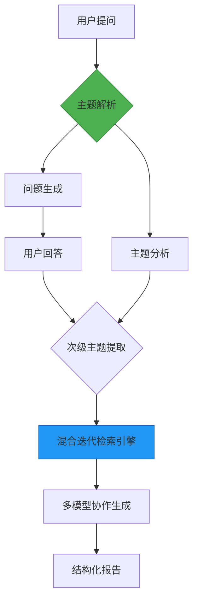

# Deep Researcher 工作流复现方案

## 📖 概述
本工作流基于Dify平台构建，复现了Deep Research的核心功能，通过整合多源检索（本地知识库+网络搜索）与多模型协作，可在5分钟内生成万字级结构化研究报告。系统采用模块化设计，支持灵活替换底层模型与数据源。

## ✨ 核心功能
- **智能主题解析**  
  使用Gemini 2.0 Flash模型进行多层级主题拆解，支持4个维度深度分析
- **混合检索引擎**  
  `本地知识库 + 维基百科/Google/Bing API` 多通道检索
- **动态节奏控制**  
  采用2>1模型级联架构，通过条件分支和对话轮次标记实现处理节奏优化
- **高效报告生成**  
  集成deepseek-r1-distill等模型实现段落级内容生成，支持Markdown结构化输出

## 🛠️ 技术架构

## ⚠️ 注意事项
性能优化建议

工作流原则上支持任何模型，使用本地模型请求压力较大时可能会触发LLM节点的`Timepouterror`可以考虑切换线上API服务或是在Dify配置文件中修改timeout时间。

若为Google免费API用户可以插入本地模型节点对RPM进行限流（Google默认限流为15RPM，若短时间请求过多会报错）

## To Do List
·优化处理流程逻辑，平衡RPM与处理时间的矛盾

·修复回答中偶尔出现多个副标题的问题

·大规模重构工作流，对于用户的问题复杂度进行自适应问答

## Licences
LGPL3.0 Licence
