# Deep Researcher 工作流复现方案

## 📖 概述
本工作流基于Dify平台构建，复现了Deep Research的核心功能，通过整合多源检索（本地知识库+网络搜索）与多模型协作，可在5分钟内生成万字级结构化研究报告。系统采用模块化设计，支持灵活替换底层模型与数据源。

## ✨ 核心功能
- **智能主题解析**  
  使用Gemini 2.0 Flash模型进行多层级主题拆解，支持4个维度深度分析
- **混合检索引擎**  
  `本地知识库 + 维基百科/Google/Bing API` 多通道检索
- **动态节奏控制**  
  采用2>1模型级联架构，通过条件分支和对话轮次标记实现处理节奏优化
- **高效报告生成**  
  集成deepseek-r1-distill等模型实现段落级内容生成，支持Markdown结构化输出

## 🛠️ 技术架构

```mermaid
graph TD
    A[用户提问] --> B{主题解析}
    B --> F[大模型生成问题]
    F --> H[用户回答]
    H --> C
    B --> I[分析主题]
    I --> C{次级主题提取}
    C --> D[混合迭代检索引擎]
    D --> E[多模型协作生成]
    E --> G[结构化报告]
    
    style B fill:#4CAF50,stroke:#388E3C
    style D fill:#2196F3,stroke:#1565C0
```

